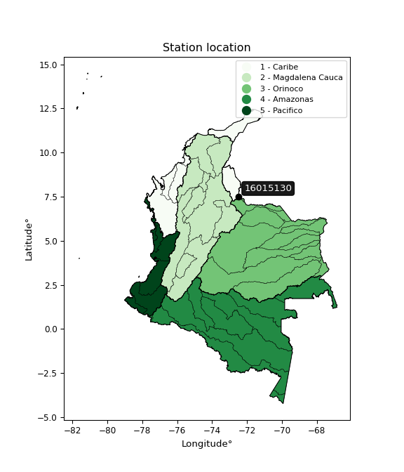

<div align="center">


</div>

# PMP Station (Rain, Pmax24h): 16015130

Probable Maximum Precipitation (PMP) is the greatest amount of rainfall for a specific duration that is meteorologically possible for a given location, acting as a "worst-case" scenario for extreme storms, crucial for designing safety-critical infrastructure like bridges, river deviations, dams, spillways, and nuclear plants to prevent catastrophic failure. PMP is calculated by hydrologists using meteorological data to determine the upper limit of extreme rainfall, often leading to the Probable Maximum Flood (PMF) for flood control design, and is increasingly being studied for climate change impacts.

<div align="center">

</img>

</div>


## A. General information


### 1. General running parameters

• app_version: _v20260103_. • runtime: _2026-01-03 07:24:50.581521_. • Python version: _3.14.0_. • SciPy version: _1.16.3_. • Pandas version: _2.3.3_. • NumPy version: _2.3.5_. • Stations dataset (station_dataset_file): _dataset/pmax24h_in/automatic_colombia_2003_2024.csv_. • Stations catalog (station_catalog_file): _dataset/CNE.xls_. • Minimum year to eval til year_max (date_min): _1900_. • Maximum year to eval since year_min (date_max): _2024_. • Creates, save and include plots into reports (create_plot): _False_. • Plot only fit distributions with Δo > Δ (plot_only_fit): _True_. • Eval low extreme values, if False, evaluates high extreme values (low_extreme): _False_. • Eval every SciPy distribution as logarithmic (pdist_logarithmic_on): _True_. • Standard deviation normalized (ddof): _1.0_. • Return periods to eval in years (Tr): _[2, 2.33, 5, 10, 15, 20, 25, 50, 75, 100, 200, 250, 500, 750, 1000]_. • Minimum data sample per station, 0 means any (minimum_sample): _5_. • Z-Score maximum threshold to adjust a value, 0 means disable (zscore_max): _3.5_. • Z-Score minimum threshold to adjust a value, 0 means disable (zscore_min): _-2.5_. • Avoid zeros, e.g. rain = 0 (avoid_zeros): _True_. • Avoid null values (avoid_nans): _True_. [:file_folder:Dataset file.](../../dataset/pmax24h_in/automatic_colombia_2003_2024.csv)

> Delta Degrees of Freedom (DDOF): is a parameter used in the formulas for calculating variance and standard deviation. When ddof=0, the divisor is $N$ (the total number of observations) and this is used when your data set is the entire population. When ddof=1, the divisor is $N-1$ and this is used when your data set is a sample drawn from a larger population. Using $N-1$ provides an unbiased estimate of the population variance (known as Bessel´s correction).


### 2. Station info and location

|   id |   CODIGO | NOMBRE                               | CATEGORIA               | TECNOLOGIA                | ESTADO           | FECHA_INSTALACION   |   FECHA_SUSPENSION |   ALTITUD |   LATITUD |   LONGITUD | DEPARTAMENTO       | MUNICIPIO   | AREA_OPERATIVA                         | ENTIDAD                                                     | AREA_HIDROGRAFICA   | ZONA_HIDROGRAFICA   | SUBZONA_HIDROGRAFICA   |   CORRIENTE | Catalogo   |   Version |
|-----:|---------:|:-------------------------------------|:------------------------|:--------------------------|:-----------------|:--------------------|-------------------:|----------:|----------:|-----------:|:-------------------|:------------|:---------------------------------------|:------------------------------------------------------------|:--------------------|:--------------------|:-----------------------|------------:|:-----------|----------:|
|    0 | 16015130 | ALCALDIA DE HERRAN  - AUT [16015130] | Climatológica Principal | Automática con Telemetría | En Mantenimiento | 19/08/2005          |                nan |       240 |   7.50672 |   -72.4854 | Norte De Santander | Herrán      | Area Operativa 08 - Santanderes-Arauca | INSTITUTO DE HIDROLOGIA METEOROLOGIA Y ESTUDIOS AMBIENTALES | Caribe              | Catatumbo           | Río Pamplonita         |         nan | CNE_IDEAM  |  20251226 |

<div align="center">

Dynamic map: [:earth_americas:Google](http://maps.google.com/maps?q=7.506722222,-72.48536111) [:earth_americas:OSM](https://www.openstreetmap.org/#map=18/7.506722222/-72.48536111&layers=P) [:earth_americas:Bing](https://www.bing.com/maps?cp=7.506722222~-72.48536111&lvl=18) [:earth_americas:Apple](https://maps.apple.com/frame?center=7.506722222%2C-72.48536111&span=0.003%2C0.006)

</div>


<div align="center">

```geojson
{
  "type": "Feature",
  "geometry": {
    "type": "Point", 
    "coordinates": [-72.48536111, 7.506722222]
  }, 
  "properties": {
    "Name": "16015130"
  }
}
```

</div>


### 3. Discrete values table and plot

<div align="center">

|               |          0 |           1 |          2 |          3 |          4 |           5 |          6 |           7 |          8 |           9 |          10 |          11 |         12 |          13 |          14 |          15 |           16 |         17 |
|:--------------|-----------:|------------:|-----------:|-----------:|-----------:|------------:|-----------:|------------:|-----------:|------------:|------------:|------------:|-----------:|------------:|------------:|------------:|-------------:|-----------:|
| Date          | 2006       | 2007        | 2008       | 2009       | 2010       | 2011        | 2012       | 2013        | 2014       | 2015        | 2016        | 2017        | 2018       | 2019        | 2020        | 2021        | 2022         | 2023       |
| Value         |    6.9     |   48.2      |   10.2     |   60.4     |   59.3     |   43.7      |   12.4     |   53.9      |   24.8     |   33.3      |   41.2      |   40.6      |   69.8     |   44.9      |   19.7      |   42.2      |   36.7       |    0.1     |
| Value_initial |    6.9     |   48.2      |   10.2     |   60.4     |   59.3     |   43.7      |   12.4     |   53.9      |   24.8     |   33.3      |   41.2      |   40.6      |   69.8     |   44.9      |   19.7      |   42.2      |   36.7       |    0.1     |
| count         |   18       |   18        |   18       |   18       |   18       |   18        |   18       |   18        |   18       |   18        |   18        |   18        |   18       |   18        |   18        |   18        |   18         |   18       |
| mean          |   36.0167  |   36.0167   |   36.0167  |   36.0167  |   36.0167  |   36.0167   |   36.0167  |   36.0167   |   36.0167  |   36.0167   |   36.0167   |   36.0167   |   36.0167  |   36.0167   |   36.0167   |   36.0167   |   36.0167    |   36.0167  |
| std           |   19.9001  |   19.9001   |   19.9001  |   19.9001  |   19.9001  |   19.9001   |   19.9001  |   19.9001   |   19.9001  |   19.9001   |   19.9001   |   19.9001   |   19.9001  |   19.9001   |   19.9001   |   19.9001   |   19.9001    |   19.9001  |
| zscore        |   -1.46315 |    0.612226 |   -1.29732 |    1.22529 |    1.17001 |    0.386096 |   -1.18676 |    0.898658 |   -0.56365 |   -0.136516 |    0.260468 |    0.230318 |    1.69765 |    0.446397 |   -0.819931 |    0.310719 |    0.0343383 |   -1.80485 |


</div>


> The initial value (value_initial) correspond to the initial obtained or null completed value, and value (value) is adjusted only when the initial value is outside the valid range definite through the Z-Score value. If Z-Score is active, values out of range or outliers are replaced with the station mean value


### 4. Active continuous probability distributions from SciPy (44 of 104 available)

A Probability Density Function (PDF) describes the relative likelihood of a continuous random variable falling within a specific range, where the total area under its curve equals 1, and the area over any interval gives the actual probability for that range. Unlike discrete probabilities (like rolling a die), a PDF shows density, not direct probability for a single point (which is zero), with higher points indicating higher likelihood, often visualized as a bell curve for normal distributions.

A log of a probability density function (log-PDF) is simply the logarithm of the PDF´s value, denoted as $log(f(x))$, useful for converting multiplication of probabilities into addition, improving numerical stability with tiny numbers, and connecting to information theory concepts like entropy. Instead of dealing with very small probabilities (e.g., 0.000001), log-PDFs use negative numbers (e.g., $log(0.00001) ≈ -11.51$ that are easier for computers to handle, preventing underflow errors and simplifying complex calculations. In this study, each active probability distribution from SciPy is also evaluated in the $log$ form.

[scipy.stats](https://docs.scipy.org/doc/scipy/reference/stats.html) is a Python´s powerful submodule within the SciPy library for comprehensive statistical analysis, offering over 130 probability distributions (like Normal, Poisson), functions for descriptive stats (mean, variance), hypothesis testing (t-tests, chi-square), random variable generation, and statistical tests, making it essential for data science, modeling, and research. It provides tools to explore, model, and draw conclusions from data efficiently, working seamlessly with NumPy.

<div align="center">

|   id | p_dist             |   n_parameter | fit_method   | label                                                                       | active   | ref                                                                                                        |
|-----:|:-------------------|--------------:|:-------------|:----------------------------------------------------------------------------|:---------|:-----------------------------------------------------------------------------------------------------------|
|    0 | alpha              |             3 | MLE          | Alpha                                                                       | True     | [:mortar_board:](https://docs.scipy.org/doc/scipy/reference/generated/scipy.stats.alpha.html)              |
|    1 | betaprime          |             4 | MLE          | Beta prime                                                                  | True     | [:mortar_board:](https://docs.scipy.org/doc/scipy/reference/generated/scipy.stats.betaprime.html)          |
|    2 | chi2               |             3 | MLE          | Chi²                                                                        | True     | [:mortar_board:](https://docs.scipy.org/doc/scipy/reference/generated/scipy.stats.chi2.html)               |
|    3 | crystalball        |             4 | MLE          | Crystalball                                                                 | True     | [:mortar_board:](https://docs.scipy.org/doc/scipy/reference/generated/scipy.stats.crystalball.html)        |
|    4 | erlang             |             3 | MLE          | Erlang                                                                      | True     | [:mortar_board:](https://docs.scipy.org/doc/scipy/reference/generated/scipy.stats.erlang.html)             |
|    5 | expon              |             2 | MLE          | Exponential                                                                 | True     | [:mortar_board:](https://docs.scipy.org/doc/scipy/reference/generated/scipy.stats.expon.html)              |
|    6 | exponnorm          |             3 | MLE          | Exponentially modified Normal                                               | True     | [:mortar_board:](https://docs.scipy.org/doc/scipy/reference/generated/scipy.stats.exponnorm.html)          |
|    7 | f                  |             4 | MLE          | F                                                                           | True     | [:mortar_board:](https://docs.scipy.org/doc/scipy/reference/generated/scipy.stats.f.html)                  |
|    8 | fatiguelife        |             3 | MLE          | Fatigue-life (Birnbaum-Saunders)                                            | True     | [:mortar_board:](https://docs.scipy.org/doc/scipy/reference/generated/scipy.stats.fatiguelife.html)        |
|    9 | fisk               |             3 | MLE          | Fisk                                                                        | True     | [:mortar_board:](https://docs.scipy.org/doc/scipy/reference/generated/scipy.stats.fisk.html)               |
|   10 | gamma              |             3 | MLE          | Gamma                                                                       | True     | [:mortar_board:](https://docs.scipy.org/doc/scipy/reference/generated/scipy.stats.gamma.html)              |
|   11 | genexpon           |             5 | MLE          | Generalized exponential                                                     | True     | [:mortar_board:](https://docs.scipy.org/doc/scipy/reference/generated/scipy.stats.genexpon.html)           |
|   12 | genlogistic        |             3 | MLE          | Generalized logistic                                                        | True     | [:mortar_board:](https://docs.scipy.org/doc/scipy/reference/generated/scipy.stats.genlogistic.html)        |
|   13 | gibrat             |             2 | MM           | Gibrat                                                                      | True     | [:mortar_board:](https://docs.scipy.org/doc/scipy/reference/generated/scipy.stats.gibrat.html)             |
|   14 | gompertz           |             3 | MLE          | Gompertz (or truncated Gumbel)                                              | True     | [:mortar_board:](https://docs.scipy.org/doc/scipy/reference/generated/scipy.stats.gompertz.html)           |
|   15 | gumbel_l           |             2 | MM           | Gumbel Left Skew                                                            | True     | [:mortar_board:](https://docs.scipy.org/doc/scipy/reference/generated/scipy.stats.gumbel_l.html)           |
|   16 | gumbel_r           |             2 | MM           | Gumbel Right Skew                                                           | True     | [:mortar_board:](https://docs.scipy.org/doc/scipy/reference/generated/scipy.stats.gumbel_r.html)           |
|   17 | halflogistic       |             2 | MM           | Half-logistic                                                               | True     | [:mortar_board:](https://docs.scipy.org/doc/scipy/reference/generated/scipy.stats.halflogistic.html)       |
|   18 | halfnorm           |             2 | MM           | Half Normal                                                                 | True     | [:mortar_board:](https://docs.scipy.org/doc/scipy/reference/generated/scipy.stats.halfnorm.html)           |
|   19 | hypsecant          |             2 | MM           | hyperbolic secant                                                           | True     | [:mortar_board:](https://docs.scipy.org/doc/scipy/reference/generated/scipy.stats.hypsecant.html)          |
|   20 | invgamma           |             3 | MLE          | Inverted gamma                                                              | True     | [:mortar_board:](https://docs.scipy.org/doc/scipy/reference/generated/scipy.stats.invgamma.html)           |
|   21 | invgauss           |             3 | MLE          | Inverse Gaussian                                                            | True     | [:mortar_board:](https://docs.scipy.org/doc/scipy/reference/generated/scipy.stats.invgauss.html)           |
|   22 | invweibull         |             3 | MLE          | Inverted Weibull                                                            | True     | [:mortar_board:](https://docs.scipy.org/doc/scipy/reference/generated/scipy.stats.invweibull.html)         |
|   23 | johnsonsu          |             4 | MLE          | Johnson Su                                                                  | True     | [:mortar_board:](https://docs.scipy.org/doc/scipy/reference/generated/scipy.stats.johnsonsu.html)          |
|   24 | kstwobign          |             2 | MLE          | Limiting distribution of scaled Kolmogorov-Smirnov two-sided test statistic | True     | [:mortar_board:](https://docs.scipy.org/doc/scipy/reference/generated/scipy.stats.kstwobign.html)          |
|   25 | laplace            |             2 | MM           | Laplace                                                                     | True     | [:mortar_board:](https://docs.scipy.org/doc/scipy/reference/generated/scipy.stats.laplace.html)            |
|   26 | laplace_asymmetric |             3 | MLE          | Asymmetric Laplace                                                          | True     | [:mortar_board:](https://docs.scipy.org/doc/scipy/reference/generated/scipy.stats.laplace_asymmetric.html) |
|   27 | loggamma           |             3 | MLE          | Log gamma                                                                   | True     | [:mortar_board:](https://docs.scipy.org/doc/scipy/reference/generated/scipy.stats.loggamma.html)           |
|   28 | logistic           |             2 | MM           | Logistic (or Sech-squared)                                                  | True     | [:mortar_board:](https://docs.scipy.org/doc/scipy/reference/generated/scipy.stats.logistic.html)           |
|   29 | lognorm            |             3 | MLE          | Log Normal                                                                  | True     | [:mortar_board:](https://docs.scipy.org/doc/scipy/reference/generated/scipy.stats.lognorm.html)            |
|   30 | maxwell            |             2 | MM           | Maxwell                                                                     | True     | [:mortar_board:](https://docs.scipy.org/doc/scipy/reference/generated/scipy.stats.maxwell.html)            |
|   31 | mielke             |             4 | MLE          | Mielke Beta-Kappa / Dagum                                                   | True     | [:mortar_board:](https://docs.scipy.org/doc/scipy/reference/generated/scipy.stats.mielke.html)             |
|   32 | moyal              |             2 | MM           | Moyal                                                                       | True     | [:mortar_board:](https://docs.scipy.org/doc/scipy/reference/generated/scipy.stats.moyal.html)              |
|   33 | nakagami           |             3 | MLE          | Nakagami                                                                    | True     | [:mortar_board:](https://docs.scipy.org/doc/scipy/reference/generated/scipy.stats.nakagami.html)           |
|   34 | ncf                |             5 | MLE          | Non-central F distribution                                                  | True     | [:mortar_board:](https://docs.scipy.org/doc/scipy/reference/generated/scipy.stats.ncf.html)                |
|   35 | nct                |             4 | MLE          | Non-central Student’s t                                                     | True     | [:mortar_board:](https://docs.scipy.org/doc/scipy/reference/generated/scipy.stats.nct.html)                |
|   36 | norm               |             2 | MM           | Normal                                                                      | True     | [:mortar_board:](https://docs.scipy.org/doc/scipy/reference/generated/scipy.stats.norm.html)               |
|   37 | pearson3           |             3 | MM           | Pearson type III                                                            | True     | [:mortar_board:](https://docs.scipy.org/doc/scipy/reference/generated/scipy.stats.pearson3.html)           |
|   38 | rayleigh           |             2 | MM           | Rayleigh                                                                    | True     | [:mortar_board:](https://docs.scipy.org/doc/scipy/reference/generated/scipy.stats.rayleigh.html)           |
|   39 | rice               |             3 | MLE          | Rice                                                                        | True     | [:mortar_board:](https://docs.scipy.org/doc/scipy/reference/generated/scipy.stats.rice.html)               |
|   40 | t                  |             3 | MLE          | Student’s t                                                                 | True     | [:mortar_board:](https://docs.scipy.org/doc/scipy/reference/generated/scipy.stats.t.html)                  |
|   41 | truncnorm          |             4 | MLE          | Truncated normal                                                            | True     | [:mortar_board:](https://docs.scipy.org/doc/scipy/reference/generated/scipy.stats.truncnorm.html)          |
|   42 | wald               |             2 | MM           | Wald                                                                        | True     | [:mortar_board:](https://docs.scipy.org/doc/scipy/reference/generated/scipy.stats.wald.html)               |
|   43 | weibull_min        |             3 | MLE          | Weibull minimum                                                             | True     | [:mortar_board:](https://docs.scipy.org/doc/scipy/reference/generated/scipy.stats.weibull_min.html)        |

</div>

> **n_parameter:** # arguments & localization & scale.
>
> **Fit methods:** (MLE) maximum likelihood, (MM) L-moments.
>
>**Inactive** (With the only purpose of prevent loops, zero divisions, infinite values, over high estimated values or horizontal trending for recurrence intervals estimations, the follow distributions were disabled.)**:** foldnorm, gennorm, norminvgauss, powernorm, powerlognorm, skewnorm, genextreme, anglit, arcsine, argus, beta, bradford, burr, burr12, cauchy, cosine, halfcauchy, foldcauchy, skewcauchy, wrapcauchy, dgamma, gengamma, exponweib, exponpow, truncexpon, gausshyper, genhalflogistic, genhyperbolic, geninvgauss, halfgennorm, johnsonsb, kappa4, kappa3, ksone, kstwo, loglaplace, levy, levy_l, levy_stable, ncx2, pareto, genpareto, truncpareto, lomax, powerlaw, rdist, rel_breitwigner, recipinvgauss, semicircular, studentized_range, trapezoid, triang, truncweibull_min, tukeylambda, uniform, loguniform, vonmises, vonmises_line, weibull_max, dweibull, 


## B. Probability distributions vs. Empirical distributions

A continuous probability distribution (CPD) describes probabilities for variables that can take any value within a range (like rain any time), unlike discrete variables with specific outcomes (like temperature). It uses a Probability Density Function (PDF), a curve where the total area under it equals 1, and the probability of the variable falling within an interval (a to b) is found by calculating the area under the curve between those points. A key feature is that the probability of hitting any single exact value is zero, so probabilities are always expressed for ranges, e.g., $P(a ≤ X ≤ b)$.

<div align="center">

Distributions parameters from station values
|    |   station | p_dist                |   n |              loc |           scale | shape                  | shape1                 | shape2                | shape3   |
|---:|----------:|:----------------------|----:|-----------------:|----------------:|:-----------------------|:-----------------------|:----------------------|:---------|
|  0 |  16015130 | alpha                 |  18 |   -187.635       |  2473.77        | 11.188599887240574     |                        |                       |          |
|  1 |  16015130 | betaprime             |  18 |   -464.664       | 56389.5         | 665.4202459143853      | 74959.57829413732      |                       |          |
|  2 |  16015130 | chi2                  |  18 |   -114.859       |     1.29969     | 116.00997949654777     |                        |                       |          |
|  3 |  16015130 | crystalball           |  18 |     36.0167      |    19.3394      | 4036.9031462849716     | 48.53233529053372      |                       |          |
|  4 |  16015130 | erlang                |  18 |   -307.153       |     1.12649     | 304.60824283237037     |                        |                       |          |
|  5 |  16015130 | expon                 |  18 |      0.1         |    35.9167      |                        |                        |                       |          |
|  6 |  16015130 | exponnorm             |  18 |     36.0004      |    19.3394      | 0.0008425375601113967  |                        |                       |          |
|  7 |  16015130 | f                     |  18 |  -4040.21        |  4076.21        | 97873.61882305585      | 924910.566279144       |                       |          |
|  8 |  16015130 | fatiguelife           |  18 |  -1225.74        |  1261.61        | 0.015269218303266843   |                        |                       |          |
|  9 |  16015130 | fisk                  |  18 |     -1.06377e+09 |     1.06377e+09 | 92916230.71687174      |                        |                       |          |
| 10 |  16015130 | gamma                 |  18 |   -316.859       |     1.09179     | 323.1678654530988      |                        |                       |          |
| 11 |  16015130 | genexpon              |  18 |      0.0999674   |     2.25938     | 0.06287620110190328    | 2.4711299309451506e-07 | 1.8153091248501223    |          |
| 12 |  16015130 | genlogistic           |  18 |     48.6103      |     7.85721     | 0.4615275874117256     |                        |                       |          |
| 13 |  16015130 | gibrat                |  18 |     21.2631      |     8.94846     |                        |                        |                       |          |
| 14 |  16015130 | gompertz              |  18 |      6.9         |    19.6183      | 0.16303958743189556    |                        |                       |          |
| 15 |  16015130 | gumbel_l              |  18 |     44.7204      |    15.0788      |                        |                        |                       |          |
| 16 |  16015130 | gumbel_r              |  18 |     27.3129      |    15.0788      |                        |                        |                       |          |
| 17 |  16015130 | halflogistic          |  18 |     13.095       |    16.5345      |                        |                        |                       |          |
| 18 |  16015130 | halfnorm              |  18 |     10.4189      |    32.082       |                        |                        |                       |          |
| 19 |  16015130 | hypsecant             |  18 |     36.0167      |    12.3118      |                        |                        |                       |          |
| 20 |  16015130 | invgamma              |  18 |   -182.462       | 25700.2         | 118.73489493953554     |                        |                       |          |
| 21 |  16015130 | invgauss              |  18 |    -86.3408      |  4478.49        | 0.027267993941340204   |                        |                       |          |
| 22 |  16015130 | invweibull            |  18 |     -2.13685e+06 |     2.13687e+06 | 113744.1300513103      |                        |                       |          |
| 23 |  16015130 | johnsonsu             |  18 |    127.239       |    45.635       | 7.498821557224616      | 5.2559588970033975     |                       |          |
| 24 |  16015130 | kstwobign             |  18 |    -39.7504      |    86.5416      |                        |                        |                       |          |
| 25 |  16015130 | laplace               |  18 |     36.0167      |    13.675       |                        |                        |                       |          |
| 26 |  16015130 | laplace_asymmetric    |  18 |     43.7         |    14.4515      | 1.3005875393807238     |                        |                       |          |
| 27 |  16015130 | loggamma              |  18 |    -23.3224      |    40.5703      | 4.807669031283523      |                        |                       |          |
| 28 |  16015130 | logistic              |  18 |     36.0167      |    10.6624      |                        |                        |                       |          |
| 29 |  16015130 | lognorm               |  18 |     -1.96335e+06 |     1.96338e+06 | 9.850035864386407e-06  |                        |                       |          |
| 30 |  16015130 | maxwell               |  18 |     -9.80953     |    28.7173      |                        |                        |                       |          |
| 31 |  16015130 | mielke                |  18 |      0.1         |    69.0686      | 0.9230977685646728     | 20.657989913564904     |                       |          |
| 32 |  16015130 | moyal                 |  18 |     24.9572      |     8.70578     |                        |                        |                       |          |
| 33 |  16015130 | nakagami              |  18 |  -2247.18        |  2283.3         | 3479.1464079808557     |                        |                       |          |
| 34 |  16015130 | ncf                   |  18 |      0.1         |     2.79588     | 0.6155343370481778     | 431.36675546491927     | 7.115583313896516     |          |
| 35 |  16015130 | nct                   |  18 |  -1159.95        |    19.2923      | 348050.07607672707     | 61.991714756581736     |                       |          |
| 36 |  16015130 | norm                  |  18 |     36.0167      |    19.3394      |                        |                        |                       |          |
| 37 |  16015130 | pearson3              |  18 |     36.0167      |    19.3394      | -0.24840149699221498   |                        |                       |          |
| 38 |  16015130 | rayleigh              |  18 |     -0.980685    |    29.5196      |                        |                        |                       |          |
| 39 |  16015130 | rice                  |  18 |     -7.79649     |    21.7651      | 1.685737255996476      |                        |                       |          |
| 40 |  16015130 | t                     |  18 |     36.0184      |    19.3387      | 11336952.166843157     |                        |                       |          |
| 41 |  16015130 | truncnorm             |  18 |     35.8324      |    32.0882      | -1.1400280259324755    | 1.058570081270166      |                       |          |
| 42 |  16015130 | wald                  |  18 |     16.6773      |    19.3393      |                        |                        |                       |          |
| 43 |  16015130 | weibull_min           |  18 |    -38.1287      |    81.4789      | 4.4864306741335005     |                        |                       |          |
| 44 |  16015130 | logalpha              |  18 |    -45.3592      |  1463.57        | 30.196796772112897     |                        |                       |          |
| 45 |  16015130 | logbetaprime          |  18 |    -20.0602      |     5.85833e+06 | 191.31094818277484     | 48259407.244708285     |                       |          |
| 46 |  16015130 | logchi2               |  18 |     -2.30259     |     1.40564     | 0.954094926592128      |                        |                       |          |
| 47 |  16015130 | logcrystalball        |  18 |      4.08358     |     0.112212    | 0.10620352601504657    | 584.0525894809768      |                       |          |
| 48 |  16015130 | logerlang             |  18 |     -2.30259     |   109.983       | 0.18397047858906246    |                        |                       |          |
| 49 |  16015130 | logexpon              |  18 |     -2.30259     |     5.45853     |                        |                        |                       |          |
| 50 |  16015130 | logexponnorm          |  18 |      3.1551      |     1.46567     | 0.0005699418260474042  |                        |                       |          |
| 51 |  16015130 | logf                  |  18 |     -2.30259     |     1.13107     | 1.0570438845592138     | 1.0408378850309496     |                       |          |
| 52 |  16015130 | logfatiguelife        |  18 |  -1591.73        |  1594.88        | 0.0009196415459292312  |                        |                       |          |
| 53 |  16015130 | logfisk               |  18 |     -2.30259     |     2.29292     | 0.8160809542366647     |                        |                       |          |
| 54 |  16015130 | loggamma              |  18 |    -18.9519      |     0.126809    | 174.13543204493857     |                        |                       |          |
| 55 |  16015130 | loggenexpon           |  18 |     -2.9132      |     0.233921    | 3.423667099597624e-08  | 4.967851321334687      | 0.0005671025470597487 |          |
| 56 |  16015130 | loggenlogistic        |  18 |      4.24566     |     2.11498e-06 | 1.9450754323169056e-06 |                        |                       |          |
| 57 |  16015130 | loggibrat             |  18 |      2.0378      |     0.678183    |                        |                        |                       |          |
| 58 |  16015130 | loggompertz           |  18 |     -2.33003     |     0.681921    | 0.00015459189264555094 |                        |                       |          |
| 59 |  16015130 | loggumbel_l           |  18 |      3.81557     |     1.14278     |                        |                        |                       |          |
| 60 |  16015130 | loggumbel_r           |  18 |      2.49631     |     1.14278     |                        |                        |                       |          |
| 61 |  16015130 | loghalflogistic       |  18 |      1.41874     |     1.25312     |                        |                        |                       |          |
| 62 |  16015130 | loghalfnorm           |  18 |      1.21599     |     2.43137     |                        |                        |                       |          |
| 63 |  16015130 | loghypsecant          |  18 |      3.15594     |     0.933074    |                        |                        |                       |          |
| 64 |  16015130 | loginvgamma           |  18 |    -45.1744      | 45636.3         | 945.0483732957509      |                        |                       |          |
| 65 |  16015130 | loginvgauss           |  18 |    -14.3455      |  1626.59        | 0.010704131347863514   |                        |                       |          |
| 66 |  16015130 | loginvweibull         |  18 | -32668.9         | 32671.3         | 14331.004618323179     |                        |                       |          |
| 67 |  16015130 | logjohnsonsu          |  18 |      4.32406     |     0.00535132  | 5.669003164168764      | 1.0161741575759684     |                       |          |
| 68 |  16015130 | logkstwobign          |  18 |     -6.59854     |    11.297       |                        |                        |                       |          |
| 69 |  16015130 | loglaplace            |  18 |      3.15594     |     1.03639     |                        |                        |                       |          |
| 70 |  16015130 | loglaplace_asymmetric |  18 |      4.10099     |     0.315342    | 3.2999359755523647     |                        |                       |          |
| 71 |  16015130 | logloggamma           |  18 |      4.24564     |     6.5265e-07  | 5.999516226765e-07     |                        |                       |          |
| 72 |  16015130 | loglogistic           |  18 |      3.15594     |     0.808066    |                        |                        |                       |          |
| 73 |  16015130 | loglognorm            |  18 |  -1516.05        |  1519.2         | 0.0009596009845154428  |                        |                       |          |
| 74 |  16015130 | logmaxwell            |  18 |     -0.317133    |     2.17642     |                        |                        |                       |          |
| 75 |  16015130 | logmielke             |  18 |     -4.98493e+08 |     4.98493e+08 | 641280632.0879478      | 854329796.4129968      |                       |          |
| 76 |  16015130 | logmoyal              |  18 |      2.31778     |     0.659783    |                        |                        |                       |          |
| 77 |  16015130 | lognakagami           |  18 |  -1920.11        |  1923.27        | 431757.03805223503     |                        |                       |          |
| 78 |  16015130 | logncf                |  18 |     -2.30259     |     1.04057     | 1.022354992543565      | 1.1359418059105115     | 1.075202087638163     |          |
| 79 |  16015130 | lognct                |  18 |    -99.8771      |     1.44222     | 65857.08313390973      | 71.43955190657684      |                       |          |
| 80 |  16015130 | lognorm               |  18 |      3.15594     |     1.46567     |                        |                        |                       |          |
| 81 |  16015130 | logpearson3           |  18 |      3.15594     |     1.46566     | -2.827591907636303     |                        |                       |          |
| 82 |  16015130 | lograyleigh           |  18 |      0.352027    |     2.2372      |                        |                        |                       |          |
| 83 |  16015130 | logrice               |  18 |   -202.278       |     1.46569     | 140.15821098247858     |                        |                       |          |
| 84 |  16015130 | logt                  |  18 |      3.75461     |     0.254724    | 0.9315601623486991     |                        |                       |          |
| 85 |  16015130 | logtruncnorm          |  18 |      2.17798     |     6.98364     | -0.6415816576887865    | 0.2960726064816195     |                       |          |
| 86 |  16015130 | logwald               |  18 |      1.69022     |     1.46571     |                        |                        |                       |          |
| 87 |  16015130 | logweibull_min        |  18 |     -2.30259     |     1.49622     | 0.5421075252610545     |                        |                       |          |

</div>

> **loc** (Location parameter): This shifts the distribution along the x-axis. For many common distributions, like the normal (Gaussian) distribution, loc represents the mean $μ$. For others, like the uniform distribution, it might represent the minimum value, or for the beta distribution, the left end of the support interval.
>
> **scale** (Scale parameter): This determines the width or spread of the distribution. For the normal distribution, scale represents the standard deviation $σ$. For a uniform distribution, it defines the length of the interval (from $loc$ to $loc + scale$).
>
> **shape** (Shape parameters): Refers to parameters that define the specific form of a probability distribution, distinct from its location (loc) and scale (scale). These parameters are required arguments for most distribution functions. For example, a normal (Gaussian) distribution is fully defined by its location (mean) and scale (standard deviation), so it has no specific shape parameters beyond loc and scale. However, other distributions have intrinsic properties that need specification, as Gamma distribution that takes a shape parameter, often named $a$ or $alpha$.


### 0. Cumulative distribution values - CDF (88 evaluated)

Cumulative Distribution Function (CDF), denoted as $F$<sub>$X$</sub>$(x)$, is a function that gives the probability that a random variable $X$ will take a value less than or equal to a specific value, $x$ (i.e., $(P(X≥x)$. It essentially "accumulates" probabilities from a given point up to the far right (positive infinity), providing a complete picture of the distribution´s probabilities for both discrete (like rain) and continuous (like temperature) variables, helping to find probabilities over ranges or above certain values. Each station is evaluated separately ordering the $x$ values ascending, calculating the CDF and PDF values for the activated distributions and their logarithmic forms.

<div align="center">

CDF ordered by x ascending and calculating $log(f(x))$ separately
|   id |   Station |   date |    x |   count |    mean |     std |     zscore |   Value_initial |   station |   m |     alpha |   alpha_pdf |   betaprime |   betaprime_pdf |      chi2 |   chi2_pdf |   crystalball |   crystalball_pdf |    erlang |   erlang_pdf |    expon |   expon_pdf |   exponnorm |   exponnorm_pdf |         f |      f_pdf |   fatiguelife |   fatiguelife_pdf |      fisk |   fisk_pdf |     gamma |   gamma_pdf |    genexpon |   genexpon_pdf |   genlogistic |   genlogistic_pdf |   gibrat |   gibrat_pdf |    gompertz |   gompertz_pdf |   gumbel_l |   gumbel_l_pdf |   gumbel_r |   gumbel_r_pdf |   halflogistic |   halflogistic_pdf |   halfnorm |   halfnorm_pdf |   hypsecant |   hypsecant_pdf |   invgamma |   invgamma_pdf |   invgauss |   invgauss_pdf |   invweibull |   invweibull_pdf |   johnsonsu |   johnsonsu_pdf |   kstwobign |   kstwobign_pdf |   laplace |   laplace_pdf |   laplace_asymmetric |   laplace_asymmetric_pdf |    loggamma |   loggamma_pdf |   logistic |   logistic_pdf |     lognorm |   lognorm_pdf |   maxwell |   maxwell_pdf |     mielke |   mielke_pdf |       moyal |   moyal_pdf |   nakagami |   nakagami_pdf |         ncf |    ncf_pdf |       nct |    nct_pdf |      norm |   norm_pdf |   pearson3 |   pearson3_pdf |    rayleigh |   rayleigh_pdf |      rice |   rice_pdf |         t |      t_pdf |   truncnorm |   truncnorm_pdf |      wald |   wald_pdf |   weibull_min |   weibull_min_pdf |    logalpha |   logalpha_pdf |   logbetaprime |   logbetaprime_pdf |     logchi2 |   logchi2_pdf |   logcrystalball |   logcrystalball_pdf |   logerlang |   logerlang_pdf |   logexpon |   logexpon_pdf |   logexponnorm |   logexponnorm_pdf |        logf |    logf_pdf |   logfatiguelife |   logfatiguelife_pdf |     logfisk |   logfisk_pdf |   loggenexpon |   loggenexpon_pdf |   loggenlogistic |   loggenlogistic_pdf |   loggibrat |   loggibrat_pdf |   loggompertz |   loggompertz_pdf |   loggumbel_l |   loggumbel_l_pdf |   loggumbel_r |   loggumbel_r_pdf |   loghalflogistic |   loghalflogistic_pdf |   loghalfnorm |   loghalfnorm_pdf |   loghypsecant |   loghypsecant_pdf |   loginvgamma |   loginvgamma_pdf |   loginvgauss |   loginvgauss_pdf |   loginvweibull |   loginvweibull_pdf |   logjohnsonsu |   logjohnsonsu_pdf |   logkstwobign |   logkstwobign_pdf |   loglaplace |   loglaplace_pdf |   loglaplace_asymmetric |   loglaplace_asymmetric_pdf |   logloggamma |   logloggamma_pdf |   loglogistic |   loglogistic_pdf |   loglognorm |   loglognorm_pdf |   logmaxwell |   logmaxwell_pdf |   logmielke |   logmielke_pdf |     logmoyal |   logmoyal_pdf |   lognakagami |   lognakagami_pdf |     logncf |   logncf_pdf |      lognct |   lognct_pdf |   logpearson3 |   logpearson3_pdf |   lograyleigh |   lograyleigh_pdf |    logrice |   logrice_pdf |      logt |   logt_pdf |   logtruncnorm |   logtruncnorm_pdf |   logwald |   logwald_pdf |   logweibull_min |   logweibull_min_pdf |
|-----:|----------:|-------:|-----:|--------:|--------:|--------:|-----------:|----------------:|----------:|----:|----------:|------------:|------------:|----------------:|----------:|-----------:|--------------:|------------------:|----------:|-------------:|---------:|------------:|------------:|----------------:|----------:|-----------:|--------------:|------------------:|----------:|-----------:|----------:|------------:|------------:|---------------:|--------------:|------------------:|---------:|-------------:|------------:|---------------:|-----------:|---------------:|-----------:|---------------:|---------------:|-------------------:|-----------:|---------------:|------------:|----------------:|-----------:|---------------:|-----------:|---------------:|-------------:|-----------------:|------------:|----------------:|------------:|----------------:|----------:|--------------:|---------------------:|-------------------------:|------------:|---------------:|-----------:|---------------:|------------:|--------------:|----------:|--------------:|-----------:|-------------:|------------:|------------:|-----------:|---------------:|------------:|-----------:|----------:|-----------:|----------:|-----------:|-----------:|---------------:|------------:|---------------:|----------:|-----------:|----------:|-----------:|------------:|----------------:|----------:|-----------:|--------------:|------------------:|------------:|---------------:|---------------:|-------------------:|------------:|--------------:|-----------------:|---------------------:|------------:|----------------:|-----------:|---------------:|---------------:|-------------------:|------------:|------------:|-----------------:|---------------------:|------------:|--------------:|--------------:|------------------:|-----------------:|---------------------:|------------:|----------------:|--------------:|------------------:|--------------:|------------------:|--------------:|------------------:|------------------:|----------------------:|--------------:|------------------:|---------------:|-------------------:|--------------:|------------------:|--------------:|------------------:|----------------:|--------------------:|---------------:|-------------------:|---------------:|-------------------:|-------------:|-----------------:|------------------------:|----------------------------:|--------------:|------------------:|--------------:|------------------:|-------------:|-----------------:|-------------:|-----------------:|------------:|----------------:|-------------:|---------------:|--------------:|------------------:|-----------:|-------------:|------------:|-------------:|--------------:|------------------:|--------------:|------------------:|-----------:|--------------:|----------:|-----------:|---------------:|-------------------:|----------:|--------------:|-----------------:|---------------------:|
|    0 |  16015130 |   2023 |  0.1 |      18 | 36.0167 | 19.9001 | -1.80485   |             0.1 |  16015130 |   1 | 0.0233863 |  0.00387863 |   0.0307111 |      0.00374186 | 0.0266999 | 0.00374344 |     0.0316429 |        0.00367708 | 0.0304837 |   0.00377595 | 0        |  0.0278422  |   0.0316431 |      0.00367709 | 0.0316433 | 0.00369381 |     0.0298202 |        0.00361748 | 0.0385095 | 0.00323411 | 0.0304011 |  0.00376573 | 9.07083e-07 |     0.027829   |     0.0578198 |        0.00338924 | 0        |   0          | 0           |     0          |  0.0505416 |     0.00326565 | 0.00229231 |    0.000924015 |       0        |         0          |  0         |     0          |   0.0343963 |      0.00278833 |  0.0262092 |     0.00384323 |  0.021268  |     0.00363988 |    0.0183095 |       0.00389877 |   0.0453909 |      0.00371387 |   0.0161823 |      0.00431924 | 0.0361675 |    0.00264479 |            0.0617795 |               0.00328693 | 0.000205286 |    0.000561345 |  0.033293  |     0.00301852 | 9.79469e-05 |   0.000264867 | 0.0105459 |    0.00311715 | 6.6466e-15 |   0.202801   | 3.06225e-05 | 3.21631e-05 |  0.0314281 |     0.00367295 | 4.33711e-07 | 9.4298e+07 | 0.0316786 | 0.00368053 | 0.0316429 | 0.00367708 |  0.0382268 |     0.00374231 | 0.000669887 |     0.00123933 | 0.0161053 | 0.00413011 | 0.0316317 | 0.00367613 |  0.00768619 |      0.00918723 | 0         | 0          |     0.0329797 |        0.00380589 | 7.38235e-05 |    0.000234906 |    0.000209073 |        0.000563668 | 3.27098e-08 |   3.51374e+07 |       nan        |           nan        | 0.000683972 |     2.83345e+11 |   0        |      0.1832    |    9.79509e-05 |        0.000264877 | 4.67663e-09 | 5.56578e+06 |      9.99344e-05 |          0.000270646 | 1.50309e-13 |   276.216     |    0.00954769 |         0.031115  |         0        |           0.00222959 |    0        |       0         |   6.34982e-06 |       0.000236011 |    0.00471918 |        0.00411981 |   1.14296e-29 |       6.66517e-28 |          0        |              0        |      0        |          0        |     0.00183332 |          0.0019648 |    9.0821e-05 |       0.000269881 |   0.000202612 |       0.000627031 |     0.000384148 |          0.00132538 |      0.0115417 |         0.00463047 |      0.0012999 |          0.0048603 |   0.00257982 |       0.00248924 |              0.00194687 |                  0.00187089 |    0.00243091 |        0.00223463 |    0.00116363 |        0.00143834 |  8.92523e-05 |      0.000244891 |     0        |         0        | 0.000464893 |     0.000598035 | 3.72135e-241 |   3.10429e-238 |   9.54752e-05 |       0.000259211 | 5.3185e-09 |  6.12196e+06 | 9.96199e-05 |  0.000269358 |     0.0122985 |        0.00669896 |      0        |          0        | 9.7947e-05 |   0.000264867 | 0.0164279 | 0.00252377 |    8.44898e-07 |           0.130674 | 0         |      0        |      3.82306e-09 |          4.66688e+06 |
|    1 |  16015130 |   2006 |  6.9 |      18 | 36.0167 | 19.9001 | -1.46315   |             6.9 |  16015130 |   2 | 0.0632873 |  0.008118   |   0.0661008 |      0.00686075 | 0.0633192 | 0.00724256 |     0.0660896 |        0.00664133 | 0.0662809 |   0.00694659 | 0.172484 |  0.0230399  |   0.0660899 |      0.00664134 | 0.0662677 | 0.0066772  |     0.0641147 |        0.00666574 | 0.0676331 | 0.00550794 | 0.0661153 |  0.00693305 | 0.172411    |     0.0230311  |     0.0860941 |        0.00503221 | 0        |   0          | 1.04302e-08 |     0.00831057 |  0.0781904 |     0.00497721 | 0.0208188  |    0.00534578  |       0        |         0          |  0         |     0          |   0.0596388 |      0.00481574 |  0.064217  |     0.00755917 |  0.0590823 |     0.00774121 |    0.0617002 |       0.00914827 |   0.0777683 |      0.00594253 |   0.066616  |      0.0106976  | 0.0594668 |    0.00434858 |            0.0887089 |               0.0047197  | 0.240643    |    0.193085    |  0.0611807 |     0.00538695 | 0.201746    |   0.192012    | 0.0473803 |    0.0079418  | 0.117666   |   0.0159731  | 0.00478791  | 0.0024181   |  0.0658817 |     0.00664829 | 0.0911692   | 0.0141062  | 0.0661531 | 0.00664593 | 0.0660896 | 0.00664133 |  0.0719259 |     0.00632583 | 0.0350075   |     0.00872703 | 0.0573195 | 0.00805948 | 0.0660709 | 0.00664011 |  0.0775915  |      0.0113741  | 0         | 0          |     0.0675155 |        0.00649452 | 0.22615     |    0.196838    |    0.23486     |        0.18972     | 0.922549    |   0.0342973   |       nan        |           nan        | 0.591803    |     0.0248899   |   0.539612 |      0.0843428 |    0.201748    |        0.192013    | 0.700256    | 0.0313975   |      0.204305    |          0.193472    | 0.622586    |     0.0452886 |    0.452211   |         0.135839  |         0        |           0.109484   |    0        |       0         |   0.0767668   |       0.108348    |    0.174947   |        0.138841   |   0.19413     |       0.278464    |          0.201794 |              0.382757 |      0.231465 |          0.314255 |     0.167419   |          0.171268  |    0.218543   |       0.194093    |   0.274096    |       0.198198    |     0.293033    |          0.157777   |      0.108075  |         0.0788568  |      0.381371  |          0.148779  |   0.153419   |       0.148033   |              0.113874   |                  0.10943    |    0.119162   |        0.109541   |    0.180162   |        0.182787   |  0.201341    |      0.192968    |     0.215069 |         0.229485 | 0.103889    |     0.127103    | 0.180226     |   0.330133     |   0.201616    |       0.192265    | 0.607477   |  0.039538    | 0.202511    |  0.192061    |     0.139703  |        0.087583   |      0.220598 |          0.245964 | 0.201746   |   0.192012    | 0.0500231 | 0.0252592  |    0.633294    |           0.160436 | 0.0349025 |      0.489373 |      0.827532    |          0.0388095   |
|    2 |  16015130 |   2008 | 10.2 |      18 | 36.0167 | 19.9001 | -1.29732   |            10.2 |  16015130 |   3 | 0.0941485 |  0.0106122  |   0.0918183 |      0.00876148 | 0.0906344 | 0.00934525 |     0.09095   |        0.00846261 | 0.0923172 |   0.00886752 | 0.245128 |  0.0210173  |   0.0909504 |      0.00846262 | 0.0912612 | 0.00850706 |     0.0891491 |        0.00854479 | 0.0882344 | 0.00702691 | 0.092107  |  0.00885432 | 0.245028    |     0.0210102  |     0.104386  |        0.00608573 | 0        |   0          | 0.0294248   |     0.00954361 |  0.0963694 |     0.00607268 | 0.0445631  |    0.00919361  |       0        |         0          |  0         |     0          |   0.0778105 |      0.00625722 |  0.0927522 |     0.00976486 |  0.0885947 |     0.0101736  |    0.0966419 |       0.0120207  |   0.0995994 |      0.00732128 |   0.107024  |      0.0137265  | 0.0756967 |    0.00553541 |            0.105735  |               0.00562555 | 0.321566    |    0.219502    |  0.0815635 |     0.00702573 | 0.284774    |   0.231547    | 0.077934  |    0.0105818  | 0.169532   |   0.0154945  | 0.0195998   | 0.00702013  |  0.0907756 |     0.00847593 | 0.140921    | 0.0159513  | 0.091029  | 0.00846738 | 0.09095   | 0.00846261 |  0.0953642 |     0.007914   | 0.0692155   |     0.0119425  | 0.0872522 | 0.0100902  | 0.0909272 | 0.00846133 |  0.116851   |      0.0124135  | 0         | 0          |     0.0915413 |        0.00809653 | 0.309281    |    0.226879    |    0.31456     |        0.216686    | 0.934783    |   0.0284986   |       nan        |           nan        | 0.601168    |     0.0230774   |   0.571427 |      0.0785145 |    0.284776    |        0.231548    | 0.711837    | 0.0279692   |      0.287848    |          0.232685    | 0.639362    |     0.0406857 |    0.504742   |         0.132658  |         0        |           0.156842   |    0.192596 |       0.961498  |   0.132212    |       0.180656    |    0.237179   |        0.180718   |   0.312114    |       0.318016    |          0.345707 |              0.351318 |      0.350928 |          0.295886 |     0.247318   |          0.239182  |    0.301065   |       0.226643    |   0.355426    |       0.216322    |     0.355557    |          0.161276   |      0.145582  |         0.11602    |      0.438971  |          0.145495  |   0.223703   |       0.215849   |              0.165788   |                  0.159318   |    0.170681   |        0.156899   |    0.262785   |        0.239744   |  0.284833    |      0.232944    |     0.310981 |         0.258448 | 0.165982    |     0.194009    | 0.319001     |   0.366738     |   0.284768    |       0.231923    | 0.622134   |  0.0355766   | 0.285501    |  0.231299    |     0.179222  |        0.116286   |      0.32148  |          0.267116 | 0.284774   |   0.231547    | 0.0624197 | 0.0398309  |    0.696032    |           0.160502 | 0.301513  |      0.660479 |      0.841772    |          0.0341944   |
|    3 |  16015130 |   2012 | 12.4 |      18 | 36.0167 | 19.9001 | -1.18676   |            12.4 |  16015130 |   4 | 0.119376  |  0.0123217  |   0.112589  |      0.0101319  | 0.112822  | 0.0108331  |     0.111011  |        0.00978691 | 0.113331  |   0.0102459  | 0.289978 |  0.0197686  |   0.111011  |      0.00978692 | 0.111425  | 0.00983571 |     0.109435  |        0.00990988 | 0.104966  | 0.008206   | 0.113093  |  0.010234   | 0.289864    |     0.0197625  |     0.118654  |        0.00690086 | 0        |   0          | 0.0513909   |     0.0104345  |  0.110639  |     0.00691562 | 0.0679806  |    0.0121208   |       0        |         0          |  0.0492392 |     0.0248228  |   0.0928364 |      0.00743398 |  0.115925  |     0.0113059  |  0.112821  |     0.0118515  |    0.125116  |       0.0138426  |   0.116821  |      0.00834829 |   0.139186  |      0.0154658  | 0.0889089 |    0.00650157 |            0.118864  |               0.0063241  | 0.365403    |    0.228926    |  0.0984153 |     0.00832178 | 0.331613    |   0.247569    | 0.103138  |    0.0123227  | 0.203354   |   0.0152614  | 0.0396963   | 0.0113659   |  0.11087   |     0.00980416 | 0.177061    | 0.0168604  | 0.1111    | 0.00979157 | 0.111011  | 0.00978691 |  0.114045  |     0.00908194 | 0.0976311   |     0.0138561  | 0.110957  | 0.0114599  | 0.110985  | 0.00978563 |  0.1449     |      0.0130815  | 0         | 0          |     0.110618  |        0.00925732 | 0.354696    |    0.237637    |    0.357889    |        0.226554    | 0.940102    |   0.026017    |       nan        |           nan        | 0.605596    |     0.0222719   |   0.58649  |      0.0757549 |    0.331616    |        0.24757     | 0.717152    | 0.0264829   |      0.334886    |          0.248452    | 0.647108    |     0.0386615 |    0.530441   |         0.130436  |         0        |           0.187702   |    0.364731 |       0.783048  |   0.172121    |       0.229505    |    0.274715   |        0.20385    |   0.374763    |       0.321861    |          0.412391 |              0.331147 |      0.407613 |          0.284347 |     0.297497   |          0.274403  |    0.346577   |       0.238878    |   0.398226    |       0.221506    |     0.387062    |          0.161151   |      0.17074   |         0.142752   |      0.467145  |          0.142921  |   0.270094   |       0.260612   |              0.200015   |                  0.19221    |    0.204247   |        0.187755   |    0.312202   |        0.265736   |  0.33196     |      0.249109    |     0.362299 |         0.266294 | 0.207751    |     0.234317    | 0.390112     |   0.359193     |   0.331685    |       0.247987    | 0.628911   |  0.0338359   | 0.332277    |  0.247165    |     0.203705  |        0.13502    |      0.374084 |          0.270832 | 0.331613   |   0.247569    | 0.0713404 | 0.0523762  |    0.727366    |           0.160346 | 0.418985  |      0.542465 |      0.848251    |          0.032179    |
|    4 |  16015130 |   2020 | 19.7 |      18 | 36.0167 | 19.9001 | -0.819931  |            19.7 |  16015130 |   5 | 0.228833  |  0.017424   |   0.203833  |      0.0148526  | 0.210008  | 0.0157037  |     0.199418  |        0.0144509  | 0.205375  |   0.0149434  | 0.420568 |  0.0161327  |   0.199418  |      0.0144509  | 0.200204  | 0.0144995  |     0.199188  |        0.014686   | 0.181592  | 0.012981   | 0.205084  |  0.0149425  | 0.42042     |     0.0161292  |     0.180925  |        0.0103658  | 0        |   0          | 0.139323    |     0.0137349  |  0.173265  |     0.0104321  | 0.190753   |    0.0209588   |       0.197119 |         0.0290649  |  0.227643  |     0.0238509  |   0.165346  |      0.012834   |  0.216779  |     0.0161871  |  0.218732  |     0.0169546  |    0.24432   |       0.0183276  |   0.19168   |      0.0122752  |   0.267177  |      0.0190035  | 0.151628  |    0.011088   |            0.175278  |               0.00932556 | 0.474397    |    0.238956    |  0.177949  |     0.0137196  | 0.452392    |   0.270251    | 0.212279  |    0.0173037  | 0.312639   |   0.0147243  | 0.176224    | 0.024833    |  0.199435  |     0.0144746  | 0.306441    | 0.0181805  | 0.199536  | 0.0144537  | 0.199418  | 0.0144509  |  0.195729  |     0.0133682  | 0.21761     |     0.0185681  | 0.21073   | 0.0157703  | 0.199384  | 0.0144499  |  0.247859   |      0.0150511  | 0.0291517 | 0.0342428  |     0.193269  |        0.0134416  | 0.468148    |    0.249073    |    0.466089    |        0.237959    | 0.950948    |   0.0210338   |       nan        |           nan        | 0.615503    |     0.0205793   |   0.620113 |      0.0695952 |    0.452395    |        0.270251    | 0.728683    | 0.0234406   |      0.455902    |          0.270362    | 0.664004    |     0.034462  |    0.589343   |         0.123728  |         0        |           0.287318   |    0.629096 |       0.400785  |   0.311034    |       0.376569    |    0.382208   |        0.260357   |   0.519672    |       0.297656    |          0.55335  |              0.276831 |      0.532024 |          0.252178 |     0.440539   |          0.335206  |    0.461412   |       0.253717    |   0.501667    |       0.222848    |     0.460822    |          0.156601   |      0.257725  |         0.244235   |      0.531548  |          0.134936  |   0.422184   |       0.407362   |              0.312077   |                  0.299899   |    0.312585   |        0.287345   |    0.44597    |        0.305768   |  0.453478    |      0.271824    |     0.486689 |         0.267056 | 0.339491    |     0.333178    | 0.545095     |   0.304678     |   0.452666    |       0.270684    | 0.643713   |  0.0302269   | 0.452793    |  0.269539    |     0.279617  |        0.198438   |      0.498551 |          0.263355 | 0.452392   |   0.270251    | 0.108464  | 0.122557   |    0.80142     |           0.15948  | 0.615771  |      0.326829 |      0.862155    |          0.0280285   |
|    5 |  16015130 |   2014 | 24.8 |      18 | 36.0167 | 19.9001 | -0.56365   |            24.8 |  16015130 |   6 | 0.324103  |  0.0197068  |   0.287248  |      0.0177486  | 0.297372  | 0.0184034  |     0.28096   |        0.017435   | 0.289098  |   0.0177725  | 0.49727  |  0.0139971  |   0.280961  |      0.017435   | 0.281956  | 0.0174661  |     0.282008  |        0.0176902  | 0.257284  | 0.0166908  | 0.288833  |  0.0177839  | 0.497108    |     0.013995   |     0.241624  |        0.013539   | 0.176641 |   0.0733146  | 0.215714    |     0.0162316  |  0.234209  |     0.013552   | 0.306866   |    0.0240413   |       0.33988  |         0.0267466  |  0.346035  |     0.0224929  |   0.243391  |      0.017898   |  0.306226  |     0.0187135  |  0.311882  |     0.0193619  |    0.341559  |       0.0195306  |   0.261886  |      0.0152589  |   0.365909  |      0.0194714  | 0.220165  |    0.0160998  |            0.229917  |               0.0122326  | 0.529289    |    0.237147    |  0.258844  |     0.0179926  | 0.51494     |   0.272       | 0.306715  |    0.019521   | 0.387043   |   0.0144647  | 0.312942    | 0.027792    |  0.281089  |     0.0174534  | 0.398672    | 0.0178467  | 0.281086  | 0.0174351  | 0.28096   | 0.017435   |  0.271662  |     0.0163675  | 0.317069    |     0.0202046  | 0.297552  | 0.0181512  | 0.280922  | 0.0174345  |  0.327428   |      0.0160985  | 0.290499  | 0.0507768  |     0.269327  |        0.0163461  | 0.52535     |    0.247007    |    0.520839    |        0.23692     | 0.955546    |   0.0189524   |       nan        |           nan        | 0.620154    |     0.0198338   |   0.635802 |      0.0667209 |    0.514943    |        0.272       | 0.733928    | 0.0221374   |      0.518428    |          0.271696    | 0.671725    |     0.0326393 |    0.617377   |         0.119751  |         0        |           0.355072   |    0.708134 |       0.292684  |   0.406813    |       0.454424    |    0.445169   |        0.28601    |   0.585597    |       0.274215    |          0.613839 |              0.248661 |      0.588049 |          0.234376 |     0.518718   |          0.340551  |    0.519844   |       0.252981    |   0.552483    |       0.218022    |     0.496423    |          0.152494   |      0.32299   |         0.3277     |      0.562078  |          0.130217  |   0.525798   |       0.457554   |              0.389355   |                  0.374161   |    0.38626    |        0.355071   |    0.516979   |        0.309024   |  0.516372    |      0.273415    |     0.547334 |         0.258927 | 0.42078     |     0.370463    | 0.61128      |   0.270079     |   0.51531     |       0.272393    | 0.650489   |  0.0286614   | 0.515166    |  0.2712      |     0.330527  |        0.246373   |      0.558006 |          0.252461 | 0.51494    |   0.272       | 0.146523  | 0.222228   |    0.838061    |           0.15879  | 0.682638  |      0.2574   |      0.868399    |          0.0262414   |
|    6 |  16015130 |   2015 | 33.3 |      18 | 36.0167 | 19.9001 | -0.136516  |            33.3 |  16015130 |   7 | 0.496711  |  0.0202175  |   0.451729  |      0.0203884  | 0.464472  | 0.0202978  |     0.444143  |        0.020426   | 0.45312   |   0.0202552  | 0.603215 |  0.0110474  |   0.444143  |      0.0204259  | 0.445189  | 0.0204039  |     0.447001  |        0.0205683  | 0.421238  | 0.0212947  | 0.453041  |  0.0202861  | 0.603043    |     0.011047   |     0.382589  |        0.0196704  | 0.616573 |   0.0317182  | 0.370709    |     0.0200865  |  0.374306  |     0.0194567  | 0.510533   |    0.0227624   |       0.544827 |         0.0212636  |  0.524282  |     0.0192852  |   0.430326  |      0.0252371  |  0.473968  |     0.0201214  |  0.483054  |     0.0202446  |    0.504954  |       0.0183656  |   0.411076  |      0.0195765  |   0.525686  |      0.017724   | 0.409915  |    0.0299755  |            0.361389  |               0.0192274  | 0.598077    |    0.228546    |  0.436645  |     0.0230705  | 0.594267    |   0.264556    | 0.478514  |    0.0202914  | 0.508538   |   0.0141395  | 0.535714    | 0.0234274   |  0.44433   |     0.0204189  | 0.542802    | 0.0158387  | 0.444247  | 0.0204208  | 0.444143  | 0.020426   |  0.428176  |     0.0200522  | 0.490483    |     0.0200441  | 0.461764  | 0.0199713  | 0.444105  | 0.0204264  |  0.468994   |      0.0170256  | 0.605612  | 0.0255914  |     0.425346  |        0.0199956  | 0.596898    |    0.237281    |    0.589705    |        0.22929     | 0.960778    |   0.0166077   |       nan        |           nan        | 0.625868    |     0.0189577   |   0.654944 |      0.0632141 |    0.59427     |        0.264556    | 0.740226    | 0.0206369   |      0.597591    |          0.263758    | 0.681027    |     0.0305221 |    0.651859   |         0.114162  |         0        |           0.465615   |    0.779965 |       0.20175   |   0.552762    |       0.527841    |    0.533456   |        0.311254   |   0.661346    |       0.239287    |          0.681896 |              0.213474 |      0.653643 |          0.210636 |     0.616572   |          0.318519  |    0.593332   |       0.244345    |   0.615262    |       0.207218    |     0.540423    |          0.145878   |      0.441625  |         0.489969   |      0.599503  |          0.123678  |   0.643167   |       0.344305   |              0.516825   |                  0.496656   |    0.506451   |        0.465558   |    0.606508   |        0.295342   |  0.596068    |      0.265621    |     0.621291 |         0.241855 | 0.533666    |     0.389143    | 0.684363     |   0.22631      |   0.59474     |       0.264857    | 0.658663   |  0.0268436   | 0.594251    |  0.263731    |     0.415673  |        0.339487   |      0.629712 |          0.233308 | 0.594267   |   0.264556    | 0.258256  | 0.623026   |    0.884699    |           0.157662 | 0.748444  |      0.192985 |      0.875823    |          0.0241776   |
|    7 |  16015130 |   2022 | 36.7 |      18 | 36.0167 | 19.9001 |  0.0343383 |            36.7 |  16015130 |   8 | 0.564132  |  0.019356   |   0.521274  |      0.0204161  | 0.533151  | 0.0200033  |     0.514093  |        0.0206156  | 0.522118  |   0.0202303  | 0.639053 |  0.0100496  |   0.514093  |      0.0206156  | 0.515026  | 0.0205715  |     0.517299  |        0.0206763  | 0.494821  | 0.0218342  | 0.522152  |  0.0202653  | 0.638881    |     0.0100496  |     0.453284  |        0.021831   | 0.707218 |   0.0222734  | 0.44103     |     0.0212181  |  0.444279  |     0.0216515  | 0.584743   |    0.0208082   |       0.613061 |         0.0188744  |  0.587319  |     0.0177811  |   0.517658  |      0.0258142  |  0.54172   |     0.0196403  |  0.55084   |     0.0195412  |    0.565429  |       0.0171605  |   0.479616  |      0.0206538  |   0.583939  |      0.0165125  | 0.524371  |    0.0347809  |            0.433048  |               0.02304    | 0.620095    |    0.224297    |  0.516017  |     0.0234229  | 0.619766    |   0.259831    | 0.546526  |    0.0196344  | 0.556429   |   0.0140338  | 0.610438    | 0.0205043   |  0.514236  |     0.0205966  | 0.594821    | 0.0147433  | 0.514176  | 0.0206089  | 0.514093  | 0.0206156  |  0.497588  |     0.0206798  | 0.557218    |     0.0191464  | 0.529514  | 0.0197938  | 0.514057  | 0.0206164  |  0.527015   |      0.0170724  | 0.681832  | 0.0195698  |     0.49465   |        0.020679   | 0.61974     |    0.232505    |    0.61181     |        0.225343    | 0.962358    |   0.0159045   |       nan        |           nan        | 0.627698    |     0.0186862   |   0.661036 |      0.0620982 |    0.619769    |        0.25983     | 0.74221     | 0.0201786   |      0.623005    |          0.258889    | 0.683962    |     0.0298716 |    0.662863   |         0.112215  |         0        |           0.509163   |    0.798482 |       0.179706  |   0.604651    |       0.538097    |    0.563995   |        0.316709   |   0.684028    |       0.227309    |          0.702106 |              0.202314 |      0.673735 |          0.20269  |     0.646921   |          0.305443  |    0.616871   |       0.239754    |   0.63519     |       0.202671    |     0.554487    |          0.143425   |      0.492674  |         0.56194    |      0.611418  |          0.121429  |   0.675119   |       0.313476   |              0.567437   |                  0.545293   |    0.553797   |        0.50908    |    0.634824   |        0.286886   |  0.621664    |      0.260752    |     0.64447  |         0.234888 | 0.571399    |     0.386317    | 0.705695     |   0.212629     |   0.620266    |       0.260094    | 0.661246   |  0.0262852   | 0.61967     |  0.259019    |     0.450762  |        0.38398    |      0.652042 |          0.225997 | 0.619766   |   0.259831    | 0.331791  | 0.901934   |    0.900006    |           0.15723  | 0.766375  |      0.176216 |      0.878143    |          0.0235463   |
|    8 |  16015130 |   2017 | 40.6 |      18 | 36.0167 | 19.9001 |  0.230318  |            40.6 |  16015130 |   9 | 0.636786  |  0.0178206  |   0.59975   |      0.0196998  | 0.609402  | 0.0189891  |     0.59367   |        0.0200572  | 0.599788  |   0.0194773  | 0.676194 |  0.00901548 |   0.59367   |      0.0200572  | 0.594389  | 0.0199932  |     0.59692   |        0.0200202  | 0.579308  | 0.0212871  | 0.599961  |  0.0195129  | 0.676022    |     0.00901602 |     0.541887  |        0.023391   | 0.779508 |   0.015332   | 0.525475    |     0.0219742  |  0.532753  |     0.0235779  | 0.660805   |    0.0181558   |       0.681413 |         0.0161988  |  0.653166  |     0.0159772  |   0.615852  |      0.0241604  |  0.61622   |     0.0184653  |  0.624531  |     0.0181607  |    0.629213  |       0.0155165  |   0.56143   |      0.0211586  |   0.645347  |      0.0149592  | 0.642389  |    0.0261507  |            0.532906  |               0.0283529  | 0.642496    |    0.219219    |  0.605841  |     0.0223963  | 0.645713    |   0.253827    | 0.620745  |    0.0183414  | 0.610945   |   0.0139248  | 0.683851    | 0.0171758   |  0.593715  |     0.0200271  | 0.649712    | 0.0133957  | 0.593724  | 0.0200494  | 0.59367   | 0.0200572  |  0.578416  |     0.0206273  | 0.629183    |     0.0176942  | 0.605298  | 0.0189636  | 0.593637  | 0.0200583  |  0.593325   |      0.0168912  | 0.748007  | 0.0146574  |     0.575665  |        0.0207288  | 0.64294     |    0.226817    |    0.634332    |        0.220563    | 0.963929    |   0.0152078   |       nan        |           nan        | 0.629572    |     0.0184124   |   0.667249 |      0.0609598 |    0.645715    |        0.253826    | 0.744225    | 0.0197202   |      0.648849    |          0.252749    | 0.686946    |     0.0292189 |    0.674092   |         0.110145  |         0        |           0.558719   |    0.815606 |       0.159898  |   0.659092    |       0.538066    |    0.596185   |        0.320429   |   0.706355    |       0.214876    |          0.721965 |              0.19103  |      0.693787 |          0.194424 |     0.676991   |          0.28975   |    0.640808   |       0.234164    |   0.655401    |       0.197507    |     0.568838    |          0.140761   |      0.55366   |         0.647615   |      0.623561  |          0.119056  |   0.705283   |       0.28437    |              0.625268   |                  0.600867   |    0.607671   |        0.558605   |    0.66328    |        0.276388   |  0.647695    |      0.254589    |     0.667802 |         0.227087 | 0.610061    |     0.378521    | 0.726474     |   0.198966     |   0.646237    |       0.254046    | 0.663872   |  0.025725    | 0.645536    |  0.25304     |     0.49238   |        0.442823   |      0.674465 |          0.218002 | 0.645713   |   0.253827    | 0.438194  | 1.18339    |    0.91586     |           0.15675  | 0.783371  |      0.160661 |      0.880488    |          0.0229144   |
|    9 |  16015130 |   2016 | 41.2 |      18 | 36.0167 | 19.9001 |  0.260468  |            41.2 |  16015130 |  10 | 0.647397  |  0.0175448  |   0.611517  |      0.0195235  | 0.620733  | 0.018777   |     0.605658  |        0.0199007  | 0.611421  |   0.0192981  | 0.681558 |  0.00886613 |   0.605658  |      0.0199007  | 0.606339  | 0.0198344  |     0.608882  |        0.0198494  | 0.592024  | 0.0210968  | 0.611616  |  0.0193334  | 0.681387    |     0.00886672 |     0.555957  |        0.0235039  | 0.78846  |   0.0145178  | 0.538676    |     0.0220263  |  0.546964  |     0.0237887  | 0.671571   |    0.0177319   |       0.691012 |         0.0158004  |  0.662668  |     0.0156958  |   0.630218  |      0.0237206  |  0.62723   |     0.0182349  |  0.635351  |     0.017905   |    0.638443  |       0.0152492  |   0.574126  |      0.0211569  |   0.654249  |      0.0147118  | 0.65774   |    0.0250282  |            0.550192  |               0.0292726  | 0.645706    |    0.218428    |  0.619195  |     0.0221145  | 0.64943     |   0.252866    | 0.631678  |    0.0181004  | 0.619295   |   0.0139089  | 0.694009    | 0.0166859   |  0.605685  |     0.0198693  | 0.657686    | 0.013184   | 0.605708  | 0.0198928  | 0.605658  | 0.0199007  |  0.590768  |     0.0205427  | 0.639723    |     0.0174393  | 0.616622  | 0.0187812  | 0.605626  | 0.0199019  |  0.603445   |      0.0168414  | 0.756616  | 0.0140436  |     0.588083  |        0.020662   | 0.646261    |    0.225933    |    0.637562    |        0.219815    | 0.964151    |   0.0151094   |       nan        |           nan        | 0.629841    |     0.0183734   |   0.668142 |      0.0607962 |    0.649432    |        0.252865    | 0.744514    | 0.019655    |      0.65255     |          0.25177     | 0.687374    |     0.029126  |    0.675705   |         0.109841  |         0        |           0.566308   |    0.817932 |       0.157252  |   0.666978    |       0.537049    |    0.600889   |        0.320788   |   0.709494    |       0.213078    |          0.724756 |              0.189419 |      0.696631 |          0.193224 |     0.681224   |          0.28733   |    0.644237   |       0.233286    |   0.658293    |       0.196722    |     0.5709      |          0.140365   |      0.563258  |         0.660933   |      0.625305  |          0.118708  |   0.709426   |       0.280373   |              0.634145   |                  0.609397   |    0.615922   |        0.566189   |    0.667323   |        0.274734   |  0.651423    |      0.253604    |     0.671125 |         0.225911 | 0.615603    |     0.37699     | 0.729379     |   0.197032     |   0.649957    |       0.25308     | 0.664248   |  0.0256453   | 0.649241    |  0.252085    |     0.498949  |        0.452811   |      0.677654 |          0.216811 | 0.64943    |   0.252866    | 0.455736  | 1.20701    |    0.91816     |           0.156678 | 0.785713  |      0.158544 |      0.880824    |          0.0228246   |
|   10 |  16015130 |   2021 | 42.2 |      18 | 36.0167 | 19.9001 |  0.310719  |            42.2 |  16015130 |  11 | 0.664704  |  0.0170669  |   0.63088   |      0.0191936  | 0.639321  | 0.0183943  |     0.625413  |        0.0196006  | 0.630556  |   0.018965   | 0.690302 |  0.00862268 |   0.625412  |      0.0196006  | 0.626025  | 0.0195309  |     0.628574  |        0.0195264  | 0.61294   | 0.0207224  | 0.630786  |  0.0189995  | 0.690132    |     0.00862337 |     0.57952   |        0.0236022  | 0.802346 |   0.013277   | 0.560729    |     0.0220702  |  0.570904  |     0.0240766  | 0.688949   |    0.0170235   |       0.706485 |         0.0151465  |  0.678129  |     0.015226   |   0.653538  |      0.0229042  |  0.645263  |     0.017826   |  0.653035  |     0.017458   |    0.653467  |       0.014799   |   0.595262  |      0.021104   |   0.668753  |      0.0142969  | 0.681875  |    0.0232633  |            0.580258  |               0.0308722  | 0.650929    |    0.217108    |  0.641049  |     0.0215811  | 0.655475    |   0.25125     | 0.649569  |    0.0176776  | 0.633191   |   0.013883   | 0.710294    | 0.0158874   |  0.625407  |     0.0195672  | 0.670694    | 0.0128302  | 0.625455  | 0.0195926  | 0.625413  | 0.0196006  |  0.611222  |     0.0203565  | 0.656944    |     0.0169994  | 0.63524   | 0.0184476  | 0.625382  | 0.0196018  |  0.62024    |      0.0167457  | 0.770175  | 0.0130895  |     0.608672  |        0.0205055  | 0.651662    |    0.224459    |    0.642819    |        0.218562    | 0.964512    |   0.0149499   |       nan        |           nan        | 0.630281    |     0.0183099   |   0.669597 |      0.0605297 |    0.655477    |        0.251249    | 0.744984    | 0.0195493   |      0.658568    |          0.250124    | 0.68807     |     0.0289752 |    0.678334   |         0.109342  |         0        |           0.578937   |    0.821653 |       0.153044  |   0.679832    |       0.534801    |    0.608588   |        0.321272   |   0.714569    |       0.210145    |          0.729267 |              0.186802 |      0.701241 |          0.191263 |     0.688066   |          0.283311  |    0.649814   |       0.231817    |   0.662995    |       0.195421    |     0.574258    |          0.139714   |      0.579373  |         0.683122   |      0.628145  |          0.118139  |   0.716072   |       0.27396    |              0.648929   |                  0.623605   |    0.629651   |        0.578809   |    0.673879   |        0.271966   |  0.657485    |      0.251948    |     0.67652  |         0.223967 | 0.624612    |     0.374279    | 0.734066     |   0.193897     |   0.656007    |       0.251452    | 0.664862   |  0.0255158   | 0.655267    |  0.250476    |     0.510014  |        0.470118   |      0.68283  |          0.214849 | 0.655475   |   0.25125     | 0.484993  | 1.22931    |    0.921916    |           0.156558 | 0.789474  |      0.155158 |      0.881369    |          0.0226788   |
|   11 |  16015130 |   2011 | 43.7 |      18 | 36.0167 | 19.9001 |  0.386096  |            43.7 |  16015130 |  12 | 0.689744  |  0.0163138  |   0.659251  |      0.0186194  | 0.666444  | 0.0177578  |     0.654423  |        0.0190631  | 0.658584  |   0.0183902  | 0.70297  |  0.00826999 |   0.654423  |      0.0190631  | 0.654928  | 0.0189897  |     0.657449  |        0.0189573  | 0.643527  | 0.0200372  | 0.658864  |  0.0184231  | 0.7028      |     0.00827081 |     0.614901  |        0.0235257  | 0.821011 |   0.0116537  | 0.59382     |     0.0220291  |  0.607244  |     0.0243425  | 0.713689   |    0.0159649   |       0.728484 |         0.0141919  |  0.700439  |     0.014521   |   0.68688   |      0.0215248  |  0.67151   |     0.0171602  |  0.678693  |     0.0167452  |    0.675155  |       0.0141168  |   0.626787  |      0.0209055  |   0.68973   |      0.0136714  | 0.714924  |    0.0208465  |            0.628464  |               0.033437   | 0.658477    |    0.215125    |  0.67274   |     0.0206484  | 0.664208    |   0.248794    | 0.675583  |    0.0169998  | 0.653987   |   0.0138452  | 0.733254    | 0.0147361   |  0.654366  |     0.0190276  | 0.68954     | 0.012299   | 0.654453  | 0.0190551  | 0.654423  | 0.0190631  |  0.641485  |     0.0199729  | 0.681929    |     0.0163088  | 0.662497  | 0.0178824  | 0.654394  | 0.0190644  |  0.645233   |      0.0165729  | 0.788825  | 0.0118035  |     0.639191  |        0.020166   | 0.659463    |    0.222246    |    0.65042     |        0.216675    | 0.96503     |   0.0147209   |       nan        |           nan        | 0.630919    |     0.0182182   |   0.671705 |      0.0601436 |    0.66421     |        0.248794    | 0.745664    | 0.019397    |      0.667261    |          0.247628    | 0.689079    |     0.0287577 |    0.68214    |         0.10861   |         0        |           0.597835   |    0.826895 |       0.147163  |   0.698436    |       0.530199    |    0.619818   |        0.321739   |   0.721835    |       0.205892    |          0.735725 |              0.183027 |      0.707872 |          0.188409 |     0.697858   |          0.277332  |    0.657873   |       0.229603    |   0.669787    |       0.193488    |     0.579121    |          0.138755   |      0.603809  |         0.716239   |      0.632257  |          0.117307  |   0.725482   |       0.264881   |              0.67108    |                  0.644891   |    0.650195   |        0.597695   |    0.683305   |        0.267799   |  0.666242    |      0.249436    |     0.684292 |         0.22109  | 0.637609    |     0.369878    | 0.74076      |   0.189395     |   0.664747    |       0.248982    | 0.66575    |  0.0253291   | 0.663974    |  0.248034    |     0.526908  |        0.497797   |      0.690284 |          0.211961 | 0.664208   |   0.248794    | 0.527943  | 1.22213    |    0.927381    |           0.156381 | 0.79481   |      0.150383 |      0.882158    |          0.0224687   |
|   12 |  16015130 |   2019 | 44.9 |      18 | 36.0167 | 19.9001 |  0.446397  |            44.9 |  16015130 |  13 | 0.708947  |  0.0156867  |   0.681286  |      0.0180977  | 0.687423  | 0.0172011  |     0.677005  |        0.0185631  | 0.680346  |   0.0178714  | 0.71273  |  0.00799824 |   0.677004  |      0.0185631  | 0.677421  | 0.0184879  |     0.67989   |        0.0184347  | 0.667194  | 0.0193949  | 0.680664  |  0.0179026  | 0.712561    |     0.00799917 |     0.642992  |        0.0232622  | 0.834307 |   0.0105305  | 0.620185    |     0.0218985  |  0.636502  |     0.0243953  | 0.732344   |    0.015129    |       0.745069 |         0.0134529  |  0.717526  |     0.0139586  |   0.711998  |      0.0203288  |  0.691763  |     0.0165889  |  0.698429  |     0.0161448  |    0.691766  |       0.0135691  |   0.651725  |      0.0206425  |   0.705835  |      0.0131708  | 0.738874  |    0.0190952  |            0.666498  |               0.0300141  | 0.664284    |    0.213539    |  0.69702   |     0.0198064  | 0.670921    |   0.24681     | 0.695641  |    0.0164253  | 0.670583   |   0.0138155  | 0.750407    | 0.0138579   |  0.676904  |     0.0185265  | 0.704045    | 0.0118752  | 0.677025  | 0.0185553  | 0.677005  | 0.0185631  |  0.665223  |     0.0195787  | 0.701157    |     0.0157344  | 0.683658  | 0.017379   | 0.676977  | 0.0185644  |  0.665025   |      0.0164102  | 0.802429  | 0.0108853  |     0.663181  |        0.0198053  | 0.66546     |    0.220479    |    0.656269    |        0.215163    | 0.965426    |   0.0145459   |       nan        |           nan        | 0.631412    |     0.0181478   |   0.67333  |      0.0598459 |    0.670923    |        0.246809    | 0.746188    | 0.0192802   |      0.673942    |          0.245613    | 0.689855    |     0.0285908 |    0.685074   |         0.10804   |         0        |           0.612916   |    0.830822 |       0.142795  |   0.712738    |       0.525521    |    0.628537   |        0.321902   |   0.727368    |       0.20261     |          0.740644 |              0.180129 |      0.712946 |          0.186199 |     0.705307   |          0.272608  |    0.664069   |       0.227827    |   0.675008    |       0.191958    |     0.58287     |          0.138003   |      0.623566  |         0.742411   |      0.635426  |          0.116659  |   0.732564   |       0.258047   |              0.688779   |                  0.6619     |    0.66659    |        0.612766   |    0.690515   |        0.264463   |  0.672972    |      0.247406    |     0.690251 |         0.218824 | 0.647579    |     0.366109    | 0.745844     |   0.185955     |   0.671465    |       0.246985    | 0.666434   |  0.0251859   | 0.670666    |  0.246061    |     0.540711  |        0.521639   |      0.695996 |          0.209698 | 0.670921   |   0.24681     | 0.560608  | 1.18524    |    0.931615    |           0.156241 | 0.798835  |      0.146805 |      0.882764    |          0.0223076   |
|   13 |  16015130 |   2007 | 48.2 |      18 | 36.0167 | 19.9001 |  0.612226  |            48.2 |  16015130 |  14 | 0.757777  |  0.0138965  |   0.738336  |      0.0164257  | 0.741442  | 0.0155016  |     0.735645  |        0.0169156  | 0.73668   |   0.0162223  | 0.737948 |  0.00729612 |   0.735644  |      0.0169156  | 0.735811  | 0.0168408  |     0.738022  |        0.0167404  | 0.727854  | 0.0173017  | 0.737092  |  0.0162471  | 0.737783    |     0.00729728 |     0.717405  |        0.02162    | 0.864772 |   0.0080696  | 0.691266    |     0.0210611  |  0.71622   |     0.0237045  | 0.778586   |    0.0129228   |       0.786264 |         0.0115453  |  0.76106   |     0.0124317  |   0.773422  |      0.0168881  |  0.743742  |     0.0148876  |  0.748859  |     0.0144016  |    0.734076  |       0.0120794  |   0.718064  |      0.0194503  |   0.747043  |      0.0118094  | 0.794861  |    0.015001   |            0.75219   |               0.022302   | 0.679276    |    0.2092      |  0.758166  |     0.0171961  | 0.688232    |   0.2413      | 0.747096  |    0.0147381  | 0.71604    |   0.0137339  | 0.79241     | 0.0116498   |  0.735422  |     0.0168793  | 0.741328    | 0.0107261  | 0.73564   | 0.0169086  | 0.735645  | 0.0169156  |  0.727579  |     0.0181275  | 0.750385    |     0.0140878  | 0.738474  | 0.0158006  | 0.735622  | 0.016917   |  0.718306   |      0.0158561  | 0.834718  | 0.00877658 |     0.726417  |        0.0184285  | 0.680927    |    0.215653    |    0.671383    |        0.211007    | 0.966442    |   0.0140981   |       nan        |           nan        | 0.632692    |     0.017966    |   0.677547 |      0.0590733 |    0.688234    |        0.241299    | 0.747545    | 0.01898     |      0.691166    |          0.240028    | 0.691868    |     0.0281611 |    0.692683   |         0.106533  |         0        |           0.654226   |    0.840564 |       0.132105  |   0.749449    |       0.5086      |    0.651358   |        0.321469   |   0.741435    |       0.1941      |          0.753154 |              0.172673 |      0.725946 |          0.180429 |     0.724194   |          0.259966  |    0.680055   |       0.222946    |   0.688477    |       0.187837    |     0.592587    |          0.136006   |      0.678666  |         0.811241   |      0.64364   |          0.114955  |   0.750253   |       0.240979   |              0.737359   |                  0.708583   |    0.711496   |        0.654046   |    0.708951   |        0.25535    |  0.690321    |      0.241776    |     0.705556 |         0.212756 | 0.673156    |     0.354862    | 0.758719     |   0.17717      |   0.688788    |       0.241442    | 0.668207   |  0.0248172   | 0.687925    |  0.240582    |     0.580253  |        0.597058   |      0.710655 |          0.203686 | 0.688232   |   0.2413      | 0.638644  | 1.00012    |    0.942683    |           0.155864 | 0.808927  |      0.137919 |      0.884332    |          0.0218933   |
|   14 |  16015130 |   2013 | 53.9 |      18 | 36.0167 | 19.9001 |  0.898658  |            53.9 |  16015130 |  15 | 0.828107  |  0.0108066  |   0.822479  |      0.0130321  | 0.820661  | 0.0122654  |     0.822442  |        0.013452   | 0.81987   |   0.0129068  | 0.776403 |  0.00622543 |   0.822442  |      0.013452   | 0.82222   | 0.0133937  |     0.823721  |        0.0132541  | 0.814819  | 0.0131795  | 0.820383  |  0.0129173  | 0.776246    |     0.00622688 |     0.826779  |        0.0164038  | 0.90216  |   0.00529206 | 0.803382    |     0.0179349  |  0.840892  |     0.0193959  | 0.842405   |    0.00958083  |       0.843717 |         0.00871334 |  0.824681  |     0.00992677 |   0.853678  |      0.0114705  |  0.819712  |     0.0117588  |  0.822109  |     0.0113101  |    0.795933  |       0.00966973 |   0.819774  |      0.0159791  |   0.807914  |      0.00958201 | 0.864785  |    0.00988778 |            0.851634  |               0.0133524  | 0.702253    |    0.201854    |  0.842539  |     0.0124426  | 0.714679    |   0.23176     | 0.822384  |    0.0116726  | 0.793843   |   0.013543   | 0.849539    | 0.00853827  |  0.822036  |     0.0134256  | 0.797036    | 0.00884815 | 0.822404  | 0.0134474  | 0.822442  | 0.013452   |  0.821439  |     0.0146435  | 0.822392    |     0.0111857  | 0.819738  | 0.0126575  | 0.822426  | 0.0134532  |  0.805212   |      0.0145751  | 0.876843  | 0.00618654 |     0.822142  |        0.0149722  | 0.704582    |    0.207515    |    0.694578    |        0.203929    | 0.96798     |   0.0134222   |       nan        |           nan        | 0.634685    |     0.0176871   |   0.684082 |      0.057876  |    0.714681    |        0.231759    | 0.74964     | 0.0185222   |      0.717465    |          0.230388    | 0.694978    |     0.0275045 |    0.704456   |         0.104125  |         0        |           0.725053   |    0.854476 |       0.117207  |   0.804194    |       0.468262    |    0.687134   |        0.318123   |   0.762393    |       0.18099     |          0.771814 |              0.161319 |      0.745608 |          0.1714   |     0.752116   |          0.239614  |    0.704516   |       0.214632    |   0.709094    |       0.181033    |     0.607609    |          0.132781   |      0.774894  |         0.904671   |      0.656337  |          0.112251  |   0.775786   |       0.216342   |              0.820968   |                  0.78893    |    0.788487   |        0.724821   |    0.736647   |        0.240077   |  0.71681     |      0.232046    |     0.728787 |         0.202862 | 0.711667    |     0.333593    | 0.777777     |   0.163983     |   0.715247    |       0.231851    | 0.670949   |  0.0242537   | 0.714295    |  0.231101    |     0.656305  |        0.782883   |      0.732882 |          0.194004 | 0.714678   |   0.231759    | 0.731104  | 0.664806   |    0.960069    |           0.155239 | 0.823619  |      0.125215 |      0.886743    |          0.0212616   |
|   15 |  16015130 |   2010 | 59.3 |      18 | 36.0167 | 19.9001 |  1.17001   |            59.3 |  16015130 |  16 | 0.879137  |  0.00815654 |   0.883851  |      0.00972579 | 0.878649  | 0.0092521  |     0.885692  |        0.0099936  | 0.880812  |   0.00969215 | 0.807616 |  0.00535641 |   0.885692  |      0.00999361 | 0.885225  | 0.00996176 |     0.885982  |        0.0098325  | 0.875806  | 0.00950059 | 0.881344  |  0.00968921 | 0.807467    |     0.00535804 |     0.899971  |        0.0107927  | 0.926062 |   0.00368124 | 0.888478    |     0.0133961  |  0.927904  |     0.0125736  | 0.887033   |    0.00705169  |       0.884752 |         0.00656853 |  0.872398  |     0.00779082 |   0.904653  |      0.00762903 |  0.875424  |     0.00892207 |  0.875683  |     0.00858677 |    0.842634  |       0.00767971 |   0.894725  |      0.0116995  |   0.854443  |      0.00769124 | 0.908897  |    0.00666199 |            0.908741  |               0.00821298 | 0.721209    |    0.195147    |  0.898776  |     0.00853263 | 0.736388    |   0.22288     | 0.877791  |    0.00889169 | 0.865772   |   0.0129635  | 0.889355    | 0.00631379  |  0.885186  |     0.00998328 | 0.840408    | 0.00724816 | 0.885637  | 0.00999176 | 0.885692  | 0.0099936  |  0.890245  |     0.0108176  | 0.875692    |     0.00859914 | 0.87977   | 0.00959826 | 0.885683  | 0.00999455 |  0.879959   |      0.013071   | 0.905525  | 0.00453794 |     0.892488  |        0.0110409  | 0.724045    |    0.200118    |    0.713741    |        0.197427    | 0.969235    |   0.0128722   |         0.882477 |             0.829865 | 0.636362    |     0.0174558   |   0.68956  |      0.0568725 |    0.73639     |        0.222879    | 0.751391    | 0.0181456   |      0.739039    |          0.221441    | 0.697579    |     0.0269628 |    0.714299   |         0.102038  |         0        |           0.791597   |    0.865126 |       0.106112  |   0.846756    |       0.421555    |    0.717262   |        0.312541   |   0.779153    |       0.170143    |          0.78677  |              0.152018 |      0.761608 |          0.163771 |     0.774163   |          0.222235  |    0.724648   |       0.207002    |   0.726091    |       0.174965    |     0.620153    |          0.129964   |      0.862936  |         0.923102   |      0.666944  |          0.109926  |   0.795519   |       0.197302   |              0.899858   |                  0.864741   |    0.86082    |        0.791313   |    0.758921   |        0.226417   |  0.738539    |      0.223006    |     0.747742 |         0.19416  | 0.742539    |     0.312725    | 0.792922     |   0.153357     |   0.736963    |       0.222928    | 0.673243   |  0.0237888   | 0.735944    |  0.22228     |     0.744752  |        1.12021    |      0.751005 |          0.185592 | 0.736388   |   0.22288     | 0.784084  | 0.459045   |    0.974865    |           0.154676 | 0.835102  |      0.11548  |      0.888748    |          0.0207416   |
|   16 |  16015130 |   2009 | 60.4 |      18 | 36.0167 | 19.9001 |  1.22529   |            60.4 |  16015130 |  17 | 0.887838  |  0.00766705 |   0.894195  |      0.00908436 | 0.888508  | 0.00867624 |     0.896312  |        0.00931708 | 0.891129  |   0.00906862 | 0.813418 |  0.00519485 |   0.896312  |      0.00931708 | 0.895813  | 0.00929095 |     0.896431  |        0.009168   | 0.885885  | 0.00883003 | 0.891657  |  0.0090633  | 0.813271    |     0.0051965  |     0.91127   |        0.00976083 | 0.929972 |   0.00343178 | 0.90265     |     0.0123682  |  0.940914  |     0.0110844  | 0.894545   |    0.00661111  |       0.891768 |         0.0061916  |  0.880747  |     0.00738992 |   0.912696  |      0.00700249 |  0.884941  |     0.00838514 |  0.884847  |     0.00807702 |    0.850879  |       0.00731383 |   0.907098  |      0.0107971  |   0.862707  |      0.00733649 | 0.915938  |    0.0061471  |            0.917343  |               0.00743888 | 0.724783    |    0.193816    |  0.907783  |     0.00785126 | 0.740468    |   0.221103    | 0.88728   |    0.00836273 | 0.879895   |   0.0127011  | 0.896089    | 0.00593406  |  0.895796  |     0.0093102  | 0.848215    | 0.00694679 | 0.896255  | 0.00931577 | 0.896312  | 0.00931708 |  0.901717  |     0.0100417  | 0.88488     |     0.00810886 | 0.889998  | 0.00900091 | 0.896303  | 0.00931796 |  0.894155   |      0.0127399  | 0.910367  | 0.00426961 |     0.904187  |        0.0102322  | 0.72771     |    0.198653    |    0.717358    |        0.196132    | 0.96947     |   0.0127691   |         0.897673 |             0.819972 | 0.636683    |     0.017412    |   0.690604 |      0.0566813 |    0.74047     |        0.221102    | 0.751723    | 0.0180746   |      0.743093    |          0.219652    | 0.698073    |     0.0268605 |    0.716171   |         0.101634  |         0        |           0.805092   |    0.867058 |       0.104129  |   0.854411    |       0.411437    |    0.722994   |        0.311169   |   0.782262    |       0.168096    |          0.789548 |              0.150271 |      0.764605 |          0.162314 |     0.778217   |          0.21892   |    0.728439   |       0.205484    |   0.729296    |       0.173774    |     0.622536    |          0.129416   |      0.879811  |         0.912031   |      0.66896   |          0.109477  |   0.799114   |       0.193834   |              0.915893   |                  0.88015    |    0.875488   |        0.804796   |    0.763058   |        0.223745   |  0.742621    |      0.221198    |     0.751295 |         0.192464 | 0.748248    |     0.308489    | 0.795722     |   0.151379     |   0.741044    |       0.221142    | 0.673679   |  0.023701    | 0.740013    |  0.220514    |     0.766378  |        1.23828    |      0.754401 |          0.183963 | 0.740468   |   0.221103    | 0.792237  | 0.428552   |    0.977706    |           0.154564 | 0.837208  |      0.113714 |      0.889129    |          0.0206435   |
|   17 |  16015130 |   2018 | 69.8 |      18 | 36.0167 | 19.9001 |  1.69765   |            69.8 |  16015130 |  18 | 0.942864  |  0.00427899 |   0.956681  |      0.00451308 | 0.949584  | 0.00458423 |     0.95967   |        0.00448572 | 0.95405   |   0.00460579 | 0.856383 |  0.00399863 |   0.95967   |      0.00448574 | 0.959127  | 0.00449866 |     0.958932  |        0.00445081 | 0.946365  | 0.0044335  | 0.954458  |  0.00458814 | 0.856252    |     0.00400039 |     0.970338  |        0.00359992 | 0.954566 |   0.00196801 | 0.978965    |     0.0043153  |  0.994889  |     0.00178848 | 0.942004   |    0.00373242  |       0.937228 |         0.00367729 |  0.935818  |     0.00448494 |   0.959113  |      0.00331186 |  0.944741  |     0.00458496 |  0.942824  |     0.00449574 |    0.906729  |       0.00472558 |   0.975253  |      0.00415179 |   0.918876  |      0.00474557 | 0.957726  |    0.00309131 |            0.964528  |               0.00319233 | 0.75204     |    0.182947    |  0.95963   |     0.00363334 | 0.771404    |   0.206464    | 0.947009  |    0.00457791 | 0.97339    |   0.00584164 | 0.939325    | 0.00347804  |  0.959209  |     0.00450163 | 0.902579    | 0.0047256  | 0.959618  | 0.00448762 | 0.95967   | 0.00448572 |  0.967834  |     0.00439282 | 0.943562    |     0.00458425 | 0.953008  | 0.00466373 | 0.959667  | 0.00448612 |  1          |      0.00975271 | 0.941899  | 0.00260003 |     0.970691  |        0.00430056 | 0.75559     |    0.18674     |    0.744969    |        0.185522    | 0.97126     |   0.0119878   |         0.982645 |             0.292517 | 0.639177    |     0.017075    |   0.698695 |      0.055199  |    0.771405    |        0.206463    | 0.754298    | 0.0175312   |      0.773814    |          0.204947    | 0.701901    |     0.0260763 |    0.73064    |         0.0984245 |         0.999972 |           0.919638   |    0.88107  |       0.0900341 |   0.907665    |       0.3226      |    0.767049   |        0.296989   |   0.805437    |       0.152499    |          0.810314 |              0.137014 |      0.78726  |          0.150983 |     0.808028   |          0.193494  |    0.757273   |       0.193072    |   0.753743    |       0.164189    |     0.640941    |          0.125051   |      0.987301  |         0.424087   |      0.68454   |          0.105938  |   0.825282   |       0.168584   |              0.981488   |                  0.193725   |    0.999992   |        0.919247   |    0.793887   |        0.202496   |  0.773553    |      0.206325    |     0.77816  |         0.17897  | 0.790371    |     0.27356     | 0.816531     |   0.136561     |   0.771981    |       0.206439    | 0.677058   |  0.0230282   | 0.770871    |  0.205976    |     1         |        0          |      0.78008  |          0.171084 | 0.771403   |   0.206464    | 0.840774  | 0.260957   |    0.999998    |           0.153652 | 0.852707  |      0.100902 |      0.89206     |          0.0198932   |


</div>

An Empirical Distribution Function (EDF) is a step-function estimate of a true cumulative distribution function (CDF) based on observed sample data, representing the proportion of data points less than or equal to a given value. It is calculated by ordering your data and jumping up by $1/n$ (where $n$ is sample size) at each unique data point, allowing analysis without assuming an underlying population distribution, and it gets closer to the true CDF as the sample size grows. For the empirical probability calculations, the parameter $m$ correspond to the order number which means the position of the $x$ values in an ascending order list.


### 1. Empirical - EDF California (1923)

California´s estimates the true probability distribution of water-related data (like rainfall, streamflow) using observed samples, crucial for risk assessment.

<div align="center">


$P=m/n$


</div>


**1.1. Empirical values**

<div align="center">

|                | 0                   | 1                  | 2                   | 3                  | 4                  | 5                  | 6                  | 7                  | 8              | 9                  | 10                 | 11                 | 12                 | 13                 | 14                 | 15                 | 16                 | 17             |
|:---------------|:--------------------|:-------------------|:--------------------|:-------------------|:-------------------|:-------------------|:-------------------|:-------------------|:---------------|:-------------------|:-------------------|:-------------------|:-------------------|:-------------------|:-------------------|:-------------------|:-------------------|:---------------|
| date           | 2023                | 2006               | 2008                | 2012               | 2020               | 2014               | 2015               | 2022               | 2017           | 2016               | 2021               | 2011               | 2019               | 2007               | 2013               | 2010               | 2009               | 2018           |
| x              | 0.1                 | 6.9                | 10.2                | 12.4               | 19.7               | 24.8               | 33.3               | 36.7               | 40.6           | 41.2               | 42.2               | 43.7               | 44.9               | 48.2               | 53.9               | 59.3               | 60.4               | 69.8           |
| m              | 1                   | 2                  | 3                   | 4                  | 5                  | 6                  | 7                  | 8                  | 9              | 10                 | 11                 | 12                 | 13                 | 14                 | 15                 | 16                 | 17                 | 18             |
| empirical_dist | edf_california      | edf_california     | edf_california      | edf_california     | edf_california     | edf_california     | edf_california     | edf_california     | edf_california | edf_california     | edf_california     | edf_california     | edf_california     | edf_california     | edf_california     | edf_california     | edf_california     | edf_california |
| empirical      | 0.05555555555555555 | 0.1111111111111111 | 0.16666666666666666 | 0.2222222222222222 | 0.2777777777777778 | 0.3333333333333333 | 0.3888888888888889 | 0.4444444444444444 | 0.5            | 0.5555555555555556 | 0.6111111111111112 | 0.6666666666666666 | 0.7222222222222222 | 0.7777777777777778 | 0.8333333333333334 | 0.8888888888888888 | 0.9444444444444444 | 1.0            |
| empirical_tr   | 1.0588235294117647  | 1.125              | 1.2                 | 1.2857142857142856 | 1.3846153846153846 | 1.4999999999999998 | 1.6363636363636362 | 1.7999999999999998 | 2.0            | 2.25               | 2.5714285714285716 | 2.9999999999999996 | 3.5999999999999996 | 4.5                | 6.000000000000002  | 8.999999999999996  | 17.999999999999993 | inf            |

</div>


**1.2. Kolmogorov-Smirnov fit test (sorted by Δ)**


<div align="center">

|                | 0                    | 1                   | 2                   | 3                   | 4                   | 5                   | 6                   | 7                   | 8                   | 9                   | 10                  | 11                  | 12                  | 13                  | 14                  | 15                  | 16                  | 17                  | 18                  | 19                  | 20                  | 21                  | 22                  | 23                  | 24                  | 25                  | 26                  | 27                  | 28                  | 29                    | 30                  | 31                  | 32                  | 33                  | 34                  | 35                  | 36                  | 37                  | 38                  | 39                  | 40                  | 41                  | 42                  | 43                  | 44                  | 45                  | 46                  | 47                  | 48                  | 49                  | 50                  | 51                  | 52                  | 53                  | 54                  | 55                  | 56                  | 57                  | 58                  | 59                  | 60                  | 61                  | 62                  | 63                  | 64                  | 65                  | 66                  | 67                  | 68                  | 69                  | 70                  | 71                  | 72                  | 73                  | 74                  | 75                  | 76                  | 77                  | 78                  | 79                  | 80                  | 81                  | 82                  | 83                  | 84                  | 85                  | 86                  | 87                  |
|:---------------|:---------------------|:--------------------|:--------------------|:--------------------|:--------------------|:--------------------|:--------------------|:--------------------|:--------------------|:--------------------|:--------------------|:--------------------|:--------------------|:--------------------|:--------------------|:--------------------|:--------------------|:--------------------|:--------------------|:--------------------|:--------------------|:--------------------|:--------------------|:--------------------|:--------------------|:--------------------|:--------------------|:--------------------|:--------------------|:----------------------|:--------------------|:--------------------|:--------------------|:--------------------|:--------------------|:--------------------|:--------------------|:--------------------|:--------------------|:--------------------|:--------------------|:--------------------|:--------------------|:--------------------|:--------------------|:--------------------|:--------------------|:--------------------|:--------------------|:--------------------|:--------------------|:--------------------|:--------------------|:--------------------|:--------------------|:--------------------|:--------------------|:--------------------|:--------------------|:--------------------|:--------------------|:--------------------|:--------------------|:--------------------|:--------------------|:--------------------|:--------------------|:--------------------|:--------------------|:--------------------|:--------------------|:--------------------|:--------------------|:--------------------|:--------------------|:--------------------|:--------------------|:--------------------|:--------------------|:--------------------|:--------------------|:--------------------|:--------------------|:--------------------|:--------------------|:--------------------|:--------------------|:--------------------|
| station        | 16015130             | 16015130            | 16015130            | 16015130            | 16015130            | 16015130            | 16015130            | 16015130            | 16015130            | 16015130            | 16015130            | 16015130            | 16015130            | 16015130            | 16015130            | 16015130            | 16015130            | 16015130            | 16015130            | 16015130            | 16015130            | 16015130            | 16015130            | 16015130            | 16015130            | 16015130            | 16015130            | 16015130            | 16015130            | 16015130              | 16015130            | 16015130            | 16015130            | 16015130            | 16015130            | 16015130            | 16015130            | 16015130            | 16015130            | 16015130            | 16015130            | 16015130            | 16015130            | 16015130            | 16015130            | 16015130            | 16015130            | 16015130            | 16015130            | 16015130            | 16015130            | 16015130            | 16015130            | 16015130            | 16015130            | 16015130            | 16015130            | 16015130            | 16015130            | 16015130            | 16015130            | 16015130            | 16015130            | 16015130            | 16015130            | 16015130            | 16015130            | 16015130            | 16015130            | 16015130            | 16015130            | 16015130            | 16015130            | 16015130            | 16015130            | 16015130            | 16015130            | 16015130            | 16015130            | 16015130            | 16015130            | 16015130            | 16015130            | 16015130            | 16015130            | 16015130            | 16015130            | 16015130            |
| empirical_dist | edf_california       | edf_california      | edf_california      | edf_california      | edf_california      | edf_california      | edf_california      | edf_california      | edf_california      | edf_california      | edf_california      | edf_california      | edf_california      | edf_california      | edf_california      | edf_california      | edf_california      | edf_california      | edf_california      | edf_california      | edf_california      | edf_california      | edf_california      | edf_california      | edf_california      | edf_california      | edf_california      | edf_california      | edf_california      | edf_california        | edf_california      | edf_california      | edf_california      | edf_california      | edf_california      | edf_california      | edf_california      | edf_california      | edf_california      | edf_california      | edf_california      | edf_california      | edf_california      | edf_california      | edf_california      | edf_california      | edf_california      | edf_california      | edf_california      | edf_california      | edf_california      | edf_california      | edf_california      | edf_california      | edf_california      | edf_california      | edf_california      | edf_california      | edf_california      | edf_california      | edf_california      | edf_california      | edf_california      | edf_california      | edf_california      | edf_california      | edf_california      | edf_california      | edf_california      | edf_california      | edf_california      | edf_california      | edf_california      | edf_california      | edf_california      | edf_california      | edf_california      | edf_california      | edf_california      | edf_california      | edf_california      | edf_california      | edf_california      | edf_california      | edf_california      | edf_california      | edf_california      | edf_california      |
| p_dist         | logcrystalball       | truncnorm           | logjohnsonsu        | laplace_asymmetric  | genlogistic         | johnsonsu           | pearson3            | erlang              | gamma               | chi2                | betaprime           | f                   | nct                 | exponnorm           | norm                | crystalball         | t                   | rice                | nakagami            | gumbel_l            | weibull_min         | fatiguelife         | invgamma            | fisk                | logloggamma         | mielke              | maxwell             | logistic            | invgauss            | loglaplace_asymmetric | rayleigh            | invweibull          | hypsecant           | alpha               | laplace             | kstwobign           | ncf                 | gumbel_r            | loggompertz         | gompertz            | halfnorm            | moyal               | logt                | logpearson3         | logmielke           | genexpon            | expon               | loglogistic         | halflogistic        | logfatiguelife      | loglognorm          | loghypsecant        | lognakagami         | logexponnorm        | lognorm             | lognorm             | logrice             | lognct              | logmaxwell          | loggumbel_l         | lograyleigh         | loginvgamma         | logalpha            | loginvgauss         | loggamma            | loggamma            | wald                | loglaplace          | logbetaprime        | loghalfnorm         | loggumbel_r         | gibrat              | loghalflogistic     | logmoyal            | logkstwobign        | loggenexpon         | loginvweibull       | logwald             | loggibrat           | logexpon            | logerlang           | logncf              | logfisk             | logtruncnorm        | logf                | logweibull_min      | logchi2             | loggenlogistic      |
| delta          | 0.046771400797285256 | 0.09332491223858441 | 0.09911217741789269 | 0.10341656715863035 | 0.10356856986351083 | 0.10540170761934553 | 0.10817716248342157 | 0.10889145566199372 | 0.10912943114919357 | 0.10940230024815745 | 0.1096333931991416  | 0.11079741286979897 | 0.11112196266240042 | 0.11121100998810941 | 0.11121142383096805 | 0.11121142567303845 | 0.11123701915050145 | 0.11126483266233383 | 0.11135208679123614 | 0.11158300144773164 | 0.11160393941415755 | 0.11278673309707715 | 0.11621975228307102 | 0.11725620947619027 | 0.11756232192936183 | 0.11964894662352993 | 0.12074466234470016 | 0.12380691880539202 | 0.12453082908430557 | 0.12793600439301417   | 0.12918284132589664 | 0.12921296590954745 | 0.12938579857276739 | 0.1367864156714299  | 0.1423886887701864  | 0.14534714585590325 | 0.15391347094482571 | 0.16080501447147322 | 0.163872688034641   | 0.17083133117583565 | 0.17298299050587784 | 0.18385086691356833 | 0.1868106701562403  | 0.19752441535280052 | 0.2096292658810085  | 0.21415437881250127 | 0.21432660401721443 | 0.21761911297207465 | 0.2222222222222222  | 0.2261863067700456  | 0.22644672593536286 | 0.2276826819166456  | 0.22801945025017356 | 0.22859473049568213 | 0.22859639944999777 | 0.22859639944999777 | 0.2285965209196673  | 0.22912916276360362 | 0.23240216618646398 | 0.23295052060225707 | 0.24082271818624185 | 0.24272709119508473 | 0.24441018319717256 | 0.2462573492777993  | 0.24796040064447433 | 0.24796040064447433 | 0.24862606807518797 | 0.2542785440508328  | 0.25503138387905067 | 0.26475401921079217 | 0.2724570656194703  | 0.2795076167822832  | 0.29300751820411003 | 0.29547364950314686 | 0.3154601809070712  | 0.3411001727030894  | 0.3590589033067262  | 0.35955510200042123 | 0.3910763593320829  | 0.4285013509939167  | 0.4806921489067954  | 0.49636586866865745 | 0.5114750650910138  | 0.5293652595264395  | 0.5891447787670658  | 0.7164206907368595  | 0.8114383403752499  | 0.9444444444444444  |
| deltao         | 0.32102346734599996  | 0.32102346734599996 | 0.32102346734599996 | 0.32102346734599996 | 0.32102346734599996 | 0.32102346734599996 | 0.32102346734599996 | 0.32102346734599996 | 0.32102346734599996 | 0.32102346734599996 | 0.32102346734599996 | 0.32102346734599996 | 0.32102346734599996 | 0.32102346734599996 | 0.32102346734599996 | 0.32102346734599996 | 0.32102346734599996 | 0.32102346734599996 | 0.32102346734599996 | 0.32102346734599996 | 0.32102346734599996 | 0.32102346734599996 | 0.32102346734599996 | 0.32102346734599996 | 0.32102346734599996 | 0.32102346734599996 | 0.32102346734599996 | 0.32102346734599996 | 0.32102346734599996 | 0.32102346734599996   | 0.32102346734599996 | 0.32102346734599996 | 0.32102346734599996 | 0.32102346734599996 | 0.32102346734599996 | 0.32102346734599996 | 0.32102346734599996 | 0.32102346734599996 | 0.32102346734599996 | 0.32102346734599996 | 0.32102346734599996 | 0.32102346734599996 | 0.32102346734599996 | 0.32102346734599996 | 0.32102346734599996 | 0.32102346734599996 | 0.32102346734599996 | 0.32102346734599996 | 0.32102346734599996 | 0.32102346734599996 | 0.32102346734599996 | 0.32102346734599996 | 0.32102346734599996 | 0.32102346734599996 | 0.32102346734599996 | 0.32102346734599996 | 0.32102346734599996 | 0.32102346734599996 | 0.32102346734599996 | 0.32102346734599996 | 0.32102346734599996 | 0.32102346734599996 | 0.32102346734599996 | 0.32102346734599996 | 0.32102346734599996 | 0.32102346734599996 | 0.32102346734599996 | 0.32102346734599996 | 0.32102346734599996 | 0.32102346734599996 | 0.32102346734599996 | 0.32102346734599996 | 0.32102346734599996 | 0.32102346734599996 | 0.32102346734599996 | 0.32102346734599996 | 0.32102346734599996 | 0.32102346734599996 | 0.32102346734599996 | 0.32102346734599996 | 0.32102346734599996 | 0.32102346734599996 | 0.32102346734599996 | 0.32102346734599996 | 0.32102346734599996 | 0.32102346734599996 | 0.32102346734599996 | 0.32102346734599996 |
| eval           | Δo > Δ               | Δo > Δ              | Δo > Δ              | Δo > Δ              | Δo > Δ              | Δo > Δ              | Δo > Δ              | Δo > Δ              | Δo > Δ              | Δo > Δ              | Δo > Δ              | Δo > Δ              | Δo > Δ              | Δo > Δ              | Δo > Δ              | Δo > Δ              | Δo > Δ              | Δo > Δ              | Δo > Δ              | Δo > Δ              | Δo > Δ              | Δo > Δ              | Δo > Δ              | Δo > Δ              | Δo > Δ              | Δo > Δ              | Δo > Δ              | Δo > Δ              | Δo > Δ              | Δo > Δ                | Δo > Δ              | Δo > Δ              | Δo > Δ              | Δo > Δ              | Δo > Δ              | Δo > Δ              | Δo > Δ              | Δo > Δ              | Δo > Δ              | Δo > Δ              | Δo > Δ              | Δo > Δ              | Δo > Δ              | Δo > Δ              | Δo > Δ              | Δo > Δ              | Δo > Δ              | Δo > Δ              | Δo > Δ              | Δo > Δ              | Δo > Δ              | Δo > Δ              | Δo > Δ              | Δo > Δ              | Δo > Δ              | Δo > Δ              | Δo > Δ              | Δo > Δ              | Δo > Δ              | Δo > Δ              | Δo > Δ              | Δo > Δ              | Δo > Δ              | Δo > Δ              | Δo > Δ              | Δo > Δ              | Δo > Δ              | Δo > Δ              | Δo > Δ              | Δo > Δ              | Δo > Δ              | Δo > Δ              | Δo > Δ              | Δo > Δ              | Δo > Δ              | Δo <= Δ             | Δo <= Δ             | Δo <= Δ             | Δo <= Δ             | Δo <= Δ             | Δo <= Δ             | Δo <= Δ             | Δo <= Δ             | Δo <= Δ             | Δo <= Δ             | Δo <= Δ             | Δo <= Δ             | Δo <= Δ             |
| fit            | 1                    | 1                   | 1                   | 1                   | 1                   | 1                   | 1                   | 1                   | 1                   | 1                   | 1                   | 1                   | 1                   | 1                   | 1                   | 1                   | 1                   | 1                   | 1                   | 1                   | 1                   | 1                   | 1                   | 1                   | 1                   | 1                   | 1                   | 1                   | 1                   | 1                     | 1                   | 1                   | 1                   | 1                   | 1                   | 1                   | 1                   | 1                   | 1                   | 1                   | 1                   | 1                   | 1                   | 1                   | 1                   | 1                   | 1                   | 1                   | 1                   | 1                   | 1                   | 1                   | 1                   | 1                   | 1                   | 1                   | 1                   | 1                   | 1                   | 1                   | 1                   | 1                   | 1                   | 1                   | 1                   | 1                   | 1                   | 1                   | 1                   | 1                   | 1                   | 1                   | 1                   | 1                   | 1                   | 0                   | 0                   | 0                   | 0                   | 0                   | 0                   | 0                   | 0                   | 0                   | 0                   | 0                   | 0                   | 0                   |
| n              | 18                   | 18                  | 18                  | 18                  | 18                  | 18                  | 18                  | 18                  | 18                  | 18                  | 18                  | 18                  | 18                  | 18                  | 18                  | 18                  | 18                  | 18                  | 18                  | 18                  | 18                  | 18                  | 18                  | 18                  | 18                  | 18                  | 18                  | 18                  | 18                  | 18                    | 18                  | 18                  | 18                  | 18                  | 18                  | 18                  | 18                  | 18                  | 18                  | 18                  | 18                  | 18                  | 18                  | 18                  | 18                  | 18                  | 18                  | 18                  | 18                  | 18                  | 18                  | 18                  | 18                  | 18                  | 18                  | 18                  | 18                  | 18                  | 18                  | 18                  | 18                  | 18                  | 18                  | 18                  | 18                  | 18                  | 18                  | 18                  | 18                  | 18                  | 18                  | 18                  | 18                  | 18                  | 18                  | 18                  | 18                  | 18                  | 18                  | 18                  | 18                  | 18                  | 18                  | 18                  | 18                  | 18                  | 18                  | 18                  |
| best_fit       | 1                    | 0                   | 0                   | 0                   | 0                   | 0                   | 0                   | 0                   | 0                   | 0                   | 0                   | 0                   | 0                   | 0                   | 0                   | 0                   | 0                   | 0                   | 0                   | 0                   | 0                   | 0                   | 0                   | 0                   | 0                   | 0                   | 0                   | 0                   | 0                   | 0                     | 0                   | 0                   | 0                   | 0                   | 0                   | 0                   | 0                   | 0                   | 0                   | 0                   | 0                   | 0                   | 0                   | 0                   | 0                   | 0                   | 0                   | 0                   | 0                   | 0                   | 0                   | 0                   | 0                   | 0                   | 0                   | 0                   | 0                   | 0                   | 0                   | 0                   | 0                   | 0                   | 0                   | 0                   | 0                   | 0                   | 0                   | 0                   | 0                   | 0                   | 0                   | 0                   | 0                   | 0                   | 0                   | 0                   | 0                   | 0                   | 0                   | 0                   | 0                   | 0                   | 0                   | 0                   | 0                   | 0                   | 0                   | 0                   |
| best_fit_sort  | 1                    | 2                   | 3                   | 4                   | 5                   | 6                   | 7                   | 8                   | 9                   | 10                  | 11                  | 12                  | 13                  | 14                  | 15                  | 16                  | 17                  | 18                  | 19                  | 20                  | 21                  | 22                  | 23                  | 24                  | 25                  | 26                  | 27                  | 28                  | 29                  | 30                    | 31                  | 32                  | 33                  | 34                  | 35                  | 36                  | 37                  | 38                  | 39                  | 40                  | 41                  | 42                  | 43                  | 44                  | 45                  | 46                  | 47                  | 48                  | 49                  | 50                  | 51                  | 52                  | 53                  | 54                  | 55                  | 56                  | 57                  | 58                  | 59                  | 60                  | 61                  | 62                  | 63                  | 64                  | 65                  | 66                  | 67                  | 68                  | 69                  | 70                  | 71                  | 72                  | 73                  | 74                  | 75                  | 76                  | 77                  | 78                  | 79                  | 80                  | 81                  | 82                  | 83                  | 84                  | 85                  | 86                  | 87                  | 88                  |

</div>


**1.3. Best fit**

<div align="center">

|   id |   station | empirical_dist   | p_dist         |     delta |   deltao | eval   |   fit |   n |   best_fit |   best_fit_sort |
|-----:|----------:|:-----------------|:---------------|----------:|---------:|:-------|------:|----:|-----------:|----------------:|
|    0 |  16015130 | edf_california   | logcrystalball | 0.0467714 | 0.321023 | Δo > Δ |     1 |  18 |          1 |               1 |

</div>


### 2. Empirical - EDF Hazen (1930)

Hazen method for plotting positions is a formula used to estimate the empirical cumulative probability distribution of flood events or other hydrological data. This formula often results in biased estimations, particularly when extrapolating to extreme events (high return periods).

<div align="center">


$P=(m-0.5)/n$


</div>


**2.1. Empirical values**

<div align="center">

|                | 0                    | 1                   | 2                  | 3                   | 4                  | 5                  | 6                  | 7                  | 8                  | 9                  | 10                 | 11                 | 12                 | 13        | 14                 | 15                 | 16                 | 17                 |
|:---------------|:---------------------|:--------------------|:-------------------|:--------------------|:-------------------|:-------------------|:-------------------|:-------------------|:-------------------|:-------------------|:-------------------|:-------------------|:-------------------|:----------|:-------------------|:-------------------|:-------------------|:-------------------|
| date           | 2023                 | 2006                | 2008               | 2012                | 2020               | 2014               | 2015               | 2022               | 2017               | 2016               | 2021               | 2011               | 2019               | 2007      | 2013               | 2010               | 2009               | 2018               |
| x              | 0.1                  | 6.9                 | 10.2               | 12.4                | 19.7               | 24.8               | 33.3               | 36.7               | 40.6               | 41.2               | 42.2               | 43.7               | 44.9               | 48.2      | 53.9               | 59.3               | 60.4               | 69.8               |
| m              | 1                    | 2                   | 3                  | 4                   | 5                  | 6                  | 7                  | 8                  | 9                  | 10                 | 11                 | 12                 | 13                 | 14        | 15                 | 16                 | 17                 | 18                 |
| empirical_dist | edf_hazen            | edf_hazen           | edf_hazen          | edf_hazen           | edf_hazen          | edf_hazen          | edf_hazen          | edf_hazen          | edf_hazen          | edf_hazen          | edf_hazen          | edf_hazen          | edf_hazen          | edf_hazen | edf_hazen          | edf_hazen          | edf_hazen          | edf_hazen          |
| empirical      | 0.027777777777777776 | 0.08333333333333333 | 0.1388888888888889 | 0.19444444444444445 | 0.25               | 0.3055555555555556 | 0.3611111111111111 | 0.4166666666666667 | 0.4722222222222222 | 0.5277777777777778 | 0.5833333333333334 | 0.6388888888888888 | 0.6944444444444444 | 0.75      | 0.8055555555555556 | 0.8611111111111112 | 0.9166666666666666 | 0.9722222222222222 |
| empirical_tr   | 1.0285714285714287   | 1.090909090909091   | 1.161290322580645  | 1.2413793103448276  | 1.3333333333333333 | 1.44               | 1.565217391304348  | 1.7142857142857144 | 1.894736842105263  | 2.1176470588235294 | 2.4000000000000004 | 2.7692307692307687 | 3.2727272727272725 | 4.0       | 5.142857142857143  | 7.200000000000003  | 11.999999999999995 | 35.999999999999986 |

</div>


**2.2. Kolmogorov-Smirnov fit test (sorted by Δ)**


<div align="center">

|                | 0                    | 1                   | 2                   | 3                   | 4                   | 5                   | 6                   | 7                   | 8                   | 9                   | 10                  | 11                  | 12                  | 13                  | 14                  | 15                  | 16                  | 17                  | 18                  | 19                  | 20                  | 21                  | 22                  | 23                  | 24                  | 25                  | 26                  | 27                  | 28                  | 29                  | 30                  | 31                    | 32                  | 33                  | 34                  | 35                  | 36                  | 37                  | 38                  | 39                  | 40                  | 41                  | 42                  | 43                  | 44                  | 45                  | 46                  | 47                  | 48                  | 49                  | 50                  | 51                  | 52                  | 53                  | 54                  | 55                  | 56                  | 57                  | 58                  | 59                  | 60                  | 61                  | 62                  | 63                  | 64                  | 65                  | 66                  | 67                  | 68                  | 69                  | 70                  | 71                  | 72                  | 73                  | 74                  | 75                  | 76                  | 77                  | 78                  | 79                  | 80                  | 81                  | 82                  | 83                  | 84                  | 85                  | 86                  | 87                  |
|:---------------|:---------------------|:--------------------|:--------------------|:--------------------|:--------------------|:--------------------|:--------------------|:--------------------|:--------------------|:--------------------|:--------------------|:--------------------|:--------------------|:--------------------|:--------------------|:--------------------|:--------------------|:--------------------|:--------------------|:--------------------|:--------------------|:--------------------|:--------------------|:--------------------|:--------------------|:--------------------|:--------------------|:--------------------|:--------------------|:--------------------|:--------------------|:----------------------|:--------------------|:--------------------|:--------------------|:--------------------|:--------------------|:--------------------|:--------------------|:--------------------|:--------------------|:--------------------|:--------------------|:--------------------|:--------------------|:--------------------|:--------------------|:--------------------|:--------------------|:--------------------|:--------------------|:--------------------|:--------------------|:--------------------|:--------------------|:--------------------|:--------------------|:--------------------|:--------------------|:--------------------|:--------------------|:--------------------|:--------------------|:--------------------|:--------------------|:--------------------|:--------------------|:--------------------|:--------------------|:--------------------|:--------------------|:--------------------|:--------------------|:--------------------|:--------------------|:--------------------|:--------------------|:--------------------|:--------------------|:--------------------|:--------------------|:--------------------|:--------------------|:--------------------|:--------------------|:--------------------|:--------------------|:--------------------|
| station        | 16015130             | 16015130            | 16015130            | 16015130            | 16015130            | 16015130            | 16015130            | 16015130            | 16015130            | 16015130            | 16015130            | 16015130            | 16015130            | 16015130            | 16015130            | 16015130            | 16015130            | 16015130            | 16015130            | 16015130            | 16015130            | 16015130            | 16015130            | 16015130            | 16015130            | 16015130            | 16015130            | 16015130            | 16015130            | 16015130            | 16015130            | 16015130              | 16015130            | 16015130            | 16015130            | 16015130            | 16015130            | 16015130            | 16015130            | 16015130            | 16015130            | 16015130            | 16015130            | 16015130            | 16015130            | 16015130            | 16015130            | 16015130            | 16015130            | 16015130            | 16015130            | 16015130            | 16015130            | 16015130            | 16015130            | 16015130            | 16015130            | 16015130            | 16015130            | 16015130            | 16015130            | 16015130            | 16015130            | 16015130            | 16015130            | 16015130            | 16015130            | 16015130            | 16015130            | 16015130            | 16015130            | 16015130            | 16015130            | 16015130            | 16015130            | 16015130            | 16015130            | 16015130            | 16015130            | 16015130            | 16015130            | 16015130            | 16015130            | 16015130            | 16015130            | 16015130            | 16015130            | 16015130            |
| empirical_dist | edf_hazen            | edf_hazen           | edf_hazen           | edf_hazen           | edf_hazen           | edf_hazen           | edf_hazen           | edf_hazen           | edf_hazen           | edf_hazen           | edf_hazen           | edf_hazen           | edf_hazen           | edf_hazen           | edf_hazen           | edf_hazen           | edf_hazen           | edf_hazen           | edf_hazen           | edf_hazen           | edf_hazen           | edf_hazen           | edf_hazen           | edf_hazen           | edf_hazen           | edf_hazen           | edf_hazen           | edf_hazen           | edf_hazen           | edf_hazen           | edf_hazen           | edf_hazen             | edf_hazen           | edf_hazen           | edf_hazen           | edf_hazen           | edf_hazen           | edf_hazen           | edf_hazen           | edf_hazen           | edf_hazen           | edf_hazen           | edf_hazen           | edf_hazen           | edf_hazen           | edf_hazen           | edf_hazen           | edf_hazen           | edf_hazen           | edf_hazen           | edf_hazen           | edf_hazen           | edf_hazen           | edf_hazen           | edf_hazen           | edf_hazen           | edf_hazen           | edf_hazen           | edf_hazen           | edf_hazen           | edf_hazen           | edf_hazen           | edf_hazen           | edf_hazen           | edf_hazen           | edf_hazen           | edf_hazen           | edf_hazen           | edf_hazen           | edf_hazen           | edf_hazen           | edf_hazen           | edf_hazen           | edf_hazen           | edf_hazen           | edf_hazen           | edf_hazen           | edf_hazen           | edf_hazen           | edf_hazen           | edf_hazen           | edf_hazen           | edf_hazen           | edf_hazen           | edf_hazen           | edf_hazen           | edf_hazen           | edf_hazen           |
| p_dist         | logcrystalball       | laplace_asymmetric  | genlogistic         | logjohnsonsu        | gumbel_l            | johnsonsu           | weibull_min         | pearson3            | fisk                | truncnorm           | t                   | exponnorm           | norm                | crystalball         | nakagami            | nct                 | f                   | fatiguelife         | betaprime           | erlang              | gamma               | rice                | logistic            | chi2                | gompertz            | hypsecant           | invgamma            | logloggamma         | mielke              | maxwell             | invgauss            | loglaplace_asymmetric | rayleigh            | invweibull          | logt                | alpha               | logpearson3         | laplace             | kstwobign           | halfnorm            | ncf                 | logmielke           | gumbel_r            | loggompertz         | loggumbel_l         | halflogistic        | moyal               | logbetaprime        | loginvgamma         | lognct              | logrice             | lognorm             | lognorm             | logexponnorm        | lognakagami         | loglognorm          | logalpha            | logfatiguelife      | loggamma            | loggamma            | genexpon            | expon               | loglogistic         | loginvgauss         | loghypsecant        | logmaxwell          | lograyleigh         | wald                | loglaplace          | loghalfnorm         | logkstwobign        | loggumbel_r         | gibrat              | loghalflogistic     | logmoyal            | loginvweibull       | loggenexpon         | logwald             | loggibrat           | logexpon            | logerlang           | logncf              | logfisk             | logtruncnorm        | logf                | logweibull_min      | logchi2             | loggenlogistic      |
| delta          | 0.021366333796057457 | 0.07563878938085261 | 0.07579079208573307 | 0.08143763624779665 | 0.08380522366995388 | 0.08920804103279723 | 0.10344266992163198 | 0.10619371065720729 | 0.10708553994950987 | 0.1211026900163622  | 0.12141492260767173 | 0.12144732108824374 | 0.12144741066204712 | 0.1214474153964592  | 0.12149282085558044 | 0.12150198882810337 | 0.12216713490554498 | 0.12469786498291391 | 0.12752732964129598 | 0.12756577041248096 | 0.12773902724173758 | 0.13307590470462538 | 0.13361830831825428 | 0.13718007802593524 | 0.1430535533980579  | 0.14362940028742555 | 0.1439975300608488  | 0.14534009970713963 | 0.14742672440130772 | 0.14852244012247795 | 0.15230860686208336 | 0.15571378217079196   | 0.15696061910367443 | 0.15699074368732524 | 0.15903289237846258 | 0.1645641934492077  | 0.16974663757502273 | 0.1701664665479642  | 0.17312492363368104 | 0.18094365388816513 | 0.1816912487226035  | 0.1818514881032307  | 0.188582792249251   | 0.1916504658124188  | 0.20517274282447928 | 0.2091904188871313  | 0.21162864469134612 | 0.22859366915644713 | 0.23222120909563998 | 0.23313968674607471 | 0.233156270749241   | 0.23315634943352276 | 0.23315634943352276 | 0.23315869582676202 | 0.23362891656931611 | 0.23495702958193637 | 0.23578713460034    | 0.23647944691574624 | 0.2369658534929316  | 0.2369658534929316  | 0.24193215659027906 | 0.24210438179499222 | 0.24539689074985244 | 0.25415093732526667 | 0.2554604596944234  | 0.26017994396424177 | 0.26860049596401964 | 0.27578479030067027 | 0.28205632182861057 | 0.29253179698856996 | 0.3000818996673456  | 0.3002348433972481  | 0.307285394560061   | 0.3207852959818878  | 0.32325142728092465 | 0.3312811255289484  | 0.3688779504808672  | 0.387332879778199   | 0.4188541371098607  | 0.45627912877169446 | 0.5084699266845731  | 0.5241436464464352  | 0.5392528428687916  | 0.5571430373042172  | 0.6169225565448435  | 0.7441984685146372  | 0.8392161181530275  | 0.9166666666666666  |
| deltao         | 0.32102346734599996  | 0.32102346734599996 | 0.32102346734599996 | 0.32102346734599996 | 0.32102346734599996 | 0.32102346734599996 | 0.32102346734599996 | 0.32102346734599996 | 0.32102346734599996 | 0.32102346734599996 | 0.32102346734599996 | 0.32102346734599996 | 0.32102346734599996 | 0.32102346734599996 | 0.32102346734599996 | 0.32102346734599996 | 0.32102346734599996 | 0.32102346734599996 | 0.32102346734599996 | 0.32102346734599996 | 0.32102346734599996 | 0.32102346734599996 | 0.32102346734599996 | 0.32102346734599996 | 0.32102346734599996 | 0.32102346734599996 | 0.32102346734599996 | 0.32102346734599996 | 0.32102346734599996 | 0.32102346734599996 | 0.32102346734599996 | 0.32102346734599996   | 0.32102346734599996 | 0.32102346734599996 | 0.32102346734599996 | 0.32102346734599996 | 0.32102346734599996 | 0.32102346734599996 | 0.32102346734599996 | 0.32102346734599996 | 0.32102346734599996 | 0.32102346734599996 | 0.32102346734599996 | 0.32102346734599996 | 0.32102346734599996 | 0.32102346734599996 | 0.32102346734599996 | 0.32102346734599996 | 0.32102346734599996 | 0.32102346734599996 | 0.32102346734599996 | 0.32102346734599996 | 0.32102346734599996 | 0.32102346734599996 | 0.32102346734599996 | 0.32102346734599996 | 0.32102346734599996 | 0.32102346734599996 | 0.32102346734599996 | 0.32102346734599996 | 0.32102346734599996 | 0.32102346734599996 | 0.32102346734599996 | 0.32102346734599996 | 0.32102346734599996 | 0.32102346734599996 | 0.32102346734599996 | 0.32102346734599996 | 0.32102346734599996 | 0.32102346734599996 | 0.32102346734599996 | 0.32102346734599996 | 0.32102346734599996 | 0.32102346734599996 | 0.32102346734599996 | 0.32102346734599996 | 0.32102346734599996 | 0.32102346734599996 | 0.32102346734599996 | 0.32102346734599996 | 0.32102346734599996 | 0.32102346734599996 | 0.32102346734599996 | 0.32102346734599996 | 0.32102346734599996 | 0.32102346734599996 | 0.32102346734599996 | 0.32102346734599996 |
| eval           | Δo > Δ               | Δo > Δ              | Δo > Δ              | Δo > Δ              | Δo > Δ              | Δo > Δ              | Δo > Δ              | Δo > Δ              | Δo > Δ              | Δo > Δ              | Δo > Δ              | Δo > Δ              | Δo > Δ              | Δo > Δ              | Δo > Δ              | Δo > Δ              | Δo > Δ              | Δo > Δ              | Δo > Δ              | Δo > Δ              | Δo > Δ              | Δo > Δ              | Δo > Δ              | Δo > Δ              | Δo > Δ              | Δo > Δ              | Δo > Δ              | Δo > Δ              | Δo > Δ              | Δo > Δ              | Δo > Δ              | Δo > Δ                | Δo > Δ              | Δo > Δ              | Δo > Δ              | Δo > Δ              | Δo > Δ              | Δo > Δ              | Δo > Δ              | Δo > Δ              | Δo > Δ              | Δo > Δ              | Δo > Δ              | Δo > Δ              | Δo > Δ              | Δo > Δ              | Δo > Δ              | Δo > Δ              | Δo > Δ              | Δo > Δ              | Δo > Δ              | Δo > Δ              | Δo > Δ              | Δo > Δ              | Δo > Δ              | Δo > Δ              | Δo > Δ              | Δo > Δ              | Δo > Δ              | Δo > Δ              | Δo > Δ              | Δo > Δ              | Δo > Δ              | Δo > Δ              | Δo > Δ              | Δo > Δ              | Δo > Δ              | Δo > Δ              | Δo > Δ              | Δo > Δ              | Δo > Δ              | Δo > Δ              | Δo > Δ              | Δo > Δ              | Δo <= Δ             | Δo <= Δ             | Δo <= Δ             | Δo <= Δ             | Δo <= Δ             | Δo <= Δ             | Δo <= Δ             | Δo <= Δ             | Δo <= Δ             | Δo <= Δ             | Δo <= Δ             | Δo <= Δ             | Δo <= Δ             | Δo <= Δ             |
| fit            | 1                    | 1                   | 1                   | 1                   | 1                   | 1                   | 1                   | 1                   | 1                   | 1                   | 1                   | 1                   | 1                   | 1                   | 1                   | 1                   | 1                   | 1                   | 1                   | 1                   | 1                   | 1                   | 1                   | 1                   | 1                   | 1                   | 1                   | 1                   | 1                   | 1                   | 1                   | 1                     | 1                   | 1                   | 1                   | 1                   | 1                   | 1                   | 1                   | 1                   | 1                   | 1                   | 1                   | 1                   | 1                   | 1                   | 1                   | 1                   | 1                   | 1                   | 1                   | 1                   | 1                   | 1                   | 1                   | 1                   | 1                   | 1                   | 1                   | 1                   | 1                   | 1                   | 1                   | 1                   | 1                   | 1                   | 1                   | 1                   | 1                   | 1                   | 1                   | 1                   | 1                   | 1                   | 0                   | 0                   | 0                   | 0                   | 0                   | 0                   | 0                   | 0                   | 0                   | 0                   | 0                   | 0                   | 0                   | 0                   |
| n              | 18                   | 18                  | 18                  | 18                  | 18                  | 18                  | 18                  | 18                  | 18                  | 18                  | 18                  | 18                  | 18                  | 18                  | 18                  | 18                  | 18                  | 18                  | 18                  | 18                  | 18                  | 18                  | 18                  | 18                  | 18                  | 18                  | 18                  | 18                  | 18                  | 18                  | 18                  | 18                    | 18                  | 18                  | 18                  | 18                  | 18                  | 18                  | 18                  | 18                  | 18                  | 18                  | 18                  | 18                  | 18                  | 18                  | 18                  | 18                  | 18                  | 18                  | 18                  | 18                  | 18                  | 18                  | 18                  | 18                  | 18                  | 18                  | 18                  | 18                  | 18                  | 18                  | 18                  | 18                  | 18                  | 18                  | 18                  | 18                  | 18                  | 18                  | 18                  | 18                  | 18                  | 18                  | 18                  | 18                  | 18                  | 18                  | 18                  | 18                  | 18                  | 18                  | 18                  | 18                  | 18                  | 18                  | 18                  | 18                  |
| best_fit       | 1                    | 0                   | 0                   | 0                   | 0                   | 0                   | 0                   | 0                   | 0                   | 0                   | 0                   | 0                   | 0                   | 0                   | 0                   | 0                   | 0                   | 0                   | 0                   | 0                   | 0                   | 0                   | 0                   | 0                   | 0                   | 0                   | 0                   | 0                   | 0                   | 0                   | 0                   | 0                     | 0                   | 0                   | 0                   | 0                   | 0                   | 0                   | 0                   | 0                   | 0                   | 0                   | 0                   | 0                   | 0                   | 0                   | 0                   | 0                   | 0                   | 0                   | 0                   | 0                   | 0                   | 0                   | 0                   | 0                   | 0                   | 0                   | 0                   | 0                   | 0                   | 0                   | 0                   | 0                   | 0                   | 0                   | 0                   | 0                   | 0                   | 0                   | 0                   | 0                   | 0                   | 0                   | 0                   | 0                   | 0                   | 0                   | 0                   | 0                   | 0                   | 0                   | 0                   | 0                   | 0                   | 0                   | 0                   | 0                   |
| best_fit_sort  | 1                    | 2                   | 3                   | 4                   | 5                   | 6                   | 7                   | 8                   | 9                   | 10                  | 11                  | 12                  | 13                  | 14                  | 15                  | 16                  | 17                  | 18                  | 19                  | 20                  | 21                  | 22                  | 23                  | 24                  | 25                  | 26                  | 27                  | 28                  | 29                  | 30                  | 31                  | 32                    | 33                  | 34                  | 35                  | 36                  | 37                  | 38                  | 39                  | 40                  | 41                  | 42                  | 43                  | 44                  | 45                  | 46                  | 47                  | 48                  | 49                  | 50                  | 51                  | 52                  | 53                  | 54                  | 55                  | 56                  | 57                  | 58                  | 59                  | 60                  | 61                  | 62                  | 63                  | 64                  | 65                  | 66                  | 67                  | 68                  | 69                  | 70                  | 71                  | 72                  | 73                  | 74                  | 75                  | 76                  | 77                  | 78                  | 79                  | 80                  | 81                  | 82                  | 83                  | 84                  | 85                  | 86                  | 87                  | 88                  |

</div>


**2.3. Best fit**

<div align="center">

|   id |   station | empirical_dist   | p_dist         |     delta |   deltao | eval   |   fit |   n |   best_fit |   best_fit_sort |
|-----:|----------:|:-----------------|:---------------|----------:|---------:|:-------|------:|----:|-----------:|----------------:|
|    0 |  16015130 | edf_hazen        | logcrystalball | 0.0213663 | 0.321023 | Δo > Δ |     1 |  18 |          1 |               1 |

</div>


### 3. Empirical - EDF Weibull (1939)

Weibull plotting position formula is an empirical method used to estimate the non-exceedance probability or plotting position for a set of observed data, is often recommended or widely used in practice, particularly in flood frequency analysis.

<div align="center">


$P=m/(n+1)$


</div>


**3.1. Empirical values**

<div align="center">

|                | 0                   | 1                   | 2                   | 3                   | 4                  | 5                  | 6                  | 7                   | 8                   | 9                  | 10                 | 11                | 12                 | 13                 | 14                 | 15                 | 16                 | 17                 |
|:---------------|:--------------------|:--------------------|:--------------------|:--------------------|:-------------------|:-------------------|:-------------------|:--------------------|:--------------------|:-------------------|:-------------------|:------------------|:-------------------|:-------------------|:-------------------|:-------------------|:-------------------|:-------------------|
| date           | 2023                | 2006                | 2008                | 2012                | 2020               | 2014               | 2015               | 2022                | 2017                | 2016               | 2021               | 2011              | 2019               | 2007               | 2013               | 2010               | 2009               | 2018               |
| x              | 0.1                 | 6.9                 | 10.2                | 12.4                | 19.7               | 24.8               | 33.3               | 36.7                | 40.6                | 41.2               | 42.2               | 43.7              | 44.9               | 48.2               | 53.9               | 59.3               | 60.4               | 69.8               |
| m              | 1                   | 2                   | 3                   | 4                   | 5                  | 6                  | 7                  | 8                   | 9                   | 10                 | 11                 | 12                | 13                 | 14                 | 15                 | 16                 | 17                 | 18                 |
| empirical_dist | edf_weibull         | edf_weibull         | edf_weibull         | edf_weibull         | edf_weibull        | edf_weibull        | edf_weibull        | edf_weibull         | edf_weibull         | edf_weibull        | edf_weibull        | edf_weibull       | edf_weibull        | edf_weibull        | edf_weibull        | edf_weibull        | edf_weibull        | edf_weibull        |
| empirical      | 0.05263157894736842 | 0.10526315789473684 | 0.15789473684210525 | 0.21052631578947367 | 0.2631578947368421 | 0.3157894736842105 | 0.3684210526315789 | 0.42105263157894735 | 0.47368421052631576 | 0.5263157894736842 | 0.5789473684210527 | 0.631578947368421 | 0.6842105263157895 | 0.7368421052631579 | 0.7894736842105263 | 0.8421052631578947 | 0.8947368421052632 | 0.9473684210526315 |
| empirical_tr   | 1.0555555555555556  | 1.1176470588235294  | 1.1875              | 1.2666666666666666  | 1.357142857142857  | 1.4615384615384615 | 1.5833333333333335 | 1.7272727272727273  | 1.8999999999999997  | 2.111111111111111  | 2.375              | 2.714285714285714 | 3.166666666666667  | 3.7999999999999994 | 4.75               | 6.333333333333331  | 9.5                | 18.999999999999982 |

</div>


**3.2. Kolmogorov-Smirnov fit test (sorted by Δ)**


<div align="center">

|                | 0                   | 1                   | 2                   | 3                   | 4                   | 5                   | 6                   | 7                   | 8                   | 9                   | 10                  | 11                  | 12                  | 13                  | 14                  | 15                  | 16                  | 17                  | 18                  | 19                  | 20                  | 21                  | 22                  | 23                  | 24                  | 25                  | 26                  | 27                  | 28                  | 29                  | 30                    | 31                  | 32                  | 33                  | 34                  | 35                  | 36                  | 37                  | 38                  | 39                  | 40                  | 41                  | 42                  | 43                  | 44                  | 45                  | 46                  | 47                  | 48                  | 49                  | 50                  | 51                  | 52                  | 53                  | 54                  | 55                  | 56                  | 57                  | 58                  | 59                  | 60                  | 61                  | 62                  | 63                  | 64                  | 65                  | 66                  | 67                  | 68                  | 69                  | 70                  | 71                  | 72                  | 73                  | 74                  | 75                  | 76                  | 77                  | 78                  | 79                  | 80                  | 81                  | 82                  | 83                  | 84                  | 85                  | 86                  | 87                  |
|:---------------|:--------------------|:--------------------|:--------------------|:--------------------|:--------------------|:--------------------|:--------------------|:--------------------|:--------------------|:--------------------|:--------------------|:--------------------|:--------------------|:--------------------|:--------------------|:--------------------|:--------------------|:--------------------|:--------------------|:--------------------|:--------------------|:--------------------|:--------------------|:--------------------|:--------------------|:--------------------|:--------------------|:--------------------|:--------------------|:--------------------|:----------------------|:--------------------|:--------------------|:--------------------|:--------------------|:--------------------|:--------------------|:--------------------|:--------------------|:--------------------|:--------------------|:--------------------|:--------------------|:--------------------|:--------------------|:--------------------|:--------------------|:--------------------|:--------------------|:--------------------|:--------------------|:--------------------|:--------------------|:--------------------|:--------------------|:--------------------|:--------------------|:--------------------|:--------------------|:--------------------|:--------------------|:--------------------|:--------------------|:--------------------|:--------------------|:--------------------|:--------------------|:--------------------|:--------------------|:--------------------|:--------------------|:--------------------|:--------------------|:--------------------|:--------------------|:--------------------|:--------------------|:--------------------|:--------------------|:--------------------|:--------------------|:--------------------|:--------------------|:--------------------|:--------------------|:--------------------|:--------------------|:--------------------|
| station        | 16015130            | 16015130            | 16015130            | 16015130            | 16015130            | 16015130            | 16015130            | 16015130            | 16015130            | 16015130            | 16015130            | 16015130            | 16015130            | 16015130            | 16015130            | 16015130            | 16015130            | 16015130            | 16015130            | 16015130            | 16015130            | 16015130            | 16015130            | 16015130            | 16015130            | 16015130            | 16015130            | 16015130            | 16015130            | 16015130            | 16015130              | 16015130            | 16015130            | 16015130            | 16015130            | 16015130            | 16015130            | 16015130            | 16015130            | 16015130            | 16015130            | 16015130            | 16015130            | 16015130            | 16015130            | 16015130            | 16015130            | 16015130            | 16015130            | 16015130            | 16015130            | 16015130            | 16015130            | 16015130            | 16015130            | 16015130            | 16015130            | 16015130            | 16015130            | 16015130            | 16015130            | 16015130            | 16015130            | 16015130            | 16015130            | 16015130            | 16015130            | 16015130            | 16015130            | 16015130            | 16015130            | 16015130            | 16015130            | 16015130            | 16015130            | 16015130            | 16015130            | 16015130            | 16015130            | 16015130            | 16015130            | 16015130            | 16015130            | 16015130            | 16015130            | 16015130            | 16015130            | 16015130            |
| empirical_dist | edf_weibull         | edf_weibull         | edf_weibull         | edf_weibull         | edf_weibull         | edf_weibull         | edf_weibull         | edf_weibull         | edf_weibull         | edf_weibull         | edf_weibull         | edf_weibull         | edf_weibull         | edf_weibull         | edf_weibull         | edf_weibull         | edf_weibull         | edf_weibull         | edf_weibull         | edf_weibull         | edf_weibull         | edf_weibull         | edf_weibull         | edf_weibull         | edf_weibull         | edf_weibull         | edf_weibull         | edf_weibull         | edf_weibull         | edf_weibull         | edf_weibull           | edf_weibull         | edf_weibull         | edf_weibull         | edf_weibull         | edf_weibull         | edf_weibull         | edf_weibull         | edf_weibull         | edf_weibull         | edf_weibull         | edf_weibull         | edf_weibull         | edf_weibull         | edf_weibull         | edf_weibull         | edf_weibull         | edf_weibull         | edf_weibull         | edf_weibull         | edf_weibull         | edf_weibull         | edf_weibull         | edf_weibull         | edf_weibull         | edf_weibull         | edf_weibull         | edf_weibull         | edf_weibull         | edf_weibull         | edf_weibull         | edf_weibull         | edf_weibull         | edf_weibull         | edf_weibull         | edf_weibull         | edf_weibull         | edf_weibull         | edf_weibull         | edf_weibull         | edf_weibull         | edf_weibull         | edf_weibull         | edf_weibull         | edf_weibull         | edf_weibull         | edf_weibull         | edf_weibull         | edf_weibull         | edf_weibull         | edf_weibull         | edf_weibull         | edf_weibull         | edf_weibull         | edf_weibull         | edf_weibull         | edf_weibull         | edf_weibull         |
| p_dist         | logcrystalball      | logjohnsonsu        | laplace_asymmetric  | genlogistic         | johnsonsu           | gumbel_l            | weibull_min         | pearson3            | fisk                | truncnorm           | t                   | exponnorm           | norm                | crystalball         | nakagami            | nct                 | f                   | fatiguelife         | betaprime           | erlang              | gamma               | rice                | logistic            | chi2                | logloggamma         | mielke              | hypsecant           | invgamma            | maxwell             | invgauss            | loglaplace_asymmetric | rayleigh            | invweibull          | logpearson3         | gompertz            | alpha               | logmielke           | laplace             | logt                | kstwobign           | ncf                 | halfnorm            | loggumbel_l         | loggompertz         | gumbel_r            | moyal               | halflogistic        | logbetaprime        | loginvgamma         | lognct              | logrice             | lognorm             | lognorm             | logexponnorm        | lognakagami         | loglognorm          | logalpha            | logfatiguelife      | loggamma            | loggamma            | genexpon            | expon               | loglogistic         | loginvgauss         | loghypsecant        | logmaxwell          | lograyleigh         | wald                | loglaplace          | logkstwobign        | loghalfnorm         | loggumbel_r         | gibrat              | loginvweibull       | loghalflogistic     | logmoyal            | loggenexpon         | logwald             | loggibrat           | logexpon            | logerlang           | logncf              | logfisk             | logtruncnorm        | logf                | logweibull_min      | logchi2             | loggenlogistic      |
| delta          | 0.04037218174927393 | 0.0799756479437031  | 0.09166182243271485 | 0.0918726634307623  | 0.093705801186597   | 0.09988709501498311 | 0.10198068161753843 | 0.10473172235311373 | 0.10562355164541631 | 0.11964070171226865 | 0.11995293430357817 | 0.11998533278415019 | 0.11998542235795356 | 0.11998542709236565 | 0.12003083255148689 | 0.12004000052400982 | 0.12070514660145143 | 0.12323587667882036 | 0.12606534133720243 | 0.1261037821083874  | 0.12627703893764403 | 0.13161391640053183 | 0.13215632001416072 | 0.13571808972184168 | 0.1380301581866718  | 0.1401167828808399  | 0.142167411983332   | 0.14253554175675526 | 0.1470604518183844  | 0.1508466185579898  | 0.1515833554049873    | 0.15549863079958087 | 0.1555287553832317  | 0.15658874283818058 | 0.15913542474308712 | 0.16310220514511414 | 0.16524527743691847 | 0.16870447824387064 | 0.1692668105071175  | 0.17166293532958748 | 0.17602827842510743 | 0.17948166558407158 | 0.1803189416548886  | 0.18540763415661582 | 0.18712080394515745 | 0.21016665638725257 | 0.21052631578947367 | 0.2212837276359793  | 0.22491126757517216 | 0.2258297452256069  | 0.22584632922877318 | 0.22584640791305494 | 0.22584640791305494 | 0.2258487543062942  | 0.2263189750488483  | 0.22764708806146855 | 0.2284771930798722  | 0.22916950539527842 | 0.22965591197246377 | 0.22965591197246377 | 0.23462221506981124 | 0.2347944402745244  | 0.23808694922938461 | 0.24684099580479885 | 0.24815051817395556 | 0.25287000244377394 | 0.2612905544435518  | 0.2743228019965767  | 0.27474638030814275 | 0.28107605171412925 | 0.28522185546810214 | 0.2929249018767803  | 0.30582340625596743 | 0.3064273243593577  | 0.31347535446142    | 0.31594148576045683 | 0.34694812591946367 | 0.3800229382577312  | 0.41154419558939287 | 0.43434930421029094 | 0.48654010212316967 | 0.5022138218850317  | 0.5173230183073881  | 0.5382625338376243  | 0.59499273198344    | 0.7222686439532338  | 0.8172862935916241  | 0.8947368421052632  |
| deltao         | 0.32102346734599996 | 0.32102346734599996 | 0.32102346734599996 | 0.32102346734599996 | 0.32102346734599996 | 0.32102346734599996 | 0.32102346734599996 | 0.32102346734599996 | 0.32102346734599996 | 0.32102346734599996 | 0.32102346734599996 | 0.32102346734599996 | 0.32102346734599996 | 0.32102346734599996 | 0.32102346734599996 | 0.32102346734599996 | 0.32102346734599996 | 0.32102346734599996 | 0.32102346734599996 | 0.32102346734599996 | 0.32102346734599996 | 0.32102346734599996 | 0.32102346734599996 | 0.32102346734599996 | 0.32102346734599996 | 0.32102346734599996 | 0.32102346734599996 | 0.32102346734599996 | 0.32102346734599996 | 0.32102346734599996 | 0.32102346734599996   | 0.32102346734599996 | 0.32102346734599996 | 0.32102346734599996 | 0.32102346734599996 | 0.32102346734599996 | 0.32102346734599996 | 0.32102346734599996 | 0.32102346734599996 | 0.32102346734599996 | 0.32102346734599996 | 0.32102346734599996 | 0.32102346734599996 | 0.32102346734599996 | 0.32102346734599996 | 0.32102346734599996 | 0.32102346734599996 | 0.32102346734599996 | 0.32102346734599996 | 0.32102346734599996 | 0.32102346734599996 | 0.32102346734599996 | 0.32102346734599996 | 0.32102346734599996 | 0.32102346734599996 | 0.32102346734599996 | 0.32102346734599996 | 0.32102346734599996 | 0.32102346734599996 | 0.32102346734599996 | 0.32102346734599996 | 0.32102346734599996 | 0.32102346734599996 | 0.32102346734599996 | 0.32102346734599996 | 0.32102346734599996 | 0.32102346734599996 | 0.32102346734599996 | 0.32102346734599996 | 0.32102346734599996 | 0.32102346734599996 | 0.32102346734599996 | 0.32102346734599996 | 0.32102346734599996 | 0.32102346734599996 | 0.32102346734599996 | 0.32102346734599996 | 0.32102346734599996 | 0.32102346734599996 | 0.32102346734599996 | 0.32102346734599996 | 0.32102346734599996 | 0.32102346734599996 | 0.32102346734599996 | 0.32102346734599996 | 0.32102346734599996 | 0.32102346734599996 | 0.32102346734599996 |
| eval           | Δo > Δ              | Δo > Δ              | Δo > Δ              | Δo > Δ              | Δo > Δ              | Δo > Δ              | Δo > Δ              | Δo > Δ              | Δo > Δ              | Δo > Δ              | Δo > Δ              | Δo > Δ              | Δo > Δ              | Δo > Δ              | Δo > Δ              | Δo > Δ              | Δo > Δ              | Δo > Δ              | Δo > Δ              | Δo > Δ              | Δo > Δ              | Δo > Δ              | Δo > Δ              | Δo > Δ              | Δo > Δ              | Δo > Δ              | Δo > Δ              | Δo > Δ              | Δo > Δ              | Δo > Δ              | Δo > Δ                | Δo > Δ              | Δo > Δ              | Δo > Δ              | Δo > Δ              | Δo > Δ              | Δo > Δ              | Δo > Δ              | Δo > Δ              | Δo > Δ              | Δo > Δ              | Δo > Δ              | Δo > Δ              | Δo > Δ              | Δo > Δ              | Δo > Δ              | Δo > Δ              | Δo > Δ              | Δo > Δ              | Δo > Δ              | Δo > Δ              | Δo > Δ              | Δo > Δ              | Δo > Δ              | Δo > Δ              | Δo > Δ              | Δo > Δ              | Δo > Δ              | Δo > Δ              | Δo > Δ              | Δo > Δ              | Δo > Δ              | Δo > Δ              | Δo > Δ              | Δo > Δ              | Δo > Δ              | Δo > Δ              | Δo > Δ              | Δo > Δ              | Δo > Δ              | Δo > Δ              | Δo > Δ              | Δo > Δ              | Δo > Δ              | Δo > Δ              | Δo > Δ              | Δo <= Δ             | Δo <= Δ             | Δo <= Δ             | Δo <= Δ             | Δo <= Δ             | Δo <= Δ             | Δo <= Δ             | Δo <= Δ             | Δo <= Δ             | Δo <= Δ             | Δo <= Δ             | Δo <= Δ             |
| fit            | 1                   | 1                   | 1                   | 1                   | 1                   | 1                   | 1                   | 1                   | 1                   | 1                   | 1                   | 1                   | 1                   | 1                   | 1                   | 1                   | 1                   | 1                   | 1                   | 1                   | 1                   | 1                   | 1                   | 1                   | 1                   | 1                   | 1                   | 1                   | 1                   | 1                   | 1                     | 1                   | 1                   | 1                   | 1                   | 1                   | 1                   | 1                   | 1                   | 1                   | 1                   | 1                   | 1                   | 1                   | 1                   | 1                   | 1                   | 1                   | 1                   | 1                   | 1                   | 1                   | 1                   | 1                   | 1                   | 1                   | 1                   | 1                   | 1                   | 1                   | 1                   | 1                   | 1                   | 1                   | 1                   | 1                   | 1                   | 1                   | 1                   | 1                   | 1                   | 1                   | 1                   | 1                   | 1                   | 1                   | 0                   | 0                   | 0                   | 0                   | 0                   | 0                   | 0                   | 0                   | 0                   | 0                   | 0                   | 0                   |
| n              | 18                  | 18                  | 18                  | 18                  | 18                  | 18                  | 18                  | 18                  | 18                  | 18                  | 18                  | 18                  | 18                  | 18                  | 18                  | 18                  | 18                  | 18                  | 18                  | 18                  | 18                  | 18                  | 18                  | 18                  | 18                  | 18                  | 18                  | 18                  | 18                  | 18                  | 18                    | 18                  | 18                  | 18                  | 18                  | 18                  | 18                  | 18                  | 18                  | 18                  | 18                  | 18                  | 18                  | 18                  | 18                  | 18                  | 18                  | 18                  | 18                  | 18                  | 18                  | 18                  | 18                  | 18                  | 18                  | 18                  | 18                  | 18                  | 18                  | 18                  | 18                  | 18                  | 18                  | 18                  | 18                  | 18                  | 18                  | 18                  | 18                  | 18                  | 18                  | 18                  | 18                  | 18                  | 18                  | 18                  | 18                  | 18                  | 18                  | 18                  | 18                  | 18                  | 18                  | 18                  | 18                  | 18                  | 18                  | 18                  |
| best_fit       | 1                   | 0                   | 0                   | 0                   | 0                   | 0                   | 0                   | 0                   | 0                   | 0                   | 0                   | 0                   | 0                   | 0                   | 0                   | 0                   | 0                   | 0                   | 0                   | 0                   | 0                   | 0                   | 0                   | 0                   | 0                   | 0                   | 0                   | 0                   | 0                   | 0                   | 0                     | 0                   | 0                   | 0                   | 0                   | 0                   | 0                   | 0                   | 0                   | 0                   | 0                   | 0                   | 0                   | 0                   | 0                   | 0                   | 0                   | 0                   | 0                   | 0                   | 0                   | 0                   | 0                   | 0                   | 0                   | 0                   | 0                   | 0                   | 0                   | 0                   | 0                   | 0                   | 0                   | 0                   | 0                   | 0                   | 0                   | 0                   | 0                   | 0                   | 0                   | 0                   | 0                   | 0                   | 0                   | 0                   | 0                   | 0                   | 0                   | 0                   | 0                   | 0                   | 0                   | 0                   | 0                   | 0                   | 0                   | 0                   |
| best_fit_sort  | 1                   | 2                   | 3                   | 4                   | 5                   | 6                   | 7                   | 8                   | 9                   | 10                  | 11                  | 12                  | 13                  | 14                  | 15                  | 16                  | 17                  | 18                  | 19                  | 20                  | 21                  | 22                  | 23                  | 24                  | 25                  | 26                  | 27                  | 28                  | 29                  | 30                  | 31                    | 32                  | 33                  | 34                  | 35                  | 36                  | 37                  | 38                  | 39                  | 40                  | 41                  | 42                  | 43                  | 44                  | 45                  | 46                  | 47                  | 48                  | 49                  | 50                  | 51                  | 52                  | 53                  | 54                  | 55                  | 56                  | 57                  | 58                  | 59                  | 60                  | 61                  | 62                  | 63                  | 64                  | 65                  | 66                  | 67                  | 68                  | 69                  | 70                  | 71                  | 72                  | 73                  | 74                  | 75                  | 76                  | 77                  | 78                  | 79                  | 80                  | 81                  | 82                  | 83                  | 84                  | 85                  | 86                  | 87                  | 88                  |

</div>


**3.3. Best fit**

<div align="center">

|   id |   station | empirical_dist   | p_dist         |     delta |   deltao | eval   |   fit |   n |   best_fit |   best_fit_sort |
|-----:|----------:|:-----------------|:---------------|----------:|---------:|:-------|------:|----:|-----------:|----------------:|
|    0 |  16015130 | edf_weibull      | logcrystalball | 0.0403722 | 0.321023 | Δo > Δ |     1 |  18 |          1 |               1 |

</div>


### 4. Empirical - EDF Beard (1943)

The Beard formula (or Beard´s plotting position formula) in hydrology is used to estimate the empirical non-exceedance probability _(P)_ of a flood event (or other extreme hydrological data point) within a given dataset.

<div align="center">


$P=(m-0.31)/(n+0.38)$


</div>


**4.1. Empirical values**

<div align="center">

|                | 0                   | 1                   | 2                   | 3                   | 4                  | 5                   | 6                  | 7                  | 8                   | 9                  | 10                 | 11                 | 12                | 13                 | 14                 | 15                 | 16                 | 17                 |
|:---------------|:--------------------|:--------------------|:--------------------|:--------------------|:-------------------|:--------------------|:-------------------|:-------------------|:--------------------|:-------------------|:-------------------|:-------------------|:------------------|:-------------------|:-------------------|:-------------------|:-------------------|:-------------------|
| date           | 2023                | 2006                | 2008                | 2012                | 2020               | 2014                | 2015               | 2022               | 2017                | 2016               | 2021               | 2011               | 2019              | 2007               | 2013               | 2010               | 2009               | 2018               |
| x              | 0.1                 | 6.9                 | 10.2                | 12.4                | 19.7               | 24.8                | 33.3               | 36.7               | 40.6                | 41.2               | 42.2               | 43.7               | 44.9              | 48.2               | 53.9               | 59.3               | 60.4               | 69.8               |
| m              | 1                   | 2                   | 3                   | 4                   | 5                  | 6                   | 7                  | 8                  | 9                   | 10                 | 11                 | 12                 | 13                | 14                 | 15                 | 16                 | 17                 | 18                 |
| empirical_dist | edf_beard           | edf_beard           | edf_beard           | edf_beard           | edf_beard          | edf_beard           | edf_beard          | edf_beard          | edf_beard           | edf_beard          | edf_beard          | edf_beard          | edf_beard         | edf_beard          | edf_beard          | edf_beard          | edf_beard          | edf_beard          |
| empirical      | 0.03754080522306855 | 0.09194776931447225 | 0.14635473340587596 | 0.20076169749727965 | 0.2551686615886834 | 0.30957562568008706 | 0.3639825897714908 | 0.4183895538628945 | 0.47279651795429817 | 0.5272034820457019 | 0.5816104461371056 | 0.6360174102285092 | 0.690424374319913 | 0.7448313384113167 | 0.7992383025027203 | 0.8536452665941241 | 0.9080522306855279 | 0.9624591947769315 |
| empirical_tr   | 1.0390050876201244  | 1.1012582384661473  | 1.17144678138942    | 1.2511912865895167  | 1.3425858290723158 | 1.4483845547675334  | 1.572284003421728  | 1.7193638914873717 | 1.896800825593395   | 2.1150747986191027 | 2.390117035110533  | 2.747384155455904  | 3.230228471001758 | 3.9189765458422174 | 4.981029810298102  | 6.832713754646843  | 10.875739644970428 | 26.637681159420353 |

</div>


**4.2. Kolmogorov-Smirnov fit test (sorted by Δ)**


<div align="center">

|                | 0                   | 1                   | 2                   | 3                   | 4                   | 5                   | 6                   | 7                   | 8                   | 9                   | 10                  | 11                  | 12                  | 13                  | 14                  | 15                  | 16                  | 17                  | 18                  | 19                  | 20                  | 21                  | 22                  | 23                  | 24                  | 25                  | 26                  | 27                  | 28                  | 29                  | 30                  | 31                    | 32                  | 33                  | 34                  | 35                  | 36                  | 37                  | 38                  | 39                  | 40                  | 41                  | 42                  | 43                  | 44                  | 45                  | 46                  | 47                  | 48                  | 49                  | 50                  | 51                  | 52                  | 53                  | 54                  | 55                  | 56                  | 57                  | 58                  | 59                  | 60                  | 61                  | 62                  | 63                  | 64                  | 65                  | 66                  | 67                  | 68                  | 69                  | 70                  | 71                  | 72                  | 73                  | 74                  | 75                  | 76                  | 77                  | 78                  | 79                  | 80                  | 81                  | 82                  | 83                  | 84                  | 85                  | 86                  | 87                  |
|:---------------|:--------------------|:--------------------|:--------------------|:--------------------|:--------------------|:--------------------|:--------------------|:--------------------|:--------------------|:--------------------|:--------------------|:--------------------|:--------------------|:--------------------|:--------------------|:--------------------|:--------------------|:--------------------|:--------------------|:--------------------|:--------------------|:--------------------|:--------------------|:--------------------|:--------------------|:--------------------|:--------------------|:--------------------|:--------------------|:--------------------|:--------------------|:----------------------|:--------------------|:--------------------|:--------------------|:--------------------|:--------------------|:--------------------|:--------------------|:--------------------|:--------------------|:--------------------|:--------------------|:--------------------|:--------------------|:--------------------|:--------------------|:--------------------|:--------------------|:--------------------|:--------------------|:--------------------|:--------------------|:--------------------|:--------------------|:--------------------|:--------------------|:--------------------|:--------------------|:--------------------|:--------------------|:--------------------|:--------------------|:--------------------|:--------------------|:--------------------|:--------------------|:--------------------|:--------------------|:--------------------|:--------------------|:--------------------|:--------------------|:--------------------|:--------------------|:--------------------|:--------------------|:--------------------|:--------------------|:--------------------|:--------------------|:--------------------|:--------------------|:--------------------|:--------------------|:--------------------|:--------------------|:--------------------|
| station        | 16015130            | 16015130            | 16015130            | 16015130            | 16015130            | 16015130            | 16015130            | 16015130            | 16015130            | 16015130            | 16015130            | 16015130            | 16015130            | 16015130            | 16015130            | 16015130            | 16015130            | 16015130            | 16015130            | 16015130            | 16015130            | 16015130            | 16015130            | 16015130            | 16015130            | 16015130            | 16015130            | 16015130            | 16015130            | 16015130            | 16015130            | 16015130              | 16015130            | 16015130            | 16015130            | 16015130            | 16015130            | 16015130            | 16015130            | 16015130            | 16015130            | 16015130            | 16015130            | 16015130            | 16015130            | 16015130            | 16015130            | 16015130            | 16015130            | 16015130            | 16015130            | 16015130            | 16015130            | 16015130            | 16015130            | 16015130            | 16015130            | 16015130            | 16015130            | 16015130            | 16015130            | 16015130            | 16015130            | 16015130            | 16015130            | 16015130            | 16015130            | 16015130            | 16015130            | 16015130            | 16015130            | 16015130            | 16015130            | 16015130            | 16015130            | 16015130            | 16015130            | 16015130            | 16015130            | 16015130            | 16015130            | 16015130            | 16015130            | 16015130            | 16015130            | 16015130            | 16015130            | 16015130            |
| empirical_dist | edf_beard           | edf_beard           | edf_beard           | edf_beard           | edf_beard           | edf_beard           | edf_beard           | edf_beard           | edf_beard           | edf_beard           | edf_beard           | edf_beard           | edf_beard           | edf_beard           | edf_beard           | edf_beard           | edf_beard           | edf_beard           | edf_beard           | edf_beard           | edf_beard           | edf_beard           | edf_beard           | edf_beard           | edf_beard           | edf_beard           | edf_beard           | edf_beard           | edf_beard           | edf_beard           | edf_beard           | edf_beard             | edf_beard           | edf_beard           | edf_beard           | edf_beard           | edf_beard           | edf_beard           | edf_beard           | edf_beard           | edf_beard           | edf_beard           | edf_beard           | edf_beard           | edf_beard           | edf_beard           | edf_beard           | edf_beard           | edf_beard           | edf_beard           | edf_beard           | edf_beard           | edf_beard           | edf_beard           | edf_beard           | edf_beard           | edf_beard           | edf_beard           | edf_beard           | edf_beard           | edf_beard           | edf_beard           | edf_beard           | edf_beard           | edf_beard           | edf_beard           | edf_beard           | edf_beard           | edf_beard           | edf_beard           | edf_beard           | edf_beard           | edf_beard           | edf_beard           | edf_beard           | edf_beard           | edf_beard           | edf_beard           | edf_beard           | edf_beard           | edf_beard           | edf_beard           | edf_beard           | edf_beard           | edf_beard           | edf_beard           | edf_beard           | edf_beard           |
| p_dist         | logcrystalball      | logjohnsonsu        | laplace_asymmetric  | genlogistic         | johnsonsu           | gumbel_l            | weibull_min         | pearson3            | fisk                | truncnorm           | t                   | exponnorm           | norm                | crystalball         | nakagami            | nct                 | f                   | fatiguelife         | betaprime           | erlang              | gamma               | rice                | logistic            | chi2                | logloggamma         | hypsecant           | invgamma            | mielke              | maxwell             | gompertz            | invgauss            | loglaplace_asymmetric | rayleigh            | invweibull          | logt                | alpha               | logpearson3         | laplace             | logmielke           | kstwobign           | ncf                 | halfnorm            | gumbel_r            | loggompertz         | loggumbel_l         | halflogistic        | moyal               | logbetaprime        | loginvgamma         | lognct              | logrice             | lognorm             | lognorm             | logexponnorm        | lognakagami         | loglognorm          | logalpha            | logfatiguelife      | loggamma            | loggamma            | genexpon            | expon               | loglogistic         | loginvgauss         | loghypsecant        | logmaxwell          | lograyleigh         | wald                | loglaplace          | loghalfnorm         | logkstwobign        | loggumbel_r         | gibrat              | loghalflogistic     | logmoyal            | loginvweibull       | loggenexpon         | logwald             | loggibrat           | logexpon            | logerlang           | logncf              | logfisk             | logtruncnorm        | logf                | logweibull_min      | logchi2             | loggenlogistic      |
| delta          | 0.02883217831304452 | 0.0808633405157207  | 0.08189720414052083 | 0.08210804513856827 | 0.08863374530072127 | 0.09012247672278909 | 0.10286837418955602 | 0.10561941492513133 | 0.10651124421743391 | 0.12052839428428624 | 0.12084062687559577 | 0.12087302535616778 | 0.12087311492997116 | 0.12087311966438324 | 0.12091852512350448 | 0.12092769309602741 | 0.12159283917346903 | 0.12412356925083795 | 0.12695303390922003 | 0.126991474680405   | 0.12716473150966162 | 0.13250160897254942 | 0.13304401258617832 | 0.13660578229385928 | 0.14246862104675995 | 0.1430551045553496  | 0.14342323432877285 | 0.14455524574092804 | 0.147948144390402   | 0.1493708064508931  | 0.1517343111300074  | 0.15284230351041228   | 0.15638632337159847 | 0.15641644795524928 | 0.16305296250299406 | 0.16398989771713174 | 0.1645779759863394  | 0.16959217081588823 | 0.17208846065794003 | 0.17255062790160508 | 0.17881977006222383 | 0.18036935815608918 | 0.18800849651717505 | 0.1887789871520391  | 0.1954097153791886  | 0.20861612315505534 | 0.21105434895927017 | 0.22572219049606745 | 0.2293497304352603  | 0.23026820808569504 | 0.23028479208886132 | 0.23028487077314308 | 0.23028487077314308 | 0.23028721716638234 | 0.23075743790893644 | 0.2320855509215567  | 0.23291565593996033 | 0.23360796825536656 | 0.2340943748325519  | 0.2340943748325519  | 0.23906067792989938 | 0.23923290313461254 | 0.24252541208947276 | 0.251279458664887   | 0.2525889810340437  | 0.2573084653038621  | 0.26572901730363996 | 0.2752104945685943  | 0.2791848431682309  | 0.2896603183281903  | 0.29261605515035854 | 0.2973633647368684  | 0.30671109882798503 | 0.31791381732150814 | 0.320379948620545   | 0.3215180980836577  | 0.36026351449972827 | 0.38446140111781935 | 0.415982658449481   | 0.44766469279055554 | 0.49985549070343427 | 0.5155292104652963  | 0.5306384068876527  | 0.5496771927872302  | 0.6083081205637046  | 0.7355840325334984  | 0.8306016821718887  | 0.9080522306855279  |
| deltao         | 0.32102346734599996 | 0.32102346734599996 | 0.32102346734599996 | 0.32102346734599996 | 0.32102346734599996 | 0.32102346734599996 | 0.32102346734599996 | 0.32102346734599996 | 0.32102346734599996 | 0.32102346734599996 | 0.32102346734599996 | 0.32102346734599996 | 0.32102346734599996 | 0.32102346734599996 | 0.32102346734599996 | 0.32102346734599996 | 0.32102346734599996 | 0.32102346734599996 | 0.32102346734599996 | 0.32102346734599996 | 0.32102346734599996 | 0.32102346734599996 | 0.32102346734599996 | 0.32102346734599996 | 0.32102346734599996 | 0.32102346734599996 | 0.32102346734599996 | 0.32102346734599996 | 0.32102346734599996 | 0.32102346734599996 | 0.32102346734599996 | 0.32102346734599996   | 0.32102346734599996 | 0.32102346734599996 | 0.32102346734599996 | 0.32102346734599996 | 0.32102346734599996 | 0.32102346734599996 | 0.32102346734599996 | 0.32102346734599996 | 0.32102346734599996 | 0.32102346734599996 | 0.32102346734599996 | 0.32102346734599996 | 0.32102346734599996 | 0.32102346734599996 | 0.32102346734599996 | 0.32102346734599996 | 0.32102346734599996 | 0.32102346734599996 | 0.32102346734599996 | 0.32102346734599996 | 0.32102346734599996 | 0.32102346734599996 | 0.32102346734599996 | 0.32102346734599996 | 0.32102346734599996 | 0.32102346734599996 | 0.32102346734599996 | 0.32102346734599996 | 0.32102346734599996 | 0.32102346734599996 | 0.32102346734599996 | 0.32102346734599996 | 0.32102346734599996 | 0.32102346734599996 | 0.32102346734599996 | 0.32102346734599996 | 0.32102346734599996 | 0.32102346734599996 | 0.32102346734599996 | 0.32102346734599996 | 0.32102346734599996 | 0.32102346734599996 | 0.32102346734599996 | 0.32102346734599996 | 0.32102346734599996 | 0.32102346734599996 | 0.32102346734599996 | 0.32102346734599996 | 0.32102346734599996 | 0.32102346734599996 | 0.32102346734599996 | 0.32102346734599996 | 0.32102346734599996 | 0.32102346734599996 | 0.32102346734599996 | 0.32102346734599996 |
| eval           | Δo > Δ              | Δo > Δ              | Δo > Δ              | Δo > Δ              | Δo > Δ              | Δo > Δ              | Δo > Δ              | Δo > Δ              | Δo > Δ              | Δo > Δ              | Δo > Δ              | Δo > Δ              | Δo > Δ              | Δo > Δ              | Δo > Δ              | Δo > Δ              | Δo > Δ              | Δo > Δ              | Δo > Δ              | Δo > Δ              | Δo > Δ              | Δo > Δ              | Δo > Δ              | Δo > Δ              | Δo > Δ              | Δo > Δ              | Δo > Δ              | Δo > Δ              | Δo > Δ              | Δo > Δ              | Δo > Δ              | Δo > Δ                | Δo > Δ              | Δo > Δ              | Δo > Δ              | Δo > Δ              | Δo > Δ              | Δo > Δ              | Δo > Δ              | Δo > Δ              | Δo > Δ              | Δo > Δ              | Δo > Δ              | Δo > Δ              | Δo > Δ              | Δo > Δ              | Δo > Δ              | Δo > Δ              | Δo > Δ              | Δo > Δ              | Δo > Δ              | Δo > Δ              | Δo > Δ              | Δo > Δ              | Δo > Δ              | Δo > Δ              | Δo > Δ              | Δo > Δ              | Δo > Δ              | Δo > Δ              | Δo > Δ              | Δo > Δ              | Δo > Δ              | Δo > Δ              | Δo > Δ              | Δo > Δ              | Δo > Δ              | Δo > Δ              | Δo > Δ              | Δo > Δ              | Δo > Δ              | Δo > Δ              | Δo > Δ              | Δo > Δ              | Δo > Δ              | Δo <= Δ             | Δo <= Δ             | Δo <= Δ             | Δo <= Δ             | Δo <= Δ             | Δo <= Δ             | Δo <= Δ             | Δo <= Δ             | Δo <= Δ             | Δo <= Δ             | Δo <= Δ             | Δo <= Δ             | Δo <= Δ             |
| fit            | 1                   | 1                   | 1                   | 1                   | 1                   | 1                   | 1                   | 1                   | 1                   | 1                   | 1                   | 1                   | 1                   | 1                   | 1                   | 1                   | 1                   | 1                   | 1                   | 1                   | 1                   | 1                   | 1                   | 1                   | 1                   | 1                   | 1                   | 1                   | 1                   | 1                   | 1                   | 1                     | 1                   | 1                   | 1                   | 1                   | 1                   | 1                   | 1                   | 1                   | 1                   | 1                   | 1                   | 1                   | 1                   | 1                   | 1                   | 1                   | 1                   | 1                   | 1                   | 1                   | 1                   | 1                   | 1                   | 1                   | 1                   | 1                   | 1                   | 1                   | 1                   | 1                   | 1                   | 1                   | 1                   | 1                   | 1                   | 1                   | 1                   | 1                   | 1                   | 1                   | 1                   | 1                   | 1                   | 0                   | 0                   | 0                   | 0                   | 0                   | 0                   | 0                   | 0                   | 0                   | 0                   | 0                   | 0                   | 0                   |
| n              | 18                  | 18                  | 18                  | 18                  | 18                  | 18                  | 18                  | 18                  | 18                  | 18                  | 18                  | 18                  | 18                  | 18                  | 18                  | 18                  | 18                  | 18                  | 18                  | 18                  | 18                  | 18                  | 18                  | 18                  | 18                  | 18                  | 18                  | 18                  | 18                  | 18                  | 18                  | 18                    | 18                  | 18                  | 18                  | 18                  | 18                  | 18                  | 18                  | 18                  | 18                  | 18                  | 18                  | 18                  | 18                  | 18                  | 18                  | 18                  | 18                  | 18                  | 18                  | 18                  | 18                  | 18                  | 18                  | 18                  | 18                  | 18                  | 18                  | 18                  | 18                  | 18                  | 18                  | 18                  | 18                  | 18                  | 18                  | 18                  | 18                  | 18                  | 18                  | 18                  | 18                  | 18                  | 18                  | 18                  | 18                  | 18                  | 18                  | 18                  | 18                  | 18                  | 18                  | 18                  | 18                  | 18                  | 18                  | 18                  |
| best_fit       | 1                   | 0                   | 0                   | 0                   | 0                   | 0                   | 0                   | 0                   | 0                   | 0                   | 0                   | 0                   | 0                   | 0                   | 0                   | 0                   | 0                   | 0                   | 0                   | 0                   | 0                   | 0                   | 0                   | 0                   | 0                   | 0                   | 0                   | 0                   | 0                   | 0                   | 0                   | 0                     | 0                   | 0                   | 0                   | 0                   | 0                   | 0                   | 0                   | 0                   | 0                   | 0                   | 0                   | 0                   | 0                   | 0                   | 0                   | 0                   | 0                   | 0                   | 0                   | 0                   | 0                   | 0                   | 0                   | 0                   | 0                   | 0                   | 0                   | 0                   | 0                   | 0                   | 0                   | 0                   | 0                   | 0                   | 0                   | 0                   | 0                   | 0                   | 0                   | 0                   | 0                   | 0                   | 0                   | 0                   | 0                   | 0                   | 0                   | 0                   | 0                   | 0                   | 0                   | 0                   | 0                   | 0                   | 0                   | 0                   |
| best_fit_sort  | 1                   | 2                   | 3                   | 4                   | 5                   | 6                   | 7                   | 8                   | 9                   | 10                  | 11                  | 12                  | 13                  | 14                  | 15                  | 16                  | 17                  | 18                  | 19                  | 20                  | 21                  | 22                  | 23                  | 24                  | 25                  | 26                  | 27                  | 28                  | 29                  | 30                  | 31                  | 32                    | 33                  | 34                  | 35                  | 36                  | 37                  | 38                  | 39                  | 40                  | 41                  | 42                  | 43                  | 44                  | 45                  | 46                  | 47                  | 48                  | 49                  | 50                  | 51                  | 52                  | 53                  | 54                  | 55                  | 56                  | 57                  | 58                  | 59                  | 60                  | 61                  | 62                  | 63                  | 64                  | 65                  | 66                  | 67                  | 68                  | 69                  | 70                  | 71                  | 72                  | 73                  | 74                  | 75                  | 76                  | 77                  | 78                  | 79                  | 80                  | 81                  | 82                  | 83                  | 84                  | 85                  | 86                  | 87                  | 88                  |

</div>


**4.3. Best fit**

<div align="center">

|   id |   station | empirical_dist   | p_dist         |     delta |   deltao | eval   |   fit |   n |   best_fit |   best_fit_sort |
|-----:|----------:|:-----------------|:---------------|----------:|---------:|:-------|------:|----:|-----------:|----------------:|
|    0 |  16015130 | edf_beard        | logcrystalball | 0.0288322 | 0.321023 | Δo > Δ |     1 |  18 |          1 |               1 |

</div>


### 5. Empirical - EDF Chegodayev (1955)

The Chegodayev formula is an empirical plotting position formula used in hydrological frequency analysis to estimate the exceedance probability or return period of a specific event from a set of observed data. It is primarily used for plotting observed data points on probability paper to fit a theoretical distribution, particularly for analyzing extreme events like maximum flood flows or rainfall intensities. The constant _b_ value in the generalized plotting position formula is 0.3.

<div align="center">


$P=(m-b)/(n+1-2b)$


</div>


**5.1. Empirical values**

<div align="center">

|                | 0                   | 1                  | 2                   | 3                   | 4                  | 5                  | 6                   | 7                   | 8                   | 9                  | 10                 | 11                 | 12                 | 13                 | 14                 | 15                 | 16                | 17                 |
|:---------------|:--------------------|:-------------------|:--------------------|:--------------------|:-------------------|:-------------------|:--------------------|:--------------------|:--------------------|:-------------------|:-------------------|:-------------------|:-------------------|:-------------------|:-------------------|:-------------------|:------------------|:-------------------|
| date           | 2023                | 2006               | 2008                | 2012                | 2020               | 2014               | 2015                | 2022                | 2017                | 2016               | 2021               | 2011               | 2019               | 2007               | 2013               | 2010               | 2009              | 2018               |
| x              | 0.1                 | 6.9                | 10.2                | 12.4                | 19.7               | 24.8               | 33.3                | 36.7                | 40.6                | 41.2               | 42.2               | 43.7               | 44.9               | 48.2               | 53.9               | 59.3               | 60.4              | 69.8               |
| m              | 1                   | 2                  | 3                   | 4                   | 5                  | 6                  | 7                   | 8                   | 9                   | 10                 | 11                 | 12                 | 13                 | 14                 | 15                 | 16                 | 17                | 18                 |
| empirical_dist | edf_chegodayev      | edf_chegodayev     | edf_chegodayev      | edf_chegodayev      | edf_chegodayev     | edf_chegodayev     | edf_chegodayev      | edf_chegodayev      | edf_chegodayev      | edf_chegodayev     | edf_chegodayev     | edf_chegodayev     | edf_chegodayev     | edf_chegodayev     | edf_chegodayev     | edf_chegodayev     | edf_chegodayev    | edf_chegodayev     |
| empirical      | 0.03804347826086957 | 0.0923913043478261 | 0.14673913043478262 | 0.20108695652173916 | 0.2554347826086957 | 0.3097826086956522 | 0.36413043478260876 | 0.41847826086956524 | 0.47282608695652173 | 0.5271739130434783 | 0.5815217391304348 | 0.6358695652173914 | 0.6902173913043479 | 0.7445652173913043 | 0.7989130434782609 | 0.8532608695652174 | 0.907608695652174 | 0.9619565217391305 |
| empirical_tr   | 1.03954802259887    | 1.1017964071856288 | 1.1719745222929936  | 1.251700680272109   | 1.343065693430657  | 1.4488188976377954 | 1.5726495726495728  | 1.719626168224299   | 1.8969072164948453  | 2.1149425287356323 | 2.38961038961039   | 2.7462686567164183 | 3.228070175438597  | 3.914893617021276  | 4.972972972972973  | 6.814814814814816  | 10.82352941176471 | 26.285714285714324 |

</div>


**5.2. Kolmogorov-Smirnov fit test (sorted by Δ)**


<div align="center">

|                | 0                    | 1                   | 2                   | 3                   | 4                   | 5                   | 6                   | 7                   | 8                   | 9                   | 10                  | 11                  | 12                  | 13                  | 14                  | 15                  | 16                  | 17                  | 18                  | 19                  | 20                  | 21                  | 22                  | 23                  | 24                  | 25                  | 26                  | 27                  | 28                  | 29                  | 30                  | 31                    | 32                  | 33                  | 34                  | 35                  | 36                  | 37                  | 38                  | 39                  | 40                  | 41                  | 42                  | 43                  | 44                  | 45                  | 46                  | 47                  | 48                  | 49                  | 50                  | 51                  | 52                  | 53                  | 54                  | 55                  | 56                  | 57                  | 58                  | 59                  | 60                  | 61                  | 62                  | 63                  | 64                  | 65                  | 66                  | 67                  | 68                  | 69                  | 70                  | 71                  | 72                  | 73                  | 74                  | 75                  | 76                  | 77                  | 78                  | 79                  | 80                  | 81                  | 82                  | 83                  | 84                  | 85                  | 86                  | 87                  |
|:---------------|:---------------------|:--------------------|:--------------------|:--------------------|:--------------------|:--------------------|:--------------------|:--------------------|:--------------------|:--------------------|:--------------------|:--------------------|:--------------------|:--------------------|:--------------------|:--------------------|:--------------------|:--------------------|:--------------------|:--------------------|:--------------------|:--------------------|:--------------------|:--------------------|:--------------------|:--------------------|:--------------------|:--------------------|:--------------------|:--------------------|:--------------------|:----------------------|:--------------------|:--------------------|:--------------------|:--------------------|:--------------------|:--------------------|:--------------------|:--------------------|:--------------------|:--------------------|:--------------------|:--------------------|:--------------------|:--------------------|:--------------------|:--------------------|:--------------------|:--------------------|:--------------------|:--------------------|:--------------------|:--------------------|:--------------------|:--------------------|:--------------------|:--------------------|:--------------------|:--------------------|:--------------------|:--------------------|:--------------------|:--------------------|:--------------------|:--------------------|:--------------------|:--------------------|:--------------------|:--------------------|:--------------------|:--------------------|:--------------------|:--------------------|:--------------------|:--------------------|:--------------------|:--------------------|:--------------------|:--------------------|:--------------------|:--------------------|:--------------------|:--------------------|:--------------------|:--------------------|:--------------------|:--------------------|
| station        | 16015130             | 16015130            | 16015130            | 16015130            | 16015130            | 16015130            | 16015130            | 16015130            | 16015130            | 16015130            | 16015130            | 16015130            | 16015130            | 16015130            | 16015130            | 16015130            | 16015130            | 16015130            | 16015130            | 16015130            | 16015130            | 16015130            | 16015130            | 16015130            | 16015130            | 16015130            | 16015130            | 16015130            | 16015130            | 16015130            | 16015130            | 16015130              | 16015130            | 16015130            | 16015130            | 16015130            | 16015130            | 16015130            | 16015130            | 16015130            | 16015130            | 16015130            | 16015130            | 16015130            | 16015130            | 16015130            | 16015130            | 16015130            | 16015130            | 16015130            | 16015130            | 16015130            | 16015130            | 16015130            | 16015130            | 16015130            | 16015130            | 16015130            | 16015130            | 16015130            | 16015130            | 16015130            | 16015130            | 16015130            | 16015130            | 16015130            | 16015130            | 16015130            | 16015130            | 16015130            | 16015130            | 16015130            | 16015130            | 16015130            | 16015130            | 16015130            | 16015130            | 16015130            | 16015130            | 16015130            | 16015130            | 16015130            | 16015130            | 16015130            | 16015130            | 16015130            | 16015130            | 16015130            |
| empirical_dist | edf_chegodayev       | edf_chegodayev      | edf_chegodayev      | edf_chegodayev      | edf_chegodayev      | edf_chegodayev      | edf_chegodayev      | edf_chegodayev      | edf_chegodayev      | edf_chegodayev      | edf_chegodayev      | edf_chegodayev      | edf_chegodayev      | edf_chegodayev      | edf_chegodayev      | edf_chegodayev      | edf_chegodayev      | edf_chegodayev      | edf_chegodayev      | edf_chegodayev      | edf_chegodayev      | edf_chegodayev      | edf_chegodayev      | edf_chegodayev      | edf_chegodayev      | edf_chegodayev      | edf_chegodayev      | edf_chegodayev      | edf_chegodayev      | edf_chegodayev      | edf_chegodayev      | edf_chegodayev        | edf_chegodayev      | edf_chegodayev      | edf_chegodayev      | edf_chegodayev      | edf_chegodayev      | edf_chegodayev      | edf_chegodayev      | edf_chegodayev      | edf_chegodayev      | edf_chegodayev      | edf_chegodayev      | edf_chegodayev      | edf_chegodayev      | edf_chegodayev      | edf_chegodayev      | edf_chegodayev      | edf_chegodayev      | edf_chegodayev      | edf_chegodayev      | edf_chegodayev      | edf_chegodayev      | edf_chegodayev      | edf_chegodayev      | edf_chegodayev      | edf_chegodayev      | edf_chegodayev      | edf_chegodayev      | edf_chegodayev      | edf_chegodayev      | edf_chegodayev      | edf_chegodayev      | edf_chegodayev      | edf_chegodayev      | edf_chegodayev      | edf_chegodayev      | edf_chegodayev      | edf_chegodayev      | edf_chegodayev      | edf_chegodayev      | edf_chegodayev      | edf_chegodayev      | edf_chegodayev      | edf_chegodayev      | edf_chegodayev      | edf_chegodayev      | edf_chegodayev      | edf_chegodayev      | edf_chegodayev      | edf_chegodayev      | edf_chegodayev      | edf_chegodayev      | edf_chegodayev      | edf_chegodayev      | edf_chegodayev      | edf_chegodayev      | edf_chegodayev      |
| p_dist         | logcrystalball       | logjohnsonsu        | laplace_asymmetric  | genlogistic         | johnsonsu           | gumbel_l            | weibull_min         | pearson3            | fisk                | truncnorm           | t                   | exponnorm           | norm                | crystalball         | nakagami            | nct                 | f                   | fatiguelife         | betaprime           | erlang              | gamma               | rice                | logistic            | chi2                | logloggamma         | hypsecant           | invgamma            | mielke              | maxwell             | gompertz            | invgauss            | loglaplace_asymmetric | rayleigh            | invweibull          | logt                | alpha               | logpearson3         | laplace             | logmielke           | kstwobign           | ncf                 | halfnorm            | gumbel_r            | loggompertz         | loggumbel_l         | halflogistic        | moyal               | logbetaprime        | loginvgamma         | lognct              | logrice             | lognorm             | lognorm             | logexponnorm        | lognakagami         | loglognorm          | logalpha            | logfatiguelife      | loggamma            | loggamma            | genexpon            | expon               | loglogistic         | loginvgauss         | loghypsecant        | logmaxwell          | lograyleigh         | wald                | loglaplace          | loghalfnorm         | logkstwobign        | loggumbel_r         | gibrat              | loghalflogistic     | logmoyal            | loginvweibull       | loggenexpon         | logwald             | loggibrat           | logexpon            | logerlang           | logncf              | logfisk             | logtruncnorm        | logf                | logweibull_min      | logchi2             | loggenlogistic      |
| delta          | 0.029216575341951212 | 0.08083377151349713 | 0.08222246316498034 | 0.08243330416302778 | 0.0886041762984977  | 0.0904477357472486  | 0.10283880518733246 | 0.10558984592290777 | 0.10648167521521035 | 0.12049882528206268 | 0.12081105787337221 | 0.12084345635394422 | 0.1208435459277476  | 0.12084355066215968 | 0.12088895612128092 | 0.12089812409380385 | 0.12156327017124546 | 0.12409400024861439 | 0.12692346490699646 | 0.12696190567818144 | 0.12713516250743806 | 0.13247203997032586 | 0.13301444358395476 | 0.13657621329163572 | 0.14232077603564197 | 0.14302553555312603 | 0.1433936653265493  | 0.14440740072981006 | 0.14791857538817843 | 0.1496960654753526  | 0.15170474212778384 | 0.1526944584992943    | 0.1563567543693749  | 0.15638687895302572 | 0.1632599455185592  | 0.16396032871490818 | 0.16431185496632705 | 0.16956260181366467 | 0.17158578762013899 | 0.17252105889938152 | 0.17867192505110585 | 0.18033978915386562 | 0.1879789275149515  | 0.18863114214092114 | 0.19490704234138756 | 0.20858655415283178 | 0.2110247799570466  | 0.22557434548494948 | 0.22920188542414233 | 0.23012036307457706 | 0.23013694707774335 | 0.2301370257620251  | 0.2301370257620251  | 0.23013937215526437 | 0.23060959289781846 | 0.23193770591043872 | 0.23276781092884236 | 0.23346012324424859 | 0.23394652982143394 | 0.23394652982143394 | 0.2389128329187814  | 0.23908505812349456 | 0.24237756707835478 | 0.251131613653769   | 0.2524411360229257  | 0.2571606202927441  | 0.265581172292522   | 0.27518092556637075 | 0.2790369981571129  | 0.2895124733170723  | 0.2922316581214519  | 0.29721551972575044 | 0.30668152982576147 | 0.31776597231039017 | 0.320232103609427   | 0.3210154250458567  | 0.3598199794663744  | 0.38431355610670137 | 0.41583481343836304 | 0.44722115775720167 | 0.4994119556700804  | 0.5150856754319425  | 0.5301948718542989  | 0.5492927957583236  | 0.6078645855303508  | 0.7351404975001445  | 0.8301581471385349  | 0.907608695652174   |
| deltao         | 0.32102346734599996  | 0.32102346734599996 | 0.32102346734599996 | 0.32102346734599996 | 0.32102346734599996 | 0.32102346734599996 | 0.32102346734599996 | 0.32102346734599996 | 0.32102346734599996 | 0.32102346734599996 | 0.32102346734599996 | 0.32102346734599996 | 0.32102346734599996 | 0.32102346734599996 | 0.32102346734599996 | 0.32102346734599996 | 0.32102346734599996 | 0.32102346734599996 | 0.32102346734599996 | 0.32102346734599996 | 0.32102346734599996 | 0.32102346734599996 | 0.32102346734599996 | 0.32102346734599996 | 0.32102346734599996 | 0.32102346734599996 | 0.32102346734599996 | 0.32102346734599996 | 0.32102346734599996 | 0.32102346734599996 | 0.32102346734599996 | 0.32102346734599996   | 0.32102346734599996 | 0.32102346734599996 | 0.32102346734599996 | 0.32102346734599996 | 0.32102346734599996 | 0.32102346734599996 | 0.32102346734599996 | 0.32102346734599996 | 0.32102346734599996 | 0.32102346734599996 | 0.32102346734599996 | 0.32102346734599996 | 0.32102346734599996 | 0.32102346734599996 | 0.32102346734599996 | 0.32102346734599996 | 0.32102346734599996 | 0.32102346734599996 | 0.32102346734599996 | 0.32102346734599996 | 0.32102346734599996 | 0.32102346734599996 | 0.32102346734599996 | 0.32102346734599996 | 0.32102346734599996 | 0.32102346734599996 | 0.32102346734599996 | 0.32102346734599996 | 0.32102346734599996 | 0.32102346734599996 | 0.32102346734599996 | 0.32102346734599996 | 0.32102346734599996 | 0.32102346734599996 | 0.32102346734599996 | 0.32102346734599996 | 0.32102346734599996 | 0.32102346734599996 | 0.32102346734599996 | 0.32102346734599996 | 0.32102346734599996 | 0.32102346734599996 | 0.32102346734599996 | 0.32102346734599996 | 0.32102346734599996 | 0.32102346734599996 | 0.32102346734599996 | 0.32102346734599996 | 0.32102346734599996 | 0.32102346734599996 | 0.32102346734599996 | 0.32102346734599996 | 0.32102346734599996 | 0.32102346734599996 | 0.32102346734599996 | 0.32102346734599996 |
| eval           | Δo > Δ               | Δo > Δ              | Δo > Δ              | Δo > Δ              | Δo > Δ              | Δo > Δ              | Δo > Δ              | Δo > Δ              | Δo > Δ              | Δo > Δ              | Δo > Δ              | Δo > Δ              | Δo > Δ              | Δo > Δ              | Δo > Δ              | Δo > Δ              | Δo > Δ              | Δo > Δ              | Δo > Δ              | Δo > Δ              | Δo > Δ              | Δo > Δ              | Δo > Δ              | Δo > Δ              | Δo > Δ              | Δo > Δ              | Δo > Δ              | Δo > Δ              | Δo > Δ              | Δo > Δ              | Δo > Δ              | Δo > Δ                | Δo > Δ              | Δo > Δ              | Δo > Δ              | Δo > Δ              | Δo > Δ              | Δo > Δ              | Δo > Δ              | Δo > Δ              | Δo > Δ              | Δo > Δ              | Δo > Δ              | Δo > Δ              | Δo > Δ              | Δo > Δ              | Δo > Δ              | Δo > Δ              | Δo > Δ              | Δo > Δ              | Δo > Δ              | Δo > Δ              | Δo > Δ              | Δo > Δ              | Δo > Δ              | Δo > Δ              | Δo > Δ              | Δo > Δ              | Δo > Δ              | Δo > Δ              | Δo > Δ              | Δo > Δ              | Δo > Δ              | Δo > Δ              | Δo > Δ              | Δo > Δ              | Δo > Δ              | Δo > Δ              | Δo > Δ              | Δo > Δ              | Δo > Δ              | Δo > Δ              | Δo > Δ              | Δo > Δ              | Δo > Δ              | Δo > Δ              | Δo <= Δ             | Δo <= Δ             | Δo <= Δ             | Δo <= Δ             | Δo <= Δ             | Δo <= Δ             | Δo <= Δ             | Δo <= Δ             | Δo <= Δ             | Δo <= Δ             | Δo <= Δ             | Δo <= Δ             |
| fit            | 1                    | 1                   | 1                   | 1                   | 1                   | 1                   | 1                   | 1                   | 1                   | 1                   | 1                   | 1                   | 1                   | 1                   | 1                   | 1                   | 1                   | 1                   | 1                   | 1                   | 1                   | 1                   | 1                   | 1                   | 1                   | 1                   | 1                   | 1                   | 1                   | 1                   | 1                   | 1                     | 1                   | 1                   | 1                   | 1                   | 1                   | 1                   | 1                   | 1                   | 1                   | 1                   | 1                   | 1                   | 1                   | 1                   | 1                   | 1                   | 1                   | 1                   | 1                   | 1                   | 1                   | 1                   | 1                   | 1                   | 1                   | 1                   | 1                   | 1                   | 1                   | 1                   | 1                   | 1                   | 1                   | 1                   | 1                   | 1                   | 1                   | 1                   | 1                   | 1                   | 1                   | 1                   | 1                   | 1                   | 0                   | 0                   | 0                   | 0                   | 0                   | 0                   | 0                   | 0                   | 0                   | 0                   | 0                   | 0                   |
| n              | 18                   | 18                  | 18                  | 18                  | 18                  | 18                  | 18                  | 18                  | 18                  | 18                  | 18                  | 18                  | 18                  | 18                  | 18                  | 18                  | 18                  | 18                  | 18                  | 18                  | 18                  | 18                  | 18                  | 18                  | 18                  | 18                  | 18                  | 18                  | 18                  | 18                  | 18                  | 18                    | 18                  | 18                  | 18                  | 18                  | 18                  | 18                  | 18                  | 18                  | 18                  | 18                  | 18                  | 18                  | 18                  | 18                  | 18                  | 18                  | 18                  | 18                  | 18                  | 18                  | 18                  | 18                  | 18                  | 18                  | 18                  | 18                  | 18                  | 18                  | 18                  | 18                  | 18                  | 18                  | 18                  | 18                  | 18                  | 18                  | 18                  | 18                  | 18                  | 18                  | 18                  | 18                  | 18                  | 18                  | 18                  | 18                  | 18                  | 18                  | 18                  | 18                  | 18                  | 18                  | 18                  | 18                  | 18                  | 18                  |
| best_fit       | 1                    | 0                   | 0                   | 0                   | 0                   | 0                   | 0                   | 0                   | 0                   | 0                   | 0                   | 0                   | 0                   | 0                   | 0                   | 0                   | 0                   | 0                   | 0                   | 0                   | 0                   | 0                   | 0                   | 0                   | 0                   | 0                   | 0                   | 0                   | 0                   | 0                   | 0                   | 0                     | 0                   | 0                   | 0                   | 0                   | 0                   | 0                   | 0                   | 0                   | 0                   | 0                   | 0                   | 0                   | 0                   | 0                   | 0                   | 0                   | 0                   | 0                   | 0                   | 0                   | 0                   | 0                   | 0                   | 0                   | 0                   | 0                   | 0                   | 0                   | 0                   | 0                   | 0                   | 0                   | 0                   | 0                   | 0                   | 0                   | 0                   | 0                   | 0                   | 0                   | 0                   | 0                   | 0                   | 0                   | 0                   | 0                   | 0                   | 0                   | 0                   | 0                   | 0                   | 0                   | 0                   | 0                   | 0                   | 0                   |
| best_fit_sort  | 1                    | 2                   | 3                   | 4                   | 5                   | 6                   | 7                   | 8                   | 9                   | 10                  | 11                  | 12                  | 13                  | 14                  | 15                  | 16                  | 17                  | 18                  | 19                  | 20                  | 21                  | 22                  | 23                  | 24                  | 25                  | 26                  | 27                  | 28                  | 29                  | 30                  | 31                  | 32                    | 33                  | 34                  | 35                  | 36                  | 37                  | 38                  | 39                  | 40                  | 41                  | 42                  | 43                  | 44                  | 45                  | 46                  | 47                  | 48                  | 49                  | 50                  | 51                  | 52                  | 53                  | 54                  | 55                  | 56                  | 57                  | 58                  | 59                  | 60                  | 61                  | 62                  | 63                  | 64                  | 65                  | 66                  | 67                  | 68                  | 69                  | 70                  | 71                  | 72                  | 73                  | 74                  | 75                  | 76                  | 77                  | 78                  | 79                  | 80                  | 81                  | 82                  | 83                  | 84                  | 85                  | 86                  | 87                  | 88                  |

</div>


**5.3. Best fit**

<div align="center">

|   id |   station | empirical_dist   | p_dist         |     delta |   deltao | eval   |   fit |   n |   best_fit |   best_fit_sort |
|-----:|----------:|:-----------------|:---------------|----------:|---------:|:-------|------:|----:|-----------:|----------------:|
|    0 |  16015130 | edf_chegodayev   | logcrystalball | 0.0292166 | 0.321023 | Δo > Δ |     1 |  18 |          1 |               1 |

</div>


### 6. Empirical - EDF Blom (1958)

The Blom formula is a specific "plotting position" formula used in hydrology and statistical analysis to estimate the empirical cumulative probability (or non-exceedance probability) of a data series. It is particularly recommended for data that are approximately normally distributed. The constant _a_ is set to 0.375 (or 3/8).

<div align="center">


$P=(m-a)/(n+1-2a)$


</div>


**6.1. Empirical values**

<div align="center">

|                | 0                   | 1                   | 2                   | 3                   | 4                  | 5                  | 6                  | 7                  | 8                  | 9                  | 10                 | 11                 | 12                 | 13                 | 14                 | 15                 | 16                 | 17                 |
|:---------------|:--------------------|:--------------------|:--------------------|:--------------------|:-------------------|:-------------------|:-------------------|:-------------------|:-------------------|:-------------------|:-------------------|:-------------------|:-------------------|:-------------------|:-------------------|:-------------------|:-------------------|:-------------------|
| date           | 2023                | 2006                | 2008                | 2012                | 2020               | 2014               | 2015               | 2022               | 2017               | 2016               | 2021               | 2011               | 2019               | 2007               | 2013               | 2010               | 2009               | 2018               |
| x              | 0.1                 | 6.9                 | 10.2                | 12.4                | 19.7               | 24.8               | 33.3               | 36.7               | 40.6               | 41.2               | 42.2               | 43.7               | 44.9               | 48.2               | 53.9               | 59.3               | 60.4               | 69.8               |
| m              | 1                   | 2                   | 3                   | 4                   | 5                  | 6                  | 7                  | 8                  | 9                  | 10                 | 11                 | 12                 | 13                 | 14                 | 15                 | 16                 | 17                 | 18                 |
| empirical_dist | edf_blom            | edf_blom            | edf_blom            | edf_blom            | edf_blom           | edf_blom           | edf_blom           | edf_blom           | edf_blom           | edf_blom           | edf_blom           | edf_blom           | edf_blom           | edf_blom           | edf_blom           | edf_blom           | edf_blom           | edf_blom           |
| empirical      | 0.03424657534246575 | 0.08904109589041095 | 0.14383561643835616 | 0.19863013698630136 | 0.2534246575342466 | 0.3082191780821918 | 0.363013698630137  | 0.4178082191780822 | 0.4726027397260274 | 0.5273972602739726 | 0.5821917808219178 | 0.636986301369863  | 0.6917808219178082 | 0.7465753424657534 | 0.8013698630136986 | 0.8561643835616438 | 0.910958904109589  | 0.9657534246575342 |
| empirical_tr   | 1.0354609929078014  | 1.0977443609022557  | 1.168               | 1.2478632478632479  | 1.3394495412844036 | 1.4455445544554455 | 1.5698924731182795 | 1.7176470588235295 | 1.896103896103896  | 2.1159420289855073 | 2.3934426229508197 | 2.7547169811320753 | 3.2444444444444445 | 3.9459459459459456 | 5.0344827586206895 | 6.952380952380952  | 11.230769230769228 | 29.199999999999978 |

</div>


**6.2. Kolmogorov-Smirnov fit test (sorted by Δ)**


<div align="center">

|                | 0                    | 1                   | 2                   | 3                   | 4                   | 5                   | 6                   | 7                   | 8                   | 9                   | 10                  | 11                  | 12                  | 13                  | 14                  | 15                  | 16                  | 17                  | 18                  | 19                  | 20                  | 21                  | 22                  | 23                  | 24                  | 25                  | 26                  | 27                  | 28                  | 29                  | 30                  | 31                    | 32                  | 33                  | 34                  | 35                  | 36                  | 37                  | 38                  | 39                  | 40                  | 41                  | 42                  | 43                  | 44                  | 45                  | 46                  | 47                  | 48                  | 49                  | 50                  | 51                  | 52                  | 53                  | 54                  | 55                  | 56                  | 57                  | 58                  | 59                  | 60                  | 61                  | 62                  | 63                  | 64                  | 65                  | 66                  | 67                  | 68                  | 69                  | 70                  | 71                  | 72                  | 73                  | 74                  | 75                  | 76                  | 77                  | 78                  | 79                  | 80                  | 81                  | 82                  | 83                  | 84                  | 85                  | 86                  | 87                  |
|:---------------|:---------------------|:--------------------|:--------------------|:--------------------|:--------------------|:--------------------|:--------------------|:--------------------|:--------------------|:--------------------|:--------------------|:--------------------|:--------------------|:--------------------|:--------------------|:--------------------|:--------------------|:--------------------|:--------------------|:--------------------|:--------------------|:--------------------|:--------------------|:--------------------|:--------------------|:--------------------|:--------------------|:--------------------|:--------------------|:--------------------|:--------------------|:----------------------|:--------------------|:--------------------|:--------------------|:--------------------|:--------------------|:--------------------|:--------------------|:--------------------|:--------------------|:--------------------|:--------------------|:--------------------|:--------------------|:--------------------|:--------------------|:--------------------|:--------------------|:--------------------|:--------------------|:--------------------|:--------------------|:--------------------|:--------------------|:--------------------|:--------------------|:--------------------|:--------------------|:--------------------|:--------------------|:--------------------|:--------------------|:--------------------|:--------------------|:--------------------|:--------------------|:--------------------|:--------------------|:--------------------|:--------------------|:--------------------|:--------------------|:--------------------|:--------------------|:--------------------|:--------------------|:--------------------|:--------------------|:--------------------|:--------------------|:--------------------|:--------------------|:--------------------|:--------------------|:--------------------|:--------------------|:--------------------|
| station        | 16015130             | 16015130            | 16015130            | 16015130            | 16015130            | 16015130            | 16015130            | 16015130            | 16015130            | 16015130            | 16015130            | 16015130            | 16015130            | 16015130            | 16015130            | 16015130            | 16015130            | 16015130            | 16015130            | 16015130            | 16015130            | 16015130            | 16015130            | 16015130            | 16015130            | 16015130            | 16015130            | 16015130            | 16015130            | 16015130            | 16015130            | 16015130              | 16015130            | 16015130            | 16015130            | 16015130            | 16015130            | 16015130            | 16015130            | 16015130            | 16015130            | 16015130            | 16015130            | 16015130            | 16015130            | 16015130            | 16015130            | 16015130            | 16015130            | 16015130            | 16015130            | 16015130            | 16015130            | 16015130            | 16015130            | 16015130            | 16015130            | 16015130            | 16015130            | 16015130            | 16015130            | 16015130            | 16015130            | 16015130            | 16015130            | 16015130            | 16015130            | 16015130            | 16015130            | 16015130            | 16015130            | 16015130            | 16015130            | 16015130            | 16015130            | 16015130            | 16015130            | 16015130            | 16015130            | 16015130            | 16015130            | 16015130            | 16015130            | 16015130            | 16015130            | 16015130            | 16015130            | 16015130            |
| empirical_dist | edf_blom             | edf_blom            | edf_blom            | edf_blom            | edf_blom            | edf_blom            | edf_blom            | edf_blom            | edf_blom            | edf_blom            | edf_blom            | edf_blom            | edf_blom            | edf_blom            | edf_blom            | edf_blom            | edf_blom            | edf_blom            | edf_blom            | edf_blom            | edf_blom            | edf_blom            | edf_blom            | edf_blom            | edf_blom            | edf_blom            | edf_blom            | edf_blom            | edf_blom            | edf_blom            | edf_blom            | edf_blom              | edf_blom            | edf_blom            | edf_blom            | edf_blom            | edf_blom            | edf_blom            | edf_blom            | edf_blom            | edf_blom            | edf_blom            | edf_blom            | edf_blom            | edf_blom            | edf_blom            | edf_blom            | edf_blom            | edf_blom            | edf_blom            | edf_blom            | edf_blom            | edf_blom            | edf_blom            | edf_blom            | edf_blom            | edf_blom            | edf_blom            | edf_blom            | edf_blom            | edf_blom            | edf_blom            | edf_blom            | edf_blom            | edf_blom            | edf_blom            | edf_blom            | edf_blom            | edf_blom            | edf_blom            | edf_blom            | edf_blom            | edf_blom            | edf_blom            | edf_blom            | edf_blom            | edf_blom            | edf_blom            | edf_blom            | edf_blom            | edf_blom            | edf_blom            | edf_blom            | edf_blom            | edf_blom            | edf_blom            | edf_blom            | edf_blom            |
| p_dist         | logcrystalball       | laplace_asymmetric  | genlogistic         | logjohnsonsu        | gumbel_l            | johnsonsu           | weibull_min         | pearson3            | fisk                | truncnorm           | t                   | exponnorm           | norm                | crystalball         | nakagami            | nct                 | f                   | fatiguelife         | betaprime           | erlang              | gamma               | rice                | logistic            | chi2                | hypsecant           | logloggamma         | invgamma            | mielke              | gompertz            | maxwell             | invgauss            | loglaplace_asymmetric | rayleigh            | invweibull          | logt                | alpha               | logpearson3         | laplace             | kstwobign           | logmielke           | ncf                 | halfnorm            | gumbel_r            | loggompertz         | loggumbel_l         | halflogistic        | moyal               | logbetaprime        | loginvgamma         | lognct              | logrice             | lognorm             | lognorm             | logexponnorm        | lognakagami         | loglognorm          | logalpha            | logfatiguelife      | loggamma            | loggamma            | genexpon            | expon               | loglogistic         | loginvgauss         | loghypsecant        | logmaxwell          | lograyleigh         | wald                | loglaplace          | loghalfnorm         | logkstwobign        | loggumbel_r         | gibrat              | loghalflogistic     | logmoyal            | loginvweibull       | loggenexpon         | logwald             | loggibrat           | logexpon            | logerlang           | logncf              | logfisk             | logtruncnorm        | logf                | logweibull_min      | logchi2             | loggenlogistic      |
| delta          | 0.026313061345524802 | 0.07976564362954254 | 0.07997648462758998 | 0.08105711874399146 | 0.0879909162118108  | 0.08882752352899204 | 0.10306215241782679 | 0.1058131931534021  | 0.10670502244570468 | 0.12072217251255701 | 0.12103440510386654 | 0.12106680358443855 | 0.12106689315824193 | 0.12106689789265401 | 0.12111230335177525 | 0.12112147132429818 | 0.1217866174017398  | 0.12431734747910872 | 0.1271468121374908  | 0.12718525290867577 | 0.1273585097379324  | 0.1326953872008202  | 0.1332377908144491  | 0.13679956052213005 | 0.14324888278362036 | 0.14343751218811374 | 0.14361701255704362 | 0.14552413688228183 | 0.1472392459399148  | 0.14814192261867276 | 0.15192808935827817 | 0.15381119465176607   | 0.15658010159986924 | 0.15661022618352005 | 0.1616965149050988  | 0.1641836759454025  | 0.16632198004077614 | 0.169785949044159   | 0.17274440612987585 | 0.17538269053854272 | 0.17978866120357762 | 0.18056313638435995 | 0.18820227474544582 | 0.1897478782933929  | 0.1987039452597913  | 0.2088099013833261  | 0.21124812718754093 | 0.22669108163742124 | 0.2303186215766141  | 0.23123709922704883 | 0.2312536832302151  | 0.23125376191449687 | 0.23125376191449687 | 0.23125610830773613 | 0.23172632905029023 | 0.23305444206291048 | 0.23388454708131412 | 0.23457685939672035 | 0.2350632659739057  | 0.2350632659739057  | 0.24002956907125317 | 0.24020179427596633 | 0.24349430323082655 | 0.2522483498062408  | 0.2535578721753975  | 0.2582773564452159  | 0.26669790844499375 | 0.2754042727968651  | 0.2801537343095847  | 0.29062920946954407 | 0.2951351721178783  | 0.2983322558782222  | 0.3069048770562558  | 0.31888270846286193 | 0.32134883976189876 | 0.3248123279642604  | 0.3631701879237895  | 0.38543029225917314 | 0.4169515495908348  | 0.4505713662146168  | 0.5027621641274955  | 0.5184358838893576  | 0.533545080311714   | 0.55219630975475    | 0.6112147939877659  | 0.7384907059575596  | 0.8335083555959499  | 0.910958904109589   |
| deltao         | 0.32102346734599996  | 0.32102346734599996 | 0.32102346734599996 | 0.32102346734599996 | 0.32102346734599996 | 0.32102346734599996 | 0.32102346734599996 | 0.32102346734599996 | 0.32102346734599996 | 0.32102346734599996 | 0.32102346734599996 | 0.32102346734599996 | 0.32102346734599996 | 0.32102346734599996 | 0.32102346734599996 | 0.32102346734599996 | 0.32102346734599996 | 0.32102346734599996 | 0.32102346734599996 | 0.32102346734599996 | 0.32102346734599996 | 0.32102346734599996 | 0.32102346734599996 | 0.32102346734599996 | 0.32102346734599996 | 0.32102346734599996 | 0.32102346734599996 | 0.32102346734599996 | 0.32102346734599996 | 0.32102346734599996 | 0.32102346734599996 | 0.32102346734599996   | 0.32102346734599996 | 0.32102346734599996 | 0.32102346734599996 | 0.32102346734599996 | 0.32102346734599996 | 0.32102346734599996 | 0.32102346734599996 | 0.32102346734599996 | 0.32102346734599996 | 0.32102346734599996 | 0.32102346734599996 | 0.32102346734599996 | 0.32102346734599996 | 0.32102346734599996 | 0.32102346734599996 | 0.32102346734599996 | 0.32102346734599996 | 0.32102346734599996 | 0.32102346734599996 | 0.32102346734599996 | 0.32102346734599996 | 0.32102346734599996 | 0.32102346734599996 | 0.32102346734599996 | 0.32102346734599996 | 0.32102346734599996 | 0.32102346734599996 | 0.32102346734599996 | 0.32102346734599996 | 0.32102346734599996 | 0.32102346734599996 | 0.32102346734599996 | 0.32102346734599996 | 0.32102346734599996 | 0.32102346734599996 | 0.32102346734599996 | 0.32102346734599996 | 0.32102346734599996 | 0.32102346734599996 | 0.32102346734599996 | 0.32102346734599996 | 0.32102346734599996 | 0.32102346734599996 | 0.32102346734599996 | 0.32102346734599996 | 0.32102346734599996 | 0.32102346734599996 | 0.32102346734599996 | 0.32102346734599996 | 0.32102346734599996 | 0.32102346734599996 | 0.32102346734599996 | 0.32102346734599996 | 0.32102346734599996 | 0.32102346734599996 | 0.32102346734599996 |
| eval           | Δo > Δ               | Δo > Δ              | Δo > Δ              | Δo > Δ              | Δo > Δ              | Δo > Δ              | Δo > Δ              | Δo > Δ              | Δo > Δ              | Δo > Δ              | Δo > Δ              | Δo > Δ              | Δo > Δ              | Δo > Δ              | Δo > Δ              | Δo > Δ              | Δo > Δ              | Δo > Δ              | Δo > Δ              | Δo > Δ              | Δo > Δ              | Δo > Δ              | Δo > Δ              | Δo > Δ              | Δo > Δ              | Δo > Δ              | Δo > Δ              | Δo > Δ              | Δo > Δ              | Δo > Δ              | Δo > Δ              | Δo > Δ                | Δo > Δ              | Δo > Δ              | Δo > Δ              | Δo > Δ              | Δo > Δ              | Δo > Δ              | Δo > Δ              | Δo > Δ              | Δo > Δ              | Δo > Δ              | Δo > Δ              | Δo > Δ              | Δo > Δ              | Δo > Δ              | Δo > Δ              | Δo > Δ              | Δo > Δ              | Δo > Δ              | Δo > Δ              | Δo > Δ              | Δo > Δ              | Δo > Δ              | Δo > Δ              | Δo > Δ              | Δo > Δ              | Δo > Δ              | Δo > Δ              | Δo > Δ              | Δo > Δ              | Δo > Δ              | Δo > Δ              | Δo > Δ              | Δo > Δ              | Δo > Δ              | Δo > Δ              | Δo > Δ              | Δo > Δ              | Δo > Δ              | Δo > Δ              | Δo > Δ              | Δo > Δ              | Δo > Δ              | Δo <= Δ             | Δo <= Δ             | Δo <= Δ             | Δo <= Δ             | Δo <= Δ             | Δo <= Δ             | Δo <= Δ             | Δo <= Δ             | Δo <= Δ             | Δo <= Δ             | Δo <= Δ             | Δo <= Δ             | Δo <= Δ             | Δo <= Δ             |
| fit            | 1                    | 1                   | 1                   | 1                   | 1                   | 1                   | 1                   | 1                   | 1                   | 1                   | 1                   | 1                   | 1                   | 1                   | 1                   | 1                   | 1                   | 1                   | 1                   | 1                   | 1                   | 1                   | 1                   | 1                   | 1                   | 1                   | 1                   | 1                   | 1                   | 1                   | 1                   | 1                     | 1                   | 1                   | 1                   | 1                   | 1                   | 1                   | 1                   | 1                   | 1                   | 1                   | 1                   | 1                   | 1                   | 1                   | 1                   | 1                   | 1                   | 1                   | 1                   | 1                   | 1                   | 1                   | 1                   | 1                   | 1                   | 1                   | 1                   | 1                   | 1                   | 1                   | 1                   | 1                   | 1                   | 1                   | 1                   | 1                   | 1                   | 1                   | 1                   | 1                   | 1                   | 1                   | 0                   | 0                   | 0                   | 0                   | 0                   | 0                   | 0                   | 0                   | 0                   | 0                   | 0                   | 0                   | 0                   | 0                   |
| n              | 18                   | 18                  | 18                  | 18                  | 18                  | 18                  | 18                  | 18                  | 18                  | 18                  | 18                  | 18                  | 18                  | 18                  | 18                  | 18                  | 18                  | 18                  | 18                  | 18                  | 18                  | 18                  | 18                  | 18                  | 18                  | 18                  | 18                  | 18                  | 18                  | 18                  | 18                  | 18                    | 18                  | 18                  | 18                  | 18                  | 18                  | 18                  | 18                  | 18                  | 18                  | 18                  | 18                  | 18                  | 18                  | 18                  | 18                  | 18                  | 18                  | 18                  | 18                  | 18                  | 18                  | 18                  | 18                  | 18                  | 18                  | 18                  | 18                  | 18                  | 18                  | 18                  | 18                  | 18                  | 18                  | 18                  | 18                  | 18                  | 18                  | 18                  | 18                  | 18                  | 18                  | 18                  | 18                  | 18                  | 18                  | 18                  | 18                  | 18                  | 18                  | 18                  | 18                  | 18                  | 18                  | 18                  | 18                  | 18                  |
| best_fit       | 1                    | 0                   | 0                   | 0                   | 0                   | 0                   | 0                   | 0                   | 0                   | 0                   | 0                   | 0                   | 0                   | 0                   | 0                   | 0                   | 0                   | 0                   | 0                   | 0                   | 0                   | 0                   | 0                   | 0                   | 0                   | 0                   | 0                   | 0                   | 0                   | 0                   | 0                   | 0                     | 0                   | 0                   | 0                   | 0                   | 0                   | 0                   | 0                   | 0                   | 0                   | 0                   | 0                   | 0                   | 0                   | 0                   | 0                   | 0                   | 0                   | 0                   | 0                   | 0                   | 0                   | 0                   | 0                   | 0                   | 0                   | 0                   | 0                   | 0                   | 0                   | 0                   | 0                   | 0                   | 0                   | 0                   | 0                   | 0                   | 0                   | 0                   | 0                   | 0                   | 0                   | 0                   | 0                   | 0                   | 0                   | 0                   | 0                   | 0                   | 0                   | 0                   | 0                   | 0                   | 0                   | 0                   | 0                   | 0                   |
| best_fit_sort  | 1                    | 2                   | 3                   | 4                   | 5                   | 6                   | 7                   | 8                   | 9                   | 10                  | 11                  | 12                  | 13                  | 14                  | 15                  | 16                  | 17                  | 18                  | 19                  | 20                  | 21                  | 22                  | 23                  | 24                  | 25                  | 26                  | 27                  | 28                  | 29                  | 30                  | 31                  | 32                    | 33                  | 34                  | 35                  | 36                  | 37                  | 38                  | 39                  | 40                  | 41                  | 42                  | 43                  | 44                  | 45                  | 46                  | 47                  | 48                  | 49                  | 50                  | 51                  | 52                  | 53                  | 54                  | 55                  | 56                  | 57                  | 58                  | 59                  | 60                  | 61                  | 62                  | 63                  | 64                  | 65                  | 66                  | 67                  | 68                  | 69                  | 70                  | 71                  | 72                  | 73                  | 74                  | 75                  | 76                  | 77                  | 78                  | 79                  | 80                  | 81                  | 82                  | 83                  | 84                  | 85                  | 86                  | 87                  | 88                  |

</div>


**6.3. Best fit**

<div align="center">

|   id |   station | empirical_dist   | p_dist         |     delta |   deltao | eval   |   fit |   n |   best_fit |   best_fit_sort |
|-----:|----------:|:-----------------|:---------------|----------:|---------:|:-------|------:|----:|-----------:|----------------:|
|    0 |  16015130 | edf_blom         | logcrystalball | 0.0263131 | 0.321023 | Δo > Δ |     1 |  18 |          1 |               1 |

</div>


### 7. Empirical - EDF Tukey (1962)

In hydrology, the Tukey formula is used as a plotting position formula to estimate the empirical probability or frequency of a flood event (or other hydrological data). The formula parameter is given as _c=0.333_ (or 1/3).

<div align="center">


$P=(m-c)/(n+1-2c)$


</div>


**7.1. Empirical values**

<div align="center">

|                | 0                   | 1                   | 2                   | 3         | 4                  | 5                  | 6                   | 7                   | 8                  | 9                  | 10                 | 11                 | 12                 | 13                 | 14                | 15                 | 16                 | 17                 |
|:---------------|:--------------------|:--------------------|:--------------------|:----------|:-------------------|:-------------------|:--------------------|:--------------------|:-------------------|:-------------------|:-------------------|:-------------------|:-------------------|:-------------------|:------------------|:-------------------|:-------------------|:-------------------|
| date           | 2023                | 2006                | 2008                | 2012      | 2020               | 2014               | 2015                | 2022                | 2017               | 2016               | 2021               | 2011               | 2019               | 2007               | 2013              | 2010               | 2009               | 2018               |
| x              | 0.1                 | 6.9                 | 10.2                | 12.4      | 19.7               | 24.8               | 33.3                | 36.7                | 40.6               | 41.2               | 42.2               | 43.7               | 44.9               | 48.2               | 53.9              | 59.3               | 60.4               | 69.8               |
| m              | 1                   | 2                   | 3                   | 4         | 5                  | 6                  | 7                   | 8                   | 9                  | 10                 | 11                 | 12                 | 13                 | 14                 | 15                | 16                 | 17                 | 18                 |
| empirical_dist | edf_tukey           | edf_tukey           | edf_tukey           | edf_tukey | edf_tukey          | edf_tukey          | edf_tukey           | edf_tukey           | edf_tukey          | edf_tukey          | edf_tukey          | edf_tukey          | edf_tukey          | edf_tukey          | edf_tukey         | edf_tukey          | edf_tukey          | edf_tukey          |
| empirical      | 0.03636363636363636 | 0.09090909090909091 | 0.14545454545454545 | 0.2       | 0.2545454545454545 | 0.3090909090909091 | 0.36363636363636365 | 0.41818181818181815 | 0.4727272727272727 | 0.5272727272727272 | 0.5818181818181818 | 0.6363636363636364 | 0.6909090909090909 | 0.7454545454545455 | 0.8               | 0.8545454545454545 | 0.9090909090909091 | 0.9636363636363636 |
| empirical_tr   | 1.0377358490566038  | 1.1                 | 1.1702127659574468  | 1.25      | 1.3414634146341462 | 1.4473684210526316 | 1.5714285714285714  | 1.71875             | 1.8965517241379308 | 2.115384615384615  | 2.391304347826087  | 2.75               | 3.235294117647059  | 3.928571428571429  | 5.000000000000001 | 6.874999999999997  | 10.999999999999996 | 27.49999999999999  |

</div>


**7.2. Kolmogorov-Smirnov fit test (sorted by Δ)**


<div align="center">

|                | 0                   | 1                   | 2                   | 3                   | 4                   | 5                   | 6                   | 7                   | 8                   | 9                   | 10                  | 11                  | 12                  | 13                  | 14                  | 15                  | 16                  | 17                  | 18                  | 19                  | 20                  | 21                  | 22                  | 23                  | 24                  | 25                  | 26                  | 27                  | 28                  | 29                  | 30                  | 31                    | 32                  | 33                  | 34                  | 35                  | 36                  | 37                  | 38                  | 39                  | 40                  | 41                  | 42                  | 43                  | 44                  | 45                  | 46                  | 47                  | 48                  | 49                  | 50                  | 51                  | 52                  | 53                  | 54                  | 55                  | 56                  | 57                  | 58                  | 59                  | 60                  | 61                  | 62                  | 63                  | 64                  | 65                  | 66                  | 67                  | 68                  | 69                  | 70                  | 71                  | 72                  | 73                  | 74                  | 75                  | 76                  | 77                  | 78                  | 79                  | 80                  | 81                  | 82                  | 83                  | 84                  | 85                  | 86                  | 87                  |
|:---------------|:--------------------|:--------------------|:--------------------|:--------------------|:--------------------|:--------------------|:--------------------|:--------------------|:--------------------|:--------------------|:--------------------|:--------------------|:--------------------|:--------------------|:--------------------|:--------------------|:--------------------|:--------------------|:--------------------|:--------------------|:--------------------|:--------------------|:--------------------|:--------------------|:--------------------|:--------------------|:--------------------|:--------------------|:--------------------|:--------------------|:--------------------|:----------------------|:--------------------|:--------------------|:--------------------|:--------------------|:--------------------|:--------------------|:--------------------|:--------------------|:--------------------|:--------------------|:--------------------|:--------------------|:--------------------|:--------------------|:--------------------|:--------------------|:--------------------|:--------------------|:--------------------|:--------------------|:--------------------|:--------------------|:--------------------|:--------------------|:--------------------|:--------------------|:--------------------|:--------------------|:--------------------|:--------------------|:--------------------|:--------------------|:--------------------|:--------------------|:--------------------|:--------------------|:--------------------|:--------------------|:--------------------|:--------------------|:--------------------|:--------------------|:--------------------|:--------------------|:--------------------|:--------------------|:--------------------|:--------------------|:--------------------|:--------------------|:--------------------|:--------------------|:--------------------|:--------------------|:--------------------|:--------------------|
| station        | 16015130            | 16015130            | 16015130            | 16015130            | 16015130            | 16015130            | 16015130            | 16015130            | 16015130            | 16015130            | 16015130            | 16015130            | 16015130            | 16015130            | 16015130            | 16015130            | 16015130            | 16015130            | 16015130            | 16015130            | 16015130            | 16015130            | 16015130            | 16015130            | 16015130            | 16015130            | 16015130            | 16015130            | 16015130            | 16015130            | 16015130            | 16015130              | 16015130            | 16015130            | 16015130            | 16015130            | 16015130            | 16015130            | 16015130            | 16015130            | 16015130            | 16015130            | 16015130            | 16015130            | 16015130            | 16015130            | 16015130            | 16015130            | 16015130            | 16015130            | 16015130            | 16015130            | 16015130            | 16015130            | 16015130            | 16015130            | 16015130            | 16015130            | 16015130            | 16015130            | 16015130            | 16015130            | 16015130            | 16015130            | 16015130            | 16015130            | 16015130            | 16015130            | 16015130            | 16015130            | 16015130            | 16015130            | 16015130            | 16015130            | 16015130            | 16015130            | 16015130            | 16015130            | 16015130            | 16015130            | 16015130            | 16015130            | 16015130            | 16015130            | 16015130            | 16015130            | 16015130            | 16015130            |
| empirical_dist | edf_tukey           | edf_tukey           | edf_tukey           | edf_tukey           | edf_tukey           | edf_tukey           | edf_tukey           | edf_tukey           | edf_tukey           | edf_tukey           | edf_tukey           | edf_tukey           | edf_tukey           | edf_tukey           | edf_tukey           | edf_tukey           | edf_tukey           | edf_tukey           | edf_tukey           | edf_tukey           | edf_tukey           | edf_tukey           | edf_tukey           | edf_tukey           | edf_tukey           | edf_tukey           | edf_tukey           | edf_tukey           | edf_tukey           | edf_tukey           | edf_tukey           | edf_tukey             | edf_tukey           | edf_tukey           | edf_tukey           | edf_tukey           | edf_tukey           | edf_tukey           | edf_tukey           | edf_tukey           | edf_tukey           | edf_tukey           | edf_tukey           | edf_tukey           | edf_tukey           | edf_tukey           | edf_tukey           | edf_tukey           | edf_tukey           | edf_tukey           | edf_tukey           | edf_tukey           | edf_tukey           | edf_tukey           | edf_tukey           | edf_tukey           | edf_tukey           | edf_tukey           | edf_tukey           | edf_tukey           | edf_tukey           | edf_tukey           | edf_tukey           | edf_tukey           | edf_tukey           | edf_tukey           | edf_tukey           | edf_tukey           | edf_tukey           | edf_tukey           | edf_tukey           | edf_tukey           | edf_tukey           | edf_tukey           | edf_tukey           | edf_tukey           | edf_tukey           | edf_tukey           | edf_tukey           | edf_tukey           | edf_tukey           | edf_tukey           | edf_tukey           | edf_tukey           | edf_tukey           | edf_tukey           | edf_tukey           | edf_tukey           |
| p_dist         | logcrystalball      | logjohnsonsu        | laplace_asymmetric  | genlogistic         | johnsonsu           | gumbel_l            | weibull_min         | pearson3            | fisk                | truncnorm           | t                   | exponnorm           | norm                | crystalball         | nakagami            | nct                 | f                   | fatiguelife         | betaprime           | erlang              | gamma               | rice                | logistic            | chi2                | logloggamma         | hypsecant           | invgamma            | mielke              | maxwell             | gompertz            | invgauss            | loglaplace_asymmetric | rayleigh            | invweibull          | logt                | alpha               | logpearson3         | laplace             | kstwobign           | logmielke           | ncf                 | halfnorm            | gumbel_r            | loggompertz         | loggumbel_l         | halflogistic        | moyal               | logbetaprime        | loginvgamma         | lognct              | logrice             | lognorm             | lognorm             | logexponnorm        | lognakagami         | loglognorm          | logalpha            | logfatiguelife      | loggamma            | loggamma            | genexpon            | expon               | loglogistic         | loginvgauss         | loghypsecant        | logmaxwell          | lograyleigh         | wald                | loglaplace          | loghalfnorm         | logkstwobign        | loggumbel_r         | gibrat              | loghalflogistic     | logmoyal            | loginvweibull       | loggenexpon         | logwald             | loggibrat           | logexpon            | logerlang           | logncf              | logfisk             | logtruncnorm        | logf                | logweibull_min      | logchi2             | loggenlogistic      |
| delta          | 0.02793199036171412 | 0.08093258574274614 | 0.08113550664324119 | 0.08134634764128863 | 0.08870299052774672 | 0.08936077922550945 | 0.10293761941658147 | 0.10568866015215678 | 0.10658048944445936 | 0.1205976395113117  | 0.12090987210262122 | 0.12094227058319323 | 0.12094236015699661 | 0.1209423648914087  | 0.12098777035052993 | 0.12099693832305286 | 0.12166208440049447 | 0.1241928144778634  | 0.12702227913624548 | 0.12706071990743045 | 0.12723397673668707 | 0.13257085419957487 | 0.13311325781320377 | 0.13667502752088473 | 0.14281484718188708 | 0.14312434978237504 | 0.1434924795557983  | 0.14490147187605518 | 0.14801738961742744 | 0.14860910895361346 | 0.15180355635703285 | 0.15318852964553942   | 0.15645556859862392 | 0.15648569318227473 | 0.16256824591381608 | 0.1640591429441572  | 0.1652011830295682  | 0.16966141604291368 | 0.17261987312863053 | 0.17326562951737212 | 0.17916599619735096 | 0.18043860338311463 | 0.1880777417442005  | 0.18912521328716625 | 0.1965868842386207  | 0.2086853683820808  | 0.21112359418629562 | 0.2260684166311946  | 0.22969595657038744 | 0.23061443422082217 | 0.23063101822398846 | 0.23063109690827022 | 0.23063109690827022 | 0.23063344330150948 | 0.23110366404406357 | 0.23243177705668383 | 0.23326188207508747 | 0.2339541943904937  | 0.23444060096767905 | 0.23444060096767905 | 0.23940690406502652 | 0.23957912926973968 | 0.2428716382245999  | 0.2516256848000141  | 0.25293520716917084 | 0.2576546914389892  | 0.2660752434387671  | 0.27527973979561976 | 0.279531069303358   | 0.2900065444633174  | 0.29351624310168906 | 0.29770959087199556 | 0.3067803440550105  | 0.3182600434566353  | 0.3207261747556721  | 0.3226952669430898  | 0.36130219290510956 | 0.3848076272529465  | 0.41632888458460815 | 0.44870337119593684 | 0.5008941691088156  | 0.5165678888706776  | 0.531677085293034   | 0.5505773807385608  | 0.609346798969086   | 0.7366227109388797  | 0.83164036057727    | 0.9090909090909091  |
| deltao         | 0.32102346734599996 | 0.32102346734599996 | 0.32102346734599996 | 0.32102346734599996 | 0.32102346734599996 | 0.32102346734599996 | 0.32102346734599996 | 0.32102346734599996 | 0.32102346734599996 | 0.32102346734599996 | 0.32102346734599996 | 0.32102346734599996 | 0.32102346734599996 | 0.32102346734599996 | 0.32102346734599996 | 0.32102346734599996 | 0.32102346734599996 | 0.32102346734599996 | 0.32102346734599996 | 0.32102346734599996 | 0.32102346734599996 | 0.32102346734599996 | 0.32102346734599996 | 0.32102346734599996 | 0.32102346734599996 | 0.32102346734599996 | 0.32102346734599996 | 0.32102346734599996 | 0.32102346734599996 | 0.32102346734599996 | 0.32102346734599996 | 0.32102346734599996   | 0.32102346734599996 | 0.32102346734599996 | 0.32102346734599996 | 0.32102346734599996 | 0.32102346734599996 | 0.32102346734599996 | 0.32102346734599996 | 0.32102346734599996 | 0.32102346734599996 | 0.32102346734599996 | 0.32102346734599996 | 0.32102346734599996 | 0.32102346734599996 | 0.32102346734599996 | 0.32102346734599996 | 0.32102346734599996 | 0.32102346734599996 | 0.32102346734599996 | 0.32102346734599996 | 0.32102346734599996 | 0.32102346734599996 | 0.32102346734599996 | 0.32102346734599996 | 0.32102346734599996 | 0.32102346734599996 | 0.32102346734599996 | 0.32102346734599996 | 0.32102346734599996 | 0.32102346734599996 | 0.32102346734599996 | 0.32102346734599996 | 0.32102346734599996 | 0.32102346734599996 | 0.32102346734599996 | 0.32102346734599996 | 0.32102346734599996 | 0.32102346734599996 | 0.32102346734599996 | 0.32102346734599996 | 0.32102346734599996 | 0.32102346734599996 | 0.32102346734599996 | 0.32102346734599996 | 0.32102346734599996 | 0.32102346734599996 | 0.32102346734599996 | 0.32102346734599996 | 0.32102346734599996 | 0.32102346734599996 | 0.32102346734599996 | 0.32102346734599996 | 0.32102346734599996 | 0.32102346734599996 | 0.32102346734599996 | 0.32102346734599996 | 0.32102346734599996 |
| eval           | Δo > Δ              | Δo > Δ              | Δo > Δ              | Δo > Δ              | Δo > Δ              | Δo > Δ              | Δo > Δ              | Δo > Δ              | Δo > Δ              | Δo > Δ              | Δo > Δ              | Δo > Δ              | Δo > Δ              | Δo > Δ              | Δo > Δ              | Δo > Δ              | Δo > Δ              | Δo > Δ              | Δo > Δ              | Δo > Δ              | Δo > Δ              | Δo > Δ              | Δo > Δ              | Δo > Δ              | Δo > Δ              | Δo > Δ              | Δo > Δ              | Δo > Δ              | Δo > Δ              | Δo > Δ              | Δo > Δ              | Δo > Δ                | Δo > Δ              | Δo > Δ              | Δo > Δ              | Δo > Δ              | Δo > Δ              | Δo > Δ              | Δo > Δ              | Δo > Δ              | Δo > Δ              | Δo > Δ              | Δo > Δ              | Δo > Δ              | Δo > Δ              | Δo > Δ              | Δo > Δ              | Δo > Δ              | Δo > Δ              | Δo > Δ              | Δo > Δ              | Δo > Δ              | Δo > Δ              | Δo > Δ              | Δo > Δ              | Δo > Δ              | Δo > Δ              | Δo > Δ              | Δo > Δ              | Δo > Δ              | Δo > Δ              | Δo > Δ              | Δo > Δ              | Δo > Δ              | Δo > Δ              | Δo > Δ              | Δo > Δ              | Δo > Δ              | Δo > Δ              | Δo > Δ              | Δo > Δ              | Δo > Δ              | Δo > Δ              | Δo > Δ              | Δo > Δ              | Δo <= Δ             | Δo <= Δ             | Δo <= Δ             | Δo <= Δ             | Δo <= Δ             | Δo <= Δ             | Δo <= Δ             | Δo <= Δ             | Δo <= Δ             | Δo <= Δ             | Δo <= Δ             | Δo <= Δ             | Δo <= Δ             |
| fit            | 1                   | 1                   | 1                   | 1                   | 1                   | 1                   | 1                   | 1                   | 1                   | 1                   | 1                   | 1                   | 1                   | 1                   | 1                   | 1                   | 1                   | 1                   | 1                   | 1                   | 1                   | 1                   | 1                   | 1                   | 1                   | 1                   | 1                   | 1                   | 1                   | 1                   | 1                   | 1                     | 1                   | 1                   | 1                   | 1                   | 1                   | 1                   | 1                   | 1                   | 1                   | 1                   | 1                   | 1                   | 1                   | 1                   | 1                   | 1                   | 1                   | 1                   | 1                   | 1                   | 1                   | 1                   | 1                   | 1                   | 1                   | 1                   | 1                   | 1                   | 1                   | 1                   | 1                   | 1                   | 1                   | 1                   | 1                   | 1                   | 1                   | 1                   | 1                   | 1                   | 1                   | 1                   | 1                   | 0                   | 0                   | 0                   | 0                   | 0                   | 0                   | 0                   | 0                   | 0                   | 0                   | 0                   | 0                   | 0                   |
| n              | 18                  | 18                  | 18                  | 18                  | 18                  | 18                  | 18                  | 18                  | 18                  | 18                  | 18                  | 18                  | 18                  | 18                  | 18                  | 18                  | 18                  | 18                  | 18                  | 18                  | 18                  | 18                  | 18                  | 18                  | 18                  | 18                  | 18                  | 18                  | 18                  | 18                  | 18                  | 18                    | 18                  | 18                  | 18                  | 18                  | 18                  | 18                  | 18                  | 18                  | 18                  | 18                  | 18                  | 18                  | 18                  | 18                  | 18                  | 18                  | 18                  | 18                  | 18                  | 18                  | 18                  | 18                  | 18                  | 18                  | 18                  | 18                  | 18                  | 18                  | 18                  | 18                  | 18                  | 18                  | 18                  | 18                  | 18                  | 18                  | 18                  | 18                  | 18                  | 18                  | 18                  | 18                  | 18                  | 18                  | 18                  | 18                  | 18                  | 18                  | 18                  | 18                  | 18                  | 18                  | 18                  | 18                  | 18                  | 18                  |
| best_fit       | 1                   | 0                   | 0                   | 0                   | 0                   | 0                   | 0                   | 0                   | 0                   | 0                   | 0                   | 0                   | 0                   | 0                   | 0                   | 0                   | 0                   | 0                   | 0                   | 0                   | 0                   | 0                   | 0                   | 0                   | 0                   | 0                   | 0                   | 0                   | 0                   | 0                   | 0                   | 0                     | 0                   | 0                   | 0                   | 0                   | 0                   | 0                   | 0                   | 0                   | 0                   | 0                   | 0                   | 0                   | 0                   | 0                   | 0                   | 0                   | 0                   | 0                   | 0                   | 0                   | 0                   | 0                   | 0                   | 0                   | 0                   | 0                   | 0                   | 0                   | 0                   | 0                   | 0                   | 0                   | 0                   | 0                   | 0                   | 0                   | 0                   | 0                   | 0                   | 0                   | 0                   | 0                   | 0                   | 0                   | 0                   | 0                   | 0                   | 0                   | 0                   | 0                   | 0                   | 0                   | 0                   | 0                   | 0                   | 0                   |
| best_fit_sort  | 1                   | 2                   | 3                   | 4                   | 5                   | 6                   | 7                   | 8                   | 9                   | 10                  | 11                  | 12                  | 13                  | 14                  | 15                  | 16                  | 17                  | 18                  | 19                  | 20                  | 21                  | 22                  | 23                  | 24                  | 25                  | 26                  | 27                  | 28                  | 29                  | 30                  | 31                  | 32                    | 33                  | 34                  | 35                  | 36                  | 37                  | 38                  | 39                  | 40                  | 41                  | 42                  | 43                  | 44                  | 45                  | 46                  | 47                  | 48                  | 49                  | 50                  | 51                  | 52                  | 53                  | 54                  | 55                  | 56                  | 57                  | 58                  | 59                  | 60                  | 61                  | 62                  | 63                  | 64                  | 65                  | 66                  | 67                  | 68                  | 69                  | 70                  | 71                  | 72                  | 73                  | 74                  | 75                  | 76                  | 77                  | 78                  | 79                  | 80                  | 81                  | 82                  | 83                  | 84                  | 85                  | 86                  | 87                  | 88                  |

</div>


**7.3. Best fit**

<div align="center">

|   id |   station | empirical_dist   | p_dist         |    delta |   deltao | eval   |   fit |   n |   best_fit |   best_fit_sort |
|-----:|----------:|:-----------------|:---------------|---------:|---------:|:-------|------:|----:|-----------:|----------------:|
|    0 |  16015130 | edf_tukey        | logcrystalball | 0.027932 | 0.321023 | Δo > Δ |     1 |  18 |          1 |               1 |

</div>


### 8. Empirical - EDF Gringorten (1963)

Gringorten plotting position formula is essential for estimating the probability and return periods of extreme events like floods and heavy rainfall. The constant _a=0.44_.

<div align="center">


$P=(m-a)/(n+1-2a)$


</div>


**8.1. Empirical values**

<div align="center">

|                | 0                   | 1                   | 2                  | 3                   | 4                  | 5                  | 6                   | 7                  | 8                   | 9                  | 10                 | 11                 | 12                 | 13                 | 14                 | 15                 | 16                 | 17                 |
|:---------------|:--------------------|:--------------------|:-------------------|:--------------------|:-------------------|:-------------------|:--------------------|:-------------------|:--------------------|:-------------------|:-------------------|:-------------------|:-------------------|:-------------------|:-------------------|:-------------------|:-------------------|:-------------------|
| date           | 2023                | 2006                | 2008               | 2012                | 2020               | 2014               | 2015                | 2022               | 2017                | 2016               | 2021               | 2011               | 2019               | 2007               | 2013               | 2010               | 2009               | 2018               |
| x              | 0.1                 | 6.9                 | 10.2               | 12.4                | 19.7               | 24.8               | 33.3                | 36.7               | 40.6                | 41.2               | 42.2               | 43.7               | 44.9               | 48.2               | 53.9               | 59.3               | 60.4               | 69.8               |
| m              | 1                   | 2                   | 3                  | 4                   | 5                  | 6                  | 7                   | 8                  | 9                   | 10                 | 11                 | 12                 | 13                 | 14                 | 15                 | 16                 | 17                 | 18                 |
| empirical_dist | edf_gringorten      | edf_gringorten      | edf_gringorten     | edf_gringorten      | edf_gringorten     | edf_gringorten     | edf_gringorten      | edf_gringorten     | edf_gringorten      | edf_gringorten     | edf_gringorten     | edf_gringorten     | edf_gringorten     | edf_gringorten     | edf_gringorten     | edf_gringorten     | edf_gringorten     | edf_gringorten     |
| empirical      | 0.03090507726269316 | 0.08609271523178808 | 0.141280353200883  | 0.19646799116997793 | 0.2516556291390728 | 0.3068432671081677 | 0.36203090507726265 | 0.4172185430463576 | 0.47240618101545256 | 0.5275938189845475 | 0.5827814569536424 | 0.6379690949227373 | 0.6931567328918322 | 0.7483443708609271 | 0.8035320088300221 | 0.8587196467991169 | 0.9139072847682118 | 0.9690949227373067 |
| empirical_tr   | 1.031890660592255   | 1.0942028985507246  | 1.1645244215938304 | 1.2445054945054945  | 1.3362831858407078 | 1.4426751592356688 | 1.5674740484429064  | 1.7159090909090906 | 1.8953974895397487  | 2.1168224299065423 | 2.3968253968253967 | 2.76219512195122   | 3.2589928057553954 | 3.9736842105263146 | 5.089887640449438  | 7.078124999999997  | 11.6153846153846   | 32.35714285714269  |

</div>


**8.2. Kolmogorov-Smirnov fit test (sorted by Δ)**


<div align="center">

|                | 0                    | 1                   | 2                   | 3                   | 4                   | 5                   | 6                   | 7                   | 8                   | 9                   | 10                  | 11                  | 12                  | 13                  | 14                  | 15                  | 16                  | 17                  | 18                  | 19                  | 20                  | 21                  | 22                  | 23                  | 24                  | 25                  | 26                  | 27                  | 28                  | 29                  | 30                  | 31                    | 32                  | 33                  | 34                  | 35                  | 36                  | 37                  | 38                  | 39                  | 40                  | 41                  | 42                  | 43                  | 44                  | 45                  | 46                  | 47                  | 48                  | 49                  | 50                  | 51                  | 52                  | 53                  | 54                  | 55                  | 56                  | 57                  | 58                  | 59                  | 60                  | 61                  | 62                  | 63                  | 64                  | 65                  | 66                  | 67                  | 68                  | 69                  | 70                  | 71                  | 72                  | 73                  | 74                  | 75                  | 76                  | 77                  | 78                  | 79                  | 80                  | 81                  | 82                  | 83                  | 84                  | 85                  | 86                  | 87                  |
|:---------------|:---------------------|:--------------------|:--------------------|:--------------------|:--------------------|:--------------------|:--------------------|:--------------------|:--------------------|:--------------------|:--------------------|:--------------------|:--------------------|:--------------------|:--------------------|:--------------------|:--------------------|:--------------------|:--------------------|:--------------------|:--------------------|:--------------------|:--------------------|:--------------------|:--------------------|:--------------------|:--------------------|:--------------------|:--------------------|:--------------------|:--------------------|:----------------------|:--------------------|:--------------------|:--------------------|:--------------------|:--------------------|:--------------------|:--------------------|:--------------------|:--------------------|:--------------------|:--------------------|:--------------------|:--------------------|:--------------------|:--------------------|:--------------------|:--------------------|:--------------------|:--------------------|:--------------------|:--------------------|:--------------------|:--------------------|:--------------------|:--------------------|:--------------------|:--------------------|:--------------------|:--------------------|:--------------------|:--------------------|:--------------------|:--------------------|:--------------------|:--------------------|:--------------------|:--------------------|:--------------------|:--------------------|:--------------------|:--------------------|:--------------------|:--------------------|:--------------------|:--------------------|:--------------------|:--------------------|:--------------------|:--------------------|:--------------------|:--------------------|:--------------------|:--------------------|:--------------------|:--------------------|:--------------------|
| station        | 16015130             | 16015130            | 16015130            | 16015130            | 16015130            | 16015130            | 16015130            | 16015130            | 16015130            | 16015130            | 16015130            | 16015130            | 16015130            | 16015130            | 16015130            | 16015130            | 16015130            | 16015130            | 16015130            | 16015130            | 16015130            | 16015130            | 16015130            | 16015130            | 16015130            | 16015130            | 16015130            | 16015130            | 16015130            | 16015130            | 16015130            | 16015130              | 16015130            | 16015130            | 16015130            | 16015130            | 16015130            | 16015130            | 16015130            | 16015130            | 16015130            | 16015130            | 16015130            | 16015130            | 16015130            | 16015130            | 16015130            | 16015130            | 16015130            | 16015130            | 16015130            | 16015130            | 16015130            | 16015130            | 16015130            | 16015130            | 16015130            | 16015130            | 16015130            | 16015130            | 16015130            | 16015130            | 16015130            | 16015130            | 16015130            | 16015130            | 16015130            | 16015130            | 16015130            | 16015130            | 16015130            | 16015130            | 16015130            | 16015130            | 16015130            | 16015130            | 16015130            | 16015130            | 16015130            | 16015130            | 16015130            | 16015130            | 16015130            | 16015130            | 16015130            | 16015130            | 16015130            | 16015130            |
| empirical_dist | edf_gringorten       | edf_gringorten      | edf_gringorten      | edf_gringorten      | edf_gringorten      | edf_gringorten      | edf_gringorten      | edf_gringorten      | edf_gringorten      | edf_gringorten      | edf_gringorten      | edf_gringorten      | edf_gringorten      | edf_gringorten      | edf_gringorten      | edf_gringorten      | edf_gringorten      | edf_gringorten      | edf_gringorten      | edf_gringorten      | edf_gringorten      | edf_gringorten      | edf_gringorten      | edf_gringorten      | edf_gringorten      | edf_gringorten      | edf_gringorten      | edf_gringorten      | edf_gringorten      | edf_gringorten      | edf_gringorten      | edf_gringorten        | edf_gringorten      | edf_gringorten      | edf_gringorten      | edf_gringorten      | edf_gringorten      | edf_gringorten      | edf_gringorten      | edf_gringorten      | edf_gringorten      | edf_gringorten      | edf_gringorten      | edf_gringorten      | edf_gringorten      | edf_gringorten      | edf_gringorten      | edf_gringorten      | edf_gringorten      | edf_gringorten      | edf_gringorten      | edf_gringorten      | edf_gringorten      | edf_gringorten      | edf_gringorten      | edf_gringorten      | edf_gringorten      | edf_gringorten      | edf_gringorten      | edf_gringorten      | edf_gringorten      | edf_gringorten      | edf_gringorten      | edf_gringorten      | edf_gringorten      | edf_gringorten      | edf_gringorten      | edf_gringorten      | edf_gringorten      | edf_gringorten      | edf_gringorten      | edf_gringorten      | edf_gringorten      | edf_gringorten      | edf_gringorten      | edf_gringorten      | edf_gringorten      | edf_gringorten      | edf_gringorten      | edf_gringorten      | edf_gringorten      | edf_gringorten      | edf_gringorten      | edf_gringorten      | edf_gringorten      | edf_gringorten      | edf_gringorten      | edf_gringorten      |
| p_dist         | logcrystalball       | laplace_asymmetric  | genlogistic         | logjohnsonsu        | gumbel_l            | johnsonsu           | weibull_min         | pearson3            | fisk                | truncnorm           | t                   | exponnorm           | norm                | crystalball         | nakagami            | nct                 | f                   | fatiguelife         | betaprime           | erlang              | gamma               | rice                | logistic            | chi2                | hypsecant           | invgamma            | logloggamma         | gompertz            | mielke              | maxwell             | invgauss            | loglaplace_asymmetric | rayleigh            | invweibull          | logt                | alpha               | logpearson3         | laplace             | kstwobign           | logmielke           | halfnorm            | ncf                 | gumbel_r            | loggompertz         | loggumbel_l         | halflogistic        | moyal               | logbetaprime        | loginvgamma         | lognct              | logrice             | lognorm             | lognorm             | logexponnorm        | lognakagami         | loglognorm          | logalpha            | logfatiguelife      | loggamma            | loggamma            | genexpon            | expon               | loglogistic         | loginvgauss         | loghypsecant        | logmaxwell          | lograyleigh         | wald                | loglaplace          | loghalfnorm         | logkstwobign        | loggumbel_r         | gibrat              | loghalflogistic     | logmoyal            | loginvweibull       | loggenexpon         | logwald             | loggibrat           | logexpon            | logerlang           | logncf              | logfisk             | logtruncnorm        | logf                | logweibull_min      | logchi2             | loggenlogistic      |
| delta          | 0.023757798108051675 | 0.07760349781321911 | 0.07781433881126655 | 0.0812536774545663  | 0.08582877039548736 | 0.08902408223956687 | 0.10325871112840163 | 0.10600975186397693 | 0.10690158115627951 | 0.12091873122313185 | 0.12123096381444137 | 0.12126336229501339 | 0.12126345186881676 | 0.12126345660322885 | 0.12130886206235009 | 0.12131803003487301 | 0.12198317611231463 | 0.12451390618968355 | 0.12734337084806563 | 0.1273818116192506  | 0.12755506844850723 | 0.13289194591139503 | 0.13343434952502392 | 0.13699611923270488 | 0.1434454414941952  | 0.14381357126761846 | 0.14442030574098808 | 0.14507710012359137 | 0.14650693043515617 | 0.1483384813292476  | 0.152124648068853   | 0.1547939882046404    | 0.15677666031044407 | 0.15680678489409489 | 0.16032060393107472 | 0.16438023465597734 | 0.16809100843594982 | 0.16998250775473384 | 0.17294096484045068 | 0.17872418861831518 | 0.18075969509493478 | 0.18077145475645195 | 0.18839883345602065 | 0.19073067184626724 | 0.20204544333956376 | 0.20900646009390095 | 0.21144468589811577 | 0.22767387519029558 | 0.23130141512948843 | 0.23221989277992316 | 0.23223647678308945 | 0.2322365554673712  | 0.2322365554673712  | 0.23223890186061047 | 0.23270912260316456 | 0.23403723561578482 | 0.23486734063418846 | 0.2355596529495947  | 0.23604605952678004 | 0.23604605952678004 | 0.2410123626241275  | 0.24118458782884067 | 0.2444770967837009  | 0.2532311433591151  | 0.25454066572827183 | 0.2592601499980902  | 0.2676807019978681  | 0.2756008315074399  | 0.281136527862459   | 0.2916120030224184  | 0.2976904353553515  | 0.29931504943109655 | 0.30710143576683063 | 0.31986550201573627 | 0.3223316333147731  | 0.32815382604403287 | 0.36611856858241243 | 0.3864130858120475  | 0.41793434314370914 | 0.4535197468732397  | 0.5057105447861184  | 0.5213842645479805  | 0.5364934609703369  | 0.5547515729922232  | 0.6141631746463888  | 0.7414390866161825  | 0.8364567362545728  | 0.9139072847682118  |
| deltao         | 0.32102346734599996  | 0.32102346734599996 | 0.32102346734599996 | 0.32102346734599996 | 0.32102346734599996 | 0.32102346734599996 | 0.32102346734599996 | 0.32102346734599996 | 0.32102346734599996 | 0.32102346734599996 | 0.32102346734599996 | 0.32102346734599996 | 0.32102346734599996 | 0.32102346734599996 | 0.32102346734599996 | 0.32102346734599996 | 0.32102346734599996 | 0.32102346734599996 | 0.32102346734599996 | 0.32102346734599996 | 0.32102346734599996 | 0.32102346734599996 | 0.32102346734599996 | 0.32102346734599996 | 0.32102346734599996 | 0.32102346734599996 | 0.32102346734599996 | 0.32102346734599996 | 0.32102346734599996 | 0.32102346734599996 | 0.32102346734599996 | 0.32102346734599996   | 0.32102346734599996 | 0.32102346734599996 | 0.32102346734599996 | 0.32102346734599996 | 0.32102346734599996 | 0.32102346734599996 | 0.32102346734599996 | 0.32102346734599996 | 0.32102346734599996 | 0.32102346734599996 | 0.32102346734599996 | 0.32102346734599996 | 0.32102346734599996 | 0.32102346734599996 | 0.32102346734599996 | 0.32102346734599996 | 0.32102346734599996 | 0.32102346734599996 | 0.32102346734599996 | 0.32102346734599996 | 0.32102346734599996 | 0.32102346734599996 | 0.32102346734599996 | 0.32102346734599996 | 0.32102346734599996 | 0.32102346734599996 | 0.32102346734599996 | 0.32102346734599996 | 0.32102346734599996 | 0.32102346734599996 | 0.32102346734599996 | 0.32102346734599996 | 0.32102346734599996 | 0.32102346734599996 | 0.32102346734599996 | 0.32102346734599996 | 0.32102346734599996 | 0.32102346734599996 | 0.32102346734599996 | 0.32102346734599996 | 0.32102346734599996 | 0.32102346734599996 | 0.32102346734599996 | 0.32102346734599996 | 0.32102346734599996 | 0.32102346734599996 | 0.32102346734599996 | 0.32102346734599996 | 0.32102346734599996 | 0.32102346734599996 | 0.32102346734599996 | 0.32102346734599996 | 0.32102346734599996 | 0.32102346734599996 | 0.32102346734599996 | 0.32102346734599996 |
| eval           | Δo > Δ               | Δo > Δ              | Δo > Δ              | Δo > Δ              | Δo > Δ              | Δo > Δ              | Δo > Δ              | Δo > Δ              | Δo > Δ              | Δo > Δ              | Δo > Δ              | Δo > Δ              | Δo > Δ              | Δo > Δ              | Δo > Δ              | Δo > Δ              | Δo > Δ              | Δo > Δ              | Δo > Δ              | Δo > Δ              | Δo > Δ              | Δo > Δ              | Δo > Δ              | Δo > Δ              | Δo > Δ              | Δo > Δ              | Δo > Δ              | Δo > Δ              | Δo > Δ              | Δo > Δ              | Δo > Δ              | Δo > Δ                | Δo > Δ              | Δo > Δ              | Δo > Δ              | Δo > Δ              | Δo > Δ              | Δo > Δ              | Δo > Δ              | Δo > Δ              | Δo > Δ              | Δo > Δ              | Δo > Δ              | Δo > Δ              | Δo > Δ              | Δo > Δ              | Δo > Δ              | Δo > Δ              | Δo > Δ              | Δo > Δ              | Δo > Δ              | Δo > Δ              | Δo > Δ              | Δo > Δ              | Δo > Δ              | Δo > Δ              | Δo > Δ              | Δo > Δ              | Δo > Δ              | Δo > Δ              | Δo > Δ              | Δo > Δ              | Δo > Δ              | Δo > Δ              | Δo > Δ              | Δo > Δ              | Δo > Δ              | Δo > Δ              | Δo > Δ              | Δo > Δ              | Δo > Δ              | Δo > Δ              | Δo > Δ              | Δo > Δ              | Δo <= Δ             | Δo <= Δ             | Δo <= Δ             | Δo <= Δ             | Δo <= Δ             | Δo <= Δ             | Δo <= Δ             | Δo <= Δ             | Δo <= Δ             | Δo <= Δ             | Δo <= Δ             | Δo <= Δ             | Δo <= Δ             | Δo <= Δ             |
| fit            | 1                    | 1                   | 1                   | 1                   | 1                   | 1                   | 1                   | 1                   | 1                   | 1                   | 1                   | 1                   | 1                   | 1                   | 1                   | 1                   | 1                   | 1                   | 1                   | 1                   | 1                   | 1                   | 1                   | 1                   | 1                   | 1                   | 1                   | 1                   | 1                   | 1                   | 1                   | 1                     | 1                   | 1                   | 1                   | 1                   | 1                   | 1                   | 1                   | 1                   | 1                   | 1                   | 1                   | 1                   | 1                   | 1                   | 1                   | 1                   | 1                   | 1                   | 1                   | 1                   | 1                   | 1                   | 1                   | 1                   | 1                   | 1                   | 1                   | 1                   | 1                   | 1                   | 1                   | 1                   | 1                   | 1                   | 1                   | 1                   | 1                   | 1                   | 1                   | 1                   | 1                   | 1                   | 0                   | 0                   | 0                   | 0                   | 0                   | 0                   | 0                   | 0                   | 0                   | 0                   | 0                   | 0                   | 0                   | 0                   |
| n              | 18                   | 18                  | 18                  | 18                  | 18                  | 18                  | 18                  | 18                  | 18                  | 18                  | 18                  | 18                  | 18                  | 18                  | 18                  | 18                  | 18                  | 18                  | 18                  | 18                  | 18                  | 18                  | 18                  | 18                  | 18                  | 18                  | 18                  | 18                  | 18                  | 18                  | 18                  | 18                    | 18                  | 18                  | 18                  | 18                  | 18                  | 18                  | 18                  | 18                  | 18                  | 18                  | 18                  | 18                  | 18                  | 18                  | 18                  | 18                  | 18                  | 18                  | 18                  | 18                  | 18                  | 18                  | 18                  | 18                  | 18                  | 18                  | 18                  | 18                  | 18                  | 18                  | 18                  | 18                  | 18                  | 18                  | 18                  | 18                  | 18                  | 18                  | 18                  | 18                  | 18                  | 18                  | 18                  | 18                  | 18                  | 18                  | 18                  | 18                  | 18                  | 18                  | 18                  | 18                  | 18                  | 18                  | 18                  | 18                  |
| best_fit       | 1                    | 0                   | 0                   | 0                   | 0                   | 0                   | 0                   | 0                   | 0                   | 0                   | 0                   | 0                   | 0                   | 0                   | 0                   | 0                   | 0                   | 0                   | 0                   | 0                   | 0                   | 0                   | 0                   | 0                   | 0                   | 0                   | 0                   | 0                   | 0                   | 0                   | 0                   | 0                     | 0                   | 0                   | 0                   | 0                   | 0                   | 0                   | 0                   | 0                   | 0                   | 0                   | 0                   | 0                   | 0                   | 0                   | 0                   | 0                   | 0                   | 0                   | 0                   | 0                   | 0                   | 0                   | 0                   | 0                   | 0                   | 0                   | 0                   | 0                   | 0                   | 0                   | 0                   | 0                   | 0                   | 0                   | 0                   | 0                   | 0                   | 0                   | 0                   | 0                   | 0                   | 0                   | 0                   | 0                   | 0                   | 0                   | 0                   | 0                   | 0                   | 0                   | 0                   | 0                   | 0                   | 0                   | 0                   | 0                   |
| best_fit_sort  | 1                    | 2                   | 3                   | 4                   | 5                   | 6                   | 7                   | 8                   | 9                   | 10                  | 11                  | 12                  | 13                  | 14                  | 15                  | 16                  | 17                  | 18                  | 19                  | 20                  | 21                  | 22                  | 23                  | 24                  | 25                  | 26                  | 27                  | 28                  | 29                  | 30                  | 31                  | 32                    | 33                  | 34                  | 35                  | 36                  | 37                  | 38                  | 39                  | 40                  | 41                  | 42                  | 43                  | 44                  | 45                  | 46                  | 47                  | 48                  | 49                  | 50                  | 51                  | 52                  | 53                  | 54                  | 55                  | 56                  | 57                  | 58                  | 59                  | 60                  | 61                  | 62                  | 63                  | 64                  | 65                  | 66                  | 67                  | 68                  | 69                  | 70                  | 71                  | 72                  | 73                  | 74                  | 75                  | 76                  | 77                  | 78                  | 79                  | 80                  | 81                  | 82                  | 83                  | 84                  | 85                  | 86                  | 87                  | 88                  |

</div>


**8.3. Best fit**

<div align="center">

|   id |   station | empirical_dist   | p_dist         |     delta |   deltao | eval   |   fit |   n |   best_fit |   best_fit_sort |
|-----:|----------:|:-----------------|:---------------|----------:|---------:|:-------|------:|----:|-----------:|----------------:|
|    0 |  16015130 | edf_gringorten   | logcrystalball | 0.0237578 | 0.321023 | Δo > Δ |     1 |  18 |          1 |               1 |

</div>


### 9. Empirical - EDF Filliben (1975)

The specific values of the constants (0.3175) (often denoted as $alpha$) and (0.365) are derived from a method proposed by James J. Filliben in a 1975 paper. This particular formula is the mean value of the $i$-th order statistic of the normal distribution and is considered a robust and effective plotting position formula for the normal probability plot correlation coefficient test for normality.

<div align="center">


$P=(m-0.3175)/(n+0.365)$


</div>


**9.1. Empirical values**

<div align="center">

|                | 0                  | 1                  | 2                   | 3                   | 4                   | 5                  | 6                   | 7                  | 8                   | 9                  | 10                | 11                 | 12                 | 13                 | 14                 | 15                 | 16                 | 17                 |
|:---------------|:-------------------|:-------------------|:--------------------|:--------------------|:--------------------|:-------------------|:--------------------|:-------------------|:--------------------|:-------------------|:------------------|:-------------------|:-------------------|:-------------------|:-------------------|:-------------------|:-------------------|:-------------------|
| date           | 2023               | 2006               | 2008                | 2012                | 2020                | 2014               | 2015                | 2022               | 2017                | 2016               | 2021              | 2011               | 2019               | 2007               | 2013               | 2010               | 2009               | 2018               |
| x              | 0.1                | 6.9                | 10.2                | 12.4                | 19.7                | 24.8               | 33.3                | 36.7               | 40.6                | 41.2               | 42.2              | 43.7               | 44.9               | 48.2               | 53.9               | 59.3               | 60.4               | 69.8               |
| m              | 1                  | 2                  | 3                   | 4                   | 5                   | 6                  | 7                   | 8                  | 9                   | 10                 | 11                | 12                 | 13                 | 14                 | 15                 | 16                 | 17                 | 18                 |
| empirical_dist | edf_filliben       | edf_filliben       | edf_filliben        | edf_filliben        | edf_filliben        | edf_filliben       | edf_filliben        | edf_filliben       | edf_filliben        | edf_filliben       | edf_filliben      | edf_filliben       | edf_filliben       | edf_filliben       | edf_filliben       | edf_filliben       | edf_filliben       | edf_filliben       |
| empirical      | 0.0371630819493602 | 0.0916144840729649 | 0.14606588619656957 | 0.20051728832017426 | 0.25496869044377896 | 0.3094200925673836 | 0.36387149469098834 | 0.418322896814593  | 0.47277429893819767 | 0.5272257010618023 | 0.581677103185407 | 0.6361285053090118 | 0.6905799074326164 | 0.7450313095562211 | 0.7994827116798258 | 0.8539341138034304 | 0.9083855159270352 | 0.96283691805064   |
| empirical_tr   | 1.03859748338753   | 1.100854188520905  | 1.1710505340347521  | 1.2508087859696917  | 1.3422254704915038  | 1.4480583481174847 | 1.5720094157928526  | 1.7191668616896794 | 1.8967208882003614  | 2.1151742009789807 | 2.390497884803124 | 2.7482229704451933 | 3.2318521777386717 | 3.9220501868659907 | 4.987101154107265  | 6.846225535880707  | 10.915304606240722 | 26.908424908425033 |

</div>


**9.2. Kolmogorov-Smirnov fit test (sorted by Δ)**


<div align="center">

|                | 0                   | 1                   | 2                   | 3                   | 4                   | 5                   | 6                   | 7                   | 8                   | 9                   | 10                  | 11                  | 12                  | 13                  | 14                  | 15                  | 16                  | 17                  | 18                  | 19                  | 20                  | 21                  | 22                  | 23                  | 24                  | 25                  | 26                  | 27                  | 28                  | 29                  | 30                  | 31                    | 32                  | 33                  | 34                  | 35                  | 36                  | 37                  | 38                  | 39                  | 40                  | 41                  | 42                  | 43                  | 44                  | 45                  | 46                  | 47                  | 48                  | 49                  | 50                  | 51                  | 52                  | 53                  | 54                  | 55                  | 56                  | 57                  | 58                  | 59                  | 60                  | 61                  | 62                  | 63                  | 64                  | 65                  | 66                  | 67                  | 68                  | 69                  | 70                  | 71                  | 72                  | 73                  | 74                  | 75                  | 76                  | 77                  | 78                  | 79                  | 80                  | 81                  | 82                  | 83                  | 84                  | 85                  | 86                  | 87                  |
|:---------------|:--------------------|:--------------------|:--------------------|:--------------------|:--------------------|:--------------------|:--------------------|:--------------------|:--------------------|:--------------------|:--------------------|:--------------------|:--------------------|:--------------------|:--------------------|:--------------------|:--------------------|:--------------------|:--------------------|:--------------------|:--------------------|:--------------------|:--------------------|:--------------------|:--------------------|:--------------------|:--------------------|:--------------------|:--------------------|:--------------------|:--------------------|:----------------------|:--------------------|:--------------------|:--------------------|:--------------------|:--------------------|:--------------------|:--------------------|:--------------------|:--------------------|:--------------------|:--------------------|:--------------------|:--------------------|:--------------------|:--------------------|:--------------------|:--------------------|:--------------------|:--------------------|:--------------------|:--------------------|:--------------------|:--------------------|:--------------------|:--------------------|:--------------------|:--------------------|:--------------------|:--------------------|:--------------------|:--------------------|:--------------------|:--------------------|:--------------------|:--------------------|:--------------------|:--------------------|:--------------------|:--------------------|:--------------------|:--------------------|:--------------------|:--------------------|:--------------------|:--------------------|:--------------------|:--------------------|:--------------------|:--------------------|:--------------------|:--------------------|:--------------------|:--------------------|:--------------------|:--------------------|:--------------------|
| station        | 16015130            | 16015130            | 16015130            | 16015130            | 16015130            | 16015130            | 16015130            | 16015130            | 16015130            | 16015130            | 16015130            | 16015130            | 16015130            | 16015130            | 16015130            | 16015130            | 16015130            | 16015130            | 16015130            | 16015130            | 16015130            | 16015130            | 16015130            | 16015130            | 16015130            | 16015130            | 16015130            | 16015130            | 16015130            | 16015130            | 16015130            | 16015130              | 16015130            | 16015130            | 16015130            | 16015130            | 16015130            | 16015130            | 16015130            | 16015130            | 16015130            | 16015130            | 16015130            | 16015130            | 16015130            | 16015130            | 16015130            | 16015130            | 16015130            | 16015130            | 16015130            | 16015130            | 16015130            | 16015130            | 16015130            | 16015130            | 16015130            | 16015130            | 16015130            | 16015130            | 16015130            | 16015130            | 16015130            | 16015130            | 16015130            | 16015130            | 16015130            | 16015130            | 16015130            | 16015130            | 16015130            | 16015130            | 16015130            | 16015130            | 16015130            | 16015130            | 16015130            | 16015130            | 16015130            | 16015130            | 16015130            | 16015130            | 16015130            | 16015130            | 16015130            | 16015130            | 16015130            | 16015130            |
| empirical_dist | edf_filliben        | edf_filliben        | edf_filliben        | edf_filliben        | edf_filliben        | edf_filliben        | edf_filliben        | edf_filliben        | edf_filliben        | edf_filliben        | edf_filliben        | edf_filliben        | edf_filliben        | edf_filliben        | edf_filliben        | edf_filliben        | edf_filliben        | edf_filliben        | edf_filliben        | edf_filliben        | edf_filliben        | edf_filliben        | edf_filliben        | edf_filliben        | edf_filliben        | edf_filliben        | edf_filliben        | edf_filliben        | edf_filliben        | edf_filliben        | edf_filliben        | edf_filliben          | edf_filliben        | edf_filliben        | edf_filliben        | edf_filliben        | edf_filliben        | edf_filliben        | edf_filliben        | edf_filliben        | edf_filliben        | edf_filliben        | edf_filliben        | edf_filliben        | edf_filliben        | edf_filliben        | edf_filliben        | edf_filliben        | edf_filliben        | edf_filliben        | edf_filliben        | edf_filliben        | edf_filliben        | edf_filliben        | edf_filliben        | edf_filliben        | edf_filliben        | edf_filliben        | edf_filliben        | edf_filliben        | edf_filliben        | edf_filliben        | edf_filliben        | edf_filliben        | edf_filliben        | edf_filliben        | edf_filliben        | edf_filliben        | edf_filliben        | edf_filliben        | edf_filliben        | edf_filliben        | edf_filliben        | edf_filliben        | edf_filliben        | edf_filliben        | edf_filliben        | edf_filliben        | edf_filliben        | edf_filliben        | edf_filliben        | edf_filliben        | edf_filliben        | edf_filliben        | edf_filliben        | edf_filliben        | edf_filliben        | edf_filliben        |
| p_dist         | logcrystalball      | logjohnsonsu        | laplace_asymmetric  | genlogistic         | johnsonsu           | gumbel_l            | weibull_min         | pearson3            | fisk                | truncnorm           | t                   | exponnorm           | norm                | crystalball         | nakagami            | nct                 | f                   | fatiguelife         | betaprime           | erlang              | gamma               | rice                | logistic            | chi2                | logloggamma         | hypsecant           | invgamma            | mielke              | maxwell             | gompertz            | invgauss            | loglaplace_asymmetric | rayleigh            | invweibull          | logt                | alpha               | logpearson3         | laplace             | logmielke           | kstwobign           | ncf                 | halfnorm            | gumbel_r            | loggompertz         | loggumbel_l         | halflogistic        | moyal               | logbetaprime        | loginvgamma         | lognct              | logrice             | lognorm             | lognorm             | logexponnorm        | lognakagami         | loglognorm          | logalpha            | logfatiguelife      | loggamma            | loggamma            | genexpon            | expon               | loglogistic         | loginvgauss         | loghypsecant        | logmaxwell          | lograyleigh         | wald                | loglaplace          | loghalfnorm         | logkstwobign        | loggumbel_r         | gibrat              | loghalflogistic     | logmoyal            | loginvweibull       | loggenexpon         | logwald             | loggibrat           | logexpon            | logerlang           | logncf              | logfisk             | logtruncnorm        | logf                | logweibull_min      | logchi2             | loggenlogistic      |
| delta          | 0.02854333110373819 | 0.0808855595318212  | 0.08165279496341545 | 0.08186363596146289 | 0.08865596431682177 | 0.0898780675456837  | 0.10289059320565652 | 0.10564163394123183 | 0.10653346323353441 | 0.12055061330038674 | 0.12086284589169627 | 0.12089524437226828 | 0.12089533394607166 | 0.12089533868048374 | 0.12094074413960498 | 0.12094991211212791 | 0.12161505818956952 | 0.12414578826693845 | 0.12697525292532053 | 0.1270136936965055  | 0.12718695052576212 | 0.13252382798864992 | 0.13306623160227882 | 0.13662800130995978 | 0.1425797161272624  | 0.1430773235714501  | 0.14344545334487335 | 0.14466634082143048 | 0.1479703634065025  | 0.1491263972737877  | 0.1517565301461079  | 0.15295339859091472   | 0.15640854238769897 | 0.15643866697134978 | 0.16289742939029062 | 0.16401211673323224 | 0.16477794713124383 | 0.16961438983198873 | 0.17246618393164848 | 0.17257284691770558 | 0.17893086514272627 | 0.18039157717218968 | 0.18803071553327555 | 0.18889008223254156 | 0.19578743865289705 | 0.20863834217115584 | 0.21107656797537067 | 0.2258332855765699  | 0.22946082551576275 | 0.23037930316619748 | 0.23039588716936377 | 0.23039596585364552 | 0.23039596585364552 | 0.23039831224688478 | 0.23086853298943888 | 0.23219664600205914 | 0.23302675102046277 | 0.233719063335869   | 0.23420546991305435 | 0.23420546991305435 | 0.23917177301040182 | 0.23934399821511498 | 0.2426365071699752  | 0.25139055374538943 | 0.25270007611454615 | 0.25741956038436453 | 0.2658401123841424  | 0.2752327135846948  | 0.27929593824873333 | 0.2897714134086927  | 0.29290490235966493 | 0.29747445981737086 | 0.30673331784408553 | 0.3180249124020106  | 0.3204910437010474  | 0.32189582135736616 | 0.3605967997412356  | 0.3845724961983218  | 0.41609375352998346 | 0.44799797803206287 | 0.5001887759449416  | 0.5158624957068036  | 0.5309716921291601  | 0.5499660399965366  | 0.608641405805212   | 0.7359173177750057  | 0.830934967413396   | 0.9083855159270352  |
| deltao         | 0.32102346734599996 | 0.32102346734599996 | 0.32102346734599996 | 0.32102346734599996 | 0.32102346734599996 | 0.32102346734599996 | 0.32102346734599996 | 0.32102346734599996 | 0.32102346734599996 | 0.32102346734599996 | 0.32102346734599996 | 0.32102346734599996 | 0.32102346734599996 | 0.32102346734599996 | 0.32102346734599996 | 0.32102346734599996 | 0.32102346734599996 | 0.32102346734599996 | 0.32102346734599996 | 0.32102346734599996 | 0.32102346734599996 | 0.32102346734599996 | 0.32102346734599996 | 0.32102346734599996 | 0.32102346734599996 | 0.32102346734599996 | 0.32102346734599996 | 0.32102346734599996 | 0.32102346734599996 | 0.32102346734599996 | 0.32102346734599996 | 0.32102346734599996   | 0.32102346734599996 | 0.32102346734599996 | 0.32102346734599996 | 0.32102346734599996 | 0.32102346734599996 | 0.32102346734599996 | 0.32102346734599996 | 0.32102346734599996 | 0.32102346734599996 | 0.32102346734599996 | 0.32102346734599996 | 0.32102346734599996 | 0.32102346734599996 | 0.32102346734599996 | 0.32102346734599996 | 0.32102346734599996 | 0.32102346734599996 | 0.32102346734599996 | 0.32102346734599996 | 0.32102346734599996 | 0.32102346734599996 | 0.32102346734599996 | 0.32102346734599996 | 0.32102346734599996 | 0.32102346734599996 | 0.32102346734599996 | 0.32102346734599996 | 0.32102346734599996 | 0.32102346734599996 | 0.32102346734599996 | 0.32102346734599996 | 0.32102346734599996 | 0.32102346734599996 | 0.32102346734599996 | 0.32102346734599996 | 0.32102346734599996 | 0.32102346734599996 | 0.32102346734599996 | 0.32102346734599996 | 0.32102346734599996 | 0.32102346734599996 | 0.32102346734599996 | 0.32102346734599996 | 0.32102346734599996 | 0.32102346734599996 | 0.32102346734599996 | 0.32102346734599996 | 0.32102346734599996 | 0.32102346734599996 | 0.32102346734599996 | 0.32102346734599996 | 0.32102346734599996 | 0.32102346734599996 | 0.32102346734599996 | 0.32102346734599996 | 0.32102346734599996 |
| eval           | Δo > Δ              | Δo > Δ              | Δo > Δ              | Δo > Δ              | Δo > Δ              | Δo > Δ              | Δo > Δ              | Δo > Δ              | Δo > Δ              | Δo > Δ              | Δo > Δ              | Δo > Δ              | Δo > Δ              | Δo > Δ              | Δo > Δ              | Δo > Δ              | Δo > Δ              | Δo > Δ              | Δo > Δ              | Δo > Δ              | Δo > Δ              | Δo > Δ              | Δo > Δ              | Δo > Δ              | Δo > Δ              | Δo > Δ              | Δo > Δ              | Δo > Δ              | Δo > Δ              | Δo > Δ              | Δo > Δ              | Δo > Δ                | Δo > Δ              | Δo > Δ              | Δo > Δ              | Δo > Δ              | Δo > Δ              | Δo > Δ              | Δo > Δ              | Δo > Δ              | Δo > Δ              | Δo > Δ              | Δo > Δ              | Δo > Δ              | Δo > Δ              | Δo > Δ              | Δo > Δ              | Δo > Δ              | Δo > Δ              | Δo > Δ              | Δo > Δ              | Δo > Δ              | Δo > Δ              | Δo > Δ              | Δo > Δ              | Δo > Δ              | Δo > Δ              | Δo > Δ              | Δo > Δ              | Δo > Δ              | Δo > Δ              | Δo > Δ              | Δo > Δ              | Δo > Δ              | Δo > Δ              | Δo > Δ              | Δo > Δ              | Δo > Δ              | Δo > Δ              | Δo > Δ              | Δo > Δ              | Δo > Δ              | Δo > Δ              | Δo > Δ              | Δo > Δ              | Δo <= Δ             | Δo <= Δ             | Δo <= Δ             | Δo <= Δ             | Δo <= Δ             | Δo <= Δ             | Δo <= Δ             | Δo <= Δ             | Δo <= Δ             | Δo <= Δ             | Δo <= Δ             | Δo <= Δ             | Δo <= Δ             |
| fit            | 1                   | 1                   | 1                   | 1                   | 1                   | 1                   | 1                   | 1                   | 1                   | 1                   | 1                   | 1                   | 1                   | 1                   | 1                   | 1                   | 1                   | 1                   | 1                   | 1                   | 1                   | 1                   | 1                   | 1                   | 1                   | 1                   | 1                   | 1                   | 1                   | 1                   | 1                   | 1                     | 1                   | 1                   | 1                   | 1                   | 1                   | 1                   | 1                   | 1                   | 1                   | 1                   | 1                   | 1                   | 1                   | 1                   | 1                   | 1                   | 1                   | 1                   | 1                   | 1                   | 1                   | 1                   | 1                   | 1                   | 1                   | 1                   | 1                   | 1                   | 1                   | 1                   | 1                   | 1                   | 1                   | 1                   | 1                   | 1                   | 1                   | 1                   | 1                   | 1                   | 1                   | 1                   | 1                   | 0                   | 0                   | 0                   | 0                   | 0                   | 0                   | 0                   | 0                   | 0                   | 0                   | 0                   | 0                   | 0                   |
| n              | 18                  | 18                  | 18                  | 18                  | 18                  | 18                  | 18                  | 18                  | 18                  | 18                  | 18                  | 18                  | 18                  | 18                  | 18                  | 18                  | 18                  | 18                  | 18                  | 18                  | 18                  | 18                  | 18                  | 18                  | 18                  | 18                  | 18                  | 18                  | 18                  | 18                  | 18                  | 18                    | 18                  | 18                  | 18                  | 18                  | 18                  | 18                  | 18                  | 18                  | 18                  | 18                  | 18                  | 18                  | 18                  | 18                  | 18                  | 18                  | 18                  | 18                  | 18                  | 18                  | 18                  | 18                  | 18                  | 18                  | 18                  | 18                  | 18                  | 18                  | 18                  | 18                  | 18                  | 18                  | 18                  | 18                  | 18                  | 18                  | 18                  | 18                  | 18                  | 18                  | 18                  | 18                  | 18                  | 18                  | 18                  | 18                  | 18                  | 18                  | 18                  | 18                  | 18                  | 18                  | 18                  | 18                  | 18                  | 18                  |
| best_fit       | 1                   | 0                   | 0                   | 0                   | 0                   | 0                   | 0                   | 0                   | 0                   | 0                   | 0                   | 0                   | 0                   | 0                   | 0                   | 0                   | 0                   | 0                   | 0                   | 0                   | 0                   | 0                   | 0                   | 0                   | 0                   | 0                   | 0                   | 0                   | 0                   | 0                   | 0                   | 0                     | 0                   | 0                   | 0                   | 0                   | 0                   | 0                   | 0                   | 0                   | 0                   | 0                   | 0                   | 0                   | 0                   | 0                   | 0                   | 0                   | 0                   | 0                   | 0                   | 0                   | 0                   | 0                   | 0                   | 0                   | 0                   | 0                   | 0                   | 0                   | 0                   | 0                   | 0                   | 0                   | 0                   | 0                   | 0                   | 0                   | 0                   | 0                   | 0                   | 0                   | 0                   | 0                   | 0                   | 0                   | 0                   | 0                   | 0                   | 0                   | 0                   | 0                   | 0                   | 0                   | 0                   | 0                   | 0                   | 0                   |
| best_fit_sort  | 1                   | 2                   | 3                   | 4                   | 5                   | 6                   | 7                   | 8                   | 9                   | 10                  | 11                  | 12                  | 13                  | 14                  | 15                  | 16                  | 17                  | 18                  | 19                  | 20                  | 21                  | 22                  | 23                  | 24                  | 25                  | 26                  | 27                  | 28                  | 29                  | 30                  | 31                  | 32                    | 33                  | 34                  | 35                  | 36                  | 37                  | 38                  | 39                  | 40                  | 41                  | 42                  | 43                  | 44                  | 45                  | 46                  | 47                  | 48                  | 49                  | 50                  | 51                  | 52                  | 53                  | 54                  | 55                  | 56                  | 57                  | 58                  | 59                  | 60                  | 61                  | 62                  | 63                  | 64                  | 65                  | 66                  | 67                  | 68                  | 69                  | 70                  | 71                  | 72                  | 73                  | 74                  | 75                  | 76                  | 77                  | 78                  | 79                  | 80                  | 81                  | 82                  | 83                  | 84                  | 85                  | 86                  | 87                  | 88                  |

</div>


**9.3. Best fit**

<div align="center">

|   id |   station | empirical_dist   | p_dist         |     delta |   deltao | eval   |   fit |   n |   best_fit |   best_fit_sort |
|-----:|----------:|:-----------------|:---------------|----------:|---------:|:-------|------:|----:|-----------:|----------------:|
|    0 |  16015130 | edf_filliben     | logcrystalball | 0.0285433 | 0.321023 | Δo > Δ |     1 |  18 |          1 |               1 |

</div>


### 10. Empirical - EDF Jenkinson (1977)

The Jenkinson formula in hydrology is an empirical plotting position formula used to estimate the non-exceedance probability _(P)_ or return period _(T)_ of a given ordered observation within a sample. It is a widely used method in the frequency analysis of extreme events such as floods and rainfall, as it provides a distribution-free way to plot data. _a≈0.31_ and _b≈0.38_ are constants derived to approximate the median of the probability distribution for the given rank.

<div align="center">


$P=(m-a)/(n+b)$


</div>


**10.1. Empirical values**

<div align="center">

|                | 0                   | 1                   | 2                   | 3                   | 4                  | 5                   | 6                  | 7                  | 8                   | 9                  | 10                 | 11                 | 12                | 13                 | 14                 | 15                 | 16                 | 17                 |
|:---------------|:--------------------|:--------------------|:--------------------|:--------------------|:-------------------|:--------------------|:-------------------|:-------------------|:--------------------|:-------------------|:-------------------|:-------------------|:------------------|:-------------------|:-------------------|:-------------------|:-------------------|:-------------------|
| date           | 2023                | 2006                | 2008                | 2012                | 2020               | 2014                | 2015               | 2022               | 2017                | 2016               | 2021               | 2011               | 2019              | 2007               | 2013               | 2010               | 2009               | 2018               |
| x              | 0.1                 | 6.9                 | 10.2                | 12.4                | 19.7               | 24.8                | 33.3               | 36.7               | 40.6                | 41.2               | 42.2               | 43.7               | 44.9              | 48.2               | 53.9               | 59.3               | 60.4               | 69.8               |
| m              | 1                   | 2                   | 3                   | 4                   | 5                  | 6                   | 7                  | 8                  | 9                   | 10                 | 11                 | 12                 | 13                | 14                 | 15                 | 16                 | 17                 | 18                 |
| empirical_dist | edf_jenkinson       | edf_jenkinson       | edf_jenkinson       | edf_jenkinson       | edf_jenkinson      | edf_jenkinson       | edf_jenkinson      | edf_jenkinson      | edf_jenkinson       | edf_jenkinson      | edf_jenkinson      | edf_jenkinson      | edf_jenkinson     | edf_jenkinson      | edf_jenkinson      | edf_jenkinson      | edf_jenkinson      | edf_jenkinson      |
| empirical      | 0.03754080522306855 | 0.09194776931447225 | 0.14635473340587596 | 0.20076169749727965 | 0.2551686615886834 | 0.30957562568008706 | 0.3639825897714908 | 0.4183895538628945 | 0.47279651795429817 | 0.5272034820457019 | 0.5816104461371056 | 0.6360174102285092 | 0.690424374319913 | 0.7448313384113167 | 0.7992383025027203 | 0.8536452665941241 | 0.9080522306855279 | 0.9624591947769315 |
| empirical_tr   | 1.0390050876201244  | 1.1012582384661473  | 1.17144678138942    | 1.2511912865895167  | 1.3425858290723158 | 1.4483845547675334  | 1.572284003421728  | 1.7193638914873717 | 1.896800825593395   | 2.1150747986191027 | 2.390117035110533  | 2.747384155455904  | 3.230228471001758 | 3.9189765458422174 | 4.981029810298102  | 6.832713754646843  | 10.875739644970428 | 26.637681159420353 |

</div>


**10.2. Kolmogorov-Smirnov fit test (sorted by Δ)**


<div align="center">

|                | 0                   | 1                   | 2                   | 3                   | 4                   | 5                   | 6                   | 7                   | 8                   | 9                   | 10                  | 11                  | 12                  | 13                  | 14                  | 15                  | 16                  | 17                  | 18                  | 19                  | 20                  | 21                  | 22                  | 23                  | 24                  | 25                  | 26                  | 27                  | 28                  | 29                  | 30                  | 31                    | 32                  | 33                  | 34                  | 35                  | 36                  | 37                  | 38                  | 39                  | 40                  | 41                  | 42                  | 43                  | 44                  | 45                  | 46                  | 47                  | 48                  | 49                  | 50                  | 51                  | 52                  | 53                  | 54                  | 55                  | 56                  | 57                  | 58                  | 59                  | 60                  | 61                  | 62                  | 63                  | 64                  | 65                  | 66                  | 67                  | 68                  | 69                  | 70                  | 71                  | 72                  | 73                  | 74                  | 75                  | 76                  | 77                  | 78                  | 79                  | 80                  | 81                  | 82                  | 83                  | 84                  | 85                  | 86                  | 87                  |
|:---------------|:--------------------|:--------------------|:--------------------|:--------------------|:--------------------|:--------------------|:--------------------|:--------------------|:--------------------|:--------------------|:--------------------|:--------------------|:--------------------|:--------------------|:--------------------|:--------------------|:--------------------|:--------------------|:--------------------|:--------------------|:--------------------|:--------------------|:--------------------|:--------------------|:--------------------|:--------------------|:--------------------|:--------------------|:--------------------|:--------------------|:--------------------|:----------------------|:--------------------|:--------------------|:--------------------|:--------------------|:--------------------|:--------------------|:--------------------|:--------------------|:--------------------|:--------------------|:--------------------|:--------------------|:--------------------|:--------------------|:--------------------|:--------------------|:--------------------|:--------------------|:--------------------|:--------------------|:--------------------|:--------------------|:--------------------|:--------------------|:--------------------|:--------------------|:--------------------|:--------------------|:--------------------|:--------------------|:--------------------|:--------------------|:--------------------|:--------------------|:--------------------|:--------------------|:--------------------|:--------------------|:--------------------|:--------------------|:--------------------|:--------------------|:--------------------|:--------------------|:--------------------|:--------------------|:--------------------|:--------------------|:--------------------|:--------------------|:--------------------|:--------------------|:--------------------|:--------------------|:--------------------|:--------------------|
| station        | 16015130            | 16015130            | 16015130            | 16015130            | 16015130            | 16015130            | 16015130            | 16015130            | 16015130            | 16015130            | 16015130            | 16015130            | 16015130            | 16015130            | 16015130            | 16015130            | 16015130            | 16015130            | 16015130            | 16015130            | 16015130            | 16015130            | 16015130            | 16015130            | 16015130            | 16015130            | 16015130            | 16015130            | 16015130            | 16015130            | 16015130            | 16015130              | 16015130            | 16015130            | 16015130            | 16015130            | 16015130            | 16015130            | 16015130            | 16015130            | 16015130            | 16015130            | 16015130            | 16015130            | 16015130            | 16015130            | 16015130            | 16015130            | 16015130            | 16015130            | 16015130            | 16015130            | 16015130            | 16015130            | 16015130            | 16015130            | 16015130            | 16015130            | 16015130            | 16015130            | 16015130            | 16015130            | 16015130            | 16015130            | 16015130            | 16015130            | 16015130            | 16015130            | 16015130            | 16015130            | 16015130            | 16015130            | 16015130            | 16015130            | 16015130            | 16015130            | 16015130            | 16015130            | 16015130            | 16015130            | 16015130            | 16015130            | 16015130            | 16015130            | 16015130            | 16015130            | 16015130            | 16015130            |
| empirical_dist | edf_jenkinson       | edf_jenkinson       | edf_jenkinson       | edf_jenkinson       | edf_jenkinson       | edf_jenkinson       | edf_jenkinson       | edf_jenkinson       | edf_jenkinson       | edf_jenkinson       | edf_jenkinson       | edf_jenkinson       | edf_jenkinson       | edf_jenkinson       | edf_jenkinson       | edf_jenkinson       | edf_jenkinson       | edf_jenkinson       | edf_jenkinson       | edf_jenkinson       | edf_jenkinson       | edf_jenkinson       | edf_jenkinson       | edf_jenkinson       | edf_jenkinson       | edf_jenkinson       | edf_jenkinson       | edf_jenkinson       | edf_jenkinson       | edf_jenkinson       | edf_jenkinson       | edf_jenkinson         | edf_jenkinson       | edf_jenkinson       | edf_jenkinson       | edf_jenkinson       | edf_jenkinson       | edf_jenkinson       | edf_jenkinson       | edf_jenkinson       | edf_jenkinson       | edf_jenkinson       | edf_jenkinson       | edf_jenkinson       | edf_jenkinson       | edf_jenkinson       | edf_jenkinson       | edf_jenkinson       | edf_jenkinson       | edf_jenkinson       | edf_jenkinson       | edf_jenkinson       | edf_jenkinson       | edf_jenkinson       | edf_jenkinson       | edf_jenkinson       | edf_jenkinson       | edf_jenkinson       | edf_jenkinson       | edf_jenkinson       | edf_jenkinson       | edf_jenkinson       | edf_jenkinson       | edf_jenkinson       | edf_jenkinson       | edf_jenkinson       | edf_jenkinson       | edf_jenkinson       | edf_jenkinson       | edf_jenkinson       | edf_jenkinson       | edf_jenkinson       | edf_jenkinson       | edf_jenkinson       | edf_jenkinson       | edf_jenkinson       | edf_jenkinson       | edf_jenkinson       | edf_jenkinson       | edf_jenkinson       | edf_jenkinson       | edf_jenkinson       | edf_jenkinson       | edf_jenkinson       | edf_jenkinson       | edf_jenkinson       | edf_jenkinson       | edf_jenkinson       |
| p_dist         | logcrystalball      | logjohnsonsu        | laplace_asymmetric  | genlogistic         | johnsonsu           | gumbel_l            | weibull_min         | pearson3            | fisk                | truncnorm           | t                   | exponnorm           | norm                | crystalball         | nakagami            | nct                 | f                   | fatiguelife         | betaprime           | erlang              | gamma               | rice                | logistic            | chi2                | logloggamma         | hypsecant           | invgamma            | mielke              | maxwell             | gompertz            | invgauss            | loglaplace_asymmetric | rayleigh            | invweibull          | logt                | alpha               | logpearson3         | laplace             | logmielke           | kstwobign           | ncf                 | halfnorm            | gumbel_r            | loggompertz         | loggumbel_l         | halflogistic        | moyal               | logbetaprime        | loginvgamma         | lognct              | logrice             | lognorm             | lognorm             | logexponnorm        | lognakagami         | loglognorm          | logalpha            | logfatiguelife      | loggamma            | loggamma            | genexpon            | expon               | loglogistic         | loginvgauss         | loghypsecant        | logmaxwell          | lograyleigh         | wald                | loglaplace          | loghalfnorm         | logkstwobign        | loggumbel_r         | gibrat              | loghalflogistic     | logmoyal            | loginvweibull       | loggenexpon         | logwald             | loggibrat           | logexpon            | logerlang           | logncf              | logfisk             | logtruncnorm        | logf                | logweibull_min      | logchi2             | loggenlogistic      |
| delta          | 0.02883217831304452 | 0.0808633405157207  | 0.08189720414052083 | 0.08210804513856827 | 0.08863374530072127 | 0.09012247672278909 | 0.10286837418955602 | 0.10561941492513133 | 0.10651124421743391 | 0.12052839428428624 | 0.12084062687559577 | 0.12087302535616778 | 0.12087311492997116 | 0.12087311966438324 | 0.12091852512350448 | 0.12092769309602741 | 0.12159283917346903 | 0.12412356925083795 | 0.12695303390922003 | 0.126991474680405   | 0.12716473150966162 | 0.13250160897254942 | 0.13304401258617832 | 0.13660578229385928 | 0.14246862104675995 | 0.1430551045553496  | 0.14342323432877285 | 0.14455524574092804 | 0.147948144390402   | 0.1493708064508931  | 0.1517343111300074  | 0.15284230351041228   | 0.15638632337159847 | 0.15641644795524928 | 0.16305296250299406 | 0.16398989771713174 | 0.1645779759863394  | 0.16959217081588823 | 0.17208846065794003 | 0.17255062790160508 | 0.17881977006222383 | 0.18036935815608918 | 0.18800849651717505 | 0.1887789871520391  | 0.1954097153791886  | 0.20861612315505534 | 0.21105434895927017 | 0.22572219049606745 | 0.2293497304352603  | 0.23026820808569504 | 0.23028479208886132 | 0.23028487077314308 | 0.23028487077314308 | 0.23028721716638234 | 0.23075743790893644 | 0.2320855509215567  | 0.23291565593996033 | 0.23360796825536656 | 0.2340943748325519  | 0.2340943748325519  | 0.23906067792989938 | 0.23923290313461254 | 0.24252541208947276 | 0.251279458664887   | 0.2525889810340437  | 0.2573084653038621  | 0.26572901730363996 | 0.2752104945685943  | 0.2791848431682309  | 0.2896603183281903  | 0.29261605515035854 | 0.2973633647368684  | 0.30671109882798503 | 0.31791381732150814 | 0.320379948620545   | 0.3215180980836577  | 0.36026351449972827 | 0.38446140111781935 | 0.415982658449481   | 0.44766469279055554 | 0.49985549070343427 | 0.5155292104652963  | 0.5306384068876527  | 0.5496771927872302  | 0.6083081205637046  | 0.7355840325334984  | 0.8306016821718887  | 0.9080522306855279  |
| deltao         | 0.32102346734599996 | 0.32102346734599996 | 0.32102346734599996 | 0.32102346734599996 | 0.32102346734599996 | 0.32102346734599996 | 0.32102346734599996 | 0.32102346734599996 | 0.32102346734599996 | 0.32102346734599996 | 0.32102346734599996 | 0.32102346734599996 | 0.32102346734599996 | 0.32102346734599996 | 0.32102346734599996 | 0.32102346734599996 | 0.32102346734599996 | 0.32102346734599996 | 0.32102346734599996 | 0.32102346734599996 | 0.32102346734599996 | 0.32102346734599996 | 0.32102346734599996 | 0.32102346734599996 | 0.32102346734599996 | 0.32102346734599996 | 0.32102346734599996 | 0.32102346734599996 | 0.32102346734599996 | 0.32102346734599996 | 0.32102346734599996 | 0.32102346734599996   | 0.32102346734599996 | 0.32102346734599996 | 0.32102346734599996 | 0.32102346734599996 | 0.32102346734599996 | 0.32102346734599996 | 0.32102346734599996 | 0.32102346734599996 | 0.32102346734599996 | 0.32102346734599996 | 0.32102346734599996 | 0.32102346734599996 | 0.32102346734599996 | 0.32102346734599996 | 0.32102346734599996 | 0.32102346734599996 | 0.32102346734599996 | 0.32102346734599996 | 0.32102346734599996 | 0.32102346734599996 | 0.32102346734599996 | 0.32102346734599996 | 0.32102346734599996 | 0.32102346734599996 | 0.32102346734599996 | 0.32102346734599996 | 0.32102346734599996 | 0.32102346734599996 | 0.32102346734599996 | 0.32102346734599996 | 0.32102346734599996 | 0.32102346734599996 | 0.32102346734599996 | 0.32102346734599996 | 0.32102346734599996 | 0.32102346734599996 | 0.32102346734599996 | 0.32102346734599996 | 0.32102346734599996 | 0.32102346734599996 | 0.32102346734599996 | 0.32102346734599996 | 0.32102346734599996 | 0.32102346734599996 | 0.32102346734599996 | 0.32102346734599996 | 0.32102346734599996 | 0.32102346734599996 | 0.32102346734599996 | 0.32102346734599996 | 0.32102346734599996 | 0.32102346734599996 | 0.32102346734599996 | 0.32102346734599996 | 0.32102346734599996 | 0.32102346734599996 |
| eval           | Δo > Δ              | Δo > Δ              | Δo > Δ              | Δo > Δ              | Δo > Δ              | Δo > Δ              | Δo > Δ              | Δo > Δ              | Δo > Δ              | Δo > Δ              | Δo > Δ              | Δo > Δ              | Δo > Δ              | Δo > Δ              | Δo > Δ              | Δo > Δ              | Δo > Δ              | Δo > Δ              | Δo > Δ              | Δo > Δ              | Δo > Δ              | Δo > Δ              | Δo > Δ              | Δo > Δ              | Δo > Δ              | Δo > Δ              | Δo > Δ              | Δo > Δ              | Δo > Δ              | Δo > Δ              | Δo > Δ              | Δo > Δ                | Δo > Δ              | Δo > Δ              | Δo > Δ              | Δo > Δ              | Δo > Δ              | Δo > Δ              | Δo > Δ              | Δo > Δ              | Δo > Δ              | Δo > Δ              | Δo > Δ              | Δo > Δ              | Δo > Δ              | Δo > Δ              | Δo > Δ              | Δo > Δ              | Δo > Δ              | Δo > Δ              | Δo > Δ              | Δo > Δ              | Δo > Δ              | Δo > Δ              | Δo > Δ              | Δo > Δ              | Δo > Δ              | Δo > Δ              | Δo > Δ              | Δo > Δ              | Δo > Δ              | Δo > Δ              | Δo > Δ              | Δo > Δ              | Δo > Δ              | Δo > Δ              | Δo > Δ              | Δo > Δ              | Δo > Δ              | Δo > Δ              | Δo > Δ              | Δo > Δ              | Δo > Δ              | Δo > Δ              | Δo > Δ              | Δo <= Δ             | Δo <= Δ             | Δo <= Δ             | Δo <= Δ             | Δo <= Δ             | Δo <= Δ             | Δo <= Δ             | Δo <= Δ             | Δo <= Δ             | Δo <= Δ             | Δo <= Δ             | Δo <= Δ             | Δo <= Δ             |
| fit            | 1                   | 1                   | 1                   | 1                   | 1                   | 1                   | 1                   | 1                   | 1                   | 1                   | 1                   | 1                   | 1                   | 1                   | 1                   | 1                   | 1                   | 1                   | 1                   | 1                   | 1                   | 1                   | 1                   | 1                   | 1                   | 1                   | 1                   | 1                   | 1                   | 1                   | 1                   | 1                     | 1                   | 1                   | 1                   | 1                   | 1                   | 1                   | 1                   | 1                   | 1                   | 1                   | 1                   | 1                   | 1                   | 1                   | 1                   | 1                   | 1                   | 1                   | 1                   | 1                   | 1                   | 1                   | 1                   | 1                   | 1                   | 1                   | 1                   | 1                   | 1                   | 1                   | 1                   | 1                   | 1                   | 1                   | 1                   | 1                   | 1                   | 1                   | 1                   | 1                   | 1                   | 1                   | 1                   | 0                   | 0                   | 0                   | 0                   | 0                   | 0                   | 0                   | 0                   | 0                   | 0                   | 0                   | 0                   | 0                   |
| n              | 18                  | 18                  | 18                  | 18                  | 18                  | 18                  | 18                  | 18                  | 18                  | 18                  | 18                  | 18                  | 18                  | 18                  | 18                  | 18                  | 18                  | 18                  | 18                  | 18                  | 18                  | 18                  | 18                  | 18                  | 18                  | 18                  | 18                  | 18                  | 18                  | 18                  | 18                  | 18                    | 18                  | 18                  | 18                  | 18                  | 18                  | 18                  | 18                  | 18                  | 18                  | 18                  | 18                  | 18                  | 18                  | 18                  | 18                  | 18                  | 18                  | 18                  | 18                  | 18                  | 18                  | 18                  | 18                  | 18                  | 18                  | 18                  | 18                  | 18                  | 18                  | 18                  | 18                  | 18                  | 18                  | 18                  | 18                  | 18                  | 18                  | 18                  | 18                  | 18                  | 18                  | 18                  | 18                  | 18                  | 18                  | 18                  | 18                  | 18                  | 18                  | 18                  | 18                  | 18                  | 18                  | 18                  | 18                  | 18                  |
| best_fit       | 1                   | 0                   | 0                   | 0                   | 0                   | 0                   | 0                   | 0                   | 0                   | 0                   | 0                   | 0                   | 0                   | 0                   | 0                   | 0                   | 0                   | 0                   | 0                   | 0                   | 0                   | 0                   | 0                   | 0                   | 0                   | 0                   | 0                   | 0                   | 0                   | 0                   | 0                   | 0                     | 0                   | 0                   | 0                   | 0                   | 0                   | 0                   | 0                   | 0                   | 0                   | 0                   | 0                   | 0                   | 0                   | 0                   | 0                   | 0                   | 0                   | 0                   | 0                   | 0                   | 0                   | 0                   | 0                   | 0                   | 0                   | 0                   | 0                   | 0                   | 0                   | 0                   | 0                   | 0                   | 0                   | 0                   | 0                   | 0                   | 0                   | 0                   | 0                   | 0                   | 0                   | 0                   | 0                   | 0                   | 0                   | 0                   | 0                   | 0                   | 0                   | 0                   | 0                   | 0                   | 0                   | 0                   | 0                   | 0                   |
| best_fit_sort  | 1                   | 2                   | 3                   | 4                   | 5                   | 6                   | 7                   | 8                   | 9                   | 10                  | 11                  | 12                  | 13                  | 14                  | 15                  | 16                  | 17                  | 18                  | 19                  | 20                  | 21                  | 22                  | 23                  | 24                  | 25                  | 26                  | 27                  | 28                  | 29                  | 30                  | 31                  | 32                    | 33                  | 34                  | 35                  | 36                  | 37                  | 38                  | 39                  | 40                  | 41                  | 42                  | 43                  | 44                  | 45                  | 46                  | 47                  | 48                  | 49                  | 50                  | 51                  | 52                  | 53                  | 54                  | 55                  | 56                  | 57                  | 58                  | 59                  | 60                  | 61                  | 62                  | 63                  | 64                  | 65                  | 66                  | 67                  | 68                  | 69                  | 70                  | 71                  | 72                  | 73                  | 74                  | 75                  | 76                  | 77                  | 78                  | 79                  | 80                  | 81                  | 82                  | 83                  | 84                  | 85                  | 86                  | 87                  | 88                  |

</div>


**10.3. Best fit**

<div align="center">

|   id |   station | empirical_dist   | p_dist         |     delta |   deltao | eval   |   fit |   n |   best_fit |   best_fit_sort |
|-----:|----------:|:-----------------|:---------------|----------:|---------:|:-------|------:|----:|-----------:|----------------:|
|    0 |  16015130 | edf_jenkinson    | logcrystalball | 0.0288322 | 0.321023 | Δo > Δ |     1 |  18 |          1 |               1 |

</div>


### 11. Empirical - EDF Cunnane (1978)

Cunnane´s work in statistical hydrology has focused on the performance and evaluation of different probability distributions (such as GEV, Gumbel, Lognormal) for flood frequency estimation. _b_ is a constant, typically set to 0.4.

<div align="center">


$P=(m-b)/(n+1-2b)$


</div>


**11.1. Empirical values**

<div align="center">

|                | 0                   | 1                   | 2                   | 3                   | 4                   | 5                  | 6                  | 7                  | 8                  | 9                  | 10                 | 11                 | 12                 | 13                 | 14                 | 15                 | 16                 | 17                 |
|:---------------|:--------------------|:--------------------|:--------------------|:--------------------|:--------------------|:-------------------|:-------------------|:-------------------|:-------------------|:-------------------|:-------------------|:-------------------|:-------------------|:-------------------|:-------------------|:-------------------|:-------------------|:-------------------|
| date           | 2023                | 2006                | 2008                | 2012                | 2020                | 2014               | 2015               | 2022               | 2017               | 2016               | 2021               | 2011               | 2019               | 2007               | 2013               | 2010               | 2009               | 2018               |
| x              | 0.1                 | 6.9                 | 10.2                | 12.4                | 19.7                | 24.8               | 33.3               | 36.7               | 40.6               | 41.2               | 42.2               | 43.7               | 44.9               | 48.2               | 53.9               | 59.3               | 60.4               | 69.8               |
| m              | 1                   | 2                   | 3                   | 4                   | 5                   | 6                  | 7                  | 8                  | 9                  | 10                 | 11                 | 12                 | 13                 | 14                 | 15                 | 16                 | 17                 | 18                 |
| empirical_dist | edf_cunnane         | edf_cunnane         | edf_cunnane         | edf_cunnane         | edf_cunnane         | edf_cunnane        | edf_cunnane        | edf_cunnane        | edf_cunnane        | edf_cunnane        | edf_cunnane        | edf_cunnane        | edf_cunnane        | edf_cunnane        | edf_cunnane        | edf_cunnane        | edf_cunnane        | edf_cunnane        |
| empirical      | 0.03296703296703297 | 0.08791208791208792 | 0.14285714285714288 | 0.19780219780219782 | 0.25274725274725274 | 0.3076923076923077 | 0.3626373626373626 | 0.4175824175824176 | 0.4725274725274725 | 0.5274725274725275 | 0.5824175824175825 | 0.6373626373626373 | 0.6923076923076923 | 0.7472527472527473 | 0.8021978021978022 | 0.8571428571428572 | 0.9120879120879122 | 0.9670329670329672 |
| empirical_tr   | 1.0340909090909092  | 1.0963855421686748  | 1.1666666666666667  | 1.2465753424657533  | 1.338235294117647   | 1.4444444444444444 | 1.5689655172413794 | 1.716981132075472  | 1.8958333333333333 | 2.116279069767442  | 2.3947368421052633 | 2.7575757575757573 | 3.25               | 3.956521739130435  | 5.055555555555556  | 7.0000000000000036 | 11.375000000000012 | 30.333333333333442 |

</div>


**11.2. Kolmogorov-Smirnov fit test (sorted by Δ)**


<div align="center">

|                | 0                   | 1                   | 2                   | 3                   | 4                   | 5                   | 6                   | 7                   | 8                   | 9                   | 10                  | 11                  | 12                  | 13                  | 14                  | 15                  | 16                  | 17                  | 18                  | 19                  | 20                  | 21                  | 22                  | 23                  | 24                  | 25                  | 26                  | 27                  | 28                  | 29                  | 30                  | 31                    | 32                  | 33                  | 34                  | 35                  | 36                  | 37                  | 38                  | 39                  | 40                  | 41                  | 42                  | 43                  | 44                  | 45                  | 46                  | 47                  | 48                  | 49                  | 50                  | 51                  | 52                  | 53                  | 54                  | 55                  | 56                  | 57                  | 58                  | 59                  | 60                  | 61                  | 62                  | 63                  | 64                  | 65                  | 66                  | 67                  | 68                  | 69                  | 70                  | 71                  | 72                  | 73                  | 74                  | 75                  | 76                  | 77                  | 78                  | 79                  | 80                  | 81                  | 82                  | 83                  | 84                  | 85                  | 86                  | 87                  |
|:---------------|:--------------------|:--------------------|:--------------------|:--------------------|:--------------------|:--------------------|:--------------------|:--------------------|:--------------------|:--------------------|:--------------------|:--------------------|:--------------------|:--------------------|:--------------------|:--------------------|:--------------------|:--------------------|:--------------------|:--------------------|:--------------------|:--------------------|:--------------------|:--------------------|:--------------------|:--------------------|:--------------------|:--------------------|:--------------------|:--------------------|:--------------------|:----------------------|:--------------------|:--------------------|:--------------------|:--------------------|:--------------------|:--------------------|:--------------------|:--------------------|:--------------------|:--------------------|:--------------------|:--------------------|:--------------------|:--------------------|:--------------------|:--------------------|:--------------------|:--------------------|:--------------------|:--------------------|:--------------------|:--------------------|:--------------------|:--------------------|:--------------------|:--------------------|:--------------------|:--------------------|:--------------------|:--------------------|:--------------------|:--------------------|:--------------------|:--------------------|:--------------------|:--------------------|:--------------------|:--------------------|:--------------------|:--------------------|:--------------------|:--------------------|:--------------------|:--------------------|:--------------------|:--------------------|:--------------------|:--------------------|:--------------------|:--------------------|:--------------------|:--------------------|:--------------------|:--------------------|:--------------------|:--------------------|
| station        | 16015130            | 16015130            | 16015130            | 16015130            | 16015130            | 16015130            | 16015130            | 16015130            | 16015130            | 16015130            | 16015130            | 16015130            | 16015130            | 16015130            | 16015130            | 16015130            | 16015130            | 16015130            | 16015130            | 16015130            | 16015130            | 16015130            | 16015130            | 16015130            | 16015130            | 16015130            | 16015130            | 16015130            | 16015130            | 16015130            | 16015130            | 16015130              | 16015130            | 16015130            | 16015130            | 16015130            | 16015130            | 16015130            | 16015130            | 16015130            | 16015130            | 16015130            | 16015130            | 16015130            | 16015130            | 16015130            | 16015130            | 16015130            | 16015130            | 16015130            | 16015130            | 16015130            | 16015130            | 16015130            | 16015130            | 16015130            | 16015130            | 16015130            | 16015130            | 16015130            | 16015130            | 16015130            | 16015130            | 16015130            | 16015130            | 16015130            | 16015130            | 16015130            | 16015130            | 16015130            | 16015130            | 16015130            | 16015130            | 16015130            | 16015130            | 16015130            | 16015130            | 16015130            | 16015130            | 16015130            | 16015130            | 16015130            | 16015130            | 16015130            | 16015130            | 16015130            | 16015130            | 16015130            |
| empirical_dist | edf_cunnane         | edf_cunnane         | edf_cunnane         | edf_cunnane         | edf_cunnane         | edf_cunnane         | edf_cunnane         | edf_cunnane         | edf_cunnane         | edf_cunnane         | edf_cunnane         | edf_cunnane         | edf_cunnane         | edf_cunnane         | edf_cunnane         | edf_cunnane         | edf_cunnane         | edf_cunnane         | edf_cunnane         | edf_cunnane         | edf_cunnane         | edf_cunnane         | edf_cunnane         | edf_cunnane         | edf_cunnane         | edf_cunnane         | edf_cunnane         | edf_cunnane         | edf_cunnane         | edf_cunnane         | edf_cunnane         | edf_cunnane           | edf_cunnane         | edf_cunnane         | edf_cunnane         | edf_cunnane         | edf_cunnane         | edf_cunnane         | edf_cunnane         | edf_cunnane         | edf_cunnane         | edf_cunnane         | edf_cunnane         | edf_cunnane         | edf_cunnane         | edf_cunnane         | edf_cunnane         | edf_cunnane         | edf_cunnane         | edf_cunnane         | edf_cunnane         | edf_cunnane         | edf_cunnane         | edf_cunnane         | edf_cunnane         | edf_cunnane         | edf_cunnane         | edf_cunnane         | edf_cunnane         | edf_cunnane         | edf_cunnane         | edf_cunnane         | edf_cunnane         | edf_cunnane         | edf_cunnane         | edf_cunnane         | edf_cunnane         | edf_cunnane         | edf_cunnane         | edf_cunnane         | edf_cunnane         | edf_cunnane         | edf_cunnane         | edf_cunnane         | edf_cunnane         | edf_cunnane         | edf_cunnane         | edf_cunnane         | edf_cunnane         | edf_cunnane         | edf_cunnane         | edf_cunnane         | edf_cunnane         | edf_cunnane         | edf_cunnane         | edf_cunnane         | edf_cunnane         | edf_cunnane         |
| p_dist         | logcrystalball      | laplace_asymmetric  | genlogistic         | logjohnsonsu        | gumbel_l            | johnsonsu           | weibull_min         | pearson3            | fisk                | truncnorm           | t                   | exponnorm           | norm                | crystalball         | nakagami            | nct                 | f                   | fatiguelife         | betaprime           | erlang              | gamma               | rice                | logistic            | chi2                | hypsecant           | invgamma            | logloggamma         | mielke              | gompertz            | maxwell             | invgauss            | loglaplace_asymmetric | rayleigh            | invweibull          | logt                | alpha               | logpearson3         | laplace             | kstwobign           | logmielke           | ncf                 | halfnorm            | gumbel_r            | loggompertz         | loggumbel_l         | halflogistic        | moyal               | logbetaprime        | loginvgamma         | lognct              | logrice             | lognorm             | lognorm             | logexponnorm        | lognakagami         | loglognorm          | logalpha            | logfatiguelife      | loggamma            | loggamma            | genexpon            | expon               | loglogistic         | loginvgauss         | loghypsecant        | logmaxwell          | lograyleigh         | wald                | loglaplace          | loghalfnorm         | logkstwobign        | loggumbel_r         | gibrat              | loghalflogistic     | logmoyal            | loginvweibull       | loggenexpon         | logwald             | loggibrat           | logexpon            | logerlang           | logncf              | logfisk             | logtruncnorm        | logf                | logweibull_min      | logchi2             | loggenlogistic      |
| delta          | 0.02533458776431141 | 0.078937704445439   | 0.07914854544348644 | 0.08113238594254635 | 0.08716297702770726 | 0.08890279072754692 | 0.10313741961638168 | 0.10588846035195698 | 0.10678028964425956 | 0.1207974397111119  | 0.12110967230242142 | 0.12114207078299344 | 0.12114216035679681 | 0.1211421650912089  | 0.12118757055033014 | 0.12119673852285306 | 0.12186188460029468 | 0.1243926146776636  | 0.12722207933604568 | 0.12726052010723066 | 0.12743377693648728 | 0.13277065439937508 | 0.13331305801300397 | 0.13687482772068493 | 0.14332414998217524 | 0.1436922797555985  | 0.1438138481808881  | 0.1459004728750562  | 0.14641130675581127 | 0.14821718981722765 | 0.15200335655683306 | 0.15418753064454044   | 0.15665536879842412 | 0.15668549338207494 | 0.1611696445152147  | 0.1642589431439574  | 0.16699938482777    | 0.16986121624271389 | 0.17281967332843073 | 0.17666223291397565 | 0.18016499719635198 | 0.18063840358291483 | 0.1882775419440007  | 0.19012421428616727 | 0.19998348763522422 | 0.208885168581881   | 0.21132339438609582 | 0.2270674176301956  | 0.23069495756938846 | 0.2316134352198232  | 0.23163001922298948 | 0.23163009790727124 | 0.23163009790727124 | 0.2316324443005105  | 0.2321026650430646  | 0.23343077805568485 | 0.2342608830740885  | 0.23495319538949472 | 0.23543960196668007 | 0.23543960196668007 | 0.24040590506402754 | 0.2405781302687407  | 0.24387063922360092 | 0.25262468579901515 | 0.25393420816817186 | 0.25865369243799025 | 0.2670742444377681  | 0.27547953999541996 | 0.28053007030235905 | 0.29100554546231844 | 0.2961136456990916  | 0.2987085918709966  | 0.3069801442548107  | 0.3192590444556363  | 0.32172517575467313 | 0.32609187033969333 | 0.36429919590211257 | 0.3858066282519475  | 0.41732788558360917 | 0.45170037419293985 | 0.5038911721058186  | 0.5195648918676806  | 0.534674088290037   | 0.5531747833359633  | 0.612343801966089   | 0.7396197139358827  | 0.834637363574273   | 0.9120879120879122  |
| deltao         | 0.32102346734599996 | 0.32102346734599996 | 0.32102346734599996 | 0.32102346734599996 | 0.32102346734599996 | 0.32102346734599996 | 0.32102346734599996 | 0.32102346734599996 | 0.32102346734599996 | 0.32102346734599996 | 0.32102346734599996 | 0.32102346734599996 | 0.32102346734599996 | 0.32102346734599996 | 0.32102346734599996 | 0.32102346734599996 | 0.32102346734599996 | 0.32102346734599996 | 0.32102346734599996 | 0.32102346734599996 | 0.32102346734599996 | 0.32102346734599996 | 0.32102346734599996 | 0.32102346734599996 | 0.32102346734599996 | 0.32102346734599996 | 0.32102346734599996 | 0.32102346734599996 | 0.32102346734599996 | 0.32102346734599996 | 0.32102346734599996 | 0.32102346734599996   | 0.32102346734599996 | 0.32102346734599996 | 0.32102346734599996 | 0.32102346734599996 | 0.32102346734599996 | 0.32102346734599996 | 0.32102346734599996 | 0.32102346734599996 | 0.32102346734599996 | 0.32102346734599996 | 0.32102346734599996 | 0.32102346734599996 | 0.32102346734599996 | 0.32102346734599996 | 0.32102346734599996 | 0.32102346734599996 | 0.32102346734599996 | 0.32102346734599996 | 0.32102346734599996 | 0.32102346734599996 | 0.32102346734599996 | 0.32102346734599996 | 0.32102346734599996 | 0.32102346734599996 | 0.32102346734599996 | 0.32102346734599996 | 0.32102346734599996 | 0.32102346734599996 | 0.32102346734599996 | 0.32102346734599996 | 0.32102346734599996 | 0.32102346734599996 | 0.32102346734599996 | 0.32102346734599996 | 0.32102346734599996 | 0.32102346734599996 | 0.32102346734599996 | 0.32102346734599996 | 0.32102346734599996 | 0.32102346734599996 | 0.32102346734599996 | 0.32102346734599996 | 0.32102346734599996 | 0.32102346734599996 | 0.32102346734599996 | 0.32102346734599996 | 0.32102346734599996 | 0.32102346734599996 | 0.32102346734599996 | 0.32102346734599996 | 0.32102346734599996 | 0.32102346734599996 | 0.32102346734599996 | 0.32102346734599996 | 0.32102346734599996 | 0.32102346734599996 |
| eval           | Δo > Δ              | Δo > Δ              | Δo > Δ              | Δo > Δ              | Δo > Δ              | Δo > Δ              | Δo > Δ              | Δo > Δ              | Δo > Δ              | Δo > Δ              | Δo > Δ              | Δo > Δ              | Δo > Δ              | Δo > Δ              | Δo > Δ              | Δo > Δ              | Δo > Δ              | Δo > Δ              | Δo > Δ              | Δo > Δ              | Δo > Δ              | Δo > Δ              | Δo > Δ              | Δo > Δ              | Δo > Δ              | Δo > Δ              | Δo > Δ              | Δo > Δ              | Δo > Δ              | Δo > Δ              | Δo > Δ              | Δo > Δ                | Δo > Δ              | Δo > Δ              | Δo > Δ              | Δo > Δ              | Δo > Δ              | Δo > Δ              | Δo > Δ              | Δo > Δ              | Δo > Δ              | Δo > Δ              | Δo > Δ              | Δo > Δ              | Δo > Δ              | Δo > Δ              | Δo > Δ              | Δo > Δ              | Δo > Δ              | Δo > Δ              | Δo > Δ              | Δo > Δ              | Δo > Δ              | Δo > Δ              | Δo > Δ              | Δo > Δ              | Δo > Δ              | Δo > Δ              | Δo > Δ              | Δo > Δ              | Δo > Δ              | Δo > Δ              | Δo > Δ              | Δo > Δ              | Δo > Δ              | Δo > Δ              | Δo > Δ              | Δo > Δ              | Δo > Δ              | Δo > Δ              | Δo > Δ              | Δo > Δ              | Δo > Δ              | Δo > Δ              | Δo <= Δ             | Δo <= Δ             | Δo <= Δ             | Δo <= Δ             | Δo <= Δ             | Δo <= Δ             | Δo <= Δ             | Δo <= Δ             | Δo <= Δ             | Δo <= Δ             | Δo <= Δ             | Δo <= Δ             | Δo <= Δ             | Δo <= Δ             |
| fit            | 1                   | 1                   | 1                   | 1                   | 1                   | 1                   | 1                   | 1                   | 1                   | 1                   | 1                   | 1                   | 1                   | 1                   | 1                   | 1                   | 1                   | 1                   | 1                   | 1                   | 1                   | 1                   | 1                   | 1                   | 1                   | 1                   | 1                   | 1                   | 1                   | 1                   | 1                   | 1                     | 1                   | 1                   | 1                   | 1                   | 1                   | 1                   | 1                   | 1                   | 1                   | 1                   | 1                   | 1                   | 1                   | 1                   | 1                   | 1                   | 1                   | 1                   | 1                   | 1                   | 1                   | 1                   | 1                   | 1                   | 1                   | 1                   | 1                   | 1                   | 1                   | 1                   | 1                   | 1                   | 1                   | 1                   | 1                   | 1                   | 1                   | 1                   | 1                   | 1                   | 1                   | 1                   | 0                   | 0                   | 0                   | 0                   | 0                   | 0                   | 0                   | 0                   | 0                   | 0                   | 0                   | 0                   | 0                   | 0                   |
| n              | 18                  | 18                  | 18                  | 18                  | 18                  | 18                  | 18                  | 18                  | 18                  | 18                  | 18                  | 18                  | 18                  | 18                  | 18                  | 18                  | 18                  | 18                  | 18                  | 18                  | 18                  | 18                  | 18                  | 18                  | 18                  | 18                  | 18                  | 18                  | 18                  | 18                  | 18                  | 18                    | 18                  | 18                  | 18                  | 18                  | 18                  | 18                  | 18                  | 18                  | 18                  | 18                  | 18                  | 18                  | 18                  | 18                  | 18                  | 18                  | 18                  | 18                  | 18                  | 18                  | 18                  | 18                  | 18                  | 18                  | 18                  | 18                  | 18                  | 18                  | 18                  | 18                  | 18                  | 18                  | 18                  | 18                  | 18                  | 18                  | 18                  | 18                  | 18                  | 18                  | 18                  | 18                  | 18                  | 18                  | 18                  | 18                  | 18                  | 18                  | 18                  | 18                  | 18                  | 18                  | 18                  | 18                  | 18                  | 18                  |
| best_fit       | 1                   | 0                   | 0                   | 0                   | 0                   | 0                   | 0                   | 0                   | 0                   | 0                   | 0                   | 0                   | 0                   | 0                   | 0                   | 0                   | 0                   | 0                   | 0                   | 0                   | 0                   | 0                   | 0                   | 0                   | 0                   | 0                   | 0                   | 0                   | 0                   | 0                   | 0                   | 0                     | 0                   | 0                   | 0                   | 0                   | 0                   | 0                   | 0                   | 0                   | 0                   | 0                   | 0                   | 0                   | 0                   | 0                   | 0                   | 0                   | 0                   | 0                   | 0                   | 0                   | 0                   | 0                   | 0                   | 0                   | 0                   | 0                   | 0                   | 0                   | 0                   | 0                   | 0                   | 0                   | 0                   | 0                   | 0                   | 0                   | 0                   | 0                   | 0                   | 0                   | 0                   | 0                   | 0                   | 0                   | 0                   | 0                   | 0                   | 0                   | 0                   | 0                   | 0                   | 0                   | 0                   | 0                   | 0                   | 0                   |
| best_fit_sort  | 1                   | 2                   | 3                   | 4                   | 5                   | 6                   | 7                   | 8                   | 9                   | 10                  | 11                  | 12                  | 13                  | 14                  | 15                  | 16                  | 17                  | 18                  | 19                  | 20                  | 21                  | 22                  | 23                  | 24                  | 25                  | 26                  | 27                  | 28                  | 29                  | 30                  | 31                  | 32                    | 33                  | 34                  | 35                  | 36                  | 37                  | 38                  | 39                  | 40                  | 41                  | 42                  | 43                  | 44                  | 45                  | 46                  | 47                  | 48                  | 49                  | 50                  | 51                  | 52                  | 53                  | 54                  | 55                  | 56                  | 57                  | 58                  | 59                  | 60                  | 61                  | 62                  | 63                  | 64                  | 65                  | 66                  | 67                  | 68                  | 69                  | 70                  | 71                  | 72                  | 73                  | 74                  | 75                  | 76                  | 77                  | 78                  | 79                  | 80                  | 81                  | 82                  | 83                  | 84                  | 85                  | 86                  | 87                  | 88                  |

</div>


**11.3. Best fit**

<div align="center">

|   id |   station | empirical_dist   | p_dist         |     delta |   deltao | eval   |   fit |   n |   best_fit |   best_fit_sort |
|-----:|----------:|:-----------------|:---------------|----------:|---------:|:-------|------:|----:|-----------:|----------------:|
|    0 |  16015130 | edf_cunnane      | logcrystalball | 0.0253346 | 0.321023 | Δo > Δ |     1 |  18 |          1 |               1 |

</div>


### 12. Empirical - EDF Adamowski (1981)

The Adamowski formula in hydrology refers to a specific plotting position formula used for estimating the non-parametric empirical distribution of hydrological events (like flood peaks) to calculate their return periods. This formula provides an alternative to traditional parametric methods (like the Gumbel or Log Pearson Type III distributions). 

<div align="center">


$P=(m-0.25)/(n+0.5)$


</div>


**12.1. Empirical values**

<div align="center">

|                | 0                   | 1                  | 2                   | 3                   | 4                   | 5                  | 6                   | 7                  | 8                   | 9                 | 10                | 11                 | 12                 | 13                 | 14                 | 15                 | 16                 | 17                 |
|:---------------|:--------------------|:-------------------|:--------------------|:--------------------|:--------------------|:-------------------|:--------------------|:-------------------|:--------------------|:------------------|:------------------|:-------------------|:-------------------|:-------------------|:-------------------|:-------------------|:-------------------|:-------------------|
| date           | 2023                | 2006               | 2008                | 2012                | 2020                | 2014               | 2015                | 2022               | 2017                | 2016              | 2021              | 2011               | 2019               | 2007               | 2013               | 2010               | 2009               | 2018               |
| x              | 0.1                 | 6.9                | 10.2                | 12.4                | 19.7                | 24.8               | 33.3                | 36.7               | 40.6                | 41.2              | 42.2              | 43.7               | 44.9               | 48.2               | 53.9               | 59.3               | 60.4               | 69.8               |
| m              | 1                   | 2                  | 3                   | 4                   | 5                   | 6                  | 7                   | 8                  | 9                   | 10                | 11                | 12                 | 13                 | 14                 | 15                 | 16                 | 17                 | 18                 |
| empirical_dist | edf_adamowski       | edf_adamowski      | edf_adamowski       | edf_adamowski       | edf_adamowski       | edf_adamowski      | edf_adamowski       | edf_adamowski      | edf_adamowski       | edf_adamowski     | edf_adamowski     | edf_adamowski      | edf_adamowski      | edf_adamowski      | edf_adamowski      | edf_adamowski      | edf_adamowski      | edf_adamowski      |
| empirical      | 0.04054054054054054 | 0.0945945945945946 | 0.14864864864864866 | 0.20270270270270271 | 0.25675675675675674 | 0.3108108108108108 | 0.36486486486486486 | 0.4189189189189189 | 0.47297297297297297 | 0.527027027027027 | 0.581081081081081 | 0.6351351351351351 | 0.6891891891891891 | 0.7432432432432432 | 0.7972972972972973 | 0.8513513513513513 | 0.9054054054054054 | 0.9594594594594594 |
| empirical_tr   | 1.0422535211267605  | 1.1044776119402986 | 1.1746031746031746  | 1.2542372881355932  | 1.3454545454545455  | 1.4509803921568627 | 1.574468085106383   | 1.7209302325581393 | 1.8974358974358976  | 2.114285714285714 | 2.387096774193548 | 2.7407407407407405 | 3.2173913043478257 | 3.8947368421052624 | 4.933333333333333  | 6.727272727272726  | 10.571428571428568 | 24.66666666666665  |

</div>


**12.2. Kolmogorov-Smirnov fit test (sorted by Δ)**


<div align="center">

|                | 0                    | 1                   | 2                   | 3                   | 4                   | 5                   | 6                   | 7                   | 8                   | 9                   | 10                  | 11                  | 12                  | 13                  | 14                  | 15                  | 16                  | 17                  | 18                  | 19                  | 20                  | 21                  | 22                  | 23                  | 24                  | 25                  | 26                  | 27                  | 28                  | 29                  | 30                  | 31                    | 32                  | 33                  | 34                  | 35                  | 36                  | 37                  | 38                  | 39                  | 40                  | 41                  | 42                  | 43                  | 44                  | 45                  | 46                  | 47                  | 48                  | 49                  | 50                  | 51                  | 52                  | 53                  | 54                  | 55                  | 56                  | 57                  | 58                  | 59                  | 60                  | 61                  | 62                  | 63                  | 64                  | 65                  | 66                  | 67                  | 68                  | 69                  | 70                  | 71                  | 72                  | 73                  | 74                  | 75                  | 76                  | 77                  | 78                  | 79                  | 80                  | 81                  | 82                  | 83                  | 84                  | 85                  | 86                  | 87                  |
|:---------------|:---------------------|:--------------------|:--------------------|:--------------------|:--------------------|:--------------------|:--------------------|:--------------------|:--------------------|:--------------------|:--------------------|:--------------------|:--------------------|:--------------------|:--------------------|:--------------------|:--------------------|:--------------------|:--------------------|:--------------------|:--------------------|:--------------------|:--------------------|:--------------------|:--------------------|:--------------------|:--------------------|:--------------------|:--------------------|:--------------------|:--------------------|:----------------------|:--------------------|:--------------------|:--------------------|:--------------------|:--------------------|:--------------------|:--------------------|:--------------------|:--------------------|:--------------------|:--------------------|:--------------------|:--------------------|:--------------------|:--------------------|:--------------------|:--------------------|:--------------------|:--------------------|:--------------------|:--------------------|:--------------------|:--------------------|:--------------------|:--------------------|:--------------------|:--------------------|:--------------------|:--------------------|:--------------------|:--------------------|:--------------------|:--------------------|:--------------------|:--------------------|:--------------------|:--------------------|:--------------------|:--------------------|:--------------------|:--------------------|:--------------------|:--------------------|:--------------------|:--------------------|:--------------------|:--------------------|:--------------------|:--------------------|:--------------------|:--------------------|:--------------------|:--------------------|:--------------------|:--------------------|:--------------------|
| station        | 16015130             | 16015130            | 16015130            | 16015130            | 16015130            | 16015130            | 16015130            | 16015130            | 16015130            | 16015130            | 16015130            | 16015130            | 16015130            | 16015130            | 16015130            | 16015130            | 16015130            | 16015130            | 16015130            | 16015130            | 16015130            | 16015130            | 16015130            | 16015130            | 16015130            | 16015130            | 16015130            | 16015130            | 16015130            | 16015130            | 16015130            | 16015130              | 16015130            | 16015130            | 16015130            | 16015130            | 16015130            | 16015130            | 16015130            | 16015130            | 16015130            | 16015130            | 16015130            | 16015130            | 16015130            | 16015130            | 16015130            | 16015130            | 16015130            | 16015130            | 16015130            | 16015130            | 16015130            | 16015130            | 16015130            | 16015130            | 16015130            | 16015130            | 16015130            | 16015130            | 16015130            | 16015130            | 16015130            | 16015130            | 16015130            | 16015130            | 16015130            | 16015130            | 16015130            | 16015130            | 16015130            | 16015130            | 16015130            | 16015130            | 16015130            | 16015130            | 16015130            | 16015130            | 16015130            | 16015130            | 16015130            | 16015130            | 16015130            | 16015130            | 16015130            | 16015130            | 16015130            | 16015130            |
| empirical_dist | edf_adamowski        | edf_adamowski       | edf_adamowski       | edf_adamowski       | edf_adamowski       | edf_adamowski       | edf_adamowski       | edf_adamowski       | edf_adamowski       | edf_adamowski       | edf_adamowski       | edf_adamowski       | edf_adamowski       | edf_adamowski       | edf_adamowski       | edf_adamowski       | edf_adamowski       | edf_adamowski       | edf_adamowski       | edf_adamowski       | edf_adamowski       | edf_adamowski       | edf_adamowski       | edf_adamowski       | edf_adamowski       | edf_adamowski       | edf_adamowski       | edf_adamowski       | edf_adamowski       | edf_adamowski       | edf_adamowski       | edf_adamowski         | edf_adamowski       | edf_adamowski       | edf_adamowski       | edf_adamowski       | edf_adamowski       | edf_adamowski       | edf_adamowski       | edf_adamowski       | edf_adamowski       | edf_adamowski       | edf_adamowski       | edf_adamowski       | edf_adamowski       | edf_adamowski       | edf_adamowski       | edf_adamowski       | edf_adamowski       | edf_adamowski       | edf_adamowski       | edf_adamowski       | edf_adamowski       | edf_adamowski       | edf_adamowski       | edf_adamowski       | edf_adamowski       | edf_adamowski       | edf_adamowski       | edf_adamowski       | edf_adamowski       | edf_adamowski       | edf_adamowski       | edf_adamowski       | edf_adamowski       | edf_adamowski       | edf_adamowski       | edf_adamowski       | edf_adamowski       | edf_adamowski       | edf_adamowski       | edf_adamowski       | edf_adamowski       | edf_adamowski       | edf_adamowski       | edf_adamowski       | edf_adamowski       | edf_adamowski       | edf_adamowski       | edf_adamowski       | edf_adamowski       | edf_adamowski       | edf_adamowski       | edf_adamowski       | edf_adamowski       | edf_adamowski       | edf_adamowski       | edf_adamowski       |
| p_dist         | logcrystalball       | logjohnsonsu        | laplace_asymmetric  | genlogistic         | johnsonsu           | gumbel_l            | weibull_min         | pearson3            | fisk                | truncnorm           | t                   | exponnorm           | norm                | crystalball         | nakagami            | nct                 | f                   | fatiguelife         | betaprime           | erlang              | gamma               | rice                | logistic            | chi2                | logloggamma         | hypsecant           | invgamma            | mielke              | maxwell             | gompertz            | invgauss            | loglaplace_asymmetric | rayleigh            | invweibull          | logpearson3         | alpha               | logt                | logmielke           | laplace             | kstwobign           | ncf                 | halfnorm            | gumbel_r            | loggompertz         | loggumbel_l         | halflogistic        | moyal               | logbetaprime        | loginvgamma         | lognct              | logrice             | lognorm             | lognorm             | logexponnorm        | lognakagami         | loglognorm          | logalpha            | logfatiguelife      | loggamma            | loggamma            | genexpon            | expon               | loglogistic         | loginvgauss         | loghypsecant        | logmaxwell          | lograyleigh         | wald                | loglaplace          | loghalfnorm         | logkstwobign        | loggumbel_r         | gibrat              | loghalflogistic     | loginvweibull       | logmoyal            | loggenexpon         | logwald             | loggibrat           | logexpon            | logerlang           | logncf              | logfisk             | logtruncnorm        | logf                | logweibull_min      | logchi2             | loggenlogistic      |
| delta          | 0.031126093555817302 | 0.08068688549704589 | 0.0838382093459439  | 0.08404905034399134 | 0.08845729028204646 | 0.09206348192821215 | 0.10269191917088122 | 0.10544295990645652 | 0.1063347891987591  | 0.12035193926561144 | 0.12066417185692097 | 0.12069657033749298 | 0.12069665991129636 | 0.12069666464570844 | 0.12074207010482968 | 0.12075123807735261 | 0.12141638415479422 | 0.12394711423216315 | 0.12677657889054522 | 0.1268150196617302  | 0.12698827649098682 | 0.13232515395387462 | 0.1328675575675035  | 0.13642932727518448 | 0.14158634595338587 | 0.14287864953667478 | 0.14324677931009805 | 0.14367297064755397 | 0.1477716893717272  | 0.15131181165631616 | 0.1515578561113326  | 0.1522945929583301    | 0.15620986835292366 | 0.15623999293657448 | 0.16298988081826593 | 0.16381344269845693 | 0.1642881476337178  | 0.16908872534046793 | 0.16941571579721343 | 0.17237417288293028 | 0.17793749496884975 | 0.18019290313741437 | 0.18783204149850025 | 0.18789671205866504 | 0.1924099800617165  | 0.20843966813638054 | 0.21087789394059536 | 0.22483991540269338 | 0.22846745534188623 | 0.22938593299232096 | 0.22940251699548725 | 0.229402595679769   | 0.229402595679769   | 0.22940494207300827 | 0.22987516281556236 | 0.23120327582818262 | 0.23203338084658626 | 0.2327256931619925  | 0.23321209973917784 | 0.23321209973917784 | 0.2381784028365253  | 0.23835062804123847 | 0.24164313699609868 | 0.2503971835715129  | 0.25170670594066963 | 0.256426190210488   | 0.2648467422102659  | 0.2750340395499195  | 0.2783025680748568  | 0.2887780432348162  | 0.2903221399075858  | 0.29648108964349434 | 0.3065346438093102  | 0.31703154222813407 | 0.3185183627661856  | 0.3194976735271709  | 0.3576166892196059  | 0.38357912602444527 | 0.41510038335610694 | 0.44501786751043315 | 0.4972086654233119  | 0.5128823851851739  | 0.5279915816075303  | 0.5473832775444575  | 0.6056612952835823  | 0.732937207253376   | 0.8279548568917663  | 0.9054054054054054  |
| deltao         | 0.32102346734599996  | 0.32102346734599996 | 0.32102346734599996 | 0.32102346734599996 | 0.32102346734599996 | 0.32102346734599996 | 0.32102346734599996 | 0.32102346734599996 | 0.32102346734599996 | 0.32102346734599996 | 0.32102346734599996 | 0.32102346734599996 | 0.32102346734599996 | 0.32102346734599996 | 0.32102346734599996 | 0.32102346734599996 | 0.32102346734599996 | 0.32102346734599996 | 0.32102346734599996 | 0.32102346734599996 | 0.32102346734599996 | 0.32102346734599996 | 0.32102346734599996 | 0.32102346734599996 | 0.32102346734599996 | 0.32102346734599996 | 0.32102346734599996 | 0.32102346734599996 | 0.32102346734599996 | 0.32102346734599996 | 0.32102346734599996 | 0.32102346734599996   | 0.32102346734599996 | 0.32102346734599996 | 0.32102346734599996 | 0.32102346734599996 | 0.32102346734599996 | 0.32102346734599996 | 0.32102346734599996 | 0.32102346734599996 | 0.32102346734599996 | 0.32102346734599996 | 0.32102346734599996 | 0.32102346734599996 | 0.32102346734599996 | 0.32102346734599996 | 0.32102346734599996 | 0.32102346734599996 | 0.32102346734599996 | 0.32102346734599996 | 0.32102346734599996 | 0.32102346734599996 | 0.32102346734599996 | 0.32102346734599996 | 0.32102346734599996 | 0.32102346734599996 | 0.32102346734599996 | 0.32102346734599996 | 0.32102346734599996 | 0.32102346734599996 | 0.32102346734599996 | 0.32102346734599996 | 0.32102346734599996 | 0.32102346734599996 | 0.32102346734599996 | 0.32102346734599996 | 0.32102346734599996 | 0.32102346734599996 | 0.32102346734599996 | 0.32102346734599996 | 0.32102346734599996 | 0.32102346734599996 | 0.32102346734599996 | 0.32102346734599996 | 0.32102346734599996 | 0.32102346734599996 | 0.32102346734599996 | 0.32102346734599996 | 0.32102346734599996 | 0.32102346734599996 | 0.32102346734599996 | 0.32102346734599996 | 0.32102346734599996 | 0.32102346734599996 | 0.32102346734599996 | 0.32102346734599996 | 0.32102346734599996 | 0.32102346734599996 |
| eval           | Δo > Δ               | Δo > Δ              | Δo > Δ              | Δo > Δ              | Δo > Δ              | Δo > Δ              | Δo > Δ              | Δo > Δ              | Δo > Δ              | Δo > Δ              | Δo > Δ              | Δo > Δ              | Δo > Δ              | Δo > Δ              | Δo > Δ              | Δo > Δ              | Δo > Δ              | Δo > Δ              | Δo > Δ              | Δo > Δ              | Δo > Δ              | Δo > Δ              | Δo > Δ              | Δo > Δ              | Δo > Δ              | Δo > Δ              | Δo > Δ              | Δo > Δ              | Δo > Δ              | Δo > Δ              | Δo > Δ              | Δo > Δ                | Δo > Δ              | Δo > Δ              | Δo > Δ              | Δo > Δ              | Δo > Δ              | Δo > Δ              | Δo > Δ              | Δo > Δ              | Δo > Δ              | Δo > Δ              | Δo > Δ              | Δo > Δ              | Δo > Δ              | Δo > Δ              | Δo > Δ              | Δo > Δ              | Δo > Δ              | Δo > Δ              | Δo > Δ              | Δo > Δ              | Δo > Δ              | Δo > Δ              | Δo > Δ              | Δo > Δ              | Δo > Δ              | Δo > Δ              | Δo > Δ              | Δo > Δ              | Δo > Δ              | Δo > Δ              | Δo > Δ              | Δo > Δ              | Δo > Δ              | Δo > Δ              | Δo > Δ              | Δo > Δ              | Δo > Δ              | Δo > Δ              | Δo > Δ              | Δo > Δ              | Δo > Δ              | Δo > Δ              | Δo > Δ              | Δo > Δ              | Δo <= Δ             | Δo <= Δ             | Δo <= Δ             | Δo <= Δ             | Δo <= Δ             | Δo <= Δ             | Δo <= Δ             | Δo <= Δ             | Δo <= Δ             | Δo <= Δ             | Δo <= Δ             | Δo <= Δ             |
| fit            | 1                    | 1                   | 1                   | 1                   | 1                   | 1                   | 1                   | 1                   | 1                   | 1                   | 1                   | 1                   | 1                   | 1                   | 1                   | 1                   | 1                   | 1                   | 1                   | 1                   | 1                   | 1                   | 1                   | 1                   | 1                   | 1                   | 1                   | 1                   | 1                   | 1                   | 1                   | 1                     | 1                   | 1                   | 1                   | 1                   | 1                   | 1                   | 1                   | 1                   | 1                   | 1                   | 1                   | 1                   | 1                   | 1                   | 1                   | 1                   | 1                   | 1                   | 1                   | 1                   | 1                   | 1                   | 1                   | 1                   | 1                   | 1                   | 1                   | 1                   | 1                   | 1                   | 1                   | 1                   | 1                   | 1                   | 1                   | 1                   | 1                   | 1                   | 1                   | 1                   | 1                   | 1                   | 1                   | 1                   | 0                   | 0                   | 0                   | 0                   | 0                   | 0                   | 0                   | 0                   | 0                   | 0                   | 0                   | 0                   |
| n              | 18                   | 18                  | 18                  | 18                  | 18                  | 18                  | 18                  | 18                  | 18                  | 18                  | 18                  | 18                  | 18                  | 18                  | 18                  | 18                  | 18                  | 18                  | 18                  | 18                  | 18                  | 18                  | 18                  | 18                  | 18                  | 18                  | 18                  | 18                  | 18                  | 18                  | 18                  | 18                    | 18                  | 18                  | 18                  | 18                  | 18                  | 18                  | 18                  | 18                  | 18                  | 18                  | 18                  | 18                  | 18                  | 18                  | 18                  | 18                  | 18                  | 18                  | 18                  | 18                  | 18                  | 18                  | 18                  | 18                  | 18                  | 18                  | 18                  | 18                  | 18                  | 18                  | 18                  | 18                  | 18                  | 18                  | 18                  | 18                  | 18                  | 18                  | 18                  | 18                  | 18                  | 18                  | 18                  | 18                  | 18                  | 18                  | 18                  | 18                  | 18                  | 18                  | 18                  | 18                  | 18                  | 18                  | 18                  | 18                  |
| best_fit       | 1                    | 0                   | 0                   | 0                   | 0                   | 0                   | 0                   | 0                   | 0                   | 0                   | 0                   | 0                   | 0                   | 0                   | 0                   | 0                   | 0                   | 0                   | 0                   | 0                   | 0                   | 0                   | 0                   | 0                   | 0                   | 0                   | 0                   | 0                   | 0                   | 0                   | 0                   | 0                     | 0                   | 0                   | 0                   | 0                   | 0                   | 0                   | 0                   | 0                   | 0                   | 0                   | 0                   | 0                   | 0                   | 0                   | 0                   | 0                   | 0                   | 0                   | 0                   | 0                   | 0                   | 0                   | 0                   | 0                   | 0                   | 0                   | 0                   | 0                   | 0                   | 0                   | 0                   | 0                   | 0                   | 0                   | 0                   | 0                   | 0                   | 0                   | 0                   | 0                   | 0                   | 0                   | 0                   | 0                   | 0                   | 0                   | 0                   | 0                   | 0                   | 0                   | 0                   | 0                   | 0                   | 0                   | 0                   | 0                   |
| best_fit_sort  | 1                    | 2                   | 3                   | 4                   | 5                   | 6                   | 7                   | 8                   | 9                   | 10                  | 11                  | 12                  | 13                  | 14                  | 15                  | 16                  | 17                  | 18                  | 19                  | 20                  | 21                  | 22                  | 23                  | 24                  | 25                  | 26                  | 27                  | 28                  | 29                  | 30                  | 31                  | 32                    | 33                  | 34                  | 35                  | 36                  | 37                  | 38                  | 39                  | 40                  | 41                  | 42                  | 43                  | 44                  | 45                  | 46                  | 47                  | 48                  | 49                  | 50                  | 51                  | 52                  | 53                  | 54                  | 55                  | 56                  | 57                  | 58                  | 59                  | 60                  | 61                  | 62                  | 63                  | 64                  | 65                  | 66                  | 67                  | 68                  | 69                  | 70                  | 71                  | 72                  | 73                  | 74                  | 75                  | 76                  | 77                  | 78                  | 79                  | 80                  | 81                  | 82                  | 83                  | 84                  | 85                  | 86                  | 87                  | 88                  |

</div>


**12.3. Best fit**

<div align="center">

|   id |   station | empirical_dist   | p_dist         |     delta |   deltao | eval   |   fit |   n |   best_fit |   best_fit_sort |
|-----:|----------:|:-----------------|:---------------|----------:|---------:|:-------|------:|----:|-----------:|----------------:|
|    0 |  16015130 | edf_adamowski    | logcrystalball | 0.0311261 | 0.321023 | Δo > Δ |     1 |  18 |          1 |               1 |

</div>


## C. Best fit & Estimate extreme values for specific return periods - Tr

Best fit in probability distribution analysis means finding the theoretical distribution (like Normal, Poisson, Exponential) that most accurately mirrors your real-world data´s patterns (shape, center, spread) for better predictions, using methods like visual checks (Q-Q plots), goodness-of-fit tests (Kolmogorov-Smirnov, Chi-Squared), and information criteria (AIC) to score and select the simplest, most representative model.


### 1. Best fit (ordered by delta Δ)

<div align="center">

|   id |   station | empirical_dist   | p_dist         |     delta |   deltao | eval   |   fit |   n |   best_fit |   best_fit_sort |
|-----:|----------:|:-----------------|:---------------|----------:|---------:|:-------|------:|----:|-----------:|----------------:|
|    0 |  16015130 | edf_hazen        | logcrystalball | 0.0213663 | 0.321023 | Δo > Δ |     1 |  18 |          1 |               1 |
|    1 |  16015130 | edf_gringorten   | logcrystalball | 0.0237578 | 0.321023 | Δo > Δ |     1 |  18 |          1 |               2 |
|    2 |  16015130 | edf_cunnane      | logcrystalball | 0.0253346 | 0.321023 | Δo > Δ |     1 |  18 |          1 |               3 |
|    3 |  16015130 | edf_blom         | logcrystalball | 0.0263131 | 0.321023 | Δo > Δ |     1 |  18 |          1 |               4 |
|    4 |  16015130 | edf_tukey        | logcrystalball | 0.027932  | 0.321023 | Δo > Δ |     1 |  18 |          1 |               5 |
|    5 |  16015130 | edf_filliben     | logcrystalball | 0.0285433 | 0.321023 | Δo > Δ |     1 |  18 |          1 |               6 |
|    6 |  16015130 | edf_beard        | logcrystalball | 0.0288322 | 0.321023 | Δo > Δ |     1 |  18 |          1 |               7 |
|    7 |  16015130 | edf_jenkinson    | logcrystalball | 0.0288322 | 0.321023 | Δo > Δ |     1 |  18 |          1 |               8 |
|    8 |  16015130 | edf_chegodayev   | logcrystalball | 0.0292166 | 0.321023 | Δo > Δ |     1 |  18 |          1 |               9 |
|    9 |  16015130 | edf_adamowski    | logcrystalball | 0.0311261 | 0.321023 | Δo > Δ |     1 |  18 |          1 |              10 |
|   10 |  16015130 | edf_weibull      | logcrystalball | 0.0403722 | 0.321023 | Δo > Δ |     1 |  18 |          1 |              11 |
|   11 |  16015130 | edf_california   | logcrystalball | 0.0467714 | 0.321023 | Δo > Δ |     1 |  18 |          1 |              12 |

</div>

:file_folder:Tables: [bestfit_16015130.csv](table/bestfit_16015130.csv) | [extreme_16015130.csv](table/extreme_16015130.csv)


### 2. Extreme values

In hydrology, a return period (or recurrence interval $Tr$) is the statistical average time between extreme events like floods or droughts of a specific magnitude, indicating how rare an event is, with a 100-year flood, for example, having a 1% chance of occurring in any given year, not that it happens exactly every century. It is a key tool for infrastructure design (like bridges or dams) and risk assessment, calculated from historical data to determine the probability of future events, although it is important to remember it is statistical average, and events can cluster or be missed.

> risk_rate: assuming the return period as the project useful life.

|   id |      tr |   prob_l |     prob_g |    alpha |   betaprime |     chi2 |   crystalball |   erlang |    expon |   exponnorm |       f |   fatiguelife |     fisk |   gamma |   genexpon |   genlogistic |   gibrat |   gompertz |   gumbel_l |   gumbel_r |   halflogistic |   halfnorm |   hypsecant |   invgamma |   invgauss |   invweibull |   johnsonsu |   kstwobign |   laplace |   laplace_asymmetric |   loggamma |   logistic |   lognorm |   maxwell |   mielke |    moyal |   nakagami |      ncf |     nct |    norm |   pearson3 |   rayleigh |    rice |       t |   truncnorm |     wald |   weibull_min |   logalpha |   logbetaprime |       logchi2 |   logcrystalball |    logerlang |         logexpon |   logexponnorm |            logf |   logfatiguelife |          logfisk |   loggenexpon |   loggenlogistic |        loggibrat |   loggompertz |   loggumbel_l |   loggumbel_r |   loghalflogistic |   loghalfnorm |   loghypsecant |   loginvgamma |   loginvgauss |    loginvweibull |   logjohnsonsu |     logkstwobign |   loglaplace |   loglaplace_asymmetric |   logloggamma |   loglogistic |   loglognorm |   logmaxwell |   logmielke |   logmoyal |   lognakagami |         logncf |    lognct |   logpearson3 |   lograyleigh |   logrice |            logt |   logtruncnorm |          logwald |   logweibull_min |   station |   n |   risk_rate |
|-----:|--------:|---------:|-----------:|---------:|------------:|---------:|--------------:|---------:|---------:|------------:|--------:|--------------:|---------:|--------:|-----------:|--------------:|---------:|-----------:|-----------:|-----------:|---------------:|-----------:|------------:|-----------:|-----------:|-------------:|------------:|------------:|----------:|---------------------:|-----------:|-----------:|----------:|----------:|---------:|---------:|-----------:|---------:|--------:|--------:|-----------:|-----------:|--------:|--------:|------------:|---------:|--------------:|-----------:|---------------:|--------------:|-----------------:|-------------:|-----------------:|---------------:|----------------:|-----------------:|-----------------:|--------------:|-----------------:|-----------------:|--------------:|--------------:|--------------:|------------------:|--------------:|---------------:|--------------:|--------------:|-----------------:|---------------:|-----------------:|-------------:|------------------------:|--------------:|--------------:|-------------:|-------------:|------------:|-----------:|--------------:|---------------:|----------:|--------------:|--------------:|----------:|----------------:|---------------:|-----------------:|-----------------:|----------:|----:|------------:|
|    0 |    2    | 0.5      | 0.5        |  33.4628 |     35.6597 |  35.0526 |       36.0167 |  35.609  |  24.9955 |     36.0167 | 35.9699 |       35.8641 |  36.9372 | 35.6092 |    25.0072 |       38.7895 |  30.2116 |    39.4369 |    39.1938 |    32.8395 |        31.26   |    32.0579 |     36.0167 |    34.5971 |    34.1395 |      33.0308 |     37.6818 |     31.8691 |   36.0167 |              39.402  |    21.9286 |    36.0167 |   23.4751 |   34.3626 |  32.6966 |  31.8138 |    36.0092 |  30.6623 | 36.0124 | 36.0167 |    36.8166 |    33.776  | 35.2149 | 36.0184 |     35.118  |  29.7477 |       36.9585 |    22.389  |        22.7162 |      0.179414 |           0      | 0.526394     |      4.39724     |        23.4749 |    0.314228     |          23.1749 |     0.990382     |       9.84228 |         inf      |     15.1194      |       30.0796 |       29.8662 |       18.4517 |           16.3697 |       17.3905 |        23.4751 |       22.9324 |       19.5532 |     25.3896      |        37.1772 |     15.6509      |      23.4751 |                 32.1727 |       32.8388 |       23.4751 |      23.3594 |      20.7093 |     30.5375 |    17.0717 |       23.4452 |   0.980374     |   23.4519 |       41.2955 |       19.8087 |   23.4751 |    42.7175      |        2.99508 |     14.5969      |      0.214038    |  16015130 |  18 |    0.75     |
|    1 |    2.33 | 0.570815 | 0.429185   |  37.0463 |     39.1451 |  38.6011 |       39.4678 |  39.1272 |  30.4808 |     39.4678 | 39.4288 |       39.3065 |  40.2021 | 39.1211 |    30.495  |       41.831  |  31.9598 |    42.657  |    42.1963 |    36.0374 |        34.5479 |    35.7826 |     38.7786 |    38.1953 |    37.7303 |      37.015  |     41.0435 |     35.9123 |   38.1051 |              41.8916 |    29.5895 |    39.0573 |   30.4928 |   37.9481 |  37.7262 |  34.841  |    39.4639 |  35.1006 | 39.4647 | 39.4678 |    40.2319 |    37.4145 | 38.8045 | 39.4694 |     39.2711 |  32.0106 |       40.3662 |    29.8652 |        30.6824 |      0.225268 |           0      | 3.17906      |     10.121       |        30.4926 |    0.585791     |          30.1091 |     2.58425      |      16.9845  |         inf      |     17.2614      |       34.4533 |       37.4977 |       23.512  |           21.0019 |       23.0623 |        28.941  |       30.3894 |       26.9888 |     41.1753      |        41.6701 |     26.5311      |      27.5009 |                 36.9274 |       37.9285 |       29.5589 |      30.3007 |      27.1756 |     36.6446 |    21.474  |       30.4423 |   3.03993      |   30.4864 |       47.4318 |       26.0984 |   30.4928 |    45.2911      |        4.67163 |     17.3278      |      0.300038    |  16015130 |  18 |    0.729209 |
|    2 |    5    | 0.8      | 0.2        |  51.4468 |     52.2405 |  52.2774 |       52.2931 |  52.4122 |  57.9056 |     52.2931 | 52.3016 |       52.1814 |  52.8085 | 52.3765 |    57.9328 |       52.3445 |  42.0247 |    53.7121 |    51.8962 |    49.9303 |        49.425  |    51.5337 |     49.8573 |    52.2846 |    52.0282 |      54.3243 |     52.6951 |     53.087  |   48.5469 |              50.5817 |    92.2644 |    50.7978 |   80.5986 |   52.0603 |  54.3551 |  48.8631 |    52.3181 |  54.237  | 52.2952 | 52.2931 |    52.4823 |    51.9811 | 52.3919 | 52.2943 |     53.5435 |  44.6785 |       52.4678 |    89.8509 |        95.9248 |      0.900159 |           0      | 1.118e+10    |    653.652       |        80.5979 | 2405.18         |          79.6756 | 27797.7          |     151.268   |         inf      |     37.0129      |       53.4213 |       78.2104 |       67.3842 |           64.8529 |       76.0897 |        67.0127 |       88.2137 |       94.2709 |    336.452       |        55.4036 |    249.701       |      60.6774 |                 52.4682 |       54.7567 |       71.9635 |      79.7126 |      79.1901 |     72.3428 |    62.1491 |       80.3589 |   2.69468e+06  |   80.8509 |       61.9289 |       78.7147 |   80.5986 |    61.543       |       19.5253  |     45.2591      |      3.65786     |  16015130 |  18 |    0.67232  |
|    3 |   10    | 0.9      | 0.1        |  62.0634 |     61.0524 |  61.7804 |       60.8011 |  61.4094 |  82.8012 |     60.8011 | 60.8575 |       60.7943 |  62.0926 | 61.3482 |    82.8401 |       59.3027 |  53.4975 |    60.1875 |    57.2967 |    61.2459 |        61.7798 |    63.1892 |     58.704  |    62.297  |    62.3847 |      68.4226 |     59.7582 |     66.1633 |   58.0257 |              58.2836 |   200.312  |    59.4443 |  153.588  |   61.9917 |  62.0157 |  61.0716 |    60.8583 |  69.2605 | 60.8074 | 60.8011 |    60.23   |    62.3674 | 61.5503 | 60.802  |     60.8613 |  58.1222 |       59.9966 |   191.848  |       208.436  |      3.89967  |          60.572  | 3.36562e+25  |  28742.7         |       153.587  |    3.27914e+16  |         151.995  |     5.07276e+13  |     720.975   |         inf      |     88.3021      |       68.1982 |      117.764  |      158.854  |          165.417  |      184.055  |       131.019  |      181.986  |      226.675  |   1862.13        |        61.7683 |   1376.39        |     124.454  |                 59.3098 |       62.2419 |      138.58   |     151.475  |     168.096  |    117.534  |   156.769  |      153.011  |   4.6215e+25   |  154.469  |       65.1192 |      172.945  |  153.588  |    99.8368      |       36.6987  |    125.372       |    106.294       |  16015130 |  18 |    0.651322 |
|    4 |   15    | 0.933333 | 0.0666667  |  67.722  |     65.4872 |  66.6528 |       65.0467 |  65.9544 |  97.3641 |     65.0468 | 65.1319 |       65.1139 |  67.151  | 65.8788 |    97.4099 |       62.9487 |  61.4109 |    63.1743 |    59.7424 |    67.63   |        68.7715 |    69.2546 |     63.7528 |    67.5057 |    67.8259 |      76.3767 |     63.1029 |     73.1053 |   63.5705 |              62.789  |   296.778  |    64.1552 |  211.884  |   67.0874 |  64.9442 |  68.1569 |    65.124  |  77.4636 | 65.0555 | 65.0467 |    63.985  |    67.7189 | 66.1501 | 65.0475 |     63.5993 |  66.7551 |       63.609  |   282.573  |       308.86   |      9.70001  |          63.2521 | 4.52345e+36  | 262861           |       211.882  |    3.70175e+37  |         209.82   |     1.86147e+24  |    1613.17    |         inf      |    160.855       |       76.1738 |      141.746  |      257.706  |          281.001  |      291.462  |       192.092  |      262.582  |      356.38   |   4889.58        |        64.2251 |   3406.39        |     189.456  |                 61.7563 |       64.7537 |      198.041  |     208.699  |     247.33   |    152.655  |   268.203  |      211.011  |   1.24975e+54  |  213.401  |       65.7167 |      259.445  |  211.884  |   161.931       |       45.3966  |    241.185       |   1208.03        |  16015130 |  18 |    0.644736 |
|    5 |   20    | 0.95     | 0.05       |  71.5687 |     68.405  |  69.891  |       67.8271 |  68.9509 | 107.697  |     67.8272 | 67.9329 |       67.9506 |  70.6472 | 68.8652 |   107.747  |       65.4318 |  67.6184 |    65.0477 |    61.2648 |    72.1    |        73.6701 |    73.2985 |     67.3144 |    70.9967 |    71.4905 |      81.9461 |     65.2323 |     77.7816 |   67.5045 |              65.9856 |   384.786  |    67.4113 |  261.584  |   70.4692 |  66.6538 |  73.1747 |    67.9189 |  83.0933 | 67.8375 | 67.8271 |    66.4042 |    71.2759 | 69.1712 | 67.8278 |     65.0467 |  73.1884 |       65.9244 |   365.313  |       400.45   |     18.8405   |          64.8741 | 1.7449e+45   |      1.26388e+06 |       261.582  |    1.91154e+66  |         259.154  |     5.47277e+35  |    2756       |         inf      |    257.483       |       81.6025 |      159.081  |      361.617  |          407.327  |      395.988  |       251.615  |      334.485  |      481.885  |   9612.45        |        65.6104 |   6271.98        |     255.266  |                 63.4776 |       66.0125 |      253.469  |     257.442  |     319.586  |    182.75   |   392.303  |      260.446  |   6.9823e+90   |  263.711  |       65.9264 |      339.718  |  261.584  |   264.703       |       50.5188  |    392.734       |   8273.79        |  16015130 |  18 |    0.641514 |
|    6 |   25    | 0.96     | 0.04       |  74.4753 |     70.5597 |  72.2987 |       69.8738 |  71.1668 | 115.711  |     69.8739 | 69.9957 |       70.0426 |  73.3218 | 71.0734 |   115.766  |       67.3165 |  72.7933 |    66.3868 |    62.3481 |    75.5431 |        77.4442 |    76.3074 |     70.0709 |    73.6078 |    74.2402 |      86.2359 |     66.7701 |     81.2844 |   70.556  |              68.465  |   466.385  |    69.9022 |  305.476  |   72.9799 |  67.8411 |  77.0641 |    69.9771 |  87.3688 | 69.8855 | 69.8738 |    68.1651 |    73.9186 | 71.399  | 69.8744 |     65.9443 |  78.3413 |       67.604  |   442.068  |       485.347  |     31.7911   |          66.0262 | 1.69955e+52  |      4.27261e+06 |       305.474  |    3.02573e+102 |         302.745  |     8.2201e+47   |    4103.56    |         inf      |    381.133       |       85.6997 |      172.693  |      469.434  |          542.208  |      497.407  |       310.072  |      400.11   |      603.389  |  16179.3         |        66.5281 |   9907.91        |     321.684  |                 64.8457 |       66.7688 |      306.133  |     300.465  |     386.566  |    209.656  |   526.788  |      304.097  |   2.20408e+135 |  308.186  |       66.0236 |      415.051  |  305.476  |   435.962       |       53.876   |    580.368       |  41170.6         |  16015130 |  18 |    0.639603 |
|    7 |   50    | 0.98     | 0.02       |  83.1712 |     76.7622 |  79.3069 |       75.7349 |  77.5601 | 140.607  |     75.7349 | 75.9069 |       76.0522 |  81.4935 | 77.4431 |   140.673  |       73.0208 |  91.035  |    70.0445 |    65.2888 |    86.1497 |        89.0729 |    85.0529 |     78.617  |    81.2849 |    82.363  |      99.4509 |     71.0402 |     91.5702 |   80.0348 |              76.167  |   813.358  |    77.5126 |  476.306  |   80.2613 |  71.064  |  89.1384 |    75.8741 | 100.233  | 75.7505 | 75.7349 |    73.1144 |    81.5901 | 77.7952 | 75.7353 |     67.8144 |  95.1654 |       72.3015 |   769.328  |       846.099  |    167.568    |          69.205  | 2.5638e+75   |      1.87877e+08 |       476.303  |  inf            |         472.565  |     1.98123e+116 |   13041.3     |         inf      |   1518.74        |       97.8889 |      215.807  |     1048.76   |         1308.93   |      965.067  |       592.578  |      671.422  |     1163.92   |  80457.1         |        68.7352 |  37940.4         |     659.8    |                 69.2864 |       68.2833 |      545.002  |     467.758  |     671.252  |    318.609  |  1315.36   |      473.945  | inf            |  481.588  |       66.1532 |      742.333  |  476.306  |  5751.08        |       61.3032  |   2077.15        |      1.11053e+07 |  16015130 |  18 |    0.63583  |
|    8 |   75    | 0.986667 | 0.0133333  |  88.0793 |     80.11   |  83.1369 |       78.8797 |  81.0198 | 155.17   |     78.8798 | 79.0812 |       79.2881 |  86.2132 | 80.8892 |   155.243  |       76.2912 | 103.355  |    71.9054 |    66.7758 |    92.3146 |        95.8326 |    89.8136 |     83.6112 |    85.53   |    86.8763 |     107.132  |     73.2534 |     97.2293 |   85.5795 |              80.6723 |  1099.82   |    81.9081 |  604.498  |   84.2201 |  72.7654 |  96.1992 |    79.0404 | 107.519  | 78.8975 | 78.8797 |    75.7135 |    85.7637 | 81.2361 | 78.88   |     68.4624 | 105.518  |       74.7558 |  1040.81   |      1143.69   |    452.448    |          70.8676 | 6.16662e+89  |      1.71819e+09 |       604.494  |  inf            |         600.134  |     2.44814e+193 |   24474.4     |         inf      |   3863.69        |      104.698  |      241.552  |     1673.35   |         2184.79   |     1384.36   |       865.219  |      888.941  |     1669.33   | 204397           |        69.6969 |  79420.3         |    1004.41   |                 72.0236 |       68.7888 |      760.451  |     593.181  |     906.12   |    405.518  |  2246.17   |      601.366  | inf            |  611.961  |       66.1773 |     1018.51   |  604.499  | 83651.3         |       64.0092  |   4552.26        |      4.47447e+08 |  16015130 |  18 |    0.634587 |
|    9 |  100    | 0.99     | 0.01       |  91.5011 |     82.3822 |  85.7551 |       81.0068 |  83.3714 | 165.502  |     81.0068 | 81.2292 |       81.4813 |  89.5454 | 83.2312 |   165.58   |       78.5937 | 112.9    |    73.1263 |    67.7485 |    96.6779 |       100.617  |    93.0568 |     87.1539 |    88.4524 |    89.9913 |     112.568  |     74.721  |    101.107  |   89.5136 |              83.8689 |  1350.6    |    85.0115 |  710.238  |   86.9165 |  73.9311 | 101.209  |    81.1826 | 112.6    | 81.0261 | 81.0068 |    77.4492 |    88.607  | 83.5666 | 81.007  |     68.7914 | 113.066  |       76.3906 |  1279.43   |      1404.05   |    922.436    |          71.9834 | 1.93909e+100 |      8.2614e+09  |       710.234  |  inf            |         705.429  |     4.91174e+276 |   37587.8     |         inf      |   7964.17        |      109.406  |      260.03   |     2329.16   |         3139.68   |     1770.08   |      1131.69   |     1075.98   |     2137.37   | 395422           |        70.2719 | 131750           |    1353.3    |                 74.0311 |       69.0417 |      962.085  |     696.584  |    1111.57   |    480.738  |  3283.37   |      706.454  | inf            |  719.628  |       66.1857 |     1263.44   |  710.239  |     1.30086e+06 |       65.4085  |   8066.29        |      7.41662e+09 |  16015130 |  18 |    0.633968 |
|   10 |  200    | 0.995    | 0.005      |  99.5867 |     87.5596 |  91.7772 |       85.8316 |  88.7403 | 190.398  |     85.8317 | 86.1046 |       86.4696 |  97.5388 | 88.5773 |   190.487  |       84.1026 | 138.866  |    75.789  |    69.8627 |   107.168  |       112.119  |   100.474  |     95.6886 |    95.2393 |    97.2468 |     125.638  |     77.9655 |    110.037  |   98.9924 |              91.5708 |  2160.65   |    92.4558 | 1023.78   |   93.0857 |  76.6742 | 113.278  |    86.0445 | 124.587  | 85.8546 | 85.8316 |    81.3202 |    95.113  | 88.8614 | 85.8316 |     69.2916 | 131.868  |       80.0261 |  2055.94   |      2244.26   |   5244.22     |          74.5033 | 2.52058e+126 |      3.63274e+11 |      1023.78   |  inf            |        1017.95   |   inf            |  100378       |         inf      |  56989.1         |      120.383  |      305.218  |     5157.73   |         7507.19   |     3105.47   |      2160.92   |     1665.05   |     3781.18   |      1.93227e+06 |        71.3806 | 422712           |    2775.74   |                 79.1008 |       69.4211 |     1691.35   |    1002.99   |    1774.15   |    722.845  |  8195.21   |     1018      | inf            | 1039.43   |       66.1938 |     2068.65   | 1023.78   |     1.16868e+11 |       67.5675  |  33537.3         |      1.1987e+13  |  16015130 |  18 |    0.633042 |
|   11 |  250    | 0.996    | 0.004      | 102.152  |     89.1483 |  93.6406 |       87.306  |  90.3906 | 198.412  |     87.3061 | 87.5953 |       87.9978 | 100.105  | 90.2203 |   198.506  |       85.8684 | 148.182  |    76.5746 |    70.4848 |   110.54   |       115.817  |   102.756  |     98.436  |    97.358  |    99.5173 |     129.84   |     78.9346 |    112.801  |  102.044  |              94.0503 |  2497.01   |    94.8457 | 1144.82   |   94.9847 |  77.5505 | 117.163  |    87.5309 | 128.38   | 87.3302 | 87.306  |    82.485  |    97.1156 | 90.4816 | 87.306  |     69.3926 | 138.088  |       81.1175 |  2380.71   |      2592.83   |   9227.25     |          75.273  | 1.04214e+135 |      1.22806e+12 |      1144.81   |  inf            |        1138.7    |   inf            |  135839       |         inf      | 115463           |      123.817  |      319.952  |     6659.69   |         9935.5    |     3691.77   |      2661.12   |     1904.56   |     4513.68   |      3.21795e+06 |        71.6717 | 606360           |    3497.96   |                 80.8056 |       69.497  |     2027.2    |    1121.22   |    2048.78   |    823.926  | 11001.2    |     1138.25   | inf            | 1163.06   |       66.1948 |     2407.7    | 1144.82   |     4.18933e+13 |       68.0082  |  53735.5         |      1.55556e+14 |  16015130 |  18 |    0.632858 |
|   12 |  500    | 0.998    | 0.002      | 110.036  |     93.8775 |  99.2307 |       91.6785 |  95.3114 | 223.308  |     91.6786 | 92.0184 |       92.5399 | 108.064  | 95.1187 |   223.413  |       91.3396 | 180.381  |    78.8319 |    72.268  |   121.007  |       127.295  |   109.56   |    106.97   |   103.768  |   106.399  |     142.881  |     81.7493 |    121.084  |  111.523  |             101.752  |  3846.59   |   102.258  | 1594.6    |  100.651  |  80.2853 | 129.232  |    91.9407 | 139.986  | 91.7063 | 91.6785 |    85.8895 |   103.091  | 95.292  | 91.6783 |     69.5956 | 157.866  |       84.3026 |  3695.6    |      3990.01   |  54146.2      |          77.5616 | 2.06527e+162 |      5.40008e+13 |      1594.59   |  inf            |        1587.79   |   inf            |  335136       |         inf      |      1.32502e+06 |      134.216  |      366.25   |    14721.8    |        23711.6    |     6182.52   |      5081.04   |     2844.83   |     7689.68   |      1.56722e+07 |        72.4229 |      1.78767e+06 |    7174.6    |                 86.3392 |       69.6488 |     3555.1    |    1560.32   |    3147.84   |   1236.31   | 27458.2    |     1585.04   | inf            | 1623.18   |       66.1961 |     3786.82   | 1594.6    |     7.3645e+26  |       68.8984  | 240575           |      7.85686e+17 |  16015130 |  18 |    0.632489 |
|   13 |  750    | 0.998667 | 0.00133333 | 114.604  |     96.5162 | 102.378  |       94.1075 |  98.0622 | 237.871  |     94.1076 | 94.477  |       95.0699 | 112.713  | 97.8565 |   237.983  |       94.5337 | 201.675  |    80.0411 |    73.221  |   127.126  |       134.004  |   113.361  |    111.962  |   107.412  |   110.319  |     150.505  |     83.2762 |    125.737  |  117.067  |             106.258  |  4899.75   |   106.588  | 1916.89   |  103.821  |  81.9058 | 136.292  |    94.3916 | 146.667  | 94.1373 | 94.1075 |    87.7489 |   106.432  | 97.9675 | 94.1072 |     69.6636 | 169.725  |       86.0396 |  4733.13   |      5079.02   | 153785        |          78.8399 | 4.00946e+178 |      4.93855e+14 |      1916.88   |  inf            |        1909.91   |   inf            |  555469       |          69.7009 |      6.65417e+06 |      140.127  |      393.682  |    23407.8    |        39428.1    |     8246.44   |      7417.53   |     3561.42   |    10389.8    |      3.95447e+07 |        72.7765 |      3.28149e+06 |   10921.8    |                 89.7501 |       69.6994 |     4936.05   |    1874.81   |    4002.51   |   1567.02   | 46885.2    |     1905.14   | inf            | 1953.45   |       66.1963 |     4878.11   | 1916.9    |     4.26731e+40 |       69.1979  | 590973           |      1.70525e+20 |  16015130 |  18 |    0.632366 |
|   14 | 1000    | 0.999    | 0.001      | 117.831  |     98.3378 | 104.562  |       95.7798 |  99.9633 | 248.204  |     95.7799 | 96.1704 |       96.8145 | 116.011  | 99.7484 |   248.32   |       96.7983 | 217.97   |    80.8559 |    73.8625 |   131.466  |       138.764  |   115.986  |    115.504  |   109.957  |   113.059  |     155.913  |     84.3128 |    128.96   |  121.001  |             109.454  |  5792.79   |   109.659  | 2175.91   |  106.011  |  83.0687 | 141.301  |    96.0795 | 151.366  | 95.8111 | 95.7798 |    89.0158 |   108.741  | 99.8108 | 95.7795 |     69.6976 | 178.255  |       87.2225 |  5619.73   |      6001.74   | 323630        |          79.724  | 1.91745e+190 |      2.37455e+15 |      2175.9    |  inf            |        2168.95   |   inf            |  787688       |          69.7262 |      2.2879e+07  |      144.251  |      413.292  |    32525.3    |        56553.5    |    10061.5    |      9701.45   |     4160.21   |    12808.5    |      7.62463e+07 |        72.9969 |      4.99824e+06 |   14715.7    |                 92.2517 |       69.7247 |     6229.53   |    2127.48   |    4725.35   |   1853.84   | 68533.2    |     2162.37   | inf            | 2219.15   |       66.1964 |     5811      | 2175.92   |     5.50541e+54 |       69.3481  |      1.12806e+06 |      9.22403e+21 |  16015130 |  18 |    0.632305 |

<sub>**APP DISCLAIMER**: NO WARRANTY - This software is provided by [github.com/rcfdtools](https://github.com/rcfdtools) "as is", without any express or implied warranty, including warranties of merchantability, fitness for a particular purpose, or non-infringement. There is no guarantee that the software will be error-free or operate without interruption. LIMITATION OF LIABILITY - Neither the authors nor copyright holders will be liable for claims or damages arising from the software or its use. You are responsible for determining if the software is appropriate for your use and assume all associated risks, including errors, legal compliance, and data loss. NO PROFESSIONAL ADVICE - The software provides general information and does not offer professional advice. It should not replace consultation with professional advisors.</sub>