<div align="center">


</div>

# Station (rain, Pmax24h): 16015501

Probable Maximum Precipitation (PMP) is the greatest amount of rainfall for a specific duration that is meteorologically possible for a given location, acting as a "worst-case" scenario for extreme storms, crucial for designing safety-critical infrastructure like bridges, river deviations, dams, spillways, and nuclear plants to prevent catastrophic failure. PMP is calculated by hydrologists using meteorological data to determine the upper limit of extreme rainfall, often leading to the Probable Maximum Flood (PMF) for flood control design, and is increasingly being studied for climate change impacts.

<div align="center">

</img>

</div>


## A. General information


### 1. General running parameters

• app_version: _v20251225_. • runtime: _2025-12-26 14:29:50.888910_. • Python version: _3.14.0_. • SciPy version: _1.16.3_. • Pandas version: _2.3.3_. • NumPy version: _2.3.5_. • Stations dataset (station_dataset_file): _dataset/pmax24h_in/automatic_colombia.csv_. • Stations catalog (station_catalog_file): _dataset/CNE_IDEAM.xls_. • Plot only fit distributions with Δo > Δ (plot_only_fit): _True_. • Eval low extreme values, if False, evaluates high extreme values (low_extreme): _False_. • Eval every SciPy distribution as logarithmic (pdist_logarithmic_on): _True_. • Standard deviation normalized (ddof): _1.0_. • Return periods to eval in years (Tr): _[2, 2.33, 5, 10, 15, 20, 25, 50, 75, 100, 200, 250, 500, 750, 1000]_. • Minimum data sample per station, 0 means any (minimum_sample): _5_. • Z-Score threshold to adjust a value, 0 means disable (zscore): _3.5_. • Avoid zeros, e.g. rain = 0 (avoid_zeros): _True_. • Avoid null values (avoid_nans): _True_. [:file_folder:Dataset file.](../../dataset/pmax24h_in/automatic_colombia.csv)


### 2. Station info and location

|   id |   CODIGO | NOMBRE                                  | CATEGORIA           | TECNOLOGIA                              | ESTADO   | FECHA_INSTALACION   |   FECHA_SUSPENSION |   ALTITUD |   LATITUD |   LONGITUD | DEPARTAMENTO       | MUNICIPIO   | AREA_OPERATIVA                         | ENTIDAD                                                     | AREA_HIDROGRAFICA   | ZONA_HIDROGRAFICA   | SUBZONA_HIDROGRAFICA   |   CORRIENTE |   OBSERVACION | SUBRED                                                   | Catalogo   |
|-----:|---------:|:----------------------------------------|:--------------------|:----------------------------------------|:---------|:--------------------|-------------------:|----------:|----------:|-----------:|:-------------------|:------------|:---------------------------------------|:------------------------------------------------------------|:--------------------|:--------------------|:-----------------------|------------:|--------------:|:---------------------------------------------------------|:-----------|
|    0 | 16015501 | AEROPUERTO CAMILO DAZA - AUT [16015501] | Sinóptica Principal | Automática con Telemetría, Convencional | Activa   | 10/06/2015          |                nan |       306 |   7.93028 |   -72.5092 | Norte De Santander | Cúcuta      | Area Operativa 08 - Santanderes-Arauca | INSTITUTO DE HIDROLOGIA METEOROLOGIA Y ESTUDIOS AMBIENTALES | Caribe              | Catatumbo           | Río Pamplonita         |         nan |           nan | Radiación Visible,Radición Global,Radiación Ultravioleta | CNE_IDEAM  |

<div align="center">

Map location in: [:earth_americas:Google](http://maps.google.com/maps?q=7.93028,-72.50917) [:earth_americas:OSM](https://www.openstreetmap.org/#map=18/7.93028/-72.50917&layers=P) [:earth_americas:Bing](https://www.bing.com/maps?cp=7.93028~-72.50917&lvl=18) [:earth_americas:Apple](https://maps.apple.com/frame?center=7.93028%2C-72.50917&span=0.003%2C0.006)

</div>


<div align="center">

```geojson
{
  "type": "Feature",
  "geometry": {
    "type": "Point", 
    "coordinates": [-72.50917, 7.93028]
  }, 
  "properties": {
    "Name": "16015501"
  }
}
```

</div>


### 3. Discrete values table and plot

|               |           0 |           1 |           2 |           3 |           4 |           5 |          6 |          7 |           8 |           9 |           10 |
|:--------------|------------:|------------:|------------:|------------:|------------:|------------:|-----------:|-----------:|------------:|------------:|-------------:|
| Date          | 2015        | 2016        | 2017        | 2018        | 2019        | 2020        | 2021       | 2022       | 2023        | 2024        | 2025         |
| Value         |   22.92     |   79.06     |   79.69     |   78.81     |   53.21     |   49.56     |   12.33    |  296       |  106.18     |  160.52     |   95.5       |
| Value_initial |   22.92     |   79.06     |   79.69     |   78.81     |   53.21     |   49.56     |   12.33    |  296       |  106.18     |  160.52     |   95.5       |
| count         |   11        |   11        |   11        |   11        |   11        |   11        |   11       |   11       |   11        |   11        |   11         |
| mean          |   93.98     |   93.98     |   93.98     |   93.98     |   93.98     |   93.98     |   93.98    |   93.98    |   93.98     |   93.98     |   93.98      |
| std           |   78.3577   |   78.3577   |   78.3577   |   78.3577   |   78.3577   |   78.3577   |   78.3577  |   78.3577  |   78.3577   |   78.3577   |   78.3577    |
| zscore        |   -0.906867 |   -0.190409 |   -0.182369 |   -0.193599 |   -0.520306 |   -0.566887 |   -1.04202 |    2.57818 |    0.155696 |    0.849182 |    0.0193982 |

<div align="center">

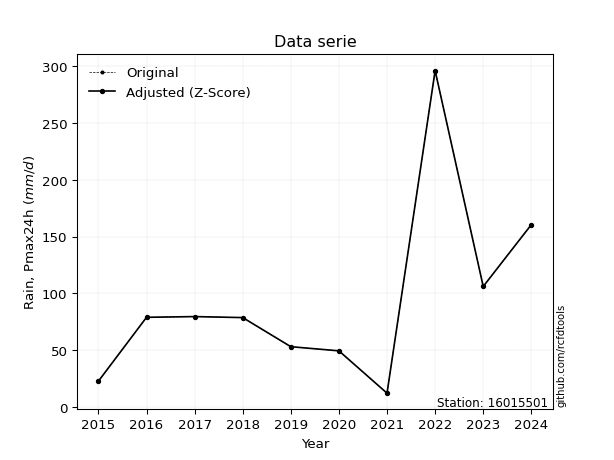</img>

</div>

> If Z-Score is active, values out of range or outliers are replaced with the station mean value.


### 4. Active continuous probability distributions from SciPy (45 of 104 available)

[scipy.stats](https://docs.scipy.org/doc/scipy/reference/stats.html) is a Python´s powerful submodule within the SciPy library for comprehensive statistical analysis, offering over 130 probability distributions (like Normal, Poisson), functions for descriptive stats (mean, variance), hypothesis testing (t-tests, chi-square), random variable generation, and statistical tests, making it essential for data science, modeling, and research. It provides tools to explore, model, and draw conclusions from data efficiently, working seamlessly with NumPy.

<div align="center">

|   id | p_dist             |   n_parameter | fit_method   | label                                                                       | active   | ref                                                                                                        |
|-----:|:-------------------|--------------:|:-------------|:----------------------------------------------------------------------------|:---------|:-----------------------------------------------------------------------------------------------------------|
|    0 | alpha              |             3 | MLE          | Alpha                                                                       | True     | [:mortar_board:](https://docs.scipy.org/doc/scipy/reference/generated/scipy.stats.alpha.html)              |
|    1 | betaprime          |             4 | MLE          | Beta prime                                                                  | True     | [:mortar_board:](https://docs.scipy.org/doc/scipy/reference/generated/scipy.stats.betaprime.html)          |
|    2 | chi2               |             3 | MLE          | Chi²                                                                        | True     | [:mortar_board:](https://docs.scipy.org/doc/scipy/reference/generated/scipy.stats.chi2.html)               |
|    3 | crystalball        |             4 | MLE          | Crystalball                                                                 | True     | [:mortar_board:](https://docs.scipy.org/doc/scipy/reference/generated/scipy.stats.crystalball.html)        |
|    4 | erlang             |             3 | MLE          | Erlang                                                                      | True     | [:mortar_board:](https://docs.scipy.org/doc/scipy/reference/generated/scipy.stats.erlang.html)             |
|    5 | expon              |             2 | MLE          | Exponential                                                                 | True     | [:mortar_board:](https://docs.scipy.org/doc/scipy/reference/generated/scipy.stats.expon.html)              |
|    6 | exponnorm          |             3 | MLE          | Exponentially modified Normal                                               | True     | [:mortar_board:](https://docs.scipy.org/doc/scipy/reference/generated/scipy.stats.exponnorm.html)          |
|    7 | f                  |             4 | MLE          | F                                                                           | True     | [:mortar_board:](https://docs.scipy.org/doc/scipy/reference/generated/scipy.stats.f.html)                  |
|    8 | fatiguelife        |             3 | MLE          | Fatigue-life (Birnbaum-Saunders)                                            | True     | [:mortar_board:](https://docs.scipy.org/doc/scipy/reference/generated/scipy.stats.fatiguelife.html)        |
|    9 | fisk               |             3 | MLE          | Fisk                                                                        | True     | [:mortar_board:](https://docs.scipy.org/doc/scipy/reference/generated/scipy.stats.fisk.html)               |
|   10 | gamma              |             3 | MLE          | Gamma                                                                       | True     | [:mortar_board:](https://docs.scipy.org/doc/scipy/reference/generated/scipy.stats.gamma.html)              |
|   11 | genexpon           |             5 | MLE          | Generalized exponential                                                     | True     | [:mortar_board:](https://docs.scipy.org/doc/scipy/reference/generated/scipy.stats.genexpon.html)           |
|   12 | genlogistic        |             3 | MLE          | Generalized logistic                                                        | True     | [:mortar_board:](https://docs.scipy.org/doc/scipy/reference/generated/scipy.stats.genlogistic.html)        |
|   13 | gibrat             |             2 | MM           | Gibrat                                                                      | True     | [:mortar_board:](https://docs.scipy.org/doc/scipy/reference/generated/scipy.stats.gibrat.html)             |
|   14 | gompertz           |             3 | MLE          | Gompertz (or truncated Gumbel)                                              | True     | [:mortar_board:](https://docs.scipy.org/doc/scipy/reference/generated/scipy.stats.gompertz.html)           |
|   15 | gumbel_l           |             2 | MM           | Gumbel Left Skew                                                            | True     | [:mortar_board:](https://docs.scipy.org/doc/scipy/reference/generated/scipy.stats.gumbel_l.html)           |
|   16 | gumbel_r           |             2 | MM           | Gumbel Right Skew                                                           | True     | [:mortar_board:](https://docs.scipy.org/doc/scipy/reference/generated/scipy.stats.gumbel_r.html)           |
|   17 | halflogistic       |             2 | MM           | Half-logistic                                                               | True     | [:mortar_board:](https://docs.scipy.org/doc/scipy/reference/generated/scipy.stats.halflogistic.html)       |
|   18 | halfnorm           |             2 | MM           | Half Normal                                                                 | True     | [:mortar_board:](https://docs.scipy.org/doc/scipy/reference/generated/scipy.stats.halfnorm.html)           |
|   19 | hypsecant          |             2 | MM           | hyperbolic secant                                                           | True     | [:mortar_board:](https://docs.scipy.org/doc/scipy/reference/generated/scipy.stats.hypsecant.html)          |
|   20 | invgamma           |             3 | MLE          | Inverted gamma                                                              | True     | [:mortar_board:](https://docs.scipy.org/doc/scipy/reference/generated/scipy.stats.invgamma.html)           |
|   21 | invgauss           |             3 | MLE          | Inverse Gaussian                                                            | True     | [:mortar_board:](https://docs.scipy.org/doc/scipy/reference/generated/scipy.stats.invgauss.html)           |
|   22 | invweibull         |             3 | MLE          | Inverted Weibull                                                            | True     | [:mortar_board:](https://docs.scipy.org/doc/scipy/reference/generated/scipy.stats.invweibull.html)         |
|   23 | johnsonsu          |             4 | MLE          | Johnson Su                                                                  | True     | [:mortar_board:](https://docs.scipy.org/doc/scipy/reference/generated/scipy.stats.johnsonsu.html)          |
|   24 | kstwobign          |             2 | MLE          | Limiting distribution of scaled Kolmogorov-Smirnov two-sided test statistic | True     | [:mortar_board:](https://docs.scipy.org/doc/scipy/reference/generated/scipy.stats.kstwobign.html)          |
|   25 | laplace            |             2 | MM           | Laplace                                                                     | True     | [:mortar_board:](https://docs.scipy.org/doc/scipy/reference/generated/scipy.stats.laplace.html)            |
|   26 | laplace_asymmetric |             3 | MLE          | Asymmetric Laplace                                                          | True     | [:mortar_board:](https://docs.scipy.org/doc/scipy/reference/generated/scipy.stats.laplace_asymmetric.html) |
|   27 | loggamma           |             3 | MLE          | Log gamma                                                                   | True     | [:mortar_board:](https://docs.scipy.org/doc/scipy/reference/generated/scipy.stats.loggamma.html)           |
|   28 | logistic           |             2 | MM           | Logistic (or Sech-squared)                                                  | True     | [:mortar_board:](https://docs.scipy.org/doc/scipy/reference/generated/scipy.stats.logistic.html)           |
|   29 | lognorm            |             3 | MLE          | Log Normal                                                                  | True     | [:mortar_board:](https://docs.scipy.org/doc/scipy/reference/generated/scipy.stats.lognorm.html)            |
|   30 | maxwell            |             2 | MM           | Maxwell                                                                     | True     | [:mortar_board:](https://docs.scipy.org/doc/scipy/reference/generated/scipy.stats.maxwell.html)            |
|   31 | mielke             |             4 | MLE          | Mielke Beta-Kappa / Dagum                                                   | True     | [:mortar_board:](https://docs.scipy.org/doc/scipy/reference/generated/scipy.stats.mielke.html)             |
|   32 | moyal              |             2 | MM           | Moyal                                                                       | True     | [:mortar_board:](https://docs.scipy.org/doc/scipy/reference/generated/scipy.stats.moyal.html)              |
|   33 | nakagami           |             3 | MLE          | Nakagami                                                                    | True     | [:mortar_board:](https://docs.scipy.org/doc/scipy/reference/generated/scipy.stats.nakagami.html)           |
|   34 | ncf                |             5 | MLE          | Non-central F distribution                                                  | True     | [:mortar_board:](https://docs.scipy.org/doc/scipy/reference/generated/scipy.stats.ncf.html)                |
|   35 | nct                |             4 | MLE          | Non-central Student’s t                                                     | True     | [:mortar_board:](https://docs.scipy.org/doc/scipy/reference/generated/scipy.stats.nct.html)                |
|   36 | norm               |             2 | MM           | Normal                                                                      | True     | [:mortar_board:](https://docs.scipy.org/doc/scipy/reference/generated/scipy.stats.norm.html)               |
|   37 | pareto             |             3 | MLE          | Pareto                                                                      | True     | [:mortar_board:](https://docs.scipy.org/doc/scipy/reference/generated/scipy.stats.pareto.html)             |
|   38 | pearson3           |             3 | MM           | Pearson type III                                                            | True     | [:mortar_board:](https://docs.scipy.org/doc/scipy/reference/generated/scipy.stats.pearson3.html)           |
|   39 | rayleigh           |             2 | MM           | Rayleigh                                                                    | True     | [:mortar_board:](https://docs.scipy.org/doc/scipy/reference/generated/scipy.stats.rayleigh.html)           |
|   40 | rice               |             3 | MLE          | Rice                                                                        | True     | [:mortar_board:](https://docs.scipy.org/doc/scipy/reference/generated/scipy.stats.rice.html)               |
|   41 | t                  |             3 | MLE          | Student’s t                                                                 | True     | [:mortar_board:](https://docs.scipy.org/doc/scipy/reference/generated/scipy.stats.t.html)                  |
|   42 | truncnorm          |             4 | MLE          | Truncated normal                                                            | True     | [:mortar_board:](https://docs.scipy.org/doc/scipy/reference/generated/scipy.stats.truncnorm.html)          |
|   43 | wald               |             2 | MM           | Wald                                                                        | True     | [:mortar_board:](https://docs.scipy.org/doc/scipy/reference/generated/scipy.stats.wald.html)               |
|   44 | weibull_min        |             3 | MLE          | Weibull minimum                                                             | True     | [:mortar_board:](https://docs.scipy.org/doc/scipy/reference/generated/scipy.stats.weibull_min.html)        |

</div>

> **n_parameter:** # arguments & localization & scale.
>
> **Fit methods:** (MLE) maximum likelihood, (MM) L-moments.
>
>**Inactive:** foldnorm, gennorm, norminvgauss, powernorm, powerlognorm, skewnorm, genextreme, anglit, arcsine, argus, beta, bradford, burr, burr12, cauchy, cosine, halfcauchy, foldcauchy, skewcauchy, wrapcauchy, dgamma, gengamma, exponweib, exponpow, truncexpon, gausshyper, genhalflogistic, genhyperbolic, geninvgauss, halfgennorm, johnsonsb, kappa4, kappa3, ksone, kstwo, loglaplace, levy, levy_l, levy_stable, ncx2, genpareto, truncpareto, lomax, powerlaw, rdist, rel_breitwigner, recipinvgauss, semicircular, studentized_range, trapezoid, triang, truncweibull_min, tukeylambda, uniform, loguniform, vonmises, vonmises_line, weibull_max, dweibull, 


## B. Probability distributions vs. Empirical distributions

A continuous probability distribution (CPD) describes probabilities for variables that can take any value within a range (like rain any time), unlike discrete variables with specific outcomes (like temperature). It uses a Probability Density Function (PDF), a curve where the total area under it equals 1, and the probability of the variable falling within an interval (a to b) is found by calculating the area under the curve between those points. A key feature is that the probability of hitting any single exact value is zero, so probabilities are always expressed for ranges, e.g., $P(a ≤ X ≤ b)$.

<div align="center">

Distributions parameters
|    |   station | p_dist                |   n |              loc |          scale | shape                 | shape1             | shape2                | shape3   |
|---:|----------:|:----------------------|----:|-----------------:|---------------:|:----------------------|:-------------------|:----------------------|:---------|
|  0 |  16015501 | alpha                 |  11 |     -0.0903549   |   33.4475      | 7.647191869027067e-12 |                    |                       |          |
|  1 |  16015501 | betaprime             |  11 |     12.33        |  607.595       | 0.8618212860547393    | 8.050513317650335  |                       |          |
|  2 |  16015501 | chi2                  |  11 |     12.33        |   41.0873      | 1.7183692696603146    |                    |                       |          |
|  3 |  16015501 | crystalball           |  11 |     93.98        |   74.7112      | 8608.82157190489      | 87.61748038659451  |                       |          |
|  4 |  16015501 | erlang                |  11 |     12.33        |   74.139       | 0.9624920853739019    |                    |                       |          |
|  5 |  16015501 | expon                 |  11 |     12.33        |   81.65        |                       |                    |                       |          |
|  6 |  16015501 | exponnorm             |  11 |     27.612       |   22.3925      | 2.963842257615763     |                    |                       |          |
|  7 |  16015501 | f                     |  11 |     12.3221      |   84.6087      | 1.8489448247759621    | 76.88111980578427  |                       |          |
|  8 |  16015501 | fatiguelife           |  11 |    -12.4494      |   85.6566      | 0.6957551375798039    |                    |                       |          |
|  9 |  16015501 | fisk                  |  11 |     -9.9806      |   84.233       | 2.612171675100611     |                    |                       |          |
| 10 |  16015501 | gamma                 |  11 |     12.33        |   78.8877      | 0.7708129428756789    |                    |                       |          |
| 11 |  16015501 | genexpon              |  11 |     12.33        |   83.2038      | 0.7764436992474353    | 0.417998388303279  | 1.502938600703298     |          |
| 12 |  16015501 | genlogistic           |  11 |   -276.987       |   47.8737      | 1221.262445482806     |                    |                       |          |
| 13 |  16015501 | gibrat                |  11 |     36.9848      |   34.5693      |                       |                    |                       |          |
| 14 |  16015501 | gompertz              |  11 |     12.33        |  238.315       | 1.9694144172920014    |                    |                       |          |
| 15 |  16015501 | gumbel_l              |  11 |    127.604       |   58.252       |                       |                    |                       |          |
| 16 |  16015501 | gumbel_r              |  11 |     60.356       |   58.252       |                       |                    |                       |          |
| 17 |  16015501 | halflogistic          |  11 |      5.42992     |   63.8754      |                       |                    |                       |          |
| 18 |  16015501 | halfnorm              |  11 |     -4.90828     |  123.938       |                       |                    |                       |          |
| 19 |  16015501 | hypsecant             |  11 |     93.98        |   47.5626      |                       |                    |                       |          |
| 20 |  16015501 | invgamma              |  11 |    -41.5955      |  509.517       | 4.741834777828446     |                    |                       |          |
| 21 |  16015501 | invgauss              |  11 |    -16.9277      |  236.798       | 0.4683638285231494    |                    |                       |          |
| 22 |  16015501 | invweibull            |  11 |   -131.196       |  188.911       | 4.41582222818365      |                    |                       |          |
| 23 |  16015501 | johnsonsu             |  11 |    -11.9466      |    1.64859     | -6.978008401763368    | 1.5043600754618922 |                       |          |
| 24 |  16015501 | kstwobign             |  11 |   -116.696       |  245.153       |                       |                    |                       |          |
| 25 |  16015501 | laplace               |  11 |     93.98        |   52.8288      |                       |                    |                       |          |
| 26 |  16015501 | laplace_asymmetric    |  11 |     78.81        |   45.5174      | 0.847149690116443     |                    |                       |          |
| 27 |  16015501 | loggamma              |  11 | -24547.9         | 3268.07        | 1882.6857782130855    |                    |                       |          |
| 28 |  16015501 | logistic              |  11 |     93.98        |   41.1904      |                       |                    |                       |          |
| 29 |  16015501 | lognorm               |  11 |     12.33        |    2.05816     | 10.997090814106281    |                    |                       |          |
| 30 |  16015501 | maxwell               |  11 |    -83.0541      |  110.94        |                       |                    |                       |          |
| 31 |  16015501 | mielke                |  11 |     12.33        |  129.857       | 0.7235275363924547    | 2.6548931212327127 |                       |          |
| 32 |  16015501 | moyal                 |  11 |     51.2554      |   33.6318      |                       |                    |                       |          |
| 33 |  16015501 | nakagami              |  11 |     12.33        |  157.364       | 0.09996755881536101   |                    |                       |          |
| 34 |  16015501 | ncf                   |  11 |     -0.142599    |   48.1411      | 4.081118273690532     | 14.937517342314905 | 2.836056055020486     |          |
| 35 |  16015501 | nct                   |  11 |     -0.131802    |   32.2211      | 2.915562160113888     | 2.09862590749134   |                       |          |
| 36 |  16015501 | norm                  |  11 |     93.98        |   74.7112      |                       |                    |                       |          |
| 37 |  16015501 | pareto                |  11 |     12.3289      |    0.00110649  | 0.10002721139535292   |                    |                       |          |
| 38 |  16015501 | pearson3              |  11 |     93.98        |   74.7112      | 1.6290852392012827    |                    |                       |          |
| 39 |  16015501 | rayleigh              |  11 |    -48.9468      |  114.039       |                       |                    |                       |          |
| 40 |  16015501 | rice                  |  11 |    -21.5288      |   97.2729      | 0.0006739888264970877 |                    |                       |          |
| 41 |  16015501 | t                     |  11 |     74.4173      |   32.6448      | 1.67978642570586      |                    |                       |          |
| 42 |  16015501 | truncnorm             |  11 |     31.4369      |    3.93283     | -14.515660380343952   | 67.27041069915595  |                       |          |
| 43 |  16015501 | wald                  |  11 |     19.2688      |   74.7112      |                       |                    |                       |          |
| 44 |  16015501 | weibull_min           |  11 |     12.33        |   77.2042      | 0.9228350239162193    |                    |                       |          |
| 45 |  16015501 | logalpha              |  11 |    -16.5695      |  515.389       | 24.825424050926117    |                    |                       |          |
| 46 |  16015501 | logbetaprime          |  11 |     -7.13898     |   70.7324      | 206.75432308817457    | 1284.8775473064684 |                       |          |
| 47 |  16015501 | logchi2               |  11 |      2.51204     |    1.01196     | 1.1366093162196376    |                    |                       |          |
| 48 |  16015501 | logcrystalball        |  11 |      4.23908     |    0.827857    | 255.81411666949919    | 1226.7045383009552 |                       |          |
| 49 |  16015501 | logerlang             |  11 |     -9.80851     |    0.0507721   | 276.5941695314564     |                    |                       |          |
| 50 |  16015501 | logexpon              |  11 |      2.51204     |    1.72705     |                       |                    |                       |          |
| 51 |  16015501 | logexponnorm          |  11 |      4.23845     |    0.827858    | 0.0007631554059027901 |                    |                       |          |
| 52 |  16015501 | logf                  |  11 |   -517.553       |  521.791       | 6438008.707775689     | 897509.9139800316  |                       |          |
| 53 |  16015501 | logfatiguelife        |  11 |   -330.381       |  334.616       | 0.0024673999251637008 |                    |                       |          |
| 54 |  16015501 | logfisk               |  11 |     -4.25263e+07 |    4.25263e+07 | 91582917.1383337      |                    |                       |          |
| 55 |  16015501 | loggamma              |  11 |     -9.66922     |    0.0512311   | 271.36466117455444    |                    |                       |          |
| 56 |  16015501 | loggenexpon           |  11 |      2.51156     |    0.00667857  | 0.0009479867321154011 | 0.5545483218523399 | 3.303764447178016e-05 |          |
| 57 |  16015501 | loggenlogistic        |  11 |      4.64283     |    0.342496    | 0.5425954136371547    |                    |                       |          |
| 58 |  16015501 | loggibrat             |  11 |      3.60756     |    0.383036    |                       |                    |                       |          |
| 59 |  16015501 | loggompertz           |  11 |      2.51204     |    0.890648    | 0.10842213051301511   |                    |                       |          |
| 60 |  16015501 | loggumbel_l           |  11 |      4.61166     |    0.645477    |                       |                    |                       |          |
| 61 |  16015501 | loggumbel_r           |  11 |      3.8665      |    0.645477    |                       |                    |                       |          |
| 62 |  16015501 | loghalflogistic       |  11 |      3.25793     |    0.707755    |                       |                    |                       |          |
| 63 |  16015501 | loghalfnorm           |  11 |      3.14328     |    1.37337     |                       |                    |                       |          |
| 64 |  16015501 | loghypsecant          |  11 |      4.23908     |    0.52703     |                       |                    |                       |          |
| 65 |  16015501 | loginvgamma           |  11 |    -13.7064      | 8034.89        | 449.0637390212855     |                    |                       |          |
| 66 |  16015501 | loginvgauss           |  11 |     -4.17913     |  773.55        | 0.010890446974323793  |                    |                       |          |
| 67 |  16015501 | loginvweibull         |  11 |     -9.21201e+07 |    9.21201e+07 | 106832330.19606653    |                    |                       |          |
| 68 |  16015501 | logjohnsonsu          |  11 |      4.50935     |    0.583306    | 0.3159227937967922    | 1.0521394667709236 |                       |          |
| 69 |  16015501 | logkstwobign          |  11 |      0.647399    |    4.11605     |                       |                    |                       |          |
| 70 |  16015501 | loglaplace            |  11 |      4.23908     |    0.585383    |                       |                    |                       |          |
| 71 |  16015501 | loglaplace_asymmetric |  11 |      4.37814     |    0.577549    | 1.1276572693066103    |                    |                       |          |
| 72 |  16015501 | logloggamma           |  11 |      1.9807      |    1.64744     | 4.428170065798722     |                    |                       |          |
| 73 |  16015501 | loglogistic           |  11 |      4.23908     |    0.456421    |                       |                    |                       |          |
| 74 |  16015501 | loglognorm            |  11 |      2.51204     |    0.0673585   | 10.333383423764666    |                    |                       |          |
| 75 |  16015501 | logmaxwell            |  11 |      2.27741     |    1.2293      |                       |                    |                       |          |
| 76 |  16015501 | logmielke             |  11 |      0.954699    |    3.94351     | 3.9428105890474017    | 12.979701118272136 |                       |          |
| 77 |  16015501 | logmoyal              |  11 |      3.76566     |    0.372666    |                       |                    |                       |          |
| 78 |  16015501 | lognakagami           |  11 |      2.73609     |    1.77023     | 1.5655092469716765    |                    |                       |          |
| 79 |  16015501 | logncf                |  11 |    -13.503       |    6.69613     | 1040.0982345191032    | 1753.2494665611812 | 1713.6361538971273    |          |
| 80 |  16015501 | lognct                |  11 |    -43.2528      |    0.777783    | 13392.94334221202     | 61.05591304583061  |                       |          |
| 81 |  16015501 | lognorm               |  11 |      4.23908     |    0.827857    |                       |                    |                       |          |
| 82 |  16015501 | logpareto             |  11 |      2.51201     |    2.95276e-05 | 0.10002041719404552   |                    |                       |          |
| 83 |  16015501 | logpearson3           |  11 |      4.23908     |    0.827858    | -0.44857830069428206  |                    |                       |          |
| 84 |  16015501 | lograyleigh           |  11 |      2.65537     |    1.26362     |                       |                    |                       |          |
| 85 |  16015501 | logrice               |  11 |      1.99321     |    0.88438     | 2.3076569711864847    |                    |                       |          |
| 86 |  16015501 | logt                  |  11 |      4.23908     |    0.827856    | 5712897667.179453     |                    |                       |          |
| 87 |  16015501 | logtruncnorm          |  11 |     -0.134852    |    2.46857     | 1.323380429547133     | 13.064728191473165 |                       |          |
| 88 |  16015501 | logwald               |  11 |      3.41129     |    0.827801    |                       |                    |                       |          |
| 89 |  16015501 | logweibull_min        |  11 |     -0.00748284  |    4.57723     | 6.031801501422783     |                    |                       |          |

</div>

> **loc** (Location parameter): This shifts the distribution along the x-axis. For many common distributions, like the normal (Gaussian) distribution, loc represents the mean $μ$. For others, like the uniform distribution, it might represent the minimum value, or for the beta distribution, the left end of the support interval.
>
> **scale** (Scale parameter): This determines the width or spread of the distribution. For the normal distribution, scale represents the standard deviation $σ$. For a uniform distribution, it defines the length of the interval (from $loc$ to $loc + scale$).
>
> **shape** (Shape parameters): Refers to parameters that define the specific form of a probability distribution, distinct from its location (loc) and scale (scale). These parameters are required arguments for most distribution functions. For example, a normal (Gaussian) distribution is fully defined by its location (mean) and scale (standard deviation), so it has no specific shape parameters beyond loc and scale. However, other distributions have intrinsic properties that need specification, as Gamma distribution that takes a shape parameter, often named $a$ or $alpha$.


### 0. Cumulative distribution values - CDF (90 evaluated)

> Ordered by x ascending and calculating $log(f(x))$ separately. 

|   id |   Station |   date |      x |   count |   mean |     std |     zscore |   Value_initial |   station |   m |      alpha |   alpha_pdf |   betaprime |   betaprime_pdf |        chi2 |   chi2_pdf |   crystalball |   crystalball_pdf |      erlang |   erlang_pdf |    expon |   expon_pdf |   exponnorm |   exponnorm_pdf |           f |       f_pdf |   fatiguelife |   fatiguelife_pdf |      fisk |   fisk_pdf |       gamma |    gamma_pdf |    genexpon |   genexpon_pdf |   genlogistic |   genlogistic_pdf |   gibrat |   gibrat_pdf |    gompertz |   gompertz_pdf |   gumbel_l |   gumbel_l_pdf |   gumbel_r |   gumbel_r_pdf |   halflogistic |   halflogistic_pdf |   halfnorm |   halfnorm_pdf |   hypsecant |   hypsecant_pdf |   invgamma |   invgamma_pdf |   invgauss |   invgauss_pdf |   invweibull |   invweibull_pdf |   johnsonsu |   johnsonsu_pdf |   kstwobign |   kstwobign_pdf |   laplace |   laplace_pdf |   laplace_asymmetric |   laplace_asymmetric_pdf |   loggamma |   loggamma_pdf |   logistic |   logistic_pdf |   lognorm |   lognorm_pdf |   maxwell |   maxwell_pdf |     mielke |   mielke_pdf |    moyal |   moyal_pdf |    nakagami |   nakagami_pdf |       ncf |     ncf_pdf |       nct |     nct_pdf |     norm |    norm_pdf |   pareto |   pareto_pdf |   pearson3 |   pearson3_pdf |   rayleigh |   rayleigh_pdf |      rice |    rice_pdf |        t |       t_pdf |   truncnorm |   truncnorm_pdf |        wald |    wald_pdf |   weibull_min |   weibull_min_pdf |   logalpha |   logalpha_pdf |   logbetaprime |   logbetaprime_pdf |     logchi2 |   logchi2_pdf |   logcrystalball |   logcrystalball_pdf |   logerlang |   logerlang_pdf |   logexpon |   logexpon_pdf |   logexponnorm |   logexponnorm_pdf |      logf |   logf_pdf |   logfatiguelife |   logfatiguelife_pdf |   logfisk |   logfisk_pdf |   loggenexpon |   loggenexpon_pdf |   loggenlogistic |   loggenlogistic_pdf |   loggibrat |   loggibrat_pdf |   loggompertz |   loggompertz_pdf |   loggumbel_l |   loggumbel_l_pdf |   loggumbel_r |   loggumbel_r_pdf |   loghalflogistic |   loghalflogistic_pdf |   loghalfnorm |   loghalfnorm_pdf |   loghypsecant |   loghypsecant_pdf |   loginvgamma |   loginvgamma_pdf |   loginvgauss |   loginvgauss_pdf |   loginvweibull |   loginvweibull_pdf |   logjohnsonsu |   logjohnsonsu_pdf |   logkstwobign |   logkstwobign_pdf |   loglaplace |   loglaplace_pdf |   loglaplace_asymmetric |   loglaplace_asymmetric_pdf |   logloggamma |   logloggamma_pdf |   loglogistic |   loglogistic_pdf |   loglognorm |   loglognorm_pdf |   logmaxwell |   logmaxwell_pdf |   logmielke |   logmielke_pdf |    logmoyal |   logmoyal_pdf |   lognakagami |   lognakagami_pdf |    logncf |   logncf_pdf |    lognct |   lognct_pdf |   logpareto |   logpareto_pdf |   logpearson3 |   logpearson3_pdf |   lograyleigh |   lograyleigh_pdf |   logrice |   logrice_pdf |      logt |   logt_pdf |   logtruncnorm |   logtruncnorm_pdf |   logwald |   logwald_pdf |   logweibull_min |   logweibull_min_pdf |
|-----:|----------:|-------:|-------:|--------:|-------:|--------:|-----------:|----------------:|----------:|----:|-----------:|------------:|------------:|----------------:|------------:|-----------:|--------------:|------------------:|------------:|-------------:|---------:|------------:|------------:|----------------:|------------:|------------:|--------------:|------------------:|----------:|-----------:|------------:|-------------:|------------:|---------------:|--------------:|------------------:|---------:|-------------:|------------:|---------------:|-----------:|---------------:|-----------:|---------------:|---------------:|-------------------:|-----------:|---------------:|------------:|----------------:|-----------:|---------------:|-----------:|---------------:|-------------:|-----------------:|------------:|----------------:|------------:|----------------:|----------:|--------------:|---------------------:|-------------------------:|-----------:|---------------:|-----------:|---------------:|----------:|--------------:|----------:|--------------:|-----------:|-------------:|---------:|------------:|------------:|---------------:|----------:|------------:|----------:|------------:|---------:|------------:|---------:|-------------:|-----------:|---------------:|-----------:|---------------:|----------:|------------:|---------:|------------:|------------:|----------------:|------------:|------------:|--------------:|------------------:|-----------:|---------------:|---------------:|-------------------:|------------:|--------------:|-----------------:|---------------------:|------------:|----------------:|-----------:|---------------:|---------------:|-------------------:|----------:|-----------:|-----------------:|---------------------:|----------:|--------------:|--------------:|------------------:|-----------------:|---------------------:|------------:|----------------:|--------------:|------------------:|--------------:|------------------:|--------------:|------------------:|------------------:|----------------------:|--------------:|------------------:|---------------:|-------------------:|--------------:|------------------:|--------------:|------------------:|----------------:|--------------------:|---------------:|-------------------:|---------------:|-------------------:|-------------:|-----------------:|------------------------:|----------------------------:|--------------:|------------------:|--------------:|------------------:|-------------:|-----------------:|-------------:|-----------------:|------------:|----------------:|------------:|---------------:|--------------:|------------------:|----------:|-------------:|----------:|-------------:|------------:|----------------:|--------------:|------------------:|--------------:|------------------:|----------:|--------------:|----------:|-----------:|---------------:|-------------------:|----------:|--------------:|-----------------:|---------------------:|
|    0 |  16015501 |   2021 |  12.33 |      11 |  93.98 | 78.3577 | -1.04202   |           12.33 |  16015501 |   1 | 0.00708213 | 0.00460553  | 2.53929e-07 |     0.137292    | 5.06411e-15 | 2.4494     |      0.137224 |       0.00293879  | 6.85526e-15 |  0.0470179   | 0        | 0.0122474   |   0.0423801 |     0.00309025  | 0.000179997 | 0.0210847   |     0.0287685 |        0.00456846 | 0.0301682 | 0.00342559 | 1.59314e-13 | 69.131       | 1.83835e-14 |    0.00933183  |     0.0552792 |        0.00333928 | 0        |  0           | 4.18091e-13 |    0.0082639   |   0.129096 |     0.00206653 |   0.10222  |    0.00400201  |      0.0539596 |        0.00780495  |   0.110619 |    0.0063758   |    0.113168 |     0.00232954  |  0.0329115 |    0.00375979  |  0.0296957 |    0.00432715  |    0.034578  |      0.00357936  |   0.0295521 |     0.00415452  |   0.0554107 |     0.00339593  |  0.106596 |   0.00201777  |            0.0745127 |              0.00193238  |  0.0174436 |      0.0557925 |   0.121078 |    0.00258357  | 0.0184817 |     0.0546903 |  0.136059 |   0.00367375  | 7.5389e-07 |  1.2178      | 0.07447  | 0.00431123  | 0.000341426 |    3.84286e+10 | 0.0311672 | 0.00469119  | 0.0424722 | 0.00284402  | 0.137224 | 0.00293879  | 0        | 90.4008      |  0.0450744 |    0.0063085   |   0.134426 |    0.00407843  | 0.0587816 | 0.00336805  | 0.110561 | 0.00227539  | 5.91994e-07 |    7.60089e-07  | 0           | 0           |   4.42353e-16 |       0.229807    |  0.0144678 |       0.051965 |      0.0162056 |          0.0537453 | 1.41748e-09 |   1.81397e+06 |        0.0184818 |            0.0546903 |   0.0174344 |       0.0556889 |   0        |      0.579023  |      0.0184822 |          0.0546912 | 0.018743  |   0.055338 |        0.0182277 |            0.0544756 | 0.0212733 |     0.0448389 |   6.76513e-05 |          0.14213  |        0.0341577 |            0.0540067 |    0        |       0         |   5.11593e-09 |          0.121734 |     0.0379267 |         0.0576291 |   0.000287843 |        0.00363578 |          0        |             0         |      0        |          0        |      0.0240168 |          0.0455269 |     0.0165028 |         0.0555044 |     0.0152675 |         0.0555096 |        0.011607 |           0.0599829 |      0.0418029 |          0.0451607 |      0.0135587 |          0.0801538 |    0.0261624 |        0.0446928 |               0.0318884 |                   0.0489629 |     0.0297006 |         0.0604305 |     0.0222288 |         0.0476197 |  0.000789032 |      5.90128e+11 |   0.00182908 |        0.0232172 |   0.0256492 |       0.0649375 | 7.61066e-08 |    3.04731e-06 |     0         |         0         | 0.0175655 |    0.0559808 | 0.0184869 |    0.0550183 |    0        |   3387.35       |     0.0286839 |         0.06147   |     0         |          0        | 0.0136749 |     0.0589655 | 0.0184817 |  0.0546902 |    0           |           0        |  0        |     0         |        0.0269233 |            0.0635795 |
|    1 |  16015501 |   2015 |  22.92 |      11 |  93.98 | 78.3577 | -0.906867  |           22.92 |  16015501 |   2 | 0.146062   | 0.0175245   | 0.179393    |     0.0134292   | 0.170963    | 0.0129323  |      0.170769 |       0.0033969   | 0.145608    |  0.0122943   | 0.121641 | 0.0107576   |   0.0850285 |     0.00500221  | 0.132624    | 0.0108725   |     0.09457   |        0.0075258  | 0.0790232 | 0.00577832 | 0.21731     |  0.0146509   | 0.0984169   |    0.00920202  |     0.0981437 |        0.00475432 | 0        |  0           | 0.085601    |    0.00789986  |   0.152768 |     0.00241116 |   0.149341 |    0.00487494  |      0.136059  |        0.00768284  |   0.177658 |    0.00627751  |    0.14057  |     0.00286033  |  0.0868047 |    0.00633308  |  0.0921006 |    0.00720712  |    0.0856937 |      0.00603272  |   0.0895216 |     0.00697104  |   0.0980928 |     0.00464238  |  0.130257 |   0.00246564  |            0.0980627 |              0.00254312  |  0.0933432 |      0.208889  |   0.151208 |    0.00311587  | 0.0905663 |     0.197074  |  0.177586 |   0.00415849  | 0.163019   |  0.0111234   | 0.127539 | 0.00566043  | 0.486775    |    0.00918634  | 0.0946393 | 0.00705531  | 0.0829464 | 0.00487599  | 0.170769 | 0.0033969   | 0.600247 |  0.00377545  |  0.120271  |    0.00763188  |   0.1801   |    0.00453087  | 0.0991364 | 0.0042319   | 0.138935 | 0.00313691  | 0.0151716   |    0.00972388   | 1.61647e-05 | 4.72405e-05 |   0.147765    |       0.0118745   |  0.0910347 |       0.217461 |      0.0909095 |          0.207301  | 0.515268    |   0.386911    |        0.0905663 |            0.197074  |   0.0931473 |       0.208349  |   0.301611 |      0.404383  |      0.0905676 |          0.197076  | 0.0913924 |   0.198076 |        0.0904947 |            0.198143  | 0.076305  |     0.151788  |   0.153843    |          0.335422 |        0.0907134 |            0.141988  |    0        |       0         |   0.103325    |          0.218956 |     0.096094  |         0.141479  |   0.044147    |        0.213406   |          0        |             0         |      0        |          0        |      0.0775268 |          0.145651  |     0.0941534 |         0.21564   |     0.0952658 |         0.222854  |        0.114037 |           0.287144  |      0.0866545 |          0.111048  |      0.140573  |          0.326537  |    0.0754458 |        0.128883  |               0.0826141 |                   0.126849  |     0.096726  |         0.170221  |     0.081245  |         0.163542  |  0.58504     |      0.0608519   |   0.0774543  |        0.246349  |   0.0961269 |       0.173995  | 0.0192828   |    0.162099    |     0.0126907 |         0.0973244 | 0.0932946 |    0.207673  | 0.0911045 |    0.198481  |    0.630431 |      0.0596196  |     0.0974651 |         0.174753  |     0.0686694 |          0.278011 | 0.0920693 |     0.21146   | 0.0905663 |  0.197074  |    2.04534e-11 |           0.725043 |  0        |     0         |        0.0977647 |            0.178336  |
|    2 |  16015501 |   2020 |  49.56 |      11 |  93.98 | 78.3577 | -0.566887  |           49.56 |  16015501 |   3 | 0.500527   | 0.00862806  | 0.449336    |     0.00775001  | 0.437002    | 0.00783428 |      0.27607  |       0.0044747   | 0.413426    |  0.00818789  | 0.366168 | 0.0077628   |   0.273872  |     0.00847729  | 0.369973    | 0.00735409  |     0.320482  |        0.00840255 | 0.28777   | 0.00899197 | 0.498875    |  0.00783553  | 0.32854     |    0.0079174   |     0.264161  |        0.00734137 | 0.155951 |  0.0190256   | 0.283229    |    0.00692487  |   0.230418 |     0.00346012 |   0.300106 |    0.00620087  |      0.332324  |        0.00696325  |   0.339686 |    0.00584514  |    0.238391 |     0.00455657  |  0.301565  |    0.00875051  |  0.315713  |    0.00851     |    0.296668  |      0.00880676  |   0.311933  |     0.008649    |   0.252803  |     0.00663706  |  0.215676 |   0.00408255  |            0.195679  |              0.00507467  |  0.354289  |      0.447899  |   0.253808 |    0.0045979   | 0.342465  |     0.443819  |  0.301228 |   0.00503008  | 0.401067   |  0.00752154  | 0.305115 | 0.00719005  | 0.625589    |    0.00334253  | 0.310128  | 0.00829663  | 0.277619  | 0.00899298  | 0.27607  | 0.0044747   | 0.647482 |  0.000947094 |  0.327682  |    0.00749831  |   0.311386 |    0.00521597  | 0.234363  | 0.00575228  | 0.269355 | 0.00712557  | 0.999998    |    2.48338e-06  | 0.276071    | 0.0133753   |   0.399592    |       0.00759227  |  0.36354   |       0.461577 |      0.350247  |          0.444396  | 0.722129    |   0.186469    |        0.342465  |            0.443819  |   0.353561  |       0.447291  |   0.553139 |      0.258743  |      0.342467  |          0.44382   | 0.343434  |   0.442732 |        0.343965  |            0.446192  | 0.303038  |     0.454845  |   0.448084    |          0.392741 |        0.291993  |            0.414737  |    0.397796 |       1.30498   |   0.335385    |          0.385771 |     0.28371   |         0.370276  |   0.388774    |        0.569032   |          0.426693 |             0.577837  |      0.419948 |          0.498507 |      0.309614  |          0.499119  |     0.3615    |         0.45323   |     0.364807  |         0.446272  |        0.411572 |           0.423736  |      0.260995  |          0.406482  |      0.441144  |          0.39884   |    0.281688  |        0.481202  |               0.269961  |                   0.41451   |     0.316239  |         0.407153  |     0.323893  |         0.47979   |  0.615245    |      0.0265858   |   0.37392    |        0.473462  |   0.315568  |       0.412519  | 0.405686    |    0.62997     |     0.263433  |         0.533607  | 0.351524  |    0.44225   | 0.343953  |    0.444053  |    0.65913  |      0.0245073  |     0.319766  |         0.406996  |     0.385883  |          0.479919 | 0.351778  |     0.444098  | 0.342465  |  0.443819  |    0.451366    |           0.456695 |  0.442021 |     0.915994  |        0.32091   |            0.405356  |
|    3 |  16015501 |   2019 |  53.21 |      11 |  93.98 | 78.3577 | -0.520306  |           53.21 |  16015501 |   4 | 0.530313   | 0.00771494  | 0.476744    |     0.00727515  | 0.464786    | 0.00739587 |      0.292635 |       0.00460109  | 0.442536    |  0.00776725  | 0.393878 | 0.00742342  |   0.305007  |     0.00856594  | 0.396187    | 0.00701325  |     0.350767  |        0.0081863  | 0.320642  | 0.00900469 | 0.526523    |  0.0073226   | 0.357019    |    0.00768679  |     0.291264  |        0.00750099 | 0.224705 |  0.0184706   | 0.308252    |    0.00678626  |   0.243342 |     0.003622   |   0.322867 |    0.00626598  |      0.357494  |        0.00682734  |   0.36088  |    0.00576747  |    0.255491 |     0.00481319  |  0.333363  |    0.00866143  |  0.34644   |    0.00831961  |    0.328746  |      0.0087576   |   0.343223  |     0.00848746  |   0.277246  |     0.00675034  |  0.231104 |   0.00437459  |            0.215107  |              0.00557849  |  0.386535  |      0.45914   |   0.270953 |    0.00479571  | 0.37452   |     0.457859  |  0.319725 |   0.0051032   | 0.427999   |  0.00723856  | 0.33137  | 0.00718874  | 0.637331    |    0.00309798  | 0.340183  | 0.00816458  | 0.310719  | 0.00912465  | 0.292636 | 0.00460109  | 0.650765 |  0.000854503 |  0.354754  |    0.00733312  |   0.330506 |    0.00525904  | 0.255598  | 0.0058799   | 0.296685 | 0.00785125  | 1           |    2.24197e-08  | 0.323439    | 0.0125653   |   0.426577    |       0.00719889  |  0.396687  |       0.470746 |      0.382232  |          0.455295  | 0.735011    |   0.176205    |        0.37452   |            0.457859  |   0.385767  |       0.458603  |   0.571152 |      0.248313  |      0.374522  |          0.457859  | 0.375402  |   0.456512 |        0.376184  |            0.460092  | 0.336298  |     0.480679  |   0.475839    |          0.388183 |        0.322635  |            0.447584  |    0.482598 |       1.08694   |   0.363318    |          0.400251 |     0.310992  |         0.397624  |   0.429014    |        0.562468   |          0.466861 |             0.55248   |      0.454855 |          0.483789 |      0.346383  |          0.53499   |     0.394074  |         0.463006  |     0.396805  |         0.453774  |        0.441515 |           0.418605  |      0.291626  |          0.456174  |      0.469241  |          0.391673  |    0.318045  |        0.543311  |               0.301084  |                   0.462297  |     0.345914  |         0.42778   |     0.358876  |         0.504105  |  0.617087    |      0.0252578   |   0.407711   |        0.476998  |   0.345785  |       0.437822  | 0.449713    |    0.608104    |     0.302172  |         0.555701  | 0.383362  |    0.453318  | 0.376013  |    0.457763  |    0.660824 |      0.0232004  |     0.349387  |         0.426409  |     0.419976  |          0.47909  | 0.383765  |     0.455679  | 0.37452   |  0.45786   |    0.483063    |           0.435507 |  0.502795 |     0.797033  |        0.350405  |            0.424526  |
|    4 |  16015501 |   2018 |  78.81 |      11 |  93.98 | 78.3577 | -0.193599  |           78.81 |  16015501 |   5 | 0.671624   | 0.00391852  | 0.628788    |     0.00481727  | 0.621865    | 0.00505773 |      0.419548 |       0.00523085  | 0.609121    |  0.0053999   | 0.55701  | 0.00542548  |   0.512004  |     0.0071854   | 0.549662    | 0.00509848  |     0.536286  |        0.00626026 | 0.534357  | 0.00732014 | 0.677779    |  0.00473513  | 0.532305    |    0.00600697  |     0.485403  |        0.00732623 | 0.575554 |  0.00936675  | 0.469356    |    0.00579614  |   0.351266 |     0.0048192  |   0.482642 |    0.00603575  |      0.518584  |        0.00572264  |   0.500632 |    0.00512455  |    0.400154 |     0.00636589  |  0.535099  |    0.00688283  |  0.535961  |    0.00640363  |    0.53441   |      0.00704108  |   0.537734  |     0.00658208  |   0.451761  |     0.00665412  |  0.375198 |   0.00710215  |            0.417813  |              0.0108354   |  0.57081   |      0.462239  |   0.408954 |    0.00586813  | 0.561418  |     0.476176  |  0.453884 |   0.00528111  | 0.590377   |  0.00549616  | 0.506766 | 0.0063175   | 0.7017      |    0.00207636  | 0.530041  | 0.00653761  | 0.532604  | 0.0076978   | 0.419548 | 0.00523085  | 0.667344 |  0.000500512 |  0.524927  |    0.00591924  |   0.466088 |    0.00524501  | 0.41258   | 0.00622922  | 0.546346 | 0.0104502   | 1           |    3.15603e-33  | 0.573062    | 0.0073138   |   0.581504    |       0.00506042  |  0.582673  |       0.458958 |      0.56477   |          0.457682  | 0.794776    |   0.130955    |        0.561418  |            0.476176  |   0.569931  |       0.462237  |   0.658392 |      0.197799  |      0.56142   |          0.476174  | 0.561558  |   0.473949 |        0.563686  |            0.476838  | 0.541422  |     0.534695  |   0.620268    |          0.341988 |        0.528666  |            0.578814  |    0.75317  |       0.41558   |   0.533192    |          0.456122 |     0.495688  |         0.534848  |   0.630971    |        0.450146   |          0.654735 |             0.403616  |      0.627102 |          0.390607 |      0.576534  |          0.586595  |     0.578098  |         0.457207  |     0.575294  |         0.439931  |        0.595463 |           0.357999  |      0.524602  |          0.697758  |      0.612347  |          0.332785  |    0.598173  |        0.686434  |               0.55032   |                   0.844987  |     0.530749  |         0.498396  |     0.569632  |         0.537117  |  0.625843    |      0.0197682   |   0.591026   |        0.44224   |   0.541376  |       0.542564  | 0.655411    |    0.432445    |     0.529013  |         0.569302  | 0.565429  |    0.457372  | 0.562512  |    0.474335  |    0.6688   |      0.0178577  |     0.532406  |         0.491073  |     0.600459  |          0.4283   | 0.567478  |     0.463391  | 0.561418  |  0.476176  |    0.632757    |           0.329967 |  0.723241 |     0.38447   |        0.532764  |            0.490221  |
|    5 |  16015501 |   2016 |  79.06 |      11 |  93.98 | 78.3577 | -0.190409  |           79.06 |  16015501 |   6 | 0.672601   | 0.00389602  | 0.62999     |     0.00479889  | 0.623127    | 0.0050397  |      0.420857 |       0.00523437  | 0.610468    |  0.00538096  | 0.558364 | 0.00540889  |   0.513797  |     0.00716323  | 0.550935    | 0.00508306  |     0.537849  |        0.00624115 | 0.536184  | 0.0072958  | 0.678961    |  0.00471609  | 0.533804    |    0.00599089  |     0.487233  |        0.00731558 | 0.577887 |  0.00930036  | 0.470803    |    0.00578639  |   0.352472 |     0.00483093 |   0.48415  |    0.00602868  |      0.520013  |        0.00571102  |   0.501912 |    0.00511756  |    0.401747 |     0.00637615  |  0.536817  |    0.00686124  |  0.537559  |    0.00638383  |    0.536167  |      0.00701887  |   0.539376  |     0.00656138  |   0.453423  |     0.00664715  |  0.376978 |   0.00713584  |            0.420516  |              0.0107851   |  0.572274  |      0.461859  |   0.410422 |    0.00587457  | 0.562925  |     0.475891  |  0.455204 |   0.00528004  | 0.591749   |  0.00548036  | 0.508344 | 0.00630434  | 0.702218    |    0.00206986  | 0.531673  | 0.00651918  | 0.534525  | 0.00767267  | 0.420857 | 0.00523437  | 0.667469 |  0.00049845  |  0.526405  |    0.00590473  |   0.467399 |    0.00524237  | 0.414137  | 0.00622819  | 0.548957 | 0.0104328   | 1           |    1.46461e-33  | 0.574886    | 0.00727489  |   0.582767    |       0.00504368  |  0.584126  |       0.45846  |      0.566219  |          0.457309  | 0.79519     |   0.130654    |        0.562926  |            0.475891  |   0.571395  |       0.461862  |   0.659018 |      0.197437  |      0.562927  |          0.475889  | 0.563059  |   0.473663 |        0.565196  |            0.476537  | 0.543115  |     0.534387  |   0.62135     |          0.341501 |        0.5305    |            0.57916   |    0.754481 |       0.412673  |   0.534637    |          0.45633  |     0.497383  |         0.535672  |   0.632395    |        0.448954   |          0.656011 |             0.402434  |      0.628338 |          0.389804 |      0.578391  |          0.585746  |     0.579546  |         0.456764  |     0.576686  |         0.439469  |        0.596596 |           0.357365  |      0.526813  |          0.698372  |      0.6134    |          0.332227  |    0.600342  |        0.68273   |               0.553003  |                   0.849106  |     0.532328  |         0.498556  |     0.571332  |         0.536591  |  0.625906    |      0.0197334   |   0.592425   |        0.441642  |   0.543095  |       0.54291   | 0.656779    |    0.430975    |     0.530816  |         0.568715  | 0.566877  |    0.457013  | 0.564014  |    0.47404   |    0.668857 |      0.0178243  |     0.533962  |         0.491205  |     0.601814  |          0.427637 | 0.568945  |     0.463057  | 0.562925  |  0.475891  |    0.633801    |           0.329195 |  0.724456 |     0.382382  |        0.534317  |            0.490375  |
|    6 |  16015501 |   2017 |  79.69 |      11 |  93.98 | 78.3577 | -0.182369  |           79.69 |  16015501 |   7 | 0.675037   | 0.00384012  | 0.632999    |     0.00475294  | 0.626288    | 0.0049946  |      0.424157 |       0.00524301  | 0.613844    |  0.00533355  | 0.561758 | 0.00536732  |   0.518293  |     0.00710719  | 0.554125    | 0.00504444  |     0.541765  |        0.00619311 | 0.540761  | 0.00723429 | 0.681917    |  0.00466851  | 0.537566    |    0.00595042  |     0.491833  |        0.00728816 | 0.583694 |  0.00913543  | 0.474441    |    0.00576183  |   0.355525 |     0.00486043 |   0.487943 |    0.00601055  |      0.523601  |        0.0056817   |   0.505131 |    0.0050999   |    0.405772 |     0.00640134  |  0.541123  |    0.00680679  |  0.541565  |    0.00633402  |    0.540571  |      0.00696278  |   0.543494  |     0.00650925  |   0.457605  |     0.00662918  |  0.3815   |   0.00722145  |            0.427271  |              0.0106594   |  0.575936  |      0.46088   |   0.414128 |    0.00589035  | 0.5667    |     0.475147  |  0.45853  |   0.0052771   | 0.595189   |  0.00544062  | 0.512305 | 0.00627097  | 0.703517    |    0.00205365  | 0.535766  | 0.00647271  | 0.539339  | 0.00760898  | 0.424157 | 0.00524301  | 0.667782 |  0.000493324 |  0.530113  |    0.00586819  |   0.4707   |    0.00523552  | 0.41806   | 0.00622523  | 0.555514 | 0.0103848   | 1           |    2.07837e-34  | 0.579438    | 0.00717788  |   0.585931    |       0.0050018   |  0.587759  |       0.457186 |      0.569845  |          0.456348  | 0.796224    |   0.129904    |        0.5667    |            0.475147  |   0.575057  |       0.460895  |   0.660581 |      0.196531  |      0.566702  |          0.475145  | 0.566815  |   0.472915 |        0.568975  |            0.475753  | 0.547353  |     0.533561  |   0.624056    |          0.340275 |        0.5351    |            0.579955  |    0.757728 |       0.405499  |   0.538261    |          0.456829 |     0.501643  |         0.537703  |   0.635946    |        0.445958   |          0.659194 |             0.399477  |      0.631424 |          0.38779  |      0.583031  |          0.583538  |     0.583166  |         0.455628  |     0.58017   |         0.43829   |        0.599426 |           0.35577   |      0.532362  |          0.69974   |      0.616032  |          0.330827  |    0.605724  |        0.673535  |               0.559784  |                   0.859517  |     0.536287  |         0.498923  |     0.575586  |         0.535222  |  0.626062    |      0.0196469   |   0.595925   |        0.440124  |   0.547408  |       0.543723  | 0.660185    |    0.427298    |     0.535324  |         0.567202  | 0.570501  |    0.456087  | 0.567773  |    0.47327   |    0.668998 |      0.0177409  |     0.537861  |         0.491504  |     0.605202  |          0.425961 | 0.572617  |     0.462193  | 0.5667    |  0.475147  |    0.636406    |           0.327267 |  0.72747  |     0.377211  |        0.538211  |            0.490727  |
|    7 |  16015501 |   2025 |  95.5  |      11 |  93.98 | 78.3577 |  0.0193982 |           95.5  |  16015501 |   8 | 0.72641    | 0.00274719  | 0.699889    |     0.00375571  | 0.697062    | 0.00399991 |      0.508116 |       0.00533869  | 0.689483    |  0.00427533  | 0.638906 | 0.00442247  |   0.619518  |     0.0057146   | 0.626765    | 0.00417522  |     0.630512  |        0.0050585  | 0.64281   | 0.00568605 | 0.747207    |  0.00364045  | 0.623843    |    0.00497929  |     0.60045   |        0.00639624 | 0.700667 |  0.00593593  | 0.560668    |    0.00514687  |   0.438028 |     0.00555974 |   0.578684 |    0.00543396  |      0.60756   |        0.00493829  |   0.582145 |    0.00463674  |    0.510171 |     0.00668903  |  0.638028  |    0.00546756  |  0.632147  |    0.00514877  |    0.639531  |      0.00556873  |   0.636322  |     0.00525561  |   0.558014  |     0.00603102  |  0.514181 |   0.00919611  |            0.573265  |              0.00794221  |  0.656728  |      0.42903   |   0.509224 |    0.00606731  | 0.650471  |     0.4472    |  0.540824 |   0.00510179  | 0.673542   |  0.00448517  | 0.604458 | 0.00537309  | 0.733173    |    0.00171829  | 0.628945  | 0.00532521  | 0.646641  | 0.00596723  | 0.508116 | 0.00533869  | 0.674715 |  0.00039121  |  0.615741  |    0.00497282  |   0.551655 |    0.00497981  | 0.515056  | 0.00599792  | 0.702335 | 0.00787607  | 1           |    2.44317e-59  | 0.676096    | 0.00517983  |   0.65737     |       0.00407206  |  0.667323  |       0.419447 |      0.649878  |          0.425296  | 0.81827     |   0.114138    |        0.650471  |            0.4472    |   0.655875  |       0.429296  |   0.694349 |      0.176979  |      0.650473  |          0.447198  | 0.650187  |   0.44506  |        0.652773  |            0.446886  | 0.641007  |     0.495571  |   0.68298     |          0.310282 |        0.639899  |            0.56851   |    0.818582 |       0.277117  |   0.621411    |          0.458961 |     0.602211  |         0.5681    |   0.710372    |        0.376347   |          0.725539 |             0.334574  |      0.697423 |          0.341481 |      0.682407  |          0.507487  |     0.662724  |         0.420859  |     0.656587  |         0.403943  |        0.660413 |           0.317758  |      0.65748   |          0.660373  |      0.672956  |          0.298014  |    0.710579  |        0.494413  |               0.690827  |                   0.603656  |     0.626491  |         0.493382  |     0.668454  |         0.485567  |  0.629451    |      0.0178577   |   0.672056   |        0.399379  |   0.64609   |       0.538962  | 0.73019     |    0.347874    |     0.633929  |         0.518135  | 0.650555  |    0.425755  | 0.651162  |    0.444908  |    0.672048 |      0.0160234  |     0.626639  |         0.48536   |     0.678547  |          0.383261 | 0.653876  |     0.432798  | 0.650471  |  0.4472    |    0.69179     |           0.285448 |  0.78637  |     0.27967   |        0.626964  |            0.485866  |
|    8 |  16015501 |   2023 | 106.18 |      11 |  93.98 | 78.3577 |  0.155696  |          106.18 |  16015501 |   9 | 0.752959   | 0.00224889  | 0.737062    |     0.00322149  | 0.736783    | 0.00345317 |      0.564857 |       0.00526907  | 0.731911    |  0.00368502  | 0.683179 | 0.00388023  |   0.675986  |     0.00487869  | 0.668663    | 0.00368207  |     0.680871  |        0.00438529 | 0.698363  | 0.00473705 | 0.783073    |  0.00309268  | 0.673787    |    0.00438218  |     0.664911  |        0.00566712 | 0.756148 |  0.00453168  | 0.613439    |    0.00473621  |   0.499561 |     0.00594723 |   0.634215 |    0.00495778  |      0.657641  |        0.00444231  |   0.629919 |    0.00430805  |    0.580767 |     0.00647816  |  0.691969  |    0.00464922  |  0.68329   |    0.0044424   |    0.694343  |      0.00471184  |   0.688353  |     0.00450279  |   0.619751  |     0.00552095  |  0.603104 |   0.00751287  |            0.650189  |              0.00651053  |  0.700876  |      0.403103  |   0.57351  |    0.00593819  | 0.6966    |     0.422125  |  0.594217 |   0.00488516  | 0.718239   |  0.00389325  | 0.658525 | 0.00475467  | 0.750584    |    0.00154812  | 0.681936  | 0.00460899  | 0.704801  | 0.00494485  | 0.564857 | 0.00526907  | 0.678622 |  0.000342527 |  0.665801  |    0.00440832  |   0.603548 |    0.004729    | 0.577617  | 0.0057009   | 0.775277 | 0.0058246   | 1           |    3.76238e-80  | 0.726003    | 0.00420738  |   0.698031    |       0.00355552  |  0.710316  |       0.391052 |      0.69367   |          0.400165  | 0.829931    |   0.105979    |        0.6966    |            0.422125  |   0.700058  |       0.403496  |   0.712547 |      0.166442  |      0.696601  |          0.422123  | 0.696098  |   0.420184 |        0.698842  |            0.421315  | 0.691691  |     0.459257  |   0.714876    |          0.291351 |        0.69857   |            0.53534   |    0.84509  |       0.225229  |   0.669708    |          0.451021 |     0.662562  |         0.567927  |   0.748134    |        0.336323   |          0.75912  |             0.299353  |      0.732186 |          0.314423 |      0.733153  |          0.449066  |     0.705946  |         0.3939    |     0.698084  |         0.378412  |        0.692883 |           0.294815  |      0.723637  |          0.582896  |      0.703512  |          0.278462  |    0.75852   |        0.412517  |               0.748632  |                   0.490793  |     0.678029  |         0.477383  |     0.717778  |         0.443829  |  0.631295    |      0.0169509   |   0.712926   |        0.37128   |   0.702013  |       0.513225  | 0.764826    |    0.306229    |     0.686842  |         0.479133  | 0.694412  |    0.400916  | 0.697043  |    0.419765  |    0.6737   |      0.0151578  |     0.677351  |         0.469937  |     0.717709  |          0.355311 | 0.698486  |     0.408003  | 0.6966    |  0.422125  |    0.720839    |           0.262823 |  0.813672 |     0.236882  |        0.677765  |            0.471073  |
|    9 |  16015501 |   2024 | 160.52 |      11 |  93.98 | 78.3577 |  0.849182  |          160.52 |  16015501 |  10 | 0.835032   | 0.00101237  | 0.860599    |     0.0015554   | 0.86989     | 0.00167146 |      0.813436 |       0.00359152  | 0.872689    |  0.00174054  | 0.837153 | 0.00199446  |   0.857109  |     0.00215301  | 0.817318    | 0.00197618  |     0.848728  |        0.00206988 | 0.863182  | 0.00180934 | 0.898618    |  0.00139866  | 0.845625    |    0.00216281  |     0.877061  |        0.0024031  | 0.89859  |  0.00143521  | 0.817       |    0.00281638  |   0.827879 |     0.00519908 |   0.835975 |    0.00257108  |      0.837877  |        0.00233237  |   0.818047 |    0.00264159  |    0.845934 |     0.00311422  |  0.860893  |    0.00194578  |  0.851343  |    0.00204263  |    0.863468  |      0.00191875  |   0.855534  |     0.00198305  |   0.845053  |     0.00285481  |  0.858108 |   0.00268589  |            0.872765  |              0.00236805  |  0.841871  |      0.275051  |   0.834163 |    0.00335843  | 0.844677  |     0.288233  |  0.814574 |   0.00311309  | 0.864769   |  0.00174476  | 0.843808 | 0.0022922   | 0.818508    |    0.00101865  | 0.855209  | 0.00206932  | 0.874024  | 0.00181013  | 0.813436 | 0.00359152  | 0.692976 |  0.000207238 |  0.840943  |    0.00223422  |   0.81491  |    0.00298119  | 0.826453  | 0.00333904  | 0.929179 | 0.00118192  | 1           |    1.19654e-235 | 0.872684    | 0.00166537  |   0.838825    |       0.00183201  |  0.845583  |       0.26141  |      0.834316  |          0.276464  | 0.86809     |   0.080097    |        0.844677  |            0.288233  |   0.841282  |       0.275699  |   0.773723 |      0.13102   |      0.844678  |          0.288232  | 0.843638  |   0.287674 |        0.846299  |            0.28629   | 0.845282  |     0.281643  |   0.819463    |          0.214771 |        0.874517  |            0.303342  |    0.910763 |       0.109709  |   0.838927    |          0.34982  |     0.872654  |         0.406583  |   0.85816     |        0.203366   |          0.858102 |             0.186266  |      0.841176 |          0.215293 |      0.872254  |          0.235934  |     0.843066  |         0.266659  |     0.830817  |         0.26176   |        0.796769 |           0.209928  |      0.889708  |          0.243236  |      0.803209  |          0.205287  |    0.880802  |        0.203624  |               0.887833  |                   0.219005  |     0.850143  |         0.338553  |     0.862825  |         0.259318  |  0.637685    |      0.0141383   |   0.841719   |        0.251316  |   0.873662  |       0.299829  | 0.863579    |    0.18124     |     0.848303  |         0.299996  | 0.835433  |    0.277244  | 0.844266  |    0.286703  |    0.679381 |      0.0124954  |     0.84767   |         0.338112  |     0.840942  |          0.24137  | 0.841888  |     0.280817  | 0.844677  |  0.288233  |    0.813155    |           0.187154 |  0.886993 |     0.130639  |        0.848654  |            0.338919  |
|   10 |  16015501 |   2022 | 296    |      11 |  93.98 | 78.3577 |  2.57818   |          296    |  16015501 |  11 | 0.910059   | 0.000302471 | 0.964763    |     0.000327098 | 0.976666    | 0.00029334 |      0.996575 |       0.000137978 | 0.979907    |  0.000273204 | 0.969014 | 0.000379498 |   0.981445  |     0.000279577 | 0.956227    | 0.000451002 |     0.975582  |        0.00032369 | 0.966739  | 0.00027451 | 0.983775    |  0.000216389 | 0.977535    |    0.000321828 |     0.992288  |        0.00016047 | 0.977991 |  0.000202704 | 0.98896     |    0.000299982 |   1        |     4.6706e-09 |   0.982647 |    0.000295296 |      0.979066  |        0.000324298 |   0.984813 |    0.000337852 |    0.990897 |     0.000191372 |  0.973252  |    0.000281315 |  0.975166  |    0.000316035 |    0.97313   |      0.000273982 |   0.973355  |     0.000301151 |   0.993089  |     0.000189823 |  0.98908  |   0.000206697 |            0.989778  |              0.000190248 |  0.954479  |      0.10609   |   0.992642 |    0.000177327 | 0.960204  |     0.103662  |  0.991413 |   0.000244936 | 0.968265   |  0.000275621 | 0.979026 | 0.000311739 | 0.913834    |    0.000478448 | 0.975935  | 0.000291651 | 0.973396  | 0.000243729 | 0.996575 | 0.000137978 | 0.712283 |  0.000101454 |  0.977978  |    0.000329993 |   0.989691 |    0.000273438 | 0.995146  | 0.000162908 | 0.983816 | 0.000119538 | 1           |    0            | 0.973626    | 0.00027917  |   0.963964    |       0.000389592 |  0.952754  |       0.102524 |      0.949339  |          0.11153   | 0.908522    |   0.0539773   |        0.960204  |            0.103662  |   0.954248  |       0.106539  |   0.841234 |      0.0919293 |      0.960204  |          0.103661  | 0.959377  |   0.104588 |        0.960739  |            0.102357  | 0.953288  |     0.0958977 |   0.919191    |          0.116158 |        0.975408  |            0.0693084 |    0.954804 |       0.0456687 |   0.97617     |          0.102883 |     0.995099  |         0.04038   |   0.942449    |        0.086544   |          0.937672 |             0.0853204 |      0.936348 |          0.104053 |      0.959507  |          0.0766256 |     0.952739  |         0.104867  |     0.942118  |         0.112939  |        0.894283 |           0.115879  |      0.967582  |          0.0579491 |      0.900657  |          0.118239  |    0.958095  |        0.0715864 |               0.96604   |                   0.0663063 |     0.97663   |         0.0918889 |     0.960063  |         0.0840064 |  0.645416    |      0.0113308   |   0.947554   |        0.106033  |   0.973369  |       0.0689051 | 0.939739    |    0.0806966   |     0.963042  |         0.0974345 | 0.950495  |    0.110894  | 0.959505  |    0.104068  |    0.686166 |      0.00987612 |     0.976069  |         0.0954885 |     0.94411   |          0.106233 | 0.95651   |     0.106563  | 0.960204  |  0.103662  |    0.901527    |           0.107522 |  0.942214 |     0.0603695 |        0.976408  |            0.0935753 |

An Empirical Distribution Function (EDF) is a step-function estimate of a true cumulative distribution function (CDF) based on observed sample data, representing the proportion of data points less than or equal to a given value. It is calculated by ordering your data and jumping up by $1/n$ (where $n$ is sample size) at each unique data point, allowing analysis without assuming an underlying population distribution, and it gets closer to the true CDF as the sample size grows.


### 1. Empirical - EDF California (1923)

California´s estimates the true probability distribution of water-related data (like rainfall, streamflow) using observed samples, crucial for risk assessment.

<div align="center">


$P=m/n$


</div>


**1.1. Empirical values**

<div align="center">

|                | 0                   | 1                   | 2                  | 3                   | 4                   | 5                  | 6                  | 7                  | 8                  | 9                  | 10             |
|:---------------|:--------------------|:--------------------|:-------------------|:--------------------|:--------------------|:-------------------|:-------------------|:-------------------|:-------------------|:-------------------|:---------------|
| date           | 2021                | 2015                | 2020               | 2019                | 2018                | 2016               | 2017               | 2025               | 2023               | 2024               | 2022           |
| x              | 12.33               | 22.92               | 49.56              | 53.21               | 78.81               | 79.06              | 79.69              | 95.5               | 106.18             | 160.52             | 296.0          |
| m              | 1                   | 2                   | 3                  | 4                   | 5                   | 6                  | 7                  | 8                  | 9                  | 10                 | 11             |
| empirical_dist | edf_california      | edf_california      | edf_california     | edf_california      | edf_california      | edf_california     | edf_california     | edf_california     | edf_california     | edf_california     | edf_california |
| empirical      | 0.09090909090909091 | 0.18181818181818182 | 0.2727272727272727 | 0.36363636363636365 | 0.45454545454545453 | 0.5454545454545454 | 0.6363636363636364 | 0.7272727272727273 | 0.8181818181818182 | 0.9090909090909091 | 1.0            |
| empirical_tr   | 1.1                 | 1.2222222222222223  | 1.375              | 1.5714285714285714  | 1.8333333333333335  | 2.1999999999999997 | 2.75               | 3.666666666666667  | 5.500000000000002  | 10.999999999999996 | inf            |

</div>


**1.2. Kolmogorov-Smirnov fit test (sorted by Δ)**


<div align="center">

|                | 0                   | 1                     | 2                   | 3                   | 4                   | 5                   | 6                   | 7                   | 8                   | 9                   | 10                  | 11                  | 12                  | 13                  | 14                  | 15                  | 16                  | 17                  | 18                  | 19                  | 20                  | 21                  | 22                  | 23                  | 24                  | 25                  | 26                  | 27                  | 28                  | 29                  | 30                  | 31                  | 32                  | 33                  | 34                  | 35                  | 36                  | 37                  | 38                  | 39                  | 40                  | 41                  | 42                  | 43                  | 44                  | 45                  | 46                  | 47                  | 48                  | 49                  | 50                  | 51                  | 52                  | 53                  | 54                  | 55                  | 56                  | 57                  | 58                  | 59                  | 60                  | 61                  | 62                  | 63                  | 64                  | 65                  | 66                  | 67                  | 68                  | 69                  | 70                  | 71                  | 72                  | 73                  | 74                  | 75                  | 76                  | 77                  | 78                  | 79                  | 80                  | 81                  | 82                  | 83                  | 84                  | 85                  | 86                  | 87                  | 88                  | 89                  |
|:---------------|:--------------------|:----------------------|:--------------------|:--------------------|:--------------------|:--------------------|:--------------------|:--------------------|:--------------------|:--------------------|:--------------------|:--------------------|:--------------------|:--------------------|:--------------------|:--------------------|:--------------------|:--------------------|:--------------------|:--------------------|:--------------------|:--------------------|:--------------------|:--------------------|:--------------------|:--------------------|:--------------------|:--------------------|:--------------------|:--------------------|:--------------------|:--------------------|:--------------------|:--------------------|:--------------------|:--------------------|:--------------------|:--------------------|:--------------------|:--------------------|:--------------------|:--------------------|:--------------------|:--------------------|:--------------------|:--------------------|:--------------------|:--------------------|:--------------------|:--------------------|:--------------------|:--------------------|:--------------------|:--------------------|:--------------------|:--------------------|:--------------------|:--------------------|:--------------------|:--------------------|:--------------------|:--------------------|:--------------------|:--------------------|:--------------------|:--------------------|:--------------------|:--------------------|:--------------------|:--------------------|:--------------------|:--------------------|:--------------------|:--------------------|:--------------------|:--------------------|:--------------------|:--------------------|:--------------------|:--------------------|:--------------------|:--------------------|:--------------------|:--------------------|:--------------------|:--------------------|:--------------------|:--------------------|:--------------------|:--------------------|
| station        | 16015501            | 16015501              | 16015501            | 16015501            | 16015501            | 16015501            | 16015501            | 16015501            | 16015501            | 16015501            | 16015501            | 16015501            | 16015501            | 16015501            | 16015501            | 16015501            | 16015501            | 16015501            | 16015501            | 16015501            | 16015501            | 16015501            | 16015501            | 16015501            | 16015501            | 16015501            | 16015501            | 16015501            | 16015501            | 16015501            | 16015501            | 16015501            | 16015501            | 16015501            | 16015501            | 16015501            | 16015501            | 16015501            | 16015501            | 16015501            | 16015501            | 16015501            | 16015501            | 16015501            | 16015501            | 16015501            | 16015501            | 16015501            | 16015501            | 16015501            | 16015501            | 16015501            | 16015501            | 16015501            | 16015501            | 16015501            | 16015501            | 16015501            | 16015501            | 16015501            | 16015501            | 16015501            | 16015501            | 16015501            | 16015501            | 16015501            | 16015501            | 16015501            | 16015501            | 16015501            | 16015501            | 16015501            | 16015501            | 16015501            | 16015501            | 16015501            | 16015501            | 16015501            | 16015501            | 16015501            | 16015501            | 16015501            | 16015501            | 16015501            | 16015501            | 16015501            | 16015501            | 16015501            | 16015501            | 16015501            |
| empirical_dist | edf_california      | edf_california        | edf_california      | edf_california      | edf_california      | edf_california      | edf_california      | edf_california      | edf_california      | edf_california      | edf_california      | edf_california      | edf_california      | edf_california      | edf_california      | edf_california      | edf_california      | edf_california      | edf_california      | edf_california      | edf_california      | edf_california      | edf_california      | edf_california      | edf_california      | edf_california      | edf_california      | edf_california      | edf_california      | edf_california      | edf_california      | edf_california      | edf_california      | edf_california      | edf_california      | edf_california      | edf_california      | edf_california      | edf_california      | edf_california      | edf_california      | edf_california      | edf_california      | edf_california      | edf_california      | edf_california      | edf_california      | edf_california      | edf_california      | edf_california      | edf_california      | edf_california      | edf_california      | edf_california      | edf_california      | edf_california      | edf_california      | edf_california      | edf_california      | edf_california      | edf_california      | edf_california      | edf_california      | edf_california      | edf_california      | edf_california      | edf_california      | edf_california      | edf_california      | edf_california      | edf_california      | edf_california      | edf_california      | edf_california      | edf_california      | edf_california      | edf_california      | edf_california      | edf_california      | edf_california      | edf_california      | edf_california      | edf_california      | edf_california      | edf_california      | edf_california      | edf_california      | edf_california      | edf_california      | edf_california      |
| p_dist         | t                   | loglaplace_asymmetric | logjohnsonsu        | nct                 | loglogistic         | logmielke           | loggamma            | loggamma            | logerlang           | logfatiguelife      | loggenlogistic      | logrice             | fisk                | loginvgauss         | lognct              | logexponnorm        | logcrystalball      | logt                | lognorm             | lognorm             | loghypsecant        | logf                | loginvgamma         | logncf              | invweibull          | logbetaprime        | invgamma            | logfisk             | weibull_min         | logalpha            | johnsonsu           | invgauss            | expon               | mielke              | ncf                 | logmaxwell          | fatiguelife         | logloggamma         | logweibull_min      | logpearson3         | loginvweibull       | exponnorm           | loglaplace          | genexpon            | lograyleigh         | loggompertz         | f                   | pearson3            | genlogistic         | erlang              | loggumbel_l         | moyal               | halflogistic        | chi2                | logkstwobign        | lognakagami         | loggenexpon         | loggumbel_r         | betaprime           | wald                | logtruncnorm        | loghalfnorm         | gibrat              | gumbel_r            | halfnorm            | kstwobign           | loghalflogistic     | logmoyal            | gompertz            | laplace_asymmetric  | rayleigh            | maxwell             | gamma               | alpha               | hypsecant           | rice                | logistic            | norm                | crystalball         | laplace             | logwald             | logexpon            | loggibrat           | gumbel_l            | nakagami            | loglognorm          | pareto              | logpareto           | logchi2             | truncnorm           |
| delta          | 0.09180079777990152 | 0.09920410041564726   | 0.10400211330698261 | 0.11338102277348228 | 0.11508644952419383 | 0.1161683923963649  | 0.1173062616716698  | 0.1173062616716698  | 0.11812430732836177 | 0.11934026258226693 | 0.1196115926634167  | 0.11969589811196524 | 0.11981838488374963 | 0.12074815287006607 | 0.12113868125375682 | 0.12158046606329587 | 0.12158184443721642 | 0.12158190270632063 | 0.12158191475453428 | 0.12158191475453428 | 0.12198867453608869 | 0.12208378552599564 | 0.12355281023546655 | 0.12376968173410752 | 0.12383833252746479 | 0.12451217319599406 | 0.1262127685911517  | 0.1264906493265593  | 0.12695832731790585 | 0.12812736846991285 | 0.1298288332319827  | 0.1348922777133249  | 0.1350028450285513  | 0.13583156219847475 | 0.13624554587653648 | 0.1364801948230851  | 0.13731102629119285 | 0.1401528576481208  | 0.14041703528420346 | 0.14083056187782328 | 0.14091737875712357 | 0.1421958415934922  | 0.14362800761955846 | 0.14439493916614488 | 0.14591344685440272 | 0.14847368972940755 | 0.14951892683832824 | 0.1523810726787097  | 0.15327035568689018 | 0.15457543488572795 | 0.15562025586726447 | 0.15965685485480552 | 0.16054070925640096 | 0.16731953387716397 | 0.16841665390622446 | 0.16912749184448364 | 0.1753563985541985  | 0.17642561131391282 | 0.17660840072555317 | 0.18180201708240656 | 0.1818181817977284  | 0.18181818181818182 | 0.18181818181818182 | 0.1839670026989637  | 0.18826326706803043 | 0.1984312186081726  | 0.20018920772277532 | 0.20086598578267761 | 0.20474309447931616 | 0.20909265481503514 | 0.2146334430086172  | 0.22396467013833854 | 0.22614781484721302 | 0.2277998627591986  | 0.2374149092322102  | 0.2405650460017814  | 0.24467207562957516 | 0.25332467912222445 | 0.2533246945904716  | 0.25486338637078854 | 0.26869594982707173 | 0.2804114696412664  | 0.29862419353102104 | 0.31862120144744577 | 0.352861899202237   | 0.40322164703686164 | 0.41842846425364316 | 0.4486131411491909  | 0.4494021196152307  | 0.727270696076817   |
| deltao         | 0.37613735880099997 | 0.37613735880099997   | 0.37613735880099997 | 0.37613735880099997 | 0.37613735880099997 | 0.37613735880099997 | 0.37613735880099997 | 0.37613735880099997 | 0.37613735880099997 | 0.37613735880099997 | 0.37613735880099997 | 0.37613735880099997 | 0.37613735880099997 | 0.37613735880099997 | 0.37613735880099997 | 0.37613735880099997 | 0.37613735880099997 | 0.37613735880099997 | 0.37613735880099997 | 0.37613735880099997 | 0.37613735880099997 | 0.37613735880099997 | 0.37613735880099997 | 0.37613735880099997 | 0.37613735880099997 | 0.37613735880099997 | 0.37613735880099997 | 0.37613735880099997 | 0.37613735880099997 | 0.37613735880099997 | 0.37613735880099997 | 0.37613735880099997 | 0.37613735880099997 | 0.37613735880099997 | 0.37613735880099997 | 0.37613735880099997 | 0.37613735880099997 | 0.37613735880099997 | 0.37613735880099997 | 0.37613735880099997 | 0.37613735880099997 | 0.37613735880099997 | 0.37613735880099997 | 0.37613735880099997 | 0.37613735880099997 | 0.37613735880099997 | 0.37613735880099997 | 0.37613735880099997 | 0.37613735880099997 | 0.37613735880099997 | 0.37613735880099997 | 0.37613735880099997 | 0.37613735880099997 | 0.37613735880099997 | 0.37613735880099997 | 0.37613735880099997 | 0.37613735880099997 | 0.37613735880099997 | 0.37613735880099997 | 0.37613735880099997 | 0.37613735880099997 | 0.37613735880099997 | 0.37613735880099997 | 0.37613735880099997 | 0.37613735880099997 | 0.37613735880099997 | 0.37613735880099997 | 0.37613735880099997 | 0.37613735880099997 | 0.37613735880099997 | 0.37613735880099997 | 0.37613735880099997 | 0.37613735880099997 | 0.37613735880099997 | 0.37613735880099997 | 0.37613735880099997 | 0.37613735880099997 | 0.37613735880099997 | 0.37613735880099997 | 0.37613735880099997 | 0.37613735880099997 | 0.37613735880099997 | 0.37613735880099997 | 0.37613735880099997 | 0.37613735880099997 | 0.37613735880099997 | 0.37613735880099997 | 0.37613735880099997 | 0.37613735880099997 | 0.37613735880099997 |
| eval           | Δo > Δ              | Δo > Δ                | Δo > Δ              | Δo > Δ              | Δo > Δ              | Δo > Δ              | Δo > Δ              | Δo > Δ              | Δo > Δ              | Δo > Δ              | Δo > Δ              | Δo > Δ              | Δo > Δ              | Δo > Δ              | Δo > Δ              | Δo > Δ              | Δo > Δ              | Δo > Δ              | Δo > Δ              | Δo > Δ              | Δo > Δ              | Δo > Δ              | Δo > Δ              | Δo > Δ              | Δo > Δ              | Δo > Δ              | Δo > Δ              | Δo > Δ              | Δo > Δ              | Δo > Δ              | Δo > Δ              | Δo > Δ              | Δo > Δ              | Δo > Δ              | Δo > Δ              | Δo > Δ              | Δo > Δ              | Δo > Δ              | Δo > Δ              | Δo > Δ              | Δo > Δ              | Δo > Δ              | Δo > Δ              | Δo > Δ              | Δo > Δ              | Δo > Δ              | Δo > Δ              | Δo > Δ              | Δo > Δ              | Δo > Δ              | Δo > Δ              | Δo > Δ              | Δo > Δ              | Δo > Δ              | Δo > Δ              | Δo > Δ              | Δo > Δ              | Δo > Δ              | Δo > Δ              | Δo > Δ              | Δo > Δ              | Δo > Δ              | Δo > Δ              | Δo > Δ              | Δo > Δ              | Δo > Δ              | Δo > Δ              | Δo > Δ              | Δo > Δ              | Δo > Δ              | Δo > Δ              | Δo > Δ              | Δo > Δ              | Δo > Δ              | Δo > Δ              | Δo > Δ              | Δo > Δ              | Δo > Δ              | Δo > Δ              | Δo > Δ              | Δo > Δ              | Δo > Δ              | Δo > Δ              | Δo > Δ              | Δo > Δ              | Δo <= Δ             | Δo <= Δ             | Δo <= Δ             | Δo <= Δ             | Δo <= Δ             |
| fit            | 1                   | 1                     | 1                   | 1                   | 1                   | 1                   | 1                   | 1                   | 1                   | 1                   | 1                   | 1                   | 1                   | 1                   | 1                   | 1                   | 1                   | 1                   | 1                   | 1                   | 1                   | 1                   | 1                   | 1                   | 1                   | 1                   | 1                   | 1                   | 1                   | 1                   | 1                   | 1                   | 1                   | 1                   | 1                   | 1                   | 1                   | 1                   | 1                   | 1                   | 1                   | 1                   | 1                   | 1                   | 1                   | 1                   | 1                   | 1                   | 1                   | 1                   | 1                   | 1                   | 1                   | 1                   | 1                   | 1                   | 1                   | 1                   | 1                   | 1                   | 1                   | 1                   | 1                   | 1                   | 1                   | 1                   | 1                   | 1                   | 1                   | 1                   | 1                   | 1                   | 1                   | 1                   | 1                   | 1                   | 1                   | 1                   | 1                   | 1                   | 1                   | 1                   | 1                   | 1                   | 1                   | 0                   | 0                   | 0                   | 0                   | 0                   |
| n              | 11                  | 11                    | 11                  | 11                  | 11                  | 11                  | 11                  | 11                  | 11                  | 11                  | 11                  | 11                  | 11                  | 11                  | 11                  | 11                  | 11                  | 11                  | 11                  | 11                  | 11                  | 11                  | 11                  | 11                  | 11                  | 11                  | 11                  | 11                  | 11                  | 11                  | 11                  | 11                  | 11                  | 11                  | 11                  | 11                  | 11                  | 11                  | 11                  | 11                  | 11                  | 11                  | 11                  | 11                  | 11                  | 11                  | 11                  | 11                  | 11                  | 11                  | 11                  | 11                  | 11                  | 11                  | 11                  | 11                  | 11                  | 11                  | 11                  | 11                  | 11                  | 11                  | 11                  | 11                  | 11                  | 11                  | 11                  | 11                  | 11                  | 11                  | 11                  | 11                  | 11                  | 11                  | 11                  | 11                  | 11                  | 11                  | 11                  | 11                  | 11                  | 11                  | 11                  | 11                  | 11                  | 11                  | 11                  | 11                  | 11                  | 11                  |
| best_fit       | 1                   | 0                     | 0                   | 0                   | 0                   | 0                   | 0                   | 0                   | 0                   | 0                   | 0                   | 0                   | 0                   | 0                   | 0                   | 0                   | 0                   | 0                   | 0                   | 0                   | 0                   | 0                   | 0                   | 0                   | 0                   | 0                   | 0                   | 0                   | 0                   | 0                   | 0                   | 0                   | 0                   | 0                   | 0                   | 0                   | 0                   | 0                   | 0                   | 0                   | 0                   | 0                   | 0                   | 0                   | 0                   | 0                   | 0                   | 0                   | 0                   | 0                   | 0                   | 0                   | 0                   | 0                   | 0                   | 0                   | 0                   | 0                   | 0                   | 0                   | 0                   | 0                   | 0                   | 0                   | 0                   | 0                   | 0                   | 0                   | 0                   | 0                   | 0                   | 0                   | 0                   | 0                   | 0                   | 0                   | 0                   | 0                   | 0                   | 0                   | 0                   | 0                   | 0                   | 0                   | 0                   | 0                   | 0                   | 0                   | 0                   | 0                   |
| best_fit_sort  | 1                   | 2                     | 3                   | 4                   | 5                   | 6                   | 7                   | 8                   | 9                   | 10                  | 11                  | 12                  | 13                  | 14                  | 15                  | 16                  | 17                  | 18                  | 19                  | 20                  | 21                  | 22                  | 23                  | 24                  | 25                  | 26                  | 27                  | 28                  | 29                  | 30                  | 31                  | 32                  | 33                  | 34                  | 35                  | 36                  | 37                  | 38                  | 39                  | 40                  | 41                  | 42                  | 43                  | 44                  | 45                  | 46                  | 47                  | 48                  | 49                  | 50                  | 51                  | 52                  | 53                  | 54                  | 55                  | 56                  | 57                  | 58                  | 59                  | 60                  | 61                  | 62                  | 63                  | 64                  | 65                  | 66                  | 67                  | 68                  | 69                  | 70                  | 71                  | 72                  | 73                  | 74                  | 75                  | 76                  | 77                  | 78                  | 79                  | 80                  | 81                  | 82                  | 83                  | 84                  | 85                  | 86                  | 87                  | 88                  | 89                  | 90                  |

</div>


<div align="center">

</img>

</div>


**1.3. Best fit**

<div align="center">

|   id |   station | empirical_dist   | p_dist   |     delta |   deltao | eval   |   fit |   n |   best_fit |   best_fit_sort |
|-----:|----------:|:-----------------|:---------|----------:|---------:|:-------|------:|----:|-----------:|----------------:|
|    0 |  16015501 | edf_california   | t        | 0.0918008 | 0.376137 | Δo > Δ |     1 |  11 |          1 |               1 |

</div>


<div align="center">

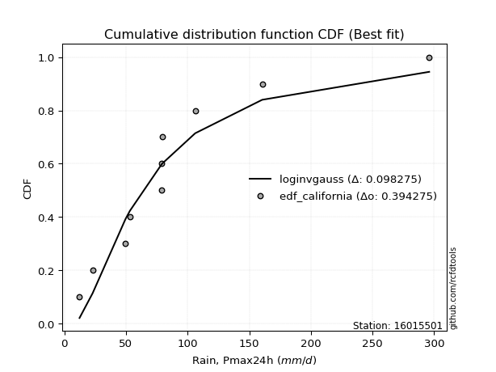</img>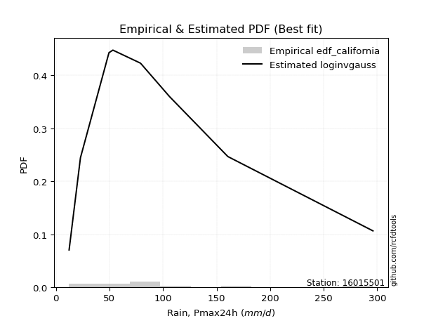</img>

</div>


### 2. Empirical - EDF Hazen (1930)

Hazen method for plotting positions is a formula used to estimate the empirical cumulative probability distribution of flood events or other hydrological data. This formula often results in biased estimations, particularly when extrapolating to extreme events (high return periods).

<div align="center">


$P=(m-0.5)/n$


</div>


**2.1. Empirical values**

<div align="center">

|                | 0                    | 1                   | 2                   | 3                  | 4                  | 5         | 6                  | 7                  | 8                  | 9                  | 10                 |
|:---------------|:---------------------|:--------------------|:--------------------|:-------------------|:-------------------|:----------|:-------------------|:-------------------|:-------------------|:-------------------|:-------------------|
| date           | 2021                 | 2015                | 2020                | 2019               | 2018               | 2016      | 2017               | 2025               | 2023               | 2024               | 2022               |
| x              | 12.33                | 22.92               | 49.56               | 53.21              | 78.81              | 79.06     | 79.69              | 95.5               | 106.18             | 160.52             | 296.0              |
| m              | 1                    | 2                   | 3                   | 4                  | 5                  | 6         | 7                  | 8                  | 9                  | 10                 | 11                 |
| empirical_dist | edf_hazen            | edf_hazen           | edf_hazen           | edf_hazen          | edf_hazen          | edf_hazen | edf_hazen          | edf_hazen          | edf_hazen          | edf_hazen          | edf_hazen          |
| empirical      | 0.045454545454545456 | 0.13636363636363635 | 0.22727272727272727 | 0.3181818181818182 | 0.4090909090909091 | 0.5       | 0.5909090909090909 | 0.6818181818181818 | 0.7727272727272727 | 0.8636363636363636 | 0.9545454545454546 |
| empirical_tr   | 1.0476190476190477   | 1.1578947368421053  | 1.2941176470588236  | 1.4666666666666666 | 1.6923076923076925 | 2.0       | 2.4444444444444446 | 3.1428571428571423 | 4.3999999999999995 | 7.333333333333334  | 22.00000000000002  |

</div>


**2.2. Kolmogorov-Smirnov fit test (sorted by Δ)**


<div align="center">

|                | 0                   | 1                   | 2                   | 3                   | 4                   | 5                   | 6                   | 7                   | 8                   | 9                   | 10                  | 11                  | 12                  | 13                  | 14                  | 15                  | 16                  | 17                  | 18                  | 19                  | 20                  | 21                  | 22                  | 23                  | 24                  | 25                  | 26                    | 27                  | 28                  | 29                  | 30                  | 31                  | 32                  | 33                  | 34                  | 35                  | 36                  | 37                  | 38                  | 39                  | 40                  | 41                  | 42                  | 43                  | 44                  | 45                  | 46                  | 47                  | 48                  | 49                  | 50                  | 51                  | 52                  | 53                  | 54                  | 55                  | 56                  | 57                  | 58                  | 59                  | 60                  | 61                  | 62                  | 63                  | 64                  | 65                  | 66                  | 67                  | 68                  | 69                  | 70                  | 71                  | 72                  | 73                  | 74                  | 75                  | 76                  | 77                  | 78                  | 79                  | 80                  | 81                  | 82                  | 83                  | 84                  | 85                  | 86                  | 87                  | 88                  | 89                  |
|:---------------|:--------------------|:--------------------|:--------------------|:--------------------|:--------------------|:--------------------|:--------------------|:--------------------|:--------------------|:--------------------|:--------------------|:--------------------|:--------------------|:--------------------|:--------------------|:--------------------|:--------------------|:--------------------|:--------------------|:--------------------|:--------------------|:--------------------|:--------------------|:--------------------|:--------------------|:--------------------|:----------------------|:--------------------|:--------------------|:--------------------|:--------------------|:--------------------|:--------------------|:--------------------|:--------------------|:--------------------|:--------------------|:--------------------|:--------------------|:--------------------|:--------------------|:--------------------|:--------------------|:--------------------|:--------------------|:--------------------|:--------------------|:--------------------|:--------------------|:--------------------|:--------------------|:--------------------|:--------------------|:--------------------|:--------------------|:--------------------|:--------------------|:--------------------|:--------------------|:--------------------|:--------------------|:--------------------|:--------------------|:--------------------|:--------------------|:--------------------|:--------------------|:--------------------|:--------------------|:--------------------|:--------------------|:--------------------|:--------------------|:--------------------|:--------------------|:--------------------|:--------------------|:--------------------|:--------------------|:--------------------|:--------------------|:--------------------|:--------------------|:--------------------|:--------------------|:--------------------|:--------------------|:--------------------|:--------------------|:--------------------|
| station        | 16015501            | 16015501            | 16015501            | 16015501            | 16015501            | 16015501            | 16015501            | 16015501            | 16015501            | 16015501            | 16015501            | 16015501            | 16015501            | 16015501            | 16015501            | 16015501            | 16015501            | 16015501            | 16015501            | 16015501            | 16015501            | 16015501            | 16015501            | 16015501            | 16015501            | 16015501            | 16015501              | 16015501            | 16015501            | 16015501            | 16015501            | 16015501            | 16015501            | 16015501            | 16015501            | 16015501            | 16015501            | 16015501            | 16015501            | 16015501            | 16015501            | 16015501            | 16015501            | 16015501            | 16015501            | 16015501            | 16015501            | 16015501            | 16015501            | 16015501            | 16015501            | 16015501            | 16015501            | 16015501            | 16015501            | 16015501            | 16015501            | 16015501            | 16015501            | 16015501            | 16015501            | 16015501            | 16015501            | 16015501            | 16015501            | 16015501            | 16015501            | 16015501            | 16015501            | 16015501            | 16015501            | 16015501            | 16015501            | 16015501            | 16015501            | 16015501            | 16015501            | 16015501            | 16015501            | 16015501            | 16015501            | 16015501            | 16015501            | 16015501            | 16015501            | 16015501            | 16015501            | 16015501            | 16015501            | 16015501            |
| empirical_dist | edf_hazen           | edf_hazen           | edf_hazen           | edf_hazen           | edf_hazen           | edf_hazen           | edf_hazen           | edf_hazen           | edf_hazen           | edf_hazen           | edf_hazen           | edf_hazen           | edf_hazen           | edf_hazen           | edf_hazen           | edf_hazen           | edf_hazen           | edf_hazen           | edf_hazen           | edf_hazen           | edf_hazen           | edf_hazen           | edf_hazen           | edf_hazen           | edf_hazen           | edf_hazen           | edf_hazen             | edf_hazen           | edf_hazen           | edf_hazen           | edf_hazen           | edf_hazen           | edf_hazen           | edf_hazen           | edf_hazen           | edf_hazen           | edf_hazen           | edf_hazen           | edf_hazen           | edf_hazen           | edf_hazen           | edf_hazen           | edf_hazen           | edf_hazen           | edf_hazen           | edf_hazen           | edf_hazen           | edf_hazen           | edf_hazen           | edf_hazen           | edf_hazen           | edf_hazen           | edf_hazen           | edf_hazen           | edf_hazen           | edf_hazen           | edf_hazen           | edf_hazen           | edf_hazen           | edf_hazen           | edf_hazen           | edf_hazen           | edf_hazen           | edf_hazen           | edf_hazen           | edf_hazen           | edf_hazen           | edf_hazen           | edf_hazen           | edf_hazen           | edf_hazen           | edf_hazen           | edf_hazen           | edf_hazen           | edf_hazen           | edf_hazen           | edf_hazen           | edf_hazen           | edf_hazen           | edf_hazen           | edf_hazen           | edf_hazen           | edf_hazen           | edf_hazen           | edf_hazen           | edf_hazen           | edf_hazen           | edf_hazen           | edf_hazen           | edf_hazen           |
| p_dist         | exponnorm           | genlogistic         | loggumbel_l         | moyal               | halflogistic        | logjohnsonsu        | pearson3            | loggenlogistic      | ncf                 | logloggamma         | genexpon            | logpearson3         | nct                 | lognakagami         | logweibull_min      | loggompertz         | fisk                | invweibull          | invgamma            | invgauss            | fatiguelife         | johnsonsu           | logmielke           | logfisk             | t                   | gumbel_r            | loglaplace_asymmetric | f                   | halfnorm            | expon               | logt                | lognorm             | lognorm             | logcrystalball      | logexponnorm        | logf                | kstwobign           | lognct              | logfatiguelife      | logbetaprime        | logncf              | logrice             | gompertz            | loglogistic         | logerlang           | loggamma            | loggamma            | laplace_asymmetric  | wald                | loginvgauss         | gibrat              | loghypsecant        | loginvgamma         | rayleigh            | weibull_min         | logalpha            | maxwell             | mielke              | logmaxwell          | loginvweibull       | loglaplace          | lograyleigh         | hypsecant           | rice                | logistic            | erlang              | norm                | crystalball         | laplace             | chi2                | logkstwobign        | loghalfnorm         | loggenexpon         | loggumbel_r         | betaprime           | logtruncnorm        | loghalflogistic     | logmoyal            | gamma               | gumbel_l            | alpha               | logwald             | logexpon            | loggibrat           | nakagami            | loglognorm          | pareto              | logpareto           | logchi2             | truncnorm           |
| delta          | 0.10291300100474926 | 0.10781581023234466 | 0.11016571041271894 | 0.11420230940026    | 0.11508616380185543 | 0.11551111373766282 | 0.11583588142469553 | 0.1195749571585803  | 0.12095009421965502 | 0.12165850046299137 | 0.12321362948205367 | 0.12331508382404849 | 0.12351274482641422 | 0.12367294638993817 | 0.12367325085560449 | 0.12410115745161959 | 0.12526604700293226 | 0.12531866439801836 | 0.1260083077344774  | 0.12686962800764906 | 0.1271950805737891  | 0.12864260609680062 | 0.13228536860406553 | 0.13233136518990468 | 0.13725534323444694 | 0.13851245724441819 | 0.14122956053391994   | 0.14270004200699818 | 0.1428087216134849  | 0.14791860293820197 | 0.15232685169906263 | 0.1523268700079939  | 0.1523268700079939  | 0.15232694240845618 | 0.1523287996685017  | 0.15246731243890382 | 0.15297667315362706 | 0.1534210174197544  | 0.1545955719801026  | 0.15567889613740987 | 0.1563379305986507  | 0.15838740560454506 | 0.15928854902477063 | 0.16054099497873925 | 0.16084031577914765 | 0.1617195612498325  | 0.1617195612498325  | 0.16363810936048973 | 0.1639712897675068  | 0.1662026983246115  | 0.16646303072798746 | 0.1674432199906341  | 0.16900735569001196 | 0.16917889755407167 | 0.17241287277245126 | 0.17358191392445826 | 0.17851012468379301 | 0.18128610765302017 | 0.1819347402776305  | 0.18637192421166898 | 0.18908255307410388 | 0.19136799230894813 | 0.19196036377766468 | 0.1951105005472359  | 0.19921753017502963 | 0.20002998034027336 | 0.20787013366767892 | 0.20787014913592605 | 0.20940884091624312 | 0.2127740793317094  | 0.2138711993607699  | 0.2180109776235078  | 0.22081094400874393 | 0.22188015676845824 | 0.2220629461800986  | 0.22409307428749883 | 0.24564375317732073 | 0.24632053123722303 | 0.27160236030175844 | 0.27316665599290024 | 0.273254408213744   | 0.31415049528161715 | 0.3258660150958118  | 0.34407873898556646 | 0.3983164446567824  | 0.4486761924914071  | 0.46388300970818863 | 0.49406768660373634 | 0.4948566650697761  | 0.7727252415313625  |
| deltao         | 0.37613735880099997 | 0.37613735880099997 | 0.37613735880099997 | 0.37613735880099997 | 0.37613735880099997 | 0.37613735880099997 | 0.37613735880099997 | 0.37613735880099997 | 0.37613735880099997 | 0.37613735880099997 | 0.37613735880099997 | 0.37613735880099997 | 0.37613735880099997 | 0.37613735880099997 | 0.37613735880099997 | 0.37613735880099997 | 0.37613735880099997 | 0.37613735880099997 | 0.37613735880099997 | 0.37613735880099997 | 0.37613735880099997 | 0.37613735880099997 | 0.37613735880099997 | 0.37613735880099997 | 0.37613735880099997 | 0.37613735880099997 | 0.37613735880099997   | 0.37613735880099997 | 0.37613735880099997 | 0.37613735880099997 | 0.37613735880099997 | 0.37613735880099997 | 0.37613735880099997 | 0.37613735880099997 | 0.37613735880099997 | 0.37613735880099997 | 0.37613735880099997 | 0.37613735880099997 | 0.37613735880099997 | 0.37613735880099997 | 0.37613735880099997 | 0.37613735880099997 | 0.37613735880099997 | 0.37613735880099997 | 0.37613735880099997 | 0.37613735880099997 | 0.37613735880099997 | 0.37613735880099997 | 0.37613735880099997 | 0.37613735880099997 | 0.37613735880099997 | 0.37613735880099997 | 0.37613735880099997 | 0.37613735880099997 | 0.37613735880099997 | 0.37613735880099997 | 0.37613735880099997 | 0.37613735880099997 | 0.37613735880099997 | 0.37613735880099997 | 0.37613735880099997 | 0.37613735880099997 | 0.37613735880099997 | 0.37613735880099997 | 0.37613735880099997 | 0.37613735880099997 | 0.37613735880099997 | 0.37613735880099997 | 0.37613735880099997 | 0.37613735880099997 | 0.37613735880099997 | 0.37613735880099997 | 0.37613735880099997 | 0.37613735880099997 | 0.37613735880099997 | 0.37613735880099997 | 0.37613735880099997 | 0.37613735880099997 | 0.37613735880099997 | 0.37613735880099997 | 0.37613735880099997 | 0.37613735880099997 | 0.37613735880099997 | 0.37613735880099997 | 0.37613735880099997 | 0.37613735880099997 | 0.37613735880099997 | 0.37613735880099997 | 0.37613735880099997 | 0.37613735880099997 |
| eval           | Δo > Δ              | Δo > Δ              | Δo > Δ              | Δo > Δ              | Δo > Δ              | Δo > Δ              | Δo > Δ              | Δo > Δ              | Δo > Δ              | Δo > Δ              | Δo > Δ              | Δo > Δ              | Δo > Δ              | Δo > Δ              | Δo > Δ              | Δo > Δ              | Δo > Δ              | Δo > Δ              | Δo > Δ              | Δo > Δ              | Δo > Δ              | Δo > Δ              | Δo > Δ              | Δo > Δ              | Δo > Δ              | Δo > Δ              | Δo > Δ                | Δo > Δ              | Δo > Δ              | Δo > Δ              | Δo > Δ              | Δo > Δ              | Δo > Δ              | Δo > Δ              | Δo > Δ              | Δo > Δ              | Δo > Δ              | Δo > Δ              | Δo > Δ              | Δo > Δ              | Δo > Δ              | Δo > Δ              | Δo > Δ              | Δo > Δ              | Δo > Δ              | Δo > Δ              | Δo > Δ              | Δo > Δ              | Δo > Δ              | Δo > Δ              | Δo > Δ              | Δo > Δ              | Δo > Δ              | Δo > Δ              | Δo > Δ              | Δo > Δ              | Δo > Δ              | Δo > Δ              | Δo > Δ              | Δo > Δ              | Δo > Δ              | Δo > Δ              | Δo > Δ              | Δo > Δ              | Δo > Δ              | Δo > Δ              | Δo > Δ              | Δo > Δ              | Δo > Δ              | Δo > Δ              | Δo > Δ              | Δo > Δ              | Δo > Δ              | Δo > Δ              | Δo > Δ              | Δo > Δ              | Δo > Δ              | Δo > Δ              | Δo > Δ              | Δo > Δ              | Δo > Δ              | Δo > Δ              | Δo > Δ              | Δo > Δ              | Δo <= Δ             | Δo <= Δ             | Δo <= Δ             | Δo <= Δ             | Δo <= Δ             | Δo <= Δ             |
| fit            | 1                   | 1                   | 1                   | 1                   | 1                   | 1                   | 1                   | 1                   | 1                   | 1                   | 1                   | 1                   | 1                   | 1                   | 1                   | 1                   | 1                   | 1                   | 1                   | 1                   | 1                   | 1                   | 1                   | 1                   | 1                   | 1                   | 1                     | 1                   | 1                   | 1                   | 1                   | 1                   | 1                   | 1                   | 1                   | 1                   | 1                   | 1                   | 1                   | 1                   | 1                   | 1                   | 1                   | 1                   | 1                   | 1                   | 1                   | 1                   | 1                   | 1                   | 1                   | 1                   | 1                   | 1                   | 1                   | 1                   | 1                   | 1                   | 1                   | 1                   | 1                   | 1                   | 1                   | 1                   | 1                   | 1                   | 1                   | 1                   | 1                   | 1                   | 1                   | 1                   | 1                   | 1                   | 1                   | 1                   | 1                   | 1                   | 1                   | 1                   | 1                   | 1                   | 1                   | 1                   | 0                   | 0                   | 0                   | 0                   | 0                   | 0                   |
| n              | 11                  | 11                  | 11                  | 11                  | 11                  | 11                  | 11                  | 11                  | 11                  | 11                  | 11                  | 11                  | 11                  | 11                  | 11                  | 11                  | 11                  | 11                  | 11                  | 11                  | 11                  | 11                  | 11                  | 11                  | 11                  | 11                  | 11                    | 11                  | 11                  | 11                  | 11                  | 11                  | 11                  | 11                  | 11                  | 11                  | 11                  | 11                  | 11                  | 11                  | 11                  | 11                  | 11                  | 11                  | 11                  | 11                  | 11                  | 11                  | 11                  | 11                  | 11                  | 11                  | 11                  | 11                  | 11                  | 11                  | 11                  | 11                  | 11                  | 11                  | 11                  | 11                  | 11                  | 11                  | 11                  | 11                  | 11                  | 11                  | 11                  | 11                  | 11                  | 11                  | 11                  | 11                  | 11                  | 11                  | 11                  | 11                  | 11                  | 11                  | 11                  | 11                  | 11                  | 11                  | 11                  | 11                  | 11                  | 11                  | 11                  | 11                  |
| best_fit       | 1                   | 0                   | 0                   | 0                   | 0                   | 0                   | 0                   | 0                   | 0                   | 0                   | 0                   | 0                   | 0                   | 0                   | 0                   | 0                   | 0                   | 0                   | 0                   | 0                   | 0                   | 0                   | 0                   | 0                   | 0                   | 0                   | 0                     | 0                   | 0                   | 0                   | 0                   | 0                   | 0                   | 0                   | 0                   | 0                   | 0                   | 0                   | 0                   | 0                   | 0                   | 0                   | 0                   | 0                   | 0                   | 0                   | 0                   | 0                   | 0                   | 0                   | 0                   | 0                   | 0                   | 0                   | 0                   | 0                   | 0                   | 0                   | 0                   | 0                   | 0                   | 0                   | 0                   | 0                   | 0                   | 0                   | 0                   | 0                   | 0                   | 0                   | 0                   | 0                   | 0                   | 0                   | 0                   | 0                   | 0                   | 0                   | 0                   | 0                   | 0                   | 0                   | 0                   | 0                   | 0                   | 0                   | 0                   | 0                   | 0                   | 0                   |
| best_fit_sort  | 1                   | 2                   | 3                   | 4                   | 5                   | 6                   | 7                   | 8                   | 9                   | 10                  | 11                  | 12                  | 13                  | 14                  | 15                  | 16                  | 17                  | 18                  | 19                  | 20                  | 21                  | 22                  | 23                  | 24                  | 25                  | 26                  | 27                    | 28                  | 29                  | 30                  | 31                  | 32                  | 33                  | 34                  | 35                  | 36                  | 37                  | 38                  | 39                  | 40                  | 41                  | 42                  | 43                  | 44                  | 45                  | 46                  | 47                  | 48                  | 49                  | 50                  | 51                  | 52                  | 53                  | 54                  | 55                  | 56                  | 57                  | 58                  | 59                  | 60                  | 61                  | 62                  | 63                  | 64                  | 65                  | 66                  | 67                  | 68                  | 69                  | 70                  | 71                  | 72                  | 73                  | 74                  | 75                  | 76                  | 77                  | 78                  | 79                  | 80                  | 81                  | 82                  | 83                  | 84                  | 85                  | 86                  | 87                  | 88                  | 89                  | 90                  |

</div>


<div align="center">

</img>

</div>


**2.3. Best fit**

<div align="center">

|   id |   station | empirical_dist   | p_dist    |    delta |   deltao | eval   |   fit |   n |   best_fit |   best_fit_sort |
|-----:|----------:|:-----------------|:----------|---------:|---------:|:-------|------:|----:|-----------:|----------------:|
|    0 |  16015501 | edf_hazen        | exponnorm | 0.102913 | 0.376137 | Δo > Δ |     1 |  11 |          1 |               1 |

</div>


<div align="center">

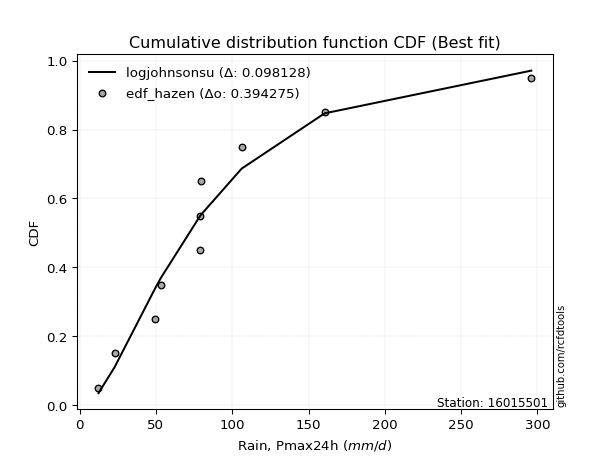</img></img>

</div>


### 3. Empirical - EDF Weibull (1939)

Weibull plotting position formula is an empirical method used to estimate the non-exceedance probability or plotting position for a set of observed data, is often recommended or widely used in practice, particularly in flood frequency analysis.

<div align="center">


$P=m/(n+1)$


</div>


**3.1. Empirical values**

<div align="center">

|                | 0                   | 1                   | 2                  | 3                  | 4                  | 5           | 6                  | 7                  | 8           | 9                  | 10                 |
|:---------------|:--------------------|:--------------------|:-------------------|:-------------------|:-------------------|:------------|:-------------------|:-------------------|:------------|:-------------------|:-------------------|
| date           | 2021                | 2015                | 2020               | 2019               | 2018               | 2016        | 2017               | 2025               | 2023        | 2024               | 2022               |
| x              | 12.33               | 22.92               | 49.56              | 53.21              | 78.81              | 79.06       | 79.69              | 95.5               | 106.18      | 160.52             | 296.0              |
| m              | 1                   | 2                   | 3                  | 4                  | 5                  | 6           | 7                  | 8                  | 9           | 10                 | 11                 |
| empirical_dist | edf_weibull         | edf_weibull         | edf_weibull        | edf_weibull        | edf_weibull        | edf_weibull | edf_weibull        | edf_weibull        | edf_weibull | edf_weibull        | edf_weibull        |
| empirical      | 0.08333333333333333 | 0.16666666666666666 | 0.25               | 0.3333333333333333 | 0.4166666666666667 | 0.5         | 0.5833333333333334 | 0.6666666666666666 | 0.75        | 0.8333333333333334 | 0.9166666666666666 |
| empirical_tr   | 1.090909090909091   | 1.2                 | 1.3333333333333333 | 1.4999999999999998 | 1.7142857142857144 | 2.0         | 2.4000000000000004 | 2.9999999999999996 | 4.0         | 6.000000000000002  | 11.999999999999995 |

</div>


**3.2. Kolmogorov-Smirnov fit test (sorted by Δ)**


<div align="center">

|                | 0                   | 1                   | 2                   | 3                   | 4                   | 5                   | 6                   | 7                   | 8                   | 9                   | 10                  | 11                  | 12                  | 13                  | 14                  | 15                  | 16                  | 17                  | 18                  | 19                  | 20                  | 21                  | 22                  | 23                  | 24                  | 25                  | 26                  | 27                  | 28                    | 29                  | 30                  | 31                  | 32                  | 33                  | 34                  | 35                  | 36                  | 37                  | 38                  | 39                  | 40                  | 41                  | 42                  | 43                  | 44                  | 45                  | 46                  | 47                  | 48                  | 49                  | 50                  | 51                  | 52                  | 53                  | 54                  | 55                  | 56                  | 57                  | 58                  | 59                  | 60                  | 61                  | 62                  | 63                  | 64                  | 65                  | 66                  | 67                  | 68                  | 69                  | 70                  | 71                  | 72                  | 73                  | 74                  | 75                  | 76                  | 77                  | 78                  | 79                  | 80                  | 81                  | 82                  | 83                  | 84                  | 85                  | 86                  | 87                  | 88                  | 89                  |
|:---------------|:--------------------|:--------------------|:--------------------|:--------------------|:--------------------|:--------------------|:--------------------|:--------------------|:--------------------|:--------------------|:--------------------|:--------------------|:--------------------|:--------------------|:--------------------|:--------------------|:--------------------|:--------------------|:--------------------|:--------------------|:--------------------|:--------------------|:--------------------|:--------------------|:--------------------|:--------------------|:--------------------|:--------------------|:----------------------|:--------------------|:--------------------|:--------------------|:--------------------|:--------------------|:--------------------|:--------------------|:--------------------|:--------------------|:--------------------|:--------------------|:--------------------|:--------------------|:--------------------|:--------------------|:--------------------|:--------------------|:--------------------|:--------------------|:--------------------|:--------------------|:--------------------|:--------------------|:--------------------|:--------------------|:--------------------|:--------------------|:--------------------|:--------------------|:--------------------|:--------------------|:--------------------|:--------------------|:--------------------|:--------------------|:--------------------|:--------------------|:--------------------|:--------------------|:--------------------|:--------------------|:--------------------|:--------------------|:--------------------|:--------------------|:--------------------|:--------------------|:--------------------|:--------------------|:--------------------|:--------------------|:--------------------|:--------------------|:--------------------|:--------------------|:--------------------|:--------------------|:--------------------|:--------------------|:--------------------|:--------------------|
| station        | 16015501            | 16015501            | 16015501            | 16015501            | 16015501            | 16015501            | 16015501            | 16015501            | 16015501            | 16015501            | 16015501            | 16015501            | 16015501            | 16015501            | 16015501            | 16015501            | 16015501            | 16015501            | 16015501            | 16015501            | 16015501            | 16015501            | 16015501            | 16015501            | 16015501            | 16015501            | 16015501            | 16015501            | 16015501              | 16015501            | 16015501            | 16015501            | 16015501            | 16015501            | 16015501            | 16015501            | 16015501            | 16015501            | 16015501            | 16015501            | 16015501            | 16015501            | 16015501            | 16015501            | 16015501            | 16015501            | 16015501            | 16015501            | 16015501            | 16015501            | 16015501            | 16015501            | 16015501            | 16015501            | 16015501            | 16015501            | 16015501            | 16015501            | 16015501            | 16015501            | 16015501            | 16015501            | 16015501            | 16015501            | 16015501            | 16015501            | 16015501            | 16015501            | 16015501            | 16015501            | 16015501            | 16015501            | 16015501            | 16015501            | 16015501            | 16015501            | 16015501            | 16015501            | 16015501            | 16015501            | 16015501            | 16015501            | 16015501            | 16015501            | 16015501            | 16015501            | 16015501            | 16015501            | 16015501            | 16015501            |
| empirical_dist | edf_weibull         | edf_weibull         | edf_weibull         | edf_weibull         | edf_weibull         | edf_weibull         | edf_weibull         | edf_weibull         | edf_weibull         | edf_weibull         | edf_weibull         | edf_weibull         | edf_weibull         | edf_weibull         | edf_weibull         | edf_weibull         | edf_weibull         | edf_weibull         | edf_weibull         | edf_weibull         | edf_weibull         | edf_weibull         | edf_weibull         | edf_weibull         | edf_weibull         | edf_weibull         | edf_weibull         | edf_weibull         | edf_weibull           | edf_weibull         | edf_weibull         | edf_weibull         | edf_weibull         | edf_weibull         | edf_weibull         | edf_weibull         | edf_weibull         | edf_weibull         | edf_weibull         | edf_weibull         | edf_weibull         | edf_weibull         | edf_weibull         | edf_weibull         | edf_weibull         | edf_weibull         | edf_weibull         | edf_weibull         | edf_weibull         | edf_weibull         | edf_weibull         | edf_weibull         | edf_weibull         | edf_weibull         | edf_weibull         | edf_weibull         | edf_weibull         | edf_weibull         | edf_weibull         | edf_weibull         | edf_weibull         | edf_weibull         | edf_weibull         | edf_weibull         | edf_weibull         | edf_weibull         | edf_weibull         | edf_weibull         | edf_weibull         | edf_weibull         | edf_weibull         | edf_weibull         | edf_weibull         | edf_weibull         | edf_weibull         | edf_weibull         | edf_weibull         | edf_weibull         | edf_weibull         | edf_weibull         | edf_weibull         | edf_weibull         | edf_weibull         | edf_weibull         | edf_weibull         | edf_weibull         | edf_weibull         | edf_weibull         | edf_weibull         | edf_weibull         |
| p_dist         | loggumbel_l         | moyal               | genlogistic         | exponnorm           | halflogistic        | logjohnsonsu        | pearson3            | loggenlogistic      | ncf                 | logloggamma         | genexpon            | logpearson3         | gumbel_r            | nct                 | logweibull_min      | loggompertz         | fisk                | invweibull          | invgamma            | invgauss            | fatiguelife         | halfnorm            | johnsonsu           | logmielke           | logfisk             | t                   | kstwobign           | f                   | loglaplace_asymmetric | gompertz            | expon               | logt                | lognorm             | lognorm             | logcrystalball      | logexponnorm        | logf                | lognct              | rayleigh            | logfatiguelife      | logbetaprime        | logncf              | logrice             | loglogistic         | logerlang           | lognakagami         | loggamma            | loggamma            | maxwell             | laplace_asymmetric  | loginvgauss         | loghypsecant        | loginvgamma         | weibull_min         | logalpha            | wald                | gibrat              | rice                | mielke              | logmaxwell          | logistic            | hypsecant           | loginvweibull       | loglaplace          | lograyleigh         | norm                | crystalball         | erlang              | logkstwobign        | laplace             | loggenexpon         | chi2                | loghalfnorm         | betaprime           | loggumbel_r         | logtruncnorm        | loghalflogistic     | logmoyal            | gumbel_l            | alpha               | gamma               | logexpon            | logwald             | loggibrat           | nakagami            | loglognorm          | pareto              | logpareto           | logchi2             | truncnorm           |
| delta          | 0.08743843768544624 | 0.09147503667298729 | 0.09150008465076848 | 0.09533724342899169 | 0.10191690079251309 | 0.10793535616190525 | 0.10826012384893796 | 0.11199919958282273 | 0.11337433664389746 | 0.1140827428872338  | 0.1156378719062961  | 0.11573932624829092 | 0.11578518451714548 | 0.11593698725065665 | 0.11609749327984692 | 0.11652539987586202 | 0.11769028942717469 | 0.1177429068222608  | 0.11843255015871984 | 0.11929387043189149 | 0.11961932299803152 | 0.1200814488862122  | 0.12106684852104305 | 0.12470961102830797 | 0.12475560761414711 | 0.12967958565868937 | 0.13024940042635436 | 0.13299565371939964 | 0.13365380295816237   | 0.13656127629749792 | 0.1403428453624444  | 0.14475109412330506 | 0.14475111243223632 | 0.14475111243223632 | 0.1447511848326986  | 0.14475304209274414 | 0.14489155486314625 | 0.14584525984399682 | 0.14645162482679897 | 0.14701981440434503 | 0.1481031385616523  | 0.14876217302289313 | 0.1508116480287875  | 0.15296523740298168 | 0.15326455820339008 | 0.15397597669296847 | 0.15414380367407493 | 0.15414380367407493 | 0.1557828519565203  | 0.15606235178473216 | 0.15862694074885392 | 0.15986746241487654 | 0.1614315981142544  | 0.1648371151966937  | 0.1660061563487007  | 0.1666505019308914  | 0.16666666666666666 | 0.17238322781996318 | 0.1737103500772626  | 0.17435898270187294 | 0.17649025744775693 | 0.1775611671732863  | 0.1787961666359114  | 0.1815067954983463  | 0.18379223473319056 | 0.18514286094040622 | 0.18514287640865335 | 0.1924542227645158  | 0.19568061859360203 | 0.20183308334048555 | 0.20360124056724088 | 0.20519832175595182 | 0.21043522004775023 | 0.21212111169734987 | 0.21430439919270067 | 0.21609059691612303 | 0.23806799560156316 | 0.23874477366146546 | 0.25043938326562754 | 0.25495704812861003 | 0.2611126077797858  | 0.3031387423685391  | 0.3065747377058596  | 0.3365029814098089  | 0.3755891719295097  | 0.41837316218837683 | 0.43357997940515836 | 0.46376465630070607 | 0.4721293923425034  | 0.7499979688040898  |
| deltao         | 0.37613735880099997 | 0.37613735880099997 | 0.37613735880099997 | 0.37613735880099997 | 0.37613735880099997 | 0.37613735880099997 | 0.37613735880099997 | 0.37613735880099997 | 0.37613735880099997 | 0.37613735880099997 | 0.37613735880099997 | 0.37613735880099997 | 0.37613735880099997 | 0.37613735880099997 | 0.37613735880099997 | 0.37613735880099997 | 0.37613735880099997 | 0.37613735880099997 | 0.37613735880099997 | 0.37613735880099997 | 0.37613735880099997 | 0.37613735880099997 | 0.37613735880099997 | 0.37613735880099997 | 0.37613735880099997 | 0.37613735880099997 | 0.37613735880099997 | 0.37613735880099997 | 0.37613735880099997   | 0.37613735880099997 | 0.37613735880099997 | 0.37613735880099997 | 0.37613735880099997 | 0.37613735880099997 | 0.37613735880099997 | 0.37613735880099997 | 0.37613735880099997 | 0.37613735880099997 | 0.37613735880099997 | 0.37613735880099997 | 0.37613735880099997 | 0.37613735880099997 | 0.37613735880099997 | 0.37613735880099997 | 0.37613735880099997 | 0.37613735880099997 | 0.37613735880099997 | 0.37613735880099997 | 0.37613735880099997 | 0.37613735880099997 | 0.37613735880099997 | 0.37613735880099997 | 0.37613735880099997 | 0.37613735880099997 | 0.37613735880099997 | 0.37613735880099997 | 0.37613735880099997 | 0.37613735880099997 | 0.37613735880099997 | 0.37613735880099997 | 0.37613735880099997 | 0.37613735880099997 | 0.37613735880099997 | 0.37613735880099997 | 0.37613735880099997 | 0.37613735880099997 | 0.37613735880099997 | 0.37613735880099997 | 0.37613735880099997 | 0.37613735880099997 | 0.37613735880099997 | 0.37613735880099997 | 0.37613735880099997 | 0.37613735880099997 | 0.37613735880099997 | 0.37613735880099997 | 0.37613735880099997 | 0.37613735880099997 | 0.37613735880099997 | 0.37613735880099997 | 0.37613735880099997 | 0.37613735880099997 | 0.37613735880099997 | 0.37613735880099997 | 0.37613735880099997 | 0.37613735880099997 | 0.37613735880099997 | 0.37613735880099997 | 0.37613735880099997 | 0.37613735880099997 |
| eval           | Δo > Δ              | Δo > Δ              | Δo > Δ              | Δo > Δ              | Δo > Δ              | Δo > Δ              | Δo > Δ              | Δo > Δ              | Δo > Δ              | Δo > Δ              | Δo > Δ              | Δo > Δ              | Δo > Δ              | Δo > Δ              | Δo > Δ              | Δo > Δ              | Δo > Δ              | Δo > Δ              | Δo > Δ              | Δo > Δ              | Δo > Δ              | Δo > Δ              | Δo > Δ              | Δo > Δ              | Δo > Δ              | Δo > Δ              | Δo > Δ              | Δo > Δ              | Δo > Δ                | Δo > Δ              | Δo > Δ              | Δo > Δ              | Δo > Δ              | Δo > Δ              | Δo > Δ              | Δo > Δ              | Δo > Δ              | Δo > Δ              | Δo > Δ              | Δo > Δ              | Δo > Δ              | Δo > Δ              | Δo > Δ              | Δo > Δ              | Δo > Δ              | Δo > Δ              | Δo > Δ              | Δo > Δ              | Δo > Δ              | Δo > Δ              | Δo > Δ              | Δo > Δ              | Δo > Δ              | Δo > Δ              | Δo > Δ              | Δo > Δ              | Δo > Δ              | Δo > Δ              | Δo > Δ              | Δo > Δ              | Δo > Δ              | Δo > Δ              | Δo > Δ              | Δo > Δ              | Δo > Δ              | Δo > Δ              | Δo > Δ              | Δo > Δ              | Δo > Δ              | Δo > Δ              | Δo > Δ              | Δo > Δ              | Δo > Δ              | Δo > Δ              | Δo > Δ              | Δo > Δ              | Δo > Δ              | Δo > Δ              | Δo > Δ              | Δo > Δ              | Δo > Δ              | Δo > Δ              | Δo > Δ              | Δo > Δ              | Δo > Δ              | Δo <= Δ             | Δo <= Δ             | Δo <= Δ             | Δo <= Δ             | Δo <= Δ             |
| fit            | 1                   | 1                   | 1                   | 1                   | 1                   | 1                   | 1                   | 1                   | 1                   | 1                   | 1                   | 1                   | 1                   | 1                   | 1                   | 1                   | 1                   | 1                   | 1                   | 1                   | 1                   | 1                   | 1                   | 1                   | 1                   | 1                   | 1                   | 1                   | 1                     | 1                   | 1                   | 1                   | 1                   | 1                   | 1                   | 1                   | 1                   | 1                   | 1                   | 1                   | 1                   | 1                   | 1                   | 1                   | 1                   | 1                   | 1                   | 1                   | 1                   | 1                   | 1                   | 1                   | 1                   | 1                   | 1                   | 1                   | 1                   | 1                   | 1                   | 1                   | 1                   | 1                   | 1                   | 1                   | 1                   | 1                   | 1                   | 1                   | 1                   | 1                   | 1                   | 1                   | 1                   | 1                   | 1                   | 1                   | 1                   | 1                   | 1                   | 1                   | 1                   | 1                   | 1                   | 1                   | 1                   | 0                   | 0                   | 0                   | 0                   | 0                   |
| n              | 11                  | 11                  | 11                  | 11                  | 11                  | 11                  | 11                  | 11                  | 11                  | 11                  | 11                  | 11                  | 11                  | 11                  | 11                  | 11                  | 11                  | 11                  | 11                  | 11                  | 11                  | 11                  | 11                  | 11                  | 11                  | 11                  | 11                  | 11                  | 11                    | 11                  | 11                  | 11                  | 11                  | 11                  | 11                  | 11                  | 11                  | 11                  | 11                  | 11                  | 11                  | 11                  | 11                  | 11                  | 11                  | 11                  | 11                  | 11                  | 11                  | 11                  | 11                  | 11                  | 11                  | 11                  | 11                  | 11                  | 11                  | 11                  | 11                  | 11                  | 11                  | 11                  | 11                  | 11                  | 11                  | 11                  | 11                  | 11                  | 11                  | 11                  | 11                  | 11                  | 11                  | 11                  | 11                  | 11                  | 11                  | 11                  | 11                  | 11                  | 11                  | 11                  | 11                  | 11                  | 11                  | 11                  | 11                  | 11                  | 11                  | 11                  |
| best_fit       | 1                   | 0                   | 0                   | 0                   | 0                   | 0                   | 0                   | 0                   | 0                   | 0                   | 0                   | 0                   | 0                   | 0                   | 0                   | 0                   | 0                   | 0                   | 0                   | 0                   | 0                   | 0                   | 0                   | 0                   | 0                   | 0                   | 0                   | 0                   | 0                     | 0                   | 0                   | 0                   | 0                   | 0                   | 0                   | 0                   | 0                   | 0                   | 0                   | 0                   | 0                   | 0                   | 0                   | 0                   | 0                   | 0                   | 0                   | 0                   | 0                   | 0                   | 0                   | 0                   | 0                   | 0                   | 0                   | 0                   | 0                   | 0                   | 0                   | 0                   | 0                   | 0                   | 0                   | 0                   | 0                   | 0                   | 0                   | 0                   | 0                   | 0                   | 0                   | 0                   | 0                   | 0                   | 0                   | 0                   | 0                   | 0                   | 0                   | 0                   | 0                   | 0                   | 0                   | 0                   | 0                   | 0                   | 0                   | 0                   | 0                   | 0                   |
| best_fit_sort  | 1                   | 2                   | 3                   | 4                   | 5                   | 6                   | 7                   | 8                   | 9                   | 10                  | 11                  | 12                  | 13                  | 14                  | 15                  | 16                  | 17                  | 18                  | 19                  | 20                  | 21                  | 22                  | 23                  | 24                  | 25                  | 26                  | 27                  | 28                  | 29                    | 30                  | 31                  | 32                  | 33                  | 34                  | 35                  | 36                  | 37                  | 38                  | 39                  | 40                  | 41                  | 42                  | 43                  | 44                  | 45                  | 46                  | 47                  | 48                  | 49                  | 50                  | 51                  | 52                  | 53                  | 54                  | 55                  | 56                  | 57                  | 58                  | 59                  | 60                  | 61                  | 62                  | 63                  | 64                  | 65                  | 66                  | 67                  | 68                  | 69                  | 70                  | 71                  | 72                  | 73                  | 74                  | 75                  | 76                  | 77                  | 78                  | 79                  | 80                  | 81                  | 82                  | 83                  | 84                  | 85                  | 86                  | 87                  | 88                  | 89                  | 90                  |

</div>


<div align="center">

</img>

</div>


**3.3. Best fit**

<div align="center">

|   id |   station | empirical_dist   | p_dist      |     delta |   deltao | eval   |   fit |   n |   best_fit |   best_fit_sort |
|-----:|----------:|:-----------------|:------------|----------:|---------:|:-------|------:|----:|-----------:|----------------:|
|    0 |  16015501 | edf_weibull      | loggumbel_l | 0.0874384 | 0.376137 | Δo > Δ |     1 |  11 |          1 |               1 |

</div>


<div align="center">

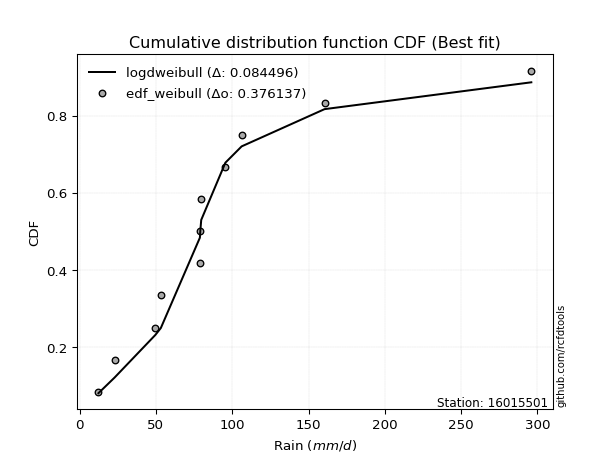</img>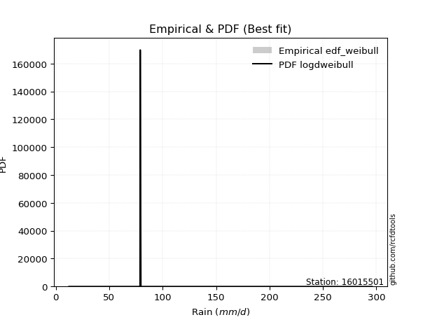</img>

</div>


### 4. Empirical - EDF Beard (1943)

The Beard formula (or Beard´s plotting position formula) in hydrology is used to estimate the empirical non-exceedance probability _(P)_ of a flood event (or other extreme hydrological data point) within a given dataset.

<div align="center">


$P=(m-0.31)/(n+0.38)$


</div>


**4.1. Empirical values**

<div align="center">

|                | 0                    | 1                 | 2                   | 3                  | 4                  | 5         | 6                  | 7                  | 8                  | 9                  | 10                 |
|:---------------|:---------------------|:------------------|:--------------------|:-------------------|:-------------------|:----------|:-------------------|:-------------------|:-------------------|:-------------------|:-------------------|
| date           | 2021                 | 2015              | 2020                | 2019               | 2018               | 2016      | 2017               | 2025               | 2023               | 2024               | 2022               |
| x              | 12.33                | 22.92             | 49.56               | 53.21              | 78.81              | 79.06     | 79.69              | 95.5               | 106.18             | 160.52             | 296.0              |
| m              | 1                    | 2                 | 3                   | 4                  | 5                  | 6         | 7                  | 8                  | 9                  | 10                 | 11                 |
| empirical_dist | edf_beard            | edf_beard         | edf_beard           | edf_beard          | edf_beard          | edf_beard | edf_beard          | edf_beard          | edf_beard          | edf_beard          | edf_beard          |
| empirical      | 0.060632688927943754 | 0.148506151142355 | 0.23637961335676624 | 0.3242530755711775 | 0.4121265377855888 | 0.5       | 0.5878734622144113 | 0.6757469244288224 | 0.7636203866432336 | 0.8514938488576449 | 0.9393673110720562 |
| empirical_tr   | 1.0645463049579045   | 1.174406604747162 | 1.3095512082853855  | 1.4798439531859557 | 1.7010463378176381 | 2.0       | 2.4264392324093818 | 3.0840108401084008 | 4.230483271375462  | 6.733727810650883  | 16.49275362318839  |

</div>


**4.2. Kolmogorov-Smirnov fit test (sorted by Δ)**


<div align="center">

|                | 0                   | 1                   | 2                   | 3                   | 4                   | 5                   | 6                   | 7                   | 8                   | 9                   | 10                  | 11                  | 12                  | 13                  | 14                  | 15                  | 16                  | 17                  | 18                  | 19                  | 20                  | 21                  | 22                  | 23                  | 24                  | 25                  | 26                  | 27                  | 28                    | 29                  | 30                  | 31                  | 32                  | 33                  | 34                  | 35                  | 36                  | 37                  | 38                  | 39                  | 40                  | 41                  | 42                  | 43                  | 44                  | 45                  | 46                  | 47                  | 48                  | 49                  | 50                  | 51                  | 52                  | 53                  | 54                  | 55                  | 56                  | 57                  | 58                  | 59                  | 60                  | 61                  | 62                  | 63                  | 64                  | 65                  | 66                  | 67                  | 68                  | 69                  | 70                  | 71                  | 72                  | 73                  | 74                  | 75                  | 76                  | 77                  | 78                  | 79                  | 80                  | 81                  | 82                  | 83                  | 84                  | 85                  | 86                  | 87                  | 88                  | 89                  |
|:---------------|:--------------------|:--------------------|:--------------------|:--------------------|:--------------------|:--------------------|:--------------------|:--------------------|:--------------------|:--------------------|:--------------------|:--------------------|:--------------------|:--------------------|:--------------------|:--------------------|:--------------------|:--------------------|:--------------------|:--------------------|:--------------------|:--------------------|:--------------------|:--------------------|:--------------------|:--------------------|:--------------------|:--------------------|:----------------------|:--------------------|:--------------------|:--------------------|:--------------------|:--------------------|:--------------------|:--------------------|:--------------------|:--------------------|:--------------------|:--------------------|:--------------------|:--------------------|:--------------------|:--------------------|:--------------------|:--------------------|:--------------------|:--------------------|:--------------------|:--------------------|:--------------------|:--------------------|:--------------------|:--------------------|:--------------------|:--------------------|:--------------------|:--------------------|:--------------------|:--------------------|:--------------------|:--------------------|:--------------------|:--------------------|:--------------------|:--------------------|:--------------------|:--------------------|:--------------------|:--------------------|:--------------------|:--------------------|:--------------------|:--------------------|:--------------------|:--------------------|:--------------------|:--------------------|:--------------------|:--------------------|:--------------------|:--------------------|:--------------------|:--------------------|:--------------------|:--------------------|:--------------------|:--------------------|:--------------------|:--------------------|
| station        | 16015501            | 16015501            | 16015501            | 16015501            | 16015501            | 16015501            | 16015501            | 16015501            | 16015501            | 16015501            | 16015501            | 16015501            | 16015501            | 16015501            | 16015501            | 16015501            | 16015501            | 16015501            | 16015501            | 16015501            | 16015501            | 16015501            | 16015501            | 16015501            | 16015501            | 16015501            | 16015501            | 16015501            | 16015501              | 16015501            | 16015501            | 16015501            | 16015501            | 16015501            | 16015501            | 16015501            | 16015501            | 16015501            | 16015501            | 16015501            | 16015501            | 16015501            | 16015501            | 16015501            | 16015501            | 16015501            | 16015501            | 16015501            | 16015501            | 16015501            | 16015501            | 16015501            | 16015501            | 16015501            | 16015501            | 16015501            | 16015501            | 16015501            | 16015501            | 16015501            | 16015501            | 16015501            | 16015501            | 16015501            | 16015501            | 16015501            | 16015501            | 16015501            | 16015501            | 16015501            | 16015501            | 16015501            | 16015501            | 16015501            | 16015501            | 16015501            | 16015501            | 16015501            | 16015501            | 16015501            | 16015501            | 16015501            | 16015501            | 16015501            | 16015501            | 16015501            | 16015501            | 16015501            | 16015501            | 16015501            |
| empirical_dist | edf_beard           | edf_beard           | edf_beard           | edf_beard           | edf_beard           | edf_beard           | edf_beard           | edf_beard           | edf_beard           | edf_beard           | edf_beard           | edf_beard           | edf_beard           | edf_beard           | edf_beard           | edf_beard           | edf_beard           | edf_beard           | edf_beard           | edf_beard           | edf_beard           | edf_beard           | edf_beard           | edf_beard           | edf_beard           | edf_beard           | edf_beard           | edf_beard           | edf_beard             | edf_beard           | edf_beard           | edf_beard           | edf_beard           | edf_beard           | edf_beard           | edf_beard           | edf_beard           | edf_beard           | edf_beard           | edf_beard           | edf_beard           | edf_beard           | edf_beard           | edf_beard           | edf_beard           | edf_beard           | edf_beard           | edf_beard           | edf_beard           | edf_beard           | edf_beard           | edf_beard           | edf_beard           | edf_beard           | edf_beard           | edf_beard           | edf_beard           | edf_beard           | edf_beard           | edf_beard           | edf_beard           | edf_beard           | edf_beard           | edf_beard           | edf_beard           | edf_beard           | edf_beard           | edf_beard           | edf_beard           | edf_beard           | edf_beard           | edf_beard           | edf_beard           | edf_beard           | edf_beard           | edf_beard           | edf_beard           | edf_beard           | edf_beard           | edf_beard           | edf_beard           | edf_beard           | edf_beard           | edf_beard           | edf_beard           | edf_beard           | edf_beard           | edf_beard           | edf_beard           | edf_beard           |
| p_dist         | genlogistic         | exponnorm           | loggumbel_l         | moyal               | halflogistic        | logjohnsonsu        | pearson3            | loggenlogistic      | ncf                 | logloggamma         | genexpon            | logpearson3         | nct                 | logweibull_min      | loggompertz         | fisk                | invweibull          | invgamma            | invgauss            | fatiguelife         | johnsonsu           | logmielke           | logfisk             | gumbel_r            | halfnorm            | t                   | lognakagami         | f                   | loglaplace_asymmetric | kstwobign           | expon               | logt                | lognorm             | lognorm             | logcrystalball      | logexponnorm        | logf                | gompertz            | lognct              | logfatiguelife      | logbetaprime        | logncf              | logrice             | loglogistic         | logerlang           | loggamma            | loggamma            | rayleigh            | laplace_asymmetric  | wald                | loginvgauss         | gibrat              | loghypsecant        | loginvgamma         | weibull_min         | maxwell             | logalpha            | mielke              | logmaxwell          | hypsecant           | loginvweibull       | rice                | loglaplace          | lograyleigh         | logistic            | erlang              | norm                | crystalball         | logkstwobign        | laplace             | chi2                | loggenexpon         | loghalfnorm         | betaprime           | loggumbel_r         | logtruncnorm        | loghalflogistic     | logmoyal            | gumbel_l            | alpha               | gamma               | logwald             | logexpon            | loggibrat           | nakagami            | loglognorm          | pareto              | logpareto           | logchi2             | truncnorm           |
| delta          | 0.09870892414830557 | 0.0998773723100696  | 0.10105882432867985 | 0.1050954233162209  | 0.106457029673591   | 0.11247548504298316 | 0.11280025273001587 | 0.11653932846390064 | 0.11791446552497536 | 0.11862287176831171 | 0.120178000787374   | 0.12027945512936883 | 0.12047711613173456 | 0.12063762216092483 | 0.12106552875693993 | 0.1222304183082526  | 0.1222830357033387  | 0.12297267903979775 | 0.1238339993129694  | 0.12415945187910943 | 0.12560697740212096 | 0.12924973990938587 | 0.12929573649522502 | 0.1294055711603791  | 0.1337018355294458  | 0.13421971453976728 | 0.1358154611686568  | 0.13753578260047755 | 0.13819393183924028   | 0.14386978706958797 | 0.1448829742435223  | 0.14929122300438297 | 0.14929124131331423 | 0.14929124131331423 | 0.14929131371377652 | 0.14929317097382205 | 0.14943168374422416 | 0.15018166294073154 | 0.15038538872507473 | 0.15155994328542294 | 0.1526432674427302  | 0.15330230190397104 | 0.1553517769098654  | 0.1575053662840596  | 0.157804687084468   | 0.15868393255515284 | 0.15868393255515284 | 0.16007201147003258 | 0.16060248066581007 | 0.16093566107282714 | 0.16316706962993183 | 0.1634274020333078  | 0.16440759129595445 | 0.1659717269953323  | 0.1693772440777716  | 0.16940323859975392 | 0.1705462852297786  | 0.1782504789583405  | 0.17889911158295085 | 0.1828534776936256  | 0.18333629551698932 | 0.1860036144631968  | 0.18604692437942422 | 0.18833236361426847 | 0.19011064409099054 | 0.1969943516455937  | 0.19876324758363983 | 0.19876326305188696 | 0.20476431327673092 | 0.20637321222156346 | 0.20973845063702973 | 0.21170405792470495 | 0.21497534892882814 | 0.21666124057842778 | 0.21884452807377858 | 0.22063072579720094 | 0.24260812448264107 | 0.24328490254254337 | 0.26405976990886115 | 0.26414752212970505 | 0.2656527366608637  | 0.3111148665869375  | 0.31675912901177283 | 0.3410431102908868  | 0.3892095585727434  | 0.4365336777126885  | 0.45174049492947    | 0.4819251718250177  | 0.4857497789857371  | 0.7636183554473235  |
| deltao         | 0.37613735880099997 | 0.37613735880099997 | 0.37613735880099997 | 0.37613735880099997 | 0.37613735880099997 | 0.37613735880099997 | 0.37613735880099997 | 0.37613735880099997 | 0.37613735880099997 | 0.37613735880099997 | 0.37613735880099997 | 0.37613735880099997 | 0.37613735880099997 | 0.37613735880099997 | 0.37613735880099997 | 0.37613735880099997 | 0.37613735880099997 | 0.37613735880099997 | 0.37613735880099997 | 0.37613735880099997 | 0.37613735880099997 | 0.37613735880099997 | 0.37613735880099997 | 0.37613735880099997 | 0.37613735880099997 | 0.37613735880099997 | 0.37613735880099997 | 0.37613735880099997 | 0.37613735880099997   | 0.37613735880099997 | 0.37613735880099997 | 0.37613735880099997 | 0.37613735880099997 | 0.37613735880099997 | 0.37613735880099997 | 0.37613735880099997 | 0.37613735880099997 | 0.37613735880099997 | 0.37613735880099997 | 0.37613735880099997 | 0.37613735880099997 | 0.37613735880099997 | 0.37613735880099997 | 0.37613735880099997 | 0.37613735880099997 | 0.37613735880099997 | 0.37613735880099997 | 0.37613735880099997 | 0.37613735880099997 | 0.37613735880099997 | 0.37613735880099997 | 0.37613735880099997 | 0.37613735880099997 | 0.37613735880099997 | 0.37613735880099997 | 0.37613735880099997 | 0.37613735880099997 | 0.37613735880099997 | 0.37613735880099997 | 0.37613735880099997 | 0.37613735880099997 | 0.37613735880099997 | 0.37613735880099997 | 0.37613735880099997 | 0.37613735880099997 | 0.37613735880099997 | 0.37613735880099997 | 0.37613735880099997 | 0.37613735880099997 | 0.37613735880099997 | 0.37613735880099997 | 0.37613735880099997 | 0.37613735880099997 | 0.37613735880099997 | 0.37613735880099997 | 0.37613735880099997 | 0.37613735880099997 | 0.37613735880099997 | 0.37613735880099997 | 0.37613735880099997 | 0.37613735880099997 | 0.37613735880099997 | 0.37613735880099997 | 0.37613735880099997 | 0.37613735880099997 | 0.37613735880099997 | 0.37613735880099997 | 0.37613735880099997 | 0.37613735880099997 | 0.37613735880099997 |
| eval           | Δo > Δ              | Δo > Δ              | Δo > Δ              | Δo > Δ              | Δo > Δ              | Δo > Δ              | Δo > Δ              | Δo > Δ              | Δo > Δ              | Δo > Δ              | Δo > Δ              | Δo > Δ              | Δo > Δ              | Δo > Δ              | Δo > Δ              | Δo > Δ              | Δo > Δ              | Δo > Δ              | Δo > Δ              | Δo > Δ              | Δo > Δ              | Δo > Δ              | Δo > Δ              | Δo > Δ              | Δo > Δ              | Δo > Δ              | Δo > Δ              | Δo > Δ              | Δo > Δ                | Δo > Δ              | Δo > Δ              | Δo > Δ              | Δo > Δ              | Δo > Δ              | Δo > Δ              | Δo > Δ              | Δo > Δ              | Δo > Δ              | Δo > Δ              | Δo > Δ              | Δo > Δ              | Δo > Δ              | Δo > Δ              | Δo > Δ              | Δo > Δ              | Δo > Δ              | Δo > Δ              | Δo > Δ              | Δo > Δ              | Δo > Δ              | Δo > Δ              | Δo > Δ              | Δo > Δ              | Δo > Δ              | Δo > Δ              | Δo > Δ              | Δo > Δ              | Δo > Δ              | Δo > Δ              | Δo > Δ              | Δo > Δ              | Δo > Δ              | Δo > Δ              | Δo > Δ              | Δo > Δ              | Δo > Δ              | Δo > Δ              | Δo > Δ              | Δo > Δ              | Δo > Δ              | Δo > Δ              | Δo > Δ              | Δo > Δ              | Δo > Δ              | Δo > Δ              | Δo > Δ              | Δo > Δ              | Δo > Δ              | Δo > Δ              | Δo > Δ              | Δo > Δ              | Δo > Δ              | Δo > Δ              | Δo > Δ              | Δo <= Δ             | Δo <= Δ             | Δo <= Δ             | Δo <= Δ             | Δo <= Δ             | Δo <= Δ             |
| fit            | 1                   | 1                   | 1                   | 1                   | 1                   | 1                   | 1                   | 1                   | 1                   | 1                   | 1                   | 1                   | 1                   | 1                   | 1                   | 1                   | 1                   | 1                   | 1                   | 1                   | 1                   | 1                   | 1                   | 1                   | 1                   | 1                   | 1                   | 1                   | 1                     | 1                   | 1                   | 1                   | 1                   | 1                   | 1                   | 1                   | 1                   | 1                   | 1                   | 1                   | 1                   | 1                   | 1                   | 1                   | 1                   | 1                   | 1                   | 1                   | 1                   | 1                   | 1                   | 1                   | 1                   | 1                   | 1                   | 1                   | 1                   | 1                   | 1                   | 1                   | 1                   | 1                   | 1                   | 1                   | 1                   | 1                   | 1                   | 1                   | 1                   | 1                   | 1                   | 1                   | 1                   | 1                   | 1                   | 1                   | 1                   | 1                   | 1                   | 1                   | 1                   | 1                   | 1                   | 1                   | 0                   | 0                   | 0                   | 0                   | 0                   | 0                   |
| n              | 11                  | 11                  | 11                  | 11                  | 11                  | 11                  | 11                  | 11                  | 11                  | 11                  | 11                  | 11                  | 11                  | 11                  | 11                  | 11                  | 11                  | 11                  | 11                  | 11                  | 11                  | 11                  | 11                  | 11                  | 11                  | 11                  | 11                  | 11                  | 11                    | 11                  | 11                  | 11                  | 11                  | 11                  | 11                  | 11                  | 11                  | 11                  | 11                  | 11                  | 11                  | 11                  | 11                  | 11                  | 11                  | 11                  | 11                  | 11                  | 11                  | 11                  | 11                  | 11                  | 11                  | 11                  | 11                  | 11                  | 11                  | 11                  | 11                  | 11                  | 11                  | 11                  | 11                  | 11                  | 11                  | 11                  | 11                  | 11                  | 11                  | 11                  | 11                  | 11                  | 11                  | 11                  | 11                  | 11                  | 11                  | 11                  | 11                  | 11                  | 11                  | 11                  | 11                  | 11                  | 11                  | 11                  | 11                  | 11                  | 11                  | 11                  |
| best_fit       | 1                   | 0                   | 0                   | 0                   | 0                   | 0                   | 0                   | 0                   | 0                   | 0                   | 0                   | 0                   | 0                   | 0                   | 0                   | 0                   | 0                   | 0                   | 0                   | 0                   | 0                   | 0                   | 0                   | 0                   | 0                   | 0                   | 0                   | 0                   | 0                     | 0                   | 0                   | 0                   | 0                   | 0                   | 0                   | 0                   | 0                   | 0                   | 0                   | 0                   | 0                   | 0                   | 0                   | 0                   | 0                   | 0                   | 0                   | 0                   | 0                   | 0                   | 0                   | 0                   | 0                   | 0                   | 0                   | 0                   | 0                   | 0                   | 0                   | 0                   | 0                   | 0                   | 0                   | 0                   | 0                   | 0                   | 0                   | 0                   | 0                   | 0                   | 0                   | 0                   | 0                   | 0                   | 0                   | 0                   | 0                   | 0                   | 0                   | 0                   | 0                   | 0                   | 0                   | 0                   | 0                   | 0                   | 0                   | 0                   | 0                   | 0                   |
| best_fit_sort  | 1                   | 2                   | 3                   | 4                   | 5                   | 6                   | 7                   | 8                   | 9                   | 10                  | 11                  | 12                  | 13                  | 14                  | 15                  | 16                  | 17                  | 18                  | 19                  | 20                  | 21                  | 22                  | 23                  | 24                  | 25                  | 26                  | 27                  | 28                  | 29                    | 30                  | 31                  | 32                  | 33                  | 34                  | 35                  | 36                  | 37                  | 38                  | 39                  | 40                  | 41                  | 42                  | 43                  | 44                  | 45                  | 46                  | 47                  | 48                  | 49                  | 50                  | 51                  | 52                  | 53                  | 54                  | 55                  | 56                  | 57                  | 58                  | 59                  | 60                  | 61                  | 62                  | 63                  | 64                  | 65                  | 66                  | 67                  | 68                  | 69                  | 70                  | 71                  | 72                  | 73                  | 74                  | 75                  | 76                  | 77                  | 78                  | 79                  | 80                  | 81                  | 82                  | 83                  | 84                  | 85                  | 86                  | 87                  | 88                  | 89                  | 90                  |

</div>


<div align="center">

</img>

</div>


**4.3. Best fit**

<div align="center">

|   id |   station | empirical_dist   | p_dist      |     delta |   deltao | eval   |   fit |   n |   best_fit |   best_fit_sort |
|-----:|----------:|:-----------------|:------------|----------:|---------:|:-------|------:|----:|-----------:|----------------:|
|    0 |  16015501 | edf_beard        | genlogistic | 0.0987089 | 0.376137 | Δo > Δ |     1 |  11 |          1 |               1 |

</div>


<div align="center">

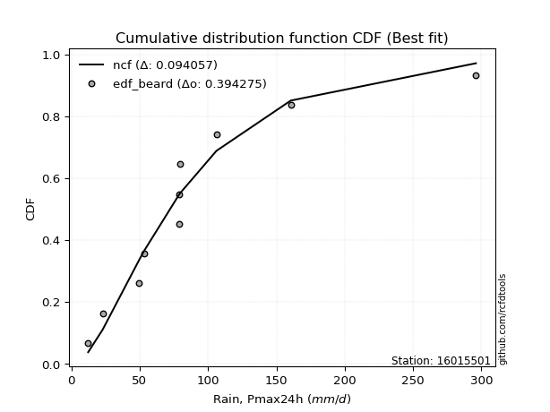</img></img>

</div>


### 5. Empirical - EDF Chegodayev (1955)

The Chegodayev formula is an empirical plotting position formula used in hydrological frequency analysis to estimate the exceedance probability or return period of a specific event from a set of observed data. It is primarily used for plotting observed data points on probability paper to fit a theoretical distribution, particularly for analyzing extreme events like maximum flood flows or rainfall intensities. The constant _b_ value in the generalized plotting position formula is 0.3.

<div align="center">


$P=(m-b)/(n+1-2b)$


</div>


**5.1. Empirical values**

<div align="center">

|                | 0                   | 1                   | 2                  | 3                   | 4                   | 5              | 6                  | 7                  | 8                  | 9                 | 10                 |
|:---------------|:--------------------|:--------------------|:-------------------|:--------------------|:--------------------|:---------------|:-------------------|:-------------------|:-------------------|:------------------|:-------------------|
| date           | 2021                | 2015                | 2020               | 2019                | 2018                | 2016           | 2017               | 2025               | 2023               | 2024              | 2022               |
| x              | 12.33               | 22.92               | 49.56              | 53.21               | 78.81               | 79.06          | 79.69              | 95.5               | 106.18             | 160.52            | 296.0              |
| m              | 1                   | 2                   | 3                  | 4                   | 5                   | 6              | 7                  | 8                  | 9                  | 10                | 11                 |
| empirical_dist | edf_chegodayev      | edf_chegodayev      | edf_chegodayev     | edf_chegodayev      | edf_chegodayev      | edf_chegodayev | edf_chegodayev     | edf_chegodayev     | edf_chegodayev     | edf_chegodayev    | edf_chegodayev     |
| empirical      | 0.06140350877192982 | 0.14912280701754385 | 0.2368421052631579 | 0.32456140350877194 | 0.41228070175438597 | 0.5            | 0.5877192982456141 | 0.6754385964912281 | 0.763157894736842  | 0.850877192982456 | 0.9385964912280701 |
| empirical_tr   | 1.0654205607476634  | 1.175257731958763   | 1.310344827586207  | 1.4805194805194806  | 1.7014925373134326  | 2.0            | 2.425531914893617  | 3.081081081081081  | 4.2222222222222205 | 6.70588235294117  | 16.285714285714263 |

</div>


**5.2. Kolmogorov-Smirnov fit test (sorted by Δ)**


<div align="center">

|                | 0                   | 1                   | 2                   | 3                   | 4                   | 5                   | 6                   | 7                   | 8                   | 9                   | 10                  | 11                  | 12                  | 13                  | 14                  | 15                  | 16                  | 17                  | 18                  | 19                  | 20                  | 21                  | 22                  | 23                  | 24                  | 25                  | 26                  | 27                  | 28                    | 29                  | 30                  | 31                  | 32                  | 33                  | 34                  | 35                  | 36                  | 37                  | 38                  | 39                  | 40                  | 41                  | 42                  | 43                  | 44                  | 45                  | 46                  | 47                  | 48                  | 49                  | 50                  | 51                  | 52                  | 53                  | 54                  | 55                  | 56                  | 57                  | 58                  | 59                  | 60                  | 61                  | 62                  | 63                  | 64                  | 65                  | 66                  | 67                  | 68                  | 69                  | 70                  | 71                  | 72                  | 73                  | 74                  | 75                  | 76                  | 77                  | 78                  | 79                  | 80                  | 81                  | 82                  | 83                  | 84                  | 85                  | 86                  | 87                  | 88                  | 89                  |
|:---------------|:--------------------|:--------------------|:--------------------|:--------------------|:--------------------|:--------------------|:--------------------|:--------------------|:--------------------|:--------------------|:--------------------|:--------------------|:--------------------|:--------------------|:--------------------|:--------------------|:--------------------|:--------------------|:--------------------|:--------------------|:--------------------|:--------------------|:--------------------|:--------------------|:--------------------|:--------------------|:--------------------|:--------------------|:----------------------|:--------------------|:--------------------|:--------------------|:--------------------|:--------------------|:--------------------|:--------------------|:--------------------|:--------------------|:--------------------|:--------------------|:--------------------|:--------------------|:--------------------|:--------------------|:--------------------|:--------------------|:--------------------|:--------------------|:--------------------|:--------------------|:--------------------|:--------------------|:--------------------|:--------------------|:--------------------|:--------------------|:--------------------|:--------------------|:--------------------|:--------------------|:--------------------|:--------------------|:--------------------|:--------------------|:--------------------|:--------------------|:--------------------|:--------------------|:--------------------|:--------------------|:--------------------|:--------------------|:--------------------|:--------------------|:--------------------|:--------------------|:--------------------|:--------------------|:--------------------|:--------------------|:--------------------|:--------------------|:--------------------|:--------------------|:--------------------|:--------------------|:--------------------|:--------------------|:--------------------|:--------------------|
| station        | 16015501            | 16015501            | 16015501            | 16015501            | 16015501            | 16015501            | 16015501            | 16015501            | 16015501            | 16015501            | 16015501            | 16015501            | 16015501            | 16015501            | 16015501            | 16015501            | 16015501            | 16015501            | 16015501            | 16015501            | 16015501            | 16015501            | 16015501            | 16015501            | 16015501            | 16015501            | 16015501            | 16015501            | 16015501              | 16015501            | 16015501            | 16015501            | 16015501            | 16015501            | 16015501            | 16015501            | 16015501            | 16015501            | 16015501            | 16015501            | 16015501            | 16015501            | 16015501            | 16015501            | 16015501            | 16015501            | 16015501            | 16015501            | 16015501            | 16015501            | 16015501            | 16015501            | 16015501            | 16015501            | 16015501            | 16015501            | 16015501            | 16015501            | 16015501            | 16015501            | 16015501            | 16015501            | 16015501            | 16015501            | 16015501            | 16015501            | 16015501            | 16015501            | 16015501            | 16015501            | 16015501            | 16015501            | 16015501            | 16015501            | 16015501            | 16015501            | 16015501            | 16015501            | 16015501            | 16015501            | 16015501            | 16015501            | 16015501            | 16015501            | 16015501            | 16015501            | 16015501            | 16015501            | 16015501            | 16015501            |
| empirical_dist | edf_chegodayev      | edf_chegodayev      | edf_chegodayev      | edf_chegodayev      | edf_chegodayev      | edf_chegodayev      | edf_chegodayev      | edf_chegodayev      | edf_chegodayev      | edf_chegodayev      | edf_chegodayev      | edf_chegodayev      | edf_chegodayev      | edf_chegodayev      | edf_chegodayev      | edf_chegodayev      | edf_chegodayev      | edf_chegodayev      | edf_chegodayev      | edf_chegodayev      | edf_chegodayev      | edf_chegodayev      | edf_chegodayev      | edf_chegodayev      | edf_chegodayev      | edf_chegodayev      | edf_chegodayev      | edf_chegodayev      | edf_chegodayev        | edf_chegodayev      | edf_chegodayev      | edf_chegodayev      | edf_chegodayev      | edf_chegodayev      | edf_chegodayev      | edf_chegodayev      | edf_chegodayev      | edf_chegodayev      | edf_chegodayev      | edf_chegodayev      | edf_chegodayev      | edf_chegodayev      | edf_chegodayev      | edf_chegodayev      | edf_chegodayev      | edf_chegodayev      | edf_chegodayev      | edf_chegodayev      | edf_chegodayev      | edf_chegodayev      | edf_chegodayev      | edf_chegodayev      | edf_chegodayev      | edf_chegodayev      | edf_chegodayev      | edf_chegodayev      | edf_chegodayev      | edf_chegodayev      | edf_chegodayev      | edf_chegodayev      | edf_chegodayev      | edf_chegodayev      | edf_chegodayev      | edf_chegodayev      | edf_chegodayev      | edf_chegodayev      | edf_chegodayev      | edf_chegodayev      | edf_chegodayev      | edf_chegodayev      | edf_chegodayev      | edf_chegodayev      | edf_chegodayev      | edf_chegodayev      | edf_chegodayev      | edf_chegodayev      | edf_chegodayev      | edf_chegodayev      | edf_chegodayev      | edf_chegodayev      | edf_chegodayev      | edf_chegodayev      | edf_chegodayev      | edf_chegodayev      | edf_chegodayev      | edf_chegodayev      | edf_chegodayev      | edf_chegodayev      | edf_chegodayev      | edf_chegodayev      |
| p_dist         | genlogistic         | exponnorm           | loggumbel_l         | moyal               | halflogistic        | logjohnsonsu        | pearson3            | loggenlogistic      | ncf                 | logloggamma         | genexpon            | logpearson3         | nct                 | logweibull_min      | loggompertz         | fisk                | invweibull          | invgamma            | invgauss            | fatiguelife         | johnsonsu           | gumbel_r            | logmielke           | logfisk             | halfnorm            | t                   | lognakagami         | f                   | loglaplace_asymmetric | kstwobign           | expon               | logt                | lognorm             | lognorm             | logcrystalball      | logexponnorm        | logf                | gompertz            | lognct              | logfatiguelife      | logbetaprime        | logncf              | logrice             | loglogistic         | logerlang           | loggamma            | loggamma            | rayleigh            | laplace_asymmetric  | wald                | loginvgauss         | gibrat              | loghypsecant        | loginvgamma         | maxwell             | weibull_min         | logalpha            | mielke              | logmaxwell          | hypsecant           | loginvweibull       | rice                | loglaplace          | lograyleigh         | logistic            | erlang              | norm                | crystalball         | logkstwobign        | laplace             | chi2                | loggenexpon         | loghalfnorm         | betaprime           | loggumbel_r         | logtruncnorm        | loghalflogistic     | logmoyal            | gumbel_l            | alpha               | gamma               | logwald             | logexpon            | loggibrat           | nakagami            | loglognorm          | pareto              | logpareto           | logchi2             | truncnorm           |
| delta          | 0.09824643224191398 | 0.0997232083412724  | 0.10059633242228827 | 0.10463293140982932 | 0.1063028657047938  | 0.11232132107418596 | 0.11264608876121868 | 0.11638516449510344 | 0.11776030155617817 | 0.11846870779951452 | 0.12002383681857681 | 0.12012529116057163 | 0.12032295216293737 | 0.12048345819212763 | 0.12091136478814274 | 0.1220762543394554  | 0.12212887173454151 | 0.12281851507100056 | 0.1236798353441722  | 0.12400528791031223 | 0.12545281343332376 | 0.1289430792539875  | 0.12909557594058868 | 0.12914157252642783 | 0.13323934362305423 | 0.13406555057097008 | 0.13643211704384567 | 0.13738161863168036 | 0.1380397678704431    | 0.1434072951631964  | 0.14472881027472512 | 0.14913705903558577 | 0.14913707734451703 | 0.14913707734451703 | 0.14913714974497932 | 0.14913900700502486 | 0.14927751977542697 | 0.14971917103433996 | 0.15023122475627754 | 0.15140577931662574 | 0.15248910347393302 | 0.15314813793517384 | 0.1551976129410682  | 0.1573512023152624  | 0.1576505231156708  | 0.15852976858635565 | 0.15852976858635565 | 0.159609519563641   | 0.16044831669701287 | 0.16078149710402995 | 0.16301290566113463 | 0.1632732380645106  | 0.16425342732715725 | 0.1658175630265351  | 0.16894074669336234 | 0.1692230801089744  | 0.1703921212609814  | 0.17809631498954331 | 0.17874494761415366 | 0.182390985787234   | 0.18318213154819213 | 0.18554112255680522 | 0.18589276041062702 | 0.18817819964547128 | 0.18964815218459896 | 0.1968401876767965  | 0.19830075567724825 | 0.19830077114549538 | 0.20430182137033925 | 0.20621904825276627 | 0.20958428666823253 | 0.2112415660183133  | 0.21482118496003094 | 0.2165070766096306  | 0.21869036410498138 | 0.22047656182840375 | 0.24245396051384388 | 0.24313073857374617 | 0.26359727800246957 | 0.2636850302233134  | 0.2654985726920665  | 0.3109607026181403  | 0.3162966371053812  | 0.3408889463220896  | 0.3887470666663518  | 0.4359170218374996  | 0.4511238390542811  | 0.4813085159498288  | 0.4852872870793455  | 0.7631558635409319  |
| deltao         | 0.37613735880099997 | 0.37613735880099997 | 0.37613735880099997 | 0.37613735880099997 | 0.37613735880099997 | 0.37613735880099997 | 0.37613735880099997 | 0.37613735880099997 | 0.37613735880099997 | 0.37613735880099997 | 0.37613735880099997 | 0.37613735880099997 | 0.37613735880099997 | 0.37613735880099997 | 0.37613735880099997 | 0.37613735880099997 | 0.37613735880099997 | 0.37613735880099997 | 0.37613735880099997 | 0.37613735880099997 | 0.37613735880099997 | 0.37613735880099997 | 0.37613735880099997 | 0.37613735880099997 | 0.37613735880099997 | 0.37613735880099997 | 0.37613735880099997 | 0.37613735880099997 | 0.37613735880099997   | 0.37613735880099997 | 0.37613735880099997 | 0.37613735880099997 | 0.37613735880099997 | 0.37613735880099997 | 0.37613735880099997 | 0.37613735880099997 | 0.37613735880099997 | 0.37613735880099997 | 0.37613735880099997 | 0.37613735880099997 | 0.37613735880099997 | 0.37613735880099997 | 0.37613735880099997 | 0.37613735880099997 | 0.37613735880099997 | 0.37613735880099997 | 0.37613735880099997 | 0.37613735880099997 | 0.37613735880099997 | 0.37613735880099997 | 0.37613735880099997 | 0.37613735880099997 | 0.37613735880099997 | 0.37613735880099997 | 0.37613735880099997 | 0.37613735880099997 | 0.37613735880099997 | 0.37613735880099997 | 0.37613735880099997 | 0.37613735880099997 | 0.37613735880099997 | 0.37613735880099997 | 0.37613735880099997 | 0.37613735880099997 | 0.37613735880099997 | 0.37613735880099997 | 0.37613735880099997 | 0.37613735880099997 | 0.37613735880099997 | 0.37613735880099997 | 0.37613735880099997 | 0.37613735880099997 | 0.37613735880099997 | 0.37613735880099997 | 0.37613735880099997 | 0.37613735880099997 | 0.37613735880099997 | 0.37613735880099997 | 0.37613735880099997 | 0.37613735880099997 | 0.37613735880099997 | 0.37613735880099997 | 0.37613735880099997 | 0.37613735880099997 | 0.37613735880099997 | 0.37613735880099997 | 0.37613735880099997 | 0.37613735880099997 | 0.37613735880099997 | 0.37613735880099997 |
| eval           | Δo > Δ              | Δo > Δ              | Δo > Δ              | Δo > Δ              | Δo > Δ              | Δo > Δ              | Δo > Δ              | Δo > Δ              | Δo > Δ              | Δo > Δ              | Δo > Δ              | Δo > Δ              | Δo > Δ              | Δo > Δ              | Δo > Δ              | Δo > Δ              | Δo > Δ              | Δo > Δ              | Δo > Δ              | Δo > Δ              | Δo > Δ              | Δo > Δ              | Δo > Δ              | Δo > Δ              | Δo > Δ              | Δo > Δ              | Δo > Δ              | Δo > Δ              | Δo > Δ                | Δo > Δ              | Δo > Δ              | Δo > Δ              | Δo > Δ              | Δo > Δ              | Δo > Δ              | Δo > Δ              | Δo > Δ              | Δo > Δ              | Δo > Δ              | Δo > Δ              | Δo > Δ              | Δo > Δ              | Δo > Δ              | Δo > Δ              | Δo > Δ              | Δo > Δ              | Δo > Δ              | Δo > Δ              | Δo > Δ              | Δo > Δ              | Δo > Δ              | Δo > Δ              | Δo > Δ              | Δo > Δ              | Δo > Δ              | Δo > Δ              | Δo > Δ              | Δo > Δ              | Δo > Δ              | Δo > Δ              | Δo > Δ              | Δo > Δ              | Δo > Δ              | Δo > Δ              | Δo > Δ              | Δo > Δ              | Δo > Δ              | Δo > Δ              | Δo > Δ              | Δo > Δ              | Δo > Δ              | Δo > Δ              | Δo > Δ              | Δo > Δ              | Δo > Δ              | Δo > Δ              | Δo > Δ              | Δo > Δ              | Δo > Δ              | Δo > Δ              | Δo > Δ              | Δo > Δ              | Δo > Δ              | Δo > Δ              | Δo <= Δ             | Δo <= Δ             | Δo <= Δ             | Δo <= Δ             | Δo <= Δ             | Δo <= Δ             |
| fit            | 1                   | 1                   | 1                   | 1                   | 1                   | 1                   | 1                   | 1                   | 1                   | 1                   | 1                   | 1                   | 1                   | 1                   | 1                   | 1                   | 1                   | 1                   | 1                   | 1                   | 1                   | 1                   | 1                   | 1                   | 1                   | 1                   | 1                   | 1                   | 1                     | 1                   | 1                   | 1                   | 1                   | 1                   | 1                   | 1                   | 1                   | 1                   | 1                   | 1                   | 1                   | 1                   | 1                   | 1                   | 1                   | 1                   | 1                   | 1                   | 1                   | 1                   | 1                   | 1                   | 1                   | 1                   | 1                   | 1                   | 1                   | 1                   | 1                   | 1                   | 1                   | 1                   | 1                   | 1                   | 1                   | 1                   | 1                   | 1                   | 1                   | 1                   | 1                   | 1                   | 1                   | 1                   | 1                   | 1                   | 1                   | 1                   | 1                   | 1                   | 1                   | 1                   | 1                   | 1                   | 0                   | 0                   | 0                   | 0                   | 0                   | 0                   |
| n              | 11                  | 11                  | 11                  | 11                  | 11                  | 11                  | 11                  | 11                  | 11                  | 11                  | 11                  | 11                  | 11                  | 11                  | 11                  | 11                  | 11                  | 11                  | 11                  | 11                  | 11                  | 11                  | 11                  | 11                  | 11                  | 11                  | 11                  | 11                  | 11                    | 11                  | 11                  | 11                  | 11                  | 11                  | 11                  | 11                  | 11                  | 11                  | 11                  | 11                  | 11                  | 11                  | 11                  | 11                  | 11                  | 11                  | 11                  | 11                  | 11                  | 11                  | 11                  | 11                  | 11                  | 11                  | 11                  | 11                  | 11                  | 11                  | 11                  | 11                  | 11                  | 11                  | 11                  | 11                  | 11                  | 11                  | 11                  | 11                  | 11                  | 11                  | 11                  | 11                  | 11                  | 11                  | 11                  | 11                  | 11                  | 11                  | 11                  | 11                  | 11                  | 11                  | 11                  | 11                  | 11                  | 11                  | 11                  | 11                  | 11                  | 11                  |
| best_fit       | 1                   | 0                   | 0                   | 0                   | 0                   | 0                   | 0                   | 0                   | 0                   | 0                   | 0                   | 0                   | 0                   | 0                   | 0                   | 0                   | 0                   | 0                   | 0                   | 0                   | 0                   | 0                   | 0                   | 0                   | 0                   | 0                   | 0                   | 0                   | 0                     | 0                   | 0                   | 0                   | 0                   | 0                   | 0                   | 0                   | 0                   | 0                   | 0                   | 0                   | 0                   | 0                   | 0                   | 0                   | 0                   | 0                   | 0                   | 0                   | 0                   | 0                   | 0                   | 0                   | 0                   | 0                   | 0                   | 0                   | 0                   | 0                   | 0                   | 0                   | 0                   | 0                   | 0                   | 0                   | 0                   | 0                   | 0                   | 0                   | 0                   | 0                   | 0                   | 0                   | 0                   | 0                   | 0                   | 0                   | 0                   | 0                   | 0                   | 0                   | 0                   | 0                   | 0                   | 0                   | 0                   | 0                   | 0                   | 0                   | 0                   | 0                   |
| best_fit_sort  | 1                   | 2                   | 3                   | 4                   | 5                   | 6                   | 7                   | 8                   | 9                   | 10                  | 11                  | 12                  | 13                  | 14                  | 15                  | 16                  | 17                  | 18                  | 19                  | 20                  | 21                  | 22                  | 23                  | 24                  | 25                  | 26                  | 27                  | 28                  | 29                    | 30                  | 31                  | 32                  | 33                  | 34                  | 35                  | 36                  | 37                  | 38                  | 39                  | 40                  | 41                  | 42                  | 43                  | 44                  | 45                  | 46                  | 47                  | 48                  | 49                  | 50                  | 51                  | 52                  | 53                  | 54                  | 55                  | 56                  | 57                  | 58                  | 59                  | 60                  | 61                  | 62                  | 63                  | 64                  | 65                  | 66                  | 67                  | 68                  | 69                  | 70                  | 71                  | 72                  | 73                  | 74                  | 75                  | 76                  | 77                  | 78                  | 79                  | 80                  | 81                  | 82                  | 83                  | 84                  | 85                  | 86                  | 87                  | 88                  | 89                  | 90                  |

</div>


<div align="center">

</img>

</div>


**5.3. Best fit**

<div align="center">

|   id |   station | empirical_dist   | p_dist      |     delta |   deltao | eval   |   fit |   n |   best_fit |   best_fit_sort |
|-----:|----------:|:-----------------|:------------|----------:|---------:|:-------|------:|----:|-----------:|----------------:|
|    0 |  16015501 | edf_chegodayev   | genlogistic | 0.0982464 | 0.376137 | Δo > Δ |     1 |  11 |          1 |               1 |

</div>


<div align="center">

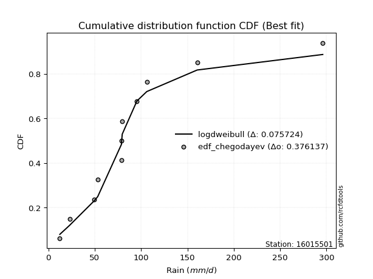</img>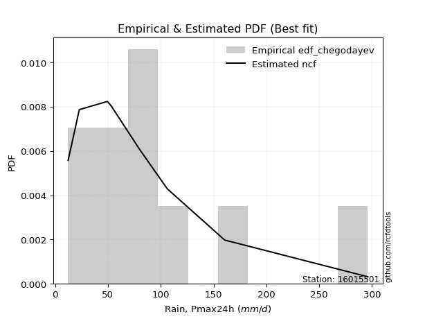</img>

</div>


### 6. Empirical - EDF Blom (1958)

The Blom formula is a specific "plotting position" formula used in hydrology and statistical analysis to estimate the empirical cumulative probability (or non-exceedance probability) of a data series. It is particularly recommended for data that are approximately normally distributed. The constant _a_ is set to 0.375 (or 3/8).

<div align="center">


$P=(m-a)/(n+1-2a)$


</div>


**6.1. Empirical values**

<div align="center">

|                | 0                   | 1                   | 2                   | 3                   | 4                  | 5        | 6                  | 7                  | 8                  | 9                  | 10                 |
|:---------------|:--------------------|:--------------------|:--------------------|:--------------------|:-------------------|:---------|:-------------------|:-------------------|:-------------------|:-------------------|:-------------------|
| date           | 2021                | 2015                | 2020                | 2019                | 2018               | 2016     | 2017               | 2025               | 2023               | 2024               | 2022               |
| x              | 12.33               | 22.92               | 49.56               | 53.21               | 78.81              | 79.06    | 79.69              | 95.5               | 106.18             | 160.52             | 296.0              |
| m              | 1                   | 2                   | 3                   | 4                   | 5                  | 6        | 7                  | 8                  | 9                  | 10                 | 11                 |
| empirical_dist | edf_blom            | edf_blom            | edf_blom            | edf_blom            | edf_blom           | edf_blom | edf_blom           | edf_blom           | edf_blom           | edf_blom           | edf_blom           |
| empirical      | 0.05555555555555555 | 0.14444444444444443 | 0.23333333333333334 | 0.32222222222222224 | 0.4111111111111111 | 0.5      | 0.5888888888888889 | 0.6777777777777778 | 0.7666666666666667 | 0.8555555555555555 | 0.9444444444444444 |
| empirical_tr   | 1.0588235294117647  | 1.1688311688311688  | 1.3043478260869565  | 1.4754098360655736  | 1.6981132075471697 | 2.0      | 2.4324324324324325 | 3.1034482758620694 | 4.2857142857142865 | 6.923076923076921  | 17.999999999999993 |

</div>


**6.2. Kolmogorov-Smirnov fit test (sorted by Δ)**


<div align="center">

|                | 0                   | 1                   | 2                   | 3                   | 4                   | 5                   | 6                   | 7                   | 8                   | 9                   | 10                  | 11                  | 12                  | 13                  | 14                  | 15                  | 16                  | 17                  | 18                  | 19                  | 20                  | 21                  | 22                  | 23                  | 24                  | 25                  | 26                  | 27                  | 28                    | 29                  | 30                  | 31                  | 32                  | 33                  | 34                  | 35                  | 36                  | 37                  | 38                  | 39                  | 40                  | 41                  | 42                  | 43                  | 44                  | 45                  | 46                  | 47                  | 48                  | 49                  | 50                  | 51                  | 52                  | 53                  | 54                  | 55                  | 56                  | 57                  | 58                  | 59                  | 60                  | 61                  | 62                  | 63                  | 64                  | 65                  | 66                  | 67                  | 68                  | 69                  | 70                  | 71                  | 72                  | 73                  | 74                  | 75                  | 76                  | 77                  | 78                  | 79                  | 80                  | 81                  | 82                  | 83                  | 84                  | 85                  | 86                  | 87                  | 88                  | 89                  |
|:---------------|:--------------------|:--------------------|:--------------------|:--------------------|:--------------------|:--------------------|:--------------------|:--------------------|:--------------------|:--------------------|:--------------------|:--------------------|:--------------------|:--------------------|:--------------------|:--------------------|:--------------------|:--------------------|:--------------------|:--------------------|:--------------------|:--------------------|:--------------------|:--------------------|:--------------------|:--------------------|:--------------------|:--------------------|:----------------------|:--------------------|:--------------------|:--------------------|:--------------------|:--------------------|:--------------------|:--------------------|:--------------------|:--------------------|:--------------------|:--------------------|:--------------------|:--------------------|:--------------------|:--------------------|:--------------------|:--------------------|:--------------------|:--------------------|:--------------------|:--------------------|:--------------------|:--------------------|:--------------------|:--------------------|:--------------------|:--------------------|:--------------------|:--------------------|:--------------------|:--------------------|:--------------------|:--------------------|:--------------------|:--------------------|:--------------------|:--------------------|:--------------------|:--------------------|:--------------------|:--------------------|:--------------------|:--------------------|:--------------------|:--------------------|:--------------------|:--------------------|:--------------------|:--------------------|:--------------------|:--------------------|:--------------------|:--------------------|:--------------------|:--------------------|:--------------------|:--------------------|:--------------------|:--------------------|:--------------------|:--------------------|
| station        | 16015501            | 16015501            | 16015501            | 16015501            | 16015501            | 16015501            | 16015501            | 16015501            | 16015501            | 16015501            | 16015501            | 16015501            | 16015501            | 16015501            | 16015501            | 16015501            | 16015501            | 16015501            | 16015501            | 16015501            | 16015501            | 16015501            | 16015501            | 16015501            | 16015501            | 16015501            | 16015501            | 16015501            | 16015501              | 16015501            | 16015501            | 16015501            | 16015501            | 16015501            | 16015501            | 16015501            | 16015501            | 16015501            | 16015501            | 16015501            | 16015501            | 16015501            | 16015501            | 16015501            | 16015501            | 16015501            | 16015501            | 16015501            | 16015501            | 16015501            | 16015501            | 16015501            | 16015501            | 16015501            | 16015501            | 16015501            | 16015501            | 16015501            | 16015501            | 16015501            | 16015501            | 16015501            | 16015501            | 16015501            | 16015501            | 16015501            | 16015501            | 16015501            | 16015501            | 16015501            | 16015501            | 16015501            | 16015501            | 16015501            | 16015501            | 16015501            | 16015501            | 16015501            | 16015501            | 16015501            | 16015501            | 16015501            | 16015501            | 16015501            | 16015501            | 16015501            | 16015501            | 16015501            | 16015501            | 16015501            |
| empirical_dist | edf_blom            | edf_blom            | edf_blom            | edf_blom            | edf_blom            | edf_blom            | edf_blom            | edf_blom            | edf_blom            | edf_blom            | edf_blom            | edf_blom            | edf_blom            | edf_blom            | edf_blom            | edf_blom            | edf_blom            | edf_blom            | edf_blom            | edf_blom            | edf_blom            | edf_blom            | edf_blom            | edf_blom            | edf_blom            | edf_blom            | edf_blom            | edf_blom            | edf_blom              | edf_blom            | edf_blom            | edf_blom            | edf_blom            | edf_blom            | edf_blom            | edf_blom            | edf_blom            | edf_blom            | edf_blom            | edf_blom            | edf_blom            | edf_blom            | edf_blom            | edf_blom            | edf_blom            | edf_blom            | edf_blom            | edf_blom            | edf_blom            | edf_blom            | edf_blom            | edf_blom            | edf_blom            | edf_blom            | edf_blom            | edf_blom            | edf_blom            | edf_blom            | edf_blom            | edf_blom            | edf_blom            | edf_blom            | edf_blom            | edf_blom            | edf_blom            | edf_blom            | edf_blom            | edf_blom            | edf_blom            | edf_blom            | edf_blom            | edf_blom            | edf_blom            | edf_blom            | edf_blom            | edf_blom            | edf_blom            | edf_blom            | edf_blom            | edf_blom            | edf_blom            | edf_blom            | edf_blom            | edf_blom            | edf_blom            | edf_blom            | edf_blom            | edf_blom            | edf_blom            | edf_blom            |
| p_dist         | exponnorm           | genlogistic         | loggumbel_l         | moyal               | halflogistic        | logjohnsonsu        | pearson3            | loggenlogistic      | ncf                 | logloggamma         | genexpon            | logpearson3         | nct                 | logweibull_min      | loggompertz         | fisk                | invweibull          | invgamma            | invgauss            | fatiguelife         | johnsonsu           | logmielke           | logfisk             | lognakagami         | gumbel_r            | t                   | halfnorm            | f                   | loglaplace_asymmetric | expon               | kstwobign           | logt                | lognorm             | lognorm             | logcrystalball      | logexponnorm        | logf                | lognct              | logfatiguelife      | gompertz            | logbetaprime        | logncf              | logrice             | loglogistic         | logerlang           | loggamma            | loggamma            | laplace_asymmetric  | wald                | rayleigh            | loginvgauss         | gibrat              | loghypsecant        | loginvgamma         | weibull_min         | logalpha            | maxwell             | mielke              | logmaxwell          | loginvweibull       | hypsecant           | loglaplace          | rice                | lograyleigh         | logistic            | erlang              | norm                | crystalball         | laplace             | logkstwobign        | chi2                | loggenexpon         | loghalfnorm         | betaprime           | loggumbel_r         | logtruncnorm        | loghalflogistic     | logmoyal            | gamma               | gumbel_l            | alpha               | logwald             | logexpon            | loggibrat           | nakagami            | loglognorm          | pareto              | logpareto           | logchi2             | truncnorm           |
| delta          | 0.10089279898454728 | 0.10175520417173867 | 0.10410510435211295 | 0.108141703339654   | 0.10902555774124945 | 0.11349091171746084 | 0.11381567940449355 | 0.11755475513837832 | 0.11892989219945305 | 0.11963829844278939 | 0.12119342746185169 | 0.12129488180384651 | 0.12149254280621224 | 0.12165304883540251 | 0.12208095543141761 | 0.12324584498273028 | 0.12329846237781639 | 0.12398810571427543 | 0.12484942598744708 | 0.1251748785535871  | 0.12662240407659864 | 0.13026516658386356 | 0.1303111631697027  | 0.13175375447074625 | 0.1324518511838122  | 0.13523514121424496 | 0.1367481155528789  | 0.13855120927495523 | 0.13920935851371796   | 0.145898400918      | 0.14691606709302107 | 0.15030664967886065 | 0.1503066679877919  | 0.1503066679877919  | 0.1503067403882542  | 0.15030859764829974 | 0.15044711041870185 | 0.1514008153995524  | 0.15257536995990062 | 0.15322794296416464 | 0.1536586941172079  | 0.15431772857844872 | 0.15636720358434308 | 0.15852079295853727 | 0.15882011375894567 | 0.15969935922963052 | 0.15969935922963052 | 0.1616179073402877  | 0.16195108774730482 | 0.16311829149346568 | 0.1641824963044095  | 0.16444282870778548 | 0.16542301797043213 | 0.16698715366980998 | 0.1703926707522493  | 0.1715617119042563  | 0.17244951862318703 | 0.1792659056328182  | 0.17991453825742854 | 0.184351722191467   | 0.1858997577170587  | 0.1870623510539019  | 0.1890498944866299  | 0.18934779028874615 | 0.19315692411442364 | 0.19800977832007138 | 0.20180952760707294 | 0.20180954307532006 | 0.2073886388960411  | 0.20781059330016383 | 0.2107538773115074  | 0.21475033794813786 | 0.21599077560330582 | 0.21767666725290546 | 0.21985995474825626 | 0.22164615247167863 | 0.24362355115711876 | 0.24430032921702105 | 0.2666681633353414  | 0.26710604993229425 | 0.267193802153138   | 0.31213029326141517 | 0.31980540903520577 | 0.3420585369653645  | 0.39225583859617635 | 0.44059538441059903 | 0.45580220162738055 | 0.48598687852292827 | 0.48879605900917006 | 0.7666646354707565  |
| deltao         | 0.37613735880099997 | 0.37613735880099997 | 0.37613735880099997 | 0.37613735880099997 | 0.37613735880099997 | 0.37613735880099997 | 0.37613735880099997 | 0.37613735880099997 | 0.37613735880099997 | 0.37613735880099997 | 0.37613735880099997 | 0.37613735880099997 | 0.37613735880099997 | 0.37613735880099997 | 0.37613735880099997 | 0.37613735880099997 | 0.37613735880099997 | 0.37613735880099997 | 0.37613735880099997 | 0.37613735880099997 | 0.37613735880099997 | 0.37613735880099997 | 0.37613735880099997 | 0.37613735880099997 | 0.37613735880099997 | 0.37613735880099997 | 0.37613735880099997 | 0.37613735880099997 | 0.37613735880099997   | 0.37613735880099997 | 0.37613735880099997 | 0.37613735880099997 | 0.37613735880099997 | 0.37613735880099997 | 0.37613735880099997 | 0.37613735880099997 | 0.37613735880099997 | 0.37613735880099997 | 0.37613735880099997 | 0.37613735880099997 | 0.37613735880099997 | 0.37613735880099997 | 0.37613735880099997 | 0.37613735880099997 | 0.37613735880099997 | 0.37613735880099997 | 0.37613735880099997 | 0.37613735880099997 | 0.37613735880099997 | 0.37613735880099997 | 0.37613735880099997 | 0.37613735880099997 | 0.37613735880099997 | 0.37613735880099997 | 0.37613735880099997 | 0.37613735880099997 | 0.37613735880099997 | 0.37613735880099997 | 0.37613735880099997 | 0.37613735880099997 | 0.37613735880099997 | 0.37613735880099997 | 0.37613735880099997 | 0.37613735880099997 | 0.37613735880099997 | 0.37613735880099997 | 0.37613735880099997 | 0.37613735880099997 | 0.37613735880099997 | 0.37613735880099997 | 0.37613735880099997 | 0.37613735880099997 | 0.37613735880099997 | 0.37613735880099997 | 0.37613735880099997 | 0.37613735880099997 | 0.37613735880099997 | 0.37613735880099997 | 0.37613735880099997 | 0.37613735880099997 | 0.37613735880099997 | 0.37613735880099997 | 0.37613735880099997 | 0.37613735880099997 | 0.37613735880099997 | 0.37613735880099997 | 0.37613735880099997 | 0.37613735880099997 | 0.37613735880099997 | 0.37613735880099997 |
| eval           | Δo > Δ              | Δo > Δ              | Δo > Δ              | Δo > Δ              | Δo > Δ              | Δo > Δ              | Δo > Δ              | Δo > Δ              | Δo > Δ              | Δo > Δ              | Δo > Δ              | Δo > Δ              | Δo > Δ              | Δo > Δ              | Δo > Δ              | Δo > Δ              | Δo > Δ              | Δo > Δ              | Δo > Δ              | Δo > Δ              | Δo > Δ              | Δo > Δ              | Δo > Δ              | Δo > Δ              | Δo > Δ              | Δo > Δ              | Δo > Δ              | Δo > Δ              | Δo > Δ                | Δo > Δ              | Δo > Δ              | Δo > Δ              | Δo > Δ              | Δo > Δ              | Δo > Δ              | Δo > Δ              | Δo > Δ              | Δo > Δ              | Δo > Δ              | Δo > Δ              | Δo > Δ              | Δo > Δ              | Δo > Δ              | Δo > Δ              | Δo > Δ              | Δo > Δ              | Δo > Δ              | Δo > Δ              | Δo > Δ              | Δo > Δ              | Δo > Δ              | Δo > Δ              | Δo > Δ              | Δo > Δ              | Δo > Δ              | Δo > Δ              | Δo > Δ              | Δo > Δ              | Δo > Δ              | Δo > Δ              | Δo > Δ              | Δo > Δ              | Δo > Δ              | Δo > Δ              | Δo > Δ              | Δo > Δ              | Δo > Δ              | Δo > Δ              | Δo > Δ              | Δo > Δ              | Δo > Δ              | Δo > Δ              | Δo > Δ              | Δo > Δ              | Δo > Δ              | Δo > Δ              | Δo > Δ              | Δo > Δ              | Δo > Δ              | Δo > Δ              | Δo > Δ              | Δo > Δ              | Δo > Δ              | Δo > Δ              | Δo <= Δ             | Δo <= Δ             | Δo <= Δ             | Δo <= Δ             | Δo <= Δ             | Δo <= Δ             |
| fit            | 1                   | 1                   | 1                   | 1                   | 1                   | 1                   | 1                   | 1                   | 1                   | 1                   | 1                   | 1                   | 1                   | 1                   | 1                   | 1                   | 1                   | 1                   | 1                   | 1                   | 1                   | 1                   | 1                   | 1                   | 1                   | 1                   | 1                   | 1                   | 1                     | 1                   | 1                   | 1                   | 1                   | 1                   | 1                   | 1                   | 1                   | 1                   | 1                   | 1                   | 1                   | 1                   | 1                   | 1                   | 1                   | 1                   | 1                   | 1                   | 1                   | 1                   | 1                   | 1                   | 1                   | 1                   | 1                   | 1                   | 1                   | 1                   | 1                   | 1                   | 1                   | 1                   | 1                   | 1                   | 1                   | 1                   | 1                   | 1                   | 1                   | 1                   | 1                   | 1                   | 1                   | 1                   | 1                   | 1                   | 1                   | 1                   | 1                   | 1                   | 1                   | 1                   | 1                   | 1                   | 0                   | 0                   | 0                   | 0                   | 0                   | 0                   |
| n              | 11                  | 11                  | 11                  | 11                  | 11                  | 11                  | 11                  | 11                  | 11                  | 11                  | 11                  | 11                  | 11                  | 11                  | 11                  | 11                  | 11                  | 11                  | 11                  | 11                  | 11                  | 11                  | 11                  | 11                  | 11                  | 11                  | 11                  | 11                  | 11                    | 11                  | 11                  | 11                  | 11                  | 11                  | 11                  | 11                  | 11                  | 11                  | 11                  | 11                  | 11                  | 11                  | 11                  | 11                  | 11                  | 11                  | 11                  | 11                  | 11                  | 11                  | 11                  | 11                  | 11                  | 11                  | 11                  | 11                  | 11                  | 11                  | 11                  | 11                  | 11                  | 11                  | 11                  | 11                  | 11                  | 11                  | 11                  | 11                  | 11                  | 11                  | 11                  | 11                  | 11                  | 11                  | 11                  | 11                  | 11                  | 11                  | 11                  | 11                  | 11                  | 11                  | 11                  | 11                  | 11                  | 11                  | 11                  | 11                  | 11                  | 11                  |
| best_fit       | 1                   | 0                   | 0                   | 0                   | 0                   | 0                   | 0                   | 0                   | 0                   | 0                   | 0                   | 0                   | 0                   | 0                   | 0                   | 0                   | 0                   | 0                   | 0                   | 0                   | 0                   | 0                   | 0                   | 0                   | 0                   | 0                   | 0                   | 0                   | 0                     | 0                   | 0                   | 0                   | 0                   | 0                   | 0                   | 0                   | 0                   | 0                   | 0                   | 0                   | 0                   | 0                   | 0                   | 0                   | 0                   | 0                   | 0                   | 0                   | 0                   | 0                   | 0                   | 0                   | 0                   | 0                   | 0                   | 0                   | 0                   | 0                   | 0                   | 0                   | 0                   | 0                   | 0                   | 0                   | 0                   | 0                   | 0                   | 0                   | 0                   | 0                   | 0                   | 0                   | 0                   | 0                   | 0                   | 0                   | 0                   | 0                   | 0                   | 0                   | 0                   | 0                   | 0                   | 0                   | 0                   | 0                   | 0                   | 0                   | 0                   | 0                   |
| best_fit_sort  | 1                   | 2                   | 3                   | 4                   | 5                   | 6                   | 7                   | 8                   | 9                   | 10                  | 11                  | 12                  | 13                  | 14                  | 15                  | 16                  | 17                  | 18                  | 19                  | 20                  | 21                  | 22                  | 23                  | 24                  | 25                  | 26                  | 27                  | 28                  | 29                    | 30                  | 31                  | 32                  | 33                  | 34                  | 35                  | 36                  | 37                  | 38                  | 39                  | 40                  | 41                  | 42                  | 43                  | 44                  | 45                  | 46                  | 47                  | 48                  | 49                  | 50                  | 51                  | 52                  | 53                  | 54                  | 55                  | 56                  | 57                  | 58                  | 59                  | 60                  | 61                  | 62                  | 63                  | 64                  | 65                  | 66                  | 67                  | 68                  | 69                  | 70                  | 71                  | 72                  | 73                  | 74                  | 75                  | 76                  | 77                  | 78                  | 79                  | 80                  | 81                  | 82                  | 83                  | 84                  | 85                  | 86                  | 87                  | 88                  | 89                  | 90                  |

</div>


<div align="center">

</img>

</div>


**6.3. Best fit**

<div align="center">

|   id |   station | empirical_dist   | p_dist    |    delta |   deltao | eval   |   fit |   n |   best_fit |   best_fit_sort |
|-----:|----------:|:-----------------|:----------|---------:|---------:|:-------|------:|----:|-----------:|----------------:|
|    0 |  16015501 | edf_blom         | exponnorm | 0.100893 | 0.376137 | Δo > Δ |     1 |  11 |          1 |               1 |

</div>


<div align="center">

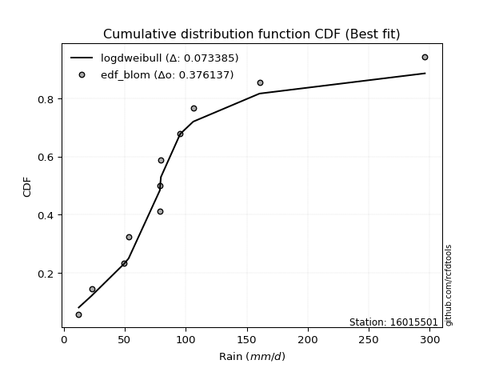</img></img>

</div>


### 7. Empirical - EDF Tukey (1962)

In hydrology, the Tukey formula is used as a plotting position formula to estimate the empirical probability or frequency of a flood event (or other hydrological data). The formula parameter is given as _c=0.333_ (or 1/3).

<div align="center">


$P=(m-c)/(n+1-2c)$


</div>


**7.1. Empirical values**

<div align="center">

|                | 0                    | 1                   | 2                   | 3                  | 4                  | 5         | 6                  | 7                  | 8                  | 9                  | 10                 |
|:---------------|:---------------------|:--------------------|:--------------------|:-------------------|:-------------------|:----------|:-------------------|:-------------------|:-------------------|:-------------------|:-------------------|
| date           | 2021                 | 2015                | 2020                | 2019               | 2018               | 2016      | 2017               | 2025               | 2023               | 2024               | 2022               |
| x              | 12.33                | 22.92               | 49.56               | 53.21              | 78.81              | 79.06     | 79.69              | 95.5               | 106.18             | 160.52             | 296.0              |
| m              | 1                    | 2                   | 3                   | 4                  | 5                  | 6         | 7                  | 8                  | 9                  | 10                 | 11                 |
| empirical_dist | edf_tukey            | edf_tukey           | edf_tukey           | edf_tukey          | edf_tukey          | edf_tukey | edf_tukey          | edf_tukey          | edf_tukey          | edf_tukey          | edf_tukey          |
| empirical      | 0.058823529411764705 | 0.14705882352941177 | 0.23529411764705882 | 0.3235294117647059 | 0.4117647058823529 | 0.5       | 0.5882352941176471 | 0.6764705882352942 | 0.7647058823529411 | 0.8529411764705882 | 0.9411764705882353 |
| empirical_tr   | 1.0625               | 1.1724137931034484  | 1.3076923076923077  | 1.4782608695652173 | 1.7                | 2.0       | 2.428571428571429  | 3.0909090909090913 | 4.249999999999999  | 6.799999999999999  | 16.999999999999996 |

</div>


**7.2. Kolmogorov-Smirnov fit test (sorted by Δ)**


<div align="center">

|                | 0                   | 1                   | 2                   | 3                   | 4                   | 5                   | 6                   | 7                   | 8                   | 9                   | 10                  | 11                  | 12                  | 13                  | 14                  | 15                  | 16                  | 17                  | 18                  | 19                  | 20                  | 21                  | 22                  | 23                  | 24                  | 25                  | 26                  | 27                  | 28                    | 29                  | 30                  | 31                  | 32                  | 33                  | 34                  | 35                  | 36                  | 37                  | 38                  | 39                  | 40                  | 41                  | 42                  | 43                  | 44                  | 45                  | 46                  | 47                  | 48                  | 49                  | 50                  | 51                  | 52                  | 53                  | 54                  | 55                  | 56                  | 57                  | 58                  | 59                  | 60                  | 61                  | 62                  | 63                  | 64                  | 65                  | 66                  | 67                  | 68                  | 69                  | 70                  | 71                  | 72                  | 73                  | 74                  | 75                  | 76                  | 77                  | 78                  | 79                  | 80                  | 81                  | 82                  | 83                  | 84                  | 85                  | 86                  | 87                  | 88                  | 89                  |
|:---------------|:--------------------|:--------------------|:--------------------|:--------------------|:--------------------|:--------------------|:--------------------|:--------------------|:--------------------|:--------------------|:--------------------|:--------------------|:--------------------|:--------------------|:--------------------|:--------------------|:--------------------|:--------------------|:--------------------|:--------------------|:--------------------|:--------------------|:--------------------|:--------------------|:--------------------|:--------------------|:--------------------|:--------------------|:----------------------|:--------------------|:--------------------|:--------------------|:--------------------|:--------------------|:--------------------|:--------------------|:--------------------|:--------------------|:--------------------|:--------------------|:--------------------|:--------------------|:--------------------|:--------------------|:--------------------|:--------------------|:--------------------|:--------------------|:--------------------|:--------------------|:--------------------|:--------------------|:--------------------|:--------------------|:--------------------|:--------------------|:--------------------|:--------------------|:--------------------|:--------------------|:--------------------|:--------------------|:--------------------|:--------------------|:--------------------|:--------------------|:--------------------|:--------------------|:--------------------|:--------------------|:--------------------|:--------------------|:--------------------|:--------------------|:--------------------|:--------------------|:--------------------|:--------------------|:--------------------|:--------------------|:--------------------|:--------------------|:--------------------|:--------------------|:--------------------|:--------------------|:--------------------|:--------------------|:--------------------|:--------------------|
| station        | 16015501            | 16015501            | 16015501            | 16015501            | 16015501            | 16015501            | 16015501            | 16015501            | 16015501            | 16015501            | 16015501            | 16015501            | 16015501            | 16015501            | 16015501            | 16015501            | 16015501            | 16015501            | 16015501            | 16015501            | 16015501            | 16015501            | 16015501            | 16015501            | 16015501            | 16015501            | 16015501            | 16015501            | 16015501              | 16015501            | 16015501            | 16015501            | 16015501            | 16015501            | 16015501            | 16015501            | 16015501            | 16015501            | 16015501            | 16015501            | 16015501            | 16015501            | 16015501            | 16015501            | 16015501            | 16015501            | 16015501            | 16015501            | 16015501            | 16015501            | 16015501            | 16015501            | 16015501            | 16015501            | 16015501            | 16015501            | 16015501            | 16015501            | 16015501            | 16015501            | 16015501            | 16015501            | 16015501            | 16015501            | 16015501            | 16015501            | 16015501            | 16015501            | 16015501            | 16015501            | 16015501            | 16015501            | 16015501            | 16015501            | 16015501            | 16015501            | 16015501            | 16015501            | 16015501            | 16015501            | 16015501            | 16015501            | 16015501            | 16015501            | 16015501            | 16015501            | 16015501            | 16015501            | 16015501            | 16015501            |
| empirical_dist | edf_tukey           | edf_tukey           | edf_tukey           | edf_tukey           | edf_tukey           | edf_tukey           | edf_tukey           | edf_tukey           | edf_tukey           | edf_tukey           | edf_tukey           | edf_tukey           | edf_tukey           | edf_tukey           | edf_tukey           | edf_tukey           | edf_tukey           | edf_tukey           | edf_tukey           | edf_tukey           | edf_tukey           | edf_tukey           | edf_tukey           | edf_tukey           | edf_tukey           | edf_tukey           | edf_tukey           | edf_tukey           | edf_tukey             | edf_tukey           | edf_tukey           | edf_tukey           | edf_tukey           | edf_tukey           | edf_tukey           | edf_tukey           | edf_tukey           | edf_tukey           | edf_tukey           | edf_tukey           | edf_tukey           | edf_tukey           | edf_tukey           | edf_tukey           | edf_tukey           | edf_tukey           | edf_tukey           | edf_tukey           | edf_tukey           | edf_tukey           | edf_tukey           | edf_tukey           | edf_tukey           | edf_tukey           | edf_tukey           | edf_tukey           | edf_tukey           | edf_tukey           | edf_tukey           | edf_tukey           | edf_tukey           | edf_tukey           | edf_tukey           | edf_tukey           | edf_tukey           | edf_tukey           | edf_tukey           | edf_tukey           | edf_tukey           | edf_tukey           | edf_tukey           | edf_tukey           | edf_tukey           | edf_tukey           | edf_tukey           | edf_tukey           | edf_tukey           | edf_tukey           | edf_tukey           | edf_tukey           | edf_tukey           | edf_tukey           | edf_tukey           | edf_tukey           | edf_tukey           | edf_tukey           | edf_tukey           | edf_tukey           | edf_tukey           | edf_tukey           |
| p_dist         | genlogistic         | exponnorm           | loggumbel_l         | moyal               | halflogistic        | logjohnsonsu        | pearson3            | loggenlogistic      | ncf                 | logloggamma         | genexpon            | logpearson3         | nct                 | logweibull_min      | loggompertz         | fisk                | invweibull          | invgamma            | invgauss            | fatiguelife         | johnsonsu           | logmielke           | logfisk             | gumbel_r            | lognakagami         | t                   | halfnorm            | f                   | loglaplace_asymmetric | kstwobign           | expon               | logt                | lognorm             | lognorm             | logcrystalball      | logexponnorm        | logf                | lognct              | gompertz            | logfatiguelife      | logbetaprime        | logncf              | logrice             | loglogistic         | logerlang           | loggamma            | loggamma            | laplace_asymmetric  | rayleigh            | wald                | loginvgauss         | gibrat              | loghypsecant        | loginvgamma         | weibull_min         | maxwell             | logalpha            | mielke              | logmaxwell          | loginvweibull       | hypsecant           | loglaplace          | rice                | lograyleigh         | logistic            | erlang              | norm                | crystalball         | logkstwobign        | laplace             | chi2                | loggenexpon         | loghalfnorm         | betaprime           | loggumbel_r         | logtruncnorm        | loghalflogistic     | logmoyal            | gumbel_l            | alpha               | gamma               | logwald             | logexpon            | loggibrat           | nakagami            | loglognorm          | pareto              | logpareto           | logchi2             | truncnorm           |
| delta          | 0.09979441985801307 | 0.10023920421330546 | 0.10214432003838736 | 0.10618091902592841 | 0.10706477342752385 | 0.11283731694621901 | 0.11316208463325172 | 0.11690116036713649 | 0.11827629742821122 | 0.11898470367154756 | 0.12053983269060986 | 0.12064128703260468 | 0.12083894803497042 | 0.12099945406416068 | 0.12142736066017579 | 0.12259225021148845 | 0.12264486760657456 | 0.1233345109430336  | 0.12419583121620525 | 0.12452128378234528 | 0.1259688093053568  | 0.12961157181262173 | 0.12965756839846088 | 0.1304910668700866  | 0.1343681335557136  | 0.13458154644300313 | 0.13478733123915332 | 0.1378976145037134  | 0.13855576374247613   | 0.14495528277929548 | 0.14524480614675817 | 0.14965305490761882 | 0.14965307321655008 | 0.14965307321655008 | 0.14965314561701237 | 0.1496550028770579  | 0.14979351564746002 | 0.15074722062831059 | 0.15126715865043905 | 0.1519217751886588  | 0.15300509934596607 | 0.1536641338072069  | 0.15571360881310126 | 0.15786719818729544 | 0.15816651898770384 | 0.1590457644583887  | 0.1590457644583887  | 0.16096431256904586 | 0.1611575071797401  | 0.161297492976063   | 0.16352890153316768 | 0.16378923393654365 | 0.1647694231991903  | 0.16633355889856816 | 0.16973907598100746 | 0.17048873430946143 | 0.17090811713301446 | 0.17861231086157636 | 0.1792609434861867  | 0.18369812742022518 | 0.1839389734033331  | 0.18640875628266007 | 0.1870891101729043  | 0.18869419551750433 | 0.19119613980069805 | 0.19735618354882956 | 0.19984874329334734 | 0.19984875876159447 | 0.20584980898643834 | 0.20673504412479926 | 0.21010028254026558 | 0.21278955363441238 | 0.215337180832064   | 0.21702307248166364 | 0.21920635997701443 | 0.2209925577004368  | 0.24296995638587693 | 0.24364673444577922 | 0.26514526561856866 | 0.2652330178394125  | 0.26601456856409955 | 0.31147669849017334 | 0.3178446247214803  | 0.34140494219412265 | 0.39029505428245087 | 0.43798100532563167 | 0.4531878225424132  | 0.4833724994379609  | 0.4868352746954446  | 0.764703851157031   |
| deltao         | 0.37613735880099997 | 0.37613735880099997 | 0.37613735880099997 | 0.37613735880099997 | 0.37613735880099997 | 0.37613735880099997 | 0.37613735880099997 | 0.37613735880099997 | 0.37613735880099997 | 0.37613735880099997 | 0.37613735880099997 | 0.37613735880099997 | 0.37613735880099997 | 0.37613735880099997 | 0.37613735880099997 | 0.37613735880099997 | 0.37613735880099997 | 0.37613735880099997 | 0.37613735880099997 | 0.37613735880099997 | 0.37613735880099997 | 0.37613735880099997 | 0.37613735880099997 | 0.37613735880099997 | 0.37613735880099997 | 0.37613735880099997 | 0.37613735880099997 | 0.37613735880099997 | 0.37613735880099997   | 0.37613735880099997 | 0.37613735880099997 | 0.37613735880099997 | 0.37613735880099997 | 0.37613735880099997 | 0.37613735880099997 | 0.37613735880099997 | 0.37613735880099997 | 0.37613735880099997 | 0.37613735880099997 | 0.37613735880099997 | 0.37613735880099997 | 0.37613735880099997 | 0.37613735880099997 | 0.37613735880099997 | 0.37613735880099997 | 0.37613735880099997 | 0.37613735880099997 | 0.37613735880099997 | 0.37613735880099997 | 0.37613735880099997 | 0.37613735880099997 | 0.37613735880099997 | 0.37613735880099997 | 0.37613735880099997 | 0.37613735880099997 | 0.37613735880099997 | 0.37613735880099997 | 0.37613735880099997 | 0.37613735880099997 | 0.37613735880099997 | 0.37613735880099997 | 0.37613735880099997 | 0.37613735880099997 | 0.37613735880099997 | 0.37613735880099997 | 0.37613735880099997 | 0.37613735880099997 | 0.37613735880099997 | 0.37613735880099997 | 0.37613735880099997 | 0.37613735880099997 | 0.37613735880099997 | 0.37613735880099997 | 0.37613735880099997 | 0.37613735880099997 | 0.37613735880099997 | 0.37613735880099997 | 0.37613735880099997 | 0.37613735880099997 | 0.37613735880099997 | 0.37613735880099997 | 0.37613735880099997 | 0.37613735880099997 | 0.37613735880099997 | 0.37613735880099997 | 0.37613735880099997 | 0.37613735880099997 | 0.37613735880099997 | 0.37613735880099997 | 0.37613735880099997 |
| eval           | Δo > Δ              | Δo > Δ              | Δo > Δ              | Δo > Δ              | Δo > Δ              | Δo > Δ              | Δo > Δ              | Δo > Δ              | Δo > Δ              | Δo > Δ              | Δo > Δ              | Δo > Δ              | Δo > Δ              | Δo > Δ              | Δo > Δ              | Δo > Δ              | Δo > Δ              | Δo > Δ              | Δo > Δ              | Δo > Δ              | Δo > Δ              | Δo > Δ              | Δo > Δ              | Δo > Δ              | Δo > Δ              | Δo > Δ              | Δo > Δ              | Δo > Δ              | Δo > Δ                | Δo > Δ              | Δo > Δ              | Δo > Δ              | Δo > Δ              | Δo > Δ              | Δo > Δ              | Δo > Δ              | Δo > Δ              | Δo > Δ              | Δo > Δ              | Δo > Δ              | Δo > Δ              | Δo > Δ              | Δo > Δ              | Δo > Δ              | Δo > Δ              | Δo > Δ              | Δo > Δ              | Δo > Δ              | Δo > Δ              | Δo > Δ              | Δo > Δ              | Δo > Δ              | Δo > Δ              | Δo > Δ              | Δo > Δ              | Δo > Δ              | Δo > Δ              | Δo > Δ              | Δo > Δ              | Δo > Δ              | Δo > Δ              | Δo > Δ              | Δo > Δ              | Δo > Δ              | Δo > Δ              | Δo > Δ              | Δo > Δ              | Δo > Δ              | Δo > Δ              | Δo > Δ              | Δo > Δ              | Δo > Δ              | Δo > Δ              | Δo > Δ              | Δo > Δ              | Δo > Δ              | Δo > Δ              | Δo > Δ              | Δo > Δ              | Δo > Δ              | Δo > Δ              | Δo > Δ              | Δo > Δ              | Δo > Δ              | Δo <= Δ             | Δo <= Δ             | Δo <= Δ             | Δo <= Δ             | Δo <= Δ             | Δo <= Δ             |
| fit            | 1                   | 1                   | 1                   | 1                   | 1                   | 1                   | 1                   | 1                   | 1                   | 1                   | 1                   | 1                   | 1                   | 1                   | 1                   | 1                   | 1                   | 1                   | 1                   | 1                   | 1                   | 1                   | 1                   | 1                   | 1                   | 1                   | 1                   | 1                   | 1                     | 1                   | 1                   | 1                   | 1                   | 1                   | 1                   | 1                   | 1                   | 1                   | 1                   | 1                   | 1                   | 1                   | 1                   | 1                   | 1                   | 1                   | 1                   | 1                   | 1                   | 1                   | 1                   | 1                   | 1                   | 1                   | 1                   | 1                   | 1                   | 1                   | 1                   | 1                   | 1                   | 1                   | 1                   | 1                   | 1                   | 1                   | 1                   | 1                   | 1                   | 1                   | 1                   | 1                   | 1                   | 1                   | 1                   | 1                   | 1                   | 1                   | 1                   | 1                   | 1                   | 1                   | 1                   | 1                   | 0                   | 0                   | 0                   | 0                   | 0                   | 0                   |
| n              | 11                  | 11                  | 11                  | 11                  | 11                  | 11                  | 11                  | 11                  | 11                  | 11                  | 11                  | 11                  | 11                  | 11                  | 11                  | 11                  | 11                  | 11                  | 11                  | 11                  | 11                  | 11                  | 11                  | 11                  | 11                  | 11                  | 11                  | 11                  | 11                    | 11                  | 11                  | 11                  | 11                  | 11                  | 11                  | 11                  | 11                  | 11                  | 11                  | 11                  | 11                  | 11                  | 11                  | 11                  | 11                  | 11                  | 11                  | 11                  | 11                  | 11                  | 11                  | 11                  | 11                  | 11                  | 11                  | 11                  | 11                  | 11                  | 11                  | 11                  | 11                  | 11                  | 11                  | 11                  | 11                  | 11                  | 11                  | 11                  | 11                  | 11                  | 11                  | 11                  | 11                  | 11                  | 11                  | 11                  | 11                  | 11                  | 11                  | 11                  | 11                  | 11                  | 11                  | 11                  | 11                  | 11                  | 11                  | 11                  | 11                  | 11                  |
| best_fit       | 1                   | 0                   | 0                   | 0                   | 0                   | 0                   | 0                   | 0                   | 0                   | 0                   | 0                   | 0                   | 0                   | 0                   | 0                   | 0                   | 0                   | 0                   | 0                   | 0                   | 0                   | 0                   | 0                   | 0                   | 0                   | 0                   | 0                   | 0                   | 0                     | 0                   | 0                   | 0                   | 0                   | 0                   | 0                   | 0                   | 0                   | 0                   | 0                   | 0                   | 0                   | 0                   | 0                   | 0                   | 0                   | 0                   | 0                   | 0                   | 0                   | 0                   | 0                   | 0                   | 0                   | 0                   | 0                   | 0                   | 0                   | 0                   | 0                   | 0                   | 0                   | 0                   | 0                   | 0                   | 0                   | 0                   | 0                   | 0                   | 0                   | 0                   | 0                   | 0                   | 0                   | 0                   | 0                   | 0                   | 0                   | 0                   | 0                   | 0                   | 0                   | 0                   | 0                   | 0                   | 0                   | 0                   | 0                   | 0                   | 0                   | 0                   |
| best_fit_sort  | 1                   | 2                   | 3                   | 4                   | 5                   | 6                   | 7                   | 8                   | 9                   | 10                  | 11                  | 12                  | 13                  | 14                  | 15                  | 16                  | 17                  | 18                  | 19                  | 20                  | 21                  | 22                  | 23                  | 24                  | 25                  | 26                  | 27                  | 28                  | 29                    | 30                  | 31                  | 32                  | 33                  | 34                  | 35                  | 36                  | 37                  | 38                  | 39                  | 40                  | 41                  | 42                  | 43                  | 44                  | 45                  | 46                  | 47                  | 48                  | 49                  | 50                  | 51                  | 52                  | 53                  | 54                  | 55                  | 56                  | 57                  | 58                  | 59                  | 60                  | 61                  | 62                  | 63                  | 64                  | 65                  | 66                  | 67                  | 68                  | 69                  | 70                  | 71                  | 72                  | 73                  | 74                  | 75                  | 76                  | 77                  | 78                  | 79                  | 80                  | 81                  | 82                  | 83                  | 84                  | 85                  | 86                  | 87                  | 88                  | 89                  | 90                  |

</div>


<div align="center">

</img>

</div>


**7.3. Best fit**

<div align="center">

|   id |   station | empirical_dist   | p_dist      |     delta |   deltao | eval   |   fit |   n |   best_fit |   best_fit_sort |
|-----:|----------:|:-----------------|:------------|----------:|---------:|:-------|------:|----:|-----------:|----------------:|
|    0 |  16015501 | edf_tukey        | genlogistic | 0.0997944 | 0.376137 | Δo > Δ |     1 |  11 |          1 |               1 |

</div>


<div align="center">

</img>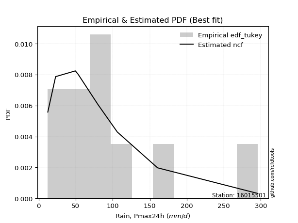</img>

</div>


### 8. Empirical - EDF Gringorten (1963)

Gringorten plotting position formula is essential for estimating the probability and return periods of extreme events like floods and heavy rainfall. The constant _a=0.44_.

<div align="center">


$P=(m-a)/(n+1-2a)$


</div>


**8.1. Empirical values**

<div align="center">

|                | 0                   | 1                   | 2                  | 3                   | 4                   | 5              | 6                  | 7                  | 8                  | 9                  | 10                 |
|:---------------|:--------------------|:--------------------|:-------------------|:--------------------|:--------------------|:---------------|:-------------------|:-------------------|:-------------------|:-------------------|:-------------------|
| date           | 2021                | 2015                | 2020               | 2019                | 2018                | 2016           | 2017               | 2025               | 2023               | 2024               | 2022               |
| x              | 12.33               | 22.92               | 49.56              | 53.21               | 78.81               | 79.06          | 79.69              | 95.5               | 106.18             | 160.52             | 296.0              |
| m              | 1                   | 2                   | 3                  | 4                   | 5                   | 6              | 7                  | 8                  | 9                  | 10                 | 11                 |
| empirical_dist | edf_gringorten      | edf_gringorten      | edf_gringorten     | edf_gringorten      | edf_gringorten      | edf_gringorten | edf_gringorten     | edf_gringorten     | edf_gringorten     | edf_gringorten     | edf_gringorten     |
| empirical      | 0.05035971223021583 | 0.14028776978417268 | 0.2302158273381295 | 0.32014388489208634 | 0.41007194244604317 | 0.5            | 0.5899280575539568 | 0.6798561151079137 | 0.7697841726618706 | 0.8597122302158274 | 0.9496402877697843 |
| empirical_tr   | 1.053030303030303   | 1.1631799163179917  | 1.2990654205607477 | 1.470899470899471   | 1.6951219512195121  | 2.0            | 2.43859649122807   | 3.1235955056179776 | 4.343750000000002  | 7.128205128205133  | 19.857142857142893 |

</div>


**8.2. Kolmogorov-Smirnov fit test (sorted by Δ)**


<div align="center">

|                | 0                   | 1                   | 2                   | 3                   | 4                   | 5                   | 6                   | 7                   | 8                   | 9                   | 10                  | 11                  | 12                  | 13                  | 14                  | 15                  | 16                  | 17                  | 18                  | 19                  | 20                  | 21                  | 22                  | 23                  | 24                  | 25                  | 26                  | 27                  | 28                    | 29                  | 30                  | 31                  | 32                  | 33                  | 34                  | 35                  | 36                  | 37                  | 38                  | 39                  | 40                  | 41                  | 42                  | 43                  | 44                  | 45                  | 46                  | 47                  | 48                  | 49                  | 50                  | 51                  | 52                  | 53                  | 54                  | 55                  | 56                  | 57                  | 58                  | 59                  | 60                  | 61                  | 62                  | 63                  | 64                  | 65                  | 66                  | 67                  | 68                  | 69                  | 70                  | 71                  | 72                  | 73                  | 74                  | 75                  | 76                  | 77                  | 78                  | 79                  | 80                  | 81                  | 82                  | 83                  | 84                  | 85                  | 86                  | 87                  | 88                  | 89                  |
|:---------------|:--------------------|:--------------------|:--------------------|:--------------------|:--------------------|:--------------------|:--------------------|:--------------------|:--------------------|:--------------------|:--------------------|:--------------------|:--------------------|:--------------------|:--------------------|:--------------------|:--------------------|:--------------------|:--------------------|:--------------------|:--------------------|:--------------------|:--------------------|:--------------------|:--------------------|:--------------------|:--------------------|:--------------------|:----------------------|:--------------------|:--------------------|:--------------------|:--------------------|:--------------------|:--------------------|:--------------------|:--------------------|:--------------------|:--------------------|:--------------------|:--------------------|:--------------------|:--------------------|:--------------------|:--------------------|:--------------------|:--------------------|:--------------------|:--------------------|:--------------------|:--------------------|:--------------------|:--------------------|:--------------------|:--------------------|:--------------------|:--------------------|:--------------------|:--------------------|:--------------------|:--------------------|:--------------------|:--------------------|:--------------------|:--------------------|:--------------------|:--------------------|:--------------------|:--------------------|:--------------------|:--------------------|:--------------------|:--------------------|:--------------------|:--------------------|:--------------------|:--------------------|:--------------------|:--------------------|:--------------------|:--------------------|:--------------------|:--------------------|:--------------------|:--------------------|:--------------------|:--------------------|:--------------------|:--------------------|:--------------------|
| station        | 16015501            | 16015501            | 16015501            | 16015501            | 16015501            | 16015501            | 16015501            | 16015501            | 16015501            | 16015501            | 16015501            | 16015501            | 16015501            | 16015501            | 16015501            | 16015501            | 16015501            | 16015501            | 16015501            | 16015501            | 16015501            | 16015501            | 16015501            | 16015501            | 16015501            | 16015501            | 16015501            | 16015501            | 16015501              | 16015501            | 16015501            | 16015501            | 16015501            | 16015501            | 16015501            | 16015501            | 16015501            | 16015501            | 16015501            | 16015501            | 16015501            | 16015501            | 16015501            | 16015501            | 16015501            | 16015501            | 16015501            | 16015501            | 16015501            | 16015501            | 16015501            | 16015501            | 16015501            | 16015501            | 16015501            | 16015501            | 16015501            | 16015501            | 16015501            | 16015501            | 16015501            | 16015501            | 16015501            | 16015501            | 16015501            | 16015501            | 16015501            | 16015501            | 16015501            | 16015501            | 16015501            | 16015501            | 16015501            | 16015501            | 16015501            | 16015501            | 16015501            | 16015501            | 16015501            | 16015501            | 16015501            | 16015501            | 16015501            | 16015501            | 16015501            | 16015501            | 16015501            | 16015501            | 16015501            | 16015501            |
| empirical_dist | edf_gringorten      | edf_gringorten      | edf_gringorten      | edf_gringorten      | edf_gringorten      | edf_gringorten      | edf_gringorten      | edf_gringorten      | edf_gringorten      | edf_gringorten      | edf_gringorten      | edf_gringorten      | edf_gringorten      | edf_gringorten      | edf_gringorten      | edf_gringorten      | edf_gringorten      | edf_gringorten      | edf_gringorten      | edf_gringorten      | edf_gringorten      | edf_gringorten      | edf_gringorten      | edf_gringorten      | edf_gringorten      | edf_gringorten      | edf_gringorten      | edf_gringorten      | edf_gringorten        | edf_gringorten      | edf_gringorten      | edf_gringorten      | edf_gringorten      | edf_gringorten      | edf_gringorten      | edf_gringorten      | edf_gringorten      | edf_gringorten      | edf_gringorten      | edf_gringorten      | edf_gringorten      | edf_gringorten      | edf_gringorten      | edf_gringorten      | edf_gringorten      | edf_gringorten      | edf_gringorten      | edf_gringorten      | edf_gringorten      | edf_gringorten      | edf_gringorten      | edf_gringorten      | edf_gringorten      | edf_gringorten      | edf_gringorten      | edf_gringorten      | edf_gringorten      | edf_gringorten      | edf_gringorten      | edf_gringorten      | edf_gringorten      | edf_gringorten      | edf_gringorten      | edf_gringorten      | edf_gringorten      | edf_gringorten      | edf_gringorten      | edf_gringorten      | edf_gringorten      | edf_gringorten      | edf_gringorten      | edf_gringorten      | edf_gringorten      | edf_gringorten      | edf_gringorten      | edf_gringorten      | edf_gringorten      | edf_gringorten      | edf_gringorten      | edf_gringorten      | edf_gringorten      | edf_gringorten      | edf_gringorten      | edf_gringorten      | edf_gringorten      | edf_gringorten      | edf_gringorten      | edf_gringorten      | edf_gringorten      | edf_gringorten      |
| p_dist         | exponnorm           | genlogistic         | loggumbel_l         | moyal               | halflogistic        | logjohnsonsu        | pearson3            | loggenlogistic      | ncf                 | logloggamma         | genexpon            | logpearson3         | nct                 | logweibull_min      | loggompertz         | fisk                | invweibull          | invgamma            | invgauss            | fatiguelife         | lognakagami         | johnsonsu           | logmielke           | logfisk             | gumbel_r            | t                   | f                   | halfnorm            | loglaplace_asymmetric | expon               | kstwobign           | logt                | lognorm             | lognorm             | logcrystalball      | logexponnorm        | logf                | lognct              | logfatiguelife      | logbetaprime        | logncf              | gompertz            | logrice             | loglogistic         | logerlang           | loggamma            | loggamma            | laplace_asymmetric  | wald                | loginvgauss         | gibrat              | rayleigh            | loghypsecant        | loginvgamma         | weibull_min         | logalpha            | maxwell             | mielke              | logmaxwell          | loginvweibull       | loglaplace          | hypsecant           | lograyleigh         | rice                | logistic            | erlang              | norm                | crystalball         | laplace             | logkstwobign        | chi2                | loghalfnorm         | loggenexpon         | betaprime           | loggumbel_r         | logtruncnorm        | loghalflogistic     | logmoyal            | gamma               | gumbel_l            | alpha               | logwald             | logexpon            | loggibrat           | nakagami            | loglognorm          | pareto              | logpareto           | logchi2             | truncnorm           |
| delta          | 0.10193196764961521 | 0.10487271016694255 | 0.10722261034731684 | 0.11125920933485789 | 0.11214306373645333 | 0.11453008038252876 | 0.11485484806956148 | 0.11859392380344624 | 0.11996906086452097 | 0.12067746710785732 | 0.12223259612691961 | 0.12233405046891443 | 0.12253171147128017 | 0.12269221750047044 | 0.12312012409648554 | 0.1242850136477982  | 0.12433763104288431 | 0.12502727437934336 | 0.125888594652515   | 0.12621404721865503 | 0.1275970798104745  | 0.12766157274166656 | 0.13130433524893148 | 0.13135033183477063 | 0.13556935717901608 | 0.13627430987931288 | 0.13975694194159594 | 0.1398656215480828  | 0.1402485271787859    | 0.14693756958306792 | 0.15003357308822496 | 0.15134581834392857 | 0.15134583665285983 | 0.15134583665285983 | 0.15134590905332213 | 0.15134776631336766 | 0.15148627908376977 | 0.15243998406462034 | 0.15361453862496854 | 0.15469786278227582 | 0.15535689724351665 | 0.15634544895936853 | 0.157406372249411   | 0.1595599616236052  | 0.1598592824240136  | 0.16073852789469845 | 0.16073852789469845 | 0.16265707600535562 | 0.16299025641237275 | 0.16522166496947743 | 0.1654819973728534  | 0.16623579748866957 | 0.16646218663550005 | 0.1680263223348779  | 0.1714318394173172  | 0.1726008805693242  | 0.1755670246183909  | 0.18030507429788611 | 0.18095370692249646 | 0.18539089085653493 | 0.18810151971896982 | 0.18901726371226257 | 0.19038695895381408 | 0.19216740048183378 | 0.19627443010962753 | 0.1990489469851393  | 0.20492703360227682 | 0.20492704907052395 | 0.208427807561109   | 0.21092809929536765 | 0.21179304597657533 | 0.21702994426837374 | 0.2178678439433417  | 0.21911984611469637 | 0.22089912341332418 | 0.22268532113674655 | 0.24466271982218668 | 0.24533949788208897 | 0.2686592602363562  | 0.27022355592749814 | 0.2703113081483418  | 0.3131694619264831  | 0.3229229150304096  | 0.3430977056304324  | 0.3953733445913802  | 0.4447520590708708  | 0.4599588762876523  | 0.4901435531832     | 0.4919135650043739  | 0.7697821414659602  |
| deltao         | 0.37613735880099997 | 0.37613735880099997 | 0.37613735880099997 | 0.37613735880099997 | 0.37613735880099997 | 0.37613735880099997 | 0.37613735880099997 | 0.37613735880099997 | 0.37613735880099997 | 0.37613735880099997 | 0.37613735880099997 | 0.37613735880099997 | 0.37613735880099997 | 0.37613735880099997 | 0.37613735880099997 | 0.37613735880099997 | 0.37613735880099997 | 0.37613735880099997 | 0.37613735880099997 | 0.37613735880099997 | 0.37613735880099997 | 0.37613735880099997 | 0.37613735880099997 | 0.37613735880099997 | 0.37613735880099997 | 0.37613735880099997 | 0.37613735880099997 | 0.37613735880099997 | 0.37613735880099997   | 0.37613735880099997 | 0.37613735880099997 | 0.37613735880099997 | 0.37613735880099997 | 0.37613735880099997 | 0.37613735880099997 | 0.37613735880099997 | 0.37613735880099997 | 0.37613735880099997 | 0.37613735880099997 | 0.37613735880099997 | 0.37613735880099997 | 0.37613735880099997 | 0.37613735880099997 | 0.37613735880099997 | 0.37613735880099997 | 0.37613735880099997 | 0.37613735880099997 | 0.37613735880099997 | 0.37613735880099997 | 0.37613735880099997 | 0.37613735880099997 | 0.37613735880099997 | 0.37613735880099997 | 0.37613735880099997 | 0.37613735880099997 | 0.37613735880099997 | 0.37613735880099997 | 0.37613735880099997 | 0.37613735880099997 | 0.37613735880099997 | 0.37613735880099997 | 0.37613735880099997 | 0.37613735880099997 | 0.37613735880099997 | 0.37613735880099997 | 0.37613735880099997 | 0.37613735880099997 | 0.37613735880099997 | 0.37613735880099997 | 0.37613735880099997 | 0.37613735880099997 | 0.37613735880099997 | 0.37613735880099997 | 0.37613735880099997 | 0.37613735880099997 | 0.37613735880099997 | 0.37613735880099997 | 0.37613735880099997 | 0.37613735880099997 | 0.37613735880099997 | 0.37613735880099997 | 0.37613735880099997 | 0.37613735880099997 | 0.37613735880099997 | 0.37613735880099997 | 0.37613735880099997 | 0.37613735880099997 | 0.37613735880099997 | 0.37613735880099997 | 0.37613735880099997 |
| eval           | Δo > Δ              | Δo > Δ              | Δo > Δ              | Δo > Δ              | Δo > Δ              | Δo > Δ              | Δo > Δ              | Δo > Δ              | Δo > Δ              | Δo > Δ              | Δo > Δ              | Δo > Δ              | Δo > Δ              | Δo > Δ              | Δo > Δ              | Δo > Δ              | Δo > Δ              | Δo > Δ              | Δo > Δ              | Δo > Δ              | Δo > Δ              | Δo > Δ              | Δo > Δ              | Δo > Δ              | Δo > Δ              | Δo > Δ              | Δo > Δ              | Δo > Δ              | Δo > Δ                | Δo > Δ              | Δo > Δ              | Δo > Δ              | Δo > Δ              | Δo > Δ              | Δo > Δ              | Δo > Δ              | Δo > Δ              | Δo > Δ              | Δo > Δ              | Δo > Δ              | Δo > Δ              | Δo > Δ              | Δo > Δ              | Δo > Δ              | Δo > Δ              | Δo > Δ              | Δo > Δ              | Δo > Δ              | Δo > Δ              | Δo > Δ              | Δo > Δ              | Δo > Δ              | Δo > Δ              | Δo > Δ              | Δo > Δ              | Δo > Δ              | Δo > Δ              | Δo > Δ              | Δo > Δ              | Δo > Δ              | Δo > Δ              | Δo > Δ              | Δo > Δ              | Δo > Δ              | Δo > Δ              | Δo > Δ              | Δo > Δ              | Δo > Δ              | Δo > Δ              | Δo > Δ              | Δo > Δ              | Δo > Δ              | Δo > Δ              | Δo > Δ              | Δo > Δ              | Δo > Δ              | Δo > Δ              | Δo > Δ              | Δo > Δ              | Δo > Δ              | Δo > Δ              | Δo > Δ              | Δo > Δ              | Δo > Δ              | Δo <= Δ             | Δo <= Δ             | Δo <= Δ             | Δo <= Δ             | Δo <= Δ             | Δo <= Δ             |
| fit            | 1                   | 1                   | 1                   | 1                   | 1                   | 1                   | 1                   | 1                   | 1                   | 1                   | 1                   | 1                   | 1                   | 1                   | 1                   | 1                   | 1                   | 1                   | 1                   | 1                   | 1                   | 1                   | 1                   | 1                   | 1                   | 1                   | 1                   | 1                   | 1                     | 1                   | 1                   | 1                   | 1                   | 1                   | 1                   | 1                   | 1                   | 1                   | 1                   | 1                   | 1                   | 1                   | 1                   | 1                   | 1                   | 1                   | 1                   | 1                   | 1                   | 1                   | 1                   | 1                   | 1                   | 1                   | 1                   | 1                   | 1                   | 1                   | 1                   | 1                   | 1                   | 1                   | 1                   | 1                   | 1                   | 1                   | 1                   | 1                   | 1                   | 1                   | 1                   | 1                   | 1                   | 1                   | 1                   | 1                   | 1                   | 1                   | 1                   | 1                   | 1                   | 1                   | 1                   | 1                   | 0                   | 0                   | 0                   | 0                   | 0                   | 0                   |
| n              | 11                  | 11                  | 11                  | 11                  | 11                  | 11                  | 11                  | 11                  | 11                  | 11                  | 11                  | 11                  | 11                  | 11                  | 11                  | 11                  | 11                  | 11                  | 11                  | 11                  | 11                  | 11                  | 11                  | 11                  | 11                  | 11                  | 11                  | 11                  | 11                    | 11                  | 11                  | 11                  | 11                  | 11                  | 11                  | 11                  | 11                  | 11                  | 11                  | 11                  | 11                  | 11                  | 11                  | 11                  | 11                  | 11                  | 11                  | 11                  | 11                  | 11                  | 11                  | 11                  | 11                  | 11                  | 11                  | 11                  | 11                  | 11                  | 11                  | 11                  | 11                  | 11                  | 11                  | 11                  | 11                  | 11                  | 11                  | 11                  | 11                  | 11                  | 11                  | 11                  | 11                  | 11                  | 11                  | 11                  | 11                  | 11                  | 11                  | 11                  | 11                  | 11                  | 11                  | 11                  | 11                  | 11                  | 11                  | 11                  | 11                  | 11                  |
| best_fit       | 1                   | 0                   | 0                   | 0                   | 0                   | 0                   | 0                   | 0                   | 0                   | 0                   | 0                   | 0                   | 0                   | 0                   | 0                   | 0                   | 0                   | 0                   | 0                   | 0                   | 0                   | 0                   | 0                   | 0                   | 0                   | 0                   | 0                   | 0                   | 0                     | 0                   | 0                   | 0                   | 0                   | 0                   | 0                   | 0                   | 0                   | 0                   | 0                   | 0                   | 0                   | 0                   | 0                   | 0                   | 0                   | 0                   | 0                   | 0                   | 0                   | 0                   | 0                   | 0                   | 0                   | 0                   | 0                   | 0                   | 0                   | 0                   | 0                   | 0                   | 0                   | 0                   | 0                   | 0                   | 0                   | 0                   | 0                   | 0                   | 0                   | 0                   | 0                   | 0                   | 0                   | 0                   | 0                   | 0                   | 0                   | 0                   | 0                   | 0                   | 0                   | 0                   | 0                   | 0                   | 0                   | 0                   | 0                   | 0                   | 0                   | 0                   |
| best_fit_sort  | 1                   | 2                   | 3                   | 4                   | 5                   | 6                   | 7                   | 8                   | 9                   | 10                  | 11                  | 12                  | 13                  | 14                  | 15                  | 16                  | 17                  | 18                  | 19                  | 20                  | 21                  | 22                  | 23                  | 24                  | 25                  | 26                  | 27                  | 28                  | 29                    | 30                  | 31                  | 32                  | 33                  | 34                  | 35                  | 36                  | 37                  | 38                  | 39                  | 40                  | 41                  | 42                  | 43                  | 44                  | 45                  | 46                  | 47                  | 48                  | 49                  | 50                  | 51                  | 52                  | 53                  | 54                  | 55                  | 56                  | 57                  | 58                  | 59                  | 60                  | 61                  | 62                  | 63                  | 64                  | 65                  | 66                  | 67                  | 68                  | 69                  | 70                  | 71                  | 72                  | 73                  | 74                  | 75                  | 76                  | 77                  | 78                  | 79                  | 80                  | 81                  | 82                  | 83                  | 84                  | 85                  | 86                  | 87                  | 88                  | 89                  | 90                  |

</div>


<div align="center">

</img>

</div>


**8.3. Best fit**

<div align="center">

|   id |   station | empirical_dist   | p_dist    |    delta |   deltao | eval   |   fit |   n |   best_fit |   best_fit_sort |
|-----:|----------:|:-----------------|:----------|---------:|---------:|:-------|------:|----:|-----------:|----------------:|
|    0 |  16015501 | edf_gringorten   | exponnorm | 0.101932 | 0.376137 | Δo > Δ |     1 |  11 |          1 |               1 |

</div>


<div align="center">

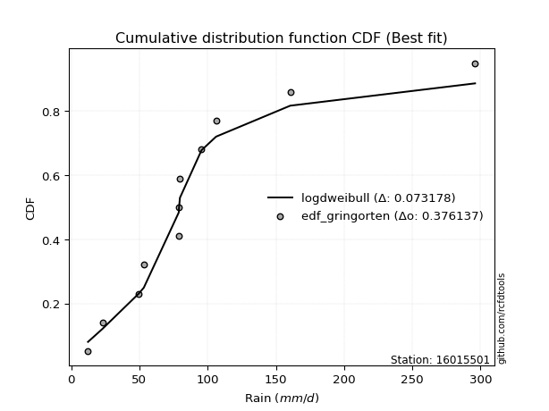</img>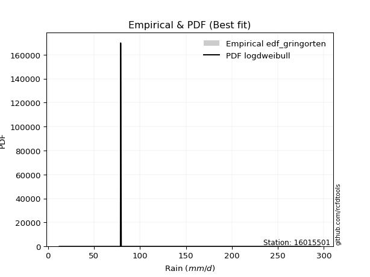</img>

</div>


### 9. Empirical - EDF Filliben (1975)

The specific values of the constants (0.3175) (often denoted as $alpha$) and (0.365) are derived from a method proposed by James J. Filliben in a 1975 paper. This particular formula is the mean value of the $i$-th order statistic of the normal distribution and is considered a robust and effective plotting position formula for the normal probability plot correlation coefficient test for normality.

<div align="center">


$P=(m-0.3175)/(n+0.365)$


</div>


**9.1. Empirical values**

<div align="center">

|                | 0                    | 1                   | 2                   | 3                  | 4                   | 5            | 6                  | 7                  | 8                  | 9                  | 10                 |
|:---------------|:---------------------|:--------------------|:--------------------|:-------------------|:--------------------|:-------------|:-------------------|:-------------------|:-------------------|:-------------------|:-------------------|
| date           | 2021                 | 2015                | 2020                | 2019               | 2018                | 2016         | 2017               | 2025               | 2023               | 2024               | 2022               |
| x              | 12.33                | 22.92               | 49.56               | 53.21              | 78.81               | 79.06        | 79.69              | 95.5               | 106.18             | 160.52             | 296.0              |
| m              | 1                    | 2                   | 3                   | 4                  | 5                   | 6            | 7                  | 8                  | 9                  | 10                 | 11                 |
| empirical_dist | edf_filliben         | edf_filliben        | edf_filliben        | edf_filliben       | edf_filliben        | edf_filliben | edf_filliben       | edf_filliben       | edf_filliben       | edf_filliben       | edf_filliben       |
| empirical      | 0.060052793664760226 | 0.14804223493180818 | 0.23603167619885615 | 0.3240211174659041 | 0.41201055873295206 | 0.5          | 0.587989441267048  | 0.6759788825340959 | 0.7639683238011438 | 0.8519577650681918 | 0.9399472063352396 |
| empirical_tr   | 1.063889538965598    | 1.173767105602892   | 1.3089547941261157  | 1.4793361535958347 | 1.7007108118219232  | 2.0          | 2.4271222637479983 | 3.08621860149355   | 4.236719478098787  | 6.754829123328378  | 16.652014652014618 |

</div>


**9.2. Kolmogorov-Smirnov fit test (sorted by Δ)**


<div align="center">

|                | 0                   | 1                   | 2                   | 3                   | 4                   | 5                   | 6                   | 7                   | 8                   | 9                   | 10                  | 11                  | 12                  | 13                  | 14                  | 15                  | 16                  | 17                  | 18                  | 19                  | 20                  | 21                  | 22                  | 23                  | 24                  | 25                  | 26                  | 27                  | 28                    | 29                  | 30                  | 31                  | 32                  | 33                  | 34                  | 35                  | 36                  | 37                  | 38                  | 39                  | 40                  | 41                  | 42                  | 43                  | 44                  | 45                  | 46                  | 47                  | 48                  | 49                  | 50                  | 51                  | 52                  | 53                  | 54                  | 55                  | 56                  | 57                  | 58                  | 59                  | 60                  | 61                  | 62                  | 63                  | 64                  | 65                  | 66                  | 67                  | 68                  | 69                  | 70                  | 71                  | 72                  | 73                  | 74                  | 75                  | 76                  | 77                  | 78                  | 79                  | 80                  | 81                  | 82                  | 83                  | 84                  | 85                  | 86                  | 87                  | 88                  | 89                  |
|:---------------|:--------------------|:--------------------|:--------------------|:--------------------|:--------------------|:--------------------|:--------------------|:--------------------|:--------------------|:--------------------|:--------------------|:--------------------|:--------------------|:--------------------|:--------------------|:--------------------|:--------------------|:--------------------|:--------------------|:--------------------|:--------------------|:--------------------|:--------------------|:--------------------|:--------------------|:--------------------|:--------------------|:--------------------|:----------------------|:--------------------|:--------------------|:--------------------|:--------------------|:--------------------|:--------------------|:--------------------|:--------------------|:--------------------|:--------------------|:--------------------|:--------------------|:--------------------|:--------------------|:--------------------|:--------------------|:--------------------|:--------------------|:--------------------|:--------------------|:--------------------|:--------------------|:--------------------|:--------------------|:--------------------|:--------------------|:--------------------|:--------------------|:--------------------|:--------------------|:--------------------|:--------------------|:--------------------|:--------------------|:--------------------|:--------------------|:--------------------|:--------------------|:--------------------|:--------------------|:--------------------|:--------------------|:--------------------|:--------------------|:--------------------|:--------------------|:--------------------|:--------------------|:--------------------|:--------------------|:--------------------|:--------------------|:--------------------|:--------------------|:--------------------|:--------------------|:--------------------|:--------------------|:--------------------|:--------------------|:--------------------|
| station        | 16015501            | 16015501            | 16015501            | 16015501            | 16015501            | 16015501            | 16015501            | 16015501            | 16015501            | 16015501            | 16015501            | 16015501            | 16015501            | 16015501            | 16015501            | 16015501            | 16015501            | 16015501            | 16015501            | 16015501            | 16015501            | 16015501            | 16015501            | 16015501            | 16015501            | 16015501            | 16015501            | 16015501            | 16015501              | 16015501            | 16015501            | 16015501            | 16015501            | 16015501            | 16015501            | 16015501            | 16015501            | 16015501            | 16015501            | 16015501            | 16015501            | 16015501            | 16015501            | 16015501            | 16015501            | 16015501            | 16015501            | 16015501            | 16015501            | 16015501            | 16015501            | 16015501            | 16015501            | 16015501            | 16015501            | 16015501            | 16015501            | 16015501            | 16015501            | 16015501            | 16015501            | 16015501            | 16015501            | 16015501            | 16015501            | 16015501            | 16015501            | 16015501            | 16015501            | 16015501            | 16015501            | 16015501            | 16015501            | 16015501            | 16015501            | 16015501            | 16015501            | 16015501            | 16015501            | 16015501            | 16015501            | 16015501            | 16015501            | 16015501            | 16015501            | 16015501            | 16015501            | 16015501            | 16015501            | 16015501            |
| empirical_dist | edf_filliben        | edf_filliben        | edf_filliben        | edf_filliben        | edf_filliben        | edf_filliben        | edf_filliben        | edf_filliben        | edf_filliben        | edf_filliben        | edf_filliben        | edf_filliben        | edf_filliben        | edf_filliben        | edf_filliben        | edf_filliben        | edf_filliben        | edf_filliben        | edf_filliben        | edf_filliben        | edf_filliben        | edf_filliben        | edf_filliben        | edf_filliben        | edf_filliben        | edf_filliben        | edf_filliben        | edf_filliben        | edf_filliben          | edf_filliben        | edf_filliben        | edf_filliben        | edf_filliben        | edf_filliben        | edf_filliben        | edf_filliben        | edf_filliben        | edf_filliben        | edf_filliben        | edf_filliben        | edf_filliben        | edf_filliben        | edf_filliben        | edf_filliben        | edf_filliben        | edf_filliben        | edf_filliben        | edf_filliben        | edf_filliben        | edf_filliben        | edf_filliben        | edf_filliben        | edf_filliben        | edf_filliben        | edf_filliben        | edf_filliben        | edf_filliben        | edf_filliben        | edf_filliben        | edf_filliben        | edf_filliben        | edf_filliben        | edf_filliben        | edf_filliben        | edf_filliben        | edf_filliben        | edf_filliben        | edf_filliben        | edf_filliben        | edf_filliben        | edf_filliben        | edf_filliben        | edf_filliben        | edf_filliben        | edf_filliben        | edf_filliben        | edf_filliben        | edf_filliben        | edf_filliben        | edf_filliben        | edf_filliben        | edf_filliben        | edf_filliben        | edf_filliben        | edf_filliben        | edf_filliben        | edf_filliben        | edf_filliben        | edf_filliben        | edf_filliben        |
| p_dist         | genlogistic         | exponnorm           | loggumbel_l         | moyal               | halflogistic        | logjohnsonsu        | pearson3            | loggenlogistic      | ncf                 | logloggamma         | genexpon            | logpearson3         | nct                 | logweibull_min      | loggompertz         | fisk                | invweibull          | invgamma            | invgauss            | fatiguelife         | johnsonsu           | logmielke           | logfisk             | gumbel_r            | halfnorm            | t                   | lognakagami         | f                   | loglaplace_asymmetric | kstwobign           | expon               | logt                | lognorm             | lognorm             | logcrystalball      | logexponnorm        | logf                | lognct              | gompertz            | logfatiguelife      | logbetaprime        | logncf              | logrice             | loglogistic         | logerlang           | loggamma            | loggamma            | rayleigh            | laplace_asymmetric  | wald                | loginvgauss         | gibrat              | loghypsecant        | loginvgamma         | weibull_min         | maxwell             | logalpha            | mielke              | logmaxwell          | hypsecant           | loginvweibull       | loglaplace          | rice                | lograyleigh         | logistic            | erlang              | norm                | crystalball         | logkstwobign        | laplace             | chi2                | loggenexpon         | loghalfnorm         | betaprime           | loggumbel_r         | logtruncnorm        | loghalflogistic     | logmoyal            | gumbel_l            | alpha               | gamma               | logwald             | logexpon            | loggibrat           | nakagami            | loglognorm          | pareto              | logpareto           | logchi2             | truncnorm           |
| delta          | 0.09905686130621572 | 0.09999335136270632 | 0.10140676148659    | 0.10544336047413105 | 0.10657300872622771 | 0.11259146409561988 | 0.11291623178265259 | 0.11665530751653735 | 0.11803044457761208 | 0.11873885082094843 | 0.12029397984001072 | 0.12039543418200555 | 0.12059309518437128 | 0.12075360121356155 | 0.12118150780957665 | 0.12234639736088931 | 0.12239901475597542 | 0.12308865809243447 | 0.12394997836560612 | 0.12427543093174614 | 0.12572295645475767 | 0.1293657189620226  | 0.12941171554786174 | 0.12975350831828925 | 0.13404977268735596 | 0.134335693592404   | 0.13535154495811    | 0.13765176165311427 | 0.138309910891877     | 0.14421772422749812 | 0.14499895329615903 | 0.14940720205701968 | 0.14940722036595094 | 0.14940722036595094 | 0.14940729276641324 | 0.14940915002645877 | 0.14954766279686088 | 0.15050136777771145 | 0.1505296000986417  | 0.15167592233805965 | 0.15275924649536693 | 0.15341828095660776 | 0.15546775596250212 | 0.1576213453366963  | 0.1579206661371047  | 0.15879991160778956 | 0.15879991160778956 | 0.16041994862794273 | 0.16071845971844678 | 0.16105164012546386 | 0.16328304868256854 | 0.16354338108594452 | 0.16452357034859116 | 0.16608770604796902 | 0.16949322313040832 | 0.16975117575766407 | 0.17066226428241532 | 0.17836645801097722 | 0.17901509063558757 | 0.18320141485153574 | 0.18345227456962604 | 0.18616290343206093 | 0.18635155162110695 | 0.1884483426669052  | 0.1904585812489007  | 0.19711033069823042 | 0.19911118474154998 | 0.1991112002097971  | 0.205112250434641   | 0.20648919127420018 | 0.20985442968966644 | 0.21205199508261505 | 0.21509132798146485 | 0.2167772196310645  | 0.2189605071264153  | 0.22074670484983766 | 0.2427241035352778  | 0.24340088159518009 | 0.2644077070667713  | 0.2644954592876152  | 0.2657687157135004  | 0.3112308456395742  | 0.317107066169683   | 0.3411590893435235  | 0.38955749573065357 | 0.4369975939232353  | 0.4522044111400168  | 0.4823890880355645  | 0.4860977161436473  | 0.7639662926052336  |
| deltao         | 0.37613735880099997 | 0.37613735880099997 | 0.37613735880099997 | 0.37613735880099997 | 0.37613735880099997 | 0.37613735880099997 | 0.37613735880099997 | 0.37613735880099997 | 0.37613735880099997 | 0.37613735880099997 | 0.37613735880099997 | 0.37613735880099997 | 0.37613735880099997 | 0.37613735880099997 | 0.37613735880099997 | 0.37613735880099997 | 0.37613735880099997 | 0.37613735880099997 | 0.37613735880099997 | 0.37613735880099997 | 0.37613735880099997 | 0.37613735880099997 | 0.37613735880099997 | 0.37613735880099997 | 0.37613735880099997 | 0.37613735880099997 | 0.37613735880099997 | 0.37613735880099997 | 0.37613735880099997   | 0.37613735880099997 | 0.37613735880099997 | 0.37613735880099997 | 0.37613735880099997 | 0.37613735880099997 | 0.37613735880099997 | 0.37613735880099997 | 0.37613735880099997 | 0.37613735880099997 | 0.37613735880099997 | 0.37613735880099997 | 0.37613735880099997 | 0.37613735880099997 | 0.37613735880099997 | 0.37613735880099997 | 0.37613735880099997 | 0.37613735880099997 | 0.37613735880099997 | 0.37613735880099997 | 0.37613735880099997 | 0.37613735880099997 | 0.37613735880099997 | 0.37613735880099997 | 0.37613735880099997 | 0.37613735880099997 | 0.37613735880099997 | 0.37613735880099997 | 0.37613735880099997 | 0.37613735880099997 | 0.37613735880099997 | 0.37613735880099997 | 0.37613735880099997 | 0.37613735880099997 | 0.37613735880099997 | 0.37613735880099997 | 0.37613735880099997 | 0.37613735880099997 | 0.37613735880099997 | 0.37613735880099997 | 0.37613735880099997 | 0.37613735880099997 | 0.37613735880099997 | 0.37613735880099997 | 0.37613735880099997 | 0.37613735880099997 | 0.37613735880099997 | 0.37613735880099997 | 0.37613735880099997 | 0.37613735880099997 | 0.37613735880099997 | 0.37613735880099997 | 0.37613735880099997 | 0.37613735880099997 | 0.37613735880099997 | 0.37613735880099997 | 0.37613735880099997 | 0.37613735880099997 | 0.37613735880099997 | 0.37613735880099997 | 0.37613735880099997 | 0.37613735880099997 |
| eval           | Δo > Δ              | Δo > Δ              | Δo > Δ              | Δo > Δ              | Δo > Δ              | Δo > Δ              | Δo > Δ              | Δo > Δ              | Δo > Δ              | Δo > Δ              | Δo > Δ              | Δo > Δ              | Δo > Δ              | Δo > Δ              | Δo > Δ              | Δo > Δ              | Δo > Δ              | Δo > Δ              | Δo > Δ              | Δo > Δ              | Δo > Δ              | Δo > Δ              | Δo > Δ              | Δo > Δ              | Δo > Δ              | Δo > Δ              | Δo > Δ              | Δo > Δ              | Δo > Δ                | Δo > Δ              | Δo > Δ              | Δo > Δ              | Δo > Δ              | Δo > Δ              | Δo > Δ              | Δo > Δ              | Δo > Δ              | Δo > Δ              | Δo > Δ              | Δo > Δ              | Δo > Δ              | Δo > Δ              | Δo > Δ              | Δo > Δ              | Δo > Δ              | Δo > Δ              | Δo > Δ              | Δo > Δ              | Δo > Δ              | Δo > Δ              | Δo > Δ              | Δo > Δ              | Δo > Δ              | Δo > Δ              | Δo > Δ              | Δo > Δ              | Δo > Δ              | Δo > Δ              | Δo > Δ              | Δo > Δ              | Δo > Δ              | Δo > Δ              | Δo > Δ              | Δo > Δ              | Δo > Δ              | Δo > Δ              | Δo > Δ              | Δo > Δ              | Δo > Δ              | Δo > Δ              | Δo > Δ              | Δo > Δ              | Δo > Δ              | Δo > Δ              | Δo > Δ              | Δo > Δ              | Δo > Δ              | Δo > Δ              | Δo > Δ              | Δo > Δ              | Δo > Δ              | Δo > Δ              | Δo > Δ              | Δo > Δ              | Δo <= Δ             | Δo <= Δ             | Δo <= Δ             | Δo <= Δ             | Δo <= Δ             | Δo <= Δ             |
| fit            | 1                   | 1                   | 1                   | 1                   | 1                   | 1                   | 1                   | 1                   | 1                   | 1                   | 1                   | 1                   | 1                   | 1                   | 1                   | 1                   | 1                   | 1                   | 1                   | 1                   | 1                   | 1                   | 1                   | 1                   | 1                   | 1                   | 1                   | 1                   | 1                     | 1                   | 1                   | 1                   | 1                   | 1                   | 1                   | 1                   | 1                   | 1                   | 1                   | 1                   | 1                   | 1                   | 1                   | 1                   | 1                   | 1                   | 1                   | 1                   | 1                   | 1                   | 1                   | 1                   | 1                   | 1                   | 1                   | 1                   | 1                   | 1                   | 1                   | 1                   | 1                   | 1                   | 1                   | 1                   | 1                   | 1                   | 1                   | 1                   | 1                   | 1                   | 1                   | 1                   | 1                   | 1                   | 1                   | 1                   | 1                   | 1                   | 1                   | 1                   | 1                   | 1                   | 1                   | 1                   | 0                   | 0                   | 0                   | 0                   | 0                   | 0                   |
| n              | 11                  | 11                  | 11                  | 11                  | 11                  | 11                  | 11                  | 11                  | 11                  | 11                  | 11                  | 11                  | 11                  | 11                  | 11                  | 11                  | 11                  | 11                  | 11                  | 11                  | 11                  | 11                  | 11                  | 11                  | 11                  | 11                  | 11                  | 11                  | 11                    | 11                  | 11                  | 11                  | 11                  | 11                  | 11                  | 11                  | 11                  | 11                  | 11                  | 11                  | 11                  | 11                  | 11                  | 11                  | 11                  | 11                  | 11                  | 11                  | 11                  | 11                  | 11                  | 11                  | 11                  | 11                  | 11                  | 11                  | 11                  | 11                  | 11                  | 11                  | 11                  | 11                  | 11                  | 11                  | 11                  | 11                  | 11                  | 11                  | 11                  | 11                  | 11                  | 11                  | 11                  | 11                  | 11                  | 11                  | 11                  | 11                  | 11                  | 11                  | 11                  | 11                  | 11                  | 11                  | 11                  | 11                  | 11                  | 11                  | 11                  | 11                  |
| best_fit       | 1                   | 0                   | 0                   | 0                   | 0                   | 0                   | 0                   | 0                   | 0                   | 0                   | 0                   | 0                   | 0                   | 0                   | 0                   | 0                   | 0                   | 0                   | 0                   | 0                   | 0                   | 0                   | 0                   | 0                   | 0                   | 0                   | 0                   | 0                   | 0                     | 0                   | 0                   | 0                   | 0                   | 0                   | 0                   | 0                   | 0                   | 0                   | 0                   | 0                   | 0                   | 0                   | 0                   | 0                   | 0                   | 0                   | 0                   | 0                   | 0                   | 0                   | 0                   | 0                   | 0                   | 0                   | 0                   | 0                   | 0                   | 0                   | 0                   | 0                   | 0                   | 0                   | 0                   | 0                   | 0                   | 0                   | 0                   | 0                   | 0                   | 0                   | 0                   | 0                   | 0                   | 0                   | 0                   | 0                   | 0                   | 0                   | 0                   | 0                   | 0                   | 0                   | 0                   | 0                   | 0                   | 0                   | 0                   | 0                   | 0                   | 0                   |
| best_fit_sort  | 1                   | 2                   | 3                   | 4                   | 5                   | 6                   | 7                   | 8                   | 9                   | 10                  | 11                  | 12                  | 13                  | 14                  | 15                  | 16                  | 17                  | 18                  | 19                  | 20                  | 21                  | 22                  | 23                  | 24                  | 25                  | 26                  | 27                  | 28                  | 29                    | 30                  | 31                  | 32                  | 33                  | 34                  | 35                  | 36                  | 37                  | 38                  | 39                  | 40                  | 41                  | 42                  | 43                  | 44                  | 45                  | 46                  | 47                  | 48                  | 49                  | 50                  | 51                  | 52                  | 53                  | 54                  | 55                  | 56                  | 57                  | 58                  | 59                  | 60                  | 61                  | 62                  | 63                  | 64                  | 65                  | 66                  | 67                  | 68                  | 69                  | 70                  | 71                  | 72                  | 73                  | 74                  | 75                  | 76                  | 77                  | 78                  | 79                  | 80                  | 81                  | 82                  | 83                  | 84                  | 85                  | 86                  | 87                  | 88                  | 89                  | 90                  |

</div>


<div align="center">

</img>

</div>


**9.3. Best fit**

<div align="center">

|   id |   station | empirical_dist   | p_dist      |     delta |   deltao | eval   |   fit |   n |   best_fit |   best_fit_sort |
|-----:|----------:|:-----------------|:------------|----------:|---------:|:-------|------:|----:|-----------:|----------------:|
|    0 |  16015501 | edf_filliben     | genlogistic | 0.0990569 | 0.376137 | Δo > Δ |     1 |  11 |          1 |               1 |

</div>


<div align="center">

</img></img>

</div>


### 10. Empirical - EDF Jenkinson (1977)

The Jenkinson formula in hydrology is an empirical plotting position formula used to estimate the non-exceedance probability _(P)_ or return period _(T)_ of a given ordered observation within a sample. It is a widely used method in the frequency analysis of extreme events such as floods and rainfall, as it provides a distribution-free way to plot data. _a≈0.31_ and _b≈0.38_ are constants derived to approximate the median of the probability distribution for the given rank.

<div align="center">


$P=(m-a)/(n+b)$


</div>


**10.1. Empirical values**

<div align="center">

|                | 0                    | 1                 | 2                   | 3                  | 4                  | 5             | 6                  | 7                  | 8                  | 9                  | 10                 |
|:---------------|:---------------------|:------------------|:--------------------|:-------------------|:-------------------|:--------------|:-------------------|:-------------------|:-------------------|:-------------------|:-------------------|
| date           | 2021                 | 2015              | 2020                | 2019               | 2018               | 2016          | 2017               | 2025               | 2023               | 2024               | 2022               |
| x              | 12.33                | 22.92             | 49.56               | 53.21              | 78.81              | 79.06         | 79.69              | 95.5               | 106.18             | 160.52             | 296.0              |
| m              | 1                    | 2                 | 3                   | 4                  | 5                  | 6             | 7                  | 8                  | 9                  | 10                 | 11                 |
| empirical_dist | edf_jenkinson        | edf_jenkinson     | edf_jenkinson       | edf_jenkinson      | edf_jenkinson      | edf_jenkinson | edf_jenkinson      | edf_jenkinson      | edf_jenkinson      | edf_jenkinson      | edf_jenkinson      |
| empirical      | 0.060632688927943754 | 0.148506151142355 | 0.23637961335676624 | 0.3242530755711775 | 0.4121265377855888 | 0.5           | 0.5878734622144113 | 0.6757469244288224 | 0.7636203866432336 | 0.8514938488576449 | 0.9393673110720562 |
| empirical_tr   | 1.0645463049579045   | 1.174406604747162 | 1.3095512082853855  | 1.4798439531859557 | 1.7010463378176381 | 2.0           | 2.4264392324093818 | 3.0840108401084008 | 4.230483271375462  | 6.733727810650883  | 16.49275362318839  |

</div>


**10.2. Kolmogorov-Smirnov fit test (sorted by Δ)**


<div align="center">

|                | 0                   | 1                   | 2                   | 3                   | 4                   | 5                   | 6                   | 7                   | 8                   | 9                   | 10                  | 11                  | 12                  | 13                  | 14                  | 15                  | 16                  | 17                  | 18                  | 19                  | 20                  | 21                  | 22                  | 23                  | 24                  | 25                  | 26                  | 27                  | 28                    | 29                  | 30                  | 31                  | 32                  | 33                  | 34                  | 35                  | 36                  | 37                  | 38                  | 39                  | 40                  | 41                  | 42                  | 43                  | 44                  | 45                  | 46                  | 47                  | 48                  | 49                  | 50                  | 51                  | 52                  | 53                  | 54                  | 55                  | 56                  | 57                  | 58                  | 59                  | 60                  | 61                  | 62                  | 63                  | 64                  | 65                  | 66                  | 67                  | 68                  | 69                  | 70                  | 71                  | 72                  | 73                  | 74                  | 75                  | 76                  | 77                  | 78                  | 79                  | 80                  | 81                  | 82                  | 83                  | 84                  | 85                  | 86                  | 87                  | 88                  | 89                  |
|:---------------|:--------------------|:--------------------|:--------------------|:--------------------|:--------------------|:--------------------|:--------------------|:--------------------|:--------------------|:--------------------|:--------------------|:--------------------|:--------------------|:--------------------|:--------------------|:--------------------|:--------------------|:--------------------|:--------------------|:--------------------|:--------------------|:--------------------|:--------------------|:--------------------|:--------------------|:--------------------|:--------------------|:--------------------|:----------------------|:--------------------|:--------------------|:--------------------|:--------------------|:--------------------|:--------------------|:--------------------|:--------------------|:--------------------|:--------------------|:--------------------|:--------------------|:--------------------|:--------------------|:--------------------|:--------------------|:--------------------|:--------------------|:--------------------|:--------------------|:--------------------|:--------------------|:--------------------|:--------------------|:--------------------|:--------------------|:--------------------|:--------------------|:--------------------|:--------------------|:--------------------|:--------------------|:--------------------|:--------------------|:--------------------|:--------------------|:--------------------|:--------------------|:--------------------|:--------------------|:--------------------|:--------------------|:--------------------|:--------------------|:--------------------|:--------------------|:--------------------|:--------------------|:--------------------|:--------------------|:--------------------|:--------------------|:--------------------|:--------------------|:--------------------|:--------------------|:--------------------|:--------------------|:--------------------|:--------------------|:--------------------|
| station        | 16015501            | 16015501            | 16015501            | 16015501            | 16015501            | 16015501            | 16015501            | 16015501            | 16015501            | 16015501            | 16015501            | 16015501            | 16015501            | 16015501            | 16015501            | 16015501            | 16015501            | 16015501            | 16015501            | 16015501            | 16015501            | 16015501            | 16015501            | 16015501            | 16015501            | 16015501            | 16015501            | 16015501            | 16015501              | 16015501            | 16015501            | 16015501            | 16015501            | 16015501            | 16015501            | 16015501            | 16015501            | 16015501            | 16015501            | 16015501            | 16015501            | 16015501            | 16015501            | 16015501            | 16015501            | 16015501            | 16015501            | 16015501            | 16015501            | 16015501            | 16015501            | 16015501            | 16015501            | 16015501            | 16015501            | 16015501            | 16015501            | 16015501            | 16015501            | 16015501            | 16015501            | 16015501            | 16015501            | 16015501            | 16015501            | 16015501            | 16015501            | 16015501            | 16015501            | 16015501            | 16015501            | 16015501            | 16015501            | 16015501            | 16015501            | 16015501            | 16015501            | 16015501            | 16015501            | 16015501            | 16015501            | 16015501            | 16015501            | 16015501            | 16015501            | 16015501            | 16015501            | 16015501            | 16015501            | 16015501            |
| empirical_dist | edf_jenkinson       | edf_jenkinson       | edf_jenkinson       | edf_jenkinson       | edf_jenkinson       | edf_jenkinson       | edf_jenkinson       | edf_jenkinson       | edf_jenkinson       | edf_jenkinson       | edf_jenkinson       | edf_jenkinson       | edf_jenkinson       | edf_jenkinson       | edf_jenkinson       | edf_jenkinson       | edf_jenkinson       | edf_jenkinson       | edf_jenkinson       | edf_jenkinson       | edf_jenkinson       | edf_jenkinson       | edf_jenkinson       | edf_jenkinson       | edf_jenkinson       | edf_jenkinson       | edf_jenkinson       | edf_jenkinson       | edf_jenkinson         | edf_jenkinson       | edf_jenkinson       | edf_jenkinson       | edf_jenkinson       | edf_jenkinson       | edf_jenkinson       | edf_jenkinson       | edf_jenkinson       | edf_jenkinson       | edf_jenkinson       | edf_jenkinson       | edf_jenkinson       | edf_jenkinson       | edf_jenkinson       | edf_jenkinson       | edf_jenkinson       | edf_jenkinson       | edf_jenkinson       | edf_jenkinson       | edf_jenkinson       | edf_jenkinson       | edf_jenkinson       | edf_jenkinson       | edf_jenkinson       | edf_jenkinson       | edf_jenkinson       | edf_jenkinson       | edf_jenkinson       | edf_jenkinson       | edf_jenkinson       | edf_jenkinson       | edf_jenkinson       | edf_jenkinson       | edf_jenkinson       | edf_jenkinson       | edf_jenkinson       | edf_jenkinson       | edf_jenkinson       | edf_jenkinson       | edf_jenkinson       | edf_jenkinson       | edf_jenkinson       | edf_jenkinson       | edf_jenkinson       | edf_jenkinson       | edf_jenkinson       | edf_jenkinson       | edf_jenkinson       | edf_jenkinson       | edf_jenkinson       | edf_jenkinson       | edf_jenkinson       | edf_jenkinson       | edf_jenkinson       | edf_jenkinson       | edf_jenkinson       | edf_jenkinson       | edf_jenkinson       | edf_jenkinson       | edf_jenkinson       | edf_jenkinson       |
| p_dist         | genlogistic         | exponnorm           | loggumbel_l         | moyal               | halflogistic        | logjohnsonsu        | pearson3            | loggenlogistic      | ncf                 | logloggamma         | genexpon            | logpearson3         | nct                 | logweibull_min      | loggompertz         | fisk                | invweibull          | invgamma            | invgauss            | fatiguelife         | johnsonsu           | logmielke           | logfisk             | gumbel_r            | halfnorm            | t                   | lognakagami         | f                   | loglaplace_asymmetric | kstwobign           | expon               | logt                | lognorm             | lognorm             | logcrystalball      | logexponnorm        | logf                | gompertz            | lognct              | logfatiguelife      | logbetaprime        | logncf              | logrice             | loglogistic         | logerlang           | loggamma            | loggamma            | rayleigh            | laplace_asymmetric  | wald                | loginvgauss         | gibrat              | loghypsecant        | loginvgamma         | weibull_min         | maxwell             | logalpha            | mielke              | logmaxwell          | hypsecant           | loginvweibull       | rice                | loglaplace          | lograyleigh         | logistic            | erlang              | norm                | crystalball         | logkstwobign        | laplace             | chi2                | loggenexpon         | loghalfnorm         | betaprime           | loggumbel_r         | logtruncnorm        | loghalflogistic     | logmoyal            | gumbel_l            | alpha               | gamma               | logwald             | logexpon            | loggibrat           | nakagami            | loglognorm          | pareto              | logpareto           | logchi2             | truncnorm           |
| delta          | 0.09870892414830557 | 0.0998773723100696  | 0.10105882432867985 | 0.1050954233162209  | 0.106457029673591   | 0.11247548504298316 | 0.11280025273001587 | 0.11653932846390064 | 0.11791446552497536 | 0.11862287176831171 | 0.120178000787374   | 0.12027945512936883 | 0.12047711613173456 | 0.12063762216092483 | 0.12106552875693993 | 0.1222304183082526  | 0.1222830357033387  | 0.12297267903979775 | 0.1238339993129694  | 0.12415945187910943 | 0.12560697740212096 | 0.12924973990938587 | 0.12929573649522502 | 0.1294055711603791  | 0.1337018355294458  | 0.13421971453976728 | 0.1358154611686568  | 0.13753578260047755 | 0.13819393183924028   | 0.14386978706958797 | 0.1448829742435223  | 0.14929122300438297 | 0.14929124131331423 | 0.14929124131331423 | 0.14929131371377652 | 0.14929317097382205 | 0.14943168374422416 | 0.15018166294073154 | 0.15038538872507473 | 0.15155994328542294 | 0.1526432674427302  | 0.15330230190397104 | 0.1553517769098654  | 0.1575053662840596  | 0.157804687084468   | 0.15868393255515284 | 0.15868393255515284 | 0.16007201147003258 | 0.16060248066581007 | 0.16093566107282714 | 0.16316706962993183 | 0.1634274020333078  | 0.16440759129595445 | 0.1659717269953323  | 0.1693772440777716  | 0.16940323859975392 | 0.1705462852297786  | 0.1782504789583405  | 0.17889911158295085 | 0.1828534776936256  | 0.18333629551698932 | 0.1860036144631968  | 0.18604692437942422 | 0.18833236361426847 | 0.19011064409099054 | 0.1969943516455937  | 0.19876324758363983 | 0.19876326305188696 | 0.20476431327673092 | 0.20637321222156346 | 0.20973845063702973 | 0.21170405792470495 | 0.21497534892882814 | 0.21666124057842778 | 0.21884452807377858 | 0.22063072579720094 | 0.24260812448264107 | 0.24328490254254337 | 0.26405976990886115 | 0.26414752212970505 | 0.2656527366608637  | 0.3111148665869375  | 0.31675912901177283 | 0.3410431102908868  | 0.3892095585727434  | 0.4365336777126885  | 0.45174049492947    | 0.4819251718250177  | 0.4857497789857371  | 0.7636183554473235  |
| deltao         | 0.37613735880099997 | 0.37613735880099997 | 0.37613735880099997 | 0.37613735880099997 | 0.37613735880099997 | 0.37613735880099997 | 0.37613735880099997 | 0.37613735880099997 | 0.37613735880099997 | 0.37613735880099997 | 0.37613735880099997 | 0.37613735880099997 | 0.37613735880099997 | 0.37613735880099997 | 0.37613735880099997 | 0.37613735880099997 | 0.37613735880099997 | 0.37613735880099997 | 0.37613735880099997 | 0.37613735880099997 | 0.37613735880099997 | 0.37613735880099997 | 0.37613735880099997 | 0.37613735880099997 | 0.37613735880099997 | 0.37613735880099997 | 0.37613735880099997 | 0.37613735880099997 | 0.37613735880099997   | 0.37613735880099997 | 0.37613735880099997 | 0.37613735880099997 | 0.37613735880099997 | 0.37613735880099997 | 0.37613735880099997 | 0.37613735880099997 | 0.37613735880099997 | 0.37613735880099997 | 0.37613735880099997 | 0.37613735880099997 | 0.37613735880099997 | 0.37613735880099997 | 0.37613735880099997 | 0.37613735880099997 | 0.37613735880099997 | 0.37613735880099997 | 0.37613735880099997 | 0.37613735880099997 | 0.37613735880099997 | 0.37613735880099997 | 0.37613735880099997 | 0.37613735880099997 | 0.37613735880099997 | 0.37613735880099997 | 0.37613735880099997 | 0.37613735880099997 | 0.37613735880099997 | 0.37613735880099997 | 0.37613735880099997 | 0.37613735880099997 | 0.37613735880099997 | 0.37613735880099997 | 0.37613735880099997 | 0.37613735880099997 | 0.37613735880099997 | 0.37613735880099997 | 0.37613735880099997 | 0.37613735880099997 | 0.37613735880099997 | 0.37613735880099997 | 0.37613735880099997 | 0.37613735880099997 | 0.37613735880099997 | 0.37613735880099997 | 0.37613735880099997 | 0.37613735880099997 | 0.37613735880099997 | 0.37613735880099997 | 0.37613735880099997 | 0.37613735880099997 | 0.37613735880099997 | 0.37613735880099997 | 0.37613735880099997 | 0.37613735880099997 | 0.37613735880099997 | 0.37613735880099997 | 0.37613735880099997 | 0.37613735880099997 | 0.37613735880099997 | 0.37613735880099997 |
| eval           | Δo > Δ              | Δo > Δ              | Δo > Δ              | Δo > Δ              | Δo > Δ              | Δo > Δ              | Δo > Δ              | Δo > Δ              | Δo > Δ              | Δo > Δ              | Δo > Δ              | Δo > Δ              | Δo > Δ              | Δo > Δ              | Δo > Δ              | Δo > Δ              | Δo > Δ              | Δo > Δ              | Δo > Δ              | Δo > Δ              | Δo > Δ              | Δo > Δ              | Δo > Δ              | Δo > Δ              | Δo > Δ              | Δo > Δ              | Δo > Δ              | Δo > Δ              | Δo > Δ                | Δo > Δ              | Δo > Δ              | Δo > Δ              | Δo > Δ              | Δo > Δ              | Δo > Δ              | Δo > Δ              | Δo > Δ              | Δo > Δ              | Δo > Δ              | Δo > Δ              | Δo > Δ              | Δo > Δ              | Δo > Δ              | Δo > Δ              | Δo > Δ              | Δo > Δ              | Δo > Δ              | Δo > Δ              | Δo > Δ              | Δo > Δ              | Δo > Δ              | Δo > Δ              | Δo > Δ              | Δo > Δ              | Δo > Δ              | Δo > Δ              | Δo > Δ              | Δo > Δ              | Δo > Δ              | Δo > Δ              | Δo > Δ              | Δo > Δ              | Δo > Δ              | Δo > Δ              | Δo > Δ              | Δo > Δ              | Δo > Δ              | Δo > Δ              | Δo > Δ              | Δo > Δ              | Δo > Δ              | Δo > Δ              | Δo > Δ              | Δo > Δ              | Δo > Δ              | Δo > Δ              | Δo > Δ              | Δo > Δ              | Δo > Δ              | Δo > Δ              | Δo > Δ              | Δo > Δ              | Δo > Δ              | Δo > Δ              | Δo <= Δ             | Δo <= Δ             | Δo <= Δ             | Δo <= Δ             | Δo <= Δ             | Δo <= Δ             |
| fit            | 1                   | 1                   | 1                   | 1                   | 1                   | 1                   | 1                   | 1                   | 1                   | 1                   | 1                   | 1                   | 1                   | 1                   | 1                   | 1                   | 1                   | 1                   | 1                   | 1                   | 1                   | 1                   | 1                   | 1                   | 1                   | 1                   | 1                   | 1                   | 1                     | 1                   | 1                   | 1                   | 1                   | 1                   | 1                   | 1                   | 1                   | 1                   | 1                   | 1                   | 1                   | 1                   | 1                   | 1                   | 1                   | 1                   | 1                   | 1                   | 1                   | 1                   | 1                   | 1                   | 1                   | 1                   | 1                   | 1                   | 1                   | 1                   | 1                   | 1                   | 1                   | 1                   | 1                   | 1                   | 1                   | 1                   | 1                   | 1                   | 1                   | 1                   | 1                   | 1                   | 1                   | 1                   | 1                   | 1                   | 1                   | 1                   | 1                   | 1                   | 1                   | 1                   | 1                   | 1                   | 0                   | 0                   | 0                   | 0                   | 0                   | 0                   |
| n              | 11                  | 11                  | 11                  | 11                  | 11                  | 11                  | 11                  | 11                  | 11                  | 11                  | 11                  | 11                  | 11                  | 11                  | 11                  | 11                  | 11                  | 11                  | 11                  | 11                  | 11                  | 11                  | 11                  | 11                  | 11                  | 11                  | 11                  | 11                  | 11                    | 11                  | 11                  | 11                  | 11                  | 11                  | 11                  | 11                  | 11                  | 11                  | 11                  | 11                  | 11                  | 11                  | 11                  | 11                  | 11                  | 11                  | 11                  | 11                  | 11                  | 11                  | 11                  | 11                  | 11                  | 11                  | 11                  | 11                  | 11                  | 11                  | 11                  | 11                  | 11                  | 11                  | 11                  | 11                  | 11                  | 11                  | 11                  | 11                  | 11                  | 11                  | 11                  | 11                  | 11                  | 11                  | 11                  | 11                  | 11                  | 11                  | 11                  | 11                  | 11                  | 11                  | 11                  | 11                  | 11                  | 11                  | 11                  | 11                  | 11                  | 11                  |
| best_fit       | 1                   | 0                   | 0                   | 0                   | 0                   | 0                   | 0                   | 0                   | 0                   | 0                   | 0                   | 0                   | 0                   | 0                   | 0                   | 0                   | 0                   | 0                   | 0                   | 0                   | 0                   | 0                   | 0                   | 0                   | 0                   | 0                   | 0                   | 0                   | 0                     | 0                   | 0                   | 0                   | 0                   | 0                   | 0                   | 0                   | 0                   | 0                   | 0                   | 0                   | 0                   | 0                   | 0                   | 0                   | 0                   | 0                   | 0                   | 0                   | 0                   | 0                   | 0                   | 0                   | 0                   | 0                   | 0                   | 0                   | 0                   | 0                   | 0                   | 0                   | 0                   | 0                   | 0                   | 0                   | 0                   | 0                   | 0                   | 0                   | 0                   | 0                   | 0                   | 0                   | 0                   | 0                   | 0                   | 0                   | 0                   | 0                   | 0                   | 0                   | 0                   | 0                   | 0                   | 0                   | 0                   | 0                   | 0                   | 0                   | 0                   | 0                   |
| best_fit_sort  | 1                   | 2                   | 3                   | 4                   | 5                   | 6                   | 7                   | 8                   | 9                   | 10                  | 11                  | 12                  | 13                  | 14                  | 15                  | 16                  | 17                  | 18                  | 19                  | 20                  | 21                  | 22                  | 23                  | 24                  | 25                  | 26                  | 27                  | 28                  | 29                    | 30                  | 31                  | 32                  | 33                  | 34                  | 35                  | 36                  | 37                  | 38                  | 39                  | 40                  | 41                  | 42                  | 43                  | 44                  | 45                  | 46                  | 47                  | 48                  | 49                  | 50                  | 51                  | 52                  | 53                  | 54                  | 55                  | 56                  | 57                  | 58                  | 59                  | 60                  | 61                  | 62                  | 63                  | 64                  | 65                  | 66                  | 67                  | 68                  | 69                  | 70                  | 71                  | 72                  | 73                  | 74                  | 75                  | 76                  | 77                  | 78                  | 79                  | 80                  | 81                  | 82                  | 83                  | 84                  | 85                  | 86                  | 87                  | 88                  | 89                  | 90                  |

</div>


<div align="center">

</img>

</div>


**10.3. Best fit**

<div align="center">

|   id |   station | empirical_dist   | p_dist      |     delta |   deltao | eval   |   fit |   n |   best_fit |   best_fit_sort |
|-----:|----------:|:-----------------|:------------|----------:|---------:|:-------|------:|----:|-----------:|----------------:|
|    0 |  16015501 | edf_jenkinson    | genlogistic | 0.0987089 | 0.376137 | Δo > Δ |     1 |  11 |          1 |               1 |

</div>


<div align="center">

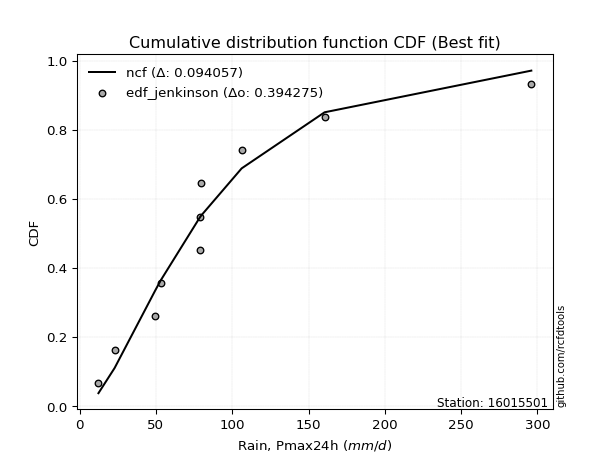</img>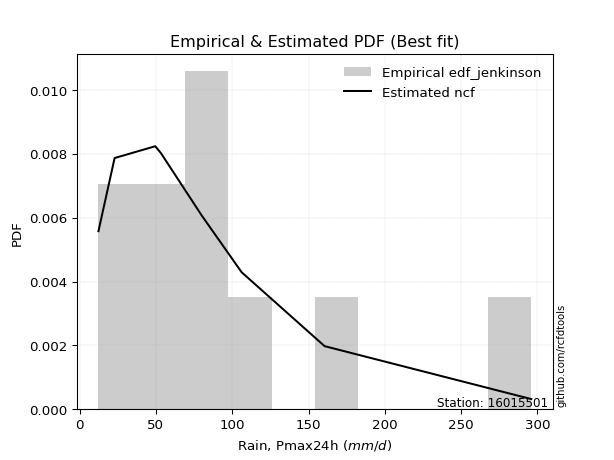</img>

</div>


### 11. Empirical - EDF Cunnane (1978)

Cunnane´s work in statistical hydrology has focused on the performance and evaluation of different probability distributions (such as GEV, Gumbel, Lognormal) for flood frequency estimation. _b_ is a constant, typically set to 0.4.

<div align="center">


$P=(m-b)/(n+1-2b)$


</div>


**11.1. Empirical values**

<div align="center">

|                | 0                    | 1                   | 2                   | 3                   | 4                  | 5           | 6                  | 7                  | 8                  | 9                  | 10                 |
|:---------------|:---------------------|:--------------------|:--------------------|:--------------------|:-------------------|:------------|:-------------------|:-------------------|:-------------------|:-------------------|:-------------------|
| date           | 2021                 | 2015                | 2020                | 2019                | 2018               | 2016        | 2017               | 2025               | 2023               | 2024               | 2022               |
| x              | 12.33                | 22.92               | 49.56               | 53.21               | 78.81              | 79.06       | 79.69              | 95.5               | 106.18             | 160.52             | 296.0              |
| m              | 1                    | 2                   | 3                   | 4                   | 5                  | 6           | 7                  | 8                  | 9                  | 10                 | 11                 |
| empirical_dist | edf_cunnane          | edf_cunnane         | edf_cunnane         | edf_cunnane         | edf_cunnane        | edf_cunnane | edf_cunnane        | edf_cunnane        | edf_cunnane        | edf_cunnane        | edf_cunnane        |
| empirical      | 0.053571428571428575 | 0.14285714285714288 | 0.23214285714285718 | 0.32142857142857145 | 0.4107142857142857 | 0.5         | 0.5892857142857143 | 0.6785714285714286 | 0.7678571428571429 | 0.8571428571428572 | 0.9464285714285715 |
| empirical_tr   | 1.0566037735849056   | 1.1666666666666667  | 1.302325581395349   | 1.4736842105263157  | 1.696969696969697  | 2.0         | 2.4347826086956523 | 3.1111111111111116 | 4.307692307692308  | 7.0000000000000036 | 18.666666666666693 |

</div>


**11.2. Kolmogorov-Smirnov fit test (sorted by Δ)**


<div align="center">

|                | 0                   | 1                   | 2                   | 3                   | 4                   | 5                   | 6                   | 7                   | 8                   | 9                   | 10                  | 11                  | 12                  | 13                  | 14                  | 15                  | 16                  | 17                  | 18                  | 19                  | 20                  | 21                  | 22                  | 23                  | 24                  | 25                  | 26                  | 27                  | 28                    | 29                  | 30                  | 31                  | 32                  | 33                  | 34                  | 35                  | 36                  | 37                  | 38                  | 39                  | 40                  | 41                  | 42                  | 43                  | 44                  | 45                  | 46                  | 47                  | 48                  | 49                  | 50                  | 51                  | 52                  | 53                  | 54                  | 55                  | 56                  | 57                  | 58                  | 59                  | 60                  | 61                  | 62                  | 63                  | 64                  | 65                  | 66                  | 67                  | 68                  | 69                  | 70                  | 71                  | 72                  | 73                  | 74                  | 75                  | 76                  | 77                  | 78                  | 79                  | 80                  | 81                  | 82                  | 83                  | 84                  | 85                  | 86                  | 87                  | 88                  | 89                  |
|:---------------|:--------------------|:--------------------|:--------------------|:--------------------|:--------------------|:--------------------|:--------------------|:--------------------|:--------------------|:--------------------|:--------------------|:--------------------|:--------------------|:--------------------|:--------------------|:--------------------|:--------------------|:--------------------|:--------------------|:--------------------|:--------------------|:--------------------|:--------------------|:--------------------|:--------------------|:--------------------|:--------------------|:--------------------|:----------------------|:--------------------|:--------------------|:--------------------|:--------------------|:--------------------|:--------------------|:--------------------|:--------------------|:--------------------|:--------------------|:--------------------|:--------------------|:--------------------|:--------------------|:--------------------|:--------------------|:--------------------|:--------------------|:--------------------|:--------------------|:--------------------|:--------------------|:--------------------|:--------------------|:--------------------|:--------------------|:--------------------|:--------------------|:--------------------|:--------------------|:--------------------|:--------------------|:--------------------|:--------------------|:--------------------|:--------------------|:--------------------|:--------------------|:--------------------|:--------------------|:--------------------|:--------------------|:--------------------|:--------------------|:--------------------|:--------------------|:--------------------|:--------------------|:--------------------|:--------------------|:--------------------|:--------------------|:--------------------|:--------------------|:--------------------|:--------------------|:--------------------|:--------------------|:--------------------|:--------------------|:--------------------|
| station        | 16015501            | 16015501            | 16015501            | 16015501            | 16015501            | 16015501            | 16015501            | 16015501            | 16015501            | 16015501            | 16015501            | 16015501            | 16015501            | 16015501            | 16015501            | 16015501            | 16015501            | 16015501            | 16015501            | 16015501            | 16015501            | 16015501            | 16015501            | 16015501            | 16015501            | 16015501            | 16015501            | 16015501            | 16015501              | 16015501            | 16015501            | 16015501            | 16015501            | 16015501            | 16015501            | 16015501            | 16015501            | 16015501            | 16015501            | 16015501            | 16015501            | 16015501            | 16015501            | 16015501            | 16015501            | 16015501            | 16015501            | 16015501            | 16015501            | 16015501            | 16015501            | 16015501            | 16015501            | 16015501            | 16015501            | 16015501            | 16015501            | 16015501            | 16015501            | 16015501            | 16015501            | 16015501            | 16015501            | 16015501            | 16015501            | 16015501            | 16015501            | 16015501            | 16015501            | 16015501            | 16015501            | 16015501            | 16015501            | 16015501            | 16015501            | 16015501            | 16015501            | 16015501            | 16015501            | 16015501            | 16015501            | 16015501            | 16015501            | 16015501            | 16015501            | 16015501            | 16015501            | 16015501            | 16015501            | 16015501            |
| empirical_dist | edf_cunnane         | edf_cunnane         | edf_cunnane         | edf_cunnane         | edf_cunnane         | edf_cunnane         | edf_cunnane         | edf_cunnane         | edf_cunnane         | edf_cunnane         | edf_cunnane         | edf_cunnane         | edf_cunnane         | edf_cunnane         | edf_cunnane         | edf_cunnane         | edf_cunnane         | edf_cunnane         | edf_cunnane         | edf_cunnane         | edf_cunnane         | edf_cunnane         | edf_cunnane         | edf_cunnane         | edf_cunnane         | edf_cunnane         | edf_cunnane         | edf_cunnane         | edf_cunnane           | edf_cunnane         | edf_cunnane         | edf_cunnane         | edf_cunnane         | edf_cunnane         | edf_cunnane         | edf_cunnane         | edf_cunnane         | edf_cunnane         | edf_cunnane         | edf_cunnane         | edf_cunnane         | edf_cunnane         | edf_cunnane         | edf_cunnane         | edf_cunnane         | edf_cunnane         | edf_cunnane         | edf_cunnane         | edf_cunnane         | edf_cunnane         | edf_cunnane         | edf_cunnane         | edf_cunnane         | edf_cunnane         | edf_cunnane         | edf_cunnane         | edf_cunnane         | edf_cunnane         | edf_cunnane         | edf_cunnane         | edf_cunnane         | edf_cunnane         | edf_cunnane         | edf_cunnane         | edf_cunnane         | edf_cunnane         | edf_cunnane         | edf_cunnane         | edf_cunnane         | edf_cunnane         | edf_cunnane         | edf_cunnane         | edf_cunnane         | edf_cunnane         | edf_cunnane         | edf_cunnane         | edf_cunnane         | edf_cunnane         | edf_cunnane         | edf_cunnane         | edf_cunnane         | edf_cunnane         | edf_cunnane         | edf_cunnane         | edf_cunnane         | edf_cunnane         | edf_cunnane         | edf_cunnane         | edf_cunnane         | edf_cunnane         |
| p_dist         | exponnorm           | genlogistic         | loggumbel_l         | moyal               | halflogistic        | logjohnsonsu        | pearson3            | loggenlogistic      | ncf                 | logloggamma         | genexpon            | logpearson3         | nct                 | logweibull_min      | loggompertz         | fisk                | invweibull          | invgamma            | invgauss            | fatiguelife         | johnsonsu           | lognakagami         | logmielke           | logfisk             | gumbel_r            | t                   | halfnorm            | f                   | loglaplace_asymmetric | expon               | kstwobign           | logt                | lognorm             | lognorm             | logcrystalball      | logexponnorm        | logf                | lognct              | logfatiguelife      | logbetaprime        | gompertz            | logncf              | logrice             | loglogistic         | logerlang           | loggamma            | loggamma            | laplace_asymmetric  | wald                | rayleigh            | loginvgauss         | gibrat              | loghypsecant        | loginvgamma         | weibull_min         | logalpha            | maxwell             | mielke              | logmaxwell          | loginvweibull       | hypsecant           | loglaplace          | lograyleigh         | rice                | logistic            | erlang              | norm                | crystalball         | laplace             | logkstwobign        | chi2                | loggenexpon         | loghalfnorm         | betaprime           | loggumbel_r         | logtruncnorm        | loghalflogistic     | logmoyal            | gamma               | gumbel_l            | alpha               | logwald             | logexpon            | loggibrat           | nakagami            | loglognorm          | pareto              | logpareto           | logchi2             | truncnorm           |
| delta          | 0.10128962438137268 | 0.10294568036221485 | 0.10529558054258914 | 0.10933217953013019 | 0.11021603393172563 | 0.11388773711428624 | 0.11421250480131895 | 0.11795158053520371 | 0.11932671759627844 | 0.12003512383961479 | 0.12159025285867708 | 0.1216917072006719  | 0.12188936820303764 | 0.1220498742322279  | 0.12247778082824301 | 0.12364267037955567 | 0.12369528777464178 | 0.12438493111110083 | 0.12524625138427248 | 0.1255717039504125  | 0.12701922947342403 | 0.1301664528834447  | 0.13066199198068895 | 0.1307079885665281  | 0.13364232737428838 | 0.13563196661107035 | 0.1379385917433551  | 0.13894803467178063 | 0.13960618391054336   | 0.1462952263148254  | 0.14810654328349726 | 0.15070347507568604 | 0.1507034933846173  | 0.1507034933846173  | 0.1507035657850796  | 0.15070542304512513 | 0.15084393581552724 | 0.1517976407963778  | 0.15297219535672602 | 0.1540555195140333  | 0.15441841915464083 | 0.15471455397527412 | 0.15676402898116848 | 0.15891761835536267 | 0.15921693915577106 | 0.16009618462645592 | 0.16009618462645592 | 0.1620147327371131  | 0.16234791314413022 | 0.16430876768394187 | 0.1645793217012349  | 0.16483965410461088 | 0.16581984336725752 | 0.16738397906663538 | 0.17078949614907468 | 0.17195853730108168 | 0.1736399948136632  | 0.17966273102964359 | 0.18031136365425393 | 0.1847485475882924  | 0.18709023390753488 | 0.1874591764507273  | 0.18974461568557155 | 0.19024037067710609 | 0.19434740030489983 | 0.19840660371689678 | 0.20300000379754912 | 0.20300001926579625 | 0.20778546429286648 | 0.20900106949063998 | 0.2111507027083328  | 0.21594081413861402 | 0.2163876010001312  | 0.21807349264973086 | 0.22025678014508165 | 0.22204297786850402 | 0.24402037655394415 | 0.24469715461384645 | 0.2670649887321668  | 0.26829652612277044 | 0.2683842783436141  | 0.31252711865824057 | 0.3209958852256819  | 0.3424553623621899  | 0.3934463147866525  | 0.44218268599790056 | 0.4573895032146821  | 0.4875741801102298  | 0.4899865351996462  | 0.7678551116612325  |
| deltao         | 0.37613735880099997 | 0.37613735880099997 | 0.37613735880099997 | 0.37613735880099997 | 0.37613735880099997 | 0.37613735880099997 | 0.37613735880099997 | 0.37613735880099997 | 0.37613735880099997 | 0.37613735880099997 | 0.37613735880099997 | 0.37613735880099997 | 0.37613735880099997 | 0.37613735880099997 | 0.37613735880099997 | 0.37613735880099997 | 0.37613735880099997 | 0.37613735880099997 | 0.37613735880099997 | 0.37613735880099997 | 0.37613735880099997 | 0.37613735880099997 | 0.37613735880099997 | 0.37613735880099997 | 0.37613735880099997 | 0.37613735880099997 | 0.37613735880099997 | 0.37613735880099997 | 0.37613735880099997   | 0.37613735880099997 | 0.37613735880099997 | 0.37613735880099997 | 0.37613735880099997 | 0.37613735880099997 | 0.37613735880099997 | 0.37613735880099997 | 0.37613735880099997 | 0.37613735880099997 | 0.37613735880099997 | 0.37613735880099997 | 0.37613735880099997 | 0.37613735880099997 | 0.37613735880099997 | 0.37613735880099997 | 0.37613735880099997 | 0.37613735880099997 | 0.37613735880099997 | 0.37613735880099997 | 0.37613735880099997 | 0.37613735880099997 | 0.37613735880099997 | 0.37613735880099997 | 0.37613735880099997 | 0.37613735880099997 | 0.37613735880099997 | 0.37613735880099997 | 0.37613735880099997 | 0.37613735880099997 | 0.37613735880099997 | 0.37613735880099997 | 0.37613735880099997 | 0.37613735880099997 | 0.37613735880099997 | 0.37613735880099997 | 0.37613735880099997 | 0.37613735880099997 | 0.37613735880099997 | 0.37613735880099997 | 0.37613735880099997 | 0.37613735880099997 | 0.37613735880099997 | 0.37613735880099997 | 0.37613735880099997 | 0.37613735880099997 | 0.37613735880099997 | 0.37613735880099997 | 0.37613735880099997 | 0.37613735880099997 | 0.37613735880099997 | 0.37613735880099997 | 0.37613735880099997 | 0.37613735880099997 | 0.37613735880099997 | 0.37613735880099997 | 0.37613735880099997 | 0.37613735880099997 | 0.37613735880099997 | 0.37613735880099997 | 0.37613735880099997 | 0.37613735880099997 |
| eval           | Δo > Δ              | Δo > Δ              | Δo > Δ              | Δo > Δ              | Δo > Δ              | Δo > Δ              | Δo > Δ              | Δo > Δ              | Δo > Δ              | Δo > Δ              | Δo > Δ              | Δo > Δ              | Δo > Δ              | Δo > Δ              | Δo > Δ              | Δo > Δ              | Δo > Δ              | Δo > Δ              | Δo > Δ              | Δo > Δ              | Δo > Δ              | Δo > Δ              | Δo > Δ              | Δo > Δ              | Δo > Δ              | Δo > Δ              | Δo > Δ              | Δo > Δ              | Δo > Δ                | Δo > Δ              | Δo > Δ              | Δo > Δ              | Δo > Δ              | Δo > Δ              | Δo > Δ              | Δo > Δ              | Δo > Δ              | Δo > Δ              | Δo > Δ              | Δo > Δ              | Δo > Δ              | Δo > Δ              | Δo > Δ              | Δo > Δ              | Δo > Δ              | Δo > Δ              | Δo > Δ              | Δo > Δ              | Δo > Δ              | Δo > Δ              | Δo > Δ              | Δo > Δ              | Δo > Δ              | Δo > Δ              | Δo > Δ              | Δo > Δ              | Δo > Δ              | Δo > Δ              | Δo > Δ              | Δo > Δ              | Δo > Δ              | Δo > Δ              | Δo > Δ              | Δo > Δ              | Δo > Δ              | Δo > Δ              | Δo > Δ              | Δo > Δ              | Δo > Δ              | Δo > Δ              | Δo > Δ              | Δo > Δ              | Δo > Δ              | Δo > Δ              | Δo > Δ              | Δo > Δ              | Δo > Δ              | Δo > Δ              | Δo > Δ              | Δo > Δ              | Δo > Δ              | Δo > Δ              | Δo > Δ              | Δo > Δ              | Δo <= Δ             | Δo <= Δ             | Δo <= Δ             | Δo <= Δ             | Δo <= Δ             | Δo <= Δ             |
| fit            | 1                   | 1                   | 1                   | 1                   | 1                   | 1                   | 1                   | 1                   | 1                   | 1                   | 1                   | 1                   | 1                   | 1                   | 1                   | 1                   | 1                   | 1                   | 1                   | 1                   | 1                   | 1                   | 1                   | 1                   | 1                   | 1                   | 1                   | 1                   | 1                     | 1                   | 1                   | 1                   | 1                   | 1                   | 1                   | 1                   | 1                   | 1                   | 1                   | 1                   | 1                   | 1                   | 1                   | 1                   | 1                   | 1                   | 1                   | 1                   | 1                   | 1                   | 1                   | 1                   | 1                   | 1                   | 1                   | 1                   | 1                   | 1                   | 1                   | 1                   | 1                   | 1                   | 1                   | 1                   | 1                   | 1                   | 1                   | 1                   | 1                   | 1                   | 1                   | 1                   | 1                   | 1                   | 1                   | 1                   | 1                   | 1                   | 1                   | 1                   | 1                   | 1                   | 1                   | 1                   | 0                   | 0                   | 0                   | 0                   | 0                   | 0                   |
| n              | 11                  | 11                  | 11                  | 11                  | 11                  | 11                  | 11                  | 11                  | 11                  | 11                  | 11                  | 11                  | 11                  | 11                  | 11                  | 11                  | 11                  | 11                  | 11                  | 11                  | 11                  | 11                  | 11                  | 11                  | 11                  | 11                  | 11                  | 11                  | 11                    | 11                  | 11                  | 11                  | 11                  | 11                  | 11                  | 11                  | 11                  | 11                  | 11                  | 11                  | 11                  | 11                  | 11                  | 11                  | 11                  | 11                  | 11                  | 11                  | 11                  | 11                  | 11                  | 11                  | 11                  | 11                  | 11                  | 11                  | 11                  | 11                  | 11                  | 11                  | 11                  | 11                  | 11                  | 11                  | 11                  | 11                  | 11                  | 11                  | 11                  | 11                  | 11                  | 11                  | 11                  | 11                  | 11                  | 11                  | 11                  | 11                  | 11                  | 11                  | 11                  | 11                  | 11                  | 11                  | 11                  | 11                  | 11                  | 11                  | 11                  | 11                  |
| best_fit       | 1                   | 0                   | 0                   | 0                   | 0                   | 0                   | 0                   | 0                   | 0                   | 0                   | 0                   | 0                   | 0                   | 0                   | 0                   | 0                   | 0                   | 0                   | 0                   | 0                   | 0                   | 0                   | 0                   | 0                   | 0                   | 0                   | 0                   | 0                   | 0                     | 0                   | 0                   | 0                   | 0                   | 0                   | 0                   | 0                   | 0                   | 0                   | 0                   | 0                   | 0                   | 0                   | 0                   | 0                   | 0                   | 0                   | 0                   | 0                   | 0                   | 0                   | 0                   | 0                   | 0                   | 0                   | 0                   | 0                   | 0                   | 0                   | 0                   | 0                   | 0                   | 0                   | 0                   | 0                   | 0                   | 0                   | 0                   | 0                   | 0                   | 0                   | 0                   | 0                   | 0                   | 0                   | 0                   | 0                   | 0                   | 0                   | 0                   | 0                   | 0                   | 0                   | 0                   | 0                   | 0                   | 0                   | 0                   | 0                   | 0                   | 0                   |
| best_fit_sort  | 1                   | 2                   | 3                   | 4                   | 5                   | 6                   | 7                   | 8                   | 9                   | 10                  | 11                  | 12                  | 13                  | 14                  | 15                  | 16                  | 17                  | 18                  | 19                  | 20                  | 21                  | 22                  | 23                  | 24                  | 25                  | 26                  | 27                  | 28                  | 29                    | 30                  | 31                  | 32                  | 33                  | 34                  | 35                  | 36                  | 37                  | 38                  | 39                  | 40                  | 41                  | 42                  | 43                  | 44                  | 45                  | 46                  | 47                  | 48                  | 49                  | 50                  | 51                  | 52                  | 53                  | 54                  | 55                  | 56                  | 57                  | 58                  | 59                  | 60                  | 61                  | 62                  | 63                  | 64                  | 65                  | 66                  | 67                  | 68                  | 69                  | 70                  | 71                  | 72                  | 73                  | 74                  | 75                  | 76                  | 77                  | 78                  | 79                  | 80                  | 81                  | 82                  | 83                  | 84                  | 85                  | 86                  | 87                  | 88                  | 89                  | 90                  |

</div>


<div align="center">

</img>

</div>


**11.3. Best fit**

<div align="center">

|   id |   station | empirical_dist   | p_dist    |   delta |   deltao | eval   |   fit |   n |   best_fit |   best_fit_sort |
|-----:|----------:|:-----------------|:----------|--------:|---------:|:-------|------:|----:|-----------:|----------------:|
|    0 |  16015501 | edf_cunnane      | exponnorm | 0.10129 | 0.376137 | Δo > Δ |     1 |  11 |          1 |               1 |

</div>


<div align="center">

</img>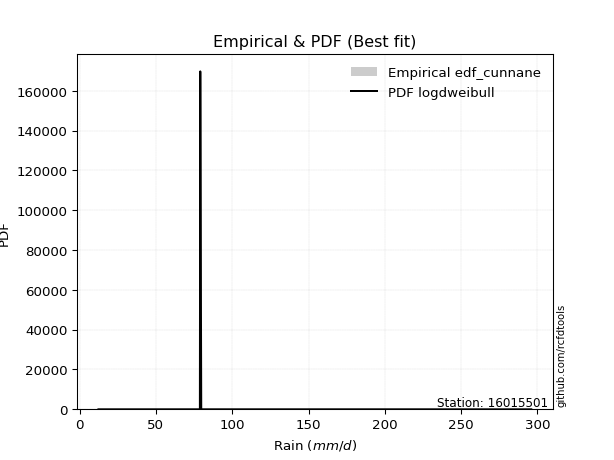</img>

</div>


### 12. Empirical - EDF Adamowski (1981)

The Adamowski formula in hydrology refers to a specific plotting position formula used for estimating the non-parametric empirical distribution of hydrological events (like flood peaks) to calculate their return periods. This formula provides an alternative to traditional parametric methods (like the Gumbel or Log Pearson Type III distributions). 

<div align="center">


$P=(m-0.25)/(n+0.5)$


</div>


**12.1. Empirical values**

<div align="center">

|                | 0                   | 1                   | 2                  | 3                   | 4                   | 5             | 6                  | 7                  | 8                  | 9                  | 10                 |
|:---------------|:--------------------|:--------------------|:-------------------|:--------------------|:--------------------|:--------------|:-------------------|:-------------------|:-------------------|:-------------------|:-------------------|
| date           | 2021                | 2015                | 2020               | 2019                | 2018                | 2016          | 2017               | 2025               | 2023               | 2024               | 2022               |
| x              | 12.33               | 22.92               | 49.56              | 53.21               | 78.81               | 79.06         | 79.69              | 95.5               | 106.18             | 160.52             | 296.0              |
| m              | 1                   | 2                   | 3                  | 4                   | 5                   | 6             | 7                  | 8                  | 9                  | 10                 | 11                 |
| empirical_dist | edf_adamowski       | edf_adamowski       | edf_adamowski      | edf_adamowski       | edf_adamowski       | edf_adamowski | edf_adamowski      | edf_adamowski      | edf_adamowski      | edf_adamowski      | edf_adamowski      |
| empirical      | 0.06521739130434782 | 0.15217391304347827 | 0.2391304347826087 | 0.32608695652173914 | 0.41304347826086957 | 0.5           | 0.5869565217391305 | 0.6739130434782609 | 0.7608695652173914 | 0.8478260869565217 | 0.9347826086956522 |
| empirical_tr   | 1.069767441860465   | 1.1794871794871795  | 1.3142857142857143 | 1.4838709677419355  | 1.703703703703704   | 2.0           | 2.421052631578948  | 3.0666666666666664 | 4.1818181818181825 | 6.571428571428571  | 15.333333333333343 |

</div>


**12.2. Kolmogorov-Smirnov fit test (sorted by Δ)**


<div align="center">

|                | 0                   | 1                   | 2                   | 3                   | 4                   | 5                   | 6                   | 7                   | 8                   | 9                   | 10                  | 11                  | 12                  | 13                  | 14                  | 15                  | 16                  | 17                  | 18                  | 19                  | 20                  | 21                  | 22                  | 23                  | 24                  | 25                  | 26                  | 27                    | 28                  | 29                  | 30                  | 31                  | 32                  | 33                  | 34                  | 35                  | 36                  | 37                  | 38                  | 39                  | 40                  | 41                  | 42                  | 43                  | 44                  | 45                  | 46                  | 47                  | 48                  | 49                  | 50                  | 51                  | 52                  | 53                  | 54                  | 55                  | 56                  | 57                  | 58                  | 59                  | 60                  | 61                  | 62                  | 63                  | 64                  | 65                  | 66                  | 67                  | 68                  | 69                  | 70                  | 71                  | 72                  | 73                  | 74                  | 75                  | 76                  | 77                  | 78                  | 79                  | 80                  | 81                  | 82                  | 83                  | 84                  | 85                  | 86                  | 87                  | 88                  | 89                  |
|:---------------|:--------------------|:--------------------|:--------------------|:--------------------|:--------------------|:--------------------|:--------------------|:--------------------|:--------------------|:--------------------|:--------------------|:--------------------|:--------------------|:--------------------|:--------------------|:--------------------|:--------------------|:--------------------|:--------------------|:--------------------|:--------------------|:--------------------|:--------------------|:--------------------|:--------------------|:--------------------|:--------------------|:----------------------|:--------------------|:--------------------|:--------------------|:--------------------|:--------------------|:--------------------|:--------------------|:--------------------|:--------------------|:--------------------|:--------------------|:--------------------|:--------------------|:--------------------|:--------------------|:--------------------|:--------------------|:--------------------|:--------------------|:--------------------|:--------------------|:--------------------|:--------------------|:--------------------|:--------------------|:--------------------|:--------------------|:--------------------|:--------------------|:--------------------|:--------------------|:--------------------|:--------------------|:--------------------|:--------------------|:--------------------|:--------------------|:--------------------|:--------------------|:--------------------|:--------------------|:--------------------|:--------------------|:--------------------|:--------------------|:--------------------|:--------------------|:--------------------|:--------------------|:--------------------|:--------------------|:--------------------|:--------------------|:--------------------|:--------------------|:--------------------|:--------------------|:--------------------|:--------------------|:--------------------|:--------------------|:--------------------|
| station        | 16015501            | 16015501            | 16015501            | 16015501            | 16015501            | 16015501            | 16015501            | 16015501            | 16015501            | 16015501            | 16015501            | 16015501            | 16015501            | 16015501            | 16015501            | 16015501            | 16015501            | 16015501            | 16015501            | 16015501            | 16015501            | 16015501            | 16015501            | 16015501            | 16015501            | 16015501            | 16015501            | 16015501              | 16015501            | 16015501            | 16015501            | 16015501            | 16015501            | 16015501            | 16015501            | 16015501            | 16015501            | 16015501            | 16015501            | 16015501            | 16015501            | 16015501            | 16015501            | 16015501            | 16015501            | 16015501            | 16015501            | 16015501            | 16015501            | 16015501            | 16015501            | 16015501            | 16015501            | 16015501            | 16015501            | 16015501            | 16015501            | 16015501            | 16015501            | 16015501            | 16015501            | 16015501            | 16015501            | 16015501            | 16015501            | 16015501            | 16015501            | 16015501            | 16015501            | 16015501            | 16015501            | 16015501            | 16015501            | 16015501            | 16015501            | 16015501            | 16015501            | 16015501            | 16015501            | 16015501            | 16015501            | 16015501            | 16015501            | 16015501            | 16015501            | 16015501            | 16015501            | 16015501            | 16015501            | 16015501            |
| empirical_dist | edf_adamowski       | edf_adamowski       | edf_adamowski       | edf_adamowski       | edf_adamowski       | edf_adamowski       | edf_adamowski       | edf_adamowski       | edf_adamowski       | edf_adamowski       | edf_adamowski       | edf_adamowski       | edf_adamowski       | edf_adamowski       | edf_adamowski       | edf_adamowski       | edf_adamowski       | edf_adamowski       | edf_adamowski       | edf_adamowski       | edf_adamowski       | edf_adamowski       | edf_adamowski       | edf_adamowski       | edf_adamowski       | edf_adamowski       | edf_adamowski       | edf_adamowski         | edf_adamowski       | edf_adamowski       | edf_adamowski       | edf_adamowski       | edf_adamowski       | edf_adamowski       | edf_adamowski       | edf_adamowski       | edf_adamowski       | edf_adamowski       | edf_adamowski       | edf_adamowski       | edf_adamowski       | edf_adamowski       | edf_adamowski       | edf_adamowski       | edf_adamowski       | edf_adamowski       | edf_adamowski       | edf_adamowski       | edf_adamowski       | edf_adamowski       | edf_adamowski       | edf_adamowski       | edf_adamowski       | edf_adamowski       | edf_adamowski       | edf_adamowski       | edf_adamowski       | edf_adamowski       | edf_adamowski       | edf_adamowski       | edf_adamowski       | edf_adamowski       | edf_adamowski       | edf_adamowski       | edf_adamowski       | edf_adamowski       | edf_adamowski       | edf_adamowski       | edf_adamowski       | edf_adamowski       | edf_adamowski       | edf_adamowski       | edf_adamowski       | edf_adamowski       | edf_adamowski       | edf_adamowski       | edf_adamowski       | edf_adamowski       | edf_adamowski       | edf_adamowski       | edf_adamowski       | edf_adamowski       | edf_adamowski       | edf_adamowski       | edf_adamowski       | edf_adamowski       | edf_adamowski       | edf_adamowski       | edf_adamowski       | edf_adamowski       |
| p_dist         | genlogistic         | loggumbel_l         | exponnorm           | moyal               | halflogistic        | logjohnsonsu        | pearson3            | loggenlogistic      | ncf                 | logloggamma         | genexpon            | logpearson3         | nct                 | logweibull_min      | loggompertz         | fisk                | invweibull          | invgamma            | invgauss            | fatiguelife         | johnsonsu           | gumbel_r            | logmielke           | logfisk             | halfnorm            | t                   | f                   | loglaplace_asymmetric | lognakagami         | kstwobign           | expon               | gompertz            | logt                | lognorm             | lognorm             | logcrystalball      | logexponnorm        | logf                | lognct              | logfatiguelife      | logbetaprime        | logncf              | logrice             | loglogistic         | logerlang           | rayleigh            | loggamma            | loggamma            | laplace_asymmetric  | wald                | loginvgauss         | gibrat              | loghypsecant        | loginvgamma         | maxwell             | weibull_min         | logalpha            | mielke              | logmaxwell          | hypsecant           | loginvweibull       | rice                | loglaplace          | logistic            | lograyleigh         | norm                | crystalball         | erlang              | logkstwobign        | laplace             | chi2                | loggenexpon         | loghalfnorm         | betaprime           | loggumbel_r         | logtruncnorm        | loghalflogistic     | logmoyal            | gumbel_l            | alpha               | gamma               | logwald             | logexpon            | loggibrat           | nakagami            | loglognorm          | pareto              | logpareto           | logchi2             | truncnorm           |
| delta          | 0.0959581027224633  | 0.09830800290283759 | 0.09896043183478881 | 0.10234460189037864 | 0.1055400891983102  | 0.11155854456770237 | 0.11188331225473508 | 0.11562238798861985 | 0.11699752504969457 | 0.11770593129303092 | 0.11926106031209321 | 0.11936251465408804 | 0.11956017565645377 | 0.11972068168564404 | 0.12014858828165914 | 0.1213134778329718  | 0.12136609522805791 | 0.12205573856451696 | 0.12291705883768861 | 0.12324251140382864 | 0.12469003692684016 | 0.12665474973453683 | 0.12833279943410508 | 0.12837879601994423 | 0.13095101410360355 | 0.13330277406448648 | 0.13661884212519676 | 0.1372769913639595    | 0.1394832230697801  | 0.1411189656437457  | 0.14396603376824152 | 0.14743084151488928 | 0.14837428252910217 | 0.14837430083803343 | 0.14837430083803343 | 0.14837437323849573 | 0.14837623049854126 | 0.14851474326894337 | 0.14946844824979394 | 0.15064300281014215 | 0.15172632696744942 | 0.15238536142869025 | 0.1544348364345846  | 0.1565884258087788  | 0.1568877466091872  | 0.15732119004419032 | 0.15776699207987205 | 0.15776699207987205 | 0.15968554019052927 | 0.16001872059754635 | 0.16225012915465103 | 0.162510461558027   | 0.16349065082067366 | 0.1650547865200515  | 0.16665241717391166 | 0.1684603036024908  | 0.1696293447544978  | 0.17733353848305972 | 0.17798217110767006 | 0.1811843555790834  | 0.18241935504170853 | 0.18325279303735453 | 0.18512998390414342 | 0.18735982266514828 | 0.18741542313898768 | 0.19601242615779757 | 0.1960124416260447  | 0.1960774111703129  | 0.20201349185088846 | 0.20545627174628267 | 0.20882151016174894 | 0.2089532364988625  | 0.21405840845354734 | 0.215744300103147   | 0.21792758759849779 | 0.21971378532192015 | 0.24169118400736028 | 0.24236796206726258 | 0.2613089484830189  | 0.2613967007038626  | 0.2647357961855829  | 0.3101979261116567  | 0.3140083075859304  | 0.340126169815606   | 0.386458737146901   | 0.4328659158115652  | 0.4480727330283467  | 0.4782574099238944  | 0.4829989575598947  | 0.760867534021481   |
| deltao         | 0.37613735880099997 | 0.37613735880099997 | 0.37613735880099997 | 0.37613735880099997 | 0.37613735880099997 | 0.37613735880099997 | 0.37613735880099997 | 0.37613735880099997 | 0.37613735880099997 | 0.37613735880099997 | 0.37613735880099997 | 0.37613735880099997 | 0.37613735880099997 | 0.37613735880099997 | 0.37613735880099997 | 0.37613735880099997 | 0.37613735880099997 | 0.37613735880099997 | 0.37613735880099997 | 0.37613735880099997 | 0.37613735880099997 | 0.37613735880099997 | 0.37613735880099997 | 0.37613735880099997 | 0.37613735880099997 | 0.37613735880099997 | 0.37613735880099997 | 0.37613735880099997   | 0.37613735880099997 | 0.37613735880099997 | 0.37613735880099997 | 0.37613735880099997 | 0.37613735880099997 | 0.37613735880099997 | 0.37613735880099997 | 0.37613735880099997 | 0.37613735880099997 | 0.37613735880099997 | 0.37613735880099997 | 0.37613735880099997 | 0.37613735880099997 | 0.37613735880099997 | 0.37613735880099997 | 0.37613735880099997 | 0.37613735880099997 | 0.37613735880099997 | 0.37613735880099997 | 0.37613735880099997 | 0.37613735880099997 | 0.37613735880099997 | 0.37613735880099997 | 0.37613735880099997 | 0.37613735880099997 | 0.37613735880099997 | 0.37613735880099997 | 0.37613735880099997 | 0.37613735880099997 | 0.37613735880099997 | 0.37613735880099997 | 0.37613735880099997 | 0.37613735880099997 | 0.37613735880099997 | 0.37613735880099997 | 0.37613735880099997 | 0.37613735880099997 | 0.37613735880099997 | 0.37613735880099997 | 0.37613735880099997 | 0.37613735880099997 | 0.37613735880099997 | 0.37613735880099997 | 0.37613735880099997 | 0.37613735880099997 | 0.37613735880099997 | 0.37613735880099997 | 0.37613735880099997 | 0.37613735880099997 | 0.37613735880099997 | 0.37613735880099997 | 0.37613735880099997 | 0.37613735880099997 | 0.37613735880099997 | 0.37613735880099997 | 0.37613735880099997 | 0.37613735880099997 | 0.37613735880099997 | 0.37613735880099997 | 0.37613735880099997 | 0.37613735880099997 | 0.37613735880099997 |
| eval           | Δo > Δ              | Δo > Δ              | Δo > Δ              | Δo > Δ              | Δo > Δ              | Δo > Δ              | Δo > Δ              | Δo > Δ              | Δo > Δ              | Δo > Δ              | Δo > Δ              | Δo > Δ              | Δo > Δ              | Δo > Δ              | Δo > Δ              | Δo > Δ              | Δo > Δ              | Δo > Δ              | Δo > Δ              | Δo > Δ              | Δo > Δ              | Δo > Δ              | Δo > Δ              | Δo > Δ              | Δo > Δ              | Δo > Δ              | Δo > Δ              | Δo > Δ                | Δo > Δ              | Δo > Δ              | Δo > Δ              | Δo > Δ              | Δo > Δ              | Δo > Δ              | Δo > Δ              | Δo > Δ              | Δo > Δ              | Δo > Δ              | Δo > Δ              | Δo > Δ              | Δo > Δ              | Δo > Δ              | Δo > Δ              | Δo > Δ              | Δo > Δ              | Δo > Δ              | Δo > Δ              | Δo > Δ              | Δo > Δ              | Δo > Δ              | Δo > Δ              | Δo > Δ              | Δo > Δ              | Δo > Δ              | Δo > Δ              | Δo > Δ              | Δo > Δ              | Δo > Δ              | Δo > Δ              | Δo > Δ              | Δo > Δ              | Δo > Δ              | Δo > Δ              | Δo > Δ              | Δo > Δ              | Δo > Δ              | Δo > Δ              | Δo > Δ              | Δo > Δ              | Δo > Δ              | Δo > Δ              | Δo > Δ              | Δo > Δ              | Δo > Δ              | Δo > Δ              | Δo > Δ              | Δo > Δ              | Δo > Δ              | Δo > Δ              | Δo > Δ              | Δo > Δ              | Δo > Δ              | Δo > Δ              | Δo > Δ              | Δo <= Δ             | Δo <= Δ             | Δo <= Δ             | Δo <= Δ             | Δo <= Δ             | Δo <= Δ             |
| fit            | 1                   | 1                   | 1                   | 1                   | 1                   | 1                   | 1                   | 1                   | 1                   | 1                   | 1                   | 1                   | 1                   | 1                   | 1                   | 1                   | 1                   | 1                   | 1                   | 1                   | 1                   | 1                   | 1                   | 1                   | 1                   | 1                   | 1                   | 1                     | 1                   | 1                   | 1                   | 1                   | 1                   | 1                   | 1                   | 1                   | 1                   | 1                   | 1                   | 1                   | 1                   | 1                   | 1                   | 1                   | 1                   | 1                   | 1                   | 1                   | 1                   | 1                   | 1                   | 1                   | 1                   | 1                   | 1                   | 1                   | 1                   | 1                   | 1                   | 1                   | 1                   | 1                   | 1                   | 1                   | 1                   | 1                   | 1                   | 1                   | 1                   | 1                   | 1                   | 1                   | 1                   | 1                   | 1                   | 1                   | 1                   | 1                   | 1                   | 1                   | 1                   | 1                   | 1                   | 1                   | 0                   | 0                   | 0                   | 0                   | 0                   | 0                   |
| n              | 11                  | 11                  | 11                  | 11                  | 11                  | 11                  | 11                  | 11                  | 11                  | 11                  | 11                  | 11                  | 11                  | 11                  | 11                  | 11                  | 11                  | 11                  | 11                  | 11                  | 11                  | 11                  | 11                  | 11                  | 11                  | 11                  | 11                  | 11                    | 11                  | 11                  | 11                  | 11                  | 11                  | 11                  | 11                  | 11                  | 11                  | 11                  | 11                  | 11                  | 11                  | 11                  | 11                  | 11                  | 11                  | 11                  | 11                  | 11                  | 11                  | 11                  | 11                  | 11                  | 11                  | 11                  | 11                  | 11                  | 11                  | 11                  | 11                  | 11                  | 11                  | 11                  | 11                  | 11                  | 11                  | 11                  | 11                  | 11                  | 11                  | 11                  | 11                  | 11                  | 11                  | 11                  | 11                  | 11                  | 11                  | 11                  | 11                  | 11                  | 11                  | 11                  | 11                  | 11                  | 11                  | 11                  | 11                  | 11                  | 11                  | 11                  |
| best_fit       | 1                   | 0                   | 0                   | 0                   | 0                   | 0                   | 0                   | 0                   | 0                   | 0                   | 0                   | 0                   | 0                   | 0                   | 0                   | 0                   | 0                   | 0                   | 0                   | 0                   | 0                   | 0                   | 0                   | 0                   | 0                   | 0                   | 0                   | 0                     | 0                   | 0                   | 0                   | 0                   | 0                   | 0                   | 0                   | 0                   | 0                   | 0                   | 0                   | 0                   | 0                   | 0                   | 0                   | 0                   | 0                   | 0                   | 0                   | 0                   | 0                   | 0                   | 0                   | 0                   | 0                   | 0                   | 0                   | 0                   | 0                   | 0                   | 0                   | 0                   | 0                   | 0                   | 0                   | 0                   | 0                   | 0                   | 0                   | 0                   | 0                   | 0                   | 0                   | 0                   | 0                   | 0                   | 0                   | 0                   | 0                   | 0                   | 0                   | 0                   | 0                   | 0                   | 0                   | 0                   | 0                   | 0                   | 0                   | 0                   | 0                   | 0                   |
| best_fit_sort  | 1                   | 2                   | 3                   | 4                   | 5                   | 6                   | 7                   | 8                   | 9                   | 10                  | 11                  | 12                  | 13                  | 14                  | 15                  | 16                  | 17                  | 18                  | 19                  | 20                  | 21                  | 22                  | 23                  | 24                  | 25                  | 26                  | 27                  | 28                    | 29                  | 30                  | 31                  | 32                  | 33                  | 34                  | 35                  | 36                  | 37                  | 38                  | 39                  | 40                  | 41                  | 42                  | 43                  | 44                  | 45                  | 46                  | 47                  | 48                  | 49                  | 50                  | 51                  | 52                  | 53                  | 54                  | 55                  | 56                  | 57                  | 58                  | 59                  | 60                  | 61                  | 62                  | 63                  | 64                  | 65                  | 66                  | 67                  | 68                  | 69                  | 70                  | 71                  | 72                  | 73                  | 74                  | 75                  | 76                  | 77                  | 78                  | 79                  | 80                  | 81                  | 82                  | 83                  | 84                  | 85                  | 86                  | 87                  | 88                  | 89                  | 90                  |

</div>


<div align="center">

</img>

</div>


**12.3. Best fit**

<div align="center">

|   id |   station | empirical_dist   | p_dist      |     delta |   deltao | eval   |   fit |   n |   best_fit |   best_fit_sort |
|-----:|----------:|:-----------------|:------------|----------:|---------:|:-------|------:|----:|-----------:|----------------:|
|    0 |  16015501 | edf_adamowski    | genlogistic | 0.0959581 | 0.376137 | Δo > Δ |     1 |  11 |          1 |               1 |

</div>


<div align="center">

</img>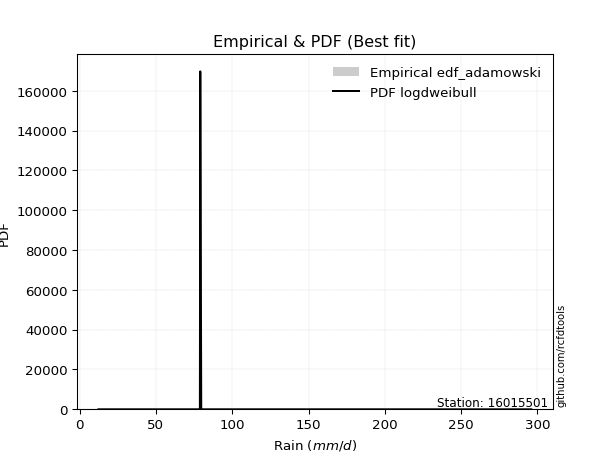</img>

</div>


## C. Best fit & Estimate extreme values for specific return periods - Tr


### 1. Best fit (ordered by delta Δ)

<div align="center">

|   id |   station | empirical_dist   | p_dist      |     delta |   deltao | eval   |   fit |   n |   best_fit |   best_fit_sort |
|-----:|----------:|:-----------------|:------------|----------:|---------:|:-------|------:|----:|-----------:|----------------:|
|    0 |  16015501 | edf_weibull      | loggumbel_l | 0.0874384 | 0.376137 | Δo > Δ |     1 |  11 |          1 |               1 |
|    1 |  16015501 | edf_california   | t           | 0.0918008 | 0.376137 | Δo > Δ |     1 |  11 |          1 |               2 |
|    2 |  16015501 | edf_adamowski    | genlogistic | 0.0959581 | 0.376137 | Δo > Δ |     1 |  11 |          1 |               3 |
|    3 |  16015501 | edf_chegodayev   | genlogistic | 0.0982464 | 0.376137 | Δo > Δ |     1 |  11 |          1 |               4 |
|    4 |  16015501 | edf_jenkinson    | genlogistic | 0.0987089 | 0.376137 | Δo > Δ |     1 |  11 |          1 |               5 |
|    5 |  16015501 | edf_beard        | genlogistic | 0.0987089 | 0.376137 | Δo > Δ |     1 |  11 |          1 |               6 |
|    6 |  16015501 | edf_filliben     | genlogistic | 0.0990569 | 0.376137 | Δo > Δ |     1 |  11 |          1 |               7 |
|    7 |  16015501 | edf_tukey        | genlogistic | 0.0997944 | 0.376137 | Δo > Δ |     1 |  11 |          1 |               8 |
|    8 |  16015501 | edf_blom         | exponnorm   | 0.100893  | 0.376137 | Δo > Δ |     1 |  11 |          1 |               9 |
|    9 |  16015501 | edf_cunnane      | exponnorm   | 0.10129   | 0.376137 | Δo > Δ |     1 |  11 |          1 |              10 |
|   10 |  16015501 | edf_gringorten   | exponnorm   | 0.101932  | 0.376137 | Δo > Δ |     1 |  11 |          1 |              11 |
|   11 |  16015501 | edf_hazen        | exponnorm   | 0.102913  | 0.376137 | Δo > Δ |     1 |  11 |          1 |              12 |

</div>

:file_folder:Tables: [bestfit_16015501.csv](table/bestfit_16015501.csv) | [extreme_16015501.csv](table/extreme_16015501.csv)


### 2. Extreme values

In hydrology, a return period (or recurrence interval $Tr$) is the statistical average time between extreme events like floods or droughts of a specific magnitude, indicating how rare an event is, with a 100-year flood, for example, having a 1% chance of occurring in any given year, not that it happens exactly every century. It is a key tool for infrastructure design (like bridges or dams) and risk assessment, calculated from historical data to determine the probability of future events, although it is important to remember it is statistical average, and events can cluster or be missed.

> risk_rate: assuming the return period as the project useful life.

|   id |      tr |   prob_l |     prob_g |      alpha |   betaprime |     chi2 |   crystalball |   erlang |    expon |   exponnorm |        f |   fatiguelife |      fisk |    gamma |   genexpon |   genlogistic |   gibrat |   gompertz |   gumbel_l |   gumbel_r |   halflogistic |   halfnorm |   hypsecant |   invgamma |   invgauss |   invweibull |   johnsonsu |   kstwobign |   laplace |   laplace_asymmetric |   loggamma |   logistic |   lognorm |   maxwell |    mielke |    moyal |   nakagami |      ncf |      nct |    norm |          pareto |   pearson3 |   rayleigh |     rice |         t |   truncnorm |     wald |   weibull_min |   logalpha |   logbetaprime |          logchi2 |   logcrystalball |   logerlang |         logexpon |   logexponnorm |     logf |   logfatiguelife |   logfisk |   loggenexpon |   loggenlogistic |   loggibrat |   loggompertz |   loggumbel_l |   loggumbel_r |   loghalflogistic |   loghalfnorm |   loghypsecant |   loginvgamma |   loginvgauss |   loginvweibull |   logjohnsonsu |   logkstwobign |   loglaplace |   loglaplace_asymmetric |   logloggamma |   loglogistic |     loglognorm |   logmaxwell |   logmielke |   logmoyal |   lognakagami |    logncf |   lognct |      logpareto |   logpearson3 |   lograyleigh |   logrice |     logt |   logtruncnorm |    logwald |   logweibull_min |   station |   n |   risk_rate |
|-----:|--------:|---------:|-----------:|-----------:|------------:|---------:|--------------:|---------:|---------:|------------:|---------:|--------------:|----------:|---------:|-----------:|--------------:|---------:|-----------:|-----------:|-----------:|---------------:|-----------:|------------:|-----------:|-----------:|-------------:|------------:|------------:|----------:|---------------------:|-----------:|-----------:|----------:|----------:|----------:|---------:|-----------:|---------:|---------:|--------:|----------------:|-----------:|-----------:|---------:|----------:|------------:|---------:|--------------:|-----------:|---------------:|-----------------:|-----------------:|------------:|-----------------:|---------------:|---------:|-----------------:|----------:|--------------:|-----------------:|------------:|--------------:|--------------:|--------------:|------------------:|--------------:|---------------:|--------------:|--------------:|----------------:|---------------:|---------------:|-------------:|------------------------:|--------------:|--------------:|---------------:|-------------:|------------:|-----------:|--------------:|----------:|---------:|---------------:|--------------:|--------------:|----------:|---------:|---------------:|-----------:|-----------------:|----------:|----:|------------:|
|    0 |    2    | 0.5      | 0.5        |    49.499  |     56.4968 |  58.1559 |        93.98  |  61.0312 |  68.9255 |     77.1562 |  69.6054 |       73.2072 |   74.2524 |  49.7038 |    73.5797 |       80.8144 |  71.5541 |    84.1946 |    106.254 |    81.7061 |        75.6042 |    78.6867 |      93.98  |    73.863  |    73.3779 |      74.0637 |     73.2706 |     86.1863 |    93.98  |              86.9868 |    67.7628 |     93.98  |   69.3442 |   87.5902 |   63.7105 |  77.7437 |    24.4402 |  74.3277 |  74.6833 |  93.98  |    13.4598      |    74.6825 |    85.324  |  93.0013 |   74.4173 |     31.4369 |  69.7617 |       64.2287 |    66.089  |        68.5402 |     22.0532      |          69.3442 |     67.8865 |     40.8184      |        69.3439 |  69.2839 |          69.0373 |   72.9611 |       56.6498 |          74.9799 |     54.0874 |       73.2451 |       79.4467 |       60.5263 |           56.5699 |       58.5342 |        69.3442 |       66.6507 |       66.6595 |         61.3489 |        76.0629 |        57.612  |      69.3442 |                 74.0386 |       74.0753 |       69.3442 |  13.1891       |      64.6042 |     72.9675 |    57.9263 |       74.9224 |   68.4306 |  69.1569 |  12.7076       |       73.7579 |       63.0021 |   68.2443 |  69.3442 |        55.3489 |    53.0243 |          73.6927 |  16015501 |  11 |    0.75     |
|    1 |    2.33 | 0.570815 | 0.429185   |    58.9154 |     67.7756 |  69.3859 |       107.312 |  72.0484 |  81.3951 |     87.4613 |  83.0666 |       84.5228 |   83.9692 |  59.6143 |    85.4553 |       90.9699 |  78.3077 |    97.4864 |    117.853 |    94.06   |        88.3059 |    93.0757 |     104.65  |    84.1804 |    84.448  |      84.1621 |     84.0051 |     97.6398 |   102.048 |              95.1925 |    78.8108 |    105.727 |   80.3839 |  101.442  |   75.3213 |  89.4382 |    35.837  |  85.2834 |  83.9493 | 107.312 |    17.5349      |    86.8803 |    99.3802 | 104.991  |   81.1727 |     32.1387 |  78.5038 |       76.7269 |    76.8084 |        79.8598 |     26.81        |          80.3839 |     78.9609 |     53.1379      |        80.3836 |  80.3675 |          79.9989 |   83.2916 |       68.4876 |          84.7355 |     58.2901 |       85.5531 |       90.3431 |       69.4057 |           65.1189 |       68.6525 |        78.047  |       77.5675 |       78.0132 |         73.659  |        84.1769 |        69.8278 |      75.8291 |                 80.7326 |       85.3902 |       78.9839 |  18.8754       |      75.3212 |     83.1844 |    65.9407 |       84.9    |   79.745  |  80.2043 |  14.1684       |       85.2091 |       73.6202 |   79.3801 |  80.3839 |        66.0955 |    58.4174 |          85.155  |  16015501 |  11 |    0.729209 |
|    2 |    5    | 0.8      | 0.2        |   131.932  |    128.988  | 127.225  |       156.858 | 127.525  | 143.741  |    138.205  | 152.163  |      140.155  |  133.227  | 111.892  |   141.952  |      135.085  | 117.19   |   154.677  |    155.325 |   147.731  |       145.778  |   153.925  |     147.449 |   135.164  |   139.056  |     134.128  |    137.169  |    146.292  |   142.387 |             136.219  |   139.481  |    151.082 |  139.188  |  155.959  |  131.086  | 143.608  |   143.384  | 138.097  | 129.978  | 156.858 | 10770.6         |   144.096  |   155.653  | 152.991  |  110.728  |     34.7468 | 127.442  |      141.63   |   136.936  |       142.885  |     82.066       |         139.188  |    139.775  |    198.663       |       139.187  | 139.569  |         138.412  |  138.885  |      147.091  |         130.885  |     89.6808 |      144.419  |      136.843  |      125.798  |          123.104  |      134.738  |       125.406  |      138.391  |      143.666  |        163.027  |       123.11   |       158.046  |     118.565  |                119.369  |      140.041  |      130.558  |   1.36389e+176 |     137.808  |    130.791  |   120.181  |      138.773  |  142.424  | 139.254  |   8.15662e+125 |      140.841  |      137.34   |  139.834  | 139.188  |       149.928  |   100.469  |         140.542  |  16015501 |  11 |    0.67232  |
|    3 |   10    | 0.9      | 0.1        |   266.081  |    190.989  | 181.063  |       189.726 | 178.192  | 200.336  |    184.208  | 216.858  |      190.879  |  185.358  | 161.515  |   191.336  |      171.013  | 161.511  |   196.868  |    176.188 |   191.445  |       193.507  |   198.952  |     181.625 |   184.697  |   189.625  |     183.275  |    187.824  |    183.334  |   179.005 |             173.462  |   205.411  |    184.485 |  200.341  |  194.326  |  184.631  | 190.771  |   269.04   | 186.731  | 177.066  | 189.726 |     1.09958e+07 |   193.164  |   195.777  | 187.216  |  141.492  |     36.477  | 179.377  |      202.939  |   204.598  |       212.75   |    254.645       |         200.341  |    205.857  |    657.673       |       200.341  | 201.364  |         199.22   |  202.391  |      254.398  |         175.983  |    146.547  |      195.316  |      172.433  |      204.193  |          208.903  |      221.913  |       183.141  |      205.99   |      220.526  |        311.376  |       167.852  |       294.363  |     177.9    |                170.243  |      189.371  |      189.037  | inf            |     210.817  |    176.794  |   202.675  |      196.022  |  211.375  | 200.971  | inf            |      191.018  |      214.231  |  204.16   | 200.341  |       291.854  |   178.626  |         190.281  |  16015501 |  11 |    0.651322 |
|    4 |   15    | 0.933333 | 0.0666667  |   399.752  |    230.095  | 212.887  |       206.128 | 207.907  | 233.442  |    211.117  | 255.436  |      220.843  |  221.357  | 191.085  |   219.888  |      191.283  | 192.082  |   218.477  |    185.636 |   216.108  |       220.517  |   222.384  |     201.129 |   216.187  |   219.931  |     214.919  |    219.213  |    202.999  |   200.425 |             195.248  |   249.808  |    202.684 |  240.271  |  214.011  |  219.841  | 218.143  |   341.681  | 216.321  | 208.704  | 206.128 |     6.33372e+08 |   221.163  |   216.451  | 204.85   |  164.198  |     37.3404 | 212.728  |      239.565  |   251.411  |       260.464  |    508.729       |         240.271  |    250.353  |   1324.73        |       240.27   | 241.809  |         238.958  |  248.48   |      337.57   |         205.856  |    205.63   |      224.317  |      191.465  |      268.365  |          281.786  |      287.705  |       227.324  |      252.28   |      275.085  |        448.576  |       203.251  |       409.519  |     225.557  |                209.535  |      218.589  |      231.274  | inf            |     262.204  |    207.688  |   274.486  |      234.011  |  258.201  | 241.408  | inf            |      220.556  |      269.383  |  246.752  | 240.271  |       419.605  |   258.48   |         219.588  |  16015501 |  11 |    0.644736 |
|    5 |   20    | 0.95     | 0.05       |   533.305  |    259.15   | 235.574  |       216.869 | 229.014  | 256.932  |    230.21   | 283.118  |      242.239  |  250.047  | 212.239  |   240.067  |      205.475  | 216.063  |   232.702  |    191.517 |   233.376  |       239.441  |   238.006  |     214.888 |   239.902  |   241.767  |     238.952  |    242.395  |    216.246  |   215.623 |             210.705  |   284.22   |    215.263 |  270.639  |  227.076  |  247.316  | 237.528  |   391.459  | 237.983  | 233.478  | 216.869 |     1.12384e+10 |   240.802  |   230.192  | 216.571  |  183.365  |     37.9058 | 237.581  |      265.836  |   288.338  |       297.77   |    839.255       |         270.639  |    284.84   |   2177.22        |       270.638  | 272.615  |         269.198  |  286.336  |      407.474  |         229.155  |    268.215  |      244.614  |      204.358  |      324.958  |          347.524  |      342.081  |       264.764  |      288.544  |      318.782  |        579.229  |       234.685  |       511.526  |     266.927  |                242.798  |      239.546  |      265.865  | inf            |     303.047  |    232.214  |   340.257  |      263.2    |  294.686  | 272.228  | inf            |      241.623  |      313.686  |  279.405  | 270.639  |       537.432  |   340.422  |         240.54   |  16015501 |  11 |    0.641514 |
|    6 |   25    | 0.96     | 0.04       |   666.811  |    282.455  | 253.222  |       224.776 | 245.398  | 275.151  |    245.02   | 304.761  |      258.909  |  274.373  | 228.731  |   255.689  |      216.407  | 236.054  |   243.178  |    195.703 |   246.677  |       254.021  |   249.629  |     225.537 |   259.164  |   258.892  |     258.595  |    260.933  |    226.169  |   227.411 |             222.694  |   312.691  |    224.885 |  295.42   |  236.775  |  270.334  | 252.553  |   428.915  | 255.215  | 254.213  | 224.776 |     1.04603e+11 |   255.928  |   240.401  | 225.279  |  200.393  |     38.322  | 257.487  |      286.36   |   319.293  |       328.831  |   1243.09        |         295.42   |    313.37   |   3200.89        |       295.42   | 297.779  |         293.886  |  319.145  |      468.668  |         248.627  |    334.722  |      260.215  |      214.058  |      376.562  |          408.456  |      389.105  |       297.923  |      318.784  |      355.808  |        705.278  |       263.822  |       604.253  |     304.174  |                272.195  |      255.946  |      295.779  | inf            |     337.431  |    253.06   |   401.896  |      287.199  |  324.986  | 297.418  | inf            |      258.028  |      351.258  |  306.199  | 295.42   |       647.767  |   424.431  |         256.896  |  16015501 |  11 |    0.639603 |
|    7 |   50    | 0.98     | 0.02       |  1334.13   |    359.299  | 308.272  |       247.418 | 296.343  | 331.747  |    291.023  | 372.93   |      311.077  |  363.724  | 280.335  |   304.112  |      250.081  | 306.525  |   273.062  |    207.063 |   287.652  |       298.945  |   283.415  |     258.552 |   324.433  |   313.082  |     325.904  |    321.835  |    255.306  |   264.029 |             259.937  |   411.894  |    254.286 |  379.666  |  264.904  |  353.518  | 299.198  |   538.775  | 311.425  | 328.601  | 247.418 |     1.06911e+14 |   302.423  |   270.038  | 250.558  |  269.025  |     39.5139 | 322.482  |      350.845  |   429.82   |       438.309  |   4299.05        |         379.666  |    412.772  |  10596.5         |       379.666  | 383.481  |         377.883  |  444.558  |      703.76   |         318.441  |    730.791  |      307.984  |      242.773  |      592.953  |          671.926  |      565.794  |       429.518  |      425.691  |      490.541  |       1293.53   |       393.335  |       985.551  |     456.395  |                388.202  |      307.756  |      409.686  | inf            |     460.841  |    330.791  |   673.88   |      369.893  |  431.287  | 383.287  | inf            |      309.326  |      487.8    |  398.155  | 379.666  |      1127.36   |   872.089  |         308.355  |  16015501 |  11 |    0.63583  |
|    8 |   75    | 0.986667 | 0.0133333  |  2001.36   |    407.524  | 340.605  |       259.567 | 326.174  | 364.853  |    317.932  | 413.455  |      341.838  |  427.61   | 310.734  |   332.396  |      269.655  | 354.121  |   288.95   |    212.808 |   311.468  |       325.059  |   301.806  |     277.846 |   366.891  |   345.434  |     370.247  |    359.938  |    271.337  |   285.449 |             281.723  |   478.161  |    271.266 |  434.377  |  280.198  |  412.21   | 326.475  |   598.753  | 346.395  | 380.405  | 259.567 |     6.15825e+15 |   329.342  |   286.161  | 264.311  |  323.771  |     40.1534 | 362.476  |      389.024  |   505.806  |       512.408  |   8987.43        |         434.377  |    479.165  |  21344.3         |       434.377  | 439.251  |         432.487  |  538.348  |      878.161  |         367.093  |   1238.31   |      335.501  |      258.73   |      772.024  |          897.395  |      693.692  |       531.899  |      498.321  |      585.111  |       1840.28   |       511.284  |      1289.95   |     578.657  |                477.799  |      338.702  |      494.501  | inf            |     545.943  |    387.969  |   911.692  |      424.442  |  502.854  | 439.229  | inf            |      339.546  |      583.218  |  458.498  | 434.377  |      1534.03   |  1358.36   |         338.949  |  16015501 |  11 |    0.634587 |
|    9 |  100    | 0.99     | 0.01       |  2668.56   |    443.281  | 363.593  |       267.784 | 347.35   | 388.342  |    337.025  | 442.495  |      363.761  |  479.187  | 332.38   |   352.454  |      283.508  | 390.991  |   299.613  |    216.565 |   328.324  |       343.542  |   314.335  |     291.531 |   399.157  |   368.659  |     404.206  |    388.146  |    282.321  |   300.647 |             297.18   |   529.205  |    283.255 |  475.784  |  290.614  |  459.306  | 345.827  |   639.567  | 372.235  | 421.553  | 267.784 |     1.09271e+17 |   348.339  |   297.145  | 273.68   |  371.245  |     40.586  | 391.636  |      416.297  |   565.431  |       569.958  |  15229.9         |         475.784  |    530.302  |  35079.8         |       475.784  | 481.513  |         473.84   |  616.252  |     1021.21   |         405.772  |   1863.18   |      354.856  |      269.73   |      930.567  |         1101.35   |      797.005  |       618.999  |      554.871  |      660.264  |       2361.82   |       624.735  |      1551.19   |     684.791  |                553.65   |      360.953  |      564.755  | inf            |     612.741  |    435.281  |  1129.73   |      466.133  |  558.254  | 481.651  | inf            |      361.068  |      658.704  |  504.452  | 475.784  |      1896.57   |  1876.43   |         360.888  |  16015501 |  11 |    0.633968 |
|   10 |  200    | 0.995    | 0.005      |  5337.32   |    534.984  | 419.117  |       286.423 | 398.405  | 444.938  |    383.028  | 513.442  |      416.885  |  629.072  | 384.756  |   400.762  |      316.812  | 491.302  |   323.5    |    224.733 |   368.848  |       387.977  |   342.99   |     324.502 |   485.04   |   425.47   |     495.56   |    460.316  |    307.62   |   337.265 |             334.423  |   667.163  |    312.013 |  584.934  |  314.447  |  595.24   | 392.452  |   732.597  | 438.302  | 538.403  | 286.423 |     1.11683e+20 |   393.819  |   322.279  | 295.119  |  524.72   |     41.5672 | 464.271  |      482.581  |   731.021  |       727.352  |  54930.1         |         584.934  |    668.495  | 116132           |       584.934  | 593.11   |         582.948  |  852.23   |     1442.7    |         515.763  |   5661.87   |      400.978  |      295.28   |     1458.01   |         1801.99   |     1094.87   |       891.982  |      710.119  |      872.692  |       4302.91   |      1068.38   |      2372.1    |    1027.49   |                789.61   |      415.585  |      776.704  | inf            |     797.932  |    579.073  |  1893.87   |      577.57   |  709.043  | 593.789  | inf            |      413.14   |      870.239  |  626.621  | 584.934  |      3100.76   |  4196.12   |         414.564  |  16015501 |  11 |    0.633042 |
|   11 |  250    | 0.996    | 0.004      |  6671.69   |    566.254  | 437.027  |       292.119 | 414.849  | 463.157  |    397.838  | 536.576  |      434.07   |  686.33   | 401.675  |   416.311  |      327.518  | 527.294  |   330.707  |    227.136 |   381.876  |       402.262  |   351.806  |     335.116 |   515.369  |   443.998  |     528.121  |    484.868  |    315.449  |   349.054 |             346.412  |   716.421  |    321.246 |  623.043  |  321.783  |  646.913  | 407.461  |   761.102  | 460.797  | 582.158  | 292.119 |     1.0395e+21  |   408.384  |   330.015  | 301.718  |  589.078  |     41.867  | 488.3    |      504.079  |   791.625  |       784.149  |  83274           |         623.043  |    717.831  | 170733           |       623.043  | 632.133  |         621.075  |  945.713  |     1604.71   |         556.998  |   8436.38   |      415.684  |      303.248  |     1684.44   |         2111.03   |     1207.22   |      1003.3    |      766.34   |      951.633  |       5218.13   |      1292.13   |      2705.34   |    1170.86   |                885.211  |      433.482  |      860.372  | inf            |     865.506  |    636.573  |  2236.56   |      616.966  |  763.224  | 633.04   | inf            |      429.953  |      948.133  |  669.592  | 623.043  |      3612.99   |  5476.18   |         432.094  |  16015501 |  11 |    0.632858 |
|   12 |  500    | 0.998    | 0.002      | 13343.5    |    669.178  | 492.753  |       309.011 | 465.949  | 519.753  |    443.84   | 609.351  |      487.675  |  898.63   | 454.379  |   464.602  |      360.75   | 651.681  |   351.798  |    234.025 |   422.311  |       446.601  |   378.089  |     368.084 |   618.959  |   502.223  |     640.353  |    565.438  |    338.912  |   385.672 |             383.655  |   886.006  |    349.88  |  751.287  |  343.675  |  837.689  | 454.085  |   845.72   | 534.822  | 741.093  | 309.011 |     1.06244e+24 |   453.427  |   353.099  | 321.408  |  853.041  |     42.7562 | 564.706  |      571.312  |  1005.8    |       981.839  | 305703           |         751.287  |    887.668  | 565212           |       751.287  | 763.66   |         749.493  | 1306.01   |     2204.83   |         706.935  |  33474.7    |      460.973  |      327.303  |     2636.6    |         3450.31   |     1615.39   |      1445.73   |      962.778  |     1234.91   |       9494.33   |      2475.39   |      4011.47   |    1756.8    |               1262.48   |      490.038  |     1181.63   | inf            |    1103.11   |    862.469  |  3749.29   |      751.231  |  950.987  | 765.462  | inf            |      482.268  |     1224.49   |  815.25   | 751.287  |      5723.22   | 12768.6    |         487.333  |  16015501 |  11 |    0.632489 |
|   13 |  750    | 0.998667 | 0.00133333 | 20015.3    |    733.668  | 525.407  |       318.394 | 495.854  | 552.859  |    470.75   | 652.566  |      519.176  | 1051.47   | 485.3    |   492.849  |      380.177  | 733.943  |   363.321  |    237.707 |   445.95   |       472.522  |   392.773  |     387.369 |   686.802  |   536.721  |     714.615  |    615.712  |    352.093  |   407.092 |             405.441  |   997.779  |    366.609 |  833.609  |  355.919  |  974.441  | 481.358  |   892.739  | 581.236  | 852.901  | 318.394 |     6.1198e+25  |   479.652  |   366.007  | 332.418  | 1066.02   |     43.2501 | 610.517  |      610.938  |  1151.35   |      1113.8    | 657371           |         833.608  |    999.591  |      1.13849e+06 |       833.609  | 848.241  |         832.013  | 1577.06   |     2633.76   |         812.515  |  83285.3    |      487.21   |      340.932  |     3426.1    |         4598.22   |     1900.82   |      1790.16   |     1094.5    |     1430.76   |      13472      |      3786.82   |      5005.11   |    2227.43   |               1553.86   |      523.795  |     1422.28   | inf            |    1263.4    |   1037.6    |  5072.19   |      838.689  | 1075.68   | 850.717  | inf            |      512.897  |     1412.77   |  909.519  | 833.608  |      7418.8    | 21212.2    |         520.202  |  16015501 |  11 |    0.632366 |
|   14 | 1000    | 0.999    | 0.001      | 26687.1    |    781.452  | 548.597  |       324.855 | 517.077  | 576.348  |    489.843  | 683.518  |      541.585  | 1175.2    | 507.275  |   512.89   |      393.957  | 796.894  |   371.172  |    240.185 |   462.718  |       490.908  |   402.913  |     401.052 |   738.521  |   561.378  |     771.587  |    652.849  |    361.224  |   422.29  |             420.898  |  1083.18   |    378.472 |  895.473  |  364.381  | 1084.87   | 500.709  |   925.103  | 615.659  | 942.111  | 324.855 |     1.08589e+27 |   498.211  |   374.928  | 340.027  | 1251.47   |     43.5902 | 643.47   |      639.176  |  1264.79   |      1215.43   |      1.13387e+06 |         895.472  |   1085.1    |      1.87113e+06 |       895.473  | 911.873  |         894.068  | 1802.73   |     2978.13   |         896.795  | 167299      |      505.72   |      350.423  |     4125.65   |         5637.24   |     2126.87   |      2083.24   |     1196.27   |     1585.01   |      17267.4    |      5231.84   |      5834.42   |    2635.97   |               1800.54   |      548.047  |     1622.09   | inf            |    1387.61   |   1187.07   |  6285.17   |      905.02   | 1171.42   | 914.905  | inf            |      534.625  |     1559.55   |  980.716  | 895.472  |      8883.44   | 30560.2    |         543.774  |  16015501 |  11 |    0.632305 |

<div align="center">

</img>

</div>


<div align="center">

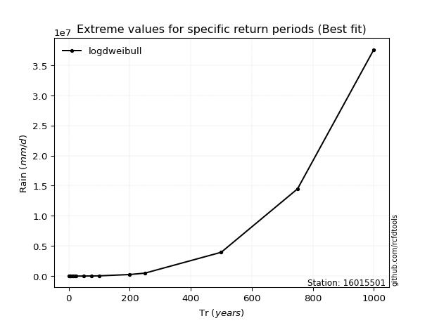</img>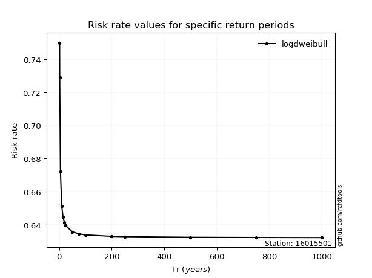</img>

</div>


<sub>**APP DISCLAIMER**: NO WARRANTY - This software is provided by [github.com/rcfdtools](https://github.com/rcfdtools) "as is", without any express or implied warranty, including warranties of merchantability, fitness for a particular purpose, or non-infringement. There is no guarantee that the software will be error-free or operate without interruption. LIMITATION OF LIABILITY - Neither the authors nor copyright holders will be liable for claims or damages arising from the software or its use. You are responsible for determining if the software is appropriate for your use and assume all associated risks, including errors, legal compliance, and data loss. NO PROFESSIONAL ADVICE - The software provides general information and does not offer professional advice. It should not replace consultation with professional advisors.</sub>