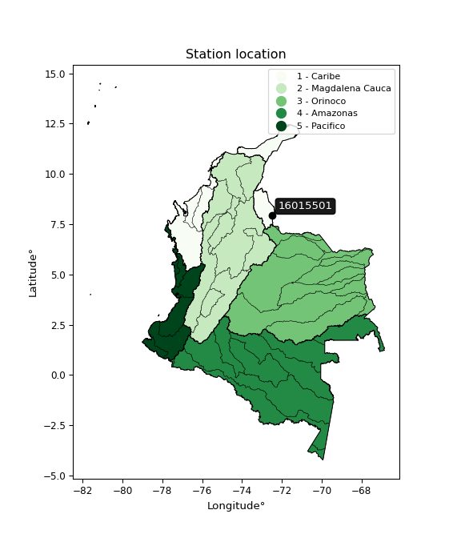

<div align="center">


</div>

# PMP Station (rain, Pmax24h): 16015501

Probable Maximum Precipitation (PMP) is the greatest amount of rainfall for a specific duration that is meteorologically possible for a given location, acting as a "worst-case" scenario for extreme storms, crucial for designing safety-critical infrastructure like bridges, river deviations, dams, spillways, and nuclear plants to prevent catastrophic failure. PMP is calculated by hydrologists using meteorological data to determine the upper limit of extreme rainfall, often leading to the Probable Maximum Flood (PMF) for flood control design, and is increasingly being studied for climate change impacts.

<div align="center">

</img>

</div>


## A. General information


### 1. General running parameters

• app_version: _v20251227_. • runtime: _2025-12-27 09:02:11.367833_. • Python version: _3.14.0_. • SciPy version: _1.16.3_. • Pandas version: _2.3.3_. • NumPy version: _2.3.5_. • Stations dataset (station_dataset_file): _dataset/pmax24h_in/automatic_colombia_2003_2024_filter.csv_. • Stations catalog (station_catalog_file): _dataset/CNE_IDEAM.xls_. • Minimum year to eval til year_max (date_min): _2003_. • Maximum year to eval since year_min (date_max): _2024_. • Creates, save and include plots into reports (create_plot): _False_. • Plot only fit distributions with Δo > Δ (plot_only_fit): _True_. • Eval low extreme values, if False, evaluates high extreme values (low_extreme): _False_. • Eval every SciPy distribution as logarithmic (pdist_logarithmic_on): _True_. • Standard deviation normalized (ddof): _1.0_. • Return periods to eval in years (Tr): _[2, 2.33, 5, 10, 15, 20, 25, 50, 75, 100, 200, 250, 500, 750, 1000]_. • Minimum data sample per station, 0 means any (minimum_sample): _5_. • Z-Score threshold to adjust a value, 0 means disable (zscore): _3.5_. • Avoid zeros, e.g. rain = 0 (avoid_zeros): _True_. • Avoid null values (avoid_nans): _True_. [:file_folder:Dataset file.](../../dataset/pmax24h_in/automatic_colombia_2003_2024_filter.csv)

> Delta Degrees of Freedom (DDOF): is a parameter used in the formulas for calculating variance and standard deviation. When ddof=0, the divisor is $N$ (the total number of observations) and this is used when your data set is the entire population. When ddof=1, the divisor is $N-1$ and this is used when your data set is a sample drawn from a larger population. Using $N-1$ provides an unbiased estimate of the population variance (known as Bessel´s correction).


### 2. Station info and location

|   id |   CODIGO | NOMBRE                                  | CATEGORIA           | TECNOLOGIA                              | ESTADO   | FECHA_INSTALACION   |   FECHA_SUSPENSION |   ALTITUD |   LATITUD |   LONGITUD | DEPARTAMENTO       | MUNICIPIO   | AREA_OPERATIVA                         | ENTIDAD                                                     | AREA_HIDROGRAFICA   | ZONA_HIDROGRAFICA   | SUBZONA_HIDROGRAFICA   |   CORRIENTE | Catalogo   |
|-----:|---------:|:----------------------------------------|:--------------------|:----------------------------------------|:---------|:--------------------|-------------------:|----------:|----------:|-----------:|:-------------------|:------------|:---------------------------------------|:------------------------------------------------------------|:--------------------|:--------------------|:-----------------------|------------:|:-----------|
|    0 | 16015501 | AEROPUERTO CAMILO DAZA - AUT [16015501] | Sinóptica Principal | Automática con Telemetría, Convencional | Activa   | 10/06/2015          |                nan |       306 |   7.93028 |   -72.5092 | Norte De Santander | Cúcuta      | Area Operativa 08 - Santanderes-Arauca | INSTITUTO DE HIDROLOGIA METEOROLOGIA Y ESTUDIOS AMBIENTALES | Caribe              | Catatumbo           | Río Pamplonita         |         nan | CNE_IDEAM  |

<div align="center">

Map location in: [:earth_americas:Google](http://maps.google.com/maps?q=7.93028,-72.50917) [:earth_americas:OSM](https://www.openstreetmap.org/#map=18/7.93028/-72.50917&layers=P) [:earth_americas:Bing](https://www.bing.com/maps?cp=7.93028~-72.50917&lvl=18) [:earth_americas:Apple](https://maps.apple.com/frame?center=7.93028%2C-72.50917&span=0.003%2C0.006)

</div>


<div align="center">

```geojson
{
  "type": "Feature",
  "geometry": {
    "type": "Point", 
    "coordinates": [-72.50917, 7.93028]
  }, 
  "properties": {
    "Name": "16015501"
  }
}
```

</div>


### 3. Discrete values table and plot

|               |           0 |           1 |           2 |           3 |          4 |           5 |          6 |
|:--------------|------------:|------------:|------------:|------------:|-----------:|------------:|-----------:|
| Date          | 2016        | 2017        | 2018        | 2019        | 2020       | 2023        | 2024       |
| Value         |   79.06     |   79.69     |   78.81     |   53.21     |   49.56    |  106.18     |  160.52    |
| Value_initial |   79.06     |   79.69     |   78.81     |   53.21     |   49.56    |  106.18     |  160.52    |
| count         |    7        |    7        |    7        |    7        |    7       |    7        |    7       |
| mean          |   86.7186   |   86.7186   |   86.7186   |   86.7186   |   86.7186  |   86.7186   |   86.7186  |
| std           |   37.6377   |   37.6377   |   37.6377   |   37.6377   |   37.6377  |   37.6377   |   37.6377  |
| zscore        |   -0.203481 |   -0.186743 |   -0.210124 |   -0.890293 |   -0.98727 |    0.517073 |    1.96084 |

> The initial value (value_initial) correspond to the initial obtained or null completed value, and value (value) is adjusted only when the initial value is outside the valid range definite through the Z-Score value. If Z-Score is active, values out of range or outliers are replaced with the station mean value


### 4. Active continuous probability distributions from SciPy (45 of 104 available)

[scipy.stats](https://docs.scipy.org/doc/scipy/reference/stats.html) is a Python´s powerful submodule within the SciPy library for comprehensive statistical analysis, offering over 130 probability distributions (like Normal, Poisson), functions for descriptive stats (mean, variance), hypothesis testing (t-tests, chi-square), random variable generation, and statistical tests, making it essential for data science, modeling, and research. It provides tools to explore, model, and draw conclusions from data efficiently, working seamlessly with NumPy.

<div align="center">

|   id | p_dist             |   n_parameter | fit_method   | label                                                                       | active   | ref                                                                                                        |
|-----:|:-------------------|--------------:|:-------------|:----------------------------------------------------------------------------|:---------|:-----------------------------------------------------------------------------------------------------------|
|    0 | alpha              |             3 | MLE          | Alpha                                                                       | True     | [:mortar_board:](https://docs.scipy.org/doc/scipy/reference/generated/scipy.stats.alpha.html)              |
|    1 | betaprime          |             4 | MLE          | Beta prime                                                                  | True     | [:mortar_board:](https://docs.scipy.org/doc/scipy/reference/generated/scipy.stats.betaprime.html)          |
|    2 | chi2               |             3 | MLE          | Chi²                                                                        | True     | [:mortar_board:](https://docs.scipy.org/doc/scipy/reference/generated/scipy.stats.chi2.html)               |
|    3 | crystalball        |             4 | MLE          | Crystalball                                                                 | True     | [:mortar_board:](https://docs.scipy.org/doc/scipy/reference/generated/scipy.stats.crystalball.html)        |
|    4 | erlang             |             3 | MLE          | Erlang                                                                      | True     | [:mortar_board:](https://docs.scipy.org/doc/scipy/reference/generated/scipy.stats.erlang.html)             |
|    5 | expon              |             2 | MLE          | Exponential                                                                 | True     | [:mortar_board:](https://docs.scipy.org/doc/scipy/reference/generated/scipy.stats.expon.html)              |
|    6 | exponnorm          |             3 | MLE          | Exponentially modified Normal                                               | True     | [:mortar_board:](https://docs.scipy.org/doc/scipy/reference/generated/scipy.stats.exponnorm.html)          |
|    7 | f                  |             4 | MLE          | F                                                                           | True     | [:mortar_board:](https://docs.scipy.org/doc/scipy/reference/generated/scipy.stats.f.html)                  |
|    8 | fatiguelife        |             3 | MLE          | Fatigue-life (Birnbaum-Saunders)                                            | True     | [:mortar_board:](https://docs.scipy.org/doc/scipy/reference/generated/scipy.stats.fatiguelife.html)        |
|    9 | fisk               |             3 | MLE          | Fisk                                                                        | True     | [:mortar_board:](https://docs.scipy.org/doc/scipy/reference/generated/scipy.stats.fisk.html)               |
|   10 | gamma              |             3 | MLE          | Gamma                                                                       | True     | [:mortar_board:](https://docs.scipy.org/doc/scipy/reference/generated/scipy.stats.gamma.html)              |
|   11 | genexpon           |             5 | MLE          | Generalized exponential                                                     | True     | [:mortar_board:](https://docs.scipy.org/doc/scipy/reference/generated/scipy.stats.genexpon.html)           |
|   12 | genlogistic        |             3 | MLE          | Generalized logistic                                                        | True     | [:mortar_board:](https://docs.scipy.org/doc/scipy/reference/generated/scipy.stats.genlogistic.html)        |
|   13 | gibrat             |             2 | MM           | Gibrat                                                                      | True     | [:mortar_board:](https://docs.scipy.org/doc/scipy/reference/generated/scipy.stats.gibrat.html)             |
|   14 | gompertz           |             3 | MLE          | Gompertz (or truncated Gumbel)                                              | True     | [:mortar_board:](https://docs.scipy.org/doc/scipy/reference/generated/scipy.stats.gompertz.html)           |
|   15 | gumbel_l           |             2 | MM           | Gumbel Left Skew                                                            | True     | [:mortar_board:](https://docs.scipy.org/doc/scipy/reference/generated/scipy.stats.gumbel_l.html)           |
|   16 | gumbel_r           |             2 | MM           | Gumbel Right Skew                                                           | True     | [:mortar_board:](https://docs.scipy.org/doc/scipy/reference/generated/scipy.stats.gumbel_r.html)           |
|   17 | halflogistic       |             2 | MM           | Half-logistic                                                               | True     | [:mortar_board:](https://docs.scipy.org/doc/scipy/reference/generated/scipy.stats.halflogistic.html)       |
|   18 | halfnorm           |             2 | MM           | Half Normal                                                                 | True     | [:mortar_board:](https://docs.scipy.org/doc/scipy/reference/generated/scipy.stats.halfnorm.html)           |
|   19 | hypsecant          |             2 | MM           | hyperbolic secant                                                           | True     | [:mortar_board:](https://docs.scipy.org/doc/scipy/reference/generated/scipy.stats.hypsecant.html)          |
|   20 | invgamma           |             3 | MLE          | Inverted gamma                                                              | True     | [:mortar_board:](https://docs.scipy.org/doc/scipy/reference/generated/scipy.stats.invgamma.html)           |
|   21 | invgauss           |             3 | MLE          | Inverse Gaussian                                                            | True     | [:mortar_board:](https://docs.scipy.org/doc/scipy/reference/generated/scipy.stats.invgauss.html)           |
|   22 | invweibull         |             3 | MLE          | Inverted Weibull                                                            | True     | [:mortar_board:](https://docs.scipy.org/doc/scipy/reference/generated/scipy.stats.invweibull.html)         |
|   23 | johnsonsu          |             4 | MLE          | Johnson Su                                                                  | True     | [:mortar_board:](https://docs.scipy.org/doc/scipy/reference/generated/scipy.stats.johnsonsu.html)          |
|   24 | kstwobign          |             2 | MLE          | Limiting distribution of scaled Kolmogorov-Smirnov two-sided test statistic | True     | [:mortar_board:](https://docs.scipy.org/doc/scipy/reference/generated/scipy.stats.kstwobign.html)          |
|   25 | laplace            |             2 | MM           | Laplace                                                                     | True     | [:mortar_board:](https://docs.scipy.org/doc/scipy/reference/generated/scipy.stats.laplace.html)            |
|   26 | laplace_asymmetric |             3 | MLE          | Asymmetric Laplace                                                          | True     | [:mortar_board:](https://docs.scipy.org/doc/scipy/reference/generated/scipy.stats.laplace_asymmetric.html) |
|   27 | loggamma           |             3 | MLE          | Log gamma                                                                   | True     | [:mortar_board:](https://docs.scipy.org/doc/scipy/reference/generated/scipy.stats.loggamma.html)           |
|   28 | logistic           |             2 | MM           | Logistic (or Sech-squared)                                                  | True     | [:mortar_board:](https://docs.scipy.org/doc/scipy/reference/generated/scipy.stats.logistic.html)           |
|   29 | lognorm            |             3 | MLE          | Log Normal                                                                  | True     | [:mortar_board:](https://docs.scipy.org/doc/scipy/reference/generated/scipy.stats.lognorm.html)            |
|   30 | maxwell            |             2 | MM           | Maxwell                                                                     | True     | [:mortar_board:](https://docs.scipy.org/doc/scipy/reference/generated/scipy.stats.maxwell.html)            |
|   31 | mielke             |             4 | MLE          | Mielke Beta-Kappa / Dagum                                                   | True     | [:mortar_board:](https://docs.scipy.org/doc/scipy/reference/generated/scipy.stats.mielke.html)             |
|   32 | moyal              |             2 | MM           | Moyal                                                                       | True     | [:mortar_board:](https://docs.scipy.org/doc/scipy/reference/generated/scipy.stats.moyal.html)              |
|   33 | nakagami           |             3 | MLE          | Nakagami                                                                    | True     | [:mortar_board:](https://docs.scipy.org/doc/scipy/reference/generated/scipy.stats.nakagami.html)           |
|   34 | ncf                |             5 | MLE          | Non-central F distribution                                                  | True     | [:mortar_board:](https://docs.scipy.org/doc/scipy/reference/generated/scipy.stats.ncf.html)                |
|   35 | nct                |             4 | MLE          | Non-central Student’s t                                                     | True     | [:mortar_board:](https://docs.scipy.org/doc/scipy/reference/generated/scipy.stats.nct.html)                |
|   36 | norm               |             2 | MM           | Normal                                                                      | True     | [:mortar_board:](https://docs.scipy.org/doc/scipy/reference/generated/scipy.stats.norm.html)               |
|   37 | pareto             |             3 | MLE          | Pareto                                                                      | True     | [:mortar_board:](https://docs.scipy.org/doc/scipy/reference/generated/scipy.stats.pareto.html)             |
|   38 | pearson3           |             3 | MM           | Pearson type III                                                            | True     | [:mortar_board:](https://docs.scipy.org/doc/scipy/reference/generated/scipy.stats.pearson3.html)           |
|   39 | rayleigh           |             2 | MM           | Rayleigh                                                                    | True     | [:mortar_board:](https://docs.scipy.org/doc/scipy/reference/generated/scipy.stats.rayleigh.html)           |
|   40 | rice               |             3 | MLE          | Rice                                                                        | True     | [:mortar_board:](https://docs.scipy.org/doc/scipy/reference/generated/scipy.stats.rice.html)               |
|   41 | t                  |             3 | MLE          | Student’s t                                                                 | True     | [:mortar_board:](https://docs.scipy.org/doc/scipy/reference/generated/scipy.stats.t.html)                  |
|   42 | truncnorm          |             4 | MLE          | Truncated normal                                                            | True     | [:mortar_board:](https://docs.scipy.org/doc/scipy/reference/generated/scipy.stats.truncnorm.html)          |
|   43 | wald               |             2 | MM           | Wald                                                                        | True     | [:mortar_board:](https://docs.scipy.org/doc/scipy/reference/generated/scipy.stats.wald.html)               |
|   44 | weibull_min        |             3 | MLE          | Weibull minimum                                                             | True     | [:mortar_board:](https://docs.scipy.org/doc/scipy/reference/generated/scipy.stats.weibull_min.html)        |

</div>

> **n_parameter:** # arguments & localization & scale.
>
> **Fit methods:** (MLE) maximum likelihood, (MM) L-moments.
>
>**Inactive:** foldnorm, gennorm, norminvgauss, powernorm, powerlognorm, skewnorm, genextreme, anglit, arcsine, argus, beta, bradford, burr, burr12, cauchy, cosine, halfcauchy, foldcauchy, skewcauchy, wrapcauchy, dgamma, gengamma, exponweib, exponpow, truncexpon, gausshyper, genhalflogistic, genhyperbolic, geninvgauss, halfgennorm, johnsonsb, kappa4, kappa3, ksone, kstwo, loglaplace, levy, levy_l, levy_stable, ncx2, genpareto, truncpareto, lomax, powerlaw, rdist, rel_breitwigner, recipinvgauss, semicircular, studentized_range, trapezoid, triang, truncweibull_min, tukeylambda, uniform, loguniform, vonmises, vonmises_line, weibull_max, dweibull, 


## B. Probability distributions vs. Empirical distributions

A continuous probability distribution (CPD) describes probabilities for variables that can take any value within a range (like rain any time), unlike discrete variables with specific outcomes (like temperature). It uses a Probability Density Function (PDF), a curve where the total area under it equals 1, and the probability of the variable falling within an interval (a to b) is found by calculating the area under the curve between those points. A key feature is that the probability of hitting any single exact value is zero, so probabilities are always expressed for ranges, e.g., $P(a ≤ X ≤ b)$.

<div align="center">

Distributions parameters from station values
|    |   station | p_dist                |   n |             loc |          scale | shape                 | shape1                 | shape2             | shape3   |
|---:|----------:|:----------------------|----:|----------------:|---------------:|:----------------------|:-----------------------|:-------------------|:---------|
|  0 |  16015501 | alpha                 |   7 |   -14.0625      |  310.257       | 3.4027187816600044    |                        |                    |          |
|  1 |  16015501 | betaprime             |   7 |    -0.624054    |    2.65491     | 239.52839035015643    | 8.295679670588537      |                    |          |
|  2 |  16015501 | chi2                  |   7 |    49.56        |    2.14162     | 0.2517712554799292    |                        |                    |          |
|  3 |  16015501 | crystalball           |   7 |    86.7186      |   34.8457      | 7139.062498326017     | 1397.7053042529512     |                    |          |
|  4 |  16015501 | erlang                |   7 |    49.56        |   69.2874      | 0.43046577785769347   |                        |                    |          |
|  5 |  16015501 | expon                 |   7 |    49.56        |   37.1586      |                       |                        |                    |          |
|  6 |  16015501 | exponnorm             |   7 |    49.5001      |    0.0202627   | 1845.7000601982281    |                        |                    |          |
|  7 |  16015501 | f                     |   7 |    25.1979      |   46.0972      | 1497.8119485344755    | 7.437000469729691      |                    |          |
|  8 |  16015501 | fatiguelife           |   7 |    49.56        |    3.66768e-05 | 874.9551538454944     |                        |                    |          |
|  9 |  16015501 | fisk                  |   7 |    49.56        |   23.0838      | 0.6576156713349903    |                        |                    |          |
| 10 |  16015501 | gamma                 |   7 |    49.56        |   35.7385      | 0.6854393428080356    |                        |                    |          |
| 11 |  16015501 | genexpon              |   7 |    49.56        |   62.5399      | 1.68305681004699      | 1.7052405672377334e-09 | 1.2972425183844787 |          |
| 12 |  16015501 | genlogistic           |   7 |   -98.6816      |   24.4632      | 1045.5807686261521    |                        |                    |          |
| 13 |  16015501 | gibrat                |   7 |    60.1357      |   16.1233      |                       |                        |                    |          |
| 14 |  16015501 | gompertz              |   7 |    49.56        |  398.47        | 9.800885677404818     |                        |                    |          |
| 15 |  16015501 | gumbel_l              |   7 |   102.401       |   27.1691      |                       |                        |                    |          |
| 16 |  16015501 | gumbel_r              |   7 |    71.0361      |   27.1691      |                       |                        |                    |          |
| 17 |  16015501 | halflogistic          |   7 |    45.4183      |   29.7919      |                       |                        |                    |          |
| 18 |  16015501 | halfnorm              |   7 |    40.5965      |   57.8055      |                       |                        |                    |          |
| 19 |  16015501 | hypsecant             |   7 |    86.7186      |   22.1835      |                       |                        |                    |          |
| 20 |  16015501 | invgamma              |   7 |    25.0833      |  171.729       | 3.7185571435113935    |                        |                    |          |
| 21 |  16015501 | invgauss              |   7 |    39.7124      |   55.5354      | 0.8464184642554186    |                        |                    |          |
| 22 |  16015501 | invweibull            |   7 |    49.56        |    1.39261     | 0.057036094993492006  |                        |                    |          |
| 23 |  16015501 | johnsonsu             |   7 |    44.8131      |    0.112122    | -6.042705853130375    | 0.9761502773827262     |                    |          |
| 24 |  16015501 | kstwobign             |   7 |   -16.7702      |  119.494       |                       |                        |                    |          |
| 25 |  16015501 | laplace               |   7 |    86.7186      |   24.6397      |                       |                        |                    |          |
| 26 |  16015501 | laplace_asymmetric    |   7 |    78.81        |   22.5647      | 0.8407227742066368    |                        |                    |          |
| 27 |  16015501 | loggamma              |   7 | -8841.13        | 1249.9         | 1265.3788978832613    |                        |                    |          |
| 28 |  16015501 | logistic              |   7 |    86.7186      |   19.2115      |                       |                        |                    |          |
| 29 |  16015501 | lognorm               |   7 |    49.56        |    0.170775    | 12.615453144250292    |                        |                    |          |
| 30 |  16015501 | maxwell               |   7 |     4.14879     |   51.7429      |                       |                        |                    |          |
| 31 |  16015501 | mielke                |   7 |    -9.90111     |   17.2641      | 941.0055173825199     | 3.6763086525899107     |                    |          |
| 32 |  16015501 | moyal                 |   7 |    66.7915      |   15.6861      |                       |                        |                    |          |
| 33 |  16015501 | nakagami              |   7 |    49.56        |   50.4459      | 0.4380762894101222    |                        |                    |          |
| 34 |  16015501 | ncf                   |   7 |    25.0876      |   12.8914      | 18999.584655960898    | 7.4371219593450935     | 49059.07849296808  |          |
| 35 |  16015501 | nct                   |   7 |    -0.0210679   |    1.8295      | 4.483644059741172     | 39.169434023093686     |                    |          |
| 36 |  16015501 | norm                  |   7 |    86.7186      |   34.8457      |                       |                        |                    |          |
| 37 |  16015501 | pareto                |   7 |    49.5309      |    0.0291167   | 0.1689336752510372    |                        |                    |          |
| 38 |  16015501 | pearson3              |   7 |    86.7186      |   34.8458      | 1.0774485928519564    |                        |                    |          |
| 39 |  16015501 | rayleigh              |   7 |    20.0566      |   53.1885      |                       |                        |                    |          |
| 40 |  16015501 | rice                  |   7 |    30.6834      |   46.6592      | 0.0005958130885902748 |                        |                    |          |
| 41 |  16015501 | t                     |   7 |    82.8712      |   30.1048      | 5.404403195445477     |                        |                    |          |
| 42 |  16015501 | truncnorm             |   7 |    86.7186      |   34.8457      | -1832.4249219753376   | 2437.326880382765      |                    |          |
| 43 |  16015501 | wald                  |   7 |    51.8728      |   34.8457      |                       |                        |                    |          |
| 44 |  16015501 | weibull_min           |   7 |    49.56        |   40.8368      | 0.5979825304450683    |                        |                    |          |
| 45 |  16015501 | logalpha              |   7 |     1.52582     |   22.412       | 7.9505166358562       |                        |                    |          |
| 46 |  16015501 | logbetaprime          |   7 |    -3.08109     |    8.61924     | 491.31005560737617    | 567.6677615051149      |                    |          |
| 47 |  16015501 | logchi2               |   7 |     3.90318     |    1.03025     | 1.045622875436434     |                        |                    |          |
| 48 |  16015501 | logcrystalball        |   7 |     4.39091     |    0.370428    | 342.63071653794736    | 6.608084343571146      |                    |          |
| 49 |  16015501 | logerlang             |   7 |     3.90318     |    0.481613    | 0.523962282616586     |                        |                    |          |
| 50 |  16015501 | logexpon              |   7 |     3.90318     |    0.487727    |                       |                        |                    |          |
| 51 |  16015501 | logexponnorm          |   7 |     4.09361     |    0.246458    | 1.2062880795411148    |                        |                    |          |
| 52 |  16015501 | logf                  |   7 |     3.90318     |    0.489971    | 1.0195053889244465    | 95.37434566957376      |                    |          |
| 53 |  16015501 | logfatiguelife        |   7 |     3.44521     |    0.87        | 0.4167872037604816    |                        |                    |          |
| 54 |  16015501 | logfisk               |   7 |     3.1441      |    1.20122     | 5.644237538182297     |                        |                    |          |
| 55 |  16015501 | loggamma              |   7 |     3.90318     |    0.671329    | 0.3025605856975953    |                        |                    |          |
| 56 |  16015501 | loggenexpon           |   7 |     3.90318     |    2.72592e+06 | 3960424.8892870313    | 14113499.39265023      | 891339.5418466923  |          |
| 57 |  16015501 | loggenlogistic        |   7 |     2.25255     |    0.309365    | 567.009686146594      |                        |                    |          |
| 58 |  16015501 | loggibrat             |   7 |     4.1083      |    0.171408    |                       |                        |                    |          |
| 59 |  16015501 | loggompertz           |   7 |     3.90318     |    0.860391    | 1.0577575489116948    |                        |                    |          |
| 60 |  16015501 | loggumbel_l           |   7 |     4.55762     |    0.288821    |                       |                        |                    |          |
| 61 |  16015501 | loggumbel_r           |   7 |     4.2242      |    0.288821    |                       |                        |                    |          |
| 62 |  16015501 | loghalflogistic       |   7 |     3.95185     |    0.316716    |                       |                        |                    |          |
| 63 |  16015501 | loghalfnorm           |   7 |     3.90061     |    0.614501    |                       |                        |                    |          |
| 64 |  16015501 | loghypsecant          |   7 |     4.39091     |    0.235821    |                       |                        |                    |          |
| 65 |  16015501 | loginvgamma           |   7 |     0.32658     |  506.025       | 125.6512023597183     |                        |                    |          |
| 66 |  16015501 | loginvgauss           |   7 |     3.35655     |    7.13705     | 0.14492792263466053   |                        |                    |          |
| 67 |  16015501 | loginvweibull         |   7 |    -7.07656e+06 |    7.07656e+06 | 22868153.96252337     |                        |                    |          |
| 68 |  16015501 | logjohnsonsu          |   7 |     3.26485     |    0.0846906   | -9.620991622989116    | 2.9816357164367737     |                    |          |
| 69 |  16015501 | logkstwobign          |   7 |     3.1337      |    1.44011     |                       |                        |                    |          |
| 70 |  16015501 | loglaplace            |   7 |     4.39091     |    0.261932    |                       |                        |                    |          |
| 71 |  16015501 | loglaplace_asymmetric |   7 |     4.37021     |    0.267563    | 0.9621161945557509    |                        |                    |          |
| 72 |  16015501 | logloggamma           |   7 |   -82.8081      |   12.4301      | 1113.8198831500963    |                        |                    |          |
| 73 |  16015501 | loglogistic           |   7 |     4.39091     |    0.204227    |                       |                        |                    |          |
| 74 |  16015501 | loglognorm            |   7 |     3.90318     |    0.00312458  | 12.10400514647898     |                        |                    |          |
| 75 |  16015501 | logmaxwell            |   7 |     3.51315     |    0.550053    |                       |                        |                    |          |
| 76 |  16015501 | logmielke             |   7 | -1565.19        | 1568.08        | 407640.99887106963    | 5154.360195442001      |                    |          |
| 77 |  16015501 | logmoyal              |   7 |     4.17908     |    0.166751    |                       |                        |                    |          |
| 78 |  16015501 | lognakagami           |   7 |     3.90318     |    0.777283    | 0.2738349732847323    |                        |                    |          |
| 79 |  16015501 | logncf                |   7 |     0.732268    |    0.000463123 | 0.03556525771253009   | 2650.14656355473       | 280.4644598116606  |          |
| 80 |  16015501 | lognct                |   7 |    -0.160927    |    0.111224    | 86.97672923192249     | 40.56306375225907      |                    |          |
| 81 |  16015501 | lognorm               |   7 |     4.39091     |    0.370427    |                       |                        |                    |          |
| 82 |  16015501 | logpareto             |   7 |     3.90276     |    0.000427044 | 0.16854190123658747   |                        |                    |          |
| 83 |  16015501 | logpearson3           |   7 |     4.39091     |    0.370427    | 0.441832452753939     |                        |                    |          |
| 84 |  16015501 | lograyleigh           |   7 |     3.68226     |    0.56542     |                       |                        |                    |          |
| 85 |  16015501 | logrice               |   7 |     3.72456     |    0.525622    | 0.32220343472561497   |                        |                    |          |
| 86 |  16015501 | logt                  |   7 |     4.39091     |    0.370427    | 3775902082.8037424    |                        |                    |          |
| 87 |  16015501 | logtruncnorm          |   7 |    -0.131284    |    0.968054    | 4.6467703360149315    | 5.38182035759732       |                    |          |
| 88 |  16015501 | logwald               |   7 |     4.02052     |    0.370397    |                       |                        |                    |          |
| 89 |  16015501 | logweibull_min        |   7 |     3.90318     |    0.463984    | 0.6201188736546688    |                        |                    |          |

</div>

> **loc** (Location parameter): This shifts the distribution along the x-axis. For many common distributions, like the normal (Gaussian) distribution, loc represents the mean $μ$. For others, like the uniform distribution, it might represent the minimum value, or for the beta distribution, the left end of the support interval.
>
> **scale** (Scale parameter): This determines the width or spread of the distribution. For the normal distribution, scale represents the standard deviation $σ$. For a uniform distribution, it defines the length of the interval (from $loc$ to $loc + scale$).
>
> **shape** (Shape parameters): Refers to parameters that define the specific form of a probability distribution, distinct from its location (loc) and scale (scale). These parameters are required arguments for most distribution functions. For example, a normal (Gaussian) distribution is fully defined by its location (mean) and scale (standard deviation), so it has no specific shape parameters beyond loc and scale. However, other distributions have intrinsic properties that need specification, as Gamma distribution that takes a shape parameter, often named $a$ or $alpha$.


### 0. Cumulative distribution values - CDF (90 evaluated)

Cumulative Distribution Function (CDF), denoted as $F$<sub>$X$</sub>$(x)$, is a function that gives the probability that a random variable $X$ will take a value less than or equal to a specific value, $x$ (i.e., $(P(X≥x)$. It essentially "accumulates" probabilities from a given point up to the far right (positive infinity), providing a complete picture of the distribution´s probabilities for both discrete (like rain) and continuous (like temperature) variables, helping to find probabilities over ranges or above certain values.

<div align="center">

CDF ordered by x ascending and calculating $log(f(x))$ separately
|   id |   Station |   date |      x |   count |    mean |     std |    zscore |   Value_initial |   station |   m |     alpha |   alpha_pdf |   betaprime |   betaprime_pdf |      chi2 |    chi2_pdf |   crystalball |   crystalball_pdf |      erlang |   erlang_pdf |     expon |   expon_pdf |   exponnorm |   exponnorm_pdf |         f |      f_pdf |   fatiguelife |   fatiguelife_pdf |        fisk |     fisk_pdf |       gamma |      gamma_pdf |    genexpon |   genexpon_pdf |   genlogistic |   genlogistic_pdf |   gibrat |   gibrat_pdf |   gompertz |   gompertz_pdf |   gumbel_l |   gumbel_l_pdf |   gumbel_r |   gumbel_r_pdf |   halflogistic |   halflogistic_pdf |   halfnorm |   halfnorm_pdf |   hypsecant |   hypsecant_pdf |   invgamma |   invgamma_pdf |   invgauss |   invgauss_pdf |   invweibull |   invweibull_pdf |   johnsonsu |   johnsonsu_pdf |   kstwobign |   kstwobign_pdf |   laplace |   laplace_pdf |   laplace_asymmetric |   laplace_asymmetric_pdf |    loggamma |   loggamma_pdf |   logistic |   logistic_pdf |   lognorm |   lognorm_pdf |   maxwell |   maxwell_pdf |   mielke |   mielke_pdf |     moyal |   moyal_pdf |   nakagami |   nakagami_pdf |       ncf |    ncf_pdf |       nct |    nct_pdf |     norm |   norm_pdf |   pareto |   pareto_pdf |   pearson3 |   pearson3_pdf |   rayleigh |   rayleigh_pdf |      rice |   rice_pdf |        t |       t_pdf |   truncnorm |   truncnorm_pdf |        wald |    wald_pdf |   weibull_min |   weibull_min_pdf |   logalpha |   logalpha_pdf |   logbetaprime |   logbetaprime_pdf |     logchi2 |   logchi2_pdf |   logcrystalball |   logcrystalball_pdf |   logerlang |   logerlang_pdf |   logexpon |   logexpon_pdf |   logexponnorm |   logexponnorm_pdf |        logf |    logf_pdf |   logfatiguelife |   logfatiguelife_pdf |   logfisk |   logfisk_pdf |   loggenexpon |   loggenexpon_pdf |   loggenlogistic |   loggenlogistic_pdf |   loggibrat |   loggibrat_pdf |   loggompertz |   loggompertz_pdf |   loggumbel_l |   loggumbel_l_pdf |   loggumbel_r |   loggumbel_r_pdf |   loghalflogistic |   loghalflogistic_pdf |   loghalfnorm |   loghalfnorm_pdf |   loghypsecant |   loghypsecant_pdf |   loginvgamma |   loginvgamma_pdf |   loginvgauss |   loginvgauss_pdf |   loginvweibull |   loginvweibull_pdf |   logjohnsonsu |   logjohnsonsu_pdf |   logkstwobign |   logkstwobign_pdf |   loglaplace |   loglaplace_pdf |   loglaplace_asymmetric |   loglaplace_asymmetric_pdf |   logloggamma |   logloggamma_pdf |   loglogistic |   loglogistic_pdf |   loglognorm |   loglognorm_pdf |   logmaxwell |   logmaxwell_pdf |   logmielke |   logmielke_pdf |   logmoyal |   logmoyal_pdf |   lognakagami |   lognakagami_pdf |   logncf |   logncf_pdf |    lognct |   lognct_pdf |   logpareto |   logpareto_pdf |   logpearson3 |   logpearson3_pdf |   lograyleigh |   lograyleigh_pdf |   logrice |   logrice_pdf |      logt |   logt_pdf |   logtruncnorm |   logtruncnorm_pdf |   logwald |   logwald_pdf |   logweibull_min |   logweibull_min_pdf |
|-----:|----------:|-------:|-------:|--------:|--------:|--------:|----------:|----------------:|----------:|----:|----------:|------------:|------------:|----------------:|----------:|------------:|--------------:|------------------:|------------:|-------------:|----------:|------------:|------------:|----------------:|----------:|-----------:|--------------:|------------------:|------------:|-------------:|------------:|---------------:|------------:|---------------:|--------------:|------------------:|---------:|-------------:|-----------:|---------------:|-----------:|---------------:|-----------:|---------------:|---------------:|-------------------:|-----------:|---------------:|------------:|----------------:|-----------:|---------------:|-----------:|---------------:|-------------:|-----------------:|------------:|----------------:|------------:|----------------:|----------:|--------------:|---------------------:|-------------------------:|------------:|---------------:|-----------:|---------------:|----------:|--------------:|----------:|--------------:|---------:|-------------:|----------:|------------:|-----------:|---------------:|----------:|-----------:|----------:|-----------:|---------:|-----------:|---------:|-------------:|-----------:|---------------:|-----------:|---------------:|----------:|-----------:|---------:|------------:|------------:|----------------:|------------:|------------:|--------------:|------------------:|-----------:|---------------:|---------------:|-------------------:|------------:|--------------:|-----------------:|---------------------:|------------:|----------------:|-----------:|---------------:|---------------:|-------------------:|------------:|------------:|-----------------:|---------------------:|----------:|--------------:|--------------:|------------------:|-----------------:|---------------------:|------------:|----------------:|--------------:|------------------:|--------------:|------------------:|--------------:|------------------:|------------------:|----------------------:|--------------:|------------------:|---------------:|-------------------:|--------------:|------------------:|--------------:|------------------:|----------------:|--------------------:|---------------:|-------------------:|---------------:|-------------------:|-------------:|-----------------:|------------------------:|----------------------------:|--------------:|------------------:|--------------:|------------------:|-------------:|-----------------:|-------------:|-----------------:|------------:|----------------:|-----------:|---------------:|--------------:|------------------:|---------:|-------------:|----------:|-------------:|------------:|----------------:|--------------:|------------------:|--------------:|------------------:|----------:|--------------:|----------:|-----------:|---------------:|-------------------:|----------:|--------------:|-----------------:|---------------------:|
|    0 |  16015501 |   2020 |  49.56 |       7 | 86.7186 | 37.6377 | -0.98727  |           49.56 |  16015501 |   1 | 0.0702897 |  0.0103249  |   0.0825062 |      0.00978023 | 0.0159772 | 1.41532e+11 |      0.143127 |        0.00648382 | 1.47846e-07 |  8.95691e+06 | 0         |  0.0269117  |  0.00160028 |      0.0266543  | 0.0626925 | 0.0120462  |     0.0446652 |       4.82194e+09 | 2.23804e-09 | 908.478      | 1.90736e-11 | 1839.98        | 1.69057e-12 |     0.0269117  |     0.0872906 |        0.00869105 | 0        |  0           | 4.3817e-08 |     0.0245963  |   0.133248 |    0.00456208  |   0.110315 |     0.00895062 |      0.0693994 |         0.0167023  |   0.123229 |     0.013638   |    0.117872 |      0.00519289 |  0.0626892 |     0.0120456  |  0.0518861 |     0.0165178  |    0.0014533 |      7.62236e+10 |   0.0436665 |      0.0190199  |   0.0823874 |      0.00870421 |  0.110667 |    0.00449143 |            0.0886133 |               0.00467108 | 2.84746e-05 |    1.93999e+10 |   0.126288 |     0.0057434  | 0.0939763 |      0.452649 |  0.143428 |    0.00808087 |      nan |          nan | 0.0832783 |  0.00982999 | 1.8675e-14 |     1.15139    | 0.0626892 | 0.0120456  | 0.0722702 | 0.0105749  | 0.143127 | 0.00648382 | 0        |  5.80195     |   0.115426 |     0.0100098  |   0.142593 |     0.00894175 | 0.0785764 | 0.00798928 | 0.157656 | 0.00658126  |    0.143127 |      0.00648382 | 0           | 0           |   3.76806e-10 |    31711.4        |   0.069874 |       0.531691 |       0.143125 |           0.523877 | 7.26713e-09 |   8.55535e+06 |        0.0939766 |             0.45265  | 1.49303e-08 |     1.76156e+07 |   0        |       2.05033  |      0.0737363 |           0.491523 | 0.000128998 | 3676.78     |        0.0586567 |             0.644929 | 0.0697458 |      0.482431 |   8.09896e-11 |          1.45288  |        0.0655542 |             0.576015 |    0        |       0         |   6.32267e-09 |          1.22939  |     0.0985375 |          0.323782 |     0.0478918 |          0.50389  |         0         |              0        |    0.00334177 |          1.29842  |      0.0800521 |           0.335894 |     0.0828087 |          0.497599 |     0.0606214 |          0.617684 |       0.0651014 |            0.574711 |      0.0644103 |           0.582966 |      0.0623164 |           0.618926 |    0.0776778 |         0.296558 |               0.0783389 |                    0.304315 |     0.0961256 |          0.451755 |     0.0840802 |          0.377084 |   0.00726294 |      3.74518e+12 |    0.0817223 |         0.56721  |   0.0646657 |        0.571766 |  0.0221932 |       0.400233 |   3.48866e-09 |       4.30237e+06 | 0.138022 |     0.531458 | 0.0817771 |     0.492767 |    0        |     394.671     |     0.0813656 |          0.512205 |     0.0734914 |          0.640245 | 0.0533483 |      0.581126 | 0.0939758 |   0.452648 |    0           |           0        |  0        |      0        |      4.85752e-10 |        678296        |
|    1 |  16015501 |   2019 |  53.21 |       7 | 86.7186 | 37.6377 | -0.890293 |           53.21 |  16015501 |   2 | 0.113326  |  0.0131699  |   0.122113  |      0.011863   | 0.960528  | 0.0153132   |      0.168119 |        0.00721039 | 0.312918    |  0.0355657   | 0.0935575 |  0.0243939  |  0.0944363  |      0.0242136  | 0.113444  | 0.0155388  |     0.640781  |       0.0184641   | 0.229187    |   0.0318287  | 0.221765    |    0.0391786   | 0.0935576   |     0.0243939  |     0.122351  |        0.0104968  | 0        |  0           | 0.0862416  |     0.0226819  |   0.150888 |    0.00511185  |   0.145541 |     0.0103243  |      0.130029  |         0.0164993  |   0.172732 |     0.0134782  |    0.138343 |      0.00604183 |  0.113438  |     0.0155382  |  0.122059  |     0.0210764  |    0.388087  |      0.00574009  |   0.124464  |      0.0238569  |   0.117289  |      0.0103817  |  0.128338 |    0.00520857 |            0.107413  |               0.00566209 | 0.551554    |    2.16412     |   0.148781 |     0.00659216 | 0.130332  |      0.572094 |  0.174338 |    0.00884385 |      nan |          nan | 0.123135  |  0.0119468  | 0.0787101  |     0.0188636  | 0.113438  | 0.0155382  | 0.115988  | 0.0132787  | 0.168119 | 0.00721039 | 0.558461 |  0.0202741   |   0.154171 |     0.0111749  |   0.176558 |     0.00964994 | 0.110008  | 0.00920887 | 0.183263 | 0.00745694  |    0.168119 |      0.00721039 | 8.83959e-07 | 8.91139e-06 |   0.210197    |        0.0305334  |   0.114466 |       0.723267 |       0.183418 |           0.609637 | 0.191578    |   1.37782     |        0.130333  |             0.572095 | 0.393462    |     2.63085     |   0.135584 |       1.77234  |      0.114917  |           0.669913 | 0.290858    |    1.98527  |        0.113937  |             0.901691 | 0.110514  |      0.668356 |   0.101911    |          1.41161  |        0.114553  |             0.800772 |    0        |       0         |   0.0870486   |          1.21901  |     0.12425   |          0.40229  |     0.0929203 |          0.764418 |         0.0353453 |              1.57673  |    0.0953827  |          1.28914  |      0.107737  |           0.448187 |     0.123489  |          0.648312 |     0.113345  |          0.859769 |       0.11403   |            0.800103 |      0.113809  |           0.804091 |      0.114855  |           0.853055 |    0.101888  |         0.388986 |               0.103244  |                    0.401061 |     0.132324  |          0.568519 |     0.115046  |          0.498517 |   0.601842   |      0.448616    |    0.12743   |         0.717323 |   0.113476  |        0.800091 |  0.0645817 |       0.801462 |   0.209721    |       1.6134      | 0.179062 |     0.623038 | 0.12209   |     0.64285  |    0.578107 |       0.994646  |     0.123226  |          0.666256 |     0.124829  |          0.799301 | 0.101588  |      0.770979 | 0.130332  |   0.572092 |    0           |           0        |  0        |      0        |      0.268299    |             1.99461  |
|    2 |  16015501 |   2018 |  78.81 |       7 | 86.7186 | 37.6377 | -0.210124 |           78.81 |  16015501 |   3 | 0.52491   |  0.0143274  |   0.495858  |      0.0140085  | 0.999976  | 6.29975e-06 |      0.410228 |        0.0111577  | 0.690875    |  0.00751288  | 0.544868  |  0.0122484  |  0.543291   |      0.0122118  | 0.543314  | 0.0134462  |     0.846292  |       0.00413451  | 0.538844    |   0.00558672 | 0.710128    |    0.00994598  | 0.544868    |     0.0122484  |     0.477949  |        0.0144185  | 0.558387 |  0.0211339   | 0.52598    |     0.0125472  |   0.342732 |    0.0101524   |   0.471816 |     0.0130447  |      0.508287  |         0.0124471  |   0.491433 |     0.0110936  |    0.38885  |      0.013483   |  0.543304  |     0.0134464  |  0.574697  |     0.011919   |    0.431458  |      0.000707203 |   0.58397   |      0.0112001  |   0.45565   |      0.0136177  |  0.362723 |    0.0147211  |            0.414113  |               0.0218292  | 0.863625    |    0.325793    |   0.398514 |     0.012477   | 0.474309  |      1.07474  |  0.444444 |    0.0113362  |      nan |          nan | 0.495397  |  0.0137434  | 0.466819   |     0.0126101  | 0.543304  | 0.0134464  | 0.519659  | 0.0140215  | 0.410228 | 0.0111577  | 0.688978 |  0.00179452  |   0.478288 |     0.0123804  |   0.456702 |     0.0112833  | 0.412538  | 0.0129864  | 0.448786 | 0.0125205   |    0.410228 |      0.0111577  | 0.559744    | 0.0162925   |   0.559172    |        0.00738191 |   0.524861 |       1.10544  |       0.49041  |           0.868759 | 0.479542    |   0.465175    |        0.47431   |             1.07474  | 0.825066    |     0.476482    |   0.613667 |       0.792109 |      0.523265  |           1.15411  | 0.665213    |    0.524881 |        0.555218  |             1.02882  | 0.525264  |      1.15088  |   0.571382    |          0.935039 |        0.543614  |             1.07046  |    0.659741 |       1.41657   |   0.530351    |          0.989924 |     0.403646  |          1.06733  |     0.54344   |          1.14746  |         0.575337  |              1.05613  |    0.55217    |          0.973443 |      0.467834  |           1.34291  |     0.502798  |          1.1053   |     0.548846  |          1.04726  |       0.543253  |            1.0712   |      0.540278  |           1.07056  |      0.544377  |           1.0435   |    0.456448  |         1.74262  |               0.474822  |                    1.84449  |     0.473209  |          1.06787  |     0.470812  |          1.21996  |   0.660237   |      0.0652439   |    0.508198  |         1.04769  |   0.546082  |        1.08079  |  0.569252  |       1.15806  |   0.574266    |       0.627841    | 0.495083 |     0.892783 | 0.49936   |     1.10203  |    0.69221  |       0.111733  |     0.503615  |          1.08582  |     0.519716  |          1.02874  | 0.508155  |      1.08696  | 0.474308  |   1.07474  |    3.00113e-06 |           5.11734  |  0.641096 |      1.18762  |      0.632058    |             0.49181  |
|    3 |  16015501 |   2016 |  79.06 |       7 | 86.7186 | 37.6377 | -0.203481 |           79.06 |  16015501 |   4 | 0.528481  |  0.014242   |   0.499353  |      0.0139517  | 0.999977  | 5.89853e-06 |      0.413019 |        0.0111756  | 0.692745    |  0.00744962  | 0.547919  |  0.0121663  |  0.546334   |      0.0121305  | 0.546664  | 0.0133511  |     0.847321  |       0.00409866  | 0.540235    |   0.00553693 | 0.712603    |    0.00985024  | 0.54792     |     0.0121663  |     0.481549  |        0.0143795  | 0.56363  |  0.0208122   | 0.529108   |     0.0124722  |   0.345277 |    0.0102066   |   0.475074 |     0.0130144  |      0.511392  |         0.012394   |   0.494203 |     0.0110619  |    0.392228 |      0.0135343  |  0.546653  |     0.0133512  |  0.577664  |     0.0118217  |    0.431634  |      0.000701155 |   0.586757  |      0.0111012  |   0.459051  |      0.0135873  |  0.366422 |    0.0148712  |            0.419545  |               0.0216268  | 0.864652    |    0.322725    |   0.401638 |     0.0125094  | 0.477714  |      1.0753   |  0.447278 |    0.0113329  |      nan |          nan | 0.498826  |  0.0136845  | 0.469966   |     0.012565   | 0.546653  | 0.0133512  | 0.523154  | 0.0139426  | 0.413019 | 0.0111756  | 0.689425 |  0.00177678  |   0.481379 |     0.0123486  |   0.459522 |     0.0112725  | 0.415784  | 0.0129818  | 0.451918 | 0.0125365   |    0.413019 |      0.0111756  | 0.563794    | 0.0161063   |   0.56101     |        0.00732602 |   0.528357 |       1.10234  |       0.493161 |           0.868522 | 0.481012    |   0.462955    |        0.477714  |             1.0753   | 0.826568    |     0.471828    |   0.616168 |       0.786981 |      0.526916  |           1.15108  | 0.66687     |    0.521411 |        0.558469  |             1.02415  | 0.528903  |      1.147    |   0.574336    |          0.930555 |        0.546998  |             1.06617  |    0.664189 |       1.39235   |   0.533481    |          0.986952 |     0.407035  |          1.07297  |     0.547067  |          1.14251  |         0.578672  |              1.05006  |    0.555247   |          0.96963  |      0.47209   |           1.34461  |     0.506296  |          1.10404  |     0.552156  |          1.04285  |       0.546639  |            1.0669   |      0.543663  |           1.06655  |      0.547676  |           1.03951  |    0.462     |         1.76382  |               0.4807    |                    1.86733  |     0.476592  |          1.06853  |     0.474678  |          1.22099  |   0.660443   |      0.0647864   |    0.511513  |         1.04607  |   0.549498  |        1.07638  |  0.572908  |       1.15061  |   0.57625     |       0.625075    | 0.49791  |     0.892412 | 0.502849  |     1.10082  |    0.692562 |       0.110848  |     0.507051  |          1.08431  |     0.52297   |          1.0265   | 0.511594  |      1.0847   | 0.477713  |   1.0753   |    0.0160879   |           5.0401   |  0.644833 |      1.17219  |      0.63361     |             0.488471 |
|    4 |  16015501 |   2017 |  79.69 |       7 | 86.7186 | 37.6377 | -0.186743 |           79.69 |  16015501 |   5 | 0.537386  |  0.0140254  |   0.508097  |      0.0138057  | 0.999981  | 4.99855e-06 |      0.420074 |        0.0112183  | 0.697389    |  0.00729388  | 0.55552   |  0.0119617  |  0.553912   |      0.0119278  | 0.555     | 0.0131123  |     0.849875  |       0.00401034  | 0.543684    |   0.00541484 | 0.718734    |    0.009614    | 0.55552     |     0.0119617  |     0.490576  |        0.0142768  | 0.576493 |  0.0200256   | 0.536906   |     0.0122851  |   0.35175  |    0.0103427   |   0.483248 |     0.0129349  |      0.519158  |         0.0122596  |   0.501146 |     0.0109813  |    0.400794 |      0.0136577  |  0.554989  |     0.0131124  |  0.585036  |     0.0115804  |    0.432071  |      0.000686362 |   0.593674  |      0.0108565  |   0.467586  |      0.0135074  |  0.375911 |    0.0152564  |            0.433012  |               0.0211251  | 0.867183    |    0.315205    |   0.409543 |     0.0125872  | 0.486253  |      1.07634  |  0.454414 |    0.0113221  |      nan |          nan | 0.5074    |  0.0135337  | 0.477846   |     0.0124514  | 0.554989  | 0.0131124  | 0.531875  | 0.0137421  | 0.420074 | 0.0112183  | 0.69053  |  0.00173347  |   0.489133 |     0.0122662  |   0.466614 |     0.0112433  | 0.423958  | 0.0129668  | 0.459828 | 0.0125726   |    0.420074 |      0.0112183  | 0.573795    | 0.0156476   |   0.565582    |        0.0071884  |   0.537075 |       1.09424  |       0.500052 |           0.867748 | 0.484664    |   0.457481    |        0.486253  |             1.07634  | 0.830267    |     0.460407    |   0.622364 |       0.774278 |      0.53602   |           1.14306  | 0.670975    |    0.512867 |        0.56655   |             1.0123   | 0.537967  |      1.13685  |   0.581677    |          0.919325 |        0.555417  |             1.05518  |    0.675006 |       1.3338    |   0.541285    |          0.979436 |     0.415607  |          1.08692  |     0.556085  |          1.12987  |         0.586946  |              1.03483  |    0.562905   |          0.960026 |      0.482776  |           1.34782  |     0.515045  |          1.10051  |     0.560389  |          1.03163  |       0.555064  |            1.05591  |      0.552087  |           1.05628  |      0.555886  |           1.02936  |    0.476214  |         1.81809  |               0.495311  |                    1.81479  |     0.485078  |          1.06985  |     0.484377  |          1.22293  |   0.660952   |      0.063667    |    0.519799  |         1.04173  |   0.557997  |        1.06511  |  0.581966  |       1.13188  |   0.581184    |       0.61823     | 0.504989 |     0.891287 | 0.511573  |     1.09743  |    0.693434 |       0.108689  |     0.515641  |          1.08019  |     0.531095  |          1.02065  | 0.52018   |      1.07875  | 0.486252  |   1.07634  |    0.055338    |           4.8514   |  0.653987 |      1.13456  |      0.637454    |             0.480261 |
|    5 |  16015501 |   2023 | 106.18 |       7 | 86.7186 | 37.6377 |  0.517073 |          106.18 |  16015501 |   6 | 0.794857  |  0.00610625 |   0.782058  |      0.00702898 | 1         | 5.93517e-09 |      0.711749 |        0.0097955  | 0.831271    |  0.00347443  | 0.782105  |  0.00586393 |  0.780312   |      0.00587417 | 0.791609  | 0.00566703 |     0.922203  |       0.00182527  | 0.643373    |   0.00266489 | 0.882146    |    0.00375679  | 0.782105    |     0.00586393 |     0.785671  |        0.00774615 | 0.852988 |  0.0049961   | 0.776075   |     0.00634868 |   0.683119 |    0.0134038   |   0.760102 |     0.00767408 |      0.769773  |         0.00683827 |   0.743438 |     0.00725196 |    0.74908  |      0.0101755  |  0.791604  |     0.00566718 |  0.792664  |     0.00510717 |    0.445077  |      0.000362941 |   0.784819  |      0.00465007 |   0.759721  |      0.00823246 |  0.773042 |    0.0092111  |            0.788682  |               0.00787337 | 0.929809    |    0.147832    |   0.733609 |     0.0101724  | 0.770439  |      0.818847 |  0.726223 |    0.00858047 |      nan |          nan | 0.7757    |  0.00695826 | 0.744794   |     0.00775325 | 0.791604  | 0.00566718 | 0.78954   | 0.00629922 | 0.711749 | 0.0097955  | 0.721793 |  0.000829644 |   0.754051 |     0.00754095 |   0.730428 |     0.00820654 | 0.729918  | 0.00936586 | 0.764361 | 0.00903661  |    0.711749 |      0.0097955  | 0.822033    | 0.005324    |   0.703529    |        0.00380684 |   0.791427 |       0.652775 |       0.730036 |           0.693069 | 0.593701    |   0.317637    |        0.770439  |             0.818847 | 0.919607    |     0.202596    |   0.790336 |       0.429879 |      0.797623  |           0.646414 | 0.784198    |    0.302036 |        0.79245   |             0.570978 | 0.791228  |      0.612972 |   0.78988     |          0.5452   |        0.792452  |             0.595754 |    0.880644 |       0.357887  |   0.778355    |          0.660623 |     0.765662  |          1.17728  |     0.804724  |          0.605327 |         0.809669  |              0.543761 |    0.786552   |          0.598823 |      0.807123  |           0.768755 |     0.786562  |          0.733252 |     0.792331  |          0.587794 |       0.792263  |            0.596179 |      0.791949  |           0.609195 |      0.791887  |           0.612615 |    0.824494  |         0.670046 |               0.820179  |                    0.64661  |     0.769053  |          0.823063 |     0.792941  |          0.803936 |   0.675126   |      0.0390188   |    0.777326  |         0.709871 |   0.796232  |        0.594847 |  0.815892  |       0.54214  |   0.728834    |       0.425035    | 0.739035 |     0.6964   | 0.783006  |     0.735713 |    0.716892 |       0.0625878 |     0.781176  |          0.719815 |     0.779279  |          0.678576 | 0.781645  |      0.707194 | 0.770438  |   0.818849 |    0.802707    |           1.16687  |  0.852245 |      0.400772 |      0.743379    |             0.284072 |
|    6 |  16015501 |   2024 | 160.52 |       7 | 86.7186 | 37.6377 |  1.96084  |          160.52 |  16015501 |   7 | 0.948297  |  0.00108383 |   0.961382  |      0.00117587 | 1         | 1.01921e-14 |      0.98291  |        0.00121536 | 0.940317    |  0.00108109  | 0.949517  |  0.00135858 |  0.948621   |      0.0013738  | 0.942406  | 0.00117858 |     0.97659   |       0.000495423 | 0.737397    |   0.00114764 | 0.97803     |    0.000664604 | 0.949517    |     0.00135858 |     0.974172  |        0.00104202 | 0.966281 |  0.000746522 | 0.957022   |     0.00139653 |   0.999795 |    6.40917e-05 |   0.96356  |     0.00131649 |      0.958876  |         0.001352   |   0.961977 |     0.00160462 |    0.977152 |      0.00102909 |  0.942404  |     0.00117862 |  0.938757  |     0.00127054 |    0.45885   |      0.000183742 |   0.920381  |      0.00124969 |   0.975508  |      0.00121638 |  0.974987 |    0.00101514 |            0.972097  |               0.00103963 | 0.969357    |    0.059041    |   0.97899  |     0.00107063 | 0.968272  |      0.192399 |  0.972426 |    0.00146387 |      nan |          nan | 0.959798  |  0.00128036 | 0.967571   |     0.00148761 | 0.942404  | 0.00117862 | 0.951913  | 0.00116319 | 0.98291  | 0.00121536 | 0.751672 |  0.000377973 |   0.962919 |     0.00141076 |   0.969409 |     0.00151885 | 0.979175  | 0.00124197 | 0.976999 | 0.000969037 |    0.98291  |      0.00121536 | 0.957589    | 0.00101287  |   0.837649    |        0.00159063 |   0.949694 |       0.184038 |       0.927487 |           0.274769 | 0.700725    |   0.211357    |        0.968272  |             0.1924   | 0.970757    |     0.0698818   |   0.91015  |       0.184221 |      0.948648  |           0.17262  | 0.875745    |    0.159577 |        0.937755  |             0.189101 | 0.936375  |      0.173842 |   0.935443    |          0.200438 |        0.940663  |             0.185987 |    0.958484 |       0.0915498 |   0.954406    |          0.219691 |     0.997686  |          0.048617 |     0.949383  |          0.170741 |         0.944536  |              0.170267 |    0.944723   |          0.206863 |      0.965539  |           0.145845 |     0.96203   |          0.184485 |     0.940529  |          0.188813 |       0.940591  |            0.186162 |      0.943314  |           0.187095 |      0.947869  |           0.195524 |    0.963771  |         0.138313 |               0.959315  |                    0.146297 |     0.968532  |          0.19358  |     0.966637  |          0.15791  |   0.687903   |      0.0248735   |    0.955967  |         0.204874 |   0.942955  |        0.181734 |  0.946239  |       0.160957 |   0.864183    |       0.243056    | 0.933379 |     0.26195  | 0.960274  |     0.189141 |    0.736823 |       0.0377289 |     0.957397  |          0.195076 |     0.952573  |          0.207117 | 0.957397  |      0.198993 | 0.968272  |   0.1924   |    0.999976    |           0.128469 |  0.947111 |      0.122079 |      0.831274    |             0.158425 |


</div>

An Empirical Distribution Function (EDF) is a step-function estimate of a true cumulative distribution function (CDF) based on observed sample data, representing the proportion of data points less than or equal to a given value. It is calculated by ordering your data and jumping up by $1/n$ (where $n$ is sample size) at each unique data point, allowing analysis without assuming an underlying population distribution, and it gets closer to the true CDF as the sample size grows.


### 1. Empirical - EDF California (1923)

California´s estimates the true probability distribution of water-related data (like rainfall, streamflow) using observed samples, crucial for risk assessment.

<div align="center">


$P=m/n$


</div>


**1.1. Empirical values**

<div align="center">

|                | 0                   | 1                  | 2                   | 3                  | 4                  | 5                  | 6              |
|:---------------|:--------------------|:-------------------|:--------------------|:-------------------|:-------------------|:-------------------|:---------------|
| date           | 2020                | 2019               | 2018                | 2016               | 2017               | 2023               | 2024           |
| x              | 49.56               | 53.21              | 78.81               | 79.06              | 79.69              | 106.18             | 160.52         |
| m              | 1                   | 2                  | 3                   | 4                  | 5                  | 6                  | 7              |
| empirical_dist | edf_california      | edf_california     | edf_california      | edf_california     | edf_california     | edf_california     | edf_california |
| empirical      | 0.14285714285714285 | 0.2857142857142857 | 0.42857142857142855 | 0.5714285714285714 | 0.7142857142857143 | 0.8571428571428571 | 1.0            |
| empirical_tr   | 1.1666666666666665  | 1.4                | 1.75                | 2.333333333333333  | 3.5                | 6.999999999999997  | inf            |

</div>


**1.2. Kolmogorov-Smirnov fit test (sorted by Δ)**


<div align="center">

|                | 0                   | 1                   | 2                   | 3                   | 4                   | 5                   | 6                   | 7                   | 8                   | 9                   | 10                  | 11                  | 12                  | 13                  | 14                  | 15                  | 16                  | 17                  | 18                  | 19                  | 20                  | 21                  | 22                  | 23                  | 24                  | 25                  | 26                  | 27                  | 28                  | 29                  | 30                  | 31                  | 32                  | 33                  | 34                  | 35                  | 36                  | 37                  | 38                  | 39                  | 40                  | 41                    | 42                  | 43                  | 44                  | 45                  | 46                  | 47                  | 48                  | 49                  | 50                  | 51                  | 52                  | 53                  | 54                  | 55                  | 56                  | 57                  | 58                  | 59                  | 60                  | 61                  | 62                  | 63                  | 64                  | 65                  | 66                  | 67                  | 68                  | 69                  | 70                  | 71                  | 72                  | 73                  | 74                  | 75                  | 76                  | 77                  | 78                  | 79                  | 80                  | 81                  | 82                  | 83                  | 84                  | 85                  | 86                  | 87                  | 88                  | 89                  |
|:---------------|:--------------------|:--------------------|:--------------------|:--------------------|:--------------------|:--------------------|:--------------------|:--------------------|:--------------------|:--------------------|:--------------------|:--------------------|:--------------------|:--------------------|:--------------------|:--------------------|:--------------------|:--------------------|:--------------------|:--------------------|:--------------------|:--------------------|:--------------------|:--------------------|:--------------------|:--------------------|:--------------------|:--------------------|:--------------------|:--------------------|:--------------------|:--------------------|:--------------------|:--------------------|:--------------------|:--------------------|:--------------------|:--------------------|:--------------------|:--------------------|:--------------------|:----------------------|:--------------------|:--------------------|:--------------------|:--------------------|:--------------------|:--------------------|:--------------------|:--------------------|:--------------------|:--------------------|:--------------------|:--------------------|:--------------------|:--------------------|:--------------------|:--------------------|:--------------------|:--------------------|:--------------------|:--------------------|:--------------------|:--------------------|:--------------------|:--------------------|:--------------------|:--------------------|:--------------------|:--------------------|:--------------------|:--------------------|:--------------------|:--------------------|:--------------------|:--------------------|:--------------------|:--------------------|:--------------------|:--------------------|:--------------------|:--------------------|:--------------------|:--------------------|:--------------------|:--------------------|:--------------------|:--------------------|:--------------------|:--------------------|
| station        | 16015501            | 16015501            | 16015501            | 16015501            | 16015501            | 16015501            | 16015501            | 16015501            | 16015501            | 16015501            | 16015501            | 16015501            | 16015501            | 16015501            | 16015501            | 16015501            | 16015501            | 16015501            | 16015501            | 16015501            | 16015501            | 16015501            | 16015501            | 16015501            | 16015501            | 16015501            | 16015501            | 16015501            | 16015501            | 16015501            | 16015501            | 16015501            | 16015501            | 16015501            | 16015501            | 16015501            | 16015501            | 16015501            | 16015501            | 16015501            | 16015501            | 16015501              | 16015501            | 16015501            | 16015501            | 16015501            | 16015501            | 16015501            | 16015501            | 16015501            | 16015501            | 16015501            | 16015501            | 16015501            | 16015501            | 16015501            | 16015501            | 16015501            | 16015501            | 16015501            | 16015501            | 16015501            | 16015501            | 16015501            | 16015501            | 16015501            | 16015501            | 16015501            | 16015501            | 16015501            | 16015501            | 16015501            | 16015501            | 16015501            | 16015501            | 16015501            | 16015501            | 16015501            | 16015501            | 16015501            | 16015501            | 16015501            | 16015501            | 16015501            | 16015501            | 16015501            | 16015501            | 16015501            | 16015501            | 16015501            |
| empirical_dist | edf_california      | edf_california      | edf_california      | edf_california      | edf_california      | edf_california      | edf_california      | edf_california      | edf_california      | edf_california      | edf_california      | edf_california      | edf_california      | edf_california      | edf_california      | edf_california      | edf_california      | edf_california      | edf_california      | edf_california      | edf_california      | edf_california      | edf_california      | edf_california      | edf_california      | edf_california      | edf_california      | edf_california      | edf_california      | edf_california      | edf_california      | edf_california      | edf_california      | edf_california      | edf_california      | edf_california      | edf_california      | edf_california      | edf_california      | edf_california      | edf_california      | edf_california        | edf_california      | edf_california      | edf_california      | edf_california      | edf_california      | edf_california      | edf_california      | edf_california      | edf_california      | edf_california      | edf_california      | edf_california      | edf_california      | edf_california      | edf_california      | edf_california      | edf_california      | edf_california      | edf_california      | edf_california      | edf_california      | edf_california      | edf_california      | edf_california      | edf_california      | edf_california      | edf_california      | edf_california      | edf_california      | edf_california      | edf_california      | edf_california      | edf_california      | edf_california      | edf_california      | edf_california      | edf_california      | edf_california      | edf_california      | edf_california      | edf_california      | edf_california      | edf_california      | edf_california      | edf_california      | edf_california      | edf_california      | edf_california      |
| p_dist         | lognakagami         | johnsonsu           | weibull_min         | invgauss            | logkstwobign        | loggenlogistic      | loginvweibull       | logfatiguelife      | logjohnsonsu        | logmielke           | f                   | invgamma            | ncf                 | loginvgauss         | logfisk             | alpha               | logalpha            | logexponnorm        | nct                 | lograyleigh         | loggenexpon         | logexpon            | loghalfnorm         | exponnorm           | genexpon            | expon               | loggumbel_r         | logrice             | logmaxwell          | halflogistic        | logpearson3         | loggompertz         | loginvgamma         | gompertz            | lognct              | logweibull_min      | betaprime           | moyal               | logncf              | halfnorm            | logbetaprime        | loglaplace_asymmetric | logmoyal            | genlogistic         | pearson3            | logcrystalball      | lognorm             | lognorm             | logt                | logloggamma         | loglogistic         | gumbel_r            | loghypsecant        | nakagami            | logf                | loglaplace          | kstwobign           | rayleigh            | loghalflogistic     | t                   | maxwell             | erlang              | fisk                | pareto              | laplace_asymmetric  | gamma               | wald                | loggibrat           | gibrat              | logwald             | rice                | logpareto           | truncnorm           | crystalball         | norm                | loggumbel_l         | logchi2             | logistic            | hypsecant           | loglognorm          | laplace             | gumbel_l            | logerlang           | fatiguelife         | loggamma            | loggamma            | invweibull          | logtruncnorm        | chi2                | mielke              |
| delta          | 0.14569464924311454 | 0.1612505576354828  | 0.16235058963017135 | 0.16365570747282665 | 0.1708593822398537  | 0.17116099817873076 | 0.17168440884743466 | 0.17177757877219219 | 0.17190520345543814 | 0.17223841928237538 | 0.17227072736516597 | 0.17227632391359488 | 0.1722763390389012  | 0.17236928339648627 | 0.17631916946871584 | 0.17690004381263602 | 0.1772111434875222  | 0.17826540104704935 | 0.18241078951170953 | 0.18319109677536194 | 0.18380299181962378 | 0.18509602103285477 | 0.19033157863570993 | 0.1912779438282345  | 0.19215671389383365 | 0.1921567935723705  | 0.19279396422288125 | 0.19410593923213793 | 0.1944865978154049  | 0.19512802775306604 | 0.19864433447380625 | 0.19866570495733582 | 0.19924025721994976 | 0.19947272783854375 | 0.20271290285155552 | 0.20348614922798341 | 0.206188446678646   | 0.20688600128413281 | 0.2092969975143395  | 0.21313937563755136 | 0.2142336645371823  | 0.21897449372982414   | 0.22113254204589444 | 0.22371000913190742 | 0.22515257949830864 | 0.22803223108216936 | 0.22803247729499865 | 0.22803247729499865 | 0.2280335421645791  | 0.22920744744700194 | 0.22990870624600374 | 0.23103784600611305 | 0.23150972619535937 | 0.23643930992775575 | 0.23664205379633857 | 0.23807166104077016 | 0.24669989429234296 | 0.24767129332065085 | 0.25036900640705534 | 0.2544578345567512  | 0.25987145971821934 | 0.2623031473950816  | 0.2626029668484926  | 0.2727470410560491  | 0.28127418507783275 | 0.28155690082951207 | 0.2857134017548137  | 0.2857142857142857  | 0.2857142857142857  | 0.2857142857142857  | 0.29032807667429894 | 0.2923931587065286  | 0.29421215087081076 | 0.2942121524809135  | 0.29421215330647255 | 0.2986785382490349  | 0.29927528909247914 | 0.30474223754237567 | 0.3134921422264713  | 0.31612766493633193 | 0.33837421818364466 | 0.36253585363368496 | 0.396494888648347   | 0.4177207401889034  | 0.43505311891730564 | 0.43505311891730564 | 0.541149932281193   | 0.6589477122762908  | 0.6748134019598746  | nan                 |
| deltao         | 0.48442053926100004 | 0.48442053926100004 | 0.48442053926100004 | 0.48442053926100004 | 0.48442053926100004 | 0.48442053926100004 | 0.48442053926100004 | 0.48442053926100004 | 0.48442053926100004 | 0.48442053926100004 | 0.48442053926100004 | 0.48442053926100004 | 0.48442053926100004 | 0.48442053926100004 | 0.48442053926100004 | 0.48442053926100004 | 0.48442053926100004 | 0.48442053926100004 | 0.48442053926100004 | 0.48442053926100004 | 0.48442053926100004 | 0.48442053926100004 | 0.48442053926100004 | 0.48442053926100004 | 0.48442053926100004 | 0.48442053926100004 | 0.48442053926100004 | 0.48442053926100004 | 0.48442053926100004 | 0.48442053926100004 | 0.48442053926100004 | 0.48442053926100004 | 0.48442053926100004 | 0.48442053926100004 | 0.48442053926100004 | 0.48442053926100004 | 0.48442053926100004 | 0.48442053926100004 | 0.48442053926100004 | 0.48442053926100004 | 0.48442053926100004 | 0.48442053926100004   | 0.48442053926100004 | 0.48442053926100004 | 0.48442053926100004 | 0.48442053926100004 | 0.48442053926100004 | 0.48442053926100004 | 0.48442053926100004 | 0.48442053926100004 | 0.48442053926100004 | 0.48442053926100004 | 0.48442053926100004 | 0.48442053926100004 | 0.48442053926100004 | 0.48442053926100004 | 0.48442053926100004 | 0.48442053926100004 | 0.48442053926100004 | 0.48442053926100004 | 0.48442053926100004 | 0.48442053926100004 | 0.48442053926100004 | 0.48442053926100004 | 0.48442053926100004 | 0.48442053926100004 | 0.48442053926100004 | 0.48442053926100004 | 0.48442053926100004 | 0.48442053926100004 | 0.48442053926100004 | 0.48442053926100004 | 0.48442053926100004 | 0.48442053926100004 | 0.48442053926100004 | 0.48442053926100004 | 0.48442053926100004 | 0.48442053926100004 | 0.48442053926100004 | 0.48442053926100004 | 0.48442053926100004 | 0.48442053926100004 | 0.48442053926100004 | 0.48442053926100004 | 0.48442053926100004 | 0.48442053926100004 | 0.48442053926100004 | 0.48442053926100004 | 0.48442053926100004 | 0.48442053926100004 |
| eval           | Δo > Δ              | Δo > Δ              | Δo > Δ              | Δo > Δ              | Δo > Δ              | Δo > Δ              | Δo > Δ              | Δo > Δ              | Δo > Δ              | Δo > Δ              | Δo > Δ              | Δo > Δ              | Δo > Δ              | Δo > Δ              | Δo > Δ              | Δo > Δ              | Δo > Δ              | Δo > Δ              | Δo > Δ              | Δo > Δ              | Δo > Δ              | Δo > Δ              | Δo > Δ              | Δo > Δ              | Δo > Δ              | Δo > Δ              | Δo > Δ              | Δo > Δ              | Δo > Δ              | Δo > Δ              | Δo > Δ              | Δo > Δ              | Δo > Δ              | Δo > Δ              | Δo > Δ              | Δo > Δ              | Δo > Δ              | Δo > Δ              | Δo > Δ              | Δo > Δ              | Δo > Δ              | Δo > Δ                | Δo > Δ              | Δo > Δ              | Δo > Δ              | Δo > Δ              | Δo > Δ              | Δo > Δ              | Δo > Δ              | Δo > Δ              | Δo > Δ              | Δo > Δ              | Δo > Δ              | Δo > Δ              | Δo > Δ              | Δo > Δ              | Δo > Δ              | Δo > Δ              | Δo > Δ              | Δo > Δ              | Δo > Δ              | Δo > Δ              | Δo > Δ              | Δo > Δ              | Δo > Δ              | Δo > Δ              | Δo > Δ              | Δo > Δ              | Δo > Δ              | Δo > Δ              | Δo > Δ              | Δo > Δ              | Δo > Δ              | Δo > Δ              | Δo > Δ              | Δo > Δ              | Δo > Δ              | Δo > Δ              | Δo > Δ              | Δo > Δ              | Δo > Δ              | Δo > Δ              | Δo > Δ              | Δo > Δ              | Δo > Δ              | Δo > Δ              | Δo <= Δ             | Δo <= Δ             | Δo <= Δ             | Δo <= Δ             |
| fit            | 1                   | 1                   | 1                   | 1                   | 1                   | 1                   | 1                   | 1                   | 1                   | 1                   | 1                   | 1                   | 1                   | 1                   | 1                   | 1                   | 1                   | 1                   | 1                   | 1                   | 1                   | 1                   | 1                   | 1                   | 1                   | 1                   | 1                   | 1                   | 1                   | 1                   | 1                   | 1                   | 1                   | 1                   | 1                   | 1                   | 1                   | 1                   | 1                   | 1                   | 1                   | 1                     | 1                   | 1                   | 1                   | 1                   | 1                   | 1                   | 1                   | 1                   | 1                   | 1                   | 1                   | 1                   | 1                   | 1                   | 1                   | 1                   | 1                   | 1                   | 1                   | 1                   | 1                   | 1                   | 1                   | 1                   | 1                   | 1                   | 1                   | 1                   | 1                   | 1                   | 1                   | 1                   | 1                   | 1                   | 1                   | 1                   | 1                   | 1                   | 1                   | 1                   | 1                   | 1                   | 1                   | 1                   | 0                   | 0                   | 0                   | 0                   |
| n              | 7                   | 7                   | 7                   | 7                   | 7                   | 7                   | 7                   | 7                   | 7                   | 7                   | 7                   | 7                   | 7                   | 7                   | 7                   | 7                   | 7                   | 7                   | 7                   | 7                   | 7                   | 7                   | 7                   | 7                   | 7                   | 7                   | 7                   | 7                   | 7                   | 7                   | 7                   | 7                   | 7                   | 7                   | 7                   | 7                   | 7                   | 7                   | 7                   | 7                   | 7                   | 7                     | 7                   | 7                   | 7                   | 7                   | 7                   | 7                   | 7                   | 7                   | 7                   | 7                   | 7                   | 7                   | 7                   | 7                   | 7                   | 7                   | 7                   | 7                   | 7                   | 7                   | 7                   | 7                   | 7                   | 7                   | 7                   | 7                   | 7                   | 7                   | 7                   | 7                   | 7                   | 7                   | 7                   | 7                   | 7                   | 7                   | 7                   | 7                   | 7                   | 7                   | 7                   | 7                   | 7                   | 7                   | 7                   | 7                   | 7                   | 7                   |
| best_fit       | 1                   | 0                   | 0                   | 0                   | 0                   | 0                   | 0                   | 0                   | 0                   | 0                   | 0                   | 0                   | 0                   | 0                   | 0                   | 0                   | 0                   | 0                   | 0                   | 0                   | 0                   | 0                   | 0                   | 0                   | 0                   | 0                   | 0                   | 0                   | 0                   | 0                   | 0                   | 0                   | 0                   | 0                   | 0                   | 0                   | 0                   | 0                   | 0                   | 0                   | 0                   | 0                     | 0                   | 0                   | 0                   | 0                   | 0                   | 0                   | 0                   | 0                   | 0                   | 0                   | 0                   | 0                   | 0                   | 0                   | 0                   | 0                   | 0                   | 0                   | 0                   | 0                   | 0                   | 0                   | 0                   | 0                   | 0                   | 0                   | 0                   | 0                   | 0                   | 0                   | 0                   | 0                   | 0                   | 0                   | 0                   | 0                   | 0                   | 0                   | 0                   | 0                   | 0                   | 0                   | 0                   | 0                   | 0                   | 0                   | 0                   | 0                   |
| best_fit_sort  | 1                   | 2                   | 3                   | 4                   | 5                   | 6                   | 7                   | 8                   | 9                   | 10                  | 11                  | 12                  | 13                  | 14                  | 15                  | 16                  | 17                  | 18                  | 19                  | 20                  | 21                  | 22                  | 23                  | 24                  | 25                  | 26                  | 27                  | 28                  | 29                  | 30                  | 31                  | 32                  | 33                  | 34                  | 35                  | 36                  | 37                  | 38                  | 39                  | 40                  | 41                  | 42                    | 43                  | 44                  | 45                  | 46                  | 47                  | 48                  | 49                  | 50                  | 51                  | 52                  | 53                  | 54                  | 55                  | 56                  | 57                  | 58                  | 59                  | 60                  | 61                  | 62                  | 63                  | 64                  | 65                  | 66                  | 67                  | 68                  | 69                  | 70                  | 71                  | 72                  | 73                  | 74                  | 75                  | 76                  | 77                  | 78                  | 79                  | 80                  | 81                  | 82                  | 83                  | 84                  | 85                  | 86                  | 87                  | 88                  | 89                  | 90                  |

</div>


**1.3. Best fit**

<div align="center">

|   id |   station | empirical_dist   | p_dist      |    delta |   deltao | eval   |   fit |   n |   best_fit |   best_fit_sort |
|-----:|----------:|:-----------------|:------------|---------:|---------:|:-------|------:|----:|-----------:|----------------:|
|    0 |  16015501 | edf_california   | lognakagami | 0.145695 | 0.484421 | Δo > Δ |     1 |   7 |          1 |               1 |

</div>


### 2. Empirical - EDF Hazen (1930)

Hazen method for plotting positions is a formula used to estimate the empirical cumulative probability distribution of flood events or other hydrological data. This formula often results in biased estimations, particularly when extrapolating to extreme events (high return periods).

<div align="center">


$P=(m-0.5)/n$


</div>


**2.1. Empirical values**

<div align="center">

|                | 0                   | 1                   | 2                   | 3         | 4                  | 5                  | 6                  |
|:---------------|:--------------------|:--------------------|:--------------------|:----------|:-------------------|:-------------------|:-------------------|
| date           | 2020                | 2019                | 2018                | 2016      | 2017               | 2023               | 2024               |
| x              | 49.56               | 53.21               | 78.81               | 79.06     | 79.69              | 106.18             | 160.52             |
| m              | 1                   | 2                   | 3                   | 4         | 5                  | 6                  | 7                  |
| empirical_dist | edf_hazen           | edf_hazen           | edf_hazen           | edf_hazen | edf_hazen          | edf_hazen          | edf_hazen          |
| empirical      | 0.07142857142857142 | 0.21428571428571427 | 0.35714285714285715 | 0.5       | 0.6428571428571429 | 0.7857142857142857 | 0.9285714285714286 |
| empirical_tr   | 1.0769230769230769  | 1.2727272727272727  | 1.5555555555555558  | 2.0       | 2.8000000000000003 | 4.666666666666666  | 14.000000000000007 |

</div>


**2.2. Kolmogorov-Smirnov fit test (sorted by Δ)**


<div align="center">

|                | 0                   | 1                   | 2                   | 3                   | 4                   | 5                   | 6                   | 7                   | 8                     | 9                   | 10                  | 11                  | 12                  | 13                  | 14                  | 15                  | 16                  | 17                  | 18                  | 19                  | 20                  | 21                  | 22                  | 23                  | 24                  | 25                  | 26                  | 27                  | 28                  | 29                  | 30                  | 31                  | 32                  | 33                  | 34                  | 35                  | 36                  | 37                  | 38                  | 39                  | 40                  | 41                  | 42                  | 43                  | 44                  | 45                  | 46                  | 47                  | 48                  | 49                  | 50                  | 51                  | 52                  | 53                  | 54                  | 55                  | 56                  | 57                  | 58                  | 59                  | 60                  | 61                  | 62                  | 63                  | 64                  | 65                  | 66                  | 67                  | 68                  | 69                  | 70                  | 71                  | 72                  | 73                  | 74                  | 75                  | 76                  | 77                  | 78                  | 79                  | 80                  | 81                  | 82                  | 83                  | 84                  | 85                  | 86                  | 87                  | 88                  | 89                  |
|:---------------|:--------------------|:--------------------|:--------------------|:--------------------|:--------------------|:--------------------|:--------------------|:--------------------|:----------------------|:--------------------|:--------------------|:--------------------|:--------------------|:--------------------|:--------------------|:--------------------|:--------------------|:--------------------|:--------------------|:--------------------|:--------------------|:--------------------|:--------------------|:--------------------|:--------------------|:--------------------|:--------------------|:--------------------|:--------------------|:--------------------|:--------------------|:--------------------|:--------------------|:--------------------|:--------------------|:--------------------|:--------------------|:--------------------|:--------------------|:--------------------|:--------------------|:--------------------|:--------------------|:--------------------|:--------------------|:--------------------|:--------------------|:--------------------|:--------------------|:--------------------|:--------------------|:--------------------|:--------------------|:--------------------|:--------------------|:--------------------|:--------------------|:--------------------|:--------------------|:--------------------|:--------------------|:--------------------|:--------------------|:--------------------|:--------------------|:--------------------|:--------------------|:--------------------|:--------------------|:--------------------|:--------------------|:--------------------|:--------------------|:--------------------|:--------------------|:--------------------|:--------------------|:--------------------|:--------------------|:--------------------|:--------------------|:--------------------|:--------------------|:--------------------|:--------------------|:--------------------|:--------------------|:--------------------|:--------------------|:--------------------|
| station        | 16015501            | 16015501            | 16015501            | 16015501            | 16015501            | 16015501            | 16015501            | 16015501            | 16015501              | 16015501            | 16015501            | 16015501            | 16015501            | 16015501            | 16015501            | 16015501            | 16015501            | 16015501            | 16015501            | 16015501            | 16015501            | 16015501            | 16015501            | 16015501            | 16015501            | 16015501            | 16015501            | 16015501            | 16015501            | 16015501            | 16015501            | 16015501            | 16015501            | 16015501            | 16015501            | 16015501            | 16015501            | 16015501            | 16015501            | 16015501            | 16015501            | 16015501            | 16015501            | 16015501            | 16015501            | 16015501            | 16015501            | 16015501            | 16015501            | 16015501            | 16015501            | 16015501            | 16015501            | 16015501            | 16015501            | 16015501            | 16015501            | 16015501            | 16015501            | 16015501            | 16015501            | 16015501            | 16015501            | 16015501            | 16015501            | 16015501            | 16015501            | 16015501            | 16015501            | 16015501            | 16015501            | 16015501            | 16015501            | 16015501            | 16015501            | 16015501            | 16015501            | 16015501            | 16015501            | 16015501            | 16015501            | 16015501            | 16015501            | 16015501            | 16015501            | 16015501            | 16015501            | 16015501            | 16015501            | 16015501            |
| empirical_dist | edf_hazen           | edf_hazen           | edf_hazen           | edf_hazen           | edf_hazen           | edf_hazen           | edf_hazen           | edf_hazen           | edf_hazen             | edf_hazen           | edf_hazen           | edf_hazen           | edf_hazen           | edf_hazen           | edf_hazen           | edf_hazen           | edf_hazen           | edf_hazen           | edf_hazen           | edf_hazen           | edf_hazen           | edf_hazen           | edf_hazen           | edf_hazen           | edf_hazen           | edf_hazen           | edf_hazen           | edf_hazen           | edf_hazen           | edf_hazen           | edf_hazen           | edf_hazen           | edf_hazen           | edf_hazen           | edf_hazen           | edf_hazen           | edf_hazen           | edf_hazen           | edf_hazen           | edf_hazen           | edf_hazen           | edf_hazen           | edf_hazen           | edf_hazen           | edf_hazen           | edf_hazen           | edf_hazen           | edf_hazen           | edf_hazen           | edf_hazen           | edf_hazen           | edf_hazen           | edf_hazen           | edf_hazen           | edf_hazen           | edf_hazen           | edf_hazen           | edf_hazen           | edf_hazen           | edf_hazen           | edf_hazen           | edf_hazen           | edf_hazen           | edf_hazen           | edf_hazen           | edf_hazen           | edf_hazen           | edf_hazen           | edf_hazen           | edf_hazen           | edf_hazen           | edf_hazen           | edf_hazen           | edf_hazen           | edf_hazen           | edf_hazen           | edf_hazen           | edf_hazen           | edf_hazen           | edf_hazen           | edf_hazen           | edf_hazen           | edf_hazen           | edf_hazen           | edf_hazen           | edf_hazen           | edf_hazen           | edf_hazen           | edf_hazen           | edf_hazen           |
| p_dist         | logncf              | moyal               | betaprime           | halfnorm            | lognct              | logbetaprime        | loginvgamma         | logpearson3         | loglaplace_asymmetric | logrice             | logmaxwell          | halflogistic        | genlogistic         | pearson3            | logcrystalball      | lognorm             | lognorm             | logt                | logloggamma         | loglogistic         | gumbel_r            | loghypsecant        | nct                 | lograyleigh         | nakagami            | logexponnorm        | loglaplace          | logalpha            | alpha               | logfisk             | gompertz            | loggompertz         | kstwobign           | rayleigh            | t                   | logjohnsonsu        | loginvweibull       | exponnorm           | ncf                 | invgamma            | f                   | loggumbel_r         | loggenlogistic      | logkstwobign        | expon               | genexpon            | maxwell             | logmielke           | fisk                | loginvgauss         | loghalfnorm         | logfatiguelife      | weibull_min         | laplace_asymmetric  | logmoyal            | loggenexpon         | wald                | gibrat              | lognakagami         | invgauss            | loghalflogistic     | rice                | truncnorm           | crystalball         | norm                | johnsonsu           | loggumbel_l         | logchi2             | logistic            | hypsecant           | logexpon            | laplace             | logweibull_min      | logwald             | gumbel_l            | loggibrat           | logf                | erlang              | pareto              | gamma               | logpareto           | loglognorm          | logerlang           | invweibull          | fatiguelife         | loggamma            | loggamma            | logtruncnorm        | chi2                | mielke              |
| delta          | 0.1379400054911698  | 0.13825444373601098 | 0.1387155802219811  | 0.14171080420897997 | 0.14221735265294783 | 0.1428050931086109  | 0.14565476549742357 | 0.14647174488423315 | 0.14754592230125274   | 0.1510119614023297  | 0.151054856074962   | 0.15114378255360933 | 0.15228143770333602 | 0.15372400806973724 | 0.15660365965359796 | 0.15660390586642725 | 0.15660390586642725 | 0.1566049707360077  | 0.15777887601843055 | 0.15848013481743234 | 0.15960927457754165 | 0.16008115476678797 | 0.16251577574820514 | 0.1625727487498047  | 0.16501073849918435 | 0.16612217494957832 | 0.16664308961219876 | 0.16771803170112792 | 0.16776725894746197 | 0.16812086005708476 | 0.16883726201748256 | 0.17320778774437612 | 0.17527132286377156 | 0.17624272189207946 | 0.1830292631281798  | 0.18313555960407163 | 0.1861103824972517  | 0.18614837009750446 | 0.18616078269152297 | 0.18616081852193284 | 0.1861713036250397  | 0.18629741344999579 | 0.18647149892219222 | 0.18723434851386284 | 0.18772476764912244 | 0.18772508832720908 | 0.18844288828964795 | 0.1889392275069402  | 0.1911743954199212  | 0.19170328697796907 | 0.19502760859700113 | 0.1980747073640135  | 0.20202902281787588 | 0.20984561364926135 | 0.21210898699105646 | 0.21423869480525087 | 0.21428483032624226 | 0.21428571428571427 | 0.21712322067168593 | 0.21755368310925288 | 0.21819380046293407 | 0.21889950524572754 | 0.22278357944223937 | 0.22278358105234208 | 0.22278358187790115 | 0.22682687358214976 | 0.2272499668204635  | 0.22784671766390774 | 0.23331366611380427 | 0.24206357079789992 | 0.25652459246142617 | 0.26694564675507326 | 0.2749147206565548  | 0.2839534122070783  | 0.29110728220511356 | 0.30259787124610543 | 0.30807062522490997 | 0.333731718823653   | 0.3441756124846205  | 0.35298547225808347 | 0.3638217301351     | 0.38755623636490333 | 0.4679234600769184  | 0.46972136085262156 | 0.4891493116174748  | 0.5064816903458771  | 0.5064816903458771  | 0.5875191408477194  | 0.746241973388446   | nan                 |
| deltao         | 0.48442053926100004 | 0.48442053926100004 | 0.48442053926100004 | 0.48442053926100004 | 0.48442053926100004 | 0.48442053926100004 | 0.48442053926100004 | 0.48442053926100004 | 0.48442053926100004   | 0.48442053926100004 | 0.48442053926100004 | 0.48442053926100004 | 0.48442053926100004 | 0.48442053926100004 | 0.48442053926100004 | 0.48442053926100004 | 0.48442053926100004 | 0.48442053926100004 | 0.48442053926100004 | 0.48442053926100004 | 0.48442053926100004 | 0.48442053926100004 | 0.48442053926100004 | 0.48442053926100004 | 0.48442053926100004 | 0.48442053926100004 | 0.48442053926100004 | 0.48442053926100004 | 0.48442053926100004 | 0.48442053926100004 | 0.48442053926100004 | 0.48442053926100004 | 0.48442053926100004 | 0.48442053926100004 | 0.48442053926100004 | 0.48442053926100004 | 0.48442053926100004 | 0.48442053926100004 | 0.48442053926100004 | 0.48442053926100004 | 0.48442053926100004 | 0.48442053926100004 | 0.48442053926100004 | 0.48442053926100004 | 0.48442053926100004 | 0.48442053926100004 | 0.48442053926100004 | 0.48442053926100004 | 0.48442053926100004 | 0.48442053926100004 | 0.48442053926100004 | 0.48442053926100004 | 0.48442053926100004 | 0.48442053926100004 | 0.48442053926100004 | 0.48442053926100004 | 0.48442053926100004 | 0.48442053926100004 | 0.48442053926100004 | 0.48442053926100004 | 0.48442053926100004 | 0.48442053926100004 | 0.48442053926100004 | 0.48442053926100004 | 0.48442053926100004 | 0.48442053926100004 | 0.48442053926100004 | 0.48442053926100004 | 0.48442053926100004 | 0.48442053926100004 | 0.48442053926100004 | 0.48442053926100004 | 0.48442053926100004 | 0.48442053926100004 | 0.48442053926100004 | 0.48442053926100004 | 0.48442053926100004 | 0.48442053926100004 | 0.48442053926100004 | 0.48442053926100004 | 0.48442053926100004 | 0.48442053926100004 | 0.48442053926100004 | 0.48442053926100004 | 0.48442053926100004 | 0.48442053926100004 | 0.48442053926100004 | 0.48442053926100004 | 0.48442053926100004 | 0.48442053926100004 |
| eval           | Δo > Δ              | Δo > Δ              | Δo > Δ              | Δo > Δ              | Δo > Δ              | Δo > Δ              | Δo > Δ              | Δo > Δ              | Δo > Δ                | Δo > Δ              | Δo > Δ              | Δo > Δ              | Δo > Δ              | Δo > Δ              | Δo > Δ              | Δo > Δ              | Δo > Δ              | Δo > Δ              | Δo > Δ              | Δo > Δ              | Δo > Δ              | Δo > Δ              | Δo > Δ              | Δo > Δ              | Δo > Δ              | Δo > Δ              | Δo > Δ              | Δo > Δ              | Δo > Δ              | Δo > Δ              | Δo > Δ              | Δo > Δ              | Δo > Δ              | Δo > Δ              | Δo > Δ              | Δo > Δ              | Δo > Δ              | Δo > Δ              | Δo > Δ              | Δo > Δ              | Δo > Δ              | Δo > Δ              | Δo > Δ              | Δo > Δ              | Δo > Δ              | Δo > Δ              | Δo > Δ              | Δo > Δ              | Δo > Δ              | Δo > Δ              | Δo > Δ              | Δo > Δ              | Δo > Δ              | Δo > Δ              | Δo > Δ              | Δo > Δ              | Δo > Δ              | Δo > Δ              | Δo > Δ              | Δo > Δ              | Δo > Δ              | Δo > Δ              | Δo > Δ              | Δo > Δ              | Δo > Δ              | Δo > Δ              | Δo > Δ              | Δo > Δ              | Δo > Δ              | Δo > Δ              | Δo > Δ              | Δo > Δ              | Δo > Δ              | Δo > Δ              | Δo > Δ              | Δo > Δ              | Δo > Δ              | Δo > Δ              | Δo > Δ              | Δo > Δ              | Δo > Δ              | Δo > Δ              | Δo > Δ              | Δo > Δ              | Δo <= Δ             | Δo <= Δ             | Δo <= Δ             | Δo <= Δ             | Δo <= Δ             | Δo <= Δ             |
| fit            | 1                   | 1                   | 1                   | 1                   | 1                   | 1                   | 1                   | 1                   | 1                     | 1                   | 1                   | 1                   | 1                   | 1                   | 1                   | 1                   | 1                   | 1                   | 1                   | 1                   | 1                   | 1                   | 1                   | 1                   | 1                   | 1                   | 1                   | 1                   | 1                   | 1                   | 1                   | 1                   | 1                   | 1                   | 1                   | 1                   | 1                   | 1                   | 1                   | 1                   | 1                   | 1                   | 1                   | 1                   | 1                   | 1                   | 1                   | 1                   | 1                   | 1                   | 1                   | 1                   | 1                   | 1                   | 1                   | 1                   | 1                   | 1                   | 1                   | 1                   | 1                   | 1                   | 1                   | 1                   | 1                   | 1                   | 1                   | 1                   | 1                   | 1                   | 1                   | 1                   | 1                   | 1                   | 1                   | 1                   | 1                   | 1                   | 1                   | 1                   | 1                   | 1                   | 1                   | 1                   | 0                   | 0                   | 0                   | 0                   | 0                   | 0                   |
| n              | 7                   | 7                   | 7                   | 7                   | 7                   | 7                   | 7                   | 7                   | 7                     | 7                   | 7                   | 7                   | 7                   | 7                   | 7                   | 7                   | 7                   | 7                   | 7                   | 7                   | 7                   | 7                   | 7                   | 7                   | 7                   | 7                   | 7                   | 7                   | 7                   | 7                   | 7                   | 7                   | 7                   | 7                   | 7                   | 7                   | 7                   | 7                   | 7                   | 7                   | 7                   | 7                   | 7                   | 7                   | 7                   | 7                   | 7                   | 7                   | 7                   | 7                   | 7                   | 7                   | 7                   | 7                   | 7                   | 7                   | 7                   | 7                   | 7                   | 7                   | 7                   | 7                   | 7                   | 7                   | 7                   | 7                   | 7                   | 7                   | 7                   | 7                   | 7                   | 7                   | 7                   | 7                   | 7                   | 7                   | 7                   | 7                   | 7                   | 7                   | 7                   | 7                   | 7                   | 7                   | 7                   | 7                   | 7                   | 7                   | 7                   | 7                   |
| best_fit       | 1                   | 0                   | 0                   | 0                   | 0                   | 0                   | 0                   | 0                   | 0                     | 0                   | 0                   | 0                   | 0                   | 0                   | 0                   | 0                   | 0                   | 0                   | 0                   | 0                   | 0                   | 0                   | 0                   | 0                   | 0                   | 0                   | 0                   | 0                   | 0                   | 0                   | 0                   | 0                   | 0                   | 0                   | 0                   | 0                   | 0                   | 0                   | 0                   | 0                   | 0                   | 0                   | 0                   | 0                   | 0                   | 0                   | 0                   | 0                   | 0                   | 0                   | 0                   | 0                   | 0                   | 0                   | 0                   | 0                   | 0                   | 0                   | 0                   | 0                   | 0                   | 0                   | 0                   | 0                   | 0                   | 0                   | 0                   | 0                   | 0                   | 0                   | 0                   | 0                   | 0                   | 0                   | 0                   | 0                   | 0                   | 0                   | 0                   | 0                   | 0                   | 0                   | 0                   | 0                   | 0                   | 0                   | 0                   | 0                   | 0                   | 0                   |
| best_fit_sort  | 1                   | 2                   | 3                   | 4                   | 5                   | 6                   | 7                   | 8                   | 9                     | 10                  | 11                  | 12                  | 13                  | 14                  | 15                  | 16                  | 17                  | 18                  | 19                  | 20                  | 21                  | 22                  | 23                  | 24                  | 25                  | 26                  | 27                  | 28                  | 29                  | 30                  | 31                  | 32                  | 33                  | 34                  | 35                  | 36                  | 37                  | 38                  | 39                  | 40                  | 41                  | 42                  | 43                  | 44                  | 45                  | 46                  | 47                  | 48                  | 49                  | 50                  | 51                  | 52                  | 53                  | 54                  | 55                  | 56                  | 57                  | 58                  | 59                  | 60                  | 61                  | 62                  | 63                  | 64                  | 65                  | 66                  | 67                  | 68                  | 69                  | 70                  | 71                  | 72                  | 73                  | 74                  | 75                  | 76                  | 77                  | 78                  | 79                  | 80                  | 81                  | 82                  | 83                  | 84                  | 85                  | 86                  | 87                  | 88                  | 89                  | 90                  |

</div>


**2.3. Best fit**

<div align="center">

|   id |   station | empirical_dist   | p_dist   |   delta |   deltao | eval   |   fit |   n |   best_fit |   best_fit_sort |
|-----:|----------:|:-----------------|:---------|--------:|---------:|:-------|------:|----:|-----------:|----------------:|
|    0 |  16015501 | edf_hazen        | logncf   | 0.13794 | 0.484421 | Δo > Δ |     1 |   7 |          1 |               1 |

</div>


### 3. Empirical - EDF Weibull (1939)

Weibull plotting position formula is an empirical method used to estimate the non-exceedance probability or plotting position for a set of observed data, is often recommended or widely used in practice, particularly in flood frequency analysis.

<div align="center">


$P=m/(n+1)$


</div>


**3.1. Empirical values**

<div align="center">

|                | 0                  | 1                  | 2           | 3           | 4                  | 5           | 6           |
|:---------------|:-------------------|:-------------------|:------------|:------------|:-------------------|:------------|:------------|
| date           | 2020               | 2019               | 2018        | 2016        | 2017               | 2023        | 2024        |
| x              | 49.56              | 53.21              | 78.81       | 79.06       | 79.69              | 106.18      | 160.52      |
| m              | 1                  | 2                  | 3           | 4           | 5                  | 6           | 7           |
| empirical_dist | edf_weibull        | edf_weibull        | edf_weibull | edf_weibull | edf_weibull        | edf_weibull | edf_weibull |
| empirical      | 0.125              | 0.25               | 0.375       | 0.5         | 0.625              | 0.75        | 0.875       |
| empirical_tr   | 1.1428571428571428 | 1.3333333333333333 | 1.6         | 2.0         | 2.6666666666666665 | 4.0         | 8.0         |

</div>


**3.2. Kolmogorov-Smirnov fit test (sorted by Δ)**


<div align="center">

|                | 0                   | 1                   | 2                   | 3                   | 4                   | 5                   | 6                   | 7                   | 8                   | 9                   | 10                  | 11                  | 12                  | 13                  | 14                  | 15                  | 16                  | 17                  | 18                  | 19                  | 20                  | 21                  | 22                    | 23                  | 24                  | 25                  | 26                  | 27                  | 28                  | 29                  | 30                  | 31                  | 32                  | 33                  | 34                  | 35                  | 36                  | 37                  | 38                  | 39                  | 40                  | 41                  | 42                  | 43                  | 44                  | 45                  | 46                  | 47                  | 48                  | 49                  | 50                  | 51                  | 52                  | 53                  | 54                  | 55                  | 56                  | 57                  | 58                  | 59                  | 60                  | 61                  | 62                  | 63                  | 64                  | 65                  | 66                  | 67                  | 68                  | 69                  | 70                  | 71                  | 72                  | 73                  | 74                  | 75                  | 76                  | 77                  | 78                  | 79                  | 80                  | 81                  | 82                  | 83                  | 84                  | 85                  | 86                  | 87                  | 88                  | 89                  |
|:---------------|:--------------------|:--------------------|:--------------------|:--------------------|:--------------------|:--------------------|:--------------------|:--------------------|:--------------------|:--------------------|:--------------------|:--------------------|:--------------------|:--------------------|:--------------------|:--------------------|:--------------------|:--------------------|:--------------------|:--------------------|:--------------------|:--------------------|:----------------------|:--------------------|:--------------------|:--------------------|:--------------------|:--------------------|:--------------------|:--------------------|:--------------------|:--------------------|:--------------------|:--------------------|:--------------------|:--------------------|:--------------------|:--------------------|:--------------------|:--------------------|:--------------------|:--------------------|:--------------------|:--------------------|:--------------------|:--------------------|:--------------------|:--------------------|:--------------------|:--------------------|:--------------------|:--------------------|:--------------------|:--------------------|:--------------------|:--------------------|:--------------------|:--------------------|:--------------------|:--------------------|:--------------------|:--------------------|:--------------------|:--------------------|:--------------------|:--------------------|:--------------------|:--------------------|:--------------------|:--------------------|:--------------------|:--------------------|:--------------------|:--------------------|:--------------------|:--------------------|:--------------------|:--------------------|:--------------------|:--------------------|:--------------------|:--------------------|:--------------------|:--------------------|:--------------------|:--------------------|:--------------------|:--------------------|:--------------------|:--------------------|
| station        | 16015501            | 16015501            | 16015501            | 16015501            | 16015501            | 16015501            | 16015501            | 16015501            | 16015501            | 16015501            | 16015501            | 16015501            | 16015501            | 16015501            | 16015501            | 16015501            | 16015501            | 16015501            | 16015501            | 16015501            | 16015501            | 16015501            | 16015501              | 16015501            | 16015501            | 16015501            | 16015501            | 16015501            | 16015501            | 16015501            | 16015501            | 16015501            | 16015501            | 16015501            | 16015501            | 16015501            | 16015501            | 16015501            | 16015501            | 16015501            | 16015501            | 16015501            | 16015501            | 16015501            | 16015501            | 16015501            | 16015501            | 16015501            | 16015501            | 16015501            | 16015501            | 16015501            | 16015501            | 16015501            | 16015501            | 16015501            | 16015501            | 16015501            | 16015501            | 16015501            | 16015501            | 16015501            | 16015501            | 16015501            | 16015501            | 16015501            | 16015501            | 16015501            | 16015501            | 16015501            | 16015501            | 16015501            | 16015501            | 16015501            | 16015501            | 16015501            | 16015501            | 16015501            | 16015501            | 16015501            | 16015501            | 16015501            | 16015501            | 16015501            | 16015501            | 16015501            | 16015501            | 16015501            | 16015501            | 16015501            |
| empirical_dist | edf_weibull         | edf_weibull         | edf_weibull         | edf_weibull         | edf_weibull         | edf_weibull         | edf_weibull         | edf_weibull         | edf_weibull         | edf_weibull         | edf_weibull         | edf_weibull         | edf_weibull         | edf_weibull         | edf_weibull         | edf_weibull         | edf_weibull         | edf_weibull         | edf_weibull         | edf_weibull         | edf_weibull         | edf_weibull         | edf_weibull           | edf_weibull         | edf_weibull         | edf_weibull         | edf_weibull         | edf_weibull         | edf_weibull         | edf_weibull         | edf_weibull         | edf_weibull         | edf_weibull         | edf_weibull         | edf_weibull         | edf_weibull         | edf_weibull         | edf_weibull         | edf_weibull         | edf_weibull         | edf_weibull         | edf_weibull         | edf_weibull         | edf_weibull         | edf_weibull         | edf_weibull         | edf_weibull         | edf_weibull         | edf_weibull         | edf_weibull         | edf_weibull         | edf_weibull         | edf_weibull         | edf_weibull         | edf_weibull         | edf_weibull         | edf_weibull         | edf_weibull         | edf_weibull         | edf_weibull         | edf_weibull         | edf_weibull         | edf_weibull         | edf_weibull         | edf_weibull         | edf_weibull         | edf_weibull         | edf_weibull         | edf_weibull         | edf_weibull         | edf_weibull         | edf_weibull         | edf_weibull         | edf_weibull         | edf_weibull         | edf_weibull         | edf_weibull         | edf_weibull         | edf_weibull         | edf_weibull         | edf_weibull         | edf_weibull         | edf_weibull         | edf_weibull         | edf_weibull         | edf_weibull         | edf_weibull         | edf_weibull         | edf_weibull         | edf_weibull         |
| p_dist         | logncf              | halfnorm            | logbetaprime        | moyal               | loginvgamma         | betaprime           | lognct              | logpearson3         | logmaxwell          | halflogistic        | genlogistic         | pearson3            | logcrystalball      | lognorm             | lognorm             | logt                | logloggamma         | loglogistic         | gumbel_r            | loghypsecant        | nct                 | lograyleigh         | loglaplace_asymmetric | logexponnorm        | logrice             | loglaplace          | logalpha            | alpha               | logfisk             | kstwobign           | rayleigh            | loggompertz         | gompertz            | fisk                | t                   | logjohnsonsu        | loginvweibull       | exponnorm           | ncf                 | invgamma            | f                   | loggumbel_r         | loggenlogistic      | logkstwobign        | expon               | genexpon            | maxwell             | logmielke           | nakagami            | loginvgauss         | logchi2             | loghalfnorm         | logfatiguelife      | weibull_min         | laplace_asymmetric  | logmoyal            | loggenexpon         | lognakagami         | invgauss            | rice                | truncnorm           | crystalball         | norm                | johnsonsu           | loggumbel_l         | loghalflogistic     | logistic            | hypsecant           | logexpon            | laplace             | wald                | gibrat              | logweibull_min      | logwald             | gumbel_l            | loggibrat           | logf                | pareto              | erlang              | logpareto           | gamma               | loglognorm          | invweibull          | logerlang           | fatiguelife         | loggamma            | loggamma            | logtruncnorm        | chi2                | mielke              |
| delta          | 0.12008286263402695 | 0.12385366135183706 | 0.12494795025146799 | 0.12686499435517545 | 0.12779762264028072 | 0.12788683483802293 | 0.12790969955327275 | 0.1286146020270903  | 0.13319771321781915 | 0.13328663969646648 | 0.13442429484619312 | 0.13586686521259433 | 0.13874651679645505 | 0.13874676300928435 | 0.13874676300928435 | 0.1387478278788648  | 0.13992173316128764 | 0.14062299196028943 | 0.14175213172039874 | 0.14226265458532872 | 0.1446586328910623  | 0.14471560589266186 | 0.14675626561300614   | 0.14826503209243547 | 0.14841176738472267 | 0.14878594675505585 | 0.14986088884398507 | 0.14991011609031912 | 0.15026371719994192 | 0.15741418000662866 | 0.15838557903493655 | 0.16295141924305012 | 0.16375844212425805 | 0.1638442354509877  | 0.1651721202710369  | 0.16527841674692878 | 0.16825323964010885 | 0.1682912272403616  | 0.16830363983438013 | 0.16830367566479    | 0.16831416076789685 | 0.16844027059285294 | 0.16861435606504938 | 0.16937720565672    | 0.1698676247919796  | 0.16986794547006623 | 0.17058574543250504 | 0.17108208464979735 | 0.17128993142415389 | 0.17384614412082622 | 0.17427528909247914 | 0.17717046573985828 | 0.18021756450687065 | 0.18417187996073303 | 0.19198847079211845 | 0.1942518441339136  | 0.19638155194810802 | 0.19926607781454309 | 0.19969654025211003 | 0.20104236238858464 | 0.20492643658509646 | 0.20492643819519918 | 0.20492643902075824 | 0.2089697307250069  | 0.2093928239633206  | 0.21465472069276964 | 0.21545652325666137 | 0.224206427940757   | 0.23866744960428332 | 0.24908850389793036 | 0.249999116040528   | 0.25                | 0.25705757779941196 | 0.26609626934993547 | 0.27325013934797066 | 0.2847407283889626  | 0.2902134823677671  | 0.31397817898714164 | 0.31587457596651014 | 0.3281074444208143  | 0.3351283294009406  | 0.35184195065061763 | 0.41614993228119296 | 0.4500663172197755  | 0.471292168760332   | 0.4886245474887342  | 0.4886245474887342  | 0.5696619979905765  | 0.7105276876741603  | nan                 |
| deltao         | 0.48442053926100004 | 0.48442053926100004 | 0.48442053926100004 | 0.48442053926100004 | 0.48442053926100004 | 0.48442053926100004 | 0.48442053926100004 | 0.48442053926100004 | 0.48442053926100004 | 0.48442053926100004 | 0.48442053926100004 | 0.48442053926100004 | 0.48442053926100004 | 0.48442053926100004 | 0.48442053926100004 | 0.48442053926100004 | 0.48442053926100004 | 0.48442053926100004 | 0.48442053926100004 | 0.48442053926100004 | 0.48442053926100004 | 0.48442053926100004 | 0.48442053926100004   | 0.48442053926100004 | 0.48442053926100004 | 0.48442053926100004 | 0.48442053926100004 | 0.48442053926100004 | 0.48442053926100004 | 0.48442053926100004 | 0.48442053926100004 | 0.48442053926100004 | 0.48442053926100004 | 0.48442053926100004 | 0.48442053926100004 | 0.48442053926100004 | 0.48442053926100004 | 0.48442053926100004 | 0.48442053926100004 | 0.48442053926100004 | 0.48442053926100004 | 0.48442053926100004 | 0.48442053926100004 | 0.48442053926100004 | 0.48442053926100004 | 0.48442053926100004 | 0.48442053926100004 | 0.48442053926100004 | 0.48442053926100004 | 0.48442053926100004 | 0.48442053926100004 | 0.48442053926100004 | 0.48442053926100004 | 0.48442053926100004 | 0.48442053926100004 | 0.48442053926100004 | 0.48442053926100004 | 0.48442053926100004 | 0.48442053926100004 | 0.48442053926100004 | 0.48442053926100004 | 0.48442053926100004 | 0.48442053926100004 | 0.48442053926100004 | 0.48442053926100004 | 0.48442053926100004 | 0.48442053926100004 | 0.48442053926100004 | 0.48442053926100004 | 0.48442053926100004 | 0.48442053926100004 | 0.48442053926100004 | 0.48442053926100004 | 0.48442053926100004 | 0.48442053926100004 | 0.48442053926100004 | 0.48442053926100004 | 0.48442053926100004 | 0.48442053926100004 | 0.48442053926100004 | 0.48442053926100004 | 0.48442053926100004 | 0.48442053926100004 | 0.48442053926100004 | 0.48442053926100004 | 0.48442053926100004 | 0.48442053926100004 | 0.48442053926100004 | 0.48442053926100004 | 0.48442053926100004 |
| eval           | Δo > Δ              | Δo > Δ              | Δo > Δ              | Δo > Δ              | Δo > Δ              | Δo > Δ              | Δo > Δ              | Δo > Δ              | Δo > Δ              | Δo > Δ              | Δo > Δ              | Δo > Δ              | Δo > Δ              | Δo > Δ              | Δo > Δ              | Δo > Δ              | Δo > Δ              | Δo > Δ              | Δo > Δ              | Δo > Δ              | Δo > Δ              | Δo > Δ              | Δo > Δ                | Δo > Δ              | Δo > Δ              | Δo > Δ              | Δo > Δ              | Δo > Δ              | Δo > Δ              | Δo > Δ              | Δo > Δ              | Δo > Δ              | Δo > Δ              | Δo > Δ              | Δo > Δ              | Δo > Δ              | Δo > Δ              | Δo > Δ              | Δo > Δ              | Δo > Δ              | Δo > Δ              | Δo > Δ              | Δo > Δ              | Δo > Δ              | Δo > Δ              | Δo > Δ              | Δo > Δ              | Δo > Δ              | Δo > Δ              | Δo > Δ              | Δo > Δ              | Δo > Δ              | Δo > Δ              | Δo > Δ              | Δo > Δ              | Δo > Δ              | Δo > Δ              | Δo > Δ              | Δo > Δ              | Δo > Δ              | Δo > Δ              | Δo > Δ              | Δo > Δ              | Δo > Δ              | Δo > Δ              | Δo > Δ              | Δo > Δ              | Δo > Δ              | Δo > Δ              | Δo > Δ              | Δo > Δ              | Δo > Δ              | Δo > Δ              | Δo > Δ              | Δo > Δ              | Δo > Δ              | Δo > Δ              | Δo > Δ              | Δo > Δ              | Δo > Δ              | Δo > Δ              | Δo > Δ              | Δo > Δ              | Δo > Δ              | Δo > Δ              | Δo <= Δ             | Δo <= Δ             | Δo <= Δ             | Δo <= Δ             | Δo <= Δ             |
| fit            | 1                   | 1                   | 1                   | 1                   | 1                   | 1                   | 1                   | 1                   | 1                   | 1                   | 1                   | 1                   | 1                   | 1                   | 1                   | 1                   | 1                   | 1                   | 1                   | 1                   | 1                   | 1                   | 1                     | 1                   | 1                   | 1                   | 1                   | 1                   | 1                   | 1                   | 1                   | 1                   | 1                   | 1                   | 1                   | 1                   | 1                   | 1                   | 1                   | 1                   | 1                   | 1                   | 1                   | 1                   | 1                   | 1                   | 1                   | 1                   | 1                   | 1                   | 1                   | 1                   | 1                   | 1                   | 1                   | 1                   | 1                   | 1                   | 1                   | 1                   | 1                   | 1                   | 1                   | 1                   | 1                   | 1                   | 1                   | 1                   | 1                   | 1                   | 1                   | 1                   | 1                   | 1                   | 1                   | 1                   | 1                   | 1                   | 1                   | 1                   | 1                   | 1                   | 1                   | 1                   | 1                   | 0                   | 0                   | 0                   | 0                   | 0                   |
| n              | 7                   | 7                   | 7                   | 7                   | 7                   | 7                   | 7                   | 7                   | 7                   | 7                   | 7                   | 7                   | 7                   | 7                   | 7                   | 7                   | 7                   | 7                   | 7                   | 7                   | 7                   | 7                   | 7                     | 7                   | 7                   | 7                   | 7                   | 7                   | 7                   | 7                   | 7                   | 7                   | 7                   | 7                   | 7                   | 7                   | 7                   | 7                   | 7                   | 7                   | 7                   | 7                   | 7                   | 7                   | 7                   | 7                   | 7                   | 7                   | 7                   | 7                   | 7                   | 7                   | 7                   | 7                   | 7                   | 7                   | 7                   | 7                   | 7                   | 7                   | 7                   | 7                   | 7                   | 7                   | 7                   | 7                   | 7                   | 7                   | 7                   | 7                   | 7                   | 7                   | 7                   | 7                   | 7                   | 7                   | 7                   | 7                   | 7                   | 7                   | 7                   | 7                   | 7                   | 7                   | 7                   | 7                   | 7                   | 7                   | 7                   | 7                   |
| best_fit       | 1                   | 0                   | 0                   | 0                   | 0                   | 0                   | 0                   | 0                   | 0                   | 0                   | 0                   | 0                   | 0                   | 0                   | 0                   | 0                   | 0                   | 0                   | 0                   | 0                   | 0                   | 0                   | 0                     | 0                   | 0                   | 0                   | 0                   | 0                   | 0                   | 0                   | 0                   | 0                   | 0                   | 0                   | 0                   | 0                   | 0                   | 0                   | 0                   | 0                   | 0                   | 0                   | 0                   | 0                   | 0                   | 0                   | 0                   | 0                   | 0                   | 0                   | 0                   | 0                   | 0                   | 0                   | 0                   | 0                   | 0                   | 0                   | 0                   | 0                   | 0                   | 0                   | 0                   | 0                   | 0                   | 0                   | 0                   | 0                   | 0                   | 0                   | 0                   | 0                   | 0                   | 0                   | 0                   | 0                   | 0                   | 0                   | 0                   | 0                   | 0                   | 0                   | 0                   | 0                   | 0                   | 0                   | 0                   | 0                   | 0                   | 0                   |
| best_fit_sort  | 1                   | 2                   | 3                   | 4                   | 5                   | 6                   | 7                   | 8                   | 9                   | 10                  | 11                  | 12                  | 13                  | 14                  | 15                  | 16                  | 17                  | 18                  | 19                  | 20                  | 21                  | 22                  | 23                    | 24                  | 25                  | 26                  | 27                  | 28                  | 29                  | 30                  | 31                  | 32                  | 33                  | 34                  | 35                  | 36                  | 37                  | 38                  | 39                  | 40                  | 41                  | 42                  | 43                  | 44                  | 45                  | 46                  | 47                  | 48                  | 49                  | 50                  | 51                  | 52                  | 53                  | 54                  | 55                  | 56                  | 57                  | 58                  | 59                  | 60                  | 61                  | 62                  | 63                  | 64                  | 65                  | 66                  | 67                  | 68                  | 69                  | 70                  | 71                  | 72                  | 73                  | 74                  | 75                  | 76                  | 77                  | 78                  | 79                  | 80                  | 81                  | 82                  | 83                  | 84                  | 85                  | 86                  | 87                  | 88                  | 89                  | 90                  |

</div>


**3.3. Best fit**

<div align="center">

|   id |   station | empirical_dist   | p_dist   |    delta |   deltao | eval   |   fit |   n |   best_fit |   best_fit_sort |
|-----:|----------:|:-----------------|:---------|---------:|---------:|:-------|------:|----:|-----------:|----------------:|
|    0 |  16015501 | edf_weibull      | logncf   | 0.120083 | 0.484421 | Δo > Δ |     1 |   7 |          1 |               1 |

</div>


### 4. Empirical - EDF Beard (1943)

The Beard formula (or Beard´s plotting position formula) in hydrology is used to estimate the empirical non-exceedance probability _(P)_ of a flood event (or other extreme hydrological data point) within a given dataset.

<div align="center">


$P=(m-0.31)/(n+0.38)$


</div>


**4.1. Empirical values**

<div align="center">

|                | 0                   | 1                   | 2                   | 3         | 4                  | 5                  | 6                  |
|:---------------|:--------------------|:--------------------|:--------------------|:----------|:-------------------|:-------------------|:-------------------|
| date           | 2020                | 2019                | 2018                | 2016      | 2017               | 2023               | 2024               |
| x              | 49.56               | 53.21               | 78.81               | 79.06     | 79.69              | 106.18             | 160.52             |
| m              | 1                   | 2                   | 3                   | 4         | 5                  | 6                  | 7                  |
| empirical_dist | edf_beard           | edf_beard           | edf_beard           | edf_beard | edf_beard          | edf_beard          | edf_beard          |
| empirical      | 0.09349593495934959 | 0.22899728997289973 | 0.36449864498644985 | 0.5       | 0.6355013550135502 | 0.7710027100271003 | 0.9065040650406505 |
| empirical_tr   | 1.1031390134529149  | 1.29701230228471    | 1.5735607675906182  | 2.0       | 2.743494423791822  | 4.366863905325444  | 10.695652173913055 |

</div>


**4.2. Kolmogorov-Smirnov fit test (sorted by Δ)**


<div align="center">

|                | 0                   | 1                   | 2                   | 3                   | 4                   | 5                   | 6                   | 7                   | 8                     | 9                   | 10                  | 11                  | 12                  | 13                  | 14                  | 15                  | 16                  | 17                  | 18                  | 19                  | 20                  | 21                  | 22                  | 23                  | 24                  | 25                  | 26                  | 27                  | 28                  | 29                  | 30                  | 31                  | 32                  | 33                  | 34                  | 35                  | 36                  | 37                  | 38                  | 39                  | 40                  | 41                  | 42                  | 43                  | 44                  | 45                  | 46                  | 47                  | 48                  | 49                  | 50                  | 51                  | 52                  | 53                  | 54                  | 55                  | 56                  | 57                  | 58                  | 59                  | 60                  | 61                  | 62                  | 63                  | 64                  | 65                  | 66                  | 67                  | 68                  | 69                  | 70                  | 71                  | 72                  | 73                  | 74                  | 75                  | 76                  | 77                  | 78                  | 79                  | 80                  | 81                  | 82                  | 83                  | 84                  | 85                  | 86                  | 87                  | 88                  | 89                  |
|:---------------|:--------------------|:--------------------|:--------------------|:--------------------|:--------------------|:--------------------|:--------------------|:--------------------|:----------------------|:--------------------|:--------------------|:--------------------|:--------------------|:--------------------|:--------------------|:--------------------|:--------------------|:--------------------|:--------------------|:--------------------|:--------------------|:--------------------|:--------------------|:--------------------|:--------------------|:--------------------|:--------------------|:--------------------|:--------------------|:--------------------|:--------------------|:--------------------|:--------------------|:--------------------|:--------------------|:--------------------|:--------------------|:--------------------|:--------------------|:--------------------|:--------------------|:--------------------|:--------------------|:--------------------|:--------------------|:--------------------|:--------------------|:--------------------|:--------------------|:--------------------|:--------------------|:--------------------|:--------------------|:--------------------|:--------------------|:--------------------|:--------------------|:--------------------|:--------------------|:--------------------|:--------------------|:--------------------|:--------------------|:--------------------|:--------------------|:--------------------|:--------------------|:--------------------|:--------------------|:--------------------|:--------------------|:--------------------|:--------------------|:--------------------|:--------------------|:--------------------|:--------------------|:--------------------|:--------------------|:--------------------|:--------------------|:--------------------|:--------------------|:--------------------|:--------------------|:--------------------|:--------------------|:--------------------|:--------------------|:--------------------|
| station        | 16015501            | 16015501            | 16015501            | 16015501            | 16015501            | 16015501            | 16015501            | 16015501            | 16015501              | 16015501            | 16015501            | 16015501            | 16015501            | 16015501            | 16015501            | 16015501            | 16015501            | 16015501            | 16015501            | 16015501            | 16015501            | 16015501            | 16015501            | 16015501            | 16015501            | 16015501            | 16015501            | 16015501            | 16015501            | 16015501            | 16015501            | 16015501            | 16015501            | 16015501            | 16015501            | 16015501            | 16015501            | 16015501            | 16015501            | 16015501            | 16015501            | 16015501            | 16015501            | 16015501            | 16015501            | 16015501            | 16015501            | 16015501            | 16015501            | 16015501            | 16015501            | 16015501            | 16015501            | 16015501            | 16015501            | 16015501            | 16015501            | 16015501            | 16015501            | 16015501            | 16015501            | 16015501            | 16015501            | 16015501            | 16015501            | 16015501            | 16015501            | 16015501            | 16015501            | 16015501            | 16015501            | 16015501            | 16015501            | 16015501            | 16015501            | 16015501            | 16015501            | 16015501            | 16015501            | 16015501            | 16015501            | 16015501            | 16015501            | 16015501            | 16015501            | 16015501            | 16015501            | 16015501            | 16015501            | 16015501            |
| empirical_dist | edf_beard           | edf_beard           | edf_beard           | edf_beard           | edf_beard           | edf_beard           | edf_beard           | edf_beard           | edf_beard             | edf_beard           | edf_beard           | edf_beard           | edf_beard           | edf_beard           | edf_beard           | edf_beard           | edf_beard           | edf_beard           | edf_beard           | edf_beard           | edf_beard           | edf_beard           | edf_beard           | edf_beard           | edf_beard           | edf_beard           | edf_beard           | edf_beard           | edf_beard           | edf_beard           | edf_beard           | edf_beard           | edf_beard           | edf_beard           | edf_beard           | edf_beard           | edf_beard           | edf_beard           | edf_beard           | edf_beard           | edf_beard           | edf_beard           | edf_beard           | edf_beard           | edf_beard           | edf_beard           | edf_beard           | edf_beard           | edf_beard           | edf_beard           | edf_beard           | edf_beard           | edf_beard           | edf_beard           | edf_beard           | edf_beard           | edf_beard           | edf_beard           | edf_beard           | edf_beard           | edf_beard           | edf_beard           | edf_beard           | edf_beard           | edf_beard           | edf_beard           | edf_beard           | edf_beard           | edf_beard           | edf_beard           | edf_beard           | edf_beard           | edf_beard           | edf_beard           | edf_beard           | edf_beard           | edf_beard           | edf_beard           | edf_beard           | edf_beard           | edf_beard           | edf_beard           | edf_beard           | edf_beard           | edf_beard           | edf_beard           | edf_beard           | edf_beard           | edf_beard           | edf_beard           |
| p_dist         | logncf              | moyal               | betaprime           | halfnorm            | lognct              | logbetaprime        | loginvgamma         | logpearson3         | loglaplace_asymmetric | logrice             | logmaxwell          | halflogistic        | genlogistic         | pearson3            | logcrystalball      | lognorm             | lognorm             | logt                | logloggamma         | loglogistic         | gumbel_r            | loghypsecant        | nct                 | lograyleigh         | nakagami            | logexponnorm        | loglaplace          | logalpha            | alpha               | logfisk             | gompertz            | loggompertz         | kstwobign           | rayleigh            | fisk                | t                   | logjohnsonsu        | loginvweibull       | exponnorm           | ncf                 | invgamma            | f                   | loggumbel_r         | loggenlogistic      | logkstwobign        | expon               | genexpon            | maxwell             | logmielke           | loginvgauss         | loghalfnorm         | logfatiguelife      | weibull_min         | laplace_asymmetric  | logmoyal            | logchi2             | loggenexpon         | lognakagami         | invgauss            | loghalflogistic     | rice                | truncnorm           | crystalball         | norm                | johnsonsu           | loggumbel_l         | logistic            | wald                | gibrat              | hypsecant           | logexpon            | laplace             | logweibull_min      | logwald             | gumbel_l            | loggibrat           | logf                | erlang              | pareto              | gamma               | logpareto           | loglognorm          | invweibull          | logerlang           | fatiguelife         | loggamma            | loggamma            | logtruncnorm        | chi2                | mielke              |
| delta          | 0.1305842176475771  | 0.13089865589241828 | 0.1313597923783884  | 0.13435501636538727 | 0.13486156480935513 | 0.1354493052650182  | 0.13829897765383087 | 0.13911595704064045 | 0.14019013445766004   | 0.143656173558737   | 0.1436990682313693  | 0.14378799471001663 | 0.14492564985974332 | 0.14636822022614454 | 0.14924787181000526 | 0.14924811802283455 | 0.14924811802283455 | 0.149249182892415   | 0.15042308817483785 | 0.15112434697383964 | 0.15225348673394895 | 0.15272536692319527 | 0.15515998790461244 | 0.155216960906212   | 0.15765495065559165 | 0.15876638710598562 | 0.15928730176860606 | 0.16036224385753522 | 0.16041147110386927 | 0.16076507221349207 | 0.16148147417388986 | 0.16585199990078342 | 0.16791553502017886 | 0.16888693404848676 | 0.17434559046453785 | 0.1756734752845871  | 0.17577977176047893 | 0.178754594653659   | 0.17879258225391176 | 0.17880499484793028 | 0.17880503067834014 | 0.178815515781447   | 0.1789416256064031  | 0.17911571107859953 | 0.17987856067027014 | 0.18036897980552974 | 0.18036930048361638 | 0.18108710044605525 | 0.1815834396633475  | 0.18434749913437637 | 0.18767182075340844 | 0.1907189195204208  | 0.19467323497428318 | 0.20248982580566866 | 0.20475319914746376 | 0.20577935413312964 | 0.20688290696165818 | 0.20976743282809324 | 0.21019789526566018 | 0.21083801261934138 | 0.21154371740213485 | 0.21542779159864667 | 0.21542779320874939 | 0.21542779403430845 | 0.21947108573855706 | 0.2198941789768708  | 0.22595787827021158 | 0.22899640601342772 | 0.22899728997289973 | 0.23470778295430722 | 0.24916880461783347 | 0.25958985891148056 | 0.2675589328129621  | 0.2765976243634856  | 0.28375149436152086 | 0.29524208340251273 | 0.30071483738131727 | 0.3263759309800603  | 0.3294640367974351  | 0.34562968441449077 | 0.3491101544479146  | 0.37284466067771793 | 0.44765399732184347 | 0.4605676722333257  | 0.4817935237738821  | 0.49912590250228434 | 0.49912590250228434 | 0.5801633530041267  | 0.7315303977012606  | nan                 |
| deltao         | 0.48442053926100004 | 0.48442053926100004 | 0.48442053926100004 | 0.48442053926100004 | 0.48442053926100004 | 0.48442053926100004 | 0.48442053926100004 | 0.48442053926100004 | 0.48442053926100004   | 0.48442053926100004 | 0.48442053926100004 | 0.48442053926100004 | 0.48442053926100004 | 0.48442053926100004 | 0.48442053926100004 | 0.48442053926100004 | 0.48442053926100004 | 0.48442053926100004 | 0.48442053926100004 | 0.48442053926100004 | 0.48442053926100004 | 0.48442053926100004 | 0.48442053926100004 | 0.48442053926100004 | 0.48442053926100004 | 0.48442053926100004 | 0.48442053926100004 | 0.48442053926100004 | 0.48442053926100004 | 0.48442053926100004 | 0.48442053926100004 | 0.48442053926100004 | 0.48442053926100004 | 0.48442053926100004 | 0.48442053926100004 | 0.48442053926100004 | 0.48442053926100004 | 0.48442053926100004 | 0.48442053926100004 | 0.48442053926100004 | 0.48442053926100004 | 0.48442053926100004 | 0.48442053926100004 | 0.48442053926100004 | 0.48442053926100004 | 0.48442053926100004 | 0.48442053926100004 | 0.48442053926100004 | 0.48442053926100004 | 0.48442053926100004 | 0.48442053926100004 | 0.48442053926100004 | 0.48442053926100004 | 0.48442053926100004 | 0.48442053926100004 | 0.48442053926100004 | 0.48442053926100004 | 0.48442053926100004 | 0.48442053926100004 | 0.48442053926100004 | 0.48442053926100004 | 0.48442053926100004 | 0.48442053926100004 | 0.48442053926100004 | 0.48442053926100004 | 0.48442053926100004 | 0.48442053926100004 | 0.48442053926100004 | 0.48442053926100004 | 0.48442053926100004 | 0.48442053926100004 | 0.48442053926100004 | 0.48442053926100004 | 0.48442053926100004 | 0.48442053926100004 | 0.48442053926100004 | 0.48442053926100004 | 0.48442053926100004 | 0.48442053926100004 | 0.48442053926100004 | 0.48442053926100004 | 0.48442053926100004 | 0.48442053926100004 | 0.48442053926100004 | 0.48442053926100004 | 0.48442053926100004 | 0.48442053926100004 | 0.48442053926100004 | 0.48442053926100004 | 0.48442053926100004 |
| eval           | Δo > Δ              | Δo > Δ              | Δo > Δ              | Δo > Δ              | Δo > Δ              | Δo > Δ              | Δo > Δ              | Δo > Δ              | Δo > Δ                | Δo > Δ              | Δo > Δ              | Δo > Δ              | Δo > Δ              | Δo > Δ              | Δo > Δ              | Δo > Δ              | Δo > Δ              | Δo > Δ              | Δo > Δ              | Δo > Δ              | Δo > Δ              | Δo > Δ              | Δo > Δ              | Δo > Δ              | Δo > Δ              | Δo > Δ              | Δo > Δ              | Δo > Δ              | Δo > Δ              | Δo > Δ              | Δo > Δ              | Δo > Δ              | Δo > Δ              | Δo > Δ              | Δo > Δ              | Δo > Δ              | Δo > Δ              | Δo > Δ              | Δo > Δ              | Δo > Δ              | Δo > Δ              | Δo > Δ              | Δo > Δ              | Δo > Δ              | Δo > Δ              | Δo > Δ              | Δo > Δ              | Δo > Δ              | Δo > Δ              | Δo > Δ              | Δo > Δ              | Δo > Δ              | Δo > Δ              | Δo > Δ              | Δo > Δ              | Δo > Δ              | Δo > Δ              | Δo > Δ              | Δo > Δ              | Δo > Δ              | Δo > Δ              | Δo > Δ              | Δo > Δ              | Δo > Δ              | Δo > Δ              | Δo > Δ              | Δo > Δ              | Δo > Δ              | Δo > Δ              | Δo > Δ              | Δo > Δ              | Δo > Δ              | Δo > Δ              | Δo > Δ              | Δo > Δ              | Δo > Δ              | Δo > Δ              | Δo > Δ              | Δo > Δ              | Δo > Δ              | Δo > Δ              | Δo > Δ              | Δo > Δ              | Δo > Δ              | Δo > Δ              | Δo <= Δ             | Δo <= Δ             | Δo <= Δ             | Δo <= Δ             | Δo <= Δ             |
| fit            | 1                   | 1                   | 1                   | 1                   | 1                   | 1                   | 1                   | 1                   | 1                     | 1                   | 1                   | 1                   | 1                   | 1                   | 1                   | 1                   | 1                   | 1                   | 1                   | 1                   | 1                   | 1                   | 1                   | 1                   | 1                   | 1                   | 1                   | 1                   | 1                   | 1                   | 1                   | 1                   | 1                   | 1                   | 1                   | 1                   | 1                   | 1                   | 1                   | 1                   | 1                   | 1                   | 1                   | 1                   | 1                   | 1                   | 1                   | 1                   | 1                   | 1                   | 1                   | 1                   | 1                   | 1                   | 1                   | 1                   | 1                   | 1                   | 1                   | 1                   | 1                   | 1                   | 1                   | 1                   | 1                   | 1                   | 1                   | 1                   | 1                   | 1                   | 1                   | 1                   | 1                   | 1                   | 1                   | 1                   | 1                   | 1                   | 1                   | 1                   | 1                   | 1                   | 1                   | 1                   | 1                   | 0                   | 0                   | 0                   | 0                   | 0                   |
| n              | 7                   | 7                   | 7                   | 7                   | 7                   | 7                   | 7                   | 7                   | 7                     | 7                   | 7                   | 7                   | 7                   | 7                   | 7                   | 7                   | 7                   | 7                   | 7                   | 7                   | 7                   | 7                   | 7                   | 7                   | 7                   | 7                   | 7                   | 7                   | 7                   | 7                   | 7                   | 7                   | 7                   | 7                   | 7                   | 7                   | 7                   | 7                   | 7                   | 7                   | 7                   | 7                   | 7                   | 7                   | 7                   | 7                   | 7                   | 7                   | 7                   | 7                   | 7                   | 7                   | 7                   | 7                   | 7                   | 7                   | 7                   | 7                   | 7                   | 7                   | 7                   | 7                   | 7                   | 7                   | 7                   | 7                   | 7                   | 7                   | 7                   | 7                   | 7                   | 7                   | 7                   | 7                   | 7                   | 7                   | 7                   | 7                   | 7                   | 7                   | 7                   | 7                   | 7                   | 7                   | 7                   | 7                   | 7                   | 7                   | 7                   | 7                   |
| best_fit       | 1                   | 0                   | 0                   | 0                   | 0                   | 0                   | 0                   | 0                   | 0                     | 0                   | 0                   | 0                   | 0                   | 0                   | 0                   | 0                   | 0                   | 0                   | 0                   | 0                   | 0                   | 0                   | 0                   | 0                   | 0                   | 0                   | 0                   | 0                   | 0                   | 0                   | 0                   | 0                   | 0                   | 0                   | 0                   | 0                   | 0                   | 0                   | 0                   | 0                   | 0                   | 0                   | 0                   | 0                   | 0                   | 0                   | 0                   | 0                   | 0                   | 0                   | 0                   | 0                   | 0                   | 0                   | 0                   | 0                   | 0                   | 0                   | 0                   | 0                   | 0                   | 0                   | 0                   | 0                   | 0                   | 0                   | 0                   | 0                   | 0                   | 0                   | 0                   | 0                   | 0                   | 0                   | 0                   | 0                   | 0                   | 0                   | 0                   | 0                   | 0                   | 0                   | 0                   | 0                   | 0                   | 0                   | 0                   | 0                   | 0                   | 0                   |
| best_fit_sort  | 1                   | 2                   | 3                   | 4                   | 5                   | 6                   | 7                   | 8                   | 9                     | 10                  | 11                  | 12                  | 13                  | 14                  | 15                  | 16                  | 17                  | 18                  | 19                  | 20                  | 21                  | 22                  | 23                  | 24                  | 25                  | 26                  | 27                  | 28                  | 29                  | 30                  | 31                  | 32                  | 33                  | 34                  | 35                  | 36                  | 37                  | 38                  | 39                  | 40                  | 41                  | 42                  | 43                  | 44                  | 45                  | 46                  | 47                  | 48                  | 49                  | 50                  | 51                  | 52                  | 53                  | 54                  | 55                  | 56                  | 57                  | 58                  | 59                  | 60                  | 61                  | 62                  | 63                  | 64                  | 65                  | 66                  | 67                  | 68                  | 69                  | 70                  | 71                  | 72                  | 73                  | 74                  | 75                  | 76                  | 77                  | 78                  | 79                  | 80                  | 81                  | 82                  | 83                  | 84                  | 85                  | 86                  | 87                  | 88                  | 89                  | 90                  |

</div>


**4.3. Best fit**

<div align="center">

|   id |   station | empirical_dist   | p_dist   |    delta |   deltao | eval   |   fit |   n |   best_fit |   best_fit_sort |
|-----:|----------:|:-----------------|:---------|---------:|---------:|:-------|------:|----:|-----------:|----------------:|
|    0 |  16015501 | edf_beard        | logncf   | 0.130584 | 0.484421 | Δo > Δ |     1 |   7 |          1 |               1 |

</div>


### 5. Empirical - EDF Chegodayev (1955)

The Chegodayev formula is an empirical plotting position formula used in hydrological frequency analysis to estimate the exceedance probability or return period of a specific event from a set of observed data. It is primarily used for plotting observed data points on probability paper to fit a theoretical distribution, particularly for analyzing extreme events like maximum flood flows or rainfall intensities. The constant _b_ value in the generalized plotting position formula is 0.3.

<div align="center">


$P=(m-b)/(n+1-2b)$


</div>


**5.1. Empirical values**

<div align="center">

|                | 0                   | 1                   | 2                   | 3              | 4                  | 5                  | 6                  |
|:---------------|:--------------------|:--------------------|:--------------------|:---------------|:-------------------|:-------------------|:-------------------|
| date           | 2020                | 2019                | 2018                | 2016           | 2017               | 2023               | 2024               |
| x              | 49.56               | 53.21               | 78.81               | 79.06          | 79.69              | 106.18             | 160.52             |
| m              | 1                   | 2                   | 3                   | 4              | 5                  | 6                  | 7                  |
| empirical_dist | edf_chegodayev      | edf_chegodayev      | edf_chegodayev      | edf_chegodayev | edf_chegodayev     | edf_chegodayev     | edf_chegodayev     |
| empirical      | 0.09459459459459459 | 0.22972972972972971 | 0.36486486486486486 | 0.5            | 0.6351351351351351 | 0.7702702702702703 | 0.9054054054054054 |
| empirical_tr   | 1.1044776119402986  | 1.2982456140350878  | 1.574468085106383   | 2.0            | 2.7407407407407405 | 4.352941176470589  | 10.571428571428568 |

</div>


**5.2. Kolmogorov-Smirnov fit test (sorted by Δ)**


<div align="center">

|                | 0                   | 1                   | 2                   | 3                   | 4                   | 5                   | 6                   | 7                   | 8                     | 9                   | 10                  | 11                  | 12                  | 13                  | 14                  | 15                  | 16                  | 17                  | 18                  | 19                  | 20                  | 21                  | 22                  | 23                  | 24                  | 25                  | 26                  | 27                  | 28                  | 29                  | 30                  | 31                  | 32                  | 33                  | 34                  | 35                  | 36                  | 37                  | 38                  | 39                  | 40                  | 41                  | 42                  | 43                  | 44                  | 45                  | 46                  | 47                  | 48                  | 49                  | 50                  | 51                  | 52                  | 53                  | 54                  | 55                  | 56                  | 57                  | 58                  | 59                  | 60                  | 61                  | 62                  | 63                  | 64                  | 65                  | 66                  | 67                  | 68                  | 69                  | 70                  | 71                  | 72                  | 73                  | 74                  | 75                  | 76                  | 77                  | 78                  | 79                  | 80                  | 81                  | 82                  | 83                  | 84                  | 85                  | 86                  | 87                  | 88                  | 89                  |
|:---------------|:--------------------|:--------------------|:--------------------|:--------------------|:--------------------|:--------------------|:--------------------|:--------------------|:----------------------|:--------------------|:--------------------|:--------------------|:--------------------|:--------------------|:--------------------|:--------------------|:--------------------|:--------------------|:--------------------|:--------------------|:--------------------|:--------------------|:--------------------|:--------------------|:--------------------|:--------------------|:--------------------|:--------------------|:--------------------|:--------------------|:--------------------|:--------------------|:--------------------|:--------------------|:--------------------|:--------------------|:--------------------|:--------------------|:--------------------|:--------------------|:--------------------|:--------------------|:--------------------|:--------------------|:--------------------|:--------------------|:--------------------|:--------------------|:--------------------|:--------------------|:--------------------|:--------------------|:--------------------|:--------------------|:--------------------|:--------------------|:--------------------|:--------------------|:--------------------|:--------------------|:--------------------|:--------------------|:--------------------|:--------------------|:--------------------|:--------------------|:--------------------|:--------------------|:--------------------|:--------------------|:--------------------|:--------------------|:--------------------|:--------------------|:--------------------|:--------------------|:--------------------|:--------------------|:--------------------|:--------------------|:--------------------|:--------------------|:--------------------|:--------------------|:--------------------|:--------------------|:--------------------|:--------------------|:--------------------|:--------------------|
| station        | 16015501            | 16015501            | 16015501            | 16015501            | 16015501            | 16015501            | 16015501            | 16015501            | 16015501              | 16015501            | 16015501            | 16015501            | 16015501            | 16015501            | 16015501            | 16015501            | 16015501            | 16015501            | 16015501            | 16015501            | 16015501            | 16015501            | 16015501            | 16015501            | 16015501            | 16015501            | 16015501            | 16015501            | 16015501            | 16015501            | 16015501            | 16015501            | 16015501            | 16015501            | 16015501            | 16015501            | 16015501            | 16015501            | 16015501            | 16015501            | 16015501            | 16015501            | 16015501            | 16015501            | 16015501            | 16015501            | 16015501            | 16015501            | 16015501            | 16015501            | 16015501            | 16015501            | 16015501            | 16015501            | 16015501            | 16015501            | 16015501            | 16015501            | 16015501            | 16015501            | 16015501            | 16015501            | 16015501            | 16015501            | 16015501            | 16015501            | 16015501            | 16015501            | 16015501            | 16015501            | 16015501            | 16015501            | 16015501            | 16015501            | 16015501            | 16015501            | 16015501            | 16015501            | 16015501            | 16015501            | 16015501            | 16015501            | 16015501            | 16015501            | 16015501            | 16015501            | 16015501            | 16015501            | 16015501            | 16015501            |
| empirical_dist | edf_chegodayev      | edf_chegodayev      | edf_chegodayev      | edf_chegodayev      | edf_chegodayev      | edf_chegodayev      | edf_chegodayev      | edf_chegodayev      | edf_chegodayev        | edf_chegodayev      | edf_chegodayev      | edf_chegodayev      | edf_chegodayev      | edf_chegodayev      | edf_chegodayev      | edf_chegodayev      | edf_chegodayev      | edf_chegodayev      | edf_chegodayev      | edf_chegodayev      | edf_chegodayev      | edf_chegodayev      | edf_chegodayev      | edf_chegodayev      | edf_chegodayev      | edf_chegodayev      | edf_chegodayev      | edf_chegodayev      | edf_chegodayev      | edf_chegodayev      | edf_chegodayev      | edf_chegodayev      | edf_chegodayev      | edf_chegodayev      | edf_chegodayev      | edf_chegodayev      | edf_chegodayev      | edf_chegodayev      | edf_chegodayev      | edf_chegodayev      | edf_chegodayev      | edf_chegodayev      | edf_chegodayev      | edf_chegodayev      | edf_chegodayev      | edf_chegodayev      | edf_chegodayev      | edf_chegodayev      | edf_chegodayev      | edf_chegodayev      | edf_chegodayev      | edf_chegodayev      | edf_chegodayev      | edf_chegodayev      | edf_chegodayev      | edf_chegodayev      | edf_chegodayev      | edf_chegodayev      | edf_chegodayev      | edf_chegodayev      | edf_chegodayev      | edf_chegodayev      | edf_chegodayev      | edf_chegodayev      | edf_chegodayev      | edf_chegodayev      | edf_chegodayev      | edf_chegodayev      | edf_chegodayev      | edf_chegodayev      | edf_chegodayev      | edf_chegodayev      | edf_chegodayev      | edf_chegodayev      | edf_chegodayev      | edf_chegodayev      | edf_chegodayev      | edf_chegodayev      | edf_chegodayev      | edf_chegodayev      | edf_chegodayev      | edf_chegodayev      | edf_chegodayev      | edf_chegodayev      | edf_chegodayev      | edf_chegodayev      | edf_chegodayev      | edf_chegodayev      | edf_chegodayev      | edf_chegodayev      |
| p_dist         | logncf              | moyal               | betaprime           | halfnorm            | lognct              | logbetaprime        | loginvgamma         | logpearson3         | loglaplace_asymmetric | logrice             | logmaxwell          | halflogistic        | genlogistic         | pearson3            | logcrystalball      | lognorm             | lognorm             | logt                | logloggamma         | loglogistic         | gumbel_r            | loghypsecant        | nct                 | lograyleigh         | nakagami            | logexponnorm        | loglaplace          | logalpha            | alpha               | logfisk             | gompertz            | loggompertz         | kstwobign           | rayleigh            | fisk                | t                   | logjohnsonsu        | loginvweibull       | exponnorm           | ncf                 | invgamma            | f                   | loggumbel_r         | loggenlogistic      | logkstwobign        | expon               | genexpon            | maxwell             | logmielke           | loginvgauss         | loghalfnorm         | logfatiguelife      | weibull_min         | laplace_asymmetric  | logmoyal            | logchi2             | loggenexpon         | lognakagami         | invgauss            | loghalflogistic     | rice                | truncnorm           | crystalball         | norm                | johnsonsu           | loggumbel_l         | logistic            | wald                | gibrat              | hypsecant           | logexpon            | laplace             | logweibull_min      | logwald             | gumbel_l            | loggibrat           | logf                | erlang              | pareto              | gamma               | logpareto           | loglognorm          | invweibull          | logerlang           | fatiguelife         | loggamma            | loggamma            | logtruncnorm        | chi2                | mielke              |
| delta          | 0.1302179977691621  | 0.13053243601400327 | 0.1309935724999734  | 0.13398879648697215 | 0.13449534493094012 | 0.13508308538660307 | 0.13793275777541586 | 0.13874973716222544 | 0.13982391457924492   | 0.143289953680322   | 0.1433328483529543  | 0.14342177483160162 | 0.1445594299813282  | 0.14600200034772942 | 0.14888165193159014 | 0.14888189814441943 | 0.14888189814441943 | 0.1488829630139999  | 0.15005686829642273 | 0.15075812709542452 | 0.15188726685553383 | 0.15235914704478015 | 0.15479376802619743 | 0.154850741027797   | 0.15728873077717653 | 0.1584001672275706  | 0.15892108189019094 | 0.15999602397912022 | 0.16004525122545427 | 0.16039885233507706 | 0.16111525429547485 | 0.1654857800223684  | 0.16754931514176374 | 0.16852071417007164 | 0.17397937058612284 | 0.17530725540617198 | 0.17541355188206392 | 0.178388374775244   | 0.17842636237549675 | 0.17843877496951527 | 0.17843881079992513 | 0.178449295903032   | 0.17857540572798808 | 0.17874949120018452 | 0.17951234079185513 | 0.18000275992711473 | 0.18000308060520137 | 0.18072088056764013 | 0.1812172197849325  | 0.18398127925596136 | 0.18730560087499343 | 0.1903526996420058  | 0.19430701509586817 | 0.20212360592725354 | 0.20438697926904875 | 0.2046806944978845  | 0.20651668708324317 | 0.20940121294967823 | 0.20983167538724518 | 0.21047179274092637 | 0.21117749752371973 | 0.21506157172023155 | 0.21506157333033427 | 0.21506157415589333 | 0.21910486586014205 | 0.21952795909845568 | 0.22559165839179646 | 0.2297288457702577  | 0.22972972972972971 | 0.2343415630758921  | 0.24880258473941846 | 0.25922363903306544 | 0.2671927129345471  | 0.2762314044850706  | 0.28338527448310574 | 0.2948758635240977  | 0.30034861750290226 | 0.3260097111016453  | 0.32873159704060506 | 0.34526346453607576 | 0.3483777146910846  | 0.3721122209208879  | 0.44655533768659833 | 0.46020145235491067 | 0.4814273038954671  | 0.4987596826238693  | 0.4987596826238693  | 0.5797971331257116  | 0.7307979579444306  | nan                 |
| deltao         | 0.48442053926100004 | 0.48442053926100004 | 0.48442053926100004 | 0.48442053926100004 | 0.48442053926100004 | 0.48442053926100004 | 0.48442053926100004 | 0.48442053926100004 | 0.48442053926100004   | 0.48442053926100004 | 0.48442053926100004 | 0.48442053926100004 | 0.48442053926100004 | 0.48442053926100004 | 0.48442053926100004 | 0.48442053926100004 | 0.48442053926100004 | 0.48442053926100004 | 0.48442053926100004 | 0.48442053926100004 | 0.48442053926100004 | 0.48442053926100004 | 0.48442053926100004 | 0.48442053926100004 | 0.48442053926100004 | 0.48442053926100004 | 0.48442053926100004 | 0.48442053926100004 | 0.48442053926100004 | 0.48442053926100004 | 0.48442053926100004 | 0.48442053926100004 | 0.48442053926100004 | 0.48442053926100004 | 0.48442053926100004 | 0.48442053926100004 | 0.48442053926100004 | 0.48442053926100004 | 0.48442053926100004 | 0.48442053926100004 | 0.48442053926100004 | 0.48442053926100004 | 0.48442053926100004 | 0.48442053926100004 | 0.48442053926100004 | 0.48442053926100004 | 0.48442053926100004 | 0.48442053926100004 | 0.48442053926100004 | 0.48442053926100004 | 0.48442053926100004 | 0.48442053926100004 | 0.48442053926100004 | 0.48442053926100004 | 0.48442053926100004 | 0.48442053926100004 | 0.48442053926100004 | 0.48442053926100004 | 0.48442053926100004 | 0.48442053926100004 | 0.48442053926100004 | 0.48442053926100004 | 0.48442053926100004 | 0.48442053926100004 | 0.48442053926100004 | 0.48442053926100004 | 0.48442053926100004 | 0.48442053926100004 | 0.48442053926100004 | 0.48442053926100004 | 0.48442053926100004 | 0.48442053926100004 | 0.48442053926100004 | 0.48442053926100004 | 0.48442053926100004 | 0.48442053926100004 | 0.48442053926100004 | 0.48442053926100004 | 0.48442053926100004 | 0.48442053926100004 | 0.48442053926100004 | 0.48442053926100004 | 0.48442053926100004 | 0.48442053926100004 | 0.48442053926100004 | 0.48442053926100004 | 0.48442053926100004 | 0.48442053926100004 | 0.48442053926100004 | 0.48442053926100004 |
| eval           | Δo > Δ              | Δo > Δ              | Δo > Δ              | Δo > Δ              | Δo > Δ              | Δo > Δ              | Δo > Δ              | Δo > Δ              | Δo > Δ                | Δo > Δ              | Δo > Δ              | Δo > Δ              | Δo > Δ              | Δo > Δ              | Δo > Δ              | Δo > Δ              | Δo > Δ              | Δo > Δ              | Δo > Δ              | Δo > Δ              | Δo > Δ              | Δo > Δ              | Δo > Δ              | Δo > Δ              | Δo > Δ              | Δo > Δ              | Δo > Δ              | Δo > Δ              | Δo > Δ              | Δo > Δ              | Δo > Δ              | Δo > Δ              | Δo > Δ              | Δo > Δ              | Δo > Δ              | Δo > Δ              | Δo > Δ              | Δo > Δ              | Δo > Δ              | Δo > Δ              | Δo > Δ              | Δo > Δ              | Δo > Δ              | Δo > Δ              | Δo > Δ              | Δo > Δ              | Δo > Δ              | Δo > Δ              | Δo > Δ              | Δo > Δ              | Δo > Δ              | Δo > Δ              | Δo > Δ              | Δo > Δ              | Δo > Δ              | Δo > Δ              | Δo > Δ              | Δo > Δ              | Δo > Δ              | Δo > Δ              | Δo > Δ              | Δo > Δ              | Δo > Δ              | Δo > Δ              | Δo > Δ              | Δo > Δ              | Δo > Δ              | Δo > Δ              | Δo > Δ              | Δo > Δ              | Δo > Δ              | Δo > Δ              | Δo > Δ              | Δo > Δ              | Δo > Δ              | Δo > Δ              | Δo > Δ              | Δo > Δ              | Δo > Δ              | Δo > Δ              | Δo > Δ              | Δo > Δ              | Δo > Δ              | Δo > Δ              | Δo > Δ              | Δo <= Δ             | Δo <= Δ             | Δo <= Δ             | Δo <= Δ             | Δo <= Δ             |
| fit            | 1                   | 1                   | 1                   | 1                   | 1                   | 1                   | 1                   | 1                   | 1                     | 1                   | 1                   | 1                   | 1                   | 1                   | 1                   | 1                   | 1                   | 1                   | 1                   | 1                   | 1                   | 1                   | 1                   | 1                   | 1                   | 1                   | 1                   | 1                   | 1                   | 1                   | 1                   | 1                   | 1                   | 1                   | 1                   | 1                   | 1                   | 1                   | 1                   | 1                   | 1                   | 1                   | 1                   | 1                   | 1                   | 1                   | 1                   | 1                   | 1                   | 1                   | 1                   | 1                   | 1                   | 1                   | 1                   | 1                   | 1                   | 1                   | 1                   | 1                   | 1                   | 1                   | 1                   | 1                   | 1                   | 1                   | 1                   | 1                   | 1                   | 1                   | 1                   | 1                   | 1                   | 1                   | 1                   | 1                   | 1                   | 1                   | 1                   | 1                   | 1                   | 1                   | 1                   | 1                   | 1                   | 0                   | 0                   | 0                   | 0                   | 0                   |
| n              | 7                   | 7                   | 7                   | 7                   | 7                   | 7                   | 7                   | 7                   | 7                     | 7                   | 7                   | 7                   | 7                   | 7                   | 7                   | 7                   | 7                   | 7                   | 7                   | 7                   | 7                   | 7                   | 7                   | 7                   | 7                   | 7                   | 7                   | 7                   | 7                   | 7                   | 7                   | 7                   | 7                   | 7                   | 7                   | 7                   | 7                   | 7                   | 7                   | 7                   | 7                   | 7                   | 7                   | 7                   | 7                   | 7                   | 7                   | 7                   | 7                   | 7                   | 7                   | 7                   | 7                   | 7                   | 7                   | 7                   | 7                   | 7                   | 7                   | 7                   | 7                   | 7                   | 7                   | 7                   | 7                   | 7                   | 7                   | 7                   | 7                   | 7                   | 7                   | 7                   | 7                   | 7                   | 7                   | 7                   | 7                   | 7                   | 7                   | 7                   | 7                   | 7                   | 7                   | 7                   | 7                   | 7                   | 7                   | 7                   | 7                   | 7                   |
| best_fit       | 1                   | 0                   | 0                   | 0                   | 0                   | 0                   | 0                   | 0                   | 0                     | 0                   | 0                   | 0                   | 0                   | 0                   | 0                   | 0                   | 0                   | 0                   | 0                   | 0                   | 0                   | 0                   | 0                   | 0                   | 0                   | 0                   | 0                   | 0                   | 0                   | 0                   | 0                   | 0                   | 0                   | 0                   | 0                   | 0                   | 0                   | 0                   | 0                   | 0                   | 0                   | 0                   | 0                   | 0                   | 0                   | 0                   | 0                   | 0                   | 0                   | 0                   | 0                   | 0                   | 0                   | 0                   | 0                   | 0                   | 0                   | 0                   | 0                   | 0                   | 0                   | 0                   | 0                   | 0                   | 0                   | 0                   | 0                   | 0                   | 0                   | 0                   | 0                   | 0                   | 0                   | 0                   | 0                   | 0                   | 0                   | 0                   | 0                   | 0                   | 0                   | 0                   | 0                   | 0                   | 0                   | 0                   | 0                   | 0                   | 0                   | 0                   |
| best_fit_sort  | 1                   | 2                   | 3                   | 4                   | 5                   | 6                   | 7                   | 8                   | 9                     | 10                  | 11                  | 12                  | 13                  | 14                  | 15                  | 16                  | 17                  | 18                  | 19                  | 20                  | 21                  | 22                  | 23                  | 24                  | 25                  | 26                  | 27                  | 28                  | 29                  | 30                  | 31                  | 32                  | 33                  | 34                  | 35                  | 36                  | 37                  | 38                  | 39                  | 40                  | 41                  | 42                  | 43                  | 44                  | 45                  | 46                  | 47                  | 48                  | 49                  | 50                  | 51                  | 52                  | 53                  | 54                  | 55                  | 56                  | 57                  | 58                  | 59                  | 60                  | 61                  | 62                  | 63                  | 64                  | 65                  | 66                  | 67                  | 68                  | 69                  | 70                  | 71                  | 72                  | 73                  | 74                  | 75                  | 76                  | 77                  | 78                  | 79                  | 80                  | 81                  | 82                  | 83                  | 84                  | 85                  | 86                  | 87                  | 88                  | 89                  | 90                  |

</div>


**5.3. Best fit**

<div align="center">

|   id |   station | empirical_dist   | p_dist   |    delta |   deltao | eval   |   fit |   n |   best_fit |   best_fit_sort |
|-----:|----------:|:-----------------|:---------|---------:|---------:|:-------|------:|----:|-----------:|----------------:|
|    0 |  16015501 | edf_chegodayev   | logncf   | 0.130218 | 0.484421 | Δo > Δ |     1 |   7 |          1 |               1 |

</div>


### 6. Empirical - EDF Blom (1958)

The Blom formula is a specific "plotting position" formula used in hydrology and statistical analysis to estimate the empirical cumulative probability (or non-exceedance probability) of a data series. It is particularly recommended for data that are approximately normally distributed. The constant _a_ is set to 0.375 (or 3/8).

<div align="center">


$P=(m-a)/(n+1-2a)$


</div>


**6.1. Empirical values**

<div align="center">

|                | 0                   | 1                   | 2                  | 3        | 4                  | 5                  | 6                  |
|:---------------|:--------------------|:--------------------|:-------------------|:---------|:-------------------|:-------------------|:-------------------|
| date           | 2020                | 2019                | 2018               | 2016     | 2017               | 2023               | 2024               |
| x              | 49.56               | 53.21               | 78.81              | 79.06    | 79.69              | 106.18             | 160.52             |
| m              | 1                   | 2                   | 3                  | 4        | 5                  | 6                  | 7                  |
| empirical_dist | edf_blom            | edf_blom            | edf_blom           | edf_blom | edf_blom           | edf_blom           | edf_blom           |
| empirical      | 0.08620689655172414 | 0.22413793103448276 | 0.3620689655172414 | 0.5      | 0.6379310344827587 | 0.7758620689655172 | 0.9137931034482759 |
| empirical_tr   | 1.0943396226415094  | 1.288888888888889   | 1.5675675675675675 | 2.0      | 2.7619047619047623 | 4.461538461538462  | 11.600000000000007 |

</div>


**6.2. Kolmogorov-Smirnov fit test (sorted by Δ)**


<div align="center">

|                | 0                   | 1                   | 2                   | 3                   | 4                   | 5                   | 6                   | 7                   | 8                     | 9                   | 10                  | 11                  | 12                  | 13                  | 14                  | 15                  | 16                  | 17                  | 18                  | 19                  | 20                  | 21                  | 22                  | 23                  | 24                  | 25                  | 26                  | 27                  | 28                  | 29                  | 30                  | 31                  | 32                  | 33                  | 34                  | 35                  | 36                  | 37                  | 38                  | 39                  | 40                  | 41                  | 42                  | 43                  | 44                  | 45                  | 46                  | 47                  | 48                  | 49                  | 50                  | 51                  | 52                  | 53                  | 54                  | 55                  | 56                  | 57                  | 58                  | 59                  | 60                  | 61                  | 62                  | 63                  | 64                  | 65                  | 66                  | 67                  | 68                  | 69                  | 70                  | 71                  | 72                  | 73                  | 74                  | 75                  | 76                  | 77                  | 78                  | 79                  | 80                  | 81                  | 82                  | 83                  | 84                  | 85                  | 86                  | 87                  | 88                  | 89                  |
|:---------------|:--------------------|:--------------------|:--------------------|:--------------------|:--------------------|:--------------------|:--------------------|:--------------------|:----------------------|:--------------------|:--------------------|:--------------------|:--------------------|:--------------------|:--------------------|:--------------------|:--------------------|:--------------------|:--------------------|:--------------------|:--------------------|:--------------------|:--------------------|:--------------------|:--------------------|:--------------------|:--------------------|:--------------------|:--------------------|:--------------------|:--------------------|:--------------------|:--------------------|:--------------------|:--------------------|:--------------------|:--------------------|:--------------------|:--------------------|:--------------------|:--------------------|:--------------------|:--------------------|:--------------------|:--------------------|:--------------------|:--------------------|:--------------------|:--------------------|:--------------------|:--------------------|:--------------------|:--------------------|:--------------------|:--------------------|:--------------------|:--------------------|:--------------------|:--------------------|:--------------------|:--------------------|:--------------------|:--------------------|:--------------------|:--------------------|:--------------------|:--------------------|:--------------------|:--------------------|:--------------------|:--------------------|:--------------------|:--------------------|:--------------------|:--------------------|:--------------------|:--------------------|:--------------------|:--------------------|:--------------------|:--------------------|:--------------------|:--------------------|:--------------------|:--------------------|:--------------------|:--------------------|:--------------------|:--------------------|:--------------------|
| station        | 16015501            | 16015501            | 16015501            | 16015501            | 16015501            | 16015501            | 16015501            | 16015501            | 16015501              | 16015501            | 16015501            | 16015501            | 16015501            | 16015501            | 16015501            | 16015501            | 16015501            | 16015501            | 16015501            | 16015501            | 16015501            | 16015501            | 16015501            | 16015501            | 16015501            | 16015501            | 16015501            | 16015501            | 16015501            | 16015501            | 16015501            | 16015501            | 16015501            | 16015501            | 16015501            | 16015501            | 16015501            | 16015501            | 16015501            | 16015501            | 16015501            | 16015501            | 16015501            | 16015501            | 16015501            | 16015501            | 16015501            | 16015501            | 16015501            | 16015501            | 16015501            | 16015501            | 16015501            | 16015501            | 16015501            | 16015501            | 16015501            | 16015501            | 16015501            | 16015501            | 16015501            | 16015501            | 16015501            | 16015501            | 16015501            | 16015501            | 16015501            | 16015501            | 16015501            | 16015501            | 16015501            | 16015501            | 16015501            | 16015501            | 16015501            | 16015501            | 16015501            | 16015501            | 16015501            | 16015501            | 16015501            | 16015501            | 16015501            | 16015501            | 16015501            | 16015501            | 16015501            | 16015501            | 16015501            | 16015501            |
| empirical_dist | edf_blom            | edf_blom            | edf_blom            | edf_blom            | edf_blom            | edf_blom            | edf_blom            | edf_blom            | edf_blom              | edf_blom            | edf_blom            | edf_blom            | edf_blom            | edf_blom            | edf_blom            | edf_blom            | edf_blom            | edf_blom            | edf_blom            | edf_blom            | edf_blom            | edf_blom            | edf_blom            | edf_blom            | edf_blom            | edf_blom            | edf_blom            | edf_blom            | edf_blom            | edf_blom            | edf_blom            | edf_blom            | edf_blom            | edf_blom            | edf_blom            | edf_blom            | edf_blom            | edf_blom            | edf_blom            | edf_blom            | edf_blom            | edf_blom            | edf_blom            | edf_blom            | edf_blom            | edf_blom            | edf_blom            | edf_blom            | edf_blom            | edf_blom            | edf_blom            | edf_blom            | edf_blom            | edf_blom            | edf_blom            | edf_blom            | edf_blom            | edf_blom            | edf_blom            | edf_blom            | edf_blom            | edf_blom            | edf_blom            | edf_blom            | edf_blom            | edf_blom            | edf_blom            | edf_blom            | edf_blom            | edf_blom            | edf_blom            | edf_blom            | edf_blom            | edf_blom            | edf_blom            | edf_blom            | edf_blom            | edf_blom            | edf_blom            | edf_blom            | edf_blom            | edf_blom            | edf_blom            | edf_blom            | edf_blom            | edf_blom            | edf_blom            | edf_blom            | edf_blom            | edf_blom            |
| p_dist         | logncf              | moyal               | betaprime           | halfnorm            | lognct              | logbetaprime        | loginvgamma         | logpearson3         | loglaplace_asymmetric | logrice             | logmaxwell          | halflogistic        | genlogistic         | pearson3            | logcrystalball      | lognorm             | lognorm             | logt                | logloggamma         | loglogistic         | gumbel_r            | loghypsecant        | nct                 | lograyleigh         | nakagami            | logexponnorm        | loglaplace          | logalpha            | alpha               | logfisk             | gompertz            | loggompertz         | kstwobign           | rayleigh            | fisk                | t                   | logjohnsonsu        | loginvweibull       | exponnorm           | ncf                 | invgamma            | f                   | loggumbel_r         | loggenlogistic      | logkstwobign        | expon               | genexpon            | maxwell             | logmielke           | loginvgauss         | loghalfnorm         | logfatiguelife      | weibull_min         | laplace_asymmetric  | logmoyal            | loggenexpon         | lognakagami         | invgauss            | logchi2             | loghalflogistic     | rice                | truncnorm           | crystalball         | norm                | johnsonsu           | loggumbel_l         | wald                | gibrat              | logistic            | hypsecant           | logexpon            | laplace             | logweibull_min      | logwald             | gumbel_l            | loggibrat           | logf                | erlang              | pareto              | gamma               | logpareto           | loglognorm          | invweibull          | logerlang           | fatiguelife         | loggamma            | loggamma            | logtruncnorm        | chi2                | mielke              |
| delta          | 0.13301389711678557 | 0.13332833536162675 | 0.13378947184759687 | 0.13678469583459574 | 0.1372912442785636  | 0.13787898473422666 | 0.14072865712303934 | 0.14154563650984892 | 0.1426198139268685    | 0.14608585302794547 | 0.14612874770057777 | 0.1462176741792251  | 0.1473553293289518  | 0.148797899695353   | 0.15167755127921373 | 0.15167779749204302 | 0.15167779749204302 | 0.15167886236162348 | 0.15285276764404632 | 0.1535540264430481  | 0.15468316620315742 | 0.15515504639240374 | 0.1575896673738209  | 0.15764664037542048 | 0.16008463012480012 | 0.16119606657519409 | 0.16171698123781453 | 0.1627919233267437  | 0.16284115057307774 | 0.16319475168270053 | 0.16391115364309833 | 0.1682816793699919  | 0.17034521448938733 | 0.17131661351769523 | 0.17677526993374632 | 0.17810315475379557 | 0.1782094512296874  | 0.18118427412286747 | 0.18122226172312023 | 0.18123467431713874 | 0.1812347101475486  | 0.18124519525065547 | 0.18137130507561156 | 0.181545390547808   | 0.1823082401394786  | 0.1827986592747382  | 0.18279897995282485 | 0.18351677991526372 | 0.18401311913255597 | 0.18677717860358484 | 0.1901015002226169  | 0.19314859898962927 | 0.19710291444349165 | 0.20491950527487712 | 0.20718287861667223 | 0.20931258643086664 | 0.2121971122973017  | 0.21262757473486865 | 0.21306839254075505 | 0.21326769208854984 | 0.2139733968713433  | 0.21785747106785514 | 0.21785747267795785 | 0.21785747350351692 | 0.22190076520776553 | 0.22232385844607927 | 0.22413704707501075 | 0.22413793103448276 | 0.22838755773942004 | 0.2371374624235157  | 0.25159848408704194 | 0.26201953838068903 | 0.2699886122821706  | 0.2790273038326941  | 0.28618117383072933 | 0.2976717628717212  | 0.30314451685052574 | 0.32880561044926876 | 0.334323395735852   | 0.34805936388369924 | 0.35396951338633154 | 0.37770401961613487 | 0.45494303572946887 | 0.46299735170253414 | 0.4842232032430906  | 0.5015555819714927  | 0.5015555819714927  | 0.5825930324733352  | 0.7363897566396775  | nan                 |
| deltao         | 0.48442053926100004 | 0.48442053926100004 | 0.48442053926100004 | 0.48442053926100004 | 0.48442053926100004 | 0.48442053926100004 | 0.48442053926100004 | 0.48442053926100004 | 0.48442053926100004   | 0.48442053926100004 | 0.48442053926100004 | 0.48442053926100004 | 0.48442053926100004 | 0.48442053926100004 | 0.48442053926100004 | 0.48442053926100004 | 0.48442053926100004 | 0.48442053926100004 | 0.48442053926100004 | 0.48442053926100004 | 0.48442053926100004 | 0.48442053926100004 | 0.48442053926100004 | 0.48442053926100004 | 0.48442053926100004 | 0.48442053926100004 | 0.48442053926100004 | 0.48442053926100004 | 0.48442053926100004 | 0.48442053926100004 | 0.48442053926100004 | 0.48442053926100004 | 0.48442053926100004 | 0.48442053926100004 | 0.48442053926100004 | 0.48442053926100004 | 0.48442053926100004 | 0.48442053926100004 | 0.48442053926100004 | 0.48442053926100004 | 0.48442053926100004 | 0.48442053926100004 | 0.48442053926100004 | 0.48442053926100004 | 0.48442053926100004 | 0.48442053926100004 | 0.48442053926100004 | 0.48442053926100004 | 0.48442053926100004 | 0.48442053926100004 | 0.48442053926100004 | 0.48442053926100004 | 0.48442053926100004 | 0.48442053926100004 | 0.48442053926100004 | 0.48442053926100004 | 0.48442053926100004 | 0.48442053926100004 | 0.48442053926100004 | 0.48442053926100004 | 0.48442053926100004 | 0.48442053926100004 | 0.48442053926100004 | 0.48442053926100004 | 0.48442053926100004 | 0.48442053926100004 | 0.48442053926100004 | 0.48442053926100004 | 0.48442053926100004 | 0.48442053926100004 | 0.48442053926100004 | 0.48442053926100004 | 0.48442053926100004 | 0.48442053926100004 | 0.48442053926100004 | 0.48442053926100004 | 0.48442053926100004 | 0.48442053926100004 | 0.48442053926100004 | 0.48442053926100004 | 0.48442053926100004 | 0.48442053926100004 | 0.48442053926100004 | 0.48442053926100004 | 0.48442053926100004 | 0.48442053926100004 | 0.48442053926100004 | 0.48442053926100004 | 0.48442053926100004 | 0.48442053926100004 |
| eval           | Δo > Δ              | Δo > Δ              | Δo > Δ              | Δo > Δ              | Δo > Δ              | Δo > Δ              | Δo > Δ              | Δo > Δ              | Δo > Δ                | Δo > Δ              | Δo > Δ              | Δo > Δ              | Δo > Δ              | Δo > Δ              | Δo > Δ              | Δo > Δ              | Δo > Δ              | Δo > Δ              | Δo > Δ              | Δo > Δ              | Δo > Δ              | Δo > Δ              | Δo > Δ              | Δo > Δ              | Δo > Δ              | Δo > Δ              | Δo > Δ              | Δo > Δ              | Δo > Δ              | Δo > Δ              | Δo > Δ              | Δo > Δ              | Δo > Δ              | Δo > Δ              | Δo > Δ              | Δo > Δ              | Δo > Δ              | Δo > Δ              | Δo > Δ              | Δo > Δ              | Δo > Δ              | Δo > Δ              | Δo > Δ              | Δo > Δ              | Δo > Δ              | Δo > Δ              | Δo > Δ              | Δo > Δ              | Δo > Δ              | Δo > Δ              | Δo > Δ              | Δo > Δ              | Δo > Δ              | Δo > Δ              | Δo > Δ              | Δo > Δ              | Δo > Δ              | Δo > Δ              | Δo > Δ              | Δo > Δ              | Δo > Δ              | Δo > Δ              | Δo > Δ              | Δo > Δ              | Δo > Δ              | Δo > Δ              | Δo > Δ              | Δo > Δ              | Δo > Δ              | Δo > Δ              | Δo > Δ              | Δo > Δ              | Δo > Δ              | Δo > Δ              | Δo > Δ              | Δo > Δ              | Δo > Δ              | Δo > Δ              | Δo > Δ              | Δo > Δ              | Δo > Δ              | Δo > Δ              | Δo > Δ              | Δo > Δ              | Δo > Δ              | Δo <= Δ             | Δo <= Δ             | Δo <= Δ             | Δo <= Δ             | Δo <= Δ             |
| fit            | 1                   | 1                   | 1                   | 1                   | 1                   | 1                   | 1                   | 1                   | 1                     | 1                   | 1                   | 1                   | 1                   | 1                   | 1                   | 1                   | 1                   | 1                   | 1                   | 1                   | 1                   | 1                   | 1                   | 1                   | 1                   | 1                   | 1                   | 1                   | 1                   | 1                   | 1                   | 1                   | 1                   | 1                   | 1                   | 1                   | 1                   | 1                   | 1                   | 1                   | 1                   | 1                   | 1                   | 1                   | 1                   | 1                   | 1                   | 1                   | 1                   | 1                   | 1                   | 1                   | 1                   | 1                   | 1                   | 1                   | 1                   | 1                   | 1                   | 1                   | 1                   | 1                   | 1                   | 1                   | 1                   | 1                   | 1                   | 1                   | 1                   | 1                   | 1                   | 1                   | 1                   | 1                   | 1                   | 1                   | 1                   | 1                   | 1                   | 1                   | 1                   | 1                   | 1                   | 1                   | 1                   | 0                   | 0                   | 0                   | 0                   | 0                   |
| n              | 7                   | 7                   | 7                   | 7                   | 7                   | 7                   | 7                   | 7                   | 7                     | 7                   | 7                   | 7                   | 7                   | 7                   | 7                   | 7                   | 7                   | 7                   | 7                   | 7                   | 7                   | 7                   | 7                   | 7                   | 7                   | 7                   | 7                   | 7                   | 7                   | 7                   | 7                   | 7                   | 7                   | 7                   | 7                   | 7                   | 7                   | 7                   | 7                   | 7                   | 7                   | 7                   | 7                   | 7                   | 7                   | 7                   | 7                   | 7                   | 7                   | 7                   | 7                   | 7                   | 7                   | 7                   | 7                   | 7                   | 7                   | 7                   | 7                   | 7                   | 7                   | 7                   | 7                   | 7                   | 7                   | 7                   | 7                   | 7                   | 7                   | 7                   | 7                   | 7                   | 7                   | 7                   | 7                   | 7                   | 7                   | 7                   | 7                   | 7                   | 7                   | 7                   | 7                   | 7                   | 7                   | 7                   | 7                   | 7                   | 7                   | 7                   |
| best_fit       | 1                   | 0                   | 0                   | 0                   | 0                   | 0                   | 0                   | 0                   | 0                     | 0                   | 0                   | 0                   | 0                   | 0                   | 0                   | 0                   | 0                   | 0                   | 0                   | 0                   | 0                   | 0                   | 0                   | 0                   | 0                   | 0                   | 0                   | 0                   | 0                   | 0                   | 0                   | 0                   | 0                   | 0                   | 0                   | 0                   | 0                   | 0                   | 0                   | 0                   | 0                   | 0                   | 0                   | 0                   | 0                   | 0                   | 0                   | 0                   | 0                   | 0                   | 0                   | 0                   | 0                   | 0                   | 0                   | 0                   | 0                   | 0                   | 0                   | 0                   | 0                   | 0                   | 0                   | 0                   | 0                   | 0                   | 0                   | 0                   | 0                   | 0                   | 0                   | 0                   | 0                   | 0                   | 0                   | 0                   | 0                   | 0                   | 0                   | 0                   | 0                   | 0                   | 0                   | 0                   | 0                   | 0                   | 0                   | 0                   | 0                   | 0                   |
| best_fit_sort  | 1                   | 2                   | 3                   | 4                   | 5                   | 6                   | 7                   | 8                   | 9                     | 10                  | 11                  | 12                  | 13                  | 14                  | 15                  | 16                  | 17                  | 18                  | 19                  | 20                  | 21                  | 22                  | 23                  | 24                  | 25                  | 26                  | 27                  | 28                  | 29                  | 30                  | 31                  | 32                  | 33                  | 34                  | 35                  | 36                  | 37                  | 38                  | 39                  | 40                  | 41                  | 42                  | 43                  | 44                  | 45                  | 46                  | 47                  | 48                  | 49                  | 50                  | 51                  | 52                  | 53                  | 54                  | 55                  | 56                  | 57                  | 58                  | 59                  | 60                  | 61                  | 62                  | 63                  | 64                  | 65                  | 66                  | 67                  | 68                  | 69                  | 70                  | 71                  | 72                  | 73                  | 74                  | 75                  | 76                  | 77                  | 78                  | 79                  | 80                  | 81                  | 82                  | 83                  | 84                  | 85                  | 86                  | 87                  | 88                  | 89                  | 90                  |

</div>


**6.3. Best fit**

<div align="center">

|   id |   station | empirical_dist   | p_dist   |    delta |   deltao | eval   |   fit |   n |   best_fit |   best_fit_sort |
|-----:|----------:|:-----------------|:---------|---------:|---------:|:-------|------:|----:|-----------:|----------------:|
|    0 |  16015501 | edf_blom         | logncf   | 0.133014 | 0.484421 | Δo > Δ |     1 |   7 |          1 |               1 |

</div>


### 7. Empirical - EDF Tukey (1962)

In hydrology, the Tukey formula is used as a plotting position formula to estimate the empirical probability or frequency of a flood event (or other hydrological data). The formula parameter is given as _c=0.333_ (or 1/3).

<div align="center">


$P=(m-c)/(n+1-2c)$


</div>


**7.1. Empirical values**

<div align="center">

|                | 0                   | 1                   | 2                   | 3         | 4                  | 5                  | 6                  |
|:---------------|:--------------------|:--------------------|:--------------------|:----------|:-------------------|:-------------------|:-------------------|
| date           | 2020                | 2019                | 2018                | 2016      | 2017               | 2023               | 2024               |
| x              | 49.56               | 53.21               | 78.81               | 79.06     | 79.69              | 106.18             | 160.52             |
| m              | 1                   | 2                   | 3                   | 4         | 5                  | 6                  | 7                  |
| empirical_dist | edf_tukey           | edf_tukey           | edf_tukey           | edf_tukey | edf_tukey          | edf_tukey          | edf_tukey          |
| empirical      | 0.09090909090909091 | 0.22727272727272727 | 0.36363636363636365 | 0.5       | 0.6363636363636364 | 0.7727272727272727 | 0.9090909090909091 |
| empirical_tr   | 1.1                 | 1.2941176470588236  | 1.5714285714285714  | 2.0       | 2.75               | 4.3999999999999995 | 10.999999999999996 |

</div>


**7.2. Kolmogorov-Smirnov fit test (sorted by Δ)**


<div align="center">

|                | 0                   | 1                   | 2                   | 3                   | 4                   | 5                   | 6                   | 7                   | 8                     | 9                   | 10                  | 11                  | 12                  | 13                  | 14                  | 15                  | 16                  | 17                  | 18                  | 19                  | 20                  | 21                  | 22                  | 23                  | 24                  | 25                  | 26                  | 27                  | 28                  | 29                  | 30                  | 31                  | 32                  | 33                  | 34                  | 35                  | 36                  | 37                  | 38                  | 39                  | 40                  | 41                  | 42                  | 43                  | 44                  | 45                  | 46                  | 47                  | 48                  | 49                  | 50                  | 51                  | 52                  | 53                  | 54                  | 55                  | 56                  | 57                  | 58                  | 59                  | 60                  | 61                  | 62                  | 63                  | 64                  | 65                  | 66                  | 67                  | 68                  | 69                  | 70                  | 71                  | 72                  | 73                  | 74                  | 75                  | 76                  | 77                  | 78                  | 79                  | 80                  | 81                  | 82                  | 83                  | 84                  | 85                  | 86                  | 87                  | 88                  | 89                  |
|:---------------|:--------------------|:--------------------|:--------------------|:--------------------|:--------------------|:--------------------|:--------------------|:--------------------|:----------------------|:--------------------|:--------------------|:--------------------|:--------------------|:--------------------|:--------------------|:--------------------|:--------------------|:--------------------|:--------------------|:--------------------|:--------------------|:--------------------|:--------------------|:--------------------|:--------------------|:--------------------|:--------------------|:--------------------|:--------------------|:--------------------|:--------------------|:--------------------|:--------------------|:--------------------|:--------------------|:--------------------|:--------------------|:--------------------|:--------------------|:--------------------|:--------------------|:--------------------|:--------------------|:--------------------|:--------------------|:--------------------|:--------------------|:--------------------|:--------------------|:--------------------|:--------------------|:--------------------|:--------------------|:--------------------|:--------------------|:--------------------|:--------------------|:--------------------|:--------------------|:--------------------|:--------------------|:--------------------|:--------------------|:--------------------|:--------------------|:--------------------|:--------------------|:--------------------|:--------------------|:--------------------|:--------------------|:--------------------|:--------------------|:--------------------|:--------------------|:--------------------|:--------------------|:--------------------|:--------------------|:--------------------|:--------------------|:--------------------|:--------------------|:--------------------|:--------------------|:--------------------|:--------------------|:--------------------|:--------------------|:--------------------|
| station        | 16015501            | 16015501            | 16015501            | 16015501            | 16015501            | 16015501            | 16015501            | 16015501            | 16015501              | 16015501            | 16015501            | 16015501            | 16015501            | 16015501            | 16015501            | 16015501            | 16015501            | 16015501            | 16015501            | 16015501            | 16015501            | 16015501            | 16015501            | 16015501            | 16015501            | 16015501            | 16015501            | 16015501            | 16015501            | 16015501            | 16015501            | 16015501            | 16015501            | 16015501            | 16015501            | 16015501            | 16015501            | 16015501            | 16015501            | 16015501            | 16015501            | 16015501            | 16015501            | 16015501            | 16015501            | 16015501            | 16015501            | 16015501            | 16015501            | 16015501            | 16015501            | 16015501            | 16015501            | 16015501            | 16015501            | 16015501            | 16015501            | 16015501            | 16015501            | 16015501            | 16015501            | 16015501            | 16015501            | 16015501            | 16015501            | 16015501            | 16015501            | 16015501            | 16015501            | 16015501            | 16015501            | 16015501            | 16015501            | 16015501            | 16015501            | 16015501            | 16015501            | 16015501            | 16015501            | 16015501            | 16015501            | 16015501            | 16015501            | 16015501            | 16015501            | 16015501            | 16015501            | 16015501            | 16015501            | 16015501            |
| empirical_dist | edf_tukey           | edf_tukey           | edf_tukey           | edf_tukey           | edf_tukey           | edf_tukey           | edf_tukey           | edf_tukey           | edf_tukey             | edf_tukey           | edf_tukey           | edf_tukey           | edf_tukey           | edf_tukey           | edf_tukey           | edf_tukey           | edf_tukey           | edf_tukey           | edf_tukey           | edf_tukey           | edf_tukey           | edf_tukey           | edf_tukey           | edf_tukey           | edf_tukey           | edf_tukey           | edf_tukey           | edf_tukey           | edf_tukey           | edf_tukey           | edf_tukey           | edf_tukey           | edf_tukey           | edf_tukey           | edf_tukey           | edf_tukey           | edf_tukey           | edf_tukey           | edf_tukey           | edf_tukey           | edf_tukey           | edf_tukey           | edf_tukey           | edf_tukey           | edf_tukey           | edf_tukey           | edf_tukey           | edf_tukey           | edf_tukey           | edf_tukey           | edf_tukey           | edf_tukey           | edf_tukey           | edf_tukey           | edf_tukey           | edf_tukey           | edf_tukey           | edf_tukey           | edf_tukey           | edf_tukey           | edf_tukey           | edf_tukey           | edf_tukey           | edf_tukey           | edf_tukey           | edf_tukey           | edf_tukey           | edf_tukey           | edf_tukey           | edf_tukey           | edf_tukey           | edf_tukey           | edf_tukey           | edf_tukey           | edf_tukey           | edf_tukey           | edf_tukey           | edf_tukey           | edf_tukey           | edf_tukey           | edf_tukey           | edf_tukey           | edf_tukey           | edf_tukey           | edf_tukey           | edf_tukey           | edf_tukey           | edf_tukey           | edf_tukey           | edf_tukey           |
| p_dist         | logncf              | moyal               | betaprime           | halfnorm            | lognct              | logbetaprime        | loginvgamma         | logpearson3         | loglaplace_asymmetric | logrice             | logmaxwell          | halflogistic        | genlogistic         | pearson3            | logcrystalball      | lognorm             | lognorm             | logt                | logloggamma         | loglogistic         | gumbel_r            | loghypsecant        | nct                 | lograyleigh         | nakagami            | logexponnorm        | loglaplace          | logalpha            | alpha               | logfisk             | gompertz            | loggompertz         | kstwobign           | rayleigh            | fisk                | t                   | logjohnsonsu        | loginvweibull       | exponnorm           | ncf                 | invgamma            | f                   | loggumbel_r         | loggenlogistic      | logkstwobign        | expon               | genexpon            | maxwell             | logmielke           | loginvgauss         | loghalfnorm         | logfatiguelife      | weibull_min         | laplace_asymmetric  | logmoyal            | loggenexpon         | logchi2             | lognakagami         | invgauss            | loghalflogistic     | rice                | truncnorm           | crystalball         | norm                | johnsonsu           | loggumbel_l         | logistic            | wald                | gibrat              | hypsecant           | logexpon            | laplace             | logweibull_min      | logwald             | gumbel_l            | loggibrat           | logf                | erlang              | pareto              | gamma               | logpareto           | loglognorm          | invweibull          | logerlang           | fatiguelife         | loggamma            | loggamma            | logtruncnorm        | chi2                | mielke              |
| delta          | 0.1314464989976633  | 0.13176093724250448 | 0.1322220737284746  | 0.13521729771547342 | 0.13572384615944133 | 0.13631158661510434 | 0.13916125900391707 | 0.13997823839072665 | 0.1410524158077462    | 0.1445184549088232  | 0.1445613495814555  | 0.14465027606010283 | 0.14578793120982947 | 0.1472305015762307  | 0.1501101531600914  | 0.1501103993729207  | 0.1501103993729207  | 0.15011146424250116 | 0.151285369524924   | 0.1519866283239258  | 0.1531157680840351  | 0.15358764827328142 | 0.15602226925469864 | 0.1560792422562982  | 0.1585172320056778  | 0.15962866845607182 | 0.1601495831186922  | 0.16122452520762143 | 0.16127375245395548 | 0.16162735356357827 | 0.16234375552397606 | 0.16671428125086962 | 0.168777816370265   | 0.1697492153985729  | 0.17520787181462405 | 0.17653575663467325 | 0.17664205311056513 | 0.1796168760037452  | 0.17965486360399796 | 0.17966727619801648 | 0.17966731202842634 | 0.1796777971315332  | 0.1798039069564893  | 0.17997799242868573 | 0.18074084202035634 | 0.18123126115561594 | 0.18123158183370258 | 0.1819493817961414  | 0.1824457210134337  | 0.18520978048446257 | 0.18853410210349464 | 0.191581200870507   | 0.19553551632436939 | 0.2033521071557548  | 0.20561548049754996 | 0.20774518831174438 | 0.2083661981833882  | 0.21062971417817944 | 0.2110601766157464  | 0.21170029396942758 | 0.212405998752221   | 0.21629007294873281 | 0.21629007455883553 | 0.2162900753843946  | 0.22033336708864326 | 0.22075646032695695 | 0.22682015962029772 | 0.22727184331325526 | 0.22727272727272727 | 0.23557006430439337 | 0.2500310859679197  | 0.2604521402615667  | 0.2684212141630483  | 0.2774599057135718  | 0.284613775711607   | 0.29610436475259894 | 0.30157711873140347 | 0.3272382123301465  | 0.3311885994976075  | 0.34649196576457697 | 0.350834717148087   | 0.37456922337789034 | 0.450240841372102   | 0.4614299535834119  | 0.48265580512396833 | 0.49998818385237054 | 0.49998818385237054 | 0.5810256343542128  | 0.733254960401433   | nan                 |
| deltao         | 0.48442053926100004 | 0.48442053926100004 | 0.48442053926100004 | 0.48442053926100004 | 0.48442053926100004 | 0.48442053926100004 | 0.48442053926100004 | 0.48442053926100004 | 0.48442053926100004   | 0.48442053926100004 | 0.48442053926100004 | 0.48442053926100004 | 0.48442053926100004 | 0.48442053926100004 | 0.48442053926100004 | 0.48442053926100004 | 0.48442053926100004 | 0.48442053926100004 | 0.48442053926100004 | 0.48442053926100004 | 0.48442053926100004 | 0.48442053926100004 | 0.48442053926100004 | 0.48442053926100004 | 0.48442053926100004 | 0.48442053926100004 | 0.48442053926100004 | 0.48442053926100004 | 0.48442053926100004 | 0.48442053926100004 | 0.48442053926100004 | 0.48442053926100004 | 0.48442053926100004 | 0.48442053926100004 | 0.48442053926100004 | 0.48442053926100004 | 0.48442053926100004 | 0.48442053926100004 | 0.48442053926100004 | 0.48442053926100004 | 0.48442053926100004 | 0.48442053926100004 | 0.48442053926100004 | 0.48442053926100004 | 0.48442053926100004 | 0.48442053926100004 | 0.48442053926100004 | 0.48442053926100004 | 0.48442053926100004 | 0.48442053926100004 | 0.48442053926100004 | 0.48442053926100004 | 0.48442053926100004 | 0.48442053926100004 | 0.48442053926100004 | 0.48442053926100004 | 0.48442053926100004 | 0.48442053926100004 | 0.48442053926100004 | 0.48442053926100004 | 0.48442053926100004 | 0.48442053926100004 | 0.48442053926100004 | 0.48442053926100004 | 0.48442053926100004 | 0.48442053926100004 | 0.48442053926100004 | 0.48442053926100004 | 0.48442053926100004 | 0.48442053926100004 | 0.48442053926100004 | 0.48442053926100004 | 0.48442053926100004 | 0.48442053926100004 | 0.48442053926100004 | 0.48442053926100004 | 0.48442053926100004 | 0.48442053926100004 | 0.48442053926100004 | 0.48442053926100004 | 0.48442053926100004 | 0.48442053926100004 | 0.48442053926100004 | 0.48442053926100004 | 0.48442053926100004 | 0.48442053926100004 | 0.48442053926100004 | 0.48442053926100004 | 0.48442053926100004 | 0.48442053926100004 |
| eval           | Δo > Δ              | Δo > Δ              | Δo > Δ              | Δo > Δ              | Δo > Δ              | Δo > Δ              | Δo > Δ              | Δo > Δ              | Δo > Δ                | Δo > Δ              | Δo > Δ              | Δo > Δ              | Δo > Δ              | Δo > Δ              | Δo > Δ              | Δo > Δ              | Δo > Δ              | Δo > Δ              | Δo > Δ              | Δo > Δ              | Δo > Δ              | Δo > Δ              | Δo > Δ              | Δo > Δ              | Δo > Δ              | Δo > Δ              | Δo > Δ              | Δo > Δ              | Δo > Δ              | Δo > Δ              | Δo > Δ              | Δo > Δ              | Δo > Δ              | Δo > Δ              | Δo > Δ              | Δo > Δ              | Δo > Δ              | Δo > Δ              | Δo > Δ              | Δo > Δ              | Δo > Δ              | Δo > Δ              | Δo > Δ              | Δo > Δ              | Δo > Δ              | Δo > Δ              | Δo > Δ              | Δo > Δ              | Δo > Δ              | Δo > Δ              | Δo > Δ              | Δo > Δ              | Δo > Δ              | Δo > Δ              | Δo > Δ              | Δo > Δ              | Δo > Δ              | Δo > Δ              | Δo > Δ              | Δo > Δ              | Δo > Δ              | Δo > Δ              | Δo > Δ              | Δo > Δ              | Δo > Δ              | Δo > Δ              | Δo > Δ              | Δo > Δ              | Δo > Δ              | Δo > Δ              | Δo > Δ              | Δo > Δ              | Δo > Δ              | Δo > Δ              | Δo > Δ              | Δo > Δ              | Δo > Δ              | Δo > Δ              | Δo > Δ              | Δo > Δ              | Δo > Δ              | Δo > Δ              | Δo > Δ              | Δo > Δ              | Δo > Δ              | Δo <= Δ             | Δo <= Δ             | Δo <= Δ             | Δo <= Δ             | Δo <= Δ             |
| fit            | 1                   | 1                   | 1                   | 1                   | 1                   | 1                   | 1                   | 1                   | 1                     | 1                   | 1                   | 1                   | 1                   | 1                   | 1                   | 1                   | 1                   | 1                   | 1                   | 1                   | 1                   | 1                   | 1                   | 1                   | 1                   | 1                   | 1                   | 1                   | 1                   | 1                   | 1                   | 1                   | 1                   | 1                   | 1                   | 1                   | 1                   | 1                   | 1                   | 1                   | 1                   | 1                   | 1                   | 1                   | 1                   | 1                   | 1                   | 1                   | 1                   | 1                   | 1                   | 1                   | 1                   | 1                   | 1                   | 1                   | 1                   | 1                   | 1                   | 1                   | 1                   | 1                   | 1                   | 1                   | 1                   | 1                   | 1                   | 1                   | 1                   | 1                   | 1                   | 1                   | 1                   | 1                   | 1                   | 1                   | 1                   | 1                   | 1                   | 1                   | 1                   | 1                   | 1                   | 1                   | 1                   | 0                   | 0                   | 0                   | 0                   | 0                   |
| n              | 7                   | 7                   | 7                   | 7                   | 7                   | 7                   | 7                   | 7                   | 7                     | 7                   | 7                   | 7                   | 7                   | 7                   | 7                   | 7                   | 7                   | 7                   | 7                   | 7                   | 7                   | 7                   | 7                   | 7                   | 7                   | 7                   | 7                   | 7                   | 7                   | 7                   | 7                   | 7                   | 7                   | 7                   | 7                   | 7                   | 7                   | 7                   | 7                   | 7                   | 7                   | 7                   | 7                   | 7                   | 7                   | 7                   | 7                   | 7                   | 7                   | 7                   | 7                   | 7                   | 7                   | 7                   | 7                   | 7                   | 7                   | 7                   | 7                   | 7                   | 7                   | 7                   | 7                   | 7                   | 7                   | 7                   | 7                   | 7                   | 7                   | 7                   | 7                   | 7                   | 7                   | 7                   | 7                   | 7                   | 7                   | 7                   | 7                   | 7                   | 7                   | 7                   | 7                   | 7                   | 7                   | 7                   | 7                   | 7                   | 7                   | 7                   |
| best_fit       | 1                   | 0                   | 0                   | 0                   | 0                   | 0                   | 0                   | 0                   | 0                     | 0                   | 0                   | 0                   | 0                   | 0                   | 0                   | 0                   | 0                   | 0                   | 0                   | 0                   | 0                   | 0                   | 0                   | 0                   | 0                   | 0                   | 0                   | 0                   | 0                   | 0                   | 0                   | 0                   | 0                   | 0                   | 0                   | 0                   | 0                   | 0                   | 0                   | 0                   | 0                   | 0                   | 0                   | 0                   | 0                   | 0                   | 0                   | 0                   | 0                   | 0                   | 0                   | 0                   | 0                   | 0                   | 0                   | 0                   | 0                   | 0                   | 0                   | 0                   | 0                   | 0                   | 0                   | 0                   | 0                   | 0                   | 0                   | 0                   | 0                   | 0                   | 0                   | 0                   | 0                   | 0                   | 0                   | 0                   | 0                   | 0                   | 0                   | 0                   | 0                   | 0                   | 0                   | 0                   | 0                   | 0                   | 0                   | 0                   | 0                   | 0                   |
| best_fit_sort  | 1                   | 2                   | 3                   | 4                   | 5                   | 6                   | 7                   | 8                   | 9                     | 10                  | 11                  | 12                  | 13                  | 14                  | 15                  | 16                  | 17                  | 18                  | 19                  | 20                  | 21                  | 22                  | 23                  | 24                  | 25                  | 26                  | 27                  | 28                  | 29                  | 30                  | 31                  | 32                  | 33                  | 34                  | 35                  | 36                  | 37                  | 38                  | 39                  | 40                  | 41                  | 42                  | 43                  | 44                  | 45                  | 46                  | 47                  | 48                  | 49                  | 50                  | 51                  | 52                  | 53                  | 54                  | 55                  | 56                  | 57                  | 58                  | 59                  | 60                  | 61                  | 62                  | 63                  | 64                  | 65                  | 66                  | 67                  | 68                  | 69                  | 70                  | 71                  | 72                  | 73                  | 74                  | 75                  | 76                  | 77                  | 78                  | 79                  | 80                  | 81                  | 82                  | 83                  | 84                  | 85                  | 86                  | 87                  | 88                  | 89                  | 90                  |

</div>


**7.3. Best fit**

<div align="center">

|   id |   station | empirical_dist   | p_dist   |    delta |   deltao | eval   |   fit |   n |   best_fit |   best_fit_sort |
|-----:|----------:|:-----------------|:---------|---------:|---------:|:-------|------:|----:|-----------:|----------------:|
|    0 |  16015501 | edf_tukey        | logncf   | 0.131446 | 0.484421 | Δo > Δ |     1 |   7 |          1 |               1 |

</div>


### 8. Empirical - EDF Gringorten (1963)

Gringorten plotting position formula is essential for estimating the probability and return periods of extreme events like floods and heavy rainfall. The constant _a=0.44_.

<div align="center">


$P=(m-a)/(n+1-2a)$


</div>


**8.1. Empirical values**

<div align="center">

|                | 0                   | 1                   | 2                  | 3              | 4                  | 5                  | 6                  |
|:---------------|:--------------------|:--------------------|:-------------------|:---------------|:-------------------|:-------------------|:-------------------|
| date           | 2020                | 2019                | 2018               | 2016           | 2017               | 2023               | 2024               |
| x              | 49.56               | 53.21               | 78.81              | 79.06          | 79.69              | 106.18             | 160.52             |
| m              | 1                   | 2                   | 3                  | 4              | 5                  | 6                  | 7                  |
| empirical_dist | edf_gringorten      | edf_gringorten      | edf_gringorten     | edf_gringorten | edf_gringorten     | edf_gringorten     | edf_gringorten     |
| empirical      | 0.07865168539325844 | 0.21910112359550563 | 0.3595505617977528 | 0.5            | 0.6404494382022471 | 0.7808988764044943 | 0.9213483146067415 |
| empirical_tr   | 1.0853658536585364  | 1.2805755395683454  | 1.5614035087719298 | 2.0            | 2.781249999999999  | 4.564102564102562  | 12.714285714285701 |

</div>


**8.2. Kolmogorov-Smirnov fit test (sorted by Δ)**


<div align="center">

|                | 0                   | 1                   | 2                   | 3                   | 4                   | 5                   | 6                   | 7                   | 8                     | 9                   | 10                  | 11                  | 12                  | 13                  | 14                  | 15                  | 16                  | 17                  | 18                  | 19                  | 20                  | 21                  | 22                  | 23                  | 24                  | 25                  | 26                  | 27                  | 28                  | 29                  | 30                  | 31                  | 32                  | 33                  | 34                  | 35                  | 36                  | 37                  | 38                  | 39                  | 40                  | 41                  | 42                  | 43                  | 44                  | 45                  | 46                  | 47                  | 48                  | 49                  | 50                  | 51                  | 52                  | 53                  | 54                  | 55                  | 56                  | 57                  | 58                  | 59                  | 60                  | 61                  | 62                  | 63                  | 64                  | 65                  | 66                  | 67                  | 68                  | 69                  | 70                  | 71                  | 72                  | 73                  | 74                  | 75                  | 76                  | 77                  | 78                  | 79                  | 80                  | 81                  | 82                  | 83                  | 84                  | 85                  | 86                  | 87                  | 88                  | 89                  |
|:---------------|:--------------------|:--------------------|:--------------------|:--------------------|:--------------------|:--------------------|:--------------------|:--------------------|:----------------------|:--------------------|:--------------------|:--------------------|:--------------------|:--------------------|:--------------------|:--------------------|:--------------------|:--------------------|:--------------------|:--------------------|:--------------------|:--------------------|:--------------------|:--------------------|:--------------------|:--------------------|:--------------------|:--------------------|:--------------------|:--------------------|:--------------------|:--------------------|:--------------------|:--------------------|:--------------------|:--------------------|:--------------------|:--------------------|:--------------------|:--------------------|:--------------------|:--------------------|:--------------------|:--------------------|:--------------------|:--------------------|:--------------------|:--------------------|:--------------------|:--------------------|:--------------------|:--------------------|:--------------------|:--------------------|:--------------------|:--------------------|:--------------------|:--------------------|:--------------------|:--------------------|:--------------------|:--------------------|:--------------------|:--------------------|:--------------------|:--------------------|:--------------------|:--------------------|:--------------------|:--------------------|:--------------------|:--------------------|:--------------------|:--------------------|:--------------------|:--------------------|:--------------------|:--------------------|:--------------------|:--------------------|:--------------------|:--------------------|:--------------------|:--------------------|:--------------------|:--------------------|:--------------------|:--------------------|:--------------------|:--------------------|
| station        | 16015501            | 16015501            | 16015501            | 16015501            | 16015501            | 16015501            | 16015501            | 16015501            | 16015501              | 16015501            | 16015501            | 16015501            | 16015501            | 16015501            | 16015501            | 16015501            | 16015501            | 16015501            | 16015501            | 16015501            | 16015501            | 16015501            | 16015501            | 16015501            | 16015501            | 16015501            | 16015501            | 16015501            | 16015501            | 16015501            | 16015501            | 16015501            | 16015501            | 16015501            | 16015501            | 16015501            | 16015501            | 16015501            | 16015501            | 16015501            | 16015501            | 16015501            | 16015501            | 16015501            | 16015501            | 16015501            | 16015501            | 16015501            | 16015501            | 16015501            | 16015501            | 16015501            | 16015501            | 16015501            | 16015501            | 16015501            | 16015501            | 16015501            | 16015501            | 16015501            | 16015501            | 16015501            | 16015501            | 16015501            | 16015501            | 16015501            | 16015501            | 16015501            | 16015501            | 16015501            | 16015501            | 16015501            | 16015501            | 16015501            | 16015501            | 16015501            | 16015501            | 16015501            | 16015501            | 16015501            | 16015501            | 16015501            | 16015501            | 16015501            | 16015501            | 16015501            | 16015501            | 16015501            | 16015501            | 16015501            |
| empirical_dist | edf_gringorten      | edf_gringorten      | edf_gringorten      | edf_gringorten      | edf_gringorten      | edf_gringorten      | edf_gringorten      | edf_gringorten      | edf_gringorten        | edf_gringorten      | edf_gringorten      | edf_gringorten      | edf_gringorten      | edf_gringorten      | edf_gringorten      | edf_gringorten      | edf_gringorten      | edf_gringorten      | edf_gringorten      | edf_gringorten      | edf_gringorten      | edf_gringorten      | edf_gringorten      | edf_gringorten      | edf_gringorten      | edf_gringorten      | edf_gringorten      | edf_gringorten      | edf_gringorten      | edf_gringorten      | edf_gringorten      | edf_gringorten      | edf_gringorten      | edf_gringorten      | edf_gringorten      | edf_gringorten      | edf_gringorten      | edf_gringorten      | edf_gringorten      | edf_gringorten      | edf_gringorten      | edf_gringorten      | edf_gringorten      | edf_gringorten      | edf_gringorten      | edf_gringorten      | edf_gringorten      | edf_gringorten      | edf_gringorten      | edf_gringorten      | edf_gringorten      | edf_gringorten      | edf_gringorten      | edf_gringorten      | edf_gringorten      | edf_gringorten      | edf_gringorten      | edf_gringorten      | edf_gringorten      | edf_gringorten      | edf_gringorten      | edf_gringorten      | edf_gringorten      | edf_gringorten      | edf_gringorten      | edf_gringorten      | edf_gringorten      | edf_gringorten      | edf_gringorten      | edf_gringorten      | edf_gringorten      | edf_gringorten      | edf_gringorten      | edf_gringorten      | edf_gringorten      | edf_gringorten      | edf_gringorten      | edf_gringorten      | edf_gringorten      | edf_gringorten      | edf_gringorten      | edf_gringorten      | edf_gringorten      | edf_gringorten      | edf_gringorten      | edf_gringorten      | edf_gringorten      | edf_gringorten      | edf_gringorten      | edf_gringorten      |
| p_dist         | logncf              | moyal               | betaprime           | halfnorm            | lognct              | logbetaprime        | loginvgamma         | logpearson3         | loglaplace_asymmetric | logrice             | logmaxwell          | halflogistic        | genlogistic         | pearson3            | logcrystalball      | lognorm             | lognorm             | logt                | logloggamma         | loglogistic         | gumbel_r            | loghypsecant        | nct                 | lograyleigh         | nakagami            | logexponnorm        | loglaplace          | logalpha            | alpha               | logfisk             | gompertz            | loggompertz         | kstwobign           | rayleigh            | t                   | logjohnsonsu        | loginvweibull       | exponnorm           | ncf                 | invgamma            | f                   | loggumbel_r         | fisk                | loggenlogistic      | logkstwobign        | expon               | genexpon            | maxwell             | logmielke           | loginvgauss         | loghalfnorm         | logfatiguelife      | weibull_min         | laplace_asymmetric  | logmoyal            | loggenexpon         | lognakagami         | invgauss            | loghalflogistic     | rice                | wald                | gibrat              | truncnorm           | crystalball         | norm                | logchi2             | johnsonsu           | loggumbel_l         | logistic            | hypsecant           | logexpon            | laplace             | logweibull_min      | logwald             | gumbel_l            | loggibrat           | logf                | erlang              | pareto              | gamma               | logpareto           | loglognorm          | invweibull          | logerlang           | fatiguelife         | loggamma            | loggamma            | logtruncnorm        | chi2                | mielke              |
| delta          | 0.13553230083627416 | 0.13584673908111533 | 0.13630787556708546 | 0.13930309955408415 | 0.13980964799805218 | 0.14039738845371508 | 0.14324706084252792 | 0.1440640402293375  | 0.14513821764635693   | 0.14860425674743405 | 0.14864715142006635 | 0.14873607789871368 | 0.1498737330484402  | 0.15131630341484142 | 0.15419595499870214 | 0.15419620121153144 | 0.15419620121153144 | 0.1541972660811119  | 0.15537117136353473 | 0.15607243016253652 | 0.15720156992264583 | 0.15767345011189215 | 0.1601080710933095  | 0.16016504409490906 | 0.16260303384428854 | 0.16371447029468267 | 0.16423538495730294 | 0.16531032704623227 | 0.16535955429256632 | 0.16571315540218912 | 0.1664295573625869  | 0.17080008308948047 | 0.17286361820887575 | 0.17383501723718364 | 0.18062155847328398 | 0.18072785494917598 | 0.18370267784235605 | 0.1837406654426088  | 0.18375307803662733 | 0.1837531138670372  | 0.18376359897014405 | 0.18388970879510014 | 0.1839512814552341  | 0.18406379426729658 | 0.1848266438589672  | 0.1853170629942268  | 0.18531738367231343 | 0.18603518363475213 | 0.18653152285204455 | 0.18929558232307342 | 0.19261990394210549 | 0.19566700270911785 | 0.19962131816298023 | 0.20743790899436554 | 0.2097012823361608  | 0.21183099015035523 | 0.2147155160167903  | 0.21514597845435723 | 0.21578609580803843 | 0.21649180059083173 | 0.21910023963603362 | 0.21910112359550563 | 0.22037587478734355 | 0.22037587639744627 | 0.22037587722300533 | 0.22062360369922063 | 0.2244191689272541  | 0.22484226216556769 | 0.23090596145890846 | 0.2396558661430041  | 0.2541168878065305  | 0.26453794210017745 | 0.27250701600165916 | 0.28154570755218267 | 0.28869957755021775 | 0.3001901665912098  | 0.3056629205700143  | 0.33132401416875734 | 0.3393602031748292  | 0.3505777676031878  | 0.3590063208253087  | 0.38274082705511203 | 0.46249824688793445 | 0.4655157554220227  | 0.4867416069625792  | 0.5040739856909814  | 0.5040739856909814  | 0.5851114361928236  | 0.7414265640786547  | nan                 |
| deltao         | 0.48442053926100004 | 0.48442053926100004 | 0.48442053926100004 | 0.48442053926100004 | 0.48442053926100004 | 0.48442053926100004 | 0.48442053926100004 | 0.48442053926100004 | 0.48442053926100004   | 0.48442053926100004 | 0.48442053926100004 | 0.48442053926100004 | 0.48442053926100004 | 0.48442053926100004 | 0.48442053926100004 | 0.48442053926100004 | 0.48442053926100004 | 0.48442053926100004 | 0.48442053926100004 | 0.48442053926100004 | 0.48442053926100004 | 0.48442053926100004 | 0.48442053926100004 | 0.48442053926100004 | 0.48442053926100004 | 0.48442053926100004 | 0.48442053926100004 | 0.48442053926100004 | 0.48442053926100004 | 0.48442053926100004 | 0.48442053926100004 | 0.48442053926100004 | 0.48442053926100004 | 0.48442053926100004 | 0.48442053926100004 | 0.48442053926100004 | 0.48442053926100004 | 0.48442053926100004 | 0.48442053926100004 | 0.48442053926100004 | 0.48442053926100004 | 0.48442053926100004 | 0.48442053926100004 | 0.48442053926100004 | 0.48442053926100004 | 0.48442053926100004 | 0.48442053926100004 | 0.48442053926100004 | 0.48442053926100004 | 0.48442053926100004 | 0.48442053926100004 | 0.48442053926100004 | 0.48442053926100004 | 0.48442053926100004 | 0.48442053926100004 | 0.48442053926100004 | 0.48442053926100004 | 0.48442053926100004 | 0.48442053926100004 | 0.48442053926100004 | 0.48442053926100004 | 0.48442053926100004 | 0.48442053926100004 | 0.48442053926100004 | 0.48442053926100004 | 0.48442053926100004 | 0.48442053926100004 | 0.48442053926100004 | 0.48442053926100004 | 0.48442053926100004 | 0.48442053926100004 | 0.48442053926100004 | 0.48442053926100004 | 0.48442053926100004 | 0.48442053926100004 | 0.48442053926100004 | 0.48442053926100004 | 0.48442053926100004 | 0.48442053926100004 | 0.48442053926100004 | 0.48442053926100004 | 0.48442053926100004 | 0.48442053926100004 | 0.48442053926100004 | 0.48442053926100004 | 0.48442053926100004 | 0.48442053926100004 | 0.48442053926100004 | 0.48442053926100004 | 0.48442053926100004 |
| eval           | Δo > Δ              | Δo > Δ              | Δo > Δ              | Δo > Δ              | Δo > Δ              | Δo > Δ              | Δo > Δ              | Δo > Δ              | Δo > Δ                | Δo > Δ              | Δo > Δ              | Δo > Δ              | Δo > Δ              | Δo > Δ              | Δo > Δ              | Δo > Δ              | Δo > Δ              | Δo > Δ              | Δo > Δ              | Δo > Δ              | Δo > Δ              | Δo > Δ              | Δo > Δ              | Δo > Δ              | Δo > Δ              | Δo > Δ              | Δo > Δ              | Δo > Δ              | Δo > Δ              | Δo > Δ              | Δo > Δ              | Δo > Δ              | Δo > Δ              | Δo > Δ              | Δo > Δ              | Δo > Δ              | Δo > Δ              | Δo > Δ              | Δo > Δ              | Δo > Δ              | Δo > Δ              | Δo > Δ              | Δo > Δ              | Δo > Δ              | Δo > Δ              | Δo > Δ              | Δo > Δ              | Δo > Δ              | Δo > Δ              | Δo > Δ              | Δo > Δ              | Δo > Δ              | Δo > Δ              | Δo > Δ              | Δo > Δ              | Δo > Δ              | Δo > Δ              | Δo > Δ              | Δo > Δ              | Δo > Δ              | Δo > Δ              | Δo > Δ              | Δo > Δ              | Δo > Δ              | Δo > Δ              | Δo > Δ              | Δo > Δ              | Δo > Δ              | Δo > Δ              | Δo > Δ              | Δo > Δ              | Δo > Δ              | Δo > Δ              | Δo > Δ              | Δo > Δ              | Δo > Δ              | Δo > Δ              | Δo > Δ              | Δo > Δ              | Δo > Δ              | Δo > Δ              | Δo > Δ              | Δo > Δ              | Δo > Δ              | Δo <= Δ             | Δo <= Δ             | Δo <= Δ             | Δo <= Δ             | Δo <= Δ             | Δo <= Δ             |
| fit            | 1                   | 1                   | 1                   | 1                   | 1                   | 1                   | 1                   | 1                   | 1                     | 1                   | 1                   | 1                   | 1                   | 1                   | 1                   | 1                   | 1                   | 1                   | 1                   | 1                   | 1                   | 1                   | 1                   | 1                   | 1                   | 1                   | 1                   | 1                   | 1                   | 1                   | 1                   | 1                   | 1                   | 1                   | 1                   | 1                   | 1                   | 1                   | 1                   | 1                   | 1                   | 1                   | 1                   | 1                   | 1                   | 1                   | 1                   | 1                   | 1                   | 1                   | 1                   | 1                   | 1                   | 1                   | 1                   | 1                   | 1                   | 1                   | 1                   | 1                   | 1                   | 1                   | 1                   | 1                   | 1                   | 1                   | 1                   | 1                   | 1                   | 1                   | 1                   | 1                   | 1                   | 1                   | 1                   | 1                   | 1                   | 1                   | 1                   | 1                   | 1                   | 1                   | 1                   | 1                   | 0                   | 0                   | 0                   | 0                   | 0                   | 0                   |
| n              | 7                   | 7                   | 7                   | 7                   | 7                   | 7                   | 7                   | 7                   | 7                     | 7                   | 7                   | 7                   | 7                   | 7                   | 7                   | 7                   | 7                   | 7                   | 7                   | 7                   | 7                   | 7                   | 7                   | 7                   | 7                   | 7                   | 7                   | 7                   | 7                   | 7                   | 7                   | 7                   | 7                   | 7                   | 7                   | 7                   | 7                   | 7                   | 7                   | 7                   | 7                   | 7                   | 7                   | 7                   | 7                   | 7                   | 7                   | 7                   | 7                   | 7                   | 7                   | 7                   | 7                   | 7                   | 7                   | 7                   | 7                   | 7                   | 7                   | 7                   | 7                   | 7                   | 7                   | 7                   | 7                   | 7                   | 7                   | 7                   | 7                   | 7                   | 7                   | 7                   | 7                   | 7                   | 7                   | 7                   | 7                   | 7                   | 7                   | 7                   | 7                   | 7                   | 7                   | 7                   | 7                   | 7                   | 7                   | 7                   | 7                   | 7                   |
| best_fit       | 1                   | 0                   | 0                   | 0                   | 0                   | 0                   | 0                   | 0                   | 0                     | 0                   | 0                   | 0                   | 0                   | 0                   | 0                   | 0                   | 0                   | 0                   | 0                   | 0                   | 0                   | 0                   | 0                   | 0                   | 0                   | 0                   | 0                   | 0                   | 0                   | 0                   | 0                   | 0                   | 0                   | 0                   | 0                   | 0                   | 0                   | 0                   | 0                   | 0                   | 0                   | 0                   | 0                   | 0                   | 0                   | 0                   | 0                   | 0                   | 0                   | 0                   | 0                   | 0                   | 0                   | 0                   | 0                   | 0                   | 0                   | 0                   | 0                   | 0                   | 0                   | 0                   | 0                   | 0                   | 0                   | 0                   | 0                   | 0                   | 0                   | 0                   | 0                   | 0                   | 0                   | 0                   | 0                   | 0                   | 0                   | 0                   | 0                   | 0                   | 0                   | 0                   | 0                   | 0                   | 0                   | 0                   | 0                   | 0                   | 0                   | 0                   |
| best_fit_sort  | 1                   | 2                   | 3                   | 4                   | 5                   | 6                   | 7                   | 8                   | 9                     | 10                  | 11                  | 12                  | 13                  | 14                  | 15                  | 16                  | 17                  | 18                  | 19                  | 20                  | 21                  | 22                  | 23                  | 24                  | 25                  | 26                  | 27                  | 28                  | 29                  | 30                  | 31                  | 32                  | 33                  | 34                  | 35                  | 36                  | 37                  | 38                  | 39                  | 40                  | 41                  | 42                  | 43                  | 44                  | 45                  | 46                  | 47                  | 48                  | 49                  | 50                  | 51                  | 52                  | 53                  | 54                  | 55                  | 56                  | 57                  | 58                  | 59                  | 60                  | 61                  | 62                  | 63                  | 64                  | 65                  | 66                  | 67                  | 68                  | 69                  | 70                  | 71                  | 72                  | 73                  | 74                  | 75                  | 76                  | 77                  | 78                  | 79                  | 80                  | 81                  | 82                  | 83                  | 84                  | 85                  | 86                  | 87                  | 88                  | 89                  | 90                  |

</div>


**8.3. Best fit**

<div align="center">

|   id |   station | empirical_dist   | p_dist   |    delta |   deltao | eval   |   fit |   n |   best_fit |   best_fit_sort |
|-----:|----------:|:-----------------|:---------|---------:|---------:|:-------|------:|----:|-----------:|----------------:|
|    0 |  16015501 | edf_gringorten   | logncf   | 0.135532 | 0.484421 | Δo > Δ |     1 |   7 |          1 |               1 |

</div>


### 9. Empirical - EDF Filliben (1975)

The specific values of the constants (0.3175) (often denoted as $alpha$) and (0.365) are derived from a method proposed by James J. Filliben in a 1975 paper. This particular formula is the mean value of the $i$-th order statistic of the normal distribution and is considered a robust and effective plotting position formula for the normal probability plot correlation coefficient test for normality.

<div align="center">


$P=(m-0.3175)/(n+0.365)$


</div>


**9.1. Empirical values**

<div align="center">

|                | 0                   | 1                   | 2                   | 3            | 4                  | 5                  | 6                  |
|:---------------|:--------------------|:--------------------|:--------------------|:-------------|:-------------------|:-------------------|:-------------------|
| date           | 2020                | 2019                | 2018                | 2016         | 2017               | 2023               | 2024               |
| x              | 49.56               | 53.21               | 78.81               | 79.06        | 79.69              | 106.18             | 160.52             |
| m              | 1                   | 2                   | 3                   | 4            | 5                  | 6                  | 7                  |
| empirical_dist | edf_filliben        | edf_filliben        | edf_filliben        | edf_filliben | edf_filliben       | edf_filliben       | edf_filliben       |
| empirical      | 0.09266802443991853 | 0.22844534962661237 | 0.36422267481330617 | 0.5          | 0.6357773251866938 | 0.7715546503733877 | 0.9073319755600815 |
| empirical_tr   | 1.1021324354657687  | 1.2960844698636163  | 1.5728777362520021  | 2.0          | 2.7455731593662627 | 4.377414561664191  | 10.791208791208794 |

</div>


**9.2. Kolmogorov-Smirnov fit test (sorted by Δ)**


<div align="center">

|                | 0                   | 1                   | 2                   | 3                   | 4                   | 5                   | 6                   | 7                   | 8                     | 9                   | 10                  | 11                  | 12                  | 13                  | 14                  | 15                  | 16                  | 17                  | 18                  | 19                  | 20                  | 21                  | 22                  | 23                  | 24                  | 25                  | 26                  | 27                  | 28                  | 29                  | 30                  | 31                  | 32                  | 33                  | 34                  | 35                  | 36                  | 37                  | 38                  | 39                  | 40                  | 41                  | 42                  | 43                  | 44                  | 45                  | 46                  | 47                  | 48                  | 49                  | 50                  | 51                  | 52                  | 53                  | 54                  | 55                  | 56                  | 57                  | 58                  | 59                  | 60                  | 61                  | 62                  | 63                  | 64                  | 65                  | 66                  | 67                  | 68                  | 69                  | 70                  | 71                  | 72                  | 73                  | 74                  | 75                  | 76                  | 77                  | 78                  | 79                  | 80                  | 81                  | 82                  | 83                  | 84                  | 85                  | 86                  | 87                  | 88                  | 89                  |
|:---------------|:--------------------|:--------------------|:--------------------|:--------------------|:--------------------|:--------------------|:--------------------|:--------------------|:----------------------|:--------------------|:--------------------|:--------------------|:--------------------|:--------------------|:--------------------|:--------------------|:--------------------|:--------------------|:--------------------|:--------------------|:--------------------|:--------------------|:--------------------|:--------------------|:--------------------|:--------------------|:--------------------|:--------------------|:--------------------|:--------------------|:--------------------|:--------------------|:--------------------|:--------------------|:--------------------|:--------------------|:--------------------|:--------------------|:--------------------|:--------------------|:--------------------|:--------------------|:--------------------|:--------------------|:--------------------|:--------------------|:--------------------|:--------------------|:--------------------|:--------------------|:--------------------|:--------------------|:--------------------|:--------------------|:--------------------|:--------------------|:--------------------|:--------------------|:--------------------|:--------------------|:--------------------|:--------------------|:--------------------|:--------------------|:--------------------|:--------------------|:--------------------|:--------------------|:--------------------|:--------------------|:--------------------|:--------------------|:--------------------|:--------------------|:--------------------|:--------------------|:--------------------|:--------------------|:--------------------|:--------------------|:--------------------|:--------------------|:--------------------|:--------------------|:--------------------|:--------------------|:--------------------|:--------------------|:--------------------|:--------------------|
| station        | 16015501            | 16015501            | 16015501            | 16015501            | 16015501            | 16015501            | 16015501            | 16015501            | 16015501              | 16015501            | 16015501            | 16015501            | 16015501            | 16015501            | 16015501            | 16015501            | 16015501            | 16015501            | 16015501            | 16015501            | 16015501            | 16015501            | 16015501            | 16015501            | 16015501            | 16015501            | 16015501            | 16015501            | 16015501            | 16015501            | 16015501            | 16015501            | 16015501            | 16015501            | 16015501            | 16015501            | 16015501            | 16015501            | 16015501            | 16015501            | 16015501            | 16015501            | 16015501            | 16015501            | 16015501            | 16015501            | 16015501            | 16015501            | 16015501            | 16015501            | 16015501            | 16015501            | 16015501            | 16015501            | 16015501            | 16015501            | 16015501            | 16015501            | 16015501            | 16015501            | 16015501            | 16015501            | 16015501            | 16015501            | 16015501            | 16015501            | 16015501            | 16015501            | 16015501            | 16015501            | 16015501            | 16015501            | 16015501            | 16015501            | 16015501            | 16015501            | 16015501            | 16015501            | 16015501            | 16015501            | 16015501            | 16015501            | 16015501            | 16015501            | 16015501            | 16015501            | 16015501            | 16015501            | 16015501            | 16015501            |
| empirical_dist | edf_filliben        | edf_filliben        | edf_filliben        | edf_filliben        | edf_filliben        | edf_filliben        | edf_filliben        | edf_filliben        | edf_filliben          | edf_filliben        | edf_filliben        | edf_filliben        | edf_filliben        | edf_filliben        | edf_filliben        | edf_filliben        | edf_filliben        | edf_filliben        | edf_filliben        | edf_filliben        | edf_filliben        | edf_filliben        | edf_filliben        | edf_filliben        | edf_filliben        | edf_filliben        | edf_filliben        | edf_filliben        | edf_filliben        | edf_filliben        | edf_filliben        | edf_filliben        | edf_filliben        | edf_filliben        | edf_filliben        | edf_filliben        | edf_filliben        | edf_filliben        | edf_filliben        | edf_filliben        | edf_filliben        | edf_filliben        | edf_filliben        | edf_filliben        | edf_filliben        | edf_filliben        | edf_filliben        | edf_filliben        | edf_filliben        | edf_filliben        | edf_filliben        | edf_filliben        | edf_filliben        | edf_filliben        | edf_filliben        | edf_filliben        | edf_filliben        | edf_filliben        | edf_filliben        | edf_filliben        | edf_filliben        | edf_filliben        | edf_filliben        | edf_filliben        | edf_filliben        | edf_filliben        | edf_filliben        | edf_filliben        | edf_filliben        | edf_filliben        | edf_filliben        | edf_filliben        | edf_filliben        | edf_filliben        | edf_filliben        | edf_filliben        | edf_filliben        | edf_filliben        | edf_filliben        | edf_filliben        | edf_filliben        | edf_filliben        | edf_filliben        | edf_filliben        | edf_filliben        | edf_filliben        | edf_filliben        | edf_filliben        | edf_filliben        | edf_filliben        |
| p_dist         | logncf              | moyal               | betaprime           | halfnorm            | lognct              | logbetaprime        | loginvgamma         | logpearson3         | loglaplace_asymmetric | logrice             | logmaxwell          | halflogistic        | genlogistic         | pearson3            | logcrystalball      | lognorm             | lognorm             | logt                | logloggamma         | loglogistic         | gumbel_r            | loghypsecant        | nct                 | lograyleigh         | nakagami            | logexponnorm        | loglaplace          | logalpha            | alpha               | logfisk             | gompertz            | loggompertz         | kstwobign           | rayleigh            | fisk                | t                   | logjohnsonsu        | loginvweibull       | exponnorm           | ncf                 | invgamma            | f                   | loggumbel_r         | loggenlogistic      | logkstwobign        | expon               | genexpon            | maxwell             | logmielke           | loginvgauss         | loghalfnorm         | logfatiguelife      | weibull_min         | laplace_asymmetric  | logmoyal            | logchi2             | loggenexpon         | lognakagami         | invgauss            | loghalflogistic     | rice                | truncnorm           | crystalball         | norm                | johnsonsu           | loggumbel_l         | logistic            | wald                | gibrat              | hypsecant           | logexpon            | laplace             | logweibull_min      | logwald             | gumbel_l            | loggibrat           | logf                | erlang              | pareto              | gamma               | logpareto           | loglognorm          | invweibull          | logerlang           | fatiguelife         | loggamma            | loggamma            | logtruncnorm        | chi2                | mielke              |
| delta          | 0.13086018782072079 | 0.13117462606556196 | 0.1316357625515321  | 0.1346309865385309  | 0.1351375349824988  | 0.13572527543816182 | 0.13857494782697455 | 0.13939192721378413 | 0.14046610463080367   | 0.14393214373188068 | 0.14397503840451298 | 0.1440639648831603  | 0.14520162003288695 | 0.14664419039928817 | 0.1495238419831489  | 0.14952408819597818 | 0.14952408819597818 | 0.14952515306555864 | 0.15069905834798147 | 0.15140031714698327 | 0.15252945690709258 | 0.1530013370963389  | 0.15543595807775612 | 0.1554929310793557  | 0.15793092082873528 | 0.1590423572791293  | 0.15956327194174968 | 0.1606382140306789  | 0.16068744127701295 | 0.16104104238663575 | 0.16175744434703354 | 0.1661279700739271  | 0.1681915051933225  | 0.16916290422163038 | 0.17462156063768153 | 0.17594944545773072 | 0.1760557419336226  | 0.17903056482680269 | 0.17906855242705544 | 0.17908096502107396 | 0.17908100085148382 | 0.17909148595459068 | 0.17921759577954677 | 0.1793916812517432  | 0.18015453084341382 | 0.18064494997867342 | 0.18064527065676006 | 0.18136307061919887 | 0.18185940983649118 | 0.18462346930752005 | 0.18794779092655212 | 0.19099488969356448 | 0.19494920514742686 | 0.20276579597881228 | 0.20502916932060744 | 0.20660726465256063 | 0.20715887713480186 | 0.21004340300123692 | 0.21047386543880386 | 0.21111398279248506 | 0.21181968757527847 | 0.2157037617717903  | 0.215703763381893   | 0.21570376420745208 | 0.21974705591170074 | 0.22017014915001443 | 0.2262338484433552  | 0.22844446566714036 | 0.22844534962661237 | 0.23498375312745085 | 0.24944477479097715 | 0.2598658290846242  | 0.2678349029861058  | 0.2768735945366293  | 0.2840274645346645  | 0.2955180535756564  | 0.30099080755446095 | 0.32665190115320397 | 0.33001597714372244 | 0.34590565458763445 | 0.34966209479420196 | 0.3733966010240053  | 0.44848190784127445 | 0.46084364240646936 | 0.4820694939470258  | 0.499401872675428   | 0.499401872675428   | 0.5804393231772703  | 0.732082338047548   | nan                 |
| deltao         | 0.48442053926100004 | 0.48442053926100004 | 0.48442053926100004 | 0.48442053926100004 | 0.48442053926100004 | 0.48442053926100004 | 0.48442053926100004 | 0.48442053926100004 | 0.48442053926100004   | 0.48442053926100004 | 0.48442053926100004 | 0.48442053926100004 | 0.48442053926100004 | 0.48442053926100004 | 0.48442053926100004 | 0.48442053926100004 | 0.48442053926100004 | 0.48442053926100004 | 0.48442053926100004 | 0.48442053926100004 | 0.48442053926100004 | 0.48442053926100004 | 0.48442053926100004 | 0.48442053926100004 | 0.48442053926100004 | 0.48442053926100004 | 0.48442053926100004 | 0.48442053926100004 | 0.48442053926100004 | 0.48442053926100004 | 0.48442053926100004 | 0.48442053926100004 | 0.48442053926100004 | 0.48442053926100004 | 0.48442053926100004 | 0.48442053926100004 | 0.48442053926100004 | 0.48442053926100004 | 0.48442053926100004 | 0.48442053926100004 | 0.48442053926100004 | 0.48442053926100004 | 0.48442053926100004 | 0.48442053926100004 | 0.48442053926100004 | 0.48442053926100004 | 0.48442053926100004 | 0.48442053926100004 | 0.48442053926100004 | 0.48442053926100004 | 0.48442053926100004 | 0.48442053926100004 | 0.48442053926100004 | 0.48442053926100004 | 0.48442053926100004 | 0.48442053926100004 | 0.48442053926100004 | 0.48442053926100004 | 0.48442053926100004 | 0.48442053926100004 | 0.48442053926100004 | 0.48442053926100004 | 0.48442053926100004 | 0.48442053926100004 | 0.48442053926100004 | 0.48442053926100004 | 0.48442053926100004 | 0.48442053926100004 | 0.48442053926100004 | 0.48442053926100004 | 0.48442053926100004 | 0.48442053926100004 | 0.48442053926100004 | 0.48442053926100004 | 0.48442053926100004 | 0.48442053926100004 | 0.48442053926100004 | 0.48442053926100004 | 0.48442053926100004 | 0.48442053926100004 | 0.48442053926100004 | 0.48442053926100004 | 0.48442053926100004 | 0.48442053926100004 | 0.48442053926100004 | 0.48442053926100004 | 0.48442053926100004 | 0.48442053926100004 | 0.48442053926100004 | 0.48442053926100004 |
| eval           | Δo > Δ              | Δo > Δ              | Δo > Δ              | Δo > Δ              | Δo > Δ              | Δo > Δ              | Δo > Δ              | Δo > Δ              | Δo > Δ                | Δo > Δ              | Δo > Δ              | Δo > Δ              | Δo > Δ              | Δo > Δ              | Δo > Δ              | Δo > Δ              | Δo > Δ              | Δo > Δ              | Δo > Δ              | Δo > Δ              | Δo > Δ              | Δo > Δ              | Δo > Δ              | Δo > Δ              | Δo > Δ              | Δo > Δ              | Δo > Δ              | Δo > Δ              | Δo > Δ              | Δo > Δ              | Δo > Δ              | Δo > Δ              | Δo > Δ              | Δo > Δ              | Δo > Δ              | Δo > Δ              | Δo > Δ              | Δo > Δ              | Δo > Δ              | Δo > Δ              | Δo > Δ              | Δo > Δ              | Δo > Δ              | Δo > Δ              | Δo > Δ              | Δo > Δ              | Δo > Δ              | Δo > Δ              | Δo > Δ              | Δo > Δ              | Δo > Δ              | Δo > Δ              | Δo > Δ              | Δo > Δ              | Δo > Δ              | Δo > Δ              | Δo > Δ              | Δo > Δ              | Δo > Δ              | Δo > Δ              | Δo > Δ              | Δo > Δ              | Δo > Δ              | Δo > Δ              | Δo > Δ              | Δo > Δ              | Δo > Δ              | Δo > Δ              | Δo > Δ              | Δo > Δ              | Δo > Δ              | Δo > Δ              | Δo > Δ              | Δo > Δ              | Δo > Δ              | Δo > Δ              | Δo > Δ              | Δo > Δ              | Δo > Δ              | Δo > Δ              | Δo > Δ              | Δo > Δ              | Δo > Δ              | Δo > Δ              | Δo > Δ              | Δo <= Δ             | Δo <= Δ             | Δo <= Δ             | Δo <= Δ             | Δo <= Δ             |
| fit            | 1                   | 1                   | 1                   | 1                   | 1                   | 1                   | 1                   | 1                   | 1                     | 1                   | 1                   | 1                   | 1                   | 1                   | 1                   | 1                   | 1                   | 1                   | 1                   | 1                   | 1                   | 1                   | 1                   | 1                   | 1                   | 1                   | 1                   | 1                   | 1                   | 1                   | 1                   | 1                   | 1                   | 1                   | 1                   | 1                   | 1                   | 1                   | 1                   | 1                   | 1                   | 1                   | 1                   | 1                   | 1                   | 1                   | 1                   | 1                   | 1                   | 1                   | 1                   | 1                   | 1                   | 1                   | 1                   | 1                   | 1                   | 1                   | 1                   | 1                   | 1                   | 1                   | 1                   | 1                   | 1                   | 1                   | 1                   | 1                   | 1                   | 1                   | 1                   | 1                   | 1                   | 1                   | 1                   | 1                   | 1                   | 1                   | 1                   | 1                   | 1                   | 1                   | 1                   | 1                   | 1                   | 0                   | 0                   | 0                   | 0                   | 0                   |
| n              | 7                   | 7                   | 7                   | 7                   | 7                   | 7                   | 7                   | 7                   | 7                     | 7                   | 7                   | 7                   | 7                   | 7                   | 7                   | 7                   | 7                   | 7                   | 7                   | 7                   | 7                   | 7                   | 7                   | 7                   | 7                   | 7                   | 7                   | 7                   | 7                   | 7                   | 7                   | 7                   | 7                   | 7                   | 7                   | 7                   | 7                   | 7                   | 7                   | 7                   | 7                   | 7                   | 7                   | 7                   | 7                   | 7                   | 7                   | 7                   | 7                   | 7                   | 7                   | 7                   | 7                   | 7                   | 7                   | 7                   | 7                   | 7                   | 7                   | 7                   | 7                   | 7                   | 7                   | 7                   | 7                   | 7                   | 7                   | 7                   | 7                   | 7                   | 7                   | 7                   | 7                   | 7                   | 7                   | 7                   | 7                   | 7                   | 7                   | 7                   | 7                   | 7                   | 7                   | 7                   | 7                   | 7                   | 7                   | 7                   | 7                   | 7                   |
| best_fit       | 1                   | 0                   | 0                   | 0                   | 0                   | 0                   | 0                   | 0                   | 0                     | 0                   | 0                   | 0                   | 0                   | 0                   | 0                   | 0                   | 0                   | 0                   | 0                   | 0                   | 0                   | 0                   | 0                   | 0                   | 0                   | 0                   | 0                   | 0                   | 0                   | 0                   | 0                   | 0                   | 0                   | 0                   | 0                   | 0                   | 0                   | 0                   | 0                   | 0                   | 0                   | 0                   | 0                   | 0                   | 0                   | 0                   | 0                   | 0                   | 0                   | 0                   | 0                   | 0                   | 0                   | 0                   | 0                   | 0                   | 0                   | 0                   | 0                   | 0                   | 0                   | 0                   | 0                   | 0                   | 0                   | 0                   | 0                   | 0                   | 0                   | 0                   | 0                   | 0                   | 0                   | 0                   | 0                   | 0                   | 0                   | 0                   | 0                   | 0                   | 0                   | 0                   | 0                   | 0                   | 0                   | 0                   | 0                   | 0                   | 0                   | 0                   |
| best_fit_sort  | 1                   | 2                   | 3                   | 4                   | 5                   | 6                   | 7                   | 8                   | 9                     | 10                  | 11                  | 12                  | 13                  | 14                  | 15                  | 16                  | 17                  | 18                  | 19                  | 20                  | 21                  | 22                  | 23                  | 24                  | 25                  | 26                  | 27                  | 28                  | 29                  | 30                  | 31                  | 32                  | 33                  | 34                  | 35                  | 36                  | 37                  | 38                  | 39                  | 40                  | 41                  | 42                  | 43                  | 44                  | 45                  | 46                  | 47                  | 48                  | 49                  | 50                  | 51                  | 52                  | 53                  | 54                  | 55                  | 56                  | 57                  | 58                  | 59                  | 60                  | 61                  | 62                  | 63                  | 64                  | 65                  | 66                  | 67                  | 68                  | 69                  | 70                  | 71                  | 72                  | 73                  | 74                  | 75                  | 76                  | 77                  | 78                  | 79                  | 80                  | 81                  | 82                  | 83                  | 84                  | 85                  | 86                  | 87                  | 88                  | 89                  | 90                  |

</div>


**9.3. Best fit**

<div align="center">

|   id |   station | empirical_dist   | p_dist   |   delta |   deltao | eval   |   fit |   n |   best_fit |   best_fit_sort |
|-----:|----------:|:-----------------|:---------|--------:|---------:|:-------|------:|----:|-----------:|----------------:|
|    0 |  16015501 | edf_filliben     | logncf   | 0.13086 | 0.484421 | Δo > Δ |     1 |   7 |          1 |               1 |

</div>


### 10. Empirical - EDF Jenkinson (1977)

The Jenkinson formula in hydrology is an empirical plotting position formula used to estimate the non-exceedance probability _(P)_ or return period _(T)_ of a given ordered observation within a sample. It is a widely used method in the frequency analysis of extreme events such as floods and rainfall, as it provides a distribution-free way to plot data. _a≈0.31_ and _b≈0.38_ are constants derived to approximate the median of the probability distribution for the given rank.

<div align="center">


$P=(m-a)/(n+b)$


</div>


**10.1. Empirical values**

<div align="center">

|                | 0                   | 1                   | 2                   | 3             | 4                  | 5                  | 6                  |
|:---------------|:--------------------|:--------------------|:--------------------|:--------------|:-------------------|:-------------------|:-------------------|
| date           | 2020                | 2019                | 2018                | 2016          | 2017               | 2023               | 2024               |
| x              | 49.56               | 53.21               | 78.81               | 79.06         | 79.69              | 106.18             | 160.52             |
| m              | 1                   | 2                   | 3                   | 4             | 5                  | 6                  | 7                  |
| empirical_dist | edf_jenkinson       | edf_jenkinson       | edf_jenkinson       | edf_jenkinson | edf_jenkinson      | edf_jenkinson      | edf_jenkinson      |
| empirical      | 0.09349593495934959 | 0.22899728997289973 | 0.36449864498644985 | 0.5           | 0.6355013550135502 | 0.7710027100271003 | 0.9065040650406505 |
| empirical_tr   | 1.1031390134529149  | 1.29701230228471    | 1.5735607675906182  | 2.0           | 2.743494423791822  | 4.366863905325444  | 10.695652173913055 |

</div>


**10.2. Kolmogorov-Smirnov fit test (sorted by Δ)**


<div align="center">

|                | 0                   | 1                   | 2                   | 3                   | 4                   | 5                   | 6                   | 7                   | 8                     | 9                   | 10                  | 11                  | 12                  | 13                  | 14                  | 15                  | 16                  | 17                  | 18                  | 19                  | 20                  | 21                  | 22                  | 23                  | 24                  | 25                  | 26                  | 27                  | 28                  | 29                  | 30                  | 31                  | 32                  | 33                  | 34                  | 35                  | 36                  | 37                  | 38                  | 39                  | 40                  | 41                  | 42                  | 43                  | 44                  | 45                  | 46                  | 47                  | 48                  | 49                  | 50                  | 51                  | 52                  | 53                  | 54                  | 55                  | 56                  | 57                  | 58                  | 59                  | 60                  | 61                  | 62                  | 63                  | 64                  | 65                  | 66                  | 67                  | 68                  | 69                  | 70                  | 71                  | 72                  | 73                  | 74                  | 75                  | 76                  | 77                  | 78                  | 79                  | 80                  | 81                  | 82                  | 83                  | 84                  | 85                  | 86                  | 87                  | 88                  | 89                  |
|:---------------|:--------------------|:--------------------|:--------------------|:--------------------|:--------------------|:--------------------|:--------------------|:--------------------|:----------------------|:--------------------|:--------------------|:--------------------|:--------------------|:--------------------|:--------------------|:--------------------|:--------------------|:--------------------|:--------------------|:--------------------|:--------------------|:--------------------|:--------------------|:--------------------|:--------------------|:--------------------|:--------------------|:--------------------|:--------------------|:--------------------|:--------------------|:--------------------|:--------------------|:--------------------|:--------------------|:--------------------|:--------------------|:--------------------|:--------------------|:--------------------|:--------------------|:--------------------|:--------------------|:--------------------|:--------------------|:--------------------|:--------------------|:--------------------|:--------------------|:--------------------|:--------------------|:--------------------|:--------------------|:--------------------|:--------------------|:--------------------|:--------------------|:--------------------|:--------------------|:--------------------|:--------------------|:--------------------|:--------------------|:--------------------|:--------------------|:--------------------|:--------------------|:--------------------|:--------------------|:--------------------|:--------------------|:--------------------|:--------------------|:--------------------|:--------------------|:--------------------|:--------------------|:--------------------|:--------------------|:--------------------|:--------------------|:--------------------|:--------------------|:--------------------|:--------------------|:--------------------|:--------------------|:--------------------|:--------------------|:--------------------|
| station        | 16015501            | 16015501            | 16015501            | 16015501            | 16015501            | 16015501            | 16015501            | 16015501            | 16015501              | 16015501            | 16015501            | 16015501            | 16015501            | 16015501            | 16015501            | 16015501            | 16015501            | 16015501            | 16015501            | 16015501            | 16015501            | 16015501            | 16015501            | 16015501            | 16015501            | 16015501            | 16015501            | 16015501            | 16015501            | 16015501            | 16015501            | 16015501            | 16015501            | 16015501            | 16015501            | 16015501            | 16015501            | 16015501            | 16015501            | 16015501            | 16015501            | 16015501            | 16015501            | 16015501            | 16015501            | 16015501            | 16015501            | 16015501            | 16015501            | 16015501            | 16015501            | 16015501            | 16015501            | 16015501            | 16015501            | 16015501            | 16015501            | 16015501            | 16015501            | 16015501            | 16015501            | 16015501            | 16015501            | 16015501            | 16015501            | 16015501            | 16015501            | 16015501            | 16015501            | 16015501            | 16015501            | 16015501            | 16015501            | 16015501            | 16015501            | 16015501            | 16015501            | 16015501            | 16015501            | 16015501            | 16015501            | 16015501            | 16015501            | 16015501            | 16015501            | 16015501            | 16015501            | 16015501            | 16015501            | 16015501            |
| empirical_dist | edf_jenkinson       | edf_jenkinson       | edf_jenkinson       | edf_jenkinson       | edf_jenkinson       | edf_jenkinson       | edf_jenkinson       | edf_jenkinson       | edf_jenkinson         | edf_jenkinson       | edf_jenkinson       | edf_jenkinson       | edf_jenkinson       | edf_jenkinson       | edf_jenkinson       | edf_jenkinson       | edf_jenkinson       | edf_jenkinson       | edf_jenkinson       | edf_jenkinson       | edf_jenkinson       | edf_jenkinson       | edf_jenkinson       | edf_jenkinson       | edf_jenkinson       | edf_jenkinson       | edf_jenkinson       | edf_jenkinson       | edf_jenkinson       | edf_jenkinson       | edf_jenkinson       | edf_jenkinson       | edf_jenkinson       | edf_jenkinson       | edf_jenkinson       | edf_jenkinson       | edf_jenkinson       | edf_jenkinson       | edf_jenkinson       | edf_jenkinson       | edf_jenkinson       | edf_jenkinson       | edf_jenkinson       | edf_jenkinson       | edf_jenkinson       | edf_jenkinson       | edf_jenkinson       | edf_jenkinson       | edf_jenkinson       | edf_jenkinson       | edf_jenkinson       | edf_jenkinson       | edf_jenkinson       | edf_jenkinson       | edf_jenkinson       | edf_jenkinson       | edf_jenkinson       | edf_jenkinson       | edf_jenkinson       | edf_jenkinson       | edf_jenkinson       | edf_jenkinson       | edf_jenkinson       | edf_jenkinson       | edf_jenkinson       | edf_jenkinson       | edf_jenkinson       | edf_jenkinson       | edf_jenkinson       | edf_jenkinson       | edf_jenkinson       | edf_jenkinson       | edf_jenkinson       | edf_jenkinson       | edf_jenkinson       | edf_jenkinson       | edf_jenkinson       | edf_jenkinson       | edf_jenkinson       | edf_jenkinson       | edf_jenkinson       | edf_jenkinson       | edf_jenkinson       | edf_jenkinson       | edf_jenkinson       | edf_jenkinson       | edf_jenkinson       | edf_jenkinson       | edf_jenkinson       | edf_jenkinson       |
| p_dist         | logncf              | moyal               | betaprime           | halfnorm            | lognct              | logbetaprime        | loginvgamma         | logpearson3         | loglaplace_asymmetric | logrice             | logmaxwell          | halflogistic        | genlogistic         | pearson3            | logcrystalball      | lognorm             | lognorm             | logt                | logloggamma         | loglogistic         | gumbel_r            | loghypsecant        | nct                 | lograyleigh         | nakagami            | logexponnorm        | loglaplace          | logalpha            | alpha               | logfisk             | gompertz            | loggompertz         | kstwobign           | rayleigh            | fisk                | t                   | logjohnsonsu        | loginvweibull       | exponnorm           | ncf                 | invgamma            | f                   | loggumbel_r         | loggenlogistic      | logkstwobign        | expon               | genexpon            | maxwell             | logmielke           | loginvgauss         | loghalfnorm         | logfatiguelife      | weibull_min         | laplace_asymmetric  | logmoyal            | logchi2             | loggenexpon         | lognakagami         | invgauss            | loghalflogistic     | rice                | truncnorm           | crystalball         | norm                | johnsonsu           | loggumbel_l         | logistic            | wald                | gibrat              | hypsecant           | logexpon            | laplace             | logweibull_min      | logwald             | gumbel_l            | loggibrat           | logf                | erlang              | pareto              | gamma               | logpareto           | loglognorm          | invweibull          | logerlang           | fatiguelife         | loggamma            | loggamma            | logtruncnorm        | chi2                | mielke              |
| delta          | 0.1305842176475771  | 0.13089865589241828 | 0.1313597923783884  | 0.13435501636538727 | 0.13486156480935513 | 0.1354493052650182  | 0.13829897765383087 | 0.13911595704064045 | 0.14019013445766004   | 0.143656173558737   | 0.1436990682313693  | 0.14378799471001663 | 0.14492564985974332 | 0.14636822022614454 | 0.14924787181000526 | 0.14924811802283455 | 0.14924811802283455 | 0.149249182892415   | 0.15042308817483785 | 0.15112434697383964 | 0.15225348673394895 | 0.15272536692319527 | 0.15515998790461244 | 0.155216960906212   | 0.15765495065559165 | 0.15876638710598562 | 0.15928730176860606 | 0.16036224385753522 | 0.16041147110386927 | 0.16076507221349207 | 0.16148147417388986 | 0.16585199990078342 | 0.16791553502017886 | 0.16888693404848676 | 0.17434559046453785 | 0.1756734752845871  | 0.17577977176047893 | 0.178754594653659   | 0.17879258225391176 | 0.17880499484793028 | 0.17880503067834014 | 0.178815515781447   | 0.1789416256064031  | 0.17911571107859953 | 0.17987856067027014 | 0.18036897980552974 | 0.18036930048361638 | 0.18108710044605525 | 0.1815834396633475  | 0.18434749913437637 | 0.18767182075340844 | 0.1907189195204208  | 0.19467323497428318 | 0.20248982580566866 | 0.20475319914746376 | 0.20577935413312964 | 0.20688290696165818 | 0.20976743282809324 | 0.21019789526566018 | 0.21083801261934138 | 0.21154371740213485 | 0.21542779159864667 | 0.21542779320874939 | 0.21542779403430845 | 0.21947108573855706 | 0.2198941789768708  | 0.22595787827021158 | 0.22899640601342772 | 0.22899728997289973 | 0.23470778295430722 | 0.24916880461783347 | 0.25958985891148056 | 0.2675589328129621  | 0.2765976243634856  | 0.28375149436152086 | 0.29524208340251273 | 0.30071483738131727 | 0.3263759309800603  | 0.3294640367974351  | 0.34562968441449077 | 0.3491101544479146  | 0.37284466067771793 | 0.44765399732184347 | 0.4605676722333257  | 0.4817935237738821  | 0.49912590250228434 | 0.49912590250228434 | 0.5801633530041267  | 0.7315303977012606  | nan                 |
| deltao         | 0.48442053926100004 | 0.48442053926100004 | 0.48442053926100004 | 0.48442053926100004 | 0.48442053926100004 | 0.48442053926100004 | 0.48442053926100004 | 0.48442053926100004 | 0.48442053926100004   | 0.48442053926100004 | 0.48442053926100004 | 0.48442053926100004 | 0.48442053926100004 | 0.48442053926100004 | 0.48442053926100004 | 0.48442053926100004 | 0.48442053926100004 | 0.48442053926100004 | 0.48442053926100004 | 0.48442053926100004 | 0.48442053926100004 | 0.48442053926100004 | 0.48442053926100004 | 0.48442053926100004 | 0.48442053926100004 | 0.48442053926100004 | 0.48442053926100004 | 0.48442053926100004 | 0.48442053926100004 | 0.48442053926100004 | 0.48442053926100004 | 0.48442053926100004 | 0.48442053926100004 | 0.48442053926100004 | 0.48442053926100004 | 0.48442053926100004 | 0.48442053926100004 | 0.48442053926100004 | 0.48442053926100004 | 0.48442053926100004 | 0.48442053926100004 | 0.48442053926100004 | 0.48442053926100004 | 0.48442053926100004 | 0.48442053926100004 | 0.48442053926100004 | 0.48442053926100004 | 0.48442053926100004 | 0.48442053926100004 | 0.48442053926100004 | 0.48442053926100004 | 0.48442053926100004 | 0.48442053926100004 | 0.48442053926100004 | 0.48442053926100004 | 0.48442053926100004 | 0.48442053926100004 | 0.48442053926100004 | 0.48442053926100004 | 0.48442053926100004 | 0.48442053926100004 | 0.48442053926100004 | 0.48442053926100004 | 0.48442053926100004 | 0.48442053926100004 | 0.48442053926100004 | 0.48442053926100004 | 0.48442053926100004 | 0.48442053926100004 | 0.48442053926100004 | 0.48442053926100004 | 0.48442053926100004 | 0.48442053926100004 | 0.48442053926100004 | 0.48442053926100004 | 0.48442053926100004 | 0.48442053926100004 | 0.48442053926100004 | 0.48442053926100004 | 0.48442053926100004 | 0.48442053926100004 | 0.48442053926100004 | 0.48442053926100004 | 0.48442053926100004 | 0.48442053926100004 | 0.48442053926100004 | 0.48442053926100004 | 0.48442053926100004 | 0.48442053926100004 | 0.48442053926100004 |
| eval           | Δo > Δ              | Δo > Δ              | Δo > Δ              | Δo > Δ              | Δo > Δ              | Δo > Δ              | Δo > Δ              | Δo > Δ              | Δo > Δ                | Δo > Δ              | Δo > Δ              | Δo > Δ              | Δo > Δ              | Δo > Δ              | Δo > Δ              | Δo > Δ              | Δo > Δ              | Δo > Δ              | Δo > Δ              | Δo > Δ              | Δo > Δ              | Δo > Δ              | Δo > Δ              | Δo > Δ              | Δo > Δ              | Δo > Δ              | Δo > Δ              | Δo > Δ              | Δo > Δ              | Δo > Δ              | Δo > Δ              | Δo > Δ              | Δo > Δ              | Δo > Δ              | Δo > Δ              | Δo > Δ              | Δo > Δ              | Δo > Δ              | Δo > Δ              | Δo > Δ              | Δo > Δ              | Δo > Δ              | Δo > Δ              | Δo > Δ              | Δo > Δ              | Δo > Δ              | Δo > Δ              | Δo > Δ              | Δo > Δ              | Δo > Δ              | Δo > Δ              | Δo > Δ              | Δo > Δ              | Δo > Δ              | Δo > Δ              | Δo > Δ              | Δo > Δ              | Δo > Δ              | Δo > Δ              | Δo > Δ              | Δo > Δ              | Δo > Δ              | Δo > Δ              | Δo > Δ              | Δo > Δ              | Δo > Δ              | Δo > Δ              | Δo > Δ              | Δo > Δ              | Δo > Δ              | Δo > Δ              | Δo > Δ              | Δo > Δ              | Δo > Δ              | Δo > Δ              | Δo > Δ              | Δo > Δ              | Δo > Δ              | Δo > Δ              | Δo > Δ              | Δo > Δ              | Δo > Δ              | Δo > Δ              | Δo > Δ              | Δo > Δ              | Δo <= Δ             | Δo <= Δ             | Δo <= Δ             | Δo <= Δ             | Δo <= Δ             |
| fit            | 1                   | 1                   | 1                   | 1                   | 1                   | 1                   | 1                   | 1                   | 1                     | 1                   | 1                   | 1                   | 1                   | 1                   | 1                   | 1                   | 1                   | 1                   | 1                   | 1                   | 1                   | 1                   | 1                   | 1                   | 1                   | 1                   | 1                   | 1                   | 1                   | 1                   | 1                   | 1                   | 1                   | 1                   | 1                   | 1                   | 1                   | 1                   | 1                   | 1                   | 1                   | 1                   | 1                   | 1                   | 1                   | 1                   | 1                   | 1                   | 1                   | 1                   | 1                   | 1                   | 1                   | 1                   | 1                   | 1                   | 1                   | 1                   | 1                   | 1                   | 1                   | 1                   | 1                   | 1                   | 1                   | 1                   | 1                   | 1                   | 1                   | 1                   | 1                   | 1                   | 1                   | 1                   | 1                   | 1                   | 1                   | 1                   | 1                   | 1                   | 1                   | 1                   | 1                   | 1                   | 1                   | 0                   | 0                   | 0                   | 0                   | 0                   |
| n              | 7                   | 7                   | 7                   | 7                   | 7                   | 7                   | 7                   | 7                   | 7                     | 7                   | 7                   | 7                   | 7                   | 7                   | 7                   | 7                   | 7                   | 7                   | 7                   | 7                   | 7                   | 7                   | 7                   | 7                   | 7                   | 7                   | 7                   | 7                   | 7                   | 7                   | 7                   | 7                   | 7                   | 7                   | 7                   | 7                   | 7                   | 7                   | 7                   | 7                   | 7                   | 7                   | 7                   | 7                   | 7                   | 7                   | 7                   | 7                   | 7                   | 7                   | 7                   | 7                   | 7                   | 7                   | 7                   | 7                   | 7                   | 7                   | 7                   | 7                   | 7                   | 7                   | 7                   | 7                   | 7                   | 7                   | 7                   | 7                   | 7                   | 7                   | 7                   | 7                   | 7                   | 7                   | 7                   | 7                   | 7                   | 7                   | 7                   | 7                   | 7                   | 7                   | 7                   | 7                   | 7                   | 7                   | 7                   | 7                   | 7                   | 7                   |
| best_fit       | 1                   | 0                   | 0                   | 0                   | 0                   | 0                   | 0                   | 0                   | 0                     | 0                   | 0                   | 0                   | 0                   | 0                   | 0                   | 0                   | 0                   | 0                   | 0                   | 0                   | 0                   | 0                   | 0                   | 0                   | 0                   | 0                   | 0                   | 0                   | 0                   | 0                   | 0                   | 0                   | 0                   | 0                   | 0                   | 0                   | 0                   | 0                   | 0                   | 0                   | 0                   | 0                   | 0                   | 0                   | 0                   | 0                   | 0                   | 0                   | 0                   | 0                   | 0                   | 0                   | 0                   | 0                   | 0                   | 0                   | 0                   | 0                   | 0                   | 0                   | 0                   | 0                   | 0                   | 0                   | 0                   | 0                   | 0                   | 0                   | 0                   | 0                   | 0                   | 0                   | 0                   | 0                   | 0                   | 0                   | 0                   | 0                   | 0                   | 0                   | 0                   | 0                   | 0                   | 0                   | 0                   | 0                   | 0                   | 0                   | 0                   | 0                   |
| best_fit_sort  | 1                   | 2                   | 3                   | 4                   | 5                   | 6                   | 7                   | 8                   | 9                     | 10                  | 11                  | 12                  | 13                  | 14                  | 15                  | 16                  | 17                  | 18                  | 19                  | 20                  | 21                  | 22                  | 23                  | 24                  | 25                  | 26                  | 27                  | 28                  | 29                  | 30                  | 31                  | 32                  | 33                  | 34                  | 35                  | 36                  | 37                  | 38                  | 39                  | 40                  | 41                  | 42                  | 43                  | 44                  | 45                  | 46                  | 47                  | 48                  | 49                  | 50                  | 51                  | 52                  | 53                  | 54                  | 55                  | 56                  | 57                  | 58                  | 59                  | 60                  | 61                  | 62                  | 63                  | 64                  | 65                  | 66                  | 67                  | 68                  | 69                  | 70                  | 71                  | 72                  | 73                  | 74                  | 75                  | 76                  | 77                  | 78                  | 79                  | 80                  | 81                  | 82                  | 83                  | 84                  | 85                  | 86                  | 87                  | 88                  | 89                  | 90                  |

</div>


**10.3. Best fit**

<div align="center">

|   id |   station | empirical_dist   | p_dist   |    delta |   deltao | eval   |   fit |   n |   best_fit |   best_fit_sort |
|-----:|----------:|:-----------------|:---------|---------:|---------:|:-------|------:|----:|-----------:|----------------:|
|    0 |  16015501 | edf_jenkinson    | logncf   | 0.130584 | 0.484421 | Δo > Δ |     1 |   7 |          1 |               1 |

</div>


### 11. Empirical - EDF Cunnane (1978)

Cunnane´s work in statistical hydrology has focused on the performance and evaluation of different probability distributions (such as GEV, Gumbel, Lognormal) for flood frequency estimation. _b_ is a constant, typically set to 0.4.

<div align="center">


$P=(m-b)/(n+1-2b)$


</div>


**11.1. Empirical values**

<div align="center">

|                | 0                   | 1                   | 2                  | 3           | 4                  | 5                  | 6                  |
|:---------------|:--------------------|:--------------------|:-------------------|:------------|:-------------------|:-------------------|:-------------------|
| date           | 2020                | 2019                | 2018               | 2016        | 2017               | 2023               | 2024               |
| x              | 49.56               | 53.21               | 78.81              | 79.06       | 79.69              | 106.18             | 160.52             |
| m              | 1                   | 2                   | 3                  | 4           | 5                  | 6                  | 7                  |
| empirical_dist | edf_cunnane         | edf_cunnane         | edf_cunnane        | edf_cunnane | edf_cunnane        | edf_cunnane        | edf_cunnane        |
| empirical      | 0.08333333333333333 | 0.22222222222222224 | 0.3611111111111111 | 0.5         | 0.6388888888888888 | 0.7777777777777777 | 0.9166666666666666 |
| empirical_tr   | 1.090909090909091   | 1.2857142857142856  | 1.565217391304348  | 2.0         | 2.7692307692307687 | 4.499999999999998  | 11.999999999999995 |

</div>


**11.2. Kolmogorov-Smirnov fit test (sorted by Δ)**


<div align="center">

|                | 0                   | 1                   | 2                   | 3                   | 4                   | 5                   | 6                   | 7                   | 8                     | 9                   | 10                  | 11                  | 12                  | 13                  | 14                  | 15                  | 16                  | 17                  | 18                  | 19                  | 20                  | 21                  | 22                  | 23                  | 24                  | 25                  | 26                  | 27                  | 28                  | 29                  | 30                  | 31                  | 32                  | 33                  | 34                  | 35                  | 36                  | 37                  | 38                  | 39                  | 40                  | 41                  | 42                  | 43                  | 44                  | 45                  | 46                  | 47                  | 48                  | 49                  | 50                  | 51                  | 52                  | 53                  | 54                  | 55                  | 56                  | 57                  | 58                  | 59                  | 60                  | 61                  | 62                  | 63                  | 64                  | 65                  | 66                  | 67                  | 68                  | 69                  | 70                  | 71                  | 72                  | 73                  | 74                  | 75                  | 76                  | 77                  | 78                  | 79                  | 80                  | 81                  | 82                  | 83                  | 84                  | 85                  | 86                  | 87                  | 88                  | 89                  |
|:---------------|:--------------------|:--------------------|:--------------------|:--------------------|:--------------------|:--------------------|:--------------------|:--------------------|:----------------------|:--------------------|:--------------------|:--------------------|:--------------------|:--------------------|:--------------------|:--------------------|:--------------------|:--------------------|:--------------------|:--------------------|:--------------------|:--------------------|:--------------------|:--------------------|:--------------------|:--------------------|:--------------------|:--------------------|:--------------------|:--------------------|:--------------------|:--------------------|:--------------------|:--------------------|:--------------------|:--------------------|:--------------------|:--------------------|:--------------------|:--------------------|:--------------------|:--------------------|:--------------------|:--------------------|:--------------------|:--------------------|:--------------------|:--------------------|:--------------------|:--------------------|:--------------------|:--------------------|:--------------------|:--------------------|:--------------------|:--------------------|:--------------------|:--------------------|:--------------------|:--------------------|:--------------------|:--------------------|:--------------------|:--------------------|:--------------------|:--------------------|:--------------------|:--------------------|:--------------------|:--------------------|:--------------------|:--------------------|:--------------------|:--------------------|:--------------------|:--------------------|:--------------------|:--------------------|:--------------------|:--------------------|:--------------------|:--------------------|:--------------------|:--------------------|:--------------------|:--------------------|:--------------------|:--------------------|:--------------------|:--------------------|
| station        | 16015501            | 16015501            | 16015501            | 16015501            | 16015501            | 16015501            | 16015501            | 16015501            | 16015501              | 16015501            | 16015501            | 16015501            | 16015501            | 16015501            | 16015501            | 16015501            | 16015501            | 16015501            | 16015501            | 16015501            | 16015501            | 16015501            | 16015501            | 16015501            | 16015501            | 16015501            | 16015501            | 16015501            | 16015501            | 16015501            | 16015501            | 16015501            | 16015501            | 16015501            | 16015501            | 16015501            | 16015501            | 16015501            | 16015501            | 16015501            | 16015501            | 16015501            | 16015501            | 16015501            | 16015501            | 16015501            | 16015501            | 16015501            | 16015501            | 16015501            | 16015501            | 16015501            | 16015501            | 16015501            | 16015501            | 16015501            | 16015501            | 16015501            | 16015501            | 16015501            | 16015501            | 16015501            | 16015501            | 16015501            | 16015501            | 16015501            | 16015501            | 16015501            | 16015501            | 16015501            | 16015501            | 16015501            | 16015501            | 16015501            | 16015501            | 16015501            | 16015501            | 16015501            | 16015501            | 16015501            | 16015501            | 16015501            | 16015501            | 16015501            | 16015501            | 16015501            | 16015501            | 16015501            | 16015501            | 16015501            |
| empirical_dist | edf_cunnane         | edf_cunnane         | edf_cunnane         | edf_cunnane         | edf_cunnane         | edf_cunnane         | edf_cunnane         | edf_cunnane         | edf_cunnane           | edf_cunnane         | edf_cunnane         | edf_cunnane         | edf_cunnane         | edf_cunnane         | edf_cunnane         | edf_cunnane         | edf_cunnane         | edf_cunnane         | edf_cunnane         | edf_cunnane         | edf_cunnane         | edf_cunnane         | edf_cunnane         | edf_cunnane         | edf_cunnane         | edf_cunnane         | edf_cunnane         | edf_cunnane         | edf_cunnane         | edf_cunnane         | edf_cunnane         | edf_cunnane         | edf_cunnane         | edf_cunnane         | edf_cunnane         | edf_cunnane         | edf_cunnane         | edf_cunnane         | edf_cunnane         | edf_cunnane         | edf_cunnane         | edf_cunnane         | edf_cunnane         | edf_cunnane         | edf_cunnane         | edf_cunnane         | edf_cunnane         | edf_cunnane         | edf_cunnane         | edf_cunnane         | edf_cunnane         | edf_cunnane         | edf_cunnane         | edf_cunnane         | edf_cunnane         | edf_cunnane         | edf_cunnane         | edf_cunnane         | edf_cunnane         | edf_cunnane         | edf_cunnane         | edf_cunnane         | edf_cunnane         | edf_cunnane         | edf_cunnane         | edf_cunnane         | edf_cunnane         | edf_cunnane         | edf_cunnane         | edf_cunnane         | edf_cunnane         | edf_cunnane         | edf_cunnane         | edf_cunnane         | edf_cunnane         | edf_cunnane         | edf_cunnane         | edf_cunnane         | edf_cunnane         | edf_cunnane         | edf_cunnane         | edf_cunnane         | edf_cunnane         | edf_cunnane         | edf_cunnane         | edf_cunnane         | edf_cunnane         | edf_cunnane         | edf_cunnane         | edf_cunnane         |
| p_dist         | logncf              | moyal               | betaprime           | halfnorm            | lognct              | logbetaprime        | loginvgamma         | logpearson3         | loglaplace_asymmetric | logrice             | logmaxwell          | halflogistic        | genlogistic         | pearson3            | logcrystalball      | lognorm             | lognorm             | logt                | logloggamma         | loglogistic         | gumbel_r            | loghypsecant        | nct                 | lograyleigh         | nakagami            | logexponnorm        | loglaplace          | logalpha            | alpha               | logfisk             | gompertz            | loggompertz         | kstwobign           | rayleigh            | t                   | logjohnsonsu        | fisk                | loginvweibull       | exponnorm           | ncf                 | invgamma            | f                   | loggumbel_r         | loggenlogistic      | logkstwobign        | expon               | genexpon            | maxwell             | logmielke           | loginvgauss         | loghalfnorm         | logfatiguelife      | weibull_min         | laplace_asymmetric  | logmoyal            | loggenexpon         | lognakagami         | invgauss            | loghalflogistic     | rice                | logchi2             | truncnorm           | crystalball         | norm                | wald                | gibrat              | johnsonsu           | loggumbel_l         | logistic            | hypsecant           | logexpon            | laplace             | logweibull_min      | logwald             | gumbel_l            | loggibrat           | logf                | erlang              | pareto              | gamma               | logpareto           | loglognorm          | invweibull          | logerlang           | fatiguelife         | loggamma            | loggamma            | logtruncnorm        | chi2                | mielke              |
| delta          | 0.13397175152291585 | 0.13428618976775702 | 0.13474732625372715 | 0.1377425502407259  | 0.13824909868469387 | 0.13883683914035683 | 0.1416865115291696  | 0.1425034909159792  | 0.14357766833299868   | 0.14704370743407574 | 0.14708660210670804 | 0.14717552858535538 | 0.14831318373508195 | 0.14975575410148317 | 0.1526354056853439  | 0.15263565189817319 | 0.15263565189817319 | 0.15263671676775364 | 0.15381062205017648 | 0.15451188084917827 | 0.15564102060928758 | 0.1561129007985339  | 0.15854752177995118 | 0.15860449478155075 | 0.16104248453093029 | 0.16215392098132436 | 0.1626748356439447  | 0.16374977773287397 | 0.16379900497920802 | 0.1641526060888308  | 0.1648690080492286  | 0.16923953377612216 | 0.1713030688955175  | 0.1722744679238254  | 0.17906100915992573 | 0.17916730563581768 | 0.17926963351515923 | 0.18214212852899775 | 0.1821801161292505  | 0.18219252872326902 | 0.18219256455367888 | 0.18220304965678574 | 0.18232915948174183 | 0.18250324495393827 | 0.18326609454560888 | 0.18375651368086848 | 0.18375683435895512 | 0.18447463432139388 | 0.18497097353868625 | 0.1877350330097151  | 0.19105935462874718 | 0.19410645339575955 | 0.19806076884962193 | 0.2058773596810073  | 0.2081407330228025  | 0.21027044083699692 | 0.21315496670343198 | 0.21358542914099893 | 0.21422554649468012 | 0.21493125127747348 | 0.21594195575914577 | 0.2188153254739853  | 0.21881532708408802 | 0.21881532790964708 | 0.22222133826275023 | 0.22222222222222224 | 0.2228586196138958  | 0.22328171285220944 | 0.2293454121455502  | 0.23809531682964585 | 0.2525563384931722  | 0.2629773927868192  | 0.27094646668830086 | 0.27998515823882436 | 0.2871390282368595  | 0.2986296172778515  | 0.304102371256656   | 0.32976346485539904 | 0.33623910454811257 | 0.3490172182898295  | 0.3558852221985921  | 0.3796197284283954  | 0.4578165989478596  | 0.4639552061086644  | 0.48518105764922087 | 0.5025134363776231  | 0.5025134363776231  | 0.5835508868794653  | 0.7383054654519381  | nan                 |
| deltao         | 0.48442053926100004 | 0.48442053926100004 | 0.48442053926100004 | 0.48442053926100004 | 0.48442053926100004 | 0.48442053926100004 | 0.48442053926100004 | 0.48442053926100004 | 0.48442053926100004   | 0.48442053926100004 | 0.48442053926100004 | 0.48442053926100004 | 0.48442053926100004 | 0.48442053926100004 | 0.48442053926100004 | 0.48442053926100004 | 0.48442053926100004 | 0.48442053926100004 | 0.48442053926100004 | 0.48442053926100004 | 0.48442053926100004 | 0.48442053926100004 | 0.48442053926100004 | 0.48442053926100004 | 0.48442053926100004 | 0.48442053926100004 | 0.48442053926100004 | 0.48442053926100004 | 0.48442053926100004 | 0.48442053926100004 | 0.48442053926100004 | 0.48442053926100004 | 0.48442053926100004 | 0.48442053926100004 | 0.48442053926100004 | 0.48442053926100004 | 0.48442053926100004 | 0.48442053926100004 | 0.48442053926100004 | 0.48442053926100004 | 0.48442053926100004 | 0.48442053926100004 | 0.48442053926100004 | 0.48442053926100004 | 0.48442053926100004 | 0.48442053926100004 | 0.48442053926100004 | 0.48442053926100004 | 0.48442053926100004 | 0.48442053926100004 | 0.48442053926100004 | 0.48442053926100004 | 0.48442053926100004 | 0.48442053926100004 | 0.48442053926100004 | 0.48442053926100004 | 0.48442053926100004 | 0.48442053926100004 | 0.48442053926100004 | 0.48442053926100004 | 0.48442053926100004 | 0.48442053926100004 | 0.48442053926100004 | 0.48442053926100004 | 0.48442053926100004 | 0.48442053926100004 | 0.48442053926100004 | 0.48442053926100004 | 0.48442053926100004 | 0.48442053926100004 | 0.48442053926100004 | 0.48442053926100004 | 0.48442053926100004 | 0.48442053926100004 | 0.48442053926100004 | 0.48442053926100004 | 0.48442053926100004 | 0.48442053926100004 | 0.48442053926100004 | 0.48442053926100004 | 0.48442053926100004 | 0.48442053926100004 | 0.48442053926100004 | 0.48442053926100004 | 0.48442053926100004 | 0.48442053926100004 | 0.48442053926100004 | 0.48442053926100004 | 0.48442053926100004 | 0.48442053926100004 |
| eval           | Δo > Δ              | Δo > Δ              | Δo > Δ              | Δo > Δ              | Δo > Δ              | Δo > Δ              | Δo > Δ              | Δo > Δ              | Δo > Δ                | Δo > Δ              | Δo > Δ              | Δo > Δ              | Δo > Δ              | Δo > Δ              | Δo > Δ              | Δo > Δ              | Δo > Δ              | Δo > Δ              | Δo > Δ              | Δo > Δ              | Δo > Δ              | Δo > Δ              | Δo > Δ              | Δo > Δ              | Δo > Δ              | Δo > Δ              | Δo > Δ              | Δo > Δ              | Δo > Δ              | Δo > Δ              | Δo > Δ              | Δo > Δ              | Δo > Δ              | Δo > Δ              | Δo > Δ              | Δo > Δ              | Δo > Δ              | Δo > Δ              | Δo > Δ              | Δo > Δ              | Δo > Δ              | Δo > Δ              | Δo > Δ              | Δo > Δ              | Δo > Δ              | Δo > Δ              | Δo > Δ              | Δo > Δ              | Δo > Δ              | Δo > Δ              | Δo > Δ              | Δo > Δ              | Δo > Δ              | Δo > Δ              | Δo > Δ              | Δo > Δ              | Δo > Δ              | Δo > Δ              | Δo > Δ              | Δo > Δ              | Δo > Δ              | Δo > Δ              | Δo > Δ              | Δo > Δ              | Δo > Δ              | Δo > Δ              | Δo > Δ              | Δo > Δ              | Δo > Δ              | Δo > Δ              | Δo > Δ              | Δo > Δ              | Δo > Δ              | Δo > Δ              | Δo > Δ              | Δo > Δ              | Δo > Δ              | Δo > Δ              | Δo > Δ              | Δo > Δ              | Δo > Δ              | Δo > Δ              | Δo > Δ              | Δo > Δ              | Δo <= Δ             | Δo <= Δ             | Δo <= Δ             | Δo <= Δ             | Δo <= Δ             | Δo <= Δ             |
| fit            | 1                   | 1                   | 1                   | 1                   | 1                   | 1                   | 1                   | 1                   | 1                     | 1                   | 1                   | 1                   | 1                   | 1                   | 1                   | 1                   | 1                   | 1                   | 1                   | 1                   | 1                   | 1                   | 1                   | 1                   | 1                   | 1                   | 1                   | 1                   | 1                   | 1                   | 1                   | 1                   | 1                   | 1                   | 1                   | 1                   | 1                   | 1                   | 1                   | 1                   | 1                   | 1                   | 1                   | 1                   | 1                   | 1                   | 1                   | 1                   | 1                   | 1                   | 1                   | 1                   | 1                   | 1                   | 1                   | 1                   | 1                   | 1                   | 1                   | 1                   | 1                   | 1                   | 1                   | 1                   | 1                   | 1                   | 1                   | 1                   | 1                   | 1                   | 1                   | 1                   | 1                   | 1                   | 1                   | 1                   | 1                   | 1                   | 1                   | 1                   | 1                   | 1                   | 1                   | 1                   | 0                   | 0                   | 0                   | 0                   | 0                   | 0                   |
| n              | 7                   | 7                   | 7                   | 7                   | 7                   | 7                   | 7                   | 7                   | 7                     | 7                   | 7                   | 7                   | 7                   | 7                   | 7                   | 7                   | 7                   | 7                   | 7                   | 7                   | 7                   | 7                   | 7                   | 7                   | 7                   | 7                   | 7                   | 7                   | 7                   | 7                   | 7                   | 7                   | 7                   | 7                   | 7                   | 7                   | 7                   | 7                   | 7                   | 7                   | 7                   | 7                   | 7                   | 7                   | 7                   | 7                   | 7                   | 7                   | 7                   | 7                   | 7                   | 7                   | 7                   | 7                   | 7                   | 7                   | 7                   | 7                   | 7                   | 7                   | 7                   | 7                   | 7                   | 7                   | 7                   | 7                   | 7                   | 7                   | 7                   | 7                   | 7                   | 7                   | 7                   | 7                   | 7                   | 7                   | 7                   | 7                   | 7                   | 7                   | 7                   | 7                   | 7                   | 7                   | 7                   | 7                   | 7                   | 7                   | 7                   | 7                   |
| best_fit       | 1                   | 0                   | 0                   | 0                   | 0                   | 0                   | 0                   | 0                   | 0                     | 0                   | 0                   | 0                   | 0                   | 0                   | 0                   | 0                   | 0                   | 0                   | 0                   | 0                   | 0                   | 0                   | 0                   | 0                   | 0                   | 0                   | 0                   | 0                   | 0                   | 0                   | 0                   | 0                   | 0                   | 0                   | 0                   | 0                   | 0                   | 0                   | 0                   | 0                   | 0                   | 0                   | 0                   | 0                   | 0                   | 0                   | 0                   | 0                   | 0                   | 0                   | 0                   | 0                   | 0                   | 0                   | 0                   | 0                   | 0                   | 0                   | 0                   | 0                   | 0                   | 0                   | 0                   | 0                   | 0                   | 0                   | 0                   | 0                   | 0                   | 0                   | 0                   | 0                   | 0                   | 0                   | 0                   | 0                   | 0                   | 0                   | 0                   | 0                   | 0                   | 0                   | 0                   | 0                   | 0                   | 0                   | 0                   | 0                   | 0                   | 0                   |
| best_fit_sort  | 1                   | 2                   | 3                   | 4                   | 5                   | 6                   | 7                   | 8                   | 9                     | 10                  | 11                  | 12                  | 13                  | 14                  | 15                  | 16                  | 17                  | 18                  | 19                  | 20                  | 21                  | 22                  | 23                  | 24                  | 25                  | 26                  | 27                  | 28                  | 29                  | 30                  | 31                  | 32                  | 33                  | 34                  | 35                  | 36                  | 37                  | 38                  | 39                  | 40                  | 41                  | 42                  | 43                  | 44                  | 45                  | 46                  | 47                  | 48                  | 49                  | 50                  | 51                  | 52                  | 53                  | 54                  | 55                  | 56                  | 57                  | 58                  | 59                  | 60                  | 61                  | 62                  | 63                  | 64                  | 65                  | 66                  | 67                  | 68                  | 69                  | 70                  | 71                  | 72                  | 73                  | 74                  | 75                  | 76                  | 77                  | 78                  | 79                  | 80                  | 81                  | 82                  | 83                  | 84                  | 85                  | 86                  | 87                  | 88                  | 89                  | 90                  |

</div>


**11.3. Best fit**

<div align="center">

|   id |   station | empirical_dist   | p_dist   |    delta |   deltao | eval   |   fit |   n |   best_fit |   best_fit_sort |
|-----:|----------:|:-----------------|:---------|---------:|---------:|:-------|------:|----:|-----------:|----------------:|
|    0 |  16015501 | edf_cunnane      | logncf   | 0.133972 | 0.484421 | Δo > Δ |     1 |   7 |          1 |               1 |

</div>


### 12. Empirical - EDF Adamowski (1981)

The Adamowski formula in hydrology refers to a specific plotting position formula used for estimating the non-parametric empirical distribution of hydrological events (like flood peaks) to calculate their return periods. This formula provides an alternative to traditional parametric methods (like the Gumbel or Log Pearson Type III distributions). 

<div align="center">


$P=(m-0.25)/(n+0.5)$


</div>


**12.1. Empirical values**

<div align="center">

|                | 0                  | 1                   | 2                   | 3             | 4                  | 5                  | 6                  |
|:---------------|:-------------------|:--------------------|:--------------------|:--------------|:-------------------|:-------------------|:-------------------|
| date           | 2020               | 2019                | 2018                | 2016          | 2017               | 2023               | 2024               |
| x              | 49.56              | 53.21               | 78.81               | 79.06         | 79.69              | 106.18             | 160.52             |
| m              | 1                  | 2                   | 3                   | 4             | 5                  | 6                  | 7                  |
| empirical_dist | edf_adamowski      | edf_adamowski       | edf_adamowski       | edf_adamowski | edf_adamowski      | edf_adamowski      | edf_adamowski      |
| empirical      | 0.1                | 0.23333333333333334 | 0.36666666666666664 | 0.5           | 0.6333333333333333 | 0.7666666666666667 | 0.9                |
| empirical_tr   | 1.1111111111111112 | 1.3043478260869565  | 1.5789473684210527  | 2.0           | 2.727272727272727  | 4.2857142857142865 | 10.000000000000002 |

</div>


**12.2. Kolmogorov-Smirnov fit test (sorted by Δ)**


<div align="center">

|                | 0                   | 1                   | 2                   | 3                   | 4                   | 5                   | 6                   | 7                   | 8                     | 9                   | 10                  | 11                  | 12                  | 13                  | 14                  | 15                  | 16                  | 17                  | 18                  | 19                  | 20                  | 21                  | 22                  | 23                  | 24                  | 25                  | 26                  | 27                  | 28                  | 29                  | 30                  | 31                  | 32                  | 33                  | 34                  | 35                  | 36                  | 37                  | 38                  | 39                  | 40                  | 41                  | 42                  | 43                  | 44                  | 45                  | 46                  | 47                  | 48                  | 49                  | 50                  | 51                  | 52                  | 53                  | 54                  | 55                  | 56                  | 57                  | 58                  | 59                  | 60                  | 61                  | 62                  | 63                  | 64                  | 65                  | 66                  | 67                  | 68                  | 69                  | 70                  | 71                  | 72                  | 73                  | 74                  | 75                  | 76                  | 77                  | 78                  | 79                  | 80                  | 81                  | 82                  | 83                  | 84                  | 85                  | 86                  | 87                  | 88                  | 89                  |
|:---------------|:--------------------|:--------------------|:--------------------|:--------------------|:--------------------|:--------------------|:--------------------|:--------------------|:----------------------|:--------------------|:--------------------|:--------------------|:--------------------|:--------------------|:--------------------|:--------------------|:--------------------|:--------------------|:--------------------|:--------------------|:--------------------|:--------------------|:--------------------|:--------------------|:--------------------|:--------------------|:--------------------|:--------------------|:--------------------|:--------------------|:--------------------|:--------------------|:--------------------|:--------------------|:--------------------|:--------------------|:--------------------|:--------------------|:--------------------|:--------------------|:--------------------|:--------------------|:--------------------|:--------------------|:--------------------|:--------------------|:--------------------|:--------------------|:--------------------|:--------------------|:--------------------|:--------------------|:--------------------|:--------------------|:--------------------|:--------------------|:--------------------|:--------------------|:--------------------|:--------------------|:--------------------|:--------------------|:--------------------|:--------------------|:--------------------|:--------------------|:--------------------|:--------------------|:--------------------|:--------------------|:--------------------|:--------------------|:--------------------|:--------------------|:--------------------|:--------------------|:--------------------|:--------------------|:--------------------|:--------------------|:--------------------|:--------------------|:--------------------|:--------------------|:--------------------|:--------------------|:--------------------|:--------------------|:--------------------|:--------------------|
| station        | 16015501            | 16015501            | 16015501            | 16015501            | 16015501            | 16015501            | 16015501            | 16015501            | 16015501              | 16015501            | 16015501            | 16015501            | 16015501            | 16015501            | 16015501            | 16015501            | 16015501            | 16015501            | 16015501            | 16015501            | 16015501            | 16015501            | 16015501            | 16015501            | 16015501            | 16015501            | 16015501            | 16015501            | 16015501            | 16015501            | 16015501            | 16015501            | 16015501            | 16015501            | 16015501            | 16015501            | 16015501            | 16015501            | 16015501            | 16015501            | 16015501            | 16015501            | 16015501            | 16015501            | 16015501            | 16015501            | 16015501            | 16015501            | 16015501            | 16015501            | 16015501            | 16015501            | 16015501            | 16015501            | 16015501            | 16015501            | 16015501            | 16015501            | 16015501            | 16015501            | 16015501            | 16015501            | 16015501            | 16015501            | 16015501            | 16015501            | 16015501            | 16015501            | 16015501            | 16015501            | 16015501            | 16015501            | 16015501            | 16015501            | 16015501            | 16015501            | 16015501            | 16015501            | 16015501            | 16015501            | 16015501            | 16015501            | 16015501            | 16015501            | 16015501            | 16015501            | 16015501            | 16015501            | 16015501            | 16015501            |
| empirical_dist | edf_adamowski       | edf_adamowski       | edf_adamowski       | edf_adamowski       | edf_adamowski       | edf_adamowski       | edf_adamowski       | edf_adamowski       | edf_adamowski         | edf_adamowski       | edf_adamowski       | edf_adamowski       | edf_adamowski       | edf_adamowski       | edf_adamowski       | edf_adamowski       | edf_adamowski       | edf_adamowski       | edf_adamowski       | edf_adamowski       | edf_adamowski       | edf_adamowski       | edf_adamowski       | edf_adamowski       | edf_adamowski       | edf_adamowski       | edf_adamowski       | edf_adamowski       | edf_adamowski       | edf_adamowski       | edf_adamowski       | edf_adamowski       | edf_adamowski       | edf_adamowski       | edf_adamowski       | edf_adamowski       | edf_adamowski       | edf_adamowski       | edf_adamowski       | edf_adamowski       | edf_adamowski       | edf_adamowski       | edf_adamowski       | edf_adamowski       | edf_adamowski       | edf_adamowski       | edf_adamowski       | edf_adamowski       | edf_adamowski       | edf_adamowski       | edf_adamowski       | edf_adamowski       | edf_adamowski       | edf_adamowski       | edf_adamowski       | edf_adamowski       | edf_adamowski       | edf_adamowski       | edf_adamowski       | edf_adamowski       | edf_adamowski       | edf_adamowski       | edf_adamowski       | edf_adamowski       | edf_adamowski       | edf_adamowski       | edf_adamowski       | edf_adamowski       | edf_adamowski       | edf_adamowski       | edf_adamowski       | edf_adamowski       | edf_adamowski       | edf_adamowski       | edf_adamowski       | edf_adamowski       | edf_adamowski       | edf_adamowski       | edf_adamowski       | edf_adamowski       | edf_adamowski       | edf_adamowski       | edf_adamowski       | edf_adamowski       | edf_adamowski       | edf_adamowski       | edf_adamowski       | edf_adamowski       | edf_adamowski       | edf_adamowski       |
| p_dist         | logncf              | moyal               | betaprime           | halfnorm            | lognct              | logbetaprime        | loginvgamma         | logpearson3         | loglaplace_asymmetric | logrice             | logmaxwell          | halflogistic        | genlogistic         | pearson3            | logcrystalball      | lognorm             | lognorm             | logt                | logloggamma         | loglogistic         | gumbel_r            | loghypsecant        | nct                 | lograyleigh         | nakagami            | logexponnorm        | loglaplace          | logalpha            | alpha               | logfisk             | gompertz            | loggompertz         | kstwobign           | rayleigh            | fisk                | t                   | logjohnsonsu        | loginvweibull       | exponnorm           | ncf                 | invgamma            | f                   | loggumbel_r         | loggenlogistic      | logkstwobign        | expon               | genexpon            | maxwell             | logmielke           | loginvgauss         | loghalfnorm         | logfatiguelife      | weibull_min         | logchi2             | laplace_asymmetric  | logmoyal            | loggenexpon         | lognakagami         | invgauss            | loghalflogistic     | rice                | truncnorm           | crystalball         | norm                | johnsonsu           | loggumbel_l         | logistic            | hypsecant           | wald                | gibrat              | logexpon            | laplace             | logweibull_min      | logwald             | gumbel_l            | loggibrat           | logf                | erlang              | pareto              | gamma               | logpareto           | loglognorm          | invweibull          | logerlang           | fatiguelife         | loggamma            | loggamma            | logtruncnorm        | chi2                | mielke              |
| delta          | 0.1284161959673603  | 0.1287306342122015  | 0.12919177069817162 | 0.13218699468517037 | 0.13269354312913834 | 0.1332812835848013  | 0.13613095597361408 | 0.13694793536042366 | 0.13802211277744314   | 0.1414881518785202  | 0.1415310465511525  | 0.14161997302979984 | 0.14275762817952642 | 0.14420019854592764 | 0.14707985012978836 | 0.14708009634261765 | 0.14708009634261765 | 0.1470811612121981  | 0.14825506649462095 | 0.14895632529362274 | 0.15008546505373205 | 0.15055734524297837 | 0.15299196622439565 | 0.15304893922599522 | 0.15548692897537475 | 0.15659836542576883 | 0.15711928008838916 | 0.15819422217731843 | 0.15824344942365248 | 0.15859705053327527 | 0.15931345249367307 | 0.16368397822056663 | 0.16574751333996196 | 0.16671891236826986 | 0.17217756878432106 | 0.1735054536043702  | 0.17361175008026214 | 0.1765865729734422  | 0.17662456057369497 | 0.17663697316771348 | 0.17663700899812335 | 0.1766474941012302  | 0.1767736039261863  | 0.17694768939838273 | 0.17771053899005335 | 0.17820095812531295 | 0.1782012788033996  | 0.17891907876583835 | 0.1794154179831307  | 0.18217947745415958 | 0.18550379907319164 | 0.188550897840204   | 0.1925052132940664  | 0.19927528909247916 | 0.20032180412545175 | 0.20258517746724697 | 0.20471488528144138 | 0.20759941114787644 | 0.2080298735854434  | 0.20866999093912458 | 0.20937569572191794 | 0.21325976991842976 | 0.21325977152853248 | 0.21325977235409155 | 0.21730306405834027 | 0.2177261572966539  | 0.22378985658999467 | 0.23253976127409032 | 0.23333244937386133 | 0.23333333333333334 | 0.24700078293761668 | 0.25742183723126366 | 0.2653909111327453  | 0.2744296026832688  | 0.28158347268130396 | 0.29307406172229594 | 0.2985468157011005  | 0.3242079092998435  | 0.32512799343700144 | 0.343461662734274   | 0.34477411108748096 | 0.3685086173172843  | 0.441149932281193   | 0.4583996505531089  | 0.47962550209366533 | 0.49695788082206754 | 0.49695788082206754 | 0.5779953313239098  | 0.727194354340827   | nan                 |
| deltao         | 0.48442053926100004 | 0.48442053926100004 | 0.48442053926100004 | 0.48442053926100004 | 0.48442053926100004 | 0.48442053926100004 | 0.48442053926100004 | 0.48442053926100004 | 0.48442053926100004   | 0.48442053926100004 | 0.48442053926100004 | 0.48442053926100004 | 0.48442053926100004 | 0.48442053926100004 | 0.48442053926100004 | 0.48442053926100004 | 0.48442053926100004 | 0.48442053926100004 | 0.48442053926100004 | 0.48442053926100004 | 0.48442053926100004 | 0.48442053926100004 | 0.48442053926100004 | 0.48442053926100004 | 0.48442053926100004 | 0.48442053926100004 | 0.48442053926100004 | 0.48442053926100004 | 0.48442053926100004 | 0.48442053926100004 | 0.48442053926100004 | 0.48442053926100004 | 0.48442053926100004 | 0.48442053926100004 | 0.48442053926100004 | 0.48442053926100004 | 0.48442053926100004 | 0.48442053926100004 | 0.48442053926100004 | 0.48442053926100004 | 0.48442053926100004 | 0.48442053926100004 | 0.48442053926100004 | 0.48442053926100004 | 0.48442053926100004 | 0.48442053926100004 | 0.48442053926100004 | 0.48442053926100004 | 0.48442053926100004 | 0.48442053926100004 | 0.48442053926100004 | 0.48442053926100004 | 0.48442053926100004 | 0.48442053926100004 | 0.48442053926100004 | 0.48442053926100004 | 0.48442053926100004 | 0.48442053926100004 | 0.48442053926100004 | 0.48442053926100004 | 0.48442053926100004 | 0.48442053926100004 | 0.48442053926100004 | 0.48442053926100004 | 0.48442053926100004 | 0.48442053926100004 | 0.48442053926100004 | 0.48442053926100004 | 0.48442053926100004 | 0.48442053926100004 | 0.48442053926100004 | 0.48442053926100004 | 0.48442053926100004 | 0.48442053926100004 | 0.48442053926100004 | 0.48442053926100004 | 0.48442053926100004 | 0.48442053926100004 | 0.48442053926100004 | 0.48442053926100004 | 0.48442053926100004 | 0.48442053926100004 | 0.48442053926100004 | 0.48442053926100004 | 0.48442053926100004 | 0.48442053926100004 | 0.48442053926100004 | 0.48442053926100004 | 0.48442053926100004 | 0.48442053926100004 |
| eval           | Δo > Δ              | Δo > Δ              | Δo > Δ              | Δo > Δ              | Δo > Δ              | Δo > Δ              | Δo > Δ              | Δo > Δ              | Δo > Δ                | Δo > Δ              | Δo > Δ              | Δo > Δ              | Δo > Δ              | Δo > Δ              | Δo > Δ              | Δo > Δ              | Δo > Δ              | Δo > Δ              | Δo > Δ              | Δo > Δ              | Δo > Δ              | Δo > Δ              | Δo > Δ              | Δo > Δ              | Δo > Δ              | Δo > Δ              | Δo > Δ              | Δo > Δ              | Δo > Δ              | Δo > Δ              | Δo > Δ              | Δo > Δ              | Δo > Δ              | Δo > Δ              | Δo > Δ              | Δo > Δ              | Δo > Δ              | Δo > Δ              | Δo > Δ              | Δo > Δ              | Δo > Δ              | Δo > Δ              | Δo > Δ              | Δo > Δ              | Δo > Δ              | Δo > Δ              | Δo > Δ              | Δo > Δ              | Δo > Δ              | Δo > Δ              | Δo > Δ              | Δo > Δ              | Δo > Δ              | Δo > Δ              | Δo > Δ              | Δo > Δ              | Δo > Δ              | Δo > Δ              | Δo > Δ              | Δo > Δ              | Δo > Δ              | Δo > Δ              | Δo > Δ              | Δo > Δ              | Δo > Δ              | Δo > Δ              | Δo > Δ              | Δo > Δ              | Δo > Δ              | Δo > Δ              | Δo > Δ              | Δo > Δ              | Δo > Δ              | Δo > Δ              | Δo > Δ              | Δo > Δ              | Δo > Δ              | Δo > Δ              | Δo > Δ              | Δo > Δ              | Δo > Δ              | Δo > Δ              | Δo > Δ              | Δo > Δ              | Δo > Δ              | Δo <= Δ             | Δo <= Δ             | Δo <= Δ             | Δo <= Δ             | Δo <= Δ             |
| fit            | 1                   | 1                   | 1                   | 1                   | 1                   | 1                   | 1                   | 1                   | 1                     | 1                   | 1                   | 1                   | 1                   | 1                   | 1                   | 1                   | 1                   | 1                   | 1                   | 1                   | 1                   | 1                   | 1                   | 1                   | 1                   | 1                   | 1                   | 1                   | 1                   | 1                   | 1                   | 1                   | 1                   | 1                   | 1                   | 1                   | 1                   | 1                   | 1                   | 1                   | 1                   | 1                   | 1                   | 1                   | 1                   | 1                   | 1                   | 1                   | 1                   | 1                   | 1                   | 1                   | 1                   | 1                   | 1                   | 1                   | 1                   | 1                   | 1                   | 1                   | 1                   | 1                   | 1                   | 1                   | 1                   | 1                   | 1                   | 1                   | 1                   | 1                   | 1                   | 1                   | 1                   | 1                   | 1                   | 1                   | 1                   | 1                   | 1                   | 1                   | 1                   | 1                   | 1                   | 1                   | 1                   | 0                   | 0                   | 0                   | 0                   | 0                   |
| n              | 7                   | 7                   | 7                   | 7                   | 7                   | 7                   | 7                   | 7                   | 7                     | 7                   | 7                   | 7                   | 7                   | 7                   | 7                   | 7                   | 7                   | 7                   | 7                   | 7                   | 7                   | 7                   | 7                   | 7                   | 7                   | 7                   | 7                   | 7                   | 7                   | 7                   | 7                   | 7                   | 7                   | 7                   | 7                   | 7                   | 7                   | 7                   | 7                   | 7                   | 7                   | 7                   | 7                   | 7                   | 7                   | 7                   | 7                   | 7                   | 7                   | 7                   | 7                   | 7                   | 7                   | 7                   | 7                   | 7                   | 7                   | 7                   | 7                   | 7                   | 7                   | 7                   | 7                   | 7                   | 7                   | 7                   | 7                   | 7                   | 7                   | 7                   | 7                   | 7                   | 7                   | 7                   | 7                   | 7                   | 7                   | 7                   | 7                   | 7                   | 7                   | 7                   | 7                   | 7                   | 7                   | 7                   | 7                   | 7                   | 7                   | 7                   |
| best_fit       | 1                   | 0                   | 0                   | 0                   | 0                   | 0                   | 0                   | 0                   | 0                     | 0                   | 0                   | 0                   | 0                   | 0                   | 0                   | 0                   | 0                   | 0                   | 0                   | 0                   | 0                   | 0                   | 0                   | 0                   | 0                   | 0                   | 0                   | 0                   | 0                   | 0                   | 0                   | 0                   | 0                   | 0                   | 0                   | 0                   | 0                   | 0                   | 0                   | 0                   | 0                   | 0                   | 0                   | 0                   | 0                   | 0                   | 0                   | 0                   | 0                   | 0                   | 0                   | 0                   | 0                   | 0                   | 0                   | 0                   | 0                   | 0                   | 0                   | 0                   | 0                   | 0                   | 0                   | 0                   | 0                   | 0                   | 0                   | 0                   | 0                   | 0                   | 0                   | 0                   | 0                   | 0                   | 0                   | 0                   | 0                   | 0                   | 0                   | 0                   | 0                   | 0                   | 0                   | 0                   | 0                   | 0                   | 0                   | 0                   | 0                   | 0                   |
| best_fit_sort  | 1                   | 2                   | 3                   | 4                   | 5                   | 6                   | 7                   | 8                   | 9                     | 10                  | 11                  | 12                  | 13                  | 14                  | 15                  | 16                  | 17                  | 18                  | 19                  | 20                  | 21                  | 22                  | 23                  | 24                  | 25                  | 26                  | 27                  | 28                  | 29                  | 30                  | 31                  | 32                  | 33                  | 34                  | 35                  | 36                  | 37                  | 38                  | 39                  | 40                  | 41                  | 42                  | 43                  | 44                  | 45                  | 46                  | 47                  | 48                  | 49                  | 50                  | 51                  | 52                  | 53                  | 54                  | 55                  | 56                  | 57                  | 58                  | 59                  | 60                  | 61                  | 62                  | 63                  | 64                  | 65                  | 66                  | 67                  | 68                  | 69                  | 70                  | 71                  | 72                  | 73                  | 74                  | 75                  | 76                  | 77                  | 78                  | 79                  | 80                  | 81                  | 82                  | 83                  | 84                  | 85                  | 86                  | 87                  | 88                  | 89                  | 90                  |

</div>


**12.3. Best fit**

<div align="center">

|   id |   station | empirical_dist   | p_dist   |    delta |   deltao | eval   |   fit |   n |   best_fit |   best_fit_sort |
|-----:|----------:|:-----------------|:---------|---------:|---------:|:-------|------:|----:|-----------:|----------------:|
|    0 |  16015501 | edf_adamowski    | logncf   | 0.128416 | 0.484421 | Δo > Δ |     1 |   7 |          1 |               1 |

</div>


## C. Best fit & Estimate extreme values for specific return periods - Tr


### 1. Best fit (ordered by delta Δ)

<div align="center">

|   id |   station | empirical_dist   | p_dist      |    delta |   deltao | eval   |   fit |   n |   best_fit |   best_fit_sort |
|-----:|----------:|:-----------------|:------------|---------:|---------:|:-------|------:|----:|-----------:|----------------:|
|    0 |  16015501 | edf_weibull      | logncf      | 0.120083 | 0.484421 | Δo > Δ |     1 |   7 |          1 |               1 |
|    1 |  16015501 | edf_adamowski    | logncf      | 0.128416 | 0.484421 | Δo > Δ |     1 |   7 |          1 |               2 |
|    2 |  16015501 | edf_chegodayev   | logncf      | 0.130218 | 0.484421 | Δo > Δ |     1 |   7 |          1 |               3 |
|    3 |  16015501 | edf_jenkinson    | logncf      | 0.130584 | 0.484421 | Δo > Δ |     1 |   7 |          1 |               4 |
|    4 |  16015501 | edf_beard        | logncf      | 0.130584 | 0.484421 | Δo > Δ |     1 |   7 |          1 |               5 |
|    5 |  16015501 | edf_filliben     | logncf      | 0.13086  | 0.484421 | Δo > Δ |     1 |   7 |          1 |               6 |
|    6 |  16015501 | edf_tukey        | logncf      | 0.131446 | 0.484421 | Δo > Δ |     1 |   7 |          1 |               7 |
|    7 |  16015501 | edf_blom         | logncf      | 0.133014 | 0.484421 | Δo > Δ |     1 |   7 |          1 |               8 |
|    8 |  16015501 | edf_cunnane      | logncf      | 0.133972 | 0.484421 | Δo > Δ |     1 |   7 |          1 |               9 |
|    9 |  16015501 | edf_gringorten   | logncf      | 0.135532 | 0.484421 | Δo > Δ |     1 |   7 |          1 |              10 |
|   10 |  16015501 | edf_hazen        | logncf      | 0.13794  | 0.484421 | Δo > Δ |     1 |   7 |          1 |              11 |
|   11 |  16015501 | edf_california   | lognakagami | 0.145695 | 0.484421 | Δo > Δ |     1 |   7 |          1 |              12 |

</div>

:file_folder:Tables: [bestfit_16015501.csv](table/bestfit_16015501.csv) | [extreme_16015501.csv](table/extreme_16015501.csv)


### 2. Extreme values

In hydrology, a return period (or recurrence interval $Tr$) is the statistical average time between extreme events like floods or droughts of a specific magnitude, indicating how rare an event is, with a 100-year flood, for example, having a 1% chance of occurring in any given year, not that it happens exactly every century. It is a key tool for infrastructure design (like bridges or dams) and risk assessment, calculated from historical data to determine the probability of future events, although it is important to remember it is statistical average, and events can cluster or be missed.

> risk_rate: assuming the return period as the project useful life.

|   id |      tr |   prob_l |     prob_g |    alpha |   betaprime |    chi2 |   crystalball |   erlang |    expon |   exponnorm |        f |   fatiguelife |        fisk |    gamma |   genexpon |   genlogistic |   gibrat |   gompertz |   gumbel_l |   gumbel_r |   halflogistic |   halfnorm |   hypsecant |   invgamma |   invgauss |      invweibull |   johnsonsu |   kstwobign |   laplace |   laplace_asymmetric |   loggamma |   logistic |   lognorm |   maxwell |   mielke |    moyal |   nakagami |      ncf |      nct |     norm |           pareto |   pearson3 |   rayleigh |     rice |        t |   truncnorm |     wald |   weibull_min |   logalpha |   logbetaprime |          logchi2 |   logcrystalball |   logerlang |   logexpon |   logexponnorm |       logf |   logfatiguelife |   logfisk |   loggenexpon |   loggenlogistic |   loggibrat |   loggompertz |   loggumbel_l |   loggumbel_r |   loghalflogistic |   loghalfnorm |   loghypsecant |   loginvgamma |   loginvgauss |   loginvweibull |   logjohnsonsu |   logkstwobign |   loglaplace |   loglaplace_asymmetric |   logloggamma |   loglogistic |    loglognorm |   logmaxwell |   logmielke |   logmoyal |   lognakagami |   logncf |   lognct |        logpareto |   logpearson3 |   lograyleigh |   logrice |     logt |   logtruncnorm |   logwald |   logweibull_min |   station |   n |   risk_rate |
|-----:|--------:|---------:|-----------:|---------:|------------:|--------:|--------------:|---------:|---------:|------------:|---------:|--------------:|------------:|---------:|-----------:|--------------:|---------:|-----------:|-----------:|-----------:|---------------:|-----------:|------------:|-----------:|-----------:|----------------:|------------:|------------:|----------:|---------------------:|-----------:|-----------:|----------:|----------:|---------:|---------:|-----------:|---------:|---------:|---------:|-----------------:|-----------:|-----------:|---------:|---------:|------------:|---------:|--------------:|-----------:|---------------:|-----------------:|-----------------:|------------:|-----------:|---------------:|-----------:|-----------------:|----------:|--------------:|-----------------:|------------:|--------------:|--------------:|--------------:|------------------:|--------------:|---------------:|--------------:|--------------:|----------------:|---------------:|---------------:|-------------:|------------------------:|--------------:|--------------:|--------------:|-------------:|------------:|-----------:|--------------:|---------:|---------:|-----------------:|--------------:|--------------:|----------:|---------:|---------------:|----------:|-----------------:|----------:|----:|------------:|
|    0 |    2    | 0.5      | 0.5        |  77.1055 |     79.1064 | 49.5708 |       86.7186 |  61.2936 |  75.3164 |     75.4231 |  75.7243 |       49.56   |     72.6438 |  63.6377 |    75.3163 |       80.3527 |  76.259  |    76.789  |    92.4432 |    80.994  |        78.148  |    79.5857 |     86.7186 |    75.7251 |    73.1105 |   909.757       |     72.1716 |     82.1201 |   86.7186 |              83.0646 |    52.1116 |    86.7186 |   80.7139 |   83.7383 |  76.2649 |  79.1459 |    81.4927 |  75.7251 |  77.4292 |  86.7186 |     51.2932      |    80.5803 |    82.6813 |  85.6205 |  82.8712 |     86.7186 |  75.423  |       71.6841 |    77.0732 |        79.6852 |     82.4769      |          80.7139 |     55.8526 |    69.4947 |        77.2489 |    62.2795 |          74.8295 |   77.1168 |       73.3079 |          75.7349 |     72.2197 |       76.4629 |       85.7783 |       75.9485 |           73.6848 |       74.82   |        80.7139 |       78.6109 |       75.3163 |         75.7614 |        75.9573 |        75.6035 |      80.7139 |                 79.8971 |       80.8085 |       80.7139 |  49.7151      |      78.1969 |     75.5992 |    74.471  |       70.6593 |  79.2454 |  78.8558 |    50.8486       |       78.5483 |       77.3231 |   78.2223 |  80.714  |        89.9628 |   71.5821 |     64.079       |  16015501 |   7 |    0.75     |
|    1 |    2.33 | 0.570815 | 0.429185   |  82.1486 |     84.4346 | 49.591  |       92.9368 |  66.2993 |  80.9913 |     81.1347 |  80.9178 |       50.4542 |     85.1757 |  67.7153 |    80.9912 |       85.5423 |  79.4089 |    82.5462 |    97.8531 |    86.7559 |        84.0721 |    86.2968 |     91.695  |    80.9186 |    78.4861 | 35483.6         |     77.6594 |     87.7029 |   90.4816 |              87.1635 |    53.7105 |    92.1973 |   86.2296 |   90.1987 |  81.3882 |  84.6002 |    87.611  |  80.9186 |  82.6248 |  92.9368 |     53.883       |    86.6414 |    89.2372 |  91.3716 |  88.5052 |     92.9368 |  79.5004 |       80.426  |    82.2267 |        86.5366 |     99.0745      |          86.2296 |     58.3038 |    74.8688 |        82.1924 |    67.7575 |          80.0275 |   82.07   |       78.7623 |          80.8733 |     74.6791 |       82.1673 |       90.8561 |       80.7459 |           78.4746 |       80.3528 |        85.0988 |       83.8939 |       80.5053 |         80.9001 |        81.1321 |        80.8652 |      84.0081 |                 83.3636 |       86.3575 |       85.5544 |  50.9211      |      83.7558 |     80.663  |    78.9166 |       78.3797 |  85.8698 |  84.1793 |    52.8435       |       83.9363 |       82.9042 |   83.5959 |  86.2297 |        92.5409 |   74.7527 |     70.6263      |  16015501 |   7 |    0.729209 |
|    2 |    5    | 0.8      | 0.2        | 107.035  |    108.839  | 50.0583 |      116.045  |  98.0626 | 109.364  |    109.691  | 107.697  |       69.4483 |    239.592  |  89.8529 |   109.364  |      108.086  |  97.5438 |   110.146  |   115.33   |   111.788  |       110.878  |   114.677  |    111.657  |   107.698  |   107.647  |     3.67233e+11 |    109.607  |    111.417  |  109.296  |             107.657  |    67.7163 |   113.351  |  110.241  |  115.626  | 107.41   | 109.865  |   113.939  | 107.698  | 107.887  | 116.045  |    449.184       |   112.789  |   115.483  | 114.396  | 110.365  |    116.045  | 102.326  |      140.065  |   107.607  |       118.509  |    291.6         |         110.241  |     75.0649 |   108.652  |       106.573  |   112.154  |         107.616  |  107.743  |      108.21   |         107.556  |     90.5583 |      109.831  |      109.406  |      105.363  |          104.349  |      108.649  |       105.216  |      108.188  |      107.597  |        107.59   |       107.616  |       107.617  |     102.608  |                103.085  |      110.418  |      107.129  |   5.37579e+37 |     109.751  |    106.86   |   103.231  |      128.241  | 116.708  | 108.731  | 19842.5          |      109.082  |      109.584  |  109.056  | 110.241  |       105.935  |   95.2789 |    134.651       |  16015501 |   7 |    0.67232  |
|    3 |   10    | 0.9      | 0.1        | 132.087  |    130.226  | 51.1067 |      131.375  | 132.685  | 135.121  |    135.614  | 135.27   |       95.6743 |    701.745  | 111.355  |   135.121  |      126.445  | 118.216  |   133.645  |   125.061  |   132.177  |       133.139  |   135.678  |    127.597  |   135.272  |   137.564  |     1.90099e+17 |    146.499  |    129.473  |  126.375  |             126.261  |    90.1647 |   128.93   |  129.753  |  133.521  | 133.985  | 131.863  |   133.636  | 135.272  | 132.087  | 131.375  |  24238.9         |   133.443  |   134.197  | 130.813  | 126.808  |    131.375  | 126.548  |      214.293  |   132.484  |       147.03   |    889.435       |         129.753  |     97.441  |   152.355  |       131.594  |   190.506  |         137.044  |  136.594  |      138.866  |         135.666  |    112.816  |      133.982  |      121.329  |      130.863  |          132.211  |      135.826  |       124.645  |      129.572  |      135.923  |        135.714  |       134.789  |       133.778  |     123.036  |                125.001  |      129.855  |      126.424  | inf           |     132.746  |    134.333  |   130.427  |      189.557  | 144.126  | 130.446  |     5.40248e+160 |      131.59   |      133.705  |  131.803  | 129.753  |       118.406  |  123.259  |    294.112       |  16015501 |   7 |    0.651322 |
|    4 |   15    | 0.933333 | 0.0666667  | 148.885  |    142.929  | 51.9448 |      139.025  | 154.439  | 150.187  |    150.778  | 153.498  |      112.827  |   1326.47   | 124.286  |   150.187  |      136.803  | 132.474  |   146.775  |   129.468  |   143.68   |       145.736  |   146.607  |    136.694  |   153.499  |   156.45   |     3.18268e+20 |    172.144  |    139.058  |  136.365  |             137.144  |   108.819  |   137.419  |  140.746  |  142.702  | 151.55   | 144.629  |   143.914  | 153.499  | 147.399  | 139.025  | 266732           |   144.779  |   143.84   | 139.271  | 136.024  |    139.025  | 142.103  |      265.622  |   148.54   |       164.091  |   1767.79        |         140.746  |    114.424  |   185.67   |       148.523  |   265.022  |         156.928  |  157.807  |      158.863  |         154.654  |    131.281  |      147.779  |      127.148  |      147.885  |          151.158  |      152.559  |       137.3    |      142.303  |      154.83   |        154.712  |       152.794  |       150.16   |     136.822  |                139.921  |      140.762  |      138.363  | inf           |     146.356  |    152.836  |   149.385  |      233.077  | 160.492  | 143.421  |   inf            |      145.11   |      148.137  |  145.31   | 140.746  |       125.514  |  145.421  |    500.86        |  16015501 |   7 |    0.644736 |
|    5 |   20    | 0.95     | 0.05       | 162.127  |    152.116  | 52.6171 |      144.035  | 170.36   | 160.877  |    161.537  | 167.552  |      125.526  |   2081.15   | 133.575  |   160.877  |      144.055  | 143.659  |   155.835  |   132.211  |   151.734  |       154.563  |   153.893  |    143.111  |   167.553  |   170.407  |     5.75472e+22 |    192.349  |    145.515  |  143.453  |             144.865  |   125.187  |   143.286  |  148.444  |  148.795  | 165.11   | 153.67   |   150.771  | 167.553  | 158.913  | 144.035  |      1.46414e+06 |   152.584  |   150.249  | 144.893  | 142.545  |    144.035  | 153.695  |      305.361  |   160.788  |       176.463  |   2910.31        |         148.444  |    128.573  |   213.638  |       161.799  |   337.346  |         172.458  |  175.557  |      174.079  |         169.508  |    147.857  |      157.442  |      130.91   |      161.105  |          166.028  |      164.846  |       146.994  |      151.522  |      169.492  |        169.576  |       166.724  |       162.311  |     147.53   |                151.576  |      148.382  |      147.267  | inf           |     156.15   |    167.287  |   164.455  |      267.673  | 172.345  | 152.838  |   inf            |      154.945  |      158.581  |  155.042  | 148.444  |       130.331  |  164.489  |    753.941       |  16015501 |   7 |    0.641514 |
|    6 |   25    | 0.96     | 0.04       | 173.321  |    159.366  | 53.1758 |      147.723  | 182.94   | 169.169  |    169.883  | 179.162  |      135.616  |   2947.69   | 140.834  |   169.169  |      149.641  | 152.983  |   162.724  |   134.163  |   157.937  |       161.363  |   159.314  |    148.078  |   179.164  |   181.528  |     3.15271e+24 |    209.244  |    150.351  |  148.952  |             150.854  |   140.005  |   147.774  |  154.379  |  153.319  | 176.326  | 160.678  |   155.875  | 179.163  | 168.262  | 147.723  |      5.48565e+06 |   158.523  |   155.01   | 149.071  | 147.636  |    147.723  | 162.979  |      338.016  |   170.845  |       186.239  |   4307.03        |         154.379  |    140.917  |   238.201  |       172.901  |   408.222  |         185.406  |  191.233  |      186.508  |         181.916  |    163.264  |      164.871  |      133.655  |      172.087  |          178.475  |      174.625  |       154.963  |      158.803  |      181.656  |        181.991  |       178.272  |       172.053  |     156.41   |                161.28   |      154.247  |      154.463  | inf           |     163.843  |    179.343  |   177.175  |      296.76   | 181.701  | 160.288  |   inf            |      162.736  |      166.815  |  162.69   | 154.379  |       133.879  |  181.551  |   1053.3         |  16015501 |   7 |    0.639603 |
|    7 |   50    | 0.98     | 0.02       | 214.795  |    182.715  | 55.0784 |      158.283  | 223.055  | 194.925  |    195.806  | 219.714  |      167.989  |   8629.71   | 163.628  |   194.925  |      166.849  | 185.851  |   183.392  |   139.461  |   177.048  |       182.315  |   175.072  |    163.476  |   219.715  |   217.565  |     7.15603e+29 |    269.107  |    164.554  |  166.031  |             169.458  |   201.026  |   161.486  |  172.721  |  166.439  | 215.597  | 182.433  |   170.713  | 219.714  | 199.948  | 158.283  |      3.32021e+08 |   176.456  |   168.833  | 161.196  | 163.857  |    158.283  | 193.293  |      449.245  |   205.726  |       217.754  |  14905.9         |         172.721  |    188.385  |   334.014  |       212.471  |   750.969  |         231.36   |  254.13   |      228.91   |         226.141  |    231.549  |      187.617  |      141.4    |      210.853  |          223.005  |      206.469  |       182.523  |      182.278  |      224.455  |        226.247  |       218.93   |       204.173  |     187.548  |                195.567  |      172.316  |      178.703  | inf           |     188.364  |    222.218  |   223.275  |      400.678  | 211.816  | 184.387  |   inf            |      187.971  |      193.219  |  187.089  | 172.721  |       143.473  |  250.575  |   3259.24        |  16015501 |   7 |    0.63583  |
|    8 |   75    | 0.986667 | 0.0133333  | 245.377  |    197.046  | 56.2845 |      163.949  | 247.106  | 209.992  |    210.97   | 247.02   |      187.486  |  16109.5    | 177.1    |   209.992  |      176.85   | 208.05   |   195.003  |   142.141  |   188.156  |       194.495  |   183.65   |    172.475  |   247.02   |   239.581  |     9.28488e+32 |    309.764  |    172.368  |  176.021  |             180.34   |   250.403  |   169.406  |  183.444  |  173.572  | 242.123  | 195.156  |   178.791  | 247.02   | 220.592  | 163.949  |      3.66046e+09 |   186.65   |   176.353  | 167.793  | 173.781  |    163.949  | 211.947  |      520.908  |   229.139  |       237.092  |  31233.8         |         183.445  |    223.959  |   407.051  |       239.691  |  1084.13   |         262.868  |  304.668  |      256.615  |         256.632  |    293.181  |      200.714  |      145.485  |      237.281  |          253.833  |      226.182  |       200.846  |      196.705  |      253.521  |        256.761  |       246.631  |       224.335  |     208.563  |                218.91   |      182.843  |      194.4    | inf           |     203.202  |    251.705  |   255.609  |      471.832  | 230.26   | 199.253  |   inf            |      203.549  |      209.3    |  201.859  | 183.445  |       147.897  |  305.528  |   6706.46        |  16015501 |   7 |    0.634587 |
|    9 |  100    | 0.99     | 0.01       | 270.946  |    207.552  | 57.1733 |      167.782  | 264.384  | 220.682  |    221.729  | 268.224  |      201.514  |  25050.7    | 186.709  |   220.681  |      183.929  | 225.246  |   203.041  |   143.893  |   196.018  |       203.116  |   189.494  |    178.858  |   268.224  |   255.573  |     1.4829e+35  |    341.363  |    177.722  |  183.109  |             188.062  |   293.477  |   174.998  |  191.073  |  178.43   | 262.763  | 204.181  |   184.294  | 268.224  | 236.305  | 167.782  |      2.00959e+10 |   193.774  |   181.476  | 172.287  | 181.078  |    167.782  | 225.547  |      574.598  |   247.34   |       251.257  |  53051.6         |         191.073  |    253.492  |   468.365  |       261.093  |  1412.73   |         287.61   |  349.148  |      277.689  |         280.666  |    351.992  |      209.923  |      148.221  |      257.964  |          278.195  |      240.678  |       214.948  |      207.289  |      276.213  |        280.813  |       268.336  |       239.287  |     224.886  |                237.144  |      190.316  |      206.306  | inf           |     213.973  |    274.911  |   281.35   |      527.385  | 243.754  | 210.188  |   inf            |      215.005  |      221.015  |  212.582  | 191.073  |       150.479  |  353.05   |  11485.3         |  16015501 |   7 |    0.633968 |
|   10 |  200    | 0.995    | 0.005      | 351.293  |    234.142  | 59.4067 |      176.475  | 306.613  | 246.438  |    247.651  | 326.42   |      235.853  |  72334.2    | 210.006  |   246.438  |      200.947  | 272.032  |   221.766  |   147.703  |   214.919  |       223.841  |   202.858  |    194.236  |   326.421  |   295.24   |     2.93869e+40 |    427.721  |    190.053  |  200.188  |             206.665  |   433.709  |   188.411  |  209.572  |  189.546  | 319.564  | 225.928  |   196.876  | 326.42   | 278.253  | 176.475  |      1.21633e+12 |   210.626  |   193.198  | 182.571  | 199.715  |    176.475  | 259.424  |      713.333  |   297.596  |       287.022  | 192790           |         209.572  |    342.758  |   656.758  |       320.842  |  2709.24   |         356.609  |  498.957  |      333.738  |         348.061  |    578.82   |      231.85   |      154.346  |      315.368  |          346.765  |      277.42   |       253.121  |      234.098  |      338.975  |        348.265  |       328.812  |       277.626  |     269.657  |                287.56   |      208.384  |      237.923  | inf           |     240.811  |    339.841  |   354.522  |      680.104  | 277.766  | 237.983  |   inf            |      244.103  |      250.346  |  239.297  | 209.572  |       154.986  |  506.088  |  45724.9         |  16015501 |   7 |    0.633042 |
|   11 |  250    | 0.996    | 0.004      | 384.877  |    243.115  | 60.1489 |      179.132  | 320.362  | 254.73   |    255.997  | 347.544  |      247.044  | 101692      | 217.543  |   254.729  |      206.418  | 288.819  |   227.612  |   148.823  |   220.995  |       230.503  |   206.97   |    199.186  |   347.544  |   308.32   |     1.48277e+42 |    458.826  |    193.869  |  205.687  |             212.655  |   492.85   |   192.717  |  215.575  |  192.967  | 340.229  | 232.928  |   200.746  | 347.543  | 293.113  | 179.132  |      4.55729e+12 |   215.969  |   196.807  | 185.736  | 206.079  |    179.132  | 270.632  |      760.742  |   315.998  |       299.057  | 293125           |         215.575  |    378.036  |   732.269  |       342.848  |  3353.58   |         382.009  |  565.001  |      353.488  |         372.996  |    691.909  |      238.836  |      156.196  |      336.411  |          372.218  |      289.815  |       266.798  |      243.152  |      361.915  |        373.221  |       351.098  |       290.692  |     285.888  |                305.97   |      214.231  |      249.068  | inf           |     249.732  |    363.815  |   381.912  |      735.385  | 289.193  | 247.402  |   inf            |      253.95   |      260.136  |  248.174  | 215.575  |       156      |  570.117  |  73132.2         |  16015501 |   7 |    0.632858 |
|   12 |  500    | 0.998    | 0.002      | 526.947  |    272.393  | 62.5132 |      187.01   | 363.473  | 280.486  |    281.92   | 421.754  |      282.151  | 292572      | 241.052  |   280.486  |      223.4    | 346.834  |   245.242  |   152.036  |   239.854  |       251.183  |   219.229  |    214.563  |   421.753  |   349.798  |     2.8615e+47  |    566.732  |    205.305  |  222.766  |             231.258  |   737.042  |   206.072  |  234.407  |  203.178  | 412.994  | 254.674  |   212.283  | 421.752  | 344.061  | 187.01   |      2.75835e+14 |   232.351  |   207.573  | 195.181  | 227.175  |    187.01   | 306.268  |      916.26   |   381.564  |       338.181  |      1.08728e+06 |         234.407  |    513.606  |  1026.81   |       421.306  |  6577.32   |         472.549  |  858.587  |      420.682  |         462.346  |   1282.05   |      260.332  |      161.624  |      411.093  |          463.742  |      330.154  |       314.176  |      272.711  |      443.095  |        462.652  |       430.82   |       333.65   |     342.803  |                371.017  |      232.524  |      287.061  | inf           |     278.364  |    449.55   |   481.236  |      928.075  | 326.284  | 278.262  |   inf            |      286.15   |      291.679  |  276.659  | 234.408  |       158.168  |  832.672  | 338782           |  16015501 |   7 |    0.632489 |
|   13 |  750    | 0.998667 | 0.00133333 | 649.61   |    290.574  | 63.9313 |      191.387  | 388.934  | 295.552  |    297.084  | 471.965  |      302.894  | 542516      | 254.863  |   295.552  |      233.327  | 385.201  |   255.205  |   153.754  |   250.88   |       263.273  |   226.077  |    223.557  |   471.963  |   374.601  |     3.51966e+50 |    638.397  |    211.73   |  232.756  |             242.141  |   935.714  |   213.874  |  245.571  |  208.888  | 462.348  | 267.394  |   218.726  | 471.962  | 377.586  | 191.387  |      3.04101e+15 |   241.8    |   213.594  | 200.462  | 240.56   |    191.387  | 327.635  |     1012.88   |   426.863  |       362.354  |      2.35406e+06 |         245.571  |    615.265  |  1251.34   |       475.28   |  9824.97   |         534.839  | 1124.07   |      464.426  |         524.19   |   1927.74   |      272.773  |      164.601  |      462.211  |          527.343  |      355.087  |       345.7    |      291.08   |      498.489  |        524.555  |       486.018  |       360.511  |     381.214  |                415.303  |      243.333  |      311.886  | inf           |     295.786  |    508.752  |   550.915  |     1056.72   | 349.157  | 297.52   |   inf            |      306.188  |      310.958  |  293.983  | 245.571  |       158.937  | 1044.99   | 873741           |  16015501 |   7 |    0.632366 |
|   14 | 1000    | 0.999    | 0.001      | 763.635  |    303.98   | 64.9509 |      194.4    | 407.094  | 306.242  |    307.843  | 511.037  |      317.69   | 840633      | 264.685  |   306.242  |      240.369  | 414.562  |   262.125  |   154.909  |   258.7    |       271.848  |   230.807  |    229.939  |   511.035  |   392.417  |     5.47384e+52 |    693.379  |    216.181  |  239.844  |             249.862  |  1109.76   |   219.407  |  253.564  |  212.835  | 500.81   | 276.419  |   223.175  | 511.034  | 403.227  | 194.4    |      1.66952e+16 |   248.452  |   217.754  | 204.112  | 250.58   |    194.4    | 343.004  |     1083.91   |   462.696  |       380.111  |      4.08135e+06 |         253.564  |    699.737  |  1439.83   |       517.719  | 13102.2    |         583.826  | 1377.28   |      497.618  |         573.01   |   2633.94   |      281.544  |      166.636  |      502.28   |          577.678  |      373.396  |       369.967  |      304.63   |      541.829  |        573.424  |       529.667  |       380.377  |     411.049  |                449.894  |      251.058  |      330.782  | inf           |     308.461  |    555.418  |   606.39   |     1155.73   | 365.941  | 311.765  |   inf            |      320.976  |      325.019  |  306.582  | 253.564  |       159.33   | 1230.45   |      1.74939e+06 |  16015501 |   7 |    0.632305 |

<sub>**APP DISCLAIMER**: NO WARRANTY - This software is provided by [github.com/rcfdtools](https://github.com/rcfdtools) "as is", without any express or implied warranty, including warranties of merchantability, fitness for a particular purpose, or non-infringement. There is no guarantee that the software will be error-free or operate without interruption. LIMITATION OF LIABILITY - Neither the authors nor copyright holders will be liable for claims or damages arising from the software or its use. You are responsible for determining if the software is appropriate for your use and assume all associated risks, including errors, legal compliance, and data loss. NO PROFESSIONAL ADVICE - The software provides general information and does not offer professional advice. It should not replace consultation with professional advisors.</sub>