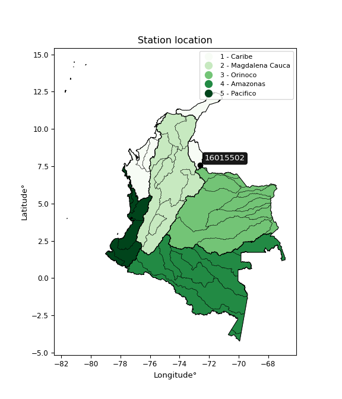

<div align="center">


</div>

# PMP Station (Rain, Pmax24h): 16015502

Probable Maximum Precipitation (PMP) is the greatest amount of rainfall for a specific duration that is meteorologically possible for a given location, acting as a "worst-case" scenario for extreme storms, crucial for designing safety-critical infrastructure like bridges, river deviations, dams, spillways, and nuclear plants to prevent catastrophic failure. PMP is calculated by hydrologists using meteorological data to determine the upper limit of extreme rainfall, often leading to the Probable Maximum Flood (PMF) for flood control design, and is increasingly being studied for climate change impacts. Probable Maximum Precipitation (PMP) is the theoretical upper limit of rainfall, a deterministic estimate for extreme events, while probability distributions (like GEV, Gumbel) describe the likelihood and frequency of various precipitation amounts, including rare ones, showing how often events occur, with PMP representing the extreme end of these distributions, used for critical infrastructure design to ensure safety against the worst conceivable weather, unlike standard statistical forecasts which cover typical probabilities.

The most common probability distributions in hydrology, used for analyzing floods, rainfall, and streamflow, include the Normal, Log-Normal, Gumbel, Gamma (including Log-Pearson Type III), and Generalized Extreme Value (GEV) distributions, often chosen based on the data´s skewness and whether modeling extremes or general conditions, with Gumbel and GEV popular for extreme events like floods, while the Normal distribution serves as a baseline, though often requiring transformations for skewed hydrological data. These distributions help in designing water infrastructure, managing water resources, and forecasting hydrologic events.

> Hydrological data often isn´t perfectly normal (it´s skewed), so different distributions are needed for different applications, such as: **Flood Frequency Analysis**: Using Gumbel, GEV, or Log-Pearson Type III for predicting extreme flood magnitudes and their return periods, **Rainfall Analysis**: Normal for annual totals, but Log-Normal, Weibull, or GEV for intensity or extreme daily rainfall, **Streamflow Modeling**: Gamma and Log-Normal for maximum flows, GEV for minimum flows, and Kappa for daily flows.

<div align="center">

</img>

</div>


## A. General information


### 1. General running parameters

• app_version: _v20260108_. • runtime: _2026-01-08 18:05:13.093906_. • Python version: _3.14.0_. • SciPy version: _1.16.3_. • Pandas version: _2.3.3_. • NumPy version: _2.3.5_. • Stations dataset (station_dataset_file): _dataset/pmax24h_in/automatic_colombia_2003_2024.csv_. • Stations catalog (station_catalog_file): _dataset/CNE.xls_. • Minimum year to eval til year_max (date_min): _1900_. • Maximum year to eval since year_min (date_max): _2024_. • Creates, save and include plots into reports (create_plot): _False_. • Plot only fit distributions with Δo > Δ (plot_only_fit): _True_. • Plot only simple graphs avoiding multiple CDFs and multiple Extreme values plots (plot_only_simple): _False_. • Eval low extreme values, if False, evaluates high extreme values (low_extreme): _False_. • Eval every SciPy distribution as logarithmic (pdist_logarithmic_on): _True_. • Standard deviation normalized (ddof): _1.0_. • Return periods to eval in years (Tr): _[2, 2.33, 5, 10, 15, 20, 25, 50, 75, 100, 200, 250, 500, 750, 1000]_. • Minimum data sample per station, 0 means any (minimum_sample): _5_. • Z-Score maximum threshold to adjust a value, 0 means disable (zscore_max): _3.5_. • Z-Score minimum threshold to adjust a value, 0 means disable (zscore_min): _-2.5_. • Avoid zeros, e.g. rain = 0 (avoid_zeros): _True_. • Avoid null values (avoid_nans): _True_. 

:file_folder:Table: [dataset.csv](../../dataset/pmax24h_in/automatic_colombia_2003_2024.csv)

> Delta Degrees of Freedom (DDOF): is a parameter used in the formulas for calculating variance and standard deviation. When ddof=0, the divisor is $N$ (the total number of observations) and this is used when your data set is the entire population. When ddof=1, the divisor is $N-1$ and this is used when your data set is a sample drawn from a larger population. Using $N-1$ provides an unbiased estimate of the population variance (known as Bessel´s correction).


### 2. Station info and location

|   id |   CODIGO | NOMBRE                    | CATEGORIA               | TECNOLOGIA                | ESTADO   | FECHA_INSTALACION   |   FECHA_SUSPENSION |   ALTITUD |   LATITUD |   LONGITUD | DEPARTAMENTO       | MUNICIPIO   | AREA_OPERATIVA                         | ENTIDAD                                    | AREA_HIDROGRAFICA   | ZONA_HIDROGRAFICA   | SUBZONA_HIDROGRAFICA   |   CORRIENTE | Catalogo   |   Version |
|-----:|---------:|:--------------------------|:------------------------|:--------------------------|:---------|:--------------------|-------------------:|----------:|----------:|-----------:|:-------------------|:------------|:---------------------------------------|:-------------------------------------------|:--------------------|:--------------------|:-----------------------|------------:|:-----------|----------:|
|    0 | 16015502 | BLONAY  - AUT  [16015502] | Climatológica Principal | Automática con Telemetría | Activa   | 13/05/2013          |                nan |      1250 |     7.565 |   -72.6211 | Norte De Santander | Chinácota   | Area Operativa 08 - Santanderes-Arauca | CENTRO NACIONAL DE INVESTIGACIONES DE CAFE | Caribe              | Catatumbo           | Río Pamplonita         |         nan | CNE_OE     |  20251226 |

<div align="center">

Dynamic map: [:earth_americas:Google](http://maps.google.com/maps?q=7.564997222,-72.62110833) [:earth_americas:OSM](https://www.openstreetmap.org/#map=18/7.564997222/-72.62110833&layers=P) [:earth_americas:Bing](https://www.bing.com/maps?cp=7.564997222~-72.62110833&lvl=18) [:earth_americas:Apple](https://maps.apple.com/frame?center=7.564997222%2C-72.62110833&span=0.003%2C0.006)

</div>


<div align="center">

```geojson
{
  "type": "Feature",
  "geometry": {
    "type": "Point", 
    "coordinates": [-72.62110833, 7.564997222]
  }, 
  "properties": {
    "Name": "16015502"
  }
}
```

</div>


### 3. Discrete values table and plot

<div align="center">

|               |          0 |          1 |           2 |           3 |           4 |           5 |          6 |           7 |
|:--------------|-----------:|-----------:|------------:|------------:|------------:|------------:|-----------:|------------:|
| Date          | 2016       | 2017       | 2018        | 2019        | 2020        | 2021        | 2022       | 2023        |
| Value         |   25.7     |   64       |   97.1      |  113.3      |   56        |  108.2      |  126.5     |   69.3      |
| Value_initial |   25.7     |   64       |   97.1      |  113.3      |   56        |  108.2      |  126.5     |   69.3      |
| count         |    8       |    8       |    8        |    8        |    8        |    8        |    8       |    8        |
| mean          |   82.5125  |   82.5125  |   82.5125   |   82.5125   |   82.5125   |   82.5125   |   82.5125  |   82.5125   |
| std           |   34.233   |   34.233   |   34.233    |   34.233    |   34.233    |   34.233    |   34.233   |   34.233    |
| zscore        |   -1.65958 |   -0.54078 |    0.426124 |    0.899353 |   -0.774473 |    0.750373 |    1.28495 |   -0.385958 |


</div>


> The initial value (value_initial) correspond to the initial obtained or null completed value, and value (value) is adjusted only when the initial value is outside the valid range (outlier) definite through the Z-Score value. If Z-Score is active, values out of range or outliers are replaced with the station mean value. A Z-Score (or standard score) measures how many standard deviations a data point is from the mean of a dataset, indicating its relative position; positive scores mean above the mean, negative mean below, and a score of zero is exactly at the mean, allowing for comparison of values from different distributions. It´s calculated using the formula $z=(x–μ)/σ$, where $x$ is the data point, $μ$ is the mean, and $σ$ is the standard deviation, helping identify outliers and understand probability.
>
> <sub>**Note**: In this study, "completing" (filling gaps in) and "extending" (forecasting or lengthening the historical record) rainfall data series are avoided for certain critical analyses because they introduce artificial bias and uncertainty, which can distort the statistics of rare events (extremes), alter day-to-day variability, and compromise the integrity and homogeneity of the original data. Some reasons against Completing/Extending rainfall data are: **Distortion of Extremes and Variability**: The primary issue is that most gap-filling or extension methods rely on averaging or regression with nearby stations, which inherently smooths the data. Rainfall is highly variable in space and time, with a large percentage of zero values and occasional large storms. Infilling methods often underestimate the highest values and overestimate the lowest (zero) values, which severely distorts analyses focused on flood frequency, drought severity, and intensity-duration-frequency (IDF) curves, **Loss of Data Homogeneity**: Infilled or extended data are synthetic estimates, not actual measurements. Combining these estimates with observed data can violate the assumption of data homogeneity, which requires that the data properties do not change over time. Inhomogeneity can lead to incorrect conclusions about long-term trends or changes in climate patterns, **Propagation of Errors**: Errors and biases from the original data (e.g., wind-induced undercatch, instrument errors, site changes) or the data used for imputation can propagate through the analysis, leading to unreliable hydrological models and inaccurate predictions, **Compromised Statistical Integrity**: For statistical analyses, especially those involving the frequency of events, using artificial data can introduce time bias or autocorrelation that doesn´t exist in reality, making it difficult to assess the true probability of events, **Difficulty in Validation**: It is difficult to accurately validate the quality of filled or extended data, especially for past periods where ground-truth measurements are unavailable. The reliability of imputation techniques heavily depends on the density of the surrounding station network and the complexity of the local topography.</sub>


### 4. Active continuous probability distributions from SciPy (43 of 104 available)

A Probability Density Function (PDF) describes the relative likelihood of a continuous random variable falling within a specific range, where the total area under its curve equals 1, and the area over any interval gives the actual probability for that range. Unlike discrete probabilities (like rolling a die), a PDF shows density, not direct probability for a single point (which is zero), with higher points indicating higher likelihood, often visualized as a bell curve for normal distributions.

A log of a probability density function (log-PDF) is simply the logarithm of the PDF´s value, denoted as $log(f(x))$, useful for converting multiplication of probabilities into addition, improving numerical stability with tiny numbers, and connecting to information theory concepts like entropy. Instead of dealing with very small probabilities (e.g., 0.000001), log-PDFs use negative numbers (e.g., $log(0.00001) ≈ -11.51$ that are easier for computers to handle, preventing underflow errors and simplifying complex calculations. In this study, each active probability distribution from SciPy is also evaluated in the $log$ form.

[scipy.stats](https://docs.scipy.org/doc/scipy/reference/stats.html) is a Python´s powerful submodule within the SciPy library for comprehensive statistical analysis, offering over 130 probability distributions (like Normal, Poisson), functions for descriptive stats (mean, variance), hypothesis testing (t-tests, chi-square), random variable generation, and statistical tests, making it essential for data science, modeling, and research. It provides tools to explore, model, and draw conclusions from data efficiently, working seamlessly with NumPy.

<div align="center">

|   id | p_dist             |   n_parameter | fit_method   | label                                                                       | active   | ref                                                                                                        |
|-----:|:-------------------|--------------:|:-------------|:----------------------------------------------------------------------------|:---------|:-----------------------------------------------------------------------------------------------------------|
|    0 | alpha              |             3 | MLE          | Alpha                                                                       | True     | [:mortar_board:](https://docs.scipy.org/doc/scipy/reference/generated/scipy.stats.alpha.html)              |
|    1 | betaprime          |             4 | MLE          | Beta prime                                                                  | True     | [:mortar_board:](https://docs.scipy.org/doc/scipy/reference/generated/scipy.stats.betaprime.html)          |
|    2 | chi2               |             3 | MLE          | Chi²                                                                        | True     | [:mortar_board:](https://docs.scipy.org/doc/scipy/reference/generated/scipy.stats.chi2.html)               |
|    3 | crystalball        |             4 | MLE          | Crystalball                                                                 | True     | [:mortar_board:](https://docs.scipy.org/doc/scipy/reference/generated/scipy.stats.crystalball.html)        |
|    4 | erlang             |             3 | MLE          | Erlang                                                                      | True     | [:mortar_board:](https://docs.scipy.org/doc/scipy/reference/generated/scipy.stats.erlang.html)             |
|    5 | expon              |             2 | MLE          | Exponential                                                                 | True     | [:mortar_board:](https://docs.scipy.org/doc/scipy/reference/generated/scipy.stats.expon.html)              |
|    6 | exponnorm          |             3 | MLE          | Exponentially modified Normal                                               | True     | [:mortar_board:](https://docs.scipy.org/doc/scipy/reference/generated/scipy.stats.exponnorm.html)          |
|    7 | f                  |             4 | MLE          | F                                                                           | True     | [:mortar_board:](https://docs.scipy.org/doc/scipy/reference/generated/scipy.stats.f.html)                  |
|    8 | fatiguelife        |             3 | MLE          | Fatigue-life (Birnbaum-Saunders)                                            | True     | [:mortar_board:](https://docs.scipy.org/doc/scipy/reference/generated/scipy.stats.fatiguelife.html)        |
|    9 | fisk               |             3 | MLE          | Fisk                                                                        | True     | [:mortar_board:](https://docs.scipy.org/doc/scipy/reference/generated/scipy.stats.fisk.html)               |
|   10 | gamma              |             3 | MLE          | Gamma                                                                       | True     | [:mortar_board:](https://docs.scipy.org/doc/scipy/reference/generated/scipy.stats.gamma.html)              |
|   11 | genexpon           |             5 | MLE          | Generalized exponential                                                     | True     | [:mortar_board:](https://docs.scipy.org/doc/scipy/reference/generated/scipy.stats.genexpon.html)           |
|   12 | genlogistic        |             3 | MLE          | Generalized logistic                                                        | True     | [:mortar_board:](https://docs.scipy.org/doc/scipy/reference/generated/scipy.stats.genlogistic.html)        |
|   13 | gibrat             |             2 | MM           | Gibrat                                                                      | True     | [:mortar_board:](https://docs.scipy.org/doc/scipy/reference/generated/scipy.stats.gibrat.html)             |
|   14 | gompertz           |             3 | MLE          | Gompertz (or truncated Gumbel)                                              | True     | [:mortar_board:](https://docs.scipy.org/doc/scipy/reference/generated/scipy.stats.gompertz.html)           |
|   15 | gumbel_l           |             2 | MM           | Gumbel Left Skew                                                            | True     | [:mortar_board:](https://docs.scipy.org/doc/scipy/reference/generated/scipy.stats.gumbel_l.html)           |
|   16 | gumbel_r           |             2 | MM           | Gumbel Right Skew                                                           | True     | [:mortar_board:](https://docs.scipy.org/doc/scipy/reference/generated/scipy.stats.gumbel_r.html)           |
|   17 | halflogistic       |             2 | MM           | Half-logistic                                                               | True     | [:mortar_board:](https://docs.scipy.org/doc/scipy/reference/generated/scipy.stats.halflogistic.html)       |
|   18 | halfnorm           |             2 | MM           | Half Normal                                                                 | True     | [:mortar_board:](https://docs.scipy.org/doc/scipy/reference/generated/scipy.stats.halfnorm.html)           |
|   19 | hypsecant          |             2 | MM           | hyperbolic secant                                                           | True     | [:mortar_board:](https://docs.scipy.org/doc/scipy/reference/generated/scipy.stats.hypsecant.html)          |
|   20 | invgamma           |             3 | MLE          | Inverted gamma                                                              | True     | [:mortar_board:](https://docs.scipy.org/doc/scipy/reference/generated/scipy.stats.invgamma.html)           |
|   21 | invgauss           |             3 | MLE          | Inverse Gaussian                                                            | True     | [:mortar_board:](https://docs.scipy.org/doc/scipy/reference/generated/scipy.stats.invgauss.html)           |
|   22 | invweibull         |             3 | MLE          | Inverted Weibull                                                            | True     | [:mortar_board:](https://docs.scipy.org/doc/scipy/reference/generated/scipy.stats.invweibull.html)         |
|   23 | kstwobign          |             2 | MLE          | Limiting distribution of scaled Kolmogorov-Smirnov two-sided test statistic | True     | [:mortar_board:](https://docs.scipy.org/doc/scipy/reference/generated/scipy.stats.kstwobign.html)          |
|   24 | laplace            |             2 | MM           | Laplace                                                                     | True     | [:mortar_board:](https://docs.scipy.org/doc/scipy/reference/generated/scipy.stats.laplace.html)            |
|   25 | laplace_asymmetric |             3 | MLE          | Asymmetric Laplace                                                          | True     | [:mortar_board:](https://docs.scipy.org/doc/scipy/reference/generated/scipy.stats.laplace_asymmetric.html) |
|   26 | loggamma           |             3 | MLE          | Log gamma                                                                   | True     | [:mortar_board:](https://docs.scipy.org/doc/scipy/reference/generated/scipy.stats.loggamma.html)           |
|   27 | logistic           |             2 | MM           | Logistic (or Sech-squared)                                                  | True     | [:mortar_board:](https://docs.scipy.org/doc/scipy/reference/generated/scipy.stats.logistic.html)           |
|   28 | lognorm            |             3 | MLE          | Log Normal                                                                  | True     | [:mortar_board:](https://docs.scipy.org/doc/scipy/reference/generated/scipy.stats.lognorm.html)            |
|   29 | maxwell            |             2 | MM           | Maxwell                                                                     | True     | [:mortar_board:](https://docs.scipy.org/doc/scipy/reference/generated/scipy.stats.maxwell.html)            |
|   30 | mielke             |             4 | MLE          | Mielke Beta-Kappa / Dagum                                                   | True     | [:mortar_board:](https://docs.scipy.org/doc/scipy/reference/generated/scipy.stats.mielke.html)             |
|   31 | moyal              |             2 | MM           | Moyal                                                                       | True     | [:mortar_board:](https://docs.scipy.org/doc/scipy/reference/generated/scipy.stats.moyal.html)              |
|   32 | nakagami           |             3 | MLE          | Nakagami                                                                    | True     | [:mortar_board:](https://docs.scipy.org/doc/scipy/reference/generated/scipy.stats.nakagami.html)           |
|   33 | ncf                |             5 | MLE          | Non-central F distribution                                                  | True     | [:mortar_board:](https://docs.scipy.org/doc/scipy/reference/generated/scipy.stats.ncf.html)                |
|   34 | nct                |             4 | MLE          | Non-central Student’s t                                                     | True     | [:mortar_board:](https://docs.scipy.org/doc/scipy/reference/generated/scipy.stats.nct.html)                |
|   35 | norm               |             2 | MM           | Normal                                                                      | True     | [:mortar_board:](https://docs.scipy.org/doc/scipy/reference/generated/scipy.stats.norm.html)               |
|   36 | pearson3           |             3 | MM           | Pearson type III                                                            | True     | [:mortar_board:](https://docs.scipy.org/doc/scipy/reference/generated/scipy.stats.pearson3.html)           |
|   37 | rayleigh           |             2 | MM           | Rayleigh                                                                    | True     | [:mortar_board:](https://docs.scipy.org/doc/scipy/reference/generated/scipy.stats.rayleigh.html)           |
|   38 | rice               |             3 | MLE          | Rice                                                                        | True     | [:mortar_board:](https://docs.scipy.org/doc/scipy/reference/generated/scipy.stats.rice.html)               |
|   39 | t                  |             3 | MLE          | Student’s t                                                                 | True     | [:mortar_board:](https://docs.scipy.org/doc/scipy/reference/generated/scipy.stats.t.html)                  |
|   40 | truncnorm          |             4 | MLE          | Truncated normal                                                            | True     | [:mortar_board:](https://docs.scipy.org/doc/scipy/reference/generated/scipy.stats.truncnorm.html)          |
|   41 | wald               |             2 | MM           | Wald                                                                        | True     | [:mortar_board:](https://docs.scipy.org/doc/scipy/reference/generated/scipy.stats.wald.html)               |
|   42 | weibull_min        |             3 | MLE          | Weibull minimum                                                             | True     | [:mortar_board:](https://docs.scipy.org/doc/scipy/reference/generated/scipy.stats.weibull_min.html)        |

</div>

> **n_parameter:** # arguments & localization & scale.
>
> **Fit methods:** (MLE) maximum likelihood, (MM) L-moments.
>
>**Inactive** (With the only purpose of prevent loops, zero divisions, infinite values, over high estimated values or horizontal trending for recurrence intervals estimations, the follow distributions were disabled.)**:** foldnorm, gennorm, norminvgauss, powernorm, powerlognorm, skewnorm, genextreme, anglit, arcsine, argus, beta, bradford, burr, burr12, cauchy, cosine, halfcauchy, foldcauchy, skewcauchy, wrapcauchy, dgamma, gengamma, exponweib, exponpow, truncexpon, gausshyper, genhalflogistic, genhyperbolic, geninvgauss, halfgennorm, johnsonsb, johnsonsu, kappa4, kappa3, ksone, kstwo, loglaplace, levy, levy_l, levy_stable, ncx2, pareto, genpareto, truncpareto, lomax, powerlaw, rdist, rel_breitwigner, recipinvgauss, semicircular, studentized_range, trapezoid, triang, truncweibull_min, tukeylambda, uniform, loguniform, vonmises, vonmises_line, weibull_max, dweibull, 


## B. Probability (PDF) vs. Empirical (EDF) distributions functions

A continuous probability distribution (CPD) describes probabilities for variables that can take any value within a range (like rain any time), unlike discrete variables with specific outcomes (like temperature). It uses a Probability Density Function (PDF), a curve where the total area under it equals 1, and the probability of the variable falling within an interval (a to b) is found by calculating the area under the curve between those points. A key feature is that the probability of hitting any single exact value is zero, so probabilities are always expressed for ranges, e.g., $P(a ≤ X ≤ b)$.

<div align="center">

Distributions parameters from station values
|    |   station | p_dist                |   n |             loc |           scale | shape                  | shape1                 | shape2             | shape3   |
|---:|----------:|:----------------------|----:|----------------:|----------------:|:-----------------------|:-----------------------|:-------------------|:---------|
|  0 |  16015502 | alpha                 |   8 |  -450.444       |  8544.66        | 16.122318407380448     |                        |                    |          |
|  1 |  16015502 | betaprime             |   8 |  -360.554       | 52009           | 188.09322181571656     | 22073.780948845328     |                    |          |
|  2 |  16015502 | chi2                  |   8 |  -158.112       |     2.1758      | 110.36263438595995     |                        |                    |          |
|  3 |  16015502 | crystalball           |   8 |    82.5125      |    32.022       | 7600.60067866524       | 407.9216468918638      |                    |          |
|  4 |  16015502 | erlang                |   8 |  -452.061       |     1.97985     | 269.8668910904999      |                        |                    |          |
|  5 |  16015502 | expon                 |   8 |    25.7         |    56.8125      |                        |                        |                    |          |
|  6 |  16015502 | exponnorm             |   8 |    82.482       |    32.0221      | 0.0009528385224064692  |                        |                    |          |
|  7 |  16015502 | f                     |   8 | -6292.35        |  6374.87        | 83470.99288673967      | 1508255.601244619      |                    |          |
|  8 |  16015502 | fatiguelife           |   8 |    25.673       |     2.40479     | 5.460472164845272      |                        |                    |          |
|  9 |  16015502 | fisk                  |   8 |    -1.42441e+09 |     1.42441e+09 | 73522580.09843013      |                        |                    |          |
| 10 |  16015502 | gamma                 |   8 |  -495.177       |     1.81708     | 317.9403413418063      |                        |                    |          |
| 11 |  16015502 | genexpon              |   8 |    25.6552      |     1.80676     | 0.031710958381426124   | 1.6285737075958093e-08 | 0.887743291802839  |          |
| 12 |  16015502 | genlogistic           |   8 |   126.5         |     1.3708e-05  | 3.111847470605128e-07  |                        |                    |          |
| 13 |  16015502 | gibrat                |   8 |    58.0838      |    14.8168      |                        |                        |                    |          |
| 14 |  16015502 | gompertz              |   8 |    17.3692      |     4.0863      | 1.911616646405353e-11  |                        |                    |          |
| 15 |  16015502 | gumbel_l              |   8 |    96.9241      |    24.9675      |                        |                        |                    |          |
| 16 |  16015502 | gumbel_r              |   8 |    68.1009      |    24.9675      |                        |                        |                    |          |
| 17 |  16015502 | halflogistic          |   8 |    44.559       |    27.3777      |                        |                        |                    |          |
| 18 |  16015502 | halfnorm              |   8 |    40.1278      |    53.1213      |                        |                        |                    |          |
| 19 |  16015502 | hypsecant             |   8 |    82.5125      |    20.3858      |                        |                        |                    |          |
| 20 |  16015502 | invgamma              |   8 |  -277.112       | 41623.9         | 116.69784877961061     |                        |                    |          |
| 21 |  16015502 | invgauss              |   8 |   -98.4792      |  4951.52        | 0.03632529028592449    |                        |                    |          |
| 22 |  16015502 | invweibull            |   8 |    25.7         |     1.60028     | 0.06601277258823193    |                        |                    |          |
| 23 |  16015502 | kstwobign             |   8 |   -44.1624      |   144.763       |                        |                        |                    |          |
| 24 |  16015502 | laplace               |   8 |    82.5125      |    22.643       |                        |                        |                    |          |
| 25 |  16015502 | laplace_asymmetric    |   8 |    64           |    25.2695      | 0.69821029177414       |                        |                    |          |
| 26 |  16015502 | loggamma              |   8 |    94.6173      |    28.474       | 1.0990511086928751     |                        |                    |          |
| 27 |  16015502 | logistic              |   8 |    82.5125      |    17.6547      |                        |                        |                    |          |
| 28 |  16015502 | lognorm               |   8 |    25.7         |     0.557636    | 12.361174581994545     |                        |                    |          |
| 29 |  16015502 | maxwell               |   8 |     6.6338      |    47.5499      |                        |                        |                    |          |
| 30 |  16015502 | mielke                |   8 |    -8.88626     |   136.08        | 2.097008099841352      | 804.475796350267       |                    |          |
| 31 |  16015502 | moyal                 |   8 |    64.2003      |    14.415       |                        |                        |                    |          |
| 32 |  16015502 | nakagami              |   8 |    56           |    39.9649      | 0.3473617262199622     |                        |                    |          |
| 33 |  16015502 | ncf                   |   8 |   -19.6092      |     0.597097    | 0.20182989547722396    | 8355.786888608742      | 34.341807111149976 |          |
| 34 |  16015502 | nct                   |   8 | -2117.6         |    31.9317      | 364314.7010283172      | 68.90025885346309      |                    |          |
| 35 |  16015502 | norm                  |   8 |    82.5125      |    32.022       |                        |                        |                    |          |
| 36 |  16015502 | pearson3              |   8 |    82.5125      |    32.0221      | -0.290525461365697     |                        |                    |          |
| 37 |  16015502 | rayleigh              |   8 |    21.2525      |    48.8784      |                        |                        |                    |          |
| 38 |  16015502 | rice                  |   8 |     8.6262      |    35.7036      | 1.7569781018391417     |                        |                    |          |
| 39 |  16015502 | t                     |   8 |    82.4983      |    32.0241      | 202989.5333285165      |                        |                    |          |
| 40 |  16015502 | truncnorm             |   8 |    82.5125      |    32.022       | -622.306502144492      | 1400.8166292466215     |                    |          |
| 41 |  16015502 | wald                  |   8 |    50.4905      |    32.022       |                        |                        |                    |          |
| 42 |  16015502 | weibull_min           |   8 |  -103.332       |   199.19        | 6.978953435101436      |                        |                    |          |
| 43 |  16015502 | logalpha              |   8 |   -12.8398      |   574.005       | 33.489947153207105     |                        |                    |          |
| 44 |  16015502 | logbetaprime          |   8 |   -11.5068      |     7.33617     | 3008.957928098822      | 1396.337680245906      |                    |          |
| 45 |  16015502 | logchi2               |   8 |     3.24649     |     1.00165     | 1.0079925457244685     |                        |                    |          |
| 46 |  16015502 | logcrystalball        |   8 |     4.3124      |     0.488372    | 21.454242255743313     | 867.627405883572       |                    |          |
| 47 |  16015502 | logerlang             |   8 |    -3.18524     |     0.0337647   | 221.9236643159079      |                        |                    |          |
| 48 |  16015502 | logexpon              |   8 |     3.24649     |     1.06591     |                        |                        |                    |          |
| 49 |  16015502 | logexponnorm          |   8 |     4.31204     |     0.48837     | 0.0007212265507835999  |                        |                    |          |
| 50 |  16015502 | logf                  |   8 |  -594.645       |   598.959       | 28252711.755888462     | 3365123.9483959237     |                    |          |
| 51 |  16015502 | logfatiguelife        |   8 |  -353.203       |   357.515       | 0.0013684323223190822  |                        |                    |          |
| 52 |  16015502 | logfisk               |   8 |    -5.91136e+07 |     5.91136e+07 | 218239635.74294296     |                        |                    |          |
| 53 |  16015502 | loggamma              |   8 |    -3.72717     |     0.0319394   | 251.29945507538832     |                        |                    |          |
| 54 |  16015502 | loggenexpon           |   8 |     3.24649     |     9.85061e+08 | 297284366.94903445     | 4388825593.614824      | 232273307.3409741  |          |
| 55 |  16015502 | loggenlogistic        |   8 |     4.84027     |     1.48061e-06 | 2.8118188365599e-06    |                        |                    |          |
| 56 |  16015502 | loggibrat             |   8 |     3.93987     |     0.225957    |                        |                        |                    |          |
| 57 |  16015502 | loggompertz           |   8 |     3.24298     |     0.381225    | 0.036751825501047095   |                        |                    |          |
| 58 |  16015502 | loggumbel_l           |   8 |     4.53219     |     0.380782    |                        |                        |                    |          |
| 59 |  16015502 | loggumbel_r           |   8 |     4.0926      |     0.380782    |                        |                        |                    |          |
| 60 |  16015502 | loghalflogistic       |   8 |     3.73358     |     0.417527    |                        |                        |                    |          |
| 61 |  16015502 | loghalfnorm           |   8 |     3.66603     |     0.810099    |                        |                        |                    |          |
| 62 |  16015502 | loghypsecant          |   8 |     4.3124      |     0.310907    |                        |                        |                    |          |
| 63 |  16015502 | loginvgamma           |   8 |    -5.95709     |  4218.33        | 411.87136863086675     |                        |                    |          |
| 64 |  16015502 | loginvgauss           |   8 |    -1.32446     |   645.722       | 0.008722688281387374   |                        |                    |          |
| 65 |  16015502 | loginvweibull         |   8 |    -5.9427e+07  |     5.9427e+07  | 106361751.2663436      |                        |                    |          |
| 66 |  16015502 | logkstwobign          |   8 |     2.03105     |     2.61157     |                        |                        |                    |          |
| 67 |  16015502 | loglaplace            |   8 |     4.3124      |     0.345331    |                        |                        |                    |          |
| 68 |  16015502 | loglaplace_asymmetric |   8 |     4.73004     |     0.214953    | 2.365664962367127      |                        |                    |          |
| 69 |  16015502 | logloggamma           |   8 |     4.84031     |     5.52699e-06 | 1.0441785604927835e-05 |                        |                    |          |
| 70 |  16015502 | loglogistic           |   8 |     4.3124      |     0.269254    |                        |                        |                    |          |
| 71 |  16015502 | loglognorm            |   8 |     3.24649     |     0.0139257   | 11.748280911951719     |                        |                    |          |
| 72 |  16015502 | logmaxwell            |   8 |     3.15516     |     0.72519     |                        |                        |                    |          |
| 73 |  16015502 | logmielke             |   8 |    -2.21601e+07 |     2.21601e+07 | 40706226.59017872      | 2312265552.4221573     |                    |          |
| 74 |  16015502 | logmoyal              |   8 |     4.03311     |     0.219845    |                        |                        |                    |          |
| 75 |  16015502 | lognakagami           |   8 |     4.02535     |     0.51982     | 0.35881024684417306    |                        |                    |          |
| 76 |  16015502 | logncf                |   8 |   -20.4456      |    21.8554      | 38567.63544221695      | 5497.337692704621      | 5113.569521537975  |          |
| 77 |  16015502 | lognct                |   8 |    35.0416      |     0.482281    | 74670.6820765069       | -63.71591969830699     |                    |          |
| 78 |  16015502 | lognorm               |   8 |     4.3124      |     0.488372    |                        |                        |                    |          |
| 79 |  16015502 | logpearson3           |   8 |     4.3124      |     0.488372    | -1.0186518315469637    |                        |                    |          |
| 80 |  16015502 | lograyleigh           |   8 |     3.37809     |     0.745469    |                        |                        |                    |          |
| 81 |  16015502 | logrice               |   8 |  -100.638       |     0.488252    | 214.9487729217259      |                        |                    |          |
| 82 |  16015502 | logt                  |   8 |     4.3125      |     0.488263    | 4813.846500853416      |                        |                    |          |
| 83 |  16015502 | logtruncnorm          |   8 |    -0.142423    |     1.40757     | 2.9609654402162087     | 5.501793864563357      |                    |          |
| 84 |  16015502 | logwald               |   8 |     3.824       |     0.488394    |                        |                        |                    |          |
| 85 |  16015502 | logweibull_min        |   8 |    -2.44675e+07 |     2.44675e+07 | 70977328.775514        |                        |                    |          |

</div>

> **loc** (Location parameter): This shifts the distribution along the x-axis. For many common distributions, like the normal (Gaussian) distribution, loc represents the mean $μ$. For others, like the uniform distribution, it might represent the minimum value, or for the beta distribution, the left end of the support interval.
>
> **scale** (Scale parameter): This determines the width or spread of the distribution. For the normal distribution, scale represents the standard deviation $σ$. For a uniform distribution, it defines the length of the interval (from $loc$ to $loc + scale$).
>
> **shape** (Shape parameters): Refers to parameters that define the specific form of a probability distribution, distinct from its location (loc) and scale (scale). These parameters are required arguments for most distribution functions. For example, a normal (Gaussian) distribution is fully defined by its location (mean) and scale (standard deviation), so it has no specific shape parameters beyond loc and scale. However, other distributions have intrinsic properties that need specification, as Gamma distribution that takes a shape parameter, often named $a$ or $alpha$.


### 0. Cumulative distribution values - CDF (86 evaluated)

Cumulative Distribution Function (CDF), denoted as $F$<sub>$X$</sub>$(x)$, is a function that gives the probability that a random variable $X$ will take a value less than or equal to a specific value, $x$ (i.e., $(P(X≥x)$. It essentially "accumulates" probabilities from a given point up to the far right (positive infinity), providing a complete picture of the distribution´s probabilities for both discrete (like rain) and continuous (like temperature) variables, helping to find probabilities over ranges or above certain values. Each station is evaluated separately ordering the $x$ values ascending, calculating the CDF and PDF values for the activated distributions and their logarithmic forms.

<div align="center">

CDF ordered by x ascending and calculating $log(f(x))$ separately
|   id |   Station |   date |     x |   count |    mean |    std |    zscore |   Value_initial |   station |   m |     alpha |   alpha_pdf |   betaprime |   betaprime_pdf |      chi2 |   chi2_pdf |   crystalball |   crystalball_pdf |   erlang |   erlang_pdf |    expon |   expon_pdf |   exponnorm |   exponnorm_pdf |         f |      f_pdf |   fatiguelife |   fatiguelife_pdf |      fisk |   fisk_pdf |     gamma |   gamma_pdf |    genexpon |   genexpon_pdf |   genlogistic |   genlogistic_pdf |   gibrat |   gibrat_pdf |    gompertz |   gompertz_pdf |   gumbel_l |   gumbel_l_pdf |   gumbel_r |   gumbel_r_pdf |   halflogistic |   halflogistic_pdf |   halfnorm |   halfnorm_pdf |   hypsecant |   hypsecant_pdf |   invgamma |   invgamma_pdf |   invgauss |   invgauss_pdf |   invweibull |   invweibull_pdf |   kstwobign |   kstwobign_pdf |   laplace |   laplace_pdf |   laplace_asymmetric |   laplace_asymmetric_pdf |   loggamma |   loggamma_pdf |   logistic |   logistic_pdf |   lognorm |   lognorm_pdf |   maxwell |   maxwell_pdf |    mielke |   mielke_pdf |       moyal |   moyal_pdf |   nakagami |   nakagami_pdf |       ncf |    ncf_pdf |       nct |    nct_pdf |      norm |   norm_pdf |   pearson3 |   pearson3_pdf |   rayleigh |   rayleigh_pdf |      rice |   rice_pdf |         t |      t_pdf |   truncnorm |   truncnorm_pdf |      wald |   wald_pdf |   weibull_min |   weibull_min_pdf |   logalpha |   logalpha_pdf |   logbetaprime |   logbetaprime_pdf |     logchi2 |   logchi2_pdf |   logcrystalball |   logcrystalball_pdf |   logerlang |   logerlang_pdf |   logexpon |   logexpon_pdf |   logexponnorm |   logexponnorm_pdf |     logf |   logf_pdf |   logfatiguelife |   logfatiguelife_pdf |   logfisk |   logfisk_pdf |   loggenexpon |   loggenexpon_pdf |   loggenlogistic |   loggenlogistic_pdf |   loggibrat |   loggibrat_pdf |   loggompertz |   loggompertz_pdf |   loggumbel_l |   loggumbel_l_pdf |   loggumbel_r |   loggumbel_r_pdf |   loghalflogistic |   loghalflogistic_pdf |   loghalfnorm |   loghalfnorm_pdf |   loghypsecant |   loghypsecant_pdf |   loginvgamma |   loginvgamma_pdf |   loginvgauss |   loginvgauss_pdf |   loginvweibull |   loginvweibull_pdf |   logkstwobign |   logkstwobign_pdf |   loglaplace |   loglaplace_pdf |   loglaplace_asymmetric |   loglaplace_asymmetric_pdf |   logloggamma |   logloggamma_pdf |   loglogistic |   loglogistic_pdf |   loglognorm |   loglognorm_pdf |   logmaxwell |   logmaxwell_pdf |   logmielke |   logmielke_pdf |    logmoyal |   logmoyal_pdf |   lognakagami |   lognakagami_pdf |    logncf |   logncf_pdf |    lognct |   lognct_pdf |   logpearson3 |   logpearson3_pdf |   lograyleigh |   lograyleigh_pdf |   logrice |   logrice_pdf |      logt |   logt_pdf |   logtruncnorm |   logtruncnorm_pdf |   logwald |   logwald_pdf |   logweibull_min |   logweibull_min_pdf |
|-----:|----------:|-------:|------:|--------:|--------:|-------:|----------:|----------------:|----------:|----:|----------:|------------:|------------:|----------------:|----------:|-----------:|--------------:|------------------:|---------:|-------------:|---------:|------------:|------------:|----------------:|----------:|-----------:|--------------:|------------------:|----------:|-----------:|----------:|------------:|------------:|---------------:|--------------:|------------------:|---------:|-------------:|------------:|---------------:|-----------:|---------------:|-----------:|---------------:|---------------:|-------------------:|-----------:|---------------:|------------:|----------------:|-----------:|---------------:|-----------:|---------------:|-------------:|-----------------:|------------:|----------------:|----------:|--------------:|---------------------:|-------------------------:|-----------:|---------------:|-----------:|---------------:|----------:|--------------:|----------:|--------------:|----------:|-------------:|------------:|------------:|-----------:|---------------:|----------:|-----------:|----------:|-----------:|----------:|-----------:|-----------:|---------------:|-----------:|---------------:|----------:|-----------:|----------:|-----------:|------------:|----------------:|----------:|-----------:|--------------:|------------------:|-----------:|---------------:|---------------:|-------------------:|------------:|--------------:|-----------------:|---------------------:|------------:|----------------:|-----------:|---------------:|---------------:|-------------------:|---------:|-----------:|-----------------:|---------------------:|----------:|--------------:|--------------:|------------------:|-----------------:|---------------------:|------------:|----------------:|--------------:|------------------:|--------------:|------------------:|--------------:|------------------:|------------------:|----------------------:|--------------:|------------------:|---------------:|-------------------:|--------------:|------------------:|--------------:|------------------:|----------------:|--------------------:|---------------:|-------------------:|-------------:|-----------------:|------------------------:|----------------------------:|--------------:|------------------:|--------------:|------------------:|-------------:|-----------------:|-------------:|-----------------:|------------:|----------------:|------------:|---------------:|--------------:|------------------:|----------:|-------------:|----------:|-------------:|--------------:|------------------:|--------------:|------------------:|----------:|--------------:|----------:|-----------:|---------------:|-------------------:|----------:|--------------:|-----------------:|---------------------:|
|    0 |  16015502 |   2016 |  25.7 |       8 | 82.5125 | 34.233 | -1.65958  |            25.7 |  16015502 |   1 | 0.0341363 |  0.00285309 |    0.035016 |      0.00261348 | 0.0318109 | 0.00264442 |     0.0380175 |        0.00258197 | 0.037278 |   0.00269597 | 0        |  0.0176018  |   0.0380179 |      0.00258198 | 0.0378065 | 0.00258369 |     0.0437768 |        2.998      | 0.0477924 | 0.00234897 | 0.0361871 |  0.00262676 | 0.000785639 |     0.0175375  |      0        |        0.00230284 | 0        |   0          | 1.27711e-10 |    3.59316e-11 |  0.0560571 |     0.00218107 | 0.00423506 |    0.000926881 |       0        |         0          |   0        |     0          |   0.0391754 |      0.00191685 |   0.032247 |     0.00272275 |   0.030774 |     0.00300106 |  9.37121e-05 |      1.61507e+10 |   0.0260028 |      0.00357092 | 0.0406725 |    0.00179625 |            0.0373902 |               0.00211922 |   0.015525 |      0.0846463 |  0.0384943 |     0.00209647 | 0.0145337 |     0.0754665 | 0.0163422 |    0.00248947 | 0.0565601 |   0.00342931 | 0.000143754 | 7.65222e-05 | 0          |     0          | 0.0312578 | 0.00300941 | 0.0380613 | 0.00258415 | 0.0380175 | 0.00258197 |  0.0456374 |     0.00257157 | 0.00413106 |     0.00185388 | 0.0251398 | 0.00302294 | 0.0380645 | 0.00258437 |   0.0380175 |      0.00258197 | 0         | 0          |     0.0471547 |        0.00248936 |  0.0141534 |      0.0799085 |      0.0159236 |          0.0841263 | 1.45443e-08 |   1.65063e+07 |        0.0145337 |            0.0754664 |   0.0140312 |       0.0787467 |   0        |       0.938169 |      0.0145337 |          0.0754668 | 0.014351 |  0.0748006 |        0.0145759 |            0.0757472 | 0.0154022 |     0.0559871 |   7.47741e-12 |          0.301793 |         0        |            0.0920558 |    0        |        0        |   0.000339587 |         0.0972624 |     0.0335907 |         0.0867166 |   9.84339e-05 |          0.002385 |          0        |              0        |      0        |          0        |      0.0206445 |          0.0663543 |     0.0130426 |         0.0767289 |     0.0140522 |          0.084417 |       0.0151616 |            0.113673 |      0.0180996 |           0.15474  |     0.022828 |        0.0661047 |               0.0458736 |                   0.0902125 |     0.0492381 |         0.0930223 |     0.0187296 |         0.0682583 |    0.0040822 |      2.31246e+12 |  0.000528743 |         0.017313 |   0.0518303 |        0.095208 | 2.18083e-09 |    1.82306e-07 |   0           |          0        | 0.0150924 |    0.0797525 | 0.0146714 |    0.0758734 |     0.0332864 |         0.0930018 |      0        |          0        | 0.0145141 |     0.0753975 | 0.0145321 |   0.075416 |    0           |           0        |  0        |      0        |        0.0239336 |            0.0685909 |
|    1 |  16015502 |   2020 |  56   |       8 | 82.5125 | 34.233 | -0.774473 |            56   |  16015502 |   2 | 0.226765  |  0.0100356  |    0.208004 |      0.00920626 | 0.214609  | 0.00974549 |     0.20385   |        0.00884317 | 0.211892 |   0.00921161 | 0.413354 |  0.010326   |   0.203851  |      0.00884317 | 0.204073  | 0.00886532 |     0.72534   |        0.00385906 | 0.19342   | 0.00805258 | 0.207975  |  0.00912596 | 0.412918    |     0.0103041  |      0        |        0.0045813  | 0        |   0          | 2.43825e-07 |    5.96736e-08 |  0.17647   |     0.00640404 | 0.197181   |    0.0128227   |       0.20596  |         0.0174883  |   0.234901 |     0.0143643  |   0.169299  |      0.00791869 |   0.218376 |     0.00978069 |   0.239431 |     0.0106249  |  0.438875    |      0.000787429 |   0.27534   |      0.011419   | 0.155045  |    0.00684738 |            0.208255  |               0.0118036  |   0.299429 |      0.702126  |  0.182168  |     0.00843872 | 0.278347  |     0.687295  | 0.217577  |    0.0105511  | 0.2116    |   0.00683853 | 0.183844    | 0.0152084   | 1.4374e-11 |   702.7        | 0.232483  | 0.0101333  | 0.203951  | 0.00884339 | 0.20385   | 0.00884317 |  0.199089  |     0.00808117 | 0.223289   |     0.0112966  | 0.214624  | 0.00953467 | 0.203992  | 0.00884622 |   0.20385   |      0.00884317 | 0.0403977 | 0.0238126  |     0.189833  |        0.00747041 |  0.29284   |      0.693944  |      0.291376  |          0.683531  | 0.619258    |   0.307415    |        0.278347  |            0.687296  |   0.292323  |       0.700744  |   0.51843  |       0.451794 |      0.278349  |          0.6873    | 0.277321 |  0.686323  |        0.278799  |            0.687176  | 0.217164  |     0.627632  |   0.414365    |          0.614503 |         0        |            0.404044  |    0.165524 |        2.90979  |   0.220712    |         0.584891  |     0.232181  |         0.532742  |   0.303258    |          0.950252 |          0.335844 |              1.06246  |      0.342631 |          0.892651 |      0.240714  |          0.702518  |     0.294836  |         0.707274  |     0.306691  |          0.703779 |       0.353733  |            0.657934 |      0.395744  |           0.641183 |     0.217759 |        0.630582  |               0.212205  |                   0.417311  |     0.214459  |         0.405163  |     0.25615   |         0.707649  |    0.634023  |      0.0411149   |  0.303785    |         0.771166 |   0.216735  |        0.398125 | 0.308767    |    1.1003      |   1.96513e-11 |      15877.7      | 0.28475   |    0.682727  | 0.278503  |    0.686548  |     0.240551  |         0.532477  |      0.314043 |          0.798948 | 0.278302  |     0.687415  | 0.278246  |   0.687254 |    2.96133e-09 |           2.30672  |  0.282864 |      2.02968  |        0.207056  |            0.533661  |
|    2 |  16015502 |   2017 |  64   |       8 | 82.5125 | 34.233 | -0.54078  |            64   |  16015502 |   3 | 0.313068  |  0.0114391  |    0.288414 |      0.010828   | 0.299197  | 0.0113125  |     0.281592  |        0.0105411  | 0.292243 |   0.0108091  | 0.490409 |  0.00896969 |   0.281593  |      0.0105411  | 0.281977  | 0.0105582  |     0.753404  |        0.00319761 | 0.266     | 0.0100778  | 0.287766  |  0.0107574  | 0.489825    |     0.00895424 |      0        |        0.00549364 | 0.179294 |   0.0442431  | 1.72724e-06 |    4.22695e-07 |  0.2347    |     0.00819901 | 0.307737   |    0.0145258   |       0.340849 |         0.0161413  |   0.34685  |     0.0135775  |   0.24404   |      0.0108323  |   0.302758 |     0.0112202  |   0.329445 |     0.0117558  |  0.444457    |      0.000621194 |   0.368069  |      0.0116372  | 0.220749  |    0.00974911 |            0.32773   |               0.0185752  |   0.39832  |      0.771132  |  0.259496  |     0.0108843  | 0.376632  |     0.777505  | 0.307422  |    0.0117963  | 0.270022  |   0.0077688  | 0.313949    | 0.0167853   | 0.253233   |     0.0217647  | 0.318484  | 0.0112622  | 0.281688  | 0.0105395  | 0.281592  | 0.0105411  |  0.270667  |     0.00979321 | 0.317801   |     0.0122064  | 0.296718  | 0.0109211  | 0.281755  | 0.0105433  |   0.281592  |      0.0105411  | 0.292337  | 0.0305949  |     0.256454  |        0.00918938 |  0.390604  |      0.762511  |      0.387979  |          0.756035  | 0.657428    |   0.265883    |        0.376632  |            0.777506  |   0.391298  |       0.773712  |   0.575133 |       0.398598 |      0.376635  |          0.77751   | 0.375497 |  0.776852  |        0.377024  |            0.776718  | 0.312321  |     0.792927  |   0.494843    |          0.588115 |         0        |            0.520668  |    0.487556 |        1.82063  |   0.308844    |         0.73633   |     0.312829  |         0.677048  |   0.431605    |          0.952392 |          0.469406 |              0.933662 |      0.457066 |          0.818521 |      0.348854  |          0.910542  |     0.394373  |         0.775277  |     0.404801  |          0.757615 |       0.441182  |            0.646147 |      0.479695  |           0.612468 |     0.320559 |        0.928267  |               0.275931  |                   0.54263   |     0.275997  |         0.521424  |     0.361203  |         0.856945  |    0.639078  |      0.0349329   |  0.40991     |         0.808773 |   0.276985  |        0.508798 | 0.452513    |    1.02807     |   0.291375    |          1.53881  | 0.381685  |    0.761834  | 0.376679  |    0.776659  |     0.320043  |         0.659001  |      0.42219  |          0.811826 | 0.376608  |     0.777685  | 0.376532  |   0.777562 |    0.268166    |           1.734    |  0.506483 |      1.33866  |        0.289482  |            0.704412  |
|    3 |  16015502 |   2023 |  69.3 |       8 | 82.5125 | 34.233 | -0.385958 |            69.3 |  16015502 |   4 | 0.375318  |  0.0119976  |    0.348032 |      0.0116251  | 0.361136  | 0.0120089  |     0.339947  |        0.0114418  | 0.351731 |   0.0115957  | 0.535799 |  0.00817076 |   0.339948  |      0.0114418  | 0.340406  | 0.011452   |     0.769448  |        0.002868   | 0.322688  | 0.0112813  | 0.347056  |  0.0115734  | 0.535142    |     0.00815887 |      0        |        0.00619601 | 0.390353 |   0.0342163  | 6.31892e-06 |    1.54637e-06 |  0.281612  |     0.00951654 | 0.385541   |    0.0147176   |       0.423416 |         0.0149888  |   0.417106 |     0.0129177  |   0.306787  |      0.012825   |   0.363958 |     0.0118223  |   0.392773 |     0.0120847  |  0.447538    |      0.000544784 |   0.429261  |      0.0114123  | 0.278967  |    0.0123202  |            0.419309  |               0.0160448  |   0.46047  |      0.787953  |  0.321173  |     0.0123492  | 0.43982   |     0.80757   | 0.371232  |    0.0122293  | 0.312843  |   0.00839066 | 0.402103    | 0.0163241   | 0.35823    |     0.0181843  | 0.379326  | 0.011647   | 0.340031  | 0.0114389  | 0.339947  | 0.0114418  |  0.325329  |     0.0108109  | 0.38316    |     0.0124054  | 0.356447  | 0.0115782  | 0.34012   | 0.0114432  |   0.339947  |      0.0114418  | 0.436816  | 0.0239405  |     0.308135  |        0.0103031  |  0.45207   |      0.779457  |      0.449064  |          0.77643   | 0.67774     |   0.24515     |        0.43982   |            0.807571  |   0.453738  |       0.792605  |   0.605691 |       0.369928 |      0.439823  |          0.807574  | 0.438633 |  0.80715   |        0.440134  |            0.806408  | 0.378585  |     0.868543  |   0.540758    |          0.565326 |         0        |            0.605592  |    0.609758 |        1.28525  |   0.371014    |         0.82561   |     0.3702    |         0.764716  |   0.505701    |          0.905483 |          0.540305 |              0.847935 |      0.520181 |          0.767336 |      0.424991  |          0.995515  |     0.456796  |         0.79059   |     0.465526  |          0.765843 |       0.491797  |            0.624678 |      0.527418  |           0.586268 |     0.403614 |        1.16878   |               0.322664  |                   0.634533  |     0.320763  |         0.605996  |     0.431765  |         0.9112    |    0.641739  |      0.0320489   |  0.474213    |         0.804494 |   0.320573  |        0.588866 | 0.530734    |    0.934646    |   0.403621    |          1.30006  | 0.443381  |    0.785931  | 0.439801  |    0.806764  |     0.375483  |         0.734156  |      0.486236 |          0.795396 | 0.439811  |     0.80777   | 0.439727  |   0.807677 |    0.394805    |           1.4566   |  0.600149 |      1.03093  |        0.349805  |            0.81195   |
|    4 |  16015502 |   2018 |  97.1 |       8 | 82.5125 | 34.233 |  0.426124 |            97.1 |  16015502 |   5 | 0.697387  |  0.00994827 |    0.679145 |      0.0107949  | 0.692126  | 0.0104437  |     0.675642  |        0.0112305  | 0.681926 |   0.0107677  | 0.715427 |  0.00500898 |   0.675641  |      0.0112305  | 0.675733  | 0.0111992  |     0.832595  |        0.00180955 | 0.666742  | 0.011469   | 0.678717  |  0.0108731  | 0.714624    |     0.00500871 |      0        |        0.0116463  | 0.833532 |   0.00639884 | 0.00567563  |    0.00138499  |  0.634712  |     0.014734   | 0.731233   |    0.00916766  |       0.74408  |         0.00815161 |   0.716501 |     0.00845084 |   0.710504  |      0.0123225  |   0.685535 |     0.0100831  |   0.704064 |     0.00931825 |  0.459215    |      0.000330413 |   0.703176  |      0.00792386 | 0.737469  |    0.0115944  |            0.730629  |               0.00744286 |   0.712603 |      0.658117  |  0.695566  |     0.0119942  | 0.705136  |     0.70635   | 0.694434  |    0.00994156 | 0.592081  |   0.0117147  | 0.749388    | 0.00840108  | 0.724473   |     0.00927413 | 0.686533  | 0.00947466 | 0.67559   | 0.0112255  | 0.675642  | 0.0112305  |  0.661764  |     0.0119475  | 0.700002   |     0.00952416 | 0.681687  | 0.0105799  | 0.67579   | 0.0112276  |   0.675642  |      0.0112305  | 0.801628  | 0.00660638 |     0.648069  |        0.0127972  |  0.702124  |      0.6559    |      0.700553  |          0.665656  | 0.748469    |   0.179168    |        0.705136  |            0.70635   |   0.70832   |       0.666521  |   0.712652 |       0.269581 |      0.705139  |          0.706349  | 0.704004 |  0.707048  |        0.704927  |            0.704814  | 0.679113  |     0.804527  |   0.710459    |          0.434481 |         0        |            1.14913   |    0.849586 |        0.367349 |   0.691312    |         0.981531  |     0.674102  |         0.959571  |   0.754902    |          0.557416 |          0.765144 |              0.496441 |      0.738545 |          0.52429  |      0.742174  |          0.741522  |     0.708638  |         0.654824  |     0.70695   |          0.625059 |       0.678378  |            0.471153 |      0.701534  |           0.440938 |     0.766771 |        0.675379  |               0.626357  |                   1.23176   |     0.606639  |         1.14608   |     0.726722  |         0.737584  |    0.651001  |      0.0236938   |  0.720425    |         0.619802 |   0.595676  |        1.09421  | 0.770981    |    0.50632     |   0.733181    |          0.706456 | 0.699574  |    0.680734  | 0.704952  |    0.706259  |     0.664074  |         0.921464  |      0.724879 |          0.592919 | 0.705188  |     0.70647   | 0.705092  |   0.706487 |    0.738384    |           0.671381 |  0.818409 |      0.389203 |        0.681851  |            1.05695   |
|    5 |  16015502 |   2021 | 108.2 |       8 | 82.5125 | 34.233 |  0.750373 |           108.2 |  16015502 |   6 | 0.795874  |  0.00775944 |    0.787367 |      0.00861423 | 0.795833  | 0.00818194 |     0.788776  |        0.00903084 | 0.789859 |   0.00858821 | 0.765932 |  0.00412    |   0.788776  |      0.00903083 | 0.788521  | 0.0090021  |     0.851193  |        0.00155136 | 0.780131  | 0.00885358 | 0.787845  |  0.00869266 | 0.765141    |     0.00412209 |      0        |        0.0149838  | 0.888499 |   0.0037886  | 0.0824907   |    0.0193306   |  0.792134  |     0.0130782  | 0.818176   |    0.00657615  |       0.821781 |         0.00592956 |   0.799964 |     0.00660833 |   0.824053  |      0.00819799 |   0.78595  |     0.00796266 |   0.796014 |     0.00723964 |  0.46262     |      0.000285343 |   0.782087  |      0.00631264 | 0.839202  |    0.00710146 |            0.801778  |               0.00547699 |   0.779082 |      0.56815   |  0.810767  |     0.00869029 | 0.776631  |     0.611575  | 0.793214  |    0.00782103 | 0.729609  |   0.0130673  | 0.827925    | 0.00587522  | 0.813753   |     0.00688272 | 0.781124  | 0.00754073 | 0.78868   | 0.00902803 | 0.788776  | 0.00903084 |  0.784275  |     0.00992816 | 0.794469   |     0.00747998 | 0.78812   | 0.00850944 | 0.788889  | 0.00902739 |   0.788776  |      0.00903084 | 0.861094  | 0.00430752 |     0.781564  |        0.0109633  |  0.768557  |      0.569574  |      0.768101  |          0.580105  | 0.766984    |   0.163279    |        0.776631  |            0.611575  |   0.775688  |       0.576068  |   0.740399 |       0.24355  |      0.776634  |          0.611572  | 0.775592 |  0.612576  |        0.776274  |            0.610415  | 0.759384  |     0.674579  |   0.754962    |          0.387809 |         0        |            1.41138   |    0.88334  |        0.263518 |   0.792667    |         0.875713  |     0.774578  |         0.881946  |   0.809289    |          0.449719 |          0.813783 |              0.404474 |      0.791091 |          0.447232 |      0.812903  |          0.567719  |     0.77476   |         0.565074  |     0.770175  |          0.541734 |       0.726361  |            0.415632 |      0.746593  |           0.391851 |     0.829526 |        0.493654  |               0.774935  |                   1.52394   |     0.744286  |         1.40613   |     0.799     |         0.596461  |    0.653464  |      0.0218526   |  0.782693    |         0.529928 |   0.726708  |        1.3349   | 0.819979    |    0.402409    |   0.801798    |          0.564416 | 0.768644  |    0.592863  | 0.77645   |    0.611715  |     0.762134  |         0.878477  |      0.784406 |          0.506624 | 0.776692  |     0.611633  | 0.7766    |   0.611673 |    0.802385    |           0.517298 |  0.855249 |      0.296604 |        0.791473  |            0.948312  |
|    6 |  16015502 |   2019 | 113.3 |       8 | 82.5125 | 34.233 |  0.899353 |           113.3 |  16015502 |   7 | 0.832814  |  0.00673105 |    0.828461 |      0.00749762 | 0.834756  | 0.00708327 |     0.831837  |        0.00784756 | 0.830816 |   0.00746958 | 0.786029 |  0.00376627 |   0.831836  |      0.00784755 | 0.831447  | 0.0078243  |     0.858844  |        0.00145059 | 0.821958  | 0.00755368 | 0.829311  |  0.00756428 | 0.78525     |     0.00376914 |      0        |        0.016823   | 0.905829 |   0.00304133 | 0.259118    |    0.0543771   |  0.854395  |     0.011237   | 0.84908    |    0.00556368  |       0.849797 |         0.0050743  |   0.831628 |     0.00581648 |   0.861619  |      0.00657627 |   0.823964 |     0.00694688 |   0.830533 |     0.00630402 |  0.464032    |      0.000268486 |   0.812502  |      0.00562137 | 0.87163   |    0.0056693  |            0.827832  |               0.00475711 |   0.804306 |      0.527001  |  0.851179  |     0.00717509 | 0.803772  |     0.566703  | 0.830542  |    0.00682065 | 0.797847  |   0.013693   | 0.855487    | 0.00495741  | 0.846374   |     0.00592455 | 0.817264  | 0.00663502 | 0.831729  | 0.00784601 | 0.831837  | 0.00784756 |  0.831778  |     0.00867775 | 0.830213   |     0.00654159 | 0.828803  | 0.00744025 | 0.831932  | 0.00784415 |   0.831837  |      0.00784756 | 0.881147  | 0.00358311 |     0.834111  |        0.00960057 |  0.793883  |      0.530022  |      0.793908  |          0.5403    | 0.774361    |   0.157091    |        0.803772  |            0.566703  |   0.801268  |       0.534548  |   0.751377 |       0.23325  |      0.803775  |          0.566699  | 0.802782 |  0.567809  |        0.803367  |            0.565749  | 0.789073  |     0.614464  |   0.772368    |          0.368067 |         0        |            1.54039   |    0.894698 |        0.2306   |   0.831396    |         0.803583  |     0.813874  |         0.821834  |   0.829035    |          0.408207 |          0.831594 |              0.369378 |      0.810961 |          0.415723 |      0.837479  |          0.500315  |     0.799852  |         0.524377  |     0.794268  |          0.504393 |       0.74497   |            0.39255  |      0.76417   |           0.371452 |     0.850811 |        0.432016  |               0.848401  |                   1.66842   |     0.81195   |         1.53396   |     0.825074  |         0.536025  |    0.654454  |      0.0211517   |  0.806201    |         0.490878 |   0.790866  |        1.45275  | 0.837619    |    0.364167    |   0.826516    |          0.509447 | 0.795007  |    0.551651  | 0.803599  |    0.566917  |     0.801702  |         0.837307  |      0.80689  |          0.469793 | 0.803836  |     0.566734  | 0.803745  |   0.566782 |    0.824919    |           0.462148 |  0.868176 |      0.265449 |        0.833336  |            0.866272  |
|    7 |  16015502 |   2022 | 126.5 |       8 | 82.5125 | 34.233 |  1.28495  |           126.5 |  16015502 |   8 | 0.905261  |  0.00432994 |    0.908797 |      0.00474321 | 0.910454  | 0.00446997 |     0.915227  |        0.0048497  | 0.910727 |   0.00470675 | 0.830391 |  0.00298542 |   0.915227  |      0.00484971 | 0.914655  | 0.00484555 |     0.876474  |        0.00122915 | 0.901234  | 0.00459445 | 0.910235  |  0.00476394 | 0.82966     |     0.00298969 |      0.999993 |        0.0227008  | 0.936973 |   0.00180938 | 0.999492    |    0.000943736 |  0.961967  |     0.00498012 | 0.90808    |    0.00350696  |       0.904513 |         0.00332126 |   0.896038 |     0.00400499 |   0.926741  |      0.00356197 |   0.899239 |     0.00453347 |   0.899081 |     0.00416298 |  0.467329    |      0.000232818 |   0.875912  |      0.00403928 | 0.928339  |    0.00316484 |            0.880448  |               0.00330328 |   0.856877 |      0.427233  |  0.923547  |     0.00399937 | 0.860113  |     0.455503  | 0.904427  |    0.00444613 | 0.989299  |   0.0150763  | 0.908273    | 0.0031676   | 0.910263   |     0.00385331 | 0.89024   | 0.00448524 | 0.915119  | 0.00485098 | 0.915227  | 0.0048497  |  0.923369  |     0.00521656 | 0.901554   |     0.00433687 | 0.908955  | 0.00475949 | 0.915281  | 0.00484701 |   0.915227  |      0.0048497  | 0.919151  | 0.00228934 |     0.93376   |        0.00545988 |  0.84699   |      0.433851  |      0.848065  |          0.442392  | 0.790909    |   0.143492    |        0.860113  |            0.455503  |   0.854611  |       0.433649  |   0.775798 |       0.210339 |      0.860116  |          0.455498  | 0.859255 |  0.456789  |        0.859632  |            0.455088  | 0.848926  |     0.473486  |   0.810369    |          0.321896 |         0.999945 |            1.89899   |    0.916586 |        0.1704   |   0.9083      |         0.583548  |     0.894142  |         0.624296  |   0.869031    |          0.32037  |          0.868085 |              0.295105 |      0.852792 |          0.344499 |      0.884716  |          0.362745  |     0.852222  |         0.426328  |     0.844905  |          0.414896 |       0.785284  |            0.339721 |      0.80249   |           0.324464 |     0.891572 |        0.313983  |               0.954922  |                   0.496106  |     0.999883  |         1.889     |     0.876577  |         0.401815  |    0.6567    |      0.0196411   |  0.855213    |         0.399376 |   0.965784  |        1.52854  | 0.873271    |    0.285788    |   0.875981    |          0.391477 | 0.850203  |    0.449829  | 0.859971  |    0.45583   |     0.886086  |         0.680781  |      0.853909 |          0.384378 | 0.860177  |     0.455476  | 0.860093  |   0.455543 |    0.869488    |           0.351356 |  0.89396  |      0.205542 |        0.915138  |            0.607244  |


</div>

An Empirical Distribution Function (EDF) is a step-function estimate of a true cumulative distribution function (CDF) based on observed sample data, representing the proportion of data points less than or equal to a given value. It is calculated by ordering your data and jumping up by $1/n$ (where $n$ is sample size) at each unique data point, allowing analysis without assuming an underlying population distribution, and it gets closer to the true CDF as the sample size grows. For the empirical probability calculations, the parameter $m$ correspond to the order number which means the position of the $x$ values in an ascending order list.

The Kolmogorov-Smirnov (K-S) test is a non-parametric statistical test used to determine if a sample data set comes from a specific theoretical distribution (one-sample) or if two different samples come from the same underlying distribution (two-sample), by comparing their cumulative distribution functions (CDFs). It calculates the maximum vertical difference (D statistic) between these functions, with a small p-value indicating a significant difference and rejection of the null hypothesis (that the data/samples match).


### 1. EDF California (1923)

California´s estimates the true probability distribution of water-related data (like rainfall, streamflow) using observed samples, crucial for risk assessment.

<div align="center">


$P=m/n$


</div>


**1.1. Empirical values**

<div align="center">

|                | 0                  | 1                  | 2              | 3              | 4                  | 5              | 6              | 7              |
|:---------------|:-------------------|:-------------------|:---------------|:---------------|:-------------------|:---------------|:---------------|:---------------|
| date           | 2016               | 2020               | 2017           | 2023           | 2018               | 2021           | 2019           | 2022           |
| x              | 25.7               | 56.0               | 64.0           | 69.3           | 97.1               | 108.2          | 113.3          | 126.5          |
| m              | 1                  | 2                  | 3              | 4              | 5                  | 6              | 7              | 8              |
| empirical_dist | edf_california     | edf_california     | edf_california | edf_california | edf_california     | edf_california | edf_california | edf_california |
| empirical      | 0.125              | 0.25               | 0.375          | 0.5            | 0.625              | 0.75           | 0.875          | 1.0            |
| empirical_tr   | 1.1428571428571428 | 1.3333333333333333 | 1.6            | 2.0            | 2.6666666666666665 | 4.0            | 8.0            | inf            |

</div>


**1.2. Kolmogorov-Smirnov fit test (sorted by Δ)**


<div align="center">

|                | 0                   | 1                   | 2                   | 3                  | 4                   | 5                   | 6                   | 7                   | 8                   | 9                   | 10                  | 11                 | 12                 | 13                  | 14                  | 15                  | 16                  | 17                 | 18                  | 19                  | 20                 | 21                  | 22                 | 23                 | 24                  | 25                 | 26                  | 27                  | 28                 | 29                 | 30                 | 31                 | 32                  | 33                 | 34                 | 35                  | 36                 | 37                  | 38                  | 39                  | 40                  | 41                  | 42                  | 43                  | 44                  | 45                  | 46                  | 47                  | 48                  | 49                 | 50                  | 51                  | 52                  | 53                 | 54                 | 55                  | 56                  | 57                  | 58                  | 59                    | 60                 | 61                  | 62                  | 63                 | 64                 | 65                  | 66                  | 67                  | 68                  | 69                  | 70                 | 71                  | 72                  | 73                 | 74                  | 75                  | 76                 | 77                 | 78                  | 79                 | 80                  | 81                 | 82                 | 83                 | 84                 | 85                 |
|:---------------|:--------------------|:--------------------|:--------------------|:-------------------|:--------------------|:--------------------|:--------------------|:--------------------|:--------------------|:--------------------|:--------------------|:-------------------|:-------------------|:--------------------|:--------------------|:--------------------|:--------------------|:-------------------|:--------------------|:--------------------|:-------------------|:--------------------|:-------------------|:-------------------|:--------------------|:-------------------|:--------------------|:--------------------|:-------------------|:-------------------|:-------------------|:-------------------|:--------------------|:-------------------|:-------------------|:--------------------|:-------------------|:--------------------|:--------------------|:--------------------|:--------------------|:--------------------|:--------------------|:--------------------|:--------------------|:--------------------|:--------------------|:--------------------|:--------------------|:-------------------|:--------------------|:--------------------|:--------------------|:-------------------|:-------------------|:--------------------|:--------------------|:--------------------|:--------------------|:----------------------|:-------------------|:--------------------|:--------------------|:-------------------|:-------------------|:--------------------|:--------------------|:--------------------|:--------------------|:--------------------|:-------------------|:--------------------|:--------------------|:-------------------|:--------------------|:--------------------|:-------------------|:-------------------|:--------------------|:-------------------|:--------------------|:-------------------|:-------------------|:-------------------|:-------------------|:-------------------|
| station        | 16015502            | 16015502            | 16015502            | 16015502           | 16015502            | 16015502            | 16015502            | 16015502            | 16015502            | 16015502            | 16015502            | 16015502           | 16015502           | 16015502            | 16015502            | 16015502            | 16015502            | 16015502           | 16015502            | 16015502            | 16015502           | 16015502            | 16015502           | 16015502           | 16015502            | 16015502           | 16015502            | 16015502            | 16015502           | 16015502           | 16015502           | 16015502           | 16015502            | 16015502           | 16015502           | 16015502            | 16015502           | 16015502            | 16015502            | 16015502            | 16015502            | 16015502            | 16015502            | 16015502            | 16015502            | 16015502            | 16015502            | 16015502            | 16015502            | 16015502           | 16015502            | 16015502            | 16015502            | 16015502           | 16015502           | 16015502            | 16015502            | 16015502            | 16015502            | 16015502              | 16015502           | 16015502            | 16015502            | 16015502           | 16015502           | 16015502            | 16015502            | 16015502            | 16015502            | 16015502            | 16015502           | 16015502            | 16015502            | 16015502           | 16015502            | 16015502            | 16015502           | 16015502           | 16015502            | 16015502           | 16015502            | 16015502           | 16015502           | 16015502           | 16015502           | 16015502           |
| empirical_dist | edf_california      | edf_california      | edf_california      | edf_california     | edf_california      | edf_california      | edf_california      | edf_california      | edf_california      | edf_california      | edf_california      | edf_california     | edf_california     | edf_california      | edf_california      | edf_california      | edf_california      | edf_california     | edf_california      | edf_california      | edf_california     | edf_california      | edf_california     | edf_california     | edf_california      | edf_california     | edf_california      | edf_california      | edf_california     | edf_california     | edf_california     | edf_california     | edf_california      | edf_california     | edf_california     | edf_california      | edf_california     | edf_california      | edf_california      | edf_california      | edf_california      | edf_california      | edf_california      | edf_california      | edf_california      | edf_california      | edf_california      | edf_california      | edf_california      | edf_california     | edf_california      | edf_california      | edf_california      | edf_california     | edf_california     | edf_california      | edf_california      | edf_california      | edf_california      | edf_california        | edf_california     | edf_california      | edf_california      | edf_california     | edf_california     | edf_california      | edf_california      | edf_california      | edf_california      | edf_california      | edf_california     | edf_california      | edf_california      | edf_california     | edf_california      | edf_california      | edf_california     | edf_california     | edf_california      | edf_california     | edf_california      | edf_california     | edf_california     | edf_california     | edf_california     | edf_california     |
| p_dist         | invgauss            | loghypsecant        | laplace_asymmetric  | ncf                | gumbel_r            | rayleigh            | loglogistic         | kstwobign           | logpearson3         | alpha               | moyal               | halflogistic       | halfnorm           | maxwell             | loggompertz         | loggumbel_l         | loggumbel_r         | invgamma           | chi2                | logrice             | logexponnorm       | logcrystalball      | lognorm            | lognorm            | logt                | lognct             | loghalflogistic     | logfatiguelife      | logf               | loglaplace         | loggamma           | loggamma           | rice                | logmaxwell         | logerlang          | logmoyal            | lograyleigh        | loghalfnorm         | loginvgamma         | erlang              | logncf              | logweibull_min      | logfisk             | logbetaprime        | betaprime           | gamma               | logalpha            | loginvgauss         | f                   | t                  | nct                 | exponnorm           | crystalball         | norm               | truncnorm          | expon               | genexpon            | pearson3            | fisk                | loglaplace_asymmetric | logistic           | logloggamma         | logmielke           | mielke             | loggenexpon        | weibull_min         | hypsecant           | logwald             | logkstwobign        | wald                | loginvweibull      | gumbel_l            | laplace             | loggibrat          | logtruncnorm        | lognakagami         | nakagami           | gibrat             | logexpon            | logchi2            | loglognorm          | fatiguelife        | invweibull         | gompertz           | loggenlogistic     | genlogistic        |
| delta          | 0.10722662752168755 | 0.11717374862063556 | 0.11955175408205732 | 0.120674069335161  | 0.12076494409940745 | 0.12086893775603194 | 0.12342344142084483 | 0.12408808933791182 | 0.12451690620357575 | 0.12468156359315469 | 0.12485624595670533 | 0.125              | 0.125              | 0.12876831475927525 | 0.12898607946724494 | 0.12979992088357134 | 0.13096868300472753 | 0.13604208784125   | 0.13886388362218965 | 0.13982333763168375 | 0.1398843816324623 | 0.13988695872905277 | 0.1398870790127429 | 0.1398870790127429 | 0.13990747649604462 | 0.140029085271688  | 0.14014405076245906 | 0.14036802679428373 | 0.1407446254208532 | 0.1417706064983011 | 0.1431230680278862 | 0.1431230680278862 | 0.14355283891750464 | 0.1447868141652776 | 0.1453892803196155 | 0.14598070172426125 | 0.1460914005456616 | 0.14720832363700054 | 0.14777799099385136 | 0.14826948976091647 | 0.14979699239369804 | 0.15019471252535738 | 0.15107434165270073 | 0.15193533069857712 | 0.15196818540056428 | 0.15294414302611947 | 0.15301023306915673 | 0.15509513721914336 | 0.15959445732276234 | 0.1598800834320454 | 0.15996914405535856 | 0.16005225623515923 | 0.16005268706362674 | 0.1600526905124744 | 0.1600526954259473 | 0.16960935028568425 | 0.17034016305313848 | 0.17467070593792405 | 0.17731186814295896 | 0.17733591589617487   | 0.1788269580645374 | 0.17923735416602582 | 0.17942657691736497 | 0.1871569760835341 | 0.1896309792244555 | 0.19186484893113354 | 0.19321334313614352 | 0.19340911625072932 | 0.19751012524622835 | 0.20960225917664774 | 0.2147155508285945 | 0.21838762828389358 | 0.22103292220698872 | 0.2245857471575904 | 0.24999999703866582 | 0.24999999998034866 | 0.249999999985626  | 0.25               | 0.26842971009185845 | 0.3692575522789331 | 0.38402259694158336 | 0.4753399413396191 | 0.5326707989297665 | 0.6675093275203086 | 0.875              | 0.875              |
| deltao         | 0.4472608134160001  | 0.4472608134160001  | 0.4472608134160001  | 0.4472608134160001 | 0.4472608134160001  | 0.4472608134160001  | 0.4472608134160001  | 0.4472608134160001  | 0.4472608134160001  | 0.4472608134160001  | 0.4472608134160001  | 0.4472608134160001 | 0.4472608134160001 | 0.4472608134160001  | 0.4472608134160001  | 0.4472608134160001  | 0.4472608134160001  | 0.4472608134160001 | 0.4472608134160001  | 0.4472608134160001  | 0.4472608134160001 | 0.4472608134160001  | 0.4472608134160001 | 0.4472608134160001 | 0.4472608134160001  | 0.4472608134160001 | 0.4472608134160001  | 0.4472608134160001  | 0.4472608134160001 | 0.4472608134160001 | 0.4472608134160001 | 0.4472608134160001 | 0.4472608134160001  | 0.4472608134160001 | 0.4472608134160001 | 0.4472608134160001  | 0.4472608134160001 | 0.4472608134160001  | 0.4472608134160001  | 0.4472608134160001  | 0.4472608134160001  | 0.4472608134160001  | 0.4472608134160001  | 0.4472608134160001  | 0.4472608134160001  | 0.4472608134160001  | 0.4472608134160001  | 0.4472608134160001  | 0.4472608134160001  | 0.4472608134160001 | 0.4472608134160001  | 0.4472608134160001  | 0.4472608134160001  | 0.4472608134160001 | 0.4472608134160001 | 0.4472608134160001  | 0.4472608134160001  | 0.4472608134160001  | 0.4472608134160001  | 0.4472608134160001    | 0.4472608134160001 | 0.4472608134160001  | 0.4472608134160001  | 0.4472608134160001 | 0.4472608134160001 | 0.4472608134160001  | 0.4472608134160001  | 0.4472608134160001  | 0.4472608134160001  | 0.4472608134160001  | 0.4472608134160001 | 0.4472608134160001  | 0.4472608134160001  | 0.4472608134160001 | 0.4472608134160001  | 0.4472608134160001  | 0.4472608134160001 | 0.4472608134160001 | 0.4472608134160001  | 0.4472608134160001 | 0.4472608134160001  | 0.4472608134160001 | 0.4472608134160001 | 0.4472608134160001 | 0.4472608134160001 | 0.4472608134160001 |
| eval           | Δo > Δ              | Δo > Δ              | Δo > Δ              | Δo > Δ             | Δo > Δ              | Δo > Δ              | Δo > Δ              | Δo > Δ              | Δo > Δ              | Δo > Δ              | Δo > Δ              | Δo > Δ             | Δo > Δ             | Δo > Δ              | Δo > Δ              | Δo > Δ              | Δo > Δ              | Δo > Δ             | Δo > Δ              | Δo > Δ              | Δo > Δ             | Δo > Δ              | Δo > Δ             | Δo > Δ             | Δo > Δ              | Δo > Δ             | Δo > Δ              | Δo > Δ              | Δo > Δ             | Δo > Δ             | Δo > Δ             | Δo > Δ             | Δo > Δ              | Δo > Δ             | Δo > Δ             | Δo > Δ              | Δo > Δ             | Δo > Δ              | Δo > Δ              | Δo > Δ              | Δo > Δ              | Δo > Δ              | Δo > Δ              | Δo > Δ              | Δo > Δ              | Δo > Δ              | Δo > Δ              | Δo > Δ              | Δo > Δ              | Δo > Δ             | Δo > Δ              | Δo > Δ              | Δo > Δ              | Δo > Δ             | Δo > Δ             | Δo > Δ              | Δo > Δ              | Δo > Δ              | Δo > Δ              | Δo > Δ                | Δo > Δ             | Δo > Δ              | Δo > Δ              | Δo > Δ             | Δo > Δ             | Δo > Δ              | Δo > Δ              | Δo > Δ              | Δo > Δ              | Δo > Δ              | Δo > Δ             | Δo > Δ              | Δo > Δ              | Δo > Δ             | Δo > Δ              | Δo > Δ              | Δo > Δ             | Δo > Δ             | Δo > Δ              | Δo > Δ             | Δo > Δ              | Δo <= Δ            | Δo <= Δ            | Δo <= Δ            | Δo <= Δ            | Δo <= Δ            |
| fit            | 1                   | 1                   | 1                   | 1                  | 1                   | 1                   | 1                   | 1                   | 1                   | 1                   | 1                   | 1                  | 1                  | 1                   | 1                   | 1                   | 1                   | 1                  | 1                   | 1                   | 1                  | 1                   | 1                  | 1                  | 1                   | 1                  | 1                   | 1                   | 1                  | 1                  | 1                  | 1                  | 1                   | 1                  | 1                  | 1                   | 1                  | 1                   | 1                   | 1                   | 1                   | 1                   | 1                   | 1                   | 1                   | 1                   | 1                   | 1                   | 1                   | 1                  | 1                   | 1                   | 1                   | 1                  | 1                  | 1                   | 1                   | 1                   | 1                   | 1                     | 1                  | 1                   | 1                   | 1                  | 1                  | 1                   | 1                   | 1                   | 1                   | 1                   | 1                  | 1                   | 1                   | 1                  | 1                   | 1                   | 1                  | 1                  | 1                   | 1                  | 1                   | 0                  | 0                  | 0                  | 0                  | 0                  |
| n              | 8                   | 8                   | 8                   | 8                  | 8                   | 8                   | 8                   | 8                   | 8                   | 8                   | 8                   | 8                  | 8                  | 8                   | 8                   | 8                   | 8                   | 8                  | 8                   | 8                   | 8                  | 8                   | 8                  | 8                  | 8                   | 8                  | 8                   | 8                   | 8                  | 8                  | 8                  | 8                  | 8                   | 8                  | 8                  | 8                   | 8                  | 8                   | 8                   | 8                   | 8                   | 8                   | 8                   | 8                   | 8                   | 8                   | 8                   | 8                   | 8                   | 8                  | 8                   | 8                   | 8                   | 8                  | 8                  | 8                   | 8                   | 8                   | 8                   | 8                     | 8                  | 8                   | 8                   | 8                  | 8                  | 8                   | 8                   | 8                   | 8                   | 8                   | 8                  | 8                   | 8                   | 8                  | 8                   | 8                   | 8                  | 8                  | 8                   | 8                  | 8                   | 8                  | 8                  | 8                  | 8                  | 8                  |
| best_fit       | 1                   | 0                   | 0                   | 0                  | 0                   | 0                   | 0                   | 0                   | 0                   | 0                   | 0                   | 0                  | 0                  | 0                   | 0                   | 0                   | 0                   | 0                  | 0                   | 0                   | 0                  | 0                   | 0                  | 0                  | 0                   | 0                  | 0                   | 0                   | 0                  | 0                  | 0                  | 0                  | 0                   | 0                  | 0                  | 0                   | 0                  | 0                   | 0                   | 0                   | 0                   | 0                   | 0                   | 0                   | 0                   | 0                   | 0                   | 0                   | 0                   | 0                  | 0                   | 0                   | 0                   | 0                  | 0                  | 0                   | 0                   | 0                   | 0                   | 0                     | 0                  | 0                   | 0                   | 0                  | 0                  | 0                   | 0                   | 0                   | 0                   | 0                   | 0                  | 0                   | 0                   | 0                  | 0                   | 0                   | 0                  | 0                  | 0                   | 0                  | 0                   | 0                  | 0                  | 0                  | 0                  | 0                  |
| best_fit_sort  | 1                   | 2                   | 3                   | 4                  | 5                   | 6                   | 7                   | 8                   | 9                   | 10                  | 11                  | 12                 | 13                 | 14                  | 15                  | 16                  | 17                  | 18                 | 19                  | 20                  | 21                 | 22                  | 23                 | 24                 | 25                  | 26                 | 27                  | 28                  | 29                 | 30                 | 31                 | 32                 | 33                  | 34                 | 35                 | 36                  | 37                 | 38                  | 39                  | 40                  | 41                  | 42                  | 43                  | 44                  | 45                  | 46                  | 47                  | 48                  | 49                  | 50                 | 51                  | 52                  | 53                  | 54                 | 55                 | 56                  | 57                  | 58                  | 59                  | 60                    | 61                 | 62                  | 63                  | 64                 | 65                 | 66                  | 67                  | 68                  | 69                  | 70                  | 71                 | 72                  | 73                  | 74                 | 75                  | 76                  | 77                 | 78                 | 79                  | 80                 | 81                  | 82                 | 83                 | 84                 | 85                 | 86                 |

</div>


**1.3. Best fit**

<div align="center">

|   id |   station | empirical_dist   | p_dist   |    delta |   deltao | eval   |   fit |   n |   best_fit |   best_fit_sort |
|-----:|----------:|:-----------------|:---------|---------:|---------:|:-------|------:|----:|-----------:|----------------:|
|    0 |  16015502 | edf_california   | invgauss | 0.107227 | 0.447261 | Δo > Δ |     1 |   8 |          1 |               1 |

</div>


### 2. EDF Hazen (1930)

Hazen method for plotting positions is a formula used to estimate the empirical cumulative probability distribution of flood events or other hydrological data. This formula often results in biased estimations, particularly when extrapolating to extreme events (high return periods).

<div align="center">


$P=(m-0.5)/n$


</div>


**2.1. Empirical values**

<div align="center">

|                | 0                  | 1                  | 2                  | 3                  | 4                  | 5         | 6                 | 7         |
|:---------------|:-------------------|:-------------------|:-------------------|:-------------------|:-------------------|:----------|:------------------|:----------|
| date           | 2016               | 2020               | 2017               | 2023               | 2018               | 2021      | 2019              | 2022      |
| x              | 25.7               | 56.0               | 64.0               | 69.3               | 97.1               | 108.2     | 113.3             | 126.5     |
| m              | 1                  | 2                  | 3                  | 4                  | 5                  | 6         | 7                 | 8         |
| empirical_dist | edf_hazen          | edf_hazen          | edf_hazen          | edf_hazen          | edf_hazen          | edf_hazen | edf_hazen         | edf_hazen |
| empirical      | 0.0625             | 0.1875             | 0.3125             | 0.4375             | 0.5625             | 0.6875    | 0.8125            | 0.9375    |
| empirical_tr   | 1.0666666666666667 | 1.2307692307692308 | 1.4545454545454546 | 1.7777777777777777 | 2.2857142857142856 | 3.2       | 5.333333333333333 | 16.0      |

</div>


**2.2. Kolmogorov-Smirnov fit test (sorted by Δ)**


<div align="center">

|                | 0                   | 1                   | 2                   | 3                  | 4                   | 5                   | 6                   | 7                   | 8                  | 9                   | 10                  | 11                    | 12                  | 13                  | 14                  | 15                  | 16                  | 17                 | 18                 | 19                  | 20                  | 21                  | 22                 | 23                  | 24                  | 25                  | 26                  | 27                  | 28                  | 29                 | 30                  | 31                  | 32                  | 33                  | 34                  | 35                  | 36                  | 37                  | 38                  | 39                 | 40                 | 41                 | 42                  | 43                  | 44                  | 45                 | 46                 | 47                 | 48                  | 49                  | 50                 | 51                  | 52                  | 53                  | 54                  | 55                 | 56                 | 57                  | 58                 | 59                  | 60                  | 61                  | 62                 | 63                  | 64                  | 65                 | 66                  | 67                  | 68                 | 69                 | 70                  | 71                  | 72                  | 73                  | 74                  | 75                 | 76                  | 77                 | 78                  | 79                 | 80                  | 81                  | 82                 | 83                 | 84                 | 85                 |
|:---------------|:--------------------|:--------------------|:--------------------|:-------------------|:--------------------|:--------------------|:--------------------|:--------------------|:-------------------|:--------------------|:--------------------|:----------------------|:--------------------|:--------------------|:--------------------|:--------------------|:--------------------|:-------------------|:-------------------|:--------------------|:--------------------|:--------------------|:-------------------|:--------------------|:--------------------|:--------------------|:--------------------|:--------------------|:--------------------|:-------------------|:--------------------|:--------------------|:--------------------|:--------------------|:--------------------|:--------------------|:--------------------|:--------------------|:--------------------|:-------------------|:-------------------|:-------------------|:--------------------|:--------------------|:--------------------|:-------------------|:-------------------|:-------------------|:--------------------|:--------------------|:-------------------|:--------------------|:--------------------|:--------------------|:--------------------|:-------------------|:-------------------|:--------------------|:-------------------|:--------------------|:--------------------|:--------------------|:-------------------|:--------------------|:--------------------|:-------------------|:--------------------|:--------------------|:-------------------|:-------------------|:--------------------|:--------------------|:--------------------|:--------------------|:--------------------|:-------------------|:--------------------|:-------------------|:--------------------|:-------------------|:--------------------|:--------------------|:-------------------|:-------------------|:-------------------|:-------------------|
| station        | 16015502            | 16015502            | 16015502            | 16015502           | 16015502            | 16015502            | 16015502            | 16015502            | 16015502           | 16015502            | 16015502            | 16015502              | 16015502            | 16015502            | 16015502            | 16015502            | 16015502            | 16015502           | 16015502           | 16015502            | 16015502            | 16015502            | 16015502           | 16015502            | 16015502            | 16015502            | 16015502            | 16015502            | 16015502            | 16015502           | 16015502            | 16015502            | 16015502            | 16015502            | 16015502            | 16015502            | 16015502            | 16015502            | 16015502            | 16015502           | 16015502           | 16015502           | 16015502            | 16015502            | 16015502            | 16015502           | 16015502           | 16015502           | 16015502            | 16015502            | 16015502           | 16015502            | 16015502            | 16015502            | 16015502            | 16015502           | 16015502           | 16015502            | 16015502           | 16015502            | 16015502            | 16015502            | 16015502           | 16015502            | 16015502            | 16015502           | 16015502            | 16015502            | 16015502           | 16015502           | 16015502            | 16015502            | 16015502            | 16015502            | 16015502            | 16015502           | 16015502            | 16015502           | 16015502            | 16015502           | 16015502            | 16015502            | 16015502           | 16015502           | 16015502           | 16015502           |
| empirical_dist | edf_hazen           | edf_hazen           | edf_hazen           | edf_hazen          | edf_hazen           | edf_hazen           | edf_hazen           | edf_hazen           | edf_hazen          | edf_hazen           | edf_hazen           | edf_hazen             | edf_hazen           | edf_hazen           | edf_hazen           | edf_hazen           | edf_hazen           | edf_hazen          | edf_hazen          | edf_hazen           | edf_hazen           | edf_hazen           | edf_hazen          | edf_hazen           | edf_hazen           | edf_hazen           | edf_hazen           | edf_hazen           | edf_hazen           | edf_hazen          | edf_hazen           | edf_hazen           | edf_hazen           | edf_hazen           | edf_hazen           | edf_hazen           | edf_hazen           | edf_hazen           | edf_hazen           | edf_hazen          | edf_hazen          | edf_hazen          | edf_hazen           | edf_hazen           | edf_hazen           | edf_hazen          | edf_hazen          | edf_hazen          | edf_hazen           | edf_hazen           | edf_hazen          | edf_hazen           | edf_hazen           | edf_hazen           | edf_hazen           | edf_hazen          | edf_hazen          | edf_hazen           | edf_hazen          | edf_hazen           | edf_hazen           | edf_hazen           | edf_hazen          | edf_hazen           | edf_hazen           | edf_hazen          | edf_hazen           | edf_hazen           | edf_hazen          | edf_hazen          | edf_hazen           | edf_hazen           | edf_hazen           | edf_hazen           | edf_hazen           | edf_hazen          | edf_hazen           | edf_hazen          | edf_hazen           | edf_hazen          | edf_hazen           | edf_hazen           | edf_hazen          | edf_hazen          | edf_hazen          | edf_hazen          |
| p_dist         | logpearson3         | loggumbel_l         | pearson3            | nct                | exponnorm           | truncnorm           | norm                | crystalball         | f                  | t                   | fisk                | loglaplace_asymmetric | gamma               | logfisk             | betaprime           | logloggamma         | logmielke           | rice               | logweibull_min     | erlang              | invgamma            | ncf                 | mielke             | loggompertz         | weibull_min         | chi2                | maxwell             | logistic            | alpha               | logncf             | rayleigh            | logbetaprime        | logalpha            | kstwobign           | logf                | invgauss            | logfatiguelife      | lognct              | logt                | lognorm            | lognorm            | logcrystalball     | logexponnorm        | logrice             | loginvgauss         | logerlang          | loginvgamma        | hypsecant          | loggamma            | loggamma            | halfnorm           | gumbel_l            | logmaxwell          | lograyleigh         | loglogistic         | loginvweibull      | laplace_asymmetric | gumbel_r            | laplace            | loghalfnorm         | loghypsecant        | halflogistic        | moyal              | logtruncnorm        | lognakagami         | nakagami           | loggumbel_r         | loghalflogistic     | loglaplace         | logkstwobign       | logmoyal            | genexpon            | expon               | loggenexpon         | wald                | logwald            | gibrat              | loggibrat          | logexpon            | logchi2            | loglognorm          | invweibull          | fatiguelife        | gompertz           | loggenlogistic     | genlogistic        |
| delta          | 0.10157439772069188 | 0.11160180163495848 | 0.11217070593792405 | 0.113089989301558  | 0.11314139936496681 | 0.11314181158872649 | 0.11314181751616825 | 0.11314181962716274 | 0.1132328924361653 | 0.11329039786243222 | 0.11481186814295896 | 0.11483591589617487   | 0.11621687525254343 | 0.11661257137922765 | 0.11664523628563472 | 0.11673735416602582 | 0.11692657691736497 | 0.1191866929847537 | 0.1193507140062352 | 0.11942558517415991 | 0.12303499245832872 | 0.12403251512109847 | 0.1246569760835341 | 0.12881249375075599 | 0.12936484893113354 | 0.12962587009675897 | 0.13193445368614998 | 0.13306552406245997 | 0.13488714251845457 | 0.1370742675087374 | 0.13750155785929374 | 0.13805279551704652 | 0.13962413593642964 | 0.14067598149534866 | 0.14150430605926712 | 0.14156362554433832 | 0.14242670546459268 | 0.14245152891962753 | 0.14259190134049748 | 0.1426357305484096 | 0.1426357305484096 | 0.1426358205707724 | 0.14263921434092264 | 0.14268761873836644 | 0.14444959139451374 | 0.145820081502945  | 0.1461378613465617 | 0.1480042095958266 | 0.15010339909752923 | 0.15010339909752923 | 0.1540011335741962 | 0.15588762828389358 | 0.15792495214349522 | 0.16237924362165068 | 0.16422192507404632 | 0.1662331407719712 | 0.1681293962041479 | 0.16873256977716788 | 0.1749691662702697 | 0.17604488555348063 | 0.17967374862063556 | 0.18158033244331595 | 0.1868880811003637 | 0.18749999703866582 | 0.18749999998034866 | 0.187499999985626  | 0.19240179568443616 | 0.20264405076245906 | 0.2042706064983011 | 0.2082441675216185 | 0.20848070172426125 | 0.22541789330784157 | 0.22585378048996818 | 0.22686545446788875 | 0.23912820521070777 | 0.2559091162507293 | 0.27103214907683837 | 0.2870857471575904 | 0.33092971009185845 | 0.4317575522789331 | 0.44652259694158336 | 0.47017079892976654 | 0.5378399413396191 | 0.6050093275203086 | 0.8125             | 0.8125             |
| deltao         | 0.4472608134160001  | 0.4472608134160001  | 0.4472608134160001  | 0.4472608134160001 | 0.4472608134160001  | 0.4472608134160001  | 0.4472608134160001  | 0.4472608134160001  | 0.4472608134160001 | 0.4472608134160001  | 0.4472608134160001  | 0.4472608134160001    | 0.4472608134160001  | 0.4472608134160001  | 0.4472608134160001  | 0.4472608134160001  | 0.4472608134160001  | 0.4472608134160001 | 0.4472608134160001 | 0.4472608134160001  | 0.4472608134160001  | 0.4472608134160001  | 0.4472608134160001 | 0.4472608134160001  | 0.4472608134160001  | 0.4472608134160001  | 0.4472608134160001  | 0.4472608134160001  | 0.4472608134160001  | 0.4472608134160001 | 0.4472608134160001  | 0.4472608134160001  | 0.4472608134160001  | 0.4472608134160001  | 0.4472608134160001  | 0.4472608134160001  | 0.4472608134160001  | 0.4472608134160001  | 0.4472608134160001  | 0.4472608134160001 | 0.4472608134160001 | 0.4472608134160001 | 0.4472608134160001  | 0.4472608134160001  | 0.4472608134160001  | 0.4472608134160001 | 0.4472608134160001 | 0.4472608134160001 | 0.4472608134160001  | 0.4472608134160001  | 0.4472608134160001 | 0.4472608134160001  | 0.4472608134160001  | 0.4472608134160001  | 0.4472608134160001  | 0.4472608134160001 | 0.4472608134160001 | 0.4472608134160001  | 0.4472608134160001 | 0.4472608134160001  | 0.4472608134160001  | 0.4472608134160001  | 0.4472608134160001 | 0.4472608134160001  | 0.4472608134160001  | 0.4472608134160001 | 0.4472608134160001  | 0.4472608134160001  | 0.4472608134160001 | 0.4472608134160001 | 0.4472608134160001  | 0.4472608134160001  | 0.4472608134160001  | 0.4472608134160001  | 0.4472608134160001  | 0.4472608134160001 | 0.4472608134160001  | 0.4472608134160001 | 0.4472608134160001  | 0.4472608134160001 | 0.4472608134160001  | 0.4472608134160001  | 0.4472608134160001 | 0.4472608134160001 | 0.4472608134160001 | 0.4472608134160001 |
| eval           | Δo > Δ              | Δo > Δ              | Δo > Δ              | Δo > Δ             | Δo > Δ              | Δo > Δ              | Δo > Δ              | Δo > Δ              | Δo > Δ             | Δo > Δ              | Δo > Δ              | Δo > Δ                | Δo > Δ              | Δo > Δ              | Δo > Δ              | Δo > Δ              | Δo > Δ              | Δo > Δ             | Δo > Δ             | Δo > Δ              | Δo > Δ              | Δo > Δ              | Δo > Δ             | Δo > Δ              | Δo > Δ              | Δo > Δ              | Δo > Δ              | Δo > Δ              | Δo > Δ              | Δo > Δ             | Δo > Δ              | Δo > Δ              | Δo > Δ              | Δo > Δ              | Δo > Δ              | Δo > Δ              | Δo > Δ              | Δo > Δ              | Δo > Δ              | Δo > Δ             | Δo > Δ             | Δo > Δ             | Δo > Δ              | Δo > Δ              | Δo > Δ              | Δo > Δ             | Δo > Δ             | Δo > Δ             | Δo > Δ              | Δo > Δ              | Δo > Δ             | Δo > Δ              | Δo > Δ              | Δo > Δ              | Δo > Δ              | Δo > Δ             | Δo > Δ             | Δo > Δ              | Δo > Δ             | Δo > Δ              | Δo > Δ              | Δo > Δ              | Δo > Δ             | Δo > Δ              | Δo > Δ              | Δo > Δ             | Δo > Δ              | Δo > Δ              | Δo > Δ             | Δo > Δ             | Δo > Δ              | Δo > Δ              | Δo > Δ              | Δo > Δ              | Δo > Δ              | Δo > Δ             | Δo > Δ              | Δo > Δ             | Δo > Δ              | Δo > Δ             | Δo > Δ              | Δo <= Δ             | Δo <= Δ            | Δo <= Δ            | Δo <= Δ            | Δo <= Δ            |
| fit            | 1                   | 1                   | 1                   | 1                  | 1                   | 1                   | 1                   | 1                   | 1                  | 1                   | 1                   | 1                     | 1                   | 1                   | 1                   | 1                   | 1                   | 1                  | 1                  | 1                   | 1                   | 1                   | 1                  | 1                   | 1                   | 1                   | 1                   | 1                   | 1                   | 1                  | 1                   | 1                   | 1                   | 1                   | 1                   | 1                   | 1                   | 1                   | 1                   | 1                  | 1                  | 1                  | 1                   | 1                   | 1                   | 1                  | 1                  | 1                  | 1                   | 1                   | 1                  | 1                   | 1                   | 1                   | 1                   | 1                  | 1                  | 1                   | 1                  | 1                   | 1                   | 1                   | 1                  | 1                   | 1                   | 1                  | 1                   | 1                   | 1                  | 1                  | 1                   | 1                   | 1                   | 1                   | 1                   | 1                  | 1                   | 1                  | 1                   | 1                  | 1                   | 0                   | 0                  | 0                  | 0                  | 0                  |
| n              | 8                   | 8                   | 8                   | 8                  | 8                   | 8                   | 8                   | 8                   | 8                  | 8                   | 8                   | 8                     | 8                   | 8                   | 8                   | 8                   | 8                   | 8                  | 8                  | 8                   | 8                   | 8                   | 8                  | 8                   | 8                   | 8                   | 8                   | 8                   | 8                   | 8                  | 8                   | 8                   | 8                   | 8                   | 8                   | 8                   | 8                   | 8                   | 8                   | 8                  | 8                  | 8                  | 8                   | 8                   | 8                   | 8                  | 8                  | 8                  | 8                   | 8                   | 8                  | 8                   | 8                   | 8                   | 8                   | 8                  | 8                  | 8                   | 8                  | 8                   | 8                   | 8                   | 8                  | 8                   | 8                   | 8                  | 8                   | 8                   | 8                  | 8                  | 8                   | 8                   | 8                   | 8                   | 8                   | 8                  | 8                   | 8                  | 8                   | 8                  | 8                   | 8                   | 8                  | 8                  | 8                  | 8                  |
| best_fit       | 1                   | 0                   | 0                   | 0                  | 0                   | 0                   | 0                   | 0                   | 0                  | 0                   | 0                   | 0                     | 0                   | 0                   | 0                   | 0                   | 0                   | 0                  | 0                  | 0                   | 0                   | 0                   | 0                  | 0                   | 0                   | 0                   | 0                   | 0                   | 0                   | 0                  | 0                   | 0                   | 0                   | 0                   | 0                   | 0                   | 0                   | 0                   | 0                   | 0                  | 0                  | 0                  | 0                   | 0                   | 0                   | 0                  | 0                  | 0                  | 0                   | 0                   | 0                  | 0                   | 0                   | 0                   | 0                   | 0                  | 0                  | 0                   | 0                  | 0                   | 0                   | 0                   | 0                  | 0                   | 0                   | 0                  | 0                   | 0                   | 0                  | 0                  | 0                   | 0                   | 0                   | 0                   | 0                   | 0                  | 0                   | 0                  | 0                   | 0                  | 0                   | 0                   | 0                  | 0                  | 0                  | 0                  |
| best_fit_sort  | 1                   | 2                   | 3                   | 4                  | 5                   | 6                   | 7                   | 8                   | 9                  | 10                  | 11                  | 12                    | 13                  | 14                  | 15                  | 16                  | 17                  | 18                 | 19                 | 20                  | 21                  | 22                  | 23                 | 24                  | 25                  | 26                  | 27                  | 28                  | 29                  | 30                 | 31                  | 32                  | 33                  | 34                  | 35                  | 36                  | 37                  | 38                  | 39                  | 40                 | 41                 | 42                 | 43                  | 44                  | 45                  | 46                 | 47                 | 48                 | 49                  | 50                  | 51                 | 52                  | 53                  | 54                  | 55                  | 56                 | 57                 | 58                  | 59                 | 60                  | 61                  | 62                  | 63                 | 64                  | 65                  | 66                 | 67                  | 68                  | 69                 | 70                 | 71                  | 72                  | 73                  | 74                  | 75                  | 76                 | 77                  | 78                 | 79                  | 80                 | 81                  | 82                  | 83                 | 84                 | 85                 | 86                 |

</div>


**2.3. Best fit**

<div align="center">

|   id |   station | empirical_dist   | p_dist      |    delta |   deltao | eval   |   fit |   n |   best_fit |   best_fit_sort |
|-----:|----------:|:-----------------|:------------|---------:|---------:|:-------|------:|----:|-----------:|----------------:|
|    0 |  16015502 | edf_hazen        | logpearson3 | 0.101574 | 0.447261 | Δo > Δ |     1 |   8 |          1 |               1 |

</div>


### 3. EDF Weibull (1939)

Weibull plotting position formula is an empirical method used to estimate the non-exceedance probability or plotting position for a set of observed data, is often recommended or widely used in practice, particularly in flood frequency analysis.

<div align="center">


$P=m/(n+1)$


</div>


**3.1. Empirical values**

<div align="center">

|                | 0                  | 1                  | 2                  | 3                  | 4                  | 5                  | 6                  | 7                  |
|:---------------|:-------------------|:-------------------|:-------------------|:-------------------|:-------------------|:-------------------|:-------------------|:-------------------|
| date           | 2016               | 2020               | 2017               | 2023               | 2018               | 2021               | 2019               | 2022               |
| x              | 25.7               | 56.0               | 64.0               | 69.3               | 97.1               | 108.2              | 113.3              | 126.5              |
| m              | 1                  | 2                  | 3                  | 4                  | 5                  | 6                  | 7                  | 8                  |
| empirical_dist | edf_weibull        | edf_weibull        | edf_weibull        | edf_weibull        | edf_weibull        | edf_weibull        | edf_weibull        | edf_weibull        |
| empirical      | 0.1111111111111111 | 0.2222222222222222 | 0.3333333333333333 | 0.4444444444444444 | 0.5555555555555556 | 0.6666666666666666 | 0.7777777777777778 | 0.8888888888888888 |
| empirical_tr   | 1.125              | 1.2857142857142856 | 1.4999999999999998 | 1.7999999999999998 | 2.25               | 2.9999999999999996 | 4.5                | 8.999999999999996  |

</div>


**3.2. Kolmogorov-Smirnov fit test (sorted by Δ)**


<div align="center">

|                | 0                  | 1                  | 2                   | 3                   | 4                     | 5                   | 6                   | 7                   | 8                   | 9                   | 10                  | 11                  | 12                  | 13                  | 14                  | 15                  | 16                  | 17                  | 18                  | 19                  | 20                  | 21                 | 22                 | 23                  | 24                 | 25                  | 26                  | 27                 | 28                 | 29                  | 30                 | 31                  | 32                  | 33                  | 34                  | 35                  | 36                  | 37                 | 38                  | 39                 | 40                  | 41                  | 42                  | 43                  | 44                  | 45                  | 46                  | 47                  | 48                  | 49                  | 50                  | 51                  | 52                 | 53                  | 54                 | 55                  | 56                 | 57                  | 58                 | 59                  | 60                  | 61                  | 62                  | 63                  | 64                  | 65                  | 66                  | 67                  | 68                  | 69                 | 70                  | 71                  | 72                  | 73                 | 74                 | 75                  | 76                 | 77                 | 78                  | 79                 | 80                  | 81                 | 82                 | 83                 | 84                 | 85                 |
|:---------------|:-------------------|:-------------------|:--------------------|:--------------------|:----------------------|:--------------------|:--------------------|:--------------------|:--------------------|:--------------------|:--------------------|:--------------------|:--------------------|:--------------------|:--------------------|:--------------------|:--------------------|:--------------------|:--------------------|:--------------------|:--------------------|:-------------------|:-------------------|:--------------------|:-------------------|:--------------------|:--------------------|:-------------------|:-------------------|:--------------------|:-------------------|:--------------------|:--------------------|:--------------------|:--------------------|:--------------------|:--------------------|:-------------------|:--------------------|:-------------------|:--------------------|:--------------------|:--------------------|:--------------------|:--------------------|:--------------------|:--------------------|:--------------------|:--------------------|:--------------------|:--------------------|:--------------------|:-------------------|:--------------------|:-------------------|:--------------------|:-------------------|:--------------------|:-------------------|:--------------------|:--------------------|:--------------------|:--------------------|:--------------------|:--------------------|:--------------------|:--------------------|:--------------------|:--------------------|:-------------------|:--------------------|:--------------------|:--------------------|:-------------------|:-------------------|:--------------------|:-------------------|:-------------------|:--------------------|:-------------------|:--------------------|:-------------------|:-------------------|:-------------------|:-------------------|:-------------------|
| station        | 16015502           | 16015502           | 16015502            | 16015502            | 16015502              | 16015502            | 16015502            | 16015502            | 16015502            | 16015502            | 16015502            | 16015502            | 16015502            | 16015502            | 16015502            | 16015502            | 16015502            | 16015502            | 16015502            | 16015502            | 16015502            | 16015502           | 16015502           | 16015502            | 16015502           | 16015502            | 16015502            | 16015502           | 16015502           | 16015502            | 16015502           | 16015502            | 16015502            | 16015502            | 16015502            | 16015502            | 16015502            | 16015502           | 16015502            | 16015502           | 16015502            | 16015502            | 16015502            | 16015502            | 16015502            | 16015502            | 16015502            | 16015502            | 16015502            | 16015502            | 16015502            | 16015502            | 16015502           | 16015502            | 16015502           | 16015502            | 16015502           | 16015502            | 16015502           | 16015502            | 16015502            | 16015502            | 16015502            | 16015502            | 16015502            | 16015502            | 16015502            | 16015502            | 16015502            | 16015502           | 16015502            | 16015502            | 16015502            | 16015502           | 16015502           | 16015502            | 16015502           | 16015502           | 16015502            | 16015502           | 16015502            | 16015502           | 16015502           | 16015502           | 16015502           | 16015502           |
| empirical_dist | edf_weibull        | edf_weibull        | edf_weibull         | edf_weibull         | edf_weibull           | edf_weibull         | edf_weibull         | edf_weibull         | edf_weibull         | edf_weibull         | edf_weibull         | edf_weibull         | edf_weibull         | edf_weibull         | edf_weibull         | edf_weibull         | edf_weibull         | edf_weibull         | edf_weibull         | edf_weibull         | edf_weibull         | edf_weibull        | edf_weibull        | edf_weibull         | edf_weibull        | edf_weibull         | edf_weibull         | edf_weibull        | edf_weibull        | edf_weibull         | edf_weibull        | edf_weibull         | edf_weibull         | edf_weibull         | edf_weibull         | edf_weibull         | edf_weibull         | edf_weibull        | edf_weibull         | edf_weibull        | edf_weibull         | edf_weibull         | edf_weibull         | edf_weibull         | edf_weibull         | edf_weibull         | edf_weibull         | edf_weibull         | edf_weibull         | edf_weibull         | edf_weibull         | edf_weibull         | edf_weibull        | edf_weibull         | edf_weibull        | edf_weibull         | edf_weibull        | edf_weibull         | edf_weibull        | edf_weibull         | edf_weibull         | edf_weibull         | edf_weibull         | edf_weibull         | edf_weibull         | edf_weibull         | edf_weibull         | edf_weibull         | edf_weibull         | edf_weibull        | edf_weibull         | edf_weibull         | edf_weibull         | edf_weibull        | edf_weibull        | edf_weibull         | edf_weibull        | edf_weibull        | edf_weibull         | edf_weibull        | edf_weibull         | edf_weibull        | edf_weibull        | edf_weibull        | edf_weibull        | edf_weibull        |
| p_dist         | logpearson3        | loggumbel_l        | pearson3            | fisk                | loglaplace_asymmetric | f                   | nct                 | exponnorm           | truncnorm           | norm                | crystalball         | t                   | gamma               | logfisk             | betaprime           | logloggamma         | logmielke           | rice                | logweibull_min      | erlang              | invgamma            | ncf                | loginvweibull      | mielke              | loggompertz        | weibull_min         | chi2                | maxwell            | alpha              | logncf              | logistic           | rayleigh            | logbetaprime        | logalpha            | kstwobign           | logf                | invgauss            | logfatiguelife     | lognct              | logt               | lognorm             | lognorm             | logcrystalball      | logexponnorm        | logrice             | loginvgauss         | logerlang           | loginvgamma         | loggamma            | loggamma            | hypsecant           | halfnorm            | gumbel_l           | logmaxwell          | lograyleigh        | loglogistic         | logkstwobign       | laplace_asymmetric  | gumbel_r           | laplace             | loghalfnorm         | loghypsecant        | halflogistic        | genexpon            | expon               | loggenexpon         | moyal               | loggumbel_r         | loghalflogistic     | loglaplace         | logmoyal            | logtruncnorm        | lognakagami         | nakagami           | wald               | logwald             | gibrat             | loggibrat          | logexpon            | logchi2            | loglognorm          | invweibull         | fatiguelife        | gompertz           | loggenlogistic     | genlogistic        |
| delta          | 0.1085188421651363 | 0.1185462460794029 | 0.11911515038236847 | 0.12175631258740338 | 0.12178036034061929   | 0.12185391523063493 | 0.12201354917295626 | 0.12210912284307585 | 0.12210972512679996 | 0.12210973024795935 | 0.12210973153638138 | 0.12222239446961047 | 0.12316131969698785 | 0.12355701582367207 | 0.12358968073007914 | 0.12368179861047024 | 0.12387102136180939 | 0.12613113742919813 | 0.12629515845067962 | 0.12637002961860433 | 0.12997943690277314 | 0.1309769595655429 | 0.131510918549749  | 0.13160142052797852 | 0.1357569381952004 | 0.13630929337557796 | 0.13657031454120339 | 0.1388788981305944 | 0.141831586962899  | 0.14401871195318183 | 0.1440998816989778 | 0.14444600230373816 | 0.14499723996149094 | 0.14656858038087406 | 0.14762042593979308 | 0.14844875050371154 | 0.14850806998878274 | 0.1493711499090371 | 0.14939597336407195 | 0.1495363457849419 | 0.14958017499285403 | 0.14958017499285403 | 0.14958026501521682 | 0.14958365878536706 | 0.14963206318281086 | 0.15139403583895816 | 0.15276452594738943 | 0.15308230579100612 | 0.15704784354197365 | 0.15704784354197365 | 0.15738654403028673 | 0.16094557801864062 | 0.162832072728338  | 0.16486939658793964 | 0.1693236880660951 | 0.17116636951849074 | 0.1735219452993963 | 0.17507384064859233 | 0.1756770142216123 | 0.18191361071471412 | 0.18298932999792505 | 0.18661819306507998 | 0.18852477688776037 | 0.19069567108561936 | 0.19113155826774597 | 0.19214323224566654 | 0.19383252554480812 | 0.19934624012888058 | 0.20958849520690348 | 0.2112150509427455 | 0.21542514616870567 | 0.22222221926088803 | 0.22222222220257087 | 0.2222222222078482 | 0.2460726496551522 | 0.26285356069517374 | 0.2779765935212828 | 0.2940301916020348 | 0.29620748786963624 | 0.3970353300567109 | 0.41180037471936115 | 0.4215596878186554 | 0.5031177191173969 | 0.5841759941869753 | 0.7777777777777778 | 0.7777777777777778 |
| deltao         | 0.4472608134160001 | 0.4472608134160001 | 0.4472608134160001  | 0.4472608134160001  | 0.4472608134160001    | 0.4472608134160001  | 0.4472608134160001  | 0.4472608134160001  | 0.4472608134160001  | 0.4472608134160001  | 0.4472608134160001  | 0.4472608134160001  | 0.4472608134160001  | 0.4472608134160001  | 0.4472608134160001  | 0.4472608134160001  | 0.4472608134160001  | 0.4472608134160001  | 0.4472608134160001  | 0.4472608134160001  | 0.4472608134160001  | 0.4472608134160001 | 0.4472608134160001 | 0.4472608134160001  | 0.4472608134160001 | 0.4472608134160001  | 0.4472608134160001  | 0.4472608134160001 | 0.4472608134160001 | 0.4472608134160001  | 0.4472608134160001 | 0.4472608134160001  | 0.4472608134160001  | 0.4472608134160001  | 0.4472608134160001  | 0.4472608134160001  | 0.4472608134160001  | 0.4472608134160001 | 0.4472608134160001  | 0.4472608134160001 | 0.4472608134160001  | 0.4472608134160001  | 0.4472608134160001  | 0.4472608134160001  | 0.4472608134160001  | 0.4472608134160001  | 0.4472608134160001  | 0.4472608134160001  | 0.4472608134160001  | 0.4472608134160001  | 0.4472608134160001  | 0.4472608134160001  | 0.4472608134160001 | 0.4472608134160001  | 0.4472608134160001 | 0.4472608134160001  | 0.4472608134160001 | 0.4472608134160001  | 0.4472608134160001 | 0.4472608134160001  | 0.4472608134160001  | 0.4472608134160001  | 0.4472608134160001  | 0.4472608134160001  | 0.4472608134160001  | 0.4472608134160001  | 0.4472608134160001  | 0.4472608134160001  | 0.4472608134160001  | 0.4472608134160001 | 0.4472608134160001  | 0.4472608134160001  | 0.4472608134160001  | 0.4472608134160001 | 0.4472608134160001 | 0.4472608134160001  | 0.4472608134160001 | 0.4472608134160001 | 0.4472608134160001  | 0.4472608134160001 | 0.4472608134160001  | 0.4472608134160001 | 0.4472608134160001 | 0.4472608134160001 | 0.4472608134160001 | 0.4472608134160001 |
| eval           | Δo > Δ             | Δo > Δ             | Δo > Δ              | Δo > Δ              | Δo > Δ                | Δo > Δ              | Δo > Δ              | Δo > Δ              | Δo > Δ              | Δo > Δ              | Δo > Δ              | Δo > Δ              | Δo > Δ              | Δo > Δ              | Δo > Δ              | Δo > Δ              | Δo > Δ              | Δo > Δ              | Δo > Δ              | Δo > Δ              | Δo > Δ              | Δo > Δ             | Δo > Δ             | Δo > Δ              | Δo > Δ             | Δo > Δ              | Δo > Δ              | Δo > Δ             | Δo > Δ             | Δo > Δ              | Δo > Δ             | Δo > Δ              | Δo > Δ              | Δo > Δ              | Δo > Δ              | Δo > Δ              | Δo > Δ              | Δo > Δ             | Δo > Δ              | Δo > Δ             | Δo > Δ              | Δo > Δ              | Δo > Δ              | Δo > Δ              | Δo > Δ              | Δo > Δ              | Δo > Δ              | Δo > Δ              | Δo > Δ              | Δo > Δ              | Δo > Δ              | Δo > Δ              | Δo > Δ             | Δo > Δ              | Δo > Δ             | Δo > Δ              | Δo > Δ             | Δo > Δ              | Δo > Δ             | Δo > Δ              | Δo > Δ              | Δo > Δ              | Δo > Δ              | Δo > Δ              | Δo > Δ              | Δo > Δ              | Δo > Δ              | Δo > Δ              | Δo > Δ              | Δo > Δ             | Δo > Δ              | Δo > Δ              | Δo > Δ              | Δo > Δ             | Δo > Δ             | Δo > Δ              | Δo > Δ             | Δo > Δ             | Δo > Δ              | Δo > Δ             | Δo > Δ              | Δo > Δ             | Δo <= Δ            | Δo <= Δ            | Δo <= Δ            | Δo <= Δ            |
| fit            | 1                  | 1                  | 1                   | 1                   | 1                     | 1                   | 1                   | 1                   | 1                   | 1                   | 1                   | 1                   | 1                   | 1                   | 1                   | 1                   | 1                   | 1                   | 1                   | 1                   | 1                   | 1                  | 1                  | 1                   | 1                  | 1                   | 1                   | 1                  | 1                  | 1                   | 1                  | 1                   | 1                   | 1                   | 1                   | 1                   | 1                   | 1                  | 1                   | 1                  | 1                   | 1                   | 1                   | 1                   | 1                   | 1                   | 1                   | 1                   | 1                   | 1                   | 1                   | 1                   | 1                  | 1                   | 1                  | 1                   | 1                  | 1                   | 1                  | 1                   | 1                   | 1                   | 1                   | 1                   | 1                   | 1                   | 1                   | 1                   | 1                   | 1                  | 1                   | 1                   | 1                   | 1                  | 1                  | 1                   | 1                  | 1                  | 1                   | 1                  | 1                   | 1                  | 0                  | 0                  | 0                  | 0                  |
| n              | 8                  | 8                  | 8                   | 8                   | 8                     | 8                   | 8                   | 8                   | 8                   | 8                   | 8                   | 8                   | 8                   | 8                   | 8                   | 8                   | 8                   | 8                   | 8                   | 8                   | 8                   | 8                  | 8                  | 8                   | 8                  | 8                   | 8                   | 8                  | 8                  | 8                   | 8                  | 8                   | 8                   | 8                   | 8                   | 8                   | 8                   | 8                  | 8                   | 8                  | 8                   | 8                   | 8                   | 8                   | 8                   | 8                   | 8                   | 8                   | 8                   | 8                   | 8                   | 8                   | 8                  | 8                   | 8                  | 8                   | 8                  | 8                   | 8                  | 8                   | 8                   | 8                   | 8                   | 8                   | 8                   | 8                   | 8                   | 8                   | 8                   | 8                  | 8                   | 8                   | 8                   | 8                  | 8                  | 8                   | 8                  | 8                  | 8                   | 8                  | 8                   | 8                  | 8                  | 8                  | 8                  | 8                  |
| best_fit       | 1                  | 0                  | 0                   | 0                   | 0                     | 0                   | 0                   | 0                   | 0                   | 0                   | 0                   | 0                   | 0                   | 0                   | 0                   | 0                   | 0                   | 0                   | 0                   | 0                   | 0                   | 0                  | 0                  | 0                   | 0                  | 0                   | 0                   | 0                  | 0                  | 0                   | 0                  | 0                   | 0                   | 0                   | 0                   | 0                   | 0                   | 0                  | 0                   | 0                  | 0                   | 0                   | 0                   | 0                   | 0                   | 0                   | 0                   | 0                   | 0                   | 0                   | 0                   | 0                   | 0                  | 0                   | 0                  | 0                   | 0                  | 0                   | 0                  | 0                   | 0                   | 0                   | 0                   | 0                   | 0                   | 0                   | 0                   | 0                   | 0                   | 0                  | 0                   | 0                   | 0                   | 0                  | 0                  | 0                   | 0                  | 0                  | 0                   | 0                  | 0                   | 0                  | 0                  | 0                  | 0                  | 0                  |
| best_fit_sort  | 1                  | 2                  | 3                   | 4                   | 5                     | 6                   | 7                   | 8                   | 9                   | 10                  | 11                  | 12                  | 13                  | 14                  | 15                  | 16                  | 17                  | 18                  | 19                  | 20                  | 21                  | 22                 | 23                 | 24                  | 25                 | 26                  | 27                  | 28                 | 29                 | 30                  | 31                 | 32                  | 33                  | 34                  | 35                  | 36                  | 37                  | 38                 | 39                  | 40                 | 41                  | 42                  | 43                  | 44                  | 45                  | 46                  | 47                  | 48                  | 49                  | 50                  | 51                  | 52                  | 53                 | 54                  | 55                 | 56                  | 57                 | 58                  | 59                 | 60                  | 61                  | 62                  | 63                  | 64                  | 65                  | 66                  | 67                  | 68                  | 69                  | 70                 | 71                  | 72                  | 73                  | 74                 | 75                 | 76                  | 77                 | 78                 | 79                  | 80                 | 81                  | 82                 | 83                 | 84                 | 85                 | 86                 |

</div>


**3.3. Best fit**

<div align="center">

|   id |   station | empirical_dist   | p_dist      |    delta |   deltao | eval   |   fit |   n |   best_fit |   best_fit_sort |
|-----:|----------:|:-----------------|:------------|---------:|---------:|:-------|------:|----:|-----------:|----------------:|
|    0 |  16015502 | edf_weibull      | logpearson3 | 0.108519 | 0.447261 | Δo > Δ |     1 |   8 |          1 |               1 |

</div>


### 4. EDF Beard (1943)

The Beard formula (or Beard´s plotting position formula) in hydrology is used to estimate the empirical non-exceedance probability _(P)_ of a flood event (or other extreme hydrological data point) within a given dataset.

<div align="center">


$P=(m-0.31)/(n+0.38)$


</div>


**4.1. Empirical values**

<div align="center">

|                | 0                   | 1                   | 2                  | 3                   | 4                  | 5                  | 6                  | 7                  |
|:---------------|:--------------------|:--------------------|:-------------------|:--------------------|:-------------------|:-------------------|:-------------------|:-------------------|
| date           | 2016                | 2020                | 2017               | 2023                | 2018               | 2021               | 2019               | 2022               |
| x              | 25.7                | 56.0                | 64.0               | 69.3                | 97.1               | 108.2              | 113.3              | 126.5              |
| m              | 1                   | 2                   | 3                  | 4                   | 5                  | 6                  | 7                  | 8                  |
| empirical_dist | edf_beard           | edf_beard           | edf_beard          | edf_beard           | edf_beard          | edf_beard          | edf_beard          | edf_beard          |
| empirical      | 0.08233890214797135 | 0.20167064439140808 | 0.3210023866348448 | 0.44033412887828155 | 0.5596658711217184 | 0.6789976133651551 | 0.7983293556085919 | 0.9176610978520287 |
| empirical_tr   | 1.0897269180754225  | 1.2526158445440956  | 1.4727592267135323 | 1.7867803837953091  | 2.2710027100271004 | 3.115241635687732  | 4.958579881656804  | 12.144927536231886 |

</div>


**4.2. Kolmogorov-Smirnov fit test (sorted by Δ)**


<div align="center">

|                | 0                   | 1                   | 2                  | 3                   | 4                   | 5                  | 6                   | 7                   | 8                  | 9                   | 10                  | 11                    | 12                  | 13                  | 14                  | 15                  | 16                  | 17                  | 18                  | 19                  | 20                  | 21                  | 22                  | 23                 | 24                  | 25                  | 26                  | 27                  | 28                  | 29                  | 30                  | 31                  | 32                  | 33                  | 34                  | 35                  | 36                 | 37                  | 38                 | 39                  | 40                  | 41                 | 42                  | 43                  | 44                  | 45                  | 46                 | 47                 | 48                  | 49                  | 50                  | 51                 | 52                  | 53                  | 54                 | 55                  | 56                 | 57                 | 58                 | 59                  | 60                  | 61                  | 62                 | 63                  | 64                  | 65                 | 66                  | 67                  | 68                  | 69                 | 70                  | 71                  | 72                 | 73                  | 74                  | 75                 | 76                 | 77                 | 78                  | 79                 | 80                 | 81                 | 82                 | 83                 | 84                 | 85                 |
|:---------------|:--------------------|:--------------------|:-------------------|:--------------------|:--------------------|:-------------------|:--------------------|:--------------------|:-------------------|:--------------------|:--------------------|:----------------------|:--------------------|:--------------------|:--------------------|:--------------------|:--------------------|:--------------------|:--------------------|:--------------------|:--------------------|:--------------------|:--------------------|:-------------------|:--------------------|:--------------------|:--------------------|:--------------------|:--------------------|:--------------------|:--------------------|:--------------------|:--------------------|:--------------------|:--------------------|:--------------------|:-------------------|:--------------------|:-------------------|:--------------------|:--------------------|:-------------------|:--------------------|:--------------------|:--------------------|:--------------------|:-------------------|:-------------------|:--------------------|:--------------------|:--------------------|:-------------------|:--------------------|:--------------------|:-------------------|:--------------------|:-------------------|:-------------------|:-------------------|:--------------------|:--------------------|:--------------------|:-------------------|:--------------------|:--------------------|:-------------------|:--------------------|:--------------------|:--------------------|:-------------------|:--------------------|:--------------------|:-------------------|:--------------------|:--------------------|:-------------------|:-------------------|:-------------------|:--------------------|:-------------------|:-------------------|:-------------------|:-------------------|:-------------------|:-------------------|:-------------------|
| station        | 16015502            | 16015502            | 16015502           | 16015502            | 16015502            | 16015502           | 16015502            | 16015502            | 16015502           | 16015502            | 16015502            | 16015502              | 16015502            | 16015502            | 16015502            | 16015502            | 16015502            | 16015502            | 16015502            | 16015502            | 16015502            | 16015502            | 16015502            | 16015502           | 16015502            | 16015502            | 16015502            | 16015502            | 16015502            | 16015502            | 16015502            | 16015502            | 16015502            | 16015502            | 16015502            | 16015502            | 16015502           | 16015502            | 16015502           | 16015502            | 16015502            | 16015502           | 16015502            | 16015502            | 16015502            | 16015502            | 16015502           | 16015502           | 16015502            | 16015502            | 16015502            | 16015502           | 16015502            | 16015502            | 16015502           | 16015502            | 16015502           | 16015502           | 16015502           | 16015502            | 16015502            | 16015502            | 16015502           | 16015502            | 16015502            | 16015502           | 16015502            | 16015502            | 16015502            | 16015502           | 16015502            | 16015502            | 16015502           | 16015502            | 16015502            | 16015502           | 16015502           | 16015502           | 16015502            | 16015502           | 16015502           | 16015502           | 16015502           | 16015502           | 16015502           | 16015502           |
| empirical_dist | edf_beard           | edf_beard           | edf_beard          | edf_beard           | edf_beard           | edf_beard          | edf_beard           | edf_beard           | edf_beard          | edf_beard           | edf_beard           | edf_beard             | edf_beard           | edf_beard           | edf_beard           | edf_beard           | edf_beard           | edf_beard           | edf_beard           | edf_beard           | edf_beard           | edf_beard           | edf_beard           | edf_beard          | edf_beard           | edf_beard           | edf_beard           | edf_beard           | edf_beard           | edf_beard           | edf_beard           | edf_beard           | edf_beard           | edf_beard           | edf_beard           | edf_beard           | edf_beard          | edf_beard           | edf_beard          | edf_beard           | edf_beard           | edf_beard          | edf_beard           | edf_beard           | edf_beard           | edf_beard           | edf_beard          | edf_beard          | edf_beard           | edf_beard           | edf_beard           | edf_beard          | edf_beard           | edf_beard           | edf_beard          | edf_beard           | edf_beard          | edf_beard          | edf_beard          | edf_beard           | edf_beard           | edf_beard           | edf_beard          | edf_beard           | edf_beard           | edf_beard          | edf_beard           | edf_beard           | edf_beard           | edf_beard          | edf_beard           | edf_beard           | edf_beard          | edf_beard           | edf_beard           | edf_beard          | edf_beard          | edf_beard          | edf_beard           | edf_beard          | edf_beard          | edf_beard          | edf_beard          | edf_beard          | edf_beard          | edf_beard          |
| p_dist         | logpearson3         | loggumbel_l         | pearson3           | nct                 | exponnorm           | truncnorm          | norm                | crystalball         | f                  | t                   | fisk                | loglaplace_asymmetric | gamma               | logfisk             | betaprime           | logloggamma         | logmielke           | rice                | logweibull_min      | erlang              | invgamma            | ncf                 | mielke              | loggompertz        | weibull_min         | chi2                | maxwell             | logistic            | alpha               | logncf              | rayleigh            | logbetaprime        | logalpha            | kstwobign           | logf                | invgauss            | logfatiguelife     | lognct              | logt               | lognorm             | lognorm             | logcrystalball     | logexponnorm        | logrice             | loginvgauss         | logerlang           | loginvgamma        | hypsecant          | loginvweibull       | loggamma            | loggamma            | halfnorm           | gumbel_l            | logmaxwell          | lograyleigh        | loglogistic         | laplace_asymmetric | gumbel_r           | laplace            | loghalfnorm         | loghypsecant        | halflogistic        | moyal              | logkstwobign        | loggumbel_r         | logtruncnorm       | lognakagami         | nakagami            | loghalflogistic     | loglaplace         | genexpon            | logmoyal            | expon              | loggenexpon         | wald                | logwald            | gibrat             | loggibrat          | logexpon            | logchi2            | loglognorm         | invweibull         | fatiguelife        | gompertz           | loggenlogistic     | genlogistic        |
| delta          | 0.10440852659897348 | 0.11443593051324008 | 0.1150048348162056 | 0.11592411817983961 | 0.11597552824324842 | 0.1159759404670081 | 0.11597594639444986 | 0.11597594850544435 | 0.1160670213144469 | 0.11612452674071383 | 0.11764599702124051 | 0.11767004477445642   | 0.11905100413082503 | 0.11944670025750925 | 0.11947936516391633 | 0.11957148304430737 | 0.11976070579564652 | 0.12202082186303531 | 0.12218484288451681 | 0.12225971405244151 | 0.12586912133661032 | 0.12686664399938008 | 0.12749110496181565 | 0.1316466226290376 | 0.13219897780941509 | 0.13245999897504057 | 0.13476858256443158 | 0.13589965294074158 | 0.13772127139673618 | 0.13990839638701902 | 0.14033568673757535 | 0.14088692439532813 | 0.14245826481471124 | 0.14351011037363026 | 0.14433843493754872 | 0.14439775442261993 | 0.1452608343428743 | 0.14528565779790914 | 0.1454260302187791 | 0.14546985942669122 | 0.14546985942669122 | 0.145469949449054  | 0.14547334321920424 | 0.14552174761664805 | 0.14728372027279535 | 0.14865421038122661 | 0.1489719902248433 | 0.1508383384741082 | 0.15206249638056313 | 0.15293752797581084 | 0.15293752797581084 | 0.1568352624524778 | 0.15872175716217513 | 0.16075908102177683 | 0.1652133724999323 | 0.16705605395232792 | 0.1709635250824295 | 0.1715666986554495 | 0.1778032951485513 | 0.17887901443176224 | 0.18250787749891717 | 0.18441446132159756 | 0.1897222099786453 | 0.19407352313021042 | 0.19523592456271777 | 0.2016706414300739 | 0.20167064437175675 | 0.20167064437703408 | 0.20547817964074067 | 0.2071047353765827 | 0.21124724891643348 | 0.21131483060254286 | 0.2116831360985601 | 0.21269481007648067 | 0.24196233408898937 | 0.2587432451290109 | 0.27386627795512   | 0.289919876035872  | 0.31675906570045037 | 0.417586907887525  | 0.4323519525501753 | 0.4503318967817952 | 0.5236692969482111 | 0.5965069408854637 | 0.7983293556085919 | 0.7983293556085919 |
| deltao         | 0.4472608134160001  | 0.4472608134160001  | 0.4472608134160001 | 0.4472608134160001  | 0.4472608134160001  | 0.4472608134160001 | 0.4472608134160001  | 0.4472608134160001  | 0.4472608134160001 | 0.4472608134160001  | 0.4472608134160001  | 0.4472608134160001    | 0.4472608134160001  | 0.4472608134160001  | 0.4472608134160001  | 0.4472608134160001  | 0.4472608134160001  | 0.4472608134160001  | 0.4472608134160001  | 0.4472608134160001  | 0.4472608134160001  | 0.4472608134160001  | 0.4472608134160001  | 0.4472608134160001 | 0.4472608134160001  | 0.4472608134160001  | 0.4472608134160001  | 0.4472608134160001  | 0.4472608134160001  | 0.4472608134160001  | 0.4472608134160001  | 0.4472608134160001  | 0.4472608134160001  | 0.4472608134160001  | 0.4472608134160001  | 0.4472608134160001  | 0.4472608134160001 | 0.4472608134160001  | 0.4472608134160001 | 0.4472608134160001  | 0.4472608134160001  | 0.4472608134160001 | 0.4472608134160001  | 0.4472608134160001  | 0.4472608134160001  | 0.4472608134160001  | 0.4472608134160001 | 0.4472608134160001 | 0.4472608134160001  | 0.4472608134160001  | 0.4472608134160001  | 0.4472608134160001 | 0.4472608134160001  | 0.4472608134160001  | 0.4472608134160001 | 0.4472608134160001  | 0.4472608134160001 | 0.4472608134160001 | 0.4472608134160001 | 0.4472608134160001  | 0.4472608134160001  | 0.4472608134160001  | 0.4472608134160001 | 0.4472608134160001  | 0.4472608134160001  | 0.4472608134160001 | 0.4472608134160001  | 0.4472608134160001  | 0.4472608134160001  | 0.4472608134160001 | 0.4472608134160001  | 0.4472608134160001  | 0.4472608134160001 | 0.4472608134160001  | 0.4472608134160001  | 0.4472608134160001 | 0.4472608134160001 | 0.4472608134160001 | 0.4472608134160001  | 0.4472608134160001 | 0.4472608134160001 | 0.4472608134160001 | 0.4472608134160001 | 0.4472608134160001 | 0.4472608134160001 | 0.4472608134160001 |
| eval           | Δo > Δ              | Δo > Δ              | Δo > Δ             | Δo > Δ              | Δo > Δ              | Δo > Δ             | Δo > Δ              | Δo > Δ              | Δo > Δ             | Δo > Δ              | Δo > Δ              | Δo > Δ                | Δo > Δ              | Δo > Δ              | Δo > Δ              | Δo > Δ              | Δo > Δ              | Δo > Δ              | Δo > Δ              | Δo > Δ              | Δo > Δ              | Δo > Δ              | Δo > Δ              | Δo > Δ             | Δo > Δ              | Δo > Δ              | Δo > Δ              | Δo > Δ              | Δo > Δ              | Δo > Δ              | Δo > Δ              | Δo > Δ              | Δo > Δ              | Δo > Δ              | Δo > Δ              | Δo > Δ              | Δo > Δ             | Δo > Δ              | Δo > Δ             | Δo > Δ              | Δo > Δ              | Δo > Δ             | Δo > Δ              | Δo > Δ              | Δo > Δ              | Δo > Δ              | Δo > Δ             | Δo > Δ             | Δo > Δ              | Δo > Δ              | Δo > Δ              | Δo > Δ             | Δo > Δ              | Δo > Δ              | Δo > Δ             | Δo > Δ              | Δo > Δ             | Δo > Δ             | Δo > Δ             | Δo > Δ              | Δo > Δ              | Δo > Δ              | Δo > Δ             | Δo > Δ              | Δo > Δ              | Δo > Δ             | Δo > Δ              | Δo > Δ              | Δo > Δ              | Δo > Δ             | Δo > Δ              | Δo > Δ              | Δo > Δ             | Δo > Δ              | Δo > Δ              | Δo > Δ             | Δo > Δ             | Δo > Δ             | Δo > Δ              | Δo > Δ             | Δo > Δ             | Δo <= Δ            | Δo <= Δ            | Δo <= Δ            | Δo <= Δ            | Δo <= Δ            |
| fit            | 1                   | 1                   | 1                  | 1                   | 1                   | 1                  | 1                   | 1                   | 1                  | 1                   | 1                   | 1                     | 1                   | 1                   | 1                   | 1                   | 1                   | 1                   | 1                   | 1                   | 1                   | 1                   | 1                   | 1                  | 1                   | 1                   | 1                   | 1                   | 1                   | 1                   | 1                   | 1                   | 1                   | 1                   | 1                   | 1                   | 1                  | 1                   | 1                  | 1                   | 1                   | 1                  | 1                   | 1                   | 1                   | 1                   | 1                  | 1                  | 1                   | 1                   | 1                   | 1                  | 1                   | 1                   | 1                  | 1                   | 1                  | 1                  | 1                  | 1                   | 1                   | 1                   | 1                  | 1                   | 1                   | 1                  | 1                   | 1                   | 1                   | 1                  | 1                   | 1                   | 1                  | 1                   | 1                   | 1                  | 1                  | 1                  | 1                   | 1                  | 1                  | 0                  | 0                  | 0                  | 0                  | 0                  |
| n              | 8                   | 8                   | 8                  | 8                   | 8                   | 8                  | 8                   | 8                   | 8                  | 8                   | 8                   | 8                     | 8                   | 8                   | 8                   | 8                   | 8                   | 8                   | 8                   | 8                   | 8                   | 8                   | 8                   | 8                  | 8                   | 8                   | 8                   | 8                   | 8                   | 8                   | 8                   | 8                   | 8                   | 8                   | 8                   | 8                   | 8                  | 8                   | 8                  | 8                   | 8                   | 8                  | 8                   | 8                   | 8                   | 8                   | 8                  | 8                  | 8                   | 8                   | 8                   | 8                  | 8                   | 8                   | 8                  | 8                   | 8                  | 8                  | 8                  | 8                   | 8                   | 8                   | 8                  | 8                   | 8                   | 8                  | 8                   | 8                   | 8                   | 8                  | 8                   | 8                   | 8                  | 8                   | 8                   | 8                  | 8                  | 8                  | 8                   | 8                  | 8                  | 8                  | 8                  | 8                  | 8                  | 8                  |
| best_fit       | 1                   | 0                   | 0                  | 0                   | 0                   | 0                  | 0                   | 0                   | 0                  | 0                   | 0                   | 0                     | 0                   | 0                   | 0                   | 0                   | 0                   | 0                   | 0                   | 0                   | 0                   | 0                   | 0                   | 0                  | 0                   | 0                   | 0                   | 0                   | 0                   | 0                   | 0                   | 0                   | 0                   | 0                   | 0                   | 0                   | 0                  | 0                   | 0                  | 0                   | 0                   | 0                  | 0                   | 0                   | 0                   | 0                   | 0                  | 0                  | 0                   | 0                   | 0                   | 0                  | 0                   | 0                   | 0                  | 0                   | 0                  | 0                  | 0                  | 0                   | 0                   | 0                   | 0                  | 0                   | 0                   | 0                  | 0                   | 0                   | 0                   | 0                  | 0                   | 0                   | 0                  | 0                   | 0                   | 0                  | 0                  | 0                  | 0                   | 0                  | 0                  | 0                  | 0                  | 0                  | 0                  | 0                  |
| best_fit_sort  | 1                   | 2                   | 3                  | 4                   | 5                   | 6                  | 7                   | 8                   | 9                  | 10                  | 11                  | 12                    | 13                  | 14                  | 15                  | 16                  | 17                  | 18                  | 19                  | 20                  | 21                  | 22                  | 23                  | 24                 | 25                  | 26                  | 27                  | 28                  | 29                  | 30                  | 31                  | 32                  | 33                  | 34                  | 35                  | 36                  | 37                 | 38                  | 39                 | 40                  | 41                  | 42                 | 43                  | 44                  | 45                  | 46                  | 47                 | 48                 | 49                  | 50                  | 51                  | 52                 | 53                  | 54                  | 55                 | 56                  | 57                 | 58                 | 59                 | 60                  | 61                  | 62                  | 63                 | 64                  | 65                  | 66                 | 67                  | 68                  | 69                  | 70                 | 71                  | 72                  | 73                 | 74                  | 75                  | 76                 | 77                 | 78                 | 79                  | 80                 | 81                 | 82                 | 83                 | 84                 | 85                 | 86                 |

</div>


**4.3. Best fit**

<div align="center">

|   id |   station | empirical_dist   | p_dist      |    delta |   deltao | eval   |   fit |   n |   best_fit |   best_fit_sort |
|-----:|----------:|:-----------------|:------------|---------:|---------:|:-------|------:|----:|-----------:|----------------:|
|    0 |  16015502 | edf_beard        | logpearson3 | 0.104409 | 0.447261 | Δo > Δ |     1 |   8 |          1 |               1 |

</div>


### 5. EDF Chegodayev (1955)

The Chegodayev formula is an empirical plotting position formula used in hydrological frequency analysis to estimate the exceedance probability or return period of a specific event from a set of observed data. It is primarily used for plotting observed data points on probability paper to fit a theoretical distribution, particularly for analyzing extreme events like maximum flood flows or rainfall intensities. The constant _b_ value in the generalized plotting position formula is 0.3.

<div align="center">


$P=(m-b)/(n+1-2b)$


</div>


**5.1. Empirical values**

<div align="center">

|                | 0                   | 1                   | 2                   | 3                   | 4                  | 5                  | 6                  | 7                  |
|:---------------|:--------------------|:--------------------|:--------------------|:--------------------|:-------------------|:-------------------|:-------------------|:-------------------|
| date           | 2016                | 2020                | 2017                | 2023                | 2018               | 2021               | 2019               | 2022               |
| x              | 25.7                | 56.0                | 64.0                | 69.3                | 97.1               | 108.2              | 113.3              | 126.5              |
| m              | 1                   | 2                   | 3                   | 4                   | 5                  | 6                  | 7                  | 8                  |
| empirical_dist | edf_chegodayev      | edf_chegodayev      | edf_chegodayev      | edf_chegodayev      | edf_chegodayev     | edf_chegodayev     | edf_chegodayev     | edf_chegodayev     |
| empirical      | 0.08333333333333333 | 0.20238095238095236 | 0.32142857142857145 | 0.44047619047619047 | 0.5595238095238095 | 0.6785714285714286 | 0.7976190476190476 | 0.9166666666666666 |
| empirical_tr   | 1.090909090909091   | 1.253731343283582   | 1.4736842105263157  | 1.7872340425531914  | 2.27027027027027   | 3.1111111111111116 | 4.941176470588234  | 11.999999999999995 |

</div>


**5.2. Kolmogorov-Smirnov fit test (sorted by Δ)**


<div align="center">

|                | 0                   | 1                   | 2                   | 3                   | 4                   | 5                   | 6                   | 7                   | 8                   | 9                   | 10                  | 11                    | 12                 | 13                  | 14                  | 15                  | 16                  | 17                  | 18                  | 19                  | 20                  | 21                  | 22                  | 23                  | 24                 | 25                  | 26                  | 27                  | 28                  | 29                  | 30                 | 31                 | 32                 | 33                  | 34                  | 35                 | 36                  | 37                 | 38                  | 39                  | 40                  | 41                  | 42                 | 43                 | 44                 | 45                  | 46                  | 47                  | 48                  | 49                 | 50                 | 51                  | 52                  | 53                 | 54                  | 55                  | 56                  | 57                  | 58                  | 59                 | 60                  | 61                  | 62                  | 63                  | 64                  | 65                  | 66                  | 67                  | 68                  | 69                  | 70                 | 71                  | 72                  | 73                 | 74                  | 75                 | 76                  | 77                  | 78                 | 79                  | 80                  | 81                  | 82                 | 83                 | 84                 | 85                 |
|:---------------|:--------------------|:--------------------|:--------------------|:--------------------|:--------------------|:--------------------|:--------------------|:--------------------|:--------------------|:--------------------|:--------------------|:----------------------|:-------------------|:--------------------|:--------------------|:--------------------|:--------------------|:--------------------|:--------------------|:--------------------|:--------------------|:--------------------|:--------------------|:--------------------|:-------------------|:--------------------|:--------------------|:--------------------|:--------------------|:--------------------|:-------------------|:-------------------|:-------------------|:--------------------|:--------------------|:-------------------|:--------------------|:-------------------|:--------------------|:--------------------|:--------------------|:--------------------|:-------------------|:-------------------|:-------------------|:--------------------|:--------------------|:--------------------|:--------------------|:-------------------|:-------------------|:--------------------|:--------------------|:-------------------|:--------------------|:--------------------|:--------------------|:--------------------|:--------------------|:-------------------|:--------------------|:--------------------|:--------------------|:--------------------|:--------------------|:--------------------|:--------------------|:--------------------|:--------------------|:--------------------|:-------------------|:--------------------|:--------------------|:-------------------|:--------------------|:-------------------|:--------------------|:--------------------|:-------------------|:--------------------|:--------------------|:--------------------|:-------------------|:-------------------|:-------------------|:-------------------|
| station        | 16015502            | 16015502            | 16015502            | 16015502            | 16015502            | 16015502            | 16015502            | 16015502            | 16015502            | 16015502            | 16015502            | 16015502              | 16015502           | 16015502            | 16015502            | 16015502            | 16015502            | 16015502            | 16015502            | 16015502            | 16015502            | 16015502            | 16015502            | 16015502            | 16015502           | 16015502            | 16015502            | 16015502            | 16015502            | 16015502            | 16015502           | 16015502           | 16015502           | 16015502            | 16015502            | 16015502           | 16015502            | 16015502           | 16015502            | 16015502            | 16015502            | 16015502            | 16015502           | 16015502           | 16015502           | 16015502            | 16015502            | 16015502            | 16015502            | 16015502           | 16015502           | 16015502            | 16015502            | 16015502           | 16015502            | 16015502            | 16015502            | 16015502            | 16015502            | 16015502           | 16015502            | 16015502            | 16015502            | 16015502            | 16015502            | 16015502            | 16015502            | 16015502            | 16015502            | 16015502            | 16015502           | 16015502            | 16015502            | 16015502           | 16015502            | 16015502           | 16015502            | 16015502            | 16015502           | 16015502            | 16015502            | 16015502            | 16015502           | 16015502           | 16015502           | 16015502           |
| empirical_dist | edf_chegodayev      | edf_chegodayev      | edf_chegodayev      | edf_chegodayev      | edf_chegodayev      | edf_chegodayev      | edf_chegodayev      | edf_chegodayev      | edf_chegodayev      | edf_chegodayev      | edf_chegodayev      | edf_chegodayev        | edf_chegodayev     | edf_chegodayev      | edf_chegodayev      | edf_chegodayev      | edf_chegodayev      | edf_chegodayev      | edf_chegodayev      | edf_chegodayev      | edf_chegodayev      | edf_chegodayev      | edf_chegodayev      | edf_chegodayev      | edf_chegodayev     | edf_chegodayev      | edf_chegodayev      | edf_chegodayev      | edf_chegodayev      | edf_chegodayev      | edf_chegodayev     | edf_chegodayev     | edf_chegodayev     | edf_chegodayev      | edf_chegodayev      | edf_chegodayev     | edf_chegodayev      | edf_chegodayev     | edf_chegodayev      | edf_chegodayev      | edf_chegodayev      | edf_chegodayev      | edf_chegodayev     | edf_chegodayev     | edf_chegodayev     | edf_chegodayev      | edf_chegodayev      | edf_chegodayev      | edf_chegodayev      | edf_chegodayev     | edf_chegodayev     | edf_chegodayev      | edf_chegodayev      | edf_chegodayev     | edf_chegodayev      | edf_chegodayev      | edf_chegodayev      | edf_chegodayev      | edf_chegodayev      | edf_chegodayev     | edf_chegodayev      | edf_chegodayev      | edf_chegodayev      | edf_chegodayev      | edf_chegodayev      | edf_chegodayev      | edf_chegodayev      | edf_chegodayev      | edf_chegodayev      | edf_chegodayev      | edf_chegodayev     | edf_chegodayev      | edf_chegodayev      | edf_chegodayev     | edf_chegodayev      | edf_chegodayev     | edf_chegodayev      | edf_chegodayev      | edf_chegodayev     | edf_chegodayev      | edf_chegodayev      | edf_chegodayev      | edf_chegodayev     | edf_chegodayev     | edf_chegodayev     | edf_chegodayev     |
| p_dist         | logpearson3         | loggumbel_l         | pearson3            | nct                 | exponnorm           | truncnorm           | norm                | crystalball         | f                   | t                   | fisk                | loglaplace_asymmetric | gamma              | logfisk             | betaprime           | logloggamma         | logmielke           | rice                | logweibull_min      | erlang              | invgamma            | ncf                 | mielke              | loggompertz         | weibull_min        | chi2                | maxwell             | logistic            | alpha               | logncf              | rayleigh           | logbetaprime       | logalpha           | kstwobign           | logf                | invgauss           | logfatiguelife      | lognct             | logt                | lognorm             | lognorm             | logcrystalball      | logexponnorm       | logrice            | loginvgauss        | logerlang           | loginvgamma         | hypsecant           | loginvweibull       | loggamma           | loggamma           | halfnorm            | gumbel_l            | logmaxwell         | lograyleigh         | loglogistic         | laplace_asymmetric  | gumbel_r            | laplace             | loghalfnorm        | loghypsecant        | halflogistic        | moyal               | logkstwobign        | loggumbel_r         | logtruncnorm        | lognakagami         | nakagami            | loghalflogistic     | loglaplace          | genexpon           | expon               | logmoyal            | loggenexpon        | wald                | logwald            | gibrat              | loggibrat           | logexpon           | logchi2             | loglognorm          | invweibull          | fatiguelife        | gompertz           | loggenlogistic     | genlogistic        |
| delta          | 0.10455058819688234 | 0.11457799211114894 | 0.11514689641411452 | 0.11606617977774847 | 0.11611758984115728 | 0.11611800206491696 | 0.11611800799235872 | 0.11611801010335321 | 0.11620908291235577 | 0.11626658833862269 | 0.11778805861914943 | 0.11781210637236533   | 0.1191930657287339 | 0.11958876185541811 | 0.11962142676182519 | 0.11971354464221629 | 0.11990276739355543 | 0.12216288346094417 | 0.12232690448242567 | 0.12240177565035038 | 0.12601118293451918 | 0.12700870559728894 | 0.12763316655972456 | 0.13178868422694645 | 0.132341039407324  | 0.13260206057294943 | 0.13491064416234044 | 0.13604171453865044 | 0.13786333299464504 | 0.14005045798492788 | 0.1404777483354842 | 0.141028985993237  | 0.1426003264126201 | 0.14365217197153912 | 0.14448049653545758 | 0.1445398160205288 | 0.14540289594078315 | 0.145427719395818  | 0.14556809181668795 | 0.14561192102460008 | 0.14561192102460008 | 0.14561201104696286 | 0.1456154048171131 | 0.1456638092145569 | 0.1474257818707042 | 0.14879627197913547 | 0.14911405182275217 | 0.15098040007201707 | 0.15135218839101885 | 0.1530795895737197 | 0.1530795895737197 | 0.15697732405038667 | 0.15886381876008404 | 0.1609011426196857 | 0.16535543409784115 | 0.16719811555023678 | 0.17110558668033837 | 0.17170876025335835 | 0.17794535674646017 | 0.1790210760296711 | 0.18264993909682603 | 0.18455652291950642 | 0.18986427157655417 | 0.19336321514066615 | 0.19537798616062663 | 0.20238094941961818 | 0.20238095236130102 | 0.20238095236657835 | 0.20562024123864953 | 0.20724679697449155 | 0.2105369409268892 | 0.21097282810901583 | 0.21145689220045172 | 0.2119845020869364 | 0.24210439568689823 | 0.2588853067269198 | 0.27400833955302883 | 0.29006193763378085 | 0.3160487577109061 | 0.41687659989798076 | 0.43164164456063103 | 0.44933746559643317 | 0.5229589889586668 | 0.5960807560917372 | 0.7976190476190476 | 0.7976190476190476 |
| deltao         | 0.4472608134160001  | 0.4472608134160001  | 0.4472608134160001  | 0.4472608134160001  | 0.4472608134160001  | 0.4472608134160001  | 0.4472608134160001  | 0.4472608134160001  | 0.4472608134160001  | 0.4472608134160001  | 0.4472608134160001  | 0.4472608134160001    | 0.4472608134160001 | 0.4472608134160001  | 0.4472608134160001  | 0.4472608134160001  | 0.4472608134160001  | 0.4472608134160001  | 0.4472608134160001  | 0.4472608134160001  | 0.4472608134160001  | 0.4472608134160001  | 0.4472608134160001  | 0.4472608134160001  | 0.4472608134160001 | 0.4472608134160001  | 0.4472608134160001  | 0.4472608134160001  | 0.4472608134160001  | 0.4472608134160001  | 0.4472608134160001 | 0.4472608134160001 | 0.4472608134160001 | 0.4472608134160001  | 0.4472608134160001  | 0.4472608134160001 | 0.4472608134160001  | 0.4472608134160001 | 0.4472608134160001  | 0.4472608134160001  | 0.4472608134160001  | 0.4472608134160001  | 0.4472608134160001 | 0.4472608134160001 | 0.4472608134160001 | 0.4472608134160001  | 0.4472608134160001  | 0.4472608134160001  | 0.4472608134160001  | 0.4472608134160001 | 0.4472608134160001 | 0.4472608134160001  | 0.4472608134160001  | 0.4472608134160001 | 0.4472608134160001  | 0.4472608134160001  | 0.4472608134160001  | 0.4472608134160001  | 0.4472608134160001  | 0.4472608134160001 | 0.4472608134160001  | 0.4472608134160001  | 0.4472608134160001  | 0.4472608134160001  | 0.4472608134160001  | 0.4472608134160001  | 0.4472608134160001  | 0.4472608134160001  | 0.4472608134160001  | 0.4472608134160001  | 0.4472608134160001 | 0.4472608134160001  | 0.4472608134160001  | 0.4472608134160001 | 0.4472608134160001  | 0.4472608134160001 | 0.4472608134160001  | 0.4472608134160001  | 0.4472608134160001 | 0.4472608134160001  | 0.4472608134160001  | 0.4472608134160001  | 0.4472608134160001 | 0.4472608134160001 | 0.4472608134160001 | 0.4472608134160001 |
| eval           | Δo > Δ              | Δo > Δ              | Δo > Δ              | Δo > Δ              | Δo > Δ              | Δo > Δ              | Δo > Δ              | Δo > Δ              | Δo > Δ              | Δo > Δ              | Δo > Δ              | Δo > Δ                | Δo > Δ             | Δo > Δ              | Δo > Δ              | Δo > Δ              | Δo > Δ              | Δo > Δ              | Δo > Δ              | Δo > Δ              | Δo > Δ              | Δo > Δ              | Δo > Δ              | Δo > Δ              | Δo > Δ             | Δo > Δ              | Δo > Δ              | Δo > Δ              | Δo > Δ              | Δo > Δ              | Δo > Δ             | Δo > Δ             | Δo > Δ             | Δo > Δ              | Δo > Δ              | Δo > Δ             | Δo > Δ              | Δo > Δ             | Δo > Δ              | Δo > Δ              | Δo > Δ              | Δo > Δ              | Δo > Δ             | Δo > Δ             | Δo > Δ             | Δo > Δ              | Δo > Δ              | Δo > Δ              | Δo > Δ              | Δo > Δ             | Δo > Δ             | Δo > Δ              | Δo > Δ              | Δo > Δ             | Δo > Δ              | Δo > Δ              | Δo > Δ              | Δo > Δ              | Δo > Δ              | Δo > Δ             | Δo > Δ              | Δo > Δ              | Δo > Δ              | Δo > Δ              | Δo > Δ              | Δo > Δ              | Δo > Δ              | Δo > Δ              | Δo > Δ              | Δo > Δ              | Δo > Δ             | Δo > Δ              | Δo > Δ              | Δo > Δ             | Δo > Δ              | Δo > Δ             | Δo > Δ              | Δo > Δ              | Δo > Δ             | Δo > Δ              | Δo > Δ              | Δo <= Δ             | Δo <= Δ            | Δo <= Δ            | Δo <= Δ            | Δo <= Δ            |
| fit            | 1                   | 1                   | 1                   | 1                   | 1                   | 1                   | 1                   | 1                   | 1                   | 1                   | 1                   | 1                     | 1                  | 1                   | 1                   | 1                   | 1                   | 1                   | 1                   | 1                   | 1                   | 1                   | 1                   | 1                   | 1                  | 1                   | 1                   | 1                   | 1                   | 1                   | 1                  | 1                  | 1                  | 1                   | 1                   | 1                  | 1                   | 1                  | 1                   | 1                   | 1                   | 1                   | 1                  | 1                  | 1                  | 1                   | 1                   | 1                   | 1                   | 1                  | 1                  | 1                   | 1                   | 1                  | 1                   | 1                   | 1                   | 1                   | 1                   | 1                  | 1                   | 1                   | 1                   | 1                   | 1                   | 1                   | 1                   | 1                   | 1                   | 1                   | 1                  | 1                   | 1                   | 1                  | 1                   | 1                  | 1                   | 1                   | 1                  | 1                   | 1                   | 0                   | 0                  | 0                  | 0                  | 0                  |
| n              | 8                   | 8                   | 8                   | 8                   | 8                   | 8                   | 8                   | 8                   | 8                   | 8                   | 8                   | 8                     | 8                  | 8                   | 8                   | 8                   | 8                   | 8                   | 8                   | 8                   | 8                   | 8                   | 8                   | 8                   | 8                  | 8                   | 8                   | 8                   | 8                   | 8                   | 8                  | 8                  | 8                  | 8                   | 8                   | 8                  | 8                   | 8                  | 8                   | 8                   | 8                   | 8                   | 8                  | 8                  | 8                  | 8                   | 8                   | 8                   | 8                   | 8                  | 8                  | 8                   | 8                   | 8                  | 8                   | 8                   | 8                   | 8                   | 8                   | 8                  | 8                   | 8                   | 8                   | 8                   | 8                   | 8                   | 8                   | 8                   | 8                   | 8                   | 8                  | 8                   | 8                   | 8                  | 8                   | 8                  | 8                   | 8                   | 8                  | 8                   | 8                   | 8                   | 8                  | 8                  | 8                  | 8                  |
| best_fit       | 1                   | 0                   | 0                   | 0                   | 0                   | 0                   | 0                   | 0                   | 0                   | 0                   | 0                   | 0                     | 0                  | 0                   | 0                   | 0                   | 0                   | 0                   | 0                   | 0                   | 0                   | 0                   | 0                   | 0                   | 0                  | 0                   | 0                   | 0                   | 0                   | 0                   | 0                  | 0                  | 0                  | 0                   | 0                   | 0                  | 0                   | 0                  | 0                   | 0                   | 0                   | 0                   | 0                  | 0                  | 0                  | 0                   | 0                   | 0                   | 0                   | 0                  | 0                  | 0                   | 0                   | 0                  | 0                   | 0                   | 0                   | 0                   | 0                   | 0                  | 0                   | 0                   | 0                   | 0                   | 0                   | 0                   | 0                   | 0                   | 0                   | 0                   | 0                  | 0                   | 0                   | 0                  | 0                   | 0                  | 0                   | 0                   | 0                  | 0                   | 0                   | 0                   | 0                  | 0                  | 0                  | 0                  |
| best_fit_sort  | 1                   | 2                   | 3                   | 4                   | 5                   | 6                   | 7                   | 8                   | 9                   | 10                  | 11                  | 12                    | 13                 | 14                  | 15                  | 16                  | 17                  | 18                  | 19                  | 20                  | 21                  | 22                  | 23                  | 24                  | 25                 | 26                  | 27                  | 28                  | 29                  | 30                  | 31                 | 32                 | 33                 | 34                  | 35                  | 36                 | 37                  | 38                 | 39                  | 40                  | 41                  | 42                  | 43                 | 44                 | 45                 | 46                  | 47                  | 48                  | 49                  | 50                 | 51                 | 52                  | 53                  | 54                 | 55                  | 56                  | 57                  | 58                  | 59                  | 60                 | 61                  | 62                  | 63                  | 64                  | 65                  | 66                  | 67                  | 68                  | 69                  | 70                  | 71                 | 72                  | 73                  | 74                 | 75                  | 76                 | 77                  | 78                  | 79                 | 80                  | 81                  | 82                  | 83                 | 84                 | 85                 | 86                 |

</div>


**5.3. Best fit**

<div align="center">

|   id |   station | empirical_dist   | p_dist      |    delta |   deltao | eval   |   fit |   n |   best_fit |   best_fit_sort |
|-----:|----------:|:-----------------|:------------|---------:|---------:|:-------|------:|----:|-----------:|----------------:|
|    0 |  16015502 | edf_chegodayev   | logpearson3 | 0.104551 | 0.447261 | Δo > Δ |     1 |   8 |          1 |               1 |

</div>


### 6. EDF Blom (1958)

The Blom formula is a specific "plotting position" formula used in hydrology and statistical analysis to estimate the empirical cumulative probability (or non-exceedance probability) of a data series. It is particularly recommended for data that are approximately normally distributed. The constant _a_ is set to 0.375 (or 3/8).

<div align="center">


$P=(m-a)/(n+1-2a)$


</div>


**6.1. Empirical values**

<div align="center">

|                | 0                   | 1                   | 2                  | 3                  | 4                  | 5                  | 6                 | 7                  |
|:---------------|:--------------------|:--------------------|:-------------------|:-------------------|:-------------------|:-------------------|:------------------|:-------------------|
| date           | 2016                | 2020                | 2017               | 2023               | 2018               | 2021               | 2019              | 2022               |
| x              | 25.7                | 56.0                | 64.0               | 69.3               | 97.1               | 108.2              | 113.3             | 126.5              |
| m              | 1                   | 2                   | 3                  | 4                  | 5                  | 6                  | 7                 | 8                  |
| empirical_dist | edf_blom            | edf_blom            | edf_blom           | edf_blom           | edf_blom           | edf_blom           | edf_blom          | edf_blom           |
| empirical      | 0.07575757575757576 | 0.19696969696969696 | 0.3181818181818182 | 0.4393939393939394 | 0.5606060606060606 | 0.6818181818181818 | 0.803030303030303 | 0.9242424242424242 |
| empirical_tr   | 1.0819672131147542  | 1.2452830188679247  | 1.4666666666666666 | 1.783783783783784  | 2.275862068965517  | 3.1428571428571423 | 5.076923076923076 | 13.199999999999992 |

</div>


**6.2. Kolmogorov-Smirnov fit test (sorted by Δ)**


<div align="center">

|                | 0                   | 1                   | 2                   | 3                   | 4                   | 5                   | 6                  | 7                   | 8                   | 9                   | 10                  | 11                    | 12                  | 13                 | 14                  | 15                  | 16                  | 17                  | 18                  | 19                  | 20                  | 21                  | 22                 | 23                  | 24                  | 25                 | 26                  | 27                  | 28                  | 29                  | 30                 | 31                  | 32                 | 33                 | 34                  | 35                  | 36                  | 37                  | 38                  | 39                  | 40                  | 41                  | 42                  | 43                 | 44                 | 45                  | 46                  | 47                  | 48                  | 49                  | 50                  | 51                  | 52                  | 53                  | 54                  | 55                  | 56                  | 57                  | 58                  | 59                  | 60                 | 61                 | 62                  | 63                 | 64                  | 65                  | 66                  | 67                  | 68                 | 69                  | 70                 | 71                 | 72                  | 73                 | 74                  | 75                  | 76                 | 77                  | 78                 | 79                 | 80                 | 81                  | 82                 | 83                 | 84                 | 85                 |
|:---------------|:--------------------|:--------------------|:--------------------|:--------------------|:--------------------|:--------------------|:-------------------|:--------------------|:--------------------|:--------------------|:--------------------|:----------------------|:--------------------|:-------------------|:--------------------|:--------------------|:--------------------|:--------------------|:--------------------|:--------------------|:--------------------|:--------------------|:-------------------|:--------------------|:--------------------|:-------------------|:--------------------|:--------------------|:--------------------|:--------------------|:-------------------|:--------------------|:-------------------|:-------------------|:--------------------|:--------------------|:--------------------|:--------------------|:--------------------|:--------------------|:--------------------|:--------------------|:--------------------|:-------------------|:-------------------|:--------------------|:--------------------|:--------------------|:--------------------|:--------------------|:--------------------|:--------------------|:--------------------|:--------------------|:--------------------|:--------------------|:--------------------|:--------------------|:--------------------|:--------------------|:-------------------|:-------------------|:--------------------|:-------------------|:--------------------|:--------------------|:--------------------|:--------------------|:-------------------|:--------------------|:-------------------|:-------------------|:--------------------|:-------------------|:--------------------|:--------------------|:-------------------|:--------------------|:-------------------|:-------------------|:-------------------|:--------------------|:-------------------|:-------------------|:-------------------|:-------------------|
| station        | 16015502            | 16015502            | 16015502            | 16015502            | 16015502            | 16015502            | 16015502           | 16015502            | 16015502            | 16015502            | 16015502            | 16015502              | 16015502            | 16015502           | 16015502            | 16015502            | 16015502            | 16015502            | 16015502            | 16015502            | 16015502            | 16015502            | 16015502           | 16015502            | 16015502            | 16015502           | 16015502            | 16015502            | 16015502            | 16015502            | 16015502           | 16015502            | 16015502           | 16015502           | 16015502            | 16015502            | 16015502            | 16015502            | 16015502            | 16015502            | 16015502            | 16015502            | 16015502            | 16015502           | 16015502           | 16015502            | 16015502            | 16015502            | 16015502            | 16015502            | 16015502            | 16015502            | 16015502            | 16015502            | 16015502            | 16015502            | 16015502            | 16015502            | 16015502            | 16015502            | 16015502           | 16015502           | 16015502            | 16015502           | 16015502            | 16015502            | 16015502            | 16015502            | 16015502           | 16015502            | 16015502           | 16015502           | 16015502            | 16015502           | 16015502            | 16015502            | 16015502           | 16015502            | 16015502           | 16015502           | 16015502           | 16015502            | 16015502           | 16015502           | 16015502           | 16015502           |
| empirical_dist | edf_blom            | edf_blom            | edf_blom            | edf_blom            | edf_blom            | edf_blom            | edf_blom           | edf_blom            | edf_blom            | edf_blom            | edf_blom            | edf_blom              | edf_blom            | edf_blom           | edf_blom            | edf_blom            | edf_blom            | edf_blom            | edf_blom            | edf_blom            | edf_blom            | edf_blom            | edf_blom           | edf_blom            | edf_blom            | edf_blom           | edf_blom            | edf_blom            | edf_blom            | edf_blom            | edf_blom           | edf_blom            | edf_blom           | edf_blom           | edf_blom            | edf_blom            | edf_blom            | edf_blom            | edf_blom            | edf_blom            | edf_blom            | edf_blom            | edf_blom            | edf_blom           | edf_blom           | edf_blom            | edf_blom            | edf_blom            | edf_blom            | edf_blom            | edf_blom            | edf_blom            | edf_blom            | edf_blom            | edf_blom            | edf_blom            | edf_blom            | edf_blom            | edf_blom            | edf_blom            | edf_blom           | edf_blom           | edf_blom            | edf_blom           | edf_blom            | edf_blom            | edf_blom            | edf_blom            | edf_blom           | edf_blom            | edf_blom           | edf_blom           | edf_blom            | edf_blom           | edf_blom            | edf_blom            | edf_blom           | edf_blom            | edf_blom           | edf_blom           | edf_blom           | edf_blom            | edf_blom           | edf_blom           | edf_blom           | edf_blom           |
| p_dist         | logpearson3         | loggumbel_l         | pearson3            | nct                 | exponnorm           | truncnorm           | norm               | crystalball         | f                   | t                   | fisk                | loglaplace_asymmetric | gamma               | logfisk            | betaprime           | logloggamma         | logmielke           | rice                | logweibull_min      | erlang              | invgamma            | ncf                 | mielke             | loggompertz         | weibull_min         | chi2               | maxwell             | logistic            | alpha               | logncf              | rayleigh           | logbetaprime        | logalpha           | kstwobign          | logf                | invgauss            | logfatiguelife      | lognct              | logt                | lognorm             | lognorm             | logcrystalball      | logexponnorm        | logrice            | loginvgauss        | logerlang           | loginvgamma         | hypsecant           | loggamma            | loggamma            | halfnorm            | loginvweibull       | gumbel_l            | logmaxwell          | lograyleigh         | loglogistic         | laplace_asymmetric  | gumbel_r            | laplace             | loghalfnorm         | loghypsecant       | halflogistic       | moyal               | loggumbel_r        | logtruncnorm        | lognakagami         | nakagami            | logkstwobign        | loghalflogistic    | loglaplace          | logmoyal           | genexpon           | expon               | loggenexpon        | wald                | logwald             | gibrat             | loggibrat           | logexpon           | logchi2            | loglognorm         | invweibull          | fatiguelife        | gompertz           | loggenlogistic     | genlogistic        |
| delta          | 0.10346833711463133 | 0.11349574102889792 | 0.11406464533186345 | 0.11498392869549745 | 0.11503533875890626 | 0.11503575098266594 | 0.1150357569101077 | 0.11503575902110219 | 0.11512683183010475 | 0.11518433725637167 | 0.11670580753689835 | 0.11672985529011426   | 0.11811081464648288 | 0.1185065107731671 | 0.11853917567957417 | 0.11863129355996521 | 0.11882051631130436 | 0.12108063237869315 | 0.12124465340017465 | 0.12131952456809936 | 0.12492893185226817 | 0.12592645451503792 | 0.1265509154774735 | 0.13070643314469543 | 0.13125878832507293 | 0.1315198094906984 | 0.13382839308008943 | 0.13495946345639942 | 0.13678108191239402 | 0.13896820690267686 | 0.1393954972532332 | 0.13994673491098597 | 0.1415180753303691 | 0.1425699208892881 | 0.14339824545320656 | 0.14345756493827777 | 0.14432064485853213 | 0.14434546831356698 | 0.14448584073443693 | 0.14452966994234906 | 0.14452966994234906 | 0.14452975996471185 | 0.14453315373486209 | 0.1445815581323059 | 0.1463435307884532 | 0.14771402089688446 | 0.14803180074050115 | 0.14989814898976606 | 0.15199733849146868 | 0.15199733849146868 | 0.15589507296813565 | 0.15676344380227425 | 0.15778156767783297 | 0.15981889153743467 | 0.16427318301559013 | 0.16611586446798576 | 0.17002333559808736 | 0.17062650917110733 | 0.17686310566420915 | 0.17793882494742008 | 0.181567688014575  | 0.1834742718372554 | 0.18878202049430315 | 0.1942957350783756 | 0.19696969400836278 | 0.19696969695004563 | 0.19696969695532296 | 0.19877447055192154 | 0.2045379901563985 | 0.20616454589224054 | 0.2103746411182007 | 0.2159481963381446 | 0.21638408352027122 | 0.2173957574981918 | 0.24102214460464721 | 0.25780305564466877 | 0.2729260884707778 | 0.28897968655152984 | 0.3214600131221615 | 0.4222878553092361 | 0.4370528999718864 | 0.45691322317219074 | 0.5283702443699221 | 0.5993275093384904 | 0.803030303030303  | 0.803030303030303  |
| deltao         | 0.4472608134160001  | 0.4472608134160001  | 0.4472608134160001  | 0.4472608134160001  | 0.4472608134160001  | 0.4472608134160001  | 0.4472608134160001 | 0.4472608134160001  | 0.4472608134160001  | 0.4472608134160001  | 0.4472608134160001  | 0.4472608134160001    | 0.4472608134160001  | 0.4472608134160001 | 0.4472608134160001  | 0.4472608134160001  | 0.4472608134160001  | 0.4472608134160001  | 0.4472608134160001  | 0.4472608134160001  | 0.4472608134160001  | 0.4472608134160001  | 0.4472608134160001 | 0.4472608134160001  | 0.4472608134160001  | 0.4472608134160001 | 0.4472608134160001  | 0.4472608134160001  | 0.4472608134160001  | 0.4472608134160001  | 0.4472608134160001 | 0.4472608134160001  | 0.4472608134160001 | 0.4472608134160001 | 0.4472608134160001  | 0.4472608134160001  | 0.4472608134160001  | 0.4472608134160001  | 0.4472608134160001  | 0.4472608134160001  | 0.4472608134160001  | 0.4472608134160001  | 0.4472608134160001  | 0.4472608134160001 | 0.4472608134160001 | 0.4472608134160001  | 0.4472608134160001  | 0.4472608134160001  | 0.4472608134160001  | 0.4472608134160001  | 0.4472608134160001  | 0.4472608134160001  | 0.4472608134160001  | 0.4472608134160001  | 0.4472608134160001  | 0.4472608134160001  | 0.4472608134160001  | 0.4472608134160001  | 0.4472608134160001  | 0.4472608134160001  | 0.4472608134160001 | 0.4472608134160001 | 0.4472608134160001  | 0.4472608134160001 | 0.4472608134160001  | 0.4472608134160001  | 0.4472608134160001  | 0.4472608134160001  | 0.4472608134160001 | 0.4472608134160001  | 0.4472608134160001 | 0.4472608134160001 | 0.4472608134160001  | 0.4472608134160001 | 0.4472608134160001  | 0.4472608134160001  | 0.4472608134160001 | 0.4472608134160001  | 0.4472608134160001 | 0.4472608134160001 | 0.4472608134160001 | 0.4472608134160001  | 0.4472608134160001 | 0.4472608134160001 | 0.4472608134160001 | 0.4472608134160001 |
| eval           | Δo > Δ              | Δo > Δ              | Δo > Δ              | Δo > Δ              | Δo > Δ              | Δo > Δ              | Δo > Δ             | Δo > Δ              | Δo > Δ              | Δo > Δ              | Δo > Δ              | Δo > Δ                | Δo > Δ              | Δo > Δ             | Δo > Δ              | Δo > Δ              | Δo > Δ              | Δo > Δ              | Δo > Δ              | Δo > Δ              | Δo > Δ              | Δo > Δ              | Δo > Δ             | Δo > Δ              | Δo > Δ              | Δo > Δ             | Δo > Δ              | Δo > Δ              | Δo > Δ              | Δo > Δ              | Δo > Δ             | Δo > Δ              | Δo > Δ             | Δo > Δ             | Δo > Δ              | Δo > Δ              | Δo > Δ              | Δo > Δ              | Δo > Δ              | Δo > Δ              | Δo > Δ              | Δo > Δ              | Δo > Δ              | Δo > Δ             | Δo > Δ             | Δo > Δ              | Δo > Δ              | Δo > Δ              | Δo > Δ              | Δo > Δ              | Δo > Δ              | Δo > Δ              | Δo > Δ              | Δo > Δ              | Δo > Δ              | Δo > Δ              | Δo > Δ              | Δo > Δ              | Δo > Δ              | Δo > Δ              | Δo > Δ             | Δo > Δ             | Δo > Δ              | Δo > Δ             | Δo > Δ              | Δo > Δ              | Δo > Δ              | Δo > Δ              | Δo > Δ             | Δo > Δ              | Δo > Δ             | Δo > Δ             | Δo > Δ              | Δo > Δ             | Δo > Δ              | Δo > Δ              | Δo > Δ             | Δo > Δ              | Δo > Δ             | Δo > Δ             | Δo > Δ             | Δo <= Δ             | Δo <= Δ            | Δo <= Δ            | Δo <= Δ            | Δo <= Δ            |
| fit            | 1                   | 1                   | 1                   | 1                   | 1                   | 1                   | 1                  | 1                   | 1                   | 1                   | 1                   | 1                     | 1                   | 1                  | 1                   | 1                   | 1                   | 1                   | 1                   | 1                   | 1                   | 1                   | 1                  | 1                   | 1                   | 1                  | 1                   | 1                   | 1                   | 1                   | 1                  | 1                   | 1                  | 1                  | 1                   | 1                   | 1                   | 1                   | 1                   | 1                   | 1                   | 1                   | 1                   | 1                  | 1                  | 1                   | 1                   | 1                   | 1                   | 1                   | 1                   | 1                   | 1                   | 1                   | 1                   | 1                   | 1                   | 1                   | 1                   | 1                   | 1                  | 1                  | 1                   | 1                  | 1                   | 1                   | 1                   | 1                   | 1                  | 1                   | 1                  | 1                  | 1                   | 1                  | 1                   | 1                   | 1                  | 1                   | 1                  | 1                  | 1                  | 0                   | 0                  | 0                  | 0                  | 0                  |
| n              | 8                   | 8                   | 8                   | 8                   | 8                   | 8                   | 8                  | 8                   | 8                   | 8                   | 8                   | 8                     | 8                   | 8                  | 8                   | 8                   | 8                   | 8                   | 8                   | 8                   | 8                   | 8                   | 8                  | 8                   | 8                   | 8                  | 8                   | 8                   | 8                   | 8                   | 8                  | 8                   | 8                  | 8                  | 8                   | 8                   | 8                   | 8                   | 8                   | 8                   | 8                   | 8                   | 8                   | 8                  | 8                  | 8                   | 8                   | 8                   | 8                   | 8                   | 8                   | 8                   | 8                   | 8                   | 8                   | 8                   | 8                   | 8                   | 8                   | 8                   | 8                  | 8                  | 8                   | 8                  | 8                   | 8                   | 8                   | 8                   | 8                  | 8                   | 8                  | 8                  | 8                   | 8                  | 8                   | 8                   | 8                  | 8                   | 8                  | 8                  | 8                  | 8                   | 8                  | 8                  | 8                  | 8                  |
| best_fit       | 1                   | 0                   | 0                   | 0                   | 0                   | 0                   | 0                  | 0                   | 0                   | 0                   | 0                   | 0                     | 0                   | 0                  | 0                   | 0                   | 0                   | 0                   | 0                   | 0                   | 0                   | 0                   | 0                  | 0                   | 0                   | 0                  | 0                   | 0                   | 0                   | 0                   | 0                  | 0                   | 0                  | 0                  | 0                   | 0                   | 0                   | 0                   | 0                   | 0                   | 0                   | 0                   | 0                   | 0                  | 0                  | 0                   | 0                   | 0                   | 0                   | 0                   | 0                   | 0                   | 0                   | 0                   | 0                   | 0                   | 0                   | 0                   | 0                   | 0                   | 0                  | 0                  | 0                   | 0                  | 0                   | 0                   | 0                   | 0                   | 0                  | 0                   | 0                  | 0                  | 0                   | 0                  | 0                   | 0                   | 0                  | 0                   | 0                  | 0                  | 0                  | 0                   | 0                  | 0                  | 0                  | 0                  |
| best_fit_sort  | 1                   | 2                   | 3                   | 4                   | 5                   | 6                   | 7                  | 8                   | 9                   | 10                  | 11                  | 12                    | 13                  | 14                 | 15                  | 16                  | 17                  | 18                  | 19                  | 20                  | 21                  | 22                  | 23                 | 24                  | 25                  | 26                 | 27                  | 28                  | 29                  | 30                  | 31                 | 32                  | 33                 | 34                 | 35                  | 36                  | 37                  | 38                  | 39                  | 40                  | 41                  | 42                  | 43                  | 44                 | 45                 | 46                  | 47                  | 48                  | 49                  | 50                  | 51                  | 52                  | 53                  | 54                  | 55                  | 56                  | 57                  | 58                  | 59                  | 60                  | 61                 | 62                 | 63                  | 64                 | 65                  | 66                  | 67                  | 68                  | 69                 | 70                  | 71                 | 72                 | 73                  | 74                 | 75                  | 76                  | 77                 | 78                  | 79                 | 80                 | 81                 | 82                  | 83                 | 84                 | 85                 | 86                 |

</div>


**6.3. Best fit**

<div align="center">

|   id |   station | empirical_dist   | p_dist      |    delta |   deltao | eval   |   fit |   n |   best_fit |   best_fit_sort |
|-----:|----------:|:-----------------|:------------|---------:|---------:|:-------|------:|----:|-----------:|----------------:|
|    0 |  16015502 | edf_blom         | logpearson3 | 0.103468 | 0.447261 | Δo > Δ |     1 |   8 |          1 |               1 |

</div>


### 7. EDF Tukey (1962)

In hydrology, the Tukey formula is used as a plotting position formula to estimate the empirical probability or frequency of a flood event (or other hydrological data). The formula parameter is given as _c=0.333_ (or 1/3).

<div align="center">


$P=(m-c)/(n+1-2c)$


</div>


**7.1. Empirical values**

<div align="center">

|                | 0                  | 1         | 2                  | 3                  | 4                 | 5                  | 6                 | 7                  |
|:---------------|:-------------------|:----------|:-------------------|:-------------------|:------------------|:-------------------|:------------------|:-------------------|
| date           | 2016               | 2020      | 2017               | 2023               | 2018              | 2021               | 2019              | 2022               |
| x              | 25.7               | 56.0      | 64.0               | 69.3               | 97.1              | 108.2              | 113.3             | 126.5              |
| m              | 1                  | 2         | 3                  | 4                  | 5                 | 6                  | 7                 | 8                  |
| empirical_dist | edf_tukey          | edf_tukey | edf_tukey          | edf_tukey          | edf_tukey         | edf_tukey          | edf_tukey         | edf_tukey          |
| empirical      | 0.08               | 0.2       | 0.32               | 0.44               | 0.56              | 0.68               | 0.8               | 0.92               |
| empirical_tr   | 1.0869565217391304 | 1.25      | 1.4705882352941178 | 1.7857142857142856 | 2.272727272727273 | 3.1250000000000004 | 5.000000000000001 | 12.500000000000007 |

</div>


**7.2. Kolmogorov-Smirnov fit test (sorted by Δ)**


<div align="center">

|                | 0                   | 1                   | 2                   | 3                   | 4                   | 5                   | 6                  | 7                   | 8                   | 9                   | 10                  | 11                    | 12                  | 13                 | 14                  | 15                  | 16                  | 17                  | 18                  | 19                  | 20                  | 21                  | 22                 | 23                  | 24                  | 25                 | 26                  | 27                  | 28                  | 29                  | 30                 | 31                  | 32                  | 33                 | 34                  | 35                  | 36                  | 37                  | 38                  | 39                  | 40                  | 41                  | 42                  | 43                 | 44                 | 45                  | 46                  | 47                  | 48                  | 49                  | 50                 | 51                  | 52                  | 53                  | 54                  | 55                  | 56                  | 57                  | 58                  | 59                  | 60                 | 61                 | 62                  | 63                 | 64                 | 65                  | 66                  | 67                 | 68                 | 69                  | 70                 | 71                  | 72                  | 73                  | 74                 | 75                  | 76                 | 77                  | 78                  | 79                 | 80                  | 81                 | 82                 | 83                 | 84                 | 85                 |
|:---------------|:--------------------|:--------------------|:--------------------|:--------------------|:--------------------|:--------------------|:-------------------|:--------------------|:--------------------|:--------------------|:--------------------|:----------------------|:--------------------|:-------------------|:--------------------|:--------------------|:--------------------|:--------------------|:--------------------|:--------------------|:--------------------|:--------------------|:-------------------|:--------------------|:--------------------|:-------------------|:--------------------|:--------------------|:--------------------|:--------------------|:-------------------|:--------------------|:--------------------|:-------------------|:--------------------|:--------------------|:--------------------|:--------------------|:--------------------|:--------------------|:--------------------|:--------------------|:--------------------|:-------------------|:-------------------|:--------------------|:--------------------|:--------------------|:--------------------|:--------------------|:-------------------|:--------------------|:--------------------|:--------------------|:--------------------|:--------------------|:--------------------|:--------------------|:--------------------|:--------------------|:-------------------|:-------------------|:--------------------|:-------------------|:-------------------|:--------------------|:--------------------|:-------------------|:-------------------|:--------------------|:-------------------|:--------------------|:--------------------|:--------------------|:-------------------|:--------------------|:-------------------|:--------------------|:--------------------|:-------------------|:--------------------|:-------------------|:-------------------|:-------------------|:-------------------|:-------------------|
| station        | 16015502            | 16015502            | 16015502            | 16015502            | 16015502            | 16015502            | 16015502           | 16015502            | 16015502            | 16015502            | 16015502            | 16015502              | 16015502            | 16015502           | 16015502            | 16015502            | 16015502            | 16015502            | 16015502            | 16015502            | 16015502            | 16015502            | 16015502           | 16015502            | 16015502            | 16015502           | 16015502            | 16015502            | 16015502            | 16015502            | 16015502           | 16015502            | 16015502            | 16015502           | 16015502            | 16015502            | 16015502            | 16015502            | 16015502            | 16015502            | 16015502            | 16015502            | 16015502            | 16015502           | 16015502           | 16015502            | 16015502            | 16015502            | 16015502            | 16015502            | 16015502           | 16015502            | 16015502            | 16015502            | 16015502            | 16015502            | 16015502            | 16015502            | 16015502            | 16015502            | 16015502           | 16015502           | 16015502            | 16015502           | 16015502           | 16015502            | 16015502            | 16015502           | 16015502           | 16015502            | 16015502           | 16015502            | 16015502            | 16015502            | 16015502           | 16015502            | 16015502           | 16015502            | 16015502            | 16015502           | 16015502            | 16015502           | 16015502           | 16015502           | 16015502           | 16015502           |
| empirical_dist | edf_tukey           | edf_tukey           | edf_tukey           | edf_tukey           | edf_tukey           | edf_tukey           | edf_tukey          | edf_tukey           | edf_tukey           | edf_tukey           | edf_tukey           | edf_tukey             | edf_tukey           | edf_tukey          | edf_tukey           | edf_tukey           | edf_tukey           | edf_tukey           | edf_tukey           | edf_tukey           | edf_tukey           | edf_tukey           | edf_tukey          | edf_tukey           | edf_tukey           | edf_tukey          | edf_tukey           | edf_tukey           | edf_tukey           | edf_tukey           | edf_tukey          | edf_tukey           | edf_tukey           | edf_tukey          | edf_tukey           | edf_tukey           | edf_tukey           | edf_tukey           | edf_tukey           | edf_tukey           | edf_tukey           | edf_tukey           | edf_tukey           | edf_tukey          | edf_tukey          | edf_tukey           | edf_tukey           | edf_tukey           | edf_tukey           | edf_tukey           | edf_tukey          | edf_tukey           | edf_tukey           | edf_tukey           | edf_tukey           | edf_tukey           | edf_tukey           | edf_tukey           | edf_tukey           | edf_tukey           | edf_tukey          | edf_tukey          | edf_tukey           | edf_tukey          | edf_tukey          | edf_tukey           | edf_tukey           | edf_tukey          | edf_tukey          | edf_tukey           | edf_tukey          | edf_tukey           | edf_tukey           | edf_tukey           | edf_tukey          | edf_tukey           | edf_tukey          | edf_tukey           | edf_tukey           | edf_tukey          | edf_tukey           | edf_tukey          | edf_tukey          | edf_tukey          | edf_tukey          | edf_tukey          |
| p_dist         | logpearson3         | loggumbel_l         | pearson3            | nct                 | exponnorm           | truncnorm           | norm               | crystalball         | f                   | t                   | fisk                | loglaplace_asymmetric | gamma               | logfisk            | betaprime           | logloggamma         | logmielke           | rice                | logweibull_min      | erlang              | invgamma            | ncf                 | mielke             | loggompertz         | weibull_min         | chi2               | maxwell             | logistic            | alpha               | logncf              | rayleigh           | logbetaprime        | logalpha            | kstwobign          | logf                | invgauss            | logfatiguelife      | lognct              | logt                | lognorm             | lognorm             | logcrystalball      | logexponnorm        | logrice            | loginvgauss        | logerlang           | loginvgamma         | hypsecant           | loggamma            | loggamma            | loginvweibull      | halfnorm            | gumbel_l            | logmaxwell          | lograyleigh         | loglogistic         | laplace_asymmetric  | gumbel_r            | laplace             | loghalfnorm         | loghypsecant       | halflogistic       | moyal               | loggumbel_r        | logkstwobign       | logtruncnorm        | lognakagami         | nakagami           | loghalflogistic    | loglaplace          | logmoyal           | genexpon            | expon               | loggenexpon         | wald               | logwald             | gibrat             | loggibrat           | logexpon            | logchi2            | loglognorm          | invweibull         | fatiguelife        | gompertz           | loggenlogistic     | genlogistic        |
| delta          | 0.10407439772069182 | 0.11410180163495842 | 0.11467070593792406 | 0.11558998930155795 | 0.11564139936496676 | 0.11564181158872644 | 0.1156418175161682 | 0.11564181962716269 | 0.11573289243616525 | 0.11579039786243217 | 0.11731186814295896 | 0.11733591589617487   | 0.11871687525254337 | 0.1191125713792276 | 0.11914523628563467 | 0.11923735416602582 | 0.11942657691736497 | 0.12168669298475365 | 0.12185071400623515 | 0.12192558517415986 | 0.12553499245832866 | 0.12653251512109842 | 0.1271569760835341 | 0.13131249375075593 | 0.13186484893113354 | 0.1321258700967589 | 0.13443445368614992 | 0.13556552406245992 | 0.13738714251845452 | 0.13957426750873736 | 0.1400015578592937 | 0.14055279551704647 | 0.14212413593642959 | 0.1431759814953486 | 0.14400430605926706 | 0.14406362554433827 | 0.14492670546459263 | 0.14495152891962748 | 0.14509190134049743 | 0.14513573054840956 | 0.14513573054840956 | 0.14513582057077234 | 0.14513921434092258 | 0.1451876187383664 | 0.1469495913945137 | 0.14832008150294496 | 0.14863786134656165 | 0.15050420959582655 | 0.15260339909752918 | 0.15260339909752918 | 0.1537331407719712 | 0.15650113357419615 | 0.15838762828389358 | 0.16042495214349517 | 0.16487924362165063 | 0.16672192507404626 | 0.17062939620414785 | 0.17123256977716783 | 0.17746916627026965 | 0.17854488555348058 | 0.1821737486206355 | 0.1840803324433159 | 0.18938808110036365 | 0.1949017956844361 | 0.1957441675216185 | 0.19999999703866583 | 0.19999999998034867 | 0.199999999985626  | 0.205144050762459  | 0.20677060649830104 | 0.2109807017242612 | 0.21291789330784155 | 0.21335378048996817 | 0.21436545446788874 | 0.2416282052107077 | 0.25840911625072926 | 0.2735321490768383 | 0.28958574715759033 | 0.31842971009185844 | 0.4192575522789331 | 0.43402259694158335 | 0.4526707989297666 | 0.5253399413396191 | 0.5975093275203087 | 0.8                | 0.8                |
| deltao         | 0.4472608134160001  | 0.4472608134160001  | 0.4472608134160001  | 0.4472608134160001  | 0.4472608134160001  | 0.4472608134160001  | 0.4472608134160001 | 0.4472608134160001  | 0.4472608134160001  | 0.4472608134160001  | 0.4472608134160001  | 0.4472608134160001    | 0.4472608134160001  | 0.4472608134160001 | 0.4472608134160001  | 0.4472608134160001  | 0.4472608134160001  | 0.4472608134160001  | 0.4472608134160001  | 0.4472608134160001  | 0.4472608134160001  | 0.4472608134160001  | 0.4472608134160001 | 0.4472608134160001  | 0.4472608134160001  | 0.4472608134160001 | 0.4472608134160001  | 0.4472608134160001  | 0.4472608134160001  | 0.4472608134160001  | 0.4472608134160001 | 0.4472608134160001  | 0.4472608134160001  | 0.4472608134160001 | 0.4472608134160001  | 0.4472608134160001  | 0.4472608134160001  | 0.4472608134160001  | 0.4472608134160001  | 0.4472608134160001  | 0.4472608134160001  | 0.4472608134160001  | 0.4472608134160001  | 0.4472608134160001 | 0.4472608134160001 | 0.4472608134160001  | 0.4472608134160001  | 0.4472608134160001  | 0.4472608134160001  | 0.4472608134160001  | 0.4472608134160001 | 0.4472608134160001  | 0.4472608134160001  | 0.4472608134160001  | 0.4472608134160001  | 0.4472608134160001  | 0.4472608134160001  | 0.4472608134160001  | 0.4472608134160001  | 0.4472608134160001  | 0.4472608134160001 | 0.4472608134160001 | 0.4472608134160001  | 0.4472608134160001 | 0.4472608134160001 | 0.4472608134160001  | 0.4472608134160001  | 0.4472608134160001 | 0.4472608134160001 | 0.4472608134160001  | 0.4472608134160001 | 0.4472608134160001  | 0.4472608134160001  | 0.4472608134160001  | 0.4472608134160001 | 0.4472608134160001  | 0.4472608134160001 | 0.4472608134160001  | 0.4472608134160001  | 0.4472608134160001 | 0.4472608134160001  | 0.4472608134160001 | 0.4472608134160001 | 0.4472608134160001 | 0.4472608134160001 | 0.4472608134160001 |
| eval           | Δo > Δ              | Δo > Δ              | Δo > Δ              | Δo > Δ              | Δo > Δ              | Δo > Δ              | Δo > Δ             | Δo > Δ              | Δo > Δ              | Δo > Δ              | Δo > Δ              | Δo > Δ                | Δo > Δ              | Δo > Δ             | Δo > Δ              | Δo > Δ              | Δo > Δ              | Δo > Δ              | Δo > Δ              | Δo > Δ              | Δo > Δ              | Δo > Δ              | Δo > Δ             | Δo > Δ              | Δo > Δ              | Δo > Δ             | Δo > Δ              | Δo > Δ              | Δo > Δ              | Δo > Δ              | Δo > Δ             | Δo > Δ              | Δo > Δ              | Δo > Δ             | Δo > Δ              | Δo > Δ              | Δo > Δ              | Δo > Δ              | Δo > Δ              | Δo > Δ              | Δo > Δ              | Δo > Δ              | Δo > Δ              | Δo > Δ             | Δo > Δ             | Δo > Δ              | Δo > Δ              | Δo > Δ              | Δo > Δ              | Δo > Δ              | Δo > Δ             | Δo > Δ              | Δo > Δ              | Δo > Δ              | Δo > Δ              | Δo > Δ              | Δo > Δ              | Δo > Δ              | Δo > Δ              | Δo > Δ              | Δo > Δ             | Δo > Δ             | Δo > Δ              | Δo > Δ             | Δo > Δ             | Δo > Δ              | Δo > Δ              | Δo > Δ             | Δo > Δ             | Δo > Δ              | Δo > Δ             | Δo > Δ              | Δo > Δ              | Δo > Δ              | Δo > Δ             | Δo > Δ              | Δo > Δ             | Δo > Δ              | Δo > Δ              | Δo > Δ             | Δo > Δ              | Δo <= Δ            | Δo <= Δ            | Δo <= Δ            | Δo <= Δ            | Δo <= Δ            |
| fit            | 1                   | 1                   | 1                   | 1                   | 1                   | 1                   | 1                  | 1                   | 1                   | 1                   | 1                   | 1                     | 1                   | 1                  | 1                   | 1                   | 1                   | 1                   | 1                   | 1                   | 1                   | 1                   | 1                  | 1                   | 1                   | 1                  | 1                   | 1                   | 1                   | 1                   | 1                  | 1                   | 1                   | 1                  | 1                   | 1                   | 1                   | 1                   | 1                   | 1                   | 1                   | 1                   | 1                   | 1                  | 1                  | 1                   | 1                   | 1                   | 1                   | 1                   | 1                  | 1                   | 1                   | 1                   | 1                   | 1                   | 1                   | 1                   | 1                   | 1                   | 1                  | 1                  | 1                   | 1                  | 1                  | 1                   | 1                   | 1                  | 1                  | 1                   | 1                  | 1                   | 1                   | 1                   | 1                  | 1                   | 1                  | 1                   | 1                   | 1                  | 1                   | 0                  | 0                  | 0                  | 0                  | 0                  |
| n              | 8                   | 8                   | 8                   | 8                   | 8                   | 8                   | 8                  | 8                   | 8                   | 8                   | 8                   | 8                     | 8                   | 8                  | 8                   | 8                   | 8                   | 8                   | 8                   | 8                   | 8                   | 8                   | 8                  | 8                   | 8                   | 8                  | 8                   | 8                   | 8                   | 8                   | 8                  | 8                   | 8                   | 8                  | 8                   | 8                   | 8                   | 8                   | 8                   | 8                   | 8                   | 8                   | 8                   | 8                  | 8                  | 8                   | 8                   | 8                   | 8                   | 8                   | 8                  | 8                   | 8                   | 8                   | 8                   | 8                   | 8                   | 8                   | 8                   | 8                   | 8                  | 8                  | 8                   | 8                  | 8                  | 8                   | 8                   | 8                  | 8                  | 8                   | 8                  | 8                   | 8                   | 8                   | 8                  | 8                   | 8                  | 8                   | 8                   | 8                  | 8                   | 8                  | 8                  | 8                  | 8                  | 8                  |
| best_fit       | 1                   | 0                   | 0                   | 0                   | 0                   | 0                   | 0                  | 0                   | 0                   | 0                   | 0                   | 0                     | 0                   | 0                  | 0                   | 0                   | 0                   | 0                   | 0                   | 0                   | 0                   | 0                   | 0                  | 0                   | 0                   | 0                  | 0                   | 0                   | 0                   | 0                   | 0                  | 0                   | 0                   | 0                  | 0                   | 0                   | 0                   | 0                   | 0                   | 0                   | 0                   | 0                   | 0                   | 0                  | 0                  | 0                   | 0                   | 0                   | 0                   | 0                   | 0                  | 0                   | 0                   | 0                   | 0                   | 0                   | 0                   | 0                   | 0                   | 0                   | 0                  | 0                  | 0                   | 0                  | 0                  | 0                   | 0                   | 0                  | 0                  | 0                   | 0                  | 0                   | 0                   | 0                   | 0                  | 0                   | 0                  | 0                   | 0                   | 0                  | 0                   | 0                  | 0                  | 0                  | 0                  | 0                  |
| best_fit_sort  | 1                   | 2                   | 3                   | 4                   | 5                   | 6                   | 7                  | 8                   | 9                   | 10                  | 11                  | 12                    | 13                  | 14                 | 15                  | 16                  | 17                  | 18                  | 19                  | 20                  | 21                  | 22                  | 23                 | 24                  | 25                  | 26                 | 27                  | 28                  | 29                  | 30                  | 31                 | 32                  | 33                  | 34                 | 35                  | 36                  | 37                  | 38                  | 39                  | 40                  | 41                  | 42                  | 43                  | 44                 | 45                 | 46                  | 47                  | 48                  | 49                  | 50                  | 51                 | 52                  | 53                  | 54                  | 55                  | 56                  | 57                  | 58                  | 59                  | 60                  | 61                 | 62                 | 63                  | 64                 | 65                 | 66                  | 67                  | 68                 | 69                 | 70                  | 71                 | 72                  | 73                  | 74                  | 75                 | 76                  | 77                 | 78                  | 79                  | 80                 | 81                  | 82                 | 83                 | 84                 | 85                 | 86                 |

</div>


**7.3. Best fit**

<div align="center">

|   id |   station | empirical_dist   | p_dist      |    delta |   deltao | eval   |   fit |   n |   best_fit |   best_fit_sort |
|-----:|----------:|:-----------------|:------------|---------:|---------:|:-------|------:|----:|-----------:|----------------:|
|    0 |  16015502 | edf_tukey        | logpearson3 | 0.104074 | 0.447261 | Δo > Δ |     1 |   8 |          1 |               1 |

</div>


### 8. EDF Gringorten (1963)

Gringorten plotting position formula is essential for estimating the probability and return periods of extreme events like floods and heavy rainfall. The constant _a=0.44_.

<div align="center">


$P=(m-a)/(n+1-2a)$


</div>


**8.1. Empirical values**

<div align="center">

|                | 0                   | 1                   | 2                  | 3                  | 4                  | 5                  | 6                  | 7                  |
|:---------------|:--------------------|:--------------------|:-------------------|:-------------------|:-------------------|:-------------------|:-------------------|:-------------------|
| date           | 2016                | 2020                | 2017               | 2023               | 2018               | 2021               | 2019               | 2022               |
| x              | 25.7                | 56.0                | 64.0               | 69.3               | 97.1               | 108.2              | 113.3              | 126.5              |
| m              | 1                   | 2                   | 3                  | 4                  | 5                  | 6                  | 7                  | 8                  |
| empirical_dist | edf_gringorten      | edf_gringorten      | edf_gringorten     | edf_gringorten     | edf_gringorten     | edf_gringorten     | edf_gringorten     | edf_gringorten     |
| empirical      | 0.06896551724137932 | 0.19211822660098524 | 0.3152709359605912 | 0.4384236453201971 | 0.5615763546798029 | 0.6847290640394089 | 0.8078817733990148 | 0.9310344827586208 |
| empirical_tr   | 1.0740740740740742  | 1.2378048780487805  | 1.460431654676259  | 1.780701754385965  | 2.2808988764044944 | 3.1718750000000004 | 5.205128205128205  | 14.500000000000018 |

</div>


**8.2. Kolmogorov-Smirnov fit test (sorted by Δ)**


<div align="center">

|                | 0                   | 1                   | 2                   | 3                   | 4                   | 5                   | 6                   | 7                   | 8                   | 9                   | 10                  | 11                    | 12                  | 13                  | 14                  | 15                  | 16                  | 17                  | 18                  | 19                  | 20                  | 21                  | 22                  | 23                  | 24                  | 25                  | 26                  | 27                  | 28                  | 29                  | 30                 | 31                 | 32                 | 33                  | 34                  | 35                 | 36                  | 37                 | 38                  | 39                  | 40                  | 41                  | 42                 | 43                 | 44                 | 45                  | 46                  | 47                  | 48                 | 49                 | 50                  | 51                 | 52                 | 53                  | 54                  | 55                  | 56                  | 57                  | 58                  | 59                 | 60                  | 61                  | 62                  | 63                  | 64                 | 65                  | 66                  | 67                  | 68                  | 69                  | 70                  | 71                  | 72                  | 73                 | 74                  | 75                 | 76                  | 77                  | 78                  | 79                 | 80                  | 81                 | 82                 | 83                 | 84                 | 85                 |
|:---------------|:--------------------|:--------------------|:--------------------|:--------------------|:--------------------|:--------------------|:--------------------|:--------------------|:--------------------|:--------------------|:--------------------|:----------------------|:--------------------|:--------------------|:--------------------|:--------------------|:--------------------|:--------------------|:--------------------|:--------------------|:--------------------|:--------------------|:--------------------|:--------------------|:--------------------|:--------------------|:--------------------|:--------------------|:--------------------|:--------------------|:-------------------|:-------------------|:-------------------|:--------------------|:--------------------|:-------------------|:--------------------|:-------------------|:--------------------|:--------------------|:--------------------|:--------------------|:-------------------|:-------------------|:-------------------|:--------------------|:--------------------|:--------------------|:-------------------|:-------------------|:--------------------|:-------------------|:-------------------|:--------------------|:--------------------|:--------------------|:--------------------|:--------------------|:--------------------|:-------------------|:--------------------|:--------------------|:--------------------|:--------------------|:-------------------|:--------------------|:--------------------|:--------------------|:--------------------|:--------------------|:--------------------|:--------------------|:--------------------|:-------------------|:--------------------|:-------------------|:--------------------|:--------------------|:--------------------|:-------------------|:--------------------|:-------------------|:-------------------|:-------------------|:-------------------|:-------------------|
| station        | 16015502            | 16015502            | 16015502            | 16015502            | 16015502            | 16015502            | 16015502            | 16015502            | 16015502            | 16015502            | 16015502            | 16015502              | 16015502            | 16015502            | 16015502            | 16015502            | 16015502            | 16015502            | 16015502            | 16015502            | 16015502            | 16015502            | 16015502            | 16015502            | 16015502            | 16015502            | 16015502            | 16015502            | 16015502            | 16015502            | 16015502           | 16015502           | 16015502           | 16015502            | 16015502            | 16015502           | 16015502            | 16015502           | 16015502            | 16015502            | 16015502            | 16015502            | 16015502           | 16015502           | 16015502           | 16015502            | 16015502            | 16015502            | 16015502           | 16015502           | 16015502            | 16015502           | 16015502           | 16015502            | 16015502            | 16015502            | 16015502            | 16015502            | 16015502            | 16015502           | 16015502            | 16015502            | 16015502            | 16015502            | 16015502           | 16015502            | 16015502            | 16015502            | 16015502            | 16015502            | 16015502            | 16015502            | 16015502            | 16015502           | 16015502            | 16015502           | 16015502            | 16015502            | 16015502            | 16015502           | 16015502            | 16015502           | 16015502           | 16015502           | 16015502           | 16015502           |
| empirical_dist | edf_gringorten      | edf_gringorten      | edf_gringorten      | edf_gringorten      | edf_gringorten      | edf_gringorten      | edf_gringorten      | edf_gringorten      | edf_gringorten      | edf_gringorten      | edf_gringorten      | edf_gringorten        | edf_gringorten      | edf_gringorten      | edf_gringorten      | edf_gringorten      | edf_gringorten      | edf_gringorten      | edf_gringorten      | edf_gringorten      | edf_gringorten      | edf_gringorten      | edf_gringorten      | edf_gringorten      | edf_gringorten      | edf_gringorten      | edf_gringorten      | edf_gringorten      | edf_gringorten      | edf_gringorten      | edf_gringorten     | edf_gringorten     | edf_gringorten     | edf_gringorten      | edf_gringorten      | edf_gringorten     | edf_gringorten      | edf_gringorten     | edf_gringorten      | edf_gringorten      | edf_gringorten      | edf_gringorten      | edf_gringorten     | edf_gringorten     | edf_gringorten     | edf_gringorten      | edf_gringorten      | edf_gringorten      | edf_gringorten     | edf_gringorten     | edf_gringorten      | edf_gringorten     | edf_gringorten     | edf_gringorten      | edf_gringorten      | edf_gringorten      | edf_gringorten      | edf_gringorten      | edf_gringorten      | edf_gringorten     | edf_gringorten      | edf_gringorten      | edf_gringorten      | edf_gringorten      | edf_gringorten     | edf_gringorten      | edf_gringorten      | edf_gringorten      | edf_gringorten      | edf_gringorten      | edf_gringorten      | edf_gringorten      | edf_gringorten      | edf_gringorten     | edf_gringorten      | edf_gringorten     | edf_gringorten      | edf_gringorten      | edf_gringorten      | edf_gringorten     | edf_gringorten      | edf_gringorten     | edf_gringorten     | edf_gringorten     | edf_gringorten     | edf_gringorten     |
| p_dist         | logpearson3         | loggumbel_l         | pearson3            | nct                 | exponnorm           | truncnorm           | norm                | crystalball         | f                   | t                   | fisk                | loglaplace_asymmetric | gamma               | logfisk             | betaprime           | logloggamma         | logmielke           | rice                | logweibull_min      | erlang              | invgamma            | ncf                 | mielke              | loggompertz         | weibull_min         | chi2                | maxwell             | logistic            | alpha               | logncf              | rayleigh           | logbetaprime       | logalpha           | kstwobign           | logf                | invgauss           | logfatiguelife      | lognct             | logt                | lognorm             | lognorm             | logcrystalball      | logexponnorm       | logrice            | loginvgauss        | logerlang           | loginvgamma         | hypsecant           | loggamma           | loggamma           | halfnorm            | gumbel_l           | logmaxwell         | loginvweibull       | lograyleigh         | loglogistic         | laplace_asymmetric  | gumbel_r            | laplace             | loghalfnorm        | loghypsecant        | halflogistic        | moyal               | logtruncnorm        | lognakagami        | nakagami            | loggumbel_r         | loghalflogistic     | logkstwobign        | loglaplace          | logmoyal            | genexpon            | expon               | loggenexpon        | wald                | logwald            | gibrat              | loggibrat           | logexpon            | logchi2            | loglognorm          | invweibull         | fatiguelife        | gompertz           | loggenlogistic     | genlogistic        |
| delta          | 0.10249804304088894 | 0.11252544695515554 | 0.11309435125812117 | 0.11401363462175507 | 0.11406504468516387 | 0.11406545690892356 | 0.11406546283636532 | 0.11406546494735981 | 0.11415653775636236 | 0.11421404318262929 | 0.11573551346315608 | 0.11575956121637199   | 0.11714052057274049 | 0.11753621669942471 | 0.11756888160583179 | 0.11766099948622294 | 0.11785022223756209 | 0.12011033830495077 | 0.12027435932643227 | 0.12034923049435697 | 0.12395863777852578 | 0.12495616044129554 | 0.12558062140373122 | 0.12973613907095305 | 0.13028849425133066 | 0.13054951541695603 | 0.13285809900634704 | 0.13398916938265704 | 0.13581078783865164 | 0.13799791282893448 | 0.1384252031794908 | 0.1389764408372436 | 0.1405477812566267 | 0.14159962681554572 | 0.14242795137946418 | 0.1424872708645354 | 0.14335035078478975 | 0.1433751742398246 | 0.14351554666069455 | 0.14355937586860668 | 0.14355937586860668 | 0.14355946589096946 | 0.1435628596611197 | 0.1436112640585635 | 0.1453732367147108 | 0.14674372682314207 | 0.14706150666675877 | 0.14892785491602367 | 0.1510270444177263 | 0.1510270444177263 | 0.15492477889439327 | 0.1568112736040907 | 0.1588485974636923 | 0.16161491417098597 | 0.16330288894184775 | 0.16514557039424338 | 0.16905304152434497 | 0.16965621509736495 | 0.17589281159046677 | 0.1769685308736777 | 0.18059739394083263 | 0.18250397776351301 | 0.18781172642056077 | 0.19211822363965106 | 0.1921182265813339 | 0.19211822658661123 | 0.19332544100463323 | 0.20356769608265612 | 0.20362594092063327 | 0.20519425181849815 | 0.20940434704445832 | 0.22079966670685633 | 0.22123555388898294 | 0.2222472278669035 | 0.24005185053090483 | 0.2568327615709264 | 0.27195579439703543 | 0.28800939247778745 | 0.32631148349087324 | 0.4271393256779479 | 0.44190437034059815 | 0.4637052816883873 | 0.5332217147386339 | 0.6022383915597176 | 0.8078817733990148 | 0.8078817733990148 |
| deltao         | 0.4472608134160001  | 0.4472608134160001  | 0.4472608134160001  | 0.4472608134160001  | 0.4472608134160001  | 0.4472608134160001  | 0.4472608134160001  | 0.4472608134160001  | 0.4472608134160001  | 0.4472608134160001  | 0.4472608134160001  | 0.4472608134160001    | 0.4472608134160001  | 0.4472608134160001  | 0.4472608134160001  | 0.4472608134160001  | 0.4472608134160001  | 0.4472608134160001  | 0.4472608134160001  | 0.4472608134160001  | 0.4472608134160001  | 0.4472608134160001  | 0.4472608134160001  | 0.4472608134160001  | 0.4472608134160001  | 0.4472608134160001  | 0.4472608134160001  | 0.4472608134160001  | 0.4472608134160001  | 0.4472608134160001  | 0.4472608134160001 | 0.4472608134160001 | 0.4472608134160001 | 0.4472608134160001  | 0.4472608134160001  | 0.4472608134160001 | 0.4472608134160001  | 0.4472608134160001 | 0.4472608134160001  | 0.4472608134160001  | 0.4472608134160001  | 0.4472608134160001  | 0.4472608134160001 | 0.4472608134160001 | 0.4472608134160001 | 0.4472608134160001  | 0.4472608134160001  | 0.4472608134160001  | 0.4472608134160001 | 0.4472608134160001 | 0.4472608134160001  | 0.4472608134160001 | 0.4472608134160001 | 0.4472608134160001  | 0.4472608134160001  | 0.4472608134160001  | 0.4472608134160001  | 0.4472608134160001  | 0.4472608134160001  | 0.4472608134160001 | 0.4472608134160001  | 0.4472608134160001  | 0.4472608134160001  | 0.4472608134160001  | 0.4472608134160001 | 0.4472608134160001  | 0.4472608134160001  | 0.4472608134160001  | 0.4472608134160001  | 0.4472608134160001  | 0.4472608134160001  | 0.4472608134160001  | 0.4472608134160001  | 0.4472608134160001 | 0.4472608134160001  | 0.4472608134160001 | 0.4472608134160001  | 0.4472608134160001  | 0.4472608134160001  | 0.4472608134160001 | 0.4472608134160001  | 0.4472608134160001 | 0.4472608134160001 | 0.4472608134160001 | 0.4472608134160001 | 0.4472608134160001 |
| eval           | Δo > Δ              | Δo > Δ              | Δo > Δ              | Δo > Δ              | Δo > Δ              | Δo > Δ              | Δo > Δ              | Δo > Δ              | Δo > Δ              | Δo > Δ              | Δo > Δ              | Δo > Δ                | Δo > Δ              | Δo > Δ              | Δo > Δ              | Δo > Δ              | Δo > Δ              | Δo > Δ              | Δo > Δ              | Δo > Δ              | Δo > Δ              | Δo > Δ              | Δo > Δ              | Δo > Δ              | Δo > Δ              | Δo > Δ              | Δo > Δ              | Δo > Δ              | Δo > Δ              | Δo > Δ              | Δo > Δ             | Δo > Δ             | Δo > Δ             | Δo > Δ              | Δo > Δ              | Δo > Δ             | Δo > Δ              | Δo > Δ             | Δo > Δ              | Δo > Δ              | Δo > Δ              | Δo > Δ              | Δo > Δ             | Δo > Δ             | Δo > Δ             | Δo > Δ              | Δo > Δ              | Δo > Δ              | Δo > Δ             | Δo > Δ             | Δo > Δ              | Δo > Δ             | Δo > Δ             | Δo > Δ              | Δo > Δ              | Δo > Δ              | Δo > Δ              | Δo > Δ              | Δo > Δ              | Δo > Δ             | Δo > Δ              | Δo > Δ              | Δo > Δ              | Δo > Δ              | Δo > Δ             | Δo > Δ              | Δo > Δ              | Δo > Δ              | Δo > Δ              | Δo > Δ              | Δo > Δ              | Δo > Δ              | Δo > Δ              | Δo > Δ             | Δo > Δ              | Δo > Δ             | Δo > Δ              | Δo > Δ              | Δo > Δ              | Δo > Δ             | Δo > Δ              | Δo <= Δ            | Δo <= Δ            | Δo <= Δ            | Δo <= Δ            | Δo <= Δ            |
| fit            | 1                   | 1                   | 1                   | 1                   | 1                   | 1                   | 1                   | 1                   | 1                   | 1                   | 1                   | 1                     | 1                   | 1                   | 1                   | 1                   | 1                   | 1                   | 1                   | 1                   | 1                   | 1                   | 1                   | 1                   | 1                   | 1                   | 1                   | 1                   | 1                   | 1                   | 1                  | 1                  | 1                  | 1                   | 1                   | 1                  | 1                   | 1                  | 1                   | 1                   | 1                   | 1                   | 1                  | 1                  | 1                  | 1                   | 1                   | 1                   | 1                  | 1                  | 1                   | 1                  | 1                  | 1                   | 1                   | 1                   | 1                   | 1                   | 1                   | 1                  | 1                   | 1                   | 1                   | 1                   | 1                  | 1                   | 1                   | 1                   | 1                   | 1                   | 1                   | 1                   | 1                   | 1                  | 1                   | 1                  | 1                   | 1                   | 1                   | 1                  | 1                   | 0                  | 0                  | 0                  | 0                  | 0                  |
| n              | 8                   | 8                   | 8                   | 8                   | 8                   | 8                   | 8                   | 8                   | 8                   | 8                   | 8                   | 8                     | 8                   | 8                   | 8                   | 8                   | 8                   | 8                   | 8                   | 8                   | 8                   | 8                   | 8                   | 8                   | 8                   | 8                   | 8                   | 8                   | 8                   | 8                   | 8                  | 8                  | 8                  | 8                   | 8                   | 8                  | 8                   | 8                  | 8                   | 8                   | 8                   | 8                   | 8                  | 8                  | 8                  | 8                   | 8                   | 8                   | 8                  | 8                  | 8                   | 8                  | 8                  | 8                   | 8                   | 8                   | 8                   | 8                   | 8                   | 8                  | 8                   | 8                   | 8                   | 8                   | 8                  | 8                   | 8                   | 8                   | 8                   | 8                   | 8                   | 8                   | 8                   | 8                  | 8                   | 8                  | 8                   | 8                   | 8                   | 8                  | 8                   | 8                  | 8                  | 8                  | 8                  | 8                  |
| best_fit       | 1                   | 0                   | 0                   | 0                   | 0                   | 0                   | 0                   | 0                   | 0                   | 0                   | 0                   | 0                     | 0                   | 0                   | 0                   | 0                   | 0                   | 0                   | 0                   | 0                   | 0                   | 0                   | 0                   | 0                   | 0                   | 0                   | 0                   | 0                   | 0                   | 0                   | 0                  | 0                  | 0                  | 0                   | 0                   | 0                  | 0                   | 0                  | 0                   | 0                   | 0                   | 0                   | 0                  | 0                  | 0                  | 0                   | 0                   | 0                   | 0                  | 0                  | 0                   | 0                  | 0                  | 0                   | 0                   | 0                   | 0                   | 0                   | 0                   | 0                  | 0                   | 0                   | 0                   | 0                   | 0                  | 0                   | 0                   | 0                   | 0                   | 0                   | 0                   | 0                   | 0                   | 0                  | 0                   | 0                  | 0                   | 0                   | 0                   | 0                  | 0                   | 0                  | 0                  | 0                  | 0                  | 0                  |
| best_fit_sort  | 1                   | 2                   | 3                   | 4                   | 5                   | 6                   | 7                   | 8                   | 9                   | 10                  | 11                  | 12                    | 13                  | 14                  | 15                  | 16                  | 17                  | 18                  | 19                  | 20                  | 21                  | 22                  | 23                  | 24                  | 25                  | 26                  | 27                  | 28                  | 29                  | 30                  | 31                 | 32                 | 33                 | 34                  | 35                  | 36                 | 37                  | 38                 | 39                  | 40                  | 41                  | 42                  | 43                 | 44                 | 45                 | 46                  | 47                  | 48                  | 49                 | 50                 | 51                  | 52                 | 53                 | 54                  | 55                  | 56                  | 57                  | 58                  | 59                  | 60                 | 61                  | 62                  | 63                  | 64                  | 65                 | 66                  | 67                  | 68                  | 69                  | 70                  | 71                  | 72                  | 73                  | 74                 | 75                  | 76                 | 77                  | 78                  | 79                  | 80                 | 81                  | 82                 | 83                 | 84                 | 85                 | 86                 |

</div>


**8.3. Best fit**

<div align="center">

|   id |   station | empirical_dist   | p_dist      |    delta |   deltao | eval   |   fit |   n |   best_fit |   best_fit_sort |
|-----:|----------:|:-----------------|:------------|---------:|---------:|:-------|------:|----:|-----------:|----------------:|
|    0 |  16015502 | edf_gringorten   | logpearson3 | 0.102498 | 0.447261 | Δo > Δ |     1 |   8 |          1 |               1 |

</div>


### 9. EDF Filliben (1975)

The specific values of the constants (0.3175) (often denoted as $alpha$) and (0.365) are derived from a method proposed by James J. Filliben in a 1975 paper. This particular formula is the mean value of the $i$-th order statistic of the normal distribution and is considered a robust and effective plotting position formula for the normal probability plot correlation coefficient test for normality.

<div align="center">


$P=(m-0.3175)/(n+0.365)$


</div>


**9.1. Empirical values**

<div align="center">

|                | 0                  | 1                   | 2                  | 3                   | 4                  | 5                  | 6                  | 7                  |
|:---------------|:-------------------|:--------------------|:-------------------|:--------------------|:-------------------|:-------------------|:-------------------|:-------------------|
| date           | 2016               | 2020                | 2017               | 2023                | 2018               | 2021               | 2019               | 2022               |
| x              | 25.7               | 56.0                | 64.0               | 69.3                | 97.1               | 108.2              | 113.3              | 126.5              |
| m              | 1                  | 2                   | 3                  | 4                   | 5                  | 6                  | 7                  | 8                  |
| empirical_dist | edf_filliben       | edf_filliben        | edf_filliben       | edf_filliben        | edf_filliben       | edf_filliben       | edf_filliben       | edf_filliben       |
| empirical      | 0.0815899581589958 | 0.20113568439928273 | 0.3206814106395696 | 0.44022713687985654 | 0.5597728631201434 | 0.6793185893604303 | 0.7988643156007172 | 0.9184100418410042 |
| empirical_tr   | 1.0888382687927107 | 1.2517770295548074  | 1.4720633523977125 | 1.7864388681260008  | 2.271554650373387  | 3.118359739049394  | 4.971768202080237  | 12.256410256410254 |

</div>


**9.2. Kolmogorov-Smirnov fit test (sorted by Δ)**


<div align="center">

|                | 0                   | 1                   | 2                  | 3                  | 4                  | 5                   | 6                   | 7                   | 8                  | 9                   | 10                 | 11                    | 12                  | 13                  | 14                  | 15                  | 16                 | 17                 | 18                 | 19                 | 20                 | 21                  | 22                  | 23                  | 24                  | 25                  | 26                  | 27                  | 28                  | 29                 | 30                  | 31                  | 32                  | 33                  | 34                 | 35                  | 36                  | 37                  | 38                  | 39                 | 40                 | 41                 | 42                  | 43                  | 44                  | 45                 | 46                 | 47                 | 48                  | 49                  | 50                  | 51                 | 52                  | 53                  | 54                  | 55                 | 56                 | 57                  | 58                 | 59                  | 60                  | 61                  | 62                 | 63                  | 64                  | 65                  | 66                 | 67                  | 68                  | 69                  | 70                  | 71                  | 72                  | 73                  | 74                  | 75                 | 76                  | 77                 | 78                 | 79                  | 80                 | 81                 | 82                 | 83                 | 84                 | 85                 |
|:---------------|:--------------------|:--------------------|:-------------------|:-------------------|:-------------------|:--------------------|:--------------------|:--------------------|:-------------------|:--------------------|:-------------------|:----------------------|:--------------------|:--------------------|:--------------------|:--------------------|:-------------------|:-------------------|:-------------------|:-------------------|:-------------------|:--------------------|:--------------------|:--------------------|:--------------------|:--------------------|:--------------------|:--------------------|:--------------------|:-------------------|:--------------------|:--------------------|:--------------------|:--------------------|:-------------------|:--------------------|:--------------------|:--------------------|:--------------------|:-------------------|:-------------------|:-------------------|:--------------------|:--------------------|:--------------------|:-------------------|:-------------------|:-------------------|:--------------------|:--------------------|:--------------------|:-------------------|:--------------------|:--------------------|:--------------------|:-------------------|:-------------------|:--------------------|:-------------------|:--------------------|:--------------------|:--------------------|:-------------------|:--------------------|:--------------------|:--------------------|:-------------------|:--------------------|:--------------------|:--------------------|:--------------------|:--------------------|:--------------------|:--------------------|:--------------------|:-------------------|:--------------------|:-------------------|:-------------------|:--------------------|:-------------------|:-------------------|:-------------------|:-------------------|:-------------------|:-------------------|
| station        | 16015502            | 16015502            | 16015502           | 16015502           | 16015502           | 16015502            | 16015502            | 16015502            | 16015502           | 16015502            | 16015502           | 16015502              | 16015502            | 16015502            | 16015502            | 16015502            | 16015502           | 16015502           | 16015502           | 16015502           | 16015502           | 16015502            | 16015502            | 16015502            | 16015502            | 16015502            | 16015502            | 16015502            | 16015502            | 16015502           | 16015502            | 16015502            | 16015502            | 16015502            | 16015502           | 16015502            | 16015502            | 16015502            | 16015502            | 16015502           | 16015502           | 16015502           | 16015502            | 16015502            | 16015502            | 16015502           | 16015502           | 16015502           | 16015502            | 16015502            | 16015502            | 16015502           | 16015502            | 16015502            | 16015502            | 16015502           | 16015502           | 16015502            | 16015502           | 16015502            | 16015502            | 16015502            | 16015502           | 16015502            | 16015502            | 16015502            | 16015502           | 16015502            | 16015502            | 16015502            | 16015502            | 16015502            | 16015502            | 16015502            | 16015502            | 16015502           | 16015502            | 16015502           | 16015502           | 16015502            | 16015502           | 16015502           | 16015502           | 16015502           | 16015502           | 16015502           |
| empirical_dist | edf_filliben        | edf_filliben        | edf_filliben       | edf_filliben       | edf_filliben       | edf_filliben        | edf_filliben        | edf_filliben        | edf_filliben       | edf_filliben        | edf_filliben       | edf_filliben          | edf_filliben        | edf_filliben        | edf_filliben        | edf_filliben        | edf_filliben       | edf_filliben       | edf_filliben       | edf_filliben       | edf_filliben       | edf_filliben        | edf_filliben        | edf_filliben        | edf_filliben        | edf_filliben        | edf_filliben        | edf_filliben        | edf_filliben        | edf_filliben       | edf_filliben        | edf_filliben        | edf_filliben        | edf_filliben        | edf_filliben       | edf_filliben        | edf_filliben        | edf_filliben        | edf_filliben        | edf_filliben       | edf_filliben       | edf_filliben       | edf_filliben        | edf_filliben        | edf_filliben        | edf_filliben       | edf_filliben       | edf_filliben       | edf_filliben        | edf_filliben        | edf_filliben        | edf_filliben       | edf_filliben        | edf_filliben        | edf_filliben        | edf_filliben       | edf_filliben       | edf_filliben        | edf_filliben       | edf_filliben        | edf_filliben        | edf_filliben        | edf_filliben       | edf_filliben        | edf_filliben        | edf_filliben        | edf_filliben       | edf_filliben        | edf_filliben        | edf_filliben        | edf_filliben        | edf_filliben        | edf_filliben        | edf_filliben        | edf_filliben        | edf_filliben       | edf_filliben        | edf_filliben       | edf_filliben       | edf_filliben        | edf_filliben       | edf_filliben       | edf_filliben       | edf_filliben       | edf_filliben       | edf_filliben       |
| p_dist         | logpearson3         | loggumbel_l         | pearson3           | nct                | exponnorm          | truncnorm           | norm                | crystalball         | f                  | t                   | fisk               | loglaplace_asymmetric | gamma               | logfisk             | betaprime           | logloggamma         | logmielke          | rice               | logweibull_min     | erlang             | invgamma           | ncf                 | mielke              | loggompertz         | weibull_min         | chi2                | maxwell             | logistic            | alpha               | logncf             | rayleigh            | logbetaprime        | logalpha            | kstwobign           | logf               | invgauss            | logfatiguelife      | lognct              | logt                | lognorm            | lognorm            | logcrystalball     | logexponnorm        | logrice             | loginvgauss         | logerlang          | loginvgamma        | hypsecant          | loginvweibull       | loggamma            | loggamma            | halfnorm           | gumbel_l            | logmaxwell          | lograyleigh         | loglogistic        | laplace_asymmetric | gumbel_r            | laplace            | loghalfnorm         | loghypsecant        | halflogistic        | moyal              | logkstwobign        | loggumbel_r         | logtruncnorm        | lognakagami        | nakagami            | loghalflogistic     | loglaplace          | logmoyal            | genexpon            | expon               | loggenexpon         | wald                | logwald            | gibrat              | loggibrat          | logexpon           | logchi2             | loglognorm         | invweibull         | fatiguelife        | gompertz           | loggenlogistic     | genlogistic        |
| delta          | 0.10430153460054847 | 0.11432893851481507 | 0.1148978428177806 | 0.1158171261814146 | 0.1158685362448234 | 0.11586894846858309 | 0.11586895439602485 | 0.11586895650701934 | 0.1159600293160219 | 0.11601753474228882 | 0.1175390050228155 | 0.11756305277603141   | 0.11894401213240002 | 0.11933970825908424 | 0.11937237316549132 | 0.11946449104588236 | 0.1196537137972215 | 0.1219138298646103 | 0.1220778508860918 | 0.1221527220540165 | 0.1257621293381853 | 0.12675965200095507 | 0.12738411296339064 | 0.13153963063061258 | 0.13209198581099008 | 0.13235300697661556 | 0.13466159056600657 | 0.13579266094231657 | 0.13761427939831117 | 0.139801404388594  | 0.14022869473915034 | 0.14077993239690312 | 0.14235127281628623 | 0.14340311837520525 | 0.1442314429391237 | 0.14429076242419492 | 0.14515384234444928 | 0.14517866579948413 | 0.14531903822035408 | 0.1453628674282662 | 0.1453628674282662 | 0.145362957450629  | 0.14536635122077923 | 0.14541475561822303 | 0.14717672827437034 | 0.1485472183828016 | 0.1488649982264183 | 0.1507313464756832 | 0.15259745637268848 | 0.15283053597738583 | 0.15283053597738583 | 0.1567282704540528 | 0.15861476516375012 | 0.16065208902335182 | 0.16510638050150728 | 0.1669490619539029 | 0.1708565330840045 | 0.17145970665702448 | 0.1776963031501263 | 0.17877202243333723 | 0.18240088550049216 | 0.18430746932317255 | 0.1896152179802203 | 0.19460848312233578 | 0.19512893256429276 | 0.20113568143794855 | 0.2011356843796314 | 0.20113568438490873 | 0.20537118764231566 | 0.20699774337815768 | 0.21120783860411785 | 0.21178220890855884 | 0.21221809609068545 | 0.21322977006860602 | 0.24185534209056436 | 0.2586362531305859 | 0.27375928595669496 | 0.289812884037447  | 0.3172940256925757 | 0.41812186787965033 | 0.4328869125423006 | 0.4510808407707707 | 0.5242042569403363 | 0.5968279168807389 | 0.7988643156007172 | 0.7988643156007172 |
| deltao         | 0.4472608134160001  | 0.4472608134160001  | 0.4472608134160001 | 0.4472608134160001 | 0.4472608134160001 | 0.4472608134160001  | 0.4472608134160001  | 0.4472608134160001  | 0.4472608134160001 | 0.4472608134160001  | 0.4472608134160001 | 0.4472608134160001    | 0.4472608134160001  | 0.4472608134160001  | 0.4472608134160001  | 0.4472608134160001  | 0.4472608134160001 | 0.4472608134160001 | 0.4472608134160001 | 0.4472608134160001 | 0.4472608134160001 | 0.4472608134160001  | 0.4472608134160001  | 0.4472608134160001  | 0.4472608134160001  | 0.4472608134160001  | 0.4472608134160001  | 0.4472608134160001  | 0.4472608134160001  | 0.4472608134160001 | 0.4472608134160001  | 0.4472608134160001  | 0.4472608134160001  | 0.4472608134160001  | 0.4472608134160001 | 0.4472608134160001  | 0.4472608134160001  | 0.4472608134160001  | 0.4472608134160001  | 0.4472608134160001 | 0.4472608134160001 | 0.4472608134160001 | 0.4472608134160001  | 0.4472608134160001  | 0.4472608134160001  | 0.4472608134160001 | 0.4472608134160001 | 0.4472608134160001 | 0.4472608134160001  | 0.4472608134160001  | 0.4472608134160001  | 0.4472608134160001 | 0.4472608134160001  | 0.4472608134160001  | 0.4472608134160001  | 0.4472608134160001 | 0.4472608134160001 | 0.4472608134160001  | 0.4472608134160001 | 0.4472608134160001  | 0.4472608134160001  | 0.4472608134160001  | 0.4472608134160001 | 0.4472608134160001  | 0.4472608134160001  | 0.4472608134160001  | 0.4472608134160001 | 0.4472608134160001  | 0.4472608134160001  | 0.4472608134160001  | 0.4472608134160001  | 0.4472608134160001  | 0.4472608134160001  | 0.4472608134160001  | 0.4472608134160001  | 0.4472608134160001 | 0.4472608134160001  | 0.4472608134160001 | 0.4472608134160001 | 0.4472608134160001  | 0.4472608134160001 | 0.4472608134160001 | 0.4472608134160001 | 0.4472608134160001 | 0.4472608134160001 | 0.4472608134160001 |
| eval           | Δo > Δ              | Δo > Δ              | Δo > Δ             | Δo > Δ             | Δo > Δ             | Δo > Δ              | Δo > Δ              | Δo > Δ              | Δo > Δ             | Δo > Δ              | Δo > Δ             | Δo > Δ                | Δo > Δ              | Δo > Δ              | Δo > Δ              | Δo > Δ              | Δo > Δ             | Δo > Δ             | Δo > Δ             | Δo > Δ             | Δo > Δ             | Δo > Δ              | Δo > Δ              | Δo > Δ              | Δo > Δ              | Δo > Δ              | Δo > Δ              | Δo > Δ              | Δo > Δ              | Δo > Δ             | Δo > Δ              | Δo > Δ              | Δo > Δ              | Δo > Δ              | Δo > Δ             | Δo > Δ              | Δo > Δ              | Δo > Δ              | Δo > Δ              | Δo > Δ             | Δo > Δ             | Δo > Δ             | Δo > Δ              | Δo > Δ              | Δo > Δ              | Δo > Δ             | Δo > Δ             | Δo > Δ             | Δo > Δ              | Δo > Δ              | Δo > Δ              | Δo > Δ             | Δo > Δ              | Δo > Δ              | Δo > Δ              | Δo > Δ             | Δo > Δ             | Δo > Δ              | Δo > Δ             | Δo > Δ              | Δo > Δ              | Δo > Δ              | Δo > Δ             | Δo > Δ              | Δo > Δ              | Δo > Δ              | Δo > Δ             | Δo > Δ              | Δo > Δ              | Δo > Δ              | Δo > Δ              | Δo > Δ              | Δo > Δ              | Δo > Δ              | Δo > Δ              | Δo > Δ             | Δo > Δ              | Δo > Δ             | Δo > Δ             | Δo > Δ              | Δo > Δ             | Δo <= Δ            | Δo <= Δ            | Δo <= Δ            | Δo <= Δ            | Δo <= Δ            |
| fit            | 1                   | 1                   | 1                  | 1                  | 1                  | 1                   | 1                   | 1                   | 1                  | 1                   | 1                  | 1                     | 1                   | 1                   | 1                   | 1                   | 1                  | 1                  | 1                  | 1                  | 1                  | 1                   | 1                   | 1                   | 1                   | 1                   | 1                   | 1                   | 1                   | 1                  | 1                   | 1                   | 1                   | 1                   | 1                  | 1                   | 1                   | 1                   | 1                   | 1                  | 1                  | 1                  | 1                   | 1                   | 1                   | 1                  | 1                  | 1                  | 1                   | 1                   | 1                   | 1                  | 1                   | 1                   | 1                   | 1                  | 1                  | 1                   | 1                  | 1                   | 1                   | 1                   | 1                  | 1                   | 1                   | 1                   | 1                  | 1                   | 1                   | 1                   | 1                   | 1                   | 1                   | 1                   | 1                   | 1                  | 1                   | 1                  | 1                  | 1                   | 1                  | 0                  | 0                  | 0                  | 0                  | 0                  |
| n              | 8                   | 8                   | 8                  | 8                  | 8                  | 8                   | 8                   | 8                   | 8                  | 8                   | 8                  | 8                     | 8                   | 8                   | 8                   | 8                   | 8                  | 8                  | 8                  | 8                  | 8                  | 8                   | 8                   | 8                   | 8                   | 8                   | 8                   | 8                   | 8                   | 8                  | 8                   | 8                   | 8                   | 8                   | 8                  | 8                   | 8                   | 8                   | 8                   | 8                  | 8                  | 8                  | 8                   | 8                   | 8                   | 8                  | 8                  | 8                  | 8                   | 8                   | 8                   | 8                  | 8                   | 8                   | 8                   | 8                  | 8                  | 8                   | 8                  | 8                   | 8                   | 8                   | 8                  | 8                   | 8                   | 8                   | 8                  | 8                   | 8                   | 8                   | 8                   | 8                   | 8                   | 8                   | 8                   | 8                  | 8                   | 8                  | 8                  | 8                   | 8                  | 8                  | 8                  | 8                  | 8                  | 8                  |
| best_fit       | 1                   | 0                   | 0                  | 0                  | 0                  | 0                   | 0                   | 0                   | 0                  | 0                   | 0                  | 0                     | 0                   | 0                   | 0                   | 0                   | 0                  | 0                  | 0                  | 0                  | 0                  | 0                   | 0                   | 0                   | 0                   | 0                   | 0                   | 0                   | 0                   | 0                  | 0                   | 0                   | 0                   | 0                   | 0                  | 0                   | 0                   | 0                   | 0                   | 0                  | 0                  | 0                  | 0                   | 0                   | 0                   | 0                  | 0                  | 0                  | 0                   | 0                   | 0                   | 0                  | 0                   | 0                   | 0                   | 0                  | 0                  | 0                   | 0                  | 0                   | 0                   | 0                   | 0                  | 0                   | 0                   | 0                   | 0                  | 0                   | 0                   | 0                   | 0                   | 0                   | 0                   | 0                   | 0                   | 0                  | 0                   | 0                  | 0                  | 0                   | 0                  | 0                  | 0                  | 0                  | 0                  | 0                  |
| best_fit_sort  | 1                   | 2                   | 3                  | 4                  | 5                  | 6                   | 7                   | 8                   | 9                  | 10                  | 11                 | 12                    | 13                  | 14                  | 15                  | 16                  | 17                 | 18                 | 19                 | 20                 | 21                 | 22                  | 23                  | 24                  | 25                  | 26                  | 27                  | 28                  | 29                  | 30                 | 31                  | 32                  | 33                  | 34                  | 35                 | 36                  | 37                  | 38                  | 39                  | 40                 | 41                 | 42                 | 43                  | 44                  | 45                  | 46                 | 47                 | 48                 | 49                  | 50                  | 51                  | 52                 | 53                  | 54                  | 55                  | 56                 | 57                 | 58                  | 59                 | 60                  | 61                  | 62                  | 63                 | 64                  | 65                  | 66                  | 67                 | 68                  | 69                  | 70                  | 71                  | 72                  | 73                  | 74                  | 75                  | 76                 | 77                  | 78                 | 79                 | 80                  | 81                 | 82                 | 83                 | 84                 | 85                 | 86                 |

</div>


**9.3. Best fit**

<div align="center">

|   id |   station | empirical_dist   | p_dist      |    delta |   deltao | eval   |   fit |   n |   best_fit |   best_fit_sort |
|-----:|----------:|:-----------------|:------------|---------:|---------:|:-------|------:|----:|-----------:|----------------:|
|    0 |  16015502 | edf_filliben     | logpearson3 | 0.104302 | 0.447261 | Δo > Δ |     1 |   8 |          1 |               1 |

</div>


### 10. EDF Jenkinson (1977)

The Jenkinson formula in hydrology is an empirical plotting position formula used to estimate the non-exceedance probability _(P)_ or return period _(T)_ of a given ordered observation within a sample. It is a widely used method in the frequency analysis of extreme events such as floods and rainfall, as it provides a distribution-free way to plot data. _a≈0.31_ and _b≈0.38_ are constants derived to approximate the median of the probability distribution for the given rank.

<div align="center">


$P=(m-a)/(n+b)$


</div>


**10.1. Empirical values**

<div align="center">

|                | 0                   | 1                   | 2                  | 3                   | 4                  | 5                  | 6                  | 7                  |
|:---------------|:--------------------|:--------------------|:-------------------|:--------------------|:-------------------|:-------------------|:-------------------|:-------------------|
| date           | 2016                | 2020                | 2017               | 2023                | 2018               | 2021               | 2019               | 2022               |
| x              | 25.7                | 56.0                | 64.0               | 69.3                | 97.1               | 108.2              | 113.3              | 126.5              |
| m              | 1                   | 2                   | 3                  | 4                   | 5                  | 6                  | 7                  | 8                  |
| empirical_dist | edf_jenkinson       | edf_jenkinson       | edf_jenkinson      | edf_jenkinson       | edf_jenkinson      | edf_jenkinson      | edf_jenkinson      | edf_jenkinson      |
| empirical      | 0.08233890214797135 | 0.20167064439140808 | 0.3210023866348448 | 0.44033412887828155 | 0.5596658711217184 | 0.6789976133651551 | 0.7983293556085919 | 0.9176610978520287 |
| empirical_tr   | 1.0897269180754225  | 1.2526158445440956  | 1.4727592267135323 | 1.7867803837953091  | 2.2710027100271004 | 3.115241635687732  | 4.958579881656804  | 12.144927536231886 |

</div>


**10.2. Kolmogorov-Smirnov fit test (sorted by Δ)**


<div align="center">

|                | 0                   | 1                   | 2                  | 3                   | 4                   | 5                  | 6                   | 7                   | 8                  | 9                   | 10                  | 11                    | 12                  | 13                  | 14                  | 15                  | 16                  | 17                  | 18                  | 19                  | 20                  | 21                  | 22                  | 23                 | 24                  | 25                  | 26                  | 27                  | 28                  | 29                  | 30                  | 31                  | 32                  | 33                  | 34                  | 35                  | 36                 | 37                  | 38                 | 39                  | 40                  | 41                 | 42                  | 43                  | 44                  | 45                  | 46                 | 47                 | 48                  | 49                  | 50                  | 51                 | 52                  | 53                  | 54                 | 55                  | 56                 | 57                 | 58                 | 59                  | 60                  | 61                  | 62                 | 63                  | 64                  | 65                 | 66                  | 67                  | 68                  | 69                 | 70                  | 71                  | 72                 | 73                  | 74                  | 75                 | 76                 | 77                 | 78                  | 79                 | 80                 | 81                 | 82                 | 83                 | 84                 | 85                 |
|:---------------|:--------------------|:--------------------|:-------------------|:--------------------|:--------------------|:-------------------|:--------------------|:--------------------|:-------------------|:--------------------|:--------------------|:----------------------|:--------------------|:--------------------|:--------------------|:--------------------|:--------------------|:--------------------|:--------------------|:--------------------|:--------------------|:--------------------|:--------------------|:-------------------|:--------------------|:--------------------|:--------------------|:--------------------|:--------------------|:--------------------|:--------------------|:--------------------|:--------------------|:--------------------|:--------------------|:--------------------|:-------------------|:--------------------|:-------------------|:--------------------|:--------------------|:-------------------|:--------------------|:--------------------|:--------------------|:--------------------|:-------------------|:-------------------|:--------------------|:--------------------|:--------------------|:-------------------|:--------------------|:--------------------|:-------------------|:--------------------|:-------------------|:-------------------|:-------------------|:--------------------|:--------------------|:--------------------|:-------------------|:--------------------|:--------------------|:-------------------|:--------------------|:--------------------|:--------------------|:-------------------|:--------------------|:--------------------|:-------------------|:--------------------|:--------------------|:-------------------|:-------------------|:-------------------|:--------------------|:-------------------|:-------------------|:-------------------|:-------------------|:-------------------|:-------------------|:-------------------|
| station        | 16015502            | 16015502            | 16015502           | 16015502            | 16015502            | 16015502           | 16015502            | 16015502            | 16015502           | 16015502            | 16015502            | 16015502              | 16015502            | 16015502            | 16015502            | 16015502            | 16015502            | 16015502            | 16015502            | 16015502            | 16015502            | 16015502            | 16015502            | 16015502           | 16015502            | 16015502            | 16015502            | 16015502            | 16015502            | 16015502            | 16015502            | 16015502            | 16015502            | 16015502            | 16015502            | 16015502            | 16015502           | 16015502            | 16015502           | 16015502            | 16015502            | 16015502           | 16015502            | 16015502            | 16015502            | 16015502            | 16015502           | 16015502           | 16015502            | 16015502            | 16015502            | 16015502           | 16015502            | 16015502            | 16015502           | 16015502            | 16015502           | 16015502           | 16015502           | 16015502            | 16015502            | 16015502            | 16015502           | 16015502            | 16015502            | 16015502           | 16015502            | 16015502            | 16015502            | 16015502           | 16015502            | 16015502            | 16015502           | 16015502            | 16015502            | 16015502           | 16015502           | 16015502           | 16015502            | 16015502           | 16015502           | 16015502           | 16015502           | 16015502           | 16015502           | 16015502           |
| empirical_dist | edf_jenkinson       | edf_jenkinson       | edf_jenkinson      | edf_jenkinson       | edf_jenkinson       | edf_jenkinson      | edf_jenkinson       | edf_jenkinson       | edf_jenkinson      | edf_jenkinson       | edf_jenkinson       | edf_jenkinson         | edf_jenkinson       | edf_jenkinson       | edf_jenkinson       | edf_jenkinson       | edf_jenkinson       | edf_jenkinson       | edf_jenkinson       | edf_jenkinson       | edf_jenkinson       | edf_jenkinson       | edf_jenkinson       | edf_jenkinson      | edf_jenkinson       | edf_jenkinson       | edf_jenkinson       | edf_jenkinson       | edf_jenkinson       | edf_jenkinson       | edf_jenkinson       | edf_jenkinson       | edf_jenkinson       | edf_jenkinson       | edf_jenkinson       | edf_jenkinson       | edf_jenkinson      | edf_jenkinson       | edf_jenkinson      | edf_jenkinson       | edf_jenkinson       | edf_jenkinson      | edf_jenkinson       | edf_jenkinson       | edf_jenkinson       | edf_jenkinson       | edf_jenkinson      | edf_jenkinson      | edf_jenkinson       | edf_jenkinson       | edf_jenkinson       | edf_jenkinson      | edf_jenkinson       | edf_jenkinson       | edf_jenkinson      | edf_jenkinson       | edf_jenkinson      | edf_jenkinson      | edf_jenkinson      | edf_jenkinson       | edf_jenkinson       | edf_jenkinson       | edf_jenkinson      | edf_jenkinson       | edf_jenkinson       | edf_jenkinson      | edf_jenkinson       | edf_jenkinson       | edf_jenkinson       | edf_jenkinson      | edf_jenkinson       | edf_jenkinson       | edf_jenkinson      | edf_jenkinson       | edf_jenkinson       | edf_jenkinson      | edf_jenkinson      | edf_jenkinson      | edf_jenkinson       | edf_jenkinson      | edf_jenkinson      | edf_jenkinson      | edf_jenkinson      | edf_jenkinson      | edf_jenkinson      | edf_jenkinson      |
| p_dist         | logpearson3         | loggumbel_l         | pearson3           | nct                 | exponnorm           | truncnorm          | norm                | crystalball         | f                  | t                   | fisk                | loglaplace_asymmetric | gamma               | logfisk             | betaprime           | logloggamma         | logmielke           | rice                | logweibull_min      | erlang              | invgamma            | ncf                 | mielke              | loggompertz        | weibull_min         | chi2                | maxwell             | logistic            | alpha               | logncf              | rayleigh            | logbetaprime        | logalpha            | kstwobign           | logf                | invgauss            | logfatiguelife     | lognct              | logt               | lognorm             | lognorm             | logcrystalball     | logexponnorm        | logrice             | loginvgauss         | logerlang           | loginvgamma        | hypsecant          | loginvweibull       | loggamma            | loggamma            | halfnorm           | gumbel_l            | logmaxwell          | lograyleigh        | loglogistic         | laplace_asymmetric | gumbel_r           | laplace            | loghalfnorm         | loghypsecant        | halflogistic        | moyal              | logkstwobign        | loggumbel_r         | logtruncnorm       | lognakagami         | nakagami            | loghalflogistic     | loglaplace         | genexpon            | logmoyal            | expon              | loggenexpon         | wald                | logwald            | gibrat             | loggibrat          | logexpon            | logchi2            | loglognorm         | invweibull         | fatiguelife        | gompertz           | loggenlogistic     | genlogistic        |
| delta          | 0.10440852659897348 | 0.11443593051324008 | 0.1150048348162056 | 0.11592411817983961 | 0.11597552824324842 | 0.1159759404670081 | 0.11597594639444986 | 0.11597594850544435 | 0.1160670213144469 | 0.11612452674071383 | 0.11764599702124051 | 0.11767004477445642   | 0.11905100413082503 | 0.11944670025750925 | 0.11947936516391633 | 0.11957148304430737 | 0.11976070579564652 | 0.12202082186303531 | 0.12218484288451681 | 0.12225971405244151 | 0.12586912133661032 | 0.12686664399938008 | 0.12749110496181565 | 0.1316466226290376 | 0.13219897780941509 | 0.13245999897504057 | 0.13476858256443158 | 0.13589965294074158 | 0.13772127139673618 | 0.13990839638701902 | 0.14033568673757535 | 0.14088692439532813 | 0.14245826481471124 | 0.14351011037363026 | 0.14433843493754872 | 0.14439775442261993 | 0.1452608343428743 | 0.14528565779790914 | 0.1454260302187791 | 0.14546985942669122 | 0.14546985942669122 | 0.145469949449054  | 0.14547334321920424 | 0.14552174761664805 | 0.14728372027279535 | 0.14865421038122661 | 0.1489719902248433 | 0.1508383384741082 | 0.15206249638056313 | 0.15293752797581084 | 0.15293752797581084 | 0.1568352624524778 | 0.15872175716217513 | 0.16075908102177683 | 0.1652133724999323 | 0.16705605395232792 | 0.1709635250824295 | 0.1715666986554495 | 0.1778032951485513 | 0.17887901443176224 | 0.18250787749891717 | 0.18441446132159756 | 0.1897222099786453 | 0.19407352313021042 | 0.19523592456271777 | 0.2016706414300739 | 0.20167064437175675 | 0.20167064437703408 | 0.20547817964074067 | 0.2071047353765827 | 0.21124724891643348 | 0.21131483060254286 | 0.2116831360985601 | 0.21269481007648067 | 0.24196233408898937 | 0.2587432451290109 | 0.27386627795512   | 0.289919876035872  | 0.31675906570045037 | 0.417586907887525  | 0.4323519525501753 | 0.4503318967817952 | 0.5236692969482111 | 0.5965069408854637 | 0.7983293556085919 | 0.7983293556085919 |
| deltao         | 0.4472608134160001  | 0.4472608134160001  | 0.4472608134160001 | 0.4472608134160001  | 0.4472608134160001  | 0.4472608134160001 | 0.4472608134160001  | 0.4472608134160001  | 0.4472608134160001 | 0.4472608134160001  | 0.4472608134160001  | 0.4472608134160001    | 0.4472608134160001  | 0.4472608134160001  | 0.4472608134160001  | 0.4472608134160001  | 0.4472608134160001  | 0.4472608134160001  | 0.4472608134160001  | 0.4472608134160001  | 0.4472608134160001  | 0.4472608134160001  | 0.4472608134160001  | 0.4472608134160001 | 0.4472608134160001  | 0.4472608134160001  | 0.4472608134160001  | 0.4472608134160001  | 0.4472608134160001  | 0.4472608134160001  | 0.4472608134160001  | 0.4472608134160001  | 0.4472608134160001  | 0.4472608134160001  | 0.4472608134160001  | 0.4472608134160001  | 0.4472608134160001 | 0.4472608134160001  | 0.4472608134160001 | 0.4472608134160001  | 0.4472608134160001  | 0.4472608134160001 | 0.4472608134160001  | 0.4472608134160001  | 0.4472608134160001  | 0.4472608134160001  | 0.4472608134160001 | 0.4472608134160001 | 0.4472608134160001  | 0.4472608134160001  | 0.4472608134160001  | 0.4472608134160001 | 0.4472608134160001  | 0.4472608134160001  | 0.4472608134160001 | 0.4472608134160001  | 0.4472608134160001 | 0.4472608134160001 | 0.4472608134160001 | 0.4472608134160001  | 0.4472608134160001  | 0.4472608134160001  | 0.4472608134160001 | 0.4472608134160001  | 0.4472608134160001  | 0.4472608134160001 | 0.4472608134160001  | 0.4472608134160001  | 0.4472608134160001  | 0.4472608134160001 | 0.4472608134160001  | 0.4472608134160001  | 0.4472608134160001 | 0.4472608134160001  | 0.4472608134160001  | 0.4472608134160001 | 0.4472608134160001 | 0.4472608134160001 | 0.4472608134160001  | 0.4472608134160001 | 0.4472608134160001 | 0.4472608134160001 | 0.4472608134160001 | 0.4472608134160001 | 0.4472608134160001 | 0.4472608134160001 |
| eval           | Δo > Δ              | Δo > Δ              | Δo > Δ             | Δo > Δ              | Δo > Δ              | Δo > Δ             | Δo > Δ              | Δo > Δ              | Δo > Δ             | Δo > Δ              | Δo > Δ              | Δo > Δ                | Δo > Δ              | Δo > Δ              | Δo > Δ              | Δo > Δ              | Δo > Δ              | Δo > Δ              | Δo > Δ              | Δo > Δ              | Δo > Δ              | Δo > Δ              | Δo > Δ              | Δo > Δ             | Δo > Δ              | Δo > Δ              | Δo > Δ              | Δo > Δ              | Δo > Δ              | Δo > Δ              | Δo > Δ              | Δo > Δ              | Δo > Δ              | Δo > Δ              | Δo > Δ              | Δo > Δ              | Δo > Δ             | Δo > Δ              | Δo > Δ             | Δo > Δ              | Δo > Δ              | Δo > Δ             | Δo > Δ              | Δo > Δ              | Δo > Δ              | Δo > Δ              | Δo > Δ             | Δo > Δ             | Δo > Δ              | Δo > Δ              | Δo > Δ              | Δo > Δ             | Δo > Δ              | Δo > Δ              | Δo > Δ             | Δo > Δ              | Δo > Δ             | Δo > Δ             | Δo > Δ             | Δo > Δ              | Δo > Δ              | Δo > Δ              | Δo > Δ             | Δo > Δ              | Δo > Δ              | Δo > Δ             | Δo > Δ              | Δo > Δ              | Δo > Δ              | Δo > Δ             | Δo > Δ              | Δo > Δ              | Δo > Δ             | Δo > Δ              | Δo > Δ              | Δo > Δ             | Δo > Δ             | Δo > Δ             | Δo > Δ              | Δo > Δ             | Δo > Δ             | Δo <= Δ            | Δo <= Δ            | Δo <= Δ            | Δo <= Δ            | Δo <= Δ            |
| fit            | 1                   | 1                   | 1                  | 1                   | 1                   | 1                  | 1                   | 1                   | 1                  | 1                   | 1                   | 1                     | 1                   | 1                   | 1                   | 1                   | 1                   | 1                   | 1                   | 1                   | 1                   | 1                   | 1                   | 1                  | 1                   | 1                   | 1                   | 1                   | 1                   | 1                   | 1                   | 1                   | 1                   | 1                   | 1                   | 1                   | 1                  | 1                   | 1                  | 1                   | 1                   | 1                  | 1                   | 1                   | 1                   | 1                   | 1                  | 1                  | 1                   | 1                   | 1                   | 1                  | 1                   | 1                   | 1                  | 1                   | 1                  | 1                  | 1                  | 1                   | 1                   | 1                   | 1                  | 1                   | 1                   | 1                  | 1                   | 1                   | 1                   | 1                  | 1                   | 1                   | 1                  | 1                   | 1                   | 1                  | 1                  | 1                  | 1                   | 1                  | 1                  | 0                  | 0                  | 0                  | 0                  | 0                  |
| n              | 8                   | 8                   | 8                  | 8                   | 8                   | 8                  | 8                   | 8                   | 8                  | 8                   | 8                   | 8                     | 8                   | 8                   | 8                   | 8                   | 8                   | 8                   | 8                   | 8                   | 8                   | 8                   | 8                   | 8                  | 8                   | 8                   | 8                   | 8                   | 8                   | 8                   | 8                   | 8                   | 8                   | 8                   | 8                   | 8                   | 8                  | 8                   | 8                  | 8                   | 8                   | 8                  | 8                   | 8                   | 8                   | 8                   | 8                  | 8                  | 8                   | 8                   | 8                   | 8                  | 8                   | 8                   | 8                  | 8                   | 8                  | 8                  | 8                  | 8                   | 8                   | 8                   | 8                  | 8                   | 8                   | 8                  | 8                   | 8                   | 8                   | 8                  | 8                   | 8                   | 8                  | 8                   | 8                   | 8                  | 8                  | 8                  | 8                   | 8                  | 8                  | 8                  | 8                  | 8                  | 8                  | 8                  |
| best_fit       | 1                   | 0                   | 0                  | 0                   | 0                   | 0                  | 0                   | 0                   | 0                  | 0                   | 0                   | 0                     | 0                   | 0                   | 0                   | 0                   | 0                   | 0                   | 0                   | 0                   | 0                   | 0                   | 0                   | 0                  | 0                   | 0                   | 0                   | 0                   | 0                   | 0                   | 0                   | 0                   | 0                   | 0                   | 0                   | 0                   | 0                  | 0                   | 0                  | 0                   | 0                   | 0                  | 0                   | 0                   | 0                   | 0                   | 0                  | 0                  | 0                   | 0                   | 0                   | 0                  | 0                   | 0                   | 0                  | 0                   | 0                  | 0                  | 0                  | 0                   | 0                   | 0                   | 0                  | 0                   | 0                   | 0                  | 0                   | 0                   | 0                   | 0                  | 0                   | 0                   | 0                  | 0                   | 0                   | 0                  | 0                  | 0                  | 0                   | 0                  | 0                  | 0                  | 0                  | 0                  | 0                  | 0                  |
| best_fit_sort  | 1                   | 2                   | 3                  | 4                   | 5                   | 6                  | 7                   | 8                   | 9                  | 10                  | 11                  | 12                    | 13                  | 14                  | 15                  | 16                  | 17                  | 18                  | 19                  | 20                  | 21                  | 22                  | 23                  | 24                 | 25                  | 26                  | 27                  | 28                  | 29                  | 30                  | 31                  | 32                  | 33                  | 34                  | 35                  | 36                  | 37                 | 38                  | 39                 | 40                  | 41                  | 42                 | 43                  | 44                  | 45                  | 46                  | 47                 | 48                 | 49                  | 50                  | 51                  | 52                 | 53                  | 54                  | 55                 | 56                  | 57                 | 58                 | 59                 | 60                  | 61                  | 62                  | 63                 | 64                  | 65                  | 66                 | 67                  | 68                  | 69                  | 70                 | 71                  | 72                  | 73                 | 74                  | 75                  | 76                 | 77                 | 78                 | 79                  | 80                 | 81                 | 82                 | 83                 | 84                 | 85                 | 86                 |

</div>


**10.3. Best fit**

<div align="center">

|   id |   station | empirical_dist   | p_dist      |    delta |   deltao | eval   |   fit |   n |   best_fit |   best_fit_sort |
|-----:|----------:|:-----------------|:------------|---------:|---------:|:-------|------:|----:|-----------:|----------------:|
|    0 |  16015502 | edf_jenkinson    | logpearson3 | 0.104409 | 0.447261 | Δo > Δ |     1 |   8 |          1 |               1 |

</div>


### 11. EDF Cunnane (1978)

Cunnane´s work in statistical hydrology has focused on the performance and evaluation of different probability distributions (such as GEV, Gumbel, Lognormal) for flood frequency estimation. _b_ is a constant, typically set to 0.4.

<div align="center">


$P=(m-b)/(n+1-2b)$


</div>


**11.1. Empirical values**

<div align="center">

|                | 0                   | 1                   | 2                  | 3                  | 4                  | 5                  | 6                  | 7                  |
|:---------------|:--------------------|:--------------------|:-------------------|:-------------------|:-------------------|:-------------------|:-------------------|:-------------------|
| date           | 2016                | 2020                | 2017               | 2023               | 2018               | 2021               | 2019               | 2022               |
| x              | 25.7                | 56.0                | 64.0               | 69.3               | 97.1               | 108.2              | 113.3              | 126.5              |
| m              | 1                   | 2                   | 3                  | 4                  | 5                  | 6                  | 7                  | 8                  |
| empirical_dist | edf_cunnane         | edf_cunnane         | edf_cunnane        | edf_cunnane        | edf_cunnane        | edf_cunnane        | edf_cunnane        | edf_cunnane        |
| empirical      | 0.07317073170731708 | 0.19512195121951223 | 0.3170731707317074 | 0.4390243902439025 | 0.5609756097560976 | 0.6829268292682927 | 0.8048780487804879 | 0.926829268292683  |
| empirical_tr   | 1.0789473684210527  | 1.2424242424242424  | 1.4642857142857144 | 1.782608695652174  | 2.277777777777778  | 3.153846153846154  | 5.125000000000001  | 13.666666666666675 |

</div>


**11.2. Kolmogorov-Smirnov fit test (sorted by Δ)**


<div align="center">

|                | 0                   | 1                   | 2                   | 3                   | 4                  | 5                   | 6                   | 7                   | 8                   | 9                   | 10                  | 11                    | 12                  | 13                  | 14                  | 15                  | 16                  | 17                  | 18                  | 19                 | 20                 | 21                  | 22                 | 23                  | 24                  | 25                  | 26                  | 27                  | 28                  | 29                 | 30                  | 31                 | 32                  | 33                  | 34                 | 35                 | 36                  | 37                  | 38                  | 39                 | 40                 | 41                  | 42                  | 43                  | 44                  | 45                 | 46                 | 47                 | 48                  | 49                  | 50                 | 51                  | 52                  | 53                 | 54                  | 55                 | 56                 | 57                  | 58                 | 59                  | 60                  | 61                  | 62                  | 63                  | 64                  | 65                 | 66                  | 67                  | 68                  | 69                  | 70                  | 71                  | 72                  | 73                  | 74                  | 75                 | 76                  | 77                 | 78                 | 79                  | 80                 | 81                 | 82                 | 83                 | 84                 | 85                 |
|:---------------|:--------------------|:--------------------|:--------------------|:--------------------|:-------------------|:--------------------|:--------------------|:--------------------|:--------------------|:--------------------|:--------------------|:----------------------|:--------------------|:--------------------|:--------------------|:--------------------|:--------------------|:--------------------|:--------------------|:-------------------|:-------------------|:--------------------|:-------------------|:--------------------|:--------------------|:--------------------|:--------------------|:--------------------|:--------------------|:-------------------|:--------------------|:-------------------|:--------------------|:--------------------|:-------------------|:-------------------|:--------------------|:--------------------|:--------------------|:-------------------|:-------------------|:--------------------|:--------------------|:--------------------|:--------------------|:-------------------|:-------------------|:-------------------|:--------------------|:--------------------|:-------------------|:--------------------|:--------------------|:-------------------|:--------------------|:-------------------|:-------------------|:--------------------|:-------------------|:--------------------|:--------------------|:--------------------|:--------------------|:--------------------|:--------------------|:-------------------|:--------------------|:--------------------|:--------------------|:--------------------|:--------------------|:--------------------|:--------------------|:--------------------|:--------------------|:-------------------|:--------------------|:-------------------|:-------------------|:--------------------|:-------------------|:-------------------|:-------------------|:-------------------|:-------------------|:-------------------|
| station        | 16015502            | 16015502            | 16015502            | 16015502            | 16015502           | 16015502            | 16015502            | 16015502            | 16015502            | 16015502            | 16015502            | 16015502              | 16015502            | 16015502            | 16015502            | 16015502            | 16015502            | 16015502            | 16015502            | 16015502           | 16015502           | 16015502            | 16015502           | 16015502            | 16015502            | 16015502            | 16015502            | 16015502            | 16015502            | 16015502           | 16015502            | 16015502           | 16015502            | 16015502            | 16015502           | 16015502           | 16015502            | 16015502            | 16015502            | 16015502           | 16015502           | 16015502            | 16015502            | 16015502            | 16015502            | 16015502           | 16015502           | 16015502           | 16015502            | 16015502            | 16015502           | 16015502            | 16015502            | 16015502           | 16015502            | 16015502           | 16015502           | 16015502            | 16015502           | 16015502            | 16015502            | 16015502            | 16015502            | 16015502            | 16015502            | 16015502           | 16015502            | 16015502            | 16015502            | 16015502            | 16015502            | 16015502            | 16015502            | 16015502            | 16015502            | 16015502           | 16015502            | 16015502           | 16015502           | 16015502            | 16015502           | 16015502           | 16015502           | 16015502           | 16015502           | 16015502           |
| empirical_dist | edf_cunnane         | edf_cunnane         | edf_cunnane         | edf_cunnane         | edf_cunnane        | edf_cunnane         | edf_cunnane         | edf_cunnane         | edf_cunnane         | edf_cunnane         | edf_cunnane         | edf_cunnane           | edf_cunnane         | edf_cunnane         | edf_cunnane         | edf_cunnane         | edf_cunnane         | edf_cunnane         | edf_cunnane         | edf_cunnane        | edf_cunnane        | edf_cunnane         | edf_cunnane        | edf_cunnane         | edf_cunnane         | edf_cunnane         | edf_cunnane         | edf_cunnane         | edf_cunnane         | edf_cunnane        | edf_cunnane         | edf_cunnane        | edf_cunnane         | edf_cunnane         | edf_cunnane        | edf_cunnane        | edf_cunnane         | edf_cunnane         | edf_cunnane         | edf_cunnane        | edf_cunnane        | edf_cunnane         | edf_cunnane         | edf_cunnane         | edf_cunnane         | edf_cunnane        | edf_cunnane        | edf_cunnane        | edf_cunnane         | edf_cunnane         | edf_cunnane        | edf_cunnane         | edf_cunnane         | edf_cunnane        | edf_cunnane         | edf_cunnane        | edf_cunnane        | edf_cunnane         | edf_cunnane        | edf_cunnane         | edf_cunnane         | edf_cunnane         | edf_cunnane         | edf_cunnane         | edf_cunnane         | edf_cunnane        | edf_cunnane         | edf_cunnane         | edf_cunnane         | edf_cunnane         | edf_cunnane         | edf_cunnane         | edf_cunnane         | edf_cunnane         | edf_cunnane         | edf_cunnane        | edf_cunnane         | edf_cunnane        | edf_cunnane        | edf_cunnane         | edf_cunnane        | edf_cunnane        | edf_cunnane        | edf_cunnane        | edf_cunnane        | edf_cunnane        |
| p_dist         | logpearson3         | loggumbel_l         | pearson3            | nct                 | exponnorm          | truncnorm           | norm                | crystalball         | f                   | t                   | fisk                | loglaplace_asymmetric | gamma               | logfisk             | betaprime           | logloggamma         | logmielke           | rice                | logweibull_min      | erlang             | invgamma           | ncf                 | mielke             | loggompertz         | weibull_min         | chi2                | maxwell             | logistic            | alpha               | logncf             | rayleigh            | logbetaprime       | logalpha            | kstwobign           | logf               | invgauss           | logfatiguelife      | lognct              | logt                | lognorm            | lognorm            | logcrystalball      | logexponnorm        | logrice             | loginvgauss         | logerlang          | loginvgamma        | hypsecant          | loggamma            | loggamma            | halfnorm           | gumbel_l            | loginvweibull       | logmaxwell         | lograyleigh         | loglogistic        | laplace_asymmetric | gumbel_r            | laplace            | loghalfnorm         | loghypsecant        | halflogistic        | moyal               | loggumbel_r         | logtruncnorm        | lognakagami        | nakagami            | logkstwobign        | loghalflogistic     | loglaplace          | logmoyal            | genexpon            | expon               | loggenexpon         | wald                | logwald            | gibrat              | loggibrat          | logexpon           | logchi2             | loglognorm         | invweibull         | fatiguelife        | gompertz           | loggenlogistic     | genlogistic        |
| delta          | 0.10309878796459426 | 0.11312619187886086 | 0.11369509618182655 | 0.11461437954546039 | 0.1146657896088692 | 0.11466620183262888 | 0.11466620776007064 | 0.11466620987106513 | 0.11475728268006768 | 0.11481478810633461 | 0.11633625838686146 | 0.11636030614007736   | 0.11774126549644581 | 0.11813696162313003 | 0.11816962652953711 | 0.11826174440992832 | 0.11845096716126746 | 0.12071108322865609 | 0.12087510425013759 | 0.1209499754180623 | 0.1245593827022311 | 0.12555690536500086 | 0.1261813663274366 | 0.13033688399465837 | 0.13088923917503603 | 0.13115026034066135 | 0.13345884393005236 | 0.13458991430636236 | 0.13641153276235696 | 0.1385986577526398 | 0.13902594810319613 | 0.1395771857609489 | 0.14114852618033202 | 0.14220037173925104 | 0.1430286963031695 | 0.1430880157882407 | 0.14395109570849507 | 0.14397591916352992 | 0.14411629158439987 | 0.144160120792312  | 0.144160120792312  | 0.14416021081467478 | 0.14416360458482502 | 0.14421200898226882 | 0.14597398163841613 | 0.1473444717468474 | 0.1476622515904641 | 0.149528599839729  | 0.15162778934143162 | 0.15162778934143162 | 0.1555255238180986 | 0.15741201852779607 | 0.15861118955245898 | 0.1594493423873976 | 0.16390363386555307 | 0.1657463153179487 | 0.1696537864480503 | 0.17025696002107027 | 0.1764935565141721 | 0.17756927579738302 | 0.18119813886453795 | 0.18310472268721834 | 0.18841247134426609 | 0.19392618592833855 | 0.19512194825817805 | 0.1951219511998609 | 0.19512195120513823 | 0.20062221630210628 | 0.20416844100636145 | 0.20579499674220347 | 0.21000509196816364 | 0.21779594208832934 | 0.21823182927045595 | 0.21924350324837652 | 0.24065259545461015 | 0.2574335064946317 | 0.27255653932074075 | 0.2886101374014928 | 0.3233077588723462 | 0.42413560105942083 | 0.4389006457220711 | 0.4595000672224495 | 0.5302179901201068 | 0.6004361567886014 | 0.8048780487804879 | 0.8048780487804879 |
| deltao         | 0.4472608134160001  | 0.4472608134160001  | 0.4472608134160001  | 0.4472608134160001  | 0.4472608134160001 | 0.4472608134160001  | 0.4472608134160001  | 0.4472608134160001  | 0.4472608134160001  | 0.4472608134160001  | 0.4472608134160001  | 0.4472608134160001    | 0.4472608134160001  | 0.4472608134160001  | 0.4472608134160001  | 0.4472608134160001  | 0.4472608134160001  | 0.4472608134160001  | 0.4472608134160001  | 0.4472608134160001 | 0.4472608134160001 | 0.4472608134160001  | 0.4472608134160001 | 0.4472608134160001  | 0.4472608134160001  | 0.4472608134160001  | 0.4472608134160001  | 0.4472608134160001  | 0.4472608134160001  | 0.4472608134160001 | 0.4472608134160001  | 0.4472608134160001 | 0.4472608134160001  | 0.4472608134160001  | 0.4472608134160001 | 0.4472608134160001 | 0.4472608134160001  | 0.4472608134160001  | 0.4472608134160001  | 0.4472608134160001 | 0.4472608134160001 | 0.4472608134160001  | 0.4472608134160001  | 0.4472608134160001  | 0.4472608134160001  | 0.4472608134160001 | 0.4472608134160001 | 0.4472608134160001 | 0.4472608134160001  | 0.4472608134160001  | 0.4472608134160001 | 0.4472608134160001  | 0.4472608134160001  | 0.4472608134160001 | 0.4472608134160001  | 0.4472608134160001 | 0.4472608134160001 | 0.4472608134160001  | 0.4472608134160001 | 0.4472608134160001  | 0.4472608134160001  | 0.4472608134160001  | 0.4472608134160001  | 0.4472608134160001  | 0.4472608134160001  | 0.4472608134160001 | 0.4472608134160001  | 0.4472608134160001  | 0.4472608134160001  | 0.4472608134160001  | 0.4472608134160001  | 0.4472608134160001  | 0.4472608134160001  | 0.4472608134160001  | 0.4472608134160001  | 0.4472608134160001 | 0.4472608134160001  | 0.4472608134160001 | 0.4472608134160001 | 0.4472608134160001  | 0.4472608134160001 | 0.4472608134160001 | 0.4472608134160001 | 0.4472608134160001 | 0.4472608134160001 | 0.4472608134160001 |
| eval           | Δo > Δ              | Δo > Δ              | Δo > Δ              | Δo > Δ              | Δo > Δ             | Δo > Δ              | Δo > Δ              | Δo > Δ              | Δo > Δ              | Δo > Δ              | Δo > Δ              | Δo > Δ                | Δo > Δ              | Δo > Δ              | Δo > Δ              | Δo > Δ              | Δo > Δ              | Δo > Δ              | Δo > Δ              | Δo > Δ             | Δo > Δ             | Δo > Δ              | Δo > Δ             | Δo > Δ              | Δo > Δ              | Δo > Δ              | Δo > Δ              | Δo > Δ              | Δo > Δ              | Δo > Δ             | Δo > Δ              | Δo > Δ             | Δo > Δ              | Δo > Δ              | Δo > Δ             | Δo > Δ             | Δo > Δ              | Δo > Δ              | Δo > Δ              | Δo > Δ             | Δo > Δ             | Δo > Δ              | Δo > Δ              | Δo > Δ              | Δo > Δ              | Δo > Δ             | Δo > Δ             | Δo > Δ             | Δo > Δ              | Δo > Δ              | Δo > Δ             | Δo > Δ              | Δo > Δ              | Δo > Δ             | Δo > Δ              | Δo > Δ             | Δo > Δ             | Δo > Δ              | Δo > Δ             | Δo > Δ              | Δo > Δ              | Δo > Δ              | Δo > Δ              | Δo > Δ              | Δo > Δ              | Δo > Δ             | Δo > Δ              | Δo > Δ              | Δo > Δ              | Δo > Δ              | Δo > Δ              | Δo > Δ              | Δo > Δ              | Δo > Δ              | Δo > Δ              | Δo > Δ             | Δo > Δ              | Δo > Δ             | Δo > Δ             | Δo > Δ              | Δo > Δ             | Δo <= Δ            | Δo <= Δ            | Δo <= Δ            | Δo <= Δ            | Δo <= Δ            |
| fit            | 1                   | 1                   | 1                   | 1                   | 1                  | 1                   | 1                   | 1                   | 1                   | 1                   | 1                   | 1                     | 1                   | 1                   | 1                   | 1                   | 1                   | 1                   | 1                   | 1                  | 1                  | 1                   | 1                  | 1                   | 1                   | 1                   | 1                   | 1                   | 1                   | 1                  | 1                   | 1                  | 1                   | 1                   | 1                  | 1                  | 1                   | 1                   | 1                   | 1                  | 1                  | 1                   | 1                   | 1                   | 1                   | 1                  | 1                  | 1                  | 1                   | 1                   | 1                  | 1                   | 1                   | 1                  | 1                   | 1                  | 1                  | 1                   | 1                  | 1                   | 1                   | 1                   | 1                   | 1                   | 1                   | 1                  | 1                   | 1                   | 1                   | 1                   | 1                   | 1                   | 1                   | 1                   | 1                   | 1                  | 1                   | 1                  | 1                  | 1                   | 1                  | 0                  | 0                  | 0                  | 0                  | 0                  |
| n              | 8                   | 8                   | 8                   | 8                   | 8                  | 8                   | 8                   | 8                   | 8                   | 8                   | 8                   | 8                     | 8                   | 8                   | 8                   | 8                   | 8                   | 8                   | 8                   | 8                  | 8                  | 8                   | 8                  | 8                   | 8                   | 8                   | 8                   | 8                   | 8                   | 8                  | 8                   | 8                  | 8                   | 8                   | 8                  | 8                  | 8                   | 8                   | 8                   | 8                  | 8                  | 8                   | 8                   | 8                   | 8                   | 8                  | 8                  | 8                  | 8                   | 8                   | 8                  | 8                   | 8                   | 8                  | 8                   | 8                  | 8                  | 8                   | 8                  | 8                   | 8                   | 8                   | 8                   | 8                   | 8                   | 8                  | 8                   | 8                   | 8                   | 8                   | 8                   | 8                   | 8                   | 8                   | 8                   | 8                  | 8                   | 8                  | 8                  | 8                   | 8                  | 8                  | 8                  | 8                  | 8                  | 8                  |
| best_fit       | 1                   | 0                   | 0                   | 0                   | 0                  | 0                   | 0                   | 0                   | 0                   | 0                   | 0                   | 0                     | 0                   | 0                   | 0                   | 0                   | 0                   | 0                   | 0                   | 0                  | 0                  | 0                   | 0                  | 0                   | 0                   | 0                   | 0                   | 0                   | 0                   | 0                  | 0                   | 0                  | 0                   | 0                   | 0                  | 0                  | 0                   | 0                   | 0                   | 0                  | 0                  | 0                   | 0                   | 0                   | 0                   | 0                  | 0                  | 0                  | 0                   | 0                   | 0                  | 0                   | 0                   | 0                  | 0                   | 0                  | 0                  | 0                   | 0                  | 0                   | 0                   | 0                   | 0                   | 0                   | 0                   | 0                  | 0                   | 0                   | 0                   | 0                   | 0                   | 0                   | 0                   | 0                   | 0                   | 0                  | 0                   | 0                  | 0                  | 0                   | 0                  | 0                  | 0                  | 0                  | 0                  | 0                  |
| best_fit_sort  | 1                   | 2                   | 3                   | 4                   | 5                  | 6                   | 7                   | 8                   | 9                   | 10                  | 11                  | 12                    | 13                  | 14                  | 15                  | 16                  | 17                  | 18                  | 19                  | 20                 | 21                 | 22                  | 23                 | 24                  | 25                  | 26                  | 27                  | 28                  | 29                  | 30                 | 31                  | 32                 | 33                  | 34                  | 35                 | 36                 | 37                  | 38                  | 39                  | 40                 | 41                 | 42                  | 43                  | 44                  | 45                  | 46                 | 47                 | 48                 | 49                  | 50                  | 51                 | 52                  | 53                  | 54                 | 55                  | 56                 | 57                 | 58                  | 59                 | 60                  | 61                  | 62                  | 63                  | 64                  | 65                  | 66                 | 67                  | 68                  | 69                  | 70                  | 71                  | 72                  | 73                  | 74                  | 75                  | 76                 | 77                  | 78                 | 79                 | 80                  | 81                 | 82                 | 83                 | 84                 | 85                 | 86                 |

</div>


**11.3. Best fit**

<div align="center">

|   id |   station | empirical_dist   | p_dist      |    delta |   deltao | eval   |   fit |   n |   best_fit |   best_fit_sort |
|-----:|----------:|:-----------------|:------------|---------:|---------:|:-------|------:|----:|-----------:|----------------:|
|    0 |  16015502 | edf_cunnane      | logpearson3 | 0.103099 | 0.447261 | Δo > Δ |     1 |   8 |          1 |               1 |

</div>


### 12. EDF Adamowski (1981)

The Adamowski formula in hydrology refers to a specific plotting position formula used for estimating the non-parametric empirical distribution of hydrological events (like flood peaks) to calculate their return periods. This formula provides an alternative to traditional parametric methods (like the Gumbel or Log Pearson Type III distributions). 

<div align="center">


$P=(m-0.25)/(n+0.5)$


</div>


**12.1. Empirical values**

<div align="center">

|                | 0                   | 1                   | 2                  | 3                  | 4                  | 5                  | 6                  | 7                  |
|:---------------|:--------------------|:--------------------|:-------------------|:-------------------|:-------------------|:-------------------|:-------------------|:-------------------|
| date           | 2016                | 2020                | 2017               | 2023               | 2018               | 2021               | 2019               | 2022               |
| x              | 25.7                | 56.0                | 64.0               | 69.3               | 97.1               | 108.2              | 113.3              | 126.5              |
| m              | 1                   | 2                   | 3                  | 4                  | 5                  | 6                  | 7                  | 8                  |
| empirical_dist | edf_adamowski       | edf_adamowski       | edf_adamowski      | edf_adamowski      | edf_adamowski      | edf_adamowski      | edf_adamowski      | edf_adamowski      |
| empirical      | 0.08823529411764706 | 0.20588235294117646 | 0.3235294117647059 | 0.4411764705882353 | 0.5588235294117647 | 0.6764705882352942 | 0.7941176470588235 | 0.9117647058823529 |
| empirical_tr   | 1.096774193548387   | 1.259259259259259   | 1.4782608695652173 | 1.7894736842105263 | 2.2666666666666666 | 3.0909090909090913 | 4.857142857142856  | 11.33333333333333  |

</div>


**12.2. Kolmogorov-Smirnov fit test (sorted by Δ)**


<div align="center">

|                | 0                   | 1                   | 2                   | 3                   | 4                   | 5                   | 6                   | 7                   | 8                   | 9                  | 10                  | 11                    | 12                  | 13                  | 14                 | 15                 | 16                  | 17                  | 18                  | 19                  | 20                 | 21                  | 22                  | 23                  | 24                  | 25                  | 26                  | 27                  | 28                  | 29                 | 30                  | 31                 | 32                  | 33                  | 34                 | 35                 | 36                  | 37                  | 38                  | 39                 | 40                 | 41                  | 42                  | 43                  | 44                  | 45                  | 46                 | 47                  | 48                 | 49                  | 50                  | 51                  | 52                  | 53                 | 54                  | 55                 | 56                 | 57                  | 58                  | 59                  | 60                  | 61                  | 62                  | 63                  | 64                  | 65                  | 66                  | 67                  | 68                  | 69                 | 70                  | 71                  | 72                 | 73                  | 74                  | 75                 | 76                  | 77                  | 78                 | 79                 | 80                 | 81                  | 82                 | 83                 | 84                 | 85                 |
|:---------------|:--------------------|:--------------------|:--------------------|:--------------------|:--------------------|:--------------------|:--------------------|:--------------------|:--------------------|:-------------------|:--------------------|:----------------------|:--------------------|:--------------------|:-------------------|:-------------------|:--------------------|:--------------------|:--------------------|:--------------------|:-------------------|:--------------------|:--------------------|:--------------------|:--------------------|:--------------------|:--------------------|:--------------------|:--------------------|:-------------------|:--------------------|:-------------------|:--------------------|:--------------------|:-------------------|:-------------------|:--------------------|:--------------------|:--------------------|:-------------------|:-------------------|:--------------------|:--------------------|:--------------------|:--------------------|:--------------------|:-------------------|:--------------------|:-------------------|:--------------------|:--------------------|:--------------------|:--------------------|:-------------------|:--------------------|:-------------------|:-------------------|:--------------------|:--------------------|:--------------------|:--------------------|:--------------------|:--------------------|:--------------------|:--------------------|:--------------------|:--------------------|:--------------------|:--------------------|:-------------------|:--------------------|:--------------------|:-------------------|:--------------------|:--------------------|:-------------------|:--------------------|:--------------------|:-------------------|:-------------------|:-------------------|:--------------------|:-------------------|:-------------------|:-------------------|:-------------------|
| station        | 16015502            | 16015502            | 16015502            | 16015502            | 16015502            | 16015502            | 16015502            | 16015502            | 16015502            | 16015502           | 16015502            | 16015502              | 16015502            | 16015502            | 16015502           | 16015502           | 16015502            | 16015502            | 16015502            | 16015502            | 16015502           | 16015502            | 16015502            | 16015502            | 16015502            | 16015502            | 16015502            | 16015502            | 16015502            | 16015502           | 16015502            | 16015502           | 16015502            | 16015502            | 16015502           | 16015502           | 16015502            | 16015502            | 16015502            | 16015502           | 16015502           | 16015502            | 16015502            | 16015502            | 16015502            | 16015502            | 16015502           | 16015502            | 16015502           | 16015502            | 16015502            | 16015502            | 16015502            | 16015502           | 16015502            | 16015502           | 16015502           | 16015502            | 16015502            | 16015502            | 16015502            | 16015502            | 16015502            | 16015502            | 16015502            | 16015502            | 16015502            | 16015502            | 16015502            | 16015502           | 16015502            | 16015502            | 16015502           | 16015502            | 16015502            | 16015502           | 16015502            | 16015502            | 16015502           | 16015502           | 16015502           | 16015502            | 16015502           | 16015502           | 16015502           | 16015502           |
| empirical_dist | edf_adamowski       | edf_adamowski       | edf_adamowski       | edf_adamowski       | edf_adamowski       | edf_adamowski       | edf_adamowski       | edf_adamowski       | edf_adamowski       | edf_adamowski      | edf_adamowski       | edf_adamowski         | edf_adamowski       | edf_adamowski       | edf_adamowski      | edf_adamowski      | edf_adamowski       | edf_adamowski       | edf_adamowski       | edf_adamowski       | edf_adamowski      | edf_adamowski       | edf_adamowski       | edf_adamowski       | edf_adamowski       | edf_adamowski       | edf_adamowski       | edf_adamowski       | edf_adamowski       | edf_adamowski      | edf_adamowski       | edf_adamowski      | edf_adamowski       | edf_adamowski       | edf_adamowski      | edf_adamowski      | edf_adamowski       | edf_adamowski       | edf_adamowski       | edf_adamowski      | edf_adamowski      | edf_adamowski       | edf_adamowski       | edf_adamowski       | edf_adamowski       | edf_adamowski       | edf_adamowski      | edf_adamowski       | edf_adamowski      | edf_adamowski       | edf_adamowski       | edf_adamowski       | edf_adamowski       | edf_adamowski      | edf_adamowski       | edf_adamowski      | edf_adamowski      | edf_adamowski       | edf_adamowski       | edf_adamowski       | edf_adamowski       | edf_adamowski       | edf_adamowski       | edf_adamowski       | edf_adamowski       | edf_adamowski       | edf_adamowski       | edf_adamowski       | edf_adamowski       | edf_adamowski      | edf_adamowski       | edf_adamowski       | edf_adamowski      | edf_adamowski       | edf_adamowski       | edf_adamowski      | edf_adamowski       | edf_adamowski       | edf_adamowski      | edf_adamowski      | edf_adamowski      | edf_adamowski       | edf_adamowski      | edf_adamowski      | edf_adamowski      | edf_adamowski      |
| p_dist         | logpearson3         | loggumbel_l         | pearson3            | nct                 | exponnorm           | truncnorm           | norm                | crystalball         | f                   | t                  | fisk                | loglaplace_asymmetric | gamma               | logfisk             | betaprime          | logloggamma        | logmielke           | rice                | logweibull_min      | erlang              | invgamma           | ncf                 | mielke              | loggompertz         | weibull_min         | chi2                | maxwell             | logistic            | alpha               | logncf             | rayleigh            | logbetaprime       | logalpha            | kstwobign           | logf               | invgauss           | logfatiguelife      | lognct              | logt                | lognorm            | lognorm            | logcrystalball      | logexponnorm        | logrice             | loginvweibull       | loginvgauss         | logerlang          | loginvgamma         | hypsecant          | loggamma            | loggamma            | halfnorm            | gumbel_l            | logmaxwell         | lograyleigh         | loglogistic        | laplace_asymmetric | gumbel_r            | laplace             | loghalfnorm         | loghypsecant        | halflogistic        | logkstwobign        | moyal               | loggumbel_r         | logtruncnorm        | lognakagami         | nakagami            | loghalflogistic     | genexpon           | expon               | loglaplace          | loggenexpon        | logmoyal            | wald                | logwald            | gibrat              | loggibrat           | logexpon           | logchi2            | loglognorm         | invweibull          | fatiguelife        | gompertz           | loggenlogistic     | genlogistic        |
| delta          | 0.10525086830892716 | 0.11527827222319376 | 0.11584717652615933 | 0.11676645988979328 | 0.11681786995320209 | 0.11681828217696177 | 0.11681828810440353 | 0.11681829021539802 | 0.11690936302440058 | 0.1169668684506675 | 0.11848833873119424 | 0.11851238648441015   | 0.11989334584077871 | 0.12028904196746293 | 0.12032170687387   | 0.1204138247542611 | 0.12060304750560025 | 0.12286316357298899 | 0.12302718459447048 | 0.12310205576239519 | 0.126711463046564  | 0.12770898570933376 | 0.12833344667176938 | 0.13248896433899127 | 0.13304131951936882 | 0.13330234068499425 | 0.13561092427438526 | 0.13674199465069525 | 0.13856361310668985 | 0.1407507380969727 | 0.14117802844752902 | 0.1417292661052818 | 0.14330060652466492 | 0.14435245208358394 | 0.1451807766475024 | 0.1452400961325736 | 0.14610317605282797 | 0.14612799950786282 | 0.14626837192873277 | 0.1463122011366449 | 0.1463122011366449 | 0.14631229115900768 | 0.14631568492915792 | 0.14636408932660172 | 0.14785078783079475 | 0.14812606198274902 | 0.1494965520911803 | 0.14981433193479698 | 0.1516806801840619 | 0.15377986968576451 | 0.15377986968576451 | 0.15767760416243148 | 0.15956409887212886 | 0.1616014227317305 | 0.16605571420988596 | 0.1678983956622816 | 0.1718058667923832 | 0.17240904036540317 | 0.17864563685850499 | 0.17972135614171592 | 0.18335021920887085 | 0.18525680303155123 | 0.18986181458044205 | 0.19056455168859898 | 0.19607826627267144 | 0.20588234997984228 | 0.20588235292152512 | 0.20588235292680246 | 0.20632052135069434 | 0.2070355403666651 | 0.20747142754879172 | 0.20794707708653637 | 0.2084831015267123 | 0.21215717231249653 | 0.24280467579894305 | 0.2595855868389646 | 0.27470861966507365 | 0.29076221774582567 | 0.312547357150682  | 0.4133751993377566 | 0.4281402440004069 | 0.44443550481211946 | 0.5194575883984427 | 0.5939799157556027 | 0.7941176470588235 | 0.7941176470588235 |
| deltao         | 0.4472608134160001  | 0.4472608134160001  | 0.4472608134160001  | 0.4472608134160001  | 0.4472608134160001  | 0.4472608134160001  | 0.4472608134160001  | 0.4472608134160001  | 0.4472608134160001  | 0.4472608134160001 | 0.4472608134160001  | 0.4472608134160001    | 0.4472608134160001  | 0.4472608134160001  | 0.4472608134160001 | 0.4472608134160001 | 0.4472608134160001  | 0.4472608134160001  | 0.4472608134160001  | 0.4472608134160001  | 0.4472608134160001 | 0.4472608134160001  | 0.4472608134160001  | 0.4472608134160001  | 0.4472608134160001  | 0.4472608134160001  | 0.4472608134160001  | 0.4472608134160001  | 0.4472608134160001  | 0.4472608134160001 | 0.4472608134160001  | 0.4472608134160001 | 0.4472608134160001  | 0.4472608134160001  | 0.4472608134160001 | 0.4472608134160001 | 0.4472608134160001  | 0.4472608134160001  | 0.4472608134160001  | 0.4472608134160001 | 0.4472608134160001 | 0.4472608134160001  | 0.4472608134160001  | 0.4472608134160001  | 0.4472608134160001  | 0.4472608134160001  | 0.4472608134160001 | 0.4472608134160001  | 0.4472608134160001 | 0.4472608134160001  | 0.4472608134160001  | 0.4472608134160001  | 0.4472608134160001  | 0.4472608134160001 | 0.4472608134160001  | 0.4472608134160001 | 0.4472608134160001 | 0.4472608134160001  | 0.4472608134160001  | 0.4472608134160001  | 0.4472608134160001  | 0.4472608134160001  | 0.4472608134160001  | 0.4472608134160001  | 0.4472608134160001  | 0.4472608134160001  | 0.4472608134160001  | 0.4472608134160001  | 0.4472608134160001  | 0.4472608134160001 | 0.4472608134160001  | 0.4472608134160001  | 0.4472608134160001 | 0.4472608134160001  | 0.4472608134160001  | 0.4472608134160001 | 0.4472608134160001  | 0.4472608134160001  | 0.4472608134160001 | 0.4472608134160001 | 0.4472608134160001 | 0.4472608134160001  | 0.4472608134160001 | 0.4472608134160001 | 0.4472608134160001 | 0.4472608134160001 |
| eval           | Δo > Δ              | Δo > Δ              | Δo > Δ              | Δo > Δ              | Δo > Δ              | Δo > Δ              | Δo > Δ              | Δo > Δ              | Δo > Δ              | Δo > Δ             | Δo > Δ              | Δo > Δ                | Δo > Δ              | Δo > Δ              | Δo > Δ             | Δo > Δ             | Δo > Δ              | Δo > Δ              | Δo > Δ              | Δo > Δ              | Δo > Δ             | Δo > Δ              | Δo > Δ              | Δo > Δ              | Δo > Δ              | Δo > Δ              | Δo > Δ              | Δo > Δ              | Δo > Δ              | Δo > Δ             | Δo > Δ              | Δo > Δ             | Δo > Δ              | Δo > Δ              | Δo > Δ             | Δo > Δ             | Δo > Δ              | Δo > Δ              | Δo > Δ              | Δo > Δ             | Δo > Δ             | Δo > Δ              | Δo > Δ              | Δo > Δ              | Δo > Δ              | Δo > Δ              | Δo > Δ             | Δo > Δ              | Δo > Δ             | Δo > Δ              | Δo > Δ              | Δo > Δ              | Δo > Δ              | Δo > Δ             | Δo > Δ              | Δo > Δ             | Δo > Δ             | Δo > Δ              | Δo > Δ              | Δo > Δ              | Δo > Δ              | Δo > Δ              | Δo > Δ              | Δo > Δ              | Δo > Δ              | Δo > Δ              | Δo > Δ              | Δo > Δ              | Δo > Δ              | Δo > Δ             | Δo > Δ              | Δo > Δ              | Δo > Δ             | Δo > Δ              | Δo > Δ              | Δo > Δ             | Δo > Δ              | Δo > Δ              | Δo > Δ             | Δo > Δ             | Δo > Δ             | Δo > Δ              | Δo <= Δ            | Δo <= Δ            | Δo <= Δ            | Δo <= Δ            |
| fit            | 1                   | 1                   | 1                   | 1                   | 1                   | 1                   | 1                   | 1                   | 1                   | 1                  | 1                   | 1                     | 1                   | 1                   | 1                  | 1                  | 1                   | 1                   | 1                   | 1                   | 1                  | 1                   | 1                   | 1                   | 1                   | 1                   | 1                   | 1                   | 1                   | 1                  | 1                   | 1                  | 1                   | 1                   | 1                  | 1                  | 1                   | 1                   | 1                   | 1                  | 1                  | 1                   | 1                   | 1                   | 1                   | 1                   | 1                  | 1                   | 1                  | 1                   | 1                   | 1                   | 1                   | 1                  | 1                   | 1                  | 1                  | 1                   | 1                   | 1                   | 1                   | 1                   | 1                   | 1                   | 1                   | 1                   | 1                   | 1                   | 1                   | 1                  | 1                   | 1                   | 1                  | 1                   | 1                   | 1                  | 1                   | 1                   | 1                  | 1                  | 1                  | 1                   | 0                  | 0                  | 0                  | 0                  |
| n              | 8                   | 8                   | 8                   | 8                   | 8                   | 8                   | 8                   | 8                   | 8                   | 8                  | 8                   | 8                     | 8                   | 8                   | 8                  | 8                  | 8                   | 8                   | 8                   | 8                   | 8                  | 8                   | 8                   | 8                   | 8                   | 8                   | 8                   | 8                   | 8                   | 8                  | 8                   | 8                  | 8                   | 8                   | 8                  | 8                  | 8                   | 8                   | 8                   | 8                  | 8                  | 8                   | 8                   | 8                   | 8                   | 8                   | 8                  | 8                   | 8                  | 8                   | 8                   | 8                   | 8                   | 8                  | 8                   | 8                  | 8                  | 8                   | 8                   | 8                   | 8                   | 8                   | 8                   | 8                   | 8                   | 8                   | 8                   | 8                   | 8                   | 8                  | 8                   | 8                   | 8                  | 8                   | 8                   | 8                  | 8                   | 8                   | 8                  | 8                  | 8                  | 8                   | 8                  | 8                  | 8                  | 8                  |
| best_fit       | 1                   | 0                   | 0                   | 0                   | 0                   | 0                   | 0                   | 0                   | 0                   | 0                  | 0                   | 0                     | 0                   | 0                   | 0                  | 0                  | 0                   | 0                   | 0                   | 0                   | 0                  | 0                   | 0                   | 0                   | 0                   | 0                   | 0                   | 0                   | 0                   | 0                  | 0                   | 0                  | 0                   | 0                   | 0                  | 0                  | 0                   | 0                   | 0                   | 0                  | 0                  | 0                   | 0                   | 0                   | 0                   | 0                   | 0                  | 0                   | 0                  | 0                   | 0                   | 0                   | 0                   | 0                  | 0                   | 0                  | 0                  | 0                   | 0                   | 0                   | 0                   | 0                   | 0                   | 0                   | 0                   | 0                   | 0                   | 0                   | 0                   | 0                  | 0                   | 0                   | 0                  | 0                   | 0                   | 0                  | 0                   | 0                   | 0                  | 0                  | 0                  | 0                   | 0                  | 0                  | 0                  | 0                  |
| best_fit_sort  | 1                   | 2                   | 3                   | 4                   | 5                   | 6                   | 7                   | 8                   | 9                   | 10                 | 11                  | 12                    | 13                  | 14                  | 15                 | 16                 | 17                  | 18                  | 19                  | 20                  | 21                 | 22                  | 23                  | 24                  | 25                  | 26                  | 27                  | 28                  | 29                  | 30                 | 31                  | 32                 | 33                  | 34                  | 35                 | 36                 | 37                  | 38                  | 39                  | 40                 | 41                 | 42                  | 43                  | 44                  | 45                  | 46                  | 47                 | 48                  | 49                 | 50                  | 51                  | 52                  | 53                  | 54                 | 55                  | 56                 | 57                 | 58                  | 59                  | 60                  | 61                  | 62                  | 63                  | 64                  | 65                  | 66                  | 67                  | 68                  | 69                  | 70                 | 71                  | 72                  | 73                 | 74                  | 75                  | 76                 | 77                  | 78                  | 79                 | 80                 | 81                 | 82                  | 83                 | 84                 | 85                 | 86                 |

</div>


**12.3. Best fit**

<div align="center">

|   id |   station | empirical_dist   | p_dist      |    delta |   deltao | eval   |   fit |   n |   best_fit |   best_fit_sort |
|-----:|----------:|:-----------------|:------------|---------:|---------:|:-------|------:|----:|-----------:|----------------:|
|    0 |  16015502 | edf_adamowski    | logpearson3 | 0.105251 | 0.447261 | Δo > Δ |     1 |   8 |          1 |               1 |

</div>


## C. Best fit & Estimate extreme values for specific return periods - Tr

Best fit in probability distribution analysis means finding the theoretical distribution (like Normal, Poisson, Exponential) that most accurately mirrors your real-world data´s patterns (shape, center, spread) for better predictions, using methods like visual checks (Q-Q plots), goodness-of-fit tests (Kolmogorov-Smirnov, Chi-Squared), and information criteria (AIC) to score and select the simplest, most representative model.


### 1. Best fit (ordered by delta Δ)

:file_folder:Table: [bestfit_16015502.csv](table/bestfit_16015502.csv)

<div align="center">

|   id |   station | empirical_dist   | p_dist      |    delta |   deltao | eval   |   fit |   n |   best_fit |   best_fit_sort |
|-----:|----------:|:-----------------|:------------|---------:|---------:|:-------|------:|----:|-----------:|----------------:|
|    0 |  16015502 | edf_hazen        | logpearson3 | 0.101574 | 0.447261 | Δo > Δ |     1 |   8 |          1 |               1 |
|    1 |  16015502 | edf_gringorten   | logpearson3 | 0.102498 | 0.447261 | Δo > Δ |     1 |   8 |          1 |               2 |
|    2 |  16015502 | edf_cunnane      | logpearson3 | 0.103099 | 0.447261 | Δo > Δ |     1 |   8 |          1 |               3 |
|    3 |  16015502 | edf_blom         | logpearson3 | 0.103468 | 0.447261 | Δo > Δ |     1 |   8 |          1 |               4 |
|    4 |  16015502 | edf_tukey        | logpearson3 | 0.104074 | 0.447261 | Δo > Δ |     1 |   8 |          1 |               5 |
|    5 |  16015502 | edf_filliben     | logpearson3 | 0.104302 | 0.447261 | Δo > Δ |     1 |   8 |          1 |               6 |
|    6 |  16015502 | edf_beard        | logpearson3 | 0.104409 | 0.447261 | Δo > Δ |     1 |   8 |          1 |               7 |
|    7 |  16015502 | edf_jenkinson    | logpearson3 | 0.104409 | 0.447261 | Δo > Δ |     1 |   8 |          1 |               8 |
|    8 |  16015502 | edf_chegodayev   | logpearson3 | 0.104551 | 0.447261 | Δo > Δ |     1 |   8 |          1 |               9 |
|    9 |  16015502 | edf_adamowski    | logpearson3 | 0.105251 | 0.447261 | Δo > Δ |     1 |   8 |          1 |              10 |
|   10 |  16015502 | edf_california   | invgauss    | 0.107227 | 0.447261 | Δo > Δ |     1 |   8 |          1 |              11 |
|   11 |  16015502 | edf_weibull      | logpearson3 | 0.108519 | 0.447261 | Δo > Δ |     1 |   8 |          1 |              12 |

</div>


### 2. Extreme values and % difference analysis

In hydrology, a return period (or recurrence interval $Tr$) is the statistical average time between extreme events like floods or droughts of a specific magnitude, indicating how rare an event is, with a 100-year flood, for example, having a 1% chance of occurring in any given year, not that it happens exactly every century. It is a key tool for infrastructure design (like bridges or dams) and risk assessment, calculated from historical data to determine the probability of future events, although it is important to remember it is statistical average, and events can cluster or be missed.

> risk_rate: assuming the return period as the project useful life.

:file_folder:Table: [extreme_16015502.csv](table/extreme_16015502.csv), all PDFs.  
:file_folder:Table: [extremepdiff_16015502.csv](table/extremepdiff_16015502.csv), % difference between bestfit and most used PDFs in Hydrology.

<div align="center">

Extreme values table for only best fit PDFs
|   id |      tr |   prob_l |     prob_g |    alpha |   betaprime |     chi2 |   crystalball |   erlang |    expon |   exponnorm |        f |   fatiguelife |     fisk |    gamma |   genexpon |   genlogistic |   gibrat |   gompertz |   gumbel_l |   gumbel_r |   halflogistic |   halfnorm |   hypsecant |   invgamma |   invgauss |      invweibull |   kstwobign |   laplace |   laplace_asymmetric |   loggamma |   logistic |   lognorm |   maxwell |   mielke |    moyal |   nakagami |      ncf |      nct |     norm |   pearson3 |   rayleigh |     rice |        t |   truncnorm |     wald |   weibull_min |   logalpha |   logbetaprime |          logchi2 |   logcrystalball |   logerlang |   logexpon |   logexponnorm |     logf |   logfatiguelife |   logfisk |   loggenexpon |   loggenlogistic |   loggibrat |   loggompertz |   loggumbel_l |   loggumbel_r |   loghalflogistic |   loghalfnorm |   loghypsecant |   loginvgamma |   loginvgauss |   loginvweibull |   logkstwobign |   loglaplace |   loglaplace_asymmetric |   logloggamma |   loglogistic |     loglognorm |   logmaxwell |   logmielke |   logmoyal |   lognakagami |   logncf |   lognct |   logpearson3 |   lograyleigh |   logrice |     logt |   logtruncnorm |   logwald |   logweibull_min |   station |   n |   risk_rate |
|-----:|--------:|---------:|-----------:|---------:|------------:|---------:|--------------:|---------:|---------:|------------:|---------:|--------------:|---------:|---------:|-----------:|--------------:|---------:|-----------:|-----------:|-----------:|---------------:|-----------:|------------:|-----------:|-----------:|----------------:|------------:|----------:|---------------------:|-----------:|-----------:|----------:|----------:|---------:|---------:|-----------:|---------:|---------:|---------:|-----------:|-----------:|---------:|---------:|------------:|---------:|--------------:|-----------:|---------------:|-----------------:|-----------------:|------------:|-----------:|---------------:|---------:|-----------------:|----------:|--------------:|-----------------:|------------:|--------------:|--------------:|--------------:|------------------:|--------------:|---------------:|--------------:|--------------:|----------------:|---------------:|-------------:|------------------------:|--------------:|--------------:|---------------:|-------------:|------------:|-----------:|--------------:|---------:|---------:|--------------:|--------------:|----------:|---------:|---------------:|----------:|-----------------:|----------:|----:|------------:|
|    0 |    2    | 0.5      | 0.5        |  79.5451 |     81.8422 |  80.5663 |       82.5125 |  81.5761 |  65.0794 |     82.5125 |  82.477  |       28.0778 |  83.6646 |  81.9411 |    65.1478 |           inf |  72.9005 |    116.723 |    87.7732 |    77.2518 |        74.6364 |    75.9576 |     82.5125 |    80.5899 |    78.1867 |   438.239       |     75.6392 |   82.5125 |              74.7147 |    72.861  |    82.5125 |   74.6191 |   79.7738 |  88.8919 |  75.5535 |    78.0214 |  79.6209 |  82.5103 |  82.5125 |    84.0611 |    78.8024 |  81.3153 |  82.4983 |     82.5125 |  72.1323 |       85.6675 |    73.6895 |        73.9835 |     40.8153      |          74.6191 |     73.4571 |    53.8025 |        74.6188 |  74.7269 |          74.5993 |   79.2553 |       64.5647 |          inf     |     64.4457 |       80.0265 |       80.8527 |       68.8662 |           66.1737 |       67.5209 |        74.6191 |       73.191  |       72.4958 |         70.2192 |        66.1757 |      74.6191 |                 86.5886 |       87.6552 |       74.6191 |  26.0604       |      71.5666 |     88.2722 |    67.1053 |       75.0451 |  74.4501 |  74.626  |       80.9566 |       70.514  |   74.6186 |  74.6268 |        74.9763 |   63.6933 |          81.6668 |  16015502 |   8 |    0.75     |
|    1 |    2.33 | 0.570815 | 0.429185   |  85.477  |     87.6526 |  86.3607 |       88.2268 |  87.3969 |  73.7559 |     88.2269 |  88.1993 |       31.8261 |  89.1895 |  87.7387 |    73.8492 |           inf |  75.7952 |    117.537 |    92.7448 |    82.5468 |        80.0805 |    82.1249 |     87.0857 |    86.5716 |    84.2708 | 10275.1         |     82.4025 |   85.9706 |              80.2419 |    79.7722 |    87.5472 |   81.414  |   85.7106 |  95.2673 |  80.5658 |    83.175  |  85.8742 |  88.2272 |  88.2268 |    89.7027 |    84.8271 |  87.2394 |  88.213  |     88.2268 |  75.8792 |       91.1376 |    80.7758 |        81.0856 |     48.4644      |          81.414  |     80.3781 |    63.314  |        81.4136 |  81.536  |          81.4057 |   85.6201 |       73.1456 |          inf     |     67.3543 |       86.0378 |       87.2215 |       74.6581 |           71.9024 |       74.1795 |        80.0093 |       80.1391 |       79.6525 |         79.0526 |        74.7631 |      78.6601 |                 92.6218 |       94.0215 |       80.5745 |  28.7838       |      78.3489 |     94.8725 |    72.4363 |       80.2096 |  81.4777 |  81.4271 |       87.7076 |       77.3001 |   81.4116 |  81.4212 |        79.7813 |   67.4392 |          87.4695 |  16015502 |   8 |    0.729209 |
|    2 |    5    | 0.8      | 0.2        | 108.736  |    109.695  | 108.713  |      109.463  | 109.399  | 117.136  |    109.463  | 109.496  |       81.1674 | 110.522  | 109.624  |   117.354  |           inf |  92.4606 |    120.166 |   108.806  |   105.551  |       104.714  |   108.205  |    105.43   |   110.005  |   108.755  |     1.18092e+10 |    111.131  |  103.26   |             107.877  |   112.384  |   106.987  |  112.553  |  109.077  | 113.457  | 103.784  |   106.256  | 110.782  | 109.474  | 109.463  |   109.815  |   108.946  | 109.621  | 109.451  |    109.463  |  96.8548 |      109.915  |   114.628  |       114.597  |    135           |         112.553  |    113.032  |   142.879  |       112.552  | 112.749  |         112.631  |  115.373  |      122.568  |          inf     |     86.8441 |      109.116  |      111.43   |      106.033  |          104.688  |      110.412  |       105.838  |      113.332  |      114.607  |        132.277  |       125.538  |     102.393  |                109.966  |      112.414  |      108.382  |   2.88962e+120 |     111.893  |    114.011  |   103.214  |      107.857  | 114.338  | 112.587  |      113.07   |      111.67   |  112.54   | 112.558  |       107.705  |   92.8645 |         109.185  |  16015502 |   8 |    0.67232  |
|    3 |   10    | 0.9      | 0.1        | 125.312  |    124.71   | 124.262  |      123.55   | 124.318  | 156.516  |    123.55   | 123.652  |      148.198  | 126.233  | 124.439  |   156.847  |           inf | 111.457  |    121.629 |   117.748  |   124.287  |       125.171  |   127.505  |    120.078  |   126.668  |   126.722  |     1.02151e+15 |    133.005  |  118.955  |             132.963  |   141.815  |   121.304  |  139.529  |  125.522  | 120.525  | 123.998  |   123.953  | 128.758  | 123.571  | 123.55   |   122.426  |   126.144  | 124.684  | 123.539  |    123.55   | 119.115  |      121.144  |   145.741  |       144.829  |    392.931       |         139.529  |    142.504  |   299.116  |       139.528  | 139.811  |         139.723  |  143.714  |      179.77   |          inf     |    116.026  |      124.758  |      127.712  |      141.105  |          143.017  |      148.195  |       132.332  |      143.853  |      147.727  |        201.176  |       186.272  |     130.085  |                117.665  |      119.646  |      134.829  | inf            |     143.788  |    121.563  |   140.485  |      135.231  | 143.613  | 139.571  |      129.188  |      145.16   |  139.506  | 139.536  |       139.533  |  130.405  |         123.532  |  16015502 |   8 |    0.651322 |
|    4 |   15    | 0.933333 | 0.0666667  | 133.956  |    132.322  | 132.239  |      130.58   | 131.861  | 179.551  |    130.58   | 130.724  |      192.013  | 134.793  | 131.921  |   179.949  |           inf | 124.56   |    122.292 |   121.797  |   134.858  |       136.748  |   137.548  |    128.438  |   135.34   |   136.231  |     6.23258e+17 |    144.617  |  128.136  |             147.638  |   159.519  |   129.104  |  155.32   |  133.959  | 122.789  | 135.73   |   133.239  | 138.163  | 130.605  | 130.58   |   128.505  |   135.005  | 132.246  | 130.569  |    130.58   | 133.409  |      126.422  |   164.702  |       163.011  |    760.536       |         155.32   |    160.236  |   460.825  |       155.319  | 155.662  |         155.597  |  161.985  |      220.021  |          inf     |    141.689  |      132.597  |      135.848  |      165.79   |          170.634  |      172.722  |       150.326  |      162.461  |      168.324  |        254.865  |       229.682  |     149.636  |                122.081  |      121.971  |      151.862  | inf            |     163.533  |    124.015  |   168.01   |      152.258  | 161.072  | 155.362  |      136.752  |      166.165  |  155.29   | 155.329  |       161.494  |  162.173  |         130.636  |  16015502 |   8 |    0.644736 |
|    5 |   20    | 0.95     | 0.05       | 139.76   |    137.349  | 137.543  |      135.184  | 136.835  | 195.895  |    135.184  | 135.358  |      224.449  | 140.709  | 136.853  |   196.339  |           inf | 134.838  |    122.704 |   124.318  |   142.259  |       144.859  |   144.244  |    134.335  |   141.153  |   142.662  |     5.55842e+19 |    152.439  |  134.65   |             158.049  |   172.393  |   134.496  |  166.617  |  139.559  | 123.905  | 144.039  |   139.445  | 144.478  | 135.212  | 135.184  |   132.41   |   140.894  | 137.211  | 135.173  |    135.184  | 144.061  |      129.77   |   178.6    |       176.228  |   1229.1         |         166.617  |    173.132  |   626.194  |       166.616  | 167.005  |         166.96   |  175.954  |      252.087  |          inf     |    165.733  |      137.732  |      141.172  |      185.601  |          193.102  |      191.292  |       164.474  |      176.106  |      183.602  |        300.775  |       264.493  |     165.265  |                125.314  |      123.119  |      164.877  | inf            |     178.113  |    125.258  |   190.707  |      164.811  | 173.7    | 166.657  |      141.484  |      181.782  |  166.582  | 166.63   |       178.753  |  190.781  |         135.263  |  16015502 |   8 |    0.641514 |
|    6 |   25    | 0.96     | 0.04       | 144.106  |    141.072  | 141.487  |      138.573  | 140.515  | 208.572  |    138.573  | 138.771  |      250.219  | 145.235  | 140.5    |   209.053  |           inf | 143.407  |    122.998 |   126.112  |   147.96   |       151.108  |   149.226  |    138.899  |   145.502  |   147.5    |     1.76678e+21 |    158.299  |  139.703  |             166.125  |   182.581  |   138.62   |  175.455  |  143.716  | 124.57   | 150.479  |   144.066  | 149.207  | 138.604  | 138.573  |   135.246  |   145.27   | 140.872  | 138.563  |    138.573  | 152.593  |      132.182  |   189.664  |       186.687  |   1793.28        |         175.455  |    183.34   |   794.338  |       175.454  | 175.882  |         175.854  |  187.448  |      279.158  |          inf     |    188.868  |      141.511  |      145.087  |      202.461  |          212.411  |      206.391  |       176.33   |      186.97   |      195.869  |        341.703  |       293.982  |     178.504  |                127.881  |      123.804  |      175.581  | inf            |     189.771  |    126.032  |   210.389  |      174.827  | 183.658  | 175.492  |      144.842  |      194.328  |  175.416  | 175.471  |       193.172  |  217.295  |         138.655  |  16015502 |   8 |    0.639603 |
|    7 |   50    | 0.98     | 0.02       | 156.914  |    151.834  | 152.972  |      148.278  | 151.137  | 247.952  |    148.278  | 148.551  |      332.898  | 159.064  | 151.021  |   248.546  |           inf | 173.611  |    123.795 |   130.981  |   165.522  |       170.363  |   163.706  |    153.05   |   158.291  |   161.853  |     7.4962e+25  |    175.504  |  155.397  |             191.212  |   215.503  |   151.221  |  203.444  |  155.772  | 125.889  | 170.471  |   157.509  | 163.119  | 148.316  | 148.278  |   143.19   |   157.973  | 151.38   | 148.268  |    148.278  | 180.451  |      138.856  |   225.789  |       220.474  |   5941.65        |         203.444  |    216.335  |  1662.93   |       203.442  | 204.005  |         204.039  |  227.428  |      377.029  |          inf     |    299.366  |      152.317  |      156.272  |      264.646  |          284.909  |      257.393  |       218.803  |      222.463  |      236.529  |        506.21   |       400.98   |     226.779  |                136.194  |      125.162  |      212.785  | inf            |     228.079  |    127.795  |   285.392  |      207.554  | 215.626  | 203.466  |      153.825  |      235.869  |  203.391  | 203.475  |       244.297  |  332.331  |         148.297  |  16015502 |   8 |    0.63583  |
|    8 |   75    | 0.986667 | 0.0133333  | 164.016  |    157.672  | 159.252  |      153.485  | 156.887  | 270.987  |    153.485  | 153.804  |      382.69   | 167.05   | 156.713  |   271.648  |           inf | 194.011  |    124.198 |   133.443  |   175.73   |       181.555  |   171.589  |    161.319  |   165.365  |   169.866  |     3.66956e+28 |    184.971  |  164.578  |             205.886  |   235.747  |   158.499  |  220.259  |  162.327  | 126.326  | 182.162  |   164.828  | 170.812  | 153.528  | 153.485  |   147.344  |   164.883  | 157.033  | 153.476  |    153.485  | 197.593  |      142.303  |   248.277  |       241.243  |  12141.1         |         220.259  |    236.631  |  2561.96   |       220.258  | 220.91   |         220.986  |  254.296  |      445.252  |          inf     |    408.614  |      158.1    |      162.252  |      309.226  |          337.939  |      290.272  |       248.213  |      244.57   |      262.274  |        636.118  |       475.653  |     260.863  |                141.306  |      125.612  |      237.765  | inf            |     252.059  |    128.571  |   341.098  |      227.878  | 235.137  | 220.268  |      158.232  |      262.086  |  220.198  | 220.302  |       279.135  |  431.636  |         153.425  |  16015502 |   8 |    0.634587 |
|    9 |  100    | 0.99     | 0.01       | 168.915  |    161.645  | 163.545  |      157.007  | 160.797  | 287.331  |    157.007  | 157.358  |      418.517  | 172.689  | 160.582  |   288.039  |           inf | 209.815  |    124.461 |   135.054  |   182.955  |       189.477  |   176.959  |    167.185  |   170.235  |   175.411  |     2.93989e+30 |    191.456  |  171.092  |             216.298  |   250.59   |   163.638  |  232.414  |  166.792  | 126.547  | 190.457  |   169.812  | 176.105  | 157.053  | 157.007  |   150.111  |   169.591  | 160.861  | 156.998  |    157.007  | 210.091  |      144.583  |   264.892  |       256.468  |  20259.9         |         232.414  |    251.515  |  3481.33   |       232.412  | 233.132  |         233.242  |  275.155  |      499.245  |          inf     |    519.969  |      162.003  |      166.287  |      345.246  |          381.336  |      315.043  |       271.443  |      260.911  |      281.495  |        747.743  |       534.696  |     288.109  |                145.048  |      125.837  |      257.147  | inf            |     269.82   |    129.06   |   387.094  |      242.848  | 249.376  | 232.411  |      161.041  |      281.597  |  232.346  | 232.467  |       306.307  |  522.28   |         156.875  |  16015502 |   8 |    0.633968 |
|   10 |  200    | 0.995    | 0.005      | 180.321  |    170.733  | 173.424  |      164.996  | 169.727  | 326.711  |    164.996  | 165.424  |      506.212  | 186.216  | 169.413  |   327.531  |           inf | 252.809  |    125.034 |   138.555  |   200.324  |       208.523  |   189.241  |    181.317  |   181.549  |   188.372  |     1.10933e+35 |    206.395  |  186.787  |             241.384  |   288.098  |   175.964  |  262.528  |  177.007  | 126.895  | 210.441  |   181.206  | 188.382  | 165.049  | 164.996  |   156.262  |   180.364  | 169.557  | 164.988  |    164.996  | 241.223  |      149.615  |   307.344  |       294.931  |  70572.2         |         262.528  |    289.142  |  7288.1    |       262.526  | 263.428  |         263.628  |  332.436  |      651.008  |          inf     |   1001.68   |      170.831  |      175.406  |      449.958  |          509.86   |      379.938  |       336.728  |      302.683  |      331.325  |       1102.95   |       700.083  |     366.026  |                154.477  |      126.173  |      310.331  | inf            |     315.306  |    130.114  |   525.025  |      280.869  | 285.13   | 262.489  |      166.894  |      331.88   |  262.444  | 262.613  |       381.053  |  839.679  |         164.643  |  16015502 |   8 |    0.633042 |
|   11 |  250    | 0.996    | 0.004      | 183.891  |    173.531  | 176.481  |      167.437  | 172.473  | 339.388  |    167.437  | 167.891  |      534.792  | 190.558  | 172.128  |   340.245  |           inf | 268.236  |    125.203 |   139.585  |   205.908  |       214.646  |   193.019  |    185.866  |   185.081  |   192.441  |     3.28406e+36 |    211.018  |  191.84   |             249.46   |   300.726  |   179.921  |  272.488  |  180.151  | 126.975  | 216.874  |   184.709  | 192.209  | 167.493  | 167.437  |   158.108  |   183.68   | 172.217  | 167.429  |    167.437  | 251.522  |      151.114  |   321.782  |       307.878  | 105857           |         272.487  |    301.815  |  9245.1    |       272.485  | 273.451  |         273.684  |  353.245  |      707.138  |          inf     |   1267.36   |      173.52   |      178.183  |      489.955  |          559.763  |      402.474  |       360.919  |      316.897  |      348.494  |       1249.75   |       760.977  |     395.347  |                157.641  |      126.24   |      329.637  | inf            |     330.795  |    130.43   |   579.15   |      293.715  | 297.098  | 272.434  |      168.538  |      349.096  |  272.397  | 272.584  |       408.159  |  982.502  |         167.001  |  16015502 |   8 |    0.632858 |
|   12 |  500    | 0.998    | 0.002      | 194.72   |    181.886  | 185.656  |      174.677  | 180.663  | 378.767  |    174.677  | 175.21   |      624.447  | 204.026  | 180.22   |   379.738  |           inf | 321.549  |    125.686 |   142.537  |   223.239  |       233.65   |   204.285  |    199.997  |   195.77   |   204.807  |     1.21111e+41 |    224.873  |  207.535  |             274.546  |   341.784  |   192.194  |  304.299  |  189.534  | 127.169  | 236.857  |   195.146  | 203.763  | 174.739  | 174.677  |   163.485  |   193.574  | 180.116  | 174.67   |    174.677  | 284.271  |      155.463  |   369.204  |       349.96   | 376556           |         304.299  |    343.033  | 19354.5    |       304.296  | 305.478  |         305.822  |  426.433  |      907.63   |          inf     |   2857.57   |      181.471  |      186.39   |      638.188  |          747.952  |      477.913  |       447.717  |      363.608  |      405.623  |       1841.87   |       977.059  |     502.266  |                167.889  |      126.374  |      397.487  | inf            |     381.687  |    131.375  |   785.509  |      335.582  | 335.786  | 304.192  |      173.021  |      405.956  |  304.189  | 304.441  |       502.919  | 1619.02   |         173.95   |  16015502 |   8 |    0.632489 |
|   13 |  750    | 0.998667 | 0.00133333 | 200.897  |    186.564  | 190.823  |      178.699  | 185.243  | 401.803  |    178.699  | 179.278  |      677.418  | 211.894  | 184.743  |   402.839  |           inf | 356.807  |    125.944 |   144.115  |   233.371  |       244.76   |   210.578  |    208.262  |   201.849  |   211.874  |     5.66127e+43 |    232.656  |  216.716  |             289.221  |   367.147  |   199.364  |  323.548  |  194.782  | 127.262  | 248.547  |   200.972  | 210.314  | 178.765  | 178.699  |   166.412  |   199.106  | 184.51   | 178.692  |    178.699  | 303.906  |      157.817  |   398.856  |       375.95   | 795670           |         323.548  |    368.506  | 29818      |       323.545  | 324.867  |         325.284  |  476.021  |     1045.55   |          126.415 |   4892.3    |      185.871  |      190.93   |      744.829  |          886.048  |      526.054  |       507.87   |      392.833  |      441.884  |       2310.61   |      1124.35   |     577.754  |                174.19   |      126.419  |      443.419  | inf            |     413.492  |    131.911  |   938.808  |      361.498  | 359.526  | 323.405  |      175.263  |      441.698  |  323.427  | 323.723  |       566.408  | 2184.29   |         177.782  |  16015502 |   8 |    0.632366 |
|   14 | 1000    | 0.999    | 0.001      | 205.219  |    189.8    | 194.409  |      181.468  | 188.409  | 418.147  |    181.468  | 182.08   |      715.204  | 217.474  | 187.869  |   419.23   |           inf | 383.789  |    126.118 |   145.177  |   240.557  |       252.64   |   214.925  |    214.127  |   206.094  |   216.822  |     4.43258e+45 |    238.048  |  223.23   |             299.632  |   385.774  |   204.449  |  337.505  |  198.409  | 127.322  | 256.841  |   204.994  | 214.881  | 181.537  | 181.468  |   168.402  |   202.93   | 187.536  | 181.461  |    181.468  | 318.03   |      159.414  |   420.8    |       395.034  |      1.35593e+06 |         337.504  |    387.22   | 40518.3    |       337.501  | 338.929  |         339.401  |  514.644  |     1153.83   |          126.437 |   7382.64   |      188.893  |      194.048  |      831.11   |          999.201  |      562.104  |       555.388  |      414.47   |      468.97   |       2713.78   |      1239.22   |     638.099  |                178.803  |      126.441  |      479.175  | inf            |     437.01   |    132.287  |  1065.4    |      380.545  | 376.888  | 337.332  |      176.706  |      468.22   |  337.374  | 337.705  |       615.36   | 2709.36   |         180.408  |  16015502 |   8 |    0.632305 |


</div>


<sub>**APP DISCLAIMER**: NO WARRANTY - This software is provided by [github.com/rcfdtools](https://github.com/rcfdtools) "as is", without any express or implied warranty, including warranties of merchantability, fitness for a particular purpose, or non-infringement. There is no guarantee that the software will be error-free or operate without interruption. LIMITATION OF LIABILITY - Neither the authors nor copyright holders will be liable for claims or damages arising from the software or its use. You are responsible for determining if the software is appropriate for your use and assume all associated risks, including errors, legal compliance, and data loss. NO PROFESSIONAL ADVICE - The software provides general information and does not offer professional advice. It should not replace consultation with professional advisors.</sub>