<div align="center">


</div>

# PMax24h Station (Rain): 16017030

Maximum Precipitation in 24 hours (PMax24h) is the greatest amount of rainfall for a specific duration that is meteorologically possible for a given location, acting as a "worst-case" scenario for extreme storms, crucial for designing safety-critical infrastructure like bridges, river deviations, dams, spillways, and nuclear plants to prevent catastrophic failure. The PMax24h is related with the Probable Maximum Precipitation (PMP) and it is calculated by hydrologists using meteorological data to determine the upper limit of extreme rainfall, often leading to the Probable Maximum Flood (PMF) for flood control design, and is increasingly being studied for climate change impacts. Probable Maximum Precipitation (PMP) is the theoretical upper limit of rainfall, a deterministic estimate for extreme events, while probability distributions (like GEV, Gumbel) describe the likelihood and frequency of various precipitation amounts, including rare ones, showing how often events occur, with PMP representing the extreme end of these distributions, used for critical infrastructure design to ensure safety against the worst conceivable weather, unlike standard statistical forecasts which cover typical probabilities.

The most common probability distributions in hydrology, used for analyzing floods, rainfall, and streamflow, include the Normal, Log-Normal, Gumbel, Gamma (including Log-Pearson Type III), and Generalized Extreme Value (GEV) distributions, often chosen based on the data´s skewness and whether modeling extremes or general conditions, with Gumbel and GEV popular for extreme events like floods, while the Normal distribution serves as a baseline, though often requiring transformations for skewed hydrological data. These distributions help in designing water infrastructure, managing water resources, and forecasting hydrologic events.

> Hydrological data often isn´t perfectly normal (it´s skewed), so different distributions are needed for different applications, such as: **Flood Frequency Analysis**: Using Gumbel, GEV, or Log-Pearson Type III for predicting extreme flood magnitudes and their return periods, **Rainfall Analysis**: Normal for annual totals, but Log-Normal, Weibull, or GEV for intensity or extreme daily rainfall, **Streamflow Modeling**: Gamma and Log-Normal for maximum flows, GEV for minimum flows, and Kappa for daily flows.

<div align="center">

</img>

</div>


## A. General information


### 1. General running parameters

• app_version: _v20260312_. • runtime: _2026-03-12 07:15:23.203550_. • Python version: _3.14.0_. • SciPy version: _1.16.3_. • Pandas version: _2.3.3_. • NumPy version: _2.3.5_. • Stations dataset (station_dataset_file): _dataset/pmax24h_in/automatic_colombia_2003_2025.csv_. • Stations catalog (station_catalog_file): _dataset/CNE.xls_. • Minimum year to eval til year_max (date_min): _1900_. • Maximum year to eval since year_min (date_max): _2025_. • Creates, save and include plots into reports (create_plot): _True_. • Plot only fit distributions with Δo > Δ (plot_only_fit): _True_. • Plot only simple graphs avoiding multiple CDFs and multiple Extreme values plots (plot_only_simple): _True_. • Eval low extreme values, if False, evaluates high extreme values (low_extreme): _False_. • Eval every SciPy distribution as logarithmic (pdist_logarithmic_on): _True_. • Standard deviation normalized (ddof): _1.0_. • Return periods to eval in years (Tr): _[2, 2.33, 5, 10, 15, 20, 25, 50, 75, 100, 200, 250, 500, 750, 1000]_. • Minimum data sample per station, 0 means any (minimum_sample): _5_. • Z-Score maximum threshold to adjust a value, 0 means disable (zscore_max): _3.5_. • Z-Score minimum threshold to adjust a value, 0 means disable (zscore_min): _-2.5_. • Avoid zeros, e.g. rain = 0 (avoid_zeros): _True_. • Avoid null values (avoid_nans): _True_. 

:file_folder:Table: [dataset.csv](../../dataset/pmax24h_in/automatic_colombia_2003_2025.csv)

> Delta Degrees of Freedom (DDOF): is a parameter used in the formulas for calculating variance and standard deviation. When ddof=0, the divisor is $N$ (the total number of observations) and this is used when your data set is the entire population. When ddof=1, the divisor is $N-1$ and this is used when your data set is a sample drawn from a larger population. Using $N-1$ provides an unbiased estimate of the population variance (known as Bessel´s correction).


### 2. Station info and location

|   id |   CODIGO | NOMBRE                     | CATEGORIA    | TECNOLOGIA                | ESTADO     | FECHA_INSTALACION   | FECHA_SUSPENSION   |   ALTITUD |   LATITUD |   LONGITUD | DEPARTAMENTO       | MUNICIPIO         | AREA_OPERATIVA                         | ENTIDAD                                                     | AREA_HIDROGRAFICA   | ZONA_HIDROGRAFICA   | SUBZONA_HIDROGRAFICA   | CORRIENTE   | Catalogo   |   Version |
|-----:|---------:|:---------------------------|:-------------|:--------------------------|:-----------|:--------------------|:-------------------|----------:|----------:|-----------:|:-------------------|:------------------|:---------------------------------------|:------------------------------------------------------------|:--------------------|:--------------------|:-----------------------|:------------|:-----------|----------:|
|    0 | 16017030 | LA UCHEMA - AUT [16017030] | Limnigráfica | Automática con Telemetría | Suspendida | 15/10/1981          | 13/07/2018         |       520 |   7.69422 |    -72.474 | Norte De Santander | Villa Del Rosario | Area Operativa 08 - Santanderes-Arauca | INSTITUTO DE HIDROLOGIA METEOROLOGIA Y ESTUDIOS AMBIENTALES | Caribe              | Catatumbo           | Río Pamplonita         | Tachira     | CNE_IDEAM  |  20251226 |

<div align="center">

Dynamic map: [:earth_americas:Google](http://maps.google.com/maps?q=7.694222222,-72.474) [:earth_americas:OSM](https://www.openstreetmap.org/#map=18/7.694222222/-72.474&layers=P) [:earth_americas:Bing](https://www.bing.com/maps?cp=7.694222222~-72.474&lvl=18) [:earth_americas:Apple](https://maps.apple.com/frame?center=7.694222222%2C-72.474&span=0.003%2C0.006)

</div>


<div align="center">

```geojson
{
  "type": "Feature",
  "geometry": {
    "type": "Point", 
    "coordinates": [-72.474, 7.694222222]
  }, 
  "properties": {
    "Name": "16017030"
  }
}
```

</div>


### 3. Discrete values table and plot

<div align="center">

|               |           0 |           1 |          2 |           3 |          4 |
|:--------------|------------:|------------:|-----------:|------------:|-----------:|
| Date          | 2008        | 2009        | 2010       | 2011        | 2012       |
| Value         |   56.9      |   22.3      |   80.1     |   52.1      |    0.6     |
| Value_initial |   56.9      |   22.3      |   80.1     |   52.1      |    0.6     |
| count         |    5        |    5        |    5       |    5        |    5       |
| mean          |   42.4      |   42.4      |   42.4     |   42.4      |   42.4     |
| std           |   31.1323   |   31.1323   |   31.1323  |   31.1323   |   31.1323  |
| zscore        |    0.465754 |   -0.645632 |    1.21096 |    0.311574 |   -1.34266 |


</div>


<div align="center">

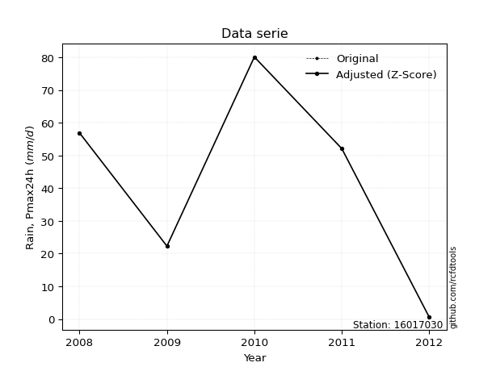</img>

</div>


> The initial value (value_initial) correspond to the initial obtained or null completed value, and value (value) is adjusted only when the initial value is outside the valid range (outlier) definite through the Z-Score value. If Z-Score is active, values out of range or outliers are replaced with the station mean value. A Z-Score (or standard score) measures how many standard deviations a data point is from the mean of a dataset, indicating its relative position; positive scores mean above the mean, negative mean below, and a score of zero is exactly at the mean, allowing for comparison of values from different distributions. It´s calculated using the formula $z=(x–μ)/σ$, where $x$ is the data point, $μ$ is the mean, and $σ$ is the standard deviation, helping identify outliers and understand probability.
>
> <sub>**Note**: In this study, "completing" (filling gaps in) and "extending" (forecasting or lengthening the historical record) rainfall data series are avoided for certain critical analyses because they introduce artificial bias and uncertainty, which can distort the statistics of rare events (extremes), alter day-to-day variability, and compromise the integrity and homogeneity of the original data. Some reasons against Completing/Extending rainfall data are: **Distortion of Extremes and Variability**: The primary issue is that most gap-filling or extension methods rely on averaging or regression with nearby stations, which inherently smooths the data. Rainfall is highly variable in space and time, with a large percentage of zero values and occasional large storms. Infilling methods often underestimate the highest values and overestimate the lowest (zero) values, which severely distorts analyses focused on flood frequency, drought severity, and intensity-duration-frequency (IDF) curves, **Loss of Data Homogeneity**: Infilled or extended data are synthetic estimates, not actual measurements. Combining these estimates with observed data can violate the assumption of data homogeneity, which requires that the data properties do not change over time. Inhomogeneity can lead to incorrect conclusions about long-term trends or changes in climate patterns, **Propagation of Errors**: Errors and biases from the original data (e.g., wind-induced undercatch, instrument errors, site changes) or the data used for imputation can propagate through the analysis, leading to unreliable hydrological models and inaccurate predictions, **Compromised Statistical Integrity**: For statistical analyses, especially those involving the frequency of events, using artificial data can introduce time bias or autocorrelation that doesn´t exist in reality, making it difficult to assess the true probability of events, **Difficulty in Validation**: It is difficult to accurately validate the quality of filled or extended data, especially for past periods where ground-truth measurements are unavailable. The reliability of imputation techniques heavily depends on the density of the surrounding station network and the complexity of the local topography.</sub>


### 4. Active continuous probability distributions from SciPy (80 of 104 available)

A Probability Density Function (PDF) describes the relative likelihood of a continuous random variable falling within a specific range, where the total area under its curve equals 1, and the area over any interval gives the actual probability for that range. Unlike discrete probabilities (like rolling a die), a PDF shows density, not direct probability for a single point (which is zero), with higher points indicating higher likelihood, often visualized as a bell curve for normal distributions.

A log of a probability density function (log-PDF) is simply the logarithm of the PDF´s value, denoted as $log(f(x))$, useful for converting multiplication of probabilities into addition, improving numerical stability with tiny numbers, and connecting to information theory concepts like entropy. Instead of dealing with very small probabilities (e.g., 0.000001), log-PDFs use negative numbers (e.g., $log(0.00001) ≈ -11.51$ that are easier for computers to handle, preventing underflow errors and simplifying complex calculations. In this study, each active probability distribution from SciPy is also evaluated in the $log$ form.

[scipy.stats](https://docs.scipy.org/doc/scipy/reference/stats.html) is a Python´s powerful submodule within the SciPy library for comprehensive statistical analysis, offering over 130 probability distributions (like Normal, Poisson, etc.), functions for descriptive stats (mean, variance), hypothesis testing (t-tests, chi-square), random variable generation, and statistical tests, making it essential for data science, modeling, and research. It provides tools to explore, model, and draw conclusions from data efficiently, working seamlessly with [NumPy](https://numpy.org/).

<div align="center">

|   id | p_dist           |   n_parameter | fit_method   | label                                                                       | active   | ref                                                                                                      |
|-----:|:-----------------|--------------:|:-------------|:----------------------------------------------------------------------------|:---------|:---------------------------------------------------------------------------------------------------------|
|    0 | alpha            |             3 | MLE          | Alpha                                                                       | True     | [:mortar_board:](https://docs.scipy.org/doc/scipy/reference/generated/scipy.stats.alpha.html)            |
|    1 | anglit           |             2 | MM           | Anglit                                                                      | True     | [:mortar_board:](https://docs.scipy.org/doc/scipy/reference/generated/scipy.stats.anglit.html)           |
|    2 | arcsine          |             2 | MM           | Arcsine                                                                     | True     | [:mortar_board:](https://docs.scipy.org/doc/scipy/reference/generated/scipy.stats.arcsine.html)          |
|    3 | argus            |             3 | MLE          | Argus                                                                       | True     | [:mortar_board:](https://docs.scipy.org/doc/scipy/reference/generated/scipy.stats.argus.html)            |
|    4 | beta             |             4 | MLE          | Beta                                                                        | True     | [:mortar_board:](https://docs.scipy.org/doc/scipy/reference/generated/scipy.stats.beta.html)             |
|    5 | betaprime        |             4 | MLE          | Beta prime                                                                  | True     | [:mortar_board:](https://docs.scipy.org/doc/scipy/reference/generated/scipy.stats.betaprime.html)        |
|    6 | bradford         |             3 | MLE          | Bradford                                                                    | True     | [:mortar_board:](https://docs.scipy.org/doc/scipy/reference/generated/scipy.stats.bradford.html)         |
|    7 | burr             |             4 | MLE          | Burr (Type III)                                                             | True     | [:mortar_board:](https://docs.scipy.org/doc/scipy/reference/generated/scipy.stats.burr.html)             |
|    8 | burr12           |             4 | MLE          | Burr (Type III) 12                                                          | True     | [:mortar_board:](https://docs.scipy.org/doc/scipy/reference/generated/scipy.stats.burr12.html)           |
|    9 | cosine           |             2 | MLE          | Cosine                                                                      | True     | [:mortar_board:](https://docs.scipy.org/doc/scipy/reference/generated/scipy.stats.cosine.html)           |
|   10 | crystalball      |             4 | MLE          | Crystalball                                                                 | True     | [:mortar_board:](https://docs.scipy.org/doc/scipy/reference/generated/scipy.stats.crystalball.html)      |
|   11 | dgamma           |             3 | MLE          | Double gamma                                                                | True     | [:mortar_board:](https://docs.scipy.org/doc/scipy/reference/generated/scipy.stats.dgamma.html)           |
|   12 | dweibull         |             3 | MLE          | Double Weibull                                                              | True     | [:mortar_board:](https://docs.scipy.org/doc/scipy/reference/generated/scipy.stats.dweibull.html)         |
|   13 | erlang           |             3 | MLE          | Erlang                                                                      | True     | [:mortar_board:](https://docs.scipy.org/doc/scipy/reference/generated/scipy.stats.erlang.html)           |
|   14 | exponnorm        |             3 | MLE          | Exponentially modified Normal                                               | True     | [:mortar_board:](https://docs.scipy.org/doc/scipy/reference/generated/scipy.stats.exponnorm.html)        |
|   15 | exponpow         |             3 | MLE          | Exponential power                                                           | True     | [:mortar_board:](https://docs.scipy.org/doc/scipy/reference/generated/scipy.stats.exponpow.html)         |
|   16 | exponweib        |             4 | MLE          | Exponentiated Weibull                                                       | True     | [:mortar_board:](https://docs.scipy.org/doc/scipy/reference/generated/scipy.stats.exponweib.html)        |
|   17 | f                |             4 | MLE          | F                                                                           | True     | [:mortar_board:](https://docs.scipy.org/doc/scipy/reference/generated/scipy.stats.f.html)                |
|   18 | fatiguelife      |             3 | MLE          | Fatigue-life (Birnbaum-Saunders)                                            | True     | [:mortar_board:](https://docs.scipy.org/doc/scipy/reference/generated/scipy.stats.fatiguelife.html)      |
|   19 | foldnorm         |             3 | MM           | Fold Normal                                                                 | True     | [:mortar_board:](https://docs.scipy.org/doc/scipy/reference/generated/scipy.stats.foldnorm.html)         |
|   20 | gamma            |             3 | MLE          | Gamma                                                                       | True     | [:mortar_board:](https://docs.scipy.org/doc/scipy/reference/generated/scipy.stats.gamma.html)            |
|   21 | gausshyper       |             6 | MLE          | Gauss hypergeometric                                                        | True     | [:mortar_board:](https://docs.scipy.org/doc/scipy/reference/generated/scipy.stats.gausshyper.html)       |
|   22 | genexpon         |             5 | MLE          | Generalized exponential                                                     | True     | [:mortar_board:](https://docs.scipy.org/doc/scipy/reference/generated/scipy.stats.genexpon.html)         |
|   23 | genextreme       |             3 | MLE          | Generalized exponential                                                     | True     | [:mortar_board:](https://docs.scipy.org/doc/scipy/reference/generated/scipy.stats.genextreme.html)       |
|   24 | gengamma         |             4 | MLE          | Generalized gamma                                                           | True     | [:mortar_board:](https://docs.scipy.org/doc/scipy/reference/generated/scipy.stats.gengamma.html)         |
|   25 | genhalflogistic  |             3 | MLE          | Generalized half-logistic                                                   | True     | [:mortar_board:](https://docs.scipy.org/doc/scipy/reference/generated/scipy.stats.genhalflogistic.html)  |
|   26 | genlogistic      |             3 | MLE          | Generalized logistic                                                        | True     | [:mortar_board:](https://docs.scipy.org/doc/scipy/reference/generated/scipy.stats.genlogistic.html)      |
|   27 | gennorm          |             3 | MLE          | Generalized Normal                                                          | True     | [:mortar_board:](https://docs.scipy.org/doc/scipy/reference/generated/scipy.stats.gennorm.html)          |
|   28 | genpareto        |             3 | MLE          | Generalized Pareto                                                          | True     | [:mortar_board:](https://docs.scipy.org/doc/scipy/reference/generated/scipy.stats.genpareto.html)        |
|   29 | gompertz         |             3 | MLE          | Gompertz (or truncated Gumbel)                                              | True     | [:mortar_board:](https://docs.scipy.org/doc/scipy/reference/generated/scipy.stats.gompertz.html)         |
|   30 | gumbel_l         |             2 | MM           | Gumbel Left Skew                                                            | True     | [:mortar_board:](https://docs.scipy.org/doc/scipy/reference/generated/scipy.stats.gumbel_l.html)         |
|   31 | gumbel_r         |             2 | MM           | Gumbel Right Skew                                                           | True     | [:mortar_board:](https://docs.scipy.org/doc/scipy/reference/generated/scipy.stats.gumbel_r.html)         |
|   32 | halfgennorm      |             3 | MLE          | Upper half of a generalized normal                                          | True     | [:mortar_board:](https://docs.scipy.org/doc/scipy/reference/generated/scipy.stats.halfgennorm.html)      |
|   33 | halflogistic     |             2 | MM           | Half-logistic                                                               | True     | [:mortar_board:](https://docs.scipy.org/doc/scipy/reference/generated/scipy.stats.halflogistic.html)     |
|   34 | halfnorm         |             2 | MM           | Half Normal                                                                 | True     | [:mortar_board:](https://docs.scipy.org/doc/scipy/reference/generated/scipy.stats.halfnorm.html)         |
|   35 | hypsecant        |             2 | MM           | hyperbolic secant                                                           | True     | [:mortar_board:](https://docs.scipy.org/doc/scipy/reference/generated/scipy.stats.hypsecant.html)        |
|   36 | invgamma         |             3 | MLE          | Inverted gamma                                                              | True     | [:mortar_board:](https://docs.scipy.org/doc/scipy/reference/generated/scipy.stats.invgamma.html)         |
|   37 | invgauss         |             3 | MLE          | Inverse Gaussian                                                            | True     | [:mortar_board:](https://docs.scipy.org/doc/scipy/reference/generated/scipy.stats.invgauss.html)         |
|   38 | invweibull       |             3 | MLE          | Inverted Weibull                                                            | True     | [:mortar_board:](https://docs.scipy.org/doc/scipy/reference/generated/scipy.stats.invweibull.html)       |
|   39 | johnsonsb        |             4 | MLE          | Johnson SB                                                                  | True     | [:mortar_board:](https://docs.scipy.org/doc/scipy/reference/generated/scipy.stats.johnsonsb.html)        |
|   40 | johnsonsu        |             4 | MLE          | Johnson Su                                                                  | True     | [:mortar_board:](https://docs.scipy.org/doc/scipy/reference/generated/scipy.stats.johnsonsu.html)        |
|   41 | kappa3           |             3 | MLE          | Kappa 3                                                                     | True     | [:mortar_board:](https://docs.scipy.org/doc/scipy/reference/generated/scipy.stats.kappa3.html)           |
|   42 | kappa4           |             4 | MLE          | Kappa 4                                                                     | True     | [:mortar_board:](https://docs.scipy.org/doc/scipy/reference/generated/scipy.stats.kappa4.html)           |
|   43 | ksone            |             3 | MLE          | Kolmogorov-Smirnov one-sided test statistic distribution                    | True     | [:mortar_board:](https://docs.scipy.org/doc/scipy/reference/generated/scipy.stats.ksone.html)            |
|   44 | kstwobign        |             2 | MLE          | Limiting distribution of scaled Kolmogorov-Smirnov two-sided test statistic | True     | [:mortar_board:](https://docs.scipy.org/doc/scipy/reference/generated/scipy.stats.kstwobign.html)        |
|   45 | laplace          |             2 | MM           | Laplace                                                                     | True     | [:mortar_board:](https://docs.scipy.org/doc/scipy/reference/generated/scipy.stats.laplace.html)          |
|   46 | levy_l           |             2 | MLE          | Left-skewed Levy                                                            | True     | [:mortar_board:](https://docs.scipy.org/doc/scipy/reference/generated/scipy.stats.levy_l.html)           |
|   47 | loggamma         |             3 | MLE          | Log gamma                                                                   | True     | [:mortar_board:](https://docs.scipy.org/doc/scipy/reference/generated/scipy.stats.loggamma.html)         |
|   48 | logistic         |             2 | MM           | Logistic (or Sech-squared)                                                  | True     | [:mortar_board:](https://docs.scipy.org/doc/scipy/reference/generated/scipy.stats.logistic.html)         |
|   49 | loglaplace       |             3 | MLE          | Log-Laplace                                                                 | True     | [:mortar_board:](https://docs.scipy.org/doc/scipy/reference/generated/scipy.stats.loglaplace.html)       |
|   50 | lomax            |             3 | MLE          | Lomax (Pareto of the second kind)                                           | True     | [:mortar_board:](https://docs.scipy.org/doc/scipy/reference/generated/scipy.stats.lomax.html)            |
|   51 | maxwell          |             2 | MM           | Maxwell                                                                     | True     | [:mortar_board:](https://docs.scipy.org/doc/scipy/reference/generated/scipy.stats.maxwell.html)          |
|   52 | mielke           |             4 | MLE          | Mielke Beta-Kappa / Dagum                                                   | True     | [:mortar_board:](https://docs.scipy.org/doc/scipy/reference/generated/scipy.stats.mielke.html)           |
|   53 | moyal            |             2 | MM           | Moyal                                                                       | True     | [:mortar_board:](https://docs.scipy.org/doc/scipy/reference/generated/scipy.stats.moyal.html)            |
|   54 | nakagami         |             3 | MLE          | Nakagami                                                                    | True     | [:mortar_board:](https://docs.scipy.org/doc/scipy/reference/generated/scipy.stats.nakagami.html)         |
|   55 | ncf              |             5 | MLE          | Non-central F distribution                                                  | True     | [:mortar_board:](https://docs.scipy.org/doc/scipy/reference/generated/scipy.stats.ncf.html)              |
|   56 | nct              |             4 | MLE          | Non-central Student’s t                                                     | True     | [:mortar_board:](https://docs.scipy.org/doc/scipy/reference/generated/scipy.stats.nct.html)              |
|   57 | norm             |             2 | MM           | Normal                                                                      | True     | [:mortar_board:](https://docs.scipy.org/doc/scipy/reference/generated/scipy.stats.norm.html)             |
|   58 | pearson3         |             3 | MM           | Pearson type III                                                            | True     | [:mortar_board:](https://docs.scipy.org/doc/scipy/reference/generated/scipy.stats.pearson3.html)         |
|   59 | powerlaw         |             3 | MLE          | Power-function                                                              | True     | [:mortar_board:](https://docs.scipy.org/doc/scipy/reference/generated/scipy.stats.powerlaw.html)         |
|   60 | rayleigh         |             2 | MM           | Rayleigh                                                                    | True     | [:mortar_board:](https://docs.scipy.org/doc/scipy/reference/generated/scipy.stats.rayleigh.html)         |
|   61 | rdist            |             3 | MLE          | R-distributed (symmetric beta)                                              | True     | [:mortar_board:](https://docs.scipy.org/doc/scipy/reference/generated/scipy.stats.rdist.html)            |
|   62 | rice             |             3 | MLE          | Rice                                                                        | True     | [:mortar_board:](https://docs.scipy.org/doc/scipy/reference/generated/scipy.stats.rice.html)             |
|   63 | semicircular     |             2 | MM           | Semicircular                                                                | True     | [:mortar_board:](https://docs.scipy.org/doc/scipy/reference/generated/scipy.stats.semicircular.html)     |
|   64 | skewnorm         |             3 | MLE          | Skew normal                                                                 | True     | [:mortar_board:](https://docs.scipy.org/doc/scipy/reference/generated/scipy.stats.skewnorm.html)         |
|   65 | t                |             3 | MLE          | Student’s t                                                                 | True     | [:mortar_board:](https://docs.scipy.org/doc/scipy/reference/generated/scipy.stats.t.html)                |
|   66 | trapezoid        |             4 | MLE          | Trapezoid                                                                   | True     | [:mortar_board:](https://docs.scipy.org/doc/scipy/reference/generated/scipy.stats.trapezoid.html)        |
|   67 | triang           |             3 | MLE          | Triangular                                                                  | True     | [:mortar_board:](https://docs.scipy.org/doc/scipy/reference/generated/scipy.stats.triang.html)           |
|   68 | truncexpon       |             3 | MLE          | Truncated exponential                                                       | True     | [:mortar_board:](https://docs.scipy.org/doc/scipy/reference/generated/scipy.stats.truncexpon.html)       |
|   69 | truncnorm        |             4 | MLE          | Truncated normal                                                            | True     | [:mortar_board:](https://docs.scipy.org/doc/scipy/reference/generated/scipy.stats.truncnorm.html)        |
|   70 | truncpareto      |             4 | MLE          | Upper truncated Pareto                                                      | True     | [:mortar_board:](https://docs.scipy.org/doc/scipy/reference/generated/scipy.stats.truncpareto.html)      |
|   71 | truncweibull_min |             5 | MLE          | Doubly truncated Weibull minimum                                            | True     | [:mortar_board:](https://docs.scipy.org/doc/scipy/reference/generated/scipy.stats.truncweibull_min.html) |
|   72 | tukeylambda      |             3 | MLE          | Tukey-Lamdba                                                                | True     | [:mortar_board:](https://docs.scipy.org/doc/scipy/reference/generated/scipy.stats.tukeylambda.html)      |
|   73 | uniform          |             2 | MLE          | Uniform                                                                     | True     | [:mortar_board:](https://docs.scipy.org/doc/scipy/reference/generated/scipy.stats.uniform.html)          |
|   74 | vonmises         |             3 | MLE          | Von Mises                                                                   | True     | [:mortar_board:](https://docs.scipy.org/doc/scipy/reference/generated/scipy.stats.vonmises.html)         |
|   75 | vonmises_line    |             3 | MLE          | Von Mises line                                                              | True     | [:mortar_board:](https://docs.scipy.org/doc/scipy/reference/generated/scipy.stats.vonmises_line.html)    |
|   76 | wald             |             2 | MM           | Wald                                                                        | True     | [:mortar_board:](https://docs.scipy.org/doc/scipy/reference/generated/scipy.stats.wald.html)             |
|   77 | weibull_max      |             3 | MLE          | Weibull maximum                                                             | True     | [:mortar_board:](https://docs.scipy.org/doc/scipy/reference/generated/scipy.stats.weibull_max.html)      |
|   78 | weibull_min      |             3 | MLE          | Weibull minimum                                                             | True     | [:mortar_board:](https://docs.scipy.org/doc/scipy/reference/generated/scipy.stats.weibull_min.html)      |
|   79 | wrapcauchy       |             3 | MLE          | Wrapped  Cauchy                                                             | True     | [:mortar_board:](https://docs.scipy.org/doc/scipy/reference/generated/scipy.stats.wrapcauchy.html)       |

</div>

> **n_parameter:** # arguments & localization & scale.
>
> **Fit methods:** (MLE) maximum likelihood, (MM) L-moments.
>
>**Inactive** (With the only purpose of prevent loops, zero divisions, infinite values, over high estimated values or horizontal trending for recurrence intervals estimations, the follow distributions were disabled.)**:** lognorm, norminvgauss, powernorm, powerlognorm, cauchy, halfcauchy, foldcauchy, skewcauchy, chi2, expon, fisk, genhyperbolic, geninvgauss, gibrat, kstwo, laplace_asymmetric, levy, levy_stable, ncx2, pareto, rel_breitwigner, recipinvgauss, studentized_range, loguniform, 


## B. Probability (PDF) vs. Empirical (EDF) distributions functions

A continuous probability distribution (CPD) describes probabilities for variables that can take any value within a range (like rain any time), unlike discrete variables with specific outcomes (like temperature). It uses a Probability Density Function (PDF), a curve where the total area under it equals 1, and the probability of the variable falling within an interval (a to b) is found by calculating the area under the curve between those points. A key feature is that the probability of hitting any single exact value is zero, so probabilities are always expressed for ranges, e.g., $P(a ≤ X ≤ b)$.

<div align="center">

Distributions parameters from station values
|     |   station | p_dist              |   n |             loc |           scale | shape                  | shape1                 | shape2               | shape3             |
|----:|----------:|:--------------------|----:|----------------:|----------------:|:-----------------------|:-----------------------|:---------------------|:-------------------|
|   0 |  16017030 | alpha               |   5 |     0.00179137  |     1.33726     | 2.1619056483823096e-09 |                        |                      |                    |
|   1 |  16017030 | anglit              |   5 |    42.4         |    81.4594      |                        |                        |                      |                    |
|   2 |  16017030 | arcsine             |   5 |     3.0204      |    78.7592      |                        |                        |                      |                    |
|   3 |  16017030 | argus               |   5 |   -21.3879      |   106.879       | 0.8321772463385215     |                        |                      |                    |
|   4 |  16017030 | beta                |   5 |    -9.3349      |    89.4349      | 0.9262743082916458     | 0.6991596034454695     |                      |                    |
|   5 |  16017030 | betaprime           |   5 |  -645.402       | 39493.8         | 608.0304782576641      | 34920.14717512412      |                      |                    |
|   6 |  16017030 | bradford            |   5 |    -0.48834     |    80.5884      | 4.08011609058124e-05   |                        |                      |                    |
|   7 |  16017030 | burr                |   5 |    -0.800011    |    82.9592      | 138.14459642476544     | 0.005954972881989949   |                      |                    |
|   8 |  16017030 | burr12              |   5 |   -13.595       |   931.872       | 2.147468271159341      | 324.54599694972796     |                      |                    |
|   9 |  16017030 | cosine              |   5 |    41.5861      |    22.604       |                        |                        |                      |                    |
|  10 |  16017030 | crystalball         |   5 |    42.4         |    27.8456      | 4081.7848963224596     | 94.26561451787104      |                      |                    |
|  11 |  16017030 | dgamma              |   5 |    37.3252      |     5.09797     | 5.055917649421001      |                        |                      |                    |
|  12 |  16017030 | dweibull            |   5 |    37.4645      |    29.2388      | 2.412244997377245      |                        |                      |                    |
|  13 |  16017030 | erlang              |   5 |  -490.12        |     1.48236     | 359.15340464939675     |                        |                      |                    |
|  14 |  16017030 | exponnorm           |   5 |    42.3738      |    27.8456      | 0.0009446869673538892  |                        |                      |                    |
|  15 |  16017030 | exponpow            |   5 |     0.6         |     3.06456     | 0.1117629163955905     |                        |                      |                    |
|  16 |  16017030 | exponweib           |   5 |     0.6         |     3.19632     | 1.523146488238691      | 0.08712646674730795    |                      |                    |
|  17 |  16017030 | f                   |   5 |     0.6         |    49.1909      | 1.6762585082953443     | 41.129095805712524     |                      |                    |
|  18 |  16017030 | fatiguelife         |   5 |     0.6         |     6.58026e-06 | 2253.8671828165316     |                        |                      |                    |
|  19 |  16017030 | foldnorm            |   5 |  -135.64        |    27.103       | 6.575551123667232      |                        |                      |                    |
|  20 |  16017030 | gamma               |   5 |  -463.252       |     1.56687     | 322.6274471852323      |                        |                      |                    |
|  21 |  16017030 | gausshyper          |   5 |    -0.74437     |    80.8444      | 0.7984091803155045     | 0.3694024490531016     | 0.9093007539003564   | 1.3572307045976229 |
|  22 |  16017030 | genexpon            |   5 |     0.599912    |     1.99662     | 0.04779661357172941    | 1.1983098332792028e-07 | 1.0913718457386103   |                    |
|  23 |  16017030 | genextreme          |   5 |    46.2486      |    41.9892      | 1.2403997788446484     |                        |                      |                    |
|  24 |  16017030 | gengamma            |   5 |     0.6         |     0.00257044  | 4.624727126853738      | 0.177067041488725      |                      |                    |
|  25 |  16017030 | genhalflogistic     |   5 |   -17.3107      |   103.663       | 1.064182453547713      |                        |                      |                    |
|  26 |  16017030 | genlogistic         |   5 |    66.4766      |     9.59212     | 0.3398297452989426     |                        |                      |                    |
|  27 |  16017030 | gennorm             |   5 |    52.1         |    20.2433      | 0.9223825129454433     |                        |                      |                    |
|  28 |  16017030 | genpareto           |   5 |    -0.246335    |   108.954       | -1.3560583659098613    |                        |                      |                    |
|  29 |  16017030 | gompertz            |   5 |     0.599823    |    38.19        | 0.35716835312999906    |                        |                      |                    |
|  30 |  16017030 | gumbel_l            |   5 |    54.932       |    21.7111      |                        |                        |                      |                    |
|  31 |  16017030 | gumbel_r            |   5 |    29.868       |    21.7111      |                        |                        |                      |                    |
|  32 |  16017030 | halfgennorm         |   5 |     0.6         |     0.113491    | 0.27846141650682843    |                        |                      |                    |
|  33 |  16017030 | halflogistic        |   5 |     9.39649     |    23.807       |                        |                        |                      |                    |
|  34 |  16017030 | halfnorm            |   5 |     5.54333     |    46.193       |                        |                        |                      |                    |
|  35 |  16017030 | hypsecant           |   5 |    42.4         |    17.727       |                        |                        |                      |                    |
|  36 |  16017030 | invgamma            |   5 |  -265.995       | 36751.7         | 120.17526911763014     |                        |                      |                    |
|  37 |  16017030 | invgauss            |   5 |  -102.539       |  3396.05        | 0.042713898049923135   |                        |                      |                    |
|  38 |  16017030 | invweibull          |   5 |     0.6         |     2.89671     | 0.039002365501272465   |                        |                      |                    |
|  39 |  16017030 | johnsonsb           |   5 |   -13.4408      |    93.5408      | -0.8294669481016266    | 0.15453577710244248    |                      |                    |
|  40 |  16017030 | johnsonsu           |   5 |   143.29        |     8.43536     | 11.17554056153879      | 3.562424038989151      |                      |                    |
|  41 |  16017030 | kappa3              |   5 |     0.598637    |    79.5002      | 66718.15726812626      |                        |                      |                    |
|  42 |  16017030 | kappa4              |   5 |    -5.51994     |    90.994       | 1.071795741701289      | 1.0627658596917646     |                      |                    |
|  43 |  16017030 | ksone               |   5 |    -5.82995     |    96.4599      | 1.0                    |                        |                      |                    |
|  44 |  16017030 | kstwobign           |   5 |   -62.1136      |   119.131       |                        |                        |                      |                    |
|  45 |  16017030 | laplace             |   5 |    42.4         |    19.6898      |                        |                        |                      |                    |
|  46 |  16017030 | levy_l              |   5 |    83.236       |    11.9766      |                        |                        |                      |                    |
|  47 |  16017030 | loggamma            |   5 |    14.3089      |    40.5512      | 2.478847077655244      |                        |                      |                    |
|  48 |  16017030 | logistic            |   5 |    42.4         |    15.3521      |                        |                        |                      |                    |
|  49 |  16017030 | loglaplace          |   5 |    -0.0831157   |    52.1831      | 0.8791369091863861     |                        |                      |                    |
|  50 |  16017030 | lomax               |   5 |     0.6         |     3.9291e+11  | 10901287581.56385      |                        |                      |                    |
|  51 |  16017030 | maxwell             |   5 |   -23.5823      |    41.3483      |                        |                        |                      |                    |
|  52 |  16017030 | mielke              |   5 |     0.6         |    82.7297      | 0.4574598356304884     | 32.32628946721603      |                      |                    |
|  53 |  16017030 | moyal               |   5 |    26.4761      |    12.5349      |                        |                        |                      |                    |
|  54 |  16017030 | nakagami            |   5 |     0.6         |    40.3462      | 0.05292717313338341    |                        |                      |                    |
|  55 |  16017030 | ncf                 |   5 |     0.6         |    15.8941      | 1.076629272955775      | 26.22930406002353      | 2.735664617671369    |                    |
|  56 |  16017030 | nct                 |   5 |    -0.48634     |     0.0443153   | 0.3378040420997239     | 54.73618270063545      |                      |                    |
|  57 |  16017030 | norm                |   5 |    42.4         |    27.8456      |                        |                        |                      |                    |
|  58 |  16017030 | pearson3            |   5 |    42.4         |    27.8456      | -0.21871588355228383   |                        |                      |                    |
|  59 |  16017030 | powerlaw            |   5 |     0.6         |    79.5         | 0.11576689534185018    |                        |                      |                    |
|  60 |  16017030 | rayleigh            |   5 |   -10.8702      |    42.5035      |                        |                        |                      |                    |
|  61 |  16017030 | rdist               |   5 |    -7.17131     |    29.4713      | 1.1918023234281043     |                        |                      |                    |
|  62 |  16017030 | rice                |   5 |   -15.265       |    32.389       | 1.3816291679038257     |                        |                      |                    |
|  63 |  16017030 | semicircular        |   5 |    42.4         |    55.6911      |                        |                        |                      |                    |
|  64 |  16017030 | skewnorm            |   5 |    80.1         |    46.8629      | -8830826.552024646     |                        |                      |                    |
|  65 |  16017030 | t                   |   5 |    42.4         |    27.8456      | 14493374634.881542     |                        |                      |                    |
|  66 |  16017030 | trapezoid           |   5 |   -37.2682      |   118.139       | 1.0                    | 1.0                    |                      |                    |
|  67 |  16017030 | triang              |   5 |   -25.5538      |   105.76        | 0.99999999999946       |                        |                      |                    |
|  68 |  16017030 | truncexpon          |   5 |     0.599996    |   129.143       | 0.6155982341989024     |                        |                      |                    |
|  69 |  16017030 | truncnorm           |   5 |     2.73855     |    11.045       | -1.9923422597568694    | 7.00419726431695       |                      |                    |
|  70 |  16017030 | truncpareto         |   5 |     0.194686    |     0.405314    | 0.2621049858960394     | 197.14437713040664     |                      |                    |
|  71 |  16017030 | truncweibull_min    |   5 |    -3.93493     |   128.475       | 1.2305013518252204     | 0.0011250744243155968  | 0.6540961728363427   |                    |
|  72 |  16017030 | tukeylambda         |   5 |    40.2787      |    43.6584      | 1.0963572746675676     |                        |                      |                    |
|  73 |  16017030 | uniform             |   5 |     0.6         |    79.5         |                        |                        |                      |                    |
|  74 |  16017030 | vonmises            |   5 |     0.812431    |     1           | 0.31819740479257547    |                        |                      |                    |
|  75 |  16017030 | vonmises_line       |   5 |    40.761       |    12.7836      | 3.998480112009625e-05  |                        |                      |                    |
|  76 |  16017030 | wald                |   5 |    14.5544      |    27.8456      |                        |                        |                      |                    |
|  77 |  16017030 | weibull_max         |   5 |    80.1         |     1.50313     | 0.2955891473452552     |                        |                      |                    |
|  78 |  16017030 | weibull_min         |   5 |   -54.6607      |   107.377       | 4.089410707157189      |                        |                      |                    |
|  79 |  16017030 | wrapcauchy          |   5 |     0.599998    |    12.6528      | 0.23205829240794484    |                        |                      |                    |
|  80 |  16017030 | logalpha            |   5 |   -34.3892      |   704.57        | 18.90400791096089      |                        |                      |                    |
|  81 |  16017030 | loganglit           |   5 |     2.9943      |     5.27269     |                        |                        |                      |                    |
|  82 |  16017030 | logarcsine          |   5 |     0.445355    |     5.09789     |                        |                        |                      |                    |
|  83 |  16017030 | logargus            |   5 |    -2.84587     |     7.36961     | 2.957747387143831      |                        |                      |                    |
|  84 |  16017030 | logbeta             |   5 |    -1.00799     |     5.39126     | 0.2337595799962462     | 0.07269861500225461    |                      |                    |
|  85 |  16017030 | logbetaprime        |   5 |    -0.510826    |     1.91513     | 0.5784644763775579     | 1.2124984000316492     |                      |                    |
|  86 |  16017030 | logbradford         |   5 |    -0.532735    |     4.91603     | 8.143764536446482e-05  |                        |                      |                    |
|  87 |  16017030 | logburr             |   5 |    -0.510826    |     1.76134     | 0.6537364034511963     | 1.0199589557946664     |                      |                    |
|  88 |  16017030 | logburr12           |   5 |    -0.510826    |     1.55587     | 0.7665515942436562     | 0.7837738512499274     |                      |                    |
|  89 |  16017030 | logcosine           |   5 |     2.67227     |     1.53888     |                        |                        |                      |                    |
|  90 |  16017030 | logcrystalball      |   5 |     4.38328     |     4.6004e-06  | 3.3710768313312434e-06 | 145.2410638248066      |                      |                    |
|  91 |  16017030 | logdgamma           |   5 |     3.95316     |     1.22969     | 0.9003408571996756     |                        |                      |                    |
|  92 |  16017030 | logdweibull         |   5 |     3.95316     |     1.23014     | 0.8974148211487072     |                        |                      |                    |
|  93 |  16017030 | logerlang           |   5 |   -30.2334      |     0.104607    | 317.49422721838494     |                        |                      |                    |
|  94 |  16017030 | logexponnorm        |   5 |     2.99284     |     1.80239     | 0.0008103045950955688  |                        |                      |                    |
|  95 |  16017030 | logexponpow         |   5 |    -0.510826    |     2.35584     | 0.391565150870559      |                        |                      |                    |
|  96 |  16017030 | logexponweib        |   5 |    -0.510826    |     1.58975     | 1.7581015230089059     | 0.35438603754571363    |                      |                    |
|  97 |  16017030 | logf                |   5 |    -0.510826    |     1.10273     | 1.1604105599306043     | 1.2078062981713957     |                      |                    |
|  98 |  16017030 | logfatiguelife      |   5 |    -0.510826    |     1.05058e-06 | 1870.338032804521      |                        |                      |                    |
|  99 |  16017030 | logfoldnorm         |   5 |    -8.45064     |     1.48193     | 7.7771259697130555     |                        |                      |                    |
| 100 |  16017030 | loggamma            |   5 |   -28.2307      |     0.113522    | 274.7051650369174      |                        |                      |                    |
| 101 |  16017030 | loggausshyper       |   5 |    -0.97658     |     5.35986     | 1.644242325797783      | 0.521768817632885      | 0.8786626292747237   | 0.7041099606941845 |
| 102 |  16017030 | loggenexpon         |   5 |    -0.511278    |     2.36163     | 0.28257884769010566    | 31.34555789963182      | 0.013247352583589694 |                    |
| 103 |  16017030 | loggenextreme       |   5 |     3.26546     |     1.41513     | 1.2659725004254763     |                        |                      |                    |
| 104 |  16017030 | loggengamma         |   5 |    -0.510826    |     1.90799     | 1.5199341508056923     | 0.4996507843127752     |                      |                    |
| 105 |  16017030 | loggenhalflogistic  |   5 |    -1.13393     |     6.26539     | 1.1356096353043754     |                        |                      |                    |
| 106 |  16017030 | loggenlogistic      |   5 |     4.38333     |     5.1587e-06  | 3.726068324025651e-06  |                        |                      |                    |
| 107 |  16017030 | loggennorm          |   5 |     4.0413      |     0.0391745   | 0.39308825428084704    |                        |                      |                    |
| 108 |  16017030 | loggenpareto        |   5 |    -0.530994    |    12.83        | -2.610757675480303     |                        |                      |                    |
| 109 |  16017030 | loggompertz         |   5 |    -0.510829    |     1.13002     | 0.02442491354851677    |                        |                      |                    |
| 110 |  16017030 | loggumbel_l         |   5 |     3.80547     |     1.40531     |                        |                        |                      |                    |
| 111 |  16017030 | loggumbel_r         |   5 |     2.18313     |     1.40531     |                        |                        |                      |                    |
| 112 |  16017030 | loghalfgennorm      |   5 |    -0.510913    |     5.33309     | 44.573579353942336     |                        |                      |                    |
| 113 |  16017030 | loghalflogistic     |   5 |     0.858087    |     1.54096     |                        |                        |                      |                    |
| 114 |  16017030 | loghalfnorm         |   5 |     0.608657    |     2.98996     |                        |                        |                      |                    |
| 115 |  16017030 | loghypsecant        |   5 |     2.9943      |     1.14743     |                        |                        |                      |                    |
| 116 |  16017030 | loginvgamma         |   5 |   -40.1133      | 22215.6         | 516.6547545647668      |                        |                      |                    |
| 117 |  16017030 | loginvgauss         |   5 |   -13.9751      |  1169.75        | 0.014499922908331832   |                        |                      |                    |
| 118 |  16017030 | loginvweibull       |   5 |    -1.25195e+08 |     1.25195e+08 | 59955695.45336467      |                        |                      |                    |
| 119 |  16017030 | logjohnsonsb        |   5 |    -3.62401     |     8.00729     | -1.4302545049916255    | 0.12187393651792018    |                      |                    |
| 120 |  16017030 | logjohnsonsu        |   5 |     4.38328     |     2.19089e-14 | 6.6582157313030415     | 0.2385257434067045     |                      |                    |
| 121 |  16017030 | logkappa3           |   5 |    -0.652098    |     4.62018     | 13.801483361887207     |                        |                      |                    |
| 122 |  16017030 | logkappa4           |   5 |    -0.947415    |     5.55383     | 1.0854730713026688     | 1.0415455237260536     |                      |                    |
| 123 |  16017030 | logksone            |   5 |    -1.00024     |     5.87292     | 1.0                    |                        |                      |                    |
| 124 |  16017030 | logkstwobign        |   5 |    -5.29779     |     9.44966     |                        |                        |                      |                    |
| 125 |  16017030 | loglaplace          |   5 |     2.9943      |     1.27448     |                        |                        |                      |                    |
| 126 |  16017030 | loglevy_l           |   5 |     4.44028     |     0.21691     |                        |                        |                      |                    |
| 127 |  16017030 | logloggamma         |   5 |     4.38333     |     4.03331e-06 | 2.886519014204861e-06  |                        |                      |                    |
| 128 |  16017030 | loglogistic         |   5 |     2.9943      |     0.993706    |                        |                        |                      |                    |
| 129 |  16017030 | logloglaplace       |   5 |    -0.510826    |     1.84523     | 0.5859134351982894     |                        |                      |                    |
| 130 |  16017030 | loglomax            |   5 |    -0.510826    |     6.52885e+07 | 16167359.74861355      |                        |                      |                    |
| 131 |  16017030 | logmaxwell          |   5 |    -1.27659     |     2.67639     |                        |                        |                      |                    |
| 132 |  16017030 | logmielke           |   5 |    -0.510826    |     1.86996     | 0.6384812701748253     | 0.9473371474569625     |                      |                    |
| 133 |  16017030 | logmoyal            |   5 |     1.96358     |     0.811358    |                        |                        |                      |                    |
| 134 |  16017030 | lognakagami         |   5 | -1166.76        |  1169.76        | 105381.2766865663      |                        |                      |                    |
| 135 |  16017030 | logncf              |   5 |    -0.510826    |     1.03734     | 1.0117812952182064     | 1.3083940541924377     | 1.1200872565513424   |                    |
| 136 |  16017030 | lognct              |   5 |  -102.355       |     1.73565     | 21469.560243226253     | 60.69429443769177      |                      |                    |
| 137 |  16017030 | lognorm             |   5 |     2.9943      |     1.80238     |                        |                        |                      |                    |
| 138 |  16017030 | logpearson3         |   5 |     2.99429     |     1.80241     | -1.3101710305155914    |                        |                      |                    |
| 139 |  16017030 | logpowerlaw         |   5 |    -0.510826    |     4.8941      | 0.1288922857536258     |                        |                      |                    |
| 140 |  16017030 | lograyleigh         |   5 |    -0.453809    |     2.75118     |                        |                        |                      |                    |
| 141 |  16017030 | logrdist            |   5 |    -0.000275806 |     0.51055     | 1.574650485142803      |                        |                      |                    |
| 142 |  16017030 | logrice             |   5 |    -2.01543     |     1.92992     | 2.368654206299956      |                        |                      |                    |
| 143 |  16017030 | logsemicircular     |   5 |     2.9943      |     3.60477     |                        |                        |                      |                    |
| 144 |  16017030 | logskewnorm         |   5 |     4.38328     |     2.27522     | -2007238.600168237     |                        |                      |                    |
| 145 |  16017030 | logt                |   5 |     4.00681     |     0.123543    | 0.49020537919454354    |                        |                      |                    |
| 146 |  16017030 | logtrapezoid        |   5 |    -2.20879     |     7.64687     | 1.0                    | 1.0                    |                      |                    |
| 147 |  16017030 | logtriang           |   5 |    -1.62319     |     6.01799     | 0.9999999999510778     |                        |                      |                    |
| 148 |  16017030 | logtruncexpon       |   5 |    -0.518958    |     7.2081      | 0.6801005426884859     |                        |                      |                    |
| 149 |  16017030 | logtruncnorm        |   5 |     2.03401     |     7.17897     | -0.35448483567472655   | 0.3272433011360065     |                      |                    |
| 150 |  16017030 | logtruncpareto      |   5 |    -0.543592    |     0.0319586   | 4.126768667171437e-06  | 154.16386244209082     |                      |                    |
| 151 |  16017030 | logtruncweibull_min |   5 |    -1.66867     |    13.3473      | 1.97613949921341       | 0.0022621156977629454  | 0.45342003170073075  |                    |
| 152 |  16017030 | logtukeylambda      |   5 |     0.000177894 |     5.42262     | 1.2371655767101162     |                        |                      |                    |
| 153 |  16017030 | loguniform          |   5 |    -0.510826    |     4.8941      |                        |                        |                      |                    |
| 154 |  16017030 | logvonmises         |   5 |    -2.11534     |     1           | 1.8944124331619674     |                        |                      |                    |
| 155 |  16017030 | logvonmises_line    |   5 |     3.51252     |     1.28067     | 1.2134449687064515     |                        |                      |                    |
| 156 |  16017030 | logwald             |   5 |     1.19194     |     1.80237     |                        |                        |                      |                    |
| 157 |  16017030 | logweibull_max      |   5 |     4.38328     |     2.13542     | 0.13894596429438977    |                        |                      |                    |
| 158 |  16017030 | logweibull_min      |   5 |    -0.510826    |     1.95158     | 0.5696320230768064     |                        |                      |                    |
| 159 |  16017030 | logwrapcauchy       |   5 |    -0.510954    |     0.778941    | 0.7530510941752866     |                        |                      |                    |

</div>

> **loc** (Location parameter): This shifts the distribution along the x-axis. For many common distributions, like the normal (Gaussian) distribution, loc represents the mean $μ$. For others, like the uniform distribution, it might represent the minimum value, or for the beta distribution, the left end of the support interval.
>
> **scale** (Scale parameter): This determines the width or spread of the distribution. For the normal distribution, scale represents the standard deviation $σ$. For a uniform distribution, it defines the length of the interval (from $loc$ to $loc + scale$).
>
> **shape** (Shape parameters): Refers to parameters that define the specific form of a probability distribution, distinct from its location (loc) and scale (scale). These parameters are required arguments for most distribution functions. For example, a normal (Gaussian) distribution is fully defined by its location (mean) and scale (standard deviation), so it has no specific shape parameters beyond loc and scale. However, other distributions have intrinsic properties that need specification, as Gamma distribution that takes a shape parameter, often named $a$ or $alpha$.


### 0. Cumulative distribution values - CDF (160 evaluated)

Cumulative Distribution Function (CDF), denoted as $F$<sub>$X$</sub>$(x)$, is a function that gives the probability that a random variable $X$ will take a value less than or equal to a specific value, $x$ (i.e., $(P(X≥x)$. It essentially "accumulates" probabilities from a given point up to the far right (positive infinity), providing a complete picture of the distribution´s probabilities for both discrete (like rain) and continuous (like temperature) variables, helping to find probabilities over ranges or above certain values. Each station is evaluated separately ordering the $x$ values ascending, calculating the CDF and PDF values for the activated distributions and their logarithmic forms.

<div align="center">

CDF ordered by x ascending and calculating $log(f(x))$ separately
|   id |   Station |   date |    x |   count |   mean |     std |    zscore |   Value_initial |   station |   m |     alpha |   alpha_pdf |    anglit |   anglit_pdf |   arcsine |   arcsine_pdf |     argus |   argus_pdf |      beta |     beta_pdf |   betaprime |   betaprime_pdf |   bradford |   bradford_pdf |     burr |   burr_pdf |    burr12 |   burr12_pdf |    cosine |   cosine_pdf |   crystalball |   crystalball_pdf |    dgamma |   dgamma_pdf |   dweibull |   dweibull_pdf |    erlang |   erlang_pdf |   exponnorm |   exponnorm_pdf |   exponpow |   exponpow_pdf |   exponweib |   exponweib_pdf |           f |       f_pdf |   fatiguelife |   fatiguelife_pdf |   foldnorm |   foldnorm_pdf |     gamma |   gamma_pdf |   gausshyper |   gausshyper_pdf |    genexpon |   genexpon_pdf |   genextreme |   genextreme_pdf |    gengamma |   gengamma_pdf |   genhalflogistic |   genhalflogistic_pdf |   genlogistic |   genlogistic_pdf |   gennorm |   gennorm_pdf |   genpareto |   genpareto_pdf |    gompertz |   gompertz_pdf |   gumbel_l |   gumbel_l_pdf |   gumbel_r |   gumbel_r_pdf |   halfgennorm |   halfgennorm_pdf |   halflogistic |   halflogistic_pdf |   halfnorm |   halfnorm_pdf |   hypsecant |   hypsecant_pdf |   invgamma |   invgamma_pdf |   invgauss |   invgauss_pdf |   invweibull |   invweibull_pdf |   johnsonsb |   johnsonsb_pdf |   johnsonsu |   johnsonsu_pdf |      kappa3 |   kappa3_pdf |      kappa4 |   kappa4_pdf |     ksone |   ksone_pdf |   kstwobign |   kstwobign_pdf |   laplace |   laplace_pdf |   levy_l |   levy_l_pdf |   loggamma |   loggamma_pdf |   logistic |   logistic_pdf |   loglaplace |   loglaplace_pdf |       lomax |   lomax_pdf |   maxwell |   maxwell_pdf |      mielke |      mielke_pdf |      moyal |   moyal_pdf |   nakagami |   nakagami_pdf |         ncf |       ncf_pdf |       nct |    nct_pdf |      norm |   norm_pdf |   pearson3 |   pearson3_pdf |   powerlaw |   powerlaw_pdf |   rayleigh |   rayleigh_pdf |    rdist |     rdist_pdf |      rice |   rice_pdf |   semicircular |   semicircular_pdf |   skewnorm |   skewnorm_pdf |         t |      t_pdf |   trapezoid |   trapezoid_pdf |    triang |   triang_pdf |   truncexpon |   truncexpon_pdf |   truncnorm |   truncnorm_pdf |   truncpareto |   truncpareto_pdf |   truncweibull_min |   truncweibull_min_pdf |   tukeylambda |   tukeylambda_pdf |   uniform |   uniform_pdf |   vonmises |   vonmises_pdf |   vonmises_line |   vonmises_line_pdf |     wald |   wald_pdf |   weibull_max |   weibull_max_pdf |   weibull_min |   weibull_min_pdf |   wrapcauchy |   wrapcauchy_pdf |   logalpha |   logalpha_pdf |   loganglit |   loganglit_pdf |   logarcsine |   logarcsine_pdf |   logargus |   logargus_pdf |   logbeta |   logbeta_pdf |   logbetaprime |   logbetaprime_pdf |   logbradford |   logbradford_pdf |     logburr |   logburr_pdf |   logburr12 |   logburr12_pdf |   logcosine |   logcosine_pdf |   logcrystalball |   logcrystalball_pdf |   logdgamma |   logdgamma_pdf |   logdweibull |   logdweibull_pdf |   logerlang |   logerlang_pdf |   logexponnorm |   logexponnorm_pdf |   logexponpow |   logexponpow_pdf |   logexponweib |   logexponweib_pdf |        logf |    logf_pdf |   logfatiguelife |   logfatiguelife_pdf |   logfoldnorm |   logfoldnorm_pdf |   loggausshyper |   loggausshyper_pdf |   loggenexpon |   loggenexpon_pdf |   loggenextreme |   loggenextreme_pdf |   loggengamma |   loggengamma_pdf |   loggenhalflogistic |   loggenhalflogistic_pdf |   loggenlogistic |   loggenlogistic_pdf |   loggennorm |   loggennorm_pdf |   loggenpareto |   loggenpareto_pdf |   loggompertz |   loggompertz_pdf |   loggumbel_l |   loggumbel_l_pdf |   loggumbel_r |   loggumbel_r_pdf |   loghalfgennorm |   loghalfgennorm_pdf |   loghalflogistic |   loghalflogistic_pdf |   loghalfnorm |   loghalfnorm_pdf |   loghypsecant |   loghypsecant_pdf |   loginvgamma |   loginvgamma_pdf |   loginvgauss |   loginvgauss_pdf |   loginvweibull |   loginvweibull_pdf |   logjohnsonsb |   logjohnsonsb_pdf |   logjohnsonsu |   logjohnsonsu_pdf |   logkappa3 |   logkappa3_pdf |   logkappa4 |   logkappa4_pdf |   logksone |   logksone_pdf |   logkstwobign |   logkstwobign_pdf |   loglevy_l |   loglevy_l_pdf |   logloggamma |   logloggamma_pdf |   loglogistic |   loglogistic_pdf |   logloglaplace |   logloglaplace_pdf |    loglomax |   loglomax_pdf |   logmaxwell |   logmaxwell_pdf |   logmielke |   logmielke_pdf |    logmoyal |   logmoyal_pdf |   lognakagami |   lognakagami_pdf |      logncf |   logncf_pdf |    lognct |   lognct_pdf |   lognorm |   lognorm_pdf |   logpearson3 |   logpearson3_pdf |   logpowerlaw |   logpowerlaw_pdf |   lograyleigh |   lograyleigh_pdf |    logrdist |   logrdist_pdf |   logrice |   logrice_pdf |   logsemicircular |   logsemicircular_pdf |   logskewnorm |   logskewnorm_pdf |      logt |   logt_pdf |   logtrapezoid |   logtrapezoid_pdf |   logtriang |   logtriang_pdf |   logtruncexpon |   logtruncexpon_pdf |   logtruncnorm |   logtruncnorm_pdf |   logtruncpareto |   logtruncpareto_pdf |   logtruncweibull_min |   logtruncweibull_min_pdf |   logtukeylambda |   logtukeylambda_pdf |   loguniform |   loguniform_pdf |   logvonmises |   logvonmises_pdf |   logvonmises_line |   logvonmises_line_pdf |   logwald |   logwald_pdf |   logweibull_max |   logweibull_max_pdf |   logweibull_min |   logweibull_min_pdf |   logwrapcauchy |   logwrapcauchy_pdf |
|-----:|----------:|-------:|-----:|--------:|-------:|--------:|----------:|----------------:|----------:|----:|----------:|------------:|----------:|-------------:|----------:|--------------:|----------:|------------:|----------:|-------------:|------------:|----------------:|-----------:|---------------:|---------:|-----------:|----------:|-------------:|----------:|-------------:|--------------:|------------------:|----------:|-------------:|-----------:|---------------:|----------:|-------------:|------------:|----------------:|-----------:|---------------:|------------:|----------------:|------------:|------------:|--------------:|------------------:|-----------:|---------------:|----------:|------------:|-------------:|-----------------:|------------:|---------------:|-------------:|-----------------:|------------:|---------------:|------------------:|----------------------:|--------------:|------------------:|----------:|--------------:|------------:|----------------:|------------:|---------------:|-----------:|---------------:|-----------:|---------------:|--------------:|------------------:|---------------:|-------------------:|-----------:|---------------:|------------:|----------------:|-----------:|---------------:|-----------:|---------------:|-------------:|-----------------:|------------:|----------------:|------------:|----------------:|------------:|-------------:|------------:|-------------:|----------:|------------:|------------:|----------------:|----------:|--------------:|---------:|-------------:|-----------:|---------------:|-----------:|---------------:|-------------:|-----------------:|------------:|------------:|----------:|--------------:|------------:|----------------:|-----------:|------------:|-----------:|---------------:|------------:|--------------:|----------:|-----------:|----------:|-----------:|-----------:|---------------:|-----------:|---------------:|-----------:|---------------:|---------:|--------------:|----------:|-----------:|---------------:|-------------------:|-----------:|---------------:|----------:|-----------:|------------:|----------------:|----------:|-------------:|-------------:|-----------------:|------------:|----------------:|--------------:|------------------:|-------------------:|-----------------------:|--------------:|------------------:|----------:|--------------:|-----------:|---------------:|----------------:|--------------------:|---------:|-----------:|--------------:|------------------:|--------------:|------------------:|-------------:|-----------------:|-----------:|---------------:|------------:|----------------:|-------------:|-----------------:|-----------:|---------------:|----------:|--------------:|---------------:|-------------------:|--------------:|------------------:|------------:|--------------:|------------:|----------------:|------------:|----------------:|-----------------:|---------------------:|------------:|----------------:|--------------:|------------------:|------------:|----------------:|---------------:|-------------------:|--------------:|------------------:|---------------:|-------------------:|------------:|------------:|-----------------:|---------------------:|--------------:|------------------:|----------------:|--------------------:|--------------:|------------------:|----------------:|--------------------:|--------------:|------------------:|---------------------:|-------------------------:|-----------------:|---------------------:|-------------:|-----------------:|---------------:|-------------------:|--------------:|------------------:|--------------:|------------------:|--------------:|------------------:|-----------------:|---------------------:|------------------:|----------------------:|--------------:|------------------:|---------------:|-------------------:|--------------:|------------------:|--------------:|------------------:|----------------:|--------------------:|---------------:|-------------------:|---------------:|-------------------:|------------:|----------------:|------------:|----------------:|-----------:|---------------:|---------------:|-------------------:|------------:|----------------:|--------------:|------------------:|--------------:|------------------:|----------------:|--------------------:|------------:|---------------:|-------------:|-----------------:|------------:|----------------:|------------:|---------------:|--------------:|------------------:|------------:|-------------:|----------:|-------------:|----------:|--------------:|--------------:|------------------:|--------------:|------------------:|--------------:|------------------:|------------:|---------------:|----------:|--------------:|------------------:|----------------------:|--------------:|------------------:|----------:|-----------:|---------------:|-------------------:|------------:|----------------:|----------------:|--------------------:|---------------:|-------------------:|-----------------:|---------------------:|----------------------:|--------------------------:|-----------------:|---------------------:|-------------:|-----------------:|--------------:|------------------:|-------------------:|-----------------------:|----------:|--------------:|-----------------:|---------------------:|-----------------:|---------------------:|----------------:|--------------------:|
|    0 |  16017030 |   2012 |  0.6 |       5 |   42.4 | 31.1323 | -1.34266  |             0.6 |  16017030 |   1 | 0.0253883 | 0.245088    | 0.0723116 |   0.00635907 |  0        |    0          | 0.0548584 |  0.00497212 | 0.0943904 |   0.00896636 |   0.0668753 |      0.00480761 |  0.0135052 |      0.012409  | 0.034807 | 0.0204526  | 0.0398138 |   0.00590126 | 0.0569157 |   0.00535075 |     0.0666602 |        0.00464336 | 0.0805048 |   0.00839942 |  0.0869738 |     0.00995387 | 0.0659844 |   0.00482186 |   0.0666598 |      0.00464334 |  0.0145377 |    1.46336e+13 |  0.00636233 |     7.46587e+12 | 1.47977e-15 | 11.1711     |      0.032156 |       1.76125e+11 |  0.0607152 |     0.00443614 | 0.0662301 |  0.00484154 |    0.0268958 |      0.0158878   | 2.09563e-06 |     0.0239387  |     0.136648 |       0.00275806 | 1.76839e-13 |  1303.34       |         0.0951737 |            0.00585646 |     0.0968851 |        0.00342888 | 0.0540966 |    0.00223171 |  0.00777858 |      0.00920371 | 1.65439e-06 |     0.00935244 |  0.0786177 |     0.00347486 |  0.0212803 |     0.00377358 |   2.88652e-15 |        0.666626   |       0        |         0          |   0        |     0          |   0.0600526 |      0.00336757 |   0.058213 |     0.00500895 |  0.0588061 |     0.00561254 |    0.0126766 |      1.94521e+13 |    0.136233 |      0.00282926 |   0.0849925 |      0.00387793 | 1.71478e-05 |    0.0125765 | 0.000747364 |    0.0185079 | 0.0666593 |    0.010367 |   0.0555087 |      0.00699558 | 0.0598404 |    0.00303916 | 0.296574 |   0.00170943 |  0.0290905 |      0.0381411 |  0.0616436 |     0.00376781 |    0.0319561 |        0.0250739 | 4.84052e-12 |  0.027745   | 0.0480633 |    0.00556275 | 4.66736e-07 | 178268          | 0.00499855 |  0.00173755 |   0.012187 |    1.16197e+13 | 4.83277e-08 | 3310.12       | 0.0555595 | 0.140367   | 0.0666602 | 0.00464336 |   0.071864 |     0.00444741 | 0.00857012 |    8.93637e+12 |  0.0357586 |     0.00612221 | 0.595518 |     0.0125333 | 0.0460152 | 0.00577304 |      0.0719077 |         0.00755369 |  0.0898029 |     0.00403815 | 0.0666605 | 0.00464337 |    0.102746 |      0.00542649 | 0.0611541 |   0.00467649 |  6.04694e-08 |       0.016845   |    0.409557 |     0.0362896   |   1.48096e-16 |        0.862617   |           0.035698 |             0.00974891 |    0.00217066 |         0.0147432 |  0        |     0.0125786 |   0.454786 |       0.211827 |     1.75198e-07 |           0.0124494 | 0        | 0          |     0.0394966 |       0.00047456  |     0.0639664 |        0.00457893 |  4.03651e-08 |       0.0201807  |  0.0291777 |      0.0408166 |   0.0144809 |       0.0453135 |     0        |         0        |  0.0164854 |      0.0170139 |  0.141408 |   0.0715096   |    4.61542e-10 |        2.40479e+06 |    0.00445685 |          0.203425 | 1.57691e-11 | 94706.9       | 3.28865e-13 |    2270.64      |   0.0309459 |       0.0540524 |              nan |                  nan |   0.0106727 |      0.00887342 |     0.0208052 |          0.013298 |    0.027228 |       0.0362725 |      0.0259049 |          0.0334066 |   4.04594e-07 |       1.42697e+09 |     8.5923e-11 |     482191         | 3.57173e-10 | 1.86659e+06 |         0.048826 |          7.65606e+11 |    0.00777356 |         0.0144223 |       0.0110943 |         0.0390608   |    5.4172e-05 |          0.119681 |       0.0403377 |           0.0209017 |   3.47264e-13 |      2375.42      |             0.052716 |                0.0897138 |         0        |            0.0210612 |    0.0125508 |       0.00559039 |     0.00157399 |        0.0781405   |   7.84955e-08 |         0.0216146 |     0.0452977 |         0.0314918 |    0.00111335 |        0.00538754 |      1.66257e-05 |             0.189875 |          0        |              0        |      0        |          0        |      0.0299845 |          0.0260932 |     0.0280119 |         0.0379209 |     0.0310697 |         0.0435741 |       0.0359853 |           0.0572946 |      0.0687205 |        0.00847851  |      0.0825704 |         0.00742055 |   0.0252816 |        0.178956 | 2.00317e-15 |        3.25983  |  0.0833333 |       0.170273 |      0.0404166 |          0.0727376 |    0.165793 |        0.0165   |      0.030119 |         0.0215552 |     0.0285447 |         0.0279055 |     1.56703e-10 |      826993         | 8.01701e-10 |      0.24763   |   0.00607889 |        0.0234268 | 4.36248e-11 |  250883         | 4.33838e-06 |    5.89015e-05 |     0.0258716 |         0.0334168 | 3.18268e-09 |  1.45024e+07 | 0.0261408 |    0.0337162 | 0.0259046 |     0.0334064 |     0.0488959 |         0.0327325 |    0.00715621 |       8.30806e+12 |      0        |          0        | 2.23546e-13 |        1552.54 | 0.0232213 |     0.0370093 |        0.00274695 |             0.0412364 |     0.0314727 |         0.0346878 | 0.0550859 | 0.00597602 |      0.0493051 |          0.0580754 |   0.0341656 |        0.061429 |      0.00228512 |            0.280841 |    7.27606e-07 |           0.195625 |       0.00495255 |            6.05788   |             0.0420056 |                 0.0714602 |         0.444443 |             0.108803 |     0        |         0.204328 |      0.960179 |         0.0704398 |        1.55008e-10 |              0.0263152 |  0        |      0        |         0.325582 |          0.0103724   |      5.57623e-10 |          2.86105e+06 |     0.000186605 |           1.45045   |
|    1 |  16017030 |   2009 | 22.3 |       5 |   42.4 | 31.1323 | -0.645632 |            22.3 |  16017030 |   2 | 0.952178  | 0.00214208  | 0.263146  |   0.0108113  |  0.329491 |    0.00939977 | 0.214     |  0.00961991 | 0.287925  |   0.00906108 |   0.240826  |      0.0112952  |  0.282779  |      0.0124088 | 0.34932  | 0.0124401  | 0.25752   |   0.0132204  | 0.244299  |   0.0116709  |     0.235197  |        0.011041   | 0.415584  |   0.0157974  |  0.407239  |     0.0132934  | 0.241178  |   0.0113816  |   0.235196  |      0.011041   |  0.915528  |    0.00187956  |  0.572292   |     0.00183016  | 0.38843     |  0.0121213  |      0.789796 |       0.00535346  |  0.227185  |     0.0111263  | 0.241865  |  0.011394   |    0.248132  |      0.00830331  | 0.405167    |     0.0142396  |     0.214534 |       0.00460602 | 0.620169    |     0.00679768 |         0.240433  |            0.00765888 |     0.208364  |        0.00730886 | 0.134094  |    0.0056996  |  0.215633   |      0.0100072  | 0.239117    |     0.0125607  |  0.199453  |     0.00820269 |  0.242428  |     0.0158229  |   0.703566    |        0.00888308 |       0.264557 |         0.0195323  |   0.283211 |     0.016173   |   0.198195  |      0.0104718  |   0.247143 |     0.0122466  |  0.264849  |     0.0127968  |    0.396744  |      0.000659222 |    0.183064 |      0.00185562 |   0.215997  |      0.00860545 | 0.272927    |    0.0125765 | 0.28401     |    0.0123116 | 0.291623  |    0.010367 |   0.303088  |      0.0140545  | 0.180147  |    0.00914927 | 0.342475 |   0.0026308  |  0.539776  |      0.210279  |  0.212609  |     0.0109045  |    0.541448  |        0.359796  | 0.452321    |  0.0151953  | 0.254501  |    0.0128374  | 0.542155    |      0.0114292  | 0.237501   |  0.0187125  |   0.823941 |    0.00396122  | 0.314228    |    0.0101548  | 0.625301  | 0.00554576 | 0.235197  | 0.011041   |   0.22968  |     0.0103562  | 0.860435   |    0.00459032  |  0.262524  |     0.0135409  | 1        | 19469.7       | 0.247991  | 0.0123329  |      0.275322  |         0.0106608  |  0.217432  |     0.00795752 | 0.235198  | 0.011041   |    0.25424  |      0.0085361  | 0.204733  |   0.00855661 |  0.336477    |       0.0142396  |    0.960817 |     0.00770554  |   0.866268    |        0.00554515 |           0.294715 |             0.0128905  |    0.279215   |         0.0123593 |  0.272956 |     0.0125786 |   3.94238  |       0.117452 |     0.270157    |           0.01245   | 0.142351 | 0.038278   |     0.0528153 |       0.000794344 |     0.225977  |        0.0105353  |  0.342565    |       0.0106208  |  0.544737  |      0.198689  |   0.520911  |       0.18949   |     0.513776 |         0.124996 |  0.363875  |      0.301039  |  0.287279 |   0.0491793   |    0.835134    |        0.0394009   |    0.739898   |          0.203412 | 0.609479    |     0.0432296 | 0.566904    |       0.0472264 |   0.588838  |       0.202791  |              nan |                  nan |   0.22609   |      0.19807    |     0.244203  |          0.185069 |    0.534317 |       0.212685  |      0.524396  |          0.220927  |   0.895945    |       0.0434852   |     0.585661   |          0.0480332 | 0.703441    | 0.0404815   |         0.839364 |          0.0334616   |    0.508092   |         0.269149  |       0.436024  |         0.21709     |    0.599922   |          0.154492 |       0.328883  |           0.225932  |   0.561511    |         0.0639264 |             0.567429 |                0.233465  |         0        |            0.286805  |    0.115792  |       0.11238    |     0.402904   |        0.17886     |   0.436977    |         0.298377  |     0.455179  |         0.235441  |    0.595067   |        0.2198     |      0.686492    |             0.189875 |          0.62241  |              0.198774 |      0.596153 |          0.188346 |      0.530548  |          0.276134  |     0.54011   |         0.208394  |     0.546921  |         0.19298   |       0.555118  |           0.15647   |      0.109746  |        0.0212925   |      0.142796  |         0.0420796  |   0.67208   |        0.17816  | 0.742755    |        0.195507 |  0.69894   |       0.170273 |      0.592146  |          0.149468  |    0.31304  |        0.110976 |      0.400454 |         0.286593  |     0.527718  |         0.25081   |     0.662852    |           0.0546382 | 0.591508    |      0.101155  |   0.556311   |        0.209213  | 0.748986    |       0.0461285 | 0.620582    |    0.215334    |     0.524866  |         0.220987  | 0.596837    |  0.0499821   | 0.525182  |    0.220105  | 0.524396  |     0.220927  |     0.436912  |         0.2221    |    0.96172    |       0.0342861   |      0.566754 |          0.203681 | 1           |           0    | 0.531569  |     0.214743  |        0.519474   |             0.176522  |     0.57411   |         0.299453  | 0.121179  | 0.0654805  |      0.482808  |          0.181733  |   0.617178  |        0.261086 |      0.80073    |            0.17007  |    0.741408    |           0.206007 |       0.940359   |            0.0544077 |             0.649892  |                 0.251822  |         0.842967 |             0.114904 |     0.738729 |         0.204328 |      1.10547  |         0.188547  |        0.380879    |              0.280338  |  0.691433 |      0.202121 |         0.394071 |          0.0398758   |      0.758478    |          0.0540661   |     0.541536    |           0.0528527 |
|    2 |  16017030 |   2011 | 52.1 |       5 |   42.4 | 31.1323 |  0.311574 |            52.1 |  16017030 |   3 | 0.979522  | 0.000392977 | 0.617955  |   0.0119296  |  0.579222 |    0.00834009 | 0.578928  |  0.0143118  | 0.577522  |   0.0107306  |   0.64099   |      0.0131592  |  0.65256   |      0.0124087 | 0.690634 | 0.01074    | 0.663459  |   0.0119604  | 0.645416  |   0.013334   |     0.636211  |        0.0134835  | 0.580498  |   0.0154994  |  0.585844  |     0.0128581  | 0.642494  |   0.0131232  |   0.63621   |      0.0134835  |  0.947045  |    0.000620394 |  0.60669    |     0.000773425 | 0.650783    |  0.00631013 |      0.89274  |       0.00222524  |  0.637341  |     0.0138384  | 0.642725  |  0.0130877  |    0.485643  |      0.00838387  | 0.708539    |     0.00697722 |     0.423952 |       0.010475   | 0.742044    |     0.00256073 |         0.526846  |            0.0121225  |     0.561101  |        0.0162487  | 0.5       |    0.0237828  |  0.540381   |      0.0121049  | 0.638883    |     0.0130086  |  0.584266  |     0.0168068  |  0.698264  |     0.0115511  |   0.850177    |        0.00274331 |       0.71477  |         0.0102723  |   0.686485 |     0.010394   |   0.666082  |      0.015567   |   0.654752 |     0.0125329  |  0.660405  |     0.0115243  |    0.409089  |      0.000276919 |    0.242576 |      0.00246299 |   0.586387  |      0.0151535  | 0.647707    |    0.0125765 | 0.645545    |    0.0121144 | 0.60056   |    0.010367 |   0.683106  |      0.0100773  | 0.694495  |    0.0155159  | 0.464877 |   0.00655627 |  0.707258  |      0.178915  |  0.652906  |     0.0147615  |    0.764373  |        0.184881  | 0.76042     |  0.00664715 | 0.659287  |    0.0121078  | 0.805063    |      0.00715115 | 0.718968   |  0.0107344  |   0.899737 |    0.00170377  | 0.565781    |    0.00687139 | 0.717453  | 0.00181446 | 0.636211  | 0.0134835  |   0.62411  |     0.0139814  | 0.950979   |    0.00213771  |  0.666285  |     0.0116322  | 1        |     0         | 0.649653  | 0.0125335  |      0.61032   |         0.0112565  |  0.550182  |     0.0142427  | 0.636212  | 0.0134835  |    0.572243 |      0.0128064  | 0.539114  |   0.0138851  |  0.715416    |       0.0113053  |    0.999996 |     1.70154e-06 |   0.960022    |        0.00188813 |           0.675915 |             0.0123392  |    0.644916   |         0.0122904 |  0.647799 |     0.0125786 |   8.70711  |       0.183221 |     0.641175    |           0.0124502 | 0.777283 | 0.00874798 |     0.0931253 |       0.00233369  |     0.623464  |        0.0140876  |  0.596317    |       0.00893608 |  0.701342  |      0.166295  |   0.677872  |       0.17725   |     0.622763 |         0.134779 |  0.719404  |      0.537638  |  0.347781 |   0.116988    |    0.863288    |        0.0279178   |    0.912509   |          0.20341  | 0.641881    |     0.0337993 | 0.60235     |       0.0370178 |   0.750172  |       0.17304   |              nan |                  nan |   0.5       |     13.1652     |     0.5       |         14.0017   |    0.704162 |       0.181802  |      0.702636  |          0.192134  |   0.926641    |       0.0298551   |     0.62225    |          0.0387876 | 0.733239    | 0.0305146   |         0.864794 |          0.0268302   |    0.723377   |         0.225812  |       0.674768  |         0.388197    |    0.71917    |          0.125789 |       0.624829  |           0.539648  |   0.610482    |         0.0521498 |             0.808763 |                0.354091  |         0        |            0.529387  |    0.374359  |       0.924449   |     0.606631   |        0.35031     |   0.711931    |         0.323493  |     0.670711  |         0.260284  |    0.752927   |        0.152045   |      0.847609    |             0.189806 |          0.763382 |              0.135386 |      0.736681 |          0.14275  |      0.739545  |          0.202495  |     0.705572  |         0.17636   |     0.698935  |         0.16166   |       0.675688  |           0.126853  |      0.139934  |        0.0666268   |      0.209558  |         0.15963    |   0.82015   |        0.166549 | 0.910143    |        0.200654 |  0.84343   |       0.170273 |      0.706774  |          0.120348  |    0.495424 |        0.437434 |      0.735022 |         0.526033  |     0.724109  |         0.20104   |     0.702031    |           0.0391094 | 0.668927    |      0.0819835 |   0.718231   |        0.168706  | 0.782645    |       0.0341253 | 0.769186    |    0.138203    |     0.703081  |         0.192023  | 0.634279    |  0.0389999   | 0.702631  |    0.191202  | 0.702636  |     0.192134  |     0.649399  |         0.272121  |    0.988214   |       0.0285335   |      0.722783 |          0.161406 | 1           |           0    | 0.703826  |     0.185127  |        0.667322   |             0.170242  |     0.850059  |         0.344473  | 0.392883  | 1.70312    |      0.649337  |          0.210757  |   0.858613  |        0.307948 |      0.936877   |            0.151182 |    0.914288    |           0.200998 |       0.981869   |            0.0441404 |             0.876385  |                 0.281016  |         0.943433 |             0.123577 |     0.912116 |         0.204328 |      1.39436  |         0.477967  |        0.628244    |              0.277526  |  0.817033 |      0.106429 |         0.449149 |          0.116135    |      0.798527    |          0.0411887   |     0.64687     |           0.31057   |
|    3 |  16017030 |   2008 | 56.9 |       5 |   42.4 | 31.1323 |  0.465754 |            56.9 |  16017030 |   4 | 0.981249  | 0.000329488 | 0.674266  |   0.0115063  |  0.62003  |    0.00869393 | 0.648435  |  0.0146139  | 0.630317  |   0.0112924  |   0.701843  |      0.0121506  |  0.712121  |      0.0124086 | 0.741785 | 0.0105759  | 0.718254  |   0.010851   | 0.707589  |   0.012527   |     0.698722  |        0.0125104  | 0.665062  |   0.0189207  |  0.6558    |     0.0159512  | 0.703129  |   0.0120965  |   0.698722  |      0.0125105  |  0.949849  |    0.000550328 |  0.610239   |     0.000707369 | 0.679661    |  0.00573308 |      0.90282  |       0.00198082  |  0.701411  |     0.0128012  | 0.703189  |  0.0120617  |    0.527093  |      0.00892938  | 0.740178    |     0.00621984 |     0.478348 |       0.0122577  | 0.753687    |     0.00229854 |         0.587687  |            0.0132574  |     0.640259  |        0.0165754  | 0.599734  |    0.0182438  |  0.599897   |      0.0127176  | 0.699648    |     0.0122687  |  0.66542   |     0.0168727  |  0.749822  |     0.00994367 |   0.862468    |        0.00238966 |       0.760618 |         0.00885161 |   0.73377  |     0.00931013 |   0.735407  |      0.0132655  |   0.712191 |     0.0113704  |  0.71306   |     0.0104003  |    0.41036   |      0.000253215 |    0.255251 |      0.00284585 |   0.659107  |      0.015053   | 0.708074    |    0.0125765 | 0.703825    |    0.0121739 | 0.650322  |    0.010367 |   0.728943  |      0.00902361 | 0.760588  |    0.0121592  | 0.499918 |   0.00813772 |  0.722811  |      0.174     |  0.720007  |     0.0131316  |    0.780116  |        0.172528  | 0.790293    |  0.00581833 | 0.714792  |    0.0109969  | 0.83856     |      0.00681361 | 0.766363   |  0.0090484  |   0.907529 |    0.00154703  | 0.597662    |    0.00641603 | 0.725666  | 0.00161444 | 0.698722  | 0.0125104  |   0.689459 |     0.0131816  | 0.960841   |    0.00197573  |  0.719493  |     0.0105229  | 1        |     0         | 0.707444  | 0.011513   |      0.663861  |         0.011037   |  0.620557  |     0.0150623  | 0.698722  | 0.0125104  |    0.635365 |      0.0134943  | 0.607822  |   0.0147433  |  0.768685    |       0.0108928  |    1        |     2.21992e-07 |   0.96859     |        0.0016887  |           0.734584 |             0.0121022  |    0.704022   |         0.0123407 |  0.708176 |     0.0125786 |   9.40271  |       0.206374 |     0.700935    |           0.01245   | 0.814855 | 0.00698807 |     0.105879  |       0.00302911  |     0.689383  |        0.0133126  |  0.641877    |       0.0101338  |  0.715798  |      0.161745  |   0.693391  |       0.174896  |     0.634735 |         0.136967 |  0.767537  |      0.553586  |  0.359143 |   0.142765    |    0.865708    |        0.0270165   |    0.930435   |          0.203409 | 0.644826    |     0.0330219 | 0.605575    |       0.0361726 |   0.765226  |       0.168548  |              nan |                  nan |   0.546839  |      0.460692   |     0.544808  |          0.435188 |    0.719967 |       0.176846  |      0.719344  |          0.186977  |   0.929223    |       0.0287461   |     0.625634   |          0.0380079 | 0.735893    | 0.0297119   |         0.867133 |          0.0262526   |    0.74292    |         0.217604  |       0.710948  |         0.435471    |    0.730116   |          0.122613 |       0.675454  |           0.612162  |   0.615033    |         0.0511319 |             0.840946 |                0.376985  |         0        |            0.564181  |    0.5       |       3.65648    |     0.639705   |        0.403544    |   0.740107    |         0.315525  |     0.693554  |         0.257905  |    0.766028   |        0.145288   |      0.864333    |             0.189711 |          0.775055 |              0.129559 |      0.749054 |          0.13806  |      0.756922  |          0.191847  |     0.720901  |         0.171488  |     0.712994  |         0.157363  |       0.686724  |           0.123597  |      0.146569  |        0.0854662   |      0.225646  |         0.209524   |   0.834683  |        0.163156 | 0.92789     |        0.202156 |  0.858437  |       0.170273 |      0.717244  |          0.117274  |    0.53908  |        0.561782 |      0.782875 |         0.56028   |     0.741471  |         0.192906  |     0.705425    |           0.0379154 | 0.676074    |      0.0802137 |   0.73287    |        0.163481  | 0.785609    |       0.0331605 | 0.781068    |    0.131479    |     0.719779  |         0.186852  | 0.637676    |  0.0380859   | 0.719258  |    0.186072  | 0.719344  |     0.186977  |     0.673479  |         0.27419   |    0.990707   |       0.0280516   |      0.736784 |          0.156319 | 1           |           0    | 0.719925  |     0.180184  |        0.682271   |             0.168992  |     0.880521  |         0.346745  | 0.572114  | 1.94462    |      0.668044  |          0.213771  |   0.885967  |        0.312815 |      0.95012    |            0.149345 |    0.931973    |           0.200324 |       0.985721   |            0.043292  |             0.90127   |                 0.283707  |         0.954404 |             0.125471 |     0.930124 |         0.204328 |      1.43714  |         0.491706  |        0.65234     |              0.269095  |  0.82613  |      0.100083 |         0.460565 |          0.14508     |      0.802109    |          0.0401173   |     0.679264    |           0.433986  |
|    4 |  16017030 |   2010 | 80.1 |       5 |   42.4 | 31.1323 |  1.21096  |            80.1 |  16017030 |   5 | 0.98668   | 0.000166284 | 0.899495  |   0.00738213 |  0.906699 |    0.0279756  | 0.962963  |  0.00990251 | 1         | 464.148      |   0.908868  |      0.00561903 |  1         |      0.0124085 | 0.979357 | 0.00965888 | 0.902684  |   0.00517791 | 0.928924  |   0.00610693 |     0.912115  |        0.00572949 | 0.958564  |   0.00475865 |  0.958297  |     0.00586106 | 0.908777  |   0.00557789 |   0.912115  |      0.0057295  |  0.959888  |    0.000342093 |  0.623973   |     0.000500202 | 0.786763    |  0.0036726  |      0.938485 |       0.00117816  |  0.91689   |     0.00564525 | 0.908348  |  0.00557399 |    1         |      2.39387e+07 | 0.8509      |     0.00356928 |     1        |      29.4438     | 0.796529    |     0.00149184 |         1         |            0.176869   |     0.929087  |        0.00640603 | 0.855227  |    0.00617297 |  1          |    141.883      | 0.918459    |     0.00611467 |  0.958723  |     0.00605993 |  0.905834  |     0.00412629 |   0.904272    |        0.0013542  |       0.902388 |         0.00390003 |   0.893478 |     0.00469546 |   0.924452  |      0.00422184 |   0.902893 |     0.00522187 |  0.889753  |     0.00504665 |    0.415275  |      0.000179043 |    0.999999 |      4.6834e+07 |   0.935339  |      0.0070566  | 0.999849    |    0.012576  | 1           |    0.0962164 | 0.890836  |    0.010367 |   0.884347  |      0.00463292 | 0.926307  |    0.00374271 | 0.949329 |   0.0368308  |  0.778825  |      0.153197  |  0.920977  |     0.00474063 |    0.831865  |        0.131925  | 0.889829    |  0.00305668 | 0.90158   |    0.00523133 | 0.978567    |      0.00441284 | 0.906246   |  0.00372245 |   0.936785 |    0.00102569  | 0.723522    |    0.00451922 | 0.755388  | 0.00102524 | 0.912115  | 0.00572949 |   0.917769 |     0.00606781 | 1          |    0.00145619  |  0.898778  |     0.0050971  | 1        |     0         | 0.90494   | 0.00549885 |      0.895297  |         0.00841376 |  1         |     0.0170259  | 0.912115  | 0.00572948 |    0.986997 |      0.0168188  | 0.997988  |   0.0188917  |  1           |       0.00910168 |    1        |     8.22138e-13 |   1           |        0.00109537 |           1        |             0.0107327  |    1          |         0.021954  |  1        |     0.0125786 |  13.0869   |       0.122906 |     0.989767    |           0.0124494 | 0.917686 | 0.00268767 |     0.999928  |       1.48793e+09 |     0.920485  |        0.00610911 |  1           |       0.0201807  |  0.767949  |      0.143021  |   0.751409  |       0.163937  |     0.68344  |         0.148934 |  0.952681  |      0.468043  |  0.945989 |   6.56007e+12 |    0.874397    |        0.023894    |    0.999997   |          0.203408 | 0.655637    |     0.0302746 | 0.617422    |       0.0331814 |   0.819643  |       0.149239  |              nan |                  nan |   0.671951  |      0.297866   |     0.661283  |          0.275229 |    0.776911 |       0.155758  |      0.779537  |          0.164476  |   0.938371    |       0.02486     |     0.638146   |          0.035227  | 0.74556     | 0.0269005   |         0.875748 |          0.0241677   |    0.81142    |         0.182273  |       1         |         5.07732e+06 |    0.76993    |          0.110229 |       1         |        1589.13      |   0.63188     |         0.0474687 |             1        |               25.6632    |         0.999959 |            0.722246  |    0.766513  |       0.351037   |     0.999999   |        5.43586e+08 |   0.839961    |         0.262963  |     0.778773  |         0.237481  |    0.811424   |        0.120656   |      0.928842    |             0.185789 |          0.8157   |              0.10858  |      0.793207 |          0.120282 |      0.815595  |          0.151871  |     0.776109  |         0.151038  |     0.763831  |         0.139745  |       0.72684   |           0.111055  |      0.998474  |        3.39694e+11 |      0.999849  |     36285.4        |   0.8873    |        0.142381 | 0.999583    |        0.248799 |  0.916667  |       0.170273 |      0.75533   |          0.105517  |    0.948913 |        2.03656  |      0.999963 |         0.715643  |     0.80183   |         0.159905  |     0.717665    |           0.0338006 | 0.702376    |      0.0737005 |   0.785211   |        0.142493  | 0.796357    |       0.0297863 | 0.821889    |    0.107919    |     0.779921  |         0.164309  | 0.650133    |  0.0348468   | 0.779166  |    0.16373   | 0.779538  |     0.164477  |     0.767381  |         0.271931  |    1          |       0.0263363   |      0.786817 |          0.136238 | 1           |           0    | 0.777988  |     0.158904  |        0.739087   |             0.162968  |     0.999998  |         0.350684  | 0.81516   | 0.233398   |      0.74315   |          0.225468  |   0.996173  |        0.3317   |      1          |            0.142425 |    1           |           0.19745  |       1          |            0.040287  |             1         |                 0.293527  |         1        |             0.184331 |     1        |         0.204328 |      1.60599  |         0.477823  |        0.737579    |              0.22751   |  0.856661 |      0.07944  |         0.992734 |          1.13254e+12 |      0.815164    |          0.0363207   |     1           |           1.45045   |


</div>

An Empirical Distribution Function (EDF) is a step-function estimate of a true cumulative distribution function (CDF) based on observed sample data, representing the proportion of data points less than or equal to a given value. It is calculated by ordering your data and jumping up by $1/n$ (where $n$ is sample size) at each unique data point, allowing analysis without assuming an underlying population distribution, and it gets closer to the true CDF as the sample size grows. For the empirical probability calculations, the parameter $m$ correspond to the order number which means the position of the $x$ values in an ascending order list.

The Kolmogorov-Smirnov (K-S) test is a non-parametric statistical test used to determine if a sample data set comes from a specific theoretical distribution (one-sample) or if two different samples come from the same underlying distribution (two-sample), by comparing their cumulative distribution functions (CDFs). It calculates the maximum vertical difference (D statistic) between these functions, with a small p-value indicating a significant difference and rejection of the null hypothesis (that the data/samples match).


### 1. EDF California (1923)

California´s estimates the true probability distribution of water-related data (like rainfall, streamflow) using observed samples, crucial for risk assessment.

<div align="center">


$P=m/n$


</div>


**1.1. Empirical values**

<div align="center">

|                | 0              | 1                  | 2              | 3                 | 4              |
|:---------------|:---------------|:-------------------|:---------------|:------------------|:---------------|
| date           | 2012           | 2009               | 2011           | 2008              | 2010           |
| x              | 0.6            | 22.3               | 52.1           | 56.9              | 80.1           |
| m              | 1              | 2                  | 3              | 4                 | 5              |
| empirical_dist | edf_california | edf_california     | edf_california | edf_california    | edf_california |
| empirical      | 0.2            | 0.4                | 0.6            | 0.8               | 1.0            |
| empirical_tr   | 1.25           | 1.6666666666666667 | 2.5            | 5.000000000000001 | inf            |

</div>


**1.2. Kolmogorov-Smirnov fit test (sorted by Δ)**


<div align="center">

|                | 0                   | 1                   | 2                   | 3                   | 4                   | 5                   | 6                  | 7                  | 8                   | 9                   | 10                  | 11                 | 12                  | 13                  | 14                  | 15                  | 16                 | 17                  | 18                  | 19                 | 20                  | 21                  | 22                  | 23                  | 24                  | 25                  | 26                  | 27                  | 28                  | 29                  | 30                  | 31                  | 32                  | 33                 | 34                  | 35                  | 36                 | 37                 | 38                  | 39                  | 40                  | 41                  | 42                  | 43                  | 44                  | 45                  | 46                  | 47                  | 48                  | 49                 | 50                  | 51                 | 52                  | 53                  | 54                  | 55                 | 56                 | 57                 | 58                 | 59                 | 60                 | 61                 | 62                 | 63                  | 64                  | 65                  | 66                 | 67                 | 68                 | 69                  | 70                 | 71                 | 72                 | 73                 | 74                  | 75                  | 76                  | 77                  | 78                 | 79                  | 80                  | 81                  | 82                 | 83                  | 84                  | 85                  | 86                  | 87                  | 88                 | 89                 | 90                  | 91                  | 92                  | 93                 | 94                 | 95                  | 96                  | 97                 | 98                  | 99                 | 100                | 101                 | 102                 | 103                 | 104                 | 105                 | 106                | 107                | 108                 | 109                | 110                | 111                 | 112                | 113                 | 114                 | 115                 | 116                 | 117                 | 118                | 119                | 120                 | 121                | 122                 | 123                 | 124                | 125                | 126                 | 127                | 128                | 129                | 130                 | 131                 | 132                 | 133                | 134                 | 135                | 136                | 137                | 138                 | 139                 | 140                | 141                 | 142                 | 143                | 144                | 145                | 146                | 147                | 148                | 149                | 150                | 151                | 152                | 153                | 154                | 155                | 156                | 157                | 158                | 159                |
|:---------------|:--------------------|:--------------------|:--------------------|:--------------------|:--------------------|:--------------------|:-------------------|:-------------------|:--------------------|:--------------------|:--------------------|:-------------------|:--------------------|:--------------------|:--------------------|:--------------------|:-------------------|:--------------------|:--------------------|:-------------------|:--------------------|:--------------------|:--------------------|:--------------------|:--------------------|:--------------------|:--------------------|:--------------------|:--------------------|:--------------------|:--------------------|:--------------------|:--------------------|:-------------------|:--------------------|:--------------------|:-------------------|:-------------------|:--------------------|:--------------------|:--------------------|:--------------------|:--------------------|:--------------------|:--------------------|:--------------------|:--------------------|:--------------------|:--------------------|:-------------------|:--------------------|:-------------------|:--------------------|:--------------------|:--------------------|:-------------------|:-------------------|:-------------------|:-------------------|:-------------------|:-------------------|:-------------------|:-------------------|:--------------------|:--------------------|:--------------------|:-------------------|:-------------------|:-------------------|:--------------------|:-------------------|:-------------------|:-------------------|:-------------------|:--------------------|:--------------------|:--------------------|:--------------------|:-------------------|:--------------------|:--------------------|:--------------------|:-------------------|:--------------------|:--------------------|:--------------------|:--------------------|:--------------------|:-------------------|:-------------------|:--------------------|:--------------------|:--------------------|:-------------------|:-------------------|:--------------------|:--------------------|:-------------------|:--------------------|:-------------------|:-------------------|:--------------------|:--------------------|:--------------------|:--------------------|:--------------------|:-------------------|:-------------------|:--------------------|:-------------------|:-------------------|:--------------------|:-------------------|:--------------------|:--------------------|:--------------------|:--------------------|:--------------------|:-------------------|:-------------------|:--------------------|:-------------------|:--------------------|:--------------------|:-------------------|:-------------------|:--------------------|:-------------------|:-------------------|:-------------------|:--------------------|:--------------------|:--------------------|:-------------------|:--------------------|:-------------------|:-------------------|:-------------------|:--------------------|:--------------------|:-------------------|:--------------------|:--------------------|:-------------------|:-------------------|:-------------------|:-------------------|:-------------------|:-------------------|:-------------------|:-------------------|:-------------------|:-------------------|:-------------------|:-------------------|:-------------------|:-------------------|:-------------------|:-------------------|:-------------------|
| station        | 16017030            | 16017030            | 16017030            | 16017030            | 16017030            | 16017030            | 16017030           | 16017030           | 16017030            | 16017030            | 16017030            | 16017030           | 16017030            | 16017030            | 16017030            | 16017030            | 16017030           | 16017030            | 16017030            | 16017030           | 16017030            | 16017030            | 16017030            | 16017030            | 16017030            | 16017030            | 16017030            | 16017030            | 16017030            | 16017030            | 16017030            | 16017030            | 16017030            | 16017030           | 16017030            | 16017030            | 16017030           | 16017030           | 16017030            | 16017030            | 16017030            | 16017030            | 16017030            | 16017030            | 16017030            | 16017030            | 16017030            | 16017030            | 16017030            | 16017030           | 16017030            | 16017030           | 16017030            | 16017030            | 16017030            | 16017030           | 16017030           | 16017030           | 16017030           | 16017030           | 16017030           | 16017030           | 16017030           | 16017030            | 16017030            | 16017030            | 16017030           | 16017030           | 16017030           | 16017030            | 16017030           | 16017030           | 16017030           | 16017030           | 16017030            | 16017030            | 16017030            | 16017030            | 16017030           | 16017030            | 16017030            | 16017030            | 16017030           | 16017030            | 16017030            | 16017030            | 16017030            | 16017030            | 16017030           | 16017030           | 16017030            | 16017030            | 16017030            | 16017030           | 16017030           | 16017030            | 16017030            | 16017030           | 16017030            | 16017030           | 16017030           | 16017030            | 16017030            | 16017030            | 16017030            | 16017030            | 16017030           | 16017030           | 16017030            | 16017030           | 16017030           | 16017030            | 16017030           | 16017030            | 16017030            | 16017030            | 16017030            | 16017030            | 16017030           | 16017030           | 16017030            | 16017030           | 16017030            | 16017030            | 16017030           | 16017030           | 16017030            | 16017030           | 16017030           | 16017030           | 16017030            | 16017030            | 16017030            | 16017030           | 16017030            | 16017030           | 16017030           | 16017030           | 16017030            | 16017030            | 16017030           | 16017030            | 16017030            | 16017030           | 16017030           | 16017030           | 16017030           | 16017030           | 16017030           | 16017030           | 16017030           | 16017030           | 16017030           | 16017030           | 16017030           | 16017030           | 16017030           | 16017030           | 16017030           | 16017030           |
| empirical_dist | edf_california      | edf_california      | edf_california      | edf_california      | edf_california      | edf_california      | edf_california     | edf_california     | edf_california      | edf_california      | edf_california      | edf_california     | edf_california      | edf_california      | edf_california      | edf_california      | edf_california     | edf_california      | edf_california      | edf_california     | edf_california      | edf_california      | edf_california      | edf_california      | edf_california      | edf_california      | edf_california      | edf_california      | edf_california      | edf_california      | edf_california      | edf_california      | edf_california      | edf_california     | edf_california      | edf_california      | edf_california     | edf_california     | edf_california      | edf_california      | edf_california      | edf_california      | edf_california      | edf_california      | edf_california      | edf_california      | edf_california      | edf_california      | edf_california      | edf_california     | edf_california      | edf_california     | edf_california      | edf_california      | edf_california      | edf_california     | edf_california     | edf_california     | edf_california     | edf_california     | edf_california     | edf_california     | edf_california     | edf_california      | edf_california      | edf_california      | edf_california     | edf_california     | edf_california     | edf_california      | edf_california     | edf_california     | edf_california     | edf_california     | edf_california      | edf_california      | edf_california      | edf_california      | edf_california     | edf_california      | edf_california      | edf_california      | edf_california     | edf_california      | edf_california      | edf_california      | edf_california      | edf_california      | edf_california     | edf_california     | edf_california      | edf_california      | edf_california      | edf_california     | edf_california     | edf_california      | edf_california      | edf_california     | edf_california      | edf_california     | edf_california     | edf_california      | edf_california      | edf_california      | edf_california      | edf_california      | edf_california     | edf_california     | edf_california      | edf_california     | edf_california     | edf_california      | edf_california     | edf_california      | edf_california      | edf_california      | edf_california      | edf_california      | edf_california     | edf_california     | edf_california      | edf_california     | edf_california      | edf_california      | edf_california     | edf_california     | edf_california      | edf_california     | edf_california     | edf_california     | edf_california      | edf_california      | edf_california      | edf_california     | edf_california      | edf_california     | edf_california     | edf_california     | edf_california      | edf_california      | edf_california     | edf_california      | edf_california      | edf_california     | edf_california     | edf_california     | edf_california     | edf_california     | edf_california     | edf_california     | edf_california     | edf_california     | edf_california     | edf_california     | edf_california     | edf_california     | edf_california     | edf_california     | edf_california     | edf_california     |
| p_dist         | dgamma              | semicircular        | anglit              | invgauss            | dweibull            | kstwobign           | ksone              | maxwell            | invgamma            | rice                | cosine              | gamma              | erlang              | betaprime           | loggenextreme       | burr12              | rayleigh           | truncweibull_min    | trapezoid           | t                  | norm                | crystalball         | exponnorm           | burr                | loglaplace          | loglaplace          | beta                | logloggamma         | pearson3            | foldnorm            | weibull_min         | gumbel_r            | skewnorm            | logargus           | johnsonsu           | loghypsecant        | argus              | bradford           | logistic            | logcosine           | loggausshyper       | genlogistic         | logfoldnorm         | moyal               | triang              | tukeylambda         | loglogistic         | loggenpareto        | loggumbel_r         | kappa4             | logwrapcauchy       | kappa3             | genexpon            | gompertz            | vonmises_line       | loggompertz        | truncexpon         | wrapcauchy         | lomax              | arcsine            | halfnorm           | halflogistic       | uniform            | genpareto           | gumbel_l            | hypsecant           | mielke             | loghalfnorm        | loggenhalflogistic | genhalflogistic     | lograyleigh        | f                  | logmaxwell         | laplace            | lognakagami         | gengamma            | lognorm             | logexponnorm        | logmoyal           | lognct              | loggamma            | loggamma            | loggumbel_l        | logrice             | loghalflogistic     | logerlang           | loginvgamma         | loggenexpon         | logalpha           | logpearson3        | loginvgauss         | nct                 | logkstwobign        | loganglit          | logskewnorm        | logtrapezoid        | wald                | logtriang          | logsemicircular     | loglevy_l          | logvonmises_line   | gennorm             | logkappa3           | gausshyper          | loginvweibull       | logtruncweibull_min | ncf                | logt               | logloglaplace       | loghalfgennorm     | logwald            | loglomax            | logksone           | loggennorm          | levy_l              | logf                | halfgennorm         | logarcsine          | genextreme         | logdgamma          | logdweibull         | loguniform         | logweibull_max      | logbradford         | logtruncnorm       | logkappa4          | logburr             | logmielke          | logncf             | logweibull_min     | logexponweib        | loggengamma         | exponweib           | logburr12          | fatiguelife         | logtruncexpon      | nakagami           | logbetaprime       | logfatiguelife      | logbeta             | logtukeylambda     | powerlaw            | truncpareto         | logexponpow        | exponpow           | logtruncpareto     | johnsonsb          | alpha              | truncnorm          | logpowerlaw        | logjohnsonsu       | invweibull         | rdist              | logrdist           | logjohnsonsb       | weibull_max        | logvonmises        | loggenlogistic     | vonmises           | logcrystalball     |
| delta          | 0.13493760860036996 | 0.13613903433070806 | 0.13685437549196755 | 0.14119389989662284 | 0.14419954540450897 | 0.14449132689367578 | 0.1496784649372549 | 0.151936708102014  | 0.15285729698549944 | 0.15398476279959558 | 0.15570080908201506 | 0.1581352380940652 | 0.15882204758220111 | 0.15917374592987704 | 0.15966230242929125 | 0.16018624157281744 | 0.1642413906674487 | 0.16430204063581202 | 0.16463501210307918 | 0.1648024559230299 | 0.16480302942705327 | 0.16480303029873106 | 0.16480377614628214 | 0.16519303975444988 | 0.16813524978078487 | 0.16813524978078487 | 0.16968266042846947 | 0.16988104537372065 | 0.17032043538333305 | 0.17281485086775739 | 0.17402313460322424 | 0.17871970596322387 | 0.18256809090607395 | 0.1835146118745971 | 0.18400312893532134 | 0.18440534397741293 | 0.1859998158530447 | 0.1864947963947442 | 0.18739092881845223 | 0.18883756350752035 | 0.18890565683671798 | 0.19163604125192427 | 0.19222644346993556 | 0.19500145410201034 | 0.19526672669165152 | 0.19782934041224537 | 0.19816969005431995 | 0.19842601153099426 | 0.19888665398526642 | 0.1992526363468957 | 0.19981339504965093 | 0.19998285221266   | 0.19999790437361784 | 0.19999834560801655 | 0.19999982480202563 | 0.1999999215044902 | 0.1999999395305777 | 0.1999999596348604 | 0.1999999999951595 | 0.2                | 0.2                | 0.2                | 0.2                | 0.20010311082745547 | 0.20054724119372258 | 0.20180469765128412 | 0.2050632710402237 | 0.2067933392802095 | 0.2087628973992559 | 0.21231323770798494 | 0.2131831063696532 | 0.2132370423638078 | 0.2147887222559539 | 0.2198527302341685 | 0.22007865777351265 | 0.22016936559657385 | 0.22046230118611831 | 0.22046255527472436 | 0.2205821279775425 | 0.22083372978287996 | 0.22117534089983648 | 0.22117534089983648 | 0.2212270582275856 | 0.22201184500103233 | 0.22240975478006253 | 0.22308909602387372 | 0.22389149524757346 | 0.23007025275999526 | 0.2320510603217587 | 0.232619248868974  | 0.23616928788686353 | 0.24461217799407953 | 0.24466991256195025 | 0.2485906808141055 | 0.2500586595846498 | 0.25685031762102484 | 0.25764895099330176 | 0.2586134154811782 | 0.26091276512018324 | 0.2609196543059087 | 0.262421259038607  | 0.26590612511889844 | 0.27207977045059883 | 0.27290727136427884 | 0.27315956955073806 | 0.27638525351566023 | 0.2764776746075802 | 0.2788212921474972 | 0.28233463512248314 | 0.2864922036327071 | 0.2914331702334513 | 0.29762408298771903 | 0.2989404266547637 | 0.29999999984651193 | 0.30008232656440614 | 0.30344057563731164 | 0.30356614165279316 | 0.31655982340560374 | 0.3216523333591181 | 0.3280491927789221 | 0.33871696025556897 | 0.3387285119857164 | 0.33943548009224656 | 0.33989843573866163 | 0.3414078412313791 | 0.3427554520533136 | 0.34436278895686157 | 0.3489864933629946 | 0.3498665430646828 | 0.3584775220822981 | 0.36185448654018215 | 0.36811984441991674 | 0.37602735080291405 | 0.3825784313432976 | 0.38979565315595777 | 0.4007301658025948 | 0.4239407463101106 | 0.4351341066528911 | 0.43936365314558345 | 0.44085665571014876 | 0.4429672623736124 | 0.46043524513349976 | 0.46626816449448993 | 0.4959445017082259 | 0.515528127504065  | 0.5403589307919561 | 0.5447488865467806 | 0.5521781930040142 | 0.5608174043728525 | 0.5617201448528274 | 0.5743540857462813 | 0.5847245126126541 | 0.5999999997861919 | 0.6                | 0.6534309583156535 | 0.694121007056969  | 0.7943636806897808 | 0.8                | 12.086921413595256 | nan                |
| deltao         | 0.5865427407550001  | 0.5865427407550001  | 0.5865427407550001  | 0.5865427407550001  | 0.5865427407550001  | 0.5865427407550001  | 0.5865427407550001 | 0.5865427407550001 | 0.5865427407550001  | 0.5865427407550001  | 0.5865427407550001  | 0.5865427407550001 | 0.5865427407550001  | 0.5865427407550001  | 0.5865427407550001  | 0.5865427407550001  | 0.5865427407550001 | 0.5865427407550001  | 0.5865427407550001  | 0.5865427407550001 | 0.5865427407550001  | 0.5865427407550001  | 0.5865427407550001  | 0.5865427407550001  | 0.5865427407550001  | 0.5865427407550001  | 0.5865427407550001  | 0.5865427407550001  | 0.5865427407550001  | 0.5865427407550001  | 0.5865427407550001  | 0.5865427407550001  | 0.5865427407550001  | 0.5865427407550001 | 0.5865427407550001  | 0.5865427407550001  | 0.5865427407550001 | 0.5865427407550001 | 0.5865427407550001  | 0.5865427407550001  | 0.5865427407550001  | 0.5865427407550001  | 0.5865427407550001  | 0.5865427407550001  | 0.5865427407550001  | 0.5865427407550001  | 0.5865427407550001  | 0.5865427407550001  | 0.5865427407550001  | 0.5865427407550001 | 0.5865427407550001  | 0.5865427407550001 | 0.5865427407550001  | 0.5865427407550001  | 0.5865427407550001  | 0.5865427407550001 | 0.5865427407550001 | 0.5865427407550001 | 0.5865427407550001 | 0.5865427407550001 | 0.5865427407550001 | 0.5865427407550001 | 0.5865427407550001 | 0.5865427407550001  | 0.5865427407550001  | 0.5865427407550001  | 0.5865427407550001 | 0.5865427407550001 | 0.5865427407550001 | 0.5865427407550001  | 0.5865427407550001 | 0.5865427407550001 | 0.5865427407550001 | 0.5865427407550001 | 0.5865427407550001  | 0.5865427407550001  | 0.5865427407550001  | 0.5865427407550001  | 0.5865427407550001 | 0.5865427407550001  | 0.5865427407550001  | 0.5865427407550001  | 0.5865427407550001 | 0.5865427407550001  | 0.5865427407550001  | 0.5865427407550001  | 0.5865427407550001  | 0.5865427407550001  | 0.5865427407550001 | 0.5865427407550001 | 0.5865427407550001  | 0.5865427407550001  | 0.5865427407550001  | 0.5865427407550001 | 0.5865427407550001 | 0.5865427407550001  | 0.5865427407550001  | 0.5865427407550001 | 0.5865427407550001  | 0.5865427407550001 | 0.5865427407550001 | 0.5865427407550001  | 0.5865427407550001  | 0.5865427407550001  | 0.5865427407550001  | 0.5865427407550001  | 0.5865427407550001 | 0.5865427407550001 | 0.5865427407550001  | 0.5865427407550001 | 0.5865427407550001 | 0.5865427407550001  | 0.5865427407550001 | 0.5865427407550001  | 0.5865427407550001  | 0.5865427407550001  | 0.5865427407550001  | 0.5865427407550001  | 0.5865427407550001 | 0.5865427407550001 | 0.5865427407550001  | 0.5865427407550001 | 0.5865427407550001  | 0.5865427407550001  | 0.5865427407550001 | 0.5865427407550001 | 0.5865427407550001  | 0.5865427407550001 | 0.5865427407550001 | 0.5865427407550001 | 0.5865427407550001  | 0.5865427407550001  | 0.5865427407550001  | 0.5865427407550001 | 0.5865427407550001  | 0.5865427407550001 | 0.5865427407550001 | 0.5865427407550001 | 0.5865427407550001  | 0.5865427407550001  | 0.5865427407550001 | 0.5865427407550001  | 0.5865427407550001  | 0.5865427407550001 | 0.5865427407550001 | 0.5865427407550001 | 0.5865427407550001 | 0.5865427407550001 | 0.5865427407550001 | 0.5865427407550001 | 0.5865427407550001 | 0.5865427407550001 | 0.5865427407550001 | 0.5865427407550001 | 0.5865427407550001 | 0.5865427407550001 | 0.5865427407550001 | 0.5865427407550001 | 0.5865427407550001 | 0.5865427407550001 |
| eval           | Δo > Δ              | Δo > Δ              | Δo > Δ              | Δo > Δ              | Δo > Δ              | Δo > Δ              | Δo > Δ             | Δo > Δ             | Δo > Δ              | Δo > Δ              | Δo > Δ              | Δo > Δ             | Δo > Δ              | Δo > Δ              | Δo > Δ              | Δo > Δ              | Δo > Δ             | Δo > Δ              | Δo > Δ              | Δo > Δ             | Δo > Δ              | Δo > Δ              | Δo > Δ              | Δo > Δ              | Δo > Δ              | Δo > Δ              | Δo > Δ              | Δo > Δ              | Δo > Δ              | Δo > Δ              | Δo > Δ              | Δo > Δ              | Δo > Δ              | Δo > Δ             | Δo > Δ              | Δo > Δ              | Δo > Δ             | Δo > Δ             | Δo > Δ              | Δo > Δ              | Δo > Δ              | Δo > Δ              | Δo > Δ              | Δo > Δ              | Δo > Δ              | Δo > Δ              | Δo > Δ              | Δo > Δ              | Δo > Δ              | Δo > Δ             | Δo > Δ              | Δo > Δ             | Δo > Δ              | Δo > Δ              | Δo > Δ              | Δo > Δ             | Δo > Δ             | Δo > Δ             | Δo > Δ             | Δo > Δ             | Δo > Δ             | Δo > Δ             | Δo > Δ             | Δo > Δ              | Δo > Δ              | Δo > Δ              | Δo > Δ             | Δo > Δ             | Δo > Δ             | Δo > Δ              | Δo > Δ             | Δo > Δ             | Δo > Δ             | Δo > Δ             | Δo > Δ              | Δo > Δ              | Δo > Δ              | Δo > Δ              | Δo > Δ             | Δo > Δ              | Δo > Δ              | Δo > Δ              | Δo > Δ             | Δo > Δ              | Δo > Δ              | Δo > Δ              | Δo > Δ              | Δo > Δ              | Δo > Δ             | Δo > Δ             | Δo > Δ              | Δo > Δ              | Δo > Δ              | Δo > Δ             | Δo > Δ             | Δo > Δ              | Δo > Δ              | Δo > Δ             | Δo > Δ              | Δo > Δ             | Δo > Δ             | Δo > Δ              | Δo > Δ              | Δo > Δ              | Δo > Δ              | Δo > Δ              | Δo > Δ             | Δo > Δ             | Δo > Δ              | Δo > Δ             | Δo > Δ             | Δo > Δ              | Δo > Δ             | Δo > Δ              | Δo > Δ              | Δo > Δ              | Δo > Δ              | Δo > Δ              | Δo > Δ             | Δo > Δ             | Δo > Δ              | Δo > Δ             | Δo > Δ              | Δo > Δ              | Δo > Δ             | Δo > Δ             | Δo > Δ              | Δo > Δ             | Δo > Δ             | Δo > Δ             | Δo > Δ              | Δo > Δ              | Δo > Δ              | Δo > Δ             | Δo > Δ              | Δo > Δ             | Δo > Δ             | Δo > Δ             | Δo > Δ              | Δo > Δ              | Δo > Δ             | Δo > Δ              | Δo > Δ              | Δo > Δ             | Δo > Δ             | Δo > Δ             | Δo > Δ             | Δo > Δ             | Δo > Δ             | Δo > Δ             | Δo > Δ             | Δo > Δ             | Δo <= Δ            | Δo <= Δ            | Δo <= Δ            | Δo <= Δ            | Δo <= Δ            | Δo <= Δ            | Δo <= Δ            | Δo <= Δ            |
| fit            | 1                   | 1                   | 1                   | 1                   | 1                   | 1                   | 1                  | 1                  | 1                   | 1                   | 1                   | 1                  | 1                   | 1                   | 1                   | 1                   | 1                  | 1                   | 1                   | 1                  | 1                   | 1                   | 1                   | 1                   | 1                   | 1                   | 1                   | 1                   | 1                   | 1                   | 1                   | 1                   | 1                   | 1                  | 1                   | 1                   | 1                  | 1                  | 1                   | 1                   | 1                   | 1                   | 1                   | 1                   | 1                   | 1                   | 1                   | 1                   | 1                   | 1                  | 1                   | 1                  | 1                   | 1                   | 1                   | 1                  | 1                  | 1                  | 1                  | 1                  | 1                  | 1                  | 1                  | 1                   | 1                   | 1                   | 1                  | 1                  | 1                  | 1                   | 1                  | 1                  | 1                  | 1                  | 1                   | 1                   | 1                   | 1                   | 1                  | 1                   | 1                   | 1                   | 1                  | 1                   | 1                   | 1                   | 1                   | 1                   | 1                  | 1                  | 1                   | 1                   | 1                   | 1                  | 1                  | 1                   | 1                   | 1                  | 1                   | 1                  | 1                  | 1                   | 1                   | 1                   | 1                   | 1                   | 1                  | 1                  | 1                   | 1                  | 1                  | 1                   | 1                  | 1                   | 1                   | 1                   | 1                   | 1                   | 1                  | 1                  | 1                   | 1                  | 1                   | 1                   | 1                  | 1                  | 1                   | 1                  | 1                  | 1                  | 1                   | 1                   | 1                   | 1                  | 1                   | 1                  | 1                  | 1                  | 1                   | 1                   | 1                  | 1                   | 1                   | 1                  | 1                  | 1                  | 1                  | 1                  | 1                  | 1                  | 1                  | 1                  | 0                  | 0                  | 0                  | 0                  | 0                  | 0                  | 0                  | 0                  |
| n              | 5                   | 5                   | 5                   | 5                   | 5                   | 5                   | 5                  | 5                  | 5                   | 5                   | 5                   | 5                  | 5                   | 5                   | 5                   | 5                   | 5                  | 5                   | 5                   | 5                  | 5                   | 5                   | 5                   | 5                   | 5                   | 5                   | 5                   | 5                   | 5                   | 5                   | 5                   | 5                   | 5                   | 5                  | 5                   | 5                   | 5                  | 5                  | 5                   | 5                   | 5                   | 5                   | 5                   | 5                   | 5                   | 5                   | 5                   | 5                   | 5                   | 5                  | 5                   | 5                  | 5                   | 5                   | 5                   | 5                  | 5                  | 5                  | 5                  | 5                  | 5                  | 5                  | 5                  | 5                   | 5                   | 5                   | 5                  | 5                  | 5                  | 5                   | 5                  | 5                  | 5                  | 5                  | 5                   | 5                   | 5                   | 5                   | 5                  | 5                   | 5                   | 5                   | 5                  | 5                   | 5                   | 5                   | 5                   | 5                   | 5                  | 5                  | 5                   | 5                   | 5                   | 5                  | 5                  | 5                   | 5                   | 5                  | 5                   | 5                  | 5                  | 5                   | 5                   | 5                   | 5                   | 5                   | 5                  | 5                  | 5                   | 5                  | 5                  | 5                   | 5                  | 5                   | 5                   | 5                   | 5                   | 5                   | 5                  | 5                  | 5                   | 5                  | 5                   | 5                   | 5                  | 5                  | 5                   | 5                  | 5                  | 5                  | 5                   | 5                   | 5                   | 5                  | 5                   | 5                  | 5                  | 5                  | 5                   | 5                   | 5                  | 5                   | 5                   | 5                  | 5                  | 5                  | 5                  | 5                  | 5                  | 5                  | 5                  | 5                  | 5                  | 5                  | 5                  | 5                  | 5                  | 5                  | 5                  | 5                  |
| best_fit       | 1                   | 0                   | 0                   | 0                   | 0                   | 0                   | 0                  | 0                  | 0                   | 0                   | 0                   | 0                  | 0                   | 0                   | 0                   | 0                   | 0                  | 0                   | 0                   | 0                  | 0                   | 0                   | 0                   | 0                   | 0                   | 0                   | 0                   | 0                   | 0                   | 0                   | 0                   | 0                   | 0                   | 0                  | 0                   | 0                   | 0                  | 0                  | 0                   | 0                   | 0                   | 0                   | 0                   | 0                   | 0                   | 0                   | 0                   | 0                   | 0                   | 0                  | 0                   | 0                  | 0                   | 0                   | 0                   | 0                  | 0                  | 0                  | 0                  | 0                  | 0                  | 0                  | 0                  | 0                   | 0                   | 0                   | 0                  | 0                  | 0                  | 0                   | 0                  | 0                  | 0                  | 0                  | 0                   | 0                   | 0                   | 0                   | 0                  | 0                   | 0                   | 0                   | 0                  | 0                   | 0                   | 0                   | 0                   | 0                   | 0                  | 0                  | 0                   | 0                   | 0                   | 0                  | 0                  | 0                   | 0                   | 0                  | 0                   | 0                  | 0                  | 0                   | 0                   | 0                   | 0                   | 0                   | 0                  | 0                  | 0                   | 0                  | 0                  | 0                   | 0                  | 0                   | 0                   | 0                   | 0                   | 0                   | 0                  | 0                  | 0                   | 0                  | 0                   | 0                   | 0                  | 0                  | 0                   | 0                  | 0                  | 0                  | 0                   | 0                   | 0                   | 0                  | 0                   | 0                  | 0                  | 0                  | 0                   | 0                   | 0                  | 0                   | 0                   | 0                  | 0                  | 0                  | 0                  | 0                  | 0                  | 0                  | 0                  | 0                  | 0                  | 0                  | 0                  | 0                  | 0                  | 0                  | 0                  | 0                  |
| best_fit_sort  | 1                   | 2                   | 3                   | 4                   | 5                   | 6                   | 7                  | 8                  | 9                   | 10                  | 11                  | 12                 | 13                  | 14                  | 15                  | 16                  | 17                 | 18                  | 19                  | 20                 | 21                  | 22                  | 23                  | 24                  | 25                  | 26                  | 27                  | 28                  | 29                  | 30                  | 31                  | 32                  | 33                  | 34                 | 35                  | 36                  | 37                 | 38                 | 39                  | 40                  | 41                  | 42                  | 43                  | 44                  | 45                  | 46                  | 47                  | 48                  | 49                  | 50                 | 51                  | 52                 | 53                  | 54                  | 55                  | 56                 | 57                 | 58                 | 59                 | 60                 | 61                 | 62                 | 63                 | 64                  | 65                  | 66                  | 67                 | 68                 | 69                 | 70                  | 71                 | 72                 | 73                 | 74                 | 75                  | 76                  | 77                  | 78                  | 79                 | 80                  | 81                  | 82                  | 83                 | 84                  | 85                  | 86                  | 87                  | 88                  | 89                 | 90                 | 91                  | 92                  | 93                  | 94                 | 95                 | 96                  | 97                  | 98                 | 99                  | 100                | 101                | 102                 | 103                 | 104                 | 105                 | 106                 | 107                | 108                | 109                 | 110                | 111                | 112                 | 113                | 114                 | 115                 | 116                 | 117                 | 118                 | 119                | 120                | 121                 | 122                | 123                 | 124                 | 125                | 126                | 127                 | 128                | 129                | 130                | 131                 | 132                 | 133                 | 134                | 135                 | 136                | 137                | 138                | 139                 | 140                 | 141                | 142                 | 143                 | 144                | 145                | 146                | 147                | 148                | 149                | 150                | 151                | 152                | 153                | 154                | 155                | 156                | 157                | 158                | 159                | 160                |

</div>


**1.3. Best fit**

<div align="center">

|   id |   station | empirical_dist   | p_dist   |    delta |   deltao | eval   |   fit |   n |   best_fit |   best_fit_sort |
|-----:|----------:|:-----------------|:---------|---------:|---------:|:-------|------:|----:|-----------:|----------------:|
|    0 |  16017030 | edf_california   | dgamma   | 0.134938 | 0.586543 | Δo > Δ |     1 |   5 |          1 |               1 |

</div>


<div align="center">

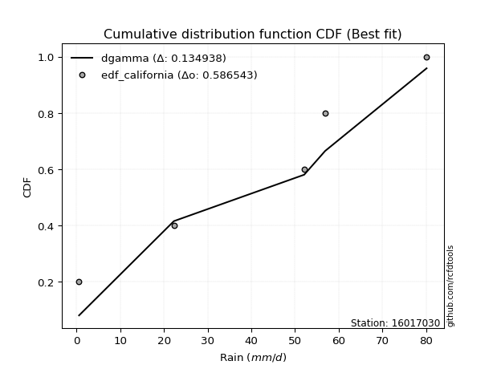</img>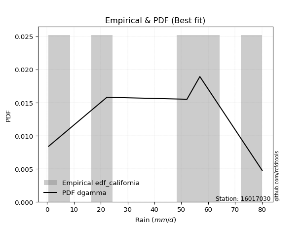</img>

</div>


### 2. EDF Hazen (1930)

Hazen method for plotting positions is a formula used to estimate the empirical cumulative probability distribution of flood events or other hydrological data. This formula often results in biased estimations, particularly when extrapolating to extreme events (high return periods).

<div align="center">


$P=(m-0.5)/n$


</div>


**2.1. Empirical values**

<div align="center">

|                | 0                  | 1                  | 2         | 3                 | 4                  |
|:---------------|:-------------------|:-------------------|:----------|:------------------|:-------------------|
| date           | 2012               | 2009               | 2011      | 2008              | 2010               |
| x              | 0.6                | 22.3               | 52.1      | 56.9              | 80.1               |
| m              | 1                  | 2                  | 3         | 4                 | 5                  |
| empirical_dist | edf_hazen          | edf_hazen          | edf_hazen | edf_hazen         | edf_hazen          |
| empirical      | 0.1                | 0.3                | 0.5       | 0.7               | 0.9                |
| empirical_tr   | 1.1111111111111112 | 1.4285714285714286 | 2.0       | 3.333333333333333 | 10.000000000000002 |

</div>


**2.2. Kolmogorov-Smirnov fit test (sorted by Δ)**


<div align="center">

|                | 0                   | 1                   | 2                  | 3                   | 4                   | 5                   | 6                   | 7                   | 8                  | 9                   | 10                  | 11                  | 12                  | 13                  | 14                  | 15                  | 16                  | 17                  | 18                  | 19                 | 20                  | 21                  | 22                  | 23                 | 24                 | 25                  | 26                  | 27                  | 28                  | 29                  | 30                  | 31                  | 32                  | 33                  | 34                  | 35                  | 36                 | 37                 | 38                 | 39                  | 40                  | 41                 | 42                 | 43                 | 44                 | 45                  | 46                 | 47                  | 48                 | 49                  | 50                  | 51                  | 52                  | 53                  | 54                  | 55                  | 56                  | 57                  | 58                  | 59                  | 60                 | 61                  | 62                  | 63                  | 64                 | 65                  | 66                  | 67                 | 68                  | 69                  | 70                 | 71                  | 72                  | 73                 | 74                  | 75                 | 76                  | 77                  | 78                 | 79                  | 80                 | 81                  | 82                  | 83                 | 84                 | 85                  | 86                 | 87                  | 88                  | 89                  | 90                  | 91                 | 92                 | 93                  | 94                  | 95                 | 96                 | 97                 | 98                  | 99                  | 100                | 101                 | 102                 | 103                 | 104                | 105                 | 106                | 107                 | 108                | 109                 | 110                 | 111                | 112                | 113                | 114                | 115                 | 116                 | 117                 | 118                 | 119                 | 120                | 121                 | 122                 | 123                 | 124                 | 125                | 126                 | 127                 | 128                | 129                 | 130                 | 131                 | 132                | 133                 | 134                | 135                 | 136                 | 137                | 138                | 139                | 140                | 141                | 142                | 143                | 144                | 145                | 146                | 147                | 148                | 149                | 150                | 151                | 152                | 153                | 154                | 155                | 156                | 157                | 158                | 159                |
|:---------------|:--------------------|:--------------------|:-------------------|:--------------------|:--------------------|:--------------------|:--------------------|:--------------------|:-------------------|:--------------------|:--------------------|:--------------------|:--------------------|:--------------------|:--------------------|:--------------------|:--------------------|:--------------------|:--------------------|:-------------------|:--------------------|:--------------------|:--------------------|:-------------------|:-------------------|:--------------------|:--------------------|:--------------------|:--------------------|:--------------------|:--------------------|:--------------------|:--------------------|:--------------------|:--------------------|:--------------------|:-------------------|:-------------------|:-------------------|:--------------------|:--------------------|:-------------------|:-------------------|:-------------------|:-------------------|:--------------------|:-------------------|:--------------------|:-------------------|:--------------------|:--------------------|:--------------------|:--------------------|:--------------------|:--------------------|:--------------------|:--------------------|:--------------------|:--------------------|:--------------------|:-------------------|:--------------------|:--------------------|:--------------------|:-------------------|:--------------------|:--------------------|:-------------------|:--------------------|:--------------------|:-------------------|:--------------------|:--------------------|:-------------------|:--------------------|:-------------------|:--------------------|:--------------------|:-------------------|:--------------------|:-------------------|:--------------------|:--------------------|:-------------------|:-------------------|:--------------------|:-------------------|:--------------------|:--------------------|:--------------------|:--------------------|:-------------------|:-------------------|:--------------------|:--------------------|:-------------------|:-------------------|:-------------------|:--------------------|:--------------------|:-------------------|:--------------------|:--------------------|:--------------------|:-------------------|:--------------------|:-------------------|:--------------------|:-------------------|:--------------------|:--------------------|:-------------------|:-------------------|:-------------------|:-------------------|:--------------------|:--------------------|:--------------------|:--------------------|:--------------------|:-------------------|:--------------------|:--------------------|:--------------------|:--------------------|:-------------------|:--------------------|:--------------------|:-------------------|:--------------------|:--------------------|:--------------------|:-------------------|:--------------------|:-------------------|:--------------------|:--------------------|:-------------------|:-------------------|:-------------------|:-------------------|:-------------------|:-------------------|:-------------------|:-------------------|:-------------------|:-------------------|:-------------------|:-------------------|:-------------------|:-------------------|:-------------------|:-------------------|:-------------------|:-------------------|:-------------------|:-------------------|:-------------------|:-------------------|:-------------------|
| station        | 16017030            | 16017030            | 16017030           | 16017030            | 16017030            | 16017030            | 16017030            | 16017030            | 16017030           | 16017030            | 16017030            | 16017030            | 16017030            | 16017030            | 16017030            | 16017030            | 16017030            | 16017030            | 16017030            | 16017030           | 16017030            | 16017030            | 16017030            | 16017030           | 16017030           | 16017030            | 16017030            | 16017030            | 16017030            | 16017030            | 16017030            | 16017030            | 16017030            | 16017030            | 16017030            | 16017030            | 16017030           | 16017030           | 16017030           | 16017030            | 16017030            | 16017030           | 16017030           | 16017030           | 16017030           | 16017030            | 16017030           | 16017030            | 16017030           | 16017030            | 16017030            | 16017030            | 16017030            | 16017030            | 16017030            | 16017030            | 16017030            | 16017030            | 16017030            | 16017030            | 16017030           | 16017030            | 16017030            | 16017030            | 16017030           | 16017030            | 16017030            | 16017030           | 16017030            | 16017030            | 16017030           | 16017030            | 16017030            | 16017030           | 16017030            | 16017030           | 16017030            | 16017030            | 16017030           | 16017030            | 16017030           | 16017030            | 16017030            | 16017030           | 16017030           | 16017030            | 16017030           | 16017030            | 16017030            | 16017030            | 16017030            | 16017030           | 16017030           | 16017030            | 16017030            | 16017030           | 16017030           | 16017030           | 16017030            | 16017030            | 16017030           | 16017030            | 16017030            | 16017030            | 16017030           | 16017030            | 16017030           | 16017030            | 16017030           | 16017030            | 16017030            | 16017030           | 16017030           | 16017030           | 16017030           | 16017030            | 16017030            | 16017030            | 16017030            | 16017030            | 16017030           | 16017030            | 16017030            | 16017030            | 16017030            | 16017030           | 16017030            | 16017030            | 16017030           | 16017030            | 16017030            | 16017030            | 16017030           | 16017030            | 16017030           | 16017030            | 16017030            | 16017030           | 16017030           | 16017030           | 16017030           | 16017030           | 16017030           | 16017030           | 16017030           | 16017030           | 16017030           | 16017030           | 16017030           | 16017030           | 16017030           | 16017030           | 16017030           | 16017030           | 16017030           | 16017030           | 16017030           | 16017030           | 16017030           | 16017030           |
| empirical_dist | edf_hazen           | edf_hazen           | edf_hazen          | edf_hazen           | edf_hazen           | edf_hazen           | edf_hazen           | edf_hazen           | edf_hazen          | edf_hazen           | edf_hazen           | edf_hazen           | edf_hazen           | edf_hazen           | edf_hazen           | edf_hazen           | edf_hazen           | edf_hazen           | edf_hazen           | edf_hazen          | edf_hazen           | edf_hazen           | edf_hazen           | edf_hazen          | edf_hazen          | edf_hazen           | edf_hazen           | edf_hazen           | edf_hazen           | edf_hazen           | edf_hazen           | edf_hazen           | edf_hazen           | edf_hazen           | edf_hazen           | edf_hazen           | edf_hazen          | edf_hazen          | edf_hazen          | edf_hazen           | edf_hazen           | edf_hazen          | edf_hazen          | edf_hazen          | edf_hazen          | edf_hazen           | edf_hazen          | edf_hazen           | edf_hazen          | edf_hazen           | edf_hazen           | edf_hazen           | edf_hazen           | edf_hazen           | edf_hazen           | edf_hazen           | edf_hazen           | edf_hazen           | edf_hazen           | edf_hazen           | edf_hazen          | edf_hazen           | edf_hazen           | edf_hazen           | edf_hazen          | edf_hazen           | edf_hazen           | edf_hazen          | edf_hazen           | edf_hazen           | edf_hazen          | edf_hazen           | edf_hazen           | edf_hazen          | edf_hazen           | edf_hazen          | edf_hazen           | edf_hazen           | edf_hazen          | edf_hazen           | edf_hazen          | edf_hazen           | edf_hazen           | edf_hazen          | edf_hazen          | edf_hazen           | edf_hazen          | edf_hazen           | edf_hazen           | edf_hazen           | edf_hazen           | edf_hazen          | edf_hazen          | edf_hazen           | edf_hazen           | edf_hazen          | edf_hazen          | edf_hazen          | edf_hazen           | edf_hazen           | edf_hazen          | edf_hazen           | edf_hazen           | edf_hazen           | edf_hazen          | edf_hazen           | edf_hazen          | edf_hazen           | edf_hazen          | edf_hazen           | edf_hazen           | edf_hazen          | edf_hazen          | edf_hazen          | edf_hazen          | edf_hazen           | edf_hazen           | edf_hazen           | edf_hazen           | edf_hazen           | edf_hazen          | edf_hazen           | edf_hazen           | edf_hazen           | edf_hazen           | edf_hazen          | edf_hazen           | edf_hazen           | edf_hazen          | edf_hazen           | edf_hazen           | edf_hazen           | edf_hazen          | edf_hazen           | edf_hazen          | edf_hazen           | edf_hazen           | edf_hazen          | edf_hazen          | edf_hazen          | edf_hazen          | edf_hazen          | edf_hazen          | edf_hazen          | edf_hazen          | edf_hazen          | edf_hazen          | edf_hazen          | edf_hazen          | edf_hazen          | edf_hazen          | edf_hazen          | edf_hazen          | edf_hazen          | edf_hazen          | edf_hazen          | edf_hazen          | edf_hazen          | edf_hazen          | edf_hazen          |
| p_dist         | argus               | johnsonsu           | trapezoid          | genlogistic         | triang              | skewnorm            | wrapcauchy          | beta                | arcsine            | genpareto           | gumbel_l            | ksone               | loggenpareto        | dweibull            | semicircular        | genhalflogistic     | dgamma              | anglit              | weibull_min         | pearson3           | loggenextreme       | exponnorm           | crystalball         | norm               | t                  | foldnorm            | gompertz            | betaprime           | vonmises_line       | erlang              | gamma               | tukeylambda         | cosine              | kappa4              | kappa3              | uniform             | logpearson3        | rice               | f                  | bradford            | logistic            | invgamma           | maxwell            | invgauss           | loglevy_l          | logvonmises_line    | burr12             | gennorm             | hypsecant          | rayleigh            | loggumbel_l         | gausshyper          | loggausshyper       | truncweibull_min    | ncf                 | logt                | logtrapezoid        | kstwobign           | halfnorm            | burr                | laplace            | gumbel_r            | loggennorm          | levy_l              | genexpon           | loggompertz         | halflogistic        | truncexpon         | logarcsine          | moyal               | logargus           | logsemicircular     | loganglit           | genextreme         | logfoldnorm         | lognorm            | logexponnorm        | lognakagami         | lognct             | loglogistic         | logdgamma          | logrice             | logerlang           | logloggamma        | logdweibull        | logweibull_max      | loghypsecant       | loggamma            | loggamma            | loginvgamma         | logwrapcauchy       | logalpha           | loginvgauss        | loginvweibull       | logmaxwell          | lomax              | loglaplace         | loglaplace         | lograyleigh         | loggengamma         | exponweib          | wald                | logburr12           | logexponweib        | logcosine          | loglomax            | logkstwobign       | loggumbel_r         | loghalfnorm        | logncf              | loggenexpon         | mielke             | loggenhalflogistic | logburr            | gengamma           | logmoyal            | loghalflogistic     | nct                 | logbeta             | logskewnorm         | logtriang          | logloglaplace       | logkappa3           | logtruncweibull_min | loghalfgennorm      | logwald            | logksone            | logf                | halfgennorm        | loguniform          | logbradford         | logtruncnorm        | logkappa4          | johnsonsb           | logmielke          | logweibull_min      | logjohnsonsu        | invweibull         | fatiguelife        | logtruncexpon      | nakagami           | logbetaprime       | logfatiguelife     | logtukeylambda     | logjohnsonsb       | powerlaw           | truncpareto        | weibull_max        | logexponpow        | exponpow           | logtruncpareto     | alpha              | truncnorm          | logpowerlaw        | rdist              | loggenlogistic     | logrdist           | logvonmises        | vonmises           | logcrystalball     |
| delta          | 0.08599981585304467 | 0.08638672449185214 | 0.0869967173688736 | 0.09163604125192423 | 0.09798819493395139 | 0.09999953594168409 | 0.09999999728648401 | 0.09999999999340825 | 0.1                | 0.10010311082745538 | 0.10054724119372255 | 0.10055992345576747 | 0.10663096642223624 | 0.10723934224784343 | 0.11031996186219506 | 0.11231323770798485 | 0.11558404140318079 | 0.11795524359209109 | 0.12346364729723258 | 0.1241103761945126 | 0.12482896555491685 | 0.13621046967992034 | 0.13621124187243083 | 0.136211248449843  | 0.136211533386686  | 0.13734071711148343 | 0.13888260442252454 | 0.14099005946495058 | 0.14117467511527348 | 0.14249447513523017 | 0.14272524323794722 | 0.14491623908997298 | 0.14541585355741016 | 0.14554530679858135 | 0.14770676896669677 | 0.14779874213836475 | 0.1493994932248497 | 0.1496532832544999 | 0.1507828766371978 | 0.15255956904761414 | 0.15290579655501668 | 0.1547519878164878 | 0.1592866304806806 | 0.1604045513738266 | 0.1609196543059086 | 0.16242125903860705 | 0.1634588739778574 | 0.16590612511889838 | 0.1660820675568807 | 0.16628458327202789 | 0.17071128055389706 | 0.17290727136427875 | 0.17476811675543413 | 0.17591545854952462 | 0.17647767460758024 | 0.17882129214749715 | 0.18280809725895036 | 0.18310557378067316 | 0.18648475056568048 | 0.19063358516790163 | 0.1944947093874868 | 0.19826370524031234 | 0.19999999984651184 | 0.20008232656440605 | 0.2085393877039854 | 0.21193105389240485 | 0.21476996377034507 | 0.2154159482052841 | 0.21655982340560376 | 0.21896812594025206 | 0.2194036074109469 | 0.21947422808505096 | 0.22091058021346682 | 0.221652333359118  | 0.22337684774072364 | 0.2243959095232581 | 0.22439623178823126 | 0.22486553773556844 | 0.2251822827581212 | 0.22771798590696096 | 0.2280491927789221 | 0.23156925068287743 | 0.23431686153045134 | 0.235022040421914  | 0.238716960255569  | 0.23943548009224647 | 0.2395448546670489 | 0.23977611941477578 | 0.23977611941477578 | 0.24011021399322635 | 0.24153591597925433 | 0.2447366970871911 | 0.2469205064060463 | 0.25511780533384426 | 0.25631062833564705 | 0.2604196405638325 | 0.2643733064928817 | 0.2643733064928817 | 0.26675358191099857 | 0.26811984441991676 | 0.2760273508029141 | 0.27728306113016565 | 0.28257843134329763 | 0.28566118504236754 | 0.2888375635075204 | 0.29150796497416215 | 0.2921462065438372 | 0.29506688168608225 | 0.2961532875079674 | 0.29683677372955647 | 0.29992234126453826 | 0.3050632710402237 | 0.3087628973992559 | 0.3094789698716824 | 0.3201693655965739 | 0.32058212797754254 | 0.32240975478006256 | 0.32530110729809364 | 0.34085665571014867 | 0.35005865958464977 | 0.3586134154811782 | 0.36285195577268486 | 0.37207977045059887 | 0.3763852535156602  | 0.38649220363270714 | 0.3914331702334513 | 0.39894042665476376 | 0.40344057563731167 | 0.4035661416527932 | 0.43872851198571644 | 0.43989843573866166 | 0.44140784123137916 | 0.4427554520533136 | 0.44474888654678046 | 0.4489864933629946 | 0.45847752208229814 | 0.47435408574628124 | 0.4847245126126542 | 0.4897956531559578 | 0.5007301658025949 | 0.5239407463101107 | 0.5351341066528912 | 0.5393636531455834 | 0.5429672623736124 | 0.5534309583156534 | 0.5604352451334997 | 0.56626816449449   | 0.5941210070569689 | 0.5959445017082259 | 0.6155281275040649 | 0.6403589307919562 | 0.6521781930040143 | 0.6608174043728525 | 0.6617201448528274 | 0.6999999997861919 | 0.7                | 0.7                | 0.8943636806897808 | 12.186921413595256 | nan                |
| deltao         | 0.5865427407550001  | 0.5865427407550001  | 0.5865427407550001 | 0.5865427407550001  | 0.5865427407550001  | 0.5865427407550001  | 0.5865427407550001  | 0.5865427407550001  | 0.5865427407550001 | 0.5865427407550001  | 0.5865427407550001  | 0.5865427407550001  | 0.5865427407550001  | 0.5865427407550001  | 0.5865427407550001  | 0.5865427407550001  | 0.5865427407550001  | 0.5865427407550001  | 0.5865427407550001  | 0.5865427407550001 | 0.5865427407550001  | 0.5865427407550001  | 0.5865427407550001  | 0.5865427407550001 | 0.5865427407550001 | 0.5865427407550001  | 0.5865427407550001  | 0.5865427407550001  | 0.5865427407550001  | 0.5865427407550001  | 0.5865427407550001  | 0.5865427407550001  | 0.5865427407550001  | 0.5865427407550001  | 0.5865427407550001  | 0.5865427407550001  | 0.5865427407550001 | 0.5865427407550001 | 0.5865427407550001 | 0.5865427407550001  | 0.5865427407550001  | 0.5865427407550001 | 0.5865427407550001 | 0.5865427407550001 | 0.5865427407550001 | 0.5865427407550001  | 0.5865427407550001 | 0.5865427407550001  | 0.5865427407550001 | 0.5865427407550001  | 0.5865427407550001  | 0.5865427407550001  | 0.5865427407550001  | 0.5865427407550001  | 0.5865427407550001  | 0.5865427407550001  | 0.5865427407550001  | 0.5865427407550001  | 0.5865427407550001  | 0.5865427407550001  | 0.5865427407550001 | 0.5865427407550001  | 0.5865427407550001  | 0.5865427407550001  | 0.5865427407550001 | 0.5865427407550001  | 0.5865427407550001  | 0.5865427407550001 | 0.5865427407550001  | 0.5865427407550001  | 0.5865427407550001 | 0.5865427407550001  | 0.5865427407550001  | 0.5865427407550001 | 0.5865427407550001  | 0.5865427407550001 | 0.5865427407550001  | 0.5865427407550001  | 0.5865427407550001 | 0.5865427407550001  | 0.5865427407550001 | 0.5865427407550001  | 0.5865427407550001  | 0.5865427407550001 | 0.5865427407550001 | 0.5865427407550001  | 0.5865427407550001 | 0.5865427407550001  | 0.5865427407550001  | 0.5865427407550001  | 0.5865427407550001  | 0.5865427407550001 | 0.5865427407550001 | 0.5865427407550001  | 0.5865427407550001  | 0.5865427407550001 | 0.5865427407550001 | 0.5865427407550001 | 0.5865427407550001  | 0.5865427407550001  | 0.5865427407550001 | 0.5865427407550001  | 0.5865427407550001  | 0.5865427407550001  | 0.5865427407550001 | 0.5865427407550001  | 0.5865427407550001 | 0.5865427407550001  | 0.5865427407550001 | 0.5865427407550001  | 0.5865427407550001  | 0.5865427407550001 | 0.5865427407550001 | 0.5865427407550001 | 0.5865427407550001 | 0.5865427407550001  | 0.5865427407550001  | 0.5865427407550001  | 0.5865427407550001  | 0.5865427407550001  | 0.5865427407550001 | 0.5865427407550001  | 0.5865427407550001  | 0.5865427407550001  | 0.5865427407550001  | 0.5865427407550001 | 0.5865427407550001  | 0.5865427407550001  | 0.5865427407550001 | 0.5865427407550001  | 0.5865427407550001  | 0.5865427407550001  | 0.5865427407550001 | 0.5865427407550001  | 0.5865427407550001 | 0.5865427407550001  | 0.5865427407550001  | 0.5865427407550001 | 0.5865427407550001 | 0.5865427407550001 | 0.5865427407550001 | 0.5865427407550001 | 0.5865427407550001 | 0.5865427407550001 | 0.5865427407550001 | 0.5865427407550001 | 0.5865427407550001 | 0.5865427407550001 | 0.5865427407550001 | 0.5865427407550001 | 0.5865427407550001 | 0.5865427407550001 | 0.5865427407550001 | 0.5865427407550001 | 0.5865427407550001 | 0.5865427407550001 | 0.5865427407550001 | 0.5865427407550001 | 0.5865427407550001 | 0.5865427407550001 |
| eval           | Δo > Δ              | Δo > Δ              | Δo > Δ             | Δo > Δ              | Δo > Δ              | Δo > Δ              | Δo > Δ              | Δo > Δ              | Δo > Δ             | Δo > Δ              | Δo > Δ              | Δo > Δ              | Δo > Δ              | Δo > Δ              | Δo > Δ              | Δo > Δ              | Δo > Δ              | Δo > Δ              | Δo > Δ              | Δo > Δ             | Δo > Δ              | Δo > Δ              | Δo > Δ              | Δo > Δ             | Δo > Δ             | Δo > Δ              | Δo > Δ              | Δo > Δ              | Δo > Δ              | Δo > Δ              | Δo > Δ              | Δo > Δ              | Δo > Δ              | Δo > Δ              | Δo > Δ              | Δo > Δ              | Δo > Δ             | Δo > Δ             | Δo > Δ             | Δo > Δ              | Δo > Δ              | Δo > Δ             | Δo > Δ             | Δo > Δ             | Δo > Δ             | Δo > Δ              | Δo > Δ             | Δo > Δ              | Δo > Δ             | Δo > Δ              | Δo > Δ              | Δo > Δ              | Δo > Δ              | Δo > Δ              | Δo > Δ              | Δo > Δ              | Δo > Δ              | Δo > Δ              | Δo > Δ              | Δo > Δ              | Δo > Δ             | Δo > Δ              | Δo > Δ              | Δo > Δ              | Δo > Δ             | Δo > Δ              | Δo > Δ              | Δo > Δ             | Δo > Δ              | Δo > Δ              | Δo > Δ             | Δo > Δ              | Δo > Δ              | Δo > Δ             | Δo > Δ              | Δo > Δ             | Δo > Δ              | Δo > Δ              | Δo > Δ             | Δo > Δ              | Δo > Δ             | Δo > Δ              | Δo > Δ              | Δo > Δ             | Δo > Δ             | Δo > Δ              | Δo > Δ             | Δo > Δ              | Δo > Δ              | Δo > Δ              | Δo > Δ              | Δo > Δ             | Δo > Δ             | Δo > Δ              | Δo > Δ              | Δo > Δ             | Δo > Δ             | Δo > Δ             | Δo > Δ              | Δo > Δ              | Δo > Δ             | Δo > Δ              | Δo > Δ              | Δo > Δ              | Δo > Δ             | Δo > Δ              | Δo > Δ             | Δo > Δ              | Δo > Δ             | Δo > Δ              | Δo > Δ              | Δo > Δ             | Δo > Δ             | Δo > Δ             | Δo > Δ             | Δo > Δ              | Δo > Δ              | Δo > Δ              | Δo > Δ              | Δo > Δ              | Δo > Δ             | Δo > Δ              | Δo > Δ              | Δo > Δ              | Δo > Δ              | Δo > Δ             | Δo > Δ              | Δo > Δ              | Δo > Δ             | Δo > Δ              | Δo > Δ              | Δo > Δ              | Δo > Δ             | Δo > Δ              | Δo > Δ             | Δo > Δ              | Δo > Δ              | Δo > Δ             | Δo > Δ             | Δo > Δ             | Δo > Δ             | Δo > Δ             | Δo > Δ             | Δo > Δ             | Δo > Δ             | Δo > Δ             | Δo > Δ             | Δo <= Δ            | Δo <= Δ            | Δo <= Δ            | Δo <= Δ            | Δo <= Δ            | Δo <= Δ            | Δo <= Δ            | Δo <= Δ            | Δo <= Δ            | Δo <= Δ            | Δo <= Δ            | Δo <= Δ            | Δo <= Δ            |
| fit            | 1                   | 1                   | 1                  | 1                   | 1                   | 1                   | 1                   | 1                   | 1                  | 1                   | 1                   | 1                   | 1                   | 1                   | 1                   | 1                   | 1                   | 1                   | 1                   | 1                  | 1                   | 1                   | 1                   | 1                  | 1                  | 1                   | 1                   | 1                   | 1                   | 1                   | 1                   | 1                   | 1                   | 1                   | 1                   | 1                   | 1                  | 1                  | 1                  | 1                   | 1                   | 1                  | 1                  | 1                  | 1                  | 1                   | 1                  | 1                   | 1                  | 1                   | 1                   | 1                   | 1                   | 1                   | 1                   | 1                   | 1                   | 1                   | 1                   | 1                   | 1                  | 1                   | 1                   | 1                   | 1                  | 1                   | 1                   | 1                  | 1                   | 1                   | 1                  | 1                   | 1                   | 1                  | 1                   | 1                  | 1                   | 1                   | 1                  | 1                   | 1                  | 1                   | 1                   | 1                  | 1                  | 1                   | 1                  | 1                   | 1                   | 1                   | 1                   | 1                  | 1                  | 1                   | 1                   | 1                  | 1                  | 1                  | 1                   | 1                   | 1                  | 1                   | 1                   | 1                   | 1                  | 1                   | 1                  | 1                   | 1                  | 1                   | 1                   | 1                  | 1                  | 1                  | 1                  | 1                   | 1                   | 1                   | 1                   | 1                   | 1                  | 1                   | 1                   | 1                   | 1                   | 1                  | 1                   | 1                   | 1                  | 1                   | 1                   | 1                   | 1                  | 1                   | 1                  | 1                   | 1                   | 1                  | 1                  | 1                  | 1                  | 1                  | 1                  | 1                  | 1                  | 1                  | 1                  | 0                  | 0                  | 0                  | 0                  | 0                  | 0                  | 0                  | 0                  | 0                  | 0                  | 0                  | 0                  | 0                  |
| n              | 5                   | 5                   | 5                  | 5                   | 5                   | 5                   | 5                   | 5                   | 5                  | 5                   | 5                   | 5                   | 5                   | 5                   | 5                   | 5                   | 5                   | 5                   | 5                   | 5                  | 5                   | 5                   | 5                   | 5                  | 5                  | 5                   | 5                   | 5                   | 5                   | 5                   | 5                   | 5                   | 5                   | 5                   | 5                   | 5                   | 5                  | 5                  | 5                  | 5                   | 5                   | 5                  | 5                  | 5                  | 5                  | 5                   | 5                  | 5                   | 5                  | 5                   | 5                   | 5                   | 5                   | 5                   | 5                   | 5                   | 5                   | 5                   | 5                   | 5                   | 5                  | 5                   | 5                   | 5                   | 5                  | 5                   | 5                   | 5                  | 5                   | 5                   | 5                  | 5                   | 5                   | 5                  | 5                   | 5                  | 5                   | 5                   | 5                  | 5                   | 5                  | 5                   | 5                   | 5                  | 5                  | 5                   | 5                  | 5                   | 5                   | 5                   | 5                   | 5                  | 5                  | 5                   | 5                   | 5                  | 5                  | 5                  | 5                   | 5                   | 5                  | 5                   | 5                   | 5                   | 5                  | 5                   | 5                  | 5                   | 5                  | 5                   | 5                   | 5                  | 5                  | 5                  | 5                  | 5                   | 5                   | 5                   | 5                   | 5                   | 5                  | 5                   | 5                   | 5                   | 5                   | 5                  | 5                   | 5                   | 5                  | 5                   | 5                   | 5                   | 5                  | 5                   | 5                  | 5                   | 5                   | 5                  | 5                  | 5                  | 5                  | 5                  | 5                  | 5                  | 5                  | 5                  | 5                  | 5                  | 5                  | 5                  | 5                  | 5                  | 5                  | 5                  | 5                  | 5                  | 5                  | 5                  | 5                  | 5                  |
| best_fit       | 1                   | 0                   | 0                  | 0                   | 0                   | 0                   | 0                   | 0                   | 0                  | 0                   | 0                   | 0                   | 0                   | 0                   | 0                   | 0                   | 0                   | 0                   | 0                   | 0                  | 0                   | 0                   | 0                   | 0                  | 0                  | 0                   | 0                   | 0                   | 0                   | 0                   | 0                   | 0                   | 0                   | 0                   | 0                   | 0                   | 0                  | 0                  | 0                  | 0                   | 0                   | 0                  | 0                  | 0                  | 0                  | 0                   | 0                  | 0                   | 0                  | 0                   | 0                   | 0                   | 0                   | 0                   | 0                   | 0                   | 0                   | 0                   | 0                   | 0                   | 0                  | 0                   | 0                   | 0                   | 0                  | 0                   | 0                   | 0                  | 0                   | 0                   | 0                  | 0                   | 0                   | 0                  | 0                   | 0                  | 0                   | 0                   | 0                  | 0                   | 0                  | 0                   | 0                   | 0                  | 0                  | 0                   | 0                  | 0                   | 0                   | 0                   | 0                   | 0                  | 0                  | 0                   | 0                   | 0                  | 0                  | 0                  | 0                   | 0                   | 0                  | 0                   | 0                   | 0                   | 0                  | 0                   | 0                  | 0                   | 0                  | 0                   | 0                   | 0                  | 0                  | 0                  | 0                  | 0                   | 0                   | 0                   | 0                   | 0                   | 0                  | 0                   | 0                   | 0                   | 0                   | 0                  | 0                   | 0                   | 0                  | 0                   | 0                   | 0                   | 0                  | 0                   | 0                  | 0                   | 0                   | 0                  | 0                  | 0                  | 0                  | 0                  | 0                  | 0                  | 0                  | 0                  | 0                  | 0                  | 0                  | 0                  | 0                  | 0                  | 0                  | 0                  | 0                  | 0                  | 0                  | 0                  | 0                  | 0                  |
| best_fit_sort  | 1                   | 2                   | 3                  | 4                   | 5                   | 6                   | 7                   | 8                   | 9                  | 10                  | 11                  | 12                  | 13                  | 14                  | 15                  | 16                  | 17                  | 18                  | 19                  | 20                 | 21                  | 22                  | 23                  | 24                 | 25                 | 26                  | 27                  | 28                  | 29                  | 30                  | 31                  | 32                  | 33                  | 34                  | 35                  | 36                  | 37                 | 38                 | 39                 | 40                  | 41                  | 42                 | 43                 | 44                 | 45                 | 46                  | 47                 | 48                  | 49                 | 50                  | 51                  | 52                  | 53                  | 54                  | 55                  | 56                  | 57                  | 58                  | 59                  | 60                  | 61                 | 62                  | 63                  | 64                  | 65                 | 66                  | 67                  | 68                 | 69                  | 70                  | 71                 | 72                  | 73                  | 74                 | 75                  | 76                 | 77                  | 78                  | 79                 | 80                  | 81                 | 82                  | 83                  | 84                 | 85                 | 86                  | 87                 | 88                  | 89                  | 90                  | 91                  | 92                 | 93                 | 94                  | 95                  | 96                 | 97                 | 98                 | 99                  | 100                 | 101                | 102                 | 103                 | 104                 | 105                | 106                 | 107                | 108                 | 109                | 110                 | 111                 | 112                | 113                | 114                | 115                | 116                 | 117                 | 118                 | 119                 | 120                 | 121                | 122                 | 123                 | 124                 | 125                 | 126                | 127                 | 128                 | 129                | 130                 | 131                 | 132                 | 133                | 134                 | 135                | 136                 | 137                 | 138                | 139                | 140                | 141                | 142                | 143                | 144                | 145                | 146                | 147                | 148                | 149                | 150                | 151                | 152                | 153                | 154                | 155                | 156                | 157                | 158                | 159                | 160                |

</div>


**2.3. Best fit**

<div align="center">

|   id |   station | empirical_dist   | p_dist   |     delta |   deltao | eval   |   fit |   n |   best_fit |   best_fit_sort |
|-----:|----------:|:-----------------|:---------|----------:|---------:|:-------|------:|----:|-----------:|----------------:|
|    0 |  16017030 | edf_hazen        | argus    | 0.0859998 | 0.586543 | Δo > Δ |     1 |   5 |          1 |               1 |

</div>


<div align="center">

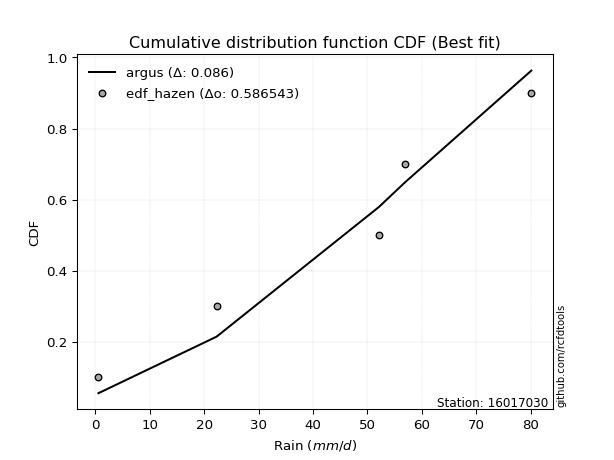</img>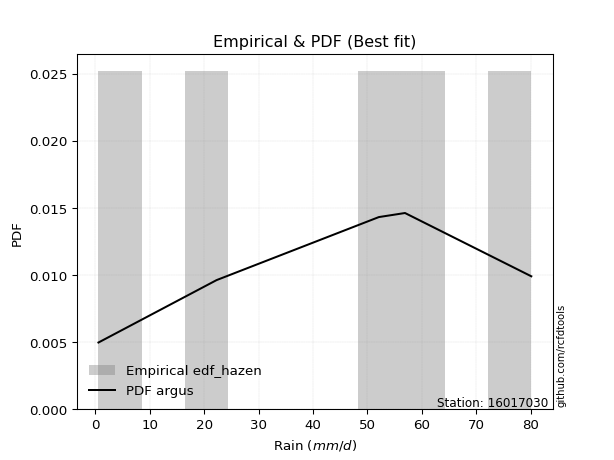</img>

</div>


### 3. EDF Weibull (1939)

Weibull plotting position formula is an empirical method used to estimate the non-exceedance probability or plotting position for a set of observed data, is often recommended or widely used in practice, particularly in flood frequency analysis.

<div align="center">


$P=m/(n+1)$


</div>


**3.1. Empirical values**

<div align="center">

|                | 0                   | 1                  | 2           | 3                  | 4                  |
|:---------------|:--------------------|:-------------------|:------------|:-------------------|:-------------------|
| date           | 2012                | 2009               | 2011        | 2008               | 2010               |
| x              | 0.6                 | 22.3               | 52.1        | 56.9               | 80.1               |
| m              | 1                   | 2                  | 3           | 4                  | 5                  |
| empirical_dist | edf_weibull         | edf_weibull        | edf_weibull | edf_weibull        | edf_weibull        |
| empirical      | 0.16666666666666666 | 0.3333333333333333 | 0.5         | 0.6666666666666666 | 0.8333333333333334 |
| empirical_tr   | 1.2                 | 1.4999999999999998 | 2.0         | 2.9999999999999996 | 6.000000000000002  |

</div>


**3.2. Kolmogorov-Smirnov fit test (sorted by Δ)**


<div align="center">

|                | 0                   | 1                   | 2                   | 3                   | 4                   | 5                  | 6                   | 7                   | 8                   | 9                   | 10                  | 11                  | 12                  | 13                  | 14                 | 15                 | 16                  | 17                  | 18                  | 19                  | 20                  | 21                 | 22                  | 23                 | 24                  | 25                  | 26                 | 27                 | 28                 | 29                  | 30                 | 31                  | 32                 | 33                  | 34                  | 35                 | 36                  | 37                  | 38                  | 39                  | 40                  | 41                  | 42                  | 43                 | 44                  | 45                  | 46                  | 47                  | 48                 | 49                  | 50                  | 51                  | 52                  | 53                  | 54                  | 55                  | 56                  | 57                  | 58                  | 59                  | 60                  | 61                  | 62                 | 63                  | 64                  | 65                 | 66                  | 67                 | 68                  | 69                  | 70                  | 71                  | 72                  | 73                 | 74                  | 75                  | 76                 | 77                 | 78                 | 79                 | 80                  | 81                  | 82                  | 83                  | 84                  | 85                 | 86                  | 87                  | 88                 | 89                  | 90                  | 91                  | 92                 | 93                 | 94                  | 95                  | 96                 | 97                  | 98                 | 99                 | 100                 | 101                | 102                | 103                | 104                | 105                 | 106                 | 107                | 108                | 109                 | 110                 | 111                 | 112                 | 113                | 114                 | 115                | 116                | 117                 | 118                | 119                 | 120                 | 121                 | 122                | 123                | 124                | 125                 | 126                 | 127                 | 128                 | 129                 | 130                 | 131                 | 132                | 133                | 134                | 135                 | 136                | 137                | 138                | 139                | 140                | 141                | 142                | 143                | 144                | 145                | 146                | 147                | 148                | 149                | 150                | 151                | 152                | 153                | 154                | 155                | 156                | 157                | 158                | 159                |
|:---------------|:--------------------|:--------------------|:--------------------|:--------------------|:--------------------|:-------------------|:--------------------|:--------------------|:--------------------|:--------------------|:--------------------|:--------------------|:--------------------|:--------------------|:-------------------|:-------------------|:--------------------|:--------------------|:--------------------|:--------------------|:--------------------|:-------------------|:--------------------|:-------------------|:--------------------|:--------------------|:-------------------|:-------------------|:-------------------|:--------------------|:-------------------|:--------------------|:-------------------|:--------------------|:--------------------|:-------------------|:--------------------|:--------------------|:--------------------|:--------------------|:--------------------|:--------------------|:--------------------|:-------------------|:--------------------|:--------------------|:--------------------|:--------------------|:-------------------|:--------------------|:--------------------|:--------------------|:--------------------|:--------------------|:--------------------|:--------------------|:--------------------|:--------------------|:--------------------|:--------------------|:--------------------|:--------------------|:-------------------|:--------------------|:--------------------|:-------------------|:--------------------|:-------------------|:--------------------|:--------------------|:--------------------|:--------------------|:--------------------|:-------------------|:--------------------|:--------------------|:-------------------|:-------------------|:-------------------|:-------------------|:--------------------|:--------------------|:--------------------|:--------------------|:--------------------|:-------------------|:--------------------|:--------------------|:-------------------|:--------------------|:--------------------|:--------------------|:-------------------|:-------------------|:--------------------|:--------------------|:-------------------|:--------------------|:-------------------|:-------------------|:--------------------|:-------------------|:-------------------|:-------------------|:-------------------|:--------------------|:--------------------|:-------------------|:-------------------|:--------------------|:--------------------|:--------------------|:--------------------|:-------------------|:--------------------|:-------------------|:-------------------|:--------------------|:-------------------|:--------------------|:--------------------|:--------------------|:-------------------|:-------------------|:-------------------|:--------------------|:--------------------|:--------------------|:--------------------|:--------------------|:--------------------|:--------------------|:-------------------|:-------------------|:-------------------|:--------------------|:-------------------|:-------------------|:-------------------|:-------------------|:-------------------|:-------------------|:-------------------|:-------------------|:-------------------|:-------------------|:-------------------|:-------------------|:-------------------|:-------------------|:-------------------|:-------------------|:-------------------|:-------------------|:-------------------|:-------------------|:-------------------|:-------------------|:-------------------|:-------------------|
| station        | 16017030            | 16017030            | 16017030            | 16017030            | 16017030            | 16017030           | 16017030            | 16017030            | 16017030            | 16017030            | 16017030            | 16017030            | 16017030            | 16017030            | 16017030           | 16017030           | 16017030            | 16017030            | 16017030            | 16017030            | 16017030            | 16017030           | 16017030            | 16017030           | 16017030            | 16017030            | 16017030           | 16017030           | 16017030           | 16017030            | 16017030           | 16017030            | 16017030           | 16017030            | 16017030            | 16017030           | 16017030            | 16017030            | 16017030            | 16017030            | 16017030            | 16017030            | 16017030            | 16017030           | 16017030            | 16017030            | 16017030            | 16017030            | 16017030           | 16017030            | 16017030            | 16017030            | 16017030            | 16017030            | 16017030            | 16017030            | 16017030            | 16017030            | 16017030            | 16017030            | 16017030            | 16017030            | 16017030           | 16017030            | 16017030            | 16017030           | 16017030            | 16017030           | 16017030            | 16017030            | 16017030            | 16017030            | 16017030            | 16017030           | 16017030            | 16017030            | 16017030           | 16017030           | 16017030           | 16017030           | 16017030            | 16017030            | 16017030            | 16017030            | 16017030            | 16017030           | 16017030            | 16017030            | 16017030           | 16017030            | 16017030            | 16017030            | 16017030           | 16017030           | 16017030            | 16017030            | 16017030           | 16017030            | 16017030           | 16017030           | 16017030            | 16017030           | 16017030           | 16017030           | 16017030           | 16017030            | 16017030            | 16017030           | 16017030           | 16017030            | 16017030            | 16017030            | 16017030            | 16017030           | 16017030            | 16017030           | 16017030           | 16017030            | 16017030           | 16017030            | 16017030            | 16017030            | 16017030           | 16017030           | 16017030           | 16017030            | 16017030            | 16017030            | 16017030            | 16017030            | 16017030            | 16017030            | 16017030           | 16017030           | 16017030           | 16017030            | 16017030           | 16017030           | 16017030           | 16017030           | 16017030           | 16017030           | 16017030           | 16017030           | 16017030           | 16017030           | 16017030           | 16017030           | 16017030           | 16017030           | 16017030           | 16017030           | 16017030           | 16017030           | 16017030           | 16017030           | 16017030           | 16017030           | 16017030           | 16017030           |
| empirical_dist | edf_weibull         | edf_weibull         | edf_weibull         | edf_weibull         | edf_weibull         | edf_weibull        | edf_weibull         | edf_weibull         | edf_weibull         | edf_weibull         | edf_weibull         | edf_weibull         | edf_weibull         | edf_weibull         | edf_weibull        | edf_weibull        | edf_weibull         | edf_weibull         | edf_weibull         | edf_weibull         | edf_weibull         | edf_weibull        | edf_weibull         | edf_weibull        | edf_weibull         | edf_weibull         | edf_weibull        | edf_weibull        | edf_weibull        | edf_weibull         | edf_weibull        | edf_weibull         | edf_weibull        | edf_weibull         | edf_weibull         | edf_weibull        | edf_weibull         | edf_weibull         | edf_weibull         | edf_weibull         | edf_weibull         | edf_weibull         | edf_weibull         | edf_weibull        | edf_weibull         | edf_weibull         | edf_weibull         | edf_weibull         | edf_weibull        | edf_weibull         | edf_weibull         | edf_weibull         | edf_weibull         | edf_weibull         | edf_weibull         | edf_weibull         | edf_weibull         | edf_weibull         | edf_weibull         | edf_weibull         | edf_weibull         | edf_weibull         | edf_weibull        | edf_weibull         | edf_weibull         | edf_weibull        | edf_weibull         | edf_weibull        | edf_weibull         | edf_weibull         | edf_weibull         | edf_weibull         | edf_weibull         | edf_weibull        | edf_weibull         | edf_weibull         | edf_weibull        | edf_weibull        | edf_weibull        | edf_weibull        | edf_weibull         | edf_weibull         | edf_weibull         | edf_weibull         | edf_weibull         | edf_weibull        | edf_weibull         | edf_weibull         | edf_weibull        | edf_weibull         | edf_weibull         | edf_weibull         | edf_weibull        | edf_weibull        | edf_weibull         | edf_weibull         | edf_weibull        | edf_weibull         | edf_weibull        | edf_weibull        | edf_weibull         | edf_weibull        | edf_weibull        | edf_weibull        | edf_weibull        | edf_weibull         | edf_weibull         | edf_weibull        | edf_weibull        | edf_weibull         | edf_weibull         | edf_weibull         | edf_weibull         | edf_weibull        | edf_weibull         | edf_weibull        | edf_weibull        | edf_weibull         | edf_weibull        | edf_weibull         | edf_weibull         | edf_weibull         | edf_weibull        | edf_weibull        | edf_weibull        | edf_weibull         | edf_weibull         | edf_weibull         | edf_weibull         | edf_weibull         | edf_weibull         | edf_weibull         | edf_weibull        | edf_weibull        | edf_weibull        | edf_weibull         | edf_weibull        | edf_weibull        | edf_weibull        | edf_weibull        | edf_weibull        | edf_weibull        | edf_weibull        | edf_weibull        | edf_weibull        | edf_weibull        | edf_weibull        | edf_weibull        | edf_weibull        | edf_weibull        | edf_weibull        | edf_weibull        | edf_weibull        | edf_weibull        | edf_weibull        | edf_weibull        | edf_weibull        | edf_weibull        | edf_weibull        | edf_weibull        |
| p_dist         | ksone               | semicircular        | johnsonsu           | anglit              | weibull_min         | pearson3           | dweibull            | genlogistic         | dgamma              | loglevy_l           | argus               | gumbel_l            | exponnorm           | crystalball         | norm               | t                  | foldnorm            | betaprime           | erlang              | gamma               | cosine              | logpearson3        | logtrapezoid        | rice               | logistic            | trapezoid           | invgamma           | maxwell            | invgauss           | logdgamma           | burr12             | triang              | hypsecant          | rayleigh            | kappa3              | gompertz           | loggenpareto        | skewnorm            | bradford            | vonmises_line       | ncf                 | wrapcauchy          | logvonmises_line    | beta               | genpareto           | loggenextreme       | tukeylambda         | genhalflogistic     | f                  | kappa4              | uniform             | arcsine             | gausshyper          | levy_l              | loggumbel_l         | logdweibull         | loggausshyper       | truncweibull_min    | logarcsine          | kstwobign           | logsemicircular     | halfnorm            | loganglit          | genextreme          | burr                | laplace            | gumbel_r            | gennorm            | lognct              | logexponnorm        | lognorm             | lognakagami         | logrice             | logerlang          | logweibull_max      | loginvgamma         | loggamma           | loggamma           | logwrapcauchy      | genexpon           | logalpha            | loggompertz         | logt                | loginvgauss         | halflogistic        | truncexpon         | loggennorm          | moyal               | logargus           | loginvweibull       | logmaxwell          | logfoldnorm         | loglogistic        | loggengamma        | lograyleigh         | logburr12           | logloggamma        | exponweib           | loghypsecant       | logexponweib       | logcosine           | loglomax           | logkstwobign       | lomax              | loggumbel_r        | loghalfnorm         | logncf              | loglaplace         | loglaplace         | loggenexpon         | logburr             | wald                | gengamma            | logmoyal           | loghalflogistic     | nct                | mielke             | logbeta             | loggenhalflogistic | logloglaplace       | logkappa3           | logskewnorm         | loghalfgennorm     | logwald            | logtriang          | logksone            | logf                | halfgennorm         | logtruncweibull_min | logkappa4           | johnsonsb           | loguniform          | logbradford        | logtruncnorm       | logmielke          | invweibull          | logweibull_min     | logjohnsonsu       | fatiguelife        | logtruncexpon      | nakagami           | logbetaprime       | logfatiguelife     | logtukeylambda     | logjohnsonsb       | powerlaw           | truncpareto        | weibull_max        | logexponpow        | exponpow           | logtruncpareto     | alpha              | truncnorm          | logpowerlaw        | rdist              | loggenlogistic     | logrdist           | logvonmises        | vonmises           | logcrystalball     |
| delta          | 0.10055992345576747 | 0.11031996186219506 | 0.11733646226865463 | 0.11795524359209109 | 0.12346364729723258 | 0.1241103761945126 | 0.12496345058758818 | 0.12496937458525756 | 0.12523037543559223 | 0.12758632097257527 | 0.12962936868299146 | 0.13388057452705587 | 0.13621046967992034 | 0.13621124187243083 | 0.136211248449843  | 0.136211533386686  | 0.13734071711148343 | 0.14099005946495058 | 0.14249447513523017 | 0.14272524323794722 | 0.14541585355741016 | 0.1493994932248497 | 0.14947476392561704 | 0.1496532832544999 | 0.15290579655501668 | 0.15366338403554025 | 0.1547519878164878 | 0.1592866304806806 | 0.1604045513738266 | 0.16138252611225545 | 0.1634588739778574 | 0.16465486160061804 | 0.1660820675568807 | 0.16628458327202789 | 0.16664951887932664 | 0.1666650122746832 | 0.16666589237534846 | 0.16666620260835074 | 0.16666627718089744 | 0.16666649146869228 | 0.16666661833900112 | 0.16666666395315066 | 0.16666666651165896 | 0.1666666666600749 | 0.16666666666495034 | 0.16666666666641694 | 0.16666666666665952 | 0.16666666666666452 | 0.1666666666666652 | 0.16666666666666563 | 0.16666666666666666 | 0.16666666666666666 | 0.16666666678908915 | 0.16674899323107273 | 0.17071128055389706 | 0.17205029358890234 | 0.17476811675543413 | 0.17591545854952462 | 0.18044316244062314 | 0.18310557378067316 | 0.18614089475171763 | 0.18648475056568048 | 0.1875772468801335 | 0.18831900002578467 | 0.19063358516790163 | 0.1944947093874868 | 0.19826370524031234 | 0.1992394584522317 | 0.20263084954539767 | 0.20263634559572252 | 0.20263644829222516 | 0.20308122133943796 | 0.20382577270210434 | 0.2041615794188757 | 0.20610214675891314 | 0.20677688065989303 | 0.2072579386390162 | 0.2072579386390162 | 0.208202582645921  | 0.2085393877039854 | 0.21140336375385776 | 0.21193105389240485 | 0.21215462548083047 | 0.21358717307271297 | 0.21476996377034507 | 0.2154159482052841 | 0.21754160870244416 | 0.21896812594025206 | 0.2194036074109469 | 0.22178447200051093 | 0.22297729500231372 | 0.22337684774072364 | 0.2241094568815838 | 0.2281777138999032 | 0.23342024857766525 | 0.23357023221244705 | 0.235022040421914  | 0.23895894930287204 | 0.2395448546670489 | 0.2523278517090342 | 0.25550423017418705 | 0.2581746316408288 | 0.2588128732105039 | 0.2604196405638325 | 0.2617335483527489 | 0.26281995417463405 | 0.26350344039622314 | 0.2643733064928817 | 0.2643733064928817 | 0.26658900793120494 | 0.27614563653834906 | 0.27728306113016565 | 0.28683603226324056 | 0.2872487946442092 | 0.28907642144672924 | 0.2919677739647603 | 0.3050632710402237 | 0.30752332237681534 | 0.3087628973992559 | 0.32951862243935154 | 0.33874643711726554 | 0.35005865958464977 | 0.3531588702993738 | 0.358099836900118  | 0.3586134154811782 | 0.36560709332143043 | 0.37010724230397835 | 0.37023280831945987 | 0.3763852535156602  | 0.41014284819069835 | 0.41141555321344714 | 0.41211647178497135 | 0.4125085339169525 | 0.41428800903178   | 0.4156531600296613 | 0.41805784594598755 | 0.4251441887489648 | 0.4410207524129479 | 0.4564623198226245 | 0.4673968324692615 | 0.4906074129767773 | 0.5018007733195577 | 0.5060303198122502 | 0.5096339290402792 | 0.5200976249823199 | 0.5271019118001665 | 0.5329348311611566 | 0.5607876737236355 | 0.5626111683748927 | 0.5821947941707317 | 0.6070255974586227 | 0.6188448596706808 | 0.6274840710395193 | 0.6283868115194942 | 0.6666666664528587 | 0.6666666666666666 | 0.6666666666666667 | 0.8943636806897808 | 12.253588080261922 | nan                |
| deltao         | 0.5865427407550001  | 0.5865427407550001  | 0.5865427407550001  | 0.5865427407550001  | 0.5865427407550001  | 0.5865427407550001 | 0.5865427407550001  | 0.5865427407550001  | 0.5865427407550001  | 0.5865427407550001  | 0.5865427407550001  | 0.5865427407550001  | 0.5865427407550001  | 0.5865427407550001  | 0.5865427407550001 | 0.5865427407550001 | 0.5865427407550001  | 0.5865427407550001  | 0.5865427407550001  | 0.5865427407550001  | 0.5865427407550001  | 0.5865427407550001 | 0.5865427407550001  | 0.5865427407550001 | 0.5865427407550001  | 0.5865427407550001  | 0.5865427407550001 | 0.5865427407550001 | 0.5865427407550001 | 0.5865427407550001  | 0.5865427407550001 | 0.5865427407550001  | 0.5865427407550001 | 0.5865427407550001  | 0.5865427407550001  | 0.5865427407550001 | 0.5865427407550001  | 0.5865427407550001  | 0.5865427407550001  | 0.5865427407550001  | 0.5865427407550001  | 0.5865427407550001  | 0.5865427407550001  | 0.5865427407550001 | 0.5865427407550001  | 0.5865427407550001  | 0.5865427407550001  | 0.5865427407550001  | 0.5865427407550001 | 0.5865427407550001  | 0.5865427407550001  | 0.5865427407550001  | 0.5865427407550001  | 0.5865427407550001  | 0.5865427407550001  | 0.5865427407550001  | 0.5865427407550001  | 0.5865427407550001  | 0.5865427407550001  | 0.5865427407550001  | 0.5865427407550001  | 0.5865427407550001  | 0.5865427407550001 | 0.5865427407550001  | 0.5865427407550001  | 0.5865427407550001 | 0.5865427407550001  | 0.5865427407550001 | 0.5865427407550001  | 0.5865427407550001  | 0.5865427407550001  | 0.5865427407550001  | 0.5865427407550001  | 0.5865427407550001 | 0.5865427407550001  | 0.5865427407550001  | 0.5865427407550001 | 0.5865427407550001 | 0.5865427407550001 | 0.5865427407550001 | 0.5865427407550001  | 0.5865427407550001  | 0.5865427407550001  | 0.5865427407550001  | 0.5865427407550001  | 0.5865427407550001 | 0.5865427407550001  | 0.5865427407550001  | 0.5865427407550001 | 0.5865427407550001  | 0.5865427407550001  | 0.5865427407550001  | 0.5865427407550001 | 0.5865427407550001 | 0.5865427407550001  | 0.5865427407550001  | 0.5865427407550001 | 0.5865427407550001  | 0.5865427407550001 | 0.5865427407550001 | 0.5865427407550001  | 0.5865427407550001 | 0.5865427407550001 | 0.5865427407550001 | 0.5865427407550001 | 0.5865427407550001  | 0.5865427407550001  | 0.5865427407550001 | 0.5865427407550001 | 0.5865427407550001  | 0.5865427407550001  | 0.5865427407550001  | 0.5865427407550001  | 0.5865427407550001 | 0.5865427407550001  | 0.5865427407550001 | 0.5865427407550001 | 0.5865427407550001  | 0.5865427407550001 | 0.5865427407550001  | 0.5865427407550001  | 0.5865427407550001  | 0.5865427407550001 | 0.5865427407550001 | 0.5865427407550001 | 0.5865427407550001  | 0.5865427407550001  | 0.5865427407550001  | 0.5865427407550001  | 0.5865427407550001  | 0.5865427407550001  | 0.5865427407550001  | 0.5865427407550001 | 0.5865427407550001 | 0.5865427407550001 | 0.5865427407550001  | 0.5865427407550001 | 0.5865427407550001 | 0.5865427407550001 | 0.5865427407550001 | 0.5865427407550001 | 0.5865427407550001 | 0.5865427407550001 | 0.5865427407550001 | 0.5865427407550001 | 0.5865427407550001 | 0.5865427407550001 | 0.5865427407550001 | 0.5865427407550001 | 0.5865427407550001 | 0.5865427407550001 | 0.5865427407550001 | 0.5865427407550001 | 0.5865427407550001 | 0.5865427407550001 | 0.5865427407550001 | 0.5865427407550001 | 0.5865427407550001 | 0.5865427407550001 | 0.5865427407550001 |
| eval           | Δo > Δ              | Δo > Δ              | Δo > Δ              | Δo > Δ              | Δo > Δ              | Δo > Δ             | Δo > Δ              | Δo > Δ              | Δo > Δ              | Δo > Δ              | Δo > Δ              | Δo > Δ              | Δo > Δ              | Δo > Δ              | Δo > Δ             | Δo > Δ             | Δo > Δ              | Δo > Δ              | Δo > Δ              | Δo > Δ              | Δo > Δ              | Δo > Δ             | Δo > Δ              | Δo > Δ             | Δo > Δ              | Δo > Δ              | Δo > Δ             | Δo > Δ             | Δo > Δ             | Δo > Δ              | Δo > Δ             | Δo > Δ              | Δo > Δ             | Δo > Δ              | Δo > Δ              | Δo > Δ             | Δo > Δ              | Δo > Δ              | Δo > Δ              | Δo > Δ              | Δo > Δ              | Δo > Δ              | Δo > Δ              | Δo > Δ             | Δo > Δ              | Δo > Δ              | Δo > Δ              | Δo > Δ              | Δo > Δ             | Δo > Δ              | Δo > Δ              | Δo > Δ              | Δo > Δ              | Δo > Δ              | Δo > Δ              | Δo > Δ              | Δo > Δ              | Δo > Δ              | Δo > Δ              | Δo > Δ              | Δo > Δ              | Δo > Δ              | Δo > Δ             | Δo > Δ              | Δo > Δ              | Δo > Δ             | Δo > Δ              | Δo > Δ             | Δo > Δ              | Δo > Δ              | Δo > Δ              | Δo > Δ              | Δo > Δ              | Δo > Δ             | Δo > Δ              | Δo > Δ              | Δo > Δ             | Δo > Δ             | Δo > Δ             | Δo > Δ             | Δo > Δ              | Δo > Δ              | Δo > Δ              | Δo > Δ              | Δo > Δ              | Δo > Δ             | Δo > Δ              | Δo > Δ              | Δo > Δ             | Δo > Δ              | Δo > Δ              | Δo > Δ              | Δo > Δ             | Δo > Δ             | Δo > Δ              | Δo > Δ              | Δo > Δ             | Δo > Δ              | Δo > Δ             | Δo > Δ             | Δo > Δ              | Δo > Δ             | Δo > Δ             | Δo > Δ             | Δo > Δ             | Δo > Δ              | Δo > Δ              | Δo > Δ             | Δo > Δ             | Δo > Δ              | Δo > Δ              | Δo > Δ              | Δo > Δ              | Δo > Δ             | Δo > Δ              | Δo > Δ             | Δo > Δ             | Δo > Δ              | Δo > Δ             | Δo > Δ              | Δo > Δ              | Δo > Δ              | Δo > Δ             | Δo > Δ             | Δo > Δ             | Δo > Δ              | Δo > Δ              | Δo > Δ              | Δo > Δ              | Δo > Δ              | Δo > Δ              | Δo > Δ              | Δo > Δ             | Δo > Δ             | Δo > Δ             | Δo > Δ              | Δo > Δ             | Δo > Δ             | Δo > Δ             | Δo > Δ             | Δo > Δ             | Δo > Δ             | Δo > Δ             | Δo > Δ             | Δo > Δ             | Δo > Δ             | Δo > Δ             | Δo > Δ             | Δo > Δ             | Δo > Δ             | Δo <= Δ            | Δo <= Δ            | Δo <= Δ            | Δo <= Δ            | Δo <= Δ            | Δo <= Δ            | Δo <= Δ            | Δo <= Δ            | Δo <= Δ            | Δo <= Δ            |
| fit            | 1                   | 1                   | 1                   | 1                   | 1                   | 1                  | 1                   | 1                   | 1                   | 1                   | 1                   | 1                   | 1                   | 1                   | 1                  | 1                  | 1                   | 1                   | 1                   | 1                   | 1                   | 1                  | 1                   | 1                  | 1                   | 1                   | 1                  | 1                  | 1                  | 1                   | 1                  | 1                   | 1                  | 1                   | 1                   | 1                  | 1                   | 1                   | 1                   | 1                   | 1                   | 1                   | 1                   | 1                  | 1                   | 1                   | 1                   | 1                   | 1                  | 1                   | 1                   | 1                   | 1                   | 1                   | 1                   | 1                   | 1                   | 1                   | 1                   | 1                   | 1                   | 1                   | 1                  | 1                   | 1                   | 1                  | 1                   | 1                  | 1                   | 1                   | 1                   | 1                   | 1                   | 1                  | 1                   | 1                   | 1                  | 1                  | 1                  | 1                  | 1                   | 1                   | 1                   | 1                   | 1                   | 1                  | 1                   | 1                   | 1                  | 1                   | 1                   | 1                   | 1                  | 1                  | 1                   | 1                   | 1                  | 1                   | 1                  | 1                  | 1                   | 1                  | 1                  | 1                  | 1                  | 1                   | 1                   | 1                  | 1                  | 1                   | 1                   | 1                   | 1                   | 1                  | 1                   | 1                  | 1                  | 1                   | 1                  | 1                   | 1                   | 1                   | 1                  | 1                  | 1                  | 1                   | 1                   | 1                   | 1                   | 1                   | 1                   | 1                   | 1                  | 1                  | 1                  | 1                   | 1                  | 1                  | 1                  | 1                  | 1                  | 1                  | 1                  | 1                  | 1                  | 1                  | 1                  | 1                  | 1                  | 1                  | 0                  | 0                  | 0                  | 0                  | 0                  | 0                  | 0                  | 0                  | 0                  | 0                  |
| n              | 5                   | 5                   | 5                   | 5                   | 5                   | 5                  | 5                   | 5                   | 5                   | 5                   | 5                   | 5                   | 5                   | 5                   | 5                  | 5                  | 5                   | 5                   | 5                   | 5                   | 5                   | 5                  | 5                   | 5                  | 5                   | 5                   | 5                  | 5                  | 5                  | 5                   | 5                  | 5                   | 5                  | 5                   | 5                   | 5                  | 5                   | 5                   | 5                   | 5                   | 5                   | 5                   | 5                   | 5                  | 5                   | 5                   | 5                   | 5                   | 5                  | 5                   | 5                   | 5                   | 5                   | 5                   | 5                   | 5                   | 5                   | 5                   | 5                   | 5                   | 5                   | 5                   | 5                  | 5                   | 5                   | 5                  | 5                   | 5                  | 5                   | 5                   | 5                   | 5                   | 5                   | 5                  | 5                   | 5                   | 5                  | 5                  | 5                  | 5                  | 5                   | 5                   | 5                   | 5                   | 5                   | 5                  | 5                   | 5                   | 5                  | 5                   | 5                   | 5                   | 5                  | 5                  | 5                   | 5                   | 5                  | 5                   | 5                  | 5                  | 5                   | 5                  | 5                  | 5                  | 5                  | 5                   | 5                   | 5                  | 5                  | 5                   | 5                   | 5                   | 5                   | 5                  | 5                   | 5                  | 5                  | 5                   | 5                  | 5                   | 5                   | 5                   | 5                  | 5                  | 5                  | 5                   | 5                   | 5                   | 5                   | 5                   | 5                   | 5                   | 5                  | 5                  | 5                  | 5                   | 5                  | 5                  | 5                  | 5                  | 5                  | 5                  | 5                  | 5                  | 5                  | 5                  | 5                  | 5                  | 5                  | 5                  | 5                  | 5                  | 5                  | 5                  | 5                  | 5                  | 5                  | 5                  | 5                  | 5                  |
| best_fit       | 1                   | 0                   | 0                   | 0                   | 0                   | 0                  | 0                   | 0                   | 0                   | 0                   | 0                   | 0                   | 0                   | 0                   | 0                  | 0                  | 0                   | 0                   | 0                   | 0                   | 0                   | 0                  | 0                   | 0                  | 0                   | 0                   | 0                  | 0                  | 0                  | 0                   | 0                  | 0                   | 0                  | 0                   | 0                   | 0                  | 0                   | 0                   | 0                   | 0                   | 0                   | 0                   | 0                   | 0                  | 0                   | 0                   | 0                   | 0                   | 0                  | 0                   | 0                   | 0                   | 0                   | 0                   | 0                   | 0                   | 0                   | 0                   | 0                   | 0                   | 0                   | 0                   | 0                  | 0                   | 0                   | 0                  | 0                   | 0                  | 0                   | 0                   | 0                   | 0                   | 0                   | 0                  | 0                   | 0                   | 0                  | 0                  | 0                  | 0                  | 0                   | 0                   | 0                   | 0                   | 0                   | 0                  | 0                   | 0                   | 0                  | 0                   | 0                   | 0                   | 0                  | 0                  | 0                   | 0                   | 0                  | 0                   | 0                  | 0                  | 0                   | 0                  | 0                  | 0                  | 0                  | 0                   | 0                   | 0                  | 0                  | 0                   | 0                   | 0                   | 0                   | 0                  | 0                   | 0                  | 0                  | 0                   | 0                  | 0                   | 0                   | 0                   | 0                  | 0                  | 0                  | 0                   | 0                   | 0                   | 0                   | 0                   | 0                   | 0                   | 0                  | 0                  | 0                  | 0                   | 0                  | 0                  | 0                  | 0                  | 0                  | 0                  | 0                  | 0                  | 0                  | 0                  | 0                  | 0                  | 0                  | 0                  | 0                  | 0                  | 0                  | 0                  | 0                  | 0                  | 0                  | 0                  | 0                  | 0                  |
| best_fit_sort  | 1                   | 2                   | 3                   | 4                   | 5                   | 6                  | 7                   | 8                   | 9                   | 10                  | 11                  | 12                  | 13                  | 14                  | 15                 | 16                 | 17                  | 18                  | 19                  | 20                  | 21                  | 22                 | 23                  | 24                 | 25                  | 26                  | 27                 | 28                 | 29                 | 30                  | 31                 | 32                  | 33                 | 34                  | 35                  | 36                 | 37                  | 38                  | 39                  | 40                  | 41                  | 42                  | 43                  | 44                 | 45                  | 46                  | 47                  | 48                  | 49                 | 50                  | 51                  | 52                  | 53                  | 54                  | 55                  | 56                  | 57                  | 58                  | 59                  | 60                  | 61                  | 62                  | 63                 | 64                  | 65                  | 66                 | 67                  | 68                 | 69                  | 70                  | 71                  | 72                  | 73                  | 74                 | 75                  | 76                  | 77                 | 78                 | 79                 | 80                 | 81                  | 82                  | 83                  | 84                  | 85                  | 86                 | 87                  | 88                  | 89                 | 90                  | 91                  | 92                  | 93                 | 94                 | 95                  | 96                  | 97                 | 98                  | 99                 | 100                | 101                 | 102                | 103                | 104                | 105                | 106                 | 107                 | 108                | 109                | 110                 | 111                 | 112                 | 113                 | 114                | 115                 | 116                | 117                | 118                 | 119                | 120                 | 121                 | 122                 | 123                | 124                | 125                | 126                 | 127                 | 128                 | 129                 | 130                 | 131                 | 132                 | 133                | 134                | 135                | 136                 | 137                | 138                | 139                | 140                | 141                | 142                | 143                | 144                | 145                | 146                | 147                | 148                | 149                | 150                | 151                | 152                | 153                | 154                | 155                | 156                | 157                | 158                | 159                | 160                |

</div>


**3.3. Best fit**

<div align="center">

|   id |   station | empirical_dist   | p_dist   |   delta |   deltao | eval   |   fit |   n |   best_fit |   best_fit_sort |
|-----:|----------:|:-----------------|:---------|--------:|---------:|:-------|------:|----:|-----------:|----------------:|
|    0 |  16017030 | edf_weibull      | ksone    | 0.10056 | 0.586543 | Δo > Δ |     1 |   5 |          1 |               1 |

</div>


<div align="center">

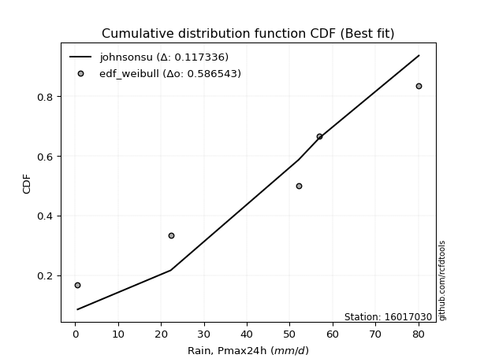</img>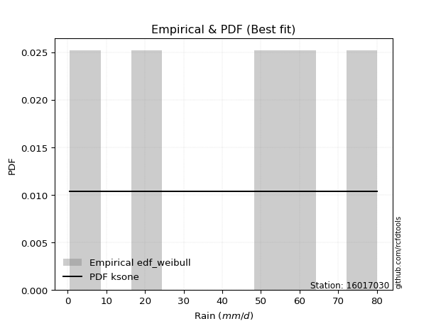</img>

</div>


### 4. EDF Beard (1943)

The Beard formula (or Beard´s plotting position formula) in hydrology is used to estimate the empirical non-exceedance probability _(P)_ of a flood event (or other extreme hydrological data point) within a given dataset.

<div align="center">


$P=(m-0.31)/(n+0.38)$


</div>


**4.1. Empirical values**

<div align="center">

|                | 0                   | 1                  | 2         | 3                  | 4                  |
|:---------------|:--------------------|:-------------------|:----------|:-------------------|:-------------------|
| date           | 2012                | 2009               | 2011      | 2008               | 2010               |
| x              | 0.6                 | 22.3               | 52.1      | 56.9               | 80.1               |
| m              | 1                   | 2                  | 3         | 4                  | 5                  |
| empirical_dist | edf_beard           | edf_beard          | edf_beard | edf_beard          | edf_beard          |
| empirical      | 0.12825278810408922 | 0.3141263940520446 | 0.5       | 0.6858736059479554 | 0.8717472118959109 |
| empirical_tr   | 1.1471215351812367  | 1.4579945799457996 | 2.0       | 3.183431952662722  | 7.797101449275368  |

</div>


**4.2. Kolmogorov-Smirnov fit test (sorted by Δ)**


<div align="center">

|                | 0                  | 1                   | 2                  | 3                   | 4                   | 5                   | 6                   | 7                   | 8                   | 9                   | 10                  | 11                 | 12                  | 13                  | 14                  | 15                  | 16                 | 17                  | 18                  | 19                  | 20                  | 21                 | 22                  | 23                  | 24                 | 25                 | 26                  | 27                  | 28                  | 29                  | 30                  | 31                  | 32                  | 33                  | 34                  | 35                  | 36                  | 37                  | 38                  | 39                 | 40                 | 41                 | 42                  | 43                  | 44                 | 45                  | 46                 | 47                 | 48                 | 49                 | 50                  | 51                  | 52                  | 53                  | 54                  | 55                 | 56                  | 57                  | 58                  | 59                  | 60                  | 61                 | 62                  | 63                  | 64                  | 65                  | 66                  | 67                 | 68                  | 69                 | 70                  | 71                  | 72                  | 73                 | 74                  | 75                  | 76                  | 77                 | 78                 | 79                  | 80                 | 81                 | 82                  | 83                 | 84                  | 85                  | 86                  | 87                  | 88                 | 89                  | 90                  | 91                 | 92                 | 93                  | 94                  | 95                 | 96                  | 97                 | 98                  | 99                 | 100                | 101                | 102                | 103                 | 104                 | 105                | 106                | 107                | 108                 | 109                 | 110                 | 111                 | 112                | 113                 | 114                | 115                 | 116                | 117                | 118                 | 119                 | 120                 | 121                 | 122                | 123                | 124                 | 125                | 126                | 127                 | 128                 | 129                | 130                 | 131                 | 132                | 133                 | 134                | 135                | 136                 | 137                | 138                 | 139                | 140                | 141                | 142                | 143                | 144                | 145                | 146                | 147                | 148                | 149                | 150                | 151                | 152                | 153                | 154                | 155                | 156                | 157                | 158                | 159                |
|:---------------|:-------------------|:--------------------|:-------------------|:--------------------|:--------------------|:--------------------|:--------------------|:--------------------|:--------------------|:--------------------|:--------------------|:-------------------|:--------------------|:--------------------|:--------------------|:--------------------|:-------------------|:--------------------|:--------------------|:--------------------|:--------------------|:-------------------|:--------------------|:--------------------|:-------------------|:-------------------|:--------------------|:--------------------|:--------------------|:--------------------|:--------------------|:--------------------|:--------------------|:--------------------|:--------------------|:--------------------|:--------------------|:--------------------|:--------------------|:-------------------|:-------------------|:-------------------|:--------------------|:--------------------|:-------------------|:--------------------|:-------------------|:-------------------|:-------------------|:-------------------|:--------------------|:--------------------|:--------------------|:--------------------|:--------------------|:-------------------|:--------------------|:--------------------|:--------------------|:--------------------|:--------------------|:-------------------|:--------------------|:--------------------|:--------------------|:--------------------|:--------------------|:-------------------|:--------------------|:-------------------|:--------------------|:--------------------|:--------------------|:-------------------|:--------------------|:--------------------|:--------------------|:-------------------|:-------------------|:--------------------|:-------------------|:-------------------|:--------------------|:-------------------|:--------------------|:--------------------|:--------------------|:--------------------|:-------------------|:--------------------|:--------------------|:-------------------|:-------------------|:--------------------|:--------------------|:-------------------|:--------------------|:-------------------|:--------------------|:-------------------|:-------------------|:-------------------|:-------------------|:--------------------|:--------------------|:-------------------|:-------------------|:-------------------|:--------------------|:--------------------|:--------------------|:--------------------|:-------------------|:--------------------|:-------------------|:--------------------|:-------------------|:-------------------|:--------------------|:--------------------|:--------------------|:--------------------|:-------------------|:-------------------|:--------------------|:-------------------|:-------------------|:--------------------|:--------------------|:-------------------|:--------------------|:--------------------|:-------------------|:--------------------|:-------------------|:-------------------|:--------------------|:-------------------|:--------------------|:-------------------|:-------------------|:-------------------|:-------------------|:-------------------|:-------------------|:-------------------|:-------------------|:-------------------|:-------------------|:-------------------|:-------------------|:-------------------|:-------------------|:-------------------|:-------------------|:-------------------|:-------------------|:-------------------|:-------------------|:-------------------|
| station        | 16017030           | 16017030            | 16017030           | 16017030            | 16017030            | 16017030            | 16017030            | 16017030            | 16017030            | 16017030            | 16017030            | 16017030           | 16017030            | 16017030            | 16017030            | 16017030            | 16017030           | 16017030            | 16017030            | 16017030            | 16017030            | 16017030           | 16017030            | 16017030            | 16017030           | 16017030           | 16017030            | 16017030            | 16017030            | 16017030            | 16017030            | 16017030            | 16017030            | 16017030            | 16017030            | 16017030            | 16017030            | 16017030            | 16017030            | 16017030           | 16017030           | 16017030           | 16017030            | 16017030            | 16017030           | 16017030            | 16017030           | 16017030           | 16017030           | 16017030           | 16017030            | 16017030            | 16017030            | 16017030            | 16017030            | 16017030           | 16017030            | 16017030            | 16017030            | 16017030            | 16017030            | 16017030           | 16017030            | 16017030            | 16017030            | 16017030            | 16017030            | 16017030           | 16017030            | 16017030           | 16017030            | 16017030            | 16017030            | 16017030           | 16017030            | 16017030            | 16017030            | 16017030           | 16017030           | 16017030            | 16017030           | 16017030           | 16017030            | 16017030           | 16017030            | 16017030            | 16017030            | 16017030            | 16017030           | 16017030            | 16017030            | 16017030           | 16017030           | 16017030            | 16017030            | 16017030           | 16017030            | 16017030           | 16017030            | 16017030           | 16017030           | 16017030           | 16017030           | 16017030            | 16017030            | 16017030           | 16017030           | 16017030           | 16017030            | 16017030            | 16017030            | 16017030            | 16017030           | 16017030            | 16017030           | 16017030            | 16017030           | 16017030           | 16017030            | 16017030            | 16017030            | 16017030            | 16017030           | 16017030           | 16017030            | 16017030           | 16017030           | 16017030            | 16017030            | 16017030           | 16017030            | 16017030            | 16017030           | 16017030            | 16017030           | 16017030           | 16017030            | 16017030           | 16017030            | 16017030           | 16017030           | 16017030           | 16017030           | 16017030           | 16017030           | 16017030           | 16017030           | 16017030           | 16017030           | 16017030           | 16017030           | 16017030           | 16017030           | 16017030           | 16017030           | 16017030           | 16017030           | 16017030           | 16017030           | 16017030           |
| empirical_dist | edf_beard          | edf_beard           | edf_beard          | edf_beard           | edf_beard           | edf_beard           | edf_beard           | edf_beard           | edf_beard           | edf_beard           | edf_beard           | edf_beard          | edf_beard           | edf_beard           | edf_beard           | edf_beard           | edf_beard          | edf_beard           | edf_beard           | edf_beard           | edf_beard           | edf_beard          | edf_beard           | edf_beard           | edf_beard          | edf_beard          | edf_beard           | edf_beard           | edf_beard           | edf_beard           | edf_beard           | edf_beard           | edf_beard           | edf_beard           | edf_beard           | edf_beard           | edf_beard           | edf_beard           | edf_beard           | edf_beard          | edf_beard          | edf_beard          | edf_beard           | edf_beard           | edf_beard          | edf_beard           | edf_beard          | edf_beard          | edf_beard          | edf_beard          | edf_beard           | edf_beard           | edf_beard           | edf_beard           | edf_beard           | edf_beard          | edf_beard           | edf_beard           | edf_beard           | edf_beard           | edf_beard           | edf_beard          | edf_beard           | edf_beard           | edf_beard           | edf_beard           | edf_beard           | edf_beard          | edf_beard           | edf_beard          | edf_beard           | edf_beard           | edf_beard           | edf_beard          | edf_beard           | edf_beard           | edf_beard           | edf_beard          | edf_beard          | edf_beard           | edf_beard          | edf_beard          | edf_beard           | edf_beard          | edf_beard           | edf_beard           | edf_beard           | edf_beard           | edf_beard          | edf_beard           | edf_beard           | edf_beard          | edf_beard          | edf_beard           | edf_beard           | edf_beard          | edf_beard           | edf_beard          | edf_beard           | edf_beard          | edf_beard          | edf_beard          | edf_beard          | edf_beard           | edf_beard           | edf_beard          | edf_beard          | edf_beard          | edf_beard           | edf_beard           | edf_beard           | edf_beard           | edf_beard          | edf_beard           | edf_beard          | edf_beard           | edf_beard          | edf_beard          | edf_beard           | edf_beard           | edf_beard           | edf_beard           | edf_beard          | edf_beard          | edf_beard           | edf_beard          | edf_beard          | edf_beard           | edf_beard           | edf_beard          | edf_beard           | edf_beard           | edf_beard          | edf_beard           | edf_beard          | edf_beard          | edf_beard           | edf_beard          | edf_beard           | edf_beard          | edf_beard          | edf_beard          | edf_beard          | edf_beard          | edf_beard          | edf_beard          | edf_beard          | edf_beard          | edf_beard          | edf_beard          | edf_beard          | edf_beard          | edf_beard          | edf_beard          | edf_beard          | edf_beard          | edf_beard          | edf_beard          | edf_beard          | edf_beard          |
| p_dist         | dweibull           | johnsonsu           | argus              | ksone               | dgamma              | genlogistic         | semicircular        | gumbel_l            | trapezoid           | anglit              | weibull_min         | pearson3           | triang              | loggenpareto        | skewnorm            | wrapcauchy          | beta               | genpareto           | loggenextreme       | genhalflogistic     | arcsine             | logvonmises_line   | exponnorm           | crystalball         | norm               | t                  | foldnorm            | gompertz            | betaprime           | vonmises_line       | erlang              | gamma               | tukeylambda         | cosine              | kappa4              | loglevy_l           | kappa3              | uniform             | ncf                 | logpearson3        | rice               | f                  | bradford            | logistic            | invgamma           | gausshyper          | maxwell            | invgauss           | burr12             | hypsecant          | rayleigh            | logtrapezoid        | loggumbel_l         | loggausshyper       | truncweibull_min    | gennorm            | kstwobign           | levy_l              | halfnorm            | burr                | logt                | laplace            | gumbel_r            | loggennorm          | logarcsine          | logdgamma           | logsemicircular     | loganglit          | genextreme          | genexpon           | lognorm             | logexponnorm        | logdweibull         | lognakagami        | lognct              | loggompertz         | halflogistic        | truncexpon         | logrice            | moyal               | logargus           | logerlang          | logfoldnorm         | loglogistic        | logweibull_max      | loggamma            | loggamma            | loginvgamma         | logwrapcauchy      | logalpha            | loginvgauss         | logloggamma        | loghypsecant       | loginvweibull       | logmaxwell          | loggengamma        | lograyleigh         | logburr12          | exponweib           | lomax              | loglaplace         | loglaplace         | logexponweib       | logcosine           | wald                | loglomax           | logkstwobign       | loggumbel_r        | loghalfnorm         | logncf              | loggenexpon         | logburr             | mielke             | gengamma            | logmoyal           | loghalflogistic     | loggenhalflogistic | nct                | logbeta             | logloglaplace       | logskewnorm         | logkappa3           | logtriang          | loghalfgennorm     | logtruncweibull_min | logwald            | logksone           | logf                | halfgennorm         | loguniform         | logbradford         | logtruncnorm        | logkappa4          | johnsonsb           | logmielke          | logweibull_min     | invweibull          | logjohnsonsu       | fatiguelife         | logtruncexpon      | nakagami           | logbetaprime       | logfatiguelife     | logtukeylambda     | logjohnsonsb       | powerlaw           | truncpareto        | weibull_max        | logexponpow        | exponpow           | logtruncpareto     | alpha              | truncnorm          | logpowerlaw        | rdist              | logrdist           | loggenlogistic     | logvonmises        | vonmises           | logcrystalball     |
| delta          | 0.0931129481957988 | 0.09812952298736594 | 0.1001262099050893 | 0.10055992345576747 | 0.10145764735113616 | 0.10576243530396887 | 0.11031996186219506 | 0.11467363524576718 | 0.11524950547296275 | 0.11795524359209109 | 0.12346364729723258 | 0.1241103761945126 | 0.12624098303804054 | 0.12825201381277096 | 0.12825232404577325 | 0.12825278539057317 | 0.1282527880974974 | 0.12825278810237284 | 0.12825278810383944 | 0.12825278810408702 | 0.12825278810408922 | 0.1341684709345179 | 0.13621046967992034 | 0.13621124187243083 | 0.136211248449843  | 0.136211533386686  | 0.13734071711148343 | 0.13888260442252454 | 0.14099005946495058 | 0.14117467511527348 | 0.14249447513523017 | 0.14272524323794722 | 0.14491623908997298 | 0.14541585355741016 | 0.14554530679858135 | 0.14679326025386408 | 0.14770676896669677 | 0.14779874213836475 | 0.14822488650349108 | 0.1493994932248497 | 0.1496532832544999 | 0.1507828766371978 | 0.15255956904761414 | 0.15290579655501668 | 0.1547519878164878 | 0.15878087731223423 | 0.1592866304806806 | 0.1604045513738266 | 0.1634588739778574 | 0.1660820675568807 | 0.16628458327202789 | 0.16868170320690573 | 0.17071128055389706 | 0.17476811675543413 | 0.17591545854952462 | 0.180032519170943  | 0.18310557378067316 | 0.18595593251236153 | 0.18648475056568048 | 0.19063358516790163 | 0.19294768619954178 | 0.1944947093874868 | 0.19826370524031234 | 0.19833466942115546 | 0.19965010172191183 | 0.19979640467483295 | 0.20534783403300633 | 0.2067841861614222 | 0.20752593930707347 | 0.2085393877039854 | 0.21026951547121348 | 0.21026983773618663 | 0.21046417215147983 | 0.2107391436835238 | 0.21105588870607656 | 0.21193105389240485 | 0.21476996377034507 | 0.2154159482052841 | 0.2174428566308328 | 0.21896812594025206 | 0.2194036074109469 | 0.2201904674784067 | 0.22337684774072364 | 0.2241094568815838 | 0.22530908604020194 | 0.22564972536273115 | 0.22564972536273115 | 0.22598381994118172 | 0.2274095219272097 | 0.23061030303514646 | 0.23279411235400166 | 0.235022040421914  | 0.2395448546670489 | 0.24099141128179963 | 0.24218423428360242 | 0.2473846531811919 | 0.25262718785895394 | 0.2543256432392085 | 0.25816588858416073 | 0.2604196405638325 | 0.2643733064928817 | 0.2643733064928817 | 0.2715347909903229 | 0.27471116945547575 | 0.27728306113016565 | 0.2773815709221175 | 0.2780198124917926 | 0.2809404876340376 | 0.28202689345592274 | 0.28271037967751184 | 0.28579594721249363 | 0.29535257581963775 | 0.3050632710402237 | 0.30604297154452925 | 0.3064557339254979 | 0.30828336072801793 | 0.3087628973992559 | 0.311174713246049  | 0.32673026165810415 | 0.34872556172064023 | 0.35005865958464977 | 0.35795337639855423 | 0.3586134154811782 | 0.3723658095806625 | 0.3763852535156602  | 0.3773067761814067 | 0.3848140326027191 | 0.38931418158526704 | 0.38943974760074856 | 0.4246021179336718 | 0.42577204168661703 | 0.42728144717933453 | 0.428629058001269  | 0.43062249249473594 | 0.43486009931095   | 0.4443511280302535 | 0.45647172450856505 | 0.4602276916942367 | 0.47566925910391317 | 0.4866037717505502 | 0.509814352258066  | 0.5210077126008466 | 0.5252372590935388 | 0.5288408683215677 | 0.5393045642636087 | 0.5463088510814551 | 0.5521417704424454 | 0.5799946130049243 | 0.5818181076561812 | 0.6014017334520203 | 0.6262325367399115 | 0.6380517989519696 | 0.6466910103208079 | 0.6475937508007827 | 0.6858736057341472 | 0.6858736059479553 | 0.6858736059479554 | 0.8943636806897808 | 12.215174201699345 | nan                |
| deltao         | 0.5865427407550001 | 0.5865427407550001  | 0.5865427407550001 | 0.5865427407550001  | 0.5865427407550001  | 0.5865427407550001  | 0.5865427407550001  | 0.5865427407550001  | 0.5865427407550001  | 0.5865427407550001  | 0.5865427407550001  | 0.5865427407550001 | 0.5865427407550001  | 0.5865427407550001  | 0.5865427407550001  | 0.5865427407550001  | 0.5865427407550001 | 0.5865427407550001  | 0.5865427407550001  | 0.5865427407550001  | 0.5865427407550001  | 0.5865427407550001 | 0.5865427407550001  | 0.5865427407550001  | 0.5865427407550001 | 0.5865427407550001 | 0.5865427407550001  | 0.5865427407550001  | 0.5865427407550001  | 0.5865427407550001  | 0.5865427407550001  | 0.5865427407550001  | 0.5865427407550001  | 0.5865427407550001  | 0.5865427407550001  | 0.5865427407550001  | 0.5865427407550001  | 0.5865427407550001  | 0.5865427407550001  | 0.5865427407550001 | 0.5865427407550001 | 0.5865427407550001 | 0.5865427407550001  | 0.5865427407550001  | 0.5865427407550001 | 0.5865427407550001  | 0.5865427407550001 | 0.5865427407550001 | 0.5865427407550001 | 0.5865427407550001 | 0.5865427407550001  | 0.5865427407550001  | 0.5865427407550001  | 0.5865427407550001  | 0.5865427407550001  | 0.5865427407550001 | 0.5865427407550001  | 0.5865427407550001  | 0.5865427407550001  | 0.5865427407550001  | 0.5865427407550001  | 0.5865427407550001 | 0.5865427407550001  | 0.5865427407550001  | 0.5865427407550001  | 0.5865427407550001  | 0.5865427407550001  | 0.5865427407550001 | 0.5865427407550001  | 0.5865427407550001 | 0.5865427407550001  | 0.5865427407550001  | 0.5865427407550001  | 0.5865427407550001 | 0.5865427407550001  | 0.5865427407550001  | 0.5865427407550001  | 0.5865427407550001 | 0.5865427407550001 | 0.5865427407550001  | 0.5865427407550001 | 0.5865427407550001 | 0.5865427407550001  | 0.5865427407550001 | 0.5865427407550001  | 0.5865427407550001  | 0.5865427407550001  | 0.5865427407550001  | 0.5865427407550001 | 0.5865427407550001  | 0.5865427407550001  | 0.5865427407550001 | 0.5865427407550001 | 0.5865427407550001  | 0.5865427407550001  | 0.5865427407550001 | 0.5865427407550001  | 0.5865427407550001 | 0.5865427407550001  | 0.5865427407550001 | 0.5865427407550001 | 0.5865427407550001 | 0.5865427407550001 | 0.5865427407550001  | 0.5865427407550001  | 0.5865427407550001 | 0.5865427407550001 | 0.5865427407550001 | 0.5865427407550001  | 0.5865427407550001  | 0.5865427407550001  | 0.5865427407550001  | 0.5865427407550001 | 0.5865427407550001  | 0.5865427407550001 | 0.5865427407550001  | 0.5865427407550001 | 0.5865427407550001 | 0.5865427407550001  | 0.5865427407550001  | 0.5865427407550001  | 0.5865427407550001  | 0.5865427407550001 | 0.5865427407550001 | 0.5865427407550001  | 0.5865427407550001 | 0.5865427407550001 | 0.5865427407550001  | 0.5865427407550001  | 0.5865427407550001 | 0.5865427407550001  | 0.5865427407550001  | 0.5865427407550001 | 0.5865427407550001  | 0.5865427407550001 | 0.5865427407550001 | 0.5865427407550001  | 0.5865427407550001 | 0.5865427407550001  | 0.5865427407550001 | 0.5865427407550001 | 0.5865427407550001 | 0.5865427407550001 | 0.5865427407550001 | 0.5865427407550001 | 0.5865427407550001 | 0.5865427407550001 | 0.5865427407550001 | 0.5865427407550001 | 0.5865427407550001 | 0.5865427407550001 | 0.5865427407550001 | 0.5865427407550001 | 0.5865427407550001 | 0.5865427407550001 | 0.5865427407550001 | 0.5865427407550001 | 0.5865427407550001 | 0.5865427407550001 | 0.5865427407550001 |
| eval           | Δo > Δ             | Δo > Δ              | Δo > Δ             | Δo > Δ              | Δo > Δ              | Δo > Δ              | Δo > Δ              | Δo > Δ              | Δo > Δ              | Δo > Δ              | Δo > Δ              | Δo > Δ             | Δo > Δ              | Δo > Δ              | Δo > Δ              | Δo > Δ              | Δo > Δ             | Δo > Δ              | Δo > Δ              | Δo > Δ              | Δo > Δ              | Δo > Δ             | Δo > Δ              | Δo > Δ              | Δo > Δ             | Δo > Δ             | Δo > Δ              | Δo > Δ              | Δo > Δ              | Δo > Δ              | Δo > Δ              | Δo > Δ              | Δo > Δ              | Δo > Δ              | Δo > Δ              | Δo > Δ              | Δo > Δ              | Δo > Δ              | Δo > Δ              | Δo > Δ             | Δo > Δ             | Δo > Δ             | Δo > Δ              | Δo > Δ              | Δo > Δ             | Δo > Δ              | Δo > Δ             | Δo > Δ             | Δo > Δ             | Δo > Δ             | Δo > Δ              | Δo > Δ              | Δo > Δ              | Δo > Δ              | Δo > Δ              | Δo > Δ             | Δo > Δ              | Δo > Δ              | Δo > Δ              | Δo > Δ              | Δo > Δ              | Δo > Δ             | Δo > Δ              | Δo > Δ              | Δo > Δ              | Δo > Δ              | Δo > Δ              | Δo > Δ             | Δo > Δ              | Δo > Δ             | Δo > Δ              | Δo > Δ              | Δo > Δ              | Δo > Δ             | Δo > Δ              | Δo > Δ              | Δo > Δ              | Δo > Δ             | Δo > Δ             | Δo > Δ              | Δo > Δ             | Δo > Δ             | Δo > Δ              | Δo > Δ             | Δo > Δ              | Δo > Δ              | Δo > Δ              | Δo > Δ              | Δo > Δ             | Δo > Δ              | Δo > Δ              | Δo > Δ             | Δo > Δ             | Δo > Δ              | Δo > Δ              | Δo > Δ             | Δo > Δ              | Δo > Δ             | Δo > Δ              | Δo > Δ             | Δo > Δ             | Δo > Δ             | Δo > Δ             | Δo > Δ              | Δo > Δ              | Δo > Δ             | Δo > Δ             | Δo > Δ             | Δo > Δ              | Δo > Δ              | Δo > Δ              | Δo > Δ              | Δo > Δ             | Δo > Δ              | Δo > Δ             | Δo > Δ              | Δo > Δ             | Δo > Δ             | Δo > Δ              | Δo > Δ              | Δo > Δ              | Δo > Δ              | Δo > Δ             | Δo > Δ             | Δo > Δ              | Δo > Δ             | Δo > Δ             | Δo > Δ              | Δo > Δ              | Δo > Δ             | Δo > Δ              | Δo > Δ              | Δo > Δ             | Δo > Δ              | Δo > Δ             | Δo > Δ             | Δo > Δ              | Δo > Δ             | Δo > Δ              | Δo > Δ             | Δo > Δ             | Δo > Δ             | Δo > Δ             | Δo > Δ             | Δo > Δ             | Δo > Δ             | Δo > Δ             | Δo > Δ             | Δo > Δ             | Δo <= Δ            | Δo <= Δ            | Δo <= Δ            | Δo <= Δ            | Δo <= Δ            | Δo <= Δ            | Δo <= Δ            | Δo <= Δ            | Δo <= Δ            | Δo <= Δ            | Δo <= Δ            |
| fit            | 1                  | 1                   | 1                  | 1                   | 1                   | 1                   | 1                   | 1                   | 1                   | 1                   | 1                   | 1                  | 1                   | 1                   | 1                   | 1                   | 1                  | 1                   | 1                   | 1                   | 1                   | 1                  | 1                   | 1                   | 1                  | 1                  | 1                   | 1                   | 1                   | 1                   | 1                   | 1                   | 1                   | 1                   | 1                   | 1                   | 1                   | 1                   | 1                   | 1                  | 1                  | 1                  | 1                   | 1                   | 1                  | 1                   | 1                  | 1                  | 1                  | 1                  | 1                   | 1                   | 1                   | 1                   | 1                   | 1                  | 1                   | 1                   | 1                   | 1                   | 1                   | 1                  | 1                   | 1                   | 1                   | 1                   | 1                   | 1                  | 1                   | 1                  | 1                   | 1                   | 1                   | 1                  | 1                   | 1                   | 1                   | 1                  | 1                  | 1                   | 1                  | 1                  | 1                   | 1                  | 1                   | 1                   | 1                   | 1                   | 1                  | 1                   | 1                   | 1                  | 1                  | 1                   | 1                   | 1                  | 1                   | 1                  | 1                   | 1                  | 1                  | 1                  | 1                  | 1                   | 1                   | 1                  | 1                  | 1                  | 1                   | 1                   | 1                   | 1                   | 1                  | 1                   | 1                  | 1                   | 1                  | 1                  | 1                   | 1                   | 1                   | 1                   | 1                  | 1                  | 1                   | 1                  | 1                  | 1                   | 1                   | 1                  | 1                   | 1                   | 1                  | 1                   | 1                  | 1                  | 1                   | 1                  | 1                   | 1                  | 1                  | 1                  | 1                  | 1                  | 1                  | 1                  | 1                  | 1                  | 1                  | 0                  | 0                  | 0                  | 0                  | 0                  | 0                  | 0                  | 0                  | 0                  | 0                  | 0                  |
| n              | 5                  | 5                   | 5                  | 5                   | 5                   | 5                   | 5                   | 5                   | 5                   | 5                   | 5                   | 5                  | 5                   | 5                   | 5                   | 5                   | 5                  | 5                   | 5                   | 5                   | 5                   | 5                  | 5                   | 5                   | 5                  | 5                  | 5                   | 5                   | 5                   | 5                   | 5                   | 5                   | 5                   | 5                   | 5                   | 5                   | 5                   | 5                   | 5                   | 5                  | 5                  | 5                  | 5                   | 5                   | 5                  | 5                   | 5                  | 5                  | 5                  | 5                  | 5                   | 5                   | 5                   | 5                   | 5                   | 5                  | 5                   | 5                   | 5                   | 5                   | 5                   | 5                  | 5                   | 5                   | 5                   | 5                   | 5                   | 5                  | 5                   | 5                  | 5                   | 5                   | 5                   | 5                  | 5                   | 5                   | 5                   | 5                  | 5                  | 5                   | 5                  | 5                  | 5                   | 5                  | 5                   | 5                   | 5                   | 5                   | 5                  | 5                   | 5                   | 5                  | 5                  | 5                   | 5                   | 5                  | 5                   | 5                  | 5                   | 5                  | 5                  | 5                  | 5                  | 5                   | 5                   | 5                  | 5                  | 5                  | 5                   | 5                   | 5                   | 5                   | 5                  | 5                   | 5                  | 5                   | 5                  | 5                  | 5                   | 5                   | 5                   | 5                   | 5                  | 5                  | 5                   | 5                  | 5                  | 5                   | 5                   | 5                  | 5                   | 5                   | 5                  | 5                   | 5                  | 5                  | 5                   | 5                  | 5                   | 5                  | 5                  | 5                  | 5                  | 5                  | 5                  | 5                  | 5                  | 5                  | 5                  | 5                  | 5                  | 5                  | 5                  | 5                  | 5                  | 5                  | 5                  | 5                  | 5                  | 5                  |
| best_fit       | 1                  | 0                   | 0                  | 0                   | 0                   | 0                   | 0                   | 0                   | 0                   | 0                   | 0                   | 0                  | 0                   | 0                   | 0                   | 0                   | 0                  | 0                   | 0                   | 0                   | 0                   | 0                  | 0                   | 0                   | 0                  | 0                  | 0                   | 0                   | 0                   | 0                   | 0                   | 0                   | 0                   | 0                   | 0                   | 0                   | 0                   | 0                   | 0                   | 0                  | 0                  | 0                  | 0                   | 0                   | 0                  | 0                   | 0                  | 0                  | 0                  | 0                  | 0                   | 0                   | 0                   | 0                   | 0                   | 0                  | 0                   | 0                   | 0                   | 0                   | 0                   | 0                  | 0                   | 0                   | 0                   | 0                   | 0                   | 0                  | 0                   | 0                  | 0                   | 0                   | 0                   | 0                  | 0                   | 0                   | 0                   | 0                  | 0                  | 0                   | 0                  | 0                  | 0                   | 0                  | 0                   | 0                   | 0                   | 0                   | 0                  | 0                   | 0                   | 0                  | 0                  | 0                   | 0                   | 0                  | 0                   | 0                  | 0                   | 0                  | 0                  | 0                  | 0                  | 0                   | 0                   | 0                  | 0                  | 0                  | 0                   | 0                   | 0                   | 0                   | 0                  | 0                   | 0                  | 0                   | 0                  | 0                  | 0                   | 0                   | 0                   | 0                   | 0                  | 0                  | 0                   | 0                  | 0                  | 0                   | 0                   | 0                  | 0                   | 0                   | 0                  | 0                   | 0                  | 0                  | 0                   | 0                  | 0                   | 0                  | 0                  | 0                  | 0                  | 0                  | 0                  | 0                  | 0                  | 0                  | 0                  | 0                  | 0                  | 0                  | 0                  | 0                  | 0                  | 0                  | 0                  | 0                  | 0                  | 0                  |
| best_fit_sort  | 1                  | 2                   | 3                  | 4                   | 5                   | 6                   | 7                   | 8                   | 9                   | 10                  | 11                  | 12                 | 13                  | 14                  | 15                  | 16                  | 17                 | 18                  | 19                  | 20                  | 21                  | 22                 | 23                  | 24                  | 25                 | 26                 | 27                  | 28                  | 29                  | 30                  | 31                  | 32                  | 33                  | 34                  | 35                  | 36                  | 37                  | 38                  | 39                  | 40                 | 41                 | 42                 | 43                  | 44                  | 45                 | 46                  | 47                 | 48                 | 49                 | 50                 | 51                  | 52                  | 53                  | 54                  | 55                  | 56                 | 57                  | 58                  | 59                  | 60                  | 61                  | 62                 | 63                  | 64                  | 65                  | 66                  | 67                  | 68                 | 69                  | 70                 | 71                  | 72                  | 73                  | 74                 | 75                  | 76                  | 77                  | 78                 | 79                 | 80                  | 81                 | 82                 | 83                  | 84                 | 85                  | 86                  | 87                  | 88                  | 89                 | 90                  | 91                  | 92                 | 93                 | 94                  | 95                  | 96                 | 97                  | 98                 | 99                  | 100                | 101                | 102                | 103                | 104                 | 105                 | 106                | 107                | 108                | 109                 | 110                 | 111                 | 112                 | 113                | 114                 | 115                | 116                 | 117                | 118                | 119                 | 120                 | 121                 | 122                 | 123                | 124                | 125                 | 126                | 127                | 128                 | 129                 | 130                | 131                 | 132                 | 133                | 134                 | 135                | 136                | 137                 | 138                | 139                 | 140                | 141                | 142                | 143                | 144                | 145                | 146                | 147                | 148                | 149                | 150                | 151                | 152                | 153                | 154                | 155                | 156                | 157                | 158                | 159                | 160                |

</div>


**4.3. Best fit**

<div align="center">

|   id |   station | empirical_dist   | p_dist   |     delta |   deltao | eval   |   fit |   n |   best_fit |   best_fit_sort |
|-----:|----------:|:-----------------|:---------|----------:|---------:|:-------|------:|----:|-----------:|----------------:|
|    0 |  16017030 | edf_beard        | dweibull | 0.0931129 | 0.586543 | Δo > Δ |     1 |   5 |          1 |               1 |

</div>


<div align="center">

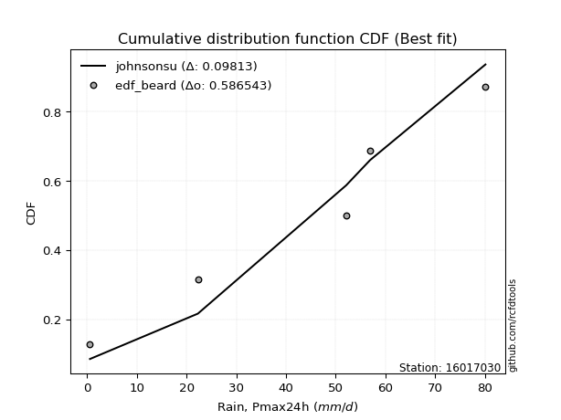</img>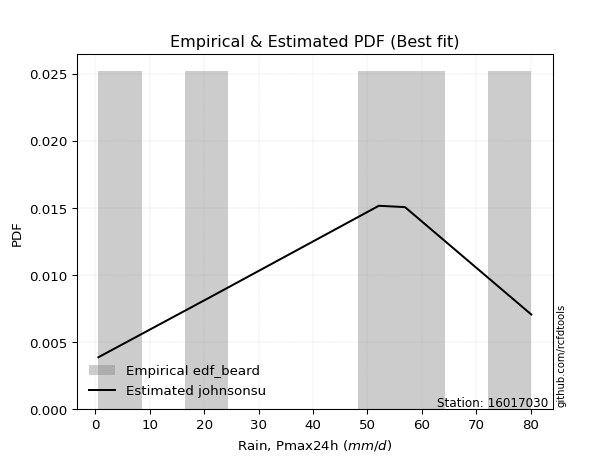</img>

</div>


### 5. EDF Chegodayev (1955)

The Chegodayev formula is an empirical plotting position formula used in hydrological frequency analysis to estimate the exceedance probability or return period of a specific event from a set of observed data. It is primarily used for plotting observed data points on probability paper to fit a theoretical distribution, particularly for analyzing extreme events like maximum flood flows or rainfall intensities. The constant _b_ value in the generalized plotting position formula is 0.3.

<div align="center">


$P=(m-b)/(n+1-2b)$


</div>


**5.1. Empirical values**

<div align="center">

|                | 0                   | 1                   | 2              | 3                  | 4                  |
|:---------------|:--------------------|:--------------------|:---------------|:-------------------|:-------------------|
| date           | 2012                | 2009                | 2011           | 2008               | 2010               |
| x              | 0.6                 | 22.3                | 52.1           | 56.9               | 80.1               |
| m              | 1                   | 2                   | 3              | 4                  | 5                  |
| empirical_dist | edf_chegodayev      | edf_chegodayev      | edf_chegodayev | edf_chegodayev     | edf_chegodayev     |
| empirical      | 0.12962962962962962 | 0.31481481481481477 | 0.5            | 0.6851851851851851 | 0.8703703703703703 |
| empirical_tr   | 1.148936170212766   | 1.4594594594594594  | 2.0            | 3.1764705882352935 | 7.714285714285713  |

</div>


**5.2. Kolmogorov-Smirnov fit test (sorted by Δ)**


<div align="center">

|                | 0                   | 1                   | 2                   | 3                   | 4                   | 5                   | 6                   | 7                   | 8                   | 9                   | 10                  | 11                 | 12                  | 13                  | 14                  | 15                  | 16                  | 17                  | 18                  | 19                  | 20                  | 21                  | 22                  | 23                  | 24                 | 25                 | 26                  | 27                  | 28                  | 29                  | 30                  | 31                  | 32                  | 33                  | 34                  | 35                  | 36                  | 37                  | 38                  | 39                 | 40                 | 41                 | 42                  | 43                  | 44                 | 45                 | 46                 | 47                 | 48                 | 49                 | 50                  | 51                  | 52                  | 53                  | 54                  | 55                  | 56                  | 57                  | 58                  | 59                  | 60                  | 61                 | 62                  | 63                  | 64                  | 65                 | 66                  | 67                  | 68                  | 69                 | 70                  | 71                  | 72                  | 73                  | 74                 | 75                  | 76                  | 77                 | 78                  | 79                  | 80                 | 81                  | 82                  | 83                 | 84                  | 85                 | 86                 | 87                  | 88                  | 89                 | 90                 | 91                 | 92                 | 93                  | 94                  | 95                  | 96                 | 97                  | 98                 | 99                 | 100                | 101                | 102                 | 103                | 104                 | 105                 | 106                 | 107                 | 108                | 109                | 110                | 111                | 112                | 113                | 114                 | 115                | 116                | 117                 | 118                 | 119                | 120                 | 121                | 122                | 123                 | 124                 | 125                 | 126                | 127                | 128                | 129                 | 130                | 131                | 132                 | 133                 | 134                 | 135                 | 136                 | 137                | 138                | 139                 | 140                | 141                | 142                | 143                | 144                | 145                | 146                | 147                | 148                | 149                | 150                | 151                | 152                | 153                | 154                | 155                | 156                | 157                | 158                | 159                |
|:---------------|:--------------------|:--------------------|:--------------------|:--------------------|:--------------------|:--------------------|:--------------------|:--------------------|:--------------------|:--------------------|:--------------------|:-------------------|:--------------------|:--------------------|:--------------------|:--------------------|:--------------------|:--------------------|:--------------------|:--------------------|:--------------------|:--------------------|:--------------------|:--------------------|:-------------------|:-------------------|:--------------------|:--------------------|:--------------------|:--------------------|:--------------------|:--------------------|:--------------------|:--------------------|:--------------------|:--------------------|:--------------------|:--------------------|:--------------------|:-------------------|:-------------------|:-------------------|:--------------------|:--------------------|:-------------------|:-------------------|:-------------------|:-------------------|:-------------------|:-------------------|:--------------------|:--------------------|:--------------------|:--------------------|:--------------------|:--------------------|:--------------------|:--------------------|:--------------------|:--------------------|:--------------------|:-------------------|:--------------------|:--------------------|:--------------------|:-------------------|:--------------------|:--------------------|:--------------------|:-------------------|:--------------------|:--------------------|:--------------------|:--------------------|:-------------------|:--------------------|:--------------------|:-------------------|:--------------------|:--------------------|:-------------------|:--------------------|:--------------------|:-------------------|:--------------------|:-------------------|:-------------------|:--------------------|:--------------------|:-------------------|:-------------------|:-------------------|:-------------------|:--------------------|:--------------------|:--------------------|:-------------------|:--------------------|:-------------------|:-------------------|:-------------------|:-------------------|:--------------------|:-------------------|:--------------------|:--------------------|:--------------------|:--------------------|:-------------------|:-------------------|:-------------------|:-------------------|:-------------------|:-------------------|:--------------------|:-------------------|:-------------------|:--------------------|:--------------------|:-------------------|:--------------------|:-------------------|:-------------------|:--------------------|:--------------------|:--------------------|:-------------------|:-------------------|:-------------------|:--------------------|:-------------------|:-------------------|:--------------------|:--------------------|:--------------------|:--------------------|:--------------------|:-------------------|:-------------------|:--------------------|:-------------------|:-------------------|:-------------------|:-------------------|:-------------------|:-------------------|:-------------------|:-------------------|:-------------------|:-------------------|:-------------------|:-------------------|:-------------------|:-------------------|:-------------------|:-------------------|:-------------------|:-------------------|:-------------------|:-------------------|
| station        | 16017030            | 16017030            | 16017030            | 16017030            | 16017030            | 16017030            | 16017030            | 16017030            | 16017030            | 16017030            | 16017030            | 16017030           | 16017030            | 16017030            | 16017030            | 16017030            | 16017030            | 16017030            | 16017030            | 16017030            | 16017030            | 16017030            | 16017030            | 16017030            | 16017030           | 16017030           | 16017030            | 16017030            | 16017030            | 16017030            | 16017030            | 16017030            | 16017030            | 16017030            | 16017030            | 16017030            | 16017030            | 16017030            | 16017030            | 16017030           | 16017030           | 16017030           | 16017030            | 16017030            | 16017030           | 16017030           | 16017030           | 16017030           | 16017030           | 16017030           | 16017030            | 16017030            | 16017030            | 16017030            | 16017030            | 16017030            | 16017030            | 16017030            | 16017030            | 16017030            | 16017030            | 16017030           | 16017030            | 16017030            | 16017030            | 16017030           | 16017030            | 16017030            | 16017030            | 16017030           | 16017030            | 16017030            | 16017030            | 16017030            | 16017030           | 16017030            | 16017030            | 16017030           | 16017030            | 16017030            | 16017030           | 16017030            | 16017030            | 16017030           | 16017030            | 16017030           | 16017030           | 16017030            | 16017030            | 16017030           | 16017030           | 16017030           | 16017030           | 16017030            | 16017030            | 16017030            | 16017030           | 16017030            | 16017030           | 16017030           | 16017030           | 16017030           | 16017030            | 16017030           | 16017030            | 16017030            | 16017030            | 16017030            | 16017030           | 16017030           | 16017030           | 16017030           | 16017030           | 16017030           | 16017030            | 16017030           | 16017030           | 16017030            | 16017030            | 16017030           | 16017030            | 16017030           | 16017030           | 16017030            | 16017030            | 16017030            | 16017030           | 16017030           | 16017030           | 16017030            | 16017030           | 16017030           | 16017030            | 16017030            | 16017030            | 16017030            | 16017030            | 16017030           | 16017030           | 16017030            | 16017030           | 16017030           | 16017030           | 16017030           | 16017030           | 16017030           | 16017030           | 16017030           | 16017030           | 16017030           | 16017030           | 16017030           | 16017030           | 16017030           | 16017030           | 16017030           | 16017030           | 16017030           | 16017030           | 16017030           |
| empirical_dist | edf_chegodayev      | edf_chegodayev      | edf_chegodayev      | edf_chegodayev      | edf_chegodayev      | edf_chegodayev      | edf_chegodayev      | edf_chegodayev      | edf_chegodayev      | edf_chegodayev      | edf_chegodayev      | edf_chegodayev     | edf_chegodayev      | edf_chegodayev      | edf_chegodayev      | edf_chegodayev      | edf_chegodayev      | edf_chegodayev      | edf_chegodayev      | edf_chegodayev      | edf_chegodayev      | edf_chegodayev      | edf_chegodayev      | edf_chegodayev      | edf_chegodayev     | edf_chegodayev     | edf_chegodayev      | edf_chegodayev      | edf_chegodayev      | edf_chegodayev      | edf_chegodayev      | edf_chegodayev      | edf_chegodayev      | edf_chegodayev      | edf_chegodayev      | edf_chegodayev      | edf_chegodayev      | edf_chegodayev      | edf_chegodayev      | edf_chegodayev     | edf_chegodayev     | edf_chegodayev     | edf_chegodayev      | edf_chegodayev      | edf_chegodayev     | edf_chegodayev     | edf_chegodayev     | edf_chegodayev     | edf_chegodayev     | edf_chegodayev     | edf_chegodayev      | edf_chegodayev      | edf_chegodayev      | edf_chegodayev      | edf_chegodayev      | edf_chegodayev      | edf_chegodayev      | edf_chegodayev      | edf_chegodayev      | edf_chegodayev      | edf_chegodayev      | edf_chegodayev     | edf_chegodayev      | edf_chegodayev      | edf_chegodayev      | edf_chegodayev     | edf_chegodayev      | edf_chegodayev      | edf_chegodayev      | edf_chegodayev     | edf_chegodayev      | edf_chegodayev      | edf_chegodayev      | edf_chegodayev      | edf_chegodayev     | edf_chegodayev      | edf_chegodayev      | edf_chegodayev     | edf_chegodayev      | edf_chegodayev      | edf_chegodayev     | edf_chegodayev      | edf_chegodayev      | edf_chegodayev     | edf_chegodayev      | edf_chegodayev     | edf_chegodayev     | edf_chegodayev      | edf_chegodayev      | edf_chegodayev     | edf_chegodayev     | edf_chegodayev     | edf_chegodayev     | edf_chegodayev      | edf_chegodayev      | edf_chegodayev      | edf_chegodayev     | edf_chegodayev      | edf_chegodayev     | edf_chegodayev     | edf_chegodayev     | edf_chegodayev     | edf_chegodayev      | edf_chegodayev     | edf_chegodayev      | edf_chegodayev      | edf_chegodayev      | edf_chegodayev      | edf_chegodayev     | edf_chegodayev     | edf_chegodayev     | edf_chegodayev     | edf_chegodayev     | edf_chegodayev     | edf_chegodayev      | edf_chegodayev     | edf_chegodayev     | edf_chegodayev      | edf_chegodayev      | edf_chegodayev     | edf_chegodayev      | edf_chegodayev     | edf_chegodayev     | edf_chegodayev      | edf_chegodayev      | edf_chegodayev      | edf_chegodayev     | edf_chegodayev     | edf_chegodayev     | edf_chegodayev      | edf_chegodayev     | edf_chegodayev     | edf_chegodayev      | edf_chegodayev      | edf_chegodayev      | edf_chegodayev      | edf_chegodayev      | edf_chegodayev     | edf_chegodayev     | edf_chegodayev      | edf_chegodayev     | edf_chegodayev     | edf_chegodayev     | edf_chegodayev     | edf_chegodayev     | edf_chegodayev     | edf_chegodayev     | edf_chegodayev     | edf_chegodayev     | edf_chegodayev     | edf_chegodayev     | edf_chegodayev     | edf_chegodayev     | edf_chegodayev     | edf_chegodayev     | edf_chegodayev     | edf_chegodayev     | edf_chegodayev     | edf_chegodayev     | edf_chegodayev     |
| p_dist         | dweibull            | johnsonsu           | ksone               | dgamma              | argus               | genlogistic         | semicircular        | gumbel_l            | trapezoid           | anglit              | weibull_min         | pearson3           | triang              | loggenpareto        | skewnorm            | wrapcauchy          | beta                | genpareto           | loggenextreme       | genhalflogistic     | arcsine             | logvonmises_line    | exponnorm           | crystalball         | norm               | t                  | foldnorm            | gompertz            | betaprime           | vonmises_line       | erlang              | gamma               | tukeylambda         | cosine              | kappa4              | loglevy_l           | ncf                 | kappa3              | uniform             | logpearson3        | rice               | f                  | bradford            | logistic            | invgamma           | gausshyper         | maxwell            | invgauss           | burr12             | hypsecant          | rayleigh            | logtrapezoid        | loggumbel_l         | loggausshyper       | truncweibull_min    | gennorm             | kstwobign           | levy_l              | halfnorm            | burr                | logt                | laplace            | gumbel_r            | logdgamma           | logarcsine          | loggennorm         | logsemicircular     | loganglit           | genextreme          | genexpon           | logdweibull         | lognorm             | logexponnorm        | lognakagami         | lognct             | loggompertz         | halflogistic        | truncexpon         | logrice             | moyal               | logargus           | logerlang           | logfoldnorm         | loglogistic        | logweibull_max      | loggamma           | loggamma           | loginvgamma         | logwrapcauchy       | logalpha           | loginvgauss        | logloggamma        | loghypsecant       | loginvweibull       | logmaxwell          | loggengamma         | lograyleigh        | logburr12           | exponweib          | lomax              | loglaplace         | loglaplace         | logexponweib        | logcosine          | loglomax            | wald                | logkstwobign        | loggumbel_r         | loghalfnorm        | logncf             | loggenexpon        | logburr            | mielke             | gengamma           | logmoyal            | loghalflogistic    | loggenhalflogistic | nct                 | logbeta             | logloglaplace      | logskewnorm         | logkappa3          | logtriang          | loghalfgennorm      | logtruncweibull_min | logwald             | logksone           | logf               | halfgennorm        | loguniform          | logbradford        | logtruncnorm       | logkappa4           | johnsonsb           | logmielke           | logweibull_min      | invweibull          | logjohnsonsu       | fatiguelife        | logtruncexpon       | nakagami           | logbetaprime       | logfatiguelife     | logtukeylambda     | logjohnsonsb       | powerlaw           | truncpareto        | weibull_max        | logexponpow        | exponpow           | logtruncpareto     | alpha              | truncnorm          | logpowerlaw        | rdist              | loggenlogistic     | logrdist           | logvonmises        | vonmises           | logcrystalball     |
| delta          | 0.09242452743302865 | 0.09881794375013608 | 0.10055992345576747 | 0.10076922658836601 | 0.10081463066785945 | 0.10645085606673901 | 0.11031996186219506 | 0.11536205600853733 | 0.11662634699850327 | 0.11795524359209109 | 0.12346364729723258 | 0.1241103761945126 | 0.12761782456358106 | 0.12962885533831148 | 0.12962916557131376 | 0.12962962691611368 | 0.12962962962303792 | 0.12962962962791336 | 0.12962962962937996 | 0.12962962962962754 | 0.12962962962962962 | 0.13279162940897737 | 0.13621046967992034 | 0.13621124187243083 | 0.136211248449843  | 0.136211533386686  | 0.13734071711148343 | 0.13888260442252454 | 0.14099005946495058 | 0.14117467511527348 | 0.14249447513523017 | 0.14272524323794722 | 0.14491623908997298 | 0.14541585355741016 | 0.14554530679858135 | 0.14610483949109376 | 0.14684804497795056 | 0.14770676896669677 | 0.14779874213836475 | 0.1493994932248497 | 0.1496532832544999 | 0.1507828766371978 | 0.15255956904761414 | 0.15290579655501668 | 0.1547519878164878 | 0.1580924565494639 | 0.1592866304806806 | 0.1604045513738266 | 0.1634588739778574 | 0.1660820675568807 | 0.16628458327202789 | 0.16799328244413558 | 0.17071128055389706 | 0.17476811675543413 | 0.17591545854952462 | 0.18072093993371316 | 0.18310557378067316 | 0.18526751174959122 | 0.18648475056568048 | 0.19063358516790163 | 0.19363610696231193 | 0.1944947093874868 | 0.19826370524031234 | 0.19841956314929243 | 0.19896168095914168 | 0.1990230901839256 | 0.20465941327023618 | 0.20609576539865204 | 0.20683751854430316 | 0.2085393877039854 | 0.20908733062593932 | 0.20958109470844333 | 0.20958141697341648 | 0.21005072292075366 | 0.2103674679433064 | 0.21193105389240485 | 0.21476996377034507 | 0.2154159482052841 | 0.21675443586806264 | 0.21896812594025206 | 0.2194036074109469 | 0.21950204671563656 | 0.22337684774072364 | 0.2241094568815838 | 0.22462066527743163 | 0.224961304599961  | 0.224961304599961  | 0.22529539917841157 | 0.22672110116443955 | 0.2299218822723763 | 0.2321056915912315 | 0.235022040421914  | 0.2395448546670489 | 0.24030299051902948 | 0.24149581352083227 | 0.24669623241842176 | 0.2519387670961838 | 0.25294880171366796 | 0.2574774678213906 | 0.2604196405638325 | 0.2643733064928817 | 0.2643733064928817 | 0.27084637022755276 | 0.2740227486927056 | 0.27669315015934737 | 0.27728306113016565 | 0.27733139172902244 | 0.28025206687126747 | 0.2813384726931526 | 0.2820219589147417 | 0.2851075264497235 | 0.2946641550568676 | 0.3050632710402237 | 0.3053545507817591 | 0.30576731316272776 | 0.3075949399652478 | 0.3087628973992559 | 0.31048629248327886 | 0.32604184089533383 | 0.3480371409578701 | 0.35005865958464977 | 0.3572649556357841 | 0.3586134154811782 | 0.37167738881789236 | 0.3763852535156602  | 0.37661835541863653 | 0.384125611839949  | 0.3886257608224969 | 0.3887513268379784 | 0.42391369717090166 | 0.4250836209238469 | 0.4265930264165644 | 0.42794063723849884 | 0.42993407173196563 | 0.43417167854817984 | 0.44366270726748336 | 0.45509488298302453 | 0.4595392709314664 | 0.474980838341143  | 0.48591535098778005 | 0.5091259314952958 | 0.5203192918380763 | 0.5245488383307687 | 0.5281524475587976 | 0.5386161435008385 | 0.545620430318685  | 0.5514533496796752 | 0.5793061922421541 | 0.5811296868934112 | 0.6007133126892502 | 0.6255441159771413 | 0.6373633781891994 | 0.6460025895580378 | 0.6469053300380126 | 0.6851851849713771 | 0.6851851851851851 | 0.6851851851851852 | 0.8943636806897808 | 12.216551043224886 | nan                |
| deltao         | 0.5865427407550001  | 0.5865427407550001  | 0.5865427407550001  | 0.5865427407550001  | 0.5865427407550001  | 0.5865427407550001  | 0.5865427407550001  | 0.5865427407550001  | 0.5865427407550001  | 0.5865427407550001  | 0.5865427407550001  | 0.5865427407550001 | 0.5865427407550001  | 0.5865427407550001  | 0.5865427407550001  | 0.5865427407550001  | 0.5865427407550001  | 0.5865427407550001  | 0.5865427407550001  | 0.5865427407550001  | 0.5865427407550001  | 0.5865427407550001  | 0.5865427407550001  | 0.5865427407550001  | 0.5865427407550001 | 0.5865427407550001 | 0.5865427407550001  | 0.5865427407550001  | 0.5865427407550001  | 0.5865427407550001  | 0.5865427407550001  | 0.5865427407550001  | 0.5865427407550001  | 0.5865427407550001  | 0.5865427407550001  | 0.5865427407550001  | 0.5865427407550001  | 0.5865427407550001  | 0.5865427407550001  | 0.5865427407550001 | 0.5865427407550001 | 0.5865427407550001 | 0.5865427407550001  | 0.5865427407550001  | 0.5865427407550001 | 0.5865427407550001 | 0.5865427407550001 | 0.5865427407550001 | 0.5865427407550001 | 0.5865427407550001 | 0.5865427407550001  | 0.5865427407550001  | 0.5865427407550001  | 0.5865427407550001  | 0.5865427407550001  | 0.5865427407550001  | 0.5865427407550001  | 0.5865427407550001  | 0.5865427407550001  | 0.5865427407550001  | 0.5865427407550001  | 0.5865427407550001 | 0.5865427407550001  | 0.5865427407550001  | 0.5865427407550001  | 0.5865427407550001 | 0.5865427407550001  | 0.5865427407550001  | 0.5865427407550001  | 0.5865427407550001 | 0.5865427407550001  | 0.5865427407550001  | 0.5865427407550001  | 0.5865427407550001  | 0.5865427407550001 | 0.5865427407550001  | 0.5865427407550001  | 0.5865427407550001 | 0.5865427407550001  | 0.5865427407550001  | 0.5865427407550001 | 0.5865427407550001  | 0.5865427407550001  | 0.5865427407550001 | 0.5865427407550001  | 0.5865427407550001 | 0.5865427407550001 | 0.5865427407550001  | 0.5865427407550001  | 0.5865427407550001 | 0.5865427407550001 | 0.5865427407550001 | 0.5865427407550001 | 0.5865427407550001  | 0.5865427407550001  | 0.5865427407550001  | 0.5865427407550001 | 0.5865427407550001  | 0.5865427407550001 | 0.5865427407550001 | 0.5865427407550001 | 0.5865427407550001 | 0.5865427407550001  | 0.5865427407550001 | 0.5865427407550001  | 0.5865427407550001  | 0.5865427407550001  | 0.5865427407550001  | 0.5865427407550001 | 0.5865427407550001 | 0.5865427407550001 | 0.5865427407550001 | 0.5865427407550001 | 0.5865427407550001 | 0.5865427407550001  | 0.5865427407550001 | 0.5865427407550001 | 0.5865427407550001  | 0.5865427407550001  | 0.5865427407550001 | 0.5865427407550001  | 0.5865427407550001 | 0.5865427407550001 | 0.5865427407550001  | 0.5865427407550001  | 0.5865427407550001  | 0.5865427407550001 | 0.5865427407550001 | 0.5865427407550001 | 0.5865427407550001  | 0.5865427407550001 | 0.5865427407550001 | 0.5865427407550001  | 0.5865427407550001  | 0.5865427407550001  | 0.5865427407550001  | 0.5865427407550001  | 0.5865427407550001 | 0.5865427407550001 | 0.5865427407550001  | 0.5865427407550001 | 0.5865427407550001 | 0.5865427407550001 | 0.5865427407550001 | 0.5865427407550001 | 0.5865427407550001 | 0.5865427407550001 | 0.5865427407550001 | 0.5865427407550001 | 0.5865427407550001 | 0.5865427407550001 | 0.5865427407550001 | 0.5865427407550001 | 0.5865427407550001 | 0.5865427407550001 | 0.5865427407550001 | 0.5865427407550001 | 0.5865427407550001 | 0.5865427407550001 | 0.5865427407550001 |
| eval           | Δo > Δ              | Δo > Δ              | Δo > Δ              | Δo > Δ              | Δo > Δ              | Δo > Δ              | Δo > Δ              | Δo > Δ              | Δo > Δ              | Δo > Δ              | Δo > Δ              | Δo > Δ             | Δo > Δ              | Δo > Δ              | Δo > Δ              | Δo > Δ              | Δo > Δ              | Δo > Δ              | Δo > Δ              | Δo > Δ              | Δo > Δ              | Δo > Δ              | Δo > Δ              | Δo > Δ              | Δo > Δ             | Δo > Δ             | Δo > Δ              | Δo > Δ              | Δo > Δ              | Δo > Δ              | Δo > Δ              | Δo > Δ              | Δo > Δ              | Δo > Δ              | Δo > Δ              | Δo > Δ              | Δo > Δ              | Δo > Δ              | Δo > Δ              | Δo > Δ             | Δo > Δ             | Δo > Δ             | Δo > Δ              | Δo > Δ              | Δo > Δ             | Δo > Δ             | Δo > Δ             | Δo > Δ             | Δo > Δ             | Δo > Δ             | Δo > Δ              | Δo > Δ              | Δo > Δ              | Δo > Δ              | Δo > Δ              | Δo > Δ              | Δo > Δ              | Δo > Δ              | Δo > Δ              | Δo > Δ              | Δo > Δ              | Δo > Δ             | Δo > Δ              | Δo > Δ              | Δo > Δ              | Δo > Δ             | Δo > Δ              | Δo > Δ              | Δo > Δ              | Δo > Δ             | Δo > Δ              | Δo > Δ              | Δo > Δ              | Δo > Δ              | Δo > Δ             | Δo > Δ              | Δo > Δ              | Δo > Δ             | Δo > Δ              | Δo > Δ              | Δo > Δ             | Δo > Δ              | Δo > Δ              | Δo > Δ             | Δo > Δ              | Δo > Δ             | Δo > Δ             | Δo > Δ              | Δo > Δ              | Δo > Δ             | Δo > Δ             | Δo > Δ             | Δo > Δ             | Δo > Δ              | Δo > Δ              | Δo > Δ              | Δo > Δ             | Δo > Δ              | Δo > Δ             | Δo > Δ             | Δo > Δ             | Δo > Δ             | Δo > Δ              | Δo > Δ             | Δo > Δ              | Δo > Δ              | Δo > Δ              | Δo > Δ              | Δo > Δ             | Δo > Δ             | Δo > Δ             | Δo > Δ             | Δo > Δ             | Δo > Δ             | Δo > Δ              | Δo > Δ             | Δo > Δ             | Δo > Δ              | Δo > Δ              | Δo > Δ             | Δo > Δ              | Δo > Δ             | Δo > Δ             | Δo > Δ              | Δo > Δ              | Δo > Δ              | Δo > Δ             | Δo > Δ             | Δo > Δ             | Δo > Δ              | Δo > Δ             | Δo > Δ             | Δo > Δ              | Δo > Δ              | Δo > Δ              | Δo > Δ              | Δo > Δ              | Δo > Δ             | Δo > Δ             | Δo > Δ              | Δo > Δ             | Δo > Δ             | Δo > Δ             | Δo > Δ             | Δo > Δ             | Δo > Δ             | Δo > Δ             | Δo > Δ             | Δo > Δ             | Δo <= Δ            | Δo <= Δ            | Δo <= Δ            | Δo <= Δ            | Δo <= Δ            | Δo <= Δ            | Δo <= Δ            | Δo <= Δ            | Δo <= Δ            | Δo <= Δ            | Δo <= Δ            |
| fit            | 1                   | 1                   | 1                   | 1                   | 1                   | 1                   | 1                   | 1                   | 1                   | 1                   | 1                   | 1                  | 1                   | 1                   | 1                   | 1                   | 1                   | 1                   | 1                   | 1                   | 1                   | 1                   | 1                   | 1                   | 1                  | 1                  | 1                   | 1                   | 1                   | 1                   | 1                   | 1                   | 1                   | 1                   | 1                   | 1                   | 1                   | 1                   | 1                   | 1                  | 1                  | 1                  | 1                   | 1                   | 1                  | 1                  | 1                  | 1                  | 1                  | 1                  | 1                   | 1                   | 1                   | 1                   | 1                   | 1                   | 1                   | 1                   | 1                   | 1                   | 1                   | 1                  | 1                   | 1                   | 1                   | 1                  | 1                   | 1                   | 1                   | 1                  | 1                   | 1                   | 1                   | 1                   | 1                  | 1                   | 1                   | 1                  | 1                   | 1                   | 1                  | 1                   | 1                   | 1                  | 1                   | 1                  | 1                  | 1                   | 1                   | 1                  | 1                  | 1                  | 1                  | 1                   | 1                   | 1                   | 1                  | 1                   | 1                  | 1                  | 1                  | 1                  | 1                   | 1                  | 1                   | 1                   | 1                   | 1                   | 1                  | 1                  | 1                  | 1                  | 1                  | 1                  | 1                   | 1                  | 1                  | 1                   | 1                   | 1                  | 1                   | 1                  | 1                  | 1                   | 1                   | 1                   | 1                  | 1                  | 1                  | 1                   | 1                  | 1                  | 1                   | 1                   | 1                   | 1                   | 1                   | 1                  | 1                  | 1                   | 1                  | 1                  | 1                  | 1                  | 1                  | 1                  | 1                  | 1                  | 1                  | 0                  | 0                  | 0                  | 0                  | 0                  | 0                  | 0                  | 0                  | 0                  | 0                  | 0                  |
| n              | 5                   | 5                   | 5                   | 5                   | 5                   | 5                   | 5                   | 5                   | 5                   | 5                   | 5                   | 5                  | 5                   | 5                   | 5                   | 5                   | 5                   | 5                   | 5                   | 5                   | 5                   | 5                   | 5                   | 5                   | 5                  | 5                  | 5                   | 5                   | 5                   | 5                   | 5                   | 5                   | 5                   | 5                   | 5                   | 5                   | 5                   | 5                   | 5                   | 5                  | 5                  | 5                  | 5                   | 5                   | 5                  | 5                  | 5                  | 5                  | 5                  | 5                  | 5                   | 5                   | 5                   | 5                   | 5                   | 5                   | 5                   | 5                   | 5                   | 5                   | 5                   | 5                  | 5                   | 5                   | 5                   | 5                  | 5                   | 5                   | 5                   | 5                  | 5                   | 5                   | 5                   | 5                   | 5                  | 5                   | 5                   | 5                  | 5                   | 5                   | 5                  | 5                   | 5                   | 5                  | 5                   | 5                  | 5                  | 5                   | 5                   | 5                  | 5                  | 5                  | 5                  | 5                   | 5                   | 5                   | 5                  | 5                   | 5                  | 5                  | 5                  | 5                  | 5                   | 5                  | 5                   | 5                   | 5                   | 5                   | 5                  | 5                  | 5                  | 5                  | 5                  | 5                  | 5                   | 5                  | 5                  | 5                   | 5                   | 5                  | 5                   | 5                  | 5                  | 5                   | 5                   | 5                   | 5                  | 5                  | 5                  | 5                   | 5                  | 5                  | 5                   | 5                   | 5                   | 5                   | 5                   | 5                  | 5                  | 5                   | 5                  | 5                  | 5                  | 5                  | 5                  | 5                  | 5                  | 5                  | 5                  | 5                  | 5                  | 5                  | 5                  | 5                  | 5                  | 5                  | 5                  | 5                  | 5                  | 5                  |
| best_fit       | 1                   | 0                   | 0                   | 0                   | 0                   | 0                   | 0                   | 0                   | 0                   | 0                   | 0                   | 0                  | 0                   | 0                   | 0                   | 0                   | 0                   | 0                   | 0                   | 0                   | 0                   | 0                   | 0                   | 0                   | 0                  | 0                  | 0                   | 0                   | 0                   | 0                   | 0                   | 0                   | 0                   | 0                   | 0                   | 0                   | 0                   | 0                   | 0                   | 0                  | 0                  | 0                  | 0                   | 0                   | 0                  | 0                  | 0                  | 0                  | 0                  | 0                  | 0                   | 0                   | 0                   | 0                   | 0                   | 0                   | 0                   | 0                   | 0                   | 0                   | 0                   | 0                  | 0                   | 0                   | 0                   | 0                  | 0                   | 0                   | 0                   | 0                  | 0                   | 0                   | 0                   | 0                   | 0                  | 0                   | 0                   | 0                  | 0                   | 0                   | 0                  | 0                   | 0                   | 0                  | 0                   | 0                  | 0                  | 0                   | 0                   | 0                  | 0                  | 0                  | 0                  | 0                   | 0                   | 0                   | 0                  | 0                   | 0                  | 0                  | 0                  | 0                  | 0                   | 0                  | 0                   | 0                   | 0                   | 0                   | 0                  | 0                  | 0                  | 0                  | 0                  | 0                  | 0                   | 0                  | 0                  | 0                   | 0                   | 0                  | 0                   | 0                  | 0                  | 0                   | 0                   | 0                   | 0                  | 0                  | 0                  | 0                   | 0                  | 0                  | 0                   | 0                   | 0                   | 0                   | 0                   | 0                  | 0                  | 0                   | 0                  | 0                  | 0                  | 0                  | 0                  | 0                  | 0                  | 0                  | 0                  | 0                  | 0                  | 0                  | 0                  | 0                  | 0                  | 0                  | 0                  | 0                  | 0                  | 0                  |
| best_fit_sort  | 1                   | 2                   | 3                   | 4                   | 5                   | 6                   | 7                   | 8                   | 9                   | 10                  | 11                  | 12                 | 13                  | 14                  | 15                  | 16                  | 17                  | 18                  | 19                  | 20                  | 21                  | 22                  | 23                  | 24                  | 25                 | 26                 | 27                  | 28                  | 29                  | 30                  | 31                  | 32                  | 33                  | 34                  | 35                  | 36                  | 37                  | 38                  | 39                  | 40                 | 41                 | 42                 | 43                  | 44                  | 45                 | 46                 | 47                 | 48                 | 49                 | 50                 | 51                  | 52                  | 53                  | 54                  | 55                  | 56                  | 57                  | 58                  | 59                  | 60                  | 61                  | 62                 | 63                  | 64                  | 65                  | 66                 | 67                  | 68                  | 69                  | 70                 | 71                  | 72                  | 73                  | 74                  | 75                 | 76                  | 77                  | 78                 | 79                  | 80                  | 81                 | 82                  | 83                  | 84                 | 85                  | 86                 | 87                 | 88                  | 89                  | 90                 | 91                 | 92                 | 93                 | 94                  | 95                  | 96                  | 97                 | 98                  | 99                 | 100                | 101                | 102                | 103                 | 104                | 105                 | 106                 | 107                 | 108                 | 109                | 110                | 111                | 112                | 113                | 114                | 115                 | 116                | 117                | 118                 | 119                 | 120                | 121                 | 122                | 123                | 124                 | 125                 | 126                 | 127                | 128                | 129                | 130                 | 131                | 132                | 133                 | 134                 | 135                 | 136                 | 137                 | 138                | 139                | 140                 | 141                | 142                | 143                | 144                | 145                | 146                | 147                | 148                | 149                | 150                | 151                | 152                | 153                | 154                | 155                | 156                | 157                | 158                | 159                | 160                |

</div>


**5.3. Best fit**

<div align="center">

|   id |   station | empirical_dist   | p_dist   |     delta |   deltao | eval   |   fit |   n |   best_fit |   best_fit_sort |
|-----:|----------:|:-----------------|:---------|----------:|---------:|:-------|------:|----:|-----------:|----------------:|
|    0 |  16017030 | edf_chegodayev   | dweibull | 0.0924245 | 0.586543 | Δo > Δ |     1 |   5 |          1 |               1 |

</div>


<div align="center">

</img></img>

</div>


### 6. EDF Blom (1958)

The Blom formula is a specific "plotting position" formula used in hydrology and statistical analysis to estimate the empirical cumulative probability (or non-exceedance probability) of a data series. It is particularly recommended for data that are approximately normally distributed. The constant _a_ is set to 0.375 (or 3/8).

<div align="center">


$P=(m-a)/(n+1-2a)$


</div>


**6.1. Empirical values**

<div align="center">

|                | 0                   | 1                   | 2        | 3                  | 4                  |
|:---------------|:--------------------|:--------------------|:---------|:-------------------|:-------------------|
| date           | 2012                | 2009                | 2011     | 2008               | 2010               |
| x              | 0.6                 | 22.3                | 52.1     | 56.9               | 80.1               |
| m              | 1                   | 2                   | 3        | 4                  | 5                  |
| empirical_dist | edf_blom            | edf_blom            | edf_blom | edf_blom           | edf_blom           |
| empirical      | 0.11904761904761904 | 0.30952380952380953 | 0.5      | 0.6904761904761905 | 0.8809523809523809 |
| empirical_tr   | 1.135135135135135   | 1.4482758620689655  | 2.0      | 3.230769230769231  | 8.399999999999999  |

</div>


**6.2. Kolmogorov-Smirnov fit test (sorted by Δ)**


<div align="center">

|                | 0                   | 1                   | 2                   | 3                   | 4                   | 5                   | 6                   | 7                   | 8                   | 9                   | 10                  | 11                 | 12                  | 13                 | 14                  | 15                  | 16                  | 17                  | 18                  | 19                 | 20                  | 21                  | 22                  | 23                 | 24                 | 25                  | 26                  | 27                  | 28                  | 29                  | 30                  | 31                  | 32                  | 33                  | 34                  | 35                  | 36                  | 37                 | 38                 | 39                 | 40                 | 41                  | 42                  | 43                 | 44                  | 45                 | 46                 | 47                  | 48                 | 49                 | 50                  | 51                  | 52                  | 53                  | 54                  | 55                  | 56                  | 57                  | 58                 | 59                  | 60                  | 61                  | 62                 | 63                  | 64                  | 65                 | 66                  | 67                  | 68                  | 69                  | 70                 | 71                  | 72                  | 73                  | 74                 | 75                 | 76                  | 77                  | 78                 | 79                 | 80                  | 81                  | 82                 | 83                 | 84                  | 85                  | 86                  | 87                 | 88                 | 89                 | 90                  | 91                  | 92                 | 93                  | 94                 | 95                 | 96                 | 97                 | 98                 | 99                  | 100                | 101                | 102                | 103                 | 104                 | 105                | 106                 | 107                | 108                 | 109                | 110                | 111                 | 112                | 113                | 114                 | 115                | 116                | 117                | 118                | 119                 | 120                | 121                | 122                | 123                 | 124                | 125                 | 126                | 127                | 128                 | 129                | 130                | 131                | 132                | 133                | 134                | 135                | 136                 | 137                | 138                 | 139                | 140                | 141                | 142                | 143                | 144                | 145                | 146                | 147                | 148                | 149                | 150                | 151                | 152                | 153                | 154                | 155                | 156                | 157                | 158                | 159                |
|:---------------|:--------------------|:--------------------|:--------------------|:--------------------|:--------------------|:--------------------|:--------------------|:--------------------|:--------------------|:--------------------|:--------------------|:-------------------|:--------------------|:-------------------|:--------------------|:--------------------|:--------------------|:--------------------|:--------------------|:-------------------|:--------------------|:--------------------|:--------------------|:-------------------|:-------------------|:--------------------|:--------------------|:--------------------|:--------------------|:--------------------|:--------------------|:--------------------|:--------------------|:--------------------|:--------------------|:--------------------|:--------------------|:-------------------|:-------------------|:-------------------|:-------------------|:--------------------|:--------------------|:-------------------|:--------------------|:-------------------|:-------------------|:--------------------|:-------------------|:-------------------|:--------------------|:--------------------|:--------------------|:--------------------|:--------------------|:--------------------|:--------------------|:--------------------|:-------------------|:--------------------|:--------------------|:--------------------|:-------------------|:--------------------|:--------------------|:-------------------|:--------------------|:--------------------|:--------------------|:--------------------|:-------------------|:--------------------|:--------------------|:--------------------|:-------------------|:-------------------|:--------------------|:--------------------|:-------------------|:-------------------|:--------------------|:--------------------|:-------------------|:-------------------|:--------------------|:--------------------|:--------------------|:-------------------|:-------------------|:-------------------|:--------------------|:--------------------|:-------------------|:--------------------|:-------------------|:-------------------|:-------------------|:-------------------|:-------------------|:--------------------|:-------------------|:-------------------|:-------------------|:--------------------|:--------------------|:-------------------|:--------------------|:-------------------|:--------------------|:-------------------|:-------------------|:--------------------|:-------------------|:-------------------|:--------------------|:-------------------|:-------------------|:-------------------|:-------------------|:--------------------|:-------------------|:-------------------|:-------------------|:--------------------|:-------------------|:--------------------|:-------------------|:-------------------|:--------------------|:-------------------|:-------------------|:-------------------|:-------------------|:-------------------|:-------------------|:-------------------|:--------------------|:-------------------|:--------------------|:-------------------|:-------------------|:-------------------|:-------------------|:-------------------|:-------------------|:-------------------|:-------------------|:-------------------|:-------------------|:-------------------|:-------------------|:-------------------|:-------------------|:-------------------|:-------------------|:-------------------|:-------------------|:-------------------|:-------------------|:-------------------|
| station        | 16017030            | 16017030            | 16017030            | 16017030            | 16017030            | 16017030            | 16017030            | 16017030            | 16017030            | 16017030            | 16017030            | 16017030           | 16017030            | 16017030           | 16017030            | 16017030            | 16017030            | 16017030            | 16017030            | 16017030           | 16017030            | 16017030            | 16017030            | 16017030           | 16017030           | 16017030            | 16017030            | 16017030            | 16017030            | 16017030            | 16017030            | 16017030            | 16017030            | 16017030            | 16017030            | 16017030            | 16017030            | 16017030           | 16017030           | 16017030           | 16017030           | 16017030            | 16017030            | 16017030           | 16017030            | 16017030           | 16017030           | 16017030            | 16017030           | 16017030           | 16017030            | 16017030            | 16017030            | 16017030            | 16017030            | 16017030            | 16017030            | 16017030            | 16017030           | 16017030            | 16017030            | 16017030            | 16017030           | 16017030            | 16017030            | 16017030           | 16017030            | 16017030            | 16017030            | 16017030            | 16017030           | 16017030            | 16017030            | 16017030            | 16017030           | 16017030           | 16017030            | 16017030            | 16017030           | 16017030           | 16017030            | 16017030            | 16017030           | 16017030           | 16017030            | 16017030            | 16017030            | 16017030           | 16017030           | 16017030           | 16017030            | 16017030            | 16017030           | 16017030            | 16017030           | 16017030           | 16017030           | 16017030           | 16017030           | 16017030            | 16017030           | 16017030           | 16017030           | 16017030            | 16017030            | 16017030           | 16017030            | 16017030           | 16017030            | 16017030           | 16017030           | 16017030            | 16017030           | 16017030           | 16017030            | 16017030           | 16017030           | 16017030           | 16017030           | 16017030            | 16017030           | 16017030           | 16017030           | 16017030            | 16017030           | 16017030            | 16017030           | 16017030           | 16017030            | 16017030           | 16017030           | 16017030           | 16017030           | 16017030           | 16017030           | 16017030           | 16017030            | 16017030           | 16017030            | 16017030           | 16017030           | 16017030           | 16017030           | 16017030           | 16017030           | 16017030           | 16017030           | 16017030           | 16017030           | 16017030           | 16017030           | 16017030           | 16017030           | 16017030           | 16017030           | 16017030           | 16017030           | 16017030           | 16017030           | 16017030           |
| empirical_dist | edf_blom            | edf_blom            | edf_blom            | edf_blom            | edf_blom            | edf_blom            | edf_blom            | edf_blom            | edf_blom            | edf_blom            | edf_blom            | edf_blom           | edf_blom            | edf_blom           | edf_blom            | edf_blom            | edf_blom            | edf_blom            | edf_blom            | edf_blom           | edf_blom            | edf_blom            | edf_blom            | edf_blom           | edf_blom           | edf_blom            | edf_blom            | edf_blom            | edf_blom            | edf_blom            | edf_blom            | edf_blom            | edf_blom            | edf_blom            | edf_blom            | edf_blom            | edf_blom            | edf_blom           | edf_blom           | edf_blom           | edf_blom           | edf_blom            | edf_blom            | edf_blom           | edf_blom            | edf_blom           | edf_blom           | edf_blom            | edf_blom           | edf_blom           | edf_blom            | edf_blom            | edf_blom            | edf_blom            | edf_blom            | edf_blom            | edf_blom            | edf_blom            | edf_blom           | edf_blom            | edf_blom            | edf_blom            | edf_blom           | edf_blom            | edf_blom            | edf_blom           | edf_blom            | edf_blom            | edf_blom            | edf_blom            | edf_blom           | edf_blom            | edf_blom            | edf_blom            | edf_blom           | edf_blom           | edf_blom            | edf_blom            | edf_blom           | edf_blom           | edf_blom            | edf_blom            | edf_blom           | edf_blom           | edf_blom            | edf_blom            | edf_blom            | edf_blom           | edf_blom           | edf_blom           | edf_blom            | edf_blom            | edf_blom           | edf_blom            | edf_blom           | edf_blom           | edf_blom           | edf_blom           | edf_blom           | edf_blom            | edf_blom           | edf_blom           | edf_blom           | edf_blom            | edf_blom            | edf_blom           | edf_blom            | edf_blom           | edf_blom            | edf_blom           | edf_blom           | edf_blom            | edf_blom           | edf_blom           | edf_blom            | edf_blom           | edf_blom           | edf_blom           | edf_blom           | edf_blom            | edf_blom           | edf_blom           | edf_blom           | edf_blom            | edf_blom           | edf_blom            | edf_blom           | edf_blom           | edf_blom            | edf_blom           | edf_blom           | edf_blom           | edf_blom           | edf_blom           | edf_blom           | edf_blom           | edf_blom            | edf_blom           | edf_blom            | edf_blom           | edf_blom           | edf_blom           | edf_blom           | edf_blom           | edf_blom           | edf_blom           | edf_blom           | edf_blom           | edf_blom           | edf_blom           | edf_blom           | edf_blom           | edf_blom           | edf_blom           | edf_blom           | edf_blom           | edf_blom           | edf_blom           | edf_blom           | edf_blom           |
| p_dist         | johnsonsu           | argus               | dweibull            | ksone               | genlogistic         | trapezoid           | dgamma              | gumbel_l            | semicircular        | triang              | anglit              | loggenpareto       | skewnorm            | wrapcauchy         | beta                | genpareto           | genhalflogistic     | arcsine             | weibull_min         | pearson3           | loggenextreme       | exponnorm           | crystalball         | norm               | t                  | foldnorm            | gompertz            | betaprime           | vonmises_line       | erlang              | gamma               | logvonmises_line    | tukeylambda         | cosine              | kappa4              | kappa3              | uniform             | logpearson3        | rice               | f                  | loglevy_l          | bradford            | logistic            | invgamma           | ncf                 | maxwell            | invgauss           | gausshyper          | burr12             | hypsecant          | rayleigh            | loggumbel_l         | logtrapezoid        | loggausshyper       | gennorm             | truncweibull_min    | kstwobign           | halfnorm            | logt               | levy_l              | burr                | loggennorm          | laplace            | gumbel_r            | logarcsine          | genexpon           | logdgamma           | logsemicircular     | loganglit           | loggompertz         | genextreme         | halflogistic        | lognorm             | logexponnorm        | lognakagami        | truncexpon         | lognct              | moyal               | logargus           | logdweibull        | logrice             | logfoldnorm         | loglogistic        | logerlang          | logweibull_max      | loggamma            | loggamma            | loginvgamma        | logwrapcauchy      | logloggamma        | logalpha            | loginvgauss         | loghypsecant       | loginvweibull       | logmaxwell         | loggengamma        | lograyleigh        | lomax              | exponweib          | logburr12           | loglaplace         | loglaplace         | logexponweib       | wald                | logcosine           | loglomax           | logkstwobign        | loggumbel_r        | loghalfnorm         | logncf             | loggenexpon        | logburr             | mielke             | loggenhalflogistic | gengamma            | logmoyal           | loghalflogistic    | nct                | logbeta            | logskewnorm         | logloglaplace      | logtriang          | logkappa3          | logtruncweibull_min | loghalfgennorm     | logwald             | logksone           | logf               | halfgennorm         | loguniform         | logbradford        | logtruncnorm       | logkappa4          | johnsonsb          | logmielke          | logweibull_min     | logjohnsonsu        | invweibull         | fatiguelife         | logtruncexpon      | nakagami           | logbetaprime       | logfatiguelife     | logtukeylambda     | logjohnsonsb       | powerlaw           | truncpareto        | weibull_max        | logexponpow        | exponpow           | logtruncpareto     | alpha              | truncnorm          | logpowerlaw        | rdist              | loggenlogistic     | logrdist           | logvonmises        | vonmises           | logcrystalball     |
| delta          | 0.09352693845913085 | 0.09552362537685422 | 0.09771553272403388 | 0.10055992345576747 | 0.10115985077573378 | 0.10604433641649269 | 0.10606023187937125 | 0.11007105071753209 | 0.11031996186219506 | 0.11703581398157048 | 0.11795524359209109 | 0.1190468447563009 | 0.11904715498930318 | 0.1190476163341031 | 0.11904761904102734 | 0.11904761904590277 | 0.11904761904761696 | 0.11904761904761904 | 0.12346364729723258 | 0.1241103761945126 | 0.12482896555491685 | 0.13621046967992034 | 0.13621124187243083 | 0.136211248449843  | 0.136211533386686  | 0.13734071711148343 | 0.13888260442252454 | 0.14099005946495058 | 0.14117467511527348 | 0.14249447513523017 | 0.14272524323794722 | 0.14337363999098796 | 0.14491623908997298 | 0.14541585355741016 | 0.14554530679858135 | 0.14770676896669677 | 0.14779874213836475 | 0.1493994932248497 | 0.1496532832544999 | 0.1507828766371978 | 0.1513958447820991 | 0.15255956904761414 | 0.15290579655501668 | 0.1547519878164878 | 0.15743005555996115 | 0.1592866304806806 | 0.1604045513738266 | 0.16338346184046926 | 0.1634588739778574 | 0.1660820675568807 | 0.16628458327202789 | 0.17071128055389706 | 0.17328428773514082 | 0.17476811675543413 | 0.17542993464270792 | 0.17591545854952462 | 0.18310557378067316 | 0.18648475056568048 | 0.1883451016713067 | 0.19055851704059656 | 0.19063358516790163 | 0.19373208489292038 | 0.1944947093874868 | 0.19826370524031234 | 0.20425268625014692 | 0.2085393877039854 | 0.20900157373130301 | 0.20995041856124141 | 0.21138677068965728 | 0.21193105389240485 | 0.2121285238353085 | 0.21476996377034507 | 0.21487209999944856 | 0.21487242226442171 | 0.2153417282117589 | 0.2154159482052841 | 0.21565847323431164 | 0.21896812594025206 | 0.2194036074109469 | 0.2196693412079499 | 0.22204544115906788 | 0.22337684774072364 | 0.2241094568815838 | 0.2247930520066418 | 0.22991167056843698 | 0.23025230989096623 | 0.23025230989096623 | 0.2305864044694168 | 0.2320121064554448 | 0.235022040421914  | 0.23521288756338155 | 0.23739669688223675 | 0.2395448546670489 | 0.24559399581003472 | 0.2467868188118375 | 0.251987237709427  | 0.257229772387189  | 0.2604196405638325 | 0.2627684731123958 | 0.26353081229567854 | 0.2643733064928817 | 0.2643733064928817 | 0.276137375518558  | 0.27728306113016565 | 0.27931375398371083 | 0.2819841554503526 | 0.28262239702002767 | 0.2855430721622727 | 0.28662947798415783 | 0.2873129642057469 | 0.2903985317407287 | 0.29995516034787284 | 0.3050632710402237 | 0.3087628973992559 | 0.31064555607276434 | 0.311058318453733  | 0.312885945256253  | 0.3157772977742841 | 0.3313328461863392 | 0.35005865958464977 | 0.3533281462488753 | 0.3586134154811782 | 0.3625559609267893 | 0.3763852535156602  | 0.3769683941088976 | 0.38190936070964177 | 0.3894166171309542 | 0.3939167661135021 | 0.39404233212898365 | 0.4292047024619069 | 0.4303746262148521 | 0.4318840317075696 | 0.4332316425295041 | 0.435225077022971  | 0.4394626838391851 | 0.4489537125584886 | 0.46483027622247175 | 0.4656768935650351 | 0.48027184363214825 | 0.4912063562787853 | 0.5144169367863011 | 0.5256102971290816 | 0.5298398436217739 | 0.5334434528498029 | 0.5439071487918439 | 0.5509114356096902 | 0.5567443549706804 | 0.5845971975331594 | 0.5864206921844164 | 0.6060043179802554 | 0.6308351212681466 | 0.6426543834802046 | 0.651293594849043  | 0.6521963353290179 | 0.6904761902623824 | 0.6904761904761905 | 0.6904761904761905 | 0.8943636806897808 | 12.205969032642875 | nan                |
| deltao         | 0.5865427407550001  | 0.5865427407550001  | 0.5865427407550001  | 0.5865427407550001  | 0.5865427407550001  | 0.5865427407550001  | 0.5865427407550001  | 0.5865427407550001  | 0.5865427407550001  | 0.5865427407550001  | 0.5865427407550001  | 0.5865427407550001 | 0.5865427407550001  | 0.5865427407550001 | 0.5865427407550001  | 0.5865427407550001  | 0.5865427407550001  | 0.5865427407550001  | 0.5865427407550001  | 0.5865427407550001 | 0.5865427407550001  | 0.5865427407550001  | 0.5865427407550001  | 0.5865427407550001 | 0.5865427407550001 | 0.5865427407550001  | 0.5865427407550001  | 0.5865427407550001  | 0.5865427407550001  | 0.5865427407550001  | 0.5865427407550001  | 0.5865427407550001  | 0.5865427407550001  | 0.5865427407550001  | 0.5865427407550001  | 0.5865427407550001  | 0.5865427407550001  | 0.5865427407550001 | 0.5865427407550001 | 0.5865427407550001 | 0.5865427407550001 | 0.5865427407550001  | 0.5865427407550001  | 0.5865427407550001 | 0.5865427407550001  | 0.5865427407550001 | 0.5865427407550001 | 0.5865427407550001  | 0.5865427407550001 | 0.5865427407550001 | 0.5865427407550001  | 0.5865427407550001  | 0.5865427407550001  | 0.5865427407550001  | 0.5865427407550001  | 0.5865427407550001  | 0.5865427407550001  | 0.5865427407550001  | 0.5865427407550001 | 0.5865427407550001  | 0.5865427407550001  | 0.5865427407550001  | 0.5865427407550001 | 0.5865427407550001  | 0.5865427407550001  | 0.5865427407550001 | 0.5865427407550001  | 0.5865427407550001  | 0.5865427407550001  | 0.5865427407550001  | 0.5865427407550001 | 0.5865427407550001  | 0.5865427407550001  | 0.5865427407550001  | 0.5865427407550001 | 0.5865427407550001 | 0.5865427407550001  | 0.5865427407550001  | 0.5865427407550001 | 0.5865427407550001 | 0.5865427407550001  | 0.5865427407550001  | 0.5865427407550001 | 0.5865427407550001 | 0.5865427407550001  | 0.5865427407550001  | 0.5865427407550001  | 0.5865427407550001 | 0.5865427407550001 | 0.5865427407550001 | 0.5865427407550001  | 0.5865427407550001  | 0.5865427407550001 | 0.5865427407550001  | 0.5865427407550001 | 0.5865427407550001 | 0.5865427407550001 | 0.5865427407550001 | 0.5865427407550001 | 0.5865427407550001  | 0.5865427407550001 | 0.5865427407550001 | 0.5865427407550001 | 0.5865427407550001  | 0.5865427407550001  | 0.5865427407550001 | 0.5865427407550001  | 0.5865427407550001 | 0.5865427407550001  | 0.5865427407550001 | 0.5865427407550001 | 0.5865427407550001  | 0.5865427407550001 | 0.5865427407550001 | 0.5865427407550001  | 0.5865427407550001 | 0.5865427407550001 | 0.5865427407550001 | 0.5865427407550001 | 0.5865427407550001  | 0.5865427407550001 | 0.5865427407550001 | 0.5865427407550001 | 0.5865427407550001  | 0.5865427407550001 | 0.5865427407550001  | 0.5865427407550001 | 0.5865427407550001 | 0.5865427407550001  | 0.5865427407550001 | 0.5865427407550001 | 0.5865427407550001 | 0.5865427407550001 | 0.5865427407550001 | 0.5865427407550001 | 0.5865427407550001 | 0.5865427407550001  | 0.5865427407550001 | 0.5865427407550001  | 0.5865427407550001 | 0.5865427407550001 | 0.5865427407550001 | 0.5865427407550001 | 0.5865427407550001 | 0.5865427407550001 | 0.5865427407550001 | 0.5865427407550001 | 0.5865427407550001 | 0.5865427407550001 | 0.5865427407550001 | 0.5865427407550001 | 0.5865427407550001 | 0.5865427407550001 | 0.5865427407550001 | 0.5865427407550001 | 0.5865427407550001 | 0.5865427407550001 | 0.5865427407550001 | 0.5865427407550001 | 0.5865427407550001 |
| eval           | Δo > Δ              | Δo > Δ              | Δo > Δ              | Δo > Δ              | Δo > Δ              | Δo > Δ              | Δo > Δ              | Δo > Δ              | Δo > Δ              | Δo > Δ              | Δo > Δ              | Δo > Δ             | Δo > Δ              | Δo > Δ             | Δo > Δ              | Δo > Δ              | Δo > Δ              | Δo > Δ              | Δo > Δ              | Δo > Δ             | Δo > Δ              | Δo > Δ              | Δo > Δ              | Δo > Δ             | Δo > Δ             | Δo > Δ              | Δo > Δ              | Δo > Δ              | Δo > Δ              | Δo > Δ              | Δo > Δ              | Δo > Δ              | Δo > Δ              | Δo > Δ              | Δo > Δ              | Δo > Δ              | Δo > Δ              | Δo > Δ             | Δo > Δ             | Δo > Δ             | Δo > Δ             | Δo > Δ              | Δo > Δ              | Δo > Δ             | Δo > Δ              | Δo > Δ             | Δo > Δ             | Δo > Δ              | Δo > Δ             | Δo > Δ             | Δo > Δ              | Δo > Δ              | Δo > Δ              | Δo > Δ              | Δo > Δ              | Δo > Δ              | Δo > Δ              | Δo > Δ              | Δo > Δ             | Δo > Δ              | Δo > Δ              | Δo > Δ              | Δo > Δ             | Δo > Δ              | Δo > Δ              | Δo > Δ             | Δo > Δ              | Δo > Δ              | Δo > Δ              | Δo > Δ              | Δo > Δ             | Δo > Δ              | Δo > Δ              | Δo > Δ              | Δo > Δ             | Δo > Δ             | Δo > Δ              | Δo > Δ              | Δo > Δ             | Δo > Δ             | Δo > Δ              | Δo > Δ              | Δo > Δ             | Δo > Δ             | Δo > Δ              | Δo > Δ              | Δo > Δ              | Δo > Δ             | Δo > Δ             | Δo > Δ             | Δo > Δ              | Δo > Δ              | Δo > Δ             | Δo > Δ              | Δo > Δ             | Δo > Δ             | Δo > Δ             | Δo > Δ             | Δo > Δ             | Δo > Δ              | Δo > Δ             | Δo > Δ             | Δo > Δ             | Δo > Δ              | Δo > Δ              | Δo > Δ             | Δo > Δ              | Δo > Δ             | Δo > Δ              | Δo > Δ             | Δo > Δ             | Δo > Δ              | Δo > Δ             | Δo > Δ             | Δo > Δ              | Δo > Δ             | Δo > Δ             | Δo > Δ             | Δo > Δ             | Δo > Δ              | Δo > Δ             | Δo > Δ             | Δo > Δ             | Δo > Δ              | Δo > Δ             | Δo > Δ              | Δo > Δ             | Δo > Δ             | Δo > Δ              | Δo > Δ             | Δo > Δ             | Δo > Δ             | Δo > Δ             | Δo > Δ             | Δo > Δ             | Δo > Δ             | Δo > Δ              | Δo > Δ             | Δo > Δ              | Δo > Δ             | Δo > Δ             | Δo > Δ             | Δo > Δ             | Δo > Δ             | Δo > Δ             | Δo > Δ             | Δo > Δ             | Δo > Δ             | Δo > Δ             | Δo <= Δ            | Δo <= Δ            | Δo <= Δ            | Δo <= Δ            | Δo <= Δ            | Δo <= Δ            | Δo <= Δ            | Δo <= Δ            | Δo <= Δ            | Δo <= Δ            | Δo <= Δ            |
| fit            | 1                   | 1                   | 1                   | 1                   | 1                   | 1                   | 1                   | 1                   | 1                   | 1                   | 1                   | 1                  | 1                   | 1                  | 1                   | 1                   | 1                   | 1                   | 1                   | 1                  | 1                   | 1                   | 1                   | 1                  | 1                  | 1                   | 1                   | 1                   | 1                   | 1                   | 1                   | 1                   | 1                   | 1                   | 1                   | 1                   | 1                   | 1                  | 1                  | 1                  | 1                  | 1                   | 1                   | 1                  | 1                   | 1                  | 1                  | 1                   | 1                  | 1                  | 1                   | 1                   | 1                   | 1                   | 1                   | 1                   | 1                   | 1                   | 1                  | 1                   | 1                   | 1                   | 1                  | 1                   | 1                   | 1                  | 1                   | 1                   | 1                   | 1                   | 1                  | 1                   | 1                   | 1                   | 1                  | 1                  | 1                   | 1                   | 1                  | 1                  | 1                   | 1                   | 1                  | 1                  | 1                   | 1                   | 1                   | 1                  | 1                  | 1                  | 1                   | 1                   | 1                  | 1                   | 1                  | 1                  | 1                  | 1                  | 1                  | 1                   | 1                  | 1                  | 1                  | 1                   | 1                   | 1                  | 1                   | 1                  | 1                   | 1                  | 1                  | 1                   | 1                  | 1                  | 1                   | 1                  | 1                  | 1                  | 1                  | 1                   | 1                  | 1                  | 1                  | 1                   | 1                  | 1                   | 1                  | 1                  | 1                   | 1                  | 1                  | 1                  | 1                  | 1                  | 1                  | 1                  | 1                   | 1                  | 1                   | 1                  | 1                  | 1                  | 1                  | 1                  | 1                  | 1                  | 1                  | 1                  | 1                  | 0                  | 0                  | 0                  | 0                  | 0                  | 0                  | 0                  | 0                  | 0                  | 0                  | 0                  |
| n              | 5                   | 5                   | 5                   | 5                   | 5                   | 5                   | 5                   | 5                   | 5                   | 5                   | 5                   | 5                  | 5                   | 5                  | 5                   | 5                   | 5                   | 5                   | 5                   | 5                  | 5                   | 5                   | 5                   | 5                  | 5                  | 5                   | 5                   | 5                   | 5                   | 5                   | 5                   | 5                   | 5                   | 5                   | 5                   | 5                   | 5                   | 5                  | 5                  | 5                  | 5                  | 5                   | 5                   | 5                  | 5                   | 5                  | 5                  | 5                   | 5                  | 5                  | 5                   | 5                   | 5                   | 5                   | 5                   | 5                   | 5                   | 5                   | 5                  | 5                   | 5                   | 5                   | 5                  | 5                   | 5                   | 5                  | 5                   | 5                   | 5                   | 5                   | 5                  | 5                   | 5                   | 5                   | 5                  | 5                  | 5                   | 5                   | 5                  | 5                  | 5                   | 5                   | 5                  | 5                  | 5                   | 5                   | 5                   | 5                  | 5                  | 5                  | 5                   | 5                   | 5                  | 5                   | 5                  | 5                  | 5                  | 5                  | 5                  | 5                   | 5                  | 5                  | 5                  | 5                   | 5                   | 5                  | 5                   | 5                  | 5                   | 5                  | 5                  | 5                   | 5                  | 5                  | 5                   | 5                  | 5                  | 5                  | 5                  | 5                   | 5                  | 5                  | 5                  | 5                   | 5                  | 5                   | 5                  | 5                  | 5                   | 5                  | 5                  | 5                  | 5                  | 5                  | 5                  | 5                  | 5                   | 5                  | 5                   | 5                  | 5                  | 5                  | 5                  | 5                  | 5                  | 5                  | 5                  | 5                  | 5                  | 5                  | 5                  | 5                  | 5                  | 5                  | 5                  | 5                  | 5                  | 5                  | 5                  | 5                  |
| best_fit       | 1                   | 0                   | 0                   | 0                   | 0                   | 0                   | 0                   | 0                   | 0                   | 0                   | 0                   | 0                  | 0                   | 0                  | 0                   | 0                   | 0                   | 0                   | 0                   | 0                  | 0                   | 0                   | 0                   | 0                  | 0                  | 0                   | 0                   | 0                   | 0                   | 0                   | 0                   | 0                   | 0                   | 0                   | 0                   | 0                   | 0                   | 0                  | 0                  | 0                  | 0                  | 0                   | 0                   | 0                  | 0                   | 0                  | 0                  | 0                   | 0                  | 0                  | 0                   | 0                   | 0                   | 0                   | 0                   | 0                   | 0                   | 0                   | 0                  | 0                   | 0                   | 0                   | 0                  | 0                   | 0                   | 0                  | 0                   | 0                   | 0                   | 0                   | 0                  | 0                   | 0                   | 0                   | 0                  | 0                  | 0                   | 0                   | 0                  | 0                  | 0                   | 0                   | 0                  | 0                  | 0                   | 0                   | 0                   | 0                  | 0                  | 0                  | 0                   | 0                   | 0                  | 0                   | 0                  | 0                  | 0                  | 0                  | 0                  | 0                   | 0                  | 0                  | 0                  | 0                   | 0                   | 0                  | 0                   | 0                  | 0                   | 0                  | 0                  | 0                   | 0                  | 0                  | 0                   | 0                  | 0                  | 0                  | 0                  | 0                   | 0                  | 0                  | 0                  | 0                   | 0                  | 0                   | 0                  | 0                  | 0                   | 0                  | 0                  | 0                  | 0                  | 0                  | 0                  | 0                  | 0                   | 0                  | 0                   | 0                  | 0                  | 0                  | 0                  | 0                  | 0                  | 0                  | 0                  | 0                  | 0                  | 0                  | 0                  | 0                  | 0                  | 0                  | 0                  | 0                  | 0                  | 0                  | 0                  | 0                  |
| best_fit_sort  | 1                   | 2                   | 3                   | 4                   | 5                   | 6                   | 7                   | 8                   | 9                   | 10                  | 11                  | 12                 | 13                  | 14                 | 15                  | 16                  | 17                  | 18                  | 19                  | 20                 | 21                  | 22                  | 23                  | 24                 | 25                 | 26                  | 27                  | 28                  | 29                  | 30                  | 31                  | 32                  | 33                  | 34                  | 35                  | 36                  | 37                  | 38                 | 39                 | 40                 | 41                 | 42                  | 43                  | 44                 | 45                  | 46                 | 47                 | 48                  | 49                 | 50                 | 51                  | 52                  | 53                  | 54                  | 55                  | 56                  | 57                  | 58                  | 59                 | 60                  | 61                  | 62                  | 63                 | 64                  | 65                  | 66                 | 67                  | 68                  | 69                  | 70                  | 71                 | 72                  | 73                  | 74                  | 75                 | 76                 | 77                  | 78                  | 79                 | 80                 | 81                  | 82                  | 83                 | 84                 | 85                  | 86                  | 87                  | 88                 | 89                 | 90                 | 91                  | 92                  | 93                 | 94                  | 95                 | 96                 | 97                 | 98                 | 99                 | 100                 | 101                | 102                | 103                | 104                 | 105                 | 106                | 107                 | 108                | 109                 | 110                | 111                | 112                 | 113                | 114                | 115                 | 116                | 117                | 118                | 119                | 120                 | 121                | 122                | 123                | 124                 | 125                | 126                 | 127                | 128                | 129                 | 130                | 131                | 132                | 133                | 134                | 135                | 136                | 137                 | 138                | 139                 | 140                | 141                | 142                | 143                | 144                | 145                | 146                | 147                | 148                | 149                | 150                | 151                | 152                | 153                | 154                | 155                | 156                | 157                | 158                | 159                | 160                |

</div>


**6.3. Best fit**

<div align="center">

|   id |   station | empirical_dist   | p_dist    |     delta |   deltao | eval   |   fit |   n |   best_fit |   best_fit_sort |
|-----:|----------:|:-----------------|:----------|----------:|---------:|:-------|------:|----:|-----------:|----------------:|
|    0 |  16017030 | edf_blom         | johnsonsu | 0.0935269 | 0.586543 | Δo > Δ |     1 |   5 |          1 |               1 |

</div>


<div align="center">

</img>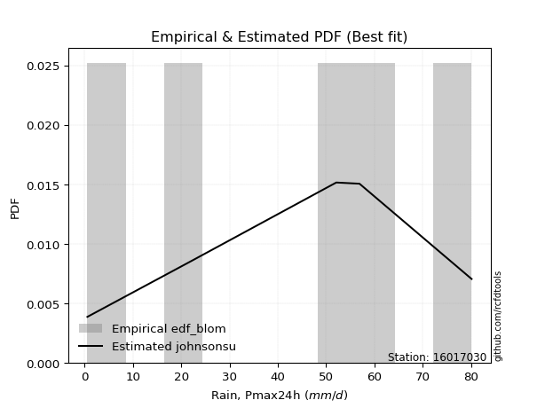</img>

</div>


### 7. EDF Tukey (1962)

In hydrology, the Tukey formula is used as a plotting position formula to estimate the empirical probability or frequency of a flood event (or other hydrological data). The formula parameter is given as _c=0.333_ (or 1/3).

<div align="center">


$P=(m-c)/(n+1-2c)$


</div>


**7.1. Empirical values**

<div align="center">

|                | 0                  | 1                  | 2         | 3         | 4         |
|:---------------|:-------------------|:-------------------|:----------|:----------|:----------|
| date           | 2012               | 2009               | 2011      | 2008      | 2010      |
| x              | 0.6                | 22.3               | 52.1      | 56.9      | 80.1      |
| m              | 1                  | 2                  | 3         | 4         | 5         |
| empirical_dist | edf_tukey          | edf_tukey          | edf_tukey | edf_tukey | edf_tukey |
| empirical      | 0.125              | 0.3125             | 0.5       | 0.6875    | 0.875     |
| empirical_tr   | 1.1428571428571428 | 1.4545454545454546 | 2.0       | 3.2       | 8.0       |

</div>


**7.2. Kolmogorov-Smirnov fit test (sorted by Δ)**


<div align="center">

|                | 0                   | 1                   | 2                   | 3                   | 4                   | 5                   | 6                   | 7                   | 8                   | 9                   | 10                  | 11                  | 12                 | 13                  | 14                  | 15                  | 16                  | 17                 | 18                  | 19                  | 20                 | 21                  | 22                  | 23                 | 24                 | 25                  | 26                  | 27                  | 28                  | 29                  | 30                  | 31                  | 32                  | 33                  | 34                  | 35                  | 36                  | 37                  | 38                 | 39                 | 40                 | 41                  | 42                  | 43                  | 44                 | 45                 | 46                 | 47                 | 48                 | 49                 | 50                  | 51                  | 52                  | 53                  | 54                  | 55                 | 56                  | 57                  | 58                 | 59                  | 60                  | 61                 | 62                  | 63                  | 64                  | 65                  | 66                  | 67                 | 68                 | 69                  | 70                 | 71                  | 72                  | 73                  | 74                  | 75                  | 76                  | 77                 | 78                  | 79                  | 80                 | 81                  | 82                  | 83                 | 84                 | 85                  | 86                  | 87                  | 88                  | 89                  | 90                  | 91                 | 92                 | 93                  | 94                  | 95                  | 96                  | 97                 | 98                  | 99                 | 100                | 101                | 102                | 103                 | 104                 | 105                 | 106                | 107                 | 108                 | 109                 | 110                 | 111                | 112                | 113                | 114                 | 115                | 116                 | 117                 | 118                | 119                 | 120                 | 121                | 122                 | 123                 | 124                 | 125                | 126                 | 127                 | 128                | 129                 | 130                 | 131                 | 132                | 133                | 134                | 135                 | 136                | 137                | 138                | 139                | 140                | 141                | 142                | 143                | 144                | 145                | 146                | 147                | 148                | 149                | 150                | 151                | 152                | 153                | 154                | 155                | 156                | 157                | 158                | 159                |
|:---------------|:--------------------|:--------------------|:--------------------|:--------------------|:--------------------|:--------------------|:--------------------|:--------------------|:--------------------|:--------------------|:--------------------|:--------------------|:-------------------|:--------------------|:--------------------|:--------------------|:--------------------|:-------------------|:--------------------|:--------------------|:-------------------|:--------------------|:--------------------|:-------------------|:-------------------|:--------------------|:--------------------|:--------------------|:--------------------|:--------------------|:--------------------|:--------------------|:--------------------|:--------------------|:--------------------|:--------------------|:--------------------|:--------------------|:-------------------|:-------------------|:-------------------|:--------------------|:--------------------|:--------------------|:-------------------|:-------------------|:-------------------|:-------------------|:-------------------|:-------------------|:--------------------|:--------------------|:--------------------|:--------------------|:--------------------|:-------------------|:--------------------|:--------------------|:-------------------|:--------------------|:--------------------|:-------------------|:--------------------|:--------------------|:--------------------|:--------------------|:--------------------|:-------------------|:-------------------|:--------------------|:-------------------|:--------------------|:--------------------|:--------------------|:--------------------|:--------------------|:--------------------|:-------------------|:--------------------|:--------------------|:-------------------|:--------------------|:--------------------|:-------------------|:-------------------|:--------------------|:--------------------|:--------------------|:--------------------|:--------------------|:--------------------|:-------------------|:-------------------|:--------------------|:--------------------|:--------------------|:--------------------|:-------------------|:--------------------|:-------------------|:-------------------|:-------------------|:-------------------|:--------------------|:--------------------|:--------------------|:-------------------|:--------------------|:--------------------|:--------------------|:--------------------|:-------------------|:-------------------|:-------------------|:--------------------|:-------------------|:--------------------|:--------------------|:-------------------|:--------------------|:--------------------|:-------------------|:--------------------|:--------------------|:--------------------|:-------------------|:--------------------|:--------------------|:-------------------|:--------------------|:--------------------|:--------------------|:-------------------|:-------------------|:-------------------|:--------------------|:-------------------|:-------------------|:-------------------|:-------------------|:-------------------|:-------------------|:-------------------|:-------------------|:-------------------|:-------------------|:-------------------|:-------------------|:-------------------|:-------------------|:-------------------|:-------------------|:-------------------|:-------------------|:-------------------|:-------------------|:-------------------|:-------------------|:-------------------|:-------------------|
| station        | 16017030            | 16017030            | 16017030            | 16017030            | 16017030            | 16017030            | 16017030            | 16017030            | 16017030            | 16017030            | 16017030            | 16017030            | 16017030           | 16017030            | 16017030            | 16017030            | 16017030            | 16017030           | 16017030            | 16017030            | 16017030           | 16017030            | 16017030            | 16017030           | 16017030           | 16017030            | 16017030            | 16017030            | 16017030            | 16017030            | 16017030            | 16017030            | 16017030            | 16017030            | 16017030            | 16017030            | 16017030            | 16017030            | 16017030           | 16017030           | 16017030           | 16017030            | 16017030            | 16017030            | 16017030           | 16017030           | 16017030           | 16017030           | 16017030           | 16017030           | 16017030            | 16017030            | 16017030            | 16017030            | 16017030            | 16017030           | 16017030            | 16017030            | 16017030           | 16017030            | 16017030            | 16017030           | 16017030            | 16017030            | 16017030            | 16017030            | 16017030            | 16017030           | 16017030           | 16017030            | 16017030           | 16017030            | 16017030            | 16017030            | 16017030            | 16017030            | 16017030            | 16017030           | 16017030            | 16017030            | 16017030           | 16017030            | 16017030            | 16017030           | 16017030           | 16017030            | 16017030            | 16017030            | 16017030            | 16017030            | 16017030            | 16017030           | 16017030           | 16017030            | 16017030            | 16017030            | 16017030            | 16017030           | 16017030            | 16017030           | 16017030           | 16017030           | 16017030           | 16017030            | 16017030            | 16017030            | 16017030           | 16017030            | 16017030            | 16017030            | 16017030            | 16017030           | 16017030           | 16017030           | 16017030            | 16017030           | 16017030            | 16017030            | 16017030           | 16017030            | 16017030            | 16017030           | 16017030            | 16017030            | 16017030            | 16017030           | 16017030            | 16017030            | 16017030           | 16017030            | 16017030            | 16017030            | 16017030           | 16017030           | 16017030           | 16017030            | 16017030           | 16017030           | 16017030           | 16017030           | 16017030           | 16017030           | 16017030           | 16017030           | 16017030           | 16017030           | 16017030           | 16017030           | 16017030           | 16017030           | 16017030           | 16017030           | 16017030           | 16017030           | 16017030           | 16017030           | 16017030           | 16017030           | 16017030           | 16017030           |
| empirical_dist | edf_tukey           | edf_tukey           | edf_tukey           | edf_tukey           | edf_tukey           | edf_tukey           | edf_tukey           | edf_tukey           | edf_tukey           | edf_tukey           | edf_tukey           | edf_tukey           | edf_tukey          | edf_tukey           | edf_tukey           | edf_tukey           | edf_tukey           | edf_tukey          | edf_tukey           | edf_tukey           | edf_tukey          | edf_tukey           | edf_tukey           | edf_tukey          | edf_tukey          | edf_tukey           | edf_tukey           | edf_tukey           | edf_tukey           | edf_tukey           | edf_tukey           | edf_tukey           | edf_tukey           | edf_tukey           | edf_tukey           | edf_tukey           | edf_tukey           | edf_tukey           | edf_tukey          | edf_tukey          | edf_tukey          | edf_tukey           | edf_tukey           | edf_tukey           | edf_tukey          | edf_tukey          | edf_tukey          | edf_tukey          | edf_tukey          | edf_tukey          | edf_tukey           | edf_tukey           | edf_tukey           | edf_tukey           | edf_tukey           | edf_tukey          | edf_tukey           | edf_tukey           | edf_tukey          | edf_tukey           | edf_tukey           | edf_tukey          | edf_tukey           | edf_tukey           | edf_tukey           | edf_tukey           | edf_tukey           | edf_tukey          | edf_tukey          | edf_tukey           | edf_tukey          | edf_tukey           | edf_tukey           | edf_tukey           | edf_tukey           | edf_tukey           | edf_tukey           | edf_tukey          | edf_tukey           | edf_tukey           | edf_tukey          | edf_tukey           | edf_tukey           | edf_tukey          | edf_tukey          | edf_tukey           | edf_tukey           | edf_tukey           | edf_tukey           | edf_tukey           | edf_tukey           | edf_tukey          | edf_tukey          | edf_tukey           | edf_tukey           | edf_tukey           | edf_tukey           | edf_tukey          | edf_tukey           | edf_tukey          | edf_tukey          | edf_tukey          | edf_tukey          | edf_tukey           | edf_tukey           | edf_tukey           | edf_tukey          | edf_tukey           | edf_tukey           | edf_tukey           | edf_tukey           | edf_tukey          | edf_tukey          | edf_tukey          | edf_tukey           | edf_tukey          | edf_tukey           | edf_tukey           | edf_tukey          | edf_tukey           | edf_tukey           | edf_tukey          | edf_tukey           | edf_tukey           | edf_tukey           | edf_tukey          | edf_tukey           | edf_tukey           | edf_tukey          | edf_tukey           | edf_tukey           | edf_tukey           | edf_tukey          | edf_tukey          | edf_tukey          | edf_tukey           | edf_tukey          | edf_tukey          | edf_tukey          | edf_tukey          | edf_tukey          | edf_tukey          | edf_tukey          | edf_tukey          | edf_tukey          | edf_tukey          | edf_tukey          | edf_tukey          | edf_tukey          | edf_tukey          | edf_tukey          | edf_tukey          | edf_tukey          | edf_tukey          | edf_tukey          | edf_tukey          | edf_tukey          | edf_tukey          | edf_tukey          | edf_tukey          |
| p_dist         | dweibull            | johnsonsu           | argus               | ksone               | dgamma              | genlogistic         | semicircular        | trapezoid           | gumbel_l            | anglit              | triang              | weibull_min         | pearson3           | loggenpareto        | skewnorm            | wrapcauchy          | beta                | genpareto          | loggenextreme       | genhalflogistic     | arcsine            | exponnorm           | crystalball         | norm               | t                  | foldnorm            | logvonmises_line    | gompertz            | betaprime           | vonmises_line       | erlang              | gamma               | tukeylambda         | cosine              | kappa4              | kappa3              | uniform             | loglevy_l           | logpearson3        | rice               | f                  | ncf                 | bradford            | logistic            | invgamma           | maxwell            | invgauss           | gausshyper         | burr12             | hypsecant          | rayleigh            | logtrapezoid        | loggumbel_l         | loggausshyper       | truncweibull_min    | gennorm            | kstwobign           | halfnorm            | levy_l             | burr                | logt                | laplace            | loggennorm          | gumbel_r            | logarcsine          | logdgamma           | logsemicircular     | loganglit          | genexpon           | genextreme          | lognorm            | logexponnorm        | loggompertz         | lognakagami         | lognct              | logdweibull         | halflogistic        | truncexpon         | moyal               | logrice             | logargus           | logerlang           | logfoldnorm         | loglogistic        | logweibull_max     | loggamma            | loggamma            | loginvgamma         | logwrapcauchy       | logalpha            | loginvgauss         | logloggamma        | loghypsecant       | loginvweibull       | logmaxwell          | loggengamma         | lograyleigh         | logburr12          | exponweib           | lomax              | loglaplace         | loglaplace         | logexponweib       | logcosine           | wald                | loglomax            | logkstwobign       | loggumbel_r         | loghalfnorm         | logncf              | loggenexpon         | logburr            | mielke             | gengamma           | logmoyal            | loggenhalflogistic | loghalflogistic     | nct                 | logbeta            | logskewnorm         | logloglaplace       | logtriang          | logkappa3           | loghalfgennorm      | logtruncweibull_min | logwald            | logksone            | logf                | halfgennorm        | loguniform          | logbradford         | logtruncnorm        | logkappa4          | johnsonsb          | logmielke          | logweibull_min      | invweibull         | logjohnsonsu       | fatiguelife        | logtruncexpon      | nakagami           | logbetaprime       | logfatiguelife     | logtukeylambda     | logjohnsonsb       | powerlaw           | truncpareto        | weibull_max        | logexponpow        | exponpow           | logtruncpareto     | alpha              | truncnorm          | logpowerlaw        | rdist              | loggenlogistic     | logrdist           | logvonmises        | vonmises           | logcrystalball     |
| delta          | 0.09473934224784342 | 0.09650312893532131 | 0.09849981585304468 | 0.10055992345576747 | 0.10308404140318078 | 0.10413604125192424 | 0.11031996186219506 | 0.11199671736887362 | 0.11304724119372256 | 0.11795524359209109 | 0.12298819493395141 | 0.12346364729723258 | 0.1241103761945126 | 0.12499922570868183 | 0.12499953594168411 | 0.12499999728648403 | 0.12499999999340827 | 0.1249999999982837 | 0.12499999999975031 | 0.12499999999999789 | 0.125              | 0.13621046967992034 | 0.13621124187243083 | 0.136211248449843  | 0.136211533386686  | 0.13734071711148343 | 0.13742125903860702 | 0.13888260442252454 | 0.14099005946495058 | 0.14117467511527348 | 0.14249447513523017 | 0.14272524323794722 | 0.14491623908997298 | 0.14541585355741016 | 0.14554530679858135 | 0.14770676896669677 | 0.14779874213836475 | 0.14841965430590864 | 0.1493994932248497 | 0.1496532832544999 | 0.1507828766371978 | 0.15147767460758021 | 0.15255956904761414 | 0.15290579655501668 | 0.1547519878164878 | 0.1592866304806806 | 0.1604045513738266 | 0.1604072713642788 | 0.1634588739778574 | 0.1660820675568807 | 0.16628458327202789 | 0.17030809725895035 | 0.17071128055389706 | 0.17476811675543413 | 0.17591545854952462 | 0.1784061251188984 | 0.18310557378067316 | 0.18648475056568048 | 0.1875823265644061 | 0.19063358516790163 | 0.19132129214749716 | 0.1944947093874868 | 0.19670827536911084 | 0.19826370524031234 | 0.20127649577395645 | 0.20304919277892208 | 0.20697422808505095 | 0.2084105802134668 | 0.2085393877039854 | 0.20915233335911804 | 0.2118959095232581 | 0.21189623178823125 | 0.21193105389240485 | 0.21236553773556843 | 0.21268228275812118 | 0.21371696025556897 | 0.21476996377034507 | 0.2154159482052841 | 0.21896812594025206 | 0.21906925068287741 | 0.2194036074109469 | 0.22181686153045133 | 0.22337684774072364 | 0.2241094568815838 | 0.2269354800922465 | 0.22727611941477577 | 0.22727611941477577 | 0.22761021399322634 | 0.22903591597925432 | 0.23223669708719108 | 0.23442050640604628 | 0.235022040421914  | 0.2395448546670489 | 0.24261780533384425 | 0.24381062833564704 | 0.24901104723323653 | 0.25425358191099856 | 0.2575784313432976 | 0.25979228263620535 | 0.2604196405638325 | 0.2643733064928817 | 0.2643733064928817 | 0.2731611850423675 | 0.27633756350752037 | 0.27728306113016565 | 0.27900796497416214 | 0.2796462065438372 | 0.28256688168608224 | 0.28365328750796737 | 0.28433677372955646 | 0.28742234126453825 | 0.2969789698716824 | 0.3050632710402237 | 0.3076693655965739 | 0.30808212797754253 | 0.3087628973992559 | 0.30990975478006255 | 0.31280110729809363 | 0.3283566557101487 | 0.35005865958464977 | 0.35035195577268485 | 0.3586134154811782 | 0.35957977045059886 | 0.37399220363270713 | 0.3763852535156602  | 0.3789331702334513 | 0.38644042665476375 | 0.39094057563731166 | 0.3910661416527932 | 0.42622851198571643 | 0.42739843573866165 | 0.42890784123137915 | 0.4302554520533136 | 0.4322488865467805 | 0.4364864933629946 | 0.44597752208229813 | 0.4597245126126542 | 0.4618540857462813 | 0.4772956531559578 | 0.4882301658025948 | 0.5114407463101106 | 0.5226341066528911 | 0.5268636531455835 | 0.5304672623736124 | 0.5409309583156534 | 0.5479352451334998 | 0.55376816449449   | 0.581621007056969  | 0.5834445017082259 | 0.603028127504065  | 0.6278589307919561 | 0.6396781930040142 | 0.6483174043728526 | 0.6492201448528274 | 0.6874999997861919 | 0.6875             | 0.6875             | 0.8943636806897808 | 12.211921413595256 | nan                |
| deltao         | 0.5865427407550001  | 0.5865427407550001  | 0.5865427407550001  | 0.5865427407550001  | 0.5865427407550001  | 0.5865427407550001  | 0.5865427407550001  | 0.5865427407550001  | 0.5865427407550001  | 0.5865427407550001  | 0.5865427407550001  | 0.5865427407550001  | 0.5865427407550001 | 0.5865427407550001  | 0.5865427407550001  | 0.5865427407550001  | 0.5865427407550001  | 0.5865427407550001 | 0.5865427407550001  | 0.5865427407550001  | 0.5865427407550001 | 0.5865427407550001  | 0.5865427407550001  | 0.5865427407550001 | 0.5865427407550001 | 0.5865427407550001  | 0.5865427407550001  | 0.5865427407550001  | 0.5865427407550001  | 0.5865427407550001  | 0.5865427407550001  | 0.5865427407550001  | 0.5865427407550001  | 0.5865427407550001  | 0.5865427407550001  | 0.5865427407550001  | 0.5865427407550001  | 0.5865427407550001  | 0.5865427407550001 | 0.5865427407550001 | 0.5865427407550001 | 0.5865427407550001  | 0.5865427407550001  | 0.5865427407550001  | 0.5865427407550001 | 0.5865427407550001 | 0.5865427407550001 | 0.5865427407550001 | 0.5865427407550001 | 0.5865427407550001 | 0.5865427407550001  | 0.5865427407550001  | 0.5865427407550001  | 0.5865427407550001  | 0.5865427407550001  | 0.5865427407550001 | 0.5865427407550001  | 0.5865427407550001  | 0.5865427407550001 | 0.5865427407550001  | 0.5865427407550001  | 0.5865427407550001 | 0.5865427407550001  | 0.5865427407550001  | 0.5865427407550001  | 0.5865427407550001  | 0.5865427407550001  | 0.5865427407550001 | 0.5865427407550001 | 0.5865427407550001  | 0.5865427407550001 | 0.5865427407550001  | 0.5865427407550001  | 0.5865427407550001  | 0.5865427407550001  | 0.5865427407550001  | 0.5865427407550001  | 0.5865427407550001 | 0.5865427407550001  | 0.5865427407550001  | 0.5865427407550001 | 0.5865427407550001  | 0.5865427407550001  | 0.5865427407550001 | 0.5865427407550001 | 0.5865427407550001  | 0.5865427407550001  | 0.5865427407550001  | 0.5865427407550001  | 0.5865427407550001  | 0.5865427407550001  | 0.5865427407550001 | 0.5865427407550001 | 0.5865427407550001  | 0.5865427407550001  | 0.5865427407550001  | 0.5865427407550001  | 0.5865427407550001 | 0.5865427407550001  | 0.5865427407550001 | 0.5865427407550001 | 0.5865427407550001 | 0.5865427407550001 | 0.5865427407550001  | 0.5865427407550001  | 0.5865427407550001  | 0.5865427407550001 | 0.5865427407550001  | 0.5865427407550001  | 0.5865427407550001  | 0.5865427407550001  | 0.5865427407550001 | 0.5865427407550001 | 0.5865427407550001 | 0.5865427407550001  | 0.5865427407550001 | 0.5865427407550001  | 0.5865427407550001  | 0.5865427407550001 | 0.5865427407550001  | 0.5865427407550001  | 0.5865427407550001 | 0.5865427407550001  | 0.5865427407550001  | 0.5865427407550001  | 0.5865427407550001 | 0.5865427407550001  | 0.5865427407550001  | 0.5865427407550001 | 0.5865427407550001  | 0.5865427407550001  | 0.5865427407550001  | 0.5865427407550001 | 0.5865427407550001 | 0.5865427407550001 | 0.5865427407550001  | 0.5865427407550001 | 0.5865427407550001 | 0.5865427407550001 | 0.5865427407550001 | 0.5865427407550001 | 0.5865427407550001 | 0.5865427407550001 | 0.5865427407550001 | 0.5865427407550001 | 0.5865427407550001 | 0.5865427407550001 | 0.5865427407550001 | 0.5865427407550001 | 0.5865427407550001 | 0.5865427407550001 | 0.5865427407550001 | 0.5865427407550001 | 0.5865427407550001 | 0.5865427407550001 | 0.5865427407550001 | 0.5865427407550001 | 0.5865427407550001 | 0.5865427407550001 | 0.5865427407550001 |
| eval           | Δo > Δ              | Δo > Δ              | Δo > Δ              | Δo > Δ              | Δo > Δ              | Δo > Δ              | Δo > Δ              | Δo > Δ              | Δo > Δ              | Δo > Δ              | Δo > Δ              | Δo > Δ              | Δo > Δ             | Δo > Δ              | Δo > Δ              | Δo > Δ              | Δo > Δ              | Δo > Δ             | Δo > Δ              | Δo > Δ              | Δo > Δ             | Δo > Δ              | Δo > Δ              | Δo > Δ             | Δo > Δ             | Δo > Δ              | Δo > Δ              | Δo > Δ              | Δo > Δ              | Δo > Δ              | Δo > Δ              | Δo > Δ              | Δo > Δ              | Δo > Δ              | Δo > Δ              | Δo > Δ              | Δo > Δ              | Δo > Δ              | Δo > Δ             | Δo > Δ             | Δo > Δ             | Δo > Δ              | Δo > Δ              | Δo > Δ              | Δo > Δ             | Δo > Δ             | Δo > Δ             | Δo > Δ             | Δo > Δ             | Δo > Δ             | Δo > Δ              | Δo > Δ              | Δo > Δ              | Δo > Δ              | Δo > Δ              | Δo > Δ             | Δo > Δ              | Δo > Δ              | Δo > Δ             | Δo > Δ              | Δo > Δ              | Δo > Δ             | Δo > Δ              | Δo > Δ              | Δo > Δ              | Δo > Δ              | Δo > Δ              | Δo > Δ             | Δo > Δ             | Δo > Δ              | Δo > Δ             | Δo > Δ              | Δo > Δ              | Δo > Δ              | Δo > Δ              | Δo > Δ              | Δo > Δ              | Δo > Δ             | Δo > Δ              | Δo > Δ              | Δo > Δ             | Δo > Δ              | Δo > Δ              | Δo > Δ             | Δo > Δ             | Δo > Δ              | Δo > Δ              | Δo > Δ              | Δo > Δ              | Δo > Δ              | Δo > Δ              | Δo > Δ             | Δo > Δ             | Δo > Δ              | Δo > Δ              | Δo > Δ              | Δo > Δ              | Δo > Δ             | Δo > Δ              | Δo > Δ             | Δo > Δ             | Δo > Δ             | Δo > Δ             | Δo > Δ              | Δo > Δ              | Δo > Δ              | Δo > Δ             | Δo > Δ              | Δo > Δ              | Δo > Δ              | Δo > Δ              | Δo > Δ             | Δo > Δ             | Δo > Δ             | Δo > Δ              | Δo > Δ             | Δo > Δ              | Δo > Δ              | Δo > Δ             | Δo > Δ              | Δo > Δ              | Δo > Δ             | Δo > Δ              | Δo > Δ              | Δo > Δ              | Δo > Δ             | Δo > Δ              | Δo > Δ              | Δo > Δ             | Δo > Δ              | Δo > Δ              | Δo > Δ              | Δo > Δ             | Δo > Δ             | Δo > Δ             | Δo > Δ              | Δo > Δ             | Δo > Δ             | Δo > Δ             | Δo > Δ             | Δo > Δ             | Δo > Δ             | Δo > Δ             | Δo > Δ             | Δo > Δ             | Δo > Δ             | Δo > Δ             | Δo > Δ             | Δo > Δ             | Δo <= Δ            | Δo <= Δ            | Δo <= Δ            | Δo <= Δ            | Δo <= Δ            | Δo <= Δ            | Δo <= Δ            | Δo <= Δ            | Δo <= Δ            | Δo <= Δ            | Δo <= Δ            |
| fit            | 1                   | 1                   | 1                   | 1                   | 1                   | 1                   | 1                   | 1                   | 1                   | 1                   | 1                   | 1                   | 1                  | 1                   | 1                   | 1                   | 1                   | 1                  | 1                   | 1                   | 1                  | 1                   | 1                   | 1                  | 1                  | 1                   | 1                   | 1                   | 1                   | 1                   | 1                   | 1                   | 1                   | 1                   | 1                   | 1                   | 1                   | 1                   | 1                  | 1                  | 1                  | 1                   | 1                   | 1                   | 1                  | 1                  | 1                  | 1                  | 1                  | 1                  | 1                   | 1                   | 1                   | 1                   | 1                   | 1                  | 1                   | 1                   | 1                  | 1                   | 1                   | 1                  | 1                   | 1                   | 1                   | 1                   | 1                   | 1                  | 1                  | 1                   | 1                  | 1                   | 1                   | 1                   | 1                   | 1                   | 1                   | 1                  | 1                   | 1                   | 1                  | 1                   | 1                   | 1                  | 1                  | 1                   | 1                   | 1                   | 1                   | 1                   | 1                   | 1                  | 1                  | 1                   | 1                   | 1                   | 1                   | 1                  | 1                   | 1                  | 1                  | 1                  | 1                  | 1                   | 1                   | 1                   | 1                  | 1                   | 1                   | 1                   | 1                   | 1                  | 1                  | 1                  | 1                   | 1                  | 1                   | 1                   | 1                  | 1                   | 1                   | 1                  | 1                   | 1                   | 1                   | 1                  | 1                   | 1                   | 1                  | 1                   | 1                   | 1                   | 1                  | 1                  | 1                  | 1                   | 1                  | 1                  | 1                  | 1                  | 1                  | 1                  | 1                  | 1                  | 1                  | 1                  | 1                  | 1                  | 1                  | 0                  | 0                  | 0                  | 0                  | 0                  | 0                  | 0                  | 0                  | 0                  | 0                  | 0                  |
| n              | 5                   | 5                   | 5                   | 5                   | 5                   | 5                   | 5                   | 5                   | 5                   | 5                   | 5                   | 5                   | 5                  | 5                   | 5                   | 5                   | 5                   | 5                  | 5                   | 5                   | 5                  | 5                   | 5                   | 5                  | 5                  | 5                   | 5                   | 5                   | 5                   | 5                   | 5                   | 5                   | 5                   | 5                   | 5                   | 5                   | 5                   | 5                   | 5                  | 5                  | 5                  | 5                   | 5                   | 5                   | 5                  | 5                  | 5                  | 5                  | 5                  | 5                  | 5                   | 5                   | 5                   | 5                   | 5                   | 5                  | 5                   | 5                   | 5                  | 5                   | 5                   | 5                  | 5                   | 5                   | 5                   | 5                   | 5                   | 5                  | 5                  | 5                   | 5                  | 5                   | 5                   | 5                   | 5                   | 5                   | 5                   | 5                  | 5                   | 5                   | 5                  | 5                   | 5                   | 5                  | 5                  | 5                   | 5                   | 5                   | 5                   | 5                   | 5                   | 5                  | 5                  | 5                   | 5                   | 5                   | 5                   | 5                  | 5                   | 5                  | 5                  | 5                  | 5                  | 5                   | 5                   | 5                   | 5                  | 5                   | 5                   | 5                   | 5                   | 5                  | 5                  | 5                  | 5                   | 5                  | 5                   | 5                   | 5                  | 5                   | 5                   | 5                  | 5                   | 5                   | 5                   | 5                  | 5                   | 5                   | 5                  | 5                   | 5                   | 5                   | 5                  | 5                  | 5                  | 5                   | 5                  | 5                  | 5                  | 5                  | 5                  | 5                  | 5                  | 5                  | 5                  | 5                  | 5                  | 5                  | 5                  | 5                  | 5                  | 5                  | 5                  | 5                  | 5                  | 5                  | 5                  | 5                  | 5                  | 5                  |
| best_fit       | 1                   | 0                   | 0                   | 0                   | 0                   | 0                   | 0                   | 0                   | 0                   | 0                   | 0                   | 0                   | 0                  | 0                   | 0                   | 0                   | 0                   | 0                  | 0                   | 0                   | 0                  | 0                   | 0                   | 0                  | 0                  | 0                   | 0                   | 0                   | 0                   | 0                   | 0                   | 0                   | 0                   | 0                   | 0                   | 0                   | 0                   | 0                   | 0                  | 0                  | 0                  | 0                   | 0                   | 0                   | 0                  | 0                  | 0                  | 0                  | 0                  | 0                  | 0                   | 0                   | 0                   | 0                   | 0                   | 0                  | 0                   | 0                   | 0                  | 0                   | 0                   | 0                  | 0                   | 0                   | 0                   | 0                   | 0                   | 0                  | 0                  | 0                   | 0                  | 0                   | 0                   | 0                   | 0                   | 0                   | 0                   | 0                  | 0                   | 0                   | 0                  | 0                   | 0                   | 0                  | 0                  | 0                   | 0                   | 0                   | 0                   | 0                   | 0                   | 0                  | 0                  | 0                   | 0                   | 0                   | 0                   | 0                  | 0                   | 0                  | 0                  | 0                  | 0                  | 0                   | 0                   | 0                   | 0                  | 0                   | 0                   | 0                   | 0                   | 0                  | 0                  | 0                  | 0                   | 0                  | 0                   | 0                   | 0                  | 0                   | 0                   | 0                  | 0                   | 0                   | 0                   | 0                  | 0                   | 0                   | 0                  | 0                   | 0                   | 0                   | 0                  | 0                  | 0                  | 0                   | 0                  | 0                  | 0                  | 0                  | 0                  | 0                  | 0                  | 0                  | 0                  | 0                  | 0                  | 0                  | 0                  | 0                  | 0                  | 0                  | 0                  | 0                  | 0                  | 0                  | 0                  | 0                  | 0                  | 0                  |
| best_fit_sort  | 1                   | 2                   | 3                   | 4                   | 5                   | 6                   | 7                   | 8                   | 9                   | 10                  | 11                  | 12                  | 13                 | 14                  | 15                  | 16                  | 17                  | 18                 | 19                  | 20                  | 21                 | 22                  | 23                  | 24                 | 25                 | 26                  | 27                  | 28                  | 29                  | 30                  | 31                  | 32                  | 33                  | 34                  | 35                  | 36                  | 37                  | 38                  | 39                 | 40                 | 41                 | 42                  | 43                  | 44                  | 45                 | 46                 | 47                 | 48                 | 49                 | 50                 | 51                  | 52                  | 53                  | 54                  | 55                  | 56                 | 57                  | 58                  | 59                 | 60                  | 61                  | 62                 | 63                  | 64                  | 65                  | 66                  | 67                  | 68                 | 69                 | 70                  | 71                 | 72                  | 73                  | 74                  | 75                  | 76                  | 77                  | 78                 | 79                  | 80                  | 81                 | 82                  | 83                  | 84                 | 85                 | 86                  | 87                  | 88                  | 89                  | 90                  | 91                  | 92                 | 93                 | 94                  | 95                  | 96                  | 97                  | 98                 | 99                  | 100                | 101                | 102                | 103                | 104                 | 105                 | 106                 | 107                | 108                 | 109                 | 110                 | 111                 | 112                | 113                | 114                | 115                 | 116                | 117                 | 118                 | 119                | 120                 | 121                 | 122                | 123                 | 124                 | 125                 | 126                | 127                 | 128                 | 129                | 130                 | 131                 | 132                 | 133                | 134                | 135                | 136                 | 137                | 138                | 139                | 140                | 141                | 142                | 143                | 144                | 145                | 146                | 147                | 148                | 149                | 150                | 151                | 152                | 153                | 154                | 155                | 156                | 157                | 158                | 159                | 160                |

</div>


**7.3. Best fit**

<div align="center">

|   id |   station | empirical_dist   | p_dist   |     delta |   deltao | eval   |   fit |   n |   best_fit |   best_fit_sort |
|-----:|----------:|:-----------------|:---------|----------:|---------:|:-------|------:|----:|-----------:|----------------:|
|    0 |  16017030 | edf_tukey        | dweibull | 0.0947393 | 0.586543 | Δo > Δ |     1 |   5 |          1 |               1 |

</div>


<div align="center">

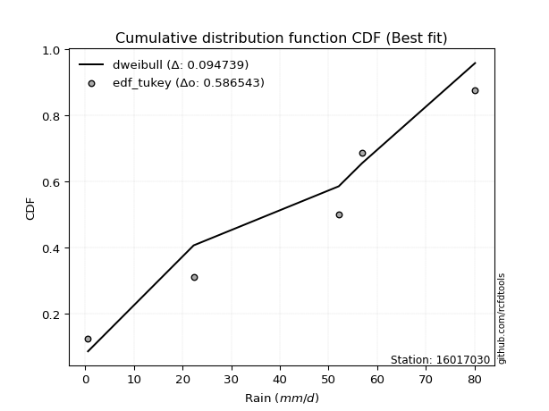</img>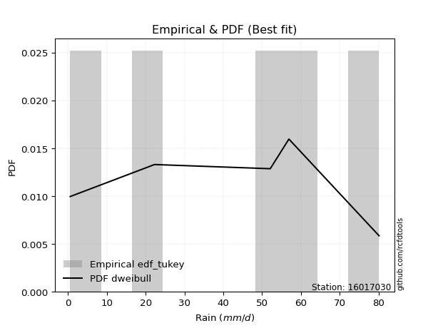</img>

</div>


### 8. EDF Gringorten (1963)

Gringorten plotting position formula is essential for estimating the probability and return periods of extreme events like floods and heavy rainfall. The constant _a=0.44_.

<div align="center">


$P=(m-a)/(n+1-2a)$


</div>


**8.1. Empirical values**

<div align="center">

|                | 0                   | 1                  | 2              | 3                 | 4                  |
|:---------------|:--------------------|:-------------------|:---------------|:------------------|:-------------------|
| date           | 2012                | 2009               | 2011           | 2008              | 2010               |
| x              | 0.6                 | 22.3               | 52.1           | 56.9              | 80.1               |
| m              | 1                   | 2                  | 3              | 4                 | 5                  |
| empirical_dist | edf_gringorten      | edf_gringorten     | edf_gringorten | edf_gringorten    | edf_gringorten     |
| empirical      | 0.10937500000000001 | 0.3046875          | 0.5            | 0.6953125         | 0.8906249999999999 |
| empirical_tr   | 1.1228070175438596  | 1.4382022471910112 | 2.0            | 3.282051282051282 | 9.142857142857133  |

</div>


**8.2. Kolmogorov-Smirnov fit test (sorted by Δ)**


<div align="center">

|                | 0                   | 1                   | 2                   | 3                   | 4                   | 5                   | 6                   | 7                   | 8                   | 9                   | 10                  | 11                  | 12                  | 13                 | 14                  | 15                  | 16                  | 17                  | 18                  | 19                 | 20                  | 21                  | 22                  | 23                 | 24                 | 25                  | 26                  | 27                  | 28                  | 29                  | 30                  | 31                  | 32                  | 33                  | 34                  | 35                  | 36                 | 37                 | 38                 | 39                  | 40                  | 41                 | 42                 | 43                  | 44                 | 45                 | 46                 | 47                 | 48                  | 49                 | 50                 | 51                 | 52                  | 53                  | 54                  | 55                  | 56                  | 57                  | 58                  | 59                  | 60                 | 61                 | 62                 | 63                  | 64                 | 65                  | 66                  | 67                  | 68                  | 69                 | 70                 | 71                  | 72                  | 73                  | 74                 | 75                 | 76                  | 77                  | 78                  | 79                  | 80                 | 81                  | 82                  | 83                  | 84                 | 85                 | 86                  | 87                  | 88                  | 89                  | 90                 | 91                  | 92                  | 93                  | 94                  | 95                  | 96                 | 97                  | 98                 | 99                 | 100                 | 101                | 102                 | 103                | 104                 | 105                 | 106                | 107                 | 108                 | 109                 | 110                 | 111                | 112                | 113                | 114                | 115                 | 116                 | 117                 | 118                | 119                 | 120                 | 121                | 122                 | 123                 | 124                 | 125                | 126                 | 127                 | 128                | 129                 | 130                 | 131                 | 132                | 133                | 134                | 135                 | 136                | 137                 | 138                | 139                | 140                | 141                | 142                | 143                | 144                | 145                | 146                | 147                | 148                | 149                | 150                | 151                | 152                | 153                | 154                | 155                | 156                | 157                | 158                | 159                |
|:---------------|:--------------------|:--------------------|:--------------------|:--------------------|:--------------------|:--------------------|:--------------------|:--------------------|:--------------------|:--------------------|:--------------------|:--------------------|:--------------------|:-------------------|:--------------------|:--------------------|:--------------------|:--------------------|:--------------------|:-------------------|:--------------------|:--------------------|:--------------------|:-------------------|:-------------------|:--------------------|:--------------------|:--------------------|:--------------------|:--------------------|:--------------------|:--------------------|:--------------------|:--------------------|:--------------------|:--------------------|:-------------------|:-------------------|:-------------------|:--------------------|:--------------------|:-------------------|:-------------------|:--------------------|:-------------------|:-------------------|:-------------------|:-------------------|:--------------------|:-------------------|:-------------------|:-------------------|:--------------------|:--------------------|:--------------------|:--------------------|:--------------------|:--------------------|:--------------------|:--------------------|:-------------------|:-------------------|:-------------------|:--------------------|:-------------------|:--------------------|:--------------------|:--------------------|:--------------------|:-------------------|:-------------------|:--------------------|:--------------------|:--------------------|:-------------------|:-------------------|:--------------------|:--------------------|:--------------------|:--------------------|:-------------------|:--------------------|:--------------------|:--------------------|:-------------------|:-------------------|:--------------------|:--------------------|:--------------------|:--------------------|:-------------------|:--------------------|:--------------------|:--------------------|:--------------------|:--------------------|:-------------------|:--------------------|:-------------------|:-------------------|:--------------------|:-------------------|:--------------------|:-------------------|:--------------------|:--------------------|:-------------------|:--------------------|:--------------------|:--------------------|:--------------------|:-------------------|:-------------------|:-------------------|:-------------------|:--------------------|:--------------------|:--------------------|:-------------------|:--------------------|:--------------------|:-------------------|:--------------------|:--------------------|:--------------------|:-------------------|:--------------------|:--------------------|:-------------------|:--------------------|:--------------------|:--------------------|:-------------------|:-------------------|:-------------------|:--------------------|:-------------------|:--------------------|:-------------------|:-------------------|:-------------------|:-------------------|:-------------------|:-------------------|:-------------------|:-------------------|:-------------------|:-------------------|:-------------------|:-------------------|:-------------------|:-------------------|:-------------------|:-------------------|:-------------------|:-------------------|:-------------------|:-------------------|:-------------------|:-------------------|
| station        | 16017030            | 16017030            | 16017030            | 16017030            | 16017030            | 16017030            | 16017030            | 16017030            | 16017030            | 16017030            | 16017030            | 16017030            | 16017030            | 16017030           | 16017030            | 16017030            | 16017030            | 16017030            | 16017030            | 16017030           | 16017030            | 16017030            | 16017030            | 16017030           | 16017030           | 16017030            | 16017030            | 16017030            | 16017030            | 16017030            | 16017030            | 16017030            | 16017030            | 16017030            | 16017030            | 16017030            | 16017030           | 16017030           | 16017030           | 16017030            | 16017030            | 16017030           | 16017030           | 16017030            | 16017030           | 16017030           | 16017030           | 16017030           | 16017030            | 16017030           | 16017030           | 16017030           | 16017030            | 16017030            | 16017030            | 16017030            | 16017030            | 16017030            | 16017030            | 16017030            | 16017030           | 16017030           | 16017030           | 16017030            | 16017030           | 16017030            | 16017030            | 16017030            | 16017030            | 16017030           | 16017030           | 16017030            | 16017030            | 16017030            | 16017030           | 16017030           | 16017030            | 16017030            | 16017030            | 16017030            | 16017030           | 16017030            | 16017030            | 16017030            | 16017030           | 16017030           | 16017030            | 16017030            | 16017030            | 16017030            | 16017030           | 16017030            | 16017030            | 16017030            | 16017030            | 16017030            | 16017030           | 16017030            | 16017030           | 16017030           | 16017030            | 16017030           | 16017030            | 16017030           | 16017030            | 16017030            | 16017030           | 16017030            | 16017030            | 16017030            | 16017030            | 16017030           | 16017030           | 16017030           | 16017030           | 16017030            | 16017030            | 16017030            | 16017030           | 16017030            | 16017030            | 16017030           | 16017030            | 16017030            | 16017030            | 16017030           | 16017030            | 16017030            | 16017030           | 16017030            | 16017030            | 16017030            | 16017030           | 16017030           | 16017030           | 16017030            | 16017030           | 16017030            | 16017030           | 16017030           | 16017030           | 16017030           | 16017030           | 16017030           | 16017030           | 16017030           | 16017030           | 16017030           | 16017030           | 16017030           | 16017030           | 16017030           | 16017030           | 16017030           | 16017030           | 16017030           | 16017030           | 16017030           | 16017030           | 16017030           |
| empirical_dist | edf_gringorten      | edf_gringorten      | edf_gringorten      | edf_gringorten      | edf_gringorten      | edf_gringorten      | edf_gringorten      | edf_gringorten      | edf_gringorten      | edf_gringorten      | edf_gringorten      | edf_gringorten      | edf_gringorten      | edf_gringorten     | edf_gringorten      | edf_gringorten      | edf_gringorten      | edf_gringorten      | edf_gringorten      | edf_gringorten     | edf_gringorten      | edf_gringorten      | edf_gringorten      | edf_gringorten     | edf_gringorten     | edf_gringorten      | edf_gringorten      | edf_gringorten      | edf_gringorten      | edf_gringorten      | edf_gringorten      | edf_gringorten      | edf_gringorten      | edf_gringorten      | edf_gringorten      | edf_gringorten      | edf_gringorten     | edf_gringorten     | edf_gringorten     | edf_gringorten      | edf_gringorten      | edf_gringorten     | edf_gringorten     | edf_gringorten      | edf_gringorten     | edf_gringorten     | edf_gringorten     | edf_gringorten     | edf_gringorten      | edf_gringorten     | edf_gringorten     | edf_gringorten     | edf_gringorten      | edf_gringorten      | edf_gringorten      | edf_gringorten      | edf_gringorten      | edf_gringorten      | edf_gringorten      | edf_gringorten      | edf_gringorten     | edf_gringorten     | edf_gringorten     | edf_gringorten      | edf_gringorten     | edf_gringorten      | edf_gringorten      | edf_gringorten      | edf_gringorten      | edf_gringorten     | edf_gringorten     | edf_gringorten      | edf_gringorten      | edf_gringorten      | edf_gringorten     | edf_gringorten     | edf_gringorten      | edf_gringorten      | edf_gringorten      | edf_gringorten      | edf_gringorten     | edf_gringorten      | edf_gringorten      | edf_gringorten      | edf_gringorten     | edf_gringorten     | edf_gringorten      | edf_gringorten      | edf_gringorten      | edf_gringorten      | edf_gringorten     | edf_gringorten      | edf_gringorten      | edf_gringorten      | edf_gringorten      | edf_gringorten      | edf_gringorten     | edf_gringorten      | edf_gringorten     | edf_gringorten     | edf_gringorten      | edf_gringorten     | edf_gringorten      | edf_gringorten     | edf_gringorten      | edf_gringorten      | edf_gringorten     | edf_gringorten      | edf_gringorten      | edf_gringorten      | edf_gringorten      | edf_gringorten     | edf_gringorten     | edf_gringorten     | edf_gringorten     | edf_gringorten      | edf_gringorten      | edf_gringorten      | edf_gringorten     | edf_gringorten      | edf_gringorten      | edf_gringorten     | edf_gringorten      | edf_gringorten      | edf_gringorten      | edf_gringorten     | edf_gringorten      | edf_gringorten      | edf_gringorten     | edf_gringorten      | edf_gringorten      | edf_gringorten      | edf_gringorten     | edf_gringorten     | edf_gringorten     | edf_gringorten      | edf_gringorten     | edf_gringorten      | edf_gringorten     | edf_gringorten     | edf_gringorten     | edf_gringorten     | edf_gringorten     | edf_gringorten     | edf_gringorten     | edf_gringorten     | edf_gringorten     | edf_gringorten     | edf_gringorten     | edf_gringorten     | edf_gringorten     | edf_gringorten     | edf_gringorten     | edf_gringorten     | edf_gringorten     | edf_gringorten     | edf_gringorten     | edf_gringorten     | edf_gringorten     | edf_gringorten     |
| p_dist         | johnsonsu           | argus               | genlogistic         | trapezoid           | ksone               | dweibull            | gumbel_l            | triang              | loggenpareto        | skewnorm            | wrapcauchy          | beta                | genpareto           | genhalflogistic    | arcsine             | semicircular        | dgamma              | anglit              | weibull_min         | pearson3           | loggenextreme       | exponnorm           | crystalball         | norm               | t                  | foldnorm            | gompertz            | betaprime           | vonmises_line       | erlang              | gamma               | tukeylambda         | cosine              | kappa4              | kappa3              | uniform             | logpearson3        | rice               | f                  | bradford            | logistic            | logvonmises_line   | invgamma           | loglevy_l           | maxwell            | invgauss           | burr12             | hypsecant          | rayleigh            | ncf                | gausshyper         | gennorm            | loggumbel_l         | loggausshyper       | truncweibull_min    | logtrapezoid        | kstwobign           | logt                | halfnorm            | burr                | laplace            | loggennorm         | levy_l             | gumbel_r            | genexpon           | logarcsine          | loggompertz         | halflogistic        | logsemicircular     | truncexpon         | loganglit          | genextreme          | logdgamma           | moyal               | logargus           | lognorm            | logexponnorm        | lognakagami         | lognct              | logfoldnorm         | loglogistic        | logrice             | logdweibull         | logerlang           | logweibull_max     | logloggamma        | loggamma            | loggamma            | loginvgamma         | logwrapcauchy       | loghypsecant       | logalpha            | loginvgauss         | loginvweibull       | logmaxwell          | loggengamma         | lomax              | lograyleigh         | loglaplace         | loglaplace         | exponweib           | logburr12          | wald                | logexponweib       | logcosine           | loglomax            | logkstwobign       | loggumbel_r         | loghalfnorm         | logncf              | loggenexpon         | logburr            | mielke             | loggenhalflogistic | gengamma           | logmoyal            | loghalflogistic     | nct                 | logbeta            | logskewnorm         | logloglaplace       | logtriang          | logkappa3           | logtruncweibull_min | loghalfgennorm      | logwald            | logksone            | logf                | halfgennorm        | loguniform          | logbradford         | logtruncnorm        | logkappa4          | johnsonsb          | logmielke          | logweibull_min      | logjohnsonsu       | invweibull          | fatiguelife        | logtruncexpon      | nakagami           | logbetaprime       | logfatiguelife     | logtukeylambda     | logjohnsonsb       | powerlaw           | truncpareto        | weibull_max        | logexponpow        | exponpow           | logtruncpareto     | alpha              | truncnorm          | logpowerlaw        | rdist              | loggenlogistic     | logrdist           | logvonmises        | vonmises           | logcrystalball     |
| delta          | 0.08869062893532131 | 0.09068731585304468 | 0.09632354125192424 | 0.09637171736887373 | 0.10055992345576747 | 0.10255184224784342 | 0.10523474119372256 | 0.10736319493395152 | 0.10937422570868194 | 0.10937453594168423 | 0.10937499728648414 | 0.10937499999340838 | 0.10937499999828382 | 0.109374999999998  | 0.10937500000000001 | 0.11031996186219506 | 0.11089654140318078 | 0.11795524359209109 | 0.12346364729723258 | 0.1241103761945126 | 0.12482896555491685 | 0.13621046967992034 | 0.13621124187243083 | 0.136211248449843  | 0.136211533386686  | 0.13734071711148343 | 0.13888260442252454 | 0.14099005946495058 | 0.14117467511527348 | 0.14249447513523017 | 0.14272524323794722 | 0.14491623908997298 | 0.14541585355741016 | 0.14554530679858135 | 0.14770676896669677 | 0.14779874213836475 | 0.1493994932248497 | 0.1496532832544999 | 0.1507828766371978 | 0.15255956904761414 | 0.15290579655501668 | 0.1530462590386069 | 0.1547519878164878 | 0.15623215430590864 | 0.1592866304806806 | 0.1604045513738266 | 0.1634588739778574 | 0.1660820675568807 | 0.16628458327202789 | 0.1671026746075801 | 0.1682197713642788 | 0.1705936251188984 | 0.17071128055389706 | 0.17476811675543413 | 0.17591545854952462 | 0.17812059725895035 | 0.18310557378067316 | 0.18350879214749716 | 0.18648475056568048 | 0.19063358516790163 | 0.1944947093874868 | 0.1953124998465119 | 0.1953948265644061 | 0.19826370524031234 | 0.2085393877039854 | 0.20908899577395645 | 0.21193105389240485 | 0.21476996377034507 | 0.21478672808505095 | 0.2154159482052841 | 0.2162230802134668 | 0.21696483335911804 | 0.21867419277892197 | 0.21896812594025206 | 0.2194036074109469 | 0.2197084095232581 | 0.21970873178823125 | 0.22017803773556843 | 0.22049478275812118 | 0.22337684774072364 | 0.2241094568815838 | 0.22688175068287741 | 0.22934196025556886 | 0.22962936153045133 | 0.2347479800922465 | 0.235022040421914  | 0.23508861941477577 | 0.23508861941477577 | 0.23542271399322634 | 0.23684841597925432 | 0.2395448546670489 | 0.24004919708719108 | 0.24223300640604628 | 0.25043030533384425 | 0.25162312833564704 | 0.25874484441991663 | 0.2604196405638325 | 0.26206608191099856 | 0.2643733064928817 | 0.2643733064928817 | 0.26760478263620535 | 0.2732034313432975 | 0.27728306113016565 | 0.2809736850423675 | 0.28415006350752037 | 0.28682046497416214 | 0.2874587065438372 | 0.29037938168608224 | 0.29146578750796737 | 0.29214927372955646 | 0.29523484126453825 | 0.3047914698716824 | 0.3050632710402237 | 0.3087628973992559 | 0.3154818655965739 | 0.31589462797754253 | 0.31772225478006255 | 0.32061360729809363 | 0.3361691557101487 | 0.35005865958464977 | 0.35816445577268485 | 0.3586134154811782 | 0.36739227045059886 | 0.3763852535156602  | 0.38180470363270713 | 0.3867456702334513 | 0.39425292665476375 | 0.39875307563731166 | 0.3988786416527932 | 0.43404101198571643 | 0.43521093573866165 | 0.43672034123137915 | 0.4380679520533136 | 0.4400613865467805 | 0.4442989933629946 | 0.45379002208229813 | 0.4696665857462813 | 0.47534951261265407 | 0.4851081531559578 | 0.4960426658025948 | 0.5192532463101106 | 0.5304466066528911 | 0.5346761531455835 | 0.5382797623736124 | 0.5487434583156534 | 0.5557477451334998 | 0.56158066449449   | 0.589433507056969  | 0.5912570017082259 | 0.610840627504065  | 0.6356714307919561 | 0.6474906930040142 | 0.6561299043728526 | 0.6570326448528274 | 0.6953124997861919 | 0.6953125          | 0.6953125          | 0.8943636806897808 | 12.196296413595256 | nan                |
| deltao         | 0.5865427407550001  | 0.5865427407550001  | 0.5865427407550001  | 0.5865427407550001  | 0.5865427407550001  | 0.5865427407550001  | 0.5865427407550001  | 0.5865427407550001  | 0.5865427407550001  | 0.5865427407550001  | 0.5865427407550001  | 0.5865427407550001  | 0.5865427407550001  | 0.5865427407550001 | 0.5865427407550001  | 0.5865427407550001  | 0.5865427407550001  | 0.5865427407550001  | 0.5865427407550001  | 0.5865427407550001 | 0.5865427407550001  | 0.5865427407550001  | 0.5865427407550001  | 0.5865427407550001 | 0.5865427407550001 | 0.5865427407550001  | 0.5865427407550001  | 0.5865427407550001  | 0.5865427407550001  | 0.5865427407550001  | 0.5865427407550001  | 0.5865427407550001  | 0.5865427407550001  | 0.5865427407550001  | 0.5865427407550001  | 0.5865427407550001  | 0.5865427407550001 | 0.5865427407550001 | 0.5865427407550001 | 0.5865427407550001  | 0.5865427407550001  | 0.5865427407550001 | 0.5865427407550001 | 0.5865427407550001  | 0.5865427407550001 | 0.5865427407550001 | 0.5865427407550001 | 0.5865427407550001 | 0.5865427407550001  | 0.5865427407550001 | 0.5865427407550001 | 0.5865427407550001 | 0.5865427407550001  | 0.5865427407550001  | 0.5865427407550001  | 0.5865427407550001  | 0.5865427407550001  | 0.5865427407550001  | 0.5865427407550001  | 0.5865427407550001  | 0.5865427407550001 | 0.5865427407550001 | 0.5865427407550001 | 0.5865427407550001  | 0.5865427407550001 | 0.5865427407550001  | 0.5865427407550001  | 0.5865427407550001  | 0.5865427407550001  | 0.5865427407550001 | 0.5865427407550001 | 0.5865427407550001  | 0.5865427407550001  | 0.5865427407550001  | 0.5865427407550001 | 0.5865427407550001 | 0.5865427407550001  | 0.5865427407550001  | 0.5865427407550001  | 0.5865427407550001  | 0.5865427407550001 | 0.5865427407550001  | 0.5865427407550001  | 0.5865427407550001  | 0.5865427407550001 | 0.5865427407550001 | 0.5865427407550001  | 0.5865427407550001  | 0.5865427407550001  | 0.5865427407550001  | 0.5865427407550001 | 0.5865427407550001  | 0.5865427407550001  | 0.5865427407550001  | 0.5865427407550001  | 0.5865427407550001  | 0.5865427407550001 | 0.5865427407550001  | 0.5865427407550001 | 0.5865427407550001 | 0.5865427407550001  | 0.5865427407550001 | 0.5865427407550001  | 0.5865427407550001 | 0.5865427407550001  | 0.5865427407550001  | 0.5865427407550001 | 0.5865427407550001  | 0.5865427407550001  | 0.5865427407550001  | 0.5865427407550001  | 0.5865427407550001 | 0.5865427407550001 | 0.5865427407550001 | 0.5865427407550001 | 0.5865427407550001  | 0.5865427407550001  | 0.5865427407550001  | 0.5865427407550001 | 0.5865427407550001  | 0.5865427407550001  | 0.5865427407550001 | 0.5865427407550001  | 0.5865427407550001  | 0.5865427407550001  | 0.5865427407550001 | 0.5865427407550001  | 0.5865427407550001  | 0.5865427407550001 | 0.5865427407550001  | 0.5865427407550001  | 0.5865427407550001  | 0.5865427407550001 | 0.5865427407550001 | 0.5865427407550001 | 0.5865427407550001  | 0.5865427407550001 | 0.5865427407550001  | 0.5865427407550001 | 0.5865427407550001 | 0.5865427407550001 | 0.5865427407550001 | 0.5865427407550001 | 0.5865427407550001 | 0.5865427407550001 | 0.5865427407550001 | 0.5865427407550001 | 0.5865427407550001 | 0.5865427407550001 | 0.5865427407550001 | 0.5865427407550001 | 0.5865427407550001 | 0.5865427407550001 | 0.5865427407550001 | 0.5865427407550001 | 0.5865427407550001 | 0.5865427407550001 | 0.5865427407550001 | 0.5865427407550001 | 0.5865427407550001 |
| eval           | Δo > Δ              | Δo > Δ              | Δo > Δ              | Δo > Δ              | Δo > Δ              | Δo > Δ              | Δo > Δ              | Δo > Δ              | Δo > Δ              | Δo > Δ              | Δo > Δ              | Δo > Δ              | Δo > Δ              | Δo > Δ             | Δo > Δ              | Δo > Δ              | Δo > Δ              | Δo > Δ              | Δo > Δ              | Δo > Δ             | Δo > Δ              | Δo > Δ              | Δo > Δ              | Δo > Δ             | Δo > Δ             | Δo > Δ              | Δo > Δ              | Δo > Δ              | Δo > Δ              | Δo > Δ              | Δo > Δ              | Δo > Δ              | Δo > Δ              | Δo > Δ              | Δo > Δ              | Δo > Δ              | Δo > Δ             | Δo > Δ             | Δo > Δ             | Δo > Δ              | Δo > Δ              | Δo > Δ             | Δo > Δ             | Δo > Δ              | Δo > Δ             | Δo > Δ             | Δo > Δ             | Δo > Δ             | Δo > Δ              | Δo > Δ             | Δo > Δ             | Δo > Δ             | Δo > Δ              | Δo > Δ              | Δo > Δ              | Δo > Δ              | Δo > Δ              | Δo > Δ              | Δo > Δ              | Δo > Δ              | Δo > Δ             | Δo > Δ             | Δo > Δ             | Δo > Δ              | Δo > Δ             | Δo > Δ              | Δo > Δ              | Δo > Δ              | Δo > Δ              | Δo > Δ             | Δo > Δ             | Δo > Δ              | Δo > Δ              | Δo > Δ              | Δo > Δ             | Δo > Δ             | Δo > Δ              | Δo > Δ              | Δo > Δ              | Δo > Δ              | Δo > Δ             | Δo > Δ              | Δo > Δ              | Δo > Δ              | Δo > Δ             | Δo > Δ             | Δo > Δ              | Δo > Δ              | Δo > Δ              | Δo > Δ              | Δo > Δ             | Δo > Δ              | Δo > Δ              | Δo > Δ              | Δo > Δ              | Δo > Δ              | Δo > Δ             | Δo > Δ              | Δo > Δ             | Δo > Δ             | Δo > Δ              | Δo > Δ             | Δo > Δ              | Δo > Δ             | Δo > Δ              | Δo > Δ              | Δo > Δ             | Δo > Δ              | Δo > Δ              | Δo > Δ              | Δo > Δ              | Δo > Δ             | Δo > Δ             | Δo > Δ             | Δo > Δ             | Δo > Δ              | Δo > Δ              | Δo > Δ              | Δo > Δ             | Δo > Δ              | Δo > Δ              | Δo > Δ             | Δo > Δ              | Δo > Δ              | Δo > Δ              | Δo > Δ             | Δo > Δ              | Δo > Δ              | Δo > Δ             | Δo > Δ              | Δo > Δ              | Δo > Δ              | Δo > Δ             | Δo > Δ             | Δo > Δ             | Δo > Δ              | Δo > Δ             | Δo > Δ              | Δo > Δ             | Δo > Δ             | Δo > Δ             | Δo > Δ             | Δo > Δ             | Δo > Δ             | Δo > Δ             | Δo > Δ             | Δo > Δ             | Δo <= Δ            | Δo <= Δ            | Δo <= Δ            | Δo <= Δ            | Δo <= Δ            | Δo <= Δ            | Δo <= Δ            | Δo <= Δ            | Δo <= Δ            | Δo <= Δ            | Δo <= Δ            | Δo <= Δ            | Δo <= Δ            |
| fit            | 1                   | 1                   | 1                   | 1                   | 1                   | 1                   | 1                   | 1                   | 1                   | 1                   | 1                   | 1                   | 1                   | 1                  | 1                   | 1                   | 1                   | 1                   | 1                   | 1                  | 1                   | 1                   | 1                   | 1                  | 1                  | 1                   | 1                   | 1                   | 1                   | 1                   | 1                   | 1                   | 1                   | 1                   | 1                   | 1                   | 1                  | 1                  | 1                  | 1                   | 1                   | 1                  | 1                  | 1                   | 1                  | 1                  | 1                  | 1                  | 1                   | 1                  | 1                  | 1                  | 1                   | 1                   | 1                   | 1                   | 1                   | 1                   | 1                   | 1                   | 1                  | 1                  | 1                  | 1                   | 1                  | 1                   | 1                   | 1                   | 1                   | 1                  | 1                  | 1                   | 1                   | 1                   | 1                  | 1                  | 1                   | 1                   | 1                   | 1                   | 1                  | 1                   | 1                   | 1                   | 1                  | 1                  | 1                   | 1                   | 1                   | 1                   | 1                  | 1                   | 1                   | 1                   | 1                   | 1                   | 1                  | 1                   | 1                  | 1                  | 1                   | 1                  | 1                   | 1                  | 1                   | 1                   | 1                  | 1                   | 1                   | 1                   | 1                   | 1                  | 1                  | 1                  | 1                  | 1                   | 1                   | 1                   | 1                  | 1                   | 1                   | 1                  | 1                   | 1                   | 1                   | 1                  | 1                   | 1                   | 1                  | 1                   | 1                   | 1                   | 1                  | 1                  | 1                  | 1                   | 1                  | 1                   | 1                  | 1                  | 1                  | 1                  | 1                  | 1                  | 1                  | 1                  | 1                  | 0                  | 0                  | 0                  | 0                  | 0                  | 0                  | 0                  | 0                  | 0                  | 0                  | 0                  | 0                  | 0                  |
| n              | 5                   | 5                   | 5                   | 5                   | 5                   | 5                   | 5                   | 5                   | 5                   | 5                   | 5                   | 5                   | 5                   | 5                  | 5                   | 5                   | 5                   | 5                   | 5                   | 5                  | 5                   | 5                   | 5                   | 5                  | 5                  | 5                   | 5                   | 5                   | 5                   | 5                   | 5                   | 5                   | 5                   | 5                   | 5                   | 5                   | 5                  | 5                  | 5                  | 5                   | 5                   | 5                  | 5                  | 5                   | 5                  | 5                  | 5                  | 5                  | 5                   | 5                  | 5                  | 5                  | 5                   | 5                   | 5                   | 5                   | 5                   | 5                   | 5                   | 5                   | 5                  | 5                  | 5                  | 5                   | 5                  | 5                   | 5                   | 5                   | 5                   | 5                  | 5                  | 5                   | 5                   | 5                   | 5                  | 5                  | 5                   | 5                   | 5                   | 5                   | 5                  | 5                   | 5                   | 5                   | 5                  | 5                  | 5                   | 5                   | 5                   | 5                   | 5                  | 5                   | 5                   | 5                   | 5                   | 5                   | 5                  | 5                   | 5                  | 5                  | 5                   | 5                  | 5                   | 5                  | 5                   | 5                   | 5                  | 5                   | 5                   | 5                   | 5                   | 5                  | 5                  | 5                  | 5                  | 5                   | 5                   | 5                   | 5                  | 5                   | 5                   | 5                  | 5                   | 5                   | 5                   | 5                  | 5                   | 5                   | 5                  | 5                   | 5                   | 5                   | 5                  | 5                  | 5                  | 5                   | 5                  | 5                   | 5                  | 5                  | 5                  | 5                  | 5                  | 5                  | 5                  | 5                  | 5                  | 5                  | 5                  | 5                  | 5                  | 5                  | 5                  | 5                  | 5                  | 5                  | 5                  | 5                  | 5                  | 5                  |
| best_fit       | 1                   | 0                   | 0                   | 0                   | 0                   | 0                   | 0                   | 0                   | 0                   | 0                   | 0                   | 0                   | 0                   | 0                  | 0                   | 0                   | 0                   | 0                   | 0                   | 0                  | 0                   | 0                   | 0                   | 0                  | 0                  | 0                   | 0                   | 0                   | 0                   | 0                   | 0                   | 0                   | 0                   | 0                   | 0                   | 0                   | 0                  | 0                  | 0                  | 0                   | 0                   | 0                  | 0                  | 0                   | 0                  | 0                  | 0                  | 0                  | 0                   | 0                  | 0                  | 0                  | 0                   | 0                   | 0                   | 0                   | 0                   | 0                   | 0                   | 0                   | 0                  | 0                  | 0                  | 0                   | 0                  | 0                   | 0                   | 0                   | 0                   | 0                  | 0                  | 0                   | 0                   | 0                   | 0                  | 0                  | 0                   | 0                   | 0                   | 0                   | 0                  | 0                   | 0                   | 0                   | 0                  | 0                  | 0                   | 0                   | 0                   | 0                   | 0                  | 0                   | 0                   | 0                   | 0                   | 0                   | 0                  | 0                   | 0                  | 0                  | 0                   | 0                  | 0                   | 0                  | 0                   | 0                   | 0                  | 0                   | 0                   | 0                   | 0                   | 0                  | 0                  | 0                  | 0                  | 0                   | 0                   | 0                   | 0                  | 0                   | 0                   | 0                  | 0                   | 0                   | 0                   | 0                  | 0                   | 0                   | 0                  | 0                   | 0                   | 0                   | 0                  | 0                  | 0                  | 0                   | 0                  | 0                   | 0                  | 0                  | 0                  | 0                  | 0                  | 0                  | 0                  | 0                  | 0                  | 0                  | 0                  | 0                  | 0                  | 0                  | 0                  | 0                  | 0                  | 0                  | 0                  | 0                  | 0                  | 0                  |
| best_fit_sort  | 1                   | 2                   | 3                   | 4                   | 5                   | 6                   | 7                   | 8                   | 9                   | 10                  | 11                  | 12                  | 13                  | 14                 | 15                  | 16                  | 17                  | 18                  | 19                  | 20                 | 21                  | 22                  | 23                  | 24                 | 25                 | 26                  | 27                  | 28                  | 29                  | 30                  | 31                  | 32                  | 33                  | 34                  | 35                  | 36                  | 37                 | 38                 | 39                 | 40                  | 41                  | 42                 | 43                 | 44                  | 45                 | 46                 | 47                 | 48                 | 49                  | 50                 | 51                 | 52                 | 53                  | 54                  | 55                  | 56                  | 57                  | 58                  | 59                  | 60                  | 61                 | 62                 | 63                 | 64                  | 65                 | 66                  | 67                  | 68                  | 69                  | 70                 | 71                 | 72                  | 73                  | 74                  | 75                 | 76                 | 77                  | 78                  | 79                  | 80                  | 81                 | 82                  | 83                  | 84                  | 85                 | 86                 | 87                  | 88                  | 89                  | 90                  | 91                 | 92                  | 93                  | 94                  | 95                  | 96                  | 97                 | 98                  | 99                 | 100                | 101                 | 102                | 103                 | 104                | 105                 | 106                 | 107                | 108                 | 109                 | 110                 | 111                 | 112                | 113                | 114                | 115                | 116                 | 117                 | 118                 | 119                | 120                 | 121                 | 122                | 123                 | 124                 | 125                 | 126                | 127                 | 128                 | 129                | 130                 | 131                 | 132                 | 133                | 134                | 135                | 136                 | 137                | 138                 | 139                | 140                | 141                | 142                | 143                | 144                | 145                | 146                | 147                | 148                | 149                | 150                | 151                | 152                | 153                | 154                | 155                | 156                | 157                | 158                | 159                | 160                |

</div>


**8.3. Best fit**

<div align="center">

|   id |   station | empirical_dist   | p_dist    |     delta |   deltao | eval   |   fit |   n |   best_fit |   best_fit_sort |
|-----:|----------:|:-----------------|:----------|----------:|---------:|:-------|------:|----:|-----------:|----------------:|
|    0 |  16017030 | edf_gringorten   | johnsonsu | 0.0886906 | 0.586543 | Δo > Δ |     1 |   5 |          1 |               1 |

</div>


<div align="center">

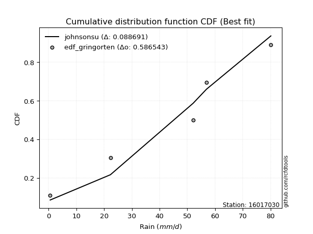</img>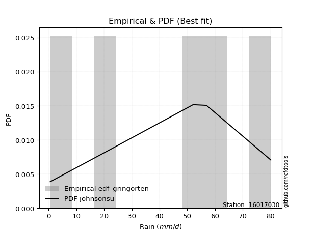</img>

</div>


### 9. EDF Filliben (1975)

The specific values of the constants (0.3175) (often denoted as $alpha$) and (0.365) are derived from a method proposed by James J. Filliben in a 1975 paper. This particular formula is the mean value of the $i$-th order statistic of the normal distribution and is considered a robust and effective plotting position formula for the normal probability plot correlation coefficient test for normality.

<div align="center">


$P=(m-0.3175)/(n+0.365)$


</div>


**9.1. Empirical values**

<div align="center">

|                | 0                   | 1                  | 2            | 3                  | 4                  |
|:---------------|:--------------------|:-------------------|:-------------|:-------------------|:-------------------|
| date           | 2012                | 2009               | 2011         | 2008               | 2010               |
| x              | 0.6                 | 22.3               | 52.1         | 56.9               | 80.1               |
| m              | 1                   | 2                  | 3            | 4                  | 5                  |
| empirical_dist | edf_filliben        | edf_filliben       | edf_filliben | edf_filliben       | edf_filliben       |
| empirical      | 0.12721342031686858 | 0.3136067101584343 | 0.5          | 0.6863932898415657 | 0.8727865796831314 |
| empirical_tr   | 1.1457554725040042  | 1.456890699253225  | 2.0          | 3.188707280832095  | 7.860805860805863  |

</div>


**9.2. Kolmogorov-Smirnov fit test (sorted by Δ)**


<div align="center">

|                | 0                   | 1                   | 2                   | 3                   | 4                  | 5                   | 6                   | 7                   | 8                   | 9                   | 10                  | 11                 | 12                  | 13                  | 14                  | 15                  | 16                  | 17                  | 18                  | 19                  | 20                  | 21                  | 22                  | 23                  | 24                 | 25                 | 26                  | 27                  | 28                  | 29                  | 30                  | 31                  | 32                  | 33                  | 34                  | 35                 | 36                  | 37                  | 38                  | 39                 | 40                 | 41                 | 42                  | 43                  | 44                 | 45                 | 46                  | 47                 | 48                 | 49                 | 50                  | 51                  | 52                  | 53                  | 54                  | 55                  | 56                  | 57                  | 58                  | 59                  | 60                  | 61                 | 62                  | 63                  | 64                  | 65                  | 66                  | 67                  | 68                 | 69                 | 70                  | 71                  | 72                  | 73                 | 74                 | 75                  | 76                  | 77                 | 78                  | 79                  | 80                 | 81                  | 82                  | 83                 | 84                  | 85                 | 86                 | 87                  | 88                  | 89                 | 90                 | 91                 | 92                 | 93                  | 94                  | 95                  | 96                 | 97                  | 98                 | 99                 | 100                | 101                | 102                 | 103                | 104                 | 105                 | 106                 | 107                 | 108                | 109                | 110                | 111                | 112                | 113                | 114                 | 115                | 116                | 117                 | 118                | 119                | 120                 | 121                | 122                | 123                 | 124                 | 125                | 126                 | 127                | 128                | 129                 | 130                | 131                | 132                 | 133                | 134                 | 135                 | 136                | 137                 | 138                | 139                 | 140                | 141                | 142                | 143                | 144                | 145                | 146                | 147                | 148                | 149                | 150                | 151                | 152                | 153                | 154                | 155                | 156                | 157                | 158                | 159                |
|:---------------|:--------------------|:--------------------|:--------------------|:--------------------|:-------------------|:--------------------|:--------------------|:--------------------|:--------------------|:--------------------|:--------------------|:-------------------|:--------------------|:--------------------|:--------------------|:--------------------|:--------------------|:--------------------|:--------------------|:--------------------|:--------------------|:--------------------|:--------------------|:--------------------|:-------------------|:-------------------|:--------------------|:--------------------|:--------------------|:--------------------|:--------------------|:--------------------|:--------------------|:--------------------|:--------------------|:-------------------|:--------------------|:--------------------|:--------------------|:-------------------|:-------------------|:-------------------|:--------------------|:--------------------|:-------------------|:-------------------|:--------------------|:-------------------|:-------------------|:-------------------|:--------------------|:--------------------|:--------------------|:--------------------|:--------------------|:--------------------|:--------------------|:--------------------|:--------------------|:--------------------|:--------------------|:-------------------|:--------------------|:--------------------|:--------------------|:--------------------|:--------------------|:--------------------|:-------------------|:-------------------|:--------------------|:--------------------|:--------------------|:-------------------|:-------------------|:--------------------|:--------------------|:-------------------|:--------------------|:--------------------|:-------------------|:--------------------|:--------------------|:-------------------|:--------------------|:-------------------|:-------------------|:--------------------|:--------------------|:-------------------|:-------------------|:-------------------|:-------------------|:--------------------|:--------------------|:--------------------|:-------------------|:--------------------|:-------------------|:-------------------|:-------------------|:-------------------|:--------------------|:-------------------|:--------------------|:--------------------|:--------------------|:--------------------|:-------------------|:-------------------|:-------------------|:-------------------|:-------------------|:-------------------|:--------------------|:-------------------|:-------------------|:--------------------|:-------------------|:-------------------|:--------------------|:-------------------|:-------------------|:--------------------|:--------------------|:-------------------|:--------------------|:-------------------|:-------------------|:--------------------|:-------------------|:-------------------|:--------------------|:-------------------|:--------------------|:--------------------|:-------------------|:--------------------|:-------------------|:--------------------|:-------------------|:-------------------|:-------------------|:-------------------|:-------------------|:-------------------|:-------------------|:-------------------|:-------------------|:-------------------|:-------------------|:-------------------|:-------------------|:-------------------|:-------------------|:-------------------|:-------------------|:-------------------|:-------------------|:-------------------|
| station        | 16017030            | 16017030            | 16017030            | 16017030            | 16017030           | 16017030            | 16017030            | 16017030            | 16017030            | 16017030            | 16017030            | 16017030           | 16017030            | 16017030            | 16017030            | 16017030            | 16017030            | 16017030            | 16017030            | 16017030            | 16017030            | 16017030            | 16017030            | 16017030            | 16017030           | 16017030           | 16017030            | 16017030            | 16017030            | 16017030            | 16017030            | 16017030            | 16017030            | 16017030            | 16017030            | 16017030           | 16017030            | 16017030            | 16017030            | 16017030           | 16017030           | 16017030           | 16017030            | 16017030            | 16017030           | 16017030           | 16017030            | 16017030           | 16017030           | 16017030           | 16017030            | 16017030            | 16017030            | 16017030            | 16017030            | 16017030            | 16017030            | 16017030            | 16017030            | 16017030            | 16017030            | 16017030           | 16017030            | 16017030            | 16017030            | 16017030            | 16017030            | 16017030            | 16017030           | 16017030           | 16017030            | 16017030            | 16017030            | 16017030           | 16017030           | 16017030            | 16017030            | 16017030           | 16017030            | 16017030            | 16017030           | 16017030            | 16017030            | 16017030           | 16017030            | 16017030           | 16017030           | 16017030            | 16017030            | 16017030           | 16017030           | 16017030           | 16017030           | 16017030            | 16017030            | 16017030            | 16017030           | 16017030            | 16017030           | 16017030           | 16017030           | 16017030           | 16017030            | 16017030           | 16017030            | 16017030            | 16017030            | 16017030            | 16017030           | 16017030           | 16017030           | 16017030           | 16017030           | 16017030           | 16017030            | 16017030           | 16017030           | 16017030            | 16017030           | 16017030           | 16017030            | 16017030           | 16017030           | 16017030            | 16017030            | 16017030           | 16017030            | 16017030           | 16017030           | 16017030            | 16017030           | 16017030           | 16017030            | 16017030           | 16017030            | 16017030            | 16017030           | 16017030            | 16017030           | 16017030            | 16017030           | 16017030           | 16017030           | 16017030           | 16017030           | 16017030           | 16017030           | 16017030           | 16017030           | 16017030           | 16017030           | 16017030           | 16017030           | 16017030           | 16017030           | 16017030           | 16017030           | 16017030           | 16017030           | 16017030           |
| empirical_dist | edf_filliben        | edf_filliben        | edf_filliben        | edf_filliben        | edf_filliben       | edf_filliben        | edf_filliben        | edf_filliben        | edf_filliben        | edf_filliben        | edf_filliben        | edf_filliben       | edf_filliben        | edf_filliben        | edf_filliben        | edf_filliben        | edf_filliben        | edf_filliben        | edf_filliben        | edf_filliben        | edf_filliben        | edf_filliben        | edf_filliben        | edf_filliben        | edf_filliben       | edf_filliben       | edf_filliben        | edf_filliben        | edf_filliben        | edf_filliben        | edf_filliben        | edf_filliben        | edf_filliben        | edf_filliben        | edf_filliben        | edf_filliben       | edf_filliben        | edf_filliben        | edf_filliben        | edf_filliben       | edf_filliben       | edf_filliben       | edf_filliben        | edf_filliben        | edf_filliben       | edf_filliben       | edf_filliben        | edf_filliben       | edf_filliben       | edf_filliben       | edf_filliben        | edf_filliben        | edf_filliben        | edf_filliben        | edf_filliben        | edf_filliben        | edf_filliben        | edf_filliben        | edf_filliben        | edf_filliben        | edf_filliben        | edf_filliben       | edf_filliben        | edf_filliben        | edf_filliben        | edf_filliben        | edf_filliben        | edf_filliben        | edf_filliben       | edf_filliben       | edf_filliben        | edf_filliben        | edf_filliben        | edf_filliben       | edf_filliben       | edf_filliben        | edf_filliben        | edf_filliben       | edf_filliben        | edf_filliben        | edf_filliben       | edf_filliben        | edf_filliben        | edf_filliben       | edf_filliben        | edf_filliben       | edf_filliben       | edf_filliben        | edf_filliben        | edf_filliben       | edf_filliben       | edf_filliben       | edf_filliben       | edf_filliben        | edf_filliben        | edf_filliben        | edf_filliben       | edf_filliben        | edf_filliben       | edf_filliben       | edf_filliben       | edf_filliben       | edf_filliben        | edf_filliben       | edf_filliben        | edf_filliben        | edf_filliben        | edf_filliben        | edf_filliben       | edf_filliben       | edf_filliben       | edf_filliben       | edf_filliben       | edf_filliben       | edf_filliben        | edf_filliben       | edf_filliben       | edf_filliben        | edf_filliben       | edf_filliben       | edf_filliben        | edf_filliben       | edf_filliben       | edf_filliben        | edf_filliben        | edf_filliben       | edf_filliben        | edf_filliben       | edf_filliben       | edf_filliben        | edf_filliben       | edf_filliben       | edf_filliben        | edf_filliben       | edf_filliben        | edf_filliben        | edf_filliben       | edf_filliben        | edf_filliben       | edf_filliben        | edf_filliben       | edf_filliben       | edf_filliben       | edf_filliben       | edf_filliben       | edf_filliben       | edf_filliben       | edf_filliben       | edf_filliben       | edf_filliben       | edf_filliben       | edf_filliben       | edf_filliben       | edf_filliben       | edf_filliben       | edf_filliben       | edf_filliben       | edf_filliben       | edf_filliben       | edf_filliben       |
| p_dist         | dweibull            | johnsonsu           | argus               | ksone               | dgamma             | genlogistic         | semicircular        | gumbel_l            | trapezoid           | anglit              | weibull_min         | pearson3           | triang              | loggenpareto        | skewnorm            | wrapcauchy          | beta                | genpareto           | loggenextreme       | genhalflogistic     | arcsine             | logvonmises_line    | exponnorm           | crystalball         | norm               | t                  | foldnorm            | gompertz            | betaprime           | vonmises_line       | erlang              | gamma               | tukeylambda         | cosine              | kappa4              | loglevy_l          | kappa3              | uniform             | ncf                 | logpearson3        | rice               | f                  | bradford            | logistic            | invgamma           | maxwell            | gausshyper          | invgauss           | burr12             | hypsecant          | rayleigh            | logtrapezoid        | loggumbel_l         | loggausshyper       | truncweibull_min    | gennorm             | kstwobign           | levy_l              | halfnorm            | burr                | logt                | laplace            | loggennorm          | gumbel_r            | logarcsine          | logdgamma           | logsemicircular     | loganglit           | genextreme         | genexpon           | lognorm             | logexponnorm        | lognakagami         | logdweibull        | lognct             | loggompertz         | halflogistic        | truncexpon         | logrice             | moyal               | logargus           | logerlang           | logfoldnorm         | loglogistic        | logweibull_max      | loggamma           | loggamma           | loginvgamma         | logwrapcauchy       | logalpha           | loginvgauss        | logloggamma        | loghypsecant       | loginvweibull       | logmaxwell          | loggengamma         | lograyleigh        | logburr12           | exponweib          | lomax              | loglaplace         | loglaplace         | logexponweib        | logcosine          | wald                | loglomax            | logkstwobign        | loggumbel_r         | loghalfnorm        | logncf             | loggenexpon        | logburr            | mielke             | gengamma           | logmoyal            | loggenhalflogistic | loghalflogistic    | nct                 | logbeta            | logloglaplace      | logskewnorm         | logkappa3          | logtriang          | loghalfgennorm      | logtruncweibull_min | logwald            | logksone            | logf               | halfgennorm        | loguniform          | logbradford        | logtruncnorm       | logkappa4           | johnsonsb          | logmielke           | logweibull_min      | invweibull         | logjohnsonsu        | fatiguelife        | logtruncexpon       | nakagami           | logbetaprime       | logfatiguelife     | logtukeylambda     | logjohnsonsb       | powerlaw           | truncpareto        | weibull_max        | logexponpow        | exponpow           | logtruncpareto     | alpha              | truncnorm          | logpowerlaw        | rdist              | loggenlogistic     | logrdist           | logvonmises        | vonmises           | logcrystalball     |
| delta          | 0.09363263208940914 | 0.09760983909375559 | 0.09960652601147896 | 0.10055992345576747 | 0.1019773312447465 | 0.10524275141035852 | 0.11031996186219506 | 0.11415395135215683 | 0.11421013768574217 | 0.11795524359209109 | 0.12346364729723258 | 0.1241103761945126 | 0.12520161525081996 | 0.12721264602555038 | 0.12721295625855267 | 0.12721341760335259 | 0.12721342031027683 | 0.12721342031515226 | 0.12721342031661886 | 0.12721342031686644 | 0.12721342031686858 | 0.13520783872173847 | 0.13621046967992034 | 0.13621124187243083 | 0.136211248449843  | 0.136211533386686  | 0.13734071711148343 | 0.13888260442252454 | 0.14099005946495058 | 0.14117467511527348 | 0.14249447513523017 | 0.14272524323794722 | 0.14491623908997298 | 0.14541585355741016 | 0.14554530679858135 | 0.1473129441474743 | 0.14770676896669677 | 0.14779874213836475 | 0.14926425429071166 | 0.1493994932248497 | 0.1496532832544999 | 0.1507828766371978 | 0.15255956904761414 | 0.15290579655501668 | 0.1547519878164878 | 0.1592866304806806 | 0.15930056120584446 | 0.1604045513738266 | 0.1634588739778574 | 0.1660820675568807 | 0.16628458327202789 | 0.16920138710051608 | 0.17071128055389706 | 0.17476811675543413 | 0.17591545854952462 | 0.17951283527733267 | 0.18310557378067316 | 0.18647561640597177 | 0.18648475056568048 | 0.19063358516790163 | 0.19242800230593143 | 0.1944947093874868 | 0.19781498552754512 | 0.19826370524031234 | 0.20016978561552218 | 0.20083577246205353 | 0.20586751792661667 | 0.20730387005503254 | 0.2080456232006837 | 0.2085393877039854 | 0.21078919936482382 | 0.21078952162979697 | 0.21125882757713416 | 0.2115035399387004 | 0.2115755725996869 | 0.21193105389240485 | 0.21476996377034507 | 0.2154159482052841 | 0.21796254052444314 | 0.21896812594025206 | 0.2194036074109469 | 0.22071015137201705 | 0.22337684774072364 | 0.2241094568815838 | 0.22582876993381218 | 0.2261694092563415 | 0.2261694092563415 | 0.22650350383479206 | 0.22792920582082005 | 0.2311299869287568 | 0.233313796247612  | 0.235022040421914  | 0.2395448546670489 | 0.24151109517540997 | 0.24270391817721276 | 0.24790433707480225 | 0.2531468717525643 | 0.25536501102642906 | 0.2586855724777711 | 0.2604196405638325 | 0.2643733064928817 | 0.2643733064928817 | 0.27205447488393325 | 0.2752308533490861 | 0.27728306113016565 | 0.27790125481572786 | 0.27853949638540293 | 0.28146017152764796 | 0.2825465773495331 | 0.2832300635711222 | 0.286315631106104  | 0.2958722597132481 | 0.3050632710402237 | 0.3065626554381396 | 0.30697541781910825 | 0.3087628973992559 | 0.3088030446216283 | 0.31169439713965935 | 0.3272499455517144 | 0.3492452456142506 | 0.35005865958464977 | 0.3584730602921646 | 0.3586134154811782 | 0.37288549347427286 | 0.3763852535156602  | 0.377826460075017  | 0.38533371649632947 | 0.3898338654788774 | 0.3899594314943589 | 0.42512180182728215 | 0.4262917255802274 | 0.4278011310729449 | 0.42914874189487934 | 0.4311421763883462 | 0.43537978320456033 | 0.44487081192386385 | 0.4575110922957856 | 0.46074737558784695 | 0.4761889429975235 | 0.48712345564416054 | 0.5103340361516764 | 0.5215273964944569 | 0.5257569429871491 | 0.5293605522151781 | 0.5398242481572191 | 0.5468285349750655 | 0.5526614543360557 | 0.5805142968985346 | 0.5823377915497916 | 0.6019214173456306 | 0.6267522206335219 | 0.63857148284558   | 0.6472106942144182 | 0.6481134346943931 | 0.6863932896277576 | 0.6863932898415657 | 0.6863932898415657 | 0.8943636806897808 | 12.214134833912125 | nan                |
| deltao         | 0.5865427407550001  | 0.5865427407550001  | 0.5865427407550001  | 0.5865427407550001  | 0.5865427407550001 | 0.5865427407550001  | 0.5865427407550001  | 0.5865427407550001  | 0.5865427407550001  | 0.5865427407550001  | 0.5865427407550001  | 0.5865427407550001 | 0.5865427407550001  | 0.5865427407550001  | 0.5865427407550001  | 0.5865427407550001  | 0.5865427407550001  | 0.5865427407550001  | 0.5865427407550001  | 0.5865427407550001  | 0.5865427407550001  | 0.5865427407550001  | 0.5865427407550001  | 0.5865427407550001  | 0.5865427407550001 | 0.5865427407550001 | 0.5865427407550001  | 0.5865427407550001  | 0.5865427407550001  | 0.5865427407550001  | 0.5865427407550001  | 0.5865427407550001  | 0.5865427407550001  | 0.5865427407550001  | 0.5865427407550001  | 0.5865427407550001 | 0.5865427407550001  | 0.5865427407550001  | 0.5865427407550001  | 0.5865427407550001 | 0.5865427407550001 | 0.5865427407550001 | 0.5865427407550001  | 0.5865427407550001  | 0.5865427407550001 | 0.5865427407550001 | 0.5865427407550001  | 0.5865427407550001 | 0.5865427407550001 | 0.5865427407550001 | 0.5865427407550001  | 0.5865427407550001  | 0.5865427407550001  | 0.5865427407550001  | 0.5865427407550001  | 0.5865427407550001  | 0.5865427407550001  | 0.5865427407550001  | 0.5865427407550001  | 0.5865427407550001  | 0.5865427407550001  | 0.5865427407550001 | 0.5865427407550001  | 0.5865427407550001  | 0.5865427407550001  | 0.5865427407550001  | 0.5865427407550001  | 0.5865427407550001  | 0.5865427407550001 | 0.5865427407550001 | 0.5865427407550001  | 0.5865427407550001  | 0.5865427407550001  | 0.5865427407550001 | 0.5865427407550001 | 0.5865427407550001  | 0.5865427407550001  | 0.5865427407550001 | 0.5865427407550001  | 0.5865427407550001  | 0.5865427407550001 | 0.5865427407550001  | 0.5865427407550001  | 0.5865427407550001 | 0.5865427407550001  | 0.5865427407550001 | 0.5865427407550001 | 0.5865427407550001  | 0.5865427407550001  | 0.5865427407550001 | 0.5865427407550001 | 0.5865427407550001 | 0.5865427407550001 | 0.5865427407550001  | 0.5865427407550001  | 0.5865427407550001  | 0.5865427407550001 | 0.5865427407550001  | 0.5865427407550001 | 0.5865427407550001 | 0.5865427407550001 | 0.5865427407550001 | 0.5865427407550001  | 0.5865427407550001 | 0.5865427407550001  | 0.5865427407550001  | 0.5865427407550001  | 0.5865427407550001  | 0.5865427407550001 | 0.5865427407550001 | 0.5865427407550001 | 0.5865427407550001 | 0.5865427407550001 | 0.5865427407550001 | 0.5865427407550001  | 0.5865427407550001 | 0.5865427407550001 | 0.5865427407550001  | 0.5865427407550001 | 0.5865427407550001 | 0.5865427407550001  | 0.5865427407550001 | 0.5865427407550001 | 0.5865427407550001  | 0.5865427407550001  | 0.5865427407550001 | 0.5865427407550001  | 0.5865427407550001 | 0.5865427407550001 | 0.5865427407550001  | 0.5865427407550001 | 0.5865427407550001 | 0.5865427407550001  | 0.5865427407550001 | 0.5865427407550001  | 0.5865427407550001  | 0.5865427407550001 | 0.5865427407550001  | 0.5865427407550001 | 0.5865427407550001  | 0.5865427407550001 | 0.5865427407550001 | 0.5865427407550001 | 0.5865427407550001 | 0.5865427407550001 | 0.5865427407550001 | 0.5865427407550001 | 0.5865427407550001 | 0.5865427407550001 | 0.5865427407550001 | 0.5865427407550001 | 0.5865427407550001 | 0.5865427407550001 | 0.5865427407550001 | 0.5865427407550001 | 0.5865427407550001 | 0.5865427407550001 | 0.5865427407550001 | 0.5865427407550001 | 0.5865427407550001 |
| eval           | Δo > Δ              | Δo > Δ              | Δo > Δ              | Δo > Δ              | Δo > Δ             | Δo > Δ              | Δo > Δ              | Δo > Δ              | Δo > Δ              | Δo > Δ              | Δo > Δ              | Δo > Δ             | Δo > Δ              | Δo > Δ              | Δo > Δ              | Δo > Δ              | Δo > Δ              | Δo > Δ              | Δo > Δ              | Δo > Δ              | Δo > Δ              | Δo > Δ              | Δo > Δ              | Δo > Δ              | Δo > Δ             | Δo > Δ             | Δo > Δ              | Δo > Δ              | Δo > Δ              | Δo > Δ              | Δo > Δ              | Δo > Δ              | Δo > Δ              | Δo > Δ              | Δo > Δ              | Δo > Δ             | Δo > Δ              | Δo > Δ              | Δo > Δ              | Δo > Δ             | Δo > Δ             | Δo > Δ             | Δo > Δ              | Δo > Δ              | Δo > Δ             | Δo > Δ             | Δo > Δ              | Δo > Δ             | Δo > Δ             | Δo > Δ             | Δo > Δ              | Δo > Δ              | Δo > Δ              | Δo > Δ              | Δo > Δ              | Δo > Δ              | Δo > Δ              | Δo > Δ              | Δo > Δ              | Δo > Δ              | Δo > Δ              | Δo > Δ             | Δo > Δ              | Δo > Δ              | Δo > Δ              | Δo > Δ              | Δo > Δ              | Δo > Δ              | Δo > Δ             | Δo > Δ             | Δo > Δ              | Δo > Δ              | Δo > Δ              | Δo > Δ             | Δo > Δ             | Δo > Δ              | Δo > Δ              | Δo > Δ             | Δo > Δ              | Δo > Δ              | Δo > Δ             | Δo > Δ              | Δo > Δ              | Δo > Δ             | Δo > Δ              | Δo > Δ             | Δo > Δ             | Δo > Δ              | Δo > Δ              | Δo > Δ             | Δo > Δ             | Δo > Δ             | Δo > Δ             | Δo > Δ              | Δo > Δ              | Δo > Δ              | Δo > Δ             | Δo > Δ              | Δo > Δ             | Δo > Δ             | Δo > Δ             | Δo > Δ             | Δo > Δ              | Δo > Δ             | Δo > Δ              | Δo > Δ              | Δo > Δ              | Δo > Δ              | Δo > Δ             | Δo > Δ             | Δo > Δ             | Δo > Δ             | Δo > Δ             | Δo > Δ             | Δo > Δ              | Δo > Δ             | Δo > Δ             | Δo > Δ              | Δo > Δ             | Δo > Δ             | Δo > Δ              | Δo > Δ             | Δo > Δ             | Δo > Δ              | Δo > Δ              | Δo > Δ             | Δo > Δ              | Δo > Δ             | Δo > Δ             | Δo > Δ              | Δo > Δ             | Δo > Δ             | Δo > Δ              | Δo > Δ             | Δo > Δ              | Δo > Δ              | Δo > Δ             | Δo > Δ              | Δo > Δ             | Δo > Δ              | Δo > Δ             | Δo > Δ             | Δo > Δ             | Δo > Δ             | Δo > Δ             | Δo > Δ             | Δo > Δ             | Δo > Δ             | Δo > Δ             | Δo <= Δ            | Δo <= Δ            | Δo <= Δ            | Δo <= Δ            | Δo <= Δ            | Δo <= Δ            | Δo <= Δ            | Δo <= Δ            | Δo <= Δ            | Δo <= Δ            | Δo <= Δ            |
| fit            | 1                   | 1                   | 1                   | 1                   | 1                  | 1                   | 1                   | 1                   | 1                   | 1                   | 1                   | 1                  | 1                   | 1                   | 1                   | 1                   | 1                   | 1                   | 1                   | 1                   | 1                   | 1                   | 1                   | 1                   | 1                  | 1                  | 1                   | 1                   | 1                   | 1                   | 1                   | 1                   | 1                   | 1                   | 1                   | 1                  | 1                   | 1                   | 1                   | 1                  | 1                  | 1                  | 1                   | 1                   | 1                  | 1                  | 1                   | 1                  | 1                  | 1                  | 1                   | 1                   | 1                   | 1                   | 1                   | 1                   | 1                   | 1                   | 1                   | 1                   | 1                   | 1                  | 1                   | 1                   | 1                   | 1                   | 1                   | 1                   | 1                  | 1                  | 1                   | 1                   | 1                   | 1                  | 1                  | 1                   | 1                   | 1                  | 1                   | 1                   | 1                  | 1                   | 1                   | 1                  | 1                   | 1                  | 1                  | 1                   | 1                   | 1                  | 1                  | 1                  | 1                  | 1                   | 1                   | 1                   | 1                  | 1                   | 1                  | 1                  | 1                  | 1                  | 1                   | 1                  | 1                   | 1                   | 1                   | 1                   | 1                  | 1                  | 1                  | 1                  | 1                  | 1                  | 1                   | 1                  | 1                  | 1                   | 1                  | 1                  | 1                   | 1                  | 1                  | 1                   | 1                   | 1                  | 1                   | 1                  | 1                  | 1                   | 1                  | 1                  | 1                   | 1                  | 1                   | 1                   | 1                  | 1                   | 1                  | 1                   | 1                  | 1                  | 1                  | 1                  | 1                  | 1                  | 1                  | 1                  | 1                  | 0                  | 0                  | 0                  | 0                  | 0                  | 0                  | 0                  | 0                  | 0                  | 0                  | 0                  |
| n              | 5                   | 5                   | 5                   | 5                   | 5                  | 5                   | 5                   | 5                   | 5                   | 5                   | 5                   | 5                  | 5                   | 5                   | 5                   | 5                   | 5                   | 5                   | 5                   | 5                   | 5                   | 5                   | 5                   | 5                   | 5                  | 5                  | 5                   | 5                   | 5                   | 5                   | 5                   | 5                   | 5                   | 5                   | 5                   | 5                  | 5                   | 5                   | 5                   | 5                  | 5                  | 5                  | 5                   | 5                   | 5                  | 5                  | 5                   | 5                  | 5                  | 5                  | 5                   | 5                   | 5                   | 5                   | 5                   | 5                   | 5                   | 5                   | 5                   | 5                   | 5                   | 5                  | 5                   | 5                   | 5                   | 5                   | 5                   | 5                   | 5                  | 5                  | 5                   | 5                   | 5                   | 5                  | 5                  | 5                   | 5                   | 5                  | 5                   | 5                   | 5                  | 5                   | 5                   | 5                  | 5                   | 5                  | 5                  | 5                   | 5                   | 5                  | 5                  | 5                  | 5                  | 5                   | 5                   | 5                   | 5                  | 5                   | 5                  | 5                  | 5                  | 5                  | 5                   | 5                  | 5                   | 5                   | 5                   | 5                   | 5                  | 5                  | 5                  | 5                  | 5                  | 5                  | 5                   | 5                  | 5                  | 5                   | 5                  | 5                  | 5                   | 5                  | 5                  | 5                   | 5                   | 5                  | 5                   | 5                  | 5                  | 5                   | 5                  | 5                  | 5                   | 5                  | 5                   | 5                   | 5                  | 5                   | 5                  | 5                   | 5                  | 5                  | 5                  | 5                  | 5                  | 5                  | 5                  | 5                  | 5                  | 5                  | 5                  | 5                  | 5                  | 5                  | 5                  | 5                  | 5                  | 5                  | 5                  | 5                  |
| best_fit       | 1                   | 0                   | 0                   | 0                   | 0                  | 0                   | 0                   | 0                   | 0                   | 0                   | 0                   | 0                  | 0                   | 0                   | 0                   | 0                   | 0                   | 0                   | 0                   | 0                   | 0                   | 0                   | 0                   | 0                   | 0                  | 0                  | 0                   | 0                   | 0                   | 0                   | 0                   | 0                   | 0                   | 0                   | 0                   | 0                  | 0                   | 0                   | 0                   | 0                  | 0                  | 0                  | 0                   | 0                   | 0                  | 0                  | 0                   | 0                  | 0                  | 0                  | 0                   | 0                   | 0                   | 0                   | 0                   | 0                   | 0                   | 0                   | 0                   | 0                   | 0                   | 0                  | 0                   | 0                   | 0                   | 0                   | 0                   | 0                   | 0                  | 0                  | 0                   | 0                   | 0                   | 0                  | 0                  | 0                   | 0                   | 0                  | 0                   | 0                   | 0                  | 0                   | 0                   | 0                  | 0                   | 0                  | 0                  | 0                   | 0                   | 0                  | 0                  | 0                  | 0                  | 0                   | 0                   | 0                   | 0                  | 0                   | 0                  | 0                  | 0                  | 0                  | 0                   | 0                  | 0                   | 0                   | 0                   | 0                   | 0                  | 0                  | 0                  | 0                  | 0                  | 0                  | 0                   | 0                  | 0                  | 0                   | 0                  | 0                  | 0                   | 0                  | 0                  | 0                   | 0                   | 0                  | 0                   | 0                  | 0                  | 0                   | 0                  | 0                  | 0                   | 0                  | 0                   | 0                   | 0                  | 0                   | 0                  | 0                   | 0                  | 0                  | 0                  | 0                  | 0                  | 0                  | 0                  | 0                  | 0                  | 0                  | 0                  | 0                  | 0                  | 0                  | 0                  | 0                  | 0                  | 0                  | 0                  | 0                  |
| best_fit_sort  | 1                   | 2                   | 3                   | 4                   | 5                  | 6                   | 7                   | 8                   | 9                   | 10                  | 11                  | 12                 | 13                  | 14                  | 15                  | 16                  | 17                  | 18                  | 19                  | 20                  | 21                  | 22                  | 23                  | 24                  | 25                 | 26                 | 27                  | 28                  | 29                  | 30                  | 31                  | 32                  | 33                  | 34                  | 35                  | 36                 | 37                  | 38                  | 39                  | 40                 | 41                 | 42                 | 43                  | 44                  | 45                 | 46                 | 47                  | 48                 | 49                 | 50                 | 51                  | 52                  | 53                  | 54                  | 55                  | 56                  | 57                  | 58                  | 59                  | 60                  | 61                  | 62                 | 63                  | 64                  | 65                  | 66                  | 67                  | 68                  | 69                 | 70                 | 71                  | 72                  | 73                  | 74                 | 75                 | 76                  | 77                  | 78                 | 79                  | 80                  | 81                 | 82                  | 83                  | 84                 | 85                  | 86                 | 87                 | 88                  | 89                  | 90                 | 91                 | 92                 | 93                 | 94                  | 95                  | 96                  | 97                 | 98                  | 99                 | 100                | 101                | 102                | 103                 | 104                | 105                 | 106                 | 107                 | 108                 | 109                | 110                | 111                | 112                | 113                | 114                | 115                 | 116                | 117                | 118                 | 119                | 120                | 121                 | 122                | 123                | 124                 | 125                 | 126                | 127                 | 128                | 129                | 130                 | 131                | 132                | 133                 | 134                | 135                 | 136                 | 137                | 138                 | 139                | 140                 | 141                | 142                | 143                | 144                | 145                | 146                | 147                | 148                | 149                | 150                | 151                | 152                | 153                | 154                | 155                | 156                | 157                | 158                | 159                | 160                |

</div>


**9.3. Best fit**

<div align="center">

|   id |   station | empirical_dist   | p_dist   |     delta |   deltao | eval   |   fit |   n |   best_fit |   best_fit_sort |
|-----:|----------:|:-----------------|:---------|----------:|---------:|:-------|------:|----:|-----------:|----------------:|
|    0 |  16017030 | edf_filliben     | dweibull | 0.0936326 | 0.586543 | Δo > Δ |     1 |   5 |          1 |               1 |

</div>


<div align="center">

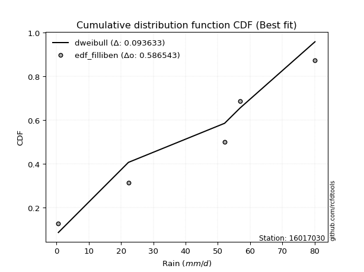</img></img>

</div>


### 10. EDF Jenkinson (1977)

The Jenkinson formula in hydrology is an empirical plotting position formula used to estimate the non-exceedance probability _(P)_ or return period _(T)_ of a given ordered observation within a sample. It is a widely used method in the frequency analysis of extreme events such as floods and rainfall, as it provides a distribution-free way to plot data. _a≈0.31_ and _b≈0.38_ are constants derived to approximate the median of the probability distribution for the given rank.

<div align="center">


$P=(m-a)/(n+b)$


</div>


**10.1. Empirical values**

<div align="center">

|                | 0                   | 1                  | 2             | 3                  | 4                  |
|:---------------|:--------------------|:-------------------|:--------------|:-------------------|:-------------------|
| date           | 2012                | 2009               | 2011          | 2008               | 2010               |
| x              | 0.6                 | 22.3               | 52.1          | 56.9               | 80.1               |
| m              | 1                   | 2                  | 3             | 4                  | 5                  |
| empirical_dist | edf_jenkinson       | edf_jenkinson      | edf_jenkinson | edf_jenkinson      | edf_jenkinson      |
| empirical      | 0.12825278810408922 | 0.3141263940520446 | 0.5           | 0.6858736059479554 | 0.8717472118959109 |
| empirical_tr   | 1.1471215351812367  | 1.4579945799457996 | 2.0           | 3.183431952662722  | 7.797101449275368  |

</div>


**10.2. Kolmogorov-Smirnov fit test (sorted by Δ)**


<div align="center">

|                | 0                  | 1                   | 2                  | 3                   | 4                   | 5                   | 6                   | 7                   | 8                   | 9                   | 10                  | 11                 | 12                  | 13                  | 14                  | 15                  | 16                 | 17                  | 18                  | 19                  | 20                  | 21                 | 22                  | 23                  | 24                 | 25                 | 26                  | 27                  | 28                  | 29                  | 30                  | 31                  | 32                  | 33                  | 34                  | 35                  | 36                  | 37                  | 38                  | 39                 | 40                 | 41                 | 42                  | 43                  | 44                 | 45                  | 46                 | 47                 | 48                 | 49                 | 50                  | 51                  | 52                  | 53                  | 54                  | 55                 | 56                  | 57                  | 58                  | 59                  | 60                  | 61                 | 62                  | 63                  | 64                  | 65                  | 66                  | 67                 | 68                  | 69                 | 70                  | 71                  | 72                  | 73                 | 74                  | 75                  | 76                  | 77                 | 78                 | 79                  | 80                 | 81                 | 82                  | 83                 | 84                  | 85                  | 86                  | 87                  | 88                 | 89                  | 90                  | 91                 | 92                 | 93                  | 94                  | 95                 | 96                  | 97                 | 98                  | 99                 | 100                | 101                | 102                | 103                 | 104                 | 105                | 106                | 107                | 108                 | 109                 | 110                 | 111                 | 112                | 113                 | 114                | 115                 | 116                | 117                | 118                 | 119                 | 120                 | 121                 | 122                | 123                | 124                 | 125                | 126                | 127                 | 128                 | 129                | 130                 | 131                 | 132                | 133                 | 134                | 135                | 136                 | 137                | 138                 | 139                | 140                | 141                | 142                | 143                | 144                | 145                | 146                | 147                | 148                | 149                | 150                | 151                | 152                | 153                | 154                | 155                | 156                | 157                | 158                | 159                |
|:---------------|:-------------------|:--------------------|:-------------------|:--------------------|:--------------------|:--------------------|:--------------------|:--------------------|:--------------------|:--------------------|:--------------------|:-------------------|:--------------------|:--------------------|:--------------------|:--------------------|:-------------------|:--------------------|:--------------------|:--------------------|:--------------------|:-------------------|:--------------------|:--------------------|:-------------------|:-------------------|:--------------------|:--------------------|:--------------------|:--------------------|:--------------------|:--------------------|:--------------------|:--------------------|:--------------------|:--------------------|:--------------------|:--------------------|:--------------------|:-------------------|:-------------------|:-------------------|:--------------------|:--------------------|:-------------------|:--------------------|:-------------------|:-------------------|:-------------------|:-------------------|:--------------------|:--------------------|:--------------------|:--------------------|:--------------------|:-------------------|:--------------------|:--------------------|:--------------------|:--------------------|:--------------------|:-------------------|:--------------------|:--------------------|:--------------------|:--------------------|:--------------------|:-------------------|:--------------------|:-------------------|:--------------------|:--------------------|:--------------------|:-------------------|:--------------------|:--------------------|:--------------------|:-------------------|:-------------------|:--------------------|:-------------------|:-------------------|:--------------------|:-------------------|:--------------------|:--------------------|:--------------------|:--------------------|:-------------------|:--------------------|:--------------------|:-------------------|:-------------------|:--------------------|:--------------------|:-------------------|:--------------------|:-------------------|:--------------------|:-------------------|:-------------------|:-------------------|:-------------------|:--------------------|:--------------------|:-------------------|:-------------------|:-------------------|:--------------------|:--------------------|:--------------------|:--------------------|:-------------------|:--------------------|:-------------------|:--------------------|:-------------------|:-------------------|:--------------------|:--------------------|:--------------------|:--------------------|:-------------------|:-------------------|:--------------------|:-------------------|:-------------------|:--------------------|:--------------------|:-------------------|:--------------------|:--------------------|:-------------------|:--------------------|:-------------------|:-------------------|:--------------------|:-------------------|:--------------------|:-------------------|:-------------------|:-------------------|:-------------------|:-------------------|:-------------------|:-------------------|:-------------------|:-------------------|:-------------------|:-------------------|:-------------------|:-------------------|:-------------------|:-------------------|:-------------------|:-------------------|:-------------------|:-------------------|:-------------------|:-------------------|
| station        | 16017030           | 16017030            | 16017030           | 16017030            | 16017030            | 16017030            | 16017030            | 16017030            | 16017030            | 16017030            | 16017030            | 16017030           | 16017030            | 16017030            | 16017030            | 16017030            | 16017030           | 16017030            | 16017030            | 16017030            | 16017030            | 16017030           | 16017030            | 16017030            | 16017030           | 16017030           | 16017030            | 16017030            | 16017030            | 16017030            | 16017030            | 16017030            | 16017030            | 16017030            | 16017030            | 16017030            | 16017030            | 16017030            | 16017030            | 16017030           | 16017030           | 16017030           | 16017030            | 16017030            | 16017030           | 16017030            | 16017030           | 16017030           | 16017030           | 16017030           | 16017030            | 16017030            | 16017030            | 16017030            | 16017030            | 16017030           | 16017030            | 16017030            | 16017030            | 16017030            | 16017030            | 16017030           | 16017030            | 16017030            | 16017030            | 16017030            | 16017030            | 16017030           | 16017030            | 16017030           | 16017030            | 16017030            | 16017030            | 16017030           | 16017030            | 16017030            | 16017030            | 16017030           | 16017030           | 16017030            | 16017030           | 16017030           | 16017030            | 16017030           | 16017030            | 16017030            | 16017030            | 16017030            | 16017030           | 16017030            | 16017030            | 16017030           | 16017030           | 16017030            | 16017030            | 16017030           | 16017030            | 16017030           | 16017030            | 16017030           | 16017030           | 16017030           | 16017030           | 16017030            | 16017030            | 16017030           | 16017030           | 16017030           | 16017030            | 16017030            | 16017030            | 16017030            | 16017030           | 16017030            | 16017030           | 16017030            | 16017030           | 16017030           | 16017030            | 16017030            | 16017030            | 16017030            | 16017030           | 16017030           | 16017030            | 16017030           | 16017030           | 16017030            | 16017030            | 16017030           | 16017030            | 16017030            | 16017030           | 16017030            | 16017030           | 16017030           | 16017030            | 16017030           | 16017030            | 16017030           | 16017030           | 16017030           | 16017030           | 16017030           | 16017030           | 16017030           | 16017030           | 16017030           | 16017030           | 16017030           | 16017030           | 16017030           | 16017030           | 16017030           | 16017030           | 16017030           | 16017030           | 16017030           | 16017030           | 16017030           |
| empirical_dist | edf_jenkinson      | edf_jenkinson       | edf_jenkinson      | edf_jenkinson       | edf_jenkinson       | edf_jenkinson       | edf_jenkinson       | edf_jenkinson       | edf_jenkinson       | edf_jenkinson       | edf_jenkinson       | edf_jenkinson      | edf_jenkinson       | edf_jenkinson       | edf_jenkinson       | edf_jenkinson       | edf_jenkinson      | edf_jenkinson       | edf_jenkinson       | edf_jenkinson       | edf_jenkinson       | edf_jenkinson      | edf_jenkinson       | edf_jenkinson       | edf_jenkinson      | edf_jenkinson      | edf_jenkinson       | edf_jenkinson       | edf_jenkinson       | edf_jenkinson       | edf_jenkinson       | edf_jenkinson       | edf_jenkinson       | edf_jenkinson       | edf_jenkinson       | edf_jenkinson       | edf_jenkinson       | edf_jenkinson       | edf_jenkinson       | edf_jenkinson      | edf_jenkinson      | edf_jenkinson      | edf_jenkinson       | edf_jenkinson       | edf_jenkinson      | edf_jenkinson       | edf_jenkinson      | edf_jenkinson      | edf_jenkinson      | edf_jenkinson      | edf_jenkinson       | edf_jenkinson       | edf_jenkinson       | edf_jenkinson       | edf_jenkinson       | edf_jenkinson      | edf_jenkinson       | edf_jenkinson       | edf_jenkinson       | edf_jenkinson       | edf_jenkinson       | edf_jenkinson      | edf_jenkinson       | edf_jenkinson       | edf_jenkinson       | edf_jenkinson       | edf_jenkinson       | edf_jenkinson      | edf_jenkinson       | edf_jenkinson      | edf_jenkinson       | edf_jenkinson       | edf_jenkinson       | edf_jenkinson      | edf_jenkinson       | edf_jenkinson       | edf_jenkinson       | edf_jenkinson      | edf_jenkinson      | edf_jenkinson       | edf_jenkinson      | edf_jenkinson      | edf_jenkinson       | edf_jenkinson      | edf_jenkinson       | edf_jenkinson       | edf_jenkinson       | edf_jenkinson       | edf_jenkinson      | edf_jenkinson       | edf_jenkinson       | edf_jenkinson      | edf_jenkinson      | edf_jenkinson       | edf_jenkinson       | edf_jenkinson      | edf_jenkinson       | edf_jenkinson      | edf_jenkinson       | edf_jenkinson      | edf_jenkinson      | edf_jenkinson      | edf_jenkinson      | edf_jenkinson       | edf_jenkinson       | edf_jenkinson      | edf_jenkinson      | edf_jenkinson      | edf_jenkinson       | edf_jenkinson       | edf_jenkinson       | edf_jenkinson       | edf_jenkinson      | edf_jenkinson       | edf_jenkinson      | edf_jenkinson       | edf_jenkinson      | edf_jenkinson      | edf_jenkinson       | edf_jenkinson       | edf_jenkinson       | edf_jenkinson       | edf_jenkinson      | edf_jenkinson      | edf_jenkinson       | edf_jenkinson      | edf_jenkinson      | edf_jenkinson       | edf_jenkinson       | edf_jenkinson      | edf_jenkinson       | edf_jenkinson       | edf_jenkinson      | edf_jenkinson       | edf_jenkinson      | edf_jenkinson      | edf_jenkinson       | edf_jenkinson      | edf_jenkinson       | edf_jenkinson      | edf_jenkinson      | edf_jenkinson      | edf_jenkinson      | edf_jenkinson      | edf_jenkinson      | edf_jenkinson      | edf_jenkinson      | edf_jenkinson      | edf_jenkinson      | edf_jenkinson      | edf_jenkinson      | edf_jenkinson      | edf_jenkinson      | edf_jenkinson      | edf_jenkinson      | edf_jenkinson      | edf_jenkinson      | edf_jenkinson      | edf_jenkinson      | edf_jenkinson      |
| p_dist         | dweibull           | johnsonsu           | argus              | ksone               | dgamma              | genlogistic         | semicircular        | gumbel_l            | trapezoid           | anglit              | weibull_min         | pearson3           | triang              | loggenpareto        | skewnorm            | wrapcauchy          | beta               | genpareto           | loggenextreme       | genhalflogistic     | arcsine             | logvonmises_line   | exponnorm           | crystalball         | norm               | t                  | foldnorm            | gompertz            | betaprime           | vonmises_line       | erlang              | gamma               | tukeylambda         | cosine              | kappa4              | loglevy_l           | kappa3              | uniform             | ncf                 | logpearson3        | rice               | f                  | bradford            | logistic            | invgamma           | gausshyper          | maxwell            | invgauss           | burr12             | hypsecant          | rayleigh            | logtrapezoid        | loggumbel_l         | loggausshyper       | truncweibull_min    | gennorm            | kstwobign           | levy_l              | halfnorm            | burr                | logt                | laplace            | gumbel_r            | loggennorm          | logarcsine          | logdgamma           | logsemicircular     | loganglit          | genextreme          | genexpon           | lognorm             | logexponnorm        | logdweibull         | lognakagami        | lognct              | loggompertz         | halflogistic        | truncexpon         | logrice            | moyal               | logargus           | logerlang          | logfoldnorm         | loglogistic        | logweibull_max      | loggamma            | loggamma            | loginvgamma         | logwrapcauchy      | logalpha            | loginvgauss         | logloggamma        | loghypsecant       | loginvweibull       | logmaxwell          | loggengamma        | lograyleigh         | logburr12          | exponweib           | lomax              | loglaplace         | loglaplace         | logexponweib       | logcosine           | wald                | loglomax           | logkstwobign       | loggumbel_r        | loghalfnorm         | logncf              | loggenexpon         | logburr             | mielke             | gengamma            | logmoyal           | loghalflogistic     | loggenhalflogistic | nct                | logbeta             | logloglaplace       | logskewnorm         | logkappa3           | logtriang          | loghalfgennorm     | logtruncweibull_min | logwald            | logksone           | logf                | halfgennorm         | loguniform         | logbradford         | logtruncnorm        | logkappa4          | johnsonsb           | logmielke          | logweibull_min     | invweibull          | logjohnsonsu       | fatiguelife         | logtruncexpon      | nakagami           | logbetaprime       | logfatiguelife     | logtukeylambda     | logjohnsonsb       | powerlaw           | truncpareto        | weibull_max        | logexponpow        | exponpow           | logtruncpareto     | alpha              | truncnorm          | logpowerlaw        | rdist              | logrdist           | loggenlogistic     | logvonmises        | vonmises           | logcrystalball     |
| delta          | 0.0931129481957988 | 0.09812952298736594 | 0.1001262099050893 | 0.10055992345576747 | 0.10145764735113616 | 0.10576243530396887 | 0.11031996186219506 | 0.11467363524576718 | 0.11524950547296275 | 0.11795524359209109 | 0.12346364729723258 | 0.1241103761945126 | 0.12624098303804054 | 0.12825201381277096 | 0.12825232404577325 | 0.12825278539057317 | 0.1282527880974974 | 0.12825278810237284 | 0.12825278810383944 | 0.12825278810408702 | 0.12825278810408922 | 0.1341684709345179 | 0.13621046967992034 | 0.13621124187243083 | 0.136211248449843  | 0.136211533386686  | 0.13734071711148343 | 0.13888260442252454 | 0.14099005946495058 | 0.14117467511527348 | 0.14249447513523017 | 0.14272524323794722 | 0.14491623908997298 | 0.14541585355741016 | 0.14554530679858135 | 0.14679326025386408 | 0.14770676896669677 | 0.14779874213836475 | 0.14822488650349108 | 0.1493994932248497 | 0.1496532832544999 | 0.1507828766371978 | 0.15255956904761414 | 0.15290579655501668 | 0.1547519878164878 | 0.15878087731223423 | 0.1592866304806806 | 0.1604045513738266 | 0.1634588739778574 | 0.1660820675568807 | 0.16628458327202789 | 0.16868170320690573 | 0.17071128055389706 | 0.17476811675543413 | 0.17591545854952462 | 0.180032519170943  | 0.18310557378067316 | 0.18595593251236153 | 0.18648475056568048 | 0.19063358516790163 | 0.19294768619954178 | 0.1944947093874868 | 0.19826370524031234 | 0.19833466942115546 | 0.19965010172191183 | 0.19979640467483295 | 0.20534783403300633 | 0.2067841861614222 | 0.20752593930707347 | 0.2085393877039854 | 0.21026951547121348 | 0.21026983773618663 | 0.21046417215147983 | 0.2107391436835238 | 0.21105588870607656 | 0.21193105389240485 | 0.21476996377034507 | 0.2154159482052841 | 0.2174428566308328 | 0.21896812594025206 | 0.2194036074109469 | 0.2201904674784067 | 0.22337684774072364 | 0.2241094568815838 | 0.22530908604020194 | 0.22564972536273115 | 0.22564972536273115 | 0.22598381994118172 | 0.2274095219272097 | 0.23061030303514646 | 0.23279411235400166 | 0.235022040421914  | 0.2395448546670489 | 0.24099141128179963 | 0.24218423428360242 | 0.2473846531811919 | 0.25262718785895394 | 0.2543256432392085 | 0.25816588858416073 | 0.2604196405638325 | 0.2643733064928817 | 0.2643733064928817 | 0.2715347909903229 | 0.27471116945547575 | 0.27728306113016565 | 0.2773815709221175 | 0.2780198124917926 | 0.2809404876340376 | 0.28202689345592274 | 0.28271037967751184 | 0.28579594721249363 | 0.29535257581963775 | 0.3050632710402237 | 0.30604297154452925 | 0.3064557339254979 | 0.30828336072801793 | 0.3087628973992559 | 0.311174713246049  | 0.32673026165810415 | 0.34872556172064023 | 0.35005865958464977 | 0.35795337639855423 | 0.3586134154811782 | 0.3723658095806625 | 0.3763852535156602  | 0.3773067761814067 | 0.3848140326027191 | 0.38931418158526704 | 0.38943974760074856 | 0.4246021179336718 | 0.42577204168661703 | 0.42728144717933453 | 0.428629058001269  | 0.43062249249473594 | 0.43486009931095   | 0.4443511280302535 | 0.45647172450856505 | 0.4602276916942367 | 0.47566925910391317 | 0.4866037717505502 | 0.509814352258066  | 0.5210077126008466 | 0.5252372590935388 | 0.5288408683215677 | 0.5393045642636087 | 0.5463088510814551 | 0.5521417704424454 | 0.5799946130049243 | 0.5818181076561812 | 0.6014017334520203 | 0.6262325367399115 | 0.6380517989519696 | 0.6466910103208079 | 0.6475937508007827 | 0.6858736057341472 | 0.6858736059479553 | 0.6858736059479554 | 0.8943636806897808 | 12.215174201699345 | nan                |
| deltao         | 0.5865427407550001 | 0.5865427407550001  | 0.5865427407550001 | 0.5865427407550001  | 0.5865427407550001  | 0.5865427407550001  | 0.5865427407550001  | 0.5865427407550001  | 0.5865427407550001  | 0.5865427407550001  | 0.5865427407550001  | 0.5865427407550001 | 0.5865427407550001  | 0.5865427407550001  | 0.5865427407550001  | 0.5865427407550001  | 0.5865427407550001 | 0.5865427407550001  | 0.5865427407550001  | 0.5865427407550001  | 0.5865427407550001  | 0.5865427407550001 | 0.5865427407550001  | 0.5865427407550001  | 0.5865427407550001 | 0.5865427407550001 | 0.5865427407550001  | 0.5865427407550001  | 0.5865427407550001  | 0.5865427407550001  | 0.5865427407550001  | 0.5865427407550001  | 0.5865427407550001  | 0.5865427407550001  | 0.5865427407550001  | 0.5865427407550001  | 0.5865427407550001  | 0.5865427407550001  | 0.5865427407550001  | 0.5865427407550001 | 0.5865427407550001 | 0.5865427407550001 | 0.5865427407550001  | 0.5865427407550001  | 0.5865427407550001 | 0.5865427407550001  | 0.5865427407550001 | 0.5865427407550001 | 0.5865427407550001 | 0.5865427407550001 | 0.5865427407550001  | 0.5865427407550001  | 0.5865427407550001  | 0.5865427407550001  | 0.5865427407550001  | 0.5865427407550001 | 0.5865427407550001  | 0.5865427407550001  | 0.5865427407550001  | 0.5865427407550001  | 0.5865427407550001  | 0.5865427407550001 | 0.5865427407550001  | 0.5865427407550001  | 0.5865427407550001  | 0.5865427407550001  | 0.5865427407550001  | 0.5865427407550001 | 0.5865427407550001  | 0.5865427407550001 | 0.5865427407550001  | 0.5865427407550001  | 0.5865427407550001  | 0.5865427407550001 | 0.5865427407550001  | 0.5865427407550001  | 0.5865427407550001  | 0.5865427407550001 | 0.5865427407550001 | 0.5865427407550001  | 0.5865427407550001 | 0.5865427407550001 | 0.5865427407550001  | 0.5865427407550001 | 0.5865427407550001  | 0.5865427407550001  | 0.5865427407550001  | 0.5865427407550001  | 0.5865427407550001 | 0.5865427407550001  | 0.5865427407550001  | 0.5865427407550001 | 0.5865427407550001 | 0.5865427407550001  | 0.5865427407550001  | 0.5865427407550001 | 0.5865427407550001  | 0.5865427407550001 | 0.5865427407550001  | 0.5865427407550001 | 0.5865427407550001 | 0.5865427407550001 | 0.5865427407550001 | 0.5865427407550001  | 0.5865427407550001  | 0.5865427407550001 | 0.5865427407550001 | 0.5865427407550001 | 0.5865427407550001  | 0.5865427407550001  | 0.5865427407550001  | 0.5865427407550001  | 0.5865427407550001 | 0.5865427407550001  | 0.5865427407550001 | 0.5865427407550001  | 0.5865427407550001 | 0.5865427407550001 | 0.5865427407550001  | 0.5865427407550001  | 0.5865427407550001  | 0.5865427407550001  | 0.5865427407550001 | 0.5865427407550001 | 0.5865427407550001  | 0.5865427407550001 | 0.5865427407550001 | 0.5865427407550001  | 0.5865427407550001  | 0.5865427407550001 | 0.5865427407550001  | 0.5865427407550001  | 0.5865427407550001 | 0.5865427407550001  | 0.5865427407550001 | 0.5865427407550001 | 0.5865427407550001  | 0.5865427407550001 | 0.5865427407550001  | 0.5865427407550001 | 0.5865427407550001 | 0.5865427407550001 | 0.5865427407550001 | 0.5865427407550001 | 0.5865427407550001 | 0.5865427407550001 | 0.5865427407550001 | 0.5865427407550001 | 0.5865427407550001 | 0.5865427407550001 | 0.5865427407550001 | 0.5865427407550001 | 0.5865427407550001 | 0.5865427407550001 | 0.5865427407550001 | 0.5865427407550001 | 0.5865427407550001 | 0.5865427407550001 | 0.5865427407550001 | 0.5865427407550001 |
| eval           | Δo > Δ             | Δo > Δ              | Δo > Δ             | Δo > Δ              | Δo > Δ              | Δo > Δ              | Δo > Δ              | Δo > Δ              | Δo > Δ              | Δo > Δ              | Δo > Δ              | Δo > Δ             | Δo > Δ              | Δo > Δ              | Δo > Δ              | Δo > Δ              | Δo > Δ             | Δo > Δ              | Δo > Δ              | Δo > Δ              | Δo > Δ              | Δo > Δ             | Δo > Δ              | Δo > Δ              | Δo > Δ             | Δo > Δ             | Δo > Δ              | Δo > Δ              | Δo > Δ              | Δo > Δ              | Δo > Δ              | Δo > Δ              | Δo > Δ              | Δo > Δ              | Δo > Δ              | Δo > Δ              | Δo > Δ              | Δo > Δ              | Δo > Δ              | Δo > Δ             | Δo > Δ             | Δo > Δ             | Δo > Δ              | Δo > Δ              | Δo > Δ             | Δo > Δ              | Δo > Δ             | Δo > Δ             | Δo > Δ             | Δo > Δ             | Δo > Δ              | Δo > Δ              | Δo > Δ              | Δo > Δ              | Δo > Δ              | Δo > Δ             | Δo > Δ              | Δo > Δ              | Δo > Δ              | Δo > Δ              | Δo > Δ              | Δo > Δ             | Δo > Δ              | Δo > Δ              | Δo > Δ              | Δo > Δ              | Δo > Δ              | Δo > Δ             | Δo > Δ              | Δo > Δ             | Δo > Δ              | Δo > Δ              | Δo > Δ              | Δo > Δ             | Δo > Δ              | Δo > Δ              | Δo > Δ              | Δo > Δ             | Δo > Δ             | Δo > Δ              | Δo > Δ             | Δo > Δ             | Δo > Δ              | Δo > Δ             | Δo > Δ              | Δo > Δ              | Δo > Δ              | Δo > Δ              | Δo > Δ             | Δo > Δ              | Δo > Δ              | Δo > Δ             | Δo > Δ             | Δo > Δ              | Δo > Δ              | Δo > Δ             | Δo > Δ              | Δo > Δ             | Δo > Δ              | Δo > Δ             | Δo > Δ             | Δo > Δ             | Δo > Δ             | Δo > Δ              | Δo > Δ              | Δo > Δ             | Δo > Δ             | Δo > Δ             | Δo > Δ              | Δo > Δ              | Δo > Δ              | Δo > Δ              | Δo > Δ             | Δo > Δ              | Δo > Δ             | Δo > Δ              | Δo > Δ             | Δo > Δ             | Δo > Δ              | Δo > Δ              | Δo > Δ              | Δo > Δ              | Δo > Δ             | Δo > Δ             | Δo > Δ              | Δo > Δ             | Δo > Δ             | Δo > Δ              | Δo > Δ              | Δo > Δ             | Δo > Δ              | Δo > Δ              | Δo > Δ             | Δo > Δ              | Δo > Δ             | Δo > Δ             | Δo > Δ              | Δo > Δ             | Δo > Δ              | Δo > Δ             | Δo > Δ             | Δo > Δ             | Δo > Δ             | Δo > Δ             | Δo > Δ             | Δo > Δ             | Δo > Δ             | Δo > Δ             | Δo > Δ             | Δo <= Δ            | Δo <= Δ            | Δo <= Δ            | Δo <= Δ            | Δo <= Δ            | Δo <= Δ            | Δo <= Δ            | Δo <= Δ            | Δo <= Δ            | Δo <= Δ            | Δo <= Δ            |
| fit            | 1                  | 1                   | 1                  | 1                   | 1                   | 1                   | 1                   | 1                   | 1                   | 1                   | 1                   | 1                  | 1                   | 1                   | 1                   | 1                   | 1                  | 1                   | 1                   | 1                   | 1                   | 1                  | 1                   | 1                   | 1                  | 1                  | 1                   | 1                   | 1                   | 1                   | 1                   | 1                   | 1                   | 1                   | 1                   | 1                   | 1                   | 1                   | 1                   | 1                  | 1                  | 1                  | 1                   | 1                   | 1                  | 1                   | 1                  | 1                  | 1                  | 1                  | 1                   | 1                   | 1                   | 1                   | 1                   | 1                  | 1                   | 1                   | 1                   | 1                   | 1                   | 1                  | 1                   | 1                   | 1                   | 1                   | 1                   | 1                  | 1                   | 1                  | 1                   | 1                   | 1                   | 1                  | 1                   | 1                   | 1                   | 1                  | 1                  | 1                   | 1                  | 1                  | 1                   | 1                  | 1                   | 1                   | 1                   | 1                   | 1                  | 1                   | 1                   | 1                  | 1                  | 1                   | 1                   | 1                  | 1                   | 1                  | 1                   | 1                  | 1                  | 1                  | 1                  | 1                   | 1                   | 1                  | 1                  | 1                  | 1                   | 1                   | 1                   | 1                   | 1                  | 1                   | 1                  | 1                   | 1                  | 1                  | 1                   | 1                   | 1                   | 1                   | 1                  | 1                  | 1                   | 1                  | 1                  | 1                   | 1                   | 1                  | 1                   | 1                   | 1                  | 1                   | 1                  | 1                  | 1                   | 1                  | 1                   | 1                  | 1                  | 1                  | 1                  | 1                  | 1                  | 1                  | 1                  | 1                  | 1                  | 0                  | 0                  | 0                  | 0                  | 0                  | 0                  | 0                  | 0                  | 0                  | 0                  | 0                  |
| n              | 5                  | 5                   | 5                  | 5                   | 5                   | 5                   | 5                   | 5                   | 5                   | 5                   | 5                   | 5                  | 5                   | 5                   | 5                   | 5                   | 5                  | 5                   | 5                   | 5                   | 5                   | 5                  | 5                   | 5                   | 5                  | 5                  | 5                   | 5                   | 5                   | 5                   | 5                   | 5                   | 5                   | 5                   | 5                   | 5                   | 5                   | 5                   | 5                   | 5                  | 5                  | 5                  | 5                   | 5                   | 5                  | 5                   | 5                  | 5                  | 5                  | 5                  | 5                   | 5                   | 5                   | 5                   | 5                   | 5                  | 5                   | 5                   | 5                   | 5                   | 5                   | 5                  | 5                   | 5                   | 5                   | 5                   | 5                   | 5                  | 5                   | 5                  | 5                   | 5                   | 5                   | 5                  | 5                   | 5                   | 5                   | 5                  | 5                  | 5                   | 5                  | 5                  | 5                   | 5                  | 5                   | 5                   | 5                   | 5                   | 5                  | 5                   | 5                   | 5                  | 5                  | 5                   | 5                   | 5                  | 5                   | 5                  | 5                   | 5                  | 5                  | 5                  | 5                  | 5                   | 5                   | 5                  | 5                  | 5                  | 5                   | 5                   | 5                   | 5                   | 5                  | 5                   | 5                  | 5                   | 5                  | 5                  | 5                   | 5                   | 5                   | 5                   | 5                  | 5                  | 5                   | 5                  | 5                  | 5                   | 5                   | 5                  | 5                   | 5                   | 5                  | 5                   | 5                  | 5                  | 5                   | 5                  | 5                   | 5                  | 5                  | 5                  | 5                  | 5                  | 5                  | 5                  | 5                  | 5                  | 5                  | 5                  | 5                  | 5                  | 5                  | 5                  | 5                  | 5                  | 5                  | 5                  | 5                  | 5                  |
| best_fit       | 1                  | 0                   | 0                  | 0                   | 0                   | 0                   | 0                   | 0                   | 0                   | 0                   | 0                   | 0                  | 0                   | 0                   | 0                   | 0                   | 0                  | 0                   | 0                   | 0                   | 0                   | 0                  | 0                   | 0                   | 0                  | 0                  | 0                   | 0                   | 0                   | 0                   | 0                   | 0                   | 0                   | 0                   | 0                   | 0                   | 0                   | 0                   | 0                   | 0                  | 0                  | 0                  | 0                   | 0                   | 0                  | 0                   | 0                  | 0                  | 0                  | 0                  | 0                   | 0                   | 0                   | 0                   | 0                   | 0                  | 0                   | 0                   | 0                   | 0                   | 0                   | 0                  | 0                   | 0                   | 0                   | 0                   | 0                   | 0                  | 0                   | 0                  | 0                   | 0                   | 0                   | 0                  | 0                   | 0                   | 0                   | 0                  | 0                  | 0                   | 0                  | 0                  | 0                   | 0                  | 0                   | 0                   | 0                   | 0                   | 0                  | 0                   | 0                   | 0                  | 0                  | 0                   | 0                   | 0                  | 0                   | 0                  | 0                   | 0                  | 0                  | 0                  | 0                  | 0                   | 0                   | 0                  | 0                  | 0                  | 0                   | 0                   | 0                   | 0                   | 0                  | 0                   | 0                  | 0                   | 0                  | 0                  | 0                   | 0                   | 0                   | 0                   | 0                  | 0                  | 0                   | 0                  | 0                  | 0                   | 0                   | 0                  | 0                   | 0                   | 0                  | 0                   | 0                  | 0                  | 0                   | 0                  | 0                   | 0                  | 0                  | 0                  | 0                  | 0                  | 0                  | 0                  | 0                  | 0                  | 0                  | 0                  | 0                  | 0                  | 0                  | 0                  | 0                  | 0                  | 0                  | 0                  | 0                  | 0                  |
| best_fit_sort  | 1                  | 2                   | 3                  | 4                   | 5                   | 6                   | 7                   | 8                   | 9                   | 10                  | 11                  | 12                 | 13                  | 14                  | 15                  | 16                  | 17                 | 18                  | 19                  | 20                  | 21                  | 22                 | 23                  | 24                  | 25                 | 26                 | 27                  | 28                  | 29                  | 30                  | 31                  | 32                  | 33                  | 34                  | 35                  | 36                  | 37                  | 38                  | 39                  | 40                 | 41                 | 42                 | 43                  | 44                  | 45                 | 46                  | 47                 | 48                 | 49                 | 50                 | 51                  | 52                  | 53                  | 54                  | 55                  | 56                 | 57                  | 58                  | 59                  | 60                  | 61                  | 62                 | 63                  | 64                  | 65                  | 66                  | 67                  | 68                 | 69                  | 70                 | 71                  | 72                  | 73                  | 74                 | 75                  | 76                  | 77                  | 78                 | 79                 | 80                  | 81                 | 82                 | 83                  | 84                 | 85                  | 86                  | 87                  | 88                  | 89                 | 90                  | 91                  | 92                 | 93                 | 94                  | 95                  | 96                 | 97                  | 98                 | 99                  | 100                | 101                | 102                | 103                | 104                 | 105                 | 106                | 107                | 108                | 109                 | 110                 | 111                 | 112                 | 113                | 114                 | 115                | 116                 | 117                | 118                | 119                 | 120                 | 121                 | 122                 | 123                | 124                | 125                 | 126                | 127                | 128                 | 129                 | 130                | 131                 | 132                 | 133                | 134                 | 135                | 136                | 137                 | 138                | 139                 | 140                | 141                | 142                | 143                | 144                | 145                | 146                | 147                | 148                | 149                | 150                | 151                | 152                | 153                | 154                | 155                | 156                | 157                | 158                | 159                | 160                |

</div>


**10.3. Best fit**

<div align="center">

|   id |   station | empirical_dist   | p_dist   |     delta |   deltao | eval   |   fit |   n |   best_fit |   best_fit_sort |
|-----:|----------:|:-----------------|:---------|----------:|---------:|:-------|------:|----:|-----------:|----------------:|
|    0 |  16017030 | edf_jenkinson    | dweibull | 0.0931129 | 0.586543 | Δo > Δ |     1 |   5 |          1 |               1 |

</div>


<div align="center">

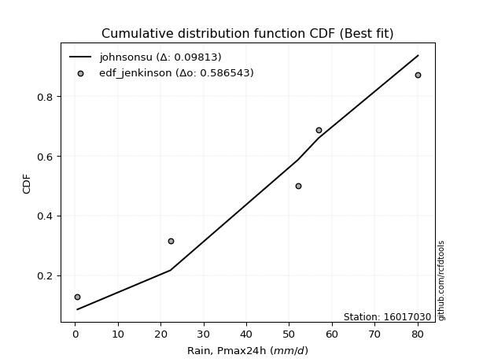</img>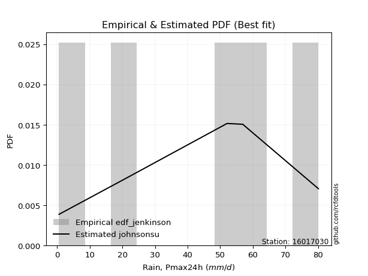</img>

</div>


### 11. EDF Cunnane (1978)

Cunnane´s work in statistical hydrology has focused on the performance and evaluation of different probability distributions (such as GEV, Gumbel, Lognormal) for flood frequency estimation. _b_ is a constant, typically set to 0.4.

<div align="center">


$P=(m-b)/(n+1-2b)$


</div>


**11.1. Empirical values**

<div align="center">

|                | 0                   | 1                  | 2           | 3                  | 4                  |
|:---------------|:--------------------|:-------------------|:------------|:-------------------|:-------------------|
| date           | 2012                | 2009               | 2011        | 2008               | 2010               |
| x              | 0.6                 | 22.3               | 52.1        | 56.9               | 80.1               |
| m              | 1                   | 2                  | 3           | 4                  | 5                  |
| empirical_dist | edf_cunnane         | edf_cunnane        | edf_cunnane | edf_cunnane        | edf_cunnane        |
| empirical      | 0.11538461538461538 | 0.3076923076923077 | 0.5         | 0.6923076923076923 | 0.8846153846153845 |
| empirical_tr   | 1.1304347826086958  | 1.4444444444444444 | 2.0         | 3.25               | 8.666666666666655  |

</div>


**11.2. Kolmogorov-Smirnov fit test (sorted by Δ)**


<div align="center">

|                | 0                   | 1                   | 2                   | 3                   | 4                   | 5                   | 6                   | 7                   | 8                   | 9                   | 10                  | 11                  | 12                  | 13                 | 14                  | 15                  | 16                  | 17                  | 18                  | 19                 | 20                  | 21                  | 22                  | 23                 | 24                 | 25                  | 26                  | 27                  | 28                  | 29                  | 30                  | 31                  | 32                  | 33                  | 34                 | 35                  | 36                  | 37                 | 38                 | 39                 | 40                  | 41                  | 42                  | 43                 | 44                 | 45                 | 46                  | 47                 | 48                  | 49                 | 50                  | 51                  | 52                 | 53                  | 54                  | 55                  | 56                  | 57                  | 58                  | 59                  | 60                  | 61                 | 62                 | 63                  | 64                  | 65                 | 66                  | 67                  | 68                  | 69                 | 70                  | 71                  | 72                 | 73                 | 74                  | 75                  | 76                  | 77                  | 78                 | 79                  | 80                  | 81                 | 82                 | 83                  | 84                 | 85                  | 86                  | 87                  | 88                 | 89                 | 90                  | 91                  | 92                 | 93                  | 94                  | 95                 | 96                  | 97                 | 98                 | 99                 | 100                 | 101                | 102                 | 103                | 104                 | 105                | 106                | 107                 | 108                 | 109                 | 110                 | 111                 | 112                | 113                | 114                 | 115                | 116                 | 117                | 118                | 119                 | 120                 | 121                | 122                 | 123                 | 124                | 125                | 126                 | 127                 | 128                | 129                | 130                 | 131                 | 132                | 133                | 134                | 135                | 136                | 137                 | 138                | 139                | 140                | 141                | 142                | 143                | 144                | 145                | 146                | 147                | 148                | 149                | 150                | 151                | 152                | 153                | 154                | 155                | 156                | 157                | 158                | 159                |
|:---------------|:--------------------|:--------------------|:--------------------|:--------------------|:--------------------|:--------------------|:--------------------|:--------------------|:--------------------|:--------------------|:--------------------|:--------------------|:--------------------|:-------------------|:--------------------|:--------------------|:--------------------|:--------------------|:--------------------|:-------------------|:--------------------|:--------------------|:--------------------|:-------------------|:-------------------|:--------------------|:--------------------|:--------------------|:--------------------|:--------------------|:--------------------|:--------------------|:--------------------|:--------------------|:-------------------|:--------------------|:--------------------|:-------------------|:-------------------|:-------------------|:--------------------|:--------------------|:--------------------|:-------------------|:-------------------|:-------------------|:--------------------|:-------------------|:--------------------|:-------------------|:--------------------|:--------------------|:-------------------|:--------------------|:--------------------|:--------------------|:--------------------|:--------------------|:--------------------|:--------------------|:--------------------|:-------------------|:-------------------|:--------------------|:--------------------|:-------------------|:--------------------|:--------------------|:--------------------|:-------------------|:--------------------|:--------------------|:-------------------|:-------------------|:--------------------|:--------------------|:--------------------|:--------------------|:-------------------|:--------------------|:--------------------|:-------------------|:-------------------|:--------------------|:-------------------|:--------------------|:--------------------|:--------------------|:-------------------|:-------------------|:--------------------|:--------------------|:-------------------|:--------------------|:--------------------|:-------------------|:--------------------|:-------------------|:-------------------|:-------------------|:--------------------|:-------------------|:--------------------|:-------------------|:--------------------|:-------------------|:-------------------|:--------------------|:--------------------|:--------------------|:--------------------|:--------------------|:-------------------|:-------------------|:--------------------|:-------------------|:--------------------|:-------------------|:-------------------|:--------------------|:--------------------|:-------------------|:--------------------|:--------------------|:-------------------|:-------------------|:--------------------|:--------------------|:-------------------|:-------------------|:--------------------|:--------------------|:-------------------|:-------------------|:-------------------|:-------------------|:-------------------|:--------------------|:-------------------|:-------------------|:-------------------|:-------------------|:-------------------|:-------------------|:-------------------|:-------------------|:-------------------|:-------------------|:-------------------|:-------------------|:-------------------|:-------------------|:-------------------|:-------------------|:-------------------|:-------------------|:-------------------|:-------------------|:-------------------|:-------------------|
| station        | 16017030            | 16017030            | 16017030            | 16017030            | 16017030            | 16017030            | 16017030            | 16017030            | 16017030            | 16017030            | 16017030            | 16017030            | 16017030            | 16017030           | 16017030            | 16017030            | 16017030            | 16017030            | 16017030            | 16017030           | 16017030            | 16017030            | 16017030            | 16017030           | 16017030           | 16017030            | 16017030            | 16017030            | 16017030            | 16017030            | 16017030            | 16017030            | 16017030            | 16017030            | 16017030           | 16017030            | 16017030            | 16017030           | 16017030           | 16017030           | 16017030            | 16017030            | 16017030            | 16017030           | 16017030           | 16017030           | 16017030            | 16017030           | 16017030            | 16017030           | 16017030            | 16017030            | 16017030           | 16017030            | 16017030            | 16017030            | 16017030            | 16017030            | 16017030            | 16017030            | 16017030            | 16017030           | 16017030           | 16017030            | 16017030            | 16017030           | 16017030            | 16017030            | 16017030            | 16017030           | 16017030            | 16017030            | 16017030           | 16017030           | 16017030            | 16017030            | 16017030            | 16017030            | 16017030           | 16017030            | 16017030            | 16017030           | 16017030           | 16017030            | 16017030           | 16017030            | 16017030            | 16017030            | 16017030           | 16017030           | 16017030            | 16017030            | 16017030           | 16017030            | 16017030            | 16017030           | 16017030            | 16017030           | 16017030           | 16017030           | 16017030            | 16017030           | 16017030            | 16017030           | 16017030            | 16017030           | 16017030           | 16017030            | 16017030            | 16017030            | 16017030            | 16017030            | 16017030           | 16017030           | 16017030            | 16017030           | 16017030            | 16017030           | 16017030           | 16017030            | 16017030            | 16017030           | 16017030            | 16017030            | 16017030           | 16017030           | 16017030            | 16017030            | 16017030           | 16017030           | 16017030            | 16017030            | 16017030           | 16017030           | 16017030           | 16017030           | 16017030           | 16017030            | 16017030           | 16017030           | 16017030           | 16017030           | 16017030           | 16017030           | 16017030           | 16017030           | 16017030           | 16017030           | 16017030           | 16017030           | 16017030           | 16017030           | 16017030           | 16017030           | 16017030           | 16017030           | 16017030           | 16017030           | 16017030           | 16017030           |
| empirical_dist | edf_cunnane         | edf_cunnane         | edf_cunnane         | edf_cunnane         | edf_cunnane         | edf_cunnane         | edf_cunnane         | edf_cunnane         | edf_cunnane         | edf_cunnane         | edf_cunnane         | edf_cunnane         | edf_cunnane         | edf_cunnane        | edf_cunnane         | edf_cunnane         | edf_cunnane         | edf_cunnane         | edf_cunnane         | edf_cunnane        | edf_cunnane         | edf_cunnane         | edf_cunnane         | edf_cunnane        | edf_cunnane        | edf_cunnane         | edf_cunnane         | edf_cunnane         | edf_cunnane         | edf_cunnane         | edf_cunnane         | edf_cunnane         | edf_cunnane         | edf_cunnane         | edf_cunnane        | edf_cunnane         | edf_cunnane         | edf_cunnane        | edf_cunnane        | edf_cunnane        | edf_cunnane         | edf_cunnane         | edf_cunnane         | edf_cunnane        | edf_cunnane        | edf_cunnane        | edf_cunnane         | edf_cunnane        | edf_cunnane         | edf_cunnane        | edf_cunnane         | edf_cunnane         | edf_cunnane        | edf_cunnane         | edf_cunnane         | edf_cunnane         | edf_cunnane         | edf_cunnane         | edf_cunnane         | edf_cunnane         | edf_cunnane         | edf_cunnane        | edf_cunnane        | edf_cunnane         | edf_cunnane         | edf_cunnane        | edf_cunnane         | edf_cunnane         | edf_cunnane         | edf_cunnane        | edf_cunnane         | edf_cunnane         | edf_cunnane        | edf_cunnane        | edf_cunnane         | edf_cunnane         | edf_cunnane         | edf_cunnane         | edf_cunnane        | edf_cunnane         | edf_cunnane         | edf_cunnane        | edf_cunnane        | edf_cunnane         | edf_cunnane        | edf_cunnane         | edf_cunnane         | edf_cunnane         | edf_cunnane        | edf_cunnane        | edf_cunnane         | edf_cunnane         | edf_cunnane        | edf_cunnane         | edf_cunnane         | edf_cunnane        | edf_cunnane         | edf_cunnane        | edf_cunnane        | edf_cunnane        | edf_cunnane         | edf_cunnane        | edf_cunnane         | edf_cunnane        | edf_cunnane         | edf_cunnane        | edf_cunnane        | edf_cunnane         | edf_cunnane         | edf_cunnane         | edf_cunnane         | edf_cunnane         | edf_cunnane        | edf_cunnane        | edf_cunnane         | edf_cunnane        | edf_cunnane         | edf_cunnane        | edf_cunnane        | edf_cunnane         | edf_cunnane         | edf_cunnane        | edf_cunnane         | edf_cunnane         | edf_cunnane        | edf_cunnane        | edf_cunnane         | edf_cunnane         | edf_cunnane        | edf_cunnane        | edf_cunnane         | edf_cunnane         | edf_cunnane        | edf_cunnane        | edf_cunnane        | edf_cunnane        | edf_cunnane        | edf_cunnane         | edf_cunnane        | edf_cunnane        | edf_cunnane        | edf_cunnane        | edf_cunnane        | edf_cunnane        | edf_cunnane        | edf_cunnane        | edf_cunnane        | edf_cunnane        | edf_cunnane        | edf_cunnane        | edf_cunnane        | edf_cunnane        | edf_cunnane        | edf_cunnane        | edf_cunnane        | edf_cunnane        | edf_cunnane        | edf_cunnane        | edf_cunnane        | edf_cunnane        |
| p_dist         | johnsonsu           | argus               | genlogistic         | dweibull            | ksone               | trapezoid           | dgamma              | gumbel_l            | semicircular        | triang              | loggenpareto        | skewnorm            | wrapcauchy          | beta               | genpareto           | genhalflogistic     | arcsine             | anglit              | weibull_min         | pearson3           | loggenextreme       | exponnorm           | crystalball         | norm               | t                  | foldnorm            | gompertz            | betaprime           | vonmises_line       | erlang              | gamma               | tukeylambda         | cosine              | kappa4              | logvonmises_line   | kappa3              | uniform             | logpearson3        | rice               | f                  | bradford            | logistic            | loglevy_l           | invgamma           | maxwell            | invgauss           | ncf                 | burr12             | gausshyper          | hypsecant          | rayleigh            | loggumbel_l         | gennorm            | loggausshyper       | logtrapezoid        | truncweibull_min    | kstwobign           | halfnorm            | logt                | burr                | loggennorm          | levy_l             | laplace            | gumbel_r            | logarcsine          | genexpon           | logsemicircular     | loggompertz         | logdgamma           | loganglit          | genextreme          | halflogistic        | truncexpon         | lognorm            | logexponnorm        | lognakagami         | lognct              | moyal               | logargus           | logdweibull         | logfoldnorm         | logrice            | loglogistic        | logerlang           | logweibull_max     | loggamma            | loggamma            | loginvgamma         | logwrapcauchy      | logloggamma        | logalpha            | loginvgauss         | loghypsecant       | loginvweibull       | logmaxwell          | loggengamma        | lograyleigh         | lomax              | loglaplace         | loglaplace         | exponweib           | logburr12          | wald                | logexponweib       | logcosine           | loglomax           | logkstwobign       | loggumbel_r         | loghalfnorm         | logncf              | loggenexpon         | logburr             | mielke             | loggenhalflogistic | gengamma            | logmoyal           | loghalflogistic     | nct                | logbeta            | logskewnorm         | logloglaplace       | logtriang          | logkappa3           | logtruncweibull_min | loghalfgennorm     | logwald            | logksone            | logf                | halfgennorm        | loguniform         | logbradford         | logtruncnorm        | logkappa4          | johnsonsb          | logmielke          | logweibull_min     | logjohnsonsu       | invweibull          | fatiguelife        | logtruncexpon      | nakagami           | logbetaprime       | logfatiguelife     | logtukeylambda     | logjohnsonsb       | powerlaw           | truncpareto        | weibull_max        | logexponpow        | exponpow           | logtruncpareto     | alpha              | truncnorm          | logpowerlaw        | rdist              | loggenlogistic     | logrdist           | logvonmises        | vonmises           | logcrystalball     |
| delta          | 0.09169543662762902 | 0.09369212354535239 | 0.09932834894423195 | 0.09954703455553571 | 0.10055992345576747 | 0.10238133275348915 | 0.10789173371087307 | 0.10823954888603027 | 0.11031996186219506 | 0.11337281031856694 | 0.11538384109329736 | 0.11538415132629964 | 0.11538461267109956 | 0.1153846153780238 | 0.11538461538289924 | 0.11538461538461342 | 0.11538461538461538 | 0.11795524359209109 | 0.12346364729723258 | 0.1241103761945126 | 0.12482896555491685 | 0.13621046967992034 | 0.13621124187243083 | 0.136211248449843  | 0.136211533386686  | 0.13734071711148343 | 0.13888260442252454 | 0.14099005946495058 | 0.14117467511527348 | 0.14249447513523017 | 0.14272524323794722 | 0.14491623908997298 | 0.14541585355741016 | 0.14554530679858135 | 0.1470366436539915 | 0.14770676896669677 | 0.14779874213836475 | 0.1493994932248497 | 0.1496532832544999 | 0.1507828766371978 | 0.15255956904761414 | 0.15290579655501668 | 0.15322734661360093 | 0.1547519878164878 | 0.1592866304806806 | 0.1604045513738266 | 0.16109305922296469 | 0.1634588739778574 | 0.16521496367197108 | 0.1660820675568807 | 0.16628458327202789 | 0.17071128055389706 | 0.1735984328112061 | 0.17476811675543413 | 0.17511578956664264 | 0.17591545854952462 | 0.18310557378067316 | 0.18648475056568048 | 0.18651359983980487 | 0.19063358516790163 | 0.19230769215420418 | 0.1923900188720984 | 0.1944947093874868 | 0.19826370524031234 | 0.20608418808164874 | 0.2085393877039854 | 0.21178192039274324 | 0.21193105389240485 | 0.21266457739430655 | 0.2132182725211591 | 0.21396002566681033 | 0.21476996377034507 | 0.2154159482052841 | 0.2167036018309504 | 0.21670392409592354 | 0.21717323004326072 | 0.21748997506581347 | 0.21896812594025206 | 0.2194036074109469 | 0.22333234487095344 | 0.22337684774072364 | 0.2238769429905697 | 0.2241094568815838 | 0.22662455383814362 | 0.2317431723999388 | 0.23208381172246806 | 0.23208381172246806 | 0.23241790630091863 | 0.2338436082869466 | 0.235022040421914  | 0.23704438939488337 | 0.23922819871373857 | 0.2395448546670489 | 0.24742549764153654 | 0.24861832064333933 | 0.2538187395409288 | 0.25906127421869085 | 0.2604196405638325 | 0.2643733064928817 | 0.2643733064928817 | 0.26459997494389764 | 0.2671938159586821 | 0.27728306113016565 | 0.2779688773500598 | 0.28114525581521266 | 0.2838156572818544 | 0.2844538988515295 | 0.28737457399377453 | 0.28846097981565966 | 0.28914446603724875 | 0.29223003357223054 | 0.30178666217937467 | 0.3050632710402237 | 0.3087628973992559 | 0.31247705790426616 | 0.3128898202852348 | 0.31471744708775484 | 0.3176087996057859 | 0.333164348017841  | 0.35005865958464977 | 0.35515964808037714 | 0.3586134154811782 | 0.36438746275829115 | 0.3763852535156602  | 0.3787998959403994 | 0.3837408625411436 | 0.39124811896245604 | 0.39574826794500395 | 0.3958738339604855 | 0.4310362042934087 | 0.43220612804635394 | 0.43371553353907144 | 0.4350631443610059 | 0.4370565788544728 | 0.4412941856706869 | 0.4507852143899904 | 0.4666617780539736 | 0.46933989722803865 | 0.4821033454636501 | 0.4930378581102871 | 0.5162484386178029 | 0.5274417989605834 | 0.5316713454532758 | 0.5352749546813047 | 0.5457386506233457 | 0.5527429374411921 | 0.5585758568021822 | 0.5864286993646612 | 0.5882521940159182 | 0.6078358198117573 | 0.6326666230996484 | 0.6444858853117065 | 0.6531250966805449 | 0.6540278371605197 | 0.6923076920938842 | 0.6923076923076923 | 0.6923076923076923 | 0.8943636806897808 | 12.202306028979871 | nan                |
| deltao         | 0.5865427407550001  | 0.5865427407550001  | 0.5865427407550001  | 0.5865427407550001  | 0.5865427407550001  | 0.5865427407550001  | 0.5865427407550001  | 0.5865427407550001  | 0.5865427407550001  | 0.5865427407550001  | 0.5865427407550001  | 0.5865427407550001  | 0.5865427407550001  | 0.5865427407550001 | 0.5865427407550001  | 0.5865427407550001  | 0.5865427407550001  | 0.5865427407550001  | 0.5865427407550001  | 0.5865427407550001 | 0.5865427407550001  | 0.5865427407550001  | 0.5865427407550001  | 0.5865427407550001 | 0.5865427407550001 | 0.5865427407550001  | 0.5865427407550001  | 0.5865427407550001  | 0.5865427407550001  | 0.5865427407550001  | 0.5865427407550001  | 0.5865427407550001  | 0.5865427407550001  | 0.5865427407550001  | 0.5865427407550001 | 0.5865427407550001  | 0.5865427407550001  | 0.5865427407550001 | 0.5865427407550001 | 0.5865427407550001 | 0.5865427407550001  | 0.5865427407550001  | 0.5865427407550001  | 0.5865427407550001 | 0.5865427407550001 | 0.5865427407550001 | 0.5865427407550001  | 0.5865427407550001 | 0.5865427407550001  | 0.5865427407550001 | 0.5865427407550001  | 0.5865427407550001  | 0.5865427407550001 | 0.5865427407550001  | 0.5865427407550001  | 0.5865427407550001  | 0.5865427407550001  | 0.5865427407550001  | 0.5865427407550001  | 0.5865427407550001  | 0.5865427407550001  | 0.5865427407550001 | 0.5865427407550001 | 0.5865427407550001  | 0.5865427407550001  | 0.5865427407550001 | 0.5865427407550001  | 0.5865427407550001  | 0.5865427407550001  | 0.5865427407550001 | 0.5865427407550001  | 0.5865427407550001  | 0.5865427407550001 | 0.5865427407550001 | 0.5865427407550001  | 0.5865427407550001  | 0.5865427407550001  | 0.5865427407550001  | 0.5865427407550001 | 0.5865427407550001  | 0.5865427407550001  | 0.5865427407550001 | 0.5865427407550001 | 0.5865427407550001  | 0.5865427407550001 | 0.5865427407550001  | 0.5865427407550001  | 0.5865427407550001  | 0.5865427407550001 | 0.5865427407550001 | 0.5865427407550001  | 0.5865427407550001  | 0.5865427407550001 | 0.5865427407550001  | 0.5865427407550001  | 0.5865427407550001 | 0.5865427407550001  | 0.5865427407550001 | 0.5865427407550001 | 0.5865427407550001 | 0.5865427407550001  | 0.5865427407550001 | 0.5865427407550001  | 0.5865427407550001 | 0.5865427407550001  | 0.5865427407550001 | 0.5865427407550001 | 0.5865427407550001  | 0.5865427407550001  | 0.5865427407550001  | 0.5865427407550001  | 0.5865427407550001  | 0.5865427407550001 | 0.5865427407550001 | 0.5865427407550001  | 0.5865427407550001 | 0.5865427407550001  | 0.5865427407550001 | 0.5865427407550001 | 0.5865427407550001  | 0.5865427407550001  | 0.5865427407550001 | 0.5865427407550001  | 0.5865427407550001  | 0.5865427407550001 | 0.5865427407550001 | 0.5865427407550001  | 0.5865427407550001  | 0.5865427407550001 | 0.5865427407550001 | 0.5865427407550001  | 0.5865427407550001  | 0.5865427407550001 | 0.5865427407550001 | 0.5865427407550001 | 0.5865427407550001 | 0.5865427407550001 | 0.5865427407550001  | 0.5865427407550001 | 0.5865427407550001 | 0.5865427407550001 | 0.5865427407550001 | 0.5865427407550001 | 0.5865427407550001 | 0.5865427407550001 | 0.5865427407550001 | 0.5865427407550001 | 0.5865427407550001 | 0.5865427407550001 | 0.5865427407550001 | 0.5865427407550001 | 0.5865427407550001 | 0.5865427407550001 | 0.5865427407550001 | 0.5865427407550001 | 0.5865427407550001 | 0.5865427407550001 | 0.5865427407550001 | 0.5865427407550001 | 0.5865427407550001 |
| eval           | Δo > Δ              | Δo > Δ              | Δo > Δ              | Δo > Δ              | Δo > Δ              | Δo > Δ              | Δo > Δ              | Δo > Δ              | Δo > Δ              | Δo > Δ              | Δo > Δ              | Δo > Δ              | Δo > Δ              | Δo > Δ             | Δo > Δ              | Δo > Δ              | Δo > Δ              | Δo > Δ              | Δo > Δ              | Δo > Δ             | Δo > Δ              | Δo > Δ              | Δo > Δ              | Δo > Δ             | Δo > Δ             | Δo > Δ              | Δo > Δ              | Δo > Δ              | Δo > Δ              | Δo > Δ              | Δo > Δ              | Δo > Δ              | Δo > Δ              | Δo > Δ              | Δo > Δ             | Δo > Δ              | Δo > Δ              | Δo > Δ             | Δo > Δ             | Δo > Δ             | Δo > Δ              | Δo > Δ              | Δo > Δ              | Δo > Δ             | Δo > Δ             | Δo > Δ             | Δo > Δ              | Δo > Δ             | Δo > Δ              | Δo > Δ             | Δo > Δ              | Δo > Δ              | Δo > Δ             | Δo > Δ              | Δo > Δ              | Δo > Δ              | Δo > Δ              | Δo > Δ              | Δo > Δ              | Δo > Δ              | Δo > Δ              | Δo > Δ             | Δo > Δ             | Δo > Δ              | Δo > Δ              | Δo > Δ             | Δo > Δ              | Δo > Δ              | Δo > Δ              | Δo > Δ             | Δo > Δ              | Δo > Δ              | Δo > Δ             | Δo > Δ             | Δo > Δ              | Δo > Δ              | Δo > Δ              | Δo > Δ              | Δo > Δ             | Δo > Δ              | Δo > Δ              | Δo > Δ             | Δo > Δ             | Δo > Δ              | Δo > Δ             | Δo > Δ              | Δo > Δ              | Δo > Δ              | Δo > Δ             | Δo > Δ             | Δo > Δ              | Δo > Δ              | Δo > Δ             | Δo > Δ              | Δo > Δ              | Δo > Δ             | Δo > Δ              | Δo > Δ             | Δo > Δ             | Δo > Δ             | Δo > Δ              | Δo > Δ             | Δo > Δ              | Δo > Δ             | Δo > Δ              | Δo > Δ             | Δo > Δ             | Δo > Δ              | Δo > Δ              | Δo > Δ              | Δo > Δ              | Δo > Δ              | Δo > Δ             | Δo > Δ             | Δo > Δ              | Δo > Δ             | Δo > Δ              | Δo > Δ             | Δo > Δ             | Δo > Δ              | Δo > Δ              | Δo > Δ             | Δo > Δ              | Δo > Δ              | Δo > Δ             | Δo > Δ             | Δo > Δ              | Δo > Δ              | Δo > Δ             | Δo > Δ             | Δo > Δ              | Δo > Δ              | Δo > Δ             | Δo > Δ             | Δo > Δ             | Δo > Δ             | Δo > Δ             | Δo > Δ              | Δo > Δ             | Δo > Δ             | Δo > Δ             | Δo > Δ             | Δo > Δ             | Δo > Δ             | Δo > Δ             | Δo > Δ             | Δo > Δ             | Δo > Δ             | Δo <= Δ            | Δo <= Δ            | Δo <= Δ            | Δo <= Δ            | Δo <= Δ            | Δo <= Δ            | Δo <= Δ            | Δo <= Δ            | Δo <= Δ            | Δo <= Δ            | Δo <= Δ            | Δo <= Δ            |
| fit            | 1                   | 1                   | 1                   | 1                   | 1                   | 1                   | 1                   | 1                   | 1                   | 1                   | 1                   | 1                   | 1                   | 1                  | 1                   | 1                   | 1                   | 1                   | 1                   | 1                  | 1                   | 1                   | 1                   | 1                  | 1                  | 1                   | 1                   | 1                   | 1                   | 1                   | 1                   | 1                   | 1                   | 1                   | 1                  | 1                   | 1                   | 1                  | 1                  | 1                  | 1                   | 1                   | 1                   | 1                  | 1                  | 1                  | 1                   | 1                  | 1                   | 1                  | 1                   | 1                   | 1                  | 1                   | 1                   | 1                   | 1                   | 1                   | 1                   | 1                   | 1                   | 1                  | 1                  | 1                   | 1                   | 1                  | 1                   | 1                   | 1                   | 1                  | 1                   | 1                   | 1                  | 1                  | 1                   | 1                   | 1                   | 1                   | 1                  | 1                   | 1                   | 1                  | 1                  | 1                   | 1                  | 1                   | 1                   | 1                   | 1                  | 1                  | 1                   | 1                   | 1                  | 1                   | 1                   | 1                  | 1                   | 1                  | 1                  | 1                  | 1                   | 1                  | 1                   | 1                  | 1                   | 1                  | 1                  | 1                   | 1                   | 1                   | 1                   | 1                   | 1                  | 1                  | 1                   | 1                  | 1                   | 1                  | 1                  | 1                   | 1                   | 1                  | 1                   | 1                   | 1                  | 1                  | 1                   | 1                   | 1                  | 1                  | 1                   | 1                   | 1                  | 1                  | 1                  | 1                  | 1                  | 1                   | 1                  | 1                  | 1                  | 1                  | 1                  | 1                  | 1                  | 1                  | 1                  | 1                  | 0                  | 0                  | 0                  | 0                  | 0                  | 0                  | 0                  | 0                  | 0                  | 0                  | 0                  | 0                  |
| n              | 5                   | 5                   | 5                   | 5                   | 5                   | 5                   | 5                   | 5                   | 5                   | 5                   | 5                   | 5                   | 5                   | 5                  | 5                   | 5                   | 5                   | 5                   | 5                   | 5                  | 5                   | 5                   | 5                   | 5                  | 5                  | 5                   | 5                   | 5                   | 5                   | 5                   | 5                   | 5                   | 5                   | 5                   | 5                  | 5                   | 5                   | 5                  | 5                  | 5                  | 5                   | 5                   | 5                   | 5                  | 5                  | 5                  | 5                   | 5                  | 5                   | 5                  | 5                   | 5                   | 5                  | 5                   | 5                   | 5                   | 5                   | 5                   | 5                   | 5                   | 5                   | 5                  | 5                  | 5                   | 5                   | 5                  | 5                   | 5                   | 5                   | 5                  | 5                   | 5                   | 5                  | 5                  | 5                   | 5                   | 5                   | 5                   | 5                  | 5                   | 5                   | 5                  | 5                  | 5                   | 5                  | 5                   | 5                   | 5                   | 5                  | 5                  | 5                   | 5                   | 5                  | 5                   | 5                   | 5                  | 5                   | 5                  | 5                  | 5                  | 5                   | 5                  | 5                   | 5                  | 5                   | 5                  | 5                  | 5                   | 5                   | 5                   | 5                   | 5                   | 5                  | 5                  | 5                   | 5                  | 5                   | 5                  | 5                  | 5                   | 5                   | 5                  | 5                   | 5                   | 5                  | 5                  | 5                   | 5                   | 5                  | 5                  | 5                   | 5                   | 5                  | 5                  | 5                  | 5                  | 5                  | 5                   | 5                  | 5                  | 5                  | 5                  | 5                  | 5                  | 5                  | 5                  | 5                  | 5                  | 5                  | 5                  | 5                  | 5                  | 5                  | 5                  | 5                  | 5                  | 5                  | 5                  | 5                  | 5                  |
| best_fit       | 1                   | 0                   | 0                   | 0                   | 0                   | 0                   | 0                   | 0                   | 0                   | 0                   | 0                   | 0                   | 0                   | 0                  | 0                   | 0                   | 0                   | 0                   | 0                   | 0                  | 0                   | 0                   | 0                   | 0                  | 0                  | 0                   | 0                   | 0                   | 0                   | 0                   | 0                   | 0                   | 0                   | 0                   | 0                  | 0                   | 0                   | 0                  | 0                  | 0                  | 0                   | 0                   | 0                   | 0                  | 0                  | 0                  | 0                   | 0                  | 0                   | 0                  | 0                   | 0                   | 0                  | 0                   | 0                   | 0                   | 0                   | 0                   | 0                   | 0                   | 0                   | 0                  | 0                  | 0                   | 0                   | 0                  | 0                   | 0                   | 0                   | 0                  | 0                   | 0                   | 0                  | 0                  | 0                   | 0                   | 0                   | 0                   | 0                  | 0                   | 0                   | 0                  | 0                  | 0                   | 0                  | 0                   | 0                   | 0                   | 0                  | 0                  | 0                   | 0                   | 0                  | 0                   | 0                   | 0                  | 0                   | 0                  | 0                  | 0                  | 0                   | 0                  | 0                   | 0                  | 0                   | 0                  | 0                  | 0                   | 0                   | 0                   | 0                   | 0                   | 0                  | 0                  | 0                   | 0                  | 0                   | 0                  | 0                  | 0                   | 0                   | 0                  | 0                   | 0                   | 0                  | 0                  | 0                   | 0                   | 0                  | 0                  | 0                   | 0                   | 0                  | 0                  | 0                  | 0                  | 0                  | 0                   | 0                  | 0                  | 0                  | 0                  | 0                  | 0                  | 0                  | 0                  | 0                  | 0                  | 0                  | 0                  | 0                  | 0                  | 0                  | 0                  | 0                  | 0                  | 0                  | 0                  | 0                  | 0                  |
| best_fit_sort  | 1                   | 2                   | 3                   | 4                   | 5                   | 6                   | 7                   | 8                   | 9                   | 10                  | 11                  | 12                  | 13                  | 14                 | 15                  | 16                  | 17                  | 18                  | 19                  | 20                 | 21                  | 22                  | 23                  | 24                 | 25                 | 26                  | 27                  | 28                  | 29                  | 30                  | 31                  | 32                  | 33                  | 34                  | 35                 | 36                  | 37                  | 38                 | 39                 | 40                 | 41                  | 42                  | 43                  | 44                 | 45                 | 46                 | 47                  | 48                 | 49                  | 50                 | 51                  | 52                  | 53                 | 54                  | 55                  | 56                  | 57                  | 58                  | 59                  | 60                  | 61                  | 62                 | 63                 | 64                  | 65                  | 66                 | 67                  | 68                  | 69                  | 70                 | 71                  | 72                  | 73                 | 74                 | 75                  | 76                  | 77                  | 78                  | 79                 | 80                  | 81                  | 82                 | 83                 | 84                  | 85                 | 86                  | 87                  | 88                  | 89                 | 90                 | 91                  | 92                  | 93                 | 94                  | 95                  | 96                 | 97                  | 98                 | 99                 | 100                | 101                 | 102                | 103                 | 104                | 105                 | 106                | 107                | 108                 | 109                 | 110                 | 111                 | 112                 | 113                | 114                | 115                 | 116                | 117                 | 118                | 119                | 120                 | 121                 | 122                | 123                 | 124                 | 125                | 126                | 127                 | 128                 | 129                | 130                | 131                 | 132                 | 133                | 134                | 135                | 136                | 137                | 138                 | 139                | 140                | 141                | 142                | 143                | 144                | 145                | 146                | 147                | 148                | 149                | 150                | 151                | 152                | 153                | 154                | 155                | 156                | 157                | 158                | 159                | 160                |

</div>


**11.3. Best fit**

<div align="center">

|   id |   station | empirical_dist   | p_dist    |     delta |   deltao | eval   |   fit |   n |   best_fit |   best_fit_sort |
|-----:|----------:|:-----------------|:----------|----------:|---------:|:-------|------:|----:|-----------:|----------------:|
|    0 |  16017030 | edf_cunnane      | johnsonsu | 0.0916954 | 0.586543 | Δo > Δ |     1 |   5 |          1 |               1 |

</div>


<div align="center">

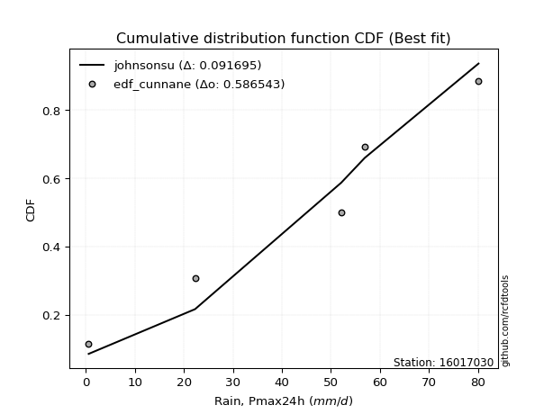</img></img>

</div>


### 12. EDF Adamowski (1981)

The Adamowski formula in hydrology refers to a specific plotting position formula used for estimating the non-parametric empirical distribution of hydrological events (like flood peaks) to calculate their return periods. This formula provides an alternative to traditional parametric methods (like the Gumbel or Log Pearson Type III distributions). 

<div align="center">


$P=(m-0.25)/(n+0.5)$


</div>


**12.1. Empirical values**

<div align="center">

|                | 0                   | 1                  | 2             | 3                  | 4                  |
|:---------------|:--------------------|:-------------------|:--------------|:-------------------|:-------------------|
| date           | 2012                | 2009               | 2011          | 2008               | 2010               |
| x              | 0.6                 | 22.3               | 52.1          | 56.9               | 80.1               |
| m              | 1                   | 2                  | 3             | 4                  | 5                  |
| empirical_dist | edf_adamowski       | edf_adamowski      | edf_adamowski | edf_adamowski      | edf_adamowski      |
| empirical      | 0.13636363636363635 | 0.3181818181818182 | 0.5           | 0.6818181818181818 | 0.8636363636363636 |
| empirical_tr   | 1.1578947368421053  | 1.4666666666666666 | 2.0           | 3.1428571428571423 | 7.333333333333334  |

</div>


**12.2. Kolmogorov-Smirnov fit test (sorted by Δ)**


<div align="center">

|                | 0                  | 1                  | 2                   | 3                   | 4                   | 5                   | 6                   | 7                   | 8                   | 9                   | 10                  | 11                 | 12                  | 13                  | 14                  | 15                 | 16                 | 17                  | 18                  | 19                  | 20                  | 21                  | 22                  | 23                  | 24                  | 25                  | 26                  | 27                  | 28                  | 29                  | 30                  | 31                  | 32                  | 33                 | 34                  | 35                  | 36                  | 37                  | 38                  | 39                 | 40                 | 41                 | 42                  | 43                  | 44                  | 45                 | 46                 | 47                 | 48                 | 49                  | 50                 | 51                  | 52                  | 53                  | 54                  | 55                  | 56                  | 57                  | 58                  | 59                  | 60                  | 61                 | 62                  | 63                  | 64                  | 65                  | 66                 | 67                  | 68                  | 69                 | 70                  | 71                  | 72                  | 73                 | 74                 | 75                  | 76                  | 77                  | 78                 | 79                  | 80                  | 81                 | 82                  | 83                 | 84                 | 85                  | 86                  | 87                  | 88                 | 89                 | 90                 | 91                 | 92                  | 93                  | 94                 | 95                  | 96                  | 97                 | 98                 | 99                 | 100                | 101                | 102                 | 103                | 104                 | 105                 | 106                 | 107                 | 108                | 109                | 110                | 111                | 112                | 113                 | 114                | 115                | 116                 | 117                | 118                | 119                | 120                 | 121                | 122                | 123                 | 124                | 125                 | 126                 | 127                | 128                | 129                 | 130                | 131                | 132                 | 133                | 134                 | 135                 | 136                | 137                 | 138                | 139                 | 140                | 141                | 142                | 143                | 144                | 145                | 146                | 147                | 148                | 149                | 150                | 151                | 152                | 153                | 154                | 155                | 156                | 157                | 158                | 159                |
|:---------------|:-------------------|:-------------------|:--------------------|:--------------------|:--------------------|:--------------------|:--------------------|:--------------------|:--------------------|:--------------------|:--------------------|:-------------------|:--------------------|:--------------------|:--------------------|:-------------------|:-------------------|:--------------------|:--------------------|:--------------------|:--------------------|:--------------------|:--------------------|:--------------------|:--------------------|:--------------------|:--------------------|:--------------------|:--------------------|:--------------------|:--------------------|:--------------------|:--------------------|:-------------------|:--------------------|:--------------------|:--------------------|:--------------------|:--------------------|:-------------------|:-------------------|:-------------------|:--------------------|:--------------------|:--------------------|:-------------------|:-------------------|:-------------------|:-------------------|:--------------------|:-------------------|:--------------------|:--------------------|:--------------------|:--------------------|:--------------------|:--------------------|:--------------------|:--------------------|:--------------------|:--------------------|:-------------------|:--------------------|:--------------------|:--------------------|:--------------------|:-------------------|:--------------------|:--------------------|:-------------------|:--------------------|:--------------------|:--------------------|:-------------------|:-------------------|:--------------------|:--------------------|:--------------------|:-------------------|:--------------------|:--------------------|:-------------------|:--------------------|:-------------------|:-------------------|:--------------------|:--------------------|:--------------------|:-------------------|:-------------------|:-------------------|:-------------------|:--------------------|:--------------------|:-------------------|:--------------------|:--------------------|:-------------------|:-------------------|:-------------------|:-------------------|:-------------------|:--------------------|:-------------------|:--------------------|:--------------------|:--------------------|:--------------------|:-------------------|:-------------------|:-------------------|:-------------------|:-------------------|:--------------------|:-------------------|:-------------------|:--------------------|:-------------------|:-------------------|:-------------------|:--------------------|:-------------------|:-------------------|:--------------------|:-------------------|:--------------------|:--------------------|:-------------------|:-------------------|:--------------------|:-------------------|:-------------------|:--------------------|:-------------------|:--------------------|:--------------------|:-------------------|:--------------------|:-------------------|:--------------------|:-------------------|:-------------------|:-------------------|:-------------------|:-------------------|:-------------------|:-------------------|:-------------------|:-------------------|:-------------------|:-------------------|:-------------------|:-------------------|:-------------------|:-------------------|:-------------------|:-------------------|:-------------------|:-------------------|:-------------------|
| station        | 16017030           | 16017030           | 16017030            | 16017030            | 16017030            | 16017030            | 16017030            | 16017030            | 16017030            | 16017030            | 16017030            | 16017030           | 16017030            | 16017030            | 16017030            | 16017030           | 16017030           | 16017030            | 16017030            | 16017030            | 16017030            | 16017030            | 16017030            | 16017030            | 16017030            | 16017030            | 16017030            | 16017030            | 16017030            | 16017030            | 16017030            | 16017030            | 16017030            | 16017030           | 16017030            | 16017030            | 16017030            | 16017030            | 16017030            | 16017030           | 16017030           | 16017030           | 16017030            | 16017030            | 16017030            | 16017030           | 16017030           | 16017030           | 16017030           | 16017030            | 16017030           | 16017030            | 16017030            | 16017030            | 16017030            | 16017030            | 16017030            | 16017030            | 16017030            | 16017030            | 16017030            | 16017030           | 16017030            | 16017030            | 16017030            | 16017030            | 16017030           | 16017030            | 16017030            | 16017030           | 16017030            | 16017030            | 16017030            | 16017030           | 16017030           | 16017030            | 16017030            | 16017030            | 16017030           | 16017030            | 16017030            | 16017030           | 16017030            | 16017030           | 16017030           | 16017030            | 16017030            | 16017030            | 16017030           | 16017030           | 16017030           | 16017030           | 16017030            | 16017030            | 16017030           | 16017030            | 16017030            | 16017030           | 16017030           | 16017030           | 16017030           | 16017030           | 16017030            | 16017030           | 16017030            | 16017030            | 16017030            | 16017030            | 16017030           | 16017030           | 16017030           | 16017030           | 16017030           | 16017030            | 16017030           | 16017030           | 16017030            | 16017030           | 16017030           | 16017030           | 16017030            | 16017030           | 16017030           | 16017030            | 16017030           | 16017030            | 16017030            | 16017030           | 16017030           | 16017030            | 16017030           | 16017030           | 16017030            | 16017030           | 16017030            | 16017030            | 16017030           | 16017030            | 16017030           | 16017030            | 16017030           | 16017030           | 16017030           | 16017030           | 16017030           | 16017030           | 16017030           | 16017030           | 16017030           | 16017030           | 16017030           | 16017030           | 16017030           | 16017030           | 16017030           | 16017030           | 16017030           | 16017030           | 16017030           | 16017030           |
| empirical_dist | edf_adamowski      | edf_adamowski      | edf_adamowski       | edf_adamowski       | edf_adamowski       | edf_adamowski       | edf_adamowski       | edf_adamowski       | edf_adamowski       | edf_adamowski       | edf_adamowski       | edf_adamowski      | edf_adamowski       | edf_adamowski       | edf_adamowski       | edf_adamowski      | edf_adamowski      | edf_adamowski       | edf_adamowski       | edf_adamowski       | edf_adamowski       | edf_adamowski       | edf_adamowski       | edf_adamowski       | edf_adamowski       | edf_adamowski       | edf_adamowski       | edf_adamowski       | edf_adamowski       | edf_adamowski       | edf_adamowski       | edf_adamowski       | edf_adamowski       | edf_adamowski      | edf_adamowski       | edf_adamowski       | edf_adamowski       | edf_adamowski       | edf_adamowski       | edf_adamowski      | edf_adamowski      | edf_adamowski      | edf_adamowski       | edf_adamowski       | edf_adamowski       | edf_adamowski      | edf_adamowski      | edf_adamowski      | edf_adamowski      | edf_adamowski       | edf_adamowski      | edf_adamowski       | edf_adamowski       | edf_adamowski       | edf_adamowski       | edf_adamowski       | edf_adamowski       | edf_adamowski       | edf_adamowski       | edf_adamowski       | edf_adamowski       | edf_adamowski      | edf_adamowski       | edf_adamowski       | edf_adamowski       | edf_adamowski       | edf_adamowski      | edf_adamowski       | edf_adamowski       | edf_adamowski      | edf_adamowski       | edf_adamowski       | edf_adamowski       | edf_adamowski      | edf_adamowski      | edf_adamowski       | edf_adamowski       | edf_adamowski       | edf_adamowski      | edf_adamowski       | edf_adamowski       | edf_adamowski      | edf_adamowski       | edf_adamowski      | edf_adamowski      | edf_adamowski       | edf_adamowski       | edf_adamowski       | edf_adamowski      | edf_adamowski      | edf_adamowski      | edf_adamowski      | edf_adamowski       | edf_adamowski       | edf_adamowski      | edf_adamowski       | edf_adamowski       | edf_adamowski      | edf_adamowski      | edf_adamowski      | edf_adamowski      | edf_adamowski      | edf_adamowski       | edf_adamowski      | edf_adamowski       | edf_adamowski       | edf_adamowski       | edf_adamowski       | edf_adamowski      | edf_adamowski      | edf_adamowski      | edf_adamowski      | edf_adamowski      | edf_adamowski       | edf_adamowski      | edf_adamowski      | edf_adamowski       | edf_adamowski      | edf_adamowski      | edf_adamowski      | edf_adamowski       | edf_adamowski      | edf_adamowski      | edf_adamowski       | edf_adamowski      | edf_adamowski       | edf_adamowski       | edf_adamowski      | edf_adamowski      | edf_adamowski       | edf_adamowski      | edf_adamowski      | edf_adamowski       | edf_adamowski      | edf_adamowski       | edf_adamowski       | edf_adamowski      | edf_adamowski       | edf_adamowski      | edf_adamowski       | edf_adamowski      | edf_adamowski      | edf_adamowski      | edf_adamowski      | edf_adamowski      | edf_adamowski      | edf_adamowski      | edf_adamowski      | edf_adamowski      | edf_adamowski      | edf_adamowski      | edf_adamowski      | edf_adamowski      | edf_adamowski      | edf_adamowski      | edf_adamowski      | edf_adamowski      | edf_adamowski      | edf_adamowski      | edf_adamowski      |
| p_dist         | dweibull           | dgamma             | ksone               | johnsonsu           | argus               | genlogistic         | semicircular        | anglit              | gumbel_l            | trapezoid           | weibull_min         | pearson3           | triang              | exponnorm           | crystalball         | norm               | t                  | loggenpareto        | skewnorm            | wrapcauchy          | logvonmises_line    | beta                | genpareto           | loggenextreme       | genhalflogistic     | arcsine             | foldnorm            | gompertz            | ncf                 | betaprime           | vonmises_line       | erlang              | gamma               | loglevy_l          | tukeylambda         | cosine              | kappa4              | kappa3              | uniform             | logpearson3        | rice               | f                  | bradford            | logistic            | gausshyper          | invgamma           | maxwell            | invgauss           | burr12             | logtrapezoid        | hypsecant          | rayleigh            | loggumbel_l         | loggausshyper       | truncweibull_min    | levy_l              | kstwobign           | gennorm             | halfnorm            | burr                | logdgamma           | laplace            | logarcsine          | logt                | gumbel_r            | logsemicircular     | logdweibull        | loggennorm          | loganglit           | genextreme         | lognorm             | logexponnorm        | lognakagami         | lognct             | genexpon           | loggompertz         | logrice             | halflogistic        | truncexpon         | logerlang           | moyal               | logargus           | logweibull_max      | loggamma           | loggamma           | loginvgamma         | logwrapcauchy       | logfoldnorm         | loglogistic        | logalpha           | loginvgauss        | logloggamma        | loginvweibull       | logmaxwell          | loghypsecant       | loggengamma         | lograyleigh         | logburr12          | exponweib          | lomax              | loglaplace         | loglaplace         | logexponweib        | logcosine          | loglomax            | logkstwobign        | loggumbel_r         | wald                | loghalfnorm        | logncf             | loggenexpon        | logburr            | gengamma           | logmoyal            | loghalflogistic    | mielke             | nct                 | loggenhalflogistic | logbeta            | logloglaplace      | logskewnorm         | logkappa3          | logtriang          | loghalfgennorm      | logwald            | logtruncweibull_min | logksone            | logf               | halfgennorm        | loguniform          | logbradford        | logtruncnorm       | logkappa4           | johnsonsb          | logmielke           | logweibull_min      | invweibull         | logjohnsonsu        | fatiguelife        | logtruncexpon       | nakagami           | logbetaprime       | logfatiguelife     | logtukeylambda     | logjohnsonsb       | powerlaw           | truncpareto        | weibull_max        | logexponpow        | exponpow           | logtruncpareto     | alpha              | truncnorm          | logpowerlaw        | rdist              | loggenlogistic     | logrdist           | logvonmises        | vonmises           | logcrystalball     |
| delta          | 0.0946604202845579 | 0.0974022232213626 | 0.10055992345576747 | 0.10218494711713949 | 0.10418163403486286 | 0.10981785943374242 | 0.11031996186219506 | 0.11795524359209109 | 0.11872905937554074 | 0.12336035373250998 | 0.12346364729723258 | 0.1241103761945126 | 0.13435183129758776 | 0.13621046967992034 | 0.13621124187243083 | 0.136211248449843  | 0.136211533386686  | 0.13636286207231818 | 0.13636317230532047 | 0.13636363365012039 | 0.13636363620862865 | 0.13636363635704463 | 0.13636363636192006 | 0.13636363636338666 | 0.13636363636363424 | 0.13636363636363635 | 0.13734071711148343 | 0.13888260442252454 | 0.14011403824394386 | 0.14099005946495058 | 0.14117467511527348 | 0.14249447513523017 | 0.14272524323794722 | 0.1427378361240904 | 0.14491623908997298 | 0.14541585355741016 | 0.14554530679858135 | 0.14770676896669677 | 0.14779874213836475 | 0.1493994932248497 | 0.1496532832544999 | 0.1507828766371978 | 0.15255956904761414 | 0.15290579655501668 | 0.15472545318246056 | 0.1547519878164878 | 0.1592866304806806 | 0.1604045513738266 | 0.1634588739778574 | 0.16462627907713218 | 0.1660820675568807 | 0.16628458327202789 | 0.17071128055389706 | 0.17476811675543413 | 0.17591545854952462 | 0.18190050838258787 | 0.18310557378067316 | 0.18408794330071657 | 0.18648475056568048 | 0.19063358516790163 | 0.19168555641528573 | 0.1944947093874868 | 0.19559467759213828 | 0.19700311032931533 | 0.19826370524031234 | 0.20129240990323277 | 0.2023533238919326 | 0.20239009355092902 | 0.20272876203164863 | 0.2034705151772998 | 0.20621409134143992 | 0.20621441360641307 | 0.20668371955375026 | 0.207000464576303  | 0.2085393877039854 | 0.21193105389240485 | 0.21338743250105924 | 0.21476996377034507 | 0.2154159482052841 | 0.21613504334863315 | 0.21896812594025206 | 0.2194036074109469 | 0.22125366191042828 | 0.2215943012329576 | 0.2215943012329576 | 0.22192839581140816 | 0.22335409779743615 | 0.22337684774072364 | 0.2241094568815838 | 0.2265548789053729 | 0.2287386882242281 | 0.235022040421914  | 0.23693598715202607 | 0.23812881015382886 | 0.2395448546670489 | 0.24332922905141835 | 0.24857176372918038 | 0.2487217473639622 | 0.2541104644543872 | 0.2604196405638325 | 0.2643733064928817 | 0.2643733064928817 | 0.26747936686054935 | 0.2706557453257022 | 0.27332614679234396 | 0.27396438836201903 | 0.27688506350426406 | 0.27728306113016565 | 0.2779714693261492 | 0.2786549555477383 | 0.2817405230827201 | 0.2912971516898642 | 0.3019875474147557 | 0.30240030979572435 | 0.3042279365982444 | 0.3050632710402237 | 0.30711928911627545 | 0.3087628973992559 | 0.3226748375283305 | 0.3446701375908667 | 0.35005865958464977 | 0.3538979522687807 | 0.3586134154811782 | 0.36831038545088896 | 0.3732513520516331 | 0.3763852535156602  | 0.38075860847294557 | 0.3852587574554935 | 0.385384323470975  | 0.42054669380389825 | 0.4217166175568435 | 0.423226023049561  | 0.42457363387149544 | 0.4265670683649623 | 0.43080467518117643 | 0.44029570390047995 | 0.4483608762490178 | 0.45617226756446305 | 0.4716138349741396 | 0.48254834762077664 | 0.5057589281282924 | 0.5169522884710729 | 0.5211818349637654 | 0.5247854441917943 | 0.5352491401338351 | 0.5422534269516817 | 0.5480863463126717 | 0.5759391888751506 | 0.5777626835264078 | 0.5973463093222469 | 0.6221771126101379 | 0.633996374822196  | 0.6426355861910344 | 0.6435383266710093 | 0.6818181816043738 | 0.6818181818181818 | 0.6818181818181819 | 0.8943636806897808 | 12.223285049958893 | nan                |
| deltao         | 0.5865427407550001 | 0.5865427407550001 | 0.5865427407550001  | 0.5865427407550001  | 0.5865427407550001  | 0.5865427407550001  | 0.5865427407550001  | 0.5865427407550001  | 0.5865427407550001  | 0.5865427407550001  | 0.5865427407550001  | 0.5865427407550001 | 0.5865427407550001  | 0.5865427407550001  | 0.5865427407550001  | 0.5865427407550001 | 0.5865427407550001 | 0.5865427407550001  | 0.5865427407550001  | 0.5865427407550001  | 0.5865427407550001  | 0.5865427407550001  | 0.5865427407550001  | 0.5865427407550001  | 0.5865427407550001  | 0.5865427407550001  | 0.5865427407550001  | 0.5865427407550001  | 0.5865427407550001  | 0.5865427407550001  | 0.5865427407550001  | 0.5865427407550001  | 0.5865427407550001  | 0.5865427407550001 | 0.5865427407550001  | 0.5865427407550001  | 0.5865427407550001  | 0.5865427407550001  | 0.5865427407550001  | 0.5865427407550001 | 0.5865427407550001 | 0.5865427407550001 | 0.5865427407550001  | 0.5865427407550001  | 0.5865427407550001  | 0.5865427407550001 | 0.5865427407550001 | 0.5865427407550001 | 0.5865427407550001 | 0.5865427407550001  | 0.5865427407550001 | 0.5865427407550001  | 0.5865427407550001  | 0.5865427407550001  | 0.5865427407550001  | 0.5865427407550001  | 0.5865427407550001  | 0.5865427407550001  | 0.5865427407550001  | 0.5865427407550001  | 0.5865427407550001  | 0.5865427407550001 | 0.5865427407550001  | 0.5865427407550001  | 0.5865427407550001  | 0.5865427407550001  | 0.5865427407550001 | 0.5865427407550001  | 0.5865427407550001  | 0.5865427407550001 | 0.5865427407550001  | 0.5865427407550001  | 0.5865427407550001  | 0.5865427407550001 | 0.5865427407550001 | 0.5865427407550001  | 0.5865427407550001  | 0.5865427407550001  | 0.5865427407550001 | 0.5865427407550001  | 0.5865427407550001  | 0.5865427407550001 | 0.5865427407550001  | 0.5865427407550001 | 0.5865427407550001 | 0.5865427407550001  | 0.5865427407550001  | 0.5865427407550001  | 0.5865427407550001 | 0.5865427407550001 | 0.5865427407550001 | 0.5865427407550001 | 0.5865427407550001  | 0.5865427407550001  | 0.5865427407550001 | 0.5865427407550001  | 0.5865427407550001  | 0.5865427407550001 | 0.5865427407550001 | 0.5865427407550001 | 0.5865427407550001 | 0.5865427407550001 | 0.5865427407550001  | 0.5865427407550001 | 0.5865427407550001  | 0.5865427407550001  | 0.5865427407550001  | 0.5865427407550001  | 0.5865427407550001 | 0.5865427407550001 | 0.5865427407550001 | 0.5865427407550001 | 0.5865427407550001 | 0.5865427407550001  | 0.5865427407550001 | 0.5865427407550001 | 0.5865427407550001  | 0.5865427407550001 | 0.5865427407550001 | 0.5865427407550001 | 0.5865427407550001  | 0.5865427407550001 | 0.5865427407550001 | 0.5865427407550001  | 0.5865427407550001 | 0.5865427407550001  | 0.5865427407550001  | 0.5865427407550001 | 0.5865427407550001 | 0.5865427407550001  | 0.5865427407550001 | 0.5865427407550001 | 0.5865427407550001  | 0.5865427407550001 | 0.5865427407550001  | 0.5865427407550001  | 0.5865427407550001 | 0.5865427407550001  | 0.5865427407550001 | 0.5865427407550001  | 0.5865427407550001 | 0.5865427407550001 | 0.5865427407550001 | 0.5865427407550001 | 0.5865427407550001 | 0.5865427407550001 | 0.5865427407550001 | 0.5865427407550001 | 0.5865427407550001 | 0.5865427407550001 | 0.5865427407550001 | 0.5865427407550001 | 0.5865427407550001 | 0.5865427407550001 | 0.5865427407550001 | 0.5865427407550001 | 0.5865427407550001 | 0.5865427407550001 | 0.5865427407550001 | 0.5865427407550001 |
| eval           | Δo > Δ             | Δo > Δ             | Δo > Δ              | Δo > Δ              | Δo > Δ              | Δo > Δ              | Δo > Δ              | Δo > Δ              | Δo > Δ              | Δo > Δ              | Δo > Δ              | Δo > Δ             | Δo > Δ              | Δo > Δ              | Δo > Δ              | Δo > Δ             | Δo > Δ             | Δo > Δ              | Δo > Δ              | Δo > Δ              | Δo > Δ              | Δo > Δ              | Δo > Δ              | Δo > Δ              | Δo > Δ              | Δo > Δ              | Δo > Δ              | Δo > Δ              | Δo > Δ              | Δo > Δ              | Δo > Δ              | Δo > Δ              | Δo > Δ              | Δo > Δ             | Δo > Δ              | Δo > Δ              | Δo > Δ              | Δo > Δ              | Δo > Δ              | Δo > Δ             | Δo > Δ             | Δo > Δ             | Δo > Δ              | Δo > Δ              | Δo > Δ              | Δo > Δ             | Δo > Δ             | Δo > Δ             | Δo > Δ             | Δo > Δ              | Δo > Δ             | Δo > Δ              | Δo > Δ              | Δo > Δ              | Δo > Δ              | Δo > Δ              | Δo > Δ              | Δo > Δ              | Δo > Δ              | Δo > Δ              | Δo > Δ              | Δo > Δ             | Δo > Δ              | Δo > Δ              | Δo > Δ              | Δo > Δ              | Δo > Δ             | Δo > Δ              | Δo > Δ              | Δo > Δ             | Δo > Δ              | Δo > Δ              | Δo > Δ              | Δo > Δ             | Δo > Δ             | Δo > Δ              | Δo > Δ              | Δo > Δ              | Δo > Δ             | Δo > Δ              | Δo > Δ              | Δo > Δ             | Δo > Δ              | Δo > Δ             | Δo > Δ             | Δo > Δ              | Δo > Δ              | Δo > Δ              | Δo > Δ             | Δo > Δ             | Δo > Δ             | Δo > Δ             | Δo > Δ              | Δo > Δ              | Δo > Δ             | Δo > Δ              | Δo > Δ              | Δo > Δ             | Δo > Δ             | Δo > Δ             | Δo > Δ             | Δo > Δ             | Δo > Δ              | Δo > Δ             | Δo > Δ              | Δo > Δ              | Δo > Δ              | Δo > Δ              | Δo > Δ             | Δo > Δ             | Δo > Δ             | Δo > Δ             | Δo > Δ             | Δo > Δ              | Δo > Δ             | Δo > Δ             | Δo > Δ              | Δo > Δ             | Δo > Δ             | Δo > Δ             | Δo > Δ              | Δo > Δ             | Δo > Δ             | Δo > Δ              | Δo > Δ             | Δo > Δ              | Δo > Δ              | Δo > Δ             | Δo > Δ             | Δo > Δ              | Δo > Δ             | Δo > Δ             | Δo > Δ              | Δo > Δ             | Δo > Δ              | Δo > Δ              | Δo > Δ             | Δo > Δ              | Δo > Δ             | Δo > Δ              | Δo > Δ             | Δo > Δ             | Δo > Δ             | Δo > Δ             | Δo > Δ             | Δo > Δ             | Δo > Δ             | Δo > Δ             | Δo > Δ             | Δo <= Δ            | Δo <= Δ            | Δo <= Δ            | Δo <= Δ            | Δo <= Δ            | Δo <= Δ            | Δo <= Δ            | Δo <= Δ            | Δo <= Δ            | Δo <= Δ            | Δo <= Δ            |
| fit            | 1                  | 1                  | 1                   | 1                   | 1                   | 1                   | 1                   | 1                   | 1                   | 1                   | 1                   | 1                  | 1                   | 1                   | 1                   | 1                  | 1                  | 1                   | 1                   | 1                   | 1                   | 1                   | 1                   | 1                   | 1                   | 1                   | 1                   | 1                   | 1                   | 1                   | 1                   | 1                   | 1                   | 1                  | 1                   | 1                   | 1                   | 1                   | 1                   | 1                  | 1                  | 1                  | 1                   | 1                   | 1                   | 1                  | 1                  | 1                  | 1                  | 1                   | 1                  | 1                   | 1                   | 1                   | 1                   | 1                   | 1                   | 1                   | 1                   | 1                   | 1                   | 1                  | 1                   | 1                   | 1                   | 1                   | 1                  | 1                   | 1                   | 1                  | 1                   | 1                   | 1                   | 1                  | 1                  | 1                   | 1                   | 1                   | 1                  | 1                   | 1                   | 1                  | 1                   | 1                  | 1                  | 1                   | 1                   | 1                   | 1                  | 1                  | 1                  | 1                  | 1                   | 1                   | 1                  | 1                   | 1                   | 1                  | 1                  | 1                  | 1                  | 1                  | 1                   | 1                  | 1                   | 1                   | 1                   | 1                   | 1                  | 1                  | 1                  | 1                  | 1                  | 1                   | 1                  | 1                  | 1                   | 1                  | 1                  | 1                  | 1                   | 1                  | 1                  | 1                   | 1                  | 1                   | 1                   | 1                  | 1                  | 1                   | 1                  | 1                  | 1                   | 1                  | 1                   | 1                   | 1                  | 1                   | 1                  | 1                   | 1                  | 1                  | 1                  | 1                  | 1                  | 1                  | 1                  | 1                  | 1                  | 0                  | 0                  | 0                  | 0                  | 0                  | 0                  | 0                  | 0                  | 0                  | 0                  | 0                  |
| n              | 5                  | 5                  | 5                   | 5                   | 5                   | 5                   | 5                   | 5                   | 5                   | 5                   | 5                   | 5                  | 5                   | 5                   | 5                   | 5                  | 5                  | 5                   | 5                   | 5                   | 5                   | 5                   | 5                   | 5                   | 5                   | 5                   | 5                   | 5                   | 5                   | 5                   | 5                   | 5                   | 5                   | 5                  | 5                   | 5                   | 5                   | 5                   | 5                   | 5                  | 5                  | 5                  | 5                   | 5                   | 5                   | 5                  | 5                  | 5                  | 5                  | 5                   | 5                  | 5                   | 5                   | 5                   | 5                   | 5                   | 5                   | 5                   | 5                   | 5                   | 5                   | 5                  | 5                   | 5                   | 5                   | 5                   | 5                  | 5                   | 5                   | 5                  | 5                   | 5                   | 5                   | 5                  | 5                  | 5                   | 5                   | 5                   | 5                  | 5                   | 5                   | 5                  | 5                   | 5                  | 5                  | 5                   | 5                   | 5                   | 5                  | 5                  | 5                  | 5                  | 5                   | 5                   | 5                  | 5                   | 5                   | 5                  | 5                  | 5                  | 5                  | 5                  | 5                   | 5                  | 5                   | 5                   | 5                   | 5                   | 5                  | 5                  | 5                  | 5                  | 5                  | 5                   | 5                  | 5                  | 5                   | 5                  | 5                  | 5                  | 5                   | 5                  | 5                  | 5                   | 5                  | 5                   | 5                   | 5                  | 5                  | 5                   | 5                  | 5                  | 5                   | 5                  | 5                   | 5                   | 5                  | 5                   | 5                  | 5                   | 5                  | 5                  | 5                  | 5                  | 5                  | 5                  | 5                  | 5                  | 5                  | 5                  | 5                  | 5                  | 5                  | 5                  | 5                  | 5                  | 5                  | 5                  | 5                  | 5                  |
| best_fit       | 1                  | 0                  | 0                   | 0                   | 0                   | 0                   | 0                   | 0                   | 0                   | 0                   | 0                   | 0                  | 0                   | 0                   | 0                   | 0                  | 0                  | 0                   | 0                   | 0                   | 0                   | 0                   | 0                   | 0                   | 0                   | 0                   | 0                   | 0                   | 0                   | 0                   | 0                   | 0                   | 0                   | 0                  | 0                   | 0                   | 0                   | 0                   | 0                   | 0                  | 0                  | 0                  | 0                   | 0                   | 0                   | 0                  | 0                  | 0                  | 0                  | 0                   | 0                  | 0                   | 0                   | 0                   | 0                   | 0                   | 0                   | 0                   | 0                   | 0                   | 0                   | 0                  | 0                   | 0                   | 0                   | 0                   | 0                  | 0                   | 0                   | 0                  | 0                   | 0                   | 0                   | 0                  | 0                  | 0                   | 0                   | 0                   | 0                  | 0                   | 0                   | 0                  | 0                   | 0                  | 0                  | 0                   | 0                   | 0                   | 0                  | 0                  | 0                  | 0                  | 0                   | 0                   | 0                  | 0                   | 0                   | 0                  | 0                  | 0                  | 0                  | 0                  | 0                   | 0                  | 0                   | 0                   | 0                   | 0                   | 0                  | 0                  | 0                  | 0                  | 0                  | 0                   | 0                  | 0                  | 0                   | 0                  | 0                  | 0                  | 0                   | 0                  | 0                  | 0                   | 0                  | 0                   | 0                   | 0                  | 0                  | 0                   | 0                  | 0                  | 0                   | 0                  | 0                   | 0                   | 0                  | 0                   | 0                  | 0                   | 0                  | 0                  | 0                  | 0                  | 0                  | 0                  | 0                  | 0                  | 0                  | 0                  | 0                  | 0                  | 0                  | 0                  | 0                  | 0                  | 0                  | 0                  | 0                  | 0                  |
| best_fit_sort  | 1                  | 2                  | 3                   | 4                   | 5                   | 6                   | 7                   | 8                   | 9                   | 10                  | 11                  | 12                 | 13                  | 14                  | 15                  | 16                 | 17                 | 18                  | 19                  | 20                  | 21                  | 22                  | 23                  | 24                  | 25                  | 26                  | 27                  | 28                  | 29                  | 30                  | 31                  | 32                  | 33                  | 34                 | 35                  | 36                  | 37                  | 38                  | 39                  | 40                 | 41                 | 42                 | 43                  | 44                  | 45                  | 46                 | 47                 | 48                 | 49                 | 50                  | 51                 | 52                  | 53                  | 54                  | 55                  | 56                  | 57                  | 58                  | 59                  | 60                  | 61                  | 62                 | 63                  | 64                  | 65                  | 66                  | 67                 | 68                  | 69                  | 70                 | 71                  | 72                  | 73                  | 74                 | 75                 | 76                  | 77                  | 78                  | 79                 | 80                  | 81                  | 82                 | 83                  | 84                 | 85                 | 86                  | 87                  | 88                  | 89                 | 90                 | 91                 | 92                 | 93                  | 94                  | 95                 | 96                  | 97                  | 98                 | 99                 | 100                | 101                | 102                | 103                 | 104                | 105                 | 106                 | 107                 | 108                 | 109                | 110                | 111                | 112                | 113                | 114                 | 115                | 116                | 117                 | 118                | 119                | 120                | 121                 | 122                | 123                | 124                 | 125                | 126                 | 127                 | 128                | 129                | 130                 | 131                | 132                | 133                 | 134                | 135                 | 136                 | 137                | 138                 | 139                | 140                 | 141                | 142                | 143                | 144                | 145                | 146                | 147                | 148                | 149                | 150                | 151                | 152                | 153                | 154                | 155                | 156                | 157                | 158                | 159                | 160                |

</div>


**12.3. Best fit**

<div align="center">

|   id |   station | empirical_dist   | p_dist   |     delta |   deltao | eval   |   fit |   n |   best_fit |   best_fit_sort |
|-----:|----------:|:-----------------|:---------|----------:|---------:|:-------|------:|----:|-----------:|----------------:|
|    0 |  16017030 | edf_adamowski    | dweibull | 0.0946604 | 0.586543 | Δo > Δ |     1 |   5 |          1 |               1 |

</div>


<div align="center">

</img>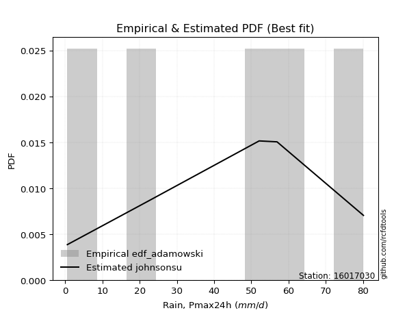</img>

</div>


## C. Best fit & Estimate extreme values for specific return periods - Tr

Best fit in probability distribution analysis means finding the theoretical distribution (like Normal, Poisson, Exponential, etc.) that most accurately mirrors your real-world data´s patterns (shape, center, spread) for better predictions, using methods like visual checks (Q-Q plots), goodness-of-fit tests (Kolmogorov-Smirnov, Chi-Squared), and information criteria (AIC) to score and select the simplest, most representative model.


### 1. Best fit (ordered by delta Δ)

:file_folder:Table: [bestfit_16017030.csv](table/bestfit_16017030.csv)

<div align="center">

|   id |   station | empirical_dist   | p_dist    |     delta |   deltao | eval   |   fit |   n |   best_fit |   best_fit_sort |
|-----:|----------:|:-----------------|:----------|----------:|---------:|:-------|------:|----:|-----------:|----------------:|
|    0 |  16017030 | edf_hazen        | argus     | 0.0859998 | 0.586543 | Δo > Δ |     1 |   5 |          1 |               1 |
|    1 |  16017030 | edf_gringorten   | johnsonsu | 0.0886906 | 0.586543 | Δo > Δ |     1 |   5 |          1 |               2 |
|    2 |  16017030 | edf_cunnane      | johnsonsu | 0.0916954 | 0.586543 | Δo > Δ |     1 |   5 |          1 |               3 |
|    3 |  16017030 | edf_chegodayev   | dweibull  | 0.0924245 | 0.586543 | Δo > Δ |     1 |   5 |          1 |               4 |
|    4 |  16017030 | edf_beard        | dweibull  | 0.0931129 | 0.586543 | Δo > Δ |     1 |   5 |          1 |               5 |
|    5 |  16017030 | edf_jenkinson    | dweibull  | 0.0931129 | 0.586543 | Δo > Δ |     1 |   5 |          1 |               6 |
|    6 |  16017030 | edf_blom         | johnsonsu | 0.0935269 | 0.586543 | Δo > Δ |     1 |   5 |          1 |               7 |
|    7 |  16017030 | edf_filliben     | dweibull  | 0.0936326 | 0.586543 | Δo > Δ |     1 |   5 |          1 |               8 |
|    8 |  16017030 | edf_adamowski    | dweibull  | 0.0946604 | 0.586543 | Δo > Δ |     1 |   5 |          1 |               9 |
|    9 |  16017030 | edf_tukey        | dweibull  | 0.0947393 | 0.586543 | Δo > Δ |     1 |   5 |          1 |              10 |
|   10 |  16017030 | edf_weibull      | ksone     | 0.10056   | 0.586543 | Δo > Δ |     1 |   5 |          1 |              11 |
|   11 |  16017030 | edf_california   | dgamma    | 0.134938  | 0.586543 | Δo > Δ |     1 |   5 |          1 |              12 |

</div>


### 2. Extreme values and % difference analysis

In hydrology, a return period (or recurrence interval $Tr$) is the statistical average time between extreme events like floods or droughts of a specific magnitude, indicating how rare an event is, with a 100-year flood, for example, having a 1% chance of occurring in any given year, not that it happens exactly every century. It is a key tool for infrastructure design (like bridges or dams) and risk assessment, calculated from historical data to determine the probability of future events, although it is important to remember it is statistical average, and events can cluster or be missed.

The extreme value porcentage difference is evaluated as $pdiff = 1 - (ETrBf / ETr) * 100$, where _ETrBf_ correspond to the bestfit extreme value for a specific recurrence interval and _ETr_ correspond to the extreme value for one of the most used PDFsused in hydrology.

> risk_rate: assuming the return period as the project useful life.

:file_folder:Table: [extreme_16017030.csv](table/extreme_16017030.csv), all PDFs.  
:file_folder:Table: [extremepdiff_16017030.csv](table/extremepdiff_16017030.csv), % difference between bestfit and most used PDFs in Hydrology.

<div align="center">

Extreme values table for only best fit PDFs
|   id |      tr |   prob_l |     prob_g |      alpha |   anglit |   arcsine |   argus |    beta |   betaprime |   bradford |    burr |   burr12 |   cosine |   crystalball |   dgamma |   dweibull |   erlang |   exponnorm |    exponpow |        exponweib |        f |   fatiguelife |   foldnorm |    gamma |   gausshyper |   genexpon |   genextreme |   gengamma |   genhalflogistic |   genlogistic |   gennorm |   genpareto |   gompertz |   gumbel_l |   gumbel_r |   halfgennorm |   halflogistic |   halfnorm |   hypsecant |   invgamma |   invgauss |      invweibull |   johnsonsb |   johnsonsu |    kappa3 |   kappa4 |   ksone |   kstwobign |   laplace |   levy_l |   loggamma |   logistic |   loglaplace |    lomax |   maxwell |   mielke |    moyal |   nakagami |      ncf |              nct |     norm |   pearson3 |   powerlaw |   rayleigh |    rdist |     rice |   semicircular |   skewnorm |        t |   trapezoid |   triang |   truncexpon |   truncnorm |   truncpareto |   truncweibull_min |   tukeylambda |   uniform |   vonmises |   vonmises_line |     wald |   weibull_max |   weibull_min |   wrapcauchy |   logalpha |   loganglit |   logarcsine |   logargus |   logbeta |      logbetaprime |   logbradford |        logburr |      logburr12 |   logcosine |   logcrystalball |   logdgamma |   logdweibull |   logerlang |   logexponnorm |      logexponpow |      logexponweib |            logf |   logfatiguelife |   logfoldnorm |   loggausshyper |   loggenexpon |   loggenextreme |     loggengamma |   loggenhalflogistic |   loggenlogistic |       loggennorm |   loggenpareto |   loggompertz |   loggumbel_l |   loggumbel_r |   loghalfgennorm |   loghalflogistic |   loghalfnorm |   loghypsecant |   loginvgamma |   loginvgauss |    loginvweibull |   logjohnsonsb |   logjohnsonsu |   logkappa3 |   logkappa4 |   logksone |   logkstwobign |   loglevy_l |   logloggamma |   loglogistic |   logloglaplace |         loglomax |   logmaxwell |         logmielke |    logmoyal |   lognakagami |            logncf |    lognct |   lognorm |   logpearson3 |   logpowerlaw |   lograyleigh |   logrdist |   logrice |   logsemicircular |   logskewnorm |              logt |   logtrapezoid |   logtriang |   logtruncexpon |   logtruncnorm |   logtruncpareto |   logtruncweibull_min |   logtukeylambda |   loguniform |   logvonmises |   logvonmises_line |          logwald |   logweibull_max |   logweibull_min |   logwrapcauchy |   station |   n |   risk_rate |
|-----:|--------:|---------:|-----------:|-----------:|---------:|----------:|--------:|--------:|------------:|-----------:|--------:|---------:|---------:|--------------:|---------:|-----------:|---------:|------------:|------------:|-----------------:|---------:|--------------:|-----------:|---------:|-------------:|-----------:|-------------:|-----------:|------------------:|--------------:|----------:|------------:|-----------:|-----------:|-----------:|--------------:|---------------:|-----------:|------------:|-----------:|-----------:|----------------:|------------:|------------:|----------:|---------:|--------:|------------:|----------:|---------:|-----------:|-----------:|-------------:|---------:|----------:|---------:|---------:|-----------:|---------:|-----------------:|---------:|-----------:|-----------:|-----------:|---------:|---------:|---------------:|-----------:|---------:|------------:|---------:|-------------:|------------:|--------------:|-------------------:|--------------:|----------:|-----------:|----------------:|---------:|--------------:|--------------:|-------------:|-----------:|------------:|-------------:|-----------:|----------:|------------------:|--------------:|---------------:|---------------:|------------:|-----------------:|------------:|--------------:|------------:|---------------:|-----------------:|------------------:|----------------:|-----------------:|--------------:|----------------:|--------------:|----------------:|----------------:|---------------------:|-----------------:|-----------------:|---------------:|--------------:|--------------:|--------------:|-----------------:|------------------:|--------------:|---------------:|--------------:|--------------:|-----------------:|---------------:|---------------:|------------:|------------:|-----------:|---------------:|------------:|--------------:|--------------:|----------------:|-----------------:|-------------:|------------------:|------------:|--------------:|------------------:|----------:|----------:|--------------:|--------------:|--------------:|-----------:|----------:|------------------:|--------------:|------------------:|---------------:|------------:|----------------:|---------------:|-----------------:|----------------------:|-----------------:|-------------:|--------------:|-------------------:|-----------------:|-----------------:|-----------------:|----------------:|----------:|----:|------------:|
|    0 |    2    | 0.5      | 0.5        |    1.98442 |  42.4    |   42.4    | 46.4772 | 44.6399 |     41.8945 |    39.8054 | 34.922  |  39.6205 |  41.5861 |       42.4    |  37.3252 |    37.4645 |  41.7819 |     42.4001 |    0.609868 |      4.0319      |  32.694  |      0.600007 |    42.5771 |  41.7425 |      53.7963 |    29.5549 |      58.615  |    10.267  |           49.8404 |       48.2482 |   52.1    |     48.7129 |    41.793  |    46.9746 |    37.8254 |       8.54092 |        35.5511 |    36.7    |     42.4    |    40.6725 |    39.4962 | 34919.1         |     79.6656 |     46.3145 |  0.598637 |  40.0568 | 42.4    |     36.476  |   42.4    |  56.9101 |    18.4753 |    42.4    |      19.9714 |  25.5828 |   40.0185 |  18.7809 |  36.3486 |   0.792321 |  43.1121 |      9.17791     |  42.4    |    43.4143 |   0.799552 |    39.1738 | -7.17131 |  40.9025 |        42.4    |    48.4915 |  42.4    |     46.2686 |  49.23   |      34.3267 |     3.05929 |       2.62754 |            38.1632 |       40.2787 |   40.35   |   0.812431 |         40.761  |  33.3736 |       79.665  |       43.5112 |      40.35   |    17.8447 |     19.9714 |      19.9714 |    32.8243 |   79.1626 |      1.13503      |       6.85671 |   3.76467      |   7.03435      |     14.4727 |                0 |     52.1    |       52.1    |     18.9896 |        19.9713 |      0.948505    |      5.39662      |    1.75393      |      0.600001    |       21.6396 |         29.3726 |       12.0818 |         39.6634 |     9.48429     |              16.4243 |         inf      |     56.9         |        35.8286 |       27.3563 |       26.8537 |       14.8529 |          8.35117 |           12.82   |       13.8094 |        19.9714 |       18.418  |       17.5364 |     15.8489      |        80.0949 |        78.9439 |     8.51556 |     6.44851 |    6.93253 |        12.4598 |     52.6404 |       30.4108 |       19.9714 |    3.79774      |      9.8582      |      17.1183 |      1.64309      |     13.4988 |       19.9298 |      5.10158      |   19.8924 |   19.9714 |       29.2619 |      0.613716 |       16.2073 |   0.999724 |   19.2597 |           19.9714 |       17.2647 |     54.9714       |        24.4923 |     13.904  |         4.58688 |        6.97089 |         0.863476 |               11.9253 |          1.00018 |      6.93253 |      0.120593 |            33.5328 |     11.1345      |          68.7554 |      1.67316     |         6.93209 |  16017030 |   5 |    0.75     |
|    1 |    2.33 | 0.570815 | 0.429185   |    2.3609  |  48.188  |   51.0888 | 51.5322 | 51.4731 |     46.9251 |    45.5123 | 41.1627 |  44.7972 |  46.6359 |       47.3691 |  51.4587 |    50.8811 |  46.8081 |     47.3691 |    0.638402 |     21.5078      |  40.8322 |      1.66449  |    47.4136 |  46.7784 |      61.5907 |    35.9345 |      63.5845 |    16.1655 |           55.6116 |       52.6962 |   55.3762 |     54.5842 |    46.9776 |    51.2977 |    42.4298 |      11.8247  |        40.2852 |    42.0629 |     46.3767 |    45.7251 |    44.8039 |     8.0266e+06  |     79.9627 |     51.0709 |  0.598637 |  45.9205 | 49.2309 |     42.0418 |   45.407  |  64.0743 |    25.872  |    46.7781 |      24.2627 |  31.0873 |   45.181  |  24.8865 |  40.7072 |   1.27216  |  52.8365 |     14.7433      |  47.3691 |    48.3396 |   1.22656  |    44.4127 | -1.38473 |  46.0565 |        48.6078 |    53.5357 |  47.369  |     51.9884 |  54.3505 |      39.904  |     4.9899  |       3.60784 |            43.7062 |       46.0609 |   45.9798 |   1.14631  |         46.4488 |  36.6319 |       79.8877 |       48.4097 |      49.1602 |    25.4544 |     29.0479 |      35.0477 |    38.6808 |   79.9845 |      1.4621       |       9.71198 |  10.2082       |  24.2521       |     20.4106 |                0 |     60.0927 |       60.6256 |     26.5073 |        27.5481 |      1.17834     |     16.5798       |    2.96835      |      0.674495    |       28.1902 |         38.191  |       18.5317 |         46.8018 |    25.8652      |              22.6249 |         inf      |     59.141       |        46.6788 |       34.0214 |       35.5248 |       20.0099 |         12.1261  |           17.4166 |       19.5403 |        25.8343 |       25.8677 |       25.264  |     24.6787      |        80.0988 |        79.5508 |    12.6505  |     9.24992 |   10.5078  |        19.3751 |     59.9335 |       36.5939 |       26.5143 |    6.57897      |     18.2659      |      23.9102 |      2.48286      |     17.8987 |       27.4879 |     13.7879       |   27.4718 |   27.5482 |       38.7945 |      0.639121 |       22.75   |   1.08713  |   26.8041 |           29.8479 |       22.0557 |     56.8621       |        35.4667 |     18.6071 |         6.4596  |        9.79377 |         1.0236   |               16.1611 |          1.91817 |      9.80412 |      0.139099 |            42.5998 |     13.7487      |          77.485  |      2.56985     |        33.6365  |  16017030 |   5 |    0.729209 |
|    2 |    5    | 0.8      | 0.2        |    5.28017 |  68.6096 |   74.2588 | 67.2846 | 70.3921 |     65.8387 |    63.9821 | 62.4502 |  65.2341 |  64.8333 |       65.8354 |  64.3229 |    65.6626 |  65.7639 |     65.8355 |    2.70977  |   8759.58        |  83.831  |     24.2773   |    65.3876 |  65.7861 |      77.4758 |    67.8313 |      74.833  |    82.4709 |           70.7002 |       67.1904 |   72.576  |     71.0401 |    65.7465 |    65.264  |    62.4334 |      37.7077  |        61.7058 |    64.742  |     62.3283 |    65.5034 |    66.306  |     1.45833e+17 |     80.0981 |     66.807  |  0.598637 |  64.7475 | 71.338  |     65.684  |   60.4416 |  75.9437 |    92.3664 |    63.6825 |      64.2057 |  58.6083 |   65.5002 |  51.3946 |  60.8969 |  16.9731   |  99.8091 |    145.783       |  65.8354 |    66.0821 |  12.1679   |    65.3862 | 15.1165  |  65.7932 |        69.7924 |    68.2274 |  65.8354 |     68.3984 |  69.041  |      59.8073 |    12.2184  |      13.5275  |            62.3712 |       64.6379 |   64.2    |   2.3836   |         64.8571 |  54.8717 |       80.0906 |       65.9677 |      69.3394 |   101.327  |    108.939  |     157.031  |    60.3147 |   80.1    |     10.5783       |      29.9657  |   2.36098e+06  |   1.01726e+08  |     70.4521 |                0 |    140.078  |      159.034  |     93.3587 |        91.0334 |      4.9873      | 385063            | 1317.71         |      8.10391     |       75.3202 |         67.7283 |      106.638  |         67.755  | 22538.1         |              50.816  |         inf      |     89.3474      |        74.4196 |       69.3218 |       87.7275 |       73.0406 |         40.5442  |           69.6805 |       84.8124 |        72.5458 |       94.3532 |      105.25   |    168.99        |        80.1    |        80.0658 |    46.2258  |    29.8708  |   40.3706  |       126.385  |     74.307  |       58.6467 |       79.1915 | 4041.32         |    398.837       |      89.0794 |     90.7321       |     66.1259 |       90.8214 | 580960            |   91.3058 |   91.0332 |       90.4135 |      1.42725  |       88.4248 |   1.40803  |   92.3958 |          117.607  |       45.0089 |     75.5999       |       102.593  |     42.9255 |        22.2045  |       29.6637  |         3.50839  |               39.5296 |         15.2938  |     30.0979  |      0.240514 |           108.36   |     44.771       |          80.0965 |     54.0076      |        68.3325  |  16017030 |   5 |    0.67232  |
|    3 |   10    | 0.9      | 0.1        |   10.6436  |  80.1685 |   79.8522 | 74.6142 | 76.4866 |     78.5766 |    72.041  | 72.1864 |  79.5872 |  75.8276 |       78.0855 |  71.9289 |    73.0797 |  78.5808 |     78.0856 |   15.6543   | 292323           | 125.367  |     55.4999   |    77.311  |  78.6515 |      79.6922 |    96.7862 |      78.0236 |   226.383  |           75.856  |       76.1842 |   88.841  |     76.5608 |    77.277  |    73.0398 |    78.726  |      77.0499  |        79.4947 |    81.524  |     75.0662 |    79.5525 |    82.214  |     3.31075e+25 |     80.0999 |     75.7496 |  0.598637 |  72.7193 | 80.984  |     83.6846 |   74.0895 |  78.8093 |   218.885  |    76.1319 |     155.321  |  83.5911 |   79.7999 |  66.3119 |  78.4751 |  52.2546   | 141.844  |   1137.93        |  78.0855 |    77.3702 |  32.5972   |    80.3408 | 20.0047  |  79.2186 |        80.6625 |    74.2112 |  78.0855 |     74.8081 |  74.7792 |      69.5555 |    17.0404  |      29.6076  |            71.0242 |       72.5661 |   72.15   |   3.10111  |         72.8895 |  74.2284 |       80.0993 |       77.0087 |      75.0434 |   268.311  |    230.205  |     225.539  |    72.2145 |   80.1    |    299.771        |      48.9927  |   3.4336e+22   |   6.95244e+28  |    148.922  |                0 |    313.951  |      421.44   |    218.931  |       201.17   |     24.5299      |      9.25207e+12  |    1.22552e+11  |    250.903       |      144.56   |         76.633  |      379.841  |         75.0793 |     1.12314e+08 |              65.9233 |         inf      |    169.811       |        79.1412 |      103.376  |      145.118  |      209.684  |         68.6896  |          220.378  |      251.313  |       165.457  |      229.058  |      288.947  |    809.831       |        80.1    |        80.0946 |    87.7904  |    49.5274  |   72.6311  |       526.98   |     78.2652 |       69.1383 |      177.274  |    1.88272e+12  |   6553.03        |     224.778  | 119078            |    206.306  |      200.728  |      2.74654e+18  |  202.788  |  201.169  |      135.394  |      5.20821  |      232.79   |   1.55226  |  211.211  |          237.686  |       60.182  |    209.32         |       155.347  |     59.5001 |        40.9879  |       48.5295  |        11.397    |               56.6457 |         36.37    |     49.1003  |      0.359743 |           221.802  |    156.721       |          80.1    |   2772.89        |        74.591   |  16017030 |   5 |    0.651322 |
|    4 |   15    | 0.933333 | 0.0666667  |   15.9878  |  85.1043 |   80.9191 | 77.3535 | 78.0751 |     84.9904 |    74.7274 | 75.4854 |  86.927  |  80.8356 |       84.1986 |  75.8293 |    76.5565 |  85.0494 |     84.1986 |   35.0473   |      1.4849e+06  | 150.592  |     75.92     |    83.2611 |  85.1484 |      79.9637 |   113.724  |      78.8719 |   366.51   |           77.3939 |       80.7805 |   98.5502 |     78.0577 |    82.6956 |    76.5612 |    87.9181 |     108.22    |        89.5617 |    90.2573 |     82.3355 |    86.8595 |    90.673  |     1.71534e+30 |     80.1    |     79.8185 |  0.598637 |  75.2967 | 84.1993 |     93.2407 |   82.073  |  79.6749 |   338.549  |    82.915  |     260.408  |  98.2051 |   87.1368 |  71.7648 |  88.6767 |  76.8251   | 166.655  |   3780.3         |  84.1986 |    82.8613 |  44.407    |    88.0461 | 21.1319  |  85.9834 |        84.9015 |    76.1799 |  84.1986 |     76.8647 |  76.6203 |      72.9755 |    19.4512  |      40.0948  |            73.9981 |       75.154  |   74.8    |   3.37389  |         75.5669 |  86.6585 |       80.0998 |       82.336  |      76.7668 |   444.302  |    316.86   |     241.664  |    76.9767 |   80.1    |   6419.73         |      57.7165  |   3.07704e+44  |   3.48035e+58  |    209.425  |                0 |    506.603  |      763.896  |    336.705  |       298.819  |     65.9465      |      1.30194e+19  |    1.82961e+22  |   2368.78        |      200.143  |         78.4884 |      734.388  |         77.1231 |     4.43198e+10 |              71.0064 |         inf      |    277.755       |        79.766  |      123.951  |      182.269  |      380.159  |         82.0651  |          422.822  |      442.298  |       264.87   |      359.727  |      487.745  |   1960.41        |        80.1    |        80.0978 |   115.685   |    58.4509  |   88.3369  |      1124.58   |     79.502  |       72.7424 |      274.994  |    5.53755e+24  |  33693.8         |     361.412  |      2.02089e+08  |    399.291  |      298.202  |      1.24338e+35  |  302.087  |  298.818  |      158.988  |     10.5351   |      383.327  |   1.59675  |  319.49   |          312.728  |       66.2182 |   1173.11         |       177.467  |     66.0718 |        50.895   |       57.2879  |        19.6429   |               63.6657 |         47.9877  |     57.8008  |      0.450223 |           331.942  |    350.384       |          80.1    |  44685.6         |        76.4505  |  16017030 |   5 |    0.644736 |
|    5 |   20    | 0.95     | 0.05       |   21.3274  |  88.0079 |   81.2948 | 78.8459 | 78.7577 |     89.2113 |    76.0705 | 77.1446 |  91.7875 |  83.9154 |       88.2019 |  78.4453 |    78.7802 |  89.3118 |     88.2019 |   57.1754   |      4.13149e+06 | 168.88   |     91.0386   |    87.1576 |  89.4309 |      80.0374 |   125.741  |      79.2498 |   498.609  |           78.1257 |       83.8812 |  105.511  |     78.7174 |    86.1215 |    78.7532 |    94.3542 |     134.386   |        96.6149 |    96.0799 |     87.4637 |    91.7559 |    96.4069 |     3.42979e+33 |     80.1    |     82.3515 |  0.598637 |  76.5597 | 85.807  |     99.678  |   87.7374 |  80.1182 |   451.373  |    87.6032 |     375.739  | 108.574  |   92.0061 |  74.6165 |  95.9016 |  94.541    | 184.451  |   8859.6         |  88.2019 |    86.4066 |  51.6437   |    93.1675 | 21.5778  |  90.4324 |        87.2527 |    77.1614 |  88.2019 |     77.8793 |  77.5285 |      74.7202 |    21.0312  |      47.1177  |            75.5037 |       76.4306 |   76.125  |   3.51563  |         76.9057 |  95.9213 |       80.0999 |       85.7602 |      77.6099 |   622.502  |    382.374  |     247.613  |    79.6453 |   80.1    | 115535            |      62.6448  |   1.22963e+71  |   7.49702e+95  |    258.279  |                0 |    712.688  |     1174.97   |    447.179  |       387.208  |    134.802       |      2.53307e+24  |    1.60919e+36  |  12485.4         |      247.667  |         79.1677 |     1139.9    |         78.0425 |     4.76852e+12 |              73.4936 |         inf      |    415.208       |        79.9422 |      138.795  |      210.053  |      576.621  |         89.9326  |          667.464  |      644.753  |       369.141  |      485.006  |      692.199  |   3640.65        |        80.1    |        80.0988 |   137.551   |    63.4342  |   97.4208  |      1873.92   |     80.1428 |       74.5639 |      372.489  |    3.71424e+40  | 107669           |     495.317  |      4.01628e+11  |    637.366  |      386.451  |      1.02135e+55  |  392.231  |  387.206  |      174.292  |     16.0628   |      533.998  |   1.61749  |  419.119  |          364.134  |       69.4502 |  13517.1          |       189.512  |     69.5762 |        56.8545  |       62.268   |        26.74     |               67.4603 |         54.9311  |     62.7131  |      0.52805  |           437.945  |    638.158       |          80.1    | 393477           |        77.3641  |  16017030 |   5 |    0.641514 |
|    6 |   25    | 0.96     | 0.04       |   26.6651  |  89.9756 |   81.4691 | 79.804  | 79.1243 |     92.329  |    76.8764 | 78.1436 |  95.3902 |  86.0752 |       91.1489 |  80.4066 |    80.3953 |  92.4628 |     91.1489 |   80.4278   |      8.604e+06   | 183.283  |    103.051    |    90.026  |  92.5975 |      80.0658 |   135.063  |      79.4595 |   623.034  |           78.5514 |       86.2225 |  110.947  |     79.0784 |    88.5821 |    80.313  |    99.3117 |     157.152   |       102.049  |   100.412  |     91.4326 |    95.418  |   100.728  |     1.1963e+36  |     80.1    |     84.1525 |  0.598637 |  77.306  | 86.7716 |    104.5    |   92.1311 |  80.3965 |   558.384  |    91.1897 |     499.339  | 116.617  |   95.6211 |  76.4017 | 101.502  | 108.161    | 198.39   |  17151.7         |  91.1489 |    88.9908 |  56.476    |    96.9727 | 21.8029  |  93.7159 |        88.7781 |    77.7497 |  91.1489 |     78.4837 |  78.0696 |      75.7783 |    22.1948  |      52.0884  |            76.4133 |       77.189  |   76.92   |   3.60205  |         77.7089 | 103.341  |       80.1    |       88.249  |      78.1115 |   800.804  |    434.313  |     250.423  |    81.3865 |   80.1    |      1.83704e+06  |      65.8015  |   5.06767e+101 |   1.27351e+140 |    299.19   |                0 |    929.465  |     1647.95   |    551.575  |       468.583  |    235.787       |      1.19143e+29  |    4.51688e+52  |  46770           |      289.721  |         79.491  |     1581.33   |         78.554  |     2.29964e+14 |              74.9524 |         inf      |    584.812       |        80.0119 |      150.438  |      232.369  |      794.786  |         95.2138  |          948.823  |      853.444  |       477.265  |      605.336  |      898.993  |   5864.78        |        80.1    |        80.0992 |   156.009   |    66.5949  |  103.314   |      2746.99   |     80.5477 |       75.6629 |      469.821  |    3.0048e+59   | 265118           |     625.897  |      8.96158e+14  |    915.826  |      467.711  |      5.76449e+77  |  475.396  |  468.581  |      185.325  |     21.2152   |      683.136  |   1.62923  |  511.909  |          401.919  |       71.4623 | 323075            |       197.074  |     71.7518 |        60.8103  |       65.4703  |        32.5914   |               69.8337 |         59.4833  |     65.8587  |      0.598478 |           537.621  |   1031.55        |          80.1    |      2.38131e+06 |        77.9101  |  16017030 |   5 |    0.639603 |
|    7 |   50    | 0.98     | 0.02       |   53.3452  |  94.8192 |   81.7019 | 81.9641 | 79.7379 |    101.306  |    78.4882 | 80.1667 | 105.811  |  91.7307 |       99.5878 |  86.2079 |    84.9355 | 101.549  |     99.5879 |  196.705    |      6.44504e+07 | 229.219  |    141.592    |    98.2399 | 101.732  |      80.0948 |   164.018  |      79.8323 |  1158.99   |           79.3674 |       93.265  |  128.017  |     79.7009 |    95.3481 |    84.5471 |   114.583  |     242.769   |       118.792  |   113.004  |    103.738  |   106.183  |   113.582  |     8.13403e+43 |     80.1    |     89.0264 |  0.598637 |  78.7615 | 88.7008 |    118.659  |  105.779  |  81.0229 |  1031.85   |   102.147  |    1207.96   | 141.599  |  106.105  |  80.4301 | 118.887  | 148.881    | 242.595  | 133492           |  99.5878 |    96.2719 |  67.3694   |   108.018  | 22.1444  | 103.153  |        92.2626 |    78.9252 |  99.5878 |     79.6833 |  79.1435 |      77.9211 |    25.529   |      64.197   |            78.2467 |       78.6814 |   78.51   |   3.77717  |         79.3154 | 127.565  |       80.1    |       95.2294 |      79.1082 |  1676.35   |    594.24   |     254.225  |    85.3929 |   80.1    |      6.01144e+11  |      72.6001  |   2.48548e+303 | inf            |    439.706  |                0 |   2128.26   |     4812.41   |   1010.35   |       809.123  |   1352.78        |      1.13897e+47  |    1.56047e+167 |      3.23754e+06 |      453.973  |         79.9383 |     4101.54   |         79.4618 |     1.51855e+20 |              77.7416 |         inf      |   2017.21        |        80.0856 |      187.246  |      305.635  |     2135.76   |        108.079   |         2804.49   |     1928.19   |      1058.44   |     1150.87   |     1934.14   |  25476.6         |        80.1    |        80.0998 |   224.665   |    73.2822  |  116.19    |      8445.48   |     81.4668 |       77.8745 |      954.919  |    4.47487e+194 |      4.35598e+06 |    1233.73   |      1.53165e+32  |   2821.76   |      807.88   |      1.43452e+226 |  824.788  |  809.117  |      215.053  |     39.3803   |     1396.42   |   1.65049  |  908.345  |          503.607  |       75.6596 |      1.74054e+17  |       212.985  |     76.2729 |        69.7001  |       72.4007  |        49.9504   |               74.8077 |         69.4369  |     72.6311  |      0.893942 |           918.26   |   4948.2         |          80.1    |      1.1773e+09  |        79.0017  |  16017030 |   5 |    0.63583  |
|    8 |   75    | 0.986667 | 0.0133333  |   80.0216  |  96.9509 |   81.745  | 82.8161 | 79.8972 |    106.153  |    79.0255 | 80.882  | 111.458  |  94.4315 |      104.116  |  89.4428 |    87.3286 | 106.462  |    104.116  |  303.608    |      1.80592e+08 | 256.922  |    164.803    |   102.647  | 106.673  |      80.0983 |   180.955  |      79.9388 |  1600.7    |           79.6258 |       97.2832 |  138.118  |     79.8697 |    98.8132 |    86.6883 |   123.46   |     304.196   |       128.525  |   119.859  |    110.928  |   112.135  |   120.779  |     2.9029e+48  |     80.1    |     91.4774 |  0.598637 |  79.2298 | 89.3438 |    126.449  |  113.763  |  81.2804 |  1438.77   |   108.476  |    2025.24   | 156.213  |  111.805  |  82.1642 | 129.053  | 171.334    | 269.184  | 443343           | 104.116  |   100.106  |  71.3964   |   114.028  | 22.2212  | 108.235  |        93.6546 |    79.3169 | 104.116  |     80.0804 |  79.499  |      78.6433 |    27.319   |      69.0129  |            78.8622 |       79.168  |   79.04   |   3.83602  |         79.8509 | 142.471  |       80.1    |       98.8881 |      79.4391 |  2519.53   |    682.16   |     254.936  |    87.0041 |   80.1    |      6.45561e+16  |      75.019   | inf            | inf            |    528.465  |                0 |   3461.97   |     9123.64   |   1401.82   |      1084.68   |   3755.04        |      1.68743e+60  |  inf            |      4.15429e+07 |      577.68   |         80.0256 |     6900.02   |         79.719  |     9.90903e+23 |              78.6093 |         inf      |   4715.86        |        80.095  |      209.182  |      351.069  |     3793.83   |        113.803   |         5265.66   |     3004.98   |      1685.81   |     1632.5    |     2949.54   |  59828.6         |        80.1    |        80.0999 |   275.628   |    75.6031  |  120.829   |     15667.2    |     81.8476 |       78.6157 |     1438.39   |  inf            |      2.23972e+07 |    1784.23   |      8.73441e+49  |   5448.89   |     1083.25   |    inf            | 1108.71   | 1084.68   |      229.475  |     49.3649   |     2060.36   |   1.65661  | 1236.16   |          551.09   |       77.112  |      1.53503e+37  |       218.53   |     77.8315 |        72.9856  |       74.8774  |        58.1595   |               76.5355 |         72.9737  |     75.04    |      1.1335   |          1146.12   |  12986           |          80.1    |      6.7202e+10  |        79.3666  |  16017030 |   5 |    0.634587 |
|    9 |  100    | 0.99     | 0.01       |  106.697   |  98.2185 |   81.7602 | 83.2905 | 79.9656 |    109.444  |    79.2941 | 81.2732 | 115.298  |  96.1243 |      107.178  |  91.682  |    88.9328 | 109.801  |    107.179  |  400.625    |      3.55811e+08 | 276.95   |    181.504    |   105.628  | 110.032  |      80.0992 |   192.973  |      79.9874 |  1983.7    |           79.7515 |      100.107  |  145.331  |     79.9441 |   101.094  |    88.0887 |   129.742  |     353.282   |       135.414  |   124.529  |    116.029  |   116.231  |   125.767  |     4.84102e+51 |     80.1    |     93.0737 | 79.3169   |  79.459  | 89.6654 |    131.787  |  119.427  |  81.4309 |  1803.63   |   112.945  |    2922.19   | 166.582  |  115.688  |  83.2431 | 136.266  | 186.637    | 288.414  |      1.03895e+06 | 107.178  |   102.671  |  73.4893   |   118.122  | 22.2514  | 111.679  |        94.4341 |    79.5127 | 107.179  |     80.2784 |  79.6763 |      79.006  |    28.5301  |      71.5925  |            79.1708 |       79.4081 |   79.305  |   3.86549  |         80.1187 | 153.339  |       80.1    |      101.329  |      79.6044 |  3334.06   |    740.489  |     255.186  |    87.909  |   80.1    |      3.54735e+21  |      76.2585  | inf            | inf            |    593.016  |                0 |   4892.55   |    14436.7    |   1751.28   |      1322.5    |   7724.32        |      7.28195e+70  |  inf            |      2.60582e+08 |      679.944  |         80.0571 |     9840.48   |         79.8357 |     7.66525e+26 |              79.024  |         inf      |   9121.99        |        80.0976 |      224.91   |      384.381  |     5697.49   |        117.296   |         8224.33   |     4065.45   |      2345.3    |     2072.02   |     3941.04   | 109477           |        80.1    |        80.0999 |   318.309   |    76.774   |  123.218   |     23925.7    |     82.0709 |       78.9871 |     1920.81   |  inf            |      7.15704e+07 |    2293.99   |      1.10135e+68  |   8690.85   |     1320.95   |    inf            | 1354.41   | 1322.49   |      238.512  |     55.4876   |     2685.53   |   1.6594   | 1522.84   |          579.609  |       77.8485 |      3.04675e+65  |       221.35   |     78.6208 |        74.6943  |       76.1488  |        62.8787   |               77.4129 |         74.7695  |     76.2742  |      1.33151  |          1289.95   |  26241.5         |          80.1    |      1.41974e+12 |        79.5495  |  16017030 |   5 |    0.633968 |
|   10 |  200    | 0.995    | 0.005      |  213.396   | 100.613  |   81.7747 | 84.113  | 80.0501 |    116.943  |    79.6971 | 81.9924 | 124.063  |  99.5663 |      114.125  |  96.9206 |    92.5336 | 117.42   |    114.125  |  719.097    |      1.571e+09   | 326.481  |    222.386    |   112.39   | 117.699  |      80.0999 |   221.927  |      80.0525 |  3191.24   |           79.9338 |      106.851  |  162.854  |     80.0391 |   106.087  |    91.1329 |   144.846  |     491.79    |       151.976  |   135.209  |    128.318  |   125.744  |   137.453  |     2.69898e+59 |     80.1    |     96.5194 | 79.7145   |  79.7931 | 90.1476 |    144.08   |  133.075  |  81.716  |  3022.2    |   123.663  |    7069.1    | 191.565  |  124.57   |  85.5484 | 153.643  | 221.502    | 336.107  |      8.08601e+06 | 114.125  |   108.405  |  76.7312   |   127.489  | 22.2848  | 119.509  |        95.7931 |    79.8064 | 114.125  |     80.5749 |  79.9417 |      79.5518 |    31.278   |      75.6952  |            79.6348 |       79.7623 |   79.7025 |   3.90974  |         80.5203 | 180.411  |       80.1    |      106.77   |      79.8522 |  6382.6    |    864.642  |     255.427  |    89.4911 |   80.1    |      7.21019e+38  |      78.1563  | inf            | inf            |    749.608  |                0 |  11278.9    |    44297.9    |   2910.82   |      2073.4    |  43208.6         |      1.69767e+101 |  inf            |      2.33318e+10 |      984.098  |         80.0886 |    22207.8    |         79.9903 |     2.88462e+34 |              79.6098 |         inf      |  54594.9         |        80.0996 |      263.317  |      468.096  |    15144.7    |        124.296   |        24024.5    |     8115.82   |      5195.67   |     3579.51   |     7706.41   | 467944           |        80.1    |        80.1    |   451.23    |    78.5312  |  126.89    |     63440.9    |     82.4958 |       79.5451 |     3844.08   |  inf            |      1.17593e+09 |    4076.51   |      4.07213e+142 |  26764.7    |     2071.78   |    inf            | 2133.22   | 2073.38   |      256.698  |     66.46     |     4924.49   |   1.66311  | 2445.13   |          632.903  |       78.9665 |      7.52048e+263 |       225.638  |     79.8171 |        77.3434  |       78.0983  |        70.8608   |               78.7461 |         77.4739  |     78.1637  |      1.8361   |          1551.08   | 151352           |          80.1    |      4.03232e+15 |        79.8243  |  16017030 |   5 |    0.633042 |
|   11 |  250    | 0.996    | 0.004      |  266.746   | 101.223  |   81.7765 | 84.3051 | 80.0638 |    119.245  |    79.7777 | 82.1835 | 126.756  | 100.51   |      116.248  |  98.5669 |    93.6245 | 119.761  |    116.248  |  850.277    |      2.43859e+09 | 342.814  |    235.709    |   114.456  | 120.055  |      80.0999 |   231.249  |      80.064  |  3679.23   |           79.969  |      109.01   |  168.535  |     80.055  |   107.565  |    92.0285 |   149.702  |     542.858   |       157.3    |   138.494  |    132.274  |   128.713  |   141.128  |     8.34659e+61 |     80.1    |     97.5259 | 79.794    |  79.8579 | 90.2441 |    147.885  |  137.469  |  81.7902 |  3542.04   |   127.104  |    9394.5    | 199.608  |  127.304  |  86.2371 | 159.238  | 232.167    | 351.897  |      1.56537e+07 | 116.248  |   110.134  |  77.3947   |   130.373  | 22.2895  | 121.906  |        96.1119 |    79.8651 | 116.248  |     80.6341 |  79.9947 |      79.6613 |    32.118   |      76.5512  |            79.7277 |       79.8318 |   79.782  |   3.9186   |         80.6007 | 189.367  |       80.1    |      108.407  |      79.9018 |  7814.66   |    899.434  |     255.455  |    89.8631 |   80.1    |      7.76384e+46  |      78.5414  | inf            | inf            |    799.34   |                0 |  14765.5    |    63825.3    |   3402.8    |      2378.81   |  74769.1         |      3.3217e+112  |  inf            |      1.00951e+11 |     1101.81   |         80.0926 |    28544.1    |         80.0174 |     1.2109e+37  |              79.7195 |         inf      | 103250           |        80.0998 |      275.825  |      496.035  |    20737.5    |        126.221   |        33909.7    |    10039.1    |      6711.86   |     4237.41   |     9494.35   | 746464           |        80.1    |        80.1    |   505.712   |    78.8802  |  127.638   |     85789.4    |     82.6067 |       79.6568 |     4803.15   |  inf            |      2.89555e+09 |    4865.77   |      6.08887e+180 |  38443.3    |     2377.28   |    inf            | 2451.05   | 2378.79   |      261.6    |     68.9534   |     5934.99   |   1.66376  | 2826.15   |          646.099  |       79.192  |    inf            |       226.505  |     80.0582 |        77.8859  |       78.4945  |        72.6013   |               79.0152 |         78.012   |     78.5472  |      1.98369  |          1610.5    | 270238           |          80.1    |      6.2275e+16  |        79.8794  |  16017030 |   5 |    0.632858 |
|   12 |  500    | 0.998    | 0.002      |  533.491   | 102.734  |   81.7788 | 84.7463 | 80.0866 |    126.099  |    79.9389 | 82.7118 | 134.776  | 103.021  |      122.544  | 103.578  |    96.836  | 126.737  |    122.544  | 1359.34     |      8.65801e+09 | 394.766  |    277.504    |   120.584  | 127.079  |      80.1    |   260.204  |      80.0848 |  5566.26   |           80.0374 |      115.697  |  186.297  |     80.0824 |   111.822  |    94.5961 |   164.772  |     723.259   |       173.826  |   148.29   |    144.561  |   137.695  |   152.316  |     4.47633e+69 |     80.1    |    100.389  | 79.953    |  79.9841 | 90.437  |    159.287  |  151.116  |  81.9818 |  5686.35   |   137.776  |   22726.4    | 224.59   |  135.464  |  88.2947 | 176.615  | 263.752    | 402.403  |      1.2183e+08  | 122.544  |   115.197  |  78.737    |   138.976  | 22.2967  | 129.025  |        96.8459 |    79.9826 | 122.544  |     80.7524 |  80.1006 |      79.8805 |    34.6095  |      78.3002  |            79.9138 |       79.9689 |   79.941  |   3.93631  |         80.7613 | 217.844  |       80.1    |      113.192  |      80.0009 | 14405.7    |    991.86   |     255.494  |    90.7207 |   80.1    |      5.52122e+83  |      79.3175  | inf            | inf            |    948.358  |                0 |  34130.9    |   200861      |   5420.45   |      3575.51   | 402129           |      4.63693e+152 |  inf            |      9.99419e+12 |     1540.34   |         80.098  |    60434.7    |         80.0657 |     6.3049e+45  |              79.9268 |          79.8828 | 908208           |        80.1    |      315.087  |      585.718  |    55005.9    |        131.449   |        98825.6    |    18926.6    |     14868.3    |     7021.19   |    17810.4    |      3.18059e+06 |        80.1    |        80.1    |   726.368   |    79.5708  |  129.146   |    211937      |     82.8939 |       79.8804 |     9583.58   |  inf            |      4.75749e+10 |    8251.15   |    inf            | 118389      |     3574.71   |    inf            | 3700.85   | 3575.47   |      274.357  |     74.2803   |    10358      |   1.66492  | 4343.37   |          677.539  |       79.6449 |    inf            |       228.246  |     80.5421 |        78.9841  |       79.293   |        76.2397   |               79.5559 |         79.0773  |     79.3198  |      2.34169  |          1737.02   |      1.70711e+06 |          80.1    |      5.25368e+20 |        79.9896  |  16017030 |   5 |    0.632489 |
|   13 |  750    | 0.998667 | 0.00133333 |  800.236   | 103.403  |   81.7792 | 84.9235 | 80.0925 |    129.924  |    79.9926 | 82.9931 | 139.252  | 104.238  |      126.041  | 106.446  |    98.606  | 130.636  |    126.041  | 1735.19     |      1.71066e+10 | 426.022  |    302.199    |   123.988  | 131.005  |      80.1    |   277.141  |      80.0908 |  6970.8    |           80.0594 |      119.599  |  196.763  |     80.0899 |   114.108  |    95.9683 |   173.583  |     845.022   |       183.486  |   153.763  |    151.749  |   142.801  |   158.722  |     1.47749e+74 |     80.1    |    101.904  | 80.006    |  80.0247 | 90.5013 |    165.692  |  159.1    |  82.0727 |  7409.55   |   144.011  |   38102.6    | 239.204  |  140.027  |  89.4686 | 186.78   | 281.25     | 433.028  |      4.0461e+08  | 126.041  |   117.968  |  79.189    |   143.787  | 22.2983  | 132.987  |        97.1414 |    80.0217 | 126.041  |     80.7918 |  80.1359 |      79.9536 |    35.9938  |      78.8944  |            79.9758 |       80.0137 |   79.994  |   3.94221  |         80.8149 | 234.918  |       80.1    |      115.806  |      80.0339 | 20387.1    |   1035.76   |     255.501  |    91.0663 |   80.1    |      2.24832e+117 |      79.5779  | inf            | inf            |   1030.27   |                0 |  55761.2    |   395862      |   7031.6    |      4483.85   |      1.05917e+06 |      8.1583e+179  |  inf            |      1.50956e+14 |     1855.46   |         80.0991 |    91998.1    |         80.0795 |     1.97551e+51 |              79.9907 |          79.9567 |      3.72505e+06 |        80.1    |      338.322  |      640.123  |    97291.7    |        134.09    |       184689      |    26972      |     23676.3    |     9322.89   |    25431.8    |      7.42183e+06 |        80.1    |        80.1    |   903.789   |    79.7969  |  129.652   |    352255      |     83.0305 |       79.955  |    14348.3    |  inf            |      2.44617e+11 |   11086.6    |    inf            | 228589      |     4483.99   |    inf            | 4653.29   | 4483.8    |      280.337  |     76.163    |    14142.3    |   1.66526  | 5515.39   |          690.621  |       79.7965 |    inf            |       228.829  |     80.704  |        79.3541  |       79.5611  |        77.5011   |               79.7369 |         79.4264  |     79.579   |      2.48111  |          1781.52   |      5.15501e+06 |          80.1    |      1.5064e+23  |        80.0264  |  16017030 |   5 |    0.632366 |
|   14 | 1000    | 0.999    | 0.001      | 1066.98    | 103.802  |   81.7794 | 85.0228 | 80.095  |    132.565  |    80.0194 | 83.1855 | 142.342  | 105.005  |      128.449  | 108.456  |    99.8192 | 133.329  |    128.449  | 2039.83     |      2.70911e+10 | 448.593  |    319.814    |   126.332  | 133.719  |      80.1    |   289.159  |      80.0936 |  8122.48   |           80.0701 |      122.365  |  204.22   |     80.0931 |   115.651  |    96.8918 |   179.832  |     939.141   |       190.339  |   157.543  |    156.849  |   146.366  |   163.213  |     2.36999e+77 |     80.1    |    102.917  | 80.0325   |  80.0445 | 90.5335 |    170.129  |  164.764  |  82.1298 |  8897.22   |   148.433  |   54977.6    | 249.573  |  143.181  |  90.2967 | 193.992  | 293.27     | 455.266  |      9.48183e+08 | 128.449  |   119.86   |  79.4159   |   147.112  | 22.299   | 135.717  |        97.3074 |    80.0413 | 128.449  |     80.8115 |  80.1535 |      79.9902 |    36.947   |      79.1936  |            80.0069 |       80.0359 |   80.0205 |   3.94517  |         80.8416 | 247.2    |       80.1    |      117.588  |      80.0504 | 25977      |   1062.84   |     255.504  |    91.2606 |   80.1    |      1.03601e+149 |      79.7084  | inf            | inf            |   1085.54   |                0 |  79015.3    |   642706      |   8416.98   |      5240.1    |      2.09038e+06 |      1.05264e+201 |  inf            |      1.04697e+15 |     2109.14   |         80.0995 |   123033      |         80.0857 |     2.35618e+55 |              80.0212 |          79.9936 |      1.08067e+07 |        80.1    |      354.921  |      679.556  |   145799      |        135.814   |       287792      |    34447.6    |     32936.2    |    11347      |    32592.6    |      1.35379e+07 |        80.1    |        80.1    |  1058.98    |    79.9085  |  129.906   |    500865      |     83.1165 |       79.9923 |    19102.7    |  inf            |      7.81673e+11 |   13597.6    |    inf            | 364583      |     5241.24   |    inf            | 5448.26   | 5240.04   |      284.023  |     77.1255   |    17538      |   1.66541  | 6501.84   |          698.081  |       79.8723 |    inf            |       229.121  |     80.785  |        79.5398  |       79.6955  |        78.1412   |               79.8275 |         79.5991  |     79.7089  |      2.55467  |          1804.21   |      1.14152e+07 |          80.1    |      9.82346e+24 |        80.0448  |  16017030 |   5 |    0.632305 |


</div>


<div align="center">

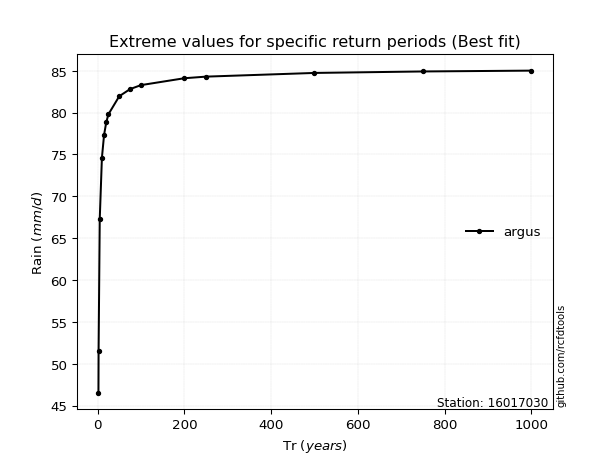</img>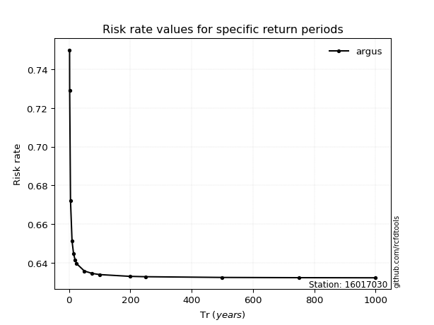</img>

</div>


<sub>**APP DISCLAIMER**: NO WARRANTY - This software is provided by [github.com/rcfdtools](https://github.com/rcfdtools) "as is", without any express or implied warranty, including warranties of merchantability, fitness for a particular purpose, or non-infringement. There is no guarantee that the software will be error-free or operate without interruption. LIMITATION OF LIABILITY - Neither the authors nor copyright holders will be liable for claims or damages arising from the software or its use. You are responsible for determining if the software is appropriate for your use and assume all associated risks, including errors, legal compliance, and data loss. NO PROFESSIONAL ADVICE - The software provides general information and does not offer professional advice. It should not replace consultation with professional advisors.</sub>