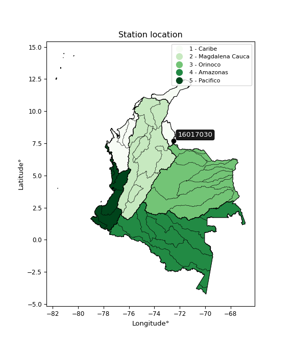

<div align="center">


</div>

# PMP Station (Rain, Pmax24h): 16017030

Probable Maximum Precipitation (PMP) is the greatest amount of rainfall for a specific duration that is meteorologically possible for a given location, acting as a "worst-case" scenario for extreme storms, crucial for designing safety-critical infrastructure like bridges, river deviations, dams, spillways, and nuclear plants to prevent catastrophic failure. PMP is calculated by hydrologists using meteorological data to determine the upper limit of extreme rainfall, often leading to the Probable Maximum Flood (PMF) for flood control design, and is increasingly being studied for climate change impacts. Probable Maximum Precipitation (PMP) is the theoretical upper limit of rainfall, a deterministic estimate for extreme events, while probability distributions (like GEV, Gumbel) describe the likelihood and frequency of various precipitation amounts, including rare ones, showing how often events occur, with PMP representing the extreme end of these distributions, used for critical infrastructure design to ensure safety against the worst conceivable weather, unlike standard statistical forecasts which cover typical probabilities.

The most common probability distributions in hydrology, used for analyzing floods, rainfall, and streamflow, include the Normal, Log-Normal, Gumbel, Gamma (including Log-Pearson Type III), and Generalized Extreme Value (GEV) distributions, often chosen based on the data´s skewness and whether modeling extremes or general conditions, with Gumbel and GEV popular for extreme events like floods, while the Normal distribution serves as a baseline, though often requiring transformations for skewed hydrological data. These distributions help in designing water infrastructure, managing water resources, and forecasting hydrologic events.

> Hydrological data often isn´t perfectly normal (it´s skewed), so different distributions are needed for different applications, such as: **Flood Frequency Analysis**: Using Gumbel, GEV, or Log-Pearson Type III for predicting extreme flood magnitudes and their return periods, **Rainfall Analysis**: Normal for annual totals, but Log-Normal, Weibull, or GEV for intensity or extreme daily rainfall, **Streamflow Modeling**: Gamma and Log-Normal for maximum flows, GEV for minimum flows, and Kappa for daily flows.

<div align="center">

</img>

</div>


## A. General information


### 1. General running parameters

• app_version: _v20260108_. • runtime: _2026-01-08 13:24:42.400241_. • Python version: _3.14.0_. • SciPy version: _1.16.3_. • Pandas version: _2.3.3_. • NumPy version: _2.3.5_. • Stations dataset (station_dataset_file): _dataset/pmax24h_in/automatic_colombia_2003_2024.csv_. • Stations catalog (station_catalog_file): _dataset/CNE.xls_. • Minimum year to eval til year_max (date_min): _1900_. • Maximum year to eval since year_min (date_max): _2024_. • Creates, save and include plots into reports (create_plot): _False_. • Plot only fit distributions with Δo > Δ (plot_only_fit): _True_. • Plot only simple graphs avoiding multiple CDFs and multiple Extreme values plots (plot_only_simple): _True_. • Eval low extreme values, if False, evaluates high extreme values (low_extreme): _False_. • Eval every SciPy distribution as logarithmic (pdist_logarithmic_on): _True_. • Standard deviation normalized (ddof): _1.0_. • Return periods to eval in years (Tr): _[2, 2.33, 5, 10, 15, 20, 25, 50, 75, 100, 200, 250, 500, 750, 1000]_. • Minimum data sample per station, 0 means any (minimum_sample): _5_. • Z-Score maximum threshold to adjust a value, 0 means disable (zscore_max): _3.5_. • Z-Score minimum threshold to adjust a value, 0 means disable (zscore_min): _-2.5_. • Avoid zeros, e.g. rain = 0 (avoid_zeros): _True_. • Avoid null values (avoid_nans): _True_. 

:file_folder:Table: [dataset.csv](../../dataset/pmax24h_in/automatic_colombia_2003_2024.csv)

> Delta Degrees of Freedom (DDOF): is a parameter used in the formulas for calculating variance and standard deviation. When ddof=0, the divisor is $N$ (the total number of observations) and this is used when your data set is the entire population. When ddof=1, the divisor is $N-1$ and this is used when your data set is a sample drawn from a larger population. Using $N-1$ provides an unbiased estimate of the population variance (known as Bessel´s correction).


### 2. Station info and location

|   id |   CODIGO | NOMBRE                     | CATEGORIA    | TECNOLOGIA                | ESTADO     | FECHA_INSTALACION   | FECHA_SUSPENSION   |   ALTITUD |   LATITUD |   LONGITUD | DEPARTAMENTO       | MUNICIPIO         | AREA_OPERATIVA                         | ENTIDAD                                                     | AREA_HIDROGRAFICA   | ZONA_HIDROGRAFICA   | SUBZONA_HIDROGRAFICA   | CORRIENTE   | Catalogo   |   Version |
|-----:|---------:|:---------------------------|:-------------|:--------------------------|:-----------|:--------------------|:-------------------|----------:|----------:|-----------:|:-------------------|:------------------|:---------------------------------------|:------------------------------------------------------------|:--------------------|:--------------------|:-----------------------|:------------|:-----------|----------:|
|    0 | 16017030 | LA UCHEMA - AUT [16017030] | Limnigráfica | Automática con Telemetría | Suspendida | 15/10/1981          | 13/07/2018         |       520 |   7.69422 |    -72.474 | Norte De Santander | Villa Del Rosario | Area Operativa 08 - Santanderes-Arauca | INSTITUTO DE HIDROLOGIA METEOROLOGIA Y ESTUDIOS AMBIENTALES | Caribe              | Catatumbo           | Río Pamplonita         | Tachira     | CNE_IDEAM  |  20251226 |

<div align="center">

Dynamic map: [:earth_americas:Google](http://maps.google.com/maps?q=7.694222222,-72.474) [:earth_americas:OSM](https://www.openstreetmap.org/#map=18/7.694222222/-72.474&layers=P) [:earth_americas:Bing](https://www.bing.com/maps?cp=7.694222222~-72.474&lvl=18) [:earth_americas:Apple](https://maps.apple.com/frame?center=7.694222222%2C-72.474&span=0.003%2C0.006)

</div>


<div align="center">

```geojson
{
  "type": "Feature",
  "geometry": {
    "type": "Point", 
    "coordinates": [-72.474, 7.694222222]
  }, 
  "properties": {
    "Name": "16017030"
  }
}
```

</div>


### 3. Discrete values table and plot

<div align="center">

|               |           0 |           1 |          2 |           3 |          4 |
|:--------------|------------:|------------:|-----------:|------------:|-----------:|
| Date          | 2008        | 2009        | 2010       | 2011        | 2012       |
| Value         |   56.9      |   22.3      |   80.1     |   52.1      |    0.6     |
| Value_initial |   56.9      |   22.3      |   80.1     |   52.1      |    0.6     |
| count         |    5        |    5        |    5       |    5        |    5       |
| mean          |   42.4      |   42.4      |   42.4     |   42.4      |   42.4     |
| std           |   31.1323   |   31.1323   |   31.1323  |   31.1323   |   31.1323  |
| zscore        |    0.465754 |   -0.645632 |    1.21096 |    0.311574 |   -1.34266 |


</div>


> The initial value (value_initial) correspond to the initial obtained or null completed value, and value (value) is adjusted only when the initial value is outside the valid range (outlier) definite through the Z-Score value. If Z-Score is active, values out of range or outliers are replaced with the station mean value. A Z-Score (or standard score) measures how many standard deviations a data point is from the mean of a dataset, indicating its relative position; positive scores mean above the mean, negative mean below, and a score of zero is exactly at the mean, allowing for comparison of values from different distributions. It´s calculated using the formula $z=(x–μ)/σ$, where $x$ is the data point, $μ$ is the mean, and $σ$ is the standard deviation, helping identify outliers and understand probability.
>
> <sub>**Note**: In this study, "completing" (filling gaps in) and "extending" (forecasting or lengthening the historical record) rainfall data series are avoided for certain critical analyses because they introduce artificial bias and uncertainty, which can distort the statistics of rare events (extremes), alter day-to-day variability, and compromise the integrity and homogeneity of the original data. Some reasons against Completing/Extending rainfall data are: **Distortion of Extremes and Variability**: The primary issue is that most gap-filling or extension methods rely on averaging or regression with nearby stations, which inherently smooths the data. Rainfall is highly variable in space and time, with a large percentage of zero values and occasional large storms. Infilling methods often underestimate the highest values and overestimate the lowest (zero) values, which severely distorts analyses focused on flood frequency, drought severity, and intensity-duration-frequency (IDF) curves, **Loss of Data Homogeneity**: Infilled or extended data are synthetic estimates, not actual measurements. Combining these estimates with observed data can violate the assumption of data homogeneity, which requires that the data properties do not change over time. Inhomogeneity can lead to incorrect conclusions about long-term trends or changes in climate patterns, **Propagation of Errors**: Errors and biases from the original data (e.g., wind-induced undercatch, instrument errors, site changes) or the data used for imputation can propagate through the analysis, leading to unreliable hydrological models and inaccurate predictions, **Compromised Statistical Integrity**: For statistical analyses, especially those involving the frequency of events, using artificial data can introduce time bias or autocorrelation that doesn´t exist in reality, making it difficult to assess the true probability of events, **Difficulty in Validation**: It is difficult to accurately validate the quality of filled or extended data, especially for past periods where ground-truth measurements are unavailable. The reliability of imputation techniques heavily depends on the density of the surrounding station network and the complexity of the local topography.</sub>


### 4. Active continuous probability distributions from SciPy (43 of 104 available)

A Probability Density Function (PDF) describes the relative likelihood of a continuous random variable falling within a specific range, where the total area under its curve equals 1, and the area over any interval gives the actual probability for that range. Unlike discrete probabilities (like rolling a die), a PDF shows density, not direct probability for a single point (which is zero), with higher points indicating higher likelihood, often visualized as a bell curve for normal distributions.

A log of a probability density function (log-PDF) is simply the logarithm of the PDF´s value, denoted as $log(f(x))$, useful for converting multiplication of probabilities into addition, improving numerical stability with tiny numbers, and connecting to information theory concepts like entropy. Instead of dealing with very small probabilities (e.g., 0.000001), log-PDFs use negative numbers (e.g., $log(0.00001) ≈ -11.51$ that are easier for computers to handle, preventing underflow errors and simplifying complex calculations. In this study, each active probability distribution from SciPy is also evaluated in the $log$ form.

[scipy.stats](https://docs.scipy.org/doc/scipy/reference/stats.html) is a Python´s powerful submodule within the SciPy library for comprehensive statistical analysis, offering over 130 probability distributions (like Normal, Poisson), functions for descriptive stats (mean, variance), hypothesis testing (t-tests, chi-square), random variable generation, and statistical tests, making it essential for data science, modeling, and research. It provides tools to explore, model, and draw conclusions from data efficiently, working seamlessly with NumPy.

<div align="center">

|   id | p_dist             |   n_parameter | fit_method   | label                                                                       | active   | ref                                                                                                        |
|-----:|:-------------------|--------------:|:-------------|:----------------------------------------------------------------------------|:---------|:-----------------------------------------------------------------------------------------------------------|
|    0 | alpha              |             3 | MLE          | Alpha                                                                       | True     | [:mortar_board:](https://docs.scipy.org/doc/scipy/reference/generated/scipy.stats.alpha.html)              |
|    1 | betaprime          |             4 | MLE          | Beta prime                                                                  | True     | [:mortar_board:](https://docs.scipy.org/doc/scipy/reference/generated/scipy.stats.betaprime.html)          |
|    2 | chi2               |             3 | MLE          | Chi²                                                                        | True     | [:mortar_board:](https://docs.scipy.org/doc/scipy/reference/generated/scipy.stats.chi2.html)               |
|    3 | crystalball        |             4 | MLE          | Crystalball                                                                 | True     | [:mortar_board:](https://docs.scipy.org/doc/scipy/reference/generated/scipy.stats.crystalball.html)        |
|    4 | erlang             |             3 | MLE          | Erlang                                                                      | True     | [:mortar_board:](https://docs.scipy.org/doc/scipy/reference/generated/scipy.stats.erlang.html)             |
|    5 | expon              |             2 | MLE          | Exponential                                                                 | True     | [:mortar_board:](https://docs.scipy.org/doc/scipy/reference/generated/scipy.stats.expon.html)              |
|    6 | exponnorm          |             3 | MLE          | Exponentially modified Normal                                               | True     | [:mortar_board:](https://docs.scipy.org/doc/scipy/reference/generated/scipy.stats.exponnorm.html)          |
|    7 | f                  |             4 | MLE          | F                                                                           | True     | [:mortar_board:](https://docs.scipy.org/doc/scipy/reference/generated/scipy.stats.f.html)                  |
|    8 | fatiguelife        |             3 | MLE          | Fatigue-life (Birnbaum-Saunders)                                            | True     | [:mortar_board:](https://docs.scipy.org/doc/scipy/reference/generated/scipy.stats.fatiguelife.html)        |
|    9 | fisk               |             3 | MLE          | Fisk                                                                        | True     | [:mortar_board:](https://docs.scipy.org/doc/scipy/reference/generated/scipy.stats.fisk.html)               |
|   10 | gamma              |             3 | MLE          | Gamma                                                                       | True     | [:mortar_board:](https://docs.scipy.org/doc/scipy/reference/generated/scipy.stats.gamma.html)              |
|   11 | genexpon           |             5 | MLE          | Generalized exponential                                                     | True     | [:mortar_board:](https://docs.scipy.org/doc/scipy/reference/generated/scipy.stats.genexpon.html)           |
|   12 | genlogistic        |             3 | MLE          | Generalized logistic                                                        | True     | [:mortar_board:](https://docs.scipy.org/doc/scipy/reference/generated/scipy.stats.genlogistic.html)        |
|   13 | gibrat             |             2 | MM           | Gibrat                                                                      | True     | [:mortar_board:](https://docs.scipy.org/doc/scipy/reference/generated/scipy.stats.gibrat.html)             |
|   14 | gompertz           |             3 | MLE          | Gompertz (or truncated Gumbel)                                              | True     | [:mortar_board:](https://docs.scipy.org/doc/scipy/reference/generated/scipy.stats.gompertz.html)           |
|   15 | gumbel_l           |             2 | MM           | Gumbel Left Skew                                                            | True     | [:mortar_board:](https://docs.scipy.org/doc/scipy/reference/generated/scipy.stats.gumbel_l.html)           |
|   16 | gumbel_r           |             2 | MM           | Gumbel Right Skew                                                           | True     | [:mortar_board:](https://docs.scipy.org/doc/scipy/reference/generated/scipy.stats.gumbel_r.html)           |
|   17 | halflogistic       |             2 | MM           | Half-logistic                                                               | True     | [:mortar_board:](https://docs.scipy.org/doc/scipy/reference/generated/scipy.stats.halflogistic.html)       |
|   18 | halfnorm           |             2 | MM           | Half Normal                                                                 | True     | [:mortar_board:](https://docs.scipy.org/doc/scipy/reference/generated/scipy.stats.halfnorm.html)           |
|   19 | hypsecant          |             2 | MM           | hyperbolic secant                                                           | True     | [:mortar_board:](https://docs.scipy.org/doc/scipy/reference/generated/scipy.stats.hypsecant.html)          |
|   20 | invgamma           |             3 | MLE          | Inverted gamma                                                              | True     | [:mortar_board:](https://docs.scipy.org/doc/scipy/reference/generated/scipy.stats.invgamma.html)           |
|   21 | invgauss           |             3 | MLE          | Inverse Gaussian                                                            | True     | [:mortar_board:](https://docs.scipy.org/doc/scipy/reference/generated/scipy.stats.invgauss.html)           |
|   22 | invweibull         |             3 | MLE          | Inverted Weibull                                                            | True     | [:mortar_board:](https://docs.scipy.org/doc/scipy/reference/generated/scipy.stats.invweibull.html)         |
|   23 | kstwobign          |             2 | MLE          | Limiting distribution of scaled Kolmogorov-Smirnov two-sided test statistic | True     | [:mortar_board:](https://docs.scipy.org/doc/scipy/reference/generated/scipy.stats.kstwobign.html)          |
|   24 | laplace            |             2 | MM           | Laplace                                                                     | True     | [:mortar_board:](https://docs.scipy.org/doc/scipy/reference/generated/scipy.stats.laplace.html)            |
|   25 | laplace_asymmetric |             3 | MLE          | Asymmetric Laplace                                                          | True     | [:mortar_board:](https://docs.scipy.org/doc/scipy/reference/generated/scipy.stats.laplace_asymmetric.html) |
|   26 | loggamma           |             3 | MLE          | Log gamma                                                                   | True     | [:mortar_board:](https://docs.scipy.org/doc/scipy/reference/generated/scipy.stats.loggamma.html)           |
|   27 | logistic           |             2 | MM           | Logistic (or Sech-squared)                                                  | True     | [:mortar_board:](https://docs.scipy.org/doc/scipy/reference/generated/scipy.stats.logistic.html)           |
|   28 | lognorm            |             3 | MLE          | Log Normal                                                                  | True     | [:mortar_board:](https://docs.scipy.org/doc/scipy/reference/generated/scipy.stats.lognorm.html)            |
|   29 | maxwell            |             2 | MM           | Maxwell                                                                     | True     | [:mortar_board:](https://docs.scipy.org/doc/scipy/reference/generated/scipy.stats.maxwell.html)            |
|   30 | mielke             |             4 | MLE          | Mielke Beta-Kappa / Dagum                                                   | True     | [:mortar_board:](https://docs.scipy.org/doc/scipy/reference/generated/scipy.stats.mielke.html)             |
|   31 | moyal              |             2 | MM           | Moyal                                                                       | True     | [:mortar_board:](https://docs.scipy.org/doc/scipy/reference/generated/scipy.stats.moyal.html)              |
|   32 | nakagami           |             3 | MLE          | Nakagami                                                                    | True     | [:mortar_board:](https://docs.scipy.org/doc/scipy/reference/generated/scipy.stats.nakagami.html)           |
|   33 | ncf                |             5 | MLE          | Non-central F distribution                                                  | True     | [:mortar_board:](https://docs.scipy.org/doc/scipy/reference/generated/scipy.stats.ncf.html)                |
|   34 | nct                |             4 | MLE          | Non-central Student’s t                                                     | True     | [:mortar_board:](https://docs.scipy.org/doc/scipy/reference/generated/scipy.stats.nct.html)                |
|   35 | norm               |             2 | MM           | Normal                                                                      | True     | [:mortar_board:](https://docs.scipy.org/doc/scipy/reference/generated/scipy.stats.norm.html)               |
|   36 | pearson3           |             3 | MM           | Pearson type III                                                            | True     | [:mortar_board:](https://docs.scipy.org/doc/scipy/reference/generated/scipy.stats.pearson3.html)           |
|   37 | rayleigh           |             2 | MM           | Rayleigh                                                                    | True     | [:mortar_board:](https://docs.scipy.org/doc/scipy/reference/generated/scipy.stats.rayleigh.html)           |
|   38 | rice               |             3 | MLE          | Rice                                                                        | True     | [:mortar_board:](https://docs.scipy.org/doc/scipy/reference/generated/scipy.stats.rice.html)               |
|   39 | t                  |             3 | MLE          | Student’s t                                                                 | True     | [:mortar_board:](https://docs.scipy.org/doc/scipy/reference/generated/scipy.stats.t.html)                  |
|   40 | truncnorm          |             4 | MLE          | Truncated normal                                                            | True     | [:mortar_board:](https://docs.scipy.org/doc/scipy/reference/generated/scipy.stats.truncnorm.html)          |
|   41 | wald               |             2 | MM           | Wald                                                                        | True     | [:mortar_board:](https://docs.scipy.org/doc/scipy/reference/generated/scipy.stats.wald.html)               |
|   42 | weibull_min        |             3 | MLE          | Weibull minimum                                                             | True     | [:mortar_board:](https://docs.scipy.org/doc/scipy/reference/generated/scipy.stats.weibull_min.html)        |

</div>

> **n_parameter:** # arguments & localization & scale.
>
> **Fit methods:** (MLE) maximum likelihood, (MM) L-moments.
>
>**Inactive** (With the only purpose of prevent loops, zero divisions, infinite values, over high estimated values or horizontal trending for recurrence intervals estimations, the follow distributions were disabled.)**:** foldnorm, gennorm, norminvgauss, powernorm, powerlognorm, skewnorm, genextreme, anglit, arcsine, argus, beta, bradford, burr, burr12, cauchy, cosine, halfcauchy, foldcauchy, skewcauchy, wrapcauchy, dgamma, gengamma, exponweib, exponpow, truncexpon, gausshyper, genhalflogistic, genhyperbolic, geninvgauss, halfgennorm, johnsonsb, johnsonsu, kappa4, kappa3, ksone, kstwo, loglaplace, levy, levy_l, levy_stable, ncx2, pareto, genpareto, truncpareto, lomax, powerlaw, rdist, rel_breitwigner, recipinvgauss, semicircular, studentized_range, trapezoid, triang, truncweibull_min, tukeylambda, uniform, loguniform, vonmises, vonmises_line, weibull_max, dweibull, 


## B. Probability (PDF) vs. Empirical (EDF) distributions functions

A continuous probability distribution (CPD) describes probabilities for variables that can take any value within a range (like rain any time), unlike discrete variables with specific outcomes (like temperature). It uses a Probability Density Function (PDF), a curve where the total area under it equals 1, and the probability of the variable falling within an interval (a to b) is found by calculating the area under the curve between those points. A key feature is that the probability of hitting any single exact value is zero, so probabilities are always expressed for ranges, e.g., $P(a ≤ X ≤ b)$.

<div align="center">

Distributions parameters from station values
|    |   station | p_dist                |   n |             loc |           scale | shape                  | shape1                 | shape2               | shape3   |
|---:|----------:|:----------------------|----:|----------------:|----------------:|:-----------------------|:-----------------------|:---------------------|:---------|
|  0 |  16017030 | alpha                 |   5 |     0.00179137  |     1.33726     | 2.1619056483823096e-09 |                        |                      |          |
|  1 |  16017030 | betaprime             |   5 |  -645.402       | 39493.8         | 608.0304782576641      | 34920.14717512412      |                      |          |
|  2 |  16017030 | chi2                  |   5 |  -189.439       |     1.72271     | 134.49665260314094     |                        |                      |          |
|  3 |  16017030 | crystalball           |   5 |    42.4         |    27.8456      | 4081.7848963224596     | 94.26561451787104      |                      |          |
|  4 |  16017030 | erlang                |   5 |  -490.12        |     1.48236     | 359.15340464939675     |                        |                      |          |
|  5 |  16017030 | expon                 |   5 |     0.6         |    41.8         |                        |                        |                      |          |
|  6 |  16017030 | exponnorm             |   5 |    42.3738      |    27.8456      | 0.0009446869673538892  |                        |                      |          |
|  7 |  16017030 | f                     |   5 |     0.6         |    49.1909      | 1.6762585082953443     | 41.129095805712524     |                      |          |
|  8 |  16017030 | fatiguelife           |   5 |     0.6         |     6.58026e-06 | 2253.8671828165316     |                        |                      |          |
|  9 |  16017030 | fisk                  |   5 |     0.6         |    13.3299      | 0.1268410418348827     |                        |                      |          |
| 10 |  16017030 | gamma                 |   5 |  -463.252       |     1.56687     | 322.6274471852323      |                        |                      |          |
| 11 |  16017030 | genexpon              |   5 |     0.599912    |     1.99662     | 0.04779661357172941    | 1.1983098332792028e-07 | 1.0913718457386103   |          |
| 12 |  16017030 | genlogistic           |   5 |    66.4766      |     9.59212     | 0.3398297452989426     |                        |                      |          |
| 13 |  16017030 | gibrat                |   5 |    21.1573      |    12.8843      |                        |                        |                      |          |
| 14 |  16017030 | gompertz              |   5 |     0.599823    |    38.19        | 0.35716835312999906    |                        |                      |          |
| 15 |  16017030 | gumbel_l              |   5 |    54.932       |    21.7111      |                        |                        |                      |          |
| 16 |  16017030 | gumbel_r              |   5 |    29.868       |    21.7111      |                        |                        |                      |          |
| 17 |  16017030 | halflogistic          |   5 |     9.39649     |    23.807       |                        |                        |                      |          |
| 18 |  16017030 | halfnorm              |   5 |     5.54333     |    46.193       |                        |                        |                      |          |
| 19 |  16017030 | hypsecant             |   5 |    42.4         |    17.727       |                        |                        |                      |          |
| 20 |  16017030 | invgamma              |   5 |  -265.995       | 36751.7         | 120.17526911763014     |                        |                      |          |
| 21 |  16017030 | invgauss              |   5 |  -102.539       |  3396.05        | 0.042713898049923135   |                        |                      |          |
| 22 |  16017030 | invweibull            |   5 |     0.6         |     2.89671     | 0.039002365501272465   |                        |                      |          |
| 23 |  16017030 | kstwobign             |   5 |   -62.1136      |   119.131       |                        |                        |                      |          |
| 24 |  16017030 | laplace               |   5 |    42.4         |    19.6898      |                        |                        |                      |          |
| 25 |  16017030 | laplace_asymmetric    |   5 |    56.9         |    20.043       | 1.4251295398754404     |                        |                      |          |
| 26 |  16017030 | loggamma              |   5 |    14.3089      |    40.5512      | 2.478847077655244      |                        |                      |          |
| 27 |  16017030 | logistic              |   5 |    42.4         |    15.3521      |                        |                        |                      |          |
| 28 |  16017030 | lognorm               |   5 |     0.6         |     0.01409     | 16.242884962766553     |                        |                      |          |
| 29 |  16017030 | maxwell               |   5 |   -23.5823      |    41.3483      |                        |                        |                      |          |
| 30 |  16017030 | mielke                |   5 |     0.6         |    82.7297      | 0.4574598356304884     | 32.32628946721603      |                      |          |
| 31 |  16017030 | moyal                 |   5 |    26.4761      |    12.5349      |                        |                        |                      |          |
| 32 |  16017030 | nakagami              |   5 |     0.6         |    40.3462      | 0.05292717313338341    |                        |                      |          |
| 33 |  16017030 | ncf                   |   5 |     0.6         |    15.8941      | 1.076629272955775      | 26.22930406002353      | 2.735664617671369    |          |
| 34 |  16017030 | nct                   |   5 |    -0.48634     |     0.0443153   | 0.3378040420997239     | 54.73618270063545      |                      |          |
| 35 |  16017030 | norm                  |   5 |    42.4         |    27.8456      |                        |                        |                      |          |
| 36 |  16017030 | pearson3              |   5 |    42.4         |    27.8456      | -0.21871588355228383   |                        |                      |          |
| 37 |  16017030 | rayleigh              |   5 |   -10.8702      |    42.5035      |                        |                        |                      |          |
| 38 |  16017030 | rice                  |   5 |   -15.265       |    32.389       | 1.3816291679038257     |                        |                      |          |
| 39 |  16017030 | t                     |   5 |    42.4         |    27.8456      | 14493374634.881542     |                        |                      |          |
| 40 |  16017030 | truncnorm             |   5 |     2.73855     |    11.045       | -1.9923422597568694    | 7.00419726431695       |                      |          |
| 41 |  16017030 | wald                  |   5 |    14.5544      |    27.8456      |                        |                        |                      |          |
| 42 |  16017030 | weibull_min           |   5 |   -54.6607      |   107.377       | 4.089410707157189      |                        |                      |          |
| 43 |  16017030 | logalpha              |   5 |   -34.3892      |   704.57        | 18.90400791096089      |                        |                      |          |
| 44 |  16017030 | logbetaprime          |   5 |    -0.510826    |     1.91513     | 0.5784644763775579     | 1.2124984000316492     |                      |          |
| 45 |  16017030 | logchi2               |   5 |    -0.510826    |     1.33666     | 1.3246042304027565     |                        |                      |          |
| 46 |  16017030 | logcrystalball        |   5 |     4.38328     |     4.6004e-06  | 3.3710768313312434e-06 | 145.2410638248066      |                      |          |
| 47 |  16017030 | logerlang             |   5 |   -30.2334      |     0.104607    | 317.49422721838494     |                        |                      |          |
| 48 |  16017030 | logexpon              |   5 |    -0.510826    |     3.50513     |                        |                        |                      |          |
| 49 |  16017030 | logexponnorm          |   5 |     2.99284     |     1.80239     | 0.0008103045950955688  |                        |                      |          |
| 50 |  16017030 | logf                  |   5 |    -0.510826    |     1.10273     | 1.1604105599306043     | 1.2078062981713957     |                      |          |
| 51 |  16017030 | logfatiguelife        |   5 |    -0.510826    |     1.05058e-06 | 1870.338032804521      |                        |                      |          |
| 52 |  16017030 | logfisk               |   5 |    -0.510826    |     1.61446     | 0.44603156073394423    |                        |                      |          |
| 53 |  16017030 | loggamma              |   5 |   -28.2307      |     0.113522    | 274.7051650369174      |                        |                      |          |
| 54 |  16017030 | loggenexpon           |   5 |    -0.511278    |     2.36163     | 0.28257884769010566    | 31.34555789963182      | 0.013247352583589694 |          |
| 55 |  16017030 | loggenlogistic        |   5 |     4.38333     |     5.1587e-06  | 3.726068324025651e-06  |                        |                      |          |
| 56 |  16017030 | loggibrat             |   5 |     1.61935     |     0.83396     |                        |                        |                      |          |
| 57 |  16017030 | loggompertz           |   5 |    -0.510829    |     1.13002     | 0.02442491354851677    |                        |                      |          |
| 58 |  16017030 | loggumbel_l           |   5 |     3.80547     |     1.40531     |                        |                        |                      |          |
| 59 |  16017030 | loggumbel_r           |   5 |     2.18313     |     1.40531     |                        |                        |                      |          |
| 60 |  16017030 | loghalflogistic       |   5 |     0.858087    |     1.54096     |                        |                        |                      |          |
| 61 |  16017030 | loghalfnorm           |   5 |     0.608657    |     2.98996     |                        |                        |                      |          |
| 62 |  16017030 | loghypsecant          |   5 |     2.9943      |     1.14743     |                        |                        |                      |          |
| 63 |  16017030 | loginvgamma           |   5 |   -40.1133      | 22215.6         | 516.6547545647668      |                        |                      |          |
| 64 |  16017030 | loginvgauss           |   5 |   -13.9751      |  1169.75        | 0.014499922908331832   |                        |                      |          |
| 65 |  16017030 | loginvweibull         |   5 |    -1.25195e+08 |     1.25195e+08 | 59955695.45336467      |                        |                      |          |
| 66 |  16017030 | logkstwobign          |   5 |    -5.29779     |     9.44966     |                        |                        |                      |          |
| 67 |  16017030 | loglaplace            |   5 |     2.9943      |     1.27448     |                        |                        |                      |          |
| 68 |  16017030 | loglaplace_asymmetric |   5 |     4.38328     |     0.0154414   | 89.84663897868728      |                        |                      |          |
| 69 |  16017030 | logloggamma           |   5 |     4.38333     |     4.03331e-06 | 2.886519014204861e-06  |                        |                      |          |
| 70 |  16017030 | loglogistic           |   5 |     2.9943      |     0.993706    |                        |                        |                      |          |
| 71 |  16017030 | loglognorm            |   5 |  -802.52        |   805.504       | 0.0022353959636671715  |                        |                      |          |
| 72 |  16017030 | logmaxwell            |   5 |    -1.27659     |     2.67639     |                        |                        |                      |          |
| 73 |  16017030 | logmielke             |   5 |    -0.510826    |     1.86996     | 0.6384812701748253     | 0.9473371474569625     |                      |          |
| 74 |  16017030 | logmoyal              |   5 |     1.96358     |     0.811358    |                        |                        |                      |          |
| 75 |  16017030 | lognakagami           |   5 | -1166.76        |  1169.76        | 105381.2766865663      |                        |                      |          |
| 76 |  16017030 | logncf                |   5 |    -0.510826    |     1.03734     | 1.0117812952182064     | 1.3083940541924377     | 1.1200872565513424   |          |
| 77 |  16017030 | lognct                |   5 |  -102.355       |     1.73565     | 21469.560243226253     | 60.69429443769177      |                      |          |
| 78 |  16017030 | lognorm               |   5 |     2.9943      |     1.80238     |                        |                        |                      |          |
| 79 |  16017030 | logpearson3           |   5 |     2.99429     |     1.80241     | -1.3101710305155914    |                        |                      |          |
| 80 |  16017030 | lograyleigh           |   5 |    -0.453809    |     2.75118     |                        |                        |                      |          |
| 81 |  16017030 | logrice               |   5 |    -2.01543     |     1.92992     | 2.368654206299956      |                        |                      |          |
| 82 |  16017030 | logt                  |   5 |     4.00681     |     0.123543    | 0.49020537919454354    |                        |                      |          |
| 83 |  16017030 | logtruncnorm          |   5 |     2.03401     |     7.17897     | -0.35448483567472655   | 0.3272433011360065     |                      |          |
| 84 |  16017030 | logwald               |   5 |     1.19194     |     1.80237     |                        |                        |                      |          |
| 85 |  16017030 | logweibull_min        |   5 |    -0.510826    |     1.95158     | 0.5696320230768064     |                        |                      |          |

</div>

> **loc** (Location parameter): This shifts the distribution along the x-axis. For many common distributions, like the normal (Gaussian) distribution, loc represents the mean $μ$. For others, like the uniform distribution, it might represent the minimum value, or for the beta distribution, the left end of the support interval.
>
> **scale** (Scale parameter): This determines the width or spread of the distribution. For the normal distribution, scale represents the standard deviation $σ$. For a uniform distribution, it defines the length of the interval (from $loc$ to $loc + scale$).
>
> **shape** (Shape parameters): Refers to parameters that define the specific form of a probability distribution, distinct from its location (loc) and scale (scale). These parameters are required arguments for most distribution functions. For example, a normal (Gaussian) distribution is fully defined by its location (mean) and scale (standard deviation), so it has no specific shape parameters beyond loc and scale. However, other distributions have intrinsic properties that need specification, as Gamma distribution that takes a shape parameter, often named $a$ or $alpha$.


### 0. Cumulative distribution values - CDF (86 evaluated)

Cumulative Distribution Function (CDF), denoted as $F$<sub>$X$</sub>$(x)$, is a function that gives the probability that a random variable $X$ will take a value less than or equal to a specific value, $x$ (i.e., $(P(X≥x)$. It essentially "accumulates" probabilities from a given point up to the far right (positive infinity), providing a complete picture of the distribution´s probabilities for both discrete (like rain) and continuous (like temperature) variables, helping to find probabilities over ranges or above certain values. Each station is evaluated separately ordering the $x$ values ascending, calculating the CDF and PDF values for the activated distributions and their logarithmic forms.

<div align="center">

CDF ordered by x ascending and calculating $log(f(x))$ separately
|   id |   Station |   date |    x |   count |   mean |     std |    zscore |   Value_initial |   station |   m |     alpha |   alpha_pdf |   betaprime |   betaprime_pdf |      chi2 |   chi2_pdf |   crystalball |   crystalball_pdf |    erlang |   erlang_pdf |    expon |   expon_pdf |   exponnorm |   exponnorm_pdf |           f |       f_pdf |   fatiguelife |   fatiguelife_pdf |       fisk |    fisk_pdf |     gamma |   gamma_pdf |    genexpon |   genexpon_pdf |   genlogistic |   genlogistic_pdf |     gibrat |   gibrat_pdf |    gompertz |   gompertz_pdf |   gumbel_l |   gumbel_l_pdf |   gumbel_r |   gumbel_r_pdf |   halflogistic |   halflogistic_pdf |   halfnorm |   halfnorm_pdf |   hypsecant |   hypsecant_pdf |   invgamma |   invgamma_pdf |   invgauss |   invgauss_pdf |   invweibull |   invweibull_pdf |   kstwobign |   kstwobign_pdf |   laplace |   laplace_pdf |   laplace_asymmetric |   laplace_asymmetric_pdf |   loggamma |   loggamma_pdf |   logistic |   logistic_pdf |   lognorm |   lognorm_pdf |   maxwell |   maxwell_pdf |      mielke |      mielke_pdf |      moyal |   moyal_pdf |   nakagami |   nakagami_pdf |         ncf |       ncf_pdf |       nct |    nct_pdf |      norm |   norm_pdf |   pearson3 |   pearson3_pdf |   rayleigh |   rayleigh_pdf |      rice |   rice_pdf |         t |      t_pdf |   truncnorm |   truncnorm_pdf |     wald |   wald_pdf |   weibull_min |   weibull_min_pdf |   logalpha |   logalpha_pdf |   logbetaprime |   logbetaprime_pdf |    logchi2 |   logchi2_pdf |   logcrystalball |   logcrystalball_pdf |   logerlang |   logerlang_pdf |   logexpon |   logexpon_pdf |   logexponnorm |   logexponnorm_pdf |        logf |    logf_pdf |   logfatiguelife |   logfatiguelife_pdf |     logfisk |   logfisk_pdf |   loggenexpon |   loggenexpon_pdf |   loggenlogistic |   loggenlogistic_pdf |   loggibrat |   loggibrat_pdf |   loggompertz |   loggompertz_pdf |   loggumbel_l |   loggumbel_l_pdf |   loggumbel_r |   loggumbel_r_pdf |   loghalflogistic |   loghalflogistic_pdf |   loghalfnorm |   loghalfnorm_pdf |   loghypsecant |   loghypsecant_pdf |   loginvgamma |   loginvgamma_pdf |   loginvgauss |   loginvgauss_pdf |   loginvweibull |   loginvweibull_pdf |   logkstwobign |   logkstwobign_pdf |   loglaplace |   loglaplace_pdf |   loglaplace_asymmetric |   loglaplace_asymmetric_pdf |   logloggamma |   logloggamma_pdf |   loglogistic |   loglogistic_pdf |   loglognorm |   loglognorm_pdf |   logmaxwell |   logmaxwell_pdf |   logmielke |   logmielke_pdf |    logmoyal |   logmoyal_pdf |   lognakagami |   lognakagami_pdf |      logncf |   logncf_pdf |    lognct |   lognct_pdf |   logpearson3 |   logpearson3_pdf |   lograyleigh |   lograyleigh_pdf |   logrice |   logrice_pdf |      logt |   logt_pdf |   logtruncnorm |   logtruncnorm_pdf |   logwald |   logwald_pdf |   logweibull_min |   logweibull_min_pdf |
|-----:|----------:|-------:|-----:|--------:|-------:|--------:|----------:|----------------:|----------:|----:|----------:|------------:|------------:|----------------:|----------:|-----------:|--------------:|------------------:|----------:|-------------:|---------:|------------:|------------:|----------------:|------------:|------------:|--------------:|------------------:|-----------:|------------:|----------:|------------:|------------:|---------------:|--------------:|------------------:|-----------:|-------------:|------------:|---------------:|-----------:|---------------:|-----------:|---------------:|---------------:|-------------------:|-----------:|---------------:|------------:|----------------:|-----------:|---------------:|-----------:|---------------:|-------------:|-----------------:|------------:|----------------:|----------:|--------------:|---------------------:|-------------------------:|-----------:|---------------:|-----------:|---------------:|----------:|--------------:|----------:|--------------:|------------:|----------------:|-----------:|------------:|-----------:|---------------:|------------:|--------------:|----------:|-----------:|----------:|-----------:|-----------:|---------------:|-----------:|---------------:|----------:|-----------:|----------:|-----------:|------------:|----------------:|---------:|-----------:|--------------:|------------------:|-----------:|---------------:|---------------:|-------------------:|-----------:|--------------:|-----------------:|---------------------:|------------:|----------------:|-----------:|---------------:|---------------:|-------------------:|------------:|------------:|-----------------:|---------------------:|------------:|--------------:|--------------:|------------------:|-----------------:|---------------------:|------------:|----------------:|--------------:|------------------:|--------------:|------------------:|--------------:|------------------:|------------------:|----------------------:|--------------:|------------------:|---------------:|-------------------:|--------------:|------------------:|--------------:|------------------:|----------------:|--------------------:|---------------:|-------------------:|-------------:|-----------------:|------------------------:|----------------------------:|--------------:|------------------:|--------------:|------------------:|-------------:|-----------------:|-------------:|-----------------:|------------:|----------------:|------------:|---------------:|--------------:|------------------:|------------:|-------------:|----------:|-------------:|--------------:|------------------:|--------------:|------------------:|----------:|--------------:|----------:|-----------:|---------------:|-------------------:|----------:|--------------:|-----------------:|---------------------:|
|    0 |  16017030 |   2012 |  0.6 |       5 |   42.4 | 31.1323 | -1.34266  |             0.6 |  16017030 |   1 | 0.0253883 | 0.245088    |   0.0668753 |      0.00480761 | 0.0627425 | 0.00498612 |     0.0666602 |        0.00464336 | 0.0659844 |   0.00482186 | 0        |  0.0239234  |   0.0666598 |      0.00464334 | 1.47977e-15 | 11.1711     |      0.032156 |       1.76125e+11 | 0.00677139 | 7.68381e+12 | 0.0662301 |  0.00484154 | 2.09563e-06 |     0.0239387  |     0.0968851 |        0.00342888 | 0          |   0          | 1.65439e-06 |     0.00935244 |  0.0786177 |     0.00347486 |  0.0212803 |     0.00377358 |       0        |         0          |   0        |     0          |   0.0600526 |      0.00336757 |   0.058213 |     0.00500895 |  0.0588061 |     0.00561254 |    0.0126766 |      1.94521e+13 |   0.0555087 |      0.00699558 | 0.0598404 |    0.00303916 |            0.0933512 |               0.00326816 |  0.0290905 |      0.0381411 |  0.0616436 |     0.00376781 | 0.0259046 |     0.0334064 | 0.0480633 |    0.00556275 | 4.66736e-07 | 178268          | 0.00499855 |  0.00173755 |   0.012187 |    1.16197e+13 | 4.83277e-08 | 3310.12       | 0.0555595 | 0.140367   | 0.0666602 | 0.00464336 |   0.071864 |     0.00444741 |  0.0357586 |     0.00612221 | 0.0460152 | 0.00577304 | 0.0666605 | 0.00464337 |    0.409557 |     0.0362896   | 0        | 0          |     0.0639664 |        0.00457893 |  0.0291777 |      0.0408166 |    4.61542e-10 |        2.40479e+06 | 1.5674e-11 | 93503.2       |              nan |                  nan |    0.027228 |       0.0362725 |   0        |      0.285297  |      0.0259049 |          0.0334066 | 3.57173e-10 | 1.86659e+06 |         0.048826 |          7.65606e+11 | 6.17963e-08 |   2.48266e+08 |    5.4172e-05 |          0.119681 |         0        |            0.0210612 |    0        |       0         |   7.84955e-08 |         0.0216146 |     0.0452977 |         0.0314918 |    0.00111335 |        0.00538754 |          0        |              0        |      0        |          0        |      0.0299845 |          0.0260932 |     0.0280119 |         0.0379209 |     0.0310697 |         0.0435741 |       0.0359853 |           0.0572946 |      0.0404166 |          0.0727376 |    0.0319561 |        0.0250739 |               0.0293706 |                   0.0211701 |      0.030119 |         0.0215552 |     0.0285447 |         0.0279055 |     0.025867 |        0.0335441 |   0.00607889 |        0.0234268 | 4.36248e-11 |  250883         | 4.33838e-06 |    5.89015e-05 |     0.0258716 |         0.0334168 | 3.18268e-09 |  1.45024e+07 | 0.0261408 |    0.0337162 |     0.0488959 |         0.0327325 |      0        |          0        | 0.0232213 |     0.0370093 | 0.0550859 | 0.00597602 |    7.27606e-07 |           0.195625 |  0        |      0        |      5.57623e-10 |          2.86105e+06 |
|    1 |  16017030 |   2009 | 22.3 |       5 |   42.4 | 31.1323 | -0.645632 |            22.3 |  16017030 |   2 | 0.952178  | 0.00214208  |   0.240826  |      0.0112952  | 0.246086  | 0.0118409  |     0.235197  |        0.011041   | 0.241178  |   0.0113816  | 0.404967 |  0.0142352  |   0.235196  |      0.011041   | 0.38843     |  0.0121213  |      0.789796 |       0.00535346  | 0.515448   | 0.00145991  | 0.241865  |  0.011394   | 0.405167    |     0.0142396  |     0.208364  |        0.00730886 | 0.00770408 |   0.0185571  | 0.239117    |     0.0125607  |  0.199453  |     0.00820269 |  0.242428  |     0.0158229  |       0.264557 |         0.0195323  |   0.283211 |     0.016173   |   0.198195  |      0.0104718  |   0.247143 |     0.0122466  |  0.264849  |     0.0127968  |    0.396744  |      0.000659222 |   0.303088  |      0.0140545  | 0.180147  |    0.00914927 |            0.199551  |               0.00698613 |  0.539776  |      0.210279  |  0.212609  |     0.0109045  | 0.524396  |     0.220927  | 0.254501  |    0.0128374  | 0.542155    |      0.0114292  | 0.237501   |  0.0187125  |   0.823941 |    0.00396122  | 0.314228    |    0.0101548  | 0.625301  | 0.00554576 | 0.235197  | 0.011041   |   0.22968  |     0.0103562  |  0.262524  |     0.0135409  | 0.247991  | 0.0123329  | 0.235198  | 0.011041   |    0.960817 |     0.00770554  | 0.142351 | 0.038278   |     0.225977  |        0.0105353  |  0.544737  |      0.198689  |    0.835134    |        0.0394009   | 0.853307   |     0.0641453 |              nan |                  nan |    0.534317 |       0.212685  |   0.643516 |      0.101704  |      0.524396  |          0.220927  | 0.703441    | 0.0404815   |         0.839364 |          0.0334616   | 0.588942    |   0.0298664   |    0.599922   |          0.154492 |         0        |            0.286805  |    0.71808  |       0.227396  |   0.436977    |         0.298377  |     0.455179  |         0.235441  |    0.595067   |        0.2198     |          0.62241  |              0.198774 |      0.596153 |          0.188346 |      0.530548  |          0.276134  |     0.54011   |         0.208394  |     0.546921  |         0.19298   |       0.555118  |           0.15647   |      0.592146  |          0.149468  |    0.541448  |        0.359796  |               0.397804  |                   0.286735  |      0.400454 |         0.286593  |     0.527718  |         0.25081   |     0.526609 |        0.221032  |   0.556311   |        0.209213  | 0.748986    |       0.0461285 | 0.620582    |    0.215334    |     0.524866  |         0.220987  | 0.596837    |  0.0499821   | 0.525182  |    0.220105  |     0.436912  |         0.2221    |      0.566754 |          0.203681 | 0.531569  |     0.214743  | 0.121179  | 0.0654805  |    0.741408    |           0.206007 |  0.691433 |      0.202121 |      0.758478    |          0.0540661   |
|    2 |  16017030 |   2011 | 52.1 |       5 |   42.4 | 31.1323 |  0.311574 |            52.1 |  16017030 |   3 | 0.979522  | 0.000392977 |   0.64099   |      0.0131592  | 0.649499  | 0.012753   |     0.636211  |        0.0134835  | 0.642494  |   0.0131232  | 0.708308 |  0.00697827 |   0.63621   |      0.0134835  | 0.650783    |  0.00631013 |      0.89274  |       0.00222524  | 0.542754   | 0.000611231 | 0.642725  |  0.0130877  | 0.708539    |     0.00697722 |     0.561101  |        0.0162487  | 0.809519   |   0.00878358 | 0.638883    |     0.0130086  |  0.584266  |     0.0168068  |  0.698264  |     0.0115511  |       0.71477  |         0.0102723  |   0.686485 |     0.010394   |   0.666082  |      0.015567   |   0.654752 |     0.0125329  |  0.660405  |     0.0115243  |    0.409089  |      0.000276919 |   0.683106  |      0.0100773  | 0.694495  |    0.0155159  |            0.566425  |               0.0198301  |  0.707258  |      0.178915  |  0.652906  |     0.0147615  | 0.702636  |     0.192134  | 0.659287  |    0.0121078  | 0.805063    |      0.00715115 | 0.718968   |  0.0107344  |   0.899737 |    0.00170377  | 0.565781    |    0.00687139 | 0.717453  | 0.00181446 | 0.636211  | 0.0134835  |   0.62411  |     0.0139814  |  0.666285  |     0.0116322  | 0.649653  | 0.0125335  | 0.636212  | 0.0134835  |    0.999996 |     1.70154e-06 | 0.777283 | 0.00874798 |     0.623464  |        0.0140876  |  0.701342  |      0.166295  |    0.863288    |        0.0279178   | 0.898353   |     0.0434898 |              nan |                  nan |    0.704162 |       0.181802  |   0.720167 |      0.0798355 |      0.702636  |          0.192134  | 0.733239    | 0.0305146   |         0.864794 |          0.0268302   | 0.611503    |   0.0237372   |    0.71917    |          0.125789 |         0        |            0.529387  |    0.848278 |       0.100666  |   0.711931    |         0.323493  |     0.670711  |         0.260284  |    0.752927   |        0.152045   |          0.763382 |              0.135386 |      0.736681 |          0.14275  |      0.739545  |          0.202495  |     0.705572  |         0.17636   |     0.698935  |         0.16166   |       0.675688  |           0.126853  |      0.706774  |          0.120348  |    0.764373  |        0.184881  |               0.733341  |                   0.528587  |      0.735022 |         0.526033  |     0.724109  |         0.20104   |     0.704608 |        0.191507  |   0.718231   |        0.168706  | 0.782645    |       0.0341253 | 0.769186    |    0.138203    |     0.703081  |         0.192023  | 0.634279    |  0.0389999   | 0.702631  |    0.191202  |     0.649399  |         0.272121  |      0.722783 |          0.161406 | 0.703826  |     0.185127  | 0.392883  | 1.70312    |    0.914288    |           0.200998 |  0.817033 |      0.106429 |      0.798527    |          0.0411887   |
|    3 |  16017030 |   2008 | 56.9 |       5 |   42.4 | 31.1323 |  0.465754 |            56.9 |  16017030 |   4 | 0.981249  | 0.000329488 |   0.701843  |      0.0121506  | 0.708178  | 0.0116607  |     0.698722  |        0.0125104  | 0.703129  |   0.0120965  | 0.739952 |  0.00622124 |   0.698722  |      0.0125105  | 0.679661    |  0.00573308 |      0.90282  |       0.00198082  | 0.545558   | 0.000558561 | 0.703189  |  0.0120617  | 0.740178    |     0.00621984 |     0.640259  |        0.0165754  | 0.846215   |   0.00663217 | 0.699648    |     0.0122687  |  0.66542   |     0.0168727  |  0.749822  |     0.00994367 |       0.760618 |         0.00885161 |   0.73377  |     0.00931013 |   0.735407  |      0.0132655  |   0.712191 |     0.0113704  |  0.71306   |     0.0104003  |    0.41036   |      0.000253215 |   0.728943  |      0.00902361 | 0.760588  |    0.0121592  |            0.670075  |               0.0234588  |  0.722811  |      0.174     |  0.720007  |     0.0131316  | 0.719344  |     0.186977  | 0.714792  |    0.0109969  | 0.83856     |      0.00681361 | 0.766363   |  0.0090484  |   0.907529 |    0.00154703  | 0.597662    |    0.00641603 | 0.725666  | 0.00161444 | 0.698722  | 0.0125104  |   0.689459 |     0.0131816  |  0.719493  |     0.0105229  | 0.707444  | 0.011513   | 0.698722  | 0.0125104  |    1        |     2.21992e-07 | 0.814855 | 0.00698807 |     0.689383  |        0.0133126  |  0.715798  |      0.161745  |    0.865708    |        0.0270165   | 0.902111   |     0.0418026 |              nan |                  nan |    0.719967 |       0.176846  |   0.727115 |      0.0778532 |      0.719344  |          0.186977  | 0.735893    | 0.0297119   |         0.867133 |          0.0262526   | 0.613572    |   0.023232    |    0.730116   |          0.122613 |         0        |            0.564181  |    0.85682  |       0.0933088 |   0.740107    |         0.315525  |     0.693554  |         0.257905  |    0.766028   |        0.145288   |          0.775055 |              0.129559 |      0.749054 |          0.13806  |      0.756922  |          0.191847  |     0.720901  |         0.171488  |     0.712994  |         0.157363  |       0.686724  |           0.123597  |      0.717244  |          0.117274  |    0.780116  |        0.172528  |               0.781437  |                   0.563255  |      0.782875 |         0.56028   |     0.741471  |         0.192906  |     0.721258 |        0.186295  |   0.73287    |        0.163481  | 0.785609    |       0.0331605 | 0.781068    |    0.131479    |     0.719779  |         0.186852  | 0.637676    |  0.0380859   | 0.719258  |    0.186072  |     0.673479  |         0.27419   |      0.736784 |          0.156319 | 0.719925  |     0.180184  | 0.572114  | 1.94462    |    0.931973    |           0.200324 |  0.82613  |      0.100083 |      0.802109    |          0.0401173   |
|    4 |  16017030 |   2010 | 80.1 |       5 |   42.4 | 31.1323 |  1.21096  |            80.1 |  16017030 |   5 | 0.98668   | 0.000166284 |   0.908868  |      0.00561903 | 0.905363  | 0.00539412 |     0.912115  |        0.00572949 | 0.908777  |   0.00557789 | 0.850717 |  0.00357135 |   0.912115  |      0.0057295  | 0.786763    |  0.0036726  |      0.938485 |       0.00117816  | 0.556386   | 0.000393799 | 0.908348  |  0.00557399 | 0.8509      |     0.00356928 |     0.929087  |        0.00640603 | 0.935814   |   0.00213019 | 0.918459    |     0.00611467 |  0.958723  |     0.00605993 |  0.905834  |     0.00412629 |       0.902388 |         0.00390003 |   0.893478 |     0.00469546 |   0.924452  |      0.00422184 |   0.902893 |     0.00522187 |  0.889753  |     0.00504665 |    0.415275  |      0.000179043 |   0.884347  |      0.00463292 | 0.926307  |    0.00374271 |            0.936613  |               0.00450705 |  0.778825  |      0.153197  |  0.920977  |     0.00474063 | 0.779538  |     0.164477  | 0.90158   |    0.00523133 | 0.978567    |      0.00441284 | 0.906246   |  0.00372245 |   0.936785 |    0.00102569  | 0.723522    |    0.00451922 | 0.755388  | 0.00102524 | 0.912115  | 0.00572949 |   0.917769 |     0.00606781 |  0.898778  |     0.0050971  | 0.90494   | 0.00549885 | 0.912115  | 0.00572948 |    1        |     8.22138e-13 | 0.917686 | 0.00268767 |     0.920485  |        0.00610911 |  0.767949  |      0.143021  |    0.874397    |        0.023894    | 0.915368   |     0.0358941 |              nan |                  nan |    0.776911 |       0.155758  |   0.752482 |      0.0706162 |      0.779537  |          0.164476  | 0.74556     | 0.0269005   |         0.875748 |          0.0241677   | 0.621204    |   0.0214453   |    0.76993    |          0.110229 |         0.999959 |            0.722246  |    0.884585 |       0.0704071 |   0.839961    |         0.262963  |     0.778773  |         0.237481  |    0.811424   |        0.120656   |          0.8157   |              0.10858  |      0.793207 |          0.120282 |      0.815595  |          0.151871  |     0.776109  |         0.151038  |     0.763831  |         0.139745  |       0.72684   |           0.111055  |      0.75533   |          0.105517  |    0.831865  |        0.131925  |               0.999876  |                   0.720704  |      0.999963 |         0.715643  |     0.80183   |         0.159905  |     0.78119  |        0.163644  |   0.785211   |        0.142493  | 0.796357    |       0.0297863 | 0.821889    |    0.107919    |     0.779921  |         0.164309  | 0.650133    |  0.0348468   | 0.779166  |    0.16373   |     0.767381  |         0.271931  |      0.786817 |          0.136238 | 0.777988  |     0.158904  | 0.81516   | 0.233398   |    1           |           0.19745  |  0.856661 |      0.07944  |      0.815164    |          0.0363207   |


</div>

An Empirical Distribution Function (EDF) is a step-function estimate of a true cumulative distribution function (CDF) based on observed sample data, representing the proportion of data points less than or equal to a given value. It is calculated by ordering your data and jumping up by $1/n$ (where $n$ is sample size) at each unique data point, allowing analysis without assuming an underlying population distribution, and it gets closer to the true CDF as the sample size grows. For the empirical probability calculations, the parameter $m$ correspond to the order number which means the position of the $x$ values in an ascending order list.

The Kolmogorov-Smirnov (K-S) test is a non-parametric statistical test used to determine if a sample data set comes from a specific theoretical distribution (one-sample) or if two different samples come from the same underlying distribution (two-sample), by comparing their cumulative distribution functions (CDFs). It calculates the maximum vertical difference (D statistic) between these functions, with a small p-value indicating a significant difference and rejection of the null hypothesis (that the data/samples match).


### 1. EDF California (1923)

California´s estimates the true probability distribution of water-related data (like rainfall, streamflow) using observed samples, crucial for risk assessment.

<div align="center">


$P=m/n$


</div>


**1.1. Empirical values**

<div align="center">

|                | 0              | 1                  | 2              | 3                 | 4              |
|:---------------|:---------------|:-------------------|:---------------|:------------------|:---------------|
| date           | 2012           | 2009               | 2011           | 2008              | 2010           |
| x              | 0.6            | 22.3               | 52.1           | 56.9              | 80.1           |
| m              | 1              | 2                  | 3              | 4                 | 5              |
| empirical_dist | edf_california | edf_california     | edf_california | edf_california    | edf_california |
| empirical      | 0.2            | 0.4                | 0.6            | 0.8               | 1.0            |
| empirical_tr   | 1.25           | 1.6666666666666667 | 2.5            | 5.000000000000001 | inf            |

</div>


**1.2. Kolmogorov-Smirnov fit test (sorted by Δ)**


<div align="center">

|                | 0                   | 1                   | 2                  | 3                   | 4                   | 5                   | 6                  | 7                   | 8                   | 9                  | 10                 | 11                  | 12                  | 13                  | 14                  | 15                  | 16                  | 17                    | 18                  | 19                  | 20                  | 21                  | 22                  | 23                  | 24                  | 25                  | 26                  | 27                  | 28                 | 29                 | 30                 | 31                 | 32                  | 33                  | 34                  | 35                 | 36                 | 37                 | 38                 | 39                 | 40                  | 41                 | 42                  | 43                  | 44                  | 45                  | 46                 | 47                  | 48                  | 49                  | 50                 | 51                  | 52                  | 53                  | 54                  | 55                  | 56                 | 57                 | 58                  | 59                  | 60                  | 61                  | 62                  | 63                  | 64                 | 65                 | 66                 | 67                  | 68                 | 69                 | 70                 | 71                 | 72                 | 73                 | 74                  | 75                 | 76                 | 77                 | 78                  | 79                 | 80                  | 81                 | 82                 | 83                 | 84                 | 85                 |
|:---------------|:--------------------|:--------------------|:-------------------|:--------------------|:--------------------|:--------------------|:-------------------|:--------------------|:--------------------|:-------------------|:-------------------|:--------------------|:--------------------|:--------------------|:--------------------|:--------------------|:--------------------|:----------------------|:--------------------|:--------------------|:--------------------|:--------------------|:--------------------|:--------------------|:--------------------|:--------------------|:--------------------|:--------------------|:-------------------|:-------------------|:-------------------|:-------------------|:--------------------|:--------------------|:--------------------|:-------------------|:-------------------|:-------------------|:-------------------|:-------------------|:--------------------|:-------------------|:--------------------|:--------------------|:--------------------|:--------------------|:-------------------|:--------------------|:--------------------|:--------------------|:-------------------|:--------------------|:--------------------|:--------------------|:--------------------|:--------------------|:-------------------|:-------------------|:--------------------|:--------------------|:--------------------|:--------------------|:--------------------|:--------------------|:-------------------|:-------------------|:-------------------|:--------------------|:-------------------|:-------------------|:-------------------|:-------------------|:-------------------|:-------------------|:--------------------|:-------------------|:-------------------|:-------------------|:--------------------|:-------------------|:--------------------|:-------------------|:-------------------|:-------------------|:-------------------|:-------------------|
| station        | 16017030            | 16017030            | 16017030           | 16017030            | 16017030            | 16017030            | 16017030           | 16017030            | 16017030            | 16017030           | 16017030           | 16017030            | 16017030            | 16017030            | 16017030            | 16017030            | 16017030            | 16017030              | 16017030            | 16017030            | 16017030            | 16017030            | 16017030            | 16017030            | 16017030            | 16017030            | 16017030            | 16017030            | 16017030           | 16017030           | 16017030           | 16017030           | 16017030            | 16017030            | 16017030            | 16017030           | 16017030           | 16017030           | 16017030           | 16017030           | 16017030            | 16017030           | 16017030            | 16017030            | 16017030            | 16017030            | 16017030           | 16017030            | 16017030            | 16017030            | 16017030           | 16017030            | 16017030            | 16017030            | 16017030            | 16017030            | 16017030           | 16017030           | 16017030            | 16017030            | 16017030            | 16017030            | 16017030            | 16017030            | 16017030           | 16017030           | 16017030           | 16017030            | 16017030           | 16017030           | 16017030           | 16017030           | 16017030           | 16017030           | 16017030            | 16017030           | 16017030           | 16017030           | 16017030            | 16017030           | 16017030            | 16017030           | 16017030           | 16017030           | 16017030           | 16017030           |
| empirical_dist | edf_california      | edf_california      | edf_california     | edf_california      | edf_california      | edf_california      | edf_california     | edf_california      | edf_california      | edf_california     | edf_california     | edf_california      | edf_california      | edf_california      | edf_california      | edf_california      | edf_california      | edf_california        | edf_california      | edf_california      | edf_california      | edf_california      | edf_california      | edf_california      | edf_california      | edf_california      | edf_california      | edf_california      | edf_california     | edf_california     | edf_california     | edf_california     | edf_california      | edf_california      | edf_california      | edf_california     | edf_california     | edf_california     | edf_california     | edf_california     | edf_california      | edf_california     | edf_california      | edf_california      | edf_california      | edf_california      | edf_california     | edf_california      | edf_california      | edf_california      | edf_california     | edf_california      | edf_california      | edf_california      | edf_california      | edf_california      | edf_california     | edf_california     | edf_california      | edf_california      | edf_california      | edf_california      | edf_california      | edf_california      | edf_california     | edf_california     | edf_california     | edf_california      | edf_california     | edf_california     | edf_california     | edf_california     | edf_california     | edf_california     | edf_california      | edf_california     | edf_california     | edf_california     | edf_california      | edf_california     | edf_california      | edf_california     | edf_california     | edf_california     | edf_california     | edf_california     |
| p_dist         | invgauss            | kstwobign           | maxwell            | invgamma            | chi2                | rice                | gamma              | erlang              | betaprime           | rayleigh           | t                  | norm                | crystalball         | exponnorm           | loglaplace          | logloggamma         | pearson3            | loglaplace_asymmetric | weibull_min         | gumbel_r            | loghypsecant        | logistic            | genlogistic         | moyal               | loglogistic         | loggumbel_r         | genexpon            | gompertz            | loggompertz        | halfnorm           | expon              | halflogistic       | laplace_asymmetric  | gumbel_l            | hypsecant           | mielke             | loghalfnorm        | lograyleigh        | f                  | logmaxwell         | loglognorm          | laplace            | lognakagami         | lognorm             | lognorm             | logexponnorm        | logmoyal           | lognct              | loggamma            | loggamma            | loggumbel_l        | logrice             | loghalflogistic     | logerlang           | loginvgamma         | loggenexpon         | logalpha           | logpearson3        | loginvgauss         | nct                 | logkstwobign        | logexpon            | wald                | loginvweibull       | ncf                | logt               | logwald            | logf                | loggibrat          | logtruncnorm       | logmielke          | logncf             | logweibull_min     | logfisk            | fatiguelife         | gibrat             | nakagami           | logbetaprime       | logfatiguelife      | fisk               | logchi2             | alpha              | truncnorm          | invweibull         | loggenlogistic     | logcrystalball     |
| delta          | 0.14119389989662284 | 0.14449132689367578 | 0.151936708102014  | 0.15285729698549944 | 0.15391395020307208 | 0.15398476279959558 | 0.1581352380940652 | 0.15882204758220111 | 0.15917374592987704 | 0.1642413906674487 | 0.1648024559230299 | 0.16480302942705327 | 0.16480303029873106 | 0.16480377614628214 | 0.16813524978078487 | 0.16988104537372065 | 0.17032043538333305 | 0.17062941412832733   | 0.17402313460322424 | 0.17871970596322387 | 0.18440534397741293 | 0.18739092881845223 | 0.19163604125192427 | 0.19500145410201034 | 0.19816969005431995 | 0.19888665398526642 | 0.19999790437361784 | 0.19999834560801655 | 0.1999999215044902 | 0.2                | 0.2                | 0.2                | 0.20044909742144126 | 0.20054724119372258 | 0.20180469765128412 | 0.2050632710402237 | 0.2067933392802095 | 0.2131831063696532 | 0.2132370423638078 | 0.2147887222559539 | 0.21881017359392751 | 0.2198527302341685 | 0.22007865777351265 | 0.22046230118611831 | 0.22046230118611831 | 0.22046255527472436 | 0.2205821279775425 | 0.22083372978287996 | 0.22117534089983648 | 0.22117534089983648 | 0.2212270582275856 | 0.22201184500103233 | 0.22240975478006253 | 0.22308909602387372 | 0.22389149524757346 | 0.23007025275999526 | 0.2320510603217587 | 0.232619248868974  | 0.23616928788686353 | 0.24461217799407953 | 0.24466991256195025 | 0.24751845250000737 | 0.25764895099330176 | 0.27315956955073806 | 0.2764776746075802 | 0.2788212921474972 | 0.2914331702334513 | 0.30344057563731164 | 0.318079672777274  | 0.3414078412313791 | 0.3489864933629946 | 0.3498665430646828 | 0.3584775220822981 | 0.3787959122425223 | 0.38979565315595777 | 0.3922959181406685 | 0.4239407463101106 | 0.4351341066528911 | 0.43936365314558345 | 0.4436144247715429 | 0.45330681450071175 | 0.5521781930040142 | 0.5608174043728525 | 0.5847245126126541 | 0.8                | nan                |
| deltao         | 0.5865427407550001  | 0.5865427407550001  | 0.5865427407550001 | 0.5865427407550001  | 0.5865427407550001  | 0.5865427407550001  | 0.5865427407550001 | 0.5865427407550001  | 0.5865427407550001  | 0.5865427407550001 | 0.5865427407550001 | 0.5865427407550001  | 0.5865427407550001  | 0.5865427407550001  | 0.5865427407550001  | 0.5865427407550001  | 0.5865427407550001  | 0.5865427407550001    | 0.5865427407550001  | 0.5865427407550001  | 0.5865427407550001  | 0.5865427407550001  | 0.5865427407550001  | 0.5865427407550001  | 0.5865427407550001  | 0.5865427407550001  | 0.5865427407550001  | 0.5865427407550001  | 0.5865427407550001 | 0.5865427407550001 | 0.5865427407550001 | 0.5865427407550001 | 0.5865427407550001  | 0.5865427407550001  | 0.5865427407550001  | 0.5865427407550001 | 0.5865427407550001 | 0.5865427407550001 | 0.5865427407550001 | 0.5865427407550001 | 0.5865427407550001  | 0.5865427407550001 | 0.5865427407550001  | 0.5865427407550001  | 0.5865427407550001  | 0.5865427407550001  | 0.5865427407550001 | 0.5865427407550001  | 0.5865427407550001  | 0.5865427407550001  | 0.5865427407550001 | 0.5865427407550001  | 0.5865427407550001  | 0.5865427407550001  | 0.5865427407550001  | 0.5865427407550001  | 0.5865427407550001 | 0.5865427407550001 | 0.5865427407550001  | 0.5865427407550001  | 0.5865427407550001  | 0.5865427407550001  | 0.5865427407550001  | 0.5865427407550001  | 0.5865427407550001 | 0.5865427407550001 | 0.5865427407550001 | 0.5865427407550001  | 0.5865427407550001 | 0.5865427407550001 | 0.5865427407550001 | 0.5865427407550001 | 0.5865427407550001 | 0.5865427407550001 | 0.5865427407550001  | 0.5865427407550001 | 0.5865427407550001 | 0.5865427407550001 | 0.5865427407550001  | 0.5865427407550001 | 0.5865427407550001  | 0.5865427407550001 | 0.5865427407550001 | 0.5865427407550001 | 0.5865427407550001 | 0.5865427407550001 |
| eval           | Δo > Δ              | Δo > Δ              | Δo > Δ             | Δo > Δ              | Δo > Δ              | Δo > Δ              | Δo > Δ             | Δo > Δ              | Δo > Δ              | Δo > Δ             | Δo > Δ             | Δo > Δ              | Δo > Δ              | Δo > Δ              | Δo > Δ              | Δo > Δ              | Δo > Δ              | Δo > Δ                | Δo > Δ              | Δo > Δ              | Δo > Δ              | Δo > Δ              | Δo > Δ              | Δo > Δ              | Δo > Δ              | Δo > Δ              | Δo > Δ              | Δo > Δ              | Δo > Δ             | Δo > Δ             | Δo > Δ             | Δo > Δ             | Δo > Δ              | Δo > Δ              | Δo > Δ              | Δo > Δ             | Δo > Δ             | Δo > Δ             | Δo > Δ             | Δo > Δ             | Δo > Δ              | Δo > Δ             | Δo > Δ              | Δo > Δ              | Δo > Δ              | Δo > Δ              | Δo > Δ             | Δo > Δ              | Δo > Δ              | Δo > Δ              | Δo > Δ             | Δo > Δ              | Δo > Δ              | Δo > Δ              | Δo > Δ              | Δo > Δ              | Δo > Δ             | Δo > Δ             | Δo > Δ              | Δo > Δ              | Δo > Δ              | Δo > Δ              | Δo > Δ              | Δo > Δ              | Δo > Δ             | Δo > Δ             | Δo > Δ             | Δo > Δ              | Δo > Δ             | Δo > Δ             | Δo > Δ             | Δo > Δ             | Δo > Δ             | Δo > Δ             | Δo > Δ              | Δo > Δ             | Δo > Δ             | Δo > Δ             | Δo > Δ              | Δo > Δ             | Δo > Δ              | Δo > Δ             | Δo > Δ             | Δo > Δ             | Δo <= Δ            | Δo <= Δ            |
| fit            | 1                   | 1                   | 1                  | 1                   | 1                   | 1                   | 1                  | 1                   | 1                   | 1                  | 1                  | 1                   | 1                   | 1                   | 1                   | 1                   | 1                   | 1                     | 1                   | 1                   | 1                   | 1                   | 1                   | 1                   | 1                   | 1                   | 1                   | 1                   | 1                  | 1                  | 1                  | 1                  | 1                   | 1                   | 1                   | 1                  | 1                  | 1                  | 1                  | 1                  | 1                   | 1                  | 1                   | 1                   | 1                   | 1                   | 1                  | 1                   | 1                   | 1                   | 1                  | 1                   | 1                   | 1                   | 1                   | 1                   | 1                  | 1                  | 1                   | 1                   | 1                   | 1                   | 1                   | 1                   | 1                  | 1                  | 1                  | 1                   | 1                  | 1                  | 1                  | 1                  | 1                  | 1                  | 1                   | 1                  | 1                  | 1                  | 1                   | 1                  | 1                   | 1                  | 1                  | 1                  | 0                  | 0                  |
| n              | 5                   | 5                   | 5                  | 5                   | 5                   | 5                   | 5                  | 5                   | 5                   | 5                  | 5                  | 5                   | 5                   | 5                   | 5                   | 5                   | 5                   | 5                     | 5                   | 5                   | 5                   | 5                   | 5                   | 5                   | 5                   | 5                   | 5                   | 5                   | 5                  | 5                  | 5                  | 5                  | 5                   | 5                   | 5                   | 5                  | 5                  | 5                  | 5                  | 5                  | 5                   | 5                  | 5                   | 5                   | 5                   | 5                   | 5                  | 5                   | 5                   | 5                   | 5                  | 5                   | 5                   | 5                   | 5                   | 5                   | 5                  | 5                  | 5                   | 5                   | 5                   | 5                   | 5                   | 5                   | 5                  | 5                  | 5                  | 5                   | 5                  | 5                  | 5                  | 5                  | 5                  | 5                  | 5                   | 5                  | 5                  | 5                  | 5                   | 5                  | 5                   | 5                  | 5                  | 5                  | 5                  | 5                  |
| best_fit       | 1                   | 0                   | 0                  | 0                   | 0                   | 0                   | 0                  | 0                   | 0                   | 0                  | 0                  | 0                   | 0                   | 0                   | 0                   | 0                   | 0                   | 0                     | 0                   | 0                   | 0                   | 0                   | 0                   | 0                   | 0                   | 0                   | 0                   | 0                   | 0                  | 0                  | 0                  | 0                  | 0                   | 0                   | 0                   | 0                  | 0                  | 0                  | 0                  | 0                  | 0                   | 0                  | 0                   | 0                   | 0                   | 0                   | 0                  | 0                   | 0                   | 0                   | 0                  | 0                   | 0                   | 0                   | 0                   | 0                   | 0                  | 0                  | 0                   | 0                   | 0                   | 0                   | 0                   | 0                   | 0                  | 0                  | 0                  | 0                   | 0                  | 0                  | 0                  | 0                  | 0                  | 0                  | 0                   | 0                  | 0                  | 0                  | 0                   | 0                  | 0                   | 0                  | 0                  | 0                  | 0                  | 0                  |
| best_fit_sort  | 1                   | 2                   | 3                  | 4                   | 5                   | 6                   | 7                  | 8                   | 9                   | 10                 | 11                 | 12                  | 13                  | 14                  | 15                  | 16                  | 17                  | 18                    | 19                  | 20                  | 21                  | 22                  | 23                  | 24                  | 25                  | 26                  | 27                  | 28                  | 29                 | 30                 | 31                 | 32                 | 33                  | 34                  | 35                  | 36                 | 37                 | 38                 | 39                 | 40                 | 41                  | 42                 | 43                  | 44                  | 45                  | 46                  | 47                 | 48                  | 49                  | 50                  | 51                 | 52                  | 53                  | 54                  | 55                  | 56                  | 57                 | 58                 | 59                  | 60                  | 61                  | 62                  | 63                  | 64                  | 65                 | 66                 | 67                 | 68                  | 69                 | 70                 | 71                 | 72                 | 73                 | 74                 | 75                  | 76                 | 77                 | 78                 | 79                  | 80                 | 81                  | 82                 | 83                 | 84                 | 85                 | 86                 |

</div>


<div align="center">

</img>

</div>


**1.3. Best fit**

<div align="center">

|   id |   station | empirical_dist   | p_dist   |    delta |   deltao | eval   |   fit |   n |   best_fit |   best_fit_sort |
|-----:|----------:|:-----------------|:---------|---------:|---------:|:-------|------:|----:|-----------:|----------------:|
|    0 |  16017030 | edf_california   | invgauss | 0.141194 | 0.586543 | Δo > Δ |     1 |   5 |          1 |               1 |

</div>


### 2. EDF Hazen (1930)

Hazen method for plotting positions is a formula used to estimate the empirical cumulative probability distribution of flood events or other hydrological data. This formula often results in biased estimations, particularly when extrapolating to extreme events (high return periods).

<div align="center">


$P=(m-0.5)/n$


</div>


**2.1. Empirical values**

<div align="center">

|                | 0                  | 1                  | 2         | 3                 | 4                  |
|:---------------|:-------------------|:-------------------|:----------|:------------------|:-------------------|
| date           | 2012               | 2009               | 2011      | 2008              | 2010               |
| x              | 0.6                | 22.3               | 52.1      | 56.9              | 80.1               |
| m              | 1                  | 2                  | 3         | 4                 | 5                  |
| empirical_dist | edf_hazen          | edf_hazen          | edf_hazen | edf_hazen         | edf_hazen          |
| empirical      | 0.1                | 0.3                | 0.5       | 0.7               | 0.9                |
| empirical_tr   | 1.1111111111111112 | 1.4285714285714286 | 2.0       | 3.333333333333333 | 10.000000000000002 |

</div>


**2.2. Kolmogorov-Smirnov fit test (sorted by Δ)**


<div align="center">

|                | 0                   | 1                   | 2                   | 3                   | 4                  | 5                   | 6                   | 7                  | 8                  | 9                   | 10                  | 11                  | 12                  | 13                 | 14                  | 15                 | 16                 | 17                  | 18                 | 19                 | 20                 | 21                 | 22                  | 23                  | 24                  | 25                  | 26                  | 27                  | 28                 | 29                  | 30                  | 31                 | 32                  | 33                  | 34                  | 35                 | 36                 | 37                  | 38                  | 39                 | 40                  | 41                  | 42                  | 43                    | 44                  | 45                 | 46                 | 47                  | 48                  | 49                  | 50                 | 51                 | 52                  | 53                  | 54                 | 55                  | 56                  | 57                  | 58                 | 59                  | 60                 | 61                  | 62                  | 63                 | 64                 | 65                  | 66                  | 67                  | 68                 | 69                 | 70                 | 71                  | 72                  | 73                  | 74                 | 75                  | 76                 | 77                 | 78                 | 79                 | 80                 | 81                 | 82                 | 83                 | 84                 | 85                 |
|:---------------|:--------------------|:--------------------|:--------------------|:--------------------|:-------------------|:--------------------|:--------------------|:-------------------|:-------------------|:--------------------|:--------------------|:--------------------|:--------------------|:-------------------|:--------------------|:-------------------|:-------------------|:--------------------|:-------------------|:-------------------|:-------------------|:-------------------|:--------------------|:--------------------|:--------------------|:--------------------|:--------------------|:--------------------|:-------------------|:--------------------|:--------------------|:-------------------|:--------------------|:--------------------|:--------------------|:-------------------|:-------------------|:--------------------|:--------------------|:-------------------|:--------------------|:--------------------|:--------------------|:----------------------|:--------------------|:-------------------|:-------------------|:--------------------|:--------------------|:--------------------|:-------------------|:-------------------|:--------------------|:--------------------|:-------------------|:--------------------|:--------------------|:--------------------|:-------------------|:--------------------|:-------------------|:--------------------|:--------------------|:-------------------|:-------------------|:--------------------|:--------------------|:--------------------|:-------------------|:-------------------|:-------------------|:--------------------|:--------------------|:--------------------|:-------------------|:--------------------|:-------------------|:-------------------|:-------------------|:-------------------|:-------------------|:-------------------|:-------------------|:-------------------|:-------------------|:-------------------|
| station        | 16017030            | 16017030            | 16017030            | 16017030            | 16017030           | 16017030            | 16017030            | 16017030           | 16017030           | 16017030            | 16017030            | 16017030            | 16017030            | 16017030           | 16017030            | 16017030           | 16017030           | 16017030            | 16017030           | 16017030           | 16017030           | 16017030           | 16017030            | 16017030            | 16017030            | 16017030            | 16017030            | 16017030            | 16017030           | 16017030            | 16017030            | 16017030           | 16017030            | 16017030            | 16017030            | 16017030           | 16017030           | 16017030            | 16017030            | 16017030           | 16017030            | 16017030            | 16017030            | 16017030              | 16017030            | 16017030           | 16017030           | 16017030            | 16017030            | 16017030            | 16017030           | 16017030           | 16017030            | 16017030            | 16017030           | 16017030            | 16017030            | 16017030            | 16017030           | 16017030            | 16017030           | 16017030            | 16017030            | 16017030           | 16017030           | 16017030            | 16017030            | 16017030            | 16017030           | 16017030           | 16017030           | 16017030            | 16017030            | 16017030            | 16017030           | 16017030            | 16017030           | 16017030           | 16017030           | 16017030           | 16017030           | 16017030           | 16017030           | 16017030           | 16017030           | 16017030           |
| empirical_dist | edf_hazen           | edf_hazen           | edf_hazen           | edf_hazen           | edf_hazen          | edf_hazen           | edf_hazen           | edf_hazen          | edf_hazen          | edf_hazen           | edf_hazen           | edf_hazen           | edf_hazen           | edf_hazen          | edf_hazen           | edf_hazen          | edf_hazen          | edf_hazen           | edf_hazen          | edf_hazen          | edf_hazen          | edf_hazen          | edf_hazen           | edf_hazen           | edf_hazen           | edf_hazen           | edf_hazen           | edf_hazen           | edf_hazen          | edf_hazen           | edf_hazen           | edf_hazen          | edf_hazen           | edf_hazen           | edf_hazen           | edf_hazen          | edf_hazen          | edf_hazen           | edf_hazen           | edf_hazen          | edf_hazen           | edf_hazen           | edf_hazen           | edf_hazen             | edf_hazen           | edf_hazen          | edf_hazen          | edf_hazen           | edf_hazen           | edf_hazen           | edf_hazen          | edf_hazen          | edf_hazen           | edf_hazen           | edf_hazen          | edf_hazen           | edf_hazen           | edf_hazen           | edf_hazen          | edf_hazen           | edf_hazen          | edf_hazen           | edf_hazen           | edf_hazen          | edf_hazen          | edf_hazen           | edf_hazen           | edf_hazen           | edf_hazen          | edf_hazen          | edf_hazen          | edf_hazen           | edf_hazen           | edf_hazen           | edf_hazen          | edf_hazen           | edf_hazen          | edf_hazen          | edf_hazen          | edf_hazen          | edf_hazen          | edf_hazen          | edf_hazen          | edf_hazen          | edf_hazen          | edf_hazen          |
| p_dist         | genlogistic         | laplace_asymmetric  | gumbel_l            | weibull_min         | pearson3           | exponnorm           | crystalball         | norm               | t                  | gompertz            | betaprime           | erlang              | gamma               | logpearson3        | chi2                | rice               | f                  | logistic            | invgamma           | maxwell            | invgauss           | hypsecant          | rayleigh            | loggumbel_l         | ncf                 | logt                | kstwobign           | halfnorm            | laplace            | gumbel_r            | expon               | genexpon           | loggompertz         | halflogistic        | moyal               | lognorm            | lognorm            | logexponnorm        | lognakagami         | lognct             | loglognorm          | loglogistic         | logrice             | loglaplace_asymmetric | logerlang           | logloggamma        | loghypsecant       | loggamma            | loggamma            | loginvgamma         | logalpha           | loginvgauss        | loginvweibull       | logmaxwell          | loglaplace         | lograyleigh         | wald                | logfisk             | logkstwobign       | loggumbel_r         | loghalfnorm        | logncf              | loggenexpon         | mielke             | gibrat             | logmoyal            | loghalflogistic     | nct                 | logexpon           | fisk               | logwald            | logf                | loggibrat           | logtruncnorm        | logmielke          | logweibull_min      | invweibull         | fatiguelife        | nakagami           | logbetaprime       | logfatiguelife     | logchi2            | alpha              | truncnorm          | loggenlogistic     | logcrystalball     |
| delta          | 0.09163604125192423 | 0.10044909742144123 | 0.10054724119372255 | 0.12346364729723258 | 0.1241103761945126 | 0.13621046967992034 | 0.13621124187243083 | 0.136211248449843  | 0.136211533386686  | 0.13888260442252454 | 0.14099005946495058 | 0.14249447513523017 | 0.14272524323794722 | 0.1493994932248497 | 0.14949899066100247 | 0.1496532832544999 | 0.1507828766371978 | 0.15290579655501668 | 0.1547519878164878 | 0.1592866304806806 | 0.1604045513738266 | 0.1660820675568807 | 0.16628458327202789 | 0.17071128055389706 | 0.17647767460758024 | 0.17882129214749715 | 0.18310557378067316 | 0.18648475056568048 | 0.1944947093874868 | 0.19826370524031234 | 0.20830817161585968 | 0.2085393877039854 | 0.21193105389240485 | 0.21476996377034507 | 0.21896812594025206 | 0.2243959095232581 | 0.2243959095232581 | 0.22439623178823126 | 0.22486553773556844 | 0.2251822827581212 | 0.22660913175785297 | 0.22771798590696096 | 0.23156925068287743 | 0.2333405264090901    | 0.23431686153045134 | 0.235022040421914  | 0.2395448546670489 | 0.23977611941477578 | 0.23977611941477578 | 0.24011021399322635 | 0.2447366970871911 | 0.2469205064060463 | 0.25511780533384426 | 0.25631062833564705 | 0.2643733064928817 | 0.26675358191099857 | 0.27728306113016565 | 0.28894183091589726 | 0.2921462065438372 | 0.29506688168608225 | 0.2961532875079674 | 0.29683677372955647 | 0.29992234126453826 | 0.3050632710402237 | 0.3095186995602659 | 0.32058212797754254 | 0.32240975478006256 | 0.32530110729809364 | 0.3435155169753708 | 0.3436144247715429 | 0.3914331702334513 | 0.40344057563731167 | 0.41807967277727404 | 0.44140784123137916 | 0.4489864933629946 | 0.45847752208229814 | 0.4847245126126542 | 0.4897956531559578 | 0.5239407463101107 | 0.5351341066528912 | 0.5393636531455834 | 0.5533068145007118 | 0.6521781930040143 | 0.6608174043728525 | 0.7                | nan                |
| deltao         | 0.5865427407550001  | 0.5865427407550001  | 0.5865427407550001  | 0.5865427407550001  | 0.5865427407550001 | 0.5865427407550001  | 0.5865427407550001  | 0.5865427407550001 | 0.5865427407550001 | 0.5865427407550001  | 0.5865427407550001  | 0.5865427407550001  | 0.5865427407550001  | 0.5865427407550001 | 0.5865427407550001  | 0.5865427407550001 | 0.5865427407550001 | 0.5865427407550001  | 0.5865427407550001 | 0.5865427407550001 | 0.5865427407550001 | 0.5865427407550001 | 0.5865427407550001  | 0.5865427407550001  | 0.5865427407550001  | 0.5865427407550001  | 0.5865427407550001  | 0.5865427407550001  | 0.5865427407550001 | 0.5865427407550001  | 0.5865427407550001  | 0.5865427407550001 | 0.5865427407550001  | 0.5865427407550001  | 0.5865427407550001  | 0.5865427407550001 | 0.5865427407550001 | 0.5865427407550001  | 0.5865427407550001  | 0.5865427407550001 | 0.5865427407550001  | 0.5865427407550001  | 0.5865427407550001  | 0.5865427407550001    | 0.5865427407550001  | 0.5865427407550001 | 0.5865427407550001 | 0.5865427407550001  | 0.5865427407550001  | 0.5865427407550001  | 0.5865427407550001 | 0.5865427407550001 | 0.5865427407550001  | 0.5865427407550001  | 0.5865427407550001 | 0.5865427407550001  | 0.5865427407550001  | 0.5865427407550001  | 0.5865427407550001 | 0.5865427407550001  | 0.5865427407550001 | 0.5865427407550001  | 0.5865427407550001  | 0.5865427407550001 | 0.5865427407550001 | 0.5865427407550001  | 0.5865427407550001  | 0.5865427407550001  | 0.5865427407550001 | 0.5865427407550001 | 0.5865427407550001 | 0.5865427407550001  | 0.5865427407550001  | 0.5865427407550001  | 0.5865427407550001 | 0.5865427407550001  | 0.5865427407550001 | 0.5865427407550001 | 0.5865427407550001 | 0.5865427407550001 | 0.5865427407550001 | 0.5865427407550001 | 0.5865427407550001 | 0.5865427407550001 | 0.5865427407550001 | 0.5865427407550001 |
| eval           | Δo > Δ              | Δo > Δ              | Δo > Δ              | Δo > Δ              | Δo > Δ             | Δo > Δ              | Δo > Δ              | Δo > Δ             | Δo > Δ             | Δo > Δ              | Δo > Δ              | Δo > Δ              | Δo > Δ              | Δo > Δ             | Δo > Δ              | Δo > Δ             | Δo > Δ             | Δo > Δ              | Δo > Δ             | Δo > Δ             | Δo > Δ             | Δo > Δ             | Δo > Δ              | Δo > Δ              | Δo > Δ              | Δo > Δ              | Δo > Δ              | Δo > Δ              | Δo > Δ             | Δo > Δ              | Δo > Δ              | Δo > Δ             | Δo > Δ              | Δo > Δ              | Δo > Δ              | Δo > Δ             | Δo > Δ             | Δo > Δ              | Δo > Δ              | Δo > Δ             | Δo > Δ              | Δo > Δ              | Δo > Δ              | Δo > Δ                | Δo > Δ              | Δo > Δ             | Δo > Δ             | Δo > Δ              | Δo > Δ              | Δo > Δ              | Δo > Δ             | Δo > Δ             | Δo > Δ              | Δo > Δ              | Δo > Δ             | Δo > Δ              | Δo > Δ              | Δo > Δ              | Δo > Δ             | Δo > Δ              | Δo > Δ             | Δo > Δ              | Δo > Δ              | Δo > Δ             | Δo > Δ             | Δo > Δ              | Δo > Δ              | Δo > Δ              | Δo > Δ             | Δo > Δ             | Δo > Δ             | Δo > Δ              | Δo > Δ              | Δo > Δ              | Δo > Δ             | Δo > Δ              | Δo > Δ             | Δo > Δ             | Δo > Δ             | Δo > Δ             | Δo > Δ             | Δo > Δ             | Δo <= Δ            | Δo <= Δ            | Δo <= Δ            | Δo <= Δ            |
| fit            | 1                   | 1                   | 1                   | 1                   | 1                  | 1                   | 1                   | 1                  | 1                  | 1                   | 1                   | 1                   | 1                   | 1                  | 1                   | 1                  | 1                  | 1                   | 1                  | 1                  | 1                  | 1                  | 1                   | 1                   | 1                   | 1                   | 1                   | 1                   | 1                  | 1                   | 1                   | 1                  | 1                   | 1                   | 1                   | 1                  | 1                  | 1                   | 1                   | 1                  | 1                   | 1                   | 1                   | 1                     | 1                   | 1                  | 1                  | 1                   | 1                   | 1                   | 1                  | 1                  | 1                   | 1                   | 1                  | 1                   | 1                   | 1                   | 1                  | 1                   | 1                  | 1                   | 1                   | 1                  | 1                  | 1                   | 1                   | 1                   | 1                  | 1                  | 1                  | 1                   | 1                   | 1                   | 1                  | 1                   | 1                  | 1                  | 1                  | 1                  | 1                  | 1                  | 0                  | 0                  | 0                  | 0                  |
| n              | 5                   | 5                   | 5                   | 5                   | 5                  | 5                   | 5                   | 5                  | 5                  | 5                   | 5                   | 5                   | 5                   | 5                  | 5                   | 5                  | 5                  | 5                   | 5                  | 5                  | 5                  | 5                  | 5                   | 5                   | 5                   | 5                   | 5                   | 5                   | 5                  | 5                   | 5                   | 5                  | 5                   | 5                   | 5                   | 5                  | 5                  | 5                   | 5                   | 5                  | 5                   | 5                   | 5                   | 5                     | 5                   | 5                  | 5                  | 5                   | 5                   | 5                   | 5                  | 5                  | 5                   | 5                   | 5                  | 5                   | 5                   | 5                   | 5                  | 5                   | 5                  | 5                   | 5                   | 5                  | 5                  | 5                   | 5                   | 5                   | 5                  | 5                  | 5                  | 5                   | 5                   | 5                   | 5                  | 5                   | 5                  | 5                  | 5                  | 5                  | 5                  | 5                  | 5                  | 5                  | 5                  | 5                  |
| best_fit       | 1                   | 0                   | 0                   | 0                   | 0                  | 0                   | 0                   | 0                  | 0                  | 0                   | 0                   | 0                   | 0                   | 0                  | 0                   | 0                  | 0                  | 0                   | 0                  | 0                  | 0                  | 0                  | 0                   | 0                   | 0                   | 0                   | 0                   | 0                   | 0                  | 0                   | 0                   | 0                  | 0                   | 0                   | 0                   | 0                  | 0                  | 0                   | 0                   | 0                  | 0                   | 0                   | 0                   | 0                     | 0                   | 0                  | 0                  | 0                   | 0                   | 0                   | 0                  | 0                  | 0                   | 0                   | 0                  | 0                   | 0                   | 0                   | 0                  | 0                   | 0                  | 0                   | 0                   | 0                  | 0                  | 0                   | 0                   | 0                   | 0                  | 0                  | 0                  | 0                   | 0                   | 0                   | 0                  | 0                   | 0                  | 0                  | 0                  | 0                  | 0                  | 0                  | 0                  | 0                  | 0                  | 0                  |
| best_fit_sort  | 1                   | 2                   | 3                   | 4                   | 5                  | 6                   | 7                   | 8                  | 9                  | 10                  | 11                  | 12                  | 13                  | 14                 | 15                  | 16                 | 17                 | 18                  | 19                 | 20                 | 21                 | 22                 | 23                  | 24                  | 25                  | 26                  | 27                  | 28                  | 29                 | 30                  | 31                  | 32                 | 33                  | 34                  | 35                  | 36                 | 37                 | 38                  | 39                  | 40                 | 41                  | 42                  | 43                  | 44                    | 45                  | 46                 | 47                 | 48                  | 49                  | 50                  | 51                 | 52                 | 53                  | 54                  | 55                 | 56                  | 57                  | 58                  | 59                 | 60                  | 61                 | 62                  | 63                  | 64                 | 65                 | 66                  | 67                  | 68                  | 69                 | 70                 | 71                 | 72                  | 73                  | 74                  | 75                 | 76                  | 77                 | 78                 | 79                 | 80                 | 81                 | 82                 | 83                 | 84                 | 85                 | 86                 |

</div>


<div align="center">

</img>

</div>


**2.3. Best fit**

<div align="center">

|   id |   station | empirical_dist   | p_dist      |    delta |   deltao | eval   |   fit |   n |   best_fit |   best_fit_sort |
|-----:|----------:|:-----------------|:------------|---------:|---------:|:-------|------:|----:|-----------:|----------------:|
|    0 |  16017030 | edf_hazen        | genlogistic | 0.091636 | 0.586543 | Δo > Δ |     1 |   5 |          1 |               1 |

</div>


### 3. EDF Weibull (1939)

Weibull plotting position formula is an empirical method used to estimate the non-exceedance probability or plotting position for a set of observed data, is often recommended or widely used in practice, particularly in flood frequency analysis.

<div align="center">


$P=m/(n+1)$


</div>


**3.1. Empirical values**

<div align="center">

|                | 0                   | 1                  | 2           | 3                  | 4                  |
|:---------------|:--------------------|:-------------------|:------------|:-------------------|:-------------------|
| date           | 2012                | 2009               | 2011        | 2008               | 2010               |
| x              | 0.6                 | 22.3               | 52.1        | 56.9               | 80.1               |
| m              | 1                   | 2                  | 3           | 4                  | 5                  |
| empirical_dist | edf_weibull         | edf_weibull        | edf_weibull | edf_weibull        | edf_weibull        |
| empirical      | 0.16666666666666666 | 0.3333333333333333 | 0.5         | 0.6666666666666666 | 0.8333333333333334 |
| empirical_tr   | 1.2                 | 1.4999999999999998 | 2.0         | 2.9999999999999996 | 6.000000000000002  |

</div>


**3.2. Kolmogorov-Smirnov fit test (sorted by Δ)**


<div align="center">

|                | 0                   | 1                  | 2                   | 3                   | 4                   | 5                   | 6                   | 7                  | 8                  | 9                   | 10                  | 11                  | 12                 | 13                  | 14                 | 15                  | 16                 | 17                 | 18                 | 19                 | 20                  | 21                 | 22                  | 23                 | 24                  | 25                  | 26                  | 27                 | 28                  | 29                  | 30                  | 31                  | 32                  | 33                  | 34                  | 35                 | 36                  | 37                  | 38                 | 39                 | 40                  | 41                 | 42                  | 43                  | 44                  | 45                  | 46                  | 47                  | 48                  | 49                  | 50                 | 51                    | 52                  | 53                 | 54                 | 55                  | 56                 | 57                 | 58                  | 59                  | 60                 | 61                  | 62                  | 63                  | 64                 | 65                  | 66                 | 67                 | 68                 | 69                 | 70                 | 71                  | 72                 | 73                 | 74                 | 75                  | 76                 | 77                 | 78                 | 79                 | 80                 | 81                 | 82                 | 83                 | 84                 | 85                 |
|:---------------|:--------------------|:-------------------|:--------------------|:--------------------|:--------------------|:--------------------|:--------------------|:-------------------|:-------------------|:--------------------|:--------------------|:--------------------|:-------------------|:--------------------|:-------------------|:--------------------|:-------------------|:-------------------|:-------------------|:-------------------|:--------------------|:-------------------|:--------------------|:-------------------|:--------------------|:--------------------|:--------------------|:-------------------|:--------------------|:--------------------|:--------------------|:--------------------|:--------------------|:--------------------|:--------------------|:-------------------|:--------------------|:--------------------|:-------------------|:-------------------|:--------------------|:-------------------|:--------------------|:--------------------|:--------------------|:--------------------|:--------------------|:--------------------|:--------------------|:--------------------|:-------------------|:----------------------|:--------------------|:-------------------|:-------------------|:--------------------|:-------------------|:-------------------|:--------------------|:--------------------|:-------------------|:--------------------|:--------------------|:--------------------|:-------------------|:--------------------|:-------------------|:-------------------|:-------------------|:-------------------|:-------------------|:--------------------|:-------------------|:-------------------|:-------------------|:--------------------|:-------------------|:-------------------|:-------------------|:-------------------|:-------------------|:-------------------|:-------------------|:-------------------|:-------------------|:-------------------|
| station        | 16017030            | 16017030           | 16017030            | 16017030            | 16017030            | 16017030            | 16017030            | 16017030           | 16017030           | 16017030            | 16017030            | 16017030            | 16017030           | 16017030            | 16017030           | 16017030            | 16017030           | 16017030           | 16017030           | 16017030           | 16017030            | 16017030           | 16017030            | 16017030           | 16017030            | 16017030            | 16017030            | 16017030           | 16017030            | 16017030            | 16017030            | 16017030            | 16017030            | 16017030            | 16017030            | 16017030           | 16017030            | 16017030            | 16017030           | 16017030           | 16017030            | 16017030           | 16017030            | 16017030            | 16017030            | 16017030            | 16017030            | 16017030            | 16017030            | 16017030            | 16017030           | 16017030              | 16017030            | 16017030           | 16017030           | 16017030            | 16017030           | 16017030           | 16017030            | 16017030            | 16017030           | 16017030            | 16017030            | 16017030            | 16017030           | 16017030            | 16017030           | 16017030           | 16017030           | 16017030           | 16017030           | 16017030            | 16017030           | 16017030           | 16017030           | 16017030            | 16017030           | 16017030           | 16017030           | 16017030           | 16017030           | 16017030           | 16017030           | 16017030           | 16017030           | 16017030           |
| empirical_dist | edf_weibull         | edf_weibull        | edf_weibull         | edf_weibull         | edf_weibull         | edf_weibull         | edf_weibull         | edf_weibull        | edf_weibull        | edf_weibull         | edf_weibull         | edf_weibull         | edf_weibull        | edf_weibull         | edf_weibull        | edf_weibull         | edf_weibull        | edf_weibull        | edf_weibull        | edf_weibull        | edf_weibull         | edf_weibull        | edf_weibull         | edf_weibull        | edf_weibull         | edf_weibull         | edf_weibull         | edf_weibull        | edf_weibull         | edf_weibull         | edf_weibull         | edf_weibull         | edf_weibull         | edf_weibull         | edf_weibull         | edf_weibull        | edf_weibull         | edf_weibull         | edf_weibull        | edf_weibull        | edf_weibull         | edf_weibull        | edf_weibull         | edf_weibull         | edf_weibull         | edf_weibull         | edf_weibull         | edf_weibull         | edf_weibull         | edf_weibull         | edf_weibull        | edf_weibull           | edf_weibull         | edf_weibull        | edf_weibull        | edf_weibull         | edf_weibull        | edf_weibull        | edf_weibull         | edf_weibull         | edf_weibull        | edf_weibull         | edf_weibull         | edf_weibull         | edf_weibull        | edf_weibull         | edf_weibull        | edf_weibull        | edf_weibull        | edf_weibull        | edf_weibull        | edf_weibull         | edf_weibull        | edf_weibull        | edf_weibull        | edf_weibull         | edf_weibull        | edf_weibull        | edf_weibull        | edf_weibull        | edf_weibull        | edf_weibull        | edf_weibull        | edf_weibull        | edf_weibull        | edf_weibull        |
| p_dist         | weibull_min         | pearson3           | genlogistic         | laplace_asymmetric  | gumbel_l            | exponnorm           | crystalball         | norm               | t                  | betaprime           | erlang              | gamma               | logpearson3        | chi2                | rice               | logistic            | invgamma           | maxwell            | invgauss           | hypsecant          | rayleigh            | gompertz           | ncf                 | f                  | loggumbel_l         | kstwobign           | halfnorm            | laplace            | gumbel_r            | lognct              | logexponnorm        | lognorm             | lognorm             | lognakagami         | logrice             | logerlang          | loglognorm          | loginvgamma         | loggamma           | loggamma           | expon               | genexpon           | logalpha            | loggompertz         | logt                | loginvgauss         | halflogistic        | moyal               | loginvweibull       | logmaxwell          | loglogistic        | loglaplace_asymmetric | lograyleigh         | logloggamma        | loghypsecant       | logfisk             | logkstwobign       | loggumbel_r        | loghalfnorm         | logncf              | loglaplace         | loggenexpon         | fisk                | wald                | logmoyal           | loghalflogistic     | nct                | mielke             | logexpon           | gibrat             | logwald            | logf                | loggibrat          | logtruncnorm       | logmielke          | invweibull          | logweibull_min     | fatiguelife        | nakagami           | logbetaprime       | logfatiguelife     | logchi2            | alpha              | truncnorm          | loggenlogistic     | logcrystalball     |
| delta          | 0.12346364729723258 | 0.1241103761945126 | 0.12496937458525756 | 0.13378243075477456 | 0.13388057452705587 | 0.13621046967992034 | 0.13621124187243083 | 0.136211248449843  | 0.136211533386686  | 0.14099005946495058 | 0.14249447513523017 | 0.14272524323794722 | 0.1493994932248497 | 0.14949899066100247 | 0.1496532832544999 | 0.15290579655501668 | 0.1547519878164878 | 0.1592866304806806 | 0.1604045513738266 | 0.1660820675568807 | 0.16628458327202789 | 0.1666650122746832 | 0.16666661833900112 | 0.1666666666666652 | 0.17071128055389706 | 0.18310557378067316 | 0.18648475056568048 | 0.1944947093874868 | 0.19826370524031234 | 0.20263084954539767 | 0.20263634559572252 | 0.20263644829222516 | 0.20263644829222516 | 0.20308122133943796 | 0.20382577270210434 | 0.2041615794188757 | 0.20460801154325492 | 0.20677688065989303 | 0.2072579386390162 | 0.2072579386390162 | 0.20830817161585968 | 0.2085393877039854 | 0.21140336375385776 | 0.21193105389240485 | 0.21215462548083047 | 0.21358717307271297 | 0.21476996377034507 | 0.21896812594025206 | 0.22178447200051093 | 0.22297729500231372 | 0.2241094568815838 | 0.2333405264090901    | 0.23342024857766525 | 0.235022040421914  | 0.2395448546670489 | 0.25560849758256393 | 0.2588128732105039 | 0.2617335483527489 | 0.26281995417463405 | 0.26350344039622314 | 0.2643733064928817 | 0.26658900793120494 | 0.27694775810487626 | 0.27728306113016565 | 0.2872487946442092 | 0.28907642144672924 | 0.2919677739647603 | 0.3050632710402237 | 0.3101821836420375 | 0.3256292514740018 | 0.358099836900118  | 0.37010724230397835 | 0.3847463394439407 | 0.41428800903178   | 0.4156531600296613 | 0.41805784594598755 | 0.4251441887489648 | 0.4564623198226245 | 0.4906074129767773 | 0.5018007733195577 | 0.5060303198122502 | 0.5199734811673784 | 0.6188448596706808 | 0.6274840710395193 | 0.6666666666666666 | nan                |
| deltao         | 0.5865427407550001  | 0.5865427407550001 | 0.5865427407550001  | 0.5865427407550001  | 0.5865427407550001  | 0.5865427407550001  | 0.5865427407550001  | 0.5865427407550001 | 0.5865427407550001 | 0.5865427407550001  | 0.5865427407550001  | 0.5865427407550001  | 0.5865427407550001 | 0.5865427407550001  | 0.5865427407550001 | 0.5865427407550001  | 0.5865427407550001 | 0.5865427407550001 | 0.5865427407550001 | 0.5865427407550001 | 0.5865427407550001  | 0.5865427407550001 | 0.5865427407550001  | 0.5865427407550001 | 0.5865427407550001  | 0.5865427407550001  | 0.5865427407550001  | 0.5865427407550001 | 0.5865427407550001  | 0.5865427407550001  | 0.5865427407550001  | 0.5865427407550001  | 0.5865427407550001  | 0.5865427407550001  | 0.5865427407550001  | 0.5865427407550001 | 0.5865427407550001  | 0.5865427407550001  | 0.5865427407550001 | 0.5865427407550001 | 0.5865427407550001  | 0.5865427407550001 | 0.5865427407550001  | 0.5865427407550001  | 0.5865427407550001  | 0.5865427407550001  | 0.5865427407550001  | 0.5865427407550001  | 0.5865427407550001  | 0.5865427407550001  | 0.5865427407550001 | 0.5865427407550001    | 0.5865427407550001  | 0.5865427407550001 | 0.5865427407550001 | 0.5865427407550001  | 0.5865427407550001 | 0.5865427407550001 | 0.5865427407550001  | 0.5865427407550001  | 0.5865427407550001 | 0.5865427407550001  | 0.5865427407550001  | 0.5865427407550001  | 0.5865427407550001 | 0.5865427407550001  | 0.5865427407550001 | 0.5865427407550001 | 0.5865427407550001 | 0.5865427407550001 | 0.5865427407550001 | 0.5865427407550001  | 0.5865427407550001 | 0.5865427407550001 | 0.5865427407550001 | 0.5865427407550001  | 0.5865427407550001 | 0.5865427407550001 | 0.5865427407550001 | 0.5865427407550001 | 0.5865427407550001 | 0.5865427407550001 | 0.5865427407550001 | 0.5865427407550001 | 0.5865427407550001 | 0.5865427407550001 |
| eval           | Δo > Δ              | Δo > Δ             | Δo > Δ              | Δo > Δ              | Δo > Δ              | Δo > Δ              | Δo > Δ              | Δo > Δ             | Δo > Δ             | Δo > Δ              | Δo > Δ              | Δo > Δ              | Δo > Δ             | Δo > Δ              | Δo > Δ             | Δo > Δ              | Δo > Δ             | Δo > Δ             | Δo > Δ             | Δo > Δ             | Δo > Δ              | Δo > Δ             | Δo > Δ              | Δo > Δ             | Δo > Δ              | Δo > Δ              | Δo > Δ              | Δo > Δ             | Δo > Δ              | Δo > Δ              | Δo > Δ              | Δo > Δ              | Δo > Δ              | Δo > Δ              | Δo > Δ              | Δo > Δ             | Δo > Δ              | Δo > Δ              | Δo > Δ             | Δo > Δ             | Δo > Δ              | Δo > Δ             | Δo > Δ              | Δo > Δ              | Δo > Δ              | Δo > Δ              | Δo > Δ              | Δo > Δ              | Δo > Δ              | Δo > Δ              | Δo > Δ             | Δo > Δ                | Δo > Δ              | Δo > Δ             | Δo > Δ             | Δo > Δ              | Δo > Δ             | Δo > Δ             | Δo > Δ              | Δo > Δ              | Δo > Δ             | Δo > Δ              | Δo > Δ              | Δo > Δ              | Δo > Δ             | Δo > Δ              | Δo > Δ             | Δo > Δ             | Δo > Δ             | Δo > Δ             | Δo > Δ             | Δo > Δ              | Δo > Δ             | Δo > Δ             | Δo > Δ             | Δo > Δ              | Δo > Δ             | Δo > Δ             | Δo > Δ             | Δo > Δ             | Δo > Δ             | Δo > Δ             | Δo <= Δ            | Δo <= Δ            | Δo <= Δ            | Δo <= Δ            |
| fit            | 1                   | 1                  | 1                   | 1                   | 1                   | 1                   | 1                   | 1                  | 1                  | 1                   | 1                   | 1                   | 1                  | 1                   | 1                  | 1                   | 1                  | 1                  | 1                  | 1                  | 1                   | 1                  | 1                   | 1                  | 1                   | 1                   | 1                   | 1                  | 1                   | 1                   | 1                   | 1                   | 1                   | 1                   | 1                   | 1                  | 1                   | 1                   | 1                  | 1                  | 1                   | 1                  | 1                   | 1                   | 1                   | 1                   | 1                   | 1                   | 1                   | 1                   | 1                  | 1                     | 1                   | 1                  | 1                  | 1                   | 1                  | 1                  | 1                   | 1                   | 1                  | 1                   | 1                   | 1                   | 1                  | 1                   | 1                  | 1                  | 1                  | 1                  | 1                  | 1                   | 1                  | 1                  | 1                  | 1                   | 1                  | 1                  | 1                  | 1                  | 1                  | 1                  | 0                  | 0                  | 0                  | 0                  |
| n              | 5                   | 5                  | 5                   | 5                   | 5                   | 5                   | 5                   | 5                  | 5                  | 5                   | 5                   | 5                   | 5                  | 5                   | 5                  | 5                   | 5                  | 5                  | 5                  | 5                  | 5                   | 5                  | 5                   | 5                  | 5                   | 5                   | 5                   | 5                  | 5                   | 5                   | 5                   | 5                   | 5                   | 5                   | 5                   | 5                  | 5                   | 5                   | 5                  | 5                  | 5                   | 5                  | 5                   | 5                   | 5                   | 5                   | 5                   | 5                   | 5                   | 5                   | 5                  | 5                     | 5                   | 5                  | 5                  | 5                   | 5                  | 5                  | 5                   | 5                   | 5                  | 5                   | 5                   | 5                   | 5                  | 5                   | 5                  | 5                  | 5                  | 5                  | 5                  | 5                   | 5                  | 5                  | 5                  | 5                   | 5                  | 5                  | 5                  | 5                  | 5                  | 5                  | 5                  | 5                  | 5                  | 5                  |
| best_fit       | 1                   | 0                  | 0                   | 0                   | 0                   | 0                   | 0                   | 0                  | 0                  | 0                   | 0                   | 0                   | 0                  | 0                   | 0                  | 0                   | 0                  | 0                  | 0                  | 0                  | 0                   | 0                  | 0                   | 0                  | 0                   | 0                   | 0                   | 0                  | 0                   | 0                   | 0                   | 0                   | 0                   | 0                   | 0                   | 0                  | 0                   | 0                   | 0                  | 0                  | 0                   | 0                  | 0                   | 0                   | 0                   | 0                   | 0                   | 0                   | 0                   | 0                   | 0                  | 0                     | 0                   | 0                  | 0                  | 0                   | 0                  | 0                  | 0                   | 0                   | 0                  | 0                   | 0                   | 0                   | 0                  | 0                   | 0                  | 0                  | 0                  | 0                  | 0                  | 0                   | 0                  | 0                  | 0                  | 0                   | 0                  | 0                  | 0                  | 0                  | 0                  | 0                  | 0                  | 0                  | 0                  | 0                  |
| best_fit_sort  | 1                   | 2                  | 3                   | 4                   | 5                   | 6                   | 7                   | 8                  | 9                  | 10                  | 11                  | 12                  | 13                 | 14                  | 15                 | 16                  | 17                 | 18                 | 19                 | 20                 | 21                  | 22                 | 23                  | 24                 | 25                  | 26                  | 27                  | 28                 | 29                  | 30                  | 31                  | 32                  | 33                  | 34                  | 35                  | 36                 | 37                  | 38                  | 39                 | 40                 | 41                  | 42                 | 43                  | 44                  | 45                  | 46                  | 47                  | 48                  | 49                  | 50                  | 51                 | 52                    | 53                  | 54                 | 55                 | 56                  | 57                 | 58                 | 59                  | 60                  | 61                 | 62                  | 63                  | 64                  | 65                 | 66                  | 67                 | 68                 | 69                 | 70                 | 71                 | 72                  | 73                 | 74                 | 75                 | 76                  | 77                 | 78                 | 79                 | 80                 | 81                 | 82                 | 83                 | 84                 | 85                 | 86                 |

</div>


<div align="center">

</img>

</div>


**3.3. Best fit**

<div align="center">

|   id |   station | empirical_dist   | p_dist      |    delta |   deltao | eval   |   fit |   n |   best_fit |   best_fit_sort |
|-----:|----------:|:-----------------|:------------|---------:|---------:|:-------|------:|----:|-----------:|----------------:|
|    0 |  16017030 | edf_weibull      | weibull_min | 0.123464 | 0.586543 | Δo > Δ |     1 |   5 |          1 |               1 |

</div>


### 4. EDF Beard (1943)

The Beard formula (or Beard´s plotting position formula) in hydrology is used to estimate the empirical non-exceedance probability _(P)_ of a flood event (or other extreme hydrological data point) within a given dataset.

<div align="center">


$P=(m-0.31)/(n+0.38)$


</div>


**4.1. Empirical values**

<div align="center">

|                | 0                   | 1                  | 2         | 3                  | 4                  |
|:---------------|:--------------------|:-------------------|:----------|:-------------------|:-------------------|
| date           | 2012                | 2009               | 2011      | 2008               | 2010               |
| x              | 0.6                 | 22.3               | 52.1      | 56.9               | 80.1               |
| m              | 1                   | 2                  | 3         | 4                  | 5                  |
| empirical_dist | edf_beard           | edf_beard          | edf_beard | edf_beard          | edf_beard          |
| empirical      | 0.12825278810408922 | 0.3141263940520446 | 0.5       | 0.6858736059479554 | 0.8717472118959109 |
| empirical_tr   | 1.1471215351812367  | 1.4579945799457996 | 2.0       | 3.183431952662722  | 7.797101449275368  |

</div>


**4.2. Kolmogorov-Smirnov fit test (sorted by Δ)**


<div align="center">

|                | 0                   | 1                   | 2                   | 3                   | 4                  | 5                   | 6                   | 7                  | 8                  | 9                   | 10                  | 11                  | 12                  | 13                  | 14                 | 15                  | 16                 | 17                 | 18                  | 19                 | 20                 | 21                 | 22                 | 23                  | 24                  | 25                  | 26                  | 27                  | 28                 | 29                  | 30                  | 31                 | 32                  | 33                  | 34                  | 35                 | 36                  | 37                  | 38                  | 39                  | 40                 | 41                  | 42                 | 43                 | 44                  | 45                  | 46                  | 47                  | 48                  | 49                    | 50                 | 51                 | 52                  | 53                  | 54                  | 55                 | 56                 | 57                  | 58                 | 59                 | 60                  | 61                  | 62                  | 63                 | 64                 | 65                  | 66                 | 67                 | 68                  | 69                  | 70                 | 71                  | 72                 | 73                  | 74                 | 75                 | 76                  | 77                  | 78                 | 79                 | 80                 | 81                 | 82                 | 83                 | 84                 | 85                 |
|:---------------|:--------------------|:--------------------|:--------------------|:--------------------|:-------------------|:--------------------|:--------------------|:-------------------|:-------------------|:--------------------|:--------------------|:--------------------|:--------------------|:--------------------|:-------------------|:--------------------|:-------------------|:-------------------|:--------------------|:-------------------|:-------------------|:-------------------|:-------------------|:--------------------|:--------------------|:--------------------|:--------------------|:--------------------|:-------------------|:--------------------|:--------------------|:-------------------|:--------------------|:--------------------|:--------------------|:-------------------|:--------------------|:--------------------|:--------------------|:--------------------|:-------------------|:--------------------|:-------------------|:-------------------|:--------------------|:--------------------|:--------------------|:--------------------|:--------------------|:----------------------|:-------------------|:-------------------|:--------------------|:--------------------|:--------------------|:-------------------|:-------------------|:--------------------|:-------------------|:-------------------|:--------------------|:--------------------|:--------------------|:-------------------|:-------------------|:--------------------|:-------------------|:-------------------|:--------------------|:--------------------|:-------------------|:--------------------|:-------------------|:--------------------|:-------------------|:-------------------|:--------------------|:--------------------|:-------------------|:-------------------|:-------------------|:-------------------|:-------------------|:-------------------|:-------------------|:-------------------|
| station        | 16017030            | 16017030            | 16017030            | 16017030            | 16017030           | 16017030            | 16017030            | 16017030           | 16017030           | 16017030            | 16017030            | 16017030            | 16017030            | 16017030            | 16017030           | 16017030            | 16017030           | 16017030           | 16017030            | 16017030           | 16017030           | 16017030           | 16017030           | 16017030            | 16017030            | 16017030            | 16017030            | 16017030            | 16017030           | 16017030            | 16017030            | 16017030           | 16017030            | 16017030            | 16017030            | 16017030           | 16017030            | 16017030            | 16017030            | 16017030            | 16017030           | 16017030            | 16017030           | 16017030           | 16017030            | 16017030            | 16017030            | 16017030            | 16017030            | 16017030              | 16017030           | 16017030           | 16017030            | 16017030            | 16017030            | 16017030           | 16017030           | 16017030            | 16017030           | 16017030           | 16017030            | 16017030            | 16017030            | 16017030           | 16017030           | 16017030            | 16017030           | 16017030           | 16017030            | 16017030            | 16017030           | 16017030            | 16017030           | 16017030            | 16017030           | 16017030           | 16017030            | 16017030            | 16017030           | 16017030           | 16017030           | 16017030           | 16017030           | 16017030           | 16017030           | 16017030           |
| empirical_dist | edf_beard           | edf_beard           | edf_beard           | edf_beard           | edf_beard          | edf_beard           | edf_beard           | edf_beard          | edf_beard          | edf_beard           | edf_beard           | edf_beard           | edf_beard           | edf_beard           | edf_beard          | edf_beard           | edf_beard          | edf_beard          | edf_beard           | edf_beard          | edf_beard          | edf_beard          | edf_beard          | edf_beard           | edf_beard           | edf_beard           | edf_beard           | edf_beard           | edf_beard          | edf_beard           | edf_beard           | edf_beard          | edf_beard           | edf_beard           | edf_beard           | edf_beard          | edf_beard           | edf_beard           | edf_beard           | edf_beard           | edf_beard          | edf_beard           | edf_beard          | edf_beard          | edf_beard           | edf_beard           | edf_beard           | edf_beard           | edf_beard           | edf_beard             | edf_beard          | edf_beard          | edf_beard           | edf_beard           | edf_beard           | edf_beard          | edf_beard          | edf_beard           | edf_beard          | edf_beard          | edf_beard           | edf_beard           | edf_beard           | edf_beard          | edf_beard          | edf_beard           | edf_beard          | edf_beard          | edf_beard           | edf_beard           | edf_beard          | edf_beard           | edf_beard          | edf_beard           | edf_beard          | edf_beard          | edf_beard           | edf_beard           | edf_beard          | edf_beard          | edf_beard          | edf_beard          | edf_beard          | edf_beard          | edf_beard          | edf_beard          |
| p_dist         | genlogistic         | laplace_asymmetric  | gumbel_l            | weibull_min         | pearson3           | exponnorm           | crystalball         | norm               | t                  | gompertz            | betaprime           | erlang              | gamma               | ncf                 | logpearson3        | chi2                | rice               | f                  | logistic            | invgamma           | maxwell            | invgauss           | hypsecant          | rayleigh            | loggumbel_l         | kstwobign           | halfnorm            | logt                | laplace            | gumbel_r            | expon               | genexpon           | lognorm             | lognorm             | logexponnorm        | lognakagami        | lognct              | loggompertz         | loglognorm          | halflogistic        | logrice            | moyal               | logerlang          | loglogistic        | loggamma            | loggamma            | loginvgamma         | logalpha            | loginvgauss         | loglaplace_asymmetric | logloggamma        | loghypsecant       | loginvweibull       | logmaxwell          | lograyleigh         | loglaplace         | logfisk            | wald                | logkstwobign       | loggumbel_r        | loghalfnorm         | logncf              | loggenexpon         | mielke             | logmoyal           | loghalflogistic     | gibrat             | nct                | fisk                | logexpon            | logwald            | logf                | loggibrat          | logtruncnorm        | logmielke          | logweibull_min     | invweibull          | fatiguelife         | nakagami           | logbetaprime       | logfatiguelife     | logchi2            | alpha              | truncnorm          | loggenlogistic     | logcrystalball     |
| delta          | 0.10576243530396887 | 0.11457549147348586 | 0.11467363524576718 | 0.12346364729723258 | 0.1241103761945126 | 0.13621046967992034 | 0.13621124187243083 | 0.136211248449843  | 0.136211533386686  | 0.13888260442252454 | 0.14099005946495058 | 0.14249447513523017 | 0.14272524323794722 | 0.14822488650349108 | 0.1493994932248497 | 0.14949899066100247 | 0.1496532832544999 | 0.1507828766371978 | 0.15290579655501668 | 0.1547519878164878 | 0.1592866304806806 | 0.1604045513738266 | 0.1660820675568807 | 0.16628458327202789 | 0.17071128055389706 | 0.18310557378067316 | 0.18648475056568048 | 0.19294768619954178 | 0.1944947093874868 | 0.19826370524031234 | 0.20830817161585968 | 0.2085393877039854 | 0.21026951547121348 | 0.21026951547121348 | 0.21026983773618663 | 0.2107391436835238 | 0.21105588870607656 | 0.21193105389240485 | 0.21248273770580833 | 0.21476996377034507 | 0.2174428566308328 | 0.21896812594025206 | 0.2201904674784067 | 0.2241094568815838 | 0.22564972536273115 | 0.22564972536273115 | 0.22598381994118172 | 0.23061030303514646 | 0.23279411235400166 | 0.2333405264090901    | 0.235022040421914  | 0.2395448546670489 | 0.24099141128179963 | 0.24218423428360242 | 0.25262718785895394 | 0.2643733064928817 | 0.2748154368638526 | 0.27728306113016565 | 0.2780198124917926 | 0.2809404876340376 | 0.28202689345592274 | 0.28271037967751184 | 0.28579594721249363 | 0.3050632710402237 | 0.3064557339254979 | 0.30828336072801793 | 0.3095186995602659 | 0.311174713246049  | 0.31536163666745376 | 0.32938912292332617 | 0.3773067761814067 | 0.38931418158526704 | 0.4039532787252294 | 0.42728144717933453 | 0.43486009931095   | 0.4443511280302535 | 0.45647172450856505 | 0.47566925910391317 | 0.509814352258066  | 0.5210077126008466 | 0.5252372590935388 | 0.5391804204486672 | 0.6380517989519696 | 0.6466910103208079 | 0.6858736059479554 | nan                |
| deltao         | 0.5865427407550001  | 0.5865427407550001  | 0.5865427407550001  | 0.5865427407550001  | 0.5865427407550001 | 0.5865427407550001  | 0.5865427407550001  | 0.5865427407550001 | 0.5865427407550001 | 0.5865427407550001  | 0.5865427407550001  | 0.5865427407550001  | 0.5865427407550001  | 0.5865427407550001  | 0.5865427407550001 | 0.5865427407550001  | 0.5865427407550001 | 0.5865427407550001 | 0.5865427407550001  | 0.5865427407550001 | 0.5865427407550001 | 0.5865427407550001 | 0.5865427407550001 | 0.5865427407550001  | 0.5865427407550001  | 0.5865427407550001  | 0.5865427407550001  | 0.5865427407550001  | 0.5865427407550001 | 0.5865427407550001  | 0.5865427407550001  | 0.5865427407550001 | 0.5865427407550001  | 0.5865427407550001  | 0.5865427407550001  | 0.5865427407550001 | 0.5865427407550001  | 0.5865427407550001  | 0.5865427407550001  | 0.5865427407550001  | 0.5865427407550001 | 0.5865427407550001  | 0.5865427407550001 | 0.5865427407550001 | 0.5865427407550001  | 0.5865427407550001  | 0.5865427407550001  | 0.5865427407550001  | 0.5865427407550001  | 0.5865427407550001    | 0.5865427407550001 | 0.5865427407550001 | 0.5865427407550001  | 0.5865427407550001  | 0.5865427407550001  | 0.5865427407550001 | 0.5865427407550001 | 0.5865427407550001  | 0.5865427407550001 | 0.5865427407550001 | 0.5865427407550001  | 0.5865427407550001  | 0.5865427407550001  | 0.5865427407550001 | 0.5865427407550001 | 0.5865427407550001  | 0.5865427407550001 | 0.5865427407550001 | 0.5865427407550001  | 0.5865427407550001  | 0.5865427407550001 | 0.5865427407550001  | 0.5865427407550001 | 0.5865427407550001  | 0.5865427407550001 | 0.5865427407550001 | 0.5865427407550001  | 0.5865427407550001  | 0.5865427407550001 | 0.5865427407550001 | 0.5865427407550001 | 0.5865427407550001 | 0.5865427407550001 | 0.5865427407550001 | 0.5865427407550001 | 0.5865427407550001 |
| eval           | Δo > Δ              | Δo > Δ              | Δo > Δ              | Δo > Δ              | Δo > Δ             | Δo > Δ              | Δo > Δ              | Δo > Δ             | Δo > Δ             | Δo > Δ              | Δo > Δ              | Δo > Δ              | Δo > Δ              | Δo > Δ              | Δo > Δ             | Δo > Δ              | Δo > Δ             | Δo > Δ             | Δo > Δ              | Δo > Δ             | Δo > Δ             | Δo > Δ             | Δo > Δ             | Δo > Δ              | Δo > Δ              | Δo > Δ              | Δo > Δ              | Δo > Δ              | Δo > Δ             | Δo > Δ              | Δo > Δ              | Δo > Δ             | Δo > Δ              | Δo > Δ              | Δo > Δ              | Δo > Δ             | Δo > Δ              | Δo > Δ              | Δo > Δ              | Δo > Δ              | Δo > Δ             | Δo > Δ              | Δo > Δ             | Δo > Δ             | Δo > Δ              | Δo > Δ              | Δo > Δ              | Δo > Δ              | Δo > Δ              | Δo > Δ                | Δo > Δ             | Δo > Δ             | Δo > Δ              | Δo > Δ              | Δo > Δ              | Δo > Δ             | Δo > Δ             | Δo > Δ              | Δo > Δ             | Δo > Δ             | Δo > Δ              | Δo > Δ              | Δo > Δ              | Δo > Δ             | Δo > Δ             | Δo > Δ              | Δo > Δ             | Δo > Δ             | Δo > Δ              | Δo > Δ              | Δo > Δ             | Δo > Δ              | Δo > Δ             | Δo > Δ              | Δo > Δ             | Δo > Δ             | Δo > Δ              | Δo > Δ              | Δo > Δ             | Δo > Δ             | Δo > Δ             | Δo > Δ             | Δo <= Δ            | Δo <= Δ            | Δo <= Δ            | Δo <= Δ            |
| fit            | 1                   | 1                   | 1                   | 1                   | 1                  | 1                   | 1                   | 1                  | 1                  | 1                   | 1                   | 1                   | 1                   | 1                   | 1                  | 1                   | 1                  | 1                  | 1                   | 1                  | 1                  | 1                  | 1                  | 1                   | 1                   | 1                   | 1                   | 1                   | 1                  | 1                   | 1                   | 1                  | 1                   | 1                   | 1                   | 1                  | 1                   | 1                   | 1                   | 1                   | 1                  | 1                   | 1                  | 1                  | 1                   | 1                   | 1                   | 1                   | 1                   | 1                     | 1                  | 1                  | 1                   | 1                   | 1                   | 1                  | 1                  | 1                   | 1                  | 1                  | 1                   | 1                   | 1                   | 1                  | 1                  | 1                   | 1                  | 1                  | 1                   | 1                   | 1                  | 1                   | 1                  | 1                   | 1                  | 1                  | 1                   | 1                   | 1                  | 1                  | 1                  | 1                  | 0                  | 0                  | 0                  | 0                  |
| n              | 5                   | 5                   | 5                   | 5                   | 5                  | 5                   | 5                   | 5                  | 5                  | 5                   | 5                   | 5                   | 5                   | 5                   | 5                  | 5                   | 5                  | 5                  | 5                   | 5                  | 5                  | 5                  | 5                  | 5                   | 5                   | 5                   | 5                   | 5                   | 5                  | 5                   | 5                   | 5                  | 5                   | 5                   | 5                   | 5                  | 5                   | 5                   | 5                   | 5                   | 5                  | 5                   | 5                  | 5                  | 5                   | 5                   | 5                   | 5                   | 5                   | 5                     | 5                  | 5                  | 5                   | 5                   | 5                   | 5                  | 5                  | 5                   | 5                  | 5                  | 5                   | 5                   | 5                   | 5                  | 5                  | 5                   | 5                  | 5                  | 5                   | 5                   | 5                  | 5                   | 5                  | 5                   | 5                  | 5                  | 5                   | 5                   | 5                  | 5                  | 5                  | 5                  | 5                  | 5                  | 5                  | 5                  |
| best_fit       | 1                   | 0                   | 0                   | 0                   | 0                  | 0                   | 0                   | 0                  | 0                  | 0                   | 0                   | 0                   | 0                   | 0                   | 0                  | 0                   | 0                  | 0                  | 0                   | 0                  | 0                  | 0                  | 0                  | 0                   | 0                   | 0                   | 0                   | 0                   | 0                  | 0                   | 0                   | 0                  | 0                   | 0                   | 0                   | 0                  | 0                   | 0                   | 0                   | 0                   | 0                  | 0                   | 0                  | 0                  | 0                   | 0                   | 0                   | 0                   | 0                   | 0                     | 0                  | 0                  | 0                   | 0                   | 0                   | 0                  | 0                  | 0                   | 0                  | 0                  | 0                   | 0                   | 0                   | 0                  | 0                  | 0                   | 0                  | 0                  | 0                   | 0                   | 0                  | 0                   | 0                  | 0                   | 0                  | 0                  | 0                   | 0                   | 0                  | 0                  | 0                  | 0                  | 0                  | 0                  | 0                  | 0                  |
| best_fit_sort  | 1                   | 2                   | 3                   | 4                   | 5                  | 6                   | 7                   | 8                  | 9                  | 10                  | 11                  | 12                  | 13                  | 14                  | 15                 | 16                  | 17                 | 18                 | 19                  | 20                 | 21                 | 22                 | 23                 | 24                  | 25                  | 26                  | 27                  | 28                  | 29                 | 30                  | 31                  | 32                 | 33                  | 34                  | 35                  | 36                 | 37                  | 38                  | 39                  | 40                  | 41                 | 42                  | 43                 | 44                 | 45                  | 46                  | 47                  | 48                  | 49                  | 50                    | 51                 | 52                 | 53                  | 54                  | 55                  | 56                 | 57                 | 58                  | 59                 | 60                 | 61                  | 62                  | 63                  | 64                 | 65                 | 66                  | 67                 | 68                 | 69                  | 70                  | 71                 | 72                  | 73                 | 74                  | 75                 | 76                 | 77                  | 78                  | 79                 | 80                 | 81                 | 82                 | 83                 | 84                 | 85                 | 86                 |

</div>


<div align="center">

</img>

</div>


**4.3. Best fit**

<div align="center">

|   id |   station | empirical_dist   | p_dist      |    delta |   deltao | eval   |   fit |   n |   best_fit |   best_fit_sort |
|-----:|----------:|:-----------------|:------------|---------:|---------:|:-------|------:|----:|-----------:|----------------:|
|    0 |  16017030 | edf_beard        | genlogistic | 0.105762 | 0.586543 | Δo > Δ |     1 |   5 |          1 |               1 |

</div>


### 5. EDF Chegodayev (1955)

The Chegodayev formula is an empirical plotting position formula used in hydrological frequency analysis to estimate the exceedance probability or return period of a specific event from a set of observed data. It is primarily used for plotting observed data points on probability paper to fit a theoretical distribution, particularly for analyzing extreme events like maximum flood flows or rainfall intensities. The constant _b_ value in the generalized plotting position formula is 0.3.

<div align="center">


$P=(m-b)/(n+1-2b)$


</div>


**5.1. Empirical values**

<div align="center">

|                | 0                   | 1                   | 2              | 3                  | 4                  |
|:---------------|:--------------------|:--------------------|:---------------|:-------------------|:-------------------|
| date           | 2012                | 2009                | 2011           | 2008               | 2010               |
| x              | 0.6                 | 22.3                | 52.1           | 56.9               | 80.1               |
| m              | 1                   | 2                   | 3              | 4                  | 5                  |
| empirical_dist | edf_chegodayev      | edf_chegodayev      | edf_chegodayev | edf_chegodayev     | edf_chegodayev     |
| empirical      | 0.12962962962962962 | 0.31481481481481477 | 0.5            | 0.6851851851851851 | 0.8703703703703703 |
| empirical_tr   | 1.148936170212766   | 1.4594594594594594  | 2.0            | 3.1764705882352935 | 7.714285714285713  |

</div>


**5.2. Kolmogorov-Smirnov fit test (sorted by Δ)**


<div align="center">

|                | 0                   | 1                   | 2                   | 3                   | 4                  | 5                   | 6                   | 7                  | 8                  | 9                   | 10                  | 11                  | 12                  | 13                  | 14                 | 15                  | 16                 | 17                 | 18                  | 19                 | 20                 | 21                 | 22                 | 23                  | 24                  | 25                  | 26                  | 27                  | 28                 | 29                  | 30                  | 31                 | 32                  | 33                  | 34                  | 35                  | 36                 | 37                  | 38                  | 39                  | 40                  | 41                  | 42                  | 43                 | 44                 | 45                 | 46                  | 47                 | 48                 | 49                    | 50                 | 51                 | 52                  | 53                  | 54                 | 55                 | 56                 | 57                  | 58                  | 59                  | 60                 | 61                 | 62                 | 63                 | 64                  | 65                 | 66                 | 67                  | 68                  | 69                 | 70                  | 71                 | 72                  | 73                 | 74                  | 75                  | 76                  | 77                 | 78                 | 79                 | 80                 | 81                 | 82                 | 83                 | 84                 | 85                 |
|:---------------|:--------------------|:--------------------|:--------------------|:--------------------|:-------------------|:--------------------|:--------------------|:-------------------|:-------------------|:--------------------|:--------------------|:--------------------|:--------------------|:--------------------|:-------------------|:--------------------|:-------------------|:-------------------|:--------------------|:-------------------|:-------------------|:-------------------|:-------------------|:--------------------|:--------------------|:--------------------|:--------------------|:--------------------|:-------------------|:--------------------|:--------------------|:-------------------|:--------------------|:--------------------|:--------------------|:--------------------|:-------------------|:--------------------|:--------------------|:--------------------|:--------------------|:--------------------|:--------------------|:-------------------|:-------------------|:-------------------|:--------------------|:-------------------|:-------------------|:----------------------|:-------------------|:-------------------|:--------------------|:--------------------|:-------------------|:-------------------|:-------------------|:--------------------|:--------------------|:--------------------|:-------------------|:-------------------|:-------------------|:-------------------|:--------------------|:-------------------|:-------------------|:--------------------|:--------------------|:-------------------|:--------------------|:-------------------|:--------------------|:-------------------|:--------------------|:--------------------|:--------------------|:-------------------|:-------------------|:-------------------|:-------------------|:-------------------|:-------------------|:-------------------|:-------------------|:-------------------|
| station        | 16017030            | 16017030            | 16017030            | 16017030            | 16017030           | 16017030            | 16017030            | 16017030           | 16017030           | 16017030            | 16017030            | 16017030            | 16017030            | 16017030            | 16017030           | 16017030            | 16017030           | 16017030           | 16017030            | 16017030           | 16017030           | 16017030           | 16017030           | 16017030            | 16017030            | 16017030            | 16017030            | 16017030            | 16017030           | 16017030            | 16017030            | 16017030           | 16017030            | 16017030            | 16017030            | 16017030            | 16017030           | 16017030            | 16017030            | 16017030            | 16017030            | 16017030            | 16017030            | 16017030           | 16017030           | 16017030           | 16017030            | 16017030           | 16017030           | 16017030              | 16017030           | 16017030           | 16017030            | 16017030            | 16017030           | 16017030           | 16017030           | 16017030            | 16017030            | 16017030            | 16017030           | 16017030           | 16017030           | 16017030           | 16017030            | 16017030           | 16017030           | 16017030            | 16017030            | 16017030           | 16017030            | 16017030           | 16017030            | 16017030           | 16017030            | 16017030            | 16017030            | 16017030           | 16017030           | 16017030           | 16017030           | 16017030           | 16017030           | 16017030           | 16017030           | 16017030           |
| empirical_dist | edf_chegodayev      | edf_chegodayev      | edf_chegodayev      | edf_chegodayev      | edf_chegodayev     | edf_chegodayev      | edf_chegodayev      | edf_chegodayev     | edf_chegodayev     | edf_chegodayev      | edf_chegodayev      | edf_chegodayev      | edf_chegodayev      | edf_chegodayev      | edf_chegodayev     | edf_chegodayev      | edf_chegodayev     | edf_chegodayev     | edf_chegodayev      | edf_chegodayev     | edf_chegodayev     | edf_chegodayev     | edf_chegodayev     | edf_chegodayev      | edf_chegodayev      | edf_chegodayev      | edf_chegodayev      | edf_chegodayev      | edf_chegodayev     | edf_chegodayev      | edf_chegodayev      | edf_chegodayev     | edf_chegodayev      | edf_chegodayev      | edf_chegodayev      | edf_chegodayev      | edf_chegodayev     | edf_chegodayev      | edf_chegodayev      | edf_chegodayev      | edf_chegodayev      | edf_chegodayev      | edf_chegodayev      | edf_chegodayev     | edf_chegodayev     | edf_chegodayev     | edf_chegodayev      | edf_chegodayev     | edf_chegodayev     | edf_chegodayev        | edf_chegodayev     | edf_chegodayev     | edf_chegodayev      | edf_chegodayev      | edf_chegodayev     | edf_chegodayev     | edf_chegodayev     | edf_chegodayev      | edf_chegodayev      | edf_chegodayev      | edf_chegodayev     | edf_chegodayev     | edf_chegodayev     | edf_chegodayev     | edf_chegodayev      | edf_chegodayev     | edf_chegodayev     | edf_chegodayev      | edf_chegodayev      | edf_chegodayev     | edf_chegodayev      | edf_chegodayev     | edf_chegodayev      | edf_chegodayev     | edf_chegodayev      | edf_chegodayev      | edf_chegodayev      | edf_chegodayev     | edf_chegodayev     | edf_chegodayev     | edf_chegodayev     | edf_chegodayev     | edf_chegodayev     | edf_chegodayev     | edf_chegodayev     | edf_chegodayev     |
| p_dist         | genlogistic         | laplace_asymmetric  | gumbel_l            | weibull_min         | pearson3           | exponnorm           | crystalball         | norm               | t                  | gompertz            | betaprime           | erlang              | gamma               | ncf                 | logpearson3        | chi2                | rice               | f                  | logistic            | invgamma           | maxwell            | invgauss           | hypsecant          | rayleigh            | loggumbel_l         | kstwobign           | halfnorm            | logt                | laplace            | gumbel_r            | expon               | genexpon           | lognorm             | lognorm             | logexponnorm        | lognakagami         | lognct             | loglognorm          | loggompertz         | halflogistic        | logrice             | moyal               | logerlang           | loglogistic        | loggamma           | loggamma           | loginvgamma         | logalpha           | loginvgauss        | loglaplace_asymmetric | logloggamma        | loghypsecant       | loginvweibull       | logmaxwell          | lograyleigh        | loglaplace         | logfisk            | wald                | logkstwobign        | loggumbel_r         | loghalfnorm        | logncf             | loggenexpon        | mielke             | logmoyal            | loghalflogistic    | gibrat             | nct                 | fisk                | logexpon           | logwald             | logf               | loggibrat           | logtruncnorm       | logmielke           | logweibull_min      | invweibull          | fatiguelife        | nakagami           | logbetaprime       | logfatiguelife     | logchi2            | alpha              | truncnorm          | loggenlogistic     | logcrystalball     |
| delta          | 0.10645085606673901 | 0.11526391223625601 | 0.11536205600853733 | 0.12346364729723258 | 0.1241103761945126 | 0.13621046967992034 | 0.13621124187243083 | 0.136211248449843  | 0.136211533386686  | 0.13888260442252454 | 0.14099005946495058 | 0.14249447513523017 | 0.14272524323794722 | 0.14684804497795056 | 0.1493994932248497 | 0.14949899066100247 | 0.1496532832544999 | 0.1507828766371978 | 0.15290579655501668 | 0.1547519878164878 | 0.1592866304806806 | 0.1604045513738266 | 0.1660820675568807 | 0.16628458327202789 | 0.17071128055389706 | 0.18310557378067316 | 0.18648475056568048 | 0.19363610696231193 | 0.1944947093874868 | 0.19826370524031234 | 0.20830817161585968 | 0.2085393877039854 | 0.20958109470844333 | 0.20958109470844333 | 0.20958141697341648 | 0.21005072292075366 | 0.2103674679433064 | 0.21179431694303819 | 0.21193105389240485 | 0.21476996377034507 | 0.21675443586806264 | 0.21896812594025206 | 0.21950204671563656 | 0.2241094568815838 | 0.224961304599961  | 0.224961304599961  | 0.22529539917841157 | 0.2299218822723763 | 0.2321056915912315 | 0.2333405264090901    | 0.235022040421914  | 0.2395448546670489 | 0.24030299051902948 | 0.24149581352083227 | 0.2519387670961838 | 0.2643733064928817 | 0.2741270161010825 | 0.27728306113016565 | 0.27733139172902244 | 0.28025206687126747 | 0.2813384726931526 | 0.2820219589147417 | 0.2851075264497235 | 0.3050632710402237 | 0.30576731316272776 | 0.3075949399652478 | 0.3095186995602659 | 0.31048629248327886 | 0.31398479514191324 | 0.328700702160556  | 0.37661835541863653 | 0.3886257608224969 | 0.40326485796245926 | 0.4265930264165644 | 0.43417167854817984 | 0.44366270726748336 | 0.45509488298302453 | 0.474980838341143  | 0.5091259314952958 | 0.5203192918380763 | 0.5245488383307687 | 0.538491999685897  | 0.6373633781891994 | 0.6460025895580378 | 0.6851851851851851 | nan                |
| deltao         | 0.5865427407550001  | 0.5865427407550001  | 0.5865427407550001  | 0.5865427407550001  | 0.5865427407550001 | 0.5865427407550001  | 0.5865427407550001  | 0.5865427407550001 | 0.5865427407550001 | 0.5865427407550001  | 0.5865427407550001  | 0.5865427407550001  | 0.5865427407550001  | 0.5865427407550001  | 0.5865427407550001 | 0.5865427407550001  | 0.5865427407550001 | 0.5865427407550001 | 0.5865427407550001  | 0.5865427407550001 | 0.5865427407550001 | 0.5865427407550001 | 0.5865427407550001 | 0.5865427407550001  | 0.5865427407550001  | 0.5865427407550001  | 0.5865427407550001  | 0.5865427407550001  | 0.5865427407550001 | 0.5865427407550001  | 0.5865427407550001  | 0.5865427407550001 | 0.5865427407550001  | 0.5865427407550001  | 0.5865427407550001  | 0.5865427407550001  | 0.5865427407550001 | 0.5865427407550001  | 0.5865427407550001  | 0.5865427407550001  | 0.5865427407550001  | 0.5865427407550001  | 0.5865427407550001  | 0.5865427407550001 | 0.5865427407550001 | 0.5865427407550001 | 0.5865427407550001  | 0.5865427407550001 | 0.5865427407550001 | 0.5865427407550001    | 0.5865427407550001 | 0.5865427407550001 | 0.5865427407550001  | 0.5865427407550001  | 0.5865427407550001 | 0.5865427407550001 | 0.5865427407550001 | 0.5865427407550001  | 0.5865427407550001  | 0.5865427407550001  | 0.5865427407550001 | 0.5865427407550001 | 0.5865427407550001 | 0.5865427407550001 | 0.5865427407550001  | 0.5865427407550001 | 0.5865427407550001 | 0.5865427407550001  | 0.5865427407550001  | 0.5865427407550001 | 0.5865427407550001  | 0.5865427407550001 | 0.5865427407550001  | 0.5865427407550001 | 0.5865427407550001  | 0.5865427407550001  | 0.5865427407550001  | 0.5865427407550001 | 0.5865427407550001 | 0.5865427407550001 | 0.5865427407550001 | 0.5865427407550001 | 0.5865427407550001 | 0.5865427407550001 | 0.5865427407550001 | 0.5865427407550001 |
| eval           | Δo > Δ              | Δo > Δ              | Δo > Δ              | Δo > Δ              | Δo > Δ             | Δo > Δ              | Δo > Δ              | Δo > Δ             | Δo > Δ             | Δo > Δ              | Δo > Δ              | Δo > Δ              | Δo > Δ              | Δo > Δ              | Δo > Δ             | Δo > Δ              | Δo > Δ             | Δo > Δ             | Δo > Δ              | Δo > Δ             | Δo > Δ             | Δo > Δ             | Δo > Δ             | Δo > Δ              | Δo > Δ              | Δo > Δ              | Δo > Δ              | Δo > Δ              | Δo > Δ             | Δo > Δ              | Δo > Δ              | Δo > Δ             | Δo > Δ              | Δo > Δ              | Δo > Δ              | Δo > Δ              | Δo > Δ             | Δo > Δ              | Δo > Δ              | Δo > Δ              | Δo > Δ              | Δo > Δ              | Δo > Δ              | Δo > Δ             | Δo > Δ             | Δo > Δ             | Δo > Δ              | Δo > Δ             | Δo > Δ             | Δo > Δ                | Δo > Δ             | Δo > Δ             | Δo > Δ              | Δo > Δ              | Δo > Δ             | Δo > Δ             | Δo > Δ             | Δo > Δ              | Δo > Δ              | Δo > Δ              | Δo > Δ             | Δo > Δ             | Δo > Δ             | Δo > Δ             | Δo > Δ              | Δo > Δ             | Δo > Δ             | Δo > Δ              | Δo > Δ              | Δo > Δ             | Δo > Δ              | Δo > Δ             | Δo > Δ              | Δo > Δ             | Δo > Δ              | Δo > Δ              | Δo > Δ              | Δo > Δ             | Δo > Δ             | Δo > Δ             | Δo > Δ             | Δo > Δ             | Δo <= Δ            | Δo <= Δ            | Δo <= Δ            | Δo <= Δ            |
| fit            | 1                   | 1                   | 1                   | 1                   | 1                  | 1                   | 1                   | 1                  | 1                  | 1                   | 1                   | 1                   | 1                   | 1                   | 1                  | 1                   | 1                  | 1                  | 1                   | 1                  | 1                  | 1                  | 1                  | 1                   | 1                   | 1                   | 1                   | 1                   | 1                  | 1                   | 1                   | 1                  | 1                   | 1                   | 1                   | 1                   | 1                  | 1                   | 1                   | 1                   | 1                   | 1                   | 1                   | 1                  | 1                  | 1                  | 1                   | 1                  | 1                  | 1                     | 1                  | 1                  | 1                   | 1                   | 1                  | 1                  | 1                  | 1                   | 1                   | 1                   | 1                  | 1                  | 1                  | 1                  | 1                   | 1                  | 1                  | 1                   | 1                   | 1                  | 1                   | 1                  | 1                   | 1                  | 1                   | 1                   | 1                   | 1                  | 1                  | 1                  | 1                  | 1                  | 0                  | 0                  | 0                  | 0                  |
| n              | 5                   | 5                   | 5                   | 5                   | 5                  | 5                   | 5                   | 5                  | 5                  | 5                   | 5                   | 5                   | 5                   | 5                   | 5                  | 5                   | 5                  | 5                  | 5                   | 5                  | 5                  | 5                  | 5                  | 5                   | 5                   | 5                   | 5                   | 5                   | 5                  | 5                   | 5                   | 5                  | 5                   | 5                   | 5                   | 5                   | 5                  | 5                   | 5                   | 5                   | 5                   | 5                   | 5                   | 5                  | 5                  | 5                  | 5                   | 5                  | 5                  | 5                     | 5                  | 5                  | 5                   | 5                   | 5                  | 5                  | 5                  | 5                   | 5                   | 5                   | 5                  | 5                  | 5                  | 5                  | 5                   | 5                  | 5                  | 5                   | 5                   | 5                  | 5                   | 5                  | 5                   | 5                  | 5                   | 5                   | 5                   | 5                  | 5                  | 5                  | 5                  | 5                  | 5                  | 5                  | 5                  | 5                  |
| best_fit       | 1                   | 0                   | 0                   | 0                   | 0                  | 0                   | 0                   | 0                  | 0                  | 0                   | 0                   | 0                   | 0                   | 0                   | 0                  | 0                   | 0                  | 0                  | 0                   | 0                  | 0                  | 0                  | 0                  | 0                   | 0                   | 0                   | 0                   | 0                   | 0                  | 0                   | 0                   | 0                  | 0                   | 0                   | 0                   | 0                   | 0                  | 0                   | 0                   | 0                   | 0                   | 0                   | 0                   | 0                  | 0                  | 0                  | 0                   | 0                  | 0                  | 0                     | 0                  | 0                  | 0                   | 0                   | 0                  | 0                  | 0                  | 0                   | 0                   | 0                   | 0                  | 0                  | 0                  | 0                  | 0                   | 0                  | 0                  | 0                   | 0                   | 0                  | 0                   | 0                  | 0                   | 0                  | 0                   | 0                   | 0                   | 0                  | 0                  | 0                  | 0                  | 0                  | 0                  | 0                  | 0                  | 0                  |
| best_fit_sort  | 1                   | 2                   | 3                   | 4                   | 5                  | 6                   | 7                   | 8                  | 9                  | 10                  | 11                  | 12                  | 13                  | 14                  | 15                 | 16                  | 17                 | 18                 | 19                  | 20                 | 21                 | 22                 | 23                 | 24                  | 25                  | 26                  | 27                  | 28                  | 29                 | 30                  | 31                  | 32                 | 33                  | 34                  | 35                  | 36                  | 37                 | 38                  | 39                  | 40                  | 41                  | 42                  | 43                  | 44                 | 45                 | 46                 | 47                  | 48                 | 49                 | 50                    | 51                 | 52                 | 53                  | 54                  | 55                 | 56                 | 57                 | 58                  | 59                  | 60                  | 61                 | 62                 | 63                 | 64                 | 65                  | 66                 | 67                 | 68                  | 69                  | 70                 | 71                  | 72                 | 73                  | 74                 | 75                  | 76                  | 77                  | 78                 | 79                 | 80                 | 81                 | 82                 | 83                 | 84                 | 85                 | 86                 |

</div>


<div align="center">

</img>

</div>


**5.3. Best fit**

<div align="center">

|   id |   station | empirical_dist   | p_dist      |    delta |   deltao | eval   |   fit |   n |   best_fit |   best_fit_sort |
|-----:|----------:|:-----------------|:------------|---------:|---------:|:-------|------:|----:|-----------:|----------------:|
|    0 |  16017030 | edf_chegodayev   | genlogistic | 0.106451 | 0.586543 | Δo > Δ |     1 |   5 |          1 |               1 |

</div>


### 6. EDF Blom (1958)

The Blom formula is a specific "plotting position" formula used in hydrology and statistical analysis to estimate the empirical cumulative probability (or non-exceedance probability) of a data series. It is particularly recommended for data that are approximately normally distributed. The constant _a_ is set to 0.375 (or 3/8).

<div align="center">


$P=(m-a)/(n+1-2a)$


</div>


**6.1. Empirical values**

<div align="center">

|                | 0                   | 1                   | 2        | 3                  | 4                  |
|:---------------|:--------------------|:--------------------|:---------|:-------------------|:-------------------|
| date           | 2012                | 2009                | 2011     | 2008               | 2010               |
| x              | 0.6                 | 22.3                | 52.1     | 56.9               | 80.1               |
| m              | 1                   | 2                   | 3        | 4                  | 5                  |
| empirical_dist | edf_blom            | edf_blom            | edf_blom | edf_blom           | edf_blom           |
| empirical      | 0.11904761904761904 | 0.30952380952380953 | 0.5      | 0.6904761904761905 | 0.8809523809523809 |
| empirical_tr   | 1.135135135135135   | 1.4482758620689655  | 2.0      | 3.230769230769231  | 8.399999999999999  |

</div>


**6.2. Kolmogorov-Smirnov fit test (sorted by Δ)**


<div align="center">

|                | 0                   | 1                   | 2                   | 3                   | 4                  | 5                   | 6                   | 7                  | 8                  | 9                   | 10                  | 11                  | 12                  | 13                 | 14                  | 15                 | 16                 | 17                  | 18                 | 19                  | 20                 | 21                 | 22                 | 23                  | 24                  | 25                  | 26                  | 27                 | 28                 | 29                  | 30                  | 31                 | 32                  | 33                  | 34                  | 35                  | 36                  | 37                 | 38                  | 39                  | 40                  | 41                  | 42                 | 43                 | 44                  | 45                  | 46                 | 47                    | 48                 | 49                  | 50                  | 51                 | 52                  | 53                 | 54                 | 55                 | 56                  | 57                 | 58                  | 59                 | 60                  | 61                 | 62                 | 63                 | 64                 | 65                 | 66                 | 67                 | 68                 | 69                  | 70                  | 71                 | 72                 | 73                 | 74                 | 75                 | 76                 | 77                  | 78                 | 79                 | 80                 | 81                 | 82                 | 83                 | 84                 | 85                 |
|:---------------|:--------------------|:--------------------|:--------------------|:--------------------|:-------------------|:--------------------|:--------------------|:-------------------|:-------------------|:--------------------|:--------------------|:--------------------|:--------------------|:-------------------|:--------------------|:-------------------|:-------------------|:--------------------|:-------------------|:--------------------|:-------------------|:-------------------|:-------------------|:--------------------|:--------------------|:--------------------|:--------------------|:-------------------|:-------------------|:--------------------|:--------------------|:-------------------|:--------------------|:--------------------|:--------------------|:--------------------|:--------------------|:-------------------|:--------------------|:--------------------|:--------------------|:--------------------|:-------------------|:-------------------|:--------------------|:--------------------|:-------------------|:----------------------|:-------------------|:--------------------|:--------------------|:-------------------|:--------------------|:-------------------|:-------------------|:-------------------|:--------------------|:-------------------|:--------------------|:-------------------|:--------------------|:-------------------|:-------------------|:-------------------|:-------------------|:-------------------|:-------------------|:-------------------|:-------------------|:--------------------|:--------------------|:-------------------|:-------------------|:-------------------|:-------------------|:-------------------|:-------------------|:--------------------|:-------------------|:-------------------|:-------------------|:-------------------|:-------------------|:-------------------|:-------------------|:-------------------|
| station        | 16017030            | 16017030            | 16017030            | 16017030            | 16017030           | 16017030            | 16017030            | 16017030           | 16017030           | 16017030            | 16017030            | 16017030            | 16017030            | 16017030           | 16017030            | 16017030           | 16017030           | 16017030            | 16017030           | 16017030            | 16017030           | 16017030           | 16017030           | 16017030            | 16017030            | 16017030            | 16017030            | 16017030           | 16017030           | 16017030            | 16017030            | 16017030           | 16017030            | 16017030            | 16017030            | 16017030            | 16017030            | 16017030           | 16017030            | 16017030            | 16017030            | 16017030            | 16017030           | 16017030           | 16017030            | 16017030            | 16017030           | 16017030              | 16017030           | 16017030            | 16017030            | 16017030           | 16017030            | 16017030           | 16017030           | 16017030           | 16017030            | 16017030           | 16017030            | 16017030           | 16017030            | 16017030           | 16017030           | 16017030           | 16017030           | 16017030           | 16017030           | 16017030           | 16017030           | 16017030            | 16017030            | 16017030           | 16017030           | 16017030           | 16017030           | 16017030           | 16017030           | 16017030            | 16017030           | 16017030           | 16017030           | 16017030           | 16017030           | 16017030           | 16017030           | 16017030           |
| empirical_dist | edf_blom            | edf_blom            | edf_blom            | edf_blom            | edf_blom           | edf_blom            | edf_blom            | edf_blom           | edf_blom           | edf_blom            | edf_blom            | edf_blom            | edf_blom            | edf_blom           | edf_blom            | edf_blom           | edf_blom           | edf_blom            | edf_blom           | edf_blom            | edf_blom           | edf_blom           | edf_blom           | edf_blom            | edf_blom            | edf_blom            | edf_blom            | edf_blom           | edf_blom           | edf_blom            | edf_blom            | edf_blom           | edf_blom            | edf_blom            | edf_blom            | edf_blom            | edf_blom            | edf_blom           | edf_blom            | edf_blom            | edf_blom            | edf_blom            | edf_blom           | edf_blom           | edf_blom            | edf_blom            | edf_blom           | edf_blom              | edf_blom           | edf_blom            | edf_blom            | edf_blom           | edf_blom            | edf_blom           | edf_blom           | edf_blom           | edf_blom            | edf_blom           | edf_blom            | edf_blom           | edf_blom            | edf_blom           | edf_blom           | edf_blom           | edf_blom           | edf_blom           | edf_blom           | edf_blom           | edf_blom           | edf_blom            | edf_blom            | edf_blom           | edf_blom           | edf_blom           | edf_blom           | edf_blom           | edf_blom           | edf_blom            | edf_blom           | edf_blom           | edf_blom           | edf_blom           | edf_blom           | edf_blom           | edf_blom           | edf_blom           |
| p_dist         | genlogistic         | laplace_asymmetric  | gumbel_l            | weibull_min         | pearson3           | exponnorm           | crystalball         | norm               | t                  | gompertz            | betaprime           | erlang              | gamma               | logpearson3        | chi2                | rice               | f                  | logistic            | invgamma           | ncf                 | maxwell            | invgauss           | hypsecant          | rayleigh            | loggumbel_l         | kstwobign           | halfnorm            | logt               | laplace            | gumbel_r            | expon               | genexpon           | loggompertz         | halflogistic        | lognorm             | lognorm             | logexponnorm        | lognakagami        | lognct              | loglognorm          | moyal               | logrice             | loglogistic        | logerlang          | loggamma            | loggamma            | loginvgamma        | loglaplace_asymmetric | logloggamma        | logalpha            | loginvgauss         | loghypsecant       | loginvweibull       | logmaxwell         | lograyleigh        | loglaplace         | wald                | logfisk            | logkstwobign        | loggumbel_r        | loghalfnorm         | logncf             | loggenexpon        | mielke             | gibrat             | logmoyal           | loghalflogistic    | nct                | fisk               | logexpon            | logwald             | logf               | loggibrat          | logtruncnorm       | logmielke          | logweibull_min     | invweibull         | fatiguelife         | nakagami           | logbetaprime       | logfatiguelife     | logchi2            | alpha              | truncnorm          | loggenlogistic     | logcrystalball     |
| delta          | 0.10115985077573378 | 0.10997290694525078 | 0.11007105071753209 | 0.12346364729723258 | 0.1241103761945126 | 0.13621046967992034 | 0.13621124187243083 | 0.136211248449843  | 0.136211533386686  | 0.13888260442252454 | 0.14099005946495058 | 0.14249447513523017 | 0.14272524323794722 | 0.1493994932248497 | 0.14949899066100247 | 0.1496532832544999 | 0.1507828766371978 | 0.15290579655501668 | 0.1547519878164878 | 0.15743005555996115 | 0.1592866304806806 | 0.1604045513738266 | 0.1660820675568807 | 0.16628458327202789 | 0.17071128055389706 | 0.18310557378067316 | 0.18648475056568048 | 0.1883451016713067 | 0.1944947093874868 | 0.19826370524031234 | 0.20830817161585968 | 0.2085393877039854 | 0.21193105389240485 | 0.21476996377034507 | 0.21487209999944856 | 0.21487209999944856 | 0.21487242226442171 | 0.2153417282117589 | 0.21565847323431164 | 0.21708532223404342 | 0.21896812594025206 | 0.22204544115906788 | 0.2241094568815838 | 0.2247930520066418 | 0.23025230989096623 | 0.23025230989096623 | 0.2305864044694168 | 0.2333405264090901    | 0.235022040421914  | 0.23521288756338155 | 0.23739669688223675 | 0.2395448546670489 | 0.24559399581003472 | 0.2467868188118375 | 0.257229772387189  | 0.2643733064928817 | 0.27728306113016565 | 0.2794180213920877 | 0.28262239702002767 | 0.2855430721622727 | 0.28662947798415783 | 0.2873129642057469 | 0.2903985317407287 | 0.3050632710402237 | 0.3095186995602659 | 0.311058318453733  | 0.312885945256253  | 0.3157772977742841 | 0.3245668057239238 | 0.33399170745156126 | 0.38190936070964177 | 0.3939167661135021 | 0.4085558632534645 | 0.4318840317075696 | 0.4394626838391851 | 0.4489537125584886 | 0.4656768935650351 | 0.48027184363214825 | 0.5144169367863011 | 0.5256102971290816 | 0.5298398436217739 | 0.5437830049769022 | 0.6426543834802046 | 0.651293594849043  | 0.6904761904761905 | nan                |
| deltao         | 0.5865427407550001  | 0.5865427407550001  | 0.5865427407550001  | 0.5865427407550001  | 0.5865427407550001 | 0.5865427407550001  | 0.5865427407550001  | 0.5865427407550001 | 0.5865427407550001 | 0.5865427407550001  | 0.5865427407550001  | 0.5865427407550001  | 0.5865427407550001  | 0.5865427407550001 | 0.5865427407550001  | 0.5865427407550001 | 0.5865427407550001 | 0.5865427407550001  | 0.5865427407550001 | 0.5865427407550001  | 0.5865427407550001 | 0.5865427407550001 | 0.5865427407550001 | 0.5865427407550001  | 0.5865427407550001  | 0.5865427407550001  | 0.5865427407550001  | 0.5865427407550001 | 0.5865427407550001 | 0.5865427407550001  | 0.5865427407550001  | 0.5865427407550001 | 0.5865427407550001  | 0.5865427407550001  | 0.5865427407550001  | 0.5865427407550001  | 0.5865427407550001  | 0.5865427407550001 | 0.5865427407550001  | 0.5865427407550001  | 0.5865427407550001  | 0.5865427407550001  | 0.5865427407550001 | 0.5865427407550001 | 0.5865427407550001  | 0.5865427407550001  | 0.5865427407550001 | 0.5865427407550001    | 0.5865427407550001 | 0.5865427407550001  | 0.5865427407550001  | 0.5865427407550001 | 0.5865427407550001  | 0.5865427407550001 | 0.5865427407550001 | 0.5865427407550001 | 0.5865427407550001  | 0.5865427407550001 | 0.5865427407550001  | 0.5865427407550001 | 0.5865427407550001  | 0.5865427407550001 | 0.5865427407550001 | 0.5865427407550001 | 0.5865427407550001 | 0.5865427407550001 | 0.5865427407550001 | 0.5865427407550001 | 0.5865427407550001 | 0.5865427407550001  | 0.5865427407550001  | 0.5865427407550001 | 0.5865427407550001 | 0.5865427407550001 | 0.5865427407550001 | 0.5865427407550001 | 0.5865427407550001 | 0.5865427407550001  | 0.5865427407550001 | 0.5865427407550001 | 0.5865427407550001 | 0.5865427407550001 | 0.5865427407550001 | 0.5865427407550001 | 0.5865427407550001 | 0.5865427407550001 |
| eval           | Δo > Δ              | Δo > Δ              | Δo > Δ              | Δo > Δ              | Δo > Δ             | Δo > Δ              | Δo > Δ              | Δo > Δ             | Δo > Δ             | Δo > Δ              | Δo > Δ              | Δo > Δ              | Δo > Δ              | Δo > Δ             | Δo > Δ              | Δo > Δ             | Δo > Δ             | Δo > Δ              | Δo > Δ             | Δo > Δ              | Δo > Δ             | Δo > Δ             | Δo > Δ             | Δo > Δ              | Δo > Δ              | Δo > Δ              | Δo > Δ              | Δo > Δ             | Δo > Δ             | Δo > Δ              | Δo > Δ              | Δo > Δ             | Δo > Δ              | Δo > Δ              | Δo > Δ              | Δo > Δ              | Δo > Δ              | Δo > Δ             | Δo > Δ              | Δo > Δ              | Δo > Δ              | Δo > Δ              | Δo > Δ             | Δo > Δ             | Δo > Δ              | Δo > Δ              | Δo > Δ             | Δo > Δ                | Δo > Δ             | Δo > Δ              | Δo > Δ              | Δo > Δ             | Δo > Δ              | Δo > Δ             | Δo > Δ             | Δo > Δ             | Δo > Δ              | Δo > Δ             | Δo > Δ              | Δo > Δ             | Δo > Δ              | Δo > Δ             | Δo > Δ             | Δo > Δ             | Δo > Δ             | Δo > Δ             | Δo > Δ             | Δo > Δ             | Δo > Δ             | Δo > Δ              | Δo > Δ              | Δo > Δ             | Δo > Δ             | Δo > Δ             | Δo > Δ             | Δo > Δ             | Δo > Δ             | Δo > Δ              | Δo > Δ             | Δo > Δ             | Δo > Δ             | Δo > Δ             | Δo <= Δ            | Δo <= Δ            | Δo <= Δ            | Δo <= Δ            |
| fit            | 1                   | 1                   | 1                   | 1                   | 1                  | 1                   | 1                   | 1                  | 1                  | 1                   | 1                   | 1                   | 1                   | 1                  | 1                   | 1                  | 1                  | 1                   | 1                  | 1                   | 1                  | 1                  | 1                  | 1                   | 1                   | 1                   | 1                   | 1                  | 1                  | 1                   | 1                   | 1                  | 1                   | 1                   | 1                   | 1                   | 1                   | 1                  | 1                   | 1                   | 1                   | 1                   | 1                  | 1                  | 1                   | 1                   | 1                  | 1                     | 1                  | 1                   | 1                   | 1                  | 1                   | 1                  | 1                  | 1                  | 1                   | 1                  | 1                   | 1                  | 1                   | 1                  | 1                  | 1                  | 1                  | 1                  | 1                  | 1                  | 1                  | 1                   | 1                   | 1                  | 1                  | 1                  | 1                  | 1                  | 1                  | 1                   | 1                  | 1                  | 1                  | 1                  | 0                  | 0                  | 0                  | 0                  |
| n              | 5                   | 5                   | 5                   | 5                   | 5                  | 5                   | 5                   | 5                  | 5                  | 5                   | 5                   | 5                   | 5                   | 5                  | 5                   | 5                  | 5                  | 5                   | 5                  | 5                   | 5                  | 5                  | 5                  | 5                   | 5                   | 5                   | 5                   | 5                  | 5                  | 5                   | 5                   | 5                  | 5                   | 5                   | 5                   | 5                   | 5                   | 5                  | 5                   | 5                   | 5                   | 5                   | 5                  | 5                  | 5                   | 5                   | 5                  | 5                     | 5                  | 5                   | 5                   | 5                  | 5                   | 5                  | 5                  | 5                  | 5                   | 5                  | 5                   | 5                  | 5                   | 5                  | 5                  | 5                  | 5                  | 5                  | 5                  | 5                  | 5                  | 5                   | 5                   | 5                  | 5                  | 5                  | 5                  | 5                  | 5                  | 5                   | 5                  | 5                  | 5                  | 5                  | 5                  | 5                  | 5                  | 5                  |
| best_fit       | 1                   | 0                   | 0                   | 0                   | 0                  | 0                   | 0                   | 0                  | 0                  | 0                   | 0                   | 0                   | 0                   | 0                  | 0                   | 0                  | 0                  | 0                   | 0                  | 0                   | 0                  | 0                  | 0                  | 0                   | 0                   | 0                   | 0                   | 0                  | 0                  | 0                   | 0                   | 0                  | 0                   | 0                   | 0                   | 0                   | 0                   | 0                  | 0                   | 0                   | 0                   | 0                   | 0                  | 0                  | 0                   | 0                   | 0                  | 0                     | 0                  | 0                   | 0                   | 0                  | 0                   | 0                  | 0                  | 0                  | 0                   | 0                  | 0                   | 0                  | 0                   | 0                  | 0                  | 0                  | 0                  | 0                  | 0                  | 0                  | 0                  | 0                   | 0                   | 0                  | 0                  | 0                  | 0                  | 0                  | 0                  | 0                   | 0                  | 0                  | 0                  | 0                  | 0                  | 0                  | 0                  | 0                  |
| best_fit_sort  | 1                   | 2                   | 3                   | 4                   | 5                  | 6                   | 7                   | 8                  | 9                  | 10                  | 11                  | 12                  | 13                  | 14                 | 15                  | 16                 | 17                 | 18                  | 19                 | 20                  | 21                 | 22                 | 23                 | 24                  | 25                  | 26                  | 27                  | 28                 | 29                 | 30                  | 31                  | 32                 | 33                  | 34                  | 35                  | 36                  | 37                  | 38                 | 39                  | 40                  | 41                  | 42                  | 43                 | 44                 | 45                  | 46                  | 47                 | 48                    | 49                 | 50                  | 51                  | 52                 | 53                  | 54                 | 55                 | 56                 | 57                  | 58                 | 59                  | 60                 | 61                  | 62                 | 63                 | 64                 | 65                 | 66                 | 67                 | 68                 | 69                 | 70                  | 71                  | 72                 | 73                 | 74                 | 75                 | 76                 | 77                 | 78                  | 79                 | 80                 | 81                 | 82                 | 83                 | 84                 | 85                 | 86                 |

</div>


<div align="center">

</img>

</div>


**6.3. Best fit**

<div align="center">

|   id |   station | empirical_dist   | p_dist      |   delta |   deltao | eval   |   fit |   n |   best_fit |   best_fit_sort |
|-----:|----------:|:-----------------|:------------|--------:|---------:|:-------|------:|----:|-----------:|----------------:|
|    0 |  16017030 | edf_blom         | genlogistic | 0.10116 | 0.586543 | Δo > Δ |     1 |   5 |          1 |               1 |

</div>


### 7. EDF Tukey (1962)

In hydrology, the Tukey formula is used as a plotting position formula to estimate the empirical probability or frequency of a flood event (or other hydrological data). The formula parameter is given as _c=0.333_ (or 1/3).

<div align="center">


$P=(m-c)/(n+1-2c)$


</div>


**7.1. Empirical values**

<div align="center">

|                | 0                  | 1                  | 2         | 3         | 4         |
|:---------------|:-------------------|:-------------------|:----------|:----------|:----------|
| date           | 2012               | 2009               | 2011      | 2008      | 2010      |
| x              | 0.6                | 22.3               | 52.1      | 56.9      | 80.1      |
| m              | 1                  | 2                  | 3         | 4         | 5         |
| empirical_dist | edf_tukey          | edf_tukey          | edf_tukey | edf_tukey | edf_tukey |
| empirical      | 0.125              | 0.3125             | 0.5       | 0.6875    | 0.875     |
| empirical_tr   | 1.1428571428571428 | 1.4545454545454546 | 2.0       | 3.2       | 8.0       |

</div>


**7.2. Kolmogorov-Smirnov fit test (sorted by Δ)**


<div align="center">

|                | 0                   | 1                   | 2                   | 3                   | 4                  | 5                   | 6                   | 7                  | 8                  | 9                   | 10                  | 11                  | 12                  | 13                 | 14                  | 15                 | 16                 | 17                  | 18                  | 19                 | 20                 | 21                 | 22                 | 23                  | 24                  | 25                  | 26                  | 27                  | 28                 | 29                  | 30                  | 31                 | 32                 | 33                 | 34                  | 35                  | 36                  | 37                  | 38                  | 39                  | 40                  | 41                  | 42                  | 43                 | 44                  | 45                  | 46                  | 47                  | 48                    | 49                  | 50                 | 51                 | 52                  | 53                  | 54                  | 55                 | 56                  | 57                  | 58                 | 59                  | 60                  | 61                  | 62                  | 63                 | 64                  | 65                 | 66                  | 67                  | 68                 | 69                 | 70                 | 71                  | 72                 | 73                  | 74                 | 75                  | 76                 | 77                 | 78                 | 79                 | 80                 | 81                 | 82                 | 83                 | 84                 | 85                 |
|:---------------|:--------------------|:--------------------|:--------------------|:--------------------|:-------------------|:--------------------|:--------------------|:-------------------|:-------------------|:--------------------|:--------------------|:--------------------|:--------------------|:-------------------|:--------------------|:-------------------|:-------------------|:--------------------|:--------------------|:-------------------|:-------------------|:-------------------|:-------------------|:--------------------|:--------------------|:--------------------|:--------------------|:--------------------|:-------------------|:--------------------|:--------------------|:-------------------|:-------------------|:-------------------|:--------------------|:--------------------|:--------------------|:--------------------|:--------------------|:--------------------|:--------------------|:--------------------|:--------------------|:-------------------|:--------------------|:--------------------|:--------------------|:--------------------|:----------------------|:--------------------|:-------------------|:-------------------|:--------------------|:--------------------|:--------------------|:-------------------|:--------------------|:--------------------|:-------------------|:--------------------|:--------------------|:--------------------|:--------------------|:-------------------|:--------------------|:-------------------|:--------------------|:--------------------|:-------------------|:-------------------|:-------------------|:--------------------|:-------------------|:--------------------|:-------------------|:--------------------|:-------------------|:-------------------|:-------------------|:-------------------|:-------------------|:-------------------|:-------------------|:-------------------|:-------------------|:-------------------|
| station        | 16017030            | 16017030            | 16017030            | 16017030            | 16017030           | 16017030            | 16017030            | 16017030           | 16017030           | 16017030            | 16017030            | 16017030            | 16017030            | 16017030           | 16017030            | 16017030           | 16017030           | 16017030            | 16017030            | 16017030           | 16017030           | 16017030           | 16017030           | 16017030            | 16017030            | 16017030            | 16017030            | 16017030            | 16017030           | 16017030            | 16017030            | 16017030           | 16017030           | 16017030           | 16017030            | 16017030            | 16017030            | 16017030            | 16017030            | 16017030            | 16017030            | 16017030            | 16017030            | 16017030           | 16017030            | 16017030            | 16017030            | 16017030            | 16017030              | 16017030            | 16017030           | 16017030           | 16017030            | 16017030            | 16017030            | 16017030           | 16017030            | 16017030            | 16017030           | 16017030            | 16017030            | 16017030            | 16017030            | 16017030           | 16017030            | 16017030           | 16017030            | 16017030            | 16017030           | 16017030           | 16017030           | 16017030            | 16017030           | 16017030            | 16017030           | 16017030            | 16017030           | 16017030           | 16017030           | 16017030           | 16017030           | 16017030           | 16017030           | 16017030           | 16017030           | 16017030           |
| empirical_dist | edf_tukey           | edf_tukey           | edf_tukey           | edf_tukey           | edf_tukey          | edf_tukey           | edf_tukey           | edf_tukey          | edf_tukey          | edf_tukey           | edf_tukey           | edf_tukey           | edf_tukey           | edf_tukey          | edf_tukey           | edf_tukey          | edf_tukey          | edf_tukey           | edf_tukey           | edf_tukey          | edf_tukey          | edf_tukey          | edf_tukey          | edf_tukey           | edf_tukey           | edf_tukey           | edf_tukey           | edf_tukey           | edf_tukey          | edf_tukey           | edf_tukey           | edf_tukey          | edf_tukey          | edf_tukey          | edf_tukey           | edf_tukey           | edf_tukey           | edf_tukey           | edf_tukey           | edf_tukey           | edf_tukey           | edf_tukey           | edf_tukey           | edf_tukey          | edf_tukey           | edf_tukey           | edf_tukey           | edf_tukey           | edf_tukey             | edf_tukey           | edf_tukey          | edf_tukey          | edf_tukey           | edf_tukey           | edf_tukey           | edf_tukey          | edf_tukey           | edf_tukey           | edf_tukey          | edf_tukey           | edf_tukey           | edf_tukey           | edf_tukey           | edf_tukey          | edf_tukey           | edf_tukey          | edf_tukey           | edf_tukey           | edf_tukey          | edf_tukey          | edf_tukey          | edf_tukey           | edf_tukey          | edf_tukey           | edf_tukey          | edf_tukey           | edf_tukey          | edf_tukey          | edf_tukey          | edf_tukey          | edf_tukey          | edf_tukey          | edf_tukey          | edf_tukey          | edf_tukey          | edf_tukey          |
| p_dist         | genlogistic         | laplace_asymmetric  | gumbel_l            | weibull_min         | pearson3           | exponnorm           | crystalball         | norm               | t                  | gompertz            | betaprime           | erlang              | gamma               | logpearson3        | chi2                | rice               | f                  | ncf                 | logistic            | invgamma           | maxwell            | invgauss           | hypsecant          | rayleigh            | loggumbel_l         | kstwobign           | halfnorm            | logt                | laplace            | gumbel_r            | expon               | genexpon           | lognorm            | lognorm            | logexponnorm        | loggompertz         | lognakagami         | lognct              | loglognorm          | halflogistic        | moyal               | logrice             | logerlang           | loglogistic        | loggamma            | loggamma            | loginvgamma         | logalpha            | loglaplace_asymmetric | loginvgauss         | logloggamma        | loghypsecant       | loginvweibull       | logmaxwell          | lograyleigh         | loglaplace         | logfisk             | wald                | logkstwobign       | loggumbel_r         | loghalfnorm         | logncf              | loggenexpon         | mielke             | logmoyal            | gibrat             | loghalflogistic     | nct                 | fisk               | logexpon           | logwald            | logf                | loggibrat          | logtruncnorm        | logmielke          | logweibull_min      | invweibull         | fatiguelife        | nakagami           | logbetaprime       | logfatiguelife     | logchi2            | alpha              | truncnorm          | loggenlogistic     | logcrystalball     |
| delta          | 0.10413604125192424 | 0.11294909742144124 | 0.11304724119372256 | 0.12346364729723258 | 0.1241103761945126 | 0.13621046967992034 | 0.13621124187243083 | 0.136211248449843  | 0.136211533386686  | 0.13888260442252454 | 0.14099005946495058 | 0.14249447513523017 | 0.14272524323794722 | 0.1493994932248497 | 0.14949899066100247 | 0.1496532832544999 | 0.1507828766371978 | 0.15147767460758021 | 0.15290579655501668 | 0.1547519878164878 | 0.1592866304806806 | 0.1604045513738266 | 0.1660820675568807 | 0.16628458327202789 | 0.17071128055389706 | 0.18310557378067316 | 0.18648475056568048 | 0.19132129214749716 | 0.1944947093874868 | 0.19826370524031234 | 0.20830817161585968 | 0.2085393877039854 | 0.2118959095232581 | 0.2118959095232581 | 0.21189623178823125 | 0.21193105389240485 | 0.21236553773556843 | 0.21268228275812118 | 0.21410913175785296 | 0.21476996377034507 | 0.21896812594025206 | 0.21906925068287741 | 0.22181686153045133 | 0.2241094568815838 | 0.22727611941477577 | 0.22727611941477577 | 0.22761021399322634 | 0.23223669708719108 | 0.2333405264090901    | 0.23442050640604628 | 0.235022040421914  | 0.2395448546670489 | 0.24261780533384425 | 0.24381062833564704 | 0.25425358191099856 | 0.2643733064928817 | 0.27644183091589725 | 0.27728306113016565 | 0.2796462065438372 | 0.28256688168608224 | 0.28365328750796737 | 0.28433677372955646 | 0.28742234126453825 | 0.3050632710402237 | 0.30808212797754253 | 0.3095186995602659 | 0.30990975478006255 | 0.31280110729809363 | 0.3186144247715429 | 0.3310155169753708 | 0.3789331702334513 | 0.39094057563731166 | 0.405579672777274  | 0.42890784123137915 | 0.4364864933629946 | 0.44597752208229813 | 0.4597245126126542 | 0.4772956531559578 | 0.5114407463101106 | 0.5226341066528911 | 0.5268636531455835 | 0.5408068145007118 | 0.6396781930040142 | 0.6483174043728526 | 0.6875             | nan                |
| deltao         | 0.5865427407550001  | 0.5865427407550001  | 0.5865427407550001  | 0.5865427407550001  | 0.5865427407550001 | 0.5865427407550001  | 0.5865427407550001  | 0.5865427407550001 | 0.5865427407550001 | 0.5865427407550001  | 0.5865427407550001  | 0.5865427407550001  | 0.5865427407550001  | 0.5865427407550001 | 0.5865427407550001  | 0.5865427407550001 | 0.5865427407550001 | 0.5865427407550001  | 0.5865427407550001  | 0.5865427407550001 | 0.5865427407550001 | 0.5865427407550001 | 0.5865427407550001 | 0.5865427407550001  | 0.5865427407550001  | 0.5865427407550001  | 0.5865427407550001  | 0.5865427407550001  | 0.5865427407550001 | 0.5865427407550001  | 0.5865427407550001  | 0.5865427407550001 | 0.5865427407550001 | 0.5865427407550001 | 0.5865427407550001  | 0.5865427407550001  | 0.5865427407550001  | 0.5865427407550001  | 0.5865427407550001  | 0.5865427407550001  | 0.5865427407550001  | 0.5865427407550001  | 0.5865427407550001  | 0.5865427407550001 | 0.5865427407550001  | 0.5865427407550001  | 0.5865427407550001  | 0.5865427407550001  | 0.5865427407550001    | 0.5865427407550001  | 0.5865427407550001 | 0.5865427407550001 | 0.5865427407550001  | 0.5865427407550001  | 0.5865427407550001  | 0.5865427407550001 | 0.5865427407550001  | 0.5865427407550001  | 0.5865427407550001 | 0.5865427407550001  | 0.5865427407550001  | 0.5865427407550001  | 0.5865427407550001  | 0.5865427407550001 | 0.5865427407550001  | 0.5865427407550001 | 0.5865427407550001  | 0.5865427407550001  | 0.5865427407550001 | 0.5865427407550001 | 0.5865427407550001 | 0.5865427407550001  | 0.5865427407550001 | 0.5865427407550001  | 0.5865427407550001 | 0.5865427407550001  | 0.5865427407550001 | 0.5865427407550001 | 0.5865427407550001 | 0.5865427407550001 | 0.5865427407550001 | 0.5865427407550001 | 0.5865427407550001 | 0.5865427407550001 | 0.5865427407550001 | 0.5865427407550001 |
| eval           | Δo > Δ              | Δo > Δ              | Δo > Δ              | Δo > Δ              | Δo > Δ             | Δo > Δ              | Δo > Δ              | Δo > Δ             | Δo > Δ             | Δo > Δ              | Δo > Δ              | Δo > Δ              | Δo > Δ              | Δo > Δ             | Δo > Δ              | Δo > Δ             | Δo > Δ             | Δo > Δ              | Δo > Δ              | Δo > Δ             | Δo > Δ             | Δo > Δ             | Δo > Δ             | Δo > Δ              | Δo > Δ              | Δo > Δ              | Δo > Δ              | Δo > Δ              | Δo > Δ             | Δo > Δ              | Δo > Δ              | Δo > Δ             | Δo > Δ             | Δo > Δ             | Δo > Δ              | Δo > Δ              | Δo > Δ              | Δo > Δ              | Δo > Δ              | Δo > Δ              | Δo > Δ              | Δo > Δ              | Δo > Δ              | Δo > Δ             | Δo > Δ              | Δo > Δ              | Δo > Δ              | Δo > Δ              | Δo > Δ                | Δo > Δ              | Δo > Δ             | Δo > Δ             | Δo > Δ              | Δo > Δ              | Δo > Δ              | Δo > Δ             | Δo > Δ              | Δo > Δ              | Δo > Δ             | Δo > Δ              | Δo > Δ              | Δo > Δ              | Δo > Δ              | Δo > Δ             | Δo > Δ              | Δo > Δ             | Δo > Δ              | Δo > Δ              | Δo > Δ             | Δo > Δ             | Δo > Δ             | Δo > Δ              | Δo > Δ             | Δo > Δ              | Δo > Δ             | Δo > Δ              | Δo > Δ             | Δo > Δ             | Δo > Δ             | Δo > Δ             | Δo > Δ             | Δo > Δ             | Δo <= Δ            | Δo <= Δ            | Δo <= Δ            | Δo <= Δ            |
| fit            | 1                   | 1                   | 1                   | 1                   | 1                  | 1                   | 1                   | 1                  | 1                  | 1                   | 1                   | 1                   | 1                   | 1                  | 1                   | 1                  | 1                  | 1                   | 1                   | 1                  | 1                  | 1                  | 1                  | 1                   | 1                   | 1                   | 1                   | 1                   | 1                  | 1                   | 1                   | 1                  | 1                  | 1                  | 1                   | 1                   | 1                   | 1                   | 1                   | 1                   | 1                   | 1                   | 1                   | 1                  | 1                   | 1                   | 1                   | 1                   | 1                     | 1                   | 1                  | 1                  | 1                   | 1                   | 1                   | 1                  | 1                   | 1                   | 1                  | 1                   | 1                   | 1                   | 1                   | 1                  | 1                   | 1                  | 1                   | 1                   | 1                  | 1                  | 1                  | 1                   | 1                  | 1                   | 1                  | 1                   | 1                  | 1                  | 1                  | 1                  | 1                  | 1                  | 0                  | 0                  | 0                  | 0                  |
| n              | 5                   | 5                   | 5                   | 5                   | 5                  | 5                   | 5                   | 5                  | 5                  | 5                   | 5                   | 5                   | 5                   | 5                  | 5                   | 5                  | 5                  | 5                   | 5                   | 5                  | 5                  | 5                  | 5                  | 5                   | 5                   | 5                   | 5                   | 5                   | 5                  | 5                   | 5                   | 5                  | 5                  | 5                  | 5                   | 5                   | 5                   | 5                   | 5                   | 5                   | 5                   | 5                   | 5                   | 5                  | 5                   | 5                   | 5                   | 5                   | 5                     | 5                   | 5                  | 5                  | 5                   | 5                   | 5                   | 5                  | 5                   | 5                   | 5                  | 5                   | 5                   | 5                   | 5                   | 5                  | 5                   | 5                  | 5                   | 5                   | 5                  | 5                  | 5                  | 5                   | 5                  | 5                   | 5                  | 5                   | 5                  | 5                  | 5                  | 5                  | 5                  | 5                  | 5                  | 5                  | 5                  | 5                  |
| best_fit       | 1                   | 0                   | 0                   | 0                   | 0                  | 0                   | 0                   | 0                  | 0                  | 0                   | 0                   | 0                   | 0                   | 0                  | 0                   | 0                  | 0                  | 0                   | 0                   | 0                  | 0                  | 0                  | 0                  | 0                   | 0                   | 0                   | 0                   | 0                   | 0                  | 0                   | 0                   | 0                  | 0                  | 0                  | 0                   | 0                   | 0                   | 0                   | 0                   | 0                   | 0                   | 0                   | 0                   | 0                  | 0                   | 0                   | 0                   | 0                   | 0                     | 0                   | 0                  | 0                  | 0                   | 0                   | 0                   | 0                  | 0                   | 0                   | 0                  | 0                   | 0                   | 0                   | 0                   | 0                  | 0                   | 0                  | 0                   | 0                   | 0                  | 0                  | 0                  | 0                   | 0                  | 0                   | 0                  | 0                   | 0                  | 0                  | 0                  | 0                  | 0                  | 0                  | 0                  | 0                  | 0                  | 0                  |
| best_fit_sort  | 1                   | 2                   | 3                   | 4                   | 5                  | 6                   | 7                   | 8                  | 9                  | 10                  | 11                  | 12                  | 13                  | 14                 | 15                  | 16                 | 17                 | 18                  | 19                  | 20                 | 21                 | 22                 | 23                 | 24                  | 25                  | 26                  | 27                  | 28                  | 29                 | 30                  | 31                  | 32                 | 33                 | 34                 | 35                  | 36                  | 37                  | 38                  | 39                  | 40                  | 41                  | 42                  | 43                  | 44                 | 45                  | 46                  | 47                  | 48                  | 49                    | 50                  | 51                 | 52                 | 53                  | 54                  | 55                  | 56                 | 57                  | 58                  | 59                 | 60                  | 61                  | 62                  | 63                  | 64                 | 65                  | 66                 | 67                  | 68                  | 69                 | 70                 | 71                 | 72                  | 73                 | 74                  | 75                 | 76                  | 77                 | 78                 | 79                 | 80                 | 81                 | 82                 | 83                 | 84                 | 85                 | 86                 |

</div>


<div align="center">

</img>

</div>


**7.3. Best fit**

<div align="center">

|   id |   station | empirical_dist   | p_dist      |    delta |   deltao | eval   |   fit |   n |   best_fit |   best_fit_sort |
|-----:|----------:|:-----------------|:------------|---------:|---------:|:-------|------:|----:|-----------:|----------------:|
|    0 |  16017030 | edf_tukey        | genlogistic | 0.104136 | 0.586543 | Δo > Δ |     1 |   5 |          1 |               1 |

</div>


### 8. EDF Gringorten (1963)

Gringorten plotting position formula is essential for estimating the probability and return periods of extreme events like floods and heavy rainfall. The constant _a=0.44_.

<div align="center">


$P=(m-a)/(n+1-2a)$


</div>


**8.1. Empirical values**

<div align="center">

|                | 0                   | 1                  | 2              | 3                 | 4                  |
|:---------------|:--------------------|:-------------------|:---------------|:------------------|:-------------------|
| date           | 2012                | 2009               | 2011           | 2008              | 2010               |
| x              | 0.6                 | 22.3               | 52.1           | 56.9              | 80.1               |
| m              | 1                   | 2                  | 3              | 4                 | 5                  |
| empirical_dist | edf_gringorten      | edf_gringorten     | edf_gringorten | edf_gringorten    | edf_gringorten     |
| empirical      | 0.10937500000000001 | 0.3046875          | 0.5            | 0.6953125         | 0.8906249999999999 |
| empirical_tr   | 1.1228070175438596  | 1.4382022471910112 | 2.0            | 3.282051282051282 | 9.142857142857133  |

</div>


**8.2. Kolmogorov-Smirnov fit test (sorted by Δ)**


<div align="center">

|                | 0                   | 1                   | 2                   | 3                   | 4                  | 5                   | 6                   | 7                  | 8                  | 9                   | 10                  | 11                  | 12                  | 13                 | 14                  | 15                 | 16                 | 17                  | 18                 | 19                 | 20                 | 21                 | 22                  | 23                 | 24                  | 25                  | 26                  | 27                  | 28                 | 29                  | 30                  | 31                 | 32                  | 33                  | 34                  | 35                 | 36                 | 37                  | 38                  | 39                  | 40                  | 41                 | 42                  | 43                  | 44                    | 45                 | 46                  | 47                  | 48                  | 49                 | 50                  | 51                  | 52                  | 53                  | 54                  | 55                 | 56                  | 57                  | 58                 | 59                  | 60                  | 61                  | 62                  | 63                 | 64                 | 65                  | 66                  | 67                  | 68                 | 69                 | 70                 | 71                  | 72                 | 73                  | 74                 | 75                  | 76                  | 77                 | 78                 | 79                 | 80                 | 81                 | 82                 | 83                 | 84                 | 85                 |
|:---------------|:--------------------|:--------------------|:--------------------|:--------------------|:-------------------|:--------------------|:--------------------|:-------------------|:-------------------|:--------------------|:--------------------|:--------------------|:--------------------|:-------------------|:--------------------|:-------------------|:-------------------|:--------------------|:-------------------|:-------------------|:-------------------|:-------------------|:--------------------|:-------------------|:--------------------|:--------------------|:--------------------|:--------------------|:-------------------|:--------------------|:--------------------|:-------------------|:--------------------|:--------------------|:--------------------|:-------------------|:-------------------|:--------------------|:--------------------|:--------------------|:--------------------|:-------------------|:--------------------|:--------------------|:----------------------|:-------------------|:--------------------|:--------------------|:--------------------|:-------------------|:--------------------|:--------------------|:--------------------|:--------------------|:--------------------|:-------------------|:--------------------|:--------------------|:-------------------|:--------------------|:--------------------|:--------------------|:--------------------|:-------------------|:-------------------|:--------------------|:--------------------|:--------------------|:-------------------|:-------------------|:-------------------|:--------------------|:-------------------|:--------------------|:-------------------|:--------------------|:--------------------|:-------------------|:-------------------|:-------------------|:-------------------|:-------------------|:-------------------|:-------------------|:-------------------|:-------------------|
| station        | 16017030            | 16017030            | 16017030            | 16017030            | 16017030           | 16017030            | 16017030            | 16017030           | 16017030           | 16017030            | 16017030            | 16017030            | 16017030            | 16017030           | 16017030            | 16017030           | 16017030           | 16017030            | 16017030           | 16017030           | 16017030           | 16017030           | 16017030            | 16017030           | 16017030            | 16017030            | 16017030            | 16017030            | 16017030           | 16017030            | 16017030            | 16017030           | 16017030            | 16017030            | 16017030            | 16017030           | 16017030           | 16017030            | 16017030            | 16017030            | 16017030            | 16017030           | 16017030            | 16017030            | 16017030              | 16017030           | 16017030            | 16017030            | 16017030            | 16017030           | 16017030            | 16017030            | 16017030            | 16017030            | 16017030            | 16017030           | 16017030            | 16017030            | 16017030           | 16017030            | 16017030            | 16017030            | 16017030            | 16017030           | 16017030           | 16017030            | 16017030            | 16017030            | 16017030           | 16017030           | 16017030           | 16017030            | 16017030           | 16017030            | 16017030           | 16017030            | 16017030            | 16017030           | 16017030           | 16017030           | 16017030           | 16017030           | 16017030           | 16017030           | 16017030           | 16017030           |
| empirical_dist | edf_gringorten      | edf_gringorten      | edf_gringorten      | edf_gringorten      | edf_gringorten     | edf_gringorten      | edf_gringorten      | edf_gringorten     | edf_gringorten     | edf_gringorten      | edf_gringorten      | edf_gringorten      | edf_gringorten      | edf_gringorten     | edf_gringorten      | edf_gringorten     | edf_gringorten     | edf_gringorten      | edf_gringorten     | edf_gringorten     | edf_gringorten     | edf_gringorten     | edf_gringorten      | edf_gringorten     | edf_gringorten      | edf_gringorten      | edf_gringorten      | edf_gringorten      | edf_gringorten     | edf_gringorten      | edf_gringorten      | edf_gringorten     | edf_gringorten      | edf_gringorten      | edf_gringorten      | edf_gringorten     | edf_gringorten     | edf_gringorten      | edf_gringorten      | edf_gringorten      | edf_gringorten      | edf_gringorten     | edf_gringorten      | edf_gringorten      | edf_gringorten        | edf_gringorten     | edf_gringorten      | edf_gringorten      | edf_gringorten      | edf_gringorten     | edf_gringorten      | edf_gringorten      | edf_gringorten      | edf_gringorten      | edf_gringorten      | edf_gringorten     | edf_gringorten      | edf_gringorten      | edf_gringorten     | edf_gringorten      | edf_gringorten      | edf_gringorten      | edf_gringorten      | edf_gringorten     | edf_gringorten     | edf_gringorten      | edf_gringorten      | edf_gringorten      | edf_gringorten     | edf_gringorten     | edf_gringorten     | edf_gringorten      | edf_gringorten     | edf_gringorten      | edf_gringorten     | edf_gringorten      | edf_gringorten      | edf_gringorten     | edf_gringorten     | edf_gringorten     | edf_gringorten     | edf_gringorten     | edf_gringorten     | edf_gringorten     | edf_gringorten     | edf_gringorten     |
| p_dist         | genlogistic         | laplace_asymmetric  | gumbel_l            | weibull_min         | pearson3           | exponnorm           | crystalball         | norm               | t                  | gompertz            | betaprime           | erlang              | gamma               | logpearson3        | chi2                | rice               | f                  | logistic            | invgamma           | maxwell            | invgauss           | hypsecant          | rayleigh            | ncf                | loggumbel_l         | kstwobign           | logt                | halfnorm            | laplace            | gumbel_r            | expon               | genexpon           | loggompertz         | halflogistic        | moyal               | lognorm            | lognorm            | logexponnorm        | lognakagami         | lognct              | loglognorm          | loglogistic        | logrice             | logerlang           | loglaplace_asymmetric | logloggamma        | loggamma            | loggamma            | loginvgamma         | loghypsecant       | logalpha            | loginvgauss         | loginvweibull       | logmaxwell          | lograyleigh         | loglaplace         | wald                | logfisk             | logkstwobign       | loggumbel_r         | loghalfnorm         | logncf              | loggenexpon         | mielke             | gibrat             | logmoyal            | loghalflogistic     | nct                 | fisk               | logexpon           | logwald            | logf                | loggibrat          | logtruncnorm        | logmielke          | logweibull_min      | invweibull          | fatiguelife        | nakagami           | logbetaprime       | logfatiguelife     | logchi2            | alpha              | truncnorm          | loggenlogistic     | logcrystalball     |
| delta          | 0.09632354125192424 | 0.10513659742144124 | 0.10523474119372256 | 0.12346364729723258 | 0.1241103761945126 | 0.13621046967992034 | 0.13621124187243083 | 0.136211248449843  | 0.136211533386686  | 0.13888260442252454 | 0.14099005946495058 | 0.14249447513523017 | 0.14272524323794722 | 0.1493994932248497 | 0.14949899066100247 | 0.1496532832544999 | 0.1507828766371978 | 0.15290579655501668 | 0.1547519878164878 | 0.1592866304806806 | 0.1604045513738266 | 0.1660820675568807 | 0.16628458327202789 | 0.1671026746075801 | 0.17071128055389706 | 0.18310557378067316 | 0.18350879214749716 | 0.18648475056568048 | 0.1944947093874868 | 0.19826370524031234 | 0.20830817161585968 | 0.2085393877039854 | 0.21193105389240485 | 0.21476996377034507 | 0.21896812594025206 | 0.2197084095232581 | 0.2197084095232581 | 0.21970873178823125 | 0.22017803773556843 | 0.22049478275812118 | 0.22192163175785296 | 0.2241094568815838 | 0.22688175068287741 | 0.22962936153045133 | 0.2333405264090901    | 0.235022040421914  | 0.23508861941477577 | 0.23508861941477577 | 0.23542271399322634 | 0.2395448546670489 | 0.24004919708719108 | 0.24223300640604628 | 0.25043030533384425 | 0.25162312833564704 | 0.26206608191099856 | 0.2643733064928817 | 0.27728306113016565 | 0.28425433091589725 | 0.2874587065438372 | 0.29037938168608224 | 0.29146578750796737 | 0.29214927372955646 | 0.29523484126453825 | 0.3050632710402237 | 0.3095186995602659 | 0.31589462797754253 | 0.31772225478006255 | 0.32061360729809363 | 0.3342394247715428 | 0.3388280169753708 | 0.3867456702334513 | 0.39875307563731166 | 0.413392172777274  | 0.43672034123137915 | 0.4442989933629946 | 0.45379002208229813 | 0.47534951261265407 | 0.4851081531559578 | 0.5192532463101106 | 0.5304466066528911 | 0.5346761531455835 | 0.5486193145007118 | 0.6474906930040142 | 0.6561299043728526 | 0.6953125          | nan                |
| deltao         | 0.5865427407550001  | 0.5865427407550001  | 0.5865427407550001  | 0.5865427407550001  | 0.5865427407550001 | 0.5865427407550001  | 0.5865427407550001  | 0.5865427407550001 | 0.5865427407550001 | 0.5865427407550001  | 0.5865427407550001  | 0.5865427407550001  | 0.5865427407550001  | 0.5865427407550001 | 0.5865427407550001  | 0.5865427407550001 | 0.5865427407550001 | 0.5865427407550001  | 0.5865427407550001 | 0.5865427407550001 | 0.5865427407550001 | 0.5865427407550001 | 0.5865427407550001  | 0.5865427407550001 | 0.5865427407550001  | 0.5865427407550001  | 0.5865427407550001  | 0.5865427407550001  | 0.5865427407550001 | 0.5865427407550001  | 0.5865427407550001  | 0.5865427407550001 | 0.5865427407550001  | 0.5865427407550001  | 0.5865427407550001  | 0.5865427407550001 | 0.5865427407550001 | 0.5865427407550001  | 0.5865427407550001  | 0.5865427407550001  | 0.5865427407550001  | 0.5865427407550001 | 0.5865427407550001  | 0.5865427407550001  | 0.5865427407550001    | 0.5865427407550001 | 0.5865427407550001  | 0.5865427407550001  | 0.5865427407550001  | 0.5865427407550001 | 0.5865427407550001  | 0.5865427407550001  | 0.5865427407550001  | 0.5865427407550001  | 0.5865427407550001  | 0.5865427407550001 | 0.5865427407550001  | 0.5865427407550001  | 0.5865427407550001 | 0.5865427407550001  | 0.5865427407550001  | 0.5865427407550001  | 0.5865427407550001  | 0.5865427407550001 | 0.5865427407550001 | 0.5865427407550001  | 0.5865427407550001  | 0.5865427407550001  | 0.5865427407550001 | 0.5865427407550001 | 0.5865427407550001 | 0.5865427407550001  | 0.5865427407550001 | 0.5865427407550001  | 0.5865427407550001 | 0.5865427407550001  | 0.5865427407550001  | 0.5865427407550001 | 0.5865427407550001 | 0.5865427407550001 | 0.5865427407550001 | 0.5865427407550001 | 0.5865427407550001 | 0.5865427407550001 | 0.5865427407550001 | 0.5865427407550001 |
| eval           | Δo > Δ              | Δo > Δ              | Δo > Δ              | Δo > Δ              | Δo > Δ             | Δo > Δ              | Δo > Δ              | Δo > Δ             | Δo > Δ             | Δo > Δ              | Δo > Δ              | Δo > Δ              | Δo > Δ              | Δo > Δ             | Δo > Δ              | Δo > Δ             | Δo > Δ             | Δo > Δ              | Δo > Δ             | Δo > Δ             | Δo > Δ             | Δo > Δ             | Δo > Δ              | Δo > Δ             | Δo > Δ              | Δo > Δ              | Δo > Δ              | Δo > Δ              | Δo > Δ             | Δo > Δ              | Δo > Δ              | Δo > Δ             | Δo > Δ              | Δo > Δ              | Δo > Δ              | Δo > Δ             | Δo > Δ             | Δo > Δ              | Δo > Δ              | Δo > Δ              | Δo > Δ              | Δo > Δ             | Δo > Δ              | Δo > Δ              | Δo > Δ                | Δo > Δ             | Δo > Δ              | Δo > Δ              | Δo > Δ              | Δo > Δ             | Δo > Δ              | Δo > Δ              | Δo > Δ              | Δo > Δ              | Δo > Δ              | Δo > Δ             | Δo > Δ              | Δo > Δ              | Δo > Δ             | Δo > Δ              | Δo > Δ              | Δo > Δ              | Δo > Δ              | Δo > Δ             | Δo > Δ             | Δo > Δ              | Δo > Δ              | Δo > Δ              | Δo > Δ             | Δo > Δ             | Δo > Δ             | Δo > Δ              | Δo > Δ             | Δo > Δ              | Δo > Δ             | Δo > Δ              | Δo > Δ              | Δo > Δ             | Δo > Δ             | Δo > Δ             | Δo > Δ             | Δo > Δ             | Δo <= Δ            | Δo <= Δ            | Δo <= Δ            | Δo <= Δ            |
| fit            | 1                   | 1                   | 1                   | 1                   | 1                  | 1                   | 1                   | 1                  | 1                  | 1                   | 1                   | 1                   | 1                   | 1                  | 1                   | 1                  | 1                  | 1                   | 1                  | 1                  | 1                  | 1                  | 1                   | 1                  | 1                   | 1                   | 1                   | 1                   | 1                  | 1                   | 1                   | 1                  | 1                   | 1                   | 1                   | 1                  | 1                  | 1                   | 1                   | 1                   | 1                   | 1                  | 1                   | 1                   | 1                     | 1                  | 1                   | 1                   | 1                   | 1                  | 1                   | 1                   | 1                   | 1                   | 1                   | 1                  | 1                   | 1                   | 1                  | 1                   | 1                   | 1                   | 1                   | 1                  | 1                  | 1                   | 1                   | 1                   | 1                  | 1                  | 1                  | 1                   | 1                  | 1                   | 1                  | 1                   | 1                   | 1                  | 1                  | 1                  | 1                  | 1                  | 0                  | 0                  | 0                  | 0                  |
| n              | 5                   | 5                   | 5                   | 5                   | 5                  | 5                   | 5                   | 5                  | 5                  | 5                   | 5                   | 5                   | 5                   | 5                  | 5                   | 5                  | 5                  | 5                   | 5                  | 5                  | 5                  | 5                  | 5                   | 5                  | 5                   | 5                   | 5                   | 5                   | 5                  | 5                   | 5                   | 5                  | 5                   | 5                   | 5                   | 5                  | 5                  | 5                   | 5                   | 5                   | 5                   | 5                  | 5                   | 5                   | 5                     | 5                  | 5                   | 5                   | 5                   | 5                  | 5                   | 5                   | 5                   | 5                   | 5                   | 5                  | 5                   | 5                   | 5                  | 5                   | 5                   | 5                   | 5                   | 5                  | 5                  | 5                   | 5                   | 5                   | 5                  | 5                  | 5                  | 5                   | 5                  | 5                   | 5                  | 5                   | 5                   | 5                  | 5                  | 5                  | 5                  | 5                  | 5                  | 5                  | 5                  | 5                  |
| best_fit       | 1                   | 0                   | 0                   | 0                   | 0                  | 0                   | 0                   | 0                  | 0                  | 0                   | 0                   | 0                   | 0                   | 0                  | 0                   | 0                  | 0                  | 0                   | 0                  | 0                  | 0                  | 0                  | 0                   | 0                  | 0                   | 0                   | 0                   | 0                   | 0                  | 0                   | 0                   | 0                  | 0                   | 0                   | 0                   | 0                  | 0                  | 0                   | 0                   | 0                   | 0                   | 0                  | 0                   | 0                   | 0                     | 0                  | 0                   | 0                   | 0                   | 0                  | 0                   | 0                   | 0                   | 0                   | 0                   | 0                  | 0                   | 0                   | 0                  | 0                   | 0                   | 0                   | 0                   | 0                  | 0                  | 0                   | 0                   | 0                   | 0                  | 0                  | 0                  | 0                   | 0                  | 0                   | 0                  | 0                   | 0                   | 0                  | 0                  | 0                  | 0                  | 0                  | 0                  | 0                  | 0                  | 0                  |
| best_fit_sort  | 1                   | 2                   | 3                   | 4                   | 5                  | 6                   | 7                   | 8                  | 9                  | 10                  | 11                  | 12                  | 13                  | 14                 | 15                  | 16                 | 17                 | 18                  | 19                 | 20                 | 21                 | 22                 | 23                  | 24                 | 25                  | 26                  | 27                  | 28                  | 29                 | 30                  | 31                  | 32                 | 33                  | 34                  | 35                  | 36                 | 37                 | 38                  | 39                  | 40                  | 41                  | 42                 | 43                  | 44                  | 45                    | 46                 | 47                  | 48                  | 49                  | 50                 | 51                  | 52                  | 53                  | 54                  | 55                  | 56                 | 57                  | 58                  | 59                 | 60                  | 61                  | 62                  | 63                  | 64                 | 65                 | 66                  | 67                  | 68                  | 69                 | 70                 | 71                 | 72                  | 73                 | 74                  | 75                 | 76                  | 77                  | 78                 | 79                 | 80                 | 81                 | 82                 | 83                 | 84                 | 85                 | 86                 |

</div>


<div align="center">

</img>

</div>


**8.3. Best fit**

<div align="center">

|   id |   station | empirical_dist   | p_dist      |     delta |   deltao | eval   |   fit |   n |   best_fit |   best_fit_sort |
|-----:|----------:|:-----------------|:------------|----------:|---------:|:-------|------:|----:|-----------:|----------------:|
|    0 |  16017030 | edf_gringorten   | genlogistic | 0.0963235 | 0.586543 | Δo > Δ |     1 |   5 |          1 |               1 |

</div>


### 9. EDF Filliben (1975)

The specific values of the constants (0.3175) (often denoted as $alpha$) and (0.365) are derived from a method proposed by James J. Filliben in a 1975 paper. This particular formula is the mean value of the $i$-th order statistic of the normal distribution and is considered a robust and effective plotting position formula for the normal probability plot correlation coefficient test for normality.

<div align="center">


$P=(m-0.3175)/(n+0.365)$


</div>


**9.1. Empirical values**

<div align="center">

|                | 0                   | 1                  | 2            | 3                  | 4                  |
|:---------------|:--------------------|:-------------------|:-------------|:-------------------|:-------------------|
| date           | 2012                | 2009               | 2011         | 2008               | 2010               |
| x              | 0.6                 | 22.3               | 52.1         | 56.9               | 80.1               |
| m              | 1                   | 2                  | 3            | 4                  | 5                  |
| empirical_dist | edf_filliben        | edf_filliben       | edf_filliben | edf_filliben       | edf_filliben       |
| empirical      | 0.12721342031686858 | 0.3136067101584343 | 0.5          | 0.6863932898415657 | 0.8727865796831314 |
| empirical_tr   | 1.1457554725040042  | 1.456890699253225  | 2.0          | 3.188707280832095  | 7.860805860805863  |

</div>


**9.2. Kolmogorov-Smirnov fit test (sorted by Δ)**


<div align="center">

|                | 0                   | 1                   | 2                   | 3                   | 4                  | 5                   | 6                   | 7                  | 8                  | 9                   | 10                  | 11                  | 12                  | 13                  | 14                 | 15                  | 16                 | 17                 | 18                  | 19                 | 20                 | 21                 | 22                 | 23                  | 24                  | 25                  | 26                  | 27                  | 28                 | 29                  | 30                  | 31                 | 32                  | 33                  | 34                  | 35                  | 36                 | 37                  | 38                  | 39                  | 40                  | 41                  | 42                  | 43                 | 44                 | 45                 | 46                  | 47                 | 48                 | 49                    | 50                 | 51                 | 52                  | 53                  | 54                 | 55                 | 56                  | 57                  | 58                  | 59                  | 60                 | 61                 | 62                 | 63                 | 64                  | 65                 | 66                 | 67                  | 68                  | 69                 | 70                 | 71                 | 72                  | 73                 | 74                  | 75                  | 76                 | 77                 | 78                 | 79                 | 80                 | 81                 | 82                 | 83                 | 84                 | 85                 |
|:---------------|:--------------------|:--------------------|:--------------------|:--------------------|:-------------------|:--------------------|:--------------------|:-------------------|:-------------------|:--------------------|:--------------------|:--------------------|:--------------------|:--------------------|:-------------------|:--------------------|:-------------------|:-------------------|:--------------------|:-------------------|:-------------------|:-------------------|:-------------------|:--------------------|:--------------------|:--------------------|:--------------------|:--------------------|:-------------------|:--------------------|:--------------------|:-------------------|:--------------------|:--------------------|:--------------------|:--------------------|:-------------------|:--------------------|:--------------------|:--------------------|:--------------------|:--------------------|:--------------------|:-------------------|:-------------------|:-------------------|:--------------------|:-------------------|:-------------------|:----------------------|:-------------------|:-------------------|:--------------------|:--------------------|:-------------------|:-------------------|:--------------------|:--------------------|:--------------------|:--------------------|:-------------------|:-------------------|:-------------------|:-------------------|:--------------------|:-------------------|:-------------------|:--------------------|:--------------------|:-------------------|:-------------------|:-------------------|:--------------------|:-------------------|:--------------------|:--------------------|:-------------------|:-------------------|:-------------------|:-------------------|:-------------------|:-------------------|:-------------------|:-------------------|:-------------------|:-------------------|
| station        | 16017030            | 16017030            | 16017030            | 16017030            | 16017030           | 16017030            | 16017030            | 16017030           | 16017030           | 16017030            | 16017030            | 16017030            | 16017030            | 16017030            | 16017030           | 16017030            | 16017030           | 16017030           | 16017030            | 16017030           | 16017030           | 16017030           | 16017030           | 16017030            | 16017030            | 16017030            | 16017030            | 16017030            | 16017030           | 16017030            | 16017030            | 16017030           | 16017030            | 16017030            | 16017030            | 16017030            | 16017030           | 16017030            | 16017030            | 16017030            | 16017030            | 16017030            | 16017030            | 16017030           | 16017030           | 16017030           | 16017030            | 16017030           | 16017030           | 16017030              | 16017030           | 16017030           | 16017030            | 16017030            | 16017030           | 16017030           | 16017030            | 16017030            | 16017030            | 16017030            | 16017030           | 16017030           | 16017030           | 16017030           | 16017030            | 16017030           | 16017030           | 16017030            | 16017030            | 16017030           | 16017030           | 16017030           | 16017030            | 16017030           | 16017030            | 16017030            | 16017030           | 16017030           | 16017030           | 16017030           | 16017030           | 16017030           | 16017030           | 16017030           | 16017030           | 16017030           |
| empirical_dist | edf_filliben        | edf_filliben        | edf_filliben        | edf_filliben        | edf_filliben       | edf_filliben        | edf_filliben        | edf_filliben       | edf_filliben       | edf_filliben        | edf_filliben        | edf_filliben        | edf_filliben        | edf_filliben        | edf_filliben       | edf_filliben        | edf_filliben       | edf_filliben       | edf_filliben        | edf_filliben       | edf_filliben       | edf_filliben       | edf_filliben       | edf_filliben        | edf_filliben        | edf_filliben        | edf_filliben        | edf_filliben        | edf_filliben       | edf_filliben        | edf_filliben        | edf_filliben       | edf_filliben        | edf_filliben        | edf_filliben        | edf_filliben        | edf_filliben       | edf_filliben        | edf_filliben        | edf_filliben        | edf_filliben        | edf_filliben        | edf_filliben        | edf_filliben       | edf_filliben       | edf_filliben       | edf_filliben        | edf_filliben       | edf_filliben       | edf_filliben          | edf_filliben       | edf_filliben       | edf_filliben        | edf_filliben        | edf_filliben       | edf_filliben       | edf_filliben        | edf_filliben        | edf_filliben        | edf_filliben        | edf_filliben       | edf_filliben       | edf_filliben       | edf_filliben       | edf_filliben        | edf_filliben       | edf_filliben       | edf_filliben        | edf_filliben        | edf_filliben       | edf_filliben       | edf_filliben       | edf_filliben        | edf_filliben       | edf_filliben        | edf_filliben        | edf_filliben       | edf_filliben       | edf_filliben       | edf_filliben       | edf_filliben       | edf_filliben       | edf_filliben       | edf_filliben       | edf_filliben       | edf_filliben       |
| p_dist         | genlogistic         | laplace_asymmetric  | gumbel_l            | weibull_min         | pearson3           | exponnorm           | crystalball         | norm               | t                  | gompertz            | betaprime           | erlang              | gamma               | ncf                 | logpearson3        | chi2                | rice               | f                  | logistic            | invgamma           | maxwell            | invgauss           | hypsecant          | rayleigh            | loggumbel_l         | kstwobign           | halfnorm            | logt                | laplace            | gumbel_r            | expon               | genexpon           | lognorm             | lognorm             | logexponnorm        | lognakagami         | lognct             | loggompertz         | loglognorm          | halflogistic        | logrice             | moyal               | logerlang           | loglogistic        | loggamma           | loggamma           | loginvgamma         | logalpha           | loginvgauss        | loglaplace_asymmetric | logloggamma        | loghypsecant       | loginvweibull       | logmaxwell          | lograyleigh        | loglaplace         | logfisk             | wald                | logkstwobign        | loggumbel_r         | loghalfnorm        | logncf             | loggenexpon        | mielke             | logmoyal            | loghalflogistic    | gibrat             | nct                 | fisk                | logexpon           | logwald            | logf               | loggibrat           | logtruncnorm       | logmielke           | logweibull_min      | invweibull         | fatiguelife        | nakagami           | logbetaprime       | logfatiguelife     | logchi2            | alpha              | truncnorm          | loggenlogistic     | logcrystalball     |
| delta          | 0.10524275141035852 | 0.11405580757987552 | 0.11415395135215683 | 0.12346364729723258 | 0.1241103761945126 | 0.13621046967992034 | 0.13621124187243083 | 0.136211248449843  | 0.136211533386686  | 0.13888260442252454 | 0.14099005946495058 | 0.14249447513523017 | 0.14272524323794722 | 0.14926425429071166 | 0.1493994932248497 | 0.14949899066100247 | 0.1496532832544999 | 0.1507828766371978 | 0.15290579655501668 | 0.1547519878164878 | 0.1592866304806806 | 0.1604045513738266 | 0.1660820675568807 | 0.16628458327202789 | 0.17071128055389706 | 0.18310557378067316 | 0.18648475056568048 | 0.19242800230593143 | 0.1944947093874868 | 0.19826370524031234 | 0.20830817161585968 | 0.2085393877039854 | 0.21078919936482382 | 0.21078919936482382 | 0.21078952162979697 | 0.21125882757713416 | 0.2115755725996869 | 0.21193105389240485 | 0.21300242159941868 | 0.21476996377034507 | 0.21796254052444314 | 0.21896812594025206 | 0.22071015137201705 | 0.2241094568815838 | 0.2261694092563415 | 0.2261694092563415 | 0.22650350383479206 | 0.2311299869287568 | 0.233313796247612  | 0.2333405264090901    | 0.235022040421914  | 0.2395448546670489 | 0.24151109517540997 | 0.24270391817721276 | 0.2531468717525643 | 0.2643733064928817 | 0.27533512075746297 | 0.27728306113016565 | 0.27853949638540293 | 0.28146017152764796 | 0.2825465773495331 | 0.2832300635711222 | 0.286315631106104  | 0.3050632710402237 | 0.30697541781910825 | 0.3088030446216283 | 0.3095186995602659 | 0.31169439713965935 | 0.31640100445467434 | 0.3299088068169365 | 0.377826460075017  | 0.3898338654788774 | 0.40447296261883975 | 0.4278011310729449 | 0.43537978320456033 | 0.44487081192386385 | 0.4575110922957856 | 0.4761889429975235 | 0.5103340361516764 | 0.5215273964944569 | 0.5257569429871491 | 0.5397001043422776 | 0.63857148284558   | 0.6472106942144182 | 0.6863932898415657 | nan                |
| deltao         | 0.5865427407550001  | 0.5865427407550001  | 0.5865427407550001  | 0.5865427407550001  | 0.5865427407550001 | 0.5865427407550001  | 0.5865427407550001  | 0.5865427407550001 | 0.5865427407550001 | 0.5865427407550001  | 0.5865427407550001  | 0.5865427407550001  | 0.5865427407550001  | 0.5865427407550001  | 0.5865427407550001 | 0.5865427407550001  | 0.5865427407550001 | 0.5865427407550001 | 0.5865427407550001  | 0.5865427407550001 | 0.5865427407550001 | 0.5865427407550001 | 0.5865427407550001 | 0.5865427407550001  | 0.5865427407550001  | 0.5865427407550001  | 0.5865427407550001  | 0.5865427407550001  | 0.5865427407550001 | 0.5865427407550001  | 0.5865427407550001  | 0.5865427407550001 | 0.5865427407550001  | 0.5865427407550001  | 0.5865427407550001  | 0.5865427407550001  | 0.5865427407550001 | 0.5865427407550001  | 0.5865427407550001  | 0.5865427407550001  | 0.5865427407550001  | 0.5865427407550001  | 0.5865427407550001  | 0.5865427407550001 | 0.5865427407550001 | 0.5865427407550001 | 0.5865427407550001  | 0.5865427407550001 | 0.5865427407550001 | 0.5865427407550001    | 0.5865427407550001 | 0.5865427407550001 | 0.5865427407550001  | 0.5865427407550001  | 0.5865427407550001 | 0.5865427407550001 | 0.5865427407550001  | 0.5865427407550001  | 0.5865427407550001  | 0.5865427407550001  | 0.5865427407550001 | 0.5865427407550001 | 0.5865427407550001 | 0.5865427407550001 | 0.5865427407550001  | 0.5865427407550001 | 0.5865427407550001 | 0.5865427407550001  | 0.5865427407550001  | 0.5865427407550001 | 0.5865427407550001 | 0.5865427407550001 | 0.5865427407550001  | 0.5865427407550001 | 0.5865427407550001  | 0.5865427407550001  | 0.5865427407550001 | 0.5865427407550001 | 0.5865427407550001 | 0.5865427407550001 | 0.5865427407550001 | 0.5865427407550001 | 0.5865427407550001 | 0.5865427407550001 | 0.5865427407550001 | 0.5865427407550001 |
| eval           | Δo > Δ              | Δo > Δ              | Δo > Δ              | Δo > Δ              | Δo > Δ             | Δo > Δ              | Δo > Δ              | Δo > Δ             | Δo > Δ             | Δo > Δ              | Δo > Δ              | Δo > Δ              | Δo > Δ              | Δo > Δ              | Δo > Δ             | Δo > Δ              | Δo > Δ             | Δo > Δ             | Δo > Δ              | Δo > Δ             | Δo > Δ             | Δo > Δ             | Δo > Δ             | Δo > Δ              | Δo > Δ              | Δo > Δ              | Δo > Δ              | Δo > Δ              | Δo > Δ             | Δo > Δ              | Δo > Δ              | Δo > Δ             | Δo > Δ              | Δo > Δ              | Δo > Δ              | Δo > Δ              | Δo > Δ             | Δo > Δ              | Δo > Δ              | Δo > Δ              | Δo > Δ              | Δo > Δ              | Δo > Δ              | Δo > Δ             | Δo > Δ             | Δo > Δ             | Δo > Δ              | Δo > Δ             | Δo > Δ             | Δo > Δ                | Δo > Δ             | Δo > Δ             | Δo > Δ              | Δo > Δ              | Δo > Δ             | Δo > Δ             | Δo > Δ              | Δo > Δ              | Δo > Δ              | Δo > Δ              | Δo > Δ             | Δo > Δ             | Δo > Δ             | Δo > Δ             | Δo > Δ              | Δo > Δ             | Δo > Δ             | Δo > Δ              | Δo > Δ              | Δo > Δ             | Δo > Δ             | Δo > Δ             | Δo > Δ              | Δo > Δ             | Δo > Δ              | Δo > Δ              | Δo > Δ             | Δo > Δ             | Δo > Δ             | Δo > Δ             | Δo > Δ             | Δo > Δ             | Δo <= Δ            | Δo <= Δ            | Δo <= Δ            | Δo <= Δ            |
| fit            | 1                   | 1                   | 1                   | 1                   | 1                  | 1                   | 1                   | 1                  | 1                  | 1                   | 1                   | 1                   | 1                   | 1                   | 1                  | 1                   | 1                  | 1                  | 1                   | 1                  | 1                  | 1                  | 1                  | 1                   | 1                   | 1                   | 1                   | 1                   | 1                  | 1                   | 1                   | 1                  | 1                   | 1                   | 1                   | 1                   | 1                  | 1                   | 1                   | 1                   | 1                   | 1                   | 1                   | 1                  | 1                  | 1                  | 1                   | 1                  | 1                  | 1                     | 1                  | 1                  | 1                   | 1                   | 1                  | 1                  | 1                   | 1                   | 1                   | 1                   | 1                  | 1                  | 1                  | 1                  | 1                   | 1                  | 1                  | 1                   | 1                   | 1                  | 1                  | 1                  | 1                   | 1                  | 1                   | 1                   | 1                  | 1                  | 1                  | 1                  | 1                  | 1                  | 0                  | 0                  | 0                  | 0                  |
| n              | 5                   | 5                   | 5                   | 5                   | 5                  | 5                   | 5                   | 5                  | 5                  | 5                   | 5                   | 5                   | 5                   | 5                   | 5                  | 5                   | 5                  | 5                  | 5                   | 5                  | 5                  | 5                  | 5                  | 5                   | 5                   | 5                   | 5                   | 5                   | 5                  | 5                   | 5                   | 5                  | 5                   | 5                   | 5                   | 5                   | 5                  | 5                   | 5                   | 5                   | 5                   | 5                   | 5                   | 5                  | 5                  | 5                  | 5                   | 5                  | 5                  | 5                     | 5                  | 5                  | 5                   | 5                   | 5                  | 5                  | 5                   | 5                   | 5                   | 5                   | 5                  | 5                  | 5                  | 5                  | 5                   | 5                  | 5                  | 5                   | 5                   | 5                  | 5                  | 5                  | 5                   | 5                  | 5                   | 5                   | 5                  | 5                  | 5                  | 5                  | 5                  | 5                  | 5                  | 5                  | 5                  | 5                  |
| best_fit       | 1                   | 0                   | 0                   | 0                   | 0                  | 0                   | 0                   | 0                  | 0                  | 0                   | 0                   | 0                   | 0                   | 0                   | 0                  | 0                   | 0                  | 0                  | 0                   | 0                  | 0                  | 0                  | 0                  | 0                   | 0                   | 0                   | 0                   | 0                   | 0                  | 0                   | 0                   | 0                  | 0                   | 0                   | 0                   | 0                   | 0                  | 0                   | 0                   | 0                   | 0                   | 0                   | 0                   | 0                  | 0                  | 0                  | 0                   | 0                  | 0                  | 0                     | 0                  | 0                  | 0                   | 0                   | 0                  | 0                  | 0                   | 0                   | 0                   | 0                   | 0                  | 0                  | 0                  | 0                  | 0                   | 0                  | 0                  | 0                   | 0                   | 0                  | 0                  | 0                  | 0                   | 0                  | 0                   | 0                   | 0                  | 0                  | 0                  | 0                  | 0                  | 0                  | 0                  | 0                  | 0                  | 0                  |
| best_fit_sort  | 1                   | 2                   | 3                   | 4                   | 5                  | 6                   | 7                   | 8                  | 9                  | 10                  | 11                  | 12                  | 13                  | 14                  | 15                 | 16                  | 17                 | 18                 | 19                  | 20                 | 21                 | 22                 | 23                 | 24                  | 25                  | 26                  | 27                  | 28                  | 29                 | 30                  | 31                  | 32                 | 33                  | 34                  | 35                  | 36                  | 37                 | 38                  | 39                  | 40                  | 41                  | 42                  | 43                  | 44                 | 45                 | 46                 | 47                  | 48                 | 49                 | 50                    | 51                 | 52                 | 53                  | 54                  | 55                 | 56                 | 57                  | 58                  | 59                  | 60                  | 61                 | 62                 | 63                 | 64                 | 65                  | 66                 | 67                 | 68                  | 69                  | 70                 | 71                 | 72                 | 73                  | 74                 | 75                  | 76                  | 77                 | 78                 | 79                 | 80                 | 81                 | 82                 | 83                 | 84                 | 85                 | 86                 |

</div>


<div align="center">

</img>

</div>


**9.3. Best fit**

<div align="center">

|   id |   station | empirical_dist   | p_dist      |    delta |   deltao | eval   |   fit |   n |   best_fit |   best_fit_sort |
|-----:|----------:|:-----------------|:------------|---------:|---------:|:-------|------:|----:|-----------:|----------------:|
|    0 |  16017030 | edf_filliben     | genlogistic | 0.105243 | 0.586543 | Δo > Δ |     1 |   5 |          1 |               1 |

</div>


### 10. EDF Jenkinson (1977)

The Jenkinson formula in hydrology is an empirical plotting position formula used to estimate the non-exceedance probability _(P)_ or return period _(T)_ of a given ordered observation within a sample. It is a widely used method in the frequency analysis of extreme events such as floods and rainfall, as it provides a distribution-free way to plot data. _a≈0.31_ and _b≈0.38_ are constants derived to approximate the median of the probability distribution for the given rank.

<div align="center">


$P=(m-a)/(n+b)$


</div>


**10.1. Empirical values**

<div align="center">

|                | 0                   | 1                  | 2             | 3                  | 4                  |
|:---------------|:--------------------|:-------------------|:--------------|:-------------------|:-------------------|
| date           | 2012                | 2009               | 2011          | 2008               | 2010               |
| x              | 0.6                 | 22.3               | 52.1          | 56.9               | 80.1               |
| m              | 1                   | 2                  | 3             | 4                  | 5                  |
| empirical_dist | edf_jenkinson       | edf_jenkinson      | edf_jenkinson | edf_jenkinson      | edf_jenkinson      |
| empirical      | 0.12825278810408922 | 0.3141263940520446 | 0.5           | 0.6858736059479554 | 0.8717472118959109 |
| empirical_tr   | 1.1471215351812367  | 1.4579945799457996 | 2.0           | 3.183431952662722  | 7.797101449275368  |

</div>


**10.2. Kolmogorov-Smirnov fit test (sorted by Δ)**


<div align="center">

|                | 0                   | 1                   | 2                   | 3                   | 4                  | 5                   | 6                   | 7                  | 8                  | 9                   | 10                  | 11                  | 12                  | 13                  | 14                 | 15                  | 16                 | 17                 | 18                  | 19                 | 20                 | 21                 | 22                 | 23                  | 24                  | 25                  | 26                  | 27                  | 28                 | 29                  | 30                  | 31                 | 32                  | 33                  | 34                  | 35                 | 36                  | 37                  | 38                  | 39                  | 40                 | 41                  | 42                 | 43                 | 44                  | 45                  | 46                  | 47                  | 48                  | 49                    | 50                 | 51                 | 52                  | 53                  | 54                  | 55                 | 56                 | 57                  | 58                 | 59                 | 60                  | 61                  | 62                  | 63                 | 64                 | 65                  | 66                 | 67                 | 68                  | 69                  | 70                 | 71                  | 72                 | 73                  | 74                 | 75                 | 76                  | 77                  | 78                 | 79                 | 80                 | 81                 | 82                 | 83                 | 84                 | 85                 |
|:---------------|:--------------------|:--------------------|:--------------------|:--------------------|:-------------------|:--------------------|:--------------------|:-------------------|:-------------------|:--------------------|:--------------------|:--------------------|:--------------------|:--------------------|:-------------------|:--------------------|:-------------------|:-------------------|:--------------------|:-------------------|:-------------------|:-------------------|:-------------------|:--------------------|:--------------------|:--------------------|:--------------------|:--------------------|:-------------------|:--------------------|:--------------------|:-------------------|:--------------------|:--------------------|:--------------------|:-------------------|:--------------------|:--------------------|:--------------------|:--------------------|:-------------------|:--------------------|:-------------------|:-------------------|:--------------------|:--------------------|:--------------------|:--------------------|:--------------------|:----------------------|:-------------------|:-------------------|:--------------------|:--------------------|:--------------------|:-------------------|:-------------------|:--------------------|:-------------------|:-------------------|:--------------------|:--------------------|:--------------------|:-------------------|:-------------------|:--------------------|:-------------------|:-------------------|:--------------------|:--------------------|:-------------------|:--------------------|:-------------------|:--------------------|:-------------------|:-------------------|:--------------------|:--------------------|:-------------------|:-------------------|:-------------------|:-------------------|:-------------------|:-------------------|:-------------------|:-------------------|
| station        | 16017030            | 16017030            | 16017030            | 16017030            | 16017030           | 16017030            | 16017030            | 16017030           | 16017030           | 16017030            | 16017030            | 16017030            | 16017030            | 16017030            | 16017030           | 16017030            | 16017030           | 16017030           | 16017030            | 16017030           | 16017030           | 16017030           | 16017030           | 16017030            | 16017030            | 16017030            | 16017030            | 16017030            | 16017030           | 16017030            | 16017030            | 16017030           | 16017030            | 16017030            | 16017030            | 16017030           | 16017030            | 16017030            | 16017030            | 16017030            | 16017030           | 16017030            | 16017030           | 16017030           | 16017030            | 16017030            | 16017030            | 16017030            | 16017030            | 16017030              | 16017030           | 16017030           | 16017030            | 16017030            | 16017030            | 16017030           | 16017030           | 16017030            | 16017030           | 16017030           | 16017030            | 16017030            | 16017030            | 16017030           | 16017030           | 16017030            | 16017030           | 16017030           | 16017030            | 16017030            | 16017030           | 16017030            | 16017030           | 16017030            | 16017030           | 16017030           | 16017030            | 16017030            | 16017030           | 16017030           | 16017030           | 16017030           | 16017030           | 16017030           | 16017030           | 16017030           |
| empirical_dist | edf_jenkinson       | edf_jenkinson       | edf_jenkinson       | edf_jenkinson       | edf_jenkinson      | edf_jenkinson       | edf_jenkinson       | edf_jenkinson      | edf_jenkinson      | edf_jenkinson       | edf_jenkinson       | edf_jenkinson       | edf_jenkinson       | edf_jenkinson       | edf_jenkinson      | edf_jenkinson       | edf_jenkinson      | edf_jenkinson      | edf_jenkinson       | edf_jenkinson      | edf_jenkinson      | edf_jenkinson      | edf_jenkinson      | edf_jenkinson       | edf_jenkinson       | edf_jenkinson       | edf_jenkinson       | edf_jenkinson       | edf_jenkinson      | edf_jenkinson       | edf_jenkinson       | edf_jenkinson      | edf_jenkinson       | edf_jenkinson       | edf_jenkinson       | edf_jenkinson      | edf_jenkinson       | edf_jenkinson       | edf_jenkinson       | edf_jenkinson       | edf_jenkinson      | edf_jenkinson       | edf_jenkinson      | edf_jenkinson      | edf_jenkinson       | edf_jenkinson       | edf_jenkinson       | edf_jenkinson       | edf_jenkinson       | edf_jenkinson         | edf_jenkinson      | edf_jenkinson      | edf_jenkinson       | edf_jenkinson       | edf_jenkinson       | edf_jenkinson      | edf_jenkinson      | edf_jenkinson       | edf_jenkinson      | edf_jenkinson      | edf_jenkinson       | edf_jenkinson       | edf_jenkinson       | edf_jenkinson      | edf_jenkinson      | edf_jenkinson       | edf_jenkinson      | edf_jenkinson      | edf_jenkinson       | edf_jenkinson       | edf_jenkinson      | edf_jenkinson       | edf_jenkinson      | edf_jenkinson       | edf_jenkinson      | edf_jenkinson      | edf_jenkinson       | edf_jenkinson       | edf_jenkinson      | edf_jenkinson      | edf_jenkinson      | edf_jenkinson      | edf_jenkinson      | edf_jenkinson      | edf_jenkinson      | edf_jenkinson      |
| p_dist         | genlogistic         | laplace_asymmetric  | gumbel_l            | weibull_min         | pearson3           | exponnorm           | crystalball         | norm               | t                  | gompertz            | betaprime           | erlang              | gamma               | ncf                 | logpearson3        | chi2                | rice               | f                  | logistic            | invgamma           | maxwell            | invgauss           | hypsecant          | rayleigh            | loggumbel_l         | kstwobign           | halfnorm            | logt                | laplace            | gumbel_r            | expon               | genexpon           | lognorm             | lognorm             | logexponnorm        | lognakagami        | lognct              | loggompertz         | loglognorm          | halflogistic        | logrice            | moyal               | logerlang          | loglogistic        | loggamma            | loggamma            | loginvgamma         | logalpha            | loginvgauss         | loglaplace_asymmetric | logloggamma        | loghypsecant       | loginvweibull       | logmaxwell          | lograyleigh         | loglaplace         | logfisk            | wald                | logkstwobign       | loggumbel_r        | loghalfnorm         | logncf              | loggenexpon         | mielke             | logmoyal           | loghalflogistic     | gibrat             | nct                | fisk                | logexpon            | logwald            | logf                | loggibrat          | logtruncnorm        | logmielke          | logweibull_min     | invweibull          | fatiguelife         | nakagami           | logbetaprime       | logfatiguelife     | logchi2            | alpha              | truncnorm          | loggenlogistic     | logcrystalball     |
| delta          | 0.10576243530396887 | 0.11457549147348586 | 0.11467363524576718 | 0.12346364729723258 | 0.1241103761945126 | 0.13621046967992034 | 0.13621124187243083 | 0.136211248449843  | 0.136211533386686  | 0.13888260442252454 | 0.14099005946495058 | 0.14249447513523017 | 0.14272524323794722 | 0.14822488650349108 | 0.1493994932248497 | 0.14949899066100247 | 0.1496532832544999 | 0.1507828766371978 | 0.15290579655501668 | 0.1547519878164878 | 0.1592866304806806 | 0.1604045513738266 | 0.1660820675568807 | 0.16628458327202789 | 0.17071128055389706 | 0.18310557378067316 | 0.18648475056568048 | 0.19294768619954178 | 0.1944947093874868 | 0.19826370524031234 | 0.20830817161585968 | 0.2085393877039854 | 0.21026951547121348 | 0.21026951547121348 | 0.21026983773618663 | 0.2107391436835238 | 0.21105588870607656 | 0.21193105389240485 | 0.21248273770580833 | 0.21476996377034507 | 0.2174428566308328 | 0.21896812594025206 | 0.2201904674784067 | 0.2241094568815838 | 0.22564972536273115 | 0.22564972536273115 | 0.22598381994118172 | 0.23061030303514646 | 0.23279411235400166 | 0.2333405264090901    | 0.235022040421914  | 0.2395448546670489 | 0.24099141128179963 | 0.24218423428360242 | 0.25262718785895394 | 0.2643733064928817 | 0.2748154368638526 | 0.27728306113016565 | 0.2780198124917926 | 0.2809404876340376 | 0.28202689345592274 | 0.28271037967751184 | 0.28579594721249363 | 0.3050632710402237 | 0.3064557339254979 | 0.30828336072801793 | 0.3095186995602659 | 0.311174713246049  | 0.31536163666745376 | 0.32938912292332617 | 0.3773067761814067 | 0.38931418158526704 | 0.4039532787252294 | 0.42728144717933453 | 0.43486009931095   | 0.4443511280302535 | 0.45647172450856505 | 0.47566925910391317 | 0.509814352258066  | 0.5210077126008466 | 0.5252372590935388 | 0.5391804204486672 | 0.6380517989519696 | 0.6466910103208079 | 0.6858736059479554 | nan                |
| deltao         | 0.5865427407550001  | 0.5865427407550001  | 0.5865427407550001  | 0.5865427407550001  | 0.5865427407550001 | 0.5865427407550001  | 0.5865427407550001  | 0.5865427407550001 | 0.5865427407550001 | 0.5865427407550001  | 0.5865427407550001  | 0.5865427407550001  | 0.5865427407550001  | 0.5865427407550001  | 0.5865427407550001 | 0.5865427407550001  | 0.5865427407550001 | 0.5865427407550001 | 0.5865427407550001  | 0.5865427407550001 | 0.5865427407550001 | 0.5865427407550001 | 0.5865427407550001 | 0.5865427407550001  | 0.5865427407550001  | 0.5865427407550001  | 0.5865427407550001  | 0.5865427407550001  | 0.5865427407550001 | 0.5865427407550001  | 0.5865427407550001  | 0.5865427407550001 | 0.5865427407550001  | 0.5865427407550001  | 0.5865427407550001  | 0.5865427407550001 | 0.5865427407550001  | 0.5865427407550001  | 0.5865427407550001  | 0.5865427407550001  | 0.5865427407550001 | 0.5865427407550001  | 0.5865427407550001 | 0.5865427407550001 | 0.5865427407550001  | 0.5865427407550001  | 0.5865427407550001  | 0.5865427407550001  | 0.5865427407550001  | 0.5865427407550001    | 0.5865427407550001 | 0.5865427407550001 | 0.5865427407550001  | 0.5865427407550001  | 0.5865427407550001  | 0.5865427407550001 | 0.5865427407550001 | 0.5865427407550001  | 0.5865427407550001 | 0.5865427407550001 | 0.5865427407550001  | 0.5865427407550001  | 0.5865427407550001  | 0.5865427407550001 | 0.5865427407550001 | 0.5865427407550001  | 0.5865427407550001 | 0.5865427407550001 | 0.5865427407550001  | 0.5865427407550001  | 0.5865427407550001 | 0.5865427407550001  | 0.5865427407550001 | 0.5865427407550001  | 0.5865427407550001 | 0.5865427407550001 | 0.5865427407550001  | 0.5865427407550001  | 0.5865427407550001 | 0.5865427407550001 | 0.5865427407550001 | 0.5865427407550001 | 0.5865427407550001 | 0.5865427407550001 | 0.5865427407550001 | 0.5865427407550001 |
| eval           | Δo > Δ              | Δo > Δ              | Δo > Δ              | Δo > Δ              | Δo > Δ             | Δo > Δ              | Δo > Δ              | Δo > Δ             | Δo > Δ             | Δo > Δ              | Δo > Δ              | Δo > Δ              | Δo > Δ              | Δo > Δ              | Δo > Δ             | Δo > Δ              | Δo > Δ             | Δo > Δ             | Δo > Δ              | Δo > Δ             | Δo > Δ             | Δo > Δ             | Δo > Δ             | Δo > Δ              | Δo > Δ              | Δo > Δ              | Δo > Δ              | Δo > Δ              | Δo > Δ             | Δo > Δ              | Δo > Δ              | Δo > Δ             | Δo > Δ              | Δo > Δ              | Δo > Δ              | Δo > Δ             | Δo > Δ              | Δo > Δ              | Δo > Δ              | Δo > Δ              | Δo > Δ             | Δo > Δ              | Δo > Δ             | Δo > Δ             | Δo > Δ              | Δo > Δ              | Δo > Δ              | Δo > Δ              | Δo > Δ              | Δo > Δ                | Δo > Δ             | Δo > Δ             | Δo > Δ              | Δo > Δ              | Δo > Δ              | Δo > Δ             | Δo > Δ             | Δo > Δ              | Δo > Δ             | Δo > Δ             | Δo > Δ              | Δo > Δ              | Δo > Δ              | Δo > Δ             | Δo > Δ             | Δo > Δ              | Δo > Δ             | Δo > Δ             | Δo > Δ              | Δo > Δ              | Δo > Δ             | Δo > Δ              | Δo > Δ             | Δo > Δ              | Δo > Δ             | Δo > Δ             | Δo > Δ              | Δo > Δ              | Δo > Δ             | Δo > Δ             | Δo > Δ             | Δo > Δ             | Δo <= Δ            | Δo <= Δ            | Δo <= Δ            | Δo <= Δ            |
| fit            | 1                   | 1                   | 1                   | 1                   | 1                  | 1                   | 1                   | 1                  | 1                  | 1                   | 1                   | 1                   | 1                   | 1                   | 1                  | 1                   | 1                  | 1                  | 1                   | 1                  | 1                  | 1                  | 1                  | 1                   | 1                   | 1                   | 1                   | 1                   | 1                  | 1                   | 1                   | 1                  | 1                   | 1                   | 1                   | 1                  | 1                   | 1                   | 1                   | 1                   | 1                  | 1                   | 1                  | 1                  | 1                   | 1                   | 1                   | 1                   | 1                   | 1                     | 1                  | 1                  | 1                   | 1                   | 1                   | 1                  | 1                  | 1                   | 1                  | 1                  | 1                   | 1                   | 1                   | 1                  | 1                  | 1                   | 1                  | 1                  | 1                   | 1                   | 1                  | 1                   | 1                  | 1                   | 1                  | 1                  | 1                   | 1                   | 1                  | 1                  | 1                  | 1                  | 0                  | 0                  | 0                  | 0                  |
| n              | 5                   | 5                   | 5                   | 5                   | 5                  | 5                   | 5                   | 5                  | 5                  | 5                   | 5                   | 5                   | 5                   | 5                   | 5                  | 5                   | 5                  | 5                  | 5                   | 5                  | 5                  | 5                  | 5                  | 5                   | 5                   | 5                   | 5                   | 5                   | 5                  | 5                   | 5                   | 5                  | 5                   | 5                   | 5                   | 5                  | 5                   | 5                   | 5                   | 5                   | 5                  | 5                   | 5                  | 5                  | 5                   | 5                   | 5                   | 5                   | 5                   | 5                     | 5                  | 5                  | 5                   | 5                   | 5                   | 5                  | 5                  | 5                   | 5                  | 5                  | 5                   | 5                   | 5                   | 5                  | 5                  | 5                   | 5                  | 5                  | 5                   | 5                   | 5                  | 5                   | 5                  | 5                   | 5                  | 5                  | 5                   | 5                   | 5                  | 5                  | 5                  | 5                  | 5                  | 5                  | 5                  | 5                  |
| best_fit       | 1                   | 0                   | 0                   | 0                   | 0                  | 0                   | 0                   | 0                  | 0                  | 0                   | 0                   | 0                   | 0                   | 0                   | 0                  | 0                   | 0                  | 0                  | 0                   | 0                  | 0                  | 0                  | 0                  | 0                   | 0                   | 0                   | 0                   | 0                   | 0                  | 0                   | 0                   | 0                  | 0                   | 0                   | 0                   | 0                  | 0                   | 0                   | 0                   | 0                   | 0                  | 0                   | 0                  | 0                  | 0                   | 0                   | 0                   | 0                   | 0                   | 0                     | 0                  | 0                  | 0                   | 0                   | 0                   | 0                  | 0                  | 0                   | 0                  | 0                  | 0                   | 0                   | 0                   | 0                  | 0                  | 0                   | 0                  | 0                  | 0                   | 0                   | 0                  | 0                   | 0                  | 0                   | 0                  | 0                  | 0                   | 0                   | 0                  | 0                  | 0                  | 0                  | 0                  | 0                  | 0                  | 0                  |
| best_fit_sort  | 1                   | 2                   | 3                   | 4                   | 5                  | 6                   | 7                   | 8                  | 9                  | 10                  | 11                  | 12                  | 13                  | 14                  | 15                 | 16                  | 17                 | 18                 | 19                  | 20                 | 21                 | 22                 | 23                 | 24                  | 25                  | 26                  | 27                  | 28                  | 29                 | 30                  | 31                  | 32                 | 33                  | 34                  | 35                  | 36                 | 37                  | 38                  | 39                  | 40                  | 41                 | 42                  | 43                 | 44                 | 45                  | 46                  | 47                  | 48                  | 49                  | 50                    | 51                 | 52                 | 53                  | 54                  | 55                  | 56                 | 57                 | 58                  | 59                 | 60                 | 61                  | 62                  | 63                  | 64                 | 65                 | 66                  | 67                 | 68                 | 69                  | 70                  | 71                 | 72                  | 73                 | 74                  | 75                 | 76                 | 77                  | 78                  | 79                 | 80                 | 81                 | 82                 | 83                 | 84                 | 85                 | 86                 |

</div>


<div align="center">

</img>

</div>


**10.3. Best fit**

<div align="center">

|   id |   station | empirical_dist   | p_dist      |    delta |   deltao | eval   |   fit |   n |   best_fit |   best_fit_sort |
|-----:|----------:|:-----------------|:------------|---------:|---------:|:-------|------:|----:|-----------:|----------------:|
|    0 |  16017030 | edf_jenkinson    | genlogistic | 0.105762 | 0.586543 | Δo > Δ |     1 |   5 |          1 |               1 |

</div>


### 11. EDF Cunnane (1978)

Cunnane´s work in statistical hydrology has focused on the performance and evaluation of different probability distributions (such as GEV, Gumbel, Lognormal) for flood frequency estimation. _b_ is a constant, typically set to 0.4.

<div align="center">


$P=(m-b)/(n+1-2b)$


</div>


**11.1. Empirical values**

<div align="center">

|                | 0                   | 1                  | 2           | 3                  | 4                  |
|:---------------|:--------------------|:-------------------|:------------|:-------------------|:-------------------|
| date           | 2012                | 2009               | 2011        | 2008               | 2010               |
| x              | 0.6                 | 22.3               | 52.1        | 56.9               | 80.1               |
| m              | 1                   | 2                  | 3           | 4                  | 5                  |
| empirical_dist | edf_cunnane         | edf_cunnane        | edf_cunnane | edf_cunnane        | edf_cunnane        |
| empirical      | 0.11538461538461538 | 0.3076923076923077 | 0.5         | 0.6923076923076923 | 0.8846153846153845 |
| empirical_tr   | 1.1304347826086958  | 1.4444444444444444 | 2.0         | 3.25               | 8.666666666666655  |

</div>


**11.2. Kolmogorov-Smirnov fit test (sorted by Δ)**


<div align="center">

|                | 0                   | 1                   | 2                   | 3                   | 4                  | 5                   | 6                   | 7                  | 8                  | 9                   | 10                  | 11                  | 12                  | 13                 | 14                  | 15                 | 16                 | 17                  | 18                 | 19                 | 20                 | 21                  | 22                 | 23                  | 24                  | 25                  | 26                  | 27                  | 28                 | 29                  | 30                  | 31                 | 32                  | 33                  | 34                 | 35                 | 36                  | 37                  | 38                  | 39                  | 40                  | 41                 | 42                 | 43                  | 44                  | 45                  | 46                  | 47                    | 48                 | 49                  | 50                  | 51                 | 52                  | 53                  | 54                  | 55                 | 56                  | 57                  | 58                 | 59                  | 60                  | 61                  | 62                  | 63                 | 64                 | 65                 | 66                  | 67                 | 68                  | 69                 | 70                 | 71                  | 72                 | 73                  | 74                 | 75                 | 76                  | 77                 | 78                 | 79                 | 80                 | 81                 | 82                 | 83                 | 84                 | 85                 |
|:---------------|:--------------------|:--------------------|:--------------------|:--------------------|:-------------------|:--------------------|:--------------------|:-------------------|:-------------------|:--------------------|:--------------------|:--------------------|:--------------------|:-------------------|:--------------------|:-------------------|:-------------------|:--------------------|:-------------------|:-------------------|:-------------------|:--------------------|:-------------------|:--------------------|:--------------------|:--------------------|:--------------------|:--------------------|:-------------------|:--------------------|:--------------------|:-------------------|:--------------------|:--------------------|:-------------------|:-------------------|:--------------------|:--------------------|:--------------------|:--------------------|:--------------------|:-------------------|:-------------------|:--------------------|:--------------------|:--------------------|:--------------------|:----------------------|:-------------------|:--------------------|:--------------------|:-------------------|:--------------------|:--------------------|:--------------------|:-------------------|:--------------------|:--------------------|:-------------------|:--------------------|:--------------------|:--------------------|:--------------------|:-------------------|:-------------------|:-------------------|:--------------------|:-------------------|:--------------------|:-------------------|:-------------------|:--------------------|:-------------------|:--------------------|:-------------------|:-------------------|:--------------------|:-------------------|:-------------------|:-------------------|:-------------------|:-------------------|:-------------------|:-------------------|:-------------------|:-------------------|
| station        | 16017030            | 16017030            | 16017030            | 16017030            | 16017030           | 16017030            | 16017030            | 16017030           | 16017030           | 16017030            | 16017030            | 16017030            | 16017030            | 16017030           | 16017030            | 16017030           | 16017030           | 16017030            | 16017030           | 16017030           | 16017030           | 16017030            | 16017030           | 16017030            | 16017030            | 16017030            | 16017030            | 16017030            | 16017030           | 16017030            | 16017030            | 16017030           | 16017030            | 16017030            | 16017030           | 16017030           | 16017030            | 16017030            | 16017030            | 16017030            | 16017030            | 16017030           | 16017030           | 16017030            | 16017030            | 16017030            | 16017030            | 16017030              | 16017030           | 16017030            | 16017030            | 16017030           | 16017030            | 16017030            | 16017030            | 16017030           | 16017030            | 16017030            | 16017030           | 16017030            | 16017030            | 16017030            | 16017030            | 16017030           | 16017030           | 16017030           | 16017030            | 16017030           | 16017030            | 16017030           | 16017030           | 16017030            | 16017030           | 16017030            | 16017030           | 16017030           | 16017030            | 16017030           | 16017030           | 16017030           | 16017030           | 16017030           | 16017030           | 16017030           | 16017030           | 16017030           |
| empirical_dist | edf_cunnane         | edf_cunnane         | edf_cunnane         | edf_cunnane         | edf_cunnane        | edf_cunnane         | edf_cunnane         | edf_cunnane        | edf_cunnane        | edf_cunnane         | edf_cunnane         | edf_cunnane         | edf_cunnane         | edf_cunnane        | edf_cunnane         | edf_cunnane        | edf_cunnane        | edf_cunnane         | edf_cunnane        | edf_cunnane        | edf_cunnane        | edf_cunnane         | edf_cunnane        | edf_cunnane         | edf_cunnane         | edf_cunnane         | edf_cunnane         | edf_cunnane         | edf_cunnane        | edf_cunnane         | edf_cunnane         | edf_cunnane        | edf_cunnane         | edf_cunnane         | edf_cunnane        | edf_cunnane        | edf_cunnane         | edf_cunnane         | edf_cunnane         | edf_cunnane         | edf_cunnane         | edf_cunnane        | edf_cunnane        | edf_cunnane         | edf_cunnane         | edf_cunnane         | edf_cunnane         | edf_cunnane           | edf_cunnane        | edf_cunnane         | edf_cunnane         | edf_cunnane        | edf_cunnane         | edf_cunnane         | edf_cunnane         | edf_cunnane        | edf_cunnane         | edf_cunnane         | edf_cunnane        | edf_cunnane         | edf_cunnane         | edf_cunnane         | edf_cunnane         | edf_cunnane        | edf_cunnane        | edf_cunnane        | edf_cunnane         | edf_cunnane        | edf_cunnane         | edf_cunnane        | edf_cunnane        | edf_cunnane         | edf_cunnane        | edf_cunnane         | edf_cunnane        | edf_cunnane        | edf_cunnane         | edf_cunnane        | edf_cunnane        | edf_cunnane        | edf_cunnane        | edf_cunnane        | edf_cunnane        | edf_cunnane        | edf_cunnane        | edf_cunnane        |
| p_dist         | genlogistic         | laplace_asymmetric  | gumbel_l            | weibull_min         | pearson3           | exponnorm           | crystalball         | norm               | t                  | gompertz            | betaprime           | erlang              | gamma               | logpearson3        | chi2                | rice               | f                  | logistic            | invgamma           | maxwell            | invgauss           | ncf                 | hypsecant          | rayleigh            | loggumbel_l         | kstwobign           | halfnorm            | logt                | laplace            | gumbel_r            | expon               | genexpon           | loggompertz         | halflogistic        | lognorm            | lognorm            | logexponnorm        | lognakagami         | lognct              | loglognorm          | moyal               | logrice            | loglogistic        | logerlang           | loggamma            | loggamma            | loginvgamma         | loglaplace_asymmetric | logloggamma        | logalpha            | loginvgauss         | loghypsecant       | loginvweibull       | logmaxwell          | lograyleigh         | loglaplace         | wald                | logfisk             | logkstwobign       | loggumbel_r         | loghalfnorm         | logncf              | loggenexpon         | mielke             | gibrat             | logmoyal           | loghalflogistic     | nct                | fisk                | logexpon           | logwald            | logf                | loggibrat          | logtruncnorm        | logmielke          | logweibull_min     | invweibull          | fatiguelife        | nakagami           | logbetaprime       | logfatiguelife     | logchi2            | alpha              | truncnorm          | loggenlogistic     | logcrystalball     |
| delta          | 0.09932834894423195 | 0.10814140511374895 | 0.10823954888603027 | 0.12346364729723258 | 0.1241103761945126 | 0.13621046967992034 | 0.13621124187243083 | 0.136211248449843  | 0.136211533386686  | 0.13888260442252454 | 0.14099005946495058 | 0.14249447513523017 | 0.14272524323794722 | 0.1493994932248497 | 0.14949899066100247 | 0.1496532832544999 | 0.1507828766371978 | 0.15290579655501668 | 0.1547519878164878 | 0.1592866304806806 | 0.1604045513738266 | 0.16109305922296469 | 0.1660820675568807 | 0.16628458327202789 | 0.17071128055389706 | 0.18310557378067316 | 0.18648475056568048 | 0.18651359983980487 | 0.1944947093874868 | 0.19826370524031234 | 0.20830817161585968 | 0.2085393877039854 | 0.21193105389240485 | 0.21476996377034507 | 0.2167036018309504 | 0.2167036018309504 | 0.21670392409592354 | 0.21717323004326072 | 0.21748997506581347 | 0.21891682406554525 | 0.21896812594025206 | 0.2238769429905697 | 0.2241094568815838 | 0.22662455383814362 | 0.23208381172246806 | 0.23208381172246806 | 0.23241790630091863 | 0.2333405264090901    | 0.235022040421914  | 0.23704438939488337 | 0.23922819871373857 | 0.2395448546670489 | 0.24742549764153654 | 0.24861832064333933 | 0.25906127421869085 | 0.2643733064928817 | 0.27728306113016565 | 0.28124952322358954 | 0.2844538988515295 | 0.28737457399377453 | 0.28846097981565966 | 0.28914446603724875 | 0.29223003357223054 | 0.3050632710402237 | 0.3095186995602659 | 0.3128898202852348 | 0.31471744708775484 | 0.3176087996057859 | 0.32822980938692736 | 0.3358232092830631 | 0.3837408625411436 | 0.39574826794500395 | 0.4103873650849663 | 0.43371553353907144 | 0.4412941856706869 | 0.4507852143899904 | 0.46933989722803865 | 0.4821033454636501 | 0.5162484386178029 | 0.5274417989605834 | 0.5316713454532758 | 0.5456145068084041 | 0.6444858853117065 | 0.6531250966805449 | 0.6923076923076923 | nan                |
| deltao         | 0.5865427407550001  | 0.5865427407550001  | 0.5865427407550001  | 0.5865427407550001  | 0.5865427407550001 | 0.5865427407550001  | 0.5865427407550001  | 0.5865427407550001 | 0.5865427407550001 | 0.5865427407550001  | 0.5865427407550001  | 0.5865427407550001  | 0.5865427407550001  | 0.5865427407550001 | 0.5865427407550001  | 0.5865427407550001 | 0.5865427407550001 | 0.5865427407550001  | 0.5865427407550001 | 0.5865427407550001 | 0.5865427407550001 | 0.5865427407550001  | 0.5865427407550001 | 0.5865427407550001  | 0.5865427407550001  | 0.5865427407550001  | 0.5865427407550001  | 0.5865427407550001  | 0.5865427407550001 | 0.5865427407550001  | 0.5865427407550001  | 0.5865427407550001 | 0.5865427407550001  | 0.5865427407550001  | 0.5865427407550001 | 0.5865427407550001 | 0.5865427407550001  | 0.5865427407550001  | 0.5865427407550001  | 0.5865427407550001  | 0.5865427407550001  | 0.5865427407550001 | 0.5865427407550001 | 0.5865427407550001  | 0.5865427407550001  | 0.5865427407550001  | 0.5865427407550001  | 0.5865427407550001    | 0.5865427407550001 | 0.5865427407550001  | 0.5865427407550001  | 0.5865427407550001 | 0.5865427407550001  | 0.5865427407550001  | 0.5865427407550001  | 0.5865427407550001 | 0.5865427407550001  | 0.5865427407550001  | 0.5865427407550001 | 0.5865427407550001  | 0.5865427407550001  | 0.5865427407550001  | 0.5865427407550001  | 0.5865427407550001 | 0.5865427407550001 | 0.5865427407550001 | 0.5865427407550001  | 0.5865427407550001 | 0.5865427407550001  | 0.5865427407550001 | 0.5865427407550001 | 0.5865427407550001  | 0.5865427407550001 | 0.5865427407550001  | 0.5865427407550001 | 0.5865427407550001 | 0.5865427407550001  | 0.5865427407550001 | 0.5865427407550001 | 0.5865427407550001 | 0.5865427407550001 | 0.5865427407550001 | 0.5865427407550001 | 0.5865427407550001 | 0.5865427407550001 | 0.5865427407550001 |
| eval           | Δo > Δ              | Δo > Δ              | Δo > Δ              | Δo > Δ              | Δo > Δ             | Δo > Δ              | Δo > Δ              | Δo > Δ             | Δo > Δ             | Δo > Δ              | Δo > Δ              | Δo > Δ              | Δo > Δ              | Δo > Δ             | Δo > Δ              | Δo > Δ             | Δo > Δ             | Δo > Δ              | Δo > Δ             | Δo > Δ             | Δo > Δ             | Δo > Δ              | Δo > Δ             | Δo > Δ              | Δo > Δ              | Δo > Δ              | Δo > Δ              | Δo > Δ              | Δo > Δ             | Δo > Δ              | Δo > Δ              | Δo > Δ             | Δo > Δ              | Δo > Δ              | Δo > Δ             | Δo > Δ             | Δo > Δ              | Δo > Δ              | Δo > Δ              | Δo > Δ              | Δo > Δ              | Δo > Δ             | Δo > Δ             | Δo > Δ              | Δo > Δ              | Δo > Δ              | Δo > Δ              | Δo > Δ                | Δo > Δ             | Δo > Δ              | Δo > Δ              | Δo > Δ             | Δo > Δ              | Δo > Δ              | Δo > Δ              | Δo > Δ             | Δo > Δ              | Δo > Δ              | Δo > Δ             | Δo > Δ              | Δo > Δ              | Δo > Δ              | Δo > Δ              | Δo > Δ             | Δo > Δ             | Δo > Δ             | Δo > Δ              | Δo > Δ             | Δo > Δ              | Δo > Δ             | Δo > Δ             | Δo > Δ              | Δo > Δ             | Δo > Δ              | Δo > Δ             | Δo > Δ             | Δo > Δ              | Δo > Δ             | Δo > Δ             | Δo > Δ             | Δo > Δ             | Δo > Δ             | Δo <= Δ            | Δo <= Δ            | Δo <= Δ            | Δo <= Δ            |
| fit            | 1                   | 1                   | 1                   | 1                   | 1                  | 1                   | 1                   | 1                  | 1                  | 1                   | 1                   | 1                   | 1                   | 1                  | 1                   | 1                  | 1                  | 1                   | 1                  | 1                  | 1                  | 1                   | 1                  | 1                   | 1                   | 1                   | 1                   | 1                   | 1                  | 1                   | 1                   | 1                  | 1                   | 1                   | 1                  | 1                  | 1                   | 1                   | 1                   | 1                   | 1                   | 1                  | 1                  | 1                   | 1                   | 1                   | 1                   | 1                     | 1                  | 1                   | 1                   | 1                  | 1                   | 1                   | 1                   | 1                  | 1                   | 1                   | 1                  | 1                   | 1                   | 1                   | 1                   | 1                  | 1                  | 1                  | 1                   | 1                  | 1                   | 1                  | 1                  | 1                   | 1                  | 1                   | 1                  | 1                  | 1                   | 1                  | 1                  | 1                  | 1                  | 1                  | 0                  | 0                  | 0                  | 0                  |
| n              | 5                   | 5                   | 5                   | 5                   | 5                  | 5                   | 5                   | 5                  | 5                  | 5                   | 5                   | 5                   | 5                   | 5                  | 5                   | 5                  | 5                  | 5                   | 5                  | 5                  | 5                  | 5                   | 5                  | 5                   | 5                   | 5                   | 5                   | 5                   | 5                  | 5                   | 5                   | 5                  | 5                   | 5                   | 5                  | 5                  | 5                   | 5                   | 5                   | 5                   | 5                   | 5                  | 5                  | 5                   | 5                   | 5                   | 5                   | 5                     | 5                  | 5                   | 5                   | 5                  | 5                   | 5                   | 5                   | 5                  | 5                   | 5                   | 5                  | 5                   | 5                   | 5                   | 5                   | 5                  | 5                  | 5                  | 5                   | 5                  | 5                   | 5                  | 5                  | 5                   | 5                  | 5                   | 5                  | 5                  | 5                   | 5                  | 5                  | 5                  | 5                  | 5                  | 5                  | 5                  | 5                  | 5                  |
| best_fit       | 1                   | 0                   | 0                   | 0                   | 0                  | 0                   | 0                   | 0                  | 0                  | 0                   | 0                   | 0                   | 0                   | 0                  | 0                   | 0                  | 0                  | 0                   | 0                  | 0                  | 0                  | 0                   | 0                  | 0                   | 0                   | 0                   | 0                   | 0                   | 0                  | 0                   | 0                   | 0                  | 0                   | 0                   | 0                  | 0                  | 0                   | 0                   | 0                   | 0                   | 0                   | 0                  | 0                  | 0                   | 0                   | 0                   | 0                   | 0                     | 0                  | 0                   | 0                   | 0                  | 0                   | 0                   | 0                   | 0                  | 0                   | 0                   | 0                  | 0                   | 0                   | 0                   | 0                   | 0                  | 0                  | 0                  | 0                   | 0                  | 0                   | 0                  | 0                  | 0                   | 0                  | 0                   | 0                  | 0                  | 0                   | 0                  | 0                  | 0                  | 0                  | 0                  | 0                  | 0                  | 0                  | 0                  |
| best_fit_sort  | 1                   | 2                   | 3                   | 4                   | 5                  | 6                   | 7                   | 8                  | 9                  | 10                  | 11                  | 12                  | 13                  | 14                 | 15                  | 16                 | 17                 | 18                  | 19                 | 20                 | 21                 | 22                  | 23                 | 24                  | 25                  | 26                  | 27                  | 28                  | 29                 | 30                  | 31                  | 32                 | 33                  | 34                  | 35                 | 36                 | 37                  | 38                  | 39                  | 40                  | 41                  | 42                 | 43                 | 44                  | 45                  | 46                  | 47                  | 48                    | 49                 | 50                  | 51                  | 52                 | 53                  | 54                  | 55                  | 56                 | 57                  | 58                  | 59                 | 60                  | 61                  | 62                  | 63                  | 64                 | 65                 | 66                 | 67                  | 68                 | 69                  | 70                 | 71                 | 72                  | 73                 | 74                  | 75                 | 76                 | 77                  | 78                 | 79                 | 80                 | 81                 | 82                 | 83                 | 84                 | 85                 | 86                 |

</div>


<div align="center">

</img>

</div>


**11.3. Best fit**

<div align="center">

|   id |   station | empirical_dist   | p_dist      |     delta |   deltao | eval   |   fit |   n |   best_fit |   best_fit_sort |
|-----:|----------:|:-----------------|:------------|----------:|---------:|:-------|------:|----:|-----------:|----------------:|
|    0 |  16017030 | edf_cunnane      | genlogistic | 0.0993283 | 0.586543 | Δo > Δ |     1 |   5 |          1 |               1 |

</div>


### 12. EDF Adamowski (1981)

The Adamowski formula in hydrology refers to a specific plotting position formula used for estimating the non-parametric empirical distribution of hydrological events (like flood peaks) to calculate their return periods. This formula provides an alternative to traditional parametric methods (like the Gumbel or Log Pearson Type III distributions). 

<div align="center">


$P=(m-0.25)/(n+0.5)$


</div>


**12.1. Empirical values**

<div align="center">

|                | 0                   | 1                  | 2             | 3                  | 4                  |
|:---------------|:--------------------|:-------------------|:--------------|:-------------------|:-------------------|
| date           | 2012                | 2009               | 2011          | 2008               | 2010               |
| x              | 0.6                 | 22.3               | 52.1          | 56.9               | 80.1               |
| m              | 1                   | 2                  | 3             | 4                  | 5                  |
| empirical_dist | edf_adamowski       | edf_adamowski      | edf_adamowski | edf_adamowski      | edf_adamowski      |
| empirical      | 0.13636363636363635 | 0.3181818181818182 | 0.5           | 0.6818181818181818 | 0.8636363636363636 |
| empirical_tr   | 1.1578947368421053  | 1.4666666666666666 | 2.0           | 3.1428571428571423 | 7.333333333333334  |

</div>


**12.2. Kolmogorov-Smirnov fit test (sorted by Δ)**


<div align="center">

|                | 0                   | 1                   | 2                   | 3                   | 4                  | 5                   | 6                   | 7                  | 8                  | 9                   | 10                  | 11                  | 12                  | 13                  | 14                 | 15                  | 16                 | 17                 | 18                  | 19                 | 20                 | 21                 | 22                 | 23                  | 24                  | 25                  | 26                  | 27                 | 28                  | 29                  | 30                  | 31                  | 32                  | 33                  | 34                 | 35                  | 36                  | 37                 | 38                  | 39                  | 40                  | 41                  | 42                  | 43                 | 44                 | 45                  | 46                 | 47                 | 48                 | 49                    | 50                 | 51                  | 52                  | 53                 | 54                  | 55                 | 56                  | 57                  | 58                  | 59                  | 60                 | 61                 | 62                 | 63                  | 64                 | 65                 | 66                  | 67                  | 68                  | 69                 | 70                 | 71                 | 72                  | 73                 | 74                  | 75                  | 76                 | 77                 | 78                 | 79                 | 80                 | 81                 | 82                 | 83                 | 84                 | 85                 |
|:---------------|:--------------------|:--------------------|:--------------------|:--------------------|:-------------------|:--------------------|:--------------------|:-------------------|:-------------------|:--------------------|:--------------------|:--------------------|:--------------------|:--------------------|:-------------------|:--------------------|:-------------------|:-------------------|:--------------------|:-------------------|:-------------------|:-------------------|:-------------------|:--------------------|:--------------------|:--------------------|:--------------------|:-------------------|:--------------------|:--------------------|:--------------------|:--------------------|:--------------------|:--------------------|:-------------------|:--------------------|:--------------------|:-------------------|:--------------------|:--------------------|:--------------------|:--------------------|:--------------------|:-------------------|:-------------------|:--------------------|:-------------------|:-------------------|:-------------------|:----------------------|:-------------------|:--------------------|:--------------------|:-------------------|:--------------------|:-------------------|:--------------------|:--------------------|:--------------------|:--------------------|:-------------------|:-------------------|:-------------------|:--------------------|:-------------------|:-------------------|:--------------------|:--------------------|:--------------------|:-------------------|:-------------------|:-------------------|:--------------------|:-------------------|:--------------------|:--------------------|:-------------------|:-------------------|:-------------------|:-------------------|:-------------------|:-------------------|:-------------------|:-------------------|:-------------------|:-------------------|
| station        | 16017030            | 16017030            | 16017030            | 16017030            | 16017030           | 16017030            | 16017030            | 16017030           | 16017030           | 16017030            | 16017030            | 16017030            | 16017030            | 16017030            | 16017030           | 16017030            | 16017030           | 16017030           | 16017030            | 16017030           | 16017030           | 16017030           | 16017030           | 16017030            | 16017030            | 16017030            | 16017030            | 16017030           | 16017030            | 16017030            | 16017030            | 16017030            | 16017030            | 16017030            | 16017030           | 16017030            | 16017030            | 16017030           | 16017030            | 16017030            | 16017030            | 16017030            | 16017030            | 16017030           | 16017030           | 16017030            | 16017030           | 16017030           | 16017030           | 16017030              | 16017030           | 16017030            | 16017030            | 16017030           | 16017030            | 16017030           | 16017030            | 16017030            | 16017030            | 16017030            | 16017030           | 16017030           | 16017030           | 16017030            | 16017030           | 16017030           | 16017030            | 16017030            | 16017030            | 16017030           | 16017030           | 16017030           | 16017030            | 16017030           | 16017030            | 16017030            | 16017030           | 16017030           | 16017030           | 16017030           | 16017030           | 16017030           | 16017030           | 16017030           | 16017030           | 16017030           |
| empirical_dist | edf_adamowski       | edf_adamowski       | edf_adamowski       | edf_adamowski       | edf_adamowski      | edf_adamowski       | edf_adamowski       | edf_adamowski      | edf_adamowski      | edf_adamowski       | edf_adamowski       | edf_adamowski       | edf_adamowski       | edf_adamowski       | edf_adamowski      | edf_adamowski       | edf_adamowski      | edf_adamowski      | edf_adamowski       | edf_adamowski      | edf_adamowski      | edf_adamowski      | edf_adamowski      | edf_adamowski       | edf_adamowski       | edf_adamowski       | edf_adamowski       | edf_adamowski      | edf_adamowski       | edf_adamowski       | edf_adamowski       | edf_adamowski       | edf_adamowski       | edf_adamowski       | edf_adamowski      | edf_adamowski       | edf_adamowski       | edf_adamowski      | edf_adamowski       | edf_adamowski       | edf_adamowski       | edf_adamowski       | edf_adamowski       | edf_adamowski      | edf_adamowski      | edf_adamowski       | edf_adamowski      | edf_adamowski      | edf_adamowski      | edf_adamowski         | edf_adamowski      | edf_adamowski       | edf_adamowski       | edf_adamowski      | edf_adamowski       | edf_adamowski      | edf_adamowski       | edf_adamowski       | edf_adamowski       | edf_adamowski       | edf_adamowski      | edf_adamowski      | edf_adamowski      | edf_adamowski       | edf_adamowski      | edf_adamowski      | edf_adamowski       | edf_adamowski       | edf_adamowski       | edf_adamowski      | edf_adamowski      | edf_adamowski      | edf_adamowski       | edf_adamowski      | edf_adamowski       | edf_adamowski       | edf_adamowski      | edf_adamowski      | edf_adamowski      | edf_adamowski      | edf_adamowski      | edf_adamowski      | edf_adamowski      | edf_adamowski      | edf_adamowski      | edf_adamowski      |
| p_dist         | genlogistic         | laplace_asymmetric  | gumbel_l            | weibull_min         | pearson3           | exponnorm           | crystalball         | norm               | t                  | gompertz            | ncf                 | betaprime           | erlang              | gamma               | logpearson3        | chi2                | rice               | f                  | logistic            | invgamma           | maxwell            | invgauss           | hypsecant          | rayleigh            | loggumbel_l         | kstwobign           | halfnorm            | laplace            | logt                | gumbel_r            | lognorm             | lognorm             | logexponnorm        | lognakagami         | lognct             | expon               | loglognorm          | genexpon           | loggompertz         | logrice             | halflogistic        | logerlang           | moyal               | loggamma           | loggamma           | loginvgamma         | loglogistic        | logalpha           | loginvgauss        | loglaplace_asymmetric | logloggamma        | loginvweibull       | logmaxwell          | loghypsecant       | lograyleigh         | loglaplace         | logfisk             | logkstwobign        | loggumbel_r         | wald                | loghalfnorm        | logncf             | loggenexpon        | logmoyal            | loghalflogistic    | mielke             | nct                 | fisk                | gibrat              | logexpon           | logwald            | logf               | loggibrat           | logtruncnorm       | logmielke           | logweibull_min      | invweibull         | fatiguelife        | nakagami           | logbetaprime       | logfatiguelife     | logchi2            | alpha              | truncnorm          | loggenlogistic     | logcrystalball     |
| delta          | 0.10981785943374242 | 0.11863091560325942 | 0.11872905937554074 | 0.12346364729723258 | 0.1241103761945126 | 0.13621046967992034 | 0.13621124187243083 | 0.136211248449843  | 0.136211533386686  | 0.13888260442252454 | 0.14011403824394386 | 0.14099005946495058 | 0.14249447513523017 | 0.14272524323794722 | 0.1493994932248497 | 0.14949899066100247 | 0.1496532832544999 | 0.1507828766371978 | 0.15290579655501668 | 0.1547519878164878 | 0.1592866304806806 | 0.1604045513738266 | 0.1660820675568807 | 0.16628458327202789 | 0.17071128055389706 | 0.18310557378067316 | 0.18648475056568048 | 0.1944947093874868 | 0.19700311032931533 | 0.19826370524031234 | 0.20621409134143992 | 0.20621409134143992 | 0.20621441360641307 | 0.20668371955375026 | 0.207000464576303  | 0.20830817161585968 | 0.20842731357603478 | 0.2085393877039854 | 0.21193105389240485 | 0.21338743250105924 | 0.21476996377034507 | 0.21613504334863315 | 0.21896812594025206 | 0.2215943012329576 | 0.2215943012329576 | 0.22192839581140816 | 0.2241094568815838 | 0.2265548789053729 | 0.2287386882242281 | 0.2333405264090901    | 0.235022040421914  | 0.23693598715202607 | 0.23812881015382886 | 0.2395448546670489 | 0.24857176372918038 | 0.2643733064928817 | 0.27076001273407907 | 0.27396438836201903 | 0.27688506350426406 | 0.27728306113016565 | 0.2779714693261492 | 0.2786549555477383 | 0.2817405230827201 | 0.30240030979572435 | 0.3042279365982444 | 0.3050632710402237 | 0.30711928911627545 | 0.30725078840790654 | 0.31047773632248665 | 0.3253336987935526 | 0.3732513520516331 | 0.3852587574554935 | 0.39989785459545585 | 0.423226023049561  | 0.43080467518117643 | 0.44029570390047995 | 0.4483608762490178 | 0.4716138349741396 | 0.5057589281282924 | 0.5169522884710729 | 0.5211818349637654 | 0.5351249963188935 | 0.633996374822196  | 0.6426355861910344 | 0.6818181818181818 | nan                |
| deltao         | 0.5865427407550001  | 0.5865427407550001  | 0.5865427407550001  | 0.5865427407550001  | 0.5865427407550001 | 0.5865427407550001  | 0.5865427407550001  | 0.5865427407550001 | 0.5865427407550001 | 0.5865427407550001  | 0.5865427407550001  | 0.5865427407550001  | 0.5865427407550001  | 0.5865427407550001  | 0.5865427407550001 | 0.5865427407550001  | 0.5865427407550001 | 0.5865427407550001 | 0.5865427407550001  | 0.5865427407550001 | 0.5865427407550001 | 0.5865427407550001 | 0.5865427407550001 | 0.5865427407550001  | 0.5865427407550001  | 0.5865427407550001  | 0.5865427407550001  | 0.5865427407550001 | 0.5865427407550001  | 0.5865427407550001  | 0.5865427407550001  | 0.5865427407550001  | 0.5865427407550001  | 0.5865427407550001  | 0.5865427407550001 | 0.5865427407550001  | 0.5865427407550001  | 0.5865427407550001 | 0.5865427407550001  | 0.5865427407550001  | 0.5865427407550001  | 0.5865427407550001  | 0.5865427407550001  | 0.5865427407550001 | 0.5865427407550001 | 0.5865427407550001  | 0.5865427407550001 | 0.5865427407550001 | 0.5865427407550001 | 0.5865427407550001    | 0.5865427407550001 | 0.5865427407550001  | 0.5865427407550001  | 0.5865427407550001 | 0.5865427407550001  | 0.5865427407550001 | 0.5865427407550001  | 0.5865427407550001  | 0.5865427407550001  | 0.5865427407550001  | 0.5865427407550001 | 0.5865427407550001 | 0.5865427407550001 | 0.5865427407550001  | 0.5865427407550001 | 0.5865427407550001 | 0.5865427407550001  | 0.5865427407550001  | 0.5865427407550001  | 0.5865427407550001 | 0.5865427407550001 | 0.5865427407550001 | 0.5865427407550001  | 0.5865427407550001 | 0.5865427407550001  | 0.5865427407550001  | 0.5865427407550001 | 0.5865427407550001 | 0.5865427407550001 | 0.5865427407550001 | 0.5865427407550001 | 0.5865427407550001 | 0.5865427407550001 | 0.5865427407550001 | 0.5865427407550001 | 0.5865427407550001 |
| eval           | Δo > Δ              | Δo > Δ              | Δo > Δ              | Δo > Δ              | Δo > Δ             | Δo > Δ              | Δo > Δ              | Δo > Δ             | Δo > Δ             | Δo > Δ              | Δo > Δ              | Δo > Δ              | Δo > Δ              | Δo > Δ              | Δo > Δ             | Δo > Δ              | Δo > Δ             | Δo > Δ             | Δo > Δ              | Δo > Δ             | Δo > Δ             | Δo > Δ             | Δo > Δ             | Δo > Δ              | Δo > Δ              | Δo > Δ              | Δo > Δ              | Δo > Δ             | Δo > Δ              | Δo > Δ              | Δo > Δ              | Δo > Δ              | Δo > Δ              | Δo > Δ              | Δo > Δ             | Δo > Δ              | Δo > Δ              | Δo > Δ             | Δo > Δ              | Δo > Δ              | Δo > Δ              | Δo > Δ              | Δo > Δ              | Δo > Δ             | Δo > Δ             | Δo > Δ              | Δo > Δ             | Δo > Δ             | Δo > Δ             | Δo > Δ                | Δo > Δ             | Δo > Δ              | Δo > Δ              | Δo > Δ             | Δo > Δ              | Δo > Δ             | Δo > Δ              | Δo > Δ              | Δo > Δ              | Δo > Δ              | Δo > Δ             | Δo > Δ             | Δo > Δ             | Δo > Δ              | Δo > Δ             | Δo > Δ             | Δo > Δ              | Δo > Δ              | Δo > Δ              | Δo > Δ             | Δo > Δ             | Δo > Δ             | Δo > Δ              | Δo > Δ             | Δo > Δ              | Δo > Δ              | Δo > Δ             | Δo > Δ             | Δo > Δ             | Δo > Δ             | Δo > Δ             | Δo > Δ             | Δo <= Δ            | Δo <= Δ            | Δo <= Δ            | Δo <= Δ            |
| fit            | 1                   | 1                   | 1                   | 1                   | 1                  | 1                   | 1                   | 1                  | 1                  | 1                   | 1                   | 1                   | 1                   | 1                   | 1                  | 1                   | 1                  | 1                  | 1                   | 1                  | 1                  | 1                  | 1                  | 1                   | 1                   | 1                   | 1                   | 1                  | 1                   | 1                   | 1                   | 1                   | 1                   | 1                   | 1                  | 1                   | 1                   | 1                  | 1                   | 1                   | 1                   | 1                   | 1                   | 1                  | 1                  | 1                   | 1                  | 1                  | 1                  | 1                     | 1                  | 1                   | 1                   | 1                  | 1                   | 1                  | 1                   | 1                   | 1                   | 1                   | 1                  | 1                  | 1                  | 1                   | 1                  | 1                  | 1                   | 1                   | 1                   | 1                  | 1                  | 1                  | 1                   | 1                  | 1                   | 1                   | 1                  | 1                  | 1                  | 1                  | 1                  | 1                  | 0                  | 0                  | 0                  | 0                  |
| n              | 5                   | 5                   | 5                   | 5                   | 5                  | 5                   | 5                   | 5                  | 5                  | 5                   | 5                   | 5                   | 5                   | 5                   | 5                  | 5                   | 5                  | 5                  | 5                   | 5                  | 5                  | 5                  | 5                  | 5                   | 5                   | 5                   | 5                   | 5                  | 5                   | 5                   | 5                   | 5                   | 5                   | 5                   | 5                  | 5                   | 5                   | 5                  | 5                   | 5                   | 5                   | 5                   | 5                   | 5                  | 5                  | 5                   | 5                  | 5                  | 5                  | 5                     | 5                  | 5                   | 5                   | 5                  | 5                   | 5                  | 5                   | 5                   | 5                   | 5                   | 5                  | 5                  | 5                  | 5                   | 5                  | 5                  | 5                   | 5                   | 5                   | 5                  | 5                  | 5                  | 5                   | 5                  | 5                   | 5                   | 5                  | 5                  | 5                  | 5                  | 5                  | 5                  | 5                  | 5                  | 5                  | 5                  |
| best_fit       | 1                   | 0                   | 0                   | 0                   | 0                  | 0                   | 0                   | 0                  | 0                  | 0                   | 0                   | 0                   | 0                   | 0                   | 0                  | 0                   | 0                  | 0                  | 0                   | 0                  | 0                  | 0                  | 0                  | 0                   | 0                   | 0                   | 0                   | 0                  | 0                   | 0                   | 0                   | 0                   | 0                   | 0                   | 0                  | 0                   | 0                   | 0                  | 0                   | 0                   | 0                   | 0                   | 0                   | 0                  | 0                  | 0                   | 0                  | 0                  | 0                  | 0                     | 0                  | 0                   | 0                   | 0                  | 0                   | 0                  | 0                   | 0                   | 0                   | 0                   | 0                  | 0                  | 0                  | 0                   | 0                  | 0                  | 0                   | 0                   | 0                   | 0                  | 0                  | 0                  | 0                   | 0                  | 0                   | 0                   | 0                  | 0                  | 0                  | 0                  | 0                  | 0                  | 0                  | 0                  | 0                  | 0                  |
| best_fit_sort  | 1                   | 2                   | 3                   | 4                   | 5                  | 6                   | 7                   | 8                  | 9                  | 10                  | 11                  | 12                  | 13                  | 14                  | 15                 | 16                  | 17                 | 18                 | 19                  | 20                 | 21                 | 22                 | 23                 | 24                  | 25                  | 26                  | 27                  | 28                 | 29                  | 30                  | 31                  | 32                  | 33                  | 34                  | 35                 | 36                  | 37                  | 38                 | 39                  | 40                  | 41                  | 42                  | 43                  | 44                 | 45                 | 46                  | 47                 | 48                 | 49                 | 50                    | 51                 | 52                  | 53                  | 54                 | 55                  | 56                 | 57                  | 58                  | 59                  | 60                  | 61                 | 62                 | 63                 | 64                  | 65                 | 66                 | 67                  | 68                  | 69                  | 70                 | 71                 | 72                 | 73                  | 74                 | 75                  | 76                  | 77                 | 78                 | 79                 | 80                 | 81                 | 82                 | 83                 | 84                 | 85                 | 86                 |

</div>


<div align="center">

</img>

</div>


**12.3. Best fit**

<div align="center">

|   id |   station | empirical_dist   | p_dist      |    delta |   deltao | eval   |   fit |   n |   best_fit |   best_fit_sort |
|-----:|----------:|:-----------------|:------------|---------:|---------:|:-------|------:|----:|-----------:|----------------:|
|    0 |  16017030 | edf_adamowski    | genlogistic | 0.109818 | 0.586543 | Δo > Δ |     1 |   5 |          1 |               1 |

</div>


## C. Best fit & Estimate extreme values for specific return periods - Tr

Best fit in probability distribution analysis means finding the theoretical distribution (like Normal, Poisson, Exponential) that most accurately mirrors your real-world data´s patterns (shape, center, spread) for better predictions, using methods like visual checks (Q-Q plots), goodness-of-fit tests (Kolmogorov-Smirnov, Chi-Squared), and information criteria (AIC) to score and select the simplest, most representative model.


### 1. Best fit (ordered by delta Δ)

:file_folder:Table: [bestfit_16017030.csv](table/bestfit_16017030.csv)

<div align="center">

|   id |   station | empirical_dist   | p_dist      |     delta |   deltao | eval   |   fit |   n |   best_fit |   best_fit_sort |
|-----:|----------:|:-----------------|:------------|----------:|---------:|:-------|------:|----:|-----------:|----------------:|
|    0 |  16017030 | edf_hazen        | genlogistic | 0.091636  | 0.586543 | Δo > Δ |     1 |   5 |          1 |               1 |
|    1 |  16017030 | edf_gringorten   | genlogistic | 0.0963235 | 0.586543 | Δo > Δ |     1 |   5 |          1 |               2 |
|    2 |  16017030 | edf_cunnane      | genlogistic | 0.0993283 | 0.586543 | Δo > Δ |     1 |   5 |          1 |               3 |
|    3 |  16017030 | edf_blom         | genlogistic | 0.10116   | 0.586543 | Δo > Δ |     1 |   5 |          1 |               4 |
|    4 |  16017030 | edf_tukey        | genlogistic | 0.104136  | 0.586543 | Δo > Δ |     1 |   5 |          1 |               5 |
|    5 |  16017030 | edf_filliben     | genlogistic | 0.105243  | 0.586543 | Δo > Δ |     1 |   5 |          1 |               6 |
|    6 |  16017030 | edf_beard        | genlogistic | 0.105762  | 0.586543 | Δo > Δ |     1 |   5 |          1 |               7 |
|    7 |  16017030 | edf_jenkinson    | genlogistic | 0.105762  | 0.586543 | Δo > Δ |     1 |   5 |          1 |               8 |
|    8 |  16017030 | edf_chegodayev   | genlogistic | 0.106451  | 0.586543 | Δo > Δ |     1 |   5 |          1 |               9 |
|    9 |  16017030 | edf_adamowski    | genlogistic | 0.109818  | 0.586543 | Δo > Δ |     1 |   5 |          1 |              10 |
|   10 |  16017030 | edf_weibull      | weibull_min | 0.123464  | 0.586543 | Δo > Δ |     1 |   5 |          1 |              11 |
|   11 |  16017030 | edf_california   | invgauss    | 0.141194  | 0.586543 | Δo > Δ |     1 |   5 |          1 |              12 |

</div>


### 2. Extreme values and % difference analysis

In hydrology, a return period (or recurrence interval $Tr$) is the statistical average time between extreme events like floods or droughts of a specific magnitude, indicating how rare an event is, with a 100-year flood, for example, having a 1% chance of occurring in any given year, not that it happens exactly every century. It is a key tool for infrastructure design (like bridges or dams) and risk assessment, calculated from historical data to determine the probability of future events, although it is important to remember it is statistical average, and events can cluster or be missed.

> risk_rate: assuming the return period as the project useful life.

:file_folder:Table: [extreme_16017030.csv](table/extreme_16017030.csv), all PDFs.  
:file_folder:Table: [extremepdiff_16017030.csv](table/extremepdiff_16017030.csv), % difference between bestfit and most used PDFs in Hydrology.

<div align="center">

Extreme values table for only best fit PDFs
|   id |      tr |   prob_l |     prob_g |      alpha |   betaprime |     chi2 |   crystalball |   erlang |    expon |   exponnorm |        f |   fatiguelife |             fisk |    gamma |   genexpon |   genlogistic |   gibrat |   gompertz |   gumbel_l |   gumbel_r |   halflogistic |   halfnorm |   hypsecant |   invgamma |   invgauss |      invweibull |   kstwobign |   laplace |   laplace_asymmetric |   loggamma |   logistic |   lognorm |   maxwell |   mielke |    moyal |   nakagami |      ncf |              nct |     norm |   pearson3 |   rayleigh |     rice |        t |   truncnorm |     wald |   weibull_min |   logalpha |      logbetaprime |          logchi2 |   logcrystalball |   logerlang |         logexpon |   logexponnorm |            logf |   logfatiguelife |        logfisk |   loggenexpon |   loggenlogistic |        loggibrat |   loggompertz |   loggumbel_l |   loggumbel_r |   loghalflogistic |   loghalfnorm |   loghypsecant |   loginvgamma |   loginvgauss |    loginvweibull |   logkstwobign |   loglaplace |   loglaplace_asymmetric |   logloggamma |   loglogistic |   loglognorm |   logmaxwell |         logmielke |    logmoyal |   lognakagami |            logncf |    lognct |   logpearson3 |   lograyleigh |   logrice |              logt |   logtruncnorm |          logwald |   logweibull_min |   station |   n |   risk_rate |
|-----:|--------:|---------:|-----------:|-----------:|------------:|---------:|--------------:|---------:|---------:|------------:|---------:|--------------:|-----------------:|---------:|-----------:|--------------:|---------:|-----------:|-----------:|-----------:|---------------:|-----------:|------------:|-----------:|-----------:|----------------:|------------:|----------:|---------------------:|-----------:|-----------:|----------:|----------:|---------:|---------:|-----------:|---------:|-----------------:|---------:|-----------:|-----------:|---------:|---------:|------------:|---------:|--------------:|-----------:|------------------:|-----------------:|-----------------:|------------:|-----------------:|---------------:|----------------:|-----------------:|---------------:|--------------:|-----------------:|-----------------:|--------------:|--------------:|--------------:|------------------:|--------------:|---------------:|--------------:|--------------:|-----------------:|---------------:|-------------:|------------------------:|--------------:|--------------:|-------------:|-------------:|------------------:|------------:|--------------:|------------------:|----------:|--------------:|--------------:|----------:|------------------:|---------------:|-----------------:|-----------------:|----------:|----:|------------:|
|    0 |    2    | 0.5      | 0.5        |    1.98442 |     41.8945 |  41.1127 |       42.4    |  41.7819 |  29.5736 |     42.4001 |  32.694  |      0.600007 |     13.9299      |  41.7425 |    29.5549 |       48.2482 |  34.0417 |    41.793  |    46.9746 |    37.8254 |        35.5511 |    36.7    |     42.4    |    40.6725 |    39.4962 | 34919.1         |     36.476  |   42.4    |              48.537  |    18.4753 |    42.4    |   19.9714 |   40.0185 |  18.7809 |  36.3486 |   0.792321 |  43.1121 |      9.17791     |  42.4    |    43.4143 |    39.1738 |  40.9025 |  42.4    |     3.05929 |  33.3736 |       43.5112 |    17.8447 |      1.13503      |      1.6243      |                0 |     18.9896 |      6.81238     |        19.9713 |    1.75393      |      0.600001    |   3.01511      |       12.0818 |         inf      |     11.6267      |       27.3563 |       26.8537 |       14.8529 |           12.82   |       13.8094 |        19.9714 |       18.418  |       17.5364 |     15.8489      |        12.4598 |      19.9714 |                 30.6246 |       30.4108 |       19.9714 |      19.7744 |      17.1183 |      1.64309      |     13.4988 |       19.9298 |      5.10158      |   19.8924 |       29.2619 |       16.2073 |   19.2597 |     54.9714       |        6.97089 |     11.1345      |      1.67316     |  16017030 |   5 |    0.75     |
|    1 |    2.33 | 0.570815 | 0.429185   |    2.3609  |     46.9251 |  46.1768 |       47.3691 |  46.8081 |  35.9573 |     47.3691 |  40.8322 |      1.66449  |    126.858       |  46.7784 |    35.9345 |       52.6962 |  36.5588 |    46.9776 |    51.2977 |    42.4298 |        40.2852 |    42.0629 |     46.3767 |    45.7251 |    44.8039 |     8.0266e+06  |     42.0418 |   45.407  |              52.3205 |    25.872  |    46.7781 |   27.5482 |   45.181  |  24.8865 |  40.7072 |   1.27216  |  52.8365 |     14.7433      |  47.3691 |    48.3396 |    44.4127 |  46.0565 |  47.369  |     4.9899  |  36.6319 |       48.4097 |    25.4544 |      1.4621       |      2.18427     |                0 |     26.5073 |     11.6354      |        27.5481 |    2.96835      |      0.674495    |  12.7948       |       18.5317 |         inf      |     13.6841      |       34.0214 |       35.5248 |       20.0099 |           17.4166 |       19.5403 |        25.8343 |       25.8677 |       25.264  |     24.6787      |        19.3751 |      24.2627 |                 36.8027 |       36.5939 |       26.5143 |      27.2697 |      23.9102 |      2.48286      |     17.8987 |       27.4879 |     13.7879       |   27.4718 |       38.7945 |       22.75   |   26.8041 |     56.8621       |        9.79377 |     13.7487      |      2.56985     |  16017030 |   5 |    0.729209 |
|    2 |    5    | 0.8      | 0.2        |    5.28017 |     65.8387 |  65.6434 |       65.8354 |  65.7639 |  67.8745 |     65.8355 |  83.831  |     24.2773   | 743702           |  65.7861 |    67.8313 |       67.1904 |  51.0506 |    65.7465 |    65.264  |    62.4334 |        61.7058 |    64.742  |     62.3283 |    65.5034 |    66.306  |     1.45833e+17 |     65.684  |   60.4416 |              63.9397 |    92.3664 |    63.6825 |   91.0332 |   65.5002 |  51.3946 |  60.8969 |  16.9731   |  99.8091 |    145.783       |  65.8354 |    66.0821 |    65.3862 |  65.7932 |  65.8354 |    12.2184  |  54.8717 |       65.9677 |   101.327  |     10.5783       |     11.0674      |                0 |     93.3587 |    169.094       |        91.0334 | 1317.71         |      8.10391     |   2.9396e+15   |      106.638  |         inf      |     34.9612      |       69.3218 |       87.7275 |       73.0406 |           69.6805 |       84.8124 |        72.5458 |       94.3532 |      105.25   |    168.99        |       126.385  |      64.2057 |                 58.7839 |       58.6467 |       79.1915 |      90.1302 |      89.0794 |     90.7321       |     66.1259 |       90.8214 | 580960            |   91.3058 |       90.4135 |       88.4248 |   92.3958 |     75.5999       |       29.6637  |     44.771       |     54.0076      |  16017030 |   5 |    0.67232  |
|    3 |   10    | 0.9      | 0.1        |   10.6436  |     78.5766 |  79.1269 |       78.0855 |  78.5808 |  96.8481 |     78.0856 | 125.367  |     55.4999   |      4.44595e+08 |  78.6515 |    96.7862 |       76.1842 |  67.5696 |    77.277  |    73.0398 |    78.726  |        79.4947 |    81.524  |     75.0662 |    79.5525 |    82.214  |     3.31075e+25 |     83.6846 |   74.0895 |              73.6881 |   218.885  |    76.1319 |  201.169  |   79.7999 |  66.3119 |  78.4751 |  52.2546   | 141.844  |   1137.93        |  78.0855 |    77.3702 |    80.3408 |  79.2186 |  78.0855 |    17.0404  |  74.2284 |       77.0087 |   268.311  |    299.771        |     54.129       |                0 |    218.931  |   1919.89        |       201.17   |    1.22552e+11  |    250.903       |   2.70201e+96  |      379.841  |         inf      |    101.845       |      103.376  |      145.118  |      209.684  |          220.378  |      251.313  |       165.457  |      229.058  |      288.947  |    809.831       |       526.98   |     155.321  |                 69.219  |       69.1383 |      177.274  |     199.395  |     224.778  | 119078            |    206.306  |      200.728  |      2.74654e+18  |  202.788  |      135.394  |      232.79   |  211.211  |    209.32         |       48.5295  |    156.721       |   2772.89        |  16017030 |   5 |    0.651322 |
|    4 |   15    | 0.933333 | 0.0666667  |   15.9878  |     84.9904 |  86.0276 |       84.1986 |  85.0494 | 113.796  |     84.1986 | 150.592  |     75.92     |      1.448e+10   |  85.1484 |   113.724  |       80.7805 |  78.9636 |    82.6956 |    76.5612 |    87.9181 |        89.5617 |    90.2573 |     82.3355 |    86.8595 |    90.673  |     1.71534e+30 |     93.2407 |   82.073  |              79.3905 |   338.549  |    82.915  |  298.818  |   87.1368 |  71.7648 |  88.6767 |  76.8251   | 166.655  |   3780.3         |  84.1986 |    82.8613 |    88.0461 |  85.9834 |  84.1986 |    19.4512  |  86.6585 |       82.336  |   444.302  |   6419.73         |    140.993       |                0 |    336.705  |   7952.4         |       298.819  |    1.82961e+22  |   2368.78        |   1.11694e+260 |      734.388  |         inf      |    212.928       |      123.951  |      182.269  |      380.159  |          422.822  |      442.298  |       264.87   |      359.727  |      487.745  |   1960.41        |      1124.58   |     260.408  |                 72.801  |       72.7424 |      274.994  |     296.431  |     361.412  |      2.02089e+08  |    399.291  |      298.202  |      1.24338e+35  |  302.087  |      158.988  |      383.327  |  319.49   |   1173.11         |       57.2879  |    350.384       |  44685.6         |  16017030 |   5 |    0.644736 |
|    5 |   20    | 0.95     | 0.05       |   21.3274  |     89.2113 |  90.6092 |       88.2019 |  89.3118 | 125.822  |     88.2019 | 168.88   |     91.0386   |      1.60832e+11 |  89.4309 |   125.741  |       83.8812 |  87.9014 |    86.1215 |    78.7532 |    94.3542 |        96.6149 |    96.0799 |     87.4637 |    91.7559 |    96.4069 |     3.42979e+33 |     99.678  |   87.7374 |              83.4365 |   451.373  |    87.6032 |  387.206  |   92.0061 |  74.6165 |  95.9016 |  94.541    | 184.451  |   8859.6         |  88.2019 |    86.4066 |    93.1675 |  90.4324 |  88.2019 |    21.0312  |  95.9213 |       85.7602 |   622.502  | 115535            |    280.688       |                0 |    447.179  |  21798.4         |       387.208  |    1.60919e+36  |  12485.4         | inf            |     1139.9    |         inf      |    379.733       |      138.795  |      210.053  |      576.621  |          667.464  |      644.753  |       369.141  |      485.006  |      692.199  |   3640.65        |      1873.92   |     375.739  |                 74.6108 |       74.5639 |      372.489  |     384.367  |     495.317  |      4.01628e+11  |    637.366  |      386.451  |      1.02135e+55  |  392.231  |      174.292  |      533.998  |  419.119  |  13517.1          |       62.268   |    638.158       | 393477           |  16017030 |   5 |    0.641514 |
|    6 |   25    | 0.96     | 0.04       |   26.6651  |     92.329  |  94.0136 |       91.1489 |  92.4628 | 135.149  |     91.1489 | 183.283  |    103.051    |      1.0145e+12  |  92.5975 |   135.063  |       86.2225 |  95.3524 |    88.5821 |    80.313  |    99.3117 |       102.049  |   100.412  |     91.4326 |    95.418  |   100.728  |     1.1963e+36  |    104.5    |   92.1311 |              86.5748 |   558.384  |    91.1897 |  468.581  |   95.6211 |  76.4017 | 101.502  | 108.161    | 198.39   |  17151.7         |  91.1489 |    88.9908 |    96.9727 |  93.7159 |  91.1489 |    22.1948  | 103.341  |       88.249  |   800.804  |      1.83704e+06  |    480.932       |                0 |    551.575  |  47654.7         |       468.583  |    4.51688e+52  |  46770           | inf            |     1581.33   |         inf      |    615.077       |      150.438  |      232.369  |      794.786  |          948.823  |      853.444  |       477.265  |      605.336  |      898.993  |   5864.78        |      2746.99   |     499.339  |                 75.7026 |       75.6629 |      469.821  |     465.395  |     625.897  |      8.96158e+14  |    915.826  |      467.711  |      5.76449e+77  |  475.396  |      185.325  |      683.136  |  511.909  | 323075            |       65.4703  |   1031.55        |      2.38131e+06 |  16017030 |   5 |    0.639603 |
|    7 |   50    | 0.98     | 0.02       |   53.3452  |    101.306  | 103.912  |       99.5878 | 101.549  | 164.123  |     99.5879 | 229.219  |    141.592    |      2.81927e+14 | 101.732  |   164.018  |       93.265  | 121.617  |    95.3481 |    84.5471 |   114.583  |       118.792  |   113.004  |    103.738  |   106.183  |   113.582  |     8.13403e+43 |    118.659  |  105.779  |              96.3232 |  1031.85   |   102.147  |  809.117  |  106.105  |  80.4301 | 118.887  | 148.881    | 242.595  | 133492           |  99.5878 |    96.2719 |   108.018  | 103.153  |  99.5878 |    25.529   | 127.565  |       95.2294 |  1676.35   |      6.01144e+11  |   2613.16        |                0 |   1010.35   | 541070           |       809.123  |    1.56047e+167 |      3.23754e+06 | inf            |     4101.54   |         inf      |   3367.06        |      187.246  |      305.635  |     2135.76   |         2804.49   |     1928.19   |      1058.44   |     1150.87   |     1934.14   |  25476.6         |      8445.48   |    1207.96   |                 77.8995 |       77.8745 |      954.919  |     805.057  |    1233.73   |      1.53165e+32  |   2821.76   |      807.88   |      1.43452e+226 |  824.788  |      215.053  |     1396.42   |  908.345  |      1.74054e+17  |       72.4007  |   4948.2         |      1.1773e+09  |  16017030 |   5 |    0.63583  |
|    8 |   75    | 0.986667 | 0.0133333  |   80.0216  |    106.153  | 109.316  |      104.116  | 106.462  | 181.071  |    104.116  | 256.922  |    164.803    |      7.27165e+15 | 106.673  |   180.955  |       97.2832 | 139.357  |    98.8132 |    86.6883 |   123.46   |       128.525  |   119.859  |    110.928  |   112.135  |   120.779  |     2.9029e+48  |    126.449  |  113.763  |             102.026  |  1438.77   |   108.476  | 1084.68   |  111.805  |  82.1642 | 129.053  | 171.334    | 269.184  | 443343           | 104.116  |   100.106  |   114.028  | 108.235  | 104.116  |    27.319   | 142.471  |       98.8881 |  2519.53   |      6.45561e+16  |   7113.25        |                0 |   1401.82   |      2.24117e+06 |      1084.68   |  inf            |      4.15429e+07 | inf            |     6900.02   |         inf      |  10614.9         |      209.182  |      351.069  |     3793.83   |         5265.66   |     3004.98   |      1685.81   |     1632.5    |     2949.54   |  59828.6         |     15667.2    |    2025.24   |                 78.6356 |       78.6157 |     1438.39   |    1080.44   |    1784.23   |      8.73441e+49  |   5448.89   |     1083.25   |    inf            | 1108.71   |      229.475  |     2060.36   | 1236.16   |      1.53503e+37  |       74.8774  |  12986           |      6.7202e+10  |  16017030 |   5 |    0.634587 |
|    9 |  100    | 0.99     | 0.01       |  106.697   |    109.444  | 113.007  |      107.178  | 109.801  | 193.096  |    107.179  | 276.95   |    181.504    |      7.21412e+16 | 110.032  |   192.973  |      100.107  | 153.099  |   101.094  |    88.0887 |   129.742  |       135.414  |   124.529  |    116.029  |   116.231  |   125.767  |     4.84102e+51 |    131.787  |  119.427  |             106.072  |  1803.63   |   112.945  | 1322.49   |  115.688  |  83.2431 | 136.266  | 186.637    | 288.414  |      1.03895e+06 | 107.178  |   102.671  |   118.122  | 111.679  | 107.179  |    28.5301  | 153.339  |      101.329  |  3334.06   |      3.54735e+21  |  14535.2         |                0 |   1751.28   |      6.1433e+06  |      1322.5    |  inf            |      2.60582e+08 | inf            |     9840.48   |         inf      |  25835.1         |      224.91   |      384.381  |     5697.49   |         8224.33   |     4065.45   |      2345.3    |     2072.02   |     3941.04   | 109477           |     23925.7    |    2922.19   |                 79.0045 |       78.9871 |     1920.81   |    1318.39   |    2293.99   |      1.10135e+68  |   8690.85   |     1320.95   |    inf            | 1354.41   |      238.512  |     2685.53   | 1522.84   |      3.04675e+65  |       76.1488  |  26241.5         |      1.41974e+12 |  16017030 |   5 |    0.633968 |
|   10 |  200    | 0.995    | 0.005      |  213.396   |    116.943  | 121.489  |      114.125  | 117.42   | 222.07   |    114.125  | 326.481  |    222.386    |      1.77304e+19 | 117.699  |   221.927  |      106.851  | 190.486  |   106.087  |    91.1329 |   144.846  |       151.976  |   135.209  |    128.318  |   125.744  |   137.453  |     2.69898e+59 |    144.08   |  133.075  |             115.82   |  3022.2    |   123.663  | 2073.38   |  124.57   |  85.5484 | 153.643  | 221.502    | 336.107  |      8.08601e+06 | 114.125  |   108.405  |   127.489  | 119.509  | 114.125  |    31.278   | 180.411  |      106.77   |  6382.6    |      7.21019e+38  |  82275.2         |                0 |   2910.82   |      6.97508e+07 |      2073.4    |  inf            |      2.33318e+10 | inf            |    22207.8    |         inf      | 290518           |      263.317  |      468.096  |    15144.7    |        24024.5    |     8115.82   |      5195.67   |     3579.51   |     7706.41   | 467944           |     63440.9    |    7069.1    |                 79.5586 |       79.5451 |     3844.08   |    2071.15   |    4076.51   |      4.07213e+142 |  26764.7    |     2071.78   |    inf            | 2133.22   |      256.698  |     4924.49   | 2445.13   |      7.52048e+263 |       78.0983  | 151352           |      4.03232e+15 |  16017030 |   5 |    0.633042 |
|   11 |  250    | 0.996    | 0.004      |  266.746   |    119.245  | 124.112  |      116.248  | 119.761  | 231.397  |    116.248  | 342.814  |    235.709    |      1.03797e+20 | 120.055  |   231.249  |      109.01   | 203.901  |   107.565  |    92.0285 |   149.702  |       157.3    |   138.494  |    132.274  |   128.713  |   141.128  |     8.34659e+61 |    147.885  |  137.469  |             118.958  |  3542.04   |   127.104  | 2378.79   |  127.304  |  86.2371 | 159.238  | 232.167    | 351.897  |      1.56537e+07 | 116.248  |   110.134  |   130.373  | 121.906  | 116.248  |    32.118   | 189.367  |      108.407  |  7814.66   |      7.76384e+46  | 144195           |                0 |   3402.8    |      1.52486e+08 |      2378.81   |  inf            |      1.00951e+11 | inf            |    28544.1    |         inf      | 692248           |      275.825  |      496.035  |    20737.5    |        33909.7    |    10039.1    |      6711.86   |     4237.41   |     9494.35   | 746464           |     85789.4    |    9394.5    |                 79.6695 |       79.6568 |     4803.15   |    2377.83   |    4865.77   |      6.08887e+180 |  38443.3    |     2377.28   |    inf            | 2451.05   |      261.6    |     5934.99   | 2826.15   |    inf            |       78.4945  | 270238           |      6.2275e+16  |  16017030 |   5 |    0.632858 |
|   12 |  500    | 0.998    | 0.002      |  533.491   |    126.099  | 131.974  |      122.544  | 126.737  | 260.371  |    122.544  | 394.766  |    277.504    |      2.4908e+22  | 127.079  |   260.204  |      115.697  | 250.261  |   111.822  |    94.5961 |   164.772  |       173.826  |   148.29   |    144.561  |   137.695  |   152.316  |     4.47633e+69 |    159.287  |  151.116  |             128.707  |  5686.35   |   137.776  | 3575.47   |  135.464  |  88.2947 | 176.615  | 263.752    | 402.403  |      1.2183e+08  | 122.544  |   115.197  |   138.976  | 129.025  | 122.544  |    34.6095  | 217.844  |      113.192  | 14405.7    |      5.52122e+83  | 830437           |                0 |   5420.45   |      1.73133e+09 |      3575.51   |  inf            |      9.99419e+12 | inf            |    60434.7    |          79.8828 |      1.39146e+07 |      315.087  |      585.718  |    55005.9    |        98825.6    |    18926.6    |     14868.3    |     7021.19   |    17810.4    |      3.18059e+06 |    211937      |   22726.4    |                 79.8916 |       79.8804 |     9583.58   |    3581.63   |    8251.15   |    inf            | 118389      |     3574.71   |    inf            | 3700.85   |      274.357  |    10358      | 4343.37   |    inf            |       79.293   |      1.70711e+06 |      5.25368e+20 |  16017030 |   5 |    0.632489 |
|   13 |  750    | 0.998667 | 0.00133333 |  800.236   |    129.924  | 136.397  |      126.041  | 130.636  | 277.319  |    126.041  | 426.022  |    302.199    |      6.1222e+23  | 131.005  |   277.141  |      119.599  | 280.921  |   114.108  |    95.9683 |   173.583  |       183.486  |   153.763  |    151.749  |   142.801  |   158.722  |     1.47749e+74 |    165.692  |  159.1    |             134.409  |  7409.55   |   144.011  | 4483.8    |  140.027  |  89.4686 | 186.78   | 281.25     | 433.028  |      4.0461e+08  | 126.041  |   117.968  |   143.787  | 132.987  | 126.041  |    35.9938  | 234.918  |      115.806  | 20387.1    |      2.24832e+117 |      2.32368e+06 |                0 |   7031.6    |      7.17134e+09 |      4483.85   |  inf            |      1.50956e+14 | inf            |    91998.1    |          79.9567 |      1.01235e+08 |      338.322  |      640.123  |    97291.7    |       184689      |    26972      |     23676.3    |     9322.89   |    25431.8    |      7.42183e+06 |    352255      |   38102.6    |                 79.9656 |       79.955  |    14348.3    |    4497.23   |   11086.6    |    inf            | 228589      |     4483.99   |    inf            | 4653.29   |      280.337  |    14142.3    | 5515.39   |    inf            |       79.5611  |      5.15501e+06 |      1.5064e+23  |  16017030 |   5 |    0.632366 |
|   14 | 1000    | 0.999    | 0.001      | 1066.98    |    132.565  | 139.464  |      128.449  | 133.329  | 289.344  |    128.449  | 448.593  |    319.814    |      5.92997e+24 | 133.719  |   289.159  |      122.365  | 304.383  |   115.651  |    96.8918 |   179.832  |       190.339  |   157.543  |    156.849  |   146.366  |   163.213  |     2.36999e+77 |    170.129  |  164.764  |             138.455  |  8897.22   |   148.433  | 5240.04   |  143.181  |  90.2967 | 193.992  | 293.27     | 455.266  |      9.48183e+08 | 128.449  |   119.86   |   147.112  | 135.717  | 128.449  |    36.947   | 247.2    |      117.588  | 25977      |      1.03601e+149 |      4.83116e+06 |                0 |   8416.98   |      1.96574e+10 |      5240.1    |  inf            |      1.04697e+15 | inf            |   123033      |          79.9936 |      4.62242e+08 |      354.921  |      679.556  |   145799      |       287792      |    34447.6    |     32936.2    |    11347      |    32592.6    |      1.35379e+07 |    500865      |   54977.6    |                 80.0026 |       79.9923 |    19102.7    |    5260.54   |   13597.6    |    inf            | 364583      |     5241.24   |    inf            | 5448.26   |      284.023  |    17538      | 6501.84   |    inf            |       79.6955  |      1.14152e+07 |      9.82346e+24 |  16017030 |   5 |    0.632305 |


</div>


<div align="center">

</img>

</div>


<sub>**APP DISCLAIMER**: NO WARRANTY - This software is provided by [github.com/rcfdtools](https://github.com/rcfdtools) "as is", without any express or implied warranty, including warranties of merchantability, fitness for a particular purpose, or non-infringement. There is no guarantee that the software will be error-free or operate without interruption. LIMITATION OF LIABILITY - Neither the authors nor copyright holders will be liable for claims or damages arising from the software or its use. You are responsible for determining if the software is appropriate for your use and assume all associated risks, including errors, legal compliance, and data loss. NO PROFESSIONAL ADVICE - The software provides general information and does not offer professional advice. It should not replace consultation with professional advisors.</sub>