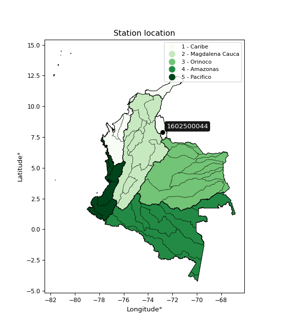

<div align="center">


</div>

# PMP Station (Rain, Pmax24h): 1602500044

Probable Maximum Precipitation (PMP) is the greatest amount of rainfall for a specific duration that is meteorologically possible for a given location, acting as a "worst-case" scenario for extreme storms, crucial for designing safety-critical infrastructure like bridges, river deviations, dams, spillways, and nuclear plants to prevent catastrophic failure. PMP is calculated by hydrologists using meteorological data to determine the upper limit of extreme rainfall, often leading to the Probable Maximum Flood (PMF) for flood control design, and is increasingly being studied for climate change impacts.

<div align="center">

</img>

</div>


## A. General information


### 1. General running parameters

• app_version: _v20260103_. • runtime: _2026-01-03 07:24:50.581521_. • Python version: _3.14.0_. • SciPy version: _1.16.3_. • Pandas version: _2.3.3_. • NumPy version: _2.3.5_. • Stations dataset (station_dataset_file): _dataset/pmax24h_in/automatic_colombia_2003_2024.csv_. • Stations catalog (station_catalog_file): _dataset/CNE.xls_. • Minimum year to eval til year_max (date_min): _1900_. • Maximum year to eval since year_min (date_max): _2024_. • Creates, save and include plots into reports (create_plot): _False_. • Plot only fit distributions with Δo > Δ (plot_only_fit): _True_. • Eval low extreme values, if False, evaluates high extreme values (low_extreme): _False_. • Eval every SciPy distribution as logarithmic (pdist_logarithmic_on): _True_. • Standard deviation normalized (ddof): _1.0_. • Return periods to eval in years (Tr): _[2, 2.33, 5, 10, 15, 20, 25, 50, 75, 100, 200, 250, 500, 750, 1000]_. • Minimum data sample per station, 0 means any (minimum_sample): _5_. • Z-Score maximum threshold to adjust a value, 0 means disable (zscore_max): _3.5_. • Z-Score minimum threshold to adjust a value, 0 means disable (zscore_min): _-2.5_. • Avoid zeros, e.g. rain = 0 (avoid_zeros): _True_. • Avoid null values (avoid_nans): _True_. [:file_folder:Dataset file.](../../dataset/pmax24h_in/automatic_colombia_2003_2024.csv)

> Delta Degrees of Freedom (DDOF): is a parameter used in the formulas for calculating variance and standard deviation. When ddof=0, the divisor is $N$ (the total number of observations) and this is used when your data set is the entire population. When ddof=1, the divisor is $N-1$ and this is used when your data set is a sample drawn from a larger population. Using $N-1$ provides an unbiased estimate of the population variance (known as Bessel´s correction).


### 2. Station info and location

|   id |     CODIGO | NOMBRE                         | CATEGORIA               | TECNOLOGIA                | ESTADO   | FECHA_INSTALACION   |   FECHA_SUSPENSION |   ALTITUD |   LATITUD |   LONGITUD | DEPARTAMENTO       | MUNICIPIO   | AREA_OPERATIVA                         | ENTIDAD                                                     | AREA_HIDROGRAFICA   | ZONA_HIDROGRAFICA   | SUBZONA_HIDROGRAFICA   |   CORRIENTE | Catalogo   |   Version |
|-----:|-----------:|:-------------------------------|:------------------------|:--------------------------|:---------|:--------------------|-------------------:|----------:|----------:|-----------:|:-------------------|:------------|:---------------------------------------|:------------------------------------------------------------|:--------------------|:--------------------|:-----------------------|------------:|:-----------|----------:|
|    0 | 1602500044 | GRAMALOTE - AUT   [1602500044] | Climatológica Principal | Automática con Telemetría | Activa   | 29/06/2017          |                nan |      1214 |   7.91317 |    -72.803 | Norte De Santander | Gramalote   | Area Operativa 08 - Santanderes-Arauca | INSTITUTO DE HIDROLOGIA METEOROLOGIA Y ESTUDIOS AMBIENTALES | Caribe              | Catatumbo           | Río Zulia              |         nan | CNE_IDEAM  |  20251226 |

<div align="center">

Dynamic map: [:earth_americas:Google](http://maps.google.com/maps?q=7.913166667,-72.803027778) [:earth_americas:OSM](https://www.openstreetmap.org/#map=18/7.913166667/-72.803027778&layers=P) [:earth_americas:Bing](https://www.bing.com/maps?cp=7.913166667~-72.803027778&lvl=18) [:earth_americas:Apple](https://maps.apple.com/frame?center=7.913166667%2C-72.803027778&span=0.003%2C0.006)

</div>


<div align="center">

```geojson
{
  "type": "Feature",
  "geometry": {
    "type": "Point", 
    "coordinates": [-72.803027778, 7.913166667]
  }, 
  "properties": {
    "Name": "1602500044"
  }
}
```

</div>


### 3. Discrete values table and plot

<div align="center">

|               |           0 |           1 |           2 |         3 |          4 |
|:--------------|------------:|------------:|------------:|----------:|-----------:|
| Date          | 2019        | 2020        | 2022        | 2023      | 2024       |
| Value         |   74.2      |   62.2      |   31.2      |  105.8    |   17.2     |
| Value_initial |   74.2      |   62.2      |   31.2      |  105.8    |   17.2     |
| count         |    5        |    5        |    5        |    5      |    5       |
| mean          |   58.12     |   58.12     |   58.12     |   58.12   |   58.12    |
| std           |   35.17     |   35.17     |   35.17     |   35.17   |   35.17    |
| zscore        |    0.457207 |    0.116008 |   -0.765424 |    1.3557 |   -1.16349 |


</div>


> The initial value (value_initial) correspond to the initial obtained or null completed value, and value (value) is adjusted only when the initial value is outside the valid range definite through the Z-Score value. If Z-Score is active, values out of range or outliers are replaced with the station mean value


### 4. Active continuous probability distributions from SciPy (44 of 104 available)

A Probability Density Function (PDF) describes the relative likelihood of a continuous random variable falling within a specific range, where the total area under its curve equals 1, and the area over any interval gives the actual probability for that range. Unlike discrete probabilities (like rolling a die), a PDF shows density, not direct probability for a single point (which is zero), with higher points indicating higher likelihood, often visualized as a bell curve for normal distributions.

A log of a probability density function (log-PDF) is simply the logarithm of the PDF´s value, denoted as $log(f(x))$, useful for converting multiplication of probabilities into addition, improving numerical stability with tiny numbers, and connecting to information theory concepts like entropy. Instead of dealing with very small probabilities (e.g., 0.000001), log-PDFs use negative numbers (e.g., $log(0.00001) ≈ -11.51$ that are easier for computers to handle, preventing underflow errors and simplifying complex calculations. In this study, each active probability distribution from SciPy is also evaluated in the $log$ form.

[scipy.stats](https://docs.scipy.org/doc/scipy/reference/stats.html) is a Python´s powerful submodule within the SciPy library for comprehensive statistical analysis, offering over 130 probability distributions (like Normal, Poisson), functions for descriptive stats (mean, variance), hypothesis testing (t-tests, chi-square), random variable generation, and statistical tests, making it essential for data science, modeling, and research. It provides tools to explore, model, and draw conclusions from data efficiently, working seamlessly with NumPy.

<div align="center">

|   id | p_dist             |   n_parameter | fit_method   | label                                                                       | active   | ref                                                                                                        |
|-----:|:-------------------|--------------:|:-------------|:----------------------------------------------------------------------------|:---------|:-----------------------------------------------------------------------------------------------------------|
|    0 | alpha              |             3 | MLE          | Alpha                                                                       | True     | [:mortar_board:](https://docs.scipy.org/doc/scipy/reference/generated/scipy.stats.alpha.html)              |
|    1 | betaprime          |             4 | MLE          | Beta prime                                                                  | True     | [:mortar_board:](https://docs.scipy.org/doc/scipy/reference/generated/scipy.stats.betaprime.html)          |
|    2 | chi2               |             3 | MLE          | Chi²                                                                        | True     | [:mortar_board:](https://docs.scipy.org/doc/scipy/reference/generated/scipy.stats.chi2.html)               |
|    3 | crystalball        |             4 | MLE          | Crystalball                                                                 | True     | [:mortar_board:](https://docs.scipy.org/doc/scipy/reference/generated/scipy.stats.crystalball.html)        |
|    4 | erlang             |             3 | MLE          | Erlang                                                                      | True     | [:mortar_board:](https://docs.scipy.org/doc/scipy/reference/generated/scipy.stats.erlang.html)             |
|    5 | expon              |             2 | MLE          | Exponential                                                                 | True     | [:mortar_board:](https://docs.scipy.org/doc/scipy/reference/generated/scipy.stats.expon.html)              |
|    6 | exponnorm          |             3 | MLE          | Exponentially modified Normal                                               | True     | [:mortar_board:](https://docs.scipy.org/doc/scipy/reference/generated/scipy.stats.exponnorm.html)          |
|    7 | f                  |             4 | MLE          | F                                                                           | True     | [:mortar_board:](https://docs.scipy.org/doc/scipy/reference/generated/scipy.stats.f.html)                  |
|    8 | fatiguelife        |             3 | MLE          | Fatigue-life (Birnbaum-Saunders)                                            | True     | [:mortar_board:](https://docs.scipy.org/doc/scipy/reference/generated/scipy.stats.fatiguelife.html)        |
|    9 | fisk               |             3 | MLE          | Fisk                                                                        | True     | [:mortar_board:](https://docs.scipy.org/doc/scipy/reference/generated/scipy.stats.fisk.html)               |
|   10 | gamma              |             3 | MLE          | Gamma                                                                       | True     | [:mortar_board:](https://docs.scipy.org/doc/scipy/reference/generated/scipy.stats.gamma.html)              |
|   11 | genexpon           |             5 | MLE          | Generalized exponential                                                     | True     | [:mortar_board:](https://docs.scipy.org/doc/scipy/reference/generated/scipy.stats.genexpon.html)           |
|   12 | genlogistic        |             3 | MLE          | Generalized logistic                                                        | True     | [:mortar_board:](https://docs.scipy.org/doc/scipy/reference/generated/scipy.stats.genlogistic.html)        |
|   13 | gibrat             |             2 | MM           | Gibrat                                                                      | True     | [:mortar_board:](https://docs.scipy.org/doc/scipy/reference/generated/scipy.stats.gibrat.html)             |
|   14 | gompertz           |             3 | MLE          | Gompertz (or truncated Gumbel)                                              | True     | [:mortar_board:](https://docs.scipy.org/doc/scipy/reference/generated/scipy.stats.gompertz.html)           |
|   15 | gumbel_l           |             2 | MM           | Gumbel Left Skew                                                            | True     | [:mortar_board:](https://docs.scipy.org/doc/scipy/reference/generated/scipy.stats.gumbel_l.html)           |
|   16 | gumbel_r           |             2 | MM           | Gumbel Right Skew                                                           | True     | [:mortar_board:](https://docs.scipy.org/doc/scipy/reference/generated/scipy.stats.gumbel_r.html)           |
|   17 | halflogistic       |             2 | MM           | Half-logistic                                                               | True     | [:mortar_board:](https://docs.scipy.org/doc/scipy/reference/generated/scipy.stats.halflogistic.html)       |
|   18 | halfnorm           |             2 | MM           | Half Normal                                                                 | True     | [:mortar_board:](https://docs.scipy.org/doc/scipy/reference/generated/scipy.stats.halfnorm.html)           |
|   19 | hypsecant          |             2 | MM           | hyperbolic secant                                                           | True     | [:mortar_board:](https://docs.scipy.org/doc/scipy/reference/generated/scipy.stats.hypsecant.html)          |
|   20 | invgamma           |             3 | MLE          | Inverted gamma                                                              | True     | [:mortar_board:](https://docs.scipy.org/doc/scipy/reference/generated/scipy.stats.invgamma.html)           |
|   21 | invgauss           |             3 | MLE          | Inverse Gaussian                                                            | True     | [:mortar_board:](https://docs.scipy.org/doc/scipy/reference/generated/scipy.stats.invgauss.html)           |
|   22 | invweibull         |             3 | MLE          | Inverted Weibull                                                            | True     | [:mortar_board:](https://docs.scipy.org/doc/scipy/reference/generated/scipy.stats.invweibull.html)         |
|   23 | johnsonsu          |             4 | MLE          | Johnson Su                                                                  | True     | [:mortar_board:](https://docs.scipy.org/doc/scipy/reference/generated/scipy.stats.johnsonsu.html)          |
|   24 | kstwobign          |             2 | MLE          | Limiting distribution of scaled Kolmogorov-Smirnov two-sided test statistic | True     | [:mortar_board:](https://docs.scipy.org/doc/scipy/reference/generated/scipy.stats.kstwobign.html)          |
|   25 | laplace            |             2 | MM           | Laplace                                                                     | True     | [:mortar_board:](https://docs.scipy.org/doc/scipy/reference/generated/scipy.stats.laplace.html)            |
|   26 | laplace_asymmetric |             3 | MLE          | Asymmetric Laplace                                                          | True     | [:mortar_board:](https://docs.scipy.org/doc/scipy/reference/generated/scipy.stats.laplace_asymmetric.html) |
|   27 | loggamma           |             3 | MLE          | Log gamma                                                                   | True     | [:mortar_board:](https://docs.scipy.org/doc/scipy/reference/generated/scipy.stats.loggamma.html)           |
|   28 | logistic           |             2 | MM           | Logistic (or Sech-squared)                                                  | True     | [:mortar_board:](https://docs.scipy.org/doc/scipy/reference/generated/scipy.stats.logistic.html)           |
|   29 | lognorm            |             3 | MLE          | Log Normal                                                                  | True     | [:mortar_board:](https://docs.scipy.org/doc/scipy/reference/generated/scipy.stats.lognorm.html)            |
|   30 | maxwell            |             2 | MM           | Maxwell                                                                     | True     | [:mortar_board:](https://docs.scipy.org/doc/scipy/reference/generated/scipy.stats.maxwell.html)            |
|   31 | mielke             |             4 | MLE          | Mielke Beta-Kappa / Dagum                                                   | True     | [:mortar_board:](https://docs.scipy.org/doc/scipy/reference/generated/scipy.stats.mielke.html)             |
|   32 | moyal              |             2 | MM           | Moyal                                                                       | True     | [:mortar_board:](https://docs.scipy.org/doc/scipy/reference/generated/scipy.stats.moyal.html)              |
|   33 | nakagami           |             3 | MLE          | Nakagami                                                                    | True     | [:mortar_board:](https://docs.scipy.org/doc/scipy/reference/generated/scipy.stats.nakagami.html)           |
|   34 | ncf                |             5 | MLE          | Non-central F distribution                                                  | True     | [:mortar_board:](https://docs.scipy.org/doc/scipy/reference/generated/scipy.stats.ncf.html)                |
|   35 | nct                |             4 | MLE          | Non-central Student’s t                                                     | True     | [:mortar_board:](https://docs.scipy.org/doc/scipy/reference/generated/scipy.stats.nct.html)                |
|   36 | norm               |             2 | MM           | Normal                                                                      | True     | [:mortar_board:](https://docs.scipy.org/doc/scipy/reference/generated/scipy.stats.norm.html)               |
|   37 | pearson3           |             3 | MM           | Pearson type III                                                            | True     | [:mortar_board:](https://docs.scipy.org/doc/scipy/reference/generated/scipy.stats.pearson3.html)           |
|   38 | rayleigh           |             2 | MM           | Rayleigh                                                                    | True     | [:mortar_board:](https://docs.scipy.org/doc/scipy/reference/generated/scipy.stats.rayleigh.html)           |
|   39 | rice               |             3 | MLE          | Rice                                                                        | True     | [:mortar_board:](https://docs.scipy.org/doc/scipy/reference/generated/scipy.stats.rice.html)               |
|   40 | t                  |             3 | MLE          | Student’s t                                                                 | True     | [:mortar_board:](https://docs.scipy.org/doc/scipy/reference/generated/scipy.stats.t.html)                  |
|   41 | truncnorm          |             4 | MLE          | Truncated normal                                                            | True     | [:mortar_board:](https://docs.scipy.org/doc/scipy/reference/generated/scipy.stats.truncnorm.html)          |
|   42 | wald               |             2 | MM           | Wald                                                                        | True     | [:mortar_board:](https://docs.scipy.org/doc/scipy/reference/generated/scipy.stats.wald.html)               |
|   43 | weibull_min        |             3 | MLE          | Weibull minimum                                                             | True     | [:mortar_board:](https://docs.scipy.org/doc/scipy/reference/generated/scipy.stats.weibull_min.html)        |

</div>

> **n_parameter:** # arguments & localization & scale.
>
> **Fit methods:** (MLE) maximum likelihood, (MM) L-moments.
>
>**Inactive** (With the only purpose of prevent loops, zero divisions, infinite values, over high estimated values or horizontal trending for recurrence intervals estimations, the follow distributions were disabled.)**:** foldnorm, gennorm, norminvgauss, powernorm, powerlognorm, skewnorm, genextreme, anglit, arcsine, argus, beta, bradford, burr, burr12, cauchy, cosine, halfcauchy, foldcauchy, skewcauchy, wrapcauchy, dgamma, gengamma, exponweib, exponpow, truncexpon, gausshyper, genhalflogistic, genhyperbolic, geninvgauss, halfgennorm, johnsonsb, kappa4, kappa3, ksone, kstwo, loglaplace, levy, levy_l, levy_stable, ncx2, pareto, genpareto, truncpareto, lomax, powerlaw, rdist, rel_breitwigner, recipinvgauss, semicircular, studentized_range, trapezoid, triang, truncweibull_min, tukeylambda, uniform, loguniform, vonmises, vonmises_line, weibull_max, dweibull, 


## B. Probability distributions vs. Empirical distributions

A continuous probability distribution (CPD) describes probabilities for variables that can take any value within a range (like rain any time), unlike discrete variables with specific outcomes (like temperature). It uses a Probability Density Function (PDF), a curve where the total area under it equals 1, and the probability of the variable falling within an interval (a to b) is found by calculating the area under the curve between those points. A key feature is that the probability of hitting any single exact value is zero, so probabilities are always expressed for ranges, e.g., $P(a ≤ X ≤ b)$.

<div align="center">

Distributions parameters from station values
|    |    station | p_dist                |   n |             loc |          scale | shape                  | shape1                 | shape2                | shape3   |
|---:|-----------:|:----------------------|----:|----------------:|---------------:|:-----------------------|:-----------------------|:----------------------|:---------|
|  0 | 1602500044 | alpha                 |   5 |  -234.036       | 2705.88        | 9.37551928361296       |                        |                       |          |
|  1 | 1602500044 | betaprime             |   5 |    -2.8216      | 1564.21        | 3.304269320051043      | 85.73090135012285      |                       |          |
|  2 | 1602500044 | chi2                  |   5 |    17.2         |   19.1578      | 1.3320393862654136     |                        |                       |          |
|  3 | 1602500044 | crystalball           |   5 |    58.12        |   31.457       | 10758.193454130103     | 4.039912869745363      |                       |          |
|  4 | 1602500044 | erlang                |   5 |   -88.0198      |    6.6637      | 21.831834673341177     |                        |                       |          |
|  5 | 1602500044 | expon                 |   5 |    17.2         |   40.92        |                        |                        |                       |          |
|  6 | 1602500044 | exponnorm             |   5 |    54.011       |   31.1877      | 0.13174882427324197    |                        |                       |          |
|  7 | 1602500044 | f                     |   5 |    -0.878957    |   58.4583      | 5.929686403953209      | 306.0493858601518      |                       |          |
|  8 | 1602500044 | fatiguelife           |   5 |    17.2         |    5.70856e-05 | 761.2493410176296      |                        |                       |          |
|  9 | 1602500044 | fisk                  |   5 |   -49.1463      |  103.549       | 5.369140562128408      |                        |                       |          |
| 10 | 1602500044 | gamma                 |   5 |   -99.8337      |    6.14353     | 25.738708569846224     |                        |                       |          |
| 11 | 1602500044 | genexpon              |   5 |    17.2         |    2.22509     | 0.05445786031096625    | 1.3941344605774452e-07 | 0.8101769406596189    |          |
| 12 | 1602500044 | genlogistic           |   5 |  -134.609       |   26.9349      | 722.4414003328541      |                        |                       |          |
| 13 | 1602500044 | gibrat                |   5 |    34.1223      |   14.5554      |                        |                        |                       |          |
| 14 | 1602500044 | gompertz              |   5 |    17.2         |   68.4861      | 0.9803833325926484     |                        |                       |          |
| 15 | 1602500044 | gumbel_l              |   5 |    72.2773      |   24.527       |                        |                        |                       |          |
| 16 | 1602500044 | gumbel_r              |   5 |    43.9627      |   24.527       |                        |                        |                       |          |
| 17 | 1602500044 | halflogistic          |   5 |    20.8361      |   26.8947      |                        |                        |                       |          |
| 18 | 1602500044 | halfnorm              |   5 |    16.4832      |   52.184       |                        |                        |                       |          |
| 19 | 1602500044 | hypsecant             |   5 |    58.12        |   20.0262      |                        |                        |                       |          |
| 20 | 1602500044 | invgamma              |   5 |  -135.501       | 7145.79        | 37.92052002118379      |                        |                       |          |
| 21 | 1602500044 | invgauss              |   5 |   -21.7757      |  412.61        | 0.19363488609396787    |                        |                       |          |
| 22 | 1602500044 | invweibull            |   5 |    17.2         |    1.54423     | 0.04358605387493575    |                        |                       |          |
| 23 | 1602500044 | johnsonsu             |   5 |   -51.2846      |   10.5899      | -10.131479598237014    | 3.3914782867885735     |                       |          |
| 24 | 1602500044 | kstwobign             |   5 |   -49.889       |  123.278       |                        |                        |                       |          |
| 25 | 1602500044 | laplace               |   5 |    58.12        |   22.2435      |                        |                        |                       |          |
| 26 | 1602500044 | laplace_asymmetric    |   5 |    62.2         |   26.0813      | 1.0812729054445183     |                        |                       |          |
| 27 | 1602500044 | loggamma              |   5 | -7419.1         | 1064.99        | 1120.2837217237184     |                        |                       |          |
| 28 | 1602500044 | logistic              |   5 |    58.12        |   17.3432      |                        |                        |                       |          |
| 29 | 1602500044 | lognorm               |   5 |    17.2         |    0.025742    | 14.818287381186165     |                        |                       |          |
| 30 | 1602500044 | maxwell               |   5 |   -16.42        |   46.711       |                        |                        |                       |          |
| 31 | 1602500044 | mielke                |   5 |    -4.8121      |  111.854       | 1.3762175439032371     | 349.56941102146607     |                       |          |
| 32 | 1602500044 | moyal                 |   5 |    40.1308      |   14.1606      |                        |                        |                       |          |
| 33 | 1602500044 | nakagami              |   5 |    31.2         |   37.3337      | 0.3033279653903186     |                        |                       |          |
| 34 | 1602500044 | ncf                   |   5 |     0.0472045   |    6.32194e-07 | 2.3687716752846458e-07 | 5.903708995395216      | 17.427304439785967    |          |
| 35 | 1602500044 | nct                   |   5 | -1327.53        |   31.4122      | 351664.56161371677     | 44.11167696730985      |                       |          |
| 36 | 1602500044 | norm                  |   5 |    58.12        |   31.457       |                        |                        |                       |          |
| 37 | 1602500044 | pearson3              |   5 |    58.12        |   31.4571      | 0.1580057623916707     |                        |                       |          |
| 38 | 1602500044 | rayleigh              |   5 |    -2.05916     |   48.016       |                        |                        |                       |          |
| 39 | 1602500044 | rice                  |   5 |     0.372501    |   40.0671      | 0.8328564567516803     |                        |                       |          |
| 40 | 1602500044 | t                     |   5 |    58.1209      |   31.4576      | 43454084.1787989       |                        |                       |          |
| 41 | 1602500044 | truncnorm             |   5 |    58.12        |   31.457       | -298.03914945231134    | 69.76459195578704      |                       |          |
| 42 | 1602500044 | wald                  |   5 |    26.663       |   31.457       |                        |                        |                       |          |
| 43 | 1602500044 | weibull_min           |   5 |    17.2         |   45.2346      | 0.5415459866335998     |                        |                       |          |
| 44 | 1602500044 | logalpha              |   5 |    -8.36413     |  216.728       | 17.770313848047316     |                        |                       |          |
| 45 | 1602500044 | logbetaprime          |   5 |    -3.32502     |    7.36539     | 235.3032915217035      | 241.76834312279152     |                       |          |
| 46 | 1602500044 | logchi2               |   5 |     2.84491     |    0.939442    | 1.0283713008527493     |                        |                       |          |
| 47 | 1602500044 | logcrystalball        |   5 |     3.8768      |    0.651187    | 66.31672838944733      | 600.0353371094427      |                       |          |
| 48 | 1602500044 | logerlang             |   5 |    -6.2944      |    0.0429792   | 236.65328064122167     |                        |                       |          |
| 49 | 1602500044 | logexpon              |   5 |     2.84491     |    1.03189     |                        |                        |                       |          |
| 50 | 1602500044 | logexponnorm          |   5 |     3.87672     |    0.651176    | 9.147355853086035e-05  |                        |                       |          |
| 51 | 1602500044 | logf                  |   5 |   -30.0706      |   33.9412      | 16589.456618502678     | 7681.053436837457      |                       |          |
| 52 | 1602500044 | logfatiguelife        |   5 |  -185.417       |  189.296       | 0.003429799414527186   |                        |                       |          |
| 53 | 1602500044 | logfisk               |   5 |    -2.4889e+07  |    2.4889e+07  | 63199967.10984945      |                        |                       |          |
| 54 | 1602500044 | loggamma              |   5 |    -6.40925     |    0.0428279   | 240.0174233241081      |                        |                       |          |
| 55 | 1602500044 | loggenexpon           |   5 |     2.82915     |    0.136802    | 0.06469976705245672    | 15.662545673772126     | 0.0007903671104278541 |          |
| 56 | 1602500044 | loggenlogistic        |   5 |     4.66159     |    1.40938e-06 | 1.7940682658029736e-06 |                        |                       |          |
| 57 | 1602500044 | loggibrat             |   5 |     3.37999     |    0.301328    |                        |                        |                       |          |
| 58 | 1602500044 | loggompertz           |   5 |     2.84491     |    1.24466     | 0.6358889707374302     |                        |                       |          |
| 59 | 1602500044 | loggumbel_l           |   5 |     4.16987     |    0.507728    |                        |                        |                       |          |
| 60 | 1602500044 | loggumbel_r           |   5 |     3.58373     |    0.507728    |                        |                        |                       |          |
| 61 | 1602500044 | loghalflogistic       |   5 |     3.10503     |    0.556718    |                        |                        |                       |          |
| 62 | 1602500044 | loghalfnorm           |   5 |     3.01484     |    1.0803      |                        |                        |                       |          |
| 63 | 1602500044 | loghypsecant          |   5 |     3.8768      |    0.414558    |                        |                        |                       |          |
| 64 | 1602500044 | loginvgamma           |   5 |    -8.81765     | 4551.77        | 359.89468622512766     |                        |                       |          |
| 65 | 1602500044 | loginvgauss           |   5 |    -1.46432     |  330.573       | 0.016140252819560275   |                        |                       |          |
| 66 | 1602500044 | loginvweibull         |   5 |    -3.55012e+07 |    3.55012e+07 | 56628405.82545117      |                        |                       |          |
| 67 | 1602500044 | logjohnsonsu          |   5 |     4.94823     |    0.0134932   | 6.984843679612879      | 1.43996923212642       |                       |          |
| 68 | 1602500044 | logkstwobign          |   5 |     1.33343     |    2.89709     |                        |                        |                       |          |
| 69 | 1602500044 | loglaplace            |   5 |     3.8768      |    0.460458    |                        |                        |                       |          |
| 70 | 1602500044 | loglaplace_asymmetric |   5 |     4.30676     |    0.42298     | 1.6299945865641876     |                        |                       |          |
| 71 | 1602500044 | logloggamma           |   5 |     4.6617      |    1.22658e-05 | 1.5725253918044085e-05 |                        |                       |          |
| 72 | 1602500044 | loglogistic           |   5 |     3.8768      |    0.359018    |                        |                        |                       |          |
| 73 | 1602500044 | loglognorm            |   5 |     2.84491     |    0.000979754 | 14.216118987651873     |                        |                       |          |
| 74 | 1602500044 | logmaxwell            |   5 |     2.33376     |    0.966956    |                        |                        |                       |          |
| 75 | 1602500044 | logmielke             |   5 |     2.84491     |    1.82652     | 0.34193946247957263    | 3415.2808683239746     |                       |          |
| 76 | 1602500044 | logmoyal              |   5 |     3.50441     |    0.293137    |                        |                        |                       |          |
| 77 | 1602500044 | lognakagami           |   5 |     3.44042     |    0.722243    | 0.0921184691232376     |                        |                       |          |
| 78 | 1602500044 | logncf                |   5 |   -17.8469      |   20.4397      | 3982.974110031999      | 4749.159197962612      | 246.2884954380021     |          |
| 79 | 1602500044 | lognct                |   5 |    38.1828      |    0.643559    | 58687.32902597866      | -53.30550960305649     |                       |          |
| 80 | 1602500044 | lognorm               |   5 |     3.8768      |    0.651187    |                        |                        |                       |          |
| 81 | 1602500044 | logpearson3           |   5 |     3.8768      |    0.651187    | -0.43656472723127737   |                        |                       |          |
| 82 | 1602500044 | lograyleigh           |   5 |     2.63104     |    0.993971    |                        |                        |                       |          |
| 83 | 1602500044 | logrice               |   5 |     2.45202     |    0.738384    | 1.581466511897835      |                        |                       |          |
| 84 | 1602500044 | logt                  |   5 |     3.8768      |    0.651187    | 6873501673.059128      |                        |                       |          |
| 85 | 1602500044 | logtruncnorm          |   5 |    -0.290624    |    1.67438     | 2.2283020971243825     | 2.957620072596552      |                       |          |
| 86 | 1602500044 | logwald               |   5 |     3.22564     |    0.651165    |                        |                        |                       |          |
| 87 | 1602500044 | logweibull_min        |   5 |    -8.07734e+06 |    8.07735e+06 | 15649912.924767088     |                        |                       |          |

</div>

> **loc** (Location parameter): This shifts the distribution along the x-axis. For many common distributions, like the normal (Gaussian) distribution, loc represents the mean $μ$. For others, like the uniform distribution, it might represent the minimum value, or for the beta distribution, the left end of the support interval.
>
> **scale** (Scale parameter): This determines the width or spread of the distribution. For the normal distribution, scale represents the standard deviation $σ$. For a uniform distribution, it defines the length of the interval (from $loc$ to $loc + scale$).
>
> **shape** (Shape parameters): Refers to parameters that define the specific form of a probability distribution, distinct from its location (loc) and scale (scale). These parameters are required arguments for most distribution functions. For example, a normal (Gaussian) distribution is fully defined by its location (mean) and scale (standard deviation), so it has no specific shape parameters beyond loc and scale. However, other distributions have intrinsic properties that need specification, as Gamma distribution that takes a shape parameter, often named $a$ or $alpha$.


### 0. Cumulative distribution values - CDF (88 evaluated)

Cumulative Distribution Function (CDF), denoted as $F$<sub>$X$</sub>$(x)$, is a function that gives the probability that a random variable $X$ will take a value less than or equal to a specific value, $x$ (i.e., $(P(X≥x)$. It essentially "accumulates" probabilities from a given point up to the far right (positive infinity), providing a complete picture of the distribution´s probabilities for both discrete (like rain) and continuous (like temperature) variables, helping to find probabilities over ranges or above certain values. Each station is evaluated separately ordering the $x$ values ascending, calculating the CDF and PDF values for the activated distributions and their logarithmic forms.

<div align="center">

CDF ordered by x ascending and calculating $log(f(x))$ separately
|   id |    Station |   date |     x |   count |   mean |   std |    zscore |   Value_initial |    station |   m |     alpha |   alpha_pdf |   betaprime |   betaprime_pdf |        chi2 |      chi2_pdf |   crystalball |   crystalball_pdf |    erlang |   erlang_pdf |    expon |   expon_pdf |   exponnorm |   exponnorm_pdf |         f |      f_pdf |   fatiguelife |   fatiguelife_pdf |      fisk |   fisk_pdf |    gamma |   gamma_pdf |    genexpon |   genexpon_pdf |   genlogistic |   genlogistic_pdf |   gibrat |   gibrat_pdf |    gompertz |   gompertz_pdf |   gumbel_l |   gumbel_l_pdf |   gumbel_r |   gumbel_r_pdf |   halflogistic |   halflogistic_pdf |   halfnorm |   halfnorm_pdf |   hypsecant |   hypsecant_pdf |   invgamma |   invgamma_pdf |   invgauss |   invgauss_pdf |   invweibull |   invweibull_pdf |   johnsonsu |   johnsonsu_pdf |   kstwobign |   kstwobign_pdf |   laplace |   laplace_pdf |   laplace_asymmetric |   laplace_asymmetric_pdf |   loggamma |   loggamma_pdf |   logistic |   logistic_pdf |   lognorm |   lognorm_pdf |   maxwell |   maxwell_pdf |   mielke |   mielke_pdf |     moyal |   moyal_pdf |    nakagami |   nakagami_pdf |      ncf |    ncf_pdf |       nct |    nct_pdf |      norm |   norm_pdf |   pearson3 |   pearson3_pdf |   rayleigh |   rayleigh_pdf |      rice |   rice_pdf |         t |      t_pdf |   truncnorm |   truncnorm_pdf |      wald |   wald_pdf |   weibull_min |   weibull_min_pdf |   logalpha |   logalpha_pdf |   logbetaprime |   logbetaprime_pdf |     logchi2 |   logchi2_pdf |   logcrystalball |   logcrystalball_pdf |   logerlang |   logerlang_pdf |   logexpon |   logexpon_pdf |   logexponnorm |   logexponnorm_pdf |      logf |   logf_pdf |   logfatiguelife |   logfatiguelife_pdf |   logfisk |   logfisk_pdf |   loggenexpon |   loggenexpon_pdf |   loggenlogistic |   loggenlogistic_pdf |   loggibrat |   loggibrat_pdf |   loggompertz |   loggompertz_pdf |   loggumbel_l |   loggumbel_l_pdf |   loggumbel_r |   loggumbel_r_pdf |   loghalflogistic |   loghalflogistic_pdf |   loghalfnorm |   loghalfnorm_pdf |   loghypsecant |   loghypsecant_pdf |   loginvgamma |   loginvgamma_pdf |   loginvgauss |   loginvgauss_pdf |   loginvweibull |   loginvweibull_pdf |   logjohnsonsu |   logjohnsonsu_pdf |   logkstwobign |   logkstwobign_pdf |   loglaplace |   loglaplace_pdf |   loglaplace_asymmetric |   loglaplace_asymmetric_pdf |   logloggamma |   logloggamma_pdf |   loglogistic |   loglogistic_pdf |   loglognorm |   loglognorm_pdf |   logmaxwell |   logmaxwell_pdf |   logmielke |   logmielke_pdf |   logmoyal |   logmoyal_pdf |   lognakagami |   lognakagami_pdf |    logncf |   logncf_pdf |    lognct |   lognct_pdf |   logpearson3 |   logpearson3_pdf |   lograyleigh |   lograyleigh_pdf |   logrice |   logrice_pdf |      logt |   logt_pdf |   logtruncnorm |   logtruncnorm_pdf |   logwald |   logwald_pdf |   logweibull_min |   logweibull_min_pdf |
|-----:|-----------:|-------:|------:|--------:|-------:|------:|----------:|----------------:|-----------:|----:|----------:|------------:|------------:|----------------:|------------:|--------------:|--------------:|------------------:|----------:|-------------:|---------:|------------:|------------:|----------------:|----------:|-----------:|--------------:|------------------:|----------:|-----------:|---------:|------------:|------------:|---------------:|--------------:|------------------:|---------:|-------------:|------------:|---------------:|-----------:|---------------:|-----------:|---------------:|---------------:|-------------------:|-----------:|---------------:|------------:|----------------:|-----------:|---------------:|-----------:|---------------:|-------------:|-----------------:|------------:|----------------:|------------:|----------------:|----------:|--------------:|---------------------:|-------------------------:|-----------:|---------------:|-----------:|---------------:|----------:|--------------:|----------:|--------------:|---------:|-------------:|----------:|------------:|------------:|---------------:|---------:|-----------:|----------:|-----------:|----------:|-----------:|-----------:|---------------:|-----------:|---------------:|----------:|-----------:|----------:|-----------:|------------:|----------------:|----------:|-----------:|--------------:|------------------:|-----------:|---------------:|---------------:|-------------------:|------------:|--------------:|-----------------:|---------------------:|------------:|----------------:|-----------:|---------------:|---------------:|-------------------:|----------:|-----------:|-----------------:|---------------------:|----------:|--------------:|--------------:|------------------:|-----------------:|---------------------:|------------:|----------------:|--------------:|------------------:|--------------:|------------------:|--------------:|------------------:|------------------:|----------------------:|--------------:|------------------:|---------------:|-------------------:|--------------:|------------------:|--------------:|------------------:|----------------:|--------------------:|---------------:|-------------------:|---------------:|-------------------:|-------------:|-----------------:|------------------------:|----------------------------:|--------------:|------------------:|--------------:|------------------:|-------------:|-----------------:|-------------:|-----------------:|------------:|----------------:|-----------:|---------------:|--------------:|------------------:|----------:|-------------:|----------:|-------------:|--------------:|------------------:|--------------:|------------------:|----------:|--------------:|----------:|-----------:|---------------:|-------------------:|----------:|--------------:|-----------------:|---------------------:|
|    0 | 1602500044 |   2024 |  17.2 |       5 |  58.12 | 35.17 | -1.16349  |            17.2 | 1602500044 |   1 | 0.0815463 |  0.006466   |   0.0683319 |      0.00848143 | 2.32442e-11 | 4357.54       |     0.0966598 |        0.00544188 | 0.0864239 |   0.006291   | 0        |  0.0244379  |   0.0965572 |      0.00544715 | 0.0695317 | 0.00886336 |     0.0100821 |       1.70857e+09 | 0.0839313 | 0.00622214 | 0.08279  |  0.00599105 | 1.13908e-07 |     0.0244745  |     0.0763777 |        0.00728047 | 0        |   0          | 1.87511e-13 |     0.0143151  |   0.100455 |     0.00388271 |  0.0509096 |     0.00618069 |       0        |         0          |  0.0109594 |     0.0152884  |   0.0820467 |      0.00405176 |  0.0814656 |     0.00652259 |  0.0675888 |     0.00830767 |    0.0129677 |      6.91304e+11 |   0.0764008 |      0.00702609 |   0.0714865 |      0.00781176 | 0.0794373 |    0.00357126 |             0.10929  |               0.00387541 |  0.0572684 |       0.18568  |  0.0863192 |     0.00454751 | 0.0565252 |      0.174557 | 0.0850876 |    0.00682949 | 0.106758 |   0.00667464 | 0.0246297 |  0.00506903 | 0           |     0          | 0.09854  | 0.0117585  | 0.0966488 | 0.00544255 | 0.0966598 | 0.00544188 |   0.093136 |     0.00569286 |  0.0772898 |     0.0077078  | 0.0605797 | 0.00699361 | 0.0966584 | 0.00544174 |   0.0966598 |      0.00544188 | 0         | 0          |   1.89867e-09 |   289418          |  0.0588141 |       0.202292 |      0.0509822 |           0.184906 | 1.04065e-08 |   1.20491e+07 |        0.0565252 |             0.174557 |   0.0553631 |        0.181664 |   0        |       0.969096 |      0.0565249 |           0.174559 | 0.0573268 |   0.179568 |         0.055129 |             0.172601 | 0.0601004 |      0.143439 |    0.00750757 |          0.479742 |         0        |             0.126034 |   0         |        0        |   2.76399e-08 |          0.510893 |     0.0709244 |          0.134615 |     0.0137718 |          0.116231 |          0        |              0        |      0        |          0        |      0.0527072 |           0.12656  |     0.0574435 |          0.19241  |      0.05209  |          0.196154 |       0.0498806 |            0.238546 |      0.0996043 |           0.119799 |      0.0516704 |           0.2757   |    0.0531757 |         0.115484 |               0.0871816 |                    0.12645  |     0.0973742 |          0.124838 |     0.0534437 |          0.140905 |    0.0227879 |      8.56401e+12 |    0.0361514 |         0.20051  |   0.0014335 |    55567.4      | 0.00207063 |      0.0365218 |    0          |       0           | 0.0581624 |     0.184775 | 0.0565791 |     0.174403 |     0.0664582 |          0.162681 |     0.0228822 |          0.211517 |  0.041162 |      0.212255 | 0.0565253 |   0.174557 |    0           |           0        |  0        |      0        |        0.0719109 |             0.134194 |
|    1 | 1602500044 |   2022 |  31.2 |       5 |  58.12 | 35.17 | -0.765424 |            31.2 | 1602500044 |   2 | 0.204329  |  0.0109071  |   0.225443  |      0.0131472  | 0.492498    |    0.0187044  |     0.196062  |        0.00879359 | 0.203905  |   0.0103858  | 0.289745 |  0.0173572  |   0.196083  |      0.00880536 | 0.231176  | 0.0133409  |     0.742327  |       0.00750121  | 0.203895  | 0.0108471  | 0.195506 |  0.0100416  | 0.290109    |     0.0173743  |     0.216406  |        0.0122844  | 0        |   0          | 0.199377    |     0.0140605  |   0.170845 |     0.00633348 |  0.185886  |     0.0127523  |       0.190327 |         0.0179176  |  0.22207   |     0.0146937  |   0.162376  |      0.00776106 |  0.204903  |     0.0109269  |  0.226493  |     0.0135069  |    0.403175  |      0.0011402   |   0.210385  |      0.011766   |   0.220125  |      0.0127662  | 0.149063  |    0.0067014  |             0.179548 |               0.00636674 |  0.262587  |       0.505513 |  0.174769  |     0.00831595 | 0.251387  |      0.489428 | 0.208256  |    0.010558   | 0.210194 |   0.00803264 | 0.170461  |  0.0150932  | 1.48084e-10 | 25286.6        | 0.286912 | 0.01377    | 0.196067  | 0.00879503 | 0.196062  | 0.00879359 |   0.19784  |     0.00926381 |  0.213289  |     0.0113489  | 0.190103  | 0.0111604  | 0.196058  | 0.00879332 |   0.196062  |      0.00879359 | 0.0216778 | 0.0182817  |   0.411317    |        0.0120658  |  0.277797  |       0.521545 |      0.264033  |           0.527176 | 0.563338    |   0.392815    |        0.251387  |             0.489428 |   0.258523  |        0.503626 |   0.438478 |       0.544168 |      0.251391  |           0.48944  | 0.255737  |   0.492446 |         0.249451 |             0.490018 | 0.224854  |      0.442582 |    0.338027   |          0.580264 |         0        |             0.268971 |   0.0540554 |        1.81584  |   0.323054    |          0.558049 |     0.211571  |          0.369133 |     0.265504  |          0.693465 |          0.29243  |              0.821317 |      0.306379 |          0.683433 |      0.213775  |           0.477769 |     0.269622  |          0.51669  |      0.273952 |          0.536053 |       0.313609  |            0.580085 |      0.210549  |           0.275645 |      0.334521  |           0.581865 |    0.193814  |         0.420915 |               0.206796  |                    0.299941 |     0.208936  |          0.267866 |     0.228732  |          0.491378 |    0.673965  |      0.0425691   |    0.273198  |         0.561463 |   0.681657  |        0.391406 | 0.26471    |      0.81493   |    0.00132532 |       5.49827e+11 | 0.262135  |     0.503727 | 0.251186  |     0.488837 |     0.238236  |          0.43376  |     0.282176  |          0.588059 |  0.265625 |      0.524745 | 0.251387  |   0.489428 |    1.50838e-05 |           1.74863  |  0.197681 |      1.63717  |        0.210682  |             0.361813 |
|    2 | 1602500044 |   2020 |  62.2 |       5 |  58.12 | 35.17 |  0.116008 |            62.2 | 1602500044 |   3 | 0.595348  |  0.011948   |   0.621436  |      0.0105731  | 0.817763    |    0.00563915 |     0.551598  |        0.0125759  | 0.587769  |   0.0122221  | 0.667031 |  0.00813707 |   0.55189   |      0.0125749  | 0.625287  | 0.0103979  |     0.878256  |       0.00261879  | 0.596239  | 0.0116084  | 0.575333 |  0.0123548  | 0.667579    |     0.00813584 |     0.615976  |        0.0110774  | 0.744415 |   0.0114502  | 0.597838    |     0.0111059  |   0.484735 |     0.0139299  |  0.621626  |     0.0120492  |       0.646347 |         0.0108244  |  0.619008  |     0.010417   |   0.564406  |      0.0155704  |  0.594314  |     0.0118779  |  0.628532  |     0.0104633  |    0.421763  |      0.000352672 |   0.606595  |      0.0114445  |   0.619897  |      0.0109764  | 0.583793  |    0.0187114  |             0.53899  |               0.0191125  |  0.659211  |       0.543531 |  0.558543  |     0.0142173  | 0.6515    |      0.567914 | 0.581883  |    0.0117381  | 0.494074 |   0.0101467  | 0.646411  |  0.0116334  | 0.661716    |     0.0110114  | 0.622193 | 0.00764928 | 0.55164   | 0.0125761  | 0.551598  | 0.0125759  |   0.561816 |     0.0124426  |  0.591598  |     0.0113828  | 0.579074  | 0.0120655  | 0.551586  | 0.0125757  |   0.551598  |      0.0125759  | 0.715185  | 0.0104837  |   0.631085    |        0.00442717 |  0.664367  |       0.506145 |      0.665966  |           0.532774 | 0.750232    |   0.187228    |        0.6515    |             0.567914 |   0.656163  |        0.547428 |   0.712266 |       0.278842 |      0.651512  |           0.567916 | 0.650958  |   0.553802 |         0.650614 |             0.569384 | 0.625823  |      0.594617 |    0.690865   |          0.411281 |         0        |             0.647332 |   0.819211  |        0.350658 |   0.68343     |          0.45428  |     0.603519  |          0.722425 |     0.711237  |          0.477329 |          0.726308 |              0.424341 |      0.698208 |          0.433371 |      0.683574  |           0.64364  |     0.664994  |          0.529587 |      0.669083 |          0.511231 |       0.679909  |            0.418409 |      0.53039   |           0.700253 |      0.69108   |           0.407157 |    0.711715  |         0.626082 |               0.562522  |                    0.815893 |     0.506011  |          0.648729 |     0.669571  |          0.616252 |    0.693225  |      0.0192174   |    0.672975  |         0.506991 |   0.886809  |        0.235899 | 0.73099    |      0.441052  |    0.828136   |       0.204732    | 0.660474  |     0.549072 | 0.651147  |     0.568218 |     0.6284    |          0.615376 |     0.679427  |          0.486487 |  0.660969 |      0.532063 | 0.651501  |   0.567914 |    0.772342    |           0.641307 |  0.78701  |      0.354233 |        0.593677  |             0.709006 |
|    3 | 1602500044 |   2019 |  74.2 |       5 |  58.12 | 35.17 |  0.457207 |            74.2 | 1602500044 |   4 | 0.724723  |  0.00950774 |   0.733566  |      0.00812706 | 0.873655    |    0.00380987 |     0.695385  |        0.0111289  | 0.722081  |   0.0100084  | 0.751661 |  0.00606888 |   0.695606  |      0.0111189  | 0.735458  | 0.00798271 |     0.905348  |       0.00194089  | 0.718969  | 0.00879515 | 0.712062 |  0.0102596  | 0.752179    |     0.0060653  |     0.733164  |        0.00844685 | 0.844437 |   0.00595989 | 0.720036    |     0.00921199 |   0.660928 |     0.0149517  |  0.747165  |     0.00887903 |       0.758253 |         0.00790218 |  0.731284  |     0.00829408 |   0.731859  |      0.0118612  |  0.723105  |     0.00948353 |  0.738497  |     0.00789993 |    0.425511  |      0.000278021 |   0.729074  |      0.00891997 |   0.736986  |      0.00853102 | 0.757331  |    0.0109097  |             0.719682 |               0.0116214  |  0.748674  |       0.467109 |  0.7165    |     0.0117123  | 0.745463  |      0.492646 | 0.711858  |    0.00979182 | 0.619794 |   0.0107954  | 0.763943  |  0.00808739 | 0.774885    |     0.00798028 | 0.702116 | 0.00575935 | 0.695422  | 0.0111281  | 0.695385  | 0.0111289  |   0.702187 |     0.0107279  |  0.716684  |     0.00937109 | 0.712298  | 0.0100096  | 0.695372  | 0.0111289  |   0.695385  |      0.0111289  | 0.812985  | 0.00626144 |   0.678055    |        0.0034667  |  0.747265  |       0.43144  |      0.753032  |           0.451526 | 0.780788    |   0.160126    |        0.745462  |             0.492646 |   0.746333  |        0.471115 |   0.757481 |       0.235024 |      0.745474  |           0.492643 | 0.742531  |   0.480225 |         0.744797 |             0.493678 | 0.72358   |      0.507885 |    0.758017   |          0.349951 |         0        |             0.810312 |   0.86939   |        0.229    |   0.758812    |          0.398808 |     0.730038  |          0.696255 |     0.786049  |          0.3727   |          0.792941 |              0.333422 |      0.768263 |          0.361276 |      0.783141  |           0.483571 |     0.751832  |          0.451913 |      0.75249  |          0.432289 |       0.747387  |            0.347126 |      0.664958  |           0.817675 |      0.757148  |           0.342267 |    0.803467  |         0.426821 |               0.726543  |                    1.05379  |     0.634428  |          0.813364 |     0.7681    |          0.496138 |    0.696394  |      0.0168206   |    0.755642  |         0.428467 |   0.926676  |        0.216757 | 0.799131   |      0.335287  |    0.860251   |       0.161981    | 0.750868  |     0.471884 | 0.74518   |     0.493131 |     0.732771  |          0.560007 |     0.758553  |          0.409521 |  0.748624 |      0.458508 | 0.745463  |   0.492646 |    0.870932    |           0.482884 |  0.83977  |      0.251141 |        0.718487  |             0.691378 |
|    4 | 1602500044 |   2023 | 105.8 |       5 |  58.12 | 35.17 |  1.3557   |           105.8 | 1602500044 |   5 | 0.921204  |  0.00344348 |   0.905888  |      0.0032851  | 0.95024     |    0.00144131 |     0.935205  |        0.00402085 | 0.930211  |   0.00355692 | 0.885273 |  0.00280369 |   0.935097  |      0.00401608 | 0.905253  | 0.00325937 |     0.949137  |       0.000965598 | 0.896966  | 0.00320243 | 0.927583 |  0.00371429 | 0.885645    |     0.0027988  |     0.908427  |        0.00323891 | 0.944557 |   0.00156184 | 0.925303    |     0.00389888 |   0.980211 |     0.00316483 |  0.922781  |     0.00302352 |       0.918534 |         0.00290568 |  0.913025  |     0.00353405 |   0.941299  |      0.00291461 |  0.920306  |     0.00348714 |  0.904492  |     0.00316159 |    0.432491  |      0.000178334 |   0.91459   |      0.00336413 |   0.917652  |      0.0033737  | 0.941381  |    0.00263533 |             0.92437  |               0.00313547 |  0.881944  |       0.283663 |  0.939869  |     0.00325867 | 0.885919  |      0.296377 | 0.923033  |    0.00381369 | 0.98467  |   0.012009   | 0.921615  |  0.00275878 | 0.936724    |     0.00286203 | 0.831329 | 0.00281431 | 0.935207  | 0.00402011 | 0.935205  | 0.00402085 |   0.931255 |     0.00390421 |  0.919779  |     0.00375296 | 0.926538  | 0.0038057  | 0.935198  | 0.00402112 |   0.935205  |      0.00402085 | 0.928835  | 0.00201324 |   0.762875    |        0.00208589 |  0.871138  |       0.268578 |      0.880993  |           0.271707 | 0.829905    |   0.119292    |        0.885919  |             0.296377 |   0.880852  |        0.286494 |   0.828041 |       0.166645 |      0.885928  |           0.296366 | 0.880214  |   0.293879 |         0.885497 |             0.296819 | 0.865668  |      0.295283 |    0.860992   |          0.233343 |         0.999952 |             1.27289  |   0.926141  |        0.109171 |   0.877663    |          0.269004 |     0.928189  |          0.372502 |     0.887193  |          0.209148 |          0.884907 |              0.194838 |      0.872569 |          0.231126 |      0.904826  |           0.226173 |     0.880575  |          0.274705 |      0.875661 |          0.264658 |       0.847607  |            0.223542 |      0.943532  |           0.569863 |      0.857242  |           0.226183 |    0.909049  |         0.197524 |               0.930318  |                    0.268526 |     0.99982   |          1.2818   |     0.898969  |          0.252977 |    0.701716  |      0.0134281   |    0.877993  |         0.263742 |   0.998148  |        0.187878 | 0.889498   |      0.187271  |    0.907176   |       0.107413    | 0.885118  |     0.284124 | 0.885817  |     0.296826 |     0.895467  |          0.341603 |     0.875888  |          0.255078 |  0.880329 |      0.283115 | 0.88592   |   0.296376 |    0.999995    |           0.263891 |  0.905631 |      0.134599 |        0.919591  |             0.392696 |


</div>

An Empirical Distribution Function (EDF) is a step-function estimate of a true cumulative distribution function (CDF) based on observed sample data, representing the proportion of data points less than or equal to a given value. It is calculated by ordering your data and jumping up by $1/n$ (where $n$ is sample size) at each unique data point, allowing analysis without assuming an underlying population distribution, and it gets closer to the true CDF as the sample size grows. For the empirical probability calculations, the parameter $m$ correspond to the order number which means the position of the $x$ values in an ascending order list.


### 1. Empirical - EDF California (1923)

California´s estimates the true probability distribution of water-related data (like rainfall, streamflow) using observed samples, crucial for risk assessment.

<div align="center">


$P=m/n$


</div>


**1.1. Empirical values**

<div align="center">

|                | 0              | 1                  | 2              | 3                 | 4              |
|:---------------|:---------------|:-------------------|:---------------|:------------------|:---------------|
| date           | 2024           | 2022               | 2020           | 2019              | 2023           |
| x              | 17.2           | 31.2               | 62.2           | 74.2              | 105.8          |
| m              | 1              | 2                  | 3              | 4                 | 5              |
| empirical_dist | edf_california | edf_california     | edf_california | edf_california    | edf_california |
| empirical      | 0.2            | 0.4                | 0.6            | 0.8               | 1.0            |
| empirical_tr   | 1.25           | 1.6666666666666667 | 2.5            | 5.000000000000001 | inf            |

</div>


**1.2. Kolmogorov-Smirnov fit test (sorted by Δ)**


<div align="center">

|                | 0                  | 1                   | 2                  | 3                   | 4                   | 5                  | 6                   | 7                   | 8                  | 9                   | 10                  | 11                  | 12                  | 13                  | 14                 | 15                  | 16                  | 17                 | 18                 | 19                  | 20                  | 21                 | 22                  | 23                  | 24                  | 25                 | 26                  | 27                  | 28                  | 29                  | 30                 | 31                 | 32                  | 33                  | 34                  | 35                  | 36                  | 37                  | 38                 | 39                  | 40                  | 41                  | 42                    | 43                 | 44                 | 45                 | 46                 | 47                  | 48                  | 49                  | 50                  | 51                 | 52                 | 53                 | 54                 | 55                  | 56                 | 57                  | 58                  | 59                  | 60                  | 61                  | 62                 | 63                  | 64                  | 65                  | 66                  | 67                 | 68                 | 69                 | 70                  | 71                  | 72                  | 73                  | 74                 | 75                 | 76                 | 77                  | 78                  | 79                  | 80                  | 81                 | 82                  | 83                 | 84                  | 85                 | 86                 | 87                 |
|:---------------|:-------------------|:--------------------|:-------------------|:--------------------|:--------------------|:-------------------|:--------------------|:--------------------|:-------------------|:--------------------|:--------------------|:--------------------|:--------------------|:--------------------|:-------------------|:--------------------|:--------------------|:-------------------|:-------------------|:--------------------|:--------------------|:-------------------|:--------------------|:--------------------|:--------------------|:-------------------|:--------------------|:--------------------|:--------------------|:--------------------|:-------------------|:-------------------|:--------------------|:--------------------|:--------------------|:--------------------|:--------------------|:--------------------|:-------------------|:--------------------|:--------------------|:--------------------|:----------------------|:-------------------|:-------------------|:-------------------|:-------------------|:--------------------|:--------------------|:--------------------|:--------------------|:-------------------|:-------------------|:-------------------|:-------------------|:--------------------|:-------------------|:--------------------|:--------------------|:--------------------|:--------------------|:--------------------|:-------------------|:--------------------|:--------------------|:--------------------|:--------------------|:-------------------|:-------------------|:-------------------|:--------------------|:--------------------|:--------------------|:--------------------|:-------------------|:-------------------|:-------------------|:--------------------|:--------------------|:--------------------|:--------------------|:-------------------|:--------------------|:-------------------|:--------------------|:-------------------|:-------------------|:-------------------|
| station        | 1602500044         | 1602500044          | 1602500044         | 1602500044          | 1602500044          | 1602500044         | 1602500044          | 1602500044          | 1602500044         | 1602500044          | 1602500044          | 1602500044          | 1602500044          | 1602500044          | 1602500044         | 1602500044          | 1602500044          | 1602500044         | 1602500044         | 1602500044          | 1602500044          | 1602500044         | 1602500044          | 1602500044          | 1602500044          | 1602500044         | 1602500044          | 1602500044          | 1602500044          | 1602500044          | 1602500044         | 1602500044         | 1602500044          | 1602500044          | 1602500044          | 1602500044          | 1602500044          | 1602500044          | 1602500044         | 1602500044          | 1602500044          | 1602500044          | 1602500044            | 1602500044         | 1602500044         | 1602500044         | 1602500044         | 1602500044          | 1602500044          | 1602500044          | 1602500044          | 1602500044         | 1602500044         | 1602500044         | 1602500044         | 1602500044          | 1602500044         | 1602500044          | 1602500044          | 1602500044          | 1602500044          | 1602500044          | 1602500044         | 1602500044          | 1602500044          | 1602500044          | 1602500044          | 1602500044         | 1602500044         | 1602500044         | 1602500044          | 1602500044          | 1602500044          | 1602500044          | 1602500044         | 1602500044         | 1602500044         | 1602500044          | 1602500044          | 1602500044          | 1602500044          | 1602500044         | 1602500044          | 1602500044         | 1602500044          | 1602500044         | 1602500044         | 1602500044         |
| empirical_dist | edf_california     | edf_california      | edf_california     | edf_california      | edf_california      | edf_california     | edf_california      | edf_california      | edf_california     | edf_california      | edf_california      | edf_california      | edf_california      | edf_california      | edf_california     | edf_california      | edf_california      | edf_california     | edf_california     | edf_california      | edf_california      | edf_california     | edf_california      | edf_california      | edf_california      | edf_california     | edf_california      | edf_california      | edf_california      | edf_california      | edf_california     | edf_california     | edf_california      | edf_california      | edf_california      | edf_california      | edf_california      | edf_california      | edf_california     | edf_california      | edf_california      | edf_california      | edf_california        | edf_california     | edf_california     | edf_california     | edf_california     | edf_california      | edf_california      | edf_california      | edf_california      | edf_california     | edf_california     | edf_california     | edf_california     | edf_california      | edf_california     | edf_california      | edf_california      | edf_california      | edf_california      | edf_california      | edf_california     | edf_california      | edf_california      | edf_california      | edf_california      | edf_california     | edf_california     | edf_california     | edf_california      | edf_california      | edf_california      | edf_california      | edf_california     | edf_california     | edf_california     | edf_california      | edf_california      | edf_california      | edf_california      | edf_california     | edf_california      | edf_california     | edf_california      | edf_california     | edf_california     | edf_california     |
| p_dist         | logalpha           | logncf              | loginvgamma        | loggamma            | loggamma            | logf               | logerlang           | loginvgauss         | logkstwobign       | logexponnorm        | logt                | logcrystalball      | lognorm             | lognorm             | lognct             | logbetaprime        | logfatiguelife      | loginvweibull      | logrice            | logpearson3         | logmaxwell          | ncf                | f                   | loglogistic         | invgauss            | betaprime          | logfisk             | lograyleigh         | kstwobign           | genlogistic         | loghypsecant       | loggumbel_r        | rayleigh            | loggumbel_l         | halfnorm            | logweibull_min      | logjohnsonsu        | johnsonsu           | mielke             | logloggamma         | maxwell             | loggenexpon         | loglaplace_asymmetric | invgamma           | alpha              | erlang             | fisk               | logmoyal            | genexpon            | loggompertz         | logchi2             | loghalfnorm        | expon              | logexpon           | loghalflogistic    | gompertz            | pearson3           | logwald             | exponnorm           | nct                 | norm                | crystalball         | truncnorm          | t                   | gamma               | loglaplace          | halflogistic        | rice               | gumbel_r           | chi2               | laplace_asymmetric  | logistic            | gumbel_l            | moyal               | weibull_min        | hypsecant          | laplace            | logmielke           | loglognorm          | fatiguelife         | loggibrat           | wald               | lognakagami         | logtruncnorm       | nakagami            | gibrat             | invweibull         | loggenlogistic     |
| delta          | 0.1411858700305325 | 0.14183763963778973 | 0.142556490122777  | 0.14273160222563752 | 0.14273160222563752 | 0.1442626445973907 | 0.14463691970067846 | 0.14791003473369668 | 0.1483296464479181 | 0.14860931476371791 | 0.14861301984645536 | 0.14861333167001745 | 0.14861334275300675 | 0.14861334275300675 | 0.1488135609020606 | 0.14901779429021136 | 0.15054948770786786 | 0.1523927838017224 | 0.1588380474030541 | 0.16176365093125658 | 0.16384859395043277 | 0.1686706468931265 | 0.16882400067571138 | 0.17126818372400587 | 0.17350704921512672 | 0.1745570792200628 | 0.17514550973055856 | 0.17711783026747097 | 0.17987487175678166 | 0.18359392166811656 | 0.186225224720445  | 0.1862282130821755 | 0.18671089237946192 | 0.18842946288387505 | 0.18904062481339548 | 0.18931795118847566 | 0.18945124136081132 | 0.18961466825800344 | 0.1898064204519731 | 0.19106362302853397 | 0.19174422969724245 | 0.19249242522994772 | 0.19320424805056327   | 0.195096896840988  | 0.195670503297521  | 0.1960952248685509 | 0.1961052777292106 | 0.19792936664479194 | 0.19999988609202127 | 0.19999997236006334 | 0.19999998959352644 | 0.2                | 0.2                | 0.2                | 0.2                | 0.20062286935634524 | 0.2021604158285713 | 0.20231907918416678 | 0.20391680156904166 | 0.20393332436731698 | 0.20393754392138608 | 0.20393754598793207 | 0.2039375520551009 | 0.20394184952923344 | 0.20449429144489736 | 0.20618625956077108 | 0.20967321524042362 | 0.2098965809182049 | 0.21411372620893   | 0.2177632596573461 | 0.22045156945442754 | 0.22523059110015453 | 0.22915453995558546 | 0.22953949998261525 | 0.2371251424612003 | 0.2376244926621957 | 0.2509374073952142 | 0.28680927347514984 | 0.29828388423435315 | 0.34232732801875343 | 0.34594459483001616 | 0.3783221924021529 | 0.39867468423167834 | 0.3999849162047748 | 0.39999999985191587 | 0.4                | 0.5675088135704869 | 0.8                |
| deltao         | 0.5865427407550001 | 0.5865427407550001  | 0.5865427407550001 | 0.5865427407550001  | 0.5865427407550001  | 0.5865427407550001 | 0.5865427407550001  | 0.5865427407550001  | 0.5865427407550001 | 0.5865427407550001  | 0.5865427407550001  | 0.5865427407550001  | 0.5865427407550001  | 0.5865427407550001  | 0.5865427407550001 | 0.5865427407550001  | 0.5865427407550001  | 0.5865427407550001 | 0.5865427407550001 | 0.5865427407550001  | 0.5865427407550001  | 0.5865427407550001 | 0.5865427407550001  | 0.5865427407550001  | 0.5865427407550001  | 0.5865427407550001 | 0.5865427407550001  | 0.5865427407550001  | 0.5865427407550001  | 0.5865427407550001  | 0.5865427407550001 | 0.5865427407550001 | 0.5865427407550001  | 0.5865427407550001  | 0.5865427407550001  | 0.5865427407550001  | 0.5865427407550001  | 0.5865427407550001  | 0.5865427407550001 | 0.5865427407550001  | 0.5865427407550001  | 0.5865427407550001  | 0.5865427407550001    | 0.5865427407550001 | 0.5865427407550001 | 0.5865427407550001 | 0.5865427407550001 | 0.5865427407550001  | 0.5865427407550001  | 0.5865427407550001  | 0.5865427407550001  | 0.5865427407550001 | 0.5865427407550001 | 0.5865427407550001 | 0.5865427407550001 | 0.5865427407550001  | 0.5865427407550001 | 0.5865427407550001  | 0.5865427407550001  | 0.5865427407550001  | 0.5865427407550001  | 0.5865427407550001  | 0.5865427407550001 | 0.5865427407550001  | 0.5865427407550001  | 0.5865427407550001  | 0.5865427407550001  | 0.5865427407550001 | 0.5865427407550001 | 0.5865427407550001 | 0.5865427407550001  | 0.5865427407550001  | 0.5865427407550001  | 0.5865427407550001  | 0.5865427407550001 | 0.5865427407550001 | 0.5865427407550001 | 0.5865427407550001  | 0.5865427407550001  | 0.5865427407550001  | 0.5865427407550001  | 0.5865427407550001 | 0.5865427407550001  | 0.5865427407550001 | 0.5865427407550001  | 0.5865427407550001 | 0.5865427407550001 | 0.5865427407550001 |
| eval           | Δo > Δ             | Δo > Δ              | Δo > Δ             | Δo > Δ              | Δo > Δ              | Δo > Δ             | Δo > Δ              | Δo > Δ              | Δo > Δ             | Δo > Δ              | Δo > Δ              | Δo > Δ              | Δo > Δ              | Δo > Δ              | Δo > Δ             | Δo > Δ              | Δo > Δ              | Δo > Δ             | Δo > Δ             | Δo > Δ              | Δo > Δ              | Δo > Δ             | Δo > Δ              | Δo > Δ              | Δo > Δ              | Δo > Δ             | Δo > Δ              | Δo > Δ              | Δo > Δ              | Δo > Δ              | Δo > Δ             | Δo > Δ             | Δo > Δ              | Δo > Δ              | Δo > Δ              | Δo > Δ              | Δo > Δ              | Δo > Δ              | Δo > Δ             | Δo > Δ              | Δo > Δ              | Δo > Δ              | Δo > Δ                | Δo > Δ             | Δo > Δ             | Δo > Δ             | Δo > Δ             | Δo > Δ              | Δo > Δ              | Δo > Δ              | Δo > Δ              | Δo > Δ             | Δo > Δ             | Δo > Δ             | Δo > Δ             | Δo > Δ              | Δo > Δ             | Δo > Δ              | Δo > Δ              | Δo > Δ              | Δo > Δ              | Δo > Δ              | Δo > Δ             | Δo > Δ              | Δo > Δ              | Δo > Δ              | Δo > Δ              | Δo > Δ             | Δo > Δ             | Δo > Δ             | Δo > Δ              | Δo > Δ              | Δo > Δ              | Δo > Δ              | Δo > Δ             | Δo > Δ             | Δo > Δ             | Δo > Δ              | Δo > Δ              | Δo > Δ              | Δo > Δ              | Δo > Δ             | Δo > Δ              | Δo > Δ             | Δo > Δ              | Δo > Δ             | Δo > Δ             | Δo <= Δ            |
| fit            | 1                  | 1                   | 1                  | 1                   | 1                   | 1                  | 1                   | 1                   | 1                  | 1                   | 1                   | 1                   | 1                   | 1                   | 1                  | 1                   | 1                   | 1                  | 1                  | 1                   | 1                   | 1                  | 1                   | 1                   | 1                   | 1                  | 1                   | 1                   | 1                   | 1                   | 1                  | 1                  | 1                   | 1                   | 1                   | 1                   | 1                   | 1                   | 1                  | 1                   | 1                   | 1                   | 1                     | 1                  | 1                  | 1                  | 1                  | 1                   | 1                   | 1                   | 1                   | 1                  | 1                  | 1                  | 1                  | 1                   | 1                  | 1                   | 1                   | 1                   | 1                   | 1                   | 1                  | 1                   | 1                   | 1                   | 1                   | 1                  | 1                  | 1                  | 1                   | 1                   | 1                   | 1                   | 1                  | 1                  | 1                  | 1                   | 1                   | 1                   | 1                   | 1                  | 1                   | 1                  | 1                   | 1                  | 1                  | 0                  |
| n              | 5                  | 5                   | 5                  | 5                   | 5                   | 5                  | 5                   | 5                   | 5                  | 5                   | 5                   | 5                   | 5                   | 5                   | 5                  | 5                   | 5                   | 5                  | 5                  | 5                   | 5                   | 5                  | 5                   | 5                   | 5                   | 5                  | 5                   | 5                   | 5                   | 5                   | 5                  | 5                  | 5                   | 5                   | 5                   | 5                   | 5                   | 5                   | 5                  | 5                   | 5                   | 5                   | 5                     | 5                  | 5                  | 5                  | 5                  | 5                   | 5                   | 5                   | 5                   | 5                  | 5                  | 5                  | 5                  | 5                   | 5                  | 5                   | 5                   | 5                   | 5                   | 5                   | 5                  | 5                   | 5                   | 5                   | 5                   | 5                  | 5                  | 5                  | 5                   | 5                   | 5                   | 5                   | 5                  | 5                  | 5                  | 5                   | 5                   | 5                   | 5                   | 5                  | 5                   | 5                  | 5                   | 5                  | 5                  | 5                  |
| best_fit       | 1                  | 0                   | 0                  | 0                   | 0                   | 0                  | 0                   | 0                   | 0                  | 0                   | 0                   | 0                   | 0                   | 0                   | 0                  | 0                   | 0                   | 0                  | 0                  | 0                   | 0                   | 0                  | 0                   | 0                   | 0                   | 0                  | 0                   | 0                   | 0                   | 0                   | 0                  | 0                  | 0                   | 0                   | 0                   | 0                   | 0                   | 0                   | 0                  | 0                   | 0                   | 0                   | 0                     | 0                  | 0                  | 0                  | 0                  | 0                   | 0                   | 0                   | 0                   | 0                  | 0                  | 0                  | 0                  | 0                   | 0                  | 0                   | 0                   | 0                   | 0                   | 0                   | 0                  | 0                   | 0                   | 0                   | 0                   | 0                  | 0                  | 0                  | 0                   | 0                   | 0                   | 0                   | 0                  | 0                  | 0                  | 0                   | 0                   | 0                   | 0                   | 0                  | 0                   | 0                  | 0                   | 0                  | 0                  | 0                  |
| best_fit_sort  | 1                  | 2                   | 3                  | 4                   | 5                   | 6                  | 7                   | 8                   | 9                  | 10                  | 11                  | 12                  | 13                  | 14                  | 15                 | 16                  | 17                  | 18                 | 19                 | 20                  | 21                  | 22                 | 23                  | 24                  | 25                  | 26                 | 27                  | 28                  | 29                  | 30                  | 31                 | 32                 | 33                  | 34                  | 35                  | 36                  | 37                  | 38                  | 39                 | 40                  | 41                  | 42                  | 43                    | 44                 | 45                 | 46                 | 47                 | 48                  | 49                  | 50                  | 51                  | 52                 | 53                 | 54                 | 55                 | 56                  | 57                 | 58                  | 59                  | 60                  | 61                  | 62                  | 63                 | 64                  | 65                  | 66                  | 67                  | 68                 | 69                 | 70                 | 71                  | 72                  | 73                  | 74                  | 75                 | 76                 | 77                 | 78                  | 79                  | 80                  | 81                  | 82                 | 83                  | 84                 | 85                  | 86                 | 87                 | 88                 |

</div>


**1.3. Best fit**

<div align="center">

|   id |    station | empirical_dist   | p_dist   |    delta |   deltao | eval   |   fit |   n |   best_fit |   best_fit_sort |
|-----:|-----------:|:-----------------|:---------|---------:|---------:|:-------|------:|----:|-----------:|----------------:|
|    0 | 1602500044 | edf_california   | logalpha | 0.141186 | 0.586543 | Δo > Δ |     1 |   5 |          1 |               1 |

</div>


### 2. Empirical - EDF Hazen (1930)

Hazen method for plotting positions is a formula used to estimate the empirical cumulative probability distribution of flood events or other hydrological data. This formula often results in biased estimations, particularly when extrapolating to extreme events (high return periods).

<div align="center">


$P=(m-0.5)/n$


</div>


**2.1. Empirical values**

<div align="center">

|                | 0                  | 1                  | 2         | 3                 | 4                  |
|:---------------|:-------------------|:-------------------|:----------|:------------------|:-------------------|
| date           | 2024               | 2022               | 2020      | 2019              | 2023               |
| x              | 17.2               | 31.2               | 62.2      | 74.2              | 105.8              |
| m              | 1                  | 2                  | 3         | 4                 | 5                  |
| empirical_dist | edf_hazen          | edf_hazen          | edf_hazen | edf_hazen         | edf_hazen          |
| empirical      | 0.1                | 0.3                | 0.5       | 0.7               | 0.9                |
| empirical_tr   | 1.1111111111111112 | 1.4285714285714286 | 2.0       | 3.333333333333333 | 10.000000000000002 |

</div>


**2.2. Kolmogorov-Smirnov fit test (sorted by Δ)**


<div align="center">

|                | 0                   | 1                   | 2                   | 3                   | 4                     | 5                  | 6                   | 7                   | 8                   | 9                   | 10                  | 11                  | 12                  | 13                  | 14                  | 15                  | 16                  | 17                  | 18                  | 19                  | 20                  | 21                  | 22                  | 23                  | 24                  | 25                  | 26                 | 27                  | 28                  | 29                 | 30                 | 31                  | 32                 | 33                  | 34                  | 35                  | 36                  | 37                  | 38                  | 39                 | 40                  | 41                  | 42                  | 43                  | 44                  | 45                 | 46                 | 47                  | 48                  | 49                 | 50                  | 51                  | 52                 | 53                 | 54                  | 55                 | 56                 | 57                  | 58                 | 59                  | 60                  | 61                 | 62                 | 63                 | 64                 | 65                  | 66                  | 67                 | 68                  | 69                  | 70                  | 71                  | 72                  | 73                  | 74                  | 75                 | 76                 | 77                  | 78                  | 79                 | 80                 | 81                 | 82                 | 83                  | 84                 | 85                  | 86                  | 87                 |
|:---------------|:--------------------|:--------------------|:--------------------|:--------------------|:----------------------|:-------------------|:--------------------|:--------------------|:--------------------|:--------------------|:--------------------|:--------------------|:--------------------|:--------------------|:--------------------|:--------------------|:--------------------|:--------------------|:--------------------|:--------------------|:--------------------|:--------------------|:--------------------|:--------------------|:--------------------|:--------------------|:-------------------|:--------------------|:--------------------|:-------------------|:-------------------|:--------------------|:-------------------|:--------------------|:--------------------|:--------------------|:--------------------|:--------------------|:--------------------|:-------------------|:--------------------|:--------------------|:--------------------|:--------------------|:--------------------|:-------------------|:-------------------|:--------------------|:--------------------|:-------------------|:--------------------|:--------------------|:-------------------|:-------------------|:--------------------|:-------------------|:-------------------|:--------------------|:-------------------|:--------------------|:--------------------|:-------------------|:-------------------|:-------------------|:-------------------|:--------------------|:--------------------|:-------------------|:--------------------|:--------------------|:--------------------|:--------------------|:--------------------|:--------------------|:--------------------|:-------------------|:-------------------|:--------------------|:--------------------|:-------------------|:-------------------|:-------------------|:-------------------|:--------------------|:-------------------|:--------------------|:--------------------|:-------------------|
| station        | 1602500044          | 1602500044          | 1602500044          | 1602500044          | 1602500044            | 1602500044         | 1602500044          | 1602500044          | 1602500044          | 1602500044          | 1602500044          | 1602500044          | 1602500044          | 1602500044          | 1602500044          | 1602500044          | 1602500044          | 1602500044          | 1602500044          | 1602500044          | 1602500044          | 1602500044          | 1602500044          | 1602500044          | 1602500044          | 1602500044          | 1602500044         | 1602500044          | 1602500044          | 1602500044         | 1602500044         | 1602500044          | 1602500044         | 1602500044          | 1602500044          | 1602500044          | 1602500044          | 1602500044          | 1602500044          | 1602500044         | 1602500044          | 1602500044          | 1602500044          | 1602500044          | 1602500044          | 1602500044         | 1602500044         | 1602500044          | 1602500044          | 1602500044         | 1602500044          | 1602500044          | 1602500044         | 1602500044         | 1602500044          | 1602500044         | 1602500044         | 1602500044          | 1602500044         | 1602500044          | 1602500044          | 1602500044         | 1602500044         | 1602500044         | 1602500044         | 1602500044          | 1602500044          | 1602500044         | 1602500044          | 1602500044          | 1602500044          | 1602500044          | 1602500044          | 1602500044          | 1602500044          | 1602500044         | 1602500044         | 1602500044          | 1602500044          | 1602500044         | 1602500044         | 1602500044         | 1602500044         | 1602500044          | 1602500044         | 1602500044          | 1602500044          | 1602500044         |
| empirical_dist | edf_hazen           | edf_hazen           | edf_hazen           | edf_hazen           | edf_hazen             | edf_hazen          | edf_hazen           | edf_hazen           | edf_hazen           | edf_hazen           | edf_hazen           | edf_hazen           | edf_hazen           | edf_hazen           | edf_hazen           | edf_hazen           | edf_hazen           | edf_hazen           | edf_hazen           | edf_hazen           | edf_hazen           | edf_hazen           | edf_hazen           | edf_hazen           | edf_hazen           | edf_hazen           | edf_hazen          | edf_hazen           | edf_hazen           | edf_hazen          | edf_hazen          | edf_hazen           | edf_hazen          | edf_hazen           | edf_hazen           | edf_hazen           | edf_hazen           | edf_hazen           | edf_hazen           | edf_hazen          | edf_hazen           | edf_hazen           | edf_hazen           | edf_hazen           | edf_hazen           | edf_hazen          | edf_hazen          | edf_hazen           | edf_hazen           | edf_hazen          | edf_hazen           | edf_hazen           | edf_hazen          | edf_hazen          | edf_hazen           | edf_hazen          | edf_hazen          | edf_hazen           | edf_hazen          | edf_hazen           | edf_hazen           | edf_hazen          | edf_hazen          | edf_hazen          | edf_hazen          | edf_hazen           | edf_hazen           | edf_hazen          | edf_hazen           | edf_hazen           | edf_hazen           | edf_hazen           | edf_hazen           | edf_hazen           | edf_hazen           | edf_hazen          | edf_hazen          | edf_hazen           | edf_hazen           | edf_hazen          | edf_hazen          | edf_hazen          | edf_hazen          | edf_hazen           | edf_hazen          | edf_hazen           | edf_hazen           | edf_hazen          |
| p_dist         | logjohnsonsu        | mielke              | rayleigh            | maxwell             | loglaplace_asymmetric | logweibull_min     | invgamma            | alpha               | erlang              | fisk                | logloggamma         | gompertz            | pearson3            | loggumbel_l         | exponnorm           | nct                 | norm                | crystalball         | truncnorm           | t                   | gamma               | johnsonsu           | rice                | genlogistic         | halfnorm            | kstwobign           | laplace_asymmetric | betaprime           | gumbel_r            | ncf                | logistic           | f                   | logfisk            | logpearson3         | invgauss            | gumbel_l            | weibull_min         | hypsecant           | halflogistic        | moyal              | logfatiguelife      | laplace             | logf                | lognct              | logcrystalball      | lognorm            | lognorm            | logt                | logexponnorm        | logerlang          | loggamma            | loggamma            | logncf             | logrice            | logalpha            | loginvgamma        | logbetaprime       | expon               | genexpon           | loginvgauss         | loglogistic         | logmaxwell         | lograyleigh        | loginvweibull      | loggompertz        | loghypsecant        | loggenexpon         | logkstwobign       | loghalfnorm         | loggumbel_r         | loglaplace          | logexpon            | loghalflogistic     | logmoyal            | logchi2             | wald               | logwald            | logtruncnorm        | nakagami            | gibrat             | chi2               | loggibrat          | lognakagami        | loglognorm          | logmielke          | fatiguelife         | invweibull          | loggenlogistic     |
| delta          | 0.08945124136081128 | 0.08980642045197307 | 0.09159845247390352 | 0.09174422969724241 | 0.09320424805056324   | 0.0936771838966719 | 0.09509689684098796 | 0.09567050329752097 | 0.09609522486855088 | 0.09623884015108153 | 0.09981964222040995 | 0.10062286935634521 | 0.10216041582857127 | 0.10351930120553765 | 0.10391680156904162 | 0.10393332436731695 | 0.10393754392138604 | 0.10393754598793203 | 0.10393755205510086 | 0.10394184952923341 | 0.10449429144489733 | 0.10659473258241392 | 0.10989658091820487 | 0.11597567691357391 | 0.11900772811209348 | 0.11989717469235939 | 0.1204515694544275 | 0.12143626407082309 | 0.12162586904487172 | 0.1221934664887242 | 0.1252305911001545 | 0.12528726345249264 | 0.1258233714357735 | 0.12840005831134493 | 0.12853157547912086 | 0.12915453995558543 | 0.13712514246120033 | 0.13762449266219567 | 0.14634685968012862 | 0.146411324884838  | 0.15061436097699699 | 0.15093740739521413 | 0.15095753321615057 | 0.15114693084750697 | 0.15150043902682309 | 0.1515004927295518 | 0.1515004927295518 | 0.15150093503505824 | 0.15151164785675497 | 0.1561634237872166 | 0.15921102695975198 | 0.15921102695975198 | 0.1604738837914793 | 0.1609689811186189 | 0.16436710957903955 | 0.1649944457640865 | 0.1659660023516638 | 0.16703128583372506 | 0.1675792905997937 | 0.16908332825702588 | 0.16957146717834204 | 0.1729753326453619 | 0.1794274958736901 | 0.179909138514056  | 0.1834302391855176 | 0.18357373286522638 | 0.19086531682721541 | 0.1910804224365641 | 0.19820845592021574 | 0.21123714596952037 | 0.21171511540223475 | 0.21226620869867951 | 0.22630775463528663 | 0.23098965272431005 | 0.26333820282588377 | 0.2783221924021529 | 0.2870104495433232 | 0.29998491620477474 | 0.29999999985191583 | 0.3                | 0.3177632596573461 | 0.3192108897759893 | 0.3281359173247791 | 0.37396466665579503 | 0.3868092734751498 | 0.44232732801875346 | 0.46750881357048696 | 0.7                |
| deltao         | 0.5865427407550001  | 0.5865427407550001  | 0.5865427407550001  | 0.5865427407550001  | 0.5865427407550001    | 0.5865427407550001 | 0.5865427407550001  | 0.5865427407550001  | 0.5865427407550001  | 0.5865427407550001  | 0.5865427407550001  | 0.5865427407550001  | 0.5865427407550001  | 0.5865427407550001  | 0.5865427407550001  | 0.5865427407550001  | 0.5865427407550001  | 0.5865427407550001  | 0.5865427407550001  | 0.5865427407550001  | 0.5865427407550001  | 0.5865427407550001  | 0.5865427407550001  | 0.5865427407550001  | 0.5865427407550001  | 0.5865427407550001  | 0.5865427407550001 | 0.5865427407550001  | 0.5865427407550001  | 0.5865427407550001 | 0.5865427407550001 | 0.5865427407550001  | 0.5865427407550001 | 0.5865427407550001  | 0.5865427407550001  | 0.5865427407550001  | 0.5865427407550001  | 0.5865427407550001  | 0.5865427407550001  | 0.5865427407550001 | 0.5865427407550001  | 0.5865427407550001  | 0.5865427407550001  | 0.5865427407550001  | 0.5865427407550001  | 0.5865427407550001 | 0.5865427407550001 | 0.5865427407550001  | 0.5865427407550001  | 0.5865427407550001 | 0.5865427407550001  | 0.5865427407550001  | 0.5865427407550001 | 0.5865427407550001 | 0.5865427407550001  | 0.5865427407550001 | 0.5865427407550001 | 0.5865427407550001  | 0.5865427407550001 | 0.5865427407550001  | 0.5865427407550001  | 0.5865427407550001 | 0.5865427407550001 | 0.5865427407550001 | 0.5865427407550001 | 0.5865427407550001  | 0.5865427407550001  | 0.5865427407550001 | 0.5865427407550001  | 0.5865427407550001  | 0.5865427407550001  | 0.5865427407550001  | 0.5865427407550001  | 0.5865427407550001  | 0.5865427407550001  | 0.5865427407550001 | 0.5865427407550001 | 0.5865427407550001  | 0.5865427407550001  | 0.5865427407550001 | 0.5865427407550001 | 0.5865427407550001 | 0.5865427407550001 | 0.5865427407550001  | 0.5865427407550001 | 0.5865427407550001  | 0.5865427407550001  | 0.5865427407550001 |
| eval           | Δo > Δ              | Δo > Δ              | Δo > Δ              | Δo > Δ              | Δo > Δ                | Δo > Δ             | Δo > Δ              | Δo > Δ              | Δo > Δ              | Δo > Δ              | Δo > Δ              | Δo > Δ              | Δo > Δ              | Δo > Δ              | Δo > Δ              | Δo > Δ              | Δo > Δ              | Δo > Δ              | Δo > Δ              | Δo > Δ              | Δo > Δ              | Δo > Δ              | Δo > Δ              | Δo > Δ              | Δo > Δ              | Δo > Δ              | Δo > Δ             | Δo > Δ              | Δo > Δ              | Δo > Δ             | Δo > Δ             | Δo > Δ              | Δo > Δ             | Δo > Δ              | Δo > Δ              | Δo > Δ              | Δo > Δ              | Δo > Δ              | Δo > Δ              | Δo > Δ             | Δo > Δ              | Δo > Δ              | Δo > Δ              | Δo > Δ              | Δo > Δ              | Δo > Δ             | Δo > Δ             | Δo > Δ              | Δo > Δ              | Δo > Δ             | Δo > Δ              | Δo > Δ              | Δo > Δ             | Δo > Δ             | Δo > Δ              | Δo > Δ             | Δo > Δ             | Δo > Δ              | Δo > Δ             | Δo > Δ              | Δo > Δ              | Δo > Δ             | Δo > Δ             | Δo > Δ             | Δo > Δ             | Δo > Δ              | Δo > Δ              | Δo > Δ             | Δo > Δ              | Δo > Δ              | Δo > Δ              | Δo > Δ              | Δo > Δ              | Δo > Δ              | Δo > Δ              | Δo > Δ             | Δo > Δ             | Δo > Δ              | Δo > Δ              | Δo > Δ             | Δo > Δ             | Δo > Δ             | Δo > Δ             | Δo > Δ              | Δo > Δ             | Δo > Δ              | Δo > Δ              | Δo <= Δ            |
| fit            | 1                   | 1                   | 1                   | 1                   | 1                     | 1                  | 1                   | 1                   | 1                   | 1                   | 1                   | 1                   | 1                   | 1                   | 1                   | 1                   | 1                   | 1                   | 1                   | 1                   | 1                   | 1                   | 1                   | 1                   | 1                   | 1                   | 1                  | 1                   | 1                   | 1                  | 1                  | 1                   | 1                  | 1                   | 1                   | 1                   | 1                   | 1                   | 1                   | 1                  | 1                   | 1                   | 1                   | 1                   | 1                   | 1                  | 1                  | 1                   | 1                   | 1                  | 1                   | 1                   | 1                  | 1                  | 1                   | 1                  | 1                  | 1                   | 1                  | 1                   | 1                   | 1                  | 1                  | 1                  | 1                  | 1                   | 1                   | 1                  | 1                   | 1                   | 1                   | 1                   | 1                   | 1                   | 1                   | 1                  | 1                  | 1                   | 1                   | 1                  | 1                  | 1                  | 1                  | 1                   | 1                  | 1                   | 1                   | 0                  |
| n              | 5                   | 5                   | 5                   | 5                   | 5                     | 5                  | 5                   | 5                   | 5                   | 5                   | 5                   | 5                   | 5                   | 5                   | 5                   | 5                   | 5                   | 5                   | 5                   | 5                   | 5                   | 5                   | 5                   | 5                   | 5                   | 5                   | 5                  | 5                   | 5                   | 5                  | 5                  | 5                   | 5                  | 5                   | 5                   | 5                   | 5                   | 5                   | 5                   | 5                  | 5                   | 5                   | 5                   | 5                   | 5                   | 5                  | 5                  | 5                   | 5                   | 5                  | 5                   | 5                   | 5                  | 5                  | 5                   | 5                  | 5                  | 5                   | 5                  | 5                   | 5                   | 5                  | 5                  | 5                  | 5                  | 5                   | 5                   | 5                  | 5                   | 5                   | 5                   | 5                   | 5                   | 5                   | 5                   | 5                  | 5                  | 5                   | 5                   | 5                  | 5                  | 5                  | 5                  | 5                   | 5                  | 5                   | 5                   | 5                  |
| best_fit       | 1                   | 0                   | 0                   | 0                   | 0                     | 0                  | 0                   | 0                   | 0                   | 0                   | 0                   | 0                   | 0                   | 0                   | 0                   | 0                   | 0                   | 0                   | 0                   | 0                   | 0                   | 0                   | 0                   | 0                   | 0                   | 0                   | 0                  | 0                   | 0                   | 0                  | 0                  | 0                   | 0                  | 0                   | 0                   | 0                   | 0                   | 0                   | 0                   | 0                  | 0                   | 0                   | 0                   | 0                   | 0                   | 0                  | 0                  | 0                   | 0                   | 0                  | 0                   | 0                   | 0                  | 0                  | 0                   | 0                  | 0                  | 0                   | 0                  | 0                   | 0                   | 0                  | 0                  | 0                  | 0                  | 0                   | 0                   | 0                  | 0                   | 0                   | 0                   | 0                   | 0                   | 0                   | 0                   | 0                  | 0                  | 0                   | 0                   | 0                  | 0                  | 0                  | 0                  | 0                   | 0                  | 0                   | 0                   | 0                  |
| best_fit_sort  | 1                   | 2                   | 3                   | 4                   | 5                     | 6                  | 7                   | 8                   | 9                   | 10                  | 11                  | 12                  | 13                  | 14                  | 15                  | 16                  | 17                  | 18                  | 19                  | 20                  | 21                  | 22                  | 23                  | 24                  | 25                  | 26                  | 27                 | 28                  | 29                  | 30                 | 31                 | 32                  | 33                 | 34                  | 35                  | 36                  | 37                  | 38                  | 39                  | 40                 | 41                  | 42                  | 43                  | 44                  | 45                  | 46                 | 47                 | 48                  | 49                  | 50                 | 51                  | 52                  | 53                 | 54                 | 55                  | 56                 | 57                 | 58                  | 59                 | 60                  | 61                  | 62                 | 63                 | 64                 | 65                 | 66                  | 67                  | 68                 | 69                  | 70                  | 71                  | 72                  | 73                  | 74                  | 75                  | 76                 | 77                 | 78                  | 79                  | 80                 | 81                 | 82                 | 83                 | 84                  | 85                 | 86                  | 87                  | 88                 |

</div>


**2.3. Best fit**

<div align="center">

|   id |    station | empirical_dist   | p_dist       |     delta |   deltao | eval   |   fit |   n |   best_fit |   best_fit_sort |
|-----:|-----------:|:-----------------|:-------------|----------:|---------:|:-------|------:|----:|-----------:|----------------:|
|    0 | 1602500044 | edf_hazen        | logjohnsonsu | 0.0894512 | 0.586543 | Δo > Δ |     1 |   5 |          1 |               1 |

</div>


### 3. Empirical - EDF Weibull (1939)

Weibull plotting position formula is an empirical method used to estimate the non-exceedance probability or plotting position for a set of observed data, is often recommended or widely used in practice, particularly in flood frequency analysis.

<div align="center">


$P=m/(n+1)$


</div>


**3.1. Empirical values**

<div align="center">

|                | 0                   | 1                  | 2           | 3                  | 4                  |
|:---------------|:--------------------|:-------------------|:------------|:-------------------|:-------------------|
| date           | 2024                | 2022               | 2020        | 2019               | 2023               |
| x              | 17.2                | 31.2               | 62.2        | 74.2               | 105.8              |
| m              | 1                   | 2                  | 3           | 4                  | 5                  |
| empirical_dist | edf_weibull         | edf_weibull        | edf_weibull | edf_weibull        | edf_weibull        |
| empirical      | 0.16666666666666666 | 0.3333333333333333 | 0.5         | 0.6666666666666666 | 0.8333333333333334 |
| empirical_tr   | 1.2                 | 1.4999999999999998 | 2.0         | 2.9999999999999996 | 6.000000000000002  |

</div>


**3.2. Kolmogorov-Smirnov fit test (sorted by Δ)**


<div align="center">

|                | 0                   | 1                   | 2                   | 3                   | 4                   | 5                  | 6                   | 7                   | 8                   | 9                   | 10                  | 11                 | 12                    | 13                  | 14                  | 15                  | 16                 | 17                 | 18                 | 19                 | 20                  | 21                  | 22                  | 23                  | 24                  | 25                  | 26                  | 27                 | 28                  | 29                  | 30                  | 31                  | 32                  | 33                  | 34                 | 35                 | 36                  | 37                  | 38                  | 39                  | 40                 | 41                  | 42                  | 43                  | 44                 | 45                 | 46                  | 47                  | 48                  | 49                 | 50                 | 51                 | 52                  | 53                  | 54                  | 55                  | 56                 | 57                  | 58                  | 59                 | 60                 | 61                 | 62                 | 63                 | 64                  | 65                  | 66                  | 67                 | 68                  | 69                  | 70                  | 71                  | 72                  | 73                  | 74                 | 75                 | 76                 | 77                 | 78                 | 79                  | 80                  | 81                  | 82                 | 83                 | 84                 | 85                 | 86                  | 87                 |
|:---------------|:--------------------|:--------------------|:--------------------|:--------------------|:--------------------|:-------------------|:--------------------|:--------------------|:--------------------|:--------------------|:--------------------|:-------------------|:----------------------|:--------------------|:--------------------|:--------------------|:-------------------|:-------------------|:-------------------|:-------------------|:--------------------|:--------------------|:--------------------|:--------------------|:--------------------|:--------------------|:--------------------|:-------------------|:--------------------|:--------------------|:--------------------|:--------------------|:--------------------|:--------------------|:-------------------|:-------------------|:--------------------|:--------------------|:--------------------|:--------------------|:-------------------|:--------------------|:--------------------|:--------------------|:-------------------|:-------------------|:--------------------|:--------------------|:--------------------|:-------------------|:-------------------|:-------------------|:--------------------|:--------------------|:--------------------|:--------------------|:-------------------|:--------------------|:--------------------|:-------------------|:-------------------|:-------------------|:-------------------|:-------------------|:--------------------|:--------------------|:--------------------|:-------------------|:--------------------|:--------------------|:--------------------|:--------------------|:--------------------|:--------------------|:-------------------|:-------------------|:-------------------|:-------------------|:-------------------|:--------------------|:--------------------|:--------------------|:-------------------|:-------------------|:-------------------|:-------------------|:--------------------|:-------------------|
| station        | 1602500044          | 1602500044          | 1602500044          | 1602500044          | 1602500044          | 1602500044         | 1602500044          | 1602500044          | 1602500044          | 1602500044          | 1602500044          | 1602500044         | 1602500044            | 1602500044          | 1602500044          | 1602500044          | 1602500044         | 1602500044         | 1602500044         | 1602500044         | 1602500044          | 1602500044          | 1602500044          | 1602500044          | 1602500044          | 1602500044          | 1602500044          | 1602500044         | 1602500044          | 1602500044          | 1602500044          | 1602500044          | 1602500044          | 1602500044          | 1602500044         | 1602500044         | 1602500044          | 1602500044          | 1602500044          | 1602500044          | 1602500044         | 1602500044          | 1602500044          | 1602500044          | 1602500044         | 1602500044         | 1602500044          | 1602500044          | 1602500044          | 1602500044         | 1602500044         | 1602500044         | 1602500044          | 1602500044          | 1602500044          | 1602500044          | 1602500044         | 1602500044          | 1602500044          | 1602500044         | 1602500044         | 1602500044         | 1602500044         | 1602500044         | 1602500044          | 1602500044          | 1602500044          | 1602500044         | 1602500044          | 1602500044          | 1602500044          | 1602500044          | 1602500044          | 1602500044          | 1602500044         | 1602500044         | 1602500044         | 1602500044         | 1602500044         | 1602500044          | 1602500044          | 1602500044          | 1602500044         | 1602500044         | 1602500044         | 1602500044         | 1602500044          | 1602500044         |
| empirical_dist | edf_weibull         | edf_weibull         | edf_weibull         | edf_weibull         | edf_weibull         | edf_weibull        | edf_weibull         | edf_weibull         | edf_weibull         | edf_weibull         | edf_weibull         | edf_weibull        | edf_weibull           | edf_weibull         | edf_weibull         | edf_weibull         | edf_weibull        | edf_weibull        | edf_weibull        | edf_weibull        | edf_weibull         | edf_weibull         | edf_weibull         | edf_weibull         | edf_weibull         | edf_weibull         | edf_weibull         | edf_weibull        | edf_weibull         | edf_weibull         | edf_weibull         | edf_weibull         | edf_weibull         | edf_weibull         | edf_weibull        | edf_weibull        | edf_weibull         | edf_weibull         | edf_weibull         | edf_weibull         | edf_weibull        | edf_weibull         | edf_weibull         | edf_weibull         | edf_weibull        | edf_weibull        | edf_weibull         | edf_weibull         | edf_weibull         | edf_weibull        | edf_weibull        | edf_weibull        | edf_weibull         | edf_weibull         | edf_weibull         | edf_weibull         | edf_weibull        | edf_weibull         | edf_weibull         | edf_weibull        | edf_weibull        | edf_weibull        | edf_weibull        | edf_weibull        | edf_weibull         | edf_weibull         | edf_weibull         | edf_weibull        | edf_weibull         | edf_weibull         | edf_weibull         | edf_weibull         | edf_weibull         | edf_weibull         | edf_weibull        | edf_weibull        | edf_weibull        | edf_weibull        | edf_weibull        | edf_weibull         | edf_weibull         | edf_weibull         | edf_weibull        | edf_weibull        | edf_weibull        | edf_weibull        | edf_weibull         | edf_weibull        |
| p_dist         | genlogistic         | kstwobign           | rayleigh            | betaprime           | loggumbel_l         | ncf                | logweibull_min      | logjohnsonsu        | johnsonsu           | maxwell             | f                   | logfisk            | loglaplace_asymmetric | logpearson3         | invgamma            | invgauss            | alpha              | erlang             | fisk               | pearson3           | exponnorm           | nct                 | norm                | crystalball         | truncnorm           | t                   | gamma               | rice               | gumbel_r            | logfatiguelife      | logf                | lognct              | mielke              | logcrystalball      | lognorm            | lognorm            | logt                | logexponnorm        | laplace_asymmetric  | halfnorm            | logerlang          | logistic            | loggamma            | loggamma            | logncf             | logrice            | gumbel_l            | moyal               | logalpha            | loginvgamma        | logbetaprime       | logloggamma        | weibull_min         | gompertz            | halflogistic        | expon               | genexpon           | loginvgauss         | loglogistic         | hypsecant          | logmaxwell         | lograyleigh        | loginvweibull      | loggompertz        | loghypsecant        | laplace             | loggenexpon         | logkstwobign       | loghalfnorm         | loggumbel_r         | loglaplace          | logexpon            | loghalflogistic     | logmoyal            | logchi2            | logwald            | wald               | chi2               | loggibrat          | lognakagami         | logtruncnorm        | nakagami            | gibrat             | loglognorm         | logmielke          | invweibull         | fatiguelife         | loggenlogistic     |
| delta          | 0.11692725500144985 | 0.11989717469235939 | 0.12004422571279522 | 0.12143626407082309 | 0.12176279621720834 | 0.1221934664887242 | 0.12265128452180896 | 0.12278457469414461 | 0.12294800159133673 | 0.12507756303057574 | 0.12528726345249264 | 0.1258233714357735 | 0.12653758138389656   | 0.12840005831134493 | 0.12843023017432129 | 0.12853157547912086 | 0.1290038366308543 | 0.1294285582018842 | 0.1294386110625439 | 0.1354937491619046 | 0.13725013490237495 | 0.13726665770065027 | 0.13727087725471937 | 0.13727087932126536 | 0.13727088538843418 | 0.13727518286256674 | 0.13782762477823066 | 0.1432299142515382 | 0.14744705954226328 | 0.15061436097699699 | 0.15095753321615057 | 0.15114693084750697 | 0.15133674785470053 | 0.15150043902682309 | 0.1515004927295518 | 0.1515004927295518 | 0.15150093503505824 | 0.15151164785675497 | 0.15378490278776083 | 0.15570729148006213 | 0.1561634237872166 | 0.15856392443348782 | 0.15921102695975198 | 0.15921102695975198 | 0.1604738837914793 | 0.1609689811186189 | 0.16248787328891875 | 0.16287283331594854 | 0.16436710957903955 | 0.1649944457640865 | 0.1659660023516638 | 0.1664863088870766 | 0.16666666476799344 | 0.16666666666647914 | 0.16666666666666666 | 0.16703128583372506 | 0.1675792905997937 | 0.16908332825702588 | 0.16957146717834204 | 0.170957825995529  | 0.1729753326453619 | 0.1794274958736901 | 0.179909138514056  | 0.1834302391855176 | 0.18357373286522638 | 0.18427074072854746 | 0.19086531682721541 | 0.1910804224365641 | 0.19820845592021574 | 0.21123714596952037 | 0.21171511540223475 | 0.21226620869867951 | 0.22630775463528663 | 0.23098965272431005 | 0.2502321521361157 | 0.2870104495433232 | 0.3116555257354862 | 0.3177632596573461 | 0.3192108897759893 | 0.33200801756501164 | 0.33331824953810807 | 0.33333333318524916 | 0.3333333333333333 | 0.3406313333224617 | 0.3868092734751498 | 0.4008421469038203 | 0.40899399468542014 | 0.6666666666666666 |
| deltao         | 0.5865427407550001  | 0.5865427407550001  | 0.5865427407550001  | 0.5865427407550001  | 0.5865427407550001  | 0.5865427407550001 | 0.5865427407550001  | 0.5865427407550001  | 0.5865427407550001  | 0.5865427407550001  | 0.5865427407550001  | 0.5865427407550001 | 0.5865427407550001    | 0.5865427407550001  | 0.5865427407550001  | 0.5865427407550001  | 0.5865427407550001 | 0.5865427407550001 | 0.5865427407550001 | 0.5865427407550001 | 0.5865427407550001  | 0.5865427407550001  | 0.5865427407550001  | 0.5865427407550001  | 0.5865427407550001  | 0.5865427407550001  | 0.5865427407550001  | 0.5865427407550001 | 0.5865427407550001  | 0.5865427407550001  | 0.5865427407550001  | 0.5865427407550001  | 0.5865427407550001  | 0.5865427407550001  | 0.5865427407550001 | 0.5865427407550001 | 0.5865427407550001  | 0.5865427407550001  | 0.5865427407550001  | 0.5865427407550001  | 0.5865427407550001 | 0.5865427407550001  | 0.5865427407550001  | 0.5865427407550001  | 0.5865427407550001 | 0.5865427407550001 | 0.5865427407550001  | 0.5865427407550001  | 0.5865427407550001  | 0.5865427407550001 | 0.5865427407550001 | 0.5865427407550001 | 0.5865427407550001  | 0.5865427407550001  | 0.5865427407550001  | 0.5865427407550001  | 0.5865427407550001 | 0.5865427407550001  | 0.5865427407550001  | 0.5865427407550001 | 0.5865427407550001 | 0.5865427407550001 | 0.5865427407550001 | 0.5865427407550001 | 0.5865427407550001  | 0.5865427407550001  | 0.5865427407550001  | 0.5865427407550001 | 0.5865427407550001  | 0.5865427407550001  | 0.5865427407550001  | 0.5865427407550001  | 0.5865427407550001  | 0.5865427407550001  | 0.5865427407550001 | 0.5865427407550001 | 0.5865427407550001 | 0.5865427407550001 | 0.5865427407550001 | 0.5865427407550001  | 0.5865427407550001  | 0.5865427407550001  | 0.5865427407550001 | 0.5865427407550001 | 0.5865427407550001 | 0.5865427407550001 | 0.5865427407550001  | 0.5865427407550001 |
| eval           | Δo > Δ              | Δo > Δ              | Δo > Δ              | Δo > Δ              | Δo > Δ              | Δo > Δ             | Δo > Δ              | Δo > Δ              | Δo > Δ              | Δo > Δ              | Δo > Δ              | Δo > Δ             | Δo > Δ                | Δo > Δ              | Δo > Δ              | Δo > Δ              | Δo > Δ             | Δo > Δ             | Δo > Δ             | Δo > Δ             | Δo > Δ              | Δo > Δ              | Δo > Δ              | Δo > Δ              | Δo > Δ              | Δo > Δ              | Δo > Δ              | Δo > Δ             | Δo > Δ              | Δo > Δ              | Δo > Δ              | Δo > Δ              | Δo > Δ              | Δo > Δ              | Δo > Δ             | Δo > Δ             | Δo > Δ              | Δo > Δ              | Δo > Δ              | Δo > Δ              | Δo > Δ             | Δo > Δ              | Δo > Δ              | Δo > Δ              | Δo > Δ             | Δo > Δ             | Δo > Δ              | Δo > Δ              | Δo > Δ              | Δo > Δ             | Δo > Δ             | Δo > Δ             | Δo > Δ              | Δo > Δ              | Δo > Δ              | Δo > Δ              | Δo > Δ             | Δo > Δ              | Δo > Δ              | Δo > Δ             | Δo > Δ             | Δo > Δ             | Δo > Δ             | Δo > Δ             | Δo > Δ              | Δo > Δ              | Δo > Δ              | Δo > Δ             | Δo > Δ              | Δo > Δ              | Δo > Δ              | Δo > Δ              | Δo > Δ              | Δo > Δ              | Δo > Δ             | Δo > Δ             | Δo > Δ             | Δo > Δ             | Δo > Δ             | Δo > Δ              | Δo > Δ              | Δo > Δ              | Δo > Δ             | Δo > Δ             | Δo > Δ             | Δo > Δ             | Δo > Δ              | Δo <= Δ            |
| fit            | 1                   | 1                   | 1                   | 1                   | 1                   | 1                  | 1                   | 1                   | 1                   | 1                   | 1                   | 1                  | 1                     | 1                   | 1                   | 1                   | 1                  | 1                  | 1                  | 1                  | 1                   | 1                   | 1                   | 1                   | 1                   | 1                   | 1                   | 1                  | 1                   | 1                   | 1                   | 1                   | 1                   | 1                   | 1                  | 1                  | 1                   | 1                   | 1                   | 1                   | 1                  | 1                   | 1                   | 1                   | 1                  | 1                  | 1                   | 1                   | 1                   | 1                  | 1                  | 1                  | 1                   | 1                   | 1                   | 1                   | 1                  | 1                   | 1                   | 1                  | 1                  | 1                  | 1                  | 1                  | 1                   | 1                   | 1                   | 1                  | 1                   | 1                   | 1                   | 1                   | 1                   | 1                   | 1                  | 1                  | 1                  | 1                  | 1                  | 1                   | 1                   | 1                   | 1                  | 1                  | 1                  | 1                  | 1                   | 0                  |
| n              | 5                   | 5                   | 5                   | 5                   | 5                   | 5                  | 5                   | 5                   | 5                   | 5                   | 5                   | 5                  | 5                     | 5                   | 5                   | 5                   | 5                  | 5                  | 5                  | 5                  | 5                   | 5                   | 5                   | 5                   | 5                   | 5                   | 5                   | 5                  | 5                   | 5                   | 5                   | 5                   | 5                   | 5                   | 5                  | 5                  | 5                   | 5                   | 5                   | 5                   | 5                  | 5                   | 5                   | 5                   | 5                  | 5                  | 5                   | 5                   | 5                   | 5                  | 5                  | 5                  | 5                   | 5                   | 5                   | 5                   | 5                  | 5                   | 5                   | 5                  | 5                  | 5                  | 5                  | 5                  | 5                   | 5                   | 5                   | 5                  | 5                   | 5                   | 5                   | 5                   | 5                   | 5                   | 5                  | 5                  | 5                  | 5                  | 5                  | 5                   | 5                   | 5                   | 5                  | 5                  | 5                  | 5                  | 5                   | 5                  |
| best_fit       | 1                   | 0                   | 0                   | 0                   | 0                   | 0                  | 0                   | 0                   | 0                   | 0                   | 0                   | 0                  | 0                     | 0                   | 0                   | 0                   | 0                  | 0                  | 0                  | 0                  | 0                   | 0                   | 0                   | 0                   | 0                   | 0                   | 0                   | 0                  | 0                   | 0                   | 0                   | 0                   | 0                   | 0                   | 0                  | 0                  | 0                   | 0                   | 0                   | 0                   | 0                  | 0                   | 0                   | 0                   | 0                  | 0                  | 0                   | 0                   | 0                   | 0                  | 0                  | 0                  | 0                   | 0                   | 0                   | 0                   | 0                  | 0                   | 0                   | 0                  | 0                  | 0                  | 0                  | 0                  | 0                   | 0                   | 0                   | 0                  | 0                   | 0                   | 0                   | 0                   | 0                   | 0                   | 0                  | 0                  | 0                  | 0                  | 0                  | 0                   | 0                   | 0                   | 0                  | 0                  | 0                  | 0                  | 0                   | 0                  |
| best_fit_sort  | 1                   | 2                   | 3                   | 4                   | 5                   | 6                  | 7                   | 8                   | 9                   | 10                  | 11                  | 12                 | 13                    | 14                  | 15                  | 16                  | 17                 | 18                 | 19                 | 20                 | 21                  | 22                  | 23                  | 24                  | 25                  | 26                  | 27                  | 28                 | 29                  | 30                  | 31                  | 32                  | 33                  | 34                  | 35                 | 36                 | 37                  | 38                  | 39                  | 40                  | 41                 | 42                  | 43                  | 44                  | 45                 | 46                 | 47                  | 48                  | 49                  | 50                 | 51                 | 52                 | 53                  | 54                  | 55                  | 56                  | 57                 | 58                  | 59                  | 60                 | 61                 | 62                 | 63                 | 64                 | 65                  | 66                  | 67                  | 68                 | 69                  | 70                  | 71                  | 72                  | 73                  | 74                  | 75                 | 76                 | 77                 | 78                 | 79                 | 80                  | 81                  | 82                  | 83                 | 84                 | 85                 | 86                 | 87                  | 88                 |

</div>


**3.3. Best fit**

<div align="center">

|   id |    station | empirical_dist   | p_dist      |    delta |   deltao | eval   |   fit |   n |   best_fit |   best_fit_sort |
|-----:|-----------:|:-----------------|:------------|---------:|---------:|:-------|------:|----:|-----------:|----------------:|
|    0 | 1602500044 | edf_weibull      | genlogistic | 0.116927 | 0.586543 | Δo > Δ |     1 |   5 |          1 |               1 |

</div>


### 4. Empirical - EDF Beard (1943)

The Beard formula (or Beard´s plotting position formula) in hydrology is used to estimate the empirical non-exceedance probability _(P)_ of a flood event (or other extreme hydrological data point) within a given dataset.

<div align="center">


$P=(m-0.31)/(n+0.38)$


</div>


**4.1. Empirical values**

<div align="center">

|                | 0                   | 1                  | 2         | 3                  | 4                  |
|:---------------|:--------------------|:-------------------|:----------|:-------------------|:-------------------|
| date           | 2024                | 2022               | 2020      | 2019               | 2023               |
| x              | 17.2                | 31.2               | 62.2      | 74.2               | 105.8              |
| m              | 1                   | 2                  | 3         | 4                  | 5                  |
| empirical_dist | edf_beard           | edf_beard          | edf_beard | edf_beard          | edf_beard          |
| empirical      | 0.12825278810408922 | 0.3141263940520446 | 0.5       | 0.6858736059479554 | 0.8717472118959109 |
| empirical_tr   | 1.1471215351812367  | 1.4579945799457996 | 2.0       | 3.183431952662722  | 7.797101449275368  |

</div>


**4.2. Kolmogorov-Smirnov fit test (sorted by Δ)**


<div align="center">

|                | 0                   | 1                   | 2                   | 3                   | 4                   | 5                   | 6                     | 7                   | 8                  | 9                   | 10                 | 11                  | 12                  | 13                 | 14                  | 15                  | 16                  | 17                  | 18                  | 19                  | 20                  | 21                  | 22                  | 23                  | 24                 | 25                 | 26                  | 27                 | 28                 | 29                 | 30                 | 31                  | 32                  | 33                  | 34                  | 35                  | 36                  | 37                  | 38                 | 39                  | 40                  | 41                  | 42                  | 43                 | 44                 | 45                  | 46                  | 47                 | 48                 | 49                  | 50                  | 51                 | 52                 | 53                  | 54                 | 55                  | 56                 | 57                  | 58                 | 59                  | 60                  | 61                 | 62                 | 63                 | 64                 | 65                  | 66                  | 67                 | 68                  | 69                  | 70                  | 71                  | 72                  | 73                  | 74                 | 75                 | 76                 | 77                 | 78                  | 79                 | 80                 | 81                 | 82                 | 83                 | 84                 | 85                  | 86                 | 87                 |
|:---------------|:--------------------|:--------------------|:--------------------|:--------------------|:--------------------|:--------------------|:----------------------|:--------------------|:-------------------|:--------------------|:-------------------|:--------------------|:--------------------|:-------------------|:--------------------|:--------------------|:--------------------|:--------------------|:--------------------|:--------------------|:--------------------|:--------------------|:--------------------|:--------------------|:-------------------|:-------------------|:--------------------|:-------------------|:-------------------|:-------------------|:-------------------|:--------------------|:--------------------|:--------------------|:--------------------|:--------------------|:--------------------|:--------------------|:-------------------|:--------------------|:--------------------|:--------------------|:--------------------|:-------------------|:-------------------|:--------------------|:--------------------|:-------------------|:-------------------|:--------------------|:--------------------|:-------------------|:-------------------|:--------------------|:-------------------|:--------------------|:-------------------|:--------------------|:-------------------|:--------------------|:--------------------|:-------------------|:-------------------|:-------------------|:-------------------|:--------------------|:--------------------|:-------------------|:--------------------|:--------------------|:--------------------|:--------------------|:--------------------|:--------------------|:-------------------|:-------------------|:-------------------|:-------------------|:--------------------|:-------------------|:-------------------|:-------------------|:-------------------|:-------------------|:-------------------|:--------------------|:-------------------|:-------------------|
| station        | 1602500044          | 1602500044          | 1602500044          | 1602500044          | 1602500044          | 1602500044          | 1602500044            | 1602500044          | 1602500044         | 1602500044          | 1602500044         | 1602500044          | 1602500044          | 1602500044         | 1602500044          | 1602500044          | 1602500044          | 1602500044          | 1602500044          | 1602500044          | 1602500044          | 1602500044          | 1602500044          | 1602500044          | 1602500044         | 1602500044         | 1602500044          | 1602500044         | 1602500044         | 1602500044         | 1602500044         | 1602500044          | 1602500044          | 1602500044          | 1602500044          | 1602500044          | 1602500044          | 1602500044          | 1602500044         | 1602500044          | 1602500044          | 1602500044          | 1602500044          | 1602500044         | 1602500044         | 1602500044          | 1602500044          | 1602500044         | 1602500044         | 1602500044          | 1602500044          | 1602500044         | 1602500044         | 1602500044          | 1602500044         | 1602500044          | 1602500044         | 1602500044          | 1602500044         | 1602500044          | 1602500044          | 1602500044         | 1602500044         | 1602500044         | 1602500044         | 1602500044          | 1602500044          | 1602500044         | 1602500044          | 1602500044          | 1602500044          | 1602500044          | 1602500044          | 1602500044          | 1602500044         | 1602500044         | 1602500044         | 1602500044         | 1602500044          | 1602500044         | 1602500044         | 1602500044         | 1602500044         | 1602500044         | 1602500044         | 1602500044          | 1602500044         | 1602500044         |
| empirical_dist | edf_beard           | edf_beard           | edf_beard           | edf_beard           | edf_beard           | edf_beard           | edf_beard             | edf_beard           | edf_beard          | edf_beard           | edf_beard          | edf_beard           | edf_beard           | edf_beard          | edf_beard           | edf_beard           | edf_beard           | edf_beard           | edf_beard           | edf_beard           | edf_beard           | edf_beard           | edf_beard           | edf_beard           | edf_beard          | edf_beard          | edf_beard           | edf_beard          | edf_beard          | edf_beard          | edf_beard          | edf_beard           | edf_beard           | edf_beard           | edf_beard           | edf_beard           | edf_beard           | edf_beard           | edf_beard          | edf_beard           | edf_beard           | edf_beard           | edf_beard           | edf_beard          | edf_beard          | edf_beard           | edf_beard           | edf_beard          | edf_beard          | edf_beard           | edf_beard           | edf_beard          | edf_beard          | edf_beard           | edf_beard          | edf_beard           | edf_beard          | edf_beard           | edf_beard          | edf_beard           | edf_beard           | edf_beard          | edf_beard          | edf_beard          | edf_beard          | edf_beard           | edf_beard           | edf_beard          | edf_beard           | edf_beard           | edf_beard           | edf_beard           | edf_beard           | edf_beard           | edf_beard          | edf_beard          | edf_beard          | edf_beard          | edf_beard           | edf_beard          | edf_beard          | edf_beard          | edf_beard          | edf_beard          | edf_beard          | edf_beard           | edf_beard          | edf_beard          |
| p_dist         | rayleigh            | logweibull_min      | loggumbel_l         | logjohnsonsu        | maxwell             | johnsonsu           | loglaplace_asymmetric | invgamma            | alpha              | erlang              | fisk               | mielke              | genlogistic         | pearson3           | exponnorm           | nct                 | norm                | crystalball         | truncnorm           | t                   | gamma               | halfnorm            | kstwobign           | betaprime           | ncf                | rice               | f                   | logfisk            | logloggamma        | gumbel_r           | gompertz           | logpearson3         | invgauss            | weibull_min         | laplace_asymmetric  | logistic            | gumbel_l            | halflogistic        | moyal              | logfatiguelife      | logf                | lognct              | logcrystalball      | lognorm            | lognorm            | logt                | logexponnorm        | hypsecant          | logerlang          | loggamma            | loggamma            | logncf             | logrice            | logalpha            | loginvgamma        | laplace             | logbetaprime       | expon               | genexpon           | loginvgauss         | loglogistic         | logmaxwell         | lograyleigh        | loginvweibull      | loggompertz        | loghypsecant        | loggenexpon         | logkstwobign       | loghalfnorm         | loggumbel_r         | loglaplace          | logexpon            | loghalflogistic     | logmoyal            | logchi2            | logwald            | wald               | logtruncnorm       | nakagami            | gibrat             | chi2               | loggibrat          | lognakagami        | loglognorm         | logmielke          | fatiguelife         | invweibull         | loggenlogistic     |
| delta          | 0.10083728643150652 | 0.10344434524052026 | 0.10351930120553765 | 0.10357763541285592 | 0.10587062374928705 | 0.10659473258241392 | 0.10733064210260787   | 0.10922329089303259 | 0.1097968973495656 | 0.11022161892059551 | 0.1102316717812552 | 0.11292286929212303 | 0.11597567691357391 | 0.1162868098806159 | 0.11804319562108626 | 0.11805971841936158 | 0.11806393797343068 | 0.11806394003997667 | 0.11806394610714549 | 0.11806824358127804 | 0.11862068549694196 | 0.11900772811209348 | 0.11989717469235939 | 0.12143626407082309 | 0.1221934664887242 | 0.1240229749702495 | 0.12528726345249264 | 0.1258233714357735 | 0.1280724303244991 | 0.1282401202609746 | 0.1282527881039017 | 0.12840005831134493 | 0.12853157547912086 | 0.13108454931152624 | 0.13457796350647214 | 0.13935698515219913 | 0.14328093400763006 | 0.14634685968012862 | 0.146411324884838  | 0.15061436097699699 | 0.15095753321615057 | 0.15114693084750697 | 0.15150043902682309 | 0.1515004927295518 | 0.1515004927295518 | 0.15150093503505824 | 0.15151164785675497 | 0.1517508867142403 | 0.1561634237872166 | 0.15921102695975198 | 0.15921102695975198 | 0.1604738837914793 | 0.1609689811186189 | 0.16436710957903955 | 0.1649944457640865 | 0.16506380144725877 | 0.1659660023516638 | 0.16703128583372506 | 0.1675792905997937 | 0.16908332825702588 | 0.16957146717834204 | 0.1729753326453619 | 0.1794274958736901 | 0.179909138514056  | 0.1834302391855176 | 0.18357373286522638 | 0.19086531682721541 | 0.1910804224365641 | 0.19820845592021574 | 0.21123714596952037 | 0.21171511540223475 | 0.21226620869867951 | 0.22630775463528663 | 0.23098965272431005 | 0.2502321521361157 | 0.2870104495433232 | 0.2924485864541975 | 0.3141113102568194 | 0.31412639390396047 | 0.3141263940520446 | 0.3177632596573461 | 0.3192108897759893 | 0.3281359173247791 | 0.3598382726037504 | 0.3868092734751498 | 0.42820093396670883 | 0.4392560254663978 | 0.6858736059479554 |
| deltao         | 0.5865427407550001  | 0.5865427407550001  | 0.5865427407550001  | 0.5865427407550001  | 0.5865427407550001  | 0.5865427407550001  | 0.5865427407550001    | 0.5865427407550001  | 0.5865427407550001 | 0.5865427407550001  | 0.5865427407550001 | 0.5865427407550001  | 0.5865427407550001  | 0.5865427407550001 | 0.5865427407550001  | 0.5865427407550001  | 0.5865427407550001  | 0.5865427407550001  | 0.5865427407550001  | 0.5865427407550001  | 0.5865427407550001  | 0.5865427407550001  | 0.5865427407550001  | 0.5865427407550001  | 0.5865427407550001 | 0.5865427407550001 | 0.5865427407550001  | 0.5865427407550001 | 0.5865427407550001 | 0.5865427407550001 | 0.5865427407550001 | 0.5865427407550001  | 0.5865427407550001  | 0.5865427407550001  | 0.5865427407550001  | 0.5865427407550001  | 0.5865427407550001  | 0.5865427407550001  | 0.5865427407550001 | 0.5865427407550001  | 0.5865427407550001  | 0.5865427407550001  | 0.5865427407550001  | 0.5865427407550001 | 0.5865427407550001 | 0.5865427407550001  | 0.5865427407550001  | 0.5865427407550001 | 0.5865427407550001 | 0.5865427407550001  | 0.5865427407550001  | 0.5865427407550001 | 0.5865427407550001 | 0.5865427407550001  | 0.5865427407550001 | 0.5865427407550001  | 0.5865427407550001 | 0.5865427407550001  | 0.5865427407550001 | 0.5865427407550001  | 0.5865427407550001  | 0.5865427407550001 | 0.5865427407550001 | 0.5865427407550001 | 0.5865427407550001 | 0.5865427407550001  | 0.5865427407550001  | 0.5865427407550001 | 0.5865427407550001  | 0.5865427407550001  | 0.5865427407550001  | 0.5865427407550001  | 0.5865427407550001  | 0.5865427407550001  | 0.5865427407550001 | 0.5865427407550001 | 0.5865427407550001 | 0.5865427407550001 | 0.5865427407550001  | 0.5865427407550001 | 0.5865427407550001 | 0.5865427407550001 | 0.5865427407550001 | 0.5865427407550001 | 0.5865427407550001 | 0.5865427407550001  | 0.5865427407550001 | 0.5865427407550001 |
| eval           | Δo > Δ              | Δo > Δ              | Δo > Δ              | Δo > Δ              | Δo > Δ              | Δo > Δ              | Δo > Δ                | Δo > Δ              | Δo > Δ             | Δo > Δ              | Δo > Δ             | Δo > Δ              | Δo > Δ              | Δo > Δ             | Δo > Δ              | Δo > Δ              | Δo > Δ              | Δo > Δ              | Δo > Δ              | Δo > Δ              | Δo > Δ              | Δo > Δ              | Δo > Δ              | Δo > Δ              | Δo > Δ             | Δo > Δ             | Δo > Δ              | Δo > Δ             | Δo > Δ             | Δo > Δ             | Δo > Δ             | Δo > Δ              | Δo > Δ              | Δo > Δ              | Δo > Δ              | Δo > Δ              | Δo > Δ              | Δo > Δ              | Δo > Δ             | Δo > Δ              | Δo > Δ              | Δo > Δ              | Δo > Δ              | Δo > Δ             | Δo > Δ             | Δo > Δ              | Δo > Δ              | Δo > Δ             | Δo > Δ             | Δo > Δ              | Δo > Δ              | Δo > Δ             | Δo > Δ             | Δo > Δ              | Δo > Δ             | Δo > Δ              | Δo > Δ             | Δo > Δ              | Δo > Δ             | Δo > Δ              | Δo > Δ              | Δo > Δ             | Δo > Δ             | Δo > Δ             | Δo > Δ             | Δo > Δ              | Δo > Δ              | Δo > Δ             | Δo > Δ              | Δo > Δ              | Δo > Δ              | Δo > Δ              | Δo > Δ              | Δo > Δ              | Δo > Δ             | Δo > Δ             | Δo > Δ             | Δo > Δ             | Δo > Δ              | Δo > Δ             | Δo > Δ             | Δo > Δ             | Δo > Δ             | Δo > Δ             | Δo > Δ             | Δo > Δ              | Δo > Δ             | Δo <= Δ            |
| fit            | 1                   | 1                   | 1                   | 1                   | 1                   | 1                   | 1                     | 1                   | 1                  | 1                   | 1                  | 1                   | 1                   | 1                  | 1                   | 1                   | 1                   | 1                   | 1                   | 1                   | 1                   | 1                   | 1                   | 1                   | 1                  | 1                  | 1                   | 1                  | 1                  | 1                  | 1                  | 1                   | 1                   | 1                   | 1                   | 1                   | 1                   | 1                   | 1                  | 1                   | 1                   | 1                   | 1                   | 1                  | 1                  | 1                   | 1                   | 1                  | 1                  | 1                   | 1                   | 1                  | 1                  | 1                   | 1                  | 1                   | 1                  | 1                   | 1                  | 1                   | 1                   | 1                  | 1                  | 1                  | 1                  | 1                   | 1                   | 1                  | 1                   | 1                   | 1                   | 1                   | 1                   | 1                   | 1                  | 1                  | 1                  | 1                  | 1                   | 1                  | 1                  | 1                  | 1                  | 1                  | 1                  | 1                   | 1                  | 0                  |
| n              | 5                   | 5                   | 5                   | 5                   | 5                   | 5                   | 5                     | 5                   | 5                  | 5                   | 5                  | 5                   | 5                   | 5                  | 5                   | 5                   | 5                   | 5                   | 5                   | 5                   | 5                   | 5                   | 5                   | 5                   | 5                  | 5                  | 5                   | 5                  | 5                  | 5                  | 5                  | 5                   | 5                   | 5                   | 5                   | 5                   | 5                   | 5                   | 5                  | 5                   | 5                   | 5                   | 5                   | 5                  | 5                  | 5                   | 5                   | 5                  | 5                  | 5                   | 5                   | 5                  | 5                  | 5                   | 5                  | 5                   | 5                  | 5                   | 5                  | 5                   | 5                   | 5                  | 5                  | 5                  | 5                  | 5                   | 5                   | 5                  | 5                   | 5                   | 5                   | 5                   | 5                   | 5                   | 5                  | 5                  | 5                  | 5                  | 5                   | 5                  | 5                  | 5                  | 5                  | 5                  | 5                  | 5                   | 5                  | 5                  |
| best_fit       | 1                   | 0                   | 0                   | 0                   | 0                   | 0                   | 0                     | 0                   | 0                  | 0                   | 0                  | 0                   | 0                   | 0                  | 0                   | 0                   | 0                   | 0                   | 0                   | 0                   | 0                   | 0                   | 0                   | 0                   | 0                  | 0                  | 0                   | 0                  | 0                  | 0                  | 0                  | 0                   | 0                   | 0                   | 0                   | 0                   | 0                   | 0                   | 0                  | 0                   | 0                   | 0                   | 0                   | 0                  | 0                  | 0                   | 0                   | 0                  | 0                  | 0                   | 0                   | 0                  | 0                  | 0                   | 0                  | 0                   | 0                  | 0                   | 0                  | 0                   | 0                   | 0                  | 0                  | 0                  | 0                  | 0                   | 0                   | 0                  | 0                   | 0                   | 0                   | 0                   | 0                   | 0                   | 0                  | 0                  | 0                  | 0                  | 0                   | 0                  | 0                  | 0                  | 0                  | 0                  | 0                  | 0                   | 0                  | 0                  |
| best_fit_sort  | 1                   | 2                   | 3                   | 4                   | 5                   | 6                   | 7                     | 8                   | 9                  | 10                  | 11                 | 12                  | 13                  | 14                 | 15                  | 16                  | 17                  | 18                  | 19                  | 20                  | 21                  | 22                  | 23                  | 24                  | 25                 | 26                 | 27                  | 28                 | 29                 | 30                 | 31                 | 32                  | 33                  | 34                  | 35                  | 36                  | 37                  | 38                  | 39                 | 40                  | 41                  | 42                  | 43                  | 44                 | 45                 | 46                  | 47                  | 48                 | 49                 | 50                  | 51                  | 52                 | 53                 | 54                  | 55                 | 56                  | 57                 | 58                  | 59                 | 60                  | 61                  | 62                 | 63                 | 64                 | 65                 | 66                  | 67                  | 68                 | 69                  | 70                  | 71                  | 72                  | 73                  | 74                  | 75                 | 76                 | 77                 | 78                 | 79                  | 80                 | 81                 | 82                 | 83                 | 84                 | 85                 | 86                  | 87                 | 88                 |

</div>


**4.3. Best fit**

<div align="center">

|   id |    station | empirical_dist   | p_dist   |    delta |   deltao | eval   |   fit |   n |   best_fit |   best_fit_sort |
|-----:|-----------:|:-----------------|:---------|---------:|---------:|:-------|------:|----:|-----------:|----------------:|
|    0 | 1602500044 | edf_beard        | rayleigh | 0.100837 | 0.586543 | Δo > Δ |     1 |   5 |          1 |               1 |

</div>


### 5. Empirical - EDF Chegodayev (1955)

The Chegodayev formula is an empirical plotting position formula used in hydrological frequency analysis to estimate the exceedance probability or return period of a specific event from a set of observed data. It is primarily used for plotting observed data points on probability paper to fit a theoretical distribution, particularly for analyzing extreme events like maximum flood flows or rainfall intensities. The constant _b_ value in the generalized plotting position formula is 0.3.

<div align="center">


$P=(m-b)/(n+1-2b)$


</div>


**5.1. Empirical values**

<div align="center">

|                | 0                   | 1                   | 2              | 3                  | 4                  |
|:---------------|:--------------------|:--------------------|:---------------|:-------------------|:-------------------|
| date           | 2024                | 2022                | 2020           | 2019               | 2023               |
| x              | 17.2                | 31.2                | 62.2           | 74.2               | 105.8              |
| m              | 1                   | 2                   | 3              | 4                  | 5                  |
| empirical_dist | edf_chegodayev      | edf_chegodayev      | edf_chegodayev | edf_chegodayev     | edf_chegodayev     |
| empirical      | 0.12962962962962962 | 0.31481481481481477 | 0.5            | 0.6851851851851851 | 0.8703703703703703 |
| empirical_tr   | 1.148936170212766   | 1.4594594594594594  | 2.0            | 3.1764705882352935 | 7.714285714285713  |

</div>


**5.2. Kolmogorov-Smirnov fit test (sorted by Δ)**


<div align="center">

|                | 0                   | 1                   | 2                   | 3                   | 4                  | 5                   | 6                     | 7                   | 8                   | 9                   | 10                  | 11                  | 12                  | 13                  | 14                 | 15                  | 16                  | 17                  | 18                  | 19                  | 20                  | 21                  | 22                  | 23                  | 24                 | 25                  | 26                  | 27                 | 28                  | 29                  | 30                  | 31                  | 32                 | 33                  | 34                  | 35                  | 36                 | 37                  | 38                 | 39                  | 40                  | 41                  | 42                  | 43                 | 44                 | 45                  | 46                  | 47                  | 48                 | 49                  | 50                  | 51                 | 52                 | 53                  | 54                 | 55                  | 56                 | 57                  | 58                 | 59                  | 60                  | 61                 | 62                 | 63                 | 64                 | 65                  | 66                  | 67                 | 68                  | 69                  | 70                  | 71                  | 72                  | 73                  | 74                 | 75                 | 76                  | 77                 | 78                 | 79                  | 80                 | 81                 | 82                 | 83                  | 84                 | 85                 | 86                 | 87                 |
|:---------------|:--------------------|:--------------------|:--------------------|:--------------------|:-------------------|:--------------------|:----------------------|:--------------------|:--------------------|:--------------------|:--------------------|:--------------------|:--------------------|:--------------------|:-------------------|:--------------------|:--------------------|:--------------------|:--------------------|:--------------------|:--------------------|:--------------------|:--------------------|:--------------------|:-------------------|:--------------------|:--------------------|:-------------------|:--------------------|:--------------------|:--------------------|:--------------------|:-------------------|:--------------------|:--------------------|:--------------------|:-------------------|:--------------------|:-------------------|:--------------------|:--------------------|:--------------------|:--------------------|:-------------------|:-------------------|:--------------------|:--------------------|:--------------------|:-------------------|:--------------------|:--------------------|:-------------------|:-------------------|:--------------------|:-------------------|:--------------------|:-------------------|:--------------------|:-------------------|:--------------------|:--------------------|:-------------------|:-------------------|:-------------------|:-------------------|:--------------------|:--------------------|:-------------------|:--------------------|:--------------------|:--------------------|:--------------------|:--------------------|:--------------------|:-------------------|:-------------------|:--------------------|:-------------------|:-------------------|:--------------------|:-------------------|:-------------------|:-------------------|:--------------------|:-------------------|:-------------------|:-------------------|:-------------------|
| station        | 1602500044          | 1602500044          | 1602500044          | 1602500044          | 1602500044         | 1602500044          | 1602500044            | 1602500044          | 1602500044          | 1602500044          | 1602500044          | 1602500044          | 1602500044          | 1602500044          | 1602500044         | 1602500044          | 1602500044          | 1602500044          | 1602500044          | 1602500044          | 1602500044          | 1602500044          | 1602500044          | 1602500044          | 1602500044         | 1602500044          | 1602500044          | 1602500044         | 1602500044          | 1602500044          | 1602500044          | 1602500044          | 1602500044         | 1602500044          | 1602500044          | 1602500044          | 1602500044         | 1602500044          | 1602500044         | 1602500044          | 1602500044          | 1602500044          | 1602500044          | 1602500044         | 1602500044         | 1602500044          | 1602500044          | 1602500044          | 1602500044         | 1602500044          | 1602500044          | 1602500044         | 1602500044         | 1602500044          | 1602500044         | 1602500044          | 1602500044         | 1602500044          | 1602500044         | 1602500044          | 1602500044          | 1602500044         | 1602500044         | 1602500044         | 1602500044         | 1602500044          | 1602500044          | 1602500044         | 1602500044          | 1602500044          | 1602500044          | 1602500044          | 1602500044          | 1602500044          | 1602500044         | 1602500044         | 1602500044          | 1602500044         | 1602500044         | 1602500044          | 1602500044         | 1602500044         | 1602500044         | 1602500044          | 1602500044         | 1602500044         | 1602500044         | 1602500044         |
| empirical_dist | edf_chegodayev      | edf_chegodayev      | edf_chegodayev      | edf_chegodayev      | edf_chegodayev     | edf_chegodayev      | edf_chegodayev        | edf_chegodayev      | edf_chegodayev      | edf_chegodayev      | edf_chegodayev      | edf_chegodayev      | edf_chegodayev      | edf_chegodayev      | edf_chegodayev     | edf_chegodayev      | edf_chegodayev      | edf_chegodayev      | edf_chegodayev      | edf_chegodayev      | edf_chegodayev      | edf_chegodayev      | edf_chegodayev      | edf_chegodayev      | edf_chegodayev     | edf_chegodayev      | edf_chegodayev      | edf_chegodayev     | edf_chegodayev      | edf_chegodayev      | edf_chegodayev      | edf_chegodayev      | edf_chegodayev     | edf_chegodayev      | edf_chegodayev      | edf_chegodayev      | edf_chegodayev     | edf_chegodayev      | edf_chegodayev     | edf_chegodayev      | edf_chegodayev      | edf_chegodayev      | edf_chegodayev      | edf_chegodayev     | edf_chegodayev     | edf_chegodayev      | edf_chegodayev      | edf_chegodayev      | edf_chegodayev     | edf_chegodayev      | edf_chegodayev      | edf_chegodayev     | edf_chegodayev     | edf_chegodayev      | edf_chegodayev     | edf_chegodayev      | edf_chegodayev     | edf_chegodayev      | edf_chegodayev     | edf_chegodayev      | edf_chegodayev      | edf_chegodayev     | edf_chegodayev     | edf_chegodayev     | edf_chegodayev     | edf_chegodayev      | edf_chegodayev      | edf_chegodayev     | edf_chegodayev      | edf_chegodayev      | edf_chegodayev      | edf_chegodayev      | edf_chegodayev      | edf_chegodayev      | edf_chegodayev     | edf_chegodayev     | edf_chegodayev      | edf_chegodayev     | edf_chegodayev     | edf_chegodayev      | edf_chegodayev     | edf_chegodayev     | edf_chegodayev     | edf_chegodayev      | edf_chegodayev     | edf_chegodayev     | edf_chegodayev     | edf_chegodayev     |
| p_dist         | rayleigh            | loggumbel_l         | logweibull_min      | logjohnsonsu        | maxwell            | johnsonsu           | loglaplace_asymmetric | invgamma            | alpha               | erlang              | fisk                | mielke              | genlogistic         | pearson3            | exponnorm          | nct                 | norm                | crystalball         | truncnorm           | t                   | halfnorm            | gamma               | kstwobign           | betaprime           | ncf                | rice                | f                   | logfisk            | logpearson3         | invgauss            | gumbel_r            | logloggamma         | gompertz           | weibull_min         | laplace_asymmetric  | logistic            | gumbel_l           | halflogistic        | moyal              | logfatiguelife      | logf                | lognct              | logcrystalball      | lognorm            | lognorm            | logt                | logexponnorm        | hypsecant           | logerlang          | loggamma            | loggamma            | logncf             | logrice            | logalpha            | loginvgamma        | laplace             | logbetaprime       | expon               | genexpon           | loginvgauss         | loglogistic         | logmaxwell         | lograyleigh        | loginvweibull      | loggompertz        | loghypsecant        | loggenexpon         | logkstwobign       | loghalfnorm         | loggumbel_r         | loglaplace          | logexpon            | loghalflogistic     | logmoyal            | logchi2            | logwald            | wald                | logtruncnorm       | nakagami           | gibrat              | chi2               | loggibrat          | lognakagami        | loglognorm          | logmielke          | fatiguelife        | invweibull         | loggenlogistic     |
| delta          | 0.10152570719427667 | 0.10351930120553765 | 0.10413276600329041 | 0.10426605617562607 | 0.1065590445120572 | 0.10659473258241392 | 0.10801906286537802   | 0.10991171165580274 | 0.11048531811233575 | 0.11091003968336566 | 0.11092009254402535 | 0.11429971081766355 | 0.11597567691357391 | 0.11697523064338605 | 0.1187316163838564 | 0.11874813918213173 | 0.11875235873620082 | 0.11875236080274681 | 0.11875236686991564 | 0.11875666434404819 | 0.11900772811209348 | 0.11930910625971211 | 0.11989717469235939 | 0.12143626407082309 | 0.1221934664887242 | 0.12471139573301965 | 0.12528726345249264 | 0.1258233714357735 | 0.12840005831134493 | 0.12853157547912086 | 0.12892854102374474 | 0.12944927185003963 | 0.1296296296294421 | 0.13108454931152624 | 0.13526638426924228 | 0.14004540591496928 | 0.1439693547704002 | 0.14634685968012862 | 0.146411324884838  | 0.15061436097699699 | 0.15095753321615057 | 0.15114693084750697 | 0.15150043902682309 | 0.1515004927295518 | 0.1515004927295518 | 0.15150093503505824 | 0.15151164785675497 | 0.15243930747701046 | 0.1561634237872166 | 0.15921102695975198 | 0.15921102695975198 | 0.1604738837914793 | 0.1609689811186189 | 0.16436710957903955 | 0.1649944457640865 | 0.16575222221002892 | 0.1659660023516638 | 0.16703128583372506 | 0.1675792905997937 | 0.16908332825702588 | 0.16957146717834204 | 0.1729753326453619 | 0.1794274958736901 | 0.179909138514056  | 0.1834302391855176 | 0.18357373286522638 | 0.19086531682721541 | 0.1910804224365641 | 0.19820845592021574 | 0.21123714596952037 | 0.21171511540223475 | 0.21226620869867951 | 0.22630775463528663 | 0.23098965272431005 | 0.2502321521361157 | 0.2870104495433232 | 0.29313700721696767 | 0.3147997310195895 | 0.3148148146667306 | 0.31481481481481477 | 0.3177632596573461 | 0.3192108897759893 | 0.3281359173247791 | 0.35914985184098025 | 0.3868092734751498 | 0.4275125132039387 | 0.4378791839408573 | 0.6851851851851851 |
| deltao         | 0.5865427407550001  | 0.5865427407550001  | 0.5865427407550001  | 0.5865427407550001  | 0.5865427407550001 | 0.5865427407550001  | 0.5865427407550001    | 0.5865427407550001  | 0.5865427407550001  | 0.5865427407550001  | 0.5865427407550001  | 0.5865427407550001  | 0.5865427407550001  | 0.5865427407550001  | 0.5865427407550001 | 0.5865427407550001  | 0.5865427407550001  | 0.5865427407550001  | 0.5865427407550001  | 0.5865427407550001  | 0.5865427407550001  | 0.5865427407550001  | 0.5865427407550001  | 0.5865427407550001  | 0.5865427407550001 | 0.5865427407550001  | 0.5865427407550001  | 0.5865427407550001 | 0.5865427407550001  | 0.5865427407550001  | 0.5865427407550001  | 0.5865427407550001  | 0.5865427407550001 | 0.5865427407550001  | 0.5865427407550001  | 0.5865427407550001  | 0.5865427407550001 | 0.5865427407550001  | 0.5865427407550001 | 0.5865427407550001  | 0.5865427407550001  | 0.5865427407550001  | 0.5865427407550001  | 0.5865427407550001 | 0.5865427407550001 | 0.5865427407550001  | 0.5865427407550001  | 0.5865427407550001  | 0.5865427407550001 | 0.5865427407550001  | 0.5865427407550001  | 0.5865427407550001 | 0.5865427407550001 | 0.5865427407550001  | 0.5865427407550001 | 0.5865427407550001  | 0.5865427407550001 | 0.5865427407550001  | 0.5865427407550001 | 0.5865427407550001  | 0.5865427407550001  | 0.5865427407550001 | 0.5865427407550001 | 0.5865427407550001 | 0.5865427407550001 | 0.5865427407550001  | 0.5865427407550001  | 0.5865427407550001 | 0.5865427407550001  | 0.5865427407550001  | 0.5865427407550001  | 0.5865427407550001  | 0.5865427407550001  | 0.5865427407550001  | 0.5865427407550001 | 0.5865427407550001 | 0.5865427407550001  | 0.5865427407550001 | 0.5865427407550001 | 0.5865427407550001  | 0.5865427407550001 | 0.5865427407550001 | 0.5865427407550001 | 0.5865427407550001  | 0.5865427407550001 | 0.5865427407550001 | 0.5865427407550001 | 0.5865427407550001 |
| eval           | Δo > Δ              | Δo > Δ              | Δo > Δ              | Δo > Δ              | Δo > Δ             | Δo > Δ              | Δo > Δ                | Δo > Δ              | Δo > Δ              | Δo > Δ              | Δo > Δ              | Δo > Δ              | Δo > Δ              | Δo > Δ              | Δo > Δ             | Δo > Δ              | Δo > Δ              | Δo > Δ              | Δo > Δ              | Δo > Δ              | Δo > Δ              | Δo > Δ              | Δo > Δ              | Δo > Δ              | Δo > Δ             | Δo > Δ              | Δo > Δ              | Δo > Δ             | Δo > Δ              | Δo > Δ              | Δo > Δ              | Δo > Δ              | Δo > Δ             | Δo > Δ              | Δo > Δ              | Δo > Δ              | Δo > Δ             | Δo > Δ              | Δo > Δ             | Δo > Δ              | Δo > Δ              | Δo > Δ              | Δo > Δ              | Δo > Δ             | Δo > Δ             | Δo > Δ              | Δo > Δ              | Δo > Δ              | Δo > Δ             | Δo > Δ              | Δo > Δ              | Δo > Δ             | Δo > Δ             | Δo > Δ              | Δo > Δ             | Δo > Δ              | Δo > Δ             | Δo > Δ              | Δo > Δ             | Δo > Δ              | Δo > Δ              | Δo > Δ             | Δo > Δ             | Δo > Δ             | Δo > Δ             | Δo > Δ              | Δo > Δ              | Δo > Δ             | Δo > Δ              | Δo > Δ              | Δo > Δ              | Δo > Δ              | Δo > Δ              | Δo > Δ              | Δo > Δ             | Δo > Δ             | Δo > Δ              | Δo > Δ             | Δo > Δ             | Δo > Δ              | Δo > Δ             | Δo > Δ             | Δo > Δ             | Δo > Δ              | Δo > Δ             | Δo > Δ             | Δo > Δ             | Δo <= Δ            |
| fit            | 1                   | 1                   | 1                   | 1                   | 1                  | 1                   | 1                     | 1                   | 1                   | 1                   | 1                   | 1                   | 1                   | 1                   | 1                  | 1                   | 1                   | 1                   | 1                   | 1                   | 1                   | 1                   | 1                   | 1                   | 1                  | 1                   | 1                   | 1                  | 1                   | 1                   | 1                   | 1                   | 1                  | 1                   | 1                   | 1                   | 1                  | 1                   | 1                  | 1                   | 1                   | 1                   | 1                   | 1                  | 1                  | 1                   | 1                   | 1                   | 1                  | 1                   | 1                   | 1                  | 1                  | 1                   | 1                  | 1                   | 1                  | 1                   | 1                  | 1                   | 1                   | 1                  | 1                  | 1                  | 1                  | 1                   | 1                   | 1                  | 1                   | 1                   | 1                   | 1                   | 1                   | 1                   | 1                  | 1                  | 1                   | 1                  | 1                  | 1                   | 1                  | 1                  | 1                  | 1                   | 1                  | 1                  | 1                  | 0                  |
| n              | 5                   | 5                   | 5                   | 5                   | 5                  | 5                   | 5                     | 5                   | 5                   | 5                   | 5                   | 5                   | 5                   | 5                   | 5                  | 5                   | 5                   | 5                   | 5                   | 5                   | 5                   | 5                   | 5                   | 5                   | 5                  | 5                   | 5                   | 5                  | 5                   | 5                   | 5                   | 5                   | 5                  | 5                   | 5                   | 5                   | 5                  | 5                   | 5                  | 5                   | 5                   | 5                   | 5                   | 5                  | 5                  | 5                   | 5                   | 5                   | 5                  | 5                   | 5                   | 5                  | 5                  | 5                   | 5                  | 5                   | 5                  | 5                   | 5                  | 5                   | 5                   | 5                  | 5                  | 5                  | 5                  | 5                   | 5                   | 5                  | 5                   | 5                   | 5                   | 5                   | 5                   | 5                   | 5                  | 5                  | 5                   | 5                  | 5                  | 5                   | 5                  | 5                  | 5                  | 5                   | 5                  | 5                  | 5                  | 5                  |
| best_fit       | 1                   | 0                   | 0                   | 0                   | 0                  | 0                   | 0                     | 0                   | 0                   | 0                   | 0                   | 0                   | 0                   | 0                   | 0                  | 0                   | 0                   | 0                   | 0                   | 0                   | 0                   | 0                   | 0                   | 0                   | 0                  | 0                   | 0                   | 0                  | 0                   | 0                   | 0                   | 0                   | 0                  | 0                   | 0                   | 0                   | 0                  | 0                   | 0                  | 0                   | 0                   | 0                   | 0                   | 0                  | 0                  | 0                   | 0                   | 0                   | 0                  | 0                   | 0                   | 0                  | 0                  | 0                   | 0                  | 0                   | 0                  | 0                   | 0                  | 0                   | 0                   | 0                  | 0                  | 0                  | 0                  | 0                   | 0                   | 0                  | 0                   | 0                   | 0                   | 0                   | 0                   | 0                   | 0                  | 0                  | 0                   | 0                  | 0                  | 0                   | 0                  | 0                  | 0                  | 0                   | 0                  | 0                  | 0                  | 0                  |
| best_fit_sort  | 1                   | 2                   | 3                   | 4                   | 5                  | 6                   | 7                     | 8                   | 9                   | 10                  | 11                  | 12                  | 13                  | 14                  | 15                 | 16                  | 17                  | 18                  | 19                  | 20                  | 21                  | 22                  | 23                  | 24                  | 25                 | 26                  | 27                  | 28                 | 29                  | 30                  | 31                  | 32                  | 33                 | 34                  | 35                  | 36                  | 37                 | 38                  | 39                 | 40                  | 41                  | 42                  | 43                  | 44                 | 45                 | 46                  | 47                  | 48                  | 49                 | 50                  | 51                  | 52                 | 53                 | 54                  | 55                 | 56                  | 57                 | 58                  | 59                 | 60                  | 61                  | 62                 | 63                 | 64                 | 65                 | 66                  | 67                  | 68                 | 69                  | 70                  | 71                  | 72                  | 73                  | 74                  | 75                 | 76                 | 77                  | 78                 | 79                 | 80                  | 81                 | 82                 | 83                 | 84                  | 85                 | 86                 | 87                 | 88                 |

</div>


**5.3. Best fit**

<div align="center">

|   id |    station | empirical_dist   | p_dist   |    delta |   deltao | eval   |   fit |   n |   best_fit |   best_fit_sort |
|-----:|-----------:|:-----------------|:---------|---------:|---------:|:-------|------:|----:|-----------:|----------------:|
|    0 | 1602500044 | edf_chegodayev   | rayleigh | 0.101526 | 0.586543 | Δo > Δ |     1 |   5 |          1 |               1 |

</div>


### 6. Empirical - EDF Blom (1958)

The Blom formula is a specific "plotting position" formula used in hydrology and statistical analysis to estimate the empirical cumulative probability (or non-exceedance probability) of a data series. It is particularly recommended for data that are approximately normally distributed. The constant _a_ is set to 0.375 (or 3/8).

<div align="center">


$P=(m-a)/(n+1-2a)$


</div>


**6.1. Empirical values**

<div align="center">

|                | 0                   | 1                   | 2        | 3                  | 4                  |
|:---------------|:--------------------|:--------------------|:---------|:-------------------|:-------------------|
| date           | 2024                | 2022                | 2020     | 2019               | 2023               |
| x              | 17.2                | 31.2                | 62.2     | 74.2               | 105.8              |
| m              | 1                   | 2                   | 3        | 4                  | 5                  |
| empirical_dist | edf_blom            | edf_blom            | edf_blom | edf_blom           | edf_blom           |
| empirical      | 0.11904761904761904 | 0.30952380952380953 | 0.5      | 0.6904761904761905 | 0.8809523809523809 |
| empirical_tr   | 1.135135135135135   | 1.4482758620689655  | 2.0      | 3.230769230769231  | 8.399999999999999  |

</div>


**6.2. Kolmogorov-Smirnov fit test (sorted by Δ)**


<div align="center">

|                | 0                   | 1                   | 2                   | 3                   | 4                     | 5                   | 6                   | 7                  | 8                   | 9                   | 10                  | 11                  | 12                  | 13                  | 14                 | 15                  | 16                  | 17                 | 18                  | 19                  | 20                  | 21                  | 22                  | 23                  | 24                  | 25                  | 26                  | 27                 | 28                 | 29                  | 30                 | 31                  | 32                  | 33                  | 34                  | 35                  | 36                  | 37                  | 38                 | 39                  | 40                  | 41                  | 42                  | 43                  | 44                 | 45                 | 46                  | 47                  | 48                 | 49                  | 50                  | 51                  | 52                 | 53                 | 54                  | 55                 | 56                 | 57                  | 58                 | 59                  | 60                  | 61                 | 62                 | 63                 | 64                 | 65                  | 66                  | 67                 | 68                  | 69                  | 70                  | 71                  | 72                  | 73                  | 74                 | 75                 | 76                  | 77                 | 78                 | 79                  | 80                 | 81                 | 82                 | 83                 | 84                 | 85                 | 86                  | 87                 |
|:---------------|:--------------------|:--------------------|:--------------------|:--------------------|:----------------------|:--------------------|:--------------------|:-------------------|:--------------------|:--------------------|:--------------------|:--------------------|:--------------------|:--------------------|:-------------------|:--------------------|:--------------------|:-------------------|:--------------------|:--------------------|:--------------------|:--------------------|:--------------------|:--------------------|:--------------------|:--------------------|:--------------------|:-------------------|:-------------------|:--------------------|:-------------------|:--------------------|:--------------------|:--------------------|:--------------------|:--------------------|:--------------------|:--------------------|:-------------------|:--------------------|:--------------------|:--------------------|:--------------------|:--------------------|:-------------------|:-------------------|:--------------------|:--------------------|:-------------------|:--------------------|:--------------------|:--------------------|:-------------------|:-------------------|:--------------------|:-------------------|:-------------------|:--------------------|:-------------------|:--------------------|:--------------------|:-------------------|:-------------------|:-------------------|:-------------------|:--------------------|:--------------------|:-------------------|:--------------------|:--------------------|:--------------------|:--------------------|:--------------------|:--------------------|:-------------------|:-------------------|:--------------------|:-------------------|:-------------------|:--------------------|:-------------------|:-------------------|:-------------------|:-------------------|:-------------------|:-------------------|:--------------------|:-------------------|
| station        | 1602500044          | 1602500044          | 1602500044          | 1602500044          | 1602500044            | 1602500044          | 1602500044          | 1602500044         | 1602500044          | 1602500044          | 1602500044          | 1602500044          | 1602500044          | 1602500044          | 1602500044         | 1602500044          | 1602500044          | 1602500044         | 1602500044          | 1602500044          | 1602500044          | 1602500044          | 1602500044          | 1602500044          | 1602500044          | 1602500044          | 1602500044          | 1602500044         | 1602500044         | 1602500044          | 1602500044         | 1602500044          | 1602500044          | 1602500044          | 1602500044          | 1602500044          | 1602500044          | 1602500044          | 1602500044         | 1602500044          | 1602500044          | 1602500044          | 1602500044          | 1602500044          | 1602500044         | 1602500044         | 1602500044          | 1602500044          | 1602500044         | 1602500044          | 1602500044          | 1602500044          | 1602500044         | 1602500044         | 1602500044          | 1602500044         | 1602500044         | 1602500044          | 1602500044         | 1602500044          | 1602500044          | 1602500044         | 1602500044         | 1602500044         | 1602500044         | 1602500044          | 1602500044          | 1602500044         | 1602500044          | 1602500044          | 1602500044          | 1602500044          | 1602500044          | 1602500044          | 1602500044         | 1602500044         | 1602500044          | 1602500044         | 1602500044         | 1602500044          | 1602500044         | 1602500044         | 1602500044         | 1602500044         | 1602500044         | 1602500044         | 1602500044          | 1602500044         |
| empirical_dist | edf_blom            | edf_blom            | edf_blom            | edf_blom            | edf_blom              | edf_blom            | edf_blom            | edf_blom           | edf_blom            | edf_blom            | edf_blom            | edf_blom            | edf_blom            | edf_blom            | edf_blom           | edf_blom            | edf_blom            | edf_blom           | edf_blom            | edf_blom            | edf_blom            | edf_blom            | edf_blom            | edf_blom            | edf_blom            | edf_blom            | edf_blom            | edf_blom           | edf_blom           | edf_blom            | edf_blom           | edf_blom            | edf_blom            | edf_blom            | edf_blom            | edf_blom            | edf_blom            | edf_blom            | edf_blom           | edf_blom            | edf_blom            | edf_blom            | edf_blom            | edf_blom            | edf_blom           | edf_blom           | edf_blom            | edf_blom            | edf_blom           | edf_blom            | edf_blom            | edf_blom            | edf_blom           | edf_blom           | edf_blom            | edf_blom           | edf_blom           | edf_blom            | edf_blom           | edf_blom            | edf_blom            | edf_blom           | edf_blom           | edf_blom           | edf_blom           | edf_blom            | edf_blom            | edf_blom           | edf_blom            | edf_blom            | edf_blom            | edf_blom            | edf_blom            | edf_blom            | edf_blom           | edf_blom           | edf_blom            | edf_blom           | edf_blom           | edf_blom            | edf_blom           | edf_blom           | edf_blom           | edf_blom           | edf_blom           | edf_blom           | edf_blom            | edf_blom           |
| p_dist         | rayleigh            | logweibull_min      | logjohnsonsu        | maxwell             | loglaplace_asymmetric | loggumbel_l         | mielke              | invgamma           | alpha               | erlang              | fisk                | johnsonsu           | pearson3            | exponnorm           | nct                | norm                | crystalball         | truncnorm          | t                   | gamma               | genlogistic         | logloggamma         | halfnorm            | gompertz            | rice                | kstwobign           | betaprime           | ncf                | gumbel_r           | f                   | logfisk            | logpearson3         | invgauss            | laplace_asymmetric  | weibull_min         | logistic            | gumbel_l            | halflogistic        | moyal              | hypsecant           | logfatiguelife      | logf                | lognct              | logcrystalball      | lognorm            | lognorm            | logt                | logexponnorm        | logerlang          | loggamma            | loggamma            | laplace             | logncf             | logrice            | logalpha            | loginvgamma        | logbetaprime       | expon               | genexpon           | loginvgauss         | loglogistic         | logmaxwell         | lograyleigh        | loginvweibull      | loggompertz        | loghypsecant        | loggenexpon         | logkstwobign       | loghalfnorm         | loggumbel_r         | loglaplace          | logexpon            | loghalflogistic     | logmoyal            | logchi2            | logwald            | wald                | logtruncnorm       | nakagami           | gibrat              | chi2               | loggibrat          | lognakagami        | loglognorm         | logmielke          | fatiguelife        | invweibull          | loggenlogistic     |
| delta          | 0.09623470190327144 | 0.09884176071228518 | 0.09897505088462083 | 0.10126803922105196 | 0.10272805757437278   | 0.10351930120553765 | 0.10371770023565297 | 0.1046207063647975 | 0.10519431282133052 | 0.10561903439236042 | 0.10562908725302012 | 0.10659473258241392 | 0.11168422535238082 | 0.11344061109285117 | 0.1134571338911265 | 0.11346135344519559 | 0.11346135551174158 | 0.1134613615789104 | 0.11346565905304296 | 0.11401810096870688 | 0.11597567691357391 | 0.11886726126802905 | 0.11900772811209348 | 0.11904761904743152 | 0.11942039044201441 | 0.11989717469235939 | 0.12143626407082309 | 0.1221934664887242 | 0.1236375357327395 | 0.12528726345249264 | 0.1258233714357735 | 0.12840005831134493 | 0.12853157547912086 | 0.12997537897823705 | 0.13108454931152624 | 0.13475440062396404 | 0.13867834947939497 | 0.14634685968012862 | 0.146411324884838  | 0.14714830218600522 | 0.15061436097699699 | 0.15095753321615057 | 0.15114693084750697 | 0.15150043902682309 | 0.1515004927295518 | 0.1515004927295518 | 0.15150093503505824 | 0.15151164785675497 | 0.1561634237872166 | 0.15921102695975198 | 0.15921102695975198 | 0.16046121691902368 | 0.1604738837914793 | 0.1609689811186189 | 0.16436710957903955 | 0.1649944457640865 | 0.1659660023516638 | 0.16703128583372506 | 0.1675792905997937 | 0.16908332825702588 | 0.16957146717834204 | 0.1729753326453619 | 0.1794274958736901 | 0.179909138514056  | 0.1834302391855176 | 0.18357373286522638 | 0.19086531682721541 | 0.1910804224365641 | 0.19820845592021574 | 0.21123714596952037 | 0.21171511540223475 | 0.21226620869867951 | 0.22630775463528663 | 0.23098965272431005 | 0.2538143933020742 | 0.2870104495433232 | 0.28784600192596244 | 0.3095087257285843 | 0.3095238093757254 | 0.30952380952380953 | 0.3177632596573461 | 0.3192108897759893 | 0.3281359173247791 | 0.3644408571319855 | 0.3868092734751498 | 0.4328035184949439 | 0.44846119452286787 | 0.6904761904761905 |
| deltao         | 0.5865427407550001  | 0.5865427407550001  | 0.5865427407550001  | 0.5865427407550001  | 0.5865427407550001    | 0.5865427407550001  | 0.5865427407550001  | 0.5865427407550001 | 0.5865427407550001  | 0.5865427407550001  | 0.5865427407550001  | 0.5865427407550001  | 0.5865427407550001  | 0.5865427407550001  | 0.5865427407550001 | 0.5865427407550001  | 0.5865427407550001  | 0.5865427407550001 | 0.5865427407550001  | 0.5865427407550001  | 0.5865427407550001  | 0.5865427407550001  | 0.5865427407550001  | 0.5865427407550001  | 0.5865427407550001  | 0.5865427407550001  | 0.5865427407550001  | 0.5865427407550001 | 0.5865427407550001 | 0.5865427407550001  | 0.5865427407550001 | 0.5865427407550001  | 0.5865427407550001  | 0.5865427407550001  | 0.5865427407550001  | 0.5865427407550001  | 0.5865427407550001  | 0.5865427407550001  | 0.5865427407550001 | 0.5865427407550001  | 0.5865427407550001  | 0.5865427407550001  | 0.5865427407550001  | 0.5865427407550001  | 0.5865427407550001 | 0.5865427407550001 | 0.5865427407550001  | 0.5865427407550001  | 0.5865427407550001 | 0.5865427407550001  | 0.5865427407550001  | 0.5865427407550001  | 0.5865427407550001 | 0.5865427407550001 | 0.5865427407550001  | 0.5865427407550001 | 0.5865427407550001 | 0.5865427407550001  | 0.5865427407550001 | 0.5865427407550001  | 0.5865427407550001  | 0.5865427407550001 | 0.5865427407550001 | 0.5865427407550001 | 0.5865427407550001 | 0.5865427407550001  | 0.5865427407550001  | 0.5865427407550001 | 0.5865427407550001  | 0.5865427407550001  | 0.5865427407550001  | 0.5865427407550001  | 0.5865427407550001  | 0.5865427407550001  | 0.5865427407550001 | 0.5865427407550001 | 0.5865427407550001  | 0.5865427407550001 | 0.5865427407550001 | 0.5865427407550001  | 0.5865427407550001 | 0.5865427407550001 | 0.5865427407550001 | 0.5865427407550001 | 0.5865427407550001 | 0.5865427407550001 | 0.5865427407550001  | 0.5865427407550001 |
| eval           | Δo > Δ              | Δo > Δ              | Δo > Δ              | Δo > Δ              | Δo > Δ                | Δo > Δ              | Δo > Δ              | Δo > Δ             | Δo > Δ              | Δo > Δ              | Δo > Δ              | Δo > Δ              | Δo > Δ              | Δo > Δ              | Δo > Δ             | Δo > Δ              | Δo > Δ              | Δo > Δ             | Δo > Δ              | Δo > Δ              | Δo > Δ              | Δo > Δ              | Δo > Δ              | Δo > Δ              | Δo > Δ              | Δo > Δ              | Δo > Δ              | Δo > Δ             | Δo > Δ             | Δo > Δ              | Δo > Δ             | Δo > Δ              | Δo > Δ              | Δo > Δ              | Δo > Δ              | Δo > Δ              | Δo > Δ              | Δo > Δ              | Δo > Δ             | Δo > Δ              | Δo > Δ              | Δo > Δ              | Δo > Δ              | Δo > Δ              | Δo > Δ             | Δo > Δ             | Δo > Δ              | Δo > Δ              | Δo > Δ             | Δo > Δ              | Δo > Δ              | Δo > Δ              | Δo > Δ             | Δo > Δ             | Δo > Δ              | Δo > Δ             | Δo > Δ             | Δo > Δ              | Δo > Δ             | Δo > Δ              | Δo > Δ              | Δo > Δ             | Δo > Δ             | Δo > Δ             | Δo > Δ             | Δo > Δ              | Δo > Δ              | Δo > Δ             | Δo > Δ              | Δo > Δ              | Δo > Δ              | Δo > Δ              | Δo > Δ              | Δo > Δ              | Δo > Δ             | Δo > Δ             | Δo > Δ              | Δo > Δ             | Δo > Δ             | Δo > Δ              | Δo > Δ             | Δo > Δ             | Δo > Δ             | Δo > Δ             | Δo > Δ             | Δo > Δ             | Δo > Δ              | Δo <= Δ            |
| fit            | 1                   | 1                   | 1                   | 1                   | 1                     | 1                   | 1                   | 1                  | 1                   | 1                   | 1                   | 1                   | 1                   | 1                   | 1                  | 1                   | 1                   | 1                  | 1                   | 1                   | 1                   | 1                   | 1                   | 1                   | 1                   | 1                   | 1                   | 1                  | 1                  | 1                   | 1                  | 1                   | 1                   | 1                   | 1                   | 1                   | 1                   | 1                   | 1                  | 1                   | 1                   | 1                   | 1                   | 1                   | 1                  | 1                  | 1                   | 1                   | 1                  | 1                   | 1                   | 1                   | 1                  | 1                  | 1                   | 1                  | 1                  | 1                   | 1                  | 1                   | 1                   | 1                  | 1                  | 1                  | 1                  | 1                   | 1                   | 1                  | 1                   | 1                   | 1                   | 1                   | 1                   | 1                   | 1                  | 1                  | 1                   | 1                  | 1                  | 1                   | 1                  | 1                  | 1                  | 1                  | 1                  | 1                  | 1                   | 0                  |
| n              | 5                   | 5                   | 5                   | 5                   | 5                     | 5                   | 5                   | 5                  | 5                   | 5                   | 5                   | 5                   | 5                   | 5                   | 5                  | 5                   | 5                   | 5                  | 5                   | 5                   | 5                   | 5                   | 5                   | 5                   | 5                   | 5                   | 5                   | 5                  | 5                  | 5                   | 5                  | 5                   | 5                   | 5                   | 5                   | 5                   | 5                   | 5                   | 5                  | 5                   | 5                   | 5                   | 5                   | 5                   | 5                  | 5                  | 5                   | 5                   | 5                  | 5                   | 5                   | 5                   | 5                  | 5                  | 5                   | 5                  | 5                  | 5                   | 5                  | 5                   | 5                   | 5                  | 5                  | 5                  | 5                  | 5                   | 5                   | 5                  | 5                   | 5                   | 5                   | 5                   | 5                   | 5                   | 5                  | 5                  | 5                   | 5                  | 5                  | 5                   | 5                  | 5                  | 5                  | 5                  | 5                  | 5                  | 5                   | 5                  |
| best_fit       | 1                   | 0                   | 0                   | 0                   | 0                     | 0                   | 0                   | 0                  | 0                   | 0                   | 0                   | 0                   | 0                   | 0                   | 0                  | 0                   | 0                   | 0                  | 0                   | 0                   | 0                   | 0                   | 0                   | 0                   | 0                   | 0                   | 0                   | 0                  | 0                  | 0                   | 0                  | 0                   | 0                   | 0                   | 0                   | 0                   | 0                   | 0                   | 0                  | 0                   | 0                   | 0                   | 0                   | 0                   | 0                  | 0                  | 0                   | 0                   | 0                  | 0                   | 0                   | 0                   | 0                  | 0                  | 0                   | 0                  | 0                  | 0                   | 0                  | 0                   | 0                   | 0                  | 0                  | 0                  | 0                  | 0                   | 0                   | 0                  | 0                   | 0                   | 0                   | 0                   | 0                   | 0                   | 0                  | 0                  | 0                   | 0                  | 0                  | 0                   | 0                  | 0                  | 0                  | 0                  | 0                  | 0                  | 0                   | 0                  |
| best_fit_sort  | 1                   | 2                   | 3                   | 4                   | 5                     | 6                   | 7                   | 8                  | 9                   | 10                  | 11                  | 12                  | 13                  | 14                  | 15                 | 16                  | 17                  | 18                 | 19                  | 20                  | 21                  | 22                  | 23                  | 24                  | 25                  | 26                  | 27                  | 28                 | 29                 | 30                  | 31                 | 32                  | 33                  | 34                  | 35                  | 36                  | 37                  | 38                  | 39                 | 40                  | 41                  | 42                  | 43                  | 44                  | 45                 | 46                 | 47                  | 48                  | 49                 | 50                  | 51                  | 52                  | 53                 | 54                 | 55                  | 56                 | 57                 | 58                  | 59                 | 60                  | 61                  | 62                 | 63                 | 64                 | 65                 | 66                  | 67                  | 68                 | 69                  | 70                  | 71                  | 72                  | 73                  | 74                  | 75                 | 76                 | 77                  | 78                 | 79                 | 80                  | 81                 | 82                 | 83                 | 84                 | 85                 | 86                 | 87                  | 88                 |

</div>


**6.3. Best fit**

<div align="center">

|   id |    station | empirical_dist   | p_dist   |     delta |   deltao | eval   |   fit |   n |   best_fit |   best_fit_sort |
|-----:|-----------:|:-----------------|:---------|----------:|---------:|:-------|------:|----:|-----------:|----------------:|
|    0 | 1602500044 | edf_blom         | rayleigh | 0.0962347 | 0.586543 | Δo > Δ |     1 |   5 |          1 |               1 |

</div>


### 7. Empirical - EDF Tukey (1962)

In hydrology, the Tukey formula is used as a plotting position formula to estimate the empirical probability or frequency of a flood event (or other hydrological data). The formula parameter is given as _c=0.333_ (or 1/3).

<div align="center">


$P=(m-c)/(n+1-2c)$


</div>


**7.1. Empirical values**

<div align="center">

|                | 0                  | 1                  | 2         | 3         | 4         |
|:---------------|:-------------------|:-------------------|:----------|:----------|:----------|
| date           | 2024               | 2022               | 2020      | 2019      | 2023      |
| x              | 17.2               | 31.2               | 62.2      | 74.2      | 105.8     |
| m              | 1                  | 2                  | 3         | 4         | 5         |
| empirical_dist | edf_tukey          | edf_tukey          | edf_tukey | edf_tukey | edf_tukey |
| empirical      | 0.125              | 0.3125             | 0.5       | 0.6875    | 0.875     |
| empirical_tr   | 1.1428571428571428 | 1.4545454545454546 | 2.0       | 3.2       | 8.0       |

</div>


**7.2. Kolmogorov-Smirnov fit test (sorted by Δ)**


<div align="center">

|                | 0                  | 1                   | 2                  | 3                   | 4                   | 5                     | 6                   | 7                   | 8                   | 9                   | 10                  | 11                 | 12                  | 13                  | 14                  | 15                  | 16                  | 17                  | 18                  | 19                  | 20                  | 21                  | 22                  | 23                  | 24                 | 25                  | 26                  | 27                  | 28                  | 29                 | 30                  | 31                  | 32                  | 33                  | 34                  | 35                 | 36                  | 37                  | 38                 | 39                  | 40                  | 41                  | 42                  | 43                  | 44                 | 45                 | 46                  | 47                  | 48                 | 49                  | 50                  | 51                 | 52                 | 53                  | 54                  | 55                 | 56                 | 57                  | 58                 | 59                  | 60                  | 61                 | 62                 | 63                 | 64                 | 65                  | 66                  | 67                 | 68                  | 69                  | 70                  | 71                  | 72                  | 73                  | 74                  | 75                 | 76                 | 77                  | 78                  | 79                 | 80                 | 81                 | 82                 | 83                 | 84                 | 85                  | 86                  | 87                 |
|:---------------|:-------------------|:--------------------|:-------------------|:--------------------|:--------------------|:----------------------|:--------------------|:--------------------|:--------------------|:--------------------|:--------------------|:-------------------|:--------------------|:--------------------|:--------------------|:--------------------|:--------------------|:--------------------|:--------------------|:--------------------|:--------------------|:--------------------|:--------------------|:--------------------|:-------------------|:--------------------|:--------------------|:--------------------|:--------------------|:-------------------|:--------------------|:--------------------|:--------------------|:--------------------|:--------------------|:-------------------|:--------------------|:--------------------|:-------------------|:--------------------|:--------------------|:--------------------|:--------------------|:--------------------|:-------------------|:-------------------|:--------------------|:--------------------|:-------------------|:--------------------|:--------------------|:-------------------|:-------------------|:--------------------|:--------------------|:-------------------|:-------------------|:--------------------|:-------------------|:--------------------|:--------------------|:-------------------|:-------------------|:-------------------|:-------------------|:--------------------|:--------------------|:-------------------|:--------------------|:--------------------|:--------------------|:--------------------|:--------------------|:--------------------|:--------------------|:-------------------|:-------------------|:--------------------|:--------------------|:-------------------|:-------------------|:-------------------|:-------------------|:-------------------|:-------------------|:--------------------|:--------------------|:-------------------|
| station        | 1602500044         | 1602500044          | 1602500044         | 1602500044          | 1602500044          | 1602500044            | 1602500044          | 1602500044          | 1602500044          | 1602500044          | 1602500044          | 1602500044         | 1602500044          | 1602500044          | 1602500044          | 1602500044          | 1602500044          | 1602500044          | 1602500044          | 1602500044          | 1602500044          | 1602500044          | 1602500044          | 1602500044          | 1602500044         | 1602500044          | 1602500044          | 1602500044          | 1602500044          | 1602500044         | 1602500044          | 1602500044          | 1602500044          | 1602500044          | 1602500044          | 1602500044         | 1602500044          | 1602500044          | 1602500044         | 1602500044          | 1602500044          | 1602500044          | 1602500044          | 1602500044          | 1602500044         | 1602500044         | 1602500044          | 1602500044          | 1602500044         | 1602500044          | 1602500044          | 1602500044         | 1602500044         | 1602500044          | 1602500044          | 1602500044         | 1602500044         | 1602500044          | 1602500044         | 1602500044          | 1602500044          | 1602500044         | 1602500044         | 1602500044         | 1602500044         | 1602500044          | 1602500044          | 1602500044         | 1602500044          | 1602500044          | 1602500044          | 1602500044          | 1602500044          | 1602500044          | 1602500044          | 1602500044         | 1602500044         | 1602500044          | 1602500044          | 1602500044         | 1602500044         | 1602500044         | 1602500044         | 1602500044         | 1602500044         | 1602500044          | 1602500044          | 1602500044         |
| empirical_dist | edf_tukey          | edf_tukey           | edf_tukey          | edf_tukey           | edf_tukey           | edf_tukey             | edf_tukey           | edf_tukey           | edf_tukey           | edf_tukey           | edf_tukey           | edf_tukey          | edf_tukey           | edf_tukey           | edf_tukey           | edf_tukey           | edf_tukey           | edf_tukey           | edf_tukey           | edf_tukey           | edf_tukey           | edf_tukey           | edf_tukey           | edf_tukey           | edf_tukey          | edf_tukey           | edf_tukey           | edf_tukey           | edf_tukey           | edf_tukey          | edf_tukey           | edf_tukey           | edf_tukey           | edf_tukey           | edf_tukey           | edf_tukey          | edf_tukey           | edf_tukey           | edf_tukey          | edf_tukey           | edf_tukey           | edf_tukey           | edf_tukey           | edf_tukey           | edf_tukey          | edf_tukey          | edf_tukey           | edf_tukey           | edf_tukey          | edf_tukey           | edf_tukey           | edf_tukey          | edf_tukey          | edf_tukey           | edf_tukey           | edf_tukey          | edf_tukey          | edf_tukey           | edf_tukey          | edf_tukey           | edf_tukey           | edf_tukey          | edf_tukey          | edf_tukey          | edf_tukey          | edf_tukey           | edf_tukey           | edf_tukey          | edf_tukey           | edf_tukey           | edf_tukey           | edf_tukey           | edf_tukey           | edf_tukey           | edf_tukey           | edf_tukey          | edf_tukey          | edf_tukey           | edf_tukey           | edf_tukey          | edf_tukey          | edf_tukey          | edf_tukey          | edf_tukey          | edf_tukey          | edf_tukey           | edf_tukey           | edf_tukey          |
| p_dist         | rayleigh           | logweibull_min      | logjohnsonsu       | loggumbel_l         | maxwell             | loglaplace_asymmetric | johnsonsu           | invgamma            | alpha               | erlang              | fisk                | mielke             | pearson3            | genlogistic         | exponnorm           | nct                 | norm                | crystalball         | truncnorm           | t                   | gamma               | halfnorm            | kstwobign           | betaprime           | ncf                | rice                | logloggamma         | gompertz            | f                   | logfisk            | gumbel_r            | logpearson3         | invgauss            | weibull_min         | laplace_asymmetric  | logistic           | gumbel_l            | halflogistic        | moyal              | hypsecant           | logfatiguelife      | logf                | lognct              | logcrystalball      | lognorm            | lognorm            | logt                | logexponnorm        | logerlang          | loggamma            | loggamma            | logncf             | logrice            | laplace             | logalpha            | loginvgamma        | logbetaprime       | expon               | genexpon           | loginvgauss         | loglogistic         | logmaxwell         | lograyleigh        | loginvweibull      | loggompertz        | loghypsecant        | loggenexpon         | logkstwobign       | loghalfnorm         | loggumbel_r         | loglaplace          | logexpon            | loghalflogistic     | logmoyal            | logchi2             | logwald            | wald               | logtruncnorm        | nakagami            | gibrat             | chi2               | loggibrat          | lognakagami        | loglognorm         | logmielke          | fatiguelife         | invweibull          | loggenlogistic     |
| delta          | 0.0992108923794619 | 0.10181795118847564 | 0.1019512413608113 | 0.10351930120553765 | 0.10424422969724242 | 0.10570424805056325   | 0.10659473258241392 | 0.10759689684098797 | 0.10817050329752098 | 0.10859522486855089 | 0.10860527772921058 | 0.1096700811880339 | 0.11466041582857128 | 0.11597567691357391 | 0.11641680156904163 | 0.11643332436731696 | 0.11643754392138606 | 0.11643754598793205 | 0.11643755205510087 | 0.11644184952923342 | 0.11699429144489734 | 0.11900772811209348 | 0.11989717469235939 | 0.12143626407082309 | 0.1221934664887242 | 0.12239658091820488 | 0.12481964222040998 | 0.12499999999981248 | 0.12528726345249264 | 0.1258233714357735 | 0.12661372620892997 | 0.12840005831134493 | 0.12853157547912086 | 0.13108454931152624 | 0.13295156945442752 | 0.1377305911001545 | 0.14165453995558544 | 0.14634685968012862 | 0.146411324884838  | 0.15012449266219569 | 0.15061436097699699 | 0.15095753321615057 | 0.15114693084750697 | 0.15150043902682309 | 0.1515004927295518 | 0.1515004927295518 | 0.15150093503505824 | 0.15151164785675497 | 0.1561634237872166 | 0.15921102695975198 | 0.15921102695975198 | 0.1604738837914793 | 0.1609689811186189 | 0.16343740739521415 | 0.16436710957903955 | 0.1649944457640865 | 0.1659660023516638 | 0.16703128583372506 | 0.1675792905997937 | 0.16908332825702588 | 0.16957146717834204 | 0.1729753326453619 | 0.1794274958736901 | 0.179909138514056  | 0.1834302391855176 | 0.18357373286522638 | 0.19086531682721541 | 0.1910804224365641 | 0.19820845592021574 | 0.21123714596952037 | 0.21171511540223475 | 0.21226620869867951 | 0.22630775463528663 | 0.23098965272431005 | 0.25083820282588376 | 0.2870104495433232 | 0.2908221924021529 | 0.31248491620477475 | 0.31249999985191584 | 0.3125             | 0.3177632596573461 | 0.3192108897759893 | 0.3281359173247791 | 0.361464666655795  | 0.3868092734751498 | 0.42982732801875345 | 0.44250881357048694 | 0.6875             |
| deltao         | 0.5865427407550001 | 0.5865427407550001  | 0.5865427407550001 | 0.5865427407550001  | 0.5865427407550001  | 0.5865427407550001    | 0.5865427407550001  | 0.5865427407550001  | 0.5865427407550001  | 0.5865427407550001  | 0.5865427407550001  | 0.5865427407550001 | 0.5865427407550001  | 0.5865427407550001  | 0.5865427407550001  | 0.5865427407550001  | 0.5865427407550001  | 0.5865427407550001  | 0.5865427407550001  | 0.5865427407550001  | 0.5865427407550001  | 0.5865427407550001  | 0.5865427407550001  | 0.5865427407550001  | 0.5865427407550001 | 0.5865427407550001  | 0.5865427407550001  | 0.5865427407550001  | 0.5865427407550001  | 0.5865427407550001 | 0.5865427407550001  | 0.5865427407550001  | 0.5865427407550001  | 0.5865427407550001  | 0.5865427407550001  | 0.5865427407550001 | 0.5865427407550001  | 0.5865427407550001  | 0.5865427407550001 | 0.5865427407550001  | 0.5865427407550001  | 0.5865427407550001  | 0.5865427407550001  | 0.5865427407550001  | 0.5865427407550001 | 0.5865427407550001 | 0.5865427407550001  | 0.5865427407550001  | 0.5865427407550001 | 0.5865427407550001  | 0.5865427407550001  | 0.5865427407550001 | 0.5865427407550001 | 0.5865427407550001  | 0.5865427407550001  | 0.5865427407550001 | 0.5865427407550001 | 0.5865427407550001  | 0.5865427407550001 | 0.5865427407550001  | 0.5865427407550001  | 0.5865427407550001 | 0.5865427407550001 | 0.5865427407550001 | 0.5865427407550001 | 0.5865427407550001  | 0.5865427407550001  | 0.5865427407550001 | 0.5865427407550001  | 0.5865427407550001  | 0.5865427407550001  | 0.5865427407550001  | 0.5865427407550001  | 0.5865427407550001  | 0.5865427407550001  | 0.5865427407550001 | 0.5865427407550001 | 0.5865427407550001  | 0.5865427407550001  | 0.5865427407550001 | 0.5865427407550001 | 0.5865427407550001 | 0.5865427407550001 | 0.5865427407550001 | 0.5865427407550001 | 0.5865427407550001  | 0.5865427407550001  | 0.5865427407550001 |
| eval           | Δo > Δ             | Δo > Δ              | Δo > Δ             | Δo > Δ              | Δo > Δ              | Δo > Δ                | Δo > Δ              | Δo > Δ              | Δo > Δ              | Δo > Δ              | Δo > Δ              | Δo > Δ             | Δo > Δ              | Δo > Δ              | Δo > Δ              | Δo > Δ              | Δo > Δ              | Δo > Δ              | Δo > Δ              | Δo > Δ              | Δo > Δ              | Δo > Δ              | Δo > Δ              | Δo > Δ              | Δo > Δ             | Δo > Δ              | Δo > Δ              | Δo > Δ              | Δo > Δ              | Δo > Δ             | Δo > Δ              | Δo > Δ              | Δo > Δ              | Δo > Δ              | Δo > Δ              | Δo > Δ             | Δo > Δ              | Δo > Δ              | Δo > Δ             | Δo > Δ              | Δo > Δ              | Δo > Δ              | Δo > Δ              | Δo > Δ              | Δo > Δ             | Δo > Δ             | Δo > Δ              | Δo > Δ              | Δo > Δ             | Δo > Δ              | Δo > Δ              | Δo > Δ             | Δo > Δ             | Δo > Δ              | Δo > Δ              | Δo > Δ             | Δo > Δ             | Δo > Δ              | Δo > Δ             | Δo > Δ              | Δo > Δ              | Δo > Δ             | Δo > Δ             | Δo > Δ             | Δo > Δ             | Δo > Δ              | Δo > Δ              | Δo > Δ             | Δo > Δ              | Δo > Δ              | Δo > Δ              | Δo > Δ              | Δo > Δ              | Δo > Δ              | Δo > Δ              | Δo > Δ             | Δo > Δ             | Δo > Δ              | Δo > Δ              | Δo > Δ             | Δo > Δ             | Δo > Δ             | Δo > Δ             | Δo > Δ             | Δo > Δ             | Δo > Δ              | Δo > Δ              | Δo <= Δ            |
| fit            | 1                  | 1                   | 1                  | 1                   | 1                   | 1                     | 1                   | 1                   | 1                   | 1                   | 1                   | 1                  | 1                   | 1                   | 1                   | 1                   | 1                   | 1                   | 1                   | 1                   | 1                   | 1                   | 1                   | 1                   | 1                  | 1                   | 1                   | 1                   | 1                   | 1                  | 1                   | 1                   | 1                   | 1                   | 1                   | 1                  | 1                   | 1                   | 1                  | 1                   | 1                   | 1                   | 1                   | 1                   | 1                  | 1                  | 1                   | 1                   | 1                  | 1                   | 1                   | 1                  | 1                  | 1                   | 1                   | 1                  | 1                  | 1                   | 1                  | 1                   | 1                   | 1                  | 1                  | 1                  | 1                  | 1                   | 1                   | 1                  | 1                   | 1                   | 1                   | 1                   | 1                   | 1                   | 1                   | 1                  | 1                  | 1                   | 1                   | 1                  | 1                  | 1                  | 1                  | 1                  | 1                  | 1                   | 1                   | 0                  |
| n              | 5                  | 5                   | 5                  | 5                   | 5                   | 5                     | 5                   | 5                   | 5                   | 5                   | 5                   | 5                  | 5                   | 5                   | 5                   | 5                   | 5                   | 5                   | 5                   | 5                   | 5                   | 5                   | 5                   | 5                   | 5                  | 5                   | 5                   | 5                   | 5                   | 5                  | 5                   | 5                   | 5                   | 5                   | 5                   | 5                  | 5                   | 5                   | 5                  | 5                   | 5                   | 5                   | 5                   | 5                   | 5                  | 5                  | 5                   | 5                   | 5                  | 5                   | 5                   | 5                  | 5                  | 5                   | 5                   | 5                  | 5                  | 5                   | 5                  | 5                   | 5                   | 5                  | 5                  | 5                  | 5                  | 5                   | 5                   | 5                  | 5                   | 5                   | 5                   | 5                   | 5                   | 5                   | 5                   | 5                  | 5                  | 5                   | 5                   | 5                  | 5                  | 5                  | 5                  | 5                  | 5                  | 5                   | 5                   | 5                  |
| best_fit       | 1                  | 0                   | 0                  | 0                   | 0                   | 0                     | 0                   | 0                   | 0                   | 0                   | 0                   | 0                  | 0                   | 0                   | 0                   | 0                   | 0                   | 0                   | 0                   | 0                   | 0                   | 0                   | 0                   | 0                   | 0                  | 0                   | 0                   | 0                   | 0                   | 0                  | 0                   | 0                   | 0                   | 0                   | 0                   | 0                  | 0                   | 0                   | 0                  | 0                   | 0                   | 0                   | 0                   | 0                   | 0                  | 0                  | 0                   | 0                   | 0                  | 0                   | 0                   | 0                  | 0                  | 0                   | 0                   | 0                  | 0                  | 0                   | 0                  | 0                   | 0                   | 0                  | 0                  | 0                  | 0                  | 0                   | 0                   | 0                  | 0                   | 0                   | 0                   | 0                   | 0                   | 0                   | 0                   | 0                  | 0                  | 0                   | 0                   | 0                  | 0                  | 0                  | 0                  | 0                  | 0                  | 0                   | 0                   | 0                  |
| best_fit_sort  | 1                  | 2                   | 3                  | 4                   | 5                   | 6                     | 7                   | 8                   | 9                   | 10                  | 11                  | 12                 | 13                  | 14                  | 15                  | 16                  | 17                  | 18                  | 19                  | 20                  | 21                  | 22                  | 23                  | 24                  | 25                 | 26                  | 27                  | 28                  | 29                  | 30                 | 31                  | 32                  | 33                  | 34                  | 35                  | 36                 | 37                  | 38                  | 39                 | 40                  | 41                  | 42                  | 43                  | 44                  | 45                 | 46                 | 47                  | 48                  | 49                 | 50                  | 51                  | 52                 | 53                 | 54                  | 55                  | 56                 | 57                 | 58                  | 59                 | 60                  | 61                  | 62                 | 63                 | 64                 | 65                 | 66                  | 67                  | 68                 | 69                  | 70                  | 71                  | 72                  | 73                  | 74                  | 75                  | 76                 | 77                 | 78                  | 79                  | 80                 | 81                 | 82                 | 83                 | 84                 | 85                 | 86                  | 87                  | 88                 |

</div>


**7.3. Best fit**

<div align="center">

|   id |    station | empirical_dist   | p_dist   |     delta |   deltao | eval   |   fit |   n |   best_fit |   best_fit_sort |
|-----:|-----------:|:-----------------|:---------|----------:|---------:|:-------|------:|----:|-----------:|----------------:|
|    0 | 1602500044 | edf_tukey        | rayleigh | 0.0992109 | 0.586543 | Δo > Δ |     1 |   5 |          1 |               1 |

</div>


### 8. Empirical - EDF Gringorten (1963)

Gringorten plotting position formula is essential for estimating the probability and return periods of extreme events like floods and heavy rainfall. The constant _a=0.44_.

<div align="center">


$P=(m-a)/(n+1-2a)$


</div>


**8.1. Empirical values**

<div align="center">

|                | 0                   | 1                  | 2              | 3                 | 4                  |
|:---------------|:--------------------|:-------------------|:---------------|:------------------|:-------------------|
| date           | 2024                | 2022               | 2020           | 2019              | 2023               |
| x              | 17.2                | 31.2               | 62.2           | 74.2              | 105.8              |
| m              | 1                   | 2                  | 3              | 4                 | 5                  |
| empirical_dist | edf_gringorten      | edf_gringorten     | edf_gringorten | edf_gringorten    | edf_gringorten     |
| empirical      | 0.10937500000000001 | 0.3046875          | 0.5            | 0.6953125         | 0.8906249999999999 |
| empirical_tr   | 1.1228070175438596  | 1.4382022471910112 | 2.0            | 3.282051282051282 | 9.142857142857133  |

</div>


**8.2. Kolmogorov-Smirnov fit test (sorted by Δ)**


<div align="center">

|                | 0                   | 1                   | 2                  | 3                   | 4                   | 5                     | 6                   | 7                   | 8                   | 9                   | 10                  | 11                  | 12                  | 13                  | 14                  | 15                  | 16                  | 17                  | 18                  | 19                  | 20                  | 21                 | 22                  | 23                  | 24                  | 25                  | 26                  | 27                  | 28                 | 29                  | 30                  | 31                 | 32                  | 33                  | 34                 | 35                  | 36                  | 37                  | 38                  | 39                 | 40                  | 41                  | 42                  | 43                  | 44                 | 45                 | 46                  | 47                  | 48                  | 49                 | 50                  | 51                  | 52                 | 53                 | 54                  | 55                 | 56                 | 57                  | 58                 | 59                  | 60                  | 61                 | 62                 | 63                 | 64                 | 65                  | 66                  | 67                 | 68                  | 69                  | 70                  | 71                  | 72                  | 73                  | 74                  | 75                 | 76                 | 77                  | 78                  | 79                 | 80                 | 81                 | 82                 | 83                 | 84                 | 85                  | 86                 | 87                 |
|:---------------|:--------------------|:--------------------|:-------------------|:--------------------|:--------------------|:----------------------|:--------------------|:--------------------|:--------------------|:--------------------|:--------------------|:--------------------|:--------------------|:--------------------|:--------------------|:--------------------|:--------------------|:--------------------|:--------------------|:--------------------|:--------------------|:-------------------|:--------------------|:--------------------|:--------------------|:--------------------|:--------------------|:--------------------|:-------------------|:--------------------|:--------------------|:-------------------|:--------------------|:--------------------|:-------------------|:--------------------|:--------------------|:--------------------|:--------------------|:-------------------|:--------------------|:--------------------|:--------------------|:--------------------|:-------------------|:-------------------|:--------------------|:--------------------|:--------------------|:-------------------|:--------------------|:--------------------|:-------------------|:-------------------|:--------------------|:-------------------|:-------------------|:--------------------|:-------------------|:--------------------|:--------------------|:-------------------|:-------------------|:-------------------|:-------------------|:--------------------|:--------------------|:-------------------|:--------------------|:--------------------|:--------------------|:--------------------|:--------------------|:--------------------|:--------------------|:-------------------|:-------------------|:--------------------|:--------------------|:-------------------|:-------------------|:-------------------|:-------------------|:-------------------|:-------------------|:--------------------|:-------------------|:-------------------|
| station        | 1602500044          | 1602500044          | 1602500044         | 1602500044          | 1602500044          | 1602500044            | 1602500044          | 1602500044          | 1602500044          | 1602500044          | 1602500044          | 1602500044          | 1602500044          | 1602500044          | 1602500044          | 1602500044          | 1602500044          | 1602500044          | 1602500044          | 1602500044          | 1602500044          | 1602500044         | 1602500044          | 1602500044          | 1602500044          | 1602500044          | 1602500044          | 1602500044          | 1602500044         | 1602500044          | 1602500044          | 1602500044         | 1602500044          | 1602500044          | 1602500044         | 1602500044          | 1602500044          | 1602500044          | 1602500044          | 1602500044         | 1602500044          | 1602500044          | 1602500044          | 1602500044          | 1602500044         | 1602500044         | 1602500044          | 1602500044          | 1602500044          | 1602500044         | 1602500044          | 1602500044          | 1602500044         | 1602500044         | 1602500044          | 1602500044         | 1602500044         | 1602500044          | 1602500044         | 1602500044          | 1602500044          | 1602500044         | 1602500044         | 1602500044         | 1602500044         | 1602500044          | 1602500044          | 1602500044         | 1602500044          | 1602500044          | 1602500044          | 1602500044          | 1602500044          | 1602500044          | 1602500044          | 1602500044         | 1602500044         | 1602500044          | 1602500044          | 1602500044         | 1602500044         | 1602500044         | 1602500044         | 1602500044         | 1602500044         | 1602500044          | 1602500044         | 1602500044         |
| empirical_dist | edf_gringorten      | edf_gringorten      | edf_gringorten     | edf_gringorten      | edf_gringorten      | edf_gringorten        | edf_gringorten      | edf_gringorten      | edf_gringorten      | edf_gringorten      | edf_gringorten      | edf_gringorten      | edf_gringorten      | edf_gringorten      | edf_gringorten      | edf_gringorten      | edf_gringorten      | edf_gringorten      | edf_gringorten      | edf_gringorten      | edf_gringorten      | edf_gringorten     | edf_gringorten      | edf_gringorten      | edf_gringorten      | edf_gringorten      | edf_gringorten      | edf_gringorten      | edf_gringorten     | edf_gringorten      | edf_gringorten      | edf_gringorten     | edf_gringorten      | edf_gringorten      | edf_gringorten     | edf_gringorten      | edf_gringorten      | edf_gringorten      | edf_gringorten      | edf_gringorten     | edf_gringorten      | edf_gringorten      | edf_gringorten      | edf_gringorten      | edf_gringorten     | edf_gringorten     | edf_gringorten      | edf_gringorten      | edf_gringorten      | edf_gringorten     | edf_gringorten      | edf_gringorten      | edf_gringorten     | edf_gringorten     | edf_gringorten      | edf_gringorten     | edf_gringorten     | edf_gringorten      | edf_gringorten     | edf_gringorten      | edf_gringorten      | edf_gringorten     | edf_gringorten     | edf_gringorten     | edf_gringorten     | edf_gringorten      | edf_gringorten      | edf_gringorten     | edf_gringorten      | edf_gringorten      | edf_gringorten      | edf_gringorten      | edf_gringorten      | edf_gringorten      | edf_gringorten      | edf_gringorten     | edf_gringorten     | edf_gringorten      | edf_gringorten      | edf_gringorten     | edf_gringorten     | edf_gringorten     | edf_gringorten     | edf_gringorten     | edf_gringorten     | edf_gringorten      | edf_gringorten     | edf_gringorten     |
| p_dist         | rayleigh            | logweibull_min      | logjohnsonsu       | mielke              | maxwell             | loglaplace_asymmetric | invgamma            | alpha               | erlang              | fisk                | loggumbel_l         | johnsonsu           | pearson3            | exponnorm           | nct                 | norm                | crystalball         | truncnorm           | t                   | gamma               | logloggamma         | gompertz           | rice                | genlogistic         | halfnorm            | kstwobign           | betaprime           | gumbel_r            | ncf                | laplace_asymmetric  | f                   | logfisk            | logpearson3         | invgauss            | logistic           | weibull_min         | gumbel_l            | hypsecant           | halflogistic        | moyal              | logfatiguelife      | logf                | lognct              | logcrystalball      | lognorm            | lognorm            | logt                | logexponnorm        | laplace             | logerlang          | loggamma            | loggamma            | logncf             | logrice            | logalpha            | loginvgamma        | logbetaprime       | expon               | genexpon           | loginvgauss         | loglogistic         | logmaxwell         | lograyleigh        | loginvweibull      | loggompertz        | loghypsecant        | loggenexpon         | logkstwobign       | loghalfnorm         | loggumbel_r         | loglaplace          | logexpon            | loghalflogistic     | logmoyal            | logchi2             | wald               | logwald            | logtruncnorm        | nakagami            | gibrat             | chi2               | loggibrat          | lognakagami        | loglognorm         | logmielke          | fatiguelife         | invweibull         | loggenlogistic     |
| delta          | 0.09159845247390352 | 0.09400545118847564 | 0.0941387413608113 | 0.09449392045197308 | 0.09643172969724242 | 0.09789174805056325   | 0.09978439684098797 | 0.10035800329752098 | 0.10078272486855089 | 0.10079277772921058 | 0.10351930120553765 | 0.10659473258241392 | 0.10684791582857128 | 0.10860430156904163 | 0.10862082436731696 | 0.10862504392138606 | 0.10862504598793205 | 0.10862505205510087 | 0.10862934952923342 | 0.10918179144489734 | 0.10919464222041009 | 0.1093749999998125 | 0.11458408091820488 | 0.11597567691357391 | 0.11900772811209348 | 0.11989717469235939 | 0.12143626407082309 | 0.12162586904487172 | 0.1221934664887242 | 0.12513906945442752 | 0.12528726345249264 | 0.1258233714357735 | 0.12840005831134493 | 0.12853157547912086 | 0.1299180911001545 | 0.13108454931152624 | 0.13384203995558544 | 0.14231199266219569 | 0.14634685968012862 | 0.146411324884838  | 0.15061436097699699 | 0.15095753321615057 | 0.15114693084750697 | 0.15150043902682309 | 0.1515004927295518 | 0.1515004927295518 | 0.15150093503505824 | 0.15151164785675497 | 0.15562490739521415 | 0.1561634237872166 | 0.15921102695975198 | 0.15921102695975198 | 0.1604738837914793 | 0.1609689811186189 | 0.16436710957903955 | 0.1649944457640865 | 0.1659660023516638 | 0.16703128583372506 | 0.1675792905997937 | 0.16908332825702588 | 0.16957146717834204 | 0.1729753326453619 | 0.1794274958736901 | 0.179909138514056  | 0.1834302391855176 | 0.18357373286522638 | 0.19086531682721541 | 0.1910804224365641 | 0.19820845592021574 | 0.21123714596952037 | 0.21171511540223475 | 0.21226620869867951 | 0.22630775463528663 | 0.23098965272431005 | 0.25865070282588376 | 0.2830096924021529 | 0.2870104495433232 | 0.30467241620477475 | 0.30468749985191584 | 0.3046875          | 0.3177632596573461 | 0.3192108897759893 | 0.3281359173247791 | 0.369277166655795  | 0.3868092734751498 | 0.43763982801875345 | 0.4581338135704868 | 0.6953125          |
| deltao         | 0.5865427407550001  | 0.5865427407550001  | 0.5865427407550001 | 0.5865427407550001  | 0.5865427407550001  | 0.5865427407550001    | 0.5865427407550001  | 0.5865427407550001  | 0.5865427407550001  | 0.5865427407550001  | 0.5865427407550001  | 0.5865427407550001  | 0.5865427407550001  | 0.5865427407550001  | 0.5865427407550001  | 0.5865427407550001  | 0.5865427407550001  | 0.5865427407550001  | 0.5865427407550001  | 0.5865427407550001  | 0.5865427407550001  | 0.5865427407550001 | 0.5865427407550001  | 0.5865427407550001  | 0.5865427407550001  | 0.5865427407550001  | 0.5865427407550001  | 0.5865427407550001  | 0.5865427407550001 | 0.5865427407550001  | 0.5865427407550001  | 0.5865427407550001 | 0.5865427407550001  | 0.5865427407550001  | 0.5865427407550001 | 0.5865427407550001  | 0.5865427407550001  | 0.5865427407550001  | 0.5865427407550001  | 0.5865427407550001 | 0.5865427407550001  | 0.5865427407550001  | 0.5865427407550001  | 0.5865427407550001  | 0.5865427407550001 | 0.5865427407550001 | 0.5865427407550001  | 0.5865427407550001  | 0.5865427407550001  | 0.5865427407550001 | 0.5865427407550001  | 0.5865427407550001  | 0.5865427407550001 | 0.5865427407550001 | 0.5865427407550001  | 0.5865427407550001 | 0.5865427407550001 | 0.5865427407550001  | 0.5865427407550001 | 0.5865427407550001  | 0.5865427407550001  | 0.5865427407550001 | 0.5865427407550001 | 0.5865427407550001 | 0.5865427407550001 | 0.5865427407550001  | 0.5865427407550001  | 0.5865427407550001 | 0.5865427407550001  | 0.5865427407550001  | 0.5865427407550001  | 0.5865427407550001  | 0.5865427407550001  | 0.5865427407550001  | 0.5865427407550001  | 0.5865427407550001 | 0.5865427407550001 | 0.5865427407550001  | 0.5865427407550001  | 0.5865427407550001 | 0.5865427407550001 | 0.5865427407550001 | 0.5865427407550001 | 0.5865427407550001 | 0.5865427407550001 | 0.5865427407550001  | 0.5865427407550001 | 0.5865427407550001 |
| eval           | Δo > Δ              | Δo > Δ              | Δo > Δ             | Δo > Δ              | Δo > Δ              | Δo > Δ                | Δo > Δ              | Δo > Δ              | Δo > Δ              | Δo > Δ              | Δo > Δ              | Δo > Δ              | Δo > Δ              | Δo > Δ              | Δo > Δ              | Δo > Δ              | Δo > Δ              | Δo > Δ              | Δo > Δ              | Δo > Δ              | Δo > Δ              | Δo > Δ             | Δo > Δ              | Δo > Δ              | Δo > Δ              | Δo > Δ              | Δo > Δ              | Δo > Δ              | Δo > Δ             | Δo > Δ              | Δo > Δ              | Δo > Δ             | Δo > Δ              | Δo > Δ              | Δo > Δ             | Δo > Δ              | Δo > Δ              | Δo > Δ              | Δo > Δ              | Δo > Δ             | Δo > Δ              | Δo > Δ              | Δo > Δ              | Δo > Δ              | Δo > Δ             | Δo > Δ             | Δo > Δ              | Δo > Δ              | Δo > Δ              | Δo > Δ             | Δo > Δ              | Δo > Δ              | Δo > Δ             | Δo > Δ             | Δo > Δ              | Δo > Δ             | Δo > Δ             | Δo > Δ              | Δo > Δ             | Δo > Δ              | Δo > Δ              | Δo > Δ             | Δo > Δ             | Δo > Δ             | Δo > Δ             | Δo > Δ              | Δo > Δ              | Δo > Δ             | Δo > Δ              | Δo > Δ              | Δo > Δ              | Δo > Δ              | Δo > Δ              | Δo > Δ              | Δo > Δ              | Δo > Δ             | Δo > Δ             | Δo > Δ              | Δo > Δ              | Δo > Δ             | Δo > Δ             | Δo > Δ             | Δo > Δ             | Δo > Δ             | Δo > Δ             | Δo > Δ              | Δo > Δ             | Δo <= Δ            |
| fit            | 1                   | 1                   | 1                  | 1                   | 1                   | 1                     | 1                   | 1                   | 1                   | 1                   | 1                   | 1                   | 1                   | 1                   | 1                   | 1                   | 1                   | 1                   | 1                   | 1                   | 1                   | 1                  | 1                   | 1                   | 1                   | 1                   | 1                   | 1                   | 1                  | 1                   | 1                   | 1                  | 1                   | 1                   | 1                  | 1                   | 1                   | 1                   | 1                   | 1                  | 1                   | 1                   | 1                   | 1                   | 1                  | 1                  | 1                   | 1                   | 1                   | 1                  | 1                   | 1                   | 1                  | 1                  | 1                   | 1                  | 1                  | 1                   | 1                  | 1                   | 1                   | 1                  | 1                  | 1                  | 1                  | 1                   | 1                   | 1                  | 1                   | 1                   | 1                   | 1                   | 1                   | 1                   | 1                   | 1                  | 1                  | 1                   | 1                   | 1                  | 1                  | 1                  | 1                  | 1                  | 1                  | 1                   | 1                  | 0                  |
| n              | 5                   | 5                   | 5                  | 5                   | 5                   | 5                     | 5                   | 5                   | 5                   | 5                   | 5                   | 5                   | 5                   | 5                   | 5                   | 5                   | 5                   | 5                   | 5                   | 5                   | 5                   | 5                  | 5                   | 5                   | 5                   | 5                   | 5                   | 5                   | 5                  | 5                   | 5                   | 5                  | 5                   | 5                   | 5                  | 5                   | 5                   | 5                   | 5                   | 5                  | 5                   | 5                   | 5                   | 5                   | 5                  | 5                  | 5                   | 5                   | 5                   | 5                  | 5                   | 5                   | 5                  | 5                  | 5                   | 5                  | 5                  | 5                   | 5                  | 5                   | 5                   | 5                  | 5                  | 5                  | 5                  | 5                   | 5                   | 5                  | 5                   | 5                   | 5                   | 5                   | 5                   | 5                   | 5                   | 5                  | 5                  | 5                   | 5                   | 5                  | 5                  | 5                  | 5                  | 5                  | 5                  | 5                   | 5                  | 5                  |
| best_fit       | 1                   | 0                   | 0                  | 0                   | 0                   | 0                     | 0                   | 0                   | 0                   | 0                   | 0                   | 0                   | 0                   | 0                   | 0                   | 0                   | 0                   | 0                   | 0                   | 0                   | 0                   | 0                  | 0                   | 0                   | 0                   | 0                   | 0                   | 0                   | 0                  | 0                   | 0                   | 0                  | 0                   | 0                   | 0                  | 0                   | 0                   | 0                   | 0                   | 0                  | 0                   | 0                   | 0                   | 0                   | 0                  | 0                  | 0                   | 0                   | 0                   | 0                  | 0                   | 0                   | 0                  | 0                  | 0                   | 0                  | 0                  | 0                   | 0                  | 0                   | 0                   | 0                  | 0                  | 0                  | 0                  | 0                   | 0                   | 0                  | 0                   | 0                   | 0                   | 0                   | 0                   | 0                   | 0                   | 0                  | 0                  | 0                   | 0                   | 0                  | 0                  | 0                  | 0                  | 0                  | 0                  | 0                   | 0                  | 0                  |
| best_fit_sort  | 1                   | 2                   | 3                  | 4                   | 5                   | 6                     | 7                   | 8                   | 9                   | 10                  | 11                  | 12                  | 13                  | 14                  | 15                  | 16                  | 17                  | 18                  | 19                  | 20                  | 21                  | 22                 | 23                  | 24                  | 25                  | 26                  | 27                  | 28                  | 29                 | 30                  | 31                  | 32                 | 33                  | 34                  | 35                 | 36                  | 37                  | 38                  | 39                  | 40                 | 41                  | 42                  | 43                  | 44                  | 45                 | 46                 | 47                  | 48                  | 49                  | 50                 | 51                  | 52                  | 53                 | 54                 | 55                  | 56                 | 57                 | 58                  | 59                 | 60                  | 61                  | 62                 | 63                 | 64                 | 65                 | 66                  | 67                  | 68                 | 69                  | 70                  | 71                  | 72                  | 73                  | 74                  | 75                  | 76                 | 77                 | 78                  | 79                  | 80                 | 81                 | 82                 | 83                 | 84                 | 85                 | 86                  | 87                 | 88                 |

</div>


**8.3. Best fit**

<div align="center">

|   id |    station | empirical_dist   | p_dist   |     delta |   deltao | eval   |   fit |   n |   best_fit |   best_fit_sort |
|-----:|-----------:|:-----------------|:---------|----------:|---------:|:-------|------:|----:|-----------:|----------------:|
|    0 | 1602500044 | edf_gringorten   | rayleigh | 0.0915985 | 0.586543 | Δo > Δ |     1 |   5 |          1 |               1 |

</div>


### 9. Empirical - EDF Filliben (1975)

The specific values of the constants (0.3175) (often denoted as $alpha$) and (0.365) are derived from a method proposed by James J. Filliben in a 1975 paper. This particular formula is the mean value of the $i$-th order statistic of the normal distribution and is considered a robust and effective plotting position formula for the normal probability plot correlation coefficient test for normality.

<div align="center">


$P=(m-0.3175)/(n+0.365)$


</div>


**9.1. Empirical values**

<div align="center">

|                | 0                   | 1                  | 2            | 3                  | 4                  |
|:---------------|:--------------------|:-------------------|:-------------|:-------------------|:-------------------|
| date           | 2024                | 2022               | 2020         | 2019               | 2023               |
| x              | 17.2                | 31.2               | 62.2         | 74.2               | 105.8              |
| m              | 1                   | 2                  | 3            | 4                  | 5                  |
| empirical_dist | edf_filliben        | edf_filliben       | edf_filliben | edf_filliben       | edf_filliben       |
| empirical      | 0.12721342031686858 | 0.3136067101584343 | 0.5          | 0.6863932898415657 | 0.8727865796831314 |
| empirical_tr   | 1.1457554725040042  | 1.456890699253225  | 2.0          | 3.188707280832095  | 7.860805860805863  |

</div>


**9.2. Kolmogorov-Smirnov fit test (sorted by Δ)**


<div align="center">

|                | 0                   | 1                   | 2                   | 3                   | 4                  | 5                   | 6                     | 7                   | 8                   | 9                   | 10                  | 11                  | 12                  | 13                  | 14                  | 15                  | 16                  | 17                  | 18                  | 19                 | 20                  | 21                  | 22                  | 23                  | 24                 | 25                  | 26                  | 27                 | 28                  | 29                  | 30                  | 31                  | 32                  | 33                  | 34                 | 35                  | 36                  | 37                  | 38                 | 39                  | 40                  | 41                  | 42                  | 43                  | 44                 | 45                 | 46                  | 47                  | 48                 | 49                  | 50                  | 51                 | 52                 | 53                  | 54                  | 55                 | 56                 | 57                  | 58                 | 59                  | 60                  | 61                 | 62                 | 63                 | 64                 | 65                  | 66                  | 67                 | 68                  | 69                  | 70                  | 71                  | 72                  | 73                  | 74                 | 75                 | 76                 | 77                  | 78                 | 79                 | 80                 | 81                 | 82                 | 83                  | 84                 | 85                 | 86                 | 87                 |
|:---------------|:--------------------|:--------------------|:--------------------|:--------------------|:-------------------|:--------------------|:----------------------|:--------------------|:--------------------|:--------------------|:--------------------|:--------------------|:--------------------|:--------------------|:--------------------|:--------------------|:--------------------|:--------------------|:--------------------|:-------------------|:--------------------|:--------------------|:--------------------|:--------------------|:-------------------|:--------------------|:--------------------|:-------------------|:--------------------|:--------------------|:--------------------|:--------------------|:--------------------|:--------------------|:-------------------|:--------------------|:--------------------|:--------------------|:-------------------|:--------------------|:--------------------|:--------------------|:--------------------|:--------------------|:-------------------|:-------------------|:--------------------|:--------------------|:-------------------|:--------------------|:--------------------|:-------------------|:-------------------|:--------------------|:--------------------|:-------------------|:-------------------|:--------------------|:-------------------|:--------------------|:--------------------|:-------------------|:-------------------|:-------------------|:-------------------|:--------------------|:--------------------|:-------------------|:--------------------|:--------------------|:--------------------|:--------------------|:--------------------|:--------------------|:-------------------|:-------------------|:-------------------|:--------------------|:-------------------|:-------------------|:-------------------|:-------------------|:-------------------|:--------------------|:-------------------|:-------------------|:-------------------|:-------------------|
| station        | 1602500044          | 1602500044          | 1602500044          | 1602500044          | 1602500044         | 1602500044          | 1602500044            | 1602500044          | 1602500044          | 1602500044          | 1602500044          | 1602500044          | 1602500044          | 1602500044          | 1602500044          | 1602500044          | 1602500044          | 1602500044          | 1602500044          | 1602500044         | 1602500044          | 1602500044          | 1602500044          | 1602500044          | 1602500044         | 1602500044          | 1602500044          | 1602500044         | 1602500044          | 1602500044          | 1602500044          | 1602500044          | 1602500044          | 1602500044          | 1602500044         | 1602500044          | 1602500044          | 1602500044          | 1602500044         | 1602500044          | 1602500044          | 1602500044          | 1602500044          | 1602500044          | 1602500044         | 1602500044         | 1602500044          | 1602500044          | 1602500044         | 1602500044          | 1602500044          | 1602500044         | 1602500044         | 1602500044          | 1602500044          | 1602500044         | 1602500044         | 1602500044          | 1602500044         | 1602500044          | 1602500044          | 1602500044         | 1602500044         | 1602500044         | 1602500044         | 1602500044          | 1602500044          | 1602500044         | 1602500044          | 1602500044          | 1602500044          | 1602500044          | 1602500044          | 1602500044          | 1602500044         | 1602500044         | 1602500044         | 1602500044          | 1602500044         | 1602500044         | 1602500044         | 1602500044         | 1602500044         | 1602500044          | 1602500044         | 1602500044         | 1602500044         | 1602500044         |
| empirical_dist | edf_filliben        | edf_filliben        | edf_filliben        | edf_filliben        | edf_filliben       | edf_filliben        | edf_filliben          | edf_filliben        | edf_filliben        | edf_filliben        | edf_filliben        | edf_filliben        | edf_filliben        | edf_filliben        | edf_filliben        | edf_filliben        | edf_filliben        | edf_filliben        | edf_filliben        | edf_filliben       | edf_filliben        | edf_filliben        | edf_filliben        | edf_filliben        | edf_filliben       | edf_filliben        | edf_filliben        | edf_filliben       | edf_filliben        | edf_filliben        | edf_filliben        | edf_filliben        | edf_filliben        | edf_filliben        | edf_filliben       | edf_filliben        | edf_filliben        | edf_filliben        | edf_filliben       | edf_filliben        | edf_filliben        | edf_filliben        | edf_filliben        | edf_filliben        | edf_filliben       | edf_filliben       | edf_filliben        | edf_filliben        | edf_filliben       | edf_filliben        | edf_filliben        | edf_filliben       | edf_filliben       | edf_filliben        | edf_filliben        | edf_filliben       | edf_filliben       | edf_filliben        | edf_filliben       | edf_filliben        | edf_filliben        | edf_filliben       | edf_filliben       | edf_filliben       | edf_filliben       | edf_filliben        | edf_filliben        | edf_filliben       | edf_filliben        | edf_filliben        | edf_filliben        | edf_filliben        | edf_filliben        | edf_filliben        | edf_filliben       | edf_filliben       | edf_filliben       | edf_filliben        | edf_filliben       | edf_filliben       | edf_filliben       | edf_filliben       | edf_filliben       | edf_filliben        | edf_filliben       | edf_filliben       | edf_filliben       | edf_filliben       |
| p_dist         | rayleigh            | logweibull_min      | logjohnsonsu        | loggumbel_l         | maxwell            | johnsonsu           | loglaplace_asymmetric | invgamma            | alpha               | erlang              | fisk                | mielke              | pearson3            | genlogistic         | exponnorm           | nct                 | norm                | crystalball         | truncnorm           | t                  | gamma               | halfnorm            | kstwobign           | betaprime           | ncf                | rice                | f                   | logfisk            | logloggamma         | gompertz            | gumbel_r            | logpearson3         | invgauss            | weibull_min         | laplace_asymmetric | logistic            | gumbel_l            | halflogistic        | moyal              | logfatiguelife      | logf                | lognct              | hypsecant           | logcrystalball      | lognorm            | lognorm            | logt                | logexponnorm        | logerlang          | loggamma            | loggamma            | logncf             | logrice            | logalpha            | laplace             | loginvgamma        | logbetaprime       | expon               | genexpon           | loginvgauss         | loglogistic         | logmaxwell         | lograyleigh        | loginvweibull      | loggompertz        | loghypsecant        | loggenexpon         | logkstwobign       | loghalfnorm         | loggumbel_r         | loglaplace          | logexpon            | loghalflogistic     | logmoyal            | logchi2            | logwald            | wald               | logtruncnorm        | nakagami           | gibrat             | chi2               | loggibrat          | lognakagami        | loglognorm          | logmielke          | fatiguelife        | invweibull         | loggenlogistic     |
| delta          | 0.10031760253789618 | 0.10292466134690992 | 0.10305795151924557 | 0.10351930120553765 | 0.1053509398556767 | 0.10659473258241392 | 0.10681095820899753   | 0.10870360699942225 | 0.10927721345595526 | 0.10970193502698516 | 0.10971198788764486 | 0.11188350150490245 | 0.11576712598700556 | 0.11597567691357391 | 0.11752351172747591 | 0.11754003452575124 | 0.11754425407982033 | 0.11754425614636632 | 0.11754426221353514 | 0.1175485596876677 | 0.11810100160333162 | 0.11900772811209348 | 0.11989717469235939 | 0.12143626407082309 | 0.1221934664887242 | 0.12350329107663915 | 0.12528726345249264 | 0.1258233714357735 | 0.12703306253727853 | 0.12721342031668106 | 0.12772043636736424 | 0.12840005831134493 | 0.12853157547912086 | 0.13108454931152624 | 0.1340582796128618 | 0.13883730125858879 | 0.14276125011401972 | 0.14634685968012862 | 0.146411324884838  | 0.15061436097699699 | 0.15095753321615057 | 0.15114693084750697 | 0.15123120282062996 | 0.15150043902682309 | 0.1515004927295518 | 0.1515004927295518 | 0.15150093503505824 | 0.15151164785675497 | 0.1561634237872166 | 0.15921102695975198 | 0.15921102695975198 | 0.1604738837914793 | 0.1609689811186189 | 0.16436710957903955 | 0.16454411755364842 | 0.1649944457640865 | 0.1659660023516638 | 0.16703128583372506 | 0.1675792905997937 | 0.16908332825702588 | 0.16957146717834204 | 0.1729753326453619 | 0.1794274958736901 | 0.179909138514056  | 0.1834302391855176 | 0.18357373286522638 | 0.19086531682721541 | 0.1910804224365641 | 0.19820845592021574 | 0.21123714596952037 | 0.21171511540223475 | 0.21226620869867951 | 0.22630775463528663 | 0.23098965272431005 | 0.2502321521361157 | 0.2870104495433232 | 0.2919289025605872 | 0.31359162636320903 | 0.3136067100103501 | 0.3136067101584343 | 0.3177632596573461 | 0.3192108897759893 | 0.3281359173247791 | 0.36035795649736074 | 0.3868092734751498 | 0.4287206178603192 | 0.4402953932536184 | 0.6863932898415657 |
| deltao         | 0.5865427407550001  | 0.5865427407550001  | 0.5865427407550001  | 0.5865427407550001  | 0.5865427407550001 | 0.5865427407550001  | 0.5865427407550001    | 0.5865427407550001  | 0.5865427407550001  | 0.5865427407550001  | 0.5865427407550001  | 0.5865427407550001  | 0.5865427407550001  | 0.5865427407550001  | 0.5865427407550001  | 0.5865427407550001  | 0.5865427407550001  | 0.5865427407550001  | 0.5865427407550001  | 0.5865427407550001 | 0.5865427407550001  | 0.5865427407550001  | 0.5865427407550001  | 0.5865427407550001  | 0.5865427407550001 | 0.5865427407550001  | 0.5865427407550001  | 0.5865427407550001 | 0.5865427407550001  | 0.5865427407550001  | 0.5865427407550001  | 0.5865427407550001  | 0.5865427407550001  | 0.5865427407550001  | 0.5865427407550001 | 0.5865427407550001  | 0.5865427407550001  | 0.5865427407550001  | 0.5865427407550001 | 0.5865427407550001  | 0.5865427407550001  | 0.5865427407550001  | 0.5865427407550001  | 0.5865427407550001  | 0.5865427407550001 | 0.5865427407550001 | 0.5865427407550001  | 0.5865427407550001  | 0.5865427407550001 | 0.5865427407550001  | 0.5865427407550001  | 0.5865427407550001 | 0.5865427407550001 | 0.5865427407550001  | 0.5865427407550001  | 0.5865427407550001 | 0.5865427407550001 | 0.5865427407550001  | 0.5865427407550001 | 0.5865427407550001  | 0.5865427407550001  | 0.5865427407550001 | 0.5865427407550001 | 0.5865427407550001 | 0.5865427407550001 | 0.5865427407550001  | 0.5865427407550001  | 0.5865427407550001 | 0.5865427407550001  | 0.5865427407550001  | 0.5865427407550001  | 0.5865427407550001  | 0.5865427407550001  | 0.5865427407550001  | 0.5865427407550001 | 0.5865427407550001 | 0.5865427407550001 | 0.5865427407550001  | 0.5865427407550001 | 0.5865427407550001 | 0.5865427407550001 | 0.5865427407550001 | 0.5865427407550001 | 0.5865427407550001  | 0.5865427407550001 | 0.5865427407550001 | 0.5865427407550001 | 0.5865427407550001 |
| eval           | Δo > Δ              | Δo > Δ              | Δo > Δ              | Δo > Δ              | Δo > Δ             | Δo > Δ              | Δo > Δ                | Δo > Δ              | Δo > Δ              | Δo > Δ              | Δo > Δ              | Δo > Δ              | Δo > Δ              | Δo > Δ              | Δo > Δ              | Δo > Δ              | Δo > Δ              | Δo > Δ              | Δo > Δ              | Δo > Δ             | Δo > Δ              | Δo > Δ              | Δo > Δ              | Δo > Δ              | Δo > Δ             | Δo > Δ              | Δo > Δ              | Δo > Δ             | Δo > Δ              | Δo > Δ              | Δo > Δ              | Δo > Δ              | Δo > Δ              | Δo > Δ              | Δo > Δ             | Δo > Δ              | Δo > Δ              | Δo > Δ              | Δo > Δ             | Δo > Δ              | Δo > Δ              | Δo > Δ              | Δo > Δ              | Δo > Δ              | Δo > Δ             | Δo > Δ             | Δo > Δ              | Δo > Δ              | Δo > Δ             | Δo > Δ              | Δo > Δ              | Δo > Δ             | Δo > Δ             | Δo > Δ              | Δo > Δ              | Δo > Δ             | Δo > Δ             | Δo > Δ              | Δo > Δ             | Δo > Δ              | Δo > Δ              | Δo > Δ             | Δo > Δ             | Δo > Δ             | Δo > Δ             | Δo > Δ              | Δo > Δ              | Δo > Δ             | Δo > Δ              | Δo > Δ              | Δo > Δ              | Δo > Δ              | Δo > Δ              | Δo > Δ              | Δo > Δ             | Δo > Δ             | Δo > Δ             | Δo > Δ              | Δo > Δ             | Δo > Δ             | Δo > Δ             | Δo > Δ             | Δo > Δ             | Δo > Δ              | Δo > Δ             | Δo > Δ             | Δo > Δ             | Δo <= Δ            |
| fit            | 1                   | 1                   | 1                   | 1                   | 1                  | 1                   | 1                     | 1                   | 1                   | 1                   | 1                   | 1                   | 1                   | 1                   | 1                   | 1                   | 1                   | 1                   | 1                   | 1                  | 1                   | 1                   | 1                   | 1                   | 1                  | 1                   | 1                   | 1                  | 1                   | 1                   | 1                   | 1                   | 1                   | 1                   | 1                  | 1                   | 1                   | 1                   | 1                  | 1                   | 1                   | 1                   | 1                   | 1                   | 1                  | 1                  | 1                   | 1                   | 1                  | 1                   | 1                   | 1                  | 1                  | 1                   | 1                   | 1                  | 1                  | 1                   | 1                  | 1                   | 1                   | 1                  | 1                  | 1                  | 1                  | 1                   | 1                   | 1                  | 1                   | 1                   | 1                   | 1                   | 1                   | 1                   | 1                  | 1                  | 1                  | 1                   | 1                  | 1                  | 1                  | 1                  | 1                  | 1                   | 1                  | 1                  | 1                  | 0                  |
| n              | 5                   | 5                   | 5                   | 5                   | 5                  | 5                   | 5                     | 5                   | 5                   | 5                   | 5                   | 5                   | 5                   | 5                   | 5                   | 5                   | 5                   | 5                   | 5                   | 5                  | 5                   | 5                   | 5                   | 5                   | 5                  | 5                   | 5                   | 5                  | 5                   | 5                   | 5                   | 5                   | 5                   | 5                   | 5                  | 5                   | 5                   | 5                   | 5                  | 5                   | 5                   | 5                   | 5                   | 5                   | 5                  | 5                  | 5                   | 5                   | 5                  | 5                   | 5                   | 5                  | 5                  | 5                   | 5                   | 5                  | 5                  | 5                   | 5                  | 5                   | 5                   | 5                  | 5                  | 5                  | 5                  | 5                   | 5                   | 5                  | 5                   | 5                   | 5                   | 5                   | 5                   | 5                   | 5                  | 5                  | 5                  | 5                   | 5                  | 5                  | 5                  | 5                  | 5                  | 5                   | 5                  | 5                  | 5                  | 5                  |
| best_fit       | 1                   | 0                   | 0                   | 0                   | 0                  | 0                   | 0                     | 0                   | 0                   | 0                   | 0                   | 0                   | 0                   | 0                   | 0                   | 0                   | 0                   | 0                   | 0                   | 0                  | 0                   | 0                   | 0                   | 0                   | 0                  | 0                   | 0                   | 0                  | 0                   | 0                   | 0                   | 0                   | 0                   | 0                   | 0                  | 0                   | 0                   | 0                   | 0                  | 0                   | 0                   | 0                   | 0                   | 0                   | 0                  | 0                  | 0                   | 0                   | 0                  | 0                   | 0                   | 0                  | 0                  | 0                   | 0                   | 0                  | 0                  | 0                   | 0                  | 0                   | 0                   | 0                  | 0                  | 0                  | 0                  | 0                   | 0                   | 0                  | 0                   | 0                   | 0                   | 0                   | 0                   | 0                   | 0                  | 0                  | 0                  | 0                   | 0                  | 0                  | 0                  | 0                  | 0                  | 0                   | 0                  | 0                  | 0                  | 0                  |
| best_fit_sort  | 1                   | 2                   | 3                   | 4                   | 5                  | 6                   | 7                     | 8                   | 9                   | 10                  | 11                  | 12                  | 13                  | 14                  | 15                  | 16                  | 17                  | 18                  | 19                  | 20                 | 21                  | 22                  | 23                  | 24                  | 25                 | 26                  | 27                  | 28                 | 29                  | 30                  | 31                  | 32                  | 33                  | 34                  | 35                 | 36                  | 37                  | 38                  | 39                 | 40                  | 41                  | 42                  | 43                  | 44                  | 45                 | 46                 | 47                  | 48                  | 49                 | 50                  | 51                  | 52                 | 53                 | 54                  | 55                  | 56                 | 57                 | 58                  | 59                 | 60                  | 61                  | 62                 | 63                 | 64                 | 65                 | 66                  | 67                  | 68                 | 69                  | 70                  | 71                  | 72                  | 73                  | 74                  | 75                 | 76                 | 77                 | 78                  | 79                 | 80                 | 81                 | 82                 | 83                 | 84                  | 85                 | 86                 | 87                 | 88                 |

</div>


**9.3. Best fit**

<div align="center">

|   id |    station | empirical_dist   | p_dist   |    delta |   deltao | eval   |   fit |   n |   best_fit |   best_fit_sort |
|-----:|-----------:|:-----------------|:---------|---------:|---------:|:-------|------:|----:|-----------:|----------------:|
|    0 | 1602500044 | edf_filliben     | rayleigh | 0.100318 | 0.586543 | Δo > Δ |     1 |   5 |          1 |               1 |

</div>


### 10. Empirical - EDF Jenkinson (1977)

The Jenkinson formula in hydrology is an empirical plotting position formula used to estimate the non-exceedance probability _(P)_ or return period _(T)_ of a given ordered observation within a sample. It is a widely used method in the frequency analysis of extreme events such as floods and rainfall, as it provides a distribution-free way to plot data. _a≈0.31_ and _b≈0.38_ are constants derived to approximate the median of the probability distribution for the given rank.

<div align="center">


$P=(m-a)/(n+b)$


</div>


**10.1. Empirical values**

<div align="center">

|                | 0                   | 1                  | 2             | 3                  | 4                  |
|:---------------|:--------------------|:-------------------|:--------------|:-------------------|:-------------------|
| date           | 2024                | 2022               | 2020          | 2019               | 2023               |
| x              | 17.2                | 31.2               | 62.2          | 74.2               | 105.8              |
| m              | 1                   | 2                  | 3             | 4                  | 5                  |
| empirical_dist | edf_jenkinson       | edf_jenkinson      | edf_jenkinson | edf_jenkinson      | edf_jenkinson      |
| empirical      | 0.12825278810408922 | 0.3141263940520446 | 0.5           | 0.6858736059479554 | 0.8717472118959109 |
| empirical_tr   | 1.1471215351812367  | 1.4579945799457996 | 2.0           | 3.183431952662722  | 7.797101449275368  |

</div>


**10.2. Kolmogorov-Smirnov fit test (sorted by Δ)**


<div align="center">

|                | 0                   | 1                   | 2                   | 3                   | 4                   | 5                   | 6                     | 7                   | 8                  | 9                   | 10                 | 11                  | 12                  | 13                 | 14                  | 15                  | 16                  | 17                  | 18                  | 19                  | 20                  | 21                  | 22                  | 23                  | 24                 | 25                 | 26                  | 27                 | 28                 | 29                 | 30                 | 31                  | 32                  | 33                  | 34                  | 35                  | 36                  | 37                  | 38                 | 39                  | 40                  | 41                  | 42                  | 43                 | 44                 | 45                  | 46                  | 47                 | 48                 | 49                  | 50                  | 51                 | 52                 | 53                  | 54                 | 55                  | 56                 | 57                  | 58                 | 59                  | 60                  | 61                 | 62                 | 63                 | 64                 | 65                  | 66                  | 67                 | 68                  | 69                  | 70                  | 71                  | 72                  | 73                  | 74                 | 75                 | 76                 | 77                 | 78                  | 79                 | 80                 | 81                 | 82                 | 83                 | 84                 | 85                  | 86                 | 87                 |
|:---------------|:--------------------|:--------------------|:--------------------|:--------------------|:--------------------|:--------------------|:----------------------|:--------------------|:-------------------|:--------------------|:-------------------|:--------------------|:--------------------|:-------------------|:--------------------|:--------------------|:--------------------|:--------------------|:--------------------|:--------------------|:--------------------|:--------------------|:--------------------|:--------------------|:-------------------|:-------------------|:--------------------|:-------------------|:-------------------|:-------------------|:-------------------|:--------------------|:--------------------|:--------------------|:--------------------|:--------------------|:--------------------|:--------------------|:-------------------|:--------------------|:--------------------|:--------------------|:--------------------|:-------------------|:-------------------|:--------------------|:--------------------|:-------------------|:-------------------|:--------------------|:--------------------|:-------------------|:-------------------|:--------------------|:-------------------|:--------------------|:-------------------|:--------------------|:-------------------|:--------------------|:--------------------|:-------------------|:-------------------|:-------------------|:-------------------|:--------------------|:--------------------|:-------------------|:--------------------|:--------------------|:--------------------|:--------------------|:--------------------|:--------------------|:-------------------|:-------------------|:-------------------|:-------------------|:--------------------|:-------------------|:-------------------|:-------------------|:-------------------|:-------------------|:-------------------|:--------------------|:-------------------|:-------------------|
| station        | 1602500044          | 1602500044          | 1602500044          | 1602500044          | 1602500044          | 1602500044          | 1602500044            | 1602500044          | 1602500044         | 1602500044          | 1602500044         | 1602500044          | 1602500044          | 1602500044         | 1602500044          | 1602500044          | 1602500044          | 1602500044          | 1602500044          | 1602500044          | 1602500044          | 1602500044          | 1602500044          | 1602500044          | 1602500044         | 1602500044         | 1602500044          | 1602500044         | 1602500044         | 1602500044         | 1602500044         | 1602500044          | 1602500044          | 1602500044          | 1602500044          | 1602500044          | 1602500044          | 1602500044          | 1602500044         | 1602500044          | 1602500044          | 1602500044          | 1602500044          | 1602500044         | 1602500044         | 1602500044          | 1602500044          | 1602500044         | 1602500044         | 1602500044          | 1602500044          | 1602500044         | 1602500044         | 1602500044          | 1602500044         | 1602500044          | 1602500044         | 1602500044          | 1602500044         | 1602500044          | 1602500044          | 1602500044         | 1602500044         | 1602500044         | 1602500044         | 1602500044          | 1602500044          | 1602500044         | 1602500044          | 1602500044          | 1602500044          | 1602500044          | 1602500044          | 1602500044          | 1602500044         | 1602500044         | 1602500044         | 1602500044         | 1602500044          | 1602500044         | 1602500044         | 1602500044         | 1602500044         | 1602500044         | 1602500044         | 1602500044          | 1602500044         | 1602500044         |
| empirical_dist | edf_jenkinson       | edf_jenkinson       | edf_jenkinson       | edf_jenkinson       | edf_jenkinson       | edf_jenkinson       | edf_jenkinson         | edf_jenkinson       | edf_jenkinson      | edf_jenkinson       | edf_jenkinson      | edf_jenkinson       | edf_jenkinson       | edf_jenkinson      | edf_jenkinson       | edf_jenkinson       | edf_jenkinson       | edf_jenkinson       | edf_jenkinson       | edf_jenkinson       | edf_jenkinson       | edf_jenkinson       | edf_jenkinson       | edf_jenkinson       | edf_jenkinson      | edf_jenkinson      | edf_jenkinson       | edf_jenkinson      | edf_jenkinson      | edf_jenkinson      | edf_jenkinson      | edf_jenkinson       | edf_jenkinson       | edf_jenkinson       | edf_jenkinson       | edf_jenkinson       | edf_jenkinson       | edf_jenkinson       | edf_jenkinson      | edf_jenkinson       | edf_jenkinson       | edf_jenkinson       | edf_jenkinson       | edf_jenkinson      | edf_jenkinson      | edf_jenkinson       | edf_jenkinson       | edf_jenkinson      | edf_jenkinson      | edf_jenkinson       | edf_jenkinson       | edf_jenkinson      | edf_jenkinson      | edf_jenkinson       | edf_jenkinson      | edf_jenkinson       | edf_jenkinson      | edf_jenkinson       | edf_jenkinson      | edf_jenkinson       | edf_jenkinson       | edf_jenkinson      | edf_jenkinson      | edf_jenkinson      | edf_jenkinson      | edf_jenkinson       | edf_jenkinson       | edf_jenkinson      | edf_jenkinson       | edf_jenkinson       | edf_jenkinson       | edf_jenkinson       | edf_jenkinson       | edf_jenkinson       | edf_jenkinson      | edf_jenkinson      | edf_jenkinson      | edf_jenkinson      | edf_jenkinson       | edf_jenkinson      | edf_jenkinson      | edf_jenkinson      | edf_jenkinson      | edf_jenkinson      | edf_jenkinson      | edf_jenkinson       | edf_jenkinson      | edf_jenkinson      |
| p_dist         | rayleigh            | logweibull_min      | loggumbel_l         | logjohnsonsu        | maxwell             | johnsonsu           | loglaplace_asymmetric | invgamma            | alpha              | erlang              | fisk               | mielke              | genlogistic         | pearson3           | exponnorm           | nct                 | norm                | crystalball         | truncnorm           | t                   | gamma               | halfnorm            | kstwobign           | betaprime           | ncf                | rice               | f                   | logfisk            | logloggamma        | gumbel_r           | gompertz           | logpearson3         | invgauss            | weibull_min         | laplace_asymmetric  | logistic            | gumbel_l            | halflogistic        | moyal              | logfatiguelife      | logf                | lognct              | logcrystalball      | lognorm            | lognorm            | logt                | logexponnorm        | hypsecant          | logerlang          | loggamma            | loggamma            | logncf             | logrice            | logalpha            | loginvgamma        | laplace             | logbetaprime       | expon               | genexpon           | loginvgauss         | loglogistic         | logmaxwell         | lograyleigh        | loginvweibull      | loggompertz        | loghypsecant        | loggenexpon         | logkstwobign       | loghalfnorm         | loggumbel_r         | loglaplace          | logexpon            | loghalflogistic     | logmoyal            | logchi2            | logwald            | wald               | logtruncnorm       | nakagami            | gibrat             | chi2               | loggibrat          | lognakagami        | loglognorm         | logmielke          | fatiguelife         | invweibull         | loggenlogistic     |
| delta          | 0.10083728643150652 | 0.10344434524052026 | 0.10351930120553765 | 0.10357763541285592 | 0.10587062374928705 | 0.10659473258241392 | 0.10733064210260787   | 0.10922329089303259 | 0.1097968973495656 | 0.11022161892059551 | 0.1102316717812552 | 0.11292286929212303 | 0.11597567691357391 | 0.1162868098806159 | 0.11804319562108626 | 0.11805971841936158 | 0.11806393797343068 | 0.11806394003997667 | 0.11806394610714549 | 0.11806824358127804 | 0.11862068549694196 | 0.11900772811209348 | 0.11989717469235939 | 0.12143626407082309 | 0.1221934664887242 | 0.1240229749702495 | 0.12528726345249264 | 0.1258233714357735 | 0.1280724303244991 | 0.1282401202609746 | 0.1282527881039017 | 0.12840005831134493 | 0.12853157547912086 | 0.13108454931152624 | 0.13457796350647214 | 0.13935698515219913 | 0.14328093400763006 | 0.14634685968012862 | 0.146411324884838  | 0.15061436097699699 | 0.15095753321615057 | 0.15114693084750697 | 0.15150043902682309 | 0.1515004927295518 | 0.1515004927295518 | 0.15150093503505824 | 0.15151164785675497 | 0.1517508867142403 | 0.1561634237872166 | 0.15921102695975198 | 0.15921102695975198 | 0.1604738837914793 | 0.1609689811186189 | 0.16436710957903955 | 0.1649944457640865 | 0.16506380144725877 | 0.1659660023516638 | 0.16703128583372506 | 0.1675792905997937 | 0.16908332825702588 | 0.16957146717834204 | 0.1729753326453619 | 0.1794274958736901 | 0.179909138514056  | 0.1834302391855176 | 0.18357373286522638 | 0.19086531682721541 | 0.1910804224365641 | 0.19820845592021574 | 0.21123714596952037 | 0.21171511540223475 | 0.21226620869867951 | 0.22630775463528663 | 0.23098965272431005 | 0.2502321521361157 | 0.2870104495433232 | 0.2924485864541975 | 0.3141113102568194 | 0.31412639390396047 | 0.3141263940520446 | 0.3177632596573461 | 0.3192108897759893 | 0.3281359173247791 | 0.3598382726037504 | 0.3868092734751498 | 0.42820093396670883 | 0.4392560254663978 | 0.6858736059479554 |
| deltao         | 0.5865427407550001  | 0.5865427407550001  | 0.5865427407550001  | 0.5865427407550001  | 0.5865427407550001  | 0.5865427407550001  | 0.5865427407550001    | 0.5865427407550001  | 0.5865427407550001 | 0.5865427407550001  | 0.5865427407550001 | 0.5865427407550001  | 0.5865427407550001  | 0.5865427407550001 | 0.5865427407550001  | 0.5865427407550001  | 0.5865427407550001  | 0.5865427407550001  | 0.5865427407550001  | 0.5865427407550001  | 0.5865427407550001  | 0.5865427407550001  | 0.5865427407550001  | 0.5865427407550001  | 0.5865427407550001 | 0.5865427407550001 | 0.5865427407550001  | 0.5865427407550001 | 0.5865427407550001 | 0.5865427407550001 | 0.5865427407550001 | 0.5865427407550001  | 0.5865427407550001  | 0.5865427407550001  | 0.5865427407550001  | 0.5865427407550001  | 0.5865427407550001  | 0.5865427407550001  | 0.5865427407550001 | 0.5865427407550001  | 0.5865427407550001  | 0.5865427407550001  | 0.5865427407550001  | 0.5865427407550001 | 0.5865427407550001 | 0.5865427407550001  | 0.5865427407550001  | 0.5865427407550001 | 0.5865427407550001 | 0.5865427407550001  | 0.5865427407550001  | 0.5865427407550001 | 0.5865427407550001 | 0.5865427407550001  | 0.5865427407550001 | 0.5865427407550001  | 0.5865427407550001 | 0.5865427407550001  | 0.5865427407550001 | 0.5865427407550001  | 0.5865427407550001  | 0.5865427407550001 | 0.5865427407550001 | 0.5865427407550001 | 0.5865427407550001 | 0.5865427407550001  | 0.5865427407550001  | 0.5865427407550001 | 0.5865427407550001  | 0.5865427407550001  | 0.5865427407550001  | 0.5865427407550001  | 0.5865427407550001  | 0.5865427407550001  | 0.5865427407550001 | 0.5865427407550001 | 0.5865427407550001 | 0.5865427407550001 | 0.5865427407550001  | 0.5865427407550001 | 0.5865427407550001 | 0.5865427407550001 | 0.5865427407550001 | 0.5865427407550001 | 0.5865427407550001 | 0.5865427407550001  | 0.5865427407550001 | 0.5865427407550001 |
| eval           | Δo > Δ              | Δo > Δ              | Δo > Δ              | Δo > Δ              | Δo > Δ              | Δo > Δ              | Δo > Δ                | Δo > Δ              | Δo > Δ             | Δo > Δ              | Δo > Δ             | Δo > Δ              | Δo > Δ              | Δo > Δ             | Δo > Δ              | Δo > Δ              | Δo > Δ              | Δo > Δ              | Δo > Δ              | Δo > Δ              | Δo > Δ              | Δo > Δ              | Δo > Δ              | Δo > Δ              | Δo > Δ             | Δo > Δ             | Δo > Δ              | Δo > Δ             | Δo > Δ             | Δo > Δ             | Δo > Δ             | Δo > Δ              | Δo > Δ              | Δo > Δ              | Δo > Δ              | Δo > Δ              | Δo > Δ              | Δo > Δ              | Δo > Δ             | Δo > Δ              | Δo > Δ              | Δo > Δ              | Δo > Δ              | Δo > Δ             | Δo > Δ             | Δo > Δ              | Δo > Δ              | Δo > Δ             | Δo > Δ             | Δo > Δ              | Δo > Δ              | Δo > Δ             | Δo > Δ             | Δo > Δ              | Δo > Δ             | Δo > Δ              | Δo > Δ             | Δo > Δ              | Δo > Δ             | Δo > Δ              | Δo > Δ              | Δo > Δ             | Δo > Δ             | Δo > Δ             | Δo > Δ             | Δo > Δ              | Δo > Δ              | Δo > Δ             | Δo > Δ              | Δo > Δ              | Δo > Δ              | Δo > Δ              | Δo > Δ              | Δo > Δ              | Δo > Δ             | Δo > Δ             | Δo > Δ             | Δo > Δ             | Δo > Δ              | Δo > Δ             | Δo > Δ             | Δo > Δ             | Δo > Δ             | Δo > Δ             | Δo > Δ             | Δo > Δ              | Δo > Δ             | Δo <= Δ            |
| fit            | 1                   | 1                   | 1                   | 1                   | 1                   | 1                   | 1                     | 1                   | 1                  | 1                   | 1                  | 1                   | 1                   | 1                  | 1                   | 1                   | 1                   | 1                   | 1                   | 1                   | 1                   | 1                   | 1                   | 1                   | 1                  | 1                  | 1                   | 1                  | 1                  | 1                  | 1                  | 1                   | 1                   | 1                   | 1                   | 1                   | 1                   | 1                   | 1                  | 1                   | 1                   | 1                   | 1                   | 1                  | 1                  | 1                   | 1                   | 1                  | 1                  | 1                   | 1                   | 1                  | 1                  | 1                   | 1                  | 1                   | 1                  | 1                   | 1                  | 1                   | 1                   | 1                  | 1                  | 1                  | 1                  | 1                   | 1                   | 1                  | 1                   | 1                   | 1                   | 1                   | 1                   | 1                   | 1                  | 1                  | 1                  | 1                  | 1                   | 1                  | 1                  | 1                  | 1                  | 1                  | 1                  | 1                   | 1                  | 0                  |
| n              | 5                   | 5                   | 5                   | 5                   | 5                   | 5                   | 5                     | 5                   | 5                  | 5                   | 5                  | 5                   | 5                   | 5                  | 5                   | 5                   | 5                   | 5                   | 5                   | 5                   | 5                   | 5                   | 5                   | 5                   | 5                  | 5                  | 5                   | 5                  | 5                  | 5                  | 5                  | 5                   | 5                   | 5                   | 5                   | 5                   | 5                   | 5                   | 5                  | 5                   | 5                   | 5                   | 5                   | 5                  | 5                  | 5                   | 5                   | 5                  | 5                  | 5                   | 5                   | 5                  | 5                  | 5                   | 5                  | 5                   | 5                  | 5                   | 5                  | 5                   | 5                   | 5                  | 5                  | 5                  | 5                  | 5                   | 5                   | 5                  | 5                   | 5                   | 5                   | 5                   | 5                   | 5                   | 5                  | 5                  | 5                  | 5                  | 5                   | 5                  | 5                  | 5                  | 5                  | 5                  | 5                  | 5                   | 5                  | 5                  |
| best_fit       | 1                   | 0                   | 0                   | 0                   | 0                   | 0                   | 0                     | 0                   | 0                  | 0                   | 0                  | 0                   | 0                   | 0                  | 0                   | 0                   | 0                   | 0                   | 0                   | 0                   | 0                   | 0                   | 0                   | 0                   | 0                  | 0                  | 0                   | 0                  | 0                  | 0                  | 0                  | 0                   | 0                   | 0                   | 0                   | 0                   | 0                   | 0                   | 0                  | 0                   | 0                   | 0                   | 0                   | 0                  | 0                  | 0                   | 0                   | 0                  | 0                  | 0                   | 0                   | 0                  | 0                  | 0                   | 0                  | 0                   | 0                  | 0                   | 0                  | 0                   | 0                   | 0                  | 0                  | 0                  | 0                  | 0                   | 0                   | 0                  | 0                   | 0                   | 0                   | 0                   | 0                   | 0                   | 0                  | 0                  | 0                  | 0                  | 0                   | 0                  | 0                  | 0                  | 0                  | 0                  | 0                  | 0                   | 0                  | 0                  |
| best_fit_sort  | 1                   | 2                   | 3                   | 4                   | 5                   | 6                   | 7                     | 8                   | 9                  | 10                  | 11                 | 12                  | 13                  | 14                 | 15                  | 16                  | 17                  | 18                  | 19                  | 20                  | 21                  | 22                  | 23                  | 24                  | 25                 | 26                 | 27                  | 28                 | 29                 | 30                 | 31                 | 32                  | 33                  | 34                  | 35                  | 36                  | 37                  | 38                  | 39                 | 40                  | 41                  | 42                  | 43                  | 44                 | 45                 | 46                  | 47                  | 48                 | 49                 | 50                  | 51                  | 52                 | 53                 | 54                  | 55                 | 56                  | 57                 | 58                  | 59                 | 60                  | 61                  | 62                 | 63                 | 64                 | 65                 | 66                  | 67                  | 68                 | 69                  | 70                  | 71                  | 72                  | 73                  | 74                  | 75                 | 76                 | 77                 | 78                 | 79                  | 80                 | 81                 | 82                 | 83                 | 84                 | 85                 | 86                  | 87                 | 88                 |

</div>


**10.3. Best fit**

<div align="center">

|   id |    station | empirical_dist   | p_dist   |    delta |   deltao | eval   |   fit |   n |   best_fit |   best_fit_sort |
|-----:|-----------:|:-----------------|:---------|---------:|---------:|:-------|------:|----:|-----------:|----------------:|
|    0 | 1602500044 | edf_jenkinson    | rayleigh | 0.100837 | 0.586543 | Δo > Δ |     1 |   5 |          1 |               1 |

</div>


### 11. Empirical - EDF Cunnane (1978)

Cunnane´s work in statistical hydrology has focused on the performance and evaluation of different probability distributions (such as GEV, Gumbel, Lognormal) for flood frequency estimation. _b_ is a constant, typically set to 0.4.

<div align="center">


$P=(m-b)/(n+1-2b)$


</div>


**11.1. Empirical values**

<div align="center">

|                | 0                   | 1                  | 2           | 3                  | 4                  |
|:---------------|:--------------------|:-------------------|:------------|:-------------------|:-------------------|
| date           | 2024                | 2022               | 2020        | 2019               | 2023               |
| x              | 17.2                | 31.2               | 62.2        | 74.2               | 105.8              |
| m              | 1                   | 2                  | 3           | 4                  | 5                  |
| empirical_dist | edf_cunnane         | edf_cunnane        | edf_cunnane | edf_cunnane        | edf_cunnane        |
| empirical      | 0.11538461538461538 | 0.3076923076923077 | 0.5         | 0.6923076923076923 | 0.8846153846153845 |
| empirical_tr   | 1.1304347826086958  | 1.4444444444444444 | 2.0         | 3.25               | 8.666666666666655  |

</div>


**11.2. Kolmogorov-Smirnov fit test (sorted by Δ)**


<div align="center">

|                | 0                   | 1                   | 2                  | 3                   | 4                   | 5                     | 6                   | 7                   | 8                   | 9                  | 10                  | 11                  | 12                  | 13                  | 14                  | 15                  | 16                  | 17                  | 18                  | 19                  | 20                 | 21                  | 22                  | 23                  | 24                  | 25                  | 26                  | 27                  | 28                 | 29                  | 30                 | 31                  | 32                  | 33                  | 34                  | 35                  | 36                  | 37                 | 38                  | 39                 | 40                  | 41                  | 42                  | 43                  | 44                 | 45                 | 46                  | 47                  | 48                 | 49                  | 50                  | 51                  | 52                 | 53                 | 54                  | 55                 | 56                 | 57                  | 58                 | 59                  | 60                  | 61                 | 62                 | 63                 | 64                 | 65                  | 66                  | 67                 | 68                  | 69                  | 70                  | 71                  | 72                  | 73                  | 74                  | 75                 | 76                 | 77                  | 78                  | 79                 | 80                 | 81                 | 82                 | 83                 | 84                 | 85                  | 86                 | 87                 |
|:---------------|:--------------------|:--------------------|:-------------------|:--------------------|:--------------------|:----------------------|:--------------------|:--------------------|:--------------------|:-------------------|:--------------------|:--------------------|:--------------------|:--------------------|:--------------------|:--------------------|:--------------------|:--------------------|:--------------------|:--------------------|:-------------------|:--------------------|:--------------------|:--------------------|:--------------------|:--------------------|:--------------------|:--------------------|:-------------------|:--------------------|:-------------------|:--------------------|:--------------------|:--------------------|:--------------------|:--------------------|:--------------------|:-------------------|:--------------------|:-------------------|:--------------------|:--------------------|:--------------------|:--------------------|:-------------------|:-------------------|:--------------------|:--------------------|:-------------------|:--------------------|:--------------------|:--------------------|:-------------------|:-------------------|:--------------------|:-------------------|:-------------------|:--------------------|:-------------------|:--------------------|:--------------------|:-------------------|:-------------------|:-------------------|:-------------------|:--------------------|:--------------------|:-------------------|:--------------------|:--------------------|:--------------------|:--------------------|:--------------------|:--------------------|:--------------------|:-------------------|:-------------------|:--------------------|:--------------------|:-------------------|:-------------------|:-------------------|:-------------------|:-------------------|:-------------------|:--------------------|:-------------------|:-------------------|
| station        | 1602500044          | 1602500044          | 1602500044         | 1602500044          | 1602500044          | 1602500044            | 1602500044          | 1602500044          | 1602500044          | 1602500044         | 1602500044          | 1602500044          | 1602500044          | 1602500044          | 1602500044          | 1602500044          | 1602500044          | 1602500044          | 1602500044          | 1602500044          | 1602500044         | 1602500044          | 1602500044          | 1602500044          | 1602500044          | 1602500044          | 1602500044          | 1602500044          | 1602500044         | 1602500044          | 1602500044         | 1602500044          | 1602500044          | 1602500044          | 1602500044          | 1602500044          | 1602500044          | 1602500044         | 1602500044          | 1602500044         | 1602500044          | 1602500044          | 1602500044          | 1602500044          | 1602500044         | 1602500044         | 1602500044          | 1602500044          | 1602500044         | 1602500044          | 1602500044          | 1602500044          | 1602500044         | 1602500044         | 1602500044          | 1602500044         | 1602500044         | 1602500044          | 1602500044         | 1602500044          | 1602500044          | 1602500044         | 1602500044         | 1602500044         | 1602500044         | 1602500044          | 1602500044          | 1602500044         | 1602500044          | 1602500044          | 1602500044          | 1602500044          | 1602500044          | 1602500044          | 1602500044          | 1602500044         | 1602500044         | 1602500044          | 1602500044          | 1602500044         | 1602500044         | 1602500044         | 1602500044         | 1602500044         | 1602500044         | 1602500044          | 1602500044         | 1602500044         |
| empirical_dist | edf_cunnane         | edf_cunnane         | edf_cunnane        | edf_cunnane         | edf_cunnane         | edf_cunnane           | edf_cunnane         | edf_cunnane         | edf_cunnane         | edf_cunnane        | edf_cunnane         | edf_cunnane         | edf_cunnane         | edf_cunnane         | edf_cunnane         | edf_cunnane         | edf_cunnane         | edf_cunnane         | edf_cunnane         | edf_cunnane         | edf_cunnane        | edf_cunnane         | edf_cunnane         | edf_cunnane         | edf_cunnane         | edf_cunnane         | edf_cunnane         | edf_cunnane         | edf_cunnane        | edf_cunnane         | edf_cunnane        | edf_cunnane         | edf_cunnane         | edf_cunnane         | edf_cunnane         | edf_cunnane         | edf_cunnane         | edf_cunnane        | edf_cunnane         | edf_cunnane        | edf_cunnane         | edf_cunnane         | edf_cunnane         | edf_cunnane         | edf_cunnane        | edf_cunnane        | edf_cunnane         | edf_cunnane         | edf_cunnane        | edf_cunnane         | edf_cunnane         | edf_cunnane         | edf_cunnane        | edf_cunnane        | edf_cunnane         | edf_cunnane        | edf_cunnane        | edf_cunnane         | edf_cunnane        | edf_cunnane         | edf_cunnane         | edf_cunnane        | edf_cunnane        | edf_cunnane        | edf_cunnane        | edf_cunnane         | edf_cunnane         | edf_cunnane        | edf_cunnane         | edf_cunnane         | edf_cunnane         | edf_cunnane         | edf_cunnane         | edf_cunnane         | edf_cunnane         | edf_cunnane        | edf_cunnane        | edf_cunnane         | edf_cunnane         | edf_cunnane        | edf_cunnane        | edf_cunnane        | edf_cunnane        | edf_cunnane        | edf_cunnane        | edf_cunnane         | edf_cunnane        | edf_cunnane        |
| p_dist         | rayleigh            | logweibull_min      | logjohnsonsu       | maxwell             | mielke              | loglaplace_asymmetric | invgamma            | alpha               | loggumbel_l         | erlang             | fisk                | johnsonsu           | pearson3            | exponnorm           | nct                 | norm                | crystalball         | truncnorm           | t                   | gamma               | logloggamma        | gompertz            | genlogistic         | rice                | halfnorm            | kstwobign           | betaprime           | gumbel_r            | ncf                | f                   | logfisk            | laplace_asymmetric  | logpearson3         | invgauss            | weibull_min         | logistic            | gumbel_l            | hypsecant          | halflogistic        | moyal              | logfatiguelife      | logf                | lognct              | logcrystalball      | lognorm            | lognorm            | logt                | logexponnorm        | logerlang          | laplace             | loggamma            | loggamma            | logncf             | logrice            | logalpha            | loginvgamma        | logbetaprime       | expon               | genexpon           | loginvgauss         | loglogistic         | logmaxwell         | lograyleigh        | loginvweibull      | loggompertz        | loghypsecant        | loggenexpon         | logkstwobign       | loghalfnorm         | loggumbel_r         | loglaplace          | logexpon            | loghalflogistic     | logmoyal            | logchi2             | wald               | logwald            | logtruncnorm        | nakagami            | gibrat             | chi2               | loggibrat          | lognakagami        | loglognorm         | logmielke          | fatiguelife         | invweibull         | loggenlogistic     |
| delta          | 0.09440320007176961 | 0.09701025888078335 | 0.097143549053119  | 0.09943653738955013 | 0.10005469657264943 | 0.10089655574287096   | 0.10278920453329568 | 0.10336281098982869 | 0.10351930120553765 | 0.1037875325608586 | 0.10379758542151829 | 0.10659473258241392 | 0.10985272352087899 | 0.11160910926134934 | 0.11162563205962467 | 0.11162985161369376 | 0.11162985368023975 | 0.11162985974740858 | 0.11163415722154113 | 0.11218659913720505 | 0.1152042576050255 | 0.11538461538442786 | 0.11597567691357391 | 0.11758888861051259 | 0.11900772811209348 | 0.11989717469235939 | 0.12143626407082309 | 0.12180603390123768 | 0.1221934664887242 | 0.12528726345249264 | 0.1258233714357735 | 0.12814387714673522 | 0.12840005831134493 | 0.12853157547912086 | 0.13108454931152624 | 0.13292289879246222 | 0.13684684764789315 | 0.1453168003545034 | 0.14634685968012862 | 0.146411324884838  | 0.15061436097699699 | 0.15095753321615057 | 0.15114693084750697 | 0.15150043902682309 | 0.1515004927295518 | 0.1515004927295518 | 0.15150093503505824 | 0.15151164785675497 | 0.1561634237872166 | 0.15862971508752186 | 0.15921102695975198 | 0.15921102695975198 | 0.1604738837914793 | 0.1609689811186189 | 0.16436710957903955 | 0.1649944457640865 | 0.1659660023516638 | 0.16703128583372506 | 0.1675792905997937 | 0.16908332825702588 | 0.16957146717834204 | 0.1729753326453619 | 0.1794274958736901 | 0.179909138514056  | 0.1834302391855176 | 0.18357373286522638 | 0.19086531682721541 | 0.1910804224365641 | 0.19820845592021574 | 0.21123714596952037 | 0.21171511540223475 | 0.21226620869867951 | 0.22630775463528663 | 0.23098965272431005 | 0.25564589513357605 | 0.2860145000944606 | 0.2870104495433232 | 0.30767722389708246 | 0.30769230754422355 | 0.3076923076923077 | 0.3177632596573461 | 0.3192108897759893 | 0.3281359173247791 | 0.3662723589634873 | 0.3868092734751498 | 0.43463502032644574 | 0.4521241981858714 | 0.6923076923076923 |
| deltao         | 0.5865427407550001  | 0.5865427407550001  | 0.5865427407550001 | 0.5865427407550001  | 0.5865427407550001  | 0.5865427407550001    | 0.5865427407550001  | 0.5865427407550001  | 0.5865427407550001  | 0.5865427407550001 | 0.5865427407550001  | 0.5865427407550001  | 0.5865427407550001  | 0.5865427407550001  | 0.5865427407550001  | 0.5865427407550001  | 0.5865427407550001  | 0.5865427407550001  | 0.5865427407550001  | 0.5865427407550001  | 0.5865427407550001 | 0.5865427407550001  | 0.5865427407550001  | 0.5865427407550001  | 0.5865427407550001  | 0.5865427407550001  | 0.5865427407550001  | 0.5865427407550001  | 0.5865427407550001 | 0.5865427407550001  | 0.5865427407550001 | 0.5865427407550001  | 0.5865427407550001  | 0.5865427407550001  | 0.5865427407550001  | 0.5865427407550001  | 0.5865427407550001  | 0.5865427407550001 | 0.5865427407550001  | 0.5865427407550001 | 0.5865427407550001  | 0.5865427407550001  | 0.5865427407550001  | 0.5865427407550001  | 0.5865427407550001 | 0.5865427407550001 | 0.5865427407550001  | 0.5865427407550001  | 0.5865427407550001 | 0.5865427407550001  | 0.5865427407550001  | 0.5865427407550001  | 0.5865427407550001 | 0.5865427407550001 | 0.5865427407550001  | 0.5865427407550001 | 0.5865427407550001 | 0.5865427407550001  | 0.5865427407550001 | 0.5865427407550001  | 0.5865427407550001  | 0.5865427407550001 | 0.5865427407550001 | 0.5865427407550001 | 0.5865427407550001 | 0.5865427407550001  | 0.5865427407550001  | 0.5865427407550001 | 0.5865427407550001  | 0.5865427407550001  | 0.5865427407550001  | 0.5865427407550001  | 0.5865427407550001  | 0.5865427407550001  | 0.5865427407550001  | 0.5865427407550001 | 0.5865427407550001 | 0.5865427407550001  | 0.5865427407550001  | 0.5865427407550001 | 0.5865427407550001 | 0.5865427407550001 | 0.5865427407550001 | 0.5865427407550001 | 0.5865427407550001 | 0.5865427407550001  | 0.5865427407550001 | 0.5865427407550001 |
| eval           | Δo > Δ              | Δo > Δ              | Δo > Δ             | Δo > Δ              | Δo > Δ              | Δo > Δ                | Δo > Δ              | Δo > Δ              | Δo > Δ              | Δo > Δ             | Δo > Δ              | Δo > Δ              | Δo > Δ              | Δo > Δ              | Δo > Δ              | Δo > Δ              | Δo > Δ              | Δo > Δ              | Δo > Δ              | Δo > Δ              | Δo > Δ             | Δo > Δ              | Δo > Δ              | Δo > Δ              | Δo > Δ              | Δo > Δ              | Δo > Δ              | Δo > Δ              | Δo > Δ             | Δo > Δ              | Δo > Δ             | Δo > Δ              | Δo > Δ              | Δo > Δ              | Δo > Δ              | Δo > Δ              | Δo > Δ              | Δo > Δ             | Δo > Δ              | Δo > Δ             | Δo > Δ              | Δo > Δ              | Δo > Δ              | Δo > Δ              | Δo > Δ             | Δo > Δ             | Δo > Δ              | Δo > Δ              | Δo > Δ             | Δo > Δ              | Δo > Δ              | Δo > Δ              | Δo > Δ             | Δo > Δ             | Δo > Δ              | Δo > Δ             | Δo > Δ             | Δo > Δ              | Δo > Δ             | Δo > Δ              | Δo > Δ              | Δo > Δ             | Δo > Δ             | Δo > Δ             | Δo > Δ             | Δo > Δ              | Δo > Δ              | Δo > Δ             | Δo > Δ              | Δo > Δ              | Δo > Δ              | Δo > Δ              | Δo > Δ              | Δo > Δ              | Δo > Δ              | Δo > Δ             | Δo > Δ             | Δo > Δ              | Δo > Δ              | Δo > Δ             | Δo > Δ             | Δo > Δ             | Δo > Δ             | Δo > Δ             | Δo > Δ             | Δo > Δ              | Δo > Δ             | Δo <= Δ            |
| fit            | 1                   | 1                   | 1                  | 1                   | 1                   | 1                     | 1                   | 1                   | 1                   | 1                  | 1                   | 1                   | 1                   | 1                   | 1                   | 1                   | 1                   | 1                   | 1                   | 1                   | 1                  | 1                   | 1                   | 1                   | 1                   | 1                   | 1                   | 1                   | 1                  | 1                   | 1                  | 1                   | 1                   | 1                   | 1                   | 1                   | 1                   | 1                  | 1                   | 1                  | 1                   | 1                   | 1                   | 1                   | 1                  | 1                  | 1                   | 1                   | 1                  | 1                   | 1                   | 1                   | 1                  | 1                  | 1                   | 1                  | 1                  | 1                   | 1                  | 1                   | 1                   | 1                  | 1                  | 1                  | 1                  | 1                   | 1                   | 1                  | 1                   | 1                   | 1                   | 1                   | 1                   | 1                   | 1                   | 1                  | 1                  | 1                   | 1                   | 1                  | 1                  | 1                  | 1                  | 1                  | 1                  | 1                   | 1                  | 0                  |
| n              | 5                   | 5                   | 5                  | 5                   | 5                   | 5                     | 5                   | 5                   | 5                   | 5                  | 5                   | 5                   | 5                   | 5                   | 5                   | 5                   | 5                   | 5                   | 5                   | 5                   | 5                  | 5                   | 5                   | 5                   | 5                   | 5                   | 5                   | 5                   | 5                  | 5                   | 5                  | 5                   | 5                   | 5                   | 5                   | 5                   | 5                   | 5                  | 5                   | 5                  | 5                   | 5                   | 5                   | 5                   | 5                  | 5                  | 5                   | 5                   | 5                  | 5                   | 5                   | 5                   | 5                  | 5                  | 5                   | 5                  | 5                  | 5                   | 5                  | 5                   | 5                   | 5                  | 5                  | 5                  | 5                  | 5                   | 5                   | 5                  | 5                   | 5                   | 5                   | 5                   | 5                   | 5                   | 5                   | 5                  | 5                  | 5                   | 5                   | 5                  | 5                  | 5                  | 5                  | 5                  | 5                  | 5                   | 5                  | 5                  |
| best_fit       | 1                   | 0                   | 0                  | 0                   | 0                   | 0                     | 0                   | 0                   | 0                   | 0                  | 0                   | 0                   | 0                   | 0                   | 0                   | 0                   | 0                   | 0                   | 0                   | 0                   | 0                  | 0                   | 0                   | 0                   | 0                   | 0                   | 0                   | 0                   | 0                  | 0                   | 0                  | 0                   | 0                   | 0                   | 0                   | 0                   | 0                   | 0                  | 0                   | 0                  | 0                   | 0                   | 0                   | 0                   | 0                  | 0                  | 0                   | 0                   | 0                  | 0                   | 0                   | 0                   | 0                  | 0                  | 0                   | 0                  | 0                  | 0                   | 0                  | 0                   | 0                   | 0                  | 0                  | 0                  | 0                  | 0                   | 0                   | 0                  | 0                   | 0                   | 0                   | 0                   | 0                   | 0                   | 0                   | 0                  | 0                  | 0                   | 0                   | 0                  | 0                  | 0                  | 0                  | 0                  | 0                  | 0                   | 0                  | 0                  |
| best_fit_sort  | 1                   | 2                   | 3                  | 4                   | 5                   | 6                     | 7                   | 8                   | 9                   | 10                 | 11                  | 12                  | 13                  | 14                  | 15                  | 16                  | 17                  | 18                  | 19                  | 20                  | 21                 | 22                  | 23                  | 24                  | 25                  | 26                  | 27                  | 28                  | 29                 | 30                  | 31                 | 32                  | 33                  | 34                  | 35                  | 36                  | 37                  | 38                 | 39                  | 40                 | 41                  | 42                  | 43                  | 44                  | 45                 | 46                 | 47                  | 48                  | 49                 | 50                  | 51                  | 52                  | 53                 | 54                 | 55                  | 56                 | 57                 | 58                  | 59                 | 60                  | 61                  | 62                 | 63                 | 64                 | 65                 | 66                  | 67                  | 68                 | 69                  | 70                  | 71                  | 72                  | 73                  | 74                  | 75                  | 76                 | 77                 | 78                  | 79                  | 80                 | 81                 | 82                 | 83                 | 84                 | 85                 | 86                  | 87                 | 88                 |

</div>


**11.3. Best fit**

<div align="center">

|   id |    station | empirical_dist   | p_dist   |     delta |   deltao | eval   |   fit |   n |   best_fit |   best_fit_sort |
|-----:|-----------:|:-----------------|:---------|----------:|---------:|:-------|------:|----:|-----------:|----------------:|
|    0 | 1602500044 | edf_cunnane      | rayleigh | 0.0944032 | 0.586543 | Δo > Δ |     1 |   5 |          1 |               1 |

</div>


### 12. Empirical - EDF Adamowski (1981)

The Adamowski formula in hydrology refers to a specific plotting position formula used for estimating the non-parametric empirical distribution of hydrological events (like flood peaks) to calculate their return periods. This formula provides an alternative to traditional parametric methods (like the Gumbel or Log Pearson Type III distributions). 

<div align="center">


$P=(m-0.25)/(n+0.5)$


</div>


**12.1. Empirical values**

<div align="center">

|                | 0                   | 1                  | 2             | 3                  | 4                  |
|:---------------|:--------------------|:-------------------|:--------------|:-------------------|:-------------------|
| date           | 2024                | 2022               | 2020          | 2019               | 2023               |
| x              | 17.2                | 31.2               | 62.2          | 74.2               | 105.8              |
| m              | 1                   | 2                  | 3             | 4                  | 5                  |
| empirical_dist | edf_adamowski       | edf_adamowski      | edf_adamowski | edf_adamowski      | edf_adamowski      |
| empirical      | 0.13636363636363635 | 0.3181818181818182 | 0.5           | 0.6818181818181818 | 0.8636363636363636 |
| empirical_tr   | 1.1578947368421053  | 1.4666666666666666 | 2.0           | 3.1428571428571423 | 7.333333333333334  |

</div>


**12.2. Kolmogorov-Smirnov fit test (sorted by Δ)**


<div align="center">

|                | 0                   | 1                  | 2                   | 3                   | 4                   | 5                  | 6                     | 7                   | 8                   | 9                   | 10                  | 11                  | 12                  | 13                  | 14                  | 15                  | 16                  | 17                  | 18                  | 19                  | 20                  | 21                 | 22                 | 23                  | 24                  | 25                  | 26                 | 27                  | 28                  | 29                  | 30                  | 31                  | 32                  | 33                  | 34                 | 35                  | 36                  | 37                  | 38                 | 39                  | 40                  | 41                  | 42                  | 43                 | 44                 | 45                  | 46                  | 47                  | 48                 | 49                  | 50                  | 51                 | 52                 | 53                  | 54                 | 55                 | 56                  | 57                 | 58                  | 59                  | 60                  | 61                 | 62                 | 63                 | 64                 | 65                  | 66                  | 67                 | 68                  | 69                  | 70                  | 71                  | 72                  | 73                  | 74                 | 75                 | 76                 | 77                 | 78                  | 79                 | 80                 | 81                 | 82                 | 83                  | 84                 | 85                 | 86                 | 87                 |
|:---------------|:--------------------|:-------------------|:--------------------|:--------------------|:--------------------|:-------------------|:----------------------|:--------------------|:--------------------|:--------------------|:--------------------|:--------------------|:--------------------|:--------------------|:--------------------|:--------------------|:--------------------|:--------------------|:--------------------|:--------------------|:--------------------|:-------------------|:-------------------|:--------------------|:--------------------|:--------------------|:-------------------|:--------------------|:--------------------|:--------------------|:--------------------|:--------------------|:--------------------|:--------------------|:-------------------|:--------------------|:--------------------|:--------------------|:-------------------|:--------------------|:--------------------|:--------------------|:--------------------|:-------------------|:-------------------|:--------------------|:--------------------|:--------------------|:-------------------|:--------------------|:--------------------|:-------------------|:-------------------|:--------------------|:-------------------|:-------------------|:--------------------|:-------------------|:--------------------|:--------------------|:--------------------|:-------------------|:-------------------|:-------------------|:-------------------|:--------------------|:--------------------|:-------------------|:--------------------|:--------------------|:--------------------|:--------------------|:--------------------|:--------------------|:-------------------|:-------------------|:-------------------|:-------------------|:--------------------|:-------------------|:-------------------|:-------------------|:-------------------|:--------------------|:-------------------|:-------------------|:-------------------|:-------------------|
| station        | 1602500044          | 1602500044         | 1602500044          | 1602500044          | 1602500044          | 1602500044         | 1602500044            | 1602500044          | 1602500044          | 1602500044          | 1602500044          | 1602500044          | 1602500044          | 1602500044          | 1602500044          | 1602500044          | 1602500044          | 1602500044          | 1602500044          | 1602500044          | 1602500044          | 1602500044         | 1602500044         | 1602500044          | 1602500044          | 1602500044          | 1602500044         | 1602500044          | 1602500044          | 1602500044          | 1602500044          | 1602500044          | 1602500044          | 1602500044          | 1602500044         | 1602500044          | 1602500044          | 1602500044          | 1602500044         | 1602500044          | 1602500044          | 1602500044          | 1602500044          | 1602500044         | 1602500044         | 1602500044          | 1602500044          | 1602500044          | 1602500044         | 1602500044          | 1602500044          | 1602500044         | 1602500044         | 1602500044          | 1602500044         | 1602500044         | 1602500044          | 1602500044         | 1602500044          | 1602500044          | 1602500044          | 1602500044         | 1602500044         | 1602500044         | 1602500044         | 1602500044          | 1602500044          | 1602500044         | 1602500044          | 1602500044          | 1602500044          | 1602500044          | 1602500044          | 1602500044          | 1602500044         | 1602500044         | 1602500044         | 1602500044         | 1602500044          | 1602500044         | 1602500044         | 1602500044         | 1602500044         | 1602500044          | 1602500044         | 1602500044         | 1602500044         | 1602500044         |
| empirical_dist | edf_adamowski       | edf_adamowski      | edf_adamowski       | edf_adamowski       | edf_adamowski       | edf_adamowski      | edf_adamowski         | edf_adamowski       | edf_adamowski       | edf_adamowski       | edf_adamowski       | edf_adamowski       | edf_adamowski       | edf_adamowski       | edf_adamowski       | edf_adamowski       | edf_adamowski       | edf_adamowski       | edf_adamowski       | edf_adamowski       | edf_adamowski       | edf_adamowski      | edf_adamowski      | edf_adamowski       | edf_adamowski       | edf_adamowski       | edf_adamowski      | edf_adamowski       | edf_adamowski       | edf_adamowski       | edf_adamowski       | edf_adamowski       | edf_adamowski       | edf_adamowski       | edf_adamowski      | edf_adamowski       | edf_adamowski       | edf_adamowski       | edf_adamowski      | edf_adamowski       | edf_adamowski       | edf_adamowski       | edf_adamowski       | edf_adamowski      | edf_adamowski      | edf_adamowski       | edf_adamowski       | edf_adamowski       | edf_adamowski      | edf_adamowski       | edf_adamowski       | edf_adamowski      | edf_adamowski      | edf_adamowski       | edf_adamowski      | edf_adamowski      | edf_adamowski       | edf_adamowski      | edf_adamowski       | edf_adamowski       | edf_adamowski       | edf_adamowski      | edf_adamowski      | edf_adamowski      | edf_adamowski      | edf_adamowski       | edf_adamowski       | edf_adamowski      | edf_adamowski       | edf_adamowski       | edf_adamowski       | edf_adamowski       | edf_adamowski       | edf_adamowski       | edf_adamowski      | edf_adamowski      | edf_adamowski      | edf_adamowski      | edf_adamowski       | edf_adamowski      | edf_adamowski      | edf_adamowski      | edf_adamowski      | edf_adamowski       | edf_adamowski      | edf_adamowski      | edf_adamowski      | edf_adamowski      |
| p_dist         | rayleigh            | loggumbel_l        | logweibull_min      | logjohnsonsu        | johnsonsu           | maxwell            | loglaplace_asymmetric | invgamma            | alpha               | erlang              | fisk                | genlogistic         | kstwobign           | pearson3            | mielke              | betaprime           | exponnorm           | nct                 | norm                | crystalball         | truncnorm           | t                  | ncf                | gamma               | f                   | halfnorm            | logfisk            | rice                | logpearson3         | invgauss            | gumbel_r            | logloggamma         | weibull_min         | gompertz            | laplace_asymmetric | logistic            | halflogistic        | gumbel_l            | moyal              | logfatiguelife      | logf                | lognct              | logcrystalball      | lognorm            | lognorm            | logt                | logexponnorm        | hypsecant           | logerlang          | loggamma            | loggamma            | logncf             | logrice            | logalpha            | loginvgamma        | logbetaprime       | expon               | genexpon           | loginvgauss         | laplace             | loglogistic         | logmaxwell         | lograyleigh        | loginvweibull      | loggompertz        | loghypsecant        | loggenexpon         | logkstwobign       | loghalfnorm         | loggumbel_r         | loglaplace          | logexpon            | loghalflogistic     | logmoyal            | logchi2            | logwald            | wald               | chi2               | logtruncnorm        | nakagami           | gibrat             | loggibrat          | lognakagami        | loglognorm          | logmielke          | fatiguelife        | invweibull         | loggenlogistic     |
| delta          | 0.10489271056128008 | 0.1066112810656932 | 0.10749976937029382 | 0.10763305954262947 | 0.10779648643982159 | 0.1099260478790606 | 0.11138606623238143   | 0.11327871502280615 | 0.11385232147933916 | 0.11427704305036906 | 0.11428709591102876 | 0.11597567691357391 | 0.11989717469235939 | 0.12034223401038946 | 0.12103371755167025 | 0.12143626407082309 | 0.12209861975085981 | 0.12211514254913514 | 0.12211936210320423 | 0.12211936416975022 | 0.12211937023691904 | 0.1221236677110516 | 0.1221934664887242 | 0.12267610962671552 | 0.12528726345249264 | 0.12540426117703182 | 0.1258233714357735 | 0.12807839910002305 | 0.12840005831134493 | 0.12853157547912086 | 0.13229554439074814 | 0.13618327858404633 | 0.13636363446496313 | 0.13636363636344884 | 0.1386333876362457 | 0.14341240928197269 | 0.14634685968012862 | 0.14733635813740362 | 0.1477213181644334 | 0.15061436097699699 | 0.15095753321615057 | 0.15114693084750697 | 0.15150043902682309 | 0.1515004927295518 | 0.1515004927295518 | 0.15150093503505824 | 0.15151164785675497 | 0.15580631084401386 | 0.1561634237872166 | 0.15921102695975198 | 0.15921102695975198 | 0.1604738837914793 | 0.1609689811186189 | 0.16436710957903955 | 0.1649944457640865 | 0.1659660023516638 | 0.16703128583372506 | 0.1675792905997937 | 0.16908332825702588 | 0.16911922557703232 | 0.16957146717834204 | 0.1729753326453619 | 0.1794274958736901 | 0.179909138514056  | 0.1834302391855176 | 0.18357373286522638 | 0.19086531682721541 | 0.1910804224365641 | 0.19820845592021574 | 0.21123714596952037 | 0.21171511540223475 | 0.21226620869867951 | 0.22630775463528663 | 0.23098965272431005 | 0.2502321521361157 | 0.2870104495433232 | 0.2965040105839711 | 0.3177632596573461 | 0.31816673438659293 | 0.318181818033734  | 0.3181818181818182 | 0.3192108897759893 | 0.3281359173247791 | 0.35578284847397684 | 0.3868092734751498 | 0.4241455098369353 | 0.4311451772068506 | 0.6818181818181818 |
| deltao         | 0.5865427407550001  | 0.5865427407550001 | 0.5865427407550001  | 0.5865427407550001  | 0.5865427407550001  | 0.5865427407550001 | 0.5865427407550001    | 0.5865427407550001  | 0.5865427407550001  | 0.5865427407550001  | 0.5865427407550001  | 0.5865427407550001  | 0.5865427407550001  | 0.5865427407550001  | 0.5865427407550001  | 0.5865427407550001  | 0.5865427407550001  | 0.5865427407550001  | 0.5865427407550001  | 0.5865427407550001  | 0.5865427407550001  | 0.5865427407550001 | 0.5865427407550001 | 0.5865427407550001  | 0.5865427407550001  | 0.5865427407550001  | 0.5865427407550001 | 0.5865427407550001  | 0.5865427407550001  | 0.5865427407550001  | 0.5865427407550001  | 0.5865427407550001  | 0.5865427407550001  | 0.5865427407550001  | 0.5865427407550001 | 0.5865427407550001  | 0.5865427407550001  | 0.5865427407550001  | 0.5865427407550001 | 0.5865427407550001  | 0.5865427407550001  | 0.5865427407550001  | 0.5865427407550001  | 0.5865427407550001 | 0.5865427407550001 | 0.5865427407550001  | 0.5865427407550001  | 0.5865427407550001  | 0.5865427407550001 | 0.5865427407550001  | 0.5865427407550001  | 0.5865427407550001 | 0.5865427407550001 | 0.5865427407550001  | 0.5865427407550001 | 0.5865427407550001 | 0.5865427407550001  | 0.5865427407550001 | 0.5865427407550001  | 0.5865427407550001  | 0.5865427407550001  | 0.5865427407550001 | 0.5865427407550001 | 0.5865427407550001 | 0.5865427407550001 | 0.5865427407550001  | 0.5865427407550001  | 0.5865427407550001 | 0.5865427407550001  | 0.5865427407550001  | 0.5865427407550001  | 0.5865427407550001  | 0.5865427407550001  | 0.5865427407550001  | 0.5865427407550001 | 0.5865427407550001 | 0.5865427407550001 | 0.5865427407550001 | 0.5865427407550001  | 0.5865427407550001 | 0.5865427407550001 | 0.5865427407550001 | 0.5865427407550001 | 0.5865427407550001  | 0.5865427407550001 | 0.5865427407550001 | 0.5865427407550001 | 0.5865427407550001 |
| eval           | Δo > Δ              | Δo > Δ             | Δo > Δ              | Δo > Δ              | Δo > Δ              | Δo > Δ             | Δo > Δ                | Δo > Δ              | Δo > Δ              | Δo > Δ              | Δo > Δ              | Δo > Δ              | Δo > Δ              | Δo > Δ              | Δo > Δ              | Δo > Δ              | Δo > Δ              | Δo > Δ              | Δo > Δ              | Δo > Δ              | Δo > Δ              | Δo > Δ             | Δo > Δ             | Δo > Δ              | Δo > Δ              | Δo > Δ              | Δo > Δ             | Δo > Δ              | Δo > Δ              | Δo > Δ              | Δo > Δ              | Δo > Δ              | Δo > Δ              | Δo > Δ              | Δo > Δ             | Δo > Δ              | Δo > Δ              | Δo > Δ              | Δo > Δ             | Δo > Δ              | Δo > Δ              | Δo > Δ              | Δo > Δ              | Δo > Δ             | Δo > Δ             | Δo > Δ              | Δo > Δ              | Δo > Δ              | Δo > Δ             | Δo > Δ              | Δo > Δ              | Δo > Δ             | Δo > Δ             | Δo > Δ              | Δo > Δ             | Δo > Δ             | Δo > Δ              | Δo > Δ             | Δo > Δ              | Δo > Δ              | Δo > Δ              | Δo > Δ             | Δo > Δ             | Δo > Δ             | Δo > Δ             | Δo > Δ              | Δo > Δ              | Δo > Δ             | Δo > Δ              | Δo > Δ              | Δo > Δ              | Δo > Δ              | Δo > Δ              | Δo > Δ              | Δo > Δ             | Δo > Δ             | Δo > Δ             | Δo > Δ             | Δo > Δ              | Δo > Δ             | Δo > Δ             | Δo > Δ             | Δo > Δ             | Δo > Δ              | Δo > Δ             | Δo > Δ             | Δo > Δ             | Δo <= Δ            |
| fit            | 1                   | 1                  | 1                   | 1                   | 1                   | 1                  | 1                     | 1                   | 1                   | 1                   | 1                   | 1                   | 1                   | 1                   | 1                   | 1                   | 1                   | 1                   | 1                   | 1                   | 1                   | 1                  | 1                  | 1                   | 1                   | 1                   | 1                  | 1                   | 1                   | 1                   | 1                   | 1                   | 1                   | 1                   | 1                  | 1                   | 1                   | 1                   | 1                  | 1                   | 1                   | 1                   | 1                   | 1                  | 1                  | 1                   | 1                   | 1                   | 1                  | 1                   | 1                   | 1                  | 1                  | 1                   | 1                  | 1                  | 1                   | 1                  | 1                   | 1                   | 1                   | 1                  | 1                  | 1                  | 1                  | 1                   | 1                   | 1                  | 1                   | 1                   | 1                   | 1                   | 1                   | 1                   | 1                  | 1                  | 1                  | 1                  | 1                   | 1                  | 1                  | 1                  | 1                  | 1                   | 1                  | 1                  | 1                  | 0                  |
| n              | 5                   | 5                  | 5                   | 5                   | 5                   | 5                  | 5                     | 5                   | 5                   | 5                   | 5                   | 5                   | 5                   | 5                   | 5                   | 5                   | 5                   | 5                   | 5                   | 5                   | 5                   | 5                  | 5                  | 5                   | 5                   | 5                   | 5                  | 5                   | 5                   | 5                   | 5                   | 5                   | 5                   | 5                   | 5                  | 5                   | 5                   | 5                   | 5                  | 5                   | 5                   | 5                   | 5                   | 5                  | 5                  | 5                   | 5                   | 5                   | 5                  | 5                   | 5                   | 5                  | 5                  | 5                   | 5                  | 5                  | 5                   | 5                  | 5                   | 5                   | 5                   | 5                  | 5                  | 5                  | 5                  | 5                   | 5                   | 5                  | 5                   | 5                   | 5                   | 5                   | 5                   | 5                   | 5                  | 5                  | 5                  | 5                  | 5                   | 5                  | 5                  | 5                  | 5                  | 5                   | 5                  | 5                  | 5                  | 5                  |
| best_fit       | 1                   | 0                  | 0                   | 0                   | 0                   | 0                  | 0                     | 0                   | 0                   | 0                   | 0                   | 0                   | 0                   | 0                   | 0                   | 0                   | 0                   | 0                   | 0                   | 0                   | 0                   | 0                  | 0                  | 0                   | 0                   | 0                   | 0                  | 0                   | 0                   | 0                   | 0                   | 0                   | 0                   | 0                   | 0                  | 0                   | 0                   | 0                   | 0                  | 0                   | 0                   | 0                   | 0                   | 0                  | 0                  | 0                   | 0                   | 0                   | 0                  | 0                   | 0                   | 0                  | 0                  | 0                   | 0                  | 0                  | 0                   | 0                  | 0                   | 0                   | 0                   | 0                  | 0                  | 0                  | 0                  | 0                   | 0                   | 0                  | 0                   | 0                   | 0                   | 0                   | 0                   | 0                   | 0                  | 0                  | 0                  | 0                  | 0                   | 0                  | 0                  | 0                  | 0                  | 0                   | 0                  | 0                  | 0                  | 0                  |
| best_fit_sort  | 1                   | 2                  | 3                   | 4                   | 5                   | 6                  | 7                     | 8                   | 9                   | 10                  | 11                  | 12                  | 13                  | 14                  | 15                  | 16                  | 17                  | 18                  | 19                  | 20                  | 21                  | 22                 | 23                 | 24                  | 25                  | 26                  | 27                 | 28                  | 29                  | 30                  | 31                  | 32                  | 33                  | 34                  | 35                 | 36                  | 37                  | 38                  | 39                 | 40                  | 41                  | 42                  | 43                  | 44                 | 45                 | 46                  | 47                  | 48                  | 49                 | 50                  | 51                  | 52                 | 53                 | 54                  | 55                 | 56                 | 57                  | 58                 | 59                  | 60                  | 61                  | 62                 | 63                 | 64                 | 65                 | 66                  | 67                  | 68                 | 69                  | 70                  | 71                  | 72                  | 73                  | 74                  | 75                 | 76                 | 77                 | 78                 | 79                  | 80                 | 81                 | 82                 | 83                 | 84                  | 85                 | 86                 | 87                 | 88                 |

</div>


**12.3. Best fit**

<div align="center">

|   id |    station | empirical_dist   | p_dist   |    delta |   deltao | eval   |   fit |   n |   best_fit |   best_fit_sort |
|-----:|-----------:|:-----------------|:---------|---------:|---------:|:-------|------:|----:|-----------:|----------------:|
|    0 | 1602500044 | edf_adamowski    | rayleigh | 0.104893 | 0.586543 | Δo > Δ |     1 |   5 |          1 |               1 |

</div>


## C. Best fit & Estimate extreme values for specific return periods - Tr

Best fit in probability distribution analysis means finding the theoretical distribution (like Normal, Poisson, Exponential) that most accurately mirrors your real-world data´s patterns (shape, center, spread) for better predictions, using methods like visual checks (Q-Q plots), goodness-of-fit tests (Kolmogorov-Smirnov, Chi-Squared), and information criteria (AIC) to score and select the simplest, most representative model.


### 1. Best fit (ordered by delta Δ)

<div align="center">

|   id |    station | empirical_dist   | p_dist       |     delta |   deltao | eval   |   fit |   n |   best_fit |   best_fit_sort |
|-----:|-----------:|:-----------------|:-------------|----------:|---------:|:-------|------:|----:|-----------:|----------------:|
|    0 | 1602500044 | edf_hazen        | logjohnsonsu | 0.0894512 | 0.586543 | Δo > Δ |     1 |   5 |          1 |               1 |
|    1 | 1602500044 | edf_gringorten   | rayleigh     | 0.0915985 | 0.586543 | Δo > Δ |     1 |   5 |          1 |               2 |
|    2 | 1602500044 | edf_cunnane      | rayleigh     | 0.0944032 | 0.586543 | Δo > Δ |     1 |   5 |          1 |               3 |
|    3 | 1602500044 | edf_blom         | rayleigh     | 0.0962347 | 0.586543 | Δo > Δ |     1 |   5 |          1 |               4 |
|    4 | 1602500044 | edf_tukey        | rayleigh     | 0.0992109 | 0.586543 | Δo > Δ |     1 |   5 |          1 |               5 |
|    5 | 1602500044 | edf_filliben     | rayleigh     | 0.100318  | 0.586543 | Δo > Δ |     1 |   5 |          1 |               6 |
|    6 | 1602500044 | edf_beard        | rayleigh     | 0.100837  | 0.586543 | Δo > Δ |     1 |   5 |          1 |               7 |
|    7 | 1602500044 | edf_jenkinson    | rayleigh     | 0.100837  | 0.586543 | Δo > Δ |     1 |   5 |          1 |               8 |
|    8 | 1602500044 | edf_chegodayev   | rayleigh     | 0.101526  | 0.586543 | Δo > Δ |     1 |   5 |          1 |               9 |
|    9 | 1602500044 | edf_adamowski    | rayleigh     | 0.104893  | 0.586543 | Δo > Δ |     1 |   5 |          1 |              10 |
|   10 | 1602500044 | edf_weibull      | genlogistic  | 0.116927  | 0.586543 | Δo > Δ |     1 |   5 |          1 |              11 |
|   11 | 1602500044 | edf_california   | logalpha     | 0.141186  | 0.586543 | Δo > Δ |     1 |   5 |          1 |              12 |

</div>

:file_folder:Tables: [bestfit_1602500044.csv](table/bestfit_1602500044.csv) | [extreme_1602500044.csv](table/extreme_1602500044.csv)


### 2. Extreme values

In hydrology, a return period (or recurrence interval $Tr$) is the statistical average time between extreme events like floods or droughts of a specific magnitude, indicating how rare an event is, with a 100-year flood, for example, having a 1% chance of occurring in any given year, not that it happens exactly every century. It is a key tool for infrastructure design (like bridges or dams) and risk assessment, calculated from historical data to determine the probability of future events, although it is important to remember it is statistical average, and events can cluster or be missed.

> risk_rate: assuming the return period as the project useful life.

|   id |      tr |   prob_l |     prob_g |    alpha |   betaprime |     chi2 |   crystalball |   erlang |    expon |   exponnorm |        f |   fatiguelife |     fisk |    gamma |   genexpon |   genlogistic |   gibrat |   gompertz |   gumbel_l |   gumbel_r |   halflogistic |   halfnorm |   hypsecant |   invgamma |   invgauss |       invweibull |   johnsonsu |   kstwobign |   laplace |   laplace_asymmetric |   loggamma |   logistic |   lognorm |   maxwell |   mielke |    moyal |   nakagami |      ncf |      nct |     norm |   pearson3 |   rayleigh |     rice |        t |   truncnorm |     wald |   weibull_min |   logalpha |   logbetaprime |     logchi2 |   logcrystalball |   logerlang |   logexpon |   logexponnorm |     logf |   logfatiguelife |   logfisk |   loggenexpon |   loggenlogistic |   loggibrat |   loggompertz |   loggumbel_l |   loggumbel_r |   loghalflogistic |   loghalfnorm |   loghypsecant |   loginvgamma |   loginvgauss |   loginvweibull |   logjohnsonsu |   logkstwobign |   loglaplace |   loglaplace_asymmetric |   logloggamma |   loglogistic |    loglognorm |   logmaxwell |   logmielke |   logmoyal |   lognakagami |   logncf |   lognct |   logpearson3 |   lograyleigh |   logrice |     logt |   logtruncnorm |   logwald |   logweibull_min |    station |   n |   risk_rate |
|-----:|--------:|---------:|-----------:|---------:|------------:|---------:|--------------:|---------:|---------:|------------:|---------:|--------------:|---------:|---------:|-----------:|--------------:|---------:|-----------:|-----------:|-----------:|---------------:|-----------:|------------:|-----------:|-----------:|-----------------:|------------:|------------:|----------:|---------------------:|-----------:|-----------:|----------:|----------:|---------:|---------:|-----------:|---------:|---------:|---------:|-----------:|-----------:|---------:|---------:|------------:|---------:|--------------:|-----------:|---------------:|------------:|-----------------:|------------:|-----------:|---------------:|---------:|-----------------:|----------:|--------------:|-----------------:|------------:|--------------:|--------------:|--------------:|------------------:|--------------:|---------------:|--------------:|--------------:|----------------:|---------------:|---------------:|-------------:|------------------------:|--------------:|--------------:|--------------:|-------------:|------------:|-----------:|--------------:|---------:|---------:|--------------:|--------------:|----------:|---------:|---------------:|----------:|-----------------:|-----------:|----:|------------:|
|    0 |    2    | 0.5      | 0.5        |  54.575  |     51.72   |  31.6051 |       58.12   |  55.2459 |  45.5636 |     58.0973 |  51.2694 |       17.2001 |  54.4024 |  56.2498 |    45.5212 |       52.5527 |  48.6776 |    53.8227 |    63.2879 |    52.9521 |        50.3829 |    51.6808 |     58.12   |    54.6093 |    51.1526 |   6946.21        |     53.4622 |     52.1326 |   58.12   |              60.0824 |    47.2721 |    58.12   |   48.2695 |   55.4296 |  62.7831 |  51.2837 |    49.7986 |  48.5965 |  58.1169 |  58.12   |    57.2919 |    54.4754 |  55.8424 |  58.1209 |     58.12   |  47.9229 |       40.1903 |    46.1523 |        46.6719 |     26.9849 |          48.2695 |     47.5819 |    35.1689 |        48.2687 |  48.0513 |          48.3731 |   50.7951 |       41.6462 |          inf     |     39.6987 |       43.0541 |       53.7197 |       43.3722 |           41.1262 |       42.2451 |        48.2695 |       46.5988 |       45.9964 |         43.0785 |        59.4939 |        41.7203 |      48.2695 |                 57.3471 |       61.6229 |       48.2695 |  17.2169      |      45.6547 |     17.2    |    41.8999 |       32.5696 |  47.2791 |  48.2994 |       50.6047 |       44.7617 |   46.8988 |  48.2694 |        44.8556 |   39.0843 |          54.3377 | 1602500044 |   5 |    0.75     |
|    1 |    2.33 | 0.570815 | 0.429185   |  60.1749 |     57.6115 |  35.871  |       63.7335 |  60.8233 |  51.8129 |     63.7104 |  57.2017 |       18.2536 |  60.051  |  61.835  |    51.7612 |       58.2674 |  51.5212 |    59.8036 |    68.1717 |    58.1537 |        55.7309 |    57.7392 |     62.6125 |    60.2476 |    56.9679 | 899111           |     59.1494 |     57.8921 |   61.517  |              63.9254 |    53.2333 |    63.0659 |   54.2175 |   61.2617 |  69.6124 |  56.2077 |    54.7284 |  55.9607 |  63.7302 |  63.7335 |    62.925  |    60.3937 |  61.5181 |  63.7346 |     63.7335 |  51.6038 |       50.4071 |    52.2303 |        52.5257 |     31.8074 |          54.2175 |     53.5598 |    41.1718 |        54.2166 |  54.0941 |          54.317  |   56.8325 |       47.7776 |          inf     |     42.1058 |       49.2961 |       59.4347 |       48.3031 |           45.9406 |       47.8902 |        52.9738 |       52.5335 |       51.9189 |         49.2042 |        65.7855 |        47.7673 |      51.7861 |                 62.8308 |       68.3301 |       53.4734 |  17.4143      |      51.513  |     17.2    |    46.396  |       34.0771 |  53.1946 |  54.2518 |       56.6939 |       50.5957 |   52.9065 |  54.2175 |        48.145  |   42.1787 |          60.2192 | 1602500044 |   5 |    0.729209 |
|    2 |    5    | 0.8      | 0.2        |  83.038  |     83.3594 |  59.2062 |       84.5949 |  82.8112 |  83.0582 |     84.5839 |  83.2412 |       40.6323 |  84.9071 |  83.7519 |    82.9597 |       83.0902 |  67.8925 |    83.7274 |    83.9494 |    80.7516 |        79.9297 |    83.3597 |     80.633  |    83.2604 |    82.9132 |      1.36213e+15 |     83.0993 |     82.3573 |   78.5015 |              82.3434 |    83.4335 |    82.1627 |   83.5004 |   84.2163 |  90.2999 |  79.0158 |    77.4952 |  95.8306 |  84.592  |  84.5949 |    84.3246 |    84.0875 |  83.938  |  84.5963 |     84.5949 |  72.2092 |      126.12   |    84.6295 |        82.9083 |     84.214  |          83.5005 |     83.8177 |    90.5292 |        83.4984 |  84.3542 |          83.6091 |   87.6843 |       84.3359 |          inf     |     59.0927 |       82.6946 |       82.392  |       77.1146 |           75.8124 |       81.3937 |        76.9254 |       83.1323 |       83.4612 |         87.6706 |        87.1489 |        84.8839 |      73.605  |                 80.4746 |       88.9112 |       79.4005 |   1.19813e+68 |      82.8485 |     17.2    |    74.3929 |       54.8904 |  82.8919 |  83.5435 |       84.2694 |       82.6279 |   83.6202 |  83.5004 |        65.0414 |   64.6153 |          83.9317 | 1602500044 |   5 |    0.67232  |
|    3 |   10    | 0.9      | 0.1        | 100.272  |    104.057  |  82.0061 |       98.4338 |  98.5166 | 111.422  |     98.4443 | 104.228  |       71.5317 | 106.763  |  99.32   |   111.281  |      103.305  |  86.554  |    99.9695 |    92.7336 |    99.1573 |       100.026  |   102.318  |     95.0228 |   100.539  |   104.41   |      4.08816e+22 |    101.766  |    100.984  |   93.9195 |              99.0628 |   113.2    |    96.2269 |  111.2    |  100.371  |  98.7985 |  98.8739 |    95.273  | 139.683  |  98.4321 |  98.4338 |    98.9285 |   100.982  |  99.6443 |  98.4354 |     98.4338 |  94.0765 |      228.221  |   119.088  |       114.007  |    231.249  |         111.2    |    113.61   |   185.105  |       111.197  | 113.676  |         111.365  |  120.675  |      127.84   |          inf     |     86.9592 |      115.586  |       98.8229 |      112.878  |          114.922  |      120.515  |       103.619  |      114.1    |      116.922  |        140.336  |        98.909  |       131.503  |     101.279  |                 96.3331 |       97.4666 |      106.234  | inf           |     115.748  |     17.2    |   112.217  |       99.1956 | 111.791  | 111.233  |      107.233  |      117.222  |  113.935  | 111.2    |        79.0562 |  101.606  |         100.973  | 1602500044 |   5 |    0.651322 |
|    4 |   15    | 0.933333 | 0.0666667  | 109.592  |    115.548  |  95.7504 |      105.34   | 106.695  | 128.013  |    105.365  | 115.879  |       91.7405 | 120.136  | 107.402  |   127.848  |      114.71   |  99.4258 |   107.945  |    96.7118 |   109.542  |       111.398  |   112.184  |    103.235  |   109.838  |   116.571  |      6.76337e+26 |    112.025  |    110.873  |  102.938  |             108.843  |   132.095  |   103.89   |  128.289  |  108.659  | 101.573  | 110.399  |   104.641  | 169.99   | 105.339  | 105.34   |   106.339  |   109.686  | 107.655  | 105.341  |    105.34   | 108.119  |      301.908  |   142.198  |       134.306  |    431.247  |         128.289  |    132.509  |   281.271  |       128.285  | 132.067  |         128.513  |  143.609  |      158.736  |          inf     |    113.513  |      135.762  |      107.306  |      139.948  |          145.425  |      147.823  |       122.82   |      134.137  |      139.3    |        182.996  |       103.991  |       165.906  |     122.068  |                107.021  |      100.271  |      124.495  | inf           |     137.414  |     76.5307 |   142.453  |      140.388  | 129.975  | 128.309  |      120.17   |      140.367  |  133.104  | 128.289  |        85.814  |  135.881  |         109.79   | 1602500044 |   5 |    0.644736 |
|    5 |   20    | 0.95     | 0.05       | 115.983  |    123.51   | 105.634  |      109.862  | 112.175  | 139.785  |    109.9    | 123.95   |      106.703  | 130.043  | 112.808  |   139.602  |      122.695  | 109.523  |   113.089  |    99.188  |   116.813  |       119.366  |   118.762  |    109.028  |   116.191  |   125.084  |      6.08056e+29 |    119.111  |    117.535  |  109.338  |             115.782  |   146.258  |   109.186  |  140.88   |  114.16   | 102.95   | 118.561  |   110.908  | 194      | 109.862  | 109.862  |   111.236  |   115.472  | 112.951  | 109.864  |    109.862  | 118.583  |      360.256  |   160.131  |       149.793  |    678.086  |         140.88   |    146.67   |   378.485  |       140.875  | 145.752  |         141.157  |  161.962  |      183.412  |          inf     |    139.902  |      150.449  |      112.95   |      162.68   |          171.503  |      169.387  |       138.469  |      149.337  |      156.625  |        220.371  |       107.041  |       194.021  |     139.358  |                115.317  |      101.665  |      138.921  | inf           |     153.987  |     82.8471 |   168.674  |      178.281  | 143.534  | 140.885  |      129.184  |      158.227  |  147.423  | 140.88   |        89.8269 |  168.745  |         115.662  | 1602500044 |   5 |    0.641514 |
|    6 |   25    | 0.96     | 0.04       | 120.841  |    129.599  | 113.362  |      113.191  | 116.272  | 148.916  |    113.239  | 130.118  |      118.591  | 138.012  | 116.846  |   148.719  |      128.845  | 117.94   |   116.828  |   100.95   |   122.413  |       125.505  |   123.656  |    113.512  |   121.007  |   131.638  |      1.14585e+32 |    124.522  |    122.524  |  114.301  |             121.165  |   157.707  |   113.238  |  150.931  |  118.244  | 103.773  | 124.887  |   115.577  | 214.228  | 113.192  | 113.191  |   114.864  |   119.771  | 116.872  | 113.193  |    113.191  | 126.964  |      408.924  |   174.999  |       162.475  |    968.056  |         150.931  |    158.115  |   476.485  |       150.926  | 156.756  |         151.258  |  177.569  |      204.254  |          inf     |    166.534  |      162.04   |      117.146  |      182.676  |          194.742  |      187.448  |       151.936  |      161.731  |      170.964  |        254.286  |       109.15   |       218.16   |     154.438  |                122.191  |      102.499  |      151.075  | inf           |     167.571  |     86.9979 |   192.276  |      213.464  | 154.454  | 150.923  |      136.097  |      172.952  |  158.962  | 150.931  |        92.4918 |  200.716  |         120.032  | 1602500044 |   5 |    0.639603 |
|    7 |   50    | 0.98     | 0.02       | 135.53   |    148.131  | 137.65   |      122.725  | 128.305  | 177.28   |    122.804  | 148.872  |      156.733  | 164.622  | 128.684  |   177.041  |      147.792  | 147.612  |   127.291  |   105.733  |   139.665  |       144.42   |   137.881  |    127.413  |   135.485  |   151.799  |      1.16923e+39 |    140.984  |    137.176  |  129.719  |             137.884  |   196.049  |   125.617  |  183.86   |  130.087  | 105.414  | 144.527  |   129.164  | 287.417  | 122.727  | 122.725  |   125.358  |   132.249  | 128.193  | 122.727  |    122.725  | 154.33   |      578.738  |   227.161  |       205.973  |   2991.36   |         183.86   |    196.429  |   974.269  |       183.853  | 193.262  |         184.387  |  235.204  |      279.48   |          inf     |    307.804  |      199.07   |      129.339  |      261.087  |          288.073  |      251.638  |       202.597  |      203.907  |      221.073  |        395.217  |       114.582  |       307.833  |     212.503  |                146.271  |      104.161  |      195.202  | inf           |     214.13   |     96.22   |   288.729  |      362.303  | 190.781  | 183.797  |      157.184  |      223.929  |  197.375  | 183.86   |        98.5356 |  353.671  |         132.743  | 1602500044 |   5 |    0.63583  |
|    8 |   75    | 0.986667 | 0.0133333  | 143.924  |    158.766  | 152.017  |      127.84   | 134.945  | 193.872  |    127.94   | 159.615  |      179.703  | 181.682  | 135.205  |   193.607  |      158.804  | 167.652  |   132.744  |   108.152  |   149.693  |       155.416  |   145.625  |    135.536  |   143.698  |   163.498  |      1.38568e+43 |    150.442  |    145.238  |  138.738  |             147.664  |   220.578  |   132.766  |  204.397  |  136.527  | 105.967  | 156.012  |   136.561  | 338.719  | 127.844  | 127.84   |   131.054  |   139.038  | 134.315  | 127.842  |    127.84   | 171.17   |      690.9    |   262.389  |       234.588  |   5860.94   |         204.397  |    220.93   |  1480.42   |       204.389  | 216.364  |         205.078  |  276.663  |      331.668  |          inf     |    466.072  |      221.396  |      135.98   |      321.32   |          361.7    |      295.391  |       239.699  |      231.392  |      254.744  |        510.681  |       117.148  |       372.041  |     256.123  |                162.5    |      104.713  |      226.34   | inf           |     244.663  |     99.5953 |   366.221  |      483.713  | 213.845  | 204.291  |      169.283  |      257.716  |  221.756  | 204.397  |       100.802  |  501.173  |         139.674  | 1602500044 |   5 |    0.634587 |
|    9 |  100    | 0.99     | 0.01       | 149.821  |    166.24   | 162.269  |      131.3    | 139.51   | 205.644  |    131.415  | 167.158  |      196.232  | 194.54   | 139.682  |   205.362  |      166.598  | 183.176  |   136.365  |   109.734  |   156.79   |       163.198  |   150.9    |    141.299  |   149.438  |   171.77   |      1.05905e+46 |    157.1    |    150.761  |  145.137  |             154.603  |   238.992  |   137.814  |  219.573  |  140.913  | 106.254  | 164.16   |   141.598  | 379.573  | 131.304  | 131.3    |   134.933  |   143.662  | 138.473  | 131.302  |    131.3    | 183.448  |      776.122  |   289.762  |       256.452  |   9488.65   |         219.573  |    239.317  |  1992.09   |       219.564  | 233.589  |         220.38   |  310.263  |      372.779  |          inf     |    642.731  |      237.513  |      140.507  |      372.172  |          424.922  |      329.477  |       270.067  |      252.268  |      280.813  |        612.257  |       118.755  |       423.607  |     292.4    |                175.095  |      104.989  |      251.271  | inf           |     267.917  |    101.344  |   433.508  |      588.847  | 231.077  | 219.432  |      177.772  |      283.61   |  239.96   | 219.573  |       101.991  |  646.197  |         144.403  | 1602500044 |   5 |    0.633968 |
|   10 |  200    | 0.995    | 0.005      | 163.905  |    184.06   | 187.136  |      139.148  | 150.086  | 234.007  |    139.302  | 185.108  |      236.69   | 228.381  | 150.041  |   233.683  |      185.336  | 225.412  |   144.377  |   113.173  |   173.853  |       181.907  |   162.965  |    155.181  |   163.044  |   191.636  |      9.04799e+52 |    173.027  |    163.483  |  160.555  |             171.323  |   287.04   |   149.923  |  258.306  |  150.947  | 106.74   | 183.791  |   153.11   | 495.836  | 139.155  | 139.148  |   143.808  |   154.245  | 147.948  | 139.15   |    139.148  | 214.03   |     1000.39   |   364.845  |       314.983  |  30689.4    |         258.306  |    287.282  |  4073.22   |       258.295  | 278.108  |         259.484  |  408.453  |      487.323  |          inf     |   1540.87   |      277.222  |      150.875  |      529.834  |          625.9    |      422.96   |       359.979  |      307.667  |      351.91   |        946.976  |       122.045  |       571.218  |     402.337  |                209.599  |      105.402  |      322.851  | inf           |     329.772  |    104.047  |   650.86   |      921.858  | 275.75   | 258.058  |      197.925  |      353.069  |  287.078  | 258.306  |       103.848  | 1217.03   |         155.24   | 1602500044 |   5 |    0.633042 |
|   11 |  250    | 0.996    | 0.004      | 168.418  |    189.751  | 195.184  |      141.546  | 153.379  | 243.138  |    141.713  | 190.831  |      249.875  | 240.212  | 153.263  |   242.8    |      191.36   | 240.566  |   146.769  |   114.185  |   179.338  |       187.922  |   166.677  |    159.65   |   167.371  |   198.019  |      1.53099e+55 |    178.132  |    167.42   |  165.519  |             176.705  |   303.68   |   153.81   |  271.454  |  154.036  | 106.86   | 190.111  |   156.648  | 539.414  | 141.554  | 141.546  |   146.542  |   157.502  | 150.854  | 141.549  |    141.546  | 224.148  |     1078.22   |   392.056  |       335.731  |  44932.8    |         271.454  |    303.887  |  5127.89   |       271.442  | 293.393  |         272.773  |  446.147  |      529.297  |          inf     |   2108.7    |      290.256  |      154.068  |      593.546  |          708.889  |      456.741  |       394.869  |      327.147  |      377.532  |       1089.51   |       122.957  |       626.591  |     445.874  |                222.095  |      105.485  |      349.906  | inf           |     351.547  |    104.6    |   741.83   |     1057.54   | 291.129  | 271.166  |      204.327  |      377.698  |  303.27   | 271.453  |       104.231  | 1500.57   |         158.581  | 1602500044 |   5 |    0.632858 |
|   12 |  500    | 0.998    | 0.002      | 182.422  |    207.323  | 220.296  |      148.658  | 163.317  | 271.502  |    148.868  | 208.467  |      291.238  | 280.209  | 162.975  |   271.121  |      210.057  | 292.939  |   153.706  |   117.086  |   196.364  |       206.591  |   177.744  |    173.531  |   180.694  |   217.823  |      1.26336e+62 |    193.964  |    179.218  |  180.937  |             193.424  |   359.28   |   165.866  |  314.511  |  163.254  | 107.174  | 209.742  |   167.187  | 697.722  | 148.668  | 148.658  |   154.708  |   167.222  | 159.5    | 148.661  |    148.658  | 256.319  |     1337.16   |   487.381  |       406.752  | 148136      |         314.511  |    359.359  | 10485      |       314.497  | 344.023  |         316.343  |  586.639  |      677.522  |          inf     |   6235.8    |      331.47   |      163.602  |      844.339  |         1043.3    |      574.337  |       526.319  |      393.273  |      466.718  |       1683.54   |       125.432  |       826.801  |     613.514  |                265.861  |      105.65   |      449.096  | inf           |     425.452  |    105.717  |  1113.76   |     1589.49   | 342.215  | 314.076  |      223.954  |      461.876  |  356.932  | 314.511  |       105.008  | 2920.58   |         168.561  | 1602500044 |   5 |    0.632489 |
|   13 |  750    | 0.998667 | 0.00133333 | 190.631  |    217.544  | 235.053  |      152.609  | 168.948  | 288.093  |    152.845  | 218.701  |      315.677  | 306.089  | 168.471  |   287.688  |      220.987  | 327.576  |   157.461  |   118.636  |   206.317  |       217.505  |   183.926  |    181.651  |   188.427  |   229.4    |      1.39616e+66 |    203.225  |    185.846  |  189.956  |             203.204  |   394.712  |   172.91   |  341.315  |  168.409  | 107.333  | 221.225  |   173.068  | 809.033  | 152.62   | 152.609  |   159.283  |   172.657  | 164.319  | 152.612  |    152.609  | 275.607  |     1500.56   |   551.603  |       453.315  | 299247      |         341.316  |    394.698  | 15932.2    |       341.299  | 375.962  |         343.503  |  688.387  |      777.995  |          inf     |  12773.2    |      356.064  |      168.937  |     1037.52   |         1307.74   |      652.757  |       622.658  |      436.2    |      526.327  |       2171.24   |       126.666  |       966.158  |     739.447  |                295.359  |      105.705  |      519.593  | inf           |     473.368  |    106.093  |  1412.63   |     1993.21   | 374.548  | 340.778  |      235.259  |      516.877  |  390.791  | 341.315  |       105.271  | 4353.86   |         174.151  | 1602500044 |   5 |    0.632366 |
|   14 | 1000    | 0.999    | 0.001      | 196.474  |    224.776  | 245.55   |      155.33   | 172.872  | 299.865  |    155.584  | 225.932  |      333.11   | 325.665  | 172.297  |   299.443  |      228.74   | 354.081  |   160.005  |   119.679  |   213.377  |       225.246  |   188.196  |    187.412  |   193.894  |   237.614  |      1.03058e+69 |    209.803  |    190.438  |  196.355  |             210.144  |   421.233  |   177.905  |  361.086  |  171.972  | 107.44   | 229.373  |   177.126  | 897.79   | 155.341  | 155.33   |   162.449  |   176.413  | 167.643  | 155.332  |    155.33   | 289.482  |     1621.78   |   601.414  |       488.805  | 493845      |         361.087  |    421.145  | 21438.7    |       361.069  | 399.718  |         363.554  |  771.067  |      856.079  |          105.721 |  22110.9    |      373.719  |      172.626  |     1200.79   |         1535.04   |      713.08   |       701.527  |      468.711  |      572.308  |       2600.63   |       127.463  |      1076.25   |     844.182  |                318.252  |      105.732  |      576.196  | inf           |     509.603  |    106.281  |  1672.16   |     2329.14   | 398.647  | 360.469  |      243.203  |      558.668  |  415.972  | 361.086  |       105.403  | 5802.42   |         178.017  | 1602500044 |   5 |    0.632305 |

<sub>**APP DISCLAIMER**: NO WARRANTY - This software is provided by [github.com/rcfdtools](https://github.com/rcfdtools) "as is", without any express or implied warranty, including warranties of merchantability, fitness for a particular purpose, or non-infringement. There is no guarantee that the software will be error-free or operate without interruption. LIMITATION OF LIABILITY - Neither the authors nor copyright holders will be liable for claims or damages arising from the software or its use. You are responsible for determining if the software is appropriate for your use and assume all associated risks, including errors, legal compliance, and data loss. NO PROFESSIONAL ADVICE - The software provides general information and does not offer professional advice. It should not replace consultation with professional advisors.</sub>