<div align="center">


</div>

# PMax24h Station (Rain): 1602500063

Maximum Precipitation in 24 hours (PMax24h) is the greatest amount of rainfall for a specific duration that is meteorologically possible for a given location, acting as a "worst-case" scenario for extreme storms, crucial for designing safety-critical infrastructure like bridges, river deviations, dams, spillways, and nuclear plants to prevent catastrophic failure. The PMax24h is related with the Probable Maximum Precipitation (PMP) and it is calculated by hydrologists using meteorological data to determine the upper limit of extreme rainfall, often leading to the Probable Maximum Flood (PMF) for flood control design, and is increasingly being studied for climate change impacts. Probable Maximum Precipitation (PMP) is the theoretical upper limit of rainfall, a deterministic estimate for extreme events, while probability distributions (like GEV, Gumbel) describe the likelihood and frequency of various precipitation amounts, including rare ones, showing how often events occur, with PMP representing the extreme end of these distributions, used for critical infrastructure design to ensure safety against the worst conceivable weather, unlike standard statistical forecasts which cover typical probabilities.

The most common probability distributions in hydrology, used for analyzing floods, rainfall, and streamflow, include the Normal, Log-Normal, Gumbel, Gamma (including Log-Pearson Type III), and Generalized Extreme Value (GEV) distributions, often chosen based on the data´s skewness and whether modeling extremes or general conditions, with Gumbel and GEV popular for extreme events like floods, while the Normal distribution serves as a baseline, though often requiring transformations for skewed hydrological data. These distributions help in designing water infrastructure, managing water resources, and forecasting hydrologic events.

> Hydrological data often isn´t perfectly normal (it´s skewed), so different distributions are needed for different applications, such as: **Flood Frequency Analysis**: Using Gumbel, GEV, or Log-Pearson Type III for predicting extreme flood magnitudes and their return periods, **Rainfall Analysis**: Normal for annual totals, but Log-Normal, Weibull, or GEV for intensity or extreme daily rainfall, **Streamflow Modeling**: Gamma and Log-Normal for maximum flows, GEV for minimum flows, and Kappa for daily flows.

<div align="center">

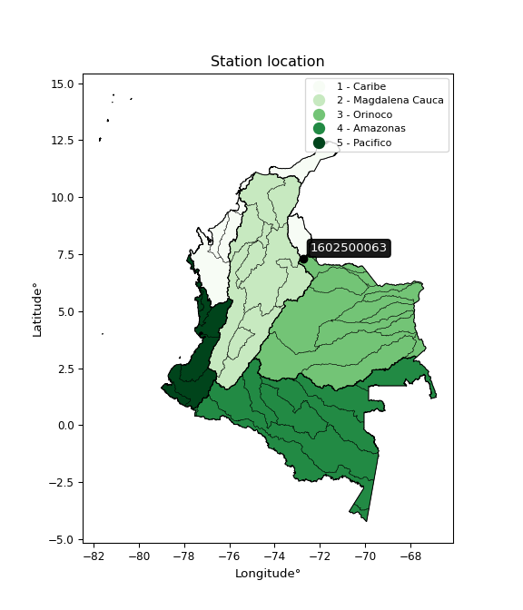</img>

</div>


## A. General information


### 1. General running parameters

• app_version: _v20260312_. • runtime: _2026-03-12 07:15:23.203550_. • Python version: _3.14.0_. • SciPy version: _1.16.3_. • Pandas version: _2.3.3_. • NumPy version: _2.3.5_. • Stations dataset (station_dataset_file): _dataset/pmax24h_in/automatic_colombia_2003_2025.csv_. • Stations catalog (station_catalog_file): _dataset/CNE.xls_. • Minimum year to eval til year_max (date_min): _1900_. • Maximum year to eval since year_min (date_max): _2025_. • Creates, save and include plots into reports (create_plot): _True_. • Plot only fit distributions with Δo > Δ (plot_only_fit): _True_. • Plot only simple graphs avoiding multiple CDFs and multiple Extreme values plots (plot_only_simple): _True_. • Eval low extreme values, if False, evaluates high extreme values (low_extreme): _False_. • Eval every SciPy distribution as logarithmic (pdist_logarithmic_on): _True_. • Standard deviation normalized (ddof): _1.0_. • Return periods to eval in years (Tr): _[2, 2.33, 5, 10, 15, 20, 25, 50, 75, 100, 200, 250, 500, 750, 1000]_. • Minimum data sample per station, 0 means any (minimum_sample): _5_. • Z-Score maximum threshold to adjust a value, 0 means disable (zscore_max): _3.5_. • Z-Score minimum threshold to adjust a value, 0 means disable (zscore_min): _-2.5_. • Avoid zeros, e.g. rain = 0 (avoid_zeros): _True_. • Avoid null values (avoid_nans): _True_. 

:file_folder:Table: [dataset.csv](../../dataset/pmax24h_in/automatic_colombia_2003_2025.csv)

> Delta Degrees of Freedom (DDOF): is a parameter used in the formulas for calculating variance and standard deviation. When ddof=0, the divisor is $N$ (the total number of observations) and this is used when your data set is the entire population. When ddof=1, the divisor is $N-1$ and this is used when your data set is a sample drawn from a larger population. Using $N-1$ provides an unbiased estimate of the population variance (known as Bessel´s correction).


### 2. Station info and location

|   id |     CODIGO | NOMBRE                      | CATEGORIA               | TECNOLOGIA                | ESTADO           | FECHA_INSTALACION   |   FECHA_SUSPENSION |   ALTITUD |   LATITUD |   LONGITUD | DEPARTAMENTO       | MUNICIPIO   | AREA_OPERATIVA                         | ENTIDAD                                                     | AREA_HIDROGRAFICA   | ZONA_HIDROGRAFICA   | SUBZONA_HIDROGRAFICA   |   CORRIENTE | Catalogo   |   Version |
|-----:|-----------:|:----------------------------|:------------------------|:--------------------------|:-----------------|:--------------------|-------------------:|----------:|----------:|-----------:|:-------------------|:------------|:---------------------------------------|:------------------------------------------------------------|:--------------------|:--------------------|:-----------------------|------------:|:-----------|----------:|
|    0 | 1602500063 | MUTISCUA - AUT [1602500063] | Climatológica Principal | Automática con Telemetría | En Mantenimiento | 26/08/2018          |                nan |      2680 |   7.29909 |   -72.7458 | Norte De Santander | Mutiscua    | Area Operativa 08 - Santanderes-Arauca | INSTITUTO DE HIDROLOGIA METEOROLOGIA Y ESTUDIOS AMBIENTALES | Caribe              | Catatumbo           | Río Zulia              |         nan | CNE_IDEAM  |  20251226 |

<div align="center">

Dynamic map: [:earth_americas:Google](http://maps.google.com/maps?q=7.299088889,-72.745761111) [:earth_americas:OSM](https://www.openstreetmap.org/#map=18/7.299088889/-72.745761111&layers=P) [:earth_americas:Bing](https://www.bing.com/maps?cp=7.299088889~-72.745761111&lvl=18) [:earth_americas:Apple](https://maps.apple.com/frame?center=7.299088889%2C-72.745761111&span=0.003%2C0.006)

</div>


<div align="center">

```geojson
{
  "type": "Feature",
  "geometry": {
    "type": "Point", 
    "coordinates": [-72.745761111, 7.299088889]
  }, 
  "properties": {
    "Name": "1602500063"
  }
}
```

</div>


### 3. Discrete values table and plot

<div align="center">

|               |          0 |           1 |           2 |          3 |            4 |
|:--------------|-----------:|------------:|------------:|-----------:|-------------:|
| Date          | 2019       | 2020        | 2022        | 2023       | 2025         |
| Value         |   51.6     |   27.2      |   22.4      |   15.8     |   30.2       |
| Value_initial |   51.6     |   27.2      |   22.4      |   15.8     |   30.2       |
| count         |    5       |    5        |    5        |    5       |    5         |
| mean          |   29.44    |   29.44     |   29.44     |   29.44    |   29.44      |
| std           |   13.5303  |   13.5303   |   13.5303   |   13.5303  |   13.5303    |
| zscore        |    1.63781 |   -0.165555 |   -0.520315 |   -1.00811 |    0.0561704 |


</div>


<div align="center">

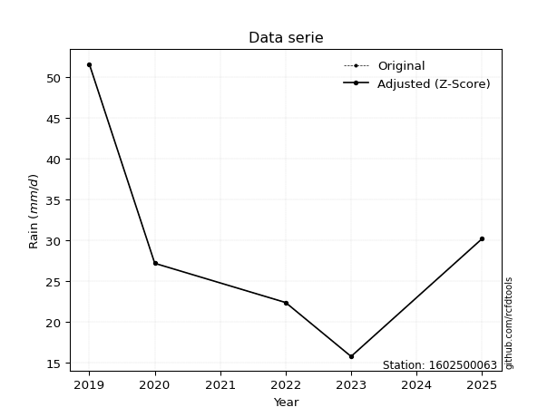</img>

</div>


> The initial value (value_initial) correspond to the initial obtained or null completed value, and value (value) is adjusted only when the initial value is outside the valid range (outlier) definite through the Z-Score value. If Z-Score is active, values out of range or outliers are replaced with the station mean value. A Z-Score (or standard score) measures how many standard deviations a data point is from the mean of a dataset, indicating its relative position; positive scores mean above the mean, negative mean below, and a score of zero is exactly at the mean, allowing for comparison of values from different distributions. It´s calculated using the formula $z=(x–μ)/σ$, where $x$ is the data point, $μ$ is the mean, and $σ$ is the standard deviation, helping identify outliers and understand probability.
>
> <sub>**Note**: In this study, "completing" (filling gaps in) and "extending" (forecasting or lengthening the historical record) rainfall data series are avoided for certain critical analyses because they introduce artificial bias and uncertainty, which can distort the statistics of rare events (extremes), alter day-to-day variability, and compromise the integrity and homogeneity of the original data. Some reasons against Completing/Extending rainfall data are: **Distortion of Extremes and Variability**: The primary issue is that most gap-filling or extension methods rely on averaging or regression with nearby stations, which inherently smooths the data. Rainfall is highly variable in space and time, with a large percentage of zero values and occasional large storms. Infilling methods often underestimate the highest values and overestimate the lowest (zero) values, which severely distorts analyses focused on flood frequency, drought severity, and intensity-duration-frequency (IDF) curves, **Loss of Data Homogeneity**: Infilled or extended data are synthetic estimates, not actual measurements. Combining these estimates with observed data can violate the assumption of data homogeneity, which requires that the data properties do not change over time. Inhomogeneity can lead to incorrect conclusions about long-term trends or changes in climate patterns, **Propagation of Errors**: Errors and biases from the original data (e.g., wind-induced undercatch, instrument errors, site changes) or the data used for imputation can propagate through the analysis, leading to unreliable hydrological models and inaccurate predictions, **Compromised Statistical Integrity**: For statistical analyses, especially those involving the frequency of events, using artificial data can introduce time bias or autocorrelation that doesn´t exist in reality, making it difficult to assess the true probability of events, **Difficulty in Validation**: It is difficult to accurately validate the quality of filled or extended data, especially for past periods where ground-truth measurements are unavailable. The reliability of imputation techniques heavily depends on the density of the surrounding station network and the complexity of the local topography.</sub>


### 4. Active continuous probability distributions from SciPy (80 of 104 available)

A Probability Density Function (PDF) describes the relative likelihood of a continuous random variable falling within a specific range, where the total area under its curve equals 1, and the area over any interval gives the actual probability for that range. Unlike discrete probabilities (like rolling a die), a PDF shows density, not direct probability for a single point (which is zero), with higher points indicating higher likelihood, often visualized as a bell curve for normal distributions.

A log of a probability density function (log-PDF) is simply the logarithm of the PDF´s value, denoted as $log(f(x))$, useful for converting multiplication of probabilities into addition, improving numerical stability with tiny numbers, and connecting to information theory concepts like entropy. Instead of dealing with very small probabilities (e.g., 0.000001), log-PDFs use negative numbers (e.g., $log(0.00001) ≈ -11.51$ that are easier for computers to handle, preventing underflow errors and simplifying complex calculations. In this study, each active probability distribution from SciPy is also evaluated in the $log$ form.

[scipy.stats](https://docs.scipy.org/doc/scipy/reference/stats.html) is a Python´s powerful submodule within the SciPy library for comprehensive statistical analysis, offering over 130 probability distributions (like Normal, Poisson, etc.), functions for descriptive stats (mean, variance), hypothesis testing (t-tests, chi-square), random variable generation, and statistical tests, making it essential for data science, modeling, and research. It provides tools to explore, model, and draw conclusions from data efficiently, working seamlessly with [NumPy](https://numpy.org/).

<div align="center">

|   id | p_dist           |   n_parameter | fit_method   | label                                                                       | active   | ref                                                                                                      |
|-----:|:-----------------|--------------:|:-------------|:----------------------------------------------------------------------------|:---------|:---------------------------------------------------------------------------------------------------------|
|    0 | alpha            |             3 | MLE          | Alpha                                                                       | True     | [:mortar_board:](https://docs.scipy.org/doc/scipy/reference/generated/scipy.stats.alpha.html)            |
|    1 | anglit           |             2 | MM           | Anglit                                                                      | True     | [:mortar_board:](https://docs.scipy.org/doc/scipy/reference/generated/scipy.stats.anglit.html)           |
|    2 | arcsine          |             2 | MM           | Arcsine                                                                     | True     | [:mortar_board:](https://docs.scipy.org/doc/scipy/reference/generated/scipy.stats.arcsine.html)          |
|    3 | argus            |             3 | MLE          | Argus                                                                       | True     | [:mortar_board:](https://docs.scipy.org/doc/scipy/reference/generated/scipy.stats.argus.html)            |
|    4 | beta             |             4 | MLE          | Beta                                                                        | True     | [:mortar_board:](https://docs.scipy.org/doc/scipy/reference/generated/scipy.stats.beta.html)             |
|    5 | betaprime        |             4 | MLE          | Beta prime                                                                  | True     | [:mortar_board:](https://docs.scipy.org/doc/scipy/reference/generated/scipy.stats.betaprime.html)        |
|    6 | bradford         |             3 | MLE          | Bradford                                                                    | True     | [:mortar_board:](https://docs.scipy.org/doc/scipy/reference/generated/scipy.stats.bradford.html)         |
|    7 | burr             |             4 | MLE          | Burr (Type III)                                                             | True     | [:mortar_board:](https://docs.scipy.org/doc/scipy/reference/generated/scipy.stats.burr.html)             |
|    8 | burr12           |             4 | MLE          | Burr (Type III) 12                                                          | True     | [:mortar_board:](https://docs.scipy.org/doc/scipy/reference/generated/scipy.stats.burr12.html)           |
|    9 | cosine           |             2 | MLE          | Cosine                                                                      | True     | [:mortar_board:](https://docs.scipy.org/doc/scipy/reference/generated/scipy.stats.cosine.html)           |
|   10 | crystalball      |             4 | MLE          | Crystalball                                                                 | True     | [:mortar_board:](https://docs.scipy.org/doc/scipy/reference/generated/scipy.stats.crystalball.html)      |
|   11 | dgamma           |             3 | MLE          | Double gamma                                                                | True     | [:mortar_board:](https://docs.scipy.org/doc/scipy/reference/generated/scipy.stats.dgamma.html)           |
|   12 | dweibull         |             3 | MLE          | Double Weibull                                                              | True     | [:mortar_board:](https://docs.scipy.org/doc/scipy/reference/generated/scipy.stats.dweibull.html)         |
|   13 | erlang           |             3 | MLE          | Erlang                                                                      | True     | [:mortar_board:](https://docs.scipy.org/doc/scipy/reference/generated/scipy.stats.erlang.html)           |
|   14 | exponnorm        |             3 | MLE          | Exponentially modified Normal                                               | True     | [:mortar_board:](https://docs.scipy.org/doc/scipy/reference/generated/scipy.stats.exponnorm.html)        |
|   15 | exponpow         |             3 | MLE          | Exponential power                                                           | True     | [:mortar_board:](https://docs.scipy.org/doc/scipy/reference/generated/scipy.stats.exponpow.html)         |
|   16 | exponweib        |             4 | MLE          | Exponentiated Weibull                                                       | True     | [:mortar_board:](https://docs.scipy.org/doc/scipy/reference/generated/scipy.stats.exponweib.html)        |
|   17 | f                |             4 | MLE          | F                                                                           | True     | [:mortar_board:](https://docs.scipy.org/doc/scipy/reference/generated/scipy.stats.f.html)                |
|   18 | fatiguelife      |             3 | MLE          | Fatigue-life (Birnbaum-Saunders)                                            | True     | [:mortar_board:](https://docs.scipy.org/doc/scipy/reference/generated/scipy.stats.fatiguelife.html)      |
|   19 | foldnorm         |             3 | MM           | Fold Normal                                                                 | True     | [:mortar_board:](https://docs.scipy.org/doc/scipy/reference/generated/scipy.stats.foldnorm.html)         |
|   20 | gamma            |             3 | MLE          | Gamma                                                                       | True     | [:mortar_board:](https://docs.scipy.org/doc/scipy/reference/generated/scipy.stats.gamma.html)            |
|   21 | gausshyper       |             6 | MLE          | Gauss hypergeometric                                                        | True     | [:mortar_board:](https://docs.scipy.org/doc/scipy/reference/generated/scipy.stats.gausshyper.html)       |
|   22 | genexpon         |             5 | MLE          | Generalized exponential                                                     | True     | [:mortar_board:](https://docs.scipy.org/doc/scipy/reference/generated/scipy.stats.genexpon.html)         |
|   23 | genextreme       |             3 | MLE          | Generalized exponential                                                     | True     | [:mortar_board:](https://docs.scipy.org/doc/scipy/reference/generated/scipy.stats.genextreme.html)       |
|   24 | gengamma         |             4 | MLE          | Generalized gamma                                                           | True     | [:mortar_board:](https://docs.scipy.org/doc/scipy/reference/generated/scipy.stats.gengamma.html)         |
|   25 | genhalflogistic  |             3 | MLE          | Generalized half-logistic                                                   | True     | [:mortar_board:](https://docs.scipy.org/doc/scipy/reference/generated/scipy.stats.genhalflogistic.html)  |
|   26 | genlogistic      |             3 | MLE          | Generalized logistic                                                        | True     | [:mortar_board:](https://docs.scipy.org/doc/scipy/reference/generated/scipy.stats.genlogistic.html)      |
|   27 | gennorm          |             3 | MLE          | Generalized Normal                                                          | True     | [:mortar_board:](https://docs.scipy.org/doc/scipy/reference/generated/scipy.stats.gennorm.html)          |
|   28 | genpareto        |             3 | MLE          | Generalized Pareto                                                          | True     | [:mortar_board:](https://docs.scipy.org/doc/scipy/reference/generated/scipy.stats.genpareto.html)        |
|   29 | gompertz         |             3 | MLE          | Gompertz (or truncated Gumbel)                                              | True     | [:mortar_board:](https://docs.scipy.org/doc/scipy/reference/generated/scipy.stats.gompertz.html)         |
|   30 | gumbel_l         |             2 | MM           | Gumbel Left Skew                                                            | True     | [:mortar_board:](https://docs.scipy.org/doc/scipy/reference/generated/scipy.stats.gumbel_l.html)         |
|   31 | gumbel_r         |             2 | MM           | Gumbel Right Skew                                                           | True     | [:mortar_board:](https://docs.scipy.org/doc/scipy/reference/generated/scipy.stats.gumbel_r.html)         |
|   32 | halfgennorm      |             3 | MLE          | Upper half of a generalized normal                                          | True     | [:mortar_board:](https://docs.scipy.org/doc/scipy/reference/generated/scipy.stats.halfgennorm.html)      |
|   33 | halflogistic     |             2 | MM           | Half-logistic                                                               | True     | [:mortar_board:](https://docs.scipy.org/doc/scipy/reference/generated/scipy.stats.halflogistic.html)     |
|   34 | halfnorm         |             2 | MM           | Half Normal                                                                 | True     | [:mortar_board:](https://docs.scipy.org/doc/scipy/reference/generated/scipy.stats.halfnorm.html)         |
|   35 | hypsecant        |             2 | MM           | hyperbolic secant                                                           | True     | [:mortar_board:](https://docs.scipy.org/doc/scipy/reference/generated/scipy.stats.hypsecant.html)        |
|   36 | invgamma         |             3 | MLE          | Inverted gamma                                                              | True     | [:mortar_board:](https://docs.scipy.org/doc/scipy/reference/generated/scipy.stats.invgamma.html)         |
|   37 | invgauss         |             3 | MLE          | Inverse Gaussian                                                            | True     | [:mortar_board:](https://docs.scipy.org/doc/scipy/reference/generated/scipy.stats.invgauss.html)         |
|   38 | invweibull       |             3 | MLE          | Inverted Weibull                                                            | True     | [:mortar_board:](https://docs.scipy.org/doc/scipy/reference/generated/scipy.stats.invweibull.html)       |
|   39 | johnsonsb        |             4 | MLE          | Johnson SB                                                                  | True     | [:mortar_board:](https://docs.scipy.org/doc/scipy/reference/generated/scipy.stats.johnsonsb.html)        |
|   40 | johnsonsu        |             4 | MLE          | Johnson Su                                                                  | True     | [:mortar_board:](https://docs.scipy.org/doc/scipy/reference/generated/scipy.stats.johnsonsu.html)        |
|   41 | kappa3           |             3 | MLE          | Kappa 3                                                                     | True     | [:mortar_board:](https://docs.scipy.org/doc/scipy/reference/generated/scipy.stats.kappa3.html)           |
|   42 | kappa4           |             4 | MLE          | Kappa 4                                                                     | True     | [:mortar_board:](https://docs.scipy.org/doc/scipy/reference/generated/scipy.stats.kappa4.html)           |
|   43 | ksone            |             3 | MLE          | Kolmogorov-Smirnov one-sided test statistic distribution                    | True     | [:mortar_board:](https://docs.scipy.org/doc/scipy/reference/generated/scipy.stats.ksone.html)            |
|   44 | kstwobign        |             2 | MLE          | Limiting distribution of scaled Kolmogorov-Smirnov two-sided test statistic | True     | [:mortar_board:](https://docs.scipy.org/doc/scipy/reference/generated/scipy.stats.kstwobign.html)        |
|   45 | laplace          |             2 | MM           | Laplace                                                                     | True     | [:mortar_board:](https://docs.scipy.org/doc/scipy/reference/generated/scipy.stats.laplace.html)          |
|   46 | levy_l           |             2 | MLE          | Left-skewed Levy                                                            | True     | [:mortar_board:](https://docs.scipy.org/doc/scipy/reference/generated/scipy.stats.levy_l.html)           |
|   47 | loggamma         |             3 | MLE          | Log gamma                                                                   | True     | [:mortar_board:](https://docs.scipy.org/doc/scipy/reference/generated/scipy.stats.loggamma.html)         |
|   48 | logistic         |             2 | MM           | Logistic (or Sech-squared)                                                  | True     | [:mortar_board:](https://docs.scipy.org/doc/scipy/reference/generated/scipy.stats.logistic.html)         |
|   49 | loglaplace       |             3 | MLE          | Log-Laplace                                                                 | True     | [:mortar_board:](https://docs.scipy.org/doc/scipy/reference/generated/scipy.stats.loglaplace.html)       |
|   50 | lomax            |             3 | MLE          | Lomax (Pareto of the second kind)                                           | True     | [:mortar_board:](https://docs.scipy.org/doc/scipy/reference/generated/scipy.stats.lomax.html)            |
|   51 | maxwell          |             2 | MM           | Maxwell                                                                     | True     | [:mortar_board:](https://docs.scipy.org/doc/scipy/reference/generated/scipy.stats.maxwell.html)          |
|   52 | mielke           |             4 | MLE          | Mielke Beta-Kappa / Dagum                                                   | True     | [:mortar_board:](https://docs.scipy.org/doc/scipy/reference/generated/scipy.stats.mielke.html)           |
|   53 | moyal            |             2 | MM           | Moyal                                                                       | True     | [:mortar_board:](https://docs.scipy.org/doc/scipy/reference/generated/scipy.stats.moyal.html)            |
|   54 | nakagami         |             3 | MLE          | Nakagami                                                                    | True     | [:mortar_board:](https://docs.scipy.org/doc/scipy/reference/generated/scipy.stats.nakagami.html)         |
|   55 | ncf              |             5 | MLE          | Non-central F distribution                                                  | True     | [:mortar_board:](https://docs.scipy.org/doc/scipy/reference/generated/scipy.stats.ncf.html)              |
|   56 | nct              |             4 | MLE          | Non-central Student’s t                                                     | True     | [:mortar_board:](https://docs.scipy.org/doc/scipy/reference/generated/scipy.stats.nct.html)              |
|   57 | norm             |             2 | MM           | Normal                                                                      | True     | [:mortar_board:](https://docs.scipy.org/doc/scipy/reference/generated/scipy.stats.norm.html)             |
|   58 | pearson3         |             3 | MM           | Pearson type III                                                            | True     | [:mortar_board:](https://docs.scipy.org/doc/scipy/reference/generated/scipy.stats.pearson3.html)         |
|   59 | powerlaw         |             3 | MLE          | Power-function                                                              | True     | [:mortar_board:](https://docs.scipy.org/doc/scipy/reference/generated/scipy.stats.powerlaw.html)         |
|   60 | rayleigh         |             2 | MM           | Rayleigh                                                                    | True     | [:mortar_board:](https://docs.scipy.org/doc/scipy/reference/generated/scipy.stats.rayleigh.html)         |
|   61 | rdist            |             3 | MLE          | R-distributed (symmetric beta)                                              | True     | [:mortar_board:](https://docs.scipy.org/doc/scipy/reference/generated/scipy.stats.rdist.html)            |
|   62 | rice             |             3 | MLE          | Rice                                                                        | True     | [:mortar_board:](https://docs.scipy.org/doc/scipy/reference/generated/scipy.stats.rice.html)             |
|   63 | semicircular     |             2 | MM           | Semicircular                                                                | True     | [:mortar_board:](https://docs.scipy.org/doc/scipy/reference/generated/scipy.stats.semicircular.html)     |
|   64 | skewnorm         |             3 | MLE          | Skew normal                                                                 | True     | [:mortar_board:](https://docs.scipy.org/doc/scipy/reference/generated/scipy.stats.skewnorm.html)         |
|   65 | t                |             3 | MLE          | Student’s t                                                                 | True     | [:mortar_board:](https://docs.scipy.org/doc/scipy/reference/generated/scipy.stats.t.html)                |
|   66 | trapezoid        |             4 | MLE          | Trapezoid                                                                   | True     | [:mortar_board:](https://docs.scipy.org/doc/scipy/reference/generated/scipy.stats.trapezoid.html)        |
|   67 | triang           |             3 | MLE          | Triangular                                                                  | True     | [:mortar_board:](https://docs.scipy.org/doc/scipy/reference/generated/scipy.stats.triang.html)           |
|   68 | truncexpon       |             3 | MLE          | Truncated exponential                                                       | True     | [:mortar_board:](https://docs.scipy.org/doc/scipy/reference/generated/scipy.stats.truncexpon.html)       |
|   69 | truncnorm        |             4 | MLE          | Truncated normal                                                            | True     | [:mortar_board:](https://docs.scipy.org/doc/scipy/reference/generated/scipy.stats.truncnorm.html)        |
|   70 | truncpareto      |             4 | MLE          | Upper truncated Pareto                                                      | True     | [:mortar_board:](https://docs.scipy.org/doc/scipy/reference/generated/scipy.stats.truncpareto.html)      |
|   71 | truncweibull_min |             5 | MLE          | Doubly truncated Weibull minimum                                            | True     | [:mortar_board:](https://docs.scipy.org/doc/scipy/reference/generated/scipy.stats.truncweibull_min.html) |
|   72 | tukeylambda      |             3 | MLE          | Tukey-Lamdba                                                                | True     | [:mortar_board:](https://docs.scipy.org/doc/scipy/reference/generated/scipy.stats.tukeylambda.html)      |
|   73 | uniform          |             2 | MLE          | Uniform                                                                     | True     | [:mortar_board:](https://docs.scipy.org/doc/scipy/reference/generated/scipy.stats.uniform.html)          |
|   74 | vonmises         |             3 | MLE          | Von Mises                                                                   | True     | [:mortar_board:](https://docs.scipy.org/doc/scipy/reference/generated/scipy.stats.vonmises.html)         |
|   75 | vonmises_line    |             3 | MLE          | Von Mises line                                                              | True     | [:mortar_board:](https://docs.scipy.org/doc/scipy/reference/generated/scipy.stats.vonmises_line.html)    |
|   76 | wald             |             2 | MM           | Wald                                                                        | True     | [:mortar_board:](https://docs.scipy.org/doc/scipy/reference/generated/scipy.stats.wald.html)             |
|   77 | weibull_max      |             3 | MLE          | Weibull maximum                                                             | True     | [:mortar_board:](https://docs.scipy.org/doc/scipy/reference/generated/scipy.stats.weibull_max.html)      |
|   78 | weibull_min      |             3 | MLE          | Weibull minimum                                                             | True     | [:mortar_board:](https://docs.scipy.org/doc/scipy/reference/generated/scipy.stats.weibull_min.html)      |
|   79 | wrapcauchy       |             3 | MLE          | Wrapped  Cauchy                                                             | True     | [:mortar_board:](https://docs.scipy.org/doc/scipy/reference/generated/scipy.stats.wrapcauchy.html)       |

</div>

> **n_parameter:** # arguments & localization & scale.
>
> **Fit methods:** (MLE) maximum likelihood, (MM) L-moments.
>
>**Inactive** (With the only purpose of prevent loops, zero divisions, infinite values, over high estimated values or horizontal trending for recurrence intervals estimations, the follow distributions were disabled.)**:** lognorm, norminvgauss, powernorm, powerlognorm, cauchy, halfcauchy, foldcauchy, skewcauchy, chi2, expon, fisk, genhyperbolic, geninvgauss, gibrat, kstwo, laplace_asymmetric, levy, levy_stable, ncx2, pareto, rel_breitwigner, recipinvgauss, studentized_range, loguniform, 


## B. Probability (PDF) vs. Empirical (EDF) distributions functions

A continuous probability distribution (CPD) describes probabilities for variables that can take any value within a range (like rain any time), unlike discrete variables with specific outcomes (like temperature). It uses a Probability Density Function (PDF), a curve where the total area under it equals 1, and the probability of the variable falling within an interval (a to b) is found by calculating the area under the curve between those points. A key feature is that the probability of hitting any single exact value is zero, so probabilities are always expressed for ranges, e.g., $P(a ≤ X ≤ b)$.

<div align="center">

Distributions parameters from station values
|     |    station | p_dist              |   n |             loc |         scale | shape                  | shape1                | shape2                | shape3             |
|----:|-----------:|:--------------------|----:|----------------:|--------------:|:-----------------------|:----------------------|:----------------------|:-------------------|
|   0 | 1602500063 | alpha               |   5 |    -9.76886     | 133.685       | 3.7042730850083885     |                       |                       |                    |
|   1 | 1602500063 | anglit              |   5 |    29.44        |  35.4027      |                        |                       |                       |                    |
|   2 | 1602500063 | arcsine             |   5 |    12.3254      |  34.2291      |                        |                       |                       |                    |
|   3 | 1602500063 | argus               |   5 |     2.84512     |  51.3704      | 1.1485143440628166e-05 |                       |                       |                    |
|   4 | 1602500063 | beta                |   5 |    15.8         |  36.7552      | 0.4812664594163433     | 0.8155086543485457    |                       |                    |
|   5 | 1602500063 | betaprime           |   5 |     1.36494     |   0.558203    | 277.4165062523434      | 6.511626631435817     |                       |                    |
|   6 | 1602500063 | bradford            |   5 |    15.8         |  35.8         | 0.928553612005463      |                       |                       |                    |
|   7 | 1602500063 | burr                |   5 |    -1.6422      |   3.4165      | 3.2214791331797716     | 551.9948495991691     |                       |                    |
|   8 | 1602500063 | burr12              |   5 |    -2.88591     |  18.5688      | 659.3673876729808      | 0.0030929227896419665 |                       |                    |
|   9 | 1602500063 | cosine              |   5 |    30.9727      |  10.2306      |                        |                       |                       |                    |
|  10 | 1602500063 | crystalball         |   5 |    29.44        |  12.1018      | 1911.2356027112555     | 2271.9864106647437    |                       |                    |
|  11 | 1602500063 | dgamma              |   5 |    27.2         |  11.6448      | 0.7564421370336291     |                       |                       |                    |
|  12 | 1602500063 | dweibull            |   5 |    27.2         |   8.69597     | 0.9339362243719747     |                       |                       |                    |
|  13 | 1602500063 | erlang              |   5 |    15.8         |  21.0136      | 0.27201233992532603    |                       |                       |                    |
|  14 | 1602500063 | exponnorm           |   5 |    17.0703      |   3.75818     | 3.2914212070266107     |                       |                       |                    |
|  15 | 1602500063 | exponpow            |   5 |    15.8         |  35.1009      | 0.1854792572365484     |                       |                       |                    |
|  16 | 1602500063 | exponweib           |   5 |    15.8         |   1.03887     | 1.2385372522427252     | 0.31239683153588715   |                       |                    |
|  17 | 1602500063 | f                   |   5 |     5.04253     |  19.6868      | 179.78250729894626     | 9.807695190501569     |                       |                    |
|  18 | 1602500063 | fatiguelife         |   5 |    15.8         |   4.30787e-06 | 1942.6434120051629     |                       |                       |                    |
|  19 | 1602500063 | foldnorm            |   5 |    13.0199      |  17.216       | 0.6354531161938372     |                       |                       |                    |
|  20 | 1602500063 | gamma               |   5 |    15.8         |  15.235       | 0.26628395217114254    |                       |                       |                    |
|  21 | 1602500063 | gausshyper          |   5 |    13.9719      |  37.6281      | 1.1739837382168072     | 0.6788582434339272    | 1.0919508767468777    | 0.9780291413082733 |
|  22 | 1602500063 | genexpon            |   5 |    15.7975      | 189.744       | 12.463130305287974     | 8.816344091815616     | 3.001690535230905     |                    |
|  23 | 1602500063 | genextreme          |   5 |    17.1146      |  10.5971      | -8.061337199611884     |                       |                       |                    |
|  24 | 1602500063 | gengamma            |   5 |    15.8         |   1.06568     | 1.259700853225218      | 0.2634859792354093    |                       |                    |
|  25 | 1602500063 | genhalflogistic     |   5 |    12.2428      |  41.3129      | 1.049689358438922      |                       |                       |                    |
|  26 | 1602500063 | genlogistic         |   5 |   -39.5212      |   8.73232     | 1444.5285251887185     |                       |                       |                    |
|  27 | 1602500063 | gennorm             |   5 |    27.2         |   9.13952     | 1.008486935195366      |                       |                       |                    |
|  28 | 1602500063 | genpareto           |   5 |    -0.196684    |  83.6709      | -1.6153718494653915    |                       |                       |                    |
|  29 | 1602500063 | gompertz            |   5 |    15.8         |  71.9491      | 4.408938821314003      |                       |                       |                    |
|  30 | 1602500063 | gumbel_l            |   5 |    34.8865      |   9.43576     |                        |                       |                       |                    |
|  31 | 1602500063 | gumbel_r            |   5 |    23.9935      |   9.43576     |                        |                       |                       |                    |
|  32 | 1602500063 | halfgennorm         |   5 |    15.8         |   1.13651     | 0.4148663144618935     |                       |                       |                    |
|  33 | 1602500063 | halflogistic        |   5 |    15.0965      |  10.3466      |                        |                       |                       |                    |
|  34 | 1602500063 | halfnorm            |   5 |    13.4219      |  20.0757      |                        |                       |                       |                    |
|  35 | 1602500063 | hypsecant           |   5 |    29.44        |   7.70427     |                        |                       |                       |                    |
|  36 | 1602500063 | invgamma            |   5 |     4.48517     |  99.593       | 4.946509010651155      |                       |                       |                    |
|  37 | 1602500063 | invgauss            |   5 |    10.0592      |  38.6694      | 0.5011910500706076     |                       |                       |                    |
|  38 | 1602500063 | invweibull          |   5 |    15.8         |   1.24187     | 0.05175687037858666    |                       |                       |                    |
|  39 | 1602500063 | johnsonsb           |   5 |    15.8         |  35.8001      | 0.6844892095480481     | 0.2530804177960595    |                       |                    |
|  40 | 1602500063 | johnsonsu           |   5 |    11.0149      |   0.212329    | -7.066887041940667     | 1.4331767393470574    |                       |                    |
|  41 | 1602500063 | kappa3              |   5 |    15.8         |  35.7825      | 3346.303676239484      |                       |                       |                    |
|  42 | 1602500063 | kappa4              |   5 |    11.837       |  40.3883      | 1.1088754472173612     | 1.012649142265686     |                       |                    |
|  43 | 1602500063 | ksone               |   5 |    12.22        |  42.96        | 1.0                    |                       |                       |                    |
|  44 | 1602500063 | kstwobign           |   5 |    -7.30157     |  42.3518      |                        |                       |                       |                    |
|  45 | 1602500063 | laplace             |   5 |    29.44        |   8.55729     |                        |                       |                       |                    |
|  46 | 1602500063 | levy_l              |   5 |    53.8208      |   8.49867     |                        |                       |                       |                    |
|  47 | 1602500063 | loggamma            |   5 | -3123.22        | 441.137       | 1270.2010947542212     |                       |                       |                    |
|  48 | 1602500063 | logistic            |   5 |    29.44        |   6.67209     |                        |                       |                       |                    |
|  49 | 1602500063 | loglaplace          |   5 |    -0.0492303   |  27.2492      | 3.3792703594146847     |                       |                       |                    |
|  50 | 1602500063 | lomax               |   5 |    15.8         |   5.98808e+09 | 266228303.8084979      |                       |                       |                    |
|  51 | 1602500063 | maxwell             |   5 |     0.763733    |  17.9702      |                        |                       |                       |                    |
|  52 | 1602500063 | mielke              |   5 |   -15.6915      |   8.82736     | 6960.91305161776       | 4.901340259602451     |                       |                    |
|  53 | 1602500063 | moyal               |   5 |    22.5194      |   5.44774     |                        |                       |                       |                    |
|  54 | 1602500063 | nakagami            |   5 |    22.4         |  19.423       | 0.22527518420076703    |                       |                       |                    |
|  55 | 1602500063 | ncf                 |   5 |     1.40332     |   3.87375e-05 | 0.0009945480181288036  | 13.016767102159738    | 613.5893837739457     |                    |
|  56 | 1602500063 | nct                 |   5 |    -0.215584    |   0.704948    | 4.087641224418967      | 34.16324520589829     |                       |                    |
|  57 | 1602500063 | norm                |   5 |    29.44        |  12.1018      |                        |                       |                       |                    |
|  58 | 1602500063 | pearson3            |   5 |    29.44        |  12.1019      | 0.9010009591966022     |                       |                       |                    |
|  59 | 1602500063 | powerlaw            |   5 |    15.8         |  35.8         | 0.12110029144875442    |                       |                       |                    |
|  60 | 1602500063 | rayleigh            |   5 |     6.28848     |  18.4722      |                        |                       |                       |                    |
|  61 | 1602500063 | rdist               |   5 |    14.207       |  15.993       | 1.164631244534775      |                       |                       |                    |
|  62 | 1602500063 | rice                |   5 |     9.5583      |  16.4581      | 0.0006724474897462345  |                       |                       |                    |
|  63 | 1602500063 | semicircular        |   5 |    29.44        |  24.2037      |                        |                       |                       |                    |
|  64 | 1602500063 | skewnorm            |   5 |    15.8         |  18.2316      | 11468756.733056273     |                       |                       |                    |
|  65 | 1602500063 | t                   |   5 |    29.4394      |  12.1013      | 18644.06834207473      |                       |                       |                    |
|  66 | 1602500063 | trapezoid           |   5 |    12.22        |  42.96        | 1.0                    | 1.0                   |                       |                    |
|  67 | 1602500063 | triang              |   5 |    -0.271542    |  51.9161      | 0.9999999999959166     |                       |                       |                    |
|  68 | 1602500063 | truncexpon          |   5 |    15.7981      |  31.7564      | 1.1273898971655743     |                       |                       |                    |
|  69 | 1602500063 | truncnorm           |   5 |    29.44        |  12.1018      | -154.76477163071908    | 988.5954930971039     |                       |                    |
|  70 | 1602500063 | truncpareto         |   5 |    15.6782      |   0.121819    | 0.26277798108671746    | 294.87826312743       |                       |                    |
|  71 | 1602500063 | truncweibull_min    |   5 |    15.7403      |  54.5137      | 0.5233527378630616     | 0.0010811348682908143 | 0.6578099525614056    |                    |
|  72 | 1602500063 | tukeylambda         |   5 |    23           |   8.25564     | 1.1466161990099288     |                       |                       |                    |
|  73 | 1602500063 | uniform             |   5 |    15.8         |  35.8         |                        |                       |                       |                    |
|  74 | 1602500063 | vonmises            |   5 |     2.91108     |   1           | 0.8009327141039366     |                       |                       |                    |
|  75 | 1602500063 | vonmises_line       |   5 |    33.6247      |   5.72173     | 1.2791875688366451e-06 |                       |                       |                    |
|  76 | 1602500063 | wald                |   5 |    17.3382      |  12.1018      |                        |                       |                       |                    |
|  77 | 1602500063 | weibull_max         |   5 |    51.6         |   1.46348     | 0.2701911893222756     |                       |                       |                    |
|  78 | 1602500063 | weibull_min         |   5 |    15.8         |  19.2237      | 0.2292778758884565     |                       |                       |                    |
|  79 | 1602500063 | wrapcauchy          |   5 |    15.8         |   5.69874     | 0.3336753980227004     |                       |                       |                    |
|  80 | 1602500063 | logalpha            |   5 |    -1.02138     |  48.5047      | 11.301399489125853     |                       |                       |                    |
|  81 | 1602500063 | loganglit           |   5 |     3.30473     |   1.13579     |                        |                       |                       |                    |
|  82 | 1602500063 | logarcsine          |   5 |     2.75569     |   1.09809     |                        |                       |                       |                    |
|  83 | 1602500063 | logargus            |   5 |     2.42824     |   1.59993     | 0.00018477710302221084 |                       |                       |                    |
|  84 | 1602500063 | logbeta             |   5 |     2.76001     |   1.83765     | 0.8138804134681559     | 2.58925102180355      |                       |                    |
|  85 | 1602500063 | logbetaprime        |   5 |    -0.307734    |   7.10896     | 131.41539641438726     | 260.2455924089486     |                       |                    |
|  86 | 1602500063 | logbradford         |   5 |     2.76001     |   1.18352     | 1.06997545816707       |                       |                       |                    |
|  87 | 1602500063 | logburr             |   5 |    -0.0389394   |   3.11984     | 12.686138262207932     | 1.7351406013303394    |                       |                    |
|  88 | 1602500063 | logburr12           |   5 |    -0.0283697   |   3.26999     | 15.44601476227341      | 0.9004076832115588    |                       |                    |
|  89 | 1602500063 | logcosine           |   5 |     3.32263     |   0.324884    |                        |                       |                       |                    |
|  90 | 1602500063 | logcrystalball      |   5 |     3.30473     |   0.388251    | 742.414086367813       | 2329.430830630996     |                       |                    |
|  91 | 1602500063 | logdgamma           |   5 |     3.30322     |   0.697335    | 0.3107450586433995     |                       |                       |                    |
|  92 | 1602500063 | logdweibull         |   5 |     3.30322     |   0.299974    | 0.798965123374756      |                       |                       |                    |
|  93 | 1602500063 | logerlang           |   5 |     2.39154     |   0.181425    | 5.033423695453806      |                       |                       |                    |
|  94 | 1602500063 | logexponnorm        |   5 |     3.05933     |   0.310375    | 0.7906689767249662     |                       |                       |                    |
|  95 | 1602500063 | logexponpow         |   5 |     2.76001     |   1.00383     | 0.4088766936710956     |                       |                       |                    |
|  96 | 1602500063 | logexponweib        |   5 |     2.76001     |   1.01745     | 0.4361808534514945     | 1.0178460368488704    |                       |                    |
|  97 | 1602500063 | logf                |   5 |     1.51102     |   1.76517     | 71.43069127003255      | 102.82829673784005    |                       |                    |
|  98 | 1602500063 | logfatiguelife      |   5 |     1.60177     |   1.65858     | 0.23132112525422038    |                       |                       |                    |
|  99 | 1602500063 | logfoldnorm         |   5 |     2.59129     |   0.416795    | 1.6726536315363427     |                       |                       |                    |
| 100 | 1602500063 | loggamma            |   5 |     2.39154     |   0.181427    | 5.03336245110536       |                       |                       |                    |
| 101 | 1602500063 | loggausshyper       |   5 |     2.74218     |   1.20135     | 0.9838983831437671     | 0.6043927819333044    | 1.2203595507280935    | 1.2422491201578723 |
| 102 | 1602500063 | loggenexpon         |   5 |     2.75728     |   0.0126532   | 0.013722643560561486   | 4.343129085337783     | 6.639752264234197e-05 |                    |
| 103 | 1602500063 | loggenextreme       |   5 |     3.15118     |   0.356526    | 0.18454524230934055    |                       |                       |                    |
| 104 | 1602500063 | loggengamma         |   5 |     2.76001     |   0.84541     | 0.2574972050462672     | 1.493482509367905     |                       |                    |
| 105 | 1602500063 | loggenhalflogistic  |   5 |     2.65549     |   1.3684      | 1.0623934426089416     |                       |                       |                    |
| 106 | 1602500063 | loggenlogistic      |   5 |     1.5522      |   0.334476    | 108.28180403950114     |                       |                       |                    |
| 107 | 1602500063 | loggennorm          |   5 |     3.30322     |   0.0165638   | 0.39721930926936855    |                       |                       |                    |
| 108 | 1602500063 | loggenpareto        |   5 |     0.00157194  |   4.7575      | -1.2068907436544714    |                       |                       |                    |
| 109 | 1602500063 | loggompertz         |   5 |     2.76001     |   0.786071    | 0.7884241331996107     |                       |                       |                    |
| 110 | 1602500063 | loggumbel_l         |   5 |     3.47946     |   0.302718    |                        |                       |                       |                    |
| 111 | 1602500063 | loggumbel_r         |   5 |     3.13        |   0.302718    |                        |                       |                       |                    |
| 112 | 1602500063 | loghalfgennorm      |   5 |     2.76001     |   1.18384     | 35913.46643329854      |                       |                       |                    |
| 113 | 1602500063 | loghalflogistic     |   5 |     2.84456     |   0.331947    |                        |                       |                       |                    |
| 114 | 1602500063 | loghalfnorm         |   5 |     2.79083     |   0.644075    |                        |                       |                       |                    |
| 115 | 1602500063 | loghypsecant        |   5 |     3.30473     |   0.247168    |                        |                       |                       |                    |
| 116 | 1602500063 | loginvgamma         |   5 |     0.392662    | 163.287       | 57.07969915847093      |                       |                       |                    |
| 117 | 1602500063 | loginvgauss         |   5 |     1.56707     |  33.4726      | 0.05191305751431177    |                       |                       |                    |
| 118 | 1602500063 | loginvweibull       |   5 |    -3.11723e+07 |   3.11723e+07 | 92649021.06332354      |                       |                       |                    |
| 119 | 1602500063 | logjohnsonsb        |   5 |     2.76001     |   1.18351     | -0.07326119055273177   | 0.15520640704851613   |                       |                    |
| 120 | 1602500063 | logjohnsonsu        |   5 |     1.47848     |   0.337144    | -11.281463223694011    | 4.760703364340172     |                       |                    |
| 121 | 1602500063 | logkappa3           |   5 |     2.76001     |   1.18123     | 825.441628147337       |                       |                       |                    |
| 122 | 1602500063 | logkappa4           |   5 |     2.71158     |   1.29408     | 1.03288344003227       | 1.0504323767719899    |                       |                    |
| 123 | 1602500063 | logksone            |   5 |     2.63226     |   1.34494     | 1.0                    |                       |                       |                    |
| 124 | 1602500063 | logkstwobign        |   5 |     1.93672     |   1.56701     |                        |                       |                       |                    |
| 125 | 1602500063 | loglaplace          |   5 |     3.30473     |   0.274535    |                        |                       |                       |                    |
| 126 | 1602500063 | loglevy_l           |   5 |     4.00468     |   0.23396     |                        |                       |                       |                    |
| 127 | 1602500063 | logloggamma         |   5 |   -91.197       |  13.3756      | 1171.0235600263823     |                       |                       |                    |
| 128 | 1602500063 | loglogistic         |   5 |     3.30473     |   0.214054    |                        |                       |                       |                    |
| 129 | 1602500063 | logloglaplace       |   5 |    -0.0292226   |   3.33244     | 11.232521916374548     |                       |                       |                    |
| 130 | 1602500063 | loglomax            |   5 |     2.76001     |  15.8155      | 29.493681200970247     |                       |                       |                    |
| 131 | 1602500063 | logmaxwell          |   5 |     2.38474     |   0.57652     |                        |                       |                       |                    |
| 132 | 1602500063 | logmielke           |   5 |    -2.24502e+07 |   2.24502e+07 | 275367442.7009016      | 76179390.22760473     |                       |                    |
| 133 | 1602500063 | logmoyal            |   5 |     3.0827      |   0.174775    |                        |                       |                       |                    |
| 134 | 1602500063 | lognakagami         |   5 |     3.10906     |   0.427429    | 0.0739567695279616     |                       |                       |                    |
| 135 | 1602500063 | logncf              |   5 |    -3.12442     |   6.40929     | 381.85874127289026     | 461.10275525380257    | 0.47189114182910386   |                    |
| 136 | 1602500063 | lognct              |   5 |    -0.0394725   |   0.0573087   | 39.232233307681724     | 57.234801001546984    |                       |                    |
| 137 | 1602500063 | lognorm             |   5 |     3.30473     |   0.388251    |                        |                       |                       |                    |
| 138 | 1602500063 | logpearson3         |   5 |     3.30473     |   0.388251    | 0.31661289328036535    |                       |                       |                    |
| 139 | 1602500063 | logpowerlaw         |   5 |     2.76001     |   1.18351     | 0.13116000746962322    |                       |                       |                    |
| 140 | 1602500063 | lograyleigh         |   5 |     2.56198     |   0.592627    |                        |                       |                       |                    |
| 141 | 1602500063 | logrdist            |   5 |     3.50083     |   0.740821    | 1.0797689854359875     |                       |                       |                    |
| 142 | 1602500063 | logrice             |   5 |     2.57068     |   0.505521    | 0.8356897793021929     |                       |                       |                    |
| 143 | 1602500063 | logsemicircular     |   5 |     3.30473     |   0.776503    |                        |                       |                       |                    |
| 144 | 1602500063 | logskewnorm         |   5 |     2.88178     |   0.574134    | 2.3058336820506367     |                       |                       |                    |
| 145 | 1602500063 | logt                |   5 |     3.30473     |   0.388252    | 1171666743.271956      |                       |                       |                    |
| 146 | 1602500063 | logtrapezoid        |   5 |     2.64166     |   1.42021     | 1.0                    | 1.0                   |                       |                    |
| 147 | 1602500063 | logtriang           |   5 |     2.30095     |   1.64258     | 0.9999954127733743     |                       |                       |                    |
| 148 | 1602500063 | logtruncexpon       |   5 |     2.76001     |   1.16701     | 1.0141469716118539     |                       |                       |                    |
| 149 | 1602500063 | logtruncnorm        |   5 |    -0.124394    |   1.0913      | 2.962943231950634      | 3.7276949351897923    |                       |                    |
| 150 | 1602500063 | logtruncpareto      |   5 |     1.52759     |   1.23242     | 5.793971412603091e-08  | 1.9603117356931903    |                       |                    |
| 151 | 1602500063 | logtruncweibull_min |   5 |     2.75848     |   1.63203     | 0.6029865502823182     | 0.0009382033684844309 | 0.7261141094205286    |                    |
| 152 | 1602500063 | logtukeylambda      |   5 |     3.35256     |   0.630316    | 1.0637339860888324     |                       |                       |                    |
| 153 | 1602500063 | loguniform          |   5 |     2.76001     |   1.18351     |                        |                       |                       |                    |
| 154 | 1602500063 | logvonmises         |   5 |    -2.98168     |   1           | 7.110261764356201      |                       |                       |                    |
| 155 | 1602500063 | logvonmises_line    |   5 |     3.35185     |   0.18839     | 0.10817666689213838    |                       |                       |                    |
| 156 | 1602500063 | logwald             |   5 |     2.91645     |   0.38828     |                        |                       |                       |                    |
| 157 | 1602500063 | logweibull_max      |   5 |     5.08329     |   1.93214     | 5.419162943730388      |                       |                       |                    |
| 158 | 1602500063 | logweibull_min      |   5 |     2.68398     |   0.683031    | 1.5112837751688644     |                       |                       |                    |
| 159 | 1602500063 | logwrapcauchy       |   5 |     2.76001     |   0.188362    | 0.5                    |                       |                       |                    |

</div>

> **loc** (Location parameter): This shifts the distribution along the x-axis. For many common distributions, like the normal (Gaussian) distribution, loc represents the mean $μ$. For others, like the uniform distribution, it might represent the minimum value, or for the beta distribution, the left end of the support interval.
>
> **scale** (Scale parameter): This determines the width or spread of the distribution. For the normal distribution, scale represents the standard deviation $σ$. For a uniform distribution, it defines the length of the interval (from $loc$ to $loc + scale$).
>
> **shape** (Shape parameters): Refers to parameters that define the specific form of a probability distribution, distinct from its location (loc) and scale (scale). These parameters are required arguments for most distribution functions. For example, a normal (Gaussian) distribution is fully defined by its location (mean) and scale (standard deviation), so it has no specific shape parameters beyond loc and scale. However, other distributions have intrinsic properties that need specification, as Gamma distribution that takes a shape parameter, often named $a$ or $alpha$.


### 0. Cumulative distribution values - CDF (160 evaluated)

Cumulative Distribution Function (CDF), denoted as $F$<sub>$X$</sub>$(x)$, is a function that gives the probability that a random variable $X$ will take a value less than or equal to a specific value, $x$ (i.e., $(P(X≥x)$. It essentially "accumulates" probabilities from a given point up to the far right (positive infinity), providing a complete picture of the distribution´s probabilities for both discrete (like rain) and continuous (like temperature) variables, helping to find probabilities over ranges or above certain values. Each station is evaluated separately ordering the $x$ values ascending, calculating the CDF and PDF values for the activated distributions and their logarithmic forms.

<div align="center">

CDF ordered by x ascending and calculating $log(f(x))$ separately
|   id |    Station |   date |    x |   count |   mean |     std |     zscore |   Value_initial |    station |   m |     alpha |   alpha_pdf |   anglit |   anglit_pdf |   arcsine |   arcsine_pdf |     argus |   argus_pdf |        beta |    beta_pdf |   betaprime |   betaprime_pdf |    bradford |   bradford_pdf |      burr |   burr_pdf |    burr12 |   burr12_pdf |   cosine |   cosine_pdf |   crystalball |   crystalball_pdf |   dgamma |   dgamma_pdf |   dweibull |   dweibull_pdf |      erlang |   erlang_pdf |   exponnorm |   exponnorm_pdf |    exponpow |   exponpow_pdf |   exponweib |   exponweib_pdf |         f |      f_pdf |   fatiguelife |   fatiguelife_pdf |   foldnorm |   foldnorm_pdf |       gamma |   gamma_pdf |   gausshyper |   gausshyper_pdf |    genexpon |   genexpon_pdf |   genextreme |   genextreme_pdf |   gengamma |   gengamma_pdf |   genhalflogistic |   genhalflogistic_pdf |   genlogistic |   genlogistic_pdf |   gennorm |   gennorm_pdf |   genpareto |   genpareto_pdf |    gompertz |   gompertz_pdf |   gumbel_l |   gumbel_l_pdf |   gumbel_r |   gumbel_r_pdf |   halfgennorm |   halfgennorm_pdf |   halflogistic |   halflogistic_pdf |   halfnorm |   halfnorm_pdf |   hypsecant |   hypsecant_pdf |   invgamma |   invgamma_pdf |   invgauss |   invgauss_pdf |   invweibull |   invweibull_pdf |   johnsonsb |   johnsonsb_pdf |   johnsonsu |   johnsonsu_pdf |      kappa3 |   kappa3_pdf |      kappa4 |   kappa4_pdf |     ksone |   ksone_pdf |   kstwobign |   kstwobign_pdf |   laplace |   laplace_pdf |   levy_l |   levy_l_pdf |   loggamma |   loggamma_pdf |   logistic |   logistic_pdf |   loglaplace |   loglaplace_pdf |       lomax |   lomax_pdf |   maxwell |   maxwell_pdf |   mielke |   mielke_pdf |     moyal |   moyal_pdf |    nakagami |   nakagami_pdf |      ncf |    ncf_pdf |       nct |    nct_pdf |     norm |   norm_pdf |   pearson3 |   pearson3_pdf |   powerlaw |   powerlaw_pdf |   rayleigh |   rayleigh_pdf |    rdist |     rdist_pdf |      rice |   rice_pdf |   semicircular |   semicircular_pdf |   skewnorm |   skewnorm_pdf |        t |      t_pdf |   trapezoid |   trapezoid_pdf |    triang |   triang_pdf |   truncexpon |   truncexpon_pdf |   truncnorm |   truncnorm_pdf |   truncpareto |   truncpareto_pdf |   truncweibull_min |   truncweibull_min_pdf |   tukeylambda |   tukeylambda_pdf |   uniform |   uniform_pdf |   vonmises |   vonmises_pdf |   vonmises_line |   vonmises_line_pdf |     wald |   wald_pdf |   weibull_max |   weibull_max_pdf |   weibull_min |   weibull_min_pdf |   wrapcauchy |   wrapcauchy_pdf |   logalpha |   logalpha_pdf |   loganglit |   loganglit_pdf |   logarcsine |   logarcsine_pdf |   logargus |   logargus_pdf |     logbeta |   logbeta_pdf |   logbetaprime |   logbetaprime_pdf |   logbradford |   logbradford_pdf |   logburr |   logburr_pdf |   logburr12 |   logburr12_pdf |   logcosine |   logcosine_pdf |   logcrystalball |   logcrystalball_pdf |   logdgamma |   logdgamma_pdf |   logdweibull |   logdweibull_pdf |   logerlang |   logerlang_pdf |   logexponnorm |   logexponnorm_pdf |   logexponpow |   logexponpow_pdf |   logexponweib |   logexponweib_pdf |      logf |   logf_pdf |   logfatiguelife |   logfatiguelife_pdf |   logfoldnorm |   logfoldnorm_pdf |   loggausshyper |   loggausshyper_pdf |   loggenexpon |   loggenexpon_pdf |   loggenextreme |   loggenextreme_pdf |   loggengamma |   loggengamma_pdf |   loggenhalflogistic |   loggenhalflogistic_pdf |   loggenlogistic |   loggenlogistic_pdf |   loggennorm |   loggennorm_pdf |   loggenpareto |   loggenpareto_pdf |   loggompertz |   loggompertz_pdf |   loggumbel_l |   loggumbel_l_pdf |   loggumbel_r |   loggumbel_r_pdf |   loghalfgennorm |   loghalfgennorm_pdf |   loghalflogistic |   loghalflogistic_pdf |   loghalfnorm |   loghalfnorm_pdf |   loghypsecant |   loghypsecant_pdf |   loginvgamma |   loginvgamma_pdf |   loginvgauss |   loginvgauss_pdf |   loginvweibull |   loginvweibull_pdf |   logjohnsonsb |   logjohnsonsb_pdf |   logjohnsonsu |   logjohnsonsu_pdf |   logkappa3 |   logkappa3_pdf |   logkappa4 |   logkappa4_pdf |   logksone |   logksone_pdf |   logkstwobign |   logkstwobign_pdf |   loglevy_l |   loglevy_l_pdf |   logloggamma |   logloggamma_pdf |   loglogistic |   loglogistic_pdf |   logloglaplace |   logloglaplace_pdf |    loglomax |   loglomax_pdf |   logmaxwell |   logmaxwell_pdf |   logmielke |   logmielke_pdf |   logmoyal |   logmoyal_pdf |   lognakagami |   lognakagami_pdf |   logncf |   logncf_pdf |    lognct |   lognct_pdf |   lognorm |   lognorm_pdf |   logpearson3 |   logpearson3_pdf |   logpowerlaw |   logpowerlaw_pdf |   lograyleigh |   lograyleigh_pdf |    logrdist |   logrdist_pdf |   logrice |   logrice_pdf |   logsemicircular |   logsemicircular_pdf |   logskewnorm |   logskewnorm_pdf |      logt |   logt_pdf |   logtrapezoid |   logtrapezoid_pdf |   logtriang |   logtriang_pdf |   logtruncexpon |   logtruncexpon_pdf |   logtruncnorm |   logtruncnorm_pdf |   logtruncpareto |   logtruncpareto_pdf |   logtruncweibull_min |   logtruncweibull_min_pdf |   logtukeylambda |   logtukeylambda_pdf |   loguniform |   loguniform_pdf |   logvonmises |   logvonmises_pdf |   logvonmises_line |   logvonmises_line_pdf |   logwald |   logwald_pdf |   logweibull_max |   logweibull_max_pdf |   logweibull_min |   logweibull_min_pdf |   logwrapcauchy |   logwrapcauchy_pdf |
|-----:|-----------:|-------:|-----:|--------:|-------:|--------:|-----------:|----------------:|-----------:|----:|----------:|------------:|---------:|-------------:|----------:|--------------:|----------:|------------:|------------:|------------:|------------:|----------------:|------------:|---------------:|----------:|-----------:|----------:|-------------:|---------:|-------------:|--------------:|------------------:|---------:|-------------:|-----------:|---------------:|------------:|-------------:|------------:|----------------:|------------:|---------------:|------------:|----------------:|----------:|-----------:|--------------:|------------------:|-----------:|---------------:|------------:|------------:|-------------:|-----------------:|------------:|---------------:|-------------:|-----------------:|-----------:|---------------:|------------------:|----------------------:|--------------:|------------------:|----------:|--------------:|------------:|----------------:|------------:|---------------:|-----------:|---------------:|-----------:|---------------:|--------------:|------------------:|---------------:|-------------------:|-----------:|---------------:|------------:|----------------:|-----------:|---------------:|-----------:|---------------:|-------------:|-----------------:|------------:|----------------:|------------:|----------------:|------------:|-------------:|------------:|-------------:|----------:|------------:|------------:|----------------:|----------:|--------------:|---------:|-------------:|-----------:|---------------:|-----------:|---------------:|-------------:|-----------------:|------------:|------------:|----------:|--------------:|---------:|-------------:|----------:|------------:|------------:|---------------:|---------:|-----------:|----------:|-----------:|---------:|-----------:|-----------:|---------------:|-----------:|---------------:|-----------:|---------------:|---------:|--------------:|----------:|-----------:|---------------:|-------------------:|-----------:|---------------:|---------:|-----------:|------------:|----------------:|----------:|-------------:|-------------:|-----------------:|------------:|----------------:|--------------:|------------------:|-------------------:|-----------------------:|--------------:|------------------:|----------:|--------------:|-----------:|---------------:|----------------:|--------------------:|---------:|-----------:|--------------:|------------------:|--------------:|------------------:|-------------:|-----------------:|-----------:|---------------:|------------:|----------------:|-------------:|-----------------:|-----------:|---------------:|------------:|--------------:|---------------:|-------------------:|--------------:|------------------:|----------:|--------------:|------------:|----------------:|------------:|----------------:|-----------------:|---------------------:|------------:|----------------:|--------------:|------------------:|------------:|----------------:|---------------:|-------------------:|--------------:|------------------:|---------------:|-------------------:|----------:|-----------:|-----------------:|---------------------:|--------------:|------------------:|----------------:|--------------------:|--------------:|------------------:|----------------:|--------------------:|--------------:|------------------:|---------------------:|-------------------------:|-----------------:|---------------------:|-------------:|-----------------:|---------------:|-------------------:|--------------:|------------------:|--------------:|------------------:|--------------:|------------------:|-----------------:|---------------------:|------------------:|----------------------:|--------------:|------------------:|---------------:|-------------------:|--------------:|------------------:|--------------:|------------------:|----------------:|--------------------:|---------------:|-------------------:|---------------:|-------------------:|------------:|----------------:|------------:|----------------:|-----------:|---------------:|---------------:|-------------------:|------------:|----------------:|--------------:|------------------:|--------------:|------------------:|----------------:|--------------------:|------------:|---------------:|-------------:|-----------------:|------------:|----------------:|-----------:|---------------:|--------------:|------------------:|---------:|-------------:|----------:|-------------:|----------:|--------------:|--------------:|------------------:|--------------:|------------------:|--------------:|------------------:|------------:|---------------:|----------:|--------------:|------------------:|----------------------:|--------------:|------------------:|----------:|-----------:|---------------:|-------------------:|------------:|----------------:|----------------:|--------------------:|---------------:|-------------------:|-----------------:|---------------------:|----------------------:|--------------------------:|-----------------:|---------------------:|-------------:|-----------------:|--------------:|------------------:|-------------------:|-----------------------:|----------:|--------------:|-----------------:|---------------------:|-----------------:|---------------------:|----------------:|--------------------:|
|    0 | 1602500063 |   2023 | 15.8 |       5 |  29.44 | 13.5303 | -1.00811   |            15.8 | 1602500063 |   1 | 0.0637403 |  0.0255367  | 0.15173  |   0.0202673  |  0.206428 |     0.0307925 | 0.0938633 |   0.0142515 | 1.24177e-08 | 3.36431e+06 |   0.0685261 |      0.0270409  | 6.72947e-07 |      0.0394921 | 0.0559349 |  0.0297121 | 0.0127893 |   0.106065   | 0.105419 |   0.0169197  |      0.12985  |        0.0174664  | 0.134604 |   0.0133245  |   0.137951 |     0.0145531  | 4.70633e-05 |  7.20677e+09 |   0.0653794 |      0.0244389  | 0.000949444 |    9.91366e+10 | 1.93377e-06 |     4.21197e+08 | 0.0595781 | 0.0282971  |     0.0379625 |       2.02235e+11 |   0.105015 |     0.0375789  | 6.33043e-05 | 9.4896e+09  |    0.0299785 |        0.0189514 | 0.000167243 |     0.0656746  |  0.000376375 |    4749.2        | 1.0921e-05 |    2.04049e+09 |         0.0450933 |             0.0132783 |     0.0774183 |        0.0226632  |  0.14172  |    0.0157347  |    0.204405 |       0.0137574 | 1.02213e-13 |     0.0612786  |   0.123911 |     0.0122826  |  0.0922759 |      0.023304  |   1.88148e-12 |        0.291864   |      0.0339828 |         0.0482691  |  0.0942936 |     0.0394659  |    0.107359 |      0.0136724  |  0.0593405 |     0.0282302  |  0.0546428 |     0.0340124  |   0.00283552 |      4.84594e+11 | 3.82097e-05 |    103.557      |   0.0538885 |       0.0327521 | 3.75131e-12 |    0.0278789 | 4.09184e-15 |    0.913736  | 0.0833333 |   0.0232775 |    0.072705 |      0.0229518  |  0.10156  |    0.0118682  | 0.363635 |   0.00443625 |  0.0535422 |       0.499156 |   0.114626 |      0.0152106 |    0.0687484 |         0.250417 | 1.11481e-09 |  0.0444597  |  0.126825 |    0.0219045  |      nan |          nan | 0.0639068 |  0.0243819  | 0           |    0           | 0.068511 | 0.0266897  | 0.0597186 | 0.0276809  | 0.12985  | 0.0174664  |   0.105789 |     0.024455   |  0.0106057 |    7.23025e+11 |   0.124154 |     0.024414   | 0.535236 |     0.02218   | 0.0693897 | 0.0214443  |       0.161249 |          0.0217281 |   0        |     0.0437639  | 0.129857 | 0.0174667  |  0.00694444 |      0.00387958 | 0.0958321 |    0.0119257 |  8.65936e-05 |        0.0465712 |    0.12985  |      0.0174664  |   1.43145e-16 |        2.78124    |        0.000339152 |              0.458727  |   7.10543e-15 |         0.120117  |  0        |      0.027933 |    2.59666 |      0.291529  |      0.00419138 |           0.0278158 | 0        | 0          |     0.0932712 |       0.00166992  |   0.000210689 |       2.71912e+10 |  8.78303e-10 |        0.0558992 |  0.0635289 |       0.422525 |   0.0906361 |        0.505535 |    0.0399792 |         4.62806  |  0.0638039 |       0.380381 | 4.39582e-13 |    805.621    |      0.0745662 |           0.421136 |   1.27048e-06 |          1.24263  | 0.0620645 |      0.389748 |   0.0710961 |        0.364362 |   0.0672845 |        0.41137  |         0.080307 |             0.384023 |   0.0611929 |      0.135562   |      0.100236 |          0.236932 |   0.0535422 |        0.499155 |      0.0702143 |           0.396151 |   7.00027e-07 |        3.2226e+08 |    1.51593e-07 |        1.51551e+08 | 0.0605241 |   0.427599 |         0.059313 |             0.447739 |      0.083548 |          0.539103 |        0.017857 |            0.977097 |    0.00296714 |          1.08621  |       0.0661435 |            0.419022 |   1.47017e-06 |       1.27312e+09 |            0.0398093 |                 0.39703  |        0.0557258 |             0.474688 |    0.0793908 |         0.163102 |       0.630991 |           0.258343 |   3.33914e-10 |          1.00299  |     0.0886804 |          0.279555 |     0.0335508 |          0.37624  |         0        |             0.84472  |          0        |              0        |      0        |          0        |      0.0699857 |           0.280874 |     0.0642425 |          0.427311 |     0.0595189 |          0.446253 |       0.0554573 |            0.476706 |     0.00295728 |    37190.2         |      0.0612576 |           0.434963 | 8.17417e-13 |        0.839717 |  0.00684732 |        0.91212  |   0.094986 |       0.743526 |      0.0546473 |           0.526956 |    0.335388 |        0.126498 |     0.0825361 |          0.384116 |     0.0727781 |          0.315254 |        0.067756 |            0.27286  | 1.91206e-11 |       1.86486  |    0.0646969 |         0.474443 |   0.0627099 |        0.411649 |  0.0118272 |       0.241761 |    0          |       0           | 0.189201 |     0.468293 | 0.0627913 |     0.426956 |  0.080307 |      0.384022 |     0.0709167 |          0.413421 |    0.00947905 |        2.7996e+12 |     0.0542988 |          0.533232 | 1.09988e-09 |    7.21973e+06 |  0.04835  |      0.499124 |         0.0933768 |              0.584282 |     0.0622792 |          0.424503 | 0.0803062 |   0.384019 |     0.00694444 |           0.117353 |   0.0781062 |        0.340288 |     4.63358e-06 |            1.34458  |    0           |           0        |         0        |             1.20547  |           1.18989e-08 |                 10.6015   |      7.10543e-15 |             1.40974  |     0        |         0.844943 |       1.08102 |          0.377413 |        1.10946e-10 |               0.755983 |  0        |      0        |        0.0661605 |             0.419089 |        0.0355802 |             0.694517 |        0        |            2.53483  |
|    1 | 1602500063 |   2022 | 22.4 |       5 |  29.44 | 13.5303 | -0.520315  |            22.4 | 1602500063 |   2 | 0.325863  |  0.0465489  | 0.306346 |   0.0260418  |  0.365059 |     0.020405  | 0.209283  |   0.0205569 | 0.391147    | 0.0292459   |   0.329714  |      0.0449344  | 0.240597    |      0.0337197 | 0.357992  |  0.0492294 | 0.467242  |   0.0429683  | 0.24834  |   0.025964   |      0.280374 |        0.0278339  | 0.265618 |   0.0289932  |   0.281611 |     0.0314557  | 0.75906     |  0.0243533   |   0.331515  |      0.0477306  | 0.661184    |    0.0145426   | 0.795882    |     0.0168274   | 0.33943   | 0.0468961  |     0.737989  |       0.0157191   |   0.344962 |     0.0346249  | 0.814235    | 0.0231813   |    0.170055  |        0.0223676 | 0.361835    |     0.044858   |  0.441049    |       0.00678589 | 0.721365   |    0.016051    |         0.14124   |             0.0159873 |     0.300555  |        0.0413583  |  0.294498 |    0.032564   |    0.298697 |       0.0148679 | 0.345294    |     0.0439737  |   0.233754 |     0.0216214  |  0.306058  |      0.0384036 |   0.49667     |        0.0366588  |      0.33898   |         0.042772   |  0.345278  |     0.0359617  |    0.24279  |      0.0285457  |  0.339451  |     0.0470223  |  0.361884  |     0.0465372  |   0.399647   |      0.00287443  | 0.621009    |      0.0178858  |   0.356972  |       0.0469484 | 0.184001    |    0.0278789 | 0.214783    |    0.0293861 | 0.236965  |   0.0232775 |    0.29094  |      0.0393461  |  0.219624 |    0.0256652  | 0.39699  |   0.00576802 |  0.356391  |       1.07173  |   0.258239 |      0.0287094 |    0.245152  |         0.892971 | 0.254302    |  0.0331535  |  0.306058 |    0.031179   |      nan |          nan | 0.312008  |  0.0444113  | 6.36219e-08 |    8.06845e+06 | 0.325864 | 0.0443821  | 0.339223  | 0.0474562  | 0.280374 | 0.0278339  |   0.312855 |     0.0357423  |  0.814838  |    0.0149511   |   0.31639  |     0.0322779  | 0.688453 |     0.0250826 | 0.262441  | 0.0349673  |       0.317475 |          0.0251654 |   0.282655 |     0.0409882  | 0.280385 | 0.0278348  |  0.0561522  |      0.0110319  | 0.190703  |    0.0168231 |  0.277618    |        0.0378318 |    0.280374 |      0.0278339  |   0.839899    |        0.0175698  |        0.487038    |              0.0357495 |   0.459769    |         0.0670705 |  0.184358 |      0.027933 |    3.68435 |      0.259366  |      0.187776   |           0.0278159 | 0.28879  | 0.0813181  |     0.105911  |       0.00220027  |   0.542791    |       0.0124303   |  0.292311    |        0.0294161 |  0.32931   |       1.02876  |   0.331113  |        0.828698 |    0.38401   |         0.620492 |  0.258925  |       0.722067 | 0.507479    |      0.973663 |      0.326997  |           0.980679 |   0.376978    |          0.944561 | 0.330677  |      1.09029  |   0.317215  |        1.04551  |   0.298126  |        0.877674 |         0.307139 |             0.904989 |   0.147816  |      0.454456   |      0.246709 |          0.717153 |   0.356391  |        1.07173  |      0.318944  |           0.997178 |   0.599134    |        0.583571   |    0.579078    |        0.61953     | 0.329692  |   1.03018  |         0.339568 |             1.05158  |      0.331682 |          0.886177 |        0.308099 |            0.737994 |    0.389147   |          1.04918  |       0.324984  |            1.00268  |   0.74647     |       0.663534    |            0.201501  |                 0.5411   |        0.358547  |             1.09432  |    0.191427  |         0.624151 |       0.72376  |           0.274292 |   0.356434    |          1.00632  |     0.254852  |          0.724112 |     0.342458  |          1.21228  |         0        |             0.84472  |          0.378592 |              1.29037  |      0.378756 |          1.09646  |      0.270836  |           0.968246 |     0.330566  |          1.02505  |     0.338958  |          1.05042  |       0.358845  |            1.09307  |     0.417406   |        0.246181    |      0.33441   |           1.04091  | 0.293104    |        0.839717 |  0.298803   |        0.819245 |   0.354515 |       0.743526 |      0.369696  |           1.07483  |    0.390722 |        0.199789 |     0.3073    |          0.894625 |     0.286159  |          0.954301 |        0.254763 |            0.911847 | 0.474735    |       0.958394 |    0.335719  |         0.992206 |   0.335964  |        1.07339  |  0.353736  |       1.377    |    0.00520906 |       1.73499e+12 | 0.384574 |     0.625505 | 0.331263  |     1.03354  |  0.307139 |      0.904989 |     0.321008  |          0.974373 |    0.852016   |        0.320155   |     0.346946  |          1.01727  | 0.313804    |    0.526776    |  0.333526 |      1.01801  |         0.341294  |              0.793399 |     0.335972  |          1.05282  | 0.307137  |   0.904985 |     0.108311   |           0.463461 |   0.242041  |        0.599031 |     0.405649    |            0.996991 |    4.51109e-06 |           3.17845  |         0.370485 |             0.939411 |           0.570474    |                  0.83791  |      0.297773    |             0.833503 |     0.294928 |         0.844943 |       1.30761 |          0.915322 |        0.278249    |               0.868094 |  0.361506 |      2.27664  |        0.325015  |             1.00267  |        0.386355  |             1.0654   |        0.421904 |            0.414578 |
|    2 | 1602500063 |   2020 | 27.2 |       5 |  29.44 | 13.5303 | -0.165555  |            27.2 | 1602500063 |   3 | 0.535164  |  0.038876   | 0.436897 |   0.0280206  |  0.458219 |     0.0187602 | 0.317438  |   0.0243779 | 0.51362     | 0.0227421   |   0.531358  |      0.0376458  | 0.394414    |      0.0304797 | 0.564555  |  0.0360321 | 0.626243  |   0.0253351  | 0.383938 |   0.0300676  |      0.426577 |        0.0324055  | 0.5      | 212.084      |   0.5      |     0.557967   | 0.844374    |  0.0130185   |   0.538621  |      0.0370148  | 0.714008    |    0.00850515  | 0.852591    |     0.00840419  | 0.54355   | 0.0369919  |     0.798813  |       0.0103189   |   0.502374 |     0.0307583  | 0.892256    | 0.011328    |    0.279162  |        0.023042  | 0.547966    |     0.0331579  |  0.465363    |       0.00387352 | 0.777479   |    0.00867291  |         0.223876  |             0.0185433 |     0.49962   |        0.0396924  |  0.500001 |    0.0549011  |    0.372485 |       0.0159207 | 0.53091     |     0.0336803  |   0.357772 |     0.0301392  |  0.490712  |      0.0370226 |   0.631476    |        0.0216204  |      0.526217  |         0.0349435  |  0.50748   |     0.0314043  |    0.408729 |      0.0396292  |  0.544188  |     0.0371047  |  0.556806  |     0.0344354  |   0.410002   |      0.00165965  | 0.688606    |      0.0115137  |   0.5547    |       0.0349905 | 0.31782     |    0.0278789 | 0.351925    |    0.0279102 | 0.348696  |   0.0232775 |    0.479486 |      0.0377732  |  0.384846 |    0.0449729  | 0.427941 |   0.00721823 |  0.557849  |       0.965643 |   0.416848 |      0.0364332 |    0.497251  |         1.81125  | 0.397604    |  0.0267823  |  0.460964 |    0.0325638  |      nan |          nan | 0.515192  |  0.0385621  | 0.416529    |    0.0386605   | 0.525769 | 0.0374764  | 0.54601   | 0.037412   | 0.426577 | 0.0324055  |   0.484592 |     0.034726   |  0.870594  |    0.00924818  |   0.473113 |     0.0322897  | 0.826044 |     0.0346625 | 0.437016  | 0.0366673  |       0.441166 |          0.0261897 |   0.468219 |     0.0359927  | 0.426593 | 0.0324067  |  0.121589   |      0.0162335  | 0.280003  |    0.0203849 |  0.446153    |        0.0325247 |    0.426577 |      0.0324055  |   0.899241    |        0.00889682 |        0.628603    |              0.0247422 |   0.783677    |         0.0686739 |  0.318436 |      0.027933 |    4.26534 |      0.232252  |      0.321292   |           0.0278159 | 0.582733 | 0.0438804  |     0.117794  |       0.00278983  |   0.588149    |       0.00734796  |  0.401233    |        0.0178638 |  0.534029  |       1.0309   |   0.498668  |        0.880441 |    0.499122  |         0.579752 |  0.413191  |       0.858523 | 0.670384    |      0.718126 |      0.526567  |           1.03008  |   0.549126    |          0.833369 | 0.545808  |      1.05895  |   0.533836  |        1.11228  |   0.480985  |        0.978891 |         0.498445 |             1.02753  |   0.500011  |      7.4058e+09 |      0.5      |       1275.51     |   0.557848  |        0.965644 |      0.523753  |           1.06051  |   0.691804    |        0.392891   |    0.677936    |        0.420628    | 0.532951  |   1.01637  |         0.54392  |             1.00756  |      0.51378  |          0.959721 |        0.446017 |            0.689553 |    0.576943   |          0.874224 |       0.52657   |            1.02819  |   0.846285    |       0.393739    |            0.317568  |                 0.660892 |        0.562588  |             0.964934 |    0.5       |         8.90557  |       0.778188 |           0.287032 |   0.543929    |          0.912948 |     0.428025  |          1.05557  |     0.568773  |          1.06021  |         0        |             0.84472  |          0.598538 |              0.966648 |      0.573699 |          0.902766 |      0.498051  |           1.2878   |     0.534267  |          1.02532  |     0.543353  |          1.00895  |       0.562419  |            0.96202  |     0.460654   |        0.209663    |      0.538972  |           1.01862  | 0.45614     |        0.839717 |  0.457637   |        0.818179 |   0.498875 |       0.743526 |      0.56753   |           0.932268 |    0.436413 |        0.278002 |     0.496774  |          1.02042  |     0.498233  |          1.16791  |        0.5      |            1.68533  | 0.630645    |       0.665923 |    0.531557  |         0.987399 |   0.545957  |        1.03237  |  0.59463   |       1.05431  |    0.761833   |       0.572195    | 0.507834 |     0.633826 | 0.535982  |     1.02655  |  0.498445 |      1.02753  |     0.519502  |          1.02602  |    0.902902   |        0.21801    |     0.542602  |          0.965356 | 0.409477    |    0.468625    |  0.532007 |      0.991656 |         0.498759  |              0.819854 |     0.541396  |          1.01346  | 0.498442  |   1.02753  |     0.216984   |           0.65598  |   0.372318  |        0.742953 |     0.583976    |            0.844184 |    0.47745     |           1.84674  |         0.542521 |             0.836691 |           0.710187    |                  0.623611 |      0.459087    |             0.829248 |     0.458979 |         0.844943 |       1.50179 |          1.04369  |        0.454404    |               0.935224 |  0.666543 |      1.03348  |        0.526595  |             1.02813  |        0.577797  |             0.888492 |        0.486259 |            0.285844 |
|    3 | 1602500063 |   2025 | 30.2 |       5 |  29.44 | 13.5303 |  0.0561704 |            30.2 | 1602500063 |   4 | 0.640472  |  0.0312987  | 0.521461 |   0.0282204  |  0.51414  |     0.0186171 | 0.393584  |   0.0263221 | 0.578442    | 0.0206201   |   0.634117  |      0.0308284  | 0.483213    |      0.028753  | 0.659865  |  0.0277424 | 0.692104  |   0.0189783  | 0.475969 |   0.0310691  |      0.525037 |        0.0329005  | 0.674767 |   0.0379439  |   0.654673 |     0.0397891  | 0.8778      |  0.00952134  |   0.637721  |      0.0292682  | 0.736633    |    0.00671215  | 0.874099    |     0.00612809  | 0.643187  | 0.0295198  |     0.826685  |       0.00837212  |   0.5903   |     0.0278041  | 0.920589    | 0.00783776  |    0.348837  |        0.023416  | 0.63824     |     0.0271866  |  0.475642    |       0.00304475 | 0.800123   |    0.00659018  |         0.282341  |             0.0204841 |     0.611288  |        0.0344486  |  0.640706 |    0.0396613  |    0.421434 |       0.0167366 | 0.623528    |     0.0281813  |   0.455862 |     0.0350938  |  0.595705  |      0.0327034 |   0.688287    |        0.0165894  |      0.622988  |         0.0295693  |  0.5967    |     0.0280285  |    0.531349 |      0.0411158  |  0.644107  |     0.0295946  |  0.649283  |     0.0274056  |   0.414419   |      0.00131208  | 0.720466    |      0.00988912 |   0.648483  |       0.0277115 | 0.401457    |    0.0278789 | 0.434729    |    0.02732   | 0.418529  |   0.0232775 |    0.586909 |      0.033601   |  0.542492 |    0.0534642  | 0.451381 |   0.00846284 |  0.65257   |       0.840756 |   0.528446 |      0.0373482 |    0.656557  |         1.251    | 0.472823    |  0.0234381  |  0.556918 |    0.031145   |      nan |          nan | 0.621207  |  0.0320275  | 0.516249    |    0.0289475   | 0.628319 | 0.0308461  | 0.646506  | 0.0296756  | 0.525037 | 0.0329005  |   0.584221 |     0.0314605  |  0.895576  |    0.00753156  |   0.567343 |     0.0303188  | 1        | 57103.8       | 0.544567  | 0.0347066  |       0.519987 |          0.0262896 |   0.570378 |     0.0320368  | 0.525056 | 0.0329013  |  0.175166   |      0.0194846  | 0.344497  |    0.022611  |  0.539261    |        0.0295928 |    0.525037 |      0.0329005  |   0.922255    |        0.00664241 |        0.696745    |              0.020915  |   1           |         0.114642  |  0.402235 |      0.027933 |    4.93133 |      0.0876176 |      0.40474    |           0.0278159 | 0.69202  | 0.0300314  |     0.126903  |       0.00330757  |   0.607769    |       0.00584485  |  0.449937    |        0.0149824 |  0.636958  |       0.927655 |   0.590286  |        0.865971 |    0.560135  |         0.590252 |  0.505762  |       0.907718 | 0.73962     |      0.607845 |      0.630792  |           0.951802 |   0.633663    |          0.783658 | 0.649447  |      0.913434 |   0.644198  |        0.983033 |   0.58301   |        0.963011 |         0.604719 |             0.99193  |   0.798983  |      0.791274   |      0.675083 |          1.0695   |   0.65257   |        0.840758 |      0.630719  |           0.972026 |   0.729434    |        0.329404   |    0.718249    |        0.353032    | 0.634219  |   0.911362 |         0.643712 |             0.893065 |      0.612603 |          0.919993 |        0.517585 |            0.680652 |    0.66253    |          0.76076  |       0.630088  |            0.941371 |   0.882477    |       0.302432    |            0.390937  |                 0.744302 |        0.656388  |             0.824589 |    0.734228  |         1.11353  |       0.808669 |           0.295946 |   0.63546     |          0.83361  |     0.545842  |          1.18417  |     0.670734  |          0.884914 |         0        |             0.84472  |          0.690263 |              0.788584 |      0.661927 |          0.782929 |      0.629098  |           1.18335  |     0.636684  |          0.923645 |     0.643328  |          0.895056 |       0.655932  |            0.822116 |     0.482549   |        0.210964    |      0.640234  |           0.909152 | 0.543995    |        0.839717 |  0.543346   |        0.820572 |   0.576666 |       0.743526 |      0.658577  |           0.805741 |    0.46875  |        0.344013 |     0.602523  |          0.989146 |     0.618151  |          1.10271  |        0.646679 |            1.15467  | 0.693956    |       0.54827  |    0.630823  |         0.902567 |   0.647444  |        0.89987  |  0.693221  |       0.833054 |    0.810834   |       0.388119    | 0.573227 |     0.613555 | 0.638301  |     0.92074  |  0.604718 |      0.99193  |     0.623454  |          0.950835 |    0.924005   |        0.187074   |     0.6389    |          0.869688 | 0.457776    |    0.456298    |  0.631456 |      0.902564 |         0.584288  |              0.812595 |     0.641713  |          0.8975   | 0.604716  |   0.991931 |     0.291043   |           0.759722 |   0.454107  |        0.820509 |     0.668455    |            0.771795 |    0.64405     |           1.3603   |         0.627578 |             0.790135 |           0.771363    |                  0.549008 |      0.545836    |             0.82929  |     0.547381 |         0.844943 |       1.60952 |          1.00261  |        0.552465    |               0.934143 |  0.755947 |      0.701842 |        0.630106  |             0.941306 |        0.664357  |             0.765023 |        0.515898 |            0.287264 |
|    4 | 1602500063 |   2019 | 51.6 |       5 |  29.44 | 13.5303 |  1.63781   |            51.6 | 1602500063 |   5 | 0.93658   |  0.00442135 | 0.974788 |   0.00885627 |  1        |     0         | 0.968738  |   0.0174603 | 0.973262    | 0.0230007   |   0.939518  |      0.00478224 | 1           |      0.0204776 | 0.923686  |  0.0044363 | 0.888675  |   0.00416682 | 0.964518 |   0.00885412 |      0.966459 |        0.00616536 | 0.961137 |   0.00362513 |   0.963636 |     0.00364816 | 0.971656    |  0.00177208  |   0.935772  |      0.00519235 | 0.822407    |    0.00251949  | 0.940017    |     0.00157216  | 0.932029  | 0.00472093 |     0.931088  |       0.0027494   |   0.943796 |     0.00675659 | 0.987912    | 0.000986182 |    1         |     1677.96      | 0.935758    |     0.00551043 |  0.514939    |       0.00118425 | 0.87793    |    0.00209299  |         1         |             0.275544  |     0.958438  |        0.00465924 |  0.966656 |    0.00371904 |    1        |   14298.4       | 0.941724    |     0.00587348 |   0.997201 |     0.00174382 |  0.947787  |      0.0053865 |   0.874656    |        0.00444705 |      0.942951  |         0.00535649 |  0.942791  |     0.00651567 |    0.96417  |      0.00464087 |  0.932909  |     0.00469269 |  0.93054   |     0.00504212 |   0.431572   |      0.000524304 | 0.99996     |      0.463398   |   0.927169  |       0.0048878 | 0.998065    |    0.0278362 | 0.996742    |    0.0266293 | 0.916667  |   0.0232775 |    0.95822  |      0.00548781 |  0.962475 |    0.00438513 | 0.949565 |   0.0518594  |  0.926071  |       0.242084 |   0.965152 |      0.0050409 |    0.951197  |         0.177767 | 0.796412    |  0.00905146 |  0.954046 |    0.00649894 |      nan |          nan | 0.944737  |  0.00506402 | 0.864832    |    0.00873524  | 0.937238 | 0.00491615 | 0.932293  | 0.00459027 | 0.966459 | 0.00616536 |   0.948059 |     0.00590822 |  1         |    0.00338269  |   0.950634 |     0.00655541 | 1        |     0         | 0.961714  | 0.00594244 |       0.985462 |          0.0105782 |   0.950427 |     0.00636551 | 0.96646  | 0.00616452 |  0.840278   |      0.0426754  | 0.998285  |    0.0384906 |  1           |        0.0150843 |    0.966459 |      0.00616536 |   1           |        0.00211655 |        1           |              0.0100111 |   1           |         0         |  1        |      0.027933 |    8.13199 |      0.135761  |      1          |           0.0278158 | 0.945966 | 0.00382774 |     0.999864  |       5.15894e+09 |   0.684384    |       0.00233106  |  0.999651    |        0.0558991 |  0.937225  |       0.242828 |   0.951099  |        0.379754 |    1         |         0        |  0.96694   |       0.569967 | 0.948292    |      0.209981 |      0.945747  |           0.245866 |   0.999994    |          0.600315 | 0.92618   |      0.221326 |   0.935947  |        0.213683 |   0.954191  |        0.326365 |         0.950046 |             0.265445 |   0.950421  |      0.105302   |      0.920013 |          0.182921 |   0.926071  |        0.242084 |      0.940622  |           0.233019 |   0.852563    |        0.158785   |    0.849761    |        0.168212    | 0.932162  |   0.249848 |         0.933007 |             0.243183 |      0.941991 |          0.278344 |        1        |       539900        |    0.922009   |          0.250702 |       0.944357  |            0.257084 |   0.971746    |       0.0782736   |            1         |                12.642    |        0.918513  |             0.233327 |    0.934457  |         0.124503 |       1        |         114.19     |   0.937018    |          0.284702 |     0.990264  |          0.148974 |     0.934207  |          0.21003  |         0.999739 |             0.844679 |          0.929586 |              0.204656 |      0.926495 |          0.24974  |      0.952065  |           0.193204 |     0.937143  |          0.244768 |     0.933276  |          0.243237 |       0.917766  |            0.234075 |     1          |        5.66733e+07 |      0.934698  |           0.243492 | 0.993808    |        0.83473  |  1          |        4.50855  |   0.974958 |       0.743526 |      0.924759  |           0.245926 |    0.949521 |        1.8841   |     0.9498    |          0.268924 |     0.951858  |          0.21408  |        0.93056  |            0.196335 | 0.880973    |       0.206515 |    0.937365  |         0.261594 |   0.928439  |        0.231537 |  0.932096  |       0.193793 |    0.929089   |       0.126522    | 0.839117 |     0.353727 | 0.93628   |     0.24295  |  0.950046 |      0.265445 |     0.942096  |          0.255909 |    1          |        0.110823   |     0.933946  |          0.259838 | 0.713705    |    0.555069    |  0.938267 |      0.262391 |         0.956385  |              0.466125 |     0.935585  |          0.251362 | 0.950045  |   0.265448 |     0.840278   |           1.29089  |   0.999993  |        1.21759  |     0.999997    |            0.4877   |    0.999973    |           0.246211 |         1        |             0.61494  |           1           |                  0.336455 |      0.998445    |             0.954498 |     1        |         0.844943 |       1.95043 |          0.253354 |        0.999865    |               0.755983 |  0.936521 |      0.143183 |        0.944353  |             0.257077 |        0.91966   |             0.243065 |        1        |            2.53483  |


</div>

An Empirical Distribution Function (EDF) is a step-function estimate of a true cumulative distribution function (CDF) based on observed sample data, representing the proportion of data points less than or equal to a given value. It is calculated by ordering your data and jumping up by $1/n$ (where $n$ is sample size) at each unique data point, allowing analysis without assuming an underlying population distribution, and it gets closer to the true CDF as the sample size grows. For the empirical probability calculations, the parameter $m$ correspond to the order number which means the position of the $x$ values in an ascending order list.

The Kolmogorov-Smirnov (K-S) test is a non-parametric statistical test used to determine if a sample data set comes from a specific theoretical distribution (one-sample) or if two different samples come from the same underlying distribution (two-sample), by comparing their cumulative distribution functions (CDFs). It calculates the maximum vertical difference (D statistic) between these functions, with a small p-value indicating a significant difference and rejection of the null hypothesis (that the data/samples match).


### 1. EDF California (1923)

California´s estimates the true probability distribution of water-related data (like rainfall, streamflow) using observed samples, crucial for risk assessment.

<div align="center">


$P=m/n$


</div>


**1.1. Empirical values**

<div align="center">

|                | 0              | 1                  | 2              | 3                 | 4              |
|:---------------|:---------------|:-------------------|:---------------|:------------------|:---------------|
| date           | 2023           | 2022               | 2020           | 2025              | 2019           |
| x              | 15.8           | 22.4               | 27.2           | 30.2              | 51.6           |
| m              | 1              | 2                  | 3              | 4                 | 5              |
| empirical_dist | edf_california | edf_california     | edf_california | edf_california    | edf_california |
| empirical      | 0.2            | 0.4                | 0.6            | 0.8               | 1.0            |
| empirical_tr   | 1.25           | 1.6666666666666667 | 2.5            | 5.000000000000001 | inf            |

</div>


**1.2. Kolmogorov-Smirnov fit test (sorted by Δ)**


<div align="center">

|                | 0                   | 1                  | 2                  | 3                   | 4                   | 5                  | 6                   | 7                   | 8                   | 9                  | 10                 | 11                  | 12                 | 13                  | 14                  | 15                  | 16                  | 17                  | 18                  | 19                  | 20                 | 21                  | 22                  | 23                 | 24                  | 25                  | 26                 | 27                 | 28                  | 29                  | 30                  | 31                  | 32                 | 33                 | 34                  | 35                  | 36                  | 37                  | 38                 | 39                  | 40                  | 41                  | 42                  | 43                  | 44                  | 45                  | 46                 | 47                  | 48                 | 49                  | 50                  | 51                  | 52                  | 53                  | 54                 | 55                 | 56                  | 57                  | 58                 | 59                  | 60                 | 61                 | 62                  | 63                  | 64                  | 65                  | 66                  | 67                  | 68                 | 69                 | 70                 | 71                 | 72                 | 73                 | 74                 | 75                  | 76                 | 77                  | 78                  | 79                 | 80                  | 81                  | 82                  | 83                  | 84                  | 85                  | 86                  | 87                 | 88                 | 89                  | 90                  | 91                  | 92                  | 93                 | 94                  | 95                  | 96                  | 97                 | 98                 | 99                 | 100                | 101                | 102                 | 103                | 104                | 105                 | 106                | 107                | 108                | 109                 | 110                 | 111                | 112                 | 113                | 114                | 115                | 116                | 117                | 118                 | 119                 | 120                | 121                 | 122                | 123                | 124                | 125                | 126                 | 127                 | 128                | 129                 | 130                | 131                | 132                 | 133                 | 134                 | 135                 | 136                 | 137                 | 138                | 139                | 140                 | 141                | 142                 | 143                | 144                | 145                 | 146                | 147                 | 148                 | 149                 | 150                 | 151                | 152                | 153                | 154                | 155                | 156                | 157                | 158                | 159                |
|:---------------|:--------------------|:-------------------|:-------------------|:--------------------|:--------------------|:-------------------|:--------------------|:--------------------|:--------------------|:-------------------|:-------------------|:--------------------|:-------------------|:--------------------|:--------------------|:--------------------|:--------------------|:--------------------|:--------------------|:--------------------|:-------------------|:--------------------|:--------------------|:-------------------|:--------------------|:--------------------|:-------------------|:-------------------|:--------------------|:--------------------|:--------------------|:--------------------|:-------------------|:-------------------|:--------------------|:--------------------|:--------------------|:--------------------|:-------------------|:--------------------|:--------------------|:--------------------|:--------------------|:--------------------|:--------------------|:--------------------|:-------------------|:--------------------|:-------------------|:--------------------|:--------------------|:--------------------|:--------------------|:--------------------|:-------------------|:-------------------|:--------------------|:--------------------|:-------------------|:--------------------|:-------------------|:-------------------|:--------------------|:--------------------|:--------------------|:--------------------|:--------------------|:--------------------|:-------------------|:-------------------|:-------------------|:-------------------|:-------------------|:-------------------|:-------------------|:--------------------|:-------------------|:--------------------|:--------------------|:-------------------|:--------------------|:--------------------|:--------------------|:--------------------|:--------------------|:--------------------|:--------------------|:-------------------|:-------------------|:--------------------|:--------------------|:--------------------|:--------------------|:-------------------|:--------------------|:--------------------|:--------------------|:-------------------|:-------------------|:-------------------|:-------------------|:-------------------|:--------------------|:-------------------|:-------------------|:--------------------|:-------------------|:-------------------|:-------------------|:--------------------|:--------------------|:-------------------|:--------------------|:-------------------|:-------------------|:-------------------|:-------------------|:-------------------|:--------------------|:--------------------|:-------------------|:--------------------|:-------------------|:-------------------|:-------------------|:-------------------|:--------------------|:--------------------|:-------------------|:--------------------|:-------------------|:-------------------|:--------------------|:--------------------|:--------------------|:--------------------|:--------------------|:--------------------|:-------------------|:-------------------|:--------------------|:-------------------|:--------------------|:-------------------|:-------------------|:--------------------|:-------------------|:--------------------|:--------------------|:--------------------|:--------------------|:-------------------|:-------------------|:-------------------|:-------------------|:-------------------|:-------------------|:-------------------|:-------------------|:-------------------|
| station        | 1602500063          | 1602500063         | 1602500063         | 1602500063          | 1602500063          | 1602500063         | 1602500063          | 1602500063          | 1602500063          | 1602500063         | 1602500063         | 1602500063          | 1602500063         | 1602500063          | 1602500063          | 1602500063          | 1602500063          | 1602500063          | 1602500063          | 1602500063          | 1602500063         | 1602500063          | 1602500063          | 1602500063         | 1602500063          | 1602500063          | 1602500063         | 1602500063         | 1602500063          | 1602500063          | 1602500063          | 1602500063          | 1602500063         | 1602500063         | 1602500063          | 1602500063          | 1602500063          | 1602500063          | 1602500063         | 1602500063          | 1602500063          | 1602500063          | 1602500063          | 1602500063          | 1602500063          | 1602500063          | 1602500063         | 1602500063          | 1602500063         | 1602500063          | 1602500063          | 1602500063          | 1602500063          | 1602500063          | 1602500063         | 1602500063         | 1602500063          | 1602500063          | 1602500063         | 1602500063          | 1602500063         | 1602500063         | 1602500063          | 1602500063          | 1602500063          | 1602500063          | 1602500063          | 1602500063          | 1602500063         | 1602500063         | 1602500063         | 1602500063         | 1602500063         | 1602500063         | 1602500063         | 1602500063          | 1602500063         | 1602500063          | 1602500063          | 1602500063         | 1602500063          | 1602500063          | 1602500063          | 1602500063          | 1602500063          | 1602500063          | 1602500063          | 1602500063         | 1602500063         | 1602500063          | 1602500063          | 1602500063          | 1602500063          | 1602500063         | 1602500063          | 1602500063          | 1602500063          | 1602500063         | 1602500063         | 1602500063         | 1602500063         | 1602500063         | 1602500063          | 1602500063         | 1602500063         | 1602500063          | 1602500063         | 1602500063         | 1602500063         | 1602500063          | 1602500063          | 1602500063         | 1602500063          | 1602500063         | 1602500063         | 1602500063         | 1602500063         | 1602500063         | 1602500063          | 1602500063          | 1602500063         | 1602500063          | 1602500063         | 1602500063         | 1602500063         | 1602500063         | 1602500063          | 1602500063          | 1602500063         | 1602500063          | 1602500063         | 1602500063         | 1602500063          | 1602500063          | 1602500063          | 1602500063          | 1602500063          | 1602500063          | 1602500063         | 1602500063         | 1602500063          | 1602500063         | 1602500063          | 1602500063         | 1602500063         | 1602500063          | 1602500063         | 1602500063          | 1602500063          | 1602500063          | 1602500063          | 1602500063         | 1602500063         | 1602500063         | 1602500063         | 1602500063         | 1602500063         | 1602500063         | 1602500063         | 1602500063         |
| empirical_dist | edf_california      | edf_california     | edf_california     | edf_california      | edf_california      | edf_california     | edf_california      | edf_california      | edf_california      | edf_california     | edf_california     | edf_california      | edf_california     | edf_california      | edf_california      | edf_california      | edf_california      | edf_california      | edf_california      | edf_california      | edf_california     | edf_california      | edf_california      | edf_california     | edf_california      | edf_california      | edf_california     | edf_california     | edf_california      | edf_california      | edf_california      | edf_california      | edf_california     | edf_california     | edf_california      | edf_california      | edf_california      | edf_california      | edf_california     | edf_california      | edf_california      | edf_california      | edf_california      | edf_california      | edf_california      | edf_california      | edf_california     | edf_california      | edf_california     | edf_california      | edf_california      | edf_california      | edf_california      | edf_california      | edf_california     | edf_california     | edf_california      | edf_california      | edf_california     | edf_california      | edf_california     | edf_california     | edf_california      | edf_california      | edf_california      | edf_california      | edf_california      | edf_california      | edf_california     | edf_california     | edf_california     | edf_california     | edf_california     | edf_california     | edf_california     | edf_california      | edf_california     | edf_california      | edf_california      | edf_california     | edf_california      | edf_california      | edf_california      | edf_california      | edf_california      | edf_california      | edf_california      | edf_california     | edf_california     | edf_california      | edf_california      | edf_california      | edf_california      | edf_california     | edf_california      | edf_california      | edf_california      | edf_california     | edf_california     | edf_california     | edf_california     | edf_california     | edf_california      | edf_california     | edf_california     | edf_california      | edf_california     | edf_california     | edf_california     | edf_california      | edf_california      | edf_california     | edf_california      | edf_california     | edf_california     | edf_california     | edf_california     | edf_california     | edf_california      | edf_california      | edf_california     | edf_california      | edf_california     | edf_california     | edf_california     | edf_california     | edf_california      | edf_california      | edf_california     | edf_california      | edf_california     | edf_california     | edf_california      | edf_california      | edf_california      | edf_california      | edf_california      | edf_california      | edf_california     | edf_california     | edf_california      | edf_california     | edf_california      | edf_california     | edf_california     | edf_california      | edf_california     | edf_california      | edf_california      | edf_california      | edf_california      | edf_california     | edf_california     | edf_california     | edf_california     | edf_california     | edf_california     | edf_california     | edf_california     | edf_california     |
| p_dist         | dgamma              | burr               | loggenlogistic     | loginvweibull       | dweibull            | logkstwobign       | loggamma            | loggamma            | logerlang           | logburr            | invgauss           | johnsonsu           | logmielke          | logdweibull         | logloglaplace       | nct                 | loglaplace          | loglaplace          | logburr12           | invgamma            | logfatiguelife     | loginvgauss         | f                   | logskewnorm        | gennorm             | alpha               | logjohnsonsu       | lograyleigh        | lognct              | exponnorm           | logalpha            | loginvgamma         | logweibull_min     | logf               | betaprime           | loggumbel_r         | logrice             | logmaxwell          | logbetaprime       | logexponnorm        | logweibull_max      | loggenextreme       | loghypsecant        | ncf                 | logpearson3         | halflogistic        | moyal              | loglogistic         | burr12             | logfoldnorm         | logmoyal            | genlogistic         | logcrystalball      | lognorm             | logt               | loggenexpon        | logloggamma         | truncweibull_min    | genexpon           | logtruncexpon       | logbradford        | logexponpow        | logexponweib        | logtruncweibull_min | loggompertz         | loglomax            | halfgennorm         | logbeta             | gompertz           | tukeylambda        | wald               | loghalflogistic    | loghalfnorm        | logtruncpareto     | logwald            | halfnorm            | gumbel_r           | loggennorm          | foldnorm            | loganglit          | kstwobign           | logsemicircular     | pearson3            | logcosine           | johnsonsb           | beta                | logksone            | logncf             | skewnorm           | rayleigh            | logarcsine          | maxwell             | logvonmises_line    | logdgamma          | loguniform          | loggumbel_l         | logtukeylambda      | rice               | logkappa3          | logkappa4          | laplace            | truncexpon         | exponpow            | hypsecant          | logistic           | t                   | truncnorm          | norm               | crystalball        | anglit              | semicircular        | loggausshyper      | logwrapcauchy       | arcsine            | logargus           | weibull_min        | bradford           | logjohnsonsb       | gengamma            | cosine              | lomax              | loglevy_l           | rdist              | fatiguelife        | logrdist           | gumbel_l           | logtriang           | loggengamma         | levy_l             | wrapcauchy          | erlang             | kappa4             | genpareto           | ksone               | lognakagami         | vonmises_line       | exponweib           | uniform             | kappa3             | logtruncnorm       | nakagami            | argus              | loggenhalflogistic  | gamma              | powerlaw           | loggenpareto        | truncpareto        | gausshyper          | logpowerlaw         | triang              | genextreme          | logtrapezoid       | genhalflogistic    | invweibull         | trapezoid          | weibull_max        | loghalfgennorm     | logvonmises        | vonmises           | mielke             |
| delta          | 0.13438243219279278 | 0.1440650699046236 | 0.144274242557285  | 0.14454270154873863 | 0.14532722066108916 | 0.1453527238513842 | 0.14742975925631363 | 0.14742975925631363 | 0.14742998520248918 | 0.1505533476040566 | 0.1507169554189981 | 0.15151674249491953 | 0.152556349720258  | 0.15329072797631435 | 0.15332057330899906 | 0.15349419239215978 | 0.15484798994456764 | 0.15484798994456764 | 0.15580170403872973 | 0.15589292850825598 | 0.1562878832441541 | 0.15667220096343315 | 0.15681290222211208 | 0.1582865320153134 | 0.15929370908103035 | 0.15952842797176225 | 0.1597663895510517 | 0.1611002104701842 | 0.16169927763949965 | 0.16227877458712725 | 0.16304180233726895 | 0.16331587826495764 | 0.1644197577925307 | 0.1657814427769586 | 0.16588312035254793 | 0.16644923433286082 | 0.16854443418354204 | 0.16917693481605078 | 0.169207996931372  | 0.16928107766637446 | 0.16989356294561175 | 0.16991161622408002 | 0.17090227154951032 | 0.17168090046240658 | 0.17654604484578273 | 0.17701168945694812 | 0.1787931353114729 | 0.18184886382861776 | 0.1872107167211338 | 0.18739748662161815 | 0.18817280214501161 | 0.18871177437176345 | 0.19528148887358687 | 0.19528150153679413 | 0.1952842366500207 | 0.1970328619302219 | 0.19747685078662447 | 0.19966084797064895 | 0.1998327565182845 | 0.19999536641682758 | 0.1999987295181169 | 0.1999992999733788 | 0.19999984840695045 | 0.19999998810108796 | 0.19999999966608648 | 0.19999999998087936 | 0.19999999999811852 | 0.19999999999956042 | 0.1999999999998978 | 0.1999999999999929 | 0.2                | 0.2                | 0.2                | 0.2                | 0.2                | 0.20330046436170812 | 0.2042953109068849 | 0.20857272043631309 | 0.20970014097664613 | 0.209713937162612  | 0.21309131580821383 | 0.21571249182611363 | 0.21577870080599237 | 0.21698959506386717 | 0.22100934880786427 | 0.22155772544735308 | 0.22333377498372564 | 0.2267725120054087 | 0.2296219963981202 | 0.23265725988109565 | 0.23986480990763814 | 0.24308212130537776 | 0.24753476171252642 | 0.2521836380213579 | 0.25261887433570007 | 0.25415822435877267 | 0.25416357919267374 | 0.2554326210813197 | 0.2560045924340336 | 0.2566536329180109 | 0.2575082544548579 | 0.2607394865929994 | 0.26118422003274255 | 0.2686506053100992 | 0.2715539209262644 | 0.27494353781177605 | 0.2749627027470358 | 0.274962725378202  | 0.2749627438862342 | 0.27853930346411415 | 0.28001329860238333 | 0.2824146644049683 | 0.28410183417201973 | 0.2858603553639615 | 0.2942376090114509 | 0.3156161593176128 | 0.3167874623516845 | 0.3174510432024177 | 0.32136454915111734 | 0.32403116486143824 | 0.3271765897040301 | 0.33125020369315594 | 0.3352357786241545 | 0.3379890791093699 | 0.3422244756345404 | 0.3441375864659204 | 0.34589290448988197 | 0.34647032444564985 | 0.3486190745395743 | 0.35006288233173166 | 0.3590602083358274 | 0.3652711350863313 | 0.37856619872630115 | 0.38147113594040977 | 0.39479093899812157 | 0.39526010055171806 | 0.39588191493772573 | 0.39776536312849164 | 0.3985434011792611 | 0.3999954889123641 | 0.39999993637806486 | 0.4064155556889377 | 0.40906318879819514 | 0.4142350595447637 | 0.4148380898825835 | 0.43099059712535376 | 0.4398986184168189 | 0.45116256513805486 | 0.45201647291447755 | 0.45550339785461247 | 0.48506143923404366 | 0.5089567209261279 | 0.517659457923352  | 0.5684278069840666 | 0.6248335899489891 | 0.6730971521775859 | 0.8                | 0.9504314358678352 | 7.13198831968093   | nan                |
| deltao         | 0.5865427407550001  | 0.5865427407550001 | 0.5865427407550001 | 0.5865427407550001  | 0.5865427407550001  | 0.5865427407550001 | 0.5865427407550001  | 0.5865427407550001  | 0.5865427407550001  | 0.5865427407550001 | 0.5865427407550001 | 0.5865427407550001  | 0.5865427407550001 | 0.5865427407550001  | 0.5865427407550001  | 0.5865427407550001  | 0.5865427407550001  | 0.5865427407550001  | 0.5865427407550001  | 0.5865427407550001  | 0.5865427407550001 | 0.5865427407550001  | 0.5865427407550001  | 0.5865427407550001 | 0.5865427407550001  | 0.5865427407550001  | 0.5865427407550001 | 0.5865427407550001 | 0.5865427407550001  | 0.5865427407550001  | 0.5865427407550001  | 0.5865427407550001  | 0.5865427407550001 | 0.5865427407550001 | 0.5865427407550001  | 0.5865427407550001  | 0.5865427407550001  | 0.5865427407550001  | 0.5865427407550001 | 0.5865427407550001  | 0.5865427407550001  | 0.5865427407550001  | 0.5865427407550001  | 0.5865427407550001  | 0.5865427407550001  | 0.5865427407550001  | 0.5865427407550001 | 0.5865427407550001  | 0.5865427407550001 | 0.5865427407550001  | 0.5865427407550001  | 0.5865427407550001  | 0.5865427407550001  | 0.5865427407550001  | 0.5865427407550001 | 0.5865427407550001 | 0.5865427407550001  | 0.5865427407550001  | 0.5865427407550001 | 0.5865427407550001  | 0.5865427407550001 | 0.5865427407550001 | 0.5865427407550001  | 0.5865427407550001  | 0.5865427407550001  | 0.5865427407550001  | 0.5865427407550001  | 0.5865427407550001  | 0.5865427407550001 | 0.5865427407550001 | 0.5865427407550001 | 0.5865427407550001 | 0.5865427407550001 | 0.5865427407550001 | 0.5865427407550001 | 0.5865427407550001  | 0.5865427407550001 | 0.5865427407550001  | 0.5865427407550001  | 0.5865427407550001 | 0.5865427407550001  | 0.5865427407550001  | 0.5865427407550001  | 0.5865427407550001  | 0.5865427407550001  | 0.5865427407550001  | 0.5865427407550001  | 0.5865427407550001 | 0.5865427407550001 | 0.5865427407550001  | 0.5865427407550001  | 0.5865427407550001  | 0.5865427407550001  | 0.5865427407550001 | 0.5865427407550001  | 0.5865427407550001  | 0.5865427407550001  | 0.5865427407550001 | 0.5865427407550001 | 0.5865427407550001 | 0.5865427407550001 | 0.5865427407550001 | 0.5865427407550001  | 0.5865427407550001 | 0.5865427407550001 | 0.5865427407550001  | 0.5865427407550001 | 0.5865427407550001 | 0.5865427407550001 | 0.5865427407550001  | 0.5865427407550001  | 0.5865427407550001 | 0.5865427407550001  | 0.5865427407550001 | 0.5865427407550001 | 0.5865427407550001 | 0.5865427407550001 | 0.5865427407550001 | 0.5865427407550001  | 0.5865427407550001  | 0.5865427407550001 | 0.5865427407550001  | 0.5865427407550001 | 0.5865427407550001 | 0.5865427407550001 | 0.5865427407550001 | 0.5865427407550001  | 0.5865427407550001  | 0.5865427407550001 | 0.5865427407550001  | 0.5865427407550001 | 0.5865427407550001 | 0.5865427407550001  | 0.5865427407550001  | 0.5865427407550001  | 0.5865427407550001  | 0.5865427407550001  | 0.5865427407550001  | 0.5865427407550001 | 0.5865427407550001 | 0.5865427407550001  | 0.5865427407550001 | 0.5865427407550001  | 0.5865427407550001 | 0.5865427407550001 | 0.5865427407550001  | 0.5865427407550001 | 0.5865427407550001  | 0.5865427407550001  | 0.5865427407550001  | 0.5865427407550001  | 0.5865427407550001 | 0.5865427407550001 | 0.5865427407550001 | 0.5865427407550001 | 0.5865427407550001 | 0.5865427407550001 | 0.5865427407550001 | 0.5865427407550001 | 0.5865427407550001 |
| eval           | Δo > Δ              | Δo > Δ             | Δo > Δ             | Δo > Δ              | Δo > Δ              | Δo > Δ             | Δo > Δ              | Δo > Δ              | Δo > Δ              | Δo > Δ             | Δo > Δ             | Δo > Δ              | Δo > Δ             | Δo > Δ              | Δo > Δ              | Δo > Δ              | Δo > Δ              | Δo > Δ              | Δo > Δ              | Δo > Δ              | Δo > Δ             | Δo > Δ              | Δo > Δ              | Δo > Δ             | Δo > Δ              | Δo > Δ              | Δo > Δ             | Δo > Δ             | Δo > Δ              | Δo > Δ              | Δo > Δ              | Δo > Δ              | Δo > Δ             | Δo > Δ             | Δo > Δ              | Δo > Δ              | Δo > Δ              | Δo > Δ              | Δo > Δ             | Δo > Δ              | Δo > Δ              | Δo > Δ              | Δo > Δ              | Δo > Δ              | Δo > Δ              | Δo > Δ              | Δo > Δ             | Δo > Δ              | Δo > Δ             | Δo > Δ              | Δo > Δ              | Δo > Δ              | Δo > Δ              | Δo > Δ              | Δo > Δ             | Δo > Δ             | Δo > Δ              | Δo > Δ              | Δo > Δ             | Δo > Δ              | Δo > Δ             | Δo > Δ             | Δo > Δ              | Δo > Δ              | Δo > Δ              | Δo > Δ              | Δo > Δ              | Δo > Δ              | Δo > Δ             | Δo > Δ             | Δo > Δ             | Δo > Δ             | Δo > Δ             | Δo > Δ             | Δo > Δ             | Δo > Δ              | Δo > Δ             | Δo > Δ              | Δo > Δ              | Δo > Δ             | Δo > Δ              | Δo > Δ              | Δo > Δ              | Δo > Δ              | Δo > Δ              | Δo > Δ              | Δo > Δ              | Δo > Δ             | Δo > Δ             | Δo > Δ              | Δo > Δ              | Δo > Δ              | Δo > Δ              | Δo > Δ             | Δo > Δ              | Δo > Δ              | Δo > Δ              | Δo > Δ             | Δo > Δ             | Δo > Δ             | Δo > Δ             | Δo > Δ             | Δo > Δ              | Δo > Δ             | Δo > Δ             | Δo > Δ              | Δo > Δ             | Δo > Δ             | Δo > Δ             | Δo > Δ              | Δo > Δ              | Δo > Δ             | Δo > Δ              | Δo > Δ             | Δo > Δ             | Δo > Δ             | Δo > Δ             | Δo > Δ             | Δo > Δ              | Δo > Δ              | Δo > Δ             | Δo > Δ              | Δo > Δ             | Δo > Δ             | Δo > Δ             | Δo > Δ             | Δo > Δ              | Δo > Δ              | Δo > Δ             | Δo > Δ              | Δo > Δ             | Δo > Δ             | Δo > Δ              | Δo > Δ              | Δo > Δ              | Δo > Δ              | Δo > Δ              | Δo > Δ              | Δo > Δ             | Δo > Δ             | Δo > Δ              | Δo > Δ             | Δo > Δ              | Δo > Δ             | Δo > Δ             | Δo > Δ              | Δo > Δ             | Δo > Δ              | Δo > Δ              | Δo > Δ              | Δo > Δ              | Δo > Δ             | Δo > Δ             | Δo > Δ             | Δo <= Δ            | Δo <= Δ            | Δo <= Δ            | Δo <= Δ            | Δo <= Δ            | Δo <= Δ            |
| fit            | 1                   | 1                  | 1                  | 1                   | 1                   | 1                  | 1                   | 1                   | 1                   | 1                  | 1                  | 1                   | 1                  | 1                   | 1                   | 1                   | 1                   | 1                   | 1                   | 1                   | 1                  | 1                   | 1                   | 1                  | 1                   | 1                   | 1                  | 1                  | 1                   | 1                   | 1                   | 1                   | 1                  | 1                  | 1                   | 1                   | 1                   | 1                   | 1                  | 1                   | 1                   | 1                   | 1                   | 1                   | 1                   | 1                   | 1                  | 1                   | 1                  | 1                   | 1                   | 1                   | 1                   | 1                   | 1                  | 1                  | 1                   | 1                   | 1                  | 1                   | 1                  | 1                  | 1                   | 1                   | 1                   | 1                   | 1                   | 1                   | 1                  | 1                  | 1                  | 1                  | 1                  | 1                  | 1                  | 1                   | 1                  | 1                   | 1                   | 1                  | 1                   | 1                   | 1                   | 1                   | 1                   | 1                   | 1                   | 1                  | 1                  | 1                   | 1                   | 1                   | 1                   | 1                  | 1                   | 1                   | 1                   | 1                  | 1                  | 1                  | 1                  | 1                  | 1                   | 1                  | 1                  | 1                   | 1                  | 1                  | 1                  | 1                   | 1                   | 1                  | 1                   | 1                  | 1                  | 1                  | 1                  | 1                  | 1                   | 1                   | 1                  | 1                   | 1                  | 1                  | 1                  | 1                  | 1                   | 1                   | 1                  | 1                   | 1                  | 1                  | 1                   | 1                   | 1                   | 1                   | 1                   | 1                   | 1                  | 1                  | 1                   | 1                  | 1                   | 1                  | 1                  | 1                   | 1                  | 1                   | 1                   | 1                   | 1                   | 1                  | 1                  | 1                  | 0                  | 0                  | 0                  | 0                  | 0                  | 0                  |
| n              | 5                   | 5                  | 5                  | 5                   | 5                   | 5                  | 5                   | 5                   | 5                   | 5                  | 5                  | 5                   | 5                  | 5                   | 5                   | 5                   | 5                   | 5                   | 5                   | 5                   | 5                  | 5                   | 5                   | 5                  | 5                   | 5                   | 5                  | 5                  | 5                   | 5                   | 5                   | 5                   | 5                  | 5                  | 5                   | 5                   | 5                   | 5                   | 5                  | 5                   | 5                   | 5                   | 5                   | 5                   | 5                   | 5                   | 5                  | 5                   | 5                  | 5                   | 5                   | 5                   | 5                   | 5                   | 5                  | 5                  | 5                   | 5                   | 5                  | 5                   | 5                  | 5                  | 5                   | 5                   | 5                   | 5                   | 5                   | 5                   | 5                  | 5                  | 5                  | 5                  | 5                  | 5                  | 5                  | 5                   | 5                  | 5                   | 5                   | 5                  | 5                   | 5                   | 5                   | 5                   | 5                   | 5                   | 5                   | 5                  | 5                  | 5                   | 5                   | 5                   | 5                   | 5                  | 5                   | 5                   | 5                   | 5                  | 5                  | 5                  | 5                  | 5                  | 5                   | 5                  | 5                  | 5                   | 5                  | 5                  | 5                  | 5                   | 5                   | 5                  | 5                   | 5                  | 5                  | 5                  | 5                  | 5                  | 5                   | 5                   | 5                  | 5                   | 5                  | 5                  | 5                  | 5                  | 5                   | 5                   | 5                  | 5                   | 5                  | 5                  | 5                   | 5                   | 5                   | 5                   | 5                   | 5                   | 5                  | 5                  | 5                   | 5                  | 5                   | 5                  | 5                  | 5                   | 5                  | 5                   | 5                   | 5                   | 5                   | 5                  | 5                  | 5                  | 5                  | 5                  | 5                  | 5                  | 5                  | 5                  |
| best_fit       | 1                   | 0                  | 0                  | 0                   | 0                   | 0                  | 0                   | 0                   | 0                   | 0                  | 0                  | 0                   | 0                  | 0                   | 0                   | 0                   | 0                   | 0                   | 0                   | 0                   | 0                  | 0                   | 0                   | 0                  | 0                   | 0                   | 0                  | 0                  | 0                   | 0                   | 0                   | 0                   | 0                  | 0                  | 0                   | 0                   | 0                   | 0                   | 0                  | 0                   | 0                   | 0                   | 0                   | 0                   | 0                   | 0                   | 0                  | 0                   | 0                  | 0                   | 0                   | 0                   | 0                   | 0                   | 0                  | 0                  | 0                   | 0                   | 0                  | 0                   | 0                  | 0                  | 0                   | 0                   | 0                   | 0                   | 0                   | 0                   | 0                  | 0                  | 0                  | 0                  | 0                  | 0                  | 0                  | 0                   | 0                  | 0                   | 0                   | 0                  | 0                   | 0                   | 0                   | 0                   | 0                   | 0                   | 0                   | 0                  | 0                  | 0                   | 0                   | 0                   | 0                   | 0                  | 0                   | 0                   | 0                   | 0                  | 0                  | 0                  | 0                  | 0                  | 0                   | 0                  | 0                  | 0                   | 0                  | 0                  | 0                  | 0                   | 0                   | 0                  | 0                   | 0                  | 0                  | 0                  | 0                  | 0                  | 0                   | 0                   | 0                  | 0                   | 0                  | 0                  | 0                  | 0                  | 0                   | 0                   | 0                  | 0                   | 0                  | 0                  | 0                   | 0                   | 0                   | 0                   | 0                   | 0                   | 0                  | 0                  | 0                   | 0                  | 0                   | 0                  | 0                  | 0                   | 0                  | 0                   | 0                   | 0                   | 0                   | 0                  | 0                  | 0                  | 0                  | 0                  | 0                  | 0                  | 0                  | 0                  |
| best_fit_sort  | 1                   | 2                  | 3                  | 4                   | 5                   | 6                  | 7                   | 8                   | 9                   | 10                 | 11                 | 12                  | 13                 | 14                  | 15                  | 16                  | 17                  | 18                  | 19                  | 20                  | 21                 | 22                  | 23                  | 24                 | 25                  | 26                  | 27                 | 28                 | 29                  | 30                  | 31                  | 32                  | 33                 | 34                 | 35                  | 36                  | 37                  | 38                  | 39                 | 40                  | 41                  | 42                  | 43                  | 44                  | 45                  | 46                  | 47                 | 48                  | 49                 | 50                  | 51                  | 52                  | 53                  | 54                  | 55                 | 56                 | 57                  | 58                  | 59                 | 60                  | 61                 | 62                 | 63                  | 64                  | 65                  | 66                  | 67                  | 68                  | 69                 | 70                 | 71                 | 72                 | 73                 | 74                 | 75                 | 76                  | 77                 | 78                  | 79                  | 80                 | 81                  | 82                  | 83                  | 84                  | 85                  | 86                  | 87                  | 88                 | 89                 | 90                  | 91                  | 92                  | 93                  | 94                 | 95                  | 96                  | 97                  | 98                 | 99                 | 100                | 101                | 102                | 103                 | 104                | 105                | 106                 | 107                | 108                | 109                | 110                 | 111                 | 112                | 113                 | 114                | 115                | 116                | 117                | 118                | 119                 | 120                 | 121                | 122                 | 123                | 124                | 125                | 126                | 127                 | 128                 | 129                | 130                 | 131                | 132                | 133                 | 134                 | 135                 | 136                 | 137                 | 138                 | 139                | 140                | 141                 | 142                | 143                 | 144                | 145                | 146                 | 147                | 148                 | 149                 | 150                 | 151                 | 152                | 153                | 154                | 155                | 156                | 157                | 158                | 159                | 160                |

</div>


**1.3. Best fit**

<div align="center">

|   id |    station | empirical_dist   | p_dist   |    delta |   deltao | eval   |   fit |   n |   best_fit |   best_fit_sort |
|-----:|-----------:|:-----------------|:---------|---------:|---------:|:-------|------:|----:|-----------:|----------------:|
|    0 | 1602500063 | edf_california   | dgamma   | 0.134382 | 0.586543 | Δo > Δ |     1 |   5 |          1 |               1 |

</div>


<div align="center">

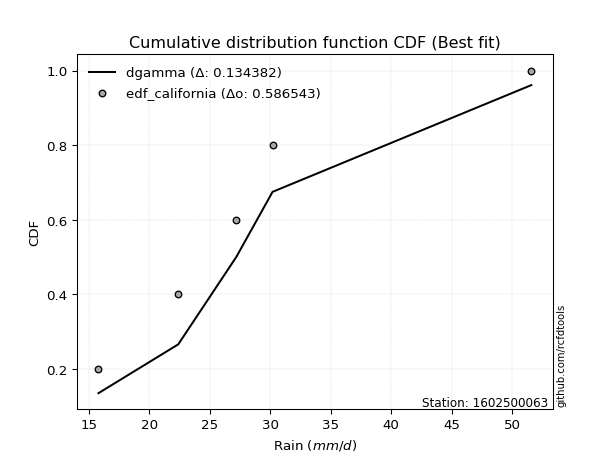</img>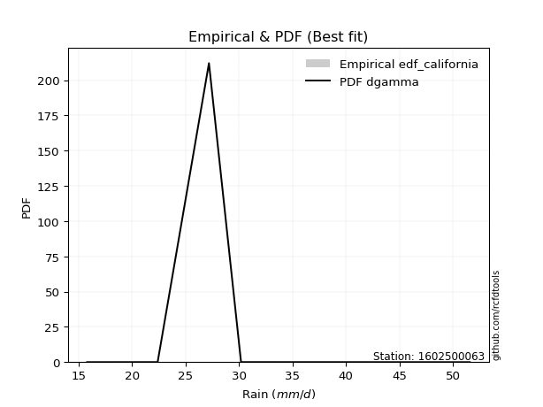</img>

</div>


### 2. EDF Hazen (1930)

Hazen method for plotting positions is a formula used to estimate the empirical cumulative probability distribution of flood events or other hydrological data. This formula often results in biased estimations, particularly when extrapolating to extreme events (high return periods).

<div align="center">


$P=(m-0.5)/n$


</div>


**2.1. Empirical values**

<div align="center">

|                | 0                  | 1                  | 2         | 3                 | 4                  |
|:---------------|:-------------------|:-------------------|:----------|:------------------|:-------------------|
| date           | 2023               | 2022               | 2020      | 2025              | 2019               |
| x              | 15.8               | 22.4               | 27.2      | 30.2              | 51.6               |
| m              | 1                  | 2                  | 3         | 4                 | 5                  |
| empirical_dist | edf_hazen          | edf_hazen          | edf_hazen | edf_hazen         | edf_hazen          |
| empirical      | 0.1                | 0.3                | 0.5       | 0.7               | 0.9                |
| empirical_tr   | 1.1111111111111112 | 1.4285714285714286 | 2.0       | 3.333333333333333 | 10.000000000000002 |

</div>


**2.2. Kolmogorov-Smirnov fit test (sorted by Δ)**


<div align="center">

|                | 0                  | 1                   | 2                   | 3                    | 4                   | 5                    | 6                    | 7                   | 8                   | 9                   | 10                  | 11                   | 12                  | 13                  | 14                  | 15                  | 16                  | 17                   | 18                   | 19                 | 20                  | 21                  | 22                   | 23                  | 24                   | 25                 | 26                  | 27                  | 28                  | 29                  | 30                  | 31                  | 32                  | 33                  | 34                  | 35                 | 36                  | 37                  | 38                  | 39                  | 40                  | 41                  | 42                 | 43                  | 44                  | 45                 | 46                  | 47                  | 48                  | 49                  | 50                  | 51                  | 52                  | 53                  | 54                 | 55                  | 56                  | 57                  | 58                  | 59                 | 60                 | 61                 | 62                 | 63                 | 64                  | 65                  | 66                 | 67                  | 68                  | 69                  | 70                  | 71                  | 72                  | 73                  | 74                 | 75                  | 76                  | 77                 | 78                  | 79                  | 80                  | 81                  | 82                  | 83                  | 84                  | 85                  | 86                 | 87                  | 88                  | 89                  | 90                 | 91                 | 92                  | 93                  | 94                  | 95                  | 96                  | 97                  | 98                 | 99                  | 100                 | 101                 | 102                 | 103                 | 104                | 105                | 106                 | 107                 | 108                | 109                | 110                | 111                 | 112                 | 113                 | 114                | 115                | 116                 | 117                 | 118                | 119                | 120                | 121                 | 122                 | 123                | 124                | 125                 | 126                | 127                 | 128                 | 129                | 130                 | 131                | 132                | 133                 | 134                 | 135                | 136                 | 137                | 138                | 139                | 140                | 141                 | 142                | 143                | 144                 | 145                | 146                 | 147                | 148                 | 149                | 150                | 151                | 152                | 153                | 154                | 155                | 156                | 157                | 158                | 159                |
|:---------------|:-------------------|:--------------------|:--------------------|:---------------------|:--------------------|:---------------------|:---------------------|:--------------------|:--------------------|:--------------------|:--------------------|:---------------------|:--------------------|:--------------------|:--------------------|:--------------------|:--------------------|:---------------------|:---------------------|:-------------------|:--------------------|:--------------------|:---------------------|:--------------------|:---------------------|:-------------------|:--------------------|:--------------------|:--------------------|:--------------------|:--------------------|:--------------------|:--------------------|:--------------------|:--------------------|:-------------------|:--------------------|:--------------------|:--------------------|:--------------------|:--------------------|:--------------------|:-------------------|:--------------------|:--------------------|:-------------------|:--------------------|:--------------------|:--------------------|:--------------------|:--------------------|:--------------------|:--------------------|:--------------------|:-------------------|:--------------------|:--------------------|:--------------------|:--------------------|:-------------------|:-------------------|:-------------------|:-------------------|:-------------------|:--------------------|:--------------------|:-------------------|:--------------------|:--------------------|:--------------------|:--------------------|:--------------------|:--------------------|:--------------------|:-------------------|:--------------------|:--------------------|:-------------------|:--------------------|:--------------------|:--------------------|:--------------------|:--------------------|:--------------------|:--------------------|:--------------------|:-------------------|:--------------------|:--------------------|:--------------------|:-------------------|:-------------------|:--------------------|:--------------------|:--------------------|:--------------------|:--------------------|:--------------------|:-------------------|:--------------------|:--------------------|:--------------------|:--------------------|:--------------------|:-------------------|:-------------------|:--------------------|:--------------------|:-------------------|:-------------------|:-------------------|:--------------------|:--------------------|:--------------------|:-------------------|:-------------------|:--------------------|:--------------------|:-------------------|:-------------------|:-------------------|:--------------------|:--------------------|:-------------------|:-------------------|:--------------------|:-------------------|:--------------------|:--------------------|:-------------------|:--------------------|:-------------------|:-------------------|:--------------------|:--------------------|:-------------------|:--------------------|:-------------------|:-------------------|:-------------------|:-------------------|:--------------------|:-------------------|:-------------------|:--------------------|:-------------------|:--------------------|:-------------------|:--------------------|:-------------------|:-------------------|:-------------------|:-------------------|:-------------------|:-------------------|:-------------------|:-------------------|:-------------------|:-------------------|:-------------------|
| station        | 1602500063         | 1602500063          | 1602500063          | 1602500063           | 1602500063          | 1602500063           | 1602500063           | 1602500063          | 1602500063          | 1602500063          | 1602500063          | 1602500063           | 1602500063          | 1602500063          | 1602500063          | 1602500063          | 1602500063          | 1602500063           | 1602500063           | 1602500063         | 1602500063          | 1602500063          | 1602500063           | 1602500063          | 1602500063           | 1602500063         | 1602500063          | 1602500063          | 1602500063          | 1602500063          | 1602500063          | 1602500063          | 1602500063          | 1602500063          | 1602500063          | 1602500063         | 1602500063          | 1602500063          | 1602500063          | 1602500063          | 1602500063          | 1602500063          | 1602500063         | 1602500063          | 1602500063          | 1602500063         | 1602500063          | 1602500063          | 1602500063          | 1602500063          | 1602500063          | 1602500063          | 1602500063          | 1602500063          | 1602500063         | 1602500063          | 1602500063          | 1602500063          | 1602500063          | 1602500063         | 1602500063         | 1602500063         | 1602500063         | 1602500063         | 1602500063          | 1602500063          | 1602500063         | 1602500063          | 1602500063          | 1602500063          | 1602500063          | 1602500063          | 1602500063          | 1602500063          | 1602500063         | 1602500063          | 1602500063          | 1602500063         | 1602500063          | 1602500063          | 1602500063          | 1602500063          | 1602500063          | 1602500063          | 1602500063          | 1602500063          | 1602500063         | 1602500063          | 1602500063          | 1602500063          | 1602500063         | 1602500063         | 1602500063          | 1602500063          | 1602500063          | 1602500063          | 1602500063          | 1602500063          | 1602500063         | 1602500063          | 1602500063          | 1602500063          | 1602500063          | 1602500063          | 1602500063         | 1602500063         | 1602500063          | 1602500063          | 1602500063         | 1602500063         | 1602500063         | 1602500063          | 1602500063          | 1602500063          | 1602500063         | 1602500063         | 1602500063          | 1602500063          | 1602500063         | 1602500063         | 1602500063         | 1602500063          | 1602500063          | 1602500063         | 1602500063         | 1602500063          | 1602500063         | 1602500063          | 1602500063          | 1602500063         | 1602500063          | 1602500063         | 1602500063         | 1602500063          | 1602500063          | 1602500063         | 1602500063          | 1602500063         | 1602500063         | 1602500063         | 1602500063         | 1602500063          | 1602500063         | 1602500063         | 1602500063          | 1602500063         | 1602500063          | 1602500063         | 1602500063          | 1602500063         | 1602500063         | 1602500063         | 1602500063         | 1602500063         | 1602500063         | 1602500063         | 1602500063         | 1602500063         | 1602500063         | 1602500063         |
| empirical_dist | edf_hazen          | edf_hazen           | edf_hazen           | edf_hazen            | edf_hazen           | edf_hazen            | edf_hazen            | edf_hazen           | edf_hazen           | edf_hazen           | edf_hazen           | edf_hazen            | edf_hazen           | edf_hazen           | edf_hazen           | edf_hazen           | edf_hazen           | edf_hazen            | edf_hazen            | edf_hazen          | edf_hazen           | edf_hazen           | edf_hazen            | edf_hazen           | edf_hazen            | edf_hazen          | edf_hazen           | edf_hazen           | edf_hazen           | edf_hazen           | edf_hazen           | edf_hazen           | edf_hazen           | edf_hazen           | edf_hazen           | edf_hazen          | edf_hazen           | edf_hazen           | edf_hazen           | edf_hazen           | edf_hazen           | edf_hazen           | edf_hazen          | edf_hazen           | edf_hazen           | edf_hazen          | edf_hazen           | edf_hazen           | edf_hazen           | edf_hazen           | edf_hazen           | edf_hazen           | edf_hazen           | edf_hazen           | edf_hazen          | edf_hazen           | edf_hazen           | edf_hazen           | edf_hazen           | edf_hazen          | edf_hazen          | edf_hazen          | edf_hazen          | edf_hazen          | edf_hazen           | edf_hazen           | edf_hazen          | edf_hazen           | edf_hazen           | edf_hazen           | edf_hazen           | edf_hazen           | edf_hazen           | edf_hazen           | edf_hazen          | edf_hazen           | edf_hazen           | edf_hazen          | edf_hazen           | edf_hazen           | edf_hazen           | edf_hazen           | edf_hazen           | edf_hazen           | edf_hazen           | edf_hazen           | edf_hazen          | edf_hazen           | edf_hazen           | edf_hazen           | edf_hazen          | edf_hazen          | edf_hazen           | edf_hazen           | edf_hazen           | edf_hazen           | edf_hazen           | edf_hazen           | edf_hazen          | edf_hazen           | edf_hazen           | edf_hazen           | edf_hazen           | edf_hazen           | edf_hazen          | edf_hazen          | edf_hazen           | edf_hazen           | edf_hazen          | edf_hazen          | edf_hazen          | edf_hazen           | edf_hazen           | edf_hazen           | edf_hazen          | edf_hazen          | edf_hazen           | edf_hazen           | edf_hazen          | edf_hazen          | edf_hazen          | edf_hazen           | edf_hazen           | edf_hazen          | edf_hazen          | edf_hazen           | edf_hazen          | edf_hazen           | edf_hazen           | edf_hazen          | edf_hazen           | edf_hazen          | edf_hazen          | edf_hazen           | edf_hazen           | edf_hazen          | edf_hazen           | edf_hazen          | edf_hazen          | edf_hazen          | edf_hazen          | edf_hazen           | edf_hazen          | edf_hazen          | edf_hazen           | edf_hazen          | edf_hazen           | edf_hazen          | edf_hazen           | edf_hazen          | edf_hazen          | edf_hazen          | edf_hazen          | edf_hazen          | edf_hazen          | edf_hazen          | edf_hazen          | edf_hazen          | edf_hazen          | edf_hazen          |
| p_dist         | logburr            | logmielke           | logdweibull         | logloglaplace        | nct                 | loglaplace           | loglaplace           | logburr12           | invgamma            | logfatiguelife      | loginvgauss         | f                    | johnsonsu           | logerlang           | loggamma            | loggamma            | logskewnorm         | alpha                | logjohnsonsu         | lograyleigh        | dgamma              | lognct              | invgauss             | exponnorm           | loginvweibull        | loggenlogistic     | logalpha            | loginvgamma         | dweibull            | burr                | logf                | betaprime           | gennorm             | logrice             | loggumbel_r         | logmaxwell         | logbetaprime        | logexponnorm        | logkstwobign        | logweibull_max      | loggenextreme       | loghypsecant        | ncf                | logpearson3         | halflogistic        | moyal              | loglogistic         | logweibull_min      | logfoldnorm         | genlogistic         | logmoyal            | logcrystalball      | lognorm             | logt                | loggenexpon        | logloggamma         | genexpon            | logbradford         | loggompertz         | gompertz           | loghalflogistic    | loghalfnorm        | logtruncpareto     | wald               | halfnorm            | gumbel_r            | logtruncexpon      | loggennorm          | foldnorm            | loganglit           | kstwobign           | logsemicircular     | pearson3            | logcosine           | beta               | logksone            | logncf              | skewnorm           | rayleigh            | logarcsine          | maxwell             | logvonmises_line    | logdgamma           | loguniform          | loggumbel_l         | logtukeylambda      | rice               | logkappa3           | logkappa4           | laplace             | truncexpon         | logwald            | burr12              | hypsecant           | logistic            | loglomax            | t                   | truncnorm           | norm               | crystalball         | anglit              | semicircular        | loggausshyper       | logwrapcauchy       | arcsine            | truncweibull_min   | logargus            | halfgennorm         | logbeta            | bradford           | logjohnsonsb       | cosine              | lomax               | loglevy_l           | logrdist           | weibull_min        | gumbel_l            | logtriang           | wrapcauchy         | levy_l             | kappa4             | logtruncweibull_min | genpareto           | logexponweib       | ksone              | lognakagami         | vonmises_line      | uniform             | kappa3              | logexponpow        | logtruncnorm        | nakagami           | tukeylambda        | argus               | loggenhalflogistic  | johnsonsb          | gausshyper          | triang             | exponpow           | genextreme         | logtrapezoid       | genhalflogistic     | gengamma           | rdist              | fatiguelife         | loggengamma        | erlang              | invweibull         | exponweib           | gamma              | powerlaw           | trapezoid          | loggenpareto       | truncpareto        | logpowerlaw        | weibull_max        | loghalfgennorm     | logvonmises        | vonmises           | mielke             |
| delta          | 0.0505533476040565 | 0.05255634972025791 | 0.05329072797631432 | 0.053320573308998975 | 0.05349419239215969 | 0.054847989944567604 | 0.054847989944567604 | 0.05580170403872964 | 0.05589292850825589 | 0.05628788324415401 | 0.05667220096343306 | 0.056812902222111994 | 0.05697192652006339 | 0.05784824067793026 | 0.05784862766920118 | 0.05784862766920118 | 0.05828653201531331 | 0.059528427971762166 | 0.059766389551051624 | 0.0611002104701841 | 0.06113701659285564 | 0.06169927763949956 | 0.061883690136982694 | 0.06227877458712716 | 0.062419177839019735 | 0.0625881783725395 | 0.06304180233726886 | 0.06331587826495755 | 0.06363566268528376 | 0.06455504225043629 | 0.06578144277695852 | 0.06588312035254784 | 0.06665580629011147 | 0.06854443418354195 | 0.06877332098787936 | 0.0691769348160507 | 0.06920799693137192 | 0.06928107766637437 | 0.06969638734584621 | 0.06989356294561166 | 0.06991161622407993 | 0.07090227154951023 | 0.0716809004624065 | 0.07654604484578265 | 0.07701168945694803 | 0.0787931353114728 | 0.08184886382861767 | 0.08635526005430644 | 0.08739748662161806 | 0.08871177437176336 | 0.09463028999362555 | 0.09528148887358678 | 0.09528150153679404 | 0.09528423665002062 | 0.0970328619302219 | 0.09747685078662438 | 0.09983275651828451 | 0.09999872951811689 | 0.09999999966608647 | 0.0999999999998978 | 0.1                | 0.1                | 0.1                | 0.1                | 0.10330046436170803 | 0.10429531090688482 | 0.1056494604145129 | 0.10857272043631305 | 0.10970014097664604 | 0.10971393716261191 | 0.11309131580821374 | 0.11571249182611354 | 0.11577870080599229 | 0.11698959506386708 | 0.121557725447353  | 0.12333377498372555 | 0.12677251200540862 | 0.1296219963981201 | 0.13265725988109556 | 0.13986480990763805 | 0.14308212130537767 | 0.14753476171252633 | 0.15218363802135784 | 0.15261887433569998 | 0.15415822435877258 | 0.15416357919267365 | 0.1554326210813196 | 0.15600459243403353 | 0.15665363291801082 | 0.15750825445485783 | 0.1607394865929993 | 0.1665432991196728 | 0.16724176758996817 | 0.16865060531009912 | 0.17155392092626431 | 0.17473478898675993 | 0.17494353781177596 | 0.17496270274703574 | 0.1749627253782019 | 0.17496274388623412 | 0.17853930346411406 | 0.18001329860238324 | 0.18241466440496823 | 0.18410183417201964 | 0.1858603553639614 | 0.1870384741747756 | 0.19423760901145082 | 0.19666976482059417 | 0.2074792789566688 | 0.2167874623516844 | 0.2174510432024176 | 0.22403116486143815 | 0.22717658970402999 | 0.23538820570051242 | 0.2422244756345403 | 0.2427907327140137 | 0.24413758646592032 | 0.24589290448988188 | 0.2500628823317316 | 0.2636345943780266 | 0.2652711350863312 | 0.27047374074140645 | 0.27856619872630106 | 0.2790784793721281 | 0.2814711359404097 | 0.29479093899812153 | 0.295260100551718  | 0.29776536312849156 | 0.29854340117926104 | 0.2991338041877039 | 0.29999548891236405 | 0.2999999363780648 | 0.2999999968900895 | 0.30641555568893764 | 0.30906318879819505 | 0.3210093488078643 | 0.35116256513805477 | 0.3555033978546124 | 0.3611842200327426 | 0.3850614392340437 | 0.4089567209261277 | 0.41765945792335196 | 0.4213645491511174 | 0.4352357786241545 | 0.43798907910936996 | 0.4464703244456499 | 0.45906020833582745 | 0.4684278069840666 | 0.49588191493772577 | 0.5142350595447638 | 0.5148380898825835 | 0.524833589948989  | 0.5309905971253538 | 0.5398986184168189 | 0.5520164729144776 | 0.5730971521775858 | 0.7                | 1.0504314358678353 | 7.23198831968093   | nan                |
| deltao         | 0.5865427407550001 | 0.5865427407550001  | 0.5865427407550001  | 0.5865427407550001   | 0.5865427407550001  | 0.5865427407550001   | 0.5865427407550001   | 0.5865427407550001  | 0.5865427407550001  | 0.5865427407550001  | 0.5865427407550001  | 0.5865427407550001   | 0.5865427407550001  | 0.5865427407550001  | 0.5865427407550001  | 0.5865427407550001  | 0.5865427407550001  | 0.5865427407550001   | 0.5865427407550001   | 0.5865427407550001 | 0.5865427407550001  | 0.5865427407550001  | 0.5865427407550001   | 0.5865427407550001  | 0.5865427407550001   | 0.5865427407550001 | 0.5865427407550001  | 0.5865427407550001  | 0.5865427407550001  | 0.5865427407550001  | 0.5865427407550001  | 0.5865427407550001  | 0.5865427407550001  | 0.5865427407550001  | 0.5865427407550001  | 0.5865427407550001 | 0.5865427407550001  | 0.5865427407550001  | 0.5865427407550001  | 0.5865427407550001  | 0.5865427407550001  | 0.5865427407550001  | 0.5865427407550001 | 0.5865427407550001  | 0.5865427407550001  | 0.5865427407550001 | 0.5865427407550001  | 0.5865427407550001  | 0.5865427407550001  | 0.5865427407550001  | 0.5865427407550001  | 0.5865427407550001  | 0.5865427407550001  | 0.5865427407550001  | 0.5865427407550001 | 0.5865427407550001  | 0.5865427407550001  | 0.5865427407550001  | 0.5865427407550001  | 0.5865427407550001 | 0.5865427407550001 | 0.5865427407550001 | 0.5865427407550001 | 0.5865427407550001 | 0.5865427407550001  | 0.5865427407550001  | 0.5865427407550001 | 0.5865427407550001  | 0.5865427407550001  | 0.5865427407550001  | 0.5865427407550001  | 0.5865427407550001  | 0.5865427407550001  | 0.5865427407550001  | 0.5865427407550001 | 0.5865427407550001  | 0.5865427407550001  | 0.5865427407550001 | 0.5865427407550001  | 0.5865427407550001  | 0.5865427407550001  | 0.5865427407550001  | 0.5865427407550001  | 0.5865427407550001  | 0.5865427407550001  | 0.5865427407550001  | 0.5865427407550001 | 0.5865427407550001  | 0.5865427407550001  | 0.5865427407550001  | 0.5865427407550001 | 0.5865427407550001 | 0.5865427407550001  | 0.5865427407550001  | 0.5865427407550001  | 0.5865427407550001  | 0.5865427407550001  | 0.5865427407550001  | 0.5865427407550001 | 0.5865427407550001  | 0.5865427407550001  | 0.5865427407550001  | 0.5865427407550001  | 0.5865427407550001  | 0.5865427407550001 | 0.5865427407550001 | 0.5865427407550001  | 0.5865427407550001  | 0.5865427407550001 | 0.5865427407550001 | 0.5865427407550001 | 0.5865427407550001  | 0.5865427407550001  | 0.5865427407550001  | 0.5865427407550001 | 0.5865427407550001 | 0.5865427407550001  | 0.5865427407550001  | 0.5865427407550001 | 0.5865427407550001 | 0.5865427407550001 | 0.5865427407550001  | 0.5865427407550001  | 0.5865427407550001 | 0.5865427407550001 | 0.5865427407550001  | 0.5865427407550001 | 0.5865427407550001  | 0.5865427407550001  | 0.5865427407550001 | 0.5865427407550001  | 0.5865427407550001 | 0.5865427407550001 | 0.5865427407550001  | 0.5865427407550001  | 0.5865427407550001 | 0.5865427407550001  | 0.5865427407550001 | 0.5865427407550001 | 0.5865427407550001 | 0.5865427407550001 | 0.5865427407550001  | 0.5865427407550001 | 0.5865427407550001 | 0.5865427407550001  | 0.5865427407550001 | 0.5865427407550001  | 0.5865427407550001 | 0.5865427407550001  | 0.5865427407550001 | 0.5865427407550001 | 0.5865427407550001 | 0.5865427407550001 | 0.5865427407550001 | 0.5865427407550001 | 0.5865427407550001 | 0.5865427407550001 | 0.5865427407550001 | 0.5865427407550001 | 0.5865427407550001 |
| eval           | Δo > Δ             | Δo > Δ              | Δo > Δ              | Δo > Δ               | Δo > Δ              | Δo > Δ               | Δo > Δ               | Δo > Δ              | Δo > Δ              | Δo > Δ              | Δo > Δ              | Δo > Δ               | Δo > Δ              | Δo > Δ              | Δo > Δ              | Δo > Δ              | Δo > Δ              | Δo > Δ               | Δo > Δ               | Δo > Δ             | Δo > Δ              | Δo > Δ              | Δo > Δ               | Δo > Δ              | Δo > Δ               | Δo > Δ             | Δo > Δ              | Δo > Δ              | Δo > Δ              | Δo > Δ              | Δo > Δ              | Δo > Δ              | Δo > Δ              | Δo > Δ              | Δo > Δ              | Δo > Δ             | Δo > Δ              | Δo > Δ              | Δo > Δ              | Δo > Δ              | Δo > Δ              | Δo > Δ              | Δo > Δ             | Δo > Δ              | Δo > Δ              | Δo > Δ             | Δo > Δ              | Δo > Δ              | Δo > Δ              | Δo > Δ              | Δo > Δ              | Δo > Δ              | Δo > Δ              | Δo > Δ              | Δo > Δ             | Δo > Δ              | Δo > Δ              | Δo > Δ              | Δo > Δ              | Δo > Δ             | Δo > Δ             | Δo > Δ             | Δo > Δ             | Δo > Δ             | Δo > Δ              | Δo > Δ              | Δo > Δ             | Δo > Δ              | Δo > Δ              | Δo > Δ              | Δo > Δ              | Δo > Δ              | Δo > Δ              | Δo > Δ              | Δo > Δ             | Δo > Δ              | Δo > Δ              | Δo > Δ             | Δo > Δ              | Δo > Δ              | Δo > Δ              | Δo > Δ              | Δo > Δ              | Δo > Δ              | Δo > Δ              | Δo > Δ              | Δo > Δ             | Δo > Δ              | Δo > Δ              | Δo > Δ              | Δo > Δ             | Δo > Δ             | Δo > Δ              | Δo > Δ              | Δo > Δ              | Δo > Δ              | Δo > Δ              | Δo > Δ              | Δo > Δ             | Δo > Δ              | Δo > Δ              | Δo > Δ              | Δo > Δ              | Δo > Δ              | Δo > Δ             | Δo > Δ             | Δo > Δ              | Δo > Δ              | Δo > Δ             | Δo > Δ             | Δo > Δ             | Δo > Δ              | Δo > Δ              | Δo > Δ              | Δo > Δ             | Δo > Δ             | Δo > Δ              | Δo > Δ              | Δo > Δ             | Δo > Δ             | Δo > Δ             | Δo > Δ              | Δo > Δ              | Δo > Δ             | Δo > Δ             | Δo > Δ              | Δo > Δ             | Δo > Δ              | Δo > Δ              | Δo > Δ             | Δo > Δ              | Δo > Δ             | Δo > Δ             | Δo > Δ              | Δo > Δ              | Δo > Δ             | Δo > Δ              | Δo > Δ             | Δo > Δ             | Δo > Δ             | Δo > Δ             | Δo > Δ              | Δo > Δ             | Δo > Δ             | Δo > Δ              | Δo > Δ             | Δo > Δ              | Δo > Δ             | Δo > Δ              | Δo > Δ             | Δo > Δ             | Δo > Δ             | Δo > Δ             | Δo > Δ             | Δo > Δ             | Δo > Δ             | Δo <= Δ            | Δo <= Δ            | Δo <= Δ            | Δo <= Δ            |
| fit            | 1                  | 1                   | 1                   | 1                    | 1                   | 1                    | 1                    | 1                   | 1                   | 1                   | 1                   | 1                    | 1                   | 1                   | 1                   | 1                   | 1                   | 1                    | 1                    | 1                  | 1                   | 1                   | 1                    | 1                   | 1                    | 1                  | 1                   | 1                   | 1                   | 1                   | 1                   | 1                   | 1                   | 1                   | 1                   | 1                  | 1                   | 1                   | 1                   | 1                   | 1                   | 1                   | 1                  | 1                   | 1                   | 1                  | 1                   | 1                   | 1                   | 1                   | 1                   | 1                   | 1                   | 1                   | 1                  | 1                   | 1                   | 1                   | 1                   | 1                  | 1                  | 1                  | 1                  | 1                  | 1                   | 1                   | 1                  | 1                   | 1                   | 1                   | 1                   | 1                   | 1                   | 1                   | 1                  | 1                   | 1                   | 1                  | 1                   | 1                   | 1                   | 1                   | 1                   | 1                   | 1                   | 1                   | 1                  | 1                   | 1                   | 1                   | 1                  | 1                  | 1                   | 1                   | 1                   | 1                   | 1                   | 1                   | 1                  | 1                   | 1                   | 1                   | 1                   | 1                   | 1                  | 1                  | 1                   | 1                   | 1                  | 1                  | 1                  | 1                   | 1                   | 1                   | 1                  | 1                  | 1                   | 1                   | 1                  | 1                  | 1                  | 1                   | 1                   | 1                  | 1                  | 1                   | 1                  | 1                   | 1                   | 1                  | 1                   | 1                  | 1                  | 1                   | 1                   | 1                  | 1                   | 1                  | 1                  | 1                  | 1                  | 1                   | 1                  | 1                  | 1                   | 1                  | 1                   | 1                  | 1                   | 1                  | 1                  | 1                  | 1                  | 1                  | 1                  | 1                  | 0                  | 0                  | 0                  | 0                  |
| n              | 5                  | 5                   | 5                   | 5                    | 5                   | 5                    | 5                    | 5                   | 5                   | 5                   | 5                   | 5                    | 5                   | 5                   | 5                   | 5                   | 5                   | 5                    | 5                    | 5                  | 5                   | 5                   | 5                    | 5                   | 5                    | 5                  | 5                   | 5                   | 5                   | 5                   | 5                   | 5                   | 5                   | 5                   | 5                   | 5                  | 5                   | 5                   | 5                   | 5                   | 5                   | 5                   | 5                  | 5                   | 5                   | 5                  | 5                   | 5                   | 5                   | 5                   | 5                   | 5                   | 5                   | 5                   | 5                  | 5                   | 5                   | 5                   | 5                   | 5                  | 5                  | 5                  | 5                  | 5                  | 5                   | 5                   | 5                  | 5                   | 5                   | 5                   | 5                   | 5                   | 5                   | 5                   | 5                  | 5                   | 5                   | 5                  | 5                   | 5                   | 5                   | 5                   | 5                   | 5                   | 5                   | 5                   | 5                  | 5                   | 5                   | 5                   | 5                  | 5                  | 5                   | 5                   | 5                   | 5                   | 5                   | 5                   | 5                  | 5                   | 5                   | 5                   | 5                   | 5                   | 5                  | 5                  | 5                   | 5                   | 5                  | 5                  | 5                  | 5                   | 5                   | 5                   | 5                  | 5                  | 5                   | 5                   | 5                  | 5                  | 5                  | 5                   | 5                   | 5                  | 5                  | 5                   | 5                  | 5                   | 5                   | 5                  | 5                   | 5                  | 5                  | 5                   | 5                   | 5                  | 5                   | 5                  | 5                  | 5                  | 5                  | 5                   | 5                  | 5                  | 5                   | 5                  | 5                   | 5                  | 5                   | 5                  | 5                  | 5                  | 5                  | 5                  | 5                  | 5                  | 5                  | 5                  | 5                  | 5                  |
| best_fit       | 1                  | 0                   | 0                   | 0                    | 0                   | 0                    | 0                    | 0                   | 0                   | 0                   | 0                   | 0                    | 0                   | 0                   | 0                   | 0                   | 0                   | 0                    | 0                    | 0                  | 0                   | 0                   | 0                    | 0                   | 0                    | 0                  | 0                   | 0                   | 0                   | 0                   | 0                   | 0                   | 0                   | 0                   | 0                   | 0                  | 0                   | 0                   | 0                   | 0                   | 0                   | 0                   | 0                  | 0                   | 0                   | 0                  | 0                   | 0                   | 0                   | 0                   | 0                   | 0                   | 0                   | 0                   | 0                  | 0                   | 0                   | 0                   | 0                   | 0                  | 0                  | 0                  | 0                  | 0                  | 0                   | 0                   | 0                  | 0                   | 0                   | 0                   | 0                   | 0                   | 0                   | 0                   | 0                  | 0                   | 0                   | 0                  | 0                   | 0                   | 0                   | 0                   | 0                   | 0                   | 0                   | 0                   | 0                  | 0                   | 0                   | 0                   | 0                  | 0                  | 0                   | 0                   | 0                   | 0                   | 0                   | 0                   | 0                  | 0                   | 0                   | 0                   | 0                   | 0                   | 0                  | 0                  | 0                   | 0                   | 0                  | 0                  | 0                  | 0                   | 0                   | 0                   | 0                  | 0                  | 0                   | 0                   | 0                  | 0                  | 0                  | 0                   | 0                   | 0                  | 0                  | 0                   | 0                  | 0                   | 0                   | 0                  | 0                   | 0                  | 0                  | 0                   | 0                   | 0                  | 0                   | 0                  | 0                  | 0                  | 0                  | 0                   | 0                  | 0                  | 0                   | 0                  | 0                   | 0                  | 0                   | 0                  | 0                  | 0                  | 0                  | 0                  | 0                  | 0                  | 0                  | 0                  | 0                  | 0                  |
| best_fit_sort  | 1                  | 2                   | 3                   | 4                    | 5                   | 6                    | 7                    | 8                   | 9                   | 10                  | 11                  | 12                   | 13                  | 14                  | 15                  | 16                  | 17                  | 18                   | 19                   | 20                 | 21                  | 22                  | 23                   | 24                  | 25                   | 26                 | 27                  | 28                  | 29                  | 30                  | 31                  | 32                  | 33                  | 34                  | 35                  | 36                 | 37                  | 38                  | 39                  | 40                  | 41                  | 42                  | 43                 | 44                  | 45                  | 46                 | 47                  | 48                  | 49                  | 50                  | 51                  | 52                  | 53                  | 54                  | 55                 | 56                  | 57                  | 58                  | 59                  | 60                 | 61                 | 62                 | 63                 | 64                 | 65                  | 66                  | 67                 | 68                  | 69                  | 70                  | 71                  | 72                  | 73                  | 74                  | 75                 | 76                  | 77                  | 78                 | 79                  | 80                  | 81                  | 82                  | 83                  | 84                  | 85                  | 86                  | 87                 | 88                  | 89                  | 90                  | 91                 | 92                 | 93                  | 94                  | 95                  | 96                  | 97                  | 98                  | 99                 | 100                 | 101                 | 102                 | 103                 | 104                 | 105                | 106                | 107                 | 108                 | 109                | 110                | 111                | 112                 | 113                 | 114                 | 115                | 116                | 117                 | 118                 | 119                | 120                | 121                | 122                 | 123                 | 124                | 125                | 126                 | 127                | 128                 | 129                 | 130                | 131                 | 132                | 133                | 134                 | 135                 | 136                | 137                 | 138                | 139                | 140                | 141                | 142                 | 143                | 144                | 145                 | 146                | 147                 | 148                | 149                 | 150                | 151                | 152                | 153                | 154                | 155                | 156                | 157                | 158                | 159                | 160                |

</div>


**2.3. Best fit**

<div align="center">

|   id |    station | empirical_dist   | p_dist   |     delta |   deltao | eval   |   fit |   n |   best_fit |   best_fit_sort |
|-----:|-----------:|:-----------------|:---------|----------:|---------:|:-------|------:|----:|-----------:|----------------:|
|    0 | 1602500063 | edf_hazen        | logburr  | 0.0505533 | 0.586543 | Δo > Δ |     1 |   5 |          1 |               1 |

</div>


<div align="center">

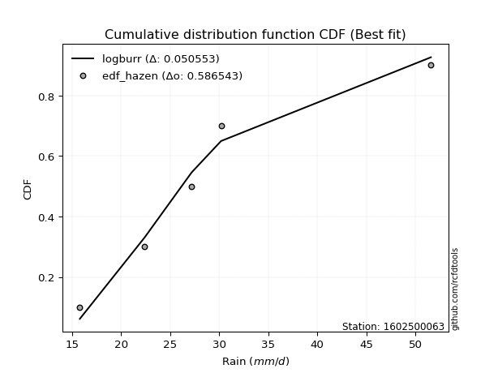</img>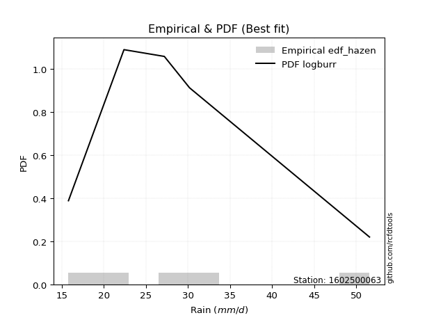</img>

</div>


### 3. EDF Weibull (1939)

Weibull plotting position formula is an empirical method used to estimate the non-exceedance probability or plotting position for a set of observed data, is often recommended or widely used in practice, particularly in flood frequency analysis.

<div align="center">


$P=m/(n+1)$


</div>


**3.1. Empirical values**

<div align="center">

|                | 0                   | 1                  | 2           | 3                  | 4                  |
|:---------------|:--------------------|:-------------------|:------------|:-------------------|:-------------------|
| date           | 2023                | 2022               | 2020        | 2025               | 2019               |
| x              | 15.8                | 22.4               | 27.2        | 30.2               | 51.6               |
| m              | 1                   | 2                  | 3           | 4                  | 5                  |
| empirical_dist | edf_weibull         | edf_weibull        | edf_weibull | edf_weibull        | edf_weibull        |
| empirical      | 0.16666666666666666 | 0.3333333333333333 | 0.5         | 0.6666666666666666 | 0.8333333333333334 |
| empirical_tr   | 1.2                 | 1.4999999999999998 | 2.0         | 2.9999999999999996 | 6.000000000000002  |

</div>


**3.2. Kolmogorov-Smirnov fit test (sorted by Δ)**


<div align="center">

|                | 0                  | 1                  | 2                   | 3                   | 4                   | 5                  | 6                   | 7                   | 8                   | 9                   | 10                  | 11                  | 12                  | 13                  | 14                  | 15                 | 16                  | 17                  | 18                 | 19                  | 20                  | 21                  | 22                  | 23                  | 24                  | 25                  | 26                  | 27                  | 28                  | 29                  | 30                  | 31                  | 32                  | 33                  | 34                  | 35                  | 36                  | 37                  | 38                  | 39                  | 40                  | 41                  | 42                  | 43                  | 44                  | 45                  | 46                  | 47                 | 48                  | 49                  | 50                  | 51                  | 52                  | 53                  | 54                  | 55                 | 56                  | 57                 | 58                 | 59                 | 60                  | 61                  | 62                 | 63                  | 64                  | 65                  | 66                  | 67                 | 68                 | 69                  | 70                  | 71                 | 72                  | 73                 | 74                  | 75                  | 76                 | 77                  | 78                  | 79                 | 80                 | 81                  | 82                  | 83                 | 84                  | 85                 | 86                 | 87                  | 88                  | 89                 | 90                 | 91                  | 92                  | 93                  | 94                  | 95                  | 96                  | 97                  | 98                  | 99                  | 100                 | 101                 | 102                 | 103                 | 104                 | 105                 | 106                 | 107                 | 108                 | 109                 | 110                 | 111                 | 112                 | 113                 | 114                 | 115                 | 116                | 117                 | 118                | 119                 | 120                 | 121                 | 122                 | 123                 | 124                 | 125                 | 126                 | 127                | 128                | 129                | 130                 | 131                | 132                 | 133                | 134                 | 135                 | 136                 | 137                | 138                 | 139                | 140                 | 141                | 142                 | 143                 | 144                 | 145                 | 146                 | 147                | 148                 | 149                 | 150                | 151                 | 152                 | 153                | 154                | 155                | 156                | 157                | 158                | 159                |
|:---------------|:-------------------|:-------------------|:--------------------|:--------------------|:--------------------|:-------------------|:--------------------|:--------------------|:--------------------|:--------------------|:--------------------|:--------------------|:--------------------|:--------------------|:--------------------|:-------------------|:--------------------|:--------------------|:-------------------|:--------------------|:--------------------|:--------------------|:--------------------|:--------------------|:--------------------|:--------------------|:--------------------|:--------------------|:--------------------|:--------------------|:--------------------|:--------------------|:--------------------|:--------------------|:--------------------|:--------------------|:--------------------|:--------------------|:--------------------|:--------------------|:--------------------|:--------------------|:--------------------|:--------------------|:--------------------|:--------------------|:--------------------|:-------------------|:--------------------|:--------------------|:--------------------|:--------------------|:--------------------|:--------------------|:--------------------|:-------------------|:--------------------|:-------------------|:-------------------|:-------------------|:--------------------|:--------------------|:-------------------|:--------------------|:--------------------|:--------------------|:--------------------|:-------------------|:-------------------|:--------------------|:--------------------|:-------------------|:--------------------|:-------------------|:--------------------|:--------------------|:-------------------|:--------------------|:--------------------|:-------------------|:-------------------|:--------------------|:--------------------|:-------------------|:--------------------|:-------------------|:-------------------|:--------------------|:--------------------|:-------------------|:-------------------|:--------------------|:--------------------|:--------------------|:--------------------|:--------------------|:--------------------|:--------------------|:--------------------|:--------------------|:--------------------|:--------------------|:--------------------|:--------------------|:--------------------|:--------------------|:--------------------|:--------------------|:--------------------|:--------------------|:--------------------|:--------------------|:--------------------|:--------------------|:--------------------|:--------------------|:-------------------|:--------------------|:-------------------|:--------------------|:--------------------|:--------------------|:--------------------|:--------------------|:--------------------|:--------------------|:--------------------|:-------------------|:-------------------|:-------------------|:--------------------|:-------------------|:--------------------|:-------------------|:--------------------|:--------------------|:--------------------|:-------------------|:--------------------|:-------------------|:--------------------|:-------------------|:--------------------|:--------------------|:--------------------|:--------------------|:--------------------|:-------------------|:--------------------|:--------------------|:-------------------|:--------------------|:--------------------|:-------------------|:-------------------|:-------------------|:-------------------|:-------------------|:-------------------|:-------------------|
| station        | 1602500063         | 1602500063         | 1602500063          | 1602500063          | 1602500063          | 1602500063         | 1602500063          | 1602500063          | 1602500063          | 1602500063          | 1602500063          | 1602500063          | 1602500063          | 1602500063          | 1602500063          | 1602500063         | 1602500063          | 1602500063          | 1602500063         | 1602500063          | 1602500063          | 1602500063          | 1602500063          | 1602500063          | 1602500063          | 1602500063          | 1602500063          | 1602500063          | 1602500063          | 1602500063          | 1602500063          | 1602500063          | 1602500063          | 1602500063          | 1602500063          | 1602500063          | 1602500063          | 1602500063          | 1602500063          | 1602500063          | 1602500063          | 1602500063          | 1602500063          | 1602500063          | 1602500063          | 1602500063          | 1602500063          | 1602500063         | 1602500063          | 1602500063          | 1602500063          | 1602500063          | 1602500063          | 1602500063          | 1602500063          | 1602500063         | 1602500063          | 1602500063         | 1602500063         | 1602500063         | 1602500063          | 1602500063          | 1602500063         | 1602500063          | 1602500063          | 1602500063          | 1602500063          | 1602500063         | 1602500063         | 1602500063          | 1602500063          | 1602500063         | 1602500063          | 1602500063         | 1602500063          | 1602500063          | 1602500063         | 1602500063          | 1602500063          | 1602500063         | 1602500063         | 1602500063          | 1602500063          | 1602500063         | 1602500063          | 1602500063         | 1602500063         | 1602500063          | 1602500063          | 1602500063         | 1602500063         | 1602500063          | 1602500063          | 1602500063          | 1602500063          | 1602500063          | 1602500063          | 1602500063          | 1602500063          | 1602500063          | 1602500063          | 1602500063          | 1602500063          | 1602500063          | 1602500063          | 1602500063          | 1602500063          | 1602500063          | 1602500063          | 1602500063          | 1602500063          | 1602500063          | 1602500063          | 1602500063          | 1602500063          | 1602500063          | 1602500063         | 1602500063          | 1602500063         | 1602500063          | 1602500063          | 1602500063          | 1602500063          | 1602500063          | 1602500063          | 1602500063          | 1602500063          | 1602500063         | 1602500063         | 1602500063         | 1602500063          | 1602500063         | 1602500063          | 1602500063         | 1602500063          | 1602500063          | 1602500063          | 1602500063         | 1602500063          | 1602500063         | 1602500063          | 1602500063         | 1602500063          | 1602500063          | 1602500063          | 1602500063          | 1602500063          | 1602500063         | 1602500063          | 1602500063          | 1602500063         | 1602500063          | 1602500063          | 1602500063         | 1602500063         | 1602500063         | 1602500063         | 1602500063         | 1602500063         | 1602500063         |
| empirical_dist | edf_weibull        | edf_weibull        | edf_weibull         | edf_weibull         | edf_weibull         | edf_weibull        | edf_weibull         | edf_weibull         | edf_weibull         | edf_weibull         | edf_weibull         | edf_weibull         | edf_weibull         | edf_weibull         | edf_weibull         | edf_weibull        | edf_weibull         | edf_weibull         | edf_weibull        | edf_weibull         | edf_weibull         | edf_weibull         | edf_weibull         | edf_weibull         | edf_weibull         | edf_weibull         | edf_weibull         | edf_weibull         | edf_weibull         | edf_weibull         | edf_weibull         | edf_weibull         | edf_weibull         | edf_weibull         | edf_weibull         | edf_weibull         | edf_weibull         | edf_weibull         | edf_weibull         | edf_weibull         | edf_weibull         | edf_weibull         | edf_weibull         | edf_weibull         | edf_weibull         | edf_weibull         | edf_weibull         | edf_weibull        | edf_weibull         | edf_weibull         | edf_weibull         | edf_weibull         | edf_weibull         | edf_weibull         | edf_weibull         | edf_weibull        | edf_weibull         | edf_weibull        | edf_weibull        | edf_weibull        | edf_weibull         | edf_weibull         | edf_weibull        | edf_weibull         | edf_weibull         | edf_weibull         | edf_weibull         | edf_weibull        | edf_weibull        | edf_weibull         | edf_weibull         | edf_weibull        | edf_weibull         | edf_weibull        | edf_weibull         | edf_weibull         | edf_weibull        | edf_weibull         | edf_weibull         | edf_weibull        | edf_weibull        | edf_weibull         | edf_weibull         | edf_weibull        | edf_weibull         | edf_weibull        | edf_weibull        | edf_weibull         | edf_weibull         | edf_weibull        | edf_weibull        | edf_weibull         | edf_weibull         | edf_weibull         | edf_weibull         | edf_weibull         | edf_weibull         | edf_weibull         | edf_weibull         | edf_weibull         | edf_weibull         | edf_weibull         | edf_weibull         | edf_weibull         | edf_weibull         | edf_weibull         | edf_weibull         | edf_weibull         | edf_weibull         | edf_weibull         | edf_weibull         | edf_weibull         | edf_weibull         | edf_weibull         | edf_weibull         | edf_weibull         | edf_weibull        | edf_weibull         | edf_weibull        | edf_weibull         | edf_weibull         | edf_weibull         | edf_weibull         | edf_weibull         | edf_weibull         | edf_weibull         | edf_weibull         | edf_weibull        | edf_weibull        | edf_weibull        | edf_weibull         | edf_weibull        | edf_weibull         | edf_weibull        | edf_weibull         | edf_weibull         | edf_weibull         | edf_weibull        | edf_weibull         | edf_weibull        | edf_weibull         | edf_weibull        | edf_weibull         | edf_weibull         | edf_weibull         | edf_weibull         | edf_weibull         | edf_weibull        | edf_weibull         | edf_weibull         | edf_weibull        | edf_weibull         | edf_weibull         | edf_weibull        | edf_weibull        | edf_weibull        | edf_weibull        | edf_weibull        | edf_weibull        | edf_weibull        |
| p_dist         | logdweibull        | logncf             | logloglaplace       | exponnorm           | logburr12           | alpha              | loginvgamma         | lognct              | logalpha            | ncf                 | logmielke           | logmaxwell          | logskewnorm         | logburr             | logjohnsonsu        | logf               | betaprime           | nct                 | f                  | loginvgauss         | logexponnorm        | invgamma            | logfatiguelife      | logfoldnorm         | logpearson3         | halfnorm            | foldnorm            | burr                | loggenlogistic      | logweibull_max      | loggenextreme       | loginvweibull       | moyal               | logkstwobign        | invgauss            | lograyleigh         | logbetaprime        | johnsonsu           | logerlang           | loggamma            | loggamma            | gumbel_r            | pearson3            | logloggamma         | logt                | logcrystalball      | lognorm             | rayleigh           | loganglit           | loglaplace          | loglaplace          | logrice             | loglogistic         | loghypsecant        | maxwell             | logcosine          | logsemicircular     | kstwobign          | genlogistic        | dgamma             | rice                | laplace             | dweibull           | logweibull_min      | halflogistic        | loggumbel_r         | gennorm             | hypsecant          | logistic           | t                   | logksone            | truncnorm          | norm                | crystalball        | loggennorm          | anglit              | semicircular       | burr12              | logmoyal            | loggumbel_l        | logargus           | loggenexpon         | genexpon            | logtruncexpon      | logbradford         | beta               | truncexpon         | loggompertz         | logvonmises_line    | truncweibull_min   | loglomax           | halfgennorm         | logkappa3           | gompertz            | logtukeylambda      | logkappa4           | logarcsine          | arcsine             | skewnorm            | logwrapcauchy       | loguniform          | loghalfnorm         | wald                | loghalflogistic     | logwald             | logtruncpareto      | loggausshyper       | logbeta             | bradford            | logjohnsonsb        | logdgamma           | cosine              | lomax               | loglevy_l           | logrdist            | weibull_min         | gumbel_l           | logtriang           | levy_l             | wrapcauchy          | kappa4              | logtruncweibull_min | genpareto           | logexponweib        | ksone               | vonmises_line       | uniform             | kappa3             | logexponpow        | argus              | loggenhalflogistic  | johnsonsb          | gausshyper          | genextreme         | triang              | exponpow            | lognakagami         | logtruncnorm       | nakagami            | tukeylambda        | rdist               | logtrapezoid       | genhalflogistic     | gengamma            | invweibull          | fatiguelife         | loggengamma         | erlang             | exponweib           | loggenpareto        | gamma              | powerlaw            | trapezoid           | truncpareto        | logpowerlaw        | weibull_max        | loghalfgennorm     | logvonmises        | vonmises           | mielke             |
| delta          | 0.0866795686972216 | 0.0934391786720753 | 0.09891061962796736 | 0.10243856026770448 | 0.10261380151851596 | 0.1032465747893444 | 0.10380947055581857 | 0.10387540113313373 | 0.10389137970908191 | 0.10390420401253153 | 0.10395673822560086 | 0.10403215054480353 | 0.10438750005378292 | 0.10460213330751819 | 0.10540908365189694 | 0.1061425349789138 | 0.10618447463607439 | 0.10694809078243012 | 0.1070885542794779 | 0.10714773217145537 | 0.10728862162968633 | 0.10732615820590169 | 0.10735362732665019 | 0.10865743937906769 | 0.10876286766830323 | 0.10945718712437935 | 0.11046253313435417 | 0.11073173657129023 | 0.11094090922395164 | 0.11101979152263608 | 0.11102332711490293 | 0.11120936821540528 | 0.11140326684526669 | 0.11201939051805086 | 0.11202388678241015 | 0.11236787240783636 | 0.11241387052823637 | 0.11277813214706553 | 0.11312447755386373 | 0.11312450223646761 | 0.11312450223646761 | 0.11445350708690838 | 0.11472516975400482 | 0.11646684579203892 | 0.11671215976099691 | 0.11671305703383694 | 0.11671307570774858 | 0.1173003728469415 | 0.11776607967770991 | 0.11786340311374188 | 0.11786340311374188 | 0.11831670854511253 | 0.11852421083244324 | 0.11873180119831406 | 0.12071287974849676 | 0.1208575024544869 | 0.12305132322766099 | 0.124886699261746  | 0.1251041841724534 | 0.1278036832595223 | 0.12838044345929223 | 0.12914183104167665 | 0.1303023293519504 | 0.13108642445919733 | 0.13268387618534166 | 0.13311590099952747 | 0.13332247295677813 | 0.1353172719767658 | 0.138220587592931  | 0.14161020447844264 | 0.14162495513675544 | 0.1416293694137024 | 0.14162939204486857 | 0.1416294105529008 | 0.14190605376964638 | 0.14520597013078074 | 0.1521281680612675 | 0.15387738338780044 | 0.15483946881167826 | 0.1569304808413703 | 0.1609042756781175 | 0.16369952859688855 | 0.16649942318495115 | 0.1666639217669258 | 0.16666539618478354 | 0.1666666542489888 | 0.1666666555672801 | 0.16666666633275312 | 0.16666666655572096 | 0.1666666665844524 | 0.166666666647546  | 0.16666666666478516 | 0.16666666666584923 | 0.16666666666656443 | 0.16666666666665955 | 0.16666666666666596 | 0.16666666666666663 | 0.16666666666666663 | 0.16666666666666666 | 0.16666666666666666 | 0.16666666666666666 | 0.16666666666666666 | 0.16666666666666666 | 0.16666666666666666 | 0.16666666666666666 | 0.16666666666666666 | 0.16666666666845964 | 0.17414594562333546 | 0.18345412901835106 | 0.18411770986908427 | 0.18551697135469117 | 0.19069783152810482 | 0.19384325637069666 | 0.19791687035982253 | 0.20889114230120698 | 0.20945739938068036 | 0.210804253132587  | 0.21255957115654855 | 0.2152857412062409 | 0.21672954899839825 | 0.23193780175299789 | 0.23714040740807313 | 0.24523286539296774 | 0.24574514603879477 | 0.24813780260707635 | 0.26192676721838465 | 0.26443202979515823 | 0.2652100678459277 | 0.2658004708543706 | 0.2730822223556043 | 0.27572985546486173 | 0.287676015474531  | 0.31782923180472145 | 0.318394772567377  | 0.32217006452127905 | 0.32785088669940926 | 0.32812427233145486 | 0.3333288222456974 | 0.33333326971139815 | 0.3333333302234228 | 0.36856911195748787 | 0.3756233875927944 | 0.38432612459001864 | 0.38803121581778405 | 0.40176114031739996 | 0.40465574577603663 | 0.41313699111231655 | 0.4257268750024941 | 0.46254858160439244 | 0.46432393045868714 | 0.4809017262114304 | 0.48150475654925023 | 0.49150025661565566 | 0.5065652850834856 | 0.5186831395811442 | 0.5397638188442525 | 0.6666666666666666 | 1.1170981025345017 | 7.298654986347597  | nan                |
| deltao         | 0.5865427407550001 | 0.5865427407550001 | 0.5865427407550001  | 0.5865427407550001  | 0.5865427407550001  | 0.5865427407550001 | 0.5865427407550001  | 0.5865427407550001  | 0.5865427407550001  | 0.5865427407550001  | 0.5865427407550001  | 0.5865427407550001  | 0.5865427407550001  | 0.5865427407550001  | 0.5865427407550001  | 0.5865427407550001 | 0.5865427407550001  | 0.5865427407550001  | 0.5865427407550001 | 0.5865427407550001  | 0.5865427407550001  | 0.5865427407550001  | 0.5865427407550001  | 0.5865427407550001  | 0.5865427407550001  | 0.5865427407550001  | 0.5865427407550001  | 0.5865427407550001  | 0.5865427407550001  | 0.5865427407550001  | 0.5865427407550001  | 0.5865427407550001  | 0.5865427407550001  | 0.5865427407550001  | 0.5865427407550001  | 0.5865427407550001  | 0.5865427407550001  | 0.5865427407550001  | 0.5865427407550001  | 0.5865427407550001  | 0.5865427407550001  | 0.5865427407550001  | 0.5865427407550001  | 0.5865427407550001  | 0.5865427407550001  | 0.5865427407550001  | 0.5865427407550001  | 0.5865427407550001 | 0.5865427407550001  | 0.5865427407550001  | 0.5865427407550001  | 0.5865427407550001  | 0.5865427407550001  | 0.5865427407550001  | 0.5865427407550001  | 0.5865427407550001 | 0.5865427407550001  | 0.5865427407550001 | 0.5865427407550001 | 0.5865427407550001 | 0.5865427407550001  | 0.5865427407550001  | 0.5865427407550001 | 0.5865427407550001  | 0.5865427407550001  | 0.5865427407550001  | 0.5865427407550001  | 0.5865427407550001 | 0.5865427407550001 | 0.5865427407550001  | 0.5865427407550001  | 0.5865427407550001 | 0.5865427407550001  | 0.5865427407550001 | 0.5865427407550001  | 0.5865427407550001  | 0.5865427407550001 | 0.5865427407550001  | 0.5865427407550001  | 0.5865427407550001 | 0.5865427407550001 | 0.5865427407550001  | 0.5865427407550001  | 0.5865427407550001 | 0.5865427407550001  | 0.5865427407550001 | 0.5865427407550001 | 0.5865427407550001  | 0.5865427407550001  | 0.5865427407550001 | 0.5865427407550001 | 0.5865427407550001  | 0.5865427407550001  | 0.5865427407550001  | 0.5865427407550001  | 0.5865427407550001  | 0.5865427407550001  | 0.5865427407550001  | 0.5865427407550001  | 0.5865427407550001  | 0.5865427407550001  | 0.5865427407550001  | 0.5865427407550001  | 0.5865427407550001  | 0.5865427407550001  | 0.5865427407550001  | 0.5865427407550001  | 0.5865427407550001  | 0.5865427407550001  | 0.5865427407550001  | 0.5865427407550001  | 0.5865427407550001  | 0.5865427407550001  | 0.5865427407550001  | 0.5865427407550001  | 0.5865427407550001  | 0.5865427407550001 | 0.5865427407550001  | 0.5865427407550001 | 0.5865427407550001  | 0.5865427407550001  | 0.5865427407550001  | 0.5865427407550001  | 0.5865427407550001  | 0.5865427407550001  | 0.5865427407550001  | 0.5865427407550001  | 0.5865427407550001 | 0.5865427407550001 | 0.5865427407550001 | 0.5865427407550001  | 0.5865427407550001 | 0.5865427407550001  | 0.5865427407550001 | 0.5865427407550001  | 0.5865427407550001  | 0.5865427407550001  | 0.5865427407550001 | 0.5865427407550001  | 0.5865427407550001 | 0.5865427407550001  | 0.5865427407550001 | 0.5865427407550001  | 0.5865427407550001  | 0.5865427407550001  | 0.5865427407550001  | 0.5865427407550001  | 0.5865427407550001 | 0.5865427407550001  | 0.5865427407550001  | 0.5865427407550001 | 0.5865427407550001  | 0.5865427407550001  | 0.5865427407550001 | 0.5865427407550001 | 0.5865427407550001 | 0.5865427407550001 | 0.5865427407550001 | 0.5865427407550001 | 0.5865427407550001 |
| eval           | Δo > Δ             | Δo > Δ             | Δo > Δ              | Δo > Δ              | Δo > Δ              | Δo > Δ             | Δo > Δ              | Δo > Δ              | Δo > Δ              | Δo > Δ              | Δo > Δ              | Δo > Δ              | Δo > Δ              | Δo > Δ              | Δo > Δ              | Δo > Δ             | Δo > Δ              | Δo > Δ              | Δo > Δ             | Δo > Δ              | Δo > Δ              | Δo > Δ              | Δo > Δ              | Δo > Δ              | Δo > Δ              | Δo > Δ              | Δo > Δ              | Δo > Δ              | Δo > Δ              | Δo > Δ              | Δo > Δ              | Δo > Δ              | Δo > Δ              | Δo > Δ              | Δo > Δ              | Δo > Δ              | Δo > Δ              | Δo > Δ              | Δo > Δ              | Δo > Δ              | Δo > Δ              | Δo > Δ              | Δo > Δ              | Δo > Δ              | Δo > Δ              | Δo > Δ              | Δo > Δ              | Δo > Δ             | Δo > Δ              | Δo > Δ              | Δo > Δ              | Δo > Δ              | Δo > Δ              | Δo > Δ              | Δo > Δ              | Δo > Δ             | Δo > Δ              | Δo > Δ             | Δo > Δ             | Δo > Δ             | Δo > Δ              | Δo > Δ              | Δo > Δ             | Δo > Δ              | Δo > Δ              | Δo > Δ              | Δo > Δ              | Δo > Δ             | Δo > Δ             | Δo > Δ              | Δo > Δ              | Δo > Δ             | Δo > Δ              | Δo > Δ             | Δo > Δ              | Δo > Δ              | Δo > Δ             | Δo > Δ              | Δo > Δ              | Δo > Δ             | Δo > Δ             | Δo > Δ              | Δo > Δ              | Δo > Δ             | Δo > Δ              | Δo > Δ             | Δo > Δ             | Δo > Δ              | Δo > Δ              | Δo > Δ             | Δo > Δ             | Δo > Δ              | Δo > Δ              | Δo > Δ              | Δo > Δ              | Δo > Δ              | Δo > Δ              | Δo > Δ              | Δo > Δ              | Δo > Δ              | Δo > Δ              | Δo > Δ              | Δo > Δ              | Δo > Δ              | Δo > Δ              | Δo > Δ              | Δo > Δ              | Δo > Δ              | Δo > Δ              | Δo > Δ              | Δo > Δ              | Δo > Δ              | Δo > Δ              | Δo > Δ              | Δo > Δ              | Δo > Δ              | Δo > Δ             | Δo > Δ              | Δo > Δ             | Δo > Δ              | Δo > Δ              | Δo > Δ              | Δo > Δ              | Δo > Δ              | Δo > Δ              | Δo > Δ              | Δo > Δ              | Δo > Δ             | Δo > Δ             | Δo > Δ             | Δo > Δ              | Δo > Δ             | Δo > Δ              | Δo > Δ             | Δo > Δ              | Δo > Δ              | Δo > Δ              | Δo > Δ             | Δo > Δ              | Δo > Δ             | Δo > Δ              | Δo > Δ             | Δo > Δ              | Δo > Δ              | Δo > Δ              | Δo > Δ              | Δo > Δ              | Δo > Δ             | Δo > Δ              | Δo > Δ              | Δo > Δ             | Δo > Δ              | Δo > Δ              | Δo > Δ             | Δo > Δ             | Δo > Δ             | Δo <= Δ            | Δo <= Δ            | Δo <= Δ            | Δo <= Δ            |
| fit            | 1                  | 1                  | 1                   | 1                   | 1                   | 1                  | 1                   | 1                   | 1                   | 1                   | 1                   | 1                   | 1                   | 1                   | 1                   | 1                  | 1                   | 1                   | 1                  | 1                   | 1                   | 1                   | 1                   | 1                   | 1                   | 1                   | 1                   | 1                   | 1                   | 1                   | 1                   | 1                   | 1                   | 1                   | 1                   | 1                   | 1                   | 1                   | 1                   | 1                   | 1                   | 1                   | 1                   | 1                   | 1                   | 1                   | 1                   | 1                  | 1                   | 1                   | 1                   | 1                   | 1                   | 1                   | 1                   | 1                  | 1                   | 1                  | 1                  | 1                  | 1                   | 1                   | 1                  | 1                   | 1                   | 1                   | 1                   | 1                  | 1                  | 1                   | 1                   | 1                  | 1                   | 1                  | 1                   | 1                   | 1                  | 1                   | 1                   | 1                  | 1                  | 1                   | 1                   | 1                  | 1                   | 1                  | 1                  | 1                   | 1                   | 1                  | 1                  | 1                   | 1                   | 1                   | 1                   | 1                   | 1                   | 1                   | 1                   | 1                   | 1                   | 1                   | 1                   | 1                   | 1                   | 1                   | 1                   | 1                   | 1                   | 1                   | 1                   | 1                   | 1                   | 1                   | 1                   | 1                   | 1                  | 1                   | 1                  | 1                   | 1                   | 1                   | 1                   | 1                   | 1                   | 1                   | 1                   | 1                  | 1                  | 1                  | 1                   | 1                  | 1                   | 1                  | 1                   | 1                   | 1                   | 1                  | 1                   | 1                  | 1                   | 1                  | 1                   | 1                   | 1                   | 1                   | 1                   | 1                  | 1                   | 1                   | 1                  | 1                   | 1                   | 1                  | 1                  | 1                  | 0                  | 0                  | 0                  | 0                  |
| n              | 5                  | 5                  | 5                   | 5                   | 5                   | 5                  | 5                   | 5                   | 5                   | 5                   | 5                   | 5                   | 5                   | 5                   | 5                   | 5                  | 5                   | 5                   | 5                  | 5                   | 5                   | 5                   | 5                   | 5                   | 5                   | 5                   | 5                   | 5                   | 5                   | 5                   | 5                   | 5                   | 5                   | 5                   | 5                   | 5                   | 5                   | 5                   | 5                   | 5                   | 5                   | 5                   | 5                   | 5                   | 5                   | 5                   | 5                   | 5                  | 5                   | 5                   | 5                   | 5                   | 5                   | 5                   | 5                   | 5                  | 5                   | 5                  | 5                  | 5                  | 5                   | 5                   | 5                  | 5                   | 5                   | 5                   | 5                   | 5                  | 5                  | 5                   | 5                   | 5                  | 5                   | 5                  | 5                   | 5                   | 5                  | 5                   | 5                   | 5                  | 5                  | 5                   | 5                   | 5                  | 5                   | 5                  | 5                  | 5                   | 5                   | 5                  | 5                  | 5                   | 5                   | 5                   | 5                   | 5                   | 5                   | 5                   | 5                   | 5                   | 5                   | 5                   | 5                   | 5                   | 5                   | 5                   | 5                   | 5                   | 5                   | 5                   | 5                   | 5                   | 5                   | 5                   | 5                   | 5                   | 5                  | 5                   | 5                  | 5                   | 5                   | 5                   | 5                   | 5                   | 5                   | 5                   | 5                   | 5                  | 5                  | 5                  | 5                   | 5                  | 5                   | 5                  | 5                   | 5                   | 5                   | 5                  | 5                   | 5                  | 5                   | 5                  | 5                   | 5                   | 5                   | 5                   | 5                   | 5                  | 5                   | 5                   | 5                  | 5                   | 5                   | 5                  | 5                  | 5                  | 5                  | 5                  | 5                  | 5                  |
| best_fit       | 1                  | 0                  | 0                   | 0                   | 0                   | 0                  | 0                   | 0                   | 0                   | 0                   | 0                   | 0                   | 0                   | 0                   | 0                   | 0                  | 0                   | 0                   | 0                  | 0                   | 0                   | 0                   | 0                   | 0                   | 0                   | 0                   | 0                   | 0                   | 0                   | 0                   | 0                   | 0                   | 0                   | 0                   | 0                   | 0                   | 0                   | 0                   | 0                   | 0                   | 0                   | 0                   | 0                   | 0                   | 0                   | 0                   | 0                   | 0                  | 0                   | 0                   | 0                   | 0                   | 0                   | 0                   | 0                   | 0                  | 0                   | 0                  | 0                  | 0                  | 0                   | 0                   | 0                  | 0                   | 0                   | 0                   | 0                   | 0                  | 0                  | 0                   | 0                   | 0                  | 0                   | 0                  | 0                   | 0                   | 0                  | 0                   | 0                   | 0                  | 0                  | 0                   | 0                   | 0                  | 0                   | 0                  | 0                  | 0                   | 0                   | 0                  | 0                  | 0                   | 0                   | 0                   | 0                   | 0                   | 0                   | 0                   | 0                   | 0                   | 0                   | 0                   | 0                   | 0                   | 0                   | 0                   | 0                   | 0                   | 0                   | 0                   | 0                   | 0                   | 0                   | 0                   | 0                   | 0                   | 0                  | 0                   | 0                  | 0                   | 0                   | 0                   | 0                   | 0                   | 0                   | 0                   | 0                   | 0                  | 0                  | 0                  | 0                   | 0                  | 0                   | 0                  | 0                   | 0                   | 0                   | 0                  | 0                   | 0                  | 0                   | 0                  | 0                   | 0                   | 0                   | 0                   | 0                   | 0                  | 0                   | 0                   | 0                  | 0                   | 0                   | 0                  | 0                  | 0                  | 0                  | 0                  | 0                  | 0                  |
| best_fit_sort  | 1                  | 2                  | 3                   | 4                   | 5                   | 6                  | 7                   | 8                   | 9                   | 10                  | 11                  | 12                  | 13                  | 14                  | 15                  | 16                 | 17                  | 18                  | 19                 | 20                  | 21                  | 22                  | 23                  | 24                  | 25                  | 26                  | 27                  | 28                  | 29                  | 30                  | 31                  | 32                  | 33                  | 34                  | 35                  | 36                  | 37                  | 38                  | 39                  | 40                  | 41                  | 42                  | 43                  | 44                  | 45                  | 46                  | 47                  | 48                 | 49                  | 50                  | 51                  | 52                  | 53                  | 54                  | 55                  | 56                 | 57                  | 58                 | 59                 | 60                 | 61                  | 62                  | 63                 | 64                  | 65                  | 66                  | 67                  | 68                 | 69                 | 70                  | 71                  | 72                 | 73                  | 74                 | 75                  | 76                  | 77                 | 78                  | 79                  | 80                 | 81                 | 82                  | 83                  | 84                 | 85                  | 86                 | 87                 | 88                  | 89                  | 90                 | 91                 | 92                  | 93                  | 94                  | 95                  | 96                  | 97                  | 98                  | 99                  | 100                 | 101                 | 102                 | 103                 | 104                 | 105                 | 106                 | 107                 | 108                 | 109                 | 110                 | 111                 | 112                 | 113                 | 114                 | 115                 | 116                 | 117                | 118                 | 119                | 120                 | 121                 | 122                 | 123                 | 124                 | 125                 | 126                 | 127                 | 128                | 129                | 130                | 131                 | 132                | 133                 | 134                | 135                 | 136                 | 137                 | 138                | 139                 | 140                | 141                 | 142                | 143                 | 144                 | 145                 | 146                 | 147                 | 148                | 149                 | 150                 | 151                | 152                 | 153                 | 154                | 155                | 156                | 157                | 158                | 159                | 160                |

</div>


**3.3. Best fit**

<div align="center">

|   id |    station | empirical_dist   | p_dist      |     delta |   deltao | eval   |   fit |   n |   best_fit |   best_fit_sort |
|-----:|-----------:|:-----------------|:------------|----------:|---------:|:-------|------:|----:|-----------:|----------------:|
|    0 | 1602500063 | edf_weibull      | logdweibull | 0.0866796 | 0.586543 | Δo > Δ |     1 |   5 |          1 |               1 |

</div>


<div align="center">

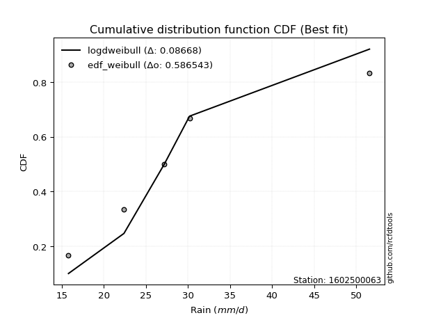</img>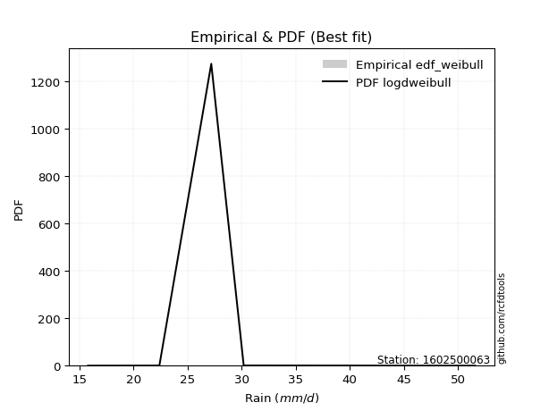</img>

</div>


### 4. EDF Beard (1943)

The Beard formula (or Beard´s plotting position formula) in hydrology is used to estimate the empirical non-exceedance probability _(P)_ of a flood event (or other extreme hydrological data point) within a given dataset.

<div align="center">


$P=(m-0.31)/(n+0.38)$


</div>


**4.1. Empirical values**

<div align="center">

|                | 0                   | 1                  | 2         | 3                  | 4                  |
|:---------------|:--------------------|:-------------------|:----------|:-------------------|:-------------------|
| date           | 2023                | 2022               | 2020      | 2025               | 2019               |
| x              | 15.8                | 22.4               | 27.2      | 30.2               | 51.6               |
| m              | 1                   | 2                  | 3         | 4                  | 5                  |
| empirical_dist | edf_beard           | edf_beard          | edf_beard | edf_beard          | edf_beard          |
| empirical      | 0.12825278810408922 | 0.3141263940520446 | 0.5       | 0.6858736059479554 | 0.8717472118959109 |
| empirical_tr   | 1.1471215351812367  | 1.4579945799457996 | 2.0       | 3.183431952662722  | 7.797101449275368  |

</div>


**4.2. Kolmogorov-Smirnov fit test (sorted by Δ)**


<div align="center">

|                | 0                   | 1                   | 2                   | 3                  | 4                   | 5                   | 6                   | 7                   | 8                   | 9                   | 10                  | 11                  | 12                 | 13                  | 14                  | 15                  | 16                  | 17                  | 18                  | 19                  | 20                  | 21                  | 22                  | 23                 | 24                 | 25                  | 26                  | 27                  | 28                 | 29                  | 30                  | 31                  | 32                  | 33                  | 34                  | 35                  | 36                  | 37                  | 38                  | 39                  | 40                  | 41                  | 42                  | 43                  | 44                  | 45                 | 46                  | 47                 | 48                  | 49                 | 50                 | 51                  | 52                 | 53                  | 54                  | 55                  | 56                  | 57                  | 58                  | 59                  | 60                  | 61                  | 62                  | 63                 | 64                 | 65                  | 66                  | 67                 | 68                 | 69                 | 70                 | 71                  | 72                  | 73                 | 74                  | 75                  | 76                  | 77                  | 78                  | 79                  | 80                  | 81                 | 82                  | 83                  | 84                  | 85                 | 86                 | 87                 | 88                 | 89                  | 90                  | 91                 | 92                 | 93                 | 94                  | 95                  | 96                  | 97                 | 98                  | 99                  | 100                 | 101                | 102                | 103                 | 104                 | 105                 | 106                | 107                 | 108                 | 109                 | 110                 | 111                 | 112                 | 113                 | 114                 | 115                 | 116                | 117                 | 118                 | 119                 | 120                | 121                 | 122                 | 123                 | 124                 | 125                 | 126                 | 127                | 128                | 129                | 130                 | 131                 | 132                 | 133                | 134                 | 135                | 136                 | 137                 | 138                 | 139                | 140                | 141                 | 142                 | 143                 | 144                 | 145                 | 146                 | 147                | 148                 | 149                | 150                | 151                | 152                | 153                | 154                | 155                | 156                | 157                | 158                | 159                |
|:---------------|:--------------------|:--------------------|:--------------------|:-------------------|:--------------------|:--------------------|:--------------------|:--------------------|:--------------------|:--------------------|:--------------------|:--------------------|:-------------------|:--------------------|:--------------------|:--------------------|:--------------------|:--------------------|:--------------------|:--------------------|:--------------------|:--------------------|:--------------------|:-------------------|:-------------------|:--------------------|:--------------------|:--------------------|:-------------------|:--------------------|:--------------------|:--------------------|:--------------------|:--------------------|:--------------------|:--------------------|:--------------------|:--------------------|:--------------------|:--------------------|:--------------------|:--------------------|:--------------------|:--------------------|:--------------------|:-------------------|:--------------------|:-------------------|:--------------------|:-------------------|:-------------------|:--------------------|:-------------------|:--------------------|:--------------------|:--------------------|:--------------------|:--------------------|:--------------------|:--------------------|:--------------------|:--------------------|:--------------------|:-------------------|:-------------------|:--------------------|:--------------------|:-------------------|:-------------------|:-------------------|:-------------------|:--------------------|:--------------------|:-------------------|:--------------------|:--------------------|:--------------------|:--------------------|:--------------------|:--------------------|:--------------------|:-------------------|:--------------------|:--------------------|:--------------------|:-------------------|:-------------------|:-------------------|:-------------------|:--------------------|:--------------------|:-------------------|:-------------------|:-------------------|:--------------------|:--------------------|:--------------------|:-------------------|:--------------------|:--------------------|:--------------------|:-------------------|:-------------------|:--------------------|:--------------------|:--------------------|:-------------------|:--------------------|:--------------------|:--------------------|:--------------------|:--------------------|:--------------------|:--------------------|:--------------------|:--------------------|:-------------------|:--------------------|:--------------------|:--------------------|:-------------------|:--------------------|:--------------------|:--------------------|:--------------------|:--------------------|:--------------------|:-------------------|:-------------------|:-------------------|:--------------------|:--------------------|:--------------------|:-------------------|:--------------------|:-------------------|:--------------------|:--------------------|:--------------------|:-------------------|:-------------------|:--------------------|:--------------------|:--------------------|:--------------------|:--------------------|:--------------------|:-------------------|:--------------------|:-------------------|:-------------------|:-------------------|:-------------------|:-------------------|:-------------------|:-------------------|:-------------------|:-------------------|:-------------------|:-------------------|
| station        | 1602500063          | 1602500063          | 1602500063          | 1602500063         | 1602500063          | 1602500063          | 1602500063          | 1602500063          | 1602500063          | 1602500063          | 1602500063          | 1602500063          | 1602500063         | 1602500063          | 1602500063          | 1602500063          | 1602500063          | 1602500063          | 1602500063          | 1602500063          | 1602500063          | 1602500063          | 1602500063          | 1602500063         | 1602500063         | 1602500063          | 1602500063          | 1602500063          | 1602500063         | 1602500063          | 1602500063          | 1602500063          | 1602500063          | 1602500063          | 1602500063          | 1602500063          | 1602500063          | 1602500063          | 1602500063          | 1602500063          | 1602500063          | 1602500063          | 1602500063          | 1602500063          | 1602500063          | 1602500063         | 1602500063          | 1602500063         | 1602500063          | 1602500063         | 1602500063         | 1602500063          | 1602500063         | 1602500063          | 1602500063          | 1602500063          | 1602500063          | 1602500063          | 1602500063          | 1602500063          | 1602500063          | 1602500063          | 1602500063          | 1602500063         | 1602500063         | 1602500063          | 1602500063          | 1602500063         | 1602500063         | 1602500063         | 1602500063         | 1602500063          | 1602500063          | 1602500063         | 1602500063          | 1602500063          | 1602500063          | 1602500063          | 1602500063          | 1602500063          | 1602500063          | 1602500063         | 1602500063          | 1602500063          | 1602500063          | 1602500063         | 1602500063         | 1602500063         | 1602500063         | 1602500063          | 1602500063          | 1602500063         | 1602500063         | 1602500063         | 1602500063          | 1602500063          | 1602500063          | 1602500063         | 1602500063          | 1602500063          | 1602500063          | 1602500063         | 1602500063         | 1602500063          | 1602500063          | 1602500063          | 1602500063         | 1602500063          | 1602500063          | 1602500063          | 1602500063          | 1602500063          | 1602500063          | 1602500063          | 1602500063          | 1602500063          | 1602500063         | 1602500063          | 1602500063          | 1602500063          | 1602500063         | 1602500063          | 1602500063          | 1602500063          | 1602500063          | 1602500063          | 1602500063          | 1602500063         | 1602500063         | 1602500063         | 1602500063          | 1602500063          | 1602500063          | 1602500063         | 1602500063          | 1602500063         | 1602500063          | 1602500063          | 1602500063          | 1602500063         | 1602500063         | 1602500063          | 1602500063          | 1602500063          | 1602500063          | 1602500063          | 1602500063          | 1602500063         | 1602500063          | 1602500063         | 1602500063         | 1602500063         | 1602500063         | 1602500063         | 1602500063         | 1602500063         | 1602500063         | 1602500063         | 1602500063         | 1602500063         |
| empirical_dist | edf_beard           | edf_beard           | edf_beard           | edf_beard          | edf_beard           | edf_beard           | edf_beard           | edf_beard           | edf_beard           | edf_beard           | edf_beard           | edf_beard           | edf_beard          | edf_beard           | edf_beard           | edf_beard           | edf_beard           | edf_beard           | edf_beard           | edf_beard           | edf_beard           | edf_beard           | edf_beard           | edf_beard          | edf_beard          | edf_beard           | edf_beard           | edf_beard           | edf_beard          | edf_beard           | edf_beard           | edf_beard           | edf_beard           | edf_beard           | edf_beard           | edf_beard           | edf_beard           | edf_beard           | edf_beard           | edf_beard           | edf_beard           | edf_beard           | edf_beard           | edf_beard           | edf_beard           | edf_beard          | edf_beard           | edf_beard          | edf_beard           | edf_beard          | edf_beard          | edf_beard           | edf_beard          | edf_beard           | edf_beard           | edf_beard           | edf_beard           | edf_beard           | edf_beard           | edf_beard           | edf_beard           | edf_beard           | edf_beard           | edf_beard          | edf_beard          | edf_beard           | edf_beard           | edf_beard          | edf_beard          | edf_beard          | edf_beard          | edf_beard           | edf_beard           | edf_beard          | edf_beard           | edf_beard           | edf_beard           | edf_beard           | edf_beard           | edf_beard           | edf_beard           | edf_beard          | edf_beard           | edf_beard           | edf_beard           | edf_beard          | edf_beard          | edf_beard          | edf_beard          | edf_beard           | edf_beard           | edf_beard          | edf_beard          | edf_beard          | edf_beard           | edf_beard           | edf_beard           | edf_beard          | edf_beard           | edf_beard           | edf_beard           | edf_beard          | edf_beard          | edf_beard           | edf_beard           | edf_beard           | edf_beard          | edf_beard           | edf_beard           | edf_beard           | edf_beard           | edf_beard           | edf_beard           | edf_beard           | edf_beard           | edf_beard           | edf_beard          | edf_beard           | edf_beard           | edf_beard           | edf_beard          | edf_beard           | edf_beard           | edf_beard           | edf_beard           | edf_beard           | edf_beard           | edf_beard          | edf_beard          | edf_beard          | edf_beard           | edf_beard           | edf_beard           | edf_beard          | edf_beard           | edf_beard          | edf_beard           | edf_beard           | edf_beard           | edf_beard          | edf_beard          | edf_beard           | edf_beard           | edf_beard           | edf_beard           | edf_beard           | edf_beard           | edf_beard          | edf_beard           | edf_beard          | edf_beard          | edf_beard          | edf_beard          | edf_beard          | edf_beard          | edf_beard          | edf_beard          | edf_beard          | edf_beard          | edf_beard          |
| p_dist         | logloglaplace       | exponnorm           | logburr12           | alpha              | loginvgamma         | lognct              | logalpha            | ncf                 | logmielke           | logmaxwell          | logskewnorm         | logburr             | logjohnsonsu       | logdweibull         | logf                | betaprime           | nct                 | f                   | loginvgauss         | logexponnorm        | invgamma            | logfatiguelife      | logpearson3         | burr               | loggenlogistic     | logweibull_max      | loggenextreme       | loginvweibull       | moyal              | logfoldnorm         | logkstwobign        | invgauss            | lograyleigh         | logbetaprime        | johnsonsu           | logerlang           | loggamma            | loggamma            | loglaplace          | loglaplace          | logrice             | loglogistic         | loghypsecant        | logcrystalball      | lognorm             | logt               | logloggamma         | genlogistic        | halfnorm            | dgamma             | gumbel_r           | dweibull            | logweibull_min     | halflogistic        | loggumbel_r         | gennorm             | foldnorm            | loganglit           | kstwobign           | logsemicircular     | pearson3            | logcosine           | logksone            | logncf             | logmoyal           | rayleigh            | loggennorm          | loggenexpon        | genexpon           | logtruncexpon      | logbradford        | beta                | loggompertz         | gompertz           | logarcsine          | skewnorm            | loghalflogistic     | wald                | loghalfnorm         | logtruncpareto      | maxwell             | logvonmises_line   | loguniform          | loggumbel_l         | logtukeylambda      | rice               | logkappa3          | logkappa4          | laplace            | truncexpon          | burr12              | hypsecant          | logistic           | loglomax           | t                   | truncnorm           | norm                | crystalball        | anglit              | semicircular        | logdgamma           | logwald            | loggausshyper      | logwrapcauchy       | arcsine             | truncweibull_min    | logargus           | halfgennorm         | logbeta             | bradford            | logjohnsonsb        | cosine              | lomax               | loglevy_l           | logrdist            | weibull_min         | gumbel_l           | logtriang           | levy_l              | wrapcauchy          | kappa4             | logtruncweibull_min | genpareto           | logexponweib        | ksone               | vonmises_line       | uniform             | kappa3             | logexponpow        | argus              | loggenhalflogistic  | johnsonsb           | lognakagami         | logtruncnorm       | nakagami            | tukeylambda        | gausshyper          | triang              | exponpow            | genextreme         | logtrapezoid       | genhalflogistic     | rdist               | gengamma            | fatiguelife         | loggengamma         | invweibull          | erlang             | exponweib           | gamma              | powerlaw           | loggenpareto       | trapezoid          | truncpareto        | logpowerlaw        | weibull_max        | loghalfgennorm     | logvonmises        | vonmises           | mielke             |
| delta          | 0.06049674106538992 | 0.06402468170512698 | 0.06419992295593846 | 0.0648326962267669 | 0.06539559199324108 | 0.06546152257055629 | 0.06547750114650441 | 0.06549032544995403 | 0.06554285966302342 | 0.06561827198222603 | 0.06597362149120548 | 0.06618825474494075 | 0.0669952050893195 | 0.06741712202835895 | 0.06772865641633635 | 0.06777059607349689 | 0.06853421221985267 | 0.06867467571690046 | 0.06873385360887793 | 0.06887474306710883 | 0.06891227964332425 | 0.06893974876407274 | 0.07034898910572573 | 0.0723178580087128 | 0.0725270306613742 | 0.07260591296005858 | 0.07260944855232543 | 0.07279548965282784 | 0.0729893882826892 | 0.07327109256957354 | 0.07360551195547342 | 0.07361000821983271 | 0.07395399384525891 | 0.07399999196565887 | 0.07436425358448809 | 0.07471059899128629 | 0.07471062367389017 | 0.07471062367389017 | 0.07944952455116439 | 0.07944952455116439 | 0.07990282998253509 | 0.08011033226986575 | 0.08031792263573656 | 0.08115509482154226 | 0.08115510748474952 | 0.0811578425979761 | 0.08335045673457986 | 0.0866903056098759 | 0.08917407030966351 | 0.0893898046969448 | 0.0901689168548403 | 0.09188845078937291 | 0.0926725458966199 | 0.09426999762276422 | 0.09470202243695003 | 0.09490859439420063 | 0.09557374692460152 | 0.09558754311056739 | 0.09896492175616922 | 0.10158609777406902 | 0.10165230675394776 | 0.10286320101182256 | 0.10920738093168103 | 0.1126461179533641 | 0.1164255902491008 | 0.11853086582905104 | 0.12269911448835769 | 0.1252856500343111 | 0.1280855446223737 | 0.1282500432043483 | 0.1282515176222061 | 0.12825277568641136 | 0.12825278777017568 | 0.128252788103987  | 0.12825278810408913 | 0.12825278810408922 | 0.12825278810408922 | 0.12825278810408922 | 0.12825278810408922 | 0.12825278810408922 | 0.12895572725333315 | 0.1334083676604818 | 0.13849248028365546 | 0.14003183030672806 | 0.14003718514062913 | 0.1413062270292751 | 0.141878198381989  | 0.1425272388659663 | 0.1433818604028133 | 0.14661309254095478 | 0.15311537353792354 | 0.1545242112580546 | 0.1574275268742198 | 0.1606083949347153 | 0.16081714375973144 | 0.16083630869499121 | 0.16083633132615738 | 0.1608363498341896 | 0.16441290941206954 | 0.16588690455033872 | 0.16631003207340248 | 0.1665432991196728 | 0.1682882703529237 | 0.16997544011997512 | 0.17173396131191687 | 0.17291208012273096 | 0.1801112149594063 | 0.18254337076854954 | 0.19335288490462416 | 0.20266106829963987 | 0.20332464915037307 | 0.20990477080939363 | 0.21305019565198546 | 0.21712380964111133 | 0.22809808158249578 | 0.22866433866196906 | 0.2300111924138758 | 0.23176651043783736 | 0.23538180627393737 | 0.23593648827968705 | 0.2511447410342867 | 0.2563473466893618  | 0.26443980467425654 | 0.26495208532008346 | 0.26734474188836516 | 0.28113370649967345 | 0.28363896907644703 | 0.2844170071272165 | 0.2850074101356593 | 0.2922891616368931 | 0.29493679474615053 | 0.30688295475581967 | 0.30891733305016617 | 0.3141218829644087 | 0.31412633043010946 | 0.314126390942134  | 0.33703617108601025 | 0.34137700380256786 | 0.34705782598069795 | 0.3568086511299545 | 0.3948303268740832 | 0.40353306387130744 | 0.40698299052006526 | 0.40723815509907274 | 0.42386268505732533 | 0.43234393039360525 | 0.44017501887997745 | 0.4449338142837828 | 0.48175552088568113 | 0.5001086654927192 | 0.5007116958305389 | 0.5027378090212645 | 0.5107071958969445 | 0.5257722243647742 | 0.537890078862433  | 0.5589707581255413 | 0.6858736059479554 | 1.0786842239719243 | 7.26024110778502   | nan                |
| deltao         | 0.5865427407550001  | 0.5865427407550001  | 0.5865427407550001  | 0.5865427407550001 | 0.5865427407550001  | 0.5865427407550001  | 0.5865427407550001  | 0.5865427407550001  | 0.5865427407550001  | 0.5865427407550001  | 0.5865427407550001  | 0.5865427407550001  | 0.5865427407550001 | 0.5865427407550001  | 0.5865427407550001  | 0.5865427407550001  | 0.5865427407550001  | 0.5865427407550001  | 0.5865427407550001  | 0.5865427407550001  | 0.5865427407550001  | 0.5865427407550001  | 0.5865427407550001  | 0.5865427407550001 | 0.5865427407550001 | 0.5865427407550001  | 0.5865427407550001  | 0.5865427407550001  | 0.5865427407550001 | 0.5865427407550001  | 0.5865427407550001  | 0.5865427407550001  | 0.5865427407550001  | 0.5865427407550001  | 0.5865427407550001  | 0.5865427407550001  | 0.5865427407550001  | 0.5865427407550001  | 0.5865427407550001  | 0.5865427407550001  | 0.5865427407550001  | 0.5865427407550001  | 0.5865427407550001  | 0.5865427407550001  | 0.5865427407550001  | 0.5865427407550001 | 0.5865427407550001  | 0.5865427407550001 | 0.5865427407550001  | 0.5865427407550001 | 0.5865427407550001 | 0.5865427407550001  | 0.5865427407550001 | 0.5865427407550001  | 0.5865427407550001  | 0.5865427407550001  | 0.5865427407550001  | 0.5865427407550001  | 0.5865427407550001  | 0.5865427407550001  | 0.5865427407550001  | 0.5865427407550001  | 0.5865427407550001  | 0.5865427407550001 | 0.5865427407550001 | 0.5865427407550001  | 0.5865427407550001  | 0.5865427407550001 | 0.5865427407550001 | 0.5865427407550001 | 0.5865427407550001 | 0.5865427407550001  | 0.5865427407550001  | 0.5865427407550001 | 0.5865427407550001  | 0.5865427407550001  | 0.5865427407550001  | 0.5865427407550001  | 0.5865427407550001  | 0.5865427407550001  | 0.5865427407550001  | 0.5865427407550001 | 0.5865427407550001  | 0.5865427407550001  | 0.5865427407550001  | 0.5865427407550001 | 0.5865427407550001 | 0.5865427407550001 | 0.5865427407550001 | 0.5865427407550001  | 0.5865427407550001  | 0.5865427407550001 | 0.5865427407550001 | 0.5865427407550001 | 0.5865427407550001  | 0.5865427407550001  | 0.5865427407550001  | 0.5865427407550001 | 0.5865427407550001  | 0.5865427407550001  | 0.5865427407550001  | 0.5865427407550001 | 0.5865427407550001 | 0.5865427407550001  | 0.5865427407550001  | 0.5865427407550001  | 0.5865427407550001 | 0.5865427407550001  | 0.5865427407550001  | 0.5865427407550001  | 0.5865427407550001  | 0.5865427407550001  | 0.5865427407550001  | 0.5865427407550001  | 0.5865427407550001  | 0.5865427407550001  | 0.5865427407550001 | 0.5865427407550001  | 0.5865427407550001  | 0.5865427407550001  | 0.5865427407550001 | 0.5865427407550001  | 0.5865427407550001  | 0.5865427407550001  | 0.5865427407550001  | 0.5865427407550001  | 0.5865427407550001  | 0.5865427407550001 | 0.5865427407550001 | 0.5865427407550001 | 0.5865427407550001  | 0.5865427407550001  | 0.5865427407550001  | 0.5865427407550001 | 0.5865427407550001  | 0.5865427407550001 | 0.5865427407550001  | 0.5865427407550001  | 0.5865427407550001  | 0.5865427407550001 | 0.5865427407550001 | 0.5865427407550001  | 0.5865427407550001  | 0.5865427407550001  | 0.5865427407550001  | 0.5865427407550001  | 0.5865427407550001  | 0.5865427407550001 | 0.5865427407550001  | 0.5865427407550001 | 0.5865427407550001 | 0.5865427407550001 | 0.5865427407550001 | 0.5865427407550001 | 0.5865427407550001 | 0.5865427407550001 | 0.5865427407550001 | 0.5865427407550001 | 0.5865427407550001 | 0.5865427407550001 |
| eval           | Δo > Δ              | Δo > Δ              | Δo > Δ              | Δo > Δ             | Δo > Δ              | Δo > Δ              | Δo > Δ              | Δo > Δ              | Δo > Δ              | Δo > Δ              | Δo > Δ              | Δo > Δ              | Δo > Δ             | Δo > Δ              | Δo > Δ              | Δo > Δ              | Δo > Δ              | Δo > Δ              | Δo > Δ              | Δo > Δ              | Δo > Δ              | Δo > Δ              | Δo > Δ              | Δo > Δ             | Δo > Δ             | Δo > Δ              | Δo > Δ              | Δo > Δ              | Δo > Δ             | Δo > Δ              | Δo > Δ              | Δo > Δ              | Δo > Δ              | Δo > Δ              | Δo > Δ              | Δo > Δ              | Δo > Δ              | Δo > Δ              | Δo > Δ              | Δo > Δ              | Δo > Δ              | Δo > Δ              | Δo > Δ              | Δo > Δ              | Δo > Δ              | Δo > Δ             | Δo > Δ              | Δo > Δ             | Δo > Δ              | Δo > Δ             | Δo > Δ             | Δo > Δ              | Δo > Δ             | Δo > Δ              | Δo > Δ              | Δo > Δ              | Δo > Δ              | Δo > Δ              | Δo > Δ              | Δo > Δ              | Δo > Δ              | Δo > Δ              | Δo > Δ              | Δo > Δ             | Δo > Δ             | Δo > Δ              | Δo > Δ              | Δo > Δ             | Δo > Δ             | Δo > Δ             | Δo > Δ             | Δo > Δ              | Δo > Δ              | Δo > Δ             | Δo > Δ              | Δo > Δ              | Δo > Δ              | Δo > Δ              | Δo > Δ              | Δo > Δ              | Δo > Δ              | Δo > Δ             | Δo > Δ              | Δo > Δ              | Δo > Δ              | Δo > Δ             | Δo > Δ             | Δo > Δ             | Δo > Δ             | Δo > Δ              | Δo > Δ              | Δo > Δ             | Δo > Δ             | Δo > Δ             | Δo > Δ              | Δo > Δ              | Δo > Δ              | Δo > Δ             | Δo > Δ              | Δo > Δ              | Δo > Δ              | Δo > Δ             | Δo > Δ             | Δo > Δ              | Δo > Δ              | Δo > Δ              | Δo > Δ             | Δo > Δ              | Δo > Δ              | Δo > Δ              | Δo > Δ              | Δo > Δ              | Δo > Δ              | Δo > Δ              | Δo > Δ              | Δo > Δ              | Δo > Δ             | Δo > Δ              | Δo > Δ              | Δo > Δ              | Δo > Δ             | Δo > Δ              | Δo > Δ              | Δo > Δ              | Δo > Δ              | Δo > Δ              | Δo > Δ              | Δo > Δ             | Δo > Δ             | Δo > Δ             | Δo > Δ              | Δo > Δ              | Δo > Δ              | Δo > Δ             | Δo > Δ              | Δo > Δ             | Δo > Δ              | Δo > Δ              | Δo > Δ              | Δo > Δ             | Δo > Δ             | Δo > Δ              | Δo > Δ              | Δo > Δ              | Δo > Δ              | Δo > Δ              | Δo > Δ              | Δo > Δ             | Δo > Δ              | Δo > Δ             | Δo > Δ             | Δo > Δ             | Δo > Δ             | Δo > Δ             | Δo > Δ             | Δo > Δ             | Δo <= Δ            | Δo <= Δ            | Δo <= Δ            | Δo <= Δ            |
| fit            | 1                   | 1                   | 1                   | 1                  | 1                   | 1                   | 1                   | 1                   | 1                   | 1                   | 1                   | 1                   | 1                  | 1                   | 1                   | 1                   | 1                   | 1                   | 1                   | 1                   | 1                   | 1                   | 1                   | 1                  | 1                  | 1                   | 1                   | 1                   | 1                  | 1                   | 1                   | 1                   | 1                   | 1                   | 1                   | 1                   | 1                   | 1                   | 1                   | 1                   | 1                   | 1                   | 1                   | 1                   | 1                   | 1                  | 1                   | 1                  | 1                   | 1                  | 1                  | 1                   | 1                  | 1                   | 1                   | 1                   | 1                   | 1                   | 1                   | 1                   | 1                   | 1                   | 1                   | 1                  | 1                  | 1                   | 1                   | 1                  | 1                  | 1                  | 1                  | 1                   | 1                   | 1                  | 1                   | 1                   | 1                   | 1                   | 1                   | 1                   | 1                   | 1                  | 1                   | 1                   | 1                   | 1                  | 1                  | 1                  | 1                  | 1                   | 1                   | 1                  | 1                  | 1                  | 1                   | 1                   | 1                   | 1                  | 1                   | 1                   | 1                   | 1                  | 1                  | 1                   | 1                   | 1                   | 1                  | 1                   | 1                   | 1                   | 1                   | 1                   | 1                   | 1                   | 1                   | 1                   | 1                  | 1                   | 1                   | 1                   | 1                  | 1                   | 1                   | 1                   | 1                   | 1                   | 1                   | 1                  | 1                  | 1                  | 1                   | 1                   | 1                   | 1                  | 1                   | 1                  | 1                   | 1                   | 1                   | 1                  | 1                  | 1                   | 1                   | 1                   | 1                   | 1                   | 1                   | 1                  | 1                   | 1                  | 1                  | 1                  | 1                  | 1                  | 1                  | 1                  | 0                  | 0                  | 0                  | 0                  |
| n              | 5                   | 5                   | 5                   | 5                  | 5                   | 5                   | 5                   | 5                   | 5                   | 5                   | 5                   | 5                   | 5                  | 5                   | 5                   | 5                   | 5                   | 5                   | 5                   | 5                   | 5                   | 5                   | 5                   | 5                  | 5                  | 5                   | 5                   | 5                   | 5                  | 5                   | 5                   | 5                   | 5                   | 5                   | 5                   | 5                   | 5                   | 5                   | 5                   | 5                   | 5                   | 5                   | 5                   | 5                   | 5                   | 5                  | 5                   | 5                  | 5                   | 5                  | 5                  | 5                   | 5                  | 5                   | 5                   | 5                   | 5                   | 5                   | 5                   | 5                   | 5                   | 5                   | 5                   | 5                  | 5                  | 5                   | 5                   | 5                  | 5                  | 5                  | 5                  | 5                   | 5                   | 5                  | 5                   | 5                   | 5                   | 5                   | 5                   | 5                   | 5                   | 5                  | 5                   | 5                   | 5                   | 5                  | 5                  | 5                  | 5                  | 5                   | 5                   | 5                  | 5                  | 5                  | 5                   | 5                   | 5                   | 5                  | 5                   | 5                   | 5                   | 5                  | 5                  | 5                   | 5                   | 5                   | 5                  | 5                   | 5                   | 5                   | 5                   | 5                   | 5                   | 5                   | 5                   | 5                   | 5                  | 5                   | 5                   | 5                   | 5                  | 5                   | 5                   | 5                   | 5                   | 5                   | 5                   | 5                  | 5                  | 5                  | 5                   | 5                   | 5                   | 5                  | 5                   | 5                  | 5                   | 5                   | 5                   | 5                  | 5                  | 5                   | 5                   | 5                   | 5                   | 5                   | 5                   | 5                  | 5                   | 5                  | 5                  | 5                  | 5                  | 5                  | 5                  | 5                  | 5                  | 5                  | 5                  | 5                  |
| best_fit       | 1                   | 0                   | 0                   | 0                  | 0                   | 0                   | 0                   | 0                   | 0                   | 0                   | 0                   | 0                   | 0                  | 0                   | 0                   | 0                   | 0                   | 0                   | 0                   | 0                   | 0                   | 0                   | 0                   | 0                  | 0                  | 0                   | 0                   | 0                   | 0                  | 0                   | 0                   | 0                   | 0                   | 0                   | 0                   | 0                   | 0                   | 0                   | 0                   | 0                   | 0                   | 0                   | 0                   | 0                   | 0                   | 0                  | 0                   | 0                  | 0                   | 0                  | 0                  | 0                   | 0                  | 0                   | 0                   | 0                   | 0                   | 0                   | 0                   | 0                   | 0                   | 0                   | 0                   | 0                  | 0                  | 0                   | 0                   | 0                  | 0                  | 0                  | 0                  | 0                   | 0                   | 0                  | 0                   | 0                   | 0                   | 0                   | 0                   | 0                   | 0                   | 0                  | 0                   | 0                   | 0                   | 0                  | 0                  | 0                  | 0                  | 0                   | 0                   | 0                  | 0                  | 0                  | 0                   | 0                   | 0                   | 0                  | 0                   | 0                   | 0                   | 0                  | 0                  | 0                   | 0                   | 0                   | 0                  | 0                   | 0                   | 0                   | 0                   | 0                   | 0                   | 0                   | 0                   | 0                   | 0                  | 0                   | 0                   | 0                   | 0                  | 0                   | 0                   | 0                   | 0                   | 0                   | 0                   | 0                  | 0                  | 0                  | 0                   | 0                   | 0                   | 0                  | 0                   | 0                  | 0                   | 0                   | 0                   | 0                  | 0                  | 0                   | 0                   | 0                   | 0                   | 0                   | 0                   | 0                  | 0                   | 0                  | 0                  | 0                  | 0                  | 0                  | 0                  | 0                  | 0                  | 0                  | 0                  | 0                  |
| best_fit_sort  | 1                   | 2                   | 3                   | 4                  | 5                   | 6                   | 7                   | 8                   | 9                   | 10                  | 11                  | 12                  | 13                 | 14                  | 15                  | 16                  | 17                  | 18                  | 19                  | 20                  | 21                  | 22                  | 23                  | 24                 | 25                 | 26                  | 27                  | 28                  | 29                 | 30                  | 31                  | 32                  | 33                  | 34                  | 35                  | 36                  | 37                  | 38                  | 39                  | 40                  | 41                  | 42                  | 43                  | 44                  | 45                  | 46                 | 47                  | 48                 | 49                  | 50                 | 51                 | 52                  | 53                 | 54                  | 55                  | 56                  | 57                  | 58                  | 59                  | 60                  | 61                  | 62                  | 63                  | 64                 | 65                 | 66                  | 67                  | 68                 | 69                 | 70                 | 71                 | 72                  | 73                  | 74                 | 75                  | 76                  | 77                  | 78                  | 79                  | 80                  | 81                  | 82                 | 83                  | 84                  | 85                  | 86                 | 87                 | 88                 | 89                 | 90                  | 91                  | 92                 | 93                 | 94                 | 95                  | 96                  | 97                  | 98                 | 99                  | 100                 | 101                 | 102                | 103                | 104                 | 105                 | 106                 | 107                | 108                 | 109                 | 110                 | 111                 | 112                 | 113                 | 114                 | 115                 | 116                 | 117                | 118                 | 119                 | 120                 | 121                | 122                 | 123                 | 124                 | 125                 | 126                 | 127                 | 128                | 129                | 130                | 131                 | 132                 | 133                 | 134                | 135                 | 136                | 137                 | 138                 | 139                 | 140                | 141                | 142                 | 143                 | 144                 | 145                 | 146                 | 147                 | 148                | 149                 | 150                | 151                | 152                | 153                | 154                | 155                | 156                | 157                | 158                | 159                | 160                |

</div>


**4.3. Best fit**

<div align="center">

|   id |    station | empirical_dist   | p_dist        |     delta |   deltao | eval   |   fit |   n |   best_fit |   best_fit_sort |
|-----:|-----------:|:-----------------|:--------------|----------:|---------:|:-------|------:|----:|-----------:|----------------:|
|    0 | 1602500063 | edf_beard        | logloglaplace | 0.0604967 | 0.586543 | Δo > Δ |     1 |   5 |          1 |               1 |

</div>


<div align="center">

</img></img>

</div>


### 5. EDF Chegodayev (1955)

The Chegodayev formula is an empirical plotting position formula used in hydrological frequency analysis to estimate the exceedance probability or return period of a specific event from a set of observed data. It is primarily used for plotting observed data points on probability paper to fit a theoretical distribution, particularly for analyzing extreme events like maximum flood flows or rainfall intensities. The constant _b_ value in the generalized plotting position formula is 0.3.

<div align="center">


$P=(m-b)/(n+1-2b)$


</div>


**5.1. Empirical values**

<div align="center">

|                | 0                   | 1                   | 2              | 3                  | 4                  |
|:---------------|:--------------------|:--------------------|:---------------|:-------------------|:-------------------|
| date           | 2023                | 2022                | 2020           | 2025               | 2019               |
| x              | 15.8                | 22.4                | 27.2           | 30.2               | 51.6               |
| m              | 1                   | 2                   | 3              | 4                  | 5                  |
| empirical_dist | edf_chegodayev      | edf_chegodayev      | edf_chegodayev | edf_chegodayev     | edf_chegodayev     |
| empirical      | 0.12962962962962962 | 0.31481481481481477 | 0.5            | 0.6851851851851851 | 0.8703703703703703 |
| empirical_tr   | 1.148936170212766   | 1.4594594594594594  | 2.0            | 3.1764705882352935 | 7.714285714285713  |

</div>


**5.2. Kolmogorov-Smirnov fit test (sorted by Δ)**


<div align="center">

|                | 0                   | 1                  | 2                   | 3                   | 4                  | 5                  | 6                   | 7                   | 8                   | 9                   | 10                  | 11                  | 12                 | 13                 | 14                  | 15                  | 16                  | 17                  | 18                  | 19                  | 20                  | 21                  | 22                  | 23                  | 24                 | 25                 | 26                 | 27                  | 28                  | 29                  | 30                  | 31                  | 32                  | 33                  | 34                 | 35                 | 36                  | 37                  | 38                  | 39                  | 40                  | 41                 | 42                 | 43                 | 44                  | 45                  | 46                  | 47                  | 48                 | 49                  | 50                  | 51                  | 52                 | 53                  | 54                  | 55                  | 56                  | 57                  | 58                  | 59                 | 60                  | 61                  | 62                  | 63                  | 64                  | 65                  | 66                  | 67                  | 68                  | 69                 | 70                 | 71                 | 72                  | 73                 | 74                 | 75                  | 76                  | 77                  | 78                  | 79                  | 80                  | 81                 | 82                  | 83                  | 84                 | 85                  | 86                 | 87                  | 88                 | 89                  | 90                 | 91                  | 92                  | 93                  | 94                  | 95                 | 96                  | 97                  | 98                  | 99                 | 100                | 101                 | 102                | 103                | 104                 | 105                | 106                 | 107                | 108                | 109                 | 110                 | 111                | 112                 | 113                 | 114                 | 115                | 116                 | 117                 | 118                 | 119                 | 120                | 121                 | 122                | 123                | 124                 | 125                 | 126                | 127                | 128                 | 129                | 130                | 131                | 132                | 133                 | 134                | 135                 | 136                 | 137                 | 138                | 139                | 140                | 141                | 142                 | 143                | 144                | 145                | 146                 | 147                 | 148                | 149                 | 150                | 151                | 152                | 153                | 154                | 155                | 156                | 157                | 158                | 159                |
|:---------------|:--------------------|:-------------------|:--------------------|:--------------------|:-------------------|:-------------------|:--------------------|:--------------------|:--------------------|:--------------------|:--------------------|:--------------------|:-------------------|:-------------------|:--------------------|:--------------------|:--------------------|:--------------------|:--------------------|:--------------------|:--------------------|:--------------------|:--------------------|:--------------------|:-------------------|:-------------------|:-------------------|:--------------------|:--------------------|:--------------------|:--------------------|:--------------------|:--------------------|:--------------------|:-------------------|:-------------------|:--------------------|:--------------------|:--------------------|:--------------------|:--------------------|:-------------------|:-------------------|:-------------------|:--------------------|:--------------------|:--------------------|:--------------------|:-------------------|:--------------------|:--------------------|:--------------------|:-------------------|:--------------------|:--------------------|:--------------------|:--------------------|:--------------------|:--------------------|:-------------------|:--------------------|:--------------------|:--------------------|:--------------------|:--------------------|:--------------------|:--------------------|:--------------------|:--------------------|:-------------------|:-------------------|:-------------------|:--------------------|:-------------------|:-------------------|:--------------------|:--------------------|:--------------------|:--------------------|:--------------------|:--------------------|:-------------------|:--------------------|:--------------------|:-------------------|:--------------------|:-------------------|:--------------------|:-------------------|:--------------------|:-------------------|:--------------------|:--------------------|:--------------------|:--------------------|:-------------------|:--------------------|:--------------------|:--------------------|:-------------------|:-------------------|:--------------------|:-------------------|:-------------------|:--------------------|:-------------------|:--------------------|:-------------------|:-------------------|:--------------------|:--------------------|:-------------------|:--------------------|:--------------------|:--------------------|:-------------------|:--------------------|:--------------------|:--------------------|:--------------------|:-------------------|:--------------------|:-------------------|:-------------------|:--------------------|:--------------------|:-------------------|:-------------------|:--------------------|:-------------------|:-------------------|:-------------------|:-------------------|:--------------------|:-------------------|:--------------------|:--------------------|:--------------------|:-------------------|:-------------------|:-------------------|:-------------------|:--------------------|:-------------------|:-------------------|:-------------------|:--------------------|:--------------------|:-------------------|:--------------------|:-------------------|:-------------------|:-------------------|:-------------------|:-------------------|:-------------------|:-------------------|:-------------------|:-------------------|:-------------------|
| station        | 1602500063          | 1602500063         | 1602500063          | 1602500063          | 1602500063         | 1602500063         | 1602500063          | 1602500063          | 1602500063          | 1602500063          | 1602500063          | 1602500063          | 1602500063         | 1602500063         | 1602500063          | 1602500063          | 1602500063          | 1602500063          | 1602500063          | 1602500063          | 1602500063          | 1602500063          | 1602500063          | 1602500063          | 1602500063         | 1602500063         | 1602500063         | 1602500063          | 1602500063          | 1602500063          | 1602500063          | 1602500063          | 1602500063          | 1602500063          | 1602500063         | 1602500063         | 1602500063          | 1602500063          | 1602500063          | 1602500063          | 1602500063          | 1602500063         | 1602500063         | 1602500063         | 1602500063          | 1602500063          | 1602500063          | 1602500063          | 1602500063         | 1602500063          | 1602500063          | 1602500063          | 1602500063         | 1602500063          | 1602500063          | 1602500063          | 1602500063          | 1602500063          | 1602500063          | 1602500063         | 1602500063          | 1602500063          | 1602500063          | 1602500063          | 1602500063          | 1602500063          | 1602500063          | 1602500063          | 1602500063          | 1602500063         | 1602500063         | 1602500063         | 1602500063          | 1602500063         | 1602500063         | 1602500063          | 1602500063          | 1602500063          | 1602500063          | 1602500063          | 1602500063          | 1602500063         | 1602500063          | 1602500063          | 1602500063         | 1602500063          | 1602500063         | 1602500063          | 1602500063         | 1602500063          | 1602500063         | 1602500063          | 1602500063          | 1602500063          | 1602500063          | 1602500063         | 1602500063          | 1602500063          | 1602500063          | 1602500063         | 1602500063         | 1602500063          | 1602500063         | 1602500063         | 1602500063          | 1602500063         | 1602500063          | 1602500063         | 1602500063         | 1602500063          | 1602500063          | 1602500063         | 1602500063          | 1602500063          | 1602500063          | 1602500063         | 1602500063          | 1602500063          | 1602500063          | 1602500063          | 1602500063         | 1602500063          | 1602500063         | 1602500063         | 1602500063          | 1602500063          | 1602500063         | 1602500063         | 1602500063          | 1602500063         | 1602500063         | 1602500063         | 1602500063         | 1602500063          | 1602500063         | 1602500063          | 1602500063          | 1602500063          | 1602500063         | 1602500063         | 1602500063         | 1602500063         | 1602500063          | 1602500063         | 1602500063         | 1602500063         | 1602500063          | 1602500063          | 1602500063         | 1602500063          | 1602500063         | 1602500063         | 1602500063         | 1602500063         | 1602500063         | 1602500063         | 1602500063         | 1602500063         | 1602500063         | 1602500063         |
| empirical_dist | edf_chegodayev      | edf_chegodayev     | edf_chegodayev      | edf_chegodayev      | edf_chegodayev     | edf_chegodayev     | edf_chegodayev      | edf_chegodayev      | edf_chegodayev      | edf_chegodayev      | edf_chegodayev      | edf_chegodayev      | edf_chegodayev     | edf_chegodayev     | edf_chegodayev      | edf_chegodayev      | edf_chegodayev      | edf_chegodayev      | edf_chegodayev      | edf_chegodayev      | edf_chegodayev      | edf_chegodayev      | edf_chegodayev      | edf_chegodayev      | edf_chegodayev     | edf_chegodayev     | edf_chegodayev     | edf_chegodayev      | edf_chegodayev      | edf_chegodayev      | edf_chegodayev      | edf_chegodayev      | edf_chegodayev      | edf_chegodayev      | edf_chegodayev     | edf_chegodayev     | edf_chegodayev      | edf_chegodayev      | edf_chegodayev      | edf_chegodayev      | edf_chegodayev      | edf_chegodayev     | edf_chegodayev     | edf_chegodayev     | edf_chegodayev      | edf_chegodayev      | edf_chegodayev      | edf_chegodayev      | edf_chegodayev     | edf_chegodayev      | edf_chegodayev      | edf_chegodayev      | edf_chegodayev     | edf_chegodayev      | edf_chegodayev      | edf_chegodayev      | edf_chegodayev      | edf_chegodayev      | edf_chegodayev      | edf_chegodayev     | edf_chegodayev      | edf_chegodayev      | edf_chegodayev      | edf_chegodayev      | edf_chegodayev      | edf_chegodayev      | edf_chegodayev      | edf_chegodayev      | edf_chegodayev      | edf_chegodayev     | edf_chegodayev     | edf_chegodayev     | edf_chegodayev      | edf_chegodayev     | edf_chegodayev     | edf_chegodayev      | edf_chegodayev      | edf_chegodayev      | edf_chegodayev      | edf_chegodayev      | edf_chegodayev      | edf_chegodayev     | edf_chegodayev      | edf_chegodayev      | edf_chegodayev     | edf_chegodayev      | edf_chegodayev     | edf_chegodayev      | edf_chegodayev     | edf_chegodayev      | edf_chegodayev     | edf_chegodayev      | edf_chegodayev      | edf_chegodayev      | edf_chegodayev      | edf_chegodayev     | edf_chegodayev      | edf_chegodayev      | edf_chegodayev      | edf_chegodayev     | edf_chegodayev     | edf_chegodayev      | edf_chegodayev     | edf_chegodayev     | edf_chegodayev      | edf_chegodayev     | edf_chegodayev      | edf_chegodayev     | edf_chegodayev     | edf_chegodayev      | edf_chegodayev      | edf_chegodayev     | edf_chegodayev      | edf_chegodayev      | edf_chegodayev      | edf_chegodayev     | edf_chegodayev      | edf_chegodayev      | edf_chegodayev      | edf_chegodayev      | edf_chegodayev     | edf_chegodayev      | edf_chegodayev     | edf_chegodayev     | edf_chegodayev      | edf_chegodayev      | edf_chegodayev     | edf_chegodayev     | edf_chegodayev      | edf_chegodayev     | edf_chegodayev     | edf_chegodayev     | edf_chegodayev     | edf_chegodayev      | edf_chegodayev     | edf_chegodayev      | edf_chegodayev      | edf_chegodayev      | edf_chegodayev     | edf_chegodayev     | edf_chegodayev     | edf_chegodayev     | edf_chegodayev      | edf_chegodayev     | edf_chegodayev     | edf_chegodayev     | edf_chegodayev      | edf_chegodayev      | edf_chegodayev     | edf_chegodayev      | edf_chegodayev     | edf_chegodayev     | edf_chegodayev     | edf_chegodayev     | edf_chegodayev     | edf_chegodayev     | edf_chegodayev     | edf_chegodayev     | edf_chegodayev     | edf_chegodayev     |
| p_dist         | logloglaplace       | exponnorm          | logburr12           | alpha               | loginvgamma        | lognct             | logalpha            | ncf                 | logmielke           | logmaxwell          | logskewnorm         | logburr             | logdweibull        | logjohnsonsu       | logf                | betaprime           | nct                 | f                   | loginvgauss         | logexponnorm        | invgamma            | logfatiguelife      | logpearson3         | logfoldnorm         | burr               | loggenlogistic     | logweibull_max     | loggenextreme       | loginvweibull       | moyal               | logkstwobign        | invgauss            | lograyleigh         | logbetaprime        | johnsonsu          | logerlang          | loggamma            | loggamma            | logcrystalball      | lognorm             | logt                | loglaplace         | loglaplace         | logrice            | loglogistic         | loghypsecant        | logloggamma         | genlogistic         | halfnorm           | gumbel_r            | dgamma              | dweibull            | logweibull_min     | foldnorm            | loganglit           | halflogistic        | loggumbel_r         | gennorm             | kstwobign           | logsemicircular    | pearson3            | logcosine           | logksone            | logncf              | logmoyal            | rayleigh            | loggennorm          | loggenexpon         | maxwell             | genexpon           | logtruncexpon      | logbradford        | beta                | loggompertz        | gompertz           | wald                | skewnorm            | loghalfnorm         | loghalflogistic     | logtruncpareto      | logarcsine          | logvonmises_line   | loguniform          | loggumbel_l         | logtukeylambda     | rice                | logkappa3          | logkappa4           | laplace            | truncexpon          | burr12             | hypsecant           | logistic            | loglomax            | t                   | truncnorm          | norm                | crystalball         | anglit              | semicircular       | logwald            | logdgamma           | loggausshyper      | logwrapcauchy      | arcsine             | truncweibull_min   | logargus            | halfgennorm        | logbeta            | bradford            | logjohnsonsb        | cosine             | lomax               | loglevy_l           | logrdist            | weibull_min        | gumbel_l            | logtriang           | levy_l              | wrapcauchy          | kappa4             | logtruncweibull_min | genpareto          | logexponweib       | ksone               | vonmises_line       | uniform            | kappa3             | logexponpow         | argus              | loggenhalflogistic | johnsonsb          | lognakagami        | logtruncnorm        | nakagami           | tukeylambda         | gausshyper          | triang              | exponpow           | genextreme         | logtrapezoid       | genhalflogistic    | rdist               | gengamma           | fatiguelife        | loggengamma        | invweibull          | erlang              | exponweib          | gamma               | powerlaw           | loggenpareto       | trapezoid          | truncpareto        | logpowerlaw        | weibull_max        | loghalfgennorm     | logvonmises        | vonmises           | mielke             |
| delta          | 0.06187358259093033 | 0.0654015232306675 | 0.06557676448147898 | 0.06620953775230742 | 0.0667724335187816 | 0.0668383640960967 | 0.06685434267204493 | 0.06686716697549455 | 0.06691970118856383 | 0.06699511350776655 | 0.06735046301674588 | 0.06756509627048116 | 0.0681055427911291 | 0.0683720466148599 | 0.06910549794187676 | 0.06914743759903741 | 0.06991105374539308 | 0.07005151724244087 | 0.07011069513441834 | 0.07025158459264935 | 0.07028912116886465 | 0.07031659028961315 | 0.07172583063126625 | 0.07258267180680322 | 0.0736946995342532 | 0.0739038721869146 | 0.0739827544855991 | 0.07398629007786595 | 0.07417233117836824 | 0.07436622980822971 | 0.07498235348101383 | 0.07498684974537312 | 0.07533083537079932 | 0.07537683349119939 | 0.0757410951100285 | 0.0760874405168267 | 0.07608746519943058 | 0.07608746519943058 | 0.08046667405877195 | 0.08046668672197921 | 0.08046942183520578 | 0.0808263660767049 | 0.0808263660767049 | 0.0812796715080755 | 0.08148717379540626 | 0.08169476416127708 | 0.08266203597180954 | 0.08806714713541641 | 0.0884856495468932 | 0.08948049609206998 | 0.09076664622248531 | 0.09326529231491343 | 0.0940493874221603 | 0.09488532616183121 | 0.09489912234779707 | 0.09564683914830463 | 0.09607886396249044 | 0.09628543591974115 | 0.09827650099339891 | 0.1008976770112987 | 0.10096388599117745 | 0.10217478024905224 | 0.10851896016891072 | 0.11195769719059379 | 0.11780243177464121 | 0.11784244506628072 | 0.12338753525112783 | 0.12666249155985151 | 0.12826730649056284 | 0.1294623861479141 | 0.1296268847298888 | 0.1296283591477465 | 0.12962961721195176 | 0.1296296292957161 | 0.1296296296295274 | 0.12962962962962962 | 0.12962962962962962 | 0.12962962962962962 | 0.12962962962962962 | 0.12962962962962965 | 0.12962962962962965 | 0.1327199468977115 | 0.13780405952088515 | 0.13934340954395774 | 0.1393487643778588 | 0.14061780626650477 | 0.1411897776192187 | 0.14183881810319598 | 0.142693439640043  | 0.14592467177818447 | 0.1524269527751534 | 0.15383579049528429 | 0.15673910611144948 | 0.15991997417194515 | 0.16012872299696113 | 0.1601478879322209 | 0.16014791056338706 | 0.16014792907141928 | 0.16372448864929923 | 0.1651984837875684 | 0.1665432991196728 | 0.16699845283617262 | 0.1675998495901534 | 0.1692870193572048 | 0.17104554054914656 | 0.1722236593599608 | 0.17942279419663598 | 0.1818549500057794 | 0.192664464141854  | 0.20197264753686955 | 0.20263622838760276 | 0.2092163500466233 | 0.21236177488921515 | 0.21643538887834102 | 0.22740966081972547 | 0.2279759178991989 | 0.22932277165110548 | 0.23107808967506704 | 0.23400496474839697 | 0.23524806751691674 | 0.2504563202715164 | 0.2556589259265917  | 0.2637513839114862 | 0.2642636645573133 | 0.26665632112559484 | 0.28044528573690314 | 0.2829505483136767 | 0.2837285863644462 | 0.28431898937288913 | 0.2916007408741228 | 0.2942483739833802 | 0.3061945339930495 | 0.3096057538129363 | 0.31481030372717883 | 0.3148147511928796 | 0.31481481170490433 | 0.33634775032323994 | 0.34068858303979754 | 0.3463694052179278 | 0.355431809604414  | 0.3941419061113129 | 0.4028446431085371 | 0.40560614899452485 | 0.4065497343363026 | 0.4231742642945552 | 0.4316555096308351 | 0.43879817735443694 | 0.44424539352101267 | 0.481067100122911  | 0.49942024472994895 | 0.5000232750677688 | 0.5013609674957241 | 0.5100187751341742 | 0.5250838036020041 | 0.5372016580996628 | 0.558282337362771  | 0.6851851851851851 | 1.080061065497465  | 7.26161794931056   | nan                |
| deltao         | 0.5865427407550001  | 0.5865427407550001 | 0.5865427407550001  | 0.5865427407550001  | 0.5865427407550001 | 0.5865427407550001 | 0.5865427407550001  | 0.5865427407550001  | 0.5865427407550001  | 0.5865427407550001  | 0.5865427407550001  | 0.5865427407550001  | 0.5865427407550001 | 0.5865427407550001 | 0.5865427407550001  | 0.5865427407550001  | 0.5865427407550001  | 0.5865427407550001  | 0.5865427407550001  | 0.5865427407550001  | 0.5865427407550001  | 0.5865427407550001  | 0.5865427407550001  | 0.5865427407550001  | 0.5865427407550001 | 0.5865427407550001 | 0.5865427407550001 | 0.5865427407550001  | 0.5865427407550001  | 0.5865427407550001  | 0.5865427407550001  | 0.5865427407550001  | 0.5865427407550001  | 0.5865427407550001  | 0.5865427407550001 | 0.5865427407550001 | 0.5865427407550001  | 0.5865427407550001  | 0.5865427407550001  | 0.5865427407550001  | 0.5865427407550001  | 0.5865427407550001 | 0.5865427407550001 | 0.5865427407550001 | 0.5865427407550001  | 0.5865427407550001  | 0.5865427407550001  | 0.5865427407550001  | 0.5865427407550001 | 0.5865427407550001  | 0.5865427407550001  | 0.5865427407550001  | 0.5865427407550001 | 0.5865427407550001  | 0.5865427407550001  | 0.5865427407550001  | 0.5865427407550001  | 0.5865427407550001  | 0.5865427407550001  | 0.5865427407550001 | 0.5865427407550001  | 0.5865427407550001  | 0.5865427407550001  | 0.5865427407550001  | 0.5865427407550001  | 0.5865427407550001  | 0.5865427407550001  | 0.5865427407550001  | 0.5865427407550001  | 0.5865427407550001 | 0.5865427407550001 | 0.5865427407550001 | 0.5865427407550001  | 0.5865427407550001 | 0.5865427407550001 | 0.5865427407550001  | 0.5865427407550001  | 0.5865427407550001  | 0.5865427407550001  | 0.5865427407550001  | 0.5865427407550001  | 0.5865427407550001 | 0.5865427407550001  | 0.5865427407550001  | 0.5865427407550001 | 0.5865427407550001  | 0.5865427407550001 | 0.5865427407550001  | 0.5865427407550001 | 0.5865427407550001  | 0.5865427407550001 | 0.5865427407550001  | 0.5865427407550001  | 0.5865427407550001  | 0.5865427407550001  | 0.5865427407550001 | 0.5865427407550001  | 0.5865427407550001  | 0.5865427407550001  | 0.5865427407550001 | 0.5865427407550001 | 0.5865427407550001  | 0.5865427407550001 | 0.5865427407550001 | 0.5865427407550001  | 0.5865427407550001 | 0.5865427407550001  | 0.5865427407550001 | 0.5865427407550001 | 0.5865427407550001  | 0.5865427407550001  | 0.5865427407550001 | 0.5865427407550001  | 0.5865427407550001  | 0.5865427407550001  | 0.5865427407550001 | 0.5865427407550001  | 0.5865427407550001  | 0.5865427407550001  | 0.5865427407550001  | 0.5865427407550001 | 0.5865427407550001  | 0.5865427407550001 | 0.5865427407550001 | 0.5865427407550001  | 0.5865427407550001  | 0.5865427407550001 | 0.5865427407550001 | 0.5865427407550001  | 0.5865427407550001 | 0.5865427407550001 | 0.5865427407550001 | 0.5865427407550001 | 0.5865427407550001  | 0.5865427407550001 | 0.5865427407550001  | 0.5865427407550001  | 0.5865427407550001  | 0.5865427407550001 | 0.5865427407550001 | 0.5865427407550001 | 0.5865427407550001 | 0.5865427407550001  | 0.5865427407550001 | 0.5865427407550001 | 0.5865427407550001 | 0.5865427407550001  | 0.5865427407550001  | 0.5865427407550001 | 0.5865427407550001  | 0.5865427407550001 | 0.5865427407550001 | 0.5865427407550001 | 0.5865427407550001 | 0.5865427407550001 | 0.5865427407550001 | 0.5865427407550001 | 0.5865427407550001 | 0.5865427407550001 | 0.5865427407550001 |
| eval           | Δo > Δ              | Δo > Δ             | Δo > Δ              | Δo > Δ              | Δo > Δ             | Δo > Δ             | Δo > Δ              | Δo > Δ              | Δo > Δ              | Δo > Δ              | Δo > Δ              | Δo > Δ              | Δo > Δ             | Δo > Δ             | Δo > Δ              | Δo > Δ              | Δo > Δ              | Δo > Δ              | Δo > Δ              | Δo > Δ              | Δo > Δ              | Δo > Δ              | Δo > Δ              | Δo > Δ              | Δo > Δ             | Δo > Δ             | Δo > Δ             | Δo > Δ              | Δo > Δ              | Δo > Δ              | Δo > Δ              | Δo > Δ              | Δo > Δ              | Δo > Δ              | Δo > Δ             | Δo > Δ             | Δo > Δ              | Δo > Δ              | Δo > Δ              | Δo > Δ              | Δo > Δ              | Δo > Δ             | Δo > Δ             | Δo > Δ             | Δo > Δ              | Δo > Δ              | Δo > Δ              | Δo > Δ              | Δo > Δ             | Δo > Δ              | Δo > Δ              | Δo > Δ              | Δo > Δ             | Δo > Δ              | Δo > Δ              | Δo > Δ              | Δo > Δ              | Δo > Δ              | Δo > Δ              | Δo > Δ             | Δo > Δ              | Δo > Δ              | Δo > Δ              | Δo > Δ              | Δo > Δ              | Δo > Δ              | Δo > Δ              | Δo > Δ              | Δo > Δ              | Δo > Δ             | Δo > Δ             | Δo > Δ             | Δo > Δ              | Δo > Δ             | Δo > Δ             | Δo > Δ              | Δo > Δ              | Δo > Δ              | Δo > Δ              | Δo > Δ              | Δo > Δ              | Δo > Δ             | Δo > Δ              | Δo > Δ              | Δo > Δ             | Δo > Δ              | Δo > Δ             | Δo > Δ              | Δo > Δ             | Δo > Δ              | Δo > Δ             | Δo > Δ              | Δo > Δ              | Δo > Δ              | Δo > Δ              | Δo > Δ             | Δo > Δ              | Δo > Δ              | Δo > Δ              | Δo > Δ             | Δo > Δ             | Δo > Δ              | Δo > Δ             | Δo > Δ             | Δo > Δ              | Δo > Δ             | Δo > Δ              | Δo > Δ             | Δo > Δ             | Δo > Δ              | Δo > Δ              | Δo > Δ             | Δo > Δ              | Δo > Δ              | Δo > Δ              | Δo > Δ             | Δo > Δ              | Δo > Δ              | Δo > Δ              | Δo > Δ              | Δo > Δ             | Δo > Δ              | Δo > Δ             | Δo > Δ             | Δo > Δ              | Δo > Δ              | Δo > Δ             | Δo > Δ             | Δo > Δ              | Δo > Δ             | Δo > Δ             | Δo > Δ             | Δo > Δ             | Δo > Δ              | Δo > Δ             | Δo > Δ              | Δo > Δ              | Δo > Δ              | Δo > Δ             | Δo > Δ             | Δo > Δ             | Δo > Δ             | Δo > Δ              | Δo > Δ             | Δo > Δ             | Δo > Δ             | Δo > Δ              | Δo > Δ              | Δo > Δ             | Δo > Δ              | Δo > Δ             | Δo > Δ             | Δo > Δ             | Δo > Δ             | Δo > Δ             | Δo > Δ             | Δo <= Δ            | Δo <= Δ            | Δo <= Δ            | Δo <= Δ            |
| fit            | 1                   | 1                  | 1                   | 1                   | 1                  | 1                  | 1                   | 1                   | 1                   | 1                   | 1                   | 1                   | 1                  | 1                  | 1                   | 1                   | 1                   | 1                   | 1                   | 1                   | 1                   | 1                   | 1                   | 1                   | 1                  | 1                  | 1                  | 1                   | 1                   | 1                   | 1                   | 1                   | 1                   | 1                   | 1                  | 1                  | 1                   | 1                   | 1                   | 1                   | 1                   | 1                  | 1                  | 1                  | 1                   | 1                   | 1                   | 1                   | 1                  | 1                   | 1                   | 1                   | 1                  | 1                   | 1                   | 1                   | 1                   | 1                   | 1                   | 1                  | 1                   | 1                   | 1                   | 1                   | 1                   | 1                   | 1                   | 1                   | 1                   | 1                  | 1                  | 1                  | 1                   | 1                  | 1                  | 1                   | 1                   | 1                   | 1                   | 1                   | 1                   | 1                  | 1                   | 1                   | 1                  | 1                   | 1                  | 1                   | 1                  | 1                   | 1                  | 1                   | 1                   | 1                   | 1                   | 1                  | 1                   | 1                   | 1                   | 1                  | 1                  | 1                   | 1                  | 1                  | 1                   | 1                  | 1                   | 1                  | 1                  | 1                   | 1                   | 1                  | 1                   | 1                   | 1                   | 1                  | 1                   | 1                   | 1                   | 1                   | 1                  | 1                   | 1                  | 1                  | 1                   | 1                   | 1                  | 1                  | 1                   | 1                  | 1                  | 1                  | 1                  | 1                   | 1                  | 1                   | 1                   | 1                   | 1                  | 1                  | 1                  | 1                  | 1                   | 1                  | 1                  | 1                  | 1                   | 1                   | 1                  | 1                   | 1                  | 1                  | 1                  | 1                  | 1                  | 1                  | 0                  | 0                  | 0                  | 0                  |
| n              | 5                   | 5                  | 5                   | 5                   | 5                  | 5                  | 5                   | 5                   | 5                   | 5                   | 5                   | 5                   | 5                  | 5                  | 5                   | 5                   | 5                   | 5                   | 5                   | 5                   | 5                   | 5                   | 5                   | 5                   | 5                  | 5                  | 5                  | 5                   | 5                   | 5                   | 5                   | 5                   | 5                   | 5                   | 5                  | 5                  | 5                   | 5                   | 5                   | 5                   | 5                   | 5                  | 5                  | 5                  | 5                   | 5                   | 5                   | 5                   | 5                  | 5                   | 5                   | 5                   | 5                  | 5                   | 5                   | 5                   | 5                   | 5                   | 5                   | 5                  | 5                   | 5                   | 5                   | 5                   | 5                   | 5                   | 5                   | 5                   | 5                   | 5                  | 5                  | 5                  | 5                   | 5                  | 5                  | 5                   | 5                   | 5                   | 5                   | 5                   | 5                   | 5                  | 5                   | 5                   | 5                  | 5                   | 5                  | 5                   | 5                  | 5                   | 5                  | 5                   | 5                   | 5                   | 5                   | 5                  | 5                   | 5                   | 5                   | 5                  | 5                  | 5                   | 5                  | 5                  | 5                   | 5                  | 5                   | 5                  | 5                  | 5                   | 5                   | 5                  | 5                   | 5                   | 5                   | 5                  | 5                   | 5                   | 5                   | 5                   | 5                  | 5                   | 5                  | 5                  | 5                   | 5                   | 5                  | 5                  | 5                   | 5                  | 5                  | 5                  | 5                  | 5                   | 5                  | 5                   | 5                   | 5                   | 5                  | 5                  | 5                  | 5                  | 5                   | 5                  | 5                  | 5                  | 5                   | 5                   | 5                  | 5                   | 5                  | 5                  | 5                  | 5                  | 5                  | 5                  | 5                  | 5                  | 5                  | 5                  |
| best_fit       | 1                   | 0                  | 0                   | 0                   | 0                  | 0                  | 0                   | 0                   | 0                   | 0                   | 0                   | 0                   | 0                  | 0                  | 0                   | 0                   | 0                   | 0                   | 0                   | 0                   | 0                   | 0                   | 0                   | 0                   | 0                  | 0                  | 0                  | 0                   | 0                   | 0                   | 0                   | 0                   | 0                   | 0                   | 0                  | 0                  | 0                   | 0                   | 0                   | 0                   | 0                   | 0                  | 0                  | 0                  | 0                   | 0                   | 0                   | 0                   | 0                  | 0                   | 0                   | 0                   | 0                  | 0                   | 0                   | 0                   | 0                   | 0                   | 0                   | 0                  | 0                   | 0                   | 0                   | 0                   | 0                   | 0                   | 0                   | 0                   | 0                   | 0                  | 0                  | 0                  | 0                   | 0                  | 0                  | 0                   | 0                   | 0                   | 0                   | 0                   | 0                   | 0                  | 0                   | 0                   | 0                  | 0                   | 0                  | 0                   | 0                  | 0                   | 0                  | 0                   | 0                   | 0                   | 0                   | 0                  | 0                   | 0                   | 0                   | 0                  | 0                  | 0                   | 0                  | 0                  | 0                   | 0                  | 0                   | 0                  | 0                  | 0                   | 0                   | 0                  | 0                   | 0                   | 0                   | 0                  | 0                   | 0                   | 0                   | 0                   | 0                  | 0                   | 0                  | 0                  | 0                   | 0                   | 0                  | 0                  | 0                   | 0                  | 0                  | 0                  | 0                  | 0                   | 0                  | 0                   | 0                   | 0                   | 0                  | 0                  | 0                  | 0                  | 0                   | 0                  | 0                  | 0                  | 0                   | 0                   | 0                  | 0                   | 0                  | 0                  | 0                  | 0                  | 0                  | 0                  | 0                  | 0                  | 0                  | 0                  |
| best_fit_sort  | 1                   | 2                  | 3                   | 4                   | 5                  | 6                  | 7                   | 8                   | 9                   | 10                  | 11                  | 12                  | 13                 | 14                 | 15                  | 16                  | 17                  | 18                  | 19                  | 20                  | 21                  | 22                  | 23                  | 24                  | 25                 | 26                 | 27                 | 28                  | 29                  | 30                  | 31                  | 32                  | 33                  | 34                  | 35                 | 36                 | 37                  | 38                  | 39                  | 40                  | 41                  | 42                 | 43                 | 44                 | 45                  | 46                  | 47                  | 48                  | 49                 | 50                  | 51                  | 52                  | 53                 | 54                  | 55                  | 56                  | 57                  | 58                  | 59                  | 60                 | 61                  | 62                  | 63                  | 64                  | 65                  | 66                  | 67                  | 68                  | 69                  | 70                 | 71                 | 72                 | 73                  | 74                 | 75                 | 76                  | 77                  | 78                  | 79                  | 80                  | 81                  | 82                 | 83                  | 84                  | 85                 | 86                  | 87                 | 88                  | 89                 | 90                  | 91                 | 92                  | 93                  | 94                  | 95                  | 96                 | 97                  | 98                  | 99                  | 100                | 101                | 102                 | 103                | 104                | 105                 | 106                | 107                 | 108                | 109                | 110                 | 111                 | 112                | 113                 | 114                 | 115                 | 116                | 117                 | 118                 | 119                 | 120                 | 121                | 122                 | 123                | 124                | 125                 | 126                 | 127                | 128                | 129                 | 130                | 131                | 132                | 133                | 134                 | 135                | 136                 | 137                 | 138                 | 139                | 140                | 141                | 142                | 143                 | 144                | 145                | 146                | 147                 | 148                 | 149                | 150                 | 151                | 152                | 153                | 154                | 155                | 156                | 157                | 158                | 159                | 160                |

</div>


**5.3. Best fit**

<div align="center">

|   id |    station | empirical_dist   | p_dist        |     delta |   deltao | eval   |   fit |   n |   best_fit |   best_fit_sort |
|-----:|-----------:|:-----------------|:--------------|----------:|---------:|:-------|------:|----:|-----------:|----------------:|
|    0 | 1602500063 | edf_chegodayev   | logloglaplace | 0.0618736 | 0.586543 | Δo > Δ |     1 |   5 |          1 |               1 |

</div>


<div align="center">

</img></img>

</div>


### 6. EDF Blom (1958)

The Blom formula is a specific "plotting position" formula used in hydrology and statistical analysis to estimate the empirical cumulative probability (or non-exceedance probability) of a data series. It is particularly recommended for data that are approximately normally distributed. The constant _a_ is set to 0.375 (or 3/8).

<div align="center">


$P=(m-a)/(n+1-2a)$


</div>


**6.1. Empirical values**

<div align="center">

|                | 0                   | 1                   | 2        | 3                  | 4                  |
|:---------------|:--------------------|:--------------------|:---------|:-------------------|:-------------------|
| date           | 2023                | 2022                | 2020     | 2025               | 2019               |
| x              | 15.8                | 22.4                | 27.2     | 30.2               | 51.6               |
| m              | 1                   | 2                   | 3        | 4                  | 5                  |
| empirical_dist | edf_blom            | edf_blom            | edf_blom | edf_blom           | edf_blom           |
| empirical      | 0.11904761904761904 | 0.30952380952380953 | 0.5      | 0.6904761904761905 | 0.8809523809523809 |
| empirical_tr   | 1.135135135135135   | 1.4482758620689655  | 2.0      | 3.230769230769231  | 8.399999999999999  |

</div>


**6.2. Kolmogorov-Smirnov fit test (sorted by Δ)**


<div align="center">

|                | 0                   | 1                   | 2                    | 3                   | 4                   | 5                    | 6                   | 7                   | 8                  | 9                   | 10                   | 11                  | 12                  | 13                  | 14                   | 15                  | 16                   | 17                  | 18                  | 19                  | 20                   | 21                  | 22                  | 23                  | 24                  | 25                  | 26                  | 27                  | 28                  | 29                  | 30                  | 31                  | 32                 | 33                 | 34                  | 35                  | 36                  | 37                  | 38                  | 39                  | 40                 | 41                  | 42                  | 43                  | 44                  | 45                  | 46                  | 47                  | 48                  | 49                  | 50                 | 51                  | 52                  | 53                  | 54                  | 55                  | 56                  | 57                  | 58                  | 59                  | 60                 | 61                  | 62                  | 63                  | 64                  | 65                  | 66                 | 67                  | 68                  | 69                  | 70                  | 71                 | 72                  | 73                  | 74                  | 75                  | 76                  | 77                  | 78                  | 79                  | 80                  | 81                  | 82                 | 83                 | 84                  | 85                  | 86                  | 87                  | 88                  | 89                 | 90                  | 91                  | 92                 | 93                  | 94                  | 95                  | 96                  | 97                 | 98                  | 99                 | 100                 | 101                 | 102                 | 103                 | 104                | 105                 | 106                 | 107                 | 108                 | 109                | 110                | 111                 | 112                | 113                 | 114                | 115                 | 116                 | 117                | 118                 | 119                 | 120                | 121                 | 122                 | 123                 | 124                | 125                | 126                 | 127                 | 128                 | 129                 | 130                 | 131                | 132                | 133                 | 134                | 135                 | 136                | 137                | 138                 | 139                | 140                 | 141                 | 142                 | 143                 | 144                | 145                 | 146                | 147                | 148                | 149                | 150                | 151                | 152                | 153                | 154                | 155                | 156                | 157                | 158                | 159                |
|:---------------|:--------------------|:--------------------|:---------------------|:--------------------|:--------------------|:---------------------|:--------------------|:--------------------|:-------------------|:--------------------|:---------------------|:--------------------|:--------------------|:--------------------|:---------------------|:--------------------|:---------------------|:--------------------|:--------------------|:--------------------|:---------------------|:--------------------|:--------------------|:--------------------|:--------------------|:--------------------|:--------------------|:--------------------|:--------------------|:--------------------|:--------------------|:--------------------|:-------------------|:-------------------|:--------------------|:--------------------|:--------------------|:--------------------|:--------------------|:--------------------|:-------------------|:--------------------|:--------------------|:--------------------|:--------------------|:--------------------|:--------------------|:--------------------|:--------------------|:--------------------|:-------------------|:--------------------|:--------------------|:--------------------|:--------------------|:--------------------|:--------------------|:--------------------|:--------------------|:--------------------|:-------------------|:--------------------|:--------------------|:--------------------|:--------------------|:--------------------|:-------------------|:--------------------|:--------------------|:--------------------|:--------------------|:-------------------|:--------------------|:--------------------|:--------------------|:--------------------|:--------------------|:--------------------|:--------------------|:--------------------|:--------------------|:--------------------|:-------------------|:-------------------|:--------------------|:--------------------|:--------------------|:--------------------|:--------------------|:-------------------|:--------------------|:--------------------|:-------------------|:--------------------|:--------------------|:--------------------|:--------------------|:-------------------|:--------------------|:-------------------|:--------------------|:--------------------|:--------------------|:--------------------|:-------------------|:--------------------|:--------------------|:--------------------|:--------------------|:-------------------|:-------------------|:--------------------|:-------------------|:--------------------|:-------------------|:--------------------|:--------------------|:-------------------|:--------------------|:--------------------|:-------------------|:--------------------|:--------------------|:--------------------|:-------------------|:-------------------|:--------------------|:--------------------|:--------------------|:--------------------|:--------------------|:-------------------|:-------------------|:--------------------|:-------------------|:--------------------|:-------------------|:-------------------|:--------------------|:-------------------|:--------------------|:--------------------|:--------------------|:--------------------|:-------------------|:--------------------|:-------------------|:-------------------|:-------------------|:-------------------|:-------------------|:-------------------|:-------------------|:-------------------|:-------------------|:-------------------|:-------------------|:-------------------|:-------------------|:-------------------|
| station        | 1602500063          | 1602500063          | 1602500063           | 1602500063          | 1602500063          | 1602500063           | 1602500063          | 1602500063          | 1602500063         | 1602500063          | 1602500063           | 1602500063          | 1602500063          | 1602500063          | 1602500063           | 1602500063          | 1602500063           | 1602500063          | 1602500063          | 1602500063          | 1602500063           | 1602500063          | 1602500063          | 1602500063          | 1602500063          | 1602500063          | 1602500063          | 1602500063          | 1602500063          | 1602500063          | 1602500063          | 1602500063          | 1602500063         | 1602500063         | 1602500063          | 1602500063          | 1602500063          | 1602500063          | 1602500063          | 1602500063          | 1602500063         | 1602500063          | 1602500063          | 1602500063          | 1602500063          | 1602500063          | 1602500063          | 1602500063          | 1602500063          | 1602500063          | 1602500063         | 1602500063          | 1602500063          | 1602500063          | 1602500063          | 1602500063          | 1602500063          | 1602500063          | 1602500063          | 1602500063          | 1602500063         | 1602500063          | 1602500063          | 1602500063          | 1602500063          | 1602500063          | 1602500063         | 1602500063          | 1602500063          | 1602500063          | 1602500063          | 1602500063         | 1602500063          | 1602500063          | 1602500063          | 1602500063          | 1602500063          | 1602500063          | 1602500063          | 1602500063          | 1602500063          | 1602500063          | 1602500063         | 1602500063         | 1602500063          | 1602500063          | 1602500063          | 1602500063          | 1602500063          | 1602500063         | 1602500063          | 1602500063          | 1602500063         | 1602500063          | 1602500063          | 1602500063          | 1602500063          | 1602500063         | 1602500063          | 1602500063         | 1602500063          | 1602500063          | 1602500063          | 1602500063          | 1602500063         | 1602500063          | 1602500063          | 1602500063          | 1602500063          | 1602500063         | 1602500063         | 1602500063          | 1602500063         | 1602500063          | 1602500063         | 1602500063          | 1602500063          | 1602500063         | 1602500063          | 1602500063          | 1602500063         | 1602500063          | 1602500063          | 1602500063          | 1602500063         | 1602500063         | 1602500063          | 1602500063          | 1602500063          | 1602500063          | 1602500063          | 1602500063         | 1602500063         | 1602500063          | 1602500063         | 1602500063          | 1602500063         | 1602500063         | 1602500063          | 1602500063         | 1602500063          | 1602500063          | 1602500063          | 1602500063          | 1602500063         | 1602500063          | 1602500063         | 1602500063         | 1602500063         | 1602500063         | 1602500063         | 1602500063         | 1602500063         | 1602500063         | 1602500063         | 1602500063         | 1602500063         | 1602500063         | 1602500063         | 1602500063         |
| empirical_dist | edf_blom            | edf_blom            | edf_blom             | edf_blom            | edf_blom            | edf_blom             | edf_blom            | edf_blom            | edf_blom           | edf_blom            | edf_blom             | edf_blom            | edf_blom            | edf_blom            | edf_blom             | edf_blom            | edf_blom             | edf_blom            | edf_blom            | edf_blom            | edf_blom             | edf_blom            | edf_blom            | edf_blom            | edf_blom            | edf_blom            | edf_blom            | edf_blom            | edf_blom            | edf_blom            | edf_blom            | edf_blom            | edf_blom           | edf_blom           | edf_blom            | edf_blom            | edf_blom            | edf_blom            | edf_blom            | edf_blom            | edf_blom           | edf_blom            | edf_blom            | edf_blom            | edf_blom            | edf_blom            | edf_blom            | edf_blom            | edf_blom            | edf_blom            | edf_blom           | edf_blom            | edf_blom            | edf_blom            | edf_blom            | edf_blom            | edf_blom            | edf_blom            | edf_blom            | edf_blom            | edf_blom           | edf_blom            | edf_blom            | edf_blom            | edf_blom            | edf_blom            | edf_blom           | edf_blom            | edf_blom            | edf_blom            | edf_blom            | edf_blom           | edf_blom            | edf_blom            | edf_blom            | edf_blom            | edf_blom            | edf_blom            | edf_blom            | edf_blom            | edf_blom            | edf_blom            | edf_blom           | edf_blom           | edf_blom            | edf_blom            | edf_blom            | edf_blom            | edf_blom            | edf_blom           | edf_blom            | edf_blom            | edf_blom           | edf_blom            | edf_blom            | edf_blom            | edf_blom            | edf_blom           | edf_blom            | edf_blom           | edf_blom            | edf_blom            | edf_blom            | edf_blom            | edf_blom           | edf_blom            | edf_blom            | edf_blom            | edf_blom            | edf_blom           | edf_blom           | edf_blom            | edf_blom           | edf_blom            | edf_blom           | edf_blom            | edf_blom            | edf_blom           | edf_blom            | edf_blom            | edf_blom           | edf_blom            | edf_blom            | edf_blom            | edf_blom           | edf_blom           | edf_blom            | edf_blom            | edf_blom            | edf_blom            | edf_blom            | edf_blom           | edf_blom           | edf_blom            | edf_blom           | edf_blom            | edf_blom           | edf_blom           | edf_blom            | edf_blom           | edf_blom            | edf_blom            | edf_blom            | edf_blom            | edf_blom           | edf_blom            | edf_blom           | edf_blom           | edf_blom           | edf_blom           | edf_blom           | edf_blom           | edf_blom           | edf_blom           | edf_blom           | edf_blom           | edf_blom           | edf_blom           | edf_blom           | edf_blom           |
| p_dist         | logloglaplace       | exponnorm           | logburr12            | alpha               | loginvgamma         | lognct               | logalpha            | logmielke           | logskewnorm        | logburr             | logjohnsonsu         | logf                | betaprime           | nct                 | f                    | loginvgauss         | logmaxwell           | invgamma            | logfatiguelife      | logexponnorm        | ncf                  | logdweibull         | loggenlogistic      | logweibull_max      | loggenextreme       | loginvweibull       | invgauss            | burr                | lograyleigh         | logbetaprime        | johnsonsu           | logerlang           | loggamma           | loggamma           | logpearson3         | logkstwobign        | moyal               | loglaplace          | loglaplace          | logrice             | loghypsecant       | loglogistic         | logfoldnorm         | genlogistic         | dgamma              | dweibull            | logweibull_min      | halflogistic        | loggumbel_r         | gennorm             | logcrystalball     | lognorm             | logt                | logloggamma         | halfnorm            | gumbel_r            | foldnorm            | loganglit           | kstwobign           | logsemicircular     | pearson3           | logmoyal            | logcosine           | logksone            | loggenexpon         | logncf              | loggennorm         | genexpon            | logtruncexpon       | logbradford         | beta                | loggompertz        | gompertz            | wald                | loghalflogistic     | loghalfnorm         | logtruncpareto      | skewnorm            | rayleigh            | logarcsine          | maxwell             | logvonmises_line    | loguniform         | loggumbel_l        | logtukeylambda      | rice                | logkappa3           | logkappa4           | laplace             | truncexpon         | burr12              | hypsecant           | logdgamma          | logistic            | loglomax            | t                   | truncnorm           | norm               | crystalball         | logwald            | anglit              | semicircular        | loggausshyper       | logwrapcauchy       | arcsine            | truncweibull_min    | logargus            | halfgennorm         | logbeta             | bradford           | logjohnsonsb       | cosine              | lomax              | loglevy_l           | logrdist           | weibull_min         | gumbel_l            | logtriang          | wrapcauchy          | levy_l              | kappa4             | logtruncweibull_min | genpareto           | logexponweib        | ksone              | vonmises_line      | uniform             | kappa3              | logexponpow         | argus               | loggenhalflogistic  | lognakagami        | logtruncnorm       | nakagami            | tukeylambda        | johnsonsb           | gausshyper         | triang             | exponpow            | genextreme         | logtrapezoid        | genhalflogistic     | gengamma            | rdist               | fatiguelife        | loggengamma         | invweibull         | erlang             | exponweib          | gamma              | powerlaw           | loggenpareto       | trapezoid          | truncpareto        | logpowerlaw        | weibull_max        | loghalfgennorm     | logvonmises        | vonmises           | mielke             |
| delta          | 0.05476045024819359 | 0.05481951264865692 | 0.054994753899468396 | 0.05562752717029684 | 0.05619042293677101 | 0.056256353514086116 | 0.05627233209003435 | 0.05633769060655325 | 0.0567684524347353 | 0.05698308568847058 | 0.057790036032849317 | 0.05852348735986618 | 0.05856542701702683 | 0.05932904316338249 | 0.059469506660430285 | 0.05952868455240775 | 0.059653125292241205 | 0.05970711058685407 | 0.05973457970760256 | 0.05975726814256488 | 0.062157090938597004 | 0.06281453750012386 | 0.06332186160490402 | 0.06340074390358852 | 0.06340427949585536 | 0.06359032059635766 | 0.06440483916336254 | 0.06455504225043629 | 0.06474882478878874 | 0.06479482290918881 | 0.06515908452801791 | 0.06550542993481612 | 0.06550545461742   | 0.06550545461742   | 0.06702223532197316 | 0.06752999889288924 | 0.06926932578766332 | 0.07024435549469432 | 0.07024435549469432 | 0.07069766092606491 | 0.0711127535792665 | 0.07232505430480818 | 0.07787367709780857 | 0.07918796484795387 | 0.08018463564047473 | 0.08268328173290285 | 0.08346737684014972 | 0.08506482856629405 | 0.08549685338047985 | 0.08570342533773057 | 0.0857576793497773 | 0.08575769201298455 | 0.08576042712621113 | 0.08795304126281489 | 0.09377665483789854 | 0.09477150138307533 | 0.10017633145283655 | 0.10019012763880242 | 0.10356750628440425 | 0.10618868230230405 | 0.1062548912821828 | 0.10722042119263063 | 0.10746578554005759 | 0.11380996545991606 | 0.11608048097784093 | 0.11724870248159913 | 0.1180965299601226 | 0.11888037556590354 | 0.11904487414787823 | 0.11904634856573593 | 0.11904760662994118 | 0.1190476187137055 | 0.11904761904751683 | 0.11904761904761904 | 0.11904761904761904 | 0.11904761904761904 | 0.11904761904761907 | 0.12009818687431062 | 0.12313345035728607 | 0.13034100038382856 | 0.13355831178156818 | 0.13801095218871684 | 0.1430950648118905 | 0.1446344148349631 | 0.14463976966886416 | 0.14590881155751012 | 0.14648078291022404 | 0.14712982339420133 | 0.14798444493104834 | 0.1512156770691898 | 0.15771795806615863 | 0.15912679578628963 | 0.1617074475451674 | 0.16203011140245482 | 0.16521097946295038 | 0.16541972828796647 | 0.16543889322322625 | 0.1654389158543924 | 0.16543893436242463 | 0.1665432991196728 | 0.16901549394030457 | 0.17048948907857375 | 0.17289085488115874 | 0.17457802464821015 | 0.1763365458401519 | 0.17751466465096605 | 0.18471379948764133 | 0.18714595529678463 | 0.19795546943285924 | 0.2072636528278749 | 0.2079272336786081 | 0.21450735533762866 | 0.2176527801802205 | 0.22172639416934636 | 0.2327006661107308 | 0.23326692319020415 | 0.23461377694211083 | 0.2363690949660724 | 0.24053907280792208 | 0.24458697533040755 | 0.2557473255625217 | 0.2609499312175969  | 0.26904238920249157 | 0.26955466984831855 | 0.2719473264166002 | 0.2857362910279085 | 0.28824155360468207 | 0.28901959165545155 | 0.28960999466389437 | 0.29689174616512815 | 0.29953937927438556 | 0.3043147485219311 | 0.3095192984361736 | 0.30952374590187437 | 0.309523806413899  | 0.31148553928405476 | 0.3416387556142453 | 0.3459795883308029 | 0.35166041050893304 | 0.3660138201864246 | 0.39943291140231824 | 0.40813564839954247 | 0.41184073962730783 | 0.41618815957653543 | 0.4284652695855604 | 0.43694651492184033 | 0.4493801879364475 | 0.4495363988120179 | 0.4863581054139162 | 0.5047112500209542 | 0.505314280358774  | 0.5119429780777347 | 0.5153097804251795 | 0.5303748088930094 | 0.542492663390668  | 0.5635733426537763 | 0.6904761904761905 | 1.0694790549154543 | 7.251035938728549  | nan                |
| deltao         | 0.5865427407550001  | 0.5865427407550001  | 0.5865427407550001   | 0.5865427407550001  | 0.5865427407550001  | 0.5865427407550001   | 0.5865427407550001  | 0.5865427407550001  | 0.5865427407550001 | 0.5865427407550001  | 0.5865427407550001   | 0.5865427407550001  | 0.5865427407550001  | 0.5865427407550001  | 0.5865427407550001   | 0.5865427407550001  | 0.5865427407550001   | 0.5865427407550001  | 0.5865427407550001  | 0.5865427407550001  | 0.5865427407550001   | 0.5865427407550001  | 0.5865427407550001  | 0.5865427407550001  | 0.5865427407550001  | 0.5865427407550001  | 0.5865427407550001  | 0.5865427407550001  | 0.5865427407550001  | 0.5865427407550001  | 0.5865427407550001  | 0.5865427407550001  | 0.5865427407550001 | 0.5865427407550001 | 0.5865427407550001  | 0.5865427407550001  | 0.5865427407550001  | 0.5865427407550001  | 0.5865427407550001  | 0.5865427407550001  | 0.5865427407550001 | 0.5865427407550001  | 0.5865427407550001  | 0.5865427407550001  | 0.5865427407550001  | 0.5865427407550001  | 0.5865427407550001  | 0.5865427407550001  | 0.5865427407550001  | 0.5865427407550001  | 0.5865427407550001 | 0.5865427407550001  | 0.5865427407550001  | 0.5865427407550001  | 0.5865427407550001  | 0.5865427407550001  | 0.5865427407550001  | 0.5865427407550001  | 0.5865427407550001  | 0.5865427407550001  | 0.5865427407550001 | 0.5865427407550001  | 0.5865427407550001  | 0.5865427407550001  | 0.5865427407550001  | 0.5865427407550001  | 0.5865427407550001 | 0.5865427407550001  | 0.5865427407550001  | 0.5865427407550001  | 0.5865427407550001  | 0.5865427407550001 | 0.5865427407550001  | 0.5865427407550001  | 0.5865427407550001  | 0.5865427407550001  | 0.5865427407550001  | 0.5865427407550001  | 0.5865427407550001  | 0.5865427407550001  | 0.5865427407550001  | 0.5865427407550001  | 0.5865427407550001 | 0.5865427407550001 | 0.5865427407550001  | 0.5865427407550001  | 0.5865427407550001  | 0.5865427407550001  | 0.5865427407550001  | 0.5865427407550001 | 0.5865427407550001  | 0.5865427407550001  | 0.5865427407550001 | 0.5865427407550001  | 0.5865427407550001  | 0.5865427407550001  | 0.5865427407550001  | 0.5865427407550001 | 0.5865427407550001  | 0.5865427407550001 | 0.5865427407550001  | 0.5865427407550001  | 0.5865427407550001  | 0.5865427407550001  | 0.5865427407550001 | 0.5865427407550001  | 0.5865427407550001  | 0.5865427407550001  | 0.5865427407550001  | 0.5865427407550001 | 0.5865427407550001 | 0.5865427407550001  | 0.5865427407550001 | 0.5865427407550001  | 0.5865427407550001 | 0.5865427407550001  | 0.5865427407550001  | 0.5865427407550001 | 0.5865427407550001  | 0.5865427407550001  | 0.5865427407550001 | 0.5865427407550001  | 0.5865427407550001  | 0.5865427407550001  | 0.5865427407550001 | 0.5865427407550001 | 0.5865427407550001  | 0.5865427407550001  | 0.5865427407550001  | 0.5865427407550001  | 0.5865427407550001  | 0.5865427407550001 | 0.5865427407550001 | 0.5865427407550001  | 0.5865427407550001 | 0.5865427407550001  | 0.5865427407550001 | 0.5865427407550001 | 0.5865427407550001  | 0.5865427407550001 | 0.5865427407550001  | 0.5865427407550001  | 0.5865427407550001  | 0.5865427407550001  | 0.5865427407550001 | 0.5865427407550001  | 0.5865427407550001 | 0.5865427407550001 | 0.5865427407550001 | 0.5865427407550001 | 0.5865427407550001 | 0.5865427407550001 | 0.5865427407550001 | 0.5865427407550001 | 0.5865427407550001 | 0.5865427407550001 | 0.5865427407550001 | 0.5865427407550001 | 0.5865427407550001 | 0.5865427407550001 |
| eval           | Δo > Δ              | Δo > Δ              | Δo > Δ               | Δo > Δ              | Δo > Δ              | Δo > Δ               | Δo > Δ              | Δo > Δ              | Δo > Δ             | Δo > Δ              | Δo > Δ               | Δo > Δ              | Δo > Δ              | Δo > Δ              | Δo > Δ               | Δo > Δ              | Δo > Δ               | Δo > Δ              | Δo > Δ              | Δo > Δ              | Δo > Δ               | Δo > Δ              | Δo > Δ              | Δo > Δ              | Δo > Δ              | Δo > Δ              | Δo > Δ              | Δo > Δ              | Δo > Δ              | Δo > Δ              | Δo > Δ              | Δo > Δ              | Δo > Δ             | Δo > Δ             | Δo > Δ              | Δo > Δ              | Δo > Δ              | Δo > Δ              | Δo > Δ              | Δo > Δ              | Δo > Δ             | Δo > Δ              | Δo > Δ              | Δo > Δ              | Δo > Δ              | Δo > Δ              | Δo > Δ              | Δo > Δ              | Δo > Δ              | Δo > Δ              | Δo > Δ             | Δo > Δ              | Δo > Δ              | Δo > Δ              | Δo > Δ              | Δo > Δ              | Δo > Δ              | Δo > Δ              | Δo > Δ              | Δo > Δ              | Δo > Δ             | Δo > Δ              | Δo > Δ              | Δo > Δ              | Δo > Δ              | Δo > Δ              | Δo > Δ             | Δo > Δ              | Δo > Δ              | Δo > Δ              | Δo > Δ              | Δo > Δ             | Δo > Δ              | Δo > Δ              | Δo > Δ              | Δo > Δ              | Δo > Δ              | Δo > Δ              | Δo > Δ              | Δo > Δ              | Δo > Δ              | Δo > Δ              | Δo > Δ             | Δo > Δ             | Δo > Δ              | Δo > Δ              | Δo > Δ              | Δo > Δ              | Δo > Δ              | Δo > Δ             | Δo > Δ              | Δo > Δ              | Δo > Δ             | Δo > Δ              | Δo > Δ              | Δo > Δ              | Δo > Δ              | Δo > Δ             | Δo > Δ              | Δo > Δ             | Δo > Δ              | Δo > Δ              | Δo > Δ              | Δo > Δ              | Δo > Δ             | Δo > Δ              | Δo > Δ              | Δo > Δ              | Δo > Δ              | Δo > Δ             | Δo > Δ             | Δo > Δ              | Δo > Δ             | Δo > Δ              | Δo > Δ             | Δo > Δ              | Δo > Δ              | Δo > Δ             | Δo > Δ              | Δo > Δ              | Δo > Δ             | Δo > Δ              | Δo > Δ              | Δo > Δ              | Δo > Δ             | Δo > Δ             | Δo > Δ              | Δo > Δ              | Δo > Δ              | Δo > Δ              | Δo > Δ              | Δo > Δ             | Δo > Δ             | Δo > Δ              | Δo > Δ             | Δo > Δ              | Δo > Δ             | Δo > Δ             | Δo > Δ              | Δo > Δ             | Δo > Δ              | Δo > Δ              | Δo > Δ              | Δo > Δ              | Δo > Δ             | Δo > Δ              | Δo > Δ             | Δo > Δ             | Δo > Δ             | Δo > Δ             | Δo > Δ             | Δo > Δ             | Δo > Δ             | Δo > Δ             | Δo > Δ             | Δo > Δ             | Δo <= Δ            | Δo <= Δ            | Δo <= Δ            | Δo <= Δ            |
| fit            | 1                   | 1                   | 1                    | 1                   | 1                   | 1                    | 1                   | 1                   | 1                  | 1                   | 1                    | 1                   | 1                   | 1                   | 1                    | 1                   | 1                    | 1                   | 1                   | 1                   | 1                    | 1                   | 1                   | 1                   | 1                   | 1                   | 1                   | 1                   | 1                   | 1                   | 1                   | 1                   | 1                  | 1                  | 1                   | 1                   | 1                   | 1                   | 1                   | 1                   | 1                  | 1                   | 1                   | 1                   | 1                   | 1                   | 1                   | 1                   | 1                   | 1                   | 1                  | 1                   | 1                   | 1                   | 1                   | 1                   | 1                   | 1                   | 1                   | 1                   | 1                  | 1                   | 1                   | 1                   | 1                   | 1                   | 1                  | 1                   | 1                   | 1                   | 1                   | 1                  | 1                   | 1                   | 1                   | 1                   | 1                   | 1                   | 1                   | 1                   | 1                   | 1                   | 1                  | 1                  | 1                   | 1                   | 1                   | 1                   | 1                   | 1                  | 1                   | 1                   | 1                  | 1                   | 1                   | 1                   | 1                   | 1                  | 1                   | 1                  | 1                   | 1                   | 1                   | 1                   | 1                  | 1                   | 1                   | 1                   | 1                   | 1                  | 1                  | 1                   | 1                  | 1                   | 1                  | 1                   | 1                   | 1                  | 1                   | 1                   | 1                  | 1                   | 1                   | 1                   | 1                  | 1                  | 1                   | 1                   | 1                   | 1                   | 1                   | 1                  | 1                  | 1                   | 1                  | 1                   | 1                  | 1                  | 1                   | 1                  | 1                   | 1                   | 1                   | 1                   | 1                  | 1                   | 1                  | 1                  | 1                  | 1                  | 1                  | 1                  | 1                  | 1                  | 1                  | 1                  | 0                  | 0                  | 0                  | 0                  |
| n              | 5                   | 5                   | 5                    | 5                   | 5                   | 5                    | 5                   | 5                   | 5                  | 5                   | 5                    | 5                   | 5                   | 5                   | 5                    | 5                   | 5                    | 5                   | 5                   | 5                   | 5                    | 5                   | 5                   | 5                   | 5                   | 5                   | 5                   | 5                   | 5                   | 5                   | 5                   | 5                   | 5                  | 5                  | 5                   | 5                   | 5                   | 5                   | 5                   | 5                   | 5                  | 5                   | 5                   | 5                   | 5                   | 5                   | 5                   | 5                   | 5                   | 5                   | 5                  | 5                   | 5                   | 5                   | 5                   | 5                   | 5                   | 5                   | 5                   | 5                   | 5                  | 5                   | 5                   | 5                   | 5                   | 5                   | 5                  | 5                   | 5                   | 5                   | 5                   | 5                  | 5                   | 5                   | 5                   | 5                   | 5                   | 5                   | 5                   | 5                   | 5                   | 5                   | 5                  | 5                  | 5                   | 5                   | 5                   | 5                   | 5                   | 5                  | 5                   | 5                   | 5                  | 5                   | 5                   | 5                   | 5                   | 5                  | 5                   | 5                  | 5                   | 5                   | 5                   | 5                   | 5                  | 5                   | 5                   | 5                   | 5                   | 5                  | 5                  | 5                   | 5                  | 5                   | 5                  | 5                   | 5                   | 5                  | 5                   | 5                   | 5                  | 5                   | 5                   | 5                   | 5                  | 5                  | 5                   | 5                   | 5                   | 5                   | 5                   | 5                  | 5                  | 5                   | 5                  | 5                   | 5                  | 5                  | 5                   | 5                  | 5                   | 5                   | 5                   | 5                   | 5                  | 5                   | 5                  | 5                  | 5                  | 5                  | 5                  | 5                  | 5                  | 5                  | 5                  | 5                  | 5                  | 5                  | 5                  | 5                  |
| best_fit       | 1                   | 0                   | 0                    | 0                   | 0                   | 0                    | 0                   | 0                   | 0                  | 0                   | 0                    | 0                   | 0                   | 0                   | 0                    | 0                   | 0                    | 0                   | 0                   | 0                   | 0                    | 0                   | 0                   | 0                   | 0                   | 0                   | 0                   | 0                   | 0                   | 0                   | 0                   | 0                   | 0                  | 0                  | 0                   | 0                   | 0                   | 0                   | 0                   | 0                   | 0                  | 0                   | 0                   | 0                   | 0                   | 0                   | 0                   | 0                   | 0                   | 0                   | 0                  | 0                   | 0                   | 0                   | 0                   | 0                   | 0                   | 0                   | 0                   | 0                   | 0                  | 0                   | 0                   | 0                   | 0                   | 0                   | 0                  | 0                   | 0                   | 0                   | 0                   | 0                  | 0                   | 0                   | 0                   | 0                   | 0                   | 0                   | 0                   | 0                   | 0                   | 0                   | 0                  | 0                  | 0                   | 0                   | 0                   | 0                   | 0                   | 0                  | 0                   | 0                   | 0                  | 0                   | 0                   | 0                   | 0                   | 0                  | 0                   | 0                  | 0                   | 0                   | 0                   | 0                   | 0                  | 0                   | 0                   | 0                   | 0                   | 0                  | 0                  | 0                   | 0                  | 0                   | 0                  | 0                   | 0                   | 0                  | 0                   | 0                   | 0                  | 0                   | 0                   | 0                   | 0                  | 0                  | 0                   | 0                   | 0                   | 0                   | 0                   | 0                  | 0                  | 0                   | 0                  | 0                   | 0                  | 0                  | 0                   | 0                  | 0                   | 0                   | 0                   | 0                   | 0                  | 0                   | 0                  | 0                  | 0                  | 0                  | 0                  | 0                  | 0                  | 0                  | 0                  | 0                  | 0                  | 0                  | 0                  | 0                  |
| best_fit_sort  | 1                   | 2                   | 3                    | 4                   | 5                   | 6                    | 7                   | 8                   | 9                  | 10                  | 11                   | 12                  | 13                  | 14                  | 15                   | 16                  | 17                   | 18                  | 19                  | 20                  | 21                   | 22                  | 23                  | 24                  | 25                  | 26                  | 27                  | 28                  | 29                  | 30                  | 31                  | 32                  | 33                 | 34                 | 35                  | 36                  | 37                  | 38                  | 39                  | 40                  | 41                 | 42                  | 43                  | 44                  | 45                  | 46                  | 47                  | 48                  | 49                  | 50                  | 51                 | 52                  | 53                  | 54                  | 55                  | 56                  | 57                  | 58                  | 59                  | 60                  | 61                 | 62                  | 63                  | 64                  | 65                  | 66                  | 67                 | 68                  | 69                  | 70                  | 71                  | 72                 | 73                  | 74                  | 75                  | 76                  | 77                  | 78                  | 79                  | 80                  | 81                  | 82                  | 83                 | 84                 | 85                  | 86                  | 87                  | 88                  | 89                  | 90                 | 91                  | 92                  | 93                 | 94                  | 95                  | 96                  | 97                  | 98                 | 99                  | 100                | 101                 | 102                 | 103                 | 104                 | 105                | 106                 | 107                 | 108                 | 109                 | 110                | 111                | 112                 | 113                | 114                 | 115                | 116                 | 117                 | 118                | 119                 | 120                 | 121                | 122                 | 123                 | 124                 | 125                | 126                | 127                 | 128                 | 129                 | 130                 | 131                 | 132                | 133                | 134                 | 135                | 136                 | 137                | 138                | 139                 | 140                | 141                 | 142                 | 143                 | 144                 | 145                | 146                 | 147                | 148                | 149                | 150                | 151                | 152                | 153                | 154                | 155                | 156                | 157                | 158                | 159                | 160                |

</div>


**6.3. Best fit**

<div align="center">

|   id |    station | empirical_dist   | p_dist        |     delta |   deltao | eval   |   fit |   n |   best_fit |   best_fit_sort |
|-----:|-----------:|:-----------------|:--------------|----------:|---------:|:-------|------:|----:|-----------:|----------------:|
|    0 | 1602500063 | edf_blom         | logloglaplace | 0.0547605 | 0.586543 | Δo > Δ |     1 |   5 |          1 |               1 |

</div>


<div align="center">

</img>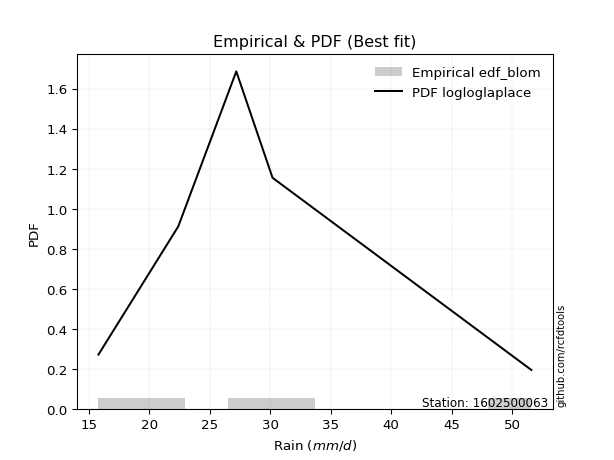</img>

</div>


### 7. EDF Tukey (1962)

In hydrology, the Tukey formula is used as a plotting position formula to estimate the empirical probability or frequency of a flood event (or other hydrological data). The formula parameter is given as _c=0.333_ (or 1/3).

<div align="center">


$P=(m-c)/(n+1-2c)$


</div>


**7.1. Empirical values**

<div align="center">

|                | 0                  | 1                  | 2         | 3         | 4         |
|:---------------|:-------------------|:-------------------|:----------|:----------|:----------|
| date           | 2023               | 2022               | 2020      | 2025      | 2019      |
| x              | 15.8               | 22.4               | 27.2      | 30.2      | 51.6      |
| m              | 1                  | 2                  | 3         | 4         | 5         |
| empirical_dist | edf_tukey          | edf_tukey          | edf_tukey | edf_tukey | edf_tukey |
| empirical      | 0.125              | 0.3125             | 0.5       | 0.6875    | 0.875     |
| empirical_tr   | 1.1428571428571428 | 1.4545454545454546 | 2.0       | 3.2       | 8.0       |

</div>


**7.2. Kolmogorov-Smirnov fit test (sorted by Δ)**


<div align="center">

|                | 0                   | 1                   | 2                   | 3                   | 4                   | 5                    | 6                   | 7                  | 8                   | 9                    | 10                  | 11                  | 12                  | 13                  | 14                  | 15                  | 16                  | 17                  | 18                 | 19                  | 20                  | 21                  | 22                 | 23                  | 24                  | 25                  | 26                 | 27                  | 28                  | 29                 | 30                 | 31                 | 32                  | 33                  | 34                  | 35                  | 36                  | 37                 | 38                  | 39                  | 40                  | 41                  | 42                  | 43                  | 44                  | 45                  | 46                  | 47                  | 48                  | 49                  | 50                  | 51                  | 52                  | 53                  | 54                 | 55                  | 56                  | 57                  | 58                  | 59                  | 60                  | 61                  | 62                 | 63                  | 64                  | 65                 | 66                  | 67                  | 68                 | 69                  | 70                  | 71                  | 72                  | 73                  | 74                 | 75                 | 76                 | 77                 | 78                 | 79                 | 80                  | 81                  | 82                  | 83                  | 84                 | 85                  | 86                  | 87                  | 88                  | 89                  | 90                  | 91                  | 92                  | 93                  | 94                 | 95                  | 96                  | 97                  | 98                  | 99                 | 100                | 101                | 102                 | 103                 | 104                 | 105                 | 106                 | 107                 | 108                 | 109                 | 110                 | 111                | 112                 | 113                | 114                 | 115                 | 116                 | 117                 | 118                 | 119                | 120                 | 121                 | 122                | 123                | 124                | 125                | 126                | 127                | 128                | 129                | 130                | 131                 | 132                | 133                 | 134                 | 135                 | 136                | 137                | 138                | 139                 | 140                 | 141                | 142                 | 143                | 144                 | 145                 | 146                | 147                 | 148                 | 149                | 150                | 151                | 152                | 153                | 154                | 155                | 156                | 157                | 158                | 159                |
|:---------------|:--------------------|:--------------------|:--------------------|:--------------------|:--------------------|:---------------------|:--------------------|:-------------------|:--------------------|:---------------------|:--------------------|:--------------------|:--------------------|:--------------------|:--------------------|:--------------------|:--------------------|:--------------------|:-------------------|:--------------------|:--------------------|:--------------------|:-------------------|:--------------------|:--------------------|:--------------------|:-------------------|:--------------------|:--------------------|:-------------------|:-------------------|:-------------------|:--------------------|:--------------------|:--------------------|:--------------------|:--------------------|:-------------------|:--------------------|:--------------------|:--------------------|:--------------------|:--------------------|:--------------------|:--------------------|:--------------------|:--------------------|:--------------------|:--------------------|:--------------------|:--------------------|:--------------------|:--------------------|:--------------------|:-------------------|:--------------------|:--------------------|:--------------------|:--------------------|:--------------------|:--------------------|:--------------------|:-------------------|:--------------------|:--------------------|:-------------------|:--------------------|:--------------------|:-------------------|:--------------------|:--------------------|:--------------------|:--------------------|:--------------------|:-------------------|:-------------------|:-------------------|:-------------------|:-------------------|:-------------------|:--------------------|:--------------------|:--------------------|:--------------------|:-------------------|:--------------------|:--------------------|:--------------------|:--------------------|:--------------------|:--------------------|:--------------------|:--------------------|:--------------------|:-------------------|:--------------------|:--------------------|:--------------------|:--------------------|:-------------------|:-------------------|:-------------------|:--------------------|:--------------------|:--------------------|:--------------------|:--------------------|:--------------------|:--------------------|:--------------------|:--------------------|:-------------------|:--------------------|:-------------------|:--------------------|:--------------------|:--------------------|:--------------------|:--------------------|:-------------------|:--------------------|:--------------------|:-------------------|:-------------------|:-------------------|:-------------------|:-------------------|:-------------------|:-------------------|:-------------------|:-------------------|:--------------------|:-------------------|:--------------------|:--------------------|:--------------------|:-------------------|:-------------------|:-------------------|:--------------------|:--------------------|:-------------------|:--------------------|:-------------------|:--------------------|:--------------------|:-------------------|:--------------------|:--------------------|:-------------------|:-------------------|:-------------------|:-------------------|:-------------------|:-------------------|:-------------------|:-------------------|:-------------------|:-------------------|:-------------------|
| station        | 1602500063          | 1602500063          | 1602500063          | 1602500063          | 1602500063          | 1602500063           | 1602500063          | 1602500063         | 1602500063          | 1602500063           | 1602500063          | 1602500063          | 1602500063          | 1602500063          | 1602500063          | 1602500063          | 1602500063          | 1602500063          | 1602500063         | 1602500063          | 1602500063          | 1602500063          | 1602500063         | 1602500063          | 1602500063          | 1602500063          | 1602500063         | 1602500063          | 1602500063          | 1602500063         | 1602500063         | 1602500063         | 1602500063          | 1602500063          | 1602500063          | 1602500063          | 1602500063          | 1602500063         | 1602500063          | 1602500063          | 1602500063          | 1602500063          | 1602500063          | 1602500063          | 1602500063          | 1602500063          | 1602500063          | 1602500063          | 1602500063          | 1602500063          | 1602500063          | 1602500063          | 1602500063          | 1602500063          | 1602500063         | 1602500063          | 1602500063          | 1602500063          | 1602500063          | 1602500063          | 1602500063          | 1602500063          | 1602500063         | 1602500063          | 1602500063          | 1602500063         | 1602500063          | 1602500063          | 1602500063         | 1602500063          | 1602500063          | 1602500063          | 1602500063          | 1602500063          | 1602500063         | 1602500063         | 1602500063         | 1602500063         | 1602500063         | 1602500063         | 1602500063          | 1602500063          | 1602500063          | 1602500063          | 1602500063         | 1602500063          | 1602500063          | 1602500063          | 1602500063          | 1602500063          | 1602500063          | 1602500063          | 1602500063          | 1602500063          | 1602500063         | 1602500063          | 1602500063          | 1602500063          | 1602500063          | 1602500063         | 1602500063         | 1602500063         | 1602500063          | 1602500063          | 1602500063          | 1602500063          | 1602500063          | 1602500063          | 1602500063          | 1602500063          | 1602500063          | 1602500063         | 1602500063          | 1602500063         | 1602500063          | 1602500063          | 1602500063          | 1602500063          | 1602500063          | 1602500063         | 1602500063          | 1602500063          | 1602500063         | 1602500063         | 1602500063         | 1602500063         | 1602500063         | 1602500063         | 1602500063         | 1602500063         | 1602500063         | 1602500063          | 1602500063         | 1602500063          | 1602500063          | 1602500063          | 1602500063         | 1602500063         | 1602500063         | 1602500063          | 1602500063          | 1602500063         | 1602500063          | 1602500063         | 1602500063          | 1602500063          | 1602500063         | 1602500063          | 1602500063          | 1602500063         | 1602500063         | 1602500063         | 1602500063         | 1602500063         | 1602500063         | 1602500063         | 1602500063         | 1602500063         | 1602500063         | 1602500063         |
| empirical_dist | edf_tukey           | edf_tukey           | edf_tukey           | edf_tukey           | edf_tukey           | edf_tukey            | edf_tukey           | edf_tukey          | edf_tukey           | edf_tukey            | edf_tukey           | edf_tukey           | edf_tukey           | edf_tukey           | edf_tukey           | edf_tukey           | edf_tukey           | edf_tukey           | edf_tukey          | edf_tukey           | edf_tukey           | edf_tukey           | edf_tukey          | edf_tukey           | edf_tukey           | edf_tukey           | edf_tukey          | edf_tukey           | edf_tukey           | edf_tukey          | edf_tukey          | edf_tukey          | edf_tukey           | edf_tukey           | edf_tukey           | edf_tukey           | edf_tukey           | edf_tukey          | edf_tukey           | edf_tukey           | edf_tukey           | edf_tukey           | edf_tukey           | edf_tukey           | edf_tukey           | edf_tukey           | edf_tukey           | edf_tukey           | edf_tukey           | edf_tukey           | edf_tukey           | edf_tukey           | edf_tukey           | edf_tukey           | edf_tukey          | edf_tukey           | edf_tukey           | edf_tukey           | edf_tukey           | edf_tukey           | edf_tukey           | edf_tukey           | edf_tukey          | edf_tukey           | edf_tukey           | edf_tukey          | edf_tukey           | edf_tukey           | edf_tukey          | edf_tukey           | edf_tukey           | edf_tukey           | edf_tukey           | edf_tukey           | edf_tukey          | edf_tukey          | edf_tukey          | edf_tukey          | edf_tukey          | edf_tukey          | edf_tukey           | edf_tukey           | edf_tukey           | edf_tukey           | edf_tukey          | edf_tukey           | edf_tukey           | edf_tukey           | edf_tukey           | edf_tukey           | edf_tukey           | edf_tukey           | edf_tukey           | edf_tukey           | edf_tukey          | edf_tukey           | edf_tukey           | edf_tukey           | edf_tukey           | edf_tukey          | edf_tukey          | edf_tukey          | edf_tukey           | edf_tukey           | edf_tukey           | edf_tukey           | edf_tukey           | edf_tukey           | edf_tukey           | edf_tukey           | edf_tukey           | edf_tukey          | edf_tukey           | edf_tukey          | edf_tukey           | edf_tukey           | edf_tukey           | edf_tukey           | edf_tukey           | edf_tukey          | edf_tukey           | edf_tukey           | edf_tukey          | edf_tukey          | edf_tukey          | edf_tukey          | edf_tukey          | edf_tukey          | edf_tukey          | edf_tukey          | edf_tukey          | edf_tukey           | edf_tukey          | edf_tukey           | edf_tukey           | edf_tukey           | edf_tukey          | edf_tukey          | edf_tukey          | edf_tukey           | edf_tukey           | edf_tukey          | edf_tukey           | edf_tukey          | edf_tukey           | edf_tukey           | edf_tukey          | edf_tukey           | edf_tukey           | edf_tukey          | edf_tukey          | edf_tukey          | edf_tukey          | edf_tukey          | edf_tukey          | edf_tukey          | edf_tukey          | edf_tukey          | edf_tukey          | edf_tukey          |
| p_dist         | logloglaplace       | exponnorm           | logburr12           | alpha               | loginvgamma         | lognct               | logalpha            | ncf                | logmielke           | logmaxwell           | logskewnorm         | logburr             | logjohnsonsu        | logf                | betaprime           | nct                 | f                   | loginvgauss         | logexponnorm       | invgamma            | logfatiguelife      | logdweibull         | logpearson3        | burr                | loggenlogistic      | logweibull_max      | loggenextreme      | loginvweibull       | moyal               | logkstwobign       | invgauss           | lograyleigh        | logbetaprime        | johnsonsu           | logerlang           | loggamma            | loggamma            | logfoldnorm        | loglaplace          | loglaplace          | logrice             | loglogistic         | loghypsecant        | logcrystalball      | lognorm             | logt                | genlogistic         | logloggamma         | dgamma              | dweibull            | logweibull_min      | halfnorm            | halflogistic        | loggumbel_r         | gennorm            | gumbel_r            | foldnorm            | loganglit           | kstwobign           | logsemicircular     | pearson3            | logcosine           | logksone           | logmoyal            | logncf              | rayleigh           | loggennorm          | loggenexpon         | genexpon           | logtruncexpon       | logbradford         | beta                | loggompertz         | gompertz            | wald               | skewnorm           | loghalflogistic    | loghalfnorm        | logtruncpareto     | logarcsine         | maxwell             | logvonmises_line    | loguniform          | loggumbel_l         | logtukeylambda     | rice                | logkappa3           | logkappa4           | laplace             | truncexpon          | burr12              | hypsecant           | logistic            | loglomax            | t                  | truncnorm           | norm                | crystalball         | logdgamma           | anglit             | logwald            | semicircular       | loggausshyper       | logwrapcauchy       | arcsine             | truncweibull_min    | logargus            | halfgennorm         | logbeta             | bradford            | logjohnsonsb        | cosine             | lomax               | loglevy_l          | logrdist            | weibull_min         | gumbel_l            | logtriang           | wrapcauchy          | levy_l             | kappa4              | logtruncweibull_min | genpareto          | logexponweib       | ksone              | vonmises_line      | uniform            | kappa3             | logexponpow        | argus              | loggenhalflogistic | lognakagami         | johnsonsb          | logtruncnorm        | nakagami            | tukeylambda         | gausshyper         | triang             | exponpow           | genextreme          | logtrapezoid        | genhalflogistic    | gengamma            | rdist              | fatiguelife         | loggengamma         | invweibull         | erlang              | exponweib           | gamma              | powerlaw           | loggenpareto       | trapezoid          | truncpareto        | logpowerlaw        | weibull_max        | loghalfgennorm     | logvonmises        | vonmises           | mielke             |
| delta          | 0.05773664072438406 | 0.06077189360103785 | 0.06094713485184933 | 0.06157990812267777 | 0.06214280388915194 | 0.062208734466467075 | 0.06222471304241528 | 0.0622375373458649 | 0.06229007155893421 | 0.062365483878136896 | 0.06272083338711626 | 0.06293546664085153 | 0.06374241698523028 | 0.06447586831224714 | 0.06451780796940776 | 0.06528142411576346 | 0.06542188761281124 | 0.06548106550478872 | 0.0656219549630197 | 0.06565949153923503 | 0.06568696065998353 | 0.06579072797631433 | 0.0670962010016366 | 0.06906506990462358 | 0.06927424255728498 | 0.06935312485596945 | 0.0693566604482363 | 0.06954270154873862 | 0.06973660017860006 | 0.0703527238513842 | 0.0703572201157435 | 0.0707012057411697 | 0.07074720386156974 | 0.07111146548039887 | 0.07145781088719708 | 0.07145783556980095 | 0.07145783556980095 | 0.0748974866216181 | 0.07619673644707525 | 0.07619673644707525 | 0.07665004187844587 | 0.07685754416577661 | 0.07706513453164743 | 0.08278148887358683 | 0.08278150153679409 | 0.08278423665002066 | 0.08343751750578676 | 0.08497685078662442 | 0.08613701659285566 | 0.08863566268528378 | 0.08941975779253068 | 0.09080046436170808 | 0.09101720951867501 | 0.09144923433286081 | 0.0916558062901115 | 0.09179531090688486 | 0.09720014097664609 | 0.09721393716261195 | 0.10059131580821379 | 0.10321249182611358 | 0.10327870080599233 | 0.10448959506386712 | 0.1108337749837256 | 0.11317280214501159 | 0.11427251200540867 | 0.1201572598810956 | 0.12107272043631306 | 0.12203286193022189 | 0.1248327565182845 | 0.12499725510025916 | 0.12499872951811689 | 0.12499998758232214 | 0.12499999966608646 | 0.12499999999989779 | 0.125              | 0.125              | 0.125              | 0.125              | 0.125              | 0.1273648099076381 | 0.13058212130537772 | 0.13503476171252637 | 0.14011887433570003 | 0.14165822435877262 | 0.1416635791926737 | 0.14293262108131966 | 0.14350459243403357 | 0.14415363291801087 | 0.14500825445485788 | 0.14823948659299935 | 0.15474176758996816 | 0.15615060531009917 | 0.15905392092626436 | 0.16223478898675991 | 0.162443537811776  | 0.16246270274703578 | 0.16246272537820194 | 0.16246274388623416 | 0.16468363802135785 | 0.1660393034641141 | 0.1665432991196728 | 0.1675132986023833 | 0.16991466440496827 | 0.17160183417201968 | 0.17336035536396144 | 0.17453847417477558 | 0.18173760901145086 | 0.18416976482059416 | 0.19497927895666878 | 0.20428746235168443 | 0.20495104320241764 | 0.2115311648614382 | 0.21467658970403003 | 0.2187502036931559 | 0.22972447563454035 | 0.23029073271401368 | 0.23163758646592036 | 0.23339290448988192 | 0.23756288233173162 | 0.2386345943780266 | 0.25277113508633126 | 0.25797374074140644 | 0.2660661987263011 | 0.2665784793721281 | 0.2689711359404097 | 0.282760100551718  | 0.2852653631284916 | 0.2860434011792611 | 0.2866338041877039 | 0.2939155556889377 | 0.2965631887981951 | 0.30729093899812154 | 0.3085093488078643 | 0.31249548891236406 | 0.31249993637806484 | 0.31249999689008945 | 0.3386625651380548 | 0.3430033978546124 | 0.3486842200327426 | 0.36006143923404366 | 0.39645672092612777 | 0.405159457923352  | 0.40886454915111736 | 0.4102357786241545 | 0.42548907910936995 | 0.43397032444564987 | 0.4434278069840666 | 0.44656020833582744 | 0.48338191493772575 | 0.5017350595447637 | 0.5023380898825835 | 0.5059905971253538 | 0.512333589948989  | 0.5273986184168189 | 0.5395164729144776 | 0.5605971521775859 | 0.6875             | 1.0754314358678352 | 7.25698831968093   | nan                |
| deltao         | 0.5865427407550001  | 0.5865427407550001  | 0.5865427407550001  | 0.5865427407550001  | 0.5865427407550001  | 0.5865427407550001   | 0.5865427407550001  | 0.5865427407550001 | 0.5865427407550001  | 0.5865427407550001   | 0.5865427407550001  | 0.5865427407550001  | 0.5865427407550001  | 0.5865427407550001  | 0.5865427407550001  | 0.5865427407550001  | 0.5865427407550001  | 0.5865427407550001  | 0.5865427407550001 | 0.5865427407550001  | 0.5865427407550001  | 0.5865427407550001  | 0.5865427407550001 | 0.5865427407550001  | 0.5865427407550001  | 0.5865427407550001  | 0.5865427407550001 | 0.5865427407550001  | 0.5865427407550001  | 0.5865427407550001 | 0.5865427407550001 | 0.5865427407550001 | 0.5865427407550001  | 0.5865427407550001  | 0.5865427407550001  | 0.5865427407550001  | 0.5865427407550001  | 0.5865427407550001 | 0.5865427407550001  | 0.5865427407550001  | 0.5865427407550001  | 0.5865427407550001  | 0.5865427407550001  | 0.5865427407550001  | 0.5865427407550001  | 0.5865427407550001  | 0.5865427407550001  | 0.5865427407550001  | 0.5865427407550001  | 0.5865427407550001  | 0.5865427407550001  | 0.5865427407550001  | 0.5865427407550001  | 0.5865427407550001  | 0.5865427407550001 | 0.5865427407550001  | 0.5865427407550001  | 0.5865427407550001  | 0.5865427407550001  | 0.5865427407550001  | 0.5865427407550001  | 0.5865427407550001  | 0.5865427407550001 | 0.5865427407550001  | 0.5865427407550001  | 0.5865427407550001 | 0.5865427407550001  | 0.5865427407550001  | 0.5865427407550001 | 0.5865427407550001  | 0.5865427407550001  | 0.5865427407550001  | 0.5865427407550001  | 0.5865427407550001  | 0.5865427407550001 | 0.5865427407550001 | 0.5865427407550001 | 0.5865427407550001 | 0.5865427407550001 | 0.5865427407550001 | 0.5865427407550001  | 0.5865427407550001  | 0.5865427407550001  | 0.5865427407550001  | 0.5865427407550001 | 0.5865427407550001  | 0.5865427407550001  | 0.5865427407550001  | 0.5865427407550001  | 0.5865427407550001  | 0.5865427407550001  | 0.5865427407550001  | 0.5865427407550001  | 0.5865427407550001  | 0.5865427407550001 | 0.5865427407550001  | 0.5865427407550001  | 0.5865427407550001  | 0.5865427407550001  | 0.5865427407550001 | 0.5865427407550001 | 0.5865427407550001 | 0.5865427407550001  | 0.5865427407550001  | 0.5865427407550001  | 0.5865427407550001  | 0.5865427407550001  | 0.5865427407550001  | 0.5865427407550001  | 0.5865427407550001  | 0.5865427407550001  | 0.5865427407550001 | 0.5865427407550001  | 0.5865427407550001 | 0.5865427407550001  | 0.5865427407550001  | 0.5865427407550001  | 0.5865427407550001  | 0.5865427407550001  | 0.5865427407550001 | 0.5865427407550001  | 0.5865427407550001  | 0.5865427407550001 | 0.5865427407550001 | 0.5865427407550001 | 0.5865427407550001 | 0.5865427407550001 | 0.5865427407550001 | 0.5865427407550001 | 0.5865427407550001 | 0.5865427407550001 | 0.5865427407550001  | 0.5865427407550001 | 0.5865427407550001  | 0.5865427407550001  | 0.5865427407550001  | 0.5865427407550001 | 0.5865427407550001 | 0.5865427407550001 | 0.5865427407550001  | 0.5865427407550001  | 0.5865427407550001 | 0.5865427407550001  | 0.5865427407550001 | 0.5865427407550001  | 0.5865427407550001  | 0.5865427407550001 | 0.5865427407550001  | 0.5865427407550001  | 0.5865427407550001 | 0.5865427407550001 | 0.5865427407550001 | 0.5865427407550001 | 0.5865427407550001 | 0.5865427407550001 | 0.5865427407550001 | 0.5865427407550001 | 0.5865427407550001 | 0.5865427407550001 | 0.5865427407550001 |
| eval           | Δo > Δ              | Δo > Δ              | Δo > Δ              | Δo > Δ              | Δo > Δ              | Δo > Δ               | Δo > Δ              | Δo > Δ             | Δo > Δ              | Δo > Δ               | Δo > Δ              | Δo > Δ              | Δo > Δ              | Δo > Δ              | Δo > Δ              | Δo > Δ              | Δo > Δ              | Δo > Δ              | Δo > Δ             | Δo > Δ              | Δo > Δ              | Δo > Δ              | Δo > Δ             | Δo > Δ              | Δo > Δ              | Δo > Δ              | Δo > Δ             | Δo > Δ              | Δo > Δ              | Δo > Δ             | Δo > Δ             | Δo > Δ             | Δo > Δ              | Δo > Δ              | Δo > Δ              | Δo > Δ              | Δo > Δ              | Δo > Δ             | Δo > Δ              | Δo > Δ              | Δo > Δ              | Δo > Δ              | Δo > Δ              | Δo > Δ              | Δo > Δ              | Δo > Δ              | Δo > Δ              | Δo > Δ              | Δo > Δ              | Δo > Δ              | Δo > Δ              | Δo > Δ              | Δo > Δ              | Δo > Δ              | Δo > Δ             | Δo > Δ              | Δo > Δ              | Δo > Δ              | Δo > Δ              | Δo > Δ              | Δo > Δ              | Δo > Δ              | Δo > Δ             | Δo > Δ              | Δo > Δ              | Δo > Δ             | Δo > Δ              | Δo > Δ              | Δo > Δ             | Δo > Δ              | Δo > Δ              | Δo > Δ              | Δo > Δ              | Δo > Δ              | Δo > Δ             | Δo > Δ             | Δo > Δ             | Δo > Δ             | Δo > Δ             | Δo > Δ             | Δo > Δ              | Δo > Δ              | Δo > Δ              | Δo > Δ              | Δo > Δ             | Δo > Δ              | Δo > Δ              | Δo > Δ              | Δo > Δ              | Δo > Δ              | Δo > Δ              | Δo > Δ              | Δo > Δ              | Δo > Δ              | Δo > Δ             | Δo > Δ              | Δo > Δ              | Δo > Δ              | Δo > Δ              | Δo > Δ             | Δo > Δ             | Δo > Δ             | Δo > Δ              | Δo > Δ              | Δo > Δ              | Δo > Δ              | Δo > Δ              | Δo > Δ              | Δo > Δ              | Δo > Δ              | Δo > Δ              | Δo > Δ             | Δo > Δ              | Δo > Δ             | Δo > Δ              | Δo > Δ              | Δo > Δ              | Δo > Δ              | Δo > Δ              | Δo > Δ             | Δo > Δ              | Δo > Δ              | Δo > Δ             | Δo > Δ             | Δo > Δ             | Δo > Δ             | Δo > Δ             | Δo > Δ             | Δo > Δ             | Δo > Δ             | Δo > Δ             | Δo > Δ              | Δo > Δ             | Δo > Δ              | Δo > Δ              | Δo > Δ              | Δo > Δ             | Δo > Δ             | Δo > Δ             | Δo > Δ              | Δo > Δ              | Δo > Δ             | Δo > Δ              | Δo > Δ             | Δo > Δ              | Δo > Δ              | Δo > Δ             | Δo > Δ              | Δo > Δ              | Δo > Δ             | Δo > Δ             | Δo > Δ             | Δo > Δ             | Δo > Δ             | Δo > Δ             | Δo > Δ             | Δo <= Δ            | Δo <= Δ            | Δo <= Δ            | Δo <= Δ            |
| fit            | 1                   | 1                   | 1                   | 1                   | 1                   | 1                    | 1                   | 1                  | 1                   | 1                    | 1                   | 1                   | 1                   | 1                   | 1                   | 1                   | 1                   | 1                   | 1                  | 1                   | 1                   | 1                   | 1                  | 1                   | 1                   | 1                   | 1                  | 1                   | 1                   | 1                  | 1                  | 1                  | 1                   | 1                   | 1                   | 1                   | 1                   | 1                  | 1                   | 1                   | 1                   | 1                   | 1                   | 1                   | 1                   | 1                   | 1                   | 1                   | 1                   | 1                   | 1                   | 1                   | 1                   | 1                   | 1                  | 1                   | 1                   | 1                   | 1                   | 1                   | 1                   | 1                   | 1                  | 1                   | 1                   | 1                  | 1                   | 1                   | 1                  | 1                   | 1                   | 1                   | 1                   | 1                   | 1                  | 1                  | 1                  | 1                  | 1                  | 1                  | 1                   | 1                   | 1                   | 1                   | 1                  | 1                   | 1                   | 1                   | 1                   | 1                   | 1                   | 1                   | 1                   | 1                   | 1                  | 1                   | 1                   | 1                   | 1                   | 1                  | 1                  | 1                  | 1                   | 1                   | 1                   | 1                   | 1                   | 1                   | 1                   | 1                   | 1                   | 1                  | 1                   | 1                  | 1                   | 1                   | 1                   | 1                   | 1                   | 1                  | 1                   | 1                   | 1                  | 1                  | 1                  | 1                  | 1                  | 1                  | 1                  | 1                  | 1                  | 1                   | 1                  | 1                   | 1                   | 1                   | 1                  | 1                  | 1                  | 1                   | 1                   | 1                  | 1                   | 1                  | 1                   | 1                   | 1                  | 1                   | 1                   | 1                  | 1                  | 1                  | 1                  | 1                  | 1                  | 1                  | 0                  | 0                  | 0                  | 0                  |
| n              | 5                   | 5                   | 5                   | 5                   | 5                   | 5                    | 5                   | 5                  | 5                   | 5                    | 5                   | 5                   | 5                   | 5                   | 5                   | 5                   | 5                   | 5                   | 5                  | 5                   | 5                   | 5                   | 5                  | 5                   | 5                   | 5                   | 5                  | 5                   | 5                   | 5                  | 5                  | 5                  | 5                   | 5                   | 5                   | 5                   | 5                   | 5                  | 5                   | 5                   | 5                   | 5                   | 5                   | 5                   | 5                   | 5                   | 5                   | 5                   | 5                   | 5                   | 5                   | 5                   | 5                   | 5                   | 5                  | 5                   | 5                   | 5                   | 5                   | 5                   | 5                   | 5                   | 5                  | 5                   | 5                   | 5                  | 5                   | 5                   | 5                  | 5                   | 5                   | 5                   | 5                   | 5                   | 5                  | 5                  | 5                  | 5                  | 5                  | 5                  | 5                   | 5                   | 5                   | 5                   | 5                  | 5                   | 5                   | 5                   | 5                   | 5                   | 5                   | 5                   | 5                   | 5                   | 5                  | 5                   | 5                   | 5                   | 5                   | 5                  | 5                  | 5                  | 5                   | 5                   | 5                   | 5                   | 5                   | 5                   | 5                   | 5                   | 5                   | 5                  | 5                   | 5                  | 5                   | 5                   | 5                   | 5                   | 5                   | 5                  | 5                   | 5                   | 5                  | 5                  | 5                  | 5                  | 5                  | 5                  | 5                  | 5                  | 5                  | 5                   | 5                  | 5                   | 5                   | 5                   | 5                  | 5                  | 5                  | 5                   | 5                   | 5                  | 5                   | 5                  | 5                   | 5                   | 5                  | 5                   | 5                   | 5                  | 5                  | 5                  | 5                  | 5                  | 5                  | 5                  | 5                  | 5                  | 5                  | 5                  |
| best_fit       | 1                   | 0                   | 0                   | 0                   | 0                   | 0                    | 0                   | 0                  | 0                   | 0                    | 0                   | 0                   | 0                   | 0                   | 0                   | 0                   | 0                   | 0                   | 0                  | 0                   | 0                   | 0                   | 0                  | 0                   | 0                   | 0                   | 0                  | 0                   | 0                   | 0                  | 0                  | 0                  | 0                   | 0                   | 0                   | 0                   | 0                   | 0                  | 0                   | 0                   | 0                   | 0                   | 0                   | 0                   | 0                   | 0                   | 0                   | 0                   | 0                   | 0                   | 0                   | 0                   | 0                   | 0                   | 0                  | 0                   | 0                   | 0                   | 0                   | 0                   | 0                   | 0                   | 0                  | 0                   | 0                   | 0                  | 0                   | 0                   | 0                  | 0                   | 0                   | 0                   | 0                   | 0                   | 0                  | 0                  | 0                  | 0                  | 0                  | 0                  | 0                   | 0                   | 0                   | 0                   | 0                  | 0                   | 0                   | 0                   | 0                   | 0                   | 0                   | 0                   | 0                   | 0                   | 0                  | 0                   | 0                   | 0                   | 0                   | 0                  | 0                  | 0                  | 0                   | 0                   | 0                   | 0                   | 0                   | 0                   | 0                   | 0                   | 0                   | 0                  | 0                   | 0                  | 0                   | 0                   | 0                   | 0                   | 0                   | 0                  | 0                   | 0                   | 0                  | 0                  | 0                  | 0                  | 0                  | 0                  | 0                  | 0                  | 0                  | 0                   | 0                  | 0                   | 0                   | 0                   | 0                  | 0                  | 0                  | 0                   | 0                   | 0                  | 0                   | 0                  | 0                   | 0                   | 0                  | 0                   | 0                   | 0                  | 0                  | 0                  | 0                  | 0                  | 0                  | 0                  | 0                  | 0                  | 0                  | 0                  |
| best_fit_sort  | 1                   | 2                   | 3                   | 4                   | 5                   | 6                    | 7                   | 8                  | 9                   | 10                   | 11                  | 12                  | 13                  | 14                  | 15                  | 16                  | 17                  | 18                  | 19                 | 20                  | 21                  | 22                  | 23                 | 24                  | 25                  | 26                  | 27                 | 28                  | 29                  | 30                 | 31                 | 32                 | 33                  | 34                  | 35                  | 36                  | 37                  | 38                 | 39                  | 40                  | 41                  | 42                  | 43                  | 44                  | 45                  | 46                  | 47                  | 48                  | 49                  | 50                  | 51                  | 52                  | 53                  | 54                  | 55                 | 56                  | 57                  | 58                  | 59                  | 60                  | 61                  | 62                  | 63                 | 64                  | 65                  | 66                 | 67                  | 68                  | 69                 | 70                  | 71                  | 72                  | 73                  | 74                  | 75                 | 76                 | 77                 | 78                 | 79                 | 80                 | 81                  | 82                  | 83                  | 84                  | 85                 | 86                  | 87                  | 88                  | 89                  | 90                  | 91                  | 92                  | 93                  | 94                  | 95                 | 96                  | 97                  | 98                  | 99                  | 100                | 101                | 102                | 103                 | 104                 | 105                 | 106                 | 107                 | 108                 | 109                 | 110                 | 111                 | 112                | 113                 | 114                | 115                 | 116                 | 117                 | 118                 | 119                 | 120                | 121                 | 122                 | 123                | 124                | 125                | 126                | 127                | 128                | 129                | 130                | 131                | 132                 | 133                | 134                 | 135                 | 136                 | 137                | 138                | 139                | 140                 | 141                 | 142                | 143                 | 144                | 145                 | 146                 | 147                | 148                 | 149                 | 150                | 151                | 152                | 153                | 154                | 155                | 156                | 157                | 158                | 159                | 160                |

</div>


**7.3. Best fit**

<div align="center">

|   id |    station | empirical_dist   | p_dist        |     delta |   deltao | eval   |   fit |   n |   best_fit |   best_fit_sort |
|-----:|-----------:|:-----------------|:--------------|----------:|---------:|:-------|------:|----:|-----------:|----------------:|
|    0 | 1602500063 | edf_tukey        | logloglaplace | 0.0577366 | 0.586543 | Δo > Δ |     1 |   5 |          1 |               1 |

</div>


<div align="center">

</img></img>

</div>


### 8. EDF Gringorten (1963)

Gringorten plotting position formula is essential for estimating the probability and return periods of extreme events like floods and heavy rainfall. The constant _a=0.44_.

<div align="center">


$P=(m-a)/(n+1-2a)$


</div>


**8.1. Empirical values**

<div align="center">

|                | 0                   | 1                  | 2              | 3                 | 4                  |
|:---------------|:--------------------|:-------------------|:---------------|:------------------|:-------------------|
| date           | 2023                | 2022               | 2020           | 2025              | 2019               |
| x              | 15.8                | 22.4               | 27.2           | 30.2              | 51.6               |
| m              | 1                   | 2                  | 3              | 4                 | 5                  |
| empirical_dist | edf_gringorten      | edf_gringorten     | edf_gringorten | edf_gringorten    | edf_gringorten     |
| empirical      | 0.10937500000000001 | 0.3046875          | 0.5            | 0.6953125         | 0.8906249999999999 |
| empirical_tr   | 1.1228070175438596  | 1.4382022471910112 | 2.0            | 3.282051282051282 | 9.142857142857133  |

</div>


**8.2. Kolmogorov-Smirnov fit test (sorted by Δ)**


<div align="center">

|                | 0                    | 1                    | 2                    | 3                   | 4                   | 5                    | 6                   | 7                    | 8                   | 9                   | 10                  | 11                  | 12                  | 13                   | 14                   | 15                  | 16                   | 17                  | 18                  | 19                  | 20                  | 21                   | 22                  | 23                   | 24                   | 25                   | 26                   | 27                   | 28                 | 29                  | 30                  | 31                  | 32                  | 33                  | 34                  | 35                  | 36                  | 37                  | 38                  | 39                  | 40                  | 41                  | 42                  | 43                  | 44                  | 45                  | 46                  | 47                  | 48                 | 49                  | 50                  | 51                  | 52                  | 53                  | 54                 | 55                  | 56                  | 57                  | 58                  | 59                 | 60                  | 61                  | 62                  | 63                 | 64                  | 65                 | 66                  | 67                  | 68                  | 69                  | 70                  | 71                  | 72                  | 73                  | 74                  | 75                 | 76                  | 77                  | 78                 | 79                 | 80                  | 81                  | 82                  | 83                  | 84                 | 85                  | 86                  | 87                  | 88                  | 89                  | 90                  | 91                  | 92                  | 93                 | 94                  | 95                  | 96                 | 97                  | 98                  | 99                  | 100                | 101                | 102                 | 103                 | 104                 | 105                 | 106                 | 107                 | 108                 | 109                 | 110                 | 111                | 112                 | 113                | 114                 | 115                 | 116                 | 117                 | 118                 | 119                | 120                 | 121                 | 122                | 123                | 124                | 125                | 126                | 127                | 128                | 129                 | 130                | 131                | 132                 | 133                 | 134                 | 135                | 136                | 137                | 138                | 139                 | 140                 | 141                | 142                 | 143                | 144                 | 145                 | 146                 | 147                | 148                 | 149                | 150                | 151                | 152                | 153                | 154                | 155                | 156                | 157                | 158                | 159                |
|:---------------|:---------------------|:---------------------|:---------------------|:--------------------|:--------------------|:---------------------|:--------------------|:---------------------|:--------------------|:--------------------|:--------------------|:--------------------|:--------------------|:---------------------|:---------------------|:--------------------|:---------------------|:--------------------|:--------------------|:--------------------|:--------------------|:---------------------|:--------------------|:---------------------|:---------------------|:---------------------|:---------------------|:---------------------|:-------------------|:--------------------|:--------------------|:--------------------|:--------------------|:--------------------|:--------------------|:--------------------|:--------------------|:--------------------|:--------------------|:--------------------|:--------------------|:--------------------|:--------------------|:--------------------|:--------------------|:--------------------|:--------------------|:--------------------|:-------------------|:--------------------|:--------------------|:--------------------|:--------------------|:--------------------|:-------------------|:--------------------|:--------------------|:--------------------|:--------------------|:-------------------|:--------------------|:--------------------|:--------------------|:-------------------|:--------------------|:-------------------|:--------------------|:--------------------|:--------------------|:--------------------|:--------------------|:--------------------|:--------------------|:--------------------|:--------------------|:-------------------|:--------------------|:--------------------|:-------------------|:-------------------|:--------------------|:--------------------|:--------------------|:--------------------|:-------------------|:--------------------|:--------------------|:--------------------|:--------------------|:--------------------|:--------------------|:--------------------|:--------------------|:-------------------|:--------------------|:--------------------|:-------------------|:--------------------|:--------------------|:--------------------|:-------------------|:-------------------|:--------------------|:--------------------|:--------------------|:--------------------|:--------------------|:--------------------|:--------------------|:--------------------|:--------------------|:-------------------|:--------------------|:-------------------|:--------------------|:--------------------|:--------------------|:--------------------|:--------------------|:-------------------|:--------------------|:--------------------|:-------------------|:-------------------|:-------------------|:-------------------|:-------------------|:-------------------|:-------------------|:--------------------|:-------------------|:-------------------|:--------------------|:--------------------|:--------------------|:-------------------|:-------------------|:-------------------|:-------------------|:--------------------|:--------------------|:-------------------|:--------------------|:-------------------|:--------------------|:--------------------|:--------------------|:-------------------|:--------------------|:-------------------|:-------------------|:-------------------|:-------------------|:-------------------|:-------------------|:-------------------|:-------------------|:-------------------|:-------------------|:-------------------|
| station        | 1602500063           | 1602500063           | 1602500063           | 1602500063          | 1602500063          | 1602500063           | 1602500063          | 1602500063           | 1602500063          | 1602500063          | 1602500063          | 1602500063          | 1602500063          | 1602500063           | 1602500063           | 1602500063          | 1602500063           | 1602500063          | 1602500063          | 1602500063          | 1602500063          | 1602500063           | 1602500063          | 1602500063           | 1602500063           | 1602500063           | 1602500063           | 1602500063           | 1602500063         | 1602500063          | 1602500063          | 1602500063          | 1602500063          | 1602500063          | 1602500063          | 1602500063          | 1602500063          | 1602500063          | 1602500063          | 1602500063          | 1602500063          | 1602500063          | 1602500063          | 1602500063          | 1602500063          | 1602500063          | 1602500063          | 1602500063          | 1602500063         | 1602500063          | 1602500063          | 1602500063          | 1602500063          | 1602500063          | 1602500063         | 1602500063          | 1602500063          | 1602500063          | 1602500063          | 1602500063         | 1602500063          | 1602500063          | 1602500063          | 1602500063         | 1602500063          | 1602500063         | 1602500063          | 1602500063          | 1602500063          | 1602500063          | 1602500063          | 1602500063          | 1602500063          | 1602500063          | 1602500063          | 1602500063         | 1602500063          | 1602500063          | 1602500063         | 1602500063         | 1602500063          | 1602500063          | 1602500063          | 1602500063          | 1602500063         | 1602500063          | 1602500063          | 1602500063          | 1602500063          | 1602500063          | 1602500063          | 1602500063          | 1602500063          | 1602500063         | 1602500063          | 1602500063          | 1602500063         | 1602500063          | 1602500063          | 1602500063          | 1602500063         | 1602500063         | 1602500063          | 1602500063          | 1602500063          | 1602500063          | 1602500063          | 1602500063          | 1602500063          | 1602500063          | 1602500063          | 1602500063         | 1602500063          | 1602500063         | 1602500063          | 1602500063          | 1602500063          | 1602500063          | 1602500063          | 1602500063         | 1602500063          | 1602500063          | 1602500063         | 1602500063         | 1602500063         | 1602500063         | 1602500063         | 1602500063         | 1602500063         | 1602500063          | 1602500063         | 1602500063         | 1602500063          | 1602500063          | 1602500063          | 1602500063         | 1602500063         | 1602500063         | 1602500063         | 1602500063          | 1602500063          | 1602500063         | 1602500063          | 1602500063         | 1602500063          | 1602500063          | 1602500063          | 1602500063         | 1602500063          | 1602500063         | 1602500063         | 1602500063         | 1602500063         | 1602500063         | 1602500063         | 1602500063         | 1602500063         | 1602500063         | 1602500063         | 1602500063         |
| empirical_dist | edf_gringorten       | edf_gringorten       | edf_gringorten       | edf_gringorten      | edf_gringorten      | edf_gringorten       | edf_gringorten      | edf_gringorten       | edf_gringorten      | edf_gringorten      | edf_gringorten      | edf_gringorten      | edf_gringorten      | edf_gringorten       | edf_gringorten       | edf_gringorten      | edf_gringorten       | edf_gringorten      | edf_gringorten      | edf_gringorten      | edf_gringorten      | edf_gringorten       | edf_gringorten      | edf_gringorten       | edf_gringorten       | edf_gringorten       | edf_gringorten       | edf_gringorten       | edf_gringorten     | edf_gringorten      | edf_gringorten      | edf_gringorten      | edf_gringorten      | edf_gringorten      | edf_gringorten      | edf_gringorten      | edf_gringorten      | edf_gringorten      | edf_gringorten      | edf_gringorten      | edf_gringorten      | edf_gringorten      | edf_gringorten      | edf_gringorten      | edf_gringorten      | edf_gringorten      | edf_gringorten      | edf_gringorten      | edf_gringorten     | edf_gringorten      | edf_gringorten      | edf_gringorten      | edf_gringorten      | edf_gringorten      | edf_gringorten     | edf_gringorten      | edf_gringorten      | edf_gringorten      | edf_gringorten      | edf_gringorten     | edf_gringorten      | edf_gringorten      | edf_gringorten      | edf_gringorten     | edf_gringorten      | edf_gringorten     | edf_gringorten      | edf_gringorten      | edf_gringorten      | edf_gringorten      | edf_gringorten      | edf_gringorten      | edf_gringorten      | edf_gringorten      | edf_gringorten      | edf_gringorten     | edf_gringorten      | edf_gringorten      | edf_gringorten     | edf_gringorten     | edf_gringorten      | edf_gringorten      | edf_gringorten      | edf_gringorten      | edf_gringorten     | edf_gringorten      | edf_gringorten      | edf_gringorten      | edf_gringorten      | edf_gringorten      | edf_gringorten      | edf_gringorten      | edf_gringorten      | edf_gringorten     | edf_gringorten      | edf_gringorten      | edf_gringorten     | edf_gringorten      | edf_gringorten      | edf_gringorten      | edf_gringorten     | edf_gringorten     | edf_gringorten      | edf_gringorten      | edf_gringorten      | edf_gringorten      | edf_gringorten      | edf_gringorten      | edf_gringorten      | edf_gringorten      | edf_gringorten      | edf_gringorten     | edf_gringorten      | edf_gringorten     | edf_gringorten      | edf_gringorten      | edf_gringorten      | edf_gringorten      | edf_gringorten      | edf_gringorten     | edf_gringorten      | edf_gringorten      | edf_gringorten     | edf_gringorten     | edf_gringorten     | edf_gringorten     | edf_gringorten     | edf_gringorten     | edf_gringorten     | edf_gringorten      | edf_gringorten     | edf_gringorten     | edf_gringorten      | edf_gringorten      | edf_gringorten      | edf_gringorten     | edf_gringorten     | edf_gringorten     | edf_gringorten     | edf_gringorten      | edf_gringorten      | edf_gringorten     | edf_gringorten      | edf_gringorten     | edf_gringorten      | edf_gringorten      | edf_gringorten      | edf_gringorten     | edf_gringorten      | edf_gringorten     | edf_gringorten     | edf_gringorten     | edf_gringorten     | edf_gringorten     | edf_gringorten     | edf_gringorten     | edf_gringorten     | edf_gringorten     | edf_gringorten     | edf_gringorten     |
| p_dist         | logburr              | logmielke            | nct                  | logloglaplace       | logburr12           | invgamma             | logfatiguelife      | loginvgauss          | f                   | logskewnorm         | alpha               | logjohnsonsu        | johnsonsu           | lograyleigh          | lognct               | invgauss            | exponnorm            | logerlang           | loggamma            | loggamma            | logdweibull         | logalpha             | loginvgamma         | loglaplace           | loglaplace           | logf                 | betaprime            | loginvweibull        | loggenlogistic     | logrice             | logmaxwell          | logbetaprime        | burr                | logexponnorm        | logweibull_max      | loggenextreme       | loghypsecant        | ncf                 | logkstwobign        | dgamma              | logpearson3         | dweibull            | moyal               | halflogistic        | loggumbel_r         | gennorm             | loglogistic         | logweibull_min      | logfoldnorm        | genlogistic         | logcrystalball      | lognorm             | logt                | logloggamma         | logmoyal           | halfnorm            | gumbel_r            | foldnorm            | loganglit           | loggenexpon        | kstwobign           | genexpon            | logtruncexpon       | logbradford        | loggompertz         | gompertz           | loghalflogistic     | wald                | loghalfnorm         | logtruncpareto      | logsemicircular     | pearson3            | logcosine           | loggennorm          | beta                | logksone           | logncf              | skewnorm            | rayleigh           | logarcsine         | maxwell             | logvonmises_line    | loguniform          | loggumbel_l         | logtukeylambda     | rice                | logkappa3           | logkappa4           | laplace             | truncexpon          | logdgamma           | burr12              | hypsecant           | logwald            | logistic            | loglomax            | t                  | truncnorm           | norm                | crystalball         | anglit             | semicircular       | loggausshyper       | logwrapcauchy       | arcsine             | truncweibull_min    | logargus            | halfgennorm         | logbeta             | bradford            | logjohnsonsb        | cosine             | lomax               | loglevy_l          | logrdist            | weibull_min         | gumbel_l            | logtriang           | wrapcauchy          | levy_l             | kappa4              | logtruncweibull_min | genpareto          | logexponweib       | ksone              | vonmises_line      | uniform            | kappa3             | logexponpow        | lognakagami         | argus              | loggenhalflogistic | logtruncnorm        | nakagami            | tukeylambda         | johnsonsb          | gausshyper         | triang             | exponpow           | genextreme          | logtrapezoid        | genhalflogistic    | gengamma            | rdist              | fatiguelife         | loggengamma         | erlang              | invweibull         | exponweib           | gamma              | powerlaw           | trapezoid          | loggenpareto       | truncpareto        | logpowerlaw        | weibull_max        | loghalfgennorm     | logvonmises        | vonmises           | mielke             |
| delta          | 0.047310466640851555 | 0.047868849720257955 | 0.049656424115763466 | 0.04992414072438406 | 0.05111420403872968 | 0.051205428508255935 | 0.05160038324415406 | 0.051984700963433106 | 0.05212540222211204 | 0.05359903201531335 | 0.05484092797176221 | 0.05507888955105167 | 0.05548646548039889 | 0.056412710470184146 | 0.057011777639499606 | 0.05719619013698268 | 0.057591274587127206 | 0.05784824067793026 | 0.05784862766920118 | 0.05784862766920118 | 0.05797822797631433 | 0.058354302337268904 | 0.05862837826495759 | 0.060571736447075364 | 0.060571736447075364 | 0.061093942776958565 | 0.061195620352547886 | 0.062419177839019735 | 0.0625881783725395 | 0.06385693418354199 | 0.06448943481605074 | 0.06452049693137196 | 0.06455504225043629 | 0.06459357766637441 | 0.06520606294561171 | 0.06522411622407998 | 0.06621477154951028 | 0.06699340046240654 | 0.06752999889288924 | 0.07051201659285578 | 0.07185854484578269 | 0.07301066268528389 | 0.07410563531147285 | 0.07539220951867501 | 0.07582423433286084 | 0.07603080629011161 | 0.07716136382861771 | 0.08166776005430643 | 0.0827099866216181 | 0.08402427437176341 | 0.09059398887358683 | 0.09059400153679409 | 0.09059673665002066 | 0.09278935078662442 | 0.0975478021450116 | 0.09861296436170808 | 0.09960781090688486 | 0.10501264097664609 | 0.10502643716261195 | 0.1064078619302219 | 0.10840381580821379 | 0.10920775651828452 | 0.10937225510025927 | 0.1093737295181169 | 0.10937499966608648 | 0.1093749999998978 | 0.10937500000000001 | 0.10937500000000001 | 0.10937500000000001 | 0.10937500000000011 | 0.11102499182611358 | 0.11109120080599233 | 0.11230209506386712 | 0.11326022043631306 | 0.11687022544735304 | 0.1186462749837256 | 0.12208501200540867 | 0.12493449639812015 | 0.1279697598810956 | 0.1351773099076381 | 0.13839462130537772 | 0.14284726171252637 | 0.14793137433570003 | 0.14947072435877262 | 0.1494760791926737 | 0.15074512108131966 | 0.15131709243403357 | 0.15196613291801087 | 0.15282075445485788 | 0.15605198659299935 | 0.15687113802135785 | 0.16255426758996816 | 0.16396310531009917 | 0.1665432991196728 | 0.16686642092626436 | 0.17004728898675991 | 0.170256037811776  | 0.17027520274703578 | 0.17027522537820194 | 0.17027524388623416 | 0.1738518034641141 | 0.1753257986023833 | 0.17772716440496827 | 0.17941433417201968 | 0.18117285536396144 | 0.18235097417477558 | 0.18955010901145086 | 0.19198226482059416 | 0.20279177895666878 | 0.21209996235168443 | 0.21276354320241764 | 0.2193436648614382 | 0.22248908970403003 | 0.2265627036931559 | 0.23753697563454035 | 0.23810323271401368 | 0.23945008646592036 | 0.24120540448988192 | 0.24537538233173162 | 0.2542595943780266 | 0.26058363508633126 | 0.26578624074140644 | 0.2738786987263011 | 0.2743909793721281 | 0.2767836359404097 | 0.290572600551718  | 0.2930778631284916 | 0.2938559011792611 | 0.2944463041877039 | 0.29947843899812154 | 0.3017280556889377 | 0.3043756887981951 | 0.30468298891236406 | 0.30468743637806484 | 0.30468749689008945 | 0.3163218488078643 | 0.3464750651380548 | 0.3508158978546124 | 0.3564967200327426 | 0.37568643923404355 | 0.40426922092612777 | 0.412971957923352  | 0.41667704915111736 | 0.4258607786241545 | 0.43330157910936995 | 0.44178282444564987 | 0.45437270833582744 | 0.4590528069840665 | 0.49119441493772575 | 0.5095475595447637 | 0.5101505898825835 | 0.520146089948989  | 0.5216155971253538 | 0.5352111184168189 | 0.5473289729144776 | 0.5684096521775859 | 0.6953125          | 1.0598064358678352 | 7.24136331968093   | nan                |
| deltao         | 0.5865427407550001   | 0.5865427407550001   | 0.5865427407550001   | 0.5865427407550001  | 0.5865427407550001  | 0.5865427407550001   | 0.5865427407550001  | 0.5865427407550001   | 0.5865427407550001  | 0.5865427407550001  | 0.5865427407550001  | 0.5865427407550001  | 0.5865427407550001  | 0.5865427407550001   | 0.5865427407550001   | 0.5865427407550001  | 0.5865427407550001   | 0.5865427407550001  | 0.5865427407550001  | 0.5865427407550001  | 0.5865427407550001  | 0.5865427407550001   | 0.5865427407550001  | 0.5865427407550001   | 0.5865427407550001   | 0.5865427407550001   | 0.5865427407550001   | 0.5865427407550001   | 0.5865427407550001 | 0.5865427407550001  | 0.5865427407550001  | 0.5865427407550001  | 0.5865427407550001  | 0.5865427407550001  | 0.5865427407550001  | 0.5865427407550001  | 0.5865427407550001  | 0.5865427407550001  | 0.5865427407550001  | 0.5865427407550001  | 0.5865427407550001  | 0.5865427407550001  | 0.5865427407550001  | 0.5865427407550001  | 0.5865427407550001  | 0.5865427407550001  | 0.5865427407550001  | 0.5865427407550001  | 0.5865427407550001 | 0.5865427407550001  | 0.5865427407550001  | 0.5865427407550001  | 0.5865427407550001  | 0.5865427407550001  | 0.5865427407550001 | 0.5865427407550001  | 0.5865427407550001  | 0.5865427407550001  | 0.5865427407550001  | 0.5865427407550001 | 0.5865427407550001  | 0.5865427407550001  | 0.5865427407550001  | 0.5865427407550001 | 0.5865427407550001  | 0.5865427407550001 | 0.5865427407550001  | 0.5865427407550001  | 0.5865427407550001  | 0.5865427407550001  | 0.5865427407550001  | 0.5865427407550001  | 0.5865427407550001  | 0.5865427407550001  | 0.5865427407550001  | 0.5865427407550001 | 0.5865427407550001  | 0.5865427407550001  | 0.5865427407550001 | 0.5865427407550001 | 0.5865427407550001  | 0.5865427407550001  | 0.5865427407550001  | 0.5865427407550001  | 0.5865427407550001 | 0.5865427407550001  | 0.5865427407550001  | 0.5865427407550001  | 0.5865427407550001  | 0.5865427407550001  | 0.5865427407550001  | 0.5865427407550001  | 0.5865427407550001  | 0.5865427407550001 | 0.5865427407550001  | 0.5865427407550001  | 0.5865427407550001 | 0.5865427407550001  | 0.5865427407550001  | 0.5865427407550001  | 0.5865427407550001 | 0.5865427407550001 | 0.5865427407550001  | 0.5865427407550001  | 0.5865427407550001  | 0.5865427407550001  | 0.5865427407550001  | 0.5865427407550001  | 0.5865427407550001  | 0.5865427407550001  | 0.5865427407550001  | 0.5865427407550001 | 0.5865427407550001  | 0.5865427407550001 | 0.5865427407550001  | 0.5865427407550001  | 0.5865427407550001  | 0.5865427407550001  | 0.5865427407550001  | 0.5865427407550001 | 0.5865427407550001  | 0.5865427407550001  | 0.5865427407550001 | 0.5865427407550001 | 0.5865427407550001 | 0.5865427407550001 | 0.5865427407550001 | 0.5865427407550001 | 0.5865427407550001 | 0.5865427407550001  | 0.5865427407550001 | 0.5865427407550001 | 0.5865427407550001  | 0.5865427407550001  | 0.5865427407550001  | 0.5865427407550001 | 0.5865427407550001 | 0.5865427407550001 | 0.5865427407550001 | 0.5865427407550001  | 0.5865427407550001  | 0.5865427407550001 | 0.5865427407550001  | 0.5865427407550001 | 0.5865427407550001  | 0.5865427407550001  | 0.5865427407550001  | 0.5865427407550001 | 0.5865427407550001  | 0.5865427407550001 | 0.5865427407550001 | 0.5865427407550001 | 0.5865427407550001 | 0.5865427407550001 | 0.5865427407550001 | 0.5865427407550001 | 0.5865427407550001 | 0.5865427407550001 | 0.5865427407550001 | 0.5865427407550001 |
| eval           | Δo > Δ               | Δo > Δ               | Δo > Δ               | Δo > Δ              | Δo > Δ              | Δo > Δ               | Δo > Δ              | Δo > Δ               | Δo > Δ              | Δo > Δ              | Δo > Δ              | Δo > Δ              | Δo > Δ              | Δo > Δ               | Δo > Δ               | Δo > Δ              | Δo > Δ               | Δo > Δ              | Δo > Δ              | Δo > Δ              | Δo > Δ              | Δo > Δ               | Δo > Δ              | Δo > Δ               | Δo > Δ               | Δo > Δ               | Δo > Δ               | Δo > Δ               | Δo > Δ             | Δo > Δ              | Δo > Δ              | Δo > Δ              | Δo > Δ              | Δo > Δ              | Δo > Δ              | Δo > Δ              | Δo > Δ              | Δo > Δ              | Δo > Δ              | Δo > Δ              | Δo > Δ              | Δo > Δ              | Δo > Δ              | Δo > Δ              | Δo > Δ              | Δo > Δ              | Δo > Δ              | Δo > Δ              | Δo > Δ             | Δo > Δ              | Δo > Δ              | Δo > Δ              | Δo > Δ              | Δo > Δ              | Δo > Δ             | Δo > Δ              | Δo > Δ              | Δo > Δ              | Δo > Δ              | Δo > Δ             | Δo > Δ              | Δo > Δ              | Δo > Δ              | Δo > Δ             | Δo > Δ              | Δo > Δ             | Δo > Δ              | Δo > Δ              | Δo > Δ              | Δo > Δ              | Δo > Δ              | Δo > Δ              | Δo > Δ              | Δo > Δ              | Δo > Δ              | Δo > Δ             | Δo > Δ              | Δo > Δ              | Δo > Δ             | Δo > Δ             | Δo > Δ              | Δo > Δ              | Δo > Δ              | Δo > Δ              | Δo > Δ             | Δo > Δ              | Δo > Δ              | Δo > Δ              | Δo > Δ              | Δo > Δ              | Δo > Δ              | Δo > Δ              | Δo > Δ              | Δo > Δ             | Δo > Δ              | Δo > Δ              | Δo > Δ             | Δo > Δ              | Δo > Δ              | Δo > Δ              | Δo > Δ             | Δo > Δ             | Δo > Δ              | Δo > Δ              | Δo > Δ              | Δo > Δ              | Δo > Δ              | Δo > Δ              | Δo > Δ              | Δo > Δ              | Δo > Δ              | Δo > Δ             | Δo > Δ              | Δo > Δ             | Δo > Δ              | Δo > Δ              | Δo > Δ              | Δo > Δ              | Δo > Δ              | Δo > Δ             | Δo > Δ              | Δo > Δ              | Δo > Δ             | Δo > Δ             | Δo > Δ             | Δo > Δ             | Δo > Δ             | Δo > Δ             | Δo > Δ             | Δo > Δ              | Δo > Δ             | Δo > Δ             | Δo > Δ              | Δo > Δ              | Δo > Δ              | Δo > Δ             | Δo > Δ             | Δo > Δ             | Δo > Δ             | Δo > Δ              | Δo > Δ              | Δo > Δ             | Δo > Δ              | Δo > Δ             | Δo > Δ              | Δo > Δ              | Δo > Δ              | Δo > Δ             | Δo > Δ              | Δo > Δ             | Δo > Δ             | Δo > Δ             | Δo > Δ             | Δo > Δ             | Δo > Δ             | Δo > Δ             | Δo <= Δ            | Δo <= Δ            | Δo <= Δ            | Δo <= Δ            |
| fit            | 1                    | 1                    | 1                    | 1                   | 1                   | 1                    | 1                   | 1                    | 1                   | 1                   | 1                   | 1                   | 1                   | 1                    | 1                    | 1                   | 1                    | 1                   | 1                   | 1                   | 1                   | 1                    | 1                   | 1                    | 1                    | 1                    | 1                    | 1                    | 1                  | 1                   | 1                   | 1                   | 1                   | 1                   | 1                   | 1                   | 1                   | 1                   | 1                   | 1                   | 1                   | 1                   | 1                   | 1                   | 1                   | 1                   | 1                   | 1                   | 1                  | 1                   | 1                   | 1                   | 1                   | 1                   | 1                  | 1                   | 1                   | 1                   | 1                   | 1                  | 1                   | 1                   | 1                   | 1                  | 1                   | 1                  | 1                   | 1                   | 1                   | 1                   | 1                   | 1                   | 1                   | 1                   | 1                   | 1                  | 1                   | 1                   | 1                  | 1                  | 1                   | 1                   | 1                   | 1                   | 1                  | 1                   | 1                   | 1                   | 1                   | 1                   | 1                   | 1                   | 1                   | 1                  | 1                   | 1                   | 1                  | 1                   | 1                   | 1                   | 1                  | 1                  | 1                   | 1                   | 1                   | 1                   | 1                   | 1                   | 1                   | 1                   | 1                   | 1                  | 1                   | 1                  | 1                   | 1                   | 1                   | 1                   | 1                   | 1                  | 1                   | 1                   | 1                  | 1                  | 1                  | 1                  | 1                  | 1                  | 1                  | 1                   | 1                  | 1                  | 1                   | 1                   | 1                   | 1                  | 1                  | 1                  | 1                  | 1                   | 1                   | 1                  | 1                   | 1                  | 1                   | 1                   | 1                   | 1                  | 1                   | 1                  | 1                  | 1                  | 1                  | 1                  | 1                  | 1                  | 0                  | 0                  | 0                  | 0                  |
| n              | 5                    | 5                    | 5                    | 5                   | 5                   | 5                    | 5                   | 5                    | 5                   | 5                   | 5                   | 5                   | 5                   | 5                    | 5                    | 5                   | 5                    | 5                   | 5                   | 5                   | 5                   | 5                    | 5                   | 5                    | 5                    | 5                    | 5                    | 5                    | 5                  | 5                   | 5                   | 5                   | 5                   | 5                   | 5                   | 5                   | 5                   | 5                   | 5                   | 5                   | 5                   | 5                   | 5                   | 5                   | 5                   | 5                   | 5                   | 5                   | 5                  | 5                   | 5                   | 5                   | 5                   | 5                   | 5                  | 5                   | 5                   | 5                   | 5                   | 5                  | 5                   | 5                   | 5                   | 5                  | 5                   | 5                  | 5                   | 5                   | 5                   | 5                   | 5                   | 5                   | 5                   | 5                   | 5                   | 5                  | 5                   | 5                   | 5                  | 5                  | 5                   | 5                   | 5                   | 5                   | 5                  | 5                   | 5                   | 5                   | 5                   | 5                   | 5                   | 5                   | 5                   | 5                  | 5                   | 5                   | 5                  | 5                   | 5                   | 5                   | 5                  | 5                  | 5                   | 5                   | 5                   | 5                   | 5                   | 5                   | 5                   | 5                   | 5                   | 5                  | 5                   | 5                  | 5                   | 5                   | 5                   | 5                   | 5                   | 5                  | 5                   | 5                   | 5                  | 5                  | 5                  | 5                  | 5                  | 5                  | 5                  | 5                   | 5                  | 5                  | 5                   | 5                   | 5                   | 5                  | 5                  | 5                  | 5                  | 5                   | 5                   | 5                  | 5                   | 5                  | 5                   | 5                   | 5                   | 5                  | 5                   | 5                  | 5                  | 5                  | 5                  | 5                  | 5                  | 5                  | 5                  | 5                  | 5                  | 5                  |
| best_fit       | 1                    | 0                    | 0                    | 0                   | 0                   | 0                    | 0                   | 0                    | 0                   | 0                   | 0                   | 0                   | 0                   | 0                    | 0                    | 0                   | 0                    | 0                   | 0                   | 0                   | 0                   | 0                    | 0                   | 0                    | 0                    | 0                    | 0                    | 0                    | 0                  | 0                   | 0                   | 0                   | 0                   | 0                   | 0                   | 0                   | 0                   | 0                   | 0                   | 0                   | 0                   | 0                   | 0                   | 0                   | 0                   | 0                   | 0                   | 0                   | 0                  | 0                   | 0                   | 0                   | 0                   | 0                   | 0                  | 0                   | 0                   | 0                   | 0                   | 0                  | 0                   | 0                   | 0                   | 0                  | 0                   | 0                  | 0                   | 0                   | 0                   | 0                   | 0                   | 0                   | 0                   | 0                   | 0                   | 0                  | 0                   | 0                   | 0                  | 0                  | 0                   | 0                   | 0                   | 0                   | 0                  | 0                   | 0                   | 0                   | 0                   | 0                   | 0                   | 0                   | 0                   | 0                  | 0                   | 0                   | 0                  | 0                   | 0                   | 0                   | 0                  | 0                  | 0                   | 0                   | 0                   | 0                   | 0                   | 0                   | 0                   | 0                   | 0                   | 0                  | 0                   | 0                  | 0                   | 0                   | 0                   | 0                   | 0                   | 0                  | 0                   | 0                   | 0                  | 0                  | 0                  | 0                  | 0                  | 0                  | 0                  | 0                   | 0                  | 0                  | 0                   | 0                   | 0                   | 0                  | 0                  | 0                  | 0                  | 0                   | 0                   | 0                  | 0                   | 0                  | 0                   | 0                   | 0                   | 0                  | 0                   | 0                  | 0                  | 0                  | 0                  | 0                  | 0                  | 0                  | 0                  | 0                  | 0                  | 0                  |
| best_fit_sort  | 1                    | 2                    | 3                    | 4                   | 5                   | 6                    | 7                   | 8                    | 9                   | 10                  | 11                  | 12                  | 13                  | 14                   | 15                   | 16                  | 17                   | 18                  | 19                  | 20                  | 21                  | 22                   | 23                  | 24                   | 25                   | 26                   | 27                   | 28                   | 29                 | 30                  | 31                  | 32                  | 33                  | 34                  | 35                  | 36                  | 37                  | 38                  | 39                  | 40                  | 41                  | 42                  | 43                  | 44                  | 45                  | 46                  | 47                  | 48                  | 49                 | 50                  | 51                  | 52                  | 53                  | 54                  | 55                 | 56                  | 57                  | 58                  | 59                  | 60                 | 61                  | 62                  | 63                  | 64                 | 65                  | 66                 | 67                  | 68                  | 69                  | 70                  | 71                  | 72                  | 73                  | 74                  | 75                  | 76                 | 77                  | 78                  | 79                 | 80                 | 81                  | 82                  | 83                  | 84                  | 85                 | 86                  | 87                  | 88                  | 89                  | 90                  | 91                  | 92                  | 93                  | 94                 | 95                  | 96                  | 97                 | 98                  | 99                  | 100                 | 101                | 102                | 103                 | 104                 | 105                 | 106                 | 107                 | 108                 | 109                 | 110                 | 111                 | 112                | 113                 | 114                | 115                 | 116                 | 117                 | 118                 | 119                 | 120                | 121                 | 122                 | 123                | 124                | 125                | 126                | 127                | 128                | 129                | 130                 | 131                | 132                | 133                 | 134                 | 135                 | 136                | 137                | 138                | 139                | 140                 | 141                 | 142                | 143                 | 144                | 145                 | 146                 | 147                 | 148                | 149                 | 150                | 151                | 152                | 153                | 154                | 155                | 156                | 157                | 158                | 159                | 160                |

</div>


**8.3. Best fit**

<div align="center">

|   id |    station | empirical_dist   | p_dist   |     delta |   deltao | eval   |   fit |   n |   best_fit |   best_fit_sort |
|-----:|-----------:|:-----------------|:---------|----------:|---------:|:-------|------:|----:|-----------:|----------------:|
|    0 | 1602500063 | edf_gringorten   | logburr  | 0.0473105 | 0.586543 | Δo > Δ |     1 |   5 |          1 |               1 |

</div>


<div align="center">

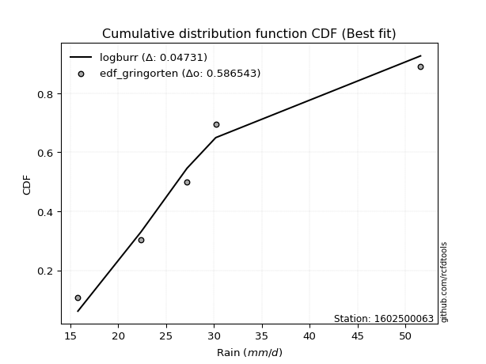</img>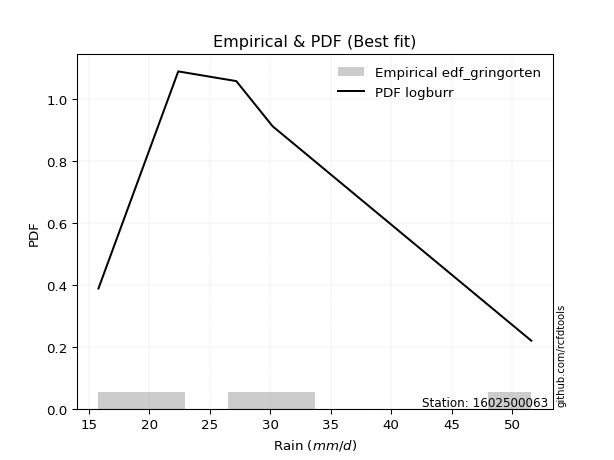</img>

</div>


### 9. EDF Filliben (1975)

The specific values of the constants (0.3175) (often denoted as $alpha$) and (0.365) are derived from a method proposed by James J. Filliben in a 1975 paper. This particular formula is the mean value of the $i$-th order statistic of the normal distribution and is considered a robust and effective plotting position formula for the normal probability plot correlation coefficient test for normality.

<div align="center">


$P=(m-0.3175)/(n+0.365)$


</div>


**9.1. Empirical values**

<div align="center">

|                | 0                   | 1                  | 2            | 3                  | 4                  |
|:---------------|:--------------------|:-------------------|:-------------|:-------------------|:-------------------|
| date           | 2023                | 2022               | 2020         | 2025               | 2019               |
| x              | 15.8                | 22.4               | 27.2         | 30.2               | 51.6               |
| m              | 1                   | 2                  | 3            | 4                  | 5                  |
| empirical_dist | edf_filliben        | edf_filliben       | edf_filliben | edf_filliben       | edf_filliben       |
| empirical      | 0.12721342031686858 | 0.3136067101584343 | 0.5          | 0.6863932898415657 | 0.8727865796831314 |
| empirical_tr   | 1.1457554725040042  | 1.456890699253225  | 2.0          | 3.188707280832095  | 7.860805860805863  |

</div>


**9.2. Kolmogorov-Smirnov fit test (sorted by Δ)**


<div align="center">

|                | 0                   | 1                  | 2                   | 3                   | 4                  | 5                   | 6                   | 7                   | 8                   | 9                   | 10                  | 11                  | 12                  | 13                  | 14                  | 15                 | 16                  | 17                  | 18                 | 19                  | 20                  | 21                  | 22                  | 23                  | 24                  | 25                 | 26                  | 27                 | 28                  | 29                  | 30                  | 31                  | 32                 | 33                  | 34                  | 35                  | 36                  | 37                  | 38                 | 39                 | 40                  | 41                  | 42                  | 43                 | 44                  | 45                  | 46                  | 47                  | 48                  | 49                  | 50                  | 51                  | 52                  | 53                  | 54                 | 55                  | 56                  | 57                  | 58                  | 59                  | 60                 | 61                  | 62                  | 63                  | 64                  | 65                  | 66                  | 67                  | 68                  | 69                  | 70                  | 71                  | 72                  | 73                  | 74                  | 75                  | 76                  | 77                  | 78                  | 79                  | 80                 | 81                  | 82                 | 83                 | 84                  | 85                  | 86                  | 87                  | 88                  | 89                  | 90                  | 91                  | 92                  | 93                  | 94                  | 95                  | 96                 | 97                  | 98                  | 99                  | 100                 | 101                | 102                 | 103                 | 104                | 105                | 106                 | 107                 | 108                | 109                | 110                | 111                 | 112                | 113                 | 114                 | 115                | 116                 | 117                | 118                | 119                 | 120                | 121                 | 122                | 123                | 124                | 125                | 126                 | 127                 | 128                | 129                 | 130                 | 131                | 132                | 133                 | 134                | 135                | 136                | 137                | 138                | 139                | 140                 | 141                | 142                | 143                 | 144                | 145                | 146                 | 147                 | 148                | 149                | 150                | 151                | 152                | 153                | 154                | 155                | 156                | 157                | 158                | 159                |
|:---------------|:--------------------|:-------------------|:--------------------|:--------------------|:-------------------|:--------------------|:--------------------|:--------------------|:--------------------|:--------------------|:--------------------|:--------------------|:--------------------|:--------------------|:--------------------|:-------------------|:--------------------|:--------------------|:-------------------|:--------------------|:--------------------|:--------------------|:--------------------|:--------------------|:--------------------|:-------------------|:--------------------|:-------------------|:--------------------|:--------------------|:--------------------|:--------------------|:-------------------|:--------------------|:--------------------|:--------------------|:--------------------|:--------------------|:-------------------|:-------------------|:--------------------|:--------------------|:--------------------|:-------------------|:--------------------|:--------------------|:--------------------|:--------------------|:--------------------|:--------------------|:--------------------|:--------------------|:--------------------|:--------------------|:-------------------|:--------------------|:--------------------|:--------------------|:--------------------|:--------------------|:-------------------|:--------------------|:--------------------|:--------------------|:--------------------|:--------------------|:--------------------|:--------------------|:--------------------|:--------------------|:--------------------|:--------------------|:--------------------|:--------------------|:--------------------|:--------------------|:--------------------|:--------------------|:--------------------|:--------------------|:-------------------|:--------------------|:-------------------|:-------------------|:--------------------|:--------------------|:--------------------|:--------------------|:--------------------|:--------------------|:--------------------|:--------------------|:--------------------|:--------------------|:--------------------|:--------------------|:-------------------|:--------------------|:--------------------|:--------------------|:--------------------|:-------------------|:--------------------|:--------------------|:-------------------|:-------------------|:--------------------|:--------------------|:-------------------|:-------------------|:-------------------|:--------------------|:-------------------|:--------------------|:--------------------|:-------------------|:--------------------|:-------------------|:-------------------|:--------------------|:-------------------|:--------------------|:-------------------|:-------------------|:-------------------|:-------------------|:--------------------|:--------------------|:-------------------|:--------------------|:--------------------|:-------------------|:-------------------|:--------------------|:-------------------|:-------------------|:-------------------|:-------------------|:-------------------|:-------------------|:--------------------|:-------------------|:-------------------|:--------------------|:-------------------|:-------------------|:--------------------|:--------------------|:-------------------|:-------------------|:-------------------|:-------------------|:-------------------|:-------------------|:-------------------|:-------------------|:-------------------|:-------------------|:-------------------|:-------------------|
| station        | 1602500063          | 1602500063         | 1602500063          | 1602500063          | 1602500063         | 1602500063          | 1602500063          | 1602500063          | 1602500063          | 1602500063          | 1602500063          | 1602500063          | 1602500063          | 1602500063          | 1602500063          | 1602500063         | 1602500063          | 1602500063          | 1602500063         | 1602500063          | 1602500063          | 1602500063          | 1602500063          | 1602500063          | 1602500063          | 1602500063         | 1602500063          | 1602500063         | 1602500063          | 1602500063          | 1602500063          | 1602500063          | 1602500063         | 1602500063          | 1602500063          | 1602500063          | 1602500063          | 1602500063          | 1602500063         | 1602500063         | 1602500063          | 1602500063          | 1602500063          | 1602500063         | 1602500063          | 1602500063          | 1602500063          | 1602500063          | 1602500063          | 1602500063          | 1602500063          | 1602500063          | 1602500063          | 1602500063          | 1602500063         | 1602500063          | 1602500063          | 1602500063          | 1602500063          | 1602500063          | 1602500063         | 1602500063          | 1602500063          | 1602500063          | 1602500063          | 1602500063          | 1602500063          | 1602500063          | 1602500063          | 1602500063          | 1602500063          | 1602500063          | 1602500063          | 1602500063          | 1602500063          | 1602500063          | 1602500063          | 1602500063          | 1602500063          | 1602500063          | 1602500063         | 1602500063          | 1602500063         | 1602500063         | 1602500063          | 1602500063          | 1602500063          | 1602500063          | 1602500063          | 1602500063          | 1602500063          | 1602500063          | 1602500063          | 1602500063          | 1602500063          | 1602500063          | 1602500063         | 1602500063          | 1602500063          | 1602500063          | 1602500063          | 1602500063         | 1602500063          | 1602500063          | 1602500063         | 1602500063         | 1602500063          | 1602500063          | 1602500063         | 1602500063         | 1602500063         | 1602500063          | 1602500063         | 1602500063          | 1602500063          | 1602500063         | 1602500063          | 1602500063         | 1602500063         | 1602500063          | 1602500063         | 1602500063          | 1602500063         | 1602500063         | 1602500063         | 1602500063         | 1602500063          | 1602500063          | 1602500063         | 1602500063          | 1602500063          | 1602500063         | 1602500063         | 1602500063          | 1602500063         | 1602500063         | 1602500063         | 1602500063         | 1602500063         | 1602500063         | 1602500063          | 1602500063         | 1602500063         | 1602500063          | 1602500063         | 1602500063         | 1602500063          | 1602500063          | 1602500063         | 1602500063         | 1602500063         | 1602500063         | 1602500063         | 1602500063         | 1602500063         | 1602500063         | 1602500063         | 1602500063         | 1602500063         | 1602500063         |
| empirical_dist | edf_filliben        | edf_filliben       | edf_filliben        | edf_filliben        | edf_filliben       | edf_filliben        | edf_filliben        | edf_filliben        | edf_filliben        | edf_filliben        | edf_filliben        | edf_filliben        | edf_filliben        | edf_filliben        | edf_filliben        | edf_filliben       | edf_filliben        | edf_filliben        | edf_filliben       | edf_filliben        | edf_filliben        | edf_filliben        | edf_filliben        | edf_filliben        | edf_filliben        | edf_filliben       | edf_filliben        | edf_filliben       | edf_filliben        | edf_filliben        | edf_filliben        | edf_filliben        | edf_filliben       | edf_filliben        | edf_filliben        | edf_filliben        | edf_filliben        | edf_filliben        | edf_filliben       | edf_filliben       | edf_filliben        | edf_filliben        | edf_filliben        | edf_filliben       | edf_filliben        | edf_filliben        | edf_filliben        | edf_filliben        | edf_filliben        | edf_filliben        | edf_filliben        | edf_filliben        | edf_filliben        | edf_filliben        | edf_filliben       | edf_filliben        | edf_filliben        | edf_filliben        | edf_filliben        | edf_filliben        | edf_filliben       | edf_filliben        | edf_filliben        | edf_filliben        | edf_filliben        | edf_filliben        | edf_filliben        | edf_filliben        | edf_filliben        | edf_filliben        | edf_filliben        | edf_filliben        | edf_filliben        | edf_filliben        | edf_filliben        | edf_filliben        | edf_filliben        | edf_filliben        | edf_filliben        | edf_filliben        | edf_filliben       | edf_filliben        | edf_filliben       | edf_filliben       | edf_filliben        | edf_filliben        | edf_filliben        | edf_filliben        | edf_filliben        | edf_filliben        | edf_filliben        | edf_filliben        | edf_filliben        | edf_filliben        | edf_filliben        | edf_filliben        | edf_filliben       | edf_filliben        | edf_filliben        | edf_filliben        | edf_filliben        | edf_filliben       | edf_filliben        | edf_filliben        | edf_filliben       | edf_filliben       | edf_filliben        | edf_filliben        | edf_filliben       | edf_filliben       | edf_filliben       | edf_filliben        | edf_filliben       | edf_filliben        | edf_filliben        | edf_filliben       | edf_filliben        | edf_filliben       | edf_filliben       | edf_filliben        | edf_filliben       | edf_filliben        | edf_filliben       | edf_filliben       | edf_filliben       | edf_filliben       | edf_filliben        | edf_filliben        | edf_filliben       | edf_filliben        | edf_filliben        | edf_filliben       | edf_filliben       | edf_filliben        | edf_filliben       | edf_filliben       | edf_filliben       | edf_filliben       | edf_filliben       | edf_filliben       | edf_filliben        | edf_filliben       | edf_filliben       | edf_filliben        | edf_filliben       | edf_filliben       | edf_filliben        | edf_filliben        | edf_filliben       | edf_filliben       | edf_filliben       | edf_filliben       | edf_filliben       | edf_filliben       | edf_filliben       | edf_filliben       | edf_filliben       | edf_filliben       | edf_filliben       | edf_filliben       |
| p_dist         | logloglaplace       | exponnorm          | logburr12           | alpha               | loginvgamma        | lognct              | logalpha            | ncf                 | logmielke           | logmaxwell          | logskewnorm         | logburr             | logjohnsonsu        | logf                | betaprime           | logdweibull        | nct                 | f                   | loginvgauss        | logexponnorm        | invgamma            | logfatiguelife      | logpearson3         | burr                | loggenlogistic      | logweibull_max     | loggenextreme       | loginvweibull      | moyal               | logkstwobign        | invgauss            | lograyleigh         | logbetaprime       | johnsonsu           | logerlang           | loggamma            | loggamma            | logfoldnorm         | loglaplace         | loglaplace         | logrice             | loglogistic         | loghypsecant        | logcrystalball     | lognorm             | logt                | logloggamma         | genlogistic         | dgamma              | halfnorm            | gumbel_r            | dweibull            | logweibull_min      | halflogistic        | loggumbel_r        | gennorm             | foldnorm            | loganglit           | kstwobign           | logsemicircular     | pearson3           | logcosine           | logksone            | logncf              | logmoyal            | rayleigh            | loggennorm          | loggenexpon         | genexpon            | logtruncexpon       | logbradford         | beta                | loggompertz         | gompertz            | logarcsine          | skewnorm            | loghalflogistic     | wald                | loghalfnorm         | logtruncpareto      | maxwell            | logvonmises_line    | loguniform         | loggumbel_l        | logtukeylambda      | rice                | logkappa3           | logkappa4           | laplace             | truncexpon          | burr12              | hypsecant           | logistic            | loglomax            | t                   | truncnorm           | norm               | crystalball         | anglit              | logdgamma           | semicircular        | logwald            | loggausshyper       | logwrapcauchy       | arcsine            | truncweibull_min   | logargus            | halfgennorm         | logbeta            | bradford           | logjohnsonsb       | cosine              | lomax              | loglevy_l           | logrdist            | weibull_min        | gumbel_l            | logtriang          | levy_l             | wrapcauchy          | kappa4             | logtruncweibull_min | genpareto          | logexponweib       | ksone              | vonmises_line      | uniform             | kappa3              | logexponpow        | argus               | loggenhalflogistic  | johnsonsb          | lognakagami        | logtruncnorm        | nakagami           | tukeylambda        | gausshyper         | triang             | exponpow           | genextreme         | logtrapezoid        | genhalflogistic    | gengamma           | rdist               | fatiguelife        | loggengamma        | invweibull          | erlang              | exponweib          | gamma              | powerlaw           | loggenpareto       | trapezoid          | truncpareto        | logpowerlaw        | weibull_max        | loghalfgennorm     | logvonmises        | vonmises           | mielke             |
| delta          | 0.05945737327816929 | 0.0629853139179064 | 0.06316055516871788 | 0.06379332843954633 | 0.0643562242060205 | 0.06442215478333566 | 0.06443813335928383 | 0.06445095766273345 | 0.06450349187580279 | 0.06457890419500545 | 0.06493425370398484 | 0.06514888695772011 | 0.06595583730209886 | 0.06668928862911572 | 0.06673122828627631 | 0.0668974381347486 | 0.06749484443263204 | 0.06763530792967982 | 0.0676944858216573 | 0.06783537527988825 | 0.06787291185610361 | 0.06790038097685211 | 0.06930962131850515 | 0.07127849022149216 | 0.07148766287415356 | 0.071566545172838  | 0.07157008076510485 | 0.0717561218656072 | 0.07195002049546861 | 0.07256614416825279 | 0.07257064043261208 | 0.07291462605803828 | 0.0729606241784383 | 0.07332488579726745 | 0.07367123120406566 | 0.07367125588666953 | 0.07367125588666953 | 0.07379077646318377 | 0.0784101567639438 | 0.0784101567639438 | 0.07886346219531445 | 0.07907096448264517 | 0.07927855484851598 | 0.0816747787151525 | 0.08167479137835976 | 0.08167752649158633 | 0.08387014062819009 | 0.08565093782265532 | 0.08835043690972422 | 0.08969375420327375 | 0.09068860074845053 | 0.09084908300215233 | 0.09163317810939926 | 0.09323062983554359 | 0.0936626546497294 | 0.09386922660698005 | 0.09609343081821176 | 0.09610722700417762 | 0.09948460564977946 | 0.10210578166767925 | 0.102171990647558  | 0.10338288490543279 | 0.10972706482529127 | 0.11316580184697433 | 0.11538622246188017 | 0.11905054972266127 | 0.12217943059474734 | 0.12424628224709047 | 0.12704617683515307 | 0.12721067541712772 | 0.12721214983498547 | 0.12721340789919072 | 0.12721341998295504 | 0.12721342031676636 | 0.12721342031686855 | 0.12721342031686858 | 0.12721342031686858 | 0.12721342031686858 | 0.12721342031686858 | 0.12721342031686858 | 0.1294754111469434 | 0.13392805155409204 | 0.1390121641772657 | 0.1405515142003383 | 0.14055686903423936 | 0.14182591092288532 | 0.14239788227559924 | 0.14304692275957653 | 0.14390154429642354 | 0.14713277643456502 | 0.15363505743153388 | 0.15504389515166483 | 0.15794721076783003 | 0.16112807882832564 | 0.16133682765334167 | 0.16135599258860145 | 0.1613560152197676 | 0.16135603372779983 | 0.16493259330567978 | 0.16579034817979213 | 0.16640658844394896 | 0.1665432991196728 | 0.16880795424653394 | 0.17049512401358535 | 0.1722536452055271 | 0.1734317640163413 | 0.18063089885301653 | 0.18306305466215989 | 0.1938725687982345 | 0.2031807521932501 | 0.2038443330439833 | 0.21042445470300386 | 0.2135698795455957 | 0.21764349353472157 | 0.22861776547610602 | 0.2291840225555794 | 0.23053087630748603 | 0.2322861943314476 | 0.236421174061158  | 0.23645617217329729 | 0.2516644249278969 | 0.25686703058297217 | 0.2649594885678668 | 0.2654717692136938 | 0.2678644257819754 | 0.2816533903932837 | 0.28415865297005727 | 0.28493669102082675 | 0.2855270940292696 | 0.29280884553050335 | 0.29545647863976077 | 0.30740263864943   | 0.3083976491565558 | 0.31360219907079834 | 0.3136066465364991 | 0.3136067070485238 | 0.3375558549796205 | 0.3418966876961781 | 0.3475775098743083 | 0.3578480189171751 | 0.39535001076769344 | 0.4040527477649177 | 0.4077578389926831 | 0.40802235830728595 | 0.4243823689509357 | 0.4328636142872156 | 0.44121438666719803 | 0.44545349817739316 | 0.4822752047792915 | 0.5006283493863295 | 0.5012313797241492 | 0.5037771768084852 | 0.5112268797905547 | 0.5262919082583846 | 0.5384097627560434 | 0.5594904420191515 | 0.6863932898415657 | 1.0776448561847038 | 7.259201739997799  | nan                |
| deltao         | 0.5865427407550001  | 0.5865427407550001 | 0.5865427407550001  | 0.5865427407550001  | 0.5865427407550001 | 0.5865427407550001  | 0.5865427407550001  | 0.5865427407550001  | 0.5865427407550001  | 0.5865427407550001  | 0.5865427407550001  | 0.5865427407550001  | 0.5865427407550001  | 0.5865427407550001  | 0.5865427407550001  | 0.5865427407550001 | 0.5865427407550001  | 0.5865427407550001  | 0.5865427407550001 | 0.5865427407550001  | 0.5865427407550001  | 0.5865427407550001  | 0.5865427407550001  | 0.5865427407550001  | 0.5865427407550001  | 0.5865427407550001 | 0.5865427407550001  | 0.5865427407550001 | 0.5865427407550001  | 0.5865427407550001  | 0.5865427407550001  | 0.5865427407550001  | 0.5865427407550001 | 0.5865427407550001  | 0.5865427407550001  | 0.5865427407550001  | 0.5865427407550001  | 0.5865427407550001  | 0.5865427407550001 | 0.5865427407550001 | 0.5865427407550001  | 0.5865427407550001  | 0.5865427407550001  | 0.5865427407550001 | 0.5865427407550001  | 0.5865427407550001  | 0.5865427407550001  | 0.5865427407550001  | 0.5865427407550001  | 0.5865427407550001  | 0.5865427407550001  | 0.5865427407550001  | 0.5865427407550001  | 0.5865427407550001  | 0.5865427407550001 | 0.5865427407550001  | 0.5865427407550001  | 0.5865427407550001  | 0.5865427407550001  | 0.5865427407550001  | 0.5865427407550001 | 0.5865427407550001  | 0.5865427407550001  | 0.5865427407550001  | 0.5865427407550001  | 0.5865427407550001  | 0.5865427407550001  | 0.5865427407550001  | 0.5865427407550001  | 0.5865427407550001  | 0.5865427407550001  | 0.5865427407550001  | 0.5865427407550001  | 0.5865427407550001  | 0.5865427407550001  | 0.5865427407550001  | 0.5865427407550001  | 0.5865427407550001  | 0.5865427407550001  | 0.5865427407550001  | 0.5865427407550001 | 0.5865427407550001  | 0.5865427407550001 | 0.5865427407550001 | 0.5865427407550001  | 0.5865427407550001  | 0.5865427407550001  | 0.5865427407550001  | 0.5865427407550001  | 0.5865427407550001  | 0.5865427407550001  | 0.5865427407550001  | 0.5865427407550001  | 0.5865427407550001  | 0.5865427407550001  | 0.5865427407550001  | 0.5865427407550001 | 0.5865427407550001  | 0.5865427407550001  | 0.5865427407550001  | 0.5865427407550001  | 0.5865427407550001 | 0.5865427407550001  | 0.5865427407550001  | 0.5865427407550001 | 0.5865427407550001 | 0.5865427407550001  | 0.5865427407550001  | 0.5865427407550001 | 0.5865427407550001 | 0.5865427407550001 | 0.5865427407550001  | 0.5865427407550001 | 0.5865427407550001  | 0.5865427407550001  | 0.5865427407550001 | 0.5865427407550001  | 0.5865427407550001 | 0.5865427407550001 | 0.5865427407550001  | 0.5865427407550001 | 0.5865427407550001  | 0.5865427407550001 | 0.5865427407550001 | 0.5865427407550001 | 0.5865427407550001 | 0.5865427407550001  | 0.5865427407550001  | 0.5865427407550001 | 0.5865427407550001  | 0.5865427407550001  | 0.5865427407550001 | 0.5865427407550001 | 0.5865427407550001  | 0.5865427407550001 | 0.5865427407550001 | 0.5865427407550001 | 0.5865427407550001 | 0.5865427407550001 | 0.5865427407550001 | 0.5865427407550001  | 0.5865427407550001 | 0.5865427407550001 | 0.5865427407550001  | 0.5865427407550001 | 0.5865427407550001 | 0.5865427407550001  | 0.5865427407550001  | 0.5865427407550001 | 0.5865427407550001 | 0.5865427407550001 | 0.5865427407550001 | 0.5865427407550001 | 0.5865427407550001 | 0.5865427407550001 | 0.5865427407550001 | 0.5865427407550001 | 0.5865427407550001 | 0.5865427407550001 | 0.5865427407550001 |
| eval           | Δo > Δ              | Δo > Δ             | Δo > Δ              | Δo > Δ              | Δo > Δ             | Δo > Δ              | Δo > Δ              | Δo > Δ              | Δo > Δ              | Δo > Δ              | Δo > Δ              | Δo > Δ              | Δo > Δ              | Δo > Δ              | Δo > Δ              | Δo > Δ             | Δo > Δ              | Δo > Δ              | Δo > Δ             | Δo > Δ              | Δo > Δ              | Δo > Δ              | Δo > Δ              | Δo > Δ              | Δo > Δ              | Δo > Δ             | Δo > Δ              | Δo > Δ             | Δo > Δ              | Δo > Δ              | Δo > Δ              | Δo > Δ              | Δo > Δ             | Δo > Δ              | Δo > Δ              | Δo > Δ              | Δo > Δ              | Δo > Δ              | Δo > Δ             | Δo > Δ             | Δo > Δ              | Δo > Δ              | Δo > Δ              | Δo > Δ             | Δo > Δ              | Δo > Δ              | Δo > Δ              | Δo > Δ              | Δo > Δ              | Δo > Δ              | Δo > Δ              | Δo > Δ              | Δo > Δ              | Δo > Δ              | Δo > Δ             | Δo > Δ              | Δo > Δ              | Δo > Δ              | Δo > Δ              | Δo > Δ              | Δo > Δ             | Δo > Δ              | Δo > Δ              | Δo > Δ              | Δo > Δ              | Δo > Δ              | Δo > Δ              | Δo > Δ              | Δo > Δ              | Δo > Δ              | Δo > Δ              | Δo > Δ              | Δo > Δ              | Δo > Δ              | Δo > Δ              | Δo > Δ              | Δo > Δ              | Δo > Δ              | Δo > Δ              | Δo > Δ              | Δo > Δ             | Δo > Δ              | Δo > Δ             | Δo > Δ             | Δo > Δ              | Δo > Δ              | Δo > Δ              | Δo > Δ              | Δo > Δ              | Δo > Δ              | Δo > Δ              | Δo > Δ              | Δo > Δ              | Δo > Δ              | Δo > Δ              | Δo > Δ              | Δo > Δ             | Δo > Δ              | Δo > Δ              | Δo > Δ              | Δo > Δ              | Δo > Δ             | Δo > Δ              | Δo > Δ              | Δo > Δ             | Δo > Δ             | Δo > Δ              | Δo > Δ              | Δo > Δ             | Δo > Δ             | Δo > Δ             | Δo > Δ              | Δo > Δ             | Δo > Δ              | Δo > Δ              | Δo > Δ             | Δo > Δ              | Δo > Δ             | Δo > Δ             | Δo > Δ              | Δo > Δ             | Δo > Δ              | Δo > Δ             | Δo > Δ             | Δo > Δ             | Δo > Δ             | Δo > Δ              | Δo > Δ              | Δo > Δ             | Δo > Δ              | Δo > Δ              | Δo > Δ             | Δo > Δ             | Δo > Δ              | Δo > Δ             | Δo > Δ             | Δo > Δ             | Δo > Δ             | Δo > Δ             | Δo > Δ             | Δo > Δ              | Δo > Δ             | Δo > Δ             | Δo > Δ              | Δo > Δ             | Δo > Δ             | Δo > Δ              | Δo > Δ              | Δo > Δ             | Δo > Δ             | Δo > Δ             | Δo > Δ             | Δo > Δ             | Δo > Δ             | Δo > Δ             | Δo > Δ             | Δo <= Δ            | Δo <= Δ            | Δo <= Δ            | Δo <= Δ            |
| fit            | 1                   | 1                  | 1                   | 1                   | 1                  | 1                   | 1                   | 1                   | 1                   | 1                   | 1                   | 1                   | 1                   | 1                   | 1                   | 1                  | 1                   | 1                   | 1                  | 1                   | 1                   | 1                   | 1                   | 1                   | 1                   | 1                  | 1                   | 1                  | 1                   | 1                   | 1                   | 1                   | 1                  | 1                   | 1                   | 1                   | 1                   | 1                   | 1                  | 1                  | 1                   | 1                   | 1                   | 1                  | 1                   | 1                   | 1                   | 1                   | 1                   | 1                   | 1                   | 1                   | 1                   | 1                   | 1                  | 1                   | 1                   | 1                   | 1                   | 1                   | 1                  | 1                   | 1                   | 1                   | 1                   | 1                   | 1                   | 1                   | 1                   | 1                   | 1                   | 1                   | 1                   | 1                   | 1                   | 1                   | 1                   | 1                   | 1                   | 1                   | 1                  | 1                   | 1                  | 1                  | 1                   | 1                   | 1                   | 1                   | 1                   | 1                   | 1                   | 1                   | 1                   | 1                   | 1                   | 1                   | 1                  | 1                   | 1                   | 1                   | 1                   | 1                  | 1                   | 1                   | 1                  | 1                  | 1                   | 1                   | 1                  | 1                  | 1                  | 1                   | 1                  | 1                   | 1                   | 1                  | 1                   | 1                  | 1                  | 1                   | 1                  | 1                   | 1                  | 1                  | 1                  | 1                  | 1                   | 1                   | 1                  | 1                   | 1                   | 1                  | 1                  | 1                   | 1                  | 1                  | 1                  | 1                  | 1                  | 1                  | 1                   | 1                  | 1                  | 1                   | 1                  | 1                  | 1                   | 1                   | 1                  | 1                  | 1                  | 1                  | 1                  | 1                  | 1                  | 1                  | 0                  | 0                  | 0                  | 0                  |
| n              | 5                   | 5                  | 5                   | 5                   | 5                  | 5                   | 5                   | 5                   | 5                   | 5                   | 5                   | 5                   | 5                   | 5                   | 5                   | 5                  | 5                   | 5                   | 5                  | 5                   | 5                   | 5                   | 5                   | 5                   | 5                   | 5                  | 5                   | 5                  | 5                   | 5                   | 5                   | 5                   | 5                  | 5                   | 5                   | 5                   | 5                   | 5                   | 5                  | 5                  | 5                   | 5                   | 5                   | 5                  | 5                   | 5                   | 5                   | 5                   | 5                   | 5                   | 5                   | 5                   | 5                   | 5                   | 5                  | 5                   | 5                   | 5                   | 5                   | 5                   | 5                  | 5                   | 5                   | 5                   | 5                   | 5                   | 5                   | 5                   | 5                   | 5                   | 5                   | 5                   | 5                   | 5                   | 5                   | 5                   | 5                   | 5                   | 5                   | 5                   | 5                  | 5                   | 5                  | 5                  | 5                   | 5                   | 5                   | 5                   | 5                   | 5                   | 5                   | 5                   | 5                   | 5                   | 5                   | 5                   | 5                  | 5                   | 5                   | 5                   | 5                   | 5                  | 5                   | 5                   | 5                  | 5                  | 5                   | 5                   | 5                  | 5                  | 5                  | 5                   | 5                  | 5                   | 5                   | 5                  | 5                   | 5                  | 5                  | 5                   | 5                  | 5                   | 5                  | 5                  | 5                  | 5                  | 5                   | 5                   | 5                  | 5                   | 5                   | 5                  | 5                  | 5                   | 5                  | 5                  | 5                  | 5                  | 5                  | 5                  | 5                   | 5                  | 5                  | 5                   | 5                  | 5                  | 5                   | 5                   | 5                  | 5                  | 5                  | 5                  | 5                  | 5                  | 5                  | 5                  | 5                  | 5                  | 5                  | 5                  |
| best_fit       | 1                   | 0                  | 0                   | 0                   | 0                  | 0                   | 0                   | 0                   | 0                   | 0                   | 0                   | 0                   | 0                   | 0                   | 0                   | 0                  | 0                   | 0                   | 0                  | 0                   | 0                   | 0                   | 0                   | 0                   | 0                   | 0                  | 0                   | 0                  | 0                   | 0                   | 0                   | 0                   | 0                  | 0                   | 0                   | 0                   | 0                   | 0                   | 0                  | 0                  | 0                   | 0                   | 0                   | 0                  | 0                   | 0                   | 0                   | 0                   | 0                   | 0                   | 0                   | 0                   | 0                   | 0                   | 0                  | 0                   | 0                   | 0                   | 0                   | 0                   | 0                  | 0                   | 0                   | 0                   | 0                   | 0                   | 0                   | 0                   | 0                   | 0                   | 0                   | 0                   | 0                   | 0                   | 0                   | 0                   | 0                   | 0                   | 0                   | 0                   | 0                  | 0                   | 0                  | 0                  | 0                   | 0                   | 0                   | 0                   | 0                   | 0                   | 0                   | 0                   | 0                   | 0                   | 0                   | 0                   | 0                  | 0                   | 0                   | 0                   | 0                   | 0                  | 0                   | 0                   | 0                  | 0                  | 0                   | 0                   | 0                  | 0                  | 0                  | 0                   | 0                  | 0                   | 0                   | 0                  | 0                   | 0                  | 0                  | 0                   | 0                  | 0                   | 0                  | 0                  | 0                  | 0                  | 0                   | 0                   | 0                  | 0                   | 0                   | 0                  | 0                  | 0                   | 0                  | 0                  | 0                  | 0                  | 0                  | 0                  | 0                   | 0                  | 0                  | 0                   | 0                  | 0                  | 0                   | 0                   | 0                  | 0                  | 0                  | 0                  | 0                  | 0                  | 0                  | 0                  | 0                  | 0                  | 0                  | 0                  |
| best_fit_sort  | 1                   | 2                  | 3                   | 4                   | 5                  | 6                   | 7                   | 8                   | 9                   | 10                  | 11                  | 12                  | 13                  | 14                  | 15                  | 16                 | 17                  | 18                  | 19                 | 20                  | 21                  | 22                  | 23                  | 24                  | 25                  | 26                 | 27                  | 28                 | 29                  | 30                  | 31                  | 32                  | 33                 | 34                  | 35                  | 36                  | 37                  | 38                  | 39                 | 40                 | 41                  | 42                  | 43                  | 44                 | 45                  | 46                  | 47                  | 48                  | 49                  | 50                  | 51                  | 52                  | 53                  | 54                  | 55                 | 56                  | 57                  | 58                  | 59                  | 60                  | 61                 | 62                  | 63                  | 64                  | 65                  | 66                  | 67                  | 68                  | 69                  | 70                  | 71                  | 72                  | 73                  | 74                  | 75                  | 76                  | 77                  | 78                  | 79                  | 80                  | 81                 | 82                  | 83                 | 84                 | 85                  | 86                  | 87                  | 88                  | 89                  | 90                  | 91                  | 92                  | 93                  | 94                  | 95                  | 96                  | 97                 | 98                  | 99                  | 100                 | 101                 | 102                | 103                 | 104                 | 105                | 106                | 107                 | 108                 | 109                | 110                | 111                | 112                 | 113                | 114                 | 115                 | 116                | 117                 | 118                | 119                | 120                 | 121                | 122                 | 123                | 124                | 125                | 126                | 127                 | 128                 | 129                | 130                 | 131                 | 132                | 133                | 134                 | 135                | 136                | 137                | 138                | 139                | 140                | 141                 | 142                | 143                | 144                 | 145                | 146                | 147                 | 148                 | 149                | 150                | 151                | 152                | 153                | 154                | 155                | 156                | 157                | 158                | 159                | 160                |

</div>


**9.3. Best fit**

<div align="center">

|   id |    station | empirical_dist   | p_dist        |     delta |   deltao | eval   |   fit |   n |   best_fit |   best_fit_sort |
|-----:|-----------:|:-----------------|:--------------|----------:|---------:|:-------|------:|----:|-----------:|----------------:|
|    0 | 1602500063 | edf_filliben     | logloglaplace | 0.0594574 | 0.586543 | Δo > Δ |     1 |   5 |          1 |               1 |

</div>


<div align="center">

</img></img>

</div>


### 10. EDF Jenkinson (1977)

The Jenkinson formula in hydrology is an empirical plotting position formula used to estimate the non-exceedance probability _(P)_ or return period _(T)_ of a given ordered observation within a sample. It is a widely used method in the frequency analysis of extreme events such as floods and rainfall, as it provides a distribution-free way to plot data. _a≈0.31_ and _b≈0.38_ are constants derived to approximate the median of the probability distribution for the given rank.

<div align="center">


$P=(m-a)/(n+b)$


</div>


**10.1. Empirical values**

<div align="center">

|                | 0                   | 1                  | 2             | 3                  | 4                  |
|:---------------|:--------------------|:-------------------|:--------------|:-------------------|:-------------------|
| date           | 2023                | 2022               | 2020          | 2025               | 2019               |
| x              | 15.8                | 22.4               | 27.2          | 30.2               | 51.6               |
| m              | 1                   | 2                  | 3             | 4                  | 5                  |
| empirical_dist | edf_jenkinson       | edf_jenkinson      | edf_jenkinson | edf_jenkinson      | edf_jenkinson      |
| empirical      | 0.12825278810408922 | 0.3141263940520446 | 0.5           | 0.6858736059479554 | 0.8717472118959109 |
| empirical_tr   | 1.1471215351812367  | 1.4579945799457996 | 2.0           | 3.183431952662722  | 7.797101449275368  |

</div>


**10.2. Kolmogorov-Smirnov fit test (sorted by Δ)**


<div align="center">

|                | 0                   | 1                   | 2                   | 3                  | 4                   | 5                   | 6                   | 7                   | 8                   | 9                   | 10                  | 11                  | 12                 | 13                  | 14                  | 15                  | 16                  | 17                  | 18                  | 19                  | 20                  | 21                  | 22                  | 23                 | 24                 | 25                  | 26                  | 27                  | 28                 | 29                  | 30                  | 31                  | 32                  | 33                  | 34                  | 35                  | 36                  | 37                  | 38                  | 39                  | 40                  | 41                  | 42                  | 43                  | 44                  | 45                 | 46                  | 47                 | 48                  | 49                 | 50                 | 51                  | 52                 | 53                  | 54                  | 55                  | 56                  | 57                  | 58                  | 59                  | 60                  | 61                  | 62                  | 63                 | 64                 | 65                  | 66                  | 67                 | 68                 | 69                 | 70                 | 71                  | 72                  | 73                 | 74                  | 75                  | 76                  | 77                  | 78                  | 79                  | 80                  | 81                 | 82                  | 83                  | 84                  | 85                 | 86                 | 87                 | 88                 | 89                  | 90                  | 91                 | 92                 | 93                 | 94                  | 95                  | 96                  | 97                 | 98                  | 99                  | 100                 | 101                | 102                | 103                 | 104                 | 105                 | 106                | 107                 | 108                 | 109                 | 110                 | 111                 | 112                 | 113                 | 114                 | 115                 | 116                | 117                 | 118                 | 119                 | 120                | 121                 | 122                 | 123                 | 124                 | 125                 | 126                 | 127                | 128                | 129                | 130                 | 131                 | 132                 | 133                | 134                 | 135                | 136                 | 137                 | 138                 | 139                | 140                | 141                 | 142                 | 143                 | 144                 | 145                 | 146                 | 147                | 148                 | 149                | 150                | 151                | 152                | 153                | 154                | 155                | 156                | 157                | 158                | 159                |
|:---------------|:--------------------|:--------------------|:--------------------|:-------------------|:--------------------|:--------------------|:--------------------|:--------------------|:--------------------|:--------------------|:--------------------|:--------------------|:-------------------|:--------------------|:--------------------|:--------------------|:--------------------|:--------------------|:--------------------|:--------------------|:--------------------|:--------------------|:--------------------|:-------------------|:-------------------|:--------------------|:--------------------|:--------------------|:-------------------|:--------------------|:--------------------|:--------------------|:--------------------|:--------------------|:--------------------|:--------------------|:--------------------|:--------------------|:--------------------|:--------------------|:--------------------|:--------------------|:--------------------|:--------------------|:--------------------|:-------------------|:--------------------|:-------------------|:--------------------|:-------------------|:-------------------|:--------------------|:-------------------|:--------------------|:--------------------|:--------------------|:--------------------|:--------------------|:--------------------|:--------------------|:--------------------|:--------------------|:--------------------|:-------------------|:-------------------|:--------------------|:--------------------|:-------------------|:-------------------|:-------------------|:-------------------|:--------------------|:--------------------|:-------------------|:--------------------|:--------------------|:--------------------|:--------------------|:--------------------|:--------------------|:--------------------|:-------------------|:--------------------|:--------------------|:--------------------|:-------------------|:-------------------|:-------------------|:-------------------|:--------------------|:--------------------|:-------------------|:-------------------|:-------------------|:--------------------|:--------------------|:--------------------|:-------------------|:--------------------|:--------------------|:--------------------|:-------------------|:-------------------|:--------------------|:--------------------|:--------------------|:-------------------|:--------------------|:--------------------|:--------------------|:--------------------|:--------------------|:--------------------|:--------------------|:--------------------|:--------------------|:-------------------|:--------------------|:--------------------|:--------------------|:-------------------|:--------------------|:--------------------|:--------------------|:--------------------|:--------------------|:--------------------|:-------------------|:-------------------|:-------------------|:--------------------|:--------------------|:--------------------|:-------------------|:--------------------|:-------------------|:--------------------|:--------------------|:--------------------|:-------------------|:-------------------|:--------------------|:--------------------|:--------------------|:--------------------|:--------------------|:--------------------|:-------------------|:--------------------|:-------------------|:-------------------|:-------------------|:-------------------|:-------------------|:-------------------|:-------------------|:-------------------|:-------------------|:-------------------|:-------------------|
| station        | 1602500063          | 1602500063          | 1602500063          | 1602500063         | 1602500063          | 1602500063          | 1602500063          | 1602500063          | 1602500063          | 1602500063          | 1602500063          | 1602500063          | 1602500063         | 1602500063          | 1602500063          | 1602500063          | 1602500063          | 1602500063          | 1602500063          | 1602500063          | 1602500063          | 1602500063          | 1602500063          | 1602500063         | 1602500063         | 1602500063          | 1602500063          | 1602500063          | 1602500063         | 1602500063          | 1602500063          | 1602500063          | 1602500063          | 1602500063          | 1602500063          | 1602500063          | 1602500063          | 1602500063          | 1602500063          | 1602500063          | 1602500063          | 1602500063          | 1602500063          | 1602500063          | 1602500063          | 1602500063         | 1602500063          | 1602500063         | 1602500063          | 1602500063         | 1602500063         | 1602500063          | 1602500063         | 1602500063          | 1602500063          | 1602500063          | 1602500063          | 1602500063          | 1602500063          | 1602500063          | 1602500063          | 1602500063          | 1602500063          | 1602500063         | 1602500063         | 1602500063          | 1602500063          | 1602500063         | 1602500063         | 1602500063         | 1602500063         | 1602500063          | 1602500063          | 1602500063         | 1602500063          | 1602500063          | 1602500063          | 1602500063          | 1602500063          | 1602500063          | 1602500063          | 1602500063         | 1602500063          | 1602500063          | 1602500063          | 1602500063         | 1602500063         | 1602500063         | 1602500063         | 1602500063          | 1602500063          | 1602500063         | 1602500063         | 1602500063         | 1602500063          | 1602500063          | 1602500063          | 1602500063         | 1602500063          | 1602500063          | 1602500063          | 1602500063         | 1602500063         | 1602500063          | 1602500063          | 1602500063          | 1602500063         | 1602500063          | 1602500063          | 1602500063          | 1602500063          | 1602500063          | 1602500063          | 1602500063          | 1602500063          | 1602500063          | 1602500063         | 1602500063          | 1602500063          | 1602500063          | 1602500063         | 1602500063          | 1602500063          | 1602500063          | 1602500063          | 1602500063          | 1602500063          | 1602500063         | 1602500063         | 1602500063         | 1602500063          | 1602500063          | 1602500063          | 1602500063         | 1602500063          | 1602500063         | 1602500063          | 1602500063          | 1602500063          | 1602500063         | 1602500063         | 1602500063          | 1602500063          | 1602500063          | 1602500063          | 1602500063          | 1602500063          | 1602500063         | 1602500063          | 1602500063         | 1602500063         | 1602500063         | 1602500063         | 1602500063         | 1602500063         | 1602500063         | 1602500063         | 1602500063         | 1602500063         | 1602500063         |
| empirical_dist | edf_jenkinson       | edf_jenkinson       | edf_jenkinson       | edf_jenkinson      | edf_jenkinson       | edf_jenkinson       | edf_jenkinson       | edf_jenkinson       | edf_jenkinson       | edf_jenkinson       | edf_jenkinson       | edf_jenkinson       | edf_jenkinson      | edf_jenkinson       | edf_jenkinson       | edf_jenkinson       | edf_jenkinson       | edf_jenkinson       | edf_jenkinson       | edf_jenkinson       | edf_jenkinson       | edf_jenkinson       | edf_jenkinson       | edf_jenkinson      | edf_jenkinson      | edf_jenkinson       | edf_jenkinson       | edf_jenkinson       | edf_jenkinson      | edf_jenkinson       | edf_jenkinson       | edf_jenkinson       | edf_jenkinson       | edf_jenkinson       | edf_jenkinson       | edf_jenkinson       | edf_jenkinson       | edf_jenkinson       | edf_jenkinson       | edf_jenkinson       | edf_jenkinson       | edf_jenkinson       | edf_jenkinson       | edf_jenkinson       | edf_jenkinson       | edf_jenkinson      | edf_jenkinson       | edf_jenkinson      | edf_jenkinson       | edf_jenkinson      | edf_jenkinson      | edf_jenkinson       | edf_jenkinson      | edf_jenkinson       | edf_jenkinson       | edf_jenkinson       | edf_jenkinson       | edf_jenkinson       | edf_jenkinson       | edf_jenkinson       | edf_jenkinson       | edf_jenkinson       | edf_jenkinson       | edf_jenkinson      | edf_jenkinson      | edf_jenkinson       | edf_jenkinson       | edf_jenkinson      | edf_jenkinson      | edf_jenkinson      | edf_jenkinson      | edf_jenkinson       | edf_jenkinson       | edf_jenkinson      | edf_jenkinson       | edf_jenkinson       | edf_jenkinson       | edf_jenkinson       | edf_jenkinson       | edf_jenkinson       | edf_jenkinson       | edf_jenkinson      | edf_jenkinson       | edf_jenkinson       | edf_jenkinson       | edf_jenkinson      | edf_jenkinson      | edf_jenkinson      | edf_jenkinson      | edf_jenkinson       | edf_jenkinson       | edf_jenkinson      | edf_jenkinson      | edf_jenkinson      | edf_jenkinson       | edf_jenkinson       | edf_jenkinson       | edf_jenkinson      | edf_jenkinson       | edf_jenkinson       | edf_jenkinson       | edf_jenkinson      | edf_jenkinson      | edf_jenkinson       | edf_jenkinson       | edf_jenkinson       | edf_jenkinson      | edf_jenkinson       | edf_jenkinson       | edf_jenkinson       | edf_jenkinson       | edf_jenkinson       | edf_jenkinson       | edf_jenkinson       | edf_jenkinson       | edf_jenkinson       | edf_jenkinson      | edf_jenkinson       | edf_jenkinson       | edf_jenkinson       | edf_jenkinson      | edf_jenkinson       | edf_jenkinson       | edf_jenkinson       | edf_jenkinson       | edf_jenkinson       | edf_jenkinson       | edf_jenkinson      | edf_jenkinson      | edf_jenkinson      | edf_jenkinson       | edf_jenkinson       | edf_jenkinson       | edf_jenkinson      | edf_jenkinson       | edf_jenkinson      | edf_jenkinson       | edf_jenkinson       | edf_jenkinson       | edf_jenkinson      | edf_jenkinson      | edf_jenkinson       | edf_jenkinson       | edf_jenkinson       | edf_jenkinson       | edf_jenkinson       | edf_jenkinson       | edf_jenkinson      | edf_jenkinson       | edf_jenkinson      | edf_jenkinson      | edf_jenkinson      | edf_jenkinson      | edf_jenkinson      | edf_jenkinson      | edf_jenkinson      | edf_jenkinson      | edf_jenkinson      | edf_jenkinson      | edf_jenkinson      |
| p_dist         | logloglaplace       | exponnorm           | logburr12           | alpha              | loginvgamma         | lognct              | logalpha            | ncf                 | logmielke           | logmaxwell          | logskewnorm         | logburr             | logjohnsonsu       | logdweibull         | logf                | betaprime           | nct                 | f                   | loginvgauss         | logexponnorm        | invgamma            | logfatiguelife      | logpearson3         | burr               | loggenlogistic     | logweibull_max      | loggenextreme       | loginvweibull       | moyal              | logfoldnorm         | logkstwobign        | invgauss            | lograyleigh         | logbetaprime        | johnsonsu           | logerlang           | loggamma            | loggamma            | loglaplace          | loglaplace          | logrice             | loglogistic         | loghypsecant        | logcrystalball      | lognorm             | logt               | logloggamma         | genlogistic        | halfnorm            | dgamma             | gumbel_r           | dweibull            | logweibull_min     | halflogistic        | loggumbel_r         | gennorm             | foldnorm            | loganglit           | kstwobign           | logsemicircular     | pearson3            | logcosine           | logksone            | logncf             | logmoyal           | rayleigh            | loggennorm          | loggenexpon        | genexpon           | logtruncexpon      | logbradford        | beta                | loggompertz         | gompertz           | logarcsine          | skewnorm            | loghalflogistic     | wald                | loghalfnorm         | logtruncpareto      | maxwell             | logvonmises_line   | loguniform          | loggumbel_l         | logtukeylambda      | rice               | logkappa3          | logkappa4          | laplace            | truncexpon          | burr12              | hypsecant          | logistic           | loglomax           | t                   | truncnorm           | norm                | crystalball        | anglit              | semicircular        | logdgamma           | logwald            | loggausshyper      | logwrapcauchy       | arcsine             | truncweibull_min    | logargus           | halfgennorm         | logbeta             | bradford            | logjohnsonsb        | cosine              | lomax               | loglevy_l           | logrdist            | weibull_min         | gumbel_l           | logtriang           | levy_l              | wrapcauchy          | kappa4             | logtruncweibull_min | genpareto           | logexponweib        | ksone               | vonmises_line       | uniform             | kappa3             | logexponpow        | argus              | loggenhalflogistic  | johnsonsb           | lognakagami         | logtruncnorm       | nakagami            | tukeylambda        | gausshyper          | triang              | exponpow            | genextreme         | logtrapezoid       | genhalflogistic     | rdist               | gengamma            | fatiguelife         | loggengamma         | invweibull          | erlang             | exponweib           | gamma              | powerlaw           | loggenpareto       | trapezoid          | truncpareto        | logpowerlaw        | weibull_max        | loghalfgennorm     | logvonmises        | vonmises           | mielke             |
| delta          | 0.06049674106538992 | 0.06402468170512698 | 0.06419992295593846 | 0.0648326962267669 | 0.06539559199324108 | 0.06546152257055629 | 0.06547750114650441 | 0.06549032544995403 | 0.06554285966302342 | 0.06561827198222603 | 0.06597362149120548 | 0.06618825474494075 | 0.0669952050893195 | 0.06741712202835895 | 0.06772865641633635 | 0.06777059607349689 | 0.06853421221985267 | 0.06867467571690046 | 0.06873385360887793 | 0.06887474306710883 | 0.06891227964332425 | 0.06893974876407274 | 0.07034898910572573 | 0.0723178580087128 | 0.0725270306613742 | 0.07260591296005858 | 0.07260944855232543 | 0.07279548965282784 | 0.0729893882826892 | 0.07327109256957354 | 0.07360551195547342 | 0.07361000821983271 | 0.07395399384525891 | 0.07399999196565887 | 0.07436425358448809 | 0.07471059899128629 | 0.07471062367389017 | 0.07471062367389017 | 0.07944952455116439 | 0.07944952455116439 | 0.07990282998253509 | 0.08011033226986575 | 0.08031792263573656 | 0.08115509482154226 | 0.08115510748474952 | 0.0811578425979761 | 0.08335045673457986 | 0.0866903056098759 | 0.08917407030966351 | 0.0893898046969448 | 0.0901689168548403 | 0.09188845078937291 | 0.0926725458966199 | 0.09426999762276422 | 0.09470202243695003 | 0.09490859439420063 | 0.09557374692460152 | 0.09558754311056739 | 0.09896492175616922 | 0.10158609777406902 | 0.10165230675394776 | 0.10286320101182256 | 0.10920738093168103 | 0.1126461179533641 | 0.1164255902491008 | 0.11853086582905104 | 0.12269911448835769 | 0.1252856500343111 | 0.1280855446223737 | 0.1282500432043483 | 0.1282515176222061 | 0.12825277568641136 | 0.12825278777017568 | 0.128252788103987  | 0.12825278810408913 | 0.12825278810408922 | 0.12825278810408922 | 0.12825278810408922 | 0.12825278810408922 | 0.12825278810408922 | 0.12895572725333315 | 0.1334083676604818 | 0.13849248028365546 | 0.14003183030672806 | 0.14003718514062913 | 0.1413062270292751 | 0.141878198381989  | 0.1425272388659663 | 0.1433818604028133 | 0.14661309254095478 | 0.15311537353792354 | 0.1545242112580546 | 0.1574275268742198 | 0.1606083949347153 | 0.16081714375973144 | 0.16083630869499121 | 0.16083633132615738 | 0.1608363498341896 | 0.16441290941206954 | 0.16588690455033872 | 0.16631003207340248 | 0.1665432991196728 | 0.1682882703529237 | 0.16997544011997512 | 0.17173396131191687 | 0.17291208012273096 | 0.1801112149594063 | 0.18254337076854954 | 0.19335288490462416 | 0.20266106829963987 | 0.20332464915037307 | 0.20990477080939363 | 0.21305019565198546 | 0.21712380964111133 | 0.22809808158249578 | 0.22866433866196906 | 0.2300111924138758 | 0.23176651043783736 | 0.23538180627393737 | 0.23593648827968705 | 0.2511447410342867 | 0.2563473466893618  | 0.26443980467425654 | 0.26495208532008346 | 0.26734474188836516 | 0.28113370649967345 | 0.28363896907644703 | 0.2844170071272165 | 0.2850074101356593 | 0.2922891616368931 | 0.29493679474615053 | 0.30688295475581967 | 0.30891733305016617 | 0.3141218829644087 | 0.31412633043010946 | 0.314126390942134  | 0.33703617108601025 | 0.34137700380256786 | 0.34705782598069795 | 0.3568086511299545 | 0.3948303268740832 | 0.40353306387130744 | 0.40698299052006526 | 0.40723815509907274 | 0.42386268505732533 | 0.43234393039360525 | 0.44017501887997745 | 0.4449338142837828 | 0.48175552088568113 | 0.5001086654927192 | 0.5007116958305389 | 0.5027378090212645 | 0.5107071958969445 | 0.5257722243647742 | 0.537890078862433  | 0.5589707581255413 | 0.6858736059479554 | 1.0786842239719243 | 7.26024110778502   | nan                |
| deltao         | 0.5865427407550001  | 0.5865427407550001  | 0.5865427407550001  | 0.5865427407550001 | 0.5865427407550001  | 0.5865427407550001  | 0.5865427407550001  | 0.5865427407550001  | 0.5865427407550001  | 0.5865427407550001  | 0.5865427407550001  | 0.5865427407550001  | 0.5865427407550001 | 0.5865427407550001  | 0.5865427407550001  | 0.5865427407550001  | 0.5865427407550001  | 0.5865427407550001  | 0.5865427407550001  | 0.5865427407550001  | 0.5865427407550001  | 0.5865427407550001  | 0.5865427407550001  | 0.5865427407550001 | 0.5865427407550001 | 0.5865427407550001  | 0.5865427407550001  | 0.5865427407550001  | 0.5865427407550001 | 0.5865427407550001  | 0.5865427407550001  | 0.5865427407550001  | 0.5865427407550001  | 0.5865427407550001  | 0.5865427407550001  | 0.5865427407550001  | 0.5865427407550001  | 0.5865427407550001  | 0.5865427407550001  | 0.5865427407550001  | 0.5865427407550001  | 0.5865427407550001  | 0.5865427407550001  | 0.5865427407550001  | 0.5865427407550001  | 0.5865427407550001 | 0.5865427407550001  | 0.5865427407550001 | 0.5865427407550001  | 0.5865427407550001 | 0.5865427407550001 | 0.5865427407550001  | 0.5865427407550001 | 0.5865427407550001  | 0.5865427407550001  | 0.5865427407550001  | 0.5865427407550001  | 0.5865427407550001  | 0.5865427407550001  | 0.5865427407550001  | 0.5865427407550001  | 0.5865427407550001  | 0.5865427407550001  | 0.5865427407550001 | 0.5865427407550001 | 0.5865427407550001  | 0.5865427407550001  | 0.5865427407550001 | 0.5865427407550001 | 0.5865427407550001 | 0.5865427407550001 | 0.5865427407550001  | 0.5865427407550001  | 0.5865427407550001 | 0.5865427407550001  | 0.5865427407550001  | 0.5865427407550001  | 0.5865427407550001  | 0.5865427407550001  | 0.5865427407550001  | 0.5865427407550001  | 0.5865427407550001 | 0.5865427407550001  | 0.5865427407550001  | 0.5865427407550001  | 0.5865427407550001 | 0.5865427407550001 | 0.5865427407550001 | 0.5865427407550001 | 0.5865427407550001  | 0.5865427407550001  | 0.5865427407550001 | 0.5865427407550001 | 0.5865427407550001 | 0.5865427407550001  | 0.5865427407550001  | 0.5865427407550001  | 0.5865427407550001 | 0.5865427407550001  | 0.5865427407550001  | 0.5865427407550001  | 0.5865427407550001 | 0.5865427407550001 | 0.5865427407550001  | 0.5865427407550001  | 0.5865427407550001  | 0.5865427407550001 | 0.5865427407550001  | 0.5865427407550001  | 0.5865427407550001  | 0.5865427407550001  | 0.5865427407550001  | 0.5865427407550001  | 0.5865427407550001  | 0.5865427407550001  | 0.5865427407550001  | 0.5865427407550001 | 0.5865427407550001  | 0.5865427407550001  | 0.5865427407550001  | 0.5865427407550001 | 0.5865427407550001  | 0.5865427407550001  | 0.5865427407550001  | 0.5865427407550001  | 0.5865427407550001  | 0.5865427407550001  | 0.5865427407550001 | 0.5865427407550001 | 0.5865427407550001 | 0.5865427407550001  | 0.5865427407550001  | 0.5865427407550001  | 0.5865427407550001 | 0.5865427407550001  | 0.5865427407550001 | 0.5865427407550001  | 0.5865427407550001  | 0.5865427407550001  | 0.5865427407550001 | 0.5865427407550001 | 0.5865427407550001  | 0.5865427407550001  | 0.5865427407550001  | 0.5865427407550001  | 0.5865427407550001  | 0.5865427407550001  | 0.5865427407550001 | 0.5865427407550001  | 0.5865427407550001 | 0.5865427407550001 | 0.5865427407550001 | 0.5865427407550001 | 0.5865427407550001 | 0.5865427407550001 | 0.5865427407550001 | 0.5865427407550001 | 0.5865427407550001 | 0.5865427407550001 | 0.5865427407550001 |
| eval           | Δo > Δ              | Δo > Δ              | Δo > Δ              | Δo > Δ             | Δo > Δ              | Δo > Δ              | Δo > Δ              | Δo > Δ              | Δo > Δ              | Δo > Δ              | Δo > Δ              | Δo > Δ              | Δo > Δ             | Δo > Δ              | Δo > Δ              | Δo > Δ              | Δo > Δ              | Δo > Δ              | Δo > Δ              | Δo > Δ              | Δo > Δ              | Δo > Δ              | Δo > Δ              | Δo > Δ             | Δo > Δ             | Δo > Δ              | Δo > Δ              | Δo > Δ              | Δo > Δ             | Δo > Δ              | Δo > Δ              | Δo > Δ              | Δo > Δ              | Δo > Δ              | Δo > Δ              | Δo > Δ              | Δo > Δ              | Δo > Δ              | Δo > Δ              | Δo > Δ              | Δo > Δ              | Δo > Δ              | Δo > Δ              | Δo > Δ              | Δo > Δ              | Δo > Δ             | Δo > Δ              | Δo > Δ             | Δo > Δ              | Δo > Δ             | Δo > Δ             | Δo > Δ              | Δo > Δ             | Δo > Δ              | Δo > Δ              | Δo > Δ              | Δo > Δ              | Δo > Δ              | Δo > Δ              | Δo > Δ              | Δo > Δ              | Δo > Δ              | Δo > Δ              | Δo > Δ             | Δo > Δ             | Δo > Δ              | Δo > Δ              | Δo > Δ             | Δo > Δ             | Δo > Δ             | Δo > Δ             | Δo > Δ              | Δo > Δ              | Δo > Δ             | Δo > Δ              | Δo > Δ              | Δo > Δ              | Δo > Δ              | Δo > Δ              | Δo > Δ              | Δo > Δ              | Δo > Δ             | Δo > Δ              | Δo > Δ              | Δo > Δ              | Δo > Δ             | Δo > Δ             | Δo > Δ             | Δo > Δ             | Δo > Δ              | Δo > Δ              | Δo > Δ             | Δo > Δ             | Δo > Δ             | Δo > Δ              | Δo > Δ              | Δo > Δ              | Δo > Δ             | Δo > Δ              | Δo > Δ              | Δo > Δ              | Δo > Δ             | Δo > Δ             | Δo > Δ              | Δo > Δ              | Δo > Δ              | Δo > Δ             | Δo > Δ              | Δo > Δ              | Δo > Δ              | Δo > Δ              | Δo > Δ              | Δo > Δ              | Δo > Δ              | Δo > Δ              | Δo > Δ              | Δo > Δ             | Δo > Δ              | Δo > Δ              | Δo > Δ              | Δo > Δ             | Δo > Δ              | Δo > Δ              | Δo > Δ              | Δo > Δ              | Δo > Δ              | Δo > Δ              | Δo > Δ             | Δo > Δ             | Δo > Δ             | Δo > Δ              | Δo > Δ              | Δo > Δ              | Δo > Δ             | Δo > Δ              | Δo > Δ             | Δo > Δ              | Δo > Δ              | Δo > Δ              | Δo > Δ             | Δo > Δ             | Δo > Δ              | Δo > Δ              | Δo > Δ              | Δo > Δ              | Δo > Δ              | Δo > Δ              | Δo > Δ             | Δo > Δ              | Δo > Δ             | Δo > Δ             | Δo > Δ             | Δo > Δ             | Δo > Δ             | Δo > Δ             | Δo > Δ             | Δo <= Δ            | Δo <= Δ            | Δo <= Δ            | Δo <= Δ            |
| fit            | 1                   | 1                   | 1                   | 1                  | 1                   | 1                   | 1                   | 1                   | 1                   | 1                   | 1                   | 1                   | 1                  | 1                   | 1                   | 1                   | 1                   | 1                   | 1                   | 1                   | 1                   | 1                   | 1                   | 1                  | 1                  | 1                   | 1                   | 1                   | 1                  | 1                   | 1                   | 1                   | 1                   | 1                   | 1                   | 1                   | 1                   | 1                   | 1                   | 1                   | 1                   | 1                   | 1                   | 1                   | 1                   | 1                  | 1                   | 1                  | 1                   | 1                  | 1                  | 1                   | 1                  | 1                   | 1                   | 1                   | 1                   | 1                   | 1                   | 1                   | 1                   | 1                   | 1                   | 1                  | 1                  | 1                   | 1                   | 1                  | 1                  | 1                  | 1                  | 1                   | 1                   | 1                  | 1                   | 1                   | 1                   | 1                   | 1                   | 1                   | 1                   | 1                  | 1                   | 1                   | 1                   | 1                  | 1                  | 1                  | 1                  | 1                   | 1                   | 1                  | 1                  | 1                  | 1                   | 1                   | 1                   | 1                  | 1                   | 1                   | 1                   | 1                  | 1                  | 1                   | 1                   | 1                   | 1                  | 1                   | 1                   | 1                   | 1                   | 1                   | 1                   | 1                   | 1                   | 1                   | 1                  | 1                   | 1                   | 1                   | 1                  | 1                   | 1                   | 1                   | 1                   | 1                   | 1                   | 1                  | 1                  | 1                  | 1                   | 1                   | 1                   | 1                  | 1                   | 1                  | 1                   | 1                   | 1                   | 1                  | 1                  | 1                   | 1                   | 1                   | 1                   | 1                   | 1                   | 1                  | 1                   | 1                  | 1                  | 1                  | 1                  | 1                  | 1                  | 1                  | 0                  | 0                  | 0                  | 0                  |
| n              | 5                   | 5                   | 5                   | 5                  | 5                   | 5                   | 5                   | 5                   | 5                   | 5                   | 5                   | 5                   | 5                  | 5                   | 5                   | 5                   | 5                   | 5                   | 5                   | 5                   | 5                   | 5                   | 5                   | 5                  | 5                  | 5                   | 5                   | 5                   | 5                  | 5                   | 5                   | 5                   | 5                   | 5                   | 5                   | 5                   | 5                   | 5                   | 5                   | 5                   | 5                   | 5                   | 5                   | 5                   | 5                   | 5                  | 5                   | 5                  | 5                   | 5                  | 5                  | 5                   | 5                  | 5                   | 5                   | 5                   | 5                   | 5                   | 5                   | 5                   | 5                   | 5                   | 5                   | 5                  | 5                  | 5                   | 5                   | 5                  | 5                  | 5                  | 5                  | 5                   | 5                   | 5                  | 5                   | 5                   | 5                   | 5                   | 5                   | 5                   | 5                   | 5                  | 5                   | 5                   | 5                   | 5                  | 5                  | 5                  | 5                  | 5                   | 5                   | 5                  | 5                  | 5                  | 5                   | 5                   | 5                   | 5                  | 5                   | 5                   | 5                   | 5                  | 5                  | 5                   | 5                   | 5                   | 5                  | 5                   | 5                   | 5                   | 5                   | 5                   | 5                   | 5                   | 5                   | 5                   | 5                  | 5                   | 5                   | 5                   | 5                  | 5                   | 5                   | 5                   | 5                   | 5                   | 5                   | 5                  | 5                  | 5                  | 5                   | 5                   | 5                   | 5                  | 5                   | 5                  | 5                   | 5                   | 5                   | 5                  | 5                  | 5                   | 5                   | 5                   | 5                   | 5                   | 5                   | 5                  | 5                   | 5                  | 5                  | 5                  | 5                  | 5                  | 5                  | 5                  | 5                  | 5                  | 5                  | 5                  |
| best_fit       | 1                   | 0                   | 0                   | 0                  | 0                   | 0                   | 0                   | 0                   | 0                   | 0                   | 0                   | 0                   | 0                  | 0                   | 0                   | 0                   | 0                   | 0                   | 0                   | 0                   | 0                   | 0                   | 0                   | 0                  | 0                  | 0                   | 0                   | 0                   | 0                  | 0                   | 0                   | 0                   | 0                   | 0                   | 0                   | 0                   | 0                   | 0                   | 0                   | 0                   | 0                   | 0                   | 0                   | 0                   | 0                   | 0                  | 0                   | 0                  | 0                   | 0                  | 0                  | 0                   | 0                  | 0                   | 0                   | 0                   | 0                   | 0                   | 0                   | 0                   | 0                   | 0                   | 0                   | 0                  | 0                  | 0                   | 0                   | 0                  | 0                  | 0                  | 0                  | 0                   | 0                   | 0                  | 0                   | 0                   | 0                   | 0                   | 0                   | 0                   | 0                   | 0                  | 0                   | 0                   | 0                   | 0                  | 0                  | 0                  | 0                  | 0                   | 0                   | 0                  | 0                  | 0                  | 0                   | 0                   | 0                   | 0                  | 0                   | 0                   | 0                   | 0                  | 0                  | 0                   | 0                   | 0                   | 0                  | 0                   | 0                   | 0                   | 0                   | 0                   | 0                   | 0                   | 0                   | 0                   | 0                  | 0                   | 0                   | 0                   | 0                  | 0                   | 0                   | 0                   | 0                   | 0                   | 0                   | 0                  | 0                  | 0                  | 0                   | 0                   | 0                   | 0                  | 0                   | 0                  | 0                   | 0                   | 0                   | 0                  | 0                  | 0                   | 0                   | 0                   | 0                   | 0                   | 0                   | 0                  | 0                   | 0                  | 0                  | 0                  | 0                  | 0                  | 0                  | 0                  | 0                  | 0                  | 0                  | 0                  |
| best_fit_sort  | 1                   | 2                   | 3                   | 4                  | 5                   | 6                   | 7                   | 8                   | 9                   | 10                  | 11                  | 12                  | 13                 | 14                  | 15                  | 16                  | 17                  | 18                  | 19                  | 20                  | 21                  | 22                  | 23                  | 24                 | 25                 | 26                  | 27                  | 28                  | 29                 | 30                  | 31                  | 32                  | 33                  | 34                  | 35                  | 36                  | 37                  | 38                  | 39                  | 40                  | 41                  | 42                  | 43                  | 44                  | 45                  | 46                 | 47                  | 48                 | 49                  | 50                 | 51                 | 52                  | 53                 | 54                  | 55                  | 56                  | 57                  | 58                  | 59                  | 60                  | 61                  | 62                  | 63                  | 64                 | 65                 | 66                  | 67                  | 68                 | 69                 | 70                 | 71                 | 72                  | 73                  | 74                 | 75                  | 76                  | 77                  | 78                  | 79                  | 80                  | 81                  | 82                 | 83                  | 84                  | 85                  | 86                 | 87                 | 88                 | 89                 | 90                  | 91                  | 92                 | 93                 | 94                 | 95                  | 96                  | 97                  | 98                 | 99                  | 100                 | 101                 | 102                | 103                | 104                 | 105                 | 106                 | 107                | 108                 | 109                 | 110                 | 111                 | 112                 | 113                 | 114                 | 115                 | 116                 | 117                | 118                 | 119                 | 120                 | 121                | 122                 | 123                 | 124                 | 125                 | 126                 | 127                 | 128                | 129                | 130                | 131                 | 132                 | 133                 | 134                | 135                 | 136                | 137                 | 138                 | 139                 | 140                | 141                | 142                 | 143                 | 144                 | 145                 | 146                 | 147                 | 148                | 149                 | 150                | 151                | 152                | 153                | 154                | 155                | 156                | 157                | 158                | 159                | 160                |

</div>


**10.3. Best fit**

<div align="center">

|   id |    station | empirical_dist   | p_dist        |     delta |   deltao | eval   |   fit |   n |   best_fit |   best_fit_sort |
|-----:|-----------:|:-----------------|:--------------|----------:|---------:|:-------|------:|----:|-----------:|----------------:|
|    0 | 1602500063 | edf_jenkinson    | logloglaplace | 0.0604967 | 0.586543 | Δo > Δ |     1 |   5 |          1 |               1 |

</div>


<div align="center">

</img></img>

</div>


### 11. EDF Cunnane (1978)

Cunnane´s work in statistical hydrology has focused on the performance and evaluation of different probability distributions (such as GEV, Gumbel, Lognormal) for flood frequency estimation. _b_ is a constant, typically set to 0.4.

<div align="center">


$P=(m-b)/(n+1-2b)$


</div>


**11.1. Empirical values**

<div align="center">

|                | 0                   | 1                  | 2           | 3                  | 4                  |
|:---------------|:--------------------|:-------------------|:------------|:-------------------|:-------------------|
| date           | 2023                | 2022               | 2020        | 2025               | 2019               |
| x              | 15.8                | 22.4               | 27.2        | 30.2               | 51.6               |
| m              | 1                   | 2                  | 3           | 4                  | 5                  |
| empirical_dist | edf_cunnane         | edf_cunnane        | edf_cunnane | edf_cunnane        | edf_cunnane        |
| empirical      | 0.11538461538461538 | 0.3076923076923077 | 0.5         | 0.6923076923076923 | 0.8846153846153845 |
| empirical_tr   | 1.1304347826086958  | 1.4444444444444444 | 2.0         | 3.25               | 8.666666666666655  |

</div>


**11.2. Kolmogorov-Smirnov fit test (sorted by Δ)**


<div align="center">

|                | 0                   | 1                  | 2                    | 3                   | 4                    | 5                   | 6                    | 7                   | 8                    | 9                    | 10                  | 11                  | 12                  | 13                   | 14                  | 15                 | 16                   | 17                   | 18                   | 19                  | 20                   | 21                  | 22                   | 23                  | 24                   | 25                   | 26                  | 27                  | 28                 | 29                   | 30                   | 31                 | 32                  | 33                  | 34                  | 35                  | 36                  | 37                  | 38                  | 39                  | 40                  | 41                 | 42                 | 43                  | 44                 | 45                  | 46                 | 47                  | 48                 | 49                  | 50                  | 51                  | 52                  | 53                  | 54                  | 55                  | 56                  | 57                  | 58                  | 59                  | 60                  | 61                  | 62                  | 63                  | 64                  | 65                 | 66                  | 67                  | 68                  | 69                  | 70                  | 71                  | 72                  | 73                  | 74                  | 75                  | 76                  | 77                  | 78                  | 79                 | 80                 | 81                  | 82                  | 83                 | 84                  | 85                  | 86                  | 87                  | 88                  | 89                  | 90                  | 91                  | 92                  | 93                  | 94                 | 95                 | 96                 | 97                  | 98                  | 99                  | 100                | 101                 | 102                 | 103                 | 104                 | 105                 | 106                 | 107                 | 108                 | 109                 | 110                 | 111                 | 112                 | 113                | 114                 | 115                 | 116                 | 117                 | 118                | 119                 | 120                 | 121                 | 122                | 123                | 124                | 125                | 126                | 127                 | 128                | 129                 | 130                | 131                 | 132                 | 133                 | 134                 | 135                | 136                | 137                | 138                 | 139                | 140                 | 141                | 142                 | 143                 | 144                 | 145                 | 146                | 147                 | 148                 | 149                | 150                | 151                | 152                | 153                | 154                | 155                | 156                | 157                | 158                | 159                |
|:---------------|:--------------------|:-------------------|:---------------------|:--------------------|:---------------------|:--------------------|:---------------------|:--------------------|:---------------------|:---------------------|:--------------------|:--------------------|:--------------------|:---------------------|:--------------------|:-------------------|:---------------------|:---------------------|:---------------------|:--------------------|:---------------------|:--------------------|:---------------------|:--------------------|:---------------------|:---------------------|:--------------------|:--------------------|:-------------------|:---------------------|:---------------------|:-------------------|:--------------------|:--------------------|:--------------------|:--------------------|:--------------------|:--------------------|:--------------------|:--------------------|:--------------------|:-------------------|:-------------------|:--------------------|:-------------------|:--------------------|:-------------------|:--------------------|:-------------------|:--------------------|:--------------------|:--------------------|:--------------------|:--------------------|:--------------------|:--------------------|:--------------------|:--------------------|:--------------------|:--------------------|:--------------------|:--------------------|:--------------------|:--------------------|:--------------------|:-------------------|:--------------------|:--------------------|:--------------------|:--------------------|:--------------------|:--------------------|:--------------------|:--------------------|:--------------------|:--------------------|:--------------------|:--------------------|:--------------------|:-------------------|:-------------------|:--------------------|:--------------------|:-------------------|:--------------------|:--------------------|:--------------------|:--------------------|:--------------------|:--------------------|:--------------------|:--------------------|:--------------------|:--------------------|:-------------------|:-------------------|:-------------------|:--------------------|:--------------------|:--------------------|:-------------------|:--------------------|:--------------------|:--------------------|:--------------------|:--------------------|:--------------------|:--------------------|:--------------------|:--------------------|:--------------------|:--------------------|:--------------------|:-------------------|:--------------------|:--------------------|:--------------------|:--------------------|:-------------------|:--------------------|:--------------------|:--------------------|:-------------------|:-------------------|:-------------------|:-------------------|:-------------------|:--------------------|:-------------------|:--------------------|:-------------------|:--------------------|:--------------------|:--------------------|:--------------------|:-------------------|:-------------------|:-------------------|:--------------------|:-------------------|:--------------------|:-------------------|:--------------------|:--------------------|:--------------------|:--------------------|:-------------------|:--------------------|:--------------------|:-------------------|:-------------------|:-------------------|:-------------------|:-------------------|:-------------------|:-------------------|:-------------------|:-------------------|:-------------------|:-------------------|
| station        | 1602500063          | 1602500063         | 1602500063           | 1602500063          | 1602500063           | 1602500063          | 1602500063           | 1602500063          | 1602500063           | 1602500063           | 1602500063          | 1602500063          | 1602500063          | 1602500063           | 1602500063          | 1602500063         | 1602500063           | 1602500063           | 1602500063           | 1602500063          | 1602500063           | 1602500063          | 1602500063           | 1602500063          | 1602500063           | 1602500063           | 1602500063          | 1602500063          | 1602500063         | 1602500063           | 1602500063           | 1602500063         | 1602500063          | 1602500063          | 1602500063          | 1602500063          | 1602500063          | 1602500063          | 1602500063          | 1602500063          | 1602500063          | 1602500063         | 1602500063         | 1602500063          | 1602500063         | 1602500063          | 1602500063         | 1602500063          | 1602500063         | 1602500063          | 1602500063          | 1602500063          | 1602500063          | 1602500063          | 1602500063          | 1602500063          | 1602500063          | 1602500063          | 1602500063          | 1602500063          | 1602500063          | 1602500063          | 1602500063          | 1602500063          | 1602500063          | 1602500063         | 1602500063          | 1602500063          | 1602500063          | 1602500063          | 1602500063          | 1602500063          | 1602500063          | 1602500063          | 1602500063          | 1602500063          | 1602500063          | 1602500063          | 1602500063          | 1602500063         | 1602500063         | 1602500063          | 1602500063          | 1602500063         | 1602500063          | 1602500063          | 1602500063          | 1602500063          | 1602500063          | 1602500063          | 1602500063          | 1602500063          | 1602500063          | 1602500063          | 1602500063         | 1602500063         | 1602500063         | 1602500063          | 1602500063          | 1602500063          | 1602500063         | 1602500063          | 1602500063          | 1602500063          | 1602500063          | 1602500063          | 1602500063          | 1602500063          | 1602500063          | 1602500063          | 1602500063          | 1602500063          | 1602500063          | 1602500063         | 1602500063          | 1602500063          | 1602500063          | 1602500063          | 1602500063         | 1602500063          | 1602500063          | 1602500063          | 1602500063         | 1602500063         | 1602500063         | 1602500063         | 1602500063         | 1602500063          | 1602500063         | 1602500063          | 1602500063         | 1602500063          | 1602500063          | 1602500063          | 1602500063          | 1602500063         | 1602500063         | 1602500063         | 1602500063          | 1602500063         | 1602500063          | 1602500063         | 1602500063          | 1602500063          | 1602500063          | 1602500063          | 1602500063         | 1602500063          | 1602500063          | 1602500063         | 1602500063         | 1602500063         | 1602500063         | 1602500063         | 1602500063         | 1602500063         | 1602500063         | 1602500063         | 1602500063         | 1602500063         |
| empirical_dist | edf_cunnane         | edf_cunnane        | edf_cunnane          | edf_cunnane         | edf_cunnane          | edf_cunnane         | edf_cunnane          | edf_cunnane         | edf_cunnane          | edf_cunnane          | edf_cunnane         | edf_cunnane         | edf_cunnane         | edf_cunnane          | edf_cunnane         | edf_cunnane        | edf_cunnane          | edf_cunnane          | edf_cunnane          | edf_cunnane         | edf_cunnane          | edf_cunnane         | edf_cunnane          | edf_cunnane         | edf_cunnane          | edf_cunnane          | edf_cunnane         | edf_cunnane         | edf_cunnane        | edf_cunnane          | edf_cunnane          | edf_cunnane        | edf_cunnane         | edf_cunnane         | edf_cunnane         | edf_cunnane         | edf_cunnane         | edf_cunnane         | edf_cunnane         | edf_cunnane         | edf_cunnane         | edf_cunnane        | edf_cunnane        | edf_cunnane         | edf_cunnane        | edf_cunnane         | edf_cunnane        | edf_cunnane         | edf_cunnane        | edf_cunnane         | edf_cunnane         | edf_cunnane         | edf_cunnane         | edf_cunnane         | edf_cunnane         | edf_cunnane         | edf_cunnane         | edf_cunnane         | edf_cunnane         | edf_cunnane         | edf_cunnane         | edf_cunnane         | edf_cunnane         | edf_cunnane         | edf_cunnane         | edf_cunnane        | edf_cunnane         | edf_cunnane         | edf_cunnane         | edf_cunnane         | edf_cunnane         | edf_cunnane         | edf_cunnane         | edf_cunnane         | edf_cunnane         | edf_cunnane         | edf_cunnane         | edf_cunnane         | edf_cunnane         | edf_cunnane        | edf_cunnane        | edf_cunnane         | edf_cunnane         | edf_cunnane        | edf_cunnane         | edf_cunnane         | edf_cunnane         | edf_cunnane         | edf_cunnane         | edf_cunnane         | edf_cunnane         | edf_cunnane         | edf_cunnane         | edf_cunnane         | edf_cunnane        | edf_cunnane        | edf_cunnane        | edf_cunnane         | edf_cunnane         | edf_cunnane         | edf_cunnane        | edf_cunnane         | edf_cunnane         | edf_cunnane         | edf_cunnane         | edf_cunnane         | edf_cunnane         | edf_cunnane         | edf_cunnane         | edf_cunnane         | edf_cunnane         | edf_cunnane         | edf_cunnane         | edf_cunnane        | edf_cunnane         | edf_cunnane         | edf_cunnane         | edf_cunnane         | edf_cunnane        | edf_cunnane         | edf_cunnane         | edf_cunnane         | edf_cunnane        | edf_cunnane        | edf_cunnane        | edf_cunnane        | edf_cunnane        | edf_cunnane         | edf_cunnane        | edf_cunnane         | edf_cunnane        | edf_cunnane         | edf_cunnane         | edf_cunnane         | edf_cunnane         | edf_cunnane        | edf_cunnane        | edf_cunnane        | edf_cunnane         | edf_cunnane        | edf_cunnane         | edf_cunnane        | edf_cunnane         | edf_cunnane         | edf_cunnane         | edf_cunnane         | edf_cunnane        | edf_cunnane         | edf_cunnane         | edf_cunnane        | edf_cunnane        | edf_cunnane        | edf_cunnane        | edf_cunnane        | edf_cunnane        | edf_cunnane        | edf_cunnane        | edf_cunnane        | edf_cunnane        | edf_cunnane        |
| p_dist         | logburr12           | alpha              | logmielke            | logloglaplace       | logskewnorm          | logburr             | lognct               | logjohnsonsu        | exponnorm            | logalpha             | loginvgamma         | nct                 | f                   | loginvgauss          | invgamma            | logfatiguelife     | logf                 | betaprime            | invgauss             | logdweibull         | lograyleigh          | logmaxwell          | johnsonsu            | logbetaprime        | logexponnorm         | logerlang            | loggamma            | loggamma            | logweibull_max     | loggenextreme        | loginvweibull        | loggenlogistic     | ncf                 | burr                | loglaplace          | loglaplace          | logrice             | loghypsecant        | logkstwobign        | logpearson3         | moyal               | loglogistic        | dgamma             | dweibull            | logfoldnorm        | logweibull_min      | genlogistic        | halflogistic        | loggumbel_r        | gennorm             | logcrystalball      | lognorm             | logt                | logloggamma         | halfnorm            | gumbel_r            | foldnorm            | loganglit           | logmoyal            | kstwobign           | logsemicircular     | pearson3            | logcosine           | loggenexpon         | genexpon            | logtruncexpon      | logbradford         | beta                | loggompertz         | gompertz            | wald                | loghalflogistic     | loghalfnorm         | logtruncpareto      | logksone            | loggennorm          | logncf              | skewnorm            | rayleigh            | logarcsine         | maxwell            | logvonmises_line    | loguniform          | loggumbel_l        | logtukeylambda      | rice                | logkappa3           | logkappa4           | laplace             | truncexpon          | burr12              | logdgamma           | hypsecant           | logistic            | logwald            | loglomax           | t                  | truncnorm           | norm                | crystalball         | anglit             | semicircular        | loggausshyper       | logwrapcauchy       | arcsine             | truncweibull_min    | logargus            | halfgennorm         | logbeta             | bradford            | logjohnsonsb        | cosine              | lomax               | loglevy_l          | logrdist            | weibull_min         | gumbel_l            | logtriang           | wrapcauchy         | levy_l              | kappa4              | logtruncweibull_min | genpareto          | logexponweib       | ksone              | vonmises_line      | uniform            | kappa3              | logexponpow        | argus               | loggenhalflogistic | lognakagami         | logtruncnorm        | nakagami            | tukeylambda         | johnsonsb          | gausshyper         | triang             | exponpow            | genextreme         | logtrapezoid        | genhalflogistic    | gengamma            | rdist               | fatiguelife         | loggengamma         | erlang             | invweibull          | exponweib           | gamma              | powerlaw           | loggenpareto       | trapezoid          | truncpareto        | logpowerlaw        | weibull_max        | loghalfgennorm     | logvonmises        | vonmises           | mielke             |
| delta          | 0.05133175023646486 | 0.0519645235072933 | 0.052674686943549584 | 0.05292894841669177 | 0.053105448771731636 | 0.05332008202546692 | 0.054006969947191896 | 0.05412703236984565 | 0.054586466894819496 | 0.055349494644961195 | 0.05562357057264988 | 0.05566603950037883 | 0.05580650299742662 | 0.055865680889404086 | 0.05604410692385041 | 0.0560715760445989 | 0.058089135084650856 | 0.058190812660240177 | 0.060741835500358866 | 0.06098303566862204 | 0.061085821125785075 | 0.06148462712374303 | 0.061496080865014256 | 0.06151568923906425 | 0.061588769974066704 | 0.061842426271812447 | 0.06184245095441634 | 0.06184245095441634 | 0.062201255253304  | 0.062219308531772266 | 0.062419177839019735 | 0.0625881783725395 | 0.06398859277009883 | 0.06455504225043629 | 0.06658135183169078 | 0.06658135183169078 | 0.06703465726306126 | 0.06744974991626296 | 0.06752999889288924 | 0.06885373715347498 | 0.07110082761916514 | 0.07415655613631   | 0.0765216319774712 | 0.07902027806989931 | 0.0797051789293104 | 0.07980437317714606 | 0.0810194666794557 | 0.08140182490329037 | 0.0818338497174762 | 0.08204042167472703 | 0.08758918118127912 | 0.08758919384448638 | 0.08759192895771295 | 0.08978454309431672 | 0.09560815666940037 | 0.09660300321457715 | 0.10200783328433838 | 0.10202162947030424 | 0.10355741752962697 | 0.10539900811590608 | 0.10802018413380587 | 0.10808639311368462 | 0.10929728737155942 | 0.11241747731483727 | 0.11521737190289988 | 0.1153818704848747 | 0.11538334490273226 | 0.11538460296693752 | 0.11538461505070184 | 0.11538461538451317 | 0.11538461538461538 | 0.11538461538461538 | 0.11538461538461538 | 0.11538461538461553 | 0.11564146729141789 | 0.11626502812862077 | 0.11908020431310096 | 0.12192968870581244 | 0.12496495218878789 | 0.1321725022153304 | 0.13538981361307   | 0.13984245402021867 | 0.14492656664339232 | 0.1464659166664649 | 0.14647127150036598 | 0.14774031338901195 | 0.14831228474172586 | 0.14896132522570316 | 0.14981594676255017 | 0.15304717890069164 | 0.15954945989766045 | 0.15987594571366556 | 0.16095829761779146 | 0.16386161323395665 | 0.1665432991196728 | 0.1670424812944522 | 0.1672512301194683 | 0.16727039505472807 | 0.16727041768589423 | 0.16727043619392645 | 0.1708469957718064 | 0.17232099091007558 | 0.17472235671266056 | 0.17640952647971198 | 0.17816804767165373 | 0.17934616648246787 | 0.18654530131914315 | 0.18897745712828645 | 0.19978697126436107 | 0.20909515465937673 | 0.20975873551010993 | 0.21633885716913048 | 0.21948428201172232 | 0.2235578960008482 | 0.23453216794223264 | 0.23509842502170597 | 0.23644527877361265 | 0.23820059679757422 | 0.2423705746394239 | 0.24824997899341122 | 0.25757882739402355 | 0.26278143304909873 | 0.2708738910339934 | 0.2713861716798204 | 0.273778828248102  | 0.2875677928594103 | 0.2900730554361839 | 0.29085109348695337 | 0.2914414964953962 | 0.29872324799662997 | 0.3013708811058874 | 0.30248324669042925 | 0.30768779660467177 | 0.30769224407037254 | 0.30769230458239716 | 0.3133170411155566 | 0.3434702574457471 | 0.3478110901623047 | 0.35349191234043487 | 0.3696768238494281 | 0.40126441323382006 | 0.4099671502310443 | 0.41367224145880965 | 0.41985116323953914 | 0.43029677141706224 | 0.43877801675334216 | 0.4513679006435197 | 0.45304319159945106 | 0.48818960724541804 | 0.506542751852456  | 0.5071457821902758 | 0.5156059817407384 | 0.5171412822566813 | 0.5322063107245112 | 0.5443241652221699 | 0.5654048444852782 | 0.6923076923076923 | 1.0658160512524506 | 7.247372935065546  | nan                |
| deltao         | 0.5865427407550001  | 0.5865427407550001 | 0.5865427407550001   | 0.5865427407550001  | 0.5865427407550001   | 0.5865427407550001  | 0.5865427407550001   | 0.5865427407550001  | 0.5865427407550001   | 0.5865427407550001   | 0.5865427407550001  | 0.5865427407550001  | 0.5865427407550001  | 0.5865427407550001   | 0.5865427407550001  | 0.5865427407550001 | 0.5865427407550001   | 0.5865427407550001   | 0.5865427407550001   | 0.5865427407550001  | 0.5865427407550001   | 0.5865427407550001  | 0.5865427407550001   | 0.5865427407550001  | 0.5865427407550001   | 0.5865427407550001   | 0.5865427407550001  | 0.5865427407550001  | 0.5865427407550001 | 0.5865427407550001   | 0.5865427407550001   | 0.5865427407550001 | 0.5865427407550001  | 0.5865427407550001  | 0.5865427407550001  | 0.5865427407550001  | 0.5865427407550001  | 0.5865427407550001  | 0.5865427407550001  | 0.5865427407550001  | 0.5865427407550001  | 0.5865427407550001 | 0.5865427407550001 | 0.5865427407550001  | 0.5865427407550001 | 0.5865427407550001  | 0.5865427407550001 | 0.5865427407550001  | 0.5865427407550001 | 0.5865427407550001  | 0.5865427407550001  | 0.5865427407550001  | 0.5865427407550001  | 0.5865427407550001  | 0.5865427407550001  | 0.5865427407550001  | 0.5865427407550001  | 0.5865427407550001  | 0.5865427407550001  | 0.5865427407550001  | 0.5865427407550001  | 0.5865427407550001  | 0.5865427407550001  | 0.5865427407550001  | 0.5865427407550001  | 0.5865427407550001 | 0.5865427407550001  | 0.5865427407550001  | 0.5865427407550001  | 0.5865427407550001  | 0.5865427407550001  | 0.5865427407550001  | 0.5865427407550001  | 0.5865427407550001  | 0.5865427407550001  | 0.5865427407550001  | 0.5865427407550001  | 0.5865427407550001  | 0.5865427407550001  | 0.5865427407550001 | 0.5865427407550001 | 0.5865427407550001  | 0.5865427407550001  | 0.5865427407550001 | 0.5865427407550001  | 0.5865427407550001  | 0.5865427407550001  | 0.5865427407550001  | 0.5865427407550001  | 0.5865427407550001  | 0.5865427407550001  | 0.5865427407550001  | 0.5865427407550001  | 0.5865427407550001  | 0.5865427407550001 | 0.5865427407550001 | 0.5865427407550001 | 0.5865427407550001  | 0.5865427407550001  | 0.5865427407550001  | 0.5865427407550001 | 0.5865427407550001  | 0.5865427407550001  | 0.5865427407550001  | 0.5865427407550001  | 0.5865427407550001  | 0.5865427407550001  | 0.5865427407550001  | 0.5865427407550001  | 0.5865427407550001  | 0.5865427407550001  | 0.5865427407550001  | 0.5865427407550001  | 0.5865427407550001 | 0.5865427407550001  | 0.5865427407550001  | 0.5865427407550001  | 0.5865427407550001  | 0.5865427407550001 | 0.5865427407550001  | 0.5865427407550001  | 0.5865427407550001  | 0.5865427407550001 | 0.5865427407550001 | 0.5865427407550001 | 0.5865427407550001 | 0.5865427407550001 | 0.5865427407550001  | 0.5865427407550001 | 0.5865427407550001  | 0.5865427407550001 | 0.5865427407550001  | 0.5865427407550001  | 0.5865427407550001  | 0.5865427407550001  | 0.5865427407550001 | 0.5865427407550001 | 0.5865427407550001 | 0.5865427407550001  | 0.5865427407550001 | 0.5865427407550001  | 0.5865427407550001 | 0.5865427407550001  | 0.5865427407550001  | 0.5865427407550001  | 0.5865427407550001  | 0.5865427407550001 | 0.5865427407550001  | 0.5865427407550001  | 0.5865427407550001 | 0.5865427407550001 | 0.5865427407550001 | 0.5865427407550001 | 0.5865427407550001 | 0.5865427407550001 | 0.5865427407550001 | 0.5865427407550001 | 0.5865427407550001 | 0.5865427407550001 | 0.5865427407550001 |
| eval           | Δo > Δ              | Δo > Δ             | Δo > Δ               | Δo > Δ              | Δo > Δ               | Δo > Δ              | Δo > Δ               | Δo > Δ              | Δo > Δ               | Δo > Δ               | Δo > Δ              | Δo > Δ              | Δo > Δ              | Δo > Δ               | Δo > Δ              | Δo > Δ             | Δo > Δ               | Δo > Δ               | Δo > Δ               | Δo > Δ              | Δo > Δ               | Δo > Δ              | Δo > Δ               | Δo > Δ              | Δo > Δ               | Δo > Δ               | Δo > Δ              | Δo > Δ              | Δo > Δ             | Δo > Δ               | Δo > Δ               | Δo > Δ             | Δo > Δ              | Δo > Δ              | Δo > Δ              | Δo > Δ              | Δo > Δ              | Δo > Δ              | Δo > Δ              | Δo > Δ              | Δo > Δ              | Δo > Δ             | Δo > Δ             | Δo > Δ              | Δo > Δ             | Δo > Δ              | Δo > Δ             | Δo > Δ              | Δo > Δ             | Δo > Δ              | Δo > Δ              | Δo > Δ              | Δo > Δ              | Δo > Δ              | Δo > Δ              | Δo > Δ              | Δo > Δ              | Δo > Δ              | Δo > Δ              | Δo > Δ              | Δo > Δ              | Δo > Δ              | Δo > Δ              | Δo > Δ              | Δo > Δ              | Δo > Δ             | Δo > Δ              | Δo > Δ              | Δo > Δ              | Δo > Δ              | Δo > Δ              | Δo > Δ              | Δo > Δ              | Δo > Δ              | Δo > Δ              | Δo > Δ              | Δo > Δ              | Δo > Δ              | Δo > Δ              | Δo > Δ             | Δo > Δ             | Δo > Δ              | Δo > Δ              | Δo > Δ             | Δo > Δ              | Δo > Δ              | Δo > Δ              | Δo > Δ              | Δo > Δ              | Δo > Δ              | Δo > Δ              | Δo > Δ              | Δo > Δ              | Δo > Δ              | Δo > Δ             | Δo > Δ             | Δo > Δ             | Δo > Δ              | Δo > Δ              | Δo > Δ              | Δo > Δ             | Δo > Δ              | Δo > Δ              | Δo > Δ              | Δo > Δ              | Δo > Δ              | Δo > Δ              | Δo > Δ              | Δo > Δ              | Δo > Δ              | Δo > Δ              | Δo > Δ              | Δo > Δ              | Δo > Δ             | Δo > Δ              | Δo > Δ              | Δo > Δ              | Δo > Δ              | Δo > Δ             | Δo > Δ              | Δo > Δ              | Δo > Δ              | Δo > Δ             | Δo > Δ             | Δo > Δ             | Δo > Δ             | Δo > Δ             | Δo > Δ              | Δo > Δ             | Δo > Δ              | Δo > Δ             | Δo > Δ              | Δo > Δ              | Δo > Δ              | Δo > Δ              | Δo > Δ             | Δo > Δ             | Δo > Δ             | Δo > Δ              | Δo > Δ             | Δo > Δ              | Δo > Δ             | Δo > Δ              | Δo > Δ              | Δo > Δ              | Δo > Δ              | Δo > Δ             | Δo > Δ              | Δo > Δ              | Δo > Δ             | Δo > Δ             | Δo > Δ             | Δo > Δ             | Δo > Δ             | Δo > Δ             | Δo > Δ             | Δo <= Δ            | Δo <= Δ            | Δo <= Δ            | Δo <= Δ            |
| fit            | 1                   | 1                  | 1                    | 1                   | 1                    | 1                   | 1                    | 1                   | 1                    | 1                    | 1                   | 1                   | 1                   | 1                    | 1                   | 1                  | 1                    | 1                    | 1                    | 1                   | 1                    | 1                   | 1                    | 1                   | 1                    | 1                    | 1                   | 1                   | 1                  | 1                    | 1                    | 1                  | 1                   | 1                   | 1                   | 1                   | 1                   | 1                   | 1                   | 1                   | 1                   | 1                  | 1                  | 1                   | 1                  | 1                   | 1                  | 1                   | 1                  | 1                   | 1                   | 1                   | 1                   | 1                   | 1                   | 1                   | 1                   | 1                   | 1                   | 1                   | 1                   | 1                   | 1                   | 1                   | 1                   | 1                  | 1                   | 1                   | 1                   | 1                   | 1                   | 1                   | 1                   | 1                   | 1                   | 1                   | 1                   | 1                   | 1                   | 1                  | 1                  | 1                   | 1                   | 1                  | 1                   | 1                   | 1                   | 1                   | 1                   | 1                   | 1                   | 1                   | 1                   | 1                   | 1                  | 1                  | 1                  | 1                   | 1                   | 1                   | 1                  | 1                   | 1                   | 1                   | 1                   | 1                   | 1                   | 1                   | 1                   | 1                   | 1                   | 1                   | 1                   | 1                  | 1                   | 1                   | 1                   | 1                   | 1                  | 1                   | 1                   | 1                   | 1                  | 1                  | 1                  | 1                  | 1                  | 1                   | 1                  | 1                   | 1                  | 1                   | 1                   | 1                   | 1                   | 1                  | 1                  | 1                  | 1                   | 1                  | 1                   | 1                  | 1                   | 1                   | 1                   | 1                   | 1                  | 1                   | 1                   | 1                  | 1                  | 1                  | 1                  | 1                  | 1                  | 1                  | 0                  | 0                  | 0                  | 0                  |
| n              | 5                   | 5                  | 5                    | 5                   | 5                    | 5                   | 5                    | 5                   | 5                    | 5                    | 5                   | 5                   | 5                   | 5                    | 5                   | 5                  | 5                    | 5                    | 5                    | 5                   | 5                    | 5                   | 5                    | 5                   | 5                    | 5                    | 5                   | 5                   | 5                  | 5                    | 5                    | 5                  | 5                   | 5                   | 5                   | 5                   | 5                   | 5                   | 5                   | 5                   | 5                   | 5                  | 5                  | 5                   | 5                  | 5                   | 5                  | 5                   | 5                  | 5                   | 5                   | 5                   | 5                   | 5                   | 5                   | 5                   | 5                   | 5                   | 5                   | 5                   | 5                   | 5                   | 5                   | 5                   | 5                   | 5                  | 5                   | 5                   | 5                   | 5                   | 5                   | 5                   | 5                   | 5                   | 5                   | 5                   | 5                   | 5                   | 5                   | 5                  | 5                  | 5                   | 5                   | 5                  | 5                   | 5                   | 5                   | 5                   | 5                   | 5                   | 5                   | 5                   | 5                   | 5                   | 5                  | 5                  | 5                  | 5                   | 5                   | 5                   | 5                  | 5                   | 5                   | 5                   | 5                   | 5                   | 5                   | 5                   | 5                   | 5                   | 5                   | 5                   | 5                   | 5                  | 5                   | 5                   | 5                   | 5                   | 5                  | 5                   | 5                   | 5                   | 5                  | 5                  | 5                  | 5                  | 5                  | 5                   | 5                  | 5                   | 5                  | 5                   | 5                   | 5                   | 5                   | 5                  | 5                  | 5                  | 5                   | 5                  | 5                   | 5                  | 5                   | 5                   | 5                   | 5                   | 5                  | 5                   | 5                   | 5                  | 5                  | 5                  | 5                  | 5                  | 5                  | 5                  | 5                  | 5                  | 5                  | 5                  |
| best_fit       | 1                   | 0                  | 0                    | 0                   | 0                    | 0                   | 0                    | 0                   | 0                    | 0                    | 0                   | 0                   | 0                   | 0                    | 0                   | 0                  | 0                    | 0                    | 0                    | 0                   | 0                    | 0                   | 0                    | 0                   | 0                    | 0                    | 0                   | 0                   | 0                  | 0                    | 0                    | 0                  | 0                   | 0                   | 0                   | 0                   | 0                   | 0                   | 0                   | 0                   | 0                   | 0                  | 0                  | 0                   | 0                  | 0                   | 0                  | 0                   | 0                  | 0                   | 0                   | 0                   | 0                   | 0                   | 0                   | 0                   | 0                   | 0                   | 0                   | 0                   | 0                   | 0                   | 0                   | 0                   | 0                   | 0                  | 0                   | 0                   | 0                   | 0                   | 0                   | 0                   | 0                   | 0                   | 0                   | 0                   | 0                   | 0                   | 0                   | 0                  | 0                  | 0                   | 0                   | 0                  | 0                   | 0                   | 0                   | 0                   | 0                   | 0                   | 0                   | 0                   | 0                   | 0                   | 0                  | 0                  | 0                  | 0                   | 0                   | 0                   | 0                  | 0                   | 0                   | 0                   | 0                   | 0                   | 0                   | 0                   | 0                   | 0                   | 0                   | 0                   | 0                   | 0                  | 0                   | 0                   | 0                   | 0                   | 0                  | 0                   | 0                   | 0                   | 0                  | 0                  | 0                  | 0                  | 0                  | 0                   | 0                  | 0                   | 0                  | 0                   | 0                   | 0                   | 0                   | 0                  | 0                  | 0                  | 0                   | 0                  | 0                   | 0                  | 0                   | 0                   | 0                   | 0                   | 0                  | 0                   | 0                   | 0                  | 0                  | 0                  | 0                  | 0                  | 0                  | 0                  | 0                  | 0                  | 0                  | 0                  |
| best_fit_sort  | 1                   | 2                  | 3                    | 4                   | 5                    | 6                   | 7                    | 8                   | 9                    | 10                   | 11                  | 12                  | 13                  | 14                   | 15                  | 16                 | 17                   | 18                   | 19                   | 20                  | 21                   | 22                  | 23                   | 24                  | 25                   | 26                   | 27                  | 28                  | 29                 | 30                   | 31                   | 32                 | 33                  | 34                  | 35                  | 36                  | 37                  | 38                  | 39                  | 40                  | 41                  | 42                 | 43                 | 44                  | 45                 | 46                  | 47                 | 48                  | 49                 | 50                  | 51                  | 52                  | 53                  | 54                  | 55                  | 56                  | 57                  | 58                  | 59                  | 60                  | 61                  | 62                  | 63                  | 64                  | 65                  | 66                 | 67                  | 68                  | 69                  | 70                  | 71                  | 72                  | 73                  | 74                  | 75                  | 76                  | 77                  | 78                  | 79                  | 80                 | 81                 | 82                  | 83                  | 84                 | 85                  | 86                  | 87                  | 88                  | 89                  | 90                  | 91                  | 92                  | 93                  | 94                  | 95                 | 96                 | 97                 | 98                  | 99                  | 100                 | 101                | 102                 | 103                 | 104                 | 105                 | 106                 | 107                 | 108                 | 109                 | 110                 | 111                 | 112                 | 113                 | 114                | 115                 | 116                 | 117                 | 118                 | 119                | 120                 | 121                 | 122                 | 123                | 124                | 125                | 126                | 127                | 128                 | 129                | 130                 | 131                | 132                 | 133                 | 134                 | 135                 | 136                | 137                | 138                | 139                 | 140                | 141                 | 142                | 143                 | 144                 | 145                 | 146                 | 147                | 148                 | 149                 | 150                | 151                | 152                | 153                | 154                | 155                | 156                | 157                | 158                | 159                | 160                |

</div>


**11.3. Best fit**

<div align="center">

|   id |    station | empirical_dist   | p_dist    |     delta |   deltao | eval   |   fit |   n |   best_fit |   best_fit_sort |
|-----:|-----------:|:-----------------|:----------|----------:|---------:|:-------|------:|----:|-----------:|----------------:|
|    0 | 1602500063 | edf_cunnane      | logburr12 | 0.0513318 | 0.586543 | Δo > Δ |     1 |   5 |          1 |               1 |

</div>


<div align="center">

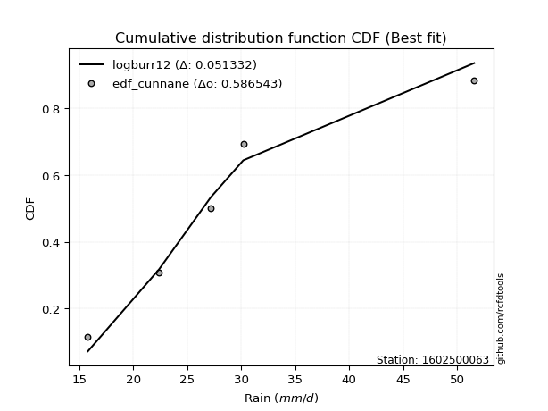</img>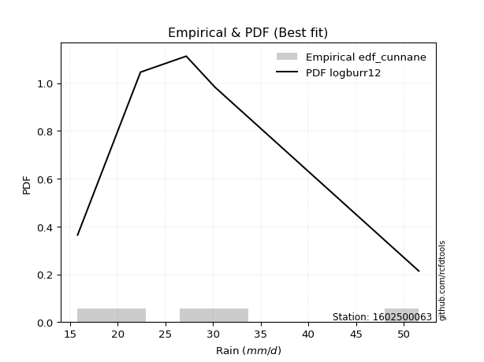</img>

</div>


### 12. EDF Adamowski (1981)

The Adamowski formula in hydrology refers to a specific plotting position formula used for estimating the non-parametric empirical distribution of hydrological events (like flood peaks) to calculate their return periods. This formula provides an alternative to traditional parametric methods (like the Gumbel or Log Pearson Type III distributions). 

<div align="center">


$P=(m-0.25)/(n+0.5)$


</div>


**12.1. Empirical values**

<div align="center">

|                | 0                   | 1                  | 2             | 3                  | 4                  |
|:---------------|:--------------------|:-------------------|:--------------|:-------------------|:-------------------|
| date           | 2023                | 2022               | 2020          | 2025               | 2019               |
| x              | 15.8                | 22.4               | 27.2          | 30.2               | 51.6               |
| m              | 1                   | 2                  | 3             | 4                  | 5                  |
| empirical_dist | edf_adamowski       | edf_adamowski      | edf_adamowski | edf_adamowski      | edf_adamowski      |
| empirical      | 0.13636363636363635 | 0.3181818181818182 | 0.5           | 0.6818181818181818 | 0.8636363636363636 |
| empirical_tr   | 1.1578947368421053  | 1.4666666666666666 | 2.0           | 3.1428571428571423 | 7.333333333333334  |

</div>


**12.2. Kolmogorov-Smirnov fit test (sorted by Δ)**


<div align="center">

|                | 0                   | 1                  | 2                  | 3                   | 4                   | 5                  | 6                   | 7                   | 8                   | 9                   | 10                  | 11                  | 12                  | 13                  | 14                  | 15                  | 16                  | 17                 | 18                  | 19                  | 20                  | 21                  | 22                  | 23                  | 24                  | 25                  | 26                 | 27                  | 28                  | 29                  | 30                  | 31                  | 32                  | 33                 | 34                  | 35                  | 36                  | 37                  | 38                  | 39                  | 40                  | 41                  | 42                  | 43                 | 44                 | 45                 | 46                  | 47                  | 48                  | 49                  | 50                  | 51                  | 52                  | 53                  | 54                  | 55                 | 56                  | 57                  | 58                  | 59                  | 60                  | 61                  | 62                  | 63                  | 64                  | 65                  | 66                  | 67                  | 68                  | 69                 | 70                  | 71                  | 72                  | 73                 | 74                  | 75                  | 76                  | 77                  | 78                  | 79                  | 80                  | 81                  | 82                  | 83                  | 84                  | 85                  | 86                  | 87                  | 88                  | 89                  | 90                  | 91                  | 92                  | 93                  | 94                  | 95                  | 96                 | 97                  | 98                  | 99                  | 100                 | 101                 | 102                | 103                | 104                | 105                 | 106                 | 107                 | 108                | 109                | 110                | 111                 | 112                | 113                 | 114                 | 115                | 116                 | 117                | 118                 | 119                 | 120                 | 121                 | 122                | 123                | 124                | 125                | 126                 | 127                 | 128                | 129                 | 130                 | 131                | 132                | 133                 | 134                | 135                | 136                | 137                | 138                | 139                | 140                 | 141                 | 142                | 143                | 144                | 145                | 146                 | 147                 | 148                | 149                | 150                 | 151                | 152                | 153                | 154                | 155                | 156                | 157                | 158                | 159                |
|:---------------|:--------------------|:-------------------|:-------------------|:--------------------|:--------------------|:-------------------|:--------------------|:--------------------|:--------------------|:--------------------|:--------------------|:--------------------|:--------------------|:--------------------|:--------------------|:--------------------|:--------------------|:-------------------|:--------------------|:--------------------|:--------------------|:--------------------|:--------------------|:--------------------|:--------------------|:--------------------|:-------------------|:--------------------|:--------------------|:--------------------|:--------------------|:--------------------|:--------------------|:-------------------|:--------------------|:--------------------|:--------------------|:--------------------|:--------------------|:--------------------|:--------------------|:--------------------|:--------------------|:-------------------|:-------------------|:-------------------|:--------------------|:--------------------|:--------------------|:--------------------|:--------------------|:--------------------|:--------------------|:--------------------|:--------------------|:-------------------|:--------------------|:--------------------|:--------------------|:--------------------|:--------------------|:--------------------|:--------------------|:--------------------|:--------------------|:--------------------|:--------------------|:--------------------|:--------------------|:-------------------|:--------------------|:--------------------|:--------------------|:-------------------|:--------------------|:--------------------|:--------------------|:--------------------|:--------------------|:--------------------|:--------------------|:--------------------|:--------------------|:--------------------|:--------------------|:--------------------|:--------------------|:--------------------|:--------------------|:--------------------|:--------------------|:--------------------|:--------------------|:--------------------|:--------------------|:--------------------|:-------------------|:--------------------|:--------------------|:--------------------|:--------------------|:--------------------|:-------------------|:-------------------|:-------------------|:--------------------|:--------------------|:--------------------|:-------------------|:-------------------|:-------------------|:--------------------|:-------------------|:--------------------|:--------------------|:-------------------|:--------------------|:-------------------|:--------------------|:--------------------|:--------------------|:--------------------|:-------------------|:-------------------|:-------------------|:-------------------|:--------------------|:--------------------|:-------------------|:--------------------|:--------------------|:-------------------|:-------------------|:--------------------|:-------------------|:-------------------|:-------------------|:-------------------|:-------------------|:-------------------|:--------------------|:--------------------|:-------------------|:-------------------|:-------------------|:-------------------|:--------------------|:--------------------|:-------------------|:-------------------|:--------------------|:-------------------|:-------------------|:-------------------|:-------------------|:-------------------|:-------------------|:-------------------|:-------------------|:-------------------|
| station        | 1602500063          | 1602500063         | 1602500063         | 1602500063          | 1602500063          | 1602500063         | 1602500063          | 1602500063          | 1602500063          | 1602500063          | 1602500063          | 1602500063          | 1602500063          | 1602500063          | 1602500063          | 1602500063          | 1602500063          | 1602500063         | 1602500063          | 1602500063          | 1602500063          | 1602500063          | 1602500063          | 1602500063          | 1602500063          | 1602500063          | 1602500063         | 1602500063          | 1602500063          | 1602500063          | 1602500063          | 1602500063          | 1602500063          | 1602500063         | 1602500063          | 1602500063          | 1602500063          | 1602500063          | 1602500063          | 1602500063          | 1602500063          | 1602500063          | 1602500063          | 1602500063         | 1602500063         | 1602500063         | 1602500063          | 1602500063          | 1602500063          | 1602500063          | 1602500063          | 1602500063          | 1602500063          | 1602500063          | 1602500063          | 1602500063         | 1602500063          | 1602500063          | 1602500063          | 1602500063          | 1602500063          | 1602500063          | 1602500063          | 1602500063          | 1602500063          | 1602500063          | 1602500063          | 1602500063          | 1602500063          | 1602500063         | 1602500063          | 1602500063          | 1602500063          | 1602500063         | 1602500063          | 1602500063          | 1602500063          | 1602500063          | 1602500063          | 1602500063          | 1602500063          | 1602500063          | 1602500063          | 1602500063          | 1602500063          | 1602500063          | 1602500063          | 1602500063          | 1602500063          | 1602500063          | 1602500063          | 1602500063          | 1602500063          | 1602500063          | 1602500063          | 1602500063          | 1602500063         | 1602500063          | 1602500063          | 1602500063          | 1602500063          | 1602500063          | 1602500063         | 1602500063         | 1602500063         | 1602500063          | 1602500063          | 1602500063          | 1602500063         | 1602500063         | 1602500063         | 1602500063          | 1602500063         | 1602500063          | 1602500063          | 1602500063         | 1602500063          | 1602500063         | 1602500063          | 1602500063          | 1602500063          | 1602500063          | 1602500063         | 1602500063         | 1602500063         | 1602500063         | 1602500063          | 1602500063          | 1602500063         | 1602500063          | 1602500063          | 1602500063         | 1602500063         | 1602500063          | 1602500063         | 1602500063         | 1602500063         | 1602500063         | 1602500063         | 1602500063         | 1602500063          | 1602500063          | 1602500063         | 1602500063         | 1602500063         | 1602500063         | 1602500063          | 1602500063          | 1602500063         | 1602500063         | 1602500063          | 1602500063         | 1602500063         | 1602500063         | 1602500063         | 1602500063         | 1602500063         | 1602500063         | 1602500063         | 1602500063         |
| empirical_dist | edf_adamowski       | edf_adamowski      | edf_adamowski      | edf_adamowski       | edf_adamowski       | edf_adamowski      | edf_adamowski       | edf_adamowski       | edf_adamowski       | edf_adamowski       | edf_adamowski       | edf_adamowski       | edf_adamowski       | edf_adamowski       | edf_adamowski       | edf_adamowski       | edf_adamowski       | edf_adamowski      | edf_adamowski       | edf_adamowski       | edf_adamowski       | edf_adamowski       | edf_adamowski       | edf_adamowski       | edf_adamowski       | edf_adamowski       | edf_adamowski      | edf_adamowski       | edf_adamowski       | edf_adamowski       | edf_adamowski       | edf_adamowski       | edf_adamowski       | edf_adamowski      | edf_adamowski       | edf_adamowski       | edf_adamowski       | edf_adamowski       | edf_adamowski       | edf_adamowski       | edf_adamowski       | edf_adamowski       | edf_adamowski       | edf_adamowski      | edf_adamowski      | edf_adamowski      | edf_adamowski       | edf_adamowski       | edf_adamowski       | edf_adamowski       | edf_adamowski       | edf_adamowski       | edf_adamowski       | edf_adamowski       | edf_adamowski       | edf_adamowski      | edf_adamowski       | edf_adamowski       | edf_adamowski       | edf_adamowski       | edf_adamowski       | edf_adamowski       | edf_adamowski       | edf_adamowski       | edf_adamowski       | edf_adamowski       | edf_adamowski       | edf_adamowski       | edf_adamowski       | edf_adamowski      | edf_adamowski       | edf_adamowski       | edf_adamowski       | edf_adamowski      | edf_adamowski       | edf_adamowski       | edf_adamowski       | edf_adamowski       | edf_adamowski       | edf_adamowski       | edf_adamowski       | edf_adamowski       | edf_adamowski       | edf_adamowski       | edf_adamowski       | edf_adamowski       | edf_adamowski       | edf_adamowski       | edf_adamowski       | edf_adamowski       | edf_adamowski       | edf_adamowski       | edf_adamowski       | edf_adamowski       | edf_adamowski       | edf_adamowski       | edf_adamowski      | edf_adamowski       | edf_adamowski       | edf_adamowski       | edf_adamowski       | edf_adamowski       | edf_adamowski      | edf_adamowski      | edf_adamowski      | edf_adamowski       | edf_adamowski       | edf_adamowski       | edf_adamowski      | edf_adamowski      | edf_adamowski      | edf_adamowski       | edf_adamowski      | edf_adamowski       | edf_adamowski       | edf_adamowski      | edf_adamowski       | edf_adamowski      | edf_adamowski       | edf_adamowski       | edf_adamowski       | edf_adamowski       | edf_adamowski      | edf_adamowski      | edf_adamowski      | edf_adamowski      | edf_adamowski       | edf_adamowski       | edf_adamowski      | edf_adamowski       | edf_adamowski       | edf_adamowski      | edf_adamowski      | edf_adamowski       | edf_adamowski      | edf_adamowski      | edf_adamowski      | edf_adamowski      | edf_adamowski      | edf_adamowski      | edf_adamowski       | edf_adamowski       | edf_adamowski      | edf_adamowski      | edf_adamowski      | edf_adamowski      | edf_adamowski       | edf_adamowski       | edf_adamowski      | edf_adamowski      | edf_adamowski       | edf_adamowski      | edf_adamowski      | edf_adamowski      | edf_adamowski      | edf_adamowski      | edf_adamowski      | edf_adamowski      | edf_adamowski      | edf_adamowski      |
| p_dist         | logloglaplace       | logdweibull        | exponnorm          | logburr12           | alpha               | loginvgamma        | lognct              | logalpha            | ncf                 | logmielke           | logmaxwell          | logskewnorm         | logburr             | logjohnsonsu        | logf                | betaprime           | nct                 | f                  | loginvgauss         | logexponnorm        | invgamma            | logfatiguelife      | logfoldnorm         | logpearson3         | burr                | loggenlogistic      | logweibull_max     | loggenextreme       | loginvweibull       | moyal               | logkstwobign        | invgauss            | lograyleigh         | logbetaprime       | johnsonsu           | logerlang           | loggamma            | loggamma            | halfnorm            | gumbel_r            | logloggamma         | logt                | logcrystalball      | lognorm            | loglaplace         | loglaplace         | logrice             | loglogistic         | loghypsecant        | foldnorm            | loganglit           | genlogistic         | kstwobign           | dgamma              | logsemicircular     | pearson3           | logcosine           | dweibull            | logweibull_min      | halflogistic        | loggumbel_r         | gennorm             | logncf              | logksone            | rayleigh            | logmoyal            | maxwell             | loggennorm          | loggenexpon         | loggumbel_l        | genexpon            | logtruncexpon       | logbradford         | beta               | loggompertz         | logvonmises_line    | gompertz            | logtukeylambda      | logtruncpareto      | loguniform          | logarcsine          | loghalflogistic     | loghalfnorm         | wald                | skewnorm            | rice                | logkappa3           | logkappa4           | laplace             | truncexpon          | burr12              | hypsecant           | logistic            | loglomax            | t                   | truncnorm           | norm               | crystalball         | anglit              | semicircular        | loggausshyper       | logwrapcauchy       | logwald            | arcsine            | truncweibull_min   | logdgamma           | logargus            | halfgennorm         | logbeta            | bradford           | logjohnsonsb       | cosine              | lomax              | loglevy_l           | logrdist            | weibull_min        | gumbel_l            | logtriang          | levy_l              | wrapcauchy          | kappa4              | logtruncweibull_min | genpareto          | logexponweib       | ksone              | vonmises_line      | uniform             | kappa3              | logexponpow        | argus               | loggenhalflogistic  | johnsonsb          | lognakagami        | logtruncnorm        | nakagami           | tukeylambda        | gausshyper         | triang             | exponpow           | genextreme         | logtrapezoid        | rdist               | genhalflogistic    | gengamma           | fatiguelife        | loggengamma        | invweibull          | erlang              | exponweib          | loggenpareto       | gamma               | powerlaw           | trapezoid          | truncpareto        | logpowerlaw        | weibull_max        | loghalfgennorm     | logvonmises        | vonmises           | mielke             |
| delta          | 0.06860758932493706 | 0.0714725461581325 | 0.0721355299646742 | 0.07231077121548568 | 0.07294354448631413 | 0.0735064402527883 | 0.07357237083010343 | 0.07358834940605163 | 0.07360117370950126 | 0.07365370792257056 | 0.07372912024177325 | 0.07408446975075261 | 0.07429910300448789 | 0.07510605334886664 | 0.07583950467588349 | 0.07588144433304411 | 0.07664506047939981 | 0.0767855239764476 | 0.07684470186842507 | 0.07698559132665606 | 0.07702312790287139 | 0.07705059702361988 | 0.07835440907603741 | 0.07845983736527296 | 0.08042870626825993 | 0.08063787892092134 | 0.0807167612196058 | 0.08072029681187265 | 0.08090633791237498 | 0.08110023654223641 | 0.08171636021502056 | 0.08172085647937985 | 0.08206484210480605 | 0.0821108402252061 | 0.08247510184403523 | 0.08282144725083343 | 0.08282147193343731 | 0.08282147193343731 | 0.08511864617988985 | 0.08611349272506663 | 0.08616381548900864 | 0.08640912945796664 | 0.08641002673080667 | 0.0864100454047183 | 0.0875603728107116 | 0.0875603728107116 | 0.08801367824208223 | 0.08822118052941297 | 0.08842877089528378 | 0.09151832279482786 | 0.09153211898079372 | 0.09480115386942312 | 0.09490949762639556 | 0.09750065295649202 | 0.09753067364429535 | 0.0975968826241741 | 0.09880777688204889 | 0.09999929904892013 | 0.10078339415616704 | 0.10238084588231136 | 0.10281287069649717 | 0.10301944265374785 | 0.10859069382359043 | 0.11132192483372516 | 0.11447544169927737 | 0.12453643850864794 | 0.12490030312355949 | 0.12675453861813124 | 0.13339649829385825 | 0.1359764061769544 | 0.13619639288192084 | 0.13636089146389552 | 0.13636236588175324 | 0.1363636239459585 | 0.13636363602972282 | 0.13636363625269066 | 0.13636363636353413 | 0.13636363636362925 | 0.13636363636363635 | 0.13636363636363635 | 0.13636363636363635 | 0.13636363636363635 | 0.13636363636363635 | 0.13636363636363635 | 0.13636363636363635 | 0.13725080289950142 | 0.13782277425221534 | 0.13847181473619263 | 0.13932643627303964 | 0.14255766841118112 | 0.14905994940814998 | 0.15046878712828093 | 0.15337210274444613 | 0.15655297080494174 | 0.15676171962995777 | 0.15678088456521755 | 0.1567809071963837 | 0.15678092570441593 | 0.16035748528229588 | 0.16183148042056505 | 0.16423284622315004 | 0.16592001599020145 | 0.1665432991196728 | 0.1676785371821432 | 0.1688566559929574 | 0.17036545620317603 | 0.17605579082963263 | 0.17848794663877598 | 0.1892974607748506 | 0.1986056441698662 | 0.1992692250205994 | 0.20584934667961996 | 0.2089947715222118 | 0.21306838551133767 | 0.22404265745272212 | 0.2246089145321955 | 0.22595576828410213 | 0.2277110863080637 | 0.23043725635775603 | 0.23188106414991339 | 0.24708931690451302 | 0.25229192255958827 | 0.2603843805444829 | 0.2608966611903099 | 0.2632893177585915 | 0.2770782823698998 | 0.27958354494667337 | 0.28036158299744285 | 0.2809519860058857 | 0.28823373750711945 | 0.29088137061637687 | 0.3028275306260461 | 0.3129727571799397 | 0.31817730709418224 | 0.318181754559883  | 0.3181818150719077 | 0.3329807469562366 | 0.3373215796727942 | 0.3430024018509244 | 0.3486978028704073 | 0.39077490274430954 | 0.39887214226051815 | 0.3994776397415338 | 0.4031827309692992 | 0.4198072609275518 | 0.4282885062638317 | 0.43206417062043023 | 0.44087839015400926 | 0.4777000967559076 | 0.4946269607617174 | 0.49605324136294554 | 0.4966562717007654 | 0.5066517717671708 | 0.5217168002350008 | 0.5338346547326593 | 0.5549153339957676 | 0.6818181818181818 | 1.0867950722314714 | 7.268351956044567  | nan                |
| deltao         | 0.5865427407550001  | 0.5865427407550001 | 0.5865427407550001 | 0.5865427407550001  | 0.5865427407550001  | 0.5865427407550001 | 0.5865427407550001  | 0.5865427407550001  | 0.5865427407550001  | 0.5865427407550001  | 0.5865427407550001  | 0.5865427407550001  | 0.5865427407550001  | 0.5865427407550001  | 0.5865427407550001  | 0.5865427407550001  | 0.5865427407550001  | 0.5865427407550001 | 0.5865427407550001  | 0.5865427407550001  | 0.5865427407550001  | 0.5865427407550001  | 0.5865427407550001  | 0.5865427407550001  | 0.5865427407550001  | 0.5865427407550001  | 0.5865427407550001 | 0.5865427407550001  | 0.5865427407550001  | 0.5865427407550001  | 0.5865427407550001  | 0.5865427407550001  | 0.5865427407550001  | 0.5865427407550001 | 0.5865427407550001  | 0.5865427407550001  | 0.5865427407550001  | 0.5865427407550001  | 0.5865427407550001  | 0.5865427407550001  | 0.5865427407550001  | 0.5865427407550001  | 0.5865427407550001  | 0.5865427407550001 | 0.5865427407550001 | 0.5865427407550001 | 0.5865427407550001  | 0.5865427407550001  | 0.5865427407550001  | 0.5865427407550001  | 0.5865427407550001  | 0.5865427407550001  | 0.5865427407550001  | 0.5865427407550001  | 0.5865427407550001  | 0.5865427407550001 | 0.5865427407550001  | 0.5865427407550001  | 0.5865427407550001  | 0.5865427407550001  | 0.5865427407550001  | 0.5865427407550001  | 0.5865427407550001  | 0.5865427407550001  | 0.5865427407550001  | 0.5865427407550001  | 0.5865427407550001  | 0.5865427407550001  | 0.5865427407550001  | 0.5865427407550001 | 0.5865427407550001  | 0.5865427407550001  | 0.5865427407550001  | 0.5865427407550001 | 0.5865427407550001  | 0.5865427407550001  | 0.5865427407550001  | 0.5865427407550001  | 0.5865427407550001  | 0.5865427407550001  | 0.5865427407550001  | 0.5865427407550001  | 0.5865427407550001  | 0.5865427407550001  | 0.5865427407550001  | 0.5865427407550001  | 0.5865427407550001  | 0.5865427407550001  | 0.5865427407550001  | 0.5865427407550001  | 0.5865427407550001  | 0.5865427407550001  | 0.5865427407550001  | 0.5865427407550001  | 0.5865427407550001  | 0.5865427407550001  | 0.5865427407550001 | 0.5865427407550001  | 0.5865427407550001  | 0.5865427407550001  | 0.5865427407550001  | 0.5865427407550001  | 0.5865427407550001 | 0.5865427407550001 | 0.5865427407550001 | 0.5865427407550001  | 0.5865427407550001  | 0.5865427407550001  | 0.5865427407550001 | 0.5865427407550001 | 0.5865427407550001 | 0.5865427407550001  | 0.5865427407550001 | 0.5865427407550001  | 0.5865427407550001  | 0.5865427407550001 | 0.5865427407550001  | 0.5865427407550001 | 0.5865427407550001  | 0.5865427407550001  | 0.5865427407550001  | 0.5865427407550001  | 0.5865427407550001 | 0.5865427407550001 | 0.5865427407550001 | 0.5865427407550001 | 0.5865427407550001  | 0.5865427407550001  | 0.5865427407550001 | 0.5865427407550001  | 0.5865427407550001  | 0.5865427407550001 | 0.5865427407550001 | 0.5865427407550001  | 0.5865427407550001 | 0.5865427407550001 | 0.5865427407550001 | 0.5865427407550001 | 0.5865427407550001 | 0.5865427407550001 | 0.5865427407550001  | 0.5865427407550001  | 0.5865427407550001 | 0.5865427407550001 | 0.5865427407550001 | 0.5865427407550001 | 0.5865427407550001  | 0.5865427407550001  | 0.5865427407550001 | 0.5865427407550001 | 0.5865427407550001  | 0.5865427407550001 | 0.5865427407550001 | 0.5865427407550001 | 0.5865427407550001 | 0.5865427407550001 | 0.5865427407550001 | 0.5865427407550001 | 0.5865427407550001 | 0.5865427407550001 |
| eval           | Δo > Δ              | Δo > Δ             | Δo > Δ             | Δo > Δ              | Δo > Δ              | Δo > Δ             | Δo > Δ              | Δo > Δ              | Δo > Δ              | Δo > Δ              | Δo > Δ              | Δo > Δ              | Δo > Δ              | Δo > Δ              | Δo > Δ              | Δo > Δ              | Δo > Δ              | Δo > Δ             | Δo > Δ              | Δo > Δ              | Δo > Δ              | Δo > Δ              | Δo > Δ              | Δo > Δ              | Δo > Δ              | Δo > Δ              | Δo > Δ             | Δo > Δ              | Δo > Δ              | Δo > Δ              | Δo > Δ              | Δo > Δ              | Δo > Δ              | Δo > Δ             | Δo > Δ              | Δo > Δ              | Δo > Δ              | Δo > Δ              | Δo > Δ              | Δo > Δ              | Δo > Δ              | Δo > Δ              | Δo > Δ              | Δo > Δ             | Δo > Δ             | Δo > Δ             | Δo > Δ              | Δo > Δ              | Δo > Δ              | Δo > Δ              | Δo > Δ              | Δo > Δ              | Δo > Δ              | Δo > Δ              | Δo > Δ              | Δo > Δ             | Δo > Δ              | Δo > Δ              | Δo > Δ              | Δo > Δ              | Δo > Δ              | Δo > Δ              | Δo > Δ              | Δo > Δ              | Δo > Δ              | Δo > Δ              | Δo > Δ              | Δo > Δ              | Δo > Δ              | Δo > Δ             | Δo > Δ              | Δo > Δ              | Δo > Δ              | Δo > Δ             | Δo > Δ              | Δo > Δ              | Δo > Δ              | Δo > Δ              | Δo > Δ              | Δo > Δ              | Δo > Δ              | Δo > Δ              | Δo > Δ              | Δo > Δ              | Δo > Δ              | Δo > Δ              | Δo > Δ              | Δo > Δ              | Δo > Δ              | Δo > Δ              | Δo > Δ              | Δo > Δ              | Δo > Δ              | Δo > Δ              | Δo > Δ              | Δo > Δ              | Δo > Δ             | Δo > Δ              | Δo > Δ              | Δo > Δ              | Δo > Δ              | Δo > Δ              | Δo > Δ             | Δo > Δ             | Δo > Δ             | Δo > Δ              | Δo > Δ              | Δo > Δ              | Δo > Δ             | Δo > Δ             | Δo > Δ             | Δo > Δ              | Δo > Δ             | Δo > Δ              | Δo > Δ              | Δo > Δ             | Δo > Δ              | Δo > Δ             | Δo > Δ              | Δo > Δ              | Δo > Δ              | Δo > Δ              | Δo > Δ             | Δo > Δ             | Δo > Δ             | Δo > Δ             | Δo > Δ              | Δo > Δ              | Δo > Δ             | Δo > Δ              | Δo > Δ              | Δo > Δ             | Δo > Δ             | Δo > Δ              | Δo > Δ             | Δo > Δ             | Δo > Δ             | Δo > Δ             | Δo > Δ             | Δo > Δ             | Δo > Δ              | Δo > Δ              | Δo > Δ             | Δo > Δ             | Δo > Δ             | Δo > Δ             | Δo > Δ              | Δo > Δ              | Δo > Δ             | Δo > Δ             | Δo > Δ              | Δo > Δ             | Δo > Δ             | Δo > Δ             | Δo > Δ             | Δo > Δ             | Δo <= Δ            | Δo <= Δ            | Δo <= Δ            | Δo <= Δ            |
| fit            | 1                   | 1                  | 1                  | 1                   | 1                   | 1                  | 1                   | 1                   | 1                   | 1                   | 1                   | 1                   | 1                   | 1                   | 1                   | 1                   | 1                   | 1                  | 1                   | 1                   | 1                   | 1                   | 1                   | 1                   | 1                   | 1                   | 1                  | 1                   | 1                   | 1                   | 1                   | 1                   | 1                   | 1                  | 1                   | 1                   | 1                   | 1                   | 1                   | 1                   | 1                   | 1                   | 1                   | 1                  | 1                  | 1                  | 1                   | 1                   | 1                   | 1                   | 1                   | 1                   | 1                   | 1                   | 1                   | 1                  | 1                   | 1                   | 1                   | 1                   | 1                   | 1                   | 1                   | 1                   | 1                   | 1                   | 1                   | 1                   | 1                   | 1                  | 1                   | 1                   | 1                   | 1                  | 1                   | 1                   | 1                   | 1                   | 1                   | 1                   | 1                   | 1                   | 1                   | 1                   | 1                   | 1                   | 1                   | 1                   | 1                   | 1                   | 1                   | 1                   | 1                   | 1                   | 1                   | 1                   | 1                  | 1                   | 1                   | 1                   | 1                   | 1                   | 1                  | 1                  | 1                  | 1                   | 1                   | 1                   | 1                  | 1                  | 1                  | 1                   | 1                  | 1                   | 1                   | 1                  | 1                   | 1                  | 1                   | 1                   | 1                   | 1                   | 1                  | 1                  | 1                  | 1                  | 1                   | 1                   | 1                  | 1                   | 1                   | 1                  | 1                  | 1                   | 1                  | 1                  | 1                  | 1                  | 1                  | 1                  | 1                   | 1                   | 1                  | 1                  | 1                  | 1                  | 1                   | 1                   | 1                  | 1                  | 1                   | 1                  | 1                  | 1                  | 1                  | 1                  | 0                  | 0                  | 0                  | 0                  |
| n              | 5                   | 5                  | 5                  | 5                   | 5                   | 5                  | 5                   | 5                   | 5                   | 5                   | 5                   | 5                   | 5                   | 5                   | 5                   | 5                   | 5                   | 5                  | 5                   | 5                   | 5                   | 5                   | 5                   | 5                   | 5                   | 5                   | 5                  | 5                   | 5                   | 5                   | 5                   | 5                   | 5                   | 5                  | 5                   | 5                   | 5                   | 5                   | 5                   | 5                   | 5                   | 5                   | 5                   | 5                  | 5                  | 5                  | 5                   | 5                   | 5                   | 5                   | 5                   | 5                   | 5                   | 5                   | 5                   | 5                  | 5                   | 5                   | 5                   | 5                   | 5                   | 5                   | 5                   | 5                   | 5                   | 5                   | 5                   | 5                   | 5                   | 5                  | 5                   | 5                   | 5                   | 5                  | 5                   | 5                   | 5                   | 5                   | 5                   | 5                   | 5                   | 5                   | 5                   | 5                   | 5                   | 5                   | 5                   | 5                   | 5                   | 5                   | 5                   | 5                   | 5                   | 5                   | 5                   | 5                   | 5                  | 5                   | 5                   | 5                   | 5                   | 5                   | 5                  | 5                  | 5                  | 5                   | 5                   | 5                   | 5                  | 5                  | 5                  | 5                   | 5                  | 5                   | 5                   | 5                  | 5                   | 5                  | 5                   | 5                   | 5                   | 5                   | 5                  | 5                  | 5                  | 5                  | 5                   | 5                   | 5                  | 5                   | 5                   | 5                  | 5                  | 5                   | 5                  | 5                  | 5                  | 5                  | 5                  | 5                  | 5                   | 5                   | 5                  | 5                  | 5                  | 5                  | 5                   | 5                   | 5                  | 5                  | 5                   | 5                  | 5                  | 5                  | 5                  | 5                  | 5                  | 5                  | 5                  | 5                  |
| best_fit       | 1                   | 0                  | 0                  | 0                   | 0                   | 0                  | 0                   | 0                   | 0                   | 0                   | 0                   | 0                   | 0                   | 0                   | 0                   | 0                   | 0                   | 0                  | 0                   | 0                   | 0                   | 0                   | 0                   | 0                   | 0                   | 0                   | 0                  | 0                   | 0                   | 0                   | 0                   | 0                   | 0                   | 0                  | 0                   | 0                   | 0                   | 0                   | 0                   | 0                   | 0                   | 0                   | 0                   | 0                  | 0                  | 0                  | 0                   | 0                   | 0                   | 0                   | 0                   | 0                   | 0                   | 0                   | 0                   | 0                  | 0                   | 0                   | 0                   | 0                   | 0                   | 0                   | 0                   | 0                   | 0                   | 0                   | 0                   | 0                   | 0                   | 0                  | 0                   | 0                   | 0                   | 0                  | 0                   | 0                   | 0                   | 0                   | 0                   | 0                   | 0                   | 0                   | 0                   | 0                   | 0                   | 0                   | 0                   | 0                   | 0                   | 0                   | 0                   | 0                   | 0                   | 0                   | 0                   | 0                   | 0                  | 0                   | 0                   | 0                   | 0                   | 0                   | 0                  | 0                  | 0                  | 0                   | 0                   | 0                   | 0                  | 0                  | 0                  | 0                   | 0                  | 0                   | 0                   | 0                  | 0                   | 0                  | 0                   | 0                   | 0                   | 0                   | 0                  | 0                  | 0                  | 0                  | 0                   | 0                   | 0                  | 0                   | 0                   | 0                  | 0                  | 0                   | 0                  | 0                  | 0                  | 0                  | 0                  | 0                  | 0                   | 0                   | 0                  | 0                  | 0                  | 0                  | 0                   | 0                   | 0                  | 0                  | 0                   | 0                  | 0                  | 0                  | 0                  | 0                  | 0                  | 0                  | 0                  | 0                  |
| best_fit_sort  | 1                   | 2                  | 3                  | 4                   | 5                   | 6                  | 7                   | 8                   | 9                   | 10                  | 11                  | 12                  | 13                  | 14                  | 15                  | 16                  | 17                  | 18                 | 19                  | 20                  | 21                  | 22                  | 23                  | 24                  | 25                  | 26                  | 27                 | 28                  | 29                  | 30                  | 31                  | 32                  | 33                  | 34                 | 35                  | 36                  | 37                  | 38                  | 39                  | 40                  | 41                  | 42                  | 43                  | 44                 | 45                 | 46                 | 47                  | 48                  | 49                  | 50                  | 51                  | 52                  | 53                  | 54                  | 55                  | 56                 | 57                  | 58                  | 59                  | 60                  | 61                  | 62                  | 63                  | 64                  | 65                  | 66                  | 67                  | 68                  | 69                  | 70                 | 71                  | 72                  | 73                  | 74                 | 75                  | 76                  | 77                  | 78                  | 79                  | 80                  | 81                  | 82                  | 83                  | 84                  | 85                  | 86                  | 87                  | 88                  | 89                  | 90                  | 91                  | 92                  | 93                  | 94                  | 95                  | 96                  | 97                 | 98                  | 99                  | 100                 | 101                 | 102                 | 103                | 104                | 105                | 106                 | 107                 | 108                 | 109                | 110                | 111                | 112                 | 113                | 114                 | 115                 | 116                | 117                 | 118                | 119                 | 120                 | 121                 | 122                 | 123                | 124                | 125                | 126                | 127                 | 128                 | 129                | 130                 | 131                 | 132                | 133                | 134                 | 135                | 136                | 137                | 138                | 139                | 140                | 141                 | 142                 | 143                | 144                | 145                | 146                | 147                 | 148                 | 149                | 150                | 151                 | 152                | 153                | 154                | 155                | 156                | 157                | 158                | 159                | 160                |

</div>


**12.3. Best fit**

<div align="center">

|   id |    station | empirical_dist   | p_dist        |     delta |   deltao | eval   |   fit |   n |   best_fit |   best_fit_sort |
|-----:|-----------:|:-----------------|:--------------|----------:|---------:|:-------|------:|----:|-----------:|----------------:|
|    0 | 1602500063 | edf_adamowski    | logloglaplace | 0.0686076 | 0.586543 | Δo > Δ |     1 |   5 |          1 |               1 |

</div>


<div align="center">

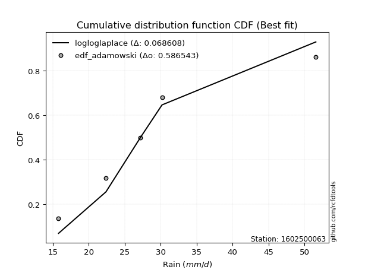</img>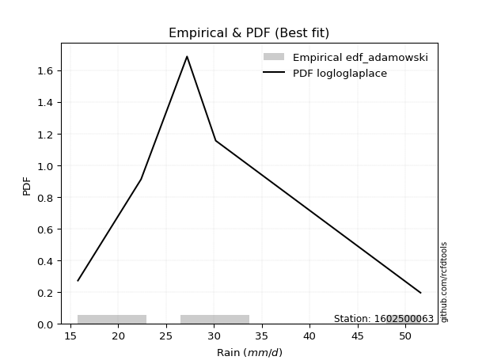</img>

</div>


## C. Best fit & Estimate extreme values for specific return periods - Tr

Best fit in probability distribution analysis means finding the theoretical distribution (like Normal, Poisson, Exponential, etc.) that most accurately mirrors your real-world data´s patterns (shape, center, spread) for better predictions, using methods like visual checks (Q-Q plots), goodness-of-fit tests (Kolmogorov-Smirnov, Chi-Squared), and information criteria (AIC) to score and select the simplest, most representative model.


### 1. Best fit (ordered by delta Δ)

:file_folder:Table: [bestfit_1602500063.csv](table/bestfit_1602500063.csv)

<div align="center">

|   id |    station | empirical_dist   | p_dist        |     delta |   deltao | eval   |   fit |   n |   best_fit |   best_fit_sort |
|-----:|-----------:|:-----------------|:--------------|----------:|---------:|:-------|------:|----:|-----------:|----------------:|
|    0 | 1602500063 | edf_gringorten   | logburr       | 0.0473105 | 0.586543 | Δo > Δ |     1 |   5 |          1 |               1 |
|    1 | 1602500063 | edf_hazen        | logburr       | 0.0505533 | 0.586543 | Δo > Δ |     1 |   5 |          1 |               2 |
|    2 | 1602500063 | edf_cunnane      | logburr12     | 0.0513318 | 0.586543 | Δo > Δ |     1 |   5 |          1 |               3 |
|    3 | 1602500063 | edf_blom         | logloglaplace | 0.0547605 | 0.586543 | Δo > Δ |     1 |   5 |          1 |               4 |
|    4 | 1602500063 | edf_tukey        | logloglaplace | 0.0577366 | 0.586543 | Δo > Δ |     1 |   5 |          1 |               5 |
|    5 | 1602500063 | edf_filliben     | logloglaplace | 0.0594574 | 0.586543 | Δo > Δ |     1 |   5 |          1 |               6 |
|    6 | 1602500063 | edf_beard        | logloglaplace | 0.0604967 | 0.586543 | Δo > Δ |     1 |   5 |          1 |               7 |
|    7 | 1602500063 | edf_jenkinson    | logloglaplace | 0.0604967 | 0.586543 | Δo > Δ |     1 |   5 |          1 |               8 |
|    8 | 1602500063 | edf_chegodayev   | logloglaplace | 0.0618736 | 0.586543 | Δo > Δ |     1 |   5 |          1 |               9 |
|    9 | 1602500063 | edf_adamowski    | logloglaplace | 0.0686076 | 0.586543 | Δo > Δ |     1 |   5 |          1 |              10 |
|   10 | 1602500063 | edf_weibull      | logdweibull   | 0.0866796 | 0.586543 | Δo > Δ |     1 |   5 |          1 |              11 |
|   11 | 1602500063 | edf_california   | dgamma        | 0.134382  | 0.586543 | Δo > Δ |     1 |   5 |          1 |              12 |

</div>


### 2. Extreme values and % difference analysis

In hydrology, a return period (or recurrence interval $Tr$) is the statistical average time between extreme events like floods or droughts of a specific magnitude, indicating how rare an event is, with a 100-year flood, for example, having a 1% chance of occurring in any given year, not that it happens exactly every century. It is a key tool for infrastructure design (like bridges or dams) and risk assessment, calculated from historical data to determine the probability of future events, although it is important to remember it is statistical average, and events can cluster or be missed.

The extreme value porcentage difference is evaluated as $pdiff = 1 - (ETrBf / ETr) * 100$, where _ETrBf_ correspond to the bestfit extreme value for a specific recurrence interval and _ETr_ correspond to the extreme value for one of the most used PDFsused in hydrology.

> risk_rate: assuming the return period as the project useful life.

:file_folder:Table: [extreme_1602500063.csv](table/extreme_1602500063.csv), all PDFs.  
:file_folder:Table: [extremepdiff_1602500063.csv](table/extremepdiff_1602500063.csv), % difference between bestfit and most used PDFs in Hydrology.

<div align="center">

Extreme values table for only best fit PDFs
|   id |      tr |   prob_l |     prob_g |    alpha |   anglit |   arcsine |   argus |    beta |   betaprime |   bradford |     burr |   burr12 |   cosine |   crystalball |   dgamma |   dweibull |   erlang |   exponnorm |   exponpow |   exponweib |        f |   fatiguelife |   foldnorm |   gamma |   gausshyper |   genexpon |       genextreme |   gengamma |   genhalflogistic |   genlogistic |   gennorm |   genpareto |   gompertz |   gumbel_l |   gumbel_r |   halfgennorm |   halflogistic |   halfnorm |   hypsecant |   invgamma |   invgauss |      invweibull |   johnsonsb |   johnsonsu |   kappa3 |   kappa4 |   ksone |   kstwobign |   laplace |   levy_l |   loggamma |   logistic |   loglaplace |    lomax |   maxwell |   mielke |   moyal |   nakagami |      ncf |      nct |    norm |   pearson3 |   powerlaw |   rayleigh |   rdist |    rice |   semicircular |   skewnorm |       t |   trapezoid |   triang |   truncexpon |   truncnorm |   truncpareto |   truncweibull_min |   tukeylambda |   uniform |   vonmises |   vonmises_line |     wald |   weibull_max |   weibull_min |   wrapcauchy |   logalpha |   loganglit |   logarcsine |   logargus |   logbeta |   logbetaprime |   logbradford |   logburr |   logburr12 |   logcosine |   logcrystalball |   logdgamma |   logdweibull |   logerlang |   logexponnorm |   logexponpow |   logexponweib |     logf |   logfatiguelife |   logfoldnorm |   loggausshyper |   loggenexpon |   loggenextreme |   loggengamma |   loggenhalflogistic |   loggenlogistic |   loggennorm |   loggenpareto |   loggompertz |   loggumbel_l |   loggumbel_r |   loghalfgennorm |   loghalflogistic |   loghalfnorm |   loghypsecant |   loginvgamma |   loginvgauss |   loginvweibull |   logjohnsonsb |   logjohnsonsu |   logkappa3 |   logkappa4 |   logksone |   logkstwobign |   loglevy_l |   logloggamma |   loglogistic |   logloglaplace |   loglomax |   logmaxwell |   logmielke |   logmoyal |   lognakagami |   logncf |   lognct |   lognorm |   logpearson3 |   logpowerlaw |   lograyleigh |   logrdist |   logrice |   logsemicircular |   logskewnorm |    logt |   logtrapezoid |   logtriang |   logtruncexpon |   logtruncnorm |   logtruncpareto |   logtruncweibull_min |   logtukeylambda |   loguniform |   logvonmises |   logvonmises_line |   logwald |   logweibull_max |   logweibull_min |   logwrapcauchy |    station |   n |   risk_rate |
|-----:|--------:|---------:|-----------:|---------:|---------:|----------:|--------:|--------:|------------:|-----------:|---------:|---------:|---------:|--------------:|---------:|-----------:|---------:|------------:|-----------:|------------:|---------:|--------------:|-----------:|--------:|-------------:|-----------:|-----------------:|-----------:|------------------:|--------------:|----------:|------------:|-----------:|-----------:|-----------:|--------------:|---------------:|-----------:|------------:|-----------:|-----------:|----------------:|------------:|------------:|---------:|---------:|--------:|------------:|----------:|---------:|-----------:|-----------:|-------------:|---------:|----------:|---------:|--------:|-----------:|---------:|---------:|--------:|-----------:|-----------:|-----------:|--------:|--------:|---------------:|-----------:|--------:|------------:|---------:|-------------:|------------:|--------------:|-------------------:|--------------:|----------:|-----------:|----------------:|---------:|--------------:|--------------:|-------------:|-----------:|------------:|-------------:|-----------:|----------:|---------------:|--------------:|----------:|------------:|------------:|-----------------:|------------:|--------------:|------------:|---------------:|--------------:|---------------:|---------:|-----------------:|--------------:|----------------:|--------------:|----------------:|--------------:|---------------------:|-----------------:|-------------:|---------------:|--------------:|--------------:|--------------:|-----------------:|------------------:|--------------:|---------------:|--------------:|--------------:|----------------:|---------------:|---------------:|------------:|------------:|-----------:|---------------:|------------:|--------------:|--------------:|----------------:|-----------:|-------------:|------------:|-----------:|--------------:|---------:|---------:|----------:|--------------:|--------------:|--------------:|-----------:|----------:|------------------:|--------------:|--------:|---------------:|------------:|----------------:|---------------:|-----------------:|----------------------:|-----------------:|-------------:|--------------:|-------------------:|----------:|-----------------:|-----------------:|----------------:|-----------:|----:|------------:|
|    0 |    2    | 0.5      | 0.5        |  26.3193 |  29.44   |   29.44   | 34.0942 | 26.608  |     26.386  |    30.7871 |  25.5253 |  23.1992 |  30.9727 |       29.44   |  27.2    |    27.2    |  16.9757 |     26.1945 |    16.9057 |     16.4111 |  26.0665 |       15.8    |    27.1229 | 16.602  |      36.5125 |    25.8171 |     41.0312      |    16.6648 |           39.1779 |       27.2096 |   27.2    |     34.6946 |    26.3057 |    31.4281 |    27.4519 |       22.4914 |        26.4635 |    26.9628 |     29.44   |    26.0539 |    25.6408 |  1493.22        |     18.0447 |     25.7188 |  15.8    |  32.6061 | 33.7    |     27.7477 |   29.44   |  35.1397 |    25.6622 |    29.44   |      27.2412 |  31.3905 |   28.405  |  26.1345 | 26.81   |    29.6511 |  26.5251 |  26.0187 | 29.44   |    27.6462 |    15.917  |    28.0379 | 14.207  | 28.9362 |        29.44   |    28.097  | 29.4394 |     42.5973 |  36.4387 |      28.9003 |     29.44   |       16.4665 |            22.769  |       23      |   33.7    |    2.91108 |         33.6247 |  25.5171 |       51.2231 |       19.6868 |      33.7031 |    26.3255 |     27.2412 |      27.2412 |    30.0086 |   22.2296 |        26.5106 |       25.6697 |   26.0704 |     26.3923 |     27.7332 |          27.2412 |     27.2    |       27.2    |     25.6622 |        26.6001 |       19.4755 |        20.0529 |  26.3415 |          26.0586 |       26.8125 |         29.4302 |       25.0104 |         26.5103 |       17.6416 |              34.5574 |          25.5504 |      27.2    |        9.35456 |       25.9425 |       29.0353 |       25.5579 |          15.7999 |           24.7602 |       25.16   |        27.2412 |       26.3148 |       26.0741 |         25.5501 |        32.7496 |        26.1922 |     28.6585 |     28.6447 |    27.2412 |        25.3693 |     32.7994 |       27.2861 |       27.2412 |         27.2    |    23.014  |      26.3515 |     26.0377 |    25.037  |       22.6519 |  26.8662 |  26.2734 |   27.2412 |       26.6896 |       15.8951 |       26.043  |    33.143  |   26.3442 |           27.2412 |       26.1283 | 27.2413 |        38.3173 |     31.8943 |         24.7235 |        27.5402 |          25.8709 |               20.7205 |          28.5758 |      28.5531 |     0.0507074 |            28.5557 |   24.0195 |          26.5096 |          25.0261 |         28.5531 | 1602500063 |   5 |    0.75     |
|    1 |    2.33 | 0.570815 | 0.429185   |  28.1455 |  31.9555 |   33.2162 | 36.5709 | 29.832  |     28.2829 |    33.3361 |  27.375  |  25.2276 |  33.2583 |       31.5996 |  28.0198 |    28.3628 |  17.7695 |     28.0998 |    18.3075 |     16.8737 |  27.9567 |       16.3177 |    29.5081 | 17.1564 |      39.3381 |    27.9051 |    155.248       |    17.4673 |           41.518  |       29.0619 |   28.5882 |     38.3905 |    28.4277 |    33.307  |    29.453  |       24.7247 |        28.5209 |    29.2935 |     31.1683 |    27.9363 |    27.6131 | 88943.9         |     20.0693 |     27.6687 |  15.8    |  35.2511 | 36.7422 |     29.7263 |   30.7469 |  40.2235 |    27.5705 |    31.3427 |      28.4076 |  34.8255 |   30.6486 |  27.9844 | 28.7043 |    32.2327 |  28.4469 |  27.8793 | 31.5996 |    29.7775 |    16.1492 |    30.3147 | 17.3951 | 30.9648 |        32.1379 |    30.2137 | 31.599  |     44.6773 |  38.9523 |      31.2846 |     31.5996 |       16.8055 |            25.0265 |       24.0558 |   36.2352 |    3.14587 |         36.1705 |  26.9331 |       51.4281 |       25.0633 |      38.5489 |    28.202  |     29.5308 |      30.7495 |    32.4151 |   23.9919 |        28.4075 |       27.923  |   27.8587 |     28.1323 |     29.8209 |          29.1955 |     27.2247 |       27.9878 |     27.5705 |        28.4502 |       21.3966 |        22.1077 |  28.2487 |          27.9451 |       28.8769 |         32.6548 |       27.0108 |         28.4126 |       18.5114 |              37.299  |          27.4342 |      27.6289 |       12.4698  |       28.0223 |       30.8394 |       27.2525 |          15.7999 |           26.4497 |       27.1134 |        28.7943 |       28.2008 |       27.9601 |         27.4398 |        42.4485 |        28.0755 |     31.1801 |     31.2273 |    29.9633 |        27.2962 |     37.7264 |       29.2558 |       28.9559 |         28.4696 |    25.0321 |      28.3182 |     27.8714 |    26.6058 |       23.022  |  30.0816 |  28.1519 |   29.1955 |       28.6133 |       16.0623 |       28.0165 |    38.71   |   28.3013 |           29.7041 |       28.0124 | 29.1956 |        41.0448 |     34.5344 |         26.782  |        28.7281 |          28.1447 |               22.4091 |          31.1233 |      31.0493 |     0.0542876 |            30.8002 |   25.1359 |          28.412  |          26.9881 |         35.7442 | 1602500063 |   5 |    0.729209 |
|    2 |    5    | 0.8      | 0.2        |  36.926  |  40.8308 |   43.286  | 44.5155 | 42.1903 |     37.2323 |    42.4475 |  36.9862 |  37.9951 |  41.4944 |       39.6252 |  34.6778 |    35.1189 |  24.3344 |     37.5495 |    43.8301 |     22.6504 |  37.2481 |       27.3155 |    39.3994 | 21.8176 |      47.4179 |    37.8664 | 234471           |    30.1813 |           47.6793 |       37.1085 |   35.4949 |     47.7523 |    38.1894 |    39.3768 |    38.1466 |       39.5559 |        37.8304 |    39.15   |     38.101  |    37.1758 |    37.4361 |     4.78792e+12 |     39.085  |     37.4684 |  15.8    |  43.9966 | 46.588  |     38.1313 |   37.281  |  48.6461 |    37.2681 |    38.6895 |      35.0328 |  51.9999 |   39.4795 |  37.0182 | 37.4788 |    45.3356 |  37.5145 |  37.0647 | 39.6252 |    38.7452 |    21.4707 |    39.4299 | 26.4145 | 39.0861 |        41.3449 |    39.1647 | 39.6244 |     50.6446 |  46.1636 |      40.52   |     39.6252 |       20.5413 |            35.8096 |       27.4373 |   44.44   |    4.0655  |         44.4099 |  34.8603 |       51.5943 |      168.998  |      47.6376 |    37.1839 |     39.2586 |      42.4752 |    41.5151 |   33.6608 |        37.1158 |       37.8442 |   36.952  |     36.5803 |     38.7356 |          37.7691 |     30.2391 |       35.5913 |     37.268  |        37.0742 |       39.1129 |        40.1483 |  37.5102 |          37.1962 |       38.0631 |         44.5428 |       37.4015 |         37.2748 |       24.5468 |              45.5468 |          37.3555 |      32.5942 |       29.3242  |       37.8774 |       37.4693 |       36.0193 |          15.7999 |           35.656  |       37.1977 |        35.9666 |       37.2219 |       37.1952 |         37.4118 |        51.4325 |        37.2117 |     40.9648 |     41.1483 |    40.7809 |        37.2529 |     47.5712 |       37.8654 |       36.6522 |         36.1059 |    38.3604 |      37.593  |     37.082  |    35.2559 |       29.403  |  46.5835 |  37.1894 |   37.7691 |       37.491  |       19.608  |       37.5333 |    59.34   |   37.5601 |           39.9114 |       37.243  | 37.7692 |        49.9957 |     43.3851 |         36.3099 |        34.757  |          38.0624 |               31.8677 |          40.9745 |      40.7241 |     0.070054  |            39.9317 |   32.4155 |          37.2745 |          37.3303 |         47.1819 | 1602500063 |   5 |    0.67232  |
|    3 |   10    | 0.9      | 0.1        |  45.3986 |  45.8544 |   45.7169 | 48.3465 | 47.8859 |     45.3966 |    46.8735 |  47.1204 | inf      |  46.4705 |       44.9491 |  41.6354 |    41.6748 |  32.8371 |     46.1236 |   107.394  |     35.4797 |  46.2097 |       42.5006 |    46.5152 | 27.9156 |      50.0698 |    46.3728 |      9.93806e+07 |    64.6562 |           49.8105 |       43.6618 |   41.7383 |     50.3442 |    46.0325 |    42.7562 |    45.2275 |       58.2311 |        45.5616 |    46.4435 |     43.6369 |    46.0704 |    46.628  |     9.48463e+18 |     48.5092 |     46.9731 |  48.0824 |  47.869  | 50.884  |     44.5306 |   43.2124 |  50.6795 |    46.9758 |    44.1001 |      42.3758 |  67.5904 |   45.6942 |  45.7395 | 45.1184 |    56.146  |  45.7872 |  46.0557 | 44.9491 |    45.6432 |    30.7981 |    45.9293 | 29.0222 | 44.8768 |        46.0691 |    45.7883 | 44.9485 |     52.9754 |  48.9804 |      45.5792 |     44.9491 |       27.2857 |            42.7494 |       28.867  |   48.02   |    4.74859 |         48.0049 |  43.2728 |       51.5996 |      746.348  |      49.772  |    45.5805 |     46.1241 |      45.9203 |    46.7762 |   42.9589 |        44.7456 |       43.9419 |   46.6414 |     45.1636 |     45.3666 |          44.8039 |     38.0277 |       46.872  |     46.9757 |        45.06   |       74.5171 |        74.7455 |  46.3165 |          46.0758 |       45.7224 |         49.1584 |       47.677  |         45.0491 |       32.1503 |              48.7696 |          48.0222 |      42.0799 |       40.3954  |       46.245  |       41.7601 |       45.2057 |          15.7999 |           45.6934 |       47.0044 |        42.9568 |       45.6231 |       46.0438 |         48.1573 |        51.5901 |        45.8817 |     46.1455 |     46.2485 |    46.6516 |        47.2052 |     50.3101 |       44.8915 |       43.5999 |         45.4496 |    57.0661 |      45.8877 |     46.4846 |    45.0479 |       42.523  |  63.2461 |  45.6887 |   44.8039 |       45.3129 |       26.8441 |       46.2351 |    66.468  |   45.7957 |           46.443  |       45.885  | 44.804  |        54.0004 |     47.4291 |         42.7184 |        39.9209 |          44.091  |               39.5194 |          46.1142 |      45.8406 |     0.0832045 |            45.2657 |   42.4594 |          45.0492 |          47.9454 |         49.5449 | 1602500063 |   5 |    0.651322 |
|    4 |   15    | 0.933333 | 0.0666667  |  50.8882 |  47.9995 |   46.1806 | 49.803  | 49.6721 |     50.375  |    48.4147 |  53.9699 | inf      |  48.7371 |       47.6059 |  45.8635 |    45.6117 |  38.5121 |     51.1391 |   166.629  |     47.7221 |  51.8795 |       52.432  |    50.1561 | 31.9994 |      50.7545 |    51.1676 |      3.01696e+09 |   101.281  |           50.4519 |       47.359  |   45.3827 |     50.9477 |    50.2529 |    44.2866 |    49.2224 |       71.4636 |        49.9367 |    50.239  |     46.7962 |    51.6907 |    52.1661 |     3.38581e+22 |     50.2334 |     52.9255 |  49.2781 |  49.1611 | 52.316  |     47.9278 |   46.6821 |  51.2938 |    53.2461 |    47.048  |      47.3654 |  76.7102 |   48.8829 |  51.2821 | 49.5521 |    61.9127 |  50.832  |  51.8287 | 47.6059 |    49.3794 |    36.0515 |    49.278  | 29.61   | 47.8604 |        47.9114 |    49.2352 | 47.6054 |     53.7233 |  49.8842 |      47.4621 |     47.6059 |       31.9962 |            45.4619 |       29.3297 |   49.2133 |    5.09031 |         49.2033 |  48.6749 |       51.5999 |     1497.9    |      50.4004 |    50.8011 |     49.4102 |      46.6084 |    48.9469 |   48.3268 |        49.2676 |       46.2994 |   53.3864 |     50.9853 |     48.7525 |          48.7902 |     45.0657 |       55.9327 |     53.246  |        50.0944 |      110.481  |       109.221  |  51.8444 |          51.6694 |       50.1033 |         50.3262 |       54.1458 |         49.5809 |       37.5518 |              49.7755 |          55.3309 |      51.1419 |       44.4094  |       50.9499 |       43.8617 |       51.3873 |          15.7999 |           52.5792 |       53.0912 |        47.5391 |       50.8233 |       51.6121 |         55.53   |        51.5976 |        51.3143 |     48.0142 |     48.0365 |    48.7906 |        53.5278 |     51.1681 |       48.8579 |       47.9247 |         52.3506 |    72.3063 |      50.8305 |     52.7404 |    51.9336 |       53.413  |  74.0342 |  50.9902 |   48.7902 |       49.9615 |       31.7982 |       51.479  |    68.0571 |   50.668  |           49.2707 |       51.1462 | 48.7903 |        55.3522 |     48.8049 |         45.3433 |        42.564  |          46.4096 |               42.9193 |          47.9395 |      47.6852 |     0.0907928 |            47.2691 |   50.4949 |          49.5814 |          54.8411 |         50.2432 | 1602500063 |   5 |    0.644736 |
|    5 |   20    | 0.95     | 0.05       |  55.1144 |  49.2614 |   46.3439 | 50.6024 | 50.5151 |     54.0319 |    49.198  |  59.3305 | inf      |  50.131  |       49.3457 |  48.9086 |    48.4401 |  42.7677 |     54.6976 |   219.186  |     59.016  |  56.1369 |       59.7849 |    52.5623 | 35.066  |      51.0456 |    54.5018 |      3.29166e+10 |   137.097  |           50.7588 |       49.9477 |   47.9658 |     51.1901 |    53.104  |    45.2393 |    52.0196 |       81.8959 |        53.0021 |    52.7696 |     49.0249 |    55.9078 |    56.167  |     1.04024e+25 |     50.8127 |     57.3478 |  49.8759 |  49.8062 | 53.032  |     50.2164 |   49.1439 |  51.6084 |    58.0074 |    49.0856 |      51.258  |  83.1808 |   50.9991 |  55.4579 | 52.6921 |    65.7828 |  54.5378 |  56.2092 | 49.3457 |    51.9343 |    39.2387 |    51.5038 | 29.8393 | 49.8435 |        48.9332 |    51.5332 | 49.3453 |     54.0922 |  50.33   |      48.4471 |     49.3457 |       35.2626 |            46.9032 |       29.5567 |   49.81   |    5.29612 |         49.8025 |  52.7006 |       51.6    |     2317.85   |      50.7062 |    54.6858 |     51.4516 |      46.8532 |    50.1809 |   52.0261 |        52.5317 |       47.548  |   58.8023 |     55.5897 |     50.9591 |          51.591  |     51.3952 |       63.7658 |     58.0073 |        53.8992 |      146.542  |       143.51   |  55.9783 |          55.8572 |       53.1973 |         50.8022 |       58.9607 |         52.7941 |       41.8449 |              50.2617 |          61.1    |      59.9589 |       46.408   |       54.217  |       45.2229 |       56.2119 |          15.7999 |           58.0128 |       57.5812 |        51.0627 |       54.6794 |       55.7785 |         61.3541 |        51.599  |        55.3718 |     48.9767 |     48.9406 |    49.8967 |        58.2576 |     51.6131 |       51.6384 |       51.1621 |         58.0556 |    85.6988 |      54.4014 |     57.5969 |    57.4379 |       62.6206 |  82.2271 |  54.9413 |   51.591  |       53.3213 |       35.1792 |       55.2895 |    68.6572 |   54.1705 |           50.9127 |       54.9849 | 51.5912 |        56.0314 |     49.4982 |         46.7709 |        44.2068 |          47.6349 |               44.8298 |          48.8702 |      48.6351 |     0.0961967 |            48.3133 |   57.4568 |          52.7949 |          60.0792 |         50.5848 | 1602500063 |   5 |    0.641514 |
|    6 |   25    | 0.96     | 0.04       |  58.6205 |  50.1166 |   46.4196 | 51.118  | 50.9974 |     56.9498 |    49.6721 |  63.8093 | inf      |  51.1086 |       50.6265 |  51.291  |    50.6514 |  46.1774 |     57.4578 |   266.076  |     69.4567 |  59.5878 |       65.6271 |    54.3424 | 37.5247 |      51.2006 |    57.0531 |      2.07409e+11 |   171.522  |           50.938  |       51.9417 |   49.9679 |     51.3142 |    55.2402 |    45.9172 |    54.1741 |       90.5894 |        55.3638 |    54.6523 |     50.7498 |    59.3242 |    59.3099 |     8.57307e+26 |     51.0778 |     60.8988 |  50.2346 |  50.1925 | 53.4616 |     51.9305 |   51.0534 |  51.8058 |    61.8961 |    50.6443 |      54.4962 |  88.1999 |   52.5702 |  58.851  | 55.1259 |    68.6701 |  57.4948 |  59.7888 | 50.6265 |    53.8704 |    41.3556 |    53.1576 | 29.9539 | 51.3169 |        49.5962 |    53.2431 | 50.6262 |     54.312  |  50.5956 |      49.0531 |     50.6265 |       37.6238 |            47.7967 |       29.6911 |   50.168  |    5.43211 |         50.162  |  55.9251 |       51.6    |     3165      |      50.8878 |    57.8159 |     52.8828 |      46.9672 |    50.9931 |   54.8104 |        55.1033 |       48.3207 |   63.4266 |     59.4783 |     52.5658 |          53.755  |     57.1961 |       70.7952 |     61.896  |        57.0074 |      182.565  |       177.633  |  59.3203 |          59.2438 |       55.5964 |         51.0462 |       62.8308 |         55.2837 |       45.4553 |              50.5469 |          65.9503 |      68.6481 |       47.5846  |       56.7147 |       46.2172 |       60.2349 |          15.7999 |           62.5793 |       61.1665 |        53.9681 |       57.7777 |       59.1466 |         66.2535 |        51.5995 |        58.6487 |     49.5634 |     49.4844 |    50.5723 |        62.0723 |     51.8944 |       53.7832 |       53.7856 |         63.0216 |    97.8847 |      57.2137 |     61.6324 |    62.1025 |       70.6446 |  88.9152 |  58.1282 |   53.755  |       55.9702 |       37.5991 |       58.3021 |    68.9485 |   56.9187 |           52.0071 |       58.0267 | 53.7552 |        56.44   |     49.916  |         47.6681 |        45.3353 |          48.3924 |               46.0522 |          49.4334 |      49.2142 |     0.100417  |            48.9531 |   63.7194 |          55.2848 |          64.3537 |         50.7884 | 1602500063 |   5 |    0.639603 |
|    7 |   50    | 0.98     | 0.02       |  71.1219 |  52.2217 |   46.5208 | 52.2868 | 51.8846 |     66.5305 |    50.6297 |  79.7813 | inf      |  53.6682 |       54.2941 |  58.779  |    57.6044 |  57.2563 |     66.0319 |   445.95   |    112.681  |  71.2374 |       84.3715 |    59.471  | 45.5218 |      51.4559 |    64.8081 |      6.01788e+13 |   323.643  |           51.2836 |       58.0841 |   56.1802 |     51.5067 |    61.498  |    47.7574 |    60.8113 |      120.985  |        62.6406 |    60.125  |     56.0976 |    70.8462 |    69.2798 |     6.84601e+32 |     51.4408 |     72.6457 |  50.952  |  50.9625 | 54.3208 |     56.9642 |   56.9849 |  52.2504 |    75.1882 |    55.4066 |      65.9189 | 103.79   |   57.1266 |  70.3547 | 62.6815 |    77.0791 |  67.2042 |  72.0628 | 54.2941 |    59.6771 |    46.0992 |    57.9581 | 30.1251 | 55.594  |        51.1105 |    58.213  | 54.2943 |     54.7482 |  51.1228 |      50.301  |     54.2941 |       43.5324 |            49.6512 |       29.954  |   50.884  |    5.73051 |         50.881  |  66.453  |       51.6    |     7388.19   |      51.2481 |    68.2857 |     56.5776 |      47.1199 |    52.8836 |   62.8686 |        63.3564 |       49.9218 |   80.7033 |     73.7105 |     57.0171 |          60.4672 |     81.4715 |       99.386  |     75.188  |        67.702  |      360.892  |       346.387  |  70.5566 |          70.6256 |       63.0818 |         51.423  |       75.6515 |         62.9797 |       58.3794 |              51.0985 |          83.4464 |     111.855  |       49.8205  |       64.2925 |       49.0278 |       74.5287 |          50.4082 |           79.0351 |       72.9063 |        64.069  |       68.0813 |       70.4583 |         83.9442 |        51.5999 |        69.644  |     50.758  |     50.5671 |    51.9511 |        74.7795 |     52.5334 |       60.4169 |       62.6642 |         82.1939 |   148.896  |      66.2193 |     75.8929 |    79.1374 |      100.846  | 111.73   |  68.8026 |   60.4672 |       64.4806 |       43.5788 |       68.0096 |    69.363  |   65.6596 |           54.5962 |       67.8576 | 60.4674 |        57.2598 |     50.7555 |         49.5619 |        48.032  |          49.9597 |               48.6858 |          50.5659 |      50.393  |     0.113793  |            50.2622 |   89.3242 |          62.9817 |          78.9099 |         51.194  | 1602500063 |   5 |    0.63583  |
|    8 |   75    | 0.986667 | 0.0133333  |  79.8952 |  53.1481 |   46.5396 | 52.7504 | 52.1465 |     72.5423 |    50.9517 |  90.7995 | inf      |  54.8906 |       56.2621 |  63.2069 |    61.7228 |  64.0109 |     71.0474 |   574.893  |    146.661  |  78.7833 |       95.6602 |    62.2373 | 50.4017 |      51.5207 |    69.2403 |      1.62483e+15 |   451.109  |           51.394  |       61.6543 |   59.8099 |     51.5515 |    64.9213 |    48.6879 |    64.6691 |      141.176  |        66.8705 |    63.104  |     59.2228 |    78.3014 |    75.2466 |     1.84536e+36 |     51.5161 |     80.0508 |  51.1911 |  51.2177 | 54.6072 |     59.7337 |   60.4545 |  52.4331 |    83.9122 |    58.1571 |      73.6806 | 112.91   |   59.6038 |  77.8401 | 67.0999 |    81.6578 |  73.2971 |  80.166  | 56.2621 |    62.9552 |    47.8439 |    60.5698 | 30.1626 | 57.9209 |        51.7155 |    60.9184 | 56.2625 |     54.8926 |  51.2973 |      50.7282 |     56.2621 |       45.9403 |            50.2901 |       30.0391 |   51.1227 |    5.83626 |         51.1207 |  72.9314 |       51.6    |    11350.5    |      51.3676 |    75.0071 |     58.2844 |      47.1483 |    53.6527 |   67.1111 |        68.3985 |       50.4725 |   93.37   |     83.8952 |     59.2739 |          64.4079 |    101.381  |      122.296  |     83.912  |        74.8092 |      535.768  |       512.977  |  77.807  |          77.9576 |       67.5055 |         51.5094 |       83.7445 |         67.4339 |       67.267  |              51.2746 |          95.6757 |     156.229  |       50.5017  |       68.6131 |       50.5136 |       84.3479 |          50.8076 |           90.5228 |       80.2182 |        70.8259 |       74.646  |       77.7399 |         96.3234 |        51.6    |        76.7207 |     51.1626 |     50.9229 |    52.419  |        82.8486 |     52.7983 |       64.2984 |       68.4452 |         96.7585 |   191.182  |      71.6968 |     85.6344 |    91.1891 |      122.553  | 126.651  |  75.6633 |   64.4079 |       69.6845 |       45.9885 |       73.9535 |    69.4472 |   70.9337 |           55.6662 |       73.8923 | 64.4081 |        57.5338 |     51.0365 |         50.2245 |        49.1025 |          50.4981 |               49.6242 |          50.9432 |      50.7921 |     0.12187   |            50.7071 |  109.961  |          67.4364 |          88.401  |         51.3292 | 1602500063 |   5 |    0.634587 |
|    9 |  100    | 0.99     | 0.01       |  86.9752 |  53.699  |   46.5461 | 53.0091 | 52.2677 |     77.0104 |    51.1133 |  99.4873 | inf      |  55.6568 |       57.5931 |  66.3652 |    64.6649 |  68.902  |     74.6059 |   676.757  |    175.203  |  84.5028 |      103.783  |    64.1125 | 53.9367 |      51.5481 |    72.3444 |      1.67446e+16 |   562.188  |           51.448  |       64.1811 |   62.3835 |     51.5696 |    67.2549 |    49.2966 |    67.3994 |      156.596  |        69.8644 |    65.1335 |     61.4397 |    83.9484 |    79.5355 |     4.9449e+38  |     51.5457 |     85.5574 |  51.3107 |  51.3448 | 54.7504 |     61.6312 |   62.9163 |  52.5398 |    90.5752 |    60.0991 |      79.7358 | 119.381  |   61.2912 |  83.5283 | 70.2345 |    84.7751 |  77.8256 |  86.3851 | 57.5931 |    65.2374 |    48.7488 |    62.349  | 30.1772 | 59.5062 |        52.0543 |    62.7614 | 57.5938 |     54.9647 |  51.3843 |      50.9439 |     57.5931 |       47.2429 |            50.6135 |       30.0809 |   51.242  |    5.88992 |         51.2405 |  77.6548 |       51.6    |    15033.3    |      51.4273 |    80.0787 |     59.3237 |      47.1582 |    54.0868 |   69.8967 |        72.0835 |       50.7512 |  103.803  |     92.1495 |     60.7337 |          67.2178 |    118.875  |      142.202  |     90.575  |        80.2895 |      707.444  |       678.067  |  83.2922 |          83.4947 |       70.6721 |         51.5437 |       89.7674 |         70.5618 |       74.2344 |              51.3605 |         105.399  |     202.468  |       50.8215  |       71.634  |       51.5097 |       92.0697 |          51.0085 |           99.6489 |       85.6149 |        76.0466 |       79.573  |       83.2366 |        106.173  |        51.6    |        82.0649 |     51.3661 |     51.0986 |    52.6545 |        88.8743 |     52.9537 |       67.0604 |       72.8451 |        109.026  |   228.763  |      75.685  |     93.2702 |   100.837  |      139.945  | 138.012  |  80.8422 |   67.2178 |       73.4889 |       47.2863 |       78.2977 |    69.4784 |   74.7547 |           56.2745 |       78.3079 | 67.218  |        57.671  |     51.1772 |         50.562  |        49.6787 |          50.7705 |               50.1055 |          51.1311 |      50.9929 |     0.127743  |            50.9311 |  127.955  |          70.5648 |          95.6106 |         51.3968 | 1602500063 |   5 |    0.633968 |
|   10 |  200    | 0.995    | 0.005      | 107.946  |  54.7398 |   46.5525 | 53.4589 | 52.4322 |     88.5352 |    51.3563 | 123.863  | inf      |  57.2146 |       60.6123 |  74.0213 |    71.8149 |  80.9634 |     83.18   |   956.448  |    260.975  |  99.6696 |      123.666  |    68.3758 | 62.6579 |      51.5813 |    79.7012 |      4.56443e+18 |   912.825  |           51.5267 |       70.2559 |   68.5791 |     51.5901 |    72.5851 |    50.6196 |    73.9636 |      197.534  |        77.0621 |    69.7751 |     66.7804 |    98.9085 |    90.0426 |     3.40016e+44 |     51.5798 |     99.7314 |  51.49   |  51.5344 | 54.9652 |     66.0017 |   68.8478 |  52.7422 |   108.421  |    64.7574 |      96.4487 | 134.971  |   65.1516 |  98.6593 | 77.7869 |    91.8942 |  89.5067 | 103.184  | 60.6123 |    70.6103 |    50.1484 |    66.4202 | 30.1931 | 63.1334 |        52.6449 |    66.9767 | 60.6136 |     55.0725 |  51.5146 |      51.2702 |     60.6123 |       49.3326 |            51.1037 |       30.1422 |   51.421  |    5.97108 |         51.4203 |  89.4202 |       51.6    |    27696.7    |      51.5168 |    93.4598 |     61.3379 |      47.1678 |    54.8498 |   75.8424 |        81.3635 |       51.1733 |  135.225  |    116.399  |     63.8138 |          74.0544 |    176.402  |      206.831  |    108.421  |        95.1843 |     1368.72   |      1328.72   |  97.8085 |          98.0965 |       78.4164 |         51.5821 |      105.288  |         77.951  |       93.5385 |              51.4855 |         133.013  |     408.509  |       51.2613  |       78.7758 |       53.743  |      113.651  |          51.3113 |          125.534  |       99.3623 |        90.2592 |       92.4643 |       97.7239 |        134.173  |        51.6    |        96.1695 |     51.6741 |     51.3573 |    53.0098 |       104.473  |     53.2495 |       73.7612 |       84.5873 |        147.243  |   355.076  |      85.6638 |    114.517  |   128.483  |      189.347  | 168.284  |  94.5088 |   74.0544 |       83.0718 |       49.3602 |       89.2222 |    69.5104 |   84.2489 |           57.351  |       89.4241 | 74.0547 |        57.8769 |     51.3886 |         51.0763 |        50.6019 |          51.1828 |               50.8431 |          51.4107 |      51.2956 |     0.14247   |            51.269  |  186.636  |          77.9551 |         114.742  |         51.4983 | 1602500063 |   5 |    0.633042 |
|   11 |  250    | 0.996    | 0.004      | 116.229  |  55.0047 |   46.5532 | 53.5641 | 52.4616 |     92.4917 |    51.4049 | 132.886  | inf      |  57.6417 |       61.5349 |  76.4978 |    74.1335 |  84.9174 |     85.9402 |  1056.47   |    294.203  | 105.008  |      130.145  |    69.6808 | 65.5178 |      51.5865 |    82.0366 |      2.76929e+19 |  1054.16   |           51.5421 |       72.2088 |   70.5722 |     51.5931 |    74.2203 |    51.0088 |    76.0738 |      211.865  |        79.3761 |    71.203  |     68.4996 |   104.169  |    93.4734 |     2.55929e+46 |     51.5851 |    104.579  |  51.5259 |  51.5721 | 55.0082 |     67.3543 |   70.7573 |  52.7948 |   114.755  |    66.2529 |     102.542  | 139.99   |   66.3399 | 103.998  | 80.2182 |    94.0808 |  93.517  | 109.198  | 61.5349 |    72.307  |    50.4345 |    67.6734 | 30.1953 | 64.2499 |        52.7835 |    68.2734 | 61.5365 |     55.094  |  51.5406 |      51.3359 |     61.5349 |       49.7713 |            51.2024 |       30.1542 |   51.4568 |    5.98738 |         51.4562 |  93.3125 |       51.6    |    33153.4    |      51.5347 |    98.1534 |     61.8614 |      47.1689 |    55.0299 |   77.5324 |        84.4802 |       51.2583 |  147.676  |    125.79   |     64.6851 |          76.2792 |    200.864  |      234.084  |    114.755  |       100.543  |     1687.33   |      1649.98   | 102.911  |         103.209  |       80.9482 |         51.5876 |      110.601  |         80.2764 |      100.585  |              51.5097 |         143.344  |     524.345  |       51.341   |       81.0372 |       54.4184 |      121.612  |          51.3721 |          135.208  |      104.02   |        95.3773 |       96.9491 |      102.794  |        144.658  |        51.6    |       101.114  |     51.7372 |     51.4079 |    53.0811 |       109.835  |     53.3267 |       75.9361 |       88.7447 |        162.851  |   409.968  |      88.9927 |    122.323  |   138.906  |      207.71   | 178.971  |  99.3017 |   76.2792 |       86.2902 |       49.7944 |       92.8824 |    69.5145 |   87.3963 |           57.6065 |       93.1515 | 76.2795 |        57.9181 |     51.4309 |         51.1803 |        50.7958 |          51.2659 |               50.9929 |          51.4661 |      51.3563 |     0.147408  |            51.3369 |  211.462  |          80.2809 |         121.469  |         51.5186 | 1602500063 |   5 |    0.632858 |
|   12 |  500    | 0.998    | 0.002      | 148.925  |  55.6614 |   46.5542 | 53.8061 | 52.5152 |    105.624  |    51.5024 | 165.233  | inf      |  58.7781 |       64.271  |  84.2203 |    81.383  |  97.3816 |     94.5143 |  1396.7    |    416.976  | 123.178  |      150.473  |    73.5553 | 74.5356 |      51.5951 |    89.2014 |      7.4573e+21  |  1597      |           51.572  |       78.2704 |   76.7592 |     51.5977 |    79.0749 |    52.1247 |    82.6236 |      260.019  |        86.5582 |    75.4605 |     73.8399 |   122.061  |   104.266  |     1.70909e+52 |     51.5939 |    120.567  |  51.5977 |  51.6471 | 55.0941 |     71.4076 |   76.6887 |  52.9308 |   136.488  |    70.8911 |     124.035  | 155.581  |   69.8859 | 122.208  | 87.7704 |   100.589  | 106.829  | 130.04   | 64.271  |    77.4906 |    51.013  |    71.4125 | 30.1986 | 67.5814 |        53.1025 |    72.1398 | 64.2734 |     55.137  |  51.5926 |      51.4677 |     64.271  |       50.6706 |            51.4007 |       30.1777 |   51.5284 |    6.02001 |         51.5281 | 105.689  |       51.6    |    55520.2    |      51.5705 |   114.098  |     63.1787 |      47.1705 |    55.4462 |   82.1346 |        94.5972 |       51.429  |  196.053  |    161.339  |     67.0622 |          83.2777 |    302.791  |      346.951  |    136.487  |       119.186  |     3198.51   |      3231.74   | 120.27   |         120.514  |       88.9473 |         51.5961 |      128.145  |         87.3004 |      125.399  |              51.5568 |         180.807  |    1227.61   |       51.4877  |       87.9561 |       56.4018 |      150.05   |          51.4939 |          170.244  |      119.244  |       113.201  |      112.044  |      119.947  |        182.715  |        51.6    |       117.886  |     51.8737 |     51.5072 |    53.2241 |       127.606  |     53.5267 |       82.7597 |      102.983  |        225.623  |   645.225  |      99.7152 |    150.102  |   176.989  |      273.306  | 215.407  | 115.573  |   83.2777 |       96.7348 |       50.6832 |      104.72   |    69.5204 |   97.471  |           58.1992 |      105.213  | 83.278  |        58.0005 |     51.5156 |         51.3895 |        51.1937 |          51.4326 |               51.2949 |          51.5758 |      51.478  |     0.163466  |            51.4728 |  314.547  |          87.3062 |         144.296  |         51.5593 | 1602500063 |   5 |    0.632489 |
|   13 |  750    | 0.998667 | 0.00133333 | 174.921  |  55.9522 |   46.5544 | 53.9034 | 52.5308 |    113.944  |    51.5349 | 187.635  | inf      |  59.3289 |       65.791  |  88.7556 |    85.6542 | 104.783  |     99.5298 |  1615.62   |    503.755  | 135.031  |      162.483  |    75.7099 | 79.8917 |      51.5973 |    93.3361 |      1.96463e+23 |  1996.82   |           51.5817 |       81.814  |   80.3757 |     51.5988 |    81.7698 |    52.7211 |    86.4527 |      290.771  |        90.7569 |    77.8389 |     76.9637 |   133.721  |   110.667  |     4.34353e+55 |     51.5963 |    130.601  |  51.6217 |  51.6719 | 55.1227 |     73.6847 |   80.1584 |  52.9953 |   150.787  |    73.6008 |     138.64   | 164.701  |   71.8693 | 134.111  | 92.1882 |   104.217  | 115.263  | 143.927  | 65.791  |    80.4691 |    51.2077 |    73.5034 | 30.1993 | 69.4443 |        53.2309 |    74.2998 | 65.7938 |     55.1514 |  51.6099 |      51.5117 |     65.791  |       50.977  |            51.467  |       30.1854 |   51.5523 |    6.0309  |         51.5521 | 113.109  |       51.6    |    73137.7    |      51.5824 |   124.489  |     63.7708 |      47.1707 |    55.6144 |   84.4082 |       100.84   |       51.4861 |  233.062  |    187.702  |     68.2454 |          87.4392 |    386.566  |      439.357  |    150.786  |       131.656  |     4614.81   |      4786.82   | 131.594  |         131.727  |       93.7276 |         51.598  |      139.171  |         91.2533 |      142.188  |              51.5719 |         207.091  |    2130.69   |       51.5311  |       91.9349 |       57.4913 |      169.663  |          51.5345 |          194.793  |      128.7    |       125.134  |      121.769  |      131.056  |        209.445  |        51.6    |       128.787  |     51.9292 |     51.5393 |    53.2719 |       138.823  |     53.6218 |       86.8048 |      112.337  |        275.647  |   845.454  |     106.266  |    169.175  |   203.938  |      318.264  | 239.189  | 126.164  |   87.4392 |      103.176  |       50.9856 |      111.986  |    69.5216 |  103.582  |           58.4394 |      112.618  | 87.4396 |        58.028  |     51.5438 |         51.4596 |        51.3294 |          51.4883 |               51.3962 |          51.6119 |      51.5186 |     0.173429  |            51.5183 |  399.103  |          91.2599 |         159.107  |         51.5729 | 1602500063 |   5 |    0.632366 |
|   14 | 1000    | 0.999    | 0.001      | 197.798  |  56.1255 |   46.5545 | 53.958  | 52.5381 |    120.156  |    51.5512 | 205.327  | inf      |  59.6763 |       66.8375 |  91.9803 |    88.6972 | 110.077  |    103.088  |  1779.45   |    572.614  | 144.044  |      171.05   |    77.1942 | 83.7232 |      51.5983 |    96.2469 |      2.00004e+24 |  2321.96   |           51.5865 |       84.3275 |   82.9405 |     51.5993 |    83.6225 |    53.1224 |    89.1687 |      313.763  |        93.7351 |    79.4815 |     79.1801 |   142.581  |   115.245  |     1.13031e+58 |     51.5974 |    138.038  |  51.6339 |  51.6843 | 55.137  |     75.2622 |   82.6202 |  53.0358 |   161.715  |    75.5225 |     150.034  | 171.171  |   73.24   | 143.172  | 95.3226 |   106.719  | 121.56   | 154.631  | 66.8375 |    82.5612 |    51.3054 |    74.9484 | 30.1996 | 70.7317 |        53.303  |    75.7915 | 66.8406 |     55.1585 |  51.6186 |      51.5338 |     66.8375 |       51.1314 |            51.5002 |       30.1891 |   51.5642 |    6.03634 |         51.5641 | 118.447  |       51.6    |    88044.2    |      51.5884 |   132.394  |     64.1263 |      47.1708 |    55.7091 |   85.852  |       105.423  |       51.5147 |  264.369  |    209.541  |     69.0024 |          90.4247 |    460.449  |      520.79   |    161.714  |       141.286  |     5965.46   |      6324.22   | 140.209  |         140.215  |       97.1673 |         51.5988 |      147.351  |         93.9816 |      155.231  |              51.5793 |         228.021  |    3229.01   |       51.5513  |       94.7297 |       58.2364 |      185.11   |          51.5549 |          214.324  |      135.664  |       134.356  |      129.108  |      139.463  |        230.744  |        51.6    |       137.059  |     51.9628 |     51.5552 |    53.2957 |       147.167  |     53.6817 |       89.7012 |      119.48   |        319.147  |  1026.49   |     111.044  |    184.155  |   225.513  |      353.403  | 257.266  | 134.213  |   90.4247 |      107.904  |       51.138  |      117.299  |    69.522  |  108.018  |           58.5748 |      118.035  | 90.425  |        58.0417 |     51.5579 |         51.4947 |        51.3978 |          51.5162 |               51.447  |          51.6298 |      51.539  |     0.180787  |            51.541  |  473.655  |          93.9888 |         170.32   |         51.5796 | 1602500063 |   5 |    0.632305 |


</div>


<div align="center">

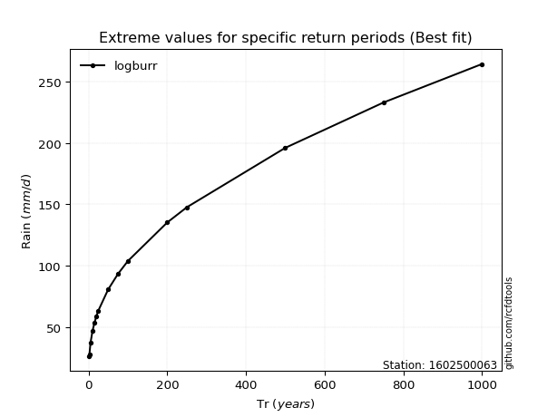</img>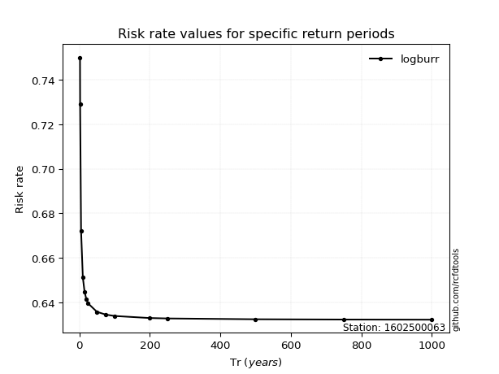</img>

</div>


<sub>**APP DISCLAIMER**: NO WARRANTY - This software is provided by [github.com/rcfdtools](https://github.com/rcfdtools) "as is", without any express or implied warranty, including warranties of merchantability, fitness for a particular purpose, or non-infringement. There is no guarantee that the software will be error-free or operate without interruption. LIMITATION OF LIABILITY - Neither the authors nor copyright holders will be liable for claims or damages arising from the software or its use. You are responsible for determining if the software is appropriate for your use and assume all associated risks, including errors, legal compliance, and data loss. NO PROFESSIONAL ADVICE - The software provides general information and does not offer professional advice. It should not replace consultation with professional advisors.</sub>