<div align="center">


</div>

# PMP Station (Rain, Pmax24h): 1602500110

Probable Maximum Precipitation (PMP) is the greatest amount of rainfall for a specific duration that is meteorologically possible for a given location, acting as a "worst-case" scenario for extreme storms, crucial for designing safety-critical infrastructure like bridges, river deviations, dams, spillways, and nuclear plants to prevent catastrophic failure. PMP is calculated by hydrologists using meteorological data to determine the upper limit of extreme rainfall, often leading to the Probable Maximum Flood (PMF) for flood control design, and is increasingly being studied for climate change impacts. Probable Maximum Precipitation (PMP) is the theoretical upper limit of rainfall, a deterministic estimate for extreme events, while probability distributions (like GEV, Gumbel) describe the likelihood and frequency of various precipitation amounts, including rare ones, showing how often events occur, with PMP representing the extreme end of these distributions, used for critical infrastructure design to ensure safety against the worst conceivable weather, unlike standard statistical forecasts which cover typical probabilities.

The most common probability distributions in hydrology, used for analyzing floods, rainfall, and streamflow, include the Normal, Log-Normal, Gumbel, Gamma (including Log-Pearson Type III), and Generalized Extreme Value (GEV) distributions, often chosen based on the data´s skewness and whether modeling extremes or general conditions, with Gumbel and GEV popular for extreme events like floods, while the Normal distribution serves as a baseline, though often requiring transformations for skewed hydrological data. These distributions help in designing water infrastructure, managing water resources, and forecasting hydrologic events.

> Hydrological data often isn´t perfectly normal (it´s skewed), so different distributions are needed for different applications, such as: **Flood Frequency Analysis**: Using Gumbel, GEV, or Log-Pearson Type III for predicting extreme flood magnitudes and their return periods, **Rainfall Analysis**: Normal for annual totals, but Log-Normal, Weibull, or GEV for intensity or extreme daily rainfall, **Streamflow Modeling**: Gamma and Log-Normal for maximum flows, GEV for minimum flows, and Kappa for daily flows.

<div align="center">

</img>

</div>


## A. General information


### 1. General running parameters

• app_version: _v20260103_. • runtime: _2026-01-05 16:20:51.132608_. • Python version: _3.14.0_. • SciPy version: _1.16.3_. • Pandas version: _2.3.3_. • NumPy version: _2.3.5_. • Stations dataset (station_dataset_file): _dataset/pmax24h_in/automatic_colombia_2003_2024.csv_. • Stations catalog (station_catalog_file): _dataset/CNE.xls_. • Minimum year to eval til year_max (date_min): _1900_. • Maximum year to eval since year_min (date_max): _2024_. • Creates, save and include plots into reports (create_plot): _True_. • Plot only fit distributions with Δo > Δ (plot_only_fit): _True_. • Plot only simple graphs avoiding multiple CDFs and multiple Extreme values plots (plot_only_simple): _True_. • Eval low extreme values, if False, evaluates high extreme values (low_extreme): _False_. • Eval every SciPy distribution as logarithmic (pdist_logarithmic_on): _True_. • Standard deviation normalized (ddof): _1.0_. • Return periods to eval in years (Tr): _[2, 2.33, 5, 10, 15, 20, 25, 50, 75, 100, 200, 250, 500, 750, 1000]_. • Minimum data sample per station, 0 means any (minimum_sample): _5_. • Z-Score maximum threshold to adjust a value, 0 means disable (zscore_max): _3.5_. • Z-Score minimum threshold to adjust a value, 0 means disable (zscore_min): _-2.5_. • Avoid zeros, e.g. rain = 0 (avoid_zeros): _True_. • Avoid null values (avoid_nans): _True_. 

[:file_folder:Dataset file](../../dataset/pmax24h_in/automatic_colombia_2003_2024.csv)

> Delta Degrees of Freedom (DDOF): is a parameter used in the formulas for calculating variance and standard deviation. When ddof=0, the divisor is $N$ (the total number of observations) and this is used when your data set is the entire population. When ddof=1, the divisor is $N-1$ and this is used when your data set is a sample drawn from a larger population. Using $N-1$ provides an unbiased estimate of the population variance (known as Bessel´s correction).


### 2. Station info and location

|   id |     CODIGO | NOMBRE                         | CATEGORIA               | TECNOLOGIA                | ESTADO   | FECHA_INSTALACION   |   FECHA_SUSPENSION |   ALTITUD |   LATITUD |   LONGITUD | DEPARTAMENTO       | MUNICIPIO   | AREA_OPERATIVA                         | ENTIDAD                                                     | AREA_HIDROGRAFICA   | ZONA_HIDROGRAFICA   | SUBZONA_HIDROGRAFICA   |   CORRIENTE | Catalogo   |   Version |
|-----:|-----------:|:-------------------------------|:------------------------|:--------------------------|:---------|:--------------------|-------------------:|----------:|----------:|-----------:|:-------------------|:------------|:---------------------------------------|:------------------------------------------------------------|:--------------------|:--------------------|:-----------------------|------------:|:-----------|----------:|
|    0 | 1602500110 | ARBOLEDAS - AUT   [1602500110] | Climatológica Principal | Automática con Telemetría | Activa   | 28/12/2017          |                nan |       971 |   7.64628 |    -72.799 | Norte De Santander | Arboledas   | Area Operativa 08 - Santanderes-Arauca | INSTITUTO DE HIDROLOGIA METEOROLOGIA Y ESTUDIOS AMBIENTALES | Caribe              | Catatumbo           | Río Zulia              |         nan | CNE_IDEAM  |  20251226 |

<div align="center">

Dynamic map: [:earth_americas:Google](http://maps.google.com/maps?q=7.646281,-72.799007) [:earth_americas:OSM](https://www.openstreetmap.org/#map=18/7.646281/-72.799007&layers=P) [:earth_americas:Bing](https://www.bing.com/maps?cp=7.646281~-72.799007&lvl=18) [:earth_americas:Apple](https://maps.apple.com/frame?center=7.646281%2C-72.799007&span=0.003%2C0.006)

</div>


<div align="center">

```geojson
{
  "type": "Feature",
  "geometry": {
    "type": "Point", 
    "coordinates": [-72.799007, 7.646281]
  }, 
  "properties": {
    "Name": "1602500110"
  }
}
```

</div>


### 3. Discrete values table and plot

<div align="center">

|               |          0 |           1 |           2 |           3 |           4 |
|:--------------|-----------:|------------:|------------:|------------:|------------:|
| Date          | 2019       | 2020        | 2021        | 2022        | 2024        |
| Value         |   55.2     |    4        |    0.4      |    0.2      |   30.8      |
| Value_initial |   55.2     |    4        |    0.4      |    0.2      |   30.8      |
| count         |    5       |    5        |    5        |    5        |    5        |
| mean          |   18.12    |   18.12     |   18.12     |   18.12     |   18.12     |
| std           |   24.3424  |   24.3424   |   24.3424   |   24.3424   |   24.3424   |
| zscore        |    1.52327 |   -0.580058 |   -0.727948 |   -0.736164 |    0.520902 |


</div>


<div align="center">

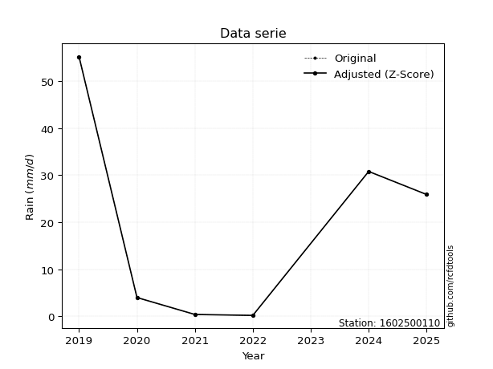</img>

</div>


> The initial value (value_initial) correspond to the initial obtained or null completed value, and value (value) is adjusted only when the initial value is outside the valid range (outlier) definite through the Z-Score value. If Z-Score is active, values out of range or outliers are replaced with the station mean value. A Z-Score (or standard score) measures how many standard deviations a data point is from the mean of a dataset, indicating its relative position; positive scores mean above the mean, negative mean below, and a score of zero is exactly at the mean, allowing for comparison of values from different distributions. It´s calculated using the formula $z=(x–μ)/σ$, where $x$ is the data point, $μ$ is the mean, and $σ$ is the standard deviation, helping identify outliers and understand probability.
>
> <sub>**Note**: In this study, "completing" (filling gaps in) and "extending" (forecasting or lengthening the historical record) rainfall data series are avoided for certain critical analyses because they introduce artificial bias and uncertainty, which can distort the statistics of rare events (extremes), alter day-to-day variability, and compromise the integrity and homogeneity of the original data. Some reasons against Completing/Extending rainfall data are: **Distortion of Extremes and Variability**: The primary issue is that most gap-filling or extension methods rely on averaging or regression with nearby stations, which inherently smooths the data. Rainfall is highly variable in space and time, with a large percentage of zero values and occasional large storms. Infilling methods often underestimate the highest values and overestimate the lowest (zero) values, which severely distorts analyses focused on flood frequency, drought severity, and intensity-duration-frequency (IDF) curves, **Loss of Data Homogeneity**: Infilled or extended data are synthetic estimates, not actual measurements. Combining these estimates with observed data can violate the assumption of data homogeneity, which requires that the data properties do not change over time. Inhomogeneity can lead to incorrect conclusions about long-term trends or changes in climate patterns, **Propagation of Errors**: Errors and biases from the original data (e.g., wind-induced undercatch, instrument errors, site changes) or the data used for imputation can propagate through the analysis, leading to unreliable hydrological models and inaccurate predictions, **Compromised Statistical Integrity**: For statistical analyses, especially those involving the frequency of events, using artificial data can introduce time bias or autocorrelation that doesn´t exist in reality, making it difficult to assess the true probability of events, **Difficulty in Validation**: It is difficult to accurately validate the quality of filled or extended data, especially for past periods where ground-truth measurements are unavailable. The reliability of imputation techniques heavily depends on the density of the surrounding station network and the complexity of the local topography.</sub>


### 4. Active continuous probability distributions from SciPy (44 of 104 available)

A Probability Density Function (PDF) describes the relative likelihood of a continuous random variable falling within a specific range, where the total area under its curve equals 1, and the area over any interval gives the actual probability for that range. Unlike discrete probabilities (like rolling a die), a PDF shows density, not direct probability for a single point (which is zero), with higher points indicating higher likelihood, often visualized as a bell curve for normal distributions.

A log of a probability density function (log-PDF) is simply the logarithm of the PDF´s value, denoted as $log(f(x))$, useful for converting multiplication of probabilities into addition, improving numerical stability with tiny numbers, and connecting to information theory concepts like entropy. Instead of dealing with very small probabilities (e.g., 0.000001), log-PDFs use negative numbers (e.g., $log(0.00001) ≈ -11.51$ that are easier for computers to handle, preventing underflow errors and simplifying complex calculations. In this study, each active probability distribution from SciPy is also evaluated in the $log$ form.

[scipy.stats](https://docs.scipy.org/doc/scipy/reference/stats.html) is a Python´s powerful submodule within the SciPy library for comprehensive statistical analysis, offering over 130 probability distributions (like Normal, Poisson), functions for descriptive stats (mean, variance), hypothesis testing (t-tests, chi-square), random variable generation, and statistical tests, making it essential for data science, modeling, and research. It provides tools to explore, model, and draw conclusions from data efficiently, working seamlessly with NumPy.

<div align="center">

|   id | p_dist             |   n_parameter | fit_method   | label                                                                       | active   | ref                                                                                                        |
|-----:|:-------------------|--------------:|:-------------|:----------------------------------------------------------------------------|:---------|:-----------------------------------------------------------------------------------------------------------|
|    0 | alpha              |             3 | MLE          | Alpha                                                                       | True     | [:mortar_board:](https://docs.scipy.org/doc/scipy/reference/generated/scipy.stats.alpha.html)              |
|    1 | betaprime          |             4 | MLE          | Beta prime                                                                  | True     | [:mortar_board:](https://docs.scipy.org/doc/scipy/reference/generated/scipy.stats.betaprime.html)          |
|    2 | chi2               |             3 | MLE          | Chi²                                                                        | True     | [:mortar_board:](https://docs.scipy.org/doc/scipy/reference/generated/scipy.stats.chi2.html)               |
|    3 | crystalball        |             4 | MLE          | Crystalball                                                                 | True     | [:mortar_board:](https://docs.scipy.org/doc/scipy/reference/generated/scipy.stats.crystalball.html)        |
|    4 | erlang             |             3 | MLE          | Erlang                                                                      | True     | [:mortar_board:](https://docs.scipy.org/doc/scipy/reference/generated/scipy.stats.erlang.html)             |
|    5 | expon              |             2 | MLE          | Exponential                                                                 | True     | [:mortar_board:](https://docs.scipy.org/doc/scipy/reference/generated/scipy.stats.expon.html)              |
|    6 | exponnorm          |             3 | MLE          | Exponentially modified Normal                                               | True     | [:mortar_board:](https://docs.scipy.org/doc/scipy/reference/generated/scipy.stats.exponnorm.html)          |
|    7 | f                  |             4 | MLE          | F                                                                           | True     | [:mortar_board:](https://docs.scipy.org/doc/scipy/reference/generated/scipy.stats.f.html)                  |
|    8 | fatiguelife        |             3 | MLE          | Fatigue-life (Birnbaum-Saunders)                                            | True     | [:mortar_board:](https://docs.scipy.org/doc/scipy/reference/generated/scipy.stats.fatiguelife.html)        |
|    9 | fisk               |             3 | MLE          | Fisk                                                                        | True     | [:mortar_board:](https://docs.scipy.org/doc/scipy/reference/generated/scipy.stats.fisk.html)               |
|   10 | gamma              |             3 | MLE          | Gamma                                                                       | True     | [:mortar_board:](https://docs.scipy.org/doc/scipy/reference/generated/scipy.stats.gamma.html)              |
|   11 | genexpon           |             5 | MLE          | Generalized exponential                                                     | True     | [:mortar_board:](https://docs.scipy.org/doc/scipy/reference/generated/scipy.stats.genexpon.html)           |
|   12 | genlogistic        |             3 | MLE          | Generalized logistic                                                        | True     | [:mortar_board:](https://docs.scipy.org/doc/scipy/reference/generated/scipy.stats.genlogistic.html)        |
|   13 | gibrat             |             2 | MM           | Gibrat                                                                      | True     | [:mortar_board:](https://docs.scipy.org/doc/scipy/reference/generated/scipy.stats.gibrat.html)             |
|   14 | gompertz           |             3 | MLE          | Gompertz (or truncated Gumbel)                                              | True     | [:mortar_board:](https://docs.scipy.org/doc/scipy/reference/generated/scipy.stats.gompertz.html)           |
|   15 | gumbel_l           |             2 | MM           | Gumbel Left Skew                                                            | True     | [:mortar_board:](https://docs.scipy.org/doc/scipy/reference/generated/scipy.stats.gumbel_l.html)           |
|   16 | gumbel_r           |             2 | MM           | Gumbel Right Skew                                                           | True     | [:mortar_board:](https://docs.scipy.org/doc/scipy/reference/generated/scipy.stats.gumbel_r.html)           |
|   17 | halflogistic       |             2 | MM           | Half-logistic                                                               | True     | [:mortar_board:](https://docs.scipy.org/doc/scipy/reference/generated/scipy.stats.halflogistic.html)       |
|   18 | halfnorm           |             2 | MM           | Half Normal                                                                 | True     | [:mortar_board:](https://docs.scipy.org/doc/scipy/reference/generated/scipy.stats.halfnorm.html)           |
|   19 | hypsecant          |             2 | MM           | hyperbolic secant                                                           | True     | [:mortar_board:](https://docs.scipy.org/doc/scipy/reference/generated/scipy.stats.hypsecant.html)          |
|   20 | invgamma           |             3 | MLE          | Inverted gamma                                                              | True     | [:mortar_board:](https://docs.scipy.org/doc/scipy/reference/generated/scipy.stats.invgamma.html)           |
|   21 | invgauss           |             3 | MLE          | Inverse Gaussian                                                            | True     | [:mortar_board:](https://docs.scipy.org/doc/scipy/reference/generated/scipy.stats.invgauss.html)           |
|   22 | invweibull         |             3 | MLE          | Inverted Weibull                                                            | True     | [:mortar_board:](https://docs.scipy.org/doc/scipy/reference/generated/scipy.stats.invweibull.html)         |
|   23 | johnsonsu          |             4 | MLE          | Johnson Su                                                                  | True     | [:mortar_board:](https://docs.scipy.org/doc/scipy/reference/generated/scipy.stats.johnsonsu.html)          |
|   24 | kstwobign          |             2 | MLE          | Limiting distribution of scaled Kolmogorov-Smirnov two-sided test statistic | True     | [:mortar_board:](https://docs.scipy.org/doc/scipy/reference/generated/scipy.stats.kstwobign.html)          |
|   25 | laplace            |             2 | MM           | Laplace                                                                     | True     | [:mortar_board:](https://docs.scipy.org/doc/scipy/reference/generated/scipy.stats.laplace.html)            |
|   26 | laplace_asymmetric |             3 | MLE          | Asymmetric Laplace                                                          | True     | [:mortar_board:](https://docs.scipy.org/doc/scipy/reference/generated/scipy.stats.laplace_asymmetric.html) |
|   27 | loggamma           |             3 | MLE          | Log gamma                                                                   | True     | [:mortar_board:](https://docs.scipy.org/doc/scipy/reference/generated/scipy.stats.loggamma.html)           |
|   28 | logistic           |             2 | MM           | Logistic (or Sech-squared)                                                  | True     | [:mortar_board:](https://docs.scipy.org/doc/scipy/reference/generated/scipy.stats.logistic.html)           |
|   29 | lognorm            |             3 | MLE          | Log Normal                                                                  | True     | [:mortar_board:](https://docs.scipy.org/doc/scipy/reference/generated/scipy.stats.lognorm.html)            |
|   30 | maxwell            |             2 | MM           | Maxwell                                                                     | True     | [:mortar_board:](https://docs.scipy.org/doc/scipy/reference/generated/scipy.stats.maxwell.html)            |
|   31 | mielke             |             4 | MLE          | Mielke Beta-Kappa / Dagum                                                   | True     | [:mortar_board:](https://docs.scipy.org/doc/scipy/reference/generated/scipy.stats.mielke.html)             |
|   32 | moyal              |             2 | MM           | Moyal                                                                       | True     | [:mortar_board:](https://docs.scipy.org/doc/scipy/reference/generated/scipy.stats.moyal.html)              |
|   33 | nakagami           |             3 | MLE          | Nakagami                                                                    | True     | [:mortar_board:](https://docs.scipy.org/doc/scipy/reference/generated/scipy.stats.nakagami.html)           |
|   34 | ncf                |             5 | MLE          | Non-central F distribution                                                  | True     | [:mortar_board:](https://docs.scipy.org/doc/scipy/reference/generated/scipy.stats.ncf.html)                |
|   35 | nct                |             4 | MLE          | Non-central Student’s t                                                     | True     | [:mortar_board:](https://docs.scipy.org/doc/scipy/reference/generated/scipy.stats.nct.html)                |
|   36 | norm               |             2 | MM           | Normal                                                                      | True     | [:mortar_board:](https://docs.scipy.org/doc/scipy/reference/generated/scipy.stats.norm.html)               |
|   37 | pearson3           |             3 | MM           | Pearson type III                                                            | True     | [:mortar_board:](https://docs.scipy.org/doc/scipy/reference/generated/scipy.stats.pearson3.html)           |
|   38 | rayleigh           |             2 | MM           | Rayleigh                                                                    | True     | [:mortar_board:](https://docs.scipy.org/doc/scipy/reference/generated/scipy.stats.rayleigh.html)           |
|   39 | rice               |             3 | MLE          | Rice                                                                        | True     | [:mortar_board:](https://docs.scipy.org/doc/scipy/reference/generated/scipy.stats.rice.html)               |
|   40 | t                  |             3 | MLE          | Student’s t                                                                 | True     | [:mortar_board:](https://docs.scipy.org/doc/scipy/reference/generated/scipy.stats.t.html)                  |
|   41 | truncnorm          |             4 | MLE          | Truncated normal                                                            | True     | [:mortar_board:](https://docs.scipy.org/doc/scipy/reference/generated/scipy.stats.truncnorm.html)          |
|   42 | wald               |             2 | MM           | Wald                                                                        | True     | [:mortar_board:](https://docs.scipy.org/doc/scipy/reference/generated/scipy.stats.wald.html)               |
|   43 | weibull_min        |             3 | MLE          | Weibull minimum                                                             | True     | [:mortar_board:](https://docs.scipy.org/doc/scipy/reference/generated/scipy.stats.weibull_min.html)        |

</div>

> **n_parameter:** # arguments & localization & scale.
>
> **Fit methods:** (MLE) maximum likelihood, (MM) L-moments.
>
>**Inactive** (With the only purpose of prevent loops, zero divisions, infinite values, over high estimated values or horizontal trending for recurrence intervals estimations, the follow distributions were disabled.)**:** foldnorm, gennorm, norminvgauss, powernorm, powerlognorm, skewnorm, genextreme, anglit, arcsine, argus, beta, bradford, burr, burr12, cauchy, cosine, halfcauchy, foldcauchy, skewcauchy, wrapcauchy, dgamma, gengamma, exponweib, exponpow, truncexpon, gausshyper, genhalflogistic, genhyperbolic, geninvgauss, halfgennorm, johnsonsb, kappa4, kappa3, ksone, kstwo, loglaplace, levy, levy_l, levy_stable, ncx2, pareto, genpareto, truncpareto, lomax, powerlaw, rdist, rel_breitwigner, recipinvgauss, semicircular, studentized_range, trapezoid, triang, truncweibull_min, tukeylambda, uniform, loguniform, vonmises, vonmises_line, weibull_max, dweibull, 


## B. Probability (PDF) vs. Empirical (EDF) distributions functions

A continuous probability distribution (CPD) describes probabilities for variables that can take any value within a range (like rain any time), unlike discrete variables with specific outcomes (like temperature). It uses a Probability Density Function (PDF), a curve where the total area under it equals 1, and the probability of the variable falling within an interval (a to b) is found by calculating the area under the curve between those points. A key feature is that the probability of hitting any single exact value is zero, so probabilities are always expressed for ranges, e.g., $P(a ≤ X ≤ b)$.

<div align="center">

Distributions parameters from station values
|    |    station | p_dist                |   n |             loc |          scale | shape                  | shape1              | shape2                 | shape3   |
|---:|-----------:|:----------------------|----:|----------------:|---------------:|:-----------------------|:--------------------|:-----------------------|:---------|
|  0 | 1602500110 | alpha                 |   5 |    -0.00116126  |    0.399454    | 1.2721836513890003e-06 |                     |                        |          |
|  1 | 1602500110 | betaprime             |   5 |     0.2         |    3.61711e-10 | 64.70400523751582      | 0.17715088063777423 |                        |          |
|  2 | 1602500110 | chi2                  |   5 |     0.2         |    1.76908     | 1.386743239764502      |                     |                        |          |
|  3 | 1602500110 | crystalball           |   5 |    18.12        |   21.7725      | 606.3183316608965      | 3775.9838951849847  |                        |          |
|  4 | 1602500110 | erlang                |   5 |     0.2         |   10.2074      | 0.820984529016102      |                     |                        |          |
|  5 | 1602500110 | expon                 |   5 |     0.2         |   17.92        |                        |                     |                        |          |
|  6 | 1602500110 | exponnorm             |   5 |     0.183379    |    0.00500294  | 3568.4142285530324     |                     |                        |          |
|  7 | 1602500110 | f                     |   5 |     0.2         |    3.00769e-16 | 25.055045740055036     | 0.40971003689107127 |                        |          |
|  8 | 1602500110 | fatiguelife           |   5 |     0.2         |    1.99957e-06 | 2647.7998032420646     |                     |                        |          |
|  9 | 1602500110 | fisk                  |   5 |     0.2         |    3.73911     | 0.5260477044634516     |                     |                        |          |
| 10 | 1602500110 | gamma                 |   5 |     0.2         |   10.1955      | 0.8306644195319506     |                     |                        |          |
| 11 | 1602500110 | genexpon              |   5 |     0.2         |   23.8865      | 1.3329617538577976     | 1.029347019334365   | 3.3706471573271523e-10 |          |
| 12 | 1602500110 | genlogistic           |   5 |  -108.27        |   14.9941      | 2371.9706263645735     |                     |                        |          |
| 13 | 1602500110 | gibrat                |   5 |     1.51035     |   10.0743      |                        |                     |                        |          |
| 14 | 1602500110 | gompertz              |   5 |     0.2         |    7.5264e+11  | 42232610374.29525      |                     |                        |          |
| 15 | 1602500110 | gumbel_l              |   5 |    27.9188      |   16.9759      |                        |                     |                        |          |
| 16 | 1602500110 | gumbel_r              |   5 |     8.32122     |   16.9759      |                        |                     |                        |          |
| 17 | 1602500110 | halflogistic          |   5 |    -7.68547     |   18.6147      |                        |                     |                        |          |
| 18 | 1602500110 | halfnorm              |   5 |   -10.6983      |   36.1183      |                        |                     |                        |          |
| 19 | 1602500110 | hypsecant             |   5 |    18.12        |   13.8608      |                        |                     |                        |          |
| 20 | 1602500110 | invgamma              |   5 |     0.2         |    8.58778e-17 | 0.1885615779698548     |                     |                        |          |
| 21 | 1602500110 | invgauss              |   5 |     0.0922026   |    0.398254    | 45.26713735632603      |                     |                        |          |
| 22 | 1602500110 | invweibull            |   5 |     0.2         |    2.98546     | 0.046847603637818855   |                     |                        |          |
| 23 | 1602500110 | johnsonsu             |   5 |     0.2         |    6.64786e-11 | -0.9994786448214122    | 0.07777164675823939 |                        |          |
| 24 | 1602500110 | kstwobign             |   5 |   -44.0376      |   71.3885      |                        |                     |                        |          |
| 25 | 1602500110 | laplace               |   5 |    18.12        |   15.3955      |                        |                     |                        |          |
| 26 | 1602500110 | laplace_asymmetric    |   5 |     0.2         |    0.000805874 | 4.497125957263372e-05  |                     |                        |          |
| 27 | 1602500110 | loggamma              |   5 | -5390.24        |  764.894       | 1177.454462489026      |                     |                        |          |
| 28 | 1602500110 | logistic              |   5 |    18.12        |   12.0038      |                        |                     |                        |          |
| 29 | 1602500110 | lognorm               |   5 |     0.2         |    0.00204197  | 16.08531375819191      |                     |                        |          |
| 30 | 1602500110 | maxwell               |   5 |   -33.4717      |   32.3303      |                        |                     |                        |          |
| 31 | 1602500110 | mielke                |   5 |     0.199998    |    6.7429e-11  | 7.332198409638673      | 0.19131075296058658 |                        |          |
| 32 | 1602500110 | moyal                 |   5 |     5.66909     |    9.80107     |                        |                     |                        |          |
| 33 | 1602500110 | nakagami              |   5 |     0.2         |   35.4874      | 0.13720296805638243    |                     |                        |          |
| 34 | 1602500110 | ncf                   |   5 |    -0.0118192   |    0.69793     | 24.69451948658147      | 0.8013039941003745  | 2.8854750708369043e-11 |          |
| 35 | 1602500110 | nct                   |   5 |     0.2         |    8.75211e-12 | 0.1349688426746333     | 3.4007296806831744  |                        |          |
| 36 | 1602500110 | norm                  |   5 |    18.12        |   21.7725      |                        |                     |                        |          |
| 37 | 1602500110 | pearson3              |   5 |    18.12        |   21.7725      | 0.7535617219983517     |                     |                        |          |
| 38 | 1602500110 | rayleigh              |   5 |   -23.5321      |   33.2335      |                        |                     |                        |          |
| 39 | 1602500110 | rice                  |   5 |   -15.9804      |   28.6084      | 0.00027369801001729446 |                     |                        |          |
| 40 | 1602500110 | t                     |   5 |     0.4         |    3.3945e-16  | 0.2039763034636753     |                     |                        |          |
| 41 | 1602500110 | truncnorm             |   5 |    -7.44984     |   31.3483      | 0.2440204011541935     | 1.998533251560439   |                        |          |
| 42 | 1602500110 | wald                  |   5 |    -3.6525      |   21.7725      |                        |                     |                        |          |
| 43 | 1602500110 | weibull_min           |   5 |     0.2         |   25.4852      | 0.2911058184260571     |                     |                        |          |
| 44 | 1602500110 | logalpha              |   5 |    -2.54592     |    1.74913     | 1.764181847510976e-07  |                     |                        |          |
| 45 | 1602500110 | logbetaprime          |   5 |    -1.60944     |    1.55128     | 0.10438438463971347    | 0.3550805910745034  |                        |          |
| 46 | 1602500110 | logchi2               |   5 |    -1.60944     |    1.2105      | 1.0644686343195793     |                     |                        |          |
| 47 | 1602500110 | logcrystalball        |   5 |     1.25981     |    2.2473      | 16.191219926649044     | 56.127424851084186  |                        |          |
| 48 | 1602500110 | logerlang             |   5 |   -97.0277      |    0.0514967   | 1908.5963170681352     |                     |                        |          |
| 49 | 1602500110 | logexpon              |   5 |    -1.60944     |    2.86925     |                        |                     |                        |          |
| 50 | 1602500110 | logexponnorm          |   5 |     1.25694     |    2.24729     | 0.0012781537242150184  |                     |                        |          |
| 51 | 1602500110 | logf                  |   5 |    -1.60944     |    1.04091     | 1.1922378962628117     | 1.0421747905174106  |                        |          |
| 52 | 1602500110 | logfatiguelife        |   5 |    -1.60944     |    9.42319e-07 | 1635.0531549087068     |                     |                        |          |
| 53 | 1602500110 | logfisk               |   5 |    -1.60944     |    2.85741     | 0.1361643794689812     |                     |                        |          |
| 54 | 1602500110 | loggamma              |   5 |   -96.9034      |    0.0515211   | 1905.2819604365368     |                     |                        |          |
| 55 | 1602500110 | loggenexpon           |   5 |    -1.60944     |    3.55697     | 1.0175541307882368     | 1.2735293933557643  | 0.29208926200925756    |          |
| 56 | 1602500110 | loggenlogistic        |   5 |   -12.9072      |    1.96408     | 767.0693246811145      |                     |                        |          |
| 57 | 1602500110 | loggibrat             |   5 |    -0.454594    |    1.03984     |                        |                     |                        |          |
| 58 | 1602500110 | loggompertz           |   5 |    -1.60944     |    5.53675     | 1.2212195421015064     |                     |                        |          |
| 59 | 1602500110 | loggumbel_l           |   5 |     2.27121     |    1.75221     |                        |                     |                        |          |
| 60 | 1602500110 | loggumbel_r           |   5 |     0.248404    |    1.75221     |                        |                     |                        |          |
| 61 | 1602500110 | loghalflogistic       |   5 |    -1.40374     |    1.92134     |                        |                     |                        |          |
| 62 | 1602500110 | loghalfnorm           |   5 |    -1.71474     |    3.72804     |                        |                     |                        |          |
| 63 | 1602500110 | loghypsecant          |   5 |     1.25981     |    1.43068     |                        |                     |                        |          |
| 64 | 1602500110 | loginvgamma           |   5 |   -21.4235      | 2249.63        | 100.19523268955425     |                     |                        |          |
| 65 | 1602500110 | loginvgauss           |   5 |    -2.79391     |    7.24295     | 0.5596774355832337     |                     |                        |          |
| 66 | 1602500110 | loginvweibull         |   5 |    -1.31852e+08 |    1.31852e+08 | 67029788.48210336      |                     |                        |          |
| 67 | 1602500110 | logjohnsonsu          |   5 |     4.01096     |    3.93148e-13 | 1.283152057786702      | 0.11089818566065585 |                        |          |
| 68 | 1602500110 | logkstwobign          |   5 |    -6.51553     |    8.85        |                        |                     |                        |          |
| 69 | 1602500110 | loglaplace            |   5 |     1.25981     |    1.58908     |                        |                     |                        |          |
| 70 | 1602500110 | loglaplace_asymmetric |   5 |     1.38629     |    1.99093     | 1.0324509145182033     |                     |                        |          |
| 71 | 1602500110 | logloggamma           |   5 |     4.01116     |    1.94261e-05 | 7.059123330582395e-06  |                     |                        |          |
| 72 | 1602500110 | loglogistic           |   5 |     1.25981     |    1.239       |                        |                     |                        |          |
| 73 | 1602500110 | loglognorm            |   5 |    -1.60944     |    0.00592416  | 4.799399513417953      |                     |                        |          |
| 74 | 1602500110 | logmaxwell            |   5 |    -4.06535     |    3.33705     |                        |                     |                        |          |
| 75 | 1602500110 | logmielke             |   5 |    -1.60944     |    1.64826     | 0.12392625742769384    | 0.7511469420042197  |                        |          |
| 76 | 1602500110 | logmoyal              |   5 |    -0.0253416   |    1.01164     |                        |                     |                        |          |
| 77 | 1602500110 | lognakagami           |   5 |    -1.60944     |    2.41964     | 0.05525034311894465    |                     |                        |          |
| 78 | 1602500110 | logncf                |   5 |    -1.60944     |    1.05418     | 1.04721061963031       | 1.164328480549077   | 1.0635695689801357     |          |
| 79 | 1602500110 | lognct                |   5 |  -123.558       |    2.23688     | 163386.5570569344      | 55.79957337826329   |                        |          |
| 80 | 1602500110 | lognorm               |   5 |     1.25981     |    2.2473      |                        |                     |                        |          |
| 81 | 1602500110 | logpearson3           |   5 |     1.2598      |    2.24729     | -0.05138090080094257   |                     |                        |          |
| 82 | 1602500110 | lograyleigh           |   5 |    -3.03941     |    3.43028     |                        |                     |                        |          |
| 83 | 1602500110 | logrice               |   5 |    -2.90942     |    2.7636      | 0.968081449470316      |                     |                        |          |
| 84 | 1602500110 | logt                  |   5 |     1.2598      |    2.2473      | 3523726093.213729      |                     |                        |          |
| 85 | 1602500110 | logtruncnorm          |   5 |     0.727918    |    2.90937     | -0.8033888897819657    | 30.73276395104142   |                        |          |
| 86 | 1602500110 | logwald               |   5 |    -0.987482    |    2.24731     |                        |                     |                        |          |
| 87 | 1602500110 | logweibull_min        |   5 |    -1.60944     |    3.03695     | 0.13422686616429588    |                     |                        |          |

</div>

> **loc** (Location parameter): This shifts the distribution along the x-axis. For many common distributions, like the normal (Gaussian) distribution, loc represents the mean $μ$. For others, like the uniform distribution, it might represent the minimum value, or for the beta distribution, the left end of the support interval.
>
> **scale** (Scale parameter): This determines the width or spread of the distribution. For the normal distribution, scale represents the standard deviation $σ$. For a uniform distribution, it defines the length of the interval (from $loc$ to $loc + scale$).
>
> **shape** (Shape parameters): Refers to parameters that define the specific form of a probability distribution, distinct from its location (loc) and scale (scale). These parameters are required arguments for most distribution functions. For example, a normal (Gaussian) distribution is fully defined by its location (mean) and scale (standard deviation), so it has no specific shape parameters beyond loc and scale. However, other distributions have intrinsic properties that need specification, as Gamma distribution that takes a shape parameter, often named $a$ or $alpha$.


### 0. Cumulative distribution values - CDF (88 evaluated)

Cumulative Distribution Function (CDF), denoted as $F$<sub>$X$</sub>$(x)$, is a function that gives the probability that a random variable $X$ will take a value less than or equal to a specific value, $x$ (i.e., $(P(X≥x)$. It essentially "accumulates" probabilities from a given point up to the far right (positive infinity), providing a complete picture of the distribution´s probabilities for both discrete (like rain) and continuous (like temperature) variables, helping to find probabilities over ranges or above certain values. Each station is evaluated separately ordering the $x$ values ascending, calculating the CDF and PDF values for the activated distributions and their logarithmic forms.

<div align="center">

CDF ordered by x ascending and calculating $log(f(x))$ separately
|   id |    Station |   date |    x |   count |   mean |     std |    zscore |   Value_initial |    station |   m |     alpha |   alpha_pdf |   betaprime |   betaprime_pdf |        chi2 |        chi2_pdf |   crystalball |   crystalball_pdf |      erlang |    erlang_pdf |     expon |   expon_pdf |   exponnorm |   exponnorm_pdf |         f |       f_pdf |   fatiguelife |   fatiguelife_pdf |        fisk |    fisk_pdf |      gamma |    gamma_pdf |    genexpon |   genexpon_pdf |   genlogistic |   genlogistic_pdf |    gibrat |   gibrat_pdf |    gompertz |   gompertz_pdf |   gumbel_l |   gumbel_l_pdf |   gumbel_r |   gumbel_r_pdf |   halflogistic |   halflogistic_pdf |   halfnorm |   halfnorm_pdf |   hypsecant |   hypsecant_pdf |   invgamma |   invgamma_pdf |   invgauss |   invgauss_pdf |   invweibull |   invweibull_pdf |   johnsonsu |   johnsonsu_pdf |   kstwobign |   kstwobign_pdf |   laplace |   laplace_pdf |   laplace_asymmetric |   laplace_asymmetric_pdf |   loggamma |   loggamma_pdf |   logistic |   logistic_pdf |   lognorm |   lognorm_pdf |   maxwell |   maxwell_pdf |     mielke |     mielke_pdf |    moyal |   moyal_pdf |    nakagami |   nakagami_pdf |       ncf |     ncf_pdf |       nct |     nct_pdf |     norm |   norm_pdf |   pearson3 |   pearson3_pdf |   rayleigh |   rayleigh_pdf |     rice |   rice_pdf |           t |       t_pdf |   truncnorm |   truncnorm_pdf |      wald |   wald_pdf |   weibull_min |   weibull_min_pdf |   logalpha |   logalpha_pdf |   logbetaprime |   logbetaprime_pdf |     logchi2 |   logchi2_pdf |   logcrystalball |   logcrystalball_pdf |   logerlang |   logerlang_pdf |   logexpon |   logexpon_pdf |   logexponnorm |   logexponnorm_pdf |        logf |       logf_pdf |   logfatiguelife |   logfatiguelife_pdf |    logfisk |   logfisk_pdf |   loggenexpon |   loggenexpon_pdf |   loggenlogistic |   loggenlogistic_pdf |   loggibrat |   loggibrat_pdf |   loggompertz |   loggompertz_pdf |   loggumbel_l |   loggumbel_l_pdf |   loggumbel_r |   loggumbel_r_pdf |   loghalflogistic |   loghalflogistic_pdf |   loghalfnorm |   loghalfnorm_pdf |   loghypsecant |   loghypsecant_pdf |   loginvgamma |   loginvgamma_pdf |   loginvgauss |   loginvgauss_pdf |   loginvweibull |   loginvweibull_pdf |   logjohnsonsu |   logjohnsonsu_pdf |   logkstwobign |   logkstwobign_pdf |   loglaplace |   loglaplace_pdf |   loglaplace_asymmetric |   loglaplace_asymmetric_pdf |   logloggamma |   logloggamma_pdf |   loglogistic |   loglogistic_pdf |   loglognorm |   loglognorm_pdf |   logmaxwell |   logmaxwell_pdf |   logmielke |   logmielke_pdf |   logmoyal |   logmoyal_pdf |   lognakagami |   lognakagami_pdf |      logncf |   logncf_pdf |   lognct |   lognct_pdf |   logpearson3 |   logpearson3_pdf |   lograyleigh |   lograyleigh_pdf |   logrice |   logrice_pdf |     logt |   logt_pdf |   logtruncnorm |   logtruncnorm_pdf |     logwald |   logwald_pdf |   logweibull_min |   logweibull_min_pdf |
|-----:|-----------:|-------:|-----:|--------:|-------:|--------:|----------:|----------------:|-----------:|----:|----------:|------------:|------------:|----------------:|------------:|----------------:|--------------:|------------------:|------------:|--------------:|----------:|------------:|------------:|----------------:|----------:|------------:|--------------:|------------------:|------------:|------------:|-----------:|-------------:|------------:|---------------:|--------------:|------------------:|----------:|-------------:|------------:|---------------:|-----------:|---------------:|-----------:|---------------:|---------------:|-------------------:|-----------:|---------------:|------------:|----------------:|-----------:|---------------:|-----------:|---------------:|-------------:|-----------------:|------------:|----------------:|------------:|----------------:|----------:|--------------:|---------------------:|-------------------------:|-----------:|---------------:|-----------:|---------------:|----------:|--------------:|----------:|--------------:|-----------:|---------------:|---------:|------------:|------------:|---------------:|----------:|------------:|----------:|------------:|---------:|-----------:|-----------:|---------------:|-----------:|---------------:|---------:|-----------:|------------:|------------:|------------:|----------------:|----------:|-----------:|--------------:|------------------:|-----------:|---------------:|---------------:|-------------------:|------------:|--------------:|-----------------:|---------------------:|------------:|----------------:|-----------:|---------------:|---------------:|-------------------:|------------:|---------------:|-----------------:|---------------------:|-----------:|--------------:|--------------:|------------------:|-----------------:|---------------------:|------------:|----------------:|--------------:|------------------:|--------------:|------------------:|--------------:|------------------:|------------------:|----------------------:|--------------:|------------------:|---------------:|-------------------:|--------------:|------------------:|--------------:|------------------:|----------------:|--------------------:|---------------:|-------------------:|---------------:|-------------------:|-------------:|-----------------:|------------------------:|----------------------------:|--------------:|------------------:|--------------:|------------------:|-------------:|-----------------:|-------------:|-----------------:|------------:|----------------:|-----------:|---------------:|--------------:|------------------:|------------:|-------------:|---------:|-------------:|--------------:|------------------:|--------------:|------------------:|----------:|--------------:|---------:|-----------:|---------------:|-------------------:|------------:|--------------:|-----------------:|---------------------:|
|    0 | 1602500110 |   2022 |  0.2 |       5 |  18.12 | 24.3424 | -0.736164 |             0.2 | 1602500110 |   1 | 0.0470621 | 1.09666     |   0.0345499 |     3.07635e+06 | 1.51979e-12 | 37966.3         |      0.205238 |        0.0130587  | 4.04712e-15 | 119.71        | 0         |  0.0558036  | 0.000930566 |      0.0559373  | 0.0514289 | 1.38599e+15 |     0.0469993 |       8.08181e+11 | 9.75234e-10 | 1.84835e+07 | 2.7306e-15 | 81.7209      | 3.68739e-11 |      0.055804  |      0.180722 |        0.0206126  | 0         |   0          | 1.06286e-12 |     0.0561126  |   0.177475 |     0.00946645 |   0.199192 |      0.0189323 |       0.208696 |         0.0256906  |   0.237148 |     0.0211078  |    0.170543 |      0.0117237  |  0.0221526 |    8.52199e+14 |   0.05581  |    1.14657     |   0.00187522 |      1.98738e+13 |    0.139504 |     1.59674e+08 |    0.162789 |      0.0199656  |  0.156121 |    0.0101407  |           2.1419e-09 |               0.0558043  |   0.100207 |      0.0797175 |   0.183493 |     0.0124813  |  0.100845 |     0.0785738 |  0.219232 |    0.0155633  | 0.00546431 | 3189.79        | 0.18623  |  0.02246    | 8.73239e-06 |    8.63329e+10 | 0.0882691 | 0.646378    | 0.0587079 | 6.95413e+09 | 0.205238 | 0.0130587  |   0.212332 |     0.0170659  |   0.22506  |     0.0166514  | 0.147807 | 0.0168477  | 0.000363786 | 0.000371019 | 7.13608e-06 |      0.0324409  | 0.0441952 | 0.0363002  |   5.90042e-06 |       6.18845e+10 |  0.0617939 |      0.27812   |      0.0179546 |        8.44057e+12 | 3.28094e-09 |   7.86432e+06 |         0.100845 |            0.0785738 |    0.100302 |       0.0797391 |   0        |      0.348524  |       0.100844 |          0.0785737 | 3.06462e-10 | 822753         |        0.0474314 |          6.53596e+11 | 0.00636331 |   3.87734e+12 |   7.01302e-11 |         0.286074  |        0.0878366 |            0.108603  |    0        |       0         |   8.47884e-09 |         0.220566  |      0.103435 |         0.0558671 |     0.0557326 |         0.0918328 |          0        |             0         |     0.0225331 |         0.213937  |      0.0851711 |          0.0588243 |     0.0949461 |         0.0889955 |     0.0649188 |         0.180031  |       0.0878505 |           0.10862   |      0.015662  |        0.000775468 |       0.08163  |          0.11695   |    0.0821878 |        0.0517203 |                0.120138 |                   0.0584459 |      0.129713 |         0.0471357 |      0.089825 |         0.0659858 |  7.96109e-07 |      1.40902e+06 |    0.0903446 |        0.0987791 |   0.0107949 |     6.02478e+12 |  0.0286781 |      0.0787881 |     0.0148309 |       7.38062e+12 | 2.40312e-09 |  5.66681e+06 | 0.100859 |    0.0786076 |      0.101758 |         0.0774093 |     0.0832211 |          0.111412 | 0.0672341 |     0.100383  | 0.100845 |  0.078574  |    1.35933e-12 |          0.125838  | 0           |   0           |       0.00680197 |           4.0978e+12 |
|    1 | 1602500110 |   2021 |  0.4 |       5 |  18.12 | 24.3424 | -0.727948 |             0.4 | 1602500110 |   2 | 0.319374  | 1.20633     |   0.936084  |     0.0566141   | 0.146912    |     0.492533    |      0.207859 |        0.0131573  | 0.0419013   |   0.170158    | 0.0110987 |  0.0551842  | 0.0120605   |      0.0553389  | 1         | 0.00073735  |     0.547537  |       0.118282    | 0.176474    | 0.382256    | 0.0402541  |  0.165403    | 0.0110988   |      0.0551847 |      0.184864 |        0.0208058  | 0         |   0          | 0.0111598   |     0.0554864  |   0.179377 |     0.00955649 |   0.202993 |      0.0190675 |       0.213828 |         0.0256323  |   0.241366 |     0.0210722  |    0.172902 |      0.0118698  |  0.998626  |    0.00129531  |   0.261009 |    0.789118    |   0.32142    |      0.0854533   |    0.773906 |     0.116944    |    0.166801 |      0.0201489  |  0.158162 |    0.0102733  |           0.0110988  |               0.0551849  |   0.166832 |      0.112845  |   0.186002 |     0.0126131  |  0.166443 |     0.111082  |  0.222353 |    0.0156473  | 0.556443   |    0.309634    | 0.190739 |  0.0226278  | 0.196144    |    0.269114    | 0.200483  | 0.46995     | 0.959517  | 0.0273198   | 0.207859 | 0.0131573  |   0.215755 |     0.0171663  |   0.228397 |     0.0167194  | 0.151191 | 0.0169882  | 0.5         | 5.86215e+14 | 0.00649023  |      0.0323898  | 0.0516799 | 0.0385043  |   0.216405    |       0.278137    |  0.283123  |      0.295409  |      0.731515  |        0.0945482   | 0.526038    |   0.333871    |         0.166443 |            0.111082  |    0.166935 |       0.112843  |   0.214613 |      0.273726  |       0.166443 |          0.111082  | 0.413931    |      0.241324  |        0.70005   |          0.13155     | 0.451932   |   0.048657    |   0.185533    |         0.249132  |        0.180898  |            0.157304  |    0        |       0         |   0.150296    |         0.212411  |      0.1497   |         0.0786949 |     0.143144  |         0.158804  |          0.126175 |             0.256092  |     0.169588  |         0.20917   |      0.136941  |          0.0927924 |     0.170016  |         0.127308  |     0.218142  |         0.23937   |       0.180899  |           0.157242  |      0.0162447 |        0.000912699 |       0.181715 |          0.167593  |    0.127129  |        0.0800014 |                0.168317 |                   0.0818845 |      0.166868 |         0.0606372 |      0.14725  |         0.101346  |  0.839462    |      0.0732999   |    0.172282  |        0.136409  |   0.838104  |     0.0984708   |  0.120364  |      0.183333  |     0.764197  |       0.121305    | 0.302747    |  0.208361    | 0.166484 |    0.111125  |      0.166286 |         0.10921   |     0.174313  |          0.148981 | 0.151852  |     0.141751  | 0.166444 |  0.111082  |    0.0951857   |          0.148119  | 5.15889e-08 |   1.17698e-05 |       0.559622   |           0.0699388  |
|    2 | 1602500110 |   2020 |  4   |       5 |  18.12 | 24.3424 | -0.580058 |             4   | 1602500110 |   3 | 0.920476  | 0.0198094   |   0.962062  |     0.00176864  | 0.783814    |     0.0721853   |      0.258323 |        0.0148482  | 0.403294    |   0.0705937   | 0.191079  |  0.0451407  | 0.192479    |      0.0452328  | 1         | 2.12305e-05 |     0.698692  |       0.0238657   | 0.502124    | 0.0346078   | 0.39816    |  0.0705761   | 0.19108     |      0.045141  |      0.265031 |        0.0234651  | 0.0810802 |   0.0603217  | 0.192028    |     0.0453374  |   0.21682  |     0.011275   |   0.275304 |      0.0209184 |       0.30396  |         0.0243788  |   0.315953 |     0.0203353  |    0.220587 |      0.0146709  |  0.999211  |    3.91289e-05 |   0.765884 |    0.0315876   |   0.372037   |      0.00453505  |    0.836646 |     0.00504747  |    0.244261 |      0.0226234  |  0.199828 |    0.0129796  |           0.191081   |               0.0451412  |   0.525644 |      0.176874  |   0.235719 |     0.0150082  |  0.522442 |     0.17724   |  0.281133 |    0.0169361  | 0.715459   |    0.012008    | 0.276207 |  0.0244993  | 0.439936    |    0.0317248   | 0.62378   | 0.0356889   | 0.972793  | 0.000966343 | 0.258323 | 0.0148482  |   0.280373 |     0.0186185  |   0.290474 |     0.017687   | 0.216426 | 0.0191293  | 0.999798    | 1.14308e-05 | 0.121183    |      0.0312648  | 0.220609  | 0.048341   |   0.437095    |       0.02478     |  0.65645   |      0.0817564 |      0.821439  |        0.0184268   | 0.874399    |   0.0650396   |         0.522442 |            0.17724   |    0.525641 |       0.176805  |   0.647986 |      0.122685  |       0.522442 |          0.17724   | 0.655355    |      0.0494069 |        0.862251  |          0.0400659   | 0.501609   |   0.0113631   |   0.624218    |         0.136843  |        0.588701  |            0.158755  |    0.71606  |       0.184094  |   0.583817    |         0.15769   |      0.453099 |         0.188361  |     0.59312   |         0.176817  |          0.620651 |             0.15999   |     0.594485  |         0.15143   |      0.528105  |          0.221623  |     0.54945   |         0.172765  |     0.650069  |         0.125518  |       0.588389  |           0.158644  |      0.019297  |        0.00198455  |       0.597338 |          0.158385  |    0.538256  |        0.290573  |                0.515962 |                   0.251011  |      0.385263 |         0.139998  |      0.5255   |         0.201251  |  0.902723    |      0.0119621   |    0.554459  |        0.168022  |   0.921774  |     0.0148579   |  0.618674  |      0.173414  |     0.894669  |       0.0304531   | 0.550741    |  0.0593293   | 0.52253  |    0.177217  |      0.519042 |         0.177487  |     0.564949  |          0.16363  | 0.547468  |     0.173693  | 0.522443 |  0.17724   |    0.479821    |          0.169373  | 0.689637    |   0.163279    |       0.631446   |           0.0164832  |
|    3 | 1602500110 |   2024 | 30.8 |       5 |  18.12 | 24.3424 |  0.520902 |            30.8 | 1602500110 |   4 | 0.989653  | 0.00033592  |   0.973783  |     0.000151779 | 0.999933    |     1.95471e-05 |      0.719847 |        0.015465   | 0.965709    |   0.00351828  | 0.818698  |  0.0101173  | 0.820031    |      0.0100808  | 1         | 1.71964e-06 |     0.93022   |       0.00323352  | 0.751351    | 0.00321169  | 0.965079   |  0.00357815  | 0.8187      |      0.0101173 |      0.80064  |        0.0118719  | 0.85707   |   0.00770656 | 0.820404    |     0.0100776  |   0.694247 |     0.0213426  |   0.766418 |      0.0120104 |       0.775403 |         0.0107106  |   0.749425 |     0.0114172  |    0.757437 |      0.0158547  |  0.999468  |    3.27895e-06 |   0.928139 |    0.00147477  |   0.407911   |      0.000559992 |    0.87348  |     0.000527618 |    0.778237 |      0.0129725  |  0.78058  |    0.0142523  |           0.818702   |               0.0101172  |   0.832725 |      0.109751  |   0.741989 |     0.0159484  |  0.832623 |     0.111484  |  0.733309 |    0.0135201  | 0.798536   |    0.00111988  | 0.781421 |  0.0108676  | 0.770605    |    0.0063159   | 0.830807  | 0.00218538  | 0.979469  | 9.05566e-05 | 0.719847 | 0.015465   |   0.748061 |     0.0128033  |   0.737204 |     0.0129277  | 0.737351 | 0.0150125  | 0.999869    | 8.76008e-07 | 0.767914    |      0.0158759  | 0.826398  | 0.00826969 |   0.651698    |       0.00349469  |  0.769662  |      0.037471  |      0.848577  |        0.00975768  | 0.954531    |   0.0219509   |         0.832623 |            0.111484  |    0.832636 |       0.109747  |   0.827179 |      0.0602323 |       0.832623 |          0.111484  | 0.726703    |      0.0250408 |        0.921321  |          0.0206061   | 0.519288   |   0.00674821  |   0.829222    |         0.069568  |        0.82907   |            0.0791162 |    0.906132 |       0.0431545 |   0.836651    |         0.0894841 |      0.85552  |         0.15952   |     0.849638  |         0.0790112 |          0.850307 |             0.0720794 |     0.832212  |         0.0826641 |      0.862278  |          0.0932882 |     0.832847  |         0.097474  |     0.829208  |         0.0585793 |       0.828704  |           0.0791573 |      0.0286035 |        0.012431    |       0.839892 |          0.0811775 |    0.872198  |        0.0804251 |                0.832056 |                   0.0870921 |      0.808898 |         0.293941  |      0.851897 |         0.101831  |  0.920062    |      0.00614612  |    0.831226  |        0.0969109 |   0.942469  |     0.0069964   |  0.855984  |      0.0704013 |     0.940437  |       0.0164325   | 0.639851    |  0.0324075   | 0.832617 |    0.111438  |      0.8325   |         0.113418  |     0.830868  |          0.092953 | 0.833865  |     0.0999504 | 0.832623 |  0.111483  |    0.776043    |          0.11298   | 0.881505    |   0.0508754   |       0.657084   |           0.00978031 |
|    4 | 1602500110 |   2019 | 55.2 |       5 |  18.12 | 24.3424 |  1.52327  |            55.2 | 1602500110 |   5 | 0.994226  | 0.000104592 |   0.976369  |     7.61135e-05 | 1           |     1.652e-08   |      0.955722 |        0.00429715 | 0.997121    |   0.000290135 | 0.953542  |  0.00259255 | 0.95412     |      0.00256995 | 1         | 8.48461e-07 |     0.97619   |       0.00101019  | 0.804439    | 0.00150466  | 0.997062   |  0.000295924 | 0.953543    |      0.0025925 |      0.957257 |        0.00278879 | 0.95286   |   0.0018326  | 0.954325    |     0.00256297 |   0.993181 |     0.00200356 |   0.938758 |      0.0034948 |       0.934037 |         0.00342673 |   0.931925 |     0.00418181 |    0.956209 |      0.00314937 |  0.999524  |    1.63334e-06 |   0.950989 |    0.000606082 |   0.417943   |      0.000310572 |    0.882701 |     0.00027835  |    0.958066 |      0.00326616 |  0.955025 |    0.00292132 |           0.953543   |               0.00259248 |   0.888802 |      0.0827262 |   0.956438 |     0.00347096 |  0.889562 |     0.0839104 |  0.943012 |    0.00431752 | 0.817777   |    0.000570724 | 0.936306 |  0.00324242 | 0.882641    |    0.00328734  | 0.865907  | 0.000969434 | 0.981031  | 4.6549e-05  | 0.955722 | 0.00429715 |   0.939954 |     0.00394507 |   0.939566 |     0.00430801 | 0.954739 | 0.00393639 | 0.999884    | 4.30925e-07 | 0.999997    |      0.00453659 | 0.939648  | 0.00241109 |   0.713776    |       0.00189515  |  0.789652  |      0.0313267 |      0.853891  |        0.00850714  | 0.965631    |   0.0163879   |         0.889562 |            0.0839103 |    0.888717 |       0.0827409 |   0.858978 |      0.0491494 |       0.889563 |          0.0839103 | 0.740261    |      0.0215782 |        0.932368  |          0.0173741   | 0.523012   |   0.00604387  |   0.865786    |         0.0561598 |        0.869984  |            0.0616882 |    0.927486 |       0.0308929 |   0.883392    |         0.0709781 |      0.932728 |         0.103622  |     0.889766  |         0.059309  |          0.887301 |             0.055351  |     0.875424  |         0.0658032 |      0.907599  |          0.0636825 |     0.882818  |         0.0742749 |     0.859981  |         0.0473349 |       0.869648  |           0.0617475 |      0.89211   |        4.8223e+10  |       0.88194  |          0.0634293 |    0.911472  |        0.0557103 |                0.875902 |                   0.0643543 |      0.999934 |         0.363343  |      0.902072 |         0.0712979 |  0.923401    |      0.00533272  |    0.88124   |        0.0748809 |   0.946229  |     0.00593925  |  0.891803  |      0.053147  |     0.94931   |       0.0140566   | 0.657503    |  0.0282577   | 0.889534 |    0.083882  |      0.890408 |         0.085247  |     0.879029  |          0.072483 | 0.885264  |     0.0765868 | 0.889563 |  0.0839102 |    0.835809    |          0.0919297 | 0.907283    |   0.03821     |       0.662481   |           0.00875495 |


</div>

An Empirical Distribution Function (EDF) is a step-function estimate of a true cumulative distribution function (CDF) based on observed sample data, representing the proportion of data points less than or equal to a given value. It is calculated by ordering your data and jumping up by $1/n$ (where $n$ is sample size) at each unique data point, allowing analysis without assuming an underlying population distribution, and it gets closer to the true CDF as the sample size grows. For the empirical probability calculations, the parameter $m$ correspond to the order number which means the position of the $x$ values in an ascending order list.

The Kolmogorov-Smirnov (K-S) test is a non-parametric statistical test used to determine if a sample data set comes from a specific theoretical distribution (one-sample) or if two different samples come from the same underlying distribution (two-sample), by comparing their cumulative distribution functions (CDFs). It calculates the maximum vertical difference (D statistic) between these functions, with a small p-value indicating a significant difference and rejection of the null hypothesis (that the data/samples match).


### 1. EDF California (1923)

California´s estimates the true probability distribution of water-related data (like rainfall, streamflow) using observed samples, crucial for risk assessment.

<div align="center">


$P=m/n$


</div>


**1.1. Empirical values**

<div align="center">

|                | 0              | 1                  | 2              | 3                 | 4              |
|:---------------|:---------------|:-------------------|:---------------|:------------------|:---------------|
| date           | 2022           | 2021               | 2020           | 2024              | 2019           |
| x              | 0.2            | 0.4                | 4.0            | 30.8              | 55.2           |
| m              | 1              | 2                  | 3              | 4                 | 5              |
| empirical_dist | edf_california | edf_california     | edf_california | edf_california    | edf_california |
| empirical      | 0.2            | 0.4                | 0.6            | 0.8               | 1.0            |
| empirical_tr   | 1.25           | 1.6666666666666667 | 2.5            | 5.000000000000001 | inf            |

</div>


**1.2. Kolmogorov-Smirnov fit test (sorted by Δ)**


<div align="center">

|                | 0                   | 1                  | 2                   | 3                   | 4                  | 5                  | 6                  | 7                  | 8                   | 9                   | 10                 | 11                 | 12                  | 13                 | 14                 | 15                  | 16                  | 17                    | 18                  | 19                  | 20                  | 21                  | 22                  | 23                  | 24                  | 25                  | 26                  | 27                  | 28                 | 29                  | 30                  | 31                  | 32                 | 33                  | 34                  | 35                 | 36                  | 37                  | 38                 | 39                 | 40                 | 41                 | 42                  | 43                 | 44                 | 45                  | 46                  | 47                  | 48                 | 49                  | 50                  | 51                 | 52                 | 53                 | 54                 | 55                  | 56                  | 57                 | 58                 | 59                 | 60                 | 61                  | 62                  | 63                  | 64                  | 65                 | 66                  | 67                 | 68                  | 69                 | 70                 | 71                  | 72                  | 73                 | 74                  | 75                  | 76                 | 77                  | 78                 | 79                 | 80                  | 81                 | 82                 | 83                 | 84                 | 85                 | 86                 | 87                 |
|:---------------|:--------------------|:-------------------|:--------------------|:--------------------|:-------------------|:-------------------|:-------------------|:-------------------|:--------------------|:--------------------|:-------------------|:-------------------|:--------------------|:-------------------|:-------------------|:--------------------|:--------------------|:----------------------|:--------------------|:--------------------|:--------------------|:--------------------|:--------------------|:--------------------|:--------------------|:--------------------|:--------------------|:--------------------|:-------------------|:--------------------|:--------------------|:--------------------|:-------------------|:--------------------|:--------------------|:-------------------|:--------------------|:--------------------|:-------------------|:-------------------|:-------------------|:-------------------|:--------------------|:-------------------|:-------------------|:--------------------|:--------------------|:--------------------|:-------------------|:--------------------|:--------------------|:-------------------|:-------------------|:-------------------|:-------------------|:--------------------|:--------------------|:-------------------|:-------------------|:-------------------|:-------------------|:--------------------|:--------------------|:--------------------|:--------------------|:-------------------|:--------------------|:-------------------|:--------------------|:-------------------|:-------------------|:--------------------|:--------------------|:-------------------|:--------------------|:--------------------|:-------------------|:--------------------|:-------------------|:-------------------|:--------------------|:-------------------|:-------------------|:-------------------|:-------------------|:-------------------|:-------------------|:-------------------|
| station        | 1602500110          | 1602500110         | 1602500110          | 1602500110          | 1602500110         | 1602500110         | 1602500110         | 1602500110         | 1602500110          | 1602500110          | 1602500110         | 1602500110         | 1602500110          | 1602500110         | 1602500110         | 1602500110          | 1602500110          | 1602500110            | 1602500110          | 1602500110          | 1602500110          | 1602500110          | 1602500110          | 1602500110          | 1602500110          | 1602500110          | 1602500110          | 1602500110          | 1602500110         | 1602500110          | 1602500110          | 1602500110          | 1602500110         | 1602500110          | 1602500110          | 1602500110         | 1602500110          | 1602500110          | 1602500110         | 1602500110         | 1602500110         | 1602500110         | 1602500110          | 1602500110         | 1602500110         | 1602500110          | 1602500110          | 1602500110          | 1602500110         | 1602500110          | 1602500110          | 1602500110         | 1602500110         | 1602500110         | 1602500110         | 1602500110          | 1602500110          | 1602500110         | 1602500110         | 1602500110         | 1602500110         | 1602500110          | 1602500110          | 1602500110          | 1602500110          | 1602500110         | 1602500110          | 1602500110         | 1602500110          | 1602500110         | 1602500110         | 1602500110          | 1602500110          | 1602500110         | 1602500110          | 1602500110          | 1602500110         | 1602500110          | 1602500110         | 1602500110         | 1602500110          | 1602500110         | 1602500110         | 1602500110         | 1602500110         | 1602500110         | 1602500110         | 1602500110         |
| empirical_dist | edf_california      | edf_california     | edf_california      | edf_california      | edf_california     | edf_california     | edf_california     | edf_california     | edf_california      | edf_california      | edf_california     | edf_california     | edf_california      | edf_california     | edf_california     | edf_california      | edf_california      | edf_california        | edf_california      | edf_california      | edf_california      | edf_california      | edf_california      | edf_california      | edf_california      | edf_california      | edf_california      | edf_california      | edf_california     | edf_california      | edf_california      | edf_california      | edf_california     | edf_california      | edf_california      | edf_california     | edf_california      | edf_california      | edf_california     | edf_california     | edf_california     | edf_california     | edf_california      | edf_california     | edf_california     | edf_california      | edf_california      | edf_california      | edf_california     | edf_california      | edf_california      | edf_california     | edf_california     | edf_california     | edf_california     | edf_california      | edf_california      | edf_california     | edf_california     | edf_california     | edf_california     | edf_california      | edf_california      | edf_california      | edf_california      | edf_california     | edf_california      | edf_california     | edf_california      | edf_california     | edf_california     | edf_california      | edf_california      | edf_california     | edf_california      | edf_california      | edf_california     | edf_california      | edf_california     | edf_california     | edf_california      | edf_california     | edf_california     | edf_california     | edf_california     | edf_california     | edf_california     | edf_california     |
| p_dist         | fatiguelife         | invgauss           | loginvgauss         | mielke              | ncf                | logexpon           | nakagami           | logalpha           | loggenexpon         | logkstwobign        | loginvweibull      | loggenlogistic     | fisk                | lograyleigh        | logmaxwell         | loginvgamma         | loghalfnorm         | loglaplace_asymmetric | logerlang           | logloggamma         | loggamma            | loggamma            | lognct              | logt                | logcrystalball      | lognorm             | lognorm             | logexponnorm        | logpearson3        | logrice             | loggompertz         | loggumbel_l         | loglogistic        | chi2                | loggumbel_r         | logf               | loghypsecant        | loglaplace          | loghalflogistic    | logchi2            | logmoyal           | halfnorm           | weibull_min         | halflogistic       | logfatiguelife     | logtruncnorm        | rayleigh            | maxwell             | pearson3           | alpha               | moyal               | gumbel_r           | logbetaprime       | genlogistic        | logweibull_min     | norm                | crystalball         | logncf             | kstwobign          | erlang             | gamma              | lognakagami         | logistic            | johnsonsu           | wald                | hypsecant          | gumbel_l            | rice               | t                   | logwald            | loggibrat          | laplace             | exponnorm           | gompertz           | laplace_asymmetric  | genexpon            | expon              | logmielke           | loglognorm         | logfisk            | truncnorm           | gibrat             | betaprime          | nct                | invweibull         | invgamma           | f                  | logjohnsonsu       |
| delta          | 0.15300073793314792 | 0.1658836970394686 | 0.18185804770969333 | 0.19453568694510245 | 0.1995172930103151 | 0.2                | 0.2038563591582853 | 0.2103475610613046 | 0.21446653310350955 | 0.21828454680343712 | 0.2191009339713693 | 0.2191016585220834 | 0.22352555606955238 | 0.2256867761666191 | 0.227718482836708  | 0.22998407807078344 | 0.23041221738110554 | 0.23168314897441966   | 0.23306493888144128 | 0.23313174822824442 | 0.23316755334667422 | 0.23316755334667422 | 0.23351584155249738 | 0.23355641019792084 | 0.23355698382566126 | 0.23355704823043344 | 0.23355704823043344 | 0.23355741626273208 | 0.2337144727385973 | 0.24814801292218192 | 0.24970435896502535 | 0.25029951044669174 | 0.2527498481738052 | 0.25308764735999634 | 0.25685632814969395 | 0.2597391777583896 | 0.26305889973996843 | 0.27287122201184727 | 0.2738251400266004 | 0.2743992591011709 | 0.2796362914473881 | 0.2840467276862011 | 0.28622375602599104 | 0.2960397535006851 | 0.300049643597059  | 0.30481425132765605 | 0.30952600658691876 | 0.31886736596625753 | 0.3196269109187841 | 0.32047571521128626 | 0.32379255743828106 | 0.3246962846308767 | 0.3315148664098829 | 0.3349694727277265 | 0.3375192826841118 | 0.34167715441561247 | 0.34167715586903435 | 0.3424967220166949 | 0.3557387715578728 | 0.3580987460914151 | 0.3597459314262858 | 0.36419670234405943 | 0.36428071925794714 | 0.37390579294746484 | 0.37939126730904427 | 0.3794130481297052 | 0.38318038028671164 | 0.3835743331199422 | 0.39979825612901865 | 0.3999999484110767 | 0.4                | 0.40017224253632716 | 0.40752138588058295 | 0.4079718440169696 | 0.40891910095918893 | 0.40891993186020753 | 0.4089213613327896 | 0.43810411911173686 | 0.4394621851227928 | 0.4769878400884884 | 0.47881734556050304 | 0.5189198194979403 | 0.5360837913454907 | 0.5595169476508239 | 0.5820574693957901 | 0.5986261110448685 | 0.6                | 0.7713965154392307 |
| deltao         | 0.5865427407550001  | 0.5865427407550001 | 0.5865427407550001  | 0.5865427407550001  | 0.5865427407550001 | 0.5865427407550001 | 0.5865427407550001 | 0.5865427407550001 | 0.5865427407550001  | 0.5865427407550001  | 0.5865427407550001 | 0.5865427407550001 | 0.5865427407550001  | 0.5865427407550001 | 0.5865427407550001 | 0.5865427407550001  | 0.5865427407550001  | 0.5865427407550001    | 0.5865427407550001  | 0.5865427407550001  | 0.5865427407550001  | 0.5865427407550001  | 0.5865427407550001  | 0.5865427407550001  | 0.5865427407550001  | 0.5865427407550001  | 0.5865427407550001  | 0.5865427407550001  | 0.5865427407550001 | 0.5865427407550001  | 0.5865427407550001  | 0.5865427407550001  | 0.5865427407550001 | 0.5865427407550001  | 0.5865427407550001  | 0.5865427407550001 | 0.5865427407550001  | 0.5865427407550001  | 0.5865427407550001 | 0.5865427407550001 | 0.5865427407550001 | 0.5865427407550001 | 0.5865427407550001  | 0.5865427407550001 | 0.5865427407550001 | 0.5865427407550001  | 0.5865427407550001  | 0.5865427407550001  | 0.5865427407550001 | 0.5865427407550001  | 0.5865427407550001  | 0.5865427407550001 | 0.5865427407550001 | 0.5865427407550001 | 0.5865427407550001 | 0.5865427407550001  | 0.5865427407550001  | 0.5865427407550001 | 0.5865427407550001 | 0.5865427407550001 | 0.5865427407550001 | 0.5865427407550001  | 0.5865427407550001  | 0.5865427407550001  | 0.5865427407550001  | 0.5865427407550001 | 0.5865427407550001  | 0.5865427407550001 | 0.5865427407550001  | 0.5865427407550001 | 0.5865427407550001 | 0.5865427407550001  | 0.5865427407550001  | 0.5865427407550001 | 0.5865427407550001  | 0.5865427407550001  | 0.5865427407550001 | 0.5865427407550001  | 0.5865427407550001 | 0.5865427407550001 | 0.5865427407550001  | 0.5865427407550001 | 0.5865427407550001 | 0.5865427407550001 | 0.5865427407550001 | 0.5865427407550001 | 0.5865427407550001 | 0.5865427407550001 |
| eval           | Δo > Δ              | Δo > Δ             | Δo > Δ              | Δo > Δ              | Δo > Δ             | Δo > Δ             | Δo > Δ             | Δo > Δ             | Δo > Δ              | Δo > Δ              | Δo > Δ             | Δo > Δ             | Δo > Δ              | Δo > Δ             | Δo > Δ             | Δo > Δ              | Δo > Δ              | Δo > Δ                | Δo > Δ              | Δo > Δ              | Δo > Δ              | Δo > Δ              | Δo > Δ              | Δo > Δ              | Δo > Δ              | Δo > Δ              | Δo > Δ              | Δo > Δ              | Δo > Δ             | Δo > Δ              | Δo > Δ              | Δo > Δ              | Δo > Δ             | Δo > Δ              | Δo > Δ              | Δo > Δ             | Δo > Δ              | Δo > Δ              | Δo > Δ             | Δo > Δ             | Δo > Δ             | Δo > Δ             | Δo > Δ              | Δo > Δ             | Δo > Δ             | Δo > Δ              | Δo > Δ              | Δo > Δ              | Δo > Δ             | Δo > Δ              | Δo > Δ              | Δo > Δ             | Δo > Δ             | Δo > Δ             | Δo > Δ             | Δo > Δ              | Δo > Δ              | Δo > Δ             | Δo > Δ             | Δo > Δ             | Δo > Δ             | Δo > Δ              | Δo > Δ              | Δo > Δ              | Δo > Δ              | Δo > Δ             | Δo > Δ              | Δo > Δ             | Δo > Δ              | Δo > Δ             | Δo > Δ             | Δo > Δ              | Δo > Δ              | Δo > Δ             | Δo > Δ              | Δo > Δ              | Δo > Δ             | Δo > Δ              | Δo > Δ             | Δo > Δ             | Δo > Δ              | Δo > Δ             | Δo > Δ             | Δo > Δ             | Δo > Δ             | Δo <= Δ            | Δo <= Δ            | Δo <= Δ            |
| fit            | 1                   | 1                  | 1                   | 1                   | 1                  | 1                  | 1                  | 1                  | 1                   | 1                   | 1                  | 1                  | 1                   | 1                  | 1                  | 1                   | 1                   | 1                     | 1                   | 1                   | 1                   | 1                   | 1                   | 1                   | 1                   | 1                   | 1                   | 1                   | 1                  | 1                   | 1                   | 1                   | 1                  | 1                   | 1                   | 1                  | 1                   | 1                   | 1                  | 1                  | 1                  | 1                  | 1                   | 1                  | 1                  | 1                   | 1                   | 1                   | 1                  | 1                   | 1                   | 1                  | 1                  | 1                  | 1                  | 1                   | 1                   | 1                  | 1                  | 1                  | 1                  | 1                   | 1                   | 1                   | 1                   | 1                  | 1                   | 1                  | 1                   | 1                  | 1                  | 1                   | 1                   | 1                  | 1                   | 1                   | 1                  | 1                   | 1                  | 1                  | 1                   | 1                  | 1                  | 1                  | 1                  | 0                  | 0                  | 0                  |
| n              | 5                   | 5                  | 5                   | 5                   | 5                  | 5                  | 5                  | 5                  | 5                   | 5                   | 5                  | 5                  | 5                   | 5                  | 5                  | 5                   | 5                   | 5                     | 5                   | 5                   | 5                   | 5                   | 5                   | 5                   | 5                   | 5                   | 5                   | 5                   | 5                  | 5                   | 5                   | 5                   | 5                  | 5                   | 5                   | 5                  | 5                   | 5                   | 5                  | 5                  | 5                  | 5                  | 5                   | 5                  | 5                  | 5                   | 5                   | 5                   | 5                  | 5                   | 5                   | 5                  | 5                  | 5                  | 5                  | 5                   | 5                   | 5                  | 5                  | 5                  | 5                  | 5                   | 5                   | 5                   | 5                   | 5                  | 5                   | 5                  | 5                   | 5                  | 5                  | 5                   | 5                   | 5                  | 5                   | 5                   | 5                  | 5                   | 5                  | 5                  | 5                   | 5                  | 5                  | 5                  | 5                  | 5                  | 5                  | 5                  |
| best_fit       | 1                   | 0                  | 0                   | 0                   | 0                  | 0                  | 0                  | 0                  | 0                   | 0                   | 0                  | 0                  | 0                   | 0                  | 0                  | 0                   | 0                   | 0                     | 0                   | 0                   | 0                   | 0                   | 0                   | 0                   | 0                   | 0                   | 0                   | 0                   | 0                  | 0                   | 0                   | 0                   | 0                  | 0                   | 0                   | 0                  | 0                   | 0                   | 0                  | 0                  | 0                  | 0                  | 0                   | 0                  | 0                  | 0                   | 0                   | 0                   | 0                  | 0                   | 0                   | 0                  | 0                  | 0                  | 0                  | 0                   | 0                   | 0                  | 0                  | 0                  | 0                  | 0                   | 0                   | 0                   | 0                   | 0                  | 0                   | 0                  | 0                   | 0                  | 0                  | 0                   | 0                   | 0                  | 0                   | 0                   | 0                  | 0                   | 0                  | 0                  | 0                   | 0                  | 0                  | 0                  | 0                  | 0                  | 0                  | 0                  |
| best_fit_sort  | 1                   | 2                  | 3                   | 4                   | 5                  | 6                  | 7                  | 8                  | 9                   | 10                  | 11                 | 12                 | 13                  | 14                 | 15                 | 16                  | 17                  | 18                    | 19                  | 20                  | 21                  | 22                  | 23                  | 24                  | 25                  | 26                  | 27                  | 28                  | 29                 | 30                  | 31                  | 32                  | 33                 | 34                  | 35                  | 36                 | 37                  | 38                  | 39                 | 40                 | 41                 | 42                 | 43                  | 44                 | 45                 | 46                  | 47                  | 48                  | 49                 | 50                  | 51                  | 52                 | 53                 | 54                 | 55                 | 56                  | 57                  | 58                 | 59                 | 60                 | 61                 | 62                  | 63                  | 64                  | 65                  | 66                 | 67                  | 68                 | 69                  | 70                 | 71                 | 72                  | 73                  | 74                 | 75                  | 76                  | 77                 | 78                  | 79                 | 80                 | 81                  | 82                 | 83                 | 84                 | 85                 | 86                 | 87                 | 88                 |

</div>


**1.3. Best fit**

<div align="center">

|   id |    station | empirical_dist   | p_dist      |    delta |   deltao | eval   |   fit |   n |   best_fit |   best_fit_sort |
|-----:|-----------:|:-----------------|:------------|---------:|---------:|:-------|------:|----:|-----------:|----------------:|
|    0 | 1602500110 | edf_california   | fatiguelife | 0.153001 | 0.586543 | Δo > Δ |     1 |   5 |          1 |               1 |

</div>


<div align="center">

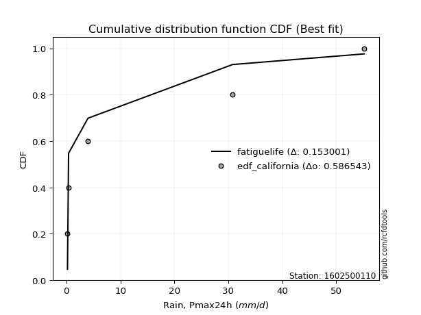</img>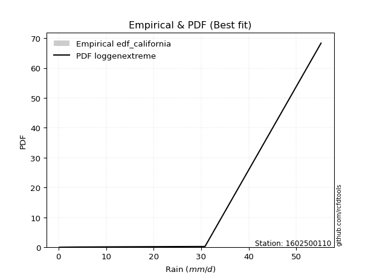</img>

</div>


### 2. EDF Hazen (1930)

Hazen method for plotting positions is a formula used to estimate the empirical cumulative probability distribution of flood events or other hydrological data. This formula often results in biased estimations, particularly when extrapolating to extreme events (high return periods).

<div align="center">


$P=(m-0.5)/n$


</div>


**2.1. Empirical values**

<div align="center">

|                | 0                  | 1                  | 2         | 3                 | 4                  |
|:---------------|:-------------------|:-------------------|:----------|:------------------|:-------------------|
| date           | 2022               | 2021               | 2020      | 2024              | 2019               |
| x              | 0.2                | 0.4                | 4.0       | 30.8              | 55.2               |
| m              | 1                  | 2                  | 3         | 4                 | 5                  |
| empirical_dist | edf_hazen          | edf_hazen          | edf_hazen | edf_hazen         | edf_hazen          |
| empirical      | 0.1                | 0.3                | 0.5       | 0.7               | 0.9                |
| empirical_tr   | 1.1111111111111112 | 1.4285714285714286 | 2.0       | 3.333333333333333 | 10.000000000000002 |

</div>


**2.2. Kolmogorov-Smirnov fit test (sorted by Δ)**


<div align="center">

|                | 0                   | 1                   | 2                  | 3                   | 4                   | 5                  | 6                   | 7                  | 8                     | 9                   | 10                  | 11                  | 12                 | 13                  | 14                  | 15                  | 16                 | 17                  | 18                 | 19                 | 20                  | 21                  | 22                  | 23                  | 24                  | 25                  | 26                  | 27                  | 28                  | 29                 | 30                 | 31                  | 32                 | 33                  | 34                  | 35                  | 36                  | 37                  | 38                  | 39                  | 40                  | 41                  | 42                 | 43                  | 44                 | 45                 | 46                 | 47                  | 48                  | 49                  | 50                  | 51                 | 52                  | 53                  | 54                 | 55                 | 56                  | 57                 | 58                  | 59                  | 60                  | 61                 | 62                 | 63                 | 64                 | 65                 | 66                  | 67                  | 68                  | 69                  | 70                 | 71                 | 72                  | 73                 | 74                 | 75                  | 76                  | 77                  | 78                 | 79                  | 80                 | 81                 | 82                 | 83                 | 84                 | 85                 | 86                 | 87                 |
|:---------------|:--------------------|:--------------------|:-------------------|:--------------------|:--------------------|:-------------------|:--------------------|:-------------------|:----------------------|:--------------------|:--------------------|:--------------------|:-------------------|:--------------------|:--------------------|:--------------------|:-------------------|:--------------------|:-------------------|:-------------------|:--------------------|:--------------------|:--------------------|:--------------------|:--------------------|:--------------------|:--------------------|:--------------------|:--------------------|:-------------------|:-------------------|:--------------------|:-------------------|:--------------------|:--------------------|:--------------------|:--------------------|:--------------------|:--------------------|:--------------------|:--------------------|:--------------------|:-------------------|:--------------------|:-------------------|:-------------------|:-------------------|:--------------------|:--------------------|:--------------------|:--------------------|:-------------------|:--------------------|:--------------------|:-------------------|:-------------------|:--------------------|:-------------------|:--------------------|:--------------------|:--------------------|:-------------------|:-------------------|:-------------------|:-------------------|:-------------------|:--------------------|:--------------------|:--------------------|:--------------------|:-------------------|:-------------------|:--------------------|:-------------------|:-------------------|:--------------------|:--------------------|:--------------------|:-------------------|:--------------------|:-------------------|:-------------------|:-------------------|:-------------------|:-------------------|:-------------------|:-------------------|:-------------------|
| station        | 1602500110          | 1602500110          | 1602500110         | 1602500110          | 1602500110          | 1602500110         | 1602500110          | 1602500110         | 1602500110            | 1602500110          | 1602500110          | 1602500110          | 1602500110         | 1602500110          | 1602500110          | 1602500110          | 1602500110         | 1602500110          | 1602500110         | 1602500110         | 1602500110          | 1602500110          | 1602500110          | 1602500110          | 1602500110          | 1602500110          | 1602500110          | 1602500110          | 1602500110          | 1602500110         | 1602500110         | 1602500110          | 1602500110         | 1602500110          | 1602500110          | 1602500110          | 1602500110          | 1602500110          | 1602500110          | 1602500110          | 1602500110          | 1602500110          | 1602500110         | 1602500110          | 1602500110         | 1602500110         | 1602500110         | 1602500110          | 1602500110          | 1602500110          | 1602500110          | 1602500110         | 1602500110          | 1602500110          | 1602500110         | 1602500110         | 1602500110          | 1602500110         | 1602500110          | 1602500110          | 1602500110          | 1602500110         | 1602500110         | 1602500110         | 1602500110         | 1602500110         | 1602500110          | 1602500110          | 1602500110          | 1602500110          | 1602500110         | 1602500110         | 1602500110          | 1602500110         | 1602500110         | 1602500110          | 1602500110          | 1602500110          | 1602500110         | 1602500110          | 1602500110         | 1602500110         | 1602500110         | 1602500110         | 1602500110         | 1602500110         | 1602500110         | 1602500110         |
| empirical_dist | edf_hazen           | edf_hazen           | edf_hazen          | edf_hazen           | edf_hazen           | edf_hazen          | edf_hazen           | edf_hazen          | edf_hazen             | edf_hazen           | edf_hazen           | edf_hazen           | edf_hazen          | edf_hazen           | edf_hazen           | edf_hazen           | edf_hazen          | edf_hazen           | edf_hazen          | edf_hazen          | edf_hazen           | edf_hazen           | edf_hazen           | edf_hazen           | edf_hazen           | edf_hazen           | edf_hazen           | edf_hazen           | edf_hazen           | edf_hazen          | edf_hazen          | edf_hazen           | edf_hazen          | edf_hazen           | edf_hazen           | edf_hazen           | edf_hazen           | edf_hazen           | edf_hazen           | edf_hazen           | edf_hazen           | edf_hazen           | edf_hazen          | edf_hazen           | edf_hazen          | edf_hazen          | edf_hazen          | edf_hazen           | edf_hazen           | edf_hazen           | edf_hazen           | edf_hazen          | edf_hazen           | edf_hazen           | edf_hazen          | edf_hazen          | edf_hazen           | edf_hazen          | edf_hazen           | edf_hazen           | edf_hazen           | edf_hazen          | edf_hazen          | edf_hazen          | edf_hazen          | edf_hazen          | edf_hazen           | edf_hazen           | edf_hazen           | edf_hazen           | edf_hazen          | edf_hazen          | edf_hazen           | edf_hazen          | edf_hazen          | edf_hazen           | edf_hazen           | edf_hazen           | edf_hazen          | edf_hazen           | edf_hazen          | edf_hazen          | edf_hazen          | edf_hazen          | edf_hazen          | edf_hazen          | edf_hazen          | edf_hazen          |
| p_dist         | nakagami            | fisk                | loginvweibull      | loggenlogistic      | loggenexpon         | ncf                | lograyleigh         | logmaxwell         | loglaplace_asymmetric | loghalfnorm         | loginvgamma         | logerlang           | logloggamma        | loggamma            | loggamma            | lognct              | logt               | logcrystalball      | lognorm            | lognorm            | logexponnorm        | logpearson3         | logkstwobign        | logexpon            | logrice             | loggompertz         | loginvgauss         | loglogistic         | loggumbel_l         | logalpha           | loggumbel_r        | logf                | loghypsecant       | loglaplace          | loghalflogistic     | logmoyal            | halfnorm            | weibull_min         | halflogistic        | logtruncnorm        | rayleigh            | maxwell             | pearson3           | moyal               | gumbel_r           | genlogistic        | norm               | crystalball         | logncf              | fatiguelife         | kstwobign           | mielke             | logweibull_min      | logistic            | gamma              | erlang             | invgauss            | wald               | hypsecant           | gumbel_l            | rice                | chi2               | logwald            | loggibrat          | laplace            | exponnorm          | gompertz            | laplace_asymmetric  | genexpon            | expon               | logchi2            | logfisk            | truncnorm           | logfatiguelife     | gibrat             | alpha               | logbetaprime        | lognakagami         | johnsonsu          | invweibull          | t                  | logmielke          | loglognorm         | betaprime          | nct                | logjohnsonsu       | invgamma           | f                  |
| delta          | 0.10385635915828526 | 0.12352555606955234 | 0.128703621267642  | 0.12906969175241223 | 0.12922188933494438 | 0.1308069814074201 | 0.13086845763715538 | 0.1312258652691748 | 0.13205558628286496   | 0.13221152577169726 | 0.13284716390071727 | 0.13306493888144125 | 0.1331317482282444 | 0.13316755334667418 | 0.13316755334667418 | 0.13351584155249735 | 0.1335564101979208 | 0.13355698382566122 | 0.1335570482304334 | 0.1335570482304334 | 0.13355741626273204 | 0.13371447273859727 | 0.13989200954399006 | 0.14798561620022999 | 0.14814801292218188 | 0.14970435896502532 | 0.15006865078695064 | 0.15274984817380516 | 0.15552041906534753 | 0.1564497879919906 | 0.1568563281496939 | 0.15973917775838964 | 0.1630588997399684 | 0.17287122201184724 | 0.17382514002660035 | 0.17963629144738807 | 0.18404672768620112 | 0.18622375602599106 | 0.19603975350068514 | 0.20481425132765602 | 0.20952600658691878 | 0.21886736596625755 | 0.2196269109187841 | 0.22379255743828108 | 0.2246962846308767 | 0.2349694727277265 | 0.2416771544156125 | 0.24167715586903438 | 0.24249672201669492 | 0.24753746681247552 | 0.25573877155787283 | 0.2564434765669679 | 0.25962206496414947 | 0.26428071925794716 | 0.2650788814327727 | 0.2657089553219528 | 0.26588369703946857 | 0.2793912673090443 | 0.27941304812970524 | 0.28318038028671166 | 0.28357433311994223 | 0.2999329937012156 | 0.2999999484110767 | 0.3                | 0.3001722425363272 | 0.307521385880583  | 0.30797184401696964 | 0.30891910095918895 | 0.30891993186020755 | 0.30892136133278963 | 0.3743992591011709 | 0.3769878400884884 | 0.37881734556050306 | 0.400049643597059  | 0.4189198194979403 | 0.42047571521128624 | 0.43151486640988296 | 0.46419670234405946 | 0.4739057929474649 | 0.48205746939579014 | 0.4997982561290186 | 0.5381041191117368 | 0.5394621851227928 | 0.6360837913454906 | 0.659516947650824  | 0.6713965154392306 | 0.6986261110448686 | 0.7                |
| deltao         | 0.5865427407550001  | 0.5865427407550001  | 0.5865427407550001 | 0.5865427407550001  | 0.5865427407550001  | 0.5865427407550001 | 0.5865427407550001  | 0.5865427407550001 | 0.5865427407550001    | 0.5865427407550001  | 0.5865427407550001  | 0.5865427407550001  | 0.5865427407550001 | 0.5865427407550001  | 0.5865427407550001  | 0.5865427407550001  | 0.5865427407550001 | 0.5865427407550001  | 0.5865427407550001 | 0.5865427407550001 | 0.5865427407550001  | 0.5865427407550001  | 0.5865427407550001  | 0.5865427407550001  | 0.5865427407550001  | 0.5865427407550001  | 0.5865427407550001  | 0.5865427407550001  | 0.5865427407550001  | 0.5865427407550001 | 0.5865427407550001 | 0.5865427407550001  | 0.5865427407550001 | 0.5865427407550001  | 0.5865427407550001  | 0.5865427407550001  | 0.5865427407550001  | 0.5865427407550001  | 0.5865427407550001  | 0.5865427407550001  | 0.5865427407550001  | 0.5865427407550001  | 0.5865427407550001 | 0.5865427407550001  | 0.5865427407550001 | 0.5865427407550001 | 0.5865427407550001 | 0.5865427407550001  | 0.5865427407550001  | 0.5865427407550001  | 0.5865427407550001  | 0.5865427407550001 | 0.5865427407550001  | 0.5865427407550001  | 0.5865427407550001 | 0.5865427407550001 | 0.5865427407550001  | 0.5865427407550001 | 0.5865427407550001  | 0.5865427407550001  | 0.5865427407550001  | 0.5865427407550001 | 0.5865427407550001 | 0.5865427407550001 | 0.5865427407550001 | 0.5865427407550001 | 0.5865427407550001  | 0.5865427407550001  | 0.5865427407550001  | 0.5865427407550001  | 0.5865427407550001 | 0.5865427407550001 | 0.5865427407550001  | 0.5865427407550001 | 0.5865427407550001 | 0.5865427407550001  | 0.5865427407550001  | 0.5865427407550001  | 0.5865427407550001 | 0.5865427407550001  | 0.5865427407550001 | 0.5865427407550001 | 0.5865427407550001 | 0.5865427407550001 | 0.5865427407550001 | 0.5865427407550001 | 0.5865427407550001 | 0.5865427407550001 |
| eval           | Δo > Δ              | Δo > Δ              | Δo > Δ             | Δo > Δ              | Δo > Δ              | Δo > Δ             | Δo > Δ              | Δo > Δ             | Δo > Δ                | Δo > Δ              | Δo > Δ              | Δo > Δ              | Δo > Δ             | Δo > Δ              | Δo > Δ              | Δo > Δ              | Δo > Δ             | Δo > Δ              | Δo > Δ             | Δo > Δ             | Δo > Δ              | Δo > Δ              | Δo > Δ              | Δo > Δ              | Δo > Δ              | Δo > Δ              | Δo > Δ              | Δo > Δ              | Δo > Δ              | Δo > Δ             | Δo > Δ             | Δo > Δ              | Δo > Δ             | Δo > Δ              | Δo > Δ              | Δo > Δ              | Δo > Δ              | Δo > Δ              | Δo > Δ              | Δo > Δ              | Δo > Δ              | Δo > Δ              | Δo > Δ             | Δo > Δ              | Δo > Δ             | Δo > Δ             | Δo > Δ             | Δo > Δ              | Δo > Δ              | Δo > Δ              | Δo > Δ              | Δo > Δ             | Δo > Δ              | Δo > Δ              | Δo > Δ             | Δo > Δ             | Δo > Δ              | Δo > Δ             | Δo > Δ              | Δo > Δ              | Δo > Δ              | Δo > Δ             | Δo > Δ             | Δo > Δ             | Δo > Δ             | Δo > Δ             | Δo > Δ              | Δo > Δ              | Δo > Δ              | Δo > Δ              | Δo > Δ             | Δo > Δ             | Δo > Δ              | Δo > Δ             | Δo > Δ             | Δo > Δ              | Δo > Δ              | Δo > Δ              | Δo > Δ             | Δo > Δ              | Δo > Δ             | Δo > Δ             | Δo > Δ             | Δo <= Δ            | Δo <= Δ            | Δo <= Δ            | Δo <= Δ            | Δo <= Δ            |
| fit            | 1                   | 1                   | 1                  | 1                   | 1                   | 1                  | 1                   | 1                  | 1                     | 1                   | 1                   | 1                   | 1                  | 1                   | 1                   | 1                   | 1                  | 1                   | 1                  | 1                  | 1                   | 1                   | 1                   | 1                   | 1                   | 1                   | 1                   | 1                   | 1                   | 1                  | 1                  | 1                   | 1                  | 1                   | 1                   | 1                   | 1                   | 1                   | 1                   | 1                   | 1                   | 1                   | 1                  | 1                   | 1                  | 1                  | 1                  | 1                   | 1                   | 1                   | 1                   | 1                  | 1                   | 1                   | 1                  | 1                  | 1                   | 1                  | 1                   | 1                   | 1                   | 1                  | 1                  | 1                  | 1                  | 1                  | 1                   | 1                   | 1                   | 1                   | 1                  | 1                  | 1                   | 1                  | 1                  | 1                   | 1                   | 1                   | 1                  | 1                   | 1                  | 1                  | 1                  | 0                  | 0                  | 0                  | 0                  | 0                  |
| n              | 5                   | 5                   | 5                  | 5                   | 5                   | 5                  | 5                   | 5                  | 5                     | 5                   | 5                   | 5                   | 5                  | 5                   | 5                   | 5                   | 5                  | 5                   | 5                  | 5                  | 5                   | 5                   | 5                   | 5                   | 5                   | 5                   | 5                   | 5                   | 5                   | 5                  | 5                  | 5                   | 5                  | 5                   | 5                   | 5                   | 5                   | 5                   | 5                   | 5                   | 5                   | 5                   | 5                  | 5                   | 5                  | 5                  | 5                  | 5                   | 5                   | 5                   | 5                   | 5                  | 5                   | 5                   | 5                  | 5                  | 5                   | 5                  | 5                   | 5                   | 5                   | 5                  | 5                  | 5                  | 5                  | 5                  | 5                   | 5                   | 5                   | 5                   | 5                  | 5                  | 5                   | 5                  | 5                  | 5                   | 5                   | 5                   | 5                  | 5                   | 5                  | 5                  | 5                  | 5                  | 5                  | 5                  | 5                  | 5                  |
| best_fit       | 1                   | 0                   | 0                  | 0                   | 0                   | 0                  | 0                   | 0                  | 0                     | 0                   | 0                   | 0                   | 0                  | 0                   | 0                   | 0                   | 0                  | 0                   | 0                  | 0                  | 0                   | 0                   | 0                   | 0                   | 0                   | 0                   | 0                   | 0                   | 0                   | 0                  | 0                  | 0                   | 0                  | 0                   | 0                   | 0                   | 0                   | 0                   | 0                   | 0                   | 0                   | 0                   | 0                  | 0                   | 0                  | 0                  | 0                  | 0                   | 0                   | 0                   | 0                   | 0                  | 0                   | 0                   | 0                  | 0                  | 0                   | 0                  | 0                   | 0                   | 0                   | 0                  | 0                  | 0                  | 0                  | 0                  | 0                   | 0                   | 0                   | 0                   | 0                  | 0                  | 0                   | 0                  | 0                  | 0                   | 0                   | 0                   | 0                  | 0                   | 0                  | 0                  | 0                  | 0                  | 0                  | 0                  | 0                  | 0                  |
| best_fit_sort  | 1                   | 2                   | 3                  | 4                   | 5                   | 6                  | 7                   | 8                  | 9                     | 10                  | 11                  | 12                  | 13                 | 14                  | 15                  | 16                  | 17                 | 18                  | 19                 | 20                 | 21                  | 22                  | 23                  | 24                  | 25                  | 26                  | 27                  | 28                  | 29                  | 30                 | 31                 | 32                  | 33                 | 34                  | 35                  | 36                  | 37                  | 38                  | 39                  | 40                  | 41                  | 42                  | 43                 | 44                  | 45                 | 46                 | 47                 | 48                  | 49                  | 50                  | 51                  | 52                 | 53                  | 54                  | 55                 | 56                 | 57                  | 58                 | 59                  | 60                  | 61                  | 62                 | 63                 | 64                 | 65                 | 66                 | 67                  | 68                  | 69                  | 70                  | 71                 | 72                 | 73                  | 74                 | 75                 | 76                  | 77                  | 78                  | 79                 | 80                  | 81                 | 82                 | 83                 | 84                 | 85                 | 86                 | 87                 | 88                 |

</div>


**2.3. Best fit**

<div align="center">

|   id |    station | empirical_dist   | p_dist   |    delta |   deltao | eval   |   fit |   n |   best_fit |   best_fit_sort |
|-----:|-----------:|:-----------------|:---------|---------:|---------:|:-------|------:|----:|-----------:|----------------:|
|    0 | 1602500110 | edf_hazen        | nakagami | 0.103856 | 0.586543 | Δo > Δ |     1 |   5 |          1 |               1 |

</div>


<div align="center">

</img>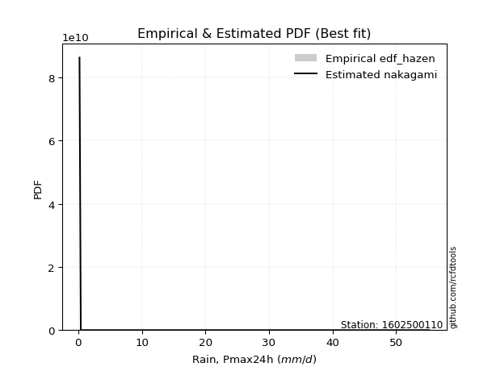</img>

</div>


### 3. EDF Weibull (1939)

Weibull plotting position formula is an empirical method used to estimate the non-exceedance probability or plotting position for a set of observed data, is often recommended or widely used in practice, particularly in flood frequency analysis.

<div align="center">


$P=m/(n+1)$


</div>


**3.1. Empirical values**

<div align="center">

|                | 0                   | 1                  | 2           | 3                  | 4                  |
|:---------------|:--------------------|:-------------------|:------------|:-------------------|:-------------------|
| date           | 2022                | 2021               | 2020        | 2024               | 2019               |
| x              | 0.2                 | 0.4                | 4.0         | 30.8               | 55.2               |
| m              | 1                   | 2                  | 3           | 4                  | 5                  |
| empirical_dist | edf_weibull         | edf_weibull        | edf_weibull | edf_weibull        | edf_weibull        |
| empirical      | 0.16666666666666666 | 0.3333333333333333 | 0.5         | 0.6666666666666666 | 0.8333333333333334 |
| empirical_tr   | 1.2                 | 1.4999999999999998 | 2.0         | 2.9999999999999996 | 6.000000000000002  |

</div>


**3.2. Kolmogorov-Smirnov fit test (sorted by Δ)**


<div align="center">

|                | 0                  | 1                   | 2                   | 3                  | 4                  | 5                  | 6                   | 7                     | 8                   | 9                  | 10                  | 11                 | 12                 | 13                  | 14                  | 15                  | 16                  | 17                  | 18                 | 19                  | 20                  | 21                  | 22                  | 23                  | 24                  | 25                  | 26                 | 27                  | 28                  | 29                 | 30                  | 31                  | 32                  | 33                  | 34                  | 35                  | 36                  | 37                  | 38                  | 39                  | 40                 | 41                  | 42                 | 43                 | 44                  | 45                 | 46                  | 47                 | 48                  | 49                 | 50                  | 51                  | 52                  | 53                  | 54                  | 55                  | 56                 | 57                  | 58                  | 59                 | 60                  | 61                 | 62                  | 63                 | 64                  | 65                  | 66                 | 67                  | 68                  | 69                 | 70                 | 71                 | 72                 | 73                  | 74                  | 75                 | 76                 | 77                  | 78                  | 79                  | 80                 | 81                 | 82                 | 83                 | 84                 | 85                 | 86                 | 87                 |
|:---------------|:-------------------|:--------------------|:--------------------|:-------------------|:-------------------|:-------------------|:--------------------|:----------------------|:--------------------|:-------------------|:--------------------|:-------------------|:-------------------|:--------------------|:--------------------|:--------------------|:--------------------|:--------------------|:-------------------|:--------------------|:--------------------|:--------------------|:--------------------|:--------------------|:--------------------|:--------------------|:-------------------|:--------------------|:--------------------|:-------------------|:--------------------|:--------------------|:--------------------|:--------------------|:--------------------|:--------------------|:--------------------|:--------------------|:--------------------|:--------------------|:-------------------|:--------------------|:-------------------|:-------------------|:--------------------|:-------------------|:--------------------|:-------------------|:--------------------|:-------------------|:--------------------|:--------------------|:--------------------|:--------------------|:--------------------|:--------------------|:-------------------|:--------------------|:--------------------|:-------------------|:--------------------|:-------------------|:--------------------|:-------------------|:--------------------|:--------------------|:-------------------|:--------------------|:--------------------|:-------------------|:-------------------|:-------------------|:-------------------|:--------------------|:--------------------|:-------------------|:-------------------|:--------------------|:--------------------|:--------------------|:-------------------|:-------------------|:-------------------|:-------------------|:-------------------|:-------------------|:-------------------|:-------------------|
| station        | 1602500110         | 1602500110          | 1602500110          | 1602500110         | 1602500110         | 1602500110         | 1602500110          | 1602500110            | 1602500110          | 1602500110         | 1602500110          | 1602500110         | 1602500110         | 1602500110          | 1602500110          | 1602500110          | 1602500110          | 1602500110          | 1602500110         | 1602500110          | 1602500110          | 1602500110          | 1602500110          | 1602500110          | 1602500110          | 1602500110          | 1602500110         | 1602500110          | 1602500110          | 1602500110         | 1602500110          | 1602500110          | 1602500110          | 1602500110          | 1602500110          | 1602500110          | 1602500110          | 1602500110          | 1602500110          | 1602500110          | 1602500110         | 1602500110          | 1602500110         | 1602500110         | 1602500110          | 1602500110         | 1602500110          | 1602500110         | 1602500110          | 1602500110         | 1602500110          | 1602500110          | 1602500110          | 1602500110          | 1602500110          | 1602500110          | 1602500110         | 1602500110          | 1602500110          | 1602500110         | 1602500110          | 1602500110         | 1602500110          | 1602500110         | 1602500110          | 1602500110          | 1602500110         | 1602500110          | 1602500110          | 1602500110         | 1602500110         | 1602500110         | 1602500110         | 1602500110          | 1602500110          | 1602500110         | 1602500110         | 1602500110          | 1602500110          | 1602500110          | 1602500110         | 1602500110         | 1602500110         | 1602500110         | 1602500110         | 1602500110         | 1602500110         | 1602500110         |
| empirical_dist | edf_weibull        | edf_weibull         | edf_weibull         | edf_weibull        | edf_weibull        | edf_weibull        | edf_weibull         | edf_weibull           | edf_weibull         | edf_weibull        | edf_weibull         | edf_weibull        | edf_weibull        | edf_weibull         | edf_weibull         | edf_weibull         | edf_weibull         | edf_weibull         | edf_weibull        | edf_weibull         | edf_weibull         | edf_weibull         | edf_weibull         | edf_weibull         | edf_weibull         | edf_weibull         | edf_weibull        | edf_weibull         | edf_weibull         | edf_weibull        | edf_weibull         | edf_weibull         | edf_weibull         | edf_weibull         | edf_weibull         | edf_weibull         | edf_weibull         | edf_weibull         | edf_weibull         | edf_weibull         | edf_weibull        | edf_weibull         | edf_weibull        | edf_weibull        | edf_weibull         | edf_weibull        | edf_weibull         | edf_weibull        | edf_weibull         | edf_weibull        | edf_weibull         | edf_weibull         | edf_weibull         | edf_weibull         | edf_weibull         | edf_weibull         | edf_weibull        | edf_weibull         | edf_weibull         | edf_weibull        | edf_weibull         | edf_weibull        | edf_weibull         | edf_weibull        | edf_weibull         | edf_weibull         | edf_weibull        | edf_weibull         | edf_weibull         | edf_weibull        | edf_weibull        | edf_weibull        | edf_weibull        | edf_weibull         | edf_weibull         | edf_weibull        | edf_weibull        | edf_weibull         | edf_weibull         | edf_weibull         | edf_weibull        | edf_weibull        | edf_weibull        | edf_weibull        | edf_weibull        | edf_weibull        | edf_weibull        | edf_weibull        |
| p_dist         | logalpha           | loginvweibull       | loggenlogistic      | loginvgauss        | ncf                | lograyleigh        | logmaxwell          | loglaplace_asymmetric | loghalfnorm         | loginvgamma        | logerlang           | loggamma           | loggamma           | logloggamma         | nakagami            | weibull_min         | fisk                | logf                | loggenexpon        | logexpon            | lognct              | logt                | logcrystalball      | lognorm             | lognorm             | logexponnorm        | logpearson3        | logkstwobign        | logncf              | logrice            | loggompertz         | halfnorm            | loglogistic         | loggumbel_l         | loggumbel_r         | halflogistic        | loghypsecant        | loglaplace          | loghalflogistic     | rayleigh            | logmoyal           | maxwell             | pearson3           | mielke             | moyal               | gumbel_r           | logweibull_min      | genlogistic        | logtruncnorm        | norm               | crystalball         | kstwobign           | fatiguelife         | logistic            | invgauss            | hypsecant           | wald               | gumbel_l            | rice                | gamma              | erlang              | laplace            | logfisk             | exponnorm          | gompertz            | laplace_asymmetric  | genexpon           | expon               | chi2                | logwald            | loggibrat          | logfatiguelife     | logchi2            | truncnorm           | logbetaprime        | invweibull         | gibrat             | alpha               | lognakagami         | johnsonsu           | t                  | logmielke          | loglognorm         | betaprime          | nct                | logjohnsonsu       | invgamma           | f                  |
| delta          | 0.1564497879919906 | 0.16203695460097534 | 0.16240302508574556 | 0.1625414647203961 | 0.1641403147407534 | 0.1642017909704887 | 0.16455919860250812 | 0.16538891961619828   | 0.16554485910503058 | 0.1661804972340506 | 0.16639827221477457 | 0.1665008866800075 | 0.1665008866800075 | 0.16660034340182484 | 0.16665793427910308 | 0.16666076624851295 | 0.16666666569143293 | 0.16666666636020466 | 0.1666666665965365 | 0.16666666666666666 | 0.16684917488583068 | 0.16688974353125413 | 0.16689031715899455 | 0.16689038156376673 | 0.16689038156376673 | 0.16689074959606537 | 0.1670478060719306 | 0.17322534287732338 | 0.17583005535002827 | 0.1814813462555152 | 0.18303769229835865 | 0.18404672768620112 | 0.18608318150713848 | 0.18885375239868085 | 0.19018966148302724 | 0.19603975350068514 | 0.19639223307330173 | 0.20620455534518056 | 0.20715847335993368 | 0.20952600658691878 | 0.2129696247807214 | 0.21886736596625755 | 0.2196269109187841 | 0.2231101432336346 | 0.22379255743828108 | 0.2246962846308767 | 0.22628873163081614 | 0.2349694727277265 | 0.23814758466098934 | 0.2416771544156125 | 0.24167715586903438 | 0.25573877155787283 | 0.26355346669911917 | 0.26428071925794716 | 0.26588369703946857 | 0.27941304812970524 | 0.2816534451139431 | 0.28318038028671166 | 0.28357433311994223 | 0.298412214766106  | 0.29904228865528615 | 0.3001722425363272 | 0.31032117342182175 | 0.321272802511445  | 0.32217354113686664 | 0.32223452132175195 | 0.3222345767558317 | 0.32223466876504536 | 0.33326632703454895 | 0.33333328174441   | 0.3333333333333333 | 0.3667163102637257 | 0.3743992591011709 | 0.37881734556050306 | 0.39818153307654963 | 0.4153908027291235 | 0.4189198194979403 | 0.42047571521128624 | 0.43086336901072614 | 0.44057245961413155 | 0.4997982561290186 | 0.5047707857784036 | 0.5061288517894595 | 0.6027504580121574 | 0.6261836143174906 | 0.6380631821058973 | 0.6652927777115352 | 0.6666666666666667 |
| deltao         | 0.5865427407550001 | 0.5865427407550001  | 0.5865427407550001  | 0.5865427407550001 | 0.5865427407550001 | 0.5865427407550001 | 0.5865427407550001  | 0.5865427407550001    | 0.5865427407550001  | 0.5865427407550001 | 0.5865427407550001  | 0.5865427407550001 | 0.5865427407550001 | 0.5865427407550001  | 0.5865427407550001  | 0.5865427407550001  | 0.5865427407550001  | 0.5865427407550001  | 0.5865427407550001 | 0.5865427407550001  | 0.5865427407550001  | 0.5865427407550001  | 0.5865427407550001  | 0.5865427407550001  | 0.5865427407550001  | 0.5865427407550001  | 0.5865427407550001 | 0.5865427407550001  | 0.5865427407550001  | 0.5865427407550001 | 0.5865427407550001  | 0.5865427407550001  | 0.5865427407550001  | 0.5865427407550001  | 0.5865427407550001  | 0.5865427407550001  | 0.5865427407550001  | 0.5865427407550001  | 0.5865427407550001  | 0.5865427407550001  | 0.5865427407550001 | 0.5865427407550001  | 0.5865427407550001 | 0.5865427407550001 | 0.5865427407550001  | 0.5865427407550001 | 0.5865427407550001  | 0.5865427407550001 | 0.5865427407550001  | 0.5865427407550001 | 0.5865427407550001  | 0.5865427407550001  | 0.5865427407550001  | 0.5865427407550001  | 0.5865427407550001  | 0.5865427407550001  | 0.5865427407550001 | 0.5865427407550001  | 0.5865427407550001  | 0.5865427407550001 | 0.5865427407550001  | 0.5865427407550001 | 0.5865427407550001  | 0.5865427407550001 | 0.5865427407550001  | 0.5865427407550001  | 0.5865427407550001 | 0.5865427407550001  | 0.5865427407550001  | 0.5865427407550001 | 0.5865427407550001 | 0.5865427407550001 | 0.5865427407550001 | 0.5865427407550001  | 0.5865427407550001  | 0.5865427407550001 | 0.5865427407550001 | 0.5865427407550001  | 0.5865427407550001  | 0.5865427407550001  | 0.5865427407550001 | 0.5865427407550001 | 0.5865427407550001 | 0.5865427407550001 | 0.5865427407550001 | 0.5865427407550001 | 0.5865427407550001 | 0.5865427407550001 |
| eval           | Δo > Δ             | Δo > Δ              | Δo > Δ              | Δo > Δ             | Δo > Δ             | Δo > Δ             | Δo > Δ              | Δo > Δ                | Δo > Δ              | Δo > Δ             | Δo > Δ              | Δo > Δ             | Δo > Δ             | Δo > Δ              | Δo > Δ              | Δo > Δ              | Δo > Δ              | Δo > Δ              | Δo > Δ             | Δo > Δ              | Δo > Δ              | Δo > Δ              | Δo > Δ              | Δo > Δ              | Δo > Δ              | Δo > Δ              | Δo > Δ             | Δo > Δ              | Δo > Δ              | Δo > Δ             | Δo > Δ              | Δo > Δ              | Δo > Δ              | Δo > Δ              | Δo > Δ              | Δo > Δ              | Δo > Δ              | Δo > Δ              | Δo > Δ              | Δo > Δ              | Δo > Δ             | Δo > Δ              | Δo > Δ             | Δo > Δ             | Δo > Δ              | Δo > Δ             | Δo > Δ              | Δo > Δ             | Δo > Δ              | Δo > Δ             | Δo > Δ              | Δo > Δ              | Δo > Δ              | Δo > Δ              | Δo > Δ              | Δo > Δ              | Δo > Δ             | Δo > Δ              | Δo > Δ              | Δo > Δ             | Δo > Δ              | Δo > Δ             | Δo > Δ              | Δo > Δ             | Δo > Δ              | Δo > Δ              | Δo > Δ             | Δo > Δ              | Δo > Δ              | Δo > Δ             | Δo > Δ             | Δo > Δ             | Δo > Δ             | Δo > Δ              | Δo > Δ              | Δo > Δ             | Δo > Δ             | Δo > Δ              | Δo > Δ              | Δo > Δ              | Δo > Δ             | Δo > Δ             | Δo > Δ             | Δo <= Δ            | Δo <= Δ            | Δo <= Δ            | Δo <= Δ            | Δo <= Δ            |
| fit            | 1                  | 1                   | 1                   | 1                  | 1                  | 1                  | 1                   | 1                     | 1                   | 1                  | 1                   | 1                  | 1                  | 1                   | 1                   | 1                   | 1                   | 1                   | 1                  | 1                   | 1                   | 1                   | 1                   | 1                   | 1                   | 1                   | 1                  | 1                   | 1                   | 1                  | 1                   | 1                   | 1                   | 1                   | 1                   | 1                   | 1                   | 1                   | 1                   | 1                   | 1                  | 1                   | 1                  | 1                  | 1                   | 1                  | 1                   | 1                  | 1                   | 1                  | 1                   | 1                   | 1                   | 1                   | 1                   | 1                   | 1                  | 1                   | 1                   | 1                  | 1                   | 1                  | 1                   | 1                  | 1                   | 1                   | 1                  | 1                   | 1                   | 1                  | 1                  | 1                  | 1                  | 1                   | 1                   | 1                  | 1                  | 1                   | 1                   | 1                   | 1                  | 1                  | 1                  | 0                  | 0                  | 0                  | 0                  | 0                  |
| n              | 5                  | 5                   | 5                   | 5                  | 5                  | 5                  | 5                   | 5                     | 5                   | 5                  | 5                   | 5                  | 5                  | 5                   | 5                   | 5                   | 5                   | 5                   | 5                  | 5                   | 5                   | 5                   | 5                   | 5                   | 5                   | 5                   | 5                  | 5                   | 5                   | 5                  | 5                   | 5                   | 5                   | 5                   | 5                   | 5                   | 5                   | 5                   | 5                   | 5                   | 5                  | 5                   | 5                  | 5                  | 5                   | 5                  | 5                   | 5                  | 5                   | 5                  | 5                   | 5                   | 5                   | 5                   | 5                   | 5                   | 5                  | 5                   | 5                   | 5                  | 5                   | 5                  | 5                   | 5                  | 5                   | 5                   | 5                  | 5                   | 5                   | 5                  | 5                  | 5                  | 5                  | 5                   | 5                   | 5                  | 5                  | 5                   | 5                   | 5                   | 5                  | 5                  | 5                  | 5                  | 5                  | 5                  | 5                  | 5                  |
| best_fit       | 1                  | 0                   | 0                   | 0                  | 0                  | 0                  | 0                   | 0                     | 0                   | 0                  | 0                   | 0                  | 0                  | 0                   | 0                   | 0                   | 0                   | 0                   | 0                  | 0                   | 0                   | 0                   | 0                   | 0                   | 0                   | 0                   | 0                  | 0                   | 0                   | 0                  | 0                   | 0                   | 0                   | 0                   | 0                   | 0                   | 0                   | 0                   | 0                   | 0                   | 0                  | 0                   | 0                  | 0                  | 0                   | 0                  | 0                   | 0                  | 0                   | 0                  | 0                   | 0                   | 0                   | 0                   | 0                   | 0                   | 0                  | 0                   | 0                   | 0                  | 0                   | 0                  | 0                   | 0                  | 0                   | 0                   | 0                  | 0                   | 0                   | 0                  | 0                  | 0                  | 0                  | 0                   | 0                   | 0                  | 0                  | 0                   | 0                   | 0                   | 0                  | 0                  | 0                  | 0                  | 0                  | 0                  | 0                  | 0                  |
| best_fit_sort  | 1                  | 2                   | 3                   | 4                  | 5                  | 6                  | 7                   | 8                     | 9                   | 10                 | 11                  | 12                 | 13                 | 14                  | 15                  | 16                  | 17                  | 18                  | 19                 | 20                  | 21                  | 22                  | 23                  | 24                  | 25                  | 26                  | 27                 | 28                  | 29                  | 30                 | 31                  | 32                  | 33                  | 34                  | 35                  | 36                  | 37                  | 38                  | 39                  | 40                  | 41                 | 42                  | 43                 | 44                 | 45                  | 46                 | 47                  | 48                 | 49                  | 50                 | 51                  | 52                  | 53                  | 54                  | 55                  | 56                  | 57                 | 58                  | 59                  | 60                 | 61                  | 62                 | 63                  | 64                 | 65                  | 66                  | 67                 | 68                  | 69                  | 70                 | 71                 | 72                 | 73                 | 74                  | 75                  | 76                 | 77                 | 78                  | 79                  | 80                  | 81                 | 82                 | 83                 | 84                 | 85                 | 86                 | 87                 | 88                 |

</div>


**3.3. Best fit**

<div align="center">

|   id |    station | empirical_dist   | p_dist   |   delta |   deltao | eval   |   fit |   n |   best_fit |   best_fit_sort |
|-----:|-----------:|:-----------------|:---------|--------:|---------:|:-------|------:|----:|-----------:|----------------:|
|    0 | 1602500110 | edf_weibull      | logalpha | 0.15645 | 0.586543 | Δo > Δ |     1 |   5 |          1 |               1 |

</div>


<div align="center">

</img>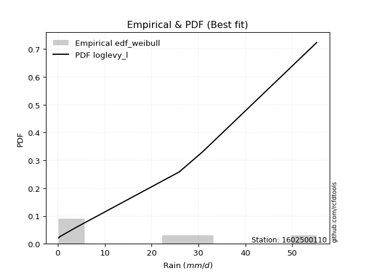</img>

</div>


### 4. EDF Beard (1943)

The Beard formula (or Beard´s plotting position formula) in hydrology is used to estimate the empirical non-exceedance probability _(P)_ of a flood event (or other extreme hydrological data point) within a given dataset.

<div align="center">


$P=(m-0.31)/(n+0.38)$


</div>


**4.1. Empirical values**

<div align="center">

|                | 0                   | 1                  | 2         | 3                  | 4                  |
|:---------------|:--------------------|:-------------------|:----------|:-------------------|:-------------------|
| date           | 2022                | 2021               | 2020      | 2024               | 2019               |
| x              | 0.2                 | 0.4                | 4.0       | 30.8               | 55.2               |
| m              | 1                   | 2                  | 3         | 4                  | 5                  |
| empirical_dist | edf_beard           | edf_beard          | edf_beard | edf_beard          | edf_beard          |
| empirical      | 0.12825278810408922 | 0.3141263940520446 | 0.5       | 0.6858736059479554 | 0.8717472118959109 |
| empirical_tr   | 1.1471215351812367  | 1.4579945799457996 | 2.0       | 3.183431952662722  | 7.797101449275368  |

</div>


**4.2. Kolmogorov-Smirnov fit test (sorted by Δ)**


<div align="center">

|                | 0                   | 1                   | 2                   | 3                   | 4                  | 5                  | 6                  | 7                  | 8                     | 9                   | 10                 | 11                  | 12                  | 13                  | 14                  | 15                  | 16                  | 17                  | 18                  | 19                  | 20                  | 21                 | 22                  | 23                  | 24                  | 25                  | 26                 | 27                 | 28                  | 29                  | 30                 | 31                  | 32                  | 33                  | 34                  | 35                  | 36                  | 37                 | 38                  | 39                  | 40                  | 41                  | 42                  | 43                 | 44                  | 45                 | 46                 | 47                 | 48                  | 49                 | 50                  | 51                  | 52                  | 53                  | 54                  | 55                 | 56                 | 57                  | 58                  | 59                  | 60                  | 61                 | 62                 | 63                  | 64                  | 65                  | 66                  | 67                  | 68                 | 69                 | 70                  | 71                 | 72                  | 73                 | 74                 | 75                 | 76                  | 77                  | 78                 | 79                  | 80                 | 81                 | 82                 | 83                 | 84                 | 85                 | 86                 | 87                 |
|:---------------|:--------------------|:--------------------|:--------------------|:--------------------|:-------------------|:-------------------|:-------------------|:-------------------|:----------------------|:--------------------|:-------------------|:--------------------|:--------------------|:--------------------|:--------------------|:--------------------|:--------------------|:--------------------|:--------------------|:--------------------|:--------------------|:-------------------|:--------------------|:--------------------|:--------------------|:--------------------|:-------------------|:-------------------|:--------------------|:--------------------|:-------------------|:--------------------|:--------------------|:--------------------|:--------------------|:--------------------|:--------------------|:-------------------|:--------------------|:--------------------|:--------------------|:--------------------|:--------------------|:-------------------|:--------------------|:-------------------|:-------------------|:-------------------|:--------------------|:-------------------|:--------------------|:--------------------|:--------------------|:--------------------|:--------------------|:-------------------|:-------------------|:--------------------|:--------------------|:--------------------|:--------------------|:-------------------|:-------------------|:--------------------|:--------------------|:--------------------|:--------------------|:--------------------|:-------------------|:-------------------|:--------------------|:-------------------|:--------------------|:-------------------|:-------------------|:-------------------|:--------------------|:--------------------|:-------------------|:--------------------|:-------------------|:-------------------|:-------------------|:-------------------|:-------------------|:-------------------|:-------------------|:-------------------|
| station        | 1602500110          | 1602500110          | 1602500110          | 1602500110          | 1602500110         | 1602500110         | 1602500110         | 1602500110         | 1602500110            | 1602500110          | 1602500110         | 1602500110          | 1602500110          | 1602500110          | 1602500110          | 1602500110          | 1602500110          | 1602500110          | 1602500110          | 1602500110          | 1602500110          | 1602500110         | 1602500110          | 1602500110          | 1602500110          | 1602500110          | 1602500110         | 1602500110         | 1602500110          | 1602500110          | 1602500110         | 1602500110          | 1602500110          | 1602500110          | 1602500110          | 1602500110          | 1602500110          | 1602500110         | 1602500110          | 1602500110          | 1602500110          | 1602500110          | 1602500110          | 1602500110         | 1602500110          | 1602500110         | 1602500110         | 1602500110         | 1602500110          | 1602500110         | 1602500110          | 1602500110          | 1602500110          | 1602500110          | 1602500110          | 1602500110         | 1602500110         | 1602500110          | 1602500110          | 1602500110          | 1602500110          | 1602500110         | 1602500110         | 1602500110          | 1602500110          | 1602500110          | 1602500110          | 1602500110          | 1602500110         | 1602500110         | 1602500110          | 1602500110         | 1602500110          | 1602500110         | 1602500110         | 1602500110         | 1602500110          | 1602500110          | 1602500110         | 1602500110          | 1602500110         | 1602500110         | 1602500110         | 1602500110         | 1602500110         | 1602500110         | 1602500110         | 1602500110         |
| empirical_dist | edf_beard           | edf_beard           | edf_beard           | edf_beard           | edf_beard          | edf_beard          | edf_beard          | edf_beard          | edf_beard             | edf_beard           | edf_beard          | edf_beard           | edf_beard           | edf_beard           | edf_beard           | edf_beard           | edf_beard           | edf_beard           | edf_beard           | edf_beard           | edf_beard           | edf_beard          | edf_beard           | edf_beard           | edf_beard           | edf_beard           | edf_beard          | edf_beard          | edf_beard           | edf_beard           | edf_beard          | edf_beard           | edf_beard           | edf_beard           | edf_beard           | edf_beard           | edf_beard           | edf_beard          | edf_beard           | edf_beard           | edf_beard           | edf_beard           | edf_beard           | edf_beard          | edf_beard           | edf_beard          | edf_beard          | edf_beard          | edf_beard           | edf_beard          | edf_beard           | edf_beard           | edf_beard           | edf_beard           | edf_beard           | edf_beard          | edf_beard          | edf_beard           | edf_beard           | edf_beard           | edf_beard           | edf_beard          | edf_beard          | edf_beard           | edf_beard           | edf_beard           | edf_beard           | edf_beard           | edf_beard          | edf_beard          | edf_beard           | edf_beard          | edf_beard           | edf_beard          | edf_beard          | edf_beard          | edf_beard           | edf_beard           | edf_beard          | edf_beard           | edf_beard          | edf_beard          | edf_beard          | edf_beard          | edf_beard          | edf_beard          | edf_beard          | edf_beard          |
| p_dist         | nakagami            | fisk                | loginvweibull       | loggenlogistic      | loggenexpon        | ncf                | lograyleigh        | logmaxwell         | loglaplace_asymmetric | loghalfnorm         | loginvgamma        | logerlang           | logloggamma         | loggamma            | loggamma            | lognct              | logt                | logcrystalball      | lognorm             | lognorm             | logexponnorm        | logpearson3        | logexpon            | loginvgauss         | logkstwobign        | logf                | logalpha           | weibull_min        | logrice             | loggompertz         | loglogistic        | loggumbel_l         | loggumbel_r         | loghypsecant        | halfnorm            | loglaplace          | loghalflogistic     | logmoyal           | halflogistic        | rayleigh            | logncf              | maxwell             | logtruncnorm        | pearson3           | moyal               | gumbel_r           | genlogistic        | norm               | crystalball         | mielke             | fatiguelife         | logweibull_min      | kstwobign           | logistic            | invgauss            | gamma              | wald               | hypsecant           | erlang              | gumbel_l            | rice                | laplace            | exponnorm          | gompertz            | laplace_asymmetric  | genexpon            | expon               | chi2                | logwald            | loggibrat          | logfisk             | logchi2            | truncnorm           | logfatiguelife     | logbetaprime       | gibrat             | alpha               | lognakagami         | invweibull         | johnsonsu           | t                  | logmielke          | loglognorm         | betaprime          | nct                | logjohnsonsu       | invgamma           | f                  |
| delta          | 0.12824405571652564 | 0.13765195012159698 | 0.14283001531968653 | 0.14319608580445675 | 0.1433482833869889 | 0.1449333754594646 | 0.1449948516891999 | 0.1453522593212193 | 0.14618198033490948   | 0.14633791982374178 | 0.1469735579527618 | 0.14719133293348588 | 0.14725814228028902 | 0.14729394739871882 | 0.14729394739871882 | 0.14764223560454198 | 0.14768280424996544 | 0.14768337787770586 | 0.14768344228247804 | 0.14768344228247804 | 0.14768381031477668 | 0.1478408667906419 | 0.14798561620022999 | 0.15006865078695064 | 0.15401840359603458 | 0.15535528327948345 | 0.1564497879919906 | 0.1579709679219019 | 0.16227440697422651 | 0.16383075301706995 | 0.1668762422258498 | 0.16964681311739205 | 0.17098272220173855 | 0.17718529379201303 | 0.18404672768620112 | 0.18699761606389187 | 0.18795153407864498 | 0.1937626854994327 | 0.19603975350068514 | 0.20952600658691878 | 0.21424393391260577 | 0.21886736596625755 | 0.21894064537970065 | 0.2196269109187841 | 0.22379255743828108 | 0.2246962846308767 | 0.2349694727277265 | 0.2416771544156125 | 0.24167715586903438 | 0.2423170825149233 | 0.24434652741783036 | 0.24549567091210484 | 0.25573877155787283 | 0.26428071925794716 | 0.26588369703946857 | 0.2792052754848172 | 0.2793912673090443 | 0.27941304812970524 | 0.27983534937399734 | 0.28318038028671166 | 0.28357433311994223 | 0.3001722425363272 | 0.307521385880583  | 0.30797184401696964 | 0.30891910095918895 | 0.30891993186020755 | 0.30892136133278963 | 0.31405938775326014 | 0.3141263424631213 | 0.3141263940520446 | 0.34873505198439925 | 0.3743992591011709 | 0.37881734556050306 | 0.3859232495450144 | 0.4173884723578383 | 0.4189198194979403 | 0.42047571521128624 | 0.45007030829201483 | 0.453804681291701  | 0.45977939889542024 | 0.4997982561290186 | 0.5239777250596922 | 0.5253357910707481 | 0.621957397293446  | 0.6453905535987794 | 0.6572701213871861 | 0.684499716992824  | 0.6858736059479553 |
| deltao         | 0.5865427407550001  | 0.5865427407550001  | 0.5865427407550001  | 0.5865427407550001  | 0.5865427407550001 | 0.5865427407550001 | 0.5865427407550001 | 0.5865427407550001 | 0.5865427407550001    | 0.5865427407550001  | 0.5865427407550001 | 0.5865427407550001  | 0.5865427407550001  | 0.5865427407550001  | 0.5865427407550001  | 0.5865427407550001  | 0.5865427407550001  | 0.5865427407550001  | 0.5865427407550001  | 0.5865427407550001  | 0.5865427407550001  | 0.5865427407550001 | 0.5865427407550001  | 0.5865427407550001  | 0.5865427407550001  | 0.5865427407550001  | 0.5865427407550001 | 0.5865427407550001 | 0.5865427407550001  | 0.5865427407550001  | 0.5865427407550001 | 0.5865427407550001  | 0.5865427407550001  | 0.5865427407550001  | 0.5865427407550001  | 0.5865427407550001  | 0.5865427407550001  | 0.5865427407550001 | 0.5865427407550001  | 0.5865427407550001  | 0.5865427407550001  | 0.5865427407550001  | 0.5865427407550001  | 0.5865427407550001 | 0.5865427407550001  | 0.5865427407550001 | 0.5865427407550001 | 0.5865427407550001 | 0.5865427407550001  | 0.5865427407550001 | 0.5865427407550001  | 0.5865427407550001  | 0.5865427407550001  | 0.5865427407550001  | 0.5865427407550001  | 0.5865427407550001 | 0.5865427407550001 | 0.5865427407550001  | 0.5865427407550001  | 0.5865427407550001  | 0.5865427407550001  | 0.5865427407550001 | 0.5865427407550001 | 0.5865427407550001  | 0.5865427407550001  | 0.5865427407550001  | 0.5865427407550001  | 0.5865427407550001  | 0.5865427407550001 | 0.5865427407550001 | 0.5865427407550001  | 0.5865427407550001 | 0.5865427407550001  | 0.5865427407550001 | 0.5865427407550001 | 0.5865427407550001 | 0.5865427407550001  | 0.5865427407550001  | 0.5865427407550001 | 0.5865427407550001  | 0.5865427407550001 | 0.5865427407550001 | 0.5865427407550001 | 0.5865427407550001 | 0.5865427407550001 | 0.5865427407550001 | 0.5865427407550001 | 0.5865427407550001 |
| eval           | Δo > Δ              | Δo > Δ              | Δo > Δ              | Δo > Δ              | Δo > Δ             | Δo > Δ             | Δo > Δ             | Δo > Δ             | Δo > Δ                | Δo > Δ              | Δo > Δ             | Δo > Δ              | Δo > Δ              | Δo > Δ              | Δo > Δ              | Δo > Δ              | Δo > Δ              | Δo > Δ              | Δo > Δ              | Δo > Δ              | Δo > Δ              | Δo > Δ             | Δo > Δ              | Δo > Δ              | Δo > Δ              | Δo > Δ              | Δo > Δ             | Δo > Δ             | Δo > Δ              | Δo > Δ              | Δo > Δ             | Δo > Δ              | Δo > Δ              | Δo > Δ              | Δo > Δ              | Δo > Δ              | Δo > Δ              | Δo > Δ             | Δo > Δ              | Δo > Δ              | Δo > Δ              | Δo > Δ              | Δo > Δ              | Δo > Δ             | Δo > Δ              | Δo > Δ             | Δo > Δ             | Δo > Δ             | Δo > Δ              | Δo > Δ             | Δo > Δ              | Δo > Δ              | Δo > Δ              | Δo > Δ              | Δo > Δ              | Δo > Δ             | Δo > Δ             | Δo > Δ              | Δo > Δ              | Δo > Δ              | Δo > Δ              | Δo > Δ             | Δo > Δ             | Δo > Δ              | Δo > Δ              | Δo > Δ              | Δo > Δ              | Δo > Δ              | Δo > Δ             | Δo > Δ             | Δo > Δ              | Δo > Δ             | Δo > Δ              | Δo > Δ             | Δo > Δ             | Δo > Δ             | Δo > Δ              | Δo > Δ              | Δo > Δ             | Δo > Δ              | Δo > Δ             | Δo > Δ             | Δo > Δ             | Δo <= Δ            | Δo <= Δ            | Δo <= Δ            | Δo <= Δ            | Δo <= Δ            |
| fit            | 1                   | 1                   | 1                   | 1                   | 1                  | 1                  | 1                  | 1                  | 1                     | 1                   | 1                  | 1                   | 1                   | 1                   | 1                   | 1                   | 1                   | 1                   | 1                   | 1                   | 1                   | 1                  | 1                   | 1                   | 1                   | 1                   | 1                  | 1                  | 1                   | 1                   | 1                  | 1                   | 1                   | 1                   | 1                   | 1                   | 1                   | 1                  | 1                   | 1                   | 1                   | 1                   | 1                   | 1                  | 1                   | 1                  | 1                  | 1                  | 1                   | 1                  | 1                   | 1                   | 1                   | 1                   | 1                   | 1                  | 1                  | 1                   | 1                   | 1                   | 1                   | 1                  | 1                  | 1                   | 1                   | 1                   | 1                   | 1                   | 1                  | 1                  | 1                   | 1                  | 1                   | 1                  | 1                  | 1                  | 1                   | 1                   | 1                  | 1                   | 1                  | 1                  | 1                  | 0                  | 0                  | 0                  | 0                  | 0                  |
| n              | 5                   | 5                   | 5                   | 5                   | 5                  | 5                  | 5                  | 5                  | 5                     | 5                   | 5                  | 5                   | 5                   | 5                   | 5                   | 5                   | 5                   | 5                   | 5                   | 5                   | 5                   | 5                  | 5                   | 5                   | 5                   | 5                   | 5                  | 5                  | 5                   | 5                   | 5                  | 5                   | 5                   | 5                   | 5                   | 5                   | 5                   | 5                  | 5                   | 5                   | 5                   | 5                   | 5                   | 5                  | 5                   | 5                  | 5                  | 5                  | 5                   | 5                  | 5                   | 5                   | 5                   | 5                   | 5                   | 5                  | 5                  | 5                   | 5                   | 5                   | 5                   | 5                  | 5                  | 5                   | 5                   | 5                   | 5                   | 5                   | 5                  | 5                  | 5                   | 5                  | 5                   | 5                  | 5                  | 5                  | 5                   | 5                   | 5                  | 5                   | 5                  | 5                  | 5                  | 5                  | 5                  | 5                  | 5                  | 5                  |
| best_fit       | 1                   | 0                   | 0                   | 0                   | 0                  | 0                  | 0                  | 0                  | 0                     | 0                   | 0                  | 0                   | 0                   | 0                   | 0                   | 0                   | 0                   | 0                   | 0                   | 0                   | 0                   | 0                  | 0                   | 0                   | 0                   | 0                   | 0                  | 0                  | 0                   | 0                   | 0                  | 0                   | 0                   | 0                   | 0                   | 0                   | 0                   | 0                  | 0                   | 0                   | 0                   | 0                   | 0                   | 0                  | 0                   | 0                  | 0                  | 0                  | 0                   | 0                  | 0                   | 0                   | 0                   | 0                   | 0                   | 0                  | 0                  | 0                   | 0                   | 0                   | 0                   | 0                  | 0                  | 0                   | 0                   | 0                   | 0                   | 0                   | 0                  | 0                  | 0                   | 0                  | 0                   | 0                  | 0                  | 0                  | 0                   | 0                   | 0                  | 0                   | 0                  | 0                  | 0                  | 0                  | 0                  | 0                  | 0                  | 0                  |
| best_fit_sort  | 1                   | 2                   | 3                   | 4                   | 5                  | 6                  | 7                  | 8                  | 9                     | 10                  | 11                 | 12                  | 13                  | 14                  | 15                  | 16                  | 17                  | 18                  | 19                  | 20                  | 21                  | 22                 | 23                  | 24                  | 25                  | 26                  | 27                 | 28                 | 29                  | 30                  | 31                 | 32                  | 33                  | 34                  | 35                  | 36                  | 37                  | 38                 | 39                  | 40                  | 41                  | 42                  | 43                  | 44                 | 45                  | 46                 | 47                 | 48                 | 49                  | 50                 | 51                  | 52                  | 53                  | 54                  | 55                  | 56                 | 57                 | 58                  | 59                  | 60                  | 61                  | 62                 | 63                 | 64                  | 65                  | 66                  | 67                  | 68                  | 69                 | 70                 | 71                  | 72                 | 73                  | 74                 | 75                 | 76                 | 77                  | 78                  | 79                 | 80                  | 81                 | 82                 | 83                 | 84                 | 85                 | 86                 | 87                 | 88                 |

</div>


**4.3. Best fit**

<div align="center">

|   id |    station | empirical_dist   | p_dist   |    delta |   deltao | eval   |   fit |   n |   best_fit |   best_fit_sort |
|-----:|-----------:|:-----------------|:---------|---------:|---------:|:-------|------:|----:|-----------:|----------------:|
|    0 | 1602500110 | edf_beard        | nakagami | 0.128244 | 0.586543 | Δo > Δ |     1 |   5 |          1 |               1 |

</div>


<div align="center">

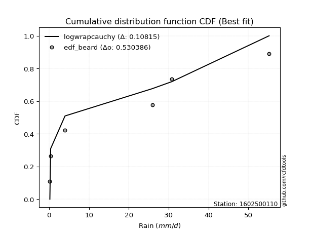</img>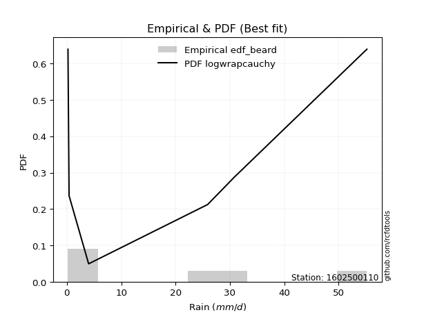</img>

</div>


### 5. EDF Chegodayev (1955)

The Chegodayev formula is an empirical plotting position formula used in hydrological frequency analysis to estimate the exceedance probability or return period of a specific event from a set of observed data. It is primarily used for plotting observed data points on probability paper to fit a theoretical distribution, particularly for analyzing extreme events like maximum flood flows or rainfall intensities. The constant _b_ value in the generalized plotting position formula is 0.3.

<div align="center">


$P=(m-b)/(n+1-2b)$


</div>


**5.1. Empirical values**

<div align="center">

|                | 0                   | 1                   | 2              | 3                  | 4                  |
|:---------------|:--------------------|:--------------------|:---------------|:-------------------|:-------------------|
| date           | 2022                | 2021                | 2020           | 2024               | 2019               |
| x              | 0.2                 | 0.4                 | 4.0            | 30.8               | 55.2               |
| m              | 1                   | 2                   | 3              | 4                  | 5                  |
| empirical_dist | edf_chegodayev      | edf_chegodayev      | edf_chegodayev | edf_chegodayev     | edf_chegodayev     |
| empirical      | 0.12962962962962962 | 0.31481481481481477 | 0.5            | 0.6851851851851851 | 0.8703703703703703 |
| empirical_tr   | 1.148936170212766   | 1.4594594594594594  | 2.0            | 3.1764705882352935 | 7.714285714285713  |

</div>


**5.2. Kolmogorov-Smirnov fit test (sorted by Δ)**


<div align="center">

|                | 0                   | 1                   | 2                   | 3                   | 4                   | 5                   | 6                  | 7                   | 8                     | 9                  | 10                 | 11                  | 12                  | 13                  | 14                  | 15                  | 16                  | 17                  | 18                 | 19                 | 20                 | 21                  | 22                  | 23                  | 24                 | 25                  | 26                 | 27                 | 28                  | 29                 | 30                  | 31                  | 32                 | 33                  | 34                  | 35                  | 36                  | 37                  | 38                  | 39                  | 40                  | 41                  | 42                 | 43                 | 44                  | 45                 | 46                 | 47                  | 48                 | 49                  | 50                 | 51                  | 52                  | 53                  | 54                  | 55                 | 56                  | 57                  | 58                  | 59                  | 60                  | 61                 | 62                 | 63                  | 64                  | 65                  | 66                  | 67                  | 68                  | 69                  | 70                  | 71                 | 72                  | 73                  | 74                 | 75                 | 76                  | 77                 | 78                  | 79                 | 80                 | 81                 | 82                 | 83                 | 84                 | 85                 | 86                 | 87                 |
|:---------------|:--------------------|:--------------------|:--------------------|:--------------------|:--------------------|:--------------------|:-------------------|:--------------------|:----------------------|:-------------------|:-------------------|:--------------------|:--------------------|:--------------------|:--------------------|:--------------------|:--------------------|:--------------------|:-------------------|:-------------------|:-------------------|:--------------------|:--------------------|:--------------------|:-------------------|:--------------------|:-------------------|:-------------------|:--------------------|:-------------------|:--------------------|:--------------------|:-------------------|:--------------------|:--------------------|:--------------------|:--------------------|:--------------------|:--------------------|:--------------------|:--------------------|:--------------------|:-------------------|:-------------------|:--------------------|:-------------------|:-------------------|:--------------------|:-------------------|:--------------------|:-------------------|:--------------------|:--------------------|:--------------------|:--------------------|:-------------------|:--------------------|:--------------------|:--------------------|:--------------------|:--------------------|:-------------------|:-------------------|:--------------------|:--------------------|:--------------------|:--------------------|:--------------------|:--------------------|:--------------------|:--------------------|:-------------------|:--------------------|:--------------------|:-------------------|:-------------------|:--------------------|:-------------------|:--------------------|:-------------------|:-------------------|:-------------------|:-------------------|:-------------------|:-------------------|:-------------------|:-------------------|:-------------------|
| station        | 1602500110          | 1602500110          | 1602500110          | 1602500110          | 1602500110          | 1602500110          | 1602500110         | 1602500110          | 1602500110            | 1602500110         | 1602500110         | 1602500110          | 1602500110          | 1602500110          | 1602500110          | 1602500110          | 1602500110          | 1602500110          | 1602500110         | 1602500110         | 1602500110         | 1602500110          | 1602500110          | 1602500110          | 1602500110         | 1602500110          | 1602500110         | 1602500110         | 1602500110          | 1602500110         | 1602500110          | 1602500110          | 1602500110         | 1602500110          | 1602500110          | 1602500110          | 1602500110          | 1602500110          | 1602500110          | 1602500110          | 1602500110          | 1602500110          | 1602500110         | 1602500110         | 1602500110          | 1602500110         | 1602500110         | 1602500110          | 1602500110         | 1602500110          | 1602500110         | 1602500110          | 1602500110          | 1602500110          | 1602500110          | 1602500110         | 1602500110          | 1602500110          | 1602500110          | 1602500110          | 1602500110          | 1602500110         | 1602500110         | 1602500110          | 1602500110          | 1602500110          | 1602500110          | 1602500110          | 1602500110          | 1602500110          | 1602500110          | 1602500110         | 1602500110          | 1602500110          | 1602500110         | 1602500110         | 1602500110          | 1602500110         | 1602500110          | 1602500110         | 1602500110         | 1602500110         | 1602500110         | 1602500110         | 1602500110         | 1602500110         | 1602500110         | 1602500110         |
| empirical_dist | edf_chegodayev      | edf_chegodayev      | edf_chegodayev      | edf_chegodayev      | edf_chegodayev      | edf_chegodayev      | edf_chegodayev     | edf_chegodayev      | edf_chegodayev        | edf_chegodayev     | edf_chegodayev     | edf_chegodayev      | edf_chegodayev      | edf_chegodayev      | edf_chegodayev      | edf_chegodayev      | edf_chegodayev      | edf_chegodayev      | edf_chegodayev     | edf_chegodayev     | edf_chegodayev     | edf_chegodayev      | edf_chegodayev      | edf_chegodayev      | edf_chegodayev     | edf_chegodayev      | edf_chegodayev     | edf_chegodayev     | edf_chegodayev      | edf_chegodayev     | edf_chegodayev      | edf_chegodayev      | edf_chegodayev     | edf_chegodayev      | edf_chegodayev      | edf_chegodayev      | edf_chegodayev      | edf_chegodayev      | edf_chegodayev      | edf_chegodayev      | edf_chegodayev      | edf_chegodayev      | edf_chegodayev     | edf_chegodayev     | edf_chegodayev      | edf_chegodayev     | edf_chegodayev     | edf_chegodayev      | edf_chegodayev     | edf_chegodayev      | edf_chegodayev     | edf_chegodayev      | edf_chegodayev      | edf_chegodayev      | edf_chegodayev      | edf_chegodayev     | edf_chegodayev      | edf_chegodayev      | edf_chegodayev      | edf_chegodayev      | edf_chegodayev      | edf_chegodayev     | edf_chegodayev     | edf_chegodayev      | edf_chegodayev      | edf_chegodayev      | edf_chegodayev      | edf_chegodayev      | edf_chegodayev      | edf_chegodayev      | edf_chegodayev      | edf_chegodayev     | edf_chegodayev      | edf_chegodayev      | edf_chegodayev     | edf_chegodayev     | edf_chegodayev      | edf_chegodayev     | edf_chegodayev      | edf_chegodayev     | edf_chegodayev     | edf_chegodayev     | edf_chegodayev     | edf_chegodayev     | edf_chegodayev     | edf_chegodayev     | edf_chegodayev     | edf_chegodayev     |
| p_dist         | nakagami            | fisk                | loginvweibull       | loggenlogistic      | loggenexpon         | ncf                 | lograyleigh        | logmaxwell          | loglaplace_asymmetric | loghalfnorm        | loginvgamma        | logerlang           | logloggamma         | loggamma            | loggamma            | logexpon            | lognct              | logt                | logcrystalball     | lognorm            | lognorm            | logexponnorm        | logpearson3         | loginvgauss         | logkstwobign       | logf                | logalpha           | weibull_min        | logrice             | loggompertz        | loglogistic         | loggumbel_l         | loggumbel_r        | loghypsecant        | halfnorm            | loglaplace          | loghalflogistic     | logmoyal            | halflogistic        | rayleigh            | logncf              | maxwell             | pearson3           | logtruncnorm       | moyal               | gumbel_r           | genlogistic        | mielke              | norm               | crystalball         | logweibull_min     | fatiguelife         | kstwobign           | logistic            | invgauss            | wald               | hypsecant           | gamma               | erlang              | gumbel_l            | rice                | laplace            | exponnorm          | gompertz            | laplace_asymmetric  | genexpon            | expon               | chi2                | logwald             | loggibrat           | logfisk             | logchi2            | truncnorm           | logfatiguelife      | logbetaprime       | gibrat             | alpha               | lognakagami        | invweibull          | johnsonsu          | t                  | logmielke          | loglognorm         | betaprime          | nct                | logjohnsonsu       | invgamma           | f                  |
| delta          | 0.12962089724206605 | 0.13834037088436713 | 0.14351843608245685 | 0.14388450656722707 | 0.14403670414975922 | 0.14562179622223492 | 0.1456832724519702 | 0.14604068008398963 | 0.1468704010976798    | 0.1470263405865121 | 0.1476619787155321 | 0.14787975369625603 | 0.14794656304305917 | 0.14798236816148896 | 0.14798236816148896 | 0.14798561620022999 | 0.14833065636731213 | 0.14837122501273559 | 0.148371798640476  | 0.1483718630452482 | 0.1483718630452482 | 0.14837223107754682 | 0.14852928755341205 | 0.15006865078695064 | 0.1547068243588049 | 0.15535528327948345 | 0.1564497879919906 | 0.1565941263963614 | 0.16296282773699666 | 0.1645191737798401 | 0.16756466298861994 | 0.17033523388016236 | 0.1716711429645087 | 0.17787371455478318 | 0.18404672768620112 | 0.18768603682666202 | 0.18863995484141513 | 0.19445110626220286 | 0.19603975350068514 | 0.20952600658691878 | 0.21286709238706525 | 0.21886736596625755 | 0.2196269109187841 | 0.2196290661424708 | 0.22379255743828108 | 0.2246962846308767 | 0.2349694727277265 | 0.24162866175215314 | 0.2416771544156125 | 0.24167715586903438 | 0.2448072501493347 | 0.24503494818060068 | 0.25573877155787283 | 0.26428071925794716 | 0.26588369703946857 | 0.2793912673090443 | 0.27941304812970524 | 0.27989369624758753 | 0.28052377013676766 | 0.28318038028671166 | 0.28357433311994223 | 0.3001722425363272 | 0.307521385880583  | 0.30797184401696964 | 0.30891910095918895 | 0.30891993186020755 | 0.30892136133278963 | 0.31474780851603046 | 0.31481476322589147 | 0.31481481481481477 | 0.34735821045885873 | 0.3743992591011709 | 0.37881734556050306 | 0.38523482878224424 | 0.4167000515950682 | 0.4189198194979403 | 0.42047571521128624 | 0.4493818875292447 | 0.45242783976616047 | 0.4590909781326501 | 0.4997982561290186 | 0.5232893042969221 | 0.524647370307978  | 0.6212689765306759 | 0.6447021328360092 | 0.6565817006244158 | 0.6838112962300538 | 0.6851851851851852 |
| deltao         | 0.5865427407550001  | 0.5865427407550001  | 0.5865427407550001  | 0.5865427407550001  | 0.5865427407550001  | 0.5865427407550001  | 0.5865427407550001 | 0.5865427407550001  | 0.5865427407550001    | 0.5865427407550001 | 0.5865427407550001 | 0.5865427407550001  | 0.5865427407550001  | 0.5865427407550001  | 0.5865427407550001  | 0.5865427407550001  | 0.5865427407550001  | 0.5865427407550001  | 0.5865427407550001 | 0.5865427407550001 | 0.5865427407550001 | 0.5865427407550001  | 0.5865427407550001  | 0.5865427407550001  | 0.5865427407550001 | 0.5865427407550001  | 0.5865427407550001 | 0.5865427407550001 | 0.5865427407550001  | 0.5865427407550001 | 0.5865427407550001  | 0.5865427407550001  | 0.5865427407550001 | 0.5865427407550001  | 0.5865427407550001  | 0.5865427407550001  | 0.5865427407550001  | 0.5865427407550001  | 0.5865427407550001  | 0.5865427407550001  | 0.5865427407550001  | 0.5865427407550001  | 0.5865427407550001 | 0.5865427407550001 | 0.5865427407550001  | 0.5865427407550001 | 0.5865427407550001 | 0.5865427407550001  | 0.5865427407550001 | 0.5865427407550001  | 0.5865427407550001 | 0.5865427407550001  | 0.5865427407550001  | 0.5865427407550001  | 0.5865427407550001  | 0.5865427407550001 | 0.5865427407550001  | 0.5865427407550001  | 0.5865427407550001  | 0.5865427407550001  | 0.5865427407550001  | 0.5865427407550001 | 0.5865427407550001 | 0.5865427407550001  | 0.5865427407550001  | 0.5865427407550001  | 0.5865427407550001  | 0.5865427407550001  | 0.5865427407550001  | 0.5865427407550001  | 0.5865427407550001  | 0.5865427407550001 | 0.5865427407550001  | 0.5865427407550001  | 0.5865427407550001 | 0.5865427407550001 | 0.5865427407550001  | 0.5865427407550001 | 0.5865427407550001  | 0.5865427407550001 | 0.5865427407550001 | 0.5865427407550001 | 0.5865427407550001 | 0.5865427407550001 | 0.5865427407550001 | 0.5865427407550001 | 0.5865427407550001 | 0.5865427407550001 |
| eval           | Δo > Δ              | Δo > Δ              | Δo > Δ              | Δo > Δ              | Δo > Δ              | Δo > Δ              | Δo > Δ             | Δo > Δ              | Δo > Δ                | Δo > Δ             | Δo > Δ             | Δo > Δ              | Δo > Δ              | Δo > Δ              | Δo > Δ              | Δo > Δ              | Δo > Δ              | Δo > Δ              | Δo > Δ             | Δo > Δ             | Δo > Δ             | Δo > Δ              | Δo > Δ              | Δo > Δ              | Δo > Δ             | Δo > Δ              | Δo > Δ             | Δo > Δ             | Δo > Δ              | Δo > Δ             | Δo > Δ              | Δo > Δ              | Δo > Δ             | Δo > Δ              | Δo > Δ              | Δo > Δ              | Δo > Δ              | Δo > Δ              | Δo > Δ              | Δo > Δ              | Δo > Δ              | Δo > Δ              | Δo > Δ             | Δo > Δ             | Δo > Δ              | Δo > Δ             | Δo > Δ             | Δo > Δ              | Δo > Δ             | Δo > Δ              | Δo > Δ             | Δo > Δ              | Δo > Δ              | Δo > Δ              | Δo > Δ              | Δo > Δ             | Δo > Δ              | Δo > Δ              | Δo > Δ              | Δo > Δ              | Δo > Δ              | Δo > Δ             | Δo > Δ             | Δo > Δ              | Δo > Δ              | Δo > Δ              | Δo > Δ              | Δo > Δ              | Δo > Δ              | Δo > Δ              | Δo > Δ              | Δo > Δ             | Δo > Δ              | Δo > Δ              | Δo > Δ             | Δo > Δ             | Δo > Δ              | Δo > Δ             | Δo > Δ              | Δo > Δ             | Δo > Δ             | Δo > Δ             | Δo > Δ             | Δo <= Δ            | Δo <= Δ            | Δo <= Δ            | Δo <= Δ            | Δo <= Δ            |
| fit            | 1                   | 1                   | 1                   | 1                   | 1                   | 1                   | 1                  | 1                   | 1                     | 1                  | 1                  | 1                   | 1                   | 1                   | 1                   | 1                   | 1                   | 1                   | 1                  | 1                  | 1                  | 1                   | 1                   | 1                   | 1                  | 1                   | 1                  | 1                  | 1                   | 1                  | 1                   | 1                   | 1                  | 1                   | 1                   | 1                   | 1                   | 1                   | 1                   | 1                   | 1                   | 1                   | 1                  | 1                  | 1                   | 1                  | 1                  | 1                   | 1                  | 1                   | 1                  | 1                   | 1                   | 1                   | 1                   | 1                  | 1                   | 1                   | 1                   | 1                   | 1                   | 1                  | 1                  | 1                   | 1                   | 1                   | 1                   | 1                   | 1                   | 1                   | 1                   | 1                  | 1                   | 1                   | 1                  | 1                  | 1                   | 1                  | 1                   | 1                  | 1                  | 1                  | 1                  | 0                  | 0                  | 0                  | 0                  | 0                  |
| n              | 5                   | 5                   | 5                   | 5                   | 5                   | 5                   | 5                  | 5                   | 5                     | 5                  | 5                  | 5                   | 5                   | 5                   | 5                   | 5                   | 5                   | 5                   | 5                  | 5                  | 5                  | 5                   | 5                   | 5                   | 5                  | 5                   | 5                  | 5                  | 5                   | 5                  | 5                   | 5                   | 5                  | 5                   | 5                   | 5                   | 5                   | 5                   | 5                   | 5                   | 5                   | 5                   | 5                  | 5                  | 5                   | 5                  | 5                  | 5                   | 5                  | 5                   | 5                  | 5                   | 5                   | 5                   | 5                   | 5                  | 5                   | 5                   | 5                   | 5                   | 5                   | 5                  | 5                  | 5                   | 5                   | 5                   | 5                   | 5                   | 5                   | 5                   | 5                   | 5                  | 5                   | 5                   | 5                  | 5                  | 5                   | 5                  | 5                   | 5                  | 5                  | 5                  | 5                  | 5                  | 5                  | 5                  | 5                  | 5                  |
| best_fit       | 1                   | 0                   | 0                   | 0                   | 0                   | 0                   | 0                  | 0                   | 0                     | 0                  | 0                  | 0                   | 0                   | 0                   | 0                   | 0                   | 0                   | 0                   | 0                  | 0                  | 0                  | 0                   | 0                   | 0                   | 0                  | 0                   | 0                  | 0                  | 0                   | 0                  | 0                   | 0                   | 0                  | 0                   | 0                   | 0                   | 0                   | 0                   | 0                   | 0                   | 0                   | 0                   | 0                  | 0                  | 0                   | 0                  | 0                  | 0                   | 0                  | 0                   | 0                  | 0                   | 0                   | 0                   | 0                   | 0                  | 0                   | 0                   | 0                   | 0                   | 0                   | 0                  | 0                  | 0                   | 0                   | 0                   | 0                   | 0                   | 0                   | 0                   | 0                   | 0                  | 0                   | 0                   | 0                  | 0                  | 0                   | 0                  | 0                   | 0                  | 0                  | 0                  | 0                  | 0                  | 0                  | 0                  | 0                  | 0                  |
| best_fit_sort  | 1                   | 2                   | 3                   | 4                   | 5                   | 6                   | 7                  | 8                   | 9                     | 10                 | 11                 | 12                  | 13                  | 14                  | 15                  | 16                  | 17                  | 18                  | 19                 | 20                 | 21                 | 22                  | 23                  | 24                  | 25                 | 26                  | 27                 | 28                 | 29                  | 30                 | 31                  | 32                  | 33                 | 34                  | 35                  | 36                  | 37                  | 38                  | 39                  | 40                  | 41                  | 42                  | 43                 | 44                 | 45                  | 46                 | 47                 | 48                  | 49                 | 50                  | 51                 | 52                  | 53                  | 54                  | 55                  | 56                 | 57                  | 58                  | 59                  | 60                  | 61                  | 62                 | 63                 | 64                  | 65                  | 66                  | 67                  | 68                  | 69                  | 70                  | 71                  | 72                 | 73                  | 74                  | 75                 | 76                 | 77                  | 78                 | 79                  | 80                 | 81                 | 82                 | 83                 | 84                 | 85                 | 86                 | 87                 | 88                 |

</div>


**5.3. Best fit**

<div align="center">

|   id |    station | empirical_dist   | p_dist   |    delta |   deltao | eval   |   fit |   n |   best_fit |   best_fit_sort |
|-----:|-----------:|:-----------------|:---------|---------:|---------:|:-------|------:|----:|-----------:|----------------:|
|    0 | 1602500110 | edf_chegodayev   | nakagami | 0.129621 | 0.586543 | Δo > Δ |     1 |   5 |          1 |               1 |

</div>


<div align="center">

</img>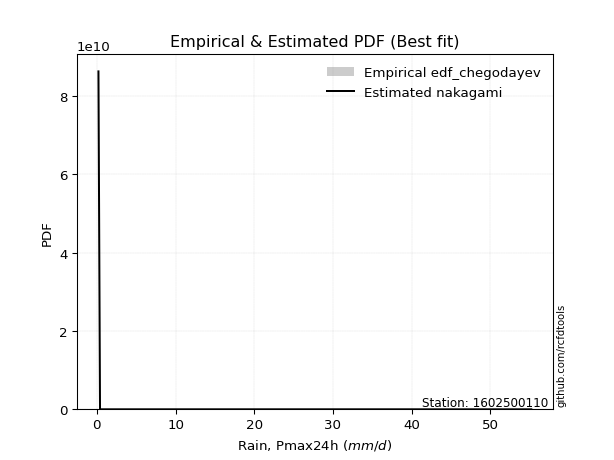</img>

</div>


### 6. EDF Blom (1958)

The Blom formula is a specific "plotting position" formula used in hydrology and statistical analysis to estimate the empirical cumulative probability (or non-exceedance probability) of a data series. It is particularly recommended for data that are approximately normally distributed. The constant _a_ is set to 0.375 (or 3/8).

<div align="center">


$P=(m-a)/(n+1-2a)$


</div>


**6.1. Empirical values**

<div align="center">

|                | 0                   | 1                   | 2        | 3                  | 4                  |
|:---------------|:--------------------|:--------------------|:---------|:-------------------|:-------------------|
| date           | 2022                | 2021                | 2020     | 2024               | 2019               |
| x              | 0.2                 | 0.4                 | 4.0      | 30.8               | 55.2               |
| m              | 1                   | 2                   | 3        | 4                  | 5                  |
| empirical_dist | edf_blom            | edf_blom            | edf_blom | edf_blom           | edf_blom           |
| empirical      | 0.11904761904761904 | 0.30952380952380953 | 0.5      | 0.6904761904761905 | 0.8809523809523809 |
| empirical_tr   | 1.135135135135135   | 1.4482758620689655  | 2.0      | 3.230769230769231  | 8.399999999999999  |

</div>


**6.2. Kolmogorov-Smirnov fit test (sorted by Δ)**


<div align="center">

|                | 0                   | 1                  | 2                  | 3                   | 4                   | 5                   | 6                   | 7                   | 8                     | 9                   | 10                  | 11                 | 12                  | 13                  | 14                  | 15                 | 16                  | 17                  | 18                  | 19                  | 20                 | 21                 | 22                  | 23                  | 24                  | 25                  | 26                 | 27                  | 28                  | 29                 | 30                  | 31                  | 32                  | 33                  | 34                  | 35                 | 36                  | 37                  | 38                  | 39                  | 40                  | 41                  | 42                 | 43                  | 44                  | 45                 | 46                 | 47                  | 48                 | 49                  | 50                  | 51                 | 52                  | 53                  | 54                  | 55                 | 56                 | 57                 | 58                  | 59                  | 60                  | 61                 | 62                 | 63                  | 64                  | 65                  | 66                  | 67                 | 68                  | 69                  | 70                 | 71                 | 72                  | 73                 | 74                 | 75                  | 76                 | 77                 | 78                  | 79                  | 80                 | 81                 | 82                 | 83                 | 84                 | 85                 | 86                 | 87                 |
|:---------------|:--------------------|:-------------------|:-------------------|:--------------------|:--------------------|:--------------------|:--------------------|:--------------------|:----------------------|:--------------------|:--------------------|:-------------------|:--------------------|:--------------------|:--------------------|:-------------------|:--------------------|:--------------------|:--------------------|:--------------------|:-------------------|:-------------------|:--------------------|:--------------------|:--------------------|:--------------------|:-------------------|:--------------------|:--------------------|:-------------------|:--------------------|:--------------------|:--------------------|:--------------------|:--------------------|:-------------------|:--------------------|:--------------------|:--------------------|:--------------------|:--------------------|:--------------------|:-------------------|:--------------------|:--------------------|:-------------------|:-------------------|:--------------------|:-------------------|:--------------------|:--------------------|:-------------------|:--------------------|:--------------------|:--------------------|:-------------------|:-------------------|:-------------------|:--------------------|:--------------------|:--------------------|:-------------------|:-------------------|:--------------------|:--------------------|:--------------------|:--------------------|:-------------------|:--------------------|:--------------------|:-------------------|:-------------------|:--------------------|:-------------------|:-------------------|:--------------------|:-------------------|:-------------------|:--------------------|:--------------------|:-------------------|:-------------------|:-------------------|:-------------------|:-------------------|:-------------------|:-------------------|:-------------------|
| station        | 1602500110          | 1602500110         | 1602500110         | 1602500110          | 1602500110          | 1602500110          | 1602500110          | 1602500110          | 1602500110            | 1602500110          | 1602500110          | 1602500110         | 1602500110          | 1602500110          | 1602500110          | 1602500110         | 1602500110          | 1602500110          | 1602500110          | 1602500110          | 1602500110         | 1602500110         | 1602500110          | 1602500110          | 1602500110          | 1602500110          | 1602500110         | 1602500110          | 1602500110          | 1602500110         | 1602500110          | 1602500110          | 1602500110          | 1602500110          | 1602500110          | 1602500110         | 1602500110          | 1602500110          | 1602500110          | 1602500110          | 1602500110          | 1602500110          | 1602500110         | 1602500110          | 1602500110          | 1602500110         | 1602500110         | 1602500110          | 1602500110         | 1602500110          | 1602500110          | 1602500110         | 1602500110          | 1602500110          | 1602500110          | 1602500110         | 1602500110         | 1602500110         | 1602500110          | 1602500110          | 1602500110          | 1602500110         | 1602500110         | 1602500110          | 1602500110          | 1602500110          | 1602500110          | 1602500110         | 1602500110          | 1602500110          | 1602500110         | 1602500110         | 1602500110          | 1602500110         | 1602500110         | 1602500110          | 1602500110         | 1602500110         | 1602500110          | 1602500110          | 1602500110         | 1602500110         | 1602500110         | 1602500110         | 1602500110         | 1602500110         | 1602500110         | 1602500110         |
| empirical_dist | edf_blom            | edf_blom           | edf_blom           | edf_blom            | edf_blom            | edf_blom            | edf_blom            | edf_blom            | edf_blom              | edf_blom            | edf_blom            | edf_blom           | edf_blom            | edf_blom            | edf_blom            | edf_blom           | edf_blom            | edf_blom            | edf_blom            | edf_blom            | edf_blom           | edf_blom           | edf_blom            | edf_blom            | edf_blom            | edf_blom            | edf_blom           | edf_blom            | edf_blom            | edf_blom           | edf_blom            | edf_blom            | edf_blom            | edf_blom            | edf_blom            | edf_blom           | edf_blom            | edf_blom            | edf_blom            | edf_blom            | edf_blom            | edf_blom            | edf_blom           | edf_blom            | edf_blom            | edf_blom           | edf_blom           | edf_blom            | edf_blom           | edf_blom            | edf_blom            | edf_blom           | edf_blom            | edf_blom            | edf_blom            | edf_blom           | edf_blom           | edf_blom           | edf_blom            | edf_blom            | edf_blom            | edf_blom           | edf_blom           | edf_blom            | edf_blom            | edf_blom            | edf_blom            | edf_blom           | edf_blom            | edf_blom            | edf_blom           | edf_blom           | edf_blom            | edf_blom           | edf_blom           | edf_blom            | edf_blom           | edf_blom           | edf_blom            | edf_blom            | edf_blom           | edf_blom           | edf_blom           | edf_blom           | edf_blom           | edf_blom           | edf_blom           | edf_blom           |
| p_dist         | nakagami            | fisk               | loginvweibull      | loggenlogistic      | loggenexpon         | ncf                 | lograyleigh         | logmaxwell          | loglaplace_asymmetric | loghalfnorm         | loginvgamma         | logerlang          | logloggamma         | loggamma            | loggamma            | lognct             | logt                | logcrystalball      | lognorm             | lognorm             | logexponnorm       | logpearson3        | logexpon            | logkstwobign        | loginvgauss         | logf                | logalpha           | logrice             | loggompertz         | loglogistic        | loggumbel_l         | loggumbel_r         | weibull_min         | loghypsecant        | loglaplace          | loghalflogistic    | halfnorm            | logmoyal            | halflogistic        | rayleigh            | logtruncnorm        | maxwell             | pearson3           | logncf              | moyal               | gumbel_r           | genlogistic        | fatiguelife         | norm               | crystalball         | mielke              | logweibull_min     | kstwobign           | logistic            | invgauss            | gamma              | erlang             | wald               | hypsecant           | gumbel_l            | rice                | laplace            | exponnorm          | gompertz            | laplace_asymmetric  | genexpon            | expon               | chi2               | logwald             | loggibrat           | logfisk            | logchi2            | truncnorm           | logfatiguelife     | gibrat             | alpha               | logbetaprime       | lognakagami        | invweibull          | johnsonsu           | t                  | logmielke          | loglognorm         | betaprime          | nct                | logjohnsonsu       | invgamma           | f                  |
| delta          | 0.11903888666005547 | 0.1330493655933619 | 0.1382274307914515 | 0.13859350127622172 | 0.13874569885875387 | 0.14033079093122958 | 0.14039226716096487 | 0.14074967479298428 | 0.14157939580667445   | 0.14173533529550675 | 0.14237097342452676 | 0.1425887484052508 | 0.14265555775205394 | 0.14269136287048373 | 0.14269136287048373 | 0.1430396510763069 | 0.14308021972173035 | 0.14308079334947077 | 0.14308085775424295 | 0.14308085775424295 | 0.1430812257865416 | 0.1432382822624068 | 0.14798561620022999 | 0.14941581906779955 | 0.15006865078695064 | 0.15535528327948345 | 0.1564497879919906 | 0.15767182244599143 | 0.15922816848883486 | 0.1622736576976147 | 0.16504422858915702 | 0.16638013767350346 | 0.16717613697837197 | 0.17258270926377794 | 0.18239503153565678 | 0.1833489495504099 | 0.18404672768620112 | 0.18916010097119762 | 0.19603975350068514 | 0.20952600658691878 | 0.21433806085146556 | 0.21886736596625755 | 0.2196269109187841 | 0.22344910296907583 | 0.22379255743828108 | 0.2246962846308767 | 0.2349694727277265 | 0.23974394288959533 | 0.2416771544156125 | 0.24167715586903438 | 0.24691966704315838 | 0.2500982554403399 | 0.25573877155787283 | 0.26428071925794716 | 0.26588369703946857 | 0.2746026909565822 | 0.2752327648457623 | 0.2793912673090443 | 0.27941304812970524 | 0.28318038028671166 | 0.28357433311994223 | 0.3001722425363272 | 0.307521385880583  | 0.30797184401696964 | 0.30891910095918895 | 0.30891993186020755 | 0.30892136133278963 | 0.3094568032250251 | 0.30952375793488623 | 0.30952380952380953 | 0.3579402210408693 | 0.3743992591011709 | 0.37881734556050306 | 0.3905258340732495 | 0.4189198194979403 | 0.42047571521128624 | 0.4219910568860734 | 0.4546728928202499 | 0.46300985034817105 | 0.46438198342365533 | 0.4997982561290186 | 0.5285803095879273 | 0.5299383755989833 | 0.6265599818216812 | 0.6499931381270144 | 0.6618727059154211 | 0.689102301521059  | 0.6904761904761905 |
| deltao         | 0.5865427407550001  | 0.5865427407550001 | 0.5865427407550001 | 0.5865427407550001  | 0.5865427407550001  | 0.5865427407550001  | 0.5865427407550001  | 0.5865427407550001  | 0.5865427407550001    | 0.5865427407550001  | 0.5865427407550001  | 0.5865427407550001 | 0.5865427407550001  | 0.5865427407550001  | 0.5865427407550001  | 0.5865427407550001 | 0.5865427407550001  | 0.5865427407550001  | 0.5865427407550001  | 0.5865427407550001  | 0.5865427407550001 | 0.5865427407550001 | 0.5865427407550001  | 0.5865427407550001  | 0.5865427407550001  | 0.5865427407550001  | 0.5865427407550001 | 0.5865427407550001  | 0.5865427407550001  | 0.5865427407550001 | 0.5865427407550001  | 0.5865427407550001  | 0.5865427407550001  | 0.5865427407550001  | 0.5865427407550001  | 0.5865427407550001 | 0.5865427407550001  | 0.5865427407550001  | 0.5865427407550001  | 0.5865427407550001  | 0.5865427407550001  | 0.5865427407550001  | 0.5865427407550001 | 0.5865427407550001  | 0.5865427407550001  | 0.5865427407550001 | 0.5865427407550001 | 0.5865427407550001  | 0.5865427407550001 | 0.5865427407550001  | 0.5865427407550001  | 0.5865427407550001 | 0.5865427407550001  | 0.5865427407550001  | 0.5865427407550001  | 0.5865427407550001 | 0.5865427407550001 | 0.5865427407550001 | 0.5865427407550001  | 0.5865427407550001  | 0.5865427407550001  | 0.5865427407550001 | 0.5865427407550001 | 0.5865427407550001  | 0.5865427407550001  | 0.5865427407550001  | 0.5865427407550001  | 0.5865427407550001 | 0.5865427407550001  | 0.5865427407550001  | 0.5865427407550001 | 0.5865427407550001 | 0.5865427407550001  | 0.5865427407550001 | 0.5865427407550001 | 0.5865427407550001  | 0.5865427407550001 | 0.5865427407550001 | 0.5865427407550001  | 0.5865427407550001  | 0.5865427407550001 | 0.5865427407550001 | 0.5865427407550001 | 0.5865427407550001 | 0.5865427407550001 | 0.5865427407550001 | 0.5865427407550001 | 0.5865427407550001 |
| eval           | Δo > Δ              | Δo > Δ             | Δo > Δ             | Δo > Δ              | Δo > Δ              | Δo > Δ              | Δo > Δ              | Δo > Δ              | Δo > Δ                | Δo > Δ              | Δo > Δ              | Δo > Δ             | Δo > Δ              | Δo > Δ              | Δo > Δ              | Δo > Δ             | Δo > Δ              | Δo > Δ              | Δo > Δ              | Δo > Δ              | Δo > Δ             | Δo > Δ             | Δo > Δ              | Δo > Δ              | Δo > Δ              | Δo > Δ              | Δo > Δ             | Δo > Δ              | Δo > Δ              | Δo > Δ             | Δo > Δ              | Δo > Δ              | Δo > Δ              | Δo > Δ              | Δo > Δ              | Δo > Δ             | Δo > Δ              | Δo > Δ              | Δo > Δ              | Δo > Δ              | Δo > Δ              | Δo > Δ              | Δo > Δ             | Δo > Δ              | Δo > Δ              | Δo > Δ             | Δo > Δ             | Δo > Δ              | Δo > Δ             | Δo > Δ              | Δo > Δ              | Δo > Δ             | Δo > Δ              | Δo > Δ              | Δo > Δ              | Δo > Δ             | Δo > Δ             | Δo > Δ             | Δo > Δ              | Δo > Δ              | Δo > Δ              | Δo > Δ             | Δo > Δ             | Δo > Δ              | Δo > Δ              | Δo > Δ              | Δo > Δ              | Δo > Δ             | Δo > Δ              | Δo > Δ              | Δo > Δ             | Δo > Δ             | Δo > Δ              | Δo > Δ             | Δo > Δ             | Δo > Δ              | Δo > Δ             | Δo > Δ             | Δo > Δ              | Δo > Δ              | Δo > Δ             | Δo > Δ             | Δo > Δ             | Δo <= Δ            | Δo <= Δ            | Δo <= Δ            | Δo <= Δ            | Δo <= Δ            |
| fit            | 1                   | 1                  | 1                  | 1                   | 1                   | 1                   | 1                   | 1                   | 1                     | 1                   | 1                   | 1                  | 1                   | 1                   | 1                   | 1                  | 1                   | 1                   | 1                   | 1                   | 1                  | 1                  | 1                   | 1                   | 1                   | 1                   | 1                  | 1                   | 1                   | 1                  | 1                   | 1                   | 1                   | 1                   | 1                   | 1                  | 1                   | 1                   | 1                   | 1                   | 1                   | 1                   | 1                  | 1                   | 1                   | 1                  | 1                  | 1                   | 1                  | 1                   | 1                   | 1                  | 1                   | 1                   | 1                   | 1                  | 1                  | 1                  | 1                   | 1                   | 1                   | 1                  | 1                  | 1                   | 1                   | 1                   | 1                   | 1                  | 1                   | 1                   | 1                  | 1                  | 1                   | 1                  | 1                  | 1                   | 1                  | 1                  | 1                   | 1                   | 1                  | 1                  | 1                  | 0                  | 0                  | 0                  | 0                  | 0                  |
| n              | 5                   | 5                  | 5                  | 5                   | 5                   | 5                   | 5                   | 5                   | 5                     | 5                   | 5                   | 5                  | 5                   | 5                   | 5                   | 5                  | 5                   | 5                   | 5                   | 5                   | 5                  | 5                  | 5                   | 5                   | 5                   | 5                   | 5                  | 5                   | 5                   | 5                  | 5                   | 5                   | 5                   | 5                   | 5                   | 5                  | 5                   | 5                   | 5                   | 5                   | 5                   | 5                   | 5                  | 5                   | 5                   | 5                  | 5                  | 5                   | 5                  | 5                   | 5                   | 5                  | 5                   | 5                   | 5                   | 5                  | 5                  | 5                  | 5                   | 5                   | 5                   | 5                  | 5                  | 5                   | 5                   | 5                   | 5                   | 5                  | 5                   | 5                   | 5                  | 5                  | 5                   | 5                  | 5                  | 5                   | 5                  | 5                  | 5                   | 5                   | 5                  | 5                  | 5                  | 5                  | 5                  | 5                  | 5                  | 5                  |
| best_fit       | 1                   | 0                  | 0                  | 0                   | 0                   | 0                   | 0                   | 0                   | 0                     | 0                   | 0                   | 0                  | 0                   | 0                   | 0                   | 0                  | 0                   | 0                   | 0                   | 0                   | 0                  | 0                  | 0                   | 0                   | 0                   | 0                   | 0                  | 0                   | 0                   | 0                  | 0                   | 0                   | 0                   | 0                   | 0                   | 0                  | 0                   | 0                   | 0                   | 0                   | 0                   | 0                   | 0                  | 0                   | 0                   | 0                  | 0                  | 0                   | 0                  | 0                   | 0                   | 0                  | 0                   | 0                   | 0                   | 0                  | 0                  | 0                  | 0                   | 0                   | 0                   | 0                  | 0                  | 0                   | 0                   | 0                   | 0                   | 0                  | 0                   | 0                   | 0                  | 0                  | 0                   | 0                  | 0                  | 0                   | 0                  | 0                  | 0                   | 0                   | 0                  | 0                  | 0                  | 0                  | 0                  | 0                  | 0                  | 0                  |
| best_fit_sort  | 1                   | 2                  | 3                  | 4                   | 5                   | 6                   | 7                   | 8                   | 9                     | 10                  | 11                  | 12                 | 13                  | 14                  | 15                  | 16                 | 17                  | 18                  | 19                  | 20                  | 21                 | 22                 | 23                  | 24                  | 25                  | 26                  | 27                 | 28                  | 29                  | 30                 | 31                  | 32                  | 33                  | 34                  | 35                  | 36                 | 37                  | 38                  | 39                  | 40                  | 41                  | 42                  | 43                 | 44                  | 45                  | 46                 | 47                 | 48                  | 49                 | 50                  | 51                  | 52                 | 53                  | 54                  | 55                  | 56                 | 57                 | 58                 | 59                  | 60                  | 61                  | 62                 | 63                 | 64                  | 65                  | 66                  | 67                  | 68                 | 69                  | 70                  | 71                 | 72                 | 73                  | 74                 | 75                 | 76                  | 77                 | 78                 | 79                  | 80                  | 81                 | 82                 | 83                 | 84                 | 85                 | 86                 | 87                 | 88                 |

</div>


**6.3. Best fit**

<div align="center">

|   id |    station | empirical_dist   | p_dist   |    delta |   deltao | eval   |   fit |   n |   best_fit |   best_fit_sort |
|-----:|-----------:|:-----------------|:---------|---------:|---------:|:-------|------:|----:|-----------:|----------------:|
|    0 | 1602500110 | edf_blom         | nakagami | 0.119039 | 0.586543 | Δo > Δ |     1 |   5 |          1 |               1 |

</div>


<div align="center">

</img></img>

</div>


### 7. EDF Tukey (1962)

In hydrology, the Tukey formula is used as a plotting position formula to estimate the empirical probability or frequency of a flood event (or other hydrological data). The formula parameter is given as _c=0.333_ (or 1/3).

<div align="center">


$P=(m-c)/(n+1-2c)$


</div>


**7.1. Empirical values**

<div align="center">

|                | 0                  | 1                  | 2         | 3         | 4         |
|:---------------|:-------------------|:-------------------|:----------|:----------|:----------|
| date           | 2022               | 2021               | 2020      | 2024      | 2019      |
| x              | 0.2                | 0.4                | 4.0       | 30.8      | 55.2      |
| m              | 1                  | 2                  | 3         | 4         | 5         |
| empirical_dist | edf_tukey          | edf_tukey          | edf_tukey | edf_tukey | edf_tukey |
| empirical      | 0.125              | 0.3125             | 0.5       | 0.6875    | 0.875     |
| empirical_tr   | 1.1428571428571428 | 1.4545454545454546 | 2.0       | 3.2       | 8.0       |

</div>


**7.2. Kolmogorov-Smirnov fit test (sorted by Δ)**


<div align="center">

|                | 0                   | 1                   | 2                   | 3                   | 4                   | 5                   | 6                   | 7                   | 8                     | 9                  | 10                  | 11                  | 12                 | 13                 | 14                 | 15                  | 16                  | 17                  | 18                  | 19                  | 20                  | 21                  | 22                  | 23                  | 24                  | 25                  | 26                 | 27                 | 28                  | 29                  | 30                  | 31                  | 32                  | 33                 | 34                  | 35                  | 36                  | 37                  | 38                  | 39                  | 40                  | 41                 | 42                  | 43                 | 44                  | 45                 | 46                 | 47                 | 48                  | 49                 | 50                 | 51                  | 52                  | 53                  | 54                  | 55                  | 56                 | 57                 | 58                  | 59                  | 60                  | 61                 | 62                 | 63                  | 64                  | 65                  | 66                  | 67                 | 68                 | 69                 | 70                 | 71                 | 72                  | 73                 | 74                 | 75                  | 76                  | 77                  | 78                 | 79                  | 80                 | 81                 | 82                 | 83                 | 84                 | 85                 | 86                 | 87                 |
|:---------------|:--------------------|:--------------------|:--------------------|:--------------------|:--------------------|:--------------------|:--------------------|:--------------------|:----------------------|:-------------------|:--------------------|:--------------------|:-------------------|:-------------------|:-------------------|:--------------------|:--------------------|:--------------------|:--------------------|:--------------------|:--------------------|:--------------------|:--------------------|:--------------------|:--------------------|:--------------------|:-------------------|:-------------------|:--------------------|:--------------------|:--------------------|:--------------------|:--------------------|:-------------------|:--------------------|:--------------------|:--------------------|:--------------------|:--------------------|:--------------------|:--------------------|:-------------------|:--------------------|:-------------------|:--------------------|:-------------------|:-------------------|:-------------------|:--------------------|:-------------------|:-------------------|:--------------------|:--------------------|:--------------------|:--------------------|:--------------------|:-------------------|:-------------------|:--------------------|:--------------------|:--------------------|:-------------------|:-------------------|:--------------------|:--------------------|:--------------------|:--------------------|:-------------------|:-------------------|:-------------------|:-------------------|:-------------------|:--------------------|:-------------------|:-------------------|:--------------------|:--------------------|:--------------------|:-------------------|:--------------------|:-------------------|:-------------------|:-------------------|:-------------------|:-------------------|:-------------------|:-------------------|:-------------------|
| station        | 1602500110          | 1602500110          | 1602500110          | 1602500110          | 1602500110          | 1602500110          | 1602500110          | 1602500110          | 1602500110            | 1602500110         | 1602500110          | 1602500110          | 1602500110         | 1602500110         | 1602500110         | 1602500110          | 1602500110          | 1602500110          | 1602500110          | 1602500110          | 1602500110          | 1602500110          | 1602500110          | 1602500110          | 1602500110          | 1602500110          | 1602500110         | 1602500110         | 1602500110          | 1602500110          | 1602500110          | 1602500110          | 1602500110          | 1602500110         | 1602500110          | 1602500110          | 1602500110          | 1602500110          | 1602500110          | 1602500110          | 1602500110          | 1602500110         | 1602500110          | 1602500110         | 1602500110          | 1602500110         | 1602500110         | 1602500110         | 1602500110          | 1602500110         | 1602500110         | 1602500110          | 1602500110          | 1602500110          | 1602500110          | 1602500110          | 1602500110         | 1602500110         | 1602500110          | 1602500110          | 1602500110          | 1602500110         | 1602500110         | 1602500110          | 1602500110          | 1602500110          | 1602500110          | 1602500110         | 1602500110         | 1602500110         | 1602500110         | 1602500110         | 1602500110          | 1602500110         | 1602500110         | 1602500110          | 1602500110          | 1602500110          | 1602500110         | 1602500110          | 1602500110         | 1602500110         | 1602500110         | 1602500110         | 1602500110         | 1602500110         | 1602500110         | 1602500110         |
| empirical_dist | edf_tukey           | edf_tukey           | edf_tukey           | edf_tukey           | edf_tukey           | edf_tukey           | edf_tukey           | edf_tukey           | edf_tukey             | edf_tukey          | edf_tukey           | edf_tukey           | edf_tukey          | edf_tukey          | edf_tukey          | edf_tukey           | edf_tukey           | edf_tukey           | edf_tukey           | edf_tukey           | edf_tukey           | edf_tukey           | edf_tukey           | edf_tukey           | edf_tukey           | edf_tukey           | edf_tukey          | edf_tukey          | edf_tukey           | edf_tukey           | edf_tukey           | edf_tukey           | edf_tukey           | edf_tukey          | edf_tukey           | edf_tukey           | edf_tukey           | edf_tukey           | edf_tukey           | edf_tukey           | edf_tukey           | edf_tukey          | edf_tukey           | edf_tukey          | edf_tukey           | edf_tukey          | edf_tukey          | edf_tukey          | edf_tukey           | edf_tukey          | edf_tukey          | edf_tukey           | edf_tukey           | edf_tukey           | edf_tukey           | edf_tukey           | edf_tukey          | edf_tukey          | edf_tukey           | edf_tukey           | edf_tukey           | edf_tukey          | edf_tukey          | edf_tukey           | edf_tukey           | edf_tukey           | edf_tukey           | edf_tukey          | edf_tukey          | edf_tukey          | edf_tukey          | edf_tukey          | edf_tukey           | edf_tukey          | edf_tukey          | edf_tukey           | edf_tukey           | edf_tukey           | edf_tukey          | edf_tukey           | edf_tukey          | edf_tukey          | edf_tukey          | edf_tukey          | edf_tukey          | edf_tukey          | edf_tukey          | edf_tukey          |
| p_dist         | nakagami            | fisk                | loginvweibull       | loggenlogistic      | loggenexpon         | ncf                 | lograyleigh         | logmaxwell          | loglaplace_asymmetric | loghalfnorm        | loginvgamma         | logerlang           | logloggamma        | loggamma           | loggamma           | lognct              | logt                | logcrystalball      | lognorm             | lognorm             | logexponnorm        | logpearson3         | logexpon            | loginvgauss         | logkstwobign        | logf                | logalpha           | logrice            | weibull_min         | loggompertz         | loglogistic         | loggumbel_l         | loggumbel_r         | loghypsecant       | halfnorm            | loglaplace          | loghalflogistic     | logmoyal            | halflogistic        | rayleigh            | logtruncnorm        | logncf             | maxwell             | pearson3           | moyal               | gumbel_r           | genlogistic        | norm               | crystalball         | fatiguelife        | mielke             | logweibull_min      | kstwobign           | logistic            | invgauss            | gamma               | erlang             | wald               | hypsecant           | gumbel_l            | rice                | laplace            | exponnorm          | gompertz            | laplace_asymmetric  | genexpon            | expon               | chi2               | logwald            | loggibrat          | logfisk            | logchi2            | truncnorm           | logfatiguelife     | gibrat             | logbetaprime        | alpha               | lognakagami         | invweibull         | johnsonsu           | t                  | logmielke          | loglognorm         | betaprime          | nct                | logjohnsonsu       | invgamma           | f                  |
| delta          | 0.12499126761243642 | 0.13602555606955236 | 0.14120362126764197 | 0.14156969175241219 | 0.14172188933494434 | 0.14330698140742004 | 0.14336845763715533 | 0.14372586526917475 | 0.1445555862828649    | 0.1447115257716972 | 0.14534716390071722 | 0.14556493888144126 | 0.1456317482282444 | 0.1456675533466742 | 0.1456675533466742 | 0.14601584155249736 | 0.14605641019792082 | 0.14605698382566124 | 0.14605704823043342 | 0.14605704823043342 | 0.14605741626273205 | 0.14621447273859728 | 0.14798561620022999 | 0.15006865078695064 | 0.15239200954399001 | 0.15535528327948345 | 0.1564497879919906 | 0.1606480129221819 | 0.16122375602599104 | 0.16220435896502533 | 0.16524984817380517 | 0.16802041906534748 | 0.16935632814969392 | 0.1755588997399684 | 0.18404672768620112 | 0.18537122201184725 | 0.18632514002660036 | 0.19213629144738809 | 0.19603975350068514 | 0.20952600658691878 | 0.21731425132765603 | 0.2174967220166949 | 0.21886736596625755 | 0.2196269109187841 | 0.22379255743828108 | 0.2246962846308767 | 0.2349694727277265 | 0.2416771544156125 | 0.24167715586903438 | 0.2427201333657858 | 0.2439434765669679 | 0.24712206496414946 | 0.25573877155787283 | 0.26428071925794716 | 0.26588369703946857 | 0.27757888143277265 | 0.2782089553219528 | 0.2793912673090443 | 0.27941304812970524 | 0.28318038028671166 | 0.28357433311994223 | 0.3001722425363272 | 0.307521385880583  | 0.30797184401696964 | 0.30891910095918895 | 0.30891993186020755 | 0.30892136133278963 | 0.3124329937012156 | 0.3124999484110767 | 0.3125             | 0.3519878400884884 | 0.3743992591011709 | 0.37881734556050306 | 0.387549643597059  | 0.4189198194979403 | 0.41901486640988295 | 0.42047571521128624 | 0.45169670234405945 | 0.4570574693957901 | 0.46140579294746487 | 0.4997982561290186 | 0.5256041191117369 | 0.5269621851227928 | 0.6235837913454907 | 0.647016947650824  | 0.6588965154392307 | 0.6861261110448685 | 0.6875             |
| deltao         | 0.5865427407550001  | 0.5865427407550001  | 0.5865427407550001  | 0.5865427407550001  | 0.5865427407550001  | 0.5865427407550001  | 0.5865427407550001  | 0.5865427407550001  | 0.5865427407550001    | 0.5865427407550001 | 0.5865427407550001  | 0.5865427407550001  | 0.5865427407550001 | 0.5865427407550001 | 0.5865427407550001 | 0.5865427407550001  | 0.5865427407550001  | 0.5865427407550001  | 0.5865427407550001  | 0.5865427407550001  | 0.5865427407550001  | 0.5865427407550001  | 0.5865427407550001  | 0.5865427407550001  | 0.5865427407550001  | 0.5865427407550001  | 0.5865427407550001 | 0.5865427407550001 | 0.5865427407550001  | 0.5865427407550001  | 0.5865427407550001  | 0.5865427407550001  | 0.5865427407550001  | 0.5865427407550001 | 0.5865427407550001  | 0.5865427407550001  | 0.5865427407550001  | 0.5865427407550001  | 0.5865427407550001  | 0.5865427407550001  | 0.5865427407550001  | 0.5865427407550001 | 0.5865427407550001  | 0.5865427407550001 | 0.5865427407550001  | 0.5865427407550001 | 0.5865427407550001 | 0.5865427407550001 | 0.5865427407550001  | 0.5865427407550001 | 0.5865427407550001 | 0.5865427407550001  | 0.5865427407550001  | 0.5865427407550001  | 0.5865427407550001  | 0.5865427407550001  | 0.5865427407550001 | 0.5865427407550001 | 0.5865427407550001  | 0.5865427407550001  | 0.5865427407550001  | 0.5865427407550001 | 0.5865427407550001 | 0.5865427407550001  | 0.5865427407550001  | 0.5865427407550001  | 0.5865427407550001  | 0.5865427407550001 | 0.5865427407550001 | 0.5865427407550001 | 0.5865427407550001 | 0.5865427407550001 | 0.5865427407550001  | 0.5865427407550001 | 0.5865427407550001 | 0.5865427407550001  | 0.5865427407550001  | 0.5865427407550001  | 0.5865427407550001 | 0.5865427407550001  | 0.5865427407550001 | 0.5865427407550001 | 0.5865427407550001 | 0.5865427407550001 | 0.5865427407550001 | 0.5865427407550001 | 0.5865427407550001 | 0.5865427407550001 |
| eval           | Δo > Δ              | Δo > Δ              | Δo > Δ              | Δo > Δ              | Δo > Δ              | Δo > Δ              | Δo > Δ              | Δo > Δ              | Δo > Δ                | Δo > Δ             | Δo > Δ              | Δo > Δ              | Δo > Δ             | Δo > Δ             | Δo > Δ             | Δo > Δ              | Δo > Δ              | Δo > Δ              | Δo > Δ              | Δo > Δ              | Δo > Δ              | Δo > Δ              | Δo > Δ              | Δo > Δ              | Δo > Δ              | Δo > Δ              | Δo > Δ             | Δo > Δ             | Δo > Δ              | Δo > Δ              | Δo > Δ              | Δo > Δ              | Δo > Δ              | Δo > Δ             | Δo > Δ              | Δo > Δ              | Δo > Δ              | Δo > Δ              | Δo > Δ              | Δo > Δ              | Δo > Δ              | Δo > Δ             | Δo > Δ              | Δo > Δ             | Δo > Δ              | Δo > Δ             | Δo > Δ             | Δo > Δ             | Δo > Δ              | Δo > Δ             | Δo > Δ             | Δo > Δ              | Δo > Δ              | Δo > Δ              | Δo > Δ              | Δo > Δ              | Δo > Δ             | Δo > Δ             | Δo > Δ              | Δo > Δ              | Δo > Δ              | Δo > Δ             | Δo > Δ             | Δo > Δ              | Δo > Δ              | Δo > Δ              | Δo > Δ              | Δo > Δ             | Δo > Δ             | Δo > Δ             | Δo > Δ             | Δo > Δ             | Δo > Δ              | Δo > Δ             | Δo > Δ             | Δo > Δ              | Δo > Δ              | Δo > Δ              | Δo > Δ             | Δo > Δ              | Δo > Δ             | Δo > Δ             | Δo > Δ             | Δo <= Δ            | Δo <= Δ            | Δo <= Δ            | Δo <= Δ            | Δo <= Δ            |
| fit            | 1                   | 1                   | 1                   | 1                   | 1                   | 1                   | 1                   | 1                   | 1                     | 1                  | 1                   | 1                   | 1                  | 1                  | 1                  | 1                   | 1                   | 1                   | 1                   | 1                   | 1                   | 1                   | 1                   | 1                   | 1                   | 1                   | 1                  | 1                  | 1                   | 1                   | 1                   | 1                   | 1                   | 1                  | 1                   | 1                   | 1                   | 1                   | 1                   | 1                   | 1                   | 1                  | 1                   | 1                  | 1                   | 1                  | 1                  | 1                  | 1                   | 1                  | 1                  | 1                   | 1                   | 1                   | 1                   | 1                   | 1                  | 1                  | 1                   | 1                   | 1                   | 1                  | 1                  | 1                   | 1                   | 1                   | 1                   | 1                  | 1                  | 1                  | 1                  | 1                  | 1                   | 1                  | 1                  | 1                   | 1                   | 1                   | 1                  | 1                   | 1                  | 1                  | 1                  | 0                  | 0                  | 0                  | 0                  | 0                  |
| n              | 5                   | 5                   | 5                   | 5                   | 5                   | 5                   | 5                   | 5                   | 5                     | 5                  | 5                   | 5                   | 5                  | 5                  | 5                  | 5                   | 5                   | 5                   | 5                   | 5                   | 5                   | 5                   | 5                   | 5                   | 5                   | 5                   | 5                  | 5                  | 5                   | 5                   | 5                   | 5                   | 5                   | 5                  | 5                   | 5                   | 5                   | 5                   | 5                   | 5                   | 5                   | 5                  | 5                   | 5                  | 5                   | 5                  | 5                  | 5                  | 5                   | 5                  | 5                  | 5                   | 5                   | 5                   | 5                   | 5                   | 5                  | 5                  | 5                   | 5                   | 5                   | 5                  | 5                  | 5                   | 5                   | 5                   | 5                   | 5                  | 5                  | 5                  | 5                  | 5                  | 5                   | 5                  | 5                  | 5                   | 5                   | 5                   | 5                  | 5                   | 5                  | 5                  | 5                  | 5                  | 5                  | 5                  | 5                  | 5                  |
| best_fit       | 1                   | 0                   | 0                   | 0                   | 0                   | 0                   | 0                   | 0                   | 0                     | 0                  | 0                   | 0                   | 0                  | 0                  | 0                  | 0                   | 0                   | 0                   | 0                   | 0                   | 0                   | 0                   | 0                   | 0                   | 0                   | 0                   | 0                  | 0                  | 0                   | 0                   | 0                   | 0                   | 0                   | 0                  | 0                   | 0                   | 0                   | 0                   | 0                   | 0                   | 0                   | 0                  | 0                   | 0                  | 0                   | 0                  | 0                  | 0                  | 0                   | 0                  | 0                  | 0                   | 0                   | 0                   | 0                   | 0                   | 0                  | 0                  | 0                   | 0                   | 0                   | 0                  | 0                  | 0                   | 0                   | 0                   | 0                   | 0                  | 0                  | 0                  | 0                  | 0                  | 0                   | 0                  | 0                  | 0                   | 0                   | 0                   | 0                  | 0                   | 0                  | 0                  | 0                  | 0                  | 0                  | 0                  | 0                  | 0                  |
| best_fit_sort  | 1                   | 2                   | 3                   | 4                   | 5                   | 6                   | 7                   | 8                   | 9                     | 10                 | 11                  | 12                  | 13                 | 14                 | 15                 | 16                  | 17                  | 18                  | 19                  | 20                  | 21                  | 22                  | 23                  | 24                  | 25                  | 26                  | 27                 | 28                 | 29                  | 30                  | 31                  | 32                  | 33                  | 34                 | 35                  | 36                  | 37                  | 38                  | 39                  | 40                  | 41                  | 42                 | 43                  | 44                 | 45                  | 46                 | 47                 | 48                 | 49                  | 50                 | 51                 | 52                  | 53                  | 54                  | 55                  | 56                  | 57                 | 58                 | 59                  | 60                  | 61                  | 62                 | 63                 | 64                  | 65                  | 66                  | 67                  | 68                 | 69                 | 70                 | 71                 | 72                 | 73                  | 74                 | 75                 | 76                  | 77                  | 78                  | 79                 | 80                  | 81                 | 82                 | 83                 | 84                 | 85                 | 86                 | 87                 | 88                 |

</div>


**7.3. Best fit**

<div align="center">

|   id |    station | empirical_dist   | p_dist   |    delta |   deltao | eval   |   fit |   n |   best_fit |   best_fit_sort |
|-----:|-----------:|:-----------------|:---------|---------:|---------:|:-------|------:|----:|-----------:|----------------:|
|    0 | 1602500110 | edf_tukey        | nakagami | 0.124991 | 0.586543 | Δo > Δ |     1 |   5 |          1 |               1 |

</div>


<div align="center">

</img></img>

</div>


### 8. EDF Gringorten (1963)

Gringorten plotting position formula is essential for estimating the probability and return periods of extreme events like floods and heavy rainfall. The constant _a=0.44_.

<div align="center">


$P=(m-a)/(n+1-2a)$


</div>


**8.1. Empirical values**

<div align="center">

|                | 0                   | 1                  | 2              | 3                 | 4                  |
|:---------------|:--------------------|:-------------------|:---------------|:------------------|:-------------------|
| date           | 2022                | 2021               | 2020           | 2024              | 2019               |
| x              | 0.2                 | 0.4                | 4.0            | 30.8              | 55.2               |
| m              | 1                   | 2                  | 3              | 4                 | 5                  |
| empirical_dist | edf_gringorten      | edf_gringorten     | edf_gringorten | edf_gringorten    | edf_gringorten     |
| empirical      | 0.10937500000000001 | 0.3046875          | 0.5            | 0.6953125         | 0.8906249999999999 |
| empirical_tr   | 1.1228070175438596  | 1.4382022471910112 | 2.0            | 3.282051282051282 | 9.142857142857133  |

</div>


**8.2. Kolmogorov-Smirnov fit test (sorted by Δ)**


<div align="center">

|                | 0                   | 1                   | 2                   | 3                   | 4                   | 5                   | 6                   | 7                   | 8                     | 9                  | 10                  | 11                  | 12                 | 13                 | 14                 | 15                  | 16                  | 17                  | 18                  | 19                  | 20                  | 21                  | 22                  | 23                  | 24                  | 25                 | 26                  | 27                  | 28                 | 29                  | 30                  | 31                  | 32                 | 33                  | 34                  | 35                  | 36                  | 37                  | 38                  | 39                  | 40                  | 41                  | 42                 | 43                  | 44                 | 45                 | 46                 | 47                 | 48                  | 49                 | 50                 | 51                  | 52                  | 53                  | 54                  | 55                  | 56                 | 57                 | 58                  | 59                  | 60                  | 61                 | 62                 | 63                 | 64                 | 65                 | 66                  | 67                  | 68                  | 69                  | 70                  | 71                 | 72                  | 73                 | 74                 | 75                  | 76                  | 77                  | 78                  | 79                 | 80                 | 81                 | 82                 | 83                 | 84                 | 85                 | 86                 | 87                 |
|:---------------|:--------------------|:--------------------|:--------------------|:--------------------|:--------------------|:--------------------|:--------------------|:--------------------|:----------------------|:-------------------|:--------------------|:--------------------|:-------------------|:-------------------|:-------------------|:--------------------|:--------------------|:--------------------|:--------------------|:--------------------|:--------------------|:--------------------|:--------------------|:--------------------|:--------------------|:-------------------|:--------------------|:--------------------|:-------------------|:--------------------|:--------------------|:--------------------|:-------------------|:--------------------|:--------------------|:--------------------|:--------------------|:--------------------|:--------------------|:--------------------|:--------------------|:--------------------|:-------------------|:--------------------|:-------------------|:-------------------|:-------------------|:-------------------|:--------------------|:-------------------|:-------------------|:--------------------|:--------------------|:--------------------|:--------------------|:--------------------|:-------------------|:-------------------|:--------------------|:--------------------|:--------------------|:-------------------|:-------------------|:-------------------|:-------------------|:-------------------|:--------------------|:--------------------|:--------------------|:--------------------|:--------------------|:-------------------|:--------------------|:-------------------|:-------------------|:--------------------|:--------------------|:--------------------|:--------------------|:-------------------|:-------------------|:-------------------|:-------------------|:-------------------|:-------------------|:-------------------|:-------------------|:-------------------|
| station        | 1602500110          | 1602500110          | 1602500110          | 1602500110          | 1602500110          | 1602500110          | 1602500110          | 1602500110          | 1602500110            | 1602500110         | 1602500110          | 1602500110          | 1602500110         | 1602500110         | 1602500110         | 1602500110          | 1602500110          | 1602500110          | 1602500110          | 1602500110          | 1602500110          | 1602500110          | 1602500110          | 1602500110          | 1602500110          | 1602500110         | 1602500110          | 1602500110          | 1602500110         | 1602500110          | 1602500110          | 1602500110          | 1602500110         | 1602500110          | 1602500110          | 1602500110          | 1602500110          | 1602500110          | 1602500110          | 1602500110          | 1602500110          | 1602500110          | 1602500110         | 1602500110          | 1602500110         | 1602500110         | 1602500110         | 1602500110         | 1602500110          | 1602500110         | 1602500110         | 1602500110          | 1602500110          | 1602500110          | 1602500110          | 1602500110          | 1602500110         | 1602500110         | 1602500110          | 1602500110          | 1602500110          | 1602500110         | 1602500110         | 1602500110         | 1602500110         | 1602500110         | 1602500110          | 1602500110          | 1602500110          | 1602500110          | 1602500110          | 1602500110         | 1602500110          | 1602500110         | 1602500110         | 1602500110          | 1602500110          | 1602500110          | 1602500110          | 1602500110         | 1602500110         | 1602500110         | 1602500110         | 1602500110         | 1602500110         | 1602500110         | 1602500110         | 1602500110         |
| empirical_dist | edf_gringorten      | edf_gringorten      | edf_gringorten      | edf_gringorten      | edf_gringorten      | edf_gringorten      | edf_gringorten      | edf_gringorten      | edf_gringorten        | edf_gringorten     | edf_gringorten      | edf_gringorten      | edf_gringorten     | edf_gringorten     | edf_gringorten     | edf_gringorten      | edf_gringorten      | edf_gringorten      | edf_gringorten      | edf_gringorten      | edf_gringorten      | edf_gringorten      | edf_gringorten      | edf_gringorten      | edf_gringorten      | edf_gringorten     | edf_gringorten      | edf_gringorten      | edf_gringorten     | edf_gringorten      | edf_gringorten      | edf_gringorten      | edf_gringorten     | edf_gringorten      | edf_gringorten      | edf_gringorten      | edf_gringorten      | edf_gringorten      | edf_gringorten      | edf_gringorten      | edf_gringorten      | edf_gringorten      | edf_gringorten     | edf_gringorten      | edf_gringorten     | edf_gringorten     | edf_gringorten     | edf_gringorten     | edf_gringorten      | edf_gringorten     | edf_gringorten     | edf_gringorten      | edf_gringorten      | edf_gringorten      | edf_gringorten      | edf_gringorten      | edf_gringorten     | edf_gringorten     | edf_gringorten      | edf_gringorten      | edf_gringorten      | edf_gringorten     | edf_gringorten     | edf_gringorten     | edf_gringorten     | edf_gringorten     | edf_gringorten      | edf_gringorten      | edf_gringorten      | edf_gringorten      | edf_gringorten      | edf_gringorten     | edf_gringorten      | edf_gringorten     | edf_gringorten     | edf_gringorten      | edf_gringorten      | edf_gringorten      | edf_gringorten      | edf_gringorten     | edf_gringorten     | edf_gringorten     | edf_gringorten     | edf_gringorten     | edf_gringorten     | edf_gringorten     | edf_gringorten     | edf_gringorten     |
| p_dist         | nakagami            | fisk                | loginvweibull       | loggenlogistic      | loggenexpon         | ncf                 | lograyleigh         | logmaxwell          | loglaplace_asymmetric | loghalfnorm        | loginvgamma         | logerlang           | logloggamma        | loggamma           | loggamma           | lognct              | logt                | logcrystalball      | lognorm             | lognorm             | logexponnorm        | logpearson3         | logkstwobign        | logexpon            | loginvgauss         | logrice            | loggompertz         | logf                | logalpha           | loglogistic         | loggumbel_l         | loggumbel_r         | loghypsecant       | weibull_min         | loglaplace          | loghalflogistic     | halfnorm            | logmoyal            | halflogistic        | logtruncnorm        | rayleigh            | maxwell             | pearson3           | moyal               | gumbel_r           | logncf             | genlogistic        | norm               | crystalball         | fatiguelife        | mielke             | logweibull_min      | kstwobign           | logistic            | invgauss            | gamma               | erlang             | wald               | hypsecant           | gumbel_l            | rice                | laplace            | chi2               | logwald            | loggibrat          | exponnorm          | gompertz            | laplace_asymmetric  | genexpon            | expon               | logfisk             | logchi2            | truncnorm           | logfatiguelife     | gibrat             | alpha               | logbetaprime        | lognakagami         | johnsonsu           | invweibull         | t                  | logmielke          | loglognorm         | betaprime          | nct                | logjohnsonsu       | invgamma           | f                  |
| delta          | 0.10936626761243644 | 0.12821305606955236 | 0.13339112126764197 | 0.13375719175241219 | 0.13390938933494434 | 0.13549448140742004 | 0.13555595763715533 | 0.13591336526917475 | 0.1367430862828649    | 0.1368990257716972 | 0.13753466390071722 | 0.13775243888144126 | 0.1378192482282444 | 0.1378550533466742 | 0.1378550533466742 | 0.13820334155249736 | 0.13824391019792082 | 0.13824448382566124 | 0.13824454823043342 | 0.13824454823043342 | 0.13824491626273205 | 0.13840197273859728 | 0.14457950954399001 | 0.14798561620022999 | 0.15006865078695064 | 0.1528355129221819 | 0.15439185896502533 | 0.15535528327948345 | 0.1564497879919906 | 0.15743734817380517 | 0.16020791906534748 | 0.16154382814969392 | 0.1677463997399684 | 0.17684875602599093 | 0.17755872201184725 | 0.17851264002660036 | 0.18404672768620112 | 0.18432379144738809 | 0.19603975350068514 | 0.20950175132765603 | 0.20952600658691878 | 0.21886736596625755 | 0.2196269109187841 | 0.22379255743828108 | 0.2246962846308767 | 0.2331217220166948 | 0.2349694727277265 | 0.2416771544156125 | 0.24167715586903438 | 0.2428499668124755 | 0.2517559765669679 | 0.25493456496414946 | 0.25573877155787283 | 0.26428071925794716 | 0.26588369703946857 | 0.26976638143277265 | 0.2703964553219528 | 0.2793912673090443 | 0.27941304812970524 | 0.28318038028671166 | 0.28357433311994223 | 0.3001722425363272 | 0.3046204937012156 | 0.3046874484110767 | 0.3046875          | 0.307521385880583  | 0.30797184401696964 | 0.30891910095918895 | 0.30891993186020755 | 0.30892136133278963 | 0.36761284008848827 | 0.3743992591011709 | 0.37881734556050306 | 0.395362143597059  | 0.4189198194979403 | 0.42047571521128624 | 0.42682736640988295 | 0.45950920234405945 | 0.46921829294746487 | 0.47268246939579   | 0.4997982561290186 | 0.5334166191117369 | 0.5347746851227928 | 0.6313962913454907 | 0.654829447650824  | 0.6667090154392307 | 0.6939386110448685 | 0.6953125          |
| deltao         | 0.5865427407550001  | 0.5865427407550001  | 0.5865427407550001  | 0.5865427407550001  | 0.5865427407550001  | 0.5865427407550001  | 0.5865427407550001  | 0.5865427407550001  | 0.5865427407550001    | 0.5865427407550001 | 0.5865427407550001  | 0.5865427407550001  | 0.5865427407550001 | 0.5865427407550001 | 0.5865427407550001 | 0.5865427407550001  | 0.5865427407550001  | 0.5865427407550001  | 0.5865427407550001  | 0.5865427407550001  | 0.5865427407550001  | 0.5865427407550001  | 0.5865427407550001  | 0.5865427407550001  | 0.5865427407550001  | 0.5865427407550001 | 0.5865427407550001  | 0.5865427407550001  | 0.5865427407550001 | 0.5865427407550001  | 0.5865427407550001  | 0.5865427407550001  | 0.5865427407550001 | 0.5865427407550001  | 0.5865427407550001  | 0.5865427407550001  | 0.5865427407550001  | 0.5865427407550001  | 0.5865427407550001  | 0.5865427407550001  | 0.5865427407550001  | 0.5865427407550001  | 0.5865427407550001 | 0.5865427407550001  | 0.5865427407550001 | 0.5865427407550001 | 0.5865427407550001 | 0.5865427407550001 | 0.5865427407550001  | 0.5865427407550001 | 0.5865427407550001 | 0.5865427407550001  | 0.5865427407550001  | 0.5865427407550001  | 0.5865427407550001  | 0.5865427407550001  | 0.5865427407550001 | 0.5865427407550001 | 0.5865427407550001  | 0.5865427407550001  | 0.5865427407550001  | 0.5865427407550001 | 0.5865427407550001 | 0.5865427407550001 | 0.5865427407550001 | 0.5865427407550001 | 0.5865427407550001  | 0.5865427407550001  | 0.5865427407550001  | 0.5865427407550001  | 0.5865427407550001  | 0.5865427407550001 | 0.5865427407550001  | 0.5865427407550001 | 0.5865427407550001 | 0.5865427407550001  | 0.5865427407550001  | 0.5865427407550001  | 0.5865427407550001  | 0.5865427407550001 | 0.5865427407550001 | 0.5865427407550001 | 0.5865427407550001 | 0.5865427407550001 | 0.5865427407550001 | 0.5865427407550001 | 0.5865427407550001 | 0.5865427407550001 |
| eval           | Δo > Δ              | Δo > Δ              | Δo > Δ              | Δo > Δ              | Δo > Δ              | Δo > Δ              | Δo > Δ              | Δo > Δ              | Δo > Δ                | Δo > Δ             | Δo > Δ              | Δo > Δ              | Δo > Δ             | Δo > Δ             | Δo > Δ             | Δo > Δ              | Δo > Δ              | Δo > Δ              | Δo > Δ              | Δo > Δ              | Δo > Δ              | Δo > Δ              | Δo > Δ              | Δo > Δ              | Δo > Δ              | Δo > Δ             | Δo > Δ              | Δo > Δ              | Δo > Δ             | Δo > Δ              | Δo > Δ              | Δo > Δ              | Δo > Δ             | Δo > Δ              | Δo > Δ              | Δo > Δ              | Δo > Δ              | Δo > Δ              | Δo > Δ              | Δo > Δ              | Δo > Δ              | Δo > Δ              | Δo > Δ             | Δo > Δ              | Δo > Δ             | Δo > Δ             | Δo > Δ             | Δo > Δ             | Δo > Δ              | Δo > Δ             | Δo > Δ             | Δo > Δ              | Δo > Δ              | Δo > Δ              | Δo > Δ              | Δo > Δ              | Δo > Δ             | Δo > Δ             | Δo > Δ              | Δo > Δ              | Δo > Δ              | Δo > Δ             | Δo > Δ             | Δo > Δ             | Δo > Δ             | Δo > Δ             | Δo > Δ              | Δo > Δ              | Δo > Δ              | Δo > Δ              | Δo > Δ              | Δo > Δ             | Δo > Δ              | Δo > Δ             | Δo > Δ             | Δo > Δ              | Δo > Δ              | Δo > Δ              | Δo > Δ              | Δo > Δ             | Δo > Δ             | Δo > Δ             | Δo > Δ             | Δo <= Δ            | Δo <= Δ            | Δo <= Δ            | Δo <= Δ            | Δo <= Δ            |
| fit            | 1                   | 1                   | 1                   | 1                   | 1                   | 1                   | 1                   | 1                   | 1                     | 1                  | 1                   | 1                   | 1                  | 1                  | 1                  | 1                   | 1                   | 1                   | 1                   | 1                   | 1                   | 1                   | 1                   | 1                   | 1                   | 1                  | 1                   | 1                   | 1                  | 1                   | 1                   | 1                   | 1                  | 1                   | 1                   | 1                   | 1                   | 1                   | 1                   | 1                   | 1                   | 1                   | 1                  | 1                   | 1                  | 1                  | 1                  | 1                  | 1                   | 1                  | 1                  | 1                   | 1                   | 1                   | 1                   | 1                   | 1                  | 1                  | 1                   | 1                   | 1                   | 1                  | 1                  | 1                  | 1                  | 1                  | 1                   | 1                   | 1                   | 1                   | 1                   | 1                  | 1                   | 1                  | 1                  | 1                   | 1                   | 1                   | 1                   | 1                  | 1                  | 1                  | 1                  | 0                  | 0                  | 0                  | 0                  | 0                  |
| n              | 5                   | 5                   | 5                   | 5                   | 5                   | 5                   | 5                   | 5                   | 5                     | 5                  | 5                   | 5                   | 5                  | 5                  | 5                  | 5                   | 5                   | 5                   | 5                   | 5                   | 5                   | 5                   | 5                   | 5                   | 5                   | 5                  | 5                   | 5                   | 5                  | 5                   | 5                   | 5                   | 5                  | 5                   | 5                   | 5                   | 5                   | 5                   | 5                   | 5                   | 5                   | 5                   | 5                  | 5                   | 5                  | 5                  | 5                  | 5                  | 5                   | 5                  | 5                  | 5                   | 5                   | 5                   | 5                   | 5                   | 5                  | 5                  | 5                   | 5                   | 5                   | 5                  | 5                  | 5                  | 5                  | 5                  | 5                   | 5                   | 5                   | 5                   | 5                   | 5                  | 5                   | 5                  | 5                  | 5                   | 5                   | 5                   | 5                   | 5                  | 5                  | 5                  | 5                  | 5                  | 5                  | 5                  | 5                  | 5                  |
| best_fit       | 1                   | 0                   | 0                   | 0                   | 0                   | 0                   | 0                   | 0                   | 0                     | 0                  | 0                   | 0                   | 0                  | 0                  | 0                  | 0                   | 0                   | 0                   | 0                   | 0                   | 0                   | 0                   | 0                   | 0                   | 0                   | 0                  | 0                   | 0                   | 0                  | 0                   | 0                   | 0                   | 0                  | 0                   | 0                   | 0                   | 0                   | 0                   | 0                   | 0                   | 0                   | 0                   | 0                  | 0                   | 0                  | 0                  | 0                  | 0                  | 0                   | 0                  | 0                  | 0                   | 0                   | 0                   | 0                   | 0                   | 0                  | 0                  | 0                   | 0                   | 0                   | 0                  | 0                  | 0                  | 0                  | 0                  | 0                   | 0                   | 0                   | 0                   | 0                   | 0                  | 0                   | 0                  | 0                  | 0                   | 0                   | 0                   | 0                   | 0                  | 0                  | 0                  | 0                  | 0                  | 0                  | 0                  | 0                  | 0                  |
| best_fit_sort  | 1                   | 2                   | 3                   | 4                   | 5                   | 6                   | 7                   | 8                   | 9                     | 10                 | 11                  | 12                  | 13                 | 14                 | 15                 | 16                  | 17                  | 18                  | 19                  | 20                  | 21                  | 22                  | 23                  | 24                  | 25                  | 26                 | 27                  | 28                  | 29                 | 30                  | 31                  | 32                  | 33                 | 34                  | 35                  | 36                  | 37                  | 38                  | 39                  | 40                  | 41                  | 42                  | 43                 | 44                  | 45                 | 46                 | 47                 | 48                 | 49                  | 50                 | 51                 | 52                  | 53                  | 54                  | 55                  | 56                  | 57                 | 58                 | 59                  | 60                  | 61                  | 62                 | 63                 | 64                 | 65                 | 66                 | 67                  | 68                  | 69                  | 70                  | 71                  | 72                 | 73                  | 74                 | 75                 | 76                  | 77                  | 78                  | 79                  | 80                 | 81                 | 82                 | 83                 | 84                 | 85                 | 86                 | 87                 | 88                 |

</div>


**8.3. Best fit**

<div align="center">

|   id |    station | empirical_dist   | p_dist   |    delta |   deltao | eval   |   fit |   n |   best_fit |   best_fit_sort |
|-----:|-----------:|:-----------------|:---------|---------:|---------:|:-------|------:|----:|-----------:|----------------:|
|    0 | 1602500110 | edf_gringorten   | nakagami | 0.109366 | 0.586543 | Δo > Δ |     1 |   5 |          1 |               1 |

</div>


<div align="center">

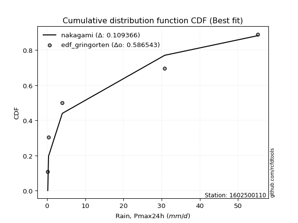</img></img>

</div>


### 9. EDF Filliben (1975)

The specific values of the constants (0.3175) (often denoted as $alpha$) and (0.365) are derived from a method proposed by James J. Filliben in a 1975 paper. This particular formula is the mean value of the $i$-th order statistic of the normal distribution and is considered a robust and effective plotting position formula for the normal probability plot correlation coefficient test for normality.

<div align="center">


$P=(m-0.3175)/(n+0.365)$


</div>


**9.1. Empirical values**

<div align="center">

|                | 0                   | 1                  | 2            | 3                  | 4                  |
|:---------------|:--------------------|:-------------------|:-------------|:-------------------|:-------------------|
| date           | 2022                | 2021               | 2020         | 2024               | 2019               |
| x              | 0.2                 | 0.4                | 4.0          | 30.8               | 55.2               |
| m              | 1                   | 2                  | 3            | 4                  | 5                  |
| empirical_dist | edf_filliben        | edf_filliben       | edf_filliben | edf_filliben       | edf_filliben       |
| empirical      | 0.12721342031686858 | 0.3136067101584343 | 0.5          | 0.6863932898415657 | 0.8727865796831314 |
| empirical_tr   | 1.1457554725040042  | 1.456890699253225  | 2.0          | 3.188707280832095  | 7.860805860805863  |

</div>


**9.2. Kolmogorov-Smirnov fit test (sorted by Δ)**


<div align="center">

|                | 0                  | 1                   | 2                  | 3                   | 4                   | 5                   | 6                   | 7                   | 8                     | 9                   | 10                  | 11                  | 12                  | 13                  | 14                  | 15                  | 16                 | 17                 | 18                 | 19                 | 20                  | 21                  | 22                  | 23                  | 24                  | 25                  | 26                 | 27                  | 28                  | 29                 | 30                  | 31                 | 32                 | 33                 | 34                  | 35                  | 36                  | 37                  | 38                  | 39                  | 40                  | 41                 | 42                  | 43                 | 44                  | 45                 | 46                 | 47                 | 48                  | 49                  | 50                  | 51                  | 52                  | 53                  | 54                  | 55                 | 56                 | 57                 | 58                  | 59                  | 60                  | 61                 | 62                 | 63                  | 64                  | 65                  | 66                  | 67                 | 68                 | 69                 | 70                 | 71                 | 72                  | 73                  | 74                  | 75                 | 76                  | 77                 | 78                  | 79                 | 80                 | 81                 | 82                 | 83                 | 84                 | 85                 | 86                 | 87                 |
|:---------------|:-------------------|:--------------------|:-------------------|:--------------------|:--------------------|:--------------------|:--------------------|:--------------------|:----------------------|:--------------------|:--------------------|:--------------------|:--------------------|:--------------------|:--------------------|:--------------------|:-------------------|:-------------------|:-------------------|:-------------------|:--------------------|:--------------------|:--------------------|:--------------------|:--------------------|:--------------------|:-------------------|:--------------------|:--------------------|:-------------------|:--------------------|:-------------------|:-------------------|:-------------------|:--------------------|:--------------------|:--------------------|:--------------------|:--------------------|:--------------------|:--------------------|:-------------------|:--------------------|:-------------------|:--------------------|:-------------------|:-------------------|:-------------------|:--------------------|:--------------------|:--------------------|:--------------------|:--------------------|:--------------------|:--------------------|:-------------------|:-------------------|:-------------------|:--------------------|:--------------------|:--------------------|:-------------------|:-------------------|:--------------------|:--------------------|:--------------------|:--------------------|:-------------------|:-------------------|:-------------------|:-------------------|:-------------------|:--------------------|:--------------------|:--------------------|:-------------------|:--------------------|:-------------------|:--------------------|:-------------------|:-------------------|:-------------------|:-------------------|:-------------------|:-------------------|:-------------------|:-------------------|:-------------------|
| station        | 1602500110         | 1602500110          | 1602500110         | 1602500110          | 1602500110          | 1602500110          | 1602500110          | 1602500110          | 1602500110            | 1602500110          | 1602500110          | 1602500110          | 1602500110          | 1602500110          | 1602500110          | 1602500110          | 1602500110         | 1602500110         | 1602500110         | 1602500110         | 1602500110          | 1602500110          | 1602500110          | 1602500110          | 1602500110          | 1602500110          | 1602500110         | 1602500110          | 1602500110          | 1602500110         | 1602500110          | 1602500110         | 1602500110         | 1602500110         | 1602500110          | 1602500110          | 1602500110          | 1602500110          | 1602500110          | 1602500110          | 1602500110          | 1602500110         | 1602500110          | 1602500110         | 1602500110          | 1602500110         | 1602500110         | 1602500110         | 1602500110          | 1602500110          | 1602500110          | 1602500110          | 1602500110          | 1602500110          | 1602500110          | 1602500110         | 1602500110         | 1602500110         | 1602500110          | 1602500110          | 1602500110          | 1602500110         | 1602500110         | 1602500110          | 1602500110          | 1602500110          | 1602500110          | 1602500110         | 1602500110         | 1602500110         | 1602500110         | 1602500110         | 1602500110          | 1602500110          | 1602500110          | 1602500110         | 1602500110          | 1602500110         | 1602500110          | 1602500110         | 1602500110         | 1602500110         | 1602500110         | 1602500110         | 1602500110         | 1602500110         | 1602500110         | 1602500110         |
| empirical_dist | edf_filliben       | edf_filliben        | edf_filliben       | edf_filliben        | edf_filliben        | edf_filliben        | edf_filliben        | edf_filliben        | edf_filliben          | edf_filliben        | edf_filliben        | edf_filliben        | edf_filliben        | edf_filliben        | edf_filliben        | edf_filliben        | edf_filliben       | edf_filliben       | edf_filliben       | edf_filliben       | edf_filliben        | edf_filliben        | edf_filliben        | edf_filliben        | edf_filliben        | edf_filliben        | edf_filliben       | edf_filliben        | edf_filliben        | edf_filliben       | edf_filliben        | edf_filliben       | edf_filliben       | edf_filliben       | edf_filliben        | edf_filliben        | edf_filliben        | edf_filliben        | edf_filliben        | edf_filliben        | edf_filliben        | edf_filliben       | edf_filliben        | edf_filliben       | edf_filliben        | edf_filliben       | edf_filliben       | edf_filliben       | edf_filliben        | edf_filliben        | edf_filliben        | edf_filliben        | edf_filliben        | edf_filliben        | edf_filliben        | edf_filliben       | edf_filliben       | edf_filliben       | edf_filliben        | edf_filliben        | edf_filliben        | edf_filliben       | edf_filliben       | edf_filliben        | edf_filliben        | edf_filliben        | edf_filliben        | edf_filliben       | edf_filliben       | edf_filliben       | edf_filliben       | edf_filliben       | edf_filliben        | edf_filliben        | edf_filliben        | edf_filliben       | edf_filliben        | edf_filliben       | edf_filliben        | edf_filliben       | edf_filliben       | edf_filliben       | edf_filliben       | edf_filliben       | edf_filliben       | edf_filliben       | edf_filliben       | edf_filliben       |
| p_dist         | nakagami           | fisk                | loginvweibull      | loggenlogistic      | loggenexpon         | ncf                 | lograyleigh         | logmaxwell          | loglaplace_asymmetric | loghalfnorm         | loginvgamma         | logerlang           | logloggamma         | loggamma            | loggamma            | lognct              | logt               | logcrystalball     | lognorm            | lognorm            | logexponnorm        | logpearson3         | logexpon            | loginvgauss         | logkstwobign        | logf                | logalpha           | weibull_min         | logrice             | loggompertz        | loglogistic         | loggumbel_l        | loggumbel_r        | loghypsecant       | halfnorm            | loglaplace          | loghalflogistic     | logmoyal            | halflogistic        | rayleigh            | logncf              | logtruncnorm       | maxwell             | pearson3           | moyal               | gumbel_r           | genlogistic        | norm               | crystalball         | mielke              | fatiguelife         | logweibull_min      | kstwobign           | logistic            | invgauss            | gamma              | erlang             | wald               | hypsecant           | gumbel_l            | rice                | laplace            | exponnorm          | gompertz            | laplace_asymmetric  | genexpon            | expon               | chi2               | logwald            | loggibrat          | logfisk            | logchi2            | truncnorm           | logfatiguelife      | logbetaprime        | gibrat             | alpha               | lognakagami        | invweibull          | johnsonsu          | t                  | logmielke          | loglognorm         | betaprime          | nct                | logjohnsonsu       | invgamma           | f                  |
| delta          | 0.127204687929305  | 0.13713226622798663 | 0.1423103314260763 | 0.14267640191084652 | 0.14282859949337867 | 0.14441369156585437 | 0.14447516779558967 | 0.14483257542760908 | 0.14566229644129924   | 0.14581823593013155 | 0.14645387405915156 | 0.14667164903987553 | 0.14673845838667868 | 0.14677426350510847 | 0.14677426350510847 | 0.14712255171093164 | 0.1471631203563551 | 0.1471636939840955 | 0.1471637583888677 | 0.1471637583888677 | 0.14716412642116633 | 0.14732118289703156 | 0.14798561620022999 | 0.15006865078695064 | 0.15349871970242435 | 0.15535528327948345 | 0.1564497879919906 | 0.15901033570912249 | 0.16175472308061617 | 0.1633110691234596 | 0.16635655833223945 | 0.1691271292237818 | 0.1704630383081282 | 0.1766656098984027 | 0.18404672768620112 | 0.18647793217028152 | 0.18743185018503464 | 0.19324300160582236 | 0.19603975350068514 | 0.20952600658691878 | 0.21528330169982635 | 0.2184209614860903 | 0.21886736596625755 | 0.2196269109187841 | 0.22379255743828108 | 0.2246962846308767 | 0.2349694727277265 | 0.2416771544156125 | 0.24167715586903438 | 0.24283676640853363 | 0.24382684352422013 | 0.24601535480571518 | 0.25573877155787283 | 0.26428071925794716 | 0.26588369703946857 | 0.278685591591207  | 0.2793156654803871 | 0.2793912673090443 | 0.27941304812970524 | 0.28318038028671166 | 0.28357433311994223 | 0.3001722425363272 | 0.307521385880583  | 0.30797184401696964 | 0.30891910095918895 | 0.30891993186020755 | 0.30892136133278963 | 0.3135397038596499 | 0.313606658569511  | 0.3136067101584343 | 0.3497744197716198 | 0.3743992591011709 | 0.37881734556050306 | 0.38644293343862474 | 0.41790815625144867 | 0.4189198194979403 | 0.42047571521128624 | 0.4505899921856252 | 0.45484404907892156 | 0.4602990827890306 | 0.4997982561290186 | 0.5244974089533025 | 0.5258554749643585 | 0.6224770811870564 | 0.6459102374923897 | 0.6577898052807963 | 0.6850194008864343 | 0.6863932898415657 |
| deltao         | 0.5865427407550001 | 0.5865427407550001  | 0.5865427407550001 | 0.5865427407550001  | 0.5865427407550001  | 0.5865427407550001  | 0.5865427407550001  | 0.5865427407550001  | 0.5865427407550001    | 0.5865427407550001  | 0.5865427407550001  | 0.5865427407550001  | 0.5865427407550001  | 0.5865427407550001  | 0.5865427407550001  | 0.5865427407550001  | 0.5865427407550001 | 0.5865427407550001 | 0.5865427407550001 | 0.5865427407550001 | 0.5865427407550001  | 0.5865427407550001  | 0.5865427407550001  | 0.5865427407550001  | 0.5865427407550001  | 0.5865427407550001  | 0.5865427407550001 | 0.5865427407550001  | 0.5865427407550001  | 0.5865427407550001 | 0.5865427407550001  | 0.5865427407550001 | 0.5865427407550001 | 0.5865427407550001 | 0.5865427407550001  | 0.5865427407550001  | 0.5865427407550001  | 0.5865427407550001  | 0.5865427407550001  | 0.5865427407550001  | 0.5865427407550001  | 0.5865427407550001 | 0.5865427407550001  | 0.5865427407550001 | 0.5865427407550001  | 0.5865427407550001 | 0.5865427407550001 | 0.5865427407550001 | 0.5865427407550001  | 0.5865427407550001  | 0.5865427407550001  | 0.5865427407550001  | 0.5865427407550001  | 0.5865427407550001  | 0.5865427407550001  | 0.5865427407550001 | 0.5865427407550001 | 0.5865427407550001 | 0.5865427407550001  | 0.5865427407550001  | 0.5865427407550001  | 0.5865427407550001 | 0.5865427407550001 | 0.5865427407550001  | 0.5865427407550001  | 0.5865427407550001  | 0.5865427407550001  | 0.5865427407550001 | 0.5865427407550001 | 0.5865427407550001 | 0.5865427407550001 | 0.5865427407550001 | 0.5865427407550001  | 0.5865427407550001  | 0.5865427407550001  | 0.5865427407550001 | 0.5865427407550001  | 0.5865427407550001 | 0.5865427407550001  | 0.5865427407550001 | 0.5865427407550001 | 0.5865427407550001 | 0.5865427407550001 | 0.5865427407550001 | 0.5865427407550001 | 0.5865427407550001 | 0.5865427407550001 | 0.5865427407550001 |
| eval           | Δo > Δ             | Δo > Δ              | Δo > Δ             | Δo > Δ              | Δo > Δ              | Δo > Δ              | Δo > Δ              | Δo > Δ              | Δo > Δ                | Δo > Δ              | Δo > Δ              | Δo > Δ              | Δo > Δ              | Δo > Δ              | Δo > Δ              | Δo > Δ              | Δo > Δ             | Δo > Δ             | Δo > Δ             | Δo > Δ             | Δo > Δ              | Δo > Δ              | Δo > Δ              | Δo > Δ              | Δo > Δ              | Δo > Δ              | Δo > Δ             | Δo > Δ              | Δo > Δ              | Δo > Δ             | Δo > Δ              | Δo > Δ             | Δo > Δ             | Δo > Δ             | Δo > Δ              | Δo > Δ              | Δo > Δ              | Δo > Δ              | Δo > Δ              | Δo > Δ              | Δo > Δ              | Δo > Δ             | Δo > Δ              | Δo > Δ             | Δo > Δ              | Δo > Δ             | Δo > Δ             | Δo > Δ             | Δo > Δ              | Δo > Δ              | Δo > Δ              | Δo > Δ              | Δo > Δ              | Δo > Δ              | Δo > Δ              | Δo > Δ             | Δo > Δ             | Δo > Δ             | Δo > Δ              | Δo > Δ              | Δo > Δ              | Δo > Δ             | Δo > Δ             | Δo > Δ              | Δo > Δ              | Δo > Δ              | Δo > Δ              | Δo > Δ             | Δo > Δ             | Δo > Δ             | Δo > Δ             | Δo > Δ             | Δo > Δ              | Δo > Δ              | Δo > Δ              | Δo > Δ             | Δo > Δ              | Δo > Δ             | Δo > Δ              | Δo > Δ             | Δo > Δ             | Δo > Δ             | Δo > Δ             | Δo <= Δ            | Δo <= Δ            | Δo <= Δ            | Δo <= Δ            | Δo <= Δ            |
| fit            | 1                  | 1                   | 1                  | 1                   | 1                   | 1                   | 1                   | 1                   | 1                     | 1                   | 1                   | 1                   | 1                   | 1                   | 1                   | 1                   | 1                  | 1                  | 1                  | 1                  | 1                   | 1                   | 1                   | 1                   | 1                   | 1                   | 1                  | 1                   | 1                   | 1                  | 1                   | 1                  | 1                  | 1                  | 1                   | 1                   | 1                   | 1                   | 1                   | 1                   | 1                   | 1                  | 1                   | 1                  | 1                   | 1                  | 1                  | 1                  | 1                   | 1                   | 1                   | 1                   | 1                   | 1                   | 1                   | 1                  | 1                  | 1                  | 1                   | 1                   | 1                   | 1                  | 1                  | 1                   | 1                   | 1                   | 1                   | 1                  | 1                  | 1                  | 1                  | 1                  | 1                   | 1                   | 1                   | 1                  | 1                   | 1                  | 1                   | 1                  | 1                  | 1                  | 1                  | 0                  | 0                  | 0                  | 0                  | 0                  |
| n              | 5                  | 5                   | 5                  | 5                   | 5                   | 5                   | 5                   | 5                   | 5                     | 5                   | 5                   | 5                   | 5                   | 5                   | 5                   | 5                   | 5                  | 5                  | 5                  | 5                  | 5                   | 5                   | 5                   | 5                   | 5                   | 5                   | 5                  | 5                   | 5                   | 5                  | 5                   | 5                  | 5                  | 5                  | 5                   | 5                   | 5                   | 5                   | 5                   | 5                   | 5                   | 5                  | 5                   | 5                  | 5                   | 5                  | 5                  | 5                  | 5                   | 5                   | 5                   | 5                   | 5                   | 5                   | 5                   | 5                  | 5                  | 5                  | 5                   | 5                   | 5                   | 5                  | 5                  | 5                   | 5                   | 5                   | 5                   | 5                  | 5                  | 5                  | 5                  | 5                  | 5                   | 5                   | 5                   | 5                  | 5                   | 5                  | 5                   | 5                  | 5                  | 5                  | 5                  | 5                  | 5                  | 5                  | 5                  | 5                  |
| best_fit       | 1                  | 0                   | 0                  | 0                   | 0                   | 0                   | 0                   | 0                   | 0                     | 0                   | 0                   | 0                   | 0                   | 0                   | 0                   | 0                   | 0                  | 0                  | 0                  | 0                  | 0                   | 0                   | 0                   | 0                   | 0                   | 0                   | 0                  | 0                   | 0                   | 0                  | 0                   | 0                  | 0                  | 0                  | 0                   | 0                   | 0                   | 0                   | 0                   | 0                   | 0                   | 0                  | 0                   | 0                  | 0                   | 0                  | 0                  | 0                  | 0                   | 0                   | 0                   | 0                   | 0                   | 0                   | 0                   | 0                  | 0                  | 0                  | 0                   | 0                   | 0                   | 0                  | 0                  | 0                   | 0                   | 0                   | 0                   | 0                  | 0                  | 0                  | 0                  | 0                  | 0                   | 0                   | 0                   | 0                  | 0                   | 0                  | 0                   | 0                  | 0                  | 0                  | 0                  | 0                  | 0                  | 0                  | 0                  | 0                  |
| best_fit_sort  | 1                  | 2                   | 3                  | 4                   | 5                   | 6                   | 7                   | 8                   | 9                     | 10                  | 11                  | 12                  | 13                  | 14                  | 15                  | 16                  | 17                 | 18                 | 19                 | 20                 | 21                  | 22                  | 23                  | 24                  | 25                  | 26                  | 27                 | 28                  | 29                  | 30                 | 31                  | 32                 | 33                 | 34                 | 35                  | 36                  | 37                  | 38                  | 39                  | 40                  | 41                  | 42                 | 43                  | 44                 | 45                  | 46                 | 47                 | 48                 | 49                  | 50                  | 51                  | 52                  | 53                  | 54                  | 55                  | 56                 | 57                 | 58                 | 59                  | 60                  | 61                  | 62                 | 63                 | 64                  | 65                  | 66                  | 67                  | 68                 | 69                 | 70                 | 71                 | 72                 | 73                  | 74                  | 75                  | 76                 | 77                  | 78                 | 79                  | 80                 | 81                 | 82                 | 83                 | 84                 | 85                 | 86                 | 87                 | 88                 |

</div>


**9.3. Best fit**

<div align="center">

|   id |    station | empirical_dist   | p_dist   |    delta |   deltao | eval   |   fit |   n |   best_fit |   best_fit_sort |
|-----:|-----------:|:-----------------|:---------|---------:|---------:|:-------|------:|----:|-----------:|----------------:|
|    0 | 1602500110 | edf_filliben     | nakagami | 0.127205 | 0.586543 | Δo > Δ |     1 |   5 |          1 |               1 |

</div>


<div align="center">

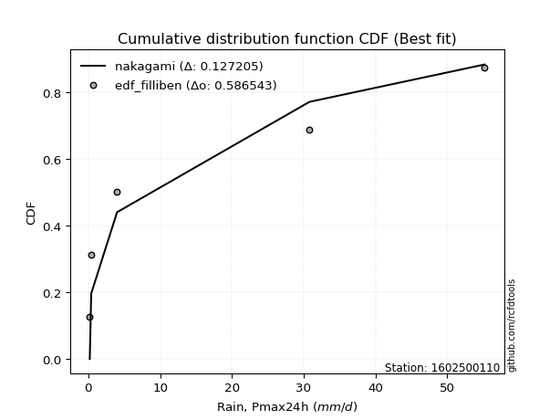</img>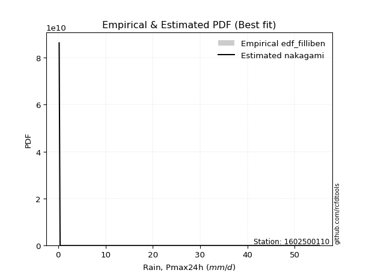</img>

</div>


### 10. EDF Jenkinson (1977)

The Jenkinson formula in hydrology is an empirical plotting position formula used to estimate the non-exceedance probability _(P)_ or return period _(T)_ of a given ordered observation within a sample. It is a widely used method in the frequency analysis of extreme events such as floods and rainfall, as it provides a distribution-free way to plot data. _a≈0.31_ and _b≈0.38_ are constants derived to approximate the median of the probability distribution for the given rank.

<div align="center">


$P=(m-a)/(n+b)$


</div>


**10.1. Empirical values**

<div align="center">

|                | 0                   | 1                  | 2             | 3                  | 4                  |
|:---------------|:--------------------|:-------------------|:--------------|:-------------------|:-------------------|
| date           | 2022                | 2021               | 2020          | 2024               | 2019               |
| x              | 0.2                 | 0.4                | 4.0           | 30.8               | 55.2               |
| m              | 1                   | 2                  | 3             | 4                  | 5                  |
| empirical_dist | edf_jenkinson       | edf_jenkinson      | edf_jenkinson | edf_jenkinson      | edf_jenkinson      |
| empirical      | 0.12825278810408922 | 0.3141263940520446 | 0.5           | 0.6858736059479554 | 0.8717472118959109 |
| empirical_tr   | 1.1471215351812367  | 1.4579945799457996 | 2.0           | 3.183431952662722  | 7.797101449275368  |

</div>


**10.2. Kolmogorov-Smirnov fit test (sorted by Δ)**


<div align="center">

|                | 0                   | 1                   | 2                   | 3                   | 4                  | 5                  | 6                  | 7                  | 8                     | 9                   | 10                 | 11                  | 12                  | 13                  | 14                  | 15                  | 16                  | 17                  | 18                  | 19                  | 20                  | 21                 | 22                  | 23                  | 24                  | 25                  | 26                 | 27                 | 28                  | 29                  | 30                 | 31                  | 32                  | 33                  | 34                  | 35                  | 36                  | 37                 | 38                  | 39                  | 40                  | 41                  | 42                  | 43                 | 44                  | 45                 | 46                 | 47                 | 48                  | 49                 | 50                  | 51                  | 52                  | 53                  | 54                  | 55                 | 56                 | 57                  | 58                  | 59                  | 60                  | 61                 | 62                 | 63                  | 64                  | 65                  | 66                  | 67                  | 68                 | 69                 | 70                  | 71                 | 72                  | 73                 | 74                 | 75                 | 76                  | 77                  | 78                 | 79                  | 80                 | 81                 | 82                 | 83                 | 84                 | 85                 | 86                 | 87                 |
|:---------------|:--------------------|:--------------------|:--------------------|:--------------------|:-------------------|:-------------------|:-------------------|:-------------------|:----------------------|:--------------------|:-------------------|:--------------------|:--------------------|:--------------------|:--------------------|:--------------------|:--------------------|:--------------------|:--------------------|:--------------------|:--------------------|:-------------------|:--------------------|:--------------------|:--------------------|:--------------------|:-------------------|:-------------------|:--------------------|:--------------------|:-------------------|:--------------------|:--------------------|:--------------------|:--------------------|:--------------------|:--------------------|:-------------------|:--------------------|:--------------------|:--------------------|:--------------------|:--------------------|:-------------------|:--------------------|:-------------------|:-------------------|:-------------------|:--------------------|:-------------------|:--------------------|:--------------------|:--------------------|:--------------------|:--------------------|:-------------------|:-------------------|:--------------------|:--------------------|:--------------------|:--------------------|:-------------------|:-------------------|:--------------------|:--------------------|:--------------------|:--------------------|:--------------------|:-------------------|:-------------------|:--------------------|:-------------------|:--------------------|:-------------------|:-------------------|:-------------------|:--------------------|:--------------------|:-------------------|:--------------------|:-------------------|:-------------------|:-------------------|:-------------------|:-------------------|:-------------------|:-------------------|:-------------------|
| station        | 1602500110          | 1602500110          | 1602500110          | 1602500110          | 1602500110         | 1602500110         | 1602500110         | 1602500110         | 1602500110            | 1602500110          | 1602500110         | 1602500110          | 1602500110          | 1602500110          | 1602500110          | 1602500110          | 1602500110          | 1602500110          | 1602500110          | 1602500110          | 1602500110          | 1602500110         | 1602500110          | 1602500110          | 1602500110          | 1602500110          | 1602500110         | 1602500110         | 1602500110          | 1602500110          | 1602500110         | 1602500110          | 1602500110          | 1602500110          | 1602500110          | 1602500110          | 1602500110          | 1602500110         | 1602500110          | 1602500110          | 1602500110          | 1602500110          | 1602500110          | 1602500110         | 1602500110          | 1602500110         | 1602500110         | 1602500110         | 1602500110          | 1602500110         | 1602500110          | 1602500110          | 1602500110          | 1602500110          | 1602500110          | 1602500110         | 1602500110         | 1602500110          | 1602500110          | 1602500110          | 1602500110          | 1602500110         | 1602500110         | 1602500110          | 1602500110          | 1602500110          | 1602500110          | 1602500110          | 1602500110         | 1602500110         | 1602500110          | 1602500110         | 1602500110          | 1602500110         | 1602500110         | 1602500110         | 1602500110          | 1602500110          | 1602500110         | 1602500110          | 1602500110         | 1602500110         | 1602500110         | 1602500110         | 1602500110         | 1602500110         | 1602500110         | 1602500110         |
| empirical_dist | edf_jenkinson       | edf_jenkinson       | edf_jenkinson       | edf_jenkinson       | edf_jenkinson      | edf_jenkinson      | edf_jenkinson      | edf_jenkinson      | edf_jenkinson         | edf_jenkinson       | edf_jenkinson      | edf_jenkinson       | edf_jenkinson       | edf_jenkinson       | edf_jenkinson       | edf_jenkinson       | edf_jenkinson       | edf_jenkinson       | edf_jenkinson       | edf_jenkinson       | edf_jenkinson       | edf_jenkinson      | edf_jenkinson       | edf_jenkinson       | edf_jenkinson       | edf_jenkinson       | edf_jenkinson      | edf_jenkinson      | edf_jenkinson       | edf_jenkinson       | edf_jenkinson      | edf_jenkinson       | edf_jenkinson       | edf_jenkinson       | edf_jenkinson       | edf_jenkinson       | edf_jenkinson       | edf_jenkinson      | edf_jenkinson       | edf_jenkinson       | edf_jenkinson       | edf_jenkinson       | edf_jenkinson       | edf_jenkinson      | edf_jenkinson       | edf_jenkinson      | edf_jenkinson      | edf_jenkinson      | edf_jenkinson       | edf_jenkinson      | edf_jenkinson       | edf_jenkinson       | edf_jenkinson       | edf_jenkinson       | edf_jenkinson       | edf_jenkinson      | edf_jenkinson      | edf_jenkinson       | edf_jenkinson       | edf_jenkinson       | edf_jenkinson       | edf_jenkinson      | edf_jenkinson      | edf_jenkinson       | edf_jenkinson       | edf_jenkinson       | edf_jenkinson       | edf_jenkinson       | edf_jenkinson      | edf_jenkinson      | edf_jenkinson       | edf_jenkinson      | edf_jenkinson       | edf_jenkinson      | edf_jenkinson      | edf_jenkinson      | edf_jenkinson       | edf_jenkinson       | edf_jenkinson      | edf_jenkinson       | edf_jenkinson      | edf_jenkinson      | edf_jenkinson      | edf_jenkinson      | edf_jenkinson      | edf_jenkinson      | edf_jenkinson      | edf_jenkinson      |
| p_dist         | nakagami            | fisk                | loginvweibull       | loggenlogistic      | loggenexpon        | ncf                | lograyleigh        | logmaxwell         | loglaplace_asymmetric | loghalfnorm         | loginvgamma        | logerlang           | logloggamma         | loggamma            | loggamma            | lognct              | logt                | logcrystalball      | lognorm             | lognorm             | logexponnorm        | logpearson3        | logexpon            | loginvgauss         | logkstwobign        | logf                | logalpha           | weibull_min        | logrice             | loggompertz         | loglogistic        | loggumbel_l         | loggumbel_r         | loghypsecant        | halfnorm            | loglaplace          | loghalflogistic     | logmoyal           | halflogistic        | rayleigh            | logncf              | maxwell             | logtruncnorm        | pearson3           | moyal               | gumbel_r           | genlogistic        | norm               | crystalball         | mielke             | fatiguelife         | logweibull_min      | kstwobign           | logistic            | invgauss            | gamma              | wald               | hypsecant           | erlang              | gumbel_l            | rice                | laplace            | exponnorm          | gompertz            | laplace_asymmetric  | genexpon            | expon               | chi2                | logwald            | loggibrat          | logfisk             | logchi2            | truncnorm           | logfatiguelife     | logbetaprime       | gibrat             | alpha               | lognakagami         | invweibull         | johnsonsu           | t                  | logmielke          | loglognorm         | betaprime          | nct                | logjohnsonsu       | invgamma           | f                  |
| delta          | 0.12824405571652564 | 0.13765195012159698 | 0.14283001531968653 | 0.14319608580445675 | 0.1433482833869889 | 0.1449333754594646 | 0.1449948516891999 | 0.1453522593212193 | 0.14618198033490948   | 0.14633791982374178 | 0.1469735579527618 | 0.14719133293348588 | 0.14725814228028902 | 0.14729394739871882 | 0.14729394739871882 | 0.14764223560454198 | 0.14768280424996544 | 0.14768337787770586 | 0.14768344228247804 | 0.14768344228247804 | 0.14768381031477668 | 0.1478408667906419 | 0.14798561620022999 | 0.15006865078695064 | 0.15401840359603458 | 0.15535528327948345 | 0.1564497879919906 | 0.1579709679219019 | 0.16227440697422651 | 0.16383075301706995 | 0.1668762422258498 | 0.16964681311739205 | 0.17098272220173855 | 0.17718529379201303 | 0.18404672768620112 | 0.18699761606389187 | 0.18795153407864498 | 0.1937626854994327 | 0.19603975350068514 | 0.20952600658691878 | 0.21424393391260577 | 0.21886736596625755 | 0.21894064537970065 | 0.2196269109187841 | 0.22379255743828108 | 0.2246962846308767 | 0.2349694727277265 | 0.2416771544156125 | 0.24167715586903438 | 0.2423170825149233 | 0.24434652741783036 | 0.24549567091210484 | 0.25573877155787283 | 0.26428071925794716 | 0.26588369703946857 | 0.2792052754848172 | 0.2793912673090443 | 0.27941304812970524 | 0.27983534937399734 | 0.28318038028671166 | 0.28357433311994223 | 0.3001722425363272 | 0.307521385880583  | 0.30797184401696964 | 0.30891910095918895 | 0.30891993186020755 | 0.30892136133278963 | 0.31405938775326014 | 0.3141263424631213 | 0.3141263940520446 | 0.34873505198439925 | 0.3743992591011709 | 0.37881734556050306 | 0.3859232495450144 | 0.4173884723578383 | 0.4189198194979403 | 0.42047571521128624 | 0.45007030829201483 | 0.453804681291701  | 0.45977939889542024 | 0.4997982561290186 | 0.5239777250596922 | 0.5253357910707481 | 0.621957397293446  | 0.6453905535987794 | 0.6572701213871861 | 0.684499716992824  | 0.6858736059479553 |
| deltao         | 0.5865427407550001  | 0.5865427407550001  | 0.5865427407550001  | 0.5865427407550001  | 0.5865427407550001 | 0.5865427407550001 | 0.5865427407550001 | 0.5865427407550001 | 0.5865427407550001    | 0.5865427407550001  | 0.5865427407550001 | 0.5865427407550001  | 0.5865427407550001  | 0.5865427407550001  | 0.5865427407550001  | 0.5865427407550001  | 0.5865427407550001  | 0.5865427407550001  | 0.5865427407550001  | 0.5865427407550001  | 0.5865427407550001  | 0.5865427407550001 | 0.5865427407550001  | 0.5865427407550001  | 0.5865427407550001  | 0.5865427407550001  | 0.5865427407550001 | 0.5865427407550001 | 0.5865427407550001  | 0.5865427407550001  | 0.5865427407550001 | 0.5865427407550001  | 0.5865427407550001  | 0.5865427407550001  | 0.5865427407550001  | 0.5865427407550001  | 0.5865427407550001  | 0.5865427407550001 | 0.5865427407550001  | 0.5865427407550001  | 0.5865427407550001  | 0.5865427407550001  | 0.5865427407550001  | 0.5865427407550001 | 0.5865427407550001  | 0.5865427407550001 | 0.5865427407550001 | 0.5865427407550001 | 0.5865427407550001  | 0.5865427407550001 | 0.5865427407550001  | 0.5865427407550001  | 0.5865427407550001  | 0.5865427407550001  | 0.5865427407550001  | 0.5865427407550001 | 0.5865427407550001 | 0.5865427407550001  | 0.5865427407550001  | 0.5865427407550001  | 0.5865427407550001  | 0.5865427407550001 | 0.5865427407550001 | 0.5865427407550001  | 0.5865427407550001  | 0.5865427407550001  | 0.5865427407550001  | 0.5865427407550001  | 0.5865427407550001 | 0.5865427407550001 | 0.5865427407550001  | 0.5865427407550001 | 0.5865427407550001  | 0.5865427407550001 | 0.5865427407550001 | 0.5865427407550001 | 0.5865427407550001  | 0.5865427407550001  | 0.5865427407550001 | 0.5865427407550001  | 0.5865427407550001 | 0.5865427407550001 | 0.5865427407550001 | 0.5865427407550001 | 0.5865427407550001 | 0.5865427407550001 | 0.5865427407550001 | 0.5865427407550001 |
| eval           | Δo > Δ              | Δo > Δ              | Δo > Δ              | Δo > Δ              | Δo > Δ             | Δo > Δ             | Δo > Δ             | Δo > Δ             | Δo > Δ                | Δo > Δ              | Δo > Δ             | Δo > Δ              | Δo > Δ              | Δo > Δ              | Δo > Δ              | Δo > Δ              | Δo > Δ              | Δo > Δ              | Δo > Δ              | Δo > Δ              | Δo > Δ              | Δo > Δ             | Δo > Δ              | Δo > Δ              | Δo > Δ              | Δo > Δ              | Δo > Δ             | Δo > Δ             | Δo > Δ              | Δo > Δ              | Δo > Δ             | Δo > Δ              | Δo > Δ              | Δo > Δ              | Δo > Δ              | Δo > Δ              | Δo > Δ              | Δo > Δ             | Δo > Δ              | Δo > Δ              | Δo > Δ              | Δo > Δ              | Δo > Δ              | Δo > Δ             | Δo > Δ              | Δo > Δ             | Δo > Δ             | Δo > Δ             | Δo > Δ              | Δo > Δ             | Δo > Δ              | Δo > Δ              | Δo > Δ              | Δo > Δ              | Δo > Δ              | Δo > Δ             | Δo > Δ             | Δo > Δ              | Δo > Δ              | Δo > Δ              | Δo > Δ              | Δo > Δ             | Δo > Δ             | Δo > Δ              | Δo > Δ              | Δo > Δ              | Δo > Δ              | Δo > Δ              | Δo > Δ             | Δo > Δ             | Δo > Δ              | Δo > Δ             | Δo > Δ              | Δo > Δ             | Δo > Δ             | Δo > Δ             | Δo > Δ              | Δo > Δ              | Δo > Δ             | Δo > Δ              | Δo > Δ             | Δo > Δ             | Δo > Δ             | Δo <= Δ            | Δo <= Δ            | Δo <= Δ            | Δo <= Δ            | Δo <= Δ            |
| fit            | 1                   | 1                   | 1                   | 1                   | 1                  | 1                  | 1                  | 1                  | 1                     | 1                   | 1                  | 1                   | 1                   | 1                   | 1                   | 1                   | 1                   | 1                   | 1                   | 1                   | 1                   | 1                  | 1                   | 1                   | 1                   | 1                   | 1                  | 1                  | 1                   | 1                   | 1                  | 1                   | 1                   | 1                   | 1                   | 1                   | 1                   | 1                  | 1                   | 1                   | 1                   | 1                   | 1                   | 1                  | 1                   | 1                  | 1                  | 1                  | 1                   | 1                  | 1                   | 1                   | 1                   | 1                   | 1                   | 1                  | 1                  | 1                   | 1                   | 1                   | 1                   | 1                  | 1                  | 1                   | 1                   | 1                   | 1                   | 1                   | 1                  | 1                  | 1                   | 1                  | 1                   | 1                  | 1                  | 1                  | 1                   | 1                   | 1                  | 1                   | 1                  | 1                  | 1                  | 0                  | 0                  | 0                  | 0                  | 0                  |
| n              | 5                   | 5                   | 5                   | 5                   | 5                  | 5                  | 5                  | 5                  | 5                     | 5                   | 5                  | 5                   | 5                   | 5                   | 5                   | 5                   | 5                   | 5                   | 5                   | 5                   | 5                   | 5                  | 5                   | 5                   | 5                   | 5                   | 5                  | 5                  | 5                   | 5                   | 5                  | 5                   | 5                   | 5                   | 5                   | 5                   | 5                   | 5                  | 5                   | 5                   | 5                   | 5                   | 5                   | 5                  | 5                   | 5                  | 5                  | 5                  | 5                   | 5                  | 5                   | 5                   | 5                   | 5                   | 5                   | 5                  | 5                  | 5                   | 5                   | 5                   | 5                   | 5                  | 5                  | 5                   | 5                   | 5                   | 5                   | 5                   | 5                  | 5                  | 5                   | 5                  | 5                   | 5                  | 5                  | 5                  | 5                   | 5                   | 5                  | 5                   | 5                  | 5                  | 5                  | 5                  | 5                  | 5                  | 5                  | 5                  |
| best_fit       | 1                   | 0                   | 0                   | 0                   | 0                  | 0                  | 0                  | 0                  | 0                     | 0                   | 0                  | 0                   | 0                   | 0                   | 0                   | 0                   | 0                   | 0                   | 0                   | 0                   | 0                   | 0                  | 0                   | 0                   | 0                   | 0                   | 0                  | 0                  | 0                   | 0                   | 0                  | 0                   | 0                   | 0                   | 0                   | 0                   | 0                   | 0                  | 0                   | 0                   | 0                   | 0                   | 0                   | 0                  | 0                   | 0                  | 0                  | 0                  | 0                   | 0                  | 0                   | 0                   | 0                   | 0                   | 0                   | 0                  | 0                  | 0                   | 0                   | 0                   | 0                   | 0                  | 0                  | 0                   | 0                   | 0                   | 0                   | 0                   | 0                  | 0                  | 0                   | 0                  | 0                   | 0                  | 0                  | 0                  | 0                   | 0                   | 0                  | 0                   | 0                  | 0                  | 0                  | 0                  | 0                  | 0                  | 0                  | 0                  |
| best_fit_sort  | 1                   | 2                   | 3                   | 4                   | 5                  | 6                  | 7                  | 8                  | 9                     | 10                  | 11                 | 12                  | 13                  | 14                  | 15                  | 16                  | 17                  | 18                  | 19                  | 20                  | 21                  | 22                 | 23                  | 24                  | 25                  | 26                  | 27                 | 28                 | 29                  | 30                  | 31                 | 32                  | 33                  | 34                  | 35                  | 36                  | 37                  | 38                 | 39                  | 40                  | 41                  | 42                  | 43                  | 44                 | 45                  | 46                 | 47                 | 48                 | 49                  | 50                 | 51                  | 52                  | 53                  | 54                  | 55                  | 56                 | 57                 | 58                  | 59                  | 60                  | 61                  | 62                 | 63                 | 64                  | 65                  | 66                  | 67                  | 68                  | 69                 | 70                 | 71                  | 72                 | 73                  | 74                 | 75                 | 76                 | 77                  | 78                  | 79                 | 80                  | 81                 | 82                 | 83                 | 84                 | 85                 | 86                 | 87                 | 88                 |

</div>


**10.3. Best fit**

<div align="center">

|   id |    station | empirical_dist   | p_dist   |    delta |   deltao | eval   |   fit |   n |   best_fit |   best_fit_sort |
|-----:|-----------:|:-----------------|:---------|---------:|---------:|:-------|------:|----:|-----------:|----------------:|
|    0 | 1602500110 | edf_jenkinson    | nakagami | 0.128244 | 0.586543 | Δo > Δ |     1 |   5 |          1 |               1 |

</div>


<div align="center">

</img></img>

</div>


### 11. EDF Cunnane (1978)

Cunnane´s work in statistical hydrology has focused on the performance and evaluation of different probability distributions (such as GEV, Gumbel, Lognormal) for flood frequency estimation. _b_ is a constant, typically set to 0.4.

<div align="center">


$P=(m-b)/(n+1-2b)$


</div>


**11.1. Empirical values**

<div align="center">

|                | 0                   | 1                  | 2           | 3                  | 4                  |
|:---------------|:--------------------|:-------------------|:------------|:-------------------|:-------------------|
| date           | 2022                | 2021               | 2020        | 2024               | 2019               |
| x              | 0.2                 | 0.4                | 4.0         | 30.8               | 55.2               |
| m              | 1                   | 2                  | 3           | 4                  | 5                  |
| empirical_dist | edf_cunnane         | edf_cunnane        | edf_cunnane | edf_cunnane        | edf_cunnane        |
| empirical      | 0.11538461538461538 | 0.3076923076923077 | 0.5         | 0.6923076923076923 | 0.8846153846153845 |
| empirical_tr   | 1.1304347826086958  | 1.4444444444444444 | 2.0         | 3.25               | 8.666666666666655  |

</div>


**11.2. Kolmogorov-Smirnov fit test (sorted by Δ)**


<div align="center">

|                | 0                  | 1                   | 2                   | 3                  | 4                   | 5                   | 6                   | 7                   | 8                     | 9                   | 10                  | 11                  | 12                 | 13                 | 14                 | 15                  | 16                  | 17                  | 18                  | 19                  | 20                  | 21                 | 22                  | 23                  | 24                  | 25                  | 26                 | 27                 | 28                  | 29                  | 30                 | 31                  | 32                  | 33                 | 34                  | 35                  | 36                  | 37                 | 38                  | 39                  | 40                  | 41                  | 42                 | 43                  | 44                 | 45                  | 46                 | 47                 | 48                 | 49                  | 50                 | 51                  | 52                  | 53                  | 54                  | 55                  | 56                 | 57                 | 58                  | 59                  | 60                  | 61                 | 62                 | 63                 | 64                 | 65                 | 66                  | 67                  | 68                  | 69                  | 70                  | 71                 | 72                  | 73                 | 74                 | 75                  | 76                  | 77                  | 78                  | 79                 | 80                 | 81                 | 82                 | 83                 | 84                 | 85                 | 86                 | 87                 |
|:---------------|:-------------------|:--------------------|:--------------------|:-------------------|:--------------------|:--------------------|:--------------------|:--------------------|:----------------------|:--------------------|:--------------------|:--------------------|:-------------------|:-------------------|:-------------------|:--------------------|:--------------------|:--------------------|:--------------------|:--------------------|:--------------------|:-------------------|:--------------------|:--------------------|:--------------------|:--------------------|:-------------------|:-------------------|:--------------------|:--------------------|:-------------------|:--------------------|:--------------------|:-------------------|:--------------------|:--------------------|:--------------------|:-------------------|:--------------------|:--------------------|:--------------------|:--------------------|:-------------------|:--------------------|:-------------------|:--------------------|:-------------------|:-------------------|:-------------------|:--------------------|:-------------------|:--------------------|:--------------------|:--------------------|:--------------------|:--------------------|:-------------------|:-------------------|:--------------------|:--------------------|:--------------------|:-------------------|:-------------------|:-------------------|:-------------------|:-------------------|:--------------------|:--------------------|:--------------------|:--------------------|:--------------------|:-------------------|:--------------------|:-------------------|:-------------------|:--------------------|:--------------------|:--------------------|:--------------------|:-------------------|:-------------------|:-------------------|:-------------------|:-------------------|:-------------------|:-------------------|:-------------------|:-------------------|
| station        | 1602500110         | 1602500110          | 1602500110          | 1602500110         | 1602500110          | 1602500110          | 1602500110          | 1602500110          | 1602500110            | 1602500110          | 1602500110          | 1602500110          | 1602500110         | 1602500110         | 1602500110         | 1602500110          | 1602500110          | 1602500110          | 1602500110          | 1602500110          | 1602500110          | 1602500110         | 1602500110          | 1602500110          | 1602500110          | 1602500110          | 1602500110         | 1602500110         | 1602500110          | 1602500110          | 1602500110         | 1602500110          | 1602500110          | 1602500110         | 1602500110          | 1602500110          | 1602500110          | 1602500110         | 1602500110          | 1602500110          | 1602500110          | 1602500110          | 1602500110         | 1602500110          | 1602500110         | 1602500110          | 1602500110         | 1602500110         | 1602500110         | 1602500110          | 1602500110         | 1602500110          | 1602500110          | 1602500110          | 1602500110          | 1602500110          | 1602500110         | 1602500110         | 1602500110          | 1602500110          | 1602500110          | 1602500110         | 1602500110         | 1602500110         | 1602500110         | 1602500110         | 1602500110          | 1602500110          | 1602500110          | 1602500110          | 1602500110          | 1602500110         | 1602500110          | 1602500110         | 1602500110         | 1602500110          | 1602500110          | 1602500110          | 1602500110          | 1602500110         | 1602500110         | 1602500110         | 1602500110         | 1602500110         | 1602500110         | 1602500110         | 1602500110         | 1602500110         |
| empirical_dist | edf_cunnane        | edf_cunnane         | edf_cunnane         | edf_cunnane        | edf_cunnane         | edf_cunnane         | edf_cunnane         | edf_cunnane         | edf_cunnane           | edf_cunnane         | edf_cunnane         | edf_cunnane         | edf_cunnane        | edf_cunnane        | edf_cunnane        | edf_cunnane         | edf_cunnane         | edf_cunnane         | edf_cunnane         | edf_cunnane         | edf_cunnane         | edf_cunnane        | edf_cunnane         | edf_cunnane         | edf_cunnane         | edf_cunnane         | edf_cunnane        | edf_cunnane        | edf_cunnane         | edf_cunnane         | edf_cunnane        | edf_cunnane         | edf_cunnane         | edf_cunnane        | edf_cunnane         | edf_cunnane         | edf_cunnane         | edf_cunnane        | edf_cunnane         | edf_cunnane         | edf_cunnane         | edf_cunnane         | edf_cunnane        | edf_cunnane         | edf_cunnane        | edf_cunnane         | edf_cunnane        | edf_cunnane        | edf_cunnane        | edf_cunnane         | edf_cunnane        | edf_cunnane         | edf_cunnane         | edf_cunnane         | edf_cunnane         | edf_cunnane         | edf_cunnane        | edf_cunnane        | edf_cunnane         | edf_cunnane         | edf_cunnane         | edf_cunnane        | edf_cunnane        | edf_cunnane        | edf_cunnane        | edf_cunnane        | edf_cunnane         | edf_cunnane         | edf_cunnane         | edf_cunnane         | edf_cunnane         | edf_cunnane        | edf_cunnane         | edf_cunnane        | edf_cunnane        | edf_cunnane         | edf_cunnane         | edf_cunnane         | edf_cunnane         | edf_cunnane        | edf_cunnane        | edf_cunnane        | edf_cunnane        | edf_cunnane        | edf_cunnane        | edf_cunnane        | edf_cunnane        | edf_cunnane        |
| p_dist         | nakagami           | fisk                | loginvweibull       | loggenlogistic     | loggenexpon         | ncf                 | lograyleigh         | logmaxwell          | loglaplace_asymmetric | loghalfnorm         | loginvgamma         | logerlang           | logloggamma        | loggamma           | loggamma           | lognct              | logt                | logcrystalball      | lognorm             | lognorm             | logexponnorm        | logpearson3        | logkstwobign        | logexpon            | loginvgauss         | logf                | logrice            | logalpha           | loggompertz         | loglogistic         | loggumbel_l        | loggumbel_r         | loghypsecant        | weibull_min        | loglaplace          | loghalflogistic     | halfnorm            | logmoyal           | halflogistic        | rayleigh            | logtruncnorm        | maxwell             | pearson3           | moyal               | gumbel_r           | logncf              | genlogistic        | fatiguelife        | norm               | crystalball         | mielke             | logweibull_min      | kstwobign           | logistic            | invgauss            | gamma               | erlang             | wald               | hypsecant           | gumbel_l            | rice                | laplace            | exponnorm          | chi2               | logwald            | loggibrat          | gompertz            | laplace_asymmetric  | genexpon            | expon               | logfisk             | logchi2            | truncnorm           | logfatiguelife     | gibrat             | alpha               | logbetaprime        | lognakagami         | johnsonsu           | invweibull         | t                  | logmielke          | loglognorm         | betaprime          | nct                | logjohnsonsu       | invgamma           | f                  |
| delta          | 0.1153758829970518 | 0.13121786376186007 | 0.13639592895994967 | 0.1367619994447199 | 0.13691419702725205 | 0.13849928909972775 | 0.13856076532946304 | 0.13891817296148246 | 0.13974789397517262   | 0.13990383346400492 | 0.14053947159302493 | 0.14075724657374897 | 0.1408240559205521 | 0.1408598610389819 | 0.1408598610389819 | 0.14120814924480507 | 0.14124871789022853 | 0.14124929151796894 | 0.14124935592274113 | 0.14124935592274113 | 0.14124972395503976 | 0.141406780430905  | 0.14758431723629772 | 0.14798561620022999 | 0.15006865078695064 | 0.15535528327948345 | 0.1558403206144896 | 0.1564497879919906 | 0.15739666665733304 | 0.16044215586611288 | 0.1632127267576552 | 0.16454863584200163 | 0.17075120743227612 | 0.1708391406413755 | 0.18056352970415496 | 0.18151744771890807 | 0.18404672768620112 | 0.1873285991396958 | 0.19603975350068514 | 0.20952600658691878 | 0.21250655901996374 | 0.21886736596625755 | 0.2196269109187841 | 0.22379255743828108 | 0.2246962846308767 | 0.22711210663207937 | 0.2349694727277265 | 0.2398451591201678 | 0.2416771544156125 | 0.24167715586903438 | 0.2487511688746602 | 0.25192975727184175 | 0.25573877155787283 | 0.26428071925794716 | 0.26588369703946857 | 0.27277118912508036 | 0.2734012630142605 | 0.2793912673090443 | 0.27941304812970524 | 0.28318038028671166 | 0.28357433311994223 | 0.3001722425363272 | 0.307521385880583  | 0.3076253013935233 | 0.3076922561033844 | 0.3076923076923077 | 0.30797184401696964 | 0.30891910095918895 | 0.30891993186020755 | 0.30892136133278963 | 0.36160322470387285 | 0.3743992591011709 | 0.37881734556050306 | 0.3923573359047513 | 0.4189198194979403 | 0.42047571521128624 | 0.42382255871757524 | 0.45650439465175174 | 0.46621348525515716 | 0.4666728540111746 | 0.4997982561290186 | 0.5304118114194292 | 0.5317698774304851 | 0.628391483653183  | 0.6518246399585162 | 0.663704207746923  | 0.6909338033525608 | 0.6923076923076923 |
| deltao         | 0.5865427407550001 | 0.5865427407550001  | 0.5865427407550001  | 0.5865427407550001 | 0.5865427407550001  | 0.5865427407550001  | 0.5865427407550001  | 0.5865427407550001  | 0.5865427407550001    | 0.5865427407550001  | 0.5865427407550001  | 0.5865427407550001  | 0.5865427407550001 | 0.5865427407550001 | 0.5865427407550001 | 0.5865427407550001  | 0.5865427407550001  | 0.5865427407550001  | 0.5865427407550001  | 0.5865427407550001  | 0.5865427407550001  | 0.5865427407550001 | 0.5865427407550001  | 0.5865427407550001  | 0.5865427407550001  | 0.5865427407550001  | 0.5865427407550001 | 0.5865427407550001 | 0.5865427407550001  | 0.5865427407550001  | 0.5865427407550001 | 0.5865427407550001  | 0.5865427407550001  | 0.5865427407550001 | 0.5865427407550001  | 0.5865427407550001  | 0.5865427407550001  | 0.5865427407550001 | 0.5865427407550001  | 0.5865427407550001  | 0.5865427407550001  | 0.5865427407550001  | 0.5865427407550001 | 0.5865427407550001  | 0.5865427407550001 | 0.5865427407550001  | 0.5865427407550001 | 0.5865427407550001 | 0.5865427407550001 | 0.5865427407550001  | 0.5865427407550001 | 0.5865427407550001  | 0.5865427407550001  | 0.5865427407550001  | 0.5865427407550001  | 0.5865427407550001  | 0.5865427407550001 | 0.5865427407550001 | 0.5865427407550001  | 0.5865427407550001  | 0.5865427407550001  | 0.5865427407550001 | 0.5865427407550001 | 0.5865427407550001 | 0.5865427407550001 | 0.5865427407550001 | 0.5865427407550001  | 0.5865427407550001  | 0.5865427407550001  | 0.5865427407550001  | 0.5865427407550001  | 0.5865427407550001 | 0.5865427407550001  | 0.5865427407550001 | 0.5865427407550001 | 0.5865427407550001  | 0.5865427407550001  | 0.5865427407550001  | 0.5865427407550001  | 0.5865427407550001 | 0.5865427407550001 | 0.5865427407550001 | 0.5865427407550001 | 0.5865427407550001 | 0.5865427407550001 | 0.5865427407550001 | 0.5865427407550001 | 0.5865427407550001 |
| eval           | Δo > Δ             | Δo > Δ              | Δo > Δ              | Δo > Δ             | Δo > Δ              | Δo > Δ              | Δo > Δ              | Δo > Δ              | Δo > Δ                | Δo > Δ              | Δo > Δ              | Δo > Δ              | Δo > Δ             | Δo > Δ             | Δo > Δ             | Δo > Δ              | Δo > Δ              | Δo > Δ              | Δo > Δ              | Δo > Δ              | Δo > Δ              | Δo > Δ             | Δo > Δ              | Δo > Δ              | Δo > Δ              | Δo > Δ              | Δo > Δ             | Δo > Δ             | Δo > Δ              | Δo > Δ              | Δo > Δ             | Δo > Δ              | Δo > Δ              | Δo > Δ             | Δo > Δ              | Δo > Δ              | Δo > Δ              | Δo > Δ             | Δo > Δ              | Δo > Δ              | Δo > Δ              | Δo > Δ              | Δo > Δ             | Δo > Δ              | Δo > Δ             | Δo > Δ              | Δo > Δ             | Δo > Δ             | Δo > Δ             | Δo > Δ              | Δo > Δ             | Δo > Δ              | Δo > Δ              | Δo > Δ              | Δo > Δ              | Δo > Δ              | Δo > Δ             | Δo > Δ             | Δo > Δ              | Δo > Δ              | Δo > Δ              | Δo > Δ             | Δo > Δ             | Δo > Δ             | Δo > Δ             | Δo > Δ             | Δo > Δ              | Δo > Δ              | Δo > Δ              | Δo > Δ              | Δo > Δ              | Δo > Δ             | Δo > Δ              | Δo > Δ             | Δo > Δ             | Δo > Δ              | Δo > Δ              | Δo > Δ              | Δo > Δ              | Δo > Δ             | Δo > Δ             | Δo > Δ             | Δo > Δ             | Δo <= Δ            | Δo <= Δ            | Δo <= Δ            | Δo <= Δ            | Δo <= Δ            |
| fit            | 1                  | 1                   | 1                   | 1                  | 1                   | 1                   | 1                   | 1                   | 1                     | 1                   | 1                   | 1                   | 1                  | 1                  | 1                  | 1                   | 1                   | 1                   | 1                   | 1                   | 1                   | 1                  | 1                   | 1                   | 1                   | 1                   | 1                  | 1                  | 1                   | 1                   | 1                  | 1                   | 1                   | 1                  | 1                   | 1                   | 1                   | 1                  | 1                   | 1                   | 1                   | 1                   | 1                  | 1                   | 1                  | 1                   | 1                  | 1                  | 1                  | 1                   | 1                  | 1                   | 1                   | 1                   | 1                   | 1                   | 1                  | 1                  | 1                   | 1                   | 1                   | 1                  | 1                  | 1                  | 1                  | 1                  | 1                   | 1                   | 1                   | 1                   | 1                   | 1                  | 1                   | 1                  | 1                  | 1                   | 1                   | 1                   | 1                   | 1                  | 1                  | 1                  | 1                  | 0                  | 0                  | 0                  | 0                  | 0                  |
| n              | 5                  | 5                   | 5                   | 5                  | 5                   | 5                   | 5                   | 5                   | 5                     | 5                   | 5                   | 5                   | 5                  | 5                  | 5                  | 5                   | 5                   | 5                   | 5                   | 5                   | 5                   | 5                  | 5                   | 5                   | 5                   | 5                   | 5                  | 5                  | 5                   | 5                   | 5                  | 5                   | 5                   | 5                  | 5                   | 5                   | 5                   | 5                  | 5                   | 5                   | 5                   | 5                   | 5                  | 5                   | 5                  | 5                   | 5                  | 5                  | 5                  | 5                   | 5                  | 5                   | 5                   | 5                   | 5                   | 5                   | 5                  | 5                  | 5                   | 5                   | 5                   | 5                  | 5                  | 5                  | 5                  | 5                  | 5                   | 5                   | 5                   | 5                   | 5                   | 5                  | 5                   | 5                  | 5                  | 5                   | 5                   | 5                   | 5                   | 5                  | 5                  | 5                  | 5                  | 5                  | 5                  | 5                  | 5                  | 5                  |
| best_fit       | 1                  | 0                   | 0                   | 0                  | 0                   | 0                   | 0                   | 0                   | 0                     | 0                   | 0                   | 0                   | 0                  | 0                  | 0                  | 0                   | 0                   | 0                   | 0                   | 0                   | 0                   | 0                  | 0                   | 0                   | 0                   | 0                   | 0                  | 0                  | 0                   | 0                   | 0                  | 0                   | 0                   | 0                  | 0                   | 0                   | 0                   | 0                  | 0                   | 0                   | 0                   | 0                   | 0                  | 0                   | 0                  | 0                   | 0                  | 0                  | 0                  | 0                   | 0                  | 0                   | 0                   | 0                   | 0                   | 0                   | 0                  | 0                  | 0                   | 0                   | 0                   | 0                  | 0                  | 0                  | 0                  | 0                  | 0                   | 0                   | 0                   | 0                   | 0                   | 0                  | 0                   | 0                  | 0                  | 0                   | 0                   | 0                   | 0                   | 0                  | 0                  | 0                  | 0                  | 0                  | 0                  | 0                  | 0                  | 0                  |
| best_fit_sort  | 1                  | 2                   | 3                   | 4                  | 5                   | 6                   | 7                   | 8                   | 9                     | 10                  | 11                  | 12                  | 13                 | 14                 | 15                 | 16                  | 17                  | 18                  | 19                  | 20                  | 21                  | 22                 | 23                  | 24                  | 25                  | 26                  | 27                 | 28                 | 29                  | 30                  | 31                 | 32                  | 33                  | 34                 | 35                  | 36                  | 37                  | 38                 | 39                  | 40                  | 41                  | 42                  | 43                 | 44                  | 45                 | 46                  | 47                 | 48                 | 49                 | 50                  | 51                 | 52                  | 53                  | 54                  | 55                  | 56                  | 57                 | 58                 | 59                  | 60                  | 61                  | 62                 | 63                 | 64                 | 65                 | 66                 | 67                  | 68                  | 69                  | 70                  | 71                  | 72                 | 73                  | 74                 | 75                 | 76                  | 77                  | 78                  | 79                  | 80                 | 81                 | 82                 | 83                 | 84                 | 85                 | 86                 | 87                 | 88                 |

</div>


**11.3. Best fit**

<div align="center">

|   id |    station | empirical_dist   | p_dist   |    delta |   deltao | eval   |   fit |   n |   best_fit |   best_fit_sort |
|-----:|-----------:|:-----------------|:---------|---------:|---------:|:-------|------:|----:|-----------:|----------------:|
|    0 | 1602500110 | edf_cunnane      | nakagami | 0.115376 | 0.586543 | Δo > Δ |     1 |   5 |          1 |               1 |

</div>


<div align="center">

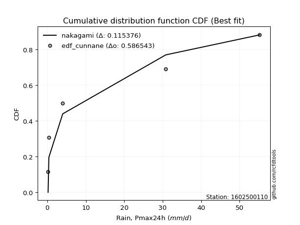</img></img>

</div>


### 12. EDF Adamowski (1981)

The Adamowski formula in hydrology refers to a specific plotting position formula used for estimating the non-parametric empirical distribution of hydrological events (like flood peaks) to calculate their return periods. This formula provides an alternative to traditional parametric methods (like the Gumbel or Log Pearson Type III distributions). 

<div align="center">


$P=(m-0.25)/(n+0.5)$


</div>


**12.1. Empirical values**

<div align="center">

|                | 0                   | 1                  | 2             | 3                  | 4                  |
|:---------------|:--------------------|:-------------------|:--------------|:-------------------|:-------------------|
| date           | 2022                | 2021               | 2020          | 2024               | 2019               |
| x              | 0.2                 | 0.4                | 4.0           | 30.8               | 55.2               |
| m              | 1                   | 2                  | 3             | 4                  | 5                  |
| empirical_dist | edf_adamowski       | edf_adamowski      | edf_adamowski | edf_adamowski      | edf_adamowski      |
| empirical      | 0.13636363636363635 | 0.3181818181818182 | 0.5           | 0.6818181818181818 | 0.8636363636363636 |
| empirical_tr   | 1.1578947368421053  | 1.4666666666666666 | 2.0           | 3.1428571428571423 | 7.333333333333334  |

</div>


**12.2. Kolmogorov-Smirnov fit test (sorted by Δ)**


<div align="center">

|                | 0                   | 1                   | 2                  | 3                   | 4                   | 5                   | 6                   | 7                   | 8                   | 9                   | 10                  | 11                    | 12                  | 13                  | 14                  | 15                  | 16                  | 17                  | 18                  | 19                 | 20                 | 21                 | 22                 | 23                  | 24                  | 25                  | 26                 | 27                  | 28                  | 29                 | 30                  | 31                  | 32                 | 33                 | 34                  | 35                  | 36                  | 37                  | 38                  | 39                  | 40                  | 41                  | 42                 | 43                 | 44                  | 45                 | 46                 | 47                  | 48                  | 49                 | 50                  | 51                  | 52                  | 53                  | 54                  | 55                 | 56                  | 57                  | 58                 | 59                  | 60                 | 61                 | 62                 | 63                  | 64                  | 65                  | 66                  | 67                 | 68                 | 69                 | 70                 | 71                 | 72                  | 73                  | 74                  | 75                 | 76                  | 77                  | 78                 | 79                 | 80                 | 81                 | 82                 | 83                 | 84                 | 85                 | 86                 | 87                 |
|:---------------|:--------------------|:--------------------|:-------------------|:--------------------|:--------------------|:--------------------|:--------------------|:--------------------|:--------------------|:--------------------|:--------------------|:----------------------|:--------------------|:--------------------|:--------------------|:--------------------|:--------------------|:--------------------|:--------------------|:-------------------|:-------------------|:-------------------|:-------------------|:--------------------|:--------------------|:--------------------|:-------------------|:--------------------|:--------------------|:-------------------|:--------------------|:--------------------|:-------------------|:-------------------|:--------------------|:--------------------|:--------------------|:--------------------|:--------------------|:--------------------|:--------------------|:--------------------|:-------------------|:-------------------|:--------------------|:-------------------|:-------------------|:--------------------|:--------------------|:-------------------|:--------------------|:--------------------|:--------------------|:--------------------|:--------------------|:-------------------|:--------------------|:--------------------|:-------------------|:--------------------|:-------------------|:-------------------|:-------------------|:--------------------|:--------------------|:--------------------|:--------------------|:-------------------|:-------------------|:-------------------|:-------------------|:-------------------|:--------------------|:--------------------|:--------------------|:-------------------|:--------------------|:--------------------|:-------------------|:-------------------|:-------------------|:-------------------|:-------------------|:-------------------|:-------------------|:-------------------|:-------------------|:-------------------|
| station        | 1602500110          | 1602500110          | 1602500110         | 1602500110          | 1602500110          | 1602500110          | 1602500110          | 1602500110          | 1602500110          | 1602500110          | 1602500110          | 1602500110            | 1602500110          | 1602500110          | 1602500110          | 1602500110          | 1602500110          | 1602500110          | 1602500110          | 1602500110         | 1602500110         | 1602500110         | 1602500110         | 1602500110          | 1602500110          | 1602500110          | 1602500110         | 1602500110          | 1602500110          | 1602500110         | 1602500110          | 1602500110          | 1602500110         | 1602500110         | 1602500110          | 1602500110          | 1602500110          | 1602500110          | 1602500110          | 1602500110          | 1602500110          | 1602500110          | 1602500110         | 1602500110         | 1602500110          | 1602500110         | 1602500110         | 1602500110          | 1602500110          | 1602500110         | 1602500110          | 1602500110          | 1602500110          | 1602500110          | 1602500110          | 1602500110         | 1602500110          | 1602500110          | 1602500110         | 1602500110          | 1602500110         | 1602500110         | 1602500110         | 1602500110          | 1602500110          | 1602500110          | 1602500110          | 1602500110         | 1602500110         | 1602500110         | 1602500110         | 1602500110         | 1602500110          | 1602500110          | 1602500110          | 1602500110         | 1602500110          | 1602500110          | 1602500110         | 1602500110         | 1602500110         | 1602500110         | 1602500110         | 1602500110         | 1602500110         | 1602500110         | 1602500110         | 1602500110         |
| empirical_dist | edf_adamowski       | edf_adamowski       | edf_adamowski      | edf_adamowski       | edf_adamowski       | edf_adamowski       | edf_adamowski       | edf_adamowski       | edf_adamowski       | edf_adamowski       | edf_adamowski       | edf_adamowski         | edf_adamowski       | edf_adamowski       | edf_adamowski       | edf_adamowski       | edf_adamowski       | edf_adamowski       | edf_adamowski       | edf_adamowski      | edf_adamowski      | edf_adamowski      | edf_adamowski      | edf_adamowski       | edf_adamowski       | edf_adamowski       | edf_adamowski      | edf_adamowski       | edf_adamowski       | edf_adamowski      | edf_adamowski       | edf_adamowski       | edf_adamowski      | edf_adamowski      | edf_adamowski       | edf_adamowski       | edf_adamowski       | edf_adamowski       | edf_adamowski       | edf_adamowski       | edf_adamowski       | edf_adamowski       | edf_adamowski      | edf_adamowski      | edf_adamowski       | edf_adamowski      | edf_adamowski      | edf_adamowski       | edf_adamowski       | edf_adamowski      | edf_adamowski       | edf_adamowski       | edf_adamowski       | edf_adamowski       | edf_adamowski       | edf_adamowski      | edf_adamowski       | edf_adamowski       | edf_adamowski      | edf_adamowski       | edf_adamowski      | edf_adamowski      | edf_adamowski      | edf_adamowski       | edf_adamowski       | edf_adamowski       | edf_adamowski       | edf_adamowski      | edf_adamowski      | edf_adamowski      | edf_adamowski      | edf_adamowski      | edf_adamowski       | edf_adamowski       | edf_adamowski       | edf_adamowski      | edf_adamowski       | edf_adamowski       | edf_adamowski      | edf_adamowski      | edf_adamowski      | edf_adamowski      | edf_adamowski      | edf_adamowski      | edf_adamowski      | edf_adamowski      | edf_adamowski      | edf_adamowski      |
| p_dist         | nakagami            | fisk                | loginvweibull      | loggenlogistic      | loggenexpon         | logexpon            | ncf                 | lograyleigh         | logmaxwell          | weibull_min         | loginvgauss         | loglaplace_asymmetric | loghalfnorm         | loginvgamma         | logerlang           | logloggamma         | loggamma            | loggamma            | lognct              | logt               | logcrystalball     | lognorm            | lognorm            | logexponnorm        | logpearson3         | logf                | logalpha           | logkstwobign        | logrice             | loggompertz        | loglogistic         | loggumbel_l         | loggumbel_r        | loghypsecant       | halfnorm            | loglaplace          | loghalflogistic     | halflogistic        | logmoyal            | logncf              | rayleigh            | maxwell             | pearson3           | logtruncnorm       | moyal               | gumbel_r           | genlogistic        | mielke              | logweibull_min      | norm               | crystalball         | fatiguelife         | kstwobign           | logistic            | invgauss            | wald               | hypsecant           | gumbel_l            | gamma              | rice                | erlang             | laplace            | exponnorm          | gompertz            | laplace_asymmetric  | genexpon            | expon               | chi2               | logwald            | loggibrat          | logfisk            | logchi2            | truncnorm           | logfatiguelife      | logbetaprime        | gibrat             | alpha               | invweibull          | lognakagami        | johnsonsu          | t                  | logmielke          | loglognorm         | betaprime          | nct                | logjohnsonsu       | invgamma           | f                  |
| delta          | 0.13635490397607278 | 0.14170737425137053 | 0.1468854394494602 | 0.14725150993423042 | 0.14740370751676257 | 0.14798561620022999 | 0.14898879958923827 | 0.14905027581897357 | 0.14940768345099298 | 0.14986011966235468 | 0.15006865078695064 | 0.15023740446468314   | 0.15039334395351545 | 0.15102898208253546 | 0.15124675706325943 | 0.15131356641006258 | 0.15134937152849237 | 0.15134937152849237 | 0.15169765973431554 | 0.151738228379739  | 0.1517388020074794 | 0.1517388664122516 | 0.1517388664122516 | 0.15173923444455023 | 0.15189629092041546 | 0.15535528327948345 | 0.1564497879919906 | 0.15807382772580825 | 0.16632983110400007 | 0.1678861771468435 | 0.17093166635562335 | 0.17370223724716571 | 0.1750381463315121 | 0.1812407179217866 | 0.18404672768620112 | 0.19105304019366542 | 0.19200695820841854 | 0.19603975350068514 | 0.19781810962920626 | 0.20613308565305855 | 0.20952600658691878 | 0.21886736596625755 | 0.2196269109187841 | 0.2229960695094742 | 0.22379255743828108 | 0.2246962846308767 | 0.2349694727277265 | 0.23826165838514973 | 0.24144024678233128 | 0.2416771544156125 | 0.24167715586903438 | 0.24840195154760403 | 0.25573877155787283 | 0.26428071925794716 | 0.26588369703946857 | 0.2793912673090443 | 0.27941304812970524 | 0.28318038028671166 | 0.2832606996145909 | 0.28357433311994223 | 0.283890773503771  | 0.3001722425363272 | 0.307521385880583  | 0.30797184401696964 | 0.30891910095918895 | 0.30891993186020755 | 0.30892136133278963 | 0.3181148118830338 | 0.3181817665928949 | 0.3181818181818182 | 0.340624203724852  | 0.3743992591011709 | 0.37881734556050306 | 0.38186782541524084 | 0.41333304822806477 | 0.4189198194979403 | 0.42047571521128624 | 0.44569383303215376 | 0.4460148841622413 | 0.4557239747656467 | 0.4997982561290186 | 0.5199223009299188 | 0.5212803669409747 | 0.6179019731636726 | 0.6413351294690057 | 0.6532146972574124 | 0.6804442928630503 | 0.6818181818181819 |
| deltao         | 0.5865427407550001  | 0.5865427407550001  | 0.5865427407550001 | 0.5865427407550001  | 0.5865427407550001  | 0.5865427407550001  | 0.5865427407550001  | 0.5865427407550001  | 0.5865427407550001  | 0.5865427407550001  | 0.5865427407550001  | 0.5865427407550001    | 0.5865427407550001  | 0.5865427407550001  | 0.5865427407550001  | 0.5865427407550001  | 0.5865427407550001  | 0.5865427407550001  | 0.5865427407550001  | 0.5865427407550001 | 0.5865427407550001 | 0.5865427407550001 | 0.5865427407550001 | 0.5865427407550001  | 0.5865427407550001  | 0.5865427407550001  | 0.5865427407550001 | 0.5865427407550001  | 0.5865427407550001  | 0.5865427407550001 | 0.5865427407550001  | 0.5865427407550001  | 0.5865427407550001 | 0.5865427407550001 | 0.5865427407550001  | 0.5865427407550001  | 0.5865427407550001  | 0.5865427407550001  | 0.5865427407550001  | 0.5865427407550001  | 0.5865427407550001  | 0.5865427407550001  | 0.5865427407550001 | 0.5865427407550001 | 0.5865427407550001  | 0.5865427407550001 | 0.5865427407550001 | 0.5865427407550001  | 0.5865427407550001  | 0.5865427407550001 | 0.5865427407550001  | 0.5865427407550001  | 0.5865427407550001  | 0.5865427407550001  | 0.5865427407550001  | 0.5865427407550001 | 0.5865427407550001  | 0.5865427407550001  | 0.5865427407550001 | 0.5865427407550001  | 0.5865427407550001 | 0.5865427407550001 | 0.5865427407550001 | 0.5865427407550001  | 0.5865427407550001  | 0.5865427407550001  | 0.5865427407550001  | 0.5865427407550001 | 0.5865427407550001 | 0.5865427407550001 | 0.5865427407550001 | 0.5865427407550001 | 0.5865427407550001  | 0.5865427407550001  | 0.5865427407550001  | 0.5865427407550001 | 0.5865427407550001  | 0.5865427407550001  | 0.5865427407550001 | 0.5865427407550001 | 0.5865427407550001 | 0.5865427407550001 | 0.5865427407550001 | 0.5865427407550001 | 0.5865427407550001 | 0.5865427407550001 | 0.5865427407550001 | 0.5865427407550001 |
| eval           | Δo > Δ              | Δo > Δ              | Δo > Δ             | Δo > Δ              | Δo > Δ              | Δo > Δ              | Δo > Δ              | Δo > Δ              | Δo > Δ              | Δo > Δ              | Δo > Δ              | Δo > Δ                | Δo > Δ              | Δo > Δ              | Δo > Δ              | Δo > Δ              | Δo > Δ              | Δo > Δ              | Δo > Δ              | Δo > Δ             | Δo > Δ             | Δo > Δ             | Δo > Δ             | Δo > Δ              | Δo > Δ              | Δo > Δ              | Δo > Δ             | Δo > Δ              | Δo > Δ              | Δo > Δ             | Δo > Δ              | Δo > Δ              | Δo > Δ             | Δo > Δ             | Δo > Δ              | Δo > Δ              | Δo > Δ              | Δo > Δ              | Δo > Δ              | Δo > Δ              | Δo > Δ              | Δo > Δ              | Δo > Δ             | Δo > Δ             | Δo > Δ              | Δo > Δ             | Δo > Δ             | Δo > Δ              | Δo > Δ              | Δo > Δ             | Δo > Δ              | Δo > Δ              | Δo > Δ              | Δo > Δ              | Δo > Δ              | Δo > Δ             | Δo > Δ              | Δo > Δ              | Δo > Δ             | Δo > Δ              | Δo > Δ             | Δo > Δ             | Δo > Δ             | Δo > Δ              | Δo > Δ              | Δo > Δ              | Δo > Δ              | Δo > Δ             | Δo > Δ             | Δo > Δ             | Δo > Δ             | Δo > Δ             | Δo > Δ              | Δo > Δ              | Δo > Δ              | Δo > Δ             | Δo > Δ              | Δo > Δ              | Δo > Δ             | Δo > Δ             | Δo > Δ             | Δo > Δ             | Δo > Δ             | Δo <= Δ            | Δo <= Δ            | Δo <= Δ            | Δo <= Δ            | Δo <= Δ            |
| fit            | 1                   | 1                   | 1                  | 1                   | 1                   | 1                   | 1                   | 1                   | 1                   | 1                   | 1                   | 1                     | 1                   | 1                   | 1                   | 1                   | 1                   | 1                   | 1                   | 1                  | 1                  | 1                  | 1                  | 1                   | 1                   | 1                   | 1                  | 1                   | 1                   | 1                  | 1                   | 1                   | 1                  | 1                  | 1                   | 1                   | 1                   | 1                   | 1                   | 1                   | 1                   | 1                   | 1                  | 1                  | 1                   | 1                  | 1                  | 1                   | 1                   | 1                  | 1                   | 1                   | 1                   | 1                   | 1                   | 1                  | 1                   | 1                   | 1                  | 1                   | 1                  | 1                  | 1                  | 1                   | 1                   | 1                   | 1                   | 1                  | 1                  | 1                  | 1                  | 1                  | 1                   | 1                   | 1                   | 1                  | 1                   | 1                   | 1                  | 1                  | 1                  | 1                  | 1                  | 0                  | 0                  | 0                  | 0                  | 0                  |
| n              | 5                   | 5                   | 5                  | 5                   | 5                   | 5                   | 5                   | 5                   | 5                   | 5                   | 5                   | 5                     | 5                   | 5                   | 5                   | 5                   | 5                   | 5                   | 5                   | 5                  | 5                  | 5                  | 5                  | 5                   | 5                   | 5                   | 5                  | 5                   | 5                   | 5                  | 5                   | 5                   | 5                  | 5                  | 5                   | 5                   | 5                   | 5                   | 5                   | 5                   | 5                   | 5                   | 5                  | 5                  | 5                   | 5                  | 5                  | 5                   | 5                   | 5                  | 5                   | 5                   | 5                   | 5                   | 5                   | 5                  | 5                   | 5                   | 5                  | 5                   | 5                  | 5                  | 5                  | 5                   | 5                   | 5                   | 5                   | 5                  | 5                  | 5                  | 5                  | 5                  | 5                   | 5                   | 5                   | 5                  | 5                   | 5                   | 5                  | 5                  | 5                  | 5                  | 5                  | 5                  | 5                  | 5                  | 5                  | 5                  |
| best_fit       | 1                   | 0                   | 0                  | 0                   | 0                   | 0                   | 0                   | 0                   | 0                   | 0                   | 0                   | 0                     | 0                   | 0                   | 0                   | 0                   | 0                   | 0                   | 0                   | 0                  | 0                  | 0                  | 0                  | 0                   | 0                   | 0                   | 0                  | 0                   | 0                   | 0                  | 0                   | 0                   | 0                  | 0                  | 0                   | 0                   | 0                   | 0                   | 0                   | 0                   | 0                   | 0                   | 0                  | 0                  | 0                   | 0                  | 0                  | 0                   | 0                   | 0                  | 0                   | 0                   | 0                   | 0                   | 0                   | 0                  | 0                   | 0                   | 0                  | 0                   | 0                  | 0                  | 0                  | 0                   | 0                   | 0                   | 0                   | 0                  | 0                  | 0                  | 0                  | 0                  | 0                   | 0                   | 0                   | 0                  | 0                   | 0                   | 0                  | 0                  | 0                  | 0                  | 0                  | 0                  | 0                  | 0                  | 0                  | 0                  |
| best_fit_sort  | 1                   | 2                   | 3                  | 4                   | 5                   | 6                   | 7                   | 8                   | 9                   | 10                  | 11                  | 12                    | 13                  | 14                  | 15                  | 16                  | 17                  | 18                  | 19                  | 20                 | 21                 | 22                 | 23                 | 24                  | 25                  | 26                  | 27                 | 28                  | 29                  | 30                 | 31                  | 32                  | 33                 | 34                 | 35                  | 36                  | 37                  | 38                  | 39                  | 40                  | 41                  | 42                  | 43                 | 44                 | 45                  | 46                 | 47                 | 48                  | 49                  | 50                 | 51                  | 52                  | 53                  | 54                  | 55                  | 56                 | 57                  | 58                  | 59                 | 60                  | 61                 | 62                 | 63                 | 64                  | 65                  | 66                  | 67                  | 68                 | 69                 | 70                 | 71                 | 72                 | 73                  | 74                  | 75                  | 76                 | 77                  | 78                  | 79                 | 80                 | 81                 | 82                 | 83                 | 84                 | 85                 | 86                 | 87                 | 88                 |

</div>


**12.3. Best fit**

<div align="center">

|   id |    station | empirical_dist   | p_dist   |    delta |   deltao | eval   |   fit |   n |   best_fit |   best_fit_sort |
|-----:|-----------:|:-----------------|:---------|---------:|---------:|:-------|------:|----:|-----------:|----------------:|
|    0 | 1602500110 | edf_adamowski    | nakagami | 0.136355 | 0.586543 | Δo > Δ |     1 |   5 |          1 |               1 |

</div>


<div align="center">

</img>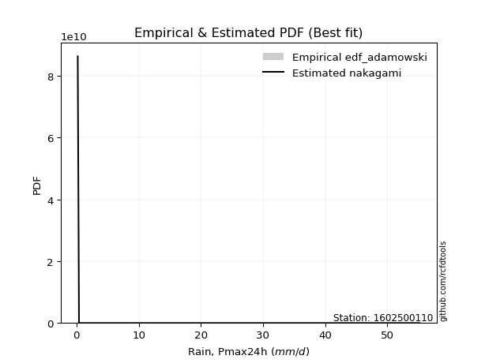</img>

</div>


## C. Best fit & Estimate extreme values for specific return periods - Tr

Best fit in probability distribution analysis means finding the theoretical distribution (like Normal, Poisson, Exponential) that most accurately mirrors your real-world data´s patterns (shape, center, spread) for better predictions, using methods like visual checks (Q-Q plots), goodness-of-fit tests (Kolmogorov-Smirnov, Chi-Squared), and information criteria (AIC) to score and select the simplest, most representative model.


### 1. Best fit (ordered by delta Δ)

<div align="center">

|   id |    station | empirical_dist   | p_dist      |    delta |   deltao | eval   |   fit |   n |   best_fit |   best_fit_sort |
|-----:|-----------:|:-----------------|:------------|---------:|---------:|:-------|------:|----:|-----------:|----------------:|
|    0 | 1602500110 | edf_hazen        | nakagami    | 0.103856 | 0.586543 | Δo > Δ |     1 |   5 |          1 |               1 |
|    1 | 1602500110 | edf_gringorten   | nakagami    | 0.109366 | 0.586543 | Δo > Δ |     1 |   5 |          1 |               2 |
|    2 | 1602500110 | edf_cunnane      | nakagami    | 0.115376 | 0.586543 | Δo > Δ |     1 |   5 |          1 |               3 |
|    3 | 1602500110 | edf_blom         | nakagami    | 0.119039 | 0.586543 | Δo > Δ |     1 |   5 |          1 |               4 |
|    4 | 1602500110 | edf_tukey        | nakagami    | 0.124991 | 0.586543 | Δo > Δ |     1 |   5 |          1 |               5 |
|    5 | 1602500110 | edf_filliben     | nakagami    | 0.127205 | 0.586543 | Δo > Δ |     1 |   5 |          1 |               6 |
|    6 | 1602500110 | edf_beard        | nakagami    | 0.128244 | 0.586543 | Δo > Δ |     1 |   5 |          1 |               7 |
|    7 | 1602500110 | edf_jenkinson    | nakagami    | 0.128244 | 0.586543 | Δo > Δ |     1 |   5 |          1 |               8 |
|    8 | 1602500110 | edf_chegodayev   | nakagami    | 0.129621 | 0.586543 | Δo > Δ |     1 |   5 |          1 |               9 |
|    9 | 1602500110 | edf_adamowski    | nakagami    | 0.136355 | 0.586543 | Δo > Δ |     1 |   5 |          1 |              10 |
|   10 | 1602500110 | edf_california   | fatiguelife | 0.153001 | 0.586543 | Δo > Δ |     1 |   5 |          1 |              11 |
|   11 | 1602500110 | edf_weibull      | logalpha    | 0.15645  | 0.586543 | Δo > Δ |     1 |   5 |          1 |              12 |

</div>

:file_folder:Tables: [bestfit_1602500110.csv](table/bestfit_1602500110.csv) | [extreme_1602500110.csv](table/extreme_1602500110.csv)


### 2. Extreme values

In hydrology, a return period (or recurrence interval $Tr$) is the statistical average time between extreme events like floods or droughts of a specific magnitude, indicating how rare an event is, with a 100-year flood, for example, having a 1% chance of occurring in any given year, not that it happens exactly every century. It is a key tool for infrastructure design (like bridges or dams) and risk assessment, calculated from historical data to determine the probability of future events, although it is important to remember it is statistical average, and events can cluster or be missed.

> risk_rate: assuming the return period as the project useful life.

|   id |      tr |   prob_l |     prob_g |      alpha |        betaprime |     chi2 |   crystalball |   erlang |    expon |   exponnorm |        f |   fatiguelife |             fisk |    gamma |   genexpon |   genlogistic |   gibrat |   gompertz |   gumbel_l |   gumbel_r |   halflogistic |   halfnorm |   hypsecant |   invgamma |    invgauss |       invweibull |       johnsonsu |   kstwobign |   laplace |   laplace_asymmetric |   loggamma |   logistic |    lognorm |   maxwell |           mielke |    moyal |   nakagami |              ncf |            nct |    norm |   pearson3 |   rayleigh |    rice |        t |   truncnorm |     wald |   weibull_min |         logalpha |   logbetaprime |       logchi2 |   logcrystalball |   logerlang |         logexpon |   logexponnorm |           logf |   logfatiguelife |       logfisk |      loggenexpon |   loggenlogistic |        loggibrat |   loggompertz |   loggumbel_l |   loggumbel_r |   loghalflogistic |   loghalfnorm |   loghypsecant |   loginvgamma |      loginvgauss |   loginvweibull |   logjohnsonsu |   logkstwobign |   loglaplace |   loglaplace_asymmetric |   logloggamma |   loglogistic |     loglognorm |   logmaxwell |       logmielke |     logmoyal |      lognakagami |         logncf |     lognct |   logpearson3 |   lograyleigh |    logrice |       logt |   logtruncnorm |          logwald |   logweibull_min |    station |   n |   risk_rate |
|-----:|--------:|---------:|-----------:|-----------:|-----------------:|---------:|--------------:|---------:|---------:|------------:|---------:|--------------:|-----------------:|---------:|-----------:|--------------:|---------:|-----------:|-----------:|-----------:|---------------:|-----------:|------------:|-----------:|------------:|-----------------:|----------------:|------------:|----------:|---------------------:|-----------:|-----------:|-----------:|----------:|-----------------:|---------:|-----------:|-----------------:|---------------:|--------:|-----------:|-----------:|--------:|---------:|------------:|---------:|--------------:|-----------------:|---------------:|--------------:|-----------------:|------------:|-----------------:|---------------:|---------------:|-----------------:|--------------:|-----------------:|-----------------:|-----------------:|--------------:|--------------:|--------------:|------------------:|--------------:|---------------:|--------------:|-----------------:|----------------:|---------------:|---------------:|-------------:|------------------------:|--------------:|--------------:|---------------:|-------------:|----------------:|-------------:|-----------------:|---------------:|-----------:|--------------:|--------------:|-----------:|-----------:|---------------:|-----------------:|-----------------:|-----------:|----:|------------:|
|    0 |    2    | 0.5      | 0.5        |   0.59107  |      0.200002    |  1.61974 |       18.12   |  5.52078 |  12.6212 |     12.5578 | 0.2      |      0.200002 |      3.93911     |  5.60843 |    12.6211 |       13.75   |  11.5846 |    12.5528 |    21.6969 |    14.5431 |        12.7649 |    13.6632 |     18.12   |   0.2      |    0.924787 |   7459.88        |     0.200013    |     15.0417 |   18.12   |              12.621  |    3.46108 |    18.12   |    3.52475 |   16.2579 |      0.282677    |  13.3884 |    6.26451 |      1.85143     |    0.2         | 18.12   |    15.4097 |    15.5974 | 17.7034 | 0.4      |     17.4816 |  11.0623 |       7.43596 |     1.04848      |   0.203117     |      0.371177 |          3.52475 |     3.46094 |      1.46137     |        3.52475 |    0.63142     |      0.2         |   3.48325     |      1.78799     |          2.35935 |      1.79544     |       2.40978 |        5.0988 |       2.43662 |           2.02805 |       2.22507 |        3.52475 |       3.01589 |      1.48246     |         2.36261 |        55.2    |        2.24453 |      3.52475 |                 3.74978 |       8.19616 |       3.52475 |   0.201188     |      2.90841 |    0.201256     |      2.16284 |      0.202998    |   1.91066      |    3.52294 |       3.59321 |       2.71675 |    3.05539 |    3.52473 |        4.50875 |      1.70121     |      0.243782    | 1602500110 |   5 |    0.75     |
|    1 |    2.33 | 0.570815 | 0.429185   |   0.703528 |      0.200004    |  2.02737 |       22.0053 |  6.86808 |  15.358  |     15.2843 | 0.2      |      0.646422 |      6.62994     |  6.96635 |    15.3578 |       16.9303 |  13.5528 |    15.2745 |    25.0772 |    18.1433 |        16.4664 |    17.8565 |     21.2294 |   0.2      |    1.25557  | 689822           |     0.200126    |     18.3769 |   20.4712 |              15.3578 |    5.17272 |    21.5432 |    5.26373 |   20.2945 |      0.452786    |  16.7964 |   10.0556  |      2.81634     |    0.2         | 22.0053 |    19.2742 |    19.6937 | 21.2296 | 0.4      |     20.5062 |  13.6099 |      14.5404  |     1.71562      |   0.211433     |      0.462187 |          5.26373 |     5.17333 |      2.26498     |        5.26373 |    1.15059     |      0.216706    |   2.38789e+09 |      2.76504     |          3.57902 |      2.19987     |       3.68586 |        7.2276 |       3.53323 |           2.9717  |       3.43016 |        4.85862 |       4.53078 |      2.26736     |         3.58563 |        55.2    |        3.39385 |      4.49288 |                 5.04415 |      11.8009  |       5.01857 |   0.20281      |      4.41166 |    0.203775     |      3.07465 |      0.210116    |   5.73513      |    5.2613  |       5.36241 |       4.14642 |    4.58083 |    5.26371 |        6.94771 |      2.2129      |      0.478646    | 1602500110 |   5 |    0.729209 |
|    2 |    5    | 0.8      | 0.2        |   1.57555  |      0.200319    |  4.23384 |       36.4442 | 13.8751  |  29.0411 |     28.9159 | 0.2      |     10.1298   |     52.3514      | 14.0107  |    29.0409 |       30.7462 |  24.8839 |    28.8823 |    35.9974 |    33.7841 |        33.2152 |    35.5892 |     33.702  |   0.2      |    5.34314  |      2.39886e+14 |     0.834995    |     32.5444 |   32.2267 |              29.0407 |   23.2491  |    34.7608 |   23.3637  |   36.1821 |     32.1397      |  32.5827 |   35.807   |     20.2128      |    0.200001    | 36.4442 |    35.2041 |    36.093  | 35.3465 | 0.4      |     32.9066 |  27.8716 |     130.893   |    78.1127       |   1.56731      |      1.66772  |         23.3637  |    23.2655  |     20.2557      |       23.3636  | 3289.2         |      1.19122     | inf           |     20.8233      |         21.8704  |      7.08495     |      21.0117  |       22.3107 |      17.7541  |          16.7414  |      21.3903  |       17.6043  |      22.4688  |     19.489       |        21.9615  |        55.2    |       19.6544  |     15.1177  |                21.9916  |      29.8766  |      19.6373  |   0.279981     |     22.7402  |    0.300017     |     15.6835  |      0.572638    |   2.53433e+06  |   23.3624  |      23.4898  |      22.5319  |   22.417   |   23.3636  |       38.3705  |      9.64432     |      1.01302e+45 | 1602500110 |   5 |    0.67232  |
|    3 |   10    | 0.9      | 0.1        |   3.17765  |      0.215985    |  6.37192 |       46.0226 | 20.4498  |  41.4623 |     41.2904 | 0.2      |     23.2239   |    243.843       | 20.6066  |    41.462  |       41.9985 |  37.8001 |    41.235  |    42.0773 |    46.5233 |        47.1244 |    48.7111 |     43.6617 |   0.2      |   17.9868   |      2.17141e+21 |   181.936       |     43.3311 |   42.8981 |              41.4618 |   63.5358  |    44.4951 |   62.7927  |   47.363  |   1627.12        |  46.3271 |   60.8658  |    115.033       |    0.200246    | 46.0226 |    47.1844 |    47.786  | 45.4122 | 0.4      |     41.0523 |  43.0067 |     447.464   | 86981.1          |   6.47409e+06  |      6.24126  |         62.7927  |    63.6049  |    148.005       |       62.7925  |    1.10989e+16 |     12.5287      | inf           |    110.364       |         95.5059  |     26.8739      |      70.655   |       41.7883 |      66.1236  |          70.354   |      82.8757  |       49.213   |      70.6071  |    151.228       |        96.1036  |        55.2    |       74.8528  |     45.4829  |                83.7047  |      41.3141  |      53.6334  |   3.21942      |     72.1103  |    1.35579      |     64.7981  |      4.79196     |   1.28769e+24  |   62.818   |      62.0028  |      75.3281  |   67.5851  |   62.7925  |      126.114   |     45.997       |    inf           | 1602500110 |   5 |    0.651322 |
|    4 |   15    | 0.933333 | 0.0666667  |   4.77404  |      0.357667    |  7.65657 |       50.8024 | 24.3492  |  48.7283 |     48.529  | 0.2      |     31.7876   |    564.515       | 24.5152  |    48.7278 |       48.3469 |  46.7092 |    48.461  |    44.8307 |    53.7107 |        54.9958 |    55.5397 |     49.3457 |   0.2      |   34.6537   |      1.82673e+25 |  3057.73        |     49.0575 |   49.1404 |              48.7276 |  105.192   |    49.7987 |  102.843   |   53.0998 |  14913.3         |  54.3038 |   74.7359  |    316.853       |    0.204965    | 50.8024 |    53.5984 |    53.8107 | 50.5985 | 0.4      |     44.6641 |  52.7258 |     781.002   |     9.44614e+07  |   2.01734e+23  |     14.0507   |        102.842   |   105.327   |    473.724       |      102.842   |    1.25916e+36 |     58.3792      | inf           |    278.053       |        219.378   |     67.4054      |     129.131   |       55.5241 |     138.849   |         158.538   |     167.699   |       88.4855  |     128.391   |    525.539       |       221.02    |        55.2    |      152.235   |     86.6306  |               182.943   |      45.6628  |      92.7219  | 578.157        |    130.364   |   10.331        |    147.615   |     20.47        |   5.26769e+49  |  102.913   |     100.361   |     140.29    |  118.411   |  102.842   |      230.744   |    125.431       |    inf           | 1602500110 |   5 |    0.644736 |
|    5 |   20    | 0.95     | 0.05       |   6.36903  |      0.99985     |  8.579   |       53.9326 | 27.133   |  53.8835 |     53.6648 | 0.2      |     38.1281   |   1008.61        | 27.3045  |    53.8831 |       52.7919 |  53.6976 |    53.5878 |    46.5446 |    58.7431 |        60.5107 |    60.0924 |     53.3554 |   0.2      |   53.6041   |      1.02285e+28 | 19418.1         |     52.915  |   53.5694 |              53.8828 |  146.478   |    53.4645 |  142.065   |   56.9071 |  70315.3         |  59.953  |   84.1336  |    649.905       |    0.241844    | 53.9326 |    57.9586 |    57.8152 | 54.0457 | 0.4      |     46.764  |  59.9684 |    1104.69    |     1.01956e+11  |   3.56774e+53  |     25.3099   |        142.065   |   146.683   |   1081.45        |      142.065   |    2.68842e+63 |    182.427       | inf           |    525.776       |        392.705   |    138.664       |     190.957   |       66.2689 |     233.415   |         280.121   |     268.295   |      133.849   |     191.845   |   1297.63        |       395.984   |        55.2    |      245.585   |    136.839   |               318.597   |      47.9419  |     135.365   |   1.58965e+06  |    193.12    |  110.429        |    264.463   |     57.9939      |   2.24568e+82  |  142.193   |     137.436   |     212.097   |  171.447   |  142.065   |      343.701   |    264.893       |    inf           | 1602500110 |   5 |    0.641514 |
|    6 |   25    | 0.96     | 0.04       |   7.96345  |      3.01875     |  9.29969 |       56.2368 | 29.3005  |  57.8823 |     57.6485 | 0.2      |     43.1658   |   1572.4         | 29.4758  |    57.8818 |       56.2157 |  59.5236 |    57.5645 |    47.7642 |    62.6194 |        64.7596 |    63.4797 |     56.4586 |   0.2      |   73.8365   |      1.33844e+30 | 75717.4         |     55.8045 |   57.0048 |              57.8815 |  186.99    |    56.2687 |  180.21    |   59.7336 | 232120           |  64.3317 |   91.172   |   1134.47        |    0.418603    | 56.2368 |    61.25   |    60.7905 | 56.6069 | 0.4      |     48.151  |  65.7696 |    1413.85    |     1.09777e+14  |   1.59707e+101 |     40.1954   |        180.21    |   187.269   |   2051.47        |      180.209   |    7.30059e+97 |    451.08        | inf           |    853.808       |        614.956   |    253.002       |     254.053   |       75.159  |     348.248   |         434.321   |     380.589   |      184.384   |     259.183   |   2644.66        |       620.503   |        55.2    |      351.372   |    195.077   |               489.913   |      49.3435  |     180.805   |   5.86479e+10  |    258.542   | 1531.73         |    415.574   |    128.915       |   2.76474e+121 |  180.401   |     173.138   |     288.341   |  225.431   |  180.21    |      461.428   |    482.079       |    inf           | 1602500110 |   5 |    0.639603 |
|    7 |   50    | 0.98     | 0.02       |  15.9331   |    141.24        | 11.5619  |       62.8352 | 36.0703  |  70.3035 |     70.023  | 0.2      |     59.329    |   6106.5         | 36.2552  |    70.3029 |       66.7626 |  80.0602 |    69.9173 |    51.0749 |    74.5603 |        77.8514 |    73.3255 |     66.0799 |   0.2      |  179.346    |      4.44032e+36 |     3.72877e+06 |     64.2892 |   67.6761 |              70.3025 |  377.074   |    64.8367 |  356.095   |   67.9311 |      9.18587e+06 |  77.925  |  111.734   |   6400.46        |   37.3554      | 62.8352 |    71.0626 |    69.4271 | 64.0415 | 0.4      |     51.306  |  84.7105 |    2762.64    |     1.57118e+29  | inf            |    173.795    |        356.095   |   377.736   |  14989.7         |      356.093   |  inf           |   8235.7         | inf           |   3681.86        |       2448.24    |   2107.26        |     567.201   |      105.776  |    1194.44    |        1677.51    |    1051.51    |      497.754   |     629.065   |  25549.8         |      2475.44    |        55.2    |     1005.96    |    586.905   |              1864.71    |      52.2244  |     437.807   |   2.56189e+48  |    602.557   |    1.24799e+10  |   1690.41    |   1397.5         | inf            |  356.657   |     334.628   |     703.166   |  496.26    |  356.094   |     1077.83    |   3405.49        |    inf           | 1602500110 |   5 |    0.63583  |
|    8 |   75    | 0.986667 | 0.0133333  |  23.9016   |   1391.31        | 12.8985  |       66.3758 | 40.0514  |  77.5694 |     77.2615 | 0.2      |     69.0633   |  13369.8         | 40.2406  |    77.5688 |       72.8929 |  93.9308 |    77.1432 |    52.7491 |    81.5009 |        85.4615 |    78.6852 |     71.7025 |   0.200001 |  279.493    |      2.73881e+40 |     3.01744e+07 |     68.9575 |   73.9185 |              77.5684 |  550.099   |    69.7852 |  513.187   |   72.3879 |      7.78827e+07 |  85.8742 |  122.941   |  17608.9         |  749.582       | 66.3758 |    76.567  |    74.1258 | 68.0863 | 0.4      |     52.5035 |  96.3658 |    3876.53    |     2.23781e+44  | inf            |    415.628    |        513.187   |   551.142   |  47978.1         |      513.183   |  inf           |  47358.9         | inf           |   8428.38        |       5465.1     |   8820.46        |     864.056   |      125.729  |    2445.03    |        3679.61    |    1828.39    |      889.319   |    1028.57    |  99842.4         |      5532.51    |        55.2    |     1794.4     |   1117.87    |              4075.47    |      53.2079  |     729.64    |   2.99123e+106 |    954.515   |    2.69262e+18  |   3839.95    |   5193.06        | inf            |  514.155   |     475.87    |    1142.05    |  759.95    |  513.186   |     1703.49    |  11341.1         |    inf           | 1602500110 |   5 |    0.634587 |
|    9 |  100    | 0.99     | 0.01       |  31.8698   |   7057.33        | 13.8517  |       68.7704 | 42.8836  |  82.7246 |     82.3974 | 0.200001 |     76.0674   |  23249.4         | 43.0755  |    82.724  |       77.2317 | 104.676  |    82.2701 |    53.8441 |    86.4131 |        90.8479 |    82.3364 |     75.6909 |   0.200005 |  370.846    |      1.31851e+43 |     1.24114e+08 |     72.156  |   78.3475 |              82.7236 |  710.558   |    73.2789 |  657.083   |   75.4237 |      3.53532e+08 |  91.5137 |  130.567   |  36105.5         | 6315.42        | 68.7704 |    80.3856 |    77.3269 | 70.8419 | 0.4      |     53.1366 | 104.864  |    4838.08    |     3.18339e+59  | inf            |    775.908    |        657.082   |   711.972   | 109527           |      657.077   |  inf           | 166737           | inf           |  15013.9         |       9647.75    |  26739.5         |    1143.67    |      140.774  |    4059.61    |        6415.79    |    2665.25    |     1342.28    |    1443.73    | 266498           |      9775.12    |        55.2    |     2667.62    |   1765.75    |              7097.48    |      53.704   |    1046.46    |   9.88533e+180 |   1305.76    |    6.45412e+27  |   6872.74    |  12702.4         | inf            |  658.467   |     603.495   |    1589.2     | 1014.78    |  657.081   |     2323.58    |  27263.8         |    inf           | 1602500110 |   5 |    0.633968 |
|   10 |  200    | 0.995    | 0.005      |  63.742    | 353114           | 16.1622  |       74.2022 | 49.7296  |  95.1458 |     94.7718 | 0.200016 |     93.2123   |  87663           | 49.9265  |    95.1451 |       87.6626 | 133.909  |    94.6229 |    56.2243 |    98.2226 |       103.797  |    90.6871 |     85.2993 |   0.200212 |  665.039    |      3.70795e+49 |     3.06889e+09 |     79.5229 |   89.0188 |              95.1446 | 1271.81    |    81.6598 | 1151.1     |   82.369  |      1.34215e+10 | 105.101  |  147.963   | 203670           |    1.07338e+06 | 74.2022 |    89.3362 |    84.6513 | 77.147  | 0.400001 |     54.1353 | 126.031  |    7831.45    |     1.29968e+120 | inf            |   3547.55     |       1151.1     |  1274.61    | 800299           |     1151.09    |  inf           |      3.6315e+06  | inf           |  58544.7         |      37828.9     | 546478           |    2131.03    |      179.978  |   13736.2     |       24418.9     |    6310.65    |     3618.75    |    3178.5     |      2.97072e+06 |     38407.5     |        55.2    |     6648.95    |   5312.39    |             27014.5     |      54.4537  |    2485.48    | inf            |   2674.23    |    5.85327e+72  |  27939.3     |  97467.6         | inf            | 1154.14    |    1032.74    |    3384.62    | 1960.34    | 1151.09    |     4708.88    | 242354           |    inf           | 1602500110 |   5 |    0.633042 |
|   11 |  250    | 0.996    | 0.004      |  79.678    |      1.24441e+06 | 16.9096  |       75.8622 | 51.9392  |  99.1446 |     98.7555 | 0.200046 |     98.7998   | 134236           | 52.1374  |    99.1438 |       91.0159 | 144.397  |    98.5996 |    56.9246 |   102.019  |       107.96   |    93.2561 |     88.3924 |   0.200691 |  782.184    |      4.38944e+51 |     8.17947e+09 |     81.8028 |   92.4542 |              99.1433 | 1520.09    |    84.3504 | 1366.22    |   84.5069 |      4.32045e+10 | 109.475  |  153.299   | 355474           |    5.60755e+06 | 75.8622 |    92.1521 |    86.9059 | 79.0878 | 0.400002 |     54.3428 | 133.034  |    9023.71    |     2.62466e+150 | inf            |   5810.72     |       1366.22    |  1523.54    |      1.51814e+06 |     1366.21    |  inf           |      9.91193e+06 | inf           |  89995.8         |      58693.7     |      1.61345e+06 |    2567.52    |      193.469  |   20326.2     |       37526.8     |    8226.88    |     4979.78    |    4068.51    |      6.5384e+06  |     59631.1     |        55.2    |     8820.65    |   7573.34    |             41540.7     |      54.6045  |    3281.12    | inf            |   3334.54    |    4.4659e+98   |  43882.7     | 181800           | inf            | 1370.07    |    1216.44    |    4271.47    | 2398.78    | 1366.22    |     5846.49    | 499297           |    inf           | 1602500110 |   5 |    0.632858 |
|   12 |  500    | 0.998    | 0.002      | 159.358    |      6.22656e+07 | 19.2405  |       80.7848 | 58.8176  | 111.566  |    111.13   | 0.201364 |    116.328    | 503237           | 59.0189  |   111.565  |      101.424  | 180.647  |   110.952  |    58.9322 |   113.803  |       120.882  |   100.916  |     98.0001 |   0.227301 | 1212.35     |      1.19517e+58 |     1.49718e+11 |     88.6352 |  103.126  |             111.564  | 2582.64    |    92.6949 | 2270.83    |   90.8866 |      1.62696e+12 | 123.063  |  169.155   |      2.0052e+06  |    9.53103e+08 | 80.7848 |   100.726  |    93.6331 | 84.8788 | 0.400047 |     54.7659 | 155.3    |   13546       |     8.80595e+301 | inf            |  27197.9      |       2270.83    |  2588.99    |      1.10928e+07 |     2270.81    |  inf           |      2.31271e+08 | inf           | 334827           |     229454       |      6.80288e+07 |    4413.75    |      238.015  |   68594.3     |      142416       |   18138.1     |    13424.3     |    8598.28    |      7.85323e+07 |    233601       |        55.2    |    20575.4     |  22785       |            158112       |      54.9067  |    7763.87    | inf            |   6441.94    |    4.63238e+251 | 178388       |      1.15218e+06 | inf            | 2278.47    |    1974.1     |    8553.28    | 4371.31    | 2270.83    |    11120.9     |      4.97157e+06 |    inf           | 1602500110 |   5 |    0.632489 |
|   13 |  750    | 0.998667 | 0.00133333 | 239.037    |      6.14139e+08 | 20.6097  |       83.5193 | 62.8502  | 118.832  |    118.369  | 0.209871 |    126.684    |      1.0891e+06  | 63.0528  |   118.831  |      107.509  | 204.62   |   118.178  |    60.0051 |   120.692  |       128.436  |   105.195  |    103.62   |   0.434445 | 1507.04     |      6.90774e+61 |     7.52725e+11 |     92.4734 |  109.368  |             118.83   | 3469.56    |    97.5701 | 3011.38    |   94.4548 |      1.35707e+13 | 131.011  |  177.977   |      5.51658e+06 |    1.9223e+10  | 83.5193 |   105.634  |    97.3948 | 88.117  | 0.400343 |     54.9095 | 168.65   |   16830.7     |   inf            | inf            |  67524.6      |       3011.38    |  3478.46    |      3.5505e+07  |     3011.35    |  inf           |      1.4872e+09  | inf           | 712327           |     509143       |      8.0784e+08  |    5922.1     |      265.89   |  139666       |      310577       |   28210.4     |    23978.5     |   13170.4     |      3.43897e+08 |    518970       |        55.2001 |    33112.8     |  43398.2     |            345567       |      55.0077  |   12841.5     | inf            |   9310.37    |  inf            | 405179       |      3.20521e+06 | inf            | 3022.49    |    2581.18    |   12611.3     | 6106.36    | 3011.38    |    15907       |      1.9722e+07  |    inf           | 1602500110 |   5 |    0.632366 |
|   14 | 1000    | 0.999    | 0.001      | 318.717    |      3.11554e+09 | 21.5833  |       85.4021 | 65.7149  | 123.987  |    123.504  | 0.2402   |    134.072    |      1.88299e+06 | 65.9182  |   123.986  |      111.825  | 222.965  |   123.305  |    60.7273 |   125.578  |       133.794  |   108.15   |    107.608  |   1.27803  | 1733.55     |      3.21959e+64 |     2.28836e+12 |     95.1325 |  113.797  |             123.985  | 4252.91    |   101.027  | 3657.32    |   96.921  |      6.11022e+13 | 136.65   |  184.055   |      1.13112e+07 |    1.61997e+11 | 85.4021 |   109.074  |    99.9944 | 90.3548 | 0.401406 |     54.9818 | 178.254  |   19478.9     |   inf            | inf            | 129053        |       3657.32    |  4264.13    |      8.10531e+07 |     3657.29    |  inf           |      5.60932e+09 | inf           |      1.21043e+06 |     896132       |      5.36648e+09 |    7229.62    |      286.465  |  231280       |      539957       |   38272       |    36188.5     |   17745.4     |      9.89777e+08 |    914212       |        55.2001 |    46042.6     |  68550.4     |            601809       |      55.0583  |   18348.2     | inf            |  12009.3     |  inf            | 725159       |      6.47369e+06 | inf            | 3671.65    |    3103.45    |   16492.6     | 7689.2     | 3657.32    |    20358       |      5.31419e+07 |    inf           | 1602500110 |   5 |    0.632305 |

<div align="center">

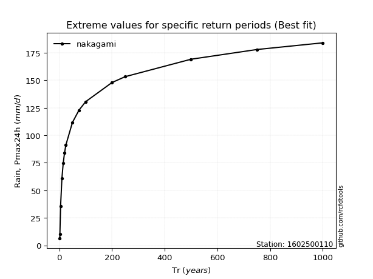</img>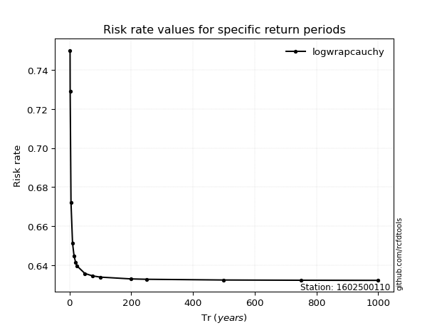</img>

</div>


<sub>**APP DISCLAIMER**: NO WARRANTY - This software is provided by [github.com/rcfdtools](https://github.com/rcfdtools) "as is", without any express or implied warranty, including warranties of merchantability, fitness for a particular purpose, or non-infringement. There is no guarantee that the software will be error-free or operate without interruption. LIMITATION OF LIABILITY - Neither the authors nor copyright holders will be liable for claims or damages arising from the software or its use. You are responsible for determining if the software is appropriate for your use and assume all associated risks, including errors, legal compliance, and data loss. NO PROFESSIONAL ADVICE - The software provides general information and does not offer professional advice. It should not replace consultation with professional advisors.</sub>