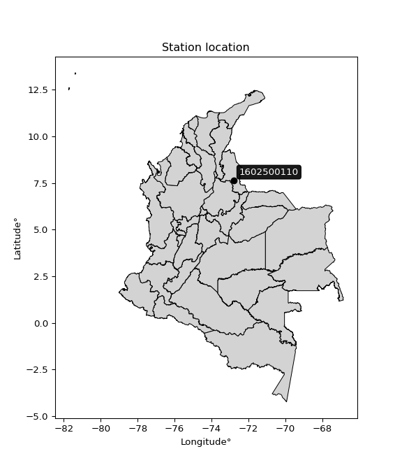

<div align="center">


</div>

# PMP Station (Rain, Pmax24h): 1602500110

Probable Maximum Precipitation (PMP) is the greatest amount of rainfall for a specific duration that is meteorologically possible for a given location, acting as a "worst-case" scenario for extreme storms, crucial for designing safety-critical infrastructure like bridges, river deviations, dams, spillways, and nuclear plants to prevent catastrophic failure. PMP is calculated by hydrologists using meteorological data to determine the upper limit of extreme rainfall, often leading to the Probable Maximum Flood (PMF) for flood control design, and is increasingly being studied for climate change impacts. Probable Maximum Precipitation (PMP) is the theoretical upper limit of rainfall, a deterministic estimate for extreme events, while probability distributions (like GEV, Gumbel) describe the likelihood and frequency of various precipitation amounts, including rare ones, showing how often events occur, with PMP representing the extreme end of these distributions, used for critical infrastructure design to ensure safety against the worst conceivable weather, unlike standard statistical forecasts which cover typical probabilities.

The most common probability distributions in hydrology, used for analyzing floods, rainfall, and streamflow, include the Normal, Log-Normal, Gumbel, Gamma (including Log-Pearson Type III), and Generalized Extreme Value (GEV) distributions, often chosen based on the data´s skewness and whether modeling extremes or general conditions, with Gumbel and GEV popular for extreme events like floods, while the Normal distribution serves as a baseline, though often requiring transformations for skewed hydrological data. These distributions help in designing water infrastructure, managing water resources, and forecasting hydrologic events.

> Hydrological data often isn´t perfectly normal (it´s skewed), so different distributions are needed for different applications, such as: **Flood Frequency Analysis**: Using Gumbel, GEV, or Log-Pearson Type III for predicting extreme flood magnitudes and their return periods, **Rainfall Analysis**: Normal for annual totals, but Log-Normal, Weibull, or GEV for intensity or extreme daily rainfall, **Streamflow Modeling**: Gamma and Log-Normal for maximum flows, GEV for minimum flows, and Kappa for daily flows.

<div align="center">

</img>

</div>


## A. General information


### 1. General running parameters

• app_version: _v20260113_. • runtime: _2026-01-17 18:24:04.630693_. • Python version: _3.14.0_. • SciPy version: _1.16.3_. • Pandas version: _2.3.3_. • NumPy version: _2.3.5_. • Stations dataset (station_dataset_file): _dataset/pmax24h_in/automatic_colombia_2003_2025.csv_. • Stations catalog (station_catalog_file): _dataset/CNE.xls_. • Minimum year to eval til year_max (date_min): _1900_. • Maximum year to eval since year_min (date_max): _2025_. • Creates, save and include plots into reports (create_plot): _False_. • Plot only fit distributions with Δo > Δ (plot_only_fit): _True_. • Plot only simple graphs avoiding multiple CDFs and multiple Extreme values plots (plot_only_simple): _True_. • Eval low extreme values, if False, evaluates high extreme values (low_extreme): _False_. • Eval every SciPy distribution as logarithmic (pdist_logarithmic_on): _True_. • Standard deviation normalized (ddof): _1.0_. • Return periods to eval in years (Tr): _[2, 2.33, 5, 10, 15, 20, 25, 50, 75, 100, 200, 250, 500, 750, 1000]_. • Minimum data sample per station, 0 means any (minimum_sample): _5_. • Z-Score maximum threshold to adjust a value, 0 means disable (zscore_max): _3.5_. • Z-Score minimum threshold to adjust a value, 0 means disable (zscore_min): _-2.5_. • Avoid zeros, e.g. rain = 0 (avoid_zeros): _True_. • Avoid null values (avoid_nans): _True_. 

:file_folder:Table: [dataset.csv](../../dataset/pmax24h_in/automatic_colombia_2003_2025.csv)

> Delta Degrees of Freedom (DDOF): is a parameter used in the formulas for calculating variance and standard deviation. When ddof=0, the divisor is $N$ (the total number of observations) and this is used when your data set is the entire population. When ddof=1, the divisor is $N-1$ and this is used when your data set is a sample drawn from a larger population. Using $N-1$ provides an unbiased estimate of the population variance (known as Bessel´s correction).


### 2. Station info and location

|   id |     CODIGO | NOMBRE                         | CATEGORIA               | TECNOLOGIA                | ESTADO   | FECHA_INSTALACION   |   FECHA_SUSPENSION |   ALTITUD |   LATITUD |   LONGITUD | DEPARTAMENTO       | MUNICIPIO   | AREA_OPERATIVA                         | ENTIDAD                                                     | AREA_HIDROGRAFICA   | ZONA_HIDROGRAFICA   | SUBZONA_HIDROGRAFICA   |   CORRIENTE | Catalogo   |   Version |
|-----:|-----------:|:-------------------------------|:------------------------|:--------------------------|:---------|:--------------------|-------------------:|----------:|----------:|-----------:|:-------------------|:------------|:---------------------------------------|:------------------------------------------------------------|:--------------------|:--------------------|:-----------------------|------------:|:-----------|----------:|
|    0 | 1602500110 | ARBOLEDAS - AUT   [1602500110] | Climatológica Principal | Automática con Telemetría | Activa   | 28/12/2017          |                nan |       971 |   7.64628 |    -72.799 | Norte De Santander | Arboledas   | Area Operativa 08 - Santanderes-Arauca | INSTITUTO DE HIDROLOGIA METEOROLOGIA Y ESTUDIOS AMBIENTALES | Caribe              | Catatumbo           | Río Zulia              |         nan | CNE_IDEAM  |  20251226 |

<div align="center">

Dynamic map: [:earth_americas:Google](http://maps.google.com/maps?q=7.646281,-72.799007) [:earth_americas:OSM](https://www.openstreetmap.org/#map=18/7.646281/-72.799007&layers=P) [:earth_americas:Bing](https://www.bing.com/maps?cp=7.646281~-72.799007&lvl=18) [:earth_americas:Apple](https://maps.apple.com/frame?center=7.646281%2C-72.799007&span=0.003%2C0.006)

</div>


<div align="center">

```geojson
{
  "type": "Feature",
  "geometry": {
    "type": "Point", 
    "coordinates": [-72.799007, 7.646281]
  }, 
  "properties": {
    "Name": "1602500110"
  }
}
```

</div>


### 3. Discrete values table and plot

<div align="center">

|               |         0 |           1 |           2 |           3 |           4 |           5 |
|:--------------|----------:|------------:|------------:|------------:|------------:|------------:|
| Date          | 2019      | 2020        | 2021        | 2022        | 2024        | 2025        |
| Value         |   55.2    |    4        |    0.4      |    0.2      |   30.8      |   25.9      |
| Value_initial |   55.2    |    4        |    0.4      |    0.2      |   30.8      |   25.9      |
| count         |    6      |    6        |    6        |    6        |    6        |    6        |
| mean          |   19.4167 |   19.4167   |   19.4167   |   19.4167   |   19.4167   |   19.4167   |
| std           |   22.0029 |   22.0029   |   22.0029   |   22.0029   |   22.0029   |   22.0029   |
| zscore        |    1.6263 |   -0.700664 |   -0.864278 |   -0.873368 |    0.517355 |    0.294658 |


</div>


> The initial value (value_initial) correspond to the initial obtained or null completed value, and value (value) is adjusted only when the initial value is outside the valid range (outlier) definite through the Z-Score value. If Z-Score is active, values out of range or outliers are replaced with the station mean value. A Z-Score (or standard score) measures how many standard deviations a data point is from the mean of a dataset, indicating its relative position; positive scores mean above the mean, negative mean below, and a score of zero is exactly at the mean, allowing for comparison of values from different distributions. It´s calculated using the formula $z=(x–μ)/σ$, where $x$ is the data point, $μ$ is the mean, and $σ$ is the standard deviation, helping identify outliers and understand probability.
>
> <sub>**Note**: In this study, "completing" (filling gaps in) and "extending" (forecasting or lengthening the historical record) rainfall data series are avoided for certain critical analyses because they introduce artificial bias and uncertainty, which can distort the statistics of rare events (extremes), alter day-to-day variability, and compromise the integrity and homogeneity of the original data. Some reasons against Completing/Extending rainfall data are: **Distortion of Extremes and Variability**: The primary issue is that most gap-filling or extension methods rely on averaging or regression with nearby stations, which inherently smooths the data. Rainfall is highly variable in space and time, with a large percentage of zero values and occasional large storms. Infilling methods often underestimate the highest values and overestimate the lowest (zero) values, which severely distorts analyses focused on flood frequency, drought severity, and intensity-duration-frequency (IDF) curves, **Loss of Data Homogeneity**: Infilled or extended data are synthetic estimates, not actual measurements. Combining these estimates with observed data can violate the assumption of data homogeneity, which requires that the data properties do not change over time. Inhomogeneity can lead to incorrect conclusions about long-term trends or changes in climate patterns, **Propagation of Errors**: Errors and biases from the original data (e.g., wind-induced undercatch, instrument errors, site changes) or the data used for imputation can propagate through the analysis, leading to unreliable hydrological models and inaccurate predictions, **Compromised Statistical Integrity**: For statistical analyses, especially those involving the frequency of events, using artificial data can introduce time bias or autocorrelation that doesn´t exist in reality, making it difficult to assess the true probability of events, **Difficulty in Validation**: It is difficult to accurately validate the quality of filled or extended data, especially for past periods where ground-truth measurements are unavailable. The reliability of imputation techniques heavily depends on the density of the surrounding station network and the complexity of the local topography.</sub>


### 4. Active continuous probability distributions from SciPy (80 of 104 available)

A Probability Density Function (PDF) describes the relative likelihood of a continuous random variable falling within a specific range, where the total area under its curve equals 1, and the area over any interval gives the actual probability for that range. Unlike discrete probabilities (like rolling a die), a PDF shows density, not direct probability for a single point (which is zero), with higher points indicating higher likelihood, often visualized as a bell curve for normal distributions.

A log of a probability density function (log-PDF) is simply the logarithm of the PDF´s value, denoted as $log(f(x))$, useful for converting multiplication of probabilities into addition, improving numerical stability with tiny numbers, and connecting to information theory concepts like entropy. Instead of dealing with very small probabilities (e.g., 0.000001), log-PDFs use negative numbers (e.g., $log(0.00001) ≈ -11.51$ that are easier for computers to handle, preventing underflow errors and simplifying complex calculations. In this study, each active probability distribution from SciPy is also evaluated in the $log$ form.

[scipy.stats](https://docs.scipy.org/doc/scipy/reference/stats.html) is a Python´s powerful submodule within the SciPy library for comprehensive statistical analysis, offering over 130 probability distributions (like Normal, Poisson), functions for descriptive stats (mean, variance), hypothesis testing (t-tests, chi-square), random variable generation, and statistical tests, making it essential for data science, modeling, and research. It provides tools to explore, model, and draw conclusions from data efficiently, working seamlessly with NumPy.

<div align="center">

|   id | p_dist           |   n_parameter | fit_method   | label                                                                       | active   | ref                                                                                                      |
|-----:|:-----------------|--------------:|:-------------|:----------------------------------------------------------------------------|:---------|:---------------------------------------------------------------------------------------------------------|
|    0 | alpha            |             3 | MLE          | Alpha                                                                       | True     | [:mortar_board:](https://docs.scipy.org/doc/scipy/reference/generated/scipy.stats.alpha.html)            |
|    1 | anglit           |             2 | MM           | Anglit                                                                      | True     | [:mortar_board:](https://docs.scipy.org/doc/scipy/reference/generated/scipy.stats.anglit.html)           |
|    2 | arcsine          |             2 | MM           | Arcsine                                                                     | True     | [:mortar_board:](https://docs.scipy.org/doc/scipy/reference/generated/scipy.stats.arcsine.html)          |
|    3 | argus            |             3 | MLE          | Argus                                                                       | True     | [:mortar_board:](https://docs.scipy.org/doc/scipy/reference/generated/scipy.stats.argus.html)            |
|    4 | beta             |             4 | MLE          | Beta                                                                        | True     | [:mortar_board:](https://docs.scipy.org/doc/scipy/reference/generated/scipy.stats.beta.html)             |
|    5 | betaprime        |             4 | MLE          | Beta prime                                                                  | True     | [:mortar_board:](https://docs.scipy.org/doc/scipy/reference/generated/scipy.stats.betaprime.html)        |
|    6 | bradford         |             3 | MLE          | Bradford                                                                    | True     | [:mortar_board:](https://docs.scipy.org/doc/scipy/reference/generated/scipy.stats.bradford.html)         |
|    7 | burr             |             4 | MLE          | Burr (Type III)                                                             | True     | [:mortar_board:](https://docs.scipy.org/doc/scipy/reference/generated/scipy.stats.burr.html)             |
|    8 | burr12           |             4 | MLE          | Burr (Type III) 12                                                          | True     | [:mortar_board:](https://docs.scipy.org/doc/scipy/reference/generated/scipy.stats.burr12.html)           |
|    9 | cosine           |             2 | MLE          | Cosine                                                                      | True     | [:mortar_board:](https://docs.scipy.org/doc/scipy/reference/generated/scipy.stats.cosine.html)           |
|   10 | crystalball      |             4 | MLE          | Crystalball                                                                 | True     | [:mortar_board:](https://docs.scipy.org/doc/scipy/reference/generated/scipy.stats.crystalball.html)      |
|   11 | dgamma           |             3 | MLE          | Double gamma                                                                | True     | [:mortar_board:](https://docs.scipy.org/doc/scipy/reference/generated/scipy.stats.dgamma.html)           |
|   12 | dweibull         |             3 | MLE          | Double Weibull                                                              | True     | [:mortar_board:](https://docs.scipy.org/doc/scipy/reference/generated/scipy.stats.dweibull.html)         |
|   13 | erlang           |             3 | MLE          | Erlang                                                                      | True     | [:mortar_board:](https://docs.scipy.org/doc/scipy/reference/generated/scipy.stats.erlang.html)           |
|   14 | exponnorm        |             3 | MLE          | Exponentially modified Normal                                               | True     | [:mortar_board:](https://docs.scipy.org/doc/scipy/reference/generated/scipy.stats.exponnorm.html)        |
|   15 | exponpow         |             3 | MLE          | Exponential power                                                           | True     | [:mortar_board:](https://docs.scipy.org/doc/scipy/reference/generated/scipy.stats.exponpow.html)         |
|   16 | exponweib        |             4 | MLE          | Exponentiated Weibull                                                       | True     | [:mortar_board:](https://docs.scipy.org/doc/scipy/reference/generated/scipy.stats.exponweib.html)        |
|   17 | f                |             4 | MLE          | F                                                                           | True     | [:mortar_board:](https://docs.scipy.org/doc/scipy/reference/generated/scipy.stats.f.html)                |
|   18 | fatiguelife      |             3 | MLE          | Fatigue-life (Birnbaum-Saunders)                                            | True     | [:mortar_board:](https://docs.scipy.org/doc/scipy/reference/generated/scipy.stats.fatiguelife.html)      |
|   19 | foldnorm         |             3 | MM           | Fold Normal                                                                 | True     | [:mortar_board:](https://docs.scipy.org/doc/scipy/reference/generated/scipy.stats.foldnorm.html)         |
|   20 | gamma            |             3 | MLE          | Gamma                                                                       | True     | [:mortar_board:](https://docs.scipy.org/doc/scipy/reference/generated/scipy.stats.gamma.html)            |
|   21 | gausshyper       |             6 | MLE          | Gauss hypergeometric                                                        | True     | [:mortar_board:](https://docs.scipy.org/doc/scipy/reference/generated/scipy.stats.gausshyper.html)       |
|   22 | genexpon         |             5 | MLE          | Generalized exponential                                                     | True     | [:mortar_board:](https://docs.scipy.org/doc/scipy/reference/generated/scipy.stats.genexpon.html)         |
|   23 | genextreme       |             3 | MLE          | Generalized exponential                                                     | True     | [:mortar_board:](https://docs.scipy.org/doc/scipy/reference/generated/scipy.stats.genextreme.html)       |
|   24 | gengamma         |             4 | MLE          | Generalized gamma                                                           | True     | [:mortar_board:](https://docs.scipy.org/doc/scipy/reference/generated/scipy.stats.gengamma.html)         |
|   25 | genhalflogistic  |             3 | MLE          | Generalized half-logistic                                                   | True     | [:mortar_board:](https://docs.scipy.org/doc/scipy/reference/generated/scipy.stats.genhalflogistic.html)  |
|   26 | genlogistic      |             3 | MLE          | Generalized logistic                                                        | True     | [:mortar_board:](https://docs.scipy.org/doc/scipy/reference/generated/scipy.stats.genlogistic.html)      |
|   27 | gennorm          |             3 | MLE          | Generalized Normal                                                          | True     | [:mortar_board:](https://docs.scipy.org/doc/scipy/reference/generated/scipy.stats.gennorm.html)          |
|   28 | genpareto        |             3 | MLE          | Generalized Pareto                                                          | True     | [:mortar_board:](https://docs.scipy.org/doc/scipy/reference/generated/scipy.stats.genpareto.html)        |
|   29 | gompertz         |             3 | MLE          | Gompertz (or truncated Gumbel)                                              | True     | [:mortar_board:](https://docs.scipy.org/doc/scipy/reference/generated/scipy.stats.gompertz.html)         |
|   30 | gumbel_l         |             2 | MM           | Gumbel Left Skew                                                            | True     | [:mortar_board:](https://docs.scipy.org/doc/scipy/reference/generated/scipy.stats.gumbel_l.html)         |
|   31 | gumbel_r         |             2 | MM           | Gumbel Right Skew                                                           | True     | [:mortar_board:](https://docs.scipy.org/doc/scipy/reference/generated/scipy.stats.gumbel_r.html)         |
|   32 | halfgennorm      |             3 | MLE          | Upper half of a generalized normal                                          | True     | [:mortar_board:](https://docs.scipy.org/doc/scipy/reference/generated/scipy.stats.halfgennorm.html)      |
|   33 | halflogistic     |             2 | MM           | Half-logistic                                                               | True     | [:mortar_board:](https://docs.scipy.org/doc/scipy/reference/generated/scipy.stats.halflogistic.html)     |
|   34 | halfnorm         |             2 | MM           | Half Normal                                                                 | True     | [:mortar_board:](https://docs.scipy.org/doc/scipy/reference/generated/scipy.stats.halfnorm.html)         |
|   35 | hypsecant        |             2 | MM           | hyperbolic secant                                                           | True     | [:mortar_board:](https://docs.scipy.org/doc/scipy/reference/generated/scipy.stats.hypsecant.html)        |
|   36 | invgamma         |             3 | MLE          | Inverted gamma                                                              | True     | [:mortar_board:](https://docs.scipy.org/doc/scipy/reference/generated/scipy.stats.invgamma.html)         |
|   37 | invgauss         |             3 | MLE          | Inverse Gaussian                                                            | True     | [:mortar_board:](https://docs.scipy.org/doc/scipy/reference/generated/scipy.stats.invgauss.html)         |
|   38 | invweibull       |             3 | MLE          | Inverted Weibull                                                            | True     | [:mortar_board:](https://docs.scipy.org/doc/scipy/reference/generated/scipy.stats.invweibull.html)       |
|   39 | johnsonsb        |             4 | MLE          | Johnson SB                                                                  | True     | [:mortar_board:](https://docs.scipy.org/doc/scipy/reference/generated/scipy.stats.johnsonsb.html)        |
|   40 | johnsonsu        |             4 | MLE          | Johnson Su                                                                  | True     | [:mortar_board:](https://docs.scipy.org/doc/scipy/reference/generated/scipy.stats.johnsonsu.html)        |
|   41 | kappa3           |             3 | MLE          | Kappa 3                                                                     | True     | [:mortar_board:](https://docs.scipy.org/doc/scipy/reference/generated/scipy.stats.kappa3.html)           |
|   42 | kappa4           |             4 | MLE          | Kappa 4                                                                     | True     | [:mortar_board:](https://docs.scipy.org/doc/scipy/reference/generated/scipy.stats.kappa4.html)           |
|   43 | ksone            |             3 | MLE          | Kolmogorov-Smirnov one-sided test statistic distribution                    | True     | [:mortar_board:](https://docs.scipy.org/doc/scipy/reference/generated/scipy.stats.ksone.html)            |
|   44 | kstwobign        |             2 | MLE          | Limiting distribution of scaled Kolmogorov-Smirnov two-sided test statistic | True     | [:mortar_board:](https://docs.scipy.org/doc/scipy/reference/generated/scipy.stats.kstwobign.html)        |
|   45 | laplace          |             2 | MM           | Laplace                                                                     | True     | [:mortar_board:](https://docs.scipy.org/doc/scipy/reference/generated/scipy.stats.laplace.html)          |
|   46 | levy_l           |             2 | MLE          | Left-skewed Levy                                                            | True     | [:mortar_board:](https://docs.scipy.org/doc/scipy/reference/generated/scipy.stats.levy_l.html)           |
|   47 | loggamma         |             3 | MLE          | Log gamma                                                                   | True     | [:mortar_board:](https://docs.scipy.org/doc/scipy/reference/generated/scipy.stats.loggamma.html)         |
|   48 | logistic         |             2 | MM           | Logistic (or Sech-squared)                                                  | True     | [:mortar_board:](https://docs.scipy.org/doc/scipy/reference/generated/scipy.stats.logistic.html)         |
|   49 | loglaplace       |             3 | MLE          | Log-Laplace                                                                 | True     | [:mortar_board:](https://docs.scipy.org/doc/scipy/reference/generated/scipy.stats.loglaplace.html)       |
|   50 | lomax            |             3 | MLE          | Lomax (Pareto of the second kind)                                           | True     | [:mortar_board:](https://docs.scipy.org/doc/scipy/reference/generated/scipy.stats.lomax.html)            |
|   51 | maxwell          |             2 | MM           | Maxwell                                                                     | True     | [:mortar_board:](https://docs.scipy.org/doc/scipy/reference/generated/scipy.stats.maxwell.html)          |
|   52 | mielke           |             4 | MLE          | Mielke Beta-Kappa / Dagum                                                   | True     | [:mortar_board:](https://docs.scipy.org/doc/scipy/reference/generated/scipy.stats.mielke.html)           |
|   53 | moyal            |             2 | MM           | Moyal                                                                       | True     | [:mortar_board:](https://docs.scipy.org/doc/scipy/reference/generated/scipy.stats.moyal.html)            |
|   54 | nakagami         |             3 | MLE          | Nakagami                                                                    | True     | [:mortar_board:](https://docs.scipy.org/doc/scipy/reference/generated/scipy.stats.nakagami.html)         |
|   55 | ncf              |             5 | MLE          | Non-central F distribution                                                  | True     | [:mortar_board:](https://docs.scipy.org/doc/scipy/reference/generated/scipy.stats.ncf.html)              |
|   56 | nct              |             4 | MLE          | Non-central Student’s t                                                     | True     | [:mortar_board:](https://docs.scipy.org/doc/scipy/reference/generated/scipy.stats.nct.html)              |
|   57 | norm             |             2 | MM           | Normal                                                                      | True     | [:mortar_board:](https://docs.scipy.org/doc/scipy/reference/generated/scipy.stats.norm.html)             |
|   58 | pearson3         |             3 | MM           | Pearson type III                                                            | True     | [:mortar_board:](https://docs.scipy.org/doc/scipy/reference/generated/scipy.stats.pearson3.html)         |
|   59 | powerlaw         |             3 | MLE          | Power-function                                                              | True     | [:mortar_board:](https://docs.scipy.org/doc/scipy/reference/generated/scipy.stats.powerlaw.html)         |
|   60 | rayleigh         |             2 | MM           | Rayleigh                                                                    | True     | [:mortar_board:](https://docs.scipy.org/doc/scipy/reference/generated/scipy.stats.rayleigh.html)         |
|   61 | rdist            |             3 | MLE          | R-distributed (symmetric beta)                                              | True     | [:mortar_board:](https://docs.scipy.org/doc/scipy/reference/generated/scipy.stats.rdist.html)            |
|   62 | rice             |             3 | MLE          | Rice                                                                        | True     | [:mortar_board:](https://docs.scipy.org/doc/scipy/reference/generated/scipy.stats.rice.html)             |
|   63 | semicircular     |             2 | MM           | Semicircular                                                                | True     | [:mortar_board:](https://docs.scipy.org/doc/scipy/reference/generated/scipy.stats.semicircular.html)     |
|   64 | skewnorm         |             3 | MLE          | Skew normal                                                                 | True     | [:mortar_board:](https://docs.scipy.org/doc/scipy/reference/generated/scipy.stats.skewnorm.html)         |
|   65 | t                |             3 | MLE          | Student’s t                                                                 | True     | [:mortar_board:](https://docs.scipy.org/doc/scipy/reference/generated/scipy.stats.t.html)                |
|   66 | trapezoid        |             4 | MLE          | Trapezoid                                                                   | True     | [:mortar_board:](https://docs.scipy.org/doc/scipy/reference/generated/scipy.stats.trapezoid.html)        |
|   67 | triang           |             3 | MLE          | Triangular                                                                  | True     | [:mortar_board:](https://docs.scipy.org/doc/scipy/reference/generated/scipy.stats.triang.html)           |
|   68 | truncexpon       |             3 | MLE          | Truncated exponential                                                       | True     | [:mortar_board:](https://docs.scipy.org/doc/scipy/reference/generated/scipy.stats.truncexpon.html)       |
|   69 | truncnorm        |             4 | MLE          | Truncated normal                                                            | True     | [:mortar_board:](https://docs.scipy.org/doc/scipy/reference/generated/scipy.stats.truncnorm.html)        |
|   70 | truncpareto      |             4 | MLE          | Upper truncated Pareto                                                      | True     | [:mortar_board:](https://docs.scipy.org/doc/scipy/reference/generated/scipy.stats.truncpareto.html)      |
|   71 | truncweibull_min |             5 | MLE          | Doubly truncated Weibull minimum                                            | True     | [:mortar_board:](https://docs.scipy.org/doc/scipy/reference/generated/scipy.stats.truncweibull_min.html) |
|   72 | tukeylambda      |             3 | MLE          | Tukey-Lamdba                                                                | True     | [:mortar_board:](https://docs.scipy.org/doc/scipy/reference/generated/scipy.stats.tukeylambda.html)      |
|   73 | uniform          |             2 | MLE          | Uniform                                                                     | True     | [:mortar_board:](https://docs.scipy.org/doc/scipy/reference/generated/scipy.stats.uniform.html)          |
|   74 | vonmises         |             3 | MLE          | Von Mises                                                                   | True     | [:mortar_board:](https://docs.scipy.org/doc/scipy/reference/generated/scipy.stats.vonmises.html)         |
|   75 | vonmises_line    |             3 | MLE          | Von Mises line                                                              | True     | [:mortar_board:](https://docs.scipy.org/doc/scipy/reference/generated/scipy.stats.vonmises_line.html)    |
|   76 | wald             |             2 | MM           | Wald                                                                        | True     | [:mortar_board:](https://docs.scipy.org/doc/scipy/reference/generated/scipy.stats.wald.html)             |
|   77 | weibull_max      |             3 | MLE          | Weibull maximum                                                             | True     | [:mortar_board:](https://docs.scipy.org/doc/scipy/reference/generated/scipy.stats.weibull_max.html)      |
|   78 | weibull_min      |             3 | MLE          | Weibull minimum                                                             | True     | [:mortar_board:](https://docs.scipy.org/doc/scipy/reference/generated/scipy.stats.weibull_min.html)      |
|   79 | wrapcauchy       |             3 | MLE          | Wrapped  Cauchy                                                             | True     | [:mortar_board:](https://docs.scipy.org/doc/scipy/reference/generated/scipy.stats.wrapcauchy.html)       |

</div>

> **n_parameter:** # arguments & localization & scale.
>
> **Fit methods:** (MLE) maximum likelihood, (MM) L-moments.
>
>**Inactive** (With the only purpose of prevent loops, zero divisions, infinite values, over high estimated values or horizontal trending for recurrence intervals estimations, the follow distributions were disabled.)**:** lognorm, norminvgauss, powernorm, powerlognorm, cauchy, halfcauchy, foldcauchy, skewcauchy, chi2, expon, fisk, genhyperbolic, geninvgauss, gibrat, kstwo, laplace_asymmetric, levy, levy_stable, ncx2, pareto, rel_breitwigner, recipinvgauss, studentized_range, loguniform, 


## B. Probability (PDF) vs. Empirical (EDF) distributions functions

A continuous probability distribution (CPD) describes probabilities for variables that can take any value within a range (like rain any time), unlike discrete variables with specific outcomes (like temperature). It uses a Probability Density Function (PDF), a curve where the total area under it equals 1, and the probability of the variable falling within an interval (a to b) is found by calculating the area under the curve between those points. A key feature is that the probability of hitting any single exact value is zero, so probabilities are always expressed for ranges, e.g., $P(a ≤ X ≤ b)$.

<div align="center">

Distributions parameters from station values
|     |    station | p_dist              |   n |             loc |          scale | shape                  | shape1                | shape2                | shape3            |
|----:|-----------:|:--------------------|----:|----------------:|---------------:|:-----------------------|:----------------------|:----------------------|:------------------|
|   0 | 1602500110 | alpha               |   6 |    -3.44268     |    5.98236     | 0.000556662434567938   |                       |                       |                   |
|   1 | 1602500110 | anglit              |   6 |    19.4167      |   58.7591      |                        |                       |                       |                   |
|   2 | 1602500110 | arcsine             |   6 |    -8.989       |   56.8113      |                        |                       |                       |                   |
|   3 | 1602500110 | argus               |   6 |   -24.1485      |   83.0988      | 8.573690884452574e-07  |                       |                       |                   |
|   4 | 1602500110 | beta                |   6 |    -2.28699     |   57.487       | 0.5187020542509387     | 0.7690592556408389    |                       |                   |
|   5 | 1602500110 | betaprime           |   6 |     0.2         |   42.3969      | 0.3992426396864722     | 2.1978894977202486    |                       |                   |
|   6 | 1602500110 | bradford            |   6 |     0.199979    |   55.0001      | 2.8477180182305624     |                       |                       |                   |
|   7 | 1602500110 | burr                |   6 |     0.197298    |   57.109       | 71.27310952233825      | 0.004256802925515356  |                       |                   |
|   8 | 1602500110 | burr12              |   6 |     0.2         |    8.80843     | 0.6141585693373024     | 1.2943375429335144    |                       |                   |
|   9 | 1602500110 | cosine              |   6 |    21.3885      |   16.5851      |                        |                       |                       |                   |
|  10 | 1602500110 | crystalball         |   6 |    19.4167      |   20.0859      | 4721.921648397103      | 24.891628107523367    |                       |                   |
|  11 | 1602500110 | dgamma              |   6 |    16.5423      |    3.7483      | 4.771048375748089      |                       |                       |                   |
|  12 | 1602500110 | dweibull            |   6 |    17.9972      |   20.3185      | 2.0780087548694195     |                       |                       |                   |
|  13 | 1602500110 | erlang              |   6 |     0.2         |   13.5648      | 0.35748379516296425    |                       |                       |                   |
|  14 | 1602500110 | exponnorm           |   6 |     0.183581    |    0.00498735  | 3863.1176600357267     |                       |                       |                   |
|  15 | 1602500110 | exponpow            |   6 |     0.2         |   54.43        | 0.6387766897783113     |                       |                       |                   |
|  16 | 1602500110 | exponweib           |   6 |     0.2         |   33.4348      | 0.3361805082995289     | 1.0299149205334195    |                       |                   |
|  17 | 1602500110 | f                   |   6 |     0.2         |    0.855892    | 0.5089069198005851     | 0.6519117246656343    |                       |                   |
|  18 | 1602500110 | fatiguelife         |   6 |     0.2         |    1.15967e-05 | 1394.333746453493      |                       |                       |                   |
|  19 | 1602500110 | foldnorm            |   6 |   -11.0889      |   24.1038      | 1.1384722482430853     |                       |                       |                   |
|  20 | 1602500110 | gamma               |   6 |     0.2         |   36.4587      | 0.2584930234624032     |                       |                       |                   |
|  21 | 1602500110 | gausshyper          |   6 |   -10.2636      |   65.4636      | 1.1971640970101165     | 0.8066252776900416    | 0.9381495290439184    | 1.145730209750576 |
|  22 | 1602500110 | genexpon            |   6 |     0.2         |   75.1935      | 3.912831447731489      | 0.2615229881592663    | 8.62871453816456e-08  |                   |
|  23 | 1602500110 | genextreme          |   6 |     1.85949     |   15.3589      | -9.255166605956358     |                       |                       |                   |
|  24 | 1602500110 | gengamma            |   6 |     0.2         |   31.9287      | 0.41282994160316544    | 0.813557594954416     |                       |                   |
|  25 | 1602500110 | genhalflogistic     |   6 |    -5.47016     |   63.2596      | 1.0426808311021065     |                       |                       |                   |
|  26 | 1602500110 | genlogistic         |   6 |  -100.551       |   14.968       | 1620.9176947586957     |                       |                       |                   |
|  27 | 1602500110 | gennorm             |   6 |    27.7         |   27.5001      | 7243379.500331836      |                       |                       |                   |
|  28 | 1602500110 | genpareto           |   6 |     0.2         |    0.184742    | 3.9717358619438192     |                       |                       |                   |
|  29 | 1602500110 | gompertz            |   6 |     0.160554    |  502.178       | 24.92025247199139      |                       |                       |                   |
|  30 | 1602500110 | gumbel_l            |   6 |    28.4564      |   15.6609      |                        |                       |                       |                   |
|  31 | 1602500110 | gumbel_r            |   6 |    10.377       |   15.6609      |                        |                       |                       |                   |
|  32 | 1602500110 | halfgennorm         |   6 |     0.2         |    0.00259511  | 0.20865879984281       |                       |                       |                   |
|  33 | 1602500110 | halflogistic        |   6 |    -4.38973     |   17.1727      |                        |                       |                       |                   |
|  34 | 1602500110 | halfnorm            |   6 |    -7.16913     |   33.3204      |                        |                       |                       |                   |
|  35 | 1602500110 | hypsecant           |   6 |    19.4167      |   12.787       |                        |                       |                       |                   |
|  36 | 1602500110 | invgamma            |   6 |     0.2         |    2.52604e-16 | 0.1644322651732276     |                       |                       |                   |
|  37 | 1602500110 | invgauss            |   6 |    -0.0964322   |    1.10837     | 17.60527426434939      |                       |                       |                   |
|  38 | 1602500110 | invweibull          |   6 |     0.2         |    2.23056     | 0.05268627452971475    |                       |                       |                   |
|  39 | 1602500110 | johnsonsb           |   6 |     0.2         |  119.269       | 2.164099597608301      | 0.1574195738858371    |                       |                   |
|  40 | 1602500110 | johnsonsu           |   6 |     0.2         |    6.40499e-13 | -0.9209367466504006    | 0.06730828269203265   |                       |                   |
|  41 | 1602500110 | kappa3              |   6 |     0.2         |    0.328753    | 0.4081764314318217     |                       |                       |                   |
|  42 | 1602500110 | kappa4              |   6 |    -5.01161     |   62.1122      | 1.0917152876522966     | 1.0286574991953374    |                       |                   |
|  43 | 1602500110 | ksone               |   6 |    -5.3         |   66           | 1.0                    |                       |                       |                   |
|  44 | 1602500110 | kstwobign           |   6 |   -41.556       |   69.8491      |                        |                       |                       |                   |
|  45 | 1602500110 | laplace             |   6 |    19.4167      |   14.2028      |                        |                       |                       |                   |
|  46 | 1602500110 | levy_l              |   6 |    58.9697      |   15.6538      |                        |                       |                       |                   |
|  47 | 1602500110 | loggamma            |   6 | -5455.63        |  758.298       | 1367.0943674554555     |                       |                       |                   |
|  48 | 1602500110 | logistic            |   6 |    19.4167      |   11.0739      |                        |                       |                       |                   |
|  49 | 1602500110 | loglaplace          |   6 |     0.2         |    6.37299     | 0.49966863019380625    |                       |                       |                   |
|  50 | 1602500110 | lomax               |   6 |     0.2         |    0.038235    | 0.2469503024202349     |                       |                       |                   |
|  51 | 1602500110 | maxwell             |   6 |   -28.1784      |   29.8258      |                        |                       |                       |                   |
|  52 | 1602500110 | mielke              |   6 |     0.2         |   24.64        | 0.2640134939580243     | 1.3707213395534832    |                       |                   |
|  53 | 1602500110 | moyal               |   6 |     7.93029     |    9.04181     |                        |                       |                       |                   |
|  54 | 1602500110 | nakagami            |   6 |     0.2         |   30.85        | 0.1680302694505666     |                       |                       |                   |
|  55 | 1602500110 | ncf                 |   6 |     0.0129208   |   19.9922      | 0.9089177067145626     | 9.292211910172568     | 9.533549604856609e-12 |                   |
|  56 | 1602500110 | nct                 |   6 |     0.2         |    5.86801e-11 | 0.15368227299308126    | 11.036781730316463    |                       |                   |
|  57 | 1602500110 | norm                |   6 |    19.4167      |   20.0859      |                        |                       |                       |                   |
|  58 | 1602500110 | pearson3            |   6 |    19.4167      |   20.0859      | 0.6155433671819883     |                       |                       |                   |
|  59 | 1602500110 | powerlaw            |   6 |     0.2         |   55           | 0.11590461094159552    |                       |                       |                   |
|  60 | 1602500110 | rayleigh            |   6 |   -19.0087      |   30.659       |                        |                       |                       |                   |
|  61 | 1602500110 | rdist               |   6 |    -4.21895     |   30.119       | 1.1458551188712702     |                       |                       |                   |
|  62 | 1602500110 | rice                |   6 |   -13.4084      |   27.2114      | 0.001635478377275444   |                       |                       |                   |
|  63 | 1602500110 | semicircular        |   6 |    19.4167      |   40.1717      |                        |                       |                       |                   |
|  64 | 1602500110 | skewnorm            |   6 |     0.199994    |   27.7978      | 23761276.21870189      |                       |                       |                   |
|  65 | 1602500110 | t                   |   6 |     0.322512    |    0.239804    | 0.24790885432773524    |                       |                       |                   |
|  66 | 1602500110 | trapezoid           |   6 |    -5.565       |   66           | 1.0                    | 1.0                   |                       |                   |
|  67 | 1602500110 | triang              |   6 |   -30.0785      |   85.2836      | 0.9999910177589726     |                       |                       |                   |
|  68 | 1602500110 | truncexpon          |   6 |     0.180697    |   76.0746      | 0.723228513312064      |                       |                       |                   |
|  69 | 1602500110 | truncnorm           |   6 |   -28.471       |   34.3206      | 0.83537694372888       | 171.1474366220598     |                       |                   |
|  70 | 1602500110 | truncpareto         |   6 |    -1.07374e+09 |    1.07374e+09 | 55875518.010521084     | 1.0000000512227416    |                       |                   |
|  71 | 1602500110 | truncweibull_min    |   6 |    -0.147156    |   34.5018      | 0.7663673963370212     | 4.942820834163617e-05 | 1.604183347352266     |                   |
|  72 | 1602500110 | tukeylambda         |   6 |    -3.96878     |   31.6881      | 1.0609109014163423     |                       |                       |                   |
|  73 | 1602500110 | uniform             |   6 |     0.2         |   55           |                        |                       |                       |                   |
|  74 | 1602500110 | vonmises            |   6 |    -0.329644    |    1           | 1.2538023443140105     |                       |                       |                   |
|  75 | 1602500110 | vonmises_line       |   6 |    24.0579      |    9.91287     | 2.796890097495169e-08  |                       |                       |                   |
|  76 | 1602500110 | wald                |   6 |    -0.669184    |   20.0859      |                        |                       |                       |                   |
|  77 | 1602500110 | weibull_max         |   6 |    55.2         |    1.60496     | 0.19757546121583036    |                       |                       |                   |
|  78 | 1602500110 | weibull_min         |   6 |     0.2         |   23.9285      | 0.5774374235791659     |                       |                       |                   |
|  79 | 1602500110 | wrapcauchy          |   6 |     0.2         |    8.75366     | 0.5378901382420478     |                       |                       |                   |
|  80 | 1602500110 | logalpha            |   6 |   -46.9106      | 1056.04        | 21.842152584267083     |                       |                       |                   |
|  81 | 1602500110 | loganglit           |   6 |     1.59221     |    6.3832      |                        |                       |                       |                   |
|  82 | 1602500110 | logarcsine          |   6 |    -1.49357     |    6.17158     |                        |                       |                       |                   |
|  83 | 1602500110 | logargus            |   6 |    -3.81488     |    8.09639     | 1.824512514932477      |                       |                       |                   |
|  84 | 1602500110 | logbeta             |   6 |    -2.20305     |    6.21401     | 0.3256151765817667     | 0.23331271279609989   |                       |                   |
|  85 | 1602500110 | logbetaprime        |   6 |    -1.60944     |    2.25545     | 0.13932884534930695    | 0.8027457123499606    |                       |                   |
|  86 | 1602500110 | logbradford         |   6 |    -1.60945     |    5.62043     | 1.4366048523395198     |                       |                       |                   |
|  87 | 1602500110 | logburr             |   6 |    -1.60944     |    1.08902     | 0.12795352947469518    | 1.346570331744902     |                       |                   |
|  88 | 1602500110 | logburr12           |   6 |    -1.60944     |    0.763599    | 0.7533061751450494     | 0.8442531739881343    |                       |                   |
|  89 | 1602500110 | logcosine           |   6 |     1.47696     |    1.72638     |                        |                       |                       |                   |
|  90 | 1602500110 | logcrystalball      |   6 |     1.59222     |    2.182       | 9.138361261738762      | 17.172278404103473    |                       |                   |
|  91 | 1602500110 | logdgamma           |   6 |     2.06301     |    0.576718    | 3.4193718582690904     |                       |                       |                   |
|  92 | 1602500110 | logdweibull         |   6 |     1.88374     |    2.2264      | 2.127808542664897      |                       |                       |                   |
|  93 | 1602500110 | logerlang           |   6 |   -31.92        |    0.145801    | 229.9099362414811      |                       |                       |                   |
|  94 | 1602500110 | logexponnorm        |   6 |     1.59018     |    2.18199     | 0.0009288183712005478  |                       |                       |                   |
|  95 | 1602500110 | logexponpow         |   6 |    -1.60944     |    2.13101     | 0.39599427164869616    |                       |                       |                   |
|  96 | 1602500110 | logexponweib        |   6 |    -1.60944     |    1.59783     | 1.3177925295566792     | 0.1267148731997404    |                       |                   |
|  97 | 1602500110 | logf                |   6 |    -1.60944     |    1.04217     | 1.1922378962628117     | 1.0409143447597362    |                       |                   |
|  98 | 1602500110 | logfatiguelife      |   6 |  -336.551       |  338.14        | 0.006432965652589644   |                       |                       |                   |
|  99 | 1602500110 | logfoldnorm         |   6 |   -15.4159      |    2.07602     | 8.177489121667646      |                       |                       |                   |
| 100 | 1602500110 | loggamma            |   6 |   -31.7818      |    0.146058    | 228.47071420517352     |                       |                       |                   |
| 101 | 1602500110 | loggausshyper       |   6 |    -1.60944     |    5.67446     | 0.872607620339775      | 0.837900576337735     | 1.3084086171178457    | 1.351866841599914 |
| 102 | 1602500110 | loggenexpon         |   6 |    -1.60945     |    0.227063    | 0.042074781711206405   | 4.3976506933701       | 0.0006376783968197767 |                   |
| 103 | 1602500110 | loggenextreme       |   6 |     1.24843     |    3.23849     | 1.172291020712796      |                       |                       |                   |
| 104 | 1602500110 | loggengamma         |   6 |    -1.60944     |    1.62291     | 1.3137729495915518     | 0.12894283000492535   |                       |                   |
| 105 | 1602500110 | loggenhalflogistic  |   6 |    -2.66055     |    7.80912     | 1.1705180140305445     |                       |                       |                   |
| 106 | 1602500110 | loggenlogistic      |   6 |     4.01108     |    5.5561e-06  | 2.2989886076985686e-06 |                       |                       |                   |
| 107 | 1602500110 | loggennorm          |   6 |     1.20076     |    2.8102      | 19538333.228579864     |                       |                       |                   |
| 108 | 1602500110 | loggenpareto        |   6 |    -1.60944     |    5.46815     | -0.9709698133090883    |                       |                       |                   |
| 109 | 1602500110 | loggompertz         |   6 |    -1.60944     |    9.11756     | 2.4747031685589667     |                       |                       |                   |
| 110 | 1602500110 | loggumbel_l         |   6 |     2.57423     |    1.70129     |                        |                       |                       |                   |
| 111 | 1602500110 | loggumbel_r         |   6 |     0.610201    |    1.70129     |                        |                       |                       |                   |
| 112 | 1602500110 | loghalfgennorm      |   6 |    -1.60944     |    1.58504     | 0.6891702610246713     |                       |                       |                   |
| 113 | 1602500110 | loghalflogistic     |   6 |    -0.993971    |    1.86553     |                        |                       |                       |                   |
| 114 | 1602500110 | loghalfnorm         |   6 |    -1.29588     |    3.61968     |                        |                       |                       |                   |
| 115 | 1602500110 | loghypsecant        |   6 |     1.59221     |    1.3891      |                        |                       |                       |                   |
| 116 | 1602500110 | loginvgamma         |   6 |   -32.8071      | 8121.68        | 237.36573990834012     |                       |                       |                   |
| 117 | 1602500110 | loginvgauss         |   6 |   -12.0556      |  481.927       | 0.02822130571047149    |                       |                       |                   |
| 118 | 1602500110 | loginvweibull       |   6 |    -1.63476e+08 |    1.63476e+08 | 79495255.99085617      |                       |                       |                   |
| 119 | 1602500110 | logjohnsonsb        |   6 |    -3.05054     |    7.0615      | -0.03611084786298575   | 0.13978336116883844   |                       |                   |
| 120 | 1602500110 | logjohnsonsu        |   6 |     4.11145     |    0.00200657  | 5.125778638524923      | 0.7159536676067382    |                       |                   |
| 121 | 1602500110 | logkappa3           |   6 |    -1.60944     |    1.48843     | 0.9163697361933119     |                       |                       |                   |
| 122 | 1602500110 | logkappa4           |   6 |    -2.20513     |    6.65737     | 1.0985675571795612     | 1.0591388309501135    |                       |                   |
| 123 | 1602500110 | logksone            |   6 |    -2.18711     |    7.55865     | 1.0                    |                       |                       |                   |
| 124 | 1602500110 | logkstwobign        |   6 |    -6.56729     |    9.27727     |                        |                       |                       |                   |
| 125 | 1602500110 | loglaplace          |   6 |     1.59221     |    1.5429      |                        |                       |                       |                   |
| 126 | 1602500110 | loglevy_l           |   6 |     4.15447     |    0.588999    |                        |                       |                       |                   |
| 127 | 1602500110 | logloggamma         |   6 |     4.01101     |    4.5791e-06  | 1.9019235966766565e-06 |                       |                       |                   |
| 128 | 1602500110 | loglogistic         |   6 |     1.59221     |    1.203       |                        |                       |                       |                   |
| 129 | 1602500110 | logloglaplace       |   6 |    -1.60944     |    2.70405     | 0.5795476935213899     |                       |                       |                   |
| 130 | 1602500110 | loglomax            |   6 |    -1.60944     |    7.21072e+08 | 216971335.46128517     |                       |                       |                   |
| 131 | 1602500110 | logmaxwell          |   6 |    -3.5782      |    3.24007     |                        |                       |                       |                   |
| 132 | 1602500110 | logmielke           |   6 |    -1.60944     |    1.87666     | 0.14875473538217227    | 0.9989886841228148    |                       |                   |
| 133 | 1602500110 | logmoyal            |   6 |     0.34441     |    0.982242    |                        |                       |                       |                   |
| 134 | 1602500110 | lognakagami         |   6 |    -1.60944     |    3.91451     | 0.3823458039343239     |                       |                       |                   |
| 135 | 1602500110 | logncf              |   6 |    -1.60944     |    1.03319     | 1.0542159685768784     | 1.194698078643447     | 1.081723862963103     |                   |
| 136 | 1602500110 | lognct              |   6 |  -128.89        |    2.16225     | 93731.35648235385      | 60.34503193706581     |                       |                   |
| 137 | 1602500110 | lognorm             |   6 |     1.59221     |    2.18199     |                        |                       |                       |                   |
| 138 | 1602500110 | logpearson3         |   6 |     1.59222     |    2.18196     | -0.37998959539904376   |                       |                       |                   |
| 139 | 1602500110 | logpowerlaw         |   6 |    -1.60944     |    5.6204      | 0.14725228789016284    |                       |                       |                   |
| 140 | 1602500110 | lograyleigh         |   6 |    -2.58207     |    3.3306      |                        |                       |                       |                   |
| 141 | 1602500110 | logrdist            |   6 |    -1.19999     |    2.58628     | 1.1725387964378202     |                       |                       |                   |
| 142 | 1602500110 | logrice             |   6 |    -2.86573     |    2.53778     | 1.3509258963116577     |                       |                       |                   |
| 143 | 1602500110 | logsemicircular     |   6 |     1.59221     |    4.36399     |                        |                       |                       |                   |
| 144 | 1602500110 | logskewnorm         |   6 |     4.01096     |    3.2572      | -10460775.69672357     |                       |                       |                   |
| 145 | 1602500110 | logt                |   6 |     1.59221     |    2.18199     | 251339315412.5935      |                       |                       |                   |
| 146 | 1602500110 | logtrapezoid        |   6 |    -4.80837     |    9.25742     | 1.0                    | 1.0                   |                       |                   |
| 147 | 1602500110 | logtriang           |   6 |    -3.35625     |    7.36721     | 0.9999998713206274     |                       |                       |                   |
| 148 | 1602500110 | logtruncexpon       |   6 |    -1.60946     |    6.02525     | 0.93281144193632       |                       |                       |                   |
| 149 | 1602500110 | logtruncnorm        |   6 |     0.105714    |    3.08552     | -0.5558719808499739    | 14.601867529977845    |                       |                   |
| 150 | 1602500110 | logtruncpareto      |   6 |    -1.61838     |    0.00894064  | 0.00036803834018412566 | 629.6353280347003     |                       |                   |
| 151 | 1602500110 | logtruncweibull_min |   6 |    -1.61679     |    8.58389     | 0.45441568857628367    | 0.0008568474520249812 | 0.6556182578847849    |                   |
| 152 | 1602500110 | logtukeylambda      |   6 |     1.15955     |    3.54902     | 1.2446504991547482     |                       |                       |                   |
| 153 | 1602500110 | loguniform          |   6 |    -1.60944     |    5.6204      |                        |                       |                       |                   |
| 154 | 1602500110 | logvonmises         |   6 |    -2.3239      |    1           | 1.00899744193346       |                       |                       |                   |
| 155 | 1602500110 | logvonmises_line    |   6 |     1.17638     |    0.902283    | 1.0119817708398066e-05 |                       |                       |                   |
| 156 | 1602500110 | logwald             |   6 |    -0.589799    |    2.18201     |                        |                       |                       |                   |
| 157 | 1602500110 | logweibull_max      |   6 |     4.01096     |    1.30525     | 0.6001697718296775     |                       |                       |                   |
| 158 | 1602500110 | logweibull_min      |   6 |    -8.29701e+07 |    8.29701e+07 | 49059396.247730725     |                       |                       |                   |
| 159 | 1602500110 | logwrapcauchy       |   6 |    -1.60944     |    0.894515    | 0.5642400280039253     |                       |                       |                   |

</div>

> **loc** (Location parameter): This shifts the distribution along the x-axis. For many common distributions, like the normal (Gaussian) distribution, loc represents the mean $μ$. For others, like the uniform distribution, it might represent the minimum value, or for the beta distribution, the left end of the support interval.
>
> **scale** (Scale parameter): This determines the width or spread of the distribution. For the normal distribution, scale represents the standard deviation $σ$. For a uniform distribution, it defines the length of the interval (from $loc$ to $loc + scale$).
>
> **shape** (Shape parameters): Refers to parameters that define the specific form of a probability distribution, distinct from its location (loc) and scale (scale). These parameters are required arguments for most distribution functions. For example, a normal (Gaussian) distribution is fully defined by its location (mean) and scale (standard deviation), so it has no specific shape parameters beyond loc and scale. However, other distributions have intrinsic properties that need specification, as Gamma distribution that takes a shape parameter, often named $a$ or $alpha$.


### 0. Cumulative distribution values - CDF (160 evaluated)

Cumulative Distribution Function (CDF), denoted as $F$<sub>$X$</sub>$(x)$, is a function that gives the probability that a random variable $X$ will take a value less than or equal to a specific value, $x$ (i.e., $(P(X≥x)$. It essentially "accumulates" probabilities from a given point up to the far right (positive infinity), providing a complete picture of the distribution´s probabilities for both discrete (like rain) and continuous (like temperature) variables, helping to find probabilities over ranges or above certain values. Each station is evaluated separately ordering the $x$ values ascending, calculating the CDF and PDF values for the activated distributions and their logarithmic forms.

<div align="center">

CDF ordered by x ascending and calculating $log(f(x))$ separately
|   id |    Station |   date |    x |   count |    mean |     std |    zscore |   Value_initial |    station |   m |    alpha |   alpha_pdf |   anglit |   anglit_pdf |   arcsine |   arcsine_pdf |    argus |   argus_pdf |     beta |   beta_pdf |   betaprime |   betaprime_pdf |    bradford |   bradford_pdf |      burr |     burr_pdf |      burr12 |      burr12_pdf |   cosine |   cosine_pdf |   crystalball |   crystalball_pdf |   dgamma |   dgamma_pdf |   dweibull |   dweibull_pdf |      erlang |   erlang_pdf |   exponnorm |   exponnorm_pdf |    exponpow |   exponpow_pdf |   exponweib |   exponweib_pdf |           f |       f_pdf |   fatiguelife |   fatiguelife_pdf |   foldnorm |   foldnorm_pdf |      gamma |   gamma_pdf |   gausshyper |   gausshyper_pdf |    genexpon |   genexpon_pdf |   genextreme |   genextreme_pdf |    gengamma |   gengamma_pdf |   genhalflogistic |   genhalflogistic_pdf |   genlogistic |   genlogistic_pdf |     gennorm |   gennorm_pdf |   genpareto |   genpareto_pdf |   gompertz |   gompertz_pdf |   gumbel_l |   gumbel_l_pdf |   gumbel_r |   gumbel_r_pdf |   halfgennorm |   halfgennorm_pdf |   halflogistic |   halflogistic_pdf |   halfnorm |   halfnorm_pdf |   hypsecant |   hypsecant_pdf |   invgamma |   invgamma_pdf |   invgauss |   invgauss_pdf |   invweibull |   invweibull_pdf |   johnsonsb |   johnsonsb_pdf |   johnsonsu |   johnsonsu_pdf |      kappa3 |   kappa3_pdf |      kappa4 |   kappa4_pdf |     ksone |   ksone_pdf |   kstwobign |   kstwobign_pdf |   laplace |   laplace_pdf |   levy_l |   levy_l_pdf |   loggamma |   loggamma_pdf |   logistic |   logistic_pdf |   loglaplace |   loglaplace_pdf |       lomax |   lomax_pdf |   maxwell |   maxwell_pdf |      mielke |   mielke_pdf |    moyal |   moyal_pdf |    nakagami |   nakagami_pdf |       ncf |    ncf_pdf |       nct |     nct_pdf |     norm |   norm_pdf |   pearson3 |   pearson3_pdf |   powerlaw |   powerlaw_pdf |   rayleigh |   rayleigh_pdf |    rdist |     rdist_pdf |     rice |   rice_pdf |   semicircular |   semicircular_pdf |   skewnorm |   skewnorm_pdf |        t |       t_pdf |   trapezoid |   trapezoid_pdf |   triang |   triang_pdf |   truncexpon |   truncexpon_pdf |   truncnorm |   truncnorm_pdf |   truncpareto |   truncpareto_pdf |   truncweibull_min |   truncweibull_min_pdf |   tukeylambda |   tukeylambda_pdf |    uniform |   uniform_pdf |   vonmises |   vonmises_pdf |   vonmises_line |   vonmises_line_pdf |        wald |    wald_pdf |   weibull_max |   weibull_max_pdf |   weibull_min |   weibull_min_pdf |   wrapcauchy |   wrapcauchy_pdf |   logalpha |   logalpha_pdf |   loganglit |   loganglit_pdf |   logarcsine |   logarcsine_pdf |   logargus |   logargus_pdf |   logbeta |   logbeta_pdf |   logbetaprime |   logbetaprime_pdf |   logbradford |   logbradford_pdf |    logburr |   logburr_pdf |   logburr12 |   logburr12_pdf |   logcosine |   logcosine_pdf |   logcrystalball |   logcrystalball_pdf |   logdgamma |   logdgamma_pdf |   logdweibull |   logdweibull_pdf |   logerlang |   logerlang_pdf |   logexponnorm |   logexponnorm_pdf |   logexponpow |   logexponpow_pdf |   logexponweib |   logexponweib_pdf |        logf |       logf_pdf |   logfatiguelife |   logfatiguelife_pdf |   logfoldnorm |   logfoldnorm_pdf |   loggausshyper |   loggausshyper_pdf |   loggenexpon |   loggenexpon_pdf |   loggenextreme |   loggenextreme_pdf |   loggengamma |   loggengamma_pdf |   loggenhalflogistic |   loggenhalflogistic_pdf |   loggenlogistic |   loggenlogistic_pdf |   loggennorm |   loggennorm_pdf |   loggenpareto |   loggenpareto_pdf |   loggompertz |   loggompertz_pdf |   loggumbel_l |   loggumbel_l_pdf |   loggumbel_r |   loggumbel_r_pdf |   loghalfgennorm |   loghalfgennorm_pdf |   loghalflogistic |   loghalflogistic_pdf |   loghalfnorm |   loghalfnorm_pdf |   loghypsecant |   loghypsecant_pdf |   loginvgamma |   loginvgamma_pdf |   loginvgauss |   loginvgauss_pdf |   loginvweibull |   loginvweibull_pdf |   logjohnsonsb |   logjohnsonsb_pdf |   logjohnsonsu |   logjohnsonsu_pdf |   logkappa3 |   logkappa3_pdf |   logkappa4 |   logkappa4_pdf |   logksone |   logksone_pdf |   logkstwobign |   logkstwobign_pdf |   loglevy_l |   loglevy_l_pdf |   logloggamma |   logloggamma_pdf |   loglogistic |   loglogistic_pdf |   logloglaplace |   logloglaplace_pdf |    loglomax |   loglomax_pdf |   logmaxwell |   logmaxwell_pdf |   logmielke |   logmielke_pdf |   logmoyal |   logmoyal_pdf |   lognakagami |   lognakagami_pdf |     logncf |   logncf_pdf |    lognct |   lognct_pdf |   lognorm |   lognorm_pdf |   logpearson3 |   logpearson3_pdf |   logpowerlaw |   logpowerlaw_pdf |   lograyleigh |   lograyleigh_pdf |   logrdist |   logrdist_pdf |   logrice |   logrice_pdf |   logsemicircular |   logsemicircular_pdf |   logskewnorm |   logskewnorm_pdf |      logt |   logt_pdf |   logtrapezoid |   logtrapezoid_pdf |   logtriang |   logtriang_pdf |   logtruncexpon |   logtruncexpon_pdf |   logtruncnorm |   logtruncnorm_pdf |   logtruncpareto |   logtruncpareto_pdf |   logtruncweibull_min |   logtruncweibull_min_pdf |   logtukeylambda |   logtukeylambda_pdf |   loguniform |   loguniform_pdf |   logvonmises |   logvonmises_pdf |   logvonmises_line |   logvonmises_line_pdf |   logwald |   logwald_pdf |   logweibull_max |   logweibull_max_pdf |   logweibull_min |   logweibull_min_pdf |   logwrapcauchy |   logwrapcauchy_pdf |
|-----:|-----------:|-------:|-----:|--------:|--------:|--------:|----------:|----------------:|-----------:|----:|---------:|------------:|---------:|-------------:|----------:|--------------:|---------:|------------:|---------:|-----------:|------------:|----------------:|------------:|---------------:|----------:|-------------:|------------:|----------------:|---------:|-------------:|--------------:|------------------:|---------:|-------------:|-----------:|---------------:|------------:|-------------:|------------:|----------------:|------------:|---------------:|------------:|----------------:|------------:|------------:|--------------:|------------------:|-----------:|---------------:|-----------:|------------:|-------------:|-----------------:|------------:|---------------:|-------------:|-----------------:|------------:|---------------:|------------------:|----------------------:|--------------:|------------------:|------------:|--------------:|------------:|----------------:|-----------:|---------------:|-----------:|---------------:|-----------:|---------------:|--------------:|------------------:|---------------:|-------------------:|-----------:|---------------:|------------:|----------------:|-----------:|---------------:|-----------:|---------------:|-------------:|-----------------:|------------:|----------------:|------------:|----------------:|------------:|-------------:|------------:|-------------:|----------:|------------:|------------:|----------------:|----------:|--------------:|---------:|-------------:|-----------:|---------------:|-----------:|---------------:|-------------:|-----------------:|------------:|------------:|----------:|--------------:|------------:|-------------:|---------:|------------:|------------:|---------------:|----------:|-----------:|----------:|------------:|---------:|-----------:|-----------:|---------------:|-----------:|---------------:|-----------:|---------------:|---------:|--------------:|---------:|-----------:|---------------:|-------------------:|-----------:|---------------:|---------:|------------:|------------:|----------------:|---------:|-------------:|-------------:|-----------------:|------------:|----------------:|--------------:|------------------:|-------------------:|-----------------------:|--------------:|------------------:|-----------:|--------------:|-----------:|---------------:|----------------:|--------------------:|------------:|------------:|--------------:|------------------:|--------------:|------------------:|-------------:|-----------------:|-----------:|---------------:|------------:|----------------:|-------------:|-----------------:|-----------:|---------------:|----------:|--------------:|---------------:|-------------------:|--------------:|------------------:|-----------:|--------------:|------------:|----------------:|------------:|----------------:|-----------------:|---------------------:|------------:|----------------:|--------------:|------------------:|------------:|----------------:|---------------:|-------------------:|--------------:|------------------:|---------------:|-------------------:|------------:|---------------:|-----------------:|---------------------:|--------------:|------------------:|----------------:|--------------------:|--------------:|------------------:|----------------:|--------------------:|--------------:|------------------:|---------------------:|-------------------------:|-----------------:|---------------------:|-------------:|-----------------:|---------------:|-------------------:|--------------:|------------------:|--------------:|------------------:|--------------:|------------------:|-----------------:|---------------------:|------------------:|----------------------:|--------------:|------------------:|---------------:|-------------------:|--------------:|------------------:|--------------:|------------------:|----------------:|--------------------:|---------------:|-------------------:|---------------:|-------------------:|------------:|----------------:|------------:|----------------:|-----------:|---------------:|---------------:|-------------------:|------------:|----------------:|--------------:|------------------:|--------------:|------------------:|----------------:|--------------------:|------------:|---------------:|-------------:|-----------------:|------------:|----------------:|-----------:|---------------:|--------------:|------------------:|-----------:|-------------:|----------:|-------------:|----------:|--------------:|--------------:|------------------:|--------------:|------------------:|--------------:|------------------:|-----------:|---------------:|----------:|--------------:|------------------:|----------------------:|--------------:|------------------:|----------:|-----------:|---------------:|-------------------:|------------:|----------------:|----------------:|--------------------:|---------------:|-------------------:|-----------------:|---------------------:|----------------------:|--------------------------:|-----------------:|---------------------:|-------------:|-----------------:|--------------:|------------------:|-------------------:|-----------------------:|----------:|--------------:|-----------------:|---------------------:|-----------------:|---------------------:|----------------:|--------------------:|
|    0 | 1602500110 |   2022 |  0.2 |       6 | 19.4167 | 22.0029 | -0.873368 |             0.2 | 1602500110 |   1 | 0.100599 |  0.0934327  | 0.195784 |   0.0135061  |  0.263492 |     0.0152164 | 0.125974 |   0.0101137 | 0.166188 |  0.034896  | 8.03132e-08 |     1.15524e+09 | 8.26001e-07 |     0.0384247  | 0.0487327 | nan          | 2.30846e-11 | 510801          | 0.144308 |   0.01237    |      0.169353 |        0.0125678  | 0.257883 |   0.0257119  |   0.233989 |     0.0207455  | 5.33153e-07 |  6.86686e+09 | 0.000851852 |      0.051833   | 2.06626e-12 | 47553.7        | 5.49206e-07 |     6.85108e+09 | 3.70079e-05 | 3.39276e+11 |     0.0583696 |       3.77158e+10 |   0.197341 |     0.0177742  | 2.2909e-05 | 2.13356e+11 |     0.128311 |        0.0139043 | 1.18912e-10 |     0.0520368  |   2.6876e-05 |  53181.1         | 9.69003e-07 |    1.17256e+10 |         0.0470165 |            0.00869951 |      0.144721 |        0.018678   | 1.00058e-06 |     0.0181818 | 4.81977e-09 |     5.41295     | 0.00195562 |     0.0495312  |   0.151763 |     0.00891495 |   0.147309 |     0.0180149  |      0        |        4.55707    |       0.132845 |         0.0286022  |   0.175032 |     0.0233673  |    0.139378 |      0.010555   |  0.0339418 |    2.61185e+14 |  0.0562443 |    0.424548    |  0.000420375 |      6.20368e+12 | 2.21725e-06 |     6.02462e+10 |    0.186325 |     2.56831e+10 | 6.08185e-13 | 27.3216      | 2.43086e-15 |    0.353398  | 0.0833333 |   0.0151515 |    0.132822 |      0.0187812  |  0.12923  |    0.00909887 | 0.394215 |   0.00306656 |  0.0700818 |      0.0651112 |   0.14991  |     0.0115078  |    0.062773  |        0.040685  | 1.21432e-07 | 6.45874     |  0.175851 |    0.0154013  | 1.82561e-05 |  1.73654e+11 | 0.125182 |  0.0208803  | 6.88818e-07 |    8.34011e+09 | 0.0917988 | 0.222286   | 0.0808904 | 3.11218e+08 | 0.169353 | 0.0125678  |   0.167155 |     0.0157389  | 0.00757342 |    3.16259e+13 |   0.178208 |     0.0167936  | 0.551421 |     0.0117089 | 0.117546 | 0.0162179  |       0.207514 |         0.0139166  | 0          |     0.0287031  | 0.406955 | 0.570229    |  0.00762976 |      0.00264692 | 0.126049 |   0.00832601 |  0.000492812 |        0.0255269 | 1.54806e-05 |       0.0406439 |     0         |        0.0551923  |          0.0374606 |             0.0829149  |      0.568627 |         0.0164682 | 0          |     0.0181818 |   0.694731 |      0.327629  |        0.116953 |           0.0160554 | 4.07853e-06 | 5.63066e-05 |      0.13395  |       0.000967323 |    4.3988e-11 |   915142          |  2.88602e-08 |       0.0605077  |   0.070853 |      0.0697396 |   0.0784159 |       0.0842288 |     0        |         0        |  0.0541327 |       0.051192 |  0.216504 |   0.125882    |      0.0056115 |        3.52111e+12 |   3.11691e-06 |          0.286999 | 0.00195352 |   1.50111e+12 | 1.67027e-12 |    5666.55      |   0.0600419 |       0.0723423 |        0.0711463 |            0.0623075 |   0.0365125 |       0.043075  |     0.0368568 |         0.0585417 |   0.0695456 |       0.0646363 |      0.0711468 |          0.062308  |   4.68988e-07 |       8.36393e+08 |     0.00223523 |        1.67275e+12 | 3.06179e-10 | 821994         |        0.0697984 |            0.0621774 |     0.0633749 |         0.0598853 |      7.3751e-15 |           28.9877   |   3.11997e-06 |         0.1853    |        0.159958 |           0.0444968 |    0.00173717 |       1.32017e+12 |            0.0731032 |                0.0755958 |         0        |            0.0404345 |  3.57531e-07 |         0.177923 |    8.69017e-08 |           0.182877 |   3.22366e-12 |         0.271422  |     0.0819571 |         0.0461431 |     0.0250596 |         0.0543011 |      9.81468e-10 |            0.490935  |         0         |             0         |     0         |         0         |      0.0633092 |          0.0452758 |     0.0712617 |         0.0693333 |     0.0671279 |         0.0750009 |       0.0647598 |           0.0861944 |       0.410462 |        0.0473887   |       0.143163 |          0.0282797 | 1.78449e-09 |       0.73903   | 2.99858e-15 |        4.07959  |  0.0764253 |       0.132299 |      0.0623956 |          0.0961458 |    0.25078  |       0.0210234 |     0.0968642 |         0.0402324 |      0.06529  |         0.0507293 |     2.38019e-10 |      621243         | 2.73085e-10 |      0.300901  |    0.0534733 |        0.0755939 |  0.00427358 |      2.863e+12  | 0.00685921 |      0.0284055 |   2.94035e-13 |      1012.62      | 2.1333e-09 |   5.0642e+06 | 0.0712174 |    0.0623793 | 0.0711465 |     0.0623077 |     0.0790298 |         0.0573384 |    0.00384213 |       2.54797e+12 |     0.0417441 |         0.0840205 |   0.443623 |       0.138659 |  0.048886 |     0.0772569 |         0.0791252 |             0.0991292 |     0.0844319 |         0.0552776 | 0.0711465 |  0.0623077 |       0.119407 |          0.0746543 |   0.0562192 |       0.0643679 |     4.72191e-06 |            0.273624 |    1.78481e-12 |          0.15585   |      1.41834e-08 |           17.3746    |           1.38873e-08 |                 4.58784   |        0.0178935 |             0.205777 |     0        |         0.177923 |      0.726269 |         0.268319  |         0.00860623 |               0.17639  |  0        |     0         |        0.0905475 |            0.0232239 |        0.0783585 |            0.0444679 |     9.34468e-09 |            0.638688 |
|    1 | 1602500110 |   2021 |  0.4 |       6 | 19.4167 | 22.0029 | -0.864278 |             0.4 | 1602500110 |   2 | 0.119593 |  0.0962566  | 0.198492 |   0.0135763  |  0.266522 |     0.0150851 | 0.128004 |   0.0101889 | 0.17304  |  0.0336491 | 0.171528    |     0.339428    | 0.00764625  |     0.0380309  | 0.180604  |   0.27032    | 0.11378     |      0.313845   | 0.146793 |   0.0124806  |      0.171878 |        0.0126875  | 0.263043 |   0.0258905  |   0.238149 |     0.0208587  | 0.247761    |  0.438065    | 0.0111699   |      0.0513232  | 0.0278384   |     0.0888895  | 0.169778    |     0.293164    | 0.393186    | 0.463104    |     0.537517  |       0.0935254   |   0.200897 |     0.017787   | 0.287486   | 0.369949    |     0.131094 |        0.0139275 | 0.0103534   |     0.0514981  |   0.284544   |      0.193208    | 0.204295    |    0.339176    |         0.0487594 |            0.0087298  |      0.14848  |        0.0189091  | 0.5         |     0.0181818 | 0.342876    |     0.671158    | 0.0118148  |     0.0490614  |   0.153556 |     0.00901045 |   0.150933 |     0.0182239  |      0.126557 |        0.383235   |       0.138561 |         0.028557   |   0.179702 |     0.0233359  |    0.141504 |      0.0107053  |  0.996177  |    0.00314346  |  0.14295   |    0.41591     |  0.321265    |      0.0960979   | 0.876634    |     0.160812    |    0.817842 |     0.0889702   | 0.370346    |  0.617223    | 0.00566431  |    0.0259436 | 0.0863636 |   0.0151515 |    0.136601 |      0.0190097  |  0.131062 |    0.00922791 | 0.39483  |   0.00308088 |  0.126745  |      0.0991805 |   0.152226 |     0.0116538  |    0.0983737 |        0.0637588 | 0.363517    | 0.659768    |  0.178943 |    0.0155195  | 0.280502    |  0.369778    | 0.129389 |  0.0211886  | 0.146975    |    0.246962    | 0.127546  | 0.148758   | 0.95767   | 0.0325267   | 0.171878 | 0.0126875  |   0.170317 |     0.0158823  | 0.521519   |    0.302232    |   0.181578 |     0.0168989  | 0.553764 |     0.0117191 | 0.120808 | 0.0163955  |       0.210302 |         0.0139593  | 0.00574076 |     0.0287024  | 0.564139 | 0.717294    |  0.00816833 |      0.00273875 | 0.12772  |   0.00838101 |  0.00559148  |        0.0254599 | 0.00812445  |       0.0404458 |     0.0109812 |        0.0546209  |          0.0530336 |             0.073643   |      0.571921 |         0.0164691 | 0.00363636 |     0.0181818 |   0.755862 |      0.282722  |        0.120164 |           0.0160554 | 3.87926e-05 | 0.000356575 |      0.134144 |       0.000971559 |    0.0611671  |        0.171086   |  0.0120963   |       0.0604283  |   0.13175  |      0.106584  |   0.146244  |       0.110713  |     0.197875 |         0.177126 |  0.0964511 |       0.071427 |  0.285306 |   0.0826415   |      0.784048  |        0.126319    |   0.183152    |          0.243804 | 0.378002   |   0.0483383   | 0.425911    |       0.253773  |   0.122913  |       0.109104  |        0.125146  |            0.0944189 |   0.0800329 |       0.0863809 |     0.0980917 |         0.121407  |   0.125821  |       0.0985436 |      0.125147  |          0.0944195 |   0.592761    |       0.2831      |     0.502555   |        0.0746698   | 0.413602    |      0.241187  |        0.123855  |            0.0947303 |     0.116403  |         0.0943061 |      0.224692   |            0.257438 |   0.131946    |         0.193546  |        0.194331 |           0.0551146 |    0.45598    |       0.0734098   |            0.128739  |                0.0852568 |         0        |            0.0538656 |  0.5         |         0.177923 |    0.126518    |           0.182161 |   0.177553    |         0.240862  |     0.120602  |         0.066431  |     0.0860474 |         0.12406   |      0.246253    |            0.278886  |         0.0208169 |             0.267905  |     0.0835204 |         0.219221  |      0.103692  |          0.0733337 |     0.131662  |         0.105549  |     0.133265  |         0.115995  |       0.141721  |           0.134655  |       0.439174 |        0.0370105   |       0.165091 |          0.0353611 | 0.31939     |       0.298873  | 0.1401      |        0.18467  |  0.168128  |       0.132299 |      0.148023  |          0.148     |    0.266758 |       0.0253009 |     0.12918   |         0.0536548 |      0.110542 |         0.0817315 |     0.227168    |           0.189938  | 0.188255    |      0.244255  |    0.120922  |        0.118603  |  0.822828   |      0.12892    | 0.05746    |      0.12696   |   0.206723    |         0.22609   | 0.304765   |   0.211212   | 0.125273  |    0.0945034 | 0.125146  |     0.0944191 |     0.127657  |         0.0839285 |    0.734778   |       0.156096    |     0.117567  |         0.132512  |   0.538991 |       0.1379   |  0.116306 |     0.116534  |         0.155351  |             0.119371  |     0.130349  |         0.0780169 | 0.125146  |  0.094419  |       0.17676  |          0.0908305 |   0.109688  |       0.0899095 |     0.179164    |            0.243889 |    0.114071    |          0.172179  |      0.677273    |            0.220899  |           0.448796    |                 0.288707  |        0.14725   |             0.177478 |     0.123327 |         0.177923 |      0.869008 |         0.147504  |         0.13087    |               0.17639  |  0        |     0         |        0.108669  |            0.0293779 |        0.11568   |            0.0642822 |     0.309333    |            0.236841 |
|    2 | 1602500110 |   2020 |  4   |       6 | 19.4167 | 22.0029 | -0.700664 |             4   | 1602500110 |   3 | 0.421652 |  0.0623822  | 0.249506 |   0.0147288  |  0.31739  |     0.0133418 | 0.167076 |   0.0115059 | 0.270335 |  0.0227041 | 0.523811    |     0.0468832   | 0.133294    |     0.0321075  | 0.439563  |   0.0350702  | 0.454295    |      0.0426617  | 0.195204 |   0.0143841  |      0.221381 |        0.0147943  | 0.358557 |   0.0261209  |   0.315335 |     0.0215801  | 0.664011    |  0.0506594   | 0.179699    |      0.0425761  | 0.181559    |     0.0301579  | 0.462704    |     0.0399542   | 0.689783    | 0.0238414   |     0.659295  |       0.0198087   |   0.265332 |     0.0180038  | 0.603289   | 0.0377619   |     0.181843 |        0.0142367 | 0.179417    |     0.0427005  |   0.400768   |      0.0104195   | 0.524684    |    0.0408596   |         0.0812035 |            0.00930412 |      0.223184 |        0.0223522  | 0.5         |     0.0181818 | 0.670983    |     0.0215363   | 0.174082   |     0.0413002  |   0.18925  |     0.0108609  |   0.222553 |     0.0213529  |      0.521267 |        0.0468948  |       0.23953  |         0.0274455  |   0.262529 |     0.0226377  |    0.185254 |      0.0136835  |  0.997644  |    0.00010195  |  0.636934  |    0.0465553   |  0.378204    |      0.00509859  | 0.948096    |     0.00454636  |    0.865498 |     0.00383602  | 0.709589    |  0.0244006   | 0.0841091   |    0.0202949 | 0.140909  |   0.0151515 |    0.211412 |      0.022278   |  0.168873 |    0.0118901  | 0.406409 |   0.00335891 |  0.472272  |      0.180977  |   0.199063 |     0.0143975  |    0.43753   |        0.283576  | 0.679604    | 0.0206141   |  0.238344 |    0.0173996  | 0.601789    |  0.0388171   | 0.213954 |  0.0253319  | 0.395207    |    0.0348747   | 0.358127  | 0.0381348  | 0.973077  | 0.00108884  | 0.221381 | 0.0147943  |   0.231778 |     0.0181613  | 0.733641   |    0.0223769   |   0.245427 |     0.0184704  | 0.596389 |     0.0119904 | 0.185057 | 0.0191594  |       0.261822 |         0.014634   | 0.108733   |     0.0284362  | 0.816094 | 0.0123904   |  0.021003   |      0.00439164 | 0.159674 |   0.00937094 |  0.0951121   |        0.0242831 | 0.147241    |       0.0368267 |     0.190296  |        0.0452897  |          0.23428   |             0.0392752  |      0.631248 |         0.0164929 | 0.0690909  |     0.0181818 |   1.05105  |      0.0695197 |        0.177963 |           0.0160554 | 0.0947941   | 0.04991     |      0.137786 |       0.00105386  |    0.292192   |        0.0371697  |  0.201529    |       0.0412385  |   0.490622 |      0.180565  |   0.467763  |       0.156335  |     0.478743 |         0.103384 |  0.362816  |       0.168911 |  0.443372 |   0.0670594   |      0.89704   |        0.0208083   |   0.638398    |          0.16254  | 0.427836   |   0.011508    | 0.676037    |       0.050678  |   0.483287  |       0.184253  |        0.462406  |            0.182021  |   0.465717  |       0.129718  |     0.47981   |         0.0845967 |   0.469971  |       0.180696  |      0.462408  |          0.182022  |   0.882407    |       0.0558655   |     0.579962   |        0.0179228   | 0.654949    |      0.0494067 |        0.462902  |            0.182717  |     0.466517  |         0.19149   |      0.65323    |            0.142603 |   0.549994    |         0.156403  |        0.383939 |           0.11945   |    0.533034   |       0.0180685   |            0.378661  |                0.139413  |         0        |            0.139666  |  0.5         |         0.177923 |    0.542451    |           0.178773 |   0.618102    |         0.143975  |     0.391923  |         0.1778    |     0.530624  |         0.197648  |      0.640303    |            0.104126  |         0.56351   |             0.182913  |     0.541306  |         0.167509  |      0.452986  |          0.226653  |     0.487331  |         0.179681  |     0.505344  |         0.177276  |       0.528504  |           0.163891  |       0.514867 |        0.033792    |       0.296233 |          0.0908215 | 0.65062     |       0.0707074 | 0.538193    |        0.167402 |  0.472757  |       0.132299 |      0.545732  |          0.161729  |    0.355399 |       0.0597688 |     0.336159  |         0.139623  |      0.457311 |         0.2063    |     0.52882     |           0.0911534 | 0.594007    |      0.122164  |    0.496552  |        0.178744  |  0.930108   |      0.0177939  | 0.556268   |      0.200993  |   0.598303    |         0.129615  | 0.556031   |   0.0599662  | 0.462591  |    0.181944  | 0.462407  |     0.182021  |     0.437579  |         0.17829   |    0.91151    |       0.0448044   |     0.508268  |         0.175912  |   1        |  308460        |  0.483776 |     0.179392  |         0.469971  |             0.145718  |     0.420355  |         0.17705   | 0.462407  |  0.182021  |       0.44777  |          0.144567  |   0.414396  |       0.174757  |     0.645892    |            0.166427 |    0.523022    |          0.166878  |      0.902694    |            0.0515888 |           0.809259    |                 0.0966417 |        0.537855  |             0.167009 |     0.53301  |         0.177923 |      1.02741  |         0.0535008 |         0.537028   |               0.176393 |  0.627628 |     0.211102  |        0.218531  |            0.0759964 |        0.381032  |            0.175566  |     0.509226    |            0.05006  |
|    3 | 1602500110 |   2025 | 25.9 |       6 | 19.4167 | 22.0029 |  0.294658 |            25.9 | 1602500110 |   4 | 0.838511 |  0.00542804 | 0.609444 |   0.0166059  |  0.573297 |     0.0115097 | 0.491281 |   0.0173573 | 0.611699 |  0.0125449 | 0.865341    |     0.00542806  | 0.627951    |     0.0164866  | 0.784883  |   0.00926479 | 0.7513      |      0.00506729 | 0.586055 |   0.0188397  |      0.62657  |        0.0188537  | 0.566015 |   0.0202425  |   0.565554 |     0.0160542  | 0.968034    |  0.00295203  | 0.736778    |      0.013662   | 0.575741    |     0.0121276  | 0.809628    |     0.0072719   | 0.828343    | 0.00213776  |     0.857162  |       0.00468657  |   0.650224 |     0.0157671  | 0.888211   | 0.00501904  |     0.501099 |        0.0148235 | 0.737459    |     0.0136618  |   0.475328   |      0.00148629  | 0.844109    |    0.00592678  |         0.33552   |            0.0145239  |      0.706569 |        0.0163943  | 0.5         |     0.0181818 | 0.796138    |     0.0019936   | 0.730343   |     0.0140853  |   0.572326 |     0.0231956  |   0.689953 |     0.0163505  |      0.833647 |        0.00497741 |       0.707378 |         0.0145468  |   0.679027 |     0.0146334  |    0.654889 |      0.0220038  |  0.998279  |    1.10086e-05 |  0.880306  |    0.00316125  |  0.415128    |      0.000748201 | 0.975042    |     0.000455679 |    0.891402 |     0.000487949 | 0.849412    |  0.00213009  | 0.487505    |    0.0175436 | 0.472727  |   0.0151515 |    0.691451 |      0.0168733  |  0.683246 |    0.0223022  | 0.508554 |   0.00655068 |  0.777692  |      0.130602  |   0.642323 |     0.0207464  |    0.829728  |        0.110358  | 0.799739    | 0.00192144  |  0.650612 |    0.0169959  | 0.87983     |  0.00438878  | 0.711231 |  0.0152523  | 0.739339    |    0.0087459   | 0.722407  | 0.0082554  | 0.97993   | 0.000120015 | 0.626569 | 0.0188537  |   0.660808 |     0.0170699  | 0.915591   |    0.00412923  |   0.657947 |     0.0163421  | 1        | 31085.8       | 0.647733 | 0.0187005  |       0.602297 |         0.0156397  | 0.644791   |     0.0187206  | 0.886286 | 0.00110215  |  0.227283   |      0.0144467  | 0.430839 |   0.015393   |  0.557212    |        0.0182088 | 0.719593    |       0.016427  |     0.782167  |        0.0144898  |          0.725902  |             0.0139055  |      1        |         0.0277437 | 0.467273   |     0.0181818 |   4.84371  |      0.196772  |        0.529576 |           0.0160554 | 0.770947    | 0.0125512   |      0.169467 |       0.00202849  |    0.647288   |        0.00825853 |  0.490132    |       0.00551613 |   0.785436 |      0.122472  |   0.748766  |       0.135895  |     0.681049 |         0.122429 |  0.773881  |       0.261344 |  0.603786 |   0.131179    |      0.924284  |        0.010294    |   0.907129    |          0.127943 | 0.444587   |   0.0071232   | 0.744489    |       0.0267738 |   0.80025   |       0.139692  |        0.77688   |            0.136795  |   0.625386  |       0.208795  |     0.649813  |         0.193631  |   0.775701  |       0.131137  |      0.776883  |          0.136795  |   0.950252    |       0.022468    |     0.606036   |        0.0110773   | 0.721862    |      0.0262567 |        0.777493  |            0.136334  |     0.792677  |         0.137778  |      0.891674   |            0.120301 |   0.785972    |         0.0958938 |        0.717958 |           0.268169  |    0.559436   |       0.011267    |            0.730483  |                0.263275  |         0        |            0.302525  |  0.5         |         0.177923 |    0.871521    |           0.172301 |   0.825205    |         0.0808805 |     0.774939  |         0.197292  |     0.809473  |         0.10057   |      0.78448     |            0.056302  |         0.813946  |             0.090455  |     0.791265  |         0.100032  |      0.813136  |          0.126927  |     0.782477  |         0.123494  |     0.785534  |         0.114022  |       0.773279  |           0.0966835 |       0.602661 |        0.0797905   |       0.615165 |          0.319221  | 0.745008    |       0.036215  | 0.85164     |        0.170914 |  0.719884  |       0.132299 |      0.787668  |          0.0965707 |    0.581414 |       0.258444  |     0.730283  |         0.303322  |      0.799244 |         0.133378  |     0.644193    |           0.0423973 | 0.768572    |      0.0696369 |    0.782909  |        0.11853   |  0.952534   |      0.00811692 | 0.820144   |      0.0899873 |   0.792465    |         0.0801758 | 0.640153   |   0.0340728  | 0.77683   |    0.136673  | 0.776881  |     0.136795  |     0.76966   |         0.154529  |    0.978931   |       0.029638    |     0.784616  |         0.11332   |   1        |       0        |  0.779749 |     0.125575  |         0.736461  |             0.134886  |     0.816288  |         0.238438  | 0.776881  |  0.136795  |       0.758528 |          0.188159  |   0.805121  |       0.243589  |     0.913197    |            0.122063 |    0.78369     |          0.108068  |      0.977628    |            0.0318063 |           0.954865    |                 0.063727  |        0.8561    |             0.177768 |     0.865362 |         0.177923 |      1.27627  |         0.269986  |         0.866519   |               0.17639  |  0.855374 |     0.0663197 |        0.486291  |            0.27806   |        0.764866  |            0.201263  |     0.676397    |            0.212707 |
|    4 | 1602500110 |   2024 | 30.8 |       6 | 19.4167 | 22.0029 |  0.517355 |            30.8 | 1602500110 |   5 | 0.861366 |  0.00400773 | 0.688918 |   0.0157571  |  0.631247 |     0.0122309 | 0.577835 |   0.017908  | 0.672008 |  0.0121149 | 0.888421    |     0.00408076  | 0.704634    |     0.0148682  | 0.827554  |   0.00820438 | 0.773394    |      0.00401712 | 0.675861 |   0.0176885  |      0.714553 |        0.0169151  | 0.68707  |   0.0268027  |   0.659088 |     0.0211917  | 0.979539    |  0.00183885  | 0.795887    |      0.0105941  | 0.631423    |     0.0106416  | 0.841545    |     0.00582835  | 0.837681    | 0.00170264  |     0.87799   |       0.00385272  |   0.723529 |     0.0140941  | 0.909788   | 0.00385527  |     0.574152 |        0.0150087 | 0.796548    |     0.010587   |   0.481977   |      0.00124211  | 0.869829    |    0.0046447   |         0.410982  |            0.0163335  |      0.77851  |        0.0130214  | 0.5         |     0.0181818 | 0.804887    |     0.00160297  | 0.791498   |     0.0109977  |   0.686961 |     0.0232153  |   0.762295 |     0.0132115  |      0.855134 |        0.00386521 |       0.771727 |         0.0117756  |   0.745513 |     0.0125102  |    0.751986 |      0.017492   |  0.998328  |    8.98427e-06 |  0.893879  |    0.00243074  |  0.418481    |      0.00062767  | 0.977067    |     0.000376139 |    0.893574 |     0.000403888 | 0.858704    |  0.00169172  | 0.573026    |    0.0173732 | 0.54697   |   0.0151515 |    0.766504 |      0.0137848  |  0.775668 |    0.0157948  | 0.544001 |   0.00799612 |  0.799622  |      0.122489  |   0.736517 |     0.0175241  |    0.847815  |        0.0986355 | 0.808175    | 0.00154615  |  0.728678 |    0.0148066  | 0.898503    |  0.0033048   | 0.777687 |  0.0119704  | 0.778814    |    0.00741879  | 0.758978  | 0.00674567 | 0.980461  | 9.81296e-05 | 0.714553 | 0.0169151  |   0.738324 |     0.0145278  | 0.934299   |    0.00353887  |   0.732775 |     0.0141601  | 1        |     0         | 0.732785 | 0.0159537  |       0.677953 |         0.0151979  | 0.729019   |     0.0156602  | 0.891122 | 0.000885627 |  0.303584   |      0.0166965  | 0.509566 |   0.0167404  |  0.643622    |        0.0170729 | 0.791401    |       0.0129689 |     0.844838  |        0.0112285  |          0.788987  |             0.0119193  |      1        |         0         | 0.556364   |     0.0181818 |   5.3905   |      0.36968   |        0.608247 |           0.0160554 | 0.823552    | 0.00914136  |      0.180493 |       0.00250221  |    0.684182   |        0.00686902 |  0.517096    |       0.00562188 |   0.805972 |      0.114556  |   0.771934  |       0.131465  |     0.702752 |         0.128316 |  0.819237  |       0.261473 |  0.628559 |   0.156782    |      0.926021  |        0.00976472  |   0.929082    |          0.125466 | 0.4458     |   0.00688001  | 0.749019    |       0.0255265 |   0.823754  |       0.131536  |        0.799857  |            0.128361  |   0.662215  |       0.214748  |     0.683984  |         0.199846  |   0.797727  |       0.123062  |      0.799859  |          0.12836   |   0.953993    |       0.0207411   |     0.607922   |        0.0106969   | 0.726305    |      0.0250473 |        0.800386  |            0.127859  |     0.815729  |         0.128262  |      0.912604   |            0.121478 |   0.802119    |         0.0904986 |        0.766879 |           0.2976    |    0.561355   |       0.0108872   |            0.77822   |                0.288734  |         0        |            0.325012  |  0.5         |         0.177923 |    0.901267    |           0.170989 |   0.838796    |         0.0760229 |     0.808196  |         0.186166  |     0.826212  |         0.0927102 |      0.793981    |            0.0534021 |         0.829038  |             0.0838092 |     0.80808   |         0.0940821 |      0.83401   |          0.114152  |     0.803196  |         0.115652  |     0.804655  |         0.10669   |       0.789513  |           0.0907366 |       0.618056 |        0.0995917   |       0.675258 |          0.37664   | 0.751124    |       0.0344    | 0.881391    |        0.172589 |  0.742808  |       0.132299 |      0.803901  |          0.0908311 |    0.631948 |       0.329435  |     0.784778  |         0.325956  |      0.821363 |         0.121967  |     0.651339    |           0.0401167 | 0.780329    |      0.0660992 |    0.80281   |        0.11117   |  0.953899   |      0.00765247 | 0.8351     |      0.0827353 |   0.80601     |         0.0761861 | 0.64593    |   0.0326247  | 0.799786  |    0.128251  | 0.799857  |     0.128361  |     0.795701  |         0.145925  |    0.98399    |       0.0287664   |     0.803649  |         0.106374  |   1        |       0        |  0.800851 |     0.117968  |         0.759618  |             0.132352  |     0.857839  |         0.241062  | 0.799857  |  0.128361  |       0.791481 |          0.192203  |   0.847881  |       0.249974  |     0.934046    |            0.118603 |    0.801879    |          0.101889  |      0.983043    |            0.0307137 |           0.965734    |                 0.0617542 |        0.88716   |             0.180908 |     0.896191 |         0.177923 |      1.3256   |         0.298748  |         0.897082   |               0.17639  |  0.866343 |     0.060394  |        0.539683  |            0.342402  |        0.798865  |            0.190736  |     0.719323    |            0.287702 |
|    5 | 1602500110 |   2019 | 55.2 |       6 | 19.4167 | 22.0029 |  1.6263   |            55.2 | 1602500110 |   6 | 0.91878  |  0.00138025 | 0.969199 |   0.00588086 |  1        |     0         | 0.973795 |   0.0102392 | 1        | 36.8523    | 0.946714    |     0.00135674  | 0.999999    |     0.00998639 | 0.988384  |   0.0051016  | 0.837965    |      0.00176792 | 0.966515 |   0.00526846 |      0.962586 |        0.00406289 | 0.990465 |   0.00171654 |   0.985118 |     0.00292135 | 0.997501    |  0.000208805 | 0.942474    |      0.00298578 | 0.823863    |     0.00563536 | 0.932264    |     0.00227332  | 0.865621    | 0.000789549 |     0.940841  |       0.0016728   |   0.946433 |     0.00452498 | 0.965555   | 0.00127816  |     1        |       11.7485    | 0.942847    |     0.00297406 |   0.504062   |      0.000678364 | 0.940345    |    0.0017434   |         1         |            0.142228   |      0.952132 |        0.00312018 | 0.999999    |     0.0181818 | 0.831637    |     0.000770081 | 0.944234   |     0.00308789 |   0.995979 |     0.00141646 |   0.944454 |     0.00344643 |      0.914642 |        0.00153971 |       0.939646 |         0.00340849 |   0.938766 |     0.00415359 |    0.961273 |      0.00302114 |  0.998482  |    4.53911e-06 |  0.931391  |    0.000987573 |  0.429719    |      0.000347682 | 0.983806    |     0.000214819 |    0.900644 |     0.000213762 | 0.886306    |  0.000774634 | 0.996679    |    0.0189667 | 0.916667  |   0.0151515 |    0.956912 |      0.00341793 |  0.959748 |    0.00283408 | 0.958428 |   0.0270425  |  0.862993  |      0.0948107 |   0.961996 |     0.00330143 |    0.895734  |        0.0675779 | 0.83401     | 0.000744776 |  0.950004 |    0.00420037 | 0.946189    |  0.00113376  | 0.941612 |  0.00322303 | 0.905505    |    0.0034763   | 0.869034  | 0.00296536 | 0.982145  | 4.98913e-05 | 0.962586 | 0.00406289 |   0.948523 |     0.00393697 | 1          |    0.00210736  |   0.946565 |     0.00421853 | 1        |     0         | 0.958352 | 0.00385898 |       0.978688 |         0.00720227 | 0.952136   |     0.00405371 | 0.905893 | 0.000425127 |  0.847655   |      0.0278994  | 0.99989  |   0.02345    |  1           |        0.0123884 | 0.963391    |       0.0029507 |     1         |        0.00315417 |          1         |             0.00620842 |      1        |         0         | 1          |     0.0181818 |   9.17229  |      0.214242  |        0.999999 |           0.0160554 | 0.943612    | 0.00242005  |      0.998542 |       4.05076e+10 |    0.801509   |        0.00336974 |  0.999949    |       0.0605077  |   0.8651   |      0.0883803 |   0.84368   |       0.113786  |     0.786739 |         0.166117 |  0.961159  |       0.202545 |  0.999879 |   4.08251e+10 |      0.931261  |        0.00826422  |   0.999997    |          0.117787 | 0.449599   |   0.00617052  | 0.762828    |       0.0219563 |   0.891922  |       0.101667  |        0.866177  |            0.0989079 |   0.781558  |       0.18476   |     0.798252  |         0.183155  |   0.861455  |       0.0954463 |      0.866179  |          0.0989072 |   0.964613    |       0.015892    |     0.613828   |        0.0095869   | 0.739868    |      0.021585  |        0.866402  |            0.098396  |     0.88105   |         0.0957622 |      0.989407   |            0.164942 |   0.849838    |         0.0733691 |        1        |          68.3117    |    0.567372   |       0.00977747  |            1         |               54.032     |         0.999951 |            0.413757  |  1           |         0.177923 |    0.998343    |           0.151856 |   0.878669    |         0.0610004 |     0.902393  |         0.133494  |     0.873296  |         0.0695439 |      0.822563    |            0.0448709 |         0.872015  |             0.0642153 |     0.857382  |         0.0752518 |      0.889521  |          0.0779458 |     0.863     |         0.0895614 |     0.859905  |         0.0830599 |       0.836978  |           0.0724301 |       1        |        1.60728e+08 |       0.966187 |          0.535042  | 0.769618    |       0.0292135 | 0.985761    |        0.193433 |  0.819997  |       0.132299 |      0.851553  |          0.0728905 |    0.957229 |       0.723451  |     0.99998   |         0.415334  |      0.881906 |         0.0865737 |     0.672797    |           0.0337395 | 0.815699    |      0.0554564 |    0.860538  |        0.0869628 |  0.957967   |      0.00635199 | 0.877076   |      0.0620755 |   0.846719    |         0.0635761 | 0.663692   |   0.0284182  | 0.866056  |    0.0988465 | 0.866178  |     0.0989077 |     0.871393  |         0.11273   |    1          |       0.0261996   |     0.85904   |         0.0837793 |   1        |       0        |  0.862132 |     0.0921854 |         0.833842  |             0.121423  |     1         |         0.24496   | 0.866178  |  0.0989077 |       0.907594 |          0.205819  |   1         |       0.271473  |     1           |            0.107657 |    0.855363    |          0.0816489 |      1           |            0.0275293 |           1           |                 0.0558907 |        1         |             0.281671 |     1        |         0.177923 |      1.51774  |         0.34295   |         0.999996   |               0.17639  |  0.8967   |     0.0446218 |        1         |       533191         |        0.896117  |            0.139096  |     1           |            0.638688 |


</div>

An Empirical Distribution Function (EDF) is a step-function estimate of a true cumulative distribution function (CDF) based on observed sample data, representing the proportion of data points less than or equal to a given value. It is calculated by ordering your data and jumping up by $1/n$ (where $n$ is sample size) at each unique data point, allowing analysis without assuming an underlying population distribution, and it gets closer to the true CDF as the sample size grows. For the empirical probability calculations, the parameter $m$ correspond to the order number which means the position of the $x$ values in an ascending order list.

The Kolmogorov-Smirnov (K-S) test is a non-parametric statistical test used to determine if a sample data set comes from a specific theoretical distribution (one-sample) or if two different samples come from the same underlying distribution (two-sample), by comparing their cumulative distribution functions (CDFs). It calculates the maximum vertical difference (D statistic) between these functions, with a small p-value indicating a significant difference and rejection of the null hypothesis (that the data/samples match).


### 1. EDF California (1923)

California´s estimates the true probability distribution of water-related data (like rainfall, streamflow) using observed samples, crucial for risk assessment.

<div align="center">


$P=m/n$


</div>


**1.1. Empirical values**

<div align="center">

|                | 0                   | 1                  | 2              | 3                  | 4                  | 5              |
|:---------------|:--------------------|:-------------------|:---------------|:-------------------|:-------------------|:---------------|
| date           | 2022                | 2021               | 2020           | 2025               | 2024               | 2019           |
| x              | 0.2                 | 0.4                | 4.0            | 25.9               | 30.8               | 55.2           |
| m              | 1                   | 2                  | 3              | 4                  | 5                  | 6              |
| empirical_dist | edf_california      | edf_california     | edf_california | edf_california     | edf_california     | edf_california |
| empirical      | 0.16666666666666666 | 0.3333333333333333 | 0.5            | 0.6666666666666666 | 0.8333333333333334 | 1.0            |
| empirical_tr   | 1.2                 | 1.4999999999999998 | 2.0            | 2.9999999999999996 | 6.000000000000002  | inf            |

</div>


**1.2. Kolmogorov-Smirnov fit test (sorted by Δ)**


<div align="center">

|                | 0                   | 1                   | 2                   | 3                   | 4                   | 5                   | 6                   | 7                   | 8                   | 9                   | 10                  | 11                  | 12                  | 13                 | 14                  | 15                 | 16                 | 17                  | 18                  | 19                  | 20                  | 21                 | 22                  | 23                | 24                 | 25                 | 26                  | 27                  | 28                 | 29                  | 30                  | 31                  | 32                  | 33                 | 34                  | 35                 | 36                  | 37                 | 38                 | 39                  | 40                  | 41                 | 42                  | 43                 | 44                 | 45                  | 46                  | 47                  | 48                  | 49                 | 50                 | 51                  | 52                  | 53                  | 54                 | 55                  | 56                  | 57                  | 58                  | 59                  | 60                  | 61                  | 62                  | 63                  | 64                 | 65                  | 66                 | 67                  | 68                  | 69                  | 70                  | 71                  | 72                  | 73                  | 74                  | 75                 | 76                  | 77                | 78                  | 79                  | 80                 | 81                 | 82                 | 83                 | 84                 | 85                  | 86                 | 87                  | 88                  | 89                  | 90                  | 91                  | 92                 | 93                  | 94                 | 95                 | 96                 | 97                 | 98                 | 99                  | 100                | 101                 | 102                 | 103                | 104                | 105                 | 106                | 107                 | 108                 | 109                | 110                | 111                 | 112                | 113                 | 114                 | 115                | 116                 | 117                | 118                | 119                 | 120                | 121                | 122                 | 123                 | 124                | 125                 | 126                 | 127                | 128                 | 129                 | 130                 | 131                 | 132                | 133                 | 134                | 135                | 136                | 137                 | 138                 | 139                 | 140               | 141                 | 142                 | 143                | 144                | 145                | 146                 | 147                | 148                 | 149                 | 150               | 151                | 152                | 153                | 154                | 155                | 156               | 157                | 158                | 159               |
|:---------------|:--------------------|:--------------------|:--------------------|:--------------------|:--------------------|:--------------------|:--------------------|:--------------------|:--------------------|:--------------------|:--------------------|:--------------------|:--------------------|:-------------------|:--------------------|:-------------------|:-------------------|:--------------------|:--------------------|:--------------------|:--------------------|:-------------------|:--------------------|:------------------|:-------------------|:-------------------|:--------------------|:--------------------|:-------------------|:--------------------|:--------------------|:--------------------|:--------------------|:-------------------|:--------------------|:-------------------|:--------------------|:-------------------|:-------------------|:--------------------|:--------------------|:-------------------|:--------------------|:-------------------|:-------------------|:--------------------|:--------------------|:--------------------|:--------------------|:-------------------|:-------------------|:--------------------|:--------------------|:--------------------|:-------------------|:--------------------|:--------------------|:--------------------|:--------------------|:--------------------|:--------------------|:--------------------|:--------------------|:--------------------|:-------------------|:--------------------|:-------------------|:--------------------|:--------------------|:--------------------|:--------------------|:--------------------|:--------------------|:--------------------|:--------------------|:-------------------|:--------------------|:------------------|:--------------------|:--------------------|:-------------------|:-------------------|:-------------------|:-------------------|:-------------------|:--------------------|:-------------------|:--------------------|:--------------------|:--------------------|:--------------------|:--------------------|:-------------------|:--------------------|:-------------------|:-------------------|:-------------------|:-------------------|:-------------------|:--------------------|:-------------------|:--------------------|:--------------------|:-------------------|:-------------------|:--------------------|:-------------------|:--------------------|:--------------------|:-------------------|:-------------------|:--------------------|:-------------------|:--------------------|:--------------------|:-------------------|:--------------------|:-------------------|:-------------------|:--------------------|:-------------------|:-------------------|:--------------------|:--------------------|:-------------------|:--------------------|:--------------------|:-------------------|:--------------------|:--------------------|:--------------------|:--------------------|:-------------------|:--------------------|:-------------------|:-------------------|:-------------------|:--------------------|:--------------------|:--------------------|:------------------|:--------------------|:--------------------|:-------------------|:-------------------|:-------------------|:--------------------|:-------------------|:--------------------|:--------------------|:------------------|:-------------------|:-------------------|:-------------------|:-------------------|:-------------------|:------------------|:-------------------|:-------------------|:------------------|
| station        | 1602500110          | 1602500110          | 1602500110          | 1602500110          | 1602500110          | 1602500110          | 1602500110          | 1602500110          | 1602500110          | 1602500110          | 1602500110          | 1602500110          | 1602500110          | 1602500110         | 1602500110          | 1602500110         | 1602500110         | 1602500110          | 1602500110          | 1602500110          | 1602500110          | 1602500110         | 1602500110          | 1602500110        | 1602500110         | 1602500110         | 1602500110          | 1602500110          | 1602500110         | 1602500110          | 1602500110          | 1602500110          | 1602500110          | 1602500110         | 1602500110          | 1602500110         | 1602500110          | 1602500110         | 1602500110         | 1602500110          | 1602500110          | 1602500110         | 1602500110          | 1602500110         | 1602500110         | 1602500110          | 1602500110          | 1602500110          | 1602500110          | 1602500110         | 1602500110         | 1602500110          | 1602500110          | 1602500110          | 1602500110         | 1602500110          | 1602500110          | 1602500110          | 1602500110          | 1602500110          | 1602500110          | 1602500110          | 1602500110          | 1602500110          | 1602500110         | 1602500110          | 1602500110         | 1602500110          | 1602500110          | 1602500110          | 1602500110          | 1602500110          | 1602500110          | 1602500110          | 1602500110          | 1602500110         | 1602500110          | 1602500110        | 1602500110          | 1602500110          | 1602500110         | 1602500110         | 1602500110         | 1602500110         | 1602500110         | 1602500110          | 1602500110         | 1602500110          | 1602500110          | 1602500110          | 1602500110          | 1602500110          | 1602500110         | 1602500110          | 1602500110         | 1602500110         | 1602500110         | 1602500110         | 1602500110         | 1602500110          | 1602500110         | 1602500110          | 1602500110          | 1602500110         | 1602500110         | 1602500110          | 1602500110         | 1602500110          | 1602500110          | 1602500110         | 1602500110         | 1602500110          | 1602500110         | 1602500110          | 1602500110          | 1602500110         | 1602500110          | 1602500110         | 1602500110         | 1602500110          | 1602500110         | 1602500110         | 1602500110          | 1602500110          | 1602500110         | 1602500110          | 1602500110          | 1602500110         | 1602500110          | 1602500110          | 1602500110          | 1602500110          | 1602500110         | 1602500110          | 1602500110         | 1602500110         | 1602500110         | 1602500110          | 1602500110          | 1602500110          | 1602500110        | 1602500110          | 1602500110          | 1602500110         | 1602500110         | 1602500110         | 1602500110          | 1602500110         | 1602500110          | 1602500110          | 1602500110        | 1602500110         | 1602500110         | 1602500110         | 1602500110         | 1602500110         | 1602500110        | 1602500110         | 1602500110         | 1602500110        |
| empirical_dist | edf_california      | edf_california      | edf_california      | edf_california      | edf_california      | edf_california      | edf_california      | edf_california      | edf_california      | edf_california      | edf_california      | edf_california      | edf_california      | edf_california     | edf_california      | edf_california     | edf_california     | edf_california      | edf_california      | edf_california      | edf_california      | edf_california     | edf_california      | edf_california    | edf_california     | edf_california     | edf_california      | edf_california      | edf_california     | edf_california      | edf_california      | edf_california      | edf_california      | edf_california     | edf_california      | edf_california     | edf_california      | edf_california     | edf_california     | edf_california      | edf_california      | edf_california     | edf_california      | edf_california     | edf_california     | edf_california      | edf_california      | edf_california      | edf_california      | edf_california     | edf_california     | edf_california      | edf_california      | edf_california      | edf_california     | edf_california      | edf_california      | edf_california      | edf_california      | edf_california      | edf_california      | edf_california      | edf_california      | edf_california      | edf_california     | edf_california      | edf_california     | edf_california      | edf_california      | edf_california      | edf_california      | edf_california      | edf_california      | edf_california      | edf_california      | edf_california     | edf_california      | edf_california    | edf_california      | edf_california      | edf_california     | edf_california     | edf_california     | edf_california     | edf_california     | edf_california      | edf_california     | edf_california      | edf_california      | edf_california      | edf_california      | edf_california      | edf_california     | edf_california      | edf_california     | edf_california     | edf_california     | edf_california     | edf_california     | edf_california      | edf_california     | edf_california      | edf_california      | edf_california     | edf_california     | edf_california      | edf_california     | edf_california      | edf_california      | edf_california     | edf_california     | edf_california      | edf_california     | edf_california      | edf_california      | edf_california     | edf_california      | edf_california     | edf_california     | edf_california      | edf_california     | edf_california     | edf_california      | edf_california      | edf_california     | edf_california      | edf_california      | edf_california     | edf_california      | edf_california      | edf_california      | edf_california      | edf_california     | edf_california      | edf_california     | edf_california     | edf_california     | edf_california      | edf_california      | edf_california      | edf_california    | edf_california      | edf_california      | edf_california     | edf_california     | edf_california     | edf_california      | edf_california     | edf_california      | edf_california      | edf_california    | edf_california     | edf_california     | edf_california     | edf_california     | edf_california     | edf_california    | edf_california     | edf_california     | edf_california    |
| p_dist         | loggenextreme       | dgamma              | burr                | logtrapezoid        | exponweib           | logwrapcauchy       | loggompertz         | lognakagami         | genpareto           | loghalfgennorm      | gengamma            | logsemicircular     | lomax               | logksone           | loglomax            | dweibull           | logkstwobign       | nakagami            | loganglit           | logtukeylambda      | f                   | loginvweibull      | logkappa4           | betaprime         | loginvgauss        | loglevy_l          | loggenexpon         | logalpha            | loginvgamma        | arcsine             | logvonmises_line    | logskewnorm         | logjohnsonsu        | logloggamma        | fatiguelife         | loggenhalflogistic | logbeta             | logpearson3        | ncf                | loggamma            | loggamma            | halfgennorm        | loggenpareto        | logerlang          | lognct             | logexponnorm        | lognorm             | logt                | logcrystalball      | logfatiguelife     | kappa3             | loguniform          | logcosine           | logmaxwell          | loggumbel_l        | mielke              | logarcsine          | invgauss            | alpha               | lograyleigh         | logfoldnorm         | logrice             | logweibull_min      | logtruncnorm        | burr12             | gamma               | loglogistic        | logtriang           | loggausshyper       | loghypsecant        | beta                | logkappa3           | foldnorm            | loglaplace          | loglaplace          | logdweibull        | logargus            | logburr12         | halfnorm            | semicircular        | logbradford        | logjohnsonsb       | logtruncexpon      | loggumbel_r        | powerlaw           | loghalfnorm         | anglit             | logdgamma           | rayleigh            | logf                | halflogistic        | maxwell             | pearson3           | weibull_min         | logmoyal           | genlogistic        | gumbel_r           | crystalball        | norm               | truncweibull_min    | moyal              | kstwobign           | levy_l              | logweibull_max     | logistic           | erlang              | cosine             | logtruncweibull_min | gumbel_l            | loghalflogistic    | hypsecant          | rice                | t                  | gausshyper          | exponpow            | wrapcauchy         | vonmises_line       | exponnorm          | truncpareto        | genexpon            | gompertz           | logloglaplace      | laplace             | argus               | logwald            | gennorm             | loggennorm          | logncf             | triang              | truncnorm           | ksone               | bradford            | logexponpow        | rdist               | logexponweib       | skewnorm           | tukeylambda        | logtruncpareto      | truncexpon          | wald                | logpowerlaw       | kappa4              | genhalflogistic     | uniform            | loggengamma        | logbetaprime       | johnsonsu           | logmielke          | genextreme          | logrdist            | trapezoid         | johnsonsb          | logburr            | invweibull         | logvonmises        | nct                | weibull_max       | invgamma           | loggenlogistic     | vonmises          |
| delta          | 0.13900203626678678 | 0.14626356925478878 | 0.15272927505519493 | 0.15657374637317117 | 0.16666611746020127 | 0.16666665732198688 | 0.16666666666344299 | 0.16666666666637261 | 0.17098308993074007 | 0.17743654219574168 | 0.17744201100916135 | 0.17798235596336315 | 0.17960407774335962 | 0.1800025396120477 | 0.18430105659663032 | 0.1846653139165782 | 0.1853103835433862 | 0.18635798797404746 | 0.18708904378595398 | 0.18943305609806538 | 0.18978285254820992 | 0.1916119721220739 | 0.19323294776471944 | 0.198673962113328 | 0.2000684081861234 | 0.2013851134948298 | 0.20138728821193408 | 0.20158294827428275 | 0.2016715491455108 | 0.20208598278679424 | 0.20246303065290805 | 0.20298407781505656 | 0.20376727291490226 | 0.2041532501055176 | 0.20418326545981152 | 0.2045943610246815 | 0.20477423611377965 | 0.2056759219866649 | 0.2057869840411479 | 0.20658791987075287 | 0.20658791987075287 | 0.2067759340916357 | 0.20681553228546945 | 0.2075124886326274 | 0.2080607486836326 | 0.20818646531904847 | 0.20818700297603593 | 0.20818700592711262 | 0.20818725303802998 | 0.2094780513775561 | 0.2095894476849811 | 0.21000633280069403 | 0.21042081470313312 | 0.21241156951621815 | 0.2127308897474804 | 0.21316332666690196 | 0.21326114046989264 | 0.21363968785549392 | 0.21374074807670163 | 0.21576672336560337 | 0.21693049751603288 | 0.21702769480437728 | 0.21765324806416575 | 0.21926229454237312 | 0.2195537655540246 | 0.22154480941385923 | 0.2227910795183506 | 0.22364570092260852 | 0.22500776011699108 | 0.22964124966095883 | 0.22966464708464807 | 0.23038201257479451 | 0.23466788294126806 | 0.23495965398979046 | 0.23495965398979046 | 0.2352416393683458 | 0.23688220573369706 | 0.237172188893366 | 0.23747092378275275 | 0.23817806417557275 | 0.2404619355676717 | 0.2437958142664395 | 0.2465306078844015 | 0.2472859243091997 | 0.2489247015529259 | 0.24981291917873516 | 0.2504944992260206 | 0.25330048162998897 | 0.25457255434023235 | 0.26013245621034276 | 0.26046995365952963 | 0.26165616129506053 | 0.2682218774500308 | 0.27216623844676463 | 0.2758733734465746 | 0.2768155431627541 | 0.2774472072108827 | 0.2786193366005473 | 0.2786193404030663 | 0.28029971173431906 | 0.2860459875265554 | 0.28858814781200387 | 0.28933242066291676 | 0.2936502348902196 | 0.3009370304844112 | 0.30136746745673015 | 0.3047962892199284 | 0.30925878971062537 | 0.31075006232197233 | 0.3125163848895331 | 0.3147459662335295 | 0.31494307494287443 | 0.3160935216420573 | 0.31815650757936764 | 0.31844127409337714 | 0.3212370609945606 | 0.32203688968032573 | 0.3221634052776697 | 0.3223521131694023 | 0.32297993811247155 | 0.3259176631190749 | 0.3272029604960057 | 0.33112741060005396 | 0.33292364916458206 | 0.3333333333333333 | 0.33333333333333337 | 0.33333333333333337 | 0.3363079662410974 | 0.34032631396803925 | 0.35275929118342364 | 0.35909090909090907 | 0.36670571702246135 | 0.3824072645769174 | 0.38475447413186725 | 0.3861722346828298 | 0.3912667000989234 | 0.4019606354709827 | 0.40269384081148973 | 0.40488790330454205 | 0.40520587682651826 | 0.411509517179497 | 0.41589090583559046 | 0.42235170462759336 | 0.4309090909090909 | 0.4326278769589633 | 0.4507143585241384 | 0.48450880313345507 | 0.4894950485784853 | 0.49593754112155475 | 0.49999999969785347 | 0.529749030073462 | 0.5433008049943047 | 0.5504006228816805 | 0.5702810656302317 | 0.6095994714788259 | 0.6243368873450656 | 0.652840250460554 | 0.6628432560440998 | 0.8333333333333334 | 8.172287744011127 |
| deltao         | 0.530385761606      | 0.530385761606      | 0.530385761606      | 0.530385761606      | 0.530385761606      | 0.530385761606      | 0.530385761606      | 0.530385761606      | 0.530385761606      | 0.530385761606      | 0.530385761606      | 0.530385761606      | 0.530385761606      | 0.530385761606     | 0.530385761606      | 0.530385761606     | 0.530385761606     | 0.530385761606      | 0.530385761606      | 0.530385761606      | 0.530385761606      | 0.530385761606     | 0.530385761606      | 0.530385761606    | 0.530385761606     | 0.530385761606     | 0.530385761606      | 0.530385761606      | 0.530385761606     | 0.530385761606      | 0.530385761606      | 0.530385761606      | 0.530385761606      | 0.530385761606     | 0.530385761606      | 0.530385761606     | 0.530385761606      | 0.530385761606     | 0.530385761606     | 0.530385761606      | 0.530385761606      | 0.530385761606     | 0.530385761606      | 0.530385761606     | 0.530385761606     | 0.530385761606      | 0.530385761606      | 0.530385761606      | 0.530385761606      | 0.530385761606     | 0.530385761606     | 0.530385761606      | 0.530385761606      | 0.530385761606      | 0.530385761606     | 0.530385761606      | 0.530385761606      | 0.530385761606      | 0.530385761606      | 0.530385761606      | 0.530385761606      | 0.530385761606      | 0.530385761606      | 0.530385761606      | 0.530385761606     | 0.530385761606      | 0.530385761606     | 0.530385761606      | 0.530385761606      | 0.530385761606      | 0.530385761606      | 0.530385761606      | 0.530385761606      | 0.530385761606      | 0.530385761606      | 0.530385761606     | 0.530385761606      | 0.530385761606    | 0.530385761606      | 0.530385761606      | 0.530385761606     | 0.530385761606     | 0.530385761606     | 0.530385761606     | 0.530385761606     | 0.530385761606      | 0.530385761606     | 0.530385761606      | 0.530385761606      | 0.530385761606      | 0.530385761606      | 0.530385761606      | 0.530385761606     | 0.530385761606      | 0.530385761606     | 0.530385761606     | 0.530385761606     | 0.530385761606     | 0.530385761606     | 0.530385761606      | 0.530385761606     | 0.530385761606      | 0.530385761606      | 0.530385761606     | 0.530385761606     | 0.530385761606      | 0.530385761606     | 0.530385761606      | 0.530385761606      | 0.530385761606     | 0.530385761606     | 0.530385761606      | 0.530385761606     | 0.530385761606      | 0.530385761606      | 0.530385761606     | 0.530385761606      | 0.530385761606     | 0.530385761606     | 0.530385761606      | 0.530385761606     | 0.530385761606     | 0.530385761606      | 0.530385761606      | 0.530385761606     | 0.530385761606      | 0.530385761606      | 0.530385761606     | 0.530385761606      | 0.530385761606      | 0.530385761606      | 0.530385761606      | 0.530385761606     | 0.530385761606      | 0.530385761606     | 0.530385761606     | 0.530385761606     | 0.530385761606      | 0.530385761606      | 0.530385761606      | 0.530385761606    | 0.530385761606      | 0.530385761606      | 0.530385761606     | 0.530385761606     | 0.530385761606     | 0.530385761606      | 0.530385761606     | 0.530385761606      | 0.530385761606      | 0.530385761606    | 0.530385761606     | 0.530385761606     | 0.530385761606     | 0.530385761606     | 0.530385761606     | 0.530385761606    | 0.530385761606     | 0.530385761606     | 0.530385761606    |
| eval           | Δo > Δ              | Δo > Δ              | Δo > Δ              | Δo > Δ              | Δo > Δ              | Δo > Δ              | Δo > Δ              | Δo > Δ              | Δo > Δ              | Δo > Δ              | Δo > Δ              | Δo > Δ              | Δo > Δ              | Δo > Δ             | Δo > Δ              | Δo > Δ             | Δo > Δ             | Δo > Δ              | Δo > Δ              | Δo > Δ              | Δo > Δ              | Δo > Δ             | Δo > Δ              | Δo > Δ            | Δo > Δ             | Δo > Δ             | Δo > Δ              | Δo > Δ              | Δo > Δ             | Δo > Δ              | Δo > Δ              | Δo > Δ              | Δo > Δ              | Δo > Δ             | Δo > Δ              | Δo > Δ             | Δo > Δ              | Δo > Δ             | Δo > Δ             | Δo > Δ              | Δo > Δ              | Δo > Δ             | Δo > Δ              | Δo > Δ             | Δo > Δ             | Δo > Δ              | Δo > Δ              | Δo > Δ              | Δo > Δ              | Δo > Δ             | Δo > Δ             | Δo > Δ              | Δo > Δ              | Δo > Δ              | Δo > Δ             | Δo > Δ              | Δo > Δ              | Δo > Δ              | Δo > Δ              | Δo > Δ              | Δo > Δ              | Δo > Δ              | Δo > Δ              | Δo > Δ              | Δo > Δ             | Δo > Δ              | Δo > Δ             | Δo > Δ              | Δo > Δ              | Δo > Δ              | Δo > Δ              | Δo > Δ              | Δo > Δ              | Δo > Δ              | Δo > Δ              | Δo > Δ             | Δo > Δ              | Δo > Δ            | Δo > Δ              | Δo > Δ              | Δo > Δ             | Δo > Δ             | Δo > Δ             | Δo > Δ             | Δo > Δ             | Δo > Δ              | Δo > Δ             | Δo > Δ              | Δo > Δ              | Δo > Δ              | Δo > Δ              | Δo > Δ              | Δo > Δ             | Δo > Δ              | Δo > Δ             | Δo > Δ             | Δo > Δ             | Δo > Δ             | Δo > Δ             | Δo > Δ              | Δo > Δ             | Δo > Δ              | Δo > Δ              | Δo > Δ             | Δo > Δ             | Δo > Δ              | Δo > Δ             | Δo > Δ              | Δo > Δ              | Δo > Δ             | Δo > Δ             | Δo > Δ              | Δo > Δ             | Δo > Δ              | Δo > Δ              | Δo > Δ             | Δo > Δ              | Δo > Δ             | Δo > Δ             | Δo > Δ              | Δo > Δ             | Δo > Δ             | Δo > Δ              | Δo > Δ              | Δo > Δ             | Δo > Δ              | Δo > Δ              | Δo > Δ             | Δo > Δ              | Δo > Δ              | Δo > Δ              | Δo > Δ              | Δo > Δ             | Δo > Δ              | Δo > Δ             | Δo > Δ             | Δo > Δ             | Δo > Δ              | Δo > Δ              | Δo > Δ              | Δo > Δ            | Δo > Δ              | Δo > Δ              | Δo > Δ             | Δo > Δ             | Δo > Δ             | Δo > Δ              | Δo > Δ             | Δo > Δ              | Δo > Δ              | Δo > Δ            | Δo <= Δ            | Δo <= Δ            | Δo <= Δ            | Δo <= Δ            | Δo <= Δ            | Δo <= Δ           | Δo <= Δ            | Δo <= Δ            | Δo <= Δ           |
| fit            | 1                   | 1                   | 1                   | 1                   | 1                   | 1                   | 1                   | 1                   | 1                   | 1                   | 1                   | 1                   | 1                   | 1                  | 1                   | 1                  | 1                  | 1                   | 1                   | 1                   | 1                   | 1                  | 1                   | 1                 | 1                  | 1                  | 1                   | 1                   | 1                  | 1                   | 1                   | 1                   | 1                   | 1                  | 1                   | 1                  | 1                   | 1                  | 1                  | 1                   | 1                   | 1                  | 1                   | 1                  | 1                  | 1                   | 1                   | 1                   | 1                   | 1                  | 1                  | 1                   | 1                   | 1                   | 1                  | 1                   | 1                   | 1                   | 1                   | 1                   | 1                   | 1                   | 1                   | 1                   | 1                  | 1                   | 1                  | 1                   | 1                   | 1                   | 1                   | 1                   | 1                   | 1                   | 1                   | 1                  | 1                   | 1                 | 1                   | 1                   | 1                  | 1                  | 1                  | 1                  | 1                  | 1                   | 1                  | 1                   | 1                   | 1                   | 1                   | 1                   | 1                  | 1                   | 1                  | 1                  | 1                  | 1                  | 1                  | 1                   | 1                  | 1                   | 1                   | 1                  | 1                  | 1                   | 1                  | 1                   | 1                   | 1                  | 1                  | 1                   | 1                  | 1                   | 1                   | 1                  | 1                   | 1                  | 1                  | 1                   | 1                  | 1                  | 1                   | 1                   | 1                  | 1                   | 1                   | 1                  | 1                   | 1                   | 1                   | 1                   | 1                  | 1                   | 1                  | 1                  | 1                  | 1                   | 1                   | 1                   | 1                 | 1                   | 1                   | 1                  | 1                  | 1                  | 1                   | 1                  | 1                   | 1                   | 1                 | 0                  | 0                  | 0                  | 0                  | 0                  | 0                 | 0                  | 0                  | 0                 |
| n              | 6                   | 6                   | 6                   | 6                   | 6                   | 6                   | 6                   | 6                   | 6                   | 6                   | 6                   | 6                   | 6                   | 6                  | 6                   | 6                  | 6                  | 6                   | 6                   | 6                   | 6                   | 6                  | 6                   | 6                 | 6                  | 6                  | 6                   | 6                   | 6                  | 6                   | 6                   | 6                   | 6                   | 6                  | 6                   | 6                  | 6                   | 6                  | 6                  | 6                   | 6                   | 6                  | 6                   | 6                  | 6                  | 6                   | 6                   | 6                   | 6                   | 6                  | 6                  | 6                   | 6                   | 6                   | 6                  | 6                   | 6                   | 6                   | 6                   | 6                   | 6                   | 6                   | 6                   | 6                   | 6                  | 6                   | 6                  | 6                   | 6                   | 6                   | 6                   | 6                   | 6                   | 6                   | 6                   | 6                  | 6                   | 6                 | 6                   | 6                   | 6                  | 6                  | 6                  | 6                  | 6                  | 6                   | 6                  | 6                   | 6                   | 6                   | 6                   | 6                   | 6                  | 6                   | 6                  | 6                  | 6                  | 6                  | 6                  | 6                   | 6                  | 6                   | 6                   | 6                  | 6                  | 6                   | 6                  | 6                   | 6                   | 6                  | 6                  | 6                   | 6                  | 6                   | 6                   | 6                  | 6                   | 6                  | 6                  | 6                   | 6                  | 6                  | 6                   | 6                   | 6                  | 6                   | 6                   | 6                  | 6                   | 6                   | 6                   | 6                   | 6                  | 6                   | 6                  | 6                  | 6                  | 6                   | 6                   | 6                   | 6                 | 6                   | 6                   | 6                  | 6                  | 6                  | 6                   | 6                  | 6                   | 6                   | 6                 | 6                  | 6                  | 6                  | 6                  | 6                  | 6                 | 6                  | 6                  | 6                 |
| best_fit       | 1                   | 0                   | 0                   | 0                   | 0                   | 0                   | 0                   | 0                   | 0                   | 0                   | 0                   | 0                   | 0                   | 0                  | 0                   | 0                  | 0                  | 0                   | 0                   | 0                   | 0                   | 0                  | 0                   | 0                 | 0                  | 0                  | 0                   | 0                   | 0                  | 0                   | 0                   | 0                   | 0                   | 0                  | 0                   | 0                  | 0                   | 0                  | 0                  | 0                   | 0                   | 0                  | 0                   | 0                  | 0                  | 0                   | 0                   | 0                   | 0                   | 0                  | 0                  | 0                   | 0                   | 0                   | 0                  | 0                   | 0                   | 0                   | 0                   | 0                   | 0                   | 0                   | 0                   | 0                   | 0                  | 0                   | 0                  | 0                   | 0                   | 0                   | 0                   | 0                   | 0                   | 0                   | 0                   | 0                  | 0                   | 0                 | 0                   | 0                   | 0                  | 0                  | 0                  | 0                  | 0                  | 0                   | 0                  | 0                   | 0                   | 0                   | 0                   | 0                   | 0                  | 0                   | 0                  | 0                  | 0                  | 0                  | 0                  | 0                   | 0                  | 0                   | 0                   | 0                  | 0                  | 0                   | 0                  | 0                   | 0                   | 0                  | 0                  | 0                   | 0                  | 0                   | 0                   | 0                  | 0                   | 0                  | 0                  | 0                   | 0                  | 0                  | 0                   | 0                   | 0                  | 0                   | 0                   | 0                  | 0                   | 0                   | 0                   | 0                   | 0                  | 0                   | 0                  | 0                  | 0                  | 0                   | 0                   | 0                   | 0                 | 0                   | 0                   | 0                  | 0                  | 0                  | 0                   | 0                  | 0                   | 0                   | 0                 | 0                  | 0                  | 0                  | 0                  | 0                  | 0                 | 0                  | 0                  | 0                 |
| best_fit_sort  | 1                   | 2                   | 3                   | 4                   | 5                   | 6                   | 7                   | 8                   | 9                   | 10                  | 11                  | 12                  | 13                  | 14                 | 15                  | 16                 | 17                 | 18                  | 19                  | 20                  | 21                  | 22                 | 23                  | 24                | 25                 | 26                 | 27                  | 28                  | 29                 | 30                  | 31                  | 32                  | 33                  | 34                 | 35                  | 36                 | 37                  | 38                 | 39                 | 40                  | 41                  | 42                 | 43                  | 44                 | 45                 | 46                  | 47                  | 48                  | 49                  | 50                 | 51                 | 52                  | 53                  | 54                  | 55                 | 56                  | 57                  | 58                  | 59                  | 60                  | 61                  | 62                  | 63                  | 64                  | 65                 | 66                  | 67                 | 68                  | 69                  | 70                  | 71                  | 72                  | 73                  | 74                  | 75                  | 76                 | 77                  | 78                | 79                  | 80                  | 81                 | 82                 | 83                 | 84                 | 85                 | 86                  | 87                 | 88                  | 89                  | 90                  | 91                  | 92                  | 93                 | 94                  | 95                 | 96                 | 97                 | 98                 | 99                 | 100                 | 101                | 102                 | 103                 | 104                | 105                | 106                 | 107                | 108                 | 109                 | 110                | 111                | 112                 | 113                | 114                 | 115                 | 116                | 117                 | 118                | 119                | 120                 | 121                | 122                | 123                 | 124                 | 125                | 126                 | 127                 | 128                | 129                 | 130                 | 131                 | 132                 | 133                | 134                 | 135                | 136                | 137                | 138                 | 139                 | 140                 | 141               | 142                 | 143                 | 144                | 145                | 146                | 147                 | 148                | 149                 | 150                 | 151               | 152                | 153                | 154                | 155                | 156                | 157               | 158                | 159                | 160               |

</div>


**1.3. Best fit**

<div align="center">

|   id |    station | empirical_dist   | p_dist        |    delta |   deltao | eval   |   fit |   n |   best_fit |   best_fit_sort |
|-----:|-----------:|:-----------------|:--------------|---------:|---------:|:-------|------:|----:|-----------:|----------------:|
|    0 | 1602500110 | edf_california   | loggenextreme | 0.139002 | 0.530386 | Δo > Δ |     1 |   6 |          1 |               1 |

</div>


### 2. EDF Hazen (1930)

Hazen method for plotting positions is a formula used to estimate the empirical cumulative probability distribution of flood events or other hydrological data. This formula often results in biased estimations, particularly when extrapolating to extreme events (high return periods).

<div align="center">


$P=(m-0.5)/n$


</div>


**2.1. Empirical values**

<div align="center">

|                | 0                   | 1                  | 2                  | 3                  | 4         | 5                  |
|:---------------|:--------------------|:-------------------|:-------------------|:-------------------|:----------|:-------------------|
| date           | 2022                | 2021               | 2020               | 2025               | 2024      | 2019               |
| x              | 0.2                 | 0.4                | 4.0                | 25.9               | 30.8      | 55.2               |
| m              | 1                   | 2                  | 3                  | 4                  | 5         | 6                  |
| empirical_dist | edf_hazen           | edf_hazen          | edf_hazen          | edf_hazen          | edf_hazen | edf_hazen          |
| empirical      | 0.08333333333333333 | 0.25               | 0.4166666666666667 | 0.5833333333333334 | 0.75      | 0.9166666666666666 |
| empirical_tr   | 1.090909090909091   | 1.3333333333333333 | 1.7142857142857144 | 2.4000000000000004 | 4.0       | 11.999999999999995 |

</div>


**2.2. Kolmogorov-Smirnov fit test (sorted by Δ)**


<div align="center">

|                | 0                   | 1                   | 2                   | 3                  | 4                   | 5                  | 6                   | 7                   | 8                  | 9                   | 10                  | 11                  | 12                  | 13                  | 14                  | 15                  | 16                 | 17                 | 18                  | 19                 | 20                  | 21                  | 22                  | 23                  | 24                  | 25                 | 26                  | 27                 | 28                  | 29                  | 30                 | 31                 | 32                  | 33                  | 34                | 35                 | 36                 | 37                  | 38                  | 39                  | 40                 | 41                  | 42                  | 43                  | 44                  | 45                  | 46                  | 47                  | 48                  | 49                  | 50                  | 51                  | 52                  | 53                 | 54                 | 55                  | 56                  | 57                  | 58                  | 59                 | 60                  | 61                  | 62                  | 63                 | 64                  | 65                 | 66                  | 67                  | 68                  | 69                 | 70                 | 71                  | 72                 | 73                  | 74                  | 75                  | 76                  | 77                 | 78                  | 79                  | 80                  | 81                  | 82                  | 83                  | 84                  | 85                 | 86                  | 87                  | 88                  | 89                  | 90                  | 91                 | 92                  | 93                 | 94                 | 95                  | 96                  | 97             | 98             | 99                  | 100               | 101                | 102                 | 103               | 104                 | 105                | 106                 | 107                 | 108                | 109                | 110                 | 111                 | 112                 | 113                 | 114                | 115               | 116                 | 117                 | 118                 | 119                | 120                | 121                | 122                | 123                | 124                | 125                 | 126                | 127                | 128                 | 129                 | 130                 | 131                 | 132                 | 133                 | 134              | 135                | 136                 | 137                | 138                 | 139                | 140                | 141                 | 142                 | 143                 | 144                 | 145               | 146                 | 147                 | 148                 | 149                | 150                | 151                | 152                | 153                | 154               | 155                | 156               | 157               | 158            | 159               |
|:---------------|:--------------------|:--------------------|:--------------------|:-------------------|:--------------------|:-------------------|:--------------------|:--------------------|:-------------------|:--------------------|:--------------------|:--------------------|:--------------------|:--------------------|:--------------------|:--------------------|:-------------------|:-------------------|:--------------------|:-------------------|:--------------------|:--------------------|:--------------------|:--------------------|:--------------------|:-------------------|:--------------------|:-------------------|:--------------------|:--------------------|:-------------------|:-------------------|:--------------------|:--------------------|:------------------|:-------------------|:-------------------|:--------------------|:--------------------|:--------------------|:-------------------|:--------------------|:--------------------|:--------------------|:--------------------|:--------------------|:--------------------|:--------------------|:--------------------|:--------------------|:--------------------|:--------------------|:--------------------|:-------------------|:-------------------|:--------------------|:--------------------|:--------------------|:--------------------|:-------------------|:--------------------|:--------------------|:--------------------|:-------------------|:--------------------|:-------------------|:--------------------|:--------------------|:--------------------|:-------------------|:-------------------|:--------------------|:-------------------|:--------------------|:--------------------|:--------------------|:--------------------|:-------------------|:--------------------|:--------------------|:--------------------|:--------------------|:--------------------|:--------------------|:--------------------|:-------------------|:--------------------|:--------------------|:--------------------|:--------------------|:--------------------|:-------------------|:--------------------|:-------------------|:-------------------|:--------------------|:--------------------|:---------------|:---------------|:--------------------|:------------------|:-------------------|:--------------------|:------------------|:--------------------|:-------------------|:--------------------|:--------------------|:-------------------|:-------------------|:--------------------|:--------------------|:--------------------|:--------------------|:-------------------|:------------------|:--------------------|:--------------------|:--------------------|:-------------------|:-------------------|:-------------------|:-------------------|:-------------------|:-------------------|:--------------------|:-------------------|:-------------------|:--------------------|:--------------------|:--------------------|:--------------------|:--------------------|:--------------------|:-----------------|:-------------------|:--------------------|:-------------------|:--------------------|:-------------------|:-------------------|:--------------------|:--------------------|:--------------------|:--------------------|:------------------|:--------------------|:--------------------|:--------------------|:-------------------|:-------------------|:-------------------|:-------------------|:-------------------|:------------------|:-------------------|:------------------|:------------------|:---------------|:------------------|
| station        | 1602500110          | 1602500110          | 1602500110          | 1602500110         | 1602500110          | 1602500110         | 1602500110          | 1602500110          | 1602500110         | 1602500110          | 1602500110          | 1602500110          | 1602500110          | 1602500110          | 1602500110          | 1602500110          | 1602500110         | 1602500110         | 1602500110          | 1602500110         | 1602500110          | 1602500110          | 1602500110          | 1602500110          | 1602500110          | 1602500110         | 1602500110          | 1602500110         | 1602500110          | 1602500110          | 1602500110         | 1602500110         | 1602500110          | 1602500110          | 1602500110        | 1602500110         | 1602500110         | 1602500110          | 1602500110          | 1602500110          | 1602500110         | 1602500110          | 1602500110          | 1602500110          | 1602500110          | 1602500110          | 1602500110          | 1602500110          | 1602500110          | 1602500110          | 1602500110          | 1602500110          | 1602500110          | 1602500110         | 1602500110         | 1602500110          | 1602500110          | 1602500110          | 1602500110          | 1602500110         | 1602500110          | 1602500110          | 1602500110          | 1602500110         | 1602500110          | 1602500110         | 1602500110          | 1602500110          | 1602500110          | 1602500110         | 1602500110         | 1602500110          | 1602500110         | 1602500110          | 1602500110          | 1602500110          | 1602500110          | 1602500110         | 1602500110          | 1602500110          | 1602500110          | 1602500110          | 1602500110          | 1602500110          | 1602500110          | 1602500110         | 1602500110          | 1602500110          | 1602500110          | 1602500110          | 1602500110          | 1602500110         | 1602500110          | 1602500110         | 1602500110         | 1602500110          | 1602500110          | 1602500110     | 1602500110     | 1602500110          | 1602500110        | 1602500110         | 1602500110          | 1602500110        | 1602500110          | 1602500110         | 1602500110          | 1602500110          | 1602500110         | 1602500110         | 1602500110          | 1602500110          | 1602500110          | 1602500110          | 1602500110         | 1602500110        | 1602500110          | 1602500110          | 1602500110          | 1602500110         | 1602500110         | 1602500110         | 1602500110         | 1602500110         | 1602500110         | 1602500110          | 1602500110         | 1602500110         | 1602500110          | 1602500110          | 1602500110          | 1602500110          | 1602500110          | 1602500110          | 1602500110       | 1602500110         | 1602500110          | 1602500110         | 1602500110          | 1602500110         | 1602500110         | 1602500110          | 1602500110          | 1602500110          | 1602500110          | 1602500110        | 1602500110          | 1602500110          | 1602500110          | 1602500110         | 1602500110         | 1602500110         | 1602500110         | 1602500110         | 1602500110        | 1602500110         | 1602500110        | 1602500110        | 1602500110     | 1602500110        |
| empirical_dist | edf_hazen           | edf_hazen           | edf_hazen           | edf_hazen          | edf_hazen           | edf_hazen          | edf_hazen           | edf_hazen           | edf_hazen          | edf_hazen           | edf_hazen           | edf_hazen           | edf_hazen           | edf_hazen           | edf_hazen           | edf_hazen           | edf_hazen          | edf_hazen          | edf_hazen           | edf_hazen          | edf_hazen           | edf_hazen           | edf_hazen           | edf_hazen           | edf_hazen           | edf_hazen          | edf_hazen           | edf_hazen          | edf_hazen           | edf_hazen           | edf_hazen          | edf_hazen          | edf_hazen           | edf_hazen           | edf_hazen         | edf_hazen          | edf_hazen          | edf_hazen           | edf_hazen           | edf_hazen           | edf_hazen          | edf_hazen           | edf_hazen           | edf_hazen           | edf_hazen           | edf_hazen           | edf_hazen           | edf_hazen           | edf_hazen           | edf_hazen           | edf_hazen           | edf_hazen           | edf_hazen           | edf_hazen          | edf_hazen          | edf_hazen           | edf_hazen           | edf_hazen           | edf_hazen           | edf_hazen          | edf_hazen           | edf_hazen           | edf_hazen           | edf_hazen          | edf_hazen           | edf_hazen          | edf_hazen           | edf_hazen           | edf_hazen           | edf_hazen          | edf_hazen          | edf_hazen           | edf_hazen          | edf_hazen           | edf_hazen           | edf_hazen           | edf_hazen           | edf_hazen          | edf_hazen           | edf_hazen           | edf_hazen           | edf_hazen           | edf_hazen           | edf_hazen           | edf_hazen           | edf_hazen          | edf_hazen           | edf_hazen           | edf_hazen           | edf_hazen           | edf_hazen           | edf_hazen          | edf_hazen           | edf_hazen          | edf_hazen          | edf_hazen           | edf_hazen           | edf_hazen      | edf_hazen      | edf_hazen           | edf_hazen         | edf_hazen          | edf_hazen           | edf_hazen         | edf_hazen           | edf_hazen          | edf_hazen           | edf_hazen           | edf_hazen          | edf_hazen          | edf_hazen           | edf_hazen           | edf_hazen           | edf_hazen           | edf_hazen          | edf_hazen         | edf_hazen           | edf_hazen           | edf_hazen           | edf_hazen          | edf_hazen          | edf_hazen          | edf_hazen          | edf_hazen          | edf_hazen          | edf_hazen           | edf_hazen          | edf_hazen          | edf_hazen           | edf_hazen           | edf_hazen           | edf_hazen           | edf_hazen           | edf_hazen           | edf_hazen        | edf_hazen          | edf_hazen           | edf_hazen          | edf_hazen           | edf_hazen          | edf_hazen          | edf_hazen           | edf_hazen           | edf_hazen           | edf_hazen           | edf_hazen         | edf_hazen           | edf_hazen           | edf_hazen           | edf_hazen          | edf_hazen          | edf_hazen          | edf_hazen          | edf_hazen          | edf_hazen         | edf_hazen          | edf_hazen         | edf_hazen         | edf_hazen      | edf_hazen         |
| p_dist         | logwrapcauchy       | logjohnsonsu        | logarcsine          | logbeta            | loggenextreme       | logksone           | ncf                 | beta                | logloggamma        | loggenhalflogistic  | dweibull            | foldnorm            | logdweibull         | logsemicircular     | halfnorm            | semicircular        | nakagami           | loganglit          | anglit              | loglevy_l          | burr12              | logdgamma           | rayleigh            | dgamma              | logtrapezoid        | halflogistic       | maxwell             | arcsine            | logweibull_min      | pearson3            | loglomax           | logpearson3        | weibull_min         | loginvweibull       | logargus          | loggumbel_l        | logerlang          | genlogistic         | lognct              | logcrystalball      | logt               | lognorm             | logexponnorm        | gumbel_r            | logfatiguelife      | loggamma            | loggamma            | crystalball         | norm                | logrice             | truncweibull_min    | loginvgamma         | logmaxwell          | logtruncnorm       | lograyleigh        | burr                | logalpha            | loginvgauss         | loggenexpon         | moyal              | logkstwobign        | kstwobign           | loghalfnorm         | lognakagami        | logfoldnorm         | logweibull_max     | loglogistic         | logcosine           | logistic            | cosine             | logtriang          | loghalfgennorm      | loggumbel_r        | exponweib           | gumbel_l            | loghypsecant        | loghalflogistic     | hypsecant          | rice                | logskewnorm         | logkappa3           | gausshyper          | exponpow            | logmoyal            | wrapcauchy          | logf               | vonmises_line       | exponnorm           | truncpareto         | genexpon            | loggompertz         | gompertz           | logloglaplace       | loglaplace         | loglaplace         | laplace             | argus               | loggennorm     | gennorm        | halfgennorm         | logncf            | genpareto          | alpha               | triang            | logburr12           | gengamma           | lomax               | logkappa4           | truncnorm          | logwald            | logtukeylambda      | f                   | ksone               | betaprime           | loguniform         | logvonmises_line  | bradford            | fatiguelife         | loggenpareto        | kappa3             | mielke             | invgauss           | logexponweib       | gamma              | skewnorm           | loggausshyper       | levy_l             | truncexpon         | wald                | logbradford         | logjohnsonsb        | logtruncexpon       | powerlaw            | kappa4              | genhalflogistic  | uniform            | loggengamma         | erlang             | logtruncweibull_min | t                  | genextreme         | trapezoid           | logexponpow         | logburr             | rdist               | tukeylambda       | logtruncpareto      | invweibull          | logpowerlaw         | logbetaprime       | johnsonsu          | weibull_max        | logmielke          | logrdist           | johnsonsb         | logvonmises        | nct               | invgamma          | loggenlogistic | vonmises          |
| delta          | 0.09306341282720798 | 0.12043393958156895 | 0.12992780713655927 | 0.1331704592371608 | 0.13462465292929915 | 0.1365510037733233 | 0.13907346181972058 | 0.14633131375131475 | 0.1469500088778588 | 0.14714993186630154 | 0.15065521938336407 | 0.15133454960793474 | 0.15190830603501249 | 0.15312790888365002 | 0.15413759044941944 | 0.15484473084223943 | 0.1560052636970961 | 0.1654323601027794 | 0.16716116589268726 | 0.1674465447025017 | 0.16796703395259616 | 0.16996714829665568 | 0.17123922100689903 | 0.17454918000426906 | 0.17519468587075948 | 0.1771366203261963 | 0.17832282796172724 | 0.1801588940159045 | 0.18153287591537048 | 0.18488854411669747 | 0.1852387485407163 | 0.1863261673925959 | 0.18883290511343132 | 0.18994544141027747 | 0.190547466440681 | 0.1916057638011036 | 0.1923679806308265 | 0.19348220982942077 | 0.19349621777516834 | 0.19354694799117256 | 0.1935475846252619 | 0.19354763263364638 | 0.19354924269428175 | 0.19411387387754933 | 0.19415988480248314 | 0.19435907383700346 | 0.19435907383700346 | 0.19528600326721396 | 0.19528600706973298 | 0.19641612079834592 | 0.19696637840098574 | 0.19914347152047074 | 0.19957612380740752 | 0.2003565495378935 | 0.2012830997613002 | 0.20154959856353238 | 0.20210295859797867 | 0.20220078159509391 | 0.20263867049125805 | 0.2027126541932221 | 0.20433457602509497 | 0.20525481447867056 | 0.20793199103145354 | 0.2091312987064441 | 0.20934384783112414 | 0.2103169015568862 | 0.21591034505668227 | 0.21691659560058074 | 0.21760369715107789 | 0.2214629558865951 | 0.2217876120345531 | 0.22363595711729695 | 0.2261396169166623 | 0.22629461561585773 | 0.22741672898863902 | 0.22980221967021652 | 0.23061239321843563 | 0.2314126329001962 | 0.23160974160954112 | 0.23295417717412337 | 0.23395343052602308 | 0.23482317424603433 | 0.23510794076004382 | 0.23681025199960615 | 0.23790372766122728 | 0.2382827231136762 | 0.23870355634699242 | 0.23883007194433636 | 0.23901877983606903 | 0.23964660477913827 | 0.24187183926591926 | 0.2425843297857416 | 0.24386962716267235 | 0.2463943119343206 | 0.2463943119343206 | 0.24779407726672065 | 0.24959031583124874 | 0.25           | 0.25           | 0.25031344481075635 | 0.252974632907764 | 0.2543164232640734 | 0.25517722846961477 | 0.256992980634706 | 0.25937037815917924 | 0.2607753443424946 | 0.26293741107669294 | 0.26830626630886567 | 0.2694259578500904 | 0.2720410094452508 | 0.27276638943139864 | 0.27311618588154324 | 0.27575757575757576 | 0.28200729544666125 | 0.2820285860996139 | 0.283185403402614 | 0.28337238368912804 | 0.28751659879314484 | 0.28818814548680494 | 0.2929227810183144 | 0.2964966600002352 | 0.2969730211888272 | 0.3028389013494964 | 0.3048781427471925 | 0.3079333667655901 | 0.30834109345032434 | 0.3108817495068454 | 0.3215545699712087 | 0.32187254349318495 | 0.32379526890100496 | 0.32712914759977285 | 0.32986394121773477 | 0.33225803488625916 | 0.33255757250225715 | 0.33901837129426 | 0.3475757575757576 | 0.34929454362562995 | 0.3847008007900634 | 0.3925921230439587  | 0.3994268549753906 | 0.4126042077882214 | 0.44641569674012854 | 0.46574059791025074 | 0.46706728954834703 | 0.46808780746520057 | 0.485293968804316 | 0.48602717414482305 | 0.48694773229689836 | 0.49484285051283033 | 0.5340476918574717 | 0.5678421364667884 | 0.5695069171272207 | 0.5728283819118186 | 0.5833333330311867 | 0.626634138327638 | 0.6929328048121591 | 0.707670220678399 | 0.746176589377433 | 0.75           | 8.255621077344461 |
| deltao         | 0.530385761606      | 0.530385761606      | 0.530385761606      | 0.530385761606     | 0.530385761606      | 0.530385761606     | 0.530385761606      | 0.530385761606      | 0.530385761606     | 0.530385761606      | 0.530385761606      | 0.530385761606      | 0.530385761606      | 0.530385761606      | 0.530385761606      | 0.530385761606      | 0.530385761606     | 0.530385761606     | 0.530385761606      | 0.530385761606     | 0.530385761606      | 0.530385761606      | 0.530385761606      | 0.530385761606      | 0.530385761606      | 0.530385761606     | 0.530385761606      | 0.530385761606     | 0.530385761606      | 0.530385761606      | 0.530385761606     | 0.530385761606     | 0.530385761606      | 0.530385761606      | 0.530385761606    | 0.530385761606     | 0.530385761606     | 0.530385761606      | 0.530385761606      | 0.530385761606      | 0.530385761606     | 0.530385761606      | 0.530385761606      | 0.530385761606      | 0.530385761606      | 0.530385761606      | 0.530385761606      | 0.530385761606      | 0.530385761606      | 0.530385761606      | 0.530385761606      | 0.530385761606      | 0.530385761606      | 0.530385761606     | 0.530385761606     | 0.530385761606      | 0.530385761606      | 0.530385761606      | 0.530385761606      | 0.530385761606     | 0.530385761606      | 0.530385761606      | 0.530385761606      | 0.530385761606     | 0.530385761606      | 0.530385761606     | 0.530385761606      | 0.530385761606      | 0.530385761606      | 0.530385761606     | 0.530385761606     | 0.530385761606      | 0.530385761606     | 0.530385761606      | 0.530385761606      | 0.530385761606      | 0.530385761606      | 0.530385761606     | 0.530385761606      | 0.530385761606      | 0.530385761606      | 0.530385761606      | 0.530385761606      | 0.530385761606      | 0.530385761606      | 0.530385761606     | 0.530385761606      | 0.530385761606      | 0.530385761606      | 0.530385761606      | 0.530385761606      | 0.530385761606     | 0.530385761606      | 0.530385761606     | 0.530385761606     | 0.530385761606      | 0.530385761606      | 0.530385761606 | 0.530385761606 | 0.530385761606      | 0.530385761606    | 0.530385761606     | 0.530385761606      | 0.530385761606    | 0.530385761606      | 0.530385761606     | 0.530385761606      | 0.530385761606      | 0.530385761606     | 0.530385761606     | 0.530385761606      | 0.530385761606      | 0.530385761606      | 0.530385761606      | 0.530385761606     | 0.530385761606    | 0.530385761606      | 0.530385761606      | 0.530385761606      | 0.530385761606     | 0.530385761606     | 0.530385761606     | 0.530385761606     | 0.530385761606     | 0.530385761606     | 0.530385761606      | 0.530385761606     | 0.530385761606     | 0.530385761606      | 0.530385761606      | 0.530385761606      | 0.530385761606      | 0.530385761606      | 0.530385761606      | 0.530385761606   | 0.530385761606     | 0.530385761606      | 0.530385761606     | 0.530385761606      | 0.530385761606     | 0.530385761606     | 0.530385761606      | 0.530385761606      | 0.530385761606      | 0.530385761606      | 0.530385761606    | 0.530385761606      | 0.530385761606      | 0.530385761606      | 0.530385761606     | 0.530385761606     | 0.530385761606     | 0.530385761606     | 0.530385761606     | 0.530385761606    | 0.530385761606     | 0.530385761606    | 0.530385761606    | 0.530385761606 | 0.530385761606    |
| eval           | Δo > Δ              | Δo > Δ              | Δo > Δ              | Δo > Δ             | Δo > Δ              | Δo > Δ             | Δo > Δ              | Δo > Δ              | Δo > Δ             | Δo > Δ              | Δo > Δ              | Δo > Δ              | Δo > Δ              | Δo > Δ              | Δo > Δ              | Δo > Δ              | Δo > Δ             | Δo > Δ             | Δo > Δ              | Δo > Δ             | Δo > Δ              | Δo > Δ              | Δo > Δ              | Δo > Δ              | Δo > Δ              | Δo > Δ             | Δo > Δ              | Δo > Δ             | Δo > Δ              | Δo > Δ              | Δo > Δ             | Δo > Δ             | Δo > Δ              | Δo > Δ              | Δo > Δ            | Δo > Δ             | Δo > Δ             | Δo > Δ              | Δo > Δ              | Δo > Δ              | Δo > Δ             | Δo > Δ              | Δo > Δ              | Δo > Δ              | Δo > Δ              | Δo > Δ              | Δo > Δ              | Δo > Δ              | Δo > Δ              | Δo > Δ              | Δo > Δ              | Δo > Δ              | Δo > Δ              | Δo > Δ             | Δo > Δ             | Δo > Δ              | Δo > Δ              | Δo > Δ              | Δo > Δ              | Δo > Δ             | Δo > Δ              | Δo > Δ              | Δo > Δ              | Δo > Δ             | Δo > Δ              | Δo > Δ             | Δo > Δ              | Δo > Δ              | Δo > Δ              | Δo > Δ             | Δo > Δ             | Δo > Δ              | Δo > Δ             | Δo > Δ              | Δo > Δ              | Δo > Δ              | Δo > Δ              | Δo > Δ             | Δo > Δ              | Δo > Δ              | Δo > Δ              | Δo > Δ              | Δo > Δ              | Δo > Δ              | Δo > Δ              | Δo > Δ             | Δo > Δ              | Δo > Δ              | Δo > Δ              | Δo > Δ              | Δo > Δ              | Δo > Δ             | Δo > Δ              | Δo > Δ             | Δo > Δ             | Δo > Δ              | Δo > Δ              | Δo > Δ         | Δo > Δ         | Δo > Δ              | Δo > Δ            | Δo > Δ             | Δo > Δ              | Δo > Δ            | Δo > Δ              | Δo > Δ             | Δo > Δ              | Δo > Δ              | Δo > Δ             | Δo > Δ             | Δo > Δ              | Δo > Δ              | Δo > Δ              | Δo > Δ              | Δo > Δ             | Δo > Δ            | Δo > Δ              | Δo > Δ              | Δo > Δ              | Δo > Δ             | Δo > Δ             | Δo > Δ             | Δo > Δ             | Δo > Δ             | Δo > Δ             | Δo > Δ              | Δo > Δ             | Δo > Δ             | Δo > Δ              | Δo > Δ              | Δo > Δ              | Δo > Δ              | Δo > Δ              | Δo > Δ              | Δo > Δ           | Δo > Δ             | Δo > Δ              | Δo > Δ             | Δo > Δ              | Δo > Δ             | Δo > Δ             | Δo > Δ              | Δo > Δ              | Δo > Δ              | Δo > Δ              | Δo > Δ            | Δo > Δ              | Δo > Δ              | Δo > Δ              | Δo <= Δ            | Δo <= Δ            | Δo <= Δ            | Δo <= Δ            | Δo <= Δ            | Δo <= Δ           | Δo <= Δ            | Δo <= Δ           | Δo <= Δ           | Δo <= Δ        | Δo <= Δ           |
| fit            | 1                   | 1                   | 1                   | 1                  | 1                   | 1                  | 1                   | 1                   | 1                  | 1                   | 1                   | 1                   | 1                   | 1                   | 1                   | 1                   | 1                  | 1                  | 1                   | 1                  | 1                   | 1                   | 1                   | 1                   | 1                   | 1                  | 1                   | 1                  | 1                   | 1                   | 1                  | 1                  | 1                   | 1                   | 1                 | 1                  | 1                  | 1                   | 1                   | 1                   | 1                  | 1                   | 1                   | 1                   | 1                   | 1                   | 1                   | 1                   | 1                   | 1                   | 1                   | 1                   | 1                   | 1                  | 1                  | 1                   | 1                   | 1                   | 1                   | 1                  | 1                   | 1                   | 1                   | 1                  | 1                   | 1                  | 1                   | 1                   | 1                   | 1                  | 1                  | 1                   | 1                  | 1                   | 1                   | 1                   | 1                   | 1                  | 1                   | 1                   | 1                   | 1                   | 1                   | 1                   | 1                   | 1                  | 1                   | 1                   | 1                   | 1                   | 1                   | 1                  | 1                   | 1                  | 1                  | 1                   | 1                   | 1              | 1              | 1                   | 1                 | 1                  | 1                   | 1                 | 1                   | 1                  | 1                   | 1                   | 1                  | 1                  | 1                   | 1                   | 1                   | 1                   | 1                  | 1                 | 1                   | 1                   | 1                   | 1                  | 1                  | 1                  | 1                  | 1                  | 1                  | 1                   | 1                  | 1                  | 1                   | 1                   | 1                   | 1                   | 1                   | 1                   | 1                | 1                  | 1                   | 1                  | 1                   | 1                  | 1                  | 1                   | 1                   | 1                   | 1                   | 1                 | 1                   | 1                   | 1                   | 0                  | 0                  | 0                  | 0                  | 0                  | 0                 | 0                  | 0                 | 0                 | 0              | 0                 |
| n              | 6                   | 6                   | 6                   | 6                  | 6                   | 6                  | 6                   | 6                   | 6                  | 6                   | 6                   | 6                   | 6                   | 6                   | 6                   | 6                   | 6                  | 6                  | 6                   | 6                  | 6                   | 6                   | 6                   | 6                   | 6                   | 6                  | 6                   | 6                  | 6                   | 6                   | 6                  | 6                  | 6                   | 6                   | 6                 | 6                  | 6                  | 6                   | 6                   | 6                   | 6                  | 6                   | 6                   | 6                   | 6                   | 6                   | 6                   | 6                   | 6                   | 6                   | 6                   | 6                   | 6                   | 6                  | 6                  | 6                   | 6                   | 6                   | 6                   | 6                  | 6                   | 6                   | 6                   | 6                  | 6                   | 6                  | 6                   | 6                   | 6                   | 6                  | 6                  | 6                   | 6                  | 6                   | 6                   | 6                   | 6                   | 6                  | 6                   | 6                   | 6                   | 6                   | 6                   | 6                   | 6                   | 6                  | 6                   | 6                   | 6                   | 6                   | 6                   | 6                  | 6                   | 6                  | 6                  | 6                   | 6                   | 6              | 6              | 6                   | 6                 | 6                  | 6                   | 6                 | 6                   | 6                  | 6                   | 6                   | 6                  | 6                  | 6                   | 6                   | 6                   | 6                   | 6                  | 6                 | 6                   | 6                   | 6                   | 6                  | 6                  | 6                  | 6                  | 6                  | 6                  | 6                   | 6                  | 6                  | 6                   | 6                   | 6                   | 6                   | 6                   | 6                   | 6                | 6                  | 6                   | 6                  | 6                   | 6                  | 6                  | 6                   | 6                   | 6                   | 6                   | 6                 | 6                   | 6                   | 6                   | 6                  | 6                  | 6                  | 6                  | 6                  | 6                 | 6                  | 6                 | 6                 | 6              | 6                 |
| best_fit       | 1                   | 0                   | 0                   | 0                  | 0                   | 0                  | 0                   | 0                   | 0                  | 0                   | 0                   | 0                   | 0                   | 0                   | 0                   | 0                   | 0                  | 0                  | 0                   | 0                  | 0                   | 0                   | 0                   | 0                   | 0                   | 0                  | 0                   | 0                  | 0                   | 0                   | 0                  | 0                  | 0                   | 0                   | 0                 | 0                  | 0                  | 0                   | 0                   | 0                   | 0                  | 0                   | 0                   | 0                   | 0                   | 0                   | 0                   | 0                   | 0                   | 0                   | 0                   | 0                   | 0                   | 0                  | 0                  | 0                   | 0                   | 0                   | 0                   | 0                  | 0                   | 0                   | 0                   | 0                  | 0                   | 0                  | 0                   | 0                   | 0                   | 0                  | 0                  | 0                   | 0                  | 0                   | 0                   | 0                   | 0                   | 0                  | 0                   | 0                   | 0                   | 0                   | 0                   | 0                   | 0                   | 0                  | 0                   | 0                   | 0                   | 0                   | 0                   | 0                  | 0                   | 0                  | 0                  | 0                   | 0                   | 0              | 0              | 0                   | 0                 | 0                  | 0                   | 0                 | 0                   | 0                  | 0                   | 0                   | 0                  | 0                  | 0                   | 0                   | 0                   | 0                   | 0                  | 0                 | 0                   | 0                   | 0                   | 0                  | 0                  | 0                  | 0                  | 0                  | 0                  | 0                   | 0                  | 0                  | 0                   | 0                   | 0                   | 0                   | 0                   | 0                   | 0                | 0                  | 0                   | 0                  | 0                   | 0                  | 0                  | 0                   | 0                   | 0                   | 0                   | 0                 | 0                   | 0                   | 0                   | 0                  | 0                  | 0                  | 0                  | 0                  | 0                 | 0                  | 0                 | 0                 | 0              | 0                 |
| best_fit_sort  | 1                   | 2                   | 3                   | 4                  | 5                   | 6                  | 7                   | 8                   | 9                  | 10                  | 11                  | 12                  | 13                  | 14                  | 15                  | 16                  | 17                 | 18                 | 19                  | 20                 | 21                  | 22                  | 23                  | 24                  | 25                  | 26                 | 27                  | 28                 | 29                  | 30                  | 31                 | 32                 | 33                  | 34                  | 35                | 36                 | 37                 | 38                  | 39                  | 40                  | 41                 | 42                  | 43                  | 44                  | 45                  | 46                  | 47                  | 48                  | 49                  | 50                  | 51                  | 52                  | 53                  | 54                 | 55                 | 56                  | 57                  | 58                  | 59                  | 60                 | 61                  | 62                  | 63                  | 64                 | 65                  | 66                 | 67                  | 68                  | 69                  | 70                 | 71                 | 72                  | 73                 | 74                  | 75                  | 76                  | 77                  | 78                 | 79                  | 80                  | 81                  | 82                  | 83                  | 84                  | 85                  | 86                 | 87                  | 88                  | 89                  | 90                  | 91                  | 92                 | 93                  | 94                 | 95                 | 96                  | 97                  | 98             | 99             | 100                 | 101               | 102                | 103                 | 104               | 105                 | 106                | 107                 | 108                 | 109                | 110                | 111                 | 112                 | 113                 | 114                 | 115                | 116               | 117                 | 118                 | 119                 | 120                | 121                | 122                | 123                | 124                | 125                | 126                 | 127                | 128                | 129                 | 130                 | 131                 | 132                 | 133                 | 134                 | 135              | 136                | 137                 | 138                | 139                 | 140                | 141                | 142                 | 143                 | 144                 | 145                 | 146               | 147                 | 148                 | 149                 | 150                | 151                | 152                | 153                | 154                | 155               | 156                | 157               | 158               | 159            | 160               |

</div>


**2.3. Best fit**

<div align="center">

|   id |    station | empirical_dist   | p_dist        |     delta |   deltao | eval   |   fit |   n |   best_fit |   best_fit_sort |
|-----:|-----------:|:-----------------|:--------------|----------:|---------:|:-------|------:|----:|-----------:|----------------:|
|    0 | 1602500110 | edf_hazen        | logwrapcauchy | 0.0930634 | 0.530386 | Δo > Δ |     1 |   6 |          1 |               1 |

</div>


### 3. EDF Weibull (1939)

Weibull plotting position formula is an empirical method used to estimate the non-exceedance probability or plotting position for a set of observed data, is often recommended or widely used in practice, particularly in flood frequency analysis.

<div align="center">


$P=m/(n+1)$


</div>


**3.1. Empirical values**

<div align="center">

|                | 0                   | 1                  | 2                   | 3                  | 4                  | 5                  |
|:---------------|:--------------------|:-------------------|:--------------------|:-------------------|:-------------------|:-------------------|
| date           | 2022                | 2021               | 2020                | 2025               | 2024               | 2019               |
| x              | 0.2                 | 0.4                | 4.0                 | 25.9               | 30.8               | 55.2               |
| m              | 1                   | 2                  | 3                   | 4                  | 5                  | 6                  |
| empirical_dist | edf_weibull         | edf_weibull        | edf_weibull         | edf_weibull        | edf_weibull        | edf_weibull        |
| empirical      | 0.14285714285714285 | 0.2857142857142857 | 0.42857142857142855 | 0.5714285714285714 | 0.7142857142857143 | 0.8571428571428571 |
| empirical_tr   | 1.1666666666666665  | 1.4                | 1.75                | 2.333333333333333  | 3.5                | 6.999999999999997  |

</div>


**3.2. Kolmogorov-Smirnov fit test (sorted by Δ)**


<div align="center">

|                | 0                   | 1                   | 2                  | 3                   | 4                   | 5                   | 6                   | 7                  | 8                   | 9                   | 10                  | 11                 | 12                  | 13                  | 14                 | 15                | 16                 | 17                 | 18                  | 19                  | 20                  | 21                  | 22                 | 23                  | 24                  | 25                  | 26                  | 27                 | 28                  | 29                  | 30                  | 31                 | 32                  | 33                  | 34                  | 35                  | 36                  | 37                  | 38                  | 39                  | 40                  | 41                  | 42                  | 43                  | 44                 | 45                 | 46                  | 47                  | 48                  | 49                  | 50                 | 51                  | 52                 | 53                 | 54                  | 55                  | 56                  | 57                  | 58                  | 59                 | 60                 | 61                 | 62                  | 63                  | 64                  | 65                  | 66                  | 67                  | 68                  | 69                 | 70                | 71                  | 72                  | 73                  | 74                  | 75                  | 76                  | 77                  | 78                  | 79                 | 80                  | 81                 | 82                  | 83                 | 84                  | 85                  | 86                  | 87                 | 88                  | 89                  | 90                 | 91                 | 92                  | 93                  | 94                  | 95                  | 96                  | 97                 | 98                 | 99                 | 100                | 101                | 102                 | 103                | 104                 | 105                | 106               | 107                 | 108                 | 109                | 110                 | 111                 | 112                 | 113                 | 114                | 115                | 116                | 117                | 118                | 119                 | 120                 | 121               | 122                | 123                | 124                | 125                 | 126                 | 127                 | 128                | 129                 | 130                | 131                 | 132                 | 133                 | 134               | 135                 | 136                 | 137                 | 138                 | 139                 | 140                | 141                | 142                 | 143                | 144                 | 145                | 146                | 147                | 148                 | 149               | 150                | 151               | 152                | 153                | 154                | 155                | 156                | 157                | 158                | 159              |
|:---------------|:--------------------|:--------------------|:-------------------|:--------------------|:--------------------|:--------------------|:--------------------|:-------------------|:--------------------|:--------------------|:--------------------|:-------------------|:--------------------|:--------------------|:-------------------|:------------------|:-------------------|:-------------------|:--------------------|:--------------------|:--------------------|:--------------------|:-------------------|:--------------------|:--------------------|:--------------------|:--------------------|:-------------------|:--------------------|:--------------------|:--------------------|:-------------------|:--------------------|:--------------------|:--------------------|:--------------------|:--------------------|:--------------------|:--------------------|:--------------------|:--------------------|:--------------------|:--------------------|:--------------------|:-------------------|:-------------------|:--------------------|:--------------------|:--------------------|:--------------------|:-------------------|:--------------------|:-------------------|:-------------------|:--------------------|:--------------------|:--------------------|:--------------------|:--------------------|:-------------------|:-------------------|:-------------------|:--------------------|:--------------------|:--------------------|:--------------------|:--------------------|:--------------------|:--------------------|:-------------------|:------------------|:--------------------|:--------------------|:--------------------|:--------------------|:--------------------|:--------------------|:--------------------|:--------------------|:-------------------|:--------------------|:-------------------|:--------------------|:-------------------|:--------------------|:--------------------|:--------------------|:-------------------|:--------------------|:--------------------|:-------------------|:-------------------|:--------------------|:--------------------|:--------------------|:--------------------|:--------------------|:-------------------|:-------------------|:-------------------|:-------------------|:-------------------|:--------------------|:-------------------|:--------------------|:-------------------|:------------------|:--------------------|:--------------------|:-------------------|:--------------------|:--------------------|:--------------------|:--------------------|:-------------------|:-------------------|:-------------------|:-------------------|:-------------------|:--------------------|:--------------------|:------------------|:-------------------|:-------------------|:-------------------|:--------------------|:--------------------|:--------------------|:-------------------|:--------------------|:-------------------|:--------------------|:--------------------|:--------------------|:------------------|:--------------------|:--------------------|:--------------------|:--------------------|:--------------------|:-------------------|:-------------------|:--------------------|:-------------------|:--------------------|:-------------------|:-------------------|:-------------------|:--------------------|:------------------|:-------------------|:------------------|:-------------------|:-------------------|:-------------------|:-------------------|:-------------------|:-------------------|:-------------------|:-----------------|
| station        | 1602500110          | 1602500110          | 1602500110         | 1602500110          | 1602500110          | 1602500110          | 1602500110          | 1602500110         | 1602500110          | 1602500110          | 1602500110          | 1602500110         | 1602500110          | 1602500110          | 1602500110         | 1602500110        | 1602500110         | 1602500110         | 1602500110          | 1602500110          | 1602500110          | 1602500110          | 1602500110         | 1602500110          | 1602500110          | 1602500110          | 1602500110          | 1602500110         | 1602500110          | 1602500110          | 1602500110          | 1602500110         | 1602500110          | 1602500110          | 1602500110          | 1602500110          | 1602500110          | 1602500110          | 1602500110          | 1602500110          | 1602500110          | 1602500110          | 1602500110          | 1602500110          | 1602500110         | 1602500110         | 1602500110          | 1602500110          | 1602500110          | 1602500110          | 1602500110         | 1602500110          | 1602500110         | 1602500110         | 1602500110          | 1602500110          | 1602500110          | 1602500110          | 1602500110          | 1602500110         | 1602500110         | 1602500110         | 1602500110          | 1602500110          | 1602500110          | 1602500110          | 1602500110          | 1602500110          | 1602500110          | 1602500110         | 1602500110        | 1602500110          | 1602500110          | 1602500110          | 1602500110          | 1602500110          | 1602500110          | 1602500110          | 1602500110          | 1602500110         | 1602500110          | 1602500110         | 1602500110          | 1602500110         | 1602500110          | 1602500110          | 1602500110          | 1602500110         | 1602500110          | 1602500110          | 1602500110         | 1602500110         | 1602500110          | 1602500110          | 1602500110          | 1602500110          | 1602500110          | 1602500110         | 1602500110         | 1602500110         | 1602500110         | 1602500110         | 1602500110          | 1602500110         | 1602500110          | 1602500110         | 1602500110        | 1602500110          | 1602500110          | 1602500110         | 1602500110          | 1602500110          | 1602500110          | 1602500110          | 1602500110         | 1602500110         | 1602500110         | 1602500110         | 1602500110         | 1602500110          | 1602500110          | 1602500110        | 1602500110         | 1602500110         | 1602500110         | 1602500110          | 1602500110          | 1602500110          | 1602500110         | 1602500110          | 1602500110         | 1602500110          | 1602500110          | 1602500110          | 1602500110        | 1602500110          | 1602500110          | 1602500110          | 1602500110          | 1602500110          | 1602500110         | 1602500110         | 1602500110          | 1602500110         | 1602500110          | 1602500110         | 1602500110         | 1602500110         | 1602500110          | 1602500110        | 1602500110         | 1602500110        | 1602500110         | 1602500110         | 1602500110         | 1602500110         | 1602500110         | 1602500110         | 1602500110         | 1602500110       |
| empirical_dist | edf_weibull         | edf_weibull         | edf_weibull        | edf_weibull         | edf_weibull         | edf_weibull         | edf_weibull         | edf_weibull        | edf_weibull         | edf_weibull         | edf_weibull         | edf_weibull        | edf_weibull         | edf_weibull         | edf_weibull        | edf_weibull       | edf_weibull        | edf_weibull        | edf_weibull         | edf_weibull         | edf_weibull         | edf_weibull         | edf_weibull        | edf_weibull         | edf_weibull         | edf_weibull         | edf_weibull         | edf_weibull        | edf_weibull         | edf_weibull         | edf_weibull         | edf_weibull        | edf_weibull         | edf_weibull         | edf_weibull         | edf_weibull         | edf_weibull         | edf_weibull         | edf_weibull         | edf_weibull         | edf_weibull         | edf_weibull         | edf_weibull         | edf_weibull         | edf_weibull        | edf_weibull        | edf_weibull         | edf_weibull         | edf_weibull         | edf_weibull         | edf_weibull        | edf_weibull         | edf_weibull        | edf_weibull        | edf_weibull         | edf_weibull         | edf_weibull         | edf_weibull         | edf_weibull         | edf_weibull        | edf_weibull        | edf_weibull        | edf_weibull         | edf_weibull         | edf_weibull         | edf_weibull         | edf_weibull         | edf_weibull         | edf_weibull         | edf_weibull        | edf_weibull       | edf_weibull         | edf_weibull         | edf_weibull         | edf_weibull         | edf_weibull         | edf_weibull         | edf_weibull         | edf_weibull         | edf_weibull        | edf_weibull         | edf_weibull        | edf_weibull         | edf_weibull        | edf_weibull         | edf_weibull         | edf_weibull         | edf_weibull        | edf_weibull         | edf_weibull         | edf_weibull        | edf_weibull        | edf_weibull         | edf_weibull         | edf_weibull         | edf_weibull         | edf_weibull         | edf_weibull        | edf_weibull        | edf_weibull        | edf_weibull        | edf_weibull        | edf_weibull         | edf_weibull        | edf_weibull         | edf_weibull        | edf_weibull       | edf_weibull         | edf_weibull         | edf_weibull        | edf_weibull         | edf_weibull         | edf_weibull         | edf_weibull         | edf_weibull        | edf_weibull        | edf_weibull        | edf_weibull        | edf_weibull        | edf_weibull         | edf_weibull         | edf_weibull       | edf_weibull        | edf_weibull        | edf_weibull        | edf_weibull         | edf_weibull         | edf_weibull         | edf_weibull        | edf_weibull         | edf_weibull        | edf_weibull         | edf_weibull         | edf_weibull         | edf_weibull       | edf_weibull         | edf_weibull         | edf_weibull         | edf_weibull         | edf_weibull         | edf_weibull        | edf_weibull        | edf_weibull         | edf_weibull        | edf_weibull         | edf_weibull        | edf_weibull        | edf_weibull        | edf_weibull         | edf_weibull       | edf_weibull        | edf_weibull       | edf_weibull        | edf_weibull        | edf_weibull        | edf_weibull        | edf_weibull        | edf_weibull        | edf_weibull        | edf_weibull      |
| p_dist         | loglevy_l           | dweibull            | logjohnsonsu       | dgamma              | logbeta             | logwrapcauchy       | logarcsine          | arcsine            | loggenextreme       | logksone            | ncf                 | beta               | logloggamma         | loggenhalflogistic  | foldnorm           | logsemicircular   | halfnorm           | semicircular       | nakagami            | loganglit           | anglit              | burr12              | rayleigh           | logloglaplace       | logtrapezoid        | logdweibull         | halflogistic        | maxwell            | logweibull_min      | logncf              | pearson3            | loglomax           | logpearson3         | loginvweibull       | logargus            | loggumbel_l         | logerlang           | genlogistic         | lognct              | logcrystalball      | logt                | lognorm             | logexponnorm        | logdgamma           | gumbel_r           | logfatiguelife     | loggamma            | loggamma            | crystalball         | norm                | logrice            | logweibull_max      | loginvgamma        | logmaxwell         | logtruncnorm        | loghalfgennorm      | lograyleigh         | burr                | logalpha            | loginvgauss        | loggennorm         | gennorm            | loggenexpon         | moyal               | logkstwobign        | kstwobign           | loghalfnorm         | lognakagami         | logfoldnorm         | logkappa3          | weibull_min       | logf                | loglogistic         | logcosine           | logistic            | truncweibull_min    | cosine              | logtriang           | loggumbel_r         | exponweib          | gumbel_l            | loghypsecant       | genpareto           | logexponweib       | hypsecant           | rice                | logskewnorm         | gausshyper         | logburr12           | logmoyal            | vonmises_line      | lomax              | levy_l              | loggompertz         | exponpow            | loglaplace          | loglaplace          | laplace            | f                  | argus              | halfgennorm        | loghalflogistic    | alpha               | logjohnsonsb       | triang              | gengamma           | wrapcauchy        | gompertz            | exponnorm           | truncpareto        | genexpon            | logkappa4           | kappa3              | truncnorm           | logtukeylambda     | logwald            | fatiguelife        | ksone              | loggengamma        | betaprime           | loguniform          | logvonmises_line  | bradford           | loggenpareto       | mielke             | invgauss            | gamma               | skewnorm            | loggausshyper      | truncexpon          | wald               | logbradford         | logtruncexpon       | powerlaw            | kappa4            | genhalflogistic     | genextreme          | uniform             | logtruncweibull_min | t                   | erlang             | logburr            | trapezoid           | invweibull         | rdist               | tukeylambda        | logexponpow        | logtruncpareto     | logpowerlaw         | logbetaprime      | johnsonsu          | weibull_max       | logmielke          | logrdist           | johnsonsb          | nct                | logvonmises        | invgamma           | loggenlogistic     | vonmises         |
| delta          | 0.10792273517869216 | 0.12797549062762636 | 0.1323387014863308 | 0.13332183416079846 | 0.14273642505338102 | 0.14285713703431613 | 0.14285714285714285 | 0.1428571428571429 | 0.14652941483406112 | 0.14845576567808527 | 0.15816793642210028 | 0.1582360756560766 | 0.15885477078262078 | 0.15905469377106352 | 0.1632393115126966 | 0.165032670788412 | 0.1660423523541813 | 0.1667494927470013 | 0.16791002560185808 | 0.17733712200754137 | 0.17906592779744912 | 0.17987179585735813 | 0.1831439829116609 | 0.18434581763886282 | 0.18709944777552145 | 0.18762259174929818 | 0.18904138223095815 | 0.1902275898664891 | 0.19343763782013246 | 0.19345082338395447 | 0.19679330602145934 | 0.1971435104454783 | 0.19823092929735786 | 0.20185020331503944 | 0.20245222834544296 | 0.20351052570586559 | 0.20427274253558847 | 0.20538697173418263 | 0.20540097967993032 | 0.20545170989593453 | 0.20545234653002387 | 0.20545239453840836 | 0.20545400459904373 | 0.20568143401094138 | 0.2060186357823112 | 0.2060646467072451 | 0.20626383574176543 | 0.20626383574176543 | 0.20719076517197582 | 0.20719076897449484 | 0.2083208827031079 | 0.21004019133939364 | 0.2110482334252327 | 0.2114808857121695 | 0.21226131144265548 | 0.21305093482851878 | 0.21318786166606218 | 0.21345436046829436 | 0.21400772050274064 | 0.2141055434998559 | 0.2142857142857143 | 0.2142857142857143 | 0.21454343239602003 | 0.21461741609798396 | 0.21623933792985695 | 0.21715957638343242 | 0.21983675293621552 | 0.22103606061120606 | 0.22124860973588611 | 0.2220486686212612 | 0.224547190827717 | 0.22637796120891435 | 0.22781510696144425 | 0.22882135750534272 | 0.22950845905583975 | 0.23268066411527144 | 0.23336771779135695 | 0.23369237393931508 | 0.23804437882142426 | 0.2381993775206197 | 0.23932149089340088 | 0.2417069815749785 | 0.24241166135931153 | 0.2433150918256869 | 0.24331739480495806 | 0.24351450351430298 | 0.24485893907888534 | 0.2467279361507962 | 0.24746561625441738 | 0.24871501390436812 | 0.2506083182517543 | 0.2510326491719311 | 0.25135793998303585 | 0.25377660117068124 | 0.25787585000553304 | 0.25829907383908257 | 0.25829907383908257 | 0.2596988391714825 | 0.2612114239767814 | 0.2614950777360106 | 0.2622182067155183 | 0.2648973372704855 | 0.26708199037437674 | 0.2676053380759633 | 0.26889774253946785 | 0.2726801062472566 | 0.273618013375513 | 0.27389947255671554 | 0.27454435765862206 | 0.2747330655503547 | 0.27536089049342394 | 0.28021102821362764 | 0.28101801911355256 | 0.28133071975485224 | 0.2846711513361606 | 0.2857142857142857 | 0.2857337002695558 | 0.2876623376623376 | 0.2897707341018204 | 0.29391205735142323 | 0.29393334800437587 | 0.295090165307376 | 0.2952771455938899 | 0.3000929073915669 | 0.3084014219049972 | 0.30887778309358915 | 0.31678290465195447 | 0.31983812867035194 | 0.3202458553550863 | 0.33345933187597054 | 0.3337773053979468 | 0.33570003080576694 | 0.34176870312249674 | 0.34416279679102113 | 0.344462334407019 | 0.34736789128681284 | 0.35308039826441184 | 0.35948051948051946 | 0.3834360158556618  | 0.38752209307062874 | 0.3966055626948254 | 0.4075434800245375 | 0.41070141102584284 | 0.4274239227730888 | 0.42857142784570357 | 0.4285714285714215 | 0.4538358360054889 | 0.4741224122400612 | 0.48293808860806847 | 0.498333406143186 | 0.5321278507525027 | 0.533792631412935 | 0.5371140961975329 | 0.5714285711264249 | 0.5909198526133523 | 0.6719559349641133 | 0.7048375667169211 | 0.7104623036631473 | 0.7142857142857143 | 8.31514488686827 |
| deltao         | 0.530385761606      | 0.530385761606      | 0.530385761606     | 0.530385761606      | 0.530385761606      | 0.530385761606      | 0.530385761606      | 0.530385761606     | 0.530385761606      | 0.530385761606      | 0.530385761606      | 0.530385761606     | 0.530385761606      | 0.530385761606      | 0.530385761606     | 0.530385761606    | 0.530385761606     | 0.530385761606     | 0.530385761606      | 0.530385761606      | 0.530385761606      | 0.530385761606      | 0.530385761606     | 0.530385761606      | 0.530385761606      | 0.530385761606      | 0.530385761606      | 0.530385761606     | 0.530385761606      | 0.530385761606      | 0.530385761606      | 0.530385761606     | 0.530385761606      | 0.530385761606      | 0.530385761606      | 0.530385761606      | 0.530385761606      | 0.530385761606      | 0.530385761606      | 0.530385761606      | 0.530385761606      | 0.530385761606      | 0.530385761606      | 0.530385761606      | 0.530385761606     | 0.530385761606     | 0.530385761606      | 0.530385761606      | 0.530385761606      | 0.530385761606      | 0.530385761606     | 0.530385761606      | 0.530385761606     | 0.530385761606     | 0.530385761606      | 0.530385761606      | 0.530385761606      | 0.530385761606      | 0.530385761606      | 0.530385761606     | 0.530385761606     | 0.530385761606     | 0.530385761606      | 0.530385761606      | 0.530385761606      | 0.530385761606      | 0.530385761606      | 0.530385761606      | 0.530385761606      | 0.530385761606     | 0.530385761606    | 0.530385761606      | 0.530385761606      | 0.530385761606      | 0.530385761606      | 0.530385761606      | 0.530385761606      | 0.530385761606      | 0.530385761606      | 0.530385761606     | 0.530385761606      | 0.530385761606     | 0.530385761606      | 0.530385761606     | 0.530385761606      | 0.530385761606      | 0.530385761606      | 0.530385761606     | 0.530385761606      | 0.530385761606      | 0.530385761606     | 0.530385761606     | 0.530385761606      | 0.530385761606      | 0.530385761606      | 0.530385761606      | 0.530385761606      | 0.530385761606     | 0.530385761606     | 0.530385761606     | 0.530385761606     | 0.530385761606     | 0.530385761606      | 0.530385761606     | 0.530385761606      | 0.530385761606     | 0.530385761606    | 0.530385761606      | 0.530385761606      | 0.530385761606     | 0.530385761606      | 0.530385761606      | 0.530385761606      | 0.530385761606      | 0.530385761606     | 0.530385761606     | 0.530385761606     | 0.530385761606     | 0.530385761606     | 0.530385761606      | 0.530385761606      | 0.530385761606    | 0.530385761606     | 0.530385761606     | 0.530385761606     | 0.530385761606      | 0.530385761606      | 0.530385761606      | 0.530385761606     | 0.530385761606      | 0.530385761606     | 0.530385761606      | 0.530385761606      | 0.530385761606      | 0.530385761606    | 0.530385761606      | 0.530385761606      | 0.530385761606      | 0.530385761606      | 0.530385761606      | 0.530385761606     | 0.530385761606     | 0.530385761606      | 0.530385761606     | 0.530385761606      | 0.530385761606     | 0.530385761606     | 0.530385761606     | 0.530385761606      | 0.530385761606    | 0.530385761606     | 0.530385761606    | 0.530385761606     | 0.530385761606     | 0.530385761606     | 0.530385761606     | 0.530385761606     | 0.530385761606     | 0.530385761606     | 0.530385761606   |
| eval           | Δo > Δ              | Δo > Δ              | Δo > Δ             | Δo > Δ              | Δo > Δ              | Δo > Δ              | Δo > Δ              | Δo > Δ             | Δo > Δ              | Δo > Δ              | Δo > Δ              | Δo > Δ             | Δo > Δ              | Δo > Δ              | Δo > Δ             | Δo > Δ            | Δo > Δ             | Δo > Δ             | Δo > Δ              | Δo > Δ              | Δo > Δ              | Δo > Δ              | Δo > Δ             | Δo > Δ              | Δo > Δ              | Δo > Δ              | Δo > Δ              | Δo > Δ             | Δo > Δ              | Δo > Δ              | Δo > Δ              | Δo > Δ             | Δo > Δ              | Δo > Δ              | Δo > Δ              | Δo > Δ              | Δo > Δ              | Δo > Δ              | Δo > Δ              | Δo > Δ              | Δo > Δ              | Δo > Δ              | Δo > Δ              | Δo > Δ              | Δo > Δ             | Δo > Δ             | Δo > Δ              | Δo > Δ              | Δo > Δ              | Δo > Δ              | Δo > Δ             | Δo > Δ              | Δo > Δ             | Δo > Δ             | Δo > Δ              | Δo > Δ              | Δo > Δ              | Δo > Δ              | Δo > Δ              | Δo > Δ             | Δo > Δ             | Δo > Δ             | Δo > Δ              | Δo > Δ              | Δo > Δ              | Δo > Δ              | Δo > Δ              | Δo > Δ              | Δo > Δ              | Δo > Δ             | Δo > Δ            | Δo > Δ              | Δo > Δ              | Δo > Δ              | Δo > Δ              | Δo > Δ              | Δo > Δ              | Δo > Δ              | Δo > Δ              | Δo > Δ             | Δo > Δ              | Δo > Δ             | Δo > Δ              | Δo > Δ             | Δo > Δ              | Δo > Δ              | Δo > Δ              | Δo > Δ             | Δo > Δ              | Δo > Δ              | Δo > Δ             | Δo > Δ             | Δo > Δ              | Δo > Δ              | Δo > Δ              | Δo > Δ              | Δo > Δ              | Δo > Δ             | Δo > Δ             | Δo > Δ             | Δo > Δ             | Δo > Δ             | Δo > Δ              | Δo > Δ             | Δo > Δ              | Δo > Δ             | Δo > Δ            | Δo > Δ              | Δo > Δ              | Δo > Δ             | Δo > Δ              | Δo > Δ              | Δo > Δ              | Δo > Δ              | Δo > Δ             | Δo > Δ             | Δo > Δ             | Δo > Δ             | Δo > Δ             | Δo > Δ              | Δo > Δ              | Δo > Δ            | Δo > Δ             | Δo > Δ             | Δo > Δ             | Δo > Δ              | Δo > Δ              | Δo > Δ              | Δo > Δ             | Δo > Δ              | Δo > Δ             | Δo > Δ              | Δo > Δ              | Δo > Δ              | Δo > Δ            | Δo > Δ              | Δo > Δ              | Δo > Δ              | Δo > Δ              | Δo > Δ              | Δo > Δ             | Δo > Δ             | Δo > Δ              | Δo > Δ             | Δo > Δ              | Δo > Δ             | Δo > Δ             | Δo > Δ             | Δo > Δ              | Δo > Δ            | Δo <= Δ            | Δo <= Δ           | Δo <= Δ            | Δo <= Δ            | Δo <= Δ            | Δo <= Δ            | Δo <= Δ            | Δo <= Δ            | Δo <= Δ            | Δo <= Δ          |
| fit            | 1                   | 1                   | 1                  | 1                   | 1                   | 1                   | 1                   | 1                  | 1                   | 1                   | 1                   | 1                  | 1                   | 1                   | 1                  | 1                 | 1                  | 1                  | 1                   | 1                   | 1                   | 1                   | 1                  | 1                   | 1                   | 1                   | 1                   | 1                  | 1                   | 1                   | 1                   | 1                  | 1                   | 1                   | 1                   | 1                   | 1                   | 1                   | 1                   | 1                   | 1                   | 1                   | 1                   | 1                   | 1                  | 1                  | 1                   | 1                   | 1                   | 1                   | 1                  | 1                   | 1                  | 1                  | 1                   | 1                   | 1                   | 1                   | 1                   | 1                  | 1                  | 1                  | 1                   | 1                   | 1                   | 1                   | 1                   | 1                   | 1                   | 1                  | 1                 | 1                   | 1                   | 1                   | 1                   | 1                   | 1                   | 1                   | 1                   | 1                  | 1                   | 1                  | 1                   | 1                  | 1                   | 1                   | 1                   | 1                  | 1                   | 1                   | 1                  | 1                  | 1                   | 1                   | 1                   | 1                   | 1                   | 1                  | 1                  | 1                  | 1                  | 1                  | 1                   | 1                  | 1                   | 1                  | 1                 | 1                   | 1                   | 1                  | 1                   | 1                   | 1                   | 1                   | 1                  | 1                  | 1                  | 1                  | 1                  | 1                   | 1                   | 1                 | 1                  | 1                  | 1                  | 1                   | 1                   | 1                   | 1                  | 1                   | 1                  | 1                   | 1                   | 1                   | 1                 | 1                   | 1                   | 1                   | 1                   | 1                   | 1                  | 1                  | 1                   | 1                  | 1                   | 1                  | 1                  | 1                  | 1                   | 1                 | 0                  | 0                 | 0                  | 0                  | 0                  | 0                  | 0                  | 0                  | 0                  | 0                |
| n              | 6                   | 6                   | 6                  | 6                   | 6                   | 6                   | 6                   | 6                  | 6                   | 6                   | 6                   | 6                  | 6                   | 6                   | 6                  | 6                 | 6                  | 6                  | 6                   | 6                   | 6                   | 6                   | 6                  | 6                   | 6                   | 6                   | 6                   | 6                  | 6                   | 6                   | 6                   | 6                  | 6                   | 6                   | 6                   | 6                   | 6                   | 6                   | 6                   | 6                   | 6                   | 6                   | 6                   | 6                   | 6                  | 6                  | 6                   | 6                   | 6                   | 6                   | 6                  | 6                   | 6                  | 6                  | 6                   | 6                   | 6                   | 6                   | 6                   | 6                  | 6                  | 6                  | 6                   | 6                   | 6                   | 6                   | 6                   | 6                   | 6                   | 6                  | 6                 | 6                   | 6                   | 6                   | 6                   | 6                   | 6                   | 6                   | 6                   | 6                  | 6                   | 6                  | 6                   | 6                  | 6                   | 6                   | 6                   | 6                  | 6                   | 6                   | 6                  | 6                  | 6                   | 6                   | 6                   | 6                   | 6                   | 6                  | 6                  | 6                  | 6                  | 6                  | 6                   | 6                  | 6                   | 6                  | 6                 | 6                   | 6                   | 6                  | 6                   | 6                   | 6                   | 6                   | 6                  | 6                  | 6                  | 6                  | 6                  | 6                   | 6                   | 6                 | 6                  | 6                  | 6                  | 6                   | 6                   | 6                   | 6                  | 6                   | 6                  | 6                   | 6                   | 6                   | 6                 | 6                   | 6                   | 6                   | 6                   | 6                   | 6                  | 6                  | 6                   | 6                  | 6                   | 6                  | 6                  | 6                  | 6                   | 6                 | 6                  | 6                 | 6                  | 6                  | 6                  | 6                  | 6                  | 6                  | 6                  | 6                |
| best_fit       | 1                   | 0                   | 0                  | 0                   | 0                   | 0                   | 0                   | 0                  | 0                   | 0                   | 0                   | 0                  | 0                   | 0                   | 0                  | 0                 | 0                  | 0                  | 0                   | 0                   | 0                   | 0                   | 0                  | 0                   | 0                   | 0                   | 0                   | 0                  | 0                   | 0                   | 0                   | 0                  | 0                   | 0                   | 0                   | 0                   | 0                   | 0                   | 0                   | 0                   | 0                   | 0                   | 0                   | 0                   | 0                  | 0                  | 0                   | 0                   | 0                   | 0                   | 0                  | 0                   | 0                  | 0                  | 0                   | 0                   | 0                   | 0                   | 0                   | 0                  | 0                  | 0                  | 0                   | 0                   | 0                   | 0                   | 0                   | 0                   | 0                   | 0                  | 0                 | 0                   | 0                   | 0                   | 0                   | 0                   | 0                   | 0                   | 0                   | 0                  | 0                   | 0                  | 0                   | 0                  | 0                   | 0                   | 0                   | 0                  | 0                   | 0                   | 0                  | 0                  | 0                   | 0                   | 0                   | 0                   | 0                   | 0                  | 0                  | 0                  | 0                  | 0                  | 0                   | 0                  | 0                   | 0                  | 0                 | 0                   | 0                   | 0                  | 0                   | 0                   | 0                   | 0                   | 0                  | 0                  | 0                  | 0                  | 0                  | 0                   | 0                   | 0                 | 0                  | 0                  | 0                  | 0                   | 0                   | 0                   | 0                  | 0                   | 0                  | 0                   | 0                   | 0                   | 0                 | 0                   | 0                   | 0                   | 0                   | 0                   | 0                  | 0                  | 0                   | 0                  | 0                   | 0                  | 0                  | 0                  | 0                   | 0                 | 0                  | 0                 | 0                  | 0                  | 0                  | 0                  | 0                  | 0                  | 0                  | 0                |
| best_fit_sort  | 1                   | 2                   | 3                  | 4                   | 5                   | 6                   | 7                   | 8                  | 9                   | 10                  | 11                  | 12                 | 13                  | 14                  | 15                 | 16                | 17                 | 18                 | 19                  | 20                  | 21                  | 22                  | 23                 | 24                  | 25                  | 26                  | 27                  | 28                 | 29                  | 30                  | 31                  | 32                 | 33                  | 34                  | 35                  | 36                  | 37                  | 38                  | 39                  | 40                  | 41                  | 42                  | 43                  | 44                  | 45                 | 46                 | 47                  | 48                  | 49                  | 50                  | 51                 | 52                  | 53                 | 54                 | 55                  | 56                  | 57                  | 58                  | 59                  | 60                 | 61                 | 62                 | 63                  | 64                  | 65                  | 66                  | 67                  | 68                  | 69                  | 70                 | 71                | 72                  | 73                  | 74                  | 75                  | 76                  | 77                  | 78                  | 79                  | 80                 | 81                  | 82                 | 83                  | 84                 | 85                  | 86                  | 87                  | 88                 | 89                  | 90                  | 91                 | 92                 | 93                  | 94                  | 95                  | 96                  | 97                  | 98                 | 99                 | 100                | 101                | 102                | 103                 | 104                | 105                 | 106                | 107               | 108                 | 109                 | 110                | 111                 | 112                 | 113                 | 114                 | 115                | 116                | 117                | 118                | 119                | 120                 | 121                 | 122               | 123                | 124                | 125                | 126                 | 127                 | 128                 | 129                | 130                 | 131                | 132                 | 133                 | 134                 | 135               | 136                 | 137                 | 138                 | 139                 | 140                 | 141                | 142                | 143                 | 144                | 145                 | 146                | 147                | 148                | 149                 | 150               | 151                | 152               | 153                | 154                | 155                | 156                | 157                | 158                | 159                | 160              |

</div>


**3.3. Best fit**

<div align="center">

|   id |    station | empirical_dist   | p_dist    |    delta |   deltao | eval   |   fit |   n |   best_fit |   best_fit_sort |
|-----:|-----------:|:-----------------|:----------|---------:|---------:|:-------|------:|----:|-----------:|----------------:|
|    0 | 1602500110 | edf_weibull      | loglevy_l | 0.107923 | 0.530386 | Δo > Δ |     1 |   6 |          1 |               1 |

</div>


### 4. EDF Beard (1943)

The Beard formula (or Beard´s plotting position formula) in hydrology is used to estimate the empirical non-exceedance probability _(P)_ of a flood event (or other extreme hydrological data point) within a given dataset.

<div align="center">


$P=(m-0.31)/(n+0.38)$


</div>


**4.1. Empirical values**

<div align="center">

|                | 0                   | 1                   | 2                  | 3                  | 4                  | 5                  |
|:---------------|:--------------------|:--------------------|:-------------------|:-------------------|:-------------------|:-------------------|
| date           | 2022                | 2021                | 2020               | 2025               | 2024               | 2019               |
| x              | 0.2                 | 0.4                 | 4.0                | 25.9               | 30.8               | 55.2               |
| m              | 1                   | 2                   | 3                  | 4                  | 5                  | 6                  |
| empirical_dist | edf_beard           | edf_beard           | edf_beard          | edf_beard          | edf_beard          | edf_beard          |
| empirical      | 0.10815047021943573 | 0.26489028213166144 | 0.4216300940438871 | 0.5783699059561128 | 0.7351097178683387 | 0.8918495297805643 |
| empirical_tr   | 1.1212653778558874  | 1.3603411513859276  | 1.7289972899728996 | 2.3717472118959106 | 3.7751479289940844 | 9.246376811594207  |

</div>


**4.2. Kolmogorov-Smirnov fit test (sorted by Δ)**


<div align="center">

|                | 0                   | 1                   | 2                   | 3                  | 4                  | 5                  | 6                   | 7                   | 8                   | 9                   | 10                 | 11                  | 12                 | 13                  | 14                  | 15                  | 16                  | 17                  | 18                  | 19                  | 20                  | 21                 | 22                 | 23                  | 24                  | 25                  | 26                  | 27                  | 28                  | 29                  | 30                  | 31                  | 32                  | 33                  | 34                  | 35                  | 36                 | 37                 | 38                 | 39                  | 40                  | 41                 | 42                  | 43                 | 44                | 45                | 46                 | 47                  | 48                  | 49                  | 50                  | 51                 | 52                  | 53                  | 54                  | 55                  | 56                  | 57                  | 58                 | 59                  | 60                  | 61                | 62                  | 63                 | 64                  | 65                 | 66                 | 67                  | 68                  | 69                 | 70                  | 71                  | 72                  | 73                 | 74                  | 75                  | 76                  | 77                  | 78                  | 79                  | 80                  | 81                  | 82                  | 83                  | 84                  | 85                  | 86                  | 87                 | 88                  | 89                 | 90                  | 91                  | 92                  | 93                  | 94                 | 95                  | 96                 | 97                 | 98                  | 99                 | 100                | 101                | 102                | 103                | 104                | 105                 | 106                 | 107                | 108                | 109                | 110                 | 111                | 112                | 113                | 114                | 115                 | 116                | 117                 | 118               | 119                 | 120                | 121                | 122                | 123                 | 124                | 125                 | 126                | 127                | 128                 | 129                | 130                | 131                | 132                | 133                | 134                | 135                | 136                 | 137                 | 138                 | 139                 | 140                 | 141                | 142                | 143                 | 144                | 145                | 146                 | 147                | 148                | 149                | 150               | 151                | 152                | 153                | 154                | 155                | 156                | 157                | 158                | 159               |
|:---------------|:--------------------|:--------------------|:--------------------|:-------------------|:-------------------|:-------------------|:--------------------|:--------------------|:--------------------|:--------------------|:-------------------|:--------------------|:-------------------|:--------------------|:--------------------|:--------------------|:--------------------|:--------------------|:--------------------|:--------------------|:--------------------|:-------------------|:-------------------|:--------------------|:--------------------|:--------------------|:--------------------|:--------------------|:--------------------|:--------------------|:--------------------|:--------------------|:--------------------|:--------------------|:--------------------|:--------------------|:-------------------|:-------------------|:-------------------|:--------------------|:--------------------|:-------------------|:--------------------|:-------------------|:------------------|:------------------|:-------------------|:--------------------|:--------------------|:--------------------|:--------------------|:-------------------|:--------------------|:--------------------|:--------------------|:--------------------|:--------------------|:--------------------|:-------------------|:--------------------|:--------------------|:------------------|:--------------------|:-------------------|:--------------------|:-------------------|:-------------------|:--------------------|:--------------------|:-------------------|:--------------------|:--------------------|:--------------------|:-------------------|:--------------------|:--------------------|:--------------------|:--------------------|:--------------------|:--------------------|:--------------------|:--------------------|:--------------------|:--------------------|:--------------------|:--------------------|:--------------------|:-------------------|:--------------------|:-------------------|:--------------------|:--------------------|:--------------------|:--------------------|:-------------------|:--------------------|:-------------------|:-------------------|:--------------------|:-------------------|:-------------------|:-------------------|:-------------------|:-------------------|:-------------------|:--------------------|:--------------------|:-------------------|:-------------------|:-------------------|:--------------------|:-------------------|:-------------------|:-------------------|:-------------------|:--------------------|:-------------------|:--------------------|:------------------|:--------------------|:-------------------|:-------------------|:-------------------|:--------------------|:-------------------|:--------------------|:-------------------|:-------------------|:--------------------|:-------------------|:-------------------|:-------------------|:-------------------|:-------------------|:-------------------|:-------------------|:--------------------|:--------------------|:--------------------|:--------------------|:--------------------|:-------------------|:-------------------|:--------------------|:-------------------|:-------------------|:--------------------|:-------------------|:-------------------|:-------------------|:------------------|:-------------------|:-------------------|:-------------------|:-------------------|:-------------------|:-------------------|:-------------------|:-------------------|:------------------|
| station        | 1602500110          | 1602500110          | 1602500110          | 1602500110         | 1602500110         | 1602500110         | 1602500110          | 1602500110          | 1602500110          | 1602500110          | 1602500110         | 1602500110          | 1602500110         | 1602500110          | 1602500110          | 1602500110          | 1602500110          | 1602500110          | 1602500110          | 1602500110          | 1602500110          | 1602500110         | 1602500110         | 1602500110          | 1602500110          | 1602500110          | 1602500110          | 1602500110          | 1602500110          | 1602500110          | 1602500110          | 1602500110          | 1602500110          | 1602500110          | 1602500110          | 1602500110          | 1602500110         | 1602500110         | 1602500110         | 1602500110          | 1602500110          | 1602500110         | 1602500110          | 1602500110         | 1602500110        | 1602500110        | 1602500110         | 1602500110          | 1602500110          | 1602500110          | 1602500110          | 1602500110         | 1602500110          | 1602500110          | 1602500110          | 1602500110          | 1602500110          | 1602500110          | 1602500110         | 1602500110          | 1602500110          | 1602500110        | 1602500110          | 1602500110         | 1602500110          | 1602500110         | 1602500110         | 1602500110          | 1602500110          | 1602500110         | 1602500110          | 1602500110          | 1602500110          | 1602500110         | 1602500110          | 1602500110          | 1602500110          | 1602500110          | 1602500110          | 1602500110          | 1602500110          | 1602500110          | 1602500110          | 1602500110          | 1602500110          | 1602500110          | 1602500110          | 1602500110         | 1602500110          | 1602500110         | 1602500110          | 1602500110          | 1602500110          | 1602500110          | 1602500110         | 1602500110          | 1602500110         | 1602500110         | 1602500110          | 1602500110         | 1602500110         | 1602500110         | 1602500110         | 1602500110         | 1602500110         | 1602500110          | 1602500110          | 1602500110         | 1602500110         | 1602500110         | 1602500110          | 1602500110         | 1602500110         | 1602500110         | 1602500110         | 1602500110          | 1602500110         | 1602500110          | 1602500110        | 1602500110          | 1602500110         | 1602500110         | 1602500110         | 1602500110          | 1602500110         | 1602500110          | 1602500110         | 1602500110         | 1602500110          | 1602500110         | 1602500110         | 1602500110         | 1602500110         | 1602500110         | 1602500110         | 1602500110         | 1602500110          | 1602500110          | 1602500110          | 1602500110          | 1602500110          | 1602500110         | 1602500110         | 1602500110          | 1602500110         | 1602500110         | 1602500110          | 1602500110         | 1602500110         | 1602500110         | 1602500110        | 1602500110         | 1602500110         | 1602500110         | 1602500110         | 1602500110         | 1602500110         | 1602500110         | 1602500110         | 1602500110        |
| empirical_dist | edf_beard           | edf_beard           | edf_beard           | edf_beard          | edf_beard          | edf_beard          | edf_beard           | edf_beard           | edf_beard           | edf_beard           | edf_beard          | edf_beard           | edf_beard          | edf_beard           | edf_beard           | edf_beard           | edf_beard           | edf_beard           | edf_beard           | edf_beard           | edf_beard           | edf_beard          | edf_beard          | edf_beard           | edf_beard           | edf_beard           | edf_beard           | edf_beard           | edf_beard           | edf_beard           | edf_beard           | edf_beard           | edf_beard           | edf_beard           | edf_beard           | edf_beard           | edf_beard          | edf_beard          | edf_beard          | edf_beard           | edf_beard           | edf_beard          | edf_beard           | edf_beard          | edf_beard         | edf_beard         | edf_beard          | edf_beard           | edf_beard           | edf_beard           | edf_beard           | edf_beard          | edf_beard           | edf_beard           | edf_beard           | edf_beard           | edf_beard           | edf_beard           | edf_beard          | edf_beard           | edf_beard           | edf_beard         | edf_beard           | edf_beard          | edf_beard           | edf_beard          | edf_beard          | edf_beard           | edf_beard           | edf_beard          | edf_beard           | edf_beard           | edf_beard           | edf_beard          | edf_beard           | edf_beard           | edf_beard           | edf_beard           | edf_beard           | edf_beard           | edf_beard           | edf_beard           | edf_beard           | edf_beard           | edf_beard           | edf_beard           | edf_beard           | edf_beard          | edf_beard           | edf_beard          | edf_beard           | edf_beard           | edf_beard           | edf_beard           | edf_beard          | edf_beard           | edf_beard          | edf_beard          | edf_beard           | edf_beard          | edf_beard          | edf_beard          | edf_beard          | edf_beard          | edf_beard          | edf_beard           | edf_beard           | edf_beard          | edf_beard          | edf_beard          | edf_beard           | edf_beard          | edf_beard          | edf_beard          | edf_beard          | edf_beard           | edf_beard          | edf_beard           | edf_beard         | edf_beard           | edf_beard          | edf_beard          | edf_beard          | edf_beard           | edf_beard          | edf_beard           | edf_beard          | edf_beard          | edf_beard           | edf_beard          | edf_beard          | edf_beard          | edf_beard          | edf_beard          | edf_beard          | edf_beard          | edf_beard           | edf_beard           | edf_beard           | edf_beard           | edf_beard           | edf_beard          | edf_beard          | edf_beard           | edf_beard          | edf_beard          | edf_beard           | edf_beard          | edf_beard          | edf_beard          | edf_beard         | edf_beard          | edf_beard          | edf_beard          | edf_beard          | edf_beard          | edf_beard          | edf_beard          | edf_beard          | edf_beard         |
| p_dist         | logwrapcauchy       | logarcsine          | logbeta             | logjohnsonsu       | dweibull           | loggenextreme      | logksone            | loglevy_l           | ncf                 | dgamma              | beta               | logloggamma         | loggenhalflogistic | arcsine             | foldnorm            | logsemicircular     | halfnorm            | semicircular        | nakagami            | logdweibull         | loganglit           | anglit             | burr12             | rayleigh            | logtrapezoid        | halflogistic        | maxwell             | logdgamma           | logweibull_min      | pearson3            | loglomax            | logpearson3         | loginvweibull       | logargus            | loggumbel_l         | logerlang           | genlogistic        | lognct             | logcrystalball     | logt                | lognorm             | logexponnorm       | gumbel_r            | logfatiguelife     | loggamma          | loggamma          | crystalball        | norm                | logrice             | logweibull_max      | weibull_min         | loginvgamma        | logmaxwell          | logtruncnorm        | lograyleigh         | burr                | logalpha            | loginvgauss         | loggenexpon        | moyal               | logkstwobign        | kstwobign         | truncweibull_min    | loghalfnorm        | lognakagami         | logfoldnorm        | loghalfgennorm     | logloglaplace       | loglogistic         | logcosine          | logistic            | cosine              | logtriang           | logncf             | logkappa3           | loggumbel_r         | exponweib           | gumbel_l            | logf                | loghypsecant        | gennorm             | loggennorm          | hypsecant           | rice                | logskewnorm         | gausshyper          | exponpow            | logmoyal           | vonmises_line       | loghalflogistic    | loggompertz         | genpareto           | loglaplace          | loglaplace          | laplace            | wrapcauchy          | gompertz           | exponnorm          | truncpareto         | logburr12          | genexpon           | argus              | halfgennorm        | lomax              | alpha              | triang              | gengamma            | f                  | logkappa4          | truncnorm          | logwald             | logtukeylambda     | logexponweib       | fatiguelife        | ksone              | levy_l              | betaprime          | loguniform          | kappa3            | logvonmises_line    | bradford           | loggenpareto       | mielke             | invgauss            | logjohnsonsb       | gamma               | skewnorm           | loggausshyper      | loggengamma         | truncexpon         | wald               | logbradford        | logtruncexpon      | powerlaw           | kappa4             | genhalflogistic    | uniform             | logtruncweibull_min | genextreme          | erlang              | t                   | trapezoid          | logburr            | rdist               | tukeylambda        | logexponpow        | invweibull          | logtruncpareto     | logpowerlaw        | logbetaprime       | johnsonsu         | weibull_max        | logmielke          | logrdist           | johnsonsb          | nct                | logvonmises        | invgamma           | loggenlogistic     | vonmises          |
| delta          | 0.10815046439660891 | 0.10815047021943573 | 0.10835332235105842 | 0.1253973669587894 | 0.1258380824972617 | 0.1395880803065197 | 0.14151443115054385 | 0.14262940781639927 | 0.14403688919694113 | 0.14973204311816662 | 0.1512947411285352 | 0.15191343625507936 | 0.1521133592435221 | 0.15534175712980208 | 0.15629797698515518 | 0.15809133626087057 | 0.15910101782663988 | 0.15980815821945987 | 0.16096869107431666 | 0.16679858816667392 | 0.17039578747999995 | 0.1721245932699077 | 0.1729304613298167 | 0.17620264838411948 | 0.18015811324798003 | 0.18210004770341673 | 0.18328625533894768 | 0.18485743042831712 | 0.18649630329259104 | 0.18985197149391791 | 0.19020217591793687 | 0.19128959476981644 | 0.19490886878749802 | 0.19551089381790154 | 0.19656919117832417 | 0.19733140800804705 | 0.1984456372066412 | 0.1984596451523889 | 0.1985103753683931 | 0.19851101200248245 | 0.19851106001086694 | 0.1985126700715023 | 0.19907730125476977 | 0.1991233121797037 | 0.199322501214224 | 0.199322501214224 | 0.2002494306444344 | 0.20024943444695342 | 0.20137954817556647 | 0.20309885681185222 | 0.20372318724509275 | 0.2041068988976913 | 0.20453955118462808 | 0.20531997691511406 | 0.20624652713852076 | 0.20651302594075294 | 0.20706638597519922 | 0.20716420897231447 | 0.2076020978684786 | 0.20767608157044254 | 0.20929800340231552 | 0.210218241855891 | 0.21185666053264718 | 0.2128954184086741 | 0.21409472608366464 | 0.2143072752083447 | 0.2186725297400765 | 0.21905249027657003 | 0.22087377243390283 | 0.2218800229778013 | 0.22256712452829833 | 0.22642638326381553 | 0.22675103941177366 | 0.2281574960216617 | 0.22899000314880263 | 0.23110304429388284 | 0.23125804299307828 | 0.23238015636585946 | 0.23331929573645577 | 0.23476564704743708 | 0.23510971786833867 | 0.23510971786833867 | 0.23637606027741664 | 0.23657316898676156 | 0.23791760455134392 | 0.23978660162325477 | 0.24007136813726426 | 0.2417736793768267 | 0.24366698372421286 | 0.2440733336878612 | 0.24683526664313982 | 0.24935299588685295 | 0.25135773931154115 | 0.25135773931154115 | 0.2527575046439411 | 0.25279400979288874 | 0.2530754689740913 | 0.2537203540759978 | 0.25390906196773044 | 0.2544069507819588 | 0.2545368869107997 | 0.2545537432084692 | 0.2552768721879769 | 0.2579739836994725 | 0.2601406558468353 | 0.26195640801192643 | 0.26573877171971516 | 0.2681527585043228 | 0.2732696936860862 | 0.2743893852273108 | 0.27700443682247133 | 0.2777298168086192 | 0.2780217644633941 | 0.2787923657420144 | 0.2807210031347962 | 0.28606461262074295 | 0.2869707228238818 | 0.28699201347683445 | 0.287959353641094 | 0.28814883077983455 | 0.2883358110663485 | 0.2931515728640255 | 0.3014600873774558 | 0.30193644856604773 | 0.3023120107136704 | 0.30984157012441305 | 0.3128967941428105 | 0.3133045208275449 | 0.32447740673952763 | 0.3265179973484291 | 0.3268359708704054 | 0.3287586962782255 | 0.3348273685949553 | 0.3372214622634797 | 0.3375209998794776 | 0.3404265567592714 | 0.35253918495297804 | 0.38762869566673824 | 0.38778707090211906 | 0.38966422816728397 | 0.39446342759817016 | 0.4315254146084672 | 0.4422501526622447 | 0.44327067057909814 | 0.4604768319182136 | 0.4607771705330303 | 0.46213059541079604 | 0.4810637467676026 | 0.4898794231356099 | 0.5191574097258103 | 0.552951854335127 | 0.5546166349955594 | 0.5579380997801572 | 0.5783699056539664 | 0.6117438561959766 | 0.6927799385467376 | 0.6978962321893797 | 0.7312863072457716 | 0.7351097178683387 | 8.280438214230562 |
| deltao         | 0.530385761606      | 0.530385761606      | 0.530385761606      | 0.530385761606     | 0.530385761606     | 0.530385761606     | 0.530385761606      | 0.530385761606      | 0.530385761606      | 0.530385761606      | 0.530385761606     | 0.530385761606      | 0.530385761606     | 0.530385761606      | 0.530385761606      | 0.530385761606      | 0.530385761606      | 0.530385761606      | 0.530385761606      | 0.530385761606      | 0.530385761606      | 0.530385761606     | 0.530385761606     | 0.530385761606      | 0.530385761606      | 0.530385761606      | 0.530385761606      | 0.530385761606      | 0.530385761606      | 0.530385761606      | 0.530385761606      | 0.530385761606      | 0.530385761606      | 0.530385761606      | 0.530385761606      | 0.530385761606      | 0.530385761606     | 0.530385761606     | 0.530385761606     | 0.530385761606      | 0.530385761606      | 0.530385761606     | 0.530385761606      | 0.530385761606     | 0.530385761606    | 0.530385761606    | 0.530385761606     | 0.530385761606      | 0.530385761606      | 0.530385761606      | 0.530385761606      | 0.530385761606     | 0.530385761606      | 0.530385761606      | 0.530385761606      | 0.530385761606      | 0.530385761606      | 0.530385761606      | 0.530385761606     | 0.530385761606      | 0.530385761606      | 0.530385761606    | 0.530385761606      | 0.530385761606     | 0.530385761606      | 0.530385761606     | 0.530385761606     | 0.530385761606      | 0.530385761606      | 0.530385761606     | 0.530385761606      | 0.530385761606      | 0.530385761606      | 0.530385761606     | 0.530385761606      | 0.530385761606      | 0.530385761606      | 0.530385761606      | 0.530385761606      | 0.530385761606      | 0.530385761606      | 0.530385761606      | 0.530385761606      | 0.530385761606      | 0.530385761606      | 0.530385761606      | 0.530385761606      | 0.530385761606     | 0.530385761606      | 0.530385761606     | 0.530385761606      | 0.530385761606      | 0.530385761606      | 0.530385761606      | 0.530385761606     | 0.530385761606      | 0.530385761606     | 0.530385761606     | 0.530385761606      | 0.530385761606     | 0.530385761606     | 0.530385761606     | 0.530385761606     | 0.530385761606     | 0.530385761606     | 0.530385761606      | 0.530385761606      | 0.530385761606     | 0.530385761606     | 0.530385761606     | 0.530385761606      | 0.530385761606     | 0.530385761606     | 0.530385761606     | 0.530385761606     | 0.530385761606      | 0.530385761606     | 0.530385761606      | 0.530385761606    | 0.530385761606      | 0.530385761606     | 0.530385761606     | 0.530385761606     | 0.530385761606      | 0.530385761606     | 0.530385761606      | 0.530385761606     | 0.530385761606     | 0.530385761606      | 0.530385761606     | 0.530385761606     | 0.530385761606     | 0.530385761606     | 0.530385761606     | 0.530385761606     | 0.530385761606     | 0.530385761606      | 0.530385761606      | 0.530385761606      | 0.530385761606      | 0.530385761606      | 0.530385761606     | 0.530385761606     | 0.530385761606      | 0.530385761606     | 0.530385761606     | 0.530385761606      | 0.530385761606     | 0.530385761606     | 0.530385761606     | 0.530385761606    | 0.530385761606     | 0.530385761606     | 0.530385761606     | 0.530385761606     | 0.530385761606     | 0.530385761606     | 0.530385761606     | 0.530385761606     | 0.530385761606    |
| eval           | Δo > Δ              | Δo > Δ              | Δo > Δ              | Δo > Δ             | Δo > Δ             | Δo > Δ             | Δo > Δ              | Δo > Δ              | Δo > Δ              | Δo > Δ              | Δo > Δ             | Δo > Δ              | Δo > Δ             | Δo > Δ              | Δo > Δ              | Δo > Δ              | Δo > Δ              | Δo > Δ              | Δo > Δ              | Δo > Δ              | Δo > Δ              | Δo > Δ             | Δo > Δ             | Δo > Δ              | Δo > Δ              | Δo > Δ              | Δo > Δ              | Δo > Δ              | Δo > Δ              | Δo > Δ              | Δo > Δ              | Δo > Δ              | Δo > Δ              | Δo > Δ              | Δo > Δ              | Δo > Δ              | Δo > Δ             | Δo > Δ             | Δo > Δ             | Δo > Δ              | Δo > Δ              | Δo > Δ             | Δo > Δ              | Δo > Δ             | Δo > Δ            | Δo > Δ            | Δo > Δ             | Δo > Δ              | Δo > Δ              | Δo > Δ              | Δo > Δ              | Δo > Δ             | Δo > Δ              | Δo > Δ              | Δo > Δ              | Δo > Δ              | Δo > Δ              | Δo > Δ              | Δo > Δ             | Δo > Δ              | Δo > Δ              | Δo > Δ            | Δo > Δ              | Δo > Δ             | Δo > Δ              | Δo > Δ             | Δo > Δ             | Δo > Δ              | Δo > Δ              | Δo > Δ             | Δo > Δ              | Δo > Δ              | Δo > Δ              | Δo > Δ             | Δo > Δ              | Δo > Δ              | Δo > Δ              | Δo > Δ              | Δo > Δ              | Δo > Δ              | Δo > Δ              | Δo > Δ              | Δo > Δ              | Δo > Δ              | Δo > Δ              | Δo > Δ              | Δo > Δ              | Δo > Δ             | Δo > Δ              | Δo > Δ             | Δo > Δ              | Δo > Δ              | Δo > Δ              | Δo > Δ              | Δo > Δ             | Δo > Δ              | Δo > Δ             | Δo > Δ             | Δo > Δ              | Δo > Δ             | Δo > Δ             | Δo > Δ             | Δo > Δ             | Δo > Δ             | Δo > Δ             | Δo > Δ              | Δo > Δ              | Δo > Δ             | Δo > Δ             | Δo > Δ             | Δo > Δ              | Δo > Δ             | Δo > Δ             | Δo > Δ             | Δo > Δ             | Δo > Δ              | Δo > Δ             | Δo > Δ              | Δo > Δ            | Δo > Δ              | Δo > Δ             | Δo > Δ             | Δo > Δ             | Δo > Δ              | Δo > Δ             | Δo > Δ              | Δo > Δ             | Δo > Δ             | Δo > Δ              | Δo > Δ             | Δo > Δ             | Δo > Δ             | Δo > Δ             | Δo > Δ             | Δo > Δ             | Δo > Δ             | Δo > Δ              | Δo > Δ              | Δo > Δ              | Δo > Δ              | Δo > Δ              | Δo > Δ             | Δo > Δ             | Δo > Δ              | Δo > Δ             | Δo > Δ             | Δo > Δ              | Δo > Δ             | Δo > Δ             | Δo > Δ             | Δo <= Δ           | Δo <= Δ            | Δo <= Δ            | Δo <= Δ            | Δo <= Δ            | Δo <= Δ            | Δo <= Δ            | Δo <= Δ            | Δo <= Δ            | Δo <= Δ           |
| fit            | 1                   | 1                   | 1                   | 1                  | 1                  | 1                  | 1                   | 1                   | 1                   | 1                   | 1                  | 1                   | 1                  | 1                   | 1                   | 1                   | 1                   | 1                   | 1                   | 1                   | 1                   | 1                  | 1                  | 1                   | 1                   | 1                   | 1                   | 1                   | 1                   | 1                   | 1                   | 1                   | 1                   | 1                   | 1                   | 1                   | 1                  | 1                  | 1                  | 1                   | 1                   | 1                  | 1                   | 1                  | 1                 | 1                 | 1                  | 1                   | 1                   | 1                   | 1                   | 1                  | 1                   | 1                   | 1                   | 1                   | 1                   | 1                   | 1                  | 1                   | 1                   | 1                 | 1                   | 1                  | 1                   | 1                  | 1                  | 1                   | 1                   | 1                  | 1                   | 1                   | 1                   | 1                  | 1                   | 1                   | 1                   | 1                   | 1                   | 1                   | 1                   | 1                   | 1                   | 1                   | 1                   | 1                   | 1                   | 1                  | 1                   | 1                  | 1                   | 1                   | 1                   | 1                   | 1                  | 1                   | 1                  | 1                  | 1                   | 1                  | 1                  | 1                  | 1                  | 1                  | 1                  | 1                   | 1                   | 1                  | 1                  | 1                  | 1                   | 1                  | 1                  | 1                  | 1                  | 1                   | 1                  | 1                   | 1                 | 1                   | 1                  | 1                  | 1                  | 1                   | 1                  | 1                   | 1                  | 1                  | 1                   | 1                  | 1                  | 1                  | 1                  | 1                  | 1                  | 1                  | 1                   | 1                   | 1                   | 1                   | 1                   | 1                  | 1                  | 1                   | 1                  | 1                  | 1                   | 1                  | 1                  | 1                  | 0                 | 0                  | 0                  | 0                  | 0                  | 0                  | 0                  | 0                  | 0                  | 0                 |
| n              | 6                   | 6                   | 6                   | 6                  | 6                  | 6                  | 6                   | 6                   | 6                   | 6                   | 6                  | 6                   | 6                  | 6                   | 6                   | 6                   | 6                   | 6                   | 6                   | 6                   | 6                   | 6                  | 6                  | 6                   | 6                   | 6                   | 6                   | 6                   | 6                   | 6                   | 6                   | 6                   | 6                   | 6                   | 6                   | 6                   | 6                  | 6                  | 6                  | 6                   | 6                   | 6                  | 6                   | 6                  | 6                 | 6                 | 6                  | 6                   | 6                   | 6                   | 6                   | 6                  | 6                   | 6                   | 6                   | 6                   | 6                   | 6                   | 6                  | 6                   | 6                   | 6                 | 6                   | 6                  | 6                   | 6                  | 6                  | 6                   | 6                   | 6                  | 6                   | 6                   | 6                   | 6                  | 6                   | 6                   | 6                   | 6                   | 6                   | 6                   | 6                   | 6                   | 6                   | 6                   | 6                   | 6                   | 6                   | 6                  | 6                   | 6                  | 6                   | 6                   | 6                   | 6                   | 6                  | 6                   | 6                  | 6                  | 6                   | 6                  | 6                  | 6                  | 6                  | 6                  | 6                  | 6                   | 6                   | 6                  | 6                  | 6                  | 6                   | 6                  | 6                  | 6                  | 6                  | 6                   | 6                  | 6                   | 6                 | 6                   | 6                  | 6                  | 6                  | 6                   | 6                  | 6                   | 6                  | 6                  | 6                   | 6                  | 6                  | 6                  | 6                  | 6                  | 6                  | 6                  | 6                   | 6                   | 6                   | 6                   | 6                   | 6                  | 6                  | 6                   | 6                  | 6                  | 6                   | 6                  | 6                  | 6                  | 6                 | 6                  | 6                  | 6                  | 6                  | 6                  | 6                  | 6                  | 6                  | 6                 |
| best_fit       | 1                   | 0                   | 0                   | 0                  | 0                  | 0                  | 0                   | 0                   | 0                   | 0                   | 0                  | 0                   | 0                  | 0                   | 0                   | 0                   | 0                   | 0                   | 0                   | 0                   | 0                   | 0                  | 0                  | 0                   | 0                   | 0                   | 0                   | 0                   | 0                   | 0                   | 0                   | 0                   | 0                   | 0                   | 0                   | 0                   | 0                  | 0                  | 0                  | 0                   | 0                   | 0                  | 0                   | 0                  | 0                 | 0                 | 0                  | 0                   | 0                   | 0                   | 0                   | 0                  | 0                   | 0                   | 0                   | 0                   | 0                   | 0                   | 0                  | 0                   | 0                   | 0                 | 0                   | 0                  | 0                   | 0                  | 0                  | 0                   | 0                   | 0                  | 0                   | 0                   | 0                   | 0                  | 0                   | 0                   | 0                   | 0                   | 0                   | 0                   | 0                   | 0                   | 0                   | 0                   | 0                   | 0                   | 0                   | 0                  | 0                   | 0                  | 0                   | 0                   | 0                   | 0                   | 0                  | 0                   | 0                  | 0                  | 0                   | 0                  | 0                  | 0                  | 0                  | 0                  | 0                  | 0                   | 0                   | 0                  | 0                  | 0                  | 0                   | 0                  | 0                  | 0                  | 0                  | 0                   | 0                  | 0                   | 0                 | 0                   | 0                  | 0                  | 0                  | 0                   | 0                  | 0                   | 0                  | 0                  | 0                   | 0                  | 0                  | 0                  | 0                  | 0                  | 0                  | 0                  | 0                   | 0                   | 0                   | 0                   | 0                   | 0                  | 0                  | 0                   | 0                  | 0                  | 0                   | 0                  | 0                  | 0                  | 0                 | 0                  | 0                  | 0                  | 0                  | 0                  | 0                  | 0                  | 0                  | 0                 |
| best_fit_sort  | 1                   | 2                   | 3                   | 4                  | 5                  | 6                  | 7                   | 8                   | 9                   | 10                  | 11                 | 12                  | 13                 | 14                  | 15                  | 16                  | 17                  | 18                  | 19                  | 20                  | 21                  | 22                 | 23                 | 24                  | 25                  | 26                  | 27                  | 28                  | 29                  | 30                  | 31                  | 32                  | 33                  | 34                  | 35                  | 36                  | 37                 | 38                 | 39                 | 40                  | 41                  | 42                 | 43                  | 44                 | 45                | 46                | 47                 | 48                  | 49                  | 50                  | 51                  | 52                 | 53                  | 54                  | 55                  | 56                  | 57                  | 58                  | 59                 | 60                  | 61                  | 62                | 63                  | 64                 | 65                  | 66                 | 67                 | 68                  | 69                  | 70                 | 71                  | 72                  | 73                  | 74                 | 75                  | 76                  | 77                  | 78                  | 79                  | 80                  | 81                  | 82                  | 83                  | 84                  | 85                  | 86                  | 87                  | 88                 | 89                  | 90                 | 91                  | 92                  | 93                  | 94                  | 95                 | 96                  | 97                 | 98                 | 99                  | 100                | 101                | 102                | 103                | 104                | 105                | 106                 | 107                 | 108                | 109                | 110                | 111                 | 112                | 113                | 114                | 115                | 116                 | 117                | 118                 | 119               | 120                 | 121                | 122                | 123                | 124                 | 125                | 126                 | 127                | 128                | 129                 | 130                | 131                | 132                | 133                | 134                | 135                | 136                | 137                 | 138                 | 139                 | 140                 | 141                 | 142                | 143                | 144                 | 145                | 146                | 147                 | 148                | 149                | 150                | 151               | 152                | 153                | 154                | 155                | 156                | 157                | 158                | 159                | 160               |

</div>


**4.3. Best fit**

<div align="center">

|   id |    station | empirical_dist   | p_dist        |   delta |   deltao | eval   |   fit |   n |   best_fit |   best_fit_sort |
|-----:|-----------:|:-----------------|:--------------|--------:|---------:|:-------|------:|----:|-----------:|----------------:|
|    0 | 1602500110 | edf_beard        | logwrapcauchy | 0.10815 | 0.530386 | Δo > Δ |     1 |   6 |          1 |               1 |

</div>


### 5. EDF Chegodayev (1955)

The Chegodayev formula is an empirical plotting position formula used in hydrological frequency analysis to estimate the exceedance probability or return period of a specific event from a set of observed data. It is primarily used for plotting observed data points on probability paper to fit a theoretical distribution, particularly for analyzing extreme events like maximum flood flows or rainfall intensities. The constant _b_ value in the generalized plotting position formula is 0.3.

<div align="center">


$P=(m-b)/(n+1-2b)$


</div>


**5.1. Empirical values**

<div align="center">

|                | 0                   | 1                  | 2                  | 3                  | 4                 | 5                 |
|:---------------|:--------------------|:-------------------|:-------------------|:-------------------|:------------------|:------------------|
| date           | 2022                | 2021               | 2020               | 2025               | 2024              | 2019              |
| x              | 0.2                 | 0.4                | 4.0                | 25.9               | 30.8              | 55.2              |
| m              | 1                   | 2                  | 3                  | 4                  | 5                 | 6                 |
| empirical_dist | edf_chegodayev      | edf_chegodayev     | edf_chegodayev     | edf_chegodayev     | edf_chegodayev    | edf_chegodayev    |
| empirical      | 0.10937499999999999 | 0.265625           | 0.421875           | 0.578125           | 0.734375          | 0.890625          |
| empirical_tr   | 1.1228070175438596  | 1.3617021276595744 | 1.7297297297297298 | 2.3703703703703702 | 3.764705882352941 | 9.142857142857142 |

</div>


**5.2. Kolmogorov-Smirnov fit test (sorted by Δ)**


<div align="center">

|                | 0                   | 1                   | 2                   | 3                   | 4                   | 5                   | 6                 | 7                   | 8                   | 9                   | 10                  | 11                  | 12                 | 13                  | 14                  | 15                 | 16                  | 17                  | 18                  | 19                  | 20                  | 21                  | 22                  | 23                  | 24                  | 25                 | 26                  | 27                  | 28                  | 29                 | 30                  | 31                  | 32                  | 33                  | 34                  | 35                  | 36                  | 37                  | 38                  | 39                  | 40                  | 41                  | 42                  | 43                 | 44                  | 45                  | 46                  | 47                 | 48                 | 49                 | 50                 | 51                  | 52                 | 53                  | 54                  | 55                  | 56                  | 57                  | 58                  | 59                 | 60                  | 61                  | 62                  | 63                  | 64                  | 65                 | 66                  | 67                  | 68                  | 69                 | 70                 | 71                 | 72                  | 73                  | 74                  | 75                  | 76                 | 77                  | 78                 | 79             | 80             | 81                 | 82                  | 83                  | 84                  | 85                  | 86                  | 87                  | 88                  | 89                  | 90                  | 91                  | 92                  | 93                  | 94                  | 95                 | 96                  | 97                 | 98                  | 99                | 100                 | 101                 | 102                | 103                | 104                 | 105                 | 106               | 107                | 108                 | 109                 | 110                | 111                 | 112               | 113                | 114                 | 115                | 116                | 117                 | 118                | 119                 | 120                 | 121                | 122                 | 123                | 124                 | 125                 | 126                | 127                | 128                | 129                 | 130                 | 131                 | 132                 | 133                | 134                 | 135                | 136                | 137                 | 138                 | 139                | 140                | 141                 | 142                | 143                | 144                 | 145                | 146                 | 147                 | 148               | 149                | 150                | 151                | 152                | 153                | 154               | 155               | 156                | 157               | 158            | 159               |
|:---------------|:--------------------|:--------------------|:--------------------|:--------------------|:--------------------|:--------------------|:------------------|:--------------------|:--------------------|:--------------------|:--------------------|:--------------------|:-------------------|:--------------------|:--------------------|:-------------------|:--------------------|:--------------------|:--------------------|:--------------------|:--------------------|:--------------------|:--------------------|:--------------------|:--------------------|:-------------------|:--------------------|:--------------------|:--------------------|:-------------------|:--------------------|:--------------------|:--------------------|:--------------------|:--------------------|:--------------------|:--------------------|:--------------------|:--------------------|:--------------------|:--------------------|:--------------------|:--------------------|:-------------------|:--------------------|:--------------------|:--------------------|:-------------------|:-------------------|:-------------------|:-------------------|:--------------------|:-------------------|:--------------------|:--------------------|:--------------------|:--------------------|:--------------------|:--------------------|:-------------------|:--------------------|:--------------------|:--------------------|:--------------------|:--------------------|:-------------------|:--------------------|:--------------------|:--------------------|:-------------------|:-------------------|:-------------------|:--------------------|:--------------------|:--------------------|:--------------------|:-------------------|:--------------------|:-------------------|:---------------|:---------------|:-------------------|:--------------------|:--------------------|:--------------------|:--------------------|:--------------------|:--------------------|:--------------------|:--------------------|:--------------------|:--------------------|:--------------------|:--------------------|:--------------------|:-------------------|:--------------------|:-------------------|:--------------------|:------------------|:--------------------|:--------------------|:-------------------|:-------------------|:--------------------|:--------------------|:------------------|:-------------------|:--------------------|:--------------------|:-------------------|:--------------------|:------------------|:-------------------|:--------------------|:-------------------|:-------------------|:--------------------|:-------------------|:--------------------|:--------------------|:-------------------|:--------------------|:-------------------|:--------------------|:--------------------|:-------------------|:-------------------|:-------------------|:--------------------|:--------------------|:--------------------|:--------------------|:-------------------|:--------------------|:-------------------|:-------------------|:--------------------|:--------------------|:-------------------|:-------------------|:--------------------|:-------------------|:-------------------|:--------------------|:-------------------|:--------------------|:--------------------|:------------------|:-------------------|:-------------------|:-------------------|:-------------------|:-------------------|:------------------|:------------------|:-------------------|:------------------|:---------------|:------------------|
| station        | 1602500110          | 1602500110          | 1602500110          | 1602500110          | 1602500110          | 1602500110          | 1602500110        | 1602500110          | 1602500110          | 1602500110          | 1602500110          | 1602500110          | 1602500110         | 1602500110          | 1602500110          | 1602500110         | 1602500110          | 1602500110          | 1602500110          | 1602500110          | 1602500110          | 1602500110          | 1602500110          | 1602500110          | 1602500110          | 1602500110         | 1602500110          | 1602500110          | 1602500110          | 1602500110         | 1602500110          | 1602500110          | 1602500110          | 1602500110          | 1602500110          | 1602500110          | 1602500110          | 1602500110          | 1602500110          | 1602500110          | 1602500110          | 1602500110          | 1602500110          | 1602500110         | 1602500110          | 1602500110          | 1602500110          | 1602500110         | 1602500110         | 1602500110         | 1602500110         | 1602500110          | 1602500110         | 1602500110          | 1602500110          | 1602500110          | 1602500110          | 1602500110          | 1602500110          | 1602500110         | 1602500110          | 1602500110          | 1602500110          | 1602500110          | 1602500110          | 1602500110         | 1602500110          | 1602500110          | 1602500110          | 1602500110         | 1602500110         | 1602500110         | 1602500110          | 1602500110          | 1602500110          | 1602500110          | 1602500110         | 1602500110          | 1602500110         | 1602500110     | 1602500110     | 1602500110         | 1602500110          | 1602500110          | 1602500110          | 1602500110          | 1602500110          | 1602500110          | 1602500110          | 1602500110          | 1602500110          | 1602500110          | 1602500110          | 1602500110          | 1602500110          | 1602500110         | 1602500110          | 1602500110         | 1602500110          | 1602500110        | 1602500110          | 1602500110          | 1602500110         | 1602500110         | 1602500110          | 1602500110          | 1602500110        | 1602500110         | 1602500110          | 1602500110          | 1602500110         | 1602500110          | 1602500110        | 1602500110         | 1602500110          | 1602500110         | 1602500110         | 1602500110          | 1602500110         | 1602500110          | 1602500110          | 1602500110         | 1602500110          | 1602500110         | 1602500110          | 1602500110          | 1602500110         | 1602500110         | 1602500110         | 1602500110          | 1602500110          | 1602500110          | 1602500110          | 1602500110         | 1602500110          | 1602500110         | 1602500110         | 1602500110          | 1602500110          | 1602500110         | 1602500110         | 1602500110          | 1602500110         | 1602500110         | 1602500110          | 1602500110         | 1602500110          | 1602500110          | 1602500110        | 1602500110         | 1602500110         | 1602500110         | 1602500110         | 1602500110         | 1602500110        | 1602500110        | 1602500110         | 1602500110        | 1602500110     | 1602500110        |
| empirical_dist | edf_chegodayev      | edf_chegodayev      | edf_chegodayev      | edf_chegodayev      | edf_chegodayev      | edf_chegodayev      | edf_chegodayev    | edf_chegodayev      | edf_chegodayev      | edf_chegodayev      | edf_chegodayev      | edf_chegodayev      | edf_chegodayev     | edf_chegodayev      | edf_chegodayev      | edf_chegodayev     | edf_chegodayev      | edf_chegodayev      | edf_chegodayev      | edf_chegodayev      | edf_chegodayev      | edf_chegodayev      | edf_chegodayev      | edf_chegodayev      | edf_chegodayev      | edf_chegodayev     | edf_chegodayev      | edf_chegodayev      | edf_chegodayev      | edf_chegodayev     | edf_chegodayev      | edf_chegodayev      | edf_chegodayev      | edf_chegodayev      | edf_chegodayev      | edf_chegodayev      | edf_chegodayev      | edf_chegodayev      | edf_chegodayev      | edf_chegodayev      | edf_chegodayev      | edf_chegodayev      | edf_chegodayev      | edf_chegodayev     | edf_chegodayev      | edf_chegodayev      | edf_chegodayev      | edf_chegodayev     | edf_chegodayev     | edf_chegodayev     | edf_chegodayev     | edf_chegodayev      | edf_chegodayev     | edf_chegodayev      | edf_chegodayev      | edf_chegodayev      | edf_chegodayev      | edf_chegodayev      | edf_chegodayev      | edf_chegodayev     | edf_chegodayev      | edf_chegodayev      | edf_chegodayev      | edf_chegodayev      | edf_chegodayev      | edf_chegodayev     | edf_chegodayev      | edf_chegodayev      | edf_chegodayev      | edf_chegodayev     | edf_chegodayev     | edf_chegodayev     | edf_chegodayev      | edf_chegodayev      | edf_chegodayev      | edf_chegodayev      | edf_chegodayev     | edf_chegodayev      | edf_chegodayev     | edf_chegodayev | edf_chegodayev | edf_chegodayev     | edf_chegodayev      | edf_chegodayev      | edf_chegodayev      | edf_chegodayev      | edf_chegodayev      | edf_chegodayev      | edf_chegodayev      | edf_chegodayev      | edf_chegodayev      | edf_chegodayev      | edf_chegodayev      | edf_chegodayev      | edf_chegodayev      | edf_chegodayev     | edf_chegodayev      | edf_chegodayev     | edf_chegodayev      | edf_chegodayev    | edf_chegodayev      | edf_chegodayev      | edf_chegodayev     | edf_chegodayev     | edf_chegodayev      | edf_chegodayev      | edf_chegodayev    | edf_chegodayev     | edf_chegodayev      | edf_chegodayev      | edf_chegodayev     | edf_chegodayev      | edf_chegodayev    | edf_chegodayev     | edf_chegodayev      | edf_chegodayev     | edf_chegodayev     | edf_chegodayev      | edf_chegodayev     | edf_chegodayev      | edf_chegodayev      | edf_chegodayev     | edf_chegodayev      | edf_chegodayev     | edf_chegodayev      | edf_chegodayev      | edf_chegodayev     | edf_chegodayev     | edf_chegodayev     | edf_chegodayev      | edf_chegodayev      | edf_chegodayev      | edf_chegodayev      | edf_chegodayev     | edf_chegodayev      | edf_chegodayev     | edf_chegodayev     | edf_chegodayev      | edf_chegodayev      | edf_chegodayev     | edf_chegodayev     | edf_chegodayev      | edf_chegodayev     | edf_chegodayev     | edf_chegodayev      | edf_chegodayev     | edf_chegodayev      | edf_chegodayev      | edf_chegodayev    | edf_chegodayev     | edf_chegodayev     | edf_chegodayev     | edf_chegodayev     | edf_chegodayev     | edf_chegodayev    | edf_chegodayev    | edf_chegodayev     | edf_chegodayev    | edf_chegodayev | edf_chegodayev    |
| p_dist         | logbeta             | logwrapcauchy       | logarcsine          | dweibull            | logjohnsonsu        | loggenextreme       | loglevy_l         | logksone            | ncf                 | dgamma              | beta                | logloggamma         | loggenhalflogistic | arcsine             | foldnorm            | logsemicircular    | halfnorm            | semicircular        | nakagami            | logdweibull         | loganglit           | anglit              | burr12              | rayleigh            | logtrapezoid        | halflogistic       | maxwell             | logdgamma           | logweibull_min      | pearson3           | loglomax            | logpearson3         | loginvweibull       | logargus            | loggumbel_l         | logerlang           | genlogistic         | lognct              | logcrystalball      | logt                | lognorm             | logexponnorm        | gumbel_r            | logfatiguelife     | loggamma            | loggamma            | crystalball         | norm               | logrice            | logweibull_max     | loginvgamma        | weibull_min         | logmaxwell         | logtruncnorm        | lograyleigh         | burr                | logalpha            | loginvgauss         | loggenexpon         | moyal              | logkstwobign        | kstwobign           | truncweibull_min    | loghalfnorm         | lognakagami         | logfoldnorm        | logloglaplace       | loghalfgennorm      | loglogistic         | logcosine          | logistic           | cosine             | logncf              | logtriang           | logkappa3           | loggumbel_r         | exponweib          | gumbel_l            | logf               | loggennorm     | gennorm        | loghypsecant       | hypsecant           | rice                | logskewnorm         | gausshyper          | exponpow            | logmoyal            | vonmises_line       | loghalflogistic     | loggompertz         | genpareto           | loglaplace          | loglaplace          | laplace             | wrapcauchy         | gompertz            | logburr12          | exponnorm           | truncpareto       | argus               | genexpon            | halfgennorm        | lomax              | alpha               | triang              | gengamma          | f                  | logkappa4           | truncnorm           | logexponweib       | logwald             | logtukeylambda    | fatiguelife        | ksone               | levy_l             | betaprime          | loguniform          | kappa3             | logvonmises_line    | bradford            | loggenpareto       | logjohnsonsb        | mielke             | invgauss            | gamma               | skewnorm           | loggausshyper      | loggengamma        | truncexpon          | wald                | logbradford         | logtruncexpon       | powerlaw           | kappa4              | genhalflogistic    | uniform            | genextreme          | logtruncweibull_min | erlang             | t                  | trapezoid           | logburr            | rdist              | tukeylambda         | logexponpow        | invweibull          | logtruncpareto      | logpowerlaw       | logbetaprime       | johnsonsu          | weibull_max        | logmielke          | logrdist           | johnsonsb         | nct               | logvonmises        | invgamma          | loggenlogistic | vonmises          |
| delta          | 0.10925428219623812 | 0.10937499417717322 | 0.10937499999999999 | 0.12461355271669743 | 0.12564227291490226 | 0.13983298626263252 | 0.141404878035835 | 0.14175933710665667 | 0.14428179515305395 | 0.14850751333760237 | 0.15153964708464807 | 0.15215834221119218 | 0.1523582651996349 | 0.15411722734923783 | 0.15654288294126806 | 0.1583362422169834 | 0.15934592378275275 | 0.16005306417557275 | 0.16121359703042948 | 0.16753330603501249 | 0.17064069343611277 | 0.17236949922602057 | 0.17317536728592953 | 0.17644755434023235 | 0.18040301920409285 | 0.1823449536595296 | 0.18353116129506056 | 0.18559214829665568 | 0.18674120924870385 | 0.1900968774500308 | 0.19044708187404968 | 0.19153450072592926 | 0.19515377474361084 | 0.19575579977401436 | 0.19681409713443698 | 0.19757631396415987 | 0.19869054316275409 | 0.19870455110850171 | 0.19875528132450593 | 0.19875591795859526 | 0.19875596596697975 | 0.19875757602761512 | 0.19932220721088265 | 0.1993682181358165 | 0.19956740717033683 | 0.19956740717033683 | 0.20049433660054727 | 0.2004943404030663 | 0.2016244541316793 | 0.2033437627679651 | 0.2043518048538041 | 0.20445790511343132 | 0.2047844571407409 | 0.20556488287122687 | 0.20649143309463358 | 0.20675793189686575 | 0.20731129193131204 | 0.20740911492842729 | 0.20784700382459143 | 0.2079209875265554 | 0.20954290935842834 | 0.21046314781200387 | 0.21259137840098574 | 0.21314032436478692 | 0.21433963203977746 | 0.2145521811644575 | 0.21782796049600572 | 0.21842762378396363 | 0.22111867839001564 | 0.2221249289339141 | 0.2228120304844112 | 0.2266712892199284 | 0.22693296624109738 | 0.22699594536788648 | 0.22874509719268976 | 0.23134795024999566 | 0.2315029489491911 | 0.23262506232197233 | 0.2330743897803429 | 0.234375       | 0.234375       | 0.2350105530035499 | 0.23662096623352952 | 0.23681807494287443 | 0.23816251050745674 | 0.24003150757936764 | 0.24031627409337714 | 0.24201858533293952 | 0.24391188968032573 | 0.24480805155619975 | 0.24708017259925263 | 0.24910808993074007 | 0.25160264526765397 | 0.25160264526765397 | 0.25300241060005396 | 0.2535287276612273 | 0.25381018684242984 | 0.2541620448258459 | 0.25445507194433636 | 0.254643779836069 | 0.25479864916458206 | 0.25527160477913824 | 0.2555217781440897 | 0.2577290777433596 | 0.26038556180294814 | 0.26220131396803925 | 0.265983677675828 | 0.2679078525482099 | 0.27351459964219904 | 0.27463429118342364 | 0.2767972346828298 | 0.27724934277858415 | 0.277974722764732 | 0.2790372716981272 | 0.28096590909090907 | 0.2848400828401787 | 0.2872156287799946 | 0.28723691943294727 | 0.2877144476849811 | 0.28839373673594737 | 0.28858071702246135 | 0.2933964788201383 | 0.30108748093310617 | 0.3017049933335686 | 0.30218135452216055 | 0.31008647608052586 | 0.3131417000989234 | 0.3135494267836577 | 0.3232528769589633 | 0.32676290330454205 | 0.32708087682651826 | 0.32900360223433833 | 0.33507227455106814 | 0.3374663682195925 | 0.33776590583559046 | 0.3406714627153843 | 0.3527840909090909 | 0.38656254112155475 | 0.38738378971062537 | 0.3899091341233968 | 0.3942185216420573 | 0.43079069674012854 | 0.4410256228816804 | 0.4420461407985339 | 0.45925230213764934 | 0.4605322645769174 | 0.46090606563023173 | 0.48081884081148973 | 0.489634517179497 | 0.5184226918574717 | 0.5522171364667884 | 0.5538819171272207 | 0.5572033819118186 | 0.5781249996978535 | 0.611009138327638 | 0.692045220678399 | 0.6981411381454925 | 0.730551589377433 | 0.734375       | 8.281662744011127 |
| deltao         | 0.530385761606      | 0.530385761606      | 0.530385761606      | 0.530385761606      | 0.530385761606      | 0.530385761606      | 0.530385761606    | 0.530385761606      | 0.530385761606      | 0.530385761606      | 0.530385761606      | 0.530385761606      | 0.530385761606     | 0.530385761606      | 0.530385761606      | 0.530385761606     | 0.530385761606      | 0.530385761606      | 0.530385761606      | 0.530385761606      | 0.530385761606      | 0.530385761606      | 0.530385761606      | 0.530385761606      | 0.530385761606      | 0.530385761606     | 0.530385761606      | 0.530385761606      | 0.530385761606      | 0.530385761606     | 0.530385761606      | 0.530385761606      | 0.530385761606      | 0.530385761606      | 0.530385761606      | 0.530385761606      | 0.530385761606      | 0.530385761606      | 0.530385761606      | 0.530385761606      | 0.530385761606      | 0.530385761606      | 0.530385761606      | 0.530385761606     | 0.530385761606      | 0.530385761606      | 0.530385761606      | 0.530385761606     | 0.530385761606     | 0.530385761606     | 0.530385761606     | 0.530385761606      | 0.530385761606     | 0.530385761606      | 0.530385761606      | 0.530385761606      | 0.530385761606      | 0.530385761606      | 0.530385761606      | 0.530385761606     | 0.530385761606      | 0.530385761606      | 0.530385761606      | 0.530385761606      | 0.530385761606      | 0.530385761606     | 0.530385761606      | 0.530385761606      | 0.530385761606      | 0.530385761606     | 0.530385761606     | 0.530385761606     | 0.530385761606      | 0.530385761606      | 0.530385761606      | 0.530385761606      | 0.530385761606     | 0.530385761606      | 0.530385761606     | 0.530385761606 | 0.530385761606 | 0.530385761606     | 0.530385761606      | 0.530385761606      | 0.530385761606      | 0.530385761606      | 0.530385761606      | 0.530385761606      | 0.530385761606      | 0.530385761606      | 0.530385761606      | 0.530385761606      | 0.530385761606      | 0.530385761606      | 0.530385761606      | 0.530385761606     | 0.530385761606      | 0.530385761606     | 0.530385761606      | 0.530385761606    | 0.530385761606      | 0.530385761606      | 0.530385761606     | 0.530385761606     | 0.530385761606      | 0.530385761606      | 0.530385761606    | 0.530385761606     | 0.530385761606      | 0.530385761606      | 0.530385761606     | 0.530385761606      | 0.530385761606    | 0.530385761606     | 0.530385761606      | 0.530385761606     | 0.530385761606     | 0.530385761606      | 0.530385761606     | 0.530385761606      | 0.530385761606      | 0.530385761606     | 0.530385761606      | 0.530385761606     | 0.530385761606      | 0.530385761606      | 0.530385761606     | 0.530385761606     | 0.530385761606     | 0.530385761606      | 0.530385761606      | 0.530385761606      | 0.530385761606      | 0.530385761606     | 0.530385761606      | 0.530385761606     | 0.530385761606     | 0.530385761606      | 0.530385761606      | 0.530385761606     | 0.530385761606     | 0.530385761606      | 0.530385761606     | 0.530385761606     | 0.530385761606      | 0.530385761606     | 0.530385761606      | 0.530385761606      | 0.530385761606    | 0.530385761606     | 0.530385761606     | 0.530385761606     | 0.530385761606     | 0.530385761606     | 0.530385761606    | 0.530385761606    | 0.530385761606     | 0.530385761606    | 0.530385761606 | 0.530385761606    |
| eval           | Δo > Δ              | Δo > Δ              | Δo > Δ              | Δo > Δ              | Δo > Δ              | Δo > Δ              | Δo > Δ            | Δo > Δ              | Δo > Δ              | Δo > Δ              | Δo > Δ              | Δo > Δ              | Δo > Δ             | Δo > Δ              | Δo > Δ              | Δo > Δ             | Δo > Δ              | Δo > Δ              | Δo > Δ              | Δo > Δ              | Δo > Δ              | Δo > Δ              | Δo > Δ              | Δo > Δ              | Δo > Δ              | Δo > Δ             | Δo > Δ              | Δo > Δ              | Δo > Δ              | Δo > Δ             | Δo > Δ              | Δo > Δ              | Δo > Δ              | Δo > Δ              | Δo > Δ              | Δo > Δ              | Δo > Δ              | Δo > Δ              | Δo > Δ              | Δo > Δ              | Δo > Δ              | Δo > Δ              | Δo > Δ              | Δo > Δ             | Δo > Δ              | Δo > Δ              | Δo > Δ              | Δo > Δ             | Δo > Δ             | Δo > Δ             | Δo > Δ             | Δo > Δ              | Δo > Δ             | Δo > Δ              | Δo > Δ              | Δo > Δ              | Δo > Δ              | Δo > Δ              | Δo > Δ              | Δo > Δ             | Δo > Δ              | Δo > Δ              | Δo > Δ              | Δo > Δ              | Δo > Δ              | Δo > Δ             | Δo > Δ              | Δo > Δ              | Δo > Δ              | Δo > Δ             | Δo > Δ             | Δo > Δ             | Δo > Δ              | Δo > Δ              | Δo > Δ              | Δo > Δ              | Δo > Δ             | Δo > Δ              | Δo > Δ             | Δo > Δ         | Δo > Δ         | Δo > Δ             | Δo > Δ              | Δo > Δ              | Δo > Δ              | Δo > Δ              | Δo > Δ              | Δo > Δ              | Δo > Δ              | Δo > Δ              | Δo > Δ              | Δo > Δ              | Δo > Δ              | Δo > Δ              | Δo > Δ              | Δo > Δ             | Δo > Δ              | Δo > Δ             | Δo > Δ              | Δo > Δ            | Δo > Δ              | Δo > Δ              | Δo > Δ             | Δo > Δ             | Δo > Δ              | Δo > Δ              | Δo > Δ            | Δo > Δ             | Δo > Δ              | Δo > Δ              | Δo > Δ             | Δo > Δ              | Δo > Δ            | Δo > Δ             | Δo > Δ              | Δo > Δ             | Δo > Δ             | Δo > Δ              | Δo > Δ             | Δo > Δ              | Δo > Δ              | Δo > Δ             | Δo > Δ              | Δo > Δ             | Δo > Δ              | Δo > Δ              | Δo > Δ             | Δo > Δ             | Δo > Δ             | Δo > Δ              | Δo > Δ              | Δo > Δ              | Δo > Δ              | Δo > Δ             | Δo > Δ              | Δo > Δ             | Δo > Δ             | Δo > Δ              | Δo > Δ              | Δo > Δ             | Δo > Δ             | Δo > Δ              | Δo > Δ             | Δo > Δ             | Δo > Δ              | Δo > Δ             | Δo > Δ              | Δo > Δ              | Δo > Δ            | Δo > Δ             | Δo <= Δ            | Δo <= Δ            | Δo <= Δ            | Δo <= Δ            | Δo <= Δ           | Δo <= Δ           | Δo <= Δ            | Δo <= Δ           | Δo <= Δ        | Δo <= Δ           |
| fit            | 1                   | 1                   | 1                   | 1                   | 1                   | 1                   | 1                 | 1                   | 1                   | 1                   | 1                   | 1                   | 1                  | 1                   | 1                   | 1                  | 1                   | 1                   | 1                   | 1                   | 1                   | 1                   | 1                   | 1                   | 1                   | 1                  | 1                   | 1                   | 1                   | 1                  | 1                   | 1                   | 1                   | 1                   | 1                   | 1                   | 1                   | 1                   | 1                   | 1                   | 1                   | 1                   | 1                   | 1                  | 1                   | 1                   | 1                   | 1                  | 1                  | 1                  | 1                  | 1                   | 1                  | 1                   | 1                   | 1                   | 1                   | 1                   | 1                   | 1                  | 1                   | 1                   | 1                   | 1                   | 1                   | 1                  | 1                   | 1                   | 1                   | 1                  | 1                  | 1                  | 1                   | 1                   | 1                   | 1                   | 1                  | 1                   | 1                  | 1              | 1              | 1                  | 1                   | 1                   | 1                   | 1                   | 1                   | 1                   | 1                   | 1                   | 1                   | 1                   | 1                   | 1                   | 1                   | 1                  | 1                   | 1                  | 1                   | 1                 | 1                   | 1                   | 1                  | 1                  | 1                   | 1                   | 1                 | 1                  | 1                   | 1                   | 1                  | 1                   | 1                 | 1                  | 1                   | 1                  | 1                  | 1                   | 1                  | 1                   | 1                   | 1                  | 1                   | 1                  | 1                   | 1                   | 1                  | 1                  | 1                  | 1                   | 1                   | 1                   | 1                   | 1                  | 1                   | 1                  | 1                  | 1                   | 1                   | 1                  | 1                  | 1                   | 1                  | 1                  | 1                   | 1                  | 1                   | 1                   | 1                 | 1                  | 0                  | 0                  | 0                  | 0                  | 0                 | 0                 | 0                  | 0                 | 0              | 0                 |
| n              | 6                   | 6                   | 6                   | 6                   | 6                   | 6                   | 6                 | 6                   | 6                   | 6                   | 6                   | 6                   | 6                  | 6                   | 6                   | 6                  | 6                   | 6                   | 6                   | 6                   | 6                   | 6                   | 6                   | 6                   | 6                   | 6                  | 6                   | 6                   | 6                   | 6                  | 6                   | 6                   | 6                   | 6                   | 6                   | 6                   | 6                   | 6                   | 6                   | 6                   | 6                   | 6                   | 6                   | 6                  | 6                   | 6                   | 6                   | 6                  | 6                  | 6                  | 6                  | 6                   | 6                  | 6                   | 6                   | 6                   | 6                   | 6                   | 6                   | 6                  | 6                   | 6                   | 6                   | 6                   | 6                   | 6                  | 6                   | 6                   | 6                   | 6                  | 6                  | 6                  | 6                   | 6                   | 6                   | 6                   | 6                  | 6                   | 6                  | 6              | 6              | 6                  | 6                   | 6                   | 6                   | 6                   | 6                   | 6                   | 6                   | 6                   | 6                   | 6                   | 6                   | 6                   | 6                   | 6                  | 6                   | 6                  | 6                   | 6                 | 6                   | 6                   | 6                  | 6                  | 6                   | 6                   | 6                 | 6                  | 6                   | 6                   | 6                  | 6                   | 6                 | 6                  | 6                   | 6                  | 6                  | 6                   | 6                  | 6                   | 6                   | 6                  | 6                   | 6                  | 6                   | 6                   | 6                  | 6                  | 6                  | 6                   | 6                   | 6                   | 6                   | 6                  | 6                   | 6                  | 6                  | 6                   | 6                   | 6                  | 6                  | 6                   | 6                  | 6                  | 6                   | 6                  | 6                   | 6                   | 6                 | 6                  | 6                  | 6                  | 6                  | 6                  | 6                 | 6                 | 6                  | 6                 | 6              | 6                 |
| best_fit       | 1                   | 0                   | 0                   | 0                   | 0                   | 0                   | 0                 | 0                   | 0                   | 0                   | 0                   | 0                   | 0                  | 0                   | 0                   | 0                  | 0                   | 0                   | 0                   | 0                   | 0                   | 0                   | 0                   | 0                   | 0                   | 0                  | 0                   | 0                   | 0                   | 0                  | 0                   | 0                   | 0                   | 0                   | 0                   | 0                   | 0                   | 0                   | 0                   | 0                   | 0                   | 0                   | 0                   | 0                  | 0                   | 0                   | 0                   | 0                  | 0                  | 0                  | 0                  | 0                   | 0                  | 0                   | 0                   | 0                   | 0                   | 0                   | 0                   | 0                  | 0                   | 0                   | 0                   | 0                   | 0                   | 0                  | 0                   | 0                   | 0                   | 0                  | 0                  | 0                  | 0                   | 0                   | 0                   | 0                   | 0                  | 0                   | 0                  | 0              | 0              | 0                  | 0                   | 0                   | 0                   | 0                   | 0                   | 0                   | 0                   | 0                   | 0                   | 0                   | 0                   | 0                   | 0                   | 0                  | 0                   | 0                  | 0                   | 0                 | 0                   | 0                   | 0                  | 0                  | 0                   | 0                   | 0                 | 0                  | 0                   | 0                   | 0                  | 0                   | 0                 | 0                  | 0                   | 0                  | 0                  | 0                   | 0                  | 0                   | 0                   | 0                  | 0                   | 0                  | 0                   | 0                   | 0                  | 0                  | 0                  | 0                   | 0                   | 0                   | 0                   | 0                  | 0                   | 0                  | 0                  | 0                   | 0                   | 0                  | 0                  | 0                   | 0                  | 0                  | 0                   | 0                  | 0                   | 0                   | 0                 | 0                  | 0                  | 0                  | 0                  | 0                  | 0                 | 0                 | 0                  | 0                 | 0              | 0                 |
| best_fit_sort  | 1                   | 2                   | 3                   | 4                   | 5                   | 6                   | 7                 | 8                   | 9                   | 10                  | 11                  | 12                  | 13                 | 14                  | 15                  | 16                 | 17                  | 18                  | 19                  | 20                  | 21                  | 22                  | 23                  | 24                  | 25                  | 26                 | 27                  | 28                  | 29                  | 30                 | 31                  | 32                  | 33                  | 34                  | 35                  | 36                  | 37                  | 38                  | 39                  | 40                  | 41                  | 42                  | 43                  | 44                 | 45                  | 46                  | 47                  | 48                 | 49                 | 50                 | 51                 | 52                  | 53                 | 54                  | 55                  | 56                  | 57                  | 58                  | 59                  | 60                 | 61                  | 62                  | 63                  | 64                  | 65                  | 66                 | 67                  | 68                  | 69                  | 70                 | 71                 | 72                 | 73                  | 74                  | 75                  | 76                  | 77                 | 78                  | 79                 | 80             | 81             | 82                 | 83                  | 84                  | 85                  | 86                  | 87                  | 88                  | 89                  | 90                  | 91                  | 92                  | 93                  | 94                  | 95                  | 96                 | 97                  | 98                 | 99                  | 100               | 101                 | 102                 | 103                | 104                | 105                 | 106                 | 107               | 108                | 109                 | 110                 | 111                | 112                 | 113               | 114                | 115                 | 116                | 117                | 118                 | 119                | 120                 | 121                 | 122                | 123                 | 124                | 125                 | 126                 | 127                | 128                | 129                | 130                 | 131                 | 132                 | 133                 | 134                | 135                 | 136                | 137                | 138                 | 139                 | 140                | 141                | 142                 | 143                | 144                | 145                 | 146                | 147                 | 148                 | 149               | 150                | 151                | 152                | 153                | 154                | 155               | 156               | 157                | 158               | 159            | 160               |

</div>


**5.3. Best fit**

<div align="center">

|   id |    station | empirical_dist   | p_dist   |    delta |   deltao | eval   |   fit |   n |   best_fit |   best_fit_sort |
|-----:|-----------:|:-----------------|:---------|---------:|---------:|:-------|------:|----:|-----------:|----------------:|
|    0 | 1602500110 | edf_chegodayev   | logbeta  | 0.109254 | 0.530386 | Δo > Δ |     1 |   6 |          1 |               1 |

</div>


### 6. EDF Blom (1958)

The Blom formula is a specific "plotting position" formula used in hydrology and statistical analysis to estimate the empirical cumulative probability (or non-exceedance probability) of a data series. It is particularly recommended for data that are approximately normally distributed. The constant _a_ is set to 0.375 (or 3/8).

<div align="center">


$P=(m-a)/(n+1-2a)$


</div>


**6.1. Empirical values**

<div align="center">

|                | 0                  | 1                  | 2                  | 3                 | 4                 | 5                  |
|:---------------|:-------------------|:-------------------|:-------------------|:------------------|:------------------|:-------------------|
| date           | 2022               | 2021               | 2020               | 2025              | 2024              | 2019               |
| x              | 0.2                | 0.4                | 4.0                | 25.9              | 30.8              | 55.2               |
| m              | 1                  | 2                  | 3                  | 4                 | 5                 | 6                  |
| empirical_dist | edf_blom           | edf_blom           | edf_blom           | edf_blom          | edf_blom          | edf_blom           |
| empirical      | 0.1                | 0.26               | 0.42               | 0.58              | 0.74              | 0.9                |
| empirical_tr   | 1.1111111111111112 | 1.3513513513513513 | 1.7241379310344827 | 2.380952380952381 | 3.846153846153846 | 10.000000000000002 |

</div>


**6.2. Kolmogorov-Smirnov fit test (sorted by Δ)**


<div align="center">

|                | 0                  | 1                   | 2                   | 3                   | 4                  | 5                   | 6                  | 7                 | 8                   | 9                   | 10                  | 11                | 12                  | 13                  | 14                  | 15                  | 16                  | 17                  | 18                 | 19                  | 20                 | 21                  | 22                  | 23                  | 24                 | 25                 | 26                  | 27                  | 28                 | 29                  | 30                  | 31                 | 32                  | 33                 | 34                  | 35                 | 36                  | 37                  | 38                  | 39                 | 40                 | 41                  | 42                  | 43                  | 44                  | 45                  | 46                  | 47                  | 48                  | 49                  | 50                  | 51                  | 52                  | 53                 | 54                  | 55                 | 56                  | 57                  | 58                  | 59                 | 60                  | 61                  | 62                  | 63                  | 64                 | 65                  | 66                  | 67                  | 68                  | 69                  | 70                 | 71                  | 72                  | 73                 | 74                  | 75                  | 76                  | 77                  | 78                 | 79                  | 80                 | 81                  | 82                 | 83                  | 84                  | 85                  | 86             | 87             | 88                  | 89                  | 90                  | 91                  | 92                  | 93                  | 94                  | 95                  | 96                | 97                | 98                 | 99                  | 100                 | 101                 | 102                 | 103                | 104                 | 105                | 106               | 107                 | 108                | 109                | 110                | 111                 | 112                 | 113                 | 114                 | 115                | 116                | 117                | 118                 | 119                | 120                 | 121                | 122                 | 123                | 124                | 125                 | 126                | 127                 | 128               | 129                 | 130                | 131                 | 132                | 133                 | 134                 | 135                | 136                | 137                | 138                 | 139                 | 140                | 141                 | 142                | 143                | 144                 | 145                 | 146                 | 147                 | 148                 | 149                | 150                | 151                | 152                | 153                | 154               | 155                | 156               | 157               | 158            | 159               |
|:---------------|:-------------------|:--------------------|:--------------------|:--------------------|:-------------------|:--------------------|:-------------------|:------------------|:--------------------|:--------------------|:--------------------|:------------------|:--------------------|:--------------------|:--------------------|:--------------------|:--------------------|:--------------------|:-------------------|:--------------------|:-------------------|:--------------------|:--------------------|:--------------------|:-------------------|:-------------------|:--------------------|:--------------------|:-------------------|:--------------------|:--------------------|:-------------------|:--------------------|:-------------------|:--------------------|:-------------------|:--------------------|:--------------------|:--------------------|:-------------------|:-------------------|:--------------------|:--------------------|:--------------------|:--------------------|:--------------------|:--------------------|:--------------------|:--------------------|:--------------------|:--------------------|:--------------------|:--------------------|:-------------------|:--------------------|:-------------------|:--------------------|:--------------------|:--------------------|:-------------------|:--------------------|:--------------------|:--------------------|:--------------------|:-------------------|:--------------------|:--------------------|:--------------------|:--------------------|:--------------------|:-------------------|:--------------------|:--------------------|:-------------------|:--------------------|:--------------------|:--------------------|:--------------------|:-------------------|:--------------------|:-------------------|:--------------------|:-------------------|:--------------------|:--------------------|:--------------------|:---------------|:---------------|:--------------------|:--------------------|:--------------------|:--------------------|:--------------------|:--------------------|:--------------------|:--------------------|:------------------|:------------------|:-------------------|:--------------------|:--------------------|:--------------------|:--------------------|:-------------------|:--------------------|:-------------------|:------------------|:--------------------|:-------------------|:-------------------|:-------------------|:--------------------|:--------------------|:--------------------|:--------------------|:-------------------|:-------------------|:-------------------|:--------------------|:-------------------|:--------------------|:-------------------|:--------------------|:-------------------|:-------------------|:--------------------|:-------------------|:--------------------|:------------------|:--------------------|:-------------------|:--------------------|:-------------------|:--------------------|:--------------------|:-------------------|:-------------------|:-------------------|:--------------------|:--------------------|:-------------------|:--------------------|:-------------------|:-------------------|:--------------------|:--------------------|:--------------------|:--------------------|:--------------------|:-------------------|:-------------------|:-------------------|:-------------------|:-------------------|:------------------|:-------------------|:------------------|:------------------|:---------------|:------------------|
| station        | 1602500110         | 1602500110          | 1602500110          | 1602500110          | 1602500110         | 1602500110          | 1602500110         | 1602500110        | 1602500110          | 1602500110          | 1602500110          | 1602500110        | 1602500110          | 1602500110          | 1602500110          | 1602500110          | 1602500110          | 1602500110          | 1602500110         | 1602500110          | 1602500110         | 1602500110          | 1602500110          | 1602500110          | 1602500110         | 1602500110         | 1602500110          | 1602500110          | 1602500110         | 1602500110          | 1602500110          | 1602500110         | 1602500110          | 1602500110         | 1602500110          | 1602500110         | 1602500110          | 1602500110          | 1602500110          | 1602500110         | 1602500110         | 1602500110          | 1602500110          | 1602500110          | 1602500110          | 1602500110          | 1602500110          | 1602500110          | 1602500110          | 1602500110          | 1602500110          | 1602500110          | 1602500110          | 1602500110         | 1602500110          | 1602500110         | 1602500110          | 1602500110          | 1602500110          | 1602500110         | 1602500110          | 1602500110          | 1602500110          | 1602500110          | 1602500110         | 1602500110          | 1602500110          | 1602500110          | 1602500110          | 1602500110          | 1602500110         | 1602500110          | 1602500110          | 1602500110         | 1602500110          | 1602500110          | 1602500110          | 1602500110          | 1602500110         | 1602500110          | 1602500110         | 1602500110          | 1602500110         | 1602500110          | 1602500110          | 1602500110          | 1602500110     | 1602500110     | 1602500110          | 1602500110          | 1602500110          | 1602500110          | 1602500110          | 1602500110          | 1602500110          | 1602500110          | 1602500110        | 1602500110        | 1602500110         | 1602500110          | 1602500110          | 1602500110          | 1602500110          | 1602500110         | 1602500110          | 1602500110         | 1602500110        | 1602500110          | 1602500110         | 1602500110         | 1602500110         | 1602500110          | 1602500110          | 1602500110          | 1602500110          | 1602500110         | 1602500110         | 1602500110         | 1602500110          | 1602500110         | 1602500110          | 1602500110         | 1602500110          | 1602500110         | 1602500110         | 1602500110          | 1602500110         | 1602500110          | 1602500110        | 1602500110          | 1602500110         | 1602500110          | 1602500110         | 1602500110          | 1602500110          | 1602500110         | 1602500110         | 1602500110         | 1602500110          | 1602500110          | 1602500110         | 1602500110          | 1602500110         | 1602500110         | 1602500110          | 1602500110          | 1602500110          | 1602500110          | 1602500110          | 1602500110         | 1602500110         | 1602500110         | 1602500110         | 1602500110         | 1602500110        | 1602500110         | 1602500110        | 1602500110        | 1602500110     | 1602500110        |
| empirical_dist | edf_blom           | edf_blom            | edf_blom            | edf_blom            | edf_blom           | edf_blom            | edf_blom           | edf_blom          | edf_blom            | edf_blom            | edf_blom            | edf_blom          | edf_blom            | edf_blom            | edf_blom            | edf_blom            | edf_blom            | edf_blom            | edf_blom           | edf_blom            | edf_blom           | edf_blom            | edf_blom            | edf_blom            | edf_blom           | edf_blom           | edf_blom            | edf_blom            | edf_blom           | edf_blom            | edf_blom            | edf_blom           | edf_blom            | edf_blom           | edf_blom            | edf_blom           | edf_blom            | edf_blom            | edf_blom            | edf_blom           | edf_blom           | edf_blom            | edf_blom            | edf_blom            | edf_blom            | edf_blom            | edf_blom            | edf_blom            | edf_blom            | edf_blom            | edf_blom            | edf_blom            | edf_blom            | edf_blom           | edf_blom            | edf_blom           | edf_blom            | edf_blom            | edf_blom            | edf_blom           | edf_blom            | edf_blom            | edf_blom            | edf_blom            | edf_blom           | edf_blom            | edf_blom            | edf_blom            | edf_blom            | edf_blom            | edf_blom           | edf_blom            | edf_blom            | edf_blom           | edf_blom            | edf_blom            | edf_blom            | edf_blom            | edf_blom           | edf_blom            | edf_blom           | edf_blom            | edf_blom           | edf_blom            | edf_blom            | edf_blom            | edf_blom       | edf_blom       | edf_blom            | edf_blom            | edf_blom            | edf_blom            | edf_blom            | edf_blom            | edf_blom            | edf_blom            | edf_blom          | edf_blom          | edf_blom           | edf_blom            | edf_blom            | edf_blom            | edf_blom            | edf_blom           | edf_blom            | edf_blom           | edf_blom          | edf_blom            | edf_blom           | edf_blom           | edf_blom           | edf_blom            | edf_blom            | edf_blom            | edf_blom            | edf_blom           | edf_blom           | edf_blom           | edf_blom            | edf_blom           | edf_blom            | edf_blom           | edf_blom            | edf_blom           | edf_blom           | edf_blom            | edf_blom           | edf_blom            | edf_blom          | edf_blom            | edf_blom           | edf_blom            | edf_blom           | edf_blom            | edf_blom            | edf_blom           | edf_blom           | edf_blom           | edf_blom            | edf_blom            | edf_blom           | edf_blom            | edf_blom           | edf_blom           | edf_blom            | edf_blom            | edf_blom            | edf_blom            | edf_blom            | edf_blom           | edf_blom           | edf_blom           | edf_blom           | edf_blom           | edf_blom          | edf_blom           | edf_blom          | edf_blom          | edf_blom       | edf_blom          |
| p_dist         | logwrapcauchy      | logarcsine          | logbeta             | logjohnsonsu        | dweibull           | loggenextreme       | logksone           | ncf               | beta                | logloggamma         | loggenhalflogistic  | loglevy_l         | foldnorm            | logsemicircular     | halfnorm            | dgamma              | semicircular        | nakagami            | logdweibull        | arcsine             | loganglit          | anglit              | burr12              | rayleigh            | logtrapezoid       | logdgamma          | halflogistic        | maxwell             | logweibull_min     | pearson3            | loglomax            | logpearson3        | loginvweibull       | logargus           | loggumbel_l         | logerlang          | genlogistic         | lognct              | logcrystalball      | logt               | lognorm            | logexponnorm        | gumbel_r            | logfatiguelife      | loggamma            | loggamma            | crystalball         | norm                | weibull_min         | logrice             | logweibull_max      | loginvgamma         | logmaxwell          | logtruncnorm       | lograyleigh         | burr               | logalpha            | loginvgauss         | loggenexpon         | moyal              | truncweibull_min    | logkstwobign        | kstwobign           | loghalfnorm         | lognakagami        | logfoldnorm         | loglogistic         | logcosine           | loghalfgennorm      | logistic            | cosine             | logtriang           | logloglaplace       | loggumbel_r        | exponweib           | logkappa3           | gumbel_l            | loghypsecant        | hypsecant          | rice                | logf               | logskewnorm         | logncf             | gausshyper          | exponpow            | loghalflogistic     | gennorm        | loggennorm     | logmoyal            | vonmises_line       | loggompertz         | wrapcauchy          | gompertz            | exponnorm           | truncpareto         | genexpon            | loglaplace        | loglaplace        | genpareto          | laplace             | argus               | halfgennorm         | logburr12           | alpha              | lomax               | triang             | gengamma          | f                   | logkappa4          | truncnorm          | logwald            | logtukeylambda      | fatiguelife         | ksone               | betaprime           | loguniform         | logexponweib       | logvonmises_line   | bradford            | kappa3             | loggenpareto        | levy_l             | mielke              | invgauss           | gamma              | logjohnsonsb        | skewnorm           | loggausshyper       | truncexpon        | wald                | logbradford        | loggengamma         | logtruncexpon      | powerlaw            | kappa4              | genhalflogistic    | uniform            | erlang             | logtruncweibull_min | genextreme          | t                  | trapezoid           | logburr            | rdist              | logexponpow         | tukeylambda         | invweibull          | logtruncpareto      | logpowerlaw         | logbetaprime       | johnsonsu          | weibull_max        | logmielke          | logrdist           | johnsonsb         | logvonmises        | nct               | invgamma          | loggenlogistic | vonmises          |
| delta          | 0.0999999941771732 | 0.11326114046989266 | 0.11650379257049415 | 0.12376727291490225 | 0.1339885527166974 | 0.13795798626263256 | 0.1398843371066567 | 0.142406795153054 | 0.14966464708464805 | 0.15028334221119222 | 0.15048326519963495 | 0.150779878035835 | 0.15466788294126804 | 0.15646124221698343 | 0.15747092378275274 | 0.15788251333760236 | 0.15817806417557273 | 0.15933859703042952 | 0.1619083060350125 | 0.16349222734923782 | 0.1687656934361128 | 0.17049449922602056 | 0.17130036728592957 | 0.17457255434023233 | 0.1785280192040929 | 0.1799671482966557 | 0.18046995365952959 | 0.18165616129506054 | 0.1848662092487039 | 0.18822187745003077 | 0.18857208187404972 | 0.1896595007259293 | 0.19327877474361088 | 0.1938807997740144 | 0.19493909713443702 | 0.1957013139641599 | 0.19681554316275407 | 0.19682955110850175 | 0.19688028132450597 | 0.1968809179585953 | 0.1968809659669798 | 0.19688257602761516 | 0.19744720721088263 | 0.19749321813581655 | 0.19769240717033687 | 0.19769240717033687 | 0.19861933660054726 | 0.19861934040306628 | 0.19883290511343132 | 0.19974945413167933 | 0.20146876276796508 | 0.20247680485380415 | 0.20290945714074093 | 0.2036898828712269 | 0.20461643309463362 | 0.2048829318968658 | 0.20543629193131208 | 0.20553411492842732 | 0.20597200382459147 | 0.2060459875265554 | 0.20696637840098575 | 0.20766790935842838 | 0.20858814781200385 | 0.21126532436478695 | 0.2124646320397775 | 0.21267718116445755 | 0.21924367839001568 | 0.22024992893391415 | 0.22030262378396365 | 0.22093703048441118 | 0.2247962892199284 | 0.22512094536788652 | 0.22720296049600575 | 0.2294729502499957 | 0.22962794894919114 | 0.23062009719268978 | 0.23075006232197232 | 0.23313555300354993 | 0.2347459662335295 | 0.23494307494287442 | 0.2349493897803429 | 0.23628751050745678 | 0.2363079662410974 | 0.23815650757936763 | 0.23844127409337712 | 0.23918305155619976 | 0.24           | 0.24           | 0.24014358533293956 | 0.24203688968032572 | 0.24520517259925267 | 0.24790372766122729 | 0.24818518684242985 | 0.24883007194433637 | 0.24901877983606904 | 0.24964660477913828 | 0.249727645267654 | 0.249727645267654 | 0.2509830899307401 | 0.25112741060005395 | 0.25292364916458204 | 0.25364677814408976 | 0.25603704482584594 | 0.2585105618029482 | 0.25960407774335964 | 0.2603263139680393 | 0.264108677675828 | 0.26978285254820994 | 0.2716395996421991 | 0.2727592911834237 | 0.2753743427785842 | 0.27609972276473205 | 0.27751659879314483 | 0.27909090909090906 | 0.28534062877999467 | 0.2853619194329473 | 0.2861722346828298 | 0.2865187367359474 | 0.28670571702246134 | 0.2895894476849811 | 0.29152147882013835 | 0.2942150828401787 | 0.29982999333356863 | 0.3003063545221606 | 0.3082114760805259 | 0.31046248093310613 | 0.3112667000989234 | 0.31167442678365775 | 0.324887903304542 | 0.32520587682651825 | 0.3271286022343384 | 0.33262787695896334 | 0.3331972745510682 | 0.33559136821959257 | 0.33589090583559045 | 0.3387964627153843 | 0.3509090909090909 | 0.3880341341233968 | 0.3892587897106254  | 0.39593754112155477 | 0.3960935216420573 | 0.43641569674012853 | 0.4504006228816804 | 0.4514211407985339 | 0.46240726457691744 | 0.46862730213764936 | 0.47028106563023175 | 0.48269384081148975 | 0.49150951717949704 | 0.5240476918574717 | 0.5578421364667884 | 0.5595069171272207 | 0.5628283819118186 | 0.5799999996978535 | 0.616634138327638 | 0.6962661381454925 | 0.697670220678399 | 0.736176589377433 | 0.74           | 8.272287744011127 |
| deltao         | 0.530385761606     | 0.530385761606      | 0.530385761606      | 0.530385761606      | 0.530385761606     | 0.530385761606      | 0.530385761606     | 0.530385761606    | 0.530385761606      | 0.530385761606      | 0.530385761606      | 0.530385761606    | 0.530385761606      | 0.530385761606      | 0.530385761606      | 0.530385761606      | 0.530385761606      | 0.530385761606      | 0.530385761606     | 0.530385761606      | 0.530385761606     | 0.530385761606      | 0.530385761606      | 0.530385761606      | 0.530385761606     | 0.530385761606     | 0.530385761606      | 0.530385761606      | 0.530385761606     | 0.530385761606      | 0.530385761606      | 0.530385761606     | 0.530385761606      | 0.530385761606     | 0.530385761606      | 0.530385761606     | 0.530385761606      | 0.530385761606      | 0.530385761606      | 0.530385761606     | 0.530385761606     | 0.530385761606      | 0.530385761606      | 0.530385761606      | 0.530385761606      | 0.530385761606      | 0.530385761606      | 0.530385761606      | 0.530385761606      | 0.530385761606      | 0.530385761606      | 0.530385761606      | 0.530385761606      | 0.530385761606     | 0.530385761606      | 0.530385761606     | 0.530385761606      | 0.530385761606      | 0.530385761606      | 0.530385761606     | 0.530385761606      | 0.530385761606      | 0.530385761606      | 0.530385761606      | 0.530385761606     | 0.530385761606      | 0.530385761606      | 0.530385761606      | 0.530385761606      | 0.530385761606      | 0.530385761606     | 0.530385761606      | 0.530385761606      | 0.530385761606     | 0.530385761606      | 0.530385761606      | 0.530385761606      | 0.530385761606      | 0.530385761606     | 0.530385761606      | 0.530385761606     | 0.530385761606      | 0.530385761606     | 0.530385761606      | 0.530385761606      | 0.530385761606      | 0.530385761606 | 0.530385761606 | 0.530385761606      | 0.530385761606      | 0.530385761606      | 0.530385761606      | 0.530385761606      | 0.530385761606      | 0.530385761606      | 0.530385761606      | 0.530385761606    | 0.530385761606    | 0.530385761606     | 0.530385761606      | 0.530385761606      | 0.530385761606      | 0.530385761606      | 0.530385761606     | 0.530385761606      | 0.530385761606     | 0.530385761606    | 0.530385761606      | 0.530385761606     | 0.530385761606     | 0.530385761606     | 0.530385761606      | 0.530385761606      | 0.530385761606      | 0.530385761606      | 0.530385761606     | 0.530385761606     | 0.530385761606     | 0.530385761606      | 0.530385761606     | 0.530385761606      | 0.530385761606     | 0.530385761606      | 0.530385761606     | 0.530385761606     | 0.530385761606      | 0.530385761606     | 0.530385761606      | 0.530385761606    | 0.530385761606      | 0.530385761606     | 0.530385761606      | 0.530385761606     | 0.530385761606      | 0.530385761606      | 0.530385761606     | 0.530385761606     | 0.530385761606     | 0.530385761606      | 0.530385761606      | 0.530385761606     | 0.530385761606      | 0.530385761606     | 0.530385761606     | 0.530385761606      | 0.530385761606      | 0.530385761606      | 0.530385761606      | 0.530385761606      | 0.530385761606     | 0.530385761606     | 0.530385761606     | 0.530385761606     | 0.530385761606     | 0.530385761606    | 0.530385761606     | 0.530385761606    | 0.530385761606    | 0.530385761606 | 0.530385761606    |
| eval           | Δo > Δ             | Δo > Δ              | Δo > Δ              | Δo > Δ              | Δo > Δ             | Δo > Δ              | Δo > Δ             | Δo > Δ            | Δo > Δ              | Δo > Δ              | Δo > Δ              | Δo > Δ            | Δo > Δ              | Δo > Δ              | Δo > Δ              | Δo > Δ              | Δo > Δ              | Δo > Δ              | Δo > Δ             | Δo > Δ              | Δo > Δ             | Δo > Δ              | Δo > Δ              | Δo > Δ              | Δo > Δ             | Δo > Δ             | Δo > Δ              | Δo > Δ              | Δo > Δ             | Δo > Δ              | Δo > Δ              | Δo > Δ             | Δo > Δ              | Δo > Δ             | Δo > Δ              | Δo > Δ             | Δo > Δ              | Δo > Δ              | Δo > Δ              | Δo > Δ             | Δo > Δ             | Δo > Δ              | Δo > Δ              | Δo > Δ              | Δo > Δ              | Δo > Δ              | Δo > Δ              | Δo > Δ              | Δo > Δ              | Δo > Δ              | Δo > Δ              | Δo > Δ              | Δo > Δ              | Δo > Δ             | Δo > Δ              | Δo > Δ             | Δo > Δ              | Δo > Δ              | Δo > Δ              | Δo > Δ             | Δo > Δ              | Δo > Δ              | Δo > Δ              | Δo > Δ              | Δo > Δ             | Δo > Δ              | Δo > Δ              | Δo > Δ              | Δo > Δ              | Δo > Δ              | Δo > Δ             | Δo > Δ              | Δo > Δ              | Δo > Δ             | Δo > Δ              | Δo > Δ              | Δo > Δ              | Δo > Δ              | Δo > Δ             | Δo > Δ              | Δo > Δ             | Δo > Δ              | Δo > Δ             | Δo > Δ              | Δo > Δ              | Δo > Δ              | Δo > Δ         | Δo > Δ         | Δo > Δ              | Δo > Δ              | Δo > Δ              | Δo > Δ              | Δo > Δ              | Δo > Δ              | Δo > Δ              | Δo > Δ              | Δo > Δ            | Δo > Δ            | Δo > Δ             | Δo > Δ              | Δo > Δ              | Δo > Δ              | Δo > Δ              | Δo > Δ             | Δo > Δ              | Δo > Δ             | Δo > Δ            | Δo > Δ              | Δo > Δ             | Δo > Δ             | Δo > Δ             | Δo > Δ              | Δo > Δ              | Δo > Δ              | Δo > Δ              | Δo > Δ             | Δo > Δ             | Δo > Δ             | Δo > Δ              | Δo > Δ             | Δo > Δ              | Δo > Δ             | Δo > Δ              | Δo > Δ             | Δo > Δ             | Δo > Δ              | Δo > Δ             | Δo > Δ              | Δo > Δ            | Δo > Δ              | Δo > Δ             | Δo > Δ              | Δo > Δ             | Δo > Δ              | Δo > Δ              | Δo > Δ             | Δo > Δ             | Δo > Δ             | Δo > Δ              | Δo > Δ              | Δo > Δ             | Δo > Δ              | Δo > Δ             | Δo > Δ             | Δo > Δ              | Δo > Δ              | Δo > Δ              | Δo > Δ              | Δo > Δ              | Δo > Δ             | Δo <= Δ            | Δo <= Δ            | Δo <= Δ            | Δo <= Δ            | Δo <= Δ           | Δo <= Δ            | Δo <= Δ           | Δo <= Δ           | Δo <= Δ        | Δo <= Δ           |
| fit            | 1                  | 1                   | 1                   | 1                   | 1                  | 1                   | 1                  | 1                 | 1                   | 1                   | 1                   | 1                 | 1                   | 1                   | 1                   | 1                   | 1                   | 1                   | 1                  | 1                   | 1                  | 1                   | 1                   | 1                   | 1                  | 1                  | 1                   | 1                   | 1                  | 1                   | 1                   | 1                  | 1                   | 1                  | 1                   | 1                  | 1                   | 1                   | 1                   | 1                  | 1                  | 1                   | 1                   | 1                   | 1                   | 1                   | 1                   | 1                   | 1                   | 1                   | 1                   | 1                   | 1                   | 1                  | 1                   | 1                  | 1                   | 1                   | 1                   | 1                  | 1                   | 1                   | 1                   | 1                   | 1                  | 1                   | 1                   | 1                   | 1                   | 1                   | 1                  | 1                   | 1                   | 1                  | 1                   | 1                   | 1                   | 1                   | 1                  | 1                   | 1                  | 1                   | 1                  | 1                   | 1                   | 1                   | 1              | 1              | 1                   | 1                   | 1                   | 1                   | 1                   | 1                   | 1                   | 1                   | 1                 | 1                 | 1                  | 1                   | 1                   | 1                   | 1                   | 1                  | 1                   | 1                  | 1                 | 1                   | 1                  | 1                  | 1                  | 1                   | 1                   | 1                   | 1                   | 1                  | 1                  | 1                  | 1                   | 1                  | 1                   | 1                  | 1                   | 1                  | 1                  | 1                   | 1                  | 1                   | 1                 | 1                   | 1                  | 1                   | 1                  | 1                   | 1                   | 1                  | 1                  | 1                  | 1                   | 1                   | 1                  | 1                   | 1                  | 1                  | 1                   | 1                   | 1                   | 1                   | 1                   | 1                  | 0                  | 0                  | 0                  | 0                  | 0                 | 0                  | 0                 | 0                 | 0              | 0                 |
| n              | 6                  | 6                   | 6                   | 6                   | 6                  | 6                   | 6                  | 6                 | 6                   | 6                   | 6                   | 6                 | 6                   | 6                   | 6                   | 6                   | 6                   | 6                   | 6                  | 6                   | 6                  | 6                   | 6                   | 6                   | 6                  | 6                  | 6                   | 6                   | 6                  | 6                   | 6                   | 6                  | 6                   | 6                  | 6                   | 6                  | 6                   | 6                   | 6                   | 6                  | 6                  | 6                   | 6                   | 6                   | 6                   | 6                   | 6                   | 6                   | 6                   | 6                   | 6                   | 6                   | 6                   | 6                  | 6                   | 6                  | 6                   | 6                   | 6                   | 6                  | 6                   | 6                   | 6                   | 6                   | 6                  | 6                   | 6                   | 6                   | 6                   | 6                   | 6                  | 6                   | 6                   | 6                  | 6                   | 6                   | 6                   | 6                   | 6                  | 6                   | 6                  | 6                   | 6                  | 6                   | 6                   | 6                   | 6              | 6              | 6                   | 6                   | 6                   | 6                   | 6                   | 6                   | 6                   | 6                   | 6                 | 6                 | 6                  | 6                   | 6                   | 6                   | 6                   | 6                  | 6                   | 6                  | 6                 | 6                   | 6                  | 6                  | 6                  | 6                   | 6                   | 6                   | 6                   | 6                  | 6                  | 6                  | 6                   | 6                  | 6                   | 6                  | 6                   | 6                  | 6                  | 6                   | 6                  | 6                   | 6                 | 6                   | 6                  | 6                   | 6                  | 6                   | 6                   | 6                  | 6                  | 6                  | 6                   | 6                   | 6                  | 6                   | 6                  | 6                  | 6                   | 6                   | 6                   | 6                   | 6                   | 6                  | 6                  | 6                  | 6                  | 6                  | 6                 | 6                  | 6                 | 6                 | 6              | 6                 |
| best_fit       | 1                  | 0                   | 0                   | 0                   | 0                  | 0                   | 0                  | 0                 | 0                   | 0                   | 0                   | 0                 | 0                   | 0                   | 0                   | 0                   | 0                   | 0                   | 0                  | 0                   | 0                  | 0                   | 0                   | 0                   | 0                  | 0                  | 0                   | 0                   | 0                  | 0                   | 0                   | 0                  | 0                   | 0                  | 0                   | 0                  | 0                   | 0                   | 0                   | 0                  | 0                  | 0                   | 0                   | 0                   | 0                   | 0                   | 0                   | 0                   | 0                   | 0                   | 0                   | 0                   | 0                   | 0                  | 0                   | 0                  | 0                   | 0                   | 0                   | 0                  | 0                   | 0                   | 0                   | 0                   | 0                  | 0                   | 0                   | 0                   | 0                   | 0                   | 0                  | 0                   | 0                   | 0                  | 0                   | 0                   | 0                   | 0                   | 0                  | 0                   | 0                  | 0                   | 0                  | 0                   | 0                   | 0                   | 0              | 0              | 0                   | 0                   | 0                   | 0                   | 0                   | 0                   | 0                   | 0                   | 0                 | 0                 | 0                  | 0                   | 0                   | 0                   | 0                   | 0                  | 0                   | 0                  | 0                 | 0                   | 0                  | 0                  | 0                  | 0                   | 0                   | 0                   | 0                   | 0                  | 0                  | 0                  | 0                   | 0                  | 0                   | 0                  | 0                   | 0                  | 0                  | 0                   | 0                  | 0                   | 0                 | 0                   | 0                  | 0                   | 0                  | 0                   | 0                   | 0                  | 0                  | 0                  | 0                   | 0                   | 0                  | 0                   | 0                  | 0                  | 0                   | 0                   | 0                   | 0                   | 0                   | 0                  | 0                  | 0                  | 0                  | 0                  | 0                 | 0                  | 0                 | 0                 | 0              | 0                 |
| best_fit_sort  | 1                  | 2                   | 3                   | 4                   | 5                  | 6                   | 7                  | 8                 | 9                   | 10                  | 11                  | 12                | 13                  | 14                  | 15                  | 16                  | 17                  | 18                  | 19                 | 20                  | 21                 | 22                  | 23                  | 24                  | 25                 | 26                 | 27                  | 28                  | 29                 | 30                  | 31                  | 32                 | 33                  | 34                 | 35                  | 36                 | 37                  | 38                  | 39                  | 40                 | 41                 | 42                  | 43                  | 44                  | 45                  | 46                  | 47                  | 48                  | 49                  | 50                  | 51                  | 52                  | 53                  | 54                 | 55                  | 56                 | 57                  | 58                  | 59                  | 60                 | 61                  | 62                  | 63                  | 64                  | 65                 | 66                  | 67                  | 68                  | 69                  | 70                  | 71                 | 72                  | 73                  | 74                 | 75                  | 76                  | 77                  | 78                  | 79                 | 80                  | 81                 | 82                  | 83                 | 84                  | 85                  | 86                  | 87             | 88             | 89                  | 90                  | 91                  | 92                  | 93                  | 94                  | 95                  | 96                  | 97                | 98                | 99                 | 100                 | 101                 | 102                 | 103                 | 104                | 105                 | 106                | 107               | 108                 | 109                | 110                | 111                | 112                 | 113                 | 114                 | 115                 | 116                | 117                | 118                | 119                 | 120                | 121                 | 122                | 123                 | 124                | 125                | 126                 | 127                | 128                 | 129               | 130                 | 131                | 132                 | 133                | 134                 | 135                 | 136                | 137                | 138                | 139                 | 140                 | 141                | 142                 | 143                | 144                | 145                 | 146                 | 147                 | 148                 | 149                 | 150                | 151                | 152                | 153                | 154                | 155               | 156                | 157               | 158               | 159            | 160               |

</div>


**6.3. Best fit**

<div align="center">

|   id |    station | empirical_dist   | p_dist        |   delta |   deltao | eval   |   fit |   n |   best_fit |   best_fit_sort |
|-----:|-----------:|:-----------------|:--------------|--------:|---------:|:-------|------:|----:|-----------:|----------------:|
|    0 | 1602500110 | edf_blom         | logwrapcauchy |     0.1 | 0.530386 | Δo > Δ |     1 |   6 |          1 |               1 |

</div>


### 7. EDF Tukey (1962)

In hydrology, the Tukey formula is used as a plotting position formula to estimate the empirical probability or frequency of a flood event (or other hydrological data). The formula parameter is given as _c=0.333_ (or 1/3).

<div align="center">


$P=(m-c)/(n+1-2c)$


</div>


**7.1. Empirical values**

<div align="center">

|                | 0                   | 1                  | 2                   | 3                  | 4                  | 5                  |
|:---------------|:--------------------|:-------------------|:--------------------|:-------------------|:-------------------|:-------------------|
| date           | 2022                | 2021               | 2020                | 2025               | 2024               | 2019               |
| x              | 0.2                 | 0.4                | 4.0                 | 25.9               | 30.8               | 55.2               |
| m              | 1                   | 2                  | 3                   | 4                  | 5                  | 6                  |
| empirical_dist | edf_tukey           | edf_tukey          | edf_tukey           | edf_tukey          | edf_tukey          | edf_tukey          |
| empirical      | 0.10526315789473684 | 0.2631578947368421 | 0.42105263157894735 | 0.5789473684210527 | 0.7368421052631579 | 0.8947368421052632 |
| empirical_tr   | 1.1176470588235294  | 1.357142857142857  | 1.7272727272727273  | 2.375              | 3.7999999999999994 | 9.5                |

</div>


**7.2. Kolmogorov-Smirnov fit test (sorted by Δ)**


<div align="center">

|                | 0                   | 1                  | 2                   | 3                   | 4                   | 5                   | 6                 | 7                  | 8                   | 9                  | 10                  | 11                  | 12                  | 13                 | 14                  | 15                | 16                 | 17                 | 18                  | 19                  | 20                 | 21                  | 22                  | 23                 | 24                 | 25                  | 26                 | 27                  | 28                 | 29                  | 30                  | 31                 | 32                 | 33                 | 34                  | 35                 | 36                  | 37                  | 38                  | 39                 | 40                 | 41                  | 42               | 43                  | 44                  | 45                  | 46                  | 47                  | 48                  | 49                 | 50                  | 51                  | 52                  | 53                  | 54                  | 55                 | 56                  | 57                  | 58                  | 59                  | 60                 | 61                  | 62                  | 63                  | 64                 | 65                  | 66                 | 67                | 68                  | 69                 | 70                  | 71                  | 72                  | 73                  | 74                | 75                  | 76                  | 77                  | 78                  | 79                  | 80                  | 81                  | 82                 | 83                 | 84                  | 85                | 86                  | 87                  | 88                  | 89                  | 90                  | 91                  | 92                 | 93                 | 94                 | 95                  | 96                  | 97                 | 98                 | 99                  | 100                | 101                 | 102                | 103                | 104                | 105                | 106                | 107                | 108                | 109               | 110                | 111                 | 112                 | 113                | 114                 | 115                 | 116                | 117                | 118                | 119                 | 120                 | 121                 | 122                 | 123                | 124                 | 125                | 126                 | 127                 | 128                | 129                | 130                | 131                | 132                | 133                | 134                | 135                 | 136                 | 137                 | 138                 | 139                | 140                 | 141                | 142                 | 143                 | 144                | 145                | 146                | 147                | 148                | 149                | 150                | 151                | 152                | 153                | 154                | 155                | 156                | 157               | 158                | 159               |
|:---------------|:--------------------|:-------------------|:--------------------|:--------------------|:--------------------|:--------------------|:------------------|:-------------------|:--------------------|:-------------------|:--------------------|:--------------------|:--------------------|:-------------------|:--------------------|:------------------|:-------------------|:-------------------|:--------------------|:--------------------|:-------------------|:--------------------|:--------------------|:-------------------|:-------------------|:--------------------|:-------------------|:--------------------|:-------------------|:--------------------|:--------------------|:-------------------|:-------------------|:-------------------|:--------------------|:-------------------|:--------------------|:--------------------|:--------------------|:-------------------|:-------------------|:--------------------|:-----------------|:--------------------|:--------------------|:--------------------|:--------------------|:--------------------|:--------------------|:-------------------|:--------------------|:--------------------|:--------------------|:--------------------|:--------------------|:-------------------|:--------------------|:--------------------|:--------------------|:--------------------|:-------------------|:--------------------|:--------------------|:--------------------|:-------------------|:--------------------|:-------------------|:------------------|:--------------------|:-------------------|:--------------------|:--------------------|:--------------------|:--------------------|:------------------|:--------------------|:--------------------|:--------------------|:--------------------|:--------------------|:--------------------|:--------------------|:-------------------|:-------------------|:--------------------|:------------------|:--------------------|:--------------------|:--------------------|:--------------------|:--------------------|:--------------------|:-------------------|:-------------------|:-------------------|:--------------------|:--------------------|:-------------------|:-------------------|:--------------------|:-------------------|:--------------------|:-------------------|:-------------------|:-------------------|:-------------------|:-------------------|:-------------------|:-------------------|:------------------|:-------------------|:--------------------|:--------------------|:-------------------|:--------------------|:--------------------|:-------------------|:-------------------|:-------------------|:--------------------|:--------------------|:--------------------|:--------------------|:-------------------|:--------------------|:-------------------|:--------------------|:--------------------|:-------------------|:-------------------|:-------------------|:-------------------|:-------------------|:-------------------|:-------------------|:--------------------|:--------------------|:--------------------|:--------------------|:-------------------|:--------------------|:-------------------|:--------------------|:--------------------|:-------------------|:-------------------|:-------------------|:-------------------|:-------------------|:-------------------|:-------------------|:-------------------|:-------------------|:-------------------|:-------------------|:-------------------|:-------------------|:------------------|:-------------------|:------------------|
| station        | 1602500110          | 1602500110         | 1602500110          | 1602500110          | 1602500110          | 1602500110          | 1602500110        | 1602500110         | 1602500110          | 1602500110         | 1602500110          | 1602500110          | 1602500110          | 1602500110         | 1602500110          | 1602500110        | 1602500110         | 1602500110         | 1602500110          | 1602500110          | 1602500110         | 1602500110          | 1602500110          | 1602500110         | 1602500110         | 1602500110          | 1602500110         | 1602500110          | 1602500110         | 1602500110          | 1602500110          | 1602500110         | 1602500110         | 1602500110         | 1602500110          | 1602500110         | 1602500110          | 1602500110          | 1602500110          | 1602500110         | 1602500110         | 1602500110          | 1602500110       | 1602500110          | 1602500110          | 1602500110          | 1602500110          | 1602500110          | 1602500110          | 1602500110         | 1602500110          | 1602500110          | 1602500110          | 1602500110          | 1602500110          | 1602500110         | 1602500110          | 1602500110          | 1602500110          | 1602500110          | 1602500110         | 1602500110          | 1602500110          | 1602500110          | 1602500110         | 1602500110          | 1602500110         | 1602500110        | 1602500110          | 1602500110         | 1602500110          | 1602500110          | 1602500110          | 1602500110          | 1602500110        | 1602500110          | 1602500110          | 1602500110          | 1602500110          | 1602500110          | 1602500110          | 1602500110          | 1602500110         | 1602500110         | 1602500110          | 1602500110        | 1602500110          | 1602500110          | 1602500110          | 1602500110          | 1602500110          | 1602500110          | 1602500110         | 1602500110         | 1602500110         | 1602500110          | 1602500110          | 1602500110         | 1602500110         | 1602500110          | 1602500110         | 1602500110          | 1602500110         | 1602500110         | 1602500110         | 1602500110         | 1602500110         | 1602500110         | 1602500110         | 1602500110        | 1602500110         | 1602500110          | 1602500110          | 1602500110         | 1602500110          | 1602500110          | 1602500110         | 1602500110         | 1602500110         | 1602500110          | 1602500110          | 1602500110          | 1602500110          | 1602500110         | 1602500110          | 1602500110         | 1602500110          | 1602500110          | 1602500110         | 1602500110         | 1602500110         | 1602500110         | 1602500110         | 1602500110         | 1602500110         | 1602500110          | 1602500110          | 1602500110          | 1602500110          | 1602500110         | 1602500110          | 1602500110         | 1602500110          | 1602500110          | 1602500110         | 1602500110         | 1602500110         | 1602500110         | 1602500110         | 1602500110         | 1602500110         | 1602500110         | 1602500110         | 1602500110         | 1602500110         | 1602500110         | 1602500110         | 1602500110        | 1602500110         | 1602500110        |
| empirical_dist | edf_tukey           | edf_tukey          | edf_tukey           | edf_tukey           | edf_tukey           | edf_tukey           | edf_tukey         | edf_tukey          | edf_tukey           | edf_tukey          | edf_tukey           | edf_tukey           | edf_tukey           | edf_tukey          | edf_tukey           | edf_tukey         | edf_tukey          | edf_tukey          | edf_tukey           | edf_tukey           | edf_tukey          | edf_tukey           | edf_tukey           | edf_tukey          | edf_tukey          | edf_tukey           | edf_tukey          | edf_tukey           | edf_tukey          | edf_tukey           | edf_tukey           | edf_tukey          | edf_tukey          | edf_tukey          | edf_tukey           | edf_tukey          | edf_tukey           | edf_tukey           | edf_tukey           | edf_tukey          | edf_tukey          | edf_tukey           | edf_tukey        | edf_tukey           | edf_tukey           | edf_tukey           | edf_tukey           | edf_tukey           | edf_tukey           | edf_tukey          | edf_tukey           | edf_tukey           | edf_tukey           | edf_tukey           | edf_tukey           | edf_tukey          | edf_tukey           | edf_tukey           | edf_tukey           | edf_tukey           | edf_tukey          | edf_tukey           | edf_tukey           | edf_tukey           | edf_tukey          | edf_tukey           | edf_tukey          | edf_tukey         | edf_tukey           | edf_tukey          | edf_tukey           | edf_tukey           | edf_tukey           | edf_tukey           | edf_tukey         | edf_tukey           | edf_tukey           | edf_tukey           | edf_tukey           | edf_tukey           | edf_tukey           | edf_tukey           | edf_tukey          | edf_tukey          | edf_tukey           | edf_tukey         | edf_tukey           | edf_tukey           | edf_tukey           | edf_tukey           | edf_tukey           | edf_tukey           | edf_tukey          | edf_tukey          | edf_tukey          | edf_tukey           | edf_tukey           | edf_tukey          | edf_tukey          | edf_tukey           | edf_tukey          | edf_tukey           | edf_tukey          | edf_tukey          | edf_tukey          | edf_tukey          | edf_tukey          | edf_tukey          | edf_tukey          | edf_tukey         | edf_tukey          | edf_tukey           | edf_tukey           | edf_tukey          | edf_tukey           | edf_tukey           | edf_tukey          | edf_tukey          | edf_tukey          | edf_tukey           | edf_tukey           | edf_tukey           | edf_tukey           | edf_tukey          | edf_tukey           | edf_tukey          | edf_tukey           | edf_tukey           | edf_tukey          | edf_tukey          | edf_tukey          | edf_tukey          | edf_tukey          | edf_tukey          | edf_tukey          | edf_tukey           | edf_tukey           | edf_tukey           | edf_tukey           | edf_tukey          | edf_tukey           | edf_tukey          | edf_tukey           | edf_tukey           | edf_tukey          | edf_tukey          | edf_tukey          | edf_tukey          | edf_tukey          | edf_tukey          | edf_tukey          | edf_tukey          | edf_tukey          | edf_tukey          | edf_tukey          | edf_tukey          | edf_tukey          | edf_tukey         | edf_tukey          | edf_tukey         |
| p_dist         | logwrapcauchy       | logarcsine         | logbeta             | logjohnsonsu        | dweibull            | loggenextreme       | logksone          | ncf                | loglevy_l           | beta               | logloggamma         | loggenhalflogistic  | dgamma              | foldnorm           | logsemicircular     | arcsine           | halfnorm           | semicircular       | nakagami            | logdweibull         | loganglit          | anglit              | burr12              | rayleigh           | logtrapezoid       | halflogistic        | maxwell            | logdgamma           | logweibull_min     | pearson3            | loglomax            | logpearson3        | loginvweibull      | logargus           | loggumbel_l         | logerlang          | genlogistic         | lognct              | logcrystalball      | logt               | lognorm            | logexponnorm        | gumbel_r         | logfatiguelife      | loggamma            | loggamma            | crystalball         | norm                | logrice             | weibull_min        | logweibull_max      | loginvgamma         | logmaxwell          | logtruncnorm        | lograyleigh         | burr               | logalpha            | loginvgauss         | loggenexpon         | moyal               | logkstwobign       | kstwobign           | truncweibull_min    | loghalfnorm         | lognakagami        | logfoldnorm         | loghalfgennorm     | loglogistic       | logcosine           | logloglaplace      | logistic            | cosine              | logtriang           | logkappa3           | loggumbel_r       | exponweib           | logncf              | gumbel_l            | logf                | loghypsecant        | hypsecant           | rice                | loggennorm         | gennorm            | logskewnorm         | gausshyper        | exponpow            | logmoyal            | loghalflogistic     | vonmises_line       | loggompertz         | genpareto           | loglaplace         | loglaplace         | wrapcauchy         | gompertz            | exponnorm           | truncpareto        | laplace            | genexpon            | argus              | halfgennorm         | logburr12          | lomax              | alpha              | triang             | gengamma           | f                  | logkappa4          | truncnorm         | logwald            | logtukeylambda      | fatiguelife         | ksone              | logexponweib        | betaprime           | loguniform         | logvonmises_line   | bradford           | kappa3              | levy_l              | loggenpareto        | mielke              | invgauss           | logjohnsonsb        | gamma              | skewnorm            | loggausshyper       | truncexpon         | wald               | loggengamma        | logbradford        | logtruncexpon      | powerlaw           | kappa4             | genhalflogistic     | uniform             | logtruncweibull_min | erlang              | genextreme         | t                   | trapezoid          | logburr             | rdist               | logexponpow        | tukeylambda        | invweibull         | logtruncpareto     | logpowerlaw        | logbetaprime       | johnsonsu          | weibull_max        | logmielke          | logrdist           | johnsonsb          | nct                | logvonmises        | invgamma          | loggenlogistic     | vonmises          |
| delta          | 0.10526315207191006 | 0.1079979825751558 | 0.11124063467575732 | 0.12481990449384961 | 0.12872539482196058 | 0.13901061784157986 | 0.140936968685604 | 0.1434594267320013 | 0.14551672014109818 | 0.1507172786635954 | 0.15133597379013952 | 0.15153589677858226 | 0.15261935544286553 | 0.1557205145202154 | 0.15751387379593074 | 0.158229069454501 | 0.1585235553617001 | 0.1592306957545201 | 0.16039122860937682 | 0.16506620077185458 | 0.1698183250150601 | 0.17154713080496792 | 0.17235299886487687 | 0.1756251859191797 | 0.1795806507830402 | 0.18152258523847695 | 0.1827087928740079 | 0.18312504303349778 | 0.1859188408276512 | 0.18927450902897813 | 0.18962471345299703 | 0.1907121323048766 | 0.1943314063225582 | 0.1949334313529617 | 0.19599172871338433 | 0.1967539455431072 | 0.19786817474170143 | 0.19788218268744906 | 0.19793291290345327 | 0.1979335495375426 | 0.1979335975459271 | 0.19793520760656247 | 0.19849983878983 | 0.19854584971476386 | 0.19874503874928418 | 0.19874503874928418 | 0.19967196817949462 | 0.19967197198201364 | 0.20080208571062663 | 0.2019907998502734 | 0.20252139434691244 | 0.20352943643275145 | 0.20396208871968824 | 0.20474251445017422 | 0.20566906467358093 | 0.2059355634758131 | 0.20648892351025938 | 0.20658674650737463 | 0.20702463540353877 | 0.20709861910550276 | 0.2087205409373757 | 0.20964077939095122 | 0.21012427313782783 | 0.21231795594373426 | 0.2135172636187248 | 0.21372981274340486 | 0.2192499922050163 | 0.220296309968963 | 0.22130256051286146 | 0.2219398026012689 | 0.22198966206335854 | 0.22584892079887575 | 0.22617357694683382 | 0.22956746561374242 | 0.230525581828943 | 0.23068058052813845 | 0.23104480834636054 | 0.23180269390091968 | 0.23389675820139555 | 0.23418818458249724 | 0.23579859781247686 | 0.23599570652182178 | 0.2368421052631579 | 0.2368421052631579 | 0.23734014208640408 | 0.239209139158315 | 0.23949390567232448 | 0.24119621691188686 | 0.24234094629304184 | 0.24308952125927308 | 0.24625780417819998 | 0.24993045835179273 | 0.2507802768466013 | 0.2507802768466013 | 0.2510616223980694 | 0.25134308157927193 | 0.25198796668117845 | 0.2521766745729111 | 0.2521800421790013 | 0.25280449951598033 | 0.2539762807435294 | 0.25469940972303706 | 0.2549844132468986 | 0.2585514461644123 | 0.2595631933818955 | 0.2613789455469866 | 0.2651613092547753 | 0.2687302209692626 | 0.2726922312211464 | 0.273811922762371 | 0.2764269743575315 | 0.27715235434367935 | 0.27821490327707454 | 0.2801435406698564 | 0.28090907678809296 | 0.28639326035894197 | 0.2864145510118946 | 0.2875713683148947 | 0.2877583486014087 | 0.28853681610603377 | 0.28895192494544186 | 0.29257411039908565 | 0.30088262491251594 | 0.3013589861011079 | 0.30519932303836933 | 0.3092641076594732 | 0.31231933167787074 | 0.31272705836260506 | 0.3259405348834894 | 0.3262585084054656 | 0.3273647190642265 | 0.3281812338132857 | 0.3342499061300155 | 0.3366439997985399 | 0.3369435374145378 | 0.33984909429433163 | 0.35196172248803825 | 0.388206158131678   | 0.38908676570234413 | 0.3906743832268179 | 0.39504089006310994 | 0.4332578020032864 | 0.44513746498694357 | 0.44615798290379705 | 0.4613546329979701 | 0.4633641442429125 | 0.4650179077354949 | 0.4816412092325424 | 0.4904568856005497 | 0.5208897971206297 | 0.5546842417299462 | 0.5563490223903785 | 0.5596704871749765 | 0.5789473681189061 | 0.6134762435907959 | 0.6945123259415569 | 0.6973187697244398 | 0.733018694640591 | 0.7368421052631579 | 8.277550901905864 |
| deltao         | 0.530385761606      | 0.530385761606     | 0.530385761606      | 0.530385761606      | 0.530385761606      | 0.530385761606      | 0.530385761606    | 0.530385761606     | 0.530385761606      | 0.530385761606     | 0.530385761606      | 0.530385761606      | 0.530385761606      | 0.530385761606     | 0.530385761606      | 0.530385761606    | 0.530385761606     | 0.530385761606     | 0.530385761606      | 0.530385761606      | 0.530385761606     | 0.530385761606      | 0.530385761606      | 0.530385761606     | 0.530385761606     | 0.530385761606      | 0.530385761606     | 0.530385761606      | 0.530385761606     | 0.530385761606      | 0.530385761606      | 0.530385761606     | 0.530385761606     | 0.530385761606     | 0.530385761606      | 0.530385761606     | 0.530385761606      | 0.530385761606      | 0.530385761606      | 0.530385761606     | 0.530385761606     | 0.530385761606      | 0.530385761606   | 0.530385761606      | 0.530385761606      | 0.530385761606      | 0.530385761606      | 0.530385761606      | 0.530385761606      | 0.530385761606     | 0.530385761606      | 0.530385761606      | 0.530385761606      | 0.530385761606      | 0.530385761606      | 0.530385761606     | 0.530385761606      | 0.530385761606      | 0.530385761606      | 0.530385761606      | 0.530385761606     | 0.530385761606      | 0.530385761606      | 0.530385761606      | 0.530385761606     | 0.530385761606      | 0.530385761606     | 0.530385761606    | 0.530385761606      | 0.530385761606     | 0.530385761606      | 0.530385761606      | 0.530385761606      | 0.530385761606      | 0.530385761606    | 0.530385761606      | 0.530385761606      | 0.530385761606      | 0.530385761606      | 0.530385761606      | 0.530385761606      | 0.530385761606      | 0.530385761606     | 0.530385761606     | 0.530385761606      | 0.530385761606    | 0.530385761606      | 0.530385761606      | 0.530385761606      | 0.530385761606      | 0.530385761606      | 0.530385761606      | 0.530385761606     | 0.530385761606     | 0.530385761606     | 0.530385761606      | 0.530385761606      | 0.530385761606     | 0.530385761606     | 0.530385761606      | 0.530385761606     | 0.530385761606      | 0.530385761606     | 0.530385761606     | 0.530385761606     | 0.530385761606     | 0.530385761606     | 0.530385761606     | 0.530385761606     | 0.530385761606    | 0.530385761606     | 0.530385761606      | 0.530385761606      | 0.530385761606     | 0.530385761606      | 0.530385761606      | 0.530385761606     | 0.530385761606     | 0.530385761606     | 0.530385761606      | 0.530385761606      | 0.530385761606      | 0.530385761606      | 0.530385761606     | 0.530385761606      | 0.530385761606     | 0.530385761606      | 0.530385761606      | 0.530385761606     | 0.530385761606     | 0.530385761606     | 0.530385761606     | 0.530385761606     | 0.530385761606     | 0.530385761606     | 0.530385761606      | 0.530385761606      | 0.530385761606      | 0.530385761606      | 0.530385761606     | 0.530385761606      | 0.530385761606     | 0.530385761606      | 0.530385761606      | 0.530385761606     | 0.530385761606     | 0.530385761606     | 0.530385761606     | 0.530385761606     | 0.530385761606     | 0.530385761606     | 0.530385761606     | 0.530385761606     | 0.530385761606     | 0.530385761606     | 0.530385761606     | 0.530385761606     | 0.530385761606    | 0.530385761606     | 0.530385761606    |
| eval           | Δo > Δ              | Δo > Δ             | Δo > Δ              | Δo > Δ              | Δo > Δ              | Δo > Δ              | Δo > Δ            | Δo > Δ             | Δo > Δ              | Δo > Δ             | Δo > Δ              | Δo > Δ              | Δo > Δ              | Δo > Δ             | Δo > Δ              | Δo > Δ            | Δo > Δ             | Δo > Δ             | Δo > Δ              | Δo > Δ              | Δo > Δ             | Δo > Δ              | Δo > Δ              | Δo > Δ             | Δo > Δ             | Δo > Δ              | Δo > Δ             | Δo > Δ              | Δo > Δ             | Δo > Δ              | Δo > Δ              | Δo > Δ             | Δo > Δ             | Δo > Δ             | Δo > Δ              | Δo > Δ             | Δo > Δ              | Δo > Δ              | Δo > Δ              | Δo > Δ             | Δo > Δ             | Δo > Δ              | Δo > Δ           | Δo > Δ              | Δo > Δ              | Δo > Δ              | Δo > Δ              | Δo > Δ              | Δo > Δ              | Δo > Δ             | Δo > Δ              | Δo > Δ              | Δo > Δ              | Δo > Δ              | Δo > Δ              | Δo > Δ             | Δo > Δ              | Δo > Δ              | Δo > Δ              | Δo > Δ              | Δo > Δ             | Δo > Δ              | Δo > Δ              | Δo > Δ              | Δo > Δ             | Δo > Δ              | Δo > Δ             | Δo > Δ            | Δo > Δ              | Δo > Δ             | Δo > Δ              | Δo > Δ              | Δo > Δ              | Δo > Δ              | Δo > Δ            | Δo > Δ              | Δo > Δ              | Δo > Δ              | Δo > Δ              | Δo > Δ              | Δo > Δ              | Δo > Δ              | Δo > Δ             | Δo > Δ             | Δo > Δ              | Δo > Δ            | Δo > Δ              | Δo > Δ              | Δo > Δ              | Δo > Δ              | Δo > Δ              | Δo > Δ              | Δo > Δ             | Δo > Δ             | Δo > Δ             | Δo > Δ              | Δo > Δ              | Δo > Δ             | Δo > Δ             | Δo > Δ              | Δo > Δ             | Δo > Δ              | Δo > Δ             | Δo > Δ             | Δo > Δ             | Δo > Δ             | Δo > Δ             | Δo > Δ             | Δo > Δ             | Δo > Δ            | Δo > Δ             | Δo > Δ              | Δo > Δ              | Δo > Δ             | Δo > Δ              | Δo > Δ              | Δo > Δ             | Δo > Δ             | Δo > Δ             | Δo > Δ              | Δo > Δ              | Δo > Δ              | Δo > Δ              | Δo > Δ             | Δo > Δ              | Δo > Δ             | Δo > Δ              | Δo > Δ              | Δo > Δ             | Δo > Δ             | Δo > Δ             | Δo > Δ             | Δo > Δ             | Δo > Δ             | Δo > Δ             | Δo > Δ              | Δo > Δ              | Δo > Δ              | Δo > Δ              | Δo > Δ             | Δo > Δ              | Δo > Δ             | Δo > Δ              | Δo > Δ              | Δo > Δ             | Δo > Δ             | Δo > Δ             | Δo > Δ             | Δo > Δ             | Δo > Δ             | Δo <= Δ            | Δo <= Δ            | Δo <= Δ            | Δo <= Δ            | Δo <= Δ            | Δo <= Δ            | Δo <= Δ            | Δo <= Δ           | Δo <= Δ            | Δo <= Δ           |
| fit            | 1                   | 1                  | 1                   | 1                   | 1                   | 1                   | 1                 | 1                  | 1                   | 1                  | 1                   | 1                   | 1                   | 1                  | 1                   | 1                 | 1                  | 1                  | 1                   | 1                   | 1                  | 1                   | 1                   | 1                  | 1                  | 1                   | 1                  | 1                   | 1                  | 1                   | 1                   | 1                  | 1                  | 1                  | 1                   | 1                  | 1                   | 1                   | 1                   | 1                  | 1                  | 1                   | 1                | 1                   | 1                   | 1                   | 1                   | 1                   | 1                   | 1                  | 1                   | 1                   | 1                   | 1                   | 1                   | 1                  | 1                   | 1                   | 1                   | 1                   | 1                  | 1                   | 1                   | 1                   | 1                  | 1                   | 1                  | 1                 | 1                   | 1                  | 1                   | 1                   | 1                   | 1                   | 1                 | 1                   | 1                   | 1                   | 1                   | 1                   | 1                   | 1                   | 1                  | 1                  | 1                   | 1                 | 1                   | 1                   | 1                   | 1                   | 1                   | 1                   | 1                  | 1                  | 1                  | 1                   | 1                   | 1                  | 1                  | 1                   | 1                  | 1                   | 1                  | 1                  | 1                  | 1                  | 1                  | 1                  | 1                  | 1                 | 1                  | 1                   | 1                   | 1                  | 1                   | 1                   | 1                  | 1                  | 1                  | 1                   | 1                   | 1                   | 1                   | 1                  | 1                   | 1                  | 1                   | 1                   | 1                  | 1                  | 1                  | 1                  | 1                  | 1                  | 1                  | 1                   | 1                   | 1                   | 1                   | 1                  | 1                   | 1                  | 1                   | 1                   | 1                  | 1                  | 1                  | 1                  | 1                  | 1                  | 0                  | 0                  | 0                  | 0                  | 0                  | 0                  | 0                  | 0                 | 0                  | 0                 |
| n              | 6                   | 6                  | 6                   | 6                   | 6                   | 6                   | 6                 | 6                  | 6                   | 6                  | 6                   | 6                   | 6                   | 6                  | 6                   | 6                 | 6                  | 6                  | 6                   | 6                   | 6                  | 6                   | 6                   | 6                  | 6                  | 6                   | 6                  | 6                   | 6                  | 6                   | 6                   | 6                  | 6                  | 6                  | 6                   | 6                  | 6                   | 6                   | 6                   | 6                  | 6                  | 6                   | 6                | 6                   | 6                   | 6                   | 6                   | 6                   | 6                   | 6                  | 6                   | 6                   | 6                   | 6                   | 6                   | 6                  | 6                   | 6                   | 6                   | 6                   | 6                  | 6                   | 6                   | 6                   | 6                  | 6                   | 6                  | 6                 | 6                   | 6                  | 6                   | 6                   | 6                   | 6                   | 6                 | 6                   | 6                   | 6                   | 6                   | 6                   | 6                   | 6                   | 6                  | 6                  | 6                   | 6                 | 6                   | 6                   | 6                   | 6                   | 6                   | 6                   | 6                  | 6                  | 6                  | 6                   | 6                   | 6                  | 6                  | 6                   | 6                  | 6                   | 6                  | 6                  | 6                  | 6                  | 6                  | 6                  | 6                  | 6                 | 6                  | 6                   | 6                   | 6                  | 6                   | 6                   | 6                  | 6                  | 6                  | 6                   | 6                   | 6                   | 6                   | 6                  | 6                   | 6                  | 6                   | 6                   | 6                  | 6                  | 6                  | 6                  | 6                  | 6                  | 6                  | 6                   | 6                   | 6                   | 6                   | 6                  | 6                   | 6                  | 6                   | 6                   | 6                  | 6                  | 6                  | 6                  | 6                  | 6                  | 6                  | 6                  | 6                  | 6                  | 6                  | 6                  | 6                  | 6                 | 6                  | 6                 |
| best_fit       | 1                   | 0                  | 0                   | 0                   | 0                   | 0                   | 0                 | 0                  | 0                   | 0                  | 0                   | 0                   | 0                   | 0                  | 0                   | 0                 | 0                  | 0                  | 0                   | 0                   | 0                  | 0                   | 0                   | 0                  | 0                  | 0                   | 0                  | 0                   | 0                  | 0                   | 0                   | 0                  | 0                  | 0                  | 0                   | 0                  | 0                   | 0                   | 0                   | 0                  | 0                  | 0                   | 0                | 0                   | 0                   | 0                   | 0                   | 0                   | 0                   | 0                  | 0                   | 0                   | 0                   | 0                   | 0                   | 0                  | 0                   | 0                   | 0                   | 0                   | 0                  | 0                   | 0                   | 0                   | 0                  | 0                   | 0                  | 0                 | 0                   | 0                  | 0                   | 0                   | 0                   | 0                   | 0                 | 0                   | 0                   | 0                   | 0                   | 0                   | 0                   | 0                   | 0                  | 0                  | 0                   | 0                 | 0                   | 0                   | 0                   | 0                   | 0                   | 0                   | 0                  | 0                  | 0                  | 0                   | 0                   | 0                  | 0                  | 0                   | 0                  | 0                   | 0                  | 0                  | 0                  | 0                  | 0                  | 0                  | 0                  | 0                 | 0                  | 0                   | 0                   | 0                  | 0                   | 0                   | 0                  | 0                  | 0                  | 0                   | 0                   | 0                   | 0                   | 0                  | 0                   | 0                  | 0                   | 0                   | 0                  | 0                  | 0                  | 0                  | 0                  | 0                  | 0                  | 0                   | 0                   | 0                   | 0                   | 0                  | 0                   | 0                  | 0                   | 0                   | 0                  | 0                  | 0                  | 0                  | 0                  | 0                  | 0                  | 0                  | 0                  | 0                  | 0                  | 0                  | 0                  | 0                 | 0                  | 0                 |
| best_fit_sort  | 1                   | 2                  | 3                   | 4                   | 5                   | 6                   | 7                 | 8                  | 9                   | 10                 | 11                  | 12                  | 13                  | 14                 | 15                  | 16                | 17                 | 18                 | 19                  | 20                  | 21                 | 22                  | 23                  | 24                 | 25                 | 26                  | 27                 | 28                  | 29                 | 30                  | 31                  | 32                 | 33                 | 34                 | 35                  | 36                 | 37                  | 38                  | 39                  | 40                 | 41                 | 42                  | 43               | 44                  | 45                  | 46                  | 47                  | 48                  | 49                  | 50                 | 51                  | 52                  | 53                  | 54                  | 55                  | 56                 | 57                  | 58                  | 59                  | 60                  | 61                 | 62                  | 63                  | 64                  | 65                 | 66                  | 67                 | 68                | 69                  | 70                 | 71                  | 72                  | 73                  | 74                  | 75                | 76                  | 77                  | 78                  | 79                  | 80                  | 81                  | 82                  | 83                 | 84                 | 85                  | 86                | 87                  | 88                  | 89                  | 90                  | 91                  | 92                  | 93                 | 94                 | 95                 | 96                  | 97                  | 98                 | 99                 | 100                 | 101                | 102                 | 103                | 104                | 105                | 106                | 107                | 108                | 109                | 110               | 111                | 112                 | 113                 | 114                | 115                 | 116                 | 117                | 118                | 119                | 120                 | 121                 | 122                 | 123                 | 124                | 125                 | 126                | 127                 | 128                 | 129                | 130                | 131                | 132                | 133                | 134                | 135                | 136                 | 137                 | 138                 | 139                 | 140                | 141                 | 142                | 143                 | 144                 | 145                | 146                | 147                | 148                | 149                | 150                | 151                | 152                | 153                | 154                | 155                | 156                | 157                | 158               | 159                | 160               |

</div>


**7.3. Best fit**

<div align="center">

|   id |    station | empirical_dist   | p_dist        |    delta |   deltao | eval   |   fit |   n |   best_fit |   best_fit_sort |
|-----:|-----------:|:-----------------|:--------------|---------:|---------:|:-------|------:|----:|-----------:|----------------:|
|    0 | 1602500110 | edf_tukey        | logwrapcauchy | 0.105263 | 0.530386 | Δo > Δ |     1 |   6 |          1 |               1 |

</div>


### 8. EDF Gringorten (1963)

Gringorten plotting position formula is essential for estimating the probability and return periods of extreme events like floods and heavy rainfall. The constant _a=0.44_.

<div align="center">


$P=(m-a)/(n+1-2a)$


</div>


**8.1. Empirical values**

<div align="center">

|                | 0                   | 1                  | 2                   | 3                  | 4                  | 5                  |
|:---------------|:--------------------|:-------------------|:--------------------|:-------------------|:-------------------|:-------------------|
| date           | 2022                | 2021               | 2020                | 2025               | 2024               | 2019               |
| x              | 0.2                 | 0.4                | 4.0                 | 25.9               | 30.8               | 55.2               |
| m              | 1                   | 2                  | 3                   | 4                  | 5                  | 6                  |
| empirical_dist | edf_gringorten      | edf_gringorten     | edf_gringorten      | edf_gringorten     | edf_gringorten     | edf_gringorten     |
| empirical      | 0.09150326797385622 | 0.2549019607843137 | 0.41830065359477125 | 0.5816993464052288 | 0.7450980392156862 | 0.9084967320261437 |
| empirical_tr   | 1.1007194244604317  | 1.3421052631578947 | 1.7191011235955058  | 2.3906250000000004 | 3.9230769230769216 | 10.928571428571415 |

</div>


**8.2. Kolmogorov-Smirnov fit test (sorted by Δ)**


<div align="center">

|                | 0                   | 1                   | 2                   | 3                   | 4                   | 5                   | 6                   | 7                  | 8                   | 9                   | 10                 | 11                 | 12                 | 13                | 14                | 15                 | 16                  | 17                 | 18                  | 19                  | 20                  | 21                  | 22                 | 23                 | 24                 | 25                  | 26                  | 27                 | 28                  | 29                  | 30                  | 31                  | 32                  | 33                  | 34                  | 35                  | 36                  | 37                  | 38                 | 39                  | 40                  | 41                  | 42                  | 43                 | 44                 | 45                  | 46                  | 47                  | 48                  | 49                  | 50                 | 51                 | 52                  | 53                  | 54                  | 55                  | 56                  | 57                  | 58                  | 59                  | 60                  | 61                  | 62                  | 63                  | 64                  | 65                 | 66                  | 67                 | 68                  | 69                  | 70                  | 71                  | 72                  | 73                 | 74                  | 75                 | 76                 | 77                  | 78                 | 79                  | 80                  | 81                 | 82                 | 83                  | 84                 | 85                  | 86                | 87                  | 88                  | 89                  | 90                  | 91                  | 92                  | 93                  | 94                 | 95                 | 96                  | 97                  | 98                  | 99                 | 100                | 101                | 102                 | 103                 | 104                 | 105                 | 106                | 107                 | 108                 | 109                 | 110                 | 111                | 112                | 113                 | 114                | 115                 | 116                 | 117                | 118                | 119                 | 120                 | 121                | 122                 | 123                | 124                 | 125                 | 126                | 127                 | 128                 | 129                | 130                 | 131                 | 132                | 133                | 134                 | 135               | 136                 | 137               | 138                 | 139                 | 140                | 141                | 142                | 143                 | 144                | 145                | 146                | 147                | 148                 | 149               | 150                | 151                | 152                | 153                | 154                | 155                | 156                | 157                | 158                | 159               |
|:---------------|:--------------------|:--------------------|:--------------------|:--------------------|:--------------------|:--------------------|:--------------------|:-------------------|:--------------------|:--------------------|:-------------------|:-------------------|:-------------------|:------------------|:------------------|:-------------------|:--------------------|:-------------------|:--------------------|:--------------------|:--------------------|:--------------------|:-------------------|:-------------------|:-------------------|:--------------------|:--------------------|:-------------------|:--------------------|:--------------------|:--------------------|:--------------------|:--------------------|:--------------------|:--------------------|:--------------------|:--------------------|:--------------------|:-------------------|:--------------------|:--------------------|:--------------------|:--------------------|:-------------------|:-------------------|:--------------------|:--------------------|:--------------------|:--------------------|:--------------------|:-------------------|:-------------------|:--------------------|:--------------------|:--------------------|:--------------------|:--------------------|:--------------------|:--------------------|:--------------------|:--------------------|:--------------------|:--------------------|:--------------------|:--------------------|:-------------------|:--------------------|:-------------------|:--------------------|:--------------------|:--------------------|:--------------------|:--------------------|:-------------------|:--------------------|:-------------------|:-------------------|:--------------------|:-------------------|:--------------------|:--------------------|:-------------------|:-------------------|:--------------------|:-------------------|:--------------------|:------------------|:--------------------|:--------------------|:--------------------|:--------------------|:--------------------|:--------------------|:--------------------|:-------------------|:-------------------|:--------------------|:--------------------|:--------------------|:-------------------|:-------------------|:-------------------|:--------------------|:--------------------|:--------------------|:--------------------|:-------------------|:--------------------|:--------------------|:--------------------|:--------------------|:-------------------|:-------------------|:--------------------|:-------------------|:--------------------|:--------------------|:-------------------|:-------------------|:--------------------|:--------------------|:-------------------|:--------------------|:-------------------|:--------------------|:--------------------|:-------------------|:--------------------|:--------------------|:-------------------|:--------------------|:--------------------|:-------------------|:-------------------|:--------------------|:------------------|:--------------------|:------------------|:--------------------|:--------------------|:-------------------|:-------------------|:-------------------|:--------------------|:-------------------|:-------------------|:-------------------|:-------------------|:--------------------|:------------------|:-------------------|:-------------------|:-------------------|:-------------------|:-------------------|:-------------------|:-------------------|:-------------------|:-------------------|:------------------|
| station        | 1602500110          | 1602500110          | 1602500110          | 1602500110          | 1602500110          | 1602500110          | 1602500110          | 1602500110         | 1602500110          | 1602500110          | 1602500110         | 1602500110         | 1602500110         | 1602500110        | 1602500110        | 1602500110         | 1602500110          | 1602500110         | 1602500110          | 1602500110          | 1602500110          | 1602500110          | 1602500110         | 1602500110         | 1602500110         | 1602500110          | 1602500110          | 1602500110         | 1602500110          | 1602500110          | 1602500110          | 1602500110          | 1602500110          | 1602500110          | 1602500110          | 1602500110          | 1602500110          | 1602500110          | 1602500110         | 1602500110          | 1602500110          | 1602500110          | 1602500110          | 1602500110         | 1602500110         | 1602500110          | 1602500110          | 1602500110          | 1602500110          | 1602500110          | 1602500110         | 1602500110         | 1602500110          | 1602500110          | 1602500110          | 1602500110          | 1602500110          | 1602500110          | 1602500110          | 1602500110          | 1602500110          | 1602500110          | 1602500110          | 1602500110          | 1602500110          | 1602500110         | 1602500110          | 1602500110         | 1602500110          | 1602500110          | 1602500110          | 1602500110          | 1602500110          | 1602500110         | 1602500110          | 1602500110         | 1602500110         | 1602500110          | 1602500110         | 1602500110          | 1602500110          | 1602500110         | 1602500110         | 1602500110          | 1602500110         | 1602500110          | 1602500110        | 1602500110          | 1602500110          | 1602500110          | 1602500110          | 1602500110          | 1602500110          | 1602500110          | 1602500110         | 1602500110         | 1602500110          | 1602500110          | 1602500110          | 1602500110         | 1602500110         | 1602500110         | 1602500110          | 1602500110          | 1602500110          | 1602500110          | 1602500110         | 1602500110          | 1602500110          | 1602500110          | 1602500110          | 1602500110         | 1602500110         | 1602500110          | 1602500110         | 1602500110          | 1602500110          | 1602500110         | 1602500110         | 1602500110          | 1602500110          | 1602500110         | 1602500110          | 1602500110         | 1602500110          | 1602500110          | 1602500110         | 1602500110          | 1602500110          | 1602500110         | 1602500110          | 1602500110          | 1602500110         | 1602500110         | 1602500110          | 1602500110        | 1602500110          | 1602500110        | 1602500110          | 1602500110          | 1602500110         | 1602500110         | 1602500110         | 1602500110          | 1602500110         | 1602500110         | 1602500110         | 1602500110         | 1602500110          | 1602500110        | 1602500110         | 1602500110         | 1602500110         | 1602500110         | 1602500110         | 1602500110         | 1602500110         | 1602500110         | 1602500110         | 1602500110        |
| empirical_dist | edf_gringorten      | edf_gringorten      | edf_gringorten      | edf_gringorten      | edf_gringorten      | edf_gringorten      | edf_gringorten      | edf_gringorten     | edf_gringorten      | edf_gringorten      | edf_gringorten     | edf_gringorten     | edf_gringorten     | edf_gringorten    | edf_gringorten    | edf_gringorten     | edf_gringorten      | edf_gringorten     | edf_gringorten      | edf_gringorten      | edf_gringorten      | edf_gringorten      | edf_gringorten     | edf_gringorten     | edf_gringorten     | edf_gringorten      | edf_gringorten      | edf_gringorten     | edf_gringorten      | edf_gringorten      | edf_gringorten      | edf_gringorten      | edf_gringorten      | edf_gringorten      | edf_gringorten      | edf_gringorten      | edf_gringorten      | edf_gringorten      | edf_gringorten     | edf_gringorten      | edf_gringorten      | edf_gringorten      | edf_gringorten      | edf_gringorten     | edf_gringorten     | edf_gringorten      | edf_gringorten      | edf_gringorten      | edf_gringorten      | edf_gringorten      | edf_gringorten     | edf_gringorten     | edf_gringorten      | edf_gringorten      | edf_gringorten      | edf_gringorten      | edf_gringorten      | edf_gringorten      | edf_gringorten      | edf_gringorten      | edf_gringorten      | edf_gringorten      | edf_gringorten      | edf_gringorten      | edf_gringorten      | edf_gringorten     | edf_gringorten      | edf_gringorten     | edf_gringorten      | edf_gringorten      | edf_gringorten      | edf_gringorten      | edf_gringorten      | edf_gringorten     | edf_gringorten      | edf_gringorten     | edf_gringorten     | edf_gringorten      | edf_gringorten     | edf_gringorten      | edf_gringorten      | edf_gringorten     | edf_gringorten     | edf_gringorten      | edf_gringorten     | edf_gringorten      | edf_gringorten    | edf_gringorten      | edf_gringorten      | edf_gringorten      | edf_gringorten      | edf_gringorten      | edf_gringorten      | edf_gringorten      | edf_gringorten     | edf_gringorten     | edf_gringorten      | edf_gringorten      | edf_gringorten      | edf_gringorten     | edf_gringorten     | edf_gringorten     | edf_gringorten      | edf_gringorten      | edf_gringorten      | edf_gringorten      | edf_gringorten     | edf_gringorten      | edf_gringorten      | edf_gringorten      | edf_gringorten      | edf_gringorten     | edf_gringorten     | edf_gringorten      | edf_gringorten     | edf_gringorten      | edf_gringorten      | edf_gringorten     | edf_gringorten     | edf_gringorten      | edf_gringorten      | edf_gringorten     | edf_gringorten      | edf_gringorten     | edf_gringorten      | edf_gringorten      | edf_gringorten     | edf_gringorten      | edf_gringorten      | edf_gringorten     | edf_gringorten      | edf_gringorten      | edf_gringorten     | edf_gringorten     | edf_gringorten      | edf_gringorten    | edf_gringorten      | edf_gringorten    | edf_gringorten      | edf_gringorten      | edf_gringorten     | edf_gringorten     | edf_gringorten     | edf_gringorten      | edf_gringorten     | edf_gringorten     | edf_gringorten     | edf_gringorten     | edf_gringorten      | edf_gringorten    | edf_gringorten     | edf_gringorten     | edf_gringorten     | edf_gringorten     | edf_gringorten     | edf_gringorten     | edf_gringorten     | edf_gringorten     | edf_gringorten     | edf_gringorten    |
| p_dist         | logwrapcauchy       | logarcsine          | logjohnsonsu        | logbeta             | loggenextreme       | logksone            | ncf                 | dweibull           | beta                | logloggamma         | loggenhalflogistic | foldnorm           | logsemicircular    | halfnorm          | semicircular      | logdweibull        | nakagami            | loglevy_l          | dgamma              | loganglit           | anglit              | burr12              | arcsine            | rayleigh           | logdgamma          | logtrapezoid        | halflogistic        | maxwell            | logweibull_min      | pearson3            | loglomax            | logpearson3         | loginvweibull       | logargus            | loggumbel_l         | weibull_min         | logerlang           | genlogistic         | lognct             | logcrystalball      | logt                | lognorm             | logexponnorm        | gumbel_r           | logfatiguelife     | loggamma            | loggamma            | crystalball         | norm                | logrice             | loginvgamma        | logmaxwell         | truncweibull_min    | logtruncnorm        | lograyleigh         | burr                | logalpha            | loginvgauss         | loggenexpon         | moyal               | logweibull_max      | logkstwobign        | kstwobign           | loghalfnorm         | lognakagami         | logfoldnorm        | loglogistic         | logcosine          | logistic            | loghalfgennorm      | cosine              | logtriang           | loggumbel_r         | exponweib          | gumbel_l            | loghypsecant       | logkappa3          | hypsecant           | rice               | loghalflogistic     | logskewnorm         | logloglaplace      | gausshyper         | logf                | exponpow           | logmoyal            | vonmises_line     | wrapcauchy          | loggompertz         | exponnorm           | truncpareto         | gompertz            | genexpon            | logncf              | loggennorm         | gennorm            | loglaplace          | loglaplace          | laplace             | argus              | halfgennorm        | genpareto          | alpha               | logburr12           | triang              | lomax               | gengamma           | logkappa4           | truncnorm           | f                   | logwald             | logtukeylambda     | ksone              | fatiguelife         | betaprime          | loguniform          | logvonmises_line    | bradford           | loggenpareto       | kappa3              | logexponweib        | mielke             | invgauss            | levy_l             | gamma               | skewnorm            | loggausshyper      | logjohnsonsb        | truncexpon          | wald               | logbradford         | logtruncexpon       | powerlaw           | kappa4             | genhalflogistic     | loggengamma       | uniform             | erlang            | logtruncweibull_min | t                   | genextreme         | trapezoid          | logburr            | rdist               | logexponpow        | tukeylambda        | invweibull         | logtruncpareto     | logpowerlaw         | logbetaprime      | johnsonsu          | weibull_max        | logmielke          | logrdist           | johnsonsb          | logvonmises        | nct                | invgamma           | loggenlogistic     | vonmises          |
| delta          | 0.09469739975531255 | 0.12175787249603631 | 0.12206792650967352 | 0.12500052459663794 | 0.13625863985740372 | 0.13818499070142787 | 0.14070744874782515 | 0.1424852847428412 | 0.14796530067941932 | 0.14858399580596338 | 0.1487839187944061 | 0.1529685365360393 | 0.1547618958117546 | 0.155771577377524 | 0.156478717770344 | 0.1568102668193262 | 0.15763925062520068 | 0.1592766100619788 | 0.16637924536374615 | 0.16706634703088397 | 0.16879515282079183 | 0.16960102088070073 | 0.1719889593753816 | 0.1728732079350036 | 0.1748691090809694 | 0.17682867279886405 | 0.17877060725430086 | 0.1799568148898318 | 0.18316686284347505 | 0.18652253104480204 | 0.18687273546882088 | 0.18796015432070046 | 0.19157942833838204 | 0.19218145336878556 | 0.19323975072920818 | 0.19373486589774502 | 0.19400196755893107 | 0.19511619675752534 | 0.1951302047032729 | 0.19518093491927713 | 0.19518157155336646 | 0.19518161956175095 | 0.19518322962238632 | 0.1957478608056539 | 0.1957938717305877 | 0.19599306076510803 | 0.19599306076510803 | 0.19691999019531853 | 0.19691999399783755 | 0.19805010772645049 | 0.2007774584485753 | 0.2012101107355121 | 0.20186833918529945 | 0.20199053646599807 | 0.20291708668940478 | 0.20318358549163695 | 0.20373694552608324 | 0.20383476852319848 | 0.20427265741936262 | 0.20434664112132667 | 0.20541494077257239 | 0.20596856295319954 | 0.20688880140677512 | 0.20956597795955811 | 0.21076528563454866 | 0.2109778347592287 | 0.21754433198478684 | 0.2185505825286853 | 0.21923768407918245 | 0.22200197018919238 | 0.22309694281469966 | 0.22342159896265767 | 0.22777360384476686 | 0.2279286025439623 | 0.22905071591674359 | 0.2314362065983211 | 0.2323194435979185 | 0.23304661982830077 | 0.2332437285376457 | 0.23408501234051346 | 0.23458816410222794 | 0.2356996925221494 | 0.2364571611741389 | 0.23664873618557164 | 0.2367419276881484 | 0.23844423892771072 | 0.240337543275097 | 0.24280568844554098 | 0.24350582619402383 | 0.24373203272865007 | 0.24392074062038274 | 0.24421831671384617 | 0.24454856556345198 | 0.24480469826724105 | 0.2450980392156863 | 0.2450980392156863 | 0.24802829886242517 | 0.24802829886242517 | 0.24942806419482522 | 0.2512243027593533 | 0.2519474317388609 | 0.2526824363359688 | 0.25681121539771934 | 0.25773639123107467 | 0.25862696756281056 | 0.26130342414858837 | 0.2624093312705992 | 0.26994025323697024 | 0.27105994477819495 | 0.27148219895343867 | 0.27367499637335535 | 0.2744003763595032 | 0.2773915626856803 | 0.28261463800883113 | 0.2836412823747658 | 0.28366257302771847 | 0.28481939033071857 | 0.2850063706172326 | 0.2898221324149095 | 0.29128879409020986 | 0.29466896670897347 | 0.2981306469283398 | 0.29860700811693175 | 0.3027118148663225 | 0.30651212967529706 | 0.30956735369369465 | 0.3099750803784289 | 0.31895921295924995 | 0.32318855689931325 | 0.3235065304212895 | 0.32542925582910953 | 0.33149792814583934 | 0.3338920218143637 | 0.3341915594303617 | 0.33709711631015554 | 0.341124608985107 | 0.34920974450386216 | 0.386334787718168 | 0.3909581361158541  | 0.39779286804728603 | 0.4044342731476984 | 0.4415137359558147 | 0.4588973549078241 | 0.45991787282467766 | 0.4641066109821462 | 0.4771240341637931 | 0.4787777976563754 | 0.4843931872167185 | 0.49320886358472577 | 0.529145731073158 | 0.5629401756824747 | 0.5646049563429069 | 0.5679264211275049 | 0.5816993461030822 | 0.6217321775433243 | 0.6945667917402637 | 0.7027682598940853 | 0.7412746285931193 | 0.7450980392156862 | 8.263791011984983 |
| deltao         | 0.530385761606      | 0.530385761606      | 0.530385761606      | 0.530385761606      | 0.530385761606      | 0.530385761606      | 0.530385761606      | 0.530385761606     | 0.530385761606      | 0.530385761606      | 0.530385761606     | 0.530385761606     | 0.530385761606     | 0.530385761606    | 0.530385761606    | 0.530385761606     | 0.530385761606      | 0.530385761606     | 0.530385761606      | 0.530385761606      | 0.530385761606      | 0.530385761606      | 0.530385761606     | 0.530385761606     | 0.530385761606     | 0.530385761606      | 0.530385761606      | 0.530385761606     | 0.530385761606      | 0.530385761606      | 0.530385761606      | 0.530385761606      | 0.530385761606      | 0.530385761606      | 0.530385761606      | 0.530385761606      | 0.530385761606      | 0.530385761606      | 0.530385761606     | 0.530385761606      | 0.530385761606      | 0.530385761606      | 0.530385761606      | 0.530385761606     | 0.530385761606     | 0.530385761606      | 0.530385761606      | 0.530385761606      | 0.530385761606      | 0.530385761606      | 0.530385761606     | 0.530385761606     | 0.530385761606      | 0.530385761606      | 0.530385761606      | 0.530385761606      | 0.530385761606      | 0.530385761606      | 0.530385761606      | 0.530385761606      | 0.530385761606      | 0.530385761606      | 0.530385761606      | 0.530385761606      | 0.530385761606      | 0.530385761606     | 0.530385761606      | 0.530385761606     | 0.530385761606      | 0.530385761606      | 0.530385761606      | 0.530385761606      | 0.530385761606      | 0.530385761606     | 0.530385761606      | 0.530385761606     | 0.530385761606     | 0.530385761606      | 0.530385761606     | 0.530385761606      | 0.530385761606      | 0.530385761606     | 0.530385761606     | 0.530385761606      | 0.530385761606     | 0.530385761606      | 0.530385761606    | 0.530385761606      | 0.530385761606      | 0.530385761606      | 0.530385761606      | 0.530385761606      | 0.530385761606      | 0.530385761606      | 0.530385761606     | 0.530385761606     | 0.530385761606      | 0.530385761606      | 0.530385761606      | 0.530385761606     | 0.530385761606     | 0.530385761606     | 0.530385761606      | 0.530385761606      | 0.530385761606      | 0.530385761606      | 0.530385761606     | 0.530385761606      | 0.530385761606      | 0.530385761606      | 0.530385761606      | 0.530385761606     | 0.530385761606     | 0.530385761606      | 0.530385761606     | 0.530385761606      | 0.530385761606      | 0.530385761606     | 0.530385761606     | 0.530385761606      | 0.530385761606      | 0.530385761606     | 0.530385761606      | 0.530385761606     | 0.530385761606      | 0.530385761606      | 0.530385761606     | 0.530385761606      | 0.530385761606      | 0.530385761606     | 0.530385761606      | 0.530385761606      | 0.530385761606     | 0.530385761606     | 0.530385761606      | 0.530385761606    | 0.530385761606      | 0.530385761606    | 0.530385761606      | 0.530385761606      | 0.530385761606     | 0.530385761606     | 0.530385761606     | 0.530385761606      | 0.530385761606     | 0.530385761606     | 0.530385761606     | 0.530385761606     | 0.530385761606      | 0.530385761606    | 0.530385761606     | 0.530385761606     | 0.530385761606     | 0.530385761606     | 0.530385761606     | 0.530385761606     | 0.530385761606     | 0.530385761606     | 0.530385761606     | 0.530385761606    |
| eval           | Δo > Δ              | Δo > Δ              | Δo > Δ              | Δo > Δ              | Δo > Δ              | Δo > Δ              | Δo > Δ              | Δo > Δ             | Δo > Δ              | Δo > Δ              | Δo > Δ             | Δo > Δ             | Δo > Δ             | Δo > Δ            | Δo > Δ            | Δo > Δ             | Δo > Δ              | Δo > Δ             | Δo > Δ              | Δo > Δ              | Δo > Δ              | Δo > Δ              | Δo > Δ             | Δo > Δ             | Δo > Δ             | Δo > Δ              | Δo > Δ              | Δo > Δ             | Δo > Δ              | Δo > Δ              | Δo > Δ              | Δo > Δ              | Δo > Δ              | Δo > Δ              | Δo > Δ              | Δo > Δ              | Δo > Δ              | Δo > Δ              | Δo > Δ             | Δo > Δ              | Δo > Δ              | Δo > Δ              | Δo > Δ              | Δo > Δ             | Δo > Δ             | Δo > Δ              | Δo > Δ              | Δo > Δ              | Δo > Δ              | Δo > Δ              | Δo > Δ             | Δo > Δ             | Δo > Δ              | Δo > Δ              | Δo > Δ              | Δo > Δ              | Δo > Δ              | Δo > Δ              | Δo > Δ              | Δo > Δ              | Δo > Δ              | Δo > Δ              | Δo > Δ              | Δo > Δ              | Δo > Δ              | Δo > Δ             | Δo > Δ              | Δo > Δ             | Δo > Δ              | Δo > Δ              | Δo > Δ              | Δo > Δ              | Δo > Δ              | Δo > Δ             | Δo > Δ              | Δo > Δ             | Δo > Δ             | Δo > Δ              | Δo > Δ             | Δo > Δ              | Δo > Δ              | Δo > Δ             | Δo > Δ             | Δo > Δ              | Δo > Δ             | Δo > Δ              | Δo > Δ            | Δo > Δ              | Δo > Δ              | Δo > Δ              | Δo > Δ              | Δo > Δ              | Δo > Δ              | Δo > Δ              | Δo > Δ             | Δo > Δ             | Δo > Δ              | Δo > Δ              | Δo > Δ              | Δo > Δ             | Δo > Δ             | Δo > Δ             | Δo > Δ              | Δo > Δ              | Δo > Δ              | Δo > Δ              | Δo > Δ             | Δo > Δ              | Δo > Δ              | Δo > Δ              | Δo > Δ              | Δo > Δ             | Δo > Δ             | Δo > Δ              | Δo > Δ             | Δo > Δ              | Δo > Δ              | Δo > Δ             | Δo > Δ             | Δo > Δ              | Δo > Δ              | Δo > Δ             | Δo > Δ              | Δo > Δ             | Δo > Δ              | Δo > Δ              | Δo > Δ             | Δo > Δ              | Δo > Δ              | Δo > Δ             | Δo > Δ              | Δo > Δ              | Δo > Δ             | Δo > Δ             | Δo > Δ              | Δo > Δ            | Δo > Δ              | Δo > Δ            | Δo > Δ              | Δo > Δ              | Δo > Δ             | Δo > Δ             | Δo > Δ             | Δo > Δ              | Δo > Δ             | Δo > Δ             | Δo > Δ             | Δo > Δ             | Δo > Δ              | Δo > Δ            | Δo <= Δ            | Δo <= Δ            | Δo <= Δ            | Δo <= Δ            | Δo <= Δ            | Δo <= Δ            | Δo <= Δ            | Δo <= Δ            | Δo <= Δ            | Δo <= Δ           |
| fit            | 1                   | 1                   | 1                   | 1                   | 1                   | 1                   | 1                   | 1                  | 1                   | 1                   | 1                  | 1                  | 1                  | 1                 | 1                 | 1                  | 1                   | 1                  | 1                   | 1                   | 1                   | 1                   | 1                  | 1                  | 1                  | 1                   | 1                   | 1                  | 1                   | 1                   | 1                   | 1                   | 1                   | 1                   | 1                   | 1                   | 1                   | 1                   | 1                  | 1                   | 1                   | 1                   | 1                   | 1                  | 1                  | 1                   | 1                   | 1                   | 1                   | 1                   | 1                  | 1                  | 1                   | 1                   | 1                   | 1                   | 1                   | 1                   | 1                   | 1                   | 1                   | 1                   | 1                   | 1                   | 1                   | 1                  | 1                   | 1                  | 1                   | 1                   | 1                   | 1                   | 1                   | 1                  | 1                   | 1                  | 1                  | 1                   | 1                  | 1                   | 1                   | 1                  | 1                  | 1                   | 1                  | 1                   | 1                 | 1                   | 1                   | 1                   | 1                   | 1                   | 1                   | 1                   | 1                  | 1                  | 1                   | 1                   | 1                   | 1                  | 1                  | 1                  | 1                   | 1                   | 1                   | 1                   | 1                  | 1                   | 1                   | 1                   | 1                   | 1                  | 1                  | 1                   | 1                  | 1                   | 1                   | 1                  | 1                  | 1                   | 1                   | 1                  | 1                   | 1                  | 1                   | 1                   | 1                  | 1                   | 1                   | 1                  | 1                   | 1                   | 1                  | 1                  | 1                   | 1                 | 1                   | 1                 | 1                   | 1                   | 1                  | 1                  | 1                  | 1                   | 1                  | 1                  | 1                  | 1                  | 1                   | 1                 | 0                  | 0                  | 0                  | 0                  | 0                  | 0                  | 0                  | 0                  | 0                  | 0                 |
| n              | 6                   | 6                   | 6                   | 6                   | 6                   | 6                   | 6                   | 6                  | 6                   | 6                   | 6                  | 6                  | 6                  | 6                 | 6                 | 6                  | 6                   | 6                  | 6                   | 6                   | 6                   | 6                   | 6                  | 6                  | 6                  | 6                   | 6                   | 6                  | 6                   | 6                   | 6                   | 6                   | 6                   | 6                   | 6                   | 6                   | 6                   | 6                   | 6                  | 6                   | 6                   | 6                   | 6                   | 6                  | 6                  | 6                   | 6                   | 6                   | 6                   | 6                   | 6                  | 6                  | 6                   | 6                   | 6                   | 6                   | 6                   | 6                   | 6                   | 6                   | 6                   | 6                   | 6                   | 6                   | 6                   | 6                  | 6                   | 6                  | 6                   | 6                   | 6                   | 6                   | 6                   | 6                  | 6                   | 6                  | 6                  | 6                   | 6                  | 6                   | 6                   | 6                  | 6                  | 6                   | 6                  | 6                   | 6                 | 6                   | 6                   | 6                   | 6                   | 6                   | 6                   | 6                   | 6                  | 6                  | 6                   | 6                   | 6                   | 6                  | 6                  | 6                  | 6                   | 6                   | 6                   | 6                   | 6                  | 6                   | 6                   | 6                   | 6                   | 6                  | 6                  | 6                   | 6                  | 6                   | 6                   | 6                  | 6                  | 6                   | 6                   | 6                  | 6                   | 6                  | 6                   | 6                   | 6                  | 6                   | 6                   | 6                  | 6                   | 6                   | 6                  | 6                  | 6                   | 6                 | 6                   | 6                 | 6                   | 6                   | 6                  | 6                  | 6                  | 6                   | 6                  | 6                  | 6                  | 6                  | 6                   | 6                 | 6                  | 6                  | 6                  | 6                  | 6                  | 6                  | 6                  | 6                  | 6                  | 6                 |
| best_fit       | 1                   | 0                   | 0                   | 0                   | 0                   | 0                   | 0                   | 0                  | 0                   | 0                   | 0                  | 0                  | 0                  | 0                 | 0                 | 0                  | 0                   | 0                  | 0                   | 0                   | 0                   | 0                   | 0                  | 0                  | 0                  | 0                   | 0                   | 0                  | 0                   | 0                   | 0                   | 0                   | 0                   | 0                   | 0                   | 0                   | 0                   | 0                   | 0                  | 0                   | 0                   | 0                   | 0                   | 0                  | 0                  | 0                   | 0                   | 0                   | 0                   | 0                   | 0                  | 0                  | 0                   | 0                   | 0                   | 0                   | 0                   | 0                   | 0                   | 0                   | 0                   | 0                   | 0                   | 0                   | 0                   | 0                  | 0                   | 0                  | 0                   | 0                   | 0                   | 0                   | 0                   | 0                  | 0                   | 0                  | 0                  | 0                   | 0                  | 0                   | 0                   | 0                  | 0                  | 0                   | 0                  | 0                   | 0                 | 0                   | 0                   | 0                   | 0                   | 0                   | 0                   | 0                   | 0                  | 0                  | 0                   | 0                   | 0                   | 0                  | 0                  | 0                  | 0                   | 0                   | 0                   | 0                   | 0                  | 0                   | 0                   | 0                   | 0                   | 0                  | 0                  | 0                   | 0                  | 0                   | 0                   | 0                  | 0                  | 0                   | 0                   | 0                  | 0                   | 0                  | 0                   | 0                   | 0                  | 0                   | 0                   | 0                  | 0                   | 0                   | 0                  | 0                  | 0                   | 0                 | 0                   | 0                 | 0                   | 0                   | 0                  | 0                  | 0                  | 0                   | 0                  | 0                  | 0                  | 0                  | 0                   | 0                 | 0                  | 0                  | 0                  | 0                  | 0                  | 0                  | 0                  | 0                  | 0                  | 0                 |
| best_fit_sort  | 1                   | 2                   | 3                   | 4                   | 5                   | 6                   | 7                   | 8                  | 9                   | 10                  | 11                 | 12                 | 13                 | 14                | 15                | 16                 | 17                  | 18                 | 19                  | 20                  | 21                  | 22                  | 23                 | 24                 | 25                 | 26                  | 27                  | 28                 | 29                  | 30                  | 31                  | 32                  | 33                  | 34                  | 35                  | 36                  | 37                  | 38                  | 39                 | 40                  | 41                  | 42                  | 43                  | 44                 | 45                 | 46                  | 47                  | 48                  | 49                  | 50                  | 51                 | 52                 | 53                  | 54                  | 55                  | 56                  | 57                  | 58                  | 59                  | 60                  | 61                  | 62                  | 63                  | 64                  | 65                  | 66                 | 67                  | 68                 | 69                  | 70                  | 71                  | 72                  | 73                  | 74                 | 75                  | 76                 | 77                 | 78                  | 79                 | 80                  | 81                  | 82                 | 83                 | 84                  | 85                 | 86                  | 87                | 88                  | 89                  | 90                  | 91                  | 92                  | 93                  | 94                  | 95                 | 96                 | 97                  | 98                  | 99                  | 100                | 101                | 102                | 103                 | 104                 | 105                 | 106                 | 107                | 108                 | 109                 | 110                 | 111                 | 112                | 113                | 114                 | 115                | 116                 | 117                 | 118                | 119                | 120                 | 121                 | 122                | 123                 | 124                | 125                 | 126                 | 127                | 128                 | 129                 | 130                | 131                 | 132                 | 133                | 134                | 135                 | 136               | 137                 | 138               | 139                 | 140                 | 141                | 142                | 143                | 144                 | 145                | 146                | 147                | 148                | 149                 | 150               | 151                | 152                | 153                | 154                | 155                | 156                | 157                | 158                | 159                | 160               |

</div>


**8.3. Best fit**

<div align="center">

|   id |    station | empirical_dist   | p_dist        |     delta |   deltao | eval   |   fit |   n |   best_fit |   best_fit_sort |
|-----:|-----------:|:-----------------|:--------------|----------:|---------:|:-------|------:|----:|-----------:|----------------:|
|    0 | 1602500110 | edf_gringorten   | logwrapcauchy | 0.0946974 | 0.530386 | Δo > Δ |     1 |   6 |          1 |               1 |

</div>


### 9. EDF Filliben (1975)

The specific values of the constants (0.3175) (often denoted as $alpha$) and (0.365) are derived from a method proposed by James J. Filliben in a 1975 paper. This particular formula is the mean value of the $i$-th order statistic of the normal distribution and is considered a robust and effective plotting position formula for the normal probability plot correlation coefficient test for normality.

<div align="center">


$P=(m-0.3175)/(n+0.365)$


</div>


**9.1. Empirical values**

<div align="center">

|                | 0                   | 1                   | 2                  | 3                  | 4                  | 5                  |
|:---------------|:--------------------|:--------------------|:-------------------|:-------------------|:-------------------|:-------------------|
| date           | 2022                | 2021                | 2020               | 2025               | 2024               | 2019               |
| x              | 0.2                 | 0.4                 | 4.0                | 25.9               | 30.8               | 55.2               |
| m              | 1                   | 2                   | 3                  | 4                  | 5                  | 6                  |
| empirical_dist | edf_filliben        | edf_filliben        | edf_filliben       | edf_filliben       | edf_filliben       | edf_filliben       |
| empirical      | 0.10722702278083267 | 0.26433621366849963 | 0.4214454045561665 | 0.5785545954438335 | 0.7356637863315004 | 0.8927729772191673 |
| empirical_tr   | 1.1201055873295205  | 1.3593166043780034  | 1.7284453496266123 | 2.3727865796831313 | 3.783060921248143  | 9.326007326007321  |

</div>


**9.2. Kolmogorov-Smirnov fit test (sorted by Δ)**


<div align="center">

|                | 0                   | 1                   | 2                   | 3                  | 4                   | 5                   | 6                  | 7                   | 8                   | 9                  | 10                 | 11                 | 12                  | 13                  | 14                  | 15                  | 16                  | 17                  | 18                | 19                  | 20                 | 21                 | 22                  | 23                  | 24                  | 25                  | 26                  | 27                  | 28                  | 29                 | 30                 | 31                  | 32                  | 33                  | 34                 | 35                 | 36                 | 37                  | 38                  | 39                 | 40                  | 41                  | 42                  | 43                  | 44                  | 45                  | 46                 | 47                  | 48                 | 49                  | 50                  | 51                  | 52                  | 53                 | 54                 | 55                  | 56                  | 57                 | 58                  | 59                  | 60                  | 61                 | 62                  | 63                  | 64                | 65                  | 66                 | 67                | 68                  | 69                  | 70                  | 71                  | 72                | 73                  | 74                  | 75                  | 76                  | 77                  | 78                  | 79                  | 80                  | 81                  | 82                  | 83                  | 84                  | 85                  | 86                  | 87                  | 88                  | 89                  | 90                  | 91                  | 92                 | 93                 | 94                  | 95                 | 96                 | 97                | 98                  | 99                  | 100                | 101                | 102                 | 103                | 104                 | 105                | 106                | 107                | 108                 | 109                 | 110                | 111                 | 112                | 113                 | 114                | 115                 | 116                | 117               | 118                | 119                | 120                | 121                 | 122                | 123                | 124                | 125                | 126                | 127                 | 128                | 129                | 130                | 131                 | 132                 | 133                 | 134               | 135                | 136                 | 137                 | 138               | 139                | 140                 | 141                 | 142                 | 143                | 144                | 145                 | 146               | 147                | 148                | 149               | 150                | 151                | 152               | 153               | 154                | 155                | 156               | 157                | 158                | 159              |
|:---------------|:--------------------|:--------------------|:--------------------|:-------------------|:--------------------|:--------------------|:-------------------|:--------------------|:--------------------|:-------------------|:-------------------|:-------------------|:--------------------|:--------------------|:--------------------|:--------------------|:--------------------|:--------------------|:------------------|:--------------------|:-------------------|:-------------------|:--------------------|:--------------------|:--------------------|:--------------------|:--------------------|:--------------------|:--------------------|:-------------------|:-------------------|:--------------------|:--------------------|:--------------------|:-------------------|:-------------------|:-------------------|:--------------------|:--------------------|:-------------------|:--------------------|:--------------------|:--------------------|:--------------------|:--------------------|:--------------------|:-------------------|:--------------------|:-------------------|:--------------------|:--------------------|:--------------------|:--------------------|:-------------------|:-------------------|:--------------------|:--------------------|:-------------------|:--------------------|:--------------------|:--------------------|:-------------------|:--------------------|:--------------------|:------------------|:--------------------|:-------------------|:------------------|:--------------------|:--------------------|:--------------------|:--------------------|:------------------|:--------------------|:--------------------|:--------------------|:--------------------|:--------------------|:--------------------|:--------------------|:--------------------|:--------------------|:--------------------|:--------------------|:--------------------|:--------------------|:--------------------|:--------------------|:--------------------|:--------------------|:--------------------|:--------------------|:-------------------|:-------------------|:--------------------|:-------------------|:-------------------|:------------------|:--------------------|:--------------------|:-------------------|:-------------------|:--------------------|:-------------------|:--------------------|:-------------------|:-------------------|:-------------------|:--------------------|:--------------------|:-------------------|:--------------------|:-------------------|:--------------------|:-------------------|:--------------------|:-------------------|:------------------|:-------------------|:-------------------|:-------------------|:--------------------|:-------------------|:-------------------|:-------------------|:-------------------|:-------------------|:--------------------|:-------------------|:-------------------|:-------------------|:--------------------|:--------------------|:--------------------|:------------------|:-------------------|:--------------------|:--------------------|:------------------|:-------------------|:--------------------|:--------------------|:--------------------|:-------------------|:-------------------|:--------------------|:------------------|:-------------------|:-------------------|:------------------|:-------------------|:-------------------|:------------------|:------------------|:-------------------|:-------------------|:------------------|:-------------------|:-------------------|:-----------------|
| station        | 1602500110          | 1602500110          | 1602500110          | 1602500110         | 1602500110          | 1602500110          | 1602500110         | 1602500110          | 1602500110          | 1602500110         | 1602500110         | 1602500110         | 1602500110          | 1602500110          | 1602500110          | 1602500110          | 1602500110          | 1602500110          | 1602500110        | 1602500110          | 1602500110         | 1602500110         | 1602500110          | 1602500110          | 1602500110          | 1602500110          | 1602500110          | 1602500110          | 1602500110          | 1602500110         | 1602500110         | 1602500110          | 1602500110          | 1602500110          | 1602500110         | 1602500110         | 1602500110         | 1602500110          | 1602500110          | 1602500110         | 1602500110          | 1602500110          | 1602500110          | 1602500110          | 1602500110          | 1602500110          | 1602500110         | 1602500110          | 1602500110         | 1602500110          | 1602500110          | 1602500110          | 1602500110          | 1602500110         | 1602500110         | 1602500110          | 1602500110          | 1602500110         | 1602500110          | 1602500110          | 1602500110          | 1602500110         | 1602500110          | 1602500110          | 1602500110        | 1602500110          | 1602500110         | 1602500110        | 1602500110          | 1602500110          | 1602500110          | 1602500110          | 1602500110        | 1602500110          | 1602500110          | 1602500110          | 1602500110          | 1602500110          | 1602500110          | 1602500110          | 1602500110          | 1602500110          | 1602500110          | 1602500110          | 1602500110          | 1602500110          | 1602500110          | 1602500110          | 1602500110          | 1602500110          | 1602500110          | 1602500110          | 1602500110         | 1602500110         | 1602500110          | 1602500110         | 1602500110         | 1602500110        | 1602500110          | 1602500110          | 1602500110         | 1602500110         | 1602500110          | 1602500110         | 1602500110          | 1602500110         | 1602500110         | 1602500110         | 1602500110          | 1602500110          | 1602500110         | 1602500110          | 1602500110         | 1602500110          | 1602500110         | 1602500110          | 1602500110         | 1602500110        | 1602500110         | 1602500110         | 1602500110         | 1602500110          | 1602500110         | 1602500110         | 1602500110         | 1602500110         | 1602500110         | 1602500110          | 1602500110         | 1602500110         | 1602500110         | 1602500110          | 1602500110          | 1602500110          | 1602500110        | 1602500110         | 1602500110          | 1602500110          | 1602500110        | 1602500110         | 1602500110          | 1602500110          | 1602500110          | 1602500110         | 1602500110         | 1602500110          | 1602500110        | 1602500110         | 1602500110         | 1602500110        | 1602500110         | 1602500110         | 1602500110        | 1602500110        | 1602500110         | 1602500110         | 1602500110        | 1602500110         | 1602500110         | 1602500110       |
| empirical_dist | edf_filliben        | edf_filliben        | edf_filliben        | edf_filliben       | edf_filliben        | edf_filliben        | edf_filliben       | edf_filliben        | edf_filliben        | edf_filliben       | edf_filliben       | edf_filliben       | edf_filliben        | edf_filliben        | edf_filliben        | edf_filliben        | edf_filliben        | edf_filliben        | edf_filliben      | edf_filliben        | edf_filliben       | edf_filliben       | edf_filliben        | edf_filliben        | edf_filliben        | edf_filliben        | edf_filliben        | edf_filliben        | edf_filliben        | edf_filliben       | edf_filliben       | edf_filliben        | edf_filliben        | edf_filliben        | edf_filliben       | edf_filliben       | edf_filliben       | edf_filliben        | edf_filliben        | edf_filliben       | edf_filliben        | edf_filliben        | edf_filliben        | edf_filliben        | edf_filliben        | edf_filliben        | edf_filliben       | edf_filliben        | edf_filliben       | edf_filliben        | edf_filliben        | edf_filliben        | edf_filliben        | edf_filliben       | edf_filliben       | edf_filliben        | edf_filliben        | edf_filliben       | edf_filliben        | edf_filliben        | edf_filliben        | edf_filliben       | edf_filliben        | edf_filliben        | edf_filliben      | edf_filliben        | edf_filliben       | edf_filliben      | edf_filliben        | edf_filliben        | edf_filliben        | edf_filliben        | edf_filliben      | edf_filliben        | edf_filliben        | edf_filliben        | edf_filliben        | edf_filliben        | edf_filliben        | edf_filliben        | edf_filliben        | edf_filliben        | edf_filliben        | edf_filliben        | edf_filliben        | edf_filliben        | edf_filliben        | edf_filliben        | edf_filliben        | edf_filliben        | edf_filliben        | edf_filliben        | edf_filliben       | edf_filliben       | edf_filliben        | edf_filliben       | edf_filliben       | edf_filliben      | edf_filliben        | edf_filliben        | edf_filliben       | edf_filliben       | edf_filliben        | edf_filliben       | edf_filliben        | edf_filliben       | edf_filliben       | edf_filliben       | edf_filliben        | edf_filliben        | edf_filliben       | edf_filliben        | edf_filliben       | edf_filliben        | edf_filliben       | edf_filliben        | edf_filliben       | edf_filliben      | edf_filliben       | edf_filliben       | edf_filliben       | edf_filliben        | edf_filliben       | edf_filliben       | edf_filliben       | edf_filliben       | edf_filliben       | edf_filliben        | edf_filliben       | edf_filliben       | edf_filliben       | edf_filliben        | edf_filliben        | edf_filliben        | edf_filliben      | edf_filliben       | edf_filliben        | edf_filliben        | edf_filliben      | edf_filliben       | edf_filliben        | edf_filliben        | edf_filliben        | edf_filliben       | edf_filliben       | edf_filliben        | edf_filliben      | edf_filliben       | edf_filliben       | edf_filliben      | edf_filliben       | edf_filliben       | edf_filliben      | edf_filliben      | edf_filliben       | edf_filliben       | edf_filliben      | edf_filliben       | edf_filliben       | edf_filliben     |
| p_dist         | logwrapcauchy       | logarcsine          | logbeta             | logjohnsonsu       | dweibull            | loggenextreme       | logksone           | loglevy_l           | ncf                 | dgamma             | beta               | logloggamma        | loggenhalflogistic  | foldnorm            | arcsine             | logsemicircular     | halfnorm            | semicircular        | nakagami          | logdweibull         | loganglit          | anglit             | burr12              | rayleigh            | logtrapezoid        | halflogistic        | maxwell             | logdgamma           | logweibull_min      | pearson3           | loglomax           | logpearson3         | loginvweibull       | logargus            | loggumbel_l        | logerlang          | genlogistic        | lognct              | logcrystalball      | logt               | lognorm             | logexponnorm        | gumbel_r            | logfatiguelife      | loggamma            | loggamma            | crystalball        | norm                | logrice            | logweibull_max      | weibull_min         | loginvgamma         | logmaxwell          | logtruncnorm       | lograyleigh        | burr                | logalpha            | loginvgauss        | loggenexpon         | moyal               | logkstwobign        | kstwobign          | truncweibull_min    | loghalfnorm         | lognakagami       | logfoldnorm         | loghalfgennorm     | logloglaplace     | loglogistic         | logcosine           | logistic            | cosine              | logtriang         | logncf              | logkappa3           | loggumbel_r         | exponweib           | gumbel_l            | logf                | loghypsecant        | gennorm             | loggennorm          | hypsecant           | rice                | logskewnorm         | gausshyper          | exponpow            | logmoyal            | vonmises_line       | loghalflogistic     | loggompertz         | genpareto           | loglaplace         | loglaplace         | wrapcauchy          | gompertz           | laplace            | exponnorm         | truncpareto         | genexpon            | argus              | logburr12          | halfgennorm         | lomax              | alpha               | triang             | gengamma           | f                  | logkappa4           | truncnorm           | logwald            | logtukeylambda      | fatiguelife        | logexponweib        | ksone              | betaprime           | loguniform         | levy_l            | logvonmises_line   | kappa3             | bradford           | loggenpareto        | mielke             | invgauss           | logjohnsonsb       | gamma              | skewnorm           | loggausshyper       | loggengamma        | truncexpon         | wald               | logbradford         | logtruncexpon       | powerlaw            | kappa4            | genhalflogistic    | uniform             | logtruncweibull_min | genextreme        | erlang             | t                   | trapezoid           | logburr             | rdist              | logexponpow        | tukeylambda         | invweibull        | logtruncpareto     | logpowerlaw        | logbetaprime      | johnsonsu          | weibull_max        | logmielke         | logrdist          | johnsonsb          | nct                | logvonmises       | invgamma           | loggenlogistic     | vonmises         |
| delta          | 0.10722701695800596 | 0.10722702278083267 | 0.10927676978966148 | 0.1252126774710688 | 0.12676152993586476 | 0.13940339081879904 | 0.1413297416628232 | 0.14355285525500233 | 0.14385219970922047 | 0.1506554905567697 | 0.1511100516408146 | 0.1517287467673587 | 0.15192866975580144 | 0.15611328749743458 | 0.15626520456840515 | 0.15790664677314992 | 0.15891632833891928 | 0.15962346873173927 | 0.160784001586596 | 0.16624451970351212 | 0.1702110979922793 | 0.1719399037821871 | 0.17274577184209605 | 0.17601795889639887 | 0.17997342376025938 | 0.18191535821569613 | 0.18310156585122708 | 0.18430336196515532 | 0.18631161380487038 | 0.1896672820061973 | 0.1900174864302162 | 0.19110490528209578 | 0.19472417929977737 | 0.19532620433018089 | 0.1963845016906035 | 0.1971467185203264 | 0.1982609477189206 | 0.19827495566466824 | 0.19832568588067245 | 0.1983263225147618 | 0.19832637052314628 | 0.19832798058378165 | 0.19889261176704917 | 0.19893862269198304 | 0.19913781172650336 | 0.19913781172650336 | 0.2000647411567138 | 0.20006474495923282 | 0.2011948586878458 | 0.20291416732413162 | 0.20316911878193095 | 0.20392220940997063 | 0.20435486169690742 | 0.2051352874273934 | 0.2060618376508001 | 0.20632833645303228 | 0.20688169648747856 | 0.2069795194845938 | 0.20741740838075795 | 0.20749139208272194 | 0.20911331391459487 | 0.2100335523681704 | 0.21130259206948537 | 0.21271072892095344 | 0.213910036595944 | 0.21412258572062404 | 0.2188572192277971 | 0.219975937715173 | 0.22068908294618217 | 0.22169533349008064 | 0.22238243504057773 | 0.22624169377609493 | 0.226566349924053 | 0.22908094346026464 | 0.22917469263652324 | 0.23091835480616218 | 0.23107335350535763 | 0.23219546687813886 | 0.23350398522417637 | 0.23458095755971642 | 0.23566378633150042 | 0.23566378633150042 | 0.23619137078969604 | 0.23638847949904096 | 0.23773291506362326 | 0.23960191213553417 | 0.23988667864954366 | 0.24158898988910604 | 0.24348229423649226 | 0.24351926522469938 | 0.24665057715541916 | 0.24953768537457355 | 0.2511730498238205 | 0.2511730498238205 | 0.25223994132972694 | 0.2525214005109295 | 0.2525728151562205 | 0.253166285612836 | 0.25335499350456864 | 0.25398281844763787 | 0.2543690537207486 | 0.2545916402696794 | 0.25509218270025624 | 0.2581586731871931 | 0.25995596635911467 | 0.2617717185242058 | 0.2655540822319945 | 0.2683374479920434 | 0.27308500419836557 | 0.27420469573959017 | 0.2768197473347507 | 0.27754512732089853 | 0.2786076762542937 | 0.27894521190199706 | 0.2805363136470756 | 0.28678603333616115 | 0.2868073239891138 | 0.286988060059346 | 0.2879641412921139 | 0.2881440431288146 | 0.2881511215786279 | 0.29296688337630483 | 0.3012753978897351 | 0.3017517590783271 | 0.3032354581522735 | 0.3096568806366924 | 0.3127121046550899 | 0.31311983133982424 | 0.3254008541781306 | 0.3263333078607086 | 0.3266512813826848 | 0.32857400679050486 | 0.33464267910723466 | 0.33703677277575905 | 0.337336310391757 | 0.3402418672715508 | 0.35235449546525743 | 0.38781338515445885 | 0.388710518340722 | 0.3894795386795633 | 0.39464811708589076 | 0.43207948307162897 | 0.44317360010084766 | 0.4441941180177012 | 0.4609618600207509 | 0.46140027935681666 | 0.463054042849399 | 0.4812484362553232 | 0.4900641126233305 | 0.519711478188972 | 0.5535059227982888 | 0.5551707034587211 | 0.558492168243319 | 0.578554595141687 | 0.6122979246591385 | 0.6933340070098994 | 0.697711542701659 | 0.7318403757089333 | 0.7356637863315004 | 8.27951476679196 |
| deltao         | 0.530385761606      | 0.530385761606      | 0.530385761606      | 0.530385761606     | 0.530385761606      | 0.530385761606      | 0.530385761606     | 0.530385761606      | 0.530385761606      | 0.530385761606     | 0.530385761606     | 0.530385761606     | 0.530385761606      | 0.530385761606      | 0.530385761606      | 0.530385761606      | 0.530385761606      | 0.530385761606      | 0.530385761606    | 0.530385761606      | 0.530385761606     | 0.530385761606     | 0.530385761606      | 0.530385761606      | 0.530385761606      | 0.530385761606      | 0.530385761606      | 0.530385761606      | 0.530385761606      | 0.530385761606     | 0.530385761606     | 0.530385761606      | 0.530385761606      | 0.530385761606      | 0.530385761606     | 0.530385761606     | 0.530385761606     | 0.530385761606      | 0.530385761606      | 0.530385761606     | 0.530385761606      | 0.530385761606      | 0.530385761606      | 0.530385761606      | 0.530385761606      | 0.530385761606      | 0.530385761606     | 0.530385761606      | 0.530385761606     | 0.530385761606      | 0.530385761606      | 0.530385761606      | 0.530385761606      | 0.530385761606     | 0.530385761606     | 0.530385761606      | 0.530385761606      | 0.530385761606     | 0.530385761606      | 0.530385761606      | 0.530385761606      | 0.530385761606     | 0.530385761606      | 0.530385761606      | 0.530385761606    | 0.530385761606      | 0.530385761606     | 0.530385761606    | 0.530385761606      | 0.530385761606      | 0.530385761606      | 0.530385761606      | 0.530385761606    | 0.530385761606      | 0.530385761606      | 0.530385761606      | 0.530385761606      | 0.530385761606      | 0.530385761606      | 0.530385761606      | 0.530385761606      | 0.530385761606      | 0.530385761606      | 0.530385761606      | 0.530385761606      | 0.530385761606      | 0.530385761606      | 0.530385761606      | 0.530385761606      | 0.530385761606      | 0.530385761606      | 0.530385761606      | 0.530385761606     | 0.530385761606     | 0.530385761606      | 0.530385761606     | 0.530385761606     | 0.530385761606    | 0.530385761606      | 0.530385761606      | 0.530385761606     | 0.530385761606     | 0.530385761606      | 0.530385761606     | 0.530385761606      | 0.530385761606     | 0.530385761606     | 0.530385761606     | 0.530385761606      | 0.530385761606      | 0.530385761606     | 0.530385761606      | 0.530385761606     | 0.530385761606      | 0.530385761606     | 0.530385761606      | 0.530385761606     | 0.530385761606    | 0.530385761606     | 0.530385761606     | 0.530385761606     | 0.530385761606      | 0.530385761606     | 0.530385761606     | 0.530385761606     | 0.530385761606     | 0.530385761606     | 0.530385761606      | 0.530385761606     | 0.530385761606     | 0.530385761606     | 0.530385761606      | 0.530385761606      | 0.530385761606      | 0.530385761606    | 0.530385761606     | 0.530385761606      | 0.530385761606      | 0.530385761606    | 0.530385761606     | 0.530385761606      | 0.530385761606      | 0.530385761606      | 0.530385761606     | 0.530385761606     | 0.530385761606      | 0.530385761606    | 0.530385761606     | 0.530385761606     | 0.530385761606    | 0.530385761606     | 0.530385761606     | 0.530385761606    | 0.530385761606    | 0.530385761606     | 0.530385761606     | 0.530385761606    | 0.530385761606     | 0.530385761606     | 0.530385761606   |
| eval           | Δo > Δ              | Δo > Δ              | Δo > Δ              | Δo > Δ             | Δo > Δ              | Δo > Δ              | Δo > Δ             | Δo > Δ              | Δo > Δ              | Δo > Δ             | Δo > Δ             | Δo > Δ             | Δo > Δ              | Δo > Δ              | Δo > Δ              | Δo > Δ              | Δo > Δ              | Δo > Δ              | Δo > Δ            | Δo > Δ              | Δo > Δ             | Δo > Δ             | Δo > Δ              | Δo > Δ              | Δo > Δ              | Δo > Δ              | Δo > Δ              | Δo > Δ              | Δo > Δ              | Δo > Δ             | Δo > Δ             | Δo > Δ              | Δo > Δ              | Δo > Δ              | Δo > Δ             | Δo > Δ             | Δo > Δ             | Δo > Δ              | Δo > Δ              | Δo > Δ             | Δo > Δ              | Δo > Δ              | Δo > Δ              | Δo > Δ              | Δo > Δ              | Δo > Δ              | Δo > Δ             | Δo > Δ              | Δo > Δ             | Δo > Δ              | Δo > Δ              | Δo > Δ              | Δo > Δ              | Δo > Δ             | Δo > Δ             | Δo > Δ              | Δo > Δ              | Δo > Δ             | Δo > Δ              | Δo > Δ              | Δo > Δ              | Δo > Δ             | Δo > Δ              | Δo > Δ              | Δo > Δ            | Δo > Δ              | Δo > Δ             | Δo > Δ            | Δo > Δ              | Δo > Δ              | Δo > Δ              | Δo > Δ              | Δo > Δ            | Δo > Δ              | Δo > Δ              | Δo > Δ              | Δo > Δ              | Δo > Δ              | Δo > Δ              | Δo > Δ              | Δo > Δ              | Δo > Δ              | Δo > Δ              | Δo > Δ              | Δo > Δ              | Δo > Δ              | Δo > Δ              | Δo > Δ              | Δo > Δ              | Δo > Δ              | Δo > Δ              | Δo > Δ              | Δo > Δ             | Δo > Δ             | Δo > Δ              | Δo > Δ             | Δo > Δ             | Δo > Δ            | Δo > Δ              | Δo > Δ              | Δo > Δ             | Δo > Δ             | Δo > Δ              | Δo > Δ             | Δo > Δ              | Δo > Δ             | Δo > Δ             | Δo > Δ             | Δo > Δ              | Δo > Δ              | Δo > Δ             | Δo > Δ              | Δo > Δ             | Δo > Δ              | Δo > Δ             | Δo > Δ              | Δo > Δ             | Δo > Δ            | Δo > Δ             | Δo > Δ             | Δo > Δ             | Δo > Δ              | Δo > Δ             | Δo > Δ             | Δo > Δ             | Δo > Δ             | Δo > Δ             | Δo > Δ              | Δo > Δ             | Δo > Δ             | Δo > Δ             | Δo > Δ              | Δo > Δ              | Δo > Δ              | Δo > Δ            | Δo > Δ             | Δo > Δ              | Δo > Δ              | Δo > Δ            | Δo > Δ             | Δo > Δ              | Δo > Δ              | Δo > Δ              | Δo > Δ             | Δo > Δ             | Δo > Δ              | Δo > Δ            | Δo > Δ             | Δo > Δ             | Δo > Δ            | Δo <= Δ            | Δo <= Δ            | Δo <= Δ           | Δo <= Δ           | Δo <= Δ            | Δo <= Δ            | Δo <= Δ           | Δo <= Δ            | Δo <= Δ            | Δo <= Δ          |
| fit            | 1                   | 1                   | 1                   | 1                  | 1                   | 1                   | 1                  | 1                   | 1                   | 1                  | 1                  | 1                  | 1                   | 1                   | 1                   | 1                   | 1                   | 1                   | 1                 | 1                   | 1                  | 1                  | 1                   | 1                   | 1                   | 1                   | 1                   | 1                   | 1                   | 1                  | 1                  | 1                   | 1                   | 1                   | 1                  | 1                  | 1                  | 1                   | 1                   | 1                  | 1                   | 1                   | 1                   | 1                   | 1                   | 1                   | 1                  | 1                   | 1                  | 1                   | 1                   | 1                   | 1                   | 1                  | 1                  | 1                   | 1                   | 1                  | 1                   | 1                   | 1                   | 1                  | 1                   | 1                   | 1                 | 1                   | 1                  | 1                 | 1                   | 1                   | 1                   | 1                   | 1                 | 1                   | 1                   | 1                   | 1                   | 1                   | 1                   | 1                   | 1                   | 1                   | 1                   | 1                   | 1                   | 1                   | 1                   | 1                   | 1                   | 1                   | 1                   | 1                   | 1                  | 1                  | 1                   | 1                  | 1                  | 1                 | 1                   | 1                   | 1                  | 1                  | 1                   | 1                  | 1                   | 1                  | 1                  | 1                  | 1                   | 1                   | 1                  | 1                   | 1                  | 1                   | 1                  | 1                   | 1                  | 1                 | 1                  | 1                  | 1                  | 1                   | 1                  | 1                  | 1                  | 1                  | 1                  | 1                   | 1                  | 1                  | 1                  | 1                   | 1                   | 1                   | 1                 | 1                  | 1                   | 1                   | 1                 | 1                  | 1                   | 1                   | 1                   | 1                  | 1                  | 1                   | 1                 | 1                  | 1                  | 1                 | 0                  | 0                  | 0                 | 0                 | 0                  | 0                  | 0                 | 0                  | 0                  | 0                |
| n              | 6                   | 6                   | 6                   | 6                  | 6                   | 6                   | 6                  | 6                   | 6                   | 6                  | 6                  | 6                  | 6                   | 6                   | 6                   | 6                   | 6                   | 6                   | 6                 | 6                   | 6                  | 6                  | 6                   | 6                   | 6                   | 6                   | 6                   | 6                   | 6                   | 6                  | 6                  | 6                   | 6                   | 6                   | 6                  | 6                  | 6                  | 6                   | 6                   | 6                  | 6                   | 6                   | 6                   | 6                   | 6                   | 6                   | 6                  | 6                   | 6                  | 6                   | 6                   | 6                   | 6                   | 6                  | 6                  | 6                   | 6                   | 6                  | 6                   | 6                   | 6                   | 6                  | 6                   | 6                   | 6                 | 6                   | 6                  | 6                 | 6                   | 6                   | 6                   | 6                   | 6                 | 6                   | 6                   | 6                   | 6                   | 6                   | 6                   | 6                   | 6                   | 6                   | 6                   | 6                   | 6                   | 6                   | 6                   | 6                   | 6                   | 6                   | 6                   | 6                   | 6                  | 6                  | 6                   | 6                  | 6                  | 6                 | 6                   | 6                   | 6                  | 6                  | 6                   | 6                  | 6                   | 6                  | 6                  | 6                  | 6                   | 6                   | 6                  | 6                   | 6                  | 6                   | 6                  | 6                   | 6                  | 6                 | 6                  | 6                  | 6                  | 6                   | 6                  | 6                  | 6                  | 6                  | 6                  | 6                   | 6                  | 6                  | 6                  | 6                   | 6                   | 6                   | 6                 | 6                  | 6                   | 6                   | 6                 | 6                  | 6                   | 6                   | 6                   | 6                  | 6                  | 6                   | 6                 | 6                  | 6                  | 6                 | 6                  | 6                  | 6                 | 6                 | 6                  | 6                  | 6                 | 6                  | 6                  | 6                |
| best_fit       | 1                   | 0                   | 0                   | 0                  | 0                   | 0                   | 0                  | 0                   | 0                   | 0                  | 0                  | 0                  | 0                   | 0                   | 0                   | 0                   | 0                   | 0                   | 0                 | 0                   | 0                  | 0                  | 0                   | 0                   | 0                   | 0                   | 0                   | 0                   | 0                   | 0                  | 0                  | 0                   | 0                   | 0                   | 0                  | 0                  | 0                  | 0                   | 0                   | 0                  | 0                   | 0                   | 0                   | 0                   | 0                   | 0                   | 0                  | 0                   | 0                  | 0                   | 0                   | 0                   | 0                   | 0                  | 0                  | 0                   | 0                   | 0                  | 0                   | 0                   | 0                   | 0                  | 0                   | 0                   | 0                 | 0                   | 0                  | 0                 | 0                   | 0                   | 0                   | 0                   | 0                 | 0                   | 0                   | 0                   | 0                   | 0                   | 0                   | 0                   | 0                   | 0                   | 0                   | 0                   | 0                   | 0                   | 0                   | 0                   | 0                   | 0                   | 0                   | 0                   | 0                  | 0                  | 0                   | 0                  | 0                  | 0                 | 0                   | 0                   | 0                  | 0                  | 0                   | 0                  | 0                   | 0                  | 0                  | 0                  | 0                   | 0                   | 0                  | 0                   | 0                  | 0                   | 0                  | 0                   | 0                  | 0                 | 0                  | 0                  | 0                  | 0                   | 0                  | 0                  | 0                  | 0                  | 0                  | 0                   | 0                  | 0                  | 0                  | 0                   | 0                   | 0                   | 0                 | 0                  | 0                   | 0                   | 0                 | 0                  | 0                   | 0                   | 0                   | 0                  | 0                  | 0                   | 0                 | 0                  | 0                  | 0                 | 0                  | 0                  | 0                 | 0                 | 0                  | 0                  | 0                 | 0                  | 0                  | 0                |
| best_fit_sort  | 1                   | 2                   | 3                   | 4                  | 5                   | 6                   | 7                  | 8                   | 9                   | 10                 | 11                 | 12                 | 13                  | 14                  | 15                  | 16                  | 17                  | 18                  | 19                | 20                  | 21                 | 22                 | 23                  | 24                  | 25                  | 26                  | 27                  | 28                  | 29                  | 30                 | 31                 | 32                  | 33                  | 34                  | 35                 | 36                 | 37                 | 38                  | 39                  | 40                 | 41                  | 42                  | 43                  | 44                  | 45                  | 46                  | 47                 | 48                  | 49                 | 50                  | 51                  | 52                  | 53                  | 54                 | 55                 | 56                  | 57                  | 58                 | 59                  | 60                  | 61                  | 62                 | 63                  | 64                  | 65                | 66                  | 67                 | 68                | 69                  | 70                  | 71                  | 72                  | 73                | 74                  | 75                  | 76                  | 77                  | 78                  | 79                  | 80                  | 81                  | 82                  | 83                  | 84                  | 85                  | 86                  | 87                  | 88                  | 89                  | 90                  | 91                  | 92                  | 93                 | 94                 | 95                  | 96                 | 97                 | 98                | 99                  | 100                 | 101                | 102                | 103                 | 104                | 105                 | 106                | 107                | 108                | 109                 | 110                 | 111                | 112                 | 113                | 114                 | 115                | 116                 | 117                | 118               | 119                | 120                | 121                | 122                 | 123                | 124                | 125                | 126                | 127                | 128                 | 129                | 130                | 131                | 132                 | 133                 | 134                 | 135               | 136                | 137                 | 138                 | 139               | 140                | 141                 | 142                 | 143                 | 144                | 145                | 146                 | 147               | 148                | 149                | 150               | 151                | 152                | 153               | 154               | 155                | 156                | 157               | 158                | 159                | 160              |

</div>


**9.3. Best fit**

<div align="center">

|   id |    station | empirical_dist   | p_dist        |    delta |   deltao | eval   |   fit |   n |   best_fit |   best_fit_sort |
|-----:|-----------:|:-----------------|:--------------|---------:|---------:|:-------|------:|----:|-----------:|----------------:|
|    0 | 1602500110 | edf_filliben     | logwrapcauchy | 0.107227 | 0.530386 | Δo > Δ |     1 |   6 |          1 |               1 |

</div>


### 10. EDF Jenkinson (1977)

The Jenkinson formula in hydrology is an empirical plotting position formula used to estimate the non-exceedance probability _(P)_ or return period _(T)_ of a given ordered observation within a sample. It is a widely used method in the frequency analysis of extreme events such as floods and rainfall, as it provides a distribution-free way to plot data. _a≈0.31_ and _b≈0.38_ are constants derived to approximate the median of the probability distribution for the given rank.

<div align="center">


$P=(m-a)/(n+b)$


</div>


**10.1. Empirical values**

<div align="center">

|                | 0                   | 1                   | 2                  | 3                  | 4                  | 5                  |
|:---------------|:--------------------|:--------------------|:-------------------|:-------------------|:-------------------|:-------------------|
| date           | 2022                | 2021                | 2020               | 2025               | 2024               | 2019               |
| x              | 0.2                 | 0.4                 | 4.0                | 25.9               | 30.8               | 55.2               |
| m              | 1                   | 2                   | 3                  | 4                  | 5                  | 6                  |
| empirical_dist | edf_jenkinson       | edf_jenkinson       | edf_jenkinson      | edf_jenkinson      | edf_jenkinson      | edf_jenkinson      |
| empirical      | 0.10815047021943573 | 0.26489028213166144 | 0.4216300940438871 | 0.5783699059561128 | 0.7351097178683387 | 0.8918495297805643 |
| empirical_tr   | 1.1212653778558874  | 1.3603411513859276  | 1.7289972899728996 | 2.3717472118959106 | 3.7751479289940844 | 9.246376811594207  |

</div>


**10.2. Kolmogorov-Smirnov fit test (sorted by Δ)**


<div align="center">

|                | 0                   | 1                   | 2                   | 3                  | 4                  | 5                  | 6                   | 7                   | 8                   | 9                   | 10                 | 11                  | 12                 | 13                  | 14                  | 15                  | 16                  | 17                  | 18                  | 19                  | 20                  | 21                 | 22                 | 23                  | 24                  | 25                  | 26                  | 27                  | 28                  | 29                  | 30                  | 31                  | 32                  | 33                  | 34                  | 35                  | 36                 | 37                 | 38                 | 39                  | 40                  | 41                 | 42                  | 43                 | 44                | 45                | 46                 | 47                  | 48                  | 49                  | 50                  | 51                 | 52                  | 53                  | 54                  | 55                  | 56                  | 57                  | 58                 | 59                  | 60                  | 61                | 62                  | 63                 | 64                  | 65                 | 66                 | 67                  | 68                  | 69                 | 70                  | 71                  | 72                  | 73                 | 74                  | 75                  | 76                  | 77                  | 78                  | 79                  | 80                  | 81                  | 82                  | 83                  | 84                  | 85                  | 86                  | 87                 | 88                  | 89                 | 90                  | 91                  | 92                  | 93                  | 94                 | 95                  | 96                 | 97                 | 98                  | 99                 | 100                | 101                | 102                | 103                | 104                | 105                 | 106                 | 107                | 108                | 109                | 110                 | 111                | 112                | 113                | 114                | 115                 | 116                | 117                 | 118               | 119                 | 120                | 121                | 122                | 123                 | 124                | 125                 | 126                | 127                | 128                 | 129                | 130                | 131                | 132                | 133                | 134                | 135                | 136                 | 137                 | 138                 | 139                 | 140                 | 141                | 142                | 143                 | 144                | 145                | 146                 | 147                | 148                | 149                | 150               | 151                | 152                | 153                | 154                | 155                | 156                | 157                | 158                | 159               |
|:---------------|:--------------------|:--------------------|:--------------------|:-------------------|:-------------------|:-------------------|:--------------------|:--------------------|:--------------------|:--------------------|:-------------------|:--------------------|:-------------------|:--------------------|:--------------------|:--------------------|:--------------------|:--------------------|:--------------------|:--------------------|:--------------------|:-------------------|:-------------------|:--------------------|:--------------------|:--------------------|:--------------------|:--------------------|:--------------------|:--------------------|:--------------------|:--------------------|:--------------------|:--------------------|:--------------------|:--------------------|:-------------------|:-------------------|:-------------------|:--------------------|:--------------------|:-------------------|:--------------------|:-------------------|:------------------|:------------------|:-------------------|:--------------------|:--------------------|:--------------------|:--------------------|:-------------------|:--------------------|:--------------------|:--------------------|:--------------------|:--------------------|:--------------------|:-------------------|:--------------------|:--------------------|:------------------|:--------------------|:-------------------|:--------------------|:-------------------|:-------------------|:--------------------|:--------------------|:-------------------|:--------------------|:--------------------|:--------------------|:-------------------|:--------------------|:--------------------|:--------------------|:--------------------|:--------------------|:--------------------|:--------------------|:--------------------|:--------------------|:--------------------|:--------------------|:--------------------|:--------------------|:-------------------|:--------------------|:-------------------|:--------------------|:--------------------|:--------------------|:--------------------|:-------------------|:--------------------|:-------------------|:-------------------|:--------------------|:-------------------|:-------------------|:-------------------|:-------------------|:-------------------|:-------------------|:--------------------|:--------------------|:-------------------|:-------------------|:-------------------|:--------------------|:-------------------|:-------------------|:-------------------|:-------------------|:--------------------|:-------------------|:--------------------|:------------------|:--------------------|:-------------------|:-------------------|:-------------------|:--------------------|:-------------------|:--------------------|:-------------------|:-------------------|:--------------------|:-------------------|:-------------------|:-------------------|:-------------------|:-------------------|:-------------------|:-------------------|:--------------------|:--------------------|:--------------------|:--------------------|:--------------------|:-------------------|:-------------------|:--------------------|:-------------------|:-------------------|:--------------------|:-------------------|:-------------------|:-------------------|:------------------|:-------------------|:-------------------|:-------------------|:-------------------|:-------------------|:-------------------|:-------------------|:-------------------|:------------------|
| station        | 1602500110          | 1602500110          | 1602500110          | 1602500110         | 1602500110         | 1602500110         | 1602500110          | 1602500110          | 1602500110          | 1602500110          | 1602500110         | 1602500110          | 1602500110         | 1602500110          | 1602500110          | 1602500110          | 1602500110          | 1602500110          | 1602500110          | 1602500110          | 1602500110          | 1602500110         | 1602500110         | 1602500110          | 1602500110          | 1602500110          | 1602500110          | 1602500110          | 1602500110          | 1602500110          | 1602500110          | 1602500110          | 1602500110          | 1602500110          | 1602500110          | 1602500110          | 1602500110         | 1602500110         | 1602500110         | 1602500110          | 1602500110          | 1602500110         | 1602500110          | 1602500110         | 1602500110        | 1602500110        | 1602500110         | 1602500110          | 1602500110          | 1602500110          | 1602500110          | 1602500110         | 1602500110          | 1602500110          | 1602500110          | 1602500110          | 1602500110          | 1602500110          | 1602500110         | 1602500110          | 1602500110          | 1602500110        | 1602500110          | 1602500110         | 1602500110          | 1602500110         | 1602500110         | 1602500110          | 1602500110          | 1602500110         | 1602500110          | 1602500110          | 1602500110          | 1602500110         | 1602500110          | 1602500110          | 1602500110          | 1602500110          | 1602500110          | 1602500110          | 1602500110          | 1602500110          | 1602500110          | 1602500110          | 1602500110          | 1602500110          | 1602500110          | 1602500110         | 1602500110          | 1602500110         | 1602500110          | 1602500110          | 1602500110          | 1602500110          | 1602500110         | 1602500110          | 1602500110         | 1602500110         | 1602500110          | 1602500110         | 1602500110         | 1602500110         | 1602500110         | 1602500110         | 1602500110         | 1602500110          | 1602500110          | 1602500110         | 1602500110         | 1602500110         | 1602500110          | 1602500110         | 1602500110         | 1602500110         | 1602500110         | 1602500110          | 1602500110         | 1602500110          | 1602500110        | 1602500110          | 1602500110         | 1602500110         | 1602500110         | 1602500110          | 1602500110         | 1602500110          | 1602500110         | 1602500110         | 1602500110          | 1602500110         | 1602500110         | 1602500110         | 1602500110         | 1602500110         | 1602500110         | 1602500110         | 1602500110          | 1602500110          | 1602500110          | 1602500110          | 1602500110          | 1602500110         | 1602500110         | 1602500110          | 1602500110         | 1602500110         | 1602500110          | 1602500110         | 1602500110         | 1602500110         | 1602500110        | 1602500110         | 1602500110         | 1602500110         | 1602500110         | 1602500110         | 1602500110         | 1602500110         | 1602500110         | 1602500110        |
| empirical_dist | edf_jenkinson       | edf_jenkinson       | edf_jenkinson       | edf_jenkinson      | edf_jenkinson      | edf_jenkinson      | edf_jenkinson       | edf_jenkinson       | edf_jenkinson       | edf_jenkinson       | edf_jenkinson      | edf_jenkinson       | edf_jenkinson      | edf_jenkinson       | edf_jenkinson       | edf_jenkinson       | edf_jenkinson       | edf_jenkinson       | edf_jenkinson       | edf_jenkinson       | edf_jenkinson       | edf_jenkinson      | edf_jenkinson      | edf_jenkinson       | edf_jenkinson       | edf_jenkinson       | edf_jenkinson       | edf_jenkinson       | edf_jenkinson       | edf_jenkinson       | edf_jenkinson       | edf_jenkinson       | edf_jenkinson       | edf_jenkinson       | edf_jenkinson       | edf_jenkinson       | edf_jenkinson      | edf_jenkinson      | edf_jenkinson      | edf_jenkinson       | edf_jenkinson       | edf_jenkinson      | edf_jenkinson       | edf_jenkinson      | edf_jenkinson     | edf_jenkinson     | edf_jenkinson      | edf_jenkinson       | edf_jenkinson       | edf_jenkinson       | edf_jenkinson       | edf_jenkinson      | edf_jenkinson       | edf_jenkinson       | edf_jenkinson       | edf_jenkinson       | edf_jenkinson       | edf_jenkinson       | edf_jenkinson      | edf_jenkinson       | edf_jenkinson       | edf_jenkinson     | edf_jenkinson       | edf_jenkinson      | edf_jenkinson       | edf_jenkinson      | edf_jenkinson      | edf_jenkinson       | edf_jenkinson       | edf_jenkinson      | edf_jenkinson       | edf_jenkinson       | edf_jenkinson       | edf_jenkinson      | edf_jenkinson       | edf_jenkinson       | edf_jenkinson       | edf_jenkinson       | edf_jenkinson       | edf_jenkinson       | edf_jenkinson       | edf_jenkinson       | edf_jenkinson       | edf_jenkinson       | edf_jenkinson       | edf_jenkinson       | edf_jenkinson       | edf_jenkinson      | edf_jenkinson       | edf_jenkinson      | edf_jenkinson       | edf_jenkinson       | edf_jenkinson       | edf_jenkinson       | edf_jenkinson      | edf_jenkinson       | edf_jenkinson      | edf_jenkinson      | edf_jenkinson       | edf_jenkinson      | edf_jenkinson      | edf_jenkinson      | edf_jenkinson      | edf_jenkinson      | edf_jenkinson      | edf_jenkinson       | edf_jenkinson       | edf_jenkinson      | edf_jenkinson      | edf_jenkinson      | edf_jenkinson       | edf_jenkinson      | edf_jenkinson      | edf_jenkinson      | edf_jenkinson      | edf_jenkinson       | edf_jenkinson      | edf_jenkinson       | edf_jenkinson     | edf_jenkinson       | edf_jenkinson      | edf_jenkinson      | edf_jenkinson      | edf_jenkinson       | edf_jenkinson      | edf_jenkinson       | edf_jenkinson      | edf_jenkinson      | edf_jenkinson       | edf_jenkinson      | edf_jenkinson      | edf_jenkinson      | edf_jenkinson      | edf_jenkinson      | edf_jenkinson      | edf_jenkinson      | edf_jenkinson       | edf_jenkinson       | edf_jenkinson       | edf_jenkinson       | edf_jenkinson       | edf_jenkinson      | edf_jenkinson      | edf_jenkinson       | edf_jenkinson      | edf_jenkinson      | edf_jenkinson       | edf_jenkinson      | edf_jenkinson      | edf_jenkinson      | edf_jenkinson     | edf_jenkinson      | edf_jenkinson      | edf_jenkinson      | edf_jenkinson      | edf_jenkinson      | edf_jenkinson      | edf_jenkinson      | edf_jenkinson      | edf_jenkinson     |
| p_dist         | logwrapcauchy       | logarcsine          | logbeta             | logjohnsonsu       | dweibull           | loggenextreme      | logksone            | loglevy_l           | ncf                 | dgamma              | beta               | logloggamma         | loggenhalflogistic | arcsine             | foldnorm            | logsemicircular     | halfnorm            | semicircular        | nakagami            | logdweibull         | loganglit           | anglit             | burr12             | rayleigh            | logtrapezoid        | halflogistic        | maxwell             | logdgamma           | logweibull_min      | pearson3            | loglomax            | logpearson3         | loginvweibull       | logargus            | loggumbel_l         | logerlang           | genlogistic        | lognct             | logcrystalball     | logt                | lognorm             | logexponnorm       | gumbel_r            | logfatiguelife     | loggamma          | loggamma          | crystalball        | norm                | logrice             | logweibull_max      | weibull_min         | loginvgamma        | logmaxwell          | logtruncnorm        | lograyleigh         | burr                | logalpha            | loginvgauss         | loggenexpon        | moyal               | logkstwobign        | kstwobign         | truncweibull_min    | loghalfnorm        | lognakagami         | logfoldnorm        | loghalfgennorm     | logloglaplace       | loglogistic         | logcosine          | logistic            | cosine              | logtriang           | logncf             | logkappa3           | loggumbel_r         | exponweib           | gumbel_l            | logf                | loghypsecant        | gennorm             | loggennorm          | hypsecant           | rice                | logskewnorm         | gausshyper          | exponpow            | logmoyal           | vonmises_line       | loghalflogistic    | loggompertz         | genpareto           | loglaplace          | loglaplace          | laplace            | wrapcauchy          | gompertz           | exponnorm          | truncpareto         | logburr12          | genexpon           | argus              | halfgennorm        | lomax              | alpha              | triang              | gengamma            | f                  | logkappa4          | truncnorm          | logwald             | logtukeylambda     | logexponweib       | fatiguelife        | ksone              | levy_l              | betaprime          | loguniform          | kappa3            | logvonmises_line    | bradford           | loggenpareto       | mielke             | invgauss            | logjohnsonsb       | gamma               | skewnorm           | loggausshyper      | loggengamma         | truncexpon         | wald               | logbradford        | logtruncexpon      | powerlaw           | kappa4             | genhalflogistic    | uniform             | logtruncweibull_min | genextreme          | erlang              | t                   | trapezoid          | logburr            | rdist               | tukeylambda        | logexponpow        | invweibull          | logtruncpareto     | logpowerlaw        | logbetaprime       | johnsonsu         | weibull_max        | logmielke          | logrdist           | johnsonsb          | nct                | logvonmises        | invgamma           | loggenlogistic     | vonmises          |
| delta          | 0.10815046439660891 | 0.10815047021943573 | 0.10835332235105842 | 0.1253973669587894 | 0.1258380824972617 | 0.1395880803065197 | 0.14151443115054385 | 0.14262940781639927 | 0.14403688919694113 | 0.14973204311816662 | 0.1512947411285352 | 0.15191343625507936 | 0.1521133592435221 | 0.15534175712980208 | 0.15629797698515518 | 0.15809133626087057 | 0.15910101782663988 | 0.15980815821945987 | 0.16096869107431666 | 0.16679858816667392 | 0.17039578747999995 | 0.1721245932699077 | 0.1729304613298167 | 0.17620264838411948 | 0.18015811324798003 | 0.18210004770341673 | 0.18328625533894768 | 0.18485743042831712 | 0.18649630329259104 | 0.18985197149391791 | 0.19020217591793687 | 0.19128959476981644 | 0.19490886878749802 | 0.19551089381790154 | 0.19656919117832417 | 0.19733140800804705 | 0.1984456372066412 | 0.1984596451523889 | 0.1985103753683931 | 0.19851101200248245 | 0.19851106001086694 | 0.1985126700715023 | 0.19907730125476977 | 0.1991233121797037 | 0.199322501214224 | 0.199322501214224 | 0.2002494306444344 | 0.20024943444695342 | 0.20137954817556647 | 0.20309885681185222 | 0.20372318724509275 | 0.2041068988976913 | 0.20453955118462808 | 0.20531997691511406 | 0.20624652713852076 | 0.20651302594075294 | 0.20706638597519922 | 0.20716420897231447 | 0.2076020978684786 | 0.20767608157044254 | 0.20929800340231552 | 0.210218241855891 | 0.21185666053264718 | 0.2128954184086741 | 0.21409472608366464 | 0.2143072752083447 | 0.2186725297400765 | 0.21905249027657003 | 0.22087377243390283 | 0.2218800229778013 | 0.22256712452829833 | 0.22642638326381553 | 0.22675103941177366 | 0.2281574960216617 | 0.22899000314880263 | 0.23110304429388284 | 0.23125804299307828 | 0.23238015636585946 | 0.23331929573645577 | 0.23476564704743708 | 0.23510971786833867 | 0.23510971786833867 | 0.23637606027741664 | 0.23657316898676156 | 0.23791760455134392 | 0.23978660162325477 | 0.24007136813726426 | 0.2417736793768267 | 0.24366698372421286 | 0.2440733336878612 | 0.24683526664313982 | 0.24935299588685295 | 0.25135773931154115 | 0.25135773931154115 | 0.2527575046439411 | 0.25279400979288874 | 0.2530754689740913 | 0.2537203540759978 | 0.25390906196773044 | 0.2544069507819588 | 0.2545368869107997 | 0.2545537432084692 | 0.2552768721879769 | 0.2579739836994725 | 0.2601406558468353 | 0.26195640801192643 | 0.26573877171971516 | 0.2681527585043228 | 0.2732696936860862 | 0.2743893852273108 | 0.27700443682247133 | 0.2777298168086192 | 0.2780217644633941 | 0.2787923657420144 | 0.2807210031347962 | 0.28606461262074295 | 0.2869707228238818 | 0.28699201347683445 | 0.287959353641094 | 0.28814883077983455 | 0.2883358110663485 | 0.2931515728640255 | 0.3014600873774558 | 0.30193644856604773 | 0.3023120107136704 | 0.30984157012441305 | 0.3128967941428105 | 0.3133045208275449 | 0.32447740673952763 | 0.3265179973484291 | 0.3268359708704054 | 0.3287586962782255 | 0.3348273685949553 | 0.3372214622634797 | 0.3375209998794776 | 0.3404265567592714 | 0.35253918495297804 | 0.38762869566673824 | 0.38778707090211906 | 0.38966422816728397 | 0.39446342759817016 | 0.4315254146084672 | 0.4422501526622447 | 0.44327067057909814 | 0.4604768319182136 | 0.4607771705330303 | 0.46213059541079604 | 0.4810637467676026 | 0.4898794231356099 | 0.5191574097258103 | 0.552951854335127 | 0.5546166349955594 | 0.5579380997801572 | 0.5783699056539664 | 0.6117438561959766 | 0.6927799385467376 | 0.6978962321893797 | 0.7312863072457716 | 0.7351097178683387 | 8.280438214230562 |
| deltao         | 0.530385761606      | 0.530385761606      | 0.530385761606      | 0.530385761606     | 0.530385761606     | 0.530385761606     | 0.530385761606      | 0.530385761606      | 0.530385761606      | 0.530385761606      | 0.530385761606     | 0.530385761606      | 0.530385761606     | 0.530385761606      | 0.530385761606      | 0.530385761606      | 0.530385761606      | 0.530385761606      | 0.530385761606      | 0.530385761606      | 0.530385761606      | 0.530385761606     | 0.530385761606     | 0.530385761606      | 0.530385761606      | 0.530385761606      | 0.530385761606      | 0.530385761606      | 0.530385761606      | 0.530385761606      | 0.530385761606      | 0.530385761606      | 0.530385761606      | 0.530385761606      | 0.530385761606      | 0.530385761606      | 0.530385761606     | 0.530385761606     | 0.530385761606     | 0.530385761606      | 0.530385761606      | 0.530385761606     | 0.530385761606      | 0.530385761606     | 0.530385761606    | 0.530385761606    | 0.530385761606     | 0.530385761606      | 0.530385761606      | 0.530385761606      | 0.530385761606      | 0.530385761606     | 0.530385761606      | 0.530385761606      | 0.530385761606      | 0.530385761606      | 0.530385761606      | 0.530385761606      | 0.530385761606     | 0.530385761606      | 0.530385761606      | 0.530385761606    | 0.530385761606      | 0.530385761606     | 0.530385761606      | 0.530385761606     | 0.530385761606     | 0.530385761606      | 0.530385761606      | 0.530385761606     | 0.530385761606      | 0.530385761606      | 0.530385761606      | 0.530385761606     | 0.530385761606      | 0.530385761606      | 0.530385761606      | 0.530385761606      | 0.530385761606      | 0.530385761606      | 0.530385761606      | 0.530385761606      | 0.530385761606      | 0.530385761606      | 0.530385761606      | 0.530385761606      | 0.530385761606      | 0.530385761606     | 0.530385761606      | 0.530385761606     | 0.530385761606      | 0.530385761606      | 0.530385761606      | 0.530385761606      | 0.530385761606     | 0.530385761606      | 0.530385761606     | 0.530385761606     | 0.530385761606      | 0.530385761606     | 0.530385761606     | 0.530385761606     | 0.530385761606     | 0.530385761606     | 0.530385761606     | 0.530385761606      | 0.530385761606      | 0.530385761606     | 0.530385761606     | 0.530385761606     | 0.530385761606      | 0.530385761606     | 0.530385761606     | 0.530385761606     | 0.530385761606     | 0.530385761606      | 0.530385761606     | 0.530385761606      | 0.530385761606    | 0.530385761606      | 0.530385761606     | 0.530385761606     | 0.530385761606     | 0.530385761606      | 0.530385761606     | 0.530385761606      | 0.530385761606     | 0.530385761606     | 0.530385761606      | 0.530385761606     | 0.530385761606     | 0.530385761606     | 0.530385761606     | 0.530385761606     | 0.530385761606     | 0.530385761606     | 0.530385761606      | 0.530385761606      | 0.530385761606      | 0.530385761606      | 0.530385761606      | 0.530385761606     | 0.530385761606     | 0.530385761606      | 0.530385761606     | 0.530385761606     | 0.530385761606      | 0.530385761606     | 0.530385761606     | 0.530385761606     | 0.530385761606    | 0.530385761606     | 0.530385761606     | 0.530385761606     | 0.530385761606     | 0.530385761606     | 0.530385761606     | 0.530385761606     | 0.530385761606     | 0.530385761606    |
| eval           | Δo > Δ              | Δo > Δ              | Δo > Δ              | Δo > Δ             | Δo > Δ             | Δo > Δ             | Δo > Δ              | Δo > Δ              | Δo > Δ              | Δo > Δ              | Δo > Δ             | Δo > Δ              | Δo > Δ             | Δo > Δ              | Δo > Δ              | Δo > Δ              | Δo > Δ              | Δo > Δ              | Δo > Δ              | Δo > Δ              | Δo > Δ              | Δo > Δ             | Δo > Δ             | Δo > Δ              | Δo > Δ              | Δo > Δ              | Δo > Δ              | Δo > Δ              | Δo > Δ              | Δo > Δ              | Δo > Δ              | Δo > Δ              | Δo > Δ              | Δo > Δ              | Δo > Δ              | Δo > Δ              | Δo > Δ             | Δo > Δ             | Δo > Δ             | Δo > Δ              | Δo > Δ              | Δo > Δ             | Δo > Δ              | Δo > Δ             | Δo > Δ            | Δo > Δ            | Δo > Δ             | Δo > Δ              | Δo > Δ              | Δo > Δ              | Δo > Δ              | Δo > Δ             | Δo > Δ              | Δo > Δ              | Δo > Δ              | Δo > Δ              | Δo > Δ              | Δo > Δ              | Δo > Δ             | Δo > Δ              | Δo > Δ              | Δo > Δ            | Δo > Δ              | Δo > Δ             | Δo > Δ              | Δo > Δ             | Δo > Δ             | Δo > Δ              | Δo > Δ              | Δo > Δ             | Δo > Δ              | Δo > Δ              | Δo > Δ              | Δo > Δ             | Δo > Δ              | Δo > Δ              | Δo > Δ              | Δo > Δ              | Δo > Δ              | Δo > Δ              | Δo > Δ              | Δo > Δ              | Δo > Δ              | Δo > Δ              | Δo > Δ              | Δo > Δ              | Δo > Δ              | Δo > Δ             | Δo > Δ              | Δo > Δ             | Δo > Δ              | Δo > Δ              | Δo > Δ              | Δo > Δ              | Δo > Δ             | Δo > Δ              | Δo > Δ             | Δo > Δ             | Δo > Δ              | Δo > Δ             | Δo > Δ             | Δo > Δ             | Δo > Δ             | Δo > Δ             | Δo > Δ             | Δo > Δ              | Δo > Δ              | Δo > Δ             | Δo > Δ             | Δo > Δ             | Δo > Δ              | Δo > Δ             | Δo > Δ             | Δo > Δ             | Δo > Δ             | Δo > Δ              | Δo > Δ             | Δo > Δ              | Δo > Δ            | Δo > Δ              | Δo > Δ             | Δo > Δ             | Δo > Δ             | Δo > Δ              | Δo > Δ             | Δo > Δ              | Δo > Δ             | Δo > Δ             | Δo > Δ              | Δo > Δ             | Δo > Δ             | Δo > Δ             | Δo > Δ             | Δo > Δ             | Δo > Δ             | Δo > Δ             | Δo > Δ              | Δo > Δ              | Δo > Δ              | Δo > Δ              | Δo > Δ              | Δo > Δ             | Δo > Δ             | Δo > Δ              | Δo > Δ             | Δo > Δ             | Δo > Δ              | Δo > Δ             | Δo > Δ             | Δo > Δ             | Δo <= Δ           | Δo <= Δ            | Δo <= Δ            | Δo <= Δ            | Δo <= Δ            | Δo <= Δ            | Δo <= Δ            | Δo <= Δ            | Δo <= Δ            | Δo <= Δ           |
| fit            | 1                   | 1                   | 1                   | 1                  | 1                  | 1                  | 1                   | 1                   | 1                   | 1                   | 1                  | 1                   | 1                  | 1                   | 1                   | 1                   | 1                   | 1                   | 1                   | 1                   | 1                   | 1                  | 1                  | 1                   | 1                   | 1                   | 1                   | 1                   | 1                   | 1                   | 1                   | 1                   | 1                   | 1                   | 1                   | 1                   | 1                  | 1                  | 1                  | 1                   | 1                   | 1                  | 1                   | 1                  | 1                 | 1                 | 1                  | 1                   | 1                   | 1                   | 1                   | 1                  | 1                   | 1                   | 1                   | 1                   | 1                   | 1                   | 1                  | 1                   | 1                   | 1                 | 1                   | 1                  | 1                   | 1                  | 1                  | 1                   | 1                   | 1                  | 1                   | 1                   | 1                   | 1                  | 1                   | 1                   | 1                   | 1                   | 1                   | 1                   | 1                   | 1                   | 1                   | 1                   | 1                   | 1                   | 1                   | 1                  | 1                   | 1                  | 1                   | 1                   | 1                   | 1                   | 1                  | 1                   | 1                  | 1                  | 1                   | 1                  | 1                  | 1                  | 1                  | 1                  | 1                  | 1                   | 1                   | 1                  | 1                  | 1                  | 1                   | 1                  | 1                  | 1                  | 1                  | 1                   | 1                  | 1                   | 1                 | 1                   | 1                  | 1                  | 1                  | 1                   | 1                  | 1                   | 1                  | 1                  | 1                   | 1                  | 1                  | 1                  | 1                  | 1                  | 1                  | 1                  | 1                   | 1                   | 1                   | 1                   | 1                   | 1                  | 1                  | 1                   | 1                  | 1                  | 1                   | 1                  | 1                  | 1                  | 0                 | 0                  | 0                  | 0                  | 0                  | 0                  | 0                  | 0                  | 0                  | 0                 |
| n              | 6                   | 6                   | 6                   | 6                  | 6                  | 6                  | 6                   | 6                   | 6                   | 6                   | 6                  | 6                   | 6                  | 6                   | 6                   | 6                   | 6                   | 6                   | 6                   | 6                   | 6                   | 6                  | 6                  | 6                   | 6                   | 6                   | 6                   | 6                   | 6                   | 6                   | 6                   | 6                   | 6                   | 6                   | 6                   | 6                   | 6                  | 6                  | 6                  | 6                   | 6                   | 6                  | 6                   | 6                  | 6                 | 6                 | 6                  | 6                   | 6                   | 6                   | 6                   | 6                  | 6                   | 6                   | 6                   | 6                   | 6                   | 6                   | 6                  | 6                   | 6                   | 6                 | 6                   | 6                  | 6                   | 6                  | 6                  | 6                   | 6                   | 6                  | 6                   | 6                   | 6                   | 6                  | 6                   | 6                   | 6                   | 6                   | 6                   | 6                   | 6                   | 6                   | 6                   | 6                   | 6                   | 6                   | 6                   | 6                  | 6                   | 6                  | 6                   | 6                   | 6                   | 6                   | 6                  | 6                   | 6                  | 6                  | 6                   | 6                  | 6                  | 6                  | 6                  | 6                  | 6                  | 6                   | 6                   | 6                  | 6                  | 6                  | 6                   | 6                  | 6                  | 6                  | 6                  | 6                   | 6                  | 6                   | 6                 | 6                   | 6                  | 6                  | 6                  | 6                   | 6                  | 6                   | 6                  | 6                  | 6                   | 6                  | 6                  | 6                  | 6                  | 6                  | 6                  | 6                  | 6                   | 6                   | 6                   | 6                   | 6                   | 6                  | 6                  | 6                   | 6                  | 6                  | 6                   | 6                  | 6                  | 6                  | 6                 | 6                  | 6                  | 6                  | 6                  | 6                  | 6                  | 6                  | 6                  | 6                 |
| best_fit       | 1                   | 0                   | 0                   | 0                  | 0                  | 0                  | 0                   | 0                   | 0                   | 0                   | 0                  | 0                   | 0                  | 0                   | 0                   | 0                   | 0                   | 0                   | 0                   | 0                   | 0                   | 0                  | 0                  | 0                   | 0                   | 0                   | 0                   | 0                   | 0                   | 0                   | 0                   | 0                   | 0                   | 0                   | 0                   | 0                   | 0                  | 0                  | 0                  | 0                   | 0                   | 0                  | 0                   | 0                  | 0                 | 0                 | 0                  | 0                   | 0                   | 0                   | 0                   | 0                  | 0                   | 0                   | 0                   | 0                   | 0                   | 0                   | 0                  | 0                   | 0                   | 0                 | 0                   | 0                  | 0                   | 0                  | 0                  | 0                   | 0                   | 0                  | 0                   | 0                   | 0                   | 0                  | 0                   | 0                   | 0                   | 0                   | 0                   | 0                   | 0                   | 0                   | 0                   | 0                   | 0                   | 0                   | 0                   | 0                  | 0                   | 0                  | 0                   | 0                   | 0                   | 0                   | 0                  | 0                   | 0                  | 0                  | 0                   | 0                  | 0                  | 0                  | 0                  | 0                  | 0                  | 0                   | 0                   | 0                  | 0                  | 0                  | 0                   | 0                  | 0                  | 0                  | 0                  | 0                   | 0                  | 0                   | 0                 | 0                   | 0                  | 0                  | 0                  | 0                   | 0                  | 0                   | 0                  | 0                  | 0                   | 0                  | 0                  | 0                  | 0                  | 0                  | 0                  | 0                  | 0                   | 0                   | 0                   | 0                   | 0                   | 0                  | 0                  | 0                   | 0                  | 0                  | 0                   | 0                  | 0                  | 0                  | 0                 | 0                  | 0                  | 0                  | 0                  | 0                  | 0                  | 0                  | 0                  | 0                 |
| best_fit_sort  | 1                   | 2                   | 3                   | 4                  | 5                  | 6                  | 7                   | 8                   | 9                   | 10                  | 11                 | 12                  | 13                 | 14                  | 15                  | 16                  | 17                  | 18                  | 19                  | 20                  | 21                  | 22                 | 23                 | 24                  | 25                  | 26                  | 27                  | 28                  | 29                  | 30                  | 31                  | 32                  | 33                  | 34                  | 35                  | 36                  | 37                 | 38                 | 39                 | 40                  | 41                  | 42                 | 43                  | 44                 | 45                | 46                | 47                 | 48                  | 49                  | 50                  | 51                  | 52                 | 53                  | 54                  | 55                  | 56                  | 57                  | 58                  | 59                 | 60                  | 61                  | 62                | 63                  | 64                 | 65                  | 66                 | 67                 | 68                  | 69                  | 70                 | 71                  | 72                  | 73                  | 74                 | 75                  | 76                  | 77                  | 78                  | 79                  | 80                  | 81                  | 82                  | 83                  | 84                  | 85                  | 86                  | 87                  | 88                 | 89                  | 90                 | 91                  | 92                  | 93                  | 94                  | 95                 | 96                  | 97                 | 98                 | 99                  | 100                | 101                | 102                | 103                | 104                | 105                | 106                 | 107                 | 108                | 109                | 110                | 111                 | 112                | 113                | 114                | 115                | 116                 | 117                | 118                 | 119               | 120                 | 121                | 122                | 123                | 124                 | 125                | 126                 | 127                | 128                | 129                 | 130                | 131                | 132                | 133                | 134                | 135                | 136                | 137                 | 138                 | 139                 | 140                 | 141                 | 142                | 143                | 144                 | 145                | 146                | 147                 | 148                | 149                | 150                | 151               | 152                | 153                | 154                | 155                | 156                | 157                | 158                | 159                | 160               |

</div>


**10.3. Best fit**

<div align="center">

|   id |    station | empirical_dist   | p_dist        |   delta |   deltao | eval   |   fit |   n |   best_fit |   best_fit_sort |
|-----:|-----------:|:-----------------|:--------------|--------:|---------:|:-------|------:|----:|-----------:|----------------:|
|    0 | 1602500110 | edf_jenkinson    | logwrapcauchy | 0.10815 | 0.530386 | Δo > Δ |     1 |   6 |          1 |               1 |

</div>


### 11. EDF Cunnane (1978)

Cunnane´s work in statistical hydrology has focused on the performance and evaluation of different probability distributions (such as GEV, Gumbel, Lognormal) for flood frequency estimation. _b_ is a constant, typically set to 0.4.

<div align="center">


$P=(m-b)/(n+1-2b)$


</div>


**11.1. Empirical values**

<div align="center">

|                | 0                  | 1                   | 2                   | 3                  | 4                  | 5                  |
|:---------------|:-------------------|:--------------------|:--------------------|:-------------------|:-------------------|:-------------------|
| date           | 2022               | 2021                | 2020                | 2025               | 2024               | 2019               |
| x              | 0.2                | 0.4                 | 4.0                 | 25.9               | 30.8               | 55.2               |
| m              | 1                  | 2                   | 3                   | 4                  | 5                  | 6                  |
| empirical_dist | edf_cunnane        | edf_cunnane         | edf_cunnane         | edf_cunnane        | edf_cunnane        | edf_cunnane        |
| empirical      | 0.0967741935483871 | 0.25806451612903225 | 0.41935483870967744 | 0.5806451612903226 | 0.7419354838709676 | 0.9032258064516128 |
| empirical_tr   | 1.1071428571428572 | 1.3478260869565217  | 1.7222222222222225  | 2.384615384615385  | 3.8749999999999982 | 10.333333333333318 |

</div>


**11.2. Kolmogorov-Smirnov fit test (sorted by Δ)**


<div align="center">

|                | 0                   | 1                   | 2                   | 3                  | 4                   | 5                  | 6                   | 7                   | 8                  | 9                   | 10                 | 11                  | 12                 | 13                  | 14                 | 15                  | 16                  | 17                  | 18                  | 19                  | 20                  | 21                | 22                 | 23                  | 24                  | 25                  | 26                  | 27                | 28                  | 29                  | 30                  | 31                  | 32                  | 33                  | 34                  | 35                  | 36                  | 37                 | 38                 | 39                  | 40                  | 41                 | 42                  | 43                 | 44                  | 45                 | 46                 | 47                 | 48                  | 49                  | 50                 | 51                  | 52                  | 53                  | 54                  | 55                  | 56                  | 57                  | 58                | 59                 | 60                  | 61                  | 62                 | 63                 | 64                  | 65                 | 66                  | 67                 | 68                  | 69                 | 70                  | 71                  | 72                  | 73                  | 74                  | 75                 | 76                  | 77                  | 78                  | 79                  | 80                  | 81                  | 82                | 83                  | 84                  | 85                 | 86                  | 87                  | 88                  | 89                  | 90                  | 91                  | 92                 | 93                  | 94                  | 95                  | 96                  | 97                  | 98                 | 99                  | 100                | 101                | 102                | 103                | 104                 | 105                | 106                 | 107                | 108                | 109                 | 110                 | 111                | 112                | 113                | 114               | 115                 | 116                 | 117                | 118                 | 119                | 120                | 121                | 122               | 123                 | 124                 | 125                 | 126                | 127                | 128                 | 129                | 130                | 131                | 132                | 133                | 134                | 135                | 136                 | 137                 | 138                 | 139                 | 140                | 141                | 142                 | 143                 | 144              | 145                | 146                | 147                | 148                | 149                | 150                | 151                | 152                | 153               | 154                | 155                | 156                | 157                | 158                | 159               |
|:---------------|:--------------------|:--------------------|:--------------------|:-------------------|:--------------------|:-------------------|:--------------------|:--------------------|:-------------------|:--------------------|:-------------------|:--------------------|:-------------------|:--------------------|:-------------------|:--------------------|:--------------------|:--------------------|:--------------------|:--------------------|:--------------------|:------------------|:-------------------|:--------------------|:--------------------|:--------------------|:--------------------|:------------------|:--------------------|:--------------------|:--------------------|:--------------------|:--------------------|:--------------------|:--------------------|:--------------------|:--------------------|:-------------------|:-------------------|:--------------------|:--------------------|:-------------------|:--------------------|:-------------------|:--------------------|:-------------------|:-------------------|:-------------------|:--------------------|:--------------------|:-------------------|:--------------------|:--------------------|:--------------------|:--------------------|:--------------------|:--------------------|:--------------------|:------------------|:-------------------|:--------------------|:--------------------|:-------------------|:-------------------|:--------------------|:-------------------|:--------------------|:-------------------|:--------------------|:-------------------|:--------------------|:--------------------|:--------------------|:--------------------|:--------------------|:-------------------|:--------------------|:--------------------|:--------------------|:--------------------|:--------------------|:--------------------|:------------------|:--------------------|:--------------------|:-------------------|:--------------------|:--------------------|:--------------------|:--------------------|:--------------------|:--------------------|:-------------------|:--------------------|:--------------------|:--------------------|:--------------------|:--------------------|:-------------------|:--------------------|:-------------------|:-------------------|:-------------------|:-------------------|:--------------------|:-------------------|:--------------------|:-------------------|:-------------------|:--------------------|:--------------------|:-------------------|:-------------------|:-------------------|:------------------|:--------------------|:--------------------|:-------------------|:--------------------|:-------------------|:-------------------|:-------------------|:------------------|:--------------------|:--------------------|:--------------------|:-------------------|:-------------------|:--------------------|:-------------------|:-------------------|:-------------------|:-------------------|:-------------------|:-------------------|:-------------------|:--------------------|:--------------------|:--------------------|:--------------------|:-------------------|:-------------------|:--------------------|:--------------------|:-----------------|:-------------------|:-------------------|:-------------------|:-------------------|:-------------------|:-------------------|:-------------------|:-------------------|:------------------|:-------------------|:-------------------|:-------------------|:-------------------|:-------------------|:------------------|
| station        | 1602500110          | 1602500110          | 1602500110          | 1602500110         | 1602500110          | 1602500110         | 1602500110          | 1602500110          | 1602500110         | 1602500110          | 1602500110         | 1602500110          | 1602500110         | 1602500110          | 1602500110         | 1602500110          | 1602500110          | 1602500110          | 1602500110          | 1602500110          | 1602500110          | 1602500110        | 1602500110         | 1602500110          | 1602500110          | 1602500110          | 1602500110          | 1602500110        | 1602500110          | 1602500110          | 1602500110          | 1602500110          | 1602500110          | 1602500110          | 1602500110          | 1602500110          | 1602500110          | 1602500110         | 1602500110         | 1602500110          | 1602500110          | 1602500110         | 1602500110          | 1602500110         | 1602500110          | 1602500110         | 1602500110         | 1602500110         | 1602500110          | 1602500110          | 1602500110         | 1602500110          | 1602500110          | 1602500110          | 1602500110          | 1602500110          | 1602500110          | 1602500110          | 1602500110        | 1602500110         | 1602500110          | 1602500110          | 1602500110         | 1602500110         | 1602500110          | 1602500110         | 1602500110          | 1602500110         | 1602500110          | 1602500110         | 1602500110          | 1602500110          | 1602500110          | 1602500110          | 1602500110          | 1602500110         | 1602500110          | 1602500110          | 1602500110          | 1602500110          | 1602500110          | 1602500110          | 1602500110        | 1602500110          | 1602500110          | 1602500110         | 1602500110          | 1602500110          | 1602500110          | 1602500110          | 1602500110          | 1602500110          | 1602500110         | 1602500110          | 1602500110          | 1602500110          | 1602500110          | 1602500110          | 1602500110         | 1602500110          | 1602500110         | 1602500110         | 1602500110         | 1602500110         | 1602500110          | 1602500110         | 1602500110          | 1602500110         | 1602500110         | 1602500110          | 1602500110          | 1602500110         | 1602500110         | 1602500110         | 1602500110        | 1602500110          | 1602500110          | 1602500110         | 1602500110          | 1602500110         | 1602500110         | 1602500110         | 1602500110        | 1602500110          | 1602500110          | 1602500110          | 1602500110         | 1602500110         | 1602500110          | 1602500110         | 1602500110         | 1602500110         | 1602500110         | 1602500110         | 1602500110         | 1602500110         | 1602500110          | 1602500110          | 1602500110          | 1602500110          | 1602500110         | 1602500110         | 1602500110          | 1602500110          | 1602500110       | 1602500110         | 1602500110         | 1602500110         | 1602500110         | 1602500110         | 1602500110         | 1602500110         | 1602500110         | 1602500110        | 1602500110         | 1602500110         | 1602500110         | 1602500110         | 1602500110         | 1602500110        |
| empirical_dist | edf_cunnane         | edf_cunnane         | edf_cunnane         | edf_cunnane        | edf_cunnane         | edf_cunnane        | edf_cunnane         | edf_cunnane         | edf_cunnane        | edf_cunnane         | edf_cunnane        | edf_cunnane         | edf_cunnane        | edf_cunnane         | edf_cunnane        | edf_cunnane         | edf_cunnane         | edf_cunnane         | edf_cunnane         | edf_cunnane         | edf_cunnane         | edf_cunnane       | edf_cunnane        | edf_cunnane         | edf_cunnane         | edf_cunnane         | edf_cunnane         | edf_cunnane       | edf_cunnane         | edf_cunnane         | edf_cunnane         | edf_cunnane         | edf_cunnane         | edf_cunnane         | edf_cunnane         | edf_cunnane         | edf_cunnane         | edf_cunnane        | edf_cunnane        | edf_cunnane         | edf_cunnane         | edf_cunnane        | edf_cunnane         | edf_cunnane        | edf_cunnane         | edf_cunnane        | edf_cunnane        | edf_cunnane        | edf_cunnane         | edf_cunnane         | edf_cunnane        | edf_cunnane         | edf_cunnane         | edf_cunnane         | edf_cunnane         | edf_cunnane         | edf_cunnane         | edf_cunnane         | edf_cunnane       | edf_cunnane        | edf_cunnane         | edf_cunnane         | edf_cunnane        | edf_cunnane        | edf_cunnane         | edf_cunnane        | edf_cunnane         | edf_cunnane        | edf_cunnane         | edf_cunnane        | edf_cunnane         | edf_cunnane         | edf_cunnane         | edf_cunnane         | edf_cunnane         | edf_cunnane        | edf_cunnane         | edf_cunnane         | edf_cunnane         | edf_cunnane         | edf_cunnane         | edf_cunnane         | edf_cunnane       | edf_cunnane         | edf_cunnane         | edf_cunnane        | edf_cunnane         | edf_cunnane         | edf_cunnane         | edf_cunnane         | edf_cunnane         | edf_cunnane         | edf_cunnane        | edf_cunnane         | edf_cunnane         | edf_cunnane         | edf_cunnane         | edf_cunnane         | edf_cunnane        | edf_cunnane         | edf_cunnane        | edf_cunnane        | edf_cunnane        | edf_cunnane        | edf_cunnane         | edf_cunnane        | edf_cunnane         | edf_cunnane        | edf_cunnane        | edf_cunnane         | edf_cunnane         | edf_cunnane        | edf_cunnane        | edf_cunnane        | edf_cunnane       | edf_cunnane         | edf_cunnane         | edf_cunnane        | edf_cunnane         | edf_cunnane        | edf_cunnane        | edf_cunnane        | edf_cunnane       | edf_cunnane         | edf_cunnane         | edf_cunnane         | edf_cunnane        | edf_cunnane        | edf_cunnane         | edf_cunnane        | edf_cunnane        | edf_cunnane        | edf_cunnane        | edf_cunnane        | edf_cunnane        | edf_cunnane        | edf_cunnane         | edf_cunnane         | edf_cunnane         | edf_cunnane         | edf_cunnane        | edf_cunnane        | edf_cunnane         | edf_cunnane         | edf_cunnane      | edf_cunnane        | edf_cunnane        | edf_cunnane        | edf_cunnane        | edf_cunnane        | edf_cunnane        | edf_cunnane        | edf_cunnane        | edf_cunnane       | edf_cunnane        | edf_cunnane        | edf_cunnane        | edf_cunnane        | edf_cunnane        | edf_cunnane       |
| p_dist         | logwrapcauchy       | logarcsine          | logbeta             | logjohnsonsu       | dweibull            | loggenextreme      | logksone            | ncf                 | beta               | logloggamma         | loggenhalflogistic | loglevy_l           | foldnorm           | logsemicircular     | halfnorm           | semicircular        | nakagami            | logdweibull         | dgamma              | arcsine             | loganglit           | anglit            | burr12             | rayleigh            | logtrapezoid        | logdgamma           | halflogistic        | maxwell           | logweibull_min      | pearson3            | loglomax            | logpearson3         | loginvweibull       | logargus            | loggumbel_l         | logerlang           | genlogistic         | lognct             | logcrystalball     | logt                | lognorm             | logexponnorm       | gumbel_r            | logfatiguelife     | weibull_min         | loggamma           | loggamma           | crystalball        | norm                | logrice             | loginvgamma        | logweibull_max      | logmaxwell          | logtruncnorm        | lograyleigh         | burr                | logalpha            | loginvgauss         | truncweibull_min  | loggenexpon        | moyal               | logkstwobign        | kstwobign          | loghalfnorm        | lognakagami         | logfoldnorm        | loglogistic         | logcosine          | logistic            | loghalfgennorm     | cosine              | logtriang           | loggumbel_r         | exponweib           | gumbel_l            | logloglaplace      | logkappa3           | loghypsecant        | hypsecant           | rice                | logf                | logskewnorm         | loghalflogistic   | gausshyper          | exponpow            | logmoyal           | logncf              | vonmises_line       | loggennorm          | gennorm             | loggompertz         | wrapcauchy          | gompertz           | exponnorm           | truncpareto         | genexpon            | loglaplace          | loglaplace          | laplace            | genpareto           | argus              | halfgennorm        | logburr12          | alpha              | triang              | lomax              | gengamma            | f                  | logkappa4          | truncnorm           | logwald             | logtukeylambda     | ksone              | fatiguelife        | betaprime         | loguniform          | logvonmises_line    | bradford           | logexponweib        | kappa3             | loggenpareto       | levy_l             | mielke            | invgauss            | gamma               | skewnorm            | loggausshyper      | logjohnsonsb       | truncexpon          | wald               | logbradford        | logtruncexpon      | powerlaw           | kappa4             | loggengamma        | genhalflogistic    | uniform             | erlang              | logtruncweibull_min | t                   | genextreme         | trapezoid          | logburr             | rdist               | logexponpow      | tukeylambda        | invweibull         | logtruncpareto     | logpowerlaw        | logbetaprime       | johnsonsu          | weibull_max        | logmielke          | logrdist          | johnsonsb          | logvonmises        | nct                | invgamma           | loggenlogistic     | vonmises          |
| delta          | 0.09677418772556046 | 0.11648694692150541 | 0.11972959902210706 | 0.1231221116245797 | 0.13721435916831032 | 0.1373128249723099 | 0.13923917581633405 | 0.14176163386273133 | 0.1490194857943255 | 0.14963818092086956 | 0.1498381039093123 | 0.15400568448744792 | 0.1540227216509455 | 0.15581608092666077 | 0.1568257624924302 | 0.15753290288525018 | 0.15869343574010686 | 0.15997282216404474 | 0.16110831978921528 | 0.16671803380085073 | 0.16812053214579015 | 0.169849337935698 | 0.1706552059956069 | 0.17392739304990978 | 0.17788285791377023 | 0.17803166442568794 | 0.17982479236920704 | 0.181011000004738 | 0.18422104795838123 | 0.18757671615970822 | 0.18792692058372706 | 0.18901433943560664 | 0.19263361345328822 | 0.19323563848369174 | 0.19429393584411436 | 0.19505615267383725 | 0.19617038187243152 | 0.1961843898181791 | 0.1962351200341833 | 0.19623575666827264 | 0.19623580467665713 | 0.1962374147372925 | 0.19680204592056008 | 0.1968480568454939 | 0.19689742124246357 | 0.1970472458800142 | 0.1970472458800142 | 0.1979741753102247 | 0.19797417911274373 | 0.19910429284135667 | 0.2018316435634815 | 0.20225238542785384 | 0.20226429585041827 | 0.20304472158090425 | 0.20397127180431096 | 0.20423777060654313 | 0.20479113064098942 | 0.20488895363810466 | 0.205030894530018 | 0.2053268425342688 | 0.20540082623623285 | 0.20702274806810572 | 0.2079429865216813 | 0.2106201630744643 | 0.21181947074945484 | 0.2120320198741349 | 0.21859851709969302 | 0.2196047676435915 | 0.22029186919408864 | 0.2209477850742862 | 0.22415112792960584 | 0.22447578407756386 | 0.22882778895967304 | 0.22898278765886848 | 0.23010490103164977 | 0.2304287669476185 | 0.23126525848301233 | 0.23249039171322727 | 0.23410080494320695 | 0.23429791365255187 | 0.23559455107066546 | 0.23564234921713412 | 0.237247567685232 | 0.23751134628904508 | 0.23779611280305457 | 0.2394984240426169 | 0.23953377269271015 | 0.24139172839000317 | 0.24193548387096775 | 0.24193548387096775 | 0.24456001130893001 | 0.24596824379025953 | 0.2462497029714621 | 0.24689458807336861 | 0.24708329596510129 | 0.24771112090817052 | 0.24908248397733135 | 0.24908248397733135 | 0.2504822493097314 | 0.25162825122106264 | 0.2522784878742595 | 0.2530016168537671 | 0.2566822061161685 | 0.2578654005126255 | 0.25968115267771674 | 0.2602492390336822 | 0.26346351638550536 | 0.2704280138385325 | 0.2709944383518764 | 0.27211412989310113 | 0.27472918148826153 | 0.2754545614744094 | 0.2784457478005865 | 0.2794520826641126 | 0.284695467489672 | 0.28471675814262465 | 0.28587357544562475 | 0.2860605557321388 | 0.28939804113444256 | 0.2902346089753037 | 0.2908763175298157 | 0.2974408892917916 | 0.299184832043246 | 0.29966119323183793 | 0.30756631479020324 | 0.31062153880860083 | 0.3110292654933351 | 0.3136882873847191 | 0.32424274201421943 | 0.3245607155361957 | 0.3264834409440157 | 0.3325521132607455 | 0.3349462069292699 | 0.3352457445452679 | 0.3358536834105761 | 0.3381513014250617 | 0.35026392961876834 | 0.38738897283307416 | 0.38990395100094793 | 0.39673868293237985 | 0.3991633475731675 | 0.4383511806110962 | 0.45362642933329317 | 0.45464694725014676 | 0.46305242586724 | 0.4718531085892622 | 0.4735068720818445 | 0.4833390021018123 | 0.4921546784698196 | 0.5259831757284394 | 0.5597776203377561 | 0.5614424009981883 | 0.5647638657827864 | 0.580645160988176 | 0.6185696221986058 | 0.6956209768551699 | 0.6996057045493668 | 0.7381120732484008 | 0.7419354838709676 | 8.269061937559515 |
| deltao         | 0.530385761606      | 0.530385761606      | 0.530385761606      | 0.530385761606     | 0.530385761606      | 0.530385761606     | 0.530385761606      | 0.530385761606      | 0.530385761606     | 0.530385761606      | 0.530385761606     | 0.530385761606      | 0.530385761606     | 0.530385761606      | 0.530385761606     | 0.530385761606      | 0.530385761606      | 0.530385761606      | 0.530385761606      | 0.530385761606      | 0.530385761606      | 0.530385761606    | 0.530385761606     | 0.530385761606      | 0.530385761606      | 0.530385761606      | 0.530385761606      | 0.530385761606    | 0.530385761606      | 0.530385761606      | 0.530385761606      | 0.530385761606      | 0.530385761606      | 0.530385761606      | 0.530385761606      | 0.530385761606      | 0.530385761606      | 0.530385761606     | 0.530385761606     | 0.530385761606      | 0.530385761606      | 0.530385761606     | 0.530385761606      | 0.530385761606     | 0.530385761606      | 0.530385761606     | 0.530385761606     | 0.530385761606     | 0.530385761606      | 0.530385761606      | 0.530385761606     | 0.530385761606      | 0.530385761606      | 0.530385761606      | 0.530385761606      | 0.530385761606      | 0.530385761606      | 0.530385761606      | 0.530385761606    | 0.530385761606     | 0.530385761606      | 0.530385761606      | 0.530385761606     | 0.530385761606     | 0.530385761606      | 0.530385761606     | 0.530385761606      | 0.530385761606     | 0.530385761606      | 0.530385761606     | 0.530385761606      | 0.530385761606      | 0.530385761606      | 0.530385761606      | 0.530385761606      | 0.530385761606     | 0.530385761606      | 0.530385761606      | 0.530385761606      | 0.530385761606      | 0.530385761606      | 0.530385761606      | 0.530385761606    | 0.530385761606      | 0.530385761606      | 0.530385761606     | 0.530385761606      | 0.530385761606      | 0.530385761606      | 0.530385761606      | 0.530385761606      | 0.530385761606      | 0.530385761606     | 0.530385761606      | 0.530385761606      | 0.530385761606      | 0.530385761606      | 0.530385761606      | 0.530385761606     | 0.530385761606      | 0.530385761606     | 0.530385761606     | 0.530385761606     | 0.530385761606     | 0.530385761606      | 0.530385761606     | 0.530385761606      | 0.530385761606     | 0.530385761606     | 0.530385761606      | 0.530385761606      | 0.530385761606     | 0.530385761606     | 0.530385761606     | 0.530385761606    | 0.530385761606      | 0.530385761606      | 0.530385761606     | 0.530385761606      | 0.530385761606     | 0.530385761606     | 0.530385761606     | 0.530385761606    | 0.530385761606      | 0.530385761606      | 0.530385761606      | 0.530385761606     | 0.530385761606     | 0.530385761606      | 0.530385761606     | 0.530385761606     | 0.530385761606     | 0.530385761606     | 0.530385761606     | 0.530385761606     | 0.530385761606     | 0.530385761606      | 0.530385761606      | 0.530385761606      | 0.530385761606      | 0.530385761606     | 0.530385761606     | 0.530385761606      | 0.530385761606      | 0.530385761606   | 0.530385761606     | 0.530385761606     | 0.530385761606     | 0.530385761606     | 0.530385761606     | 0.530385761606     | 0.530385761606     | 0.530385761606     | 0.530385761606    | 0.530385761606     | 0.530385761606     | 0.530385761606     | 0.530385761606     | 0.530385761606     | 0.530385761606    |
| eval           | Δo > Δ              | Δo > Δ              | Δo > Δ              | Δo > Δ             | Δo > Δ              | Δo > Δ             | Δo > Δ              | Δo > Δ              | Δo > Δ             | Δo > Δ              | Δo > Δ             | Δo > Δ              | Δo > Δ             | Δo > Δ              | Δo > Δ             | Δo > Δ              | Δo > Δ              | Δo > Δ              | Δo > Δ              | Δo > Δ              | Δo > Δ              | Δo > Δ            | Δo > Δ             | Δo > Δ              | Δo > Δ              | Δo > Δ              | Δo > Δ              | Δo > Δ            | Δo > Δ              | Δo > Δ              | Δo > Δ              | Δo > Δ              | Δo > Δ              | Δo > Δ              | Δo > Δ              | Δo > Δ              | Δo > Δ              | Δo > Δ             | Δo > Δ             | Δo > Δ              | Δo > Δ              | Δo > Δ             | Δo > Δ              | Δo > Δ             | Δo > Δ              | Δo > Δ             | Δo > Δ             | Δo > Δ             | Δo > Δ              | Δo > Δ              | Δo > Δ             | Δo > Δ              | Δo > Δ              | Δo > Δ              | Δo > Δ              | Δo > Δ              | Δo > Δ              | Δo > Δ              | Δo > Δ            | Δo > Δ             | Δo > Δ              | Δo > Δ              | Δo > Δ             | Δo > Δ             | Δo > Δ              | Δo > Δ             | Δo > Δ              | Δo > Δ             | Δo > Δ              | Δo > Δ             | Δo > Δ              | Δo > Δ              | Δo > Δ              | Δo > Δ              | Δo > Δ              | Δo > Δ             | Δo > Δ              | Δo > Δ              | Δo > Δ              | Δo > Δ              | Δo > Δ              | Δo > Δ              | Δo > Δ            | Δo > Δ              | Δo > Δ              | Δo > Δ             | Δo > Δ              | Δo > Δ              | Δo > Δ              | Δo > Δ              | Δo > Δ              | Δo > Δ              | Δo > Δ             | Δo > Δ              | Δo > Δ              | Δo > Δ              | Δo > Δ              | Δo > Δ              | Δo > Δ             | Δo > Δ              | Δo > Δ             | Δo > Δ             | Δo > Δ             | Δo > Δ             | Δo > Δ              | Δo > Δ             | Δo > Δ              | Δo > Δ             | Δo > Δ             | Δo > Δ              | Δo > Δ              | Δo > Δ             | Δo > Δ             | Δo > Δ             | Δo > Δ            | Δo > Δ              | Δo > Δ              | Δo > Δ             | Δo > Δ              | Δo > Δ             | Δo > Δ             | Δo > Δ             | Δo > Δ            | Δo > Δ              | Δo > Δ              | Δo > Δ              | Δo > Δ             | Δo > Δ             | Δo > Δ              | Δo > Δ             | Δo > Δ             | Δo > Δ             | Δo > Δ             | Δo > Δ             | Δo > Δ             | Δo > Δ             | Δo > Δ              | Δo > Δ              | Δo > Δ              | Δo > Δ              | Δo > Δ             | Δo > Δ             | Δo > Δ              | Δo > Δ              | Δo > Δ           | Δo > Δ             | Δo > Δ             | Δo > Δ             | Δo > Δ             | Δo > Δ             | Δo <= Δ            | Δo <= Δ            | Δo <= Δ            | Δo <= Δ           | Δo <= Δ            | Δo <= Δ            | Δo <= Δ            | Δo <= Δ            | Δo <= Δ            | Δo <= Δ           |
| fit            | 1                   | 1                   | 1                   | 1                  | 1                   | 1                  | 1                   | 1                   | 1                  | 1                   | 1                  | 1                   | 1                  | 1                   | 1                  | 1                   | 1                   | 1                   | 1                   | 1                   | 1                   | 1                 | 1                  | 1                   | 1                   | 1                   | 1                   | 1                 | 1                   | 1                   | 1                   | 1                   | 1                   | 1                   | 1                   | 1                   | 1                   | 1                  | 1                  | 1                   | 1                   | 1                  | 1                   | 1                  | 1                   | 1                  | 1                  | 1                  | 1                   | 1                   | 1                  | 1                   | 1                   | 1                   | 1                   | 1                   | 1                   | 1                   | 1                 | 1                  | 1                   | 1                   | 1                  | 1                  | 1                   | 1                  | 1                   | 1                  | 1                   | 1                  | 1                   | 1                   | 1                   | 1                   | 1                   | 1                  | 1                   | 1                   | 1                   | 1                   | 1                   | 1                   | 1                 | 1                   | 1                   | 1                  | 1                   | 1                   | 1                   | 1                   | 1                   | 1                   | 1                  | 1                   | 1                   | 1                   | 1                   | 1                   | 1                  | 1                   | 1                  | 1                  | 1                  | 1                  | 1                   | 1                  | 1                   | 1                  | 1                  | 1                   | 1                   | 1                  | 1                  | 1                  | 1                 | 1                   | 1                   | 1                  | 1                   | 1                  | 1                  | 1                  | 1                 | 1                   | 1                   | 1                   | 1                  | 1                  | 1                   | 1                  | 1                  | 1                  | 1                  | 1                  | 1                  | 1                  | 1                   | 1                   | 1                   | 1                   | 1                  | 1                  | 1                   | 1                   | 1                | 1                  | 1                  | 1                  | 1                  | 1                  | 0                  | 0                  | 0                  | 0                 | 0                  | 0                  | 0                  | 0                  | 0                  | 0                 |
| n              | 6                   | 6                   | 6                   | 6                  | 6                   | 6                  | 6                   | 6                   | 6                  | 6                   | 6                  | 6                   | 6                  | 6                   | 6                  | 6                   | 6                   | 6                   | 6                   | 6                   | 6                   | 6                 | 6                  | 6                   | 6                   | 6                   | 6                   | 6                 | 6                   | 6                   | 6                   | 6                   | 6                   | 6                   | 6                   | 6                   | 6                   | 6                  | 6                  | 6                   | 6                   | 6                  | 6                   | 6                  | 6                   | 6                  | 6                  | 6                  | 6                   | 6                   | 6                  | 6                   | 6                   | 6                   | 6                   | 6                   | 6                   | 6                   | 6                 | 6                  | 6                   | 6                   | 6                  | 6                  | 6                   | 6                  | 6                   | 6                  | 6                   | 6                  | 6                   | 6                   | 6                   | 6                   | 6                   | 6                  | 6                   | 6                   | 6                   | 6                   | 6                   | 6                   | 6                 | 6                   | 6                   | 6                  | 6                   | 6                   | 6                   | 6                   | 6                   | 6                   | 6                  | 6                   | 6                   | 6                   | 6                   | 6                   | 6                  | 6                   | 6                  | 6                  | 6                  | 6                  | 6                   | 6                  | 6                   | 6                  | 6                  | 6                   | 6                   | 6                  | 6                  | 6                  | 6                 | 6                   | 6                   | 6                  | 6                   | 6                  | 6                  | 6                  | 6                 | 6                   | 6                   | 6                   | 6                  | 6                  | 6                   | 6                  | 6                  | 6                  | 6                  | 6                  | 6                  | 6                  | 6                   | 6                   | 6                   | 6                   | 6                  | 6                  | 6                   | 6                   | 6                | 6                  | 6                  | 6                  | 6                  | 6                  | 6                  | 6                  | 6                  | 6                 | 6                  | 6                  | 6                  | 6                  | 6                  | 6                 |
| best_fit       | 1                   | 0                   | 0                   | 0                  | 0                   | 0                  | 0                   | 0                   | 0                  | 0                   | 0                  | 0                   | 0                  | 0                   | 0                  | 0                   | 0                   | 0                   | 0                   | 0                   | 0                   | 0                 | 0                  | 0                   | 0                   | 0                   | 0                   | 0                 | 0                   | 0                   | 0                   | 0                   | 0                   | 0                   | 0                   | 0                   | 0                   | 0                  | 0                  | 0                   | 0                   | 0                  | 0                   | 0                  | 0                   | 0                  | 0                  | 0                  | 0                   | 0                   | 0                  | 0                   | 0                   | 0                   | 0                   | 0                   | 0                   | 0                   | 0                 | 0                  | 0                   | 0                   | 0                  | 0                  | 0                   | 0                  | 0                   | 0                  | 0                   | 0                  | 0                   | 0                   | 0                   | 0                   | 0                   | 0                  | 0                   | 0                   | 0                   | 0                   | 0                   | 0                   | 0                 | 0                   | 0                   | 0                  | 0                   | 0                   | 0                   | 0                   | 0                   | 0                   | 0                  | 0                   | 0                   | 0                   | 0                   | 0                   | 0                  | 0                   | 0                  | 0                  | 0                  | 0                  | 0                   | 0                  | 0                   | 0                  | 0                  | 0                   | 0                   | 0                  | 0                  | 0                  | 0                 | 0                   | 0                   | 0                  | 0                   | 0                  | 0                  | 0                  | 0                 | 0                   | 0                   | 0                   | 0                  | 0                  | 0                   | 0                  | 0                  | 0                  | 0                  | 0                  | 0                  | 0                  | 0                   | 0                   | 0                   | 0                   | 0                  | 0                  | 0                   | 0                   | 0                | 0                  | 0                  | 0                  | 0                  | 0                  | 0                  | 0                  | 0                  | 0                 | 0                  | 0                  | 0                  | 0                  | 0                  | 0                 |
| best_fit_sort  | 1                   | 2                   | 3                   | 4                  | 5                   | 6                  | 7                   | 8                   | 9                  | 10                  | 11                 | 12                  | 13                 | 14                  | 15                 | 16                  | 17                  | 18                  | 19                  | 20                  | 21                  | 22                | 23                 | 24                  | 25                  | 26                  | 27                  | 28                | 29                  | 30                  | 31                  | 32                  | 33                  | 34                  | 35                  | 36                  | 37                  | 38                 | 39                 | 40                  | 41                  | 42                 | 43                  | 44                 | 45                  | 46                 | 47                 | 48                 | 49                  | 50                  | 51                 | 52                  | 53                  | 54                  | 55                  | 56                  | 57                  | 58                  | 59                | 60                 | 61                  | 62                  | 63                 | 64                 | 65                  | 66                 | 67                  | 68                 | 69                  | 70                 | 71                  | 72                  | 73                  | 74                  | 75                  | 76                 | 77                  | 78                  | 79                  | 80                  | 81                  | 82                  | 83                | 84                  | 85                  | 86                 | 87                  | 88                  | 89                  | 90                  | 91                  | 92                  | 93                 | 94                  | 95                  | 96                  | 97                  | 98                  | 99                 | 100                 | 101                | 102                | 103                | 104                | 105                 | 106                | 107                 | 108                | 109                | 110                 | 111                 | 112                | 113                | 114                | 115               | 116                 | 117                 | 118                | 119                 | 120                | 121                | 122                | 123               | 124                 | 125                 | 126                 | 127                | 128                | 129                 | 130                | 131                | 132                | 133                | 134                | 135                | 136                | 137                 | 138                 | 139                 | 140                 | 141                | 142                | 143                 | 144                 | 145              | 146                | 147                | 148                | 149                | 150                | 151                | 152                | 153                | 154               | 155                | 156                | 157                | 158                | 159                | 160               |

</div>


**11.3. Best fit**

<div align="center">

|   id |    station | empirical_dist   | p_dist        |     delta |   deltao | eval   |   fit |   n |   best_fit |   best_fit_sort |
|-----:|-----------:|:-----------------|:--------------|----------:|---------:|:-------|------:|----:|-----------:|----------------:|
|    0 | 1602500110 | edf_cunnane      | logwrapcauchy | 0.0967742 | 0.530386 | Δo > Δ |     1 |   6 |          1 |               1 |

</div>


### 12. EDF Adamowski (1981)

The Adamowski formula in hydrology refers to a specific plotting position formula used for estimating the non-parametric empirical distribution of hydrological events (like flood peaks) to calculate their return periods. This formula provides an alternative to traditional parametric methods (like the Gumbel or Log Pearson Type III distributions). 

<div align="center">


$P=(m-0.25)/(n+0.5)$


</div>


**12.1. Empirical values**

<div align="center">

|                | 0                   | 1                  | 2                  | 3                  | 4                  | 5                  |
|:---------------|:--------------------|:-------------------|:-------------------|:-------------------|:-------------------|:-------------------|
| date           | 2022                | 2021               | 2020               | 2025               | 2024               | 2019               |
| x              | 0.2                 | 0.4                | 4.0                | 25.9               | 30.8               | 55.2               |
| m              | 1                   | 2                  | 3                  | 4                  | 5                  | 6                  |
| empirical_dist | edf_adamowski       | edf_adamowski      | edf_adamowski      | edf_adamowski      | edf_adamowski      | edf_adamowski      |
| empirical      | 0.11538461538461539 | 0.2692307692307692 | 0.4230769230769231 | 0.5769230769230769 | 0.7307692307692307 | 0.8846153846153846 |
| empirical_tr   | 1.1304347826086958  | 1.3684210526315788 | 1.7333333333333334 | 2.3636363636363633 | 3.7142857142857135 | 8.666666666666664  |

</div>


**12.2. Kolmogorov-Smirnov fit test (sorted by Δ)**


<div align="center">

|                | 0                   | 1                   | 2                   | 3                   | 4                   | 5                   | 6                   | 7                   | 8                  | 9                   | 10                  | 11                  | 12                 | 13                  | 14                  | 15                  | 16                  | 17                  | 18                 | 19                 | 20                 | 21                  | 22                  | 23                  | 24                  | 25                  | 26                  | 27                  | 28                 | 29                  | 30                 | 31                  | 32                  | 33                 | 34                 | 35                | 36                  | 37                  | 38                  | 39                 | 40                  | 41                  | 42                  | 43                  | 44                  | 45                  | 46                  | 47                  | 48                  | 49                  | 50                  | 51                  | 52               | 53                 | 54                  | 55                  | 56                  | 57                 | 58                  | 59                  | 60                  | 61                  | 62                 | 63                  | 64                 | 65                  | 66                  | 67                  | 68                  | 69                  | 70                  | 71                  | 72                 | 73                  | 74                 | 75                  | 76                  | 77                  | 78                 | 79                  | 80                 | 81                  | 82                 | 83                 | 84                  | 85                  | 86                 | 87                  | 88                 | 89                | 90                  | 91                  | 92                 | 93                 | 94                  | 95                  | 96                  | 97                  | 98                  | 99                 | 100                 | 101                | 102                | 103                 | 104                 | 105                | 106                 | 107                | 108                | 109                 | 110                 | 111                | 112                | 113                 | 114                | 115                 | 116                 | 117                 | 118                | 119                | 120                | 121                 | 122                | 123                | 124                | 125               | 126                 | 127                 | 128                | 129                 | 130                 | 131                 | 132                 | 133                 | 134                 | 135                 | 136               | 137                 | 138                 | 139                | 140                | 141                 | 142               | 143                 | 144                | 145                | 146                 | 147                 | 148                 | 149                | 150                | 151                | 152                | 153                | 154                | 155                | 156                | 157                | 158                | 159               |
|:---------------|:--------------------|:--------------------|:--------------------|:--------------------|:--------------------|:--------------------|:--------------------|:--------------------|:-------------------|:--------------------|:--------------------|:--------------------|:-------------------|:--------------------|:--------------------|:--------------------|:--------------------|:--------------------|:-------------------|:-------------------|:-------------------|:--------------------|:--------------------|:--------------------|:--------------------|:--------------------|:--------------------|:--------------------|:-------------------|:--------------------|:-------------------|:--------------------|:--------------------|:-------------------|:-------------------|:------------------|:--------------------|:--------------------|:--------------------|:-------------------|:--------------------|:--------------------|:--------------------|:--------------------|:--------------------|:--------------------|:--------------------|:--------------------|:--------------------|:--------------------|:--------------------|:--------------------|:-----------------|:-------------------|:--------------------|:--------------------|:--------------------|:-------------------|:--------------------|:--------------------|:--------------------|:--------------------|:-------------------|:--------------------|:-------------------|:--------------------|:--------------------|:--------------------|:--------------------|:--------------------|:--------------------|:--------------------|:-------------------|:--------------------|:-------------------|:--------------------|:--------------------|:--------------------|:-------------------|:--------------------|:-------------------|:--------------------|:-------------------|:-------------------|:--------------------|:--------------------|:-------------------|:--------------------|:-------------------|:------------------|:--------------------|:--------------------|:-------------------|:-------------------|:--------------------|:--------------------|:--------------------|:--------------------|:--------------------|:-------------------|:--------------------|:-------------------|:-------------------|:--------------------|:--------------------|:-------------------|:--------------------|:-------------------|:-------------------|:--------------------|:--------------------|:-------------------|:-------------------|:--------------------|:-------------------|:--------------------|:--------------------|:--------------------|:-------------------|:-------------------|:-------------------|:--------------------|:-------------------|:-------------------|:-------------------|:------------------|:--------------------|:--------------------|:-------------------|:--------------------|:--------------------|:--------------------|:--------------------|:--------------------|:--------------------|:--------------------|:------------------|:--------------------|:--------------------|:-------------------|:-------------------|:--------------------|:------------------|:--------------------|:-------------------|:-------------------|:--------------------|:--------------------|:--------------------|:-------------------|:-------------------|:-------------------|:-------------------|:-------------------|:-------------------|:-------------------|:-------------------|:-------------------|:-------------------|:------------------|
| station        | 1602500110          | 1602500110          | 1602500110          | 1602500110          | 1602500110          | 1602500110          | 1602500110          | 1602500110          | 1602500110         | 1602500110          | 1602500110          | 1602500110          | 1602500110         | 1602500110          | 1602500110          | 1602500110          | 1602500110          | 1602500110          | 1602500110         | 1602500110         | 1602500110         | 1602500110          | 1602500110          | 1602500110          | 1602500110          | 1602500110          | 1602500110          | 1602500110          | 1602500110         | 1602500110          | 1602500110         | 1602500110          | 1602500110          | 1602500110         | 1602500110         | 1602500110        | 1602500110          | 1602500110          | 1602500110          | 1602500110         | 1602500110          | 1602500110          | 1602500110          | 1602500110          | 1602500110          | 1602500110          | 1602500110          | 1602500110          | 1602500110          | 1602500110          | 1602500110          | 1602500110          | 1602500110       | 1602500110         | 1602500110          | 1602500110          | 1602500110          | 1602500110         | 1602500110          | 1602500110          | 1602500110          | 1602500110          | 1602500110         | 1602500110          | 1602500110         | 1602500110          | 1602500110          | 1602500110          | 1602500110          | 1602500110          | 1602500110          | 1602500110          | 1602500110         | 1602500110          | 1602500110         | 1602500110          | 1602500110          | 1602500110          | 1602500110         | 1602500110          | 1602500110         | 1602500110          | 1602500110         | 1602500110         | 1602500110          | 1602500110          | 1602500110         | 1602500110          | 1602500110         | 1602500110        | 1602500110          | 1602500110          | 1602500110         | 1602500110         | 1602500110          | 1602500110          | 1602500110          | 1602500110          | 1602500110          | 1602500110         | 1602500110          | 1602500110         | 1602500110         | 1602500110          | 1602500110          | 1602500110         | 1602500110          | 1602500110         | 1602500110         | 1602500110          | 1602500110          | 1602500110         | 1602500110         | 1602500110          | 1602500110         | 1602500110          | 1602500110          | 1602500110          | 1602500110         | 1602500110         | 1602500110         | 1602500110          | 1602500110         | 1602500110         | 1602500110         | 1602500110        | 1602500110          | 1602500110          | 1602500110         | 1602500110          | 1602500110          | 1602500110          | 1602500110          | 1602500110          | 1602500110          | 1602500110          | 1602500110        | 1602500110          | 1602500110          | 1602500110         | 1602500110         | 1602500110          | 1602500110        | 1602500110          | 1602500110         | 1602500110         | 1602500110          | 1602500110          | 1602500110          | 1602500110         | 1602500110         | 1602500110         | 1602500110         | 1602500110         | 1602500110         | 1602500110         | 1602500110         | 1602500110         | 1602500110         | 1602500110        |
| empirical_dist | edf_adamowski       | edf_adamowski       | edf_adamowski       | edf_adamowski       | edf_adamowski       | edf_adamowski       | edf_adamowski       | edf_adamowski       | edf_adamowski      | edf_adamowski       | edf_adamowski       | edf_adamowski       | edf_adamowski      | edf_adamowski       | edf_adamowski       | edf_adamowski       | edf_adamowski       | edf_adamowski       | edf_adamowski      | edf_adamowski      | edf_adamowski      | edf_adamowski       | edf_adamowski       | edf_adamowski       | edf_adamowski       | edf_adamowski       | edf_adamowski       | edf_adamowski       | edf_adamowski      | edf_adamowski       | edf_adamowski      | edf_adamowski       | edf_adamowski       | edf_adamowski      | edf_adamowski      | edf_adamowski     | edf_adamowski       | edf_adamowski       | edf_adamowski       | edf_adamowski      | edf_adamowski       | edf_adamowski       | edf_adamowski       | edf_adamowski       | edf_adamowski       | edf_adamowski       | edf_adamowski       | edf_adamowski       | edf_adamowski       | edf_adamowski       | edf_adamowski       | edf_adamowski       | edf_adamowski    | edf_adamowski      | edf_adamowski       | edf_adamowski       | edf_adamowski       | edf_adamowski      | edf_adamowski       | edf_adamowski       | edf_adamowski       | edf_adamowski       | edf_adamowski      | edf_adamowski       | edf_adamowski      | edf_adamowski       | edf_adamowski       | edf_adamowski       | edf_adamowski       | edf_adamowski       | edf_adamowski       | edf_adamowski       | edf_adamowski      | edf_adamowski       | edf_adamowski      | edf_adamowski       | edf_adamowski       | edf_adamowski       | edf_adamowski      | edf_adamowski       | edf_adamowski      | edf_adamowski       | edf_adamowski      | edf_adamowski      | edf_adamowski       | edf_adamowski       | edf_adamowski      | edf_adamowski       | edf_adamowski      | edf_adamowski     | edf_adamowski       | edf_adamowski       | edf_adamowski      | edf_adamowski      | edf_adamowski       | edf_adamowski       | edf_adamowski       | edf_adamowski       | edf_adamowski       | edf_adamowski      | edf_adamowski       | edf_adamowski      | edf_adamowski      | edf_adamowski       | edf_adamowski       | edf_adamowski      | edf_adamowski       | edf_adamowski      | edf_adamowski      | edf_adamowski       | edf_adamowski       | edf_adamowski      | edf_adamowski      | edf_adamowski       | edf_adamowski      | edf_adamowski       | edf_adamowski       | edf_adamowski       | edf_adamowski      | edf_adamowski      | edf_adamowski      | edf_adamowski       | edf_adamowski      | edf_adamowski      | edf_adamowski      | edf_adamowski     | edf_adamowski       | edf_adamowski       | edf_adamowski      | edf_adamowski       | edf_adamowski       | edf_adamowski       | edf_adamowski       | edf_adamowski       | edf_adamowski       | edf_adamowski       | edf_adamowski     | edf_adamowski       | edf_adamowski       | edf_adamowski      | edf_adamowski      | edf_adamowski       | edf_adamowski     | edf_adamowski       | edf_adamowski      | edf_adamowski      | edf_adamowski       | edf_adamowski       | edf_adamowski       | edf_adamowski      | edf_adamowski      | edf_adamowski      | edf_adamowski      | edf_adamowski      | edf_adamowski      | edf_adamowski      | edf_adamowski      | edf_adamowski      | edf_adamowski      | edf_adamowski     |
| p_dist         | logbeta             | logwrapcauchy       | logarcsine          | dweibull            | logjohnsonsu        | loglevy_l           | loggenextreme       | dgamma              | logksone           | ncf                 | arcsine             | beta                | logloggamma        | loggenhalflogistic  | foldnorm            | logsemicircular     | halfnorm            | semicircular        | nakagami           | logdweibull        | loganglit          | anglit              | burr12              | rayleigh            | logtrapezoid        | halflogistic        | maxwell             | logweibull_min      | logdgamma          | pearson3            | loglomax           | logpearson3         | loginvweibull       | logargus           | loggumbel_l        | logerlang         | genlogistic         | lognct              | logcrystalball      | logt               | lognorm             | logexponnorm        | gumbel_r            | logfatiguelife      | loggamma            | loggamma            | crystalball         | norm                | logrice             | logweibull_max      | loginvgamma         | logmaxwell          | logtruncnorm     | lograyleigh        | burr                | weibull_min         | logalpha            | loginvgauss        | loggenexpon         | moyal               | logkstwobign        | kstwobign           | logloglaplace      | loghalfnorm         | lognakagami        | logfoldnorm         | truncweibull_min    | loghalfgennorm      | logncf              | loglogistic         | logcosine           | logistic            | logkappa3          | cosine              | logtriang          | loggennorm          | gennorm             | logf                | loggumbel_r        | exponweib           | gumbel_l           | loghypsecant        | hypsecant          | rice               | logskewnorm         | gausshyper          | exponpow           | logmoyal            | vonmises_line      | genpareto         | loggompertz         | loghalflogistic     | loglaplace         | loglaplace         | logburr12           | laplace             | argus               | lomax               | halfgennorm         | wrapcauchy         | gompertz            | exponnorm          | truncpareto        | genexpon            | alpha               | triang             | f                   | gengamma           | logexponweib       | logkappa4           | truncnorm           | logwald            | levy_l             | logtukeylambda      | fatiguelife        | ksone               | kappa3              | betaprime           | loguniform         | logvonmises_line   | bradford           | loggenpareto        | logjohnsonsb       | mielke             | invgauss           | gamma             | skewnorm            | loggausshyper       | loggengamma        | truncexpon          | wald                | logbradford         | logtruncexpon       | powerlaw            | kappa4              | genhalflogistic     | uniform           | genextreme          | logtruncweibull_min | erlang             | t                  | trapezoid           | logburr           | rdist               | tukeylambda        | invweibull         | logexponpow         | logtruncpareto      | logpowerlaw         | logbetaprime       | johnsonsu          | weibull_max        | logmielke          | logrdist           | johnsonsb          | nct                | logvonmises        | invgamma           | loggenlogistic     | vonmises          |
| delta          | 0.11526389758085354 | 0.11538460956178864 | 0.11538461538461539 | 0.11860393733208202 | 0.12684419599182534 | 0.13539526265121962 | 0.14103490933955565 | 0.14249789795298698 | 0.1429612601835798 | 0.14548371822997708 | 0.14810761196462244 | 0.15274157016157114 | 0.1533602652881153 | 0.15356018827655804 | 0.15774480601819113 | 0.15953816529390652 | 0.16054784685967582 | 0.16125498725249582 | 0.1624155201073526 | 0.1711390752657817 | 0.1718426165130359 | 0.17357142230294365 | 0.17437729036285265 | 0.17764947741715542 | 0.18160494228101598 | 0.18354687673645267 | 0.18473308437198363 | 0.18794313232562698 | 0.1891979175274249 | 0.19129880052695386 | 0.1916490049509728 | 0.19273642380285239 | 0.19635569782053397 | 0.1969577228509375 | 0.1980160202113601 | 0.198778237041083 | 0.19989246623967716 | 0.19990647418542484 | 0.19995720440142906 | 0.1999578410355184 | 0.19995788904390288 | 0.19995949910453825 | 0.20052413028780572 | 0.20057014121273964 | 0.20076933024725996 | 0.20076933024725996 | 0.20169625967747035 | 0.20169626347998937 | 0.20282637720860242 | 0.20454568584488816 | 0.20555372793072724 | 0.20598638021766402 | 0.20676680594815 | 0.2076933561715567 | 0.20795985497378888 | 0.20806367434420053 | 0.20851321500823516 | 0.2086110380053504 | 0.20904892690151455 | 0.20912291060347848 | 0.21074483243535147 | 0.21166507088892694 | 0.2118183451113903 | 0.21434224744171004 | 0.2155415551167006 | 0.21575410424138064 | 0.21619714763175496 | 0.21722570070704056 | 0.22092335085648196 | 0.22232060146693877 | 0.22332685201083724 | 0.22401395356133427 | 0.2275431741157667 | 0.22787321229685148 | 0.2281978684448096 | 0.23076923076923078 | 0.23076923076923078 | 0.23187246670341982 | 0.2325498733269188 | 0.23270487202611423 | 0.2338269853988954 | 0.23621247608047302 | 0.2378228893104526 | 0.2380199980197975 | 0.23936443358437987 | 0.24123343065629071 | 0.2415181971703002 | 0.24322050840986265 | 0.2451138127572488 | 0.247906166853817 | 0.24828209567617576 | 0.24841382078696897 | 0.2528045683445771 | 0.2528045683445771 | 0.25296012174892285 | 0.25420433367697703 | 0.25600057224150513 | 0.25652715466643655 | 0.25672370122101285 | 0.2571344968919965 | 0.25741595607319906 | 0.2580608411751056 | 0.2582495490668382 | 0.25887737400990746 | 0.26158748487987127 | 0.2634032370449624 | 0.26670592947128685 | 0.2671856007527511 | 0.2707876192982144 | 0.27471652271912217 | 0.27583621426034677 | 0.2784512658555073 | 0.2788304674555633 | 0.27917664584165514 | 0.2802391947750503 | 0.28216783216783214 | 0.28651252460805804 | 0.28841755185691775 | 0.2884388425098704 | 0.2895956598128705 | 0.2897826400993844 | 0.29459840189706143 | 0.2950778655484908 | 0.3029069164104917 | 0.3033832775990837 | 0.311288399157449 | 0.31434362317584646 | 0.31475134986058084 | 0.3172432615743479 | 0.32796482638146507 | 0.32828279990344134 | 0.33020552531126146 | 0.33627419762799127 | 0.33866829129651566 | 0.33896782891251354 | 0.34187338579230736 | 0.353986013986014 | 0.38055292573693933 | 0.3861818666337023  | 0.3911110572003199 | 0.3930165985651342 | 0.42718492750935927 | 0.435016007497065 | 0.43603652541391846 | 0.4532426867530339 | 0.4548964502456163 | 0.45933034149999435 | 0.47961691773456666 | 0.48843259410257395 | 0.5148169226267025 | 0.5486113672360191 | 0.5502761478964514 | 0.5535976126810493 | 0.5769230766209303 | 0.6074033690968688 | 0.6884394514476297 | 0.6993430612224156 | 0.7269458201466639 | 0.7307692307692307 | 8.287672359395742 |
| deltao         | 0.530385761606      | 0.530385761606      | 0.530385761606      | 0.530385761606      | 0.530385761606      | 0.530385761606      | 0.530385761606      | 0.530385761606      | 0.530385761606     | 0.530385761606      | 0.530385761606      | 0.530385761606      | 0.530385761606     | 0.530385761606      | 0.530385761606      | 0.530385761606      | 0.530385761606      | 0.530385761606      | 0.530385761606     | 0.530385761606     | 0.530385761606     | 0.530385761606      | 0.530385761606      | 0.530385761606      | 0.530385761606      | 0.530385761606      | 0.530385761606      | 0.530385761606      | 0.530385761606     | 0.530385761606      | 0.530385761606     | 0.530385761606      | 0.530385761606      | 0.530385761606     | 0.530385761606     | 0.530385761606    | 0.530385761606      | 0.530385761606      | 0.530385761606      | 0.530385761606     | 0.530385761606      | 0.530385761606      | 0.530385761606      | 0.530385761606      | 0.530385761606      | 0.530385761606      | 0.530385761606      | 0.530385761606      | 0.530385761606      | 0.530385761606      | 0.530385761606      | 0.530385761606      | 0.530385761606   | 0.530385761606     | 0.530385761606      | 0.530385761606      | 0.530385761606      | 0.530385761606     | 0.530385761606      | 0.530385761606      | 0.530385761606      | 0.530385761606      | 0.530385761606     | 0.530385761606      | 0.530385761606     | 0.530385761606      | 0.530385761606      | 0.530385761606      | 0.530385761606      | 0.530385761606      | 0.530385761606      | 0.530385761606      | 0.530385761606     | 0.530385761606      | 0.530385761606     | 0.530385761606      | 0.530385761606      | 0.530385761606      | 0.530385761606     | 0.530385761606      | 0.530385761606     | 0.530385761606      | 0.530385761606     | 0.530385761606     | 0.530385761606      | 0.530385761606      | 0.530385761606     | 0.530385761606      | 0.530385761606     | 0.530385761606    | 0.530385761606      | 0.530385761606      | 0.530385761606     | 0.530385761606     | 0.530385761606      | 0.530385761606      | 0.530385761606      | 0.530385761606      | 0.530385761606      | 0.530385761606     | 0.530385761606      | 0.530385761606     | 0.530385761606     | 0.530385761606      | 0.530385761606      | 0.530385761606     | 0.530385761606      | 0.530385761606     | 0.530385761606     | 0.530385761606      | 0.530385761606      | 0.530385761606     | 0.530385761606     | 0.530385761606      | 0.530385761606     | 0.530385761606      | 0.530385761606      | 0.530385761606      | 0.530385761606     | 0.530385761606     | 0.530385761606     | 0.530385761606      | 0.530385761606     | 0.530385761606     | 0.530385761606     | 0.530385761606    | 0.530385761606      | 0.530385761606      | 0.530385761606     | 0.530385761606      | 0.530385761606      | 0.530385761606      | 0.530385761606      | 0.530385761606      | 0.530385761606      | 0.530385761606      | 0.530385761606    | 0.530385761606      | 0.530385761606      | 0.530385761606     | 0.530385761606     | 0.530385761606      | 0.530385761606    | 0.530385761606      | 0.530385761606     | 0.530385761606     | 0.530385761606      | 0.530385761606      | 0.530385761606      | 0.530385761606     | 0.530385761606     | 0.530385761606     | 0.530385761606     | 0.530385761606     | 0.530385761606     | 0.530385761606     | 0.530385761606     | 0.530385761606     | 0.530385761606     | 0.530385761606    |
| eval           | Δo > Δ              | Δo > Δ              | Δo > Δ              | Δo > Δ              | Δo > Δ              | Δo > Δ              | Δo > Δ              | Δo > Δ              | Δo > Δ             | Δo > Δ              | Δo > Δ              | Δo > Δ              | Δo > Δ             | Δo > Δ              | Δo > Δ              | Δo > Δ              | Δo > Δ              | Δo > Δ              | Δo > Δ             | Δo > Δ             | Δo > Δ             | Δo > Δ              | Δo > Δ              | Δo > Δ              | Δo > Δ              | Δo > Δ              | Δo > Δ              | Δo > Δ              | Δo > Δ             | Δo > Δ              | Δo > Δ             | Δo > Δ              | Δo > Δ              | Δo > Δ             | Δo > Δ             | Δo > Δ            | Δo > Δ              | Δo > Δ              | Δo > Δ              | Δo > Δ             | Δo > Δ              | Δo > Δ              | Δo > Δ              | Δo > Δ              | Δo > Δ              | Δo > Δ              | Δo > Δ              | Δo > Δ              | Δo > Δ              | Δo > Δ              | Δo > Δ              | Δo > Δ              | Δo > Δ           | Δo > Δ             | Δo > Δ              | Δo > Δ              | Δo > Δ              | Δo > Δ             | Δo > Δ              | Δo > Δ              | Δo > Δ              | Δo > Δ              | Δo > Δ             | Δo > Δ              | Δo > Δ             | Δo > Δ              | Δo > Δ              | Δo > Δ              | Δo > Δ              | Δo > Δ              | Δo > Δ              | Δo > Δ              | Δo > Δ             | Δo > Δ              | Δo > Δ             | Δo > Δ              | Δo > Δ              | Δo > Δ              | Δo > Δ             | Δo > Δ              | Δo > Δ             | Δo > Δ              | Δo > Δ             | Δo > Δ             | Δo > Δ              | Δo > Δ              | Δo > Δ             | Δo > Δ              | Δo > Δ             | Δo > Δ            | Δo > Δ              | Δo > Δ              | Δo > Δ             | Δo > Δ             | Δo > Δ              | Δo > Δ              | Δo > Δ              | Δo > Δ              | Δo > Δ              | Δo > Δ             | Δo > Δ              | Δo > Δ             | Δo > Δ             | Δo > Δ              | Δo > Δ              | Δo > Δ             | Δo > Δ              | Δo > Δ             | Δo > Δ             | Δo > Δ              | Δo > Δ              | Δo > Δ             | Δo > Δ             | Δo > Δ              | Δo > Δ             | Δo > Δ              | Δo > Δ              | Δo > Δ              | Δo > Δ             | Δo > Δ             | Δo > Δ             | Δo > Δ              | Δo > Δ             | Δo > Δ             | Δo > Δ             | Δo > Δ            | Δo > Δ              | Δo > Δ              | Δo > Δ             | Δo > Δ              | Δo > Δ              | Δo > Δ              | Δo > Δ              | Δo > Δ              | Δo > Δ              | Δo > Δ              | Δo > Δ            | Δo > Δ              | Δo > Δ              | Δo > Δ             | Δo > Δ             | Δo > Δ              | Δo > Δ            | Δo > Δ              | Δo > Δ             | Δo > Δ             | Δo > Δ              | Δo > Δ              | Δo > Δ              | Δo > Δ             | Δo <= Δ            | Δo <= Δ            | Δo <= Δ            | Δo <= Δ            | Δo <= Δ            | Δo <= Δ            | Δo <= Δ            | Δo <= Δ            | Δo <= Δ            | Δo <= Δ           |
| fit            | 1                   | 1                   | 1                   | 1                   | 1                   | 1                   | 1                   | 1                   | 1                  | 1                   | 1                   | 1                   | 1                  | 1                   | 1                   | 1                   | 1                   | 1                   | 1                  | 1                  | 1                  | 1                   | 1                   | 1                   | 1                   | 1                   | 1                   | 1                   | 1                  | 1                   | 1                  | 1                   | 1                   | 1                  | 1                  | 1                 | 1                   | 1                   | 1                   | 1                  | 1                   | 1                   | 1                   | 1                   | 1                   | 1                   | 1                   | 1                   | 1                   | 1                   | 1                   | 1                   | 1                | 1                  | 1                   | 1                   | 1                   | 1                  | 1                   | 1                   | 1                   | 1                   | 1                  | 1                   | 1                  | 1                   | 1                   | 1                   | 1                   | 1                   | 1                   | 1                   | 1                  | 1                   | 1                  | 1                   | 1                   | 1                   | 1                  | 1                   | 1                  | 1                   | 1                  | 1                  | 1                   | 1                   | 1                  | 1                   | 1                  | 1                 | 1                   | 1                   | 1                  | 1                  | 1                   | 1                   | 1                   | 1                   | 1                   | 1                  | 1                   | 1                  | 1                  | 1                   | 1                   | 1                  | 1                   | 1                  | 1                  | 1                   | 1                   | 1                  | 1                  | 1                   | 1                  | 1                   | 1                   | 1                   | 1                  | 1                  | 1                  | 1                   | 1                  | 1                  | 1                  | 1                 | 1                   | 1                   | 1                  | 1                   | 1                   | 1                   | 1                   | 1                   | 1                   | 1                   | 1                 | 1                   | 1                   | 1                  | 1                  | 1                   | 1                 | 1                   | 1                  | 1                  | 1                   | 1                   | 1                   | 1                  | 0                  | 0                  | 0                  | 0                  | 0                  | 0                  | 0                  | 0                  | 0                  | 0                 |
| n              | 6                   | 6                   | 6                   | 6                   | 6                   | 6                   | 6                   | 6                   | 6                  | 6                   | 6                   | 6                   | 6                  | 6                   | 6                   | 6                   | 6                   | 6                   | 6                  | 6                  | 6                  | 6                   | 6                   | 6                   | 6                   | 6                   | 6                   | 6                   | 6                  | 6                   | 6                  | 6                   | 6                   | 6                  | 6                  | 6                 | 6                   | 6                   | 6                   | 6                  | 6                   | 6                   | 6                   | 6                   | 6                   | 6                   | 6                   | 6                   | 6                   | 6                   | 6                   | 6                   | 6                | 6                  | 6                   | 6                   | 6                   | 6                  | 6                   | 6                   | 6                   | 6                   | 6                  | 6                   | 6                  | 6                   | 6                   | 6                   | 6                   | 6                   | 6                   | 6                   | 6                  | 6                   | 6                  | 6                   | 6                   | 6                   | 6                  | 6                   | 6                  | 6                   | 6                  | 6                  | 6                   | 6                   | 6                  | 6                   | 6                  | 6                 | 6                   | 6                   | 6                  | 6                  | 6                   | 6                   | 6                   | 6                   | 6                   | 6                  | 6                   | 6                  | 6                  | 6                   | 6                   | 6                  | 6                   | 6                  | 6                  | 6                   | 6                   | 6                  | 6                  | 6                   | 6                  | 6                   | 6                   | 6                   | 6                  | 6                  | 6                  | 6                   | 6                  | 6                  | 6                  | 6                 | 6                   | 6                   | 6                  | 6                   | 6                   | 6                   | 6                   | 6                   | 6                   | 6                   | 6                 | 6                   | 6                   | 6                  | 6                  | 6                   | 6                 | 6                   | 6                  | 6                  | 6                   | 6                   | 6                   | 6                  | 6                  | 6                  | 6                  | 6                  | 6                  | 6                  | 6                  | 6                  | 6                  | 6                 |
| best_fit       | 1                   | 0                   | 0                   | 0                   | 0                   | 0                   | 0                   | 0                   | 0                  | 0                   | 0                   | 0                   | 0                  | 0                   | 0                   | 0                   | 0                   | 0                   | 0                  | 0                  | 0                  | 0                   | 0                   | 0                   | 0                   | 0                   | 0                   | 0                   | 0                  | 0                   | 0                  | 0                   | 0                   | 0                  | 0                  | 0                 | 0                   | 0                   | 0                   | 0                  | 0                   | 0                   | 0                   | 0                   | 0                   | 0                   | 0                   | 0                   | 0                   | 0                   | 0                   | 0                   | 0                | 0                  | 0                   | 0                   | 0                   | 0                  | 0                   | 0                   | 0                   | 0                   | 0                  | 0                   | 0                  | 0                   | 0                   | 0                   | 0                   | 0                   | 0                   | 0                   | 0                  | 0                   | 0                  | 0                   | 0                   | 0                   | 0                  | 0                   | 0                  | 0                   | 0                  | 0                  | 0                   | 0                   | 0                  | 0                   | 0                  | 0                 | 0                   | 0                   | 0                  | 0                  | 0                   | 0                   | 0                   | 0                   | 0                   | 0                  | 0                   | 0                  | 0                  | 0                   | 0                   | 0                  | 0                   | 0                  | 0                  | 0                   | 0                   | 0                  | 0                  | 0                   | 0                  | 0                   | 0                   | 0                   | 0                  | 0                  | 0                  | 0                   | 0                  | 0                  | 0                  | 0                 | 0                   | 0                   | 0                  | 0                   | 0                   | 0                   | 0                   | 0                   | 0                   | 0                   | 0                 | 0                   | 0                   | 0                  | 0                  | 0                   | 0                 | 0                   | 0                  | 0                  | 0                   | 0                   | 0                   | 0                  | 0                  | 0                  | 0                  | 0                  | 0                  | 0                  | 0                  | 0                  | 0                  | 0                 |
| best_fit_sort  | 1                   | 2                   | 3                   | 4                   | 5                   | 6                   | 7                   | 8                   | 9                  | 10                  | 11                  | 12                  | 13                 | 14                  | 15                  | 16                  | 17                  | 18                  | 19                 | 20                 | 21                 | 22                  | 23                  | 24                  | 25                  | 26                  | 27                  | 28                  | 29                 | 30                  | 31                 | 32                  | 33                  | 34                 | 35                 | 36                | 37                  | 38                  | 39                  | 40                 | 41                  | 42                  | 43                  | 44                  | 45                  | 46                  | 47                  | 48                  | 49                  | 50                  | 51                  | 52                  | 53               | 54                 | 55                  | 56                  | 57                  | 58                 | 59                  | 60                  | 61                  | 62                  | 63                 | 64                  | 65                 | 66                  | 67                  | 68                  | 69                  | 70                  | 71                  | 72                  | 73                 | 74                  | 75                 | 76                  | 77                  | 78                  | 79                 | 80                  | 81                 | 82                  | 83                 | 84                 | 85                  | 86                  | 87                 | 88                  | 89                 | 90                | 91                  | 92                  | 93                 | 94                 | 95                  | 96                  | 97                  | 98                  | 99                  | 100                | 101                 | 102                | 103                | 104                 | 105                 | 106                | 107                 | 108                | 109                | 110                 | 111                 | 112                | 113                | 114                 | 115                | 116                 | 117                 | 118                 | 119                | 120                | 121                | 122                 | 123                | 124                | 125                | 126               | 127                 | 128                 | 129                | 130                 | 131                 | 132                 | 133                 | 134                 | 135                 | 136                 | 137               | 138                 | 139                 | 140                | 141                | 142                 | 143               | 144                 | 145                | 146                | 147                 | 148                 | 149                 | 150                | 151                | 152                | 153                | 154                | 155                | 156                | 157                | 158                | 159                | 160               |

</div>


**12.3. Best fit**

<div align="center">

|   id |    station | empirical_dist   | p_dist   |    delta |   deltao | eval   |   fit |   n |   best_fit |   best_fit_sort |
|-----:|-----------:|:-----------------|:---------|---------:|---------:|:-------|------:|----:|-----------:|----------------:|
|    0 | 1602500110 | edf_adamowski    | logbeta  | 0.115264 | 0.530386 | Δo > Δ |     1 |   6 |          1 |               1 |

</div>


## C. Best fit & Estimate extreme values for specific return periods - Tr

Best fit in probability distribution analysis means finding the theoretical distribution (like Normal, Poisson, Exponential) that most accurately mirrors your real-world data´s patterns (shape, center, spread) for better predictions, using methods like visual checks (Q-Q plots), goodness-of-fit tests (Kolmogorov-Smirnov, Chi-Squared), and information criteria (AIC) to score and select the simplest, most representative model.


### 1. Best fit (ordered by delta Δ)

:file_folder:Table: [bestfit_1602500110.csv](table/bestfit_1602500110.csv)

<div align="center">

|   id |    station | empirical_dist   | p_dist        |     delta |   deltao | eval   |   fit |   n |   best_fit |   best_fit_sort |
|-----:|-----------:|:-----------------|:--------------|----------:|---------:|:-------|------:|----:|-----------:|----------------:|
|    0 | 1602500110 | edf_hazen        | logwrapcauchy | 0.0930634 | 0.530386 | Δo > Δ |     1 |   6 |          1 |               1 |
|    1 | 1602500110 | edf_gringorten   | logwrapcauchy | 0.0946974 | 0.530386 | Δo > Δ |     1 |   6 |          1 |               2 |
|    2 | 1602500110 | edf_cunnane      | logwrapcauchy | 0.0967742 | 0.530386 | Δo > Δ |     1 |   6 |          1 |               3 |
|    3 | 1602500110 | edf_blom         | logwrapcauchy | 0.1       | 0.530386 | Δo > Δ |     1 |   6 |          1 |               4 |
|    4 | 1602500110 | edf_tukey        | logwrapcauchy | 0.105263  | 0.530386 | Δo > Δ |     1 |   6 |          1 |               5 |
|    5 | 1602500110 | edf_filliben     | logwrapcauchy | 0.107227  | 0.530386 | Δo > Δ |     1 |   6 |          1 |               6 |
|    6 | 1602500110 | edf_weibull      | loglevy_l     | 0.107923  | 0.530386 | Δo > Δ |     1 |   6 |          1 |               7 |
|    7 | 1602500110 | edf_jenkinson    | logwrapcauchy | 0.10815   | 0.530386 | Δo > Δ |     1 |   6 |          1 |               8 |
|    8 | 1602500110 | edf_beard        | logwrapcauchy | 0.10815   | 0.530386 | Δo > Δ |     1 |   6 |          1 |               9 |
|    9 | 1602500110 | edf_chegodayev   | logbeta       | 0.109254  | 0.530386 | Δo > Δ |     1 |   6 |          1 |              10 |
|   10 | 1602500110 | edf_adamowski    | logbeta       | 0.115264  | 0.530386 | Δo > Δ |     1 |   6 |          1 |              11 |
|   11 | 1602500110 | edf_california   | loggenextreme | 0.139002  | 0.530386 | Δo > Δ |     1 |   6 |          1 |              12 |

</div>


### 2. Extreme values and % difference analysis

In hydrology, a return period (or recurrence interval $Tr$) is the statistical average time between extreme events like floods or droughts of a specific magnitude, indicating how rare an event is, with a 100-year flood, for example, having a 1% chance of occurring in any given year, not that it happens exactly every century. It is a key tool for infrastructure design (like bridges or dams) and risk assessment, calculated from historical data to determine the probability of future events, although it is important to remember it is statistical average, and events can cluster or be missed.

The extreme value porcentage difference is evaluated as $pdiff = 1 - (ETrBf / ETr) * 100$, where _ETrBf_ correspond to the bestfit extreme value for a specific recurrence interval and _ETr_ correspond to the extreme value for one of the most used PDFsused in hydrology.

> risk_rate: assuming the return period as the project useful life.

:file_folder:Table: [extreme_1602500110.csv](table/extreme_1602500110.csv), all PDFs.  
:file_folder:Table: [extremepdiff_1602500110.csv](table/extremepdiff_1602500110.csv), % difference between bestfit and most used PDFs in Hydrology.

<div align="center">

Extreme values table for only best fit PDFs
|   id |      tr |   prob_l |     prob_g |      alpha |   anglit |   arcsine |   argus |    beta |   betaprime |   bradford |     burr |      burr12 |   cosine |   crystalball |   dgamma |   dweibull |   erlang |   exponnorm |   exponpow |   exponweib |                f |   fatiguelife |   foldnorm |     gamma |   gausshyper |   genexpon |    genextreme |   gengamma |   genhalflogistic |   genlogistic |   gennorm |        genpareto |   gompertz |   gumbel_l |   gumbel_r |   halfgennorm |   halflogistic |   halfnorm |   hypsecant |   invgamma |   invgauss |       invweibull |   johnsonsb |       johnsonsu |           kappa3 |   kappa4 |   ksone |   kstwobign |   laplace |   levy_l |   loggamma |   logistic |   loglaplace |            lomax |   maxwell |     mielke |    moyal |   nakagami |      ncf |              nct |    norm |   pearson3 |   powerlaw |   rayleigh |    rdist |    rice |   semicircular |   skewnorm |                t |   trapezoid |   triang |   truncexpon |   truncnorm |   truncpareto |   truncweibull_min |   tukeylambda |   uniform |   vonmises |   vonmises_line |     wald |   weibull_max |   weibull_min |   wrapcauchy |    logalpha |   loganglit |   logarcsine |   logargus |   logbeta |     logbetaprime |   logbradford |       logburr |      logburr12 |   logcosine |   logcrystalball |   logdgamma |   logdweibull |   logerlang |   logexponnorm |   logexponpow |   logexponweib |           logf |   logfatiguelife |   logfoldnorm |   loggausshyper |   loggenexpon |   loggenextreme |    loggengamma |   loggenhalflogistic |   loggenlogistic |   loggennorm |   loggenpareto |   loggompertz |   loggumbel_l |   loggumbel_r |   loghalfgennorm |   loghalflogistic |   loghalfnorm |   loghypsecant |   loginvgamma |   loginvgauss |    loginvweibull |   logjohnsonsb |   logjohnsonsu |      logkappa3 |   logkappa4 |   logksone |   logkstwobign |   loglevy_l |   logloggamma |   loglogistic |     logloglaplace |         loglomax |   logmaxwell |        logmielke |    logmoyal |   lognakagami |         logncf |     lognct |    lognorm |   logpearson3 |   logpowerlaw |   lograyleigh |   logrdist |    logrice |   logsemicircular |   logskewnorm |       logt |   logtrapezoid |   logtriang |   logtruncexpon |   logtruncnorm |   logtruncpareto |   logtruncweibull_min |   logtukeylambda |   loguniform |   logvonmises |   logvonmises_line |          logwald |   logweibull_max |   logweibull_min |   logwrapcauchy |    station |   n |   risk_rate |
|-----:|--------:|---------:|-----------:|-----------:|---------:|----------:|--------:|--------:|------------:|-----------:|---------:|------------:|---------:|--------------:|---------:|-----------:|---------:|------------:|-----------:|------------:|-----------------:|--------------:|-----------:|----------:|-------------:|-----------:|--------------:|-----------:|------------------:|--------------:|----------:|-----------------:|-----------:|-----------:|-----------:|--------------:|---------------:|-----------:|------------:|-----------:|-----------:|-----------------:|------------:|----------------:|-----------------:|---------:|--------:|------------:|----------:|---------:|-----------:|-----------:|-------------:|-----------------:|----------:|-----------:|---------:|-----------:|---------:|-----------------:|--------:|-----------:|-----------:|-----------:|---------:|--------:|---------------:|-----------:|-----------------:|------------:|---------:|-------------:|------------:|--------------:|-------------------:|--------------:|----------:|-----------:|----------------:|---------:|--------------:|--------------:|-------------:|------------:|------------:|-------------:|-----------:|----------:|-----------------:|--------------:|--------------:|---------------:|------------:|-----------------:|------------:|--------------:|------------:|---------------:|--------------:|---------------:|---------------:|-----------------:|--------------:|----------------:|--------------:|----------------:|---------------:|---------------------:|-----------------:|-------------:|---------------:|--------------:|--------------:|--------------:|-----------------:|------------------:|--------------:|---------------:|--------------:|--------------:|-----------------:|---------------:|---------------:|---------------:|------------:|-----------:|---------------:|------------:|--------------:|--------------:|------------------:|-----------------:|-------------:|-----------------:|------------:|--------------:|---------------:|-----------:|-----------:|--------------:|--------------:|--------------:|-----------:|-----------:|------------------:|--------------:|-----------:|---------------:|------------:|----------------:|---------------:|-----------------:|----------------------:|-----------------:|-------------:|--------------:|-------------------:|-----------------:|-----------------:|-----------------:|----------------:|-----------:|----:|------------:|
|    0 |    2    | 0.5      | 0.5        |    5.42405 |  19.4167 |   19.4167 | 26.4012 | 17.4372 |     3.51874 |    18.7713 |  6.01166 |     5.22408 |  21.3885 |       19.4167 |  16.5423 |    17.9972 |  1.73037 |     13.5382 |    20.1436 |     5.02092 |      0.785025    |      0.200012 |    16.9946 |   1.95987 |      25.8259 |    13.5203 |  49.5357      |    3.43317 |           35.903  |       15.5562 |      27.7 |      0.883275    |    13.9377 |    22.7165 |    16.1169 |       3.57124 |        14.4764 |    15.3051 |     19.4167 |   0.2      |    2.05604 |   2342.22        |    0.200128 |     0.2         |      0.765944    |  26.6128 | 27.7    |     16.2493 |   19.4167 |  24.5609 |    4.66223 |    19.4167 |      4.91462 |      0.794835    |   17.6988 |    2.02063 |  15.0516 |    7.87698 |   9.0225 |      0.2         | 19.4167 |    17.368  |   0.33904  |    17.0895 | -4.21895 | 18.6306 |        19.4167 |    18.9493 |      0.322512    |     41.104  |  30.2258 |      22.8212 |     15.3417 |       12.452  |            13.1023 |     -3.96878  |   27.7    |  -0.329644 |         24.0579 |  12.9057 |       54.9489 |       12.884  |      27.7004 |     4.21342 |     4.91462 |      4.91462 |    8.25842 |   8.85248 |     0.204474     |       1.79536 |   5.24958e+09 |   0.572567     |     4.3796  |          4.91464 |     7.86963 |       6.57805 |     4.72298 |        4.91457 |      0.304975 |     0.386854   |    0.633002    |          4.89789 |       4.76234 |         1.50114 |       2.93204 |         9.14584 |   1.00761      |              8.73231 |         inf      |      3.32265 |        3.1555  |       1.90025 |       7.03348 |       3.43407 |      1.34244     |           2.87346 |       3.14418 |        4.91462 |       4.29253 |       3.88137 |      3.36981     |        2.54403 |        16.7957 |   0.934421     |     3.18494 |    4.91462 |        3.03537 |     17.4577 |       10.4039 |       4.91462 |      2.98802      |      2.00197     |      4.07796 |     0.203621     |      3.0588 |       1.98507 |   1.80379      |    4.91014 |    4.91462 |       5.64126 |      0.210412 |       3.81679 |   0.301198 |    4.37929 |           4.91462 |       6.13503 |    4.91462 |        5.68377 |     6.37993 |         1.76451 |         3.4888 |         0.247966 |              0.485405 |          3.18849 |      3.32265 |     0.0978911 |            3.24261 |      2.42272     |          27.1734 |          7.45434 |         3.32265 | 1602500110 |   6 |    0.75     |
|    1 |    2.33 | 0.570815 | 0.429185   |    7.10758 |  23.5918 |   25.6842 | 30.4077 | 22.6938 |     5.11931 |    22.5645 |  9.19451 |     7.9213  |  25.0936 |       23.001  |  26.1335 |    26.2226 |  2.50816 |     16.4807 |    25.4961 |     7.51514 |      1.34523     |      0.917992 |    21.0664 |   3.21756 |      30.5776 |    16.4552 | 351.43        |    5.2756  |           39.5165 |       18.7312 |      27.7 |      1.49201     |    16.9231 |    25.8349 |    19.4382 |       5.21301 |        17.8912 |    19.1735 |     22.2852 |   0.2      |    2.85738 | 131140           |    0.200397 |     0.200004    |      1.21955     |  30.6728 | 32.3738 |     19.5126 |   21.5857 |  33.9247 |    6.9218  |    22.5747 |      6.22049 |      1.33675     |   21.4227 |    3.26939 |  18.1956 |   11.6477  |  12.7948 |      0.2         | 23.001  |    20.9518 |   0.635974 |    20.8685 |  1.8498  | 21.9847 |        23.8945 |    22.1766 |      0.409525    |     44.2995 |  34.355  |      26.6508 |     18.2757 |       15.047  |            16.4779 |      0.332869 |   31.5948 |  -0.146338 |         28.4686 |  15.2559 |       55.1142 |       18.1068 |      38.9983 |     6.27479 |     7.7351  |      9.70918 |   11.4071  |  19.5769  |     0.21194      |       2.67185 |   9.95532e+81 |   0.964091     |     6.44065 |          7.25432 |    19.5933  |      16.5159  |     7.01579 |        7.25421 |      0.371457 |     2.50075    |    1.15542     |          7.2225  |       6.89782 |         2.30672 |       4.57765 |        13.5854  |  79.3757       |             12.8062  |         inf      |      3.32265 |        4.68844 |       2.9191  |       9.86946 |       4.92611 |      2.20124     |           4.16401 |       4.78646 |        6.71157 |       6.4049  |       5.82927 |      5.21204     |       15.7868  |        22.3268 |   1.61573      |     4.86143 |    8.39372 |        4.68219 |     24.8315 |       14.3118 |       6.92601 |      6.75231      |      3.3257      |      6.11126 |     0.209064     |      4.3041 |       3.25164 |   5.17791      |    7.24933 |    7.25429 |       8.26771 |      0.226578 |       5.7542  |   0.503227 |    6.54577 |           7.99374 |       8.71126 |    7.25429 |        8.89801 |     9.11437 |         2.58901 |         5.3591 |         0.282257 |              0.672774 |          4.87213 |      4.94696 |     0.120489  |            4.84449 |      3.12744     |          33.5557 |         10.4391  |        11.2567  | 1602500110 |   6 |    0.729209 |
|    2 |    5    | 0.8      | 0.2        |   20.1616  |  38.3224 |   42.3973 | 43.2592 | 41.4743 |    17.067   |    37.6445 | 27.568   |    38.5354  |  38.4455 |       36.3213 |  35.2621 |    37.4786 |  7.90532 |     31.1922 |    51.1883 |    24.616   |     16.1049      |     16.17     |    36.7164 |  14.0455  |      45.2612 |    31.1288 |   1.77393e+06 |   19.6665  |           49.0623 |       32.5235 |      27.7 |     27.9321      |    31.5887 |    35.9091 |    33.8673 |      20.2123  |        33.3425 |    35.5326 |     33.7916 |   0.2      |   11.6377  |      5.15777e+12 |    0.226787 |     0.275522    |     11.7868      |  43.9543 | 47.5    |     33.3746 |   32.4306 |  49.4385 |   30.8953  |    34.7684 |     20.2056  |     26.0361      |   36.0796 |   14.1303  |  32.759  |   33.7955  |  37.716  |      0.200008    | 36.3213 |    35.4466 |   8.22129  |    35.9973 | 18.9201  | 35.4123 |        39.1756 |    35.8243 |      2.94351     |     53.4672 |  46.2011 |      40.5595 |     31.4744 |       27.1719 |            31.7371 |     14.1877   |   44.2    |   0.568018 |         42.7432 |  28.4129 |       55.1992 |       54.7545 |      51.4378 |    29.251   |    38.3216  |     59.6606  |   28.6178  |  52.8678  |     0.460026     |      11.6538  | inf           | 463.024        |    25.8537  |         30.8344  |    61.156   |      55.7302  |    31.3763  |       30.8339  |      1.36133  |     1.0009e+92 | 3411.23        |         30.7072  |      27.3294  |        12.1566  |      30.0902  |        34.2918  |   8.40647e+191 |             33.1592  |         inf      |      3.32265 |       17.15    |      19.2667  |      29.484   |      23.6187  |     34.5425      |          22.3094  |      28.3017  |       23.4251  |      29.9649  |      29.4961  |     34.6626      |       54.4754  |        40.9841 | 184.727        |    19.1106  |   47.4563  |       29.5148  |     44.5156 |       32.258  |      26.0475  | 101959            |     42.0681      |     30.0349  |     0.342971     |     20.9395 |      28.4897  |   1.01108e+06  |   30.8515  |   30.8343  |      31.7259  |      0.687633 |      29.7678  |   2.15715  |   30.5789  |          42.043   |      24.1857  |   30.8343  |       32.192   |    25.3603  |        10.9318  |        30.2389 |         0.933163 |              3.63912  |         18.8181  |     17.9373  |     0.271815  |           17.7633  |     13.0594      |          49.5873 |         30.9841  |        38.6171  | 1602500110 |   6 |    0.67232  |
|    3 |   10    | 0.9      | 0.1        |   44.1447  |  46.6602 |   46.4321 | 49.4564 | 49.3822 |    33.8805  |    45.8318 | 40.5513  |   118.266   |  46.5122 |       45.1577 |  40.7075 |    43.5447 | 14.1572  |     44.5468 |    72.11   |    43.7499  |    137.073       |     37.229    |    47.2684 |  28.4163  |      50.9283 |    44.4491 |   1.84185e+09 |   38.4982  |           52.3839 |       43.7564 |      27.7 |    435.988       |    44.5407 |    41.518  |    45.6197 |      46.8866  |        46.1742 |    47.638  |     42.9797 |   0.2      |   33.4843  |      7.91145e+18 |    0.636646 |    52.2769      |     77.5163      |  49.7451 | 54.1    |     43.9287 |   42.2753 |  53.1839 |   85.3605  |    43.7485 |     58.8752  |    428.571       |   46.3943 |   31.2586  |  45.4387 |   53.6546  |  67.6035 |      0.200744    | 45.1577 |    46.116  |  22.3604   |    46.7845 | 23.7696  | 44.9865 |        47.0166 |    45.9234 |     43.2755      |     57.0481 |  50.8283 |      47.5281 |     41.891  |       36.4735 |            41.6598 |     20.1451   |   49.7    |   1.11546  |         48.9716 |  42.3755 |       55.2    |      101.637  |      53.497  |    85.7884  |    94.8002  |     92.4784  |   42.2204  |  55.0776  |     4.63395      |      24.5007  | inf           |   4.2261e+10   |    59.8678  |         80.5242  |   125.506   |     106.501   |    86.7985  |       80.5227  |      5.64145  |   inf          |    1.35696e+16 |         80.4798  |      68.1196  |        27.7535  |     122.513   |        45.3064  | inf            |             44.6312  |         inf      |      3.32265 |       30.5726  |      80.452   |      54.2261  |      84.6679  |    588.71        |          89.9231  |     105.421   |       63.5579  |      87.7355  |      95.6221  |    162.204       |       55.1686  |        49.2062 |   2.78883e+06  |    34.2924  |  101.056   |      119.902   |     51.2526 |       42.8345 |      69.094   |      1.49578e+18  |    421.096       |     92.1013  |     1.23886      |     83.0195 |     147.713   |   1.22673e+22  |   80.6628  |   80.5238  |      72.5877  |      3.12244  |      96.0892  |   3.29579  |   87.3718  |          98.5424  |      36.659   |   80.5238  |       53.1964  |    37.8224  |        23.2681  |       102.977  |         3.7982   |             11.6796   |         33.0553  |     31.4665  |     0.506456  |           31.3137  |     59.5204      |          53.5306 |         56.7797  |        46.9681  | 1602500110 |   6 |    0.651322 |
|    4 |   15    | 0.933333 | 0.0666667  |   68.0422  |  50.2206 |   47.2016 | 51.8125 | 51.7253 |    46.8564  |    48.8154 | 45.6904  |   214.612   |  50.1867 |       49.5673 |  43.5086 |    46.4619 | 18.1721  |     52.3588 |    83.3167 |    55.6743  |    476.223       |     51.002    |    52.5492 |  38.0871  |      52.6047 |    52.241  |   9.26905e+10 |   51.4407  |           53.388  |       50.0938 |      27.7 |   2181.42        |    51.9652 |    44.0582 |    52.2503 |      70.092   |        53.4358 |    53.9376 |     48.2234 |   0.2      |   57.2229  |      2.44472e+22 |    1.94178  |  1358.98        |    222.373       |  51.6573 | 56.3    |     49.5316 |   48.034  |  54.3153 |  142.767   |    48.6413 |    110.059   |   2212.86        |   51.6867 |   45.7498  |  52.7974 |   64.4453  |  88.0977 |      0.21041     | 49.5673 |    51.7633 |  30.5282   |    52.3426 | 24.845   | 49.9195 |        50.0743 |    51.1788 |    220.768       |     58.1971 |  52.3129 |      50.0004 |     47.4791 |       40.9435 |            45.6743 |     22.1034   |   51.5333 |   1.42478  |         51.0478 |  51.3416 |       55.2    |      134.534  |      54.0842 |   149.34    |   139.568   |    100.542   |   48.5529  |  55.1784  |    71.5593       |      31.8637  | inf           |   3.07614e+21  |    87.7616  |        130.006   |   182.998   |     145.221   |   145.261   |      130.003   |     13.5857   |   inf          |    2.11465e+36 |        130.3     |     107.45    |        36.4709  |     255.762   |        48.9463  | inf            |             48.4923  |         inf      |      3.32265 |       37.1903  |     169.086   |      71.4577  |     173.997   |   3509.47        |         197.908   |     208.993   |      112.346   |     152.367   |     177.479   |    387.422       |       55.1935  |        52.0869 |   7.11366e+10  |    41.4609  |  130.012   |      252.359   |     53.4816 |       46.7542 |     117.565   |      1.96771e+37  |   1620.3         |    163.664   |     4.83789      |    184.653  |     349.569   |   7.01494e+44  |  130.319   |  130.005   |     107.669   |      6.7428   |     175.751   |   3.62857  |  148.326   |         137.367   |      42.0346  |  130.005   |       62.4988  |    42.998   |        30.6155  |       192.616  |         7.71374  |             18.6651   |         39.5799  |     37.95    |     0.709339  |           37.8273  |    157.646       |          54.3691 |         74.7006  |        49.6576  | 1602500110 |   6 |    0.644736 |
|    5 |   20    | 0.95     | 0.05       |   91.9187  |  52.315  |   47.4726 | 53.1057 | 52.797  |    57.7385  |    50.3582 | 48.4233  |   322.297   |  52.4465 |       52.4549 |  45.3899 |    48.3501 | 21.1369  |     57.9015 |    90.8542 |    64.3174  |   1151.49        |     61.1992   |    56.0101 |  45.3627  |      53.3796 |    57.7695 |   1.44072e+12 |   61.3468  |           53.8695 |       54.5311 |      27.7 |   6838.22        |    57.1671 |    45.6393 |    56.8928 |      90.6369  |        58.5235 |    58.1376 |     51.9225 |   0.2      |   80.7512  |      6.7892e+24  |    4.44873  | 11502.5         |    463.606       |  52.6062 | 57.4    |     53.306  |   52.1199 |  54.8947 |  200.465   |    52.0231 |    171.551   |   7093.48        |   55.1991 |   58.7766  |  58.009  |   71.7218  | 104.019  |      0.267674    | 52.455  |    55.5801 |  35.5319   |    56.0368 | 25.2602  | 53.1984 |        51.7703 |    54.6827 |    703.834       |     58.7638 |  53.0453 |      51.2674 |     51.2582 |       43.6406 |            47.8507 |     23.0737   |   52.45   |   1.63907  |         52.0859 |  58.0232 |       55.2    |      160.199  |      54.3683 |   216.107   |   175.225   |    103.546   |   52.3309  |  55.1937  |  1436.24         |      36.4449  | inf           |   5.54042e+34  |   111.035   |        177.911   |   236.277   |     177.429   |   204.049   |      177.907   |     25.6124   |   inf          |    7.3093e+63  |        178.706   |     144.819   |        41.628   |     418.699   |        50.7048  | inf            |             50.3688  |         inf      |      3.32265 |       41.0599  |     276.706   |      84.8486  |     288.12    |  13116           |         343.95    |     329.824   |      167.911   |     220.005   |     269.229   |    712.747       |       55.1977  |        53.6112 |   2.5542e+15   |    45.511   |  147.467   |      416.612   |     54.6604 |       48.7896 |     169.756   |      5.18927e+61  |   4215.12        |    239.697   |    19.2609       |    325.262  |     621.384   |   2.61715e+73  |  178.426   |  177.91    |     138.462   |     10.5675   |     262.535   |   3.7679   |  210.09    |         165.157   |      45.0024  |  177.91    |       67.6703  |    45.8063  |        35.2884  |       291.45   |        11.6892   |             24.0093   |         43.2114  |     41.6767  |     0.883063  |           41.5759  |    325.771       |          54.6914 |         88.609   |        51.0129  | 1602500110 |   6 |    0.641514 |
|    6 |   25    | 0.96     | 0.04       |  115.787   |  53.7344 |   47.5984 | 53.9396 | 53.397  |    67.2659  |    51.3006 | 50.1168  |   438.802   |  54.0312 |       54.5807 |  46.8017 |    49.7317 | 23.4917  |     62.2007 |    96.483  |    71.0923  |   2283.61        |     69.3013   |    58.5587 |  51.2025  |      53.818  |    62.0577 |   1.19229e+13 |   69.4036  |           54.1513 |       57.9489 |      27.7 |  16589.7         |    61.1653 |    46.7644 |    60.4688 |     109.18    |        62.4433 |    61.2625 |     54.7853 |   0.2      |  103.416   |      5.17635e+26 |    8.24727  | 55418.1         |    815.265       |  53.172  | 58.06   |     56.1331 |   55.2892 |  55.2584 |  257.707   |    54.6101 |    242.056   |  17509.8         |   57.8066 |   70.8359  |  62.0485 |   77.1608  | 117.184  |      0.489074    | 54.5807 |    58.4501 |  38.8725   |    58.7816 | 25.4662  | 55.6345 |        52.8706 |    57.2898 |   1730.86        |     59.1015 |  53.4816 |      52.0378 |     54.095  |       45.4615 |            49.2169 |     23.652    |   53      |   1.79907  |         52.7087 |  63.375  |       55.2    |      181.397  |      54.5366 |   284.631   |   204.437   |    104.97    |   54.8862  |  55.1976  | 35234.8          |      39.5421  | inf           |   1.25942e+50  |   130.948   |        224.126   |   286.522   |     205.399   |   262.39    |      224.121   |     42.0255   |   inf          |    3.81524e+98 |        225.536   |     180.404   |        44.9549  |     604.883   |        51.7265  | inf            |             51.4622  |         inf      |      3.32265 |       43.5918  |     398.41    |      95.8798  |     424.897   |  37506.4         |         526.535   |     463.14    |      229.163   |     289.198   |     368.093   |   1139.89        |       55.1989  |        54.5753 |   1.18597e+20  |    48.0917  |  159.046   |      606.467   |     55.4135 |       50.0352 |     224.843   |      1.0677e+91   |   8848.63        |    318.189   |    77.281        |    504.444  |     953.599   |   1.87926e+107 |  224.86    |  224.124   |     166.072   |     14.1565   |     353.739   |   3.83973  |  271.644   |         186.126   |      46.8806  |  224.124   |       70.9526  |    47.5659  |        38.4907  |       396.048  |        15.3389   |             28.0904   |         45.5045  |     44.0862  |     1.02953   |           44.001   |    582.646       |          54.8519 |        100.057   |        51.8331  | 1602500110 |   6 |    0.639603 |
|    7 |   50    | 0.98     | 0.02       |  235.09    |  57.2282 |   47.7663 | 55.8304 | 54.4641 |   104.081   |    53.2241 | 53.6339  |  1114.16    |  58.1807 |       60.668  |  50.9832 |    53.6598 | 31.0539  |     75.5554 |   112.879  |    92.3735  |  19151.3         |     95.2965   |    65.8595 |  70.2229  |      54.6136 |    75.378  |   8.01109e+15 |   96.2766  |           54.6963 |       68.4775 |      27.7 | 260283           |    73.3854 |    49.8187 |    71.4847 |     183.449   |        74.5208 |    70.3456 |     63.6613 |   0.200009 |  201.427   |      3.25242e+32 |   39.7484   |     5.00159e+06 |   4614.36        |  54.2917 | 59.38   |     64.4349 |   65.1338 |  56.0772 |  532.36    |    62.5143 |    705.303   | 289913           |   65.3691 |  123.028   |  74.5888 |   93.0253  | 162.898  |     26.49        | 60.668  |    66.9548 |  46.4023   |    66.7492 | 25.7704  | 62.7061 |        55.384  |    64.8674 |  28344.1         |     59.7717 |  54.3476 |      53.6025 |     62.4484 |       49.7203 |            52.0984 |     24.7959   |   54.1    |   2.22514  |         53.9544 |  80.8486 |       55.2    |      254.197  |      54.8699 |   636.63    |   298.812   |    106.902   |   61.0395  |  55.1999  |     2.61146e+12  |      46.6508  | inf           |   8.25058e+152 |   201.691   |        434.193   |   509.571   |     311.179   |   542.479   |      434.183   |    196.838    |   inf          |  inf           |        439.579   |     338.445   |        51.9455  |    1771.98    |        53.6493  | inf            |             53.5267  |         inf      |      3.32265 |       49.2062  |    1135.62    |     133.605   |    1406.06    |      1.1364e+06  |        1955.38    |    1242.34    |      601.037   |     642.066   |     927.727   |   4842.49        |       55.1999  |        56.724  |   3.3446e+44   |    53.5636  |  185.002   |     1826.74    |     57.1473 |       52.5819 |     530.627   |      4.31815e+302 |  88573.6         |    723.558   | 83343.4          |   1969.92   |    3313.56    | inf            |  436.125   |  434.19    |     275.235   |     26.854    |     840.591   |   3.9501   |  568.576   |         244.563   |      50.8719  |  434.19    |       77.9454  |    51.2604  |        45.9702  |       959.909  |        27.9217   |             38.9927   |         50.3127  |     49.3311  |     1.48096   |           49.2839  |   3888.62        |          55.0919 |        139.151   |        53.4962  | 1602500110 |   6 |    0.63583  |
|    8 |   75    | 0.986667 | 0.0133333  |  354.376   |  58.7659 |   47.7974 | 56.5803 | 54.765  |   131.774   |    53.8768 | 54.8682  |  1897.13    |  60.1624 |       63.9342 |  53.318  |    55.7552 | 35.617   |     83.3674 |   121.792  |   104.91    |  66440.6         |    110.952    |    69.7779 |  81.8436  |      54.8451 |    83.1699 |   3.52397e+17 |  113.146   |           54.8711 |       74.5971 |      27.7 |      1.30267e+06 |    80.3983 |    51.3631 |    77.8876 |     240.346   |        81.5415 |    75.2901 |     68.8483 |   0.2001   |  279.238   |      7.62661e+35 |   69.6436   |     5.60202e+07 |  12606.1         |  54.6593 | 59.82   |     69.0025 |   70.8926 |  56.4137 |  788.714   |    67.0795 |   1318.46    |      1.49737e+06 |   69.4807 |  167.884   |  81.9221 |  101.667   | 193.277  |    367.994       | 63.9342 |    71.6947 |  49.1854   |    71.0839 | 25.8361  | 66.5534 |        56.3881 |    68.9924 | 145467           |     59.9935 |  54.6342 |      54.1313 |     67.0551 |       51.3791 |            53.1064 |     25.1715   |   54.4667 |   2.40558  |         54.3696 |  91.601  |       55.2    |      301.501  |      54.9804 |   990.66    |   353.136   |    107.265   |   63.6231  |  55.2     |     2.32461e+21  |      49.3262  | inf           |   2.28886e+291 |   247.896   |        619.128   |   704.666   |     388.196   |   804.053   |      619.113   |    484.382    |   inf          |  inf           |        629.186   |     474.353   |        54.2705  |    3191.74    |        54.2346  | inf            |             54.157   |         inf      |      3.32265 |       51.2688  |    1990.49    |     158.011   |    2818.93    |      9.2145e+06  |        4192.35    |    2125.75    |     1055.89    |     993.961   |    1550.98    |  11225.5         |       55.2     |        57.5749 |   1.56258e+70  |    55.4585  |  194.563   |     3350.79    |     57.8754 |       53.4472 |     871.302   |    inf            | 340814           |   1130.97    |     9.15361e+07  |   4369.46   |    6527.98    | inf            |  622.307   |  619.124   |     357.58    |     33.8278   |    1346.14    |   3.97492  |  846.388   |         272.748   |      52.2757  |  619.124   |       80.4091  |    52.5457  |        48.8311  |      1549.29   |        34.7051   |             43.6844   |         51.9613  |     51.2146  |     1.69833   |           51.1823  |  12505.1         |          55.1453 |        164.407   |        54.059   | 1602500110 |   6 |    0.634587 |
|    9 |  100    | 0.99     | 0.01       |  473.658   |  59.6802 |   47.8083 | 56.9989 | 54.9006 |   154.8     |    54.2054 | 55.5224  |  2756.99    |  61.4044 |       66.1433 |  54.9353 |    57.1689 | 38.905   |     88.9101 |   127.848  |   113.821   | 160596           |    122.217    |    72.4283 |  90.2663  |      54.9515 |    88.6983 |   5.13011e+18 |  125.574   |           54.9568 |       78.9283 |      27.7 |      4.08373e+06 |    85.3153 |    52.3733 |    82.4193 |     287.614   |        86.5105 |    78.6584 |     72.5277 |   0.200578 |  343.62    |      1.85172e+38 |   88.1065   |     2.8708e+08  |  25656           |  54.8413 | 60.04   |     72.1321 |   74.9785 |  56.6104 | 1030.48    |    70.3026 |   2055.11    |      4.80017e+06 |   72.2812 |  208.637   |  87.1248 |  107.549   | 216.602  |   2391.16        | 66.1433 |    74.9711 |  50.6318   |    74.037  | 25.8613  | 69.1744 |        56.9504 |    71.8025 | 464232           |     60.1042 |  54.7772 |      54.397  |     70.2146 |       52.2655 |            53.6199 |     25.3576   |   54.65   |   2.50268  |         54.5772 |  99.4406 |       55.2    |      337.112  |      55.0355 |  1341.61    |   390.014   |    107.392   |   65.1017  |  55.2     |     1.24336e+31  |      50.7273  | inf           | inf            |   282.11    |        787.055   |   882.94    |     450.586   |  1050.82    |      787.037   |    914.465    |   inf          |  inf           |        802.062   |     596.025   |        55.3976  |    4772.1     |        54.5106  | inf            |             54.4546  |         inf      |      3.32265 |       52.3434  |    2905.48    |     176.339   |    4611.95    |      4.2395e+07  |        7192.71    |    3064.97    |     1574.75    |    1340.68    |    2211.53    |  20353.4         |       55.2     |        58.0557 |   4.80938e+96  |    56.4112  |  199.528   |     5077.68    |     58.3053 |       53.8829 |    1236.61    |    inf            | 886610           |   1533.13    |     1.01144e+11  |   7689.28   |   10360       | inf            |  791.48    |  787.05    |     425.273   |     38.0977   |    1855.3     |   3.98463  | 1108.31    |         289.928   |      52.992   |  787.05    |       81.6667  |    53.1988  |        50.3392  |      2144.32   |        38.8298   |             46.2765   |         52.7875  |     52.1831  |     1.82276   |           52.1587  |  29305.7         |          55.1662 |        183.358   |        54.3422  | 1602500110 |   6 |    0.633968 |
|   10 |  200    | 0.995    | 0.005      |  950.775   |  61.4076 |   47.8188 | 57.7264 | 55.0783 |   224.493   |    54.7011 | 56.6615  |  6724.4     |  63.9299 |       71.1544 |  58.7224 |    60.3678 | 46.9694  |    102.265  |   141.621  |   135.302   |      1.34668e+06 |    149.79     |    78.4409 | 111.059   |      55.0947 |   102.019  |   3.20864e+21 |  156.934   |           55.0822 |       89.341  |      27.7 |      6.40721e+07 |    96.9683 |    54.5691 |    93.314  |     428.25    |        98.4568 |    86.3622 |     81.3918 |   0.239122 |  528.423   |      1.00449e+44 |  111.341    |     1.16879e+10 | 141403           |  55.1109 | 60.37   |     79.3401 |   84.8232 |  56.983  | 1898.47    |    78.0342 |   5988.19    |      7.94781e+07 |   78.6885 |  349.788   |  99.6598 |  120.972   | 279.401  | 217448           | 71.1544 |    82.6155 |  52.8721   |    80.794  | 25.8885  | 75.1716 |        57.9307 |    78.2294 |      7.60346e+06 |     60.2698 |  54.9912 |      54.7975 |     77.4985 |       53.6768 |            54.4024 |     25.6334   |   54.925  |   2.65499  |         54.8887 | 118.968  |       55.2    |      429.706  |      55.1182 |  2703.57    |   470.518   |    107.514   |   67.7348  |  55.2     |     2.47093e+75  |      52.912   | inf           | inf            |   366.932   |       1356.5     |  1501.48    |     631.018   |  1937.21    |     1356.47    |   4159.13     |   inf          |  inf           |       1391.97    |    1000.46    |        56.991   |   12020.8     |        54.8939  | inf            |             54.8686  |         inf      |      3.32265 |       54.0202  |    6808.72    |     223.843   |   15062       |      1.91695e+09 |       26333.3     |    7077.52    |     4124.86    |    2672.68    |    5055.18    |  85099.6         |       55.2     |        58.9178 |   7.53751e+207 |    57.8322  |  207.213   |    13226.5     |     59.1286 |       54.5405 |    2864.19    |    inf            |      8.87485e+06 |   3075.15    |     1.5445e+23   |  30010.4    |   29780.6     | inf            | 1365.72    | 1356.49    |     623.408   |     45.7349   |    3865.49    |   3.99528  | 2045.84    |         322.506   |      54.0848  | 1356.49    |       83.5861  |    54.1914  |        52.7043  |      4496.5    |        46.1657   |             50.5091   |         54.0186  |     53.6704  |     2.03069   |           53.6583  | 244480           |          55.1894 |        232.425   |        54.7695  | 1602500110 |   6 |    0.633042 |
|   11 |  250    | 0.996    | 0.004      | 1189.33    |  61.8472 |   47.8201 | 57.8967 | 55.109  |   252.05    |    54.8006 | 56.9491  |  8942.48    |  64.6222 |       72.6857 |  59.9135 |    61.3437 | 49.6023  |    106.564  |   145.831  |   142.214   |      2.67039e+06 |    158.777    |    80.2784 | 117.881   |      55.1202 |   106.307  |   2.54248e+22 |  167.422   |           55.1067 |       92.6886 |      27.7 |      1.55443e+08 |   100.663  |    55.2152 |    96.8165 |     482.457   |       102.297  |    88.7322 |     84.2453 |   0.351977 |  596.235   |      7.00586e+45 |  114.326    |     3.62798e+10 | 244699           |  55.1641 | 60.436  |     81.5709 |   87.9924 |  57.08   | 2291.1     |    80.5164 |   8449.25    |      1.96189e+08 |   80.6608 |  412.53    | 103.695  |  125.091   | 301.769  | 928840           | 72.6857 |    85.0109 |  53.3306   |    82.874  | 25.8922  | 77.0177 |        58.1606 |    80.2066 |      1.87034e+07 |     60.3029 |  55.034  |      54.8778 |     79.7541 |       53.9719 |            54.5607 |     25.6879   |   54.98   |   2.68615  |         54.9509 | 125.428  |       55.2    |      461.513  |      55.1347 |  3361.34    |   493.534   |    107.529   |   68.3627  |  55.2     |     8.7144e+99   |      53.3613  | inf           | inf            |   394.35    |       1602.02    |  1775.69    |     699.213   |  2338.31    |     1601.98    |   6734.14     |   inf          |  inf           |       1647.68    |    1172.03    |        57.2861  |   15989.4     |        54.9644  | inf            |             54.9447  |         inf      |      3.32265 |       54.3669  |    8813.28    |     240.118   |   22035.7     |      6.79722e+09 |       39966.7     |    9155.77    |     5623.82    |    3310.36    |    6548.35    | 134792           |       55.2     |        59.1286 |   4.62168e+265 |    58.1124  |  208.785   |    17787.6     |     59.3448 |       54.6725 |    3750.67    |    inf            |      1.86306e+07 |   3809.95    |     1.92334e+29  |  46521.3    |   41204.8     | inf            | 1613.51    | 1602.01    |     698.632   |     47.4675   |    4845.46    |   3.99677  | 2468.2     |         330.665   |      54.306   | 1602.01    |       83.9748  |    54.3919  |        53.1927  |      5642.8    |        47.8238   |             51.409    |         54.2617  |     53.9729  |     2.07545   |           53.9634  | 493210           |          55.1927 |        249.22    |        54.8554  | 1602500110 |   6 |    0.632858 |
|   12 |  500    | 0.998    | 0.002      | 2382.11    |  62.9373 |   47.8218 | 58.2881 | 55.163  |   357.944   |    55.0001 | 57.7164  | 21592.5     |  66.4645 |       77.227  |  63.5409 |    64.2342 | 57.8747  |    119.919  |   158.298  |   163.656   |      2.23926e+07 |    186.967    |    85.7278 | 139.398   |      55.1662 |   119.627  |   1.56808e+25 |  201.107   |           55.1548 |      103.079  |      27.7 |      2.43883e+09 |   111.969  |    57.0673 |   107.687  |     682.521   |       114.218  |    95.7985 |     93.1087 |  10.492    |  829.821   |      3.69281e+51 |  118.204    |     1.04348e+12 |      1.34163e+06 |  55.2692 | 60.568  |     88.2559 |   97.8371 |  57.3305 | 4014.72    |    88.2145 |  24619.4     |      3.24836e+09 |   86.5463 |  687.001   | 116.23   |  137.341   | 378.702  |      8.44739e+07 | 77.227  |    92.2789 |  54.2582   |    89.08   | 25.8977  | 82.5258 |        58.6902 |    86.1017 |      3.06336e+08 |     60.369  |  55.1194 |      55.0387 |     86.5159 |       54.5762 |            54.8791 |     25.7957   |   55.09   |   2.74889  |         55.0755 | 145.97   |       55.2    |      566.361  |      55.1678 |  6478.08    |   555.579   |    107.549   |   69.8236  |  55.2     |     4.51792e+238 |      54.2727  | inf           | inf            |   477.714   |       2623.73    |  2965.5     |     947.287   |  4099.8     |     2623.67    |  29490.6      |   inf          |  inf           |       2718.23    |    1874.06    |        57.8352  |   37539.1     |        55.0954  | inf            |             55.0866  |         inf      |      3.32265 |       55.0757  |   18806.8     |     293.632   |   71780.8     |      3.88815e+11 |      145911       |   19727.5     |    14729.9     |    6299.12    |   14352.1     | 561829           |       55.2     |        59.6402 | inf            |    58.663   |  211.965   |    43224       |     59.9067 |       54.9372 |    8655.56    |    inf            |      1.8649e+08  |   7220.86    |     5.98672e+59  | 181561      |  108440       | inf            | 2645.61    | 2623.71    |     971.577   |     51.1656   |    9508.84    |   3.99901  | 4310.02    |         350.243   |      54.7512  | 2623.72    |       84.757   |    54.7947  |        54.1855  |     11086.1    |        51.3559   |             53.2652   |         54.7414  |     54.583   |     2.16819   |           54.5788  |      4.59371e+06 |          55.1977 |        304.399   |        55.0274  | 1602500110 |   6 |    0.632489 |
|   13 |  750    | 0.998667 | 0.00133333 | 3574.89    |  63.4199 |   47.8221 | 58.4455 | 55.1782 |   437.291   |    55.0667 | 58.1127  | 36090.6     |  67.3573 |       79.7497 |  65.6189 |    65.8381 | 62.7711  |    127.731  |   165.2    |   176.174   |      7.76847e+07 |    203.623    |    88.755  | 152.184   |      55.1795 |   127.419  |   6.70602e+26 |  221.53    |           55.1704 |      109.153  |      27.7 |      1.22059e+10 |   118.467  |    58.0571 |   114.043  |     824.179   |       121.186  |    99.7461 |     98.2934 | 121.373    |  980.869   |      8.17278e+54 |  118.896    |     6.74333e+12 |      3.62696e+06 |  55.3036 | 60.612  |     92.0113 |  103.596  |  57.4493 | 5494.91    |    92.712  |  46022.5     |      1.67775e+10 |   89.838  |  924.798   | 123.562  |  144.163   | 429.434  |      1.18178e+09 | 79.7497 |    96.4233 |  54.5705   |    92.5503 | 25.8989  | 85.606  |        58.9033 |    89.3951 |      1.57219e+09 |     60.391  |  55.1478 |      55.0924 |     90.3153 |       54.7819 |            54.9858 |     25.8311   |   55.1267 |   2.76989  |         55.117  | 158.286  |       55.2    |      631.85   |      55.1788 |  9390.44    |   585.483   |    107.552   |   70.4174  |  55.2     |   inf            |      54.5803  | inf           | inf            |   524.238   |       3450.95    |  3983.12    |    1120.92    |  5613.12    |     3450.86    |  68943.6      |   inf          |  inf           |       3590.86    |    2432.32    |        58       |   60581.2     |        55.135   | inf            |             55.1294  |          55.0288 |      3.32265 |       55.318   |   28503.8     |     326.965   |  143165       |      4.48185e+12 |      311073       |   30291       |    25870.7     |    9057.47    |   22444.8     |      1.29426e+06 |       55.2     |        59.8634 | inf            |    58.8415  |  213.036   |    71178.6     |     60.1751 |       55.0256 |   14108.5     |    inf            |      7.17577e+08 |  10325       |     1.93738e+90  | 402673      |  186131       | inf            | 3482.09    | 3450.93    |    1160.94    |     52.4714   |   13862.9     |   3.9995   | 5877.56    |         358.446   |      54.9004  | 3450.93    |       85.0191  |    54.9295  |        54.5213  |     16150.4    |        52.6011   |             53.9013   |         54.8981  |     54.7879  |     2.20007   |           54.7854  |      1.75078e+07 |          55.1988 |        338.739   |        55.0849  | 1602500110 |   6 |    0.632366 |
|   14 | 1000    | 0.999    | 0.001      | 4767.67    |  63.7075 |   47.8222 | 58.5338 | 55.185  |   503.169   |    55.1    | 58.3805  | 51929.6     |  67.9205 |       81.4866 |  67.0761 |    66.9419 | 66.2672  |    133.273  |   169.938  |   185.044   |      1.87774e+08 |    215.504    |    90.8393 | 161.331   |      55.1857 |   132.947  |   9.6264e+27  |  236.321   |           55.1781 |      113.461  |      27.7 |      3.82643e+10 |   123.026  |    58.7233 |   118.551  |     936.9     |       126.13   |   102.472  |    101.972  | 697.186    | 1093.74    |      1.92804e+57 |  119.137    |     2.43685e+13 |      7.34316e+06 |  55.3207 | 60.634  |     94.6131 |  107.682  |  57.5239 | 6826.72    |    95.9014 |  71736.2     |      5.37842e+10 |   92.1132 | 1141.58    | 128.764  |  148.865   | 468.252  |      7.68252e+09 | 81.4866 |    99.3213 |  54.7273   |    94.9485 | 25.8993  | 87.7345 |        59.023  |    91.6695 |      5.01736e+09 |     60.402  |  55.1621 |      55.1193 |     92.9476 |       54.8855 |            55.0392 |     25.8487   |   55.145  |   2.7804   |         55.1378 | 167.145  |       55.2    |      680.138  |      55.1843 | 12160.6     |   604.065   |    107.554   |   70.7525  |  55.2     |   inf            |      54.7348  | inf           | inf            |   555.889   |       4167.58    |  4901.05    |    1258.45    |  6975.09    |     4167.47    | 125093        |   inf          |  inf           |       4350.13    |    2910.62    |        58.0772  |   84372.7     |        55.1536  | inf            |             55.1496  |          55.0732 |      3.32265 |       55.4408  |   37863       |     351.505   |  233625       |      2.62606e+13 |      532199       |   40732       |    38579.9     |   11659       |   30681.4     |      2.33936e+06 |       55.2     |        59.9963 | inf            |    58.9291  |  213.573   |   100560       |     60.3444 |       55.0699 |   19950.6     |    inf            |      1.86674e+09 |  13220       |     6.42607e+120 | 708586      |  270269       | inf            | 4207.19    | 4167.55    |    1309.59    |     53.1387   |   17988.6     |   3.9997   | 7278.44    |         363.139   |      54.9752  | 4167.55    |       85.1505  |    54.997   |        54.69    |     20934.5    |        53.2371   |             54.2226   |         54.9755  |     54.8906  |     2.21618   |           54.8891  |      4.58363e+07 |          55.1993 |        364.006   |        55.1136  | 1602500110 |   6 |    0.632305 |


</div>


<sub>**APP DISCLAIMER**: NO WARRANTY - This software is provided by [github.com/rcfdtools](https://github.com/rcfdtools) "as is", without any express or implied warranty, including warranties of merchantability, fitness for a particular purpose, or non-infringement. There is no guarantee that the software will be error-free or operate without interruption. LIMITATION OF LIABILITY - Neither the authors nor copyright holders will be liable for claims or damages arising from the software or its use. You are responsible for determining if the software is appropriate for your use and assume all associated risks, including errors, legal compliance, and data loss. NO PROFESSIONAL ADVICE - The software provides general information and does not offer professional advice. It should not replace consultation with professional advisors.</sub>