<div align="center">


</div>

# Station (rain, Pmax24h): 16025040

Probable Maximum Precipitation (PMP) is the greatest amount of rainfall for a specific duration that is meteorologically possible for a given location, acting as a "worst-case" scenario for extreme storms, crucial for designing safety-critical infrastructure like bridges, river deviations, dams, spillways, and nuclear plants to prevent catastrophic failure. PMP is calculated by hydrologists using meteorological data to determine the upper limit of extreme rainfall, often leading to the Probable Maximum Flood (PMF) for flood control design, and is increasingly being studied for climate change impacts.

<div align="center">

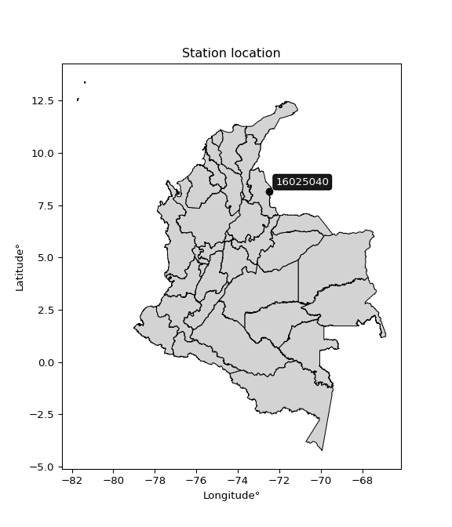</img>

</div>


## A. General information


### 1. General running parameters

• app_version: _v20251225_. • runtime: _2025-12-26 14:29:50.888910_. • Python version: _3.14.0_. • SciPy version: _1.16.3_. • Pandas version: _2.3.3_. • NumPy version: _2.3.5_. • Stations dataset (station_dataset_file): _dataset/pmax24h_in/automatic_colombia.csv_. • Stations catalog (station_catalog_file): _dataset/CNE_IDEAM.xls_. • Plot only fit distributions with Δo > Δ (plot_only_fit): _True_. • Eval low extreme values, if False, evaluates high extreme values (low_extreme): _False_. • Eval every SciPy distribution as logarithmic (pdist_logarithmic_on): _True_. • Standard deviation normalized (ddof): _1.0_. • Return periods to eval in years (Tr): _[2, 2.33, 5, 10, 15, 20, 25, 50, 75, 100, 200, 250, 500, 750, 1000]_. • Minimum data sample per station, 0 means any (minimum_sample): _5_. • Z-Score threshold to adjust a value, 0 means disable (zscore): _3.5_. • Avoid zeros, e.g. rain = 0 (avoid_zeros): _True_. • Avoid null values (avoid_nans): _True_. [:file_folder:Dataset file.](../../dataset/pmax24h_in/automatic_colombia.csv)


### 2. Station info and location

|   id |   CODIGO | NOMBRE                           | CATEGORIA               | TECNOLOGIA                              | ESTADO   | FECHA_INSTALACION   |   FECHA_SUSPENSION |   ALTITUD |   LATITUD |   LONGITUD | DEPARTAMENTO       | MUNICIPIO   | AREA_OPERATIVA                         | ENTIDAD                                                     | AREA_HIDROGRAFICA   | ZONA_HIDROGRAFICA   | SUBZONA_HIDROGRAFICA   |   CORRIENTE |   OBSERVACION | SUBRED                                                                                                                                      | Catalogo   |
|-----:|---------:|:---------------------------------|:------------------------|:----------------------------------------|:---------|:--------------------|-------------------:|----------:|----------:|-----------:|:-------------------|:------------|:---------------------------------------|:------------------------------------------------------------|:--------------------|:--------------------|:-----------------------|------------:|--------------:|:--------------------------------------------------------------------------------------------------------------------------------------------|:-----------|
|    0 | 16025040 | CINERA-VILLA OLGA AUT [16025040] | Climatológica Principal | Automática con Telemetría, Convencional | Activa   | 15/09/1965          |                nan |        96 |   8.16728 |   -72.4788 | Norte De Santander | Cúcuta      | Area Operativa 08 - Santanderes-Arauca | INSTITUTO DE HIDROLOGIA METEOROLOGIA Y ESTUDIOS AMBIENTALES | Caribe              | Catatumbo           | Río Zulia              |         nan |           nan | RED ALERTAS - AREA OPERATIVA 08,Radiación Ultravioleta,Radiación Visible,Norte de Santander, Oriente de Arauca y Nororiente,Radición Global | CNE_IDEAM  |

<div align="center">

Map location in: [:earth_americas:Google](http://maps.google.com/maps?q=8.16728,-72.47878) [:earth_americas:OSM](https://www.openstreetmap.org/#map=18/8.16728/-72.47878&layers=P) [:earth_americas:Bing](https://www.bing.com/maps?cp=8.16728~-72.47878&lvl=18) [:earth_americas:Apple](https://maps.apple.com/frame?center=8.16728%2C-72.47878&span=0.003%2C0.006)

</div>


<div align="center">

```geojson
{
  "type": "Feature",
  "geometry": {
    "type": "Point", 
    "coordinates": [-72.47878, 8.16728]
  }, 
  "properties": {
    "Name": "16025040"
  }
}
```

</div>


### 3. Discrete values table and plot

|               |           0 |            1 |           2 |           3 |           4 |          5 |           6 |
|:--------------|------------:|-------------:|------------:|------------:|------------:|-----------:|------------:|
| Date          | 2019        | 2020         | 2021        | 2022        | 2023        | 2024       | 2025        |
| Value         |   45.5      |  129.1       |  170.9      |  103.5      |   75.1      |  334.2     |   69.2      |
| Value_initial |   45.5      |  129.1       |  170.9      |  103.5      |   75.1      |  334.2     |   69.2      |
| count         |    7        |    7         |    7        |    7        |    7        |    7       |    7        |
| mean          |  132.5      |  132.5       |  132.5      |  132.5      |  132.5      |  132.5     |  132.5      |
| std           |   98.218    |   98.218     |   98.218    |   98.218    |   98.218    |   98.218   |   98.218    |
| zscore        |   -0.885785 |   -0.0346169 |    0.390967 |   -0.295262 |   -0.584414 |    2.05359 |   -0.644485 |

<div align="center">

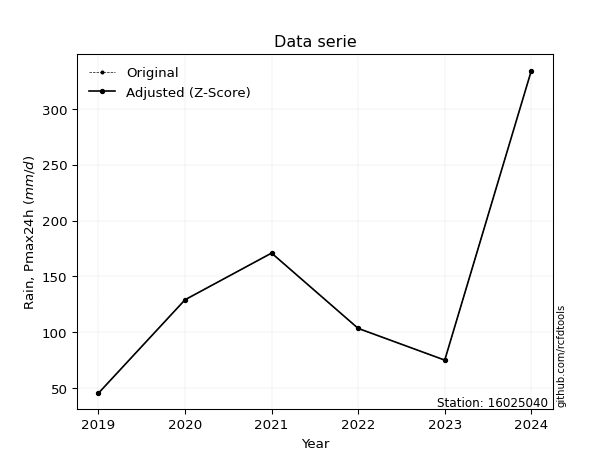</img>

</div>

> If Z-Score is active, values out of range or outliers are replaced with the station mean value.


### 4. Active continuous probability distributions from SciPy (45 of 104 available)

[scipy.stats](https://docs.scipy.org/doc/scipy/reference/stats.html) is a Python´s powerful submodule within the SciPy library for comprehensive statistical analysis, offering over 130 probability distributions (like Normal, Poisson), functions for descriptive stats (mean, variance), hypothesis testing (t-tests, chi-square), random variable generation, and statistical tests, making it essential for data science, modeling, and research. It provides tools to explore, model, and draw conclusions from data efficiently, working seamlessly with NumPy.

<div align="center">

|   id | p_dist             |   n_parameter | fit_method   | label                                                                       | active   | ref                                                                                                        |
|-----:|:-------------------|--------------:|:-------------|:----------------------------------------------------------------------------|:---------|:-----------------------------------------------------------------------------------------------------------|
|    0 | alpha              |             3 | MLE          | Alpha                                                                       | True     | [:mortar_board:](https://docs.scipy.org/doc/scipy/reference/generated/scipy.stats.alpha.html)              |
|    1 | betaprime          |             4 | MLE          | Beta prime                                                                  | True     | [:mortar_board:](https://docs.scipy.org/doc/scipy/reference/generated/scipy.stats.betaprime.html)          |
|    2 | chi2               |             3 | MLE          | Chi²                                                                        | True     | [:mortar_board:](https://docs.scipy.org/doc/scipy/reference/generated/scipy.stats.chi2.html)               |
|    3 | crystalball        |             4 | MLE          | Crystalball                                                                 | True     | [:mortar_board:](https://docs.scipy.org/doc/scipy/reference/generated/scipy.stats.crystalball.html)        |
|    4 | erlang             |             3 | MLE          | Erlang                                                                      | True     | [:mortar_board:](https://docs.scipy.org/doc/scipy/reference/generated/scipy.stats.erlang.html)             |
|    5 | expon              |             2 | MLE          | Exponential                                                                 | True     | [:mortar_board:](https://docs.scipy.org/doc/scipy/reference/generated/scipy.stats.expon.html)              |
|    6 | exponnorm          |             3 | MLE          | Exponentially modified Normal                                               | True     | [:mortar_board:](https://docs.scipy.org/doc/scipy/reference/generated/scipy.stats.exponnorm.html)          |
|    7 | f                  |             4 | MLE          | F                                                                           | True     | [:mortar_board:](https://docs.scipy.org/doc/scipy/reference/generated/scipy.stats.f.html)                  |
|    8 | fatiguelife        |             3 | MLE          | Fatigue-life (Birnbaum-Saunders)                                            | True     | [:mortar_board:](https://docs.scipy.org/doc/scipy/reference/generated/scipy.stats.fatiguelife.html)        |
|    9 | fisk               |             3 | MLE          | Fisk                                                                        | True     | [:mortar_board:](https://docs.scipy.org/doc/scipy/reference/generated/scipy.stats.fisk.html)               |
|   10 | gamma              |             3 | MLE          | Gamma                                                                       | True     | [:mortar_board:](https://docs.scipy.org/doc/scipy/reference/generated/scipy.stats.gamma.html)              |
|   11 | genexpon           |             5 | MLE          | Generalized exponential                                                     | True     | [:mortar_board:](https://docs.scipy.org/doc/scipy/reference/generated/scipy.stats.genexpon.html)           |
|   12 | genlogistic        |             3 | MLE          | Generalized logistic                                                        | True     | [:mortar_board:](https://docs.scipy.org/doc/scipy/reference/generated/scipy.stats.genlogistic.html)        |
|   13 | gibrat             |             2 | MM           | Gibrat                                                                      | True     | [:mortar_board:](https://docs.scipy.org/doc/scipy/reference/generated/scipy.stats.gibrat.html)             |
|   14 | gompertz           |             3 | MLE          | Gompertz (or truncated Gumbel)                                              | True     | [:mortar_board:](https://docs.scipy.org/doc/scipy/reference/generated/scipy.stats.gompertz.html)           |
|   15 | gumbel_l           |             2 | MM           | Gumbel Left Skew                                                            | True     | [:mortar_board:](https://docs.scipy.org/doc/scipy/reference/generated/scipy.stats.gumbel_l.html)           |
|   16 | gumbel_r           |             2 | MM           | Gumbel Right Skew                                                           | True     | [:mortar_board:](https://docs.scipy.org/doc/scipy/reference/generated/scipy.stats.gumbel_r.html)           |
|   17 | halflogistic       |             2 | MM           | Half-logistic                                                               | True     | [:mortar_board:](https://docs.scipy.org/doc/scipy/reference/generated/scipy.stats.halflogistic.html)       |
|   18 | halfnorm           |             2 | MM           | Half Normal                                                                 | True     | [:mortar_board:](https://docs.scipy.org/doc/scipy/reference/generated/scipy.stats.halfnorm.html)           |
|   19 | hypsecant          |             2 | MM           | hyperbolic secant                                                           | True     | [:mortar_board:](https://docs.scipy.org/doc/scipy/reference/generated/scipy.stats.hypsecant.html)          |
|   20 | invgamma           |             3 | MLE          | Inverted gamma                                                              | True     | [:mortar_board:](https://docs.scipy.org/doc/scipy/reference/generated/scipy.stats.invgamma.html)           |
|   21 | invgauss           |             3 | MLE          | Inverse Gaussian                                                            | True     | [:mortar_board:](https://docs.scipy.org/doc/scipy/reference/generated/scipy.stats.invgauss.html)           |
|   22 | invweibull         |             3 | MLE          | Inverted Weibull                                                            | True     | [:mortar_board:](https://docs.scipy.org/doc/scipy/reference/generated/scipy.stats.invweibull.html)         |
|   23 | johnsonsu          |             4 | MLE          | Johnson Su                                                                  | True     | [:mortar_board:](https://docs.scipy.org/doc/scipy/reference/generated/scipy.stats.johnsonsu.html)          |
|   24 | kstwobign          |             2 | MLE          | Limiting distribution of scaled Kolmogorov-Smirnov two-sided test statistic | True     | [:mortar_board:](https://docs.scipy.org/doc/scipy/reference/generated/scipy.stats.kstwobign.html)          |
|   25 | laplace            |             2 | MM           | Laplace                                                                     | True     | [:mortar_board:](https://docs.scipy.org/doc/scipy/reference/generated/scipy.stats.laplace.html)            |
|   26 | laplace_asymmetric |             3 | MLE          | Asymmetric Laplace                                                          | True     | [:mortar_board:](https://docs.scipy.org/doc/scipy/reference/generated/scipy.stats.laplace_asymmetric.html) |
|   27 | loggamma           |             3 | MLE          | Log gamma                                                                   | True     | [:mortar_board:](https://docs.scipy.org/doc/scipy/reference/generated/scipy.stats.loggamma.html)           |
|   28 | logistic           |             2 | MM           | Logistic (or Sech-squared)                                                  | True     | [:mortar_board:](https://docs.scipy.org/doc/scipy/reference/generated/scipy.stats.logistic.html)           |
|   29 | lognorm            |             3 | MLE          | Log Normal                                                                  | True     | [:mortar_board:](https://docs.scipy.org/doc/scipy/reference/generated/scipy.stats.lognorm.html)            |
|   30 | maxwell            |             2 | MM           | Maxwell                                                                     | True     | [:mortar_board:](https://docs.scipy.org/doc/scipy/reference/generated/scipy.stats.maxwell.html)            |
|   31 | mielke             |             4 | MLE          | Mielke Beta-Kappa / Dagum                                                   | True     | [:mortar_board:](https://docs.scipy.org/doc/scipy/reference/generated/scipy.stats.mielke.html)             |
|   32 | moyal              |             2 | MM           | Moyal                                                                       | True     | [:mortar_board:](https://docs.scipy.org/doc/scipy/reference/generated/scipy.stats.moyal.html)              |
|   33 | nakagami           |             3 | MLE          | Nakagami                                                                    | True     | [:mortar_board:](https://docs.scipy.org/doc/scipy/reference/generated/scipy.stats.nakagami.html)           |
|   34 | ncf                |             5 | MLE          | Non-central F distribution                                                  | True     | [:mortar_board:](https://docs.scipy.org/doc/scipy/reference/generated/scipy.stats.ncf.html)                |
|   35 | nct                |             4 | MLE          | Non-central Student’s t                                                     | True     | [:mortar_board:](https://docs.scipy.org/doc/scipy/reference/generated/scipy.stats.nct.html)                |
|   36 | norm               |             2 | MM           | Normal                                                                      | True     | [:mortar_board:](https://docs.scipy.org/doc/scipy/reference/generated/scipy.stats.norm.html)               |
|   37 | pareto             |             3 | MLE          | Pareto                                                                      | True     | [:mortar_board:](https://docs.scipy.org/doc/scipy/reference/generated/scipy.stats.pareto.html)             |
|   38 | pearson3           |             3 | MM           | Pearson type III                                                            | True     | [:mortar_board:](https://docs.scipy.org/doc/scipy/reference/generated/scipy.stats.pearson3.html)           |
|   39 | rayleigh           |             2 | MM           | Rayleigh                                                                    | True     | [:mortar_board:](https://docs.scipy.org/doc/scipy/reference/generated/scipy.stats.rayleigh.html)           |
|   40 | rice               |             3 | MLE          | Rice                                                                        | True     | [:mortar_board:](https://docs.scipy.org/doc/scipy/reference/generated/scipy.stats.rice.html)               |
|   41 | t                  |             3 | MLE          | Student’s t                                                                 | True     | [:mortar_board:](https://docs.scipy.org/doc/scipy/reference/generated/scipy.stats.t.html)                  |
|   42 | truncnorm          |             4 | MLE          | Truncated normal                                                            | True     | [:mortar_board:](https://docs.scipy.org/doc/scipy/reference/generated/scipy.stats.truncnorm.html)          |
|   43 | wald               |             2 | MM           | Wald                                                                        | True     | [:mortar_board:](https://docs.scipy.org/doc/scipy/reference/generated/scipy.stats.wald.html)               |
|   44 | weibull_min        |             3 | MLE          | Weibull minimum                                                             | True     | [:mortar_board:](https://docs.scipy.org/doc/scipy/reference/generated/scipy.stats.weibull_min.html)        |

</div>

> **n_parameter:** # arguments & localization & scale.
>
> **Fit methods:** (MLE) maximum likelihood, (MM) L-moments.
>
>**Inactive:** foldnorm, gennorm, norminvgauss, powernorm, powerlognorm, skewnorm, genextreme, anglit, arcsine, argus, beta, bradford, burr, burr12, cauchy, cosine, halfcauchy, foldcauchy, skewcauchy, wrapcauchy, dgamma, gengamma, exponweib, exponpow, truncexpon, gausshyper, genhalflogistic, genhyperbolic, geninvgauss, halfgennorm, johnsonsb, kappa4, kappa3, ksone, kstwo, loglaplace, levy, levy_l, levy_stable, ncx2, genpareto, truncpareto, lomax, powerlaw, rdist, rel_breitwigner, recipinvgauss, semicircular, studentized_range, trapezoid, triang, truncweibull_min, tukeylambda, uniform, loguniform, vonmises, vonmises_line, weibull_max, dweibull, 


## B. Probability distributions vs. Empirical distributions

A continuous probability distribution (CPD) describes probabilities for variables that can take any value within a range (like rain any time), unlike discrete variables with specific outcomes (like temperature). It uses a Probability Density Function (PDF), a curve where the total area under it equals 1, and the probability of the variable falling within an interval (a to b) is found by calculating the area under the curve between those points. A key feature is that the probability of hitting any single exact value is zero, so probabilities are always expressed for ranges, e.g., $P(a ≤ X ≤ b)$.

<div align="center">

Distributions parameters
|    |   station | p_dist                |   n |               loc |          scale | shape                 | shape1             | shape2                | shape3   |
|---:|----------:|:----------------------|----:|------------------:|---------------:|:----------------------|:-------------------|:----------------------|:---------|
|  0 |  16025040 | alpha                 |   7 |     -27.2861      |  283.318       | 2.2210040869105434    |                    |                       |          |
|  1 |  16025040 | betaprime             |   7 |      -0.822078    |    1.6651      | 182.76393006304016    | 3.249902905579915  |                       |          |
|  2 |  16025040 | chi2                  |   7 |      45.5         |   32.2581      | 0.7735822316711005    |                    |                       |          |
|  3 |  16025040 | crystalball           |   7 |     132.5         |   90.9322      | 11280.765273590063    | 8270.02959301793   |                       |          |
|  4 |  16025040 | erlang                |   7 |      45.5         |   72.8254      | 0.7919848172229431    |                    |                       |          |
|  5 |  16025040 | expon                 |   7 |      45.5         |   87           |                       |                    |                       |          |
|  6 |  16025040 | exponnorm             |   7 |      45.4139      |    0.026236    | 3308.399761288747     |                    |                       |          |
|  7 |  16025040 | f                     |   7 |      15.8638      |   72.0301      | 94.53961414830985     | 4.6979331054218605 |                       |          |
|  8 |  16025040 | fatiguelife           |   7 |      34.4674      |   61.3389      | 1.083240427715439     |                    |                       |          |
|  9 |  16025040 | fisk                  |   7 |      41.0756      |   56.1896      | 1.4364514991643205    |                    |                       |          |
| 10 |  16025040 | gamma                 |   7 |      45.5         |  101.044       | 0.4835773574275631    |                    |                       |          |
| 11 |  16025040 | genexpon              |   7 |      45.5         |  176.11        | 2.024256340614971     | 0.5135667884193258 | 3.031074905737457e-10 |          |
| 12 |  16025040 | genlogistic           |   7 |    -323.014       |   56.8673      | 1538.036172708099     |                    |                       |          |
| 13 |  16025040 | gibrat                |   7 |      63.1302      |   42.0749      |                       |                    |                       |          |
| 14 |  16025040 | gompertz              |   7 |      45.5         |  925.825       | 8.021819645712515     |                    |                       |          |
| 15 |  16025040 | gumbel_l              |   7 |     173.424       |   70.8995      |                       |                    |                       |          |
| 16 |  16025040 | gumbel_r              |   7 |      91.5757      |   70.8995      |                       |                    |                       |          |
| 17 |  16025040 | halflogistic          |   7 |      24.7242      |   77.7438      |                       |                    |                       |          |
| 18 |  16025040 | halfnorm              |   7 |      12.1414      |  150.847       |                       |                    |                       |          |
| 19 |  16025040 | hypsecant             |   7 |     132.5         |   57.8892      |                       |                    |                       |          |
| 20 |  16025040 | invgamma              |   7 |      14.6123      |  168.611       | 2.330176981115099     |                    |                       |          |
| 21 |  16025040 | invgauss              |   7 |      28.5884      |   97.9202      | 1.0611867313832872    |                    |                       |          |
| 22 |  16025040 | invweibull            |   7 |      45.5         |    1.53813     | 0.0530545898061278    |                    |                       |          |
| 23 |  16025040 | johnsonsu             |   7 |      35.8926      |    0.319362    | -5.811565379459217    | 0.9771649109815617 |                       |          |
| 24 |  16025040 | kstwobign             |   7 |    -116.8         |  289.41        |                       |                    |                       |          |
| 25 |  16025040 | laplace               |   7 |     132.5         |   64.2988      |                       |                    |                       |          |
| 26 |  16025040 | laplace_asymmetric    |   7 |      69.2         |   38.7872      | 0.4746832579308832    |                    |                       |          |
| 27 |  16025040 | loggamma              |   7 |  -25894.8         | 3575.75        | 1449.676930485186     |                    |                       |          |
| 28 |  16025040 | logistic              |   7 |     132.5         |   50.1336      |                       |                    |                       |          |
| 29 |  16025040 | lognorm               |   7 |      45.5         |    0.365716    | 12.913184284044359    |                    |                       |          |
| 30 |  16025040 | maxwell               |   7 |     -82.9711      |  135.027       |                       |                    |                       |          |
| 31 |  16025040 | mielke                |   7 |      -1.14394     |    6.40501     | 327.1447145218905     | 1.9933259174816604 |                       |          |
| 32 |  16025040 | moyal                 |   7 |      80.4991      |   40.9339      |                       |                    |                       |          |
| 33 |  16025040 | nakagami              |   7 |      45.5         |   93.3671      | 0.3089460650485757    |                    |                       |          |
| 34 |  16025040 | ncf                   |   7 |      -0.864583    |   93.623       | 413.4316818966836     | 6.49368536888575   | 0.0027636123116071207 |          |
| 35 |  16025040 | nct                   |   7 |      -0.181894    |    2.30528     | 1.9722945858206575    | 35.31058697518877  |                       |          |
| 36 |  16025040 | norm                  |   7 |     132.5         |   90.9322      |                       |                    |                       |          |
| 37 |  16025040 | pareto                |   7 |      45.4313      |    0.0687165   | 0.1682238069340606    |                    |                       |          |
| 38 |  16025040 | pearson3              |   7 |     132.5         |   90.9322      | 1.3559483513741188    |                    |                       |          |
| 39 |  16025040 | rayleigh              |   7 |     -41.4586      |  138.799       |                       |                    |                       |          |
| 40 |  16025040 | rice                  |   7 |      -5.33049     |  116.76        | 0.0005748469455514343 |                    |                       |          |
| 41 |  16025040 | t                     |   7 |      98.2943      |   44.8898      | 1.8030778889934402    |                    |                       |          |
| 42 |  16025040 | truncnorm             |   7 | -188480           | 4143.44        | 45.49991883530788     | 346.5301096256118  |                       |          |
| 43 |  16025040 | wald                  |   7 |      41.5678      |   90.9322      |                       |                    |                       |          |
| 44 |  16025040 | weibull_min           |   7 |      45.5         |  117.751       | 0.6607067706023984    |                    |                       |          |
| 45 |  16025040 | logalpha              |   7 |      -0.0634354   |   37.5406      | 8.025354081031502     |                    |                       |          |
| 46 |  16025040 | logbetaprime          |   7 |      -1.93076     |    4.02644     | 314.5706171773995     | 192.31664772855663 |                       |          |
| 47 |  16025040 | logchi2               |   7 |       3.81771     |    0.997826    | 1.0135354588039251    |                    |                       |          |
| 48 |  16025040 | logcrystalball        |   7 |       4.6895      |    0.609131    | 583.3132522216422     | 33.141941477995125 |                       |          |
| 49 |  16025040 | logerlang             |   7 |       3.50999     |    0.359335    | 3.2824922623535553    |                    |                       |          |
| 50 |  16025040 | logexpon              |   7 |       3.81771     |    0.871789    |                       |                    |                       |          |
| 51 |  16025040 | logexponnorm          |   7 |       4.17039     |    0.381626    | 1.360259797157234     |                    |                       |          |
| 52 |  16025040 | logf                  |   7 |       3.50471     |    1.18223     | 6.698735339141162     | 532.7849641647427  |                       |          |
| 53 |  16025040 | logfatiguelife        |   7 |       2.73308     |    1.86146     | 0.3193573828679357    |                    |                       |          |
| 54 |  16025040 | logfisk               |   7 |       2.83662     |    1.76467     | 5.066767370480267     |                    |                       |          |
| 55 |  16025040 | loggamma              |   7 |       3.50999     |    0.359338    | 3.282441882327023     |                    |                       |          |
| 56 |  16025040 | loggenexpon           |   7 |       3.81771     |    1.06911     | 0.8635421235497336    | 1.6141347470846132 | 0.44322113721446926   |          |
| 57 |  16025040 | loggenlogistic        |   7 |       1.38565     |    0.509346    | 371.84301427479977    |                    |                       |          |
| 58 |  16025040 | loggibrat             |   7 |       4.22484     |    0.28183     |                       |                    |                       |          |
| 59 |  16025040 | loggompertz           |   7 |       3.81771     |    1.25326     | 0.7867249393046793    |                    |                       |          |
| 60 |  16025040 | loggumbel_l           |   7 |       4.96364     |    0.474937    |                       |                    |                       |          |
| 61 |  16025040 | loggumbel_r           |   7 |       4.41536     |    0.474937    |                       |                    |                       |          |
| 62 |  16025040 | loghalflogistic       |   7 |       3.96757     |    0.520764    |                       |                    |                       |          |
| 63 |  16025040 | loghalfnorm           |   7 |       3.88328     |    1.01046     |                       |                    |                       |          |
| 64 |  16025040 | loghypsecant          |   7 |       4.6895      |    0.387785    |                       |                    |                       |          |
| 65 |  16025040 | loginvgamma           |   7 |       1.76066     |   67.0899      | 23.898073977757228    |                    |                       |          |
| 66 |  16025040 | loginvgauss           |   7 |       2.67436     |   20.627       | 0.0976940372013346    |                    |                       |          |
| 67 |  16025040 | loginvweibull         |   7 |      -1.64156e+07 |    1.64156e+07 | 32179674.524738237    |                    |                       |          |
| 68 |  16025040 | logjohnsonsu          |   7 |       2.61832     |    0.200327    | -10.124950379309965   | 3.388508014469953  |                       |          |
| 69 |  16025040 | logkstwobign          |   7 |       2.59942     |    2.39658     |                       |                    |                       |          |
| 70 |  16025040 | loglaplace            |   7 |       4.6895      |    0.43072     |                       |                    |                       |          |
| 71 |  16025040 | loglaplace_asymmetric |   7 |       4.63957     |    0.48994     | 0.9484434696899622    |                    |                       |          |
| 72 |  16025040 | logloggamma           |   7 |    -147.678       |   21.4417      | 1220.0575204503534    |                    |                       |          |
| 73 |  16025040 | loglogistic           |   7 |       4.6895      |    0.335831    |                       |                    |                       |          |
| 74 |  16025040 | loglognorm            |   7 |       3.81771     |    0.00576265  | 12.336763071017657    |                    |                       |          |
| 75 |  16025040 | logmaxwell            |   7 |       3.24612     |    0.904507    |                       |                    |                       |          |
| 76 |  16025040 | logmielke             |   7 |   -6035.79        | 6038           | 975028.8520008649     | 12085.020227284902 |                       |          |
| 77 |  16025040 | logmoyal              |   7 |       4.34116     |    0.274205    |                       |                    |                       |          |
| 78 |  16025040 | lognakagami           |   7 |       3.81771     |    1.26928     | 0.2556338340012112    |                    |                       |          |
| 79 |  16025040 | logncf                |   7 |       1.73583     |    2.8452      | 105.25978111763042    | 85.71070821195335  | 2.3918684564848887    |          |
| 80 |  16025040 | lognct                |   7 |       0.625497    |    0.116905    | 24.841697779780986    | 33.69729143678423  |                       |          |
| 81 |  16025040 | lognorm               |   7 |       4.6895      |    0.609131    |                       |                    |                       |          |
| 82 |  16025040 | logpareto             |   7 |       3.81686     |    0.000851066 | 0.16795927873156208   |                    |                       |          |
| 83 |  16025040 | logpearson3           |   7 |       4.6895      |    0.60913     | 0.4450874966581082    |                    |                       |          |
| 84 |  16025040 | lograyleigh           |   7 |       3.5242      |    0.929777    |                       |                    |                       |          |
| 85 |  16025040 | logrice               |   7 |       3.56728     |    0.850077    | 0.5061944358830973    |                    |                       |          |
| 86 |  16025040 | logt                  |   7 |       4.6895      |    0.609129    | 1198450479.2009382    |                    |                       |          |
| 87 |  16025040 | logtruncnorm          |   7 |       2.62114     |    0.886558    | 2.2767032169210637    | 48.42862767924738  |                       |          |
| 88 |  16025040 | logwald               |   7 |       4.08035     |    0.609148    |                       |                    |                       |          |
| 89 |  16025040 | logweibull_min        |   7 |       3.70816     |    1.08691     | 1.570940330702101     |                    |                       |          |

</div>

> **loc** (Location parameter): This shifts the distribution along the x-axis. For many common distributions, like the normal (Gaussian) distribution, loc represents the mean $μ$. For others, like the uniform distribution, it might represent the minimum value, or for the beta distribution, the left end of the support interval.
>
> **scale** (Scale parameter): This determines the width or spread of the distribution. For the normal distribution, scale represents the standard deviation $σ$. For a uniform distribution, it defines the length of the interval (from $loc$ to $loc + scale$).
>
> **shape** (Shape parameters): Refers to parameters that define the specific form of a probability distribution, distinct from its location (loc) and scale (scale). These parameters are required arguments for most distribution functions. For example, a normal (Gaussian) distribution is fully defined by its location (mean) and scale (standard deviation), so it has no specific shape parameters beyond loc and scale. However, other distributions have intrinsic properties that need specification, as Gamma distribution that takes a shape parameter, often named $a$ or $alpha$.


### 0. Cumulative distribution values - CDF (90 evaluated)

> Ordered by x ascending and calculating $log(f(x))$ separately. 

|   id |   Station |   date |     x |   count |   mean |    std |     zscore |   Value_initial |   station |   m |     alpha |   alpha_pdf |   betaprime |   betaprime_pdf |        chi2 |    chi2_pdf |   crystalball |   crystalball_pdf |     erlang |   erlang_pdf |    expon |   expon_pdf |   exponnorm |   exponnorm_pdf |         f |      f_pdf |   fatiguelife |   fatiguelife_pdf |      fisk |    fisk_pdf |       gamma |   gamma_pdf |    genexpon |   genexpon_pdf |   genlogistic |   genlogistic_pdf |    gibrat |   gibrat_pdf |    gompertz |   gompertz_pdf |   gumbel_l |   gumbel_l_pdf |   gumbel_r |   gumbel_r_pdf |   halflogistic |   halflogistic_pdf |   halfnorm |   halfnorm_pdf |   hypsecant |   hypsecant_pdf |   invgamma |   invgamma_pdf |   invgauss |   invgauss_pdf |   invweibull |   invweibull_pdf |   johnsonsu |   johnsonsu_pdf |   kstwobign |   kstwobign_pdf |   laplace |   laplace_pdf |   laplace_asymmetric |   laplace_asymmetric_pdf |   loggamma |   loggamma_pdf |   logistic |   logistic_pdf |   lognorm |   lognorm_pdf |   maxwell |   maxwell_pdf |      mielke |   mielke_pdf |    moyal |   moyal_pdf |    nakagami |   nakagami_pdf |       ncf |    ncf_pdf |       nct |     nct_pdf |     norm |    norm_pdf |   pareto |   pareto_pdf |   pearson3 |   pearson3_pdf |   rayleigh |   rayleigh_pdf |      rice |    rice_pdf |        t |       t_pdf |   truncnorm |   truncnorm_pdf |        wald |    wald_pdf |   weibull_min |   weibull_min_pdf |   logalpha |   logalpha_pdf |   logbetaprime |   logbetaprime_pdf |     logchi2 |   logchi2_pdf |   logcrystalball |   logcrystalball_pdf |   logerlang |   logerlang_pdf |   logexpon |   logexpon_pdf |   logexponnorm |   logexponnorm_pdf |      logf |   logf_pdf |   logfatiguelife |   logfatiguelife_pdf |   logfisk |   logfisk_pdf |   loggenexpon |   loggenexpon_pdf |   loggenlogistic |   loggenlogistic_pdf |   loggibrat |   loggibrat_pdf |   loggompertz |   loggompertz_pdf |   loggumbel_l |   loggumbel_l_pdf |   loggumbel_r |   loggumbel_r_pdf |   loghalflogistic |   loghalflogistic_pdf |   loghalfnorm |   loghalfnorm_pdf |   loghypsecant |   loghypsecant_pdf |   loginvgamma |   loginvgamma_pdf |   loginvgauss |   loginvgauss_pdf |   loginvweibull |   loginvweibull_pdf |   logjohnsonsu |   logjohnsonsu_pdf |   logkstwobign |   logkstwobign_pdf |   loglaplace |   loglaplace_pdf |   loglaplace_asymmetric |   loglaplace_asymmetric_pdf |   logloggamma |   logloggamma_pdf |   loglogistic |   loglogistic_pdf |   loglognorm |   loglognorm_pdf |   logmaxwell |   logmaxwell_pdf |   logmielke |   logmielke_pdf |   logmoyal |   logmoyal_pdf |   lognakagami |   lognakagami_pdf |    logncf |   logncf_pdf |    lognct |   lognct_pdf |   logpareto |   logpareto_pdf |   logpearson3 |   logpearson3_pdf |   lograyleigh |   lograyleigh_pdf |   logrice |   logrice_pdf |     logt |   logt_pdf |   logtruncnorm |   logtruncnorm_pdf |   logwald |   logwald_pdf |   logweibull_min |   logweibull_min_pdf |
|-----:|----------:|-------:|------:|--------:|-------:|-------:|-----------:|----------------:|----------:|----:|----------:|------------:|------------:|----------------:|------------:|------------:|--------------:|------------------:|-----------:|-------------:|---------:|------------:|------------:|----------------:|----------:|-----------:|--------------:|------------------:|----------:|------------:|------------:|------------:|------------:|---------------:|--------------:|------------------:|----------:|-------------:|------------:|---------------:|-----------:|---------------:|-----------:|---------------:|---------------:|-------------------:|-----------:|---------------:|------------:|----------------:|-----------:|---------------:|-----------:|---------------:|-------------:|-----------------:|------------:|----------------:|------------:|----------------:|----------:|--------------:|---------------------:|-------------------------:|-----------:|---------------:|-----------:|---------------:|----------:|--------------:|----------:|--------------:|------------:|-------------:|---------:|------------:|------------:|---------------:|----------:|-----------:|----------:|------------:|---------:|------------:|---------:|-------------:|-----------:|---------------:|-----------:|---------------:|----------:|------------:|---------:|------------:|------------:|----------------:|------------:|------------:|--------------:|------------------:|-----------:|---------------:|---------------:|-------------------:|------------:|--------------:|-----------------:|---------------------:|------------:|----------------:|-----------:|---------------:|---------------:|-------------------:|----------:|-----------:|-----------------:|---------------------:|----------:|--------------:|--------------:|------------------:|-----------------:|---------------------:|------------:|----------------:|--------------:|------------------:|--------------:|------------------:|--------------:|------------------:|------------------:|----------------------:|--------------:|------------------:|---------------:|-------------------:|--------------:|------------------:|--------------:|------------------:|----------------:|--------------------:|---------------:|-------------------:|---------------:|-------------------:|-------------:|-----------------:|------------------------:|----------------------------:|--------------:|------------------:|--------------:|------------------:|-------------:|-----------------:|-------------:|-----------------:|------------:|----------------:|-----------:|---------------:|--------------:|------------------:|----------:|-------------:|----------:|-------------:|------------:|----------------:|--------------:|------------------:|--------------:|------------------:|----------:|--------------:|---------:|-----------:|---------------:|-------------------:|----------:|--------------:|-----------------:|---------------------:|
|    0 |  16025040 |   2019 |  45.5 |       7 |  132.5 | 98.218 | -0.885785  |            45.5 |  16025040 |   1 | 0.0479457 | 0.00534781  |   0.0565379 |     0.0055017   | 9.89803e-07 | 2.69405e+07 |      0.169345 |       0.002776    | 3.8908e-13 |  21.6838     | 0        | 0.0114943   | 0.000991706 |     0.0115035   | 0.0438661 | 0.00606195 |     0.0371132 |        0.00943608 | 0.0253111 | 0.00800962  | 1.74371e-08 | 1.18672e+06 | 5.16167e-13 |    0.0114943   |     0.0947342 |       0.00392294  | 0         |  0           | 8.00345e-16 |    0.00866451  |   0.151758 |    0.00196914  |   0.147298 |    0.00397915  |       0.132827 |        0.00631791  |   0.175018 |    0.00516159  |    0.139372 |     0.00233137  |  0.0430655 |    0.00605497  |  0.0389048 |    0.00745952  |   0.00387283 |      8.03006e+10 |   0.0353229 |     0.00791421  |   0.0884332 |     0.00373006  |  0.129224 |   0.00200975  |            0.0507598 |              0.00275694  |  0.0365175 |       0.314805 |   0.149903 |     0.00254185 | 0.0761861 |      0.235184 |  0.175842 |   0.00340188  |   0.0447646 |   0.00588658 | 0.12517  | 0.004612    | 1.30757e-10 | 5685.35        | 0.0565366 | 0.00550566 | 0.0430498 | 0.00586787  | 0.169345 | 0.002776    | 0        |  2.44808     |   0.141744 |    0.00506429  |   0.178198 |    0.00370943  | 0.0904095 | 0.00339141  | 0.185813 | 0.00350272  |    0        |     0.0109865   | 4.04451e-06 | 1.23507e-05 |   3.03839e-11 |    1412.64        |   0.04976  |       0.256049 |      0.0667882 |           0.248401 | 1.31856e-08 |   1.50466e+07 |        0.0761861 |             0.235184 |   0.0365178 |        0.314804 |   0        |       1.14707  |      0.0522751 |           0.241626 | 0.0364534 |   0.313088 |         0.043458 |             0.275822 |  0.048593 |      0.23876  |   4.14226e-10 |          0.807718 |        0.0439426 |             0.268461 | 0           |       0         |   1.99696e-09 |          0.627745 |     0.0856701 |         0.172425  |     0.0296086 |          0.219425 |          0        |              0        |      0        |          0        |      0.0669768 |          0.171445  |     0.0475011 |          0.261345 |     0.0439072 |          0.273939 |       0.0438079 |            0.268619 |      0.0456397 |           0.267148 |       0.041646 |           0.292209 |    0.0660613 |        0.153374  |               0.0807713 |                    0.173821 |     0.0778899 |          0.234097 |     0.0694019 |         0.192315  |   0.00719268 |      3.64316e+12 |    0.0596231 |         0.288512 |   0.0427336 |        0.264388 | 0.00939511 |      0.129556  |   9.76332e-09 |       1.12402e+07 | 0.0509392 |     0.244841 | 0.0508076 |     0.256495 |    0        |     197.352     |     0.0613883 |          0.257806 |     0.0486064 |          0.323021 | 0.0374635 |      0.293563 | 0.076186 |   0.235185 |    0           |          0         |  0        |     0         |        0.0268242 |             0.379457 |
|    1 |  16025040 |   2025 |  69.2 |       7 |  132.5 | 98.218 | -0.644485  |            69.2 |  16025040 |   2 | 0.24036   | 0.0095256   |   0.23547   |     0.00855541  | 0.693786    | 0.00864018  |      0.243176 |       0.00344323  | 0.384844   |   0.010675   | 0.238461 | 0.00875332  | 0.239695    |     0.00875935  | 0.252276  | 0.00966817 |     0.297316  |        0.00957826 | 0.270092  | 0.010069    | 0.519946    | 0.00903597  | 0.238462    |    0.00875335  |     0.211426  |       0.00577423  | 0.0264259 |  0.0100865   | 0.187793    |    0.00721985  |   0.205402 |    0.00257679  |   0.253833 |    0.00490871  |       0.278487 |        0.0059326   |   0.294758 |    0.00492418  |    0.205817 |     0.00331275  |  0.252569  |    0.0097234   |  0.273492  |    0.00975167  |   0.421078   |      0.000815308 |   0.276545  |     0.00981574  |   0.196754  |     0.00526124  |  0.186819 |   0.00290549  |            0.183889  |              0.00998769  |  0.267687  |       0.697466 |   0.220522 |     0.00342868 | 0.228782  |      0.497013 |  0.263747 |   0.003977    | nan         | nan          | 0.250971 | 0.00578883  | 0.33118     |    0.00850387  | 0.235594  | 0.0085599  | 0.252956  | 0.00992845  | 0.243176 | 0.00344323  | 0.625985 |  0.0026471   |   0.269681 |    0.00556633  |   0.272259 |    0.00418013  | 0.184315  | 0.0044593   | 0.294808 | 0.00580075  |    0.229254 |     0.00846887  | 0.169886    | 0.0117995   |   0.293012    |       0.00683406  |   0.240679 |       0.632014 |      0.234032  |           0.54553  | 0.477662    |   0.501207    |        0.228782  |             0.497013 |   0.267687  |        0.697464 |   0.381805 |       0.70911  |      0.237909  |           0.638348 | 0.267135  |   0.697277 |         0.25171  |             0.667808 |  0.236577 |      0.653465 |   0.323371    |          0.709522 |        0.252803  |             0.681263 | 0.000835935 |       0.234838  |   0.268447    |          0.641691 |     0.194701  |         0.367165  |     0.233218  |          0.714862 |          0.253065 |              0.898639 |      0.27371  |          0.742698 |      0.192146  |          0.465949  |     0.243871  |          0.645013 |     0.250638  |          0.664982 |       0.252845  |            0.681515 |      0.247205  |           0.656246 |       0.261173 |           0.683349 |    0.17487   |        0.405993  |               0.199126  |                    0.428522 |     0.228594  |          0.489409 |     0.206295  |         0.487558  |   0.635896   |      0.072606    |    0.247022  |         0.580964 |   0.252169  |        0.689189 | 0.226599   |      0.846902  |   0.439945    |       0.524654    | 0.228948  |     0.589242 | 0.240088  |     0.624988 |    0.647131 |       0.141066  |     0.237945  |          0.572743 |     0.254624  |          0.614592 | 0.239176  |      0.621808 | 0.228783 |   0.497015 |    0           |          0         |  0.120146 |     1.71763   |        0.275645  |             0.693879 |
|    2 |  16025040 |   2023 |  75.1 |       7 |  132.5 | 98.218 | -0.584414  |            75.1 |  16025040 |   3 | 0.296386  | 0.00941221  |   0.285861  |     0.00848943  | 0.739259    | 0.00688027  |      0.263942 |       0.00359474  | 0.443933   |   0.00939939 | 0.288393 | 0.00817939  | 0.289658    |     0.00818374  | 0.308328  | 0.00929294 |     0.350901  |        0.0086024  | 0.327261  | 0.00929482  | 0.568793    | 0.00759904  | 0.288394    |    0.00817941  |     0.246396  |       0.00606672  | 0.104365  |  0.0151246   | 0.229421    |    0.0068936   |   0.221098 |    0.00274508  |   0.283201 |    0.00503932  |       0.313107 |        0.00580088  |   0.32359  |    0.00484816  |    0.226166 |     0.00358635  |  0.308917  |    0.0093375   |  0.328923  |    0.00902628  |   0.42537    |      0.000651719 |   0.332224  |     0.00904974  |   0.228506  |     0.00549178  |  0.204773 |   0.00318471  |            0.24074   |              0.00929195  |  0.325329  |       0.708519 |   0.241414 |     0.00365291 | 0.271414  |      0.544233 |  0.287527 |   0.00408128  | nan         | nan          | 0.285443 | 0.00588444  | 0.378952    |    0.00772479  | 0.286008  | 0.00849285 | 0.310575  | 0.00955666  | 0.263942 | 0.00359474  | 0.639678 |  0.00204305  |   0.302516 |    0.00555723  |   0.297144 |    0.00425244  | 0.211212  | 0.00465362  | 0.330849 | 0.00641082  |    0.277636 |     0.0079375   | 0.238679    | 0.011414    |   0.330751    |       0.00599926  |   0.294207 |       0.673641 |      0.280593  |           0.591142 | 0.516087    |   0.440582    |        0.271414  |             0.544233 |   0.325328  |        0.708518 |   0.437185 |       0.645586 |      0.292431  |           0.691395 | 0.324772  |   0.70855  |         0.307656 |             0.696565 |  0.292385 |      0.707255 |   0.380083    |          0.676287 |        0.309934  |             0.711666 | 0.136055    |       2.3226    |   0.320738    |          0.63602  |     0.226827  |         0.418793  |     0.29364   |          0.75763  |          0.325013 |              0.858706 |      0.333559 |          0.719579 |      0.233669  |          0.549893  |     0.298319  |          0.682961 |     0.3064    |          0.694914 |       0.309988  |            0.71172  |      0.302429  |           0.690577 |       0.317959 |           0.701542 |    0.211453  |        0.490928  |               0.237464  |                    0.511025 |     0.270576  |          0.536006 |     0.249034  |         0.556875  |   0.641309   |      0.0604404   |    0.295985  |         0.614114 |   0.310019  |        0.721182 | 0.297607   |      0.88094   |   0.480768    |       0.475168    | 0.279031  |     0.632747 | 0.293044  |     0.666802 |    0.657521 |       0.114596  |     0.286624  |          0.615324 |     0.305944  |          0.637966 | 0.291304  |      0.650354 | 0.271415 |   0.544235 |    0           |          0         |  0.262003 |     1.6662    |        0.332516  |             0.694133 |
|    3 |  16025040 |   2022 | 103.5 |       7 |  132.5 | 98.218 | -0.295262  |           103.5 |  16025040 |   4 | 0.528791  | 0.00668607  |   0.502714  |     0.00654212  | 0.867738    | 0.00293284  |      0.374894 |       0.00416972  | 0.649531   |   0.00553308 | 0.486583 | 0.00590135  | 0.487883    |     0.00590003  | 0.530756  | 0.00631182 |     0.543458  |        0.00531253 | 0.537716  | 0.00572003  | 0.725936    | 0.00405348  | 0.486584    |    0.00590135  |     0.42729   |       0.00638717  | 0.4835    |  0.00987375  | 0.404657    |    0.00549185  |   0.311317 |    0.00362289  |   0.429473 |    0.00511977  |       0.467321 |        0.00502684  |   0.455244 |    0.00440306  |    0.34682  |     0.00487411  |  0.531925  |    0.00631398  |  0.536551  |    0.00578649  |   0.438311   |      0.000330704 |   0.53928   |     0.00573809  |   0.391657  |     0.00579278  |  0.318489 |   0.00495327  |            0.463653  |              0.0065639   |  0.542987  |       0.621994 |   0.359288 |     0.00459174 | 0.467336  |      0.652741 |  0.4081   |   0.00434284  | nan         | nan          | 0.45021  | 0.00553364  | 0.5627      |    0.00546975  | 0.502893  | 0.00654155 | 0.537765  | 0.00636992  | 0.374894 | 0.00416972  | 0.678168 |  0.00093234  |   0.454888 |    0.00507666  |   0.420369 |    0.00436138  | 0.352341  | 0.00517019  | 0.540358 | 0.00769903  |    0.47129  |     0.00581046  | 0.503466    | 0.0072438   |   0.465455    |       0.00381395  |   0.517193 |       0.676482 |      0.486678  |           0.662758 | 0.631141    |   0.293931    |        0.467336  |             0.652741 |   0.542986  |        0.621995 |   0.610436 |       0.446856 |      0.52467   |           0.704812 | 0.542458  |   0.621976 |         0.529836 |             0.653449 |  0.527157 |      0.700493 |   0.573918    |          0.529899 |        0.535528  |             0.656053 | 0.650373    |       0.892758  |   0.517615    |          0.583415 |     0.396754  |         0.641977  |     0.535958  |          0.703834 |          0.568433 |              0.649895 |      0.545823 |          0.596727 |      0.459128  |          0.814085  |     0.521601  |          0.670017 |     0.528733  |          0.655566 |       0.535503  |            0.655622 |      0.525787  |           0.664151 |       0.536619 |           0.632553 |    0.445272  |        1.03379   |               0.473558  |                    1.0191   |     0.463998  |          0.646611 |     0.462899  |         0.740323  |   0.656182   |      0.0362918   |    0.501385  |         0.639034 |   0.538715  |        0.664144 | 0.561684   |      0.713484  |   0.610926    |       0.348813    | 0.493116  |     0.666    | 0.514663  |     0.675742 |    0.684794 |       0.0643504 |     0.496772  |          0.662104 |     0.513022  |          0.628307 | 0.504412  |      0.650773 | 0.467337 |   0.652743 |    4.57725e-07 |          2.95574   |  0.633287 |     0.74184   |        0.543708  |             0.603842 |
|    4 |  16025040 |   2020 | 129.1 |       7 |  132.5 | 98.218 | -0.0346169 |           129.1 |  16025040 |   5 | 0.667653  | 0.00430688  |   0.64418   |     0.00458288  | 0.923287    | 0.00157615  |      0.485087 |       0.00438418  | 0.76452    |   0.00360806 | 0.617459 | 0.00439702  | 0.618687    |     0.00439305  | 0.662967  | 0.00416325 |     0.656678  |        0.00367225 | 0.655837  | 0.00368339  | 0.809321    | 0.00260496  | 0.617461    |    0.00439702  |     0.581507  |       0.0055427   | 0.673553  |  0.00546566  | 0.531427    |    0.00444362  |   0.41443  |    0.00442005  |   0.554859 |    0.00460983  |       0.585822 |        0.00422422  |   0.561864 |    0.00391618  |    0.481315 |     0.00548913  |  0.664008  |    0.00415401  |  0.658859  |    0.00391557  |   0.445311   |      0.000228623 |   0.659975  |     0.00384145  |   0.534162  |     0.00525227  |  0.474248 |   0.00737569  |            0.607913  |              0.00479842  |  0.667907  |       0.505597 |   0.483052 |     0.00498095 | 0.610594  |      0.629607 |  0.51867  |   0.00424618  | nan         | nan          | 0.580738 | 0.00462135  | 0.685474    |    0.00418315  | 0.644327  | 0.00458125 | 0.669772  | 0.00410868  | 0.485087 | 0.00438418  | 0.697347 |  0.000608512 |   0.575604 |    0.00433022  |   0.529988 |    0.00416112  | 0.484588  | 0.00508232  | 0.714964 | 0.00561969  |    0.600953 |     0.00438608  | 0.652757    | 0.00464196  |   0.549534    |       0.0028391   |   0.655935 |       0.569882 |      0.628335  |           0.606412 | 0.689089    |   0.233954    |        0.610595  |             0.629607 |   0.667907  |        0.505598 |   0.697673 |       0.346789 |      0.667131  |           0.573309 | 0.667345  |   0.505323 |         0.662255 |             0.539107 |  0.666996 |      0.556033 |   0.679713    |          0.428439 |        0.667127  |             0.529874 | 0.792033    |       0.450736  |   0.639887    |          0.519532 |     0.552885  |         0.757786  |     0.675956  |          0.557385 |          0.69492  |              0.496469 |      0.666555 |          0.494638 |      0.636088  |          0.746959  |     0.658359  |          0.559578 |     0.661711  |          0.541775 |       0.667009  |            0.529494 |      0.660842  |           0.550997 |       0.664466 |           0.520752 |    0.663903  |        0.780314  |               0.656808  |                    0.664363 |     0.606398  |          0.628182 |     0.624675  |         0.698137  |   0.663257   |      0.0283741   |    0.636163  |         0.571411 |   0.671623  |        0.533538 | 0.69813    |      0.523394  |   0.681346    |       0.290831    | 0.632287  |     0.582994 | 0.65379   |     0.573774 |    0.697143 |       0.0487365 |     0.636497  |          0.591055 |     0.644043  |          0.550265 | 0.640319  |      0.571052 | 0.610596 |   0.629608 |    0.494081    |          1.62434   |  0.760073 |     0.438087  |        0.665894  |             0.499298 |
|    5 |  16025040 |   2021 | 170.9 |       7 |  132.5 | 98.218 |  0.390967  |           170.9 |  16025040 |   6 | 0.796148  | 0.00213196  |   0.787339  |     0.00248603  | 0.96643     | 0.000643038 |      0.663594 |       0.00401299  | 0.874693   |   0.00186797 | 0.763399 | 0.00271955  | 0.76442     |     0.00271408  | 0.790672  | 0.002194   |     0.775713  |        0.00218966 | 0.769051  | 0.0019652   | 0.889788    | 0.00139702  | 0.7634      |    0.00271955  |     0.771077  |       0.00352466  | 0.826531  |  0.00237859  | 0.687625    |    0.00309916  |   0.619025 |    0.00518549  |   0.721327 |    0.00332344  |       0.735274 |        0.0029544   |   0.707405 |    0.00304005  |    0.697174 |     0.00447698  |  0.791294  |    0.00218478  |  0.782876  |    0.00221861  |   0.453044   |      0.000151762 |   0.780663  |     0.00213937  |   0.723612  |     0.00376707  |  0.724828 |   0.00427958  |            0.764919  |              0.00287696  |  0.788384  |       0.356331 |   0.682645 |     0.00432127 | 0.770758  |      0.497573 |  0.683748 |   0.00356694  | nan         | nan          | 0.740293 | 0.00305779  | 0.826046    |    0.00262879  | 0.78742   | 0.00248466 | 0.794291  | 0.00211409  | 0.663594 | 0.00401299  | 0.717289 |  0.000379048 |   0.729347 |    0.00304578  |   0.68976  |    0.00341976  | 0.679876  | 0.00413817  | 0.869831 | 0.00221467  |    0.74796  |     0.00277088  | 0.794439    | 0.00242931  |   0.647414    |       0.00193658  |   0.791684 |       0.397537 |      0.778604  |           0.456092 | 0.746793    |   0.180745    |        0.770758  |             0.497573 |   0.788384  |        0.356333 |   0.780848 |       0.251382 |      0.799677  |           0.375328 | 0.787727  |   0.35599  |         0.790552 |             0.377293 |  0.794493 |      0.358987 |   0.783274    |          0.31322  |        0.791815  |             0.362766 | 0.880795    |       0.217306  |   0.771189    |          0.412904 |     0.766122  |         0.715494  |     0.80496   |          0.367725 |          0.809892 |              0.330356 |      0.78679  |          0.363877 |      0.807423  |          0.466863  |     0.791486  |          0.39005  |     0.790658  |          0.379109 |       0.791621  |            0.362618 |      0.791815  |           0.383922 |       0.789338 |           0.371576 |    0.824755  |        0.406865  |               0.800601  |                    0.386003 |     0.767     |          0.501655 |     0.793254  |         0.488346  |   0.670277   |      0.0221748   |    0.777603  |         0.431341 |   0.796637  |        0.361825 | 0.816104   |      0.329324  |   0.754494    |       0.232994    | 0.77418   |     0.424927 | 0.791021  |     0.403428 |    0.709012 |       0.0369079 |     0.781539  |          0.436954 |     0.779544  |          0.412328 | 0.780639  |      0.425296 | 0.77076  |   0.497572 |    0.80364     |          0.694801  |  0.85239  |     0.243408  |        0.786403  |             0.361483 |
|    6 |  16025040 |   2024 | 334.2 |       7 |  132.5 | 98.218 |  2.05359   |           334.2 |  16025040 |   7 | 0.937021  | 0.000312038 |   0.954817  |     0.000347554 | 0.998227    | 3.06831e-05 |      0.986727 |       0.000374801 | 0.988359   |   0.0001668  | 0.963789 | 0.000416219 | 0.964102    |     0.000413581 | 0.943404  | 0.00035136 |     0.947712  |        0.00043827 | 0.914731  | 0.000382227 | 0.984062    | 0.000180429 | 0.963789    |    0.000416215 |     0.98539   |       0.000255022 | 0.968764  |  0.000259551 | 0.946889    |    0.000628576 |   0.999936 |    8.71615e-06 |   0.967883 |    0.000445642 |       0.96334  |        0.000462907 |   0.967239 |    0.000541498 |    0.980476 |     0.000337045 |  0.943342  |    0.000350144 |  0.948642  |    0.000404061 |   0.468837   |      6.52651e-05 |   0.939324  |     0.000393646 |   0.98445   |     0.000334911 |  0.978292 |   0.000337614 |            0.968137  |              0.000389942 |  0.937812  |       0.120978 |   0.98242  |     0.0003445  | 0.967289  |      0.119988 |  0.977146 |   0.000477059 | nan         | nan          | 0.964029 | 0.000439082 | 0.992845    |    0.000174007 | 0.954808  | 0.00034744 | 0.940563  | 0.000340328 | 0.986727 | 0.000374801 | 0.754279 |  0.000143146 |   0.964489 |    0.000471382 |   0.974333 |    0.000500486 | 0.985419  | 0.000363146 | 0.978703 | 0.000155384 |    0.958174 |     0.000460228 | 0.960966    | 0.00035383  |   0.836111    |       0.000678338 |   0.949045 |       0.113871 |      0.959665  |           0.120599 | 0.839886    |   0.105511    |        0.967289  |             0.119988 |   0.937813  |        0.120978 |   0.898458 |       0.116476 |      0.944516  |           0.106867 | 0.937102  |   0.121199 |         0.944322 |             0.117877 |  0.933793 |      0.105288 |   0.923669    |          0.126478 |        0.939341  |             0.115395 | 0.958027    |       0.0564661 |   0.953826    |          0.142291 |     0.99743   |         0.0322739 |     0.948514  |          0.105566 |          0.943679 |              0.105105 |      0.943674 |          0.127786 |      0.964795  |          0.0905992 |     0.947329  |          0.115095 |     0.944822  |          0.117626 |       0.939175  |            0.115534 |      0.946251  |           0.115681 |       0.944982 |           0.123076 |    0.963067  |        0.0857481 |               0.945564  |                    0.105378 |     0.966733  |          0.122839 |     0.965831  |         0.0982679 |   0.682218   |      0.0144947   |    0.954923  |         0.127057 |   0.942237  |        0.1121   | 0.945421   |      0.0993673 |   0.875102    |       0.13397     | 0.946693  |     0.126738 | 0.950841  |     0.114716 |    0.728365 |       0.0228703 |     0.956337  |          0.121008 |     0.951518  |          0.128289 | 0.95505   |      0.125478 | 0.967289 |   0.119987 |    0.985984    |          0.0607824 |  0.946481 |     0.0752275 |        0.940486  |             0.125402 |

An Empirical Distribution Function (EDF) is a step-function estimate of a true cumulative distribution function (CDF) based on observed sample data, representing the proportion of data points less than or equal to a given value. It is calculated by ordering your data and jumping up by $1/n$ (where $n$ is sample size) at each unique data point, allowing analysis without assuming an underlying population distribution, and it gets closer to the true CDF as the sample size grows.


### 1. Empirical - EDF California (1923)

California´s estimates the true probability distribution of water-related data (like rainfall, streamflow) using observed samples, crucial for risk assessment.

<div align="center">


$P=m/n$


</div>


**1.1. Empirical values**

<div align="center">

|                | 0                   | 1                  | 2                   | 3                  | 4                  | 5                  | 6              |
|:---------------|:--------------------|:-------------------|:--------------------|:-------------------|:-------------------|:-------------------|:---------------|
| date           | 2019                | 2025               | 2023                | 2022               | 2020               | 2021               | 2024           |
| x              | 45.5                | 69.2               | 75.1                | 103.5              | 129.1              | 170.9              | 334.2          |
| m              | 1                   | 2                  | 3                   | 4                  | 5                  | 6                  | 7              |
| empirical_dist | edf_california      | edf_california     | edf_california      | edf_california     | edf_california     | edf_california     | edf_california |
| empirical      | 0.14285714285714285 | 0.2857142857142857 | 0.42857142857142855 | 0.5714285714285714 | 0.7142857142857143 | 0.8571428571428571 | 1.0            |
| empirical_tr   | 1.1666666666666665  | 1.4                | 1.75                | 2.333333333333333  | 3.5                | 6.999999999999997  | inf            |

</div>


**1.2. Kolmogorov-Smirnov fit test (sorted by Δ)**


<div align="center">

|                | 0                   | 1                   | 2                   | 3                   | 4                   | 5                   | 6                   | 7                   | 8                   | 9                   | 10                  | 11                  | 12                  | 13                  | 14                  | 15                  | 16                  | 17                  | 18                  | 19                  | 20                  | 21                  | 22                  | 23                  | 24                  | 25                  | 26                  | 27                  | 28                  | 29                  | 30                  | 31                  | 32                  | 33                  | 34                  | 35                  | 36                  | 37                  | 38                  | 39                  | 40                  | 41                  | 42                  | 43                  | 44                  | 45                  | 46                  | 47                  | 48                  | 49                  | 50                  | 51                  | 52                  | 53                  | 54                  | 55                  | 56                  | 57                  | 58                  | 59                  | 60                  | 61                  | 62                  | 63                  | 64                  | 65                    | 66                  | 67                  | 68                  | 69                  | 70                  | 71                  | 72                  | 73                  | 74                  | 75                  | 76                  | 77                  | 78                  | 79                  | 80                  | 81                  | 82                  | 83                  | 84                  | 85                  | 86                  | 87                  | 88                  | 89                  |
|:---------------|:--------------------|:--------------------|:--------------------|:--------------------|:--------------------|:--------------------|:--------------------|:--------------------|:--------------------|:--------------------|:--------------------|:--------------------|:--------------------|:--------------------|:--------------------|:--------------------|:--------------------|:--------------------|:--------------------|:--------------------|:--------------------|:--------------------|:--------------------|:--------------------|:--------------------|:--------------------|:--------------------|:--------------------|:--------------------|:--------------------|:--------------------|:--------------------|:--------------------|:--------------------|:--------------------|:--------------------|:--------------------|:--------------------|:--------------------|:--------------------|:--------------------|:--------------------|:--------------------|:--------------------|:--------------------|:--------------------|:--------------------|:--------------------|:--------------------|:--------------------|:--------------------|:--------------------|:--------------------|:--------------------|:--------------------|:--------------------|:--------------------|:--------------------|:--------------------|:--------------------|:--------------------|:--------------------|:--------------------|:--------------------|:--------------------|:----------------------|:--------------------|:--------------------|:--------------------|:--------------------|:--------------------|:--------------------|:--------------------|:--------------------|:--------------------|:--------------------|:--------------------|:--------------------|:--------------------|:--------------------|:--------------------|:--------------------|:--------------------|:--------------------|:--------------------|:--------------------|:--------------------|:--------------------|:--------------------|:--------------------|
| station        | 16025040            | 16025040            | 16025040            | 16025040            | 16025040            | 16025040            | 16025040            | 16025040            | 16025040            | 16025040            | 16025040            | 16025040            | 16025040            | 16025040            | 16025040            | 16025040            | 16025040            | 16025040            | 16025040            | 16025040            | 16025040            | 16025040            | 16025040            | 16025040            | 16025040            | 16025040            | 16025040            | 16025040            | 16025040            | 16025040            | 16025040            | 16025040            | 16025040            | 16025040            | 16025040            | 16025040            | 16025040            | 16025040            | 16025040            | 16025040            | 16025040            | 16025040            | 16025040            | 16025040            | 16025040            | 16025040            | 16025040            | 16025040            | 16025040            | 16025040            | 16025040            | 16025040            | 16025040            | 16025040            | 16025040            | 16025040            | 16025040            | 16025040            | 16025040            | 16025040            | 16025040            | 16025040            | 16025040            | 16025040            | 16025040            | 16025040              | 16025040            | 16025040            | 16025040            | 16025040            | 16025040            | 16025040            | 16025040            | 16025040            | 16025040            | 16025040            | 16025040            | 16025040            | 16025040            | 16025040            | 16025040            | 16025040            | 16025040            | 16025040            | 16025040            | 16025040            | 16025040            | 16025040            | 16025040            | 16025040            |
| empirical_dist | edf_california      | edf_california      | edf_california      | edf_california      | edf_california      | edf_california      | edf_california      | edf_california      | edf_california      | edf_california      | edf_california      | edf_california      | edf_california      | edf_california      | edf_california      | edf_california      | edf_california      | edf_california      | edf_california      | edf_california      | edf_california      | edf_california      | edf_california      | edf_california      | edf_california      | edf_california      | edf_california      | edf_california      | edf_california      | edf_california      | edf_california      | edf_california      | edf_california      | edf_california      | edf_california      | edf_california      | edf_california      | edf_california      | edf_california      | edf_california      | edf_california      | edf_california      | edf_california      | edf_california      | edf_california      | edf_california      | edf_california      | edf_california      | edf_california      | edf_california      | edf_california      | edf_california      | edf_california      | edf_california      | edf_california      | edf_california      | edf_california      | edf_california      | edf_california      | edf_california      | edf_california      | edf_california      | edf_california      | edf_california      | edf_california      | edf_california        | edf_california      | edf_california      | edf_california      | edf_california      | edf_california      | edf_california      | edf_california      | edf_california      | edf_california      | edf_california      | edf_california      | edf_california      | edf_california      | edf_california      | edf_california      | edf_california      | edf_california      | edf_california      | edf_california      | edf_california      | edf_california      | edf_california      | edf_california      | edf_california      |
| p_dist         | t                   | mielke              | invgauss            | fatiguelife         | logerlang           | loggamma            | loggamma            | logf                | johnsonsu           | logkstwobign        | logweibull_min      | fisk                | nct                 | logmielke           | loginvweibull       | loggenlogistic      | invgamma            | f                   | logfatiguelife      | loginvgauss         | lograyleigh         | logjohnsonsu        | halflogistic        | loginvgamma         | alpha               | logmaxwell          | logmoyal            | logalpha            | loggumbel_r         | lognct              | logexponnorm        | logfisk             | logrice             | pearson3            | exponnorm           | logpearson3         | ncf                 | betaprime           | loggompertz         | loggenexpon         | nakagami            | genexpon            | erlang              | expon               | loghalfnorm         | logexpon            | loghalflogistic     | moyal               | logbetaprime        | logncf              | truncnorm           | halfnorm            | lognakagami         | logt                | logcrystalball      | lognorm             | lognorm             | logloggamma         | gumbel_r            | logwald             | loglogistic         | genlogistic         | rayleigh            | laplace_asymmetric  | wald                | loglaplace_asymmetric | logchi2             | loghypsecant        | maxwell             | gompertz            | kstwobign           | loggumbel_l         | weibull_min         | loglaplace          | norm                | crystalball         | rice                | logistic            | hypsecant           | gamma               | laplace             | loggibrat           | gumbel_l            | gibrat              | pareto              | loglognorm          | logpareto           | chi2                | invweibull          | logtruncnorm        |
| delta          | 0.09772251744318117 | 0.09809255215135779 | 0.10395234490843233 | 0.1057439155554287  | 0.10633937809395944 | 0.10633966745186182 | 0.10633966745186182 | 0.1064037497792073  | 0.10753419401379424 | 0.1106126895778517  | 0.11603294177013501 | 0.117546072123062   | 0.11799657792353074 | 0.11855201914261382 | 0.1185830443988134  | 0.11863738298467236 | 0.11965463927931608 | 0.12024359267982387 | 0.12091553417880213 | 0.12217154605728336 | 0.12262785710989471 | 0.126142204078395   | 0.12846416101761005 | 0.1302519714085355  | 0.13218584918151532 | 0.13258658389733247 | 0.1334620304914132  | 0.13436464093290512 | 0.13493163673419034 | 0.13552712395232047 | 0.13614039298924435 | 0.13618674532554753 | 0.13726718286778622 | 0.1386818062347861  | 0.14186543733963702 | 0.14194703014181553 | 0.14256363331302796 | 0.1427100846463661  | 0.14285714086018048 | 0.1428571424429169  | 0.142857142726386   | 0.14285714285662668 | 0.14285714285675377 | 0.14285714285714285 | 0.14285714285714285 | 0.14285714285714285 | 0.14285714285714285 | 0.14312879220440972 | 0.14797826458308105 | 0.14954068253883313 | 0.15093545595286295 | 0.1524214292120306  | 0.1542306780701619  | 0.1571566001362084  | 0.1571570171817585  | 0.15715707332061207 | 0.15715707332061207 | 0.15799549352634512 | 0.15942624613669754 | 0.16656832977225283 | 0.17953749693760881 | 0.18217552133243    | 0.18429766204317433 | 0.18783175310440842 | 0.18989211991542357 | 0.19110782931725612   | 0.19194775229048994 | 0.1949028924381128  | 0.1956159001025407  | 0.19915022623932666 | 0.20006532738186028 | 0.20174491998162988 | 0.20972849348996192 | 0.2171187696134361  | 0.22919888814100892 | 0.2291988893184962  | 0.22969733351580207 | 0.2312339322501874  | 0.23297022204505535 | 0.23423176470327345 | 0.25293934746100066 | 0.2925161837004398  | 0.29985545247091694 | 0.32420666163190204 | 0.34027067218913043 | 0.35018201770394086 | 0.3614167930323158  | 0.4080714587634019  | 0.5311631158973791  | 0.5714281137039701  |
| deltao         | 0.48442053926100004 | 0.48442053926100004 | 0.48442053926100004 | 0.48442053926100004 | 0.48442053926100004 | 0.48442053926100004 | 0.48442053926100004 | 0.48442053926100004 | 0.48442053926100004 | 0.48442053926100004 | 0.48442053926100004 | 0.48442053926100004 | 0.48442053926100004 | 0.48442053926100004 | 0.48442053926100004 | 0.48442053926100004 | 0.48442053926100004 | 0.48442053926100004 | 0.48442053926100004 | 0.48442053926100004 | 0.48442053926100004 | 0.48442053926100004 | 0.48442053926100004 | 0.48442053926100004 | 0.48442053926100004 | 0.48442053926100004 | 0.48442053926100004 | 0.48442053926100004 | 0.48442053926100004 | 0.48442053926100004 | 0.48442053926100004 | 0.48442053926100004 | 0.48442053926100004 | 0.48442053926100004 | 0.48442053926100004 | 0.48442053926100004 | 0.48442053926100004 | 0.48442053926100004 | 0.48442053926100004 | 0.48442053926100004 | 0.48442053926100004 | 0.48442053926100004 | 0.48442053926100004 | 0.48442053926100004 | 0.48442053926100004 | 0.48442053926100004 | 0.48442053926100004 | 0.48442053926100004 | 0.48442053926100004 | 0.48442053926100004 | 0.48442053926100004 | 0.48442053926100004 | 0.48442053926100004 | 0.48442053926100004 | 0.48442053926100004 | 0.48442053926100004 | 0.48442053926100004 | 0.48442053926100004 | 0.48442053926100004 | 0.48442053926100004 | 0.48442053926100004 | 0.48442053926100004 | 0.48442053926100004 | 0.48442053926100004 | 0.48442053926100004 | 0.48442053926100004   | 0.48442053926100004 | 0.48442053926100004 | 0.48442053926100004 | 0.48442053926100004 | 0.48442053926100004 | 0.48442053926100004 | 0.48442053926100004 | 0.48442053926100004 | 0.48442053926100004 | 0.48442053926100004 | 0.48442053926100004 | 0.48442053926100004 | 0.48442053926100004 | 0.48442053926100004 | 0.48442053926100004 | 0.48442053926100004 | 0.48442053926100004 | 0.48442053926100004 | 0.48442053926100004 | 0.48442053926100004 | 0.48442053926100004 | 0.48442053926100004 | 0.48442053926100004 | 0.48442053926100004 |
| eval           | Δo > Δ              | Δo > Δ              | Δo > Δ              | Δo > Δ              | Δo > Δ              | Δo > Δ              | Δo > Δ              | Δo > Δ              | Δo > Δ              | Δo > Δ              | Δo > Δ              | Δo > Δ              | Δo > Δ              | Δo > Δ              | Δo > Δ              | Δo > Δ              | Δo > Δ              | Δo > Δ              | Δo > Δ              | Δo > Δ              | Δo > Δ              | Δo > Δ              | Δo > Δ              | Δo > Δ              | Δo > Δ              | Δo > Δ              | Δo > Δ              | Δo > Δ              | Δo > Δ              | Δo > Δ              | Δo > Δ              | Δo > Δ              | Δo > Δ              | Δo > Δ              | Δo > Δ              | Δo > Δ              | Δo > Δ              | Δo > Δ              | Δo > Δ              | Δo > Δ              | Δo > Δ              | Δo > Δ              | Δo > Δ              | Δo > Δ              | Δo > Δ              | Δo > Δ              | Δo > Δ              | Δo > Δ              | Δo > Δ              | Δo > Δ              | Δo > Δ              | Δo > Δ              | Δo > Δ              | Δo > Δ              | Δo > Δ              | Δo > Δ              | Δo > Δ              | Δo > Δ              | Δo > Δ              | Δo > Δ              | Δo > Δ              | Δo > Δ              | Δo > Δ              | Δo > Δ              | Δo > Δ              | Δo > Δ                | Δo > Δ              | Δo > Δ              | Δo > Δ              | Δo > Δ              | Δo > Δ              | Δo > Δ              | Δo > Δ              | Δo > Δ              | Δo > Δ              | Δo > Δ              | Δo > Δ              | Δo > Δ              | Δo > Δ              | Δo > Δ              | Δo > Δ              | Δo > Δ              | Δo > Δ              | Δo > Δ              | Δo > Δ              | Δo > Δ              | Δo > Δ              | Δo > Δ              | Δo <= Δ             | Δo <= Δ             |
| fit            | 1                   | 1                   | 1                   | 1                   | 1                   | 1                   | 1                   | 1                   | 1                   | 1                   | 1                   | 1                   | 1                   | 1                   | 1                   | 1                   | 1                   | 1                   | 1                   | 1                   | 1                   | 1                   | 1                   | 1                   | 1                   | 1                   | 1                   | 1                   | 1                   | 1                   | 1                   | 1                   | 1                   | 1                   | 1                   | 1                   | 1                   | 1                   | 1                   | 1                   | 1                   | 1                   | 1                   | 1                   | 1                   | 1                   | 1                   | 1                   | 1                   | 1                   | 1                   | 1                   | 1                   | 1                   | 1                   | 1                   | 1                   | 1                   | 1                   | 1                   | 1                   | 1                   | 1                   | 1                   | 1                   | 1                     | 1                   | 1                   | 1                   | 1                   | 1                   | 1                   | 1                   | 1                   | 1                   | 1                   | 1                   | 1                   | 1                   | 1                   | 1                   | 1                   | 1                   | 1                   | 1                   | 1                   | 1                   | 1                   | 0                   | 0                   |
| n              | 7                   | 7                   | 7                   | 7                   | 7                   | 7                   | 7                   | 7                   | 7                   | 7                   | 7                   | 7                   | 7                   | 7                   | 7                   | 7                   | 7                   | 7                   | 7                   | 7                   | 7                   | 7                   | 7                   | 7                   | 7                   | 7                   | 7                   | 7                   | 7                   | 7                   | 7                   | 7                   | 7                   | 7                   | 7                   | 7                   | 7                   | 7                   | 7                   | 7                   | 7                   | 7                   | 7                   | 7                   | 7                   | 7                   | 7                   | 7                   | 7                   | 7                   | 7                   | 7                   | 7                   | 7                   | 7                   | 7                   | 7                   | 7                   | 7                   | 7                   | 7                   | 7                   | 7                   | 7                   | 7                   | 7                     | 7                   | 7                   | 7                   | 7                   | 7                   | 7                   | 7                   | 7                   | 7                   | 7                   | 7                   | 7                   | 7                   | 7                   | 7                   | 7                   | 7                   | 7                   | 7                   | 7                   | 7                   | 7                   | 7                   | 7                   |
| best_fit       | 1                   | 0                   | 0                   | 0                   | 0                   | 0                   | 0                   | 0                   | 0                   | 0                   | 0                   | 0                   | 0                   | 0                   | 0                   | 0                   | 0                   | 0                   | 0                   | 0                   | 0                   | 0                   | 0                   | 0                   | 0                   | 0                   | 0                   | 0                   | 0                   | 0                   | 0                   | 0                   | 0                   | 0                   | 0                   | 0                   | 0                   | 0                   | 0                   | 0                   | 0                   | 0                   | 0                   | 0                   | 0                   | 0                   | 0                   | 0                   | 0                   | 0                   | 0                   | 0                   | 0                   | 0                   | 0                   | 0                   | 0                   | 0                   | 0                   | 0                   | 0                   | 0                   | 0                   | 0                   | 0                   | 0                     | 0                   | 0                   | 0                   | 0                   | 0                   | 0                   | 0                   | 0                   | 0                   | 0                   | 0                   | 0                   | 0                   | 0                   | 0                   | 0                   | 0                   | 0                   | 0                   | 0                   | 0                   | 0                   | 0                   | 0                   |
| best_fit_sort  | 1                   | 2                   | 3                   | 4                   | 5                   | 6                   | 7                   | 8                   | 9                   | 10                  | 11                  | 12                  | 13                  | 14                  | 15                  | 16                  | 17                  | 18                  | 19                  | 20                  | 21                  | 22                  | 23                  | 24                  | 25                  | 26                  | 27                  | 28                  | 29                  | 30                  | 31                  | 32                  | 33                  | 34                  | 35                  | 36                  | 37                  | 38                  | 39                  | 40                  | 41                  | 42                  | 43                  | 44                  | 45                  | 46                  | 47                  | 48                  | 49                  | 50                  | 51                  | 52                  | 53                  | 54                  | 55                  | 56                  | 57                  | 58                  | 59                  | 60                  | 61                  | 62                  | 63                  | 64                  | 65                  | 66                    | 67                  | 68                  | 69                  | 70                  | 71                  | 72                  | 73                  | 74                  | 75                  | 76                  | 77                  | 78                  | 79                  | 80                  | 81                  | 82                  | 83                  | 84                  | 85                  | 86                  | 87                  | 88                  | 89                  | 90                  |

</div>


<div align="center">

</img>

</div>


**1.3. Best fit**

<div align="center">

|   id |   station | empirical_dist   | p_dist   |     delta |   deltao | eval   |   fit |   n |   best_fit |   best_fit_sort |
|-----:|----------:|:-----------------|:---------|----------:|---------:|:-------|------:|----:|-----------:|----------------:|
|    0 |  16025040 | edf_california   | t        | 0.0977225 | 0.484421 | Δo > Δ |     1 |   7 |          1 |               1 |

</div>


<div align="center">

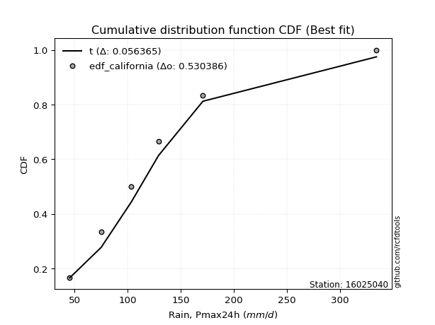</img>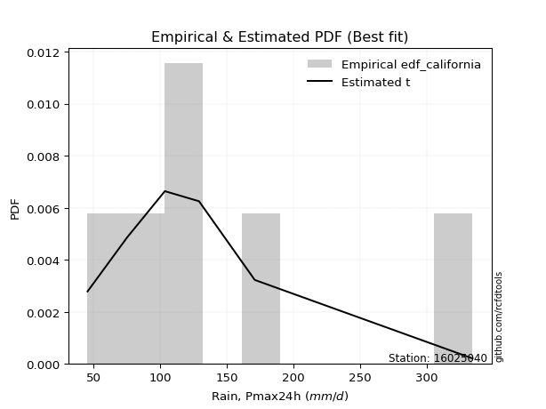</img>

</div>


### 2. Empirical - EDF Hazen (1930)

Hazen method for plotting positions is a formula used to estimate the empirical cumulative probability distribution of flood events or other hydrological data. This formula often results in biased estimations, particularly when extrapolating to extreme events (high return periods).

<div align="center">


$P=(m-0.5)/n$


</div>


**2.1. Empirical values**

<div align="center">

|                | 0                   | 1                   | 2                   | 3         | 4                  | 5                  | 6                  |
|:---------------|:--------------------|:--------------------|:--------------------|:----------|:-------------------|:-------------------|:-------------------|
| date           | 2019                | 2025                | 2023                | 2022      | 2020               | 2021               | 2024               |
| x              | 45.5                | 69.2                | 75.1                | 103.5     | 129.1              | 170.9              | 334.2              |
| m              | 1                   | 2                   | 3                   | 4         | 5                  | 6                  | 7                  |
| empirical_dist | edf_hazen           | edf_hazen           | edf_hazen           | edf_hazen | edf_hazen          | edf_hazen          | edf_hazen          |
| empirical      | 0.07142857142857142 | 0.21428571428571427 | 0.35714285714285715 | 0.5       | 0.6428571428571429 | 0.7857142857142857 | 0.9285714285714286 |
| empirical_tr   | 1.0769230769230769  | 1.2727272727272727  | 1.5555555555555558  | 2.0       | 2.8000000000000003 | 4.666666666666666  | 14.000000000000007 |

</div>


**2.2. Kolmogorov-Smirnov fit test (sorted by Δ)**


<div align="center">

|                | 0                   | 1                    | 2                    | 3                   | 4                   | 5                   | 6                   | 7                   | 8                    | 9                   | 10                   | 11                  | 12                   | 13                  | 14                  | 15                   | 16                   | 17                  | 18                  | 19                  | 20                  | 21                  | 22                   | 23                   | 24                  | 25                  | 26                  | 27                  | 28                  | 29                  | 30                  | 31                  | 32                  | 33                  | 34                  | 35                  | 36                  | 37                  | 38                  | 39                  | 40                  | 41                  | 42                  | 43                  | 44                  | 45                  | 46                  | 47                  | 48                  | 49                  | 50                  | 51                  | 52                  | 53                  | 54                  | 55                  | 56                  | 57                  | 58                  | 59                  | 60                  | 61                    | 62                  | 63                  | 64                  | 65                  | 66                  | 67                  | 68                  | 69                  | 70                  | 71                  | 72                  | 73                  | 74                  | 75                  | 76                  | 77                  | 78                  | 79                  | 80                  | 81                  | 82                  | 83                  | 84                  | 85                  | 86                  | 87                  | 88                  | 89                  |
|:---------------|:--------------------|:---------------------|:---------------------|:--------------------|:--------------------|:--------------------|:--------------------|:--------------------|:---------------------|:--------------------|:---------------------|:--------------------|:---------------------|:--------------------|:--------------------|:---------------------|:---------------------|:--------------------|:--------------------|:--------------------|:--------------------|:--------------------|:---------------------|:---------------------|:--------------------|:--------------------|:--------------------|:--------------------|:--------------------|:--------------------|:--------------------|:--------------------|:--------------------|:--------------------|:--------------------|:--------------------|:--------------------|:--------------------|:--------------------|:--------------------|:--------------------|:--------------------|:--------------------|:--------------------|:--------------------|:--------------------|:--------------------|:--------------------|:--------------------|:--------------------|:--------------------|:--------------------|:--------------------|:--------------------|:--------------------|:--------------------|:--------------------|:--------------------|:--------------------|:--------------------|:--------------------|:----------------------|:--------------------|:--------------------|:--------------------|:--------------------|:--------------------|:--------------------|:--------------------|:--------------------|:--------------------|:--------------------|:--------------------|:--------------------|:--------------------|:--------------------|:--------------------|:--------------------|:--------------------|:--------------------|:--------------------|:--------------------|:--------------------|:--------------------|:--------------------|:--------------------|:--------------------|:--------------------|:--------------------|:--------------------|
| station        | 16025040            | 16025040             | 16025040             | 16025040            | 16025040            | 16025040            | 16025040            | 16025040            | 16025040             | 16025040            | 16025040             | 16025040            | 16025040             | 16025040            | 16025040            | 16025040             | 16025040             | 16025040            | 16025040            | 16025040            | 16025040            | 16025040            | 16025040             | 16025040             | 16025040            | 16025040            | 16025040            | 16025040            | 16025040            | 16025040            | 16025040            | 16025040            | 16025040            | 16025040            | 16025040            | 16025040            | 16025040            | 16025040            | 16025040            | 16025040            | 16025040            | 16025040            | 16025040            | 16025040            | 16025040            | 16025040            | 16025040            | 16025040            | 16025040            | 16025040            | 16025040            | 16025040            | 16025040            | 16025040            | 16025040            | 16025040            | 16025040            | 16025040            | 16025040            | 16025040            | 16025040            | 16025040              | 16025040            | 16025040            | 16025040            | 16025040            | 16025040            | 16025040            | 16025040            | 16025040            | 16025040            | 16025040            | 16025040            | 16025040            | 16025040            | 16025040            | 16025040            | 16025040            | 16025040            | 16025040            | 16025040            | 16025040            | 16025040            | 16025040            | 16025040            | 16025040            | 16025040            | 16025040            | 16025040            | 16025040            |
| empirical_dist | edf_hazen           | edf_hazen            | edf_hazen            | edf_hazen           | edf_hazen           | edf_hazen           | edf_hazen           | edf_hazen           | edf_hazen            | edf_hazen           | edf_hazen            | edf_hazen           | edf_hazen            | edf_hazen           | edf_hazen           | edf_hazen            | edf_hazen            | edf_hazen           | edf_hazen           | edf_hazen           | edf_hazen           | edf_hazen           | edf_hazen            | edf_hazen            | edf_hazen           | edf_hazen           | edf_hazen           | edf_hazen           | edf_hazen           | edf_hazen           | edf_hazen           | edf_hazen           | edf_hazen           | edf_hazen           | edf_hazen           | edf_hazen           | edf_hazen           | edf_hazen           | edf_hazen           | edf_hazen           | edf_hazen           | edf_hazen           | edf_hazen           | edf_hazen           | edf_hazen           | edf_hazen           | edf_hazen           | edf_hazen           | edf_hazen           | edf_hazen           | edf_hazen           | edf_hazen           | edf_hazen           | edf_hazen           | edf_hazen           | edf_hazen           | edf_hazen           | edf_hazen           | edf_hazen           | edf_hazen           | edf_hazen           | edf_hazen             | edf_hazen           | edf_hazen           | edf_hazen           | edf_hazen           | edf_hazen           | edf_hazen           | edf_hazen           | edf_hazen           | edf_hazen           | edf_hazen           | edf_hazen           | edf_hazen           | edf_hazen           | edf_hazen           | edf_hazen           | edf_hazen           | edf_hazen           | edf_hazen           | edf_hazen           | edf_hazen           | edf_hazen           | edf_hazen           | edf_hazen           | edf_hazen           | edf_hazen           | edf_hazen           | edf_hazen           | edf_hazen           |
| p_dist         | mielke              | nct                  | logkstwobign         | logmielke           | loginvweibull       | loggenlogistic      | invgamma            | f                   | logfatiguelife       | loginvgauss         | lograyleigh          | logf                | logerlang            | loggamma            | loggamma            | logjohnsonsu         | fisk                 | loginvgamma         | invgauss            | alpha               | logmaxwell          | logweibull_min      | logmoyal             | johnsonsu            | logalpha            | loggumbel_r         | lognct              | halflogistic        | logexponnorm        | logfisk             | logrice             | pearson3            | exponnorm           | logpearson3         | ncf                 | betaprime           | loggompertz         | genexpon            | loghalflogistic     | expon               | loghalfnorm         | moyal               | logbetaprime        | logncf              | truncnorm           | fatiguelife         | logt                | logcrystalball      | lognorm             | lognorm             | logloggamma         | gumbel_r            | halfnorm            | loglogistic         | loggenexpon         | genlogistic         | rayleigh            | t                   | laplace_asymmetric  | nakagami            | wald                | loglaplace_asymmetric | loghypsecant        | maxwell             | gompertz            | kstwobign           | loggumbel_l         | logwald             | weibull_min         | loglaplace          | norm                | crystalball         | rice                | logistic            | hypsecant           | logexpon            | erlang              | laplace             | loggibrat           | lognakagami         | gumbel_l            | gibrat              | logchi2             | gamma               | pareto              | loglognorm          | logpareto           | invweibull          | chi2                | logtruncnorm        |
| delta          | 0.02666398072278637 | 0.046568006494959346 | 0.046887516983979055 | 0.04712344771404242 | 0.047154472970242   | 0.04720881155610096 | 0.04822606785074468 | 0.04881502125125248 | 0.049486962750230734 | 0.05074297462871197 | 0.051199285681323314 | 0.05284976134707145 | 0.053400865969928074 | 0.05340172870862828 | 0.05340172870862828 | 0.054713632649823596 | 0.055805803802992354 | 0.05882339997996411 | 0.05920623628790614 | 0.06075727775294393 | 0.06115801246876107 | 0.06135953551788012 | 0.062033459062841786 | 0.062259451995706566 | 0.06293606950433372 | 0.06350306530561894 | 0.06409855252374907 | 0.06420096217187268 | 0.06471182156067296 | 0.06475817389697613 | 0.06583861143921482 | 0.07031508803780653 | 0.0704368659110656  | 0.07051845871324414 | 0.07113506188445656 | 0.07128151321779469 | 0.07142856943160905 | 0.07142857142805525 | 0.07142857142857142 | 0.07142857142857142 | 0.07142857142857142 | 0.07170022077583832 | 0.07654969315450966 | 0.07811211111026173 | 0.07950688452429155 | 0.0830301697909955  | 0.08572802870763702 | 0.08572844575318711 | 0.08572850189204068 | 0.08572850189204068 | 0.08656692209777372 | 0.08799767470812614 | 0.10358937380993205 | 0.10810892550903742 | 0.10908489487980091 | 0.11074694990385861 | 0.11286909061460293 | 0.11438443272700846 | 0.11640318167583702 | 0.11689409602616643 | 0.11846354848685217 | 0.11967925788868472   | 0.1234743210095414  | 0.12418732867396931 | 0.12772165481075526 | 0.12863675595328888 | 0.1303163485530585  | 0.1332871621800168  | 0.13829992206139052 | 0.1456901981848647  | 0.15777031671243752 | 0.1577703178899248  | 0.15826876208723067 | 0.159805360821616   | 0.16154165061648396 | 0.16751952860731031 | 0.17055849893601036 | 0.18151077603242927 | 0.2210876122718684  | 0.2256592494987333  | 0.22842688104234554 | 0.25277809020333064 | 0.2633763237190614  | 0.30566033613184485 | 0.4116992436177018  | 0.42161058913251226 | 0.43284536446088717 | 0.4597345444688077  | 0.4795000301919733  | 0.49999954227539867 |
| deltao         | 0.48442053926100004 | 0.48442053926100004  | 0.48442053926100004  | 0.48442053926100004 | 0.48442053926100004 | 0.48442053926100004 | 0.48442053926100004 | 0.48442053926100004 | 0.48442053926100004  | 0.48442053926100004 | 0.48442053926100004  | 0.48442053926100004 | 0.48442053926100004  | 0.48442053926100004 | 0.48442053926100004 | 0.48442053926100004  | 0.48442053926100004  | 0.48442053926100004 | 0.48442053926100004 | 0.48442053926100004 | 0.48442053926100004 | 0.48442053926100004 | 0.48442053926100004  | 0.48442053926100004  | 0.48442053926100004 | 0.48442053926100004 | 0.48442053926100004 | 0.48442053926100004 | 0.48442053926100004 | 0.48442053926100004 | 0.48442053926100004 | 0.48442053926100004 | 0.48442053926100004 | 0.48442053926100004 | 0.48442053926100004 | 0.48442053926100004 | 0.48442053926100004 | 0.48442053926100004 | 0.48442053926100004 | 0.48442053926100004 | 0.48442053926100004 | 0.48442053926100004 | 0.48442053926100004 | 0.48442053926100004 | 0.48442053926100004 | 0.48442053926100004 | 0.48442053926100004 | 0.48442053926100004 | 0.48442053926100004 | 0.48442053926100004 | 0.48442053926100004 | 0.48442053926100004 | 0.48442053926100004 | 0.48442053926100004 | 0.48442053926100004 | 0.48442053926100004 | 0.48442053926100004 | 0.48442053926100004 | 0.48442053926100004 | 0.48442053926100004 | 0.48442053926100004 | 0.48442053926100004   | 0.48442053926100004 | 0.48442053926100004 | 0.48442053926100004 | 0.48442053926100004 | 0.48442053926100004 | 0.48442053926100004 | 0.48442053926100004 | 0.48442053926100004 | 0.48442053926100004 | 0.48442053926100004 | 0.48442053926100004 | 0.48442053926100004 | 0.48442053926100004 | 0.48442053926100004 | 0.48442053926100004 | 0.48442053926100004 | 0.48442053926100004 | 0.48442053926100004 | 0.48442053926100004 | 0.48442053926100004 | 0.48442053926100004 | 0.48442053926100004 | 0.48442053926100004 | 0.48442053926100004 | 0.48442053926100004 | 0.48442053926100004 | 0.48442053926100004 | 0.48442053926100004 |
| eval           | Δo > Δ              | Δo > Δ               | Δo > Δ               | Δo > Δ              | Δo > Δ              | Δo > Δ              | Δo > Δ              | Δo > Δ              | Δo > Δ               | Δo > Δ              | Δo > Δ               | Δo > Δ              | Δo > Δ               | Δo > Δ              | Δo > Δ              | Δo > Δ               | Δo > Δ               | Δo > Δ              | Δo > Δ              | Δo > Δ              | Δo > Δ              | Δo > Δ              | Δo > Δ               | Δo > Δ               | Δo > Δ              | Δo > Δ              | Δo > Δ              | Δo > Δ              | Δo > Δ              | Δo > Δ              | Δo > Δ              | Δo > Δ              | Δo > Δ              | Δo > Δ              | Δo > Δ              | Δo > Δ              | Δo > Δ              | Δo > Δ              | Δo > Δ              | Δo > Δ              | Δo > Δ              | Δo > Δ              | Δo > Δ              | Δo > Δ              | Δo > Δ              | Δo > Δ              | Δo > Δ              | Δo > Δ              | Δo > Δ              | Δo > Δ              | Δo > Δ              | Δo > Δ              | Δo > Δ              | Δo > Δ              | Δo > Δ              | Δo > Δ              | Δo > Δ              | Δo > Δ              | Δo > Δ              | Δo > Δ              | Δo > Δ              | Δo > Δ                | Δo > Δ              | Δo > Δ              | Δo > Δ              | Δo > Δ              | Δo > Δ              | Δo > Δ              | Δo > Δ              | Δo > Δ              | Δo > Δ              | Δo > Δ              | Δo > Δ              | Δo > Δ              | Δo > Δ              | Δo > Δ              | Δo > Δ              | Δo > Δ              | Δo > Δ              | Δo > Δ              | Δo > Δ              | Δo > Δ              | Δo > Δ              | Δo > Δ              | Δo > Δ              | Δo > Δ              | Δo > Δ              | Δo > Δ              | Δo > Δ              | Δo <= Δ             |
| fit            | 1                   | 1                    | 1                    | 1                   | 1                   | 1                   | 1                   | 1                   | 1                    | 1                   | 1                    | 1                   | 1                    | 1                   | 1                   | 1                    | 1                    | 1                   | 1                   | 1                   | 1                   | 1                   | 1                    | 1                    | 1                   | 1                   | 1                   | 1                   | 1                   | 1                   | 1                   | 1                   | 1                   | 1                   | 1                   | 1                   | 1                   | 1                   | 1                   | 1                   | 1                   | 1                   | 1                   | 1                   | 1                   | 1                   | 1                   | 1                   | 1                   | 1                   | 1                   | 1                   | 1                   | 1                   | 1                   | 1                   | 1                   | 1                   | 1                   | 1                   | 1                   | 1                     | 1                   | 1                   | 1                   | 1                   | 1                   | 1                   | 1                   | 1                   | 1                   | 1                   | 1                   | 1                   | 1                   | 1                   | 1                   | 1                   | 1                   | 1                   | 1                   | 1                   | 1                   | 1                   | 1                   | 1                   | 1                   | 1                   | 1                   | 0                   |
| n              | 7                   | 7                    | 7                    | 7                   | 7                   | 7                   | 7                   | 7                   | 7                    | 7                   | 7                    | 7                   | 7                    | 7                   | 7                   | 7                    | 7                    | 7                   | 7                   | 7                   | 7                   | 7                   | 7                    | 7                    | 7                   | 7                   | 7                   | 7                   | 7                   | 7                   | 7                   | 7                   | 7                   | 7                   | 7                   | 7                   | 7                   | 7                   | 7                   | 7                   | 7                   | 7                   | 7                   | 7                   | 7                   | 7                   | 7                   | 7                   | 7                   | 7                   | 7                   | 7                   | 7                   | 7                   | 7                   | 7                   | 7                   | 7                   | 7                   | 7                   | 7                   | 7                     | 7                   | 7                   | 7                   | 7                   | 7                   | 7                   | 7                   | 7                   | 7                   | 7                   | 7                   | 7                   | 7                   | 7                   | 7                   | 7                   | 7                   | 7                   | 7                   | 7                   | 7                   | 7                   | 7                   | 7                   | 7                   | 7                   | 7                   | 7                   |
| best_fit       | 1                   | 0                    | 0                    | 0                   | 0                   | 0                   | 0                   | 0                   | 0                    | 0                   | 0                    | 0                   | 0                    | 0                   | 0                   | 0                    | 0                    | 0                   | 0                   | 0                   | 0                   | 0                   | 0                    | 0                    | 0                   | 0                   | 0                   | 0                   | 0                   | 0                   | 0                   | 0                   | 0                   | 0                   | 0                   | 0                   | 0                   | 0                   | 0                   | 0                   | 0                   | 0                   | 0                   | 0                   | 0                   | 0                   | 0                   | 0                   | 0                   | 0                   | 0                   | 0                   | 0                   | 0                   | 0                   | 0                   | 0                   | 0                   | 0                   | 0                   | 0                   | 0                     | 0                   | 0                   | 0                   | 0                   | 0                   | 0                   | 0                   | 0                   | 0                   | 0                   | 0                   | 0                   | 0                   | 0                   | 0                   | 0                   | 0                   | 0                   | 0                   | 0                   | 0                   | 0                   | 0                   | 0                   | 0                   | 0                   | 0                   | 0                   |
| best_fit_sort  | 1                   | 2                    | 3                    | 4                   | 5                   | 6                   | 7                   | 8                   | 9                    | 10                  | 11                   | 12                  | 13                   | 14                  | 15                  | 16                   | 17                   | 18                  | 19                  | 20                  | 21                  | 22                  | 23                   | 24                   | 25                  | 26                  | 27                  | 28                  | 29                  | 30                  | 31                  | 32                  | 33                  | 34                  | 35                  | 36                  | 37                  | 38                  | 39                  | 40                  | 41                  | 42                  | 43                  | 44                  | 45                  | 46                  | 47                  | 48                  | 49                  | 50                  | 51                  | 52                  | 53                  | 54                  | 55                  | 56                  | 57                  | 58                  | 59                  | 60                  | 61                  | 62                    | 63                  | 64                  | 65                  | 66                  | 67                  | 68                  | 69                  | 70                  | 71                  | 72                  | 73                  | 74                  | 75                  | 76                  | 77                  | 78                  | 79                  | 80                  | 81                  | 82                  | 83                  | 84                  | 85                  | 86                  | 87                  | 88                  | 89                  | 90                  |

</div>


<div align="center">

</img>

</div>


**2.3. Best fit**

<div align="center">

|   id |   station | empirical_dist   | p_dist   |    delta |   deltao | eval   |   fit |   n |   best_fit |   best_fit_sort |
|-----:|----------:|:-----------------|:---------|---------:|---------:|:-------|------:|----:|-----------:|----------------:|
|    0 |  16025040 | edf_hazen        | mielke   | 0.026664 | 0.484421 | Δo > Δ |     1 |   7 |          1 |               1 |

</div>


<div align="center">

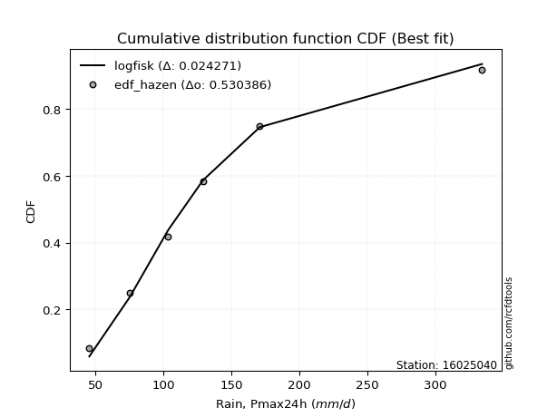</img>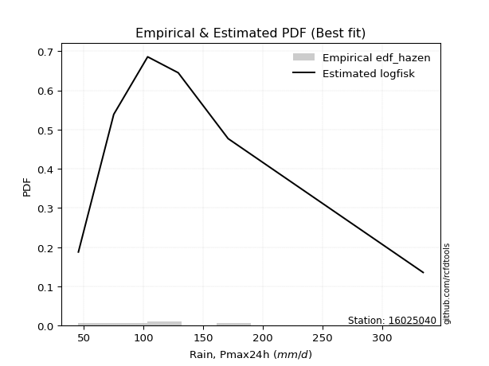</img>

</div>


### 3. Empirical - EDF Weibull (1939)

Weibull plotting position formula is an empirical method used to estimate the non-exceedance probability or plotting position for a set of observed data, is often recommended or widely used in practice, particularly in flood frequency analysis.

<div align="center">


$P=m/(n+1)$


</div>


**3.1. Empirical values**

<div align="center">

|                | 0                  | 1                  | 2           | 3           | 4                  | 5           | 6           |
|:---------------|:-------------------|:-------------------|:------------|:------------|:-------------------|:------------|:------------|
| date           | 2019               | 2025               | 2023        | 2022        | 2020               | 2021        | 2024        |
| x              | 45.5               | 69.2               | 75.1        | 103.5       | 129.1              | 170.9       | 334.2       |
| m              | 1                  | 2                  | 3           | 4           | 5                  | 6           | 7           |
| empirical_dist | edf_weibull        | edf_weibull        | edf_weibull | edf_weibull | edf_weibull        | edf_weibull | edf_weibull |
| empirical      | 0.125              | 0.25               | 0.375       | 0.5         | 0.625              | 0.75        | 0.875       |
| empirical_tr   | 1.1428571428571428 | 1.3333333333333333 | 1.6         | 2.0         | 2.6666666666666665 | 4.0         | 8.0         |

</div>


**3.2. Kolmogorov-Smirnov fit test (sorted by Δ)**


<div align="center">

|                | 0                   | 1                   | 2                   | 3                   | 4                   | 5                   | 6                   | 7                   | 8                   | 9                   | 10                  | 11                  | 12                  | 13                  | 14                  | 15                  | 16                  | 17                  | 18                  | 19                  | 20                  | 21                  | 22                  | 23                  | 24                  | 25                  | 26                  | 27                  | 28                  | 29                  | 30                  | 31                  | 32                  | 33                  | 34                  | 35                  | 36                  | 37                  | 38                  | 39                  | 40                  | 41                  | 42                  | 43                  | 44                  | 45                  | 46                  | 47                  | 48                  | 49                  | 50                  | 51                  | 52                  | 53                  | 54                  | 55                  | 56                  | 57                  | 58                  | 59                  | 60                  | 61                  | 62                  | 63                  | 64                  | 65                    | 66                  | 67                  | 68                  | 69                  | 70                  | 71                  | 72                  | 73                  | 74                  | 75                  | 76                  | 77                  | 78                  | 79                  | 80                  | 81                  | 82                  | 83                  | 84                  | 85                  | 86                  | 87                  | 88                  | 89                  |
|:---------------|:--------------------|:--------------------|:--------------------|:--------------------|:--------------------|:--------------------|:--------------------|:--------------------|:--------------------|:--------------------|:--------------------|:--------------------|:--------------------|:--------------------|:--------------------|:--------------------|:--------------------|:--------------------|:--------------------|:--------------------|:--------------------|:--------------------|:--------------------|:--------------------|:--------------------|:--------------------|:--------------------|:--------------------|:--------------------|:--------------------|:--------------------|:--------------------|:--------------------|:--------------------|:--------------------|:--------------------|:--------------------|:--------------------|:--------------------|:--------------------|:--------------------|:--------------------|:--------------------|:--------------------|:--------------------|:--------------------|:--------------------|:--------------------|:--------------------|:--------------------|:--------------------|:--------------------|:--------------------|:--------------------|:--------------------|:--------------------|:--------------------|:--------------------|:--------------------|:--------------------|:--------------------|:--------------------|:--------------------|:--------------------|:--------------------|:----------------------|:--------------------|:--------------------|:--------------------|:--------------------|:--------------------|:--------------------|:--------------------|:--------------------|:--------------------|:--------------------|:--------------------|:--------------------|:--------------------|:--------------------|:--------------------|:--------------------|:--------------------|:--------------------|:--------------------|:--------------------|:--------------------|:--------------------|:--------------------|:--------------------|
| station        | 16025040            | 16025040            | 16025040            | 16025040            | 16025040            | 16025040            | 16025040            | 16025040            | 16025040            | 16025040            | 16025040            | 16025040            | 16025040            | 16025040            | 16025040            | 16025040            | 16025040            | 16025040            | 16025040            | 16025040            | 16025040            | 16025040            | 16025040            | 16025040            | 16025040            | 16025040            | 16025040            | 16025040            | 16025040            | 16025040            | 16025040            | 16025040            | 16025040            | 16025040            | 16025040            | 16025040            | 16025040            | 16025040            | 16025040            | 16025040            | 16025040            | 16025040            | 16025040            | 16025040            | 16025040            | 16025040            | 16025040            | 16025040            | 16025040            | 16025040            | 16025040            | 16025040            | 16025040            | 16025040            | 16025040            | 16025040            | 16025040            | 16025040            | 16025040            | 16025040            | 16025040            | 16025040            | 16025040            | 16025040            | 16025040            | 16025040              | 16025040            | 16025040            | 16025040            | 16025040            | 16025040            | 16025040            | 16025040            | 16025040            | 16025040            | 16025040            | 16025040            | 16025040            | 16025040            | 16025040            | 16025040            | 16025040            | 16025040            | 16025040            | 16025040            | 16025040            | 16025040            | 16025040            | 16025040            | 16025040            |
| empirical_dist | edf_weibull         | edf_weibull         | edf_weibull         | edf_weibull         | edf_weibull         | edf_weibull         | edf_weibull         | edf_weibull         | edf_weibull         | edf_weibull         | edf_weibull         | edf_weibull         | edf_weibull         | edf_weibull         | edf_weibull         | edf_weibull         | edf_weibull         | edf_weibull         | edf_weibull         | edf_weibull         | edf_weibull         | edf_weibull         | edf_weibull         | edf_weibull         | edf_weibull         | edf_weibull         | edf_weibull         | edf_weibull         | edf_weibull         | edf_weibull         | edf_weibull         | edf_weibull         | edf_weibull         | edf_weibull         | edf_weibull         | edf_weibull         | edf_weibull         | edf_weibull         | edf_weibull         | edf_weibull         | edf_weibull         | edf_weibull         | edf_weibull         | edf_weibull         | edf_weibull         | edf_weibull         | edf_weibull         | edf_weibull         | edf_weibull         | edf_weibull         | edf_weibull         | edf_weibull         | edf_weibull         | edf_weibull         | edf_weibull         | edf_weibull         | edf_weibull         | edf_weibull         | edf_weibull         | edf_weibull         | edf_weibull         | edf_weibull         | edf_weibull         | edf_weibull         | edf_weibull         | edf_weibull           | edf_weibull         | edf_weibull         | edf_weibull         | edf_weibull         | edf_weibull         | edf_weibull         | edf_weibull         | edf_weibull         | edf_weibull         | edf_weibull         | edf_weibull         | edf_weibull         | edf_weibull         | edf_weibull         | edf_weibull         | edf_weibull         | edf_weibull         | edf_weibull         | edf_weibull         | edf_weibull         | edf_weibull         | edf_weibull         | edf_weibull         | edf_weibull         |
| p_dist         | lograyleigh         | loginvgamma         | alpha               | logjohnsonsu        | logmaxwell          | mielke              | logalpha            | loggenlogistic      | loginvgauss         | f                   | loginvweibull       | logfatiguelife      | invgamma            | nct                 | lognct              | logmielke           | logexponnorm        | logfisk             | logkstwobign        | invgauss            | logrice             | fatiguelife         | halflogistic        | logpearson3         | logerlang           | loggamma            | loggamma            | logf                | ncf                 | betaprime           | pearson3            | moyal               | johnsonsu           | halfnorm            | gumbel_r            | logbetaprime        | loggumbel_r         | logncf              | logweibull_min      | rayleigh            | fisk                | logt                | logcrystalball      | lognorm             | lognorm             | logloggamma         | maxwell             | logmoyal            | t                   | exponnorm           | loggompertz         | loggenexpon         | nakagami            | weibull_min         | genexpon            | loghalflogistic     | expon               | loghalfnorm         | truncnorm           | loglogistic         | genlogistic         | logexpon            | laplace_asymmetric  | logwald             | wald                | loglaplace_asymmetric | norm                | crystalball         | loghypsecant        | logistic            | gompertz            | kstwobign           | loggumbel_l         | erlang              | hypsecant           | loglaplace          | rice                | laplace             | lognakagami         | gumbel_l            | logchi2             | loggibrat           | gamma               | gibrat              | pareto              | loglognorm          | logpareto           | invweibull          | chi2                | logtruncnorm        |
| delta          | 0.07651815295437248 | 0.07749891947210685 | 0.07861442061008678 | 0.07936025203958007 | 0.07992260255525185 | 0.08023540929421494 | 0.08079321236147657 | 0.08105743875153651 | 0.08109280117721397 | 0.08113390172794839 | 0.08119209571218855 | 0.0815419880715081  | 0.0819344830877285  | 0.08195019406437715 | 0.08195569538089192 | 0.08226639468865642 | 0.0825689644178158  | 0.08261531675411898 | 0.08335395452698535 | 0.08609520205128948 | 0.08753651828921274 | 0.08788677269828585 | 0.08833990310620865 | 0.08837560157038699 | 0.08848223523681659 | 0.08848252459471898 | 0.08848252459471898 | 0.08854660692206445 | 0.08899220474159941 | 0.08913865607493754 | 0.08948936750074143 | 0.08955736363298117 | 0.0896770511566514  | 0.09223897070018017 | 0.09288279532207522 | 0.0944068360116525  | 0.09539135910655935 | 0.09596925396740458 | 0.09817579891299216 | 0.09933326900919714 | 0.09968892926591916 | 0.10358517156477987 | 0.10358558861032996 | 0.10358564474918353 | 0.10358564474918353 | 0.10442406495491657 | 0.1063301858168264  | 0.11560488763427036 | 0.11983064635173957 | 0.12400829448249417 | 0.12499999800303763 | 0.12499999958577404 | 0.12499999986924315 | 0.12499999996961612 | 0.12499999999948383 | 0.125               | 0.125               | 0.125               | 0.125               | 0.12596606836618027 | 0.12860409276100146 | 0.1318052428930246  | 0.13426032453297987 | 0.13507317358840631 | 0.13632069134399502 | 0.13753640074582757   | 0.13991317385529461 | 0.1399131750327819  | 0.14133146386668424 | 0.1419482179644731  | 0.1455787976678981  | 0.14649389881043173 | 0.14817349141020134 | 0.1495309238809872  | 0.15318003690899873 | 0.16354734104200755 | 0.16378751040444195 | 0.18151077603242927 | 0.18994496378444758 | 0.21056973818520264 | 0.22766203800477564 | 0.24916406457281357 | 0.26994605041755915 | 0.2706352330604735  | 0.37598495790341613 | 0.38589630341822656 | 0.3971310787466015  | 0.4061631158973791  | 0.4437857444776876  | 0.49999954227539867 |
| deltao         | 0.48442053926100004 | 0.48442053926100004 | 0.48442053926100004 | 0.48442053926100004 | 0.48442053926100004 | 0.48442053926100004 | 0.48442053926100004 | 0.48442053926100004 | 0.48442053926100004 | 0.48442053926100004 | 0.48442053926100004 | 0.48442053926100004 | 0.48442053926100004 | 0.48442053926100004 | 0.48442053926100004 | 0.48442053926100004 | 0.48442053926100004 | 0.48442053926100004 | 0.48442053926100004 | 0.48442053926100004 | 0.48442053926100004 | 0.48442053926100004 | 0.48442053926100004 | 0.48442053926100004 | 0.48442053926100004 | 0.48442053926100004 | 0.48442053926100004 | 0.48442053926100004 | 0.48442053926100004 | 0.48442053926100004 | 0.48442053926100004 | 0.48442053926100004 | 0.48442053926100004 | 0.48442053926100004 | 0.48442053926100004 | 0.48442053926100004 | 0.48442053926100004 | 0.48442053926100004 | 0.48442053926100004 | 0.48442053926100004 | 0.48442053926100004 | 0.48442053926100004 | 0.48442053926100004 | 0.48442053926100004 | 0.48442053926100004 | 0.48442053926100004 | 0.48442053926100004 | 0.48442053926100004 | 0.48442053926100004 | 0.48442053926100004 | 0.48442053926100004 | 0.48442053926100004 | 0.48442053926100004 | 0.48442053926100004 | 0.48442053926100004 | 0.48442053926100004 | 0.48442053926100004 | 0.48442053926100004 | 0.48442053926100004 | 0.48442053926100004 | 0.48442053926100004 | 0.48442053926100004 | 0.48442053926100004 | 0.48442053926100004 | 0.48442053926100004 | 0.48442053926100004   | 0.48442053926100004 | 0.48442053926100004 | 0.48442053926100004 | 0.48442053926100004 | 0.48442053926100004 | 0.48442053926100004 | 0.48442053926100004 | 0.48442053926100004 | 0.48442053926100004 | 0.48442053926100004 | 0.48442053926100004 | 0.48442053926100004 | 0.48442053926100004 | 0.48442053926100004 | 0.48442053926100004 | 0.48442053926100004 | 0.48442053926100004 | 0.48442053926100004 | 0.48442053926100004 | 0.48442053926100004 | 0.48442053926100004 | 0.48442053926100004 | 0.48442053926100004 | 0.48442053926100004 |
| eval           | Δo > Δ              | Δo > Δ              | Δo > Δ              | Δo > Δ              | Δo > Δ              | Δo > Δ              | Δo > Δ              | Δo > Δ              | Δo > Δ              | Δo > Δ              | Δo > Δ              | Δo > Δ              | Δo > Δ              | Δo > Δ              | Δo > Δ              | Δo > Δ              | Δo > Δ              | Δo > Δ              | Δo > Δ              | Δo > Δ              | Δo > Δ              | Δo > Δ              | Δo > Δ              | Δo > Δ              | Δo > Δ              | Δo > Δ              | Δo > Δ              | Δo > Δ              | Δo > Δ              | Δo > Δ              | Δo > Δ              | Δo > Δ              | Δo > Δ              | Δo > Δ              | Δo > Δ              | Δo > Δ              | Δo > Δ              | Δo > Δ              | Δo > Δ              | Δo > Δ              | Δo > Δ              | Δo > Δ              | Δo > Δ              | Δo > Δ              | Δo > Δ              | Δo > Δ              | Δo > Δ              | Δo > Δ              | Δo > Δ              | Δo > Δ              | Δo > Δ              | Δo > Δ              | Δo > Δ              | Δo > Δ              | Δo > Δ              | Δo > Δ              | Δo > Δ              | Δo > Δ              | Δo > Δ              | Δo > Δ              | Δo > Δ              | Δo > Δ              | Δo > Δ              | Δo > Δ              | Δo > Δ              | Δo > Δ                | Δo > Δ              | Δo > Δ              | Δo > Δ              | Δo > Δ              | Δo > Δ              | Δo > Δ              | Δo > Δ              | Δo > Δ              | Δo > Δ              | Δo > Δ              | Δo > Δ              | Δo > Δ              | Δo > Δ              | Δo > Δ              | Δo > Δ              | Δo > Δ              | Δo > Δ              | Δo > Δ              | Δo > Δ              | Δo > Δ              | Δo > Δ              | Δo > Δ              | Δo > Δ              | Δo <= Δ             |
| fit            | 1                   | 1                   | 1                   | 1                   | 1                   | 1                   | 1                   | 1                   | 1                   | 1                   | 1                   | 1                   | 1                   | 1                   | 1                   | 1                   | 1                   | 1                   | 1                   | 1                   | 1                   | 1                   | 1                   | 1                   | 1                   | 1                   | 1                   | 1                   | 1                   | 1                   | 1                   | 1                   | 1                   | 1                   | 1                   | 1                   | 1                   | 1                   | 1                   | 1                   | 1                   | 1                   | 1                   | 1                   | 1                   | 1                   | 1                   | 1                   | 1                   | 1                   | 1                   | 1                   | 1                   | 1                   | 1                   | 1                   | 1                   | 1                   | 1                   | 1                   | 1                   | 1                   | 1                   | 1                   | 1                   | 1                     | 1                   | 1                   | 1                   | 1                   | 1                   | 1                   | 1                   | 1                   | 1                   | 1                   | 1                   | 1                   | 1                   | 1                   | 1                   | 1                   | 1                   | 1                   | 1                   | 1                   | 1                   | 1                   | 1                   | 0                   |
| n              | 7                   | 7                   | 7                   | 7                   | 7                   | 7                   | 7                   | 7                   | 7                   | 7                   | 7                   | 7                   | 7                   | 7                   | 7                   | 7                   | 7                   | 7                   | 7                   | 7                   | 7                   | 7                   | 7                   | 7                   | 7                   | 7                   | 7                   | 7                   | 7                   | 7                   | 7                   | 7                   | 7                   | 7                   | 7                   | 7                   | 7                   | 7                   | 7                   | 7                   | 7                   | 7                   | 7                   | 7                   | 7                   | 7                   | 7                   | 7                   | 7                   | 7                   | 7                   | 7                   | 7                   | 7                   | 7                   | 7                   | 7                   | 7                   | 7                   | 7                   | 7                   | 7                   | 7                   | 7                   | 7                   | 7                     | 7                   | 7                   | 7                   | 7                   | 7                   | 7                   | 7                   | 7                   | 7                   | 7                   | 7                   | 7                   | 7                   | 7                   | 7                   | 7                   | 7                   | 7                   | 7                   | 7                   | 7                   | 7                   | 7                   | 7                   |
| best_fit       | 1                   | 0                   | 0                   | 0                   | 0                   | 0                   | 0                   | 0                   | 0                   | 0                   | 0                   | 0                   | 0                   | 0                   | 0                   | 0                   | 0                   | 0                   | 0                   | 0                   | 0                   | 0                   | 0                   | 0                   | 0                   | 0                   | 0                   | 0                   | 0                   | 0                   | 0                   | 0                   | 0                   | 0                   | 0                   | 0                   | 0                   | 0                   | 0                   | 0                   | 0                   | 0                   | 0                   | 0                   | 0                   | 0                   | 0                   | 0                   | 0                   | 0                   | 0                   | 0                   | 0                   | 0                   | 0                   | 0                   | 0                   | 0                   | 0                   | 0                   | 0                   | 0                   | 0                   | 0                   | 0                   | 0                     | 0                   | 0                   | 0                   | 0                   | 0                   | 0                   | 0                   | 0                   | 0                   | 0                   | 0                   | 0                   | 0                   | 0                   | 0                   | 0                   | 0                   | 0                   | 0                   | 0                   | 0                   | 0                   | 0                   | 0                   |
| best_fit_sort  | 1                   | 2                   | 3                   | 4                   | 5                   | 6                   | 7                   | 8                   | 9                   | 10                  | 11                  | 12                  | 13                  | 14                  | 15                  | 16                  | 17                  | 18                  | 19                  | 20                  | 21                  | 22                  | 23                  | 24                  | 25                  | 26                  | 27                  | 28                  | 29                  | 30                  | 31                  | 32                  | 33                  | 34                  | 35                  | 36                  | 37                  | 38                  | 39                  | 40                  | 41                  | 42                  | 43                  | 44                  | 45                  | 46                  | 47                  | 48                  | 49                  | 50                  | 51                  | 52                  | 53                  | 54                  | 55                  | 56                  | 57                  | 58                  | 59                  | 60                  | 61                  | 62                  | 63                  | 64                  | 65                  | 66                    | 67                  | 68                  | 69                  | 70                  | 71                  | 72                  | 73                  | 74                  | 75                  | 76                  | 77                  | 78                  | 79                  | 80                  | 81                  | 82                  | 83                  | 84                  | 85                  | 86                  | 87                  | 88                  | 89                  | 90                  |

</div>


<div align="center">

</img>

</div>


**3.3. Best fit**

<div align="center">

|   id |   station | empirical_dist   | p_dist      |     delta |   deltao | eval   |   fit |   n |   best_fit |   best_fit_sort |
|-----:|----------:|:-----------------|:------------|----------:|---------:|:-------|------:|----:|-----------:|----------------:|
|    0 |  16025040 | edf_weibull      | lograyleigh | 0.0765182 | 0.484421 | Δo > Δ |     1 |   7 |          1 |               1 |

</div>


<div align="center">

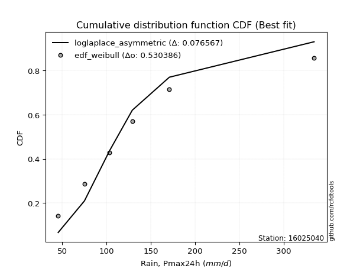</img>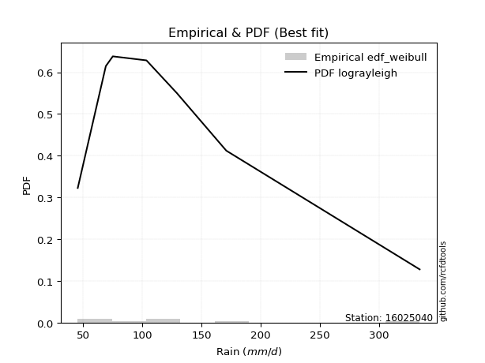</img>

</div>


### 4. Empirical - EDF Beard (1943)

The Beard formula (or Beard´s plotting position formula) in hydrology is used to estimate the empirical non-exceedance probability _(P)_ of a flood event (or other extreme hydrological data point) within a given dataset.

<div align="center">


$P=(m-0.31)/(n+0.38)$


</div>


**4.1. Empirical values**

<div align="center">

|                | 0                   | 1                   | 2                   | 3         | 4                  | 5                  | 6                  |
|:---------------|:--------------------|:--------------------|:--------------------|:----------|:-------------------|:-------------------|:-------------------|
| date           | 2019                | 2025                | 2023                | 2022      | 2020               | 2021               | 2024               |
| x              | 45.5                | 69.2                | 75.1                | 103.5     | 129.1              | 170.9              | 334.2              |
| m              | 1                   | 2                   | 3                   | 4         | 5                  | 6                  | 7                  |
| empirical_dist | edf_beard           | edf_beard           | edf_beard           | edf_beard | edf_beard          | edf_beard          | edf_beard          |
| empirical      | 0.09349593495934959 | 0.22899728997289973 | 0.36449864498644985 | 0.5       | 0.6355013550135502 | 0.7710027100271003 | 0.9065040650406505 |
| empirical_tr   | 1.1031390134529149  | 1.29701230228471    | 1.5735607675906182  | 2.0       | 2.743494423791822  | 4.366863905325444  | 10.695652173913055 |

</div>


**4.2. Kolmogorov-Smirnov fit test (sorted by Δ)**


<div align="center">

|                | 0                   | 1                    | 2                    | 3                   | 4                   | 5                   | 6                   | 7                   | 8                    | 9                   | 10                  | 11                  | 12                   | 13                   | 14                  | 15                   | 16                  | 17                  | 18                  | 19                   | 20                  | 21                  | 22                  | 23                  | 24                  | 25                  | 26                  | 27                  | 28                  | 29                  | 30                  | 31                  | 32                  | 33                  | 34                  | 35                  | 36                  | 37                  | 38                  | 39                  | 40                  | 41                  | 42                  | 43                  | 44                  | 45                  | 46                  | 47                  | 48                  | 49                  | 50                  | 51                  | 52                  | 53                  | 54                  | 55                  | 56                  | 57                  | 58                  | 59                  | 60                  | 61                  | 62                  | 63                    | 64                  | 65                  | 66                  | 67                  | 68                  | 69                  | 70                  | 71                  | 72                  | 73                  | 74                  | 75                  | 76                  | 77                  | 78                  | 79                  | 80                  | 81                  | 82                  | 83                  | 84                  | 85                  | 86                  | 87                  | 88                  | 89                  |
|:---------------|:--------------------|:---------------------|:---------------------|:--------------------|:--------------------|:--------------------|:--------------------|:--------------------|:---------------------|:--------------------|:--------------------|:--------------------|:---------------------|:---------------------|:--------------------|:---------------------|:--------------------|:--------------------|:--------------------|:---------------------|:--------------------|:--------------------|:--------------------|:--------------------|:--------------------|:--------------------|:--------------------|:--------------------|:--------------------|:--------------------|:--------------------|:--------------------|:--------------------|:--------------------|:--------------------|:--------------------|:--------------------|:--------------------|:--------------------|:--------------------|:--------------------|:--------------------|:--------------------|:--------------------|:--------------------|:--------------------|:--------------------|:--------------------|:--------------------|:--------------------|:--------------------|:--------------------|:--------------------|:--------------------|:--------------------|:--------------------|:--------------------|:--------------------|:--------------------|:--------------------|:--------------------|:--------------------|:--------------------|:----------------------|:--------------------|:--------------------|:--------------------|:--------------------|:--------------------|:--------------------|:--------------------|:--------------------|:--------------------|:--------------------|:--------------------|:--------------------|:--------------------|:--------------------|:--------------------|:--------------------|:--------------------|:--------------------|:--------------------|:--------------------|:--------------------|:--------------------|:--------------------|:--------------------|:--------------------|:--------------------|
| station        | 16025040            | 16025040             | 16025040             | 16025040            | 16025040            | 16025040            | 16025040            | 16025040            | 16025040             | 16025040            | 16025040            | 16025040            | 16025040             | 16025040             | 16025040            | 16025040             | 16025040            | 16025040            | 16025040            | 16025040             | 16025040            | 16025040            | 16025040            | 16025040            | 16025040            | 16025040            | 16025040            | 16025040            | 16025040            | 16025040            | 16025040            | 16025040            | 16025040            | 16025040            | 16025040            | 16025040            | 16025040            | 16025040            | 16025040            | 16025040            | 16025040            | 16025040            | 16025040            | 16025040            | 16025040            | 16025040            | 16025040            | 16025040            | 16025040            | 16025040            | 16025040            | 16025040            | 16025040            | 16025040            | 16025040            | 16025040            | 16025040            | 16025040            | 16025040            | 16025040            | 16025040            | 16025040            | 16025040            | 16025040              | 16025040            | 16025040            | 16025040            | 16025040            | 16025040            | 16025040            | 16025040            | 16025040            | 16025040            | 16025040            | 16025040            | 16025040            | 16025040            | 16025040            | 16025040            | 16025040            | 16025040            | 16025040            | 16025040            | 16025040            | 16025040            | 16025040            | 16025040            | 16025040            | 16025040            | 16025040            |
| empirical_dist | edf_beard           | edf_beard            | edf_beard            | edf_beard           | edf_beard           | edf_beard           | edf_beard           | edf_beard           | edf_beard            | edf_beard           | edf_beard           | edf_beard           | edf_beard            | edf_beard            | edf_beard           | edf_beard            | edf_beard           | edf_beard           | edf_beard           | edf_beard            | edf_beard           | edf_beard           | edf_beard           | edf_beard           | edf_beard           | edf_beard           | edf_beard           | edf_beard           | edf_beard           | edf_beard           | edf_beard           | edf_beard           | edf_beard           | edf_beard           | edf_beard           | edf_beard           | edf_beard           | edf_beard           | edf_beard           | edf_beard           | edf_beard           | edf_beard           | edf_beard           | edf_beard           | edf_beard           | edf_beard           | edf_beard           | edf_beard           | edf_beard           | edf_beard           | edf_beard           | edf_beard           | edf_beard           | edf_beard           | edf_beard           | edf_beard           | edf_beard           | edf_beard           | edf_beard           | edf_beard           | edf_beard           | edf_beard           | edf_beard           | edf_beard             | edf_beard           | edf_beard           | edf_beard           | edf_beard           | edf_beard           | edf_beard           | edf_beard           | edf_beard           | edf_beard           | edf_beard           | edf_beard           | edf_beard           | edf_beard           | edf_beard           | edf_beard           | edf_beard           | edf_beard           | edf_beard           | edf_beard           | edf_beard           | edf_beard           | edf_beard           | edf_beard           | edf_beard           | edf_beard           | edf_beard           |
| p_dist         | mielke              | logkstwobign         | nct                  | logmielke           | loginvweibull       | loggenlogistic      | invgauss            | invgamma            | f                    | halflogistic        | logfatiguelife      | logerlang           | loggamma             | loggamma             | logf                | loginvgauss          | johnsonsu           | lograyleigh         | pearson3            | logjohnsonsu         | loginvgamma         | logweibull_min      | alpha               | fisk                | fatiguelife         | logmaxwell          | logalpha            | loggumbel_r         | lognct              | logexponnorm        | logfisk             | logrice             | logpearson3         | ncf                 | betaprime           | moyal               | gumbel_r            | halfnorm            | logbetaprime        | logmoyal            | logncf              | exponnorm           | logt                | logcrystalball      | lognorm             | lognorm             | loggompertz         | genexpon            | loghalfnorm         | truncnorm           | loghalflogistic     | expon               | logloggamma         | loggenexpon         | t                   | nakagami            | rayleigh            | loglogistic         | maxwell             | genlogistic         | weibull_min         | laplace_asymmetric  | wald                | loglaplace_asymmetric | loghypsecant        | logwald             | gompertz            | kstwobign           | loggumbel_l         | norm                | crystalball         | logistic            | logexpon            | loglaplace          | rice                | hypsecant           | erlang              | laplace             | lognakagami         | gumbel_l            | loggibrat           | logchi2             | gibrat              | gamma               | pareto              | loglognorm          | logpareto           | invweibull          | chi2                | logtruncnorm        |
| delta          | 0.04873134425356453 | 0.051849889486334934 | 0.053923794338552045 | 0.05447923555763512 | 0.0545102608138347  | 0.05456459939969366 | 0.05459113701063907 | 0.05558185569433738 | 0.056170809094845175 | 0.05683583806555814 | 0.05684275059382343 | 0.05697817019616618 | 0.056978459554068564 | 0.056978459554068564 | 0.05704254188141404 | 0.058098762472304666 | 0.05817298611600098 | 0.05855507352491601 | 0.06198232619659777 | 0.062069420493416294 | 0.0661791878235568  | 0.06667173387234175 | 0.06811306559653663 | 0.06818486422526873 | 0.06831859410381005 | 0.06851380031235377 | 0.07029185734792642 | 0.07085885314921164 | 0.07145434036734177 | 0.07206760940426565 | 0.07211396174056883 | 0.07319439928280752 | 0.07787424655683683 | 0.07849084972804926 | 0.07863730106138739 | 0.07905600861943102 | 0.08129799726363307 | 0.08152201027915389 | 0.08390548099810236 | 0.08410082259361995 | 0.08546789895385443 | 0.09250422944184376 | 0.09308381655122971 | 0.09308423359677981 | 0.09308428973563337 | 0.09308428973563337 | 0.09349593296238722 | 0.09349593495883342 | 0.09349593495934959 | 0.09349593495934959 | 0.09349593495934959 | 0.09349593495934959 | 0.09392270994136642 | 0.09437331919261546 | 0.09882793632463927 | 0.10218252033898098 | 0.10551330277101023 | 0.11546471335263012 | 0.11683154083037661 | 0.11810273774745131 | 0.12358834637420513 | 0.12375896951942972 | 0.12581933633044487 | 0.12703504573227742   | 0.1308301088531341  | 0.1332871621800168  | 0.13507744265434796 | 0.13599254379688158 | 0.13767213639665118 | 0.15041452886884482 | 0.1504145300463321  | 0.1524495729780233  | 0.15280795292012486 | 0.1530459860284574  | 0.1532861553908918  | 0.15418586277289126 | 0.1558469232488249  | 0.18151077603242927 | 0.21094767381154786 | 0.22107109319875284 | 0.2284434001154611  | 0.2486647480318759  | 0.26013387804692334 | 0.29094876044465945 | 0.39698766793051643 | 0.40689901344532686 | 0.4181337887737018  | 0.4376671809380296  | 0.4647884545047879  | 0.49999954227539867 |
| deltao         | 0.48442053926100004 | 0.48442053926100004  | 0.48442053926100004  | 0.48442053926100004 | 0.48442053926100004 | 0.48442053926100004 | 0.48442053926100004 | 0.48442053926100004 | 0.48442053926100004  | 0.48442053926100004 | 0.48442053926100004 | 0.48442053926100004 | 0.48442053926100004  | 0.48442053926100004  | 0.48442053926100004 | 0.48442053926100004  | 0.48442053926100004 | 0.48442053926100004 | 0.48442053926100004 | 0.48442053926100004  | 0.48442053926100004 | 0.48442053926100004 | 0.48442053926100004 | 0.48442053926100004 | 0.48442053926100004 | 0.48442053926100004 | 0.48442053926100004 | 0.48442053926100004 | 0.48442053926100004 | 0.48442053926100004 | 0.48442053926100004 | 0.48442053926100004 | 0.48442053926100004 | 0.48442053926100004 | 0.48442053926100004 | 0.48442053926100004 | 0.48442053926100004 | 0.48442053926100004 | 0.48442053926100004 | 0.48442053926100004 | 0.48442053926100004 | 0.48442053926100004 | 0.48442053926100004 | 0.48442053926100004 | 0.48442053926100004 | 0.48442053926100004 | 0.48442053926100004 | 0.48442053926100004 | 0.48442053926100004 | 0.48442053926100004 | 0.48442053926100004 | 0.48442053926100004 | 0.48442053926100004 | 0.48442053926100004 | 0.48442053926100004 | 0.48442053926100004 | 0.48442053926100004 | 0.48442053926100004 | 0.48442053926100004 | 0.48442053926100004 | 0.48442053926100004 | 0.48442053926100004 | 0.48442053926100004 | 0.48442053926100004   | 0.48442053926100004 | 0.48442053926100004 | 0.48442053926100004 | 0.48442053926100004 | 0.48442053926100004 | 0.48442053926100004 | 0.48442053926100004 | 0.48442053926100004 | 0.48442053926100004 | 0.48442053926100004 | 0.48442053926100004 | 0.48442053926100004 | 0.48442053926100004 | 0.48442053926100004 | 0.48442053926100004 | 0.48442053926100004 | 0.48442053926100004 | 0.48442053926100004 | 0.48442053926100004 | 0.48442053926100004 | 0.48442053926100004 | 0.48442053926100004 | 0.48442053926100004 | 0.48442053926100004 | 0.48442053926100004 | 0.48442053926100004 |
| eval           | Δo > Δ              | Δo > Δ               | Δo > Δ               | Δo > Δ              | Δo > Δ              | Δo > Δ              | Δo > Δ              | Δo > Δ              | Δo > Δ               | Δo > Δ              | Δo > Δ              | Δo > Δ              | Δo > Δ               | Δo > Δ               | Δo > Δ              | Δo > Δ               | Δo > Δ              | Δo > Δ              | Δo > Δ              | Δo > Δ               | Δo > Δ              | Δo > Δ              | Δo > Δ              | Δo > Δ              | Δo > Δ              | Δo > Δ              | Δo > Δ              | Δo > Δ              | Δo > Δ              | Δo > Δ              | Δo > Δ              | Δo > Δ              | Δo > Δ              | Δo > Δ              | Δo > Δ              | Δo > Δ              | Δo > Δ              | Δo > Δ              | Δo > Δ              | Δo > Δ              | Δo > Δ              | Δo > Δ              | Δo > Δ              | Δo > Δ              | Δo > Δ              | Δo > Δ              | Δo > Δ              | Δo > Δ              | Δo > Δ              | Δo > Δ              | Δo > Δ              | Δo > Δ              | Δo > Δ              | Δo > Δ              | Δo > Δ              | Δo > Δ              | Δo > Δ              | Δo > Δ              | Δo > Δ              | Δo > Δ              | Δo > Δ              | Δo > Δ              | Δo > Δ              | Δo > Δ                | Δo > Δ              | Δo > Δ              | Δo > Δ              | Δo > Δ              | Δo > Δ              | Δo > Δ              | Δo > Δ              | Δo > Δ              | Δo > Δ              | Δo > Δ              | Δo > Δ              | Δo > Δ              | Δo > Δ              | Δo > Δ              | Δo > Δ              | Δo > Δ              | Δo > Δ              | Δo > Δ              | Δo > Δ              | Δo > Δ              | Δo > Δ              | Δo > Δ              | Δo > Δ              | Δo > Δ              | Δo > Δ              | Δo <= Δ             |
| fit            | 1                   | 1                    | 1                    | 1                   | 1                   | 1                   | 1                   | 1                   | 1                    | 1                   | 1                   | 1                   | 1                    | 1                    | 1                   | 1                    | 1                   | 1                   | 1                   | 1                    | 1                   | 1                   | 1                   | 1                   | 1                   | 1                   | 1                   | 1                   | 1                   | 1                   | 1                   | 1                   | 1                   | 1                   | 1                   | 1                   | 1                   | 1                   | 1                   | 1                   | 1                   | 1                   | 1                   | 1                   | 1                   | 1                   | 1                   | 1                   | 1                   | 1                   | 1                   | 1                   | 1                   | 1                   | 1                   | 1                   | 1                   | 1                   | 1                   | 1                   | 1                   | 1                   | 1                   | 1                     | 1                   | 1                   | 1                   | 1                   | 1                   | 1                   | 1                   | 1                   | 1                   | 1                   | 1                   | 1                   | 1                   | 1                   | 1                   | 1                   | 1                   | 1                   | 1                   | 1                   | 1                   | 1                   | 1                   | 1                   | 1                   | 0                   |
| n              | 7                   | 7                    | 7                    | 7                   | 7                   | 7                   | 7                   | 7                   | 7                    | 7                   | 7                   | 7                   | 7                    | 7                    | 7                   | 7                    | 7                   | 7                   | 7                   | 7                    | 7                   | 7                   | 7                   | 7                   | 7                   | 7                   | 7                   | 7                   | 7                   | 7                   | 7                   | 7                   | 7                   | 7                   | 7                   | 7                   | 7                   | 7                   | 7                   | 7                   | 7                   | 7                   | 7                   | 7                   | 7                   | 7                   | 7                   | 7                   | 7                   | 7                   | 7                   | 7                   | 7                   | 7                   | 7                   | 7                   | 7                   | 7                   | 7                   | 7                   | 7                   | 7                   | 7                   | 7                     | 7                   | 7                   | 7                   | 7                   | 7                   | 7                   | 7                   | 7                   | 7                   | 7                   | 7                   | 7                   | 7                   | 7                   | 7                   | 7                   | 7                   | 7                   | 7                   | 7                   | 7                   | 7                   | 7                   | 7                   | 7                   | 7                   |
| best_fit       | 1                   | 0                    | 0                    | 0                   | 0                   | 0                   | 0                   | 0                   | 0                    | 0                   | 0                   | 0                   | 0                    | 0                    | 0                   | 0                    | 0                   | 0                   | 0                   | 0                    | 0                   | 0                   | 0                   | 0                   | 0                   | 0                   | 0                   | 0                   | 0                   | 0                   | 0                   | 0                   | 0                   | 0                   | 0                   | 0                   | 0                   | 0                   | 0                   | 0                   | 0                   | 0                   | 0                   | 0                   | 0                   | 0                   | 0                   | 0                   | 0                   | 0                   | 0                   | 0                   | 0                   | 0                   | 0                   | 0                   | 0                   | 0                   | 0                   | 0                   | 0                   | 0                   | 0                   | 0                     | 0                   | 0                   | 0                   | 0                   | 0                   | 0                   | 0                   | 0                   | 0                   | 0                   | 0                   | 0                   | 0                   | 0                   | 0                   | 0                   | 0                   | 0                   | 0                   | 0                   | 0                   | 0                   | 0                   | 0                   | 0                   | 0                   |
| best_fit_sort  | 1                   | 2                    | 3                    | 4                   | 5                   | 6                   | 7                   | 8                   | 9                    | 10                  | 11                  | 12                  | 13                   | 14                   | 15                  | 16                   | 17                  | 18                  | 19                  | 20                   | 21                  | 22                  | 23                  | 24                  | 25                  | 26                  | 27                  | 28                  | 29                  | 30                  | 31                  | 32                  | 33                  | 34                  | 35                  | 36                  | 37                  | 38                  | 39                  | 40                  | 41                  | 42                  | 43                  | 44                  | 45                  | 46                  | 47                  | 48                  | 49                  | 50                  | 51                  | 52                  | 53                  | 54                  | 55                  | 56                  | 57                  | 58                  | 59                  | 60                  | 61                  | 62                  | 63                  | 64                    | 65                  | 66                  | 67                  | 68                  | 69                  | 70                  | 71                  | 72                  | 73                  | 74                  | 75                  | 76                  | 77                  | 78                  | 79                  | 80                  | 81                  | 82                  | 83                  | 84                  | 85                  | 86                  | 87                  | 88                  | 89                  | 90                  |

</div>


<div align="center">

</img>

</div>


**4.3. Best fit**

<div align="center">

|   id |   station | empirical_dist   | p_dist   |     delta |   deltao | eval   |   fit |   n |   best_fit |   best_fit_sort |
|-----:|----------:|:-----------------|:---------|----------:|---------:|:-------|------:|----:|-----------:|----------------:|
|    0 |  16025040 | edf_beard        | mielke   | 0.0487313 | 0.484421 | Δo > Δ |     1 |   7 |          1 |               1 |

</div>


<div align="center">

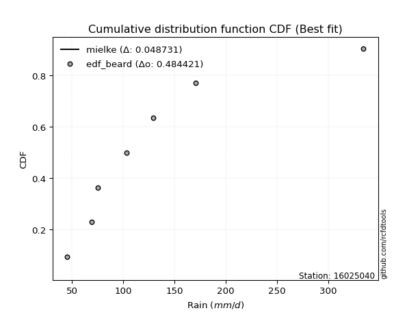</img></img>

</div>


### 5. Empirical - EDF Chegodayev (1955)

The Chegodayev formula is an empirical plotting position formula used in hydrological frequency analysis to estimate the exceedance probability or return period of a specific event from a set of observed data. It is primarily used for plotting observed data points on probability paper to fit a theoretical distribution, particularly for analyzing extreme events like maximum flood flows or rainfall intensities. The constant _b_ value in the generalized plotting position formula is 0.3.

<div align="center">


$P=(m-b)/(n+1-2b)$


</div>


**5.1. Empirical values**

<div align="center">

|                | 0                   | 1                   | 2                   | 3              | 4                  | 5                  | 6                  |
|:---------------|:--------------------|:--------------------|:--------------------|:---------------|:-------------------|:-------------------|:-------------------|
| date           | 2019                | 2025                | 2023                | 2022           | 2020               | 2021               | 2024               |
| x              | 45.5                | 69.2                | 75.1                | 103.5          | 129.1              | 170.9              | 334.2              |
| m              | 1                   | 2                   | 3                   | 4              | 5                  | 6                  | 7                  |
| empirical_dist | edf_chegodayev      | edf_chegodayev      | edf_chegodayev      | edf_chegodayev | edf_chegodayev     | edf_chegodayev     | edf_chegodayev     |
| empirical      | 0.09459459459459459 | 0.22972972972972971 | 0.36486486486486486 | 0.5            | 0.6351351351351351 | 0.7702702702702703 | 0.9054054054054054 |
| empirical_tr   | 1.1044776119402986  | 1.2982456140350878  | 1.574468085106383   | 2.0            | 2.7407407407407405 | 4.352941176470589  | 10.571428571428568 |

</div>


**5.2. Kolmogorov-Smirnov fit test (sorted by Δ)**


<div align="center">

|                | 0                   | 1                   | 2                   | 3                   | 4                   | 5                   | 6                   | 7                   | 8                    | 9                   | 10                  | 11                  | 12                  | 13                  | 14                  | 15                   | 16                  | 17                  | 18                  | 19                  | 20                  | 21                  | 22                  | 23                  | 24                  | 25                  | 26                  | 27                  | 28                  | 29                  | 30                  | 31                  | 32                  | 33                  | 34                  | 35                  | 36                  | 37                  | 38                  | 39                  | 40                  | 41                  | 42                  | 43                  | 44                  | 45                  | 46                  | 47                  | 48                  | 49                  | 50                  | 51                  | 52                  | 53                  | 54                  | 55                  | 56                  | 57                  | 58                  | 59                  | 60                  | 61                  | 62                  | 63                    | 64                  | 65                  | 66                  | 67                  | 68                  | 69                  | 70                  | 71                  | 72                  | 73                  | 74                  | 75                  | 76                  | 77                  | 78                  | 79                  | 80                  | 81                  | 82                  | 83                  | 84                  | 85                  | 86                  | 87                  | 88                  | 89                  |
|:---------------|:--------------------|:--------------------|:--------------------|:--------------------|:--------------------|:--------------------|:--------------------|:--------------------|:---------------------|:--------------------|:--------------------|:--------------------|:--------------------|:--------------------|:--------------------|:---------------------|:--------------------|:--------------------|:--------------------|:--------------------|:--------------------|:--------------------|:--------------------|:--------------------|:--------------------|:--------------------|:--------------------|:--------------------|:--------------------|:--------------------|:--------------------|:--------------------|:--------------------|:--------------------|:--------------------|:--------------------|:--------------------|:--------------------|:--------------------|:--------------------|:--------------------|:--------------------|:--------------------|:--------------------|:--------------------|:--------------------|:--------------------|:--------------------|:--------------------|:--------------------|:--------------------|:--------------------|:--------------------|:--------------------|:--------------------|:--------------------|:--------------------|:--------------------|:--------------------|:--------------------|:--------------------|:--------------------|:--------------------|:----------------------|:--------------------|:--------------------|:--------------------|:--------------------|:--------------------|:--------------------|:--------------------|:--------------------|:--------------------|:--------------------|:--------------------|:--------------------|:--------------------|:--------------------|:--------------------|:--------------------|:--------------------|:--------------------|:--------------------|:--------------------|:--------------------|:--------------------|:--------------------|:--------------------|:--------------------|:--------------------|
| station        | 16025040            | 16025040            | 16025040            | 16025040            | 16025040            | 16025040            | 16025040            | 16025040            | 16025040             | 16025040            | 16025040            | 16025040            | 16025040            | 16025040            | 16025040            | 16025040             | 16025040            | 16025040            | 16025040            | 16025040            | 16025040            | 16025040            | 16025040            | 16025040            | 16025040            | 16025040            | 16025040            | 16025040            | 16025040            | 16025040            | 16025040            | 16025040            | 16025040            | 16025040            | 16025040            | 16025040            | 16025040            | 16025040            | 16025040            | 16025040            | 16025040            | 16025040            | 16025040            | 16025040            | 16025040            | 16025040            | 16025040            | 16025040            | 16025040            | 16025040            | 16025040            | 16025040            | 16025040            | 16025040            | 16025040            | 16025040            | 16025040            | 16025040            | 16025040            | 16025040            | 16025040            | 16025040            | 16025040            | 16025040              | 16025040            | 16025040            | 16025040            | 16025040            | 16025040            | 16025040            | 16025040            | 16025040            | 16025040            | 16025040            | 16025040            | 16025040            | 16025040            | 16025040            | 16025040            | 16025040            | 16025040            | 16025040            | 16025040            | 16025040            | 16025040            | 16025040            | 16025040            | 16025040            | 16025040            | 16025040            |
| empirical_dist | edf_chegodayev      | edf_chegodayev      | edf_chegodayev      | edf_chegodayev      | edf_chegodayev      | edf_chegodayev      | edf_chegodayev      | edf_chegodayev      | edf_chegodayev       | edf_chegodayev      | edf_chegodayev      | edf_chegodayev      | edf_chegodayev      | edf_chegodayev      | edf_chegodayev      | edf_chegodayev       | edf_chegodayev      | edf_chegodayev      | edf_chegodayev      | edf_chegodayev      | edf_chegodayev      | edf_chegodayev      | edf_chegodayev      | edf_chegodayev      | edf_chegodayev      | edf_chegodayev      | edf_chegodayev      | edf_chegodayev      | edf_chegodayev      | edf_chegodayev      | edf_chegodayev      | edf_chegodayev      | edf_chegodayev      | edf_chegodayev      | edf_chegodayev      | edf_chegodayev      | edf_chegodayev      | edf_chegodayev      | edf_chegodayev      | edf_chegodayev      | edf_chegodayev      | edf_chegodayev      | edf_chegodayev      | edf_chegodayev      | edf_chegodayev      | edf_chegodayev      | edf_chegodayev      | edf_chegodayev      | edf_chegodayev      | edf_chegodayev      | edf_chegodayev      | edf_chegodayev      | edf_chegodayev      | edf_chegodayev      | edf_chegodayev      | edf_chegodayev      | edf_chegodayev      | edf_chegodayev      | edf_chegodayev      | edf_chegodayev      | edf_chegodayev      | edf_chegodayev      | edf_chegodayev      | edf_chegodayev        | edf_chegodayev      | edf_chegodayev      | edf_chegodayev      | edf_chegodayev      | edf_chegodayev      | edf_chegodayev      | edf_chegodayev      | edf_chegodayev      | edf_chegodayev      | edf_chegodayev      | edf_chegodayev      | edf_chegodayev      | edf_chegodayev      | edf_chegodayev      | edf_chegodayev      | edf_chegodayev      | edf_chegodayev      | edf_chegodayev      | edf_chegodayev      | edf_chegodayev      | edf_chegodayev      | edf_chegodayev      | edf_chegodayev      | edf_chegodayev      | edf_chegodayev      | edf_chegodayev      |
| p_dist         | mielke              | logkstwobign        | nct                 | logmielke           | loginvweibull       | loggenlogistic      | invgauss            | invgamma            | f                    | logfatiguelife      | halflogistic        | logerlang           | loggamma            | loggamma            | logf                | loginvgauss          | lograyleigh         | johnsonsu           | pearson3            | logjohnsonsu        | loginvgamma         | fatiguelife         | logweibull_min      | alpha               | logmaxwell          | fisk                | logalpha            | loggumbel_r         | lognct              | logexponnorm        | logfisk             | logrice             | logpearson3         | ncf                 | betaprime           | moyal               | halfnorm            | gumbel_r            | logbetaprime        | logmoyal            | logncf              | logt                | logcrystalball      | lognorm             | lognorm             | exponnorm           | logloggamma         | loggompertz         | loggenexpon         | genexpon            | loghalflogistic     | truncnorm           | expon               | loghalfnorm         | t                   | nakagami            | rayleigh            | loglogistic         | maxwell             | genlogistic         | weibull_min         | laplace_asymmetric  | wald                | loglaplace_asymmetric | loghypsecant        | logwald             | gompertz            | kstwobign           | loggumbel_l         | norm                | crystalball         | logexpon            | logistic            | loglaplace          | rice                | hypsecant           | erlang              | laplace             | lognakagami         | gumbel_l            | loggibrat           | logchi2             | gibrat              | gamma               | pareto              | loglognorm          | logpareto           | invweibull          | chi2                | logtruncnorm        |
| delta          | 0.04983000388880953 | 0.05294854912157993 | 0.05429001421696705 | 0.05484545543605013 | 0.05487648069224971 | 0.05493081927810867 | 0.05568979664588407 | 0.05594807557275239 | 0.056537028973260184 | 0.05720897047223844 | 0.05793449770080328 | 0.05807682983141118 | 0.05807711918931356 | 0.05807711918931356 | 0.05814120151665904 | 0.058464982350719674 | 0.05892129340333102 | 0.05927164575124598 | 0.06234854607501278 | 0.0624356403718313  | 0.06654540770197181 | 0.06758615434698007 | 0.06777039350758675 | 0.06847928547495163 | 0.06888002019076878 | 0.06928352386051373 | 0.07065807722634143 | 0.07122507302762665 | 0.07182056024575678 | 0.07243382928268066 | 0.07248018161898384 | 0.07356061916122253 | 0.07824046643525184 | 0.07885706960646427 | 0.0790035209398024  | 0.07942222849784603 | 0.08042335064390889 | 0.08166421714204808 | 0.08427170087651736 | 0.08519948222886495 | 0.08583411883226943 | 0.09345003642964472 | 0.09345045347519482 | 0.09345050961404838 | 0.09345050961404838 | 0.09360288907708876 | 0.09428892981978143 | 0.09459459259763221 | 0.09459459418036863 | 0.09459459459407842 | 0.09459459459459459 | 0.09459459459459459 | 0.09459459459459459 | 0.09459459459459459 | 0.09956037608146928 | 0.10145008058215099 | 0.10514708289259511 | 0.11583093323104512 | 0.11646532095196149 | 0.11846895762586632 | 0.12285590661737511 | 0.12412518939784473 | 0.12618555620885988 | 0.12740126561069243   | 0.1311963287315491  | 0.1332871621800168  | 0.13544366253276297 | 0.1363587636752966  | 0.1380383562750662  | 0.1500483089904297  | 0.15004831016791698 | 0.15207551316329487 | 0.1520833530996082  | 0.1534122059068724  | 0.1536523752693068  | 0.15381964289447614 | 0.15511448349199491 | 0.18151077603242927 | 0.21021523405471787 | 0.22070487332033772 | 0.22889379430254328 | 0.24793230827504592 | 0.26050009792533835 | 0.29021632068782943 | 0.3962552281736864  | 0.40616657368849685 | 0.41740134901687176 | 0.43656852130278445 | 0.4640560147479579  | 0.49999954227539867 |
| deltao         | 0.48442053926100004 | 0.48442053926100004 | 0.48442053926100004 | 0.48442053926100004 | 0.48442053926100004 | 0.48442053926100004 | 0.48442053926100004 | 0.48442053926100004 | 0.48442053926100004  | 0.48442053926100004 | 0.48442053926100004 | 0.48442053926100004 | 0.48442053926100004 | 0.48442053926100004 | 0.48442053926100004 | 0.48442053926100004  | 0.48442053926100004 | 0.48442053926100004 | 0.48442053926100004 | 0.48442053926100004 | 0.48442053926100004 | 0.48442053926100004 | 0.48442053926100004 | 0.48442053926100004 | 0.48442053926100004 | 0.48442053926100004 | 0.48442053926100004 | 0.48442053926100004 | 0.48442053926100004 | 0.48442053926100004 | 0.48442053926100004 | 0.48442053926100004 | 0.48442053926100004 | 0.48442053926100004 | 0.48442053926100004 | 0.48442053926100004 | 0.48442053926100004 | 0.48442053926100004 | 0.48442053926100004 | 0.48442053926100004 | 0.48442053926100004 | 0.48442053926100004 | 0.48442053926100004 | 0.48442053926100004 | 0.48442053926100004 | 0.48442053926100004 | 0.48442053926100004 | 0.48442053926100004 | 0.48442053926100004 | 0.48442053926100004 | 0.48442053926100004 | 0.48442053926100004 | 0.48442053926100004 | 0.48442053926100004 | 0.48442053926100004 | 0.48442053926100004 | 0.48442053926100004 | 0.48442053926100004 | 0.48442053926100004 | 0.48442053926100004 | 0.48442053926100004 | 0.48442053926100004 | 0.48442053926100004 | 0.48442053926100004   | 0.48442053926100004 | 0.48442053926100004 | 0.48442053926100004 | 0.48442053926100004 | 0.48442053926100004 | 0.48442053926100004 | 0.48442053926100004 | 0.48442053926100004 | 0.48442053926100004 | 0.48442053926100004 | 0.48442053926100004 | 0.48442053926100004 | 0.48442053926100004 | 0.48442053926100004 | 0.48442053926100004 | 0.48442053926100004 | 0.48442053926100004 | 0.48442053926100004 | 0.48442053926100004 | 0.48442053926100004 | 0.48442053926100004 | 0.48442053926100004 | 0.48442053926100004 | 0.48442053926100004 | 0.48442053926100004 | 0.48442053926100004 |
| eval           | Δo > Δ              | Δo > Δ              | Δo > Δ              | Δo > Δ              | Δo > Δ              | Δo > Δ              | Δo > Δ              | Δo > Δ              | Δo > Δ               | Δo > Δ              | Δo > Δ              | Δo > Δ              | Δo > Δ              | Δo > Δ              | Δo > Δ              | Δo > Δ               | Δo > Δ              | Δo > Δ              | Δo > Δ              | Δo > Δ              | Δo > Δ              | Δo > Δ              | Δo > Δ              | Δo > Δ              | Δo > Δ              | Δo > Δ              | Δo > Δ              | Δo > Δ              | Δo > Δ              | Δo > Δ              | Δo > Δ              | Δo > Δ              | Δo > Δ              | Δo > Δ              | Δo > Δ              | Δo > Δ              | Δo > Δ              | Δo > Δ              | Δo > Δ              | Δo > Δ              | Δo > Δ              | Δo > Δ              | Δo > Δ              | Δo > Δ              | Δo > Δ              | Δo > Δ              | Δo > Δ              | Δo > Δ              | Δo > Δ              | Δo > Δ              | Δo > Δ              | Δo > Δ              | Δo > Δ              | Δo > Δ              | Δo > Δ              | Δo > Δ              | Δo > Δ              | Δo > Δ              | Δo > Δ              | Δo > Δ              | Δo > Δ              | Δo > Δ              | Δo > Δ              | Δo > Δ                | Δo > Δ              | Δo > Δ              | Δo > Δ              | Δo > Δ              | Δo > Δ              | Δo > Δ              | Δo > Δ              | Δo > Δ              | Δo > Δ              | Δo > Δ              | Δo > Δ              | Δo > Δ              | Δo > Δ              | Δo > Δ              | Δo > Δ              | Δo > Δ              | Δo > Δ              | Δo > Δ              | Δo > Δ              | Δo > Δ              | Δo > Δ              | Δo > Δ              | Δo > Δ              | Δo > Δ              | Δo > Δ              | Δo <= Δ             |
| fit            | 1                   | 1                   | 1                   | 1                   | 1                   | 1                   | 1                   | 1                   | 1                    | 1                   | 1                   | 1                   | 1                   | 1                   | 1                   | 1                    | 1                   | 1                   | 1                   | 1                   | 1                   | 1                   | 1                   | 1                   | 1                   | 1                   | 1                   | 1                   | 1                   | 1                   | 1                   | 1                   | 1                   | 1                   | 1                   | 1                   | 1                   | 1                   | 1                   | 1                   | 1                   | 1                   | 1                   | 1                   | 1                   | 1                   | 1                   | 1                   | 1                   | 1                   | 1                   | 1                   | 1                   | 1                   | 1                   | 1                   | 1                   | 1                   | 1                   | 1                   | 1                   | 1                   | 1                   | 1                     | 1                   | 1                   | 1                   | 1                   | 1                   | 1                   | 1                   | 1                   | 1                   | 1                   | 1                   | 1                   | 1                   | 1                   | 1                   | 1                   | 1                   | 1                   | 1                   | 1                   | 1                   | 1                   | 1                   | 1                   | 1                   | 0                   |
| n              | 7                   | 7                   | 7                   | 7                   | 7                   | 7                   | 7                   | 7                   | 7                    | 7                   | 7                   | 7                   | 7                   | 7                   | 7                   | 7                    | 7                   | 7                   | 7                   | 7                   | 7                   | 7                   | 7                   | 7                   | 7                   | 7                   | 7                   | 7                   | 7                   | 7                   | 7                   | 7                   | 7                   | 7                   | 7                   | 7                   | 7                   | 7                   | 7                   | 7                   | 7                   | 7                   | 7                   | 7                   | 7                   | 7                   | 7                   | 7                   | 7                   | 7                   | 7                   | 7                   | 7                   | 7                   | 7                   | 7                   | 7                   | 7                   | 7                   | 7                   | 7                   | 7                   | 7                   | 7                     | 7                   | 7                   | 7                   | 7                   | 7                   | 7                   | 7                   | 7                   | 7                   | 7                   | 7                   | 7                   | 7                   | 7                   | 7                   | 7                   | 7                   | 7                   | 7                   | 7                   | 7                   | 7                   | 7                   | 7                   | 7                   | 7                   |
| best_fit       | 1                   | 0                   | 0                   | 0                   | 0                   | 0                   | 0                   | 0                   | 0                    | 0                   | 0                   | 0                   | 0                   | 0                   | 0                   | 0                    | 0                   | 0                   | 0                   | 0                   | 0                   | 0                   | 0                   | 0                   | 0                   | 0                   | 0                   | 0                   | 0                   | 0                   | 0                   | 0                   | 0                   | 0                   | 0                   | 0                   | 0                   | 0                   | 0                   | 0                   | 0                   | 0                   | 0                   | 0                   | 0                   | 0                   | 0                   | 0                   | 0                   | 0                   | 0                   | 0                   | 0                   | 0                   | 0                   | 0                   | 0                   | 0                   | 0                   | 0                   | 0                   | 0                   | 0                   | 0                     | 0                   | 0                   | 0                   | 0                   | 0                   | 0                   | 0                   | 0                   | 0                   | 0                   | 0                   | 0                   | 0                   | 0                   | 0                   | 0                   | 0                   | 0                   | 0                   | 0                   | 0                   | 0                   | 0                   | 0                   | 0                   | 0                   |
| best_fit_sort  | 1                   | 2                   | 3                   | 4                   | 5                   | 6                   | 7                   | 8                   | 9                    | 10                  | 11                  | 12                  | 13                  | 14                  | 15                  | 16                   | 17                  | 18                  | 19                  | 20                  | 21                  | 22                  | 23                  | 24                  | 25                  | 26                  | 27                  | 28                  | 29                  | 30                  | 31                  | 32                  | 33                  | 34                  | 35                  | 36                  | 37                  | 38                  | 39                  | 40                  | 41                  | 42                  | 43                  | 44                  | 45                  | 46                  | 47                  | 48                  | 49                  | 50                  | 51                  | 52                  | 53                  | 54                  | 55                  | 56                  | 57                  | 58                  | 59                  | 60                  | 61                  | 62                  | 63                  | 64                    | 65                  | 66                  | 67                  | 68                  | 69                  | 70                  | 71                  | 72                  | 73                  | 74                  | 75                  | 76                  | 77                  | 78                  | 79                  | 80                  | 81                  | 82                  | 83                  | 84                  | 85                  | 86                  | 87                  | 88                  | 89                  | 90                  |

</div>


<div align="center">

</img>

</div>


**5.3. Best fit**

<div align="center">

|   id |   station | empirical_dist   | p_dist   |   delta |   deltao | eval   |   fit |   n |   best_fit |   best_fit_sort |
|-----:|----------:|:-----------------|:---------|--------:|---------:|:-------|------:|----:|-----------:|----------------:|
|    0 |  16025040 | edf_chegodayev   | mielke   | 0.04983 | 0.484421 | Δo > Δ |     1 |   7 |          1 |               1 |

</div>


<div align="center">

</img>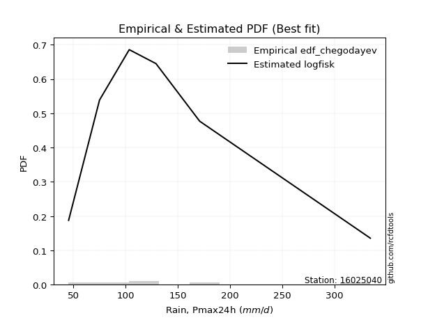</img>

</div>


### 6. Empirical - EDF Blom (1958)

The Blom formula is a specific "plotting position" formula used in hydrology and statistical analysis to estimate the empirical cumulative probability (or non-exceedance probability) of a data series. It is particularly recommended for data that are approximately normally distributed. The constant _a_ is set to 0.375 (or 3/8).

<div align="center">


$P=(m-a)/(n+1-2a)$


</div>


**6.1. Empirical values**

<div align="center">

|                | 0                   | 1                   | 2                  | 3        | 4                  | 5                  | 6                  |
|:---------------|:--------------------|:--------------------|:-------------------|:---------|:-------------------|:-------------------|:-------------------|
| date           | 2019                | 2025                | 2023               | 2022     | 2020               | 2021               | 2024               |
| x              | 45.5                | 69.2                | 75.1               | 103.5    | 129.1              | 170.9              | 334.2              |
| m              | 1                   | 2                   | 3                  | 4        | 5                  | 6                  | 7                  |
| empirical_dist | edf_blom            | edf_blom            | edf_blom           | edf_blom | edf_blom           | edf_blom           | edf_blom           |
| empirical      | 0.08620689655172414 | 0.22413793103448276 | 0.3620689655172414 | 0.5      | 0.6379310344827587 | 0.7758620689655172 | 0.9137931034482759 |
| empirical_tr   | 1.0943396226415094  | 1.288888888888889   | 1.5675675675675675 | 2.0      | 2.7619047619047623 | 4.461538461538462  | 11.600000000000007 |

</div>


**6.2. Kolmogorov-Smirnov fit test (sorted by Δ)**


<div align="center">

|                | 0                   | 1                   | 2                   | 3                   | 4                   | 5                   | 6                    | 7                   | 8                   | 9                   | 10                  | 11                  | 12                  | 13                  | 14                   | 15                   | 16                  | 17                   | 18                   | 19                   | 20                   | 21                  | 22                  | 23                  | 24                  | 25                  | 26                  | 27                  | 28                  | 29                  | 30                  | 31                  | 32                  | 33                  | 34                  | 35                  | 36                  | 37                  | 38                  | 39                  | 40                  | 41                  | 42                  | 43                  | 44                  | 45                  | 46                  | 47                  | 48                  | 49                  | 50                  | 51                  | 52                  | 53                  | 54                  | 55                  | 56                  | 57                  | 58                  | 59                  | 60                  | 61                  | 62                    | 63                  | 64                  | 65                  | 66                  | 67                  | 68                  | 69                  | 70                  | 71                  | 72                  | 73                  | 74                  | 75                  | 76                  | 77                  | 78                  | 79                  | 80                  | 81                  | 82                  | 83                  | 84                  | 85                  | 86                  | 87                  | 88                  | 89                  |
|:---------------|:--------------------|:--------------------|:--------------------|:--------------------|:--------------------|:--------------------|:---------------------|:--------------------|:--------------------|:--------------------|:--------------------|:--------------------|:--------------------|:--------------------|:---------------------|:---------------------|:--------------------|:---------------------|:---------------------|:---------------------|:---------------------|:--------------------|:--------------------|:--------------------|:--------------------|:--------------------|:--------------------|:--------------------|:--------------------|:--------------------|:--------------------|:--------------------|:--------------------|:--------------------|:--------------------|:--------------------|:--------------------|:--------------------|:--------------------|:--------------------|:--------------------|:--------------------|:--------------------|:--------------------|:--------------------|:--------------------|:--------------------|:--------------------|:--------------------|:--------------------|:--------------------|:--------------------|:--------------------|:--------------------|:--------------------|:--------------------|:--------------------|:--------------------|:--------------------|:--------------------|:--------------------|:--------------------|:----------------------|:--------------------|:--------------------|:--------------------|:--------------------|:--------------------|:--------------------|:--------------------|:--------------------|:--------------------|:--------------------|:--------------------|:--------------------|:--------------------|:--------------------|:--------------------|:--------------------|:--------------------|:--------------------|:--------------------|:--------------------|:--------------------|:--------------------|:--------------------|:--------------------|:--------------------|:--------------------|:--------------------|
| station        | 16025040            | 16025040            | 16025040            | 16025040            | 16025040            | 16025040            | 16025040             | 16025040            | 16025040            | 16025040            | 16025040            | 16025040            | 16025040            | 16025040            | 16025040             | 16025040             | 16025040            | 16025040             | 16025040             | 16025040             | 16025040             | 16025040            | 16025040            | 16025040            | 16025040            | 16025040            | 16025040            | 16025040            | 16025040            | 16025040            | 16025040            | 16025040            | 16025040            | 16025040            | 16025040            | 16025040            | 16025040            | 16025040            | 16025040            | 16025040            | 16025040            | 16025040            | 16025040            | 16025040            | 16025040            | 16025040            | 16025040            | 16025040            | 16025040            | 16025040            | 16025040            | 16025040            | 16025040            | 16025040            | 16025040            | 16025040            | 16025040            | 16025040            | 16025040            | 16025040            | 16025040            | 16025040            | 16025040              | 16025040            | 16025040            | 16025040            | 16025040            | 16025040            | 16025040            | 16025040            | 16025040            | 16025040            | 16025040            | 16025040            | 16025040            | 16025040            | 16025040            | 16025040            | 16025040            | 16025040            | 16025040            | 16025040            | 16025040            | 16025040            | 16025040            | 16025040            | 16025040            | 16025040            | 16025040            | 16025040            |
| empirical_dist | edf_blom            | edf_blom            | edf_blom            | edf_blom            | edf_blom            | edf_blom            | edf_blom             | edf_blom            | edf_blom            | edf_blom            | edf_blom            | edf_blom            | edf_blom            | edf_blom            | edf_blom             | edf_blom             | edf_blom            | edf_blom             | edf_blom             | edf_blom             | edf_blom             | edf_blom            | edf_blom            | edf_blom            | edf_blom            | edf_blom            | edf_blom            | edf_blom            | edf_blom            | edf_blom            | edf_blom            | edf_blom            | edf_blom            | edf_blom            | edf_blom            | edf_blom            | edf_blom            | edf_blom            | edf_blom            | edf_blom            | edf_blom            | edf_blom            | edf_blom            | edf_blom            | edf_blom            | edf_blom            | edf_blom            | edf_blom            | edf_blom            | edf_blom            | edf_blom            | edf_blom            | edf_blom            | edf_blom            | edf_blom            | edf_blom            | edf_blom            | edf_blom            | edf_blom            | edf_blom            | edf_blom            | edf_blom            | edf_blom              | edf_blom            | edf_blom            | edf_blom            | edf_blom            | edf_blom            | edf_blom            | edf_blom            | edf_blom            | edf_blom            | edf_blom            | edf_blom            | edf_blom            | edf_blom            | edf_blom            | edf_blom            | edf_blom            | edf_blom            | edf_blom            | edf_blom            | edf_blom            | edf_blom            | edf_blom            | edf_blom            | edf_blom            | edf_blom            | edf_blom            | edf_blom            |
| p_dist         | mielke              | logkstwobign        | invgauss            | logerlang           | loggamma            | loggamma            | logf                 | nct                 | logmielke           | loginvweibull       | loggenlogistic      | johnsonsu           | invgamma            | f                   | halflogistic         | logfatiguelife       | loginvgauss         | lograyleigh          | logweibull_min       | logjohnsonsu         | fisk                 | pearson3            | loginvgamma         | alpha               | logmaxwell          | logalpha            | loggumbel_r         | lognct              | logexponnorm        | logfisk             | logrice             | fatiguelife         | logpearson3         | ncf                 | betaprime           | moyal               | logmoyal            | logbetaprime        | logncf              | gumbel_r            | exponnorm           | loggompertz         | genexpon            | truncnorm           | loghalflogistic     | loghalfnorm         | expon               | halfnorm            | logt                | logcrystalball      | lognorm             | lognorm             | logloggamma         | loggenexpon         | t                   | nakagami            | rayleigh            | loglogistic         | genlogistic         | maxwell             | laplace_asymmetric  | wald                | loglaplace_asymmetric | loghypsecant        | weibull_min         | gompertz            | logwald             | kstwobign           | loggumbel_l         | loglaplace          | norm                | crystalball         | rice                | logistic            | hypsecant           | logexpon            | erlang              | laplace             | lognakagami         | gumbel_l            | loggibrat           | logchi2             | gibrat              | gamma               | pareto              | loglognorm          | logpareto           | invweibull          | chi2                | logtruncnorm        |
| delta          | 0.04144230584593909 | 0.04456085107870949 | 0.04935401953913765 | 0.04968913178854074 | 0.04968942114644312 | 0.04968942114644312 | 0.049753503473788596 | 0.05149411486934358 | 0.05204955608842665 | 0.05208058134462623 | 0.05213491993048519 | 0.05240723524693808 | 0.05315217622512891 | 0.05374112962563671 | 0.054348745423104194 | 0.054413071124614965 | 0.0556690830030962  | 0.056125394055707545 | 0.059382695464716306 | 0.059639741024207826 | 0.060895825817643294 | 0.06232712643183047 | 0.06374950835434834 | 0.06568338612732816 | 0.0660841208431453  | 0.06786217787871796 | 0.06842917368000317 | 0.0690246608981333  | 0.06963792993505719 | 0.06968428227136036 | 0.07076471981359905 | 0.07317795304222702 | 0.07544456708762837 | 0.0760611702588408  | 0.07620762159217892 | 0.07662632915022255 | 0.0768117841859945  | 0.08147580152889389 | 0.08303821948464596 | 0.08307156633374191 | 0.08521519103421832 | 0.08620689455476177 | 0.08620689655120797 | 0.08620689655172414 | 0.08620689655172414 | 0.08620689655172414 | 0.08620689655172414 | 0.08881104868677933 | 0.09065413708202125 | 0.09065455412757134 | 0.0906546102664249  | 0.0906546102664249  | 0.09149303047215795 | 0.09923267813103243 | 0.09960610760385574 | 0.10704187927739794 | 0.1079429822402187  | 0.11303503388342165 | 0.11567305827824284 | 0.11926122029958508 | 0.12132929005022125 | 0.1233896568612364  | 0.12460536626306895   | 0.12840042938392562 | 0.12844770531262206 | 0.1326477631851395  | 0.1332871621800168  | 0.13356286432767311 | 0.13524245692744272 | 0.15061630655924893 | 0.1528442083380533  | 0.15284420951554056 | 0.15334265371284644 | 0.15487925244723177 | 0.15661554224209973 | 0.15766731185854183 | 0.16070628218724187 | 0.18151077603242927 | 0.21580703274996482 | 0.2235007726679613  | 0.22601372064625264 | 0.2535241069702929  | 0.25770419857771487 | 0.2958081193830764  | 0.40184702686893337 | 0.4117583723837438  | 0.4229931477121187  | 0.444956219345655   | 0.46964781344320483 | 0.49999954227539867 |
| deltao         | 0.48442053926100004 | 0.48442053926100004 | 0.48442053926100004 | 0.48442053926100004 | 0.48442053926100004 | 0.48442053926100004 | 0.48442053926100004  | 0.48442053926100004 | 0.48442053926100004 | 0.48442053926100004 | 0.48442053926100004 | 0.48442053926100004 | 0.48442053926100004 | 0.48442053926100004 | 0.48442053926100004  | 0.48442053926100004  | 0.48442053926100004 | 0.48442053926100004  | 0.48442053926100004  | 0.48442053926100004  | 0.48442053926100004  | 0.48442053926100004 | 0.48442053926100004 | 0.48442053926100004 | 0.48442053926100004 | 0.48442053926100004 | 0.48442053926100004 | 0.48442053926100004 | 0.48442053926100004 | 0.48442053926100004 | 0.48442053926100004 | 0.48442053926100004 | 0.48442053926100004 | 0.48442053926100004 | 0.48442053926100004 | 0.48442053926100004 | 0.48442053926100004 | 0.48442053926100004 | 0.48442053926100004 | 0.48442053926100004 | 0.48442053926100004 | 0.48442053926100004 | 0.48442053926100004 | 0.48442053926100004 | 0.48442053926100004 | 0.48442053926100004 | 0.48442053926100004 | 0.48442053926100004 | 0.48442053926100004 | 0.48442053926100004 | 0.48442053926100004 | 0.48442053926100004 | 0.48442053926100004 | 0.48442053926100004 | 0.48442053926100004 | 0.48442053926100004 | 0.48442053926100004 | 0.48442053926100004 | 0.48442053926100004 | 0.48442053926100004 | 0.48442053926100004 | 0.48442053926100004 | 0.48442053926100004   | 0.48442053926100004 | 0.48442053926100004 | 0.48442053926100004 | 0.48442053926100004 | 0.48442053926100004 | 0.48442053926100004 | 0.48442053926100004 | 0.48442053926100004 | 0.48442053926100004 | 0.48442053926100004 | 0.48442053926100004 | 0.48442053926100004 | 0.48442053926100004 | 0.48442053926100004 | 0.48442053926100004 | 0.48442053926100004 | 0.48442053926100004 | 0.48442053926100004 | 0.48442053926100004 | 0.48442053926100004 | 0.48442053926100004 | 0.48442053926100004 | 0.48442053926100004 | 0.48442053926100004 | 0.48442053926100004 | 0.48442053926100004 | 0.48442053926100004 |
| eval           | Δo > Δ              | Δo > Δ              | Δo > Δ              | Δo > Δ              | Δo > Δ              | Δo > Δ              | Δo > Δ               | Δo > Δ              | Δo > Δ              | Δo > Δ              | Δo > Δ              | Δo > Δ              | Δo > Δ              | Δo > Δ              | Δo > Δ               | Δo > Δ               | Δo > Δ              | Δo > Δ               | Δo > Δ               | Δo > Δ               | Δo > Δ               | Δo > Δ              | Δo > Δ              | Δo > Δ              | Δo > Δ              | Δo > Δ              | Δo > Δ              | Δo > Δ              | Δo > Δ              | Δo > Δ              | Δo > Δ              | Δo > Δ              | Δo > Δ              | Δo > Δ              | Δo > Δ              | Δo > Δ              | Δo > Δ              | Δo > Δ              | Δo > Δ              | Δo > Δ              | Δo > Δ              | Δo > Δ              | Δo > Δ              | Δo > Δ              | Δo > Δ              | Δo > Δ              | Δo > Δ              | Δo > Δ              | Δo > Δ              | Δo > Δ              | Δo > Δ              | Δo > Δ              | Δo > Δ              | Δo > Δ              | Δo > Δ              | Δo > Δ              | Δo > Δ              | Δo > Δ              | Δo > Δ              | Δo > Δ              | Δo > Δ              | Δo > Δ              | Δo > Δ                | Δo > Δ              | Δo > Δ              | Δo > Δ              | Δo > Δ              | Δo > Δ              | Δo > Δ              | Δo > Δ              | Δo > Δ              | Δo > Δ              | Δo > Δ              | Δo > Δ              | Δo > Δ              | Δo > Δ              | Δo > Δ              | Δo > Δ              | Δo > Δ              | Δo > Δ              | Δo > Δ              | Δo > Δ              | Δo > Δ              | Δo > Δ              | Δo > Δ              | Δo > Δ              | Δo > Δ              | Δo > Δ              | Δo > Δ              | Δo <= Δ             |
| fit            | 1                   | 1                   | 1                   | 1                   | 1                   | 1                   | 1                    | 1                   | 1                   | 1                   | 1                   | 1                   | 1                   | 1                   | 1                    | 1                    | 1                   | 1                    | 1                    | 1                    | 1                    | 1                   | 1                   | 1                   | 1                   | 1                   | 1                   | 1                   | 1                   | 1                   | 1                   | 1                   | 1                   | 1                   | 1                   | 1                   | 1                   | 1                   | 1                   | 1                   | 1                   | 1                   | 1                   | 1                   | 1                   | 1                   | 1                   | 1                   | 1                   | 1                   | 1                   | 1                   | 1                   | 1                   | 1                   | 1                   | 1                   | 1                   | 1                   | 1                   | 1                   | 1                   | 1                     | 1                   | 1                   | 1                   | 1                   | 1                   | 1                   | 1                   | 1                   | 1                   | 1                   | 1                   | 1                   | 1                   | 1                   | 1                   | 1                   | 1                   | 1                   | 1                   | 1                   | 1                   | 1                   | 1                   | 1                   | 1                   | 1                   | 0                   |
| n              | 7                   | 7                   | 7                   | 7                   | 7                   | 7                   | 7                    | 7                   | 7                   | 7                   | 7                   | 7                   | 7                   | 7                   | 7                    | 7                    | 7                   | 7                    | 7                    | 7                    | 7                    | 7                   | 7                   | 7                   | 7                   | 7                   | 7                   | 7                   | 7                   | 7                   | 7                   | 7                   | 7                   | 7                   | 7                   | 7                   | 7                   | 7                   | 7                   | 7                   | 7                   | 7                   | 7                   | 7                   | 7                   | 7                   | 7                   | 7                   | 7                   | 7                   | 7                   | 7                   | 7                   | 7                   | 7                   | 7                   | 7                   | 7                   | 7                   | 7                   | 7                   | 7                   | 7                     | 7                   | 7                   | 7                   | 7                   | 7                   | 7                   | 7                   | 7                   | 7                   | 7                   | 7                   | 7                   | 7                   | 7                   | 7                   | 7                   | 7                   | 7                   | 7                   | 7                   | 7                   | 7                   | 7                   | 7                   | 7                   | 7                   | 7                   |
| best_fit       | 1                   | 0                   | 0                   | 0                   | 0                   | 0                   | 0                    | 0                   | 0                   | 0                   | 0                   | 0                   | 0                   | 0                   | 0                    | 0                    | 0                   | 0                    | 0                    | 0                    | 0                    | 0                   | 0                   | 0                   | 0                   | 0                   | 0                   | 0                   | 0                   | 0                   | 0                   | 0                   | 0                   | 0                   | 0                   | 0                   | 0                   | 0                   | 0                   | 0                   | 0                   | 0                   | 0                   | 0                   | 0                   | 0                   | 0                   | 0                   | 0                   | 0                   | 0                   | 0                   | 0                   | 0                   | 0                   | 0                   | 0                   | 0                   | 0                   | 0                   | 0                   | 0                   | 0                     | 0                   | 0                   | 0                   | 0                   | 0                   | 0                   | 0                   | 0                   | 0                   | 0                   | 0                   | 0                   | 0                   | 0                   | 0                   | 0                   | 0                   | 0                   | 0                   | 0                   | 0                   | 0                   | 0                   | 0                   | 0                   | 0                   | 0                   |
| best_fit_sort  | 1                   | 2                   | 3                   | 4                   | 5                   | 6                   | 7                    | 8                   | 9                   | 10                  | 11                  | 12                  | 13                  | 14                  | 15                   | 16                   | 17                  | 18                   | 19                   | 20                   | 21                   | 22                  | 23                  | 24                  | 25                  | 26                  | 27                  | 28                  | 29                  | 30                  | 31                  | 32                  | 33                  | 34                  | 35                  | 36                  | 37                  | 38                  | 39                  | 40                  | 41                  | 42                  | 43                  | 44                  | 45                  | 46                  | 47                  | 48                  | 49                  | 50                  | 51                  | 52                  | 53                  | 54                  | 55                  | 56                  | 57                  | 58                  | 59                  | 60                  | 61                  | 62                  | 63                    | 64                  | 65                  | 66                  | 67                  | 68                  | 69                  | 70                  | 71                  | 72                  | 73                  | 74                  | 75                  | 76                  | 77                  | 78                  | 79                  | 80                  | 81                  | 82                  | 83                  | 84                  | 85                  | 86                  | 87                  | 88                  | 89                  | 90                  |

</div>


<div align="center">

</img>

</div>


**6.3. Best fit**

<div align="center">

|   id |   station | empirical_dist   | p_dist   |     delta |   deltao | eval   |   fit |   n |   best_fit |   best_fit_sort |
|-----:|----------:|:-----------------|:---------|----------:|---------:|:-------|------:|----:|-----------:|----------------:|
|    0 |  16025040 | edf_blom         | mielke   | 0.0414423 | 0.484421 | Δo > Δ |     1 |   7 |          1 |               1 |

</div>


<div align="center">

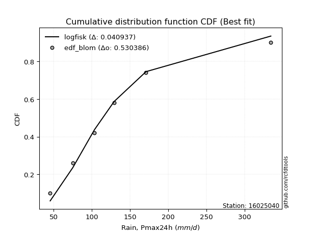</img>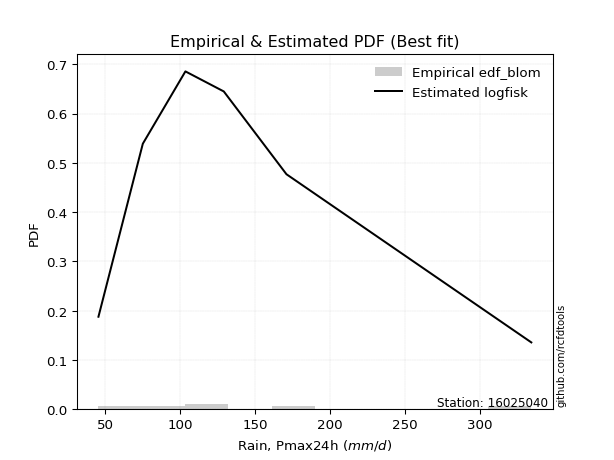</img>

</div>


### 7. Empirical - EDF Tukey (1962)

In hydrology, the Tukey formula is used as a plotting position formula to estimate the empirical probability or frequency of a flood event (or other hydrological data). The formula parameter is given as _c=0.333_ (or 1/3).

<div align="center">


$P=(m-c)/(n+1-2c)$


</div>


**7.1. Empirical values**

<div align="center">

|                | 0                   | 1                   | 2                   | 3         | 4                  | 5                  | 6                  |
|:---------------|:--------------------|:--------------------|:--------------------|:----------|:-------------------|:-------------------|:-------------------|
| date           | 2019                | 2025                | 2023                | 2022      | 2020               | 2021               | 2024               |
| x              | 45.5                | 69.2                | 75.1                | 103.5     | 129.1              | 170.9              | 334.2              |
| m              | 1                   | 2                   | 3                   | 4         | 5                  | 6                  | 7                  |
| empirical_dist | edf_tukey           | edf_tukey           | edf_tukey           | edf_tukey | edf_tukey          | edf_tukey          | edf_tukey          |
| empirical      | 0.09090909090909091 | 0.22727272727272727 | 0.36363636363636365 | 0.5       | 0.6363636363636364 | 0.7727272727272727 | 0.9090909090909091 |
| empirical_tr   | 1.1                 | 1.2941176470588236  | 1.5714285714285714  | 2.0       | 2.75               | 4.3999999999999995 | 10.999999999999996 |

</div>


**7.2. Kolmogorov-Smirnov fit test (sorted by Δ)**


<div align="center">

|                | 0                    | 1                   | 2                    | 3                   | 4                   | 5                    | 6                    | 7                   | 8                    | 9                   | 10                  | 11                   | 12                   | 13                  | 14                   | 15                  | 16                  | 17                  | 18                  | 19                  | 20                  | 21                  | 22                  | 23                  | 24                  | 25                  | 26                  | 27                  | 28                  | 29                  | 30                  | 31                  | 32                  | 33                  | 34                  | 35                  | 36                  | 37                  | 38                  | 39                  | 40                  | 41                  | 42                  | 43                  | 44                  | 45                  | 46                  | 47                  | 48                  | 49                  | 50                  | 51                  | 52                  | 53                  | 54                  | 55                  | 56                  | 57                  | 58                  | 59                  | 60                  | 61                  | 62                  | 63                    | 64                  | 65                  | 66                  | 67                  | 68                  | 69                  | 70                  | 71                  | 72                  | 73                  | 74                  | 75                  | 76                  | 77                  | 78                  | 79                  | 80                  | 81                  | 82                  | 83                  | 84                  | 85                  | 86                  | 87                  | 88                  | 89                  |
|:---------------|:---------------------|:--------------------|:---------------------|:--------------------|:--------------------|:---------------------|:---------------------|:--------------------|:---------------------|:--------------------|:--------------------|:---------------------|:---------------------|:--------------------|:---------------------|:--------------------|:--------------------|:--------------------|:--------------------|:--------------------|:--------------------|:--------------------|:--------------------|:--------------------|:--------------------|:--------------------|:--------------------|:--------------------|:--------------------|:--------------------|:--------------------|:--------------------|:--------------------|:--------------------|:--------------------|:--------------------|:--------------------|:--------------------|:--------------------|:--------------------|:--------------------|:--------------------|:--------------------|:--------------------|:--------------------|:--------------------|:--------------------|:--------------------|:--------------------|:--------------------|:--------------------|:--------------------|:--------------------|:--------------------|:--------------------|:--------------------|:--------------------|:--------------------|:--------------------|:--------------------|:--------------------|:--------------------|:--------------------|:----------------------|:--------------------|:--------------------|:--------------------|:--------------------|:--------------------|:--------------------|:--------------------|:--------------------|:--------------------|:--------------------|:--------------------|:--------------------|:--------------------|:--------------------|:--------------------|:--------------------|:--------------------|:--------------------|:--------------------|:--------------------|:--------------------|:--------------------|:--------------------|:--------------------|:--------------------|:--------------------|
| station        | 16025040             | 16025040            | 16025040             | 16025040            | 16025040            | 16025040             | 16025040             | 16025040            | 16025040             | 16025040            | 16025040            | 16025040             | 16025040             | 16025040            | 16025040             | 16025040            | 16025040            | 16025040            | 16025040            | 16025040            | 16025040            | 16025040            | 16025040            | 16025040            | 16025040            | 16025040            | 16025040            | 16025040            | 16025040            | 16025040            | 16025040            | 16025040            | 16025040            | 16025040            | 16025040            | 16025040            | 16025040            | 16025040            | 16025040            | 16025040            | 16025040            | 16025040            | 16025040            | 16025040            | 16025040            | 16025040            | 16025040            | 16025040            | 16025040            | 16025040            | 16025040            | 16025040            | 16025040            | 16025040            | 16025040            | 16025040            | 16025040            | 16025040            | 16025040            | 16025040            | 16025040            | 16025040            | 16025040            | 16025040              | 16025040            | 16025040            | 16025040            | 16025040            | 16025040            | 16025040            | 16025040            | 16025040            | 16025040            | 16025040            | 16025040            | 16025040            | 16025040            | 16025040            | 16025040            | 16025040            | 16025040            | 16025040            | 16025040            | 16025040            | 16025040            | 16025040            | 16025040            | 16025040            | 16025040            | 16025040            |
| empirical_dist | edf_tukey            | edf_tukey           | edf_tukey            | edf_tukey           | edf_tukey           | edf_tukey            | edf_tukey            | edf_tukey           | edf_tukey            | edf_tukey           | edf_tukey           | edf_tukey            | edf_tukey            | edf_tukey           | edf_tukey            | edf_tukey           | edf_tukey           | edf_tukey           | edf_tukey           | edf_tukey           | edf_tukey           | edf_tukey           | edf_tukey           | edf_tukey           | edf_tukey           | edf_tukey           | edf_tukey           | edf_tukey           | edf_tukey           | edf_tukey           | edf_tukey           | edf_tukey           | edf_tukey           | edf_tukey           | edf_tukey           | edf_tukey           | edf_tukey           | edf_tukey           | edf_tukey           | edf_tukey           | edf_tukey           | edf_tukey           | edf_tukey           | edf_tukey           | edf_tukey           | edf_tukey           | edf_tukey           | edf_tukey           | edf_tukey           | edf_tukey           | edf_tukey           | edf_tukey           | edf_tukey           | edf_tukey           | edf_tukey           | edf_tukey           | edf_tukey           | edf_tukey           | edf_tukey           | edf_tukey           | edf_tukey           | edf_tukey           | edf_tukey           | edf_tukey             | edf_tukey           | edf_tukey           | edf_tukey           | edf_tukey           | edf_tukey           | edf_tukey           | edf_tukey           | edf_tukey           | edf_tukey           | edf_tukey           | edf_tukey           | edf_tukey           | edf_tukey           | edf_tukey           | edf_tukey           | edf_tukey           | edf_tukey           | edf_tukey           | edf_tukey           | edf_tukey           | edf_tukey           | edf_tukey           | edf_tukey           | edf_tukey           | edf_tukey           | edf_tukey           |
| p_dist         | mielke               | logkstwobign        | invgauss             | nct                 | logmielke           | loginvweibull        | loggenlogistic       | halflogistic        | logerlang            | loggamma            | loggamma            | logf                 | invgamma             | f                   | johnsonsu            | logfatiguelife      | loginvgauss         | lograyleigh         | pearson3            | logjohnsonsu        | logweibull_min      | loginvgamma         | fisk                | alpha               | logmaxwell          | logalpha            | loggumbel_r         | fatiguelife         | lognct              | logexponnorm        | logfisk             | logrice             | logpearson3         | ncf                 | betaprime           | moyal               | gumbel_r            | logmoyal            | logbetaprime        | halfnorm            | logncf              | exponnorm           | loggompertz         | genexpon            | loghalfnorm         | loghalflogistic     | truncnorm           | expon               | logt                | logcrystalball      | lognorm             | lognorm             | logloggamma         | loggenexpon         | t                   | nakagami            | rayleigh            | loglogistic         | genlogistic         | maxwell             | laplace_asymmetric  | wald                | weibull_min         | loglaplace_asymmetric | loghypsecant        | logwald             | gompertz            | kstwobign           | loggumbel_l         | norm                | crystalball         | loglaplace          | rice                | logistic            | logexpon            | hypsecant           | erlang              | laplace             | lognakagami         | gumbel_l            | loggibrat           | logchi2             | gibrat              | gamma               | pareto              | loglognorm          | logpareto           | invweibull          | chi2                | logtruncnorm        |
| delta          | 0.046144500203305856 | 0.04926304543607626 | 0.052004292960380394 | 0.05306151298846584 | 0.05361695420754892 | 0.053647979463748496 | 0.053702318049607456 | 0.05424899401529959 | 0.054391326145907505 | 0.05439161550380989 | 0.05439161550380989 | 0.054455697831155364 | 0.054719574344251176 | 0.05530852774475897 | 0.055586142065742306 | 0.05598046924373723 | 0.05723648112221846 | 0.05769279217482981 | 0.06112004484651157 | 0.06120713914333009 | 0.06408488982208307 | 0.0653169064734706  | 0.06559802017501007 | 0.06725078424645042 | 0.06765151896226757 | 0.06942957599784022 | 0.06999657179912544 | 0.07004315680398251 | 0.07059205901725557 | 0.07120532805417945 | 0.07125168039048263 | 0.07233211793272132 | 0.07701196520675063 | 0.07762856837796306 | 0.07777501971130119 | 0.07819372726934481 | 0.08150416821461959 | 0.08151397854336127 | 0.08304319964801615 | 0.08410885432941256 | 0.08460561760376822 | 0.08991738539158509 | 0.09090908891212854 | 0.09090909090857474 | 0.09090909090909091 | 0.09090909090909091 | 0.09090909090909091 | 0.09090909090909091 | 0.09222153520114351 | 0.0922219522466936  | 0.09222200838554717 | 0.09222200838554717 | 0.09306042859128022 | 0.09609788189278792 | 0.09710337362446686 | 0.10390708303915344 | 0.10637558412109638 | 0.11460243200254391 | 0.1172404563973651  | 0.11769382218046276 | 0.12289668816934352 | 0.12495705498035867 | 0.12531290907437753 | 0.12617276438219122   | 0.1299678275030479  | 0.1332871621800168  | 0.13421516130426175 | 0.13513026244679538 | 0.13680985504656498 | 0.15127681021893097 | 0.15127681139641824 | 0.1521837046783712  | 0.1524238740408056  | 0.15331185432810945 | 0.15453251562029732 | 0.1550481441229774  | 0.15757148594899736 | 0.18151077603242927 | 0.21267223651172032 | 0.221933374548839   | 0.2275811187653749  | 0.2503893107320484  | 0.25927159669683714 | 0.29267332314483185 | 0.39871223063068884 | 0.40862357614549927 | 0.4198583514738742  | 0.44025402498828814 | 0.4665130172049603  | 0.49999954227539867 |
| deltao         | 0.48442053926100004  | 0.48442053926100004 | 0.48442053926100004  | 0.48442053926100004 | 0.48442053926100004 | 0.48442053926100004  | 0.48442053926100004  | 0.48442053926100004 | 0.48442053926100004  | 0.48442053926100004 | 0.48442053926100004 | 0.48442053926100004  | 0.48442053926100004  | 0.48442053926100004 | 0.48442053926100004  | 0.48442053926100004 | 0.48442053926100004 | 0.48442053926100004 | 0.48442053926100004 | 0.48442053926100004 | 0.48442053926100004 | 0.48442053926100004 | 0.48442053926100004 | 0.48442053926100004 | 0.48442053926100004 | 0.48442053926100004 | 0.48442053926100004 | 0.48442053926100004 | 0.48442053926100004 | 0.48442053926100004 | 0.48442053926100004 | 0.48442053926100004 | 0.48442053926100004 | 0.48442053926100004 | 0.48442053926100004 | 0.48442053926100004 | 0.48442053926100004 | 0.48442053926100004 | 0.48442053926100004 | 0.48442053926100004 | 0.48442053926100004 | 0.48442053926100004 | 0.48442053926100004 | 0.48442053926100004 | 0.48442053926100004 | 0.48442053926100004 | 0.48442053926100004 | 0.48442053926100004 | 0.48442053926100004 | 0.48442053926100004 | 0.48442053926100004 | 0.48442053926100004 | 0.48442053926100004 | 0.48442053926100004 | 0.48442053926100004 | 0.48442053926100004 | 0.48442053926100004 | 0.48442053926100004 | 0.48442053926100004 | 0.48442053926100004 | 0.48442053926100004 | 0.48442053926100004 | 0.48442053926100004 | 0.48442053926100004   | 0.48442053926100004 | 0.48442053926100004 | 0.48442053926100004 | 0.48442053926100004 | 0.48442053926100004 | 0.48442053926100004 | 0.48442053926100004 | 0.48442053926100004 | 0.48442053926100004 | 0.48442053926100004 | 0.48442053926100004 | 0.48442053926100004 | 0.48442053926100004 | 0.48442053926100004 | 0.48442053926100004 | 0.48442053926100004 | 0.48442053926100004 | 0.48442053926100004 | 0.48442053926100004 | 0.48442053926100004 | 0.48442053926100004 | 0.48442053926100004 | 0.48442053926100004 | 0.48442053926100004 | 0.48442053926100004 | 0.48442053926100004 |
| eval           | Δo > Δ               | Δo > Δ              | Δo > Δ               | Δo > Δ              | Δo > Δ              | Δo > Δ               | Δo > Δ               | Δo > Δ              | Δo > Δ               | Δo > Δ              | Δo > Δ              | Δo > Δ               | Δo > Δ               | Δo > Δ              | Δo > Δ               | Δo > Δ              | Δo > Δ              | Δo > Δ              | Δo > Δ              | Δo > Δ              | Δo > Δ              | Δo > Δ              | Δo > Δ              | Δo > Δ              | Δo > Δ              | Δo > Δ              | Δo > Δ              | Δo > Δ              | Δo > Δ              | Δo > Δ              | Δo > Δ              | Δo > Δ              | Δo > Δ              | Δo > Δ              | Δo > Δ              | Δo > Δ              | Δo > Δ              | Δo > Δ              | Δo > Δ              | Δo > Δ              | Δo > Δ              | Δo > Δ              | Δo > Δ              | Δo > Δ              | Δo > Δ              | Δo > Δ              | Δo > Δ              | Δo > Δ              | Δo > Δ              | Δo > Δ              | Δo > Δ              | Δo > Δ              | Δo > Δ              | Δo > Δ              | Δo > Δ              | Δo > Δ              | Δo > Δ              | Δo > Δ              | Δo > Δ              | Δo > Δ              | Δo > Δ              | Δo > Δ              | Δo > Δ              | Δo > Δ                | Δo > Δ              | Δo > Δ              | Δo > Δ              | Δo > Δ              | Δo > Δ              | Δo > Δ              | Δo > Δ              | Δo > Δ              | Δo > Δ              | Δo > Δ              | Δo > Δ              | Δo > Δ              | Δo > Δ              | Δo > Δ              | Δo > Δ              | Δo > Δ              | Δo > Δ              | Δo > Δ              | Δo > Δ              | Δo > Δ              | Δo > Δ              | Δo > Δ              | Δo > Δ              | Δo > Δ              | Δo > Δ              | Δo <= Δ             |
| fit            | 1                    | 1                   | 1                    | 1                   | 1                   | 1                    | 1                    | 1                   | 1                    | 1                   | 1                   | 1                    | 1                    | 1                   | 1                    | 1                   | 1                   | 1                   | 1                   | 1                   | 1                   | 1                   | 1                   | 1                   | 1                   | 1                   | 1                   | 1                   | 1                   | 1                   | 1                   | 1                   | 1                   | 1                   | 1                   | 1                   | 1                   | 1                   | 1                   | 1                   | 1                   | 1                   | 1                   | 1                   | 1                   | 1                   | 1                   | 1                   | 1                   | 1                   | 1                   | 1                   | 1                   | 1                   | 1                   | 1                   | 1                   | 1                   | 1                   | 1                   | 1                   | 1                   | 1                   | 1                     | 1                   | 1                   | 1                   | 1                   | 1                   | 1                   | 1                   | 1                   | 1                   | 1                   | 1                   | 1                   | 1                   | 1                   | 1                   | 1                   | 1                   | 1                   | 1                   | 1                   | 1                   | 1                   | 1                   | 1                   | 1                   | 0                   |
| n              | 7                    | 7                   | 7                    | 7                   | 7                   | 7                    | 7                    | 7                   | 7                    | 7                   | 7                   | 7                    | 7                    | 7                   | 7                    | 7                   | 7                   | 7                   | 7                   | 7                   | 7                   | 7                   | 7                   | 7                   | 7                   | 7                   | 7                   | 7                   | 7                   | 7                   | 7                   | 7                   | 7                   | 7                   | 7                   | 7                   | 7                   | 7                   | 7                   | 7                   | 7                   | 7                   | 7                   | 7                   | 7                   | 7                   | 7                   | 7                   | 7                   | 7                   | 7                   | 7                   | 7                   | 7                   | 7                   | 7                   | 7                   | 7                   | 7                   | 7                   | 7                   | 7                   | 7                   | 7                     | 7                   | 7                   | 7                   | 7                   | 7                   | 7                   | 7                   | 7                   | 7                   | 7                   | 7                   | 7                   | 7                   | 7                   | 7                   | 7                   | 7                   | 7                   | 7                   | 7                   | 7                   | 7                   | 7                   | 7                   | 7                   | 7                   |
| best_fit       | 1                    | 0                   | 0                    | 0                   | 0                   | 0                    | 0                    | 0                   | 0                    | 0                   | 0                   | 0                    | 0                    | 0                   | 0                    | 0                   | 0                   | 0                   | 0                   | 0                   | 0                   | 0                   | 0                   | 0                   | 0                   | 0                   | 0                   | 0                   | 0                   | 0                   | 0                   | 0                   | 0                   | 0                   | 0                   | 0                   | 0                   | 0                   | 0                   | 0                   | 0                   | 0                   | 0                   | 0                   | 0                   | 0                   | 0                   | 0                   | 0                   | 0                   | 0                   | 0                   | 0                   | 0                   | 0                   | 0                   | 0                   | 0                   | 0                   | 0                   | 0                   | 0                   | 0                   | 0                     | 0                   | 0                   | 0                   | 0                   | 0                   | 0                   | 0                   | 0                   | 0                   | 0                   | 0                   | 0                   | 0                   | 0                   | 0                   | 0                   | 0                   | 0                   | 0                   | 0                   | 0                   | 0                   | 0                   | 0                   | 0                   | 0                   |
| best_fit_sort  | 1                    | 2                   | 3                    | 4                   | 5                   | 6                    | 7                    | 8                   | 9                    | 10                  | 11                  | 12                   | 13                   | 14                  | 15                   | 16                  | 17                  | 18                  | 19                  | 20                  | 21                  | 22                  | 23                  | 24                  | 25                  | 26                  | 27                  | 28                  | 29                  | 30                  | 31                  | 32                  | 33                  | 34                  | 35                  | 36                  | 37                  | 38                  | 39                  | 40                  | 41                  | 42                  | 43                  | 44                  | 45                  | 46                  | 47                  | 48                  | 49                  | 50                  | 51                  | 52                  | 53                  | 54                  | 55                  | 56                  | 57                  | 58                  | 59                  | 60                  | 61                  | 62                  | 63                  | 64                    | 65                  | 66                  | 67                  | 68                  | 69                  | 70                  | 71                  | 72                  | 73                  | 74                  | 75                  | 76                  | 77                  | 78                  | 79                  | 80                  | 81                  | 82                  | 83                  | 84                  | 85                  | 86                  | 87                  | 88                  | 89                  | 90                  |

</div>


<div align="center">

</img>

</div>


**7.3. Best fit**

<div align="center">

|   id |   station | empirical_dist   | p_dist   |     delta |   deltao | eval   |   fit |   n |   best_fit |   best_fit_sort |
|-----:|----------:|:-----------------|:---------|----------:|---------:|:-------|------:|----:|-----------:|----------------:|
|    0 |  16025040 | edf_tukey        | mielke   | 0.0461445 | 0.484421 | Δo > Δ |     1 |   7 |          1 |               1 |

</div>


<div align="center">

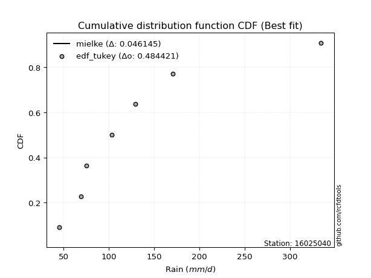</img></img>

</div>


### 8. Empirical - EDF Gringorten (1963)

Gringorten plotting position formula is essential for estimating the probability and return periods of extreme events like floods and heavy rainfall. The constant _a=0.44_.

<div align="center">


$P=(m-a)/(n+1-2a)$


</div>


**8.1. Empirical values**

<div align="center">

|                | 0                   | 1                   | 2                  | 3              | 4                  | 5                  | 6                  |
|:---------------|:--------------------|:--------------------|:-------------------|:---------------|:-------------------|:-------------------|:-------------------|
| date           | 2019                | 2025                | 2023               | 2022           | 2020               | 2021               | 2024               |
| x              | 45.5                | 69.2                | 75.1               | 103.5          | 129.1              | 170.9              | 334.2              |
| m              | 1                   | 2                   | 3                  | 4              | 5                  | 6                  | 7                  |
| empirical_dist | edf_gringorten      | edf_gringorten      | edf_gringorten     | edf_gringorten | edf_gringorten     | edf_gringorten     | edf_gringorten     |
| empirical      | 0.07865168539325844 | 0.21910112359550563 | 0.3595505617977528 | 0.5            | 0.6404494382022471 | 0.7808988764044943 | 0.9213483146067415 |
| empirical_tr   | 1.0853658536585364  | 1.2805755395683454  | 1.5614035087719298 | 2.0            | 2.781249999999999  | 4.564102564102562  | 12.714285714285701 |

</div>


**8.2. Kolmogorov-Smirnov fit test (sorted by Δ)**


<div align="center">

|                | 0                   | 1                   | 2                   | 3                   | 4                    | 5                    | 6                    | 7                   | 8                   | 9                   | 10                  | 11                   | 12                  | 13                   | 14                  | 15                  | 16                  | 17                  | 18                   | 19                   | 20                  | 21                   | 22                  | 23                  | 24                  | 25                  | 26                  | 27                  | 28                  | 29                  | 30                  | 31                  | 32                  | 33                  | 34                  | 35                  | 36                  | 37                  | 38                  | 39                  | 40                  | 41                  | 42                  | 43                  | 44                  | 45                  | 46                  | 47                  | 48                  | 49                  | 50                  | 51                  | 52                  | 53                  | 54                  | 55                  | 56                  | 57                  | 58                  | 59                  | 60                  | 61                  | 62                    | 63                  | 64                  | 65                  | 66                  | 67                  | 68                  | 69                  | 70                  | 71                  | 72                  | 73                  | 74                  | 75                  | 76                  | 77                  | 78                  | 79                  | 80                  | 81                  | 82                  | 83                  | 84                  | 85                  | 86                  | 87                  | 88                  | 89                  |
|:---------------|:--------------------|:--------------------|:--------------------|:--------------------|:---------------------|:---------------------|:---------------------|:--------------------|:--------------------|:--------------------|:--------------------|:---------------------|:--------------------|:---------------------|:--------------------|:--------------------|:--------------------|:--------------------|:---------------------|:---------------------|:--------------------|:---------------------|:--------------------|:--------------------|:--------------------|:--------------------|:--------------------|:--------------------|:--------------------|:--------------------|:--------------------|:--------------------|:--------------------|:--------------------|:--------------------|:--------------------|:--------------------|:--------------------|:--------------------|:--------------------|:--------------------|:--------------------|:--------------------|:--------------------|:--------------------|:--------------------|:--------------------|:--------------------|:--------------------|:--------------------|:--------------------|:--------------------|:--------------------|:--------------------|:--------------------|:--------------------|:--------------------|:--------------------|:--------------------|:--------------------|:--------------------|:--------------------|:----------------------|:--------------------|:--------------------|:--------------------|:--------------------|:--------------------|:--------------------|:--------------------|:--------------------|:--------------------|:--------------------|:--------------------|:--------------------|:--------------------|:--------------------|:--------------------|:--------------------|:--------------------|:--------------------|:--------------------|:--------------------|:--------------------|:--------------------|:--------------------|:--------------------|:--------------------|:--------------------|:--------------------|
| station        | 16025040            | 16025040            | 16025040            | 16025040            | 16025040             | 16025040             | 16025040             | 16025040            | 16025040            | 16025040            | 16025040            | 16025040             | 16025040            | 16025040             | 16025040            | 16025040            | 16025040            | 16025040            | 16025040             | 16025040             | 16025040            | 16025040             | 16025040            | 16025040            | 16025040            | 16025040            | 16025040            | 16025040            | 16025040            | 16025040            | 16025040            | 16025040            | 16025040            | 16025040            | 16025040            | 16025040            | 16025040            | 16025040            | 16025040            | 16025040            | 16025040            | 16025040            | 16025040            | 16025040            | 16025040            | 16025040            | 16025040            | 16025040            | 16025040            | 16025040            | 16025040            | 16025040            | 16025040            | 16025040            | 16025040            | 16025040            | 16025040            | 16025040            | 16025040            | 16025040            | 16025040            | 16025040            | 16025040              | 16025040            | 16025040            | 16025040            | 16025040            | 16025040            | 16025040            | 16025040            | 16025040            | 16025040            | 16025040            | 16025040            | 16025040            | 16025040            | 16025040            | 16025040            | 16025040            | 16025040            | 16025040            | 16025040            | 16025040            | 16025040            | 16025040            | 16025040            | 16025040            | 16025040            | 16025040            | 16025040            |
| empirical_dist | edf_gringorten      | edf_gringorten      | edf_gringorten      | edf_gringorten      | edf_gringorten       | edf_gringorten       | edf_gringorten       | edf_gringorten      | edf_gringorten      | edf_gringorten      | edf_gringorten      | edf_gringorten       | edf_gringorten      | edf_gringorten       | edf_gringorten      | edf_gringorten      | edf_gringorten      | edf_gringorten      | edf_gringorten       | edf_gringorten       | edf_gringorten      | edf_gringorten       | edf_gringorten      | edf_gringorten      | edf_gringorten      | edf_gringorten      | edf_gringorten      | edf_gringorten      | edf_gringorten      | edf_gringorten      | edf_gringorten      | edf_gringorten      | edf_gringorten      | edf_gringorten      | edf_gringorten      | edf_gringorten      | edf_gringorten      | edf_gringorten      | edf_gringorten      | edf_gringorten      | edf_gringorten      | edf_gringorten      | edf_gringorten      | edf_gringorten      | edf_gringorten      | edf_gringorten      | edf_gringorten      | edf_gringorten      | edf_gringorten      | edf_gringorten      | edf_gringorten      | edf_gringorten      | edf_gringorten      | edf_gringorten      | edf_gringorten      | edf_gringorten      | edf_gringorten      | edf_gringorten      | edf_gringorten      | edf_gringorten      | edf_gringorten      | edf_gringorten      | edf_gringorten        | edf_gringorten      | edf_gringorten      | edf_gringorten      | edf_gringorten      | edf_gringorten      | edf_gringorten      | edf_gringorten      | edf_gringorten      | edf_gringorten      | edf_gringorten      | edf_gringorten      | edf_gringorten      | edf_gringorten      | edf_gringorten      | edf_gringorten      | edf_gringorten      | edf_gringorten      | edf_gringorten      | edf_gringorten      | edf_gringorten      | edf_gringorten      | edf_gringorten      | edf_gringorten      | edf_gringorten      | edf_gringorten      | edf_gringorten      | edf_gringorten      |
| p_dist         | mielke              | logkstwobign        | logf                | logerlang           | loggamma             | loggamma             | nct                  | logmielke           | loginvweibull       | loggenlogistic      | invgamma            | f                    | logfatiguelife      | loginvgauss          | fisk                | lograyleigh         | invgauss            | logweibull_min      | logjohnsonsu         | johnsonsu            | halflogistic        | loginvgamma          | alpha               | logmaxwell          | pearson3            | logalpha            | loggumbel_r         | lognct              | logexponnorm        | logfisk             | logrice             | logmoyal            | logpearson3         | ncf                 | betaprime           | moyal               | exponnorm           | fatiguelife         | loggompertz         | genexpon            | loghalfnorm         | expon               | loghalflogistic     | logbetaprime        | logncf              | truncnorm           | gumbel_r            | logt                | logcrystalball      | lognorm             | lognorm             | logloggamma         | halfnorm            | loggenexpon         | t                   | rayleigh            | loglogistic         | nakagami            | genlogistic         | laplace_asymmetric  | wald                | maxwell             | loglaplace_asymmetric | loghypsecant        | gompertz            | kstwobign           | loggumbel_l         | logwald             | weibull_min         | loglaplace          | norm                | crystalball         | rice                | logistic            | hypsecant           | logexpon            | erlang              | laplace             | lognakagami         | loggibrat           | gumbel_l            | gibrat              | logchi2             | gamma               | pareto              | loglognorm          | logpareto           | invweibull          | chi2                | logtruncnorm        |
| delta          | 0.03388709468747338 | 0.0420721076741877  | 0.0480343520372801  | 0.04858545666013672 | 0.048586319398836925 | 0.048586319398836925 | 0.048975711149854995 | 0.04953115236893807 | 0.04956217762513765 | 0.04961651621099661 | 0.05063377250564033 | 0.051222725906148125 | 0.05189466740512638 | 0.053150679283607616 | 0.05334061465917759 | 0.05360699033621896 | 0.05439082697811479 | 0.05654412620808877 | 0.057121337304719244 | 0.057444042685915214 | 0.05938555286208133 | 0.061231104634859757 | 0.06316498240783958 | 0.06356571712365672 | 0.06484553015131889 | 0.06534377415922937 | 0.06591076996051459 | 0.06650625717864472 | 0.0671195262155686  | 0.06716587855187178 | 0.06824631609411047 | 0.0692565730275288  | 0.07292616336813978 | 0.07354276653935221 | 0.07368921787269034 | 0.07410792543073397 | 0.07765997987575261 | 0.07821476048120415 | 0.07865168339629607 | 0.07865168539274227 | 0.07865168539325844 | 0.07865168539325844 | 0.07865168539325844 | 0.0789573978094053  | 0.08051981576515738 | 0.0819145891791872  | 0.08558997005323032 | 0.08813573336253266 | 0.08813615040808276 | 0.08813620654693632 | 0.08813620654693632 | 0.08897462675266937 | 0.09636625984524504 | 0.10426948557000956 | 0.10716131876232145 | 0.11046138595970711 | 0.11051663016393307 | 0.11207868671637508 | 0.11315465455875426 | 0.11881088633073267 | 0.12087125314174782 | 0.1217796240190735  | 0.12208696254358037   | 0.12588202566443704 | 0.1301293594656509  | 0.13104446060818453 | 0.13272405320795413 | 0.1332871621800168  | 0.13348451275159912 | 0.14809790283976035 | 0.1553626120575417  | 0.15536261323502898 | 0.15586105743233486 | 0.1573976561667202  | 0.15913394596158814 | 0.16270411929751896 | 0.165743089626219   | 0.18151077603242927 | 0.22084384018894196 | 0.22349531692676405 | 0.22601917638744973 | 0.2551857948582263  | 0.25856091440927    | 0.30084492682205355 | 0.40688383430791053 | 0.41679517982272096 | 0.4280299551510959  | 0.45251143050412057 | 0.474684620882182   | 0.49999954227539867 |
| deltao         | 0.48442053926100004 | 0.48442053926100004 | 0.48442053926100004 | 0.48442053926100004 | 0.48442053926100004  | 0.48442053926100004  | 0.48442053926100004  | 0.48442053926100004 | 0.48442053926100004 | 0.48442053926100004 | 0.48442053926100004 | 0.48442053926100004  | 0.48442053926100004 | 0.48442053926100004  | 0.48442053926100004 | 0.48442053926100004 | 0.48442053926100004 | 0.48442053926100004 | 0.48442053926100004  | 0.48442053926100004  | 0.48442053926100004 | 0.48442053926100004  | 0.48442053926100004 | 0.48442053926100004 | 0.48442053926100004 | 0.48442053926100004 | 0.48442053926100004 | 0.48442053926100004 | 0.48442053926100004 | 0.48442053926100004 | 0.48442053926100004 | 0.48442053926100004 | 0.48442053926100004 | 0.48442053926100004 | 0.48442053926100004 | 0.48442053926100004 | 0.48442053926100004 | 0.48442053926100004 | 0.48442053926100004 | 0.48442053926100004 | 0.48442053926100004 | 0.48442053926100004 | 0.48442053926100004 | 0.48442053926100004 | 0.48442053926100004 | 0.48442053926100004 | 0.48442053926100004 | 0.48442053926100004 | 0.48442053926100004 | 0.48442053926100004 | 0.48442053926100004 | 0.48442053926100004 | 0.48442053926100004 | 0.48442053926100004 | 0.48442053926100004 | 0.48442053926100004 | 0.48442053926100004 | 0.48442053926100004 | 0.48442053926100004 | 0.48442053926100004 | 0.48442053926100004 | 0.48442053926100004 | 0.48442053926100004   | 0.48442053926100004 | 0.48442053926100004 | 0.48442053926100004 | 0.48442053926100004 | 0.48442053926100004 | 0.48442053926100004 | 0.48442053926100004 | 0.48442053926100004 | 0.48442053926100004 | 0.48442053926100004 | 0.48442053926100004 | 0.48442053926100004 | 0.48442053926100004 | 0.48442053926100004 | 0.48442053926100004 | 0.48442053926100004 | 0.48442053926100004 | 0.48442053926100004 | 0.48442053926100004 | 0.48442053926100004 | 0.48442053926100004 | 0.48442053926100004 | 0.48442053926100004 | 0.48442053926100004 | 0.48442053926100004 | 0.48442053926100004 | 0.48442053926100004 |
| eval           | Δo > Δ              | Δo > Δ              | Δo > Δ              | Δo > Δ              | Δo > Δ               | Δo > Δ               | Δo > Δ               | Δo > Δ              | Δo > Δ              | Δo > Δ              | Δo > Δ              | Δo > Δ               | Δo > Δ              | Δo > Δ               | Δo > Δ              | Δo > Δ              | Δo > Δ              | Δo > Δ              | Δo > Δ               | Δo > Δ               | Δo > Δ              | Δo > Δ               | Δo > Δ              | Δo > Δ              | Δo > Δ              | Δo > Δ              | Δo > Δ              | Δo > Δ              | Δo > Δ              | Δo > Δ              | Δo > Δ              | Δo > Δ              | Δo > Δ              | Δo > Δ              | Δo > Δ              | Δo > Δ              | Δo > Δ              | Δo > Δ              | Δo > Δ              | Δo > Δ              | Δo > Δ              | Δo > Δ              | Δo > Δ              | Δo > Δ              | Δo > Δ              | Δo > Δ              | Δo > Δ              | Δo > Δ              | Δo > Δ              | Δo > Δ              | Δo > Δ              | Δo > Δ              | Δo > Δ              | Δo > Δ              | Δo > Δ              | Δo > Δ              | Δo > Δ              | Δo > Δ              | Δo > Δ              | Δo > Δ              | Δo > Δ              | Δo > Δ              | Δo > Δ                | Δo > Δ              | Δo > Δ              | Δo > Δ              | Δo > Δ              | Δo > Δ              | Δo > Δ              | Δo > Δ              | Δo > Δ              | Δo > Δ              | Δo > Δ              | Δo > Δ              | Δo > Δ              | Δo > Δ              | Δo > Δ              | Δo > Δ              | Δo > Δ              | Δo > Δ              | Δo > Δ              | Δo > Δ              | Δo > Δ              | Δo > Δ              | Δo > Δ              | Δo > Δ              | Δo > Δ              | Δo > Δ              | Δo > Δ              | Δo <= Δ             |
| fit            | 1                   | 1                   | 1                   | 1                   | 1                    | 1                    | 1                    | 1                   | 1                   | 1                   | 1                   | 1                    | 1                   | 1                    | 1                   | 1                   | 1                   | 1                   | 1                    | 1                    | 1                   | 1                    | 1                   | 1                   | 1                   | 1                   | 1                   | 1                   | 1                   | 1                   | 1                   | 1                   | 1                   | 1                   | 1                   | 1                   | 1                   | 1                   | 1                   | 1                   | 1                   | 1                   | 1                   | 1                   | 1                   | 1                   | 1                   | 1                   | 1                   | 1                   | 1                   | 1                   | 1                   | 1                   | 1                   | 1                   | 1                   | 1                   | 1                   | 1                   | 1                   | 1                   | 1                     | 1                   | 1                   | 1                   | 1                   | 1                   | 1                   | 1                   | 1                   | 1                   | 1                   | 1                   | 1                   | 1                   | 1                   | 1                   | 1                   | 1                   | 1                   | 1                   | 1                   | 1                   | 1                   | 1                   | 1                   | 1                   | 1                   | 0                   |
| n              | 7                   | 7                   | 7                   | 7                   | 7                    | 7                    | 7                    | 7                   | 7                   | 7                   | 7                   | 7                    | 7                   | 7                    | 7                   | 7                   | 7                   | 7                   | 7                    | 7                    | 7                   | 7                    | 7                   | 7                   | 7                   | 7                   | 7                   | 7                   | 7                   | 7                   | 7                   | 7                   | 7                   | 7                   | 7                   | 7                   | 7                   | 7                   | 7                   | 7                   | 7                   | 7                   | 7                   | 7                   | 7                   | 7                   | 7                   | 7                   | 7                   | 7                   | 7                   | 7                   | 7                   | 7                   | 7                   | 7                   | 7                   | 7                   | 7                   | 7                   | 7                   | 7                   | 7                     | 7                   | 7                   | 7                   | 7                   | 7                   | 7                   | 7                   | 7                   | 7                   | 7                   | 7                   | 7                   | 7                   | 7                   | 7                   | 7                   | 7                   | 7                   | 7                   | 7                   | 7                   | 7                   | 7                   | 7                   | 7                   | 7                   | 7                   |
| best_fit       | 1                   | 0                   | 0                   | 0                   | 0                    | 0                    | 0                    | 0                   | 0                   | 0                   | 0                   | 0                    | 0                   | 0                    | 0                   | 0                   | 0                   | 0                   | 0                    | 0                    | 0                   | 0                    | 0                   | 0                   | 0                   | 0                   | 0                   | 0                   | 0                   | 0                   | 0                   | 0                   | 0                   | 0                   | 0                   | 0                   | 0                   | 0                   | 0                   | 0                   | 0                   | 0                   | 0                   | 0                   | 0                   | 0                   | 0                   | 0                   | 0                   | 0                   | 0                   | 0                   | 0                   | 0                   | 0                   | 0                   | 0                   | 0                   | 0                   | 0                   | 0                   | 0                   | 0                     | 0                   | 0                   | 0                   | 0                   | 0                   | 0                   | 0                   | 0                   | 0                   | 0                   | 0                   | 0                   | 0                   | 0                   | 0                   | 0                   | 0                   | 0                   | 0                   | 0                   | 0                   | 0                   | 0                   | 0                   | 0                   | 0                   | 0                   |
| best_fit_sort  | 1                   | 2                   | 3                   | 4                   | 5                    | 6                    | 7                    | 8                   | 9                   | 10                  | 11                  | 12                   | 13                  | 14                   | 15                  | 16                  | 17                  | 18                  | 19                   | 20                   | 21                  | 22                   | 23                  | 24                  | 25                  | 26                  | 27                  | 28                  | 29                  | 30                  | 31                  | 32                  | 33                  | 34                  | 35                  | 36                  | 37                  | 38                  | 39                  | 40                  | 41                  | 42                  | 43                  | 44                  | 45                  | 46                  | 47                  | 48                  | 49                  | 50                  | 51                  | 52                  | 53                  | 54                  | 55                  | 56                  | 57                  | 58                  | 59                  | 60                  | 61                  | 62                  | 63                    | 64                  | 65                  | 66                  | 67                  | 68                  | 69                  | 70                  | 71                  | 72                  | 73                  | 74                  | 75                  | 76                  | 77                  | 78                  | 79                  | 80                  | 81                  | 82                  | 83                  | 84                  | 85                  | 86                  | 87                  | 88                  | 89                  | 90                  |

</div>


<div align="center">

</img>

</div>


**8.3. Best fit**

<div align="center">

|   id |   station | empirical_dist   | p_dist   |     delta |   deltao | eval   |   fit |   n |   best_fit |   best_fit_sort |
|-----:|----------:|:-----------------|:---------|----------:|---------:|:-------|------:|----:|-----------:|----------------:|
|    0 |  16025040 | edf_gringorten   | mielke   | 0.0338871 | 0.484421 | Δo > Δ |     1 |   7 |          1 |               1 |

</div>


<div align="center">

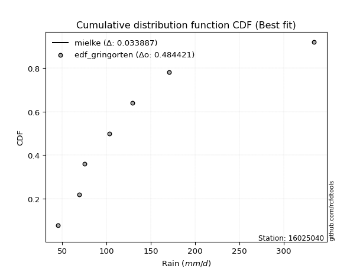</img>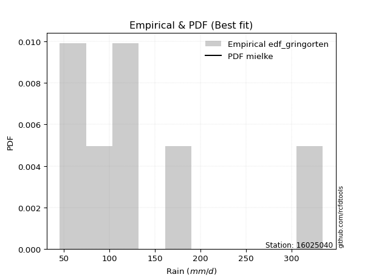</img>

</div>


### 9. Empirical - EDF Filliben (1975)

The specific values of the constants (0.3175) (often denoted as $alpha$) and (0.365) are derived from a method proposed by James J. Filliben in a 1975 paper. This particular formula is the mean value of the $i$-th order statistic of the normal distribution and is considered a robust and effective plotting position formula for the normal probability plot correlation coefficient test for normality.

<div align="center">


$P=(m-0.3175)/(n+0.365)$


</div>


**9.1. Empirical values**

<div align="center">

|                | 0                   | 1                   | 2                   | 3            | 4                  | 5                  | 6                  |
|:---------------|:--------------------|:--------------------|:--------------------|:-------------|:-------------------|:-------------------|:-------------------|
| date           | 2019                | 2025                | 2023                | 2022         | 2020               | 2021               | 2024               |
| x              | 45.5                | 69.2                | 75.1                | 103.5        | 129.1              | 170.9              | 334.2              |
| m              | 1                   | 2                   | 3                   | 4            | 5                  | 6                  | 7                  |
| empirical_dist | edf_filliben        | edf_filliben        | edf_filliben        | edf_filliben | edf_filliben       | edf_filliben       | edf_filliben       |
| empirical      | 0.09266802443991853 | 0.22844534962661237 | 0.36422267481330617 | 0.5          | 0.6357773251866938 | 0.7715546503733877 | 0.9073319755600815 |
| empirical_tr   | 1.1021324354657687  | 1.2960844698636163  | 1.5728777362520021  | 2.0          | 2.7455731593662627 | 4.377414561664191  | 10.791208791208794 |

</div>


**9.2. Kolmogorov-Smirnov fit test (sorted by Δ)**


<div align="center">

|                | 0                   | 1                   | 2                    | 3                    | 4                   | 5                   | 6                   | 7                   | 8                    | 9                    | 10                  | 11                  | 12                  | 13                   | 14                  | 15                  | 16                   | 17                  | 18                  | 19                   | 20                  | 21                  | 22                  | 23                  | 24                  | 25                  | 26                  | 27                  | 28                  | 29                  | 30                  | 31                  | 32                  | 33                  | 34                  | 35                  | 36                  | 37                  | 38                  | 39                  | 40                  | 41                  | 42                  | 43                  | 44                  | 45                  | 46                  | 47                  | 48                  | 49                  | 50                  | 51                  | 52                  | 53                  | 54                  | 55                  | 56                  | 57                  | 58                  | 59                  | 60                  | 61                  | 62                  | 63                    | 64                  | 65                  | 66                  | 67                  | 68                  | 69                  | 70                  | 71                  | 72                  | 73                  | 74                  | 75                  | 76                  | 77                  | 78                  | 79                  | 80                  | 81                  | 82                  | 83                  | 84                  | 85                  | 86                  | 87                  | 88                  | 89                  |
|:---------------|:--------------------|:--------------------|:---------------------|:---------------------|:--------------------|:--------------------|:--------------------|:--------------------|:---------------------|:---------------------|:--------------------|:--------------------|:--------------------|:---------------------|:--------------------|:--------------------|:---------------------|:--------------------|:--------------------|:---------------------|:--------------------|:--------------------|:--------------------|:--------------------|:--------------------|:--------------------|:--------------------|:--------------------|:--------------------|:--------------------|:--------------------|:--------------------|:--------------------|:--------------------|:--------------------|:--------------------|:--------------------|:--------------------|:--------------------|:--------------------|:--------------------|:--------------------|:--------------------|:--------------------|:--------------------|:--------------------|:--------------------|:--------------------|:--------------------|:--------------------|:--------------------|:--------------------|:--------------------|:--------------------|:--------------------|:--------------------|:--------------------|:--------------------|:--------------------|:--------------------|:--------------------|:--------------------|:--------------------|:----------------------|:--------------------|:--------------------|:--------------------|:--------------------|:--------------------|:--------------------|:--------------------|:--------------------|:--------------------|:--------------------|:--------------------|:--------------------|:--------------------|:--------------------|:--------------------|:--------------------|:--------------------|:--------------------|:--------------------|:--------------------|:--------------------|:--------------------|:--------------------|:--------------------|:--------------------|:--------------------|
| station        | 16025040            | 16025040            | 16025040             | 16025040             | 16025040            | 16025040            | 16025040            | 16025040            | 16025040             | 16025040             | 16025040            | 16025040            | 16025040            | 16025040             | 16025040            | 16025040            | 16025040             | 16025040            | 16025040            | 16025040             | 16025040            | 16025040            | 16025040            | 16025040            | 16025040            | 16025040            | 16025040            | 16025040            | 16025040            | 16025040            | 16025040            | 16025040            | 16025040            | 16025040            | 16025040            | 16025040            | 16025040            | 16025040            | 16025040            | 16025040            | 16025040            | 16025040            | 16025040            | 16025040            | 16025040            | 16025040            | 16025040            | 16025040            | 16025040            | 16025040            | 16025040            | 16025040            | 16025040            | 16025040            | 16025040            | 16025040            | 16025040            | 16025040            | 16025040            | 16025040            | 16025040            | 16025040            | 16025040            | 16025040              | 16025040            | 16025040            | 16025040            | 16025040            | 16025040            | 16025040            | 16025040            | 16025040            | 16025040            | 16025040            | 16025040            | 16025040            | 16025040            | 16025040            | 16025040            | 16025040            | 16025040            | 16025040            | 16025040            | 16025040            | 16025040            | 16025040            | 16025040            | 16025040            | 16025040            | 16025040            |
| empirical_dist | edf_filliben        | edf_filliben        | edf_filliben         | edf_filliben         | edf_filliben        | edf_filliben        | edf_filliben        | edf_filliben        | edf_filliben         | edf_filliben         | edf_filliben        | edf_filliben        | edf_filliben        | edf_filliben         | edf_filliben        | edf_filliben        | edf_filliben         | edf_filliben        | edf_filliben        | edf_filliben         | edf_filliben        | edf_filliben        | edf_filliben        | edf_filliben        | edf_filliben        | edf_filliben        | edf_filliben        | edf_filliben        | edf_filliben        | edf_filliben        | edf_filliben        | edf_filliben        | edf_filliben        | edf_filliben        | edf_filliben        | edf_filliben        | edf_filliben        | edf_filliben        | edf_filliben        | edf_filliben        | edf_filliben        | edf_filliben        | edf_filliben        | edf_filliben        | edf_filliben        | edf_filliben        | edf_filliben        | edf_filliben        | edf_filliben        | edf_filliben        | edf_filliben        | edf_filliben        | edf_filliben        | edf_filliben        | edf_filliben        | edf_filliben        | edf_filliben        | edf_filliben        | edf_filliben        | edf_filliben        | edf_filliben        | edf_filliben        | edf_filliben        | edf_filliben          | edf_filliben        | edf_filliben        | edf_filliben        | edf_filliben        | edf_filliben        | edf_filliben        | edf_filliben        | edf_filliben        | edf_filliben        | edf_filliben        | edf_filliben        | edf_filliben        | edf_filliben        | edf_filliben        | edf_filliben        | edf_filliben        | edf_filliben        | edf_filliben        | edf_filliben        | edf_filliben        | edf_filliben        | edf_filliben        | edf_filliben        | edf_filliben        | edf_filliben        | edf_filliben        |
| p_dist         | mielke              | logkstwobign        | nct                  | invgauss             | logmielke           | loginvweibull       | loggenlogistic      | invgamma            | f                    | halflogistic         | logerlang           | loggamma            | loggamma            | logf                 | logfatiguelife      | johnsonsu           | loginvgauss          | lograyleigh         | pearson3            | logjohnsonsu         | logweibull_min      | loginvgamma         | fisk                | alpha               | logmaxwell          | fatiguelife         | logalpha            | loggumbel_r         | lognct              | logexponnorm        | logfisk             | logrice             | logpearson3         | ncf                 | betaprime           | moyal               | gumbel_r            | halfnorm            | logmoyal            | logbetaprime        | logncf              | exponnorm           | loggompertz         | genexpon            | loghalfnorm         | loghalflogistic     | truncnorm           | expon               | logt                | logcrystalball      | lognorm             | lognorm             | logloggamma         | loggenexpon         | t                   | nakagami            | rayleigh            | loglogistic         | maxwell             | genlogistic         | laplace_asymmetric  | weibull_min         | wald                | loglaplace_asymmetric | loghypsecant        | logwald             | gompertz            | kstwobign           | loggumbel_l         | norm                | crystalball         | logistic            | loglaplace          | rice                | logexpon            | hypsecant           | erlang              | laplace             | lognakagami         | gumbel_l            | loggibrat           | logchi2             | gibrat              | gamma               | pareto              | loglognorm          | logpareto           | invweibull          | chi2                | logtruncnorm        |
| delta          | 0.04790343373413348 | 0.05102197896690388 | 0.053647824165408364 | 0.053763226491208016 | 0.05420326538449144 | 0.05423429064069102 | 0.05428862922654998 | 0.0553058855211937  | 0.055894838921701495 | 0.056007927546127156 | 0.05615025967673513 | 0.05615054903463751 | 0.05615054903463751 | 0.056214631361982986 | 0.05656678042067975 | 0.05734507559656993 | 0.057822792299160986 | 0.05827910335177233 | 0.06170635602345409 | 0.061793450320272614 | 0.0658438233529107  | 0.06590321765041313 | 0.06735695370583769 | 0.06783709542339295 | 0.06823783013921009 | 0.06887053445009741 | 0.07001588717478274 | 0.07058288297606796 | 0.07117837019419809 | 0.07179163923112197 | 0.07183799156742515 | 0.07291842910966384 | 0.07759827638369315 | 0.07821487955490558 | 0.07836133088824371 | 0.07878003844628734 | 0.08102202709048939 | 0.08234992079858494 | 0.0832729120741889  | 0.08362951082495867 | 0.08519192878071075 | 0.09167631892241271 | 0.09266802244295616 | 0.09266802443940236 | 0.09266802443991853 | 0.09266802443991853 | 0.09266802443991853 | 0.09266802443991853 | 0.09280784637808603 | 0.09280826342363613 | 0.0928083195624897  | 0.0928083195624897  | 0.09364673976822274 | 0.09492525953890282 | 0.0982759959783519  | 0.10273446068526834 | 0.10578927294415386 | 0.11518874317948644 | 0.11710751100352024 | 0.11782676757430763 | 0.12348299934628604 | 0.12414028672049249 | 0.1255433661573012  | 0.12675907555913374   | 0.1305541386799904  | 0.1332871621800168  | 0.13480147248120428 | 0.1357165736237379  | 0.1373961662235075  | 0.15069049904198845 | 0.15069050021947572 | 0.15272554315116693 | 0.15277001585531372 | 0.15301018521774812 | 0.15335989326641222 | 0.15446183294603488 | 0.15639886359511226 | 0.18151077603242927 | 0.21149961415783522 | 0.22134706337189647 | 0.22816742994231742 | 0.24921668837816327 | 0.25985790787377966 | 0.2915007007909468  | 0.3975396082768038  | 0.4074509537916142  | 0.41868572911998914 | 0.4384950914574606  | 0.46534039485107526 | 0.49999954227539867 |
| deltao         | 0.48442053926100004 | 0.48442053926100004 | 0.48442053926100004  | 0.48442053926100004  | 0.48442053926100004 | 0.48442053926100004 | 0.48442053926100004 | 0.48442053926100004 | 0.48442053926100004  | 0.48442053926100004  | 0.48442053926100004 | 0.48442053926100004 | 0.48442053926100004 | 0.48442053926100004  | 0.48442053926100004 | 0.48442053926100004 | 0.48442053926100004  | 0.48442053926100004 | 0.48442053926100004 | 0.48442053926100004  | 0.48442053926100004 | 0.48442053926100004 | 0.48442053926100004 | 0.48442053926100004 | 0.48442053926100004 | 0.48442053926100004 | 0.48442053926100004 | 0.48442053926100004 | 0.48442053926100004 | 0.48442053926100004 | 0.48442053926100004 | 0.48442053926100004 | 0.48442053926100004 | 0.48442053926100004 | 0.48442053926100004 | 0.48442053926100004 | 0.48442053926100004 | 0.48442053926100004 | 0.48442053926100004 | 0.48442053926100004 | 0.48442053926100004 | 0.48442053926100004 | 0.48442053926100004 | 0.48442053926100004 | 0.48442053926100004 | 0.48442053926100004 | 0.48442053926100004 | 0.48442053926100004 | 0.48442053926100004 | 0.48442053926100004 | 0.48442053926100004 | 0.48442053926100004 | 0.48442053926100004 | 0.48442053926100004 | 0.48442053926100004 | 0.48442053926100004 | 0.48442053926100004 | 0.48442053926100004 | 0.48442053926100004 | 0.48442053926100004 | 0.48442053926100004 | 0.48442053926100004 | 0.48442053926100004 | 0.48442053926100004   | 0.48442053926100004 | 0.48442053926100004 | 0.48442053926100004 | 0.48442053926100004 | 0.48442053926100004 | 0.48442053926100004 | 0.48442053926100004 | 0.48442053926100004 | 0.48442053926100004 | 0.48442053926100004 | 0.48442053926100004 | 0.48442053926100004 | 0.48442053926100004 | 0.48442053926100004 | 0.48442053926100004 | 0.48442053926100004 | 0.48442053926100004 | 0.48442053926100004 | 0.48442053926100004 | 0.48442053926100004 | 0.48442053926100004 | 0.48442053926100004 | 0.48442053926100004 | 0.48442053926100004 | 0.48442053926100004 | 0.48442053926100004 |
| eval           | Δo > Δ              | Δo > Δ              | Δo > Δ               | Δo > Δ               | Δo > Δ              | Δo > Δ              | Δo > Δ              | Δo > Δ              | Δo > Δ               | Δo > Δ               | Δo > Δ              | Δo > Δ              | Δo > Δ              | Δo > Δ               | Δo > Δ              | Δo > Δ              | Δo > Δ               | Δo > Δ              | Δo > Δ              | Δo > Δ               | Δo > Δ              | Δo > Δ              | Δo > Δ              | Δo > Δ              | Δo > Δ              | Δo > Δ              | Δo > Δ              | Δo > Δ              | Δo > Δ              | Δo > Δ              | Δo > Δ              | Δo > Δ              | Δo > Δ              | Δo > Δ              | Δo > Δ              | Δo > Δ              | Δo > Δ              | Δo > Δ              | Δo > Δ              | Δo > Δ              | Δo > Δ              | Δo > Δ              | Δo > Δ              | Δo > Δ              | Δo > Δ              | Δo > Δ              | Δo > Δ              | Δo > Δ              | Δo > Δ              | Δo > Δ              | Δo > Δ              | Δo > Δ              | Δo > Δ              | Δo > Δ              | Δo > Δ              | Δo > Δ              | Δo > Δ              | Δo > Δ              | Δo > Δ              | Δo > Δ              | Δo > Δ              | Δo > Δ              | Δo > Δ              | Δo > Δ                | Δo > Δ              | Δo > Δ              | Δo > Δ              | Δo > Δ              | Δo > Δ              | Δo > Δ              | Δo > Δ              | Δo > Δ              | Δo > Δ              | Δo > Δ              | Δo > Δ              | Δo > Δ              | Δo > Δ              | Δo > Δ              | Δo > Δ              | Δo > Δ              | Δo > Δ              | Δo > Δ              | Δo > Δ              | Δo > Δ              | Δo > Δ              | Δo > Δ              | Δo > Δ              | Δo > Δ              | Δo > Δ              | Δo <= Δ             |
| fit            | 1                   | 1                   | 1                    | 1                    | 1                   | 1                   | 1                   | 1                   | 1                    | 1                    | 1                   | 1                   | 1                   | 1                    | 1                   | 1                   | 1                    | 1                   | 1                   | 1                    | 1                   | 1                   | 1                   | 1                   | 1                   | 1                   | 1                   | 1                   | 1                   | 1                   | 1                   | 1                   | 1                   | 1                   | 1                   | 1                   | 1                   | 1                   | 1                   | 1                   | 1                   | 1                   | 1                   | 1                   | 1                   | 1                   | 1                   | 1                   | 1                   | 1                   | 1                   | 1                   | 1                   | 1                   | 1                   | 1                   | 1                   | 1                   | 1                   | 1                   | 1                   | 1                   | 1                   | 1                     | 1                   | 1                   | 1                   | 1                   | 1                   | 1                   | 1                   | 1                   | 1                   | 1                   | 1                   | 1                   | 1                   | 1                   | 1                   | 1                   | 1                   | 1                   | 1                   | 1                   | 1                   | 1                   | 1                   | 1                   | 1                   | 0                   |
| n              | 7                   | 7                   | 7                    | 7                    | 7                   | 7                   | 7                   | 7                   | 7                    | 7                    | 7                   | 7                   | 7                   | 7                    | 7                   | 7                   | 7                    | 7                   | 7                   | 7                    | 7                   | 7                   | 7                   | 7                   | 7                   | 7                   | 7                   | 7                   | 7                   | 7                   | 7                   | 7                   | 7                   | 7                   | 7                   | 7                   | 7                   | 7                   | 7                   | 7                   | 7                   | 7                   | 7                   | 7                   | 7                   | 7                   | 7                   | 7                   | 7                   | 7                   | 7                   | 7                   | 7                   | 7                   | 7                   | 7                   | 7                   | 7                   | 7                   | 7                   | 7                   | 7                   | 7                   | 7                     | 7                   | 7                   | 7                   | 7                   | 7                   | 7                   | 7                   | 7                   | 7                   | 7                   | 7                   | 7                   | 7                   | 7                   | 7                   | 7                   | 7                   | 7                   | 7                   | 7                   | 7                   | 7                   | 7                   | 7                   | 7                   | 7                   |
| best_fit       | 1                   | 0                   | 0                    | 0                    | 0                   | 0                   | 0                   | 0                   | 0                    | 0                    | 0                   | 0                   | 0                   | 0                    | 0                   | 0                   | 0                    | 0                   | 0                   | 0                    | 0                   | 0                   | 0                   | 0                   | 0                   | 0                   | 0                   | 0                   | 0                   | 0                   | 0                   | 0                   | 0                   | 0                   | 0                   | 0                   | 0                   | 0                   | 0                   | 0                   | 0                   | 0                   | 0                   | 0                   | 0                   | 0                   | 0                   | 0                   | 0                   | 0                   | 0                   | 0                   | 0                   | 0                   | 0                   | 0                   | 0                   | 0                   | 0                   | 0                   | 0                   | 0                   | 0                   | 0                     | 0                   | 0                   | 0                   | 0                   | 0                   | 0                   | 0                   | 0                   | 0                   | 0                   | 0                   | 0                   | 0                   | 0                   | 0                   | 0                   | 0                   | 0                   | 0                   | 0                   | 0                   | 0                   | 0                   | 0                   | 0                   | 0                   |
| best_fit_sort  | 1                   | 2                   | 3                    | 4                    | 5                   | 6                   | 7                   | 8                   | 9                    | 10                   | 11                  | 12                  | 13                  | 14                   | 15                  | 16                  | 17                   | 18                  | 19                  | 20                   | 21                  | 22                  | 23                  | 24                  | 25                  | 26                  | 27                  | 28                  | 29                  | 30                  | 31                  | 32                  | 33                  | 34                  | 35                  | 36                  | 37                  | 38                  | 39                  | 40                  | 41                  | 42                  | 43                  | 44                  | 45                  | 46                  | 47                  | 48                  | 49                  | 50                  | 51                  | 52                  | 53                  | 54                  | 55                  | 56                  | 57                  | 58                  | 59                  | 60                  | 61                  | 62                  | 63                  | 64                    | 65                  | 66                  | 67                  | 68                  | 69                  | 70                  | 71                  | 72                  | 73                  | 74                  | 75                  | 76                  | 77                  | 78                  | 79                  | 80                  | 81                  | 82                  | 83                  | 84                  | 85                  | 86                  | 87                  | 88                  | 89                  | 90                  |

</div>


<div align="center">

</img>

</div>


**9.3. Best fit**

<div align="center">

|   id |   station | empirical_dist   | p_dist   |     delta |   deltao | eval   |   fit |   n |   best_fit |   best_fit_sort |
|-----:|----------:|:-----------------|:---------|----------:|---------:|:-------|------:|----:|-----------:|----------------:|
|    0 |  16025040 | edf_filliben     | mielke   | 0.0479034 | 0.484421 | Δo > Δ |     1 |   7 |          1 |               1 |

</div>


<div align="center">

</img>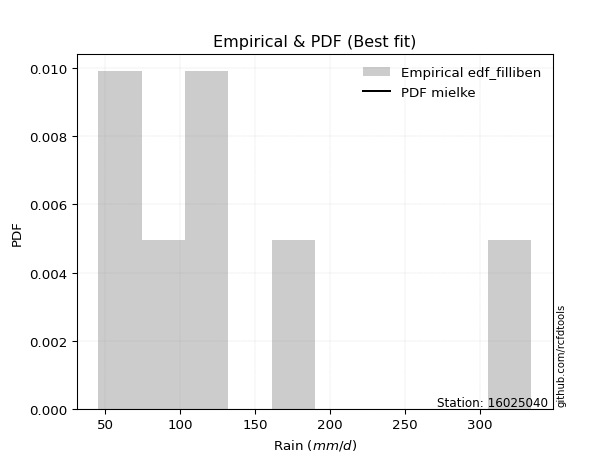</img>

</div>


### 10. Empirical - EDF Jenkinson (1977)

The Jenkinson formula in hydrology is an empirical plotting position formula used to estimate the non-exceedance probability _(P)_ or return period _(T)_ of a given ordered observation within a sample. It is a widely used method in the frequency analysis of extreme events such as floods and rainfall, as it provides a distribution-free way to plot data. _a≈0.31_ and _b≈0.38_ are constants derived to approximate the median of the probability distribution for the given rank.

<div align="center">


$P=(m-a)/(n+b)$


</div>


**10.1. Empirical values**

<div align="center">

|                | 0                   | 1                   | 2                   | 3             | 4                  | 5                  | 6                  |
|:---------------|:--------------------|:--------------------|:--------------------|:--------------|:-------------------|:-------------------|:-------------------|
| date           | 2019                | 2025                | 2023                | 2022          | 2020               | 2021               | 2024               |
| x              | 45.5                | 69.2                | 75.1                | 103.5         | 129.1              | 170.9              | 334.2              |
| m              | 1                   | 2                   | 3                   | 4             | 5                  | 6                  | 7                  |
| empirical_dist | edf_jenkinson       | edf_jenkinson       | edf_jenkinson       | edf_jenkinson | edf_jenkinson      | edf_jenkinson      | edf_jenkinson      |
| empirical      | 0.09349593495934959 | 0.22899728997289973 | 0.36449864498644985 | 0.5           | 0.6355013550135502 | 0.7710027100271003 | 0.9065040650406505 |
| empirical_tr   | 1.1031390134529149  | 1.29701230228471    | 1.5735607675906182  | 2.0           | 2.743494423791822  | 4.366863905325444  | 10.695652173913055 |

</div>


**10.2. Kolmogorov-Smirnov fit test (sorted by Δ)**


<div align="center">

|                | 0                   | 1                    | 2                    | 3                   | 4                   | 5                   | 6                   | 7                   | 8                    | 9                   | 10                  | 11                  | 12                   | 13                   | 14                  | 15                   | 16                  | 17                  | 18                  | 19                   | 20                  | 21                  | 22                  | 23                  | 24                  | 25                  | 26                  | 27                  | 28                  | 29                  | 30                  | 31                  | 32                  | 33                  | 34                  | 35                  | 36                  | 37                  | 38                  | 39                  | 40                  | 41                  | 42                  | 43                  | 44                  | 45                  | 46                  | 47                  | 48                  | 49                  | 50                  | 51                  | 52                  | 53                  | 54                  | 55                  | 56                  | 57                  | 58                  | 59                  | 60                  | 61                  | 62                  | 63                    | 64                  | 65                  | 66                  | 67                  | 68                  | 69                  | 70                  | 71                  | 72                  | 73                  | 74                  | 75                  | 76                  | 77                  | 78                  | 79                  | 80                  | 81                  | 82                  | 83                  | 84                  | 85                  | 86                  | 87                  | 88                  | 89                  |
|:---------------|:--------------------|:---------------------|:---------------------|:--------------------|:--------------------|:--------------------|:--------------------|:--------------------|:---------------------|:--------------------|:--------------------|:--------------------|:---------------------|:---------------------|:--------------------|:---------------------|:--------------------|:--------------------|:--------------------|:---------------------|:--------------------|:--------------------|:--------------------|:--------------------|:--------------------|:--------------------|:--------------------|:--------------------|:--------------------|:--------------------|:--------------------|:--------------------|:--------------------|:--------------------|:--------------------|:--------------------|:--------------------|:--------------------|:--------------------|:--------------------|:--------------------|:--------------------|:--------------------|:--------------------|:--------------------|:--------------------|:--------------------|:--------------------|:--------------------|:--------------------|:--------------------|:--------------------|:--------------------|:--------------------|:--------------------|:--------------------|:--------------------|:--------------------|:--------------------|:--------------------|:--------------------|:--------------------|:--------------------|:----------------------|:--------------------|:--------------------|:--------------------|:--------------------|:--------------------|:--------------------|:--------------------|:--------------------|:--------------------|:--------------------|:--------------------|:--------------------|:--------------------|:--------------------|:--------------------|:--------------------|:--------------------|:--------------------|:--------------------|:--------------------|:--------------------|:--------------------|:--------------------|:--------------------|:--------------------|:--------------------|
| station        | 16025040            | 16025040             | 16025040             | 16025040            | 16025040            | 16025040            | 16025040            | 16025040            | 16025040             | 16025040            | 16025040            | 16025040            | 16025040             | 16025040             | 16025040            | 16025040             | 16025040            | 16025040            | 16025040            | 16025040             | 16025040            | 16025040            | 16025040            | 16025040            | 16025040            | 16025040            | 16025040            | 16025040            | 16025040            | 16025040            | 16025040            | 16025040            | 16025040            | 16025040            | 16025040            | 16025040            | 16025040            | 16025040            | 16025040            | 16025040            | 16025040            | 16025040            | 16025040            | 16025040            | 16025040            | 16025040            | 16025040            | 16025040            | 16025040            | 16025040            | 16025040            | 16025040            | 16025040            | 16025040            | 16025040            | 16025040            | 16025040            | 16025040            | 16025040            | 16025040            | 16025040            | 16025040            | 16025040            | 16025040              | 16025040            | 16025040            | 16025040            | 16025040            | 16025040            | 16025040            | 16025040            | 16025040            | 16025040            | 16025040            | 16025040            | 16025040            | 16025040            | 16025040            | 16025040            | 16025040            | 16025040            | 16025040            | 16025040            | 16025040            | 16025040            | 16025040            | 16025040            | 16025040            | 16025040            | 16025040            |
| empirical_dist | edf_jenkinson       | edf_jenkinson        | edf_jenkinson        | edf_jenkinson       | edf_jenkinson       | edf_jenkinson       | edf_jenkinson       | edf_jenkinson       | edf_jenkinson        | edf_jenkinson       | edf_jenkinson       | edf_jenkinson       | edf_jenkinson        | edf_jenkinson        | edf_jenkinson       | edf_jenkinson        | edf_jenkinson       | edf_jenkinson       | edf_jenkinson       | edf_jenkinson        | edf_jenkinson       | edf_jenkinson       | edf_jenkinson       | edf_jenkinson       | edf_jenkinson       | edf_jenkinson       | edf_jenkinson       | edf_jenkinson       | edf_jenkinson       | edf_jenkinson       | edf_jenkinson       | edf_jenkinson       | edf_jenkinson       | edf_jenkinson       | edf_jenkinson       | edf_jenkinson       | edf_jenkinson       | edf_jenkinson       | edf_jenkinson       | edf_jenkinson       | edf_jenkinson       | edf_jenkinson       | edf_jenkinson       | edf_jenkinson       | edf_jenkinson       | edf_jenkinson       | edf_jenkinson       | edf_jenkinson       | edf_jenkinson       | edf_jenkinson       | edf_jenkinson       | edf_jenkinson       | edf_jenkinson       | edf_jenkinson       | edf_jenkinson       | edf_jenkinson       | edf_jenkinson       | edf_jenkinson       | edf_jenkinson       | edf_jenkinson       | edf_jenkinson       | edf_jenkinson       | edf_jenkinson       | edf_jenkinson         | edf_jenkinson       | edf_jenkinson       | edf_jenkinson       | edf_jenkinson       | edf_jenkinson       | edf_jenkinson       | edf_jenkinson       | edf_jenkinson       | edf_jenkinson       | edf_jenkinson       | edf_jenkinson       | edf_jenkinson       | edf_jenkinson       | edf_jenkinson       | edf_jenkinson       | edf_jenkinson       | edf_jenkinson       | edf_jenkinson       | edf_jenkinson       | edf_jenkinson       | edf_jenkinson       | edf_jenkinson       | edf_jenkinson       | edf_jenkinson       | edf_jenkinson       | edf_jenkinson       |
| p_dist         | mielke              | logkstwobign         | nct                  | logmielke           | loginvweibull       | loggenlogistic      | invgauss            | invgamma            | f                    | halflogistic        | logfatiguelife      | logerlang           | loggamma             | loggamma             | logf                | loginvgauss          | johnsonsu           | lograyleigh         | pearson3            | logjohnsonsu         | loginvgamma         | logweibull_min      | alpha               | fisk                | fatiguelife         | logmaxwell          | logalpha            | loggumbel_r         | lognct              | logexponnorm        | logfisk             | logrice             | logpearson3         | ncf                 | betaprime           | moyal               | gumbel_r            | halfnorm            | logbetaprime        | logmoyal            | logncf              | exponnorm           | logt                | logcrystalball      | lognorm             | lognorm             | loggompertz         | genexpon            | loghalfnorm         | truncnorm           | loghalflogistic     | expon               | logloggamma         | loggenexpon         | t                   | nakagami            | rayleigh            | loglogistic         | maxwell             | genlogistic         | weibull_min         | laplace_asymmetric  | wald                | loglaplace_asymmetric | loghypsecant        | logwald             | gompertz            | kstwobign           | loggumbel_l         | norm                | crystalball         | logistic            | logexpon            | loglaplace          | rice                | hypsecant           | erlang              | laplace             | lognakagami         | gumbel_l            | loggibrat           | logchi2             | gibrat              | gamma               | pareto              | loglognorm          | logpareto           | invweibull          | chi2                | logtruncnorm        |
| delta          | 0.04873134425356453 | 0.051849889486334934 | 0.053923794338552045 | 0.05447923555763512 | 0.0545102608138347  | 0.05456459939969366 | 0.05459113701063907 | 0.05558185569433738 | 0.056170809094845175 | 0.05683583806555814 | 0.05684275059382343 | 0.05697817019616618 | 0.056978459554068564 | 0.056978459554068564 | 0.05704254188141404 | 0.058098762472304666 | 0.05817298611600098 | 0.05855507352491601 | 0.06198232619659777 | 0.062069420493416294 | 0.0661791878235568  | 0.06667173387234175 | 0.06811306559653663 | 0.06818486422526873 | 0.06831859410381005 | 0.06851380031235377 | 0.07029185734792642 | 0.07085885314921164 | 0.07145434036734177 | 0.07206760940426565 | 0.07211396174056883 | 0.07319439928280752 | 0.07787424655683683 | 0.07849084972804926 | 0.07863730106138739 | 0.07905600861943102 | 0.08129799726363307 | 0.08152201027915389 | 0.08390548099810236 | 0.08410082259361995 | 0.08546789895385443 | 0.09250422944184376 | 0.09308381655122971 | 0.09308423359677981 | 0.09308428973563337 | 0.09308428973563337 | 0.09349593296238722 | 0.09349593495883342 | 0.09349593495934959 | 0.09349593495934959 | 0.09349593495934959 | 0.09349593495934959 | 0.09392270994136642 | 0.09437331919261546 | 0.09882793632463927 | 0.10218252033898098 | 0.10551330277101023 | 0.11546471335263012 | 0.11683154083037661 | 0.11810273774745131 | 0.12358834637420513 | 0.12375896951942972 | 0.12581933633044487 | 0.12703504573227742   | 0.1308301088531341  | 0.1332871621800168  | 0.13507744265434796 | 0.13599254379688158 | 0.13767213639665118 | 0.15041452886884482 | 0.1504145300463321  | 0.1524495729780233  | 0.15280795292012486 | 0.1530459860284574  | 0.1532861553908918  | 0.15418586277289126 | 0.1558469232488249  | 0.18151077603242927 | 0.21094767381154786 | 0.22107109319875284 | 0.2284434001154611  | 0.2486647480318759  | 0.26013387804692334 | 0.29094876044465945 | 0.39698766793051643 | 0.40689901344532686 | 0.4181337887737018  | 0.4376671809380296  | 0.4647884545047879  | 0.49999954227539867 |
| deltao         | 0.48442053926100004 | 0.48442053926100004  | 0.48442053926100004  | 0.48442053926100004 | 0.48442053926100004 | 0.48442053926100004 | 0.48442053926100004 | 0.48442053926100004 | 0.48442053926100004  | 0.48442053926100004 | 0.48442053926100004 | 0.48442053926100004 | 0.48442053926100004  | 0.48442053926100004  | 0.48442053926100004 | 0.48442053926100004  | 0.48442053926100004 | 0.48442053926100004 | 0.48442053926100004 | 0.48442053926100004  | 0.48442053926100004 | 0.48442053926100004 | 0.48442053926100004 | 0.48442053926100004 | 0.48442053926100004 | 0.48442053926100004 | 0.48442053926100004 | 0.48442053926100004 | 0.48442053926100004 | 0.48442053926100004 | 0.48442053926100004 | 0.48442053926100004 | 0.48442053926100004 | 0.48442053926100004 | 0.48442053926100004 | 0.48442053926100004 | 0.48442053926100004 | 0.48442053926100004 | 0.48442053926100004 | 0.48442053926100004 | 0.48442053926100004 | 0.48442053926100004 | 0.48442053926100004 | 0.48442053926100004 | 0.48442053926100004 | 0.48442053926100004 | 0.48442053926100004 | 0.48442053926100004 | 0.48442053926100004 | 0.48442053926100004 | 0.48442053926100004 | 0.48442053926100004 | 0.48442053926100004 | 0.48442053926100004 | 0.48442053926100004 | 0.48442053926100004 | 0.48442053926100004 | 0.48442053926100004 | 0.48442053926100004 | 0.48442053926100004 | 0.48442053926100004 | 0.48442053926100004 | 0.48442053926100004 | 0.48442053926100004   | 0.48442053926100004 | 0.48442053926100004 | 0.48442053926100004 | 0.48442053926100004 | 0.48442053926100004 | 0.48442053926100004 | 0.48442053926100004 | 0.48442053926100004 | 0.48442053926100004 | 0.48442053926100004 | 0.48442053926100004 | 0.48442053926100004 | 0.48442053926100004 | 0.48442053926100004 | 0.48442053926100004 | 0.48442053926100004 | 0.48442053926100004 | 0.48442053926100004 | 0.48442053926100004 | 0.48442053926100004 | 0.48442053926100004 | 0.48442053926100004 | 0.48442053926100004 | 0.48442053926100004 | 0.48442053926100004 | 0.48442053926100004 |
| eval           | Δo > Δ              | Δo > Δ               | Δo > Δ               | Δo > Δ              | Δo > Δ              | Δo > Δ              | Δo > Δ              | Δo > Δ              | Δo > Δ               | Δo > Δ              | Δo > Δ              | Δo > Δ              | Δo > Δ               | Δo > Δ               | Δo > Δ              | Δo > Δ               | Δo > Δ              | Δo > Δ              | Δo > Δ              | Δo > Δ               | Δo > Δ              | Δo > Δ              | Δo > Δ              | Δo > Δ              | Δo > Δ              | Δo > Δ              | Δo > Δ              | Δo > Δ              | Δo > Δ              | Δo > Δ              | Δo > Δ              | Δo > Δ              | Δo > Δ              | Δo > Δ              | Δo > Δ              | Δo > Δ              | Δo > Δ              | Δo > Δ              | Δo > Δ              | Δo > Δ              | Δo > Δ              | Δo > Δ              | Δo > Δ              | Δo > Δ              | Δo > Δ              | Δo > Δ              | Δo > Δ              | Δo > Δ              | Δo > Δ              | Δo > Δ              | Δo > Δ              | Δo > Δ              | Δo > Δ              | Δo > Δ              | Δo > Δ              | Δo > Δ              | Δo > Δ              | Δo > Δ              | Δo > Δ              | Δo > Δ              | Δo > Δ              | Δo > Δ              | Δo > Δ              | Δo > Δ                | Δo > Δ              | Δo > Δ              | Δo > Δ              | Δo > Δ              | Δo > Δ              | Δo > Δ              | Δo > Δ              | Δo > Δ              | Δo > Δ              | Δo > Δ              | Δo > Δ              | Δo > Δ              | Δo > Δ              | Δo > Δ              | Δo > Δ              | Δo > Δ              | Δo > Δ              | Δo > Δ              | Δo > Δ              | Δo > Δ              | Δo > Δ              | Δo > Δ              | Δo > Δ              | Δo > Δ              | Δo > Δ              | Δo <= Δ             |
| fit            | 1                   | 1                    | 1                    | 1                   | 1                   | 1                   | 1                   | 1                   | 1                    | 1                   | 1                   | 1                   | 1                    | 1                    | 1                   | 1                    | 1                   | 1                   | 1                   | 1                    | 1                   | 1                   | 1                   | 1                   | 1                   | 1                   | 1                   | 1                   | 1                   | 1                   | 1                   | 1                   | 1                   | 1                   | 1                   | 1                   | 1                   | 1                   | 1                   | 1                   | 1                   | 1                   | 1                   | 1                   | 1                   | 1                   | 1                   | 1                   | 1                   | 1                   | 1                   | 1                   | 1                   | 1                   | 1                   | 1                   | 1                   | 1                   | 1                   | 1                   | 1                   | 1                   | 1                   | 1                     | 1                   | 1                   | 1                   | 1                   | 1                   | 1                   | 1                   | 1                   | 1                   | 1                   | 1                   | 1                   | 1                   | 1                   | 1                   | 1                   | 1                   | 1                   | 1                   | 1                   | 1                   | 1                   | 1                   | 1                   | 1                   | 0                   |
| n              | 7                   | 7                    | 7                    | 7                   | 7                   | 7                   | 7                   | 7                   | 7                    | 7                   | 7                   | 7                   | 7                    | 7                    | 7                   | 7                    | 7                   | 7                   | 7                   | 7                    | 7                   | 7                   | 7                   | 7                   | 7                   | 7                   | 7                   | 7                   | 7                   | 7                   | 7                   | 7                   | 7                   | 7                   | 7                   | 7                   | 7                   | 7                   | 7                   | 7                   | 7                   | 7                   | 7                   | 7                   | 7                   | 7                   | 7                   | 7                   | 7                   | 7                   | 7                   | 7                   | 7                   | 7                   | 7                   | 7                   | 7                   | 7                   | 7                   | 7                   | 7                   | 7                   | 7                   | 7                     | 7                   | 7                   | 7                   | 7                   | 7                   | 7                   | 7                   | 7                   | 7                   | 7                   | 7                   | 7                   | 7                   | 7                   | 7                   | 7                   | 7                   | 7                   | 7                   | 7                   | 7                   | 7                   | 7                   | 7                   | 7                   | 7                   |
| best_fit       | 1                   | 0                    | 0                    | 0                   | 0                   | 0                   | 0                   | 0                   | 0                    | 0                   | 0                   | 0                   | 0                    | 0                    | 0                   | 0                    | 0                   | 0                   | 0                   | 0                    | 0                   | 0                   | 0                   | 0                   | 0                   | 0                   | 0                   | 0                   | 0                   | 0                   | 0                   | 0                   | 0                   | 0                   | 0                   | 0                   | 0                   | 0                   | 0                   | 0                   | 0                   | 0                   | 0                   | 0                   | 0                   | 0                   | 0                   | 0                   | 0                   | 0                   | 0                   | 0                   | 0                   | 0                   | 0                   | 0                   | 0                   | 0                   | 0                   | 0                   | 0                   | 0                   | 0                   | 0                     | 0                   | 0                   | 0                   | 0                   | 0                   | 0                   | 0                   | 0                   | 0                   | 0                   | 0                   | 0                   | 0                   | 0                   | 0                   | 0                   | 0                   | 0                   | 0                   | 0                   | 0                   | 0                   | 0                   | 0                   | 0                   | 0                   |
| best_fit_sort  | 1                   | 2                    | 3                    | 4                   | 5                   | 6                   | 7                   | 8                   | 9                    | 10                  | 11                  | 12                  | 13                   | 14                   | 15                  | 16                   | 17                  | 18                  | 19                  | 20                   | 21                  | 22                  | 23                  | 24                  | 25                  | 26                  | 27                  | 28                  | 29                  | 30                  | 31                  | 32                  | 33                  | 34                  | 35                  | 36                  | 37                  | 38                  | 39                  | 40                  | 41                  | 42                  | 43                  | 44                  | 45                  | 46                  | 47                  | 48                  | 49                  | 50                  | 51                  | 52                  | 53                  | 54                  | 55                  | 56                  | 57                  | 58                  | 59                  | 60                  | 61                  | 62                  | 63                  | 64                    | 65                  | 66                  | 67                  | 68                  | 69                  | 70                  | 71                  | 72                  | 73                  | 74                  | 75                  | 76                  | 77                  | 78                  | 79                  | 80                  | 81                  | 82                  | 83                  | 84                  | 85                  | 86                  | 87                  | 88                  | 89                  | 90                  |

</div>


<div align="center">

</img>

</div>


**10.3. Best fit**

<div align="center">

|   id |   station | empirical_dist   | p_dist   |     delta |   deltao | eval   |   fit |   n |   best_fit |   best_fit_sort |
|-----:|----------:|:-----------------|:---------|----------:|---------:|:-------|------:|----:|-----------:|----------------:|
|    0 |  16025040 | edf_jenkinson    | mielke   | 0.0487313 | 0.484421 | Δo > Δ |     1 |   7 |          1 |               1 |

</div>


<div align="center">

</img></img>

</div>


### 11. Empirical - EDF Cunnane (1978)

Cunnane´s work in statistical hydrology has focused on the performance and evaluation of different probability distributions (such as GEV, Gumbel, Lognormal) for flood frequency estimation. _b_ is a constant, typically set to 0.4.

<div align="center">


$P=(m-b)/(n+1-2b)$


</div>


**11.1. Empirical values**

<div align="center">

|                | 0                   | 1                   | 2                  | 3           | 4                  | 5                  | 6                  |
|:---------------|:--------------------|:--------------------|:-------------------|:------------|:-------------------|:-------------------|:-------------------|
| date           | 2019                | 2025                | 2023               | 2022        | 2020               | 2021               | 2024               |
| x              | 45.5                | 69.2                | 75.1               | 103.5       | 129.1              | 170.9              | 334.2              |
| m              | 1                   | 2                   | 3                  | 4           | 5                  | 6                  | 7                  |
| empirical_dist | edf_cunnane         | edf_cunnane         | edf_cunnane        | edf_cunnane | edf_cunnane        | edf_cunnane        | edf_cunnane        |
| empirical      | 0.08333333333333333 | 0.22222222222222224 | 0.3611111111111111 | 0.5         | 0.6388888888888888 | 0.7777777777777777 | 0.9166666666666666 |
| empirical_tr   | 1.090909090909091   | 1.2857142857142856  | 1.565217391304348  | 2.0         | 2.7692307692307687 | 4.499999999999998  | 11.999999999999995 |

</div>


**11.2. Kolmogorov-Smirnov fit test (sorted by Δ)**


<div align="center">

|                | 0                   | 1                    | 2                   | 3                    | 4                    | 5                   | 6                   | 7                    | 8                    | 9                    | 10                   | 11                   | 12                  | 13                  | 14                  | 15                  | 16                  | 17                  | 18                  | 19                  | 20                  | 21                  | 22                  | 23                  | 24                  | 25                  | 26                  | 27                  | 28                  | 29                  | 30                  | 31                  | 32                  | 33                  | 34                  | 35                  | 36                  | 37                  | 38                  | 39                  | 40                  | 41                  | 42                  | 43                  | 44                  | 45                  | 46                  | 47                  | 48                  | 49                  | 50                  | 51                  | 52                  | 53                  | 54                  | 55                  | 56                  | 57                  | 58                  | 59                  | 60                  | 61                  | 62                    | 63                  | 64                  | 65                  | 66                  | 67                  | 68                  | 69                  | 70                  | 71                  | 72                  | 73                  | 74                  | 75                  | 76                  | 77                  | 78                  | 79                  | 80                  | 81                  | 82                  | 83                  | 84                  | 85                  | 86                  | 87                  | 88                  | 89                  |
|:---------------|:--------------------|:---------------------|:--------------------|:---------------------|:---------------------|:--------------------|:--------------------|:---------------------|:---------------------|:---------------------|:---------------------|:---------------------|:--------------------|:--------------------|:--------------------|:--------------------|:--------------------|:--------------------|:--------------------|:--------------------|:--------------------|:--------------------|:--------------------|:--------------------|:--------------------|:--------------------|:--------------------|:--------------------|:--------------------|:--------------------|:--------------------|:--------------------|:--------------------|:--------------------|:--------------------|:--------------------|:--------------------|:--------------------|:--------------------|:--------------------|:--------------------|:--------------------|:--------------------|:--------------------|:--------------------|:--------------------|:--------------------|:--------------------|:--------------------|:--------------------|:--------------------|:--------------------|:--------------------|:--------------------|:--------------------|:--------------------|:--------------------|:--------------------|:--------------------|:--------------------|:--------------------|:--------------------|:----------------------|:--------------------|:--------------------|:--------------------|:--------------------|:--------------------|:--------------------|:--------------------|:--------------------|:--------------------|:--------------------|:--------------------|:--------------------|:--------------------|:--------------------|:--------------------|:--------------------|:--------------------|:--------------------|:--------------------|:--------------------|:--------------------|:--------------------|:--------------------|:--------------------|:--------------------|:--------------------|:--------------------|
| station        | 16025040            | 16025040             | 16025040            | 16025040             | 16025040             | 16025040            | 16025040            | 16025040             | 16025040             | 16025040             | 16025040             | 16025040             | 16025040            | 16025040            | 16025040            | 16025040            | 16025040            | 16025040            | 16025040            | 16025040            | 16025040            | 16025040            | 16025040            | 16025040            | 16025040            | 16025040            | 16025040            | 16025040            | 16025040            | 16025040            | 16025040            | 16025040            | 16025040            | 16025040            | 16025040            | 16025040            | 16025040            | 16025040            | 16025040            | 16025040            | 16025040            | 16025040            | 16025040            | 16025040            | 16025040            | 16025040            | 16025040            | 16025040            | 16025040            | 16025040            | 16025040            | 16025040            | 16025040            | 16025040            | 16025040            | 16025040            | 16025040            | 16025040            | 16025040            | 16025040            | 16025040            | 16025040            | 16025040              | 16025040            | 16025040            | 16025040            | 16025040            | 16025040            | 16025040            | 16025040            | 16025040            | 16025040            | 16025040            | 16025040            | 16025040            | 16025040            | 16025040            | 16025040            | 16025040            | 16025040            | 16025040            | 16025040            | 16025040            | 16025040            | 16025040            | 16025040            | 16025040            | 16025040            | 16025040            | 16025040            |
| empirical_dist | edf_cunnane         | edf_cunnane          | edf_cunnane         | edf_cunnane          | edf_cunnane          | edf_cunnane         | edf_cunnane         | edf_cunnane          | edf_cunnane          | edf_cunnane          | edf_cunnane          | edf_cunnane          | edf_cunnane         | edf_cunnane         | edf_cunnane         | edf_cunnane         | edf_cunnane         | edf_cunnane         | edf_cunnane         | edf_cunnane         | edf_cunnane         | edf_cunnane         | edf_cunnane         | edf_cunnane         | edf_cunnane         | edf_cunnane         | edf_cunnane         | edf_cunnane         | edf_cunnane         | edf_cunnane         | edf_cunnane         | edf_cunnane         | edf_cunnane         | edf_cunnane         | edf_cunnane         | edf_cunnane         | edf_cunnane         | edf_cunnane         | edf_cunnane         | edf_cunnane         | edf_cunnane         | edf_cunnane         | edf_cunnane         | edf_cunnane         | edf_cunnane         | edf_cunnane         | edf_cunnane         | edf_cunnane         | edf_cunnane         | edf_cunnane         | edf_cunnane         | edf_cunnane         | edf_cunnane         | edf_cunnane         | edf_cunnane         | edf_cunnane         | edf_cunnane         | edf_cunnane         | edf_cunnane         | edf_cunnane         | edf_cunnane         | edf_cunnane         | edf_cunnane           | edf_cunnane         | edf_cunnane         | edf_cunnane         | edf_cunnane         | edf_cunnane         | edf_cunnane         | edf_cunnane         | edf_cunnane         | edf_cunnane         | edf_cunnane         | edf_cunnane         | edf_cunnane         | edf_cunnane         | edf_cunnane         | edf_cunnane         | edf_cunnane         | edf_cunnane         | edf_cunnane         | edf_cunnane         | edf_cunnane         | edf_cunnane         | edf_cunnane         | edf_cunnane         | edf_cunnane         | edf_cunnane         | edf_cunnane         | edf_cunnane         |
| p_dist         | mielke              | logkstwobign         | logerlang           | loggamma             | loggamma             | logf                | nct                 | logmielke            | loginvweibull        | loggenlogistic       | invgauss             | invgamma             | f                   | logfatiguelife      | johnsonsu           | loginvgauss         | lograyleigh         | halflogistic        | logweibull_min      | fisk                | logjohnsonsu        | loginvgamma         | pearson3            | alpha               | logmaxwell          | logalpha            | loggumbel_r         | lognct              | logexponnorm        | logfisk             | logrice             | logmoyal            | logpearson3         | fatiguelife         | ncf                 | betaprime           | moyal               | logbetaprime        | logncf              | exponnorm           | loggompertz         | genexpon            | loghalflogistic     | expon               | loghalfnorm         | truncnorm           | gumbel_r            | logt                | logcrystalball      | lognorm             | lognorm             | logloggamma         | halfnorm            | loggenexpon         | t                   | rayleigh            | nakagami            | loglogistic         | genlogistic         | maxwell             | laplace_asymmetric  | wald                | loglaplace_asymmetric | loghypsecant        | weibull_min         | gompertz            | kstwobign           | logwald             | loggumbel_l         | loglaplace          | norm                | crystalball         | rice                | logistic            | hypsecant           | logexpon            | erlang              | laplace             | lognakagami         | gumbel_l            | loggibrat           | logchi2             | gibrat              | gamma               | pareto              | loglognorm          | logpareto           | invweibull          | chi2                | logtruncnorm        |
| delta          | 0.03856874262754827 | 0.043152372117534255 | 0.04681556857014992 | 0.046815857928052304 | 0.046815857928052304 | 0.04687994025539778 | 0.0505362604632133  | 0.051091701682296375 | 0.051122726938495955 | 0.051177065524354914 | 0.051269728351398175 | 0.052194321818998635 | 0.05278327521950643 | 0.05345521671848469 | 0.0543229440591986  | 0.05471122859696592 | 0.05516753964957727 | 0.05626445423536472 | 0.05650913224632549 | 0.05802226259925248 | 0.05868188661807755 | 0.06279165394821806 | 0.06328498083796064 | 0.06472553172119788 | 0.06512626643701502 | 0.06690432347258768 | 0.0674713192738729  | 0.06806680649200303 | 0.06868007552892691 | 0.06872642786523009 | 0.06980686540746878 | 0.07393822096760369 | 0.07448671268149809 | 0.07509366185448754 | 0.07510331585271052 | 0.07524976718604864 | 0.07566847474409227 | 0.08051794712276361 | 0.08208036507851568 | 0.0823416278158275  | 0.08333333133637096 | 0.08333333333281716 | 0.08333333333333333 | 0.08333333333333333 | 0.08333333333333333 | 0.08347513849254551 | 0.08402942073987207 | 0.08969628267589097 | 0.08969669972144106 | 0.08969675586029463 | 0.08969675586029463 | 0.09053517606602768 | 0.09168461190517015 | 0.10114838694329295 | 0.10247967082224656 | 0.10890083664634886 | 0.10895758808965847 | 0.11207717947729137 | 0.11471520387211256 | 0.12021907470571525 | 0.12037143564409097 | 0.12243180245510613 | 0.12364751185693867   | 0.12744257497779535 | 0.1303634141248825  | 0.1316899087790092  | 0.13260500992154284 | 0.1332871621800168  | 0.13428460252131244 | 0.14965845215311865 | 0.15380206274418345 | 0.15380206392167073 | 0.1543005081189766  | 0.15583710685336194 | 0.1575733966482299  | 0.15958302067080235 | 0.1626219909995024  | 0.18151077603242927 | 0.21772274156222535 | 0.22445862707409148 | 0.22505586624012236 | 0.25543981578255337 | 0.2567463441715846  | 0.29772382819533694 | 0.4037627356811939  | 0.41367408119600435 | 0.42490885652437926 | 0.4478297825640457  | 0.4715635222554654  | 0.49999954227539867 |
| deltao         | 0.48442053926100004 | 0.48442053926100004  | 0.48442053926100004 | 0.48442053926100004  | 0.48442053926100004  | 0.48442053926100004 | 0.48442053926100004 | 0.48442053926100004  | 0.48442053926100004  | 0.48442053926100004  | 0.48442053926100004  | 0.48442053926100004  | 0.48442053926100004 | 0.48442053926100004 | 0.48442053926100004 | 0.48442053926100004 | 0.48442053926100004 | 0.48442053926100004 | 0.48442053926100004 | 0.48442053926100004 | 0.48442053926100004 | 0.48442053926100004 | 0.48442053926100004 | 0.48442053926100004 | 0.48442053926100004 | 0.48442053926100004 | 0.48442053926100004 | 0.48442053926100004 | 0.48442053926100004 | 0.48442053926100004 | 0.48442053926100004 | 0.48442053926100004 | 0.48442053926100004 | 0.48442053926100004 | 0.48442053926100004 | 0.48442053926100004 | 0.48442053926100004 | 0.48442053926100004 | 0.48442053926100004 | 0.48442053926100004 | 0.48442053926100004 | 0.48442053926100004 | 0.48442053926100004 | 0.48442053926100004 | 0.48442053926100004 | 0.48442053926100004 | 0.48442053926100004 | 0.48442053926100004 | 0.48442053926100004 | 0.48442053926100004 | 0.48442053926100004 | 0.48442053926100004 | 0.48442053926100004 | 0.48442053926100004 | 0.48442053926100004 | 0.48442053926100004 | 0.48442053926100004 | 0.48442053926100004 | 0.48442053926100004 | 0.48442053926100004 | 0.48442053926100004 | 0.48442053926100004 | 0.48442053926100004   | 0.48442053926100004 | 0.48442053926100004 | 0.48442053926100004 | 0.48442053926100004 | 0.48442053926100004 | 0.48442053926100004 | 0.48442053926100004 | 0.48442053926100004 | 0.48442053926100004 | 0.48442053926100004 | 0.48442053926100004 | 0.48442053926100004 | 0.48442053926100004 | 0.48442053926100004 | 0.48442053926100004 | 0.48442053926100004 | 0.48442053926100004 | 0.48442053926100004 | 0.48442053926100004 | 0.48442053926100004 | 0.48442053926100004 | 0.48442053926100004 | 0.48442053926100004 | 0.48442053926100004 | 0.48442053926100004 | 0.48442053926100004 | 0.48442053926100004 |
| eval           | Δo > Δ              | Δo > Δ               | Δo > Δ              | Δo > Δ               | Δo > Δ               | Δo > Δ              | Δo > Δ              | Δo > Δ               | Δo > Δ               | Δo > Δ               | Δo > Δ               | Δo > Δ               | Δo > Δ              | Δo > Δ              | Δo > Δ              | Δo > Δ              | Δo > Δ              | Δo > Δ              | Δo > Δ              | Δo > Δ              | Δo > Δ              | Δo > Δ              | Δo > Δ              | Δo > Δ              | Δo > Δ              | Δo > Δ              | Δo > Δ              | Δo > Δ              | Δo > Δ              | Δo > Δ              | Δo > Δ              | Δo > Δ              | Δo > Δ              | Δo > Δ              | Δo > Δ              | Δo > Δ              | Δo > Δ              | Δo > Δ              | Δo > Δ              | Δo > Δ              | Δo > Δ              | Δo > Δ              | Δo > Δ              | Δo > Δ              | Δo > Δ              | Δo > Δ              | Δo > Δ              | Δo > Δ              | Δo > Δ              | Δo > Δ              | Δo > Δ              | Δo > Δ              | Δo > Δ              | Δo > Δ              | Δo > Δ              | Δo > Δ              | Δo > Δ              | Δo > Δ              | Δo > Δ              | Δo > Δ              | Δo > Δ              | Δo > Δ              | Δo > Δ                | Δo > Δ              | Δo > Δ              | Δo > Δ              | Δo > Δ              | Δo > Δ              | Δo > Δ              | Δo > Δ              | Δo > Δ              | Δo > Δ              | Δo > Δ              | Δo > Δ              | Δo > Δ              | Δo > Δ              | Δo > Δ              | Δo > Δ              | Δo > Δ              | Δo > Δ              | Δo > Δ              | Δo > Δ              | Δo > Δ              | Δo > Δ              | Δo > Δ              | Δo > Δ              | Δo > Δ              | Δo > Δ              | Δo > Δ              | Δo <= Δ             |
| fit            | 1                   | 1                    | 1                   | 1                    | 1                    | 1                   | 1                   | 1                    | 1                    | 1                    | 1                    | 1                    | 1                   | 1                   | 1                   | 1                   | 1                   | 1                   | 1                   | 1                   | 1                   | 1                   | 1                   | 1                   | 1                   | 1                   | 1                   | 1                   | 1                   | 1                   | 1                   | 1                   | 1                   | 1                   | 1                   | 1                   | 1                   | 1                   | 1                   | 1                   | 1                   | 1                   | 1                   | 1                   | 1                   | 1                   | 1                   | 1                   | 1                   | 1                   | 1                   | 1                   | 1                   | 1                   | 1                   | 1                   | 1                   | 1                   | 1                   | 1                   | 1                   | 1                   | 1                     | 1                   | 1                   | 1                   | 1                   | 1                   | 1                   | 1                   | 1                   | 1                   | 1                   | 1                   | 1                   | 1                   | 1                   | 1                   | 1                   | 1                   | 1                   | 1                   | 1                   | 1                   | 1                   | 1                   | 1                   | 1                   | 1                   | 0                   |
| n              | 7                   | 7                    | 7                   | 7                    | 7                    | 7                   | 7                   | 7                    | 7                    | 7                    | 7                    | 7                    | 7                   | 7                   | 7                   | 7                   | 7                   | 7                   | 7                   | 7                   | 7                   | 7                   | 7                   | 7                   | 7                   | 7                   | 7                   | 7                   | 7                   | 7                   | 7                   | 7                   | 7                   | 7                   | 7                   | 7                   | 7                   | 7                   | 7                   | 7                   | 7                   | 7                   | 7                   | 7                   | 7                   | 7                   | 7                   | 7                   | 7                   | 7                   | 7                   | 7                   | 7                   | 7                   | 7                   | 7                   | 7                   | 7                   | 7                   | 7                   | 7                   | 7                   | 7                     | 7                   | 7                   | 7                   | 7                   | 7                   | 7                   | 7                   | 7                   | 7                   | 7                   | 7                   | 7                   | 7                   | 7                   | 7                   | 7                   | 7                   | 7                   | 7                   | 7                   | 7                   | 7                   | 7                   | 7                   | 7                   | 7                   | 7                   |
| best_fit       | 1                   | 0                    | 0                   | 0                    | 0                    | 0                   | 0                   | 0                    | 0                    | 0                    | 0                    | 0                    | 0                   | 0                   | 0                   | 0                   | 0                   | 0                   | 0                   | 0                   | 0                   | 0                   | 0                   | 0                   | 0                   | 0                   | 0                   | 0                   | 0                   | 0                   | 0                   | 0                   | 0                   | 0                   | 0                   | 0                   | 0                   | 0                   | 0                   | 0                   | 0                   | 0                   | 0                   | 0                   | 0                   | 0                   | 0                   | 0                   | 0                   | 0                   | 0                   | 0                   | 0                   | 0                   | 0                   | 0                   | 0                   | 0                   | 0                   | 0                   | 0                   | 0                   | 0                     | 0                   | 0                   | 0                   | 0                   | 0                   | 0                   | 0                   | 0                   | 0                   | 0                   | 0                   | 0                   | 0                   | 0                   | 0                   | 0                   | 0                   | 0                   | 0                   | 0                   | 0                   | 0                   | 0                   | 0                   | 0                   | 0                   | 0                   |
| best_fit_sort  | 1                   | 2                    | 3                   | 4                    | 5                    | 6                   | 7                   | 8                    | 9                    | 10                   | 11                   | 12                   | 13                  | 14                  | 15                  | 16                  | 17                  | 18                  | 19                  | 20                  | 21                  | 22                  | 23                  | 24                  | 25                  | 26                  | 27                  | 28                  | 29                  | 30                  | 31                  | 32                  | 33                  | 34                  | 35                  | 36                  | 37                  | 38                  | 39                  | 40                  | 41                  | 42                  | 43                  | 44                  | 45                  | 46                  | 47                  | 48                  | 49                  | 50                  | 51                  | 52                  | 53                  | 54                  | 55                  | 56                  | 57                  | 58                  | 59                  | 60                  | 61                  | 62                  | 63                    | 64                  | 65                  | 66                  | 67                  | 68                  | 69                  | 70                  | 71                  | 72                  | 73                  | 74                  | 75                  | 76                  | 77                  | 78                  | 79                  | 80                  | 81                  | 82                  | 83                  | 84                  | 85                  | 86                  | 87                  | 88                  | 89                  | 90                  |

</div>


<div align="center">

</img>

</div>


**11.3. Best fit**

<div align="center">

|   id |   station | empirical_dist   | p_dist   |     delta |   deltao | eval   |   fit |   n |   best_fit |   best_fit_sort |
|-----:|----------:|:-----------------|:---------|----------:|---------:|:-------|------:|----:|-----------:|----------------:|
|    0 |  16025040 | edf_cunnane      | mielke   | 0.0385687 | 0.484421 | Δo > Δ |     1 |   7 |          1 |               1 |

</div>


<div align="center">

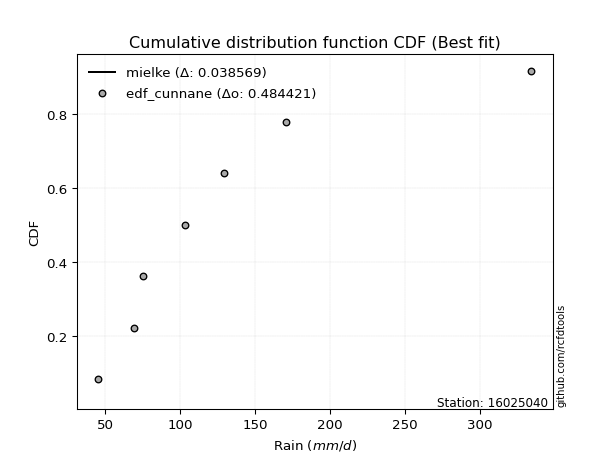</img>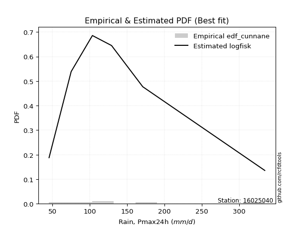</img>

</div>


### 12. Empirical - EDF Adamowski (1981)

The Adamowski formula in hydrology refers to a specific plotting position formula used for estimating the non-parametric empirical distribution of hydrological events (like flood peaks) to calculate their return periods. This formula provides an alternative to traditional parametric methods (like the Gumbel or Log Pearson Type III distributions). 

<div align="center">


$P=(m-0.25)/(n+0.5)$


</div>


**12.1. Empirical values**

<div align="center">

|                | 0                  | 1                   | 2                   | 3             | 4                  | 5                  | 6                  |
|:---------------|:-------------------|:--------------------|:--------------------|:--------------|:-------------------|:-------------------|:-------------------|
| date           | 2019               | 2025                | 2023                | 2022          | 2020               | 2021               | 2024               |
| x              | 45.5               | 69.2                | 75.1                | 103.5         | 129.1              | 170.9              | 334.2              |
| m              | 1                  | 2                   | 3                   | 4             | 5                  | 6                  | 7                  |
| empirical_dist | edf_adamowski      | edf_adamowski       | edf_adamowski       | edf_adamowski | edf_adamowski      | edf_adamowski      | edf_adamowski      |
| empirical      | 0.1                | 0.23333333333333334 | 0.36666666666666664 | 0.5           | 0.6333333333333333 | 0.7666666666666667 | 0.9                |
| empirical_tr   | 1.1111111111111112 | 1.3043478260869565  | 1.5789473684210527  | 2.0           | 2.727272727272727  | 4.2857142857142865 | 10.000000000000002 |

</div>


**12.2. Kolmogorov-Smirnov fit test (sorted by Δ)**


<div align="center">

|                | 0                   | 1                   | 2                   | 3                   | 4                   | 5                   | 6                   | 7                   | 8                    | 9                   | 10                   | 11                  | 12                  | 13                  | 14                  | 15                  | 16                  | 17                  | 18                  | 19                  | 20                  | 21                  | 22                  | 23                  | 24                  | 25                  | 26                  | 27                  | 28                  | 29                  | 30                  | 31                  | 32                  | 33                  | 34                  | 35                  | 36                  | 37                  | 38                  | 39                  | 40                  | 41                  | 42                  | 43                  | 44                  | 45                  | 46                  | 47                  | 48                  | 49                  | 50                  | 51                  | 52                  | 53                  | 54                  | 55                  | 56                  | 57                  | 58                  | 59                  | 60                  | 61                  | 62                  | 63                    | 64                  | 65                  | 66                  | 67                  | 68                  | 69                  | 70                  | 71                  | 72                  | 73                  | 74                  | 75                  | 76                  | 77                  | 78                  | 79                  | 80                  | 81                  | 82                  | 83                  | 84                  | 85                  | 86                  | 87                  | 88                  | 89                  |
|:---------------|:--------------------|:--------------------|:--------------------|:--------------------|:--------------------|:--------------------|:--------------------|:--------------------|:---------------------|:--------------------|:---------------------|:--------------------|:--------------------|:--------------------|:--------------------|:--------------------|:--------------------|:--------------------|:--------------------|:--------------------|:--------------------|:--------------------|:--------------------|:--------------------|:--------------------|:--------------------|:--------------------|:--------------------|:--------------------|:--------------------|:--------------------|:--------------------|:--------------------|:--------------------|:--------------------|:--------------------|:--------------------|:--------------------|:--------------------|:--------------------|:--------------------|:--------------------|:--------------------|:--------------------|:--------------------|:--------------------|:--------------------|:--------------------|:--------------------|:--------------------|:--------------------|:--------------------|:--------------------|:--------------------|:--------------------|:--------------------|:--------------------|:--------------------|:--------------------|:--------------------|:--------------------|:--------------------|:--------------------|:----------------------|:--------------------|:--------------------|:--------------------|:--------------------|:--------------------|:--------------------|:--------------------|:--------------------|:--------------------|:--------------------|:--------------------|:--------------------|:--------------------|:--------------------|:--------------------|:--------------------|:--------------------|:--------------------|:--------------------|:--------------------|:--------------------|:--------------------|:--------------------|:--------------------|:--------------------|:--------------------|
| station        | 16025040            | 16025040            | 16025040            | 16025040            | 16025040            | 16025040            | 16025040            | 16025040            | 16025040             | 16025040            | 16025040             | 16025040            | 16025040            | 16025040            | 16025040            | 16025040            | 16025040            | 16025040            | 16025040            | 16025040            | 16025040            | 16025040            | 16025040            | 16025040            | 16025040            | 16025040            | 16025040            | 16025040            | 16025040            | 16025040            | 16025040            | 16025040            | 16025040            | 16025040            | 16025040            | 16025040            | 16025040            | 16025040            | 16025040            | 16025040            | 16025040            | 16025040            | 16025040            | 16025040            | 16025040            | 16025040            | 16025040            | 16025040            | 16025040            | 16025040            | 16025040            | 16025040            | 16025040            | 16025040            | 16025040            | 16025040            | 16025040            | 16025040            | 16025040            | 16025040            | 16025040            | 16025040            | 16025040            | 16025040              | 16025040            | 16025040            | 16025040            | 16025040            | 16025040            | 16025040            | 16025040            | 16025040            | 16025040            | 16025040            | 16025040            | 16025040            | 16025040            | 16025040            | 16025040            | 16025040            | 16025040            | 16025040            | 16025040            | 16025040            | 16025040            | 16025040            | 16025040            | 16025040            | 16025040            | 16025040            |
| empirical_dist | edf_adamowski       | edf_adamowski       | edf_adamowski       | edf_adamowski       | edf_adamowski       | edf_adamowski       | edf_adamowski       | edf_adamowski       | edf_adamowski        | edf_adamowski       | edf_adamowski        | edf_adamowski       | edf_adamowski       | edf_adamowski       | edf_adamowski       | edf_adamowski       | edf_adamowski       | edf_adamowski       | edf_adamowski       | edf_adamowski       | edf_adamowski       | edf_adamowski       | edf_adamowski       | edf_adamowski       | edf_adamowski       | edf_adamowski       | edf_adamowski       | edf_adamowski       | edf_adamowski       | edf_adamowski       | edf_adamowski       | edf_adamowski       | edf_adamowski       | edf_adamowski       | edf_adamowski       | edf_adamowski       | edf_adamowski       | edf_adamowski       | edf_adamowski       | edf_adamowski       | edf_adamowski       | edf_adamowski       | edf_adamowski       | edf_adamowski       | edf_adamowski       | edf_adamowski       | edf_adamowski       | edf_adamowski       | edf_adamowski       | edf_adamowski       | edf_adamowski       | edf_adamowski       | edf_adamowski       | edf_adamowski       | edf_adamowski       | edf_adamowski       | edf_adamowski       | edf_adamowski       | edf_adamowski       | edf_adamowski       | edf_adamowski       | edf_adamowski       | edf_adamowski       | edf_adamowski         | edf_adamowski       | edf_adamowski       | edf_adamowski       | edf_adamowski       | edf_adamowski       | edf_adamowski       | edf_adamowski       | edf_adamowski       | edf_adamowski       | edf_adamowski       | edf_adamowski       | edf_adamowski       | edf_adamowski       | edf_adamowski       | edf_adamowski       | edf_adamowski       | edf_adamowski       | edf_adamowski       | edf_adamowski       | edf_adamowski       | edf_adamowski       | edf_adamowski       | edf_adamowski       | edf_adamowski       | edf_adamowski       | edf_adamowski       |
| p_dist         | mielke              | loginvweibull       | loggenlogistic      | nct                 | logmielke           | invgamma            | f                   | logkstwobign        | logfatiguelife       | loginvgauss         | lograyleigh          | invgauss            | halflogistic        | logerlang           | loggamma            | loggamma            | logf                | fatiguelife         | logjohnsonsu        | pearson3            | johnsonsu           | loginvgamma         | alpha               | logmaxwell          | logalpha            | loggumbel_r         | logweibull_min      | lognct              | logexponnorm        | logfisk             | fisk                | halfnorm            | logrice             | logpearson3         | ncf                 | betaprime           | moyal               | gumbel_r            | logbetaprime        | logncf              | logmoyal            | logt                | logcrystalball      | lognorm             | lognorm             | logloggamma         | exponnorm           | loggompertz         | loggenexpon         | nakagami            | genexpon            | truncnorm           | loghalflogistic     | expon               | loghalfnorm         | t                   | rayleigh            | maxwell             | loglogistic         | weibull_min         | genlogistic         | laplace_asymmetric  | wald                | loglaplace_asymmetric | loghypsecant        | logwald             | gompertz            | kstwobign           | loggumbel_l         | norm                | crystalball         | logexpon            | logistic            | erlang              | hypsecant           | loglaplace          | rice                | laplace             | lognakagami         | gumbel_l            | loggibrat           | logchi2             | gibrat              | gamma               | pareto              | loglognorm          | logpareto           | invweibull          | chi2                | logtruncnorm        |
| delta          | 0.05523540929421495 | 0.05667828249405149 | 0.05673262107991045 | 0.05695019406437715 | 0.05726639468865642 | 0.05774987737455417 | 0.05833883077506197 | 0.05835395452698535 | 0.059010772274040224 | 0.06026678415252146 | 0.060723095205132804 | 0.06109520205128949 | 0.06333990310620863 | 0.06348223523681659 | 0.06348252459471898 | 0.06348252459471898 | 0.06354660692206446 | 0.06398255074337644 | 0.06423744217363309 | 0.06448936750074141 | 0.0646770511566514  | 0.0683472095037736  | 0.07028108727675342 | 0.07068182199257056 | 0.07245987902814321 | 0.07302687482942843 | 0.07317579891299217 | 0.07362236204755856 | 0.07423563108448245 | 0.07428198342078562 | 0.07468892926591916 | 0.07501794523850347 | 0.07536242096302431 | 0.08004226823705363 | 0.08065887140826605 | 0.08080532274160418 | 0.08122403029964781 | 0.08346601894384986 | 0.08607350267831915 | 0.08763592063407122 | 0.09060488763427037 | 0.0952518382314465  | 0.0952522552769966  | 0.09525231141585017 | 0.09525231141585017 | 0.09609073162158321 | 0.09900829448249418 | 0.09999999800303763 | 0.09999999958577405 | 0.09999999986924316 | 0.09999999999948384 | 0.1                 | 0.1                 | 0.1                 | 0.1                 | 0.10316397968507285 | 0.10334528109079333 | 0.11466351915015971 | 0.11763273503284691 | 0.11925230301377154 | 0.1202707594276681  | 0.1259269911996465  | 0.12798735801066166 | 0.1292030674124942    | 0.13299813053335088 | 0.1332871621800168  | 0.13724546433456475 | 0.13816056547709837 | 0.13984015807686798 | 0.14824650718862792 | 0.1482465083661152  | 0.14847190955969125 | 0.1502815512978064  | 0.1515108798883913  | 0.15318003690899873 | 0.1552140077086742  | 0.1554541770711086  | 0.18151077603242927 | 0.20661163045111425 | 0.21890307151853594 | 0.2324973979061469  | 0.2443287046714423  | 0.26230189972714013 | 0.2866127170842258  | 0.3926516245700828  | 0.4025629700848932  | 0.41379774541326814 | 0.4311631158973791  | 0.46045241114435426 | 0.49999954227539867 |
| deltao         | 0.48442053926100004 | 0.48442053926100004 | 0.48442053926100004 | 0.48442053926100004 | 0.48442053926100004 | 0.48442053926100004 | 0.48442053926100004 | 0.48442053926100004 | 0.48442053926100004  | 0.48442053926100004 | 0.48442053926100004  | 0.48442053926100004 | 0.48442053926100004 | 0.48442053926100004 | 0.48442053926100004 | 0.48442053926100004 | 0.48442053926100004 | 0.48442053926100004 | 0.48442053926100004 | 0.48442053926100004 | 0.48442053926100004 | 0.48442053926100004 | 0.48442053926100004 | 0.48442053926100004 | 0.48442053926100004 | 0.48442053926100004 | 0.48442053926100004 | 0.48442053926100004 | 0.48442053926100004 | 0.48442053926100004 | 0.48442053926100004 | 0.48442053926100004 | 0.48442053926100004 | 0.48442053926100004 | 0.48442053926100004 | 0.48442053926100004 | 0.48442053926100004 | 0.48442053926100004 | 0.48442053926100004 | 0.48442053926100004 | 0.48442053926100004 | 0.48442053926100004 | 0.48442053926100004 | 0.48442053926100004 | 0.48442053926100004 | 0.48442053926100004 | 0.48442053926100004 | 0.48442053926100004 | 0.48442053926100004 | 0.48442053926100004 | 0.48442053926100004 | 0.48442053926100004 | 0.48442053926100004 | 0.48442053926100004 | 0.48442053926100004 | 0.48442053926100004 | 0.48442053926100004 | 0.48442053926100004 | 0.48442053926100004 | 0.48442053926100004 | 0.48442053926100004 | 0.48442053926100004 | 0.48442053926100004 | 0.48442053926100004   | 0.48442053926100004 | 0.48442053926100004 | 0.48442053926100004 | 0.48442053926100004 | 0.48442053926100004 | 0.48442053926100004 | 0.48442053926100004 | 0.48442053926100004 | 0.48442053926100004 | 0.48442053926100004 | 0.48442053926100004 | 0.48442053926100004 | 0.48442053926100004 | 0.48442053926100004 | 0.48442053926100004 | 0.48442053926100004 | 0.48442053926100004 | 0.48442053926100004 | 0.48442053926100004 | 0.48442053926100004 | 0.48442053926100004 | 0.48442053926100004 | 0.48442053926100004 | 0.48442053926100004 | 0.48442053926100004 | 0.48442053926100004 |
| eval           | Δo > Δ              | Δo > Δ              | Δo > Δ              | Δo > Δ              | Δo > Δ              | Δo > Δ              | Δo > Δ              | Δo > Δ              | Δo > Δ               | Δo > Δ              | Δo > Δ               | Δo > Δ              | Δo > Δ              | Δo > Δ              | Δo > Δ              | Δo > Δ              | Δo > Δ              | Δo > Δ              | Δo > Δ              | Δo > Δ              | Δo > Δ              | Δo > Δ              | Δo > Δ              | Δo > Δ              | Δo > Δ              | Δo > Δ              | Δo > Δ              | Δo > Δ              | Δo > Δ              | Δo > Δ              | Δo > Δ              | Δo > Δ              | Δo > Δ              | Δo > Δ              | Δo > Δ              | Δo > Δ              | Δo > Δ              | Δo > Δ              | Δo > Δ              | Δo > Δ              | Δo > Δ              | Δo > Δ              | Δo > Δ              | Δo > Δ              | Δo > Δ              | Δo > Δ              | Δo > Δ              | Δo > Δ              | Δo > Δ              | Δo > Δ              | Δo > Δ              | Δo > Δ              | Δo > Δ              | Δo > Δ              | Δo > Δ              | Δo > Δ              | Δo > Δ              | Δo > Δ              | Δo > Δ              | Δo > Δ              | Δo > Δ              | Δo > Δ              | Δo > Δ              | Δo > Δ                | Δo > Δ              | Δo > Δ              | Δo > Δ              | Δo > Δ              | Δo > Δ              | Δo > Δ              | Δo > Δ              | Δo > Δ              | Δo > Δ              | Δo > Δ              | Δo > Δ              | Δo > Δ              | Δo > Δ              | Δo > Δ              | Δo > Δ              | Δo > Δ              | Δo > Δ              | Δo > Δ              | Δo > Δ              | Δo > Δ              | Δo > Δ              | Δo > Δ              | Δo > Δ              | Δo > Δ              | Δo > Δ              | Δo <= Δ             |
| fit            | 1                   | 1                   | 1                   | 1                   | 1                   | 1                   | 1                   | 1                   | 1                    | 1                   | 1                    | 1                   | 1                   | 1                   | 1                   | 1                   | 1                   | 1                   | 1                   | 1                   | 1                   | 1                   | 1                   | 1                   | 1                   | 1                   | 1                   | 1                   | 1                   | 1                   | 1                   | 1                   | 1                   | 1                   | 1                   | 1                   | 1                   | 1                   | 1                   | 1                   | 1                   | 1                   | 1                   | 1                   | 1                   | 1                   | 1                   | 1                   | 1                   | 1                   | 1                   | 1                   | 1                   | 1                   | 1                   | 1                   | 1                   | 1                   | 1                   | 1                   | 1                   | 1                   | 1                   | 1                     | 1                   | 1                   | 1                   | 1                   | 1                   | 1                   | 1                   | 1                   | 1                   | 1                   | 1                   | 1                   | 1                   | 1                   | 1                   | 1                   | 1                   | 1                   | 1                   | 1                   | 1                   | 1                   | 1                   | 1                   | 1                   | 0                   |
| n              | 7                   | 7                   | 7                   | 7                   | 7                   | 7                   | 7                   | 7                   | 7                    | 7                   | 7                    | 7                   | 7                   | 7                   | 7                   | 7                   | 7                   | 7                   | 7                   | 7                   | 7                   | 7                   | 7                   | 7                   | 7                   | 7                   | 7                   | 7                   | 7                   | 7                   | 7                   | 7                   | 7                   | 7                   | 7                   | 7                   | 7                   | 7                   | 7                   | 7                   | 7                   | 7                   | 7                   | 7                   | 7                   | 7                   | 7                   | 7                   | 7                   | 7                   | 7                   | 7                   | 7                   | 7                   | 7                   | 7                   | 7                   | 7                   | 7                   | 7                   | 7                   | 7                   | 7                   | 7                     | 7                   | 7                   | 7                   | 7                   | 7                   | 7                   | 7                   | 7                   | 7                   | 7                   | 7                   | 7                   | 7                   | 7                   | 7                   | 7                   | 7                   | 7                   | 7                   | 7                   | 7                   | 7                   | 7                   | 7                   | 7                   | 7                   |
| best_fit       | 1                   | 0                   | 0                   | 0                   | 0                   | 0                   | 0                   | 0                   | 0                    | 0                   | 0                    | 0                   | 0                   | 0                   | 0                   | 0                   | 0                   | 0                   | 0                   | 0                   | 0                   | 0                   | 0                   | 0                   | 0                   | 0                   | 0                   | 0                   | 0                   | 0                   | 0                   | 0                   | 0                   | 0                   | 0                   | 0                   | 0                   | 0                   | 0                   | 0                   | 0                   | 0                   | 0                   | 0                   | 0                   | 0                   | 0                   | 0                   | 0                   | 0                   | 0                   | 0                   | 0                   | 0                   | 0                   | 0                   | 0                   | 0                   | 0                   | 0                   | 0                   | 0                   | 0                   | 0                     | 0                   | 0                   | 0                   | 0                   | 0                   | 0                   | 0                   | 0                   | 0                   | 0                   | 0                   | 0                   | 0                   | 0                   | 0                   | 0                   | 0                   | 0                   | 0                   | 0                   | 0                   | 0                   | 0                   | 0                   | 0                   | 0                   |
| best_fit_sort  | 1                   | 2                   | 3                   | 4                   | 5                   | 6                   | 7                   | 8                   | 9                    | 10                  | 11                   | 12                  | 13                  | 14                  | 15                  | 16                  | 17                  | 18                  | 19                  | 20                  | 21                  | 22                  | 23                  | 24                  | 25                  | 26                  | 27                  | 28                  | 29                  | 30                  | 31                  | 32                  | 33                  | 34                  | 35                  | 36                  | 37                  | 38                  | 39                  | 40                  | 41                  | 42                  | 43                  | 44                  | 45                  | 46                  | 47                  | 48                  | 49                  | 50                  | 51                  | 52                  | 53                  | 54                  | 55                  | 56                  | 57                  | 58                  | 59                  | 60                  | 61                  | 62                  | 63                  | 64                    | 65                  | 66                  | 67                  | 68                  | 69                  | 70                  | 71                  | 72                  | 73                  | 74                  | 75                  | 76                  | 77                  | 78                  | 79                  | 80                  | 81                  | 82                  | 83                  | 84                  | 85                  | 86                  | 87                  | 88                  | 89                  | 90                  |

</div>


<div align="center">

</img>

</div>


**12.3. Best fit**

<div align="center">

|   id |   station | empirical_dist   | p_dist   |     delta |   deltao | eval   |   fit |   n |   best_fit |   best_fit_sort |
|-----:|----------:|:-----------------|:---------|----------:|---------:|:-------|------:|----:|-----------:|----------------:|
|    0 |  16025040 | edf_adamowski    | mielke   | 0.0552354 | 0.484421 | Δo > Δ |     1 |   7 |          1 |               1 |

</div>


<div align="center">

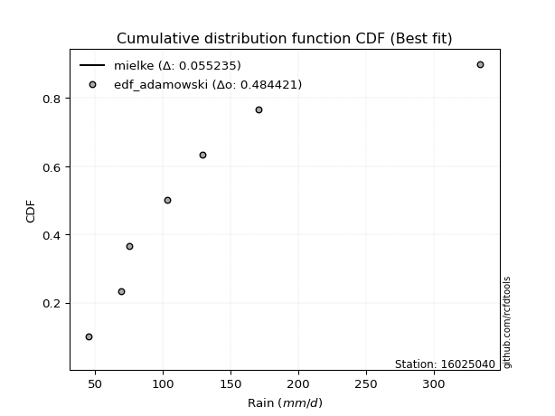</img></img>

</div>


## C. Best fit & Estimate extreme values for specific return periods - Tr


### 1. Best fit (ordered by delta Δ)

<div align="center">

|   id |   station | empirical_dist   | p_dist      |     delta |   deltao | eval   |   fit |   n |   best_fit |   best_fit_sort |
|-----:|----------:|:-----------------|:------------|----------:|---------:|:-------|------:|----:|-----------:|----------------:|
|    0 |  16025040 | edf_hazen        | mielke      | 0.026664  | 0.484421 | Δo > Δ |     1 |   7 |          1 |               1 |
|    1 |  16025040 | edf_gringorten   | mielke      | 0.0338871 | 0.484421 | Δo > Δ |     1 |   7 |          1 |               2 |
|    2 |  16025040 | edf_cunnane      | mielke      | 0.0385687 | 0.484421 | Δo > Δ |     1 |   7 |          1 |               3 |
|    3 |  16025040 | edf_blom         | mielke      | 0.0414423 | 0.484421 | Δo > Δ |     1 |   7 |          1 |               4 |
|    4 |  16025040 | edf_tukey        | mielke      | 0.0461445 | 0.484421 | Δo > Δ |     1 |   7 |          1 |               5 |
|    5 |  16025040 | edf_filliben     | mielke      | 0.0479034 | 0.484421 | Δo > Δ |     1 |   7 |          1 |               6 |
|    6 |  16025040 | edf_beard        | mielke      | 0.0487313 | 0.484421 | Δo > Δ |     1 |   7 |          1 |               7 |
|    7 |  16025040 | edf_jenkinson    | mielke      | 0.0487313 | 0.484421 | Δo > Δ |     1 |   7 |          1 |               8 |
|    8 |  16025040 | edf_chegodayev   | mielke      | 0.04983   | 0.484421 | Δo > Δ |     1 |   7 |          1 |               9 |
|    9 |  16025040 | edf_adamowski    | mielke      | 0.0552354 | 0.484421 | Δo > Δ |     1 |   7 |          1 |              10 |
|   10 |  16025040 | edf_weibull      | lograyleigh | 0.0765182 | 0.484421 | Δo > Δ |     1 |   7 |          1 |              11 |
|   11 |  16025040 | edf_california   | t           | 0.0977225 | 0.484421 | Δo > Δ |     1 |   7 |          1 |              12 |

</div>

:file_folder:Tables: [bestfit_16025040.csv](table/bestfit_16025040.csv) | [extreme_16025040.csv](table/extreme_16025040.csv)


### 2. Extreme values

In hydrology, a return period (or recurrence interval $Tr$) is the statistical average time between extreme events like floods or droughts of a specific magnitude, indicating how rare an event is, with a 100-year flood, for example, having a 1% chance of occurring in any given year, not that it happens exactly every century. It is a key tool for infrastructure design (like bridges or dams) and risk assessment, calculated from historical data to determine the probability of future events, although it is important to remember it is statistical average, and events can cluster or be missed.

> risk_rate: assuming the return period as the project useful life.

|   id |      tr |   prob_l |     prob_g |      alpha |   betaprime |     chi2 |   crystalball |   erlang |   expon |   exponnorm |         f |   fatiguelife |      fisk |    gamma |   genexpon |   genlogistic |   gibrat |   gompertz |   gumbel_l |   gumbel_r |   halflogistic |   halfnorm |   hypsecant |   invgamma |   invgauss |      invweibull |   johnsonsu |   kstwobign |   laplace |   laplace_asymmetric |   loggamma |   logistic |   lognorm |   maxwell |    mielke |   moyal |   nakagami |      ncf |      nct |    norm |           pareto |   pearson3 |   rayleigh |    rice |         t |   truncnorm |    wald |   weibull_min |   logalpha |   logbetaprime |          logchi2 |   logcrystalball |   logerlang |   logexpon |   logexponnorm |      logf |   logfatiguelife |    logfisk |   loggenexpon |   loggenlogistic |   loggibrat |   loggompertz |   loggumbel_l |   loggumbel_r |   loghalflogistic |   loghalfnorm |   loghypsecant |   loginvgamma |   loginvgauss |   loginvweibull |   logjohnsonsu |   logkstwobign |   loglaplace |   loglaplace_asymmetric |   logloggamma |   loglogistic |    loglognorm |   logmaxwell |   logmielke |   logmoyal |   lognakagami |   logncf |   lognct |     logpareto |   logpearson3 |   lograyleigh |   logrice |    logt |   logtruncnorm |   logwald |   logweibull_min |   station |   n |   risk_rate |
|-----:|--------:|---------:|-----------:|-----------:|------------:|---------:|--------------:|---------:|--------:|------------:|----------:|--------------:|----------:|---------:|-----------:|--------------:|---------:|-----------:|-----------:|-----------:|---------------:|-----------:|------------:|-----------:|-----------:|----------------:|------------:|------------:|----------:|---------------------:|-----------:|-----------:|----------:|----------:|----------:|--------:|-----------:|---------:|---------:|--------:|-----------------:|-----------:|-----------:|--------:|----------:|------------:|--------:|--------------:|-----------:|---------------:|-----------------:|-----------------:|------------:|-----------:|---------------:|----------:|-----------------:|-----------:|--------------:|-----------------:|------------:|--------------:|--------------:|--------------:|------------------:|--------------:|---------------:|--------------:|--------------:|----------------:|---------------:|---------------:|-------------:|------------------------:|--------------:|--------------:|--------------:|-------------:|------------:|-----------:|--------------:|---------:|---------:|--------------:|--------------:|--------------:|----------:|--------:|---------------:|----------:|-----------------:|----------:|----:|------------:|
|    0 |    2    | 0.5      | 0.5        |    99.3356 |     103.086 |  54.1992 |       132.5   |  81.4584 | 105.804 |     105.578 |   98.8066 |       95.8063 |   97.2652 |  67.0679 |    105.804 |       115.123 |  105.205 |    122.229 |    147.439 |    117.561 |        110.135 |    113.886 |     132.5   |    98.6381 |    97.4808 |  1584.35        |     97.0097 |     122.708 |   132.5   |              109.234 |    96.7496 |    132.5   |   108.799 |   124.723 |   98.2139 | 112.739 |    92.6984 |  103.059 |   97.848 | 132.5   |     49.6631      |    112.604 |    121.965 | 132.144 |   98.2943 |     108.58  | 103.024 |       113.116 |    100.918 |        105.604 |     72.4777      |          108.799 |     96.7498 |    83.2619 |        99.9728 |   96.8283 |          98.9422 |    99.6129 |       90.7194 |          98.1411 |     90.6196 |       100.44  |       120.25  |       98.4384 |           93.6619 |       96.0451 |        108.799 |       100.243 |       99.1175 |         98.1415 |        99.6003 |        97.7844 |      108.799 |                 106.292 |       109.407 |       108.799 |  45.763       |      103.276 |     97.7529 |    95.3091 |       78.2754 |  104.577 |  101.289 |  47.9239      |       104.006 |       101.385 |   102.802 | 108.799 |        129.574 |   89.3035 |          96.4381 |  16025040 |   7 |    0.75     |
|    1 |    2.33 | 0.570815 | 0.429185   |   110.135  |     114.697 |  58.2972 |       148.727 |  90.8053 | 119.091 |     118.835 |  110.195  |      108.865  |  109.605  |  75.3671 |    119.09  |       127.186 |  113.425 |    138.313 |    161.556 |    132.597 |        125.594 |    131.399 |     145.486 |   109.989  |   109.716  | 83837.7         |    109.255  |     136.229 |   142.32  |              121.713 |   108.323  |    146.797 |   121.292 |   141.582 |  109.39   | 126.972 |   104.996  |  114.667 |  108.932 | 148.727 |     55.9217      |    127.999 |    139.073 | 146.536 |  107.495  |     122.476 | 113.664 |       136.897 |    112.245 |        117.727 |     86.087       |          121.292 |    108.324  |    95.1192 |       110.665  |  108.419  |         110.353  |   110.329  |      102.897  |         109.346  |     95.7489 |       113.596 |       132.177 |      108.87   |          103.881  |      108      |        118.687 |       111.58  |      110.522  |        109.354  |       110.932  |       109.37   |      116.196 |                 115.017 |       122.063 |       119.734 |  47.9327      |      115.623 |    108.729  |   104.844  |       92.7574 |  116.661 |  112.684 |  51.8223      |       115.994 |       113.696 |   114.891 | 121.292 |        135.823 |   95.9011 |         108.334  |  16025040 |   7 |    0.729209 |
|    2 |    5    | 0.8      | 0.2        |   172.733  |     176.188 |  85.6085 |       209.03  | 139.807  | 185.521 |     185.112 |  175.287  |      182.755  |  188.573  | 125.621  |    185.52  |       179.587 |  160.749 |    214.786 |    207.164 |    197.921 |        195.545 |    205.46  |     197.578 |   175.003  |   179.018  |     2.91883e+12 |    180.509  |     193.665 |   191.416 |              184.106 |   176.698  |    202     |   181.664 |   207.936 |  174.43   | 192.903 |   161.529  |  176.156 |  173.656 | 209.03  |   1027.32        |    197.187 |    207.564 | 204.152 |  147.216  |     191.935 | 173.227 |       287.475 |    174.572 |        179.39  |    239.758       |          181.664 |    176.698  |   185.083  |       171.047  |  177.046  |         175.316  |   173.578  |      180.598  |         174.869  |    131.462  |       183.74  |       179.407 |      168.635  |          165.97   |      177.368  |        168.248 |       174.735 |      175.243  |        174.967  |       174.643  |       175.976  |      161.445 |                 170.634 |       183.04  |       173.307 |   3.15931e+82 |      180.337 |    172.507  |   163.061  |      211.303  |  182.107 |  174.813 |   1.04524e+07 |       178.505 |       179.888 |   179.114 | 181.663 |        170.014 |  142.927  |         177.62   |  16025040 |   7 |    0.67232  |
|    3 |   10    | 0.9      | 0.1        |   254.82   |     241.869 | 116.399  |       249.034 | 186.086  | 245.825 |     245.276 |  252.487  |      258.567  |  300.47   | 178.61   |    245.824 |       222.264 |  214.693 |    279.128 |    232.557 |    251.126 |        253.636 |    260.263 |     239.174 |   252.334  |   253.497  |     4.05564e+18 |    262.745  |     237.394 |   235.985 |              240.744 |   260.468  |    242.655 |   237.492 |   254.633 |  254.736  | 250.306 |   205.556  |  241.852 |  253.949 | 249.034 |  60513.1         |    254.151 |    256.399 | 245.233 |  187.166  |     254.967 | 236.439 |       461.59  |    245.486 |        241.008 |    696.642       |          237.492 |    260.468  |   338.689  |       246.088  |  261.506  |         251.658  |   259.642  |      283.278  |         256.299  |    188.681  |       252.635 |       212.673 |      240.843  |          244.92   |      256.039  |        222.312 |       247.551 |      251.032  |        256.571  |       248.766  |       252.767  |      217.613 |                 244.101 |       239.146 |       227.556 | inf           |      246.567 |    251.12   |   239.524  |      409.494  |  254.108 |  244.203 | inf           |       243.077 |       249.502 |   245.547 | 237.491 |        205.63  |  218.28   |         258.9    |  16025040 |   7 |    0.651322 |
|    4 |   15    | 0.933333 | 0.0666667  |   322.954  |     286.38  | 135.984  |       268.997 | 213.606  | 281.1   |     280.47  |  308.698  |      305.44   |  393.888  | 211.499  |    281.099 |       246.341 |  251.902 |    314.791 |    244.057 |    281.143 |        286.511 |    288.782 |     262.913 |   308.753  |   301.632  |     1.18523e+22 |    319.889  |     260.609 |   262.056 |              273.875 |   322.431  |    264.805 |   271.472 |   278.592 |  315.306  | 283.621 |   228.742  |  286.382 |  314.707 | 268.997 | 673473           |    286.051 |    281.561 | 266.4   |  215.861  |     291.828 | 277.03  |       577.366 |    296.057 |        280.664 |   1346.48        |          271.472 |    322.43   |   482.298  |       303.81   |  324.236  |         306.756  |   332.749  |      362.456  |         317.989  |    242.085  |       294.86  |       229.703 |      294.484  |          305.253  |      309.936  |        260.631 |       299.798 |      305.623  |        318.425  |       302.157  |       306.344  |      259.138 |                 300.978 |       273.167 |       263.955 | inf           |      289.494 |    310.35   |   299.411  |      581.619  |  303.872 |  292.847 | inf           |       285.546 |       295.309 |   288.771 | 271.471 |        228.658 |  286.488  |         316.548  |  16025040 |   7 |    0.644736 |
|    5 |   20    | 0.95     | 0.05       |   385.102  |     321.222 | 150.389  |       282.07  | 233.277  | 306.129 |     305.441 |  354.685  |      339.546  |  477.464  | 235.447  |    306.128 |       263.199 |  281.089 |    339.287 |    251.215 |    302.161 |        309.543 |    307.796 |     279.66  |   354.968  |   337.612  |     3.16541e+24 |    364.903  |     276.247 |   280.553 |              297.382 |   373.508  |    280.115 |   296.318 |   294.493 |  366.057  | 307.214 |   244.25   |  321.243 |  365.718 | 282.07  |      3.72383e+06 |    308.226 |    298.286 | 280.469 |  239.676  |     317.977 | 307.279 |       665.176 |    337.04  |        310.682 |   2173.57        |          296.318 |    373.508  |   619.777  |       352.755  |  376.098  |         351.545  |   400.193  |      429.259  |         369.822  |    294.357  |       325.59  |       240.986 |      339.006  |          356.176  |      352.036  |        291.571 |       342.244 |      349.953  |        370.409  |       345.592  |       348.699  |      293.322 |                 349.2   |       297.983 |       292.462 | inf           |      322.032 |    359.946  |   350.677  |      735.793  |  343.297 |  331.778 | inf           |       318.108 |       330.319 |   321.583 | 296.316 |        246.041 |  350.839  |         362.673  |  16025040 |   7 |    0.641514 |
|    6 |   25    | 0.96     | 0.04       |   443.887  |     350.325 | 161.805  |       291.694 | 248.604  | 325.542 |     324.81  |  394.349  |      366.409  |  554.532  | 254.313  |    325.541 |       276.184 |  305.421 |    357.851 |    256.308 |    318.35  |        327.289 |    321.944 |     292.62  |   394.865  |   366.488  |     2.3419e+26  |    402.538  |     287.961 |   294.901 |              315.615 |   417.767  |    291.827 |   316.049 |   306.298 |  410.631  | 325.502 |   255.804  |  350.363 |  410.585 | 291.694 |      1.40302e+07 |    325.209 |    310.712 | 290.922 |  260.575  |     338.257 | 331.507 |       736.358 |    372.203 |        335.133 |   3168.29        |          316.049 |    417.766  |   752.871  |       396.079  |  421.141  |         389.982  |   464.442  |      488.079  |         415.438  |    346.462  |       349.84  |       249.351 |      377.837  |          401.133  |      387.029  |        318.017 |       378.702 |      387.968  |        416.168  |       382.921  |       384.218  |      322.913 |                 391.864 |       317.656 |       316.332 | inf           |      348.532 |    403.486  |   396.379  |      876.785  |  376.516 |  364.847 | inf           |       344.873 |       358.991 |   348.325 | 316.048 |        260.145 |  412.664  |         401.723  |  16025040 |   7 |    0.639603 |
|    7 |   50    | 0.98     | 0.02       |   715.588  |     453.987 | 198.352  |       319.252 | 296.524  | 385.846 |     384.974 |  544.147  |      451.713  |  884.998  | 314.223  |    385.845 |       316.186 |  391.192 |    413.25  |    270.135 |    368.221 |        381.966 |    363.064 |     332.803 |   545.796  |   461.034  |     1.34122e+32 |    535.859  |     322.359 |   339.47  |              372.254 |   586.021  |    327.611 |   380.126 |   340.535 |  584.896  | 382.274 |   289.422  |  454.103 |  586.471 | 319.252 |      8.64019e+08 |    376.975 |    346.783 | 321.265 |  342.958  |     401.24  | 410.613 |       973.57  |    504.251 |        418.239 |  10463.7         |          380.126 |    586.019  |  1377.7    |       567.611  |  593.181  |         533.673  |   765.623  |      717.993  |         594.442  |    615.412  |       427.305 |       273.55  |      527.704  |          578.563  |      509.764  |        416.247 |       515.664 |      529.921  |        595.804  |       523.155  |       510.838  |      435.257 |                 560.583 |       381.342 |       402.018 | inf           |      438.373 |    573.568  |   579.793  |     1460.62   |  496.751 |  486.493 | inf           |       437.3   |       457.11  |   439.062 | 380.124 |        307.6   |  701.036  |         543.557  |  16025040 |   7 |    0.63583  |
|    8 |   75    | 0.986667 | 0.0133333  |   972.586  |     525.373 | 220.345  |       334.039 | 324.732  | 421.121 |     420.168 |  654.365  |      502.673  | 1165.53   | 350.009  |    421.12  |       339.436 |  449.121 |    444.183 |    277.127 |    397.208 |        413.75  |    385.449 |     356.286 |   657.058  |   519.369  |     2.98008e+35 |    626.384  |     341.284 |   365.541 |              405.385 |   710.474  |    348.278 |   419.707 |   359.149 |  718.32   | 415.473 |   307.724  |  525.555 |  721.538 | 334.039 |      9.62257e+09 |    406.692 |    366.407 | 337.773 |  407.105  |     438.073 | 459.291 |      1122.97  |    601.277 |        472.38  |  21337.8         |          419.707 |    710.471  |  1961.87   |       700.586  |  721.168  |         638.084  |  1056.95   |      893.136  |         732.067  |    907.164  |       474.011 |       286.667 |      640.797  |          715.835  |      592.228  |        487.156 |       616.125 |      632.957  |        733.974  |       625.882  |       597.51   |      518.313 |                 691.2   |       420.535 |       461.712 | inf           |      496.588 |    703.671  |   724.198  |     1928.48   |  581.092 |  573.559 | inf           |       498.59  |       521.328 |   497.878 | 419.704 |        338.063 |  971.315  |         642.867  |  16025040 |   7 |    0.634587 |
|    9 |  100    | 0.99     | 0.01       |  1224.06   |     581.591 | 236.171  |       344.04  | 344.811  | 446.15  |     445.139 |  744.868  |      539.216  | 1418.09   | 375.667  |    446.148 |       355.891 |  493.997 |    465.52  |    281.701 |    417.724 |        436.246 |    400.698 |     372.943 |   748.528  |   561.958  |     6.96488e+37 |    696.731  |     354.251 |   384.038 |              428.892 |   812.881  |    362.87  |   448.788 |   371.827 |  830.728  | 439.027 |   320.188  |  581.83  |  835.547 | 344.04  |      5.3209e+10  |    427.569 |    379.776 | 349.02  |  461.904  |     464.202 | 494.783 |      1233.47  |    681.145 |        513.516 |  35552.8         |          448.788 |    812.877  |  2521.1    |       813.427  |  826.899  |         723.09   |  1349      |     1039.84   |         848.322  |   1225.27   |       507.729 |       295.585 |      735.2    |          832.253  |      655.919  |        544.663 |       698.61  |      716.794  |        850.721  |       710.085  |       665.24   |      586.686 |                 801.943 |       449.264 |       509.122 | inf           |      540.606 |    813.22   |   847.969  |     2330.15   |  648.304 |  643.91  | inf           |       545.661 |       570.171 |   542.347 | 448.786 |        360.959 | 1232.01   |         721.646  |  16025040 |   7 |    0.633968 |
|   10 |  200    | 0.995    | 0.005      |  2211.62   |     739.028 | 274.928  |       366.726 | 393.372  | 506.454 |     505.303 | 1014.15   |      628.361  | 2279.93   | 438.249  |    506.452 |       395.452 |  616.088 |    514.997 |    291.641 |    467.046 |        490.329 |    435.574 |     413.073 |  1021.16   |   668.208  |     3.44726e+43 |    888.945  |     384.116 |   428.607 |              485.53  |  1118.02   |    397.872 |   522.444 |   400.834 | 1178.16   | 495.775 |   348.673  |  739.453 | 1188.9   | 366.726 |      3.27677e+12 |    477.276 |    410.366 | 374.753 |  635.236  |     527.142 | 583.187 |      1514.32  |    920.89  |        622.802 | 123374           |          522.444 |   1118.02   |  4613.44   |      1165.7    | 1143.9    |         972.692  |  2573.01   |     1488.03   |        1209.06   |   2775.85   |       590.82  |       315.939 |     1023.04   |         1195.61   |      828.536  |        712.645 |       944.708 |      962.787  |       1213.13   |       960.38   |       851.895  |      790.798 |                1147.22  |       521.784 |       643.653 | inf           |      656.55  |   1151.54   |  1240.14   |     3589.99   |  839.867 |  848.822 | inf           |       672.598 |       699.841 |   659.431 | 522.441 |        420.755 | 2227.46   |         943.675  |  16025040 |   7 |    0.633042 |
|   11 |  250    | 0.996    | 0.004      |  2701.33   |     797.207 | 287.567  |       373.659 | 409.052  | 525.867 |     524.672 | 1119.11   |      657.343  | 2658.02   | 458.593  |    525.865 |       408.17  |  659.894 |    530.378 |    294.566 |    482.903 |        507.716 |    446.304 |     425.991 |  1127.6    |   703.4    |     2.33449e+45 |    958.168  |     393.359 |   442.955 |              503.763 |  1236.98   |    409.11  |   547.279 |   409.763 | 1318.19   | 514.043 |   357.428  |  797.707 | 1331.66  | 373.659 |      1.23459e+13 |    493.122 |    419.782 | 382.674 |  706.59   |     547.4   | 612.434 |      1608.95  |   1015.45  |        661.291 | 184825           |          547.279 |   1236.98   |  5604.15   |      1308.86   | 1268.2    |        1068.81   |  3228.34   |     1666.48   |        1354.94   |   3722.47   |       618.098 |       322.19  |     1137.69   |         1343.29   |      890.276  |        777.06  |      1041.08  |     1057.47   |       1359.73   |      1057.98   |       919.657  |      870.576 |                1287.39  |       546.161 |       693.974 | inf           |      697.019 |   1287.8    |  1401.58   |     4099.82   |  911.795 |  927.346 | inf           |       717.893 |       745.407 |   700.273 | 547.275 |        441.468 | 2709.55   |        1025.95   |  16025040 |   7 |    0.632858 |
|   12 |  500    | 0.998    | 0.002      |  5139.81   |    1005.44  | 327.243  |       394.218 | 457.885  | 586.171 |     584.837 | 1516.56   |      748.106  | 4286.93   | 522.293  |    586.169 |       447.644 |  811.288 |    576.589 |    302.951 |    532.118 |        561.682 |    478.294 |     466.117 |  1531.27   |   815.411  |     1.12296e+51 |   1198.27   |     421.057 |   487.523 |              560.402 |  1686.82   |    443.96  |   628.087 |   436.408 | 1867.78   | 570.79  |   383.509  | 1006.24  | 1893.41  | 394.218 |      7.60301e+14 |    541.938 |    447.878 | 406.309 |  993.471  |     610.313 | 705.429 |      1915.4   |   1380.18  |        792.219 | 654819           |          628.086 |   1686.8    | 10255.2    |      1875.69   | 1741.3    |        1427.81   |  6979.64   |     2356.19   |        1929.61   |  10262.2    |       704.369 |       340.804 |     1581.98   |         1928.24   |     1103.03   |       1016.7   |      1408.94  |     1410.95   |       1937.49   |      1428.37   |      1156.75   |     1173.45  |                1841.67  |       625.235 |       876.458 | inf           |      833.22  |   1822.21   |  2049.78   |     6088.01   | 1173.74  | 1220.02  | inf           |       873.996 |       899.767 |   837.617 | 628.082 |        510.656 | 5051.82   |        1320.2    |  16025040 |   7 |    0.632489 |
|   13 |  750    | 0.998667 | 0.00133333 |  7573.32   |    1149.38  | 350.705  |       405.638 | 486.526  | 621.446 |     620.031 | 1809.53   |      801.646  | 5674.27   | 559.865  |    621.444 |       470.721 |  911.41  |    602.589 |    307.432 |    560.889 |        593.23  |    496.166 |     489.589 |  1829.39   |   882.635  |     2.35589e+54 |   1357.69   |     436.617 |   513.594 |              593.533 |  2017.49   |    464.321 |   678.024 |   451.31  | 2289.76   | 603.985 |   398.062  | 1150.41  | 2325.96  | 405.638 |      8.46746e+15 |    570.242 |    463.589 | 419.525 | 1219.88   |     647.105 | 761.186 |      2103.11  |   1656.38  |        877.468 |      1.38029e+06 |          678.024 |   2017.47   | 14603.6    |      2315.11   | 2091.81   |        1688.19   | 11529.6    |     2875.58   |        2372.66   |  20067.8    |       755.861 |       351.189 |     1918.24   |         2381.99   |     1243.31   |       1189.81  |      1683.44  |     1667.25   |       2383.09   |      1702.55   |      1315.83   |     1397.37  |                2270.79  |       673.923 |      1004.54  | inf           |      920.692 |   2232.19   |  2560.23   |     7589.93   | 1358.57  | 1432.43  | inf           |       977.149 |       999.624 |   925.721 | 678.019 |        554.714 | 7339.45   |        1522.79   |  16025040 |   7 |    0.632366 |
|   14 | 1000    | 0.999    | 0.001      | 10005.5    |    1262.92  | 367.449  |       413.502 | 506.877  | 646.475 |     645.001 | 2050.27   |      839.807  | 6924.95   | 586.643  |    646.472 |       487.09  |  988.029 |    620.603 |    310.448 |    581.297 |        615.608 |    508.508 |     506.243 |  2074.64   |   931.016  |     5.35094e+56 |   1480      |     447.397 |   532.092 |              617.04  |  2288.52   |    478.76  |   714.696 |   461.61  | 2645.66   | 627.536 |   408.105  | 1264.14  | 2691.45  | 413.502 |      4.68216e+16 |    590.225 |    474.446 | 428.658 | 1414.28   |     673.205 | 801.294 |      2239.95  |   1888.2   |        942.174 |      2.34812e+06 |          714.695 |   2288.49   | 18766.3    |      2688      | 2380.63   |        1899.88   | 16878.5    |     3307.77   |        2747.32   |  33526.3    |       792.833 |       358.356 |     2199.25   |         2767.2    |     1350.47   |       1330.23  |      1911.24  |     1875.59   |       2760.02   |      1928.73   |      1438.69   |     1581.71  |                2634.61  |       709.595 |      1106.55  | inf           |      986.459 |   2577.79   |  2997.76   |     8836.92   | 1506.35  | 1605.52  | inf           |      1056.16  |      1075.03  |   991.908 | 714.69  |        587.668 | 9601.73   |        1681.87   |  16025040 |   7 |    0.632305 |

<div align="center">

</img>

</div>


<div align="center">

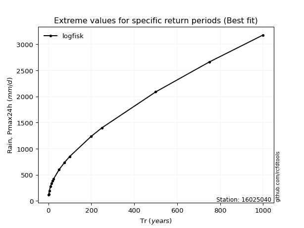</img>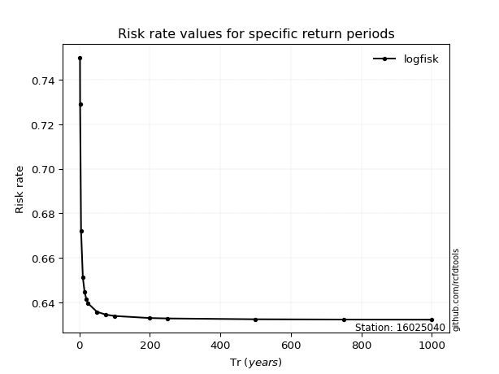</img>

</div>


<sub>**APP DISCLAIMER**: NO WARRANTY - This software is provided by [github.com/rcfdtools](https://github.com/rcfdtools) "as is", without any express or implied warranty, including warranties of merchantability, fitness for a particular purpose, or non-infringement. There is no guarantee that the software will be error-free or operate without interruption. LIMITATION OF LIABILITY - Neither the authors nor copyright holders will be liable for claims or damages arising from the software or its use. You are responsible for determining if the software is appropriate for your use and assume all associated risks, including errors, legal compliance, and data loss. NO PROFESSIONAL ADVICE - The software provides general information and does not offer professional advice. It should not replace consultation with professional advisors.</sub>