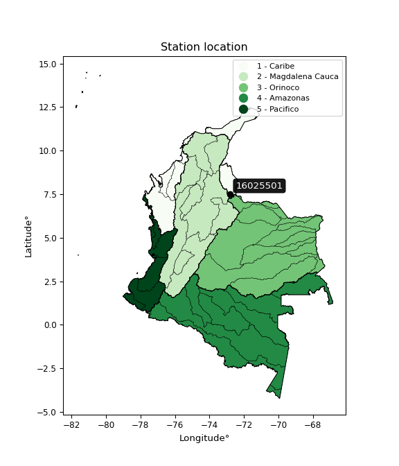

<div align="center">


</div>

# PMP Station (rain, Pmax24h): 16025501

Probable Maximum Precipitation (PMP) is the greatest amount of rainfall for a specific duration that is meteorologically possible for a given location, acting as a "worst-case" scenario for extreme storms, crucial for designing safety-critical infrastructure like bridges, river deviations, dams, spillways, and nuclear plants to prevent catastrophic failure. PMP is calculated by hydrologists using meteorological data to determine the upper limit of extreme rainfall, often leading to the Probable Maximum Flood (PMF) for flood control design, and is increasingly being studied for climate change impacts.

<div align="center">

</img>

</div>


## A. General information


### 1. General running parameters

• app_version: _v20251228_. • runtime: _2025-12-28 08:43:48.795225_. • Python version: _3.14.0_. • SciPy version: _1.16.3_. • Pandas version: _2.3.3_. • NumPy version: _2.3.5_. • Stations dataset (station_dataset_file): _dataset/pmax24h_in/automatic_colombia_2003_2024.csv_. • Stations catalog (station_catalog_file): _dataset/CNE_IDEAM.xls_. • Minimum year to eval til year_max (date_min): _1900_. • Maximum year to eval since year_min (date_max): _2024_. • Creates, save and include plots into reports (create_plot): _False_. • Plot only fit distributions with Δo > Δ (plot_only_fit): _True_. • Eval low extreme values, if False, evaluates high extreme values (low_extreme): _False_. • Eval every SciPy distribution as logarithmic (pdist_logarithmic_on): _True_. • Standard deviation normalized (ddof): _1.0_. • Return periods to eval in years (Tr): _[2, 2.33, 5, 10, 15, 20, 25, 50, 75, 100, 200, 250, 500, 750, 1000]_. • Minimum data sample per station, 0 means any (minimum_sample): _5_. • Z-Score maximum threshold to adjust a value, 0 means disable (zscore_max): _3.5_. • Z-Score minimum threshold to adjust a value, 0 means disable (zscore_min): _-2.5_. • Avoid zeros, e.g. rain = 0 (avoid_zeros): _True_. • Avoid null values (avoid_nans): _True_. [:file_folder:Dataset file.](../../dataset/pmax24h_in/automatic_colombia_2003_2024.csv)

> Delta Degrees of Freedom (DDOF): is a parameter used in the formulas for calculating variance and standard deviation. When ddof=0, the divisor is $N$ (the total number of observations) and this is used when your data set is the entire population. When ddof=1, the divisor is $N-1$ and this is used when your data set is a sample drawn from a larger population. Using $N-1$ provides an unbiased estimate of the population variance (known as Bessel´s correction).


### 2. Station info and location

|   id |   CODIGO | NOMBRE                       | CATEGORIA               | TECNOLOGIA                | ESTADO   | FECHA_INSTALACION   |   FECHA_SUSPENSION |   ALTITUD |   LATITUD |   LONGITUD | DEPARTAMENTO       | MUNICIPIO   | AREA_OPERATIVA                         | ENTIDAD                                    | AREA_HIDROGRAFICA   | ZONA_HIDROGRAFICA   | SUBZONA_HIDROGRAFICA   |   CORRIENTE | Catalogo   |
|-----:|---------:|:-----------------------------|:------------------------|:--------------------------|:---------|:--------------------|-------------------:|----------:|----------:|-----------:|:-------------------|:------------|:---------------------------------------|:-------------------------------------------|:--------------------|:--------------------|:-----------------------|------------:|:-----------|
|    0 | 16025501 | CUCUTILLA  - AUT  [16025501] | Climatológica Principal | Automática con Telemetría | Activa   | 16/05/2013          |                nan |      1629 |   7.51946 |   -72.7979 | Norte De Santander | Cucutilla   | Area Operativa 08 - Santanderes-Arauca | CENTRO NACIONAL DE INVESTIGACIONES DE CAFE | Caribe              | Catatumbo           | Río Zulia              |         nan | CNE_OE     |

<div align="center">

Map location in: [:earth_americas:Google](http://maps.google.com/maps?q=7.519455556,-72.79790278) [:earth_americas:OSM](https://www.openstreetmap.org/#map=18/7.519455556/-72.79790278&layers=P) [:earth_americas:Bing](https://www.bing.com/maps?cp=7.519455556~-72.79790278&lvl=18) [:earth_americas:Apple](https://maps.apple.com/frame?center=7.519455556%2C-72.79790278&span=0.003%2C0.006)

</div>


<div align="center">

```geojson
{
  "type": "Feature",
  "geometry": {
    "type": "Point", 
    "coordinates": [-72.79790278, 7.519455556]
  }, 
  "properties": {
    "Name": "16025501"
  }
}
```

</div>


### 3. Discrete values table and plot

|               |          0 |           1 |         2 |           3 |           4 |           5 |           6 |
|:--------------|-----------:|------------:|----------:|------------:|------------:|------------:|------------:|
| Date          | 2016       | 2017        | 2018      | 2019        | 2021        | 2022        | 2023        |
| Value         |    8.8     |   39.1      |   73.8    |   37.1      |   39.7      |   56.3      |   38.8      |
| Value_initial |    8.8     |   39.1      |   73.8    |   37.1      |   39.7      |   56.3      |   38.8      |
| count         |    7       |    7        |    7      |    7        |    7        |    7        |    7        |
| mean          |   41.9429  |   41.9429   |   41.9429 |   41.9429   |   41.9429   |   41.9429   |   41.9429   |
| std           |   19.8574  |   19.8574   |   19.8574 |   19.8574   |   19.8574   |   19.8574   |   19.8574   |
| zscore        |   -1.66904 |   -0.143164 |    1.6043 |   -0.243882 |   -0.112948 |    0.723012 |   -0.158271 |

> The initial value (value_initial) correspond to the initial obtained or null completed value, and value (value) is adjusted only when the initial value is outside the valid range definite through the Z-Score value. If Z-Score is active, values out of range or outliers are replaced with the station mean value


### 4. Active continuous probability distributions from SciPy (44 of 104 available)

[scipy.stats](https://docs.scipy.org/doc/scipy/reference/stats.html) is a Python´s powerful submodule within the SciPy library for comprehensive statistical analysis, offering over 130 probability distributions (like Normal, Poisson), functions for descriptive stats (mean, variance), hypothesis testing (t-tests, chi-square), random variable generation, and statistical tests, making it essential for data science, modeling, and research. It provides tools to explore, model, and draw conclusions from data efficiently, working seamlessly with NumPy.

<div align="center">

|   id | p_dist             |   n_parameter | fit_method   | label                                                                       | active   | ref                                                                                                        |
|-----:|:-------------------|--------------:|:-------------|:----------------------------------------------------------------------------|:---------|:-----------------------------------------------------------------------------------------------------------|
|    0 | alpha              |             3 | MLE          | Alpha                                                                       | True     | [:mortar_board:](https://docs.scipy.org/doc/scipy/reference/generated/scipy.stats.alpha.html)              |
|    1 | betaprime          |             4 | MLE          | Beta prime                                                                  | True     | [:mortar_board:](https://docs.scipy.org/doc/scipy/reference/generated/scipy.stats.betaprime.html)          |
|    2 | chi2               |             3 | MLE          | Chi²                                                                        | True     | [:mortar_board:](https://docs.scipy.org/doc/scipy/reference/generated/scipy.stats.chi2.html)               |
|    3 | crystalball        |             4 | MLE          | Crystalball                                                                 | True     | [:mortar_board:](https://docs.scipy.org/doc/scipy/reference/generated/scipy.stats.crystalball.html)        |
|    4 | erlang             |             3 | MLE          | Erlang                                                                      | True     | [:mortar_board:](https://docs.scipy.org/doc/scipy/reference/generated/scipy.stats.erlang.html)             |
|    5 | expon              |             2 | MLE          | Exponential                                                                 | True     | [:mortar_board:](https://docs.scipy.org/doc/scipy/reference/generated/scipy.stats.expon.html)              |
|    6 | exponnorm          |             3 | MLE          | Exponentially modified Normal                                               | True     | [:mortar_board:](https://docs.scipy.org/doc/scipy/reference/generated/scipy.stats.exponnorm.html)          |
|    7 | f                  |             4 | MLE          | F                                                                           | True     | [:mortar_board:](https://docs.scipy.org/doc/scipy/reference/generated/scipy.stats.f.html)                  |
|    8 | fatiguelife        |             3 | MLE          | Fatigue-life (Birnbaum-Saunders)                                            | True     | [:mortar_board:](https://docs.scipy.org/doc/scipy/reference/generated/scipy.stats.fatiguelife.html)        |
|    9 | fisk               |             3 | MLE          | Fisk                                                                        | True     | [:mortar_board:](https://docs.scipy.org/doc/scipy/reference/generated/scipy.stats.fisk.html)               |
|   10 | gamma              |             3 | MLE          | Gamma                                                                       | True     | [:mortar_board:](https://docs.scipy.org/doc/scipy/reference/generated/scipy.stats.gamma.html)              |
|   11 | genexpon           |             5 | MLE          | Generalized exponential                                                     | True     | [:mortar_board:](https://docs.scipy.org/doc/scipy/reference/generated/scipy.stats.genexpon.html)           |
|   12 | genlogistic        |             3 | MLE          | Generalized logistic                                                        | True     | [:mortar_board:](https://docs.scipy.org/doc/scipy/reference/generated/scipy.stats.genlogistic.html)        |
|   13 | gibrat             |             2 | MM           | Gibrat                                                                      | True     | [:mortar_board:](https://docs.scipy.org/doc/scipy/reference/generated/scipy.stats.gibrat.html)             |
|   14 | gompertz           |             3 | MLE          | Gompertz (or truncated Gumbel)                                              | True     | [:mortar_board:](https://docs.scipy.org/doc/scipy/reference/generated/scipy.stats.gompertz.html)           |
|   15 | gumbel_l           |             2 | MM           | Gumbel Left Skew                                                            | True     | [:mortar_board:](https://docs.scipy.org/doc/scipy/reference/generated/scipy.stats.gumbel_l.html)           |
|   16 | gumbel_r           |             2 | MM           | Gumbel Right Skew                                                           | True     | [:mortar_board:](https://docs.scipy.org/doc/scipy/reference/generated/scipy.stats.gumbel_r.html)           |
|   17 | halflogistic       |             2 | MM           | Half-logistic                                                               | True     | [:mortar_board:](https://docs.scipy.org/doc/scipy/reference/generated/scipy.stats.halflogistic.html)       |
|   18 | halfnorm           |             2 | MM           | Half Normal                                                                 | True     | [:mortar_board:](https://docs.scipy.org/doc/scipy/reference/generated/scipy.stats.halfnorm.html)           |
|   19 | hypsecant          |             2 | MM           | hyperbolic secant                                                           | True     | [:mortar_board:](https://docs.scipy.org/doc/scipy/reference/generated/scipy.stats.hypsecant.html)          |
|   20 | invgamma           |             3 | MLE          | Inverted gamma                                                              | True     | [:mortar_board:](https://docs.scipy.org/doc/scipy/reference/generated/scipy.stats.invgamma.html)           |
|   21 | invgauss           |             3 | MLE          | Inverse Gaussian                                                            | True     | [:mortar_board:](https://docs.scipy.org/doc/scipy/reference/generated/scipy.stats.invgauss.html)           |
|   22 | invweibull         |             3 | MLE          | Inverted Weibull                                                            | True     | [:mortar_board:](https://docs.scipy.org/doc/scipy/reference/generated/scipy.stats.invweibull.html)         |
|   23 | johnsonsu          |             4 | MLE          | Johnson Su                                                                  | True     | [:mortar_board:](https://docs.scipy.org/doc/scipy/reference/generated/scipy.stats.johnsonsu.html)          |
|   24 | kstwobign          |             2 | MLE          | Limiting distribution of scaled Kolmogorov-Smirnov two-sided test statistic | True     | [:mortar_board:](https://docs.scipy.org/doc/scipy/reference/generated/scipy.stats.kstwobign.html)          |
|   25 | laplace            |             2 | MM           | Laplace                                                                     | True     | [:mortar_board:](https://docs.scipy.org/doc/scipy/reference/generated/scipy.stats.laplace.html)            |
|   26 | laplace_asymmetric |             3 | MLE          | Asymmetric Laplace                                                          | True     | [:mortar_board:](https://docs.scipy.org/doc/scipy/reference/generated/scipy.stats.laplace_asymmetric.html) |
|   27 | loggamma           |             3 | MLE          | Log gamma                                                                   | True     | [:mortar_board:](https://docs.scipy.org/doc/scipy/reference/generated/scipy.stats.loggamma.html)           |
|   28 | logistic           |             2 | MM           | Logistic (or Sech-squared)                                                  | True     | [:mortar_board:](https://docs.scipy.org/doc/scipy/reference/generated/scipy.stats.logistic.html)           |
|   29 | lognorm            |             3 | MLE          | Log Normal                                                                  | True     | [:mortar_board:](https://docs.scipy.org/doc/scipy/reference/generated/scipy.stats.lognorm.html)            |
|   30 | maxwell            |             2 | MM           | Maxwell                                                                     | True     | [:mortar_board:](https://docs.scipy.org/doc/scipy/reference/generated/scipy.stats.maxwell.html)            |
|   31 | mielke             |             4 | MLE          | Mielke Beta-Kappa / Dagum                                                   | True     | [:mortar_board:](https://docs.scipy.org/doc/scipy/reference/generated/scipy.stats.mielke.html)             |
|   32 | moyal              |             2 | MM           | Moyal                                                                       | True     | [:mortar_board:](https://docs.scipy.org/doc/scipy/reference/generated/scipy.stats.moyal.html)              |
|   33 | nakagami           |             3 | MLE          | Nakagami                                                                    | True     | [:mortar_board:](https://docs.scipy.org/doc/scipy/reference/generated/scipy.stats.nakagami.html)           |
|   34 | ncf                |             5 | MLE          | Non-central F distribution                                                  | True     | [:mortar_board:](https://docs.scipy.org/doc/scipy/reference/generated/scipy.stats.ncf.html)                |
|   35 | nct                |             4 | MLE          | Non-central Student’s t                                                     | True     | [:mortar_board:](https://docs.scipy.org/doc/scipy/reference/generated/scipy.stats.nct.html)                |
|   36 | norm               |             2 | MM           | Normal                                                                      | True     | [:mortar_board:](https://docs.scipy.org/doc/scipy/reference/generated/scipy.stats.norm.html)               |
|   37 | pearson3           |             3 | MM           | Pearson type III                                                            | True     | [:mortar_board:](https://docs.scipy.org/doc/scipy/reference/generated/scipy.stats.pearson3.html)           |
|   38 | rayleigh           |             2 | MM           | Rayleigh                                                                    | True     | [:mortar_board:](https://docs.scipy.org/doc/scipy/reference/generated/scipy.stats.rayleigh.html)           |
|   39 | rice               |             3 | MLE          | Rice                                                                        | True     | [:mortar_board:](https://docs.scipy.org/doc/scipy/reference/generated/scipy.stats.rice.html)               |
|   40 | t                  |             3 | MLE          | Student’s t                                                                 | True     | [:mortar_board:](https://docs.scipy.org/doc/scipy/reference/generated/scipy.stats.t.html)                  |
|   41 | truncnorm          |             4 | MLE          | Truncated normal                                                            | True     | [:mortar_board:](https://docs.scipy.org/doc/scipy/reference/generated/scipy.stats.truncnorm.html)          |
|   42 | wald               |             2 | MM           | Wald                                                                        | True     | [:mortar_board:](https://docs.scipy.org/doc/scipy/reference/generated/scipy.stats.wald.html)               |
|   43 | weibull_min        |             3 | MLE          | Weibull minimum                                                             | True     | [:mortar_board:](https://docs.scipy.org/doc/scipy/reference/generated/scipy.stats.weibull_min.html)        |

</div>

> **n_parameter:** # arguments & localization & scale.
>
> **Fit methods:** (MLE) maximum likelihood, (MM) L-moments.
>
>**Inactive:** foldnorm, gennorm, norminvgauss, powernorm, powerlognorm, skewnorm, genextreme, anglit, arcsine, argus, beta, bradford, burr, burr12, cauchy, cosine, halfcauchy, foldcauchy, skewcauchy, wrapcauchy, dgamma, gengamma, exponweib, exponpow, truncexpon, gausshyper, genhalflogistic, genhyperbolic, geninvgauss, halfgennorm, johnsonsb, kappa4, kappa3, ksone, kstwo, loglaplace, levy, levy_l, levy_stable, ncx2, pareto, genpareto, truncpareto, lomax, powerlaw, rdist, rel_breitwigner, recipinvgauss, semicircular, studentized_range, trapezoid, triang, truncweibull_min, tukeylambda, uniform, loguniform, vonmises, vonmises_line, weibull_max, dweibull, 


## B. Probability distributions vs. Empirical distributions

A continuous probability distribution (CPD) describes probabilities for variables that can take any value within a range (like rain any time), unlike discrete variables with specific outcomes (like temperature). It uses a Probability Density Function (PDF), a curve where the total area under it equals 1, and the probability of the variable falling within an interval (a to b) is found by calculating the area under the curve between those points. A key feature is that the probability of hitting any single exact value is zero, so probabilities are always expressed for ranges, e.g., $P(a ≤ X ≤ b)$.

<div align="center">

Distributions parameters from station values
|    |   station | p_dist                |   n |              loc |            scale | shape                  | shape1              | shape2                | shape3   |
|---:|----------:|:----------------------|----:|-----------------:|-----------------:|:-----------------------|:--------------------|:----------------------|:---------|
|  0 |  16025501 | alpha                 |   7 |      -0.0554939  |     20.9767      | 5.378618860918036e-10  |                     |                       |          |
|  1 |  16025501 | betaprime             |   7 |    -279.459      |  28070.6         | 304.30697936971717     | 26582.26033567218   |                       |          |
|  2 |  16025501 | chi2                  |   7 |    -181.925      |      0.774909    | 288.85362928201437     |                     |                       |          |
|  3 |  16025501 | crystalball           |   7 |      41.9429     |     18.3844      | 2239.3307550928394     | 5323.25802866318    |                       |          |
|  4 |  16025501 | erlang                |   7 |   -1300.34       |      0.252035    | 5325.7112186323575     |                     |                       |          |
|  5 |  16025501 | expon                 |   7 |       8.8        |     33.1429      |                        |                     |                       |          |
|  6 |  16025501 | exponnorm             |   7 |      41.9206     |     18.3844      | 0.0012115097776732213  |                     |                       |          |
|  7 |  16025501 | f                     |   7 |   -1889.99       |   1931.91        | 23691.209138334176     | 316242.1865210867   |                       |          |
|  8 |  16025501 | fatiguelife           |   7 |       8.8        |      4.94975e-05 | 678.9267135053092      |                     |                       |          |
|  9 |  16025501 | fisk                  |   7 |   -1348.61       |   1390.35        | 137.2754805914759      |                     |                       |          |
| 10 |  16025501 | gamma                 |   7 |   -1305.09       |      0.251019    | 5366.278763414728      |                     |                       |          |
| 11 |  16025501 | genexpon              |   7 |       1.62366    |      2.44456     | 2.1721974952558376e-09 | 0.9130630068056143  | 0.00696433861717442   |          |
| 12 |  16025501 | genlogistic           |   7 |      41.5218     |     10.1965      | 1.0181662113065715     |                     |                       |          |
| 13 |  16025501 | gibrat                |   7 |      27.9179     |      8.50658     |                        |                     |                       |          |
| 14 |  16025501 | gompertz              |   7 |       2.45432    |      2.58355     | 7.136672484663625e-12  |                     |                       |          |
| 15 |  16025501 | gumbel_l              |   7 |      50.2168     |     14.3342      |                        |                     |                       |          |
| 16 |  16025501 | gumbel_r              |   7 |      33.6689     |     14.3342      |                        |                     |                       |          |
| 17 |  16025501 | halflogistic          |   7 |      20.1531     |     15.718       |                        |                     |                       |          |
| 18 |  16025501 | halfnorm              |   7 |      17.6091     |     30.4978      |                        |                     |                       |          |
| 19 |  16025501 | hypsecant             |   7 |      41.9429     |     11.7039      |                        |                     |                       |          |
| 20 |  16025501 | invgamma              |   7 |    -149.21       |  19372.3         | 102.55202961597178     |                     |                       |          |
| 21 |  16025501 | invgauss              |   7 |     -94.1386     |   6739.8         | 0.020123132244602784   |                     |                       |          |
| 22 |  16025501 | invweibull            |   7 |      -2.3603e+09 |      2.3603e+09  | 130720028.6385425      |                     |                       |          |
| 23 |  16025501 | johnsonsu             |   7 |      38.9947     |      0.223133    | -0.14672892886147743   | 0.26457160362243576 |                       |          |
| 24 |  16025501 | kstwobign             |   7 |     -32.347      |     85.2093      |                        |                     |                       |          |
| 25 |  16025501 | laplace               |   7 |      41.9429     |     12.9997      |                        |                     |                       |          |
| 26 |  16025501 | laplace_asymmetric    |   7 |      39.1        |     11.9041      | 0.8876956268451723     |                     |                       |          |
| 27 |  16025501 | loggamma              |   7 |   -2902.63       |    457.928       | 620.7816496091962      |                     |                       |          |
| 28 |  16025501 | logistic              |   7 |      41.9429     |     10.1358      |                        |                     |                       |          |
| 29 |  16025501 | lognorm               |   7 |       8.8        |      0.171477    | 13.14905001709026      |                     |                       |          |
| 30 |  16025501 | maxwell               |   7 |      -1.6204     |     27.2992      |                        |                     |                       |          |
| 31 |  16025501 | mielke                |   7 |      -0.150297   |     57.7325      | 1.925063930367903      | 6.659710891641409   |                       |          |
| 32 |  16025501 | moyal                 |   7 |      31.4295     |      8.27588     |                        |                     |                       |          |
| 33 |  16025501 | nakagami              |   7 |      37.1        |     11.1521      | 0.2401963516727439     |                     |                       |          |
| 34 |  16025501 | ncf                   |   7 |      -0.0275941  |      9.75157e-06 | 4.190937000681113e-06  | 212.63551064202872  | 17.9512876059434      |          |
| 35 |  16025501 | nct                   |   7 |    -689.585      |     18.3217      | 115822.51198415156     | 39.92653359681377   |                       |          |
| 36 |  16025501 | norm                  |   7 |      41.9429     |     18.3844      |                        |                     |                       |          |
| 37 |  16025501 | pearson3              |   7 |      41.9428     |     18.3844      | -0.029775111699000507  |                     |                       |          |
| 38 |  16025501 | rayleigh              |   7 |       6.77247    |     28.0619      |                        |                     |                       |          |
| 39 |  16025501 | rice                  |   7 |      -2.03061    |     20.1702      | 1.8930692298171325     |                     |                       |          |
| 40 |  16025501 | t                     |   7 |      41.9423     |     18.3845      | 19317314.31896897      |                     |                       |          |
| 41 |  16025501 | truncnorm             |   7 |      41.9429     |     18.3844      | -70.25810966259544     | 1192.4078388903695  |                       |          |
| 42 |  16025501 | wald                  |   7 |      23.5585     |     18.3844      |                        |                     |                       |          |
| 43 |  16025501 | weibull_min           |   7 |     -13.9981     |     62.2801      | 3.374213045460643      |                     |                       |          |
| 44 |  16025501 | logalpha              |   7 |     -18.4941     |    733.413       | 33.2702123738863       |                     |                       |          |
| 45 |  16025501 | logbetaprime          |   7 |     -16.1765     |   1023.3         | 950.6495939319344      | 49211.45393955303   |                       |          |
| 46 |  16025501 | logchi2               |   7 |       2.17475    |      0.89576     | 1.1426790041409378     |                     |                       |          |
| 47 |  16025501 | logcrystalball        |   7 |       3.58947    |      0.623647    | 171.40136519713593     | 277.70852339832624  |                       |          |
| 48 |  16025501 | logerlang             |   7 |      -7.35616    |      0.0400921   | 272.91087254574563     |                     |                       |          |
| 49 |  16025501 | logexpon              |   7 |       2.17475    |      1.41472     |                        |                     |                       |          |
| 50 |  16025501 | logexponnorm          |   7 |       3.58914    |      0.623645    | 0.00053512485870313    |                     |                       |          |
| 51 |  16025501 | logf                  |   7 |   -1575.01       |   1578.6         | 34428618.35253306      | 20243312.03015226   |                       |          |
| 52 |  16025501 | logfatiguelife        |   7 |    -396.298      |    399.888       | 0.0015657909335466246  |                     |                       |          |
| 53 |  16025501 | logfisk               |   7 |      -8.7451e+07 |      8.7451e+07  | 286574552.82716346     |                     |                       |          |
| 54 |  16025501 | loggamma              |   7 |      -8.52771    |      0.0351941   | 343.92732194238135     |                     |                       |          |
| 55 |  16025501 | loggenexpon           |   7 |       2.17475    |      0.0861217   | 0.018257599049786896   | 4.103897987163029   | 0.0010624754988593698 |          |
| 56 |  16025501 | loggenlogistic        |   7 |       4.05499    |      0.150243    | 0.28693576050713865    |                     |                       |          |
| 57 |  16025501 | loggibrat             |   7 |       3.11374    |      0.288553    |                        |                     |                       |          |
| 58 |  16025501 | loggompertz           |   7 |       2.17475    |      1.41458     | 0.5426537796641439     |                     |                       |          |
| 59 |  16025501 | loggumbel_l           |   7 |       3.87015    |      0.486255    |                        |                     |                       |          |
| 60 |  16025501 | loggumbel_r           |   7 |       3.3088     |      0.486255    |                        |                     |                       |          |
| 61 |  16025501 | loghalflogistic       |   7 |       2.85029    |      0.533206    |                        |                     |                       |          |
| 62 |  16025501 | loghalfnorm           |   7 |       2.76405    |      1.03452     |                        |                     |                       |          |
| 63 |  16025501 | loghypsecant          |   7 |       3.58947    |      0.397026    |                        |                     |                       |          |
| 64 |  16025501 | loginvgamma           |   7 |     -12.2471     |   9158.21        | 579.3294494605148      |                     |                       |          |
| 65 |  16025501 | loginvgauss           |   7 |      -3.64666    |    815.816       | 0.008885664496212049   |                     |                       |          |
| 66 |  16025501 | loginvweibull         |   7 | -607541          | 607544           | 802378.4973046454      |                     |                       |          |
| 67 |  16025501 | logjohnsonsu          |   7 |       3.66394    |      0.0054182   | -0.09248440219981668   | 0.25713829723831316 |                       |          |
| 68 |  16025501 | logkstwobign          |   7 |       0.508138   |      3.52669     |                        |                     |                       |          |
| 69 |  16025501 | loglaplace            |   7 |       3.58947    |      0.440985    |                        |                     |                       |          |
| 70 |  16025501 | loglaplace_asymmetric |   7 |       3.66612    |      0.360564    | 1.1118718886307248     |                     |                       |          |
| 71 |  16025501 | logloggamma           |   7 |       4.15955    |      0.229069    | 0.4102003063646963     |                     |                       |          |
| 72 |  16025501 | loglogistic           |   7 |       3.58947    |      0.343835    |                        |                     |                       |          |
| 73 |  16025501 | loglognorm            |   7 |       2.17475    |      0.00975523  | 12.542331807533149     |                     |                       |          |
| 74 |  16025501 | logmaxwell            |   7 |       2.11169    |      0.926062    |                        |                     |                       |          |
| 75 |  16025501 | logmielke             |   7 | -506635          | 506639           | 975060.9967999547      | 3419060.7137305653  |                       |          |
| 76 |  16025501 | logmoyal              |   7 |       3.23283    |      0.28074     |                        |                     |                       |          |
| 77 |  16025501 | lognakagami           |   7 |       3.61362    |      0.275697    | 0.21863069853379277    |                     |                       |          |
| 78 |  16025501 | logncf                |   7 |     -10.9291     |     14.5137      | 1212.6891734414087     | 4780.481601805069   | 4.315728304689305e-06 |          |
| 79 |  16025501 | lognct                |   7 |     -36.6376     |      0.58399     | 15344.283859749892     | 68.88147709124209   |                       |          |
| 80 |  16025501 | lognorm               |   7 |       3.58947    |      0.623647    |                        |                     |                       |          |
| 81 |  16025501 | logpearson3           |   7 |       3.58947    |      0.623646    | -1.4036340377613972    |                     |                       |          |
| 82 |  16025501 | lograyleigh           |   7 |       2.39638    |      0.951945    |                        |                     |                       |          |
| 83 |  16025501 | logrice               |   7 |    -315.472      |      0.62363     | 511.618642510639       |                     |                       |          |
| 84 |  16025501 | logt                  |   7 |       3.58843    |      0.621267    | 10.712961511744183     |                     |                       |          |
| 85 |  16025501 | logtruncnorm          |   7 |      -0.169857   |      1.45131     | 2.6069367550693894     | 3.080816079752644   |                       |          |
| 86 |  16025501 | logwald               |   7 |       2.96586    |      0.623619    |                        |                     |                       |          |
| 87 |  16025501 | logweibull_min        |   7 |       2.17475    |      1.20041     | 0.8566643496640709     |                     |                       |          |

</div>

> **loc** (Location parameter): This shifts the distribution along the x-axis. For many common distributions, like the normal (Gaussian) distribution, loc represents the mean $μ$. For others, like the uniform distribution, it might represent the minimum value, or for the beta distribution, the left end of the support interval.
>
> **scale** (Scale parameter): This determines the width or spread of the distribution. For the normal distribution, scale represents the standard deviation $σ$. For a uniform distribution, it defines the length of the interval (from $loc$ to $loc + scale$).
>
> **shape** (Shape parameters): Refers to parameters that define the specific form of a probability distribution, distinct from its location (loc) and scale (scale). These parameters are required arguments for most distribution functions. For example, a normal (Gaussian) distribution is fully defined by its location (mean) and scale (standard deviation), so it has no specific shape parameters beyond loc and scale. However, other distributions have intrinsic properties that need specification, as Gamma distribution that takes a shape parameter, often named $a$ or $alpha$.


### 0. Cumulative distribution values - CDF (88 evaluated)

Cumulative Distribution Function (CDF), denoted as $F$<sub>$X$</sub>$(x)$, is a function that gives the probability that a random variable $X$ will take a value less than or equal to a specific value, $x$ (i.e., $(P(X≥x)$. It essentially "accumulates" probabilities from a given point up to the far right (positive infinity), providing a complete picture of the distribution´s probabilities for both discrete (like rain) and continuous (like temperature) variables, helping to find probabilities over ranges or above certain values.

<div align="center">

CDF ordered by x ascending and calculating $log(f(x))$ separately
|   id |   Station |   date |    x |   count |    mean |     std |    zscore |   Value_initial |   station |   m |     alpha |   alpha_pdf |   betaprime |   betaprime_pdf |      chi2 |   chi2_pdf |   crystalball |   crystalball_pdf |    erlang |   erlang_pdf |    expon |   expon_pdf |   exponnorm |   exponnorm_pdf |         f |      f_pdf |   fatiguelife |   fatiguelife_pdf |      fisk |   fisk_pdf |     gamma |   gamma_pdf |   genexpon |   genexpon_pdf |   genlogistic |   genlogistic_pdf |   gibrat |   gibrat_pdf |    gompertz |   gompertz_pdf |   gumbel_l |   gumbel_l_pdf |   gumbel_r |   gumbel_r_pdf |   halflogistic |   halflogistic_pdf |   halfnorm |   halfnorm_pdf |   hypsecant |   hypsecant_pdf |   invgamma |   invgamma_pdf |   invgauss |   invgauss_pdf |   invweibull |   invweibull_pdf |   johnsonsu |   johnsonsu_pdf |   kstwobign |   kstwobign_pdf |   laplace |   laplace_pdf |   laplace_asymmetric |   laplace_asymmetric_pdf |   loggamma |   loggamma_pdf |   logistic |   logistic_pdf |   lognorm |   lognorm_pdf |   maxwell |   maxwell_pdf |    mielke |   mielke_pdf |       moyal |   moyal_pdf |    nakagami |   nakagami_pdf |       ncf |    ncf_pdf |       nct |    nct_pdf |      norm |   norm_pdf |   pearson3 |   pearson3_pdf |   rayleigh |   rayleigh_pdf |      rice |   rice_pdf |         t |      t_pdf |   truncnorm |   truncnorm_pdf |     wald |   wald_pdf |   weibull_min |   weibull_min_pdf |   logalpha |   logalpha_pdf |   logbetaprime |   logbetaprime_pdf |     logchi2 |   logchi2_pdf |   logcrystalball |   logcrystalball_pdf |   logerlang |   logerlang_pdf |   logexpon |   logexpon_pdf |   logexponnorm |   logexponnorm_pdf |      logf |   logf_pdf |   logfatiguelife |   logfatiguelife_pdf |    logfisk |   logfisk_pdf |   loggenexpon |   loggenexpon_pdf |   loggenlogistic |   loggenlogistic_pdf |   loggibrat |   loggibrat_pdf |   loggompertz |   loggompertz_pdf |   loggumbel_l |   loggumbel_l_pdf |   loggumbel_r |   loggumbel_r_pdf |   loghalflogistic |   loghalflogistic_pdf |   loghalfnorm |   loghalfnorm_pdf |   loghypsecant |   loghypsecant_pdf |   loginvgamma |   loginvgamma_pdf |   loginvgauss |   loginvgauss_pdf |   loginvweibull |   loginvweibull_pdf |   logjohnsonsu |   logjohnsonsu_pdf |   logkstwobign |   logkstwobign_pdf |   loglaplace |   loglaplace_pdf |   loglaplace_asymmetric |   loglaplace_asymmetric_pdf |   logloggamma |   logloggamma_pdf |   loglogistic |   loglogistic_pdf |   loglognorm |   loglognorm_pdf |   logmaxwell |   logmaxwell_pdf |   logmielke |   logmielke_pdf |    logmoyal |   logmoyal_pdf |   lognakagami |   lognakagami_pdf |    logncf |   logncf_pdf |    lognct |   lognct_pdf |   logpearson3 |   logpearson3_pdf |   lograyleigh |   lograyleigh_pdf |   logrice |   logrice_pdf |      logt |   logt_pdf |   logtruncnorm |   logtruncnorm_pdf |   logwald |   logwald_pdf |   logweibull_min |   logweibull_min_pdf |
|-----:|----------:|-------:|-----:|--------:|--------:|--------:|----------:|----------------:|----------:|----:|----------:|------------:|------------:|----------------:|----------:|-----------:|--------------:|------------------:|----------:|-------------:|---------:|------------:|------------:|----------------:|----------:|-----------:|--------------:|------------------:|----------:|-----------:|----------:|------------:|-----------:|---------------:|--------------:|------------------:|---------:|-------------:|------------:|---------------:|-----------:|---------------:|-----------:|---------------:|---------------:|-------------------:|-----------:|---------------:|------------:|----------------:|-----------:|---------------:|-----------:|---------------:|-------------:|-----------------:|------------:|----------------:|------------:|----------------:|----------:|--------------:|---------------------:|-------------------------:|-----------:|---------------:|-----------:|---------------:|----------:|--------------:|----------:|--------------:|----------:|-------------:|------------:|------------:|------------:|---------------:|----------:|-----------:|----------:|-----------:|----------:|-----------:|-----------:|---------------:|-----------:|---------------:|----------:|-----------:|----------:|-----------:|------------:|----------------:|---------:|-----------:|--------------:|------------------:|-----------:|---------------:|---------------:|-------------------:|------------:|--------------:|-----------------:|---------------------:|------------:|----------------:|-----------:|---------------:|---------------:|-------------------:|----------:|-----------:|-----------------:|---------------------:|-----------:|--------------:|--------------:|------------------:|-----------------:|---------------------:|------------:|----------------:|--------------:|------------------:|--------------:|------------------:|--------------:|------------------:|------------------:|----------------------:|--------------:|------------------:|---------------:|-------------------:|--------------:|------------------:|--------------:|------------------:|----------------:|--------------------:|---------------:|-------------------:|---------------:|-------------------:|-------------:|-----------------:|------------------------:|----------------------------:|--------------:|------------------:|--------------:|------------------:|-------------:|-----------------:|-------------:|-----------------:|------------:|----------------:|------------:|---------------:|--------------:|------------------:|----------:|-------------:|----------:|-------------:|--------------:|------------------:|--------------:|------------------:|----------:|--------------:|----------:|-----------:|---------------:|-------------------:|----------:|--------------:|-----------------:|---------------------:|
|    0 |  16025501 |   2016 |  8.8 |       7 | 41.9429 | 19.8574 | -1.66904  |             8.8 |  16025501 |   1 | 0.0178472 |  0.0129068  |   0.0334051 |      0.00431985 | 0.0324692 | 0.00434169 |     0.0357119 |        0.00427302 | 0.0350099 |   0.00427271 | 0        |  0.0301724  |   0.0357122 |      0.00427303 | 0.0352771 | 0.00427839 |     0.0621895 |       2.06976e+09 | 0.0358392 | 0.00349455 | 0.0349306 |  0.00426558 |  0.0268476 |     0.00735584 |     0.0365985 |        0.00351266 | 0        |   0          | 7.6079e-11  |    3.22098e-11 |  0.0540936 |     0.00366978 | 0.00345292 |     0.00136547 |       0        |         0          |   0        |     0          |   0.0374583 |      0.00319313 |  0.0289656 |     0.0044981  |  0.0297439 |     0.00468305 |    0.0234526 |       0.00487438 |   0.0517047 |     0.000928114 |   0.0261546 |      0.00609021 | 0.0390601 |    0.00300469 |            0.0250541 |               0.00237093 |  0.0132605 |      0.0566568 |  0.0366195 |     0.00348057 | 0.0116504 |      0.048814 | 0.0141617 |    0.0039593  | 0.0276376 |   0.00594438 | 8.69711e-05 | 8.56472e-05 | 0           |    0           | 0.0174494 | 0.00458478 | 0.0356911 | 0.00427346 | 0.0357119 | 0.00427302 |  0.0365794 |     0.0042816  | 0.00260677 |     0.00256802 | 0.0253165 | 0.00489901 | 0.0357154 | 0.00427332 |   0.0357119 |      0.00427302 | 0        | 0          |     0.0331154 |        0.00481916 |  0.0134221 |      0.0590785 |      0.0127643 |          0.0535455 | 1.36185e-09 |   1.75208e+06 |        0.0116504 |            0.0488141 |   0.0136022 |       0.0576491 |   0        |       0.706853 |      0.0116502 |          0.0488136 | 0.0118183 |  0.0493438 |        0.0117842 |            0.0492785 | 0.00678631 |     0.0220876 |   1.32725e-07 |          0.211998 |        0.0275737 |            0.0526603 |    0        |        0        |   1.00879e-07 |          0.383615 |     0.0301401 |         0.0610404 |   3.36117e-05 |       0.000712016 |          0        |              0        |      0        |          0        |      0.0180403 |          0.0454142 |     0.0119909 |         0.0537219 |     0.0110964 |         0.0535597 |       0.0168059 |            0.090691 |      0.0431849 |          0.0158324 |      0.0211574 |           0.127564 |    0.0202168 |        0.0458446 |               0.0133964 |                   0.0334158 |     0.0322545 |         0.0577519 |     0.0160709 |         0.0459891 |   0.00715572 |       3.5672e+12 |  8.38568e-05 |       0.00398574 |   0.0268805 |       0.0517333 | 4.61848e-11 |    3.64318e-09 |   0           |       0           | 0.0133703 |    0.0563831 | 0.0117783 |    0.0494192 |     0.0338723 |         0.0646668 |      0        |          0        | 0.0116484 |     0.0488082 | 0.0222427 |  0.0623266 |    0           |           0        |  0        |      0        |      6.02664e-14 |           116.256    |
|    1 |  16025501 |   2019 | 37.1 |       7 | 41.9429 | 19.8574 | -0.243882 |            37.1 |  16025501 |   2 | 0.57237   |  0.0103376  |   0.404831  |      0.021129   | 0.408138  | 0.0211493  |     0.396113  |        0.0209601  | 0.398037  |   0.021028   | 0.57424  |  0.0128462  |   0.396113  |      0.0209601  | 0.397549  | 0.0209963  |     0.867301  |       0.00422209  | 0.38707   | 0.0235029  | 0.397772  |  0.0210295  |  0.47671   |     0.0187888  |     0.386642  |        0.0234253  | 0.530457 |   0.043321   | 4.7581e-06  |    1.84169e-06 |  0.330008  |     0.0187191  | 0.45515    |     0.0249934  |       0.492301 |         0.024101   |   0.477236 |     0.0213295  |   0.371894  |      0.025024   |  0.431277  |     0.0214547  |  0.435747  |     0.0212066  |    0.457111  |       0.0198182  |   0.18487   |     0.0370011   |   0.480085  |      0.0187657  | 0.344493  |    0.0265     |            0.364723  |               0.0345147  |  0.529812  |      0.608234  |  0.382773  |     0.0233092  | 0.51544   |      0.639213 | 0.430033  |    0.0215039  | 0.423712  |   0.0207744  | 0.477749    | 0.0265992   | 3.91709e-08 |    2.64832e+06 | 0.451453  | 0.0205984  | 0.396206  | 0.020963   | 0.396113  | 0.0209601  |  0.394335  |     0.0208797  | 0.442334   |     0.0214771  | 0.409698  | 0.0208427  | 0.396124  | 0.0209601  |   0.396113  |      0.0209601  | 0.538424 | 0.0327474  |     0.401224  |        0.0202786  |  0.53811   |      0.595914  |      0.517981  |          0.615204  | 0.760556    |   0.176193    |        0.515441  |            0.639213  |   0.525004  |       0.600063  |   0.638345 |       0.255637 |      0.515441  |          0.639215  | 0.518556  |  0.637529  |        0.515118  |            0.636649  | 0.432683   |     0.804394  |   0.597479    |          0.422815 |        0.424115  |            0.769221  |    0.708666 |        0.686243 |   0.616331    |          0.407008 |     0.445695  |         0.672614  |   0.586101    |       0.643966    |          0.614294 |              0.583867 |      0.588478 |          0.5505   |      0.519345  |          0.800256  |     0.526216  |         0.603409  |     0.525297  |         0.582396  |       0.54283   |            0.438003 |      0.199186  |          1.41889   |      0.579882  |           0.40748  |    0.526638  |        1.07342   |               0.484963  |                   1.20968   |     0.413167  |         0.692769  |     0.517547  |         0.726198  |   0.654742   |       0.0204215  |  0.547809    |       0.60833    |   0.422564  |       0.773588  | 0.611776    |    0.634074    |   2.67037e-07 |       2.62931e+08 | 0.52108   |    0.602632  | 0.515522  |    0.635157  |     0.421733  |         0.630831  |      0.55847  |          0.593075 | 0.51544   |     0.639231  | 0.515794  |  0.626789  |    2.07437e-06 |           2.5997   |  0.683106 |      0.603861 |      0.688984    |             0.216263 |
|    2 |  16025501 |   2023 | 38.8 |       7 | 41.9429 | 19.8574 | -0.158271 |            38.8 |  16025501 |   3 | 0.589291  |  0.0095826  |   0.441036  |      0.0214352  | 0.444335  | 0.0214052  |     0.432131  |        0.0213853  | 0.434148  |   0.0214271  | 0.595528 |  0.0122039  |   0.432131  |      0.0213853  | 0.433612  | 0.0214015  |     0.874245  |       0.00395075  | 0.427677  | 0.0242184  | 0.433887  |  0.02143    |  0.508378  |     0.0184537  |     0.427128  |        0.0241549  | 0.597268 |   0.0355652  | 9.18762e-06 |    3.55619e-06 |  0.362957  |     0.0200397  | 0.497032   |     0.0242409  |       0.532172 |         0.0228017  |   0.51284  |     0.0205511  |   0.415533  |      0.0262451  |  0.467769  |     0.0214461  |  0.471779  |     0.0211561  |    0.490422  |       0.0193519  |   0.361177  |     0.334605    |   0.511565  |      0.0182574  | 0.392621  |    0.0302023  |            0.428381  |               0.0405388  |  0.556939  |      0.602235  |  0.423097  |     0.0240815  | 0.544015  |      0.635795 | 0.466534  |    0.021411   | 0.459381  |   0.0211647  | 0.521762    | 0.0251527   | 0.316223    |    0.0889582   | 0.486199  | 0.0202575  | 0.432228  | 0.0213871  | 0.432131  | 0.0213853  |  0.430238  |     0.0213311  | 0.478634   |     0.0212047  | 0.44536   | 0.0210859  | 0.432142  | 0.0213852  |   0.432131  |      0.0213853  | 0.59016  | 0.0282448  |     0.436027  |        0.0206432  |  0.56465   |      0.588382  |      0.545459  |          0.610888  | 0.768301    |   0.169598    |        0.544015  |            0.635795  |   0.551775  |       0.594557  |   0.649619 |       0.247668 |      0.544016  |          0.635797  | 0.544416  |  0.634086  |        0.543578  |            0.633231  | 0.469016   |     0.816098  |   0.616206    |          0.413072 |        0.459711  |            0.819454  |    0.737393 |        0.598571 |   0.634418    |          0.4003   |     0.47638   |         0.696705  |   0.614322    |       0.615561    |          0.63978  |              0.553896 |      0.612701 |          0.530767 |      0.555001  |          0.789797  |     0.553119  |         0.597097  |     0.551238  |         0.575203  |       0.562223  |            0.427587 |      0.373562  |         12.5938    |      0.597908  |           0.39712  |    0.572369  |        0.969719  |               0.542305  |                   1.35272   |     0.44517   |         0.73583   |     0.549963  |         0.719834  |   0.655643   |       0.0197855  |  0.574791    |       0.59578    |   0.45838   |       0.824952  | 0.639346    |    0.596673    |   0.354372    |       3.44218     | 0.547978  |    0.59763   | 0.543911  |    0.6316    |     0.450686  |         0.661541  |      0.584718 |          0.57835  | 0.544015  |     0.635813  | 0.543805  |  0.623018  |    0.111896    |           2.39753  |  0.708783 |      0.543616 |      0.698504    |             0.208725 |
|    3 |  16025501 |   2017 | 39.1 |       7 | 41.9429 | 19.8574 | -0.143164 |            39.1 |  16025501 |   4 | 0.592147  |  0.00945734 |   0.447472  |      0.0214706  | 0.450761  | 0.0214317  |     0.438555  |        0.0214422  | 0.440584  |   0.0214791  | 0.599173 |  0.0120939  |   0.438555  |      0.0214421  | 0.440041  | 0.0214547  |     0.875423  |       0.00390539  | 0.434957  | 0.0243121  | 0.440324  |  0.0214823  |  0.513904  |     0.0183858  |     0.434389  |        0.0242515  | 0.607757 |   0.0343673  | 1.03189e-05 |    3.99406e-06 |  0.369003  |     0.0202693  | 0.504281   |     0.0240851  |       0.538978 |         0.0225698  |   0.518984 |     0.0204101  |   0.423432  |      0.026414   |  0.4742    |     0.0214258  |  0.478122  |     0.0211293  |    0.496214  |       0.0192578  |   0.489583  |     0.427654    |   0.517028  |      0.0181602  | 0.401787  |    0.0309074  |            0.440717  |               0.0417062  |  0.561572  |      0.600928  |  0.430337  |     0.0241862  | 0.548908  |      0.634879 | 0.472953  |    0.021378   | 0.465738  |   0.0212181  | 0.529267    | 0.0248821   | 0.341759    |    0.0815794   | 0.492265  | 0.0201838  | 0.438653  | 0.0214438  | 0.438555  | 0.0214422  |  0.436647  |     0.0213929  | 0.484986   |     0.0211426  | 0.45169   | 0.0211121  | 0.438567  | 0.0214421  |   0.438555  |      0.0214422  | 0.598525 | 0.0275266  |     0.442228  |        0.0206927  |  0.569176  |      0.586834  |      0.55016   |          0.609857  | 0.769603    |   0.168496    |        0.548909  |            0.634879  |   0.55635   |       0.593346  |   0.651522 |       0.246323 |      0.548909  |          0.634881  | 0.549213  |  0.633169  |        0.548452  |            0.632319  | 0.475306   |     0.817245  |   0.619381    |          0.411347 |        0.466055  |            0.827861  |    0.74195  |        0.584925 |   0.637496    |          0.399096 |     0.481761  |         0.700554  |   0.619044    |       0.610544    |          0.644027 |              0.548783 |      0.616776 |          0.527347 |      0.561074  |          0.787024  |     0.557713  |         0.595746  |     0.555662  |         0.573734  |       0.565509  |            0.425733 |      0.503423  |         17.5586    |      0.600959  |           0.395308 |    0.579773  |        0.952929  |               0.552825  |                   1.37896   |     0.450866  |         0.743193  |     0.555501  |         0.718135  |   0.655795   |       0.0196801  |  0.579371    |       0.593407   |   0.464767  |       0.833562  | 0.643917    |    0.590295    |   0.37968     |       3.14143     | 0.552576  |    0.5965    | 0.548773  |    0.630667  |     0.455802  |         0.666769  |      0.589163 |          0.575652 | 0.548909  |     0.634897  | 0.5486    |  0.622016  |    0.130234    |           2.36417  |  0.712933 |      0.534018 |      0.700106    |             0.207461 |
|    4 |  16025501 |   2021 | 39.7 |       7 | 41.9429 | 19.8574 | -0.112948 |            39.7 |  16025501 |   5 | 0.597748  |  0.00921355 |   0.460371  |      0.0215243  | 0.463632  | 0.0214678  |     0.45145   |        0.0215392  | 0.453499  |   0.0215663  | 0.606364 |  0.011877   |   0.45145   |      0.0215392  | 0.452942  | 0.0215444  |     0.87774   |       0.00381677  | 0.449593  | 0.0244687  | 0.453241  |  0.02157    |  0.524893  |     0.0182425  |     0.448991  |        0.0244142  | 0.627691 |   0.0321103  | 1.30164e-05 |    5.03817e-06 |  0.381301  |     0.0207238  | 0.518634   |     0.0237552  |       0.55238  |         0.0221045  |   0.531145 |     0.0201252  |   0.439371  |      0.0267051  |  0.487039  |     0.0213685  |  0.49078   |     0.0210602  |    0.50771   |       0.0190599  |   0.6359    |     0.134323    |   0.527865  |      0.01796    | 0.420766  |    0.0323673  |            0.465189  |               0.0398813  |  0.570703  |      0.598113  |  0.444905  |     0.0243655  | 0.558561  |      0.632788 | 0.485756  |    0.0212976  | 0.478498  |   0.0213101  | 0.544032    | 0.0243307   | 0.387268    |    0.0708043   | 0.504329  | 0.020025   | 0.451549  | 0.0215404  | 0.45145   | 0.0215392  |  0.449516  |     0.0214999  | 0.497631   |     0.0210062  | 0.464369  | 0.0211493  | 0.451462  | 0.0215391  |   0.45145   |      0.0215392  | 0.614625 | 0.0261539  |     0.45467   |        0.0207781  |  0.578088  |      0.583561  |      0.55943   |          0.607572  | 0.772153    |   0.166343    |        0.558562  |            0.632788  |   0.565366  |       0.590728  |   0.655253 |       0.243685 |      0.558562  |          0.63279   | 0.55875   |  0.631077  |        0.558066  |            0.630239  | 0.487765   |     0.818753  |   0.625619    |          0.407896 |        0.478787  |            0.844182  |    0.750659 |        0.559061 |   0.643556    |          0.396673 |     0.492486  |         0.707883  |   0.628266    |       0.600534    |          0.652307 |              0.538718 |      0.624755 |          0.520565 |      0.573013  |          0.780737  |     0.566764  |         0.59285   |     0.564376  |         0.570637  |       0.571964  |            0.422019 |      0.652458  |          5.20909   |      0.606952  |           0.3917   |    0.594037  |        0.920583  |               0.573339  |                   1.3157    |     0.462294  |         0.757672  |     0.566409  |         0.714268  |   0.656093   |       0.0194748  |  0.588371    |       0.588537   |   0.477589  |       0.85029   | 0.65281     |    0.57775     |   0.424005    |       2.70769     | 0.561642  |    0.594039  | 0.558361  |    0.628547  |     0.466034  |         0.67704   |      0.597888 |          0.570184 | 0.558562  |     0.632805  | 0.558056  |  0.619736  |    0.165741    |           2.29937  |  0.720924 |      0.515649 |      0.703247    |             0.20499  |
|    5 |  16025501 |   2022 | 56.3 |       7 | 41.9429 | 19.8574 |  0.723012 |            56.3 |  16025501 |   6 | 0.709729  |  0.00491721 |   0.783846  |      0.0153588  | 0.783548  | 0.015107   |     0.782582  |        0.0159967  | 0.783183  |   0.0158507  | 0.761453 |  0.00719753 |   0.782582  |      0.0159966  | 0.782822  | 0.0158857  |     0.925474  |       0.00213962  | 0.806801  | 0.0152306  | 0.783062  |  0.0158603  |  0.779331  |     0.0118888  |     0.806802  |        0.0153152  | 0.885883 |   0.00680149 | 0.00800224  |    0.00308496  |  0.783171  |     0.0231233  | 0.813654   |     0.0117056  |       0.817707 |         0.0105406  |   0.795432 |     0.0116999  |   0.818398  |      0.0146883  |  0.790564  |     0.0137854  |  0.789146  |     0.0135878  |    0.763144  |       0.0114246  |   0.882548  |     0.00301205  |   0.770763  |      0.0111444  | 0.834298  |    0.0127466  |            0.844905  |               0.0115656  |  0.75969   |      0.465052  |  0.804785  |     0.0155001  | 0.760367  |      0.49806  | 0.787848  |    0.0138565  | 0.800284  |   0.0146643  | 0.823884    | 0.0104658   | 0.898193    |    0.0124549   | 0.778433  | 0.0123693  | 0.782621  | 0.0159904  | 0.782582  | 0.0159967  |  0.782016  |     0.016146   | 0.789339   |     0.0132494  | 0.782285  | 0.015228   | 0.782588  | 0.0159962  |   0.782582  |      0.0159967  | 0.858128 | 0.00769353 |     0.777928  |        0.0160394  |  0.761131  |      0.448219  |      0.753126  |          0.48041   | 0.822653    |   0.125169    |        0.760368  |            0.498059  |   0.752855  |       0.464324  |   0.730686 |       0.190365 |      0.760369  |          0.49806   | 0.759979  |  0.497055  |        0.759167  |            0.49688   | 0.749479   |     0.615285  |   0.752974    |          0.318831 |        0.800096  |            0.82565   |    0.876197 |        0.222991 |   0.770663    |          0.326715 |     0.751224  |         0.711761  |   0.797245    |       0.371513    |          0.802961 |              0.33313  |      0.779191 |          0.364481 |      0.797581  |          0.476164  |     0.753993  |         0.46133   |     0.744328  |         0.444984  |       0.703139  |            0.327063 |      0.878916  |          0.141127  |      0.728741  |           0.30498  |    0.816159  |        0.416888  |               0.854712  |                   0.448025  |     0.768692  |         0.906913  |     0.783     |         0.494165  |   0.662191   |       0.0157016  |  0.768591    |       0.432237   |   0.801901  |       0.831685  | 0.809189    |    0.333282    |   0.86689     |       0.598131    | 0.750681  |    0.46923   | 0.758831  |    0.495275  |     0.735966  |         0.829932  |      0.770928 |          0.413126 | 0.760373  |     0.498067  | 0.754122  |  0.478583  |    0.754571    |           1.1793   |  0.847273 |      0.247621 |      0.76601     |             0.156875 |
|    6 |  16025501 |   2018 | 73.8 |       7 | 41.9429 | 19.8574 |  1.6043   |            73.8 |  16025501 |   7 | 0.776393  |  0.00294709 |   0.954167  |      0.00487181 | 0.951988  | 0.00490672 |     0.958438  |        0.00483534 | 0.957617  |   0.00483402 | 0.859311 |  0.00424491 |   0.958438  |      0.00483536 | 0.957704  | 0.00484243 |     0.954283  |       0.00124643  | 0.958063  | 0.00387759 | 0.957605  |  0.00483666 |  0.92506   |     0.0052024  |     0.9588    |        0.00387557 | 0.954028 |   0.00210167 | 0.999111    |    0.00241633  |  0.994385  |     0.00203015 | 0.940983   |     0.00399326 |       0.936222 |         0.00392824 |   0.934592 |     0.00479219 |   0.958204  |      0.00356087 |  0.945458  |     0.00475044 |  0.943354  |     0.0048177  |    0.902532  |       0.00512601 |   0.915075  |     0.00118206  |   0.910237  |      0.00524775 | 0.956879  |    0.00331706 |            0.957942  |               0.0031363  |  0.865866  |      0.318597  |  0.958633  |     0.00391245 | 0.873166  |      0.333449 | 0.945754  |    0.00490966 | 0.950432  |   0.00399022 | 0.938374    | 0.00371583  | 0.992296    |    0.00134472  | 0.925164  | 0.00505525 | 0.958411  | 0.00483484 | 0.958438  | 0.00483534 |  0.959332  |     0.00483433 | 0.942306   |     0.00491074 | 0.953372  | 0.00497704 | 0.958439  | 0.00483519 |   0.958438  |      0.00483534 | 0.941189 | 0.00277299 |     0.958654  |        0.00506214 |  0.863582  |      0.308644  |      0.863119  |          0.330594  | 0.853199    |   0.101517    |        0.873167  |            0.333449  |   0.859553  |       0.322853  |   0.777582 |       0.157217 |      0.873167  |          0.333448  | 0.872636  |  0.333388  |        0.871871  |            0.333883  | 0.878979   |     0.348588  |   0.829432    |          0.24663  |        0.950392  |            0.294932  |    0.921441 |        0.123469 |   0.850058    |          0.258651 |     0.911729  |         0.44064   |   0.878211    |       0.234552    |          0.876555 |              0.217224 |      0.862724 |          0.255676 |      0.894996  |          0.259707  |     0.859729  |         0.319254  |     0.84731   |         0.315578  |       0.781652  |            0.254308 |      0.90519   |          0.0680797 |      0.802406  |           0.24035  |    0.900486  |        0.225664  |               0.936941  |                   0.194455  |     0.959412  |         0.406391  |     0.887996  |         0.289265  |   0.666149   |       0.0136403  |  0.866694    |       0.294269   |   0.952031  |       0.290106  | 0.881465    |    0.209552    |   0.965646    |       0.19099     | 0.858589  |    0.326639  | 0.871233  |    0.333329  |     0.940894  |         0.591595  |      0.864973 |          0.283849 | 0.873173  |     0.333447  | 0.861929  |  0.318159  |    0.999998    |           0.675534 |  0.899859 |      0.150582 |      0.80449     |             0.128544 |


</div>

An Empirical Distribution Function (EDF) is a step-function estimate of a true cumulative distribution function (CDF) based on observed sample data, representing the proportion of data points less than or equal to a given value. It is calculated by ordering your data and jumping up by $1/n$ (where $n$ is sample size) at each unique data point, allowing analysis without assuming an underlying population distribution, and it gets closer to the true CDF as the sample size grows.


### 1. Empirical - EDF California (1923)

California´s estimates the true probability distribution of water-related data (like rainfall, streamflow) using observed samples, crucial for risk assessment.

<div align="center">


$P=m/n$


</div>


**1.1. Empirical values**

<div align="center">

|                | 0                   | 1                  | 2                   | 3                  | 4                  | 5                  | 6              |
|:---------------|:--------------------|:-------------------|:--------------------|:-------------------|:-------------------|:-------------------|:---------------|
| date           | 2016                | 2019               | 2023                | 2017               | 2021               | 2022               | 2018           |
| x              | 8.8                 | 37.1               | 38.8                | 39.1               | 39.7               | 56.3               | 73.8           |
| m              | 1                   | 2                  | 3                   | 4                  | 5                  | 6                  | 7              |
| empirical_dist | edf_california      | edf_california     | edf_california      | edf_california     | edf_california     | edf_california     | edf_california |
| empirical      | 0.14285714285714285 | 0.2857142857142857 | 0.42857142857142855 | 0.5714285714285714 | 0.7142857142857143 | 0.8571428571428571 | 1.0            |
| empirical_tr   | 1.1666666666666665  | 1.4                | 1.75                | 2.333333333333333  | 3.5                | 6.999999999999997  | inf            |

</div>


**1.2. Kolmogorov-Smirnov fit test (sorted by Δ)**


<div align="center">

|                | 0                   | 1                   | 2                   | 3                   | 4                   | 5                   | 6                   | 7                     | 8                   | 9                   | 10                  | 11                  | 12                  | 13                  | 14                  | 15                  | 16                  | 17                  | 18                  | 19                  | 20                  | 21                  | 22                  | 23                  | 24                  | 25                  | 26                  | 27                  | 28                  | 29                  | 30                  | 31                  | 32                  | 33                  | 34                  | 35                  | 36                  | 37                  | 38                  | 39                  | 40                  | 41                  | 42                  | 43                  | 44                  | 45                  | 46                  | 47                  | 48                  | 49                  | 50                  | 51                  | 52                  | 53                  | 54                  | 55                  | 56                  | 57                  | 58                  | 59                  | 60                  | 61                  | 62                  | 63                  | 64                  | 65                  | 66                  | 67                  | 68                  | 69                  | 70                  | 71                  | 72                  | 73                  | 74                  | 75                  | 76                  | 77                  | 78                  | 79                  | 80                  | 81                  | 82                  | 83                  | 84                  | 85                  | 86                  | 87                  |
|:---------------|:--------------------|:--------------------|:--------------------|:--------------------|:--------------------|:--------------------|:--------------------|:----------------------|:--------------------|:--------------------|:--------------------|:--------------------|:--------------------|:--------------------|:--------------------|:--------------------|:--------------------|:--------------------|:--------------------|:--------------------|:--------------------|:--------------------|:--------------------|:--------------------|:--------------------|:--------------------|:--------------------|:--------------------|:--------------------|:--------------------|:--------------------|:--------------------|:--------------------|:--------------------|:--------------------|:--------------------|:--------------------|:--------------------|:--------------------|:--------------------|:--------------------|:--------------------|:--------------------|:--------------------|:--------------------|:--------------------|:--------------------|:--------------------|:--------------------|:--------------------|:--------------------|:--------------------|:--------------------|:--------------------|:--------------------|:--------------------|:--------------------|:--------------------|:--------------------|:--------------------|:--------------------|:--------------------|:--------------------|:--------------------|:--------------------|:--------------------|:--------------------|:--------------------|:--------------------|:--------------------|:--------------------|:--------------------|:--------------------|:--------------------|:--------------------|:--------------------|:--------------------|:--------------------|:--------------------|:--------------------|:--------------------|:--------------------|:--------------------|:--------------------|:--------------------|:--------------------|:--------------------|:--------------------|
| station        | 16025501            | 16025501            | 16025501            | 16025501            | 16025501            | 16025501            | 16025501            | 16025501              | 16025501            | 16025501            | 16025501            | 16025501            | 16025501            | 16025501            | 16025501            | 16025501            | 16025501            | 16025501            | 16025501            | 16025501            | 16025501            | 16025501            | 16025501            | 16025501            | 16025501            | 16025501            | 16025501            | 16025501            | 16025501            | 16025501            | 16025501            | 16025501            | 16025501            | 16025501            | 16025501            | 16025501            | 16025501            | 16025501            | 16025501            | 16025501            | 16025501            | 16025501            | 16025501            | 16025501            | 16025501            | 16025501            | 16025501            | 16025501            | 16025501            | 16025501            | 16025501            | 16025501            | 16025501            | 16025501            | 16025501            | 16025501            | 16025501            | 16025501            | 16025501            | 16025501            | 16025501            | 16025501            | 16025501            | 16025501            | 16025501            | 16025501            | 16025501            | 16025501            | 16025501            | 16025501            | 16025501            | 16025501            | 16025501            | 16025501            | 16025501            | 16025501            | 16025501            | 16025501            | 16025501            | 16025501            | 16025501            | 16025501            | 16025501            | 16025501            | 16025501            | 16025501            | 16025501            | 16025501            |
| empirical_dist | edf_california      | edf_california      | edf_california      | edf_california      | edf_california      | edf_california      | edf_california      | edf_california        | edf_california      | edf_california      | edf_california      | edf_california      | edf_california      | edf_california      | edf_california      | edf_california      | edf_california      | edf_california      | edf_california      | edf_california      | edf_california      | edf_california      | edf_california      | edf_california      | edf_california      | edf_california      | edf_california      | edf_california      | edf_california      | edf_california      | edf_california      | edf_california      | edf_california      | edf_california      | edf_california      | edf_california      | edf_california      | edf_california      | edf_california      | edf_california      | edf_california      | edf_california      | edf_california      | edf_california      | edf_california      | edf_california      | edf_california      | edf_california      | edf_california      | edf_california      | edf_california      | edf_california      | edf_california      | edf_california      | edf_california      | edf_california      | edf_california      | edf_california      | edf_california      | edf_california      | edf_california      | edf_california      | edf_california      | edf_california      | edf_california      | edf_california      | edf_california      | edf_california      | edf_california      | edf_california      | edf_california      | edf_california      | edf_california      | edf_california      | edf_california      | edf_california      | edf_california      | edf_california      | edf_california      | edf_california      | edf_california      | edf_california      | edf_california      | edf_california      | edf_california      | edf_california      | edf_california      | edf_california      |
| p_dist         | logjohnsonsu        | johnsonsu           | genexpon            | halfnorm            | moyal               | kstwobign           | gumbel_r            | loglaplace_asymmetric | invweibull          | halflogistic        | ncf                 | rayleigh            | loggumbel_l         | invgauss            | logfisk             | invgamma            | maxwell             | logfatiguelife      | logrice             | lognorm             | lognorm             | logcrystalball      | logexponnorm        | lognct              | logt                | loglogistic         | logbetaprime        | logf                | loghypsecant        | logncf              | loggenlogistic      | mielke              | logmielke           | logerlang           | loginvgauss         | loginvgamma         | loglaplace          | loggamma            | loggamma            | gibrat              | logpearson3         | laplace_asymmetric  | rice                | chi2                | logloggamma         | logalpha            | wald                | betaprime           | loginvweibull       | weibull_min         | erlang              | gamma               | f                   | logmaxwell          | nct                 | t                   | exponnorm           | truncnorm           | crystalball         | norm                | fisk                | pearson3            | genlogistic         | logistic            | lograyleigh         | hypsecant           | alpha               | expon               | lognakagami         | laplace             | logkstwobign        | loggumbel_r         | loghalfnorm         | loggenexpon         | logmoyal            | nakagami            | loghalflogistic     | loggompertz         | gumbel_l            | logexpon            | loglognorm          | logwald             | logweibull_min      | loggibrat           | logchi2             | logtruncnorm        | fatiguelife         | gompertz            |
| delta          | 0.09967221294965128 | 0.10084463860067766 | 0.19099543230592142 | 0.19152215319307253 | 0.19203491744924472 | 0.19437083534885785 | 0.19565132076627578 | 0.19924829434814678   | 0.20657605859266703 | 0.20658646401511993 | 0.20995690562658453 | 0.21665457289483325 | 0.2217994603276242  | 0.22350547009966254 | 0.22652103358816184 | 0.22724647090596584 | 0.22852956228857335 | 0.22940410692715218 | 0.2297257354844594  | 0.22972613320237645 | 0.22972613320237645 | 0.22972653052046732 | 0.2297268448832025  | 0.2298076307601361  | 0.23008007525034502 | 0.23183293527243265 | 0.23226700631623898 | 0.2328417289029645  | 0.23363032473212808 | 0.2353654212217765  | 0.23549859597662842 | 0.23578794776063094 | 0.2366963382601081  | 0.2392895559264977  | 0.23958243104010246 | 0.24050162913910433 | 0.2409241200483585  | 0.24409770302601996 | 0.24409770302601996 | 0.24474304788030155 | 0.2482518029248566  | 0.24909656941345293 | 0.2499164726204522  | 0.2506538508397261  | 0.25199139845142543 | 0.252395708062245   | 0.2527098337022585  | 0.2539143947114059  | 0.2571156559347184  | 0.2596155506494381  | 0.2607864634567311  | 0.26104468707043454 | 0.2613442073522144  | 0.26209470687244363 | 0.2627363977149653  | 0.26282360529844045 | 0.2628353539473169  | 0.26283539874996975 | 0.26283541168626434 | 0.262835412232643   | 0.2646926134801059  | 0.26477006529201885 | 0.2652951677433644  | 0.269381059159828   | 0.27275599790095095 | 0.2749147542383931  | 0.2866559565195812  | 0.2885256455646683  | 0.29028053257435216 | 0.29351970757530027 | 0.29416782084059856 | 0.3003868141312771  | 0.30276381889535176 | 0.31176469008234    | 0.3260620714232406  | 0.3270179913169905  | 0.32857963245208177 | 0.33061653121391865 | 0.3329844505273966  | 0.3526311404556596  | 0.36902817085609907 | 0.39739215655017657 | 0.4032702102834218  | 0.4229514544406835  | 0.47484164092397696 | 0.5485442785909933  | 0.5815870139025942  | 0.8491406140493634  |
| deltao         | 0.48442053926100004 | 0.48442053926100004 | 0.48442053926100004 | 0.48442053926100004 | 0.48442053926100004 | 0.48442053926100004 | 0.48442053926100004 | 0.48442053926100004   | 0.48442053926100004 | 0.48442053926100004 | 0.48442053926100004 | 0.48442053926100004 | 0.48442053926100004 | 0.48442053926100004 | 0.48442053926100004 | 0.48442053926100004 | 0.48442053926100004 | 0.48442053926100004 | 0.48442053926100004 | 0.48442053926100004 | 0.48442053926100004 | 0.48442053926100004 | 0.48442053926100004 | 0.48442053926100004 | 0.48442053926100004 | 0.48442053926100004 | 0.48442053926100004 | 0.48442053926100004 | 0.48442053926100004 | 0.48442053926100004 | 0.48442053926100004 | 0.48442053926100004 | 0.48442053926100004 | 0.48442053926100004 | 0.48442053926100004 | 0.48442053926100004 | 0.48442053926100004 | 0.48442053926100004 | 0.48442053926100004 | 0.48442053926100004 | 0.48442053926100004 | 0.48442053926100004 | 0.48442053926100004 | 0.48442053926100004 | 0.48442053926100004 | 0.48442053926100004 | 0.48442053926100004 | 0.48442053926100004 | 0.48442053926100004 | 0.48442053926100004 | 0.48442053926100004 | 0.48442053926100004 | 0.48442053926100004 | 0.48442053926100004 | 0.48442053926100004 | 0.48442053926100004 | 0.48442053926100004 | 0.48442053926100004 | 0.48442053926100004 | 0.48442053926100004 | 0.48442053926100004 | 0.48442053926100004 | 0.48442053926100004 | 0.48442053926100004 | 0.48442053926100004 | 0.48442053926100004 | 0.48442053926100004 | 0.48442053926100004 | 0.48442053926100004 | 0.48442053926100004 | 0.48442053926100004 | 0.48442053926100004 | 0.48442053926100004 | 0.48442053926100004 | 0.48442053926100004 | 0.48442053926100004 | 0.48442053926100004 | 0.48442053926100004 | 0.48442053926100004 | 0.48442053926100004 | 0.48442053926100004 | 0.48442053926100004 | 0.48442053926100004 | 0.48442053926100004 | 0.48442053926100004 | 0.48442053926100004 | 0.48442053926100004 | 0.48442053926100004 |
| eval           | Δo > Δ              | Δo > Δ              | Δo > Δ              | Δo > Δ              | Δo > Δ              | Δo > Δ              | Δo > Δ              | Δo > Δ                | Δo > Δ              | Δo > Δ              | Δo > Δ              | Δo > Δ              | Δo > Δ              | Δo > Δ              | Δo > Δ              | Δo > Δ              | Δo > Δ              | Δo > Δ              | Δo > Δ              | Δo > Δ              | Δo > Δ              | Δo > Δ              | Δo > Δ              | Δo > Δ              | Δo > Δ              | Δo > Δ              | Δo > Δ              | Δo > Δ              | Δo > Δ              | Δo > Δ              | Δo > Δ              | Δo > Δ              | Δo > Δ              | Δo > Δ              | Δo > Δ              | Δo > Δ              | Δo > Δ              | Δo > Δ              | Δo > Δ              | Δo > Δ              | Δo > Δ              | Δo > Δ              | Δo > Δ              | Δo > Δ              | Δo > Δ              | Δo > Δ              | Δo > Δ              | Δo > Δ              | Δo > Δ              | Δo > Δ              | Δo > Δ              | Δo > Δ              | Δo > Δ              | Δo > Δ              | Δo > Δ              | Δo > Δ              | Δo > Δ              | Δo > Δ              | Δo > Δ              | Δo > Δ              | Δo > Δ              | Δo > Δ              | Δo > Δ              | Δo > Δ              | Δo > Δ              | Δo > Δ              | Δo > Δ              | Δo > Δ              | Δo > Δ              | Δo > Δ              | Δo > Δ              | Δo > Δ              | Δo > Δ              | Δo > Δ              | Δo > Δ              | Δo > Δ              | Δo > Δ              | Δo > Δ              | Δo > Δ              | Δo > Δ              | Δo > Δ              | Δo > Δ              | Δo > Δ              | Δo > Δ              | Δo > Δ              | Δo <= Δ             | Δo <= Δ             | Δo <= Δ             |
| fit            | 1                   | 1                   | 1                   | 1                   | 1                   | 1                   | 1                   | 1                     | 1                   | 1                   | 1                   | 1                   | 1                   | 1                   | 1                   | 1                   | 1                   | 1                   | 1                   | 1                   | 1                   | 1                   | 1                   | 1                   | 1                   | 1                   | 1                   | 1                   | 1                   | 1                   | 1                   | 1                   | 1                   | 1                   | 1                   | 1                   | 1                   | 1                   | 1                   | 1                   | 1                   | 1                   | 1                   | 1                   | 1                   | 1                   | 1                   | 1                   | 1                   | 1                   | 1                   | 1                   | 1                   | 1                   | 1                   | 1                   | 1                   | 1                   | 1                   | 1                   | 1                   | 1                   | 1                   | 1                   | 1                   | 1                   | 1                   | 1                   | 1                   | 1                   | 1                   | 1                   | 1                   | 1                   | 1                   | 1                   | 1                   | 1                   | 1                   | 1                   | 1                   | 1                   | 1                   | 1                   | 1                   | 0                   | 0                   | 0                   |
| n              | 7                   | 7                   | 7                   | 7                   | 7                   | 7                   | 7                   | 7                     | 7                   | 7                   | 7                   | 7                   | 7                   | 7                   | 7                   | 7                   | 7                   | 7                   | 7                   | 7                   | 7                   | 7                   | 7                   | 7                   | 7                   | 7                   | 7                   | 7                   | 7                   | 7                   | 7                   | 7                   | 7                   | 7                   | 7                   | 7                   | 7                   | 7                   | 7                   | 7                   | 7                   | 7                   | 7                   | 7                   | 7                   | 7                   | 7                   | 7                   | 7                   | 7                   | 7                   | 7                   | 7                   | 7                   | 7                   | 7                   | 7                   | 7                   | 7                   | 7                   | 7                   | 7                   | 7                   | 7                   | 7                   | 7                   | 7                   | 7                   | 7                   | 7                   | 7                   | 7                   | 7                   | 7                   | 7                   | 7                   | 7                   | 7                   | 7                   | 7                   | 7                   | 7                   | 7                   | 7                   | 7                   | 7                   | 7                   | 7                   |
| best_fit       | 1                   | 0                   | 0                   | 0                   | 0                   | 0                   | 0                   | 0                     | 0                   | 0                   | 0                   | 0                   | 0                   | 0                   | 0                   | 0                   | 0                   | 0                   | 0                   | 0                   | 0                   | 0                   | 0                   | 0                   | 0                   | 0                   | 0                   | 0                   | 0                   | 0                   | 0                   | 0                   | 0                   | 0                   | 0                   | 0                   | 0                   | 0                   | 0                   | 0                   | 0                   | 0                   | 0                   | 0                   | 0                   | 0                   | 0                   | 0                   | 0                   | 0                   | 0                   | 0                   | 0                   | 0                   | 0                   | 0                   | 0                   | 0                   | 0                   | 0                   | 0                   | 0                   | 0                   | 0                   | 0                   | 0                   | 0                   | 0                   | 0                   | 0                   | 0                   | 0                   | 0                   | 0                   | 0                   | 0                   | 0                   | 0                   | 0                   | 0                   | 0                   | 0                   | 0                   | 0                   | 0                   | 0                   | 0                   | 0                   |
| best_fit_sort  | 1                   | 2                   | 3                   | 4                   | 5                   | 6                   | 7                   | 8                     | 9                   | 10                  | 11                  | 12                  | 13                  | 14                  | 15                  | 16                  | 17                  | 18                  | 19                  | 20                  | 21                  | 22                  | 23                  | 24                  | 25                  | 26                  | 27                  | 28                  | 29                  | 30                  | 31                  | 32                  | 33                  | 34                  | 35                  | 36                  | 37                  | 38                  | 39                  | 40                  | 41                  | 42                  | 43                  | 44                  | 45                  | 46                  | 47                  | 48                  | 49                  | 50                  | 51                  | 52                  | 53                  | 54                  | 55                  | 56                  | 57                  | 58                  | 59                  | 60                  | 61                  | 62                  | 63                  | 64                  | 65                  | 66                  | 67                  | 68                  | 69                  | 70                  | 71                  | 72                  | 73                  | 74                  | 75                  | 76                  | 77                  | 78                  | 79                  | 80                  | 81                  | 82                  | 83                  | 84                  | 85                  | 86                  | 87                  | 88                  |

</div>


**1.3. Best fit**

<div align="center">

|   id |   station | empirical_dist   | p_dist       |     delta |   deltao | eval   |   fit |   n |   best_fit |   best_fit_sort |
|-----:|----------:|:-----------------|:-------------|----------:|---------:|:-------|------:|----:|-----------:|----------------:|
|    0 |  16025501 | edf_california   | logjohnsonsu | 0.0996722 | 0.484421 | Δo > Δ |     1 |   7 |          1 |               1 |

</div>


### 2. Empirical - EDF Hazen (1930)

Hazen method for plotting positions is a formula used to estimate the empirical cumulative probability distribution of flood events or other hydrological data. This formula often results in biased estimations, particularly when extrapolating to extreme events (high return periods).

<div align="center">


$P=(m-0.5)/n$


</div>


**2.1. Empirical values**

<div align="center">

|                | 0                   | 1                   | 2                   | 3         | 4                  | 5                  | 6                  |
|:---------------|:--------------------|:--------------------|:--------------------|:----------|:-------------------|:-------------------|:-------------------|
| date           | 2016                | 2019                | 2023                | 2017      | 2021               | 2022               | 2018               |
| x              | 8.8                 | 37.1                | 38.8                | 39.1      | 39.7               | 56.3               | 73.8               |
| m              | 1                   | 2                   | 3                   | 4         | 5                  | 6                  | 7                  |
| empirical_dist | edf_hazen           | edf_hazen           | edf_hazen           | edf_hazen | edf_hazen          | edf_hazen          | edf_hazen          |
| empirical      | 0.07142857142857142 | 0.21428571428571427 | 0.35714285714285715 | 0.5       | 0.6428571428571429 | 0.7857142857142857 | 0.9285714285714286 |
| empirical_tr   | 1.0769230769230769  | 1.2727272727272727  | 1.5555555555555558  | 2.0       | 2.8000000000000003 | 4.666666666666666  | 14.000000000000007 |

</div>


**2.2. Kolmogorov-Smirnov fit test (sorted by Δ)**


<div align="center">

|                | 0                   | 1                   | 2                   | 3                   | 4                   | 5                   | 6                   | 7                   | 8                   | 9                   | 10                  | 11                  | 12                  | 13                  | 14                  | 15                  | 16                  | 17                  | 18                  | 19                  | 20                  | 21                  | 22                  | 23                  | 24                  | 25                  | 26                  | 27                  | 28                  | 29                  | 30                  | 31                  | 32                  | 33                  | 34                  | 35                  | 36                  | 37                  | 38                  | 39                  | 40                  | 41                  | 42                  | 43                    | 44                  | 45                  | 46                  | 47                  | 48                  | 49                  | 50                  | 51                  | 52                  | 53                  | 54                  | 55                  | 56                  | 57                  | 58                  | 59                  | 60                  | 61                  | 62                  | 63                  | 64                  | 65                  | 66                  | 67                  | 68                  | 69                  | 70                  | 71                  | 72                  | 73                  | 74                  | 75                  | 76                  | 77                  | 78                  | 79                  | 80                  | 81                  | 82                  | 83                  | 84                  | 85                  | 86                  | 87                  |
|:---------------|:--------------------|:--------------------|:--------------------|:--------------------|:--------------------|:--------------------|:--------------------|:--------------------|:--------------------|:--------------------|:--------------------|:--------------------|:--------------------|:--------------------|:--------------------|:--------------------|:--------------------|:--------------------|:--------------------|:--------------------|:--------------------|:--------------------|:--------------------|:--------------------|:--------------------|:--------------------|:--------------------|:--------------------|:--------------------|:--------------------|:--------------------|:--------------------|:--------------------|:--------------------|:--------------------|:--------------------|:--------------------|:--------------------|:--------------------|:--------------------|:--------------------|:--------------------|:--------------------|:----------------------|:--------------------|:--------------------|:--------------------|:--------------------|:--------------------|:--------------------|:--------------------|:--------------------|:--------------------|:--------------------|:--------------------|:--------------------|:--------------------|:--------------------|:--------------------|:--------------------|:--------------------|:--------------------|:--------------------|:--------------------|:--------------------|:--------------------|:--------------------|:--------------------|:--------------------|:--------------------|:--------------------|:--------------------|:--------------------|:--------------------|:--------------------|:--------------------|:--------------------|:--------------------|:--------------------|:--------------------|:--------------------|:--------------------|:--------------------|:--------------------|:--------------------|:--------------------|:--------------------|:--------------------|
| station        | 16025501            | 16025501            | 16025501            | 16025501            | 16025501            | 16025501            | 16025501            | 16025501            | 16025501            | 16025501            | 16025501            | 16025501            | 16025501            | 16025501            | 16025501            | 16025501            | 16025501            | 16025501            | 16025501            | 16025501            | 16025501            | 16025501            | 16025501            | 16025501            | 16025501            | 16025501            | 16025501            | 16025501            | 16025501            | 16025501            | 16025501            | 16025501            | 16025501            | 16025501            | 16025501            | 16025501            | 16025501            | 16025501            | 16025501            | 16025501            | 16025501            | 16025501            | 16025501            | 16025501              | 16025501            | 16025501            | 16025501            | 16025501            | 16025501            | 16025501            | 16025501            | 16025501            | 16025501            | 16025501            | 16025501            | 16025501            | 16025501            | 16025501            | 16025501            | 16025501            | 16025501            | 16025501            | 16025501            | 16025501            | 16025501            | 16025501            | 16025501            | 16025501            | 16025501            | 16025501            | 16025501            | 16025501            | 16025501            | 16025501            | 16025501            | 16025501            | 16025501            | 16025501            | 16025501            | 16025501            | 16025501            | 16025501            | 16025501            | 16025501            | 16025501            | 16025501            | 16025501            | 16025501            |
| empirical_dist | edf_hazen           | edf_hazen           | edf_hazen           | edf_hazen           | edf_hazen           | edf_hazen           | edf_hazen           | edf_hazen           | edf_hazen           | edf_hazen           | edf_hazen           | edf_hazen           | edf_hazen           | edf_hazen           | edf_hazen           | edf_hazen           | edf_hazen           | edf_hazen           | edf_hazen           | edf_hazen           | edf_hazen           | edf_hazen           | edf_hazen           | edf_hazen           | edf_hazen           | edf_hazen           | edf_hazen           | edf_hazen           | edf_hazen           | edf_hazen           | edf_hazen           | edf_hazen           | edf_hazen           | edf_hazen           | edf_hazen           | edf_hazen           | edf_hazen           | edf_hazen           | edf_hazen           | edf_hazen           | edf_hazen           | edf_hazen           | edf_hazen           | edf_hazen             | edf_hazen           | edf_hazen           | edf_hazen           | edf_hazen           | edf_hazen           | edf_hazen           | edf_hazen           | edf_hazen           | edf_hazen           | edf_hazen           | edf_hazen           | edf_hazen           | edf_hazen           | edf_hazen           | edf_hazen           | edf_hazen           | edf_hazen           | edf_hazen           | edf_hazen           | edf_hazen           | edf_hazen           | edf_hazen           | edf_hazen           | edf_hazen           | edf_hazen           | edf_hazen           | edf_hazen           | edf_hazen           | edf_hazen           | edf_hazen           | edf_hazen           | edf_hazen           | edf_hazen           | edf_hazen           | edf_hazen           | edf_hazen           | edf_hazen           | edf_hazen           | edf_hazen           | edf_hazen           | edf_hazen           | edf_hazen           | edf_hazen           | edf_hazen           |
| p_dist         | logjohnsonsu        | johnsonsu           | laplace_asymmetric  | weibull_min         | erlang              | gamma               | f                   | betaprime           | nct                 | t                   | exponnorm           | truncnorm           | crystalball         | norm                | fisk                | pearson3            | chi2                | genlogistic         | rice                | logistic            | logloggamma         | hypsecant           | logpearson3         | logmielke           | mielke              | loggenlogistic      | maxwell             | invgamma            | logfisk             | lognakagami         | invgauss            | laplace             | rayleigh            | loggumbel_l         | ncf                 | gumbel_r            | invweibull          | nakagami            | gumbel_l            | genexpon            | halfnorm            | moyal               | kstwobign           | loglaplace_asymmetric | halflogistic        | logfatiguelife      | logrice             | lognorm             | lognorm             | logcrystalball      | logexponnorm        | lognct              | logt                | loglogistic         | logbetaprime        | logf                | loghypsecant        | logncf              | logerlang           | loginvgauss         | loginvgamma         | loglaplace          | loggamma            | loggamma            | gibrat              | logalpha            | wald                | loginvweibull       | logmaxwell          | lograyleigh         | alpha               | expon               | logkstwobign        | loggumbel_r         | loghalfnorm         | loggenexpon         | logmoyal            | loghalflogistic     | loggompertz         | logexpon            | loglognorm          | logwald             | logweibull_min      | logtruncnorm        | loggibrat           | logchi2             | fatiguelife         | gompertz            |
| delta          | 0.09320187174324779 | 0.09683348568222638 | 0.17766799798488153 | 0.1881869792208667  | 0.18935789202815972 | 0.18961611564186315 | 0.18991563592364302 | 0.19054502557614464 | 0.19130782628639392 | 0.19139503386986906 | 0.1914067825187455  | 0.19140682732139835 | 0.19140684025769295 | 0.1914068408040716  | 0.19326404205153452 | 0.19334149386344746 | 0.19385271613281105 | 0.19386659631479303 | 0.195412223007868   | 0.19795248773125662 | 0.19888078600799894 | 0.20348618280982173 | 0.20744751463698521 | 0.20827824764117528 | 0.2094265263547571  | 0.20982966663322458 | 0.21574762073114476 | 0.21699159701384793 | 0.21839693289646475 | 0.21885196114578076 | 0.22146079086414514 | 0.22209113614672887 | 0.22804864985911447 | 0.2314094056014381  | 0.23716686282061375 | 0.2408639933233154  | 0.24282507839630904 | 0.2555894198884191  | 0.2615558790988252  | 0.2624240037344928  | 0.2629507246216439  | 0.2634634888778161  | 0.2657994067774293  | 0.27067686577671823   | 0.2780150354436913  | 0.3008326783557236  | 0.3011543069130308  | 0.30115470463094784 | 0.30115470463094784 | 0.3011551019490387  | 0.3011554163117739  | 0.3012362021887075  | 0.3015086466789164  | 0.30326150670100405 | 0.3036955777448104  | 0.3042703003315359  | 0.3050588961606995  | 0.3067939926503479  | 0.3107181273550691  | 0.31101100246867386 | 0.31193020056767573 | 0.3123526914769299  | 0.31552627445459136 | 0.31552627445459136 | 0.31617161930887294 | 0.3238242794908164  | 0.3241384051308299  | 0.3285442273632898  | 0.333523278301015   | 0.34418456932952235 | 0.3580845279481526  | 0.3599542169932397  | 0.36559639226916996 | 0.3718153855598485  | 0.37419239032392315 | 0.3831932615109114  | 0.397490642851812   | 0.40000820388065317 | 0.40204510264249005 | 0.42405971188423097 | 0.44045674228467047 | 0.46882072797874796 | 0.4746987817119932  | 0.4771157071624219  | 0.4943800258692549  | 0.5462702123525484  | 0.6530155853311655  | 0.777712042620792   |
| deltao         | 0.48442053926100004 | 0.48442053926100004 | 0.48442053926100004 | 0.48442053926100004 | 0.48442053926100004 | 0.48442053926100004 | 0.48442053926100004 | 0.48442053926100004 | 0.48442053926100004 | 0.48442053926100004 | 0.48442053926100004 | 0.48442053926100004 | 0.48442053926100004 | 0.48442053926100004 | 0.48442053926100004 | 0.48442053926100004 | 0.48442053926100004 | 0.48442053926100004 | 0.48442053926100004 | 0.48442053926100004 | 0.48442053926100004 | 0.48442053926100004 | 0.48442053926100004 | 0.48442053926100004 | 0.48442053926100004 | 0.48442053926100004 | 0.48442053926100004 | 0.48442053926100004 | 0.48442053926100004 | 0.48442053926100004 | 0.48442053926100004 | 0.48442053926100004 | 0.48442053926100004 | 0.48442053926100004 | 0.48442053926100004 | 0.48442053926100004 | 0.48442053926100004 | 0.48442053926100004 | 0.48442053926100004 | 0.48442053926100004 | 0.48442053926100004 | 0.48442053926100004 | 0.48442053926100004 | 0.48442053926100004   | 0.48442053926100004 | 0.48442053926100004 | 0.48442053926100004 | 0.48442053926100004 | 0.48442053926100004 | 0.48442053926100004 | 0.48442053926100004 | 0.48442053926100004 | 0.48442053926100004 | 0.48442053926100004 | 0.48442053926100004 | 0.48442053926100004 | 0.48442053926100004 | 0.48442053926100004 | 0.48442053926100004 | 0.48442053926100004 | 0.48442053926100004 | 0.48442053926100004 | 0.48442053926100004 | 0.48442053926100004 | 0.48442053926100004 | 0.48442053926100004 | 0.48442053926100004 | 0.48442053926100004 | 0.48442053926100004 | 0.48442053926100004 | 0.48442053926100004 | 0.48442053926100004 | 0.48442053926100004 | 0.48442053926100004 | 0.48442053926100004 | 0.48442053926100004 | 0.48442053926100004 | 0.48442053926100004 | 0.48442053926100004 | 0.48442053926100004 | 0.48442053926100004 | 0.48442053926100004 | 0.48442053926100004 | 0.48442053926100004 | 0.48442053926100004 | 0.48442053926100004 | 0.48442053926100004 | 0.48442053926100004 |
| eval           | Δo > Δ              | Δo > Δ              | Δo > Δ              | Δo > Δ              | Δo > Δ              | Δo > Δ              | Δo > Δ              | Δo > Δ              | Δo > Δ              | Δo > Δ              | Δo > Δ              | Δo > Δ              | Δo > Δ              | Δo > Δ              | Δo > Δ              | Δo > Δ              | Δo > Δ              | Δo > Δ              | Δo > Δ              | Δo > Δ              | Δo > Δ              | Δo > Δ              | Δo > Δ              | Δo > Δ              | Δo > Δ              | Δo > Δ              | Δo > Δ              | Δo > Δ              | Δo > Δ              | Δo > Δ              | Δo > Δ              | Δo > Δ              | Δo > Δ              | Δo > Δ              | Δo > Δ              | Δo > Δ              | Δo > Δ              | Δo > Δ              | Δo > Δ              | Δo > Δ              | Δo > Δ              | Δo > Δ              | Δo > Δ              | Δo > Δ                | Δo > Δ              | Δo > Δ              | Δo > Δ              | Δo > Δ              | Δo > Δ              | Δo > Δ              | Δo > Δ              | Δo > Δ              | Δo > Δ              | Δo > Δ              | Δo > Δ              | Δo > Δ              | Δo > Δ              | Δo > Δ              | Δo > Δ              | Δo > Δ              | Δo > Δ              | Δo > Δ              | Δo > Δ              | Δo > Δ              | Δo > Δ              | Δo > Δ              | Δo > Δ              | Δo > Δ              | Δo > Δ              | Δo > Δ              | Δo > Δ              | Δo > Δ              | Δo > Δ              | Δo > Δ              | Δo > Δ              | Δo > Δ              | Δo > Δ              | Δo > Δ              | Δo > Δ              | Δo > Δ              | Δo > Δ              | Δo > Δ              | Δo > Δ              | Δo > Δ              | Δo <= Δ             | Δo <= Δ             | Δo <= Δ             | Δo <= Δ             |
| fit            | 1                   | 1                   | 1                   | 1                   | 1                   | 1                   | 1                   | 1                   | 1                   | 1                   | 1                   | 1                   | 1                   | 1                   | 1                   | 1                   | 1                   | 1                   | 1                   | 1                   | 1                   | 1                   | 1                   | 1                   | 1                   | 1                   | 1                   | 1                   | 1                   | 1                   | 1                   | 1                   | 1                   | 1                   | 1                   | 1                   | 1                   | 1                   | 1                   | 1                   | 1                   | 1                   | 1                   | 1                     | 1                   | 1                   | 1                   | 1                   | 1                   | 1                   | 1                   | 1                   | 1                   | 1                   | 1                   | 1                   | 1                   | 1                   | 1                   | 1                   | 1                   | 1                   | 1                   | 1                   | 1                   | 1                   | 1                   | 1                   | 1                   | 1                   | 1                   | 1                   | 1                   | 1                   | 1                   | 1                   | 1                   | 1                   | 1                   | 1                   | 1                   | 1                   | 1                   | 1                   | 0                   | 0                   | 0                   | 0                   |
| n              | 7                   | 7                   | 7                   | 7                   | 7                   | 7                   | 7                   | 7                   | 7                   | 7                   | 7                   | 7                   | 7                   | 7                   | 7                   | 7                   | 7                   | 7                   | 7                   | 7                   | 7                   | 7                   | 7                   | 7                   | 7                   | 7                   | 7                   | 7                   | 7                   | 7                   | 7                   | 7                   | 7                   | 7                   | 7                   | 7                   | 7                   | 7                   | 7                   | 7                   | 7                   | 7                   | 7                   | 7                     | 7                   | 7                   | 7                   | 7                   | 7                   | 7                   | 7                   | 7                   | 7                   | 7                   | 7                   | 7                   | 7                   | 7                   | 7                   | 7                   | 7                   | 7                   | 7                   | 7                   | 7                   | 7                   | 7                   | 7                   | 7                   | 7                   | 7                   | 7                   | 7                   | 7                   | 7                   | 7                   | 7                   | 7                   | 7                   | 7                   | 7                   | 7                   | 7                   | 7                   | 7                   | 7                   | 7                   | 7                   |
| best_fit       | 1                   | 0                   | 0                   | 0                   | 0                   | 0                   | 0                   | 0                   | 0                   | 0                   | 0                   | 0                   | 0                   | 0                   | 0                   | 0                   | 0                   | 0                   | 0                   | 0                   | 0                   | 0                   | 0                   | 0                   | 0                   | 0                   | 0                   | 0                   | 0                   | 0                   | 0                   | 0                   | 0                   | 0                   | 0                   | 0                   | 0                   | 0                   | 0                   | 0                   | 0                   | 0                   | 0                   | 0                     | 0                   | 0                   | 0                   | 0                   | 0                   | 0                   | 0                   | 0                   | 0                   | 0                   | 0                   | 0                   | 0                   | 0                   | 0                   | 0                   | 0                   | 0                   | 0                   | 0                   | 0                   | 0                   | 0                   | 0                   | 0                   | 0                   | 0                   | 0                   | 0                   | 0                   | 0                   | 0                   | 0                   | 0                   | 0                   | 0                   | 0                   | 0                   | 0                   | 0                   | 0                   | 0                   | 0                   | 0                   |
| best_fit_sort  | 1                   | 2                   | 3                   | 4                   | 5                   | 6                   | 7                   | 8                   | 9                   | 10                  | 11                  | 12                  | 13                  | 14                  | 15                  | 16                  | 17                  | 18                  | 19                  | 20                  | 21                  | 22                  | 23                  | 24                  | 25                  | 26                  | 27                  | 28                  | 29                  | 30                  | 31                  | 32                  | 33                  | 34                  | 35                  | 36                  | 37                  | 38                  | 39                  | 40                  | 41                  | 42                  | 43                  | 44                    | 45                  | 46                  | 47                  | 48                  | 49                  | 50                  | 51                  | 52                  | 53                  | 54                  | 55                  | 56                  | 57                  | 58                  | 59                  | 60                  | 61                  | 62                  | 63                  | 64                  | 65                  | 66                  | 67                  | 68                  | 69                  | 70                  | 71                  | 72                  | 73                  | 74                  | 75                  | 76                  | 77                  | 78                  | 79                  | 80                  | 81                  | 82                  | 83                  | 84                  | 85                  | 86                  | 87                  | 88                  |

</div>


**2.3. Best fit**

<div align="center">

|   id |   station | empirical_dist   | p_dist       |     delta |   deltao | eval   |   fit |   n |   best_fit |   best_fit_sort |
|-----:|----------:|:-----------------|:-------------|----------:|---------:|:-------|------:|----:|-----------:|----------------:|
|    0 |  16025501 | edf_hazen        | logjohnsonsu | 0.0932019 | 0.484421 | Δo > Δ |     1 |   7 |          1 |               1 |

</div>


### 3. Empirical - EDF Weibull (1939)

Weibull plotting position formula is an empirical method used to estimate the non-exceedance probability or plotting position for a set of observed data, is often recommended or widely used in practice, particularly in flood frequency analysis.

<div align="center">


$P=m/(n+1)$


</div>


**3.1. Empirical values**

<div align="center">

|                | 0                  | 1                  | 2           | 3           | 4                  | 5           | 6           |
|:---------------|:-------------------|:-------------------|:------------|:------------|:-------------------|:------------|:------------|
| date           | 2016               | 2019               | 2023        | 2017        | 2021               | 2022        | 2018        |
| x              | 8.8                | 37.1               | 38.8        | 39.1        | 39.7               | 56.3        | 73.8        |
| m              | 1                  | 2                  | 3           | 4           | 5                  | 6           | 7           |
| empirical_dist | edf_weibull        | edf_weibull        | edf_weibull | edf_weibull | edf_weibull        | edf_weibull | edf_weibull |
| empirical      | 0.125              | 0.25               | 0.375       | 0.5         | 0.625              | 0.75        | 0.875       |
| empirical_tr   | 1.1428571428571428 | 1.3333333333333333 | 1.6         | 2.0         | 2.6666666666666665 | 4.0         | 8.0         |

</div>


**3.2. Kolmogorov-Smirnov fit test (sorted by Δ)**


<div align="center">

|                | 0                   | 1                   | 2                   | 3                   | 4                   | 5                   | 6                   | 7                   | 8                   | 9                   | 10                  | 11                  | 12                  | 13                  | 14                  | 15                  | 16                  | 17                  | 18                  | 19                  | 20                  | 21                  | 22                  | 23                  | 24                  | 25                  | 26                  | 27                  | 28                  | 29                  | 30                  | 31                  | 32                  | 33                  | 34                  | 35                  | 36                  | 37                  | 38                  | 39                  | 40                    | 41                  | 42                  | 43                  | 44                  | 45                  | 46                  | 47                  | 48                  | 49                  | 50                  | 51                  | 52                  | 53                  | 54                  | 55                  | 56                  | 57                  | 58                  | 59                  | 60                  | 61                  | 62                  | 63                  | 64                  | 65                  | 66                  | 67                  | 68                  | 69                  | 70                  | 71                  | 72                  | 73                  | 74                  | 75                  | 76                  | 77                  | 78                  | 79                  | 80                  | 81                  | 82                  | 83                  | 84                  | 85                  | 86                  | 87                  |
|:---------------|:--------------------|:--------------------|:--------------------|:--------------------|:--------------------|:--------------------|:--------------------|:--------------------|:--------------------|:--------------------|:--------------------|:--------------------|:--------------------|:--------------------|:--------------------|:--------------------|:--------------------|:--------------------|:--------------------|:--------------------|:--------------------|:--------------------|:--------------------|:--------------------|:--------------------|:--------------------|:--------------------|:--------------------|:--------------------|:--------------------|:--------------------|:--------------------|:--------------------|:--------------------|:--------------------|:--------------------|:--------------------|:--------------------|:--------------------|:--------------------|:----------------------|:--------------------|:--------------------|:--------------------|:--------------------|:--------------------|:--------------------|:--------------------|:--------------------|:--------------------|:--------------------|:--------------------|:--------------------|:--------------------|:--------------------|:--------------------|:--------------------|:--------------------|:--------------------|:--------------------|:--------------------|:--------------------|:--------------------|:--------------------|:--------------------|:--------------------|:--------------------|:--------------------|:--------------------|:--------------------|:--------------------|:--------------------|:--------------------|:--------------------|:--------------------|:--------------------|:--------------------|:--------------------|:--------------------|:--------------------|:--------------------|:--------------------|:--------------------|:--------------------|:--------------------|:--------------------|:--------------------|:--------------------|
| station        | 16025501            | 16025501            | 16025501            | 16025501            | 16025501            | 16025501            | 16025501            | 16025501            | 16025501            | 16025501            | 16025501            | 16025501            | 16025501            | 16025501            | 16025501            | 16025501            | 16025501            | 16025501            | 16025501            | 16025501            | 16025501            | 16025501            | 16025501            | 16025501            | 16025501            | 16025501            | 16025501            | 16025501            | 16025501            | 16025501            | 16025501            | 16025501            | 16025501            | 16025501            | 16025501            | 16025501            | 16025501            | 16025501            | 16025501            | 16025501            | 16025501              | 16025501            | 16025501            | 16025501            | 16025501            | 16025501            | 16025501            | 16025501            | 16025501            | 16025501            | 16025501            | 16025501            | 16025501            | 16025501            | 16025501            | 16025501            | 16025501            | 16025501            | 16025501            | 16025501            | 16025501            | 16025501            | 16025501            | 16025501            | 16025501            | 16025501            | 16025501            | 16025501            | 16025501            | 16025501            | 16025501            | 16025501            | 16025501            | 16025501            | 16025501            | 16025501            | 16025501            | 16025501            | 16025501            | 16025501            | 16025501            | 16025501            | 16025501            | 16025501            | 16025501            | 16025501            | 16025501            | 16025501            |
| empirical_dist | edf_weibull         | edf_weibull         | edf_weibull         | edf_weibull         | edf_weibull         | edf_weibull         | edf_weibull         | edf_weibull         | edf_weibull         | edf_weibull         | edf_weibull         | edf_weibull         | edf_weibull         | edf_weibull         | edf_weibull         | edf_weibull         | edf_weibull         | edf_weibull         | edf_weibull         | edf_weibull         | edf_weibull         | edf_weibull         | edf_weibull         | edf_weibull         | edf_weibull         | edf_weibull         | edf_weibull         | edf_weibull         | edf_weibull         | edf_weibull         | edf_weibull         | edf_weibull         | edf_weibull         | edf_weibull         | edf_weibull         | edf_weibull         | edf_weibull         | edf_weibull         | edf_weibull         | edf_weibull         | edf_weibull           | edf_weibull         | edf_weibull         | edf_weibull         | edf_weibull         | edf_weibull         | edf_weibull         | edf_weibull         | edf_weibull         | edf_weibull         | edf_weibull         | edf_weibull         | edf_weibull         | edf_weibull         | edf_weibull         | edf_weibull         | edf_weibull         | edf_weibull         | edf_weibull         | edf_weibull         | edf_weibull         | edf_weibull         | edf_weibull         | edf_weibull         | edf_weibull         | edf_weibull         | edf_weibull         | edf_weibull         | edf_weibull         | edf_weibull         | edf_weibull         | edf_weibull         | edf_weibull         | edf_weibull         | edf_weibull         | edf_weibull         | edf_weibull         | edf_weibull         | edf_weibull         | edf_weibull         | edf_weibull         | edf_weibull         | edf_weibull         | edf_weibull         | edf_weibull         | edf_weibull         | edf_weibull         | edf_weibull         |
| p_dist         | logjohnsonsu        | johnsonsu           | laplace_asymmetric  | rice                | chi2                | logloggamma         | betaprime           | weibull_min         | erlang              | logpearson3         | gamma               | f                   | logmielke           | nct                 | t                   | exponnorm           | truncnorm           | crystalball         | norm                | mielke              | loggenlogistic      | fisk                | pearson3            | genlogistic         | maxwell             | logistic            | invgamma            | logfisk             | hypsecant           | invgauss            | rayleigh            | loggumbel_l         | ncf                 | laplace             | gumbel_r            | invweibull          | genexpon            | halfnorm            | moyal               | kstwobign           | loglaplace_asymmetric | halflogistic        | gumbel_l            | lognakagami         | nakagami            | logfatiguelife      | logrice             | lognorm             | lognorm             | logcrystalball      | logexponnorm        | lognct              | logt                | loglogistic         | logbetaprime        | logf                | loghypsecant        | logncf              | logerlang           | loginvgauss         | loginvgamma         | loglaplace          | loggamma            | loggamma            | gibrat              | logalpha            | wald                | loginvweibull       | logmaxwell          | lograyleigh         | alpha               | expon               | logkstwobign        | loggumbel_r         | loghalfnorm         | loggenexpon         | logmoyal            | loghalflogistic     | loggompertz         | logexpon            | loglognorm          | logwald             | logweibull_min      | loggibrat           | logtruncnorm        | logchi2             | fatiguelife         | gompertz            |
| delta          | 0.1289161574575335  | 0.13254777139651208 | 0.15981085512773863 | 0.1606307583347379  | 0.16136813655401178 | 0.1631665002937132  | 0.16462868042569162 | 0.17032983636372379 | 0.17150074917101682 | 0.1717332289226995  | 0.17175897278472024 | 0.17205849306650012 | 0.17256396192688955 | 0.17345068342925102 | 0.17353789101272615 | 0.17354963966160258 | 0.17354968446425545 | 0.17354969740055004 | 0.1735496979469287  | 0.17371224064047136 | 0.17411538091893886 | 0.17540689919439162 | 0.17548435100630455 | 0.17600945345765012 | 0.18003333501685903 | 0.18009534487411372 | 0.1812773112995622  | 0.18268264718217903 | 0.18562903995267882 | 0.1857465051498594  | 0.19233436414482874 | 0.19569511988715238 | 0.20145257710632802 | 0.20423399328958597 | 0.20514970760902967 | 0.20711079268202331 | 0.22670971802020712 | 0.22723643890735823 | 0.22774920316353042 | 0.23008512106314355 | 0.23496258006243248   | 0.24230074972940563 | 0.2436987362416823  | 0.2499997329634339  | 0.24999996082907133 | 0.2651183926414379  | 0.2654400211987451  | 0.26544041891666215 | 0.26544041891666215 | 0.265440816234753   | 0.2654411305974882  | 0.2655219164744218  | 0.2657943609646307  | 0.26754722098671835 | 0.2679812920305247  | 0.2685560146172502  | 0.2693446104464138  | 0.2710797069360622  | 0.2750038416407834  | 0.27529671675438816 | 0.27621591485339003 | 0.2766384057626442  | 0.27981198874030566 | 0.27981198874030566 | 0.28045733359458724 | 0.2881099937765307  | 0.2884241194165442  | 0.2928299416490041  | 0.2978089925867293  | 0.30847028361523665 | 0.3223702422338669  | 0.324239931278954   | 0.32988210655488426 | 0.3361010998455628  | 0.33847810460963745 | 0.3474789757966257  | 0.3617763571375263  | 0.36429391816636747 | 0.36633081692820435 | 0.3883454261699453  | 0.40474245657038477 | 0.43310644226446227 | 0.4389844959977075  | 0.4586657401549692  | 0.459258564305279   | 0.5105559266382627  | 0.6173012996168799  | 0.7419977569065063  |
| deltao         | 0.48442053926100004 | 0.48442053926100004 | 0.48442053926100004 | 0.48442053926100004 | 0.48442053926100004 | 0.48442053926100004 | 0.48442053926100004 | 0.48442053926100004 | 0.48442053926100004 | 0.48442053926100004 | 0.48442053926100004 | 0.48442053926100004 | 0.48442053926100004 | 0.48442053926100004 | 0.48442053926100004 | 0.48442053926100004 | 0.48442053926100004 | 0.48442053926100004 | 0.48442053926100004 | 0.48442053926100004 | 0.48442053926100004 | 0.48442053926100004 | 0.48442053926100004 | 0.48442053926100004 | 0.48442053926100004 | 0.48442053926100004 | 0.48442053926100004 | 0.48442053926100004 | 0.48442053926100004 | 0.48442053926100004 | 0.48442053926100004 | 0.48442053926100004 | 0.48442053926100004 | 0.48442053926100004 | 0.48442053926100004 | 0.48442053926100004 | 0.48442053926100004 | 0.48442053926100004 | 0.48442053926100004 | 0.48442053926100004 | 0.48442053926100004   | 0.48442053926100004 | 0.48442053926100004 | 0.48442053926100004 | 0.48442053926100004 | 0.48442053926100004 | 0.48442053926100004 | 0.48442053926100004 | 0.48442053926100004 | 0.48442053926100004 | 0.48442053926100004 | 0.48442053926100004 | 0.48442053926100004 | 0.48442053926100004 | 0.48442053926100004 | 0.48442053926100004 | 0.48442053926100004 | 0.48442053926100004 | 0.48442053926100004 | 0.48442053926100004 | 0.48442053926100004 | 0.48442053926100004 | 0.48442053926100004 | 0.48442053926100004 | 0.48442053926100004 | 0.48442053926100004 | 0.48442053926100004 | 0.48442053926100004 | 0.48442053926100004 | 0.48442053926100004 | 0.48442053926100004 | 0.48442053926100004 | 0.48442053926100004 | 0.48442053926100004 | 0.48442053926100004 | 0.48442053926100004 | 0.48442053926100004 | 0.48442053926100004 | 0.48442053926100004 | 0.48442053926100004 | 0.48442053926100004 | 0.48442053926100004 | 0.48442053926100004 | 0.48442053926100004 | 0.48442053926100004 | 0.48442053926100004 | 0.48442053926100004 | 0.48442053926100004 |
| eval           | Δo > Δ              | Δo > Δ              | Δo > Δ              | Δo > Δ              | Δo > Δ              | Δo > Δ              | Δo > Δ              | Δo > Δ              | Δo > Δ              | Δo > Δ              | Δo > Δ              | Δo > Δ              | Δo > Δ              | Δo > Δ              | Δo > Δ              | Δo > Δ              | Δo > Δ              | Δo > Δ              | Δo > Δ              | Δo > Δ              | Δo > Δ              | Δo > Δ              | Δo > Δ              | Δo > Δ              | Δo > Δ              | Δo > Δ              | Δo > Δ              | Δo > Δ              | Δo > Δ              | Δo > Δ              | Δo > Δ              | Δo > Δ              | Δo > Δ              | Δo > Δ              | Δo > Δ              | Δo > Δ              | Δo > Δ              | Δo > Δ              | Δo > Δ              | Δo > Δ              | Δo > Δ                | Δo > Δ              | Δo > Δ              | Δo > Δ              | Δo > Δ              | Δo > Δ              | Δo > Δ              | Δo > Δ              | Δo > Δ              | Δo > Δ              | Δo > Δ              | Δo > Δ              | Δo > Δ              | Δo > Δ              | Δo > Δ              | Δo > Δ              | Δo > Δ              | Δo > Δ              | Δo > Δ              | Δo > Δ              | Δo > Δ              | Δo > Δ              | Δo > Δ              | Δo > Δ              | Δo > Δ              | Δo > Δ              | Δo > Δ              | Δo > Δ              | Δo > Δ              | Δo > Δ              | Δo > Δ              | Δo > Δ              | Δo > Δ              | Δo > Δ              | Δo > Δ              | Δo > Δ              | Δo > Δ              | Δo > Δ              | Δo > Δ              | Δo > Δ              | Δo > Δ              | Δo > Δ              | Δo > Δ              | Δo > Δ              | Δo > Δ              | Δo <= Δ             | Δo <= Δ             | Δo <= Δ             |
| fit            | 1                   | 1                   | 1                   | 1                   | 1                   | 1                   | 1                   | 1                   | 1                   | 1                   | 1                   | 1                   | 1                   | 1                   | 1                   | 1                   | 1                   | 1                   | 1                   | 1                   | 1                   | 1                   | 1                   | 1                   | 1                   | 1                   | 1                   | 1                   | 1                   | 1                   | 1                   | 1                   | 1                   | 1                   | 1                   | 1                   | 1                   | 1                   | 1                   | 1                   | 1                     | 1                   | 1                   | 1                   | 1                   | 1                   | 1                   | 1                   | 1                   | 1                   | 1                   | 1                   | 1                   | 1                   | 1                   | 1                   | 1                   | 1                   | 1                   | 1                   | 1                   | 1                   | 1                   | 1                   | 1                   | 1                   | 1                   | 1                   | 1                   | 1                   | 1                   | 1                   | 1                   | 1                   | 1                   | 1                   | 1                   | 1                   | 1                   | 1                   | 1                   | 1                   | 1                   | 1                   | 1                   | 0                   | 0                   | 0                   |
| n              | 7                   | 7                   | 7                   | 7                   | 7                   | 7                   | 7                   | 7                   | 7                   | 7                   | 7                   | 7                   | 7                   | 7                   | 7                   | 7                   | 7                   | 7                   | 7                   | 7                   | 7                   | 7                   | 7                   | 7                   | 7                   | 7                   | 7                   | 7                   | 7                   | 7                   | 7                   | 7                   | 7                   | 7                   | 7                   | 7                   | 7                   | 7                   | 7                   | 7                   | 7                     | 7                   | 7                   | 7                   | 7                   | 7                   | 7                   | 7                   | 7                   | 7                   | 7                   | 7                   | 7                   | 7                   | 7                   | 7                   | 7                   | 7                   | 7                   | 7                   | 7                   | 7                   | 7                   | 7                   | 7                   | 7                   | 7                   | 7                   | 7                   | 7                   | 7                   | 7                   | 7                   | 7                   | 7                   | 7                   | 7                   | 7                   | 7                   | 7                   | 7                   | 7                   | 7                   | 7                   | 7                   | 7                   | 7                   | 7                   |
| best_fit       | 1                   | 0                   | 0                   | 0                   | 0                   | 0                   | 0                   | 0                   | 0                   | 0                   | 0                   | 0                   | 0                   | 0                   | 0                   | 0                   | 0                   | 0                   | 0                   | 0                   | 0                   | 0                   | 0                   | 0                   | 0                   | 0                   | 0                   | 0                   | 0                   | 0                   | 0                   | 0                   | 0                   | 0                   | 0                   | 0                   | 0                   | 0                   | 0                   | 0                   | 0                     | 0                   | 0                   | 0                   | 0                   | 0                   | 0                   | 0                   | 0                   | 0                   | 0                   | 0                   | 0                   | 0                   | 0                   | 0                   | 0                   | 0                   | 0                   | 0                   | 0                   | 0                   | 0                   | 0                   | 0                   | 0                   | 0                   | 0                   | 0                   | 0                   | 0                   | 0                   | 0                   | 0                   | 0                   | 0                   | 0                   | 0                   | 0                   | 0                   | 0                   | 0                   | 0                   | 0                   | 0                   | 0                   | 0                   | 0                   |
| best_fit_sort  | 1                   | 2                   | 3                   | 4                   | 5                   | 6                   | 7                   | 8                   | 9                   | 10                  | 11                  | 12                  | 13                  | 14                  | 15                  | 16                  | 17                  | 18                  | 19                  | 20                  | 21                  | 22                  | 23                  | 24                  | 25                  | 26                  | 27                  | 28                  | 29                  | 30                  | 31                  | 32                  | 33                  | 34                  | 35                  | 36                  | 37                  | 38                  | 39                  | 40                  | 41                    | 42                  | 43                  | 44                  | 45                  | 46                  | 47                  | 48                  | 49                  | 50                  | 51                  | 52                  | 53                  | 54                  | 55                  | 56                  | 57                  | 58                  | 59                  | 60                  | 61                  | 62                  | 63                  | 64                  | 65                  | 66                  | 67                  | 68                  | 69                  | 70                  | 71                  | 72                  | 73                  | 74                  | 75                  | 76                  | 77                  | 78                  | 79                  | 80                  | 81                  | 82                  | 83                  | 84                  | 85                  | 86                  | 87                  | 88                  |

</div>


**3.3. Best fit**

<div align="center">

|   id |   station | empirical_dist   | p_dist       |    delta |   deltao | eval   |   fit |   n |   best_fit |   best_fit_sort |
|-----:|----------:|:-----------------|:-------------|---------:|---------:|:-------|------:|----:|-----------:|----------------:|
|    0 |  16025501 | edf_weibull      | logjohnsonsu | 0.128916 | 0.484421 | Δo > Δ |     1 |   7 |          1 |               1 |

</div>


### 4. Empirical - EDF Beard (1943)

The Beard formula (or Beard´s plotting position formula) in hydrology is used to estimate the empirical non-exceedance probability _(P)_ of a flood event (or other extreme hydrological data point) within a given dataset.

<div align="center">


$P=(m-0.31)/(n+0.38)$


</div>


**4.1. Empirical values**

<div align="center">

|                | 0                   | 1                   | 2                   | 3         | 4                  | 5                  | 6                  |
|:---------------|:--------------------|:--------------------|:--------------------|:----------|:-------------------|:-------------------|:-------------------|
| date           | 2016                | 2019                | 2023                | 2017      | 2021               | 2022               | 2018               |
| x              | 8.8                 | 37.1                | 38.8                | 39.1      | 39.7               | 56.3               | 73.8               |
| m              | 1                   | 2                   | 3                   | 4         | 5                  | 6                  | 7                  |
| empirical_dist | edf_beard           | edf_beard           | edf_beard           | edf_beard | edf_beard          | edf_beard          | edf_beard          |
| empirical      | 0.09349593495934959 | 0.22899728997289973 | 0.36449864498644985 | 0.5       | 0.6355013550135502 | 0.7710027100271003 | 0.9065040650406505 |
| empirical_tr   | 1.1031390134529149  | 1.29701230228471    | 1.5735607675906182  | 2.0       | 2.743494423791822  | 4.366863905325444  | 10.695652173913055 |

</div>


**4.2. Kolmogorov-Smirnov fit test (sorted by Δ)**


<div align="center">

|                | 0                   | 1                   | 2                   | 3                   | 4                   | 5                   | 6                   | 7                   | 8                   | 9                   | 10                  | 11                  | 12                  | 13                  | 14                  | 15                  | 16                  | 17                  | 18                  | 19                  | 20                  | 21                  | 22                  | 23                  | 24                  | 25                  | 26                  | 27                  | 28                  | 29                  | 30                  | 31                  | 32                  | 33                  | 34                  | 35                  | 36                  | 37                  | 38                  | 39                  | 40                  | 41                  | 42                  | 43                    | 44                  | 45                  | 46                  | 47                  | 48                  | 49                  | 50                  | 51                  | 52                  | 53                  | 54                  | 55                  | 56                  | 57                  | 58                  | 59                  | 60                  | 61                  | 62                  | 63                  | 64                  | 65                  | 66                  | 67                  | 68                  | 69                  | 70                  | 71                  | 72                  | 73                  | 74                  | 75                  | 76                  | 77                  | 78                  | 79                  | 80                  | 81                  | 82                  | 83                  | 84                  | 85                  | 86                  | 87                  |
|:---------------|:--------------------|:--------------------|:--------------------|:--------------------|:--------------------|:--------------------|:--------------------|:--------------------|:--------------------|:--------------------|:--------------------|:--------------------|:--------------------|:--------------------|:--------------------|:--------------------|:--------------------|:--------------------|:--------------------|:--------------------|:--------------------|:--------------------|:--------------------|:--------------------|:--------------------|:--------------------|:--------------------|:--------------------|:--------------------|:--------------------|:--------------------|:--------------------|:--------------------|:--------------------|:--------------------|:--------------------|:--------------------|:--------------------|:--------------------|:--------------------|:--------------------|:--------------------|:--------------------|:----------------------|:--------------------|:--------------------|:--------------------|:--------------------|:--------------------|:--------------------|:--------------------|:--------------------|:--------------------|:--------------------|:--------------------|:--------------------|:--------------------|:--------------------|:--------------------|:--------------------|:--------------------|:--------------------|:--------------------|:--------------------|:--------------------|:--------------------|:--------------------|:--------------------|:--------------------|:--------------------|:--------------------|:--------------------|:--------------------|:--------------------|:--------------------|:--------------------|:--------------------|:--------------------|:--------------------|:--------------------|:--------------------|:--------------------|:--------------------|:--------------------|:--------------------|:--------------------|:--------------------|:--------------------|
| station        | 16025501            | 16025501            | 16025501            | 16025501            | 16025501            | 16025501            | 16025501            | 16025501            | 16025501            | 16025501            | 16025501            | 16025501            | 16025501            | 16025501            | 16025501            | 16025501            | 16025501            | 16025501            | 16025501            | 16025501            | 16025501            | 16025501            | 16025501            | 16025501            | 16025501            | 16025501            | 16025501            | 16025501            | 16025501            | 16025501            | 16025501            | 16025501            | 16025501            | 16025501            | 16025501            | 16025501            | 16025501            | 16025501            | 16025501            | 16025501            | 16025501            | 16025501            | 16025501            | 16025501              | 16025501            | 16025501            | 16025501            | 16025501            | 16025501            | 16025501            | 16025501            | 16025501            | 16025501            | 16025501            | 16025501            | 16025501            | 16025501            | 16025501            | 16025501            | 16025501            | 16025501            | 16025501            | 16025501            | 16025501            | 16025501            | 16025501            | 16025501            | 16025501            | 16025501            | 16025501            | 16025501            | 16025501            | 16025501            | 16025501            | 16025501            | 16025501            | 16025501            | 16025501            | 16025501            | 16025501            | 16025501            | 16025501            | 16025501            | 16025501            | 16025501            | 16025501            | 16025501            | 16025501            |
| empirical_dist | edf_beard           | edf_beard           | edf_beard           | edf_beard           | edf_beard           | edf_beard           | edf_beard           | edf_beard           | edf_beard           | edf_beard           | edf_beard           | edf_beard           | edf_beard           | edf_beard           | edf_beard           | edf_beard           | edf_beard           | edf_beard           | edf_beard           | edf_beard           | edf_beard           | edf_beard           | edf_beard           | edf_beard           | edf_beard           | edf_beard           | edf_beard           | edf_beard           | edf_beard           | edf_beard           | edf_beard           | edf_beard           | edf_beard           | edf_beard           | edf_beard           | edf_beard           | edf_beard           | edf_beard           | edf_beard           | edf_beard           | edf_beard           | edf_beard           | edf_beard           | edf_beard             | edf_beard           | edf_beard           | edf_beard           | edf_beard           | edf_beard           | edf_beard           | edf_beard           | edf_beard           | edf_beard           | edf_beard           | edf_beard           | edf_beard           | edf_beard           | edf_beard           | edf_beard           | edf_beard           | edf_beard           | edf_beard           | edf_beard           | edf_beard           | edf_beard           | edf_beard           | edf_beard           | edf_beard           | edf_beard           | edf_beard           | edf_beard           | edf_beard           | edf_beard           | edf_beard           | edf_beard           | edf_beard           | edf_beard           | edf_beard           | edf_beard           | edf_beard           | edf_beard           | edf_beard           | edf_beard           | edf_beard           | edf_beard           | edf_beard           | edf_beard           | edf_beard           |
| p_dist         | logjohnsonsu        | johnsonsu           | laplace_asymmetric  | betaprime           | chi2                | rice                | weibull_min         | erlang              | gamma               | f                   | nct                 | t                   | exponnorm           | truncnorm           | crystalball         | norm                | logloggamma         | fisk                | pearson3            | genlogistic         | logistic            | logpearson3         | logmielke           | mielke              | loggenlogistic      | hypsecant           | maxwell             | invgamma            | logfisk             | invgauss            | rayleigh            | laplace             | loggumbel_l         | ncf                 | gumbel_r            | invweibull          | lognakagami         | genexpon            | nakagami            | halfnorm            | moyal               | kstwobign           | gumbel_l            | loglaplace_asymmetric | halflogistic        | logfatiguelife      | logrice             | lognorm             | lognorm             | logcrystalball      | logexponnorm        | lognct              | logt                | loglogistic         | logbetaprime        | logf                | loghypsecant        | logncf              | logerlang           | loginvgauss         | loginvgamma         | loglaplace          | loggamma            | loggamma            | gibrat              | logalpha            | wald                | loginvweibull       | logmaxwell          | lograyleigh         | alpha               | expon               | logkstwobign        | loggumbel_r         | loghalfnorm         | loggenexpon         | logmoyal            | loghalflogistic     | loggompertz         | logexpon            | loglognorm          | logwald             | logweibull_min      | logtruncnorm        | loggibrat           | logchi2             | fatiguelife         | gompertz            |
| delta          | 0.10791344743043318 | 0.11154506136941178 | 0.17031221014128883 | 0.1758334498889592  | 0.1791411404456256  | 0.18070064732068256 | 0.180831191377274   | 0.18200210418456703 | 0.18226032779827045 | 0.18255984808005032 | 0.18395203844280122 | 0.18403924602627636 | 0.1840509946751528  | 0.18405103947780566 | 0.18405105241410025 | 0.1840510529604789  | 0.1841692103208135  | 0.18590825420794183 | 0.18598570601985476 | 0.18651080847120033 | 0.19059669988766392 | 0.19273593894979976 | 0.19356667195398983 | 0.19471495066757163 | 0.19511809094603913 | 0.19613039496622903 | 0.2010360450439593  | 0.20228002132666248 | 0.2036853572092793  | 0.20674921517695968 | 0.21333707417192901 | 0.21473534830313618 | 0.21669782991425265 | 0.2224552871334283  | 0.22615241763612995 | 0.2281135027091236  | 0.22899702293633362 | 0.2477124280473074  | 0.2482336320448264  | 0.2482391489344585  | 0.2487519131906307  | 0.2510878310902438  | 0.2542000912552325  | 0.2559652900895327    | 0.26330345975650593 | 0.2861211026685382  | 0.2864427312258454  | 0.28644312894376245 | 0.28644312894376245 | 0.2864435262618533  | 0.2864438406245885  | 0.2865246265015221  | 0.286797070991731   | 0.28854993101381865 | 0.288984002057625   | 0.2895587246443505  | 0.2903473204735141  | 0.2920824169631625  | 0.2960065516678837  | 0.29629942678148846 | 0.29721862488049033 | 0.2976411157897445  | 0.30081469876740596 | 0.30081469876740596 | 0.30146004362168755 | 0.309112703803631   | 0.3094268294436445  | 0.3138326516761044  | 0.31881170261382963 | 0.32947299364233695 | 0.3433729522609672  | 0.3452426413060543  | 0.35088481658198456 | 0.3571038098726631  | 0.35948081463673776 | 0.368481685823726   | 0.3827790671646266  | 0.38529662819346777 | 0.38733352695530465 | 0.4093481361970456  | 0.42574516659748507 | 0.45410915229156257 | 0.4599872060248078  | 0.4697599193188292  | 0.4796684501820695  | 0.531558636665363   | 0.6383040096439802  | 0.7630004669336066  |
| deltao         | 0.48442053926100004 | 0.48442053926100004 | 0.48442053926100004 | 0.48442053926100004 | 0.48442053926100004 | 0.48442053926100004 | 0.48442053926100004 | 0.48442053926100004 | 0.48442053926100004 | 0.48442053926100004 | 0.48442053926100004 | 0.48442053926100004 | 0.48442053926100004 | 0.48442053926100004 | 0.48442053926100004 | 0.48442053926100004 | 0.48442053926100004 | 0.48442053926100004 | 0.48442053926100004 | 0.48442053926100004 | 0.48442053926100004 | 0.48442053926100004 | 0.48442053926100004 | 0.48442053926100004 | 0.48442053926100004 | 0.48442053926100004 | 0.48442053926100004 | 0.48442053926100004 | 0.48442053926100004 | 0.48442053926100004 | 0.48442053926100004 | 0.48442053926100004 | 0.48442053926100004 | 0.48442053926100004 | 0.48442053926100004 | 0.48442053926100004 | 0.48442053926100004 | 0.48442053926100004 | 0.48442053926100004 | 0.48442053926100004 | 0.48442053926100004 | 0.48442053926100004 | 0.48442053926100004 | 0.48442053926100004   | 0.48442053926100004 | 0.48442053926100004 | 0.48442053926100004 | 0.48442053926100004 | 0.48442053926100004 | 0.48442053926100004 | 0.48442053926100004 | 0.48442053926100004 | 0.48442053926100004 | 0.48442053926100004 | 0.48442053926100004 | 0.48442053926100004 | 0.48442053926100004 | 0.48442053926100004 | 0.48442053926100004 | 0.48442053926100004 | 0.48442053926100004 | 0.48442053926100004 | 0.48442053926100004 | 0.48442053926100004 | 0.48442053926100004 | 0.48442053926100004 | 0.48442053926100004 | 0.48442053926100004 | 0.48442053926100004 | 0.48442053926100004 | 0.48442053926100004 | 0.48442053926100004 | 0.48442053926100004 | 0.48442053926100004 | 0.48442053926100004 | 0.48442053926100004 | 0.48442053926100004 | 0.48442053926100004 | 0.48442053926100004 | 0.48442053926100004 | 0.48442053926100004 | 0.48442053926100004 | 0.48442053926100004 | 0.48442053926100004 | 0.48442053926100004 | 0.48442053926100004 | 0.48442053926100004 | 0.48442053926100004 |
| eval           | Δo > Δ              | Δo > Δ              | Δo > Δ              | Δo > Δ              | Δo > Δ              | Δo > Δ              | Δo > Δ              | Δo > Δ              | Δo > Δ              | Δo > Δ              | Δo > Δ              | Δo > Δ              | Δo > Δ              | Δo > Δ              | Δo > Δ              | Δo > Δ              | Δo > Δ              | Δo > Δ              | Δo > Δ              | Δo > Δ              | Δo > Δ              | Δo > Δ              | Δo > Δ              | Δo > Δ              | Δo > Δ              | Δo > Δ              | Δo > Δ              | Δo > Δ              | Δo > Δ              | Δo > Δ              | Δo > Δ              | Δo > Δ              | Δo > Δ              | Δo > Δ              | Δo > Δ              | Δo > Δ              | Δo > Δ              | Δo > Δ              | Δo > Δ              | Δo > Δ              | Δo > Δ              | Δo > Δ              | Δo > Δ              | Δo > Δ                | Δo > Δ              | Δo > Δ              | Δo > Δ              | Δo > Δ              | Δo > Δ              | Δo > Δ              | Δo > Δ              | Δo > Δ              | Δo > Δ              | Δo > Δ              | Δo > Δ              | Δo > Δ              | Δo > Δ              | Δo > Δ              | Δo > Δ              | Δo > Δ              | Δo > Δ              | Δo > Δ              | Δo > Δ              | Δo > Δ              | Δo > Δ              | Δo > Δ              | Δo > Δ              | Δo > Δ              | Δo > Δ              | Δo > Δ              | Δo > Δ              | Δo > Δ              | Δo > Δ              | Δo > Δ              | Δo > Δ              | Δo > Δ              | Δo > Δ              | Δo > Δ              | Δo > Δ              | Δo > Δ              | Δo > Δ              | Δo > Δ              | Δo > Δ              | Δo > Δ              | Δo > Δ              | Δo <= Δ             | Δo <= Δ             | Δo <= Δ             |
| fit            | 1                   | 1                   | 1                   | 1                   | 1                   | 1                   | 1                   | 1                   | 1                   | 1                   | 1                   | 1                   | 1                   | 1                   | 1                   | 1                   | 1                   | 1                   | 1                   | 1                   | 1                   | 1                   | 1                   | 1                   | 1                   | 1                   | 1                   | 1                   | 1                   | 1                   | 1                   | 1                   | 1                   | 1                   | 1                   | 1                   | 1                   | 1                   | 1                   | 1                   | 1                   | 1                   | 1                   | 1                     | 1                   | 1                   | 1                   | 1                   | 1                   | 1                   | 1                   | 1                   | 1                   | 1                   | 1                   | 1                   | 1                   | 1                   | 1                   | 1                   | 1                   | 1                   | 1                   | 1                   | 1                   | 1                   | 1                   | 1                   | 1                   | 1                   | 1                   | 1                   | 1                   | 1                   | 1                   | 1                   | 1                   | 1                   | 1                   | 1                   | 1                   | 1                   | 1                   | 1                   | 1                   | 0                   | 0                   | 0                   |
| n              | 7                   | 7                   | 7                   | 7                   | 7                   | 7                   | 7                   | 7                   | 7                   | 7                   | 7                   | 7                   | 7                   | 7                   | 7                   | 7                   | 7                   | 7                   | 7                   | 7                   | 7                   | 7                   | 7                   | 7                   | 7                   | 7                   | 7                   | 7                   | 7                   | 7                   | 7                   | 7                   | 7                   | 7                   | 7                   | 7                   | 7                   | 7                   | 7                   | 7                   | 7                   | 7                   | 7                   | 7                     | 7                   | 7                   | 7                   | 7                   | 7                   | 7                   | 7                   | 7                   | 7                   | 7                   | 7                   | 7                   | 7                   | 7                   | 7                   | 7                   | 7                   | 7                   | 7                   | 7                   | 7                   | 7                   | 7                   | 7                   | 7                   | 7                   | 7                   | 7                   | 7                   | 7                   | 7                   | 7                   | 7                   | 7                   | 7                   | 7                   | 7                   | 7                   | 7                   | 7                   | 7                   | 7                   | 7                   | 7                   |
| best_fit       | 1                   | 0                   | 0                   | 0                   | 0                   | 0                   | 0                   | 0                   | 0                   | 0                   | 0                   | 0                   | 0                   | 0                   | 0                   | 0                   | 0                   | 0                   | 0                   | 0                   | 0                   | 0                   | 0                   | 0                   | 0                   | 0                   | 0                   | 0                   | 0                   | 0                   | 0                   | 0                   | 0                   | 0                   | 0                   | 0                   | 0                   | 0                   | 0                   | 0                   | 0                   | 0                   | 0                   | 0                     | 0                   | 0                   | 0                   | 0                   | 0                   | 0                   | 0                   | 0                   | 0                   | 0                   | 0                   | 0                   | 0                   | 0                   | 0                   | 0                   | 0                   | 0                   | 0                   | 0                   | 0                   | 0                   | 0                   | 0                   | 0                   | 0                   | 0                   | 0                   | 0                   | 0                   | 0                   | 0                   | 0                   | 0                   | 0                   | 0                   | 0                   | 0                   | 0                   | 0                   | 0                   | 0                   | 0                   | 0                   |
| best_fit_sort  | 1                   | 2                   | 3                   | 4                   | 5                   | 6                   | 7                   | 8                   | 9                   | 10                  | 11                  | 12                  | 13                  | 14                  | 15                  | 16                  | 17                  | 18                  | 19                  | 20                  | 21                  | 22                  | 23                  | 24                  | 25                  | 26                  | 27                  | 28                  | 29                  | 30                  | 31                  | 32                  | 33                  | 34                  | 35                  | 36                  | 37                  | 38                  | 39                  | 40                  | 41                  | 42                  | 43                  | 44                    | 45                  | 46                  | 47                  | 48                  | 49                  | 50                  | 51                  | 52                  | 53                  | 54                  | 55                  | 56                  | 57                  | 58                  | 59                  | 60                  | 61                  | 62                  | 63                  | 64                  | 65                  | 66                  | 67                  | 68                  | 69                  | 70                  | 71                  | 72                  | 73                  | 74                  | 75                  | 76                  | 77                  | 78                  | 79                  | 80                  | 81                  | 82                  | 83                  | 84                  | 85                  | 86                  | 87                  | 88                  |

</div>


**4.3. Best fit**

<div align="center">

|   id |   station | empirical_dist   | p_dist       |    delta |   deltao | eval   |   fit |   n |   best_fit |   best_fit_sort |
|-----:|----------:|:-----------------|:-------------|---------:|---------:|:-------|------:|----:|-----------:|----------------:|
|    0 |  16025501 | edf_beard        | logjohnsonsu | 0.107913 | 0.484421 | Δo > Δ |     1 |   7 |          1 |               1 |

</div>


### 5. Empirical - EDF Chegodayev (1955)

The Chegodayev formula is an empirical plotting position formula used in hydrological frequency analysis to estimate the exceedance probability or return period of a specific event from a set of observed data. It is primarily used for plotting observed data points on probability paper to fit a theoretical distribution, particularly for analyzing extreme events like maximum flood flows or rainfall intensities. The constant _b_ value in the generalized plotting position formula is 0.3.

<div align="center">


$P=(m-b)/(n+1-2b)$


</div>


**5.1. Empirical values**

<div align="center">

|                | 0                   | 1                   | 2                   | 3              | 4                  | 5                  | 6                  |
|:---------------|:--------------------|:--------------------|:--------------------|:---------------|:-------------------|:-------------------|:-------------------|
| date           | 2016                | 2019                | 2023                | 2017           | 2021               | 2022               | 2018               |
| x              | 8.8                 | 37.1                | 38.8                | 39.1           | 39.7               | 56.3               | 73.8               |
| m              | 1                   | 2                   | 3                   | 4              | 5                  | 6                  | 7                  |
| empirical_dist | edf_chegodayev      | edf_chegodayev      | edf_chegodayev      | edf_chegodayev | edf_chegodayev     | edf_chegodayev     | edf_chegodayev     |
| empirical      | 0.09459459459459459 | 0.22972972972972971 | 0.36486486486486486 | 0.5            | 0.6351351351351351 | 0.7702702702702703 | 0.9054054054054054 |
| empirical_tr   | 1.1044776119402986  | 1.2982456140350878  | 1.574468085106383   | 2.0            | 2.7407407407407405 | 4.352941176470589  | 10.571428571428568 |

</div>


**5.2. Kolmogorov-Smirnov fit test (sorted by Δ)**


<div align="center">

|                | 0                   | 1                   | 2                   | 3                   | 4                   | 5                   | 6                   | 7                   | 8                   | 9                   | 10                  | 11                  | 12                  | 13                  | 14                  | 15                  | 16                  | 17                  | 18                  | 19                  | 20                  | 21                  | 22                  | 23                  | 24                  | 25                  | 26                  | 27                  | 28                  | 29                  | 30                  | 31                  | 32                  | 33                  | 34                  | 35                  | 36                  | 37                  | 38                  | 39                  | 40                  | 41                  | 42                  | 43                    | 44                  | 45                  | 46                  | 47                  | 48                  | 49                  | 50                  | 51                  | 52                  | 53                  | 54                  | 55                  | 56                  | 57                  | 58                  | 59                  | 60                  | 61                  | 62                  | 63                  | 64                  | 65                  | 66                  | 67                  | 68                  | 69                  | 70                  | 71                  | 72                  | 73                  | 74                  | 75                  | 76                  | 77                  | 78                  | 79                  | 80                  | 81                  | 82                  | 83                  | 84                  | 85                  | 86                  | 87                  |
|:---------------|:--------------------|:--------------------|:--------------------|:--------------------|:--------------------|:--------------------|:--------------------|:--------------------|:--------------------|:--------------------|:--------------------|:--------------------|:--------------------|:--------------------|:--------------------|:--------------------|:--------------------|:--------------------|:--------------------|:--------------------|:--------------------|:--------------------|:--------------------|:--------------------|:--------------------|:--------------------|:--------------------|:--------------------|:--------------------|:--------------------|:--------------------|:--------------------|:--------------------|:--------------------|:--------------------|:--------------------|:--------------------|:--------------------|:--------------------|:--------------------|:--------------------|:--------------------|:--------------------|:----------------------|:--------------------|:--------------------|:--------------------|:--------------------|:--------------------|:--------------------|:--------------------|:--------------------|:--------------------|:--------------------|:--------------------|:--------------------|:--------------------|:--------------------|:--------------------|:--------------------|:--------------------|:--------------------|:--------------------|:--------------------|:--------------------|:--------------------|:--------------------|:--------------------|:--------------------|:--------------------|:--------------------|:--------------------|:--------------------|:--------------------|:--------------------|:--------------------|:--------------------|:--------------------|:--------------------|:--------------------|:--------------------|:--------------------|:--------------------|:--------------------|:--------------------|:--------------------|:--------------------|:--------------------|
| station        | 16025501            | 16025501            | 16025501            | 16025501            | 16025501            | 16025501            | 16025501            | 16025501            | 16025501            | 16025501            | 16025501            | 16025501            | 16025501            | 16025501            | 16025501            | 16025501            | 16025501            | 16025501            | 16025501            | 16025501            | 16025501            | 16025501            | 16025501            | 16025501            | 16025501            | 16025501            | 16025501            | 16025501            | 16025501            | 16025501            | 16025501            | 16025501            | 16025501            | 16025501            | 16025501            | 16025501            | 16025501            | 16025501            | 16025501            | 16025501            | 16025501            | 16025501            | 16025501            | 16025501              | 16025501            | 16025501            | 16025501            | 16025501            | 16025501            | 16025501            | 16025501            | 16025501            | 16025501            | 16025501            | 16025501            | 16025501            | 16025501            | 16025501            | 16025501            | 16025501            | 16025501            | 16025501            | 16025501            | 16025501            | 16025501            | 16025501            | 16025501            | 16025501            | 16025501            | 16025501            | 16025501            | 16025501            | 16025501            | 16025501            | 16025501            | 16025501            | 16025501            | 16025501            | 16025501            | 16025501            | 16025501            | 16025501            | 16025501            | 16025501            | 16025501            | 16025501            | 16025501            | 16025501            |
| empirical_dist | edf_chegodayev      | edf_chegodayev      | edf_chegodayev      | edf_chegodayev      | edf_chegodayev      | edf_chegodayev      | edf_chegodayev      | edf_chegodayev      | edf_chegodayev      | edf_chegodayev      | edf_chegodayev      | edf_chegodayev      | edf_chegodayev      | edf_chegodayev      | edf_chegodayev      | edf_chegodayev      | edf_chegodayev      | edf_chegodayev      | edf_chegodayev      | edf_chegodayev      | edf_chegodayev      | edf_chegodayev      | edf_chegodayev      | edf_chegodayev      | edf_chegodayev      | edf_chegodayev      | edf_chegodayev      | edf_chegodayev      | edf_chegodayev      | edf_chegodayev      | edf_chegodayev      | edf_chegodayev      | edf_chegodayev      | edf_chegodayev      | edf_chegodayev      | edf_chegodayev      | edf_chegodayev      | edf_chegodayev      | edf_chegodayev      | edf_chegodayev      | edf_chegodayev      | edf_chegodayev      | edf_chegodayev      | edf_chegodayev        | edf_chegodayev      | edf_chegodayev      | edf_chegodayev      | edf_chegodayev      | edf_chegodayev      | edf_chegodayev      | edf_chegodayev      | edf_chegodayev      | edf_chegodayev      | edf_chegodayev      | edf_chegodayev      | edf_chegodayev      | edf_chegodayev      | edf_chegodayev      | edf_chegodayev      | edf_chegodayev      | edf_chegodayev      | edf_chegodayev      | edf_chegodayev      | edf_chegodayev      | edf_chegodayev      | edf_chegodayev      | edf_chegodayev      | edf_chegodayev      | edf_chegodayev      | edf_chegodayev      | edf_chegodayev      | edf_chegodayev      | edf_chegodayev      | edf_chegodayev      | edf_chegodayev      | edf_chegodayev      | edf_chegodayev      | edf_chegodayev      | edf_chegodayev      | edf_chegodayev      | edf_chegodayev      | edf_chegodayev      | edf_chegodayev      | edf_chegodayev      | edf_chegodayev      | edf_chegodayev      | edf_chegodayev      | edf_chegodayev      |
| p_dist         | logjohnsonsu        | johnsonsu           | laplace_asymmetric  | betaprime           | chi2                | rice                | weibull_min         | erlang              | gamma               | f                   | logloggamma         | nct                 | t                   | exponnorm           | truncnorm           | crystalball         | norm                | fisk                | pearson3            | genlogistic         | logistic            | logpearson3         | logmielke           | mielke              | loggenlogistic      | hypsecant           | maxwell             | invgamma            | logfisk             | invgauss            | rayleigh            | laplace             | loggumbel_l         | ncf                 | gumbel_r            | invweibull          | lognakagami         | genexpon            | halfnorm            | nakagami            | moyal               | kstwobign           | gumbel_l            | loglaplace_asymmetric | halflogistic        | logfatiguelife      | logrice             | lognorm             | lognorm             | logcrystalball      | logexponnorm        | lognct              | logt                | loglogistic         | logbetaprime        | logf                | loghypsecant        | logncf              | logerlang           | loginvgauss         | loginvgamma         | loglaplace          | loggamma            | loggamma            | gibrat              | logalpha            | wald                | loginvweibull       | logmaxwell          | lograyleigh         | alpha               | expon               | logkstwobign        | loggumbel_r         | loghalfnorm         | loggenexpon         | logmoyal            | loghalflogistic     | loggompertz         | logexpon            | loglognorm          | logwald             | logweibull_min      | logtruncnorm        | loggibrat           | logchi2             | fatiguelife         | gompertz            |
| delta          | 0.1086458871872632  | 0.1122775011262418  | 0.16994599026287371 | 0.1751010101321292  | 0.1784087006887956  | 0.17996820756385257 | 0.18046497149885887 | 0.1816358843061519  | 0.18189410791985533 | 0.1821936282016352  | 0.1834367705639835  | 0.1835858185643861  | 0.18367302614786124 | 0.18368477479673767 | 0.18368481959939054 | 0.18368483253568513 | 0.1836848330820638  | 0.1855420343295267  | 0.18561948614143964 | 0.1861445885927852  | 0.1902304800092488  | 0.19200349919296977 | 0.19283423219715984 | 0.19398251091074165 | 0.19438565118920914 | 0.1957641750878139  | 0.20030360528712932 | 0.2015475815698325  | 0.2029529174524493  | 0.2060167754201297  | 0.21260463441509903 | 0.21436912842472106 | 0.21596539015742267 | 0.2217228473765983  | 0.22541997787929996 | 0.2273810629522936  | 0.2297294626931636  | 0.2469799882904774  | 0.24750670917762851 | 0.24786741216641128 | 0.2480194734338007  | 0.25035539133341383 | 0.2538338713768174  | 0.25523285033270277   | 0.2625710199996759  | 0.28538866291170817 | 0.2857102914690154  | 0.28571068918693243 | 0.28571068918693243 | 0.2857110865050233  | 0.2857114008677585  | 0.2857921867446921  | 0.286064631234901   | 0.28781749125698863 | 0.28825156230079496 | 0.2888262848875205  | 0.28961488071668406 | 0.2913499772063325  | 0.2952741119110537  | 0.29556698702465845 | 0.2964861851236603  | 0.2969086760329145  | 0.30008225901057595 | 0.30008225901057595 | 0.30072760386485753 | 0.30838026404680097 | 0.3086943896868145  | 0.3131002119192744  | 0.3180792628569996  | 0.32874055388550694 | 0.3426405125041372  | 0.3445102015492243  | 0.35015237682515454 | 0.3563713701158331  | 0.35874837487990774 | 0.36774924606689596 | 0.3820466274077966  | 0.38456418843663775 | 0.38660108719847464 | 0.40861569644021556 | 0.42501272684065505 | 0.45337671253473255 | 0.4592547662679778  | 0.4693936994404141  | 0.4789360104252395  | 0.5308261969085329  | 0.6375715698871501  | 0.7622680271767766  |
| deltao         | 0.48442053926100004 | 0.48442053926100004 | 0.48442053926100004 | 0.48442053926100004 | 0.48442053926100004 | 0.48442053926100004 | 0.48442053926100004 | 0.48442053926100004 | 0.48442053926100004 | 0.48442053926100004 | 0.48442053926100004 | 0.48442053926100004 | 0.48442053926100004 | 0.48442053926100004 | 0.48442053926100004 | 0.48442053926100004 | 0.48442053926100004 | 0.48442053926100004 | 0.48442053926100004 | 0.48442053926100004 | 0.48442053926100004 | 0.48442053926100004 | 0.48442053926100004 | 0.48442053926100004 | 0.48442053926100004 | 0.48442053926100004 | 0.48442053926100004 | 0.48442053926100004 | 0.48442053926100004 | 0.48442053926100004 | 0.48442053926100004 | 0.48442053926100004 | 0.48442053926100004 | 0.48442053926100004 | 0.48442053926100004 | 0.48442053926100004 | 0.48442053926100004 | 0.48442053926100004 | 0.48442053926100004 | 0.48442053926100004 | 0.48442053926100004 | 0.48442053926100004 | 0.48442053926100004 | 0.48442053926100004   | 0.48442053926100004 | 0.48442053926100004 | 0.48442053926100004 | 0.48442053926100004 | 0.48442053926100004 | 0.48442053926100004 | 0.48442053926100004 | 0.48442053926100004 | 0.48442053926100004 | 0.48442053926100004 | 0.48442053926100004 | 0.48442053926100004 | 0.48442053926100004 | 0.48442053926100004 | 0.48442053926100004 | 0.48442053926100004 | 0.48442053926100004 | 0.48442053926100004 | 0.48442053926100004 | 0.48442053926100004 | 0.48442053926100004 | 0.48442053926100004 | 0.48442053926100004 | 0.48442053926100004 | 0.48442053926100004 | 0.48442053926100004 | 0.48442053926100004 | 0.48442053926100004 | 0.48442053926100004 | 0.48442053926100004 | 0.48442053926100004 | 0.48442053926100004 | 0.48442053926100004 | 0.48442053926100004 | 0.48442053926100004 | 0.48442053926100004 | 0.48442053926100004 | 0.48442053926100004 | 0.48442053926100004 | 0.48442053926100004 | 0.48442053926100004 | 0.48442053926100004 | 0.48442053926100004 | 0.48442053926100004 |
| eval           | Δo > Δ              | Δo > Δ              | Δo > Δ              | Δo > Δ              | Δo > Δ              | Δo > Δ              | Δo > Δ              | Δo > Δ              | Δo > Δ              | Δo > Δ              | Δo > Δ              | Δo > Δ              | Δo > Δ              | Δo > Δ              | Δo > Δ              | Δo > Δ              | Δo > Δ              | Δo > Δ              | Δo > Δ              | Δo > Δ              | Δo > Δ              | Δo > Δ              | Δo > Δ              | Δo > Δ              | Δo > Δ              | Δo > Δ              | Δo > Δ              | Δo > Δ              | Δo > Δ              | Δo > Δ              | Δo > Δ              | Δo > Δ              | Δo > Δ              | Δo > Δ              | Δo > Δ              | Δo > Δ              | Δo > Δ              | Δo > Δ              | Δo > Δ              | Δo > Δ              | Δo > Δ              | Δo > Δ              | Δo > Δ              | Δo > Δ                | Δo > Δ              | Δo > Δ              | Δo > Δ              | Δo > Δ              | Δo > Δ              | Δo > Δ              | Δo > Δ              | Δo > Δ              | Δo > Δ              | Δo > Δ              | Δo > Δ              | Δo > Δ              | Δo > Δ              | Δo > Δ              | Δo > Δ              | Δo > Δ              | Δo > Δ              | Δo > Δ              | Δo > Δ              | Δo > Δ              | Δo > Δ              | Δo > Δ              | Δo > Δ              | Δo > Δ              | Δo > Δ              | Δo > Δ              | Δo > Δ              | Δo > Δ              | Δo > Δ              | Δo > Δ              | Δo > Δ              | Δo > Δ              | Δo > Δ              | Δo > Δ              | Δo > Δ              | Δo > Δ              | Δo > Δ              | Δo > Δ              | Δo > Δ              | Δo > Δ              | Δo > Δ              | Δo <= Δ             | Δo <= Δ             | Δo <= Δ             |
| fit            | 1                   | 1                   | 1                   | 1                   | 1                   | 1                   | 1                   | 1                   | 1                   | 1                   | 1                   | 1                   | 1                   | 1                   | 1                   | 1                   | 1                   | 1                   | 1                   | 1                   | 1                   | 1                   | 1                   | 1                   | 1                   | 1                   | 1                   | 1                   | 1                   | 1                   | 1                   | 1                   | 1                   | 1                   | 1                   | 1                   | 1                   | 1                   | 1                   | 1                   | 1                   | 1                   | 1                   | 1                     | 1                   | 1                   | 1                   | 1                   | 1                   | 1                   | 1                   | 1                   | 1                   | 1                   | 1                   | 1                   | 1                   | 1                   | 1                   | 1                   | 1                   | 1                   | 1                   | 1                   | 1                   | 1                   | 1                   | 1                   | 1                   | 1                   | 1                   | 1                   | 1                   | 1                   | 1                   | 1                   | 1                   | 1                   | 1                   | 1                   | 1                   | 1                   | 1                   | 1                   | 1                   | 0                   | 0                   | 0                   |
| n              | 7                   | 7                   | 7                   | 7                   | 7                   | 7                   | 7                   | 7                   | 7                   | 7                   | 7                   | 7                   | 7                   | 7                   | 7                   | 7                   | 7                   | 7                   | 7                   | 7                   | 7                   | 7                   | 7                   | 7                   | 7                   | 7                   | 7                   | 7                   | 7                   | 7                   | 7                   | 7                   | 7                   | 7                   | 7                   | 7                   | 7                   | 7                   | 7                   | 7                   | 7                   | 7                   | 7                   | 7                     | 7                   | 7                   | 7                   | 7                   | 7                   | 7                   | 7                   | 7                   | 7                   | 7                   | 7                   | 7                   | 7                   | 7                   | 7                   | 7                   | 7                   | 7                   | 7                   | 7                   | 7                   | 7                   | 7                   | 7                   | 7                   | 7                   | 7                   | 7                   | 7                   | 7                   | 7                   | 7                   | 7                   | 7                   | 7                   | 7                   | 7                   | 7                   | 7                   | 7                   | 7                   | 7                   | 7                   | 7                   |
| best_fit       | 1                   | 0                   | 0                   | 0                   | 0                   | 0                   | 0                   | 0                   | 0                   | 0                   | 0                   | 0                   | 0                   | 0                   | 0                   | 0                   | 0                   | 0                   | 0                   | 0                   | 0                   | 0                   | 0                   | 0                   | 0                   | 0                   | 0                   | 0                   | 0                   | 0                   | 0                   | 0                   | 0                   | 0                   | 0                   | 0                   | 0                   | 0                   | 0                   | 0                   | 0                   | 0                   | 0                   | 0                     | 0                   | 0                   | 0                   | 0                   | 0                   | 0                   | 0                   | 0                   | 0                   | 0                   | 0                   | 0                   | 0                   | 0                   | 0                   | 0                   | 0                   | 0                   | 0                   | 0                   | 0                   | 0                   | 0                   | 0                   | 0                   | 0                   | 0                   | 0                   | 0                   | 0                   | 0                   | 0                   | 0                   | 0                   | 0                   | 0                   | 0                   | 0                   | 0                   | 0                   | 0                   | 0                   | 0                   | 0                   |
| best_fit_sort  | 1                   | 2                   | 3                   | 4                   | 5                   | 6                   | 7                   | 8                   | 9                   | 10                  | 11                  | 12                  | 13                  | 14                  | 15                  | 16                  | 17                  | 18                  | 19                  | 20                  | 21                  | 22                  | 23                  | 24                  | 25                  | 26                  | 27                  | 28                  | 29                  | 30                  | 31                  | 32                  | 33                  | 34                  | 35                  | 36                  | 37                  | 38                  | 39                  | 40                  | 41                  | 42                  | 43                  | 44                    | 45                  | 46                  | 47                  | 48                  | 49                  | 50                  | 51                  | 52                  | 53                  | 54                  | 55                  | 56                  | 57                  | 58                  | 59                  | 60                  | 61                  | 62                  | 63                  | 64                  | 65                  | 66                  | 67                  | 68                  | 69                  | 70                  | 71                  | 72                  | 73                  | 74                  | 75                  | 76                  | 77                  | 78                  | 79                  | 80                  | 81                  | 82                  | 83                  | 84                  | 85                  | 86                  | 87                  | 88                  |

</div>


**5.3. Best fit**

<div align="center">

|   id |   station | empirical_dist   | p_dist       |    delta |   deltao | eval   |   fit |   n |   best_fit |   best_fit_sort |
|-----:|----------:|:-----------------|:-------------|---------:|---------:|:-------|------:|----:|-----------:|----------------:|
|    0 |  16025501 | edf_chegodayev   | logjohnsonsu | 0.108646 | 0.484421 | Δo > Δ |     1 |   7 |          1 |               1 |

</div>


### 6. Empirical - EDF Blom (1958)

The Blom formula is a specific "plotting position" formula used in hydrology and statistical analysis to estimate the empirical cumulative probability (or non-exceedance probability) of a data series. It is particularly recommended for data that are approximately normally distributed. The constant _a_ is set to 0.375 (or 3/8).

<div align="center">


$P=(m-a)/(n+1-2a)$


</div>


**6.1. Empirical values**

<div align="center">

|                | 0                   | 1                   | 2                  | 3        | 4                  | 5                  | 6                  |
|:---------------|:--------------------|:--------------------|:-------------------|:---------|:-------------------|:-------------------|:-------------------|
| date           | 2016                | 2019                | 2023               | 2017     | 2021               | 2022               | 2018               |
| x              | 8.8                 | 37.1                | 38.8               | 39.1     | 39.7               | 56.3               | 73.8               |
| m              | 1                   | 2                   | 3                  | 4        | 5                  | 6                  | 7                  |
| empirical_dist | edf_blom            | edf_blom            | edf_blom           | edf_blom | edf_blom           | edf_blom           | edf_blom           |
| empirical      | 0.08620689655172414 | 0.22413793103448276 | 0.3620689655172414 | 0.5      | 0.6379310344827587 | 0.7758620689655172 | 0.9137931034482759 |
| empirical_tr   | 1.0943396226415094  | 1.288888888888889   | 1.5675675675675675 | 2.0      | 2.7619047619047623 | 4.461538461538462  | 11.600000000000007 |

</div>


**6.2. Kolmogorov-Smirnov fit test (sorted by Δ)**


<div align="center">

|                | 0                   | 1                   | 2                   | 3                   | 4                   | 5                   | 6                   | 7                   | 8                   | 9                   | 10                  | 11                  | 12                  | 13                  | 14                  | 15                  | 16                  | 17                  | 18                  | 19                  | 20                  | 21                  | 22                  | 23                  | 24                  | 25                  | 26                  | 27                  | 28                  | 29                  | 30                  | 31                  | 32                  | 33                  | 34                  | 35                  | 36                  | 37                  | 38                  | 39                  | 40                  | 41                  | 42                  | 43                    | 44                  | 45                  | 46                  | 47                  | 48                  | 49                  | 50                  | 51                  | 52                  | 53                  | 54                  | 55                  | 56                  | 57                  | 58                  | 59                  | 60                  | 61                  | 62                  | 63                  | 64                  | 65                  | 66                  | 67                  | 68                  | 69                  | 70                  | 71                  | 72                  | 73                  | 74                  | 75                  | 76                  | 77                  | 78                  | 79                  | 80                  | 81                  | 82                  | 83                  | 84                  | 85                  | 86                  | 87                  |
|:---------------|:--------------------|:--------------------|:--------------------|:--------------------|:--------------------|:--------------------|:--------------------|:--------------------|:--------------------|:--------------------|:--------------------|:--------------------|:--------------------|:--------------------|:--------------------|:--------------------|:--------------------|:--------------------|:--------------------|:--------------------|:--------------------|:--------------------|:--------------------|:--------------------|:--------------------|:--------------------|:--------------------|:--------------------|:--------------------|:--------------------|:--------------------|:--------------------|:--------------------|:--------------------|:--------------------|:--------------------|:--------------------|:--------------------|:--------------------|:--------------------|:--------------------|:--------------------|:--------------------|:----------------------|:--------------------|:--------------------|:--------------------|:--------------------|:--------------------|:--------------------|:--------------------|:--------------------|:--------------------|:--------------------|:--------------------|:--------------------|:--------------------|:--------------------|:--------------------|:--------------------|:--------------------|:--------------------|:--------------------|:--------------------|:--------------------|:--------------------|:--------------------|:--------------------|:--------------------|:--------------------|:--------------------|:--------------------|:--------------------|:--------------------|:--------------------|:--------------------|:--------------------|:--------------------|:--------------------|:--------------------|:--------------------|:--------------------|:--------------------|:--------------------|:--------------------|:--------------------|:--------------------|:--------------------|
| station        | 16025501            | 16025501            | 16025501            | 16025501            | 16025501            | 16025501            | 16025501            | 16025501            | 16025501            | 16025501            | 16025501            | 16025501            | 16025501            | 16025501            | 16025501            | 16025501            | 16025501            | 16025501            | 16025501            | 16025501            | 16025501            | 16025501            | 16025501            | 16025501            | 16025501            | 16025501            | 16025501            | 16025501            | 16025501            | 16025501            | 16025501            | 16025501            | 16025501            | 16025501            | 16025501            | 16025501            | 16025501            | 16025501            | 16025501            | 16025501            | 16025501            | 16025501            | 16025501            | 16025501              | 16025501            | 16025501            | 16025501            | 16025501            | 16025501            | 16025501            | 16025501            | 16025501            | 16025501            | 16025501            | 16025501            | 16025501            | 16025501            | 16025501            | 16025501            | 16025501            | 16025501            | 16025501            | 16025501            | 16025501            | 16025501            | 16025501            | 16025501            | 16025501            | 16025501            | 16025501            | 16025501            | 16025501            | 16025501            | 16025501            | 16025501            | 16025501            | 16025501            | 16025501            | 16025501            | 16025501            | 16025501            | 16025501            | 16025501            | 16025501            | 16025501            | 16025501            | 16025501            | 16025501            |
| empirical_dist | edf_blom            | edf_blom            | edf_blom            | edf_blom            | edf_blom            | edf_blom            | edf_blom            | edf_blom            | edf_blom            | edf_blom            | edf_blom            | edf_blom            | edf_blom            | edf_blom            | edf_blom            | edf_blom            | edf_blom            | edf_blom            | edf_blom            | edf_blom            | edf_blom            | edf_blom            | edf_blom            | edf_blom            | edf_blom            | edf_blom            | edf_blom            | edf_blom            | edf_blom            | edf_blom            | edf_blom            | edf_blom            | edf_blom            | edf_blom            | edf_blom            | edf_blom            | edf_blom            | edf_blom            | edf_blom            | edf_blom            | edf_blom            | edf_blom            | edf_blom            | edf_blom              | edf_blom            | edf_blom            | edf_blom            | edf_blom            | edf_blom            | edf_blom            | edf_blom            | edf_blom            | edf_blom            | edf_blom            | edf_blom            | edf_blom            | edf_blom            | edf_blom            | edf_blom            | edf_blom            | edf_blom            | edf_blom            | edf_blom            | edf_blom            | edf_blom            | edf_blom            | edf_blom            | edf_blom            | edf_blom            | edf_blom            | edf_blom            | edf_blom            | edf_blom            | edf_blom            | edf_blom            | edf_blom            | edf_blom            | edf_blom            | edf_blom            | edf_blom            | edf_blom            | edf_blom            | edf_blom            | edf_blom            | edf_blom            | edf_blom            | edf_blom            | edf_blom            |
| p_dist         | logjohnsonsu        | johnsonsu           | laplace_asymmetric  | betaprime           | weibull_min         | chi2                | erlang              | gamma               | f                   | rice                | nct                 | t                   | exponnorm           | truncnorm           | crystalball         | norm                | fisk                | pearson3            | genlogistic         | logloggamma         | logistic            | logpearson3         | logmielke           | hypsecant           | mielke              | loggenlogistic      | maxwell             | invgamma            | logfisk             | invgauss            | laplace             | rayleigh            | loggumbel_l         | lognakagami         | ncf                 | gumbel_r            | invweibull          | nakagami            | genexpon            | halfnorm            | moyal               | kstwobign           | gumbel_l            | loglaplace_asymmetric | halflogistic        | logfatiguelife      | logrice             | lognorm             | lognorm             | logcrystalball      | logexponnorm        | lognct              | logt                | loglogistic         | logbetaprime        | logf                | loghypsecant        | logncf              | logerlang           | loginvgauss         | loginvgamma         | loglaplace          | loggamma            | loggamma            | gibrat              | logalpha            | wald                | loginvweibull       | logmaxwell          | lograyleigh         | alpha               | expon               | logkstwobign        | loggumbel_r         | loghalfnorm         | loggenexpon         | logmoyal            | loghalflogistic     | loggompertz         | logexpon            | loglognorm          | logwald             | logweibull_min      | logtruncnorm        | loggibrat           | logchi2             | fatiguelife         | gompertz            |
| delta          | 0.10305408849201625 | 0.10668570243099484 | 0.1727418896104973  | 0.18069280882737615 | 0.18326087084648246 | 0.18400049938404256 | 0.1844317836537755  | 0.18469000726747892 | 0.1849895275492588  | 0.18556000625909952 | 0.1863817179120097  | 0.18646892549548483 | 0.18648067414436126 | 0.18648071894701412 | 0.18648073188330871 | 0.18648073242968738 | 0.1883379336771503  | 0.18841538548906323 | 0.1889404879404088  | 0.18902856925923045 | 0.1930263793568724  | 0.19759529788821673 | 0.1984260308924068  | 0.1985600744354375  | 0.1995743096059886  | 0.1999774498844561  | 0.20589540398237627 | 0.20713938026507944 | 0.20854471614769626 | 0.21160857411537665 | 0.21716502777234464 | 0.21819643311034598 | 0.22155718885266962 | 0.22413766399791665 | 0.22731464607184526 | 0.2310117765745469  | 0.23297286164754055 | 0.25066331151403487 | 0.25257178698572436 | 0.25309850787287547 | 0.25361127212904766 | 0.2559471900286608  | 0.256629770724441   | 0.2608246490279497    | 0.26816281869492287 | 0.2909804616069551  | 0.29130209016426234 | 0.2913024878821794  | 0.2913024878821794  | 0.29130288520027026 | 0.29130319956300543 | 0.29138398543993904 | 0.29165642993014795 | 0.2934092899522356  | 0.2938433609960419  | 0.29441808358276744 | 0.295206679411931   | 0.29694177590157944 | 0.30086591060630063 | 0.3011587857199054  | 0.30207798381890727 | 0.30250047472816144 | 0.3056740577058229  | 0.3056740577058229  | 0.3063194025601045  | 0.3139720627420479  | 0.31428618838206146 | 0.31869201061452135 | 0.32367106155224656 | 0.3343323525807539  | 0.34823231119938414 | 0.35010200024447125 | 0.3557441755204015  | 0.36196316881108004 | 0.3643401735751547  | 0.3733410447621429  | 0.38763842610304355 | 0.3901559871318847  | 0.3921928858937216  | 0.4142074951354625  | 0.430604525535902   | 0.4589685112299795  | 0.46484656496322474 | 0.4721895987880377  | 0.48452780912048643 | 0.5364179956037799  | 0.6431633685823971  | 0.7678598258720235  |
| deltao         | 0.48442053926100004 | 0.48442053926100004 | 0.48442053926100004 | 0.48442053926100004 | 0.48442053926100004 | 0.48442053926100004 | 0.48442053926100004 | 0.48442053926100004 | 0.48442053926100004 | 0.48442053926100004 | 0.48442053926100004 | 0.48442053926100004 | 0.48442053926100004 | 0.48442053926100004 | 0.48442053926100004 | 0.48442053926100004 | 0.48442053926100004 | 0.48442053926100004 | 0.48442053926100004 | 0.48442053926100004 | 0.48442053926100004 | 0.48442053926100004 | 0.48442053926100004 | 0.48442053926100004 | 0.48442053926100004 | 0.48442053926100004 | 0.48442053926100004 | 0.48442053926100004 | 0.48442053926100004 | 0.48442053926100004 | 0.48442053926100004 | 0.48442053926100004 | 0.48442053926100004 | 0.48442053926100004 | 0.48442053926100004 | 0.48442053926100004 | 0.48442053926100004 | 0.48442053926100004 | 0.48442053926100004 | 0.48442053926100004 | 0.48442053926100004 | 0.48442053926100004 | 0.48442053926100004 | 0.48442053926100004   | 0.48442053926100004 | 0.48442053926100004 | 0.48442053926100004 | 0.48442053926100004 | 0.48442053926100004 | 0.48442053926100004 | 0.48442053926100004 | 0.48442053926100004 | 0.48442053926100004 | 0.48442053926100004 | 0.48442053926100004 | 0.48442053926100004 | 0.48442053926100004 | 0.48442053926100004 | 0.48442053926100004 | 0.48442053926100004 | 0.48442053926100004 | 0.48442053926100004 | 0.48442053926100004 | 0.48442053926100004 | 0.48442053926100004 | 0.48442053926100004 | 0.48442053926100004 | 0.48442053926100004 | 0.48442053926100004 | 0.48442053926100004 | 0.48442053926100004 | 0.48442053926100004 | 0.48442053926100004 | 0.48442053926100004 | 0.48442053926100004 | 0.48442053926100004 | 0.48442053926100004 | 0.48442053926100004 | 0.48442053926100004 | 0.48442053926100004 | 0.48442053926100004 | 0.48442053926100004 | 0.48442053926100004 | 0.48442053926100004 | 0.48442053926100004 | 0.48442053926100004 | 0.48442053926100004 | 0.48442053926100004 |
| eval           | Δo > Δ              | Δo > Δ              | Δo > Δ              | Δo > Δ              | Δo > Δ              | Δo > Δ              | Δo > Δ              | Δo > Δ              | Δo > Δ              | Δo > Δ              | Δo > Δ              | Δo > Δ              | Δo > Δ              | Δo > Δ              | Δo > Δ              | Δo > Δ              | Δo > Δ              | Δo > Δ              | Δo > Δ              | Δo > Δ              | Δo > Δ              | Δo > Δ              | Δo > Δ              | Δo > Δ              | Δo > Δ              | Δo > Δ              | Δo > Δ              | Δo > Δ              | Δo > Δ              | Δo > Δ              | Δo > Δ              | Δo > Δ              | Δo > Δ              | Δo > Δ              | Δo > Δ              | Δo > Δ              | Δo > Δ              | Δo > Δ              | Δo > Δ              | Δo > Δ              | Δo > Δ              | Δo > Δ              | Δo > Δ              | Δo > Δ                | Δo > Δ              | Δo > Δ              | Δo > Δ              | Δo > Δ              | Δo > Δ              | Δo > Δ              | Δo > Δ              | Δo > Δ              | Δo > Δ              | Δo > Δ              | Δo > Δ              | Δo > Δ              | Δo > Δ              | Δo > Δ              | Δo > Δ              | Δo > Δ              | Δo > Δ              | Δo > Δ              | Δo > Δ              | Δo > Δ              | Δo > Δ              | Δo > Δ              | Δo > Δ              | Δo > Δ              | Δo > Δ              | Δo > Δ              | Δo > Δ              | Δo > Δ              | Δo > Δ              | Δo > Δ              | Δo > Δ              | Δo > Δ              | Δo > Δ              | Δo > Δ              | Δo > Δ              | Δo > Δ              | Δo > Δ              | Δo > Δ              | Δo > Δ              | Δo > Δ              | Δo <= Δ             | Δo <= Δ             | Δo <= Δ             | Δo <= Δ             |
| fit            | 1                   | 1                   | 1                   | 1                   | 1                   | 1                   | 1                   | 1                   | 1                   | 1                   | 1                   | 1                   | 1                   | 1                   | 1                   | 1                   | 1                   | 1                   | 1                   | 1                   | 1                   | 1                   | 1                   | 1                   | 1                   | 1                   | 1                   | 1                   | 1                   | 1                   | 1                   | 1                   | 1                   | 1                   | 1                   | 1                   | 1                   | 1                   | 1                   | 1                   | 1                   | 1                   | 1                   | 1                     | 1                   | 1                   | 1                   | 1                   | 1                   | 1                   | 1                   | 1                   | 1                   | 1                   | 1                   | 1                   | 1                   | 1                   | 1                   | 1                   | 1                   | 1                   | 1                   | 1                   | 1                   | 1                   | 1                   | 1                   | 1                   | 1                   | 1                   | 1                   | 1                   | 1                   | 1                   | 1                   | 1                   | 1                   | 1                   | 1                   | 1                   | 1                   | 1                   | 1                   | 0                   | 0                   | 0                   | 0                   |
| n              | 7                   | 7                   | 7                   | 7                   | 7                   | 7                   | 7                   | 7                   | 7                   | 7                   | 7                   | 7                   | 7                   | 7                   | 7                   | 7                   | 7                   | 7                   | 7                   | 7                   | 7                   | 7                   | 7                   | 7                   | 7                   | 7                   | 7                   | 7                   | 7                   | 7                   | 7                   | 7                   | 7                   | 7                   | 7                   | 7                   | 7                   | 7                   | 7                   | 7                   | 7                   | 7                   | 7                   | 7                     | 7                   | 7                   | 7                   | 7                   | 7                   | 7                   | 7                   | 7                   | 7                   | 7                   | 7                   | 7                   | 7                   | 7                   | 7                   | 7                   | 7                   | 7                   | 7                   | 7                   | 7                   | 7                   | 7                   | 7                   | 7                   | 7                   | 7                   | 7                   | 7                   | 7                   | 7                   | 7                   | 7                   | 7                   | 7                   | 7                   | 7                   | 7                   | 7                   | 7                   | 7                   | 7                   | 7                   | 7                   |
| best_fit       | 1                   | 0                   | 0                   | 0                   | 0                   | 0                   | 0                   | 0                   | 0                   | 0                   | 0                   | 0                   | 0                   | 0                   | 0                   | 0                   | 0                   | 0                   | 0                   | 0                   | 0                   | 0                   | 0                   | 0                   | 0                   | 0                   | 0                   | 0                   | 0                   | 0                   | 0                   | 0                   | 0                   | 0                   | 0                   | 0                   | 0                   | 0                   | 0                   | 0                   | 0                   | 0                   | 0                   | 0                     | 0                   | 0                   | 0                   | 0                   | 0                   | 0                   | 0                   | 0                   | 0                   | 0                   | 0                   | 0                   | 0                   | 0                   | 0                   | 0                   | 0                   | 0                   | 0                   | 0                   | 0                   | 0                   | 0                   | 0                   | 0                   | 0                   | 0                   | 0                   | 0                   | 0                   | 0                   | 0                   | 0                   | 0                   | 0                   | 0                   | 0                   | 0                   | 0                   | 0                   | 0                   | 0                   | 0                   | 0                   |
| best_fit_sort  | 1                   | 2                   | 3                   | 4                   | 5                   | 6                   | 7                   | 8                   | 9                   | 10                  | 11                  | 12                  | 13                  | 14                  | 15                  | 16                  | 17                  | 18                  | 19                  | 20                  | 21                  | 22                  | 23                  | 24                  | 25                  | 26                  | 27                  | 28                  | 29                  | 30                  | 31                  | 32                  | 33                  | 34                  | 35                  | 36                  | 37                  | 38                  | 39                  | 40                  | 41                  | 42                  | 43                  | 44                    | 45                  | 46                  | 47                  | 48                  | 49                  | 50                  | 51                  | 52                  | 53                  | 54                  | 55                  | 56                  | 57                  | 58                  | 59                  | 60                  | 61                  | 62                  | 63                  | 64                  | 65                  | 66                  | 67                  | 68                  | 69                  | 70                  | 71                  | 72                  | 73                  | 74                  | 75                  | 76                  | 77                  | 78                  | 79                  | 80                  | 81                  | 82                  | 83                  | 84                  | 85                  | 86                  | 87                  | 88                  |

</div>


**6.3. Best fit**

<div align="center">

|   id |   station | empirical_dist   | p_dist       |    delta |   deltao | eval   |   fit |   n |   best_fit |   best_fit_sort |
|-----:|----------:|:-----------------|:-------------|---------:|---------:|:-------|------:|----:|-----------:|----------------:|
|    0 |  16025501 | edf_blom         | logjohnsonsu | 0.103054 | 0.484421 | Δo > Δ |     1 |   7 |          1 |               1 |

</div>


### 7. Empirical - EDF Tukey (1962)

In hydrology, the Tukey formula is used as a plotting position formula to estimate the empirical probability or frequency of a flood event (or other hydrological data). The formula parameter is given as _c=0.333_ (or 1/3).

<div align="center">


$P=(m-c)/(n+1-2c)$


</div>


**7.1. Empirical values**

<div align="center">

|                | 0                   | 1                   | 2                   | 3         | 4                  | 5                  | 6                  |
|:---------------|:--------------------|:--------------------|:--------------------|:----------|:-------------------|:-------------------|:-------------------|
| date           | 2016                | 2019                | 2023                | 2017      | 2021               | 2022               | 2018               |
| x              | 8.8                 | 37.1                | 38.8                | 39.1      | 39.7               | 56.3               | 73.8               |
| m              | 1                   | 2                   | 3                   | 4         | 5                  | 6                  | 7                  |
| empirical_dist | edf_tukey           | edf_tukey           | edf_tukey           | edf_tukey | edf_tukey          | edf_tukey          | edf_tukey          |
| empirical      | 0.09090909090909091 | 0.22727272727272727 | 0.36363636363636365 | 0.5       | 0.6363636363636364 | 0.7727272727272727 | 0.9090909090909091 |
| empirical_tr   | 1.1                 | 1.2941176470588236  | 1.5714285714285714  | 2.0       | 2.75               | 4.3999999999999995 | 10.999999999999996 |

</div>


**7.2. Kolmogorov-Smirnov fit test (sorted by Δ)**


<div align="center">

|                | 0                   | 1                   | 2                   | 3                   | 4                   | 5                   | 6                   | 7                   | 8                   | 9                   | 10                  | 11                  | 12                  | 13                  | 14                  | 15                  | 16                  | 17                  | 18                  | 19                  | 20                  | 21                  | 22                  | 23                  | 24                  | 25                  | 26                  | 27                  | 28                  | 29                  | 30                  | 31                  | 32                  | 33                  | 34                  | 35                  | 36                  | 37                  | 38                  | 39                  | 40                  | 41                  | 42                  | 43                    | 44                  | 45                  | 46                  | 47                  | 48                  | 49                  | 50                  | 51                  | 52                  | 53                  | 54                  | 55                  | 56                  | 57                  | 58                  | 59                  | 60                  | 61                  | 62                  | 63                  | 64                  | 65                  | 66                  | 67                  | 68                  | 69                  | 70                  | 71                  | 72                  | 73                  | 74                  | 75                  | 76                  | 77                  | 78                  | 79                  | 80                  | 81                  | 82                  | 83                  | 84                  | 85                  | 86                  | 87                  |
|:---------------|:--------------------|:--------------------|:--------------------|:--------------------|:--------------------|:--------------------|:--------------------|:--------------------|:--------------------|:--------------------|:--------------------|:--------------------|:--------------------|:--------------------|:--------------------|:--------------------|:--------------------|:--------------------|:--------------------|:--------------------|:--------------------|:--------------------|:--------------------|:--------------------|:--------------------|:--------------------|:--------------------|:--------------------|:--------------------|:--------------------|:--------------------|:--------------------|:--------------------|:--------------------|:--------------------|:--------------------|:--------------------|:--------------------|:--------------------|:--------------------|:--------------------|:--------------------|:--------------------|:----------------------|:--------------------|:--------------------|:--------------------|:--------------------|:--------------------|:--------------------|:--------------------|:--------------------|:--------------------|:--------------------|:--------------------|:--------------------|:--------------------|:--------------------|:--------------------|:--------------------|:--------------------|:--------------------|:--------------------|:--------------------|:--------------------|:--------------------|:--------------------|:--------------------|:--------------------|:--------------------|:--------------------|:--------------------|:--------------------|:--------------------|:--------------------|:--------------------|:--------------------|:--------------------|:--------------------|:--------------------|:--------------------|:--------------------|:--------------------|:--------------------|:--------------------|:--------------------|:--------------------|:--------------------|
| station        | 16025501            | 16025501            | 16025501            | 16025501            | 16025501            | 16025501            | 16025501            | 16025501            | 16025501            | 16025501            | 16025501            | 16025501            | 16025501            | 16025501            | 16025501            | 16025501            | 16025501            | 16025501            | 16025501            | 16025501            | 16025501            | 16025501            | 16025501            | 16025501            | 16025501            | 16025501            | 16025501            | 16025501            | 16025501            | 16025501            | 16025501            | 16025501            | 16025501            | 16025501            | 16025501            | 16025501            | 16025501            | 16025501            | 16025501            | 16025501            | 16025501            | 16025501            | 16025501            | 16025501              | 16025501            | 16025501            | 16025501            | 16025501            | 16025501            | 16025501            | 16025501            | 16025501            | 16025501            | 16025501            | 16025501            | 16025501            | 16025501            | 16025501            | 16025501            | 16025501            | 16025501            | 16025501            | 16025501            | 16025501            | 16025501            | 16025501            | 16025501            | 16025501            | 16025501            | 16025501            | 16025501            | 16025501            | 16025501            | 16025501            | 16025501            | 16025501            | 16025501            | 16025501            | 16025501            | 16025501            | 16025501            | 16025501            | 16025501            | 16025501            | 16025501            | 16025501            | 16025501            | 16025501            |
| empirical_dist | edf_tukey           | edf_tukey           | edf_tukey           | edf_tukey           | edf_tukey           | edf_tukey           | edf_tukey           | edf_tukey           | edf_tukey           | edf_tukey           | edf_tukey           | edf_tukey           | edf_tukey           | edf_tukey           | edf_tukey           | edf_tukey           | edf_tukey           | edf_tukey           | edf_tukey           | edf_tukey           | edf_tukey           | edf_tukey           | edf_tukey           | edf_tukey           | edf_tukey           | edf_tukey           | edf_tukey           | edf_tukey           | edf_tukey           | edf_tukey           | edf_tukey           | edf_tukey           | edf_tukey           | edf_tukey           | edf_tukey           | edf_tukey           | edf_tukey           | edf_tukey           | edf_tukey           | edf_tukey           | edf_tukey           | edf_tukey           | edf_tukey           | edf_tukey             | edf_tukey           | edf_tukey           | edf_tukey           | edf_tukey           | edf_tukey           | edf_tukey           | edf_tukey           | edf_tukey           | edf_tukey           | edf_tukey           | edf_tukey           | edf_tukey           | edf_tukey           | edf_tukey           | edf_tukey           | edf_tukey           | edf_tukey           | edf_tukey           | edf_tukey           | edf_tukey           | edf_tukey           | edf_tukey           | edf_tukey           | edf_tukey           | edf_tukey           | edf_tukey           | edf_tukey           | edf_tukey           | edf_tukey           | edf_tukey           | edf_tukey           | edf_tukey           | edf_tukey           | edf_tukey           | edf_tukey           | edf_tukey           | edf_tukey           | edf_tukey           | edf_tukey           | edf_tukey           | edf_tukey           | edf_tukey           | edf_tukey           | edf_tukey           |
| p_dist         | logjohnsonsu        | johnsonsu           | laplace_asymmetric  | betaprime           | chi2                | weibull_min         | rice                | erlang              | gamma               | f                   | nct                 | t                   | exponnorm           | truncnorm           | crystalball         | norm                | logloggamma         | fisk                | pearson3            | genlogistic         | logistic            | logpearson3         | logmielke           | mielke              | loggenlogistic      | hypsecant           | maxwell             | invgamma            | logfisk             | invgauss            | rayleigh            | laplace             | loggumbel_l         | ncf                 | lognakagami         | gumbel_r            | invweibull          | nakagami            | genexpon            | halfnorm            | moyal               | kstwobign           | gumbel_l            | loglaplace_asymmetric | halflogistic        | logfatiguelife      | logrice             | lognorm             | lognorm             | logcrystalball      | logexponnorm        | lognct              | logt                | loglogistic         | logbetaprime        | logf                | loghypsecant        | logncf              | logerlang           | loginvgauss         | loginvgamma         | loglaplace          | loggamma            | loggamma            | gibrat              | logalpha            | wald                | loginvweibull       | logmaxwell          | lograyleigh         | alpha               | expon               | logkstwobign        | loggumbel_r         | loghalfnorm         | loggenexpon         | logmoyal            | loghalflogistic     | loggompertz         | logexpon            | loglognorm          | logwald             | logweibull_min      | logtruncnorm        | loggibrat           | logchi2             | fatiguelife         | gompertz            |
| delta          | 0.10618888473026078 | 0.10982049866923937 | 0.17117449149137498 | 0.17755801258913165 | 0.18086570314579806 | 0.18169347272736014 | 0.18242521002085502 | 0.18286438553465317 | 0.1831226091483566  | 0.18342212943013647 | 0.18481431979288737 | 0.1849015273763625  | 0.18491327602523894 | 0.1849133208278918  | 0.1849133337641864  | 0.18491333431056506 | 0.18589377302098595 | 0.18677053555802797 | 0.1868479873699409  | 0.18737308982128648 | 0.19145898123775007 | 0.19446050164997222 | 0.1952912346541623  | 0.1964395133677441  | 0.1968426536462116  | 0.19699267631631517 | 0.20276060774413177 | 0.20400458402683494 | 0.20540991990945176 | 0.20847377787713214 | 0.21506163687210147 | 0.21559762965322232 | 0.21842239261442511 | 0.22417984983360076 | 0.22727246023616116 | 0.2278769803363024  | 0.22983806540929605 | 0.24909591339491255 | 0.24943699074747985 | 0.24996371163463096 | 0.25047647589080313 | 0.2528123937904163  | 0.25506237260531867 | 0.25768985278970524   | 0.26502802245667834 | 0.2878456653687106  | 0.2881672939260178  | 0.28816769164393485 | 0.28816769164393485 | 0.2881680889620257  | 0.2881684033247609  | 0.2882491892016945  | 0.2885216336919034  | 0.29027449371399106 | 0.2907085647577974  | 0.2912832873445229  | 0.2920718831736865  | 0.2938069796633349  | 0.2977311143680561  | 0.29802398948166087 | 0.29894318758066274 | 0.2993656784899169  | 0.30253926146757837 | 0.30253926146757837 | 0.30318460632185995 | 0.3108372665038034  | 0.31115139214381693 | 0.3155572143762768  | 0.32053626531400203 | 0.33119755634250936 | 0.3450975149611396  | 0.3469672040062267  | 0.35260937928215697 | 0.3588283725728355  | 0.36120537733691016 | 0.3702062485238984  | 0.384503629864799   | 0.3870211908936402  | 0.38905808965547706 | 0.411072698897218   | 0.4274697292976575  | 0.455833714991735   | 0.4617117687249802  | 0.47062220066891536 | 0.4813930128822419  | 0.5332831993655354  | 0.6400285723441526  | 0.764725029633779   |
| deltao         | 0.48442053926100004 | 0.48442053926100004 | 0.48442053926100004 | 0.48442053926100004 | 0.48442053926100004 | 0.48442053926100004 | 0.48442053926100004 | 0.48442053926100004 | 0.48442053926100004 | 0.48442053926100004 | 0.48442053926100004 | 0.48442053926100004 | 0.48442053926100004 | 0.48442053926100004 | 0.48442053926100004 | 0.48442053926100004 | 0.48442053926100004 | 0.48442053926100004 | 0.48442053926100004 | 0.48442053926100004 | 0.48442053926100004 | 0.48442053926100004 | 0.48442053926100004 | 0.48442053926100004 | 0.48442053926100004 | 0.48442053926100004 | 0.48442053926100004 | 0.48442053926100004 | 0.48442053926100004 | 0.48442053926100004 | 0.48442053926100004 | 0.48442053926100004 | 0.48442053926100004 | 0.48442053926100004 | 0.48442053926100004 | 0.48442053926100004 | 0.48442053926100004 | 0.48442053926100004 | 0.48442053926100004 | 0.48442053926100004 | 0.48442053926100004 | 0.48442053926100004 | 0.48442053926100004 | 0.48442053926100004   | 0.48442053926100004 | 0.48442053926100004 | 0.48442053926100004 | 0.48442053926100004 | 0.48442053926100004 | 0.48442053926100004 | 0.48442053926100004 | 0.48442053926100004 | 0.48442053926100004 | 0.48442053926100004 | 0.48442053926100004 | 0.48442053926100004 | 0.48442053926100004 | 0.48442053926100004 | 0.48442053926100004 | 0.48442053926100004 | 0.48442053926100004 | 0.48442053926100004 | 0.48442053926100004 | 0.48442053926100004 | 0.48442053926100004 | 0.48442053926100004 | 0.48442053926100004 | 0.48442053926100004 | 0.48442053926100004 | 0.48442053926100004 | 0.48442053926100004 | 0.48442053926100004 | 0.48442053926100004 | 0.48442053926100004 | 0.48442053926100004 | 0.48442053926100004 | 0.48442053926100004 | 0.48442053926100004 | 0.48442053926100004 | 0.48442053926100004 | 0.48442053926100004 | 0.48442053926100004 | 0.48442053926100004 | 0.48442053926100004 | 0.48442053926100004 | 0.48442053926100004 | 0.48442053926100004 | 0.48442053926100004 |
| eval           | Δo > Δ              | Δo > Δ              | Δo > Δ              | Δo > Δ              | Δo > Δ              | Δo > Δ              | Δo > Δ              | Δo > Δ              | Δo > Δ              | Δo > Δ              | Δo > Δ              | Δo > Δ              | Δo > Δ              | Δo > Δ              | Δo > Δ              | Δo > Δ              | Δo > Δ              | Δo > Δ              | Δo > Δ              | Δo > Δ              | Δo > Δ              | Δo > Δ              | Δo > Δ              | Δo > Δ              | Δo > Δ              | Δo > Δ              | Δo > Δ              | Δo > Δ              | Δo > Δ              | Δo > Δ              | Δo > Δ              | Δo > Δ              | Δo > Δ              | Δo > Δ              | Δo > Δ              | Δo > Δ              | Δo > Δ              | Δo > Δ              | Δo > Δ              | Δo > Δ              | Δo > Δ              | Δo > Δ              | Δo > Δ              | Δo > Δ                | Δo > Δ              | Δo > Δ              | Δo > Δ              | Δo > Δ              | Δo > Δ              | Δo > Δ              | Δo > Δ              | Δo > Δ              | Δo > Δ              | Δo > Δ              | Δo > Δ              | Δo > Δ              | Δo > Δ              | Δo > Δ              | Δo > Δ              | Δo > Δ              | Δo > Δ              | Δo > Δ              | Δo > Δ              | Δo > Δ              | Δo > Δ              | Δo > Δ              | Δo > Δ              | Δo > Δ              | Δo > Δ              | Δo > Δ              | Δo > Δ              | Δo > Δ              | Δo > Δ              | Δo > Δ              | Δo > Δ              | Δo > Δ              | Δo > Δ              | Δo > Δ              | Δo > Δ              | Δo > Δ              | Δo > Δ              | Δo > Δ              | Δo > Δ              | Δo > Δ              | Δo > Δ              | Δo <= Δ             | Δo <= Δ             | Δo <= Δ             |
| fit            | 1                   | 1                   | 1                   | 1                   | 1                   | 1                   | 1                   | 1                   | 1                   | 1                   | 1                   | 1                   | 1                   | 1                   | 1                   | 1                   | 1                   | 1                   | 1                   | 1                   | 1                   | 1                   | 1                   | 1                   | 1                   | 1                   | 1                   | 1                   | 1                   | 1                   | 1                   | 1                   | 1                   | 1                   | 1                   | 1                   | 1                   | 1                   | 1                   | 1                   | 1                   | 1                   | 1                   | 1                     | 1                   | 1                   | 1                   | 1                   | 1                   | 1                   | 1                   | 1                   | 1                   | 1                   | 1                   | 1                   | 1                   | 1                   | 1                   | 1                   | 1                   | 1                   | 1                   | 1                   | 1                   | 1                   | 1                   | 1                   | 1                   | 1                   | 1                   | 1                   | 1                   | 1                   | 1                   | 1                   | 1                   | 1                   | 1                   | 1                   | 1                   | 1                   | 1                   | 1                   | 1                   | 0                   | 0                   | 0                   |
| n              | 7                   | 7                   | 7                   | 7                   | 7                   | 7                   | 7                   | 7                   | 7                   | 7                   | 7                   | 7                   | 7                   | 7                   | 7                   | 7                   | 7                   | 7                   | 7                   | 7                   | 7                   | 7                   | 7                   | 7                   | 7                   | 7                   | 7                   | 7                   | 7                   | 7                   | 7                   | 7                   | 7                   | 7                   | 7                   | 7                   | 7                   | 7                   | 7                   | 7                   | 7                   | 7                   | 7                   | 7                     | 7                   | 7                   | 7                   | 7                   | 7                   | 7                   | 7                   | 7                   | 7                   | 7                   | 7                   | 7                   | 7                   | 7                   | 7                   | 7                   | 7                   | 7                   | 7                   | 7                   | 7                   | 7                   | 7                   | 7                   | 7                   | 7                   | 7                   | 7                   | 7                   | 7                   | 7                   | 7                   | 7                   | 7                   | 7                   | 7                   | 7                   | 7                   | 7                   | 7                   | 7                   | 7                   | 7                   | 7                   |
| best_fit       | 1                   | 0                   | 0                   | 0                   | 0                   | 0                   | 0                   | 0                   | 0                   | 0                   | 0                   | 0                   | 0                   | 0                   | 0                   | 0                   | 0                   | 0                   | 0                   | 0                   | 0                   | 0                   | 0                   | 0                   | 0                   | 0                   | 0                   | 0                   | 0                   | 0                   | 0                   | 0                   | 0                   | 0                   | 0                   | 0                   | 0                   | 0                   | 0                   | 0                   | 0                   | 0                   | 0                   | 0                     | 0                   | 0                   | 0                   | 0                   | 0                   | 0                   | 0                   | 0                   | 0                   | 0                   | 0                   | 0                   | 0                   | 0                   | 0                   | 0                   | 0                   | 0                   | 0                   | 0                   | 0                   | 0                   | 0                   | 0                   | 0                   | 0                   | 0                   | 0                   | 0                   | 0                   | 0                   | 0                   | 0                   | 0                   | 0                   | 0                   | 0                   | 0                   | 0                   | 0                   | 0                   | 0                   | 0                   | 0                   |
| best_fit_sort  | 1                   | 2                   | 3                   | 4                   | 5                   | 6                   | 7                   | 8                   | 9                   | 10                  | 11                  | 12                  | 13                  | 14                  | 15                  | 16                  | 17                  | 18                  | 19                  | 20                  | 21                  | 22                  | 23                  | 24                  | 25                  | 26                  | 27                  | 28                  | 29                  | 30                  | 31                  | 32                  | 33                  | 34                  | 35                  | 36                  | 37                  | 38                  | 39                  | 40                  | 41                  | 42                  | 43                  | 44                    | 45                  | 46                  | 47                  | 48                  | 49                  | 50                  | 51                  | 52                  | 53                  | 54                  | 55                  | 56                  | 57                  | 58                  | 59                  | 60                  | 61                  | 62                  | 63                  | 64                  | 65                  | 66                  | 67                  | 68                  | 69                  | 70                  | 71                  | 72                  | 73                  | 74                  | 75                  | 76                  | 77                  | 78                  | 79                  | 80                  | 81                  | 82                  | 83                  | 84                  | 85                  | 86                  | 87                  | 88                  |

</div>


**7.3. Best fit**

<div align="center">

|   id |   station | empirical_dist   | p_dist       |    delta |   deltao | eval   |   fit |   n |   best_fit |   best_fit_sort |
|-----:|----------:|:-----------------|:-------------|---------:|---------:|:-------|------:|----:|-----------:|----------------:|
|    0 |  16025501 | edf_tukey        | logjohnsonsu | 0.106189 | 0.484421 | Δo > Δ |     1 |   7 |          1 |               1 |

</div>


### 8. Empirical - EDF Gringorten (1963)

Gringorten plotting position formula is essential for estimating the probability and return periods of extreme events like floods and heavy rainfall. The constant _a=0.44_.

<div align="center">


$P=(m-a)/(n+1-2a)$


</div>


**8.1. Empirical values**

<div align="center">

|                | 0                   | 1                   | 2                  | 3              | 4                  | 5                  | 6                  |
|:---------------|:--------------------|:--------------------|:-------------------|:---------------|:-------------------|:-------------------|:-------------------|
| date           | 2016                | 2019                | 2023               | 2017           | 2021               | 2022               | 2018               |
| x              | 8.8                 | 37.1                | 38.8               | 39.1           | 39.7               | 56.3               | 73.8               |
| m              | 1                   | 2                   | 3                  | 4              | 5                  | 6                  | 7                  |
| empirical_dist | edf_gringorten      | edf_gringorten      | edf_gringorten     | edf_gringorten | edf_gringorten     | edf_gringorten     | edf_gringorten     |
| empirical      | 0.07865168539325844 | 0.21910112359550563 | 0.3595505617977528 | 0.5            | 0.6404494382022471 | 0.7808988764044943 | 0.9213483146067415 |
| empirical_tr   | 1.0853658536585364  | 1.2805755395683454  | 1.5614035087719298 | 2.0            | 2.781249999999999  | 4.564102564102562  | 12.714285714285701 |

</div>


**8.2. Kolmogorov-Smirnov fit test (sorted by Δ)**


<div align="center">

|                | 0                   | 1                   | 2                   | 3                   | 4                   | 5                   | 6                   | 7                   | 8                   | 9                   | 10                  | 11                  | 12                  | 13                  | 14                  | 15                  | 16                  | 17                  | 18                  | 19                  | 20                  | 21                  | 22                  | 23                  | 24                  | 25                  | 26                  | 27                  | 28                  | 29                  | 30                  | 31                  | 32                  | 33                  | 34                  | 35                  | 36                  | 37                  | 38                  | 39                  | 40                  | 41                  | 42                  | 43                    | 44                  | 45                  | 46                  | 47                  | 48                  | 49                  | 50                  | 51                  | 52                  | 53                  | 54                  | 55                  | 56                  | 57                  | 58                  | 59                  | 60                  | 61                  | 62                  | 63                  | 64                  | 65                  | 66                  | 67                  | 68                  | 69                  | 70                  | 71                  | 72                  | 73                  | 74                  | 75                  | 76                  | 77                  | 78                  | 79                  | 80                  | 81                  | 82                  | 83                  | 84                  | 85                  | 86                  | 87                  |
|:---------------|:--------------------|:--------------------|:--------------------|:--------------------|:--------------------|:--------------------|:--------------------|:--------------------|:--------------------|:--------------------|:--------------------|:--------------------|:--------------------|:--------------------|:--------------------|:--------------------|:--------------------|:--------------------|:--------------------|:--------------------|:--------------------|:--------------------|:--------------------|:--------------------|:--------------------|:--------------------|:--------------------|:--------------------|:--------------------|:--------------------|:--------------------|:--------------------|:--------------------|:--------------------|:--------------------|:--------------------|:--------------------|:--------------------|:--------------------|:--------------------|:--------------------|:--------------------|:--------------------|:----------------------|:--------------------|:--------------------|:--------------------|:--------------------|:--------------------|:--------------------|:--------------------|:--------------------|:--------------------|:--------------------|:--------------------|:--------------------|:--------------------|:--------------------|:--------------------|:--------------------|:--------------------|:--------------------|:--------------------|:--------------------|:--------------------|:--------------------|:--------------------|:--------------------|:--------------------|:--------------------|:--------------------|:--------------------|:--------------------|:--------------------|:--------------------|:--------------------|:--------------------|:--------------------|:--------------------|:--------------------|:--------------------|:--------------------|:--------------------|:--------------------|:--------------------|:--------------------|:--------------------|:--------------------|
| station        | 16025501            | 16025501            | 16025501            | 16025501            | 16025501            | 16025501            | 16025501            | 16025501            | 16025501            | 16025501            | 16025501            | 16025501            | 16025501            | 16025501            | 16025501            | 16025501            | 16025501            | 16025501            | 16025501            | 16025501            | 16025501            | 16025501            | 16025501            | 16025501            | 16025501            | 16025501            | 16025501            | 16025501            | 16025501            | 16025501            | 16025501            | 16025501            | 16025501            | 16025501            | 16025501            | 16025501            | 16025501            | 16025501            | 16025501            | 16025501            | 16025501            | 16025501            | 16025501            | 16025501              | 16025501            | 16025501            | 16025501            | 16025501            | 16025501            | 16025501            | 16025501            | 16025501            | 16025501            | 16025501            | 16025501            | 16025501            | 16025501            | 16025501            | 16025501            | 16025501            | 16025501            | 16025501            | 16025501            | 16025501            | 16025501            | 16025501            | 16025501            | 16025501            | 16025501            | 16025501            | 16025501            | 16025501            | 16025501            | 16025501            | 16025501            | 16025501            | 16025501            | 16025501            | 16025501            | 16025501            | 16025501            | 16025501            | 16025501            | 16025501            | 16025501            | 16025501            | 16025501            | 16025501            |
| empirical_dist | edf_gringorten      | edf_gringorten      | edf_gringorten      | edf_gringorten      | edf_gringorten      | edf_gringorten      | edf_gringorten      | edf_gringorten      | edf_gringorten      | edf_gringorten      | edf_gringorten      | edf_gringorten      | edf_gringorten      | edf_gringorten      | edf_gringorten      | edf_gringorten      | edf_gringorten      | edf_gringorten      | edf_gringorten      | edf_gringorten      | edf_gringorten      | edf_gringorten      | edf_gringorten      | edf_gringorten      | edf_gringorten      | edf_gringorten      | edf_gringorten      | edf_gringorten      | edf_gringorten      | edf_gringorten      | edf_gringorten      | edf_gringorten      | edf_gringorten      | edf_gringorten      | edf_gringorten      | edf_gringorten      | edf_gringorten      | edf_gringorten      | edf_gringorten      | edf_gringorten      | edf_gringorten      | edf_gringorten      | edf_gringorten      | edf_gringorten        | edf_gringorten      | edf_gringorten      | edf_gringorten      | edf_gringorten      | edf_gringorten      | edf_gringorten      | edf_gringorten      | edf_gringorten      | edf_gringorten      | edf_gringorten      | edf_gringorten      | edf_gringorten      | edf_gringorten      | edf_gringorten      | edf_gringorten      | edf_gringorten      | edf_gringorten      | edf_gringorten      | edf_gringorten      | edf_gringorten      | edf_gringorten      | edf_gringorten      | edf_gringorten      | edf_gringorten      | edf_gringorten      | edf_gringorten      | edf_gringorten      | edf_gringorten      | edf_gringorten      | edf_gringorten      | edf_gringorten      | edf_gringorten      | edf_gringorten      | edf_gringorten      | edf_gringorten      | edf_gringorten      | edf_gringorten      | edf_gringorten      | edf_gringorten      | edf_gringorten      | edf_gringorten      | edf_gringorten      | edf_gringorten      | edf_gringorten      |
| p_dist         | logjohnsonsu        | johnsonsu           | laplace_asymmetric  | betaprime           | weibull_min         | erlang              | gamma               | f                   | nct                 | t                   | exponnorm           | truncnorm           | crystalball         | norm                | chi2                | rice                | fisk                | pearson3            | genlogistic         | logloggamma         | logistic            | hypsecant           | logpearson3         | logmielke           | mielke              | loggenlogistic      | maxwell             | invgamma            | logfisk             | invgauss            | lognakagami         | laplace             | rayleigh            | loggumbel_l         | ncf                 | gumbel_r            | invweibull          | nakagami            | genexpon            | halfnorm            | moyal               | gumbel_l            | kstwobign           | loglaplace_asymmetric | halflogistic        | logfatiguelife      | logrice             | lognorm             | lognorm             | logcrystalball      | logexponnorm        | lognct              | logt                | loglogistic         | logbetaprime        | logf                | loghypsecant        | logncf              | logerlang           | loginvgauss         | loginvgamma         | loglaplace          | loggamma            | loggamma            | gibrat              | logalpha            | wald                | loginvweibull       | logmaxwell          | lograyleigh         | alpha               | expon               | logkstwobign        | loggumbel_r         | loghalfnorm         | loggenexpon         | logmoyal            | loghalflogistic     | loggompertz         | logexpon            | loglognorm          | logwald             | logweibull_min      | logtruncnorm        | loggibrat           | logchi2             | fatiguelife         | gompertz            |
| delta          | 0.0980172810530392  | 0.10164889499201779 | 0.17526029332998572 | 0.1857296162663533  | 0.18577927456597088 | 0.1869501873732639  | 0.18720841098696733 | 0.1875079312687472  | 0.1889001216314981  | 0.18898732921497324 | 0.18899907786384967 | 0.18899912266650254 | 0.18899913560279713 | 0.1889991361491758  | 0.1890373068230197  | 0.19059681369807666 | 0.1908563373966387  | 0.19093378920855164 | 0.1914588916598972  | 0.1940653766982076  | 0.1955447830763608  | 0.2010784781549259  | 0.20263210532719386 | 0.20346283833138393 | 0.20461111704496573 | 0.20501425732343323 | 0.2109322114213534  | 0.21217618770405658 | 0.2135815235866734  | 0.21664538155435378 | 0.21910085655893952 | 0.21968343149183306 | 0.22323324054932311 | 0.22659399629164675 | 0.2323514535108224  | 0.23604858401352405 | 0.2380096690865177  | 0.2531817152335233  | 0.2576085944247015  | 0.25813531531185263 | 0.2586480795680248  | 0.2591481744439294  | 0.2609839974676379  | 0.2658614564669268    | 0.27319962613390003 | 0.2960172690459323  | 0.2963388976032395  | 0.29633929532115655 | 0.29633929532115655 | 0.2963396926392474  | 0.2963400070019826  | 0.2964207928789162  | 0.2966932373691251  | 0.29844609739121275 | 0.2988801684350191  | 0.2994548910217446  | 0.3002434868509082  | 0.3019785833405566  | 0.3059027180452778  | 0.30619559315888256 | 0.30711479125788443 | 0.3075372821671386  | 0.31071086514480006 | 0.31071086514480006 | 0.31135620999908165 | 0.3190088701810251  | 0.3193229958210386  | 0.3237288180534985  | 0.32870786899122373 | 0.33936916001973105 | 0.3532691186383613  | 0.3551388076834484  | 0.36078098295937866 | 0.3669999762500572  | 0.36937698101413186 | 0.3783778522011201  | 0.3926752335420207  | 0.39519279457086187 | 0.39722969333269875 | 0.4192443025744397  | 0.43564133297487917 | 0.46400531866895667 | 0.4698833724022019  | 0.4747080025075261  | 0.4895646165594636  | 0.5414548030427571  | 0.6482001760213743  | 0.7728966333110006  |
| deltao         | 0.48442053926100004 | 0.48442053926100004 | 0.48442053926100004 | 0.48442053926100004 | 0.48442053926100004 | 0.48442053926100004 | 0.48442053926100004 | 0.48442053926100004 | 0.48442053926100004 | 0.48442053926100004 | 0.48442053926100004 | 0.48442053926100004 | 0.48442053926100004 | 0.48442053926100004 | 0.48442053926100004 | 0.48442053926100004 | 0.48442053926100004 | 0.48442053926100004 | 0.48442053926100004 | 0.48442053926100004 | 0.48442053926100004 | 0.48442053926100004 | 0.48442053926100004 | 0.48442053926100004 | 0.48442053926100004 | 0.48442053926100004 | 0.48442053926100004 | 0.48442053926100004 | 0.48442053926100004 | 0.48442053926100004 | 0.48442053926100004 | 0.48442053926100004 | 0.48442053926100004 | 0.48442053926100004 | 0.48442053926100004 | 0.48442053926100004 | 0.48442053926100004 | 0.48442053926100004 | 0.48442053926100004 | 0.48442053926100004 | 0.48442053926100004 | 0.48442053926100004 | 0.48442053926100004 | 0.48442053926100004   | 0.48442053926100004 | 0.48442053926100004 | 0.48442053926100004 | 0.48442053926100004 | 0.48442053926100004 | 0.48442053926100004 | 0.48442053926100004 | 0.48442053926100004 | 0.48442053926100004 | 0.48442053926100004 | 0.48442053926100004 | 0.48442053926100004 | 0.48442053926100004 | 0.48442053926100004 | 0.48442053926100004 | 0.48442053926100004 | 0.48442053926100004 | 0.48442053926100004 | 0.48442053926100004 | 0.48442053926100004 | 0.48442053926100004 | 0.48442053926100004 | 0.48442053926100004 | 0.48442053926100004 | 0.48442053926100004 | 0.48442053926100004 | 0.48442053926100004 | 0.48442053926100004 | 0.48442053926100004 | 0.48442053926100004 | 0.48442053926100004 | 0.48442053926100004 | 0.48442053926100004 | 0.48442053926100004 | 0.48442053926100004 | 0.48442053926100004 | 0.48442053926100004 | 0.48442053926100004 | 0.48442053926100004 | 0.48442053926100004 | 0.48442053926100004 | 0.48442053926100004 | 0.48442053926100004 | 0.48442053926100004 |
| eval           | Δo > Δ              | Δo > Δ              | Δo > Δ              | Δo > Δ              | Δo > Δ              | Δo > Δ              | Δo > Δ              | Δo > Δ              | Δo > Δ              | Δo > Δ              | Δo > Δ              | Δo > Δ              | Δo > Δ              | Δo > Δ              | Δo > Δ              | Δo > Δ              | Δo > Δ              | Δo > Δ              | Δo > Δ              | Δo > Δ              | Δo > Δ              | Δo > Δ              | Δo > Δ              | Δo > Δ              | Δo > Δ              | Δo > Δ              | Δo > Δ              | Δo > Δ              | Δo > Δ              | Δo > Δ              | Δo > Δ              | Δo > Δ              | Δo > Δ              | Δo > Δ              | Δo > Δ              | Δo > Δ              | Δo > Δ              | Δo > Δ              | Δo > Δ              | Δo > Δ              | Δo > Δ              | Δo > Δ              | Δo > Δ              | Δo > Δ                | Δo > Δ              | Δo > Δ              | Δo > Δ              | Δo > Δ              | Δo > Δ              | Δo > Δ              | Δo > Δ              | Δo > Δ              | Δo > Δ              | Δo > Δ              | Δo > Δ              | Δo > Δ              | Δo > Δ              | Δo > Δ              | Δo > Δ              | Δo > Δ              | Δo > Δ              | Δo > Δ              | Δo > Δ              | Δo > Δ              | Δo > Δ              | Δo > Δ              | Δo > Δ              | Δo > Δ              | Δo > Δ              | Δo > Δ              | Δo > Δ              | Δo > Δ              | Δo > Δ              | Δo > Δ              | Δo > Δ              | Δo > Δ              | Δo > Δ              | Δo > Δ              | Δo > Δ              | Δo > Δ              | Δo > Δ              | Δo > Δ              | Δo > Δ              | Δo > Δ              | Δo <= Δ             | Δo <= Δ             | Δo <= Δ             | Δo <= Δ             |
| fit            | 1                   | 1                   | 1                   | 1                   | 1                   | 1                   | 1                   | 1                   | 1                   | 1                   | 1                   | 1                   | 1                   | 1                   | 1                   | 1                   | 1                   | 1                   | 1                   | 1                   | 1                   | 1                   | 1                   | 1                   | 1                   | 1                   | 1                   | 1                   | 1                   | 1                   | 1                   | 1                   | 1                   | 1                   | 1                   | 1                   | 1                   | 1                   | 1                   | 1                   | 1                   | 1                   | 1                   | 1                     | 1                   | 1                   | 1                   | 1                   | 1                   | 1                   | 1                   | 1                   | 1                   | 1                   | 1                   | 1                   | 1                   | 1                   | 1                   | 1                   | 1                   | 1                   | 1                   | 1                   | 1                   | 1                   | 1                   | 1                   | 1                   | 1                   | 1                   | 1                   | 1                   | 1                   | 1                   | 1                   | 1                   | 1                   | 1                   | 1                   | 1                   | 1                   | 1                   | 1                   | 0                   | 0                   | 0                   | 0                   |
| n              | 7                   | 7                   | 7                   | 7                   | 7                   | 7                   | 7                   | 7                   | 7                   | 7                   | 7                   | 7                   | 7                   | 7                   | 7                   | 7                   | 7                   | 7                   | 7                   | 7                   | 7                   | 7                   | 7                   | 7                   | 7                   | 7                   | 7                   | 7                   | 7                   | 7                   | 7                   | 7                   | 7                   | 7                   | 7                   | 7                   | 7                   | 7                   | 7                   | 7                   | 7                   | 7                   | 7                   | 7                     | 7                   | 7                   | 7                   | 7                   | 7                   | 7                   | 7                   | 7                   | 7                   | 7                   | 7                   | 7                   | 7                   | 7                   | 7                   | 7                   | 7                   | 7                   | 7                   | 7                   | 7                   | 7                   | 7                   | 7                   | 7                   | 7                   | 7                   | 7                   | 7                   | 7                   | 7                   | 7                   | 7                   | 7                   | 7                   | 7                   | 7                   | 7                   | 7                   | 7                   | 7                   | 7                   | 7                   | 7                   |
| best_fit       | 1                   | 0                   | 0                   | 0                   | 0                   | 0                   | 0                   | 0                   | 0                   | 0                   | 0                   | 0                   | 0                   | 0                   | 0                   | 0                   | 0                   | 0                   | 0                   | 0                   | 0                   | 0                   | 0                   | 0                   | 0                   | 0                   | 0                   | 0                   | 0                   | 0                   | 0                   | 0                   | 0                   | 0                   | 0                   | 0                   | 0                   | 0                   | 0                   | 0                   | 0                   | 0                   | 0                   | 0                     | 0                   | 0                   | 0                   | 0                   | 0                   | 0                   | 0                   | 0                   | 0                   | 0                   | 0                   | 0                   | 0                   | 0                   | 0                   | 0                   | 0                   | 0                   | 0                   | 0                   | 0                   | 0                   | 0                   | 0                   | 0                   | 0                   | 0                   | 0                   | 0                   | 0                   | 0                   | 0                   | 0                   | 0                   | 0                   | 0                   | 0                   | 0                   | 0                   | 0                   | 0                   | 0                   | 0                   | 0                   |
| best_fit_sort  | 1                   | 2                   | 3                   | 4                   | 5                   | 6                   | 7                   | 8                   | 9                   | 10                  | 11                  | 12                  | 13                  | 14                  | 15                  | 16                  | 17                  | 18                  | 19                  | 20                  | 21                  | 22                  | 23                  | 24                  | 25                  | 26                  | 27                  | 28                  | 29                  | 30                  | 31                  | 32                  | 33                  | 34                  | 35                  | 36                  | 37                  | 38                  | 39                  | 40                  | 41                  | 42                  | 43                  | 44                    | 45                  | 46                  | 47                  | 48                  | 49                  | 50                  | 51                  | 52                  | 53                  | 54                  | 55                  | 56                  | 57                  | 58                  | 59                  | 60                  | 61                  | 62                  | 63                  | 64                  | 65                  | 66                  | 67                  | 68                  | 69                  | 70                  | 71                  | 72                  | 73                  | 74                  | 75                  | 76                  | 77                  | 78                  | 79                  | 80                  | 81                  | 82                  | 83                  | 84                  | 85                  | 86                  | 87                  | 88                  |

</div>


**8.3. Best fit**

<div align="center">

|   id |   station | empirical_dist   | p_dist       |     delta |   deltao | eval   |   fit |   n |   best_fit |   best_fit_sort |
|-----:|----------:|:-----------------|:-------------|----------:|---------:|:-------|------:|----:|-----------:|----------------:|
|    0 |  16025501 | edf_gringorten   | logjohnsonsu | 0.0980173 | 0.484421 | Δo > Δ |     1 |   7 |          1 |               1 |

</div>


### 9. Empirical - EDF Filliben (1975)

The specific values of the constants (0.3175) (often denoted as $alpha$) and (0.365) are derived from a method proposed by James J. Filliben in a 1975 paper. This particular formula is the mean value of the $i$-th order statistic of the normal distribution and is considered a robust and effective plotting position formula for the normal probability plot correlation coefficient test for normality.

<div align="center">


$P=(m-0.3175)/(n+0.365)$


</div>


**9.1. Empirical values**

<div align="center">

|                | 0                   | 1                   | 2                   | 3            | 4                  | 5                  | 6                  |
|:---------------|:--------------------|:--------------------|:--------------------|:-------------|:-------------------|:-------------------|:-------------------|
| date           | 2016                | 2019                | 2023                | 2017         | 2021               | 2022               | 2018               |
| x              | 8.8                 | 37.1                | 38.8                | 39.1         | 39.7               | 56.3               | 73.8               |
| m              | 1                   | 2                   | 3                   | 4            | 5                  | 6                  | 7                  |
| empirical_dist | edf_filliben        | edf_filliben        | edf_filliben        | edf_filliben | edf_filliben       | edf_filliben       | edf_filliben       |
| empirical      | 0.09266802443991853 | 0.22844534962661237 | 0.36422267481330617 | 0.5          | 0.6357773251866938 | 0.7715546503733877 | 0.9073319755600815 |
| empirical_tr   | 1.1021324354657687  | 1.2960844698636163  | 1.5728777362520021  | 2.0          | 2.7455731593662627 | 4.377414561664191  | 10.791208791208794 |

</div>


**9.2. Kolmogorov-Smirnov fit test (sorted by Δ)**


<div align="center">

|                | 0                   | 1                   | 2                   | 3                   | 4                   | 5                   | 6                   | 7                   | 8                   | 9                   | 10                  | 11                  | 12                  | 13                  | 14                  | 15                  | 16                  | 17                  | 18                  | 19                  | 20                  | 21                  | 22                  | 23                  | 24                  | 25                  | 26                  | 27                  | 28                  | 29                  | 30                  | 31                  | 32                  | 33                  | 34                  | 35                  | 36                  | 37                  | 38                  | 39                  | 40                  | 41                  | 42                  | 43                    | 44                  | 45                  | 46                  | 47                  | 48                  | 49                  | 50                  | 51                  | 52                  | 53                  | 54                  | 55                  | 56                  | 57                  | 58                  | 59                  | 60                  | 61                  | 62                  | 63                  | 64                  | 65                  | 66                  | 67                  | 68                  | 69                  | 70                  | 71                  | 72                  | 73                  | 74                  | 75                  | 76                  | 77                  | 78                  | 79                  | 80                  | 81                  | 82                  | 83                  | 84                  | 85                  | 86                  | 87                  |
|:---------------|:--------------------|:--------------------|:--------------------|:--------------------|:--------------------|:--------------------|:--------------------|:--------------------|:--------------------|:--------------------|:--------------------|:--------------------|:--------------------|:--------------------|:--------------------|:--------------------|:--------------------|:--------------------|:--------------------|:--------------------|:--------------------|:--------------------|:--------------------|:--------------------|:--------------------|:--------------------|:--------------------|:--------------------|:--------------------|:--------------------|:--------------------|:--------------------|:--------------------|:--------------------|:--------------------|:--------------------|:--------------------|:--------------------|:--------------------|:--------------------|:--------------------|:--------------------|:--------------------|:----------------------|:--------------------|:--------------------|:--------------------|:--------------------|:--------------------|:--------------------|:--------------------|:--------------------|:--------------------|:--------------------|:--------------------|:--------------------|:--------------------|:--------------------|:--------------------|:--------------------|:--------------------|:--------------------|:--------------------|:--------------------|:--------------------|:--------------------|:--------------------|:--------------------|:--------------------|:--------------------|:--------------------|:--------------------|:--------------------|:--------------------|:--------------------|:--------------------|:--------------------|:--------------------|:--------------------|:--------------------|:--------------------|:--------------------|:--------------------|:--------------------|:--------------------|:--------------------|:--------------------|:--------------------|
| station        | 16025501            | 16025501            | 16025501            | 16025501            | 16025501            | 16025501            | 16025501            | 16025501            | 16025501            | 16025501            | 16025501            | 16025501            | 16025501            | 16025501            | 16025501            | 16025501            | 16025501            | 16025501            | 16025501            | 16025501            | 16025501            | 16025501            | 16025501            | 16025501            | 16025501            | 16025501            | 16025501            | 16025501            | 16025501            | 16025501            | 16025501            | 16025501            | 16025501            | 16025501            | 16025501            | 16025501            | 16025501            | 16025501            | 16025501            | 16025501            | 16025501            | 16025501            | 16025501            | 16025501              | 16025501            | 16025501            | 16025501            | 16025501            | 16025501            | 16025501            | 16025501            | 16025501            | 16025501            | 16025501            | 16025501            | 16025501            | 16025501            | 16025501            | 16025501            | 16025501            | 16025501            | 16025501            | 16025501            | 16025501            | 16025501            | 16025501            | 16025501            | 16025501            | 16025501            | 16025501            | 16025501            | 16025501            | 16025501            | 16025501            | 16025501            | 16025501            | 16025501            | 16025501            | 16025501            | 16025501            | 16025501            | 16025501            | 16025501            | 16025501            | 16025501            | 16025501            | 16025501            | 16025501            |
| empirical_dist | edf_filliben        | edf_filliben        | edf_filliben        | edf_filliben        | edf_filliben        | edf_filliben        | edf_filliben        | edf_filliben        | edf_filliben        | edf_filliben        | edf_filliben        | edf_filliben        | edf_filliben        | edf_filliben        | edf_filliben        | edf_filliben        | edf_filliben        | edf_filliben        | edf_filliben        | edf_filliben        | edf_filliben        | edf_filliben        | edf_filliben        | edf_filliben        | edf_filliben        | edf_filliben        | edf_filliben        | edf_filliben        | edf_filliben        | edf_filliben        | edf_filliben        | edf_filliben        | edf_filliben        | edf_filliben        | edf_filliben        | edf_filliben        | edf_filliben        | edf_filliben        | edf_filliben        | edf_filliben        | edf_filliben        | edf_filliben        | edf_filliben        | edf_filliben          | edf_filliben        | edf_filliben        | edf_filliben        | edf_filliben        | edf_filliben        | edf_filliben        | edf_filliben        | edf_filliben        | edf_filliben        | edf_filliben        | edf_filliben        | edf_filliben        | edf_filliben        | edf_filliben        | edf_filliben        | edf_filliben        | edf_filliben        | edf_filliben        | edf_filliben        | edf_filliben        | edf_filliben        | edf_filliben        | edf_filliben        | edf_filliben        | edf_filliben        | edf_filliben        | edf_filliben        | edf_filliben        | edf_filliben        | edf_filliben        | edf_filliben        | edf_filliben        | edf_filliben        | edf_filliben        | edf_filliben        | edf_filliben        | edf_filliben        | edf_filliben        | edf_filliben        | edf_filliben        | edf_filliben        | edf_filliben        | edf_filliben        | edf_filliben        |
| p_dist         | logjohnsonsu        | johnsonsu           | laplace_asymmetric  | betaprime           | chi2                | weibull_min         | rice                | erlang              | gamma               | f                   | nct                 | t                   | exponnorm           | truncnorm           | crystalball         | norm                | logloggamma         | fisk                | pearson3            | genlogistic         | logistic            | logpearson3         | logmielke           | mielke              | loggenlogistic      | hypsecant           | maxwell             | invgamma            | logfisk             | invgauss            | rayleigh            | laplace             | loggumbel_l         | ncf                 | gumbel_r            | lognakagami         | invweibull          | genexpon            | nakagami            | halfnorm            | moyal               | kstwobign           | gumbel_l            | loglaplace_asymmetric | halflogistic        | logfatiguelife      | logrice             | lognorm             | lognorm             | logcrystalball      | logexponnorm        | lognct              | logt                | loglogistic         | logbetaprime        | logf                | loghypsecant        | logncf              | logerlang           | loginvgauss         | loginvgamma         | loglaplace          | loggamma            | loggamma            | gibrat              | logalpha            | wald                | loginvweibull       | logmaxwell          | lograyleigh         | alpha               | expon               | logkstwobign        | loggumbel_r         | loghalfnorm         | loggenexpon         | logmoyal            | loghalflogistic     | loggompertz         | logexpon            | loglognorm          | logwald             | logweibull_min      | logtruncnorm        | loggibrat           | logchi2             | fatiguelife         | gompertz            |
| delta          | 0.10736150708414582 | 0.11099312102312442 | 0.17058818031443246 | 0.17638539023524655 | 0.17969308079191296 | 0.18110716155041762 | 0.18125258766696992 | 0.18227807435771065 | 0.18253629797141407 | 0.18283581825319395 | 0.18422800861594485 | 0.18431521619941998 | 0.18432696484829642 | 0.18432700965094928 | 0.18432702258724387 | 0.18432702313362254 | 0.18472115066710085 | 0.18618422438108545 | 0.18626167619299838 | 0.18678677864434395 | 0.19087267006080755 | 0.19328787929608712 | 0.1941186123002772  | 0.195266891013859   | 0.1956700312923265  | 0.19640636513937265 | 0.20158798539024667 | 0.20283196167294984 | 0.20423729755556666 | 0.20730115552324704 | 0.21388901451821637 | 0.2150113184762798  | 0.21724977026054001 | 0.22300722747971566 | 0.2267043579824173  | 0.22844508259004626 | 0.22866544305541095 | 0.24826436839359475 | 0.24850960221797003 | 0.24879108928074586 | 0.24930385353691806 | 0.25163977143653116 | 0.25447606142837614 | 0.2565172304358201    | 0.2638554001027933  | 0.28667304301482555 | 0.28699467157213276 | 0.2869950692900498  | 0.2869950692900498  | 0.2869954666081407  | 0.28699578097087586 | 0.28707656684780947 | 0.2873490113380184  | 0.289101871360106   | 0.28953594240391234 | 0.29011066499063787 | 0.29089926081980144 | 0.29263435730944987 | 0.29655849201417106 | 0.2968513671277758  | 0.2977705652267777  | 0.29819305613603186 | 0.3013666391136933  | 0.3013666391136933  | 0.3020119839679749  | 0.30966464414991834 | 0.3099787697899319  | 0.3143845920223918  | 0.319363642960117   | 0.3300249339886243  | 0.34392489260725456 | 0.34579458165234167 | 0.3514367569282719  | 0.35765575021895046 | 0.3600327549830251  | 0.36903362617001334 | 0.383331007510914   | 0.38584856853975513 | 0.387885467301592   | 0.40990007654333294 | 0.42629710694377243 | 0.45466109263784993 | 0.46053914637109516 | 0.47003588949197284 | 0.48022039052835686 | 0.5321105770116503  | 0.6388559499902675  | 0.7635524072798939  |
| deltao         | 0.48442053926100004 | 0.48442053926100004 | 0.48442053926100004 | 0.48442053926100004 | 0.48442053926100004 | 0.48442053926100004 | 0.48442053926100004 | 0.48442053926100004 | 0.48442053926100004 | 0.48442053926100004 | 0.48442053926100004 | 0.48442053926100004 | 0.48442053926100004 | 0.48442053926100004 | 0.48442053926100004 | 0.48442053926100004 | 0.48442053926100004 | 0.48442053926100004 | 0.48442053926100004 | 0.48442053926100004 | 0.48442053926100004 | 0.48442053926100004 | 0.48442053926100004 | 0.48442053926100004 | 0.48442053926100004 | 0.48442053926100004 | 0.48442053926100004 | 0.48442053926100004 | 0.48442053926100004 | 0.48442053926100004 | 0.48442053926100004 | 0.48442053926100004 | 0.48442053926100004 | 0.48442053926100004 | 0.48442053926100004 | 0.48442053926100004 | 0.48442053926100004 | 0.48442053926100004 | 0.48442053926100004 | 0.48442053926100004 | 0.48442053926100004 | 0.48442053926100004 | 0.48442053926100004 | 0.48442053926100004   | 0.48442053926100004 | 0.48442053926100004 | 0.48442053926100004 | 0.48442053926100004 | 0.48442053926100004 | 0.48442053926100004 | 0.48442053926100004 | 0.48442053926100004 | 0.48442053926100004 | 0.48442053926100004 | 0.48442053926100004 | 0.48442053926100004 | 0.48442053926100004 | 0.48442053926100004 | 0.48442053926100004 | 0.48442053926100004 | 0.48442053926100004 | 0.48442053926100004 | 0.48442053926100004 | 0.48442053926100004 | 0.48442053926100004 | 0.48442053926100004 | 0.48442053926100004 | 0.48442053926100004 | 0.48442053926100004 | 0.48442053926100004 | 0.48442053926100004 | 0.48442053926100004 | 0.48442053926100004 | 0.48442053926100004 | 0.48442053926100004 | 0.48442053926100004 | 0.48442053926100004 | 0.48442053926100004 | 0.48442053926100004 | 0.48442053926100004 | 0.48442053926100004 | 0.48442053926100004 | 0.48442053926100004 | 0.48442053926100004 | 0.48442053926100004 | 0.48442053926100004 | 0.48442053926100004 | 0.48442053926100004 |
| eval           | Δo > Δ              | Δo > Δ              | Δo > Δ              | Δo > Δ              | Δo > Δ              | Δo > Δ              | Δo > Δ              | Δo > Δ              | Δo > Δ              | Δo > Δ              | Δo > Δ              | Δo > Δ              | Δo > Δ              | Δo > Δ              | Δo > Δ              | Δo > Δ              | Δo > Δ              | Δo > Δ              | Δo > Δ              | Δo > Δ              | Δo > Δ              | Δo > Δ              | Δo > Δ              | Δo > Δ              | Δo > Δ              | Δo > Δ              | Δo > Δ              | Δo > Δ              | Δo > Δ              | Δo > Δ              | Δo > Δ              | Δo > Δ              | Δo > Δ              | Δo > Δ              | Δo > Δ              | Δo > Δ              | Δo > Δ              | Δo > Δ              | Δo > Δ              | Δo > Δ              | Δo > Δ              | Δo > Δ              | Δo > Δ              | Δo > Δ                | Δo > Δ              | Δo > Δ              | Δo > Δ              | Δo > Δ              | Δo > Δ              | Δo > Δ              | Δo > Δ              | Δo > Δ              | Δo > Δ              | Δo > Δ              | Δo > Δ              | Δo > Δ              | Δo > Δ              | Δo > Δ              | Δo > Δ              | Δo > Δ              | Δo > Δ              | Δo > Δ              | Δo > Δ              | Δo > Δ              | Δo > Δ              | Δo > Δ              | Δo > Δ              | Δo > Δ              | Δo > Δ              | Δo > Δ              | Δo > Δ              | Δo > Δ              | Δo > Δ              | Δo > Δ              | Δo > Δ              | Δo > Δ              | Δo > Δ              | Δo > Δ              | Δo > Δ              | Δo > Δ              | Δo > Δ              | Δo > Δ              | Δo > Δ              | Δo > Δ              | Δo > Δ              | Δo <= Δ             | Δo <= Δ             | Δo <= Δ             |
| fit            | 1                   | 1                   | 1                   | 1                   | 1                   | 1                   | 1                   | 1                   | 1                   | 1                   | 1                   | 1                   | 1                   | 1                   | 1                   | 1                   | 1                   | 1                   | 1                   | 1                   | 1                   | 1                   | 1                   | 1                   | 1                   | 1                   | 1                   | 1                   | 1                   | 1                   | 1                   | 1                   | 1                   | 1                   | 1                   | 1                   | 1                   | 1                   | 1                   | 1                   | 1                   | 1                   | 1                   | 1                     | 1                   | 1                   | 1                   | 1                   | 1                   | 1                   | 1                   | 1                   | 1                   | 1                   | 1                   | 1                   | 1                   | 1                   | 1                   | 1                   | 1                   | 1                   | 1                   | 1                   | 1                   | 1                   | 1                   | 1                   | 1                   | 1                   | 1                   | 1                   | 1                   | 1                   | 1                   | 1                   | 1                   | 1                   | 1                   | 1                   | 1                   | 1                   | 1                   | 1                   | 1                   | 0                   | 0                   | 0                   |
| n              | 7                   | 7                   | 7                   | 7                   | 7                   | 7                   | 7                   | 7                   | 7                   | 7                   | 7                   | 7                   | 7                   | 7                   | 7                   | 7                   | 7                   | 7                   | 7                   | 7                   | 7                   | 7                   | 7                   | 7                   | 7                   | 7                   | 7                   | 7                   | 7                   | 7                   | 7                   | 7                   | 7                   | 7                   | 7                   | 7                   | 7                   | 7                   | 7                   | 7                   | 7                   | 7                   | 7                   | 7                     | 7                   | 7                   | 7                   | 7                   | 7                   | 7                   | 7                   | 7                   | 7                   | 7                   | 7                   | 7                   | 7                   | 7                   | 7                   | 7                   | 7                   | 7                   | 7                   | 7                   | 7                   | 7                   | 7                   | 7                   | 7                   | 7                   | 7                   | 7                   | 7                   | 7                   | 7                   | 7                   | 7                   | 7                   | 7                   | 7                   | 7                   | 7                   | 7                   | 7                   | 7                   | 7                   | 7                   | 7                   |
| best_fit       | 1                   | 0                   | 0                   | 0                   | 0                   | 0                   | 0                   | 0                   | 0                   | 0                   | 0                   | 0                   | 0                   | 0                   | 0                   | 0                   | 0                   | 0                   | 0                   | 0                   | 0                   | 0                   | 0                   | 0                   | 0                   | 0                   | 0                   | 0                   | 0                   | 0                   | 0                   | 0                   | 0                   | 0                   | 0                   | 0                   | 0                   | 0                   | 0                   | 0                   | 0                   | 0                   | 0                   | 0                     | 0                   | 0                   | 0                   | 0                   | 0                   | 0                   | 0                   | 0                   | 0                   | 0                   | 0                   | 0                   | 0                   | 0                   | 0                   | 0                   | 0                   | 0                   | 0                   | 0                   | 0                   | 0                   | 0                   | 0                   | 0                   | 0                   | 0                   | 0                   | 0                   | 0                   | 0                   | 0                   | 0                   | 0                   | 0                   | 0                   | 0                   | 0                   | 0                   | 0                   | 0                   | 0                   | 0                   | 0                   |
| best_fit_sort  | 1                   | 2                   | 3                   | 4                   | 5                   | 6                   | 7                   | 8                   | 9                   | 10                  | 11                  | 12                  | 13                  | 14                  | 15                  | 16                  | 17                  | 18                  | 19                  | 20                  | 21                  | 22                  | 23                  | 24                  | 25                  | 26                  | 27                  | 28                  | 29                  | 30                  | 31                  | 32                  | 33                  | 34                  | 35                  | 36                  | 37                  | 38                  | 39                  | 40                  | 41                  | 42                  | 43                  | 44                    | 45                  | 46                  | 47                  | 48                  | 49                  | 50                  | 51                  | 52                  | 53                  | 54                  | 55                  | 56                  | 57                  | 58                  | 59                  | 60                  | 61                  | 62                  | 63                  | 64                  | 65                  | 66                  | 67                  | 68                  | 69                  | 70                  | 71                  | 72                  | 73                  | 74                  | 75                  | 76                  | 77                  | 78                  | 79                  | 80                  | 81                  | 82                  | 83                  | 84                  | 85                  | 86                  | 87                  | 88                  |

</div>


**9.3. Best fit**

<div align="center">

|   id |   station | empirical_dist   | p_dist       |    delta |   deltao | eval   |   fit |   n |   best_fit |   best_fit_sort |
|-----:|----------:|:-----------------|:-------------|---------:|---------:|:-------|------:|----:|-----------:|----------------:|
|    0 |  16025501 | edf_filliben     | logjohnsonsu | 0.107362 | 0.484421 | Δo > Δ |     1 |   7 |          1 |               1 |

</div>


### 10. Empirical - EDF Jenkinson (1977)

The Jenkinson formula in hydrology is an empirical plotting position formula used to estimate the non-exceedance probability _(P)_ or return period _(T)_ of a given ordered observation within a sample. It is a widely used method in the frequency analysis of extreme events such as floods and rainfall, as it provides a distribution-free way to plot data. _a≈0.31_ and _b≈0.38_ are constants derived to approximate the median of the probability distribution for the given rank.

<div align="center">


$P=(m-a)/(n+b)$


</div>


**10.1. Empirical values**

<div align="center">

|                | 0                   | 1                   | 2                   | 3             | 4                  | 5                  | 6                  |
|:---------------|:--------------------|:--------------------|:--------------------|:--------------|:-------------------|:-------------------|:-------------------|
| date           | 2016                | 2019                | 2023                | 2017          | 2021               | 2022               | 2018               |
| x              | 8.8                 | 37.1                | 38.8                | 39.1          | 39.7               | 56.3               | 73.8               |
| m              | 1                   | 2                   | 3                   | 4             | 5                  | 6                  | 7                  |
| empirical_dist | edf_jenkinson       | edf_jenkinson       | edf_jenkinson       | edf_jenkinson | edf_jenkinson      | edf_jenkinson      | edf_jenkinson      |
| empirical      | 0.09349593495934959 | 0.22899728997289973 | 0.36449864498644985 | 0.5           | 0.6355013550135502 | 0.7710027100271003 | 0.9065040650406505 |
| empirical_tr   | 1.1031390134529149  | 1.29701230228471    | 1.5735607675906182  | 2.0           | 2.743494423791822  | 4.366863905325444  | 10.695652173913055 |

</div>


**10.2. Kolmogorov-Smirnov fit test (sorted by Δ)**


<div align="center">

|                | 0                   | 1                   | 2                   | 3                   | 4                   | 5                   | 6                   | 7                   | 8                   | 9                   | 10                  | 11                  | 12                  | 13                  | 14                  | 15                  | 16                  | 17                  | 18                  | 19                  | 20                  | 21                  | 22                  | 23                  | 24                  | 25                  | 26                  | 27                  | 28                  | 29                  | 30                  | 31                  | 32                  | 33                  | 34                  | 35                  | 36                  | 37                  | 38                  | 39                  | 40                  | 41                  | 42                  | 43                    | 44                  | 45                  | 46                  | 47                  | 48                  | 49                  | 50                  | 51                  | 52                  | 53                  | 54                  | 55                  | 56                  | 57                  | 58                  | 59                  | 60                  | 61                  | 62                  | 63                  | 64                  | 65                  | 66                  | 67                  | 68                  | 69                  | 70                  | 71                  | 72                  | 73                  | 74                  | 75                  | 76                  | 77                  | 78                  | 79                  | 80                  | 81                  | 82                  | 83                  | 84                  | 85                  | 86                  | 87                  |
|:---------------|:--------------------|:--------------------|:--------------------|:--------------------|:--------------------|:--------------------|:--------------------|:--------------------|:--------------------|:--------------------|:--------------------|:--------------------|:--------------------|:--------------------|:--------------------|:--------------------|:--------------------|:--------------------|:--------------------|:--------------------|:--------------------|:--------------------|:--------------------|:--------------------|:--------------------|:--------------------|:--------------------|:--------------------|:--------------------|:--------------------|:--------------------|:--------------------|:--------------------|:--------------------|:--------------------|:--------------------|:--------------------|:--------------------|:--------------------|:--------------------|:--------------------|:--------------------|:--------------------|:----------------------|:--------------------|:--------------------|:--------------------|:--------------------|:--------------------|:--------------------|:--------------------|:--------------------|:--------------------|:--------------------|:--------------------|:--------------------|:--------------------|:--------------------|:--------------------|:--------------------|:--------------------|:--------------------|:--------------------|:--------------------|:--------------------|:--------------------|:--------------------|:--------------------|:--------------------|:--------------------|:--------------------|:--------------------|:--------------------|:--------------------|:--------------------|:--------------------|:--------------------|:--------------------|:--------------------|:--------------------|:--------------------|:--------------------|:--------------------|:--------------------|:--------------------|:--------------------|:--------------------|:--------------------|
| station        | 16025501            | 16025501            | 16025501            | 16025501            | 16025501            | 16025501            | 16025501            | 16025501            | 16025501            | 16025501            | 16025501            | 16025501            | 16025501            | 16025501            | 16025501            | 16025501            | 16025501            | 16025501            | 16025501            | 16025501            | 16025501            | 16025501            | 16025501            | 16025501            | 16025501            | 16025501            | 16025501            | 16025501            | 16025501            | 16025501            | 16025501            | 16025501            | 16025501            | 16025501            | 16025501            | 16025501            | 16025501            | 16025501            | 16025501            | 16025501            | 16025501            | 16025501            | 16025501            | 16025501              | 16025501            | 16025501            | 16025501            | 16025501            | 16025501            | 16025501            | 16025501            | 16025501            | 16025501            | 16025501            | 16025501            | 16025501            | 16025501            | 16025501            | 16025501            | 16025501            | 16025501            | 16025501            | 16025501            | 16025501            | 16025501            | 16025501            | 16025501            | 16025501            | 16025501            | 16025501            | 16025501            | 16025501            | 16025501            | 16025501            | 16025501            | 16025501            | 16025501            | 16025501            | 16025501            | 16025501            | 16025501            | 16025501            | 16025501            | 16025501            | 16025501            | 16025501            | 16025501            | 16025501            |
| empirical_dist | edf_jenkinson       | edf_jenkinson       | edf_jenkinson       | edf_jenkinson       | edf_jenkinson       | edf_jenkinson       | edf_jenkinson       | edf_jenkinson       | edf_jenkinson       | edf_jenkinson       | edf_jenkinson       | edf_jenkinson       | edf_jenkinson       | edf_jenkinson       | edf_jenkinson       | edf_jenkinson       | edf_jenkinson       | edf_jenkinson       | edf_jenkinson       | edf_jenkinson       | edf_jenkinson       | edf_jenkinson       | edf_jenkinson       | edf_jenkinson       | edf_jenkinson       | edf_jenkinson       | edf_jenkinson       | edf_jenkinson       | edf_jenkinson       | edf_jenkinson       | edf_jenkinson       | edf_jenkinson       | edf_jenkinson       | edf_jenkinson       | edf_jenkinson       | edf_jenkinson       | edf_jenkinson       | edf_jenkinson       | edf_jenkinson       | edf_jenkinson       | edf_jenkinson       | edf_jenkinson       | edf_jenkinson       | edf_jenkinson         | edf_jenkinson       | edf_jenkinson       | edf_jenkinson       | edf_jenkinson       | edf_jenkinson       | edf_jenkinson       | edf_jenkinson       | edf_jenkinson       | edf_jenkinson       | edf_jenkinson       | edf_jenkinson       | edf_jenkinson       | edf_jenkinson       | edf_jenkinson       | edf_jenkinson       | edf_jenkinson       | edf_jenkinson       | edf_jenkinson       | edf_jenkinson       | edf_jenkinson       | edf_jenkinson       | edf_jenkinson       | edf_jenkinson       | edf_jenkinson       | edf_jenkinson       | edf_jenkinson       | edf_jenkinson       | edf_jenkinson       | edf_jenkinson       | edf_jenkinson       | edf_jenkinson       | edf_jenkinson       | edf_jenkinson       | edf_jenkinson       | edf_jenkinson       | edf_jenkinson       | edf_jenkinson       | edf_jenkinson       | edf_jenkinson       | edf_jenkinson       | edf_jenkinson       | edf_jenkinson       | edf_jenkinson       | edf_jenkinson       |
| p_dist         | logjohnsonsu        | johnsonsu           | laplace_asymmetric  | betaprime           | chi2                | rice                | weibull_min         | erlang              | gamma               | f                   | nct                 | t                   | exponnorm           | truncnorm           | crystalball         | norm                | logloggamma         | fisk                | pearson3            | genlogistic         | logistic            | logpearson3         | logmielke           | mielke              | loggenlogistic      | hypsecant           | maxwell             | invgamma            | logfisk             | invgauss            | rayleigh            | laplace             | loggumbel_l         | ncf                 | gumbel_r            | invweibull          | lognakagami         | genexpon            | nakagami            | halfnorm            | moyal               | kstwobign           | gumbel_l            | loglaplace_asymmetric | halflogistic        | logfatiguelife      | logrice             | lognorm             | lognorm             | logcrystalball      | logexponnorm        | lognct              | logt                | loglogistic         | logbetaprime        | logf                | loghypsecant        | logncf              | logerlang           | loginvgauss         | loginvgamma         | loglaplace          | loggamma            | loggamma            | gibrat              | logalpha            | wald                | loginvweibull       | logmaxwell          | lograyleigh         | alpha               | expon               | logkstwobign        | loggumbel_r         | loghalfnorm         | loggenexpon         | logmoyal            | loghalflogistic     | loggompertz         | logexpon            | loglognorm          | logwald             | logweibull_min      | logtruncnorm        | loggibrat           | logchi2             | fatiguelife         | gompertz            |
| delta          | 0.10791344743043318 | 0.11154506136941178 | 0.17031221014128883 | 0.1758334498889592  | 0.1791411404456256  | 0.18070064732068256 | 0.180831191377274   | 0.18200210418456703 | 0.18226032779827045 | 0.18255984808005032 | 0.18395203844280122 | 0.18403924602627636 | 0.1840509946751528  | 0.18405103947780566 | 0.18405105241410025 | 0.1840510529604789  | 0.1841692103208135  | 0.18590825420794183 | 0.18598570601985476 | 0.18651080847120033 | 0.19059669988766392 | 0.19273593894979976 | 0.19356667195398983 | 0.19471495066757163 | 0.19511809094603913 | 0.19613039496622903 | 0.2010360450439593  | 0.20228002132666248 | 0.2036853572092793  | 0.20674921517695968 | 0.21333707417192901 | 0.21473534830313618 | 0.21669782991425265 | 0.2224552871334283  | 0.22615241763612995 | 0.2281135027091236  | 0.22899702293633362 | 0.2477124280473074  | 0.2482336320448264  | 0.2482391489344585  | 0.2487519131906307  | 0.2510878310902438  | 0.2542000912552325  | 0.2559652900895327    | 0.26330345975650593 | 0.2861211026685382  | 0.2864427312258454  | 0.28644312894376245 | 0.28644312894376245 | 0.2864435262618533  | 0.2864438406245885  | 0.2865246265015221  | 0.286797070991731   | 0.28854993101381865 | 0.288984002057625   | 0.2895587246443505  | 0.2903473204735141  | 0.2920824169631625  | 0.2960065516678837  | 0.29629942678148846 | 0.29721862488049033 | 0.2976411157897445  | 0.30081469876740596 | 0.30081469876740596 | 0.30146004362168755 | 0.309112703803631   | 0.3094268294436445  | 0.3138326516761044  | 0.31881170261382963 | 0.32947299364233695 | 0.3433729522609672  | 0.3452426413060543  | 0.35088481658198456 | 0.3571038098726631  | 0.35948081463673776 | 0.368481685823726   | 0.3827790671646266  | 0.38529662819346777 | 0.38733352695530465 | 0.4093481361970456  | 0.42574516659748507 | 0.45410915229156257 | 0.4599872060248078  | 0.4697599193188292  | 0.4796684501820695  | 0.531558636665363   | 0.6383040096439802  | 0.7630004669336066  |
| deltao         | 0.48442053926100004 | 0.48442053926100004 | 0.48442053926100004 | 0.48442053926100004 | 0.48442053926100004 | 0.48442053926100004 | 0.48442053926100004 | 0.48442053926100004 | 0.48442053926100004 | 0.48442053926100004 | 0.48442053926100004 | 0.48442053926100004 | 0.48442053926100004 | 0.48442053926100004 | 0.48442053926100004 | 0.48442053926100004 | 0.48442053926100004 | 0.48442053926100004 | 0.48442053926100004 | 0.48442053926100004 | 0.48442053926100004 | 0.48442053926100004 | 0.48442053926100004 | 0.48442053926100004 | 0.48442053926100004 | 0.48442053926100004 | 0.48442053926100004 | 0.48442053926100004 | 0.48442053926100004 | 0.48442053926100004 | 0.48442053926100004 | 0.48442053926100004 | 0.48442053926100004 | 0.48442053926100004 | 0.48442053926100004 | 0.48442053926100004 | 0.48442053926100004 | 0.48442053926100004 | 0.48442053926100004 | 0.48442053926100004 | 0.48442053926100004 | 0.48442053926100004 | 0.48442053926100004 | 0.48442053926100004   | 0.48442053926100004 | 0.48442053926100004 | 0.48442053926100004 | 0.48442053926100004 | 0.48442053926100004 | 0.48442053926100004 | 0.48442053926100004 | 0.48442053926100004 | 0.48442053926100004 | 0.48442053926100004 | 0.48442053926100004 | 0.48442053926100004 | 0.48442053926100004 | 0.48442053926100004 | 0.48442053926100004 | 0.48442053926100004 | 0.48442053926100004 | 0.48442053926100004 | 0.48442053926100004 | 0.48442053926100004 | 0.48442053926100004 | 0.48442053926100004 | 0.48442053926100004 | 0.48442053926100004 | 0.48442053926100004 | 0.48442053926100004 | 0.48442053926100004 | 0.48442053926100004 | 0.48442053926100004 | 0.48442053926100004 | 0.48442053926100004 | 0.48442053926100004 | 0.48442053926100004 | 0.48442053926100004 | 0.48442053926100004 | 0.48442053926100004 | 0.48442053926100004 | 0.48442053926100004 | 0.48442053926100004 | 0.48442053926100004 | 0.48442053926100004 | 0.48442053926100004 | 0.48442053926100004 | 0.48442053926100004 |
| eval           | Δo > Δ              | Δo > Δ              | Δo > Δ              | Δo > Δ              | Δo > Δ              | Δo > Δ              | Δo > Δ              | Δo > Δ              | Δo > Δ              | Δo > Δ              | Δo > Δ              | Δo > Δ              | Δo > Δ              | Δo > Δ              | Δo > Δ              | Δo > Δ              | Δo > Δ              | Δo > Δ              | Δo > Δ              | Δo > Δ              | Δo > Δ              | Δo > Δ              | Δo > Δ              | Δo > Δ              | Δo > Δ              | Δo > Δ              | Δo > Δ              | Δo > Δ              | Δo > Δ              | Δo > Δ              | Δo > Δ              | Δo > Δ              | Δo > Δ              | Δo > Δ              | Δo > Δ              | Δo > Δ              | Δo > Δ              | Δo > Δ              | Δo > Δ              | Δo > Δ              | Δo > Δ              | Δo > Δ              | Δo > Δ              | Δo > Δ                | Δo > Δ              | Δo > Δ              | Δo > Δ              | Δo > Δ              | Δo > Δ              | Δo > Δ              | Δo > Δ              | Δo > Δ              | Δo > Δ              | Δo > Δ              | Δo > Δ              | Δo > Δ              | Δo > Δ              | Δo > Δ              | Δo > Δ              | Δo > Δ              | Δo > Δ              | Δo > Δ              | Δo > Δ              | Δo > Δ              | Δo > Δ              | Δo > Δ              | Δo > Δ              | Δo > Δ              | Δo > Δ              | Δo > Δ              | Δo > Δ              | Δo > Δ              | Δo > Δ              | Δo > Δ              | Δo > Δ              | Δo > Δ              | Δo > Δ              | Δo > Δ              | Δo > Δ              | Δo > Δ              | Δo > Δ              | Δo > Δ              | Δo > Δ              | Δo > Δ              | Δo > Δ              | Δo <= Δ             | Δo <= Δ             | Δo <= Δ             |
| fit            | 1                   | 1                   | 1                   | 1                   | 1                   | 1                   | 1                   | 1                   | 1                   | 1                   | 1                   | 1                   | 1                   | 1                   | 1                   | 1                   | 1                   | 1                   | 1                   | 1                   | 1                   | 1                   | 1                   | 1                   | 1                   | 1                   | 1                   | 1                   | 1                   | 1                   | 1                   | 1                   | 1                   | 1                   | 1                   | 1                   | 1                   | 1                   | 1                   | 1                   | 1                   | 1                   | 1                   | 1                     | 1                   | 1                   | 1                   | 1                   | 1                   | 1                   | 1                   | 1                   | 1                   | 1                   | 1                   | 1                   | 1                   | 1                   | 1                   | 1                   | 1                   | 1                   | 1                   | 1                   | 1                   | 1                   | 1                   | 1                   | 1                   | 1                   | 1                   | 1                   | 1                   | 1                   | 1                   | 1                   | 1                   | 1                   | 1                   | 1                   | 1                   | 1                   | 1                   | 1                   | 1                   | 0                   | 0                   | 0                   |
| n              | 7                   | 7                   | 7                   | 7                   | 7                   | 7                   | 7                   | 7                   | 7                   | 7                   | 7                   | 7                   | 7                   | 7                   | 7                   | 7                   | 7                   | 7                   | 7                   | 7                   | 7                   | 7                   | 7                   | 7                   | 7                   | 7                   | 7                   | 7                   | 7                   | 7                   | 7                   | 7                   | 7                   | 7                   | 7                   | 7                   | 7                   | 7                   | 7                   | 7                   | 7                   | 7                   | 7                   | 7                     | 7                   | 7                   | 7                   | 7                   | 7                   | 7                   | 7                   | 7                   | 7                   | 7                   | 7                   | 7                   | 7                   | 7                   | 7                   | 7                   | 7                   | 7                   | 7                   | 7                   | 7                   | 7                   | 7                   | 7                   | 7                   | 7                   | 7                   | 7                   | 7                   | 7                   | 7                   | 7                   | 7                   | 7                   | 7                   | 7                   | 7                   | 7                   | 7                   | 7                   | 7                   | 7                   | 7                   | 7                   |
| best_fit       | 1                   | 0                   | 0                   | 0                   | 0                   | 0                   | 0                   | 0                   | 0                   | 0                   | 0                   | 0                   | 0                   | 0                   | 0                   | 0                   | 0                   | 0                   | 0                   | 0                   | 0                   | 0                   | 0                   | 0                   | 0                   | 0                   | 0                   | 0                   | 0                   | 0                   | 0                   | 0                   | 0                   | 0                   | 0                   | 0                   | 0                   | 0                   | 0                   | 0                   | 0                   | 0                   | 0                   | 0                     | 0                   | 0                   | 0                   | 0                   | 0                   | 0                   | 0                   | 0                   | 0                   | 0                   | 0                   | 0                   | 0                   | 0                   | 0                   | 0                   | 0                   | 0                   | 0                   | 0                   | 0                   | 0                   | 0                   | 0                   | 0                   | 0                   | 0                   | 0                   | 0                   | 0                   | 0                   | 0                   | 0                   | 0                   | 0                   | 0                   | 0                   | 0                   | 0                   | 0                   | 0                   | 0                   | 0                   | 0                   |
| best_fit_sort  | 1                   | 2                   | 3                   | 4                   | 5                   | 6                   | 7                   | 8                   | 9                   | 10                  | 11                  | 12                  | 13                  | 14                  | 15                  | 16                  | 17                  | 18                  | 19                  | 20                  | 21                  | 22                  | 23                  | 24                  | 25                  | 26                  | 27                  | 28                  | 29                  | 30                  | 31                  | 32                  | 33                  | 34                  | 35                  | 36                  | 37                  | 38                  | 39                  | 40                  | 41                  | 42                  | 43                  | 44                    | 45                  | 46                  | 47                  | 48                  | 49                  | 50                  | 51                  | 52                  | 53                  | 54                  | 55                  | 56                  | 57                  | 58                  | 59                  | 60                  | 61                  | 62                  | 63                  | 64                  | 65                  | 66                  | 67                  | 68                  | 69                  | 70                  | 71                  | 72                  | 73                  | 74                  | 75                  | 76                  | 77                  | 78                  | 79                  | 80                  | 81                  | 82                  | 83                  | 84                  | 85                  | 86                  | 87                  | 88                  |

</div>


**10.3. Best fit**

<div align="center">

|   id |   station | empirical_dist   | p_dist       |    delta |   deltao | eval   |   fit |   n |   best_fit |   best_fit_sort |
|-----:|----------:|:-----------------|:-------------|---------:|---------:|:-------|------:|----:|-----------:|----------------:|
|    0 |  16025501 | edf_jenkinson    | logjohnsonsu | 0.107913 | 0.484421 | Δo > Δ |     1 |   7 |          1 |               1 |

</div>


### 11. Empirical - EDF Cunnane (1978)

Cunnane´s work in statistical hydrology has focused on the performance and evaluation of different probability distributions (such as GEV, Gumbel, Lognormal) for flood frequency estimation. _b_ is a constant, typically set to 0.4.

<div align="center">


$P=(m-b)/(n+1-2b)$


</div>


**11.1. Empirical values**

<div align="center">

|                | 0                   | 1                   | 2                  | 3           | 4                  | 5                  | 6                  |
|:---------------|:--------------------|:--------------------|:-------------------|:------------|:-------------------|:-------------------|:-------------------|
| date           | 2016                | 2019                | 2023               | 2017        | 2021               | 2022               | 2018               |
| x              | 8.8                 | 37.1                | 38.8               | 39.1        | 39.7               | 56.3               | 73.8               |
| m              | 1                   | 2                   | 3                  | 4           | 5                  | 6                  | 7                  |
| empirical_dist | edf_cunnane         | edf_cunnane         | edf_cunnane        | edf_cunnane | edf_cunnane        | edf_cunnane        | edf_cunnane        |
| empirical      | 0.08333333333333333 | 0.22222222222222224 | 0.3611111111111111 | 0.5         | 0.6388888888888888 | 0.7777777777777777 | 0.9166666666666666 |
| empirical_tr   | 1.090909090909091   | 1.2857142857142856  | 1.565217391304348  | 2.0         | 2.7692307692307687 | 4.499999999999998  | 11.999999999999995 |

</div>


**11.2. Kolmogorov-Smirnov fit test (sorted by Δ)**


<div align="center">

|                | 0                   | 1                   | 2                   | 3                   | 4                   | 5                   | 6                   | 7                   | 8                   | 9                   | 10                  | 11                  | 12                  | 13                  | 14                  | 15                  | 16                  | 17                  | 18                  | 19                  | 20                  | 21                  | 22                  | 23                  | 24                  | 25                  | 26                  | 27                  | 28                  | 29                  | 30                  | 31                  | 32                  | 33                  | 34                  | 35                  | 36                  | 37                  | 38                  | 39                  | 40                  | 41                  | 42                  | 43                    | 44                  | 45                  | 46                  | 47                  | 48                  | 49                  | 50                  | 51                  | 52                  | 53                  | 54                  | 55                  | 56                  | 57                  | 58                  | 59                  | 60                  | 61                  | 62                  | 63                  | 64                  | 65                  | 66                  | 67                  | 68                  | 69                  | 70                  | 71                  | 72                  | 73                  | 74                  | 75                  | 76                  | 77                  | 78                  | 79                  | 80                  | 81                  | 82                  | 83                  | 84                  | 85                  | 86                  | 87                  |
|:---------------|:--------------------|:--------------------|:--------------------|:--------------------|:--------------------|:--------------------|:--------------------|:--------------------|:--------------------|:--------------------|:--------------------|:--------------------|:--------------------|:--------------------|:--------------------|:--------------------|:--------------------|:--------------------|:--------------------|:--------------------|:--------------------|:--------------------|:--------------------|:--------------------|:--------------------|:--------------------|:--------------------|:--------------------|:--------------------|:--------------------|:--------------------|:--------------------|:--------------------|:--------------------|:--------------------|:--------------------|:--------------------|:--------------------|:--------------------|:--------------------|:--------------------|:--------------------|:--------------------|:----------------------|:--------------------|:--------------------|:--------------------|:--------------------|:--------------------|:--------------------|:--------------------|:--------------------|:--------------------|:--------------------|:--------------------|:--------------------|:--------------------|:--------------------|:--------------------|:--------------------|:--------------------|:--------------------|:--------------------|:--------------------|:--------------------|:--------------------|:--------------------|:--------------------|:--------------------|:--------------------|:--------------------|:--------------------|:--------------------|:--------------------|:--------------------|:--------------------|:--------------------|:--------------------|:--------------------|:--------------------|:--------------------|:--------------------|:--------------------|:--------------------|:--------------------|:--------------------|:--------------------|:--------------------|
| station        | 16025501            | 16025501            | 16025501            | 16025501            | 16025501            | 16025501            | 16025501            | 16025501            | 16025501            | 16025501            | 16025501            | 16025501            | 16025501            | 16025501            | 16025501            | 16025501            | 16025501            | 16025501            | 16025501            | 16025501            | 16025501            | 16025501            | 16025501            | 16025501            | 16025501            | 16025501            | 16025501            | 16025501            | 16025501            | 16025501            | 16025501            | 16025501            | 16025501            | 16025501            | 16025501            | 16025501            | 16025501            | 16025501            | 16025501            | 16025501            | 16025501            | 16025501            | 16025501            | 16025501              | 16025501            | 16025501            | 16025501            | 16025501            | 16025501            | 16025501            | 16025501            | 16025501            | 16025501            | 16025501            | 16025501            | 16025501            | 16025501            | 16025501            | 16025501            | 16025501            | 16025501            | 16025501            | 16025501            | 16025501            | 16025501            | 16025501            | 16025501            | 16025501            | 16025501            | 16025501            | 16025501            | 16025501            | 16025501            | 16025501            | 16025501            | 16025501            | 16025501            | 16025501            | 16025501            | 16025501            | 16025501            | 16025501            | 16025501            | 16025501            | 16025501            | 16025501            | 16025501            | 16025501            |
| empirical_dist | edf_cunnane         | edf_cunnane         | edf_cunnane         | edf_cunnane         | edf_cunnane         | edf_cunnane         | edf_cunnane         | edf_cunnane         | edf_cunnane         | edf_cunnane         | edf_cunnane         | edf_cunnane         | edf_cunnane         | edf_cunnane         | edf_cunnane         | edf_cunnane         | edf_cunnane         | edf_cunnane         | edf_cunnane         | edf_cunnane         | edf_cunnane         | edf_cunnane         | edf_cunnane         | edf_cunnane         | edf_cunnane         | edf_cunnane         | edf_cunnane         | edf_cunnane         | edf_cunnane         | edf_cunnane         | edf_cunnane         | edf_cunnane         | edf_cunnane         | edf_cunnane         | edf_cunnane         | edf_cunnane         | edf_cunnane         | edf_cunnane         | edf_cunnane         | edf_cunnane         | edf_cunnane         | edf_cunnane         | edf_cunnane         | edf_cunnane           | edf_cunnane         | edf_cunnane         | edf_cunnane         | edf_cunnane         | edf_cunnane         | edf_cunnane         | edf_cunnane         | edf_cunnane         | edf_cunnane         | edf_cunnane         | edf_cunnane         | edf_cunnane         | edf_cunnane         | edf_cunnane         | edf_cunnane         | edf_cunnane         | edf_cunnane         | edf_cunnane         | edf_cunnane         | edf_cunnane         | edf_cunnane         | edf_cunnane         | edf_cunnane         | edf_cunnane         | edf_cunnane         | edf_cunnane         | edf_cunnane         | edf_cunnane         | edf_cunnane         | edf_cunnane         | edf_cunnane         | edf_cunnane         | edf_cunnane         | edf_cunnane         | edf_cunnane         | edf_cunnane         | edf_cunnane         | edf_cunnane         | edf_cunnane         | edf_cunnane         | edf_cunnane         | edf_cunnane         | edf_cunnane         | edf_cunnane         |
| p_dist         | logjohnsonsu        | johnsonsu           | laplace_asymmetric  | betaprime           | weibull_min         | erlang              | gamma               | chi2                | f                   | nct                 | t                   | exponnorm           | truncnorm           | crystalball         | norm                | rice                | fisk                | pearson3            | genlogistic         | logloggamma         | logistic            | logpearson3         | hypsecant           | logmielke           | mielke              | loggenlogistic      | maxwell             | invgamma            | logfisk             | invgauss            | laplace             | rayleigh            | lognakagami         | loggumbel_l         | ncf                 | gumbel_r            | invweibull          | nakagami            | genexpon            | halfnorm            | moyal               | gumbel_l            | kstwobign           | loglaplace_asymmetric | halflogistic        | logfatiguelife      | logrice             | lognorm             | lognorm             | logcrystalball      | logexponnorm        | lognct              | logt                | loglogistic         | logbetaprime        | logf                | loghypsecant        | logncf              | logerlang           | loginvgauss         | loginvgamma         | loglaplace          | loggamma            | loggamma            | gibrat              | logalpha            | wald                | loginvweibull       | logmaxwell          | lograyleigh         | alpha               | expon               | logkstwobign        | loggumbel_r         | loghalfnorm         | loggenexpon         | logmoyal            | loghalflogistic     | loggompertz         | logexpon            | loglognorm          | logwald             | logweibull_min      | logtruncnorm        | loggibrat           | logchi2             | fatiguelife         | gompertz            |
| delta          | 0.10113837967975581 | 0.1047699936187344  | 0.17369974401662747 | 0.18260851763963667 | 0.18421872525261263 | 0.18538963805990566 | 0.18564786167360908 | 0.18591620819630308 | 0.18594738195538896 | 0.18733957231813986 | 0.187426779901615   | 0.18743852855049142 | 0.1874385733531443  | 0.18743858628943888 | 0.18743858683581754 | 0.18747571507136004 | 0.18929578808328046 | 0.1893732398951934  | 0.18989834234653896 | 0.19094427807149097 | 0.19398423376300256 | 0.19951100670047725 | 0.19951792884156766 | 0.20034173970466732 | 0.20149001841824912 | 0.20189315869671662 | 0.2078111127946368  | 0.20905508907733997 | 0.2104604249599568  | 0.21352428292763717 | 0.2181228821784748  | 0.2201121419226065  | 0.22222195518565613 | 0.22347289766493014 | 0.22923035488410579 | 0.23292748538680744 | 0.23488857045980108 | 0.25162116592016504 | 0.2544874957979849  | 0.255014216685136   | 0.2555269809413082  | 0.25758762513057115 | 0.2578628988409213  | 0.2627403578402102    | 0.2700785275071834  | 0.2928961704192157  | 0.2932177989765229  | 0.29321819669443994 | 0.29321819669443994 | 0.2932185940125308  | 0.293218908375266   | 0.2932996942521996  | 0.2935721387424085  | 0.29532499876449614 | 0.29575906980830247 | 0.296333792395028   | 0.29712238822419157 | 0.29885748471384    | 0.3027816194185612  | 0.30307449453216595 | 0.3039936926311678  | 0.304416183540422   | 0.30758976651808345 | 0.30758976651808345 | 0.30823511137236503 | 0.31588777155430847 | 0.316201897194322   | 0.3206077194267819  | 0.3255867703645071  | 0.33624806139301444 | 0.3501480200116447  | 0.3520177090567318  | 0.35765988433266205 | 0.3638788776233406  | 0.36625588238741524 | 0.37525675357440347 | 0.3895541349153041  | 0.39207169594414526 | 0.39410859470598214 | 0.41612320394772306 | 0.43252023434816256 | 0.46088422004224006 | 0.4667622737754853  | 0.47314745319416784 | 0.486443517932747   | 0.5383337044160404  | 0.6450790773946576  | 0.769775534684284   |
| deltao         | 0.48442053926100004 | 0.48442053926100004 | 0.48442053926100004 | 0.48442053926100004 | 0.48442053926100004 | 0.48442053926100004 | 0.48442053926100004 | 0.48442053926100004 | 0.48442053926100004 | 0.48442053926100004 | 0.48442053926100004 | 0.48442053926100004 | 0.48442053926100004 | 0.48442053926100004 | 0.48442053926100004 | 0.48442053926100004 | 0.48442053926100004 | 0.48442053926100004 | 0.48442053926100004 | 0.48442053926100004 | 0.48442053926100004 | 0.48442053926100004 | 0.48442053926100004 | 0.48442053926100004 | 0.48442053926100004 | 0.48442053926100004 | 0.48442053926100004 | 0.48442053926100004 | 0.48442053926100004 | 0.48442053926100004 | 0.48442053926100004 | 0.48442053926100004 | 0.48442053926100004 | 0.48442053926100004 | 0.48442053926100004 | 0.48442053926100004 | 0.48442053926100004 | 0.48442053926100004 | 0.48442053926100004 | 0.48442053926100004 | 0.48442053926100004 | 0.48442053926100004 | 0.48442053926100004 | 0.48442053926100004   | 0.48442053926100004 | 0.48442053926100004 | 0.48442053926100004 | 0.48442053926100004 | 0.48442053926100004 | 0.48442053926100004 | 0.48442053926100004 | 0.48442053926100004 | 0.48442053926100004 | 0.48442053926100004 | 0.48442053926100004 | 0.48442053926100004 | 0.48442053926100004 | 0.48442053926100004 | 0.48442053926100004 | 0.48442053926100004 | 0.48442053926100004 | 0.48442053926100004 | 0.48442053926100004 | 0.48442053926100004 | 0.48442053926100004 | 0.48442053926100004 | 0.48442053926100004 | 0.48442053926100004 | 0.48442053926100004 | 0.48442053926100004 | 0.48442053926100004 | 0.48442053926100004 | 0.48442053926100004 | 0.48442053926100004 | 0.48442053926100004 | 0.48442053926100004 | 0.48442053926100004 | 0.48442053926100004 | 0.48442053926100004 | 0.48442053926100004 | 0.48442053926100004 | 0.48442053926100004 | 0.48442053926100004 | 0.48442053926100004 | 0.48442053926100004 | 0.48442053926100004 | 0.48442053926100004 | 0.48442053926100004 |
| eval           | Δo > Δ              | Δo > Δ              | Δo > Δ              | Δo > Δ              | Δo > Δ              | Δo > Δ              | Δo > Δ              | Δo > Δ              | Δo > Δ              | Δo > Δ              | Δo > Δ              | Δo > Δ              | Δo > Δ              | Δo > Δ              | Δo > Δ              | Δo > Δ              | Δo > Δ              | Δo > Δ              | Δo > Δ              | Δo > Δ              | Δo > Δ              | Δo > Δ              | Δo > Δ              | Δo > Δ              | Δo > Δ              | Δo > Δ              | Δo > Δ              | Δo > Δ              | Δo > Δ              | Δo > Δ              | Δo > Δ              | Δo > Δ              | Δo > Δ              | Δo > Δ              | Δo > Δ              | Δo > Δ              | Δo > Δ              | Δo > Δ              | Δo > Δ              | Δo > Δ              | Δo > Δ              | Δo > Δ              | Δo > Δ              | Δo > Δ                | Δo > Δ              | Δo > Δ              | Δo > Δ              | Δo > Δ              | Δo > Δ              | Δo > Δ              | Δo > Δ              | Δo > Δ              | Δo > Δ              | Δo > Δ              | Δo > Δ              | Δo > Δ              | Δo > Δ              | Δo > Δ              | Δo > Δ              | Δo > Δ              | Δo > Δ              | Δo > Δ              | Δo > Δ              | Δo > Δ              | Δo > Δ              | Δo > Δ              | Δo > Δ              | Δo > Δ              | Δo > Δ              | Δo > Δ              | Δo > Δ              | Δo > Δ              | Δo > Δ              | Δo > Δ              | Δo > Δ              | Δo > Δ              | Δo > Δ              | Δo > Δ              | Δo > Δ              | Δo > Δ              | Δo > Δ              | Δo > Δ              | Δo > Δ              | Δo > Δ              | Δo <= Δ             | Δo <= Δ             | Δo <= Δ             | Δo <= Δ             |
| fit            | 1                   | 1                   | 1                   | 1                   | 1                   | 1                   | 1                   | 1                   | 1                   | 1                   | 1                   | 1                   | 1                   | 1                   | 1                   | 1                   | 1                   | 1                   | 1                   | 1                   | 1                   | 1                   | 1                   | 1                   | 1                   | 1                   | 1                   | 1                   | 1                   | 1                   | 1                   | 1                   | 1                   | 1                   | 1                   | 1                   | 1                   | 1                   | 1                   | 1                   | 1                   | 1                   | 1                   | 1                     | 1                   | 1                   | 1                   | 1                   | 1                   | 1                   | 1                   | 1                   | 1                   | 1                   | 1                   | 1                   | 1                   | 1                   | 1                   | 1                   | 1                   | 1                   | 1                   | 1                   | 1                   | 1                   | 1                   | 1                   | 1                   | 1                   | 1                   | 1                   | 1                   | 1                   | 1                   | 1                   | 1                   | 1                   | 1                   | 1                   | 1                   | 1                   | 1                   | 1                   | 0                   | 0                   | 0                   | 0                   |
| n              | 7                   | 7                   | 7                   | 7                   | 7                   | 7                   | 7                   | 7                   | 7                   | 7                   | 7                   | 7                   | 7                   | 7                   | 7                   | 7                   | 7                   | 7                   | 7                   | 7                   | 7                   | 7                   | 7                   | 7                   | 7                   | 7                   | 7                   | 7                   | 7                   | 7                   | 7                   | 7                   | 7                   | 7                   | 7                   | 7                   | 7                   | 7                   | 7                   | 7                   | 7                   | 7                   | 7                   | 7                     | 7                   | 7                   | 7                   | 7                   | 7                   | 7                   | 7                   | 7                   | 7                   | 7                   | 7                   | 7                   | 7                   | 7                   | 7                   | 7                   | 7                   | 7                   | 7                   | 7                   | 7                   | 7                   | 7                   | 7                   | 7                   | 7                   | 7                   | 7                   | 7                   | 7                   | 7                   | 7                   | 7                   | 7                   | 7                   | 7                   | 7                   | 7                   | 7                   | 7                   | 7                   | 7                   | 7                   | 7                   |
| best_fit       | 1                   | 0                   | 0                   | 0                   | 0                   | 0                   | 0                   | 0                   | 0                   | 0                   | 0                   | 0                   | 0                   | 0                   | 0                   | 0                   | 0                   | 0                   | 0                   | 0                   | 0                   | 0                   | 0                   | 0                   | 0                   | 0                   | 0                   | 0                   | 0                   | 0                   | 0                   | 0                   | 0                   | 0                   | 0                   | 0                   | 0                   | 0                   | 0                   | 0                   | 0                   | 0                   | 0                   | 0                     | 0                   | 0                   | 0                   | 0                   | 0                   | 0                   | 0                   | 0                   | 0                   | 0                   | 0                   | 0                   | 0                   | 0                   | 0                   | 0                   | 0                   | 0                   | 0                   | 0                   | 0                   | 0                   | 0                   | 0                   | 0                   | 0                   | 0                   | 0                   | 0                   | 0                   | 0                   | 0                   | 0                   | 0                   | 0                   | 0                   | 0                   | 0                   | 0                   | 0                   | 0                   | 0                   | 0                   | 0                   |
| best_fit_sort  | 1                   | 2                   | 3                   | 4                   | 5                   | 6                   | 7                   | 8                   | 9                   | 10                  | 11                  | 12                  | 13                  | 14                  | 15                  | 16                  | 17                  | 18                  | 19                  | 20                  | 21                  | 22                  | 23                  | 24                  | 25                  | 26                  | 27                  | 28                  | 29                  | 30                  | 31                  | 32                  | 33                  | 34                  | 35                  | 36                  | 37                  | 38                  | 39                  | 40                  | 41                  | 42                  | 43                  | 44                    | 45                  | 46                  | 47                  | 48                  | 49                  | 50                  | 51                  | 52                  | 53                  | 54                  | 55                  | 56                  | 57                  | 58                  | 59                  | 60                  | 61                  | 62                  | 63                  | 64                  | 65                  | 66                  | 67                  | 68                  | 69                  | 70                  | 71                  | 72                  | 73                  | 74                  | 75                  | 76                  | 77                  | 78                  | 79                  | 80                  | 81                  | 82                  | 83                  | 84                  | 85                  | 86                  | 87                  | 88                  |

</div>


**11.3. Best fit**

<div align="center">

|   id |   station | empirical_dist   | p_dist       |    delta |   deltao | eval   |   fit |   n |   best_fit |   best_fit_sort |
|-----:|----------:|:-----------------|:-------------|---------:|---------:|:-------|------:|----:|-----------:|----------------:|
|    0 |  16025501 | edf_cunnane      | logjohnsonsu | 0.101138 | 0.484421 | Δo > Δ |     1 |   7 |          1 |               1 |

</div>


### 12. Empirical - EDF Adamowski (1981)

The Adamowski formula in hydrology refers to a specific plotting position formula used for estimating the non-parametric empirical distribution of hydrological events (like flood peaks) to calculate their return periods. This formula provides an alternative to traditional parametric methods (like the Gumbel or Log Pearson Type III distributions). 

<div align="center">


$P=(m-0.25)/(n+0.5)$


</div>


**12.1. Empirical values**

<div align="center">

|                | 0                  | 1                   | 2                   | 3             | 4                  | 5                  | 6                  |
|:---------------|:-------------------|:--------------------|:--------------------|:--------------|:-------------------|:-------------------|:-------------------|
| date           | 2016               | 2019                | 2023                | 2017          | 2021               | 2022               | 2018               |
| x              | 8.8                | 37.1                | 38.8                | 39.1          | 39.7               | 56.3               | 73.8               |
| m              | 1                  | 2                   | 3                   | 4             | 5                  | 6                  | 7                  |
| empirical_dist | edf_adamowski      | edf_adamowski       | edf_adamowski       | edf_adamowski | edf_adamowski      | edf_adamowski      | edf_adamowski      |
| empirical      | 0.1                | 0.23333333333333334 | 0.36666666666666664 | 0.5           | 0.6333333333333333 | 0.7666666666666667 | 0.9                |
| empirical_tr   | 1.1111111111111112 | 1.3043478260869565  | 1.5789473684210527  | 2.0           | 2.727272727272727  | 4.2857142857142865 | 10.000000000000002 |

</div>


**12.2. Kolmogorov-Smirnov fit test (sorted by Δ)**


<div align="center">

|                | 0                   | 1                   | 2                   | 3                   | 4                   | 5                   | 6                   | 7                   | 8                   | 9                   | 10                  | 11                  | 12                  | 13                  | 14                  | 15                  | 16                  | 17                  | 18                  | 19                  | 20                  | 21                  | 22                  | 23                  | 24                  | 25                  | 26                  | 27                  | 28                  | 29                  | 30                  | 31                  | 32                  | 33                  | 34                  | 35                  | 36                  | 37                  | 38                  | 39                  | 40                  | 41                  | 42                    | 43                  | 44                  | 45                  | 46                  | 47                  | 48                  | 49                  | 50                  | 51                  | 52                  | 53                  | 54                  | 55                  | 56                  | 57                  | 58                  | 59                  | 60                  | 61                  | 62                  | 63                  | 64                  | 65                  | 66                  | 67                  | 68                  | 69                  | 70                  | 71                  | 72                  | 73                  | 74                  | 75                  | 76                  | 77                  | 78                  | 79                  | 80                  | 81                  | 82                  | 83                  | 84                  | 85                  | 86                  | 87                  |
|:---------------|:--------------------|:--------------------|:--------------------|:--------------------|:--------------------|:--------------------|:--------------------|:--------------------|:--------------------|:--------------------|:--------------------|:--------------------|:--------------------|:--------------------|:--------------------|:--------------------|:--------------------|:--------------------|:--------------------|:--------------------|:--------------------|:--------------------|:--------------------|:--------------------|:--------------------|:--------------------|:--------------------|:--------------------|:--------------------|:--------------------|:--------------------|:--------------------|:--------------------|:--------------------|:--------------------|:--------------------|:--------------------|:--------------------|:--------------------|:--------------------|:--------------------|:--------------------|:----------------------|:--------------------|:--------------------|:--------------------|:--------------------|:--------------------|:--------------------|:--------------------|:--------------------|:--------------------|:--------------------|:--------------------|:--------------------|:--------------------|:--------------------|:--------------------|:--------------------|:--------------------|:--------------------|:--------------------|:--------------------|:--------------------|:--------------------|:--------------------|:--------------------|:--------------------|:--------------------|:--------------------|:--------------------|:--------------------|:--------------------|:--------------------|:--------------------|:--------------------|:--------------------|:--------------------|:--------------------|:--------------------|:--------------------|:--------------------|:--------------------|:--------------------|:--------------------|:--------------------|:--------------------|:--------------------|
| station        | 16025501            | 16025501            | 16025501            | 16025501            | 16025501            | 16025501            | 16025501            | 16025501            | 16025501            | 16025501            | 16025501            | 16025501            | 16025501            | 16025501            | 16025501            | 16025501            | 16025501            | 16025501            | 16025501            | 16025501            | 16025501            | 16025501            | 16025501            | 16025501            | 16025501            | 16025501            | 16025501            | 16025501            | 16025501            | 16025501            | 16025501            | 16025501            | 16025501            | 16025501            | 16025501            | 16025501            | 16025501            | 16025501            | 16025501            | 16025501            | 16025501            | 16025501            | 16025501              | 16025501            | 16025501            | 16025501            | 16025501            | 16025501            | 16025501            | 16025501            | 16025501            | 16025501            | 16025501            | 16025501            | 16025501            | 16025501            | 16025501            | 16025501            | 16025501            | 16025501            | 16025501            | 16025501            | 16025501            | 16025501            | 16025501            | 16025501            | 16025501            | 16025501            | 16025501            | 16025501            | 16025501            | 16025501            | 16025501            | 16025501            | 16025501            | 16025501            | 16025501            | 16025501            | 16025501            | 16025501            | 16025501            | 16025501            | 16025501            | 16025501            | 16025501            | 16025501            | 16025501            | 16025501            |
| empirical_dist | edf_adamowski       | edf_adamowski       | edf_adamowski       | edf_adamowski       | edf_adamowski       | edf_adamowski       | edf_adamowski       | edf_adamowski       | edf_adamowski       | edf_adamowski       | edf_adamowski       | edf_adamowski       | edf_adamowski       | edf_adamowski       | edf_adamowski       | edf_adamowski       | edf_adamowski       | edf_adamowski       | edf_adamowski       | edf_adamowski       | edf_adamowski       | edf_adamowski       | edf_adamowski       | edf_adamowski       | edf_adamowski       | edf_adamowski       | edf_adamowski       | edf_adamowski       | edf_adamowski       | edf_adamowski       | edf_adamowski       | edf_adamowski       | edf_adamowski       | edf_adamowski       | edf_adamowski       | edf_adamowski       | edf_adamowski       | edf_adamowski       | edf_adamowski       | edf_adamowski       | edf_adamowski       | edf_adamowski       | edf_adamowski         | edf_adamowski       | edf_adamowski       | edf_adamowski       | edf_adamowski       | edf_adamowski       | edf_adamowski       | edf_adamowski       | edf_adamowski       | edf_adamowski       | edf_adamowski       | edf_adamowski       | edf_adamowski       | edf_adamowski       | edf_adamowski       | edf_adamowski       | edf_adamowski       | edf_adamowski       | edf_adamowski       | edf_adamowski       | edf_adamowski       | edf_adamowski       | edf_adamowski       | edf_adamowski       | edf_adamowski       | edf_adamowski       | edf_adamowski       | edf_adamowski       | edf_adamowski       | edf_adamowski       | edf_adamowski       | edf_adamowski       | edf_adamowski       | edf_adamowski       | edf_adamowski       | edf_adamowski       | edf_adamowski       | edf_adamowski       | edf_adamowski       | edf_adamowski       | edf_adamowski       | edf_adamowski       | edf_adamowski       | edf_adamowski       | edf_adamowski       | edf_adamowski       |
| p_dist         | logjohnsonsu        | johnsonsu           | laplace_asymmetric  | betaprime           | chi2                | rice                | weibull_min         | logloggamma         | erlang              | gamma               | f                   | nct                 | t                   | exponnorm           | truncnorm           | crystalball         | norm                | fisk                | pearson3            | genlogistic         | logpearson3         | logistic            | logmielke           | mielke              | loggenlogistic      | hypsecant           | maxwell             | invgamma            | logfisk             | invgauss            | rayleigh            | loggumbel_l         | laplace             | ncf                 | gumbel_r            | invweibull          | lognakagami         | genexpon            | halfnorm            | moyal               | nakagami            | kstwobign           | loglaplace_asymmetric | gumbel_l            | halflogistic        | logfatiguelife      | logrice             | lognorm             | lognorm             | logcrystalball      | logexponnorm        | lognct              | logt                | loglogistic         | logbetaprime        | logf                | loghypsecant        | logncf              | logerlang           | loginvgauss         | loginvgamma         | loglaplace          | loggamma            | loggamma            | gibrat              | logalpha            | wald                | loginvweibull       | logmaxwell          | lograyleigh         | alpha               | expon               | logkstwobign        | loggumbel_r         | loghalfnorm         | loggenexpon         | logmoyal            | loghalflogistic     | loggompertz         | logexpon            | loglognorm          | logwald             | logweibull_min      | logtruncnorm        | loggibrat           | logchi2             | fatiguelife         | gompertz            |
| delta          | 0.11224949079086677 | 0.11588110472984536 | 0.16814418846107193 | 0.17296201375902492 | 0.17480509708519198 | 0.17636460396024894 | 0.1786631696970571  | 0.17983316696037988 | 0.17983408250435012 | 0.18009230611805355 | 0.18039182639983342 | 0.18178401676258432 | 0.18187122434605946 | 0.1818829729949359  | 0.18188301779758875 | 0.18188303073388334 | 0.181883031280262   | 0.18374023252772492 | 0.18381768433963785 | 0.18434278679098343 | 0.18839989558936615 | 0.18842867820744702 | 0.18923062859355622 | 0.19037890730713802 | 0.19078204758560552 | 0.19396237328601212 | 0.1967000016835257  | 0.19794397796622887 | 0.1993493138488457  | 0.20241317181652607 | 0.2090010308114954  | 0.21236178655381904 | 0.21256732662291927 | 0.2181192437729947  | 0.22181637427569634 | 0.22377745934868998 | 0.23333306629676723 | 0.24337638468687378 | 0.2439031055740249  | 0.24441586983019709 | 0.2460656103646095  | 0.2467517877298102  | 0.25162924672909914   | 0.2520320695750156  | 0.2589674163960723  | 0.28178505930810455 | 0.28210668786541176 | 0.2821070855833288  | 0.2821070855833288  | 0.2821074829014197  | 0.28210779726415486 | 0.28218858314108847 | 0.2824610276312974  | 0.284213887653385   | 0.28464795869719134 | 0.28522268128391687 | 0.28601127711308044 | 0.28774637360272887 | 0.29167050830745006 | 0.2919633834210548  | 0.2928825815200567  | 0.29330507242931086 | 0.2964786554069723  | 0.2964786554069723  | 0.2971240002612539  | 0.30477666044319734 | 0.3050907860832109  | 0.3094966083156708  | 0.314475659253396   | 0.3251369502819033  | 0.33903690890053356 | 0.34090659794562067 | 0.3465487732215509  | 0.35276776651222946 | 0.3551447712763041  | 0.36414564246329234 | 0.378443023804193   | 0.38096058483303413 | 0.382997483594871   | 0.40501209283661194 | 0.42140912323705143 | 0.44977310893112893 | 0.45565116266437417 | 0.4675918976386123  | 0.47533240682163586 | 0.5272225933049293  | 0.6339679662835465  | 0.758664423573173   |
| deltao         | 0.48442053926100004 | 0.48442053926100004 | 0.48442053926100004 | 0.48442053926100004 | 0.48442053926100004 | 0.48442053926100004 | 0.48442053926100004 | 0.48442053926100004 | 0.48442053926100004 | 0.48442053926100004 | 0.48442053926100004 | 0.48442053926100004 | 0.48442053926100004 | 0.48442053926100004 | 0.48442053926100004 | 0.48442053926100004 | 0.48442053926100004 | 0.48442053926100004 | 0.48442053926100004 | 0.48442053926100004 | 0.48442053926100004 | 0.48442053926100004 | 0.48442053926100004 | 0.48442053926100004 | 0.48442053926100004 | 0.48442053926100004 | 0.48442053926100004 | 0.48442053926100004 | 0.48442053926100004 | 0.48442053926100004 | 0.48442053926100004 | 0.48442053926100004 | 0.48442053926100004 | 0.48442053926100004 | 0.48442053926100004 | 0.48442053926100004 | 0.48442053926100004 | 0.48442053926100004 | 0.48442053926100004 | 0.48442053926100004 | 0.48442053926100004 | 0.48442053926100004 | 0.48442053926100004   | 0.48442053926100004 | 0.48442053926100004 | 0.48442053926100004 | 0.48442053926100004 | 0.48442053926100004 | 0.48442053926100004 | 0.48442053926100004 | 0.48442053926100004 | 0.48442053926100004 | 0.48442053926100004 | 0.48442053926100004 | 0.48442053926100004 | 0.48442053926100004 | 0.48442053926100004 | 0.48442053926100004 | 0.48442053926100004 | 0.48442053926100004 | 0.48442053926100004 | 0.48442053926100004 | 0.48442053926100004 | 0.48442053926100004 | 0.48442053926100004 | 0.48442053926100004 | 0.48442053926100004 | 0.48442053926100004 | 0.48442053926100004 | 0.48442053926100004 | 0.48442053926100004 | 0.48442053926100004 | 0.48442053926100004 | 0.48442053926100004 | 0.48442053926100004 | 0.48442053926100004 | 0.48442053926100004 | 0.48442053926100004 | 0.48442053926100004 | 0.48442053926100004 | 0.48442053926100004 | 0.48442053926100004 | 0.48442053926100004 | 0.48442053926100004 | 0.48442053926100004 | 0.48442053926100004 | 0.48442053926100004 | 0.48442053926100004 |
| eval           | Δo > Δ              | Δo > Δ              | Δo > Δ              | Δo > Δ              | Δo > Δ              | Δo > Δ              | Δo > Δ              | Δo > Δ              | Δo > Δ              | Δo > Δ              | Δo > Δ              | Δo > Δ              | Δo > Δ              | Δo > Δ              | Δo > Δ              | Δo > Δ              | Δo > Δ              | Δo > Δ              | Δo > Δ              | Δo > Δ              | Δo > Δ              | Δo > Δ              | Δo > Δ              | Δo > Δ              | Δo > Δ              | Δo > Δ              | Δo > Δ              | Δo > Δ              | Δo > Δ              | Δo > Δ              | Δo > Δ              | Δo > Δ              | Δo > Δ              | Δo > Δ              | Δo > Δ              | Δo > Δ              | Δo > Δ              | Δo > Δ              | Δo > Δ              | Δo > Δ              | Δo > Δ              | Δo > Δ              | Δo > Δ                | Δo > Δ              | Δo > Δ              | Δo > Δ              | Δo > Δ              | Δo > Δ              | Δo > Δ              | Δo > Δ              | Δo > Δ              | Δo > Δ              | Δo > Δ              | Δo > Δ              | Δo > Δ              | Δo > Δ              | Δo > Δ              | Δo > Δ              | Δo > Δ              | Δo > Δ              | Δo > Δ              | Δo > Δ              | Δo > Δ              | Δo > Δ              | Δo > Δ              | Δo > Δ              | Δo > Δ              | Δo > Δ              | Δo > Δ              | Δo > Δ              | Δo > Δ              | Δo > Δ              | Δo > Δ              | Δo > Δ              | Δo > Δ              | Δo > Δ              | Δo > Δ              | Δo > Δ              | Δo > Δ              | Δo > Δ              | Δo > Δ              | Δo > Δ              | Δo > Δ              | Δo > Δ              | Δo > Δ              | Δo <= Δ             | Δo <= Δ             | Δo <= Δ             |
| fit            | 1                   | 1                   | 1                   | 1                   | 1                   | 1                   | 1                   | 1                   | 1                   | 1                   | 1                   | 1                   | 1                   | 1                   | 1                   | 1                   | 1                   | 1                   | 1                   | 1                   | 1                   | 1                   | 1                   | 1                   | 1                   | 1                   | 1                   | 1                   | 1                   | 1                   | 1                   | 1                   | 1                   | 1                   | 1                   | 1                   | 1                   | 1                   | 1                   | 1                   | 1                   | 1                   | 1                     | 1                   | 1                   | 1                   | 1                   | 1                   | 1                   | 1                   | 1                   | 1                   | 1                   | 1                   | 1                   | 1                   | 1                   | 1                   | 1                   | 1                   | 1                   | 1                   | 1                   | 1                   | 1                   | 1                   | 1                   | 1                   | 1                   | 1                   | 1                   | 1                   | 1                   | 1                   | 1                   | 1                   | 1                   | 1                   | 1                   | 1                   | 1                   | 1                   | 1                   | 1                   | 1                   | 0                   | 0                   | 0                   |
| n              | 7                   | 7                   | 7                   | 7                   | 7                   | 7                   | 7                   | 7                   | 7                   | 7                   | 7                   | 7                   | 7                   | 7                   | 7                   | 7                   | 7                   | 7                   | 7                   | 7                   | 7                   | 7                   | 7                   | 7                   | 7                   | 7                   | 7                   | 7                   | 7                   | 7                   | 7                   | 7                   | 7                   | 7                   | 7                   | 7                   | 7                   | 7                   | 7                   | 7                   | 7                   | 7                   | 7                     | 7                   | 7                   | 7                   | 7                   | 7                   | 7                   | 7                   | 7                   | 7                   | 7                   | 7                   | 7                   | 7                   | 7                   | 7                   | 7                   | 7                   | 7                   | 7                   | 7                   | 7                   | 7                   | 7                   | 7                   | 7                   | 7                   | 7                   | 7                   | 7                   | 7                   | 7                   | 7                   | 7                   | 7                   | 7                   | 7                   | 7                   | 7                   | 7                   | 7                   | 7                   | 7                   | 7                   | 7                   | 7                   |
| best_fit       | 1                   | 0                   | 0                   | 0                   | 0                   | 0                   | 0                   | 0                   | 0                   | 0                   | 0                   | 0                   | 0                   | 0                   | 0                   | 0                   | 0                   | 0                   | 0                   | 0                   | 0                   | 0                   | 0                   | 0                   | 0                   | 0                   | 0                   | 0                   | 0                   | 0                   | 0                   | 0                   | 0                   | 0                   | 0                   | 0                   | 0                   | 0                   | 0                   | 0                   | 0                   | 0                   | 0                     | 0                   | 0                   | 0                   | 0                   | 0                   | 0                   | 0                   | 0                   | 0                   | 0                   | 0                   | 0                   | 0                   | 0                   | 0                   | 0                   | 0                   | 0                   | 0                   | 0                   | 0                   | 0                   | 0                   | 0                   | 0                   | 0                   | 0                   | 0                   | 0                   | 0                   | 0                   | 0                   | 0                   | 0                   | 0                   | 0                   | 0                   | 0                   | 0                   | 0                   | 0                   | 0                   | 0                   | 0                   | 0                   |
| best_fit_sort  | 1                   | 2                   | 3                   | 4                   | 5                   | 6                   | 7                   | 8                   | 9                   | 10                  | 11                  | 12                  | 13                  | 14                  | 15                  | 16                  | 17                  | 18                  | 19                  | 20                  | 21                  | 22                  | 23                  | 24                  | 25                  | 26                  | 27                  | 28                  | 29                  | 30                  | 31                  | 32                  | 33                  | 34                  | 35                  | 36                  | 37                  | 38                  | 39                  | 40                  | 41                  | 42                  | 43                    | 44                  | 45                  | 46                  | 47                  | 48                  | 49                  | 50                  | 51                  | 52                  | 53                  | 54                  | 55                  | 56                  | 57                  | 58                  | 59                  | 60                  | 61                  | 62                  | 63                  | 64                  | 65                  | 66                  | 67                  | 68                  | 69                  | 70                  | 71                  | 72                  | 73                  | 74                  | 75                  | 76                  | 77                  | 78                  | 79                  | 80                  | 81                  | 82                  | 83                  | 84                  | 85                  | 86                  | 87                  | 88                  |

</div>


**12.3. Best fit**

<div align="center">

|   id |   station | empirical_dist   | p_dist       |    delta |   deltao | eval   |   fit |   n |   best_fit |   best_fit_sort |
|-----:|----------:|:-----------------|:-------------|---------:|---------:|:-------|------:|----:|-----------:|----------------:|
|    0 |  16025501 | edf_adamowski    | logjohnsonsu | 0.112249 | 0.484421 | Δo > Δ |     1 |   7 |          1 |               1 |

</div>


## C. Best fit & Estimate extreme values for specific return periods - Tr


### 1. Best fit (ordered by delta Δ)

<div align="center">

|   id |   station | empirical_dist   | p_dist       |     delta |   deltao | eval   |   fit |   n |   best_fit |   best_fit_sort |
|-----:|----------:|:-----------------|:-------------|----------:|---------:|:-------|------:|----:|-----------:|----------------:|
|    0 |  16025501 | edf_hazen        | logjohnsonsu | 0.0932019 | 0.484421 | Δo > Δ |     1 |   7 |          1 |               1 |
|    1 |  16025501 | edf_gringorten   | logjohnsonsu | 0.0980173 | 0.484421 | Δo > Δ |     1 |   7 |          1 |               2 |
|    2 |  16025501 | edf_california   | logjohnsonsu | 0.0996722 | 0.484421 | Δo > Δ |     1 |   7 |          1 |               3 |
|    3 |  16025501 | edf_cunnane      | logjohnsonsu | 0.101138  | 0.484421 | Δo > Δ |     1 |   7 |          1 |               4 |
|    4 |  16025501 | edf_blom         | logjohnsonsu | 0.103054  | 0.484421 | Δo > Δ |     1 |   7 |          1 |               5 |
|    5 |  16025501 | edf_tukey        | logjohnsonsu | 0.106189  | 0.484421 | Δo > Δ |     1 |   7 |          1 |               6 |
|    6 |  16025501 | edf_filliben     | logjohnsonsu | 0.107362  | 0.484421 | Δo > Δ |     1 |   7 |          1 |               7 |
|    7 |  16025501 | edf_jenkinson    | logjohnsonsu | 0.107913  | 0.484421 | Δo > Δ |     1 |   7 |          1 |               8 |
|    8 |  16025501 | edf_beard        | logjohnsonsu | 0.107913  | 0.484421 | Δo > Δ |     1 |   7 |          1 |               9 |
|    9 |  16025501 | edf_chegodayev   | logjohnsonsu | 0.108646  | 0.484421 | Δo > Δ |     1 |   7 |          1 |              10 |
|   10 |  16025501 | edf_adamowski    | logjohnsonsu | 0.112249  | 0.484421 | Δo > Δ |     1 |   7 |          1 |              11 |
|   11 |  16025501 | edf_weibull      | logjohnsonsu | 0.128916  | 0.484421 | Δo > Δ |     1 |   7 |          1 |              12 |

</div>

:file_folder:Tables: [bestfit_16025501.csv](table/bestfit_16025501.csv) | [extreme_16025501.csv](table/extreme_16025501.csv)


### 2. Extreme values

In hydrology, a return period (or recurrence interval $Tr$) is the statistical average time between extreme events like floods or droughts of a specific magnitude, indicating how rare an event is, with a 100-year flood, for example, having a 1% chance of occurring in any given year, not that it happens exactly every century. It is a key tool for infrastructure design (like bridges or dams) and risk assessment, calculated from historical data to determine the probability of future events, although it is important to remember it is statistical average, and events can cluster or be missed.

> risk_rate: assuming the return period as the project useful life.

|   id |      tr |   prob_l |     prob_g |      alpha |   betaprime |     chi2 |   crystalball |   erlang |    expon |   exponnorm |       f |   fatiguelife |     fisk |   gamma |   genexpon |   genlogistic |   gibrat |   gompertz |   gumbel_l |   gumbel_r |   halflogistic |   halfnorm |   hypsecant |   invgamma |   invgauss |   invweibull |   johnsonsu |   kstwobign |   laplace |   laplace_asymmetric |   loggamma |   logistic |   lognorm |   maxwell |   mielke |    moyal |   nakagami |      ncf |     nct |    norm |   pearson3 |   rayleigh |     rice |       t |   truncnorm |     wald |   weibull_min |   logalpha |   logbetaprime |     logchi2 |   logcrystalball |   logerlang |    logexpon |   logexponnorm |     logf |   logfatiguelife |   logfisk |   loggenexpon |   loggenlogistic |   loggibrat |   loggompertz |   loggumbel_l |   loggumbel_r |   loghalflogistic |   loghalfnorm |   loghypsecant |   loginvgamma |   loginvgauss |   loginvweibull |    logjohnsonsu |   logkstwobign |   loglaplace |   loglaplace_asymmetric |   logloggamma |   loglogistic |     loglognorm |   logmaxwell |   logmielke |   logmoyal |   lognakagami |   logncf |   lognct |   logpearson3 |   lograyleigh |   logrice |     logt |   logtruncnorm |   logwald |   logweibull_min |   station |   n |   risk_rate |
|-----:|--------:|---------:|-----------:|-----------:|------------:|---------:|--------------:|---------:|---------:|------------:|--------:|--------------:|---------:|--------:|-----------:|--------------:|---------:|-----------:|-----------:|-----------:|---------------:|-----------:|------------:|-----------:|-----------:|-------------:|------------:|------------:|----------:|---------------------:|-----------:|-----------:|----------:|----------:|---------:|---------:|-----------:|---------:|--------:|--------:|-----------:|-----------:|---------:|--------:|------------:|---------:|--------------:|-----------:|---------------:|------------:|-----------------:|------------:|------------:|---------------:|---------:|-----------------:|----------:|--------------:|-----------------:|------------:|--------------:|--------------:|--------------:|------------------:|--------------:|---------------:|--------------:|--------------:|----------------:|----------------:|---------------:|-------------:|------------------------:|--------------:|--------------:|---------------:|-------------:|------------:|-----------:|--------------:|---------:|---------:|--------------:|--------------:|----------:|---------:|---------------:|----------:|-----------------:|----------:|----:|------------:|
|    0 |    2    | 0.5      | 0.5        |    31.0445 |     41.5386 |  41.3937 |       41.9429 |  41.8475 |  31.7729 |     41.9429 | 41.875  |       8.80005 |  41.7476 | 41.859  |    38.3472 |       41.7756 |  36.4244 |    67.8162 |    44.9631 |    38.9226 |        37.4211 |    38.1796 |     41.9429 |    40.3076 |    40.1384 |      39.2969 |     39.1249 |     38.17   |   41.9429 |              40.6026 |    35.331  |    41.9429 |   36.215  |   40.3705 |  40.7062 |  37.9476 |    41.5707 |  39.4841 | 41.9382 | 41.9429 |    42.0341 |    39.8128 |  41.3838 | 41.9423 |     41.9429 |  35.9834 |       41.8715 |    34.8148 |        36.0326 |     14.7945 |          36.215  |     35.5897 |     23.4615 |        36.215  |  36.1985 |          36.2298 |   40.2975 |       29.7813 |          40.6949 |     30.0328 |       28.1897 |       40.1222 |       32.6883 |           31.0649 |       31.875  |        36.215  |       35.5277 |       35.5297 |         33.7187 |   39.0924       |        30.776  |      36.215  |                 37.557  |       41.6656 |       36.215  |   8.88627      |      34.334  |     40.7431 |    31.6248 |       40.9759 |  35.8271 |  36.2049 |       41.6935 |       33.6905 |   36.2151 |  36.1773 |        47.0282 |   29.5867 |          19.2464 |  16025501 |   7 |    0.75     |
|    1 |    2.33 | 0.570815 | 0.429185   |    36.9501 |     44.854  |  44.7294 |       45.2236 |  45.1323 |  36.8345 |     45.2236 | 45.161  |       9.52665 |  44.6389 | 45.1429 |    42.2658 |       44.6689 |  38.0863 |    68.3306 |    47.8174 |    41.9625 |        40.5466 |    41.7203 |     44.5684 |    43.6915 |    43.5722 |      43.1262 |     39.3434 |     42.1509 |   43.9282 |              42.6506 |    39.7075 |    44.8334 |   40.4782 |   43.7789 |  44.0118 |  40.8252 |    43.0605 |  43.1131 | 45.2191 | 45.2236 |    45.3117 |    43.2717 |  44.7633 | 45.2231 |     45.2236 |  38.1346 |       45.2677 |    39.2095 |        40.4529 |     17.6021 |          40.4782 |     40.0684 |     29.1199 |        40.4782 |  40.471  |          40.5134 |   43.9615 |       34.8654 |          44.0076 |     31.7744 |       33.241  |       44.2012 |       36.2392 |           34.5396 |       35.9428 |        39.5885 |       39.9726 |       40.1515 |         39.5921 |   39.2819       |        36.2885 |      38.738  |                 39.6242 |       45.3377 |       39.946  |   9.64288      |      38.5424 |     44.0275 |    34.8677 |       42.4994 |  40.3193 |  40.4965 |       45.8878 |       37.8848 |   40.4781 |  40.5283 |        49.1474 |   31.8264 |          23.6201 |  16025501 |   7 |    0.729209 |
|    2 |    5    | 0.8      | 0.2        |    82.7426 |     57.377  |  57.416  |       57.4155 |  57.3864 |  62.1414 |     57.4156 | 57.4077 |      24.9609  |  55.8594 | 57.3938 |    58.0982 |       55.8617 |  47.6542 |    69.9926 |    57.0383 |    55.1694 |        54.6891 |    56.6936 |     55.1001 |    56.9954 |    57.1135 |      59.7622 |     43.6685 |     59.0612 |   53.8544 |              52.8901 |    61.6888 |    55.9941 |   61.2123 |   57.1942 |  56.2806 |  54.155  |    50.4411 |  58.1114 | 57.4134 | 57.4155 |    57.4416 |    57.119  |  57.493  | 57.4151 |     57.4155 |  50.177  |       57.7153 |    61.6921 |        62.4398 |     47.5428 |          61.2123 |     62.7142 |     85.7691 |        61.2121 |  61.2752 |          61.3873 |   61.518  |       65.9406 |          56.2935 |     43.9571 |       61.7845 |       60.4339 |       56.7215 |           55.8051 |       59.7304 |        56.5882 |       62.5942 |       64.421  |         79.54   |   43.2203       |        73.0683 |      54.2468 |                 50.7572 |       58.3068 |       58.3308 |   4.41135e+163 |      60.7545 |     56.1717 |    54.8028 |       51.2665 |  62.9664 |  61.4513 |       60.8458 |       60.5998 |   61.2115 |  62.362  |        58.6028 |   47.8844 |          71.2979 |  16025501 |   7 |    0.67232  |
|    3 |   10    | 0.9      | 0.1        |   166.875  |     65.8612 |  66.0866 |       65.5034 |  65.5563 |  85.1142 |     65.5034 | 65.5623 |      46.2716  |  64.1806 | 65.5614 |    69.5302 |       64.119  |  58.5605 |    70.9178 |    62.172  |    65.9262 |        66.4338 |    67.7736 |     63.5099 |    66.5003 |    66.8047 |      73.312  |     63.6579 |     71.9362 |   62.8651 |              62.1852 |    83.1055 |    64.2136 |   80.5364 |   66.6352 |  65.1614 |  65.7606 |    56.4461 |  69.4271 | 65.5044 | 65.5034 |    65.4441 |    66.9924 |  66.0405 | 65.5031 |     65.5034 |  62.9568 |       65.7458 |    84.1996 |        83.5687 |    129.808  |          80.5364 |     84.9734 |    228.668  |        80.5361 |  80.6869 |          80.8924 |   78.7906 |      104.273  |          65.1756 |     63.6353 |       91.7083 |       71.9305 |       81.6999 |           83.1199 |       86.9805 |        75.2703 |       85.0716 |       89.6097 |        140.396  |   68.774        |       124.496  |      73.6417 |                 63.5502 |       66.1716 |       77.0886 | inf            |      83.6888 |     64.9184 |    81.2421 |       59.9105 |  85.1394 |  81.0872 |       69.3    |       84.7094 |   80.5347 |  84.5158 |        64.876  |   73.8692 |         211.185  |  16025501 |   7 |    0.651322 |
|    4 |   15    | 0.933333 | 0.0666667  |   250.706  |     70.1482 |  70.4901 |       69.5394 |  69.6455 |  98.5525 |     69.5394 | 69.6407 |      60.2093  |  68.7351 | 69.6493 |    75.4678 |       68.6207 |  66.0831 |    71.3369 |    64.497  |    71.9951 |        73.0802 |    73.5395 |     68.3093 |    71.4613 |    71.8614 |      80.9567 |     95.5433 |     78.7713 |   68.136  |              67.6226 |    96.5971 |    68.6919 |   92.3533 |   71.4793 |  70.1422 |  72.4959 |    59.6396 |  75.4994 | 69.5425 | 69.5394 |    69.4243 |    72.0796 |  70.3275 | 69.5391 |     69.5394 |  71.1634 |       69.6726 |    98.6546 |        96.7539 |    239.757  |          92.3532 |     99.0758 |    405.812  |        92.3529 |  92.5664 |          92.8402 |   90.1633 |      132.158  |          70.1544 |     82.1335 |      110.727  |       77.8333 |      100.376  |          104.142  |      105.77   |        88.579  |       99.4311 |      106.186  |        193.456  |  147.714        |       165.202  |      88.0597 |                 72.4804 |       69.8718 |       89.7361 | inf            |      98.6352 |     69.8115 |   102.096  |       65.1113 |  99.1513 |  93.1382 |       72.8826 |      100.665  |   92.351  |  99.2436 |        67.4717 |   97.5802 |         409.597  |  16025501 |   7 |    0.644736 |
|    5 |   20    | 0.95     | 0.05       |   334.464  |     72.9748 |  73.4015 |       72.1825 |  72.3278 | 108.087  |     72.1825 | 72.3148 |      70.5283  |  71.8916 | 72.3308 |    79.4323 |       71.7329 |  71.9841 |    71.5977 |    65.9442 |    76.2444 |        77.7369 |    77.3837 |     71.6951 |    74.7923 |    75.2544 |      86.3093 |    136.363  |     83.3757 |   71.8758 |              71.4804 |   106.665  |    71.7872 |  101.016  |   74.6941 |  73.6922 |  77.266  |    61.781  |  79.6338 | 72.187  | 72.1825 |    72.0261 |    75.4609 |  73.1414 | 72.1822 |     72.1825 |  77.279  |       72.214  |   109.571  |       106.537  |    373.667  |         101.016  |    109.635  |    609.647  |       101.016  | 101.279  |         101.608  |   98.9696 |      154.746  |          73.7022 |    100.335  |      124.839  |       81.7497 |      115.94   |          121.964  |      120.503  |        99.36   |      110.24   |      118.888  |        242.138  |  400.454        |       199.883  |      99.9709 |                 79.5677 |       72.2179 |       99.6709 | inf            |     110      |     73.2945 |   120.029  |       68.854  | 109.627  | 101.992  |       74.9792 |      112.9    |  101.014  | 110.708  |        68.8955 |  120.076  |         662.172  |  16025501 |   7 |    0.641514 |
|    6 |   25    | 0.96     | 0.04       |   418.193  |     75.0654 |  75.5589 |       74.1281 |  74.3046 | 115.483  |     74.1282 | 74.285  |      78.7273  |  74.311  | 74.307  |    82.3872 |       74.114  |  76.9035 |    71.7833 |    66.974  |    79.5175 |        81.3247 |    80.244  |     74.3154 |    77.287  |    77.7939 |      90.4323 |    184.253  |     86.8245 |   74.7766 |              74.4728 |   114.777  |    74.1551 |  107.908  |   77.0808 |  76.4815 |  80.9634 |    63.3781 |  82.7586 | 74.1339 | 74.1281 |    73.939  |    77.9732 |  75.2158 | 74.1279 |     74.1281 |  82.1774 |       74.0693 |   118.444  |       114.388  |    529.295  |         107.908  |    118.162  |    835.948  |       107.908  | 108.213  |         108.588  |  106.283  |      174.016  |          76.4896 |    118.556  |      136.12   |       84.656  |      129.555  |          137.749  |      132.78   |       108.596  |      119.004  |      129.323  |        287.84   | 1310.74         |       230.552  |     110.309  |                 85.5388 |       73.9074 |      108.007  | inf            |     119.277  |     76.029  |   136.068  |       71.7861 | 118.078  | 109.047  |       76.3949 |      122.944  |  107.905  | 120.272  |        69.7957 |  141.781  |         966.336  |  16025501 |   7 |    0.639603 |
|    7 |   50    | 0.98     | 0.02       |   836.705  |     81.0978 |  81.8029 |       79.6998 |  79.9757 | 138.456  |     79.6998 | 79.9346 |     105.033   |  81.7288 | 79.9764 |    91.01   |       81.39   |  94.2443 |    72.2872 |    69.7695 |    89.6002 |        92.3792 |    88.5576 |     82.4395 |    84.6373 |    85.2656 |     103.133  |    495.683  |     96.9519 |   83.7873 |              83.7679 |   141.794  |    81.3897 |  130.358  |   84.0026 |  85.4837 |  92.4414 |    68.0285 |  92.0957 | 79.7094 | 79.6998 |    79.4056 |    85.2658 |  81.1684 | 79.6996 |     79.6998 |  98.1708 |       79.3094 |   148.464  |       140.344  |   1589.35   |         130.358  |    146.682  |   2228.71   |       130.358  | 130.811  |         131.353  |  132.147  |      244.793  |          85.4841 |    213.493  |      172.912  |       93.077  |      182.388  |          200.424  |      176.039  |       143.055  |      148.53   |      165.288  |        490.296  |    3.55953e+06  |       350.597  |     149.747  |                107.098  |       78.5784 |      138.05   | inf            |     150.845  |     84.8426 |   200.842  |       81.0578 | 146.29   | 132.088  |       79.861  |      157.452  |  130.354  | 154.466  |        71.7112 |  243.909  |        3212.32   |  16025501 |   7 |    0.63583  |
|    8 |   75    | 0.986667 | 0.0133333  |  1255.16   |     84.3628 |  85.194  |       82.6893 |  83.0251 | 151.894  |     82.6894 | 82.9708 |     120.876   |  86.0306 | 83.0248 |    95.7298 |       85.5928 | 105.956  |    72.542  |    71.1831 |    95.4607 |        98.8051 |    93.0833 |     87.1872 |    88.7115 |    89.3985 |     110.515  |    883.4    |    102.524  |   89.0583 |              89.2052 |   158.97   |    85.5682 |  144.272  |   87.7659 |  91.0676 |  99.1535 |    70.5605 |  97.3487 | 82.7013 | 82.6893 |    82.332  |    89.2333 |  84.3692 | 82.6891 |     82.6893 | 108.012  |       82.0767 |   167.9    |       156.709  |   3054.76   |         144.272  |    164.897  |   3955.24   |       144.271  | 144.825  |         145.481  |  149.862  |      294.833  |          91.0627 |    317.632  |      195.588  |       97.6492 |      222.503  |          249.242  |      205.248  |       168.053  |      167.551  |      189.072  |        668.195  |    8.44988e+10  |       441.534  |     179.066  |                122.148  |       80.9884 |      159.072  | inf            |     171.385  |     90.302  |   252.197  |       86.6007 | 164.271  | 146.412  |       81.3778 |      180.135  |  144.267  | 178.29   |        72.387  |  340.575  |        6598.49   |  16025501 |   7 |    0.634587 |
|    9 |  100    | 0.99     | 0.01       |  1673.6    |     86.5822 |  87.5037 |       84.7113 |  85.0901 | 161.428  |     84.7114 | 85.0262 |     132.275   |  89.0756 | 85.0891 |    98.9568 |       88.5602 | 115.029  |    72.7086 |    72.1078 |    99.6086 |       103.353  |    96.1663 |     90.5549 |    91.5204 |    92.2437 |     115.74   |   1318.65   |    106.342  |   92.7981 |              93.0631 |   171.813  |    88.5182 |  154.515  |   90.3292 |  95.2025 | 103.915  |    72.2845 | 101      | 84.725  | 84.7113 |    84.3085 |    91.9363 |  86.5365 | 84.7112 |     84.7113 | 115.188  |       83.9311 |   182.603  |       168.882  |   4874.31   |         154.515  |    178.556  |   5941.92   |       154.514  | 155.145  |         155.891  |  163.782  |      334.706  |          95.1936 |    432.099  |      212.163  |      100.761  |      256.12   |          290.823  |      227.875  |       188.392  |      181.894  |      207.299  |        831.875  |    8.12656e+15  |       517.115  |     203.287  |                134.092  |       82.5826 |      175.815  | inf            |     186.955  |     94.3414 |   296.412  |       90.5894 | 177.738  | 156.977  |       82.2773 |      197.433  |  154.509  | 197.277  |        72.7324 |  434.431  |       11073.5    |  16025501 |   7 |    0.633968 |
|   10 |  200    | 0.995    | 0.005      |  3347.31   |     91.6501 |  92.7914 |       89.2979 |  89.7818 | 184.401  |     89.2979 | 89.6942 |     160.178   |  96.4063 | 89.7793 |   106.376  |       95.6788 | 139.713  |    73.0709 |    74.1176 |   109.58   |       114.288  |   103.218  |     98.6681 |    98.0559 |    98.8487 |     128.301  |   3324.6    |    115.135  |  101.809  |             102.358  |   205.147  |    95.5949 |  180.527  |   96.1937 | 105.841  | 115.389  |    76.2222 | 109.583  | 89.3156 | 89.2979 |    88.7838 |    98.1209 |  91.4591 | 89.2978 |     89.2979 | 133.061  |       88.0861 |   221.397  |       200.25   |  15185.8    |         180.527  |    214.146  |  15841.6    |       180.526  | 181.367  |         182.358  |  202.673  |      447.575  |         105.822  |    998.207  |      253.674  |      107.87   |      359.213  |          421.425  |      289.45   |       248.078  |      219.566  |      256.282  |       1408.71   |    2.35246e+39  |       744.12   |     275.968  |                167.889  |       86.0974 |      223.519  | inf            |     228.105  |    104.723  |   437.444  |      100.401  | 212.768  | 183.877  |       83.9727 |      243.521  |  180.519  | 251.741  |        73.2602 |  796.574  |       39400.9    |  16025501 |   7 |    0.633042 |
|   11 |  250    | 0.996    | 0.004      |  4184.17   |     93.2081 |  94.4208 |       90.6995 |  91.2177 | 191.797  |     90.6996 | 91.1223 |     169.272   |  98.7677 | 91.2147 |   108.67   |       97.9642 | 148.57   |    73.1774 |    74.7089 |   112.786  |       117.803  |   105.387  |    101.28   |   100.1    |   100.91   |     132.339  |   4421.92   |    117.856  |  104.71   |             105.351  |   216.635  |    97.8669 |  189.318  |   97.999  | 109.489  | 119.082  |    77.4318 | 112.291  | 90.7186 | 90.6995 |    90.1492 |   100.025  |  92.9651 | 90.6994 |     90.6995 | 138.974  |       89.3418 |   234.969  |       210.99   |  21953.3    |         189.318  |    226.455  |  21722.1    |       189.317  | 190.232  |         191.312  |  217.021  |      489.505  |         109.467  |   1348.02   |      267.491  |      110.055  |      400.481  |          474.799  |      311.552  |       271.06   |      232.691  |      273.701  |       1668.65   |    2.57581e+52  |       832.832  |     304.505  |                180.488  |       87.1448 |      241.426  | inf            |     242.511  |    108.28   |   495.833  |      103.622  | 224.865  | 192.99   |       84.4035 |      259.767  |  189.31   | 272.402  |        73.3672 |  973.498  |       59652.1    |  16025501 |   7 |    0.632858 |
|   12 |  500    | 0.998    | 0.002      |  8368.41   |     97.854  |  99.2898 |       94.8561 |  95.4816 | 214.77   |     94.8561 | 95.3617 |     197.799   | 106.116  | 95.4771 |   115.543  |      105.052  | 179.178  |    73.483  |    76.4041 |   122.736  |       128.713  |   111.854  |    109.392  |   106.293  |   107.139  |     144.873  |  10340.4    |    126.011  |  113.72   |             114.646  |   254.839  |   104.913  |  217.986  |  103.386  | 121.598  | 130.555  |    81.0327 | 120.561  | 94.8794 | 94.8561 |    94.1921 |   105.705  |  97.4355 | 94.856  |     94.8561 | 157.776  |       93.0279 |   280.802  |       246.473  |  69463.7    |         217.986  |    267.531  |  57912.8    |       217.984  | 219.156  |         220.541  |  268.305  |      639.607  |         121.564  |   3807.23   |      311.745  |      116.57   |      561.269  |          687.468  |      387.981  |       356.931  |      276.825  |      333.502  |       2822.47   |    1.05197e+124 |      1167.2    |     413.375  |                225.979  |       90.1817 |      306.612  | inf            |     291.134  |    120.073  |   731.743  |      113.834  | 265.171  | 222.778  |       85.4711 |      314.97   |  217.975  | 348.948  |        73.5827 | 1842.1    |      220166      |  16025501 |   7 |    0.632489 |
|   13 |  750    | 0.998667 | 0.00133333 | 12552.7    |    100.452  | 102.019  |       97.1651 |  97.854  | 228.208  |     97.1652 | 97.7195 |     214.654   | 110.426  | 97.8486 |   119.405  |      109.193  | 199.421  |    73.6463 |    77.31   |   128.553  |       135.092  |   115.468  |    114.138  |   109.821  |   110.677  |     152.2    |  16599.1    |    130.593  |  118.991  |             120.083  |   279.051  |   109.029  |  235.747  |  106.399  | 129.269  | 137.266  |    83.0405 | 125.312  | 97.1909 | 97.1651 |    96.434  |   108.881  |  99.9213 | 97.165  |     97.1651 | 169.048  |       95.0516 |   310.377  |       268.789  | 136855      |         235.747  |    293.667  | 102777      |       235.745  | 237.084  |         238.671  |  303.706  |      742.916  |         129.228  |   7565.13   |      338.531  |      120.208  |      683.702  |          853.538  |      438.571  |       419.274  |      305.162  |      372.83   |       3837.71   |    1.33587e+201 |      1410.89   |     494.308  |                257.734  |       91.8262 |      352.561  | inf            |     322.464  |    127.537  |   918.819  |      119.957  | 290.774  | 241.283  |       85.9439 |      350.804  |  235.735  | 404.366  |        73.655  | 2700.12   |      478100      |  16025501 |   7 |    0.632366 |
|   14 | 1000    | 0.999    | 0.001      | 16736.9    |    102.247  | 103.908  |       98.7549 |  99.4889 | 237.743  |     98.7549 | 99.344  |     226.677   | 113.49   | 99.483  |   122.081  |      112.13   | 214.911  |    73.7562 |    77.9198 |   132.679  |       139.616  |   117.963  |    117.505  |   112.288  |   113.145  |     157.397  |  23000.9    |    133.766  |  122.731  |             123.941  |   297.111  |   111.949  |  248.809  |  108.481  | 134.998  | 142.028  |    84.4255 | 128.649  | 98.7824 | 98.7549 |    97.9759 |   111.076  | 101.634  | 98.7548 |     98.7549 | 177.157  |       96.4351 |   332.693  |       285.356  | 221790      |         248.809  |    313.211  | 154400      |       248.808  | 250.273  |         252.016  |  331.607  |      823.96   |         134.952  |  12794.4    |      357.924  |      122.72   |      786.419  |          995.129  |      477.31   |       470.004  |      326.474  |      402.858  |       4772.31   |    7.74848e+280 |      1608.95   |     561.169  |                282.935  |       92.9415 |      389.263  | inf            |     346.067  |    133.106  |  1079.89   |      124.37   | 309.9    | 254.916  |       86.2258 |      377.923  |  248.797  | 449.584  |        73.6912 | 3555.01   |      832868      |  16025501 |   7 |    0.632305 |

<sub>**APP DISCLAIMER**: NO WARRANTY - This software is provided by [github.com/rcfdtools](https://github.com/rcfdtools) "as is", without any express or implied warranty, including warranties of merchantability, fitness for a particular purpose, or non-infringement. There is no guarantee that the software will be error-free or operate without interruption. LIMITATION OF LIABILITY - Neither the authors nor copyright holders will be liable for claims or damages arising from the software or its use. You are responsible for determining if the software is appropriate for your use and assume all associated risks, including errors, legal compliance, and data loss. NO PROFESSIONAL ADVICE - The software provides general information and does not offer professional advice. It should not replace consultation with professional advisors.</sub>