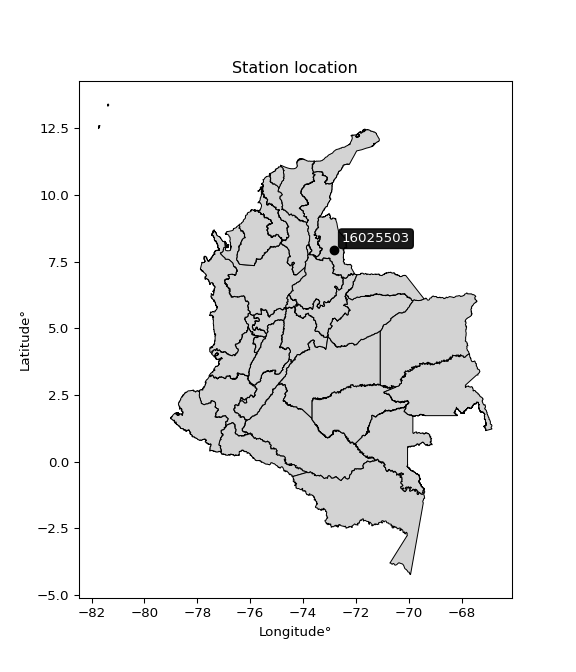

<div align="center">


</div>

# PMP Station (Rain, Pmax24h): 16025503

Probable Maximum Precipitation (PMP) is the greatest amount of rainfall for a specific duration that is meteorologically possible for a given location, acting as a "worst-case" scenario for extreme storms, crucial for designing safety-critical infrastructure like bridges, river deviations, dams, spillways, and nuclear plants to prevent catastrophic failure. PMP is calculated by hydrologists using meteorological data to determine the upper limit of extreme rainfall, often leading to the Probable Maximum Flood (PMF) for flood control design, and is increasingly being studied for climate change impacts. Probable Maximum Precipitation (PMP) is the theoretical upper limit of rainfall, a deterministic estimate for extreme events, while probability distributions (like GEV, Gumbel) describe the likelihood and frequency of various precipitation amounts, including rare ones, showing how often events occur, with PMP representing the extreme end of these distributions, used for critical infrastructure design to ensure safety against the worst conceivable weather, unlike standard statistical forecasts which cover typical probabilities.

The most common probability distributions in hydrology, used for analyzing floods, rainfall, and streamflow, include the Normal, Log-Normal, Gumbel, Gamma (including Log-Pearson Type III), and Generalized Extreme Value (GEV) distributions, often chosen based on the data´s skewness and whether modeling extremes or general conditions, with Gumbel and GEV popular for extreme events like floods, while the Normal distribution serves as a baseline, though often requiring transformations for skewed hydrological data. These distributions help in designing water infrastructure, managing water resources, and forecasting hydrologic events.

> Hydrological data often isn´t perfectly normal (it´s skewed), so different distributions are needed for different applications, such as: **Flood Frequency Analysis**: Using Gumbel, GEV, or Log-Pearson Type III for predicting extreme flood magnitudes and their return periods, **Rainfall Analysis**: Normal for annual totals, but Log-Normal, Weibull, or GEV for intensity or extreme daily rainfall, **Streamflow Modeling**: Gamma and Log-Normal for maximum flows, GEV for minimum flows, and Kappa for daily flows.

<div align="center">

</img>

</div>


## A. General information


### 1. General running parameters

• app_version: _v20260113_. • runtime: _2026-01-13 16:28:34.738620_. • Python version: _3.14.0_. • SciPy version: _1.16.3_. • Pandas version: _2.3.3_. • NumPy version: _2.3.5_. • Stations dataset (station_dataset_file): _dataset/pmax24h_in/automatic_colombia_2003_2025.csv_. • Stations catalog (station_catalog_file): _dataset/CNE.xls_. • Minimum year to eval til year_max (date_min): _1900_. • Maximum year to eval since year_min (date_max): _2025_. • Creates, save and include plots into reports (create_plot): _False_. • Plot only fit distributions with Δo > Δ (plot_only_fit): _True_. • Plot only simple graphs avoiding multiple CDFs and multiple Extreme values plots (plot_only_simple): _True_. • Eval low extreme values, if False, evaluates high extreme values (low_extreme): _False_. • Eval every SciPy distribution as logarithmic (pdist_logarithmic_on): _True_. • Standard deviation normalized (ddof): _1.0_. • Return periods to eval in years (Tr): _[2, 2.33, 5, 10, 15, 20, 25, 50, 75, 100, 200, 250, 500, 750, 1000]_. • Minimum data sample per station, 0 means any (minimum_sample): _5_. • Z-Score maximum threshold to adjust a value, 0 means disable (zscore_max): _3.5_. • Z-Score minimum threshold to adjust a value, 0 means disable (zscore_min): _-2.5_. • Avoid zeros, e.g. rain = 0 (avoid_zeros): _True_. • Avoid null values (avoid_nans): _True_. 

:file_folder:Table: [dataset.csv](../../dataset/pmax24h_in/automatic_colombia_2003_2025.csv)

> Delta Degrees of Freedom (DDOF): is a parameter used in the formulas for calculating variance and standard deviation. When ddof=0, the divisor is $N$ (the total number of observations) and this is used when your data set is the entire population. When ddof=1, the divisor is $N-1$ and this is used when your data set is a sample drawn from a larger population. Using $N-1$ provides an unbiased estimate of the population variance (known as Bessel´s correction).


### 2. Station info and location

|   id |   CODIGO | NOMBRE                       | CATEGORIA               | TECNOLOGIA                | ESTADO   | FECHA_INSTALACION   |   FECHA_SUSPENSION |   ALTITUD |   LATITUD |   LONGITUD | DEPARTAMENTO       | MUNICIPIO   | AREA_OPERATIVA                         | ENTIDAD                                    | AREA_HIDROGRAFICA   | ZONA_HIDROGRAFICA   | SUBZONA_HIDROGRAFICA   |   CORRIENTE | Catalogo   |   Version |
|-----:|---------:|:-----------------------------|:------------------------|:--------------------------|:---------|:--------------------|-------------------:|----------:|----------:|-----------:|:-------------------|:------------|:---------------------------------------|:-------------------------------------------|:--------------------|:--------------------|:-----------------------|------------:|:-----------|----------:|
|    0 | 16025503 | GRAMALOTE  - AUT  [16025503] | Climatológica Principal | Automática con Telemetría | Activa   | 14/05/2013          |                nan |      1761 |   7.92316 |   -72.8338 | Norte De Santander | Gramalote   | Area Operativa 08 - Santanderes-Arauca | CENTRO NACIONAL DE INVESTIGACIONES DE CAFE | Caribe              | Catatumbo           | Río Zulia              |         nan | CNE_OE     |  20251226 |

<div align="center">

Dynamic map: [:earth_americas:Google](http://maps.google.com/maps?q=7.923163889,-72.83375556) [:earth_americas:OSM](https://www.openstreetmap.org/#map=18/7.923163889/-72.83375556&layers=P) [:earth_americas:Bing](https://www.bing.com/maps?cp=7.923163889~-72.83375556&lvl=18) [:earth_americas:Apple](https://maps.apple.com/frame?center=7.923163889%2C-72.83375556&span=0.003%2C0.006)

</div>


<div align="center">

```geojson
{
  "type": "Feature",
  "geometry": {
    "type": "Point", 
    "coordinates": [-72.83375556, 7.923163889]
  }, 
  "properties": {
    "Name": "16025503"
  }
}
```

</div>


### 3. Discrete values table and plot

<div align="center">

|               |          0 |            1 |          2 |            3 |           4 |           5 |            6 |          7 |
|:--------------|-----------:|-------------:|-----------:|-------------:|------------:|------------:|-------------:|-----------:|
| Date          | 2016       | 2017         | 2018       | 2019         | 2020        | 2021        | 2022         | 2023       |
| Value         |   27.4     |   59.1       |   28.3     |   58.4       |   61.2      |   71        |   55.3       |   97.2     |
| Value_initial |   27.4     |   59.1       |   28.3     |   58.4       |   61.2      |   71        |   55.3       |   97.2     |
| count         |    8       |    8         |    8       |    8         |    8        |    8        |    8         |    8       |
| mean          |   57.2375  |   57.2375    |   57.2375  |   57.2375    |   57.2375   |   57.2375   |   57.2375    |   57.2375  |
| std           |   22.4828  |   22.4828    |   22.4828  |   22.4828    |   22.4828   |   22.4828   |   22.4828    |   22.4828  |
| zscore        |   -1.32712 |    0.0828411 |   -1.28709 |    0.0517062 |    0.176246 |    0.612134 |   -0.0861769 |    1.77747 |


</div>


> The initial value (value_initial) correspond to the initial obtained or null completed value, and value (value) is adjusted only when the initial value is outside the valid range (outlier) definite through the Z-Score value. If Z-Score is active, values out of range or outliers are replaced with the station mean value. A Z-Score (or standard score) measures how many standard deviations a data point is from the mean of a dataset, indicating its relative position; positive scores mean above the mean, negative mean below, and a score of zero is exactly at the mean, allowing for comparison of values from different distributions. It´s calculated using the formula $z=(x–μ)/σ$, where $x$ is the data point, $μ$ is the mean, and $σ$ is the standard deviation, helping identify outliers and understand probability.
>
> <sub>**Note**: In this study, "completing" (filling gaps in) and "extending" (forecasting or lengthening the historical record) rainfall data series are avoided for certain critical analyses because they introduce artificial bias and uncertainty, which can distort the statistics of rare events (extremes), alter day-to-day variability, and compromise the integrity and homogeneity of the original data. Some reasons against Completing/Extending rainfall data are: **Distortion of Extremes and Variability**: The primary issue is that most gap-filling or extension methods rely on averaging or regression with nearby stations, which inherently smooths the data. Rainfall is highly variable in space and time, with a large percentage of zero values and occasional large storms. Infilling methods often underestimate the highest values and overestimate the lowest (zero) values, which severely distorts analyses focused on flood frequency, drought severity, and intensity-duration-frequency (IDF) curves, **Loss of Data Homogeneity**: Infilled or extended data are synthetic estimates, not actual measurements. Combining these estimates with observed data can violate the assumption of data homogeneity, which requires that the data properties do not change over time. Inhomogeneity can lead to incorrect conclusions about long-term trends or changes in climate patterns, **Propagation of Errors**: Errors and biases from the original data (e.g., wind-induced undercatch, instrument errors, site changes) or the data used for imputation can propagate through the analysis, leading to unreliable hydrological models and inaccurate predictions, **Compromised Statistical Integrity**: For statistical analyses, especially those involving the frequency of events, using artificial data can introduce time bias or autocorrelation that doesn´t exist in reality, making it difficult to assess the true probability of events, **Difficulty in Validation**: It is difficult to accurately validate the quality of filled or extended data, especially for past periods where ground-truth measurements are unavailable. The reliability of imputation techniques heavily depends on the density of the surrounding station network and the complexity of the local topography.</sub>


### 4. Active continuous probability distributions from SciPy (45 of 104 available)

A Probability Density Function (PDF) describes the relative likelihood of a continuous random variable falling within a specific range, where the total area under its curve equals 1, and the area over any interval gives the actual probability for that range. Unlike discrete probabilities (like rolling a die), a PDF shows density, not direct probability for a single point (which is zero), with higher points indicating higher likelihood, often visualized as a bell curve for normal distributions.

A log of a probability density function (log-PDF) is simply the logarithm of the PDF´s value, denoted as $log(f(x))$, useful for converting multiplication of probabilities into addition, improving numerical stability with tiny numbers, and connecting to information theory concepts like entropy. Instead of dealing with very small probabilities (e.g., 0.000001), log-PDFs use negative numbers (e.g., $log(0.00001) ≈ -11.51$ that are easier for computers to handle, preventing underflow errors and simplifying complex calculations. In this study, each active probability distribution from SciPy is also evaluated in the $log$ form.

[scipy.stats](https://docs.scipy.org/doc/scipy/reference/stats.html) is a Python´s powerful submodule within the SciPy library for comprehensive statistical analysis, offering over 130 probability distributions (like Normal, Poisson), functions for descriptive stats (mean, variance), hypothesis testing (t-tests, chi-square), random variable generation, and statistical tests, making it essential for data science, modeling, and research. It provides tools to explore, model, and draw conclusions from data efficiently, working seamlessly with NumPy.

<div align="center">

|   id | p_dist             |   n_parameter | fit_method   | label                                                                       | active   | ref                                                                                                        |
|-----:|:-------------------|--------------:|:-------------|:----------------------------------------------------------------------------|:---------|:-----------------------------------------------------------------------------------------------------------|
|    0 | alpha              |             3 | MLE          | Alpha                                                                       | True     | [:mortar_board:](https://docs.scipy.org/doc/scipy/reference/generated/scipy.stats.alpha.html)              |
|    1 | betaprime          |             4 | MLE          | Beta prime                                                                  | True     | [:mortar_board:](https://docs.scipy.org/doc/scipy/reference/generated/scipy.stats.betaprime.html)          |
|    2 | chi2               |             3 | MLE          | Chi²                                                                        | True     | [:mortar_board:](https://docs.scipy.org/doc/scipy/reference/generated/scipy.stats.chi2.html)               |
|    3 | crystalball        |             4 | MLE          | Crystalball                                                                 | True     | [:mortar_board:](https://docs.scipy.org/doc/scipy/reference/generated/scipy.stats.crystalball.html)        |
|    4 | dweibull           |             3 | MLE          | Double Weibull                                                              | True     | [:mortar_board:](https://docs.scipy.org/doc/scipy/reference/generated/scipy.stats.dweibull.html)           |
|    5 | erlang             |             3 | MLE          | Erlang                                                                      | True     | [:mortar_board:](https://docs.scipy.org/doc/scipy/reference/generated/scipy.stats.erlang.html)             |
|    6 | expon              |             2 | MLE          | Exponential                                                                 | True     | [:mortar_board:](https://docs.scipy.org/doc/scipy/reference/generated/scipy.stats.expon.html)              |
|    7 | exponnorm          |             3 | MLE          | Exponentially modified Normal                                               | True     | [:mortar_board:](https://docs.scipy.org/doc/scipy/reference/generated/scipy.stats.exponnorm.html)          |
|    8 | f                  |             4 | MLE          | F                                                                           | True     | [:mortar_board:](https://docs.scipy.org/doc/scipy/reference/generated/scipy.stats.f.html)                  |
|    9 | fatiguelife        |             3 | MLE          | Fatigue-life (Birnbaum-Saunders)                                            | True     | [:mortar_board:](https://docs.scipy.org/doc/scipy/reference/generated/scipy.stats.fatiguelife.html)        |
|   10 | fisk               |             3 | MLE          | Fisk                                                                        | True     | [:mortar_board:](https://docs.scipy.org/doc/scipy/reference/generated/scipy.stats.fisk.html)               |
|   11 | gamma              |             3 | MLE          | Gamma                                                                       | True     | [:mortar_board:](https://docs.scipy.org/doc/scipy/reference/generated/scipy.stats.gamma.html)              |
|   12 | genexpon           |             5 | MLE          | Generalized exponential                                                     | True     | [:mortar_board:](https://docs.scipy.org/doc/scipy/reference/generated/scipy.stats.genexpon.html)           |
|   13 | genlogistic        |             3 | MLE          | Generalized logistic                                                        | True     | [:mortar_board:](https://docs.scipy.org/doc/scipy/reference/generated/scipy.stats.genlogistic.html)        |
|   14 | gibrat             |             2 | MM           | Gibrat                                                                      | True     | [:mortar_board:](https://docs.scipy.org/doc/scipy/reference/generated/scipy.stats.gibrat.html)             |
|   15 | gompertz           |             3 | MLE          | Gompertz (or truncated Gumbel)                                              | True     | [:mortar_board:](https://docs.scipy.org/doc/scipy/reference/generated/scipy.stats.gompertz.html)           |
|   16 | gumbel_l           |             2 | MM           | Gumbel Left Skew                                                            | True     | [:mortar_board:](https://docs.scipy.org/doc/scipy/reference/generated/scipy.stats.gumbel_l.html)           |
|   17 | gumbel_r           |             2 | MM           | Gumbel Right Skew                                                           | True     | [:mortar_board:](https://docs.scipy.org/doc/scipy/reference/generated/scipy.stats.gumbel_r.html)           |
|   18 | halflogistic       |             2 | MM           | Half-logistic                                                               | True     | [:mortar_board:](https://docs.scipy.org/doc/scipy/reference/generated/scipy.stats.halflogistic.html)       |
|   19 | halfnorm           |             2 | MM           | Half Normal                                                                 | True     | [:mortar_board:](https://docs.scipy.org/doc/scipy/reference/generated/scipy.stats.halfnorm.html)           |
|   20 | hypsecant          |             2 | MM           | hyperbolic secant                                                           | True     | [:mortar_board:](https://docs.scipy.org/doc/scipy/reference/generated/scipy.stats.hypsecant.html)          |
|   21 | invgamma           |             3 | MLE          | Inverted gamma                                                              | True     | [:mortar_board:](https://docs.scipy.org/doc/scipy/reference/generated/scipy.stats.invgamma.html)           |
|   22 | invgauss           |             3 | MLE          | Inverse Gaussian                                                            | True     | [:mortar_board:](https://docs.scipy.org/doc/scipy/reference/generated/scipy.stats.invgauss.html)           |
|   23 | invweibull         |             3 | MLE          | Inverted Weibull                                                            | True     | [:mortar_board:](https://docs.scipy.org/doc/scipy/reference/generated/scipy.stats.invweibull.html)         |
|   24 | kappa4             |             4 | MLE          | Kappa 4                                                                     | True     | [:mortar_board:](https://docs.scipy.org/doc/scipy/reference/generated/scipy.stats.kappa4.html)             |
|   25 | kstwobign          |             2 | MLE          | Limiting distribution of scaled Kolmogorov-Smirnov two-sided test statistic | True     | [:mortar_board:](https://docs.scipy.org/doc/scipy/reference/generated/scipy.stats.kstwobign.html)          |
|   26 | laplace            |             2 | MM           | Laplace                                                                     | True     | [:mortar_board:](https://docs.scipy.org/doc/scipy/reference/generated/scipy.stats.laplace.html)            |
|   27 | laplace_asymmetric |             3 | MLE          | Asymmetric Laplace                                                          | True     | [:mortar_board:](https://docs.scipy.org/doc/scipy/reference/generated/scipy.stats.laplace_asymmetric.html) |
|   28 | loggamma           |             3 | MLE          | Log gamma                                                                   | True     | [:mortar_board:](https://docs.scipy.org/doc/scipy/reference/generated/scipy.stats.loggamma.html)           |
|   29 | logistic           |             2 | MM           | Logistic (or Sech-squared)                                                  | True     | [:mortar_board:](https://docs.scipy.org/doc/scipy/reference/generated/scipy.stats.logistic.html)           |
|   30 | lognorm            |             3 | MLE          | Log Normal                                                                  | True     | [:mortar_board:](https://docs.scipy.org/doc/scipy/reference/generated/scipy.stats.lognorm.html)            |
|   31 | maxwell            |             2 | MM           | Maxwell                                                                     | True     | [:mortar_board:](https://docs.scipy.org/doc/scipy/reference/generated/scipy.stats.maxwell.html)            |
|   32 | mielke             |             4 | MLE          | Mielke Beta-Kappa / Dagum                                                   | True     | [:mortar_board:](https://docs.scipy.org/doc/scipy/reference/generated/scipy.stats.mielke.html)             |
|   33 | moyal              |             2 | MM           | Moyal                                                                       | True     | [:mortar_board:](https://docs.scipy.org/doc/scipy/reference/generated/scipy.stats.moyal.html)              |
|   34 | nakagami           |             3 | MLE          | Nakagami                                                                    | True     | [:mortar_board:](https://docs.scipy.org/doc/scipy/reference/generated/scipy.stats.nakagami.html)           |
|   35 | ncf                |             5 | MLE          | Non-central F distribution                                                  | True     | [:mortar_board:](https://docs.scipy.org/doc/scipy/reference/generated/scipy.stats.ncf.html)                |
|   36 | nct                |             4 | MLE          | Non-central Student’s t                                                     | True     | [:mortar_board:](https://docs.scipy.org/doc/scipy/reference/generated/scipy.stats.nct.html)                |
|   37 | norm               |             2 | MM           | Normal                                                                      | True     | [:mortar_board:](https://docs.scipy.org/doc/scipy/reference/generated/scipy.stats.norm.html)               |
|   38 | pearson3           |             3 | MM           | Pearson type III                                                            | True     | [:mortar_board:](https://docs.scipy.org/doc/scipy/reference/generated/scipy.stats.pearson3.html)           |
|   39 | rayleigh           |             2 | MM           | Rayleigh                                                                    | True     | [:mortar_board:](https://docs.scipy.org/doc/scipy/reference/generated/scipy.stats.rayleigh.html)           |
|   40 | rice               |             3 | MLE          | Rice                                                                        | True     | [:mortar_board:](https://docs.scipy.org/doc/scipy/reference/generated/scipy.stats.rice.html)               |
|   41 | t                  |             3 | MLE          | Student’s t                                                                 | True     | [:mortar_board:](https://docs.scipy.org/doc/scipy/reference/generated/scipy.stats.t.html)                  |
|   42 | truncnorm          |             4 | MLE          | Truncated normal                                                            | True     | [:mortar_board:](https://docs.scipy.org/doc/scipy/reference/generated/scipy.stats.truncnorm.html)          |
|   43 | wald               |             2 | MM           | Wald                                                                        | True     | [:mortar_board:](https://docs.scipy.org/doc/scipy/reference/generated/scipy.stats.wald.html)               |
|   44 | weibull_min        |             3 | MLE          | Weibull minimum                                                             | True     | [:mortar_board:](https://docs.scipy.org/doc/scipy/reference/generated/scipy.stats.weibull_min.html)        |

</div>

> **n_parameter:** # arguments & localization & scale.
>
> **Fit methods:** (MLE) maximum likelihood, (MM) L-moments.
>
>**Inactive** (With the only purpose of prevent loops, zero divisions, infinite values, over high estimated values or horizontal trending for recurrence intervals estimations, the follow distributions were disabled.)**:** foldnorm, gennorm, norminvgauss, powernorm, powerlognorm, skewnorm, genextreme, anglit, arcsine, argus, beta, bradford, burr, burr12, cauchy, cosine, halfcauchy, foldcauchy, skewcauchy, wrapcauchy, dgamma, gengamma, exponweib, exponpow, truncexpon, gausshyper, genhalflogistic, genhyperbolic, geninvgauss, halfgennorm, johnsonsb, johnsonsu, kappa3, ksone, kstwo, loglaplace, levy, levy_l, levy_stable, ncx2, pareto, genpareto, truncpareto, lomax, powerlaw, rdist, rel_breitwigner, recipinvgauss, semicircular, studentized_range, trapezoid, triang, truncweibull_min, tukeylambda, uniform, loguniform, vonmises, vonmises_line, weibull_max, 


## B. Probability (PDF) vs. Empirical (EDF) distributions functions

A continuous probability distribution (CPD) describes probabilities for variables that can take any value within a range (like rain any time), unlike discrete variables with specific outcomes (like temperature). It uses a Probability Density Function (PDF), a curve where the total area under it equals 1, and the probability of the variable falling within an interval (a to b) is found by calculating the area under the curve between those points. A key feature is that the probability of hitting any single exact value is zero, so probabilities are always expressed for ranges, e.g., $P(a ≤ X ≤ b)$.

<div align="center">

Distributions parameters from station values
|    |   station | p_dist                |   n |              loc |           scale | shape                 | shape1                | shape2                | shape3   |
|---:|----------:|:----------------------|----:|-----------------:|----------------:|:----------------------|:----------------------|:----------------------|:---------|
|  0 |  16025503 | alpha                 |   8 |   -270.885       |  5107.23        | 15.634610064661175    |                       |                       |          |
|  1 |  16025503 | betaprime             |   8 |    -58.682       |  7906.25        | 30.505111454875802    | 2081.574533258163     |                       |          |
|  2 |  16025503 | chi2                  |   8 |     27.4         |    16.5646      | 1.1487805530965605    |                       |                       |          |
|  3 |  16025503 | crystalball           |   8 |     57.2391      |    21.032       | 94829.13970933462     | 5086.8974098518775    |                       |          |
|  4 |  16025503 | dweibull              |   8 |     59.1         |    16.8185      | 0.7466066225228383    |                       |                       |          |
|  5 |  16025503 | erlang                |   8 |    -54.5545      |     4.00298     | 27.926987354448258    |                       |                       |          |
|  6 |  16025503 | expon                 |   8 |     27.4         |    29.8375      |                       |                       |                       |          |
|  7 |  16025503 | exponnorm             |   8 |     48.2005      |    19.0387      | 0.47466573849831806   |                       |                       |          |
|  8 |  16025503 | f                     |   8 |    -56.2682      |   113.478       | 58.017148310750414    | 8151.948478017264     |                       |          |
|  9 |  16025503 | fatiguelife           |   8 |     27.4         |     3.40306e-05 | 893.6351337889978     |                       |                       |          |
| 10 |  16025503 | fisk                  |   8 |   -421.525       |   478.491       | 40.18560266416571     |                       |                       |          |
| 11 |  16025503 | gamma                 |   8 |    -54.5031      |     4.00505     | 27.89992956192362     |                       |                       |          |
| 12 |  16025503 | genexpon              |   8 |     27.4         |     2.26356     | 0.07572416484994422   | 9.408238181062901e-07 | 0.5338266691657199    |          |
| 13 |  16025503 | genlogistic           |   8 |     55.2249      |    12.3571      | 1.1097500486973961    |                       |                       |          |
| 14 |  16025503 | gibrat                |   8 |     41.1936      |     9.73109     |                       |                       |                       |          |
| 15 |  16025503 | gompertz              |   8 |     27.4         |    41.3843      | 0.7419294367523365    |                       |                       |          |
| 16 |  16025503 | gumbel_l              |   8 |     66.7025      |    16.3976      |                       |                       |                       |          |
| 17 |  16025503 | gumbel_r              |   8 |     47.7725      |    16.3976      |                       |                       |                       |          |
| 18 |  16025503 | halflogistic          |   8 |     32.3112      |    17.9805      |                       |                       |                       |          |
| 19 |  16025503 | halfnorm              |   8 |     29.401       |    34.8879      |                       |                       |                       |          |
| 20 |  16025503 | hypsecant             |   8 |     57.2375      |    13.3886      |                       |                       |                       |          |
| 21 |  16025503 | invgamma              |   8 |   -112.168       | 10825           | 64.97910692202726     |                       |                       |          |
| 22 |  16025503 | invgauss              |   8 |    -50.7462      |  2695.39        | 0.039995612632178504  |                       |                       |          |
| 23 |  16025503 | invweibull            |   8 |     27.4         |     1.77655     | 0.05070326891139433   |                       |                       |          |
| 24 |  16025503 | kappa4                |   8 |     19.5468      |    79.7629      | 1.109259312574311     | 1.0271684828921481    |                       |          |
| 25 |  16025503 | kstwobign             |   8 |    -19.3147      |    87.5764      |                       |                       |                       |          |
| 26 |  16025503 | laplace               |   8 |     57.2375      |    14.871       |                       |                       |                       |          |
| 27 |  16025503 | laplace_asymmetric    |   8 |     59.1         |    14.7997      | 1.064907764577958     |                       |                       |          |
| 28 |  16025503 | loggamma              |   8 |  -5183.28        |   738.344       | 1209.687178586159     |                       |                       |          |
| 29 |  16025503 | logistic              |   8 |     57.2375      |    11.5949      |                       |                       |                       |          |
| 30 |  16025503 | lognorm               |   8 |     27.4         |     0.234092    | 12.091296846781107    |                       |                       |          |
| 31 |  16025503 | maxwell               |   8 |      7.40346     |    31.2289      |                       |                       |                       |          |
| 32 |  16025503 | mielke                |   8 |     27.3978      |    50.4943      | 0.7896585974252226    | 4.61550948718852      |                       |          |
| 33 |  16025503 | moyal                 |   8 |     45.2108      |     9.46716     |                       |                       |                       |          |
| 34 |  16025503 | nakagami              |   8 |     27.4         |    43.5086      | 0.3537916316080133    |                       |                       |          |
| 35 |  16025503 | ncf                   |   8 |     -2.59017     |     7.49741e-05 | 4.149312438785302e-05 | 722.4542537043542     | 33.061258663871556    |          |
| 36 |  16025503 | nct                   |   8 |     -0.171116    |    19.8054      | 50.192453700636705    | 2.8543123393219965    |                       |          |
| 37 |  16025503 | norm                  |   8 |     57.2375      |    21.0307      |                       |                       |                       |          |
| 38 |  16025503 | pearson3              |   8 |     57.2375      |    21.0307      | 0.2109019679782675    |                       |                       |          |
| 39 |  16025503 | rayleigh              |   8 |     17.0045      |    32.1013      |                       |                       |                       |          |
| 40 |  16025503 | rice                  |   8 |     15.671       |    25.3149      | 1.1774013375287509    |                       |                       |          |
| 41 |  16025503 | t                     |   8 |     57.2406      |    21.0268      | 713946.674009565      |                       |                       |          |
| 42 |  16025503 | truncnorm             |   8 |     57.2375      |    21.0307      | -506.0629643715805    | 1184.4041387027528    |                       |          |
| 43 |  16025503 | wald                  |   8 |     36.2067      |    21.0308      |                       |                       |                       |          |
| 44 |  16025503 | weibull_min           |   8 |     20.298       |    41.261       | 1.7427288269759735    |                       |                       |          |
| 45 |  16025503 | logalpha              |   8 |     -7.95987     |   342.747       | 28.7649702698086      |                       |                       |          |
| 46 |  16025503 | logbetaprime          |   8 |    -10.7986      |    16.9748      | 2356.564248351214     | 2709.668490821393     |                       |          |
| 47 |  16025503 | logchi2               |   8 |      3.31054     |     0.987964    | 1.0137373576771593    |                       |                       |          |
| 48 |  16025503 | logcrystalball        |   8 |      3.97079     |     0.407128    | 242.31446082981176    | 6.45567267080613      |                       |          |
| 49 |  16025503 | logdweibull           |   8 |      4.07923     |     0.33406     | 0.6730950372591252    |                       |                       |          |
| 50 |  16025503 | logerlang             |   8 |     -2.98693     |     0.0249872   | 278.2940540933698     |                       |                       |          |
| 51 |  16025503 | logexpon              |   8 |      3.31054     |     0.660247    |                       |                       |                       |          |
| 52 |  16025503 | logexponnorm          |   8 |      3.97047     |     0.40713     | 0.0007863539948366451 |                       |                       |          |
| 53 |  16025503 | logf                  |   8 |   -437.363       |   441.332       | 9607894.080046337     | 3084478.3858425086    |                       |          |
| 54 |  16025503 | logfatiguelife        |   8 |   -109.298       |   113.267       | 0.003604273061213434  |                       |                       |          |
| 55 |  16025503 | logfisk               |   8 |     -2.78541e+07 |     2.78541e+07 | 118890378.53459002    |                       |                       |          |
| 56 |  16025503 | loggamma              |   8 |     -2.16447     |     0.0284572   | 215.4854317461254     |                       |                       |          |
| 57 |  16025503 | loggenexpon           |   8 |      3.31054     |     0.0307301   | 0.02365206793323865   | 2.61405021936491      | 0.0005877474818192323 |          |
| 58 |  16025503 | loggenlogistic        |   8 |      4.26997     |     0.130938    | 0.36069075266258144   |                       |                       |          |
| 59 |  16025503 | loggibrat             |   8 |      3.66023     |     0.188365    |                       |                       |                       |          |
| 60 |  16025503 | loggompertz           |   8 |      3.31054     |     0.473237    | 0.22267104525604647   |                       |                       |          |
| 61 |  16025503 | loggumbel_l           |   8 |      4.15402     |     0.317436    |                       |                       |                       |          |
| 62 |  16025503 | loggumbel_r           |   8 |      3.78756     |     0.317436    |                       |                       |                       |          |
| 63 |  16025503 | loghalflogistic       |   8 |      3.48825     |     0.348078    |                       |                       |                       |          |
| 64 |  16025503 | loghalfnorm           |   8 |      3.43189     |     0.675409    |                       |                       |                       |          |
| 65 |  16025503 | loghypsecant          |   8 |      3.97079     |     0.259185    |                       |                       |                       |          |
| 66 |  16025503 | loginvgamma           |   8 |     -4.51246     |  3572.79        | 422.2115545639515     |                       |                       |          |
| 67 |  16025503 | loginvgauss           |   8 |      0.502163    |   224.966       | 0.015436221120969748  |                       |                       |          |
| 68 |  16025503 | loginvweibull         |   8 | -24999.9         | 25003.6         | 60451.12019505682     |                       |                       |          |
| 69 |  16025503 | logkappa4             |   8 |      3.27301     |     1.40526     | 1.0261302530742507    | 1.0778508814463628    |                       |          |
| 70 |  16025503 | logkstwobign          |   8 |      2.32903     |     1.87041     |                       |                       |                       |          |
| 71 |  16025503 | loglaplace            |   8 |      3.97079     |     0.287883    |                       |                       |                       |          |
| 72 |  16025503 | loglaplace_asymmetric |   8 |      4.07923     |     0.271455    | 1.2194902629604236    |                       |                       |          |
| 73 |  16025503 | logloggamma           |   8 |      4.05432     |     0.38509     | 1.2588629067681225    |                       |                       |          |
| 74 |  16025503 | loglogistic           |   8 |      3.97079     |     0.224461    |                       |                       |                       |          |
| 75 |  16025503 | loglognorm            |   8 |      3.31054     |     0.0069871   | 11.536407785860442    |                       |                       |          |
| 76 |  16025503 | logmaxwell            |   8 |      3.00607     |     0.604549    |                       |                       |                       |          |
| 77 |  16025503 | logmielke             |   8 |      0.0534683   |     4.25038     | 10.042297626407183    | 33.76088834462237     |                       |          |
| 78 |  16025503 | logmoyal              |   8 |      3.73797     |     0.183272    |                       |                       |                       |          |
| 79 |  16025503 | lognakagami           |   8 |      3.31054     |     0.928635    | 0.3635133682234674    |                       |                       |          |
| 80 |  16025503 | logncf                |   8 |    -25.5866      |     4.00575     | 7280.34497071769      | 16103.190270444553    | 46431.46860403949     |          |
| 81 |  16025503 | lognct                |   8 |    -13.0735      |     0.282409    | 1606.5797365583521    | 60.32020526617859     |                       |          |
| 82 |  16025503 | lognorm               |   8 |      3.97079     |     0.407128    |                       |                       |                       |          |
| 83 |  16025503 | logpearson3           |   8 |      3.97079     |     0.407128    | -0.523900005319804    |                       |                       |          |
| 84 |  16025503 | lograyleigh           |   8 |      3.19193     |     0.621439    |                       |                       |                       |          |
| 85 |  16025503 | logrice               |   8 |      3.04989     |     0.454987    | 1.7021468453614172    |                       |                       |          |
| 86 |  16025503 | logt                  |   8 |      3.97079     |     0.407127    | 8744057945.896599     |                       |                       |          |
| 87 |  16025503 | logtruncnorm          |   8 |     -0.112001    |     1.07301     | 3.844098755254697     | 4.3697270412102       |                       |          |
| 88 |  16025503 | logwald               |   8 |      3.56364     |     0.407154    |                       |                       |                       |          |
| 89 |  16025503 | logweibull_min        |   8 |     -0.60595     |     4.75526     | 13.872441351309046    |                       |                       |          |

</div>

> **loc** (Location parameter): This shifts the distribution along the x-axis. For many common distributions, like the normal (Gaussian) distribution, loc represents the mean $μ$. For others, like the uniform distribution, it might represent the minimum value, or for the beta distribution, the left end of the support interval.
>
> **scale** (Scale parameter): This determines the width or spread of the distribution. For the normal distribution, scale represents the standard deviation $σ$. For a uniform distribution, it defines the length of the interval (from $loc$ to $loc + scale$).
>
> **shape** (Shape parameters): Refers to parameters that define the specific form of a probability distribution, distinct from its location (loc) and scale (scale). These parameters are required arguments for most distribution functions. For example, a normal (Gaussian) distribution is fully defined by its location (mean) and scale (standard deviation), so it has no specific shape parameters beyond loc and scale. However, other distributions have intrinsic properties that need specification, as Gamma distribution that takes a shape parameter, often named $a$ or $alpha$.


### 0. Cumulative distribution values - CDF (90 evaluated)

Cumulative Distribution Function (CDF), denoted as $F$<sub>$X$</sub>$(x)$, is a function that gives the probability that a random variable $X$ will take a value less than or equal to a specific value, $x$ (i.e., $(P(X≥x)$. It essentially "accumulates" probabilities from a given point up to the far right (positive infinity), providing a complete picture of the distribution´s probabilities for both discrete (like rain) and continuous (like temperature) variables, helping to find probabilities over ranges or above certain values. Each station is evaluated separately ordering the $x$ values ascending, calculating the CDF and PDF values for the activated distributions and their logarithmic forms.

<div align="center">

CDF ordered by x ascending and calculating $log(f(x))$ separately
|   id |   Station |   date |    x |   count |    mean |     std |     zscore |   Value_initial |   station |   m |     alpha |   alpha_pdf |   betaprime |   betaprime_pdf |        chi2 |        chi2_pdf |   crystalball |   crystalball_pdf |   dweibull |   dweibull_pdf |    erlang |   erlang_pdf |    expon |   expon_pdf |   exponnorm |   exponnorm_pdf |         f |      f_pdf |   fatiguelife |   fatiguelife_pdf |      fisk |   fisk_pdf |     gamma |   gamma_pdf |    genexpon |   genexpon_pdf |   genlogistic |   genlogistic_pdf |   gibrat |   gibrat_pdf |    gompertz |   gompertz_pdf |   gumbel_l |   gumbel_l_pdf |   gumbel_r |   gumbel_r_pdf |   halflogistic |   halflogistic_pdf |   halfnorm |   halfnorm_pdf |   hypsecant |   hypsecant_pdf |   invgamma |   invgamma_pdf |   invgauss |   invgauss_pdf |   invweibull |   invweibull_pdf |      kappa4 |   kappa4_pdf |   kstwobign |   kstwobign_pdf |   laplace |   laplace_pdf |   laplace_asymmetric |   laplace_asymmetric_pdf |   loggamma |   loggamma_pdf |   logistic |   logistic_pdf |   lognorm |   lognorm_pdf |   maxwell |   maxwell_pdf |     mielke |   mielke_pdf |     moyal |   moyal_pdf |    nakagami |   nakagami_pdf |       ncf |    ncf_pdf |       nct |    nct_pdf |      norm |   norm_pdf |   pearson3 |   pearson3_pdf |   rayleigh |   rayleigh_pdf |      rice |   rice_pdf |         t |      t_pdf |   truncnorm |   truncnorm_pdf |     wald |   wald_pdf |   weibull_min |   weibull_min_pdf |   logalpha |   logalpha_pdf |   logbetaprime |   logbetaprime_pdf |     logchi2 |   logchi2_pdf |   logcrystalball |   logcrystalball_pdf |   logdweibull |   logdweibull_pdf |   logerlang |   logerlang_pdf |   logexpon |   logexpon_pdf |   logexponnorm |   logexponnorm_pdf |      logf |   logf_pdf |   logfatiguelife |   logfatiguelife_pdf |   logfisk |   logfisk_pdf |   loggenexpon |   loggenexpon_pdf |   loggenlogistic |   loggenlogistic_pdf |   loggibrat |   loggibrat_pdf |   loggompertz |   loggompertz_pdf |   loggumbel_l |   loggumbel_l_pdf |   loggumbel_r |   loggumbel_r_pdf |   loghalflogistic |   loghalflogistic_pdf |   loghalfnorm |   loghalfnorm_pdf |   loghypsecant |   loghypsecant_pdf |   loginvgamma |   loginvgamma_pdf |   loginvgauss |   loginvgauss_pdf |   loginvweibull |   loginvweibull_pdf |   logkappa4 |   logkappa4_pdf |   logkstwobign |   logkstwobign_pdf |   loglaplace |   loglaplace_pdf |   loglaplace_asymmetric |   loglaplace_asymmetric_pdf |   logloggamma |   logloggamma_pdf |   loglogistic |   loglogistic_pdf |   loglognorm |   loglognorm_pdf |   logmaxwell |   logmaxwell_pdf |   logmielke |   logmielke_pdf |   logmoyal |   logmoyal_pdf |   lognakagami |   lognakagami_pdf |    logncf |   logncf_pdf |    lognct |   lognct_pdf |   logpearson3 |   logpearson3_pdf |   lograyleigh |   lograyleigh_pdf |   logrice |   logrice_pdf |      logt |   logt_pdf |   logtruncnorm |   logtruncnorm_pdf |   logwald |   logwald_pdf |   logweibull_min |   logweibull_min_pdf |
|-----:|----------:|-------:|-----:|--------:|--------:|--------:|-----------:|----------------:|----------:|----:|----------:|------------:|------------:|----------------:|------------:|----------------:|--------------:|------------------:|-----------:|---------------:|----------:|-------------:|---------:|------------:|------------:|----------------:|----------:|-----------:|--------------:|------------------:|----------:|-----------:|----------:|------------:|------------:|---------------:|--------------:|------------------:|---------:|-------------:|------------:|---------------:|-----------:|---------------:|-----------:|---------------:|---------------:|-------------------:|-----------:|---------------:|------------:|----------------:|-----------:|---------------:|-----------:|---------------:|-------------:|-----------------:|------------:|-------------:|------------:|----------------:|----------:|--------------:|---------------------:|-------------------------:|-----------:|---------------:|-----------:|---------------:|----------:|--------------:|----------:|--------------:|-----------:|-------------:|----------:|------------:|------------:|---------------:|----------:|-----------:|----------:|-----------:|----------:|-----------:|-----------:|---------------:|-----------:|---------------:|----------:|-----------:|----------:|-----------:|------------:|----------------:|---------:|-----------:|--------------:|------------------:|-----------:|---------------:|---------------:|-------------------:|------------:|--------------:|-----------------:|---------------------:|--------------:|------------------:|------------:|----------------:|-----------:|---------------:|---------------:|-------------------:|----------:|-----------:|-----------------:|---------------------:|----------:|--------------:|--------------:|------------------:|-----------------:|---------------------:|------------:|----------------:|--------------:|------------------:|--------------:|------------------:|--------------:|------------------:|------------------:|----------------------:|--------------:|------------------:|---------------:|-------------------:|--------------:|------------------:|--------------:|------------------:|----------------:|--------------------:|------------:|----------------:|---------------:|-------------------:|-------------:|-----------------:|------------------------:|----------------------------:|--------------:|------------------:|--------------:|------------------:|-------------:|-----------------:|-------------:|-----------------:|------------:|----------------:|-----------:|---------------:|--------------:|------------------:|----------:|-------------:|----------:|-------------:|--------------:|------------------:|--------------:|------------------:|----------:|--------------:|----------:|-----------:|---------------:|-------------------:|----------:|--------------:|-----------------:|---------------------:|
|    0 |  16025503 |   2016 | 27.4 |       8 | 57.2375 | 22.4828 | -1.32712   |            27.4 |  16025503 |   1 | 0.0684606 |  0.00757625 |   0.0676277 |      0.00757263 | 7.53989e-10 | 121902          |     0.0779863 |        0.00693339 |   0.100428 |     0.00379671 | 0.0674097 |   0.00759606 | 0        |  0.0335149  |   0.073981  |      0.00700639 | 0.0674933 | 0.00758652 |     0.0596271 |       5.25926e+09 | 0.0715526 | 0.00594675 | 0.0674037 |  0.0075962  | 1.51461e-06 |     0.0334536  |     0.0735429 |        0.00597588 | 0        |   0          | 4.71259e-12 |     0.0179278  |  0.0869868 |    0.00506713  |  0.0313058 |     0.00661328 |       0        |         0          |   0        |     0          |   0.0682891 |      0.00506151 |  0.0654085 |     0.00780953 |  0.0636552 |     0.00812831 |   0.00383827 |      3.04719e+11 | 0.000261135 |    0.0309681 |   0.0615139 |      0.0101022  | 0.0672343 |    0.00452118 |            0.0711037 |               0.00451156 |  0.0536903 |       0.28184  |  0.0708741 |     0.00567933 | 0.0524316 |      0.263079 | 0.0618336 |    0.00853392 | 0.00036589 |   0.128711   | 0.010417  |  0.00405749 | 3.21346e-12 |   640.016      | 0.058792  | 0.00785444 | 0.0728107 | 0.00702425 | 0.0779851 | 0.00693372 |  0.0720363 |     0.00727426 |  0.0510837 |     0.00957259 | 0.0527706 | 0.00884299 | 0.077925  | 0.00693095 |   0.0779851 |      0.00693372 | 0        | 0          |     0.0455196 |        0.0109117  |  0.0498521 |       0.277637 |      0.0541231 |           0.276038 | 1.87623e-08 |   1.07073e+07 |        0.0524316 |             0.26308  |     0.0866868 |          0.133012 |   0.0540484 |        0.281244 |  0         |       1.51458  |      0.0524325 |           0.263082 | 0.0531296 |   0.265453 |        0.0527529 |             0.265178 | 0.047612  |      0.193548 |   2.05312e-08 |          0.769671 |        0.0711366 |             0.195829 |    0        |        0        |   7.80828e-08 |          0.470527 |     0.0677438 |          0.206012 |     0.0111769 |          0.15823  |          0        |              0        |      0        |          0        |      0.0497366 |           0.191116 |     0.0493624 |          0.275275 |     0.0491201 |          0.293662 |       0.0524576 |            0.373859 |  0.00154689 |        0.8445   |      0.05413   |           0.439004 |    0.0504584 |         0.175274 |               0.0586402 |                    0.177141 |     0.0712649 |          0.218313 |     0.0501409 |          0.212183 |   0.00421936 |       2.4256e+12 |    0.0315041 |         0.294894 |   0.0690395 |        0.212838 | 0.00132992 |      0.0405054 |   5.65712e-12 |       9261.38     | 0.0530741 |     0.2694   | 0.0531155 |     0.272295 |     0.0641346 |          0.243789 |     0.01805   |          0.301591 | 0.0398198 |      0.314291 | 0.0524311 |   0.263078 |    0           |           0        |  0        |      0        |        0.0654998 |             0.224234 |
|    1 |  16025503 |   2018 | 28.3 |       8 | 57.2375 | 22.4828 | -1.28709   |            28.3 |  16025503 |   2 | 0.0755227 |  0.00811954 |   0.0746857 |      0.00811403 | 0.140091    |      0.0878752  |     0.0844177 |        0.00736062 |   0.103917 |     0.00395738 | 0.0744903 |   0.00814081 | 0.029713 |  0.032519   |   0.0804919 |      0.00746459 | 0.0745647 | 0.00812996 |     0.572199  |       0.0396725   | 0.0770872 | 0.0063558  | 0.0744845 |  0.00814099 | 0.029661    |     0.0324614  |     0.0791023 |        0.00638172 | 0        |   0          | 0.0161794   |     0.0180255  |  0.0916627 |    0.0053256   |  0.0376677 |     0.00753224 |       0        |         0          |   0        |     0          |   0.0729972 |      0.00540453 |  0.0727017 |     0.00839967 |  0.071254  |     0.00875974 |   0.355197   |      0.0207128   | 0.0194685   |    0.019341  |   0.0709903 |      0.010954   | 0.071429  |    0.00480325 |            0.0752822 |               0.0047767  |  0.0634072 |       0.319904 |  0.0761589 |     0.0060681  | 0.0614957 |      0.298283 | 0.0697892 |    0.00914519 | 0.0416621  |   0.0364633  | 0.0145755 |  0.00521001 | 0.0499759   |     0.0392869  | 0.0661432 | 0.00848354 | 0.079343  | 0.00749423 | 0.0844168 | 0.007361   |  0.0788014 |     0.00776156 |  0.0600295 |     0.0103033  | 0.0610111 | 0.00946741 | 0.0843542 | 0.00735826 |   0.0844168 |      0.007361   | 0        | 0          |     0.0557423 |        0.0117951  |  0.0594589 |       0.317337 |      0.0636303 |           0.312727 | 0.139484    |   2.16394     |        0.0614957 |             0.298283 |     0.0911256 |          0.1418   |   0.0637414 |        0.319019 |  0.0477708 |       1.44223  |      0.0614967 |           0.298285 | 0.0622719 |   0.300736 |        0.0618887 |             0.300613 | 0.0542723 |      0.21908  |   0.0253963   |          0.801354 |        0.077755  |             0.214009 |    0        |        0        |   0.015615    |          0.495917 |     0.0747263 |          0.226383 |     0.0172681 |          0.220799 |          0        |              0        |      0        |          0        |      0.0563093 |           0.216124 |     0.0588901 |          0.31481  |     0.0593008 |          0.3368   |       0.0654684 |            0.431515 |  0.0274381  |        0.784832 |      0.0694129 |           0.506516 |    0.0564532 |         0.196098 |               0.0646539 |                    0.195307 |     0.0786595 |          0.239581 |     0.0574598 |          0.241281 |   0.552809   |       1.06061    |    0.0419311 |         0.350733 |   0.0762348 |        0.232699 | 0.00329721 |      0.0852771 |   0.0676984   |          1.52242  | 0.0623561 |     0.305443 | 0.0625    |     0.30889  |     0.0724377 |          0.27037  |     0.0290627 |          0.379464 | 0.0506746 |      0.357614 | 0.0614952 |   0.298282 |    0           |           0        |  0        |      0        |        0.0731134 |             0.247225 |
|    2 |  16025503 |   2022 | 55.3 |       8 | 57.2375 | 22.4828 | -0.0861769 |            55.3 |  16025503 |   3 | 0.490889  |  0.0191449  |   0.487868  |      0.0190621  | 0.771077    |      0.00901949 |     0.46327   |        0.0188879  |   0.359687 |     0.0232767  | 0.488485  |   0.0190532  | 0.60744  |  0.0131566  |   0.471464  |      0.0192458  | 0.488243  | 0.0190569  |     0.844524  |       0.00433565  | 0.465022  | 0.0209663  | 0.488484  |  0.0190527  | 0.606773    |     0.013155   |     0.464936  |        0.0208138  | 0.644793 |   0.0263972  | 0.510335    |     0.0172272  |  0.392795  |    0.0184739   |  0.531592  |     0.0204848  |       0.564402 |         0.0189497  |   0.542124 |     0.017362   |   0.454096  |      0.0235279  |  0.500328  |     0.0191611  |  0.506613  |     0.0189021  |   0.419087   |      0.000662359 | 0.429503    |    0.0139762 |   0.537706  |      0.0172893  | 0.438922  |    0.0295153  |            0.417552  |               0.0264939  |  0.551898  |       0.942182 |  0.458322  |     0.0214115  | 0.541066  |      0.974699 | 0.497428  |    0.0185388  | 0.61933    |   0.0164622  | 0.557252  |  0.0208195  | 0.546891    |     0.0124461  | 0.498621  | 0.0191362  | 0.473978  | 0.0192917  | 0.463299  | 0.0188891  |  0.477177  |     0.0190563  |  0.509129  |     0.0182419  | 0.489438  | 0.0185924  | 0.463233  | 0.0188924  |   0.463299  |      0.0188891  | 0.628659 | 0.0218266  |     0.527981  |        0.0176435  |  0.55465   |       0.944939 |      0.546689  |           0.949714 | 0.595763    |   0.337813    |        0.541065  |             0.974698 |     0.356859  |          1.21899  |   0.551672  |        0.944777 |  0.654784  |       0.522858 |      0.541066  |           0.974694 | 0.541968  |   0.971183 |        0.542243  |             0.971358 | 0.500365  |      1.06708  |   0.609311    |          0.744079 |        0.469613  |             1.13451  |    0.734599 |        0.92981  |   0.532015    |          0.971091 |     0.473155  |          1.06361  |     0.611461  |          0.94753  |          0.637204 |              0.853216 |      0.610236 |          0.816119 |      0.551336  |           1.21218  |     0.554227  |          0.950227 |     0.559482  |          0.906212 |       0.582923  |            0.760608 |  0.537061   |        0.768392 |      0.607548  |           0.737877 |    0.567849  |         1.50114  |               0.489177  |                    1.47771  |     0.47938   |          1.0212   |     0.546623  |          1.10409  |   0.655282   |       0.0454655  |    0.572026  |         0.914772 |   0.477903  |        1.11086  | 0.63657    |      0.919892  |   0.601693    |          0.53392  | 0.544231  |     0.962524 | 0.546458  |     0.95793  |     0.506546  |          0.99595  |     0.582032  |          0.888392 | 0.554389  |      0.936082 | 0.541066  |   0.974701 |    7.89226e-07 |           4.23521  |  0.706246 |      0.841649 |        0.487029  |             1.02849  |
|    3 |  16025503 |   2019 | 58.4 |       8 | 57.2375 | 22.4828 |  0.0517062 |            58.4 |  16025503 |   4 | 0.549566  |  0.0186458  |   0.546345  |      0.0186014  | 0.797179    |      0.0078536  |     0.522009  |        0.0189395  |   0.45553  |     0.0452563  | 0.546917  |   0.0185811  | 0.646178 |  0.0118583  |   0.531058  |      0.0191289  | 0.546694  | 0.0185892  |     0.857248  |       0.00388513  | 0.530032  | 0.0208578  | 0.546914  |  0.0185805  | 0.64551     |     0.0118591  |     0.529521  |        0.0207393  | 0.715645 |   0.0197098  | 0.562765    |     0.0165791  |  0.452673  |    0.0201175   |  0.59272   |     0.0189059  |       0.620288 |         0.0171086  |   0.594143 |     0.0161897  |   0.527603  |      0.0236854  |  0.558791  |     0.0184951  |  0.564097  |     0.0181291  |   0.421034   |      0.000595701 | 0.472643    |    0.0138589 |   0.589629  |      0.0161866  | 0.537597  |    0.0310943  |            0.508317  |               0.032253   |  0.602565  |       0.913292 |  0.525044  |     0.0215072  | 0.593706  |      0.952738 | 0.554079  |    0.0179595  | 0.668769   |   0.0154121  | 0.618281  |  0.0185462  | 0.584249    |     0.0116636  | 0.556949  | 0.018437   | 0.533609  | 0.019107   | 0.522041  | 0.0189405  |  0.53598   |     0.0188134  |  0.564578  |     0.0174911  | 0.54643   | 0.0181265  | 0.521986  | 0.0189442  |   0.522041  |      0.0189405  | 0.68927  | 0.0174734  |     0.581213  |        0.0166721  |  0.605359  |       0.912111 |      0.597857  |           0.92403  | 0.613603    |   0.316714    |        0.593706  |             0.952737 |     0.449687  |          2.69421  |   0.602496  |        0.916409 |  0.682156  |       0.481401 |      0.593706  |           0.952733 | 0.594409  |   0.94898  |        0.594682  |             0.948741 | 0.5583    |      1.05257  |   0.648698    |          0.699807 |        0.533751  |             1.2124   |    0.779539 |        0.728229 |   0.584918    |          0.966534 |     0.532796  |          1.12003  |     0.660838  |          0.862378 |          0.681442 |              0.769422 |      0.653194 |          0.758882 |      0.615896  |           1.14761  |     0.605234  |          0.917704 |     0.607953  |          0.869207 |       0.623114  |            0.712603 |  0.579081   |        0.772535 |      0.646514  |           0.69066  |    0.642436  |         1.24205  |               0.576796  |                    1.74239  |     0.536349  |          1.06469  |     0.605881  |          1.06383  |   0.657667   |       0.0420786  |    0.620778  |         0.871219 |   0.540536  |        1.18142  | 0.683882   |      0.815814  |   0.630045    |          0.505872 | 0.596144  |     0.938359 | 0.598078  |     0.93229  |     0.561302  |          1.0088   |     0.629215  |          0.840472 | 0.6047    |      0.906489 | 0.593706  |   0.95274  |    0.209748    |           3.47898  |  0.748028 |      0.696136 |        0.544156  |             1.06305  |
|    4 |  16025503 |   2017 | 59.1 |       8 | 57.2375 | 22.4828 |  0.0828411 |            59.1 |  16025503 |   5 | 0.562561  |  0.0184809  |   0.559313  |      0.0184461  | 0.802593    |      0.00761667 |     0.535252  |        0.0188942  |   0.5      |   174.58       | 0.559869  |   0.0184236  | 0.654382 |  0.0115833  |   0.544419  |      0.0190425  | 0.559652  | 0.0184325  |     0.859935  |       0.00379283  | 0.544592  | 0.0207365  | 0.559866  |  0.018423   | 0.653715    |     0.0115846  |     0.544002  |        0.0206285  | 0.729013 |   0.0184989  | 0.574314    |     0.0164165  |  0.466873  |    0.0204502   |  0.605818  |     0.0185162  |       0.63212  |         0.0166965  |   0.605381 |     0.0159187  |   0.544138  |      0.0235465  |  0.571669  |     0.0182959  |  0.576712  |     0.0179115  |   0.421446   |      0.000582458 | 0.482336    |    0.0138349 |   0.600867  |      0.0159212  | 0.558859  |    0.0296645  |            0.531403  |               0.0337178  |  0.613399  |       0.905109 |  0.540072  |     0.0214228  | 0.605017  |      0.945745 | 0.566591  |    0.0177881  | 0.679468   |   0.0151563  | 0.631084  |  0.0180319  | 0.592354    |     0.011493   | 0.569785  | 0.0182333  | 0.54695   | 0.0190055  | 0.535285  | 0.0188952  |  0.549112  |     0.0187035  |  0.576752  |     0.0172896  | 0.559068  | 0.0179809  | 0.535232  | 0.018899   |   0.535285  |      0.0188952  | 0.701207 | 0.0166422  |     0.592799  |        0.0164315  |  0.616174  |       0.903112 |      0.608823  |           0.91645  | 0.617351    |   0.312394    |        0.605017  |             0.945744 |     0.5       |      58609.4      |   0.613367  |        0.908311 |  0.687841  |       0.472791 |      0.605017  |           0.94574  | 0.605675  |   0.941961 |        0.605945  |             0.941636 | 0.570802  |      1.04568  |   0.656977    |          0.689868 |        0.548274  |             1.22492  |    0.787996 |        0.691677 |   0.596418    |          0.963716 |     0.546199  |          1.12951  |     0.671     |          0.843381 |          0.690503 |              0.751564 |      0.662161 |          0.746275 |      0.629454  |           1.12794  |     0.616116  |          0.90873  |     0.618253  |          0.859655 |       0.63154   |            0.70173  |  0.588292   |        0.773538 |      0.654681  |           0.680137 |    0.656933  |         1.19169  |               0.597934  |                    1.80625  |     0.549077  |          1.07157  |     0.618483  |          1.05124  |   0.658165   |       0.0414036  |    0.631095  |         0.860429 |   0.554682  |        1.19288  | 0.693472   |      0.793852  |   0.636037    |          0.499874 | 0.607281  |     0.931    | 0.609141  |     0.924659 |     0.573324  |          1.00913  |     0.639162  |          0.829059 | 0.615452  |      0.898298 | 0.605017  |   0.945747 |    0.250315    |           3.33151  |  0.756158 |      0.668598 |        0.556852  |             1.06788  |
|    5 |  16025503 |   2020 | 61.2 |       8 | 57.2375 | 22.4828 |  0.176246  |            61.2 |  16025503 |   6 | 0.600769  |  0.0178829  |   0.597479  |      0.0178784  | 0.817882    |      0.00695632 |     0.57469   |        0.0186349  |   0.595331 |     0.0304342  | 0.597982  |   0.0178501  | 0.677871 |  0.0107961  |   0.584035  |      0.0186562  | 0.597786  | 0.0178612  |     0.867623  |       0.0035339   | 0.587598  | 0.0201731  | 0.597978  |  0.0178495  | 0.677208    |     0.0107987  |     0.586817  |        0.0201008  | 0.76446  |   0.0153796  | 0.608249    |     0.0158942  |  0.510776  |    0.0213301   |  0.643437  |     0.017302   |       0.665898 |         0.0154773  |   0.637948 |     0.0150962  |   0.592861  |      0.0227702  |  0.609389  |     0.0176053  |  0.613576  |     0.0171786  |   0.42263    |      0.000546026 | 0.511317    |    0.0137676 |   0.633445  |      0.0151008  | 0.616956  |    0.0257578  |            0.59712   |               0.0289891  |  0.644537  |       0.877603 |  0.584615  |     0.0209438  | 0.637625  |      0.920993 | 0.603343  |    0.0171944  | 0.710457   |   0.0143466  | 0.667348  |  0.0165134  | 0.615961    |     0.0109932  | 0.607364  | 0.0175356  | 0.586443  | 0.0185766  | 0.574724  | 0.0186357  |  0.587953  |     0.01826    |  0.612377  |     0.0166242  | 0.596304  | 0.0174614  | 0.57468   | 0.0186396  |   0.574724  |      0.0186357  | 0.733759 | 0.014425   |     0.626518  |        0.0156726  |  0.647202  |       0.873354 |      0.640384  |           0.890477 | 0.628045    |   0.300272    |        0.637625  |             0.920992 |     0.598215  |          1.69384  |   0.64462   |        0.880992 |  0.70392   |       0.448438 |      0.637625  |           0.920988 | 0.63815   |   0.917188 |        0.638404  |             0.916627 | 0.606866  |      1.01834  |   0.680551    |          0.660334 |        0.591527  |             1.2494   |    0.810442 |        0.596978 |   0.629872    |          0.951509 |     0.58603   |          1.15017  |     0.699474  |          0.787594 |          0.715846 |              0.700368 |      0.687572 |          0.709251 |      0.667713  |           1.06156  |     0.64734   |          0.878966 |     0.647745  |          0.829026 |       0.655479  |            0.66937  |  0.615355   |        0.776701 |      0.677887  |           0.649072 |    0.696118  |         1.05557  |               0.656304  |                    1.54403  |     0.586763  |          1.08548  |     0.654453  |          1.0075   |   0.659577   |       0.0395422  |    0.660556  |         0.826561 |   0.596781  |        1.21564  | 0.720092   |      0.731512  |   0.653187    |          0.482552 | 0.639359  |     0.905436 | 0.640985  |     0.898419 |     0.608505  |          1.00467  |     0.667504  |          0.794002 | 0.646355  |      0.87102  | 0.637625  |   0.920994 |    0.359531    |           2.93232  |  0.778192 |      0.595296 |        0.594303  |             1.07568  |
|    6 |  16025503 |   2021 | 71   |       8 | 57.2375 | 22.4828 |  0.612134  |            71   |  16025503 |   7 | 0.756842  |  0.0136802  |   0.754168  |      0.0138008  | 0.873831    |      0.00464355 |     0.743535  |        0.0153134  |   0.769043 |     0.0111919  | 0.754334  |   0.0137653  | 0.768053 |  0.00777366 |   0.750403  |      0.0148333  | 0.754268  | 0.0137788  |     0.897355  |       0.00259815  | 0.761641  | 0.0148123  | 0.754323  |  0.0137648  | 0.767438    |     0.00778016 |     0.761038  |        0.0149084  | 0.868514 |   0.00715328 | 0.749867    |     0.0128601  |  0.727369  |    0.0216081   |  0.784618  |     0.0116063  |       0.791656 |         0.0103801  |   0.766881 |     0.0112342  |   0.781283  |      0.0150806  |  0.761462  |     0.0132088  |  0.76135   |     0.0128123  |   0.427324   |      0.000422507 | 0.645001    |    0.0135359 |   0.76202   |      0.0111524  | 0.801825  |    0.0133263  |            0.800965  |               0.0143215  |  0.763581  |       0.71527  |  0.766195  |     0.01545    | 0.763297  |      0.757814 | 0.753998  |    0.0133225  | 0.83014    |   0.00996987 | 0.797844  |  0.0104453  | 0.71298     |     0.00885571 | 0.758938  | 0.0131943  | 0.751381  | 0.0146535  | 0.743573  | 0.0153132  |  0.750126  |     0.0144461  |  0.756982  |     0.0127336  | 0.750799  | 0.0137892  | 0.743564  | 0.0153163  |   0.743573  |      0.0153132  | 0.838801 | 0.00783225 |     0.761173  |        0.0117554  |  0.765083  |       0.704905 |      0.761595  |           0.730404 | 0.669235    |   0.256181    |        0.763297  |             0.757814 |     0.743638  |          0.628351 |   0.764168  |        0.718385 |  0.763567  |       0.358097 |      0.763296  |           0.757812 | 0.763297  |   0.754758 |        0.763414  |             0.753584 | 0.744244  |      0.812454 |   0.769118    |          0.532123 |        0.770898  |             1.09135  |    0.877508 |        0.336881 |   0.763655    |          0.831604 |     0.755415  |          1.08501  |     0.799428  |          0.563765 |          0.804921 |              0.505781 |      0.781323 |          0.554398 |      0.800374  |           0.720699 |     0.765982  |          0.709247 |     0.759395  |          0.668058 |       0.744564  |            0.530948 |  0.731971   |        0.795117 |      0.764497  |           0.518103 |    0.818603  |         0.630108 |               0.823647  |                    0.79225  |     0.745705  |          1.01797  |     0.785902  |          0.749616 |   0.66495    |       0.0331689  |    0.771133  |         0.657435 |   0.77179   |        1.07057  | 0.811146   |      0.505497  |   0.719603    |          0.412759 | 0.762707  |     0.743253 | 0.763197  |     0.735562 |     0.751304  |          0.893562 |     0.773359  |          0.628389 | 0.764648  |      0.712148 | 0.763297  |   0.757815 |    0.69435     |           1.68373  |  0.848715 |      0.375001 |        0.75007   |             0.987433 |
|    7 |  16025503 |   2023 | 97.2 |       8 | 57.2375 | 22.4828 |  1.77747   |            97.2 |  16025503 |   8 | 0.960752  |  0.00319858 |   0.961294  |      0.00325159 | 0.950421    |      0.0017235  |     0.971284  |        0.00311979 |   0.920702 |     0.00286138 | 0.961068  |   0.0032555  | 0.903609 |  0.00323055 |   0.967342  |      0.00305707 | 0.961148  | 0.00325404 |     0.945492  |       0.00126804  | 0.962474  | 0.00279806 | 0.961057  |  0.00325587 | 0.903199    |     0.0032384  |     0.964115  |        0.00280484 | 0.959953 |   0.00154012 | 0.961819    |     0.00369717 |  0.998376  |    0.000636065 |  0.952105  |     0.00284975 |       0.947262 |         0.00285574 |   0.948025 |     0.00346094 |   0.967847  |      0.00239744 |  0.958414  |     0.00317629 |  0.955048  |     0.00325482 |   0.435977   |      0.000262911 | 1           |    0.0331281 |   0.941981  |      0.00352536 | 0.965967  |    0.00228854 |            0.969787  |               0.00217396 |  0.92436   |       0.320238 |  0.969129  |     0.0025803  | 0.931681  |      0.323673 | 0.959217  |    0.00338369 | 0.965962   |   0.00200243 | 0.948812  |  0.00269975 | 0.88304     |     0.00442902 | 0.957596  | 0.00325516 | 0.966641  | 0.00310469 | 0.971296  | 0.00311884 |  0.965691  |     0.0032021  |  0.955865  |     0.00343469 | 0.962946  | 0.00336302 | 0.971309  | 0.00311821 |   0.971296  |      0.00311884 | 0.949061 | 0.00206095 |     0.948159  |        0.00347691 |  0.922967  |       0.315052 |      0.92572   |           0.324716 | 0.738534    |   0.18987     |        0.931681  |             0.323674 |     0.864755  |          0.239232 |   0.925393  |        0.319828 |  0.853071  |       0.222536 |      0.93168   |           0.323675 | 0.931228  |   0.323747 |        0.931049  |             0.323355 | 0.917495  |      0.323104 |   0.896521    |          0.29026  |        0.967467  |             0.233509 |    0.943201 |        0.124494 |   0.950757    |          0.336482 |     0.977353  |          0.270228 |     0.920144  |          0.241244 |          0.916004 |              0.23118  |      0.909942 |          0.280825 |      0.938744  |           0.234884 |     0.924419  |          0.314341 |     0.911877  |          0.317366 |       0.871073  |            0.29068  |  1          |       10.1067   |      0.888684  |           0.285936 |    0.939075  |         0.211633 |               0.956989  |                    0.193224 |     0.965818  |          0.325969 |     0.93701   |          0.262952 |   0.673906   |       0.0246725  |    0.919703  |         0.304804 |   0.966256  |        0.233806 | 0.919211   |      0.219653  |   0.828439    |          0.284671 | 0.928731  |     0.323829 | 0.927671  |     0.322402 |     0.950762  |          0.349631 |     0.916505  |          0.299407 | 0.925415  |      0.321383 | 0.931681  |   0.323673 |    0.999996    |           0.489074 |  0.927076 |      0.15995  |        0.96314   |             0.32565  |


</div>

An Empirical Distribution Function (EDF) is a step-function estimate of a true cumulative distribution function (CDF) based on observed sample data, representing the proportion of data points less than or equal to a given value. It is calculated by ordering your data and jumping up by $1/n$ (where $n$ is sample size) at each unique data point, allowing analysis without assuming an underlying population distribution, and it gets closer to the true CDF as the sample size grows. For the empirical probability calculations, the parameter $m$ correspond to the order number which means the position of the $x$ values in an ascending order list.

The Kolmogorov-Smirnov (K-S) test is a non-parametric statistical test used to determine if a sample data set comes from a specific theoretical distribution (one-sample) or if two different samples come from the same underlying distribution (two-sample), by comparing their cumulative distribution functions (CDFs). It calculates the maximum vertical difference (D statistic) between these functions, with a small p-value indicating a significant difference and rejection of the null hypothesis (that the data/samples match).


### 1. EDF California (1923)

California´s estimates the true probability distribution of water-related data (like rainfall, streamflow) using observed samples, crucial for risk assessment.

<div align="center">


$P=m/n$


</div>


**1.1. Empirical values**

<div align="center">

|                | 0                  | 1                  | 2              | 3              | 4                  | 5              | 6              | 7              |
|:---------------|:-------------------|:-------------------|:---------------|:---------------|:-------------------|:---------------|:---------------|:---------------|
| date           | 2016               | 2018               | 2022           | 2019           | 2017               | 2020           | 2021           | 2023           |
| x              | 27.4               | 28.3               | 55.3           | 58.4           | 59.1               | 61.2           | 71.0           | 97.2           |
| m              | 1                  | 2                  | 3              | 4              | 5                  | 6              | 7              | 8              |
| empirical_dist | edf_california     | edf_california     | edf_california | edf_california | edf_california     | edf_california | edf_california | edf_california |
| empirical      | 0.125              | 0.25               | 0.375          | 0.5            | 0.625              | 0.75           | 0.875          | 1.0            |
| empirical_tr   | 1.1428571428571428 | 1.3333333333333333 | 1.6            | 2.0            | 2.6666666666666665 | 4.0            | 8.0            | inf            |

</div>


**1.2. Kolmogorov-Smirnov fit test (sorted by Δ)**


<div align="center">

|                | 0                   | 1                   | 2                   | 3                   | 4                  | 5                  | 6                   | 7                  | 8                  | 9                  | 10                  | 11                  | 12                  | 13                  | 14                 | 15                 | 16                  | 17                 | 18                  | 19                  | 20                  | 21                  | 22                  | 23                  | 24                  | 25                  | 26                 | 27                 | 28                  | 29                  | 30                 | 31                    | 32                  | 33                  | 34                  | 35                  | 36                 | 37                  | 38                  | 39                 | 40                  | 41                 | 42                  | 43                  | 44                  | 45                  | 46                  | 47                 | 48                  | 49                  | 50                  | 51                 | 52                 | 53                 | 54                  | 55                  | 56                  | 57                  | 58                 | 59                  | 60                  | 61                  | 62                  | 63                  | 64                 | 65                 | 66                  | 67                  | 68                  | 69                  | 70                  | 71                 | 72                 | 73                 | 74                 | 75                 | 76                 | 77                 | 78                 | 79                 | 80                 | 81                  | 82                 | 83                  | 84                 | 85                 | 86                 | 87                  | 88                  | 89                 |
|:---------------|:--------------------|:--------------------|:--------------------|:--------------------|:-------------------|:-------------------|:--------------------|:-------------------|:-------------------|:-------------------|:--------------------|:--------------------|:--------------------|:--------------------|:-------------------|:-------------------|:--------------------|:-------------------|:--------------------|:--------------------|:--------------------|:--------------------|:--------------------|:--------------------|:--------------------|:--------------------|:-------------------|:-------------------|:--------------------|:--------------------|:-------------------|:----------------------|:--------------------|:--------------------|:--------------------|:--------------------|:-------------------|:--------------------|:--------------------|:-------------------|:--------------------|:-------------------|:--------------------|:--------------------|:--------------------|:--------------------|:--------------------|:-------------------|:--------------------|:--------------------|:--------------------|:-------------------|:-------------------|:-------------------|:--------------------|:--------------------|:--------------------|:--------------------|:-------------------|:--------------------|:--------------------|:--------------------|:--------------------|:--------------------|:-------------------|:-------------------|:--------------------|:--------------------|:--------------------|:--------------------|:--------------------|:-------------------|:-------------------|:-------------------|:-------------------|:-------------------|:-------------------|:-------------------|:-------------------|:-------------------|:-------------------|:--------------------|:-------------------|:--------------------|:-------------------|:-------------------|:-------------------|:--------------------|:--------------------|:-------------------|
| station        | 16025503            | 16025503            | 16025503            | 16025503            | 16025503           | 16025503           | 16025503            | 16025503           | 16025503           | 16025503           | 16025503            | 16025503            | 16025503            | 16025503            | 16025503           | 16025503           | 16025503            | 16025503           | 16025503            | 16025503            | 16025503            | 16025503            | 16025503            | 16025503            | 16025503            | 16025503            | 16025503           | 16025503           | 16025503            | 16025503            | 16025503           | 16025503              | 16025503            | 16025503            | 16025503            | 16025503            | 16025503           | 16025503            | 16025503            | 16025503           | 16025503            | 16025503           | 16025503            | 16025503            | 16025503            | 16025503            | 16025503            | 16025503           | 16025503            | 16025503            | 16025503            | 16025503           | 16025503           | 16025503           | 16025503            | 16025503            | 16025503            | 16025503            | 16025503           | 16025503            | 16025503            | 16025503            | 16025503            | 16025503            | 16025503           | 16025503           | 16025503            | 16025503            | 16025503            | 16025503            | 16025503            | 16025503           | 16025503           | 16025503           | 16025503           | 16025503           | 16025503           | 16025503           | 16025503           | 16025503           | 16025503           | 16025503            | 16025503           | 16025503            | 16025503           | 16025503           | 16025503           | 16025503            | 16025503            | 16025503           |
| empirical_dist | edf_california      | edf_california      | edf_california      | edf_california      | edf_california     | edf_california     | edf_california      | edf_california     | edf_california     | edf_california     | edf_california      | edf_california      | edf_california      | edf_california      | edf_california     | edf_california     | edf_california      | edf_california     | edf_california      | edf_california      | edf_california      | edf_california      | edf_california      | edf_california      | edf_california      | edf_california      | edf_california     | edf_california     | edf_california      | edf_california      | edf_california     | edf_california        | edf_california      | edf_california      | edf_california      | edf_california      | edf_california     | edf_california      | edf_california      | edf_california     | edf_california      | edf_california     | edf_california      | edf_california      | edf_california      | edf_california      | edf_california      | edf_california     | edf_california      | edf_california      | edf_california      | edf_california     | edf_california     | edf_california     | edf_california      | edf_california      | edf_california      | edf_california      | edf_california     | edf_california      | edf_california      | edf_california      | edf_california      | edf_california      | edf_california     | edf_california     | edf_california      | edf_california      | edf_california      | edf_california      | edf_california      | edf_california     | edf_california     | edf_california     | edf_california     | edf_california     | edf_california     | edf_california     | edf_california     | edf_california     | edf_california     | edf_california      | edf_california     | edf_california      | edf_california     | edf_california     | edf_california     | edf_california      | edf_california      | edf_california     |
| p_dist         | dweibull            | logdweibull         | exponnorm           | nct                 | genlogistic        | pearson3           | logloggamma         | loggenlogistic     | fisk               | logmielke          | logistic            | alpha               | laplace_asymmetric  | loggumbel_l         | norm               | truncnorm          | crystalball         | betaprime          | t                   | f                   | erlang              | gamma               | logweibull_min      | hypsecant           | invgamma            | logpearson3         | laplace            | invgauss           | kstwobign           | maxwell             | ncf                | loglaplace_asymmetric | logerlang           | logbetaprime        | loggamma            | loggamma            | lognct             | logncf              | logf                | logfatiguelife     | logexponnorm        | logcrystalball     | lognorm             | lognorm             | logt                | rice                | rayleigh            | logalpha           | loginvgauss         | loginvgamma         | loglogistic         | loglaplace         | loghypsecant       | weibull_min        | logfisk             | logrice             | nakagami            | loginvweibull       | logmaxwell         | gumbel_r            | lograyleigh         | logkappa4           | lognakagami         | genexpon            | expon              | logkstwobign       | gompertz            | loggenexpon         | loggompertz         | moyal               | loggumbel_r         | kappa4             | gumbel_l           | mielke             | halfnorm           | halflogistic       | loghalfnorm        | wald               | logchi2            | logmoyal           | loghalflogistic    | gibrat              | logexpon           | loglognorm          | logwald            | loggibrat          | logtruncnorm       | chi2                | fatiguelife         | invweibull         |
| delta          | 0.15466895340867237 | 0.15887440321251078 | 0.16950812067145787 | 0.17065704213553706 | 0.1708977001663468 | 0.1711985838303604 | 0.17134052314109333 | 0.1722449739016928 | 0.1729128243014283 | 0.1737651644600311 | 0.17384110290930907 | 0.17447725285039434 | 0.17471776760909635 | 0.17527369681202282 | 0.1752758257609408 | 0.1752758376484005 | 0.17531039697322615 | 0.1753142941991963 | 0.17532045518790929 | 0.17543525886960915 | 0.17550966846734822 | 0.17551546048649805 | 0.17688664360012674 | 0.17700279579000716 | 0.17729834192167193 | 0.17756225837640305 | 0.1785709524103001 | 0.1787460111882418 | 0.17900969159517743 | 0.18021080738598194 | 0.1838567912023653 | 0.18534608332111893   | 0.18625862160187584 | 0.18636973993881106 | 0.18659283174385372 | 0.18659283174385372 | 0.1875000308830231 | 0.18764387486837666 | 0.18772814212179711 | 0.1881113433146912 | 0.18850330198277296 | 0.1885042507906226 | 0.18850431686822633 | 0.18850431686822633 | 0.18850476538196706 | 0.18898887734474165 | 0.18997045307765745 | 0.1905410759037671 | 0.19069923042160022 | 0.19110992516570915 | 0.19254017454707148 | 0.1935467917314186 | 0.19369066238204   | 0.1942576611645636 | 0.19572765069810255 | 0.19932540704685892 | 0.20002408086632656 | 0.20792254297045365 | 0.2080689066969416 | 0.21233225426124017 | 0.22093725766513847 | 0.22256187535701688 | 0.22669334434167687 | 0.23177287413204484 | 0.232439626229489  | 0.2325475497681122 | 0.23382057460950134 | 0.23431119493359165 | 0.23438495545892377 | 0.23542447988335746 | 0.23646085871035893 | 0.238682781407479  | 0.2392242235745814 | 0.2443295852199603 | 0.25               | 0.25               | 0.25               | 0.2536592830404797 | 0.2614657337473757 | 0.2615700735381925 | 0.2622035705631294 | 0.26979301257949173 | 0.2797844260296528 | 0.32609434826383965 | 0.3312456741449825 | 0.3595993709749262 | 0.3904685071759471 | 0.39607718718618046 | 0.46952404053902697 | 0.5640230924837467 |
| deltao         | 0.4472608134160001  | 0.4472608134160001  | 0.4472608134160001  | 0.4472608134160001  | 0.4472608134160001 | 0.4472608134160001 | 0.4472608134160001  | 0.4472608134160001 | 0.4472608134160001 | 0.4472608134160001 | 0.4472608134160001  | 0.4472608134160001  | 0.4472608134160001  | 0.4472608134160001  | 0.4472608134160001 | 0.4472608134160001 | 0.4472608134160001  | 0.4472608134160001 | 0.4472608134160001  | 0.4472608134160001  | 0.4472608134160001  | 0.4472608134160001  | 0.4472608134160001  | 0.4472608134160001  | 0.4472608134160001  | 0.4472608134160001  | 0.4472608134160001 | 0.4472608134160001 | 0.4472608134160001  | 0.4472608134160001  | 0.4472608134160001 | 0.4472608134160001    | 0.4472608134160001  | 0.4472608134160001  | 0.4472608134160001  | 0.4472608134160001  | 0.4472608134160001 | 0.4472608134160001  | 0.4472608134160001  | 0.4472608134160001 | 0.4472608134160001  | 0.4472608134160001 | 0.4472608134160001  | 0.4472608134160001  | 0.4472608134160001  | 0.4472608134160001  | 0.4472608134160001  | 0.4472608134160001 | 0.4472608134160001  | 0.4472608134160001  | 0.4472608134160001  | 0.4472608134160001 | 0.4472608134160001 | 0.4472608134160001 | 0.4472608134160001  | 0.4472608134160001  | 0.4472608134160001  | 0.4472608134160001  | 0.4472608134160001 | 0.4472608134160001  | 0.4472608134160001  | 0.4472608134160001  | 0.4472608134160001  | 0.4472608134160001  | 0.4472608134160001 | 0.4472608134160001 | 0.4472608134160001  | 0.4472608134160001  | 0.4472608134160001  | 0.4472608134160001  | 0.4472608134160001  | 0.4472608134160001 | 0.4472608134160001 | 0.4472608134160001 | 0.4472608134160001 | 0.4472608134160001 | 0.4472608134160001 | 0.4472608134160001 | 0.4472608134160001 | 0.4472608134160001 | 0.4472608134160001 | 0.4472608134160001  | 0.4472608134160001 | 0.4472608134160001  | 0.4472608134160001 | 0.4472608134160001 | 0.4472608134160001 | 0.4472608134160001  | 0.4472608134160001  | 0.4472608134160001 |
| eval           | Δo > Δ              | Δo > Δ              | Δo > Δ              | Δo > Δ              | Δo > Δ             | Δo > Δ             | Δo > Δ              | Δo > Δ             | Δo > Δ             | Δo > Δ             | Δo > Δ              | Δo > Δ              | Δo > Δ              | Δo > Δ              | Δo > Δ             | Δo > Δ             | Δo > Δ              | Δo > Δ             | Δo > Δ              | Δo > Δ              | Δo > Δ              | Δo > Δ              | Δo > Δ              | Δo > Δ              | Δo > Δ              | Δo > Δ              | Δo > Δ             | Δo > Δ             | Δo > Δ              | Δo > Δ              | Δo > Δ             | Δo > Δ                | Δo > Δ              | Δo > Δ              | Δo > Δ              | Δo > Δ              | Δo > Δ             | Δo > Δ              | Δo > Δ              | Δo > Δ             | Δo > Δ              | Δo > Δ             | Δo > Δ              | Δo > Δ              | Δo > Δ              | Δo > Δ              | Δo > Δ              | Δo > Δ             | Δo > Δ              | Δo > Δ              | Δo > Δ              | Δo > Δ             | Δo > Δ             | Δo > Δ             | Δo > Δ              | Δo > Δ              | Δo > Δ              | Δo > Δ              | Δo > Δ             | Δo > Δ              | Δo > Δ              | Δo > Δ              | Δo > Δ              | Δo > Δ              | Δo > Δ             | Δo > Δ             | Δo > Δ              | Δo > Δ              | Δo > Δ              | Δo > Δ              | Δo > Δ              | Δo > Δ             | Δo > Δ             | Δo > Δ             | Δo > Δ             | Δo > Δ             | Δo > Δ             | Δo > Δ             | Δo > Δ             | Δo > Δ             | Δo > Δ             | Δo > Δ              | Δo > Δ             | Δo > Δ              | Δo > Δ             | Δo > Δ             | Δo > Δ             | Δo > Δ              | Δo <= Δ             | Δo <= Δ            |
| fit            | 1                   | 1                   | 1                   | 1                   | 1                  | 1                  | 1                   | 1                  | 1                  | 1                  | 1                   | 1                   | 1                   | 1                   | 1                  | 1                  | 1                   | 1                  | 1                   | 1                   | 1                   | 1                   | 1                   | 1                   | 1                   | 1                   | 1                  | 1                  | 1                   | 1                   | 1                  | 1                     | 1                   | 1                   | 1                   | 1                   | 1                  | 1                   | 1                   | 1                  | 1                   | 1                  | 1                   | 1                   | 1                   | 1                   | 1                   | 1                  | 1                   | 1                   | 1                   | 1                  | 1                  | 1                  | 1                   | 1                   | 1                   | 1                   | 1                  | 1                   | 1                   | 1                   | 1                   | 1                   | 1                  | 1                  | 1                   | 1                   | 1                   | 1                   | 1                   | 1                  | 1                  | 1                  | 1                  | 1                  | 1                  | 1                  | 1                  | 1                  | 1                  | 1                   | 1                  | 1                   | 1                  | 1                  | 1                  | 1                   | 0                   | 0                  |
| n              | 8                   | 8                   | 8                   | 8                   | 8                  | 8                  | 8                   | 8                  | 8                  | 8                  | 8                   | 8                   | 8                   | 8                   | 8                  | 8                  | 8                   | 8                  | 8                   | 8                   | 8                   | 8                   | 8                   | 8                   | 8                   | 8                   | 8                  | 8                  | 8                   | 8                   | 8                  | 8                     | 8                   | 8                   | 8                   | 8                   | 8                  | 8                   | 8                   | 8                  | 8                   | 8                  | 8                   | 8                   | 8                   | 8                   | 8                   | 8                  | 8                   | 8                   | 8                   | 8                  | 8                  | 8                  | 8                   | 8                   | 8                   | 8                   | 8                  | 8                   | 8                   | 8                   | 8                   | 8                   | 8                  | 8                  | 8                   | 8                   | 8                   | 8                   | 8                   | 8                  | 8                  | 8                  | 8                  | 8                  | 8                  | 8                  | 8                  | 8                  | 8                  | 8                   | 8                  | 8                   | 8                  | 8                  | 8                  | 8                   | 8                   | 8                  |
| best_fit       | 1                   | 0                   | 0                   | 0                   | 0                  | 0                  | 0                   | 0                  | 0                  | 0                  | 0                   | 0                   | 0                   | 0                   | 0                  | 0                  | 0                   | 0                  | 0                   | 0                   | 0                   | 0                   | 0                   | 0                   | 0                   | 0                   | 0                  | 0                  | 0                   | 0                   | 0                  | 0                     | 0                   | 0                   | 0                   | 0                   | 0                  | 0                   | 0                   | 0                  | 0                   | 0                  | 0                   | 0                   | 0                   | 0                   | 0                   | 0                  | 0                   | 0                   | 0                   | 0                  | 0                  | 0                  | 0                   | 0                   | 0                   | 0                   | 0                  | 0                   | 0                   | 0                   | 0                   | 0                   | 0                  | 0                  | 0                   | 0                   | 0                   | 0                   | 0                   | 0                  | 0                  | 0                  | 0                  | 0                  | 0                  | 0                  | 0                  | 0                  | 0                  | 0                   | 0                  | 0                   | 0                  | 0                  | 0                  | 0                   | 0                   | 0                  |
| best_fit_sort  | 1                   | 2                   | 3                   | 4                   | 5                  | 6                  | 7                   | 8                  | 9                  | 10                 | 11                  | 12                  | 13                  | 14                  | 15                 | 16                 | 17                  | 18                 | 19                  | 20                  | 21                  | 22                  | 23                  | 24                  | 25                  | 26                  | 27                 | 28                 | 29                  | 30                  | 31                 | 32                    | 33                  | 34                  | 35                  | 36                  | 37                 | 38                  | 39                  | 40                 | 41                  | 42                 | 43                  | 44                  | 45                  | 46                  | 47                  | 48                 | 49                  | 50                  | 51                  | 52                 | 53                 | 54                 | 55                  | 56                  | 57                  | 58                  | 59                 | 60                  | 61                  | 62                  | 63                  | 64                  | 65                 | 66                 | 67                  | 68                  | 69                  | 70                  | 71                  | 72                 | 73                 | 74                 | 75                 | 76                 | 77                 | 78                 | 79                 | 80                 | 81                 | 82                  | 83                 | 84                  | 85                 | 86                 | 87                 | 88                  | 89                  | 90                 |

</div>


**1.3. Best fit**

<div align="center">

|   id |   station | empirical_dist   | p_dist   |    delta |   deltao | eval   |   fit |   n |   best_fit |   best_fit_sort |
|-----:|----------:|:-----------------|:---------|---------:|---------:|:-------|------:|----:|-----------:|----------------:|
|    0 |  16025503 | edf_california   | dweibull | 0.154669 | 0.447261 | Δo > Δ |     1 |   8 |          1 |               1 |

</div>


### 2. EDF Hazen (1930)

Hazen method for plotting positions is a formula used to estimate the empirical cumulative probability distribution of flood events or other hydrological data. This formula often results in biased estimations, particularly when extrapolating to extreme events (high return periods).

<div align="center">


$P=(m-0.5)/n$


</div>


**2.1. Empirical values**

<div align="center">

|                | 0                  | 1                  | 2                  | 3                  | 4                  | 5         | 6                 | 7         |
|:---------------|:-------------------|:-------------------|:-------------------|:-------------------|:-------------------|:----------|:------------------|:----------|
| date           | 2016               | 2018               | 2022               | 2019               | 2017               | 2020      | 2021              | 2023      |
| x              | 27.4               | 28.3               | 55.3               | 58.4               | 59.1               | 61.2      | 71.0              | 97.2      |
| m              | 1                  | 2                  | 3                  | 4                  | 5                  | 6         | 7                 | 8         |
| empirical_dist | edf_hazen          | edf_hazen          | edf_hazen          | edf_hazen          | edf_hazen          | edf_hazen | edf_hazen         | edf_hazen |
| empirical      | 0.0625             | 0.1875             | 0.3125             | 0.4375             | 0.5625             | 0.6875    | 0.8125            | 0.9375    |
| empirical_tr   | 1.0666666666666667 | 1.2307692307692308 | 1.4545454545454546 | 1.7777777777777777 | 2.2857142857142856 | 3.2       | 5.333333333333333 | 16.0      |

</div>


**2.2. Kolmogorov-Smirnov fit test (sorted by Δ)**


<div align="center">

|                | 0                   | 1                   | 2                   | 3                   | 4                   | 5                   | 6                   | 7                  | 8                   | 9                   | 10                 | 11                 | 12                  | 13                 | 14                  | 15                  | 16                  | 17                  | 18                  | 19                  | 20                  | 21                  | 22                  | 23                 | 24                 | 25                    | 26                 | 27                  | 28                  | 29                  | 30                 | 31                 | 32                  | 33                  | 34                  | 35                  | 36                  | 37                  | 38                  | 39                  | 40                  | 41                 | 42                 | 43                  | 44                  | 45                 | 46                 | 47                  | 48                  | 49                  | 50                 | 51                  | 52                  | 53                 | 54                 | 55                  | 56                  | 57                  | 58                  | 59                 | 60                  | 61                 | 62                 | 63                  | 64                 | 65                  | 66                  | 67                 | 68                  | 69                 | 70                 | 71                  | 72                 | 73                 | 74                  | 75                  | 76                  | 77                 | 78                 | 79                 | 80                 | 81                 | 82                  | 83                 | 84                  | 85                 | 86                 | 87                  | 88                 | 89                 |
|:---------------|:--------------------|:--------------------|:--------------------|:--------------------|:--------------------|:--------------------|:--------------------|:-------------------|:--------------------|:--------------------|:-------------------|:-------------------|:--------------------|:-------------------|:--------------------|:--------------------|:--------------------|:--------------------|:--------------------|:--------------------|:--------------------|:--------------------|:--------------------|:-------------------|:-------------------|:----------------------|:-------------------|:--------------------|:--------------------|:--------------------|:-------------------|:-------------------|:--------------------|:--------------------|:--------------------|:--------------------|:--------------------|:--------------------|:--------------------|:--------------------|:--------------------|:-------------------|:-------------------|:--------------------|:--------------------|:-------------------|:-------------------|:--------------------|:--------------------|:--------------------|:-------------------|:--------------------|:--------------------|:-------------------|:-------------------|:--------------------|:--------------------|:--------------------|:--------------------|:-------------------|:--------------------|:-------------------|:-------------------|:--------------------|:-------------------|:--------------------|:--------------------|:-------------------|:--------------------|:-------------------|:-------------------|:--------------------|:-------------------|:-------------------|:--------------------|:--------------------|:--------------------|:-------------------|:-------------------|:-------------------|:-------------------|:-------------------|:--------------------|:-------------------|:--------------------|:-------------------|:-------------------|:--------------------|:-------------------|:-------------------|
| station        | 16025503            | 16025503            | 16025503            | 16025503            | 16025503            | 16025503            | 16025503            | 16025503           | 16025503            | 16025503            | 16025503           | 16025503           | 16025503            | 16025503           | 16025503            | 16025503            | 16025503            | 16025503            | 16025503            | 16025503            | 16025503            | 16025503            | 16025503            | 16025503           | 16025503           | 16025503              | 16025503           | 16025503            | 16025503            | 16025503            | 16025503           | 16025503           | 16025503            | 16025503            | 16025503            | 16025503            | 16025503            | 16025503            | 16025503            | 16025503            | 16025503            | 16025503           | 16025503           | 16025503            | 16025503            | 16025503           | 16025503           | 16025503            | 16025503            | 16025503            | 16025503           | 16025503            | 16025503            | 16025503           | 16025503           | 16025503            | 16025503            | 16025503            | 16025503            | 16025503           | 16025503            | 16025503           | 16025503           | 16025503            | 16025503           | 16025503            | 16025503            | 16025503           | 16025503            | 16025503           | 16025503           | 16025503            | 16025503           | 16025503           | 16025503            | 16025503            | 16025503            | 16025503           | 16025503           | 16025503           | 16025503           | 16025503           | 16025503            | 16025503           | 16025503            | 16025503           | 16025503           | 16025503            | 16025503           | 16025503           |
| empirical_dist | edf_hazen           | edf_hazen           | edf_hazen           | edf_hazen           | edf_hazen           | edf_hazen           | edf_hazen           | edf_hazen          | edf_hazen           | edf_hazen           | edf_hazen          | edf_hazen          | edf_hazen           | edf_hazen          | edf_hazen           | edf_hazen           | edf_hazen           | edf_hazen           | edf_hazen           | edf_hazen           | edf_hazen           | edf_hazen           | edf_hazen           | edf_hazen          | edf_hazen          | edf_hazen             | edf_hazen          | edf_hazen           | edf_hazen           | edf_hazen           | edf_hazen          | edf_hazen          | edf_hazen           | edf_hazen           | edf_hazen           | edf_hazen           | edf_hazen           | edf_hazen           | edf_hazen           | edf_hazen           | edf_hazen           | edf_hazen          | edf_hazen          | edf_hazen           | edf_hazen           | edf_hazen          | edf_hazen          | edf_hazen           | edf_hazen           | edf_hazen           | edf_hazen          | edf_hazen           | edf_hazen           | edf_hazen          | edf_hazen          | edf_hazen           | edf_hazen           | edf_hazen           | edf_hazen           | edf_hazen          | edf_hazen           | edf_hazen          | edf_hazen          | edf_hazen           | edf_hazen          | edf_hazen           | edf_hazen           | edf_hazen          | edf_hazen           | edf_hazen          | edf_hazen          | edf_hazen           | edf_hazen          | edf_hazen          | edf_hazen           | edf_hazen           | edf_hazen           | edf_hazen          | edf_hazen          | edf_hazen          | edf_hazen          | edf_hazen          | edf_hazen           | edf_hazen          | edf_hazen           | edf_hazen          | edf_hazen          | edf_hazen           | edf_hazen          | edf_hazen          |
| p_dist         | dweibull            | logdweibull         | laplace_asymmetric  | laplace             | hypsecant           | logistic            | t                   | crystalball        | truncnorm           | norm                | genlogistic        | fisk               | loggenlogistic      | exponnorm          | loggumbel_l         | nct                 | pearson3            | logmielke           | logloggamma         | logweibull_min      | betaprime           | f                   | gamma               | erlang             | kappa4             | loglaplace_asymmetric | gumbel_l           | rice                | alpha               | maxwell             | ncf                | invgamma           | logfisk             | logpearson3         | invgauss            | rayleigh            | gompertz            | weibull_min         | gumbel_r            | loggompertz         | logkappa4           | kstwobign          | logcrystalball     | logt                | logexponnorm        | lognorm            | lognorm            | logf                | halfnorm            | logfatiguelife      | logncf             | lognct              | loglogistic         | logbetaprime       | nakagami           | loghypsecant        | logerlang           | loggamma            | loggamma            | loginvgamma        | logrice             | logalpha           | moyal              | loginvgauss         | halflogistic       | loglaplace          | logmaxwell          | lograyleigh        | loginvweibull       | logchi2            | lognakagami        | genexpon            | expon              | logkstwobign       | loggenexpon         | loghalfnorm         | loggumbel_r         | mielke             | wald               | logmoyal           | loghalflogistic    | logtruncnorm       | gibrat              | logexpon           | loglognorm          | logwald            | loggibrat          | chi2                | invweibull         | fatiguelife        |
| delta          | 0.09216895340867237 | 0.09637440321251078 | 0.11221776760909634 | 0.12642160648164924 | 0.14159643116825432 | 0.14582195374030504 | 0.15073258846536342 | 0.1507702368465138 | 0.15079854766392364 | 0.15079856238374817 | 0.1524361986475266 | 0.1525220838716448 | 0.15711264288972282 | 0.1589638331089518 | 0.16065543295212092 | 0.16147814188740706 | 0.16467711018473002 | 0.16540336039527626 | 0.16688045512012495 | 0.17452905998823798 | 0.17536757433076955 | 0.17574341226811918 | 0.17598384197784106 | 0.1759853766279671 | 0.176182781407479  | 0.17667676612710753   | 0.1767242235745814 | 0.17693784942593577 | 0.17838897363748457 | 0.18492785611251378 | 0.1861208499993217 | 0.1878284271841537 | 0.18786497885524378 | 0.19404621481038897 | 0.19411328241225034 | 0.19662945720699243 | 0.19783478625155226 | 0.21548054139572526 | 0.21909227554124755 | 0.21951507425403682 | 0.22456092261133287 | 0.2252064875890517 | 0.2285654817140792 | 0.22856558299796303 | 0.22856568823927115 | 0.2285657689255901 | 0.2285657689255901 | 0.22946790580340415 | 0.22962438928982243 | 0.22974277164053736 | 0.2317312449988841 | 0.23395772003003912 | 0.23412349061423354 | 0.2341887312061386 | 0.234390978664203  | 0.23883554450761835 | 0.23917156923058902 | 0.23939783154362282 | 0.23939783154362282 | 0.241726668488479  | 0.24188949714360442 | 0.2421501959344975 | 0.2447524234780709 | 0.24698210536989817 | 0.2519019218959614 | 0.25534872652181306 | 0.25952551965074167 | 0.2695319816846631 | 0.27042254297045365 | 0.2832633887059891 | 0.2891933443416769 | 0.29427287413204484 | 0.294939626229489  | 0.2950475497681122 | 0.29681119493359165 | 0.29773647782665824 | 0.29896085871035893 | 0.3068295852199603 | 0.3161592830404797 | 0.3240700735381925 | 0.3247035705631294 | 0.3279685071759471 | 0.33229301257949173 | 0.3422844260296528 | 0.36530875935404405 | 0.3937456741449825 | 0.4220993709749262 | 0.45857718718618046 | 0.5015230924837467 | 0.532024040539027  |
| deltao         | 0.4472608134160001  | 0.4472608134160001  | 0.4472608134160001  | 0.4472608134160001  | 0.4472608134160001  | 0.4472608134160001  | 0.4472608134160001  | 0.4472608134160001 | 0.4472608134160001  | 0.4472608134160001  | 0.4472608134160001 | 0.4472608134160001 | 0.4472608134160001  | 0.4472608134160001 | 0.4472608134160001  | 0.4472608134160001  | 0.4472608134160001  | 0.4472608134160001  | 0.4472608134160001  | 0.4472608134160001  | 0.4472608134160001  | 0.4472608134160001  | 0.4472608134160001  | 0.4472608134160001 | 0.4472608134160001 | 0.4472608134160001    | 0.4472608134160001 | 0.4472608134160001  | 0.4472608134160001  | 0.4472608134160001  | 0.4472608134160001 | 0.4472608134160001 | 0.4472608134160001  | 0.4472608134160001  | 0.4472608134160001  | 0.4472608134160001  | 0.4472608134160001  | 0.4472608134160001  | 0.4472608134160001  | 0.4472608134160001  | 0.4472608134160001  | 0.4472608134160001 | 0.4472608134160001 | 0.4472608134160001  | 0.4472608134160001  | 0.4472608134160001 | 0.4472608134160001 | 0.4472608134160001  | 0.4472608134160001  | 0.4472608134160001  | 0.4472608134160001 | 0.4472608134160001  | 0.4472608134160001  | 0.4472608134160001 | 0.4472608134160001 | 0.4472608134160001  | 0.4472608134160001  | 0.4472608134160001  | 0.4472608134160001  | 0.4472608134160001 | 0.4472608134160001  | 0.4472608134160001 | 0.4472608134160001 | 0.4472608134160001  | 0.4472608134160001 | 0.4472608134160001  | 0.4472608134160001  | 0.4472608134160001 | 0.4472608134160001  | 0.4472608134160001 | 0.4472608134160001 | 0.4472608134160001  | 0.4472608134160001 | 0.4472608134160001 | 0.4472608134160001  | 0.4472608134160001  | 0.4472608134160001  | 0.4472608134160001 | 0.4472608134160001 | 0.4472608134160001 | 0.4472608134160001 | 0.4472608134160001 | 0.4472608134160001  | 0.4472608134160001 | 0.4472608134160001  | 0.4472608134160001 | 0.4472608134160001 | 0.4472608134160001  | 0.4472608134160001 | 0.4472608134160001 |
| eval           | Δo > Δ              | Δo > Δ              | Δo > Δ              | Δo > Δ              | Δo > Δ              | Δo > Δ              | Δo > Δ              | Δo > Δ             | Δo > Δ              | Δo > Δ              | Δo > Δ             | Δo > Δ             | Δo > Δ              | Δo > Δ             | Δo > Δ              | Δo > Δ              | Δo > Δ              | Δo > Δ              | Δo > Δ              | Δo > Δ              | Δo > Δ              | Δo > Δ              | Δo > Δ              | Δo > Δ             | Δo > Δ             | Δo > Δ                | Δo > Δ             | Δo > Δ              | Δo > Δ              | Δo > Δ              | Δo > Δ             | Δo > Δ             | Δo > Δ              | Δo > Δ              | Δo > Δ              | Δo > Δ              | Δo > Δ              | Δo > Δ              | Δo > Δ              | Δo > Δ              | Δo > Δ              | Δo > Δ             | Δo > Δ             | Δo > Δ              | Δo > Δ              | Δo > Δ             | Δo > Δ             | Δo > Δ              | Δo > Δ              | Δo > Δ              | Δo > Δ             | Δo > Δ              | Δo > Δ              | Δo > Δ             | Δo > Δ             | Δo > Δ              | Δo > Δ              | Δo > Δ              | Δo > Δ              | Δo > Δ             | Δo > Δ              | Δo > Δ             | Δo > Δ             | Δo > Δ              | Δo > Δ             | Δo > Δ              | Δo > Δ              | Δo > Δ             | Δo > Δ              | Δo > Δ             | Δo > Δ             | Δo > Δ              | Δo > Δ             | Δo > Δ             | Δo > Δ              | Δo > Δ              | Δo > Δ              | Δo > Δ             | Δo > Δ             | Δo > Δ             | Δo > Δ             | Δo > Δ             | Δo > Δ              | Δo > Δ             | Δo > Δ              | Δo > Δ             | Δo > Δ             | Δo <= Δ             | Δo <= Δ            | Δo <= Δ            |
| fit            | 1                   | 1                   | 1                   | 1                   | 1                   | 1                   | 1                   | 1                  | 1                   | 1                   | 1                  | 1                  | 1                   | 1                  | 1                   | 1                   | 1                   | 1                   | 1                   | 1                   | 1                   | 1                   | 1                   | 1                  | 1                  | 1                     | 1                  | 1                   | 1                   | 1                   | 1                  | 1                  | 1                   | 1                   | 1                   | 1                   | 1                   | 1                   | 1                   | 1                   | 1                   | 1                  | 1                  | 1                   | 1                   | 1                  | 1                  | 1                   | 1                   | 1                   | 1                  | 1                   | 1                   | 1                  | 1                  | 1                   | 1                   | 1                   | 1                   | 1                  | 1                   | 1                  | 1                  | 1                   | 1                  | 1                   | 1                   | 1                  | 1                   | 1                  | 1                  | 1                   | 1                  | 1                  | 1                   | 1                   | 1                   | 1                  | 1                  | 1                  | 1                  | 1                  | 1                   | 1                  | 1                   | 1                  | 1                  | 0                   | 0                  | 0                  |
| n              | 8                   | 8                   | 8                   | 8                   | 8                   | 8                   | 8                   | 8                  | 8                   | 8                   | 8                  | 8                  | 8                   | 8                  | 8                   | 8                   | 8                   | 8                   | 8                   | 8                   | 8                   | 8                   | 8                   | 8                  | 8                  | 8                     | 8                  | 8                   | 8                   | 8                   | 8                  | 8                  | 8                   | 8                   | 8                   | 8                   | 8                   | 8                   | 8                   | 8                   | 8                   | 8                  | 8                  | 8                   | 8                   | 8                  | 8                  | 8                   | 8                   | 8                   | 8                  | 8                   | 8                   | 8                  | 8                  | 8                   | 8                   | 8                   | 8                   | 8                  | 8                   | 8                  | 8                  | 8                   | 8                  | 8                   | 8                   | 8                  | 8                   | 8                  | 8                  | 8                   | 8                  | 8                  | 8                   | 8                   | 8                   | 8                  | 8                  | 8                  | 8                  | 8                  | 8                   | 8                  | 8                   | 8                  | 8                  | 8                   | 8                  | 8                  |
| best_fit       | 1                   | 0                   | 0                   | 0                   | 0                   | 0                   | 0                   | 0                  | 0                   | 0                   | 0                  | 0                  | 0                   | 0                  | 0                   | 0                   | 0                   | 0                   | 0                   | 0                   | 0                   | 0                   | 0                   | 0                  | 0                  | 0                     | 0                  | 0                   | 0                   | 0                   | 0                  | 0                  | 0                   | 0                   | 0                   | 0                   | 0                   | 0                   | 0                   | 0                   | 0                   | 0                  | 0                  | 0                   | 0                   | 0                  | 0                  | 0                   | 0                   | 0                   | 0                  | 0                   | 0                   | 0                  | 0                  | 0                   | 0                   | 0                   | 0                   | 0                  | 0                   | 0                  | 0                  | 0                   | 0                  | 0                   | 0                   | 0                  | 0                   | 0                  | 0                  | 0                   | 0                  | 0                  | 0                   | 0                   | 0                   | 0                  | 0                  | 0                  | 0                  | 0                  | 0                   | 0                  | 0                   | 0                  | 0                  | 0                   | 0                  | 0                  |
| best_fit_sort  | 1                   | 2                   | 3                   | 4                   | 5                   | 6                   | 7                   | 8                  | 9                   | 10                  | 11                 | 12                 | 13                  | 14                 | 15                  | 16                  | 17                  | 18                  | 19                  | 20                  | 21                  | 22                  | 23                  | 24                 | 25                 | 26                    | 27                 | 28                  | 29                  | 30                  | 31                 | 32                 | 33                  | 34                  | 35                  | 36                  | 37                  | 38                  | 39                  | 40                  | 41                  | 42                 | 43                 | 44                  | 45                  | 46                 | 47                 | 48                  | 49                  | 50                  | 51                 | 52                  | 53                  | 54                 | 55                 | 56                  | 57                  | 58                  | 59                  | 60                 | 61                  | 62                 | 63                 | 64                  | 65                 | 66                  | 67                  | 68                 | 69                  | 70                 | 71                 | 72                  | 73                 | 74                 | 75                  | 76                  | 77                  | 78                 | 79                 | 80                 | 81                 | 82                 | 83                  | 84                 | 85                  | 86                 | 87                 | 88                  | 89                 | 90                 |

</div>


**2.3. Best fit**

<div align="center">

|   id |   station | empirical_dist   | p_dist   |    delta |   deltao | eval   |   fit |   n |   best_fit |   best_fit_sort |
|-----:|----------:|:-----------------|:---------|---------:|---------:|:-------|------:|----:|-----------:|----------------:|
|    0 |  16025503 | edf_hazen        | dweibull | 0.092169 | 0.447261 | Δo > Δ |     1 |   8 |          1 |               1 |

</div>


### 3. EDF Weibull (1939)

Weibull plotting position formula is an empirical method used to estimate the non-exceedance probability or plotting position for a set of observed data, is often recommended or widely used in practice, particularly in flood frequency analysis.

<div align="center">


$P=m/(n+1)$


</div>


**3.1. Empirical values**

<div align="center">

|                | 0                  | 1                  | 2                  | 3                  | 4                  | 5                  | 6                  | 7                  |
|:---------------|:-------------------|:-------------------|:-------------------|:-------------------|:-------------------|:-------------------|:-------------------|:-------------------|
| date           | 2016               | 2018               | 2022               | 2019               | 2017               | 2020               | 2021               | 2023               |
| x              | 27.4               | 28.3               | 55.3               | 58.4               | 59.1               | 61.2               | 71.0               | 97.2               |
| m              | 1                  | 2                  | 3                  | 4                  | 5                  | 6                  | 7                  | 8                  |
| empirical_dist | edf_weibull        | edf_weibull        | edf_weibull        | edf_weibull        | edf_weibull        | edf_weibull        | edf_weibull        | edf_weibull        |
| empirical      | 0.1111111111111111 | 0.2222222222222222 | 0.3333333333333333 | 0.4444444444444444 | 0.5555555555555556 | 0.6666666666666666 | 0.7777777777777778 | 0.8888888888888888 |
| empirical_tr   | 1.125              | 1.2857142857142856 | 1.4999999999999998 | 1.7999999999999998 | 2.25               | 2.9999999999999996 | 4.5                | 8.999999999999996  |

</div>


**3.2. Kolmogorov-Smirnov fit test (sorted by Δ)**


<div align="center">

|                | 0                   | 1                  | 2                   | 3                  | 4                   | 5                  | 6                   | 7                   | 8                   | 9                  | 10                 | 11                 | 12                 | 13                  | 14                  | 15                  | 16                  | 17                  | 18                  | 19                  | 20                  | 21                  | 22                  | 23                  | 24                  | 25                  | 26                    | 27                  | 28                  | 29                 | 30                 | 31                  | 32                  | 33                  | 34                  | 35                  | 36                  | 37                  | 38                  | 39                 | 40                  | 41                  | 42                  | 43                  | 44                  | 45                 | 46                 | 47                  | 48                  | 49                  | 50                 | 51                  | 52                  | 53                  | 54                  | 55                 | 56                 | 57                 | 58                 | 59                 | 60                  | 61                 | 62                 | 63                  | 64                  | 65                  | 66                  | 67                  | 68                  | 69                 | 70                  | 71                 | 72                 | 73                 | 74                  | 75                 | 76                 | 77                 | 78                 | 79                 | 80                  | 81                 | 82                 | 83                  | 84                  | 85                 | 86                 | 87                  | 88                  | 89                 |
|:---------------|:--------------------|:-------------------|:--------------------|:-------------------|:--------------------|:-------------------|:--------------------|:--------------------|:--------------------|:-------------------|:-------------------|:-------------------|:-------------------|:--------------------|:--------------------|:--------------------|:--------------------|:--------------------|:--------------------|:--------------------|:--------------------|:--------------------|:--------------------|:--------------------|:--------------------|:--------------------|:----------------------|:--------------------|:--------------------|:-------------------|:-------------------|:--------------------|:--------------------|:--------------------|:--------------------|:--------------------|:--------------------|:--------------------|:--------------------|:-------------------|:--------------------|:--------------------|:--------------------|:--------------------|:--------------------|:-------------------|:-------------------|:--------------------|:--------------------|:--------------------|:-------------------|:--------------------|:--------------------|:--------------------|:--------------------|:-------------------|:-------------------|:-------------------|:-------------------|:-------------------|:--------------------|:-------------------|:-------------------|:--------------------|:--------------------|:--------------------|:--------------------|:--------------------|:--------------------|:-------------------|:--------------------|:-------------------|:-------------------|:-------------------|:--------------------|:-------------------|:-------------------|:-------------------|:-------------------|:-------------------|:--------------------|:-------------------|:-------------------|:--------------------|:--------------------|:-------------------|:-------------------|:--------------------|:--------------------|:-------------------|
| station        | 16025503            | 16025503           | 16025503            | 16025503           | 16025503            | 16025503           | 16025503            | 16025503            | 16025503            | 16025503           | 16025503           | 16025503           | 16025503           | 16025503            | 16025503            | 16025503            | 16025503            | 16025503            | 16025503            | 16025503            | 16025503            | 16025503            | 16025503            | 16025503            | 16025503            | 16025503            | 16025503              | 16025503            | 16025503            | 16025503           | 16025503           | 16025503            | 16025503            | 16025503            | 16025503            | 16025503            | 16025503            | 16025503            | 16025503            | 16025503           | 16025503            | 16025503            | 16025503            | 16025503            | 16025503            | 16025503           | 16025503           | 16025503            | 16025503            | 16025503            | 16025503           | 16025503            | 16025503            | 16025503            | 16025503            | 16025503           | 16025503           | 16025503           | 16025503           | 16025503           | 16025503            | 16025503           | 16025503           | 16025503            | 16025503            | 16025503            | 16025503            | 16025503            | 16025503            | 16025503           | 16025503            | 16025503           | 16025503           | 16025503           | 16025503            | 16025503           | 16025503           | 16025503           | 16025503           | 16025503           | 16025503            | 16025503           | 16025503           | 16025503            | 16025503            | 16025503           | 16025503           | 16025503            | 16025503            | 16025503           |
| empirical_dist | edf_weibull         | edf_weibull        | edf_weibull         | edf_weibull        | edf_weibull         | edf_weibull        | edf_weibull         | edf_weibull         | edf_weibull         | edf_weibull        | edf_weibull        | edf_weibull        | edf_weibull        | edf_weibull         | edf_weibull         | edf_weibull         | edf_weibull         | edf_weibull         | edf_weibull         | edf_weibull         | edf_weibull         | edf_weibull         | edf_weibull         | edf_weibull         | edf_weibull         | edf_weibull         | edf_weibull           | edf_weibull         | edf_weibull         | edf_weibull        | edf_weibull        | edf_weibull         | edf_weibull         | edf_weibull         | edf_weibull         | edf_weibull         | edf_weibull         | edf_weibull         | edf_weibull         | edf_weibull        | edf_weibull         | edf_weibull         | edf_weibull         | edf_weibull         | edf_weibull         | edf_weibull        | edf_weibull        | edf_weibull         | edf_weibull         | edf_weibull         | edf_weibull        | edf_weibull         | edf_weibull         | edf_weibull         | edf_weibull         | edf_weibull        | edf_weibull        | edf_weibull        | edf_weibull        | edf_weibull        | edf_weibull         | edf_weibull        | edf_weibull        | edf_weibull         | edf_weibull         | edf_weibull         | edf_weibull         | edf_weibull         | edf_weibull         | edf_weibull        | edf_weibull         | edf_weibull        | edf_weibull        | edf_weibull        | edf_weibull         | edf_weibull        | edf_weibull        | edf_weibull        | edf_weibull        | edf_weibull        | edf_weibull         | edf_weibull        | edf_weibull        | edf_weibull         | edf_weibull         | edf_weibull        | edf_weibull        | edf_weibull         | edf_weibull         | edf_weibull        |
| p_dist         | dweibull            | logdweibull        | crystalball         | norm               | truncnorm           | t                  | exponnorm           | nct                 | genlogistic         | pearson3           | loggenlogistic     | fisk               | logmielke          | logloggamma         | logistic            | laplace_asymmetric  | loggumbel_l         | hypsecant           | laplace             | logweibull_min      | betaprime           | f                   | gamma               | erlang              | gumbel_l            | alpha               | loglaplace_asymmetric | rice                | maxwell             | ncf                | invgamma           | logfisk             | logpearson3         | invgauss            | rayleigh            | weibull_min         | gumbel_r            | kappa4              | logkappa4           | kstwobign          | gompertz            | loggompertz         | logcrystalball      | logt                | logexponnorm        | lognorm            | lognorm            | logf                | logfatiguelife      | logncf              | lognct             | loglogistic         | logbetaprime        | nakagami            | loghypsecant        | logerlang          | loggamma           | loggamma           | loginvgamma        | logrice            | logalpha            | halfnorm           | moyal              | loginvgauss         | halflogistic        | loglaplace          | logmaxwell          | lograyleigh         | loginvweibull       | logchi2            | lognakagami         | genexpon           | expon              | logkstwobign       | loggenexpon         | loghalfnorm        | loggumbel_r        | mielke             | wald               | logmoyal           | loghalflogistic     | gibrat             | logexpon           | loglognorm          | logtruncnorm        | logwald            | loggibrat          | chi2                | invweibull          | fatiguelife        |
| delta          | 0.11830530907734507 | 0.131096625434733  | 0.13780451559358448 | 0.1378054531292136 | 0.13780546362827786 | 0.1378679903695606 | 0.14173034289368008 | 0.14287926435775927 | 0.14311992238856902 | 0.1438437768513967 | 0.144467196123915  | 0.1451350465236505 | 0.1459873866822533 | 0.14604712178679163 | 0.14606332513153128 | 0.14693998983131856 | 0.14749591903424503 | 0.14922501801222937 | 0.15079317463252231 | 0.15369572665490466 | 0.15453424099743623 | 0.15491007893478587 | 0.15515050864450775 | 0.15515204329463378 | 0.15589089024124803 | 0.15755564030415126 | 0.15756830554334114   | 0.16121109956696386 | 0.16409452277918046 | 0.1652875166659884 | 0.1669950938508204 | 0.16794987292032476 | 0.17321288147705566 | 0.17327994907891703 | 0.17579612387365912 | 0.19464720806239194 | 0.19825894220791423 | 0.20275372909518394 | 0.20372758927799955 | 0.2043731542557184 | 0.20604279683172355 | 0.20660717768114598 | 0.20773214838074588 | 0.20773224966462972 | 0.20773235490593783 | 0.2077324355922568 | 0.2077324355922568 | 0.20863457247007083 | 0.20890943830720404 | 0.21089791166555077 | 0.2131243866967058 | 0.21329015728090023 | 0.21335539787280527 | 0.21355764533086968 | 0.21800221117428503 | 0.2183382358972557 | 0.2185644982102895 | 0.2185644982102895 | 0.2208933351551457 | 0.2210561638102711 | 0.22131686260116418 | 0.2222222222222222 | 0.2239190901447376 | 0.22614877203656486 | 0.23106858856262807 | 0.23451539318847975 | 0.23869218631740835 | 0.24869864835132977 | 0.24958920963712034 | 0.2624300553726558 | 0.26836001100834356 | 0.2734395407987115 | 0.2741062928961557 | 0.2742142164347789 | 0.27597786160025833 | 0.2769031444933249 | 0.2781275253770256 | 0.285996251886627  | 0.2953259497071464 | 0.3032367402048592 | 0.30387023722979606 | 0.3114596792461584 | 0.3214510926963195 | 0.33058653713182184 | 0.33333254410782887 | 0.3729123408116492 | 0.4012660376415929 | 0.43774385385284714 | 0.45291198137263555 | 0.5111907072056936 |
| deltao         | 0.4472608134160001  | 0.4472608134160001 | 0.4472608134160001  | 0.4472608134160001 | 0.4472608134160001  | 0.4472608134160001 | 0.4472608134160001  | 0.4472608134160001  | 0.4472608134160001  | 0.4472608134160001 | 0.4472608134160001 | 0.4472608134160001 | 0.4472608134160001 | 0.4472608134160001  | 0.4472608134160001  | 0.4472608134160001  | 0.4472608134160001  | 0.4472608134160001  | 0.4472608134160001  | 0.4472608134160001  | 0.4472608134160001  | 0.4472608134160001  | 0.4472608134160001  | 0.4472608134160001  | 0.4472608134160001  | 0.4472608134160001  | 0.4472608134160001    | 0.4472608134160001  | 0.4472608134160001  | 0.4472608134160001 | 0.4472608134160001 | 0.4472608134160001  | 0.4472608134160001  | 0.4472608134160001  | 0.4472608134160001  | 0.4472608134160001  | 0.4472608134160001  | 0.4472608134160001  | 0.4472608134160001  | 0.4472608134160001 | 0.4472608134160001  | 0.4472608134160001  | 0.4472608134160001  | 0.4472608134160001  | 0.4472608134160001  | 0.4472608134160001 | 0.4472608134160001 | 0.4472608134160001  | 0.4472608134160001  | 0.4472608134160001  | 0.4472608134160001 | 0.4472608134160001  | 0.4472608134160001  | 0.4472608134160001  | 0.4472608134160001  | 0.4472608134160001 | 0.4472608134160001 | 0.4472608134160001 | 0.4472608134160001 | 0.4472608134160001 | 0.4472608134160001  | 0.4472608134160001 | 0.4472608134160001 | 0.4472608134160001  | 0.4472608134160001  | 0.4472608134160001  | 0.4472608134160001  | 0.4472608134160001  | 0.4472608134160001  | 0.4472608134160001 | 0.4472608134160001  | 0.4472608134160001 | 0.4472608134160001 | 0.4472608134160001 | 0.4472608134160001  | 0.4472608134160001 | 0.4472608134160001 | 0.4472608134160001 | 0.4472608134160001 | 0.4472608134160001 | 0.4472608134160001  | 0.4472608134160001 | 0.4472608134160001 | 0.4472608134160001  | 0.4472608134160001  | 0.4472608134160001 | 0.4472608134160001 | 0.4472608134160001  | 0.4472608134160001  | 0.4472608134160001 |
| eval           | Δo > Δ              | Δo > Δ             | Δo > Δ              | Δo > Δ             | Δo > Δ              | Δo > Δ             | Δo > Δ              | Δo > Δ              | Δo > Δ              | Δo > Δ             | Δo > Δ             | Δo > Δ             | Δo > Δ             | Δo > Δ              | Δo > Δ              | Δo > Δ              | Δo > Δ              | Δo > Δ              | Δo > Δ              | Δo > Δ              | Δo > Δ              | Δo > Δ              | Δo > Δ              | Δo > Δ              | Δo > Δ              | Δo > Δ              | Δo > Δ                | Δo > Δ              | Δo > Δ              | Δo > Δ             | Δo > Δ             | Δo > Δ              | Δo > Δ              | Δo > Δ              | Δo > Δ              | Δo > Δ              | Δo > Δ              | Δo > Δ              | Δo > Δ              | Δo > Δ             | Δo > Δ              | Δo > Δ              | Δo > Δ              | Δo > Δ              | Δo > Δ              | Δo > Δ             | Δo > Δ             | Δo > Δ              | Δo > Δ              | Δo > Δ              | Δo > Δ             | Δo > Δ              | Δo > Δ              | Δo > Δ              | Δo > Δ              | Δo > Δ             | Δo > Δ             | Δo > Δ             | Δo > Δ             | Δo > Δ             | Δo > Δ              | Δo > Δ             | Δo > Δ             | Δo > Δ              | Δo > Δ              | Δo > Δ              | Δo > Δ              | Δo > Δ              | Δo > Δ              | Δo > Δ             | Δo > Δ              | Δo > Δ             | Δo > Δ             | Δo > Δ             | Δo > Δ              | Δo > Δ             | Δo > Δ             | Δo > Δ             | Δo > Δ             | Δo > Δ             | Δo > Δ              | Δo > Δ             | Δo > Δ             | Δo > Δ              | Δo > Δ              | Δo > Δ             | Δo > Δ             | Δo > Δ              | Δo <= Δ             | Δo <= Δ            |
| fit            | 1                   | 1                  | 1                   | 1                  | 1                   | 1                  | 1                   | 1                   | 1                   | 1                  | 1                  | 1                  | 1                  | 1                   | 1                   | 1                   | 1                   | 1                   | 1                   | 1                   | 1                   | 1                   | 1                   | 1                   | 1                   | 1                   | 1                     | 1                   | 1                   | 1                  | 1                  | 1                   | 1                   | 1                   | 1                   | 1                   | 1                   | 1                   | 1                   | 1                  | 1                   | 1                   | 1                   | 1                   | 1                   | 1                  | 1                  | 1                   | 1                   | 1                   | 1                  | 1                   | 1                   | 1                   | 1                   | 1                  | 1                  | 1                  | 1                  | 1                  | 1                   | 1                  | 1                  | 1                   | 1                   | 1                   | 1                   | 1                   | 1                   | 1                  | 1                   | 1                  | 1                  | 1                  | 1                   | 1                  | 1                  | 1                  | 1                  | 1                  | 1                   | 1                  | 1                  | 1                   | 1                   | 1                  | 1                  | 1                   | 0                   | 0                  |
| n              | 8                   | 8                  | 8                   | 8                  | 8                   | 8                  | 8                   | 8                   | 8                   | 8                  | 8                  | 8                  | 8                  | 8                   | 8                   | 8                   | 8                   | 8                   | 8                   | 8                   | 8                   | 8                   | 8                   | 8                   | 8                   | 8                   | 8                     | 8                   | 8                   | 8                  | 8                  | 8                   | 8                   | 8                   | 8                   | 8                   | 8                   | 8                   | 8                   | 8                  | 8                   | 8                   | 8                   | 8                   | 8                   | 8                  | 8                  | 8                   | 8                   | 8                   | 8                  | 8                   | 8                   | 8                   | 8                   | 8                  | 8                  | 8                  | 8                  | 8                  | 8                   | 8                  | 8                  | 8                   | 8                   | 8                   | 8                   | 8                   | 8                   | 8                  | 8                   | 8                  | 8                  | 8                  | 8                   | 8                  | 8                  | 8                  | 8                  | 8                  | 8                   | 8                  | 8                  | 8                   | 8                   | 8                  | 8                  | 8                   | 8                   | 8                  |
| best_fit       | 1                   | 0                  | 0                   | 0                  | 0                   | 0                  | 0                   | 0                   | 0                   | 0                  | 0                  | 0                  | 0                  | 0                   | 0                   | 0                   | 0                   | 0                   | 0                   | 0                   | 0                   | 0                   | 0                   | 0                   | 0                   | 0                   | 0                     | 0                   | 0                   | 0                  | 0                  | 0                   | 0                   | 0                   | 0                   | 0                   | 0                   | 0                   | 0                   | 0                  | 0                   | 0                   | 0                   | 0                   | 0                   | 0                  | 0                  | 0                   | 0                   | 0                   | 0                  | 0                   | 0                   | 0                   | 0                   | 0                  | 0                  | 0                  | 0                  | 0                  | 0                   | 0                  | 0                  | 0                   | 0                   | 0                   | 0                   | 0                   | 0                   | 0                  | 0                   | 0                  | 0                  | 0                  | 0                   | 0                  | 0                  | 0                  | 0                  | 0                  | 0                   | 0                  | 0                  | 0                   | 0                   | 0                  | 0                  | 0                   | 0                   | 0                  |
| best_fit_sort  | 1                   | 2                  | 3                   | 4                  | 5                   | 6                  | 7                   | 8                   | 9                   | 10                 | 11                 | 12                 | 13                 | 14                  | 15                  | 16                  | 17                  | 18                  | 19                  | 20                  | 21                  | 22                  | 23                  | 24                  | 25                  | 26                  | 27                    | 28                  | 29                  | 30                 | 31                 | 32                  | 33                  | 34                  | 35                  | 36                  | 37                  | 38                  | 39                  | 40                 | 41                  | 42                  | 43                  | 44                  | 45                  | 46                 | 47                 | 48                  | 49                  | 50                  | 51                 | 52                  | 53                  | 54                  | 55                  | 56                 | 57                 | 58                 | 59                 | 60                 | 61                  | 62                 | 63                 | 64                  | 65                  | 66                  | 67                  | 68                  | 69                  | 70                 | 71                  | 72                 | 73                 | 74                 | 75                  | 76                 | 77                 | 78                 | 79                 | 80                 | 81                  | 82                 | 83                 | 84                  | 85                  | 86                 | 87                 | 88                  | 89                  | 90                 |

</div>


**3.3. Best fit**

<div align="center">

|   id |   station | empirical_dist   | p_dist   |    delta |   deltao | eval   |   fit |   n |   best_fit |   best_fit_sort |
|-----:|----------:|:-----------------|:---------|---------:|---------:|:-------|------:|----:|-----------:|----------------:|
|    0 |  16025503 | edf_weibull      | dweibull | 0.118305 | 0.447261 | Δo > Δ |     1 |   8 |          1 |               1 |

</div>


### 4. EDF Beard (1943)

The Beard formula (or Beard´s plotting position formula) in hydrology is used to estimate the empirical non-exceedance probability _(P)_ of a flood event (or other extreme hydrological data point) within a given dataset.

<div align="center">


$P=(m-0.31)/(n+0.38)$


</div>


**4.1. Empirical values**

<div align="center">

|                | 0                   | 1                   | 2                  | 3                   | 4                  | 5                  | 6                  | 7                  |
|:---------------|:--------------------|:--------------------|:-------------------|:--------------------|:-------------------|:-------------------|:-------------------|:-------------------|
| date           | 2016                | 2018                | 2022               | 2019                | 2017               | 2020               | 2021               | 2023               |
| x              | 27.4                | 28.3                | 55.3               | 58.4                | 59.1               | 61.2               | 71.0               | 97.2               |
| m              | 1                   | 2                   | 3                  | 4                   | 5                  | 6                  | 7                  | 8                  |
| empirical_dist | edf_beard           | edf_beard           | edf_beard          | edf_beard           | edf_beard          | edf_beard          | edf_beard          | edf_beard          |
| empirical      | 0.08233890214797135 | 0.20167064439140808 | 0.3210023866348448 | 0.44033412887828155 | 0.5596658711217184 | 0.6789976133651551 | 0.7983293556085919 | 0.9176610978520287 |
| empirical_tr   | 1.0897269180754225  | 1.2526158445440956  | 1.4727592267135323 | 1.7867803837953091  | 2.2710027100271004 | 3.115241635687732  | 4.958579881656804  | 12.144927536231886 |

</div>


**4.2. Kolmogorov-Smirnov fit test (sorted by Δ)**


<div align="center">

|                | 0                   | 1                   | 2                   | 3                  | 4                  | 5                   | 6                  | 7                  | 8                   | 9                   | 10                 | 11                  | 12                 | 13                  | 14                 | 15                  | 16                 | 17                  | 18                  | 19                  | 20                  | 21                  | 22                  | 23                  | 24                    | 25                  | 26                  | 27                  | 28                  | 29                 | 30                 | 31                  | 32                 | 33                  | 34                  | 35                  | 36                  | 37                  | 38                  | 39                 | 40                  | 41                 | 42                  | 43                  | 44                  | 45                 | 46                 | 47                  | 48                 | 49                  | 50                  | 51                 | 52                  | 53                  | 54                  | 55                  | 56                 | 57                 | 58                 | 59                 | 60                 | 61                  | 62                 | 63                  | 64                  | 65                  | 66                  | 67                  | 68                  | 69                 | 70                  | 71                 | 72                 | 73                 | 74                  | 75                 | 76                 | 77                  | 78                  | 79                 | 80                  | 81                  | 82                 | 83                 | 84                  | 85                 | 86                 | 87                  | 88                  | 89                 |
|:---------------|:--------------------|:--------------------|:--------------------|:-------------------|:-------------------|:--------------------|:-------------------|:-------------------|:--------------------|:--------------------|:-------------------|:--------------------|:-------------------|:--------------------|:-------------------|:--------------------|:-------------------|:--------------------|:--------------------|:--------------------|:--------------------|:--------------------|:--------------------|:--------------------|:----------------------|:--------------------|:--------------------|:--------------------|:--------------------|:-------------------|:-------------------|:--------------------|:-------------------|:--------------------|:--------------------|:--------------------|:--------------------|:--------------------|:--------------------|:-------------------|:--------------------|:-------------------|:--------------------|:--------------------|:--------------------|:-------------------|:-------------------|:--------------------|:-------------------|:--------------------|:--------------------|:-------------------|:--------------------|:--------------------|:--------------------|:--------------------|:-------------------|:-------------------|:-------------------|:-------------------|:-------------------|:--------------------|:-------------------|:--------------------|:--------------------|:--------------------|:--------------------|:--------------------|:--------------------|:-------------------|:--------------------|:-------------------|:-------------------|:-------------------|:--------------------|:-------------------|:-------------------|:--------------------|:--------------------|:-------------------|:--------------------|:--------------------|:-------------------|:-------------------|:--------------------|:-------------------|:-------------------|:--------------------|:--------------------|:-------------------|
| station        | 16025503            | 16025503            | 16025503            | 16025503           | 16025503           | 16025503            | 16025503           | 16025503           | 16025503            | 16025503            | 16025503           | 16025503            | 16025503           | 16025503            | 16025503           | 16025503            | 16025503           | 16025503            | 16025503            | 16025503            | 16025503            | 16025503            | 16025503            | 16025503            | 16025503              | 16025503            | 16025503            | 16025503            | 16025503            | 16025503           | 16025503           | 16025503            | 16025503           | 16025503            | 16025503            | 16025503            | 16025503            | 16025503            | 16025503            | 16025503           | 16025503            | 16025503           | 16025503            | 16025503            | 16025503            | 16025503           | 16025503           | 16025503            | 16025503           | 16025503            | 16025503            | 16025503           | 16025503            | 16025503            | 16025503            | 16025503            | 16025503           | 16025503           | 16025503           | 16025503           | 16025503           | 16025503            | 16025503           | 16025503            | 16025503            | 16025503            | 16025503            | 16025503            | 16025503            | 16025503           | 16025503            | 16025503           | 16025503           | 16025503           | 16025503            | 16025503           | 16025503           | 16025503            | 16025503            | 16025503           | 16025503            | 16025503            | 16025503           | 16025503           | 16025503            | 16025503           | 16025503           | 16025503            | 16025503            | 16025503           |
| empirical_dist | edf_beard           | edf_beard           | edf_beard           | edf_beard          | edf_beard          | edf_beard           | edf_beard          | edf_beard          | edf_beard           | edf_beard           | edf_beard          | edf_beard           | edf_beard          | edf_beard           | edf_beard          | edf_beard           | edf_beard          | edf_beard           | edf_beard           | edf_beard           | edf_beard           | edf_beard           | edf_beard           | edf_beard           | edf_beard             | edf_beard           | edf_beard           | edf_beard           | edf_beard           | edf_beard          | edf_beard          | edf_beard           | edf_beard          | edf_beard           | edf_beard           | edf_beard           | edf_beard           | edf_beard           | edf_beard           | edf_beard          | edf_beard           | edf_beard          | edf_beard           | edf_beard           | edf_beard           | edf_beard          | edf_beard          | edf_beard           | edf_beard          | edf_beard           | edf_beard           | edf_beard          | edf_beard           | edf_beard           | edf_beard           | edf_beard           | edf_beard          | edf_beard          | edf_beard          | edf_beard          | edf_beard          | edf_beard           | edf_beard          | edf_beard           | edf_beard           | edf_beard           | edf_beard           | edf_beard           | edf_beard           | edf_beard          | edf_beard           | edf_beard          | edf_beard          | edf_beard          | edf_beard           | edf_beard          | edf_beard          | edf_beard           | edf_beard           | edf_beard          | edf_beard           | edf_beard           | edf_beard          | edf_beard          | edf_beard           | edf_beard          | edf_beard          | edf_beard           | edf_beard           | edf_beard          |
| p_dist         | dweibull            | logdweibull         | laplace_asymmetric  | laplace            | hypsecant          | logistic            | t                  | crystalball        | truncnorm           | norm                | genlogistic        | fisk                | loggenlogistic     | exponnorm           | loggumbel_l        | nct                 | pearson3           | logmielke           | logloggamma         | logweibull_min      | betaprime           | f                   | gamma               | erlang              | loglaplace_asymmetric | gumbel_l            | rice                | alpha               | maxwell             | ncf                | invgamma           | logfisk             | kappa4             | logpearson3         | invgauss            | rayleigh            | gompertz            | weibull_min         | gumbel_r            | loggompertz        | logkappa4           | kstwobign          | logcrystalball      | logt                | logexponnorm        | lognorm            | lognorm            | logf                | halfnorm           | logfatiguelife      | logncf              | lognct             | loglogistic         | logbetaprime        | nakagami            | loghypsecant        | logerlang          | loggamma           | loggamma           | loginvgamma        | logrice            | logalpha            | moyal              | loginvgauss         | halflogistic        | loglaplace          | logmaxwell          | lograyleigh         | loginvweibull       | logchi2            | lognakagami         | genexpon           | expon              | logkstwobign       | loggenexpon         | loghalfnorm        | loggumbel_r        | mielke              | wald                | logmoyal           | loghalflogistic     | logtruncnorm        | gibrat             | logexpon           | loglognorm          | logwald            | loggibrat          | chi2                | invweibull          | fatiguelife        |
| delta          | 0.09775373124653094 | 0.11054504760391887 | 0.12638841200050444 | 0.1302415968017082 | 0.1330940445334095 | 0.13731956710546023 | 0.1422302018305186 | 0.142267850211669  | 0.14229616102907883 | 0.14229617574890335 | 0.1439338120126818 | 0.14401969723679997 | 0.148610256254878  | 0.15046144647410697 | 0.1521530463172761 | 0.15297575525256224 | 0.1561747235498852 | 0.15690097376043144 | 0.15837806848528013 | 0.16602667335339316 | 0.16686518769592473 | 0.16724102563327436 | 0.16748145534299624 | 0.16748298999312228 | 0.16817437949226272   | 0.16822183693973647 | 0.16843546279109095 | 0.16988658700263976 | 0.17642546947766896 | 0.1776184633644769 | 0.1793260405493089 | 0.17936259222039896 | 0.1822021512643698 | 0.18554382817554416 | 0.18561089577740553 | 0.18812707057214761 | 0.18933239961670745 | 0.20697815476088044 | 0.21058988890640273 | 0.211012687619192  | 0.21605853597648805 | 0.2167041009542069 | 0.22006309507923438 | 0.22006319636311822 | 0.22006330160442633 | 0.2200633822907453 | 0.2200633822907453 | 0.22096551916855933 | 0.2211220026549776 | 0.22124038500569254 | 0.22322885836403927 | 0.2254553333951943 | 0.22562110397938873 | 0.22568634457129377 | 0.22588859202935818 | 0.23033315787277353 | 0.2306691825957442 | 0.230895444908778  | 0.230895444908778  | 0.2332242818536342 | 0.2333871105087596 | 0.23364780929965268 | 0.2362500368432261 | 0.23847971873505336 | 0.24339953526111657 | 0.24684633988696825 | 0.25102313301589685 | 0.26102959504981826 | 0.26192015633560883 | 0.2747610020711443 | 0.28069095770683206 | 0.2857704874972    | 0.2864372395946442 | 0.2865451631332674 | 0.28830880829874683 | 0.2892340911918134 | 0.2904584720755141 | 0.29832719858511547 | 0.30765689640563487 | 0.3155676869033477 | 0.31620118392828456 | 0.32100159740934037 | 0.3237906259446469 | 0.333782039394808  | 0.35113811496263597 | 0.3852432875101377 | 0.4135969843400814 | 0.45007480055133564 | 0.48168419033577536 | 0.5235216539041821 |
| deltao         | 0.4472608134160001  | 0.4472608134160001  | 0.4472608134160001  | 0.4472608134160001 | 0.4472608134160001 | 0.4472608134160001  | 0.4472608134160001 | 0.4472608134160001 | 0.4472608134160001  | 0.4472608134160001  | 0.4472608134160001 | 0.4472608134160001  | 0.4472608134160001 | 0.4472608134160001  | 0.4472608134160001 | 0.4472608134160001  | 0.4472608134160001 | 0.4472608134160001  | 0.4472608134160001  | 0.4472608134160001  | 0.4472608134160001  | 0.4472608134160001  | 0.4472608134160001  | 0.4472608134160001  | 0.4472608134160001    | 0.4472608134160001  | 0.4472608134160001  | 0.4472608134160001  | 0.4472608134160001  | 0.4472608134160001 | 0.4472608134160001 | 0.4472608134160001  | 0.4472608134160001 | 0.4472608134160001  | 0.4472608134160001  | 0.4472608134160001  | 0.4472608134160001  | 0.4472608134160001  | 0.4472608134160001  | 0.4472608134160001 | 0.4472608134160001  | 0.4472608134160001 | 0.4472608134160001  | 0.4472608134160001  | 0.4472608134160001  | 0.4472608134160001 | 0.4472608134160001 | 0.4472608134160001  | 0.4472608134160001 | 0.4472608134160001  | 0.4472608134160001  | 0.4472608134160001 | 0.4472608134160001  | 0.4472608134160001  | 0.4472608134160001  | 0.4472608134160001  | 0.4472608134160001 | 0.4472608134160001 | 0.4472608134160001 | 0.4472608134160001 | 0.4472608134160001 | 0.4472608134160001  | 0.4472608134160001 | 0.4472608134160001  | 0.4472608134160001  | 0.4472608134160001  | 0.4472608134160001  | 0.4472608134160001  | 0.4472608134160001  | 0.4472608134160001 | 0.4472608134160001  | 0.4472608134160001 | 0.4472608134160001 | 0.4472608134160001 | 0.4472608134160001  | 0.4472608134160001 | 0.4472608134160001 | 0.4472608134160001  | 0.4472608134160001  | 0.4472608134160001 | 0.4472608134160001  | 0.4472608134160001  | 0.4472608134160001 | 0.4472608134160001 | 0.4472608134160001  | 0.4472608134160001 | 0.4472608134160001 | 0.4472608134160001  | 0.4472608134160001  | 0.4472608134160001 |
| eval           | Δo > Δ              | Δo > Δ              | Δo > Δ              | Δo > Δ             | Δo > Δ             | Δo > Δ              | Δo > Δ             | Δo > Δ             | Δo > Δ              | Δo > Δ              | Δo > Δ             | Δo > Δ              | Δo > Δ             | Δo > Δ              | Δo > Δ             | Δo > Δ              | Δo > Δ             | Δo > Δ              | Δo > Δ              | Δo > Δ              | Δo > Δ              | Δo > Δ              | Δo > Δ              | Δo > Δ              | Δo > Δ                | Δo > Δ              | Δo > Δ              | Δo > Δ              | Δo > Δ              | Δo > Δ             | Δo > Δ             | Δo > Δ              | Δo > Δ             | Δo > Δ              | Δo > Δ              | Δo > Δ              | Δo > Δ              | Δo > Δ              | Δo > Δ              | Δo > Δ             | Δo > Δ              | Δo > Δ             | Δo > Δ              | Δo > Δ              | Δo > Δ              | Δo > Δ             | Δo > Δ             | Δo > Δ              | Δo > Δ             | Δo > Δ              | Δo > Δ              | Δo > Δ             | Δo > Δ              | Δo > Δ              | Δo > Δ              | Δo > Δ              | Δo > Δ             | Δo > Δ             | Δo > Δ             | Δo > Δ             | Δo > Δ             | Δo > Δ              | Δo > Δ             | Δo > Δ              | Δo > Δ              | Δo > Δ              | Δo > Δ              | Δo > Δ              | Δo > Δ              | Δo > Δ             | Δo > Δ              | Δo > Δ             | Δo > Δ             | Δo > Δ             | Δo > Δ              | Δo > Δ             | Δo > Δ             | Δo > Δ              | Δo > Δ              | Δo > Δ             | Δo > Δ              | Δo > Δ              | Δo > Δ             | Δo > Δ             | Δo > Δ              | Δo > Δ             | Δo > Δ             | Δo <= Δ             | Δo <= Δ             | Δo <= Δ            |
| fit            | 1                   | 1                   | 1                   | 1                  | 1                  | 1                   | 1                  | 1                  | 1                   | 1                   | 1                  | 1                   | 1                  | 1                   | 1                  | 1                   | 1                  | 1                   | 1                   | 1                   | 1                   | 1                   | 1                   | 1                   | 1                     | 1                   | 1                   | 1                   | 1                   | 1                  | 1                  | 1                   | 1                  | 1                   | 1                   | 1                   | 1                   | 1                   | 1                   | 1                  | 1                   | 1                  | 1                   | 1                   | 1                   | 1                  | 1                  | 1                   | 1                  | 1                   | 1                   | 1                  | 1                   | 1                   | 1                   | 1                   | 1                  | 1                  | 1                  | 1                  | 1                  | 1                   | 1                  | 1                   | 1                   | 1                   | 1                   | 1                   | 1                   | 1                  | 1                   | 1                  | 1                  | 1                  | 1                   | 1                  | 1                  | 1                   | 1                   | 1                  | 1                   | 1                   | 1                  | 1                  | 1                   | 1                  | 1                  | 0                   | 0                   | 0                  |
| n              | 8                   | 8                   | 8                   | 8                  | 8                  | 8                   | 8                  | 8                  | 8                   | 8                   | 8                  | 8                   | 8                  | 8                   | 8                  | 8                   | 8                  | 8                   | 8                   | 8                   | 8                   | 8                   | 8                   | 8                   | 8                     | 8                   | 8                   | 8                   | 8                   | 8                  | 8                  | 8                   | 8                  | 8                   | 8                   | 8                   | 8                   | 8                   | 8                   | 8                  | 8                   | 8                  | 8                   | 8                   | 8                   | 8                  | 8                  | 8                   | 8                  | 8                   | 8                   | 8                  | 8                   | 8                   | 8                   | 8                   | 8                  | 8                  | 8                  | 8                  | 8                  | 8                   | 8                  | 8                   | 8                   | 8                   | 8                   | 8                   | 8                   | 8                  | 8                   | 8                  | 8                  | 8                  | 8                   | 8                  | 8                  | 8                   | 8                   | 8                  | 8                   | 8                   | 8                  | 8                  | 8                   | 8                  | 8                  | 8                   | 8                   | 8                  |
| best_fit       | 1                   | 0                   | 0                   | 0                  | 0                  | 0                   | 0                  | 0                  | 0                   | 0                   | 0                  | 0                   | 0                  | 0                   | 0                  | 0                   | 0                  | 0                   | 0                   | 0                   | 0                   | 0                   | 0                   | 0                   | 0                     | 0                   | 0                   | 0                   | 0                   | 0                  | 0                  | 0                   | 0                  | 0                   | 0                   | 0                   | 0                   | 0                   | 0                   | 0                  | 0                   | 0                  | 0                   | 0                   | 0                   | 0                  | 0                  | 0                   | 0                  | 0                   | 0                   | 0                  | 0                   | 0                   | 0                   | 0                   | 0                  | 0                  | 0                  | 0                  | 0                  | 0                   | 0                  | 0                   | 0                   | 0                   | 0                   | 0                   | 0                   | 0                  | 0                   | 0                  | 0                  | 0                  | 0                   | 0                  | 0                  | 0                   | 0                   | 0                  | 0                   | 0                   | 0                  | 0                  | 0                   | 0                  | 0                  | 0                   | 0                   | 0                  |
| best_fit_sort  | 1                   | 2                   | 3                   | 4                  | 5                  | 6                   | 7                  | 8                  | 9                   | 10                  | 11                 | 12                  | 13                 | 14                  | 15                 | 16                  | 17                 | 18                  | 19                  | 20                  | 21                  | 22                  | 23                  | 24                  | 25                    | 26                  | 27                  | 28                  | 29                  | 30                 | 31                 | 32                  | 33                 | 34                  | 35                  | 36                  | 37                  | 38                  | 39                  | 40                 | 41                  | 42                 | 43                  | 44                  | 45                  | 46                 | 47                 | 48                  | 49                 | 50                  | 51                  | 52                 | 53                  | 54                  | 55                  | 56                  | 57                 | 58                 | 59                 | 60                 | 61                 | 62                  | 63                 | 64                  | 65                  | 66                  | 67                  | 68                  | 69                  | 70                 | 71                  | 72                 | 73                 | 74                 | 75                  | 76                 | 77                 | 78                  | 79                  | 80                 | 81                  | 82                  | 83                 | 84                 | 85                  | 86                 | 87                 | 88                  | 89                  | 90                 |

</div>


**4.3. Best fit**

<div align="center">

|   id |   station | empirical_dist   | p_dist   |     delta |   deltao | eval   |   fit |   n |   best_fit |   best_fit_sort |
|-----:|----------:|:-----------------|:---------|----------:|---------:|:-------|------:|----:|-----------:|----------------:|
|    0 |  16025503 | edf_beard        | dweibull | 0.0977537 | 0.447261 | Δo > Δ |     1 |   8 |          1 |               1 |

</div>


### 5. EDF Chegodayev (1955)

The Chegodayev formula is an empirical plotting position formula used in hydrological frequency analysis to estimate the exceedance probability or return period of a specific event from a set of observed data. It is primarily used for plotting observed data points on probability paper to fit a theoretical distribution, particularly for analyzing extreme events like maximum flood flows or rainfall intensities. The constant _b_ value in the generalized plotting position formula is 0.3.

<div align="center">


$P=(m-b)/(n+1-2b)$


</div>


**5.1. Empirical values**

<div align="center">

|                | 0                   | 1                   | 2                   | 3                   | 4                  | 5                  | 6                  | 7                  |
|:---------------|:--------------------|:--------------------|:--------------------|:--------------------|:-------------------|:-------------------|:-------------------|:-------------------|
| date           | 2016                | 2018                | 2022                | 2019                | 2017               | 2020               | 2021               | 2023               |
| x              | 27.4                | 28.3                | 55.3                | 58.4                | 59.1               | 61.2               | 71.0               | 97.2               |
| m              | 1                   | 2                   | 3                   | 4                   | 5                  | 6                  | 7                  | 8                  |
| empirical_dist | edf_chegodayev      | edf_chegodayev      | edf_chegodayev      | edf_chegodayev      | edf_chegodayev     | edf_chegodayev     | edf_chegodayev     | edf_chegodayev     |
| empirical      | 0.08333333333333333 | 0.20238095238095236 | 0.32142857142857145 | 0.44047619047619047 | 0.5595238095238095 | 0.6785714285714286 | 0.7976190476190476 | 0.9166666666666666 |
| empirical_tr   | 1.090909090909091   | 1.253731343283582   | 1.4736842105263157  | 1.7872340425531914  | 2.27027027027027   | 3.1111111111111116 | 4.941176470588234  | 11.999999999999995 |

</div>


**5.2. Kolmogorov-Smirnov fit test (sorted by Δ)**


<div align="center">

|                | 0                   | 1                   | 2                   | 3                   | 4                   | 5                  | 6                   | 7                   | 8                  | 9                   | 10                  | 11                  | 12                  | 13                  | 14                  | 15                 | 16                  | 17                 | 18                 | 19                  | 20                 | 21                  | 22                 | 23                  | 24                    | 25                 | 26                  | 27                  | 28                  | 29                  | 30                  | 31                  | 32                  | 33                  | 34                 | 35                  | 36                 | 37                 | 38                 | 39                  | 40                  | 41                  | 42                  | 43                  | 44                 | 45                  | 46                  | 47                 | 48                  | 49                 | 50                  | 51                  | 52                 | 53                  | 54                  | 55                 | 56                  | 57                  | 58                  | 59                  | 60                  | 61                  | 62                  | 63                  | 64                  | 65                 | 66                 | 67                 | 68                 | 69                  | 70                 | 71                 | 72                  | 73                  | 74                 | 75                 | 76                 | 77                  | 78                  | 79                  | 80                 | 81                 | 82                 | 83                  | 84                 | 85                  | 86                  | 87                 | 88                  | 89                 |
|:---------------|:--------------------|:--------------------|:--------------------|:--------------------|:--------------------|:-------------------|:--------------------|:--------------------|:-------------------|:--------------------|:--------------------|:--------------------|:--------------------|:--------------------|:--------------------|:-------------------|:--------------------|:-------------------|:-------------------|:--------------------|:-------------------|:--------------------|:-------------------|:--------------------|:----------------------|:-------------------|:--------------------|:--------------------|:--------------------|:--------------------|:--------------------|:--------------------|:--------------------|:--------------------|:-------------------|:--------------------|:-------------------|:-------------------|:-------------------|:--------------------|:--------------------|:--------------------|:--------------------|:--------------------|:-------------------|:--------------------|:--------------------|:-------------------|:--------------------|:-------------------|:--------------------|:--------------------|:-------------------|:--------------------|:--------------------|:-------------------|:--------------------|:--------------------|:--------------------|:--------------------|:--------------------|:--------------------|:--------------------|:--------------------|:--------------------|:-------------------|:-------------------|:-------------------|:-------------------|:--------------------|:-------------------|:-------------------|:--------------------|:--------------------|:-------------------|:-------------------|:-------------------|:--------------------|:--------------------|:--------------------|:-------------------|:-------------------|:-------------------|:--------------------|:-------------------|:--------------------|:--------------------|:-------------------|:--------------------|:-------------------|
| station        | 16025503            | 16025503            | 16025503            | 16025503            | 16025503            | 16025503           | 16025503            | 16025503            | 16025503           | 16025503            | 16025503            | 16025503            | 16025503            | 16025503            | 16025503            | 16025503           | 16025503            | 16025503           | 16025503           | 16025503            | 16025503           | 16025503            | 16025503           | 16025503            | 16025503              | 16025503           | 16025503            | 16025503            | 16025503            | 16025503            | 16025503            | 16025503            | 16025503            | 16025503            | 16025503           | 16025503            | 16025503           | 16025503           | 16025503           | 16025503            | 16025503            | 16025503            | 16025503            | 16025503            | 16025503           | 16025503            | 16025503            | 16025503           | 16025503            | 16025503           | 16025503            | 16025503            | 16025503           | 16025503            | 16025503            | 16025503           | 16025503            | 16025503            | 16025503            | 16025503            | 16025503            | 16025503            | 16025503            | 16025503            | 16025503            | 16025503           | 16025503           | 16025503           | 16025503           | 16025503            | 16025503           | 16025503           | 16025503            | 16025503            | 16025503           | 16025503           | 16025503           | 16025503            | 16025503            | 16025503            | 16025503           | 16025503           | 16025503           | 16025503            | 16025503           | 16025503            | 16025503            | 16025503           | 16025503            | 16025503           |
| empirical_dist | edf_chegodayev      | edf_chegodayev      | edf_chegodayev      | edf_chegodayev      | edf_chegodayev      | edf_chegodayev     | edf_chegodayev      | edf_chegodayev      | edf_chegodayev     | edf_chegodayev      | edf_chegodayev      | edf_chegodayev      | edf_chegodayev      | edf_chegodayev      | edf_chegodayev      | edf_chegodayev     | edf_chegodayev      | edf_chegodayev     | edf_chegodayev     | edf_chegodayev      | edf_chegodayev     | edf_chegodayev      | edf_chegodayev     | edf_chegodayev      | edf_chegodayev        | edf_chegodayev     | edf_chegodayev      | edf_chegodayev      | edf_chegodayev      | edf_chegodayev      | edf_chegodayev      | edf_chegodayev      | edf_chegodayev      | edf_chegodayev      | edf_chegodayev     | edf_chegodayev      | edf_chegodayev     | edf_chegodayev     | edf_chegodayev     | edf_chegodayev      | edf_chegodayev      | edf_chegodayev      | edf_chegodayev      | edf_chegodayev      | edf_chegodayev     | edf_chegodayev      | edf_chegodayev      | edf_chegodayev     | edf_chegodayev      | edf_chegodayev     | edf_chegodayev      | edf_chegodayev      | edf_chegodayev     | edf_chegodayev      | edf_chegodayev      | edf_chegodayev     | edf_chegodayev      | edf_chegodayev      | edf_chegodayev      | edf_chegodayev      | edf_chegodayev      | edf_chegodayev      | edf_chegodayev      | edf_chegodayev      | edf_chegodayev      | edf_chegodayev     | edf_chegodayev     | edf_chegodayev     | edf_chegodayev     | edf_chegodayev      | edf_chegodayev     | edf_chegodayev     | edf_chegodayev      | edf_chegodayev      | edf_chegodayev     | edf_chegodayev     | edf_chegodayev     | edf_chegodayev      | edf_chegodayev      | edf_chegodayev      | edf_chegodayev     | edf_chegodayev     | edf_chegodayev     | edf_chegodayev      | edf_chegodayev     | edf_chegodayev      | edf_chegodayev      | edf_chegodayev     | edf_chegodayev      | edf_chegodayev     |
| p_dist         | dweibull            | logdweibull         | laplace_asymmetric  | laplace             | hypsecant           | logistic           | t                   | crystalball         | truncnorm          | norm                | genlogistic         | fisk                | loggenlogistic      | exponnorm           | loggumbel_l         | nct                | pearson3            | logmielke          | logloggamma        | logweibull_min      | betaprime          | f                   | gamma              | erlang              | loglaplace_asymmetric | gumbel_l           | rice                | alpha               | maxwell             | ncf                 | invgamma            | logfisk             | kappa4              | logpearson3         | invgauss           | rayleigh            | gompertz           | weibull_min        | gumbel_r           | loggompertz         | logkappa4           | kstwobign           | logcrystalball      | logt                | logexponnorm       | lognorm             | lognorm             | logf               | halfnorm            | logfatiguelife     | logncf              | lognct              | loglogistic        | logbetaprime        | nakagami            | loghypsecant       | logerlang           | loggamma            | loggamma            | loginvgamma         | logrice             | logalpha            | moyal               | loginvgauss         | halflogistic        | loglaplace         | logmaxwell         | lograyleigh        | loginvweibull      | logchi2             | lognakagami        | genexpon           | expon               | logkstwobign        | loggenexpon        | loghalfnorm        | loggumbel_r        | mielke              | wald                | logmoyal            | loghalflogistic    | logtruncnorm       | gibrat             | logexpon            | loglognorm         | logwald             | loggibrat           | chi2               | invweibull          | fatiguelife        |
| delta          | 0.09846403923607522 | 0.11125535559346314 | 0.12709871999004868 | 0.13095190479125246 | 0.13266785973968287 | 0.1368933823117336 | 0.14180401703679196 | 0.14184166541794235 | 0.1418699762353522 | 0.14186999095517672 | 0.14350762721895516 | 0.14359351244307333 | 0.14818407146115137 | 0.15003526168038034 | 0.15172686152354947 | 0.1525495704588356 | 0.15574853875615857 | 0.1564747889667048 | 0.1579518836915535 | 0.16560048855966653 | 0.1664390029021981 | 0.16681484083954773 | 0.1670552705492696 | 0.16705680519939564 | 0.16774819469853608   | 0.16779565214601   | 0.16800927799736431 | 0.16946040220891312 | 0.17599928468394233 | 0.17719227857075026 | 0.17889985575558226 | 0.17893640742667233 | 0.18291245925391408 | 0.18511764338181752 | 0.1851847109836789 | 0.18770088577842098 | 0.1889062148229808 | 0.2065519699671538 | 0.2101637041126761 | 0.21058650282546537 | 0.21563235118276142 | 0.21627791616048025 | 0.21963691028550775 | 0.21963701156939158 | 0.2196371168106997 | 0.21963719749701865 | 0.21963719749701865 | 0.2205393343748327 | 0.22069581786125098 | 0.2208142002119659 | 0.22280267357031264 | 0.22502914860146767 | 0.2251949191856621 | 0.22526015977756714 | 0.22546240723563155 | 0.2299069730790469 | 0.23024299780201757 | 0.23046926011505137 | 0.23046926011505137 | 0.23279809705990756 | 0.23296092571503296 | 0.23322162450592604 | 0.23582385204949946 | 0.23805353394132672 | 0.24297335046738994 | 0.2464201550932416 | 0.2505969482221702 | 0.2606034102560916 | 0.2614939715418822 | 0.27433481727741765 | 0.2802647729131054 | 0.2853443027034734 | 0.28601105480091754 | 0.28611897833954075 | 0.2878826235050202 | 0.2888079063980868 | 0.2900322872817875 | 0.29790101379138884 | 0.30723071161190824 | 0.31514150210962105 | 0.3157749991345579 | 0.321427782203067  | 0.3233644411509203 | 0.33335585460108136 | 0.3504278069730917 | 0.38481710271641106 | 0.41317079954635477 | 0.449648615757609  | 0.48068975915041334 | 0.5230954691104555 |
| deltao         | 0.4472608134160001  | 0.4472608134160001  | 0.4472608134160001  | 0.4472608134160001  | 0.4472608134160001  | 0.4472608134160001 | 0.4472608134160001  | 0.4472608134160001  | 0.4472608134160001 | 0.4472608134160001  | 0.4472608134160001  | 0.4472608134160001  | 0.4472608134160001  | 0.4472608134160001  | 0.4472608134160001  | 0.4472608134160001 | 0.4472608134160001  | 0.4472608134160001 | 0.4472608134160001 | 0.4472608134160001  | 0.4472608134160001 | 0.4472608134160001  | 0.4472608134160001 | 0.4472608134160001  | 0.4472608134160001    | 0.4472608134160001 | 0.4472608134160001  | 0.4472608134160001  | 0.4472608134160001  | 0.4472608134160001  | 0.4472608134160001  | 0.4472608134160001  | 0.4472608134160001  | 0.4472608134160001  | 0.4472608134160001 | 0.4472608134160001  | 0.4472608134160001 | 0.4472608134160001 | 0.4472608134160001 | 0.4472608134160001  | 0.4472608134160001  | 0.4472608134160001  | 0.4472608134160001  | 0.4472608134160001  | 0.4472608134160001 | 0.4472608134160001  | 0.4472608134160001  | 0.4472608134160001 | 0.4472608134160001  | 0.4472608134160001 | 0.4472608134160001  | 0.4472608134160001  | 0.4472608134160001 | 0.4472608134160001  | 0.4472608134160001  | 0.4472608134160001 | 0.4472608134160001  | 0.4472608134160001  | 0.4472608134160001  | 0.4472608134160001  | 0.4472608134160001  | 0.4472608134160001  | 0.4472608134160001  | 0.4472608134160001  | 0.4472608134160001  | 0.4472608134160001 | 0.4472608134160001 | 0.4472608134160001 | 0.4472608134160001 | 0.4472608134160001  | 0.4472608134160001 | 0.4472608134160001 | 0.4472608134160001  | 0.4472608134160001  | 0.4472608134160001 | 0.4472608134160001 | 0.4472608134160001 | 0.4472608134160001  | 0.4472608134160001  | 0.4472608134160001  | 0.4472608134160001 | 0.4472608134160001 | 0.4472608134160001 | 0.4472608134160001  | 0.4472608134160001 | 0.4472608134160001  | 0.4472608134160001  | 0.4472608134160001 | 0.4472608134160001  | 0.4472608134160001 |
| eval           | Δo > Δ              | Δo > Δ              | Δo > Δ              | Δo > Δ              | Δo > Δ              | Δo > Δ             | Δo > Δ              | Δo > Δ              | Δo > Δ             | Δo > Δ              | Δo > Δ              | Δo > Δ              | Δo > Δ              | Δo > Δ              | Δo > Δ              | Δo > Δ             | Δo > Δ              | Δo > Δ             | Δo > Δ             | Δo > Δ              | Δo > Δ             | Δo > Δ              | Δo > Δ             | Δo > Δ              | Δo > Δ                | Δo > Δ             | Δo > Δ              | Δo > Δ              | Δo > Δ              | Δo > Δ              | Δo > Δ              | Δo > Δ              | Δo > Δ              | Δo > Δ              | Δo > Δ             | Δo > Δ              | Δo > Δ             | Δo > Δ             | Δo > Δ             | Δo > Δ              | Δo > Δ              | Δo > Δ              | Δo > Δ              | Δo > Δ              | Δo > Δ             | Δo > Δ              | Δo > Δ              | Δo > Δ             | Δo > Δ              | Δo > Δ             | Δo > Δ              | Δo > Δ              | Δo > Δ             | Δo > Δ              | Δo > Δ              | Δo > Δ             | Δo > Δ              | Δo > Δ              | Δo > Δ              | Δo > Δ              | Δo > Δ              | Δo > Δ              | Δo > Δ              | Δo > Δ              | Δo > Δ              | Δo > Δ             | Δo > Δ             | Δo > Δ             | Δo > Δ             | Δo > Δ              | Δo > Δ             | Δo > Δ             | Δo > Δ              | Δo > Δ              | Δo > Δ             | Δo > Δ             | Δo > Δ             | Δo > Δ              | Δo > Δ              | Δo > Δ              | Δo > Δ             | Δo > Δ             | Δo > Δ             | Δo > Δ              | Δo > Δ             | Δo > Δ              | Δo > Δ              | Δo <= Δ            | Δo <= Δ             | Δo <= Δ            |
| fit            | 1                   | 1                   | 1                   | 1                   | 1                   | 1                  | 1                   | 1                   | 1                  | 1                   | 1                   | 1                   | 1                   | 1                   | 1                   | 1                  | 1                   | 1                  | 1                  | 1                   | 1                  | 1                   | 1                  | 1                   | 1                     | 1                  | 1                   | 1                   | 1                   | 1                   | 1                   | 1                   | 1                   | 1                   | 1                  | 1                   | 1                  | 1                  | 1                  | 1                   | 1                   | 1                   | 1                   | 1                   | 1                  | 1                   | 1                   | 1                  | 1                   | 1                  | 1                   | 1                   | 1                  | 1                   | 1                   | 1                  | 1                   | 1                   | 1                   | 1                   | 1                   | 1                   | 1                   | 1                   | 1                   | 1                  | 1                  | 1                  | 1                  | 1                   | 1                  | 1                  | 1                   | 1                   | 1                  | 1                  | 1                  | 1                   | 1                   | 1                   | 1                  | 1                  | 1                  | 1                   | 1                  | 1                   | 1                   | 0                  | 0                   | 0                  |
| n              | 8                   | 8                   | 8                   | 8                   | 8                   | 8                  | 8                   | 8                   | 8                  | 8                   | 8                   | 8                   | 8                   | 8                   | 8                   | 8                  | 8                   | 8                  | 8                  | 8                   | 8                  | 8                   | 8                  | 8                   | 8                     | 8                  | 8                   | 8                   | 8                   | 8                   | 8                   | 8                   | 8                   | 8                   | 8                  | 8                   | 8                  | 8                  | 8                  | 8                   | 8                   | 8                   | 8                   | 8                   | 8                  | 8                   | 8                   | 8                  | 8                   | 8                  | 8                   | 8                   | 8                  | 8                   | 8                   | 8                  | 8                   | 8                   | 8                   | 8                   | 8                   | 8                   | 8                   | 8                   | 8                   | 8                  | 8                  | 8                  | 8                  | 8                   | 8                  | 8                  | 8                   | 8                   | 8                  | 8                  | 8                  | 8                   | 8                   | 8                   | 8                  | 8                  | 8                  | 8                   | 8                  | 8                   | 8                   | 8                  | 8                   | 8                  |
| best_fit       | 1                   | 0                   | 0                   | 0                   | 0                   | 0                  | 0                   | 0                   | 0                  | 0                   | 0                   | 0                   | 0                   | 0                   | 0                   | 0                  | 0                   | 0                  | 0                  | 0                   | 0                  | 0                   | 0                  | 0                   | 0                     | 0                  | 0                   | 0                   | 0                   | 0                   | 0                   | 0                   | 0                   | 0                   | 0                  | 0                   | 0                  | 0                  | 0                  | 0                   | 0                   | 0                   | 0                   | 0                   | 0                  | 0                   | 0                   | 0                  | 0                   | 0                  | 0                   | 0                   | 0                  | 0                   | 0                   | 0                  | 0                   | 0                   | 0                   | 0                   | 0                   | 0                   | 0                   | 0                   | 0                   | 0                  | 0                  | 0                  | 0                  | 0                   | 0                  | 0                  | 0                   | 0                   | 0                  | 0                  | 0                  | 0                   | 0                   | 0                   | 0                  | 0                  | 0                  | 0                   | 0                  | 0                   | 0                   | 0                  | 0                   | 0                  |
| best_fit_sort  | 1                   | 2                   | 3                   | 4                   | 5                   | 6                  | 7                   | 8                   | 9                  | 10                  | 11                  | 12                  | 13                  | 14                  | 15                  | 16                 | 17                  | 18                 | 19                 | 20                  | 21                 | 22                  | 23                 | 24                  | 25                    | 26                 | 27                  | 28                  | 29                  | 30                  | 31                  | 32                  | 33                  | 34                  | 35                 | 36                  | 37                 | 38                 | 39                 | 40                  | 41                  | 42                  | 43                  | 44                  | 45                 | 46                  | 47                  | 48                 | 49                  | 50                 | 51                  | 52                  | 53                 | 54                  | 55                  | 56                 | 57                  | 58                  | 59                  | 60                  | 61                  | 62                  | 63                  | 64                  | 65                  | 66                 | 67                 | 68                 | 69                 | 70                  | 71                 | 72                 | 73                  | 74                  | 75                 | 76                 | 77                 | 78                  | 79                  | 80                  | 81                 | 82                 | 83                 | 84                  | 85                 | 86                  | 87                  | 88                 | 89                  | 90                 |

</div>


**5.3. Best fit**

<div align="center">

|   id |   station | empirical_dist   | p_dist   |    delta |   deltao | eval   |   fit |   n |   best_fit |   best_fit_sort |
|-----:|----------:|:-----------------|:---------|---------:|---------:|:-------|------:|----:|-----------:|----------------:|
|    0 |  16025503 | edf_chegodayev   | dweibull | 0.098464 | 0.447261 | Δo > Δ |     1 |   8 |          1 |               1 |

</div>


### 6. EDF Blom (1958)

The Blom formula is a specific "plotting position" formula used in hydrology and statistical analysis to estimate the empirical cumulative probability (or non-exceedance probability) of a data series. It is particularly recommended for data that are approximately normally distributed. The constant _a_ is set to 0.375 (or 3/8).

<div align="center">


$P=(m-a)/(n+1-2a)$


</div>


**6.1. Empirical values**

<div align="center">

|                | 0                   | 1                   | 2                  | 3                  | 4                  | 5                  | 6                 | 7                  |
|:---------------|:--------------------|:--------------------|:-------------------|:-------------------|:-------------------|:-------------------|:------------------|:-------------------|
| date           | 2016                | 2018                | 2022               | 2019               | 2017               | 2020               | 2021              | 2023               |
| x              | 27.4                | 28.3                | 55.3               | 58.4               | 59.1               | 61.2               | 71.0              | 97.2               |
| m              | 1                   | 2                   | 3                  | 4                  | 5                  | 6                  | 7                 | 8                  |
| empirical_dist | edf_blom            | edf_blom            | edf_blom           | edf_blom           | edf_blom           | edf_blom           | edf_blom          | edf_blom           |
| empirical      | 0.07575757575757576 | 0.19696969696969696 | 0.3181818181818182 | 0.4393939393939394 | 0.5606060606060606 | 0.6818181818181818 | 0.803030303030303 | 0.9242424242424242 |
| empirical_tr   | 1.0819672131147542  | 1.2452830188679247  | 1.4666666666666666 | 1.783783783783784  | 2.275862068965517  | 3.1428571428571423 | 5.076923076923076 | 13.199999999999992 |

</div>


**6.2. Kolmogorov-Smirnov fit test (sorted by Δ)**


<div align="center">

|                | 0                   | 1                   | 2                  | 3                   | 4                   | 5                   | 6                   | 7                   | 8                   | 9                  | 10                  | 11                 | 12                  | 13                  | 14                  | 15                  | 16                  | 17                  | 18                  | 19                 | 20                  | 21                 | 22                  | 23                  | 24                    | 25                  | 26                 | 27                 | 28                 | 29                 | 30                  | 31                  | 32                 | 33                 | 34                  | 35                  | 36                 | 37                  | 38                  | 39                  | 40                 | 41                  | 42                  | 43                  | 44                  | 45                  | 46                  | 47                  | 48                  | 49                  | 50                 | 51                  | 52                  | 53                 | 54                  | 55                  | 56                  | 57                  | 58                  | 59                  | 60                  | 61                  | 62                  | 63                 | 64                 | 65                 | 66                 | 67                 | 68                 | 69                  | 70                 | 71                  | 72                 | 73                  | 74                  | 75                  | 76                  | 77                 | 78                 | 79                  | 80                 | 81                 | 82                  | 83                  | 84                 | 85                  | 86                  | 87                 | 88                 | 89                 |
|:---------------|:--------------------|:--------------------|:-------------------|:--------------------|:--------------------|:--------------------|:--------------------|:--------------------|:--------------------|:-------------------|:--------------------|:-------------------|:--------------------|:--------------------|:--------------------|:--------------------|:--------------------|:--------------------|:--------------------|:-------------------|:--------------------|:-------------------|:--------------------|:--------------------|:----------------------|:--------------------|:-------------------|:-------------------|:-------------------|:-------------------|:--------------------|:--------------------|:-------------------|:-------------------|:--------------------|:--------------------|:-------------------|:--------------------|:--------------------|:--------------------|:-------------------|:--------------------|:--------------------|:--------------------|:--------------------|:--------------------|:--------------------|:--------------------|:--------------------|:--------------------|:-------------------|:--------------------|:--------------------|:-------------------|:--------------------|:--------------------|:--------------------|:--------------------|:--------------------|:--------------------|:--------------------|:--------------------|:--------------------|:-------------------|:-------------------|:-------------------|:-------------------|:-------------------|:-------------------|:--------------------|:-------------------|:--------------------|:-------------------|:--------------------|:--------------------|:--------------------|:--------------------|:-------------------|:-------------------|:--------------------|:-------------------|:-------------------|:--------------------|:--------------------|:-------------------|:--------------------|:--------------------|:-------------------|:-------------------|:-------------------|
| station        | 16025503            | 16025503            | 16025503           | 16025503            | 16025503            | 16025503            | 16025503            | 16025503            | 16025503            | 16025503           | 16025503            | 16025503           | 16025503            | 16025503            | 16025503            | 16025503            | 16025503            | 16025503            | 16025503            | 16025503           | 16025503            | 16025503           | 16025503            | 16025503            | 16025503              | 16025503            | 16025503           | 16025503           | 16025503           | 16025503           | 16025503            | 16025503            | 16025503           | 16025503           | 16025503            | 16025503            | 16025503           | 16025503            | 16025503            | 16025503            | 16025503           | 16025503            | 16025503            | 16025503            | 16025503            | 16025503            | 16025503            | 16025503            | 16025503            | 16025503            | 16025503           | 16025503            | 16025503            | 16025503           | 16025503            | 16025503            | 16025503            | 16025503            | 16025503            | 16025503            | 16025503            | 16025503            | 16025503            | 16025503           | 16025503           | 16025503           | 16025503           | 16025503           | 16025503           | 16025503            | 16025503           | 16025503            | 16025503           | 16025503            | 16025503            | 16025503            | 16025503            | 16025503           | 16025503           | 16025503            | 16025503           | 16025503           | 16025503            | 16025503            | 16025503           | 16025503            | 16025503            | 16025503           | 16025503           | 16025503           |
| empirical_dist | edf_blom            | edf_blom            | edf_blom           | edf_blom            | edf_blom            | edf_blom            | edf_blom            | edf_blom            | edf_blom            | edf_blom           | edf_blom            | edf_blom           | edf_blom            | edf_blom            | edf_blom            | edf_blom            | edf_blom            | edf_blom            | edf_blom            | edf_blom           | edf_blom            | edf_blom           | edf_blom            | edf_blom            | edf_blom              | edf_blom            | edf_blom           | edf_blom           | edf_blom           | edf_blom           | edf_blom            | edf_blom            | edf_blom           | edf_blom           | edf_blom            | edf_blom            | edf_blom           | edf_blom            | edf_blom            | edf_blom            | edf_blom           | edf_blom            | edf_blom            | edf_blom            | edf_blom            | edf_blom            | edf_blom            | edf_blom            | edf_blom            | edf_blom            | edf_blom           | edf_blom            | edf_blom            | edf_blom           | edf_blom            | edf_blom            | edf_blom            | edf_blom            | edf_blom            | edf_blom            | edf_blom            | edf_blom            | edf_blom            | edf_blom           | edf_blom           | edf_blom           | edf_blom           | edf_blom           | edf_blom           | edf_blom            | edf_blom           | edf_blom            | edf_blom           | edf_blom            | edf_blom            | edf_blom            | edf_blom            | edf_blom           | edf_blom           | edf_blom            | edf_blom           | edf_blom           | edf_blom            | edf_blom            | edf_blom           | edf_blom            | edf_blom            | edf_blom           | edf_blom           | edf_blom           |
| p_dist         | dweibull            | logdweibull         | laplace_asymmetric | laplace             | hypsecant           | logistic            | t                   | crystalball         | truncnorm           | norm               | genlogistic         | fisk               | loggenlogistic      | exponnorm           | loggumbel_l         | nct                 | pearson3            | logmielke           | logloggamma         | logweibull_min     | betaprime           | f                  | gamma               | erlang              | loglaplace_asymmetric | gumbel_l            | rice               | alpha              | kappa4             | maxwell            | ncf                 | invgamma            | logfisk            | logpearson3        | invgauss            | rayleigh            | gompertz           | weibull_min         | gumbel_r            | loggompertz         | logkappa4          | kstwobign           | logcrystalball      | logt                | logexponnorm        | lognorm             | lognorm             | logf                | halfnorm            | logfatiguelife      | logncf             | lognct              | loglogistic         | logbetaprime       | nakagami            | loghypsecant        | logerlang           | loggamma            | loggamma            | loginvgamma         | logrice             | logalpha            | moyal               | loginvgauss        | halflogistic       | loglaplace         | logmaxwell         | lograyleigh        | loginvweibull      | logchi2             | lognakagami        | genexpon            | expon              | logkstwobign        | loggenexpon         | loghalfnorm         | loggumbel_r         | mielke             | wald               | logmoyal            | loghalflogistic    | logtruncnorm       | gibrat              | logexpon            | loglognorm         | logwald             | loggibrat           | chi2               | invweibull         | fatiguelife        |
| delta          | 0.09305278382481982 | 0.10584410018220775 | 0.1216874645787933 | 0.12554064937999707 | 0.13591461298643615 | 0.14014013555848687 | 0.14505077028354524 | 0.14508841866469563 | 0.14511672948210547 | 0.14511674420193   | 0.14675438046570843 | 0.1468402656898266 | 0.15143082470790464 | 0.15328201492713361 | 0.15497361477030275 | 0.15579632370558888 | 0.15899529200291185 | 0.15972154221345808 | 0.16119863693830677 | 0.1688472418064198 | 0.16968575614895137 | 0.170061594086301  | 0.17030202379602288 | 0.17030355844614892 | 0.17099494794528936   | 0.17104240539276316 | 0.1712560312441176 | 0.1727071554556664 | 0.1775012038426587 | 0.1792460379306956 | 0.18043903181750354 | 0.18214660900233554 | 0.1821831606734256 | 0.1883643966285708 | 0.18843146423043217 | 0.19094763902517425 | 0.1921529680697341 | 0.20979872321390708 | 0.21341045735942937 | 0.21383325607221865 | 0.2188791044295147 | 0.21952466940723353 | 0.22288366353226102 | 0.22288376481614486 | 0.22288387005745297 | 0.22288395074377193 | 0.22288395074377193 | 0.22378608762158597 | 0.22394257110800425 | 0.22406095345871918 | 0.2260494268170659 | 0.22827590184822094 | 0.22844167243241537 | 0.2285069130243204 | 0.22870916048238482 | 0.23315372632580017 | 0.23348975104877084 | 0.23371601336180464 | 0.23371601336180464 | 0.23604485030666084 | 0.23620767896178624 | 0.23646837775267932 | 0.23907060529625274 | 0.24130028718808   | 0.2462201037141432 | 0.2496669083399949 | 0.2538437014689235 | 0.2638501635028449 | 0.2647407247886355 | 0.27758157052417093 | 0.2835115261598587 | 0.28859105595022666 | 0.2892578080476708 | 0.28936573158629403 | 0.29112937675177347 | 0.29205465964484006 | 0.29327904052854076 | 0.3011477670381421 | 0.3104774648586615 | 0.31838825535637433 | 0.3190217523813112 | 0.3222866889941289 | 0.32661119439767355 | 0.33660260784783463 | 0.3558390623843471 | 0.38806385596316434 | 0.41641755279310805 | 0.4528953690043623 | 0.4882655167261709 | 0.5263422223572087 |
| deltao         | 0.4472608134160001  | 0.4472608134160001  | 0.4472608134160001 | 0.4472608134160001  | 0.4472608134160001  | 0.4472608134160001  | 0.4472608134160001  | 0.4472608134160001  | 0.4472608134160001  | 0.4472608134160001 | 0.4472608134160001  | 0.4472608134160001 | 0.4472608134160001  | 0.4472608134160001  | 0.4472608134160001  | 0.4472608134160001  | 0.4472608134160001  | 0.4472608134160001  | 0.4472608134160001  | 0.4472608134160001 | 0.4472608134160001  | 0.4472608134160001 | 0.4472608134160001  | 0.4472608134160001  | 0.4472608134160001    | 0.4472608134160001  | 0.4472608134160001 | 0.4472608134160001 | 0.4472608134160001 | 0.4472608134160001 | 0.4472608134160001  | 0.4472608134160001  | 0.4472608134160001 | 0.4472608134160001 | 0.4472608134160001  | 0.4472608134160001  | 0.4472608134160001 | 0.4472608134160001  | 0.4472608134160001  | 0.4472608134160001  | 0.4472608134160001 | 0.4472608134160001  | 0.4472608134160001  | 0.4472608134160001  | 0.4472608134160001  | 0.4472608134160001  | 0.4472608134160001  | 0.4472608134160001  | 0.4472608134160001  | 0.4472608134160001  | 0.4472608134160001 | 0.4472608134160001  | 0.4472608134160001  | 0.4472608134160001 | 0.4472608134160001  | 0.4472608134160001  | 0.4472608134160001  | 0.4472608134160001  | 0.4472608134160001  | 0.4472608134160001  | 0.4472608134160001  | 0.4472608134160001  | 0.4472608134160001  | 0.4472608134160001 | 0.4472608134160001 | 0.4472608134160001 | 0.4472608134160001 | 0.4472608134160001 | 0.4472608134160001 | 0.4472608134160001  | 0.4472608134160001 | 0.4472608134160001  | 0.4472608134160001 | 0.4472608134160001  | 0.4472608134160001  | 0.4472608134160001  | 0.4472608134160001  | 0.4472608134160001 | 0.4472608134160001 | 0.4472608134160001  | 0.4472608134160001 | 0.4472608134160001 | 0.4472608134160001  | 0.4472608134160001  | 0.4472608134160001 | 0.4472608134160001  | 0.4472608134160001  | 0.4472608134160001 | 0.4472608134160001 | 0.4472608134160001 |
| eval           | Δo > Δ              | Δo > Δ              | Δo > Δ             | Δo > Δ              | Δo > Δ              | Δo > Δ              | Δo > Δ              | Δo > Δ              | Δo > Δ              | Δo > Δ             | Δo > Δ              | Δo > Δ             | Δo > Δ              | Δo > Δ              | Δo > Δ              | Δo > Δ              | Δo > Δ              | Δo > Δ              | Δo > Δ              | Δo > Δ             | Δo > Δ              | Δo > Δ             | Δo > Δ              | Δo > Δ              | Δo > Δ                | Δo > Δ              | Δo > Δ             | Δo > Δ             | Δo > Δ             | Δo > Δ             | Δo > Δ              | Δo > Δ              | Δo > Δ             | Δo > Δ             | Δo > Δ              | Δo > Δ              | Δo > Δ             | Δo > Δ              | Δo > Δ              | Δo > Δ              | Δo > Δ             | Δo > Δ              | Δo > Δ              | Δo > Δ              | Δo > Δ              | Δo > Δ              | Δo > Δ              | Δo > Δ              | Δo > Δ              | Δo > Δ              | Δo > Δ             | Δo > Δ              | Δo > Δ              | Δo > Δ             | Δo > Δ              | Δo > Δ              | Δo > Δ              | Δo > Δ              | Δo > Δ              | Δo > Δ              | Δo > Δ              | Δo > Δ              | Δo > Δ              | Δo > Δ             | Δo > Δ             | Δo > Δ             | Δo > Δ             | Δo > Δ             | Δo > Δ             | Δo > Δ              | Δo > Δ             | Δo > Δ              | Δo > Δ             | Δo > Δ              | Δo > Δ              | Δo > Δ              | Δo > Δ              | Δo > Δ             | Δo > Δ             | Δo > Δ              | Δo > Δ             | Δo > Δ             | Δo > Δ              | Δo > Δ              | Δo > Δ             | Δo > Δ              | Δo > Δ              | Δo <= Δ            | Δo <= Δ            | Δo <= Δ            |
| fit            | 1                   | 1                   | 1                  | 1                   | 1                   | 1                   | 1                   | 1                   | 1                   | 1                  | 1                   | 1                  | 1                   | 1                   | 1                   | 1                   | 1                   | 1                   | 1                   | 1                  | 1                   | 1                  | 1                   | 1                   | 1                     | 1                   | 1                  | 1                  | 1                  | 1                  | 1                   | 1                   | 1                  | 1                  | 1                   | 1                   | 1                  | 1                   | 1                   | 1                   | 1                  | 1                   | 1                   | 1                   | 1                   | 1                   | 1                   | 1                   | 1                   | 1                   | 1                  | 1                   | 1                   | 1                  | 1                   | 1                   | 1                   | 1                   | 1                   | 1                   | 1                   | 1                   | 1                   | 1                  | 1                  | 1                  | 1                  | 1                  | 1                  | 1                   | 1                  | 1                   | 1                  | 1                   | 1                   | 1                   | 1                   | 1                  | 1                  | 1                   | 1                  | 1                  | 1                   | 1                   | 1                  | 1                   | 1                   | 0                  | 0                  | 0                  |
| n              | 8                   | 8                   | 8                  | 8                   | 8                   | 8                   | 8                   | 8                   | 8                   | 8                  | 8                   | 8                  | 8                   | 8                   | 8                   | 8                   | 8                   | 8                   | 8                   | 8                  | 8                   | 8                  | 8                   | 8                   | 8                     | 8                   | 8                  | 8                  | 8                  | 8                  | 8                   | 8                   | 8                  | 8                  | 8                   | 8                   | 8                  | 8                   | 8                   | 8                   | 8                  | 8                   | 8                   | 8                   | 8                   | 8                   | 8                   | 8                   | 8                   | 8                   | 8                  | 8                   | 8                   | 8                  | 8                   | 8                   | 8                   | 8                   | 8                   | 8                   | 8                   | 8                   | 8                   | 8                  | 8                  | 8                  | 8                  | 8                  | 8                  | 8                   | 8                  | 8                   | 8                  | 8                   | 8                   | 8                   | 8                   | 8                  | 8                  | 8                   | 8                  | 8                  | 8                   | 8                   | 8                  | 8                   | 8                   | 8                  | 8                  | 8                  |
| best_fit       | 1                   | 0                   | 0                  | 0                   | 0                   | 0                   | 0                   | 0                   | 0                   | 0                  | 0                   | 0                  | 0                   | 0                   | 0                   | 0                   | 0                   | 0                   | 0                   | 0                  | 0                   | 0                  | 0                   | 0                   | 0                     | 0                   | 0                  | 0                  | 0                  | 0                  | 0                   | 0                   | 0                  | 0                  | 0                   | 0                   | 0                  | 0                   | 0                   | 0                   | 0                  | 0                   | 0                   | 0                   | 0                   | 0                   | 0                   | 0                   | 0                   | 0                   | 0                  | 0                   | 0                   | 0                  | 0                   | 0                   | 0                   | 0                   | 0                   | 0                   | 0                   | 0                   | 0                   | 0                  | 0                  | 0                  | 0                  | 0                  | 0                  | 0                   | 0                  | 0                   | 0                  | 0                   | 0                   | 0                   | 0                   | 0                  | 0                  | 0                   | 0                  | 0                  | 0                   | 0                   | 0                  | 0                   | 0                   | 0                  | 0                  | 0                  |
| best_fit_sort  | 1                   | 2                   | 3                  | 4                   | 5                   | 6                   | 7                   | 8                   | 9                   | 10                 | 11                  | 12                 | 13                  | 14                  | 15                  | 16                  | 17                  | 18                  | 19                  | 20                 | 21                  | 22                 | 23                  | 24                  | 25                    | 26                  | 27                 | 28                 | 29                 | 30                 | 31                  | 32                  | 33                 | 34                 | 35                  | 36                  | 37                 | 38                  | 39                  | 40                  | 41                 | 42                  | 43                  | 44                  | 45                  | 46                  | 47                  | 48                  | 49                  | 50                  | 51                 | 52                  | 53                  | 54                 | 55                  | 56                  | 57                  | 58                  | 59                  | 60                  | 61                  | 62                  | 63                  | 64                 | 65                 | 66                 | 67                 | 68                 | 69                 | 70                  | 71                 | 72                  | 73                 | 74                  | 75                  | 76                  | 77                  | 78                 | 79                 | 80                  | 81                 | 82                 | 83                  | 84                  | 85                 | 86                  | 87                  | 88                 | 89                 | 90                 |

</div>


**6.3. Best fit**

<div align="center">

|   id |   station | empirical_dist   | p_dist   |     delta |   deltao | eval   |   fit |   n |   best_fit |   best_fit_sort |
|-----:|----------:|:-----------------|:---------|----------:|---------:|:-------|------:|----:|-----------:|----------------:|
|    0 |  16025503 | edf_blom         | dweibull | 0.0930528 | 0.447261 | Δo > Δ |     1 |   8 |          1 |               1 |

</div>


### 7. EDF Tukey (1962)

In hydrology, the Tukey formula is used as a plotting position formula to estimate the empirical probability or frequency of a flood event (or other hydrological data). The formula parameter is given as _c=0.333_ (or 1/3).

<div align="center">


$P=(m-c)/(n+1-2c)$


</div>


**7.1. Empirical values**

<div align="center">

|                | 0                  | 1         | 2                  | 3                  | 4                 | 5                  | 6                 | 7                  |
|:---------------|:-------------------|:----------|:-------------------|:-------------------|:------------------|:-------------------|:------------------|:-------------------|
| date           | 2016               | 2018      | 2022               | 2019               | 2017              | 2020               | 2021              | 2023               |
| x              | 27.4               | 28.3      | 55.3               | 58.4               | 59.1              | 61.2               | 71.0              | 97.2               |
| m              | 1                  | 2         | 3                  | 4                  | 5                 | 6                  | 7                 | 8                  |
| empirical_dist | edf_tukey          | edf_tukey | edf_tukey          | edf_tukey          | edf_tukey         | edf_tukey          | edf_tukey         | edf_tukey          |
| empirical      | 0.08               | 0.2       | 0.32               | 0.44               | 0.56              | 0.68               | 0.8               | 0.92               |
| empirical_tr   | 1.0869565217391304 | 1.25      | 1.4705882352941178 | 1.7857142857142856 | 2.272727272727273 | 3.1250000000000004 | 5.000000000000001 | 12.500000000000007 |

</div>


**7.2. Kolmogorov-Smirnov fit test (sorted by Δ)**


<div align="center">

|                | 0                   | 1                  | 2                   | 3                   | 4                   | 5                   | 6                  | 7                  | 8                   | 9                   | 10                 | 11                  | 12                 | 13                  | 14                  | 15                  | 16                  | 17                  | 18                  | 19                  | 20                  | 21                  | 22                  | 23                 | 24                    | 25                  | 26                  | 27                  | 28                  | 29                 | 30                 | 31                  | 32                  | 33                  | 34                  | 35                  | 36                  | 37                  | 38                  | 39                  | 40                  | 41                 | 42                 | 43                  | 44                  | 45                 | 46                 | 47                  | 48                  | 49                  | 50                  | 51                 | 52                  | 53                  | 54                 | 55                  | 56                  | 57                 | 58                 | 59                 | 60                 | 61                  | 62                 | 63                  | 64                  | 65                  | 66                  | 67                 | 68                  | 69                 | 70                  | 71                  | 72                 | 73                 | 74                  | 75                  | 76                 | 77                 | 78                 | 79                 | 80                  | 81                  | 82                 | 83                 | 84                  | 85                 | 86                 | 87                  | 88                  | 89                 |
|:---------------|:--------------------|:-------------------|:--------------------|:--------------------|:--------------------|:--------------------|:-------------------|:-------------------|:--------------------|:--------------------|:-------------------|:--------------------|:-------------------|:--------------------|:--------------------|:--------------------|:--------------------|:--------------------|:--------------------|:--------------------|:--------------------|:--------------------|:--------------------|:-------------------|:----------------------|:--------------------|:--------------------|:--------------------|:--------------------|:-------------------|:-------------------|:--------------------|:--------------------|:--------------------|:--------------------|:--------------------|:--------------------|:--------------------|:--------------------|:--------------------|:--------------------|:-------------------|:-------------------|:--------------------|:--------------------|:-------------------|:-------------------|:--------------------|:--------------------|:--------------------|:--------------------|:-------------------|:--------------------|:--------------------|:-------------------|:--------------------|:--------------------|:-------------------|:-------------------|:-------------------|:-------------------|:--------------------|:-------------------|:--------------------|:--------------------|:--------------------|:--------------------|:-------------------|:--------------------|:-------------------|:--------------------|:--------------------|:-------------------|:-------------------|:--------------------|:--------------------|:-------------------|:-------------------|:-------------------|:-------------------|:--------------------|:--------------------|:-------------------|:-------------------|:--------------------|:-------------------|:-------------------|:--------------------|:--------------------|:-------------------|
| station        | 16025503            | 16025503           | 16025503            | 16025503            | 16025503            | 16025503            | 16025503           | 16025503           | 16025503            | 16025503            | 16025503           | 16025503            | 16025503           | 16025503            | 16025503            | 16025503            | 16025503            | 16025503            | 16025503            | 16025503            | 16025503            | 16025503            | 16025503            | 16025503           | 16025503              | 16025503            | 16025503            | 16025503            | 16025503            | 16025503           | 16025503           | 16025503            | 16025503            | 16025503            | 16025503            | 16025503            | 16025503            | 16025503            | 16025503            | 16025503            | 16025503            | 16025503           | 16025503           | 16025503            | 16025503            | 16025503           | 16025503           | 16025503            | 16025503            | 16025503            | 16025503            | 16025503           | 16025503            | 16025503            | 16025503           | 16025503            | 16025503            | 16025503           | 16025503           | 16025503           | 16025503           | 16025503            | 16025503           | 16025503            | 16025503            | 16025503            | 16025503            | 16025503           | 16025503            | 16025503           | 16025503            | 16025503            | 16025503           | 16025503           | 16025503            | 16025503            | 16025503           | 16025503           | 16025503           | 16025503           | 16025503            | 16025503            | 16025503           | 16025503           | 16025503            | 16025503           | 16025503           | 16025503            | 16025503            | 16025503           |
| empirical_dist | edf_tukey           | edf_tukey          | edf_tukey           | edf_tukey           | edf_tukey           | edf_tukey           | edf_tukey          | edf_tukey          | edf_tukey           | edf_tukey           | edf_tukey          | edf_tukey           | edf_tukey          | edf_tukey           | edf_tukey           | edf_tukey           | edf_tukey           | edf_tukey           | edf_tukey           | edf_tukey           | edf_tukey           | edf_tukey           | edf_tukey           | edf_tukey          | edf_tukey             | edf_tukey           | edf_tukey           | edf_tukey           | edf_tukey           | edf_tukey          | edf_tukey          | edf_tukey           | edf_tukey           | edf_tukey           | edf_tukey           | edf_tukey           | edf_tukey           | edf_tukey           | edf_tukey           | edf_tukey           | edf_tukey           | edf_tukey          | edf_tukey          | edf_tukey           | edf_tukey           | edf_tukey          | edf_tukey          | edf_tukey           | edf_tukey           | edf_tukey           | edf_tukey           | edf_tukey          | edf_tukey           | edf_tukey           | edf_tukey          | edf_tukey           | edf_tukey           | edf_tukey          | edf_tukey          | edf_tukey          | edf_tukey          | edf_tukey           | edf_tukey          | edf_tukey           | edf_tukey           | edf_tukey           | edf_tukey           | edf_tukey          | edf_tukey           | edf_tukey          | edf_tukey           | edf_tukey           | edf_tukey          | edf_tukey          | edf_tukey           | edf_tukey           | edf_tukey          | edf_tukey          | edf_tukey          | edf_tukey          | edf_tukey           | edf_tukey           | edf_tukey          | edf_tukey          | edf_tukey           | edf_tukey          | edf_tukey          | edf_tukey           | edf_tukey           | edf_tukey          |
| p_dist         | dweibull            | logdweibull        | laplace_asymmetric  | laplace             | hypsecant           | logistic            | t                  | crystalball        | truncnorm           | norm                | genlogistic        | fisk                | loggenlogistic     | exponnorm           | loggumbel_l         | nct                 | pearson3            | logmielke           | logloggamma         | logweibull_min      | betaprime           | f                   | gamma               | erlang             | loglaplace_asymmetric | gumbel_l            | rice                | alpha               | maxwell             | ncf                | invgamma           | logfisk             | kappa4              | logpearson3         | invgauss            | rayleigh            | gompertz            | weibull_min         | gumbel_r            | loggompertz         | logkappa4           | kstwobign          | logcrystalball     | logt                | logexponnorm        | lognorm            | lognorm            | logf                | halfnorm            | logfatiguelife      | logncf              | lognct             | loglogistic         | logbetaprime        | nakagami           | loghypsecant        | logerlang           | loggamma           | loggamma           | loginvgamma        | logrice            | logalpha            | moyal              | loginvgauss         | halflogistic        | loglaplace          | logmaxwell          | lograyleigh        | loginvweibull       | logchi2            | lognakagami         | genexpon            | expon              | logkstwobign       | loggenexpon         | loghalfnorm         | loggumbel_r        | mielke             | wald               | logmoyal           | loghalflogistic     | logtruncnorm        | gibrat             | logexpon           | loglognorm          | logwald            | loggibrat          | chi2                | invweibull          | fatiguelife        |
| delta          | 0.09608308685512287 | 0.1088744032125108 | 0.12471776760909635 | 0.12857095241030012 | 0.13409643116825432 | 0.13832195374030504 | 0.1432325884653634 | 0.1432702368465138 | 0.14329854766392364 | 0.14329856238374816 | 0.1449361986475266 | 0.14502208387164478 | 0.1496126428897228 | 0.15146383310895178 | 0.15315543295212092 | 0.15397814188740705 | 0.15717711018473002 | 0.15790336039527625 | 0.15938045512012494 | 0.16702905998823797 | 0.16786757433076954 | 0.16824341226811917 | 0.16848384197784105 | 0.1684853766279671 | 0.16917676612710753   | 0.16922422357458144 | 0.16943784942593576 | 0.17088897363748456 | 0.17742785611251377 | 0.1786208499993217 | 0.1803284271841537 | 0.18036497885524377 | 0.18053150687296174 | 0.18654621481038897 | 0.18661328241225034 | 0.18912945720699242 | 0.19033478625155226 | 0.20798054139572525 | 0.21159227554124754 | 0.21201507425403682 | 0.21706092261133286 | 0.2177064875890517 | 0.2210654817140792 | 0.22106558299796303 | 0.22106568823927114 | 0.2210657689255901 | 0.2210657689255901 | 0.22196790580340414 | 0.22212438928982242 | 0.22224277164053735 | 0.22423124499888408 | 0.2264577200300391 | 0.22662349061423354 | 0.22668873120613858 | 0.226890978664203  | 0.23133554450761834 | 0.23167156923058901 | 0.2318978315436228 | 0.2318978315436228 | 0.234226668488479  | 0.2343894971436044 | 0.23465019593449749 | 0.2372524234780709 | 0.23948210536989817 | 0.24440192189596138 | 0.24784872652181306 | 0.25202551965074166 | 0.2620319816846631 | 0.26292254297045364 | 0.2757633887059891 | 0.28169334434167687 | 0.28677287413204483 | 0.287439626229489  | 0.2875475497681122 | 0.28931119493359164 | 0.29023647782665823 | 0.2914608587103589 | 0.2993295852199603 | 0.3086592830404797 | 0.3165700735381925 | 0.31720357056312937 | 0.32046850717594716 | 0.3247930125794917 | 0.3347844260296528 | 0.35280875935404404 | 0.3862456741449825 | 0.4145993709749262 | 0.45107718718618045 | 0.48402309248374675 | 0.524524040539027  |
| deltao         | 0.4472608134160001  | 0.4472608134160001 | 0.4472608134160001  | 0.4472608134160001  | 0.4472608134160001  | 0.4472608134160001  | 0.4472608134160001 | 0.4472608134160001 | 0.4472608134160001  | 0.4472608134160001  | 0.4472608134160001 | 0.4472608134160001  | 0.4472608134160001 | 0.4472608134160001  | 0.4472608134160001  | 0.4472608134160001  | 0.4472608134160001  | 0.4472608134160001  | 0.4472608134160001  | 0.4472608134160001  | 0.4472608134160001  | 0.4472608134160001  | 0.4472608134160001  | 0.4472608134160001 | 0.4472608134160001    | 0.4472608134160001  | 0.4472608134160001  | 0.4472608134160001  | 0.4472608134160001  | 0.4472608134160001 | 0.4472608134160001 | 0.4472608134160001  | 0.4472608134160001  | 0.4472608134160001  | 0.4472608134160001  | 0.4472608134160001  | 0.4472608134160001  | 0.4472608134160001  | 0.4472608134160001  | 0.4472608134160001  | 0.4472608134160001  | 0.4472608134160001 | 0.4472608134160001 | 0.4472608134160001  | 0.4472608134160001  | 0.4472608134160001 | 0.4472608134160001 | 0.4472608134160001  | 0.4472608134160001  | 0.4472608134160001  | 0.4472608134160001  | 0.4472608134160001 | 0.4472608134160001  | 0.4472608134160001  | 0.4472608134160001 | 0.4472608134160001  | 0.4472608134160001  | 0.4472608134160001 | 0.4472608134160001 | 0.4472608134160001 | 0.4472608134160001 | 0.4472608134160001  | 0.4472608134160001 | 0.4472608134160001  | 0.4472608134160001  | 0.4472608134160001  | 0.4472608134160001  | 0.4472608134160001 | 0.4472608134160001  | 0.4472608134160001 | 0.4472608134160001  | 0.4472608134160001  | 0.4472608134160001 | 0.4472608134160001 | 0.4472608134160001  | 0.4472608134160001  | 0.4472608134160001 | 0.4472608134160001 | 0.4472608134160001 | 0.4472608134160001 | 0.4472608134160001  | 0.4472608134160001  | 0.4472608134160001 | 0.4472608134160001 | 0.4472608134160001  | 0.4472608134160001 | 0.4472608134160001 | 0.4472608134160001  | 0.4472608134160001  | 0.4472608134160001 |
| eval           | Δo > Δ              | Δo > Δ             | Δo > Δ              | Δo > Δ              | Δo > Δ              | Δo > Δ              | Δo > Δ             | Δo > Δ             | Δo > Δ              | Δo > Δ              | Δo > Δ             | Δo > Δ              | Δo > Δ             | Δo > Δ              | Δo > Δ              | Δo > Δ              | Δo > Δ              | Δo > Δ              | Δo > Δ              | Δo > Δ              | Δo > Δ              | Δo > Δ              | Δo > Δ              | Δo > Δ             | Δo > Δ                | Δo > Δ              | Δo > Δ              | Δo > Δ              | Δo > Δ              | Δo > Δ             | Δo > Δ             | Δo > Δ              | Δo > Δ              | Δo > Δ              | Δo > Δ              | Δo > Δ              | Δo > Δ              | Δo > Δ              | Δo > Δ              | Δo > Δ              | Δo > Δ              | Δo > Δ             | Δo > Δ             | Δo > Δ              | Δo > Δ              | Δo > Δ             | Δo > Δ             | Δo > Δ              | Δo > Δ              | Δo > Δ              | Δo > Δ              | Δo > Δ             | Δo > Δ              | Δo > Δ              | Δo > Δ             | Δo > Δ              | Δo > Δ              | Δo > Δ             | Δo > Δ             | Δo > Δ             | Δo > Δ             | Δo > Δ              | Δo > Δ             | Δo > Δ              | Δo > Δ              | Δo > Δ              | Δo > Δ              | Δo > Δ             | Δo > Δ              | Δo > Δ             | Δo > Δ              | Δo > Δ              | Δo > Δ             | Δo > Δ             | Δo > Δ              | Δo > Δ              | Δo > Δ             | Δo > Δ             | Δo > Δ             | Δo > Δ             | Δo > Δ              | Δo > Δ              | Δo > Δ             | Δo > Δ             | Δo > Δ              | Δo > Δ             | Δo > Δ             | Δo <= Δ             | Δo <= Δ             | Δo <= Δ            |
| fit            | 1                   | 1                  | 1                   | 1                   | 1                   | 1                   | 1                  | 1                  | 1                   | 1                   | 1                  | 1                   | 1                  | 1                   | 1                   | 1                   | 1                   | 1                   | 1                   | 1                   | 1                   | 1                   | 1                   | 1                  | 1                     | 1                   | 1                   | 1                   | 1                   | 1                  | 1                  | 1                   | 1                   | 1                   | 1                   | 1                   | 1                   | 1                   | 1                   | 1                   | 1                   | 1                  | 1                  | 1                   | 1                   | 1                  | 1                  | 1                   | 1                   | 1                   | 1                   | 1                  | 1                   | 1                   | 1                  | 1                   | 1                   | 1                  | 1                  | 1                  | 1                  | 1                   | 1                  | 1                   | 1                   | 1                   | 1                   | 1                  | 1                   | 1                  | 1                   | 1                   | 1                  | 1                  | 1                   | 1                   | 1                  | 1                  | 1                  | 1                  | 1                   | 1                   | 1                  | 1                  | 1                   | 1                  | 1                  | 0                   | 0                   | 0                  |
| n              | 8                   | 8                  | 8                   | 8                   | 8                   | 8                   | 8                  | 8                  | 8                   | 8                   | 8                  | 8                   | 8                  | 8                   | 8                   | 8                   | 8                   | 8                   | 8                   | 8                   | 8                   | 8                   | 8                   | 8                  | 8                     | 8                   | 8                   | 8                   | 8                   | 8                  | 8                  | 8                   | 8                   | 8                   | 8                   | 8                   | 8                   | 8                   | 8                   | 8                   | 8                   | 8                  | 8                  | 8                   | 8                   | 8                  | 8                  | 8                   | 8                   | 8                   | 8                   | 8                  | 8                   | 8                   | 8                  | 8                   | 8                   | 8                  | 8                  | 8                  | 8                  | 8                   | 8                  | 8                   | 8                   | 8                   | 8                   | 8                  | 8                   | 8                  | 8                   | 8                   | 8                  | 8                  | 8                   | 8                   | 8                  | 8                  | 8                  | 8                  | 8                   | 8                   | 8                  | 8                  | 8                   | 8                  | 8                  | 8                   | 8                   | 8                  |
| best_fit       | 1                   | 0                  | 0                   | 0                   | 0                   | 0                   | 0                  | 0                  | 0                   | 0                   | 0                  | 0                   | 0                  | 0                   | 0                   | 0                   | 0                   | 0                   | 0                   | 0                   | 0                   | 0                   | 0                   | 0                  | 0                     | 0                   | 0                   | 0                   | 0                   | 0                  | 0                  | 0                   | 0                   | 0                   | 0                   | 0                   | 0                   | 0                   | 0                   | 0                   | 0                   | 0                  | 0                  | 0                   | 0                   | 0                  | 0                  | 0                   | 0                   | 0                   | 0                   | 0                  | 0                   | 0                   | 0                  | 0                   | 0                   | 0                  | 0                  | 0                  | 0                  | 0                   | 0                  | 0                   | 0                   | 0                   | 0                   | 0                  | 0                   | 0                  | 0                   | 0                   | 0                  | 0                  | 0                   | 0                   | 0                  | 0                  | 0                  | 0                  | 0                   | 0                   | 0                  | 0                  | 0                   | 0                  | 0                  | 0                   | 0                   | 0                  |
| best_fit_sort  | 1                   | 2                  | 3                   | 4                   | 5                   | 6                   | 7                  | 8                  | 9                   | 10                  | 11                 | 12                  | 13                 | 14                  | 15                  | 16                  | 17                  | 18                  | 19                  | 20                  | 21                  | 22                  | 23                  | 24                 | 25                    | 26                  | 27                  | 28                  | 29                  | 30                 | 31                 | 32                  | 33                  | 34                  | 35                  | 36                  | 37                  | 38                  | 39                  | 40                  | 41                  | 42                 | 43                 | 44                  | 45                  | 46                 | 47                 | 48                  | 49                  | 50                  | 51                  | 52                 | 53                  | 54                  | 55                 | 56                  | 57                  | 58                 | 59                 | 60                 | 61                 | 62                  | 63                 | 64                  | 65                  | 66                  | 67                  | 68                 | 69                  | 70                 | 71                  | 72                  | 73                 | 74                 | 75                  | 76                  | 77                 | 78                 | 79                 | 80                 | 81                  | 82                  | 83                 | 84                 | 85                  | 86                 | 87                 | 88                  | 89                  | 90                 |

</div>


**7.3. Best fit**

<div align="center">

|   id |   station | empirical_dist   | p_dist   |     delta |   deltao | eval   |   fit |   n |   best_fit |   best_fit_sort |
|-----:|----------:|:-----------------|:---------|----------:|---------:|:-------|------:|----:|-----------:|----------------:|
|    0 |  16025503 | edf_tukey        | dweibull | 0.0960831 | 0.447261 | Δo > Δ |     1 |   8 |          1 |               1 |

</div>


### 8. EDF Gringorten (1963)

Gringorten plotting position formula is essential for estimating the probability and return periods of extreme events like floods and heavy rainfall. The constant _a=0.44_.

<div align="center">


$P=(m-a)/(n+1-2a)$


</div>


**8.1. Empirical values**

<div align="center">

|                | 0                   | 1                   | 2                  | 3                  | 4                  | 5                  | 6                  | 7                  |
|:---------------|:--------------------|:--------------------|:-------------------|:-------------------|:-------------------|:-------------------|:-------------------|:-------------------|
| date           | 2016                | 2018                | 2022               | 2019               | 2017               | 2020               | 2021               | 2023               |
| x              | 27.4                | 28.3                | 55.3               | 58.4               | 59.1               | 61.2               | 71.0               | 97.2               |
| m              | 1                   | 2                   | 3                  | 4                  | 5                  | 6                  | 7                  | 8                  |
| empirical_dist | edf_gringorten      | edf_gringorten      | edf_gringorten     | edf_gringorten     | edf_gringorten     | edf_gringorten     | edf_gringorten     | edf_gringorten     |
| empirical      | 0.06896551724137932 | 0.19211822660098524 | 0.3152709359605912 | 0.4384236453201971 | 0.5615763546798029 | 0.6847290640394089 | 0.8078817733990148 | 0.9310344827586208 |
| empirical_tr   | 1.0740740740740742  | 1.2378048780487805  | 1.460431654676259  | 1.780701754385965  | 2.2808988764044944 | 3.1718750000000004 | 5.205128205128205  | 14.500000000000018 |

</div>


**8.2. Kolmogorov-Smirnov fit test (sorted by Δ)**


<div align="center">

|                | 0                   | 1                   | 2                   | 3                   | 4                   | 5                   | 6                   | 7                  | 8                   | 9                   | 10                  | 11                 | 12                  | 13                 | 14                  | 15                  | 16                  | 17                  | 18                  | 19                  | 20                  | 21                 | 22                  | 23                 | 24                  | 25                    | 26                  | 27                  | 28                  | 29                  | 30                  | 31                  | 32                 | 33                  | 34                  | 35                  | 36                  | 37                  | 38                  | 39                  | 40                  | 41                  | 42                 | 43                  | 44                  | 45                  | 46                  | 47                  | 48                  | 49                  | 50                 | 51                  | 52                  | 53                 | 54                 | 55                  | 56                  | 57                  | 58                  | 59                  | 60                  | 61                 | 62                  | 63                  | 64                 | 65                  | 66                 | 67                 | 68                  | 69                 | 70                 | 71                  | 72                 | 73                 | 74                  | 75                  | 76                  | 77                 | 78                 | 79                 | 80                 | 81                  | 82                  | 83                 | 84                  | 85                 | 86                  | 87                  | 88                 | 89                 |
|:---------------|:--------------------|:--------------------|:--------------------|:--------------------|:--------------------|:--------------------|:--------------------|:-------------------|:--------------------|:--------------------|:--------------------|:-------------------|:--------------------|:-------------------|:--------------------|:--------------------|:--------------------|:--------------------|:--------------------|:--------------------|:--------------------|:-------------------|:--------------------|:-------------------|:--------------------|:----------------------|:--------------------|:--------------------|:--------------------|:--------------------|:--------------------|:--------------------|:-------------------|:--------------------|:--------------------|:--------------------|:--------------------|:--------------------|:--------------------|:--------------------|:--------------------|:--------------------|:-------------------|:--------------------|:--------------------|:--------------------|:--------------------|:--------------------|:--------------------|:--------------------|:-------------------|:--------------------|:--------------------|:-------------------|:-------------------|:--------------------|:--------------------|:--------------------|:--------------------|:--------------------|:--------------------|:-------------------|:--------------------|:--------------------|:-------------------|:--------------------|:-------------------|:-------------------|:--------------------|:-------------------|:-------------------|:--------------------|:-------------------|:-------------------|:--------------------|:--------------------|:--------------------|:-------------------|:-------------------|:-------------------|:-------------------|:--------------------|:--------------------|:-------------------|:--------------------|:-------------------|:--------------------|:--------------------|:-------------------|:-------------------|
| station        | 16025503            | 16025503            | 16025503            | 16025503            | 16025503            | 16025503            | 16025503            | 16025503           | 16025503            | 16025503            | 16025503            | 16025503           | 16025503            | 16025503           | 16025503            | 16025503            | 16025503            | 16025503            | 16025503            | 16025503            | 16025503            | 16025503           | 16025503            | 16025503           | 16025503            | 16025503              | 16025503            | 16025503            | 16025503            | 16025503            | 16025503            | 16025503            | 16025503           | 16025503            | 16025503            | 16025503            | 16025503            | 16025503            | 16025503            | 16025503            | 16025503            | 16025503            | 16025503           | 16025503            | 16025503            | 16025503            | 16025503            | 16025503            | 16025503            | 16025503            | 16025503           | 16025503            | 16025503            | 16025503           | 16025503           | 16025503            | 16025503            | 16025503            | 16025503            | 16025503            | 16025503            | 16025503           | 16025503            | 16025503            | 16025503           | 16025503            | 16025503           | 16025503           | 16025503            | 16025503           | 16025503           | 16025503            | 16025503           | 16025503           | 16025503            | 16025503            | 16025503            | 16025503           | 16025503           | 16025503           | 16025503           | 16025503            | 16025503            | 16025503           | 16025503            | 16025503           | 16025503            | 16025503            | 16025503           | 16025503           |
| empirical_dist | edf_gringorten      | edf_gringorten      | edf_gringorten      | edf_gringorten      | edf_gringorten      | edf_gringorten      | edf_gringorten      | edf_gringorten     | edf_gringorten      | edf_gringorten      | edf_gringorten      | edf_gringorten     | edf_gringorten      | edf_gringorten     | edf_gringorten      | edf_gringorten      | edf_gringorten      | edf_gringorten      | edf_gringorten      | edf_gringorten      | edf_gringorten      | edf_gringorten     | edf_gringorten      | edf_gringorten     | edf_gringorten      | edf_gringorten        | edf_gringorten      | edf_gringorten      | edf_gringorten      | edf_gringorten      | edf_gringorten      | edf_gringorten      | edf_gringorten     | edf_gringorten      | edf_gringorten      | edf_gringorten      | edf_gringorten      | edf_gringorten      | edf_gringorten      | edf_gringorten      | edf_gringorten      | edf_gringorten      | edf_gringorten     | edf_gringorten      | edf_gringorten      | edf_gringorten      | edf_gringorten      | edf_gringorten      | edf_gringorten      | edf_gringorten      | edf_gringorten     | edf_gringorten      | edf_gringorten      | edf_gringorten     | edf_gringorten     | edf_gringorten      | edf_gringorten      | edf_gringorten      | edf_gringorten      | edf_gringorten      | edf_gringorten      | edf_gringorten     | edf_gringorten      | edf_gringorten      | edf_gringorten     | edf_gringorten      | edf_gringorten     | edf_gringorten     | edf_gringorten      | edf_gringorten     | edf_gringorten     | edf_gringorten      | edf_gringorten     | edf_gringorten     | edf_gringorten      | edf_gringorten      | edf_gringorten      | edf_gringorten     | edf_gringorten     | edf_gringorten     | edf_gringorten     | edf_gringorten      | edf_gringorten      | edf_gringorten     | edf_gringorten      | edf_gringorten     | edf_gringorten      | edf_gringorten      | edf_gringorten     | edf_gringorten     |
| p_dist         | dweibull            | logdweibull         | laplace_asymmetric  | laplace             | hypsecant           | logistic            | t                   | crystalball        | truncnorm           | norm                | genlogistic         | fisk               | loggenlogistic      | exponnorm          | loggumbel_l         | nct                 | pearson3            | logmielke           | logloggamma         | logweibull_min      | betaprime           | f                  | gamma               | erlang             | kappa4              | loglaplace_asymmetric | gumbel_l            | rice                | alpha               | maxwell             | ncf                 | invgamma            | logfisk            | logpearson3         | invgauss            | rayleigh            | gompertz            | weibull_min         | gumbel_r            | loggompertz         | logkappa4           | kstwobign           | logcrystalball     | logt                | logexponnorm        | lognorm             | lognorm             | logf                | halfnorm            | logfatiguelife      | logncf             | lognct              | loglogistic         | logbetaprime       | nakagami           | loghypsecant        | logerlang           | loggamma            | loggamma            | loginvgamma         | logrice             | logalpha           | moyal               | loginvgauss         | halflogistic       | loglaplace          | logmaxwell         | lograyleigh        | loginvweibull       | logchi2            | lognakagami        | genexpon            | expon              | logkstwobign       | loggenexpon         | loghalfnorm         | loggumbel_r         | mielke             | wald               | logmoyal           | loghalflogistic    | logtruncnorm        | gibrat              | logexpon           | loglognorm          | logwald            | loggibrat           | chi2                | invweibull         | fatiguelife        |
| delta          | 0.08939801744808129 | 0.10099262981349602 | 0.11683599421008158 | 0.12365067052105805 | 0.13882549520766313 | 0.14305101777971385 | 0.14796165250477222 | 0.1479993008859226 | 0.14802761170333245 | 0.14802762642315698 | 0.14966526268693542 | 0.1497511479110536 | 0.15434170692913163 | 0.1561928971483606 | 0.15788449699152973 | 0.15870720592681586 | 0.16190617422413883 | 0.16263242443468506 | 0.16410951915953376 | 0.17175812402764679 | 0.17259663837017836 | 0.172972476307528  | 0.17321290601724987 | 0.1732144406673759 | 0.17341184544688792 | 0.17390583016651634   | 0.17395328761399032 | 0.17416691346534457 | 0.17561803767689338 | 0.18215692015192259 | 0.18334991403873052 | 0.18505749122356252 | 0.1850940428946526 | 0.19127527884979778 | 0.19134234645165915 | 0.19385852124640124 | 0.19506385029096107 | 0.21270960543513406 | 0.21632133958065636 | 0.21674413829344563 | 0.22178998665074168 | 0.22243555162846051 | 0.225794545753488  | 0.22579464703737184 | 0.22579475227867996 | 0.22579483296499891 | 0.22579483296499891 | 0.22669696984281296 | 0.22685345332923124 | 0.22697183567994617 | 0.2289603090382929 | 0.23118678406944793 | 0.23135255465364235 | 0.2314177952455474 | 0.2316200427036118 | 0.23606460854702715 | 0.23640063326999783 | 0.23662689558303163 | 0.23662689558303163 | 0.23895573252788782 | 0.23911856118301322 | 0.2393792599739063 | 0.24198148751747972 | 0.24421116940930698 | 0.2491309859353702 | 0.25257779056122187 | 0.2567545836901505 | 0.2667610457240719 | 0.26765160700986246 | 0.2804924527453979 | 0.2864224083810857 | 0.29150193817145365 | 0.2921686902688978 | 0.292276613807521  | 0.29404025897300046 | 0.29496554186606705 | 0.29618992274976774 | 0.3040586492593691 | 0.3133883470798885 | 0.3212991375776013 | 0.3219326346025382 | 0.32519757121535603 | 0.32952207661890054 | 0.3395134900690616 | 0.36069053275305885 | 0.3909747381843913 | 0.41932843501433503 | 0.45580625122558927 | 0.4950575752423675 | 0.5292531045784358 |
| deltao         | 0.4472608134160001  | 0.4472608134160001  | 0.4472608134160001  | 0.4472608134160001  | 0.4472608134160001  | 0.4472608134160001  | 0.4472608134160001  | 0.4472608134160001 | 0.4472608134160001  | 0.4472608134160001  | 0.4472608134160001  | 0.4472608134160001 | 0.4472608134160001  | 0.4472608134160001 | 0.4472608134160001  | 0.4472608134160001  | 0.4472608134160001  | 0.4472608134160001  | 0.4472608134160001  | 0.4472608134160001  | 0.4472608134160001  | 0.4472608134160001 | 0.4472608134160001  | 0.4472608134160001 | 0.4472608134160001  | 0.4472608134160001    | 0.4472608134160001  | 0.4472608134160001  | 0.4472608134160001  | 0.4472608134160001  | 0.4472608134160001  | 0.4472608134160001  | 0.4472608134160001 | 0.4472608134160001  | 0.4472608134160001  | 0.4472608134160001  | 0.4472608134160001  | 0.4472608134160001  | 0.4472608134160001  | 0.4472608134160001  | 0.4472608134160001  | 0.4472608134160001  | 0.4472608134160001 | 0.4472608134160001  | 0.4472608134160001  | 0.4472608134160001  | 0.4472608134160001  | 0.4472608134160001  | 0.4472608134160001  | 0.4472608134160001  | 0.4472608134160001 | 0.4472608134160001  | 0.4472608134160001  | 0.4472608134160001 | 0.4472608134160001 | 0.4472608134160001  | 0.4472608134160001  | 0.4472608134160001  | 0.4472608134160001  | 0.4472608134160001  | 0.4472608134160001  | 0.4472608134160001 | 0.4472608134160001  | 0.4472608134160001  | 0.4472608134160001 | 0.4472608134160001  | 0.4472608134160001 | 0.4472608134160001 | 0.4472608134160001  | 0.4472608134160001 | 0.4472608134160001 | 0.4472608134160001  | 0.4472608134160001 | 0.4472608134160001 | 0.4472608134160001  | 0.4472608134160001  | 0.4472608134160001  | 0.4472608134160001 | 0.4472608134160001 | 0.4472608134160001 | 0.4472608134160001 | 0.4472608134160001  | 0.4472608134160001  | 0.4472608134160001 | 0.4472608134160001  | 0.4472608134160001 | 0.4472608134160001  | 0.4472608134160001  | 0.4472608134160001 | 0.4472608134160001 |
| eval           | Δo > Δ              | Δo > Δ              | Δo > Δ              | Δo > Δ              | Δo > Δ              | Δo > Δ              | Δo > Δ              | Δo > Δ             | Δo > Δ              | Δo > Δ              | Δo > Δ              | Δo > Δ             | Δo > Δ              | Δo > Δ             | Δo > Δ              | Δo > Δ              | Δo > Δ              | Δo > Δ              | Δo > Δ              | Δo > Δ              | Δo > Δ              | Δo > Δ             | Δo > Δ              | Δo > Δ             | Δo > Δ              | Δo > Δ                | Δo > Δ              | Δo > Δ              | Δo > Δ              | Δo > Δ              | Δo > Δ              | Δo > Δ              | Δo > Δ             | Δo > Δ              | Δo > Δ              | Δo > Δ              | Δo > Δ              | Δo > Δ              | Δo > Δ              | Δo > Δ              | Δo > Δ              | Δo > Δ              | Δo > Δ             | Δo > Δ              | Δo > Δ              | Δo > Δ              | Δo > Δ              | Δo > Δ              | Δo > Δ              | Δo > Δ              | Δo > Δ             | Δo > Δ              | Δo > Δ              | Δo > Δ             | Δo > Δ             | Δo > Δ              | Δo > Δ              | Δo > Δ              | Δo > Δ              | Δo > Δ              | Δo > Δ              | Δo > Δ             | Δo > Δ              | Δo > Δ              | Δo > Δ             | Δo > Δ              | Δo > Δ             | Δo > Δ             | Δo > Δ              | Δo > Δ             | Δo > Δ             | Δo > Δ              | Δo > Δ             | Δo > Δ             | Δo > Δ              | Δo > Δ              | Δo > Δ              | Δo > Δ             | Δo > Δ             | Δo > Δ             | Δo > Δ             | Δo > Δ              | Δo > Δ              | Δo > Δ             | Δo > Δ              | Δo > Δ             | Δo > Δ              | Δo <= Δ             | Δo <= Δ            | Δo <= Δ            |
| fit            | 1                   | 1                   | 1                   | 1                   | 1                   | 1                   | 1                   | 1                  | 1                   | 1                   | 1                   | 1                  | 1                   | 1                  | 1                   | 1                   | 1                   | 1                   | 1                   | 1                   | 1                   | 1                  | 1                   | 1                  | 1                   | 1                     | 1                   | 1                   | 1                   | 1                   | 1                   | 1                   | 1                  | 1                   | 1                   | 1                   | 1                   | 1                   | 1                   | 1                   | 1                   | 1                   | 1                  | 1                   | 1                   | 1                   | 1                   | 1                   | 1                   | 1                   | 1                  | 1                   | 1                   | 1                  | 1                  | 1                   | 1                   | 1                   | 1                   | 1                   | 1                   | 1                  | 1                   | 1                   | 1                  | 1                   | 1                  | 1                  | 1                   | 1                  | 1                  | 1                   | 1                  | 1                  | 1                   | 1                   | 1                   | 1                  | 1                  | 1                  | 1                  | 1                   | 1                   | 1                  | 1                   | 1                  | 1                   | 0                   | 0                  | 0                  |
| n              | 8                   | 8                   | 8                   | 8                   | 8                   | 8                   | 8                   | 8                  | 8                   | 8                   | 8                   | 8                  | 8                   | 8                  | 8                   | 8                   | 8                   | 8                   | 8                   | 8                   | 8                   | 8                  | 8                   | 8                  | 8                   | 8                     | 8                   | 8                   | 8                   | 8                   | 8                   | 8                   | 8                  | 8                   | 8                   | 8                   | 8                   | 8                   | 8                   | 8                   | 8                   | 8                   | 8                  | 8                   | 8                   | 8                   | 8                   | 8                   | 8                   | 8                   | 8                  | 8                   | 8                   | 8                  | 8                  | 8                   | 8                   | 8                   | 8                   | 8                   | 8                   | 8                  | 8                   | 8                   | 8                  | 8                   | 8                  | 8                  | 8                   | 8                  | 8                  | 8                   | 8                  | 8                  | 8                   | 8                   | 8                   | 8                  | 8                  | 8                  | 8                  | 8                   | 8                   | 8                  | 8                   | 8                  | 8                   | 8                   | 8                  | 8                  |
| best_fit       | 1                   | 0                   | 0                   | 0                   | 0                   | 0                   | 0                   | 0                  | 0                   | 0                   | 0                   | 0                  | 0                   | 0                  | 0                   | 0                   | 0                   | 0                   | 0                   | 0                   | 0                   | 0                  | 0                   | 0                  | 0                   | 0                     | 0                   | 0                   | 0                   | 0                   | 0                   | 0                   | 0                  | 0                   | 0                   | 0                   | 0                   | 0                   | 0                   | 0                   | 0                   | 0                   | 0                  | 0                   | 0                   | 0                   | 0                   | 0                   | 0                   | 0                   | 0                  | 0                   | 0                   | 0                  | 0                  | 0                   | 0                   | 0                   | 0                   | 0                   | 0                   | 0                  | 0                   | 0                   | 0                  | 0                   | 0                  | 0                  | 0                   | 0                  | 0                  | 0                   | 0                  | 0                  | 0                   | 0                   | 0                   | 0                  | 0                  | 0                  | 0                  | 0                   | 0                   | 0                  | 0                   | 0                  | 0                   | 0                   | 0                  | 0                  |
| best_fit_sort  | 1                   | 2                   | 3                   | 4                   | 5                   | 6                   | 7                   | 8                  | 9                   | 10                  | 11                  | 12                 | 13                  | 14                 | 15                  | 16                  | 17                  | 18                  | 19                  | 20                  | 21                  | 22                 | 23                  | 24                 | 25                  | 26                    | 27                  | 28                  | 29                  | 30                  | 31                  | 32                  | 33                 | 34                  | 35                  | 36                  | 37                  | 38                  | 39                  | 40                  | 41                  | 42                  | 43                 | 44                  | 45                  | 46                  | 47                  | 48                  | 49                  | 50                  | 51                 | 52                  | 53                  | 54                 | 55                 | 56                  | 57                  | 58                  | 59                  | 60                  | 61                  | 62                 | 63                  | 64                  | 65                 | 66                  | 67                 | 68                 | 69                  | 70                 | 71                 | 72                  | 73                 | 74                 | 75                  | 76                  | 77                  | 78                 | 79                 | 80                 | 81                 | 82                  | 83                  | 84                 | 85                  | 86                 | 87                  | 88                  | 89                 | 90                 |

</div>


**8.3. Best fit**

<div align="center">

|   id |   station | empirical_dist   | p_dist   |    delta |   deltao | eval   |   fit |   n |   best_fit |   best_fit_sort |
|-----:|----------:|:-----------------|:---------|---------:|---------:|:-------|------:|----:|-----------:|----------------:|
|    0 |  16025503 | edf_gringorten   | dweibull | 0.089398 | 0.447261 | Δo > Δ |     1 |   8 |          1 |               1 |

</div>


### 9. EDF Filliben (1975)

The specific values of the constants (0.3175) (often denoted as $alpha$) and (0.365) are derived from a method proposed by James J. Filliben in a 1975 paper. This particular formula is the mean value of the $i$-th order statistic of the normal distribution and is considered a robust and effective plotting position formula for the normal probability plot correlation coefficient test for normality.

<div align="center">


$P=(m-0.3175)/(n+0.365)$


</div>


**9.1. Empirical values**

<div align="center">

|                | 0                  | 1                   | 2                  | 3                   | 4                  | 5                  | 6                  | 7                  |
|:---------------|:-------------------|:--------------------|:-------------------|:--------------------|:-------------------|:-------------------|:-------------------|:-------------------|
| date           | 2016               | 2018                | 2022               | 2019                | 2017               | 2020               | 2021               | 2023               |
| x              | 27.4               | 28.3                | 55.3               | 58.4                | 59.1               | 61.2               | 71.0               | 97.2               |
| m              | 1                  | 2                   | 3                  | 4                   | 5                  | 6                  | 7                  | 8                  |
| empirical_dist | edf_filliben       | edf_filliben        | edf_filliben       | edf_filliben        | edf_filliben       | edf_filliben       | edf_filliben       | edf_filliben       |
| empirical      | 0.0815899581589958 | 0.20113568439928273 | 0.3206814106395696 | 0.44022713687985654 | 0.5597728631201434 | 0.6793185893604303 | 0.7988643156007172 | 0.9184100418410042 |
| empirical_tr   | 1.0888382687927107 | 1.2517770295548074  | 1.4720633523977125 | 1.7864388681260008  | 2.271554650373387  | 3.118359739049394  | 4.971768202080237  | 12.256410256410254 |

</div>


**9.2. Kolmogorov-Smirnov fit test (sorted by Δ)**


<div align="center">

|                | 0                   | 1                   | 2                   | 3                   | 4                  | 5                   | 6                  | 7                   | 8                   | 9                   | 10                 | 11                  | 12                 | 13                  | 14                 | 15                  | 16                 | 17                  | 18                  | 19                  | 20                  | 21                  | 22                  | 23                  | 24                    | 25                  | 26                  | 27                  | 28                  | 29                 | 30                 | 31                  | 32                  | 33                  | 34                  | 35                 | 36                  | 37                  | 38                  | 39                 | 40                  | 41                 | 42                  | 43                  | 44                  | 45                 | 46                 | 47                  | 48                 | 49                  | 50                  | 51                 | 52                  | 53                  | 54                  | 55                  | 56                 | 57                 | 58                 | 59                 | 60                 | 61                  | 62                 | 63                  | 64                  | 65                  | 66                  | 67                  | 68                  | 69                 | 70                  | 71                 | 72                 | 73                 | 74                  | 75                 | 76                 | 77                  | 78                  | 79                 | 80                  | 81                  | 82                 | 83                 | 84                 | 85                 | 86                 | 87                  | 88                 | 89                 |
|:---------------|:--------------------|:--------------------|:--------------------|:--------------------|:-------------------|:--------------------|:-------------------|:--------------------|:--------------------|:--------------------|:-------------------|:--------------------|:-------------------|:--------------------|:-------------------|:--------------------|:-------------------|:--------------------|:--------------------|:--------------------|:--------------------|:--------------------|:--------------------|:--------------------|:----------------------|:--------------------|:--------------------|:--------------------|:--------------------|:-------------------|:-------------------|:--------------------|:--------------------|:--------------------|:--------------------|:-------------------|:--------------------|:--------------------|:--------------------|:-------------------|:--------------------|:-------------------|:--------------------|:--------------------|:--------------------|:-------------------|:-------------------|:--------------------|:-------------------|:--------------------|:--------------------|:-------------------|:--------------------|:--------------------|:--------------------|:--------------------|:-------------------|:-------------------|:-------------------|:-------------------|:-------------------|:--------------------|:-------------------|:--------------------|:--------------------|:--------------------|:--------------------|:--------------------|:--------------------|:-------------------|:--------------------|:-------------------|:-------------------|:-------------------|:--------------------|:-------------------|:-------------------|:--------------------|:--------------------|:-------------------|:--------------------|:--------------------|:-------------------|:-------------------|:-------------------|:-------------------|:-------------------|:--------------------|:-------------------|:-------------------|
| station        | 16025503            | 16025503            | 16025503            | 16025503            | 16025503           | 16025503            | 16025503           | 16025503            | 16025503            | 16025503            | 16025503           | 16025503            | 16025503           | 16025503            | 16025503           | 16025503            | 16025503           | 16025503            | 16025503            | 16025503            | 16025503            | 16025503            | 16025503            | 16025503            | 16025503              | 16025503            | 16025503            | 16025503            | 16025503            | 16025503           | 16025503           | 16025503            | 16025503            | 16025503            | 16025503            | 16025503           | 16025503            | 16025503            | 16025503            | 16025503           | 16025503            | 16025503           | 16025503            | 16025503            | 16025503            | 16025503           | 16025503           | 16025503            | 16025503           | 16025503            | 16025503            | 16025503           | 16025503            | 16025503            | 16025503            | 16025503            | 16025503           | 16025503           | 16025503           | 16025503           | 16025503           | 16025503            | 16025503           | 16025503            | 16025503            | 16025503            | 16025503            | 16025503            | 16025503            | 16025503           | 16025503            | 16025503           | 16025503           | 16025503           | 16025503            | 16025503           | 16025503           | 16025503            | 16025503            | 16025503           | 16025503            | 16025503            | 16025503           | 16025503           | 16025503           | 16025503           | 16025503           | 16025503            | 16025503           | 16025503           |
| empirical_dist | edf_filliben        | edf_filliben        | edf_filliben        | edf_filliben        | edf_filliben       | edf_filliben        | edf_filliben       | edf_filliben        | edf_filliben        | edf_filliben        | edf_filliben       | edf_filliben        | edf_filliben       | edf_filliben        | edf_filliben       | edf_filliben        | edf_filliben       | edf_filliben        | edf_filliben        | edf_filliben        | edf_filliben        | edf_filliben        | edf_filliben        | edf_filliben        | edf_filliben          | edf_filliben        | edf_filliben        | edf_filliben        | edf_filliben        | edf_filliben       | edf_filliben       | edf_filliben        | edf_filliben        | edf_filliben        | edf_filliben        | edf_filliben       | edf_filliben        | edf_filliben        | edf_filliben        | edf_filliben       | edf_filliben        | edf_filliben       | edf_filliben        | edf_filliben        | edf_filliben        | edf_filliben       | edf_filliben       | edf_filliben        | edf_filliben       | edf_filliben        | edf_filliben        | edf_filliben       | edf_filliben        | edf_filliben        | edf_filliben        | edf_filliben        | edf_filliben       | edf_filliben       | edf_filliben       | edf_filliben       | edf_filliben       | edf_filliben        | edf_filliben       | edf_filliben        | edf_filliben        | edf_filliben        | edf_filliben        | edf_filliben        | edf_filliben        | edf_filliben       | edf_filliben        | edf_filliben       | edf_filliben       | edf_filliben       | edf_filliben        | edf_filliben       | edf_filliben       | edf_filliben        | edf_filliben        | edf_filliben       | edf_filliben        | edf_filliben        | edf_filliben       | edf_filliben       | edf_filliben       | edf_filliben       | edf_filliben       | edf_filliben        | edf_filliben       | edf_filliben       |
| p_dist         | dweibull            | logdweibull         | laplace_asymmetric  | laplace             | hypsecant          | logistic            | t                  | crystalball         | truncnorm           | norm                | genlogistic        | fisk                | loggenlogistic     | exponnorm           | loggumbel_l        | nct                 | pearson3           | logmielke           | logloggamma         | logweibull_min      | betaprime           | f                   | gamma               | erlang              | loglaplace_asymmetric | gumbel_l            | rice                | alpha               | maxwell             | ncf                | invgamma           | logfisk             | kappa4              | logpearson3         | invgauss            | rayleigh           | gompertz            | weibull_min         | gumbel_r            | loggompertz        | logkappa4           | kstwobign          | logcrystalball      | logt                | logexponnorm        | lognorm            | lognorm            | logf                | halfnorm           | logfatiguelife      | logncf              | lognct             | loglogistic         | logbetaprime        | nakagami            | loghypsecant        | logerlang          | loggamma           | loggamma           | loginvgamma        | logrice            | logalpha            | moyal              | loginvgauss         | halflogistic        | loglaplace          | logmaxwell          | lograyleigh         | loginvweibull       | logchi2            | lognakagami         | genexpon           | expon              | logkstwobign       | loggenexpon         | loghalfnorm        | loggumbel_r        | mielke              | wald                | logmoyal           | loghalflogistic     | logtruncnorm        | gibrat             | logexpon           | loglognorm         | logwald            | loggibrat          | chi2                | invweibull         | fatiguelife        |
| delta          | 0.09721877125440559 | 0.11001008761179351 | 0.12585345200837905 | 0.12970663680958283 | 0.1334150205286847 | 0.13764054310073542 | 0.1425511778257938 | 0.14258882620694419 | 0.14261713702435402 | 0.14261715174417855 | 0.144254788007957  | 0.14434067323207517 | 0.1489312322501532 | 0.15078242246938217 | 0.1524740223125513 | 0.15329673124783744 | 0.1564956995451604 | 0.15722194975570664 | 0.15869904448055533 | 0.16634764934866836 | 0.16718616369119993 | 0.16756200162854956 | 0.16780243133827144 | 0.16780396598839747 | 0.1684953554875379    | 0.16854281293501172 | 0.16875643878636615 | 0.17020756299791495 | 0.17674644547294416 | 0.1779394393597521 | 0.1796470165445841 | 0.17968356821567416 | 0.18166719127224445 | 0.18586480417081935 | 0.18593187177268072 | 0.1884480465674228 | 0.18965337561198264 | 0.20729913075615564 | 0.21091086490167793 | 0.2113336636144672 | 0.21637951197176325 | 0.2170250769494821 | 0.22038407107450958 | 0.22038417235839342 | 0.22038427759970153 | 0.2203843582860205 | 0.2203843582860205 | 0.22128649516383453 | 0.2214429786502528 | 0.22156136100096774 | 0.22354983435931447 | 0.2257763093904695 | 0.22594207997466392 | 0.22600732056656897 | 0.22620956802463338 | 0.23065413386804873 | 0.2309901585910194 | 0.2312164209040532 | 0.2312164209040532 | 0.2335452578489094 | 0.2337080865040348 | 0.23396878529492787 | 0.2365710128385013 | 0.23880069473032856 | 0.24372051125639177 | 0.24716731588224344 | 0.25134410901117205 | 0.26135057104509346 | 0.26224113233088403 | 0.2750819780664195 | 0.28101193370210725 | 0.2860914634924752 | 0.2867582155899194 | 0.2868661391285426 | 0.28862978429402203 | 0.2895550671870886 | 0.2907794480707893 | 0.29864817458039067 | 0.30797787240091007 | 0.3158886628986229 | 0.31652215992355975 | 0.32068062141406517 | 0.3241116019399221 | 0.3341030153900832 | 0.3516730749547613 | 0.3855642635054129 | 0.4139179603353566 | 0.45039577654661084 | 0.4824331343247509 | 0.5238426298994574 |
| deltao         | 0.4472608134160001  | 0.4472608134160001  | 0.4472608134160001  | 0.4472608134160001  | 0.4472608134160001 | 0.4472608134160001  | 0.4472608134160001 | 0.4472608134160001  | 0.4472608134160001  | 0.4472608134160001  | 0.4472608134160001 | 0.4472608134160001  | 0.4472608134160001 | 0.4472608134160001  | 0.4472608134160001 | 0.4472608134160001  | 0.4472608134160001 | 0.4472608134160001  | 0.4472608134160001  | 0.4472608134160001  | 0.4472608134160001  | 0.4472608134160001  | 0.4472608134160001  | 0.4472608134160001  | 0.4472608134160001    | 0.4472608134160001  | 0.4472608134160001  | 0.4472608134160001  | 0.4472608134160001  | 0.4472608134160001 | 0.4472608134160001 | 0.4472608134160001  | 0.4472608134160001  | 0.4472608134160001  | 0.4472608134160001  | 0.4472608134160001 | 0.4472608134160001  | 0.4472608134160001  | 0.4472608134160001  | 0.4472608134160001 | 0.4472608134160001  | 0.4472608134160001 | 0.4472608134160001  | 0.4472608134160001  | 0.4472608134160001  | 0.4472608134160001 | 0.4472608134160001 | 0.4472608134160001  | 0.4472608134160001 | 0.4472608134160001  | 0.4472608134160001  | 0.4472608134160001 | 0.4472608134160001  | 0.4472608134160001  | 0.4472608134160001  | 0.4472608134160001  | 0.4472608134160001 | 0.4472608134160001 | 0.4472608134160001 | 0.4472608134160001 | 0.4472608134160001 | 0.4472608134160001  | 0.4472608134160001 | 0.4472608134160001  | 0.4472608134160001  | 0.4472608134160001  | 0.4472608134160001  | 0.4472608134160001  | 0.4472608134160001  | 0.4472608134160001 | 0.4472608134160001  | 0.4472608134160001 | 0.4472608134160001 | 0.4472608134160001 | 0.4472608134160001  | 0.4472608134160001 | 0.4472608134160001 | 0.4472608134160001  | 0.4472608134160001  | 0.4472608134160001 | 0.4472608134160001  | 0.4472608134160001  | 0.4472608134160001 | 0.4472608134160001 | 0.4472608134160001 | 0.4472608134160001 | 0.4472608134160001 | 0.4472608134160001  | 0.4472608134160001 | 0.4472608134160001 |
| eval           | Δo > Δ              | Δo > Δ              | Δo > Δ              | Δo > Δ              | Δo > Δ             | Δo > Δ              | Δo > Δ             | Δo > Δ              | Δo > Δ              | Δo > Δ              | Δo > Δ             | Δo > Δ              | Δo > Δ             | Δo > Δ              | Δo > Δ             | Δo > Δ              | Δo > Δ             | Δo > Δ              | Δo > Δ              | Δo > Δ              | Δo > Δ              | Δo > Δ              | Δo > Δ              | Δo > Δ              | Δo > Δ                | Δo > Δ              | Δo > Δ              | Δo > Δ              | Δo > Δ              | Δo > Δ             | Δo > Δ             | Δo > Δ              | Δo > Δ              | Δo > Δ              | Δo > Δ              | Δo > Δ             | Δo > Δ              | Δo > Δ              | Δo > Δ              | Δo > Δ             | Δo > Δ              | Δo > Δ             | Δo > Δ              | Δo > Δ              | Δo > Δ              | Δo > Δ             | Δo > Δ             | Δo > Δ              | Δo > Δ             | Δo > Δ              | Δo > Δ              | Δo > Δ             | Δo > Δ              | Δo > Δ              | Δo > Δ              | Δo > Δ              | Δo > Δ             | Δo > Δ             | Δo > Δ             | Δo > Δ             | Δo > Δ             | Δo > Δ              | Δo > Δ             | Δo > Δ              | Δo > Δ              | Δo > Δ              | Δo > Δ              | Δo > Δ              | Δo > Δ              | Δo > Δ             | Δo > Δ              | Δo > Δ             | Δo > Δ             | Δo > Δ             | Δo > Δ              | Δo > Δ             | Δo > Δ             | Δo > Δ              | Δo > Δ              | Δo > Δ             | Δo > Δ              | Δo > Δ              | Δo > Δ             | Δo > Δ             | Δo > Δ             | Δo > Δ             | Δo > Δ             | Δo <= Δ             | Δo <= Δ            | Δo <= Δ            |
| fit            | 1                   | 1                   | 1                   | 1                   | 1                  | 1                   | 1                  | 1                   | 1                   | 1                   | 1                  | 1                   | 1                  | 1                   | 1                  | 1                   | 1                  | 1                   | 1                   | 1                   | 1                   | 1                   | 1                   | 1                   | 1                     | 1                   | 1                   | 1                   | 1                   | 1                  | 1                  | 1                   | 1                   | 1                   | 1                   | 1                  | 1                   | 1                   | 1                   | 1                  | 1                   | 1                  | 1                   | 1                   | 1                   | 1                  | 1                  | 1                   | 1                  | 1                   | 1                   | 1                  | 1                   | 1                   | 1                   | 1                   | 1                  | 1                  | 1                  | 1                  | 1                  | 1                   | 1                  | 1                   | 1                   | 1                   | 1                   | 1                   | 1                   | 1                  | 1                   | 1                  | 1                  | 1                  | 1                   | 1                  | 1                  | 1                   | 1                   | 1                  | 1                   | 1                   | 1                  | 1                  | 1                  | 1                  | 1                  | 0                   | 0                  | 0                  |
| n              | 8                   | 8                   | 8                   | 8                   | 8                  | 8                   | 8                  | 8                   | 8                   | 8                   | 8                  | 8                   | 8                  | 8                   | 8                  | 8                   | 8                  | 8                   | 8                   | 8                   | 8                   | 8                   | 8                   | 8                   | 8                     | 8                   | 8                   | 8                   | 8                   | 8                  | 8                  | 8                   | 8                   | 8                   | 8                   | 8                  | 8                   | 8                   | 8                   | 8                  | 8                   | 8                  | 8                   | 8                   | 8                   | 8                  | 8                  | 8                   | 8                  | 8                   | 8                   | 8                  | 8                   | 8                   | 8                   | 8                   | 8                  | 8                  | 8                  | 8                  | 8                  | 8                   | 8                  | 8                   | 8                   | 8                   | 8                   | 8                   | 8                   | 8                  | 8                   | 8                  | 8                  | 8                  | 8                   | 8                  | 8                  | 8                   | 8                   | 8                  | 8                   | 8                   | 8                  | 8                  | 8                  | 8                  | 8                  | 8                   | 8                  | 8                  |
| best_fit       | 1                   | 0                   | 0                   | 0                   | 0                  | 0                   | 0                  | 0                   | 0                   | 0                   | 0                  | 0                   | 0                  | 0                   | 0                  | 0                   | 0                  | 0                   | 0                   | 0                   | 0                   | 0                   | 0                   | 0                   | 0                     | 0                   | 0                   | 0                   | 0                   | 0                  | 0                  | 0                   | 0                   | 0                   | 0                   | 0                  | 0                   | 0                   | 0                   | 0                  | 0                   | 0                  | 0                   | 0                   | 0                   | 0                  | 0                  | 0                   | 0                  | 0                   | 0                   | 0                  | 0                   | 0                   | 0                   | 0                   | 0                  | 0                  | 0                  | 0                  | 0                  | 0                   | 0                  | 0                   | 0                   | 0                   | 0                   | 0                   | 0                   | 0                  | 0                   | 0                  | 0                  | 0                  | 0                   | 0                  | 0                  | 0                   | 0                   | 0                  | 0                   | 0                   | 0                  | 0                  | 0                  | 0                  | 0                  | 0                   | 0                  | 0                  |
| best_fit_sort  | 1                   | 2                   | 3                   | 4                   | 5                  | 6                   | 7                  | 8                   | 9                   | 10                  | 11                 | 12                  | 13                 | 14                  | 15                 | 16                  | 17                 | 18                  | 19                  | 20                  | 21                  | 22                  | 23                  | 24                  | 25                    | 26                  | 27                  | 28                  | 29                  | 30                 | 31                 | 32                  | 33                  | 34                  | 35                  | 36                 | 37                  | 38                  | 39                  | 40                 | 41                  | 42                 | 43                  | 44                  | 45                  | 46                 | 47                 | 48                  | 49                 | 50                  | 51                  | 52                 | 53                  | 54                  | 55                  | 56                  | 57                 | 58                 | 59                 | 60                 | 61                 | 62                  | 63                 | 64                  | 65                  | 66                  | 67                  | 68                  | 69                  | 70                 | 71                  | 72                 | 73                 | 74                 | 75                  | 76                 | 77                 | 78                  | 79                  | 80                 | 81                  | 82                  | 83                 | 84                 | 85                 | 86                 | 87                 | 88                  | 89                 | 90                 |

</div>


**9.3. Best fit**

<div align="center">

|   id |   station | empirical_dist   | p_dist   |     delta |   deltao | eval   |   fit |   n |   best_fit |   best_fit_sort |
|-----:|----------:|:-----------------|:---------|----------:|---------:|:-------|------:|----:|-----------:|----------------:|
|    0 |  16025503 | edf_filliben     | dweibull | 0.0972188 | 0.447261 | Δo > Δ |     1 |   8 |          1 |               1 |

</div>


### 10. EDF Jenkinson (1977)

The Jenkinson formula in hydrology is an empirical plotting position formula used to estimate the non-exceedance probability _(P)_ or return period _(T)_ of a given ordered observation within a sample. It is a widely used method in the frequency analysis of extreme events such as floods and rainfall, as it provides a distribution-free way to plot data. _a≈0.31_ and _b≈0.38_ are constants derived to approximate the median of the probability distribution for the given rank.

<div align="center">


$P=(m-a)/(n+b)$


</div>


**10.1. Empirical values**

<div align="center">

|                | 0                   | 1                   | 2                  | 3                   | 4                  | 5                  | 6                  | 7                  |
|:---------------|:--------------------|:--------------------|:-------------------|:--------------------|:-------------------|:-------------------|:-------------------|:-------------------|
| date           | 2016                | 2018                | 2022               | 2019                | 2017               | 2020               | 2021               | 2023               |
| x              | 27.4                | 28.3                | 55.3               | 58.4                | 59.1               | 61.2               | 71.0               | 97.2               |
| m              | 1                   | 2                   | 3                  | 4                   | 5                  | 6                  | 7                  | 8                  |
| empirical_dist | edf_jenkinson       | edf_jenkinson       | edf_jenkinson      | edf_jenkinson       | edf_jenkinson      | edf_jenkinson      | edf_jenkinson      | edf_jenkinson      |
| empirical      | 0.08233890214797135 | 0.20167064439140808 | 0.3210023866348448 | 0.44033412887828155 | 0.5596658711217184 | 0.6789976133651551 | 0.7983293556085919 | 0.9176610978520287 |
| empirical_tr   | 1.0897269180754225  | 1.2526158445440956  | 1.4727592267135323 | 1.7867803837953091  | 2.2710027100271004 | 3.115241635687732  | 4.958579881656804  | 12.144927536231886 |

</div>


**10.2. Kolmogorov-Smirnov fit test (sorted by Δ)**


<div align="center">

|                | 0                   | 1                   | 2                   | 3                  | 4                  | 5                   | 6                  | 7                  | 8                   | 9                   | 10                 | 11                  | 12                 | 13                  | 14                 | 15                  | 16                 | 17                  | 18                  | 19                  | 20                  | 21                  | 22                  | 23                  | 24                    | 25                  | 26                  | 27                  | 28                  | 29                 | 30                 | 31                  | 32                 | 33                  | 34                  | 35                  | 36                  | 37                  | 38                  | 39                 | 40                  | 41                 | 42                  | 43                  | 44                  | 45                 | 46                 | 47                  | 48                 | 49                  | 50                  | 51                 | 52                  | 53                  | 54                  | 55                  | 56                 | 57                 | 58                 | 59                 | 60                 | 61                  | 62                 | 63                  | 64                  | 65                  | 66                  | 67                  | 68                  | 69                 | 70                  | 71                 | 72                 | 73                 | 74                  | 75                 | 76                 | 77                  | 78                  | 79                 | 80                  | 81                  | 82                 | 83                 | 84                  | 85                 | 86                 | 87                  | 88                  | 89                 |
|:---------------|:--------------------|:--------------------|:--------------------|:-------------------|:-------------------|:--------------------|:-------------------|:-------------------|:--------------------|:--------------------|:-------------------|:--------------------|:-------------------|:--------------------|:-------------------|:--------------------|:-------------------|:--------------------|:--------------------|:--------------------|:--------------------|:--------------------|:--------------------|:--------------------|:----------------------|:--------------------|:--------------------|:--------------------|:--------------------|:-------------------|:-------------------|:--------------------|:-------------------|:--------------------|:--------------------|:--------------------|:--------------------|:--------------------|:--------------------|:-------------------|:--------------------|:-------------------|:--------------------|:--------------------|:--------------------|:-------------------|:-------------------|:--------------------|:-------------------|:--------------------|:--------------------|:-------------------|:--------------------|:--------------------|:--------------------|:--------------------|:-------------------|:-------------------|:-------------------|:-------------------|:-------------------|:--------------------|:-------------------|:--------------------|:--------------------|:--------------------|:--------------------|:--------------------|:--------------------|:-------------------|:--------------------|:-------------------|:-------------------|:-------------------|:--------------------|:-------------------|:-------------------|:--------------------|:--------------------|:-------------------|:--------------------|:--------------------|:-------------------|:-------------------|:--------------------|:-------------------|:-------------------|:--------------------|:--------------------|:-------------------|
| station        | 16025503            | 16025503            | 16025503            | 16025503           | 16025503           | 16025503            | 16025503           | 16025503           | 16025503            | 16025503            | 16025503           | 16025503            | 16025503           | 16025503            | 16025503           | 16025503            | 16025503           | 16025503            | 16025503            | 16025503            | 16025503            | 16025503            | 16025503            | 16025503            | 16025503              | 16025503            | 16025503            | 16025503            | 16025503            | 16025503           | 16025503           | 16025503            | 16025503           | 16025503            | 16025503            | 16025503            | 16025503            | 16025503            | 16025503            | 16025503           | 16025503            | 16025503           | 16025503            | 16025503            | 16025503            | 16025503           | 16025503           | 16025503            | 16025503           | 16025503            | 16025503            | 16025503           | 16025503            | 16025503            | 16025503            | 16025503            | 16025503           | 16025503           | 16025503           | 16025503           | 16025503           | 16025503            | 16025503           | 16025503            | 16025503            | 16025503            | 16025503            | 16025503            | 16025503            | 16025503           | 16025503            | 16025503           | 16025503           | 16025503           | 16025503            | 16025503           | 16025503           | 16025503            | 16025503            | 16025503           | 16025503            | 16025503            | 16025503           | 16025503           | 16025503            | 16025503           | 16025503           | 16025503            | 16025503            | 16025503           |
| empirical_dist | edf_jenkinson       | edf_jenkinson       | edf_jenkinson       | edf_jenkinson      | edf_jenkinson      | edf_jenkinson       | edf_jenkinson      | edf_jenkinson      | edf_jenkinson       | edf_jenkinson       | edf_jenkinson      | edf_jenkinson       | edf_jenkinson      | edf_jenkinson       | edf_jenkinson      | edf_jenkinson       | edf_jenkinson      | edf_jenkinson       | edf_jenkinson       | edf_jenkinson       | edf_jenkinson       | edf_jenkinson       | edf_jenkinson       | edf_jenkinson       | edf_jenkinson         | edf_jenkinson       | edf_jenkinson       | edf_jenkinson       | edf_jenkinson       | edf_jenkinson      | edf_jenkinson      | edf_jenkinson       | edf_jenkinson      | edf_jenkinson       | edf_jenkinson       | edf_jenkinson       | edf_jenkinson       | edf_jenkinson       | edf_jenkinson       | edf_jenkinson      | edf_jenkinson       | edf_jenkinson      | edf_jenkinson       | edf_jenkinson       | edf_jenkinson       | edf_jenkinson      | edf_jenkinson      | edf_jenkinson       | edf_jenkinson      | edf_jenkinson       | edf_jenkinson       | edf_jenkinson      | edf_jenkinson       | edf_jenkinson       | edf_jenkinson       | edf_jenkinson       | edf_jenkinson      | edf_jenkinson      | edf_jenkinson      | edf_jenkinson      | edf_jenkinson      | edf_jenkinson       | edf_jenkinson      | edf_jenkinson       | edf_jenkinson       | edf_jenkinson       | edf_jenkinson       | edf_jenkinson       | edf_jenkinson       | edf_jenkinson      | edf_jenkinson       | edf_jenkinson      | edf_jenkinson      | edf_jenkinson      | edf_jenkinson       | edf_jenkinson      | edf_jenkinson      | edf_jenkinson       | edf_jenkinson       | edf_jenkinson      | edf_jenkinson       | edf_jenkinson       | edf_jenkinson      | edf_jenkinson      | edf_jenkinson       | edf_jenkinson      | edf_jenkinson      | edf_jenkinson       | edf_jenkinson       | edf_jenkinson      |
| p_dist         | dweibull            | logdweibull         | laplace_asymmetric  | laplace            | hypsecant          | logistic            | t                  | crystalball        | truncnorm           | norm                | genlogistic        | fisk                | loggenlogistic     | exponnorm           | loggumbel_l        | nct                 | pearson3           | logmielke           | logloggamma         | logweibull_min      | betaprime           | f                   | gamma               | erlang              | loglaplace_asymmetric | gumbel_l            | rice                | alpha               | maxwell             | ncf                | invgamma           | logfisk             | kappa4             | logpearson3         | invgauss            | rayleigh            | gompertz            | weibull_min         | gumbel_r            | loggompertz        | logkappa4           | kstwobign          | logcrystalball      | logt                | logexponnorm        | lognorm            | lognorm            | logf                | halfnorm           | logfatiguelife      | logncf              | lognct             | loglogistic         | logbetaprime        | nakagami            | loghypsecant        | logerlang          | loggamma           | loggamma           | loginvgamma        | logrice            | logalpha            | moyal              | loginvgauss         | halflogistic        | loglaplace          | logmaxwell          | lograyleigh         | loginvweibull       | logchi2            | lognakagami         | genexpon           | expon              | logkstwobign       | loggenexpon         | loghalfnorm        | loggumbel_r        | mielke              | wald                | logmoyal           | loghalflogistic     | logtruncnorm        | gibrat             | logexpon           | loglognorm          | logwald            | loggibrat          | chi2                | invweibull          | fatiguelife        |
| delta          | 0.09775373124653094 | 0.11054504760391887 | 0.12638841200050444 | 0.1302415968017082 | 0.1330940445334095 | 0.13731956710546023 | 0.1422302018305186 | 0.142267850211669  | 0.14229616102907883 | 0.14229617574890335 | 0.1439338120126818 | 0.14401969723679997 | 0.148610256254878  | 0.15046144647410697 | 0.1521530463172761 | 0.15297575525256224 | 0.1561747235498852 | 0.15690097376043144 | 0.15837806848528013 | 0.16602667335339316 | 0.16686518769592473 | 0.16724102563327436 | 0.16748145534299624 | 0.16748298999312228 | 0.16817437949226272   | 0.16822183693973647 | 0.16843546279109095 | 0.16988658700263976 | 0.17642546947766896 | 0.1776184633644769 | 0.1793260405493089 | 0.17936259222039896 | 0.1822021512643698 | 0.18554382817554416 | 0.18561089577740553 | 0.18812707057214761 | 0.18933239961670745 | 0.20697815476088044 | 0.21058988890640273 | 0.211012687619192  | 0.21605853597648805 | 0.2167041009542069 | 0.22006309507923438 | 0.22006319636311822 | 0.22006330160442633 | 0.2200633822907453 | 0.2200633822907453 | 0.22096551916855933 | 0.2211220026549776 | 0.22124038500569254 | 0.22322885836403927 | 0.2254553333951943 | 0.22562110397938873 | 0.22568634457129377 | 0.22588859202935818 | 0.23033315787277353 | 0.2306691825957442 | 0.230895444908778  | 0.230895444908778  | 0.2332242818536342 | 0.2333871105087596 | 0.23364780929965268 | 0.2362500368432261 | 0.23847971873505336 | 0.24339953526111657 | 0.24684633988696825 | 0.25102313301589685 | 0.26102959504981826 | 0.26192015633560883 | 0.2747610020711443 | 0.28069095770683206 | 0.2857704874972    | 0.2864372395946442 | 0.2865451631332674 | 0.28830880829874683 | 0.2892340911918134 | 0.2904584720755141 | 0.29832719858511547 | 0.30765689640563487 | 0.3155676869033477 | 0.31620118392828456 | 0.32100159740934037 | 0.3237906259446469 | 0.333782039394808  | 0.35113811496263597 | 0.3852432875101377 | 0.4135969843400814 | 0.45007480055133564 | 0.48168419033577536 | 0.5235216539041821 |
| deltao         | 0.4472608134160001  | 0.4472608134160001  | 0.4472608134160001  | 0.4472608134160001 | 0.4472608134160001 | 0.4472608134160001  | 0.4472608134160001 | 0.4472608134160001 | 0.4472608134160001  | 0.4472608134160001  | 0.4472608134160001 | 0.4472608134160001  | 0.4472608134160001 | 0.4472608134160001  | 0.4472608134160001 | 0.4472608134160001  | 0.4472608134160001 | 0.4472608134160001  | 0.4472608134160001  | 0.4472608134160001  | 0.4472608134160001  | 0.4472608134160001  | 0.4472608134160001  | 0.4472608134160001  | 0.4472608134160001    | 0.4472608134160001  | 0.4472608134160001  | 0.4472608134160001  | 0.4472608134160001  | 0.4472608134160001 | 0.4472608134160001 | 0.4472608134160001  | 0.4472608134160001 | 0.4472608134160001  | 0.4472608134160001  | 0.4472608134160001  | 0.4472608134160001  | 0.4472608134160001  | 0.4472608134160001  | 0.4472608134160001 | 0.4472608134160001  | 0.4472608134160001 | 0.4472608134160001  | 0.4472608134160001  | 0.4472608134160001  | 0.4472608134160001 | 0.4472608134160001 | 0.4472608134160001  | 0.4472608134160001 | 0.4472608134160001  | 0.4472608134160001  | 0.4472608134160001 | 0.4472608134160001  | 0.4472608134160001  | 0.4472608134160001  | 0.4472608134160001  | 0.4472608134160001 | 0.4472608134160001 | 0.4472608134160001 | 0.4472608134160001 | 0.4472608134160001 | 0.4472608134160001  | 0.4472608134160001 | 0.4472608134160001  | 0.4472608134160001  | 0.4472608134160001  | 0.4472608134160001  | 0.4472608134160001  | 0.4472608134160001  | 0.4472608134160001 | 0.4472608134160001  | 0.4472608134160001 | 0.4472608134160001 | 0.4472608134160001 | 0.4472608134160001  | 0.4472608134160001 | 0.4472608134160001 | 0.4472608134160001  | 0.4472608134160001  | 0.4472608134160001 | 0.4472608134160001  | 0.4472608134160001  | 0.4472608134160001 | 0.4472608134160001 | 0.4472608134160001  | 0.4472608134160001 | 0.4472608134160001 | 0.4472608134160001  | 0.4472608134160001  | 0.4472608134160001 |
| eval           | Δo > Δ              | Δo > Δ              | Δo > Δ              | Δo > Δ             | Δo > Δ             | Δo > Δ              | Δo > Δ             | Δo > Δ             | Δo > Δ              | Δo > Δ              | Δo > Δ             | Δo > Δ              | Δo > Δ             | Δo > Δ              | Δo > Δ             | Δo > Δ              | Δo > Δ             | Δo > Δ              | Δo > Δ              | Δo > Δ              | Δo > Δ              | Δo > Δ              | Δo > Δ              | Δo > Δ              | Δo > Δ                | Δo > Δ              | Δo > Δ              | Δo > Δ              | Δo > Δ              | Δo > Δ             | Δo > Δ             | Δo > Δ              | Δo > Δ             | Δo > Δ              | Δo > Δ              | Δo > Δ              | Δo > Δ              | Δo > Δ              | Δo > Δ              | Δo > Δ             | Δo > Δ              | Δo > Δ             | Δo > Δ              | Δo > Δ              | Δo > Δ              | Δo > Δ             | Δo > Δ             | Δo > Δ              | Δo > Δ             | Δo > Δ              | Δo > Δ              | Δo > Δ             | Δo > Δ              | Δo > Δ              | Δo > Δ              | Δo > Δ              | Δo > Δ             | Δo > Δ             | Δo > Δ             | Δo > Δ             | Δo > Δ             | Δo > Δ              | Δo > Δ             | Δo > Δ              | Δo > Δ              | Δo > Δ              | Δo > Δ              | Δo > Δ              | Δo > Δ              | Δo > Δ             | Δo > Δ              | Δo > Δ             | Δo > Δ             | Δo > Δ             | Δo > Δ              | Δo > Δ             | Δo > Δ             | Δo > Δ              | Δo > Δ              | Δo > Δ             | Δo > Δ              | Δo > Δ              | Δo > Δ             | Δo > Δ             | Δo > Δ              | Δo > Δ             | Δo > Δ             | Δo <= Δ             | Δo <= Δ             | Δo <= Δ            |
| fit            | 1                   | 1                   | 1                   | 1                  | 1                  | 1                   | 1                  | 1                  | 1                   | 1                   | 1                  | 1                   | 1                  | 1                   | 1                  | 1                   | 1                  | 1                   | 1                   | 1                   | 1                   | 1                   | 1                   | 1                   | 1                     | 1                   | 1                   | 1                   | 1                   | 1                  | 1                  | 1                   | 1                  | 1                   | 1                   | 1                   | 1                   | 1                   | 1                   | 1                  | 1                   | 1                  | 1                   | 1                   | 1                   | 1                  | 1                  | 1                   | 1                  | 1                   | 1                   | 1                  | 1                   | 1                   | 1                   | 1                   | 1                  | 1                  | 1                  | 1                  | 1                  | 1                   | 1                  | 1                   | 1                   | 1                   | 1                   | 1                   | 1                   | 1                  | 1                   | 1                  | 1                  | 1                  | 1                   | 1                  | 1                  | 1                   | 1                   | 1                  | 1                   | 1                   | 1                  | 1                  | 1                   | 1                  | 1                  | 0                   | 0                   | 0                  |
| n              | 8                   | 8                   | 8                   | 8                  | 8                  | 8                   | 8                  | 8                  | 8                   | 8                   | 8                  | 8                   | 8                  | 8                   | 8                  | 8                   | 8                  | 8                   | 8                   | 8                   | 8                   | 8                   | 8                   | 8                   | 8                     | 8                   | 8                   | 8                   | 8                   | 8                  | 8                  | 8                   | 8                  | 8                   | 8                   | 8                   | 8                   | 8                   | 8                   | 8                  | 8                   | 8                  | 8                   | 8                   | 8                   | 8                  | 8                  | 8                   | 8                  | 8                   | 8                   | 8                  | 8                   | 8                   | 8                   | 8                   | 8                  | 8                  | 8                  | 8                  | 8                  | 8                   | 8                  | 8                   | 8                   | 8                   | 8                   | 8                   | 8                   | 8                  | 8                   | 8                  | 8                  | 8                  | 8                   | 8                  | 8                  | 8                   | 8                   | 8                  | 8                   | 8                   | 8                  | 8                  | 8                   | 8                  | 8                  | 8                   | 8                   | 8                  |
| best_fit       | 1                   | 0                   | 0                   | 0                  | 0                  | 0                   | 0                  | 0                  | 0                   | 0                   | 0                  | 0                   | 0                  | 0                   | 0                  | 0                   | 0                  | 0                   | 0                   | 0                   | 0                   | 0                   | 0                   | 0                   | 0                     | 0                   | 0                   | 0                   | 0                   | 0                  | 0                  | 0                   | 0                  | 0                   | 0                   | 0                   | 0                   | 0                   | 0                   | 0                  | 0                   | 0                  | 0                   | 0                   | 0                   | 0                  | 0                  | 0                   | 0                  | 0                   | 0                   | 0                  | 0                   | 0                   | 0                   | 0                   | 0                  | 0                  | 0                  | 0                  | 0                  | 0                   | 0                  | 0                   | 0                   | 0                   | 0                   | 0                   | 0                   | 0                  | 0                   | 0                  | 0                  | 0                  | 0                   | 0                  | 0                  | 0                   | 0                   | 0                  | 0                   | 0                   | 0                  | 0                  | 0                   | 0                  | 0                  | 0                   | 0                   | 0                  |
| best_fit_sort  | 1                   | 2                   | 3                   | 4                  | 5                  | 6                   | 7                  | 8                  | 9                   | 10                  | 11                 | 12                  | 13                 | 14                  | 15                 | 16                  | 17                 | 18                  | 19                  | 20                  | 21                  | 22                  | 23                  | 24                  | 25                    | 26                  | 27                  | 28                  | 29                  | 30                 | 31                 | 32                  | 33                 | 34                  | 35                  | 36                  | 37                  | 38                  | 39                  | 40                 | 41                  | 42                 | 43                  | 44                  | 45                  | 46                 | 47                 | 48                  | 49                 | 50                  | 51                  | 52                 | 53                  | 54                  | 55                  | 56                  | 57                 | 58                 | 59                 | 60                 | 61                 | 62                  | 63                 | 64                  | 65                  | 66                  | 67                  | 68                  | 69                  | 70                 | 71                  | 72                 | 73                 | 74                 | 75                  | 76                 | 77                 | 78                  | 79                  | 80                 | 81                  | 82                  | 83                 | 84                 | 85                  | 86                 | 87                 | 88                  | 89                  | 90                 |

</div>


**10.3. Best fit**

<div align="center">

|   id |   station | empirical_dist   | p_dist   |     delta |   deltao | eval   |   fit |   n |   best_fit |   best_fit_sort |
|-----:|----------:|:-----------------|:---------|----------:|---------:|:-------|------:|----:|-----------:|----------------:|
|    0 |  16025503 | edf_jenkinson    | dweibull | 0.0977537 | 0.447261 | Δo > Δ |     1 |   8 |          1 |               1 |

</div>


### 11. EDF Cunnane (1978)

Cunnane´s work in statistical hydrology has focused on the performance and evaluation of different probability distributions (such as GEV, Gumbel, Lognormal) for flood frequency estimation. _b_ is a constant, typically set to 0.4.

<div align="center">


$P=(m-b)/(n+1-2b)$


</div>


**11.1. Empirical values**

<div align="center">

|                | 0                   | 1                   | 2                  | 3                  | 4                  | 5                  | 6                  | 7                  |
|:---------------|:--------------------|:--------------------|:-------------------|:-------------------|:-------------------|:-------------------|:-------------------|:-------------------|
| date           | 2016                | 2018                | 2022               | 2019               | 2017               | 2020               | 2021               | 2023               |
| x              | 27.4                | 28.3                | 55.3               | 58.4               | 59.1               | 61.2               | 71.0               | 97.2               |
| m              | 1                   | 2                   | 3                  | 4                  | 5                  | 6                  | 7                  | 8                  |
| empirical_dist | edf_cunnane         | edf_cunnane         | edf_cunnane        | edf_cunnane        | edf_cunnane        | edf_cunnane        | edf_cunnane        | edf_cunnane        |
| empirical      | 0.07317073170731708 | 0.19512195121951223 | 0.3170731707317074 | 0.4390243902439025 | 0.5609756097560976 | 0.6829268292682927 | 0.8048780487804879 | 0.926829268292683  |
| empirical_tr   | 1.0789473684210527  | 1.2424242424242424  | 1.4642857142857144 | 1.782608695652174  | 2.277777777777778  | 3.153846153846154  | 5.125000000000001  | 13.666666666666675 |

</div>


**11.2. Kolmogorov-Smirnov fit test (sorted by Δ)**


<div align="center">

|                | 0                   | 1                   | 2                   | 3                   | 4                   | 5                   | 6                   | 7                   | 8                   | 9                  | 10                  | 11                 | 12                  | 13                  | 14                  | 15                  | 16                  | 17                  | 18                  | 19                 | 20                  | 21                 | 22                  | 23                  | 24                    | 25                  | 26                 | 27                 | 28                  | 29                 | 30                  | 31                  | 32                 | 33                 | 34                  | 35                  | 36                 | 37                  | 38                  | 39                  | 40                 | 41                  | 42                  | 43                  | 44                  | 45                  | 46                  | 47                  | 48                  | 49                  | 50                 | 51                  | 52                  | 53                 | 54                  | 55                  | 56                  | 57                  | 58                  | 59                  | 60                  | 61                  | 62                  | 63                 | 64                 | 65                 | 66                 | 67                 | 68                 | 69                  | 70                 | 71                  | 72                 | 73                  | 74                  | 75                  | 76                  | 77                 | 78                 | 79                  | 80                 | 81                  | 82                  | 83                  | 84                 | 85                  | 86                  | 87                 | 88                 | 89                 |
|:---------------|:--------------------|:--------------------|:--------------------|:--------------------|:--------------------|:--------------------|:--------------------|:--------------------|:--------------------|:-------------------|:--------------------|:-------------------|:--------------------|:--------------------|:--------------------|:--------------------|:--------------------|:--------------------|:--------------------|:-------------------|:--------------------|:-------------------|:--------------------|:--------------------|:----------------------|:--------------------|:-------------------|:-------------------|:--------------------|:-------------------|:--------------------|:--------------------|:-------------------|:-------------------|:--------------------|:--------------------|:-------------------|:--------------------|:--------------------|:--------------------|:-------------------|:--------------------|:--------------------|:--------------------|:--------------------|:--------------------|:--------------------|:--------------------|:--------------------|:--------------------|:-------------------|:--------------------|:--------------------|:-------------------|:--------------------|:--------------------|:--------------------|:--------------------|:--------------------|:--------------------|:--------------------|:--------------------|:--------------------|:-------------------|:-------------------|:-------------------|:-------------------|:-------------------|:-------------------|:--------------------|:-------------------|:--------------------|:-------------------|:--------------------|:--------------------|:--------------------|:--------------------|:-------------------|:-------------------|:--------------------|:-------------------|:--------------------|:--------------------|:--------------------|:-------------------|:--------------------|:--------------------|:-------------------|:-------------------|:-------------------|
| station        | 16025503            | 16025503            | 16025503            | 16025503            | 16025503            | 16025503            | 16025503            | 16025503            | 16025503            | 16025503           | 16025503            | 16025503           | 16025503            | 16025503            | 16025503            | 16025503            | 16025503            | 16025503            | 16025503            | 16025503           | 16025503            | 16025503           | 16025503            | 16025503            | 16025503              | 16025503            | 16025503           | 16025503           | 16025503            | 16025503           | 16025503            | 16025503            | 16025503           | 16025503           | 16025503            | 16025503            | 16025503           | 16025503            | 16025503            | 16025503            | 16025503           | 16025503            | 16025503            | 16025503            | 16025503            | 16025503            | 16025503            | 16025503            | 16025503            | 16025503            | 16025503           | 16025503            | 16025503            | 16025503           | 16025503            | 16025503            | 16025503            | 16025503            | 16025503            | 16025503            | 16025503            | 16025503            | 16025503            | 16025503           | 16025503           | 16025503           | 16025503           | 16025503           | 16025503           | 16025503            | 16025503           | 16025503            | 16025503           | 16025503            | 16025503            | 16025503            | 16025503            | 16025503           | 16025503           | 16025503            | 16025503           | 16025503            | 16025503            | 16025503            | 16025503           | 16025503            | 16025503            | 16025503           | 16025503           | 16025503           |
| empirical_dist | edf_cunnane         | edf_cunnane         | edf_cunnane         | edf_cunnane         | edf_cunnane         | edf_cunnane         | edf_cunnane         | edf_cunnane         | edf_cunnane         | edf_cunnane        | edf_cunnane         | edf_cunnane        | edf_cunnane         | edf_cunnane         | edf_cunnane         | edf_cunnane         | edf_cunnane         | edf_cunnane         | edf_cunnane         | edf_cunnane        | edf_cunnane         | edf_cunnane        | edf_cunnane         | edf_cunnane         | edf_cunnane           | edf_cunnane         | edf_cunnane        | edf_cunnane        | edf_cunnane         | edf_cunnane        | edf_cunnane         | edf_cunnane         | edf_cunnane        | edf_cunnane        | edf_cunnane         | edf_cunnane         | edf_cunnane        | edf_cunnane         | edf_cunnane         | edf_cunnane         | edf_cunnane        | edf_cunnane         | edf_cunnane         | edf_cunnane         | edf_cunnane         | edf_cunnane         | edf_cunnane         | edf_cunnane         | edf_cunnane         | edf_cunnane         | edf_cunnane        | edf_cunnane         | edf_cunnane         | edf_cunnane        | edf_cunnane         | edf_cunnane         | edf_cunnane         | edf_cunnane         | edf_cunnane         | edf_cunnane         | edf_cunnane         | edf_cunnane         | edf_cunnane         | edf_cunnane        | edf_cunnane        | edf_cunnane        | edf_cunnane        | edf_cunnane        | edf_cunnane        | edf_cunnane         | edf_cunnane        | edf_cunnane         | edf_cunnane        | edf_cunnane         | edf_cunnane         | edf_cunnane         | edf_cunnane         | edf_cunnane        | edf_cunnane        | edf_cunnane         | edf_cunnane        | edf_cunnane         | edf_cunnane         | edf_cunnane         | edf_cunnane        | edf_cunnane         | edf_cunnane         | edf_cunnane        | edf_cunnane        | edf_cunnane        |
| p_dist         | dweibull            | logdweibull         | laplace_asymmetric  | laplace             | hypsecant           | logistic            | t                   | crystalball         | truncnorm           | norm               | genlogistic         | fisk               | loggenlogistic      | exponnorm           | loggumbel_l         | nct                 | pearson3            | logmielke           | logloggamma         | logweibull_min     | betaprime           | f                  | gamma               | erlang              | loglaplace_asymmetric | gumbel_l            | rice               | alpha              | kappa4              | maxwell            | ncf                 | invgamma            | logfisk            | logpearson3        | invgauss            | rayleigh            | gompertz           | weibull_min         | gumbel_r            | loggompertz         | logkappa4          | kstwobign           | logcrystalball      | logt                | logexponnorm        | lognorm             | lognorm             | logf                | halfnorm            | logfatiguelife      | logncf             | lognct              | loglogistic         | logbetaprime       | nakagami            | loghypsecant        | logerlang           | loggamma            | loggamma            | loginvgamma         | logrice             | logalpha            | moyal               | loginvgauss        | halflogistic       | loglaplace         | logmaxwell         | lograyleigh        | loginvweibull      | logchi2             | lognakagami        | genexpon            | expon              | logkstwobign        | loggenexpon         | loghalfnorm         | loggumbel_r         | mielke             | wald               | logmoyal            | loghalflogistic    | logtruncnorm        | gibrat              | logexpon            | loglognorm         | logwald             | loggibrat           | chi2               | invweibull         | fatiguelife        |
| delta          | 0.09120503807463509 | 0.10399635443202301 | 0.11983971882860857 | 0.12369290362981233 | 0.13702326043654695 | 0.14124878300859767 | 0.14615941773365604 | 0.14619706611480643 | 0.14622537693221627 | 0.1462253916520408 | 0.14786302791581923 | 0.1479489131399374 | 0.15253947215801544 | 0.15439066237724441 | 0.15608226222041355 | 0.15690497115569968 | 0.16010393945302265 | 0.16083018966356888 | 0.16230728438841757 | 0.1699558892565306 | 0.17079440359906217 | 0.1711702415364118 | 0.17141067124613368 | 0.17141220589625972 | 0.17210359539540016   | 0.17215105284287413 | 0.1723646786942284 | 0.1738158029057772 | 0.17565345809247396 | 0.1803546853808064 | 0.18154767926761434 | 0.18325525645244634 | 0.1832918081235364 | 0.1894730440786816 | 0.18954011168054297 | 0.19205628647528505 | 0.1932616155198449 | 0.21090737066401788 | 0.21451910480954017 | 0.21494190352232945 | 0.2199877518796255 | 0.22063331685734433 | 0.22399231098237182 | 0.22399241226625566 | 0.22399251750756377 | 0.22399259819388273 | 0.22399259819388273 | 0.22489473507169677 | 0.22505121855811505 | 0.22516960090882998 | 0.2271580742671767 | 0.22938454929833174 | 0.22955031988252617 | 0.2296155604744312 | 0.22981780793249562 | 0.23426237377591097 | 0.23459839849888164 | 0.23482466081191544 | 0.23482466081191544 | 0.23715349775677164 | 0.23731632641189704 | 0.23757702520279012 | 0.24017925274636354 | 0.2424089346381908 | 0.247328751164254  | 0.2507755557901057 | 0.2549523489190343 | 0.2649588109529557 | 0.2658493722387463 | 0.27869021797428173 | 0.2846201736099695 | 0.28969970340033746 | 0.2903664554977816 | 0.29047437903640483 | 0.29223802420188427 | 0.29316330709495086 | 0.29438768797865156 | 0.3022564144882529 | 0.3115861123087723 | 0.31949690280648513 | 0.320130399831422  | 0.32339533644423984 | 0.32771984184778435 | 0.33771125529794543 | 0.3576868081345318 | 0.38917250341327514 | 0.41752620024321885 | 0.4540040164544731 | 0.4908523607764297 | 0.5274508698073196 |
| deltao         | 0.4472608134160001  | 0.4472608134160001  | 0.4472608134160001  | 0.4472608134160001  | 0.4472608134160001  | 0.4472608134160001  | 0.4472608134160001  | 0.4472608134160001  | 0.4472608134160001  | 0.4472608134160001 | 0.4472608134160001  | 0.4472608134160001 | 0.4472608134160001  | 0.4472608134160001  | 0.4472608134160001  | 0.4472608134160001  | 0.4472608134160001  | 0.4472608134160001  | 0.4472608134160001  | 0.4472608134160001 | 0.4472608134160001  | 0.4472608134160001 | 0.4472608134160001  | 0.4472608134160001  | 0.4472608134160001    | 0.4472608134160001  | 0.4472608134160001 | 0.4472608134160001 | 0.4472608134160001  | 0.4472608134160001 | 0.4472608134160001  | 0.4472608134160001  | 0.4472608134160001 | 0.4472608134160001 | 0.4472608134160001  | 0.4472608134160001  | 0.4472608134160001 | 0.4472608134160001  | 0.4472608134160001  | 0.4472608134160001  | 0.4472608134160001 | 0.4472608134160001  | 0.4472608134160001  | 0.4472608134160001  | 0.4472608134160001  | 0.4472608134160001  | 0.4472608134160001  | 0.4472608134160001  | 0.4472608134160001  | 0.4472608134160001  | 0.4472608134160001 | 0.4472608134160001  | 0.4472608134160001  | 0.4472608134160001 | 0.4472608134160001  | 0.4472608134160001  | 0.4472608134160001  | 0.4472608134160001  | 0.4472608134160001  | 0.4472608134160001  | 0.4472608134160001  | 0.4472608134160001  | 0.4472608134160001  | 0.4472608134160001 | 0.4472608134160001 | 0.4472608134160001 | 0.4472608134160001 | 0.4472608134160001 | 0.4472608134160001 | 0.4472608134160001  | 0.4472608134160001 | 0.4472608134160001  | 0.4472608134160001 | 0.4472608134160001  | 0.4472608134160001  | 0.4472608134160001  | 0.4472608134160001  | 0.4472608134160001 | 0.4472608134160001 | 0.4472608134160001  | 0.4472608134160001 | 0.4472608134160001  | 0.4472608134160001  | 0.4472608134160001  | 0.4472608134160001 | 0.4472608134160001  | 0.4472608134160001  | 0.4472608134160001 | 0.4472608134160001 | 0.4472608134160001 |
| eval           | Δo > Δ              | Δo > Δ              | Δo > Δ              | Δo > Δ              | Δo > Δ              | Δo > Δ              | Δo > Δ              | Δo > Δ              | Δo > Δ              | Δo > Δ             | Δo > Δ              | Δo > Δ             | Δo > Δ              | Δo > Δ              | Δo > Δ              | Δo > Δ              | Δo > Δ              | Δo > Δ              | Δo > Δ              | Δo > Δ             | Δo > Δ              | Δo > Δ             | Δo > Δ              | Δo > Δ              | Δo > Δ                | Δo > Δ              | Δo > Δ             | Δo > Δ             | Δo > Δ              | Δo > Δ             | Δo > Δ              | Δo > Δ              | Δo > Δ             | Δo > Δ             | Δo > Δ              | Δo > Δ              | Δo > Δ             | Δo > Δ              | Δo > Δ              | Δo > Δ              | Δo > Δ             | Δo > Δ              | Δo > Δ              | Δo > Δ              | Δo > Δ              | Δo > Δ              | Δo > Δ              | Δo > Δ              | Δo > Δ              | Δo > Δ              | Δo > Δ             | Δo > Δ              | Δo > Δ              | Δo > Δ             | Δo > Δ              | Δo > Δ              | Δo > Δ              | Δo > Δ              | Δo > Δ              | Δo > Δ              | Δo > Δ              | Δo > Δ              | Δo > Δ              | Δo > Δ             | Δo > Δ             | Δo > Δ             | Δo > Δ             | Δo > Δ             | Δo > Δ             | Δo > Δ              | Δo > Δ             | Δo > Δ              | Δo > Δ             | Δo > Δ              | Δo > Δ              | Δo > Δ              | Δo > Δ              | Δo > Δ             | Δo > Δ             | Δo > Δ              | Δo > Δ             | Δo > Δ              | Δo > Δ              | Δo > Δ              | Δo > Δ             | Δo > Δ              | Δo > Δ              | Δo <= Δ            | Δo <= Δ            | Δo <= Δ            |
| fit            | 1                   | 1                   | 1                   | 1                   | 1                   | 1                   | 1                   | 1                   | 1                   | 1                  | 1                   | 1                  | 1                   | 1                   | 1                   | 1                   | 1                   | 1                   | 1                   | 1                  | 1                   | 1                  | 1                   | 1                   | 1                     | 1                   | 1                  | 1                  | 1                   | 1                  | 1                   | 1                   | 1                  | 1                  | 1                   | 1                   | 1                  | 1                   | 1                   | 1                   | 1                  | 1                   | 1                   | 1                   | 1                   | 1                   | 1                   | 1                   | 1                   | 1                   | 1                  | 1                   | 1                   | 1                  | 1                   | 1                   | 1                   | 1                   | 1                   | 1                   | 1                   | 1                   | 1                   | 1                  | 1                  | 1                  | 1                  | 1                  | 1                  | 1                   | 1                  | 1                   | 1                  | 1                   | 1                   | 1                   | 1                   | 1                  | 1                  | 1                   | 1                  | 1                   | 1                   | 1                   | 1                  | 1                   | 1                   | 0                  | 0                  | 0                  |
| n              | 8                   | 8                   | 8                   | 8                   | 8                   | 8                   | 8                   | 8                   | 8                   | 8                  | 8                   | 8                  | 8                   | 8                   | 8                   | 8                   | 8                   | 8                   | 8                   | 8                  | 8                   | 8                  | 8                   | 8                   | 8                     | 8                   | 8                  | 8                  | 8                   | 8                  | 8                   | 8                   | 8                  | 8                  | 8                   | 8                   | 8                  | 8                   | 8                   | 8                   | 8                  | 8                   | 8                   | 8                   | 8                   | 8                   | 8                   | 8                   | 8                   | 8                   | 8                  | 8                   | 8                   | 8                  | 8                   | 8                   | 8                   | 8                   | 8                   | 8                   | 8                   | 8                   | 8                   | 8                  | 8                  | 8                  | 8                  | 8                  | 8                  | 8                   | 8                  | 8                   | 8                  | 8                   | 8                   | 8                   | 8                   | 8                  | 8                  | 8                   | 8                  | 8                   | 8                   | 8                   | 8                  | 8                   | 8                   | 8                  | 8                  | 8                  |
| best_fit       | 1                   | 0                   | 0                   | 0                   | 0                   | 0                   | 0                   | 0                   | 0                   | 0                  | 0                   | 0                  | 0                   | 0                   | 0                   | 0                   | 0                   | 0                   | 0                   | 0                  | 0                   | 0                  | 0                   | 0                   | 0                     | 0                   | 0                  | 0                  | 0                   | 0                  | 0                   | 0                   | 0                  | 0                  | 0                   | 0                   | 0                  | 0                   | 0                   | 0                   | 0                  | 0                   | 0                   | 0                   | 0                   | 0                   | 0                   | 0                   | 0                   | 0                   | 0                  | 0                   | 0                   | 0                  | 0                   | 0                   | 0                   | 0                   | 0                   | 0                   | 0                   | 0                   | 0                   | 0                  | 0                  | 0                  | 0                  | 0                  | 0                  | 0                   | 0                  | 0                   | 0                  | 0                   | 0                   | 0                   | 0                   | 0                  | 0                  | 0                   | 0                  | 0                   | 0                   | 0                   | 0                  | 0                   | 0                   | 0                  | 0                  | 0                  |
| best_fit_sort  | 1                   | 2                   | 3                   | 4                   | 5                   | 6                   | 7                   | 8                   | 9                   | 10                 | 11                  | 12                 | 13                  | 14                  | 15                  | 16                  | 17                  | 18                  | 19                  | 20                 | 21                  | 22                 | 23                  | 24                  | 25                    | 26                  | 27                 | 28                 | 29                  | 30                 | 31                  | 32                  | 33                 | 34                 | 35                  | 36                  | 37                 | 38                  | 39                  | 40                  | 41                 | 42                  | 43                  | 44                  | 45                  | 46                  | 47                  | 48                  | 49                  | 50                  | 51                 | 52                  | 53                  | 54                 | 55                  | 56                  | 57                  | 58                  | 59                  | 60                  | 61                  | 62                  | 63                  | 64                 | 65                 | 66                 | 67                 | 68                 | 69                 | 70                  | 71                 | 72                  | 73                 | 74                  | 75                  | 76                  | 77                  | 78                 | 79                 | 80                  | 81                 | 82                  | 83                  | 84                  | 85                 | 86                  | 87                  | 88                 | 89                 | 90                 |

</div>


**11.3. Best fit**

<div align="center">

|   id |   station | empirical_dist   | p_dist   |    delta |   deltao | eval   |   fit |   n |   best_fit |   best_fit_sort |
|-----:|----------:|:-----------------|:---------|---------:|---------:|:-------|------:|----:|-----------:|----------------:|
|    0 |  16025503 | edf_cunnane      | dweibull | 0.091205 | 0.447261 | Δo > Δ |     1 |   8 |          1 |               1 |

</div>


### 12. EDF Adamowski (1981)

The Adamowski formula in hydrology refers to a specific plotting position formula used for estimating the non-parametric empirical distribution of hydrological events (like flood peaks) to calculate their return periods. This formula provides an alternative to traditional parametric methods (like the Gumbel or Log Pearson Type III distributions). 

<div align="center">


$P=(m-0.25)/(n+0.5)$


</div>


**12.1. Empirical values**

<div align="center">

|                | 0                   | 1                   | 2                  | 3                  | 4                  | 5                  | 6                  | 7                  |
|:---------------|:--------------------|:--------------------|:-------------------|:-------------------|:-------------------|:-------------------|:-------------------|:-------------------|
| date           | 2016                | 2018                | 2022               | 2019               | 2017               | 2020               | 2021               | 2023               |
| x              | 27.4                | 28.3                | 55.3               | 58.4               | 59.1               | 61.2               | 71.0               | 97.2               |
| m              | 1                   | 2                   | 3                  | 4                  | 5                  | 6                  | 7                  | 8                  |
| empirical_dist | edf_adamowski       | edf_adamowski       | edf_adamowski      | edf_adamowski      | edf_adamowski      | edf_adamowski      | edf_adamowski      | edf_adamowski      |
| empirical      | 0.08823529411764706 | 0.20588235294117646 | 0.3235294117647059 | 0.4411764705882353 | 0.5588235294117647 | 0.6764705882352942 | 0.7941176470588235 | 0.9117647058823529 |
| empirical_tr   | 1.096774193548387   | 1.259259259259259   | 1.4782608695652173 | 1.7894736842105263 | 2.2666666666666666 | 3.0909090909090913 | 4.857142857142856  | 11.33333333333333  |

</div>


**12.2. Kolmogorov-Smirnov fit test (sorted by Δ)**


<div align="center">

|                | 0                   | 1                   | 2                  | 3                   | 4                   | 5                   | 6                   | 7                  | 8                   | 9                   | 10                 | 11                 | 12                  | 13                 | 14                  | 15                  | 16                  | 17                  | 18                  | 19                  | 20                  | 21                  | 22                  | 23                 | 24                    | 25                  | 26                  | 27                  | 28                  | 29                  | 30                 | 31                  | 32                  | 33                  | 34                  | 35                 | 36                 | 37                  | 38                  | 39                  | 40                  | 41                 | 42                 | 43                  | 44                  | 45                 | 46                 | 47                  | 48                  | 49                  | 50                 | 51                  | 52                  | 53                 | 54                 | 55                  | 56                  | 57                  | 58                  | 59                  | 60                  | 61                 | 62                  | 63                  | 64                 | 65                  | 66                  | 67                 | 68                  | 69                 | 70                 | 71                  | 72                 | 73                 | 74                  | 75                  | 76                  | 77                 | 78                 | 79                 | 80                 | 81                  | 82                  | 83                 | 84                 | 85                 | 86                 | 87                  | 88                  | 89                 |
|:---------------|:--------------------|:--------------------|:-------------------|:--------------------|:--------------------|:--------------------|:--------------------|:-------------------|:--------------------|:--------------------|:-------------------|:-------------------|:--------------------|:-------------------|:--------------------|:--------------------|:--------------------|:--------------------|:--------------------|:--------------------|:--------------------|:--------------------|:--------------------|:-------------------|:----------------------|:--------------------|:--------------------|:--------------------|:--------------------|:--------------------|:-------------------|:--------------------|:--------------------|:--------------------|:--------------------|:-------------------|:-------------------|:--------------------|:--------------------|:--------------------|:--------------------|:-------------------|:-------------------|:--------------------|:--------------------|:-------------------|:-------------------|:--------------------|:--------------------|:--------------------|:-------------------|:--------------------|:--------------------|:-------------------|:-------------------|:--------------------|:--------------------|:--------------------|:--------------------|:--------------------|:--------------------|:-------------------|:--------------------|:--------------------|:-------------------|:--------------------|:--------------------|:-------------------|:--------------------|:-------------------|:-------------------|:--------------------|:-------------------|:-------------------|:--------------------|:--------------------|:--------------------|:-------------------|:-------------------|:-------------------|:-------------------|:--------------------|:--------------------|:-------------------|:-------------------|:-------------------|:-------------------|:--------------------|:--------------------|:-------------------|
| station        | 16025503            | 16025503            | 16025503           | 16025503            | 16025503            | 16025503            | 16025503            | 16025503           | 16025503            | 16025503            | 16025503           | 16025503           | 16025503            | 16025503           | 16025503            | 16025503            | 16025503            | 16025503            | 16025503            | 16025503            | 16025503            | 16025503            | 16025503            | 16025503           | 16025503              | 16025503            | 16025503            | 16025503            | 16025503            | 16025503            | 16025503           | 16025503            | 16025503            | 16025503            | 16025503            | 16025503           | 16025503           | 16025503            | 16025503            | 16025503            | 16025503            | 16025503           | 16025503           | 16025503            | 16025503            | 16025503           | 16025503           | 16025503            | 16025503            | 16025503            | 16025503           | 16025503            | 16025503            | 16025503           | 16025503           | 16025503            | 16025503            | 16025503            | 16025503            | 16025503            | 16025503            | 16025503           | 16025503            | 16025503            | 16025503           | 16025503            | 16025503            | 16025503           | 16025503            | 16025503           | 16025503           | 16025503            | 16025503           | 16025503           | 16025503            | 16025503            | 16025503            | 16025503           | 16025503           | 16025503           | 16025503           | 16025503            | 16025503            | 16025503           | 16025503           | 16025503           | 16025503           | 16025503            | 16025503            | 16025503           |
| empirical_dist | edf_adamowski       | edf_adamowski       | edf_adamowski      | edf_adamowski       | edf_adamowski       | edf_adamowski       | edf_adamowski       | edf_adamowski      | edf_adamowski       | edf_adamowski       | edf_adamowski      | edf_adamowski      | edf_adamowski       | edf_adamowski      | edf_adamowski       | edf_adamowski       | edf_adamowski       | edf_adamowski       | edf_adamowski       | edf_adamowski       | edf_adamowski       | edf_adamowski       | edf_adamowski       | edf_adamowski      | edf_adamowski         | edf_adamowski       | edf_adamowski       | edf_adamowski       | edf_adamowski       | edf_adamowski       | edf_adamowski      | edf_adamowski       | edf_adamowski       | edf_adamowski       | edf_adamowski       | edf_adamowski      | edf_adamowski      | edf_adamowski       | edf_adamowski       | edf_adamowski       | edf_adamowski       | edf_adamowski      | edf_adamowski      | edf_adamowski       | edf_adamowski       | edf_adamowski      | edf_adamowski      | edf_adamowski       | edf_adamowski       | edf_adamowski       | edf_adamowski      | edf_adamowski       | edf_adamowski       | edf_adamowski      | edf_adamowski      | edf_adamowski       | edf_adamowski       | edf_adamowski       | edf_adamowski       | edf_adamowski       | edf_adamowski       | edf_adamowski      | edf_adamowski       | edf_adamowski       | edf_adamowski      | edf_adamowski       | edf_adamowski       | edf_adamowski      | edf_adamowski       | edf_adamowski      | edf_adamowski      | edf_adamowski       | edf_adamowski      | edf_adamowski      | edf_adamowski       | edf_adamowski       | edf_adamowski       | edf_adamowski      | edf_adamowski      | edf_adamowski      | edf_adamowski      | edf_adamowski       | edf_adamowski       | edf_adamowski      | edf_adamowski      | edf_adamowski      | edf_adamowski      | edf_adamowski       | edf_adamowski       | edf_adamowski      |
| p_dist         | dweibull            | logdweibull         | laplace_asymmetric | hypsecant           | laplace             | logistic            | t                   | crystalball        | truncnorm           | norm                | genlogistic        | fisk               | loggenlogistic      | exponnorm          | loggumbel_l         | nct                 | pearson3            | logmielke           | logloggamma         | logweibull_min      | betaprime           | f                   | gamma               | erlang             | loglaplace_asymmetric | gumbel_l            | rice                | alpha               | maxwell             | ncf                 | invgamma           | logfisk             | logpearson3         | invgauss            | rayleigh            | kappa4             | gompertz           | weibull_min         | gumbel_r            | loggompertz         | logkappa4           | kstwobign          | logcrystalball     | logt                | logexponnorm        | lognorm            | lognorm            | logf                | halfnorm            | logfatiguelife      | logncf             | lognct              | loglogistic         | logbetaprime       | nakagami           | loghypsecant        | logerlang           | loggamma            | loggamma            | loginvgamma         | logrice             | logalpha           | moyal               | loginvgauss         | halflogistic       | loglaplace          | logmaxwell          | lograyleigh        | loginvweibull       | logchi2            | lognakagami        | genexpon            | expon              | logkstwobign       | loggenexpon         | loghalfnorm         | loggumbel_r         | mielke             | wald               | logmoyal           | loghalflogistic    | gibrat              | logtruncnorm        | logexpon           | loglognorm         | logwald            | loggibrat          | chi2                | invweibull          | fatiguelife        |
| delta          | 0.10196543979629932 | 0.11475675615368724 | 0.1306001205502728 | 0.13288514873118362 | 0.13445330535147657 | 0.13479254197559914 | 0.13970317670065752 | 0.1397408250818079 | 0.13976913589921774 | 0.13976915061904227 | 0.1414067868828207 | 0.1414926721069389 | 0.14608323112501692 | 0.1479344213442459 | 0.14962602118741503 | 0.15044873012270116 | 0.15364769842002413 | 0.15437394863057036 | 0.15585104335541905 | 0.16349964822353208 | 0.16433816256606365 | 0.16471400050341328 | 0.16495443021313516 | 0.1649559648632612 | 0.16564735436240163   | 0.16569481180987555 | 0.16590843766122987 | 0.16735956187277867 | 0.17389844434780788 | 0.17509143823461581 | 0.1767990154194478 | 0.17683556709053788 | 0.18301680304568307 | 0.18308387064754444 | 0.18560004544228653 | 0.1864138598141382 | 0.1897029275506778 | 0.20445112963101936 | 0.20806286377654165 | 0.20848566248933093 | 0.21353151084662697 | 0.2141770758243458 | 0.2175360699493733 | 0.21753617123325714 | 0.21753627647456525 | 0.2175363571608842 | 0.2175363571608842 | 0.21843849403869825 | 0.21859497752511653 | 0.21871335987583146 | 0.2207018332341782 | 0.22292830826533322 | 0.22309407884952764 | 0.2231593194414327 | 0.2233615668994971 | 0.22780613274291245 | 0.22814215746588312 | 0.22836841977891692 | 0.22836841977891692 | 0.23069725672377311 | 0.23086008537889852 | 0.2311207841697916 | 0.23372301171336501 | 0.23595269360519228 | 0.2408725101312555 | 0.24431931475710716 | 0.24849610788603577 | 0.2585025699199572 | 0.25939313120574775 | 0.2722339769412832 | 0.278163932576971  | 0.28324346236733894 | 0.2839102144647831 | 0.2840181380034063 | 0.28578178316888575 | 0.28670706606195234 | 0.28793144694565304 | 0.2958001734552544 | 0.3051298712757738 | 0.3130406617734866 | 0.3136741587984235 | 0.32126360081478583 | 0.32352862253920145 | 0.3312550142649469 | 0.3469264064128676 | 0.3827162623802766 | 0.4110699592102203 | 0.44754777542147456 | 0.47578779836609963 | 0.520994628774321  |
| deltao         | 0.4472608134160001  | 0.4472608134160001  | 0.4472608134160001 | 0.4472608134160001  | 0.4472608134160001  | 0.4472608134160001  | 0.4472608134160001  | 0.4472608134160001 | 0.4472608134160001  | 0.4472608134160001  | 0.4472608134160001 | 0.4472608134160001 | 0.4472608134160001  | 0.4472608134160001 | 0.4472608134160001  | 0.4472608134160001  | 0.4472608134160001  | 0.4472608134160001  | 0.4472608134160001  | 0.4472608134160001  | 0.4472608134160001  | 0.4472608134160001  | 0.4472608134160001  | 0.4472608134160001 | 0.4472608134160001    | 0.4472608134160001  | 0.4472608134160001  | 0.4472608134160001  | 0.4472608134160001  | 0.4472608134160001  | 0.4472608134160001 | 0.4472608134160001  | 0.4472608134160001  | 0.4472608134160001  | 0.4472608134160001  | 0.4472608134160001 | 0.4472608134160001 | 0.4472608134160001  | 0.4472608134160001  | 0.4472608134160001  | 0.4472608134160001  | 0.4472608134160001 | 0.4472608134160001 | 0.4472608134160001  | 0.4472608134160001  | 0.4472608134160001 | 0.4472608134160001 | 0.4472608134160001  | 0.4472608134160001  | 0.4472608134160001  | 0.4472608134160001 | 0.4472608134160001  | 0.4472608134160001  | 0.4472608134160001 | 0.4472608134160001 | 0.4472608134160001  | 0.4472608134160001  | 0.4472608134160001  | 0.4472608134160001  | 0.4472608134160001  | 0.4472608134160001  | 0.4472608134160001 | 0.4472608134160001  | 0.4472608134160001  | 0.4472608134160001 | 0.4472608134160001  | 0.4472608134160001  | 0.4472608134160001 | 0.4472608134160001  | 0.4472608134160001 | 0.4472608134160001 | 0.4472608134160001  | 0.4472608134160001 | 0.4472608134160001 | 0.4472608134160001  | 0.4472608134160001  | 0.4472608134160001  | 0.4472608134160001 | 0.4472608134160001 | 0.4472608134160001 | 0.4472608134160001 | 0.4472608134160001  | 0.4472608134160001  | 0.4472608134160001 | 0.4472608134160001 | 0.4472608134160001 | 0.4472608134160001 | 0.4472608134160001  | 0.4472608134160001  | 0.4472608134160001 |
| eval           | Δo > Δ              | Δo > Δ              | Δo > Δ             | Δo > Δ              | Δo > Δ              | Δo > Δ              | Δo > Δ              | Δo > Δ             | Δo > Δ              | Δo > Δ              | Δo > Δ             | Δo > Δ             | Δo > Δ              | Δo > Δ             | Δo > Δ              | Δo > Δ              | Δo > Δ              | Δo > Δ              | Δo > Δ              | Δo > Δ              | Δo > Δ              | Δo > Δ              | Δo > Δ              | Δo > Δ             | Δo > Δ                | Δo > Δ              | Δo > Δ              | Δo > Δ              | Δo > Δ              | Δo > Δ              | Δo > Δ             | Δo > Δ              | Δo > Δ              | Δo > Δ              | Δo > Δ              | Δo > Δ             | Δo > Δ             | Δo > Δ              | Δo > Δ              | Δo > Δ              | Δo > Δ              | Δo > Δ             | Δo > Δ             | Δo > Δ              | Δo > Δ              | Δo > Δ             | Δo > Δ             | Δo > Δ              | Δo > Δ              | Δo > Δ              | Δo > Δ             | Δo > Δ              | Δo > Δ              | Δo > Δ             | Δo > Δ             | Δo > Δ              | Δo > Δ              | Δo > Δ              | Δo > Δ              | Δo > Δ              | Δo > Δ              | Δo > Δ             | Δo > Δ              | Δo > Δ              | Δo > Δ             | Δo > Δ              | Δo > Δ              | Δo > Δ             | Δo > Δ              | Δo > Δ             | Δo > Δ             | Δo > Δ              | Δo > Δ             | Δo > Δ             | Δo > Δ              | Δo > Δ              | Δo > Δ              | Δo > Δ             | Δo > Δ             | Δo > Δ             | Δo > Δ             | Δo > Δ              | Δo > Δ              | Δo > Δ             | Δo > Δ             | Δo > Δ             | Δo > Δ             | Δo <= Δ             | Δo <= Δ             | Δo <= Δ            |
| fit            | 1                   | 1                   | 1                  | 1                   | 1                   | 1                   | 1                   | 1                  | 1                   | 1                   | 1                  | 1                  | 1                   | 1                  | 1                   | 1                   | 1                   | 1                   | 1                   | 1                   | 1                   | 1                   | 1                   | 1                  | 1                     | 1                   | 1                   | 1                   | 1                   | 1                   | 1                  | 1                   | 1                   | 1                   | 1                   | 1                  | 1                  | 1                   | 1                   | 1                   | 1                   | 1                  | 1                  | 1                   | 1                   | 1                  | 1                  | 1                   | 1                   | 1                   | 1                  | 1                   | 1                   | 1                  | 1                  | 1                   | 1                   | 1                   | 1                   | 1                   | 1                   | 1                  | 1                   | 1                   | 1                  | 1                   | 1                   | 1                  | 1                   | 1                  | 1                  | 1                   | 1                  | 1                  | 1                   | 1                   | 1                   | 1                  | 1                  | 1                  | 1                  | 1                   | 1                   | 1                  | 1                  | 1                  | 1                  | 0                   | 0                   | 0                  |
| n              | 8                   | 8                   | 8                  | 8                   | 8                   | 8                   | 8                   | 8                  | 8                   | 8                   | 8                  | 8                  | 8                   | 8                  | 8                   | 8                   | 8                   | 8                   | 8                   | 8                   | 8                   | 8                   | 8                   | 8                  | 8                     | 8                   | 8                   | 8                   | 8                   | 8                   | 8                  | 8                   | 8                   | 8                   | 8                   | 8                  | 8                  | 8                   | 8                   | 8                   | 8                   | 8                  | 8                  | 8                   | 8                   | 8                  | 8                  | 8                   | 8                   | 8                   | 8                  | 8                   | 8                   | 8                  | 8                  | 8                   | 8                   | 8                   | 8                   | 8                   | 8                   | 8                  | 8                   | 8                   | 8                  | 8                   | 8                   | 8                  | 8                   | 8                  | 8                  | 8                   | 8                  | 8                  | 8                   | 8                   | 8                   | 8                  | 8                  | 8                  | 8                  | 8                   | 8                   | 8                  | 8                  | 8                  | 8                  | 8                   | 8                   | 8                  |
| best_fit       | 1                   | 0                   | 0                  | 0                   | 0                   | 0                   | 0                   | 0                  | 0                   | 0                   | 0                  | 0                  | 0                   | 0                  | 0                   | 0                   | 0                   | 0                   | 0                   | 0                   | 0                   | 0                   | 0                   | 0                  | 0                     | 0                   | 0                   | 0                   | 0                   | 0                   | 0                  | 0                   | 0                   | 0                   | 0                   | 0                  | 0                  | 0                   | 0                   | 0                   | 0                   | 0                  | 0                  | 0                   | 0                   | 0                  | 0                  | 0                   | 0                   | 0                   | 0                  | 0                   | 0                   | 0                  | 0                  | 0                   | 0                   | 0                   | 0                   | 0                   | 0                   | 0                  | 0                   | 0                   | 0                  | 0                   | 0                   | 0                  | 0                   | 0                  | 0                  | 0                   | 0                  | 0                  | 0                   | 0                   | 0                   | 0                  | 0                  | 0                  | 0                  | 0                   | 0                   | 0                  | 0                  | 0                  | 0                  | 0                   | 0                   | 0                  |
| best_fit_sort  | 1                   | 2                   | 3                  | 4                   | 5                   | 6                   | 7                   | 8                  | 9                   | 10                  | 11                 | 12                 | 13                  | 14                 | 15                  | 16                  | 17                  | 18                  | 19                  | 20                  | 21                  | 22                  | 23                  | 24                 | 25                    | 26                  | 27                  | 28                  | 29                  | 30                  | 31                 | 32                  | 33                  | 34                  | 35                  | 36                 | 37                 | 38                  | 39                  | 40                  | 41                  | 42                 | 43                 | 44                  | 45                  | 46                 | 47                 | 48                  | 49                  | 50                  | 51                 | 52                  | 53                  | 54                 | 55                 | 56                  | 57                  | 58                  | 59                  | 60                  | 61                  | 62                 | 63                  | 64                  | 65                 | 66                  | 67                  | 68                 | 69                  | 70                 | 71                 | 72                  | 73                 | 74                 | 75                  | 76                  | 77                  | 78                 | 79                 | 80                 | 81                 | 82                  | 83                  | 84                 | 85                 | 86                 | 87                 | 88                  | 89                  | 90                 |

</div>


**12.3. Best fit**

<div align="center">

|   id |   station | empirical_dist   | p_dist   |    delta |   deltao | eval   |   fit |   n |   best_fit |   best_fit_sort |
|-----:|----------:|:-----------------|:---------|---------:|---------:|:-------|------:|----:|-----------:|----------------:|
|    0 |  16025503 | edf_adamowski    | dweibull | 0.101965 | 0.447261 | Δo > Δ |     1 |   8 |          1 |               1 |

</div>


## C. Best fit & Estimate extreme values for specific return periods - Tr

Best fit in probability distribution analysis means finding the theoretical distribution (like Normal, Poisson, Exponential) that most accurately mirrors your real-world data´s patterns (shape, center, spread) for better predictions, using methods like visual checks (Q-Q plots), goodness-of-fit tests (Kolmogorov-Smirnov, Chi-Squared), and information criteria (AIC) to score and select the simplest, most representative model.


### 1. Best fit (ordered by delta Δ)

:file_folder:Table: [bestfit_16025503.csv](table/bestfit_16025503.csv)

<div align="center">

|   id |   station | empirical_dist   | p_dist   |     delta |   deltao | eval   |   fit |   n |   best_fit |   best_fit_sort |
|-----:|----------:|:-----------------|:---------|----------:|---------:|:-------|------:|----:|-----------:|----------------:|
|    0 |  16025503 | edf_gringorten   | dweibull | 0.089398  | 0.447261 | Δo > Δ |     1 |   8 |          1 |               1 |
|    1 |  16025503 | edf_cunnane      | dweibull | 0.091205  | 0.447261 | Δo > Δ |     1 |   8 |          1 |               2 |
|    2 |  16025503 | edf_hazen        | dweibull | 0.092169  | 0.447261 | Δo > Δ |     1 |   8 |          1 |               3 |
|    3 |  16025503 | edf_blom         | dweibull | 0.0930528 | 0.447261 | Δo > Δ |     1 |   8 |          1 |               4 |
|    4 |  16025503 | edf_tukey        | dweibull | 0.0960831 | 0.447261 | Δo > Δ |     1 |   8 |          1 |               5 |
|    5 |  16025503 | edf_filliben     | dweibull | 0.0972188 | 0.447261 | Δo > Δ |     1 |   8 |          1 |               6 |
|    6 |  16025503 | edf_beard        | dweibull | 0.0977537 | 0.447261 | Δo > Δ |     1 |   8 |          1 |               7 |
|    7 |  16025503 | edf_jenkinson    | dweibull | 0.0977537 | 0.447261 | Δo > Δ |     1 |   8 |          1 |               8 |
|    8 |  16025503 | edf_chegodayev   | dweibull | 0.098464  | 0.447261 | Δo > Δ |     1 |   8 |          1 |               9 |
|    9 |  16025503 | edf_adamowski    | dweibull | 0.101965  | 0.447261 | Δo > Δ |     1 |   8 |          1 |              10 |
|   10 |  16025503 | edf_weibull      | dweibull | 0.118305  | 0.447261 | Δo > Δ |     1 |   8 |          1 |              11 |
|   11 |  16025503 | edf_california   | dweibull | 0.154669  | 0.447261 | Δo > Δ |     1 |   8 |          1 |              12 |

</div>


### 2. Extreme values and % difference analysis

In hydrology, a return period (or recurrence interval $Tr$) is the statistical average time between extreme events like floods or droughts of a specific magnitude, indicating how rare an event is, with a 100-year flood, for example, having a 1% chance of occurring in any given year, not that it happens exactly every century. It is a key tool for infrastructure design (like bridges or dams) and risk assessment, calculated from historical data to determine the probability of future events, although it is important to remember it is statistical average, and events can cluster or be missed.

The extreme value porcentage difference is evaluated as $pdiff = 1 - (ETrBf / ETr) * 100$, where _ETrBf_ correspond to the bestfit extreme value for a specific recurrence interval and _ETr_ correspond to the extreme value for one of the most used PDFsused in hydrology.

> risk_rate: assuming the return period as the project useful life.

:file_folder:Table: [extreme_16025503.csv](table/extreme_16025503.csv), all PDFs.  
:file_folder:Table: [extremepdiff_16025503.csv](table/extremepdiff_16025503.csv), % difference between bestfit and most used PDFs in Hydrology.

<div align="center">

Extreme values table for only best fit PDFs
|   id |      tr |   prob_l |     prob_g |    alpha |   betaprime |     chi2 |   crystalball |   dweibull |   erlang |    expon |   exponnorm |        f |   fatiguelife |     fisk |    gamma |   genexpon |   genlogistic |   gibrat |   gompertz |   gumbel_l |   gumbel_r |   halflogistic |   halfnorm |   hypsecant |   invgamma |   invgauss |       invweibull |   kappa4 |   kstwobign |   laplace |   laplace_asymmetric |   loggamma |   logistic |   lognorm |   maxwell |   mielke |    moyal |   nakagami |      ncf |      nct |     norm |   pearson3 |   rayleigh |     rice |        t |   truncnorm |     wald |   weibull_min |   logalpha |   logbetaprime |          logchi2 |   logcrystalball |   logdweibull |   logerlang |   logexpon |   logexponnorm |     logf |   logfatiguelife |   logfisk |   loggenexpon |   loggenlogistic |   loggibrat |   loggompertz |   loggumbel_l |   loggumbel_r |   loghalflogistic |   loghalfnorm |   loghypsecant |   loginvgamma |   loginvgauss |   loginvweibull |   logkappa4 |   logkstwobign |   loglaplace |   loglaplace_asymmetric |   logloggamma |   loglogistic |    loglognorm |   logmaxwell |   logmielke |   logmoyal |   lognakagami |   logncf |   lognct |   logpearson3 |   lograyleigh |   logrice |     logt |   logtruncnorm |   logwald |   logweibull_min |   station |   n |   risk_rate |
|-----:|--------:|---------:|-----------:|---------:|------------:|---------:|--------------:|-----------:|---------:|---------:|------------:|---------:|--------------:|---------:|---------:|-----------:|--------------:|---------:|-----------:|-----------:|-----------:|---------------:|-----------:|------------:|-----------:|-----------:|-----------------:|---------:|------------:|----------:|---------------------:|-----------:|-----------:|----------:|----------:|---------:|---------:|-----------:|---------:|---------:|---------:|-----------:|-----------:|---------:|---------:|------------:|---------:|--------------:|-----------:|---------------:|-----------------:|-----------------:|--------------:|------------:|-----------:|---------------:|---------:|-----------------:|----------:|--------------:|-----------------:|------------:|--------------:|--------------:|--------------:|------------------:|--------------:|---------------:|--------------:|--------------:|----------------:|------------:|---------------:|-------------:|------------------------:|--------------:|--------------:|--------------:|-------------:|------------:|-----------:|--------------:|---------:|---------:|--------------:|--------------:|----------:|---------:|---------------:|----------:|-----------------:|----------:|----:|------------:|
|    0 |    2    | 0.5      | 0.5        |  55.7765 |     55.9375 |  37.097  |       57.2391 |    59.1    |  55.9053 |  48.0818 |     56.7821 |  55.9179 |       27.4    |  56.9657 |  55.9054 |    48.1194 |       56.9815 |  50.9247 |    54.702  |    60.6925 |    53.7825 |        52.0648 |    52.9325 |     57.2375 |    55.2829 |    54.9507 |   2475.97        |  60.3787 |     53.1613 |   57.2375 |              58.14   |    52.3611 |    57.2375 |   53.0264 |   55.4388 |  48.4684 |  52.6671 |    51.6737 |  55.3721 |  56.6493 |  57.2375 |    56.4988 |    54.8009 |  55.869  |  57.2406 |     57.2375 |  50.4202 |       53.7332 |    52.2258 |        52.6632 |     43.453       |          53.0264 |       59.1    |     52.3802 |    43.3017 |        53.0264 |  52.9692 |          52.9557 |   55.2811 |       48.1955 |          56.7734 |     46.9272 |       53.5041 |       56.6944 |       49.5958 |           47.9738 |       48.7861 |        53.0264 |       52.2641 |       51.8432 |         49.8627 |     52.6908 |        48.2757 |      53.0264 |                 55.7021 |       56.4177 |       53.0264 |  27.5921      |      51.2118 |     56.3967 |    48.5364 |       46.4313 |  52.8283 |  52.6971 |       54.9372 |       50.5832 |   52.2086 |  53.0264 |        64.5122 |   46.4701 |          55.9985 |  16025503 |   8 |    0.75     |
|    1 |    2.33 | 0.570815 | 0.429185   |  59.548  |     59.7262 |  40.3264 |       60.9923 |    60.4574 |  59.6965 |  52.6386 |     60.4943 |  59.7081 |       28.2655 |  60.3735 |  59.6967 |    52.6845 |       60.4086 |  52.8258 |    58.8872 |    63.9576 |    57.26   |        55.6403 |    56.9829 |     60.241  |    59.0534 |    58.7717 | 160510           |  65.541  |     57.2528 |   59.5086 |              60.321  |    56.4268 |    60.5441 |   57.0223 |   59.3379 |  52.4297 |  55.959  |    57.262  |  59.1565 |  60.3632 |  60.9904 |    60.2672 |    58.7576 |  59.756  |  60.9929 |     60.9905 |  52.881  |       57.7802 |    56.2585 |        56.7301 |     51.5264      |          57.0223 |       60.3229 |     56.4371 |    47.8957 |        57.0223 |  56.9754 |          56.9589 |   59.1008 |       52.5812 |          60.1904 |     48.6863 |       57.5553 |       60.3936 |       53.0495 |           51.412  |       52.7656 |        56.201  |       56.2784 |       55.9988 |         54.4342 |     57.7781 |        52.6841 |      55.4098 |                 58.1989 |       60.3056 |       56.5317 |  28.9419      |      55.2269 |     59.901  |    51.7301 |       52.2747 |  56.8565 |  56.7313 |       58.9532 |       54.61   |   56.2831 |  57.0223 |        66.5481 |   48.7376 |          59.8763 |  16025503 |   8 |    0.729209 |
|    2 |    5    | 0.8      | 0.2        |  74.3614 |     74.5453 |  58.7621 |       74.9401 |    74.0601 |  74.5415 |  75.4216 |     74.5685 |  74.5433 |       46.6497 |  73.7604 |  74.5425 |    75.5089 |       73.7835 |  63.771  |    75.1367 |    74.5058 |    72.368  |        71.8185 |    74.1116 |     72.2886 |    74.098  |    74.2083 |      1.25079e+13 |  82.5116 |     74.6329 |   70.8636 |              70.9328 |    74.9013 |    73.3114 |   74.6968 |   74.6843 |  68.1647 |  71.2075 |    82.198  |  74.3148 |  74.541  |  74.9374 |    74.6877 |    74.5982 |  74.8069 |  74.9373 |     74.9374 |  66.6569 |       74.5146 |    74.7921 |        75.0372 |    142.078       |          74.6969 |       79.2496 |     74.8158 |    79.2946 |        74.6969 |  74.7124 |          74.7063 |   76.4944 |       75.4668 |          72.986  |     60.1754 |       74.2846 |       74.0753 |       71.0722 |           70.3202 |       73.5129 |        70.9631 |       74.6634 |       75.7302 |         79.6854 |     77.2789 |        76.3637 |      69.0323 |                 69.0389 |       75.0483 |       72.3821 |   2.59871e+51 |      74.3316 |     72.9588 |    69.4933 |       88.4717 |  74.8396 |  74.8286 |       75.1585 |       74.2079 |   74.7923 |  74.6968 |        76.2805 |   63.6342 |          74.8339 |  16025503 |   8 |    0.67232  |
|    3 |   10    | 0.9      | 0.1        |  84.9434 |     85.0326 |  77.3751 |       84.1927 |    90.9131 |  85.0589 |  96.1034 |     84.2419 |  85.0496 |       72.0337 |  83.8566 |  85.0609 |    96.2283 |       83.7285 |  76.2472 |    85.8281 |    80.3786 |    84.6732 |        85.2538 |    86.7864 |     81.9091 |    85.0587 |    85.5903 |      3.34893e+19 |  89.9478 |     87.8655 |   81.1714 |              80.5659 |    90.8055 |    82.714  |   89.3486 |   85.4843 |  79.6859 |  84.4837 |   101.274  |  85.3368 |  84.343  |  84.1895 |    84.6196 |    85.8928 |  85.1417 |  84.1876 |     84.1895 |  81.2764 |       86.8842 |    91.0303 |        90.5912 |    408.528       |          89.3486 |      116.359  |     90.5699 |   125.313  |        89.3488 |  89.438  |          89.4655 |   92.4997 |       98.3881 |          82.3948 |     76.6129 |       86.4662 |       82.9942 |       90.1891 |           91.2085 |       93.9572 |        85.49   |       90.6871 |       93.8063 |        108.688  |     87.1778 |       101.304  |      84.2779 |                 80.5568 |       84.9666 |       86.8326 | inf           |      91.6164 |     82.511  |    89.8589 |      132.147  |  89.9422 |  90.1338 |       86.8704 |       92.3439 |   90.5849 |  89.3485 |        83.731  |   84.4519 |          85.1128 |  16025503 |   8 |    0.651322 |
|    4 |   15    | 0.933333 | 0.0666667  |  90.4704 |     90.466  |  88.7397 |       88.81   |   102.084  |  90.5108 | 108.201  |     89.2109 |  90.4949 |       88.6353 |  89.4438 |  90.5133 |   108.348  |       89.1655 |  84.8527 |    91.0023 |    83.0382 |    91.6157 |        92.857  |    93.3824 |     87.3994 |    90.8488 |    91.631  |      1.41701e+23 |  92.4087 |     94.8905 |   87.2011 |              86.2009 |   100.104  |    87.837  |   97.7022 |   91.0256 |  86.1586 |  92.1886 |   111.279  |  91.1303 |  89.3757 |  88.8065 |    89.6862 |    91.7123 |  90.3675 |  88.8037 |     88.8065 |  90.6644 |       93.3789 |   100.646  |        99.6056 |    784.514       |          97.7022 |      152.191  |     99.7542 |   163.78   |        97.7025 |  97.8418 |          97.8981 |  102.588  |      112.97   |          87.6916 |     90.4993 |       92.7791 |       87.3793 |      103.163  |          105.671  |      106.755  |        95.0767 |      100.14   |      104.829  |        129.491  |     90.5989 |       117.702  |      94.7125 |                 88.1657 |       89.9302 |       95.8856 | inf           |     101.991  |     87.9121 |   104.313  |      163.074  |  98.6278 |  98.978  |       92.944  |      103.356  |   99.7326 |  97.7021 |        87.1983 |  101.284  |          90.3208 |  16025503 |   8 |    0.644736 |
|    5 |   20    | 0.95     | 0.05       |  94.1839 |     94.0973 |  96.957  |       91.8337 |   110.497  |  94.1553 | 116.785  |     92.5286 |  94.1347 |      100.927  |  93.3416 |  94.1582 |   116.948  |       92.9281 |  91.6031 |    94.3168 |    84.6937 |    96.4766 |        98.184  |    97.78   |     91.2725 |    94.7628 |    95.7215 |      4.90377e+25 |  93.631  |     99.6227 |   91.4792 |              90.199  |   106.757  |    91.3779 |  103.592  |   94.7032 |  90.8042 |  97.6453 |   117.964  |  95.0313 |  92.7278 |  91.83   |    93.0442 |    95.5804 |  93.8092 |  91.8267 |     91.83   |  97.6603 |       97.7377 |   107.582  |       106.023  |   1260.46        |         103.592  |      187.275  |    106.315  |   198.04   |       103.592  | 103.77   |         103.851  |  110.197  |      123.894  |          91.4639 |    103.132  |       96.9828 |       90.225  |      113.342  |          117.15   |      116.241  |       102.48   |      106.943  |      112.918  |        146.384  |     92.3125 |       130.22   |     102.89   |                 93.9963 |       93.1817 |      102.689  | inf           |     109.517  |     91.7815 |   115.935  |      187.67   | 104.783  | 105.263  |       96.9895 |      111.392  |  106.237  | 103.591  |        89.2304 |  115.975  |          93.7553 |  16025503 |   8 |    0.641514 |
|    6 |   25    | 0.96     | 0.04       |  96.9667 |     96.8076 | 103.404  |       94.0596 |   117.276  |  96.8758 | 123.443  |     95.0075 |  96.8517 |      110.693  |  96.3434 |  96.8791 |   123.618  |       95.8084 |  97.2306 |    96.7166 |    85.8718 |   100.221  |       102.288  |   101.052  |     94.27   |    97.7081 |    98.802  |      4.42943e+27 |  94.3604 |    103.167  |   94.7976 |              93.3002 |   111.964  |    94.0866 |  108.153  |   97.4334 |  94.483  | 101.875  |   122.942  |  97.9575 |  95.2255 |  94.0557 |    95.5364 |    98.4543 |  96.3514 |  94.0521 |     94.0557 | 103.264  |      100.997  |   113.043  |       111.027  |   1830.51        |         108.153  |      221.955  |    111.444  |   229.476  |       108.153  | 108.363  |         108.465  |  116.396  |      132.717  |          94.4229 |    115.001  |      100.109  |       92.3063 |      121.862  |          126.838  |      123.842  |       108.602  |      112.289  |      119.366  |        160.884  |     93.3357 |       140.461  |     109.717  |                 98.7831 |       95.5746 |      108.217  | inf           |     115.461  |     94.8335 |   125.827  |      208.365  | 109.567  | 110.159  |       99.9973 |      117.765  |  111.304  | 108.152  |        90.5712 |  129.264  |          96.2944 |  16025503 |   8 |    0.639603 |
|    7 |   50    | 0.98     | 0.02       | 105.176  |    104.745  | 123.759  |      100.434  |   139.601  | 104.845  | 144.125  |    102.308  | 104.81   |      142.026  | 105.624  | 104.849  |   144.337  |      104.616  | 117.068  |   103.391  |    89.0697 |   111.755  |       114.934  |   110.562  |    103.564  |   106.454  |   107.956  |      4.69135e+33 |  95.8051 |    113.576  |  105.105  |             102.933  |   128.48   |   102.363  |  122.355  |  105.352  | 106.584  | 115.005  |   137.422  | 106.595  | 102.529  | 100.429  |   102.769  |   106.797  | 103.667  | 100.425  |    100.429  | 121.559  |      110.552  |   130.545  |       126.797  |   5974.83        |         122.355  |      394.023  |    127.676  |   362.653  |       122.356  | 122.674  |         122.854  |  137.582  |      162.19   |         103.926  |    168.836  |      109.19   |       98.2013 |      152.35   |          162.019  |      148.878  |       130.009  |      129.371  |      140.478  |        215.215  |     95.3493 |       175.429  |     133.948  |                115.263  |      102.419  |      127.021  | inf           |     134.588  |    104.756  |   162.243  |      282.459  | 124.559  | 125.555  |      108.723  |      138.406  |  127.234  | 122.355  |        93.5921 |  184.207  |         103.612  |  16025503 |   8 |    0.63583  |
|    8 |   75    | 0.986667 | 0.0133333  | 109.733  |    109.112  | 135.853  |      103.854  |   153.466  | 109.23   | 156.223  |    106.369  | 109.189  |      160.897  | 111.059  | 109.235  |   156.457  |      109.706  | 130.466  |   106.848  |    90.6868 |   118.459  |       122.285  |   115.739  |    108.995  |   111.345  |   113.074  |      1.49014e+37 |  96.2799 |    119.303  |  111.135  |             108.568  |   138.428  |   107.143  |  130.73   |  109.657  | 114.297  | 122.683  |   145.306  | 111.388  | 106.546  | 103.849  |   106.709  |   111.335  | 107.611  | 103.844  |    103.849  | 132.818  |      115.807  |   141.219  |       136.226  |  12098.7         |         130.73   |      567.981  |    137.429  |   473.974  |       130.73   | 131.119  |         131.354  |  151.533  |      180.973  |         109.777  |    218.825  |      114.133  |      101.324  |      173.462  |          186.796  |      164.573  |       144.422  |      139.75   |      153.673  |        254.871  |     96.0004 |       198.253  |     150.532  |                126.15   |      106.085  |      139.336  | inf           |     146.285  |    110.968  |   188.244  |      333.341  | 133.464  | 134.739  |      113.457  |      151.117  |  136.726  | 130.73   |        94.7199 |  229.068  |         107.564  |  16025503 |   8 |    0.634587 |
|    9 |  100    | 0.99     | 0.01       | 112.879  |    112.109  | 144.502  |      106.167  |   163.631  | 112.24   | 164.807  |    109.183  | 112.195  |      174.475  | 114.931  | 112.245  |   165.057  |      113.3    | 140.845  |   109.136  |    91.7445 |   123.204  |       127.488  |   119.266  |    112.847  |   114.736  |   116.62   |      4.48498e+39 |  96.5152 |    123.227  |  115.413  |             112.566  |   145.631  |   110.517  |  136.717  |  112.589  | 120.12   | 128.131  |   150.675  | 114.694  | 109.305  | 106.162  |   109.397  |   114.427  | 110.285  | 106.156  |    106.162  | 141.026  |      119.408  |   149.011  |       143.024  |  20057.7         |         136.717  |      745.468  |    144.482  |   573.119  |       136.717  | 137.158  |         137.437  |  162.226  |      195.033  |         114.087  |    267.515  |      117.5    |      103.42   |      190.15   |          206.59   |      176.202  |       155.605  |      147.309  |      163.449  |        287.278  |     96.3187 |       215.583  |     163.53   |                134.493  |      108.56   |      148.742  | inf           |     154.829  |    115.597  |   209.179  |      373.15   | 139.858  | 141.351  |      116.671  |      160.438  |  143.554  | 136.716  |        95.3103 |  268.522  |         110.246  |  16025503 |   8 |    0.633968 |
|   10 |  200    | 0.995    | 0.005      | 120.21   |    119.038  | 165.532  |      111.414  |   189.157  | 119.199  | 185.489  |    115.792  | 119.144  |      207.712  | 124.333  | 119.206  |   185.776  |      121.925  | 169.082  |   114.181  |    94.0436 |   134.611  |       139.996  |   127.332  |    122.128  |   122.681  |   124.919  |      4.07757e+45 |  96.8639 |    132.264  |  125.721  |             122.2    |   163.537  |   118.613  |  151.333  |  119.298  | 135.55   | 141.256  |   162.948  | 122.383  | 115.694  | 111.409  |   115.564  |   121.502  | 116.368  | 111.402  |    111.409  | 161.472  |      127.712  |   168.598  |       159.816  |  68755.1         |         151.333  |     1493.91   |    161.975  |   905.731  |       151.334  | 151.913  |         152.31   |  191.056  |      231.557  |         125.081  |    462.09   |      125.202  |      108.127  |      237.138  |          263.191  |      205.981  |       186.231  |      166.246  |      188.54   |        383.069  |     96.7815 |       261.482  |     199.645  |                156.931  |      114.162  |      173.979  | inf           |     176.301  |    127.626  |   269.689  |      482.931  | 155.567  | 157.653  |      123.983  |      183.988  |  160.361  | 151.333  |        96.2321 |  398.923  |         116.354  |  16025503 |   8 |    0.633042 |
|   11 |  250    | 0.996    | 0.004      | 122.507  |    121.192  | 172.353  |      113.017  |   197.667  | 121.362  | 192.147  |    117.881  | 121.305  |      218.544  | 127.386  | 121.369  |   192.446  |      124.694  | 179.213  |   115.682  |    94.7201 |   138.278  |       144.017  |   129.814  |    125.116  |   125.181  |   127.527  |      3.35751e+47 |  96.9327 |    135.061  |  129.039  |             125.301  |   169.477  |   121.212  |  156.104  |  121.363  | 140.992  | 145.481  |   166.722  | 124.787  | 117.684  | 113.013  |   117.468  |   123.68   | 118.231  | 113.005  |    113.013  | 168.236  |      130.285  |   175.165  |       165.356  | 102592           |         156.104  |     1890.1    |    167.768  |  1049.5    |       156.105  | 156.732  |         157.171  |  201.357  |      244.151  |         128.822  |    562.211  |      127.571  |      109.553  |      254.585  |          284.498  |      216.118  |       197.32   |      172.576  |      197.11   |        420.198  |     96.8708 |       277.577  |     212.891  |                164.922  |      115.869  |      182.956  | inf           |     183.492  |    131.791  |   292.674  |      522.785  | 160.724  | 163.022  |      126.219  |      191.911  |  165.887  | 156.103  |        96.4219 |  454.738  |         118.227  |  16025503 |   8 |    0.632858 |
|   12 |  500    | 0.998    | 0.002      | 129.479  |    127.68   | 193.667  |      117.773  |   224.94   | 127.879  | 212.828  |    124.294  | 127.812  |      252.523  | 136.964  | 127.887  |   213.165  |      133.283  | 214.228  |   120.026  |    96.6593 |   149.661  |       156.498  |   137.213  |    134.396  |   132.806  |   135.461  |      2.96276e+53 |  97.0688 |    143.443  |  139.347  |             134.934  |   188.521  |   129.272  |  171.155  |  127.525  | 159.596  | 158.605  |   177.966  | 132.062  | 123.699  | 117.767  |   123.169  |   130.178  | 123.768  | 117.759  |    117.767  | 189.744  |      138.007  |   196.442  |       183.018  | 358967           |         171.155  |     4058.62   |    186.305  |  1658.59   |       171.156  | 171.944  |         172.528  |  236.972  |      286.032  |         141.131  |   1107.27   |      134.638  |      113.743  |      317.343  |          362.253  |      249.401  |       236.153  |      193.017  |      225.396  |        559.961  |     97.0439 |       331.991  |     259.907  |                192.437  |      120.922  |      213.851  | inf           |     206.741  |    145.766  |   377.334  |      662.128  | 177.082  | 180.11   |      132.835  |      217.636  |  183.44   | 171.155  |        96.8074 |  689.6    |         123.799  |  16025503 |   8 |    0.632489 |
|   13 |  750    | 0.998667 | 0.00133333 | 133.46   |    131.349  | 206.215  |      120.414  |   241.452  | 131.565  | 224.926  |    128.006  | 131.493  |      272.6    | 142.637  | 131.573  |   225.286  |      138.301  | 237.384  |   122.37   |    97.6957 |   156.315  |       163.795  |   141.346  |    139.825  |   137.181  |   140      |      8.862e+56   |  97.1135 |    148.151  |  145.377  |             140.569  |   200.097  |   133.981  |  180.134  |  130.972  | 171.807  | 166.282  |   184.242  | 136.2    | 127.116  | 120.409  |   126.37   |   133.812  | 126.85   | 120.4    |    120.409  | 202.64   |      142.355  |   209.541  |       193.685  | 751124           |         180.135  |     6490.85   |    197.549  |  2167.71   |       180.136  | 181.024  |         181.704  |  260.628  |      312.567  |         148.851  |   1733.48   |      138.587  |      116.048  |      360.972  |          417.211  |      270.178  |       262.322  |      205.554  |      243.187  |        662.307  |     97.0991 |       367.113  |     292.086  |                210.613  |      123.72   |      234.262  | inf           |     221.005  |    154.743  |   437.795  |      755.492  | 186.904  | 190.411  |      136.494  |      233.496  |  193.995  | 180.134  |        96.9377 |  885.161  |         126.904  |  16025503 |   8 |    0.632366 |
|   14 | 1000    | 0.999    | 0.001      | 136.248  |    133.903  | 215.148  |      122.233  |   253.404  | 134.13   | 233.51   |    130.629  | 134.055  |      286.921  | 146.695  | 134.139  |   233.885  |      141.86   | 255.104  |   123.956  |    98.3932 |   161.035  |       168.97   |   144.2    |    143.677  |   140.253  |   143.18   |      2.58867e+59 |  97.1356 |    151.413  |  149.655  |             144.567  |   208.517  |   137.32   |  186.589  |  133.354  | 181.132  | 171.729  |   188.575  | 139.09   | 129.501  | 122.227  |   128.589  |   136.323  | 128.974  | 122.219  |    122.227  | 211.916  |      145.371  |   219.144  |       201.412  |      1.27111e+06 |         186.589  |     9144.95   |    205.715  |  2621.15   |       186.59   | 187.554  |         188.307  |  278.822  |      332.353  |         154.577  |   2442.79   |      141.314  |      117.626  |      395.509  |          461.179  |      285.528  |       282.629  |      214.722  |      256.406  |        746.057  |     97.126  |       393.602  |     317.306  |                224.542  |      125.643  |      249.907  | inf           |     231.436  |    161.509  |   486.482  |      827.514  | 193.994  | 197.864  |      139.004  |      245.126  |  201.618  | 186.589  |        97.0031 | 1059.29   |         129.045  |  16025503 |   8 |    0.632305 |


</div>


<sub>**APP DISCLAIMER**: NO WARRANTY - This software is provided by [github.com/rcfdtools](https://github.com/rcfdtools) "as is", without any express or implied warranty, including warranties of merchantability, fitness for a particular purpose, or non-infringement. There is no guarantee that the software will be error-free or operate without interruption. LIMITATION OF LIABILITY - Neither the authors nor copyright holders will be liable for claims or damages arising from the software or its use. You are responsible for determining if the software is appropriate for your use and assume all associated risks, including errors, legal compliance, and data loss. NO PROFESSIONAL ADVICE - The software provides general information and does not offer professional advice. It should not replace consultation with professional advisors.</sub>