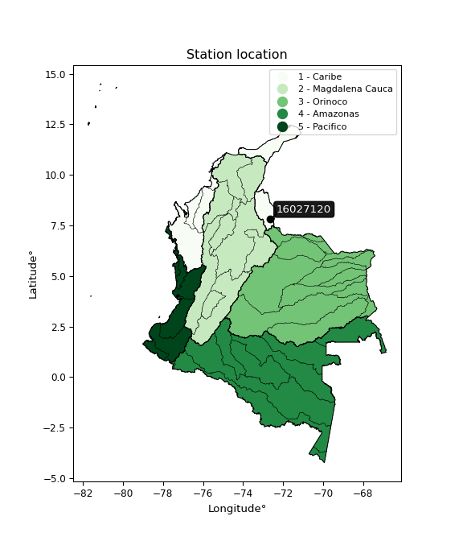

<div align="center">


</div>

# PMP Station (Rain, Pmax24h): 16027120

Probable Maximum Precipitation (PMP) is the greatest amount of rainfall for a specific duration that is meteorologically possible for a given location, acting as a "worst-case" scenario for extreme storms, crucial for designing safety-critical infrastructure like bridges, river deviations, dams, spillways, and nuclear plants to prevent catastrophic failure. PMP is calculated by hydrologists using meteorological data to determine the upper limit of extreme rainfall, often leading to the Probable Maximum Flood (PMF) for flood control design, and is increasingly being studied for climate change impacts. Probable Maximum Precipitation (PMP) is the theoretical upper limit of rainfall, a deterministic estimate for extreme events, while probability distributions (like GEV, Gumbel) describe the likelihood and frequency of various precipitation amounts, including rare ones, showing how often events occur, with PMP representing the extreme end of these distributions, used for critical infrastructure design to ensure safety against the worst conceivable weather, unlike standard statistical forecasts which cover typical probabilities.

The most common probability distributions in hydrology, used for analyzing floods, rainfall, and streamflow, include the Normal, Log-Normal, Gumbel, Gamma (including Log-Pearson Type III), and Generalized Extreme Value (GEV) distributions, often chosen based on the data´s skewness and whether modeling extremes or general conditions, with Gumbel and GEV popular for extreme events like floods, while the Normal distribution serves as a baseline, though often requiring transformations for skewed hydrological data. These distributions help in designing water infrastructure, managing water resources, and forecasting hydrologic events.

> Hydrological data often isn´t perfectly normal (it´s skewed), so different distributions are needed for different applications, such as: **Flood Frequency Analysis**: Using Gumbel, GEV, or Log-Pearson Type III for predicting extreme flood magnitudes and their return periods, **Rainfall Analysis**: Normal for annual totals, but Log-Normal, Weibull, or GEV for intensity or extreme daily rainfall, **Streamflow Modeling**: Gamma and Log-Normal for maximum flows, GEV for minimum flows, and Kappa for daily flows.

<div align="center">

</img>

</div>


## A. General information


### 1. General running parameters

• app_version: _v20260108_. • runtime: _2026-01-08 13:24:42.400241_. • Python version: _3.14.0_. • SciPy version: _1.16.3_. • Pandas version: _2.3.3_. • NumPy version: _2.3.5_. • Stations dataset (station_dataset_file): _dataset/pmax24h_in/automatic_colombia_2003_2024.csv_. • Stations catalog (station_catalog_file): _dataset/CNE.xls_. • Minimum year to eval til year_max (date_min): _1900_. • Maximum year to eval since year_min (date_max): _2024_. • Creates, save and include plots into reports (create_plot): _False_. • Plot only fit distributions with Δo > Δ (plot_only_fit): _True_. • Plot only simple graphs avoiding multiple CDFs and multiple Extreme values plots (plot_only_simple): _True_. • Eval low extreme values, if False, evaluates high extreme values (low_extreme): _False_. • Eval every SciPy distribution as logarithmic (pdist_logarithmic_on): _True_. • Standard deviation normalized (ddof): _1.0_. • Return periods to eval in years (Tr): _[2, 2.33, 5, 10, 15, 20, 25, 50, 75, 100, 200, 250, 500, 750, 1000]_. • Minimum data sample per station, 0 means any (minimum_sample): _5_. • Z-Score maximum threshold to adjust a value, 0 means disable (zscore_max): _3.5_. • Z-Score minimum threshold to adjust a value, 0 means disable (zscore_min): _-2.5_. • Avoid zeros, e.g. rain = 0 (avoid_zeros): _True_. • Avoid null values (avoid_nans): _True_. 

:file_folder:Table: [dataset.csv](../../dataset/pmax24h_in/automatic_colombia_2003_2024.csv)

> Delta Degrees of Freedom (DDOF): is a parameter used in the formulas for calculating variance and standard deviation. When ddof=0, the divisor is $N$ (the total number of observations) and this is used when your data set is the entire population. When ddof=1, the divisor is $N-1$ and this is used when your data set is a sample drawn from a larger population. Using $N-1$ provides an unbiased estimate of the population variance (known as Bessel´s correction).


### 2. Station info and location

|   id |   CODIGO | NOMBRE                                   | CATEGORIA    | TECNOLOGIA                              | ESTADO           | FECHA_INSTALACION   | FECHA_SUSPENSION   |   ALTITUD |   LATITUD |   LONGITUD | DEPARTAMENTO       | MUNICIPIO   | AREA_OPERATIVA                         | ENTIDAD                                                     | AREA_HIDROGRAFICA   | ZONA_HIDROGRAFICA   | SUBZONA_HIDROGRAFICA   | CORRIENTE   | Catalogo   |   Version |
|-----:|---------:|:-----------------------------------------|:-------------|:----------------------------------------|:-----------------|:--------------------|:-------------------|----------:|----------:|-----------:|:-------------------|:------------|:---------------------------------------|:------------------------------------------------------------|:--------------------|:--------------------|:-----------------------|:------------|:-----------|----------:|
|    0 | 16027120 | SAN JAVIER/PUENTE ZULIA - AUT [16027120] | Limnigráfica | Automática con Telemetría, Convencional | En Mantenimiento | 15/07/1958          | 05/08/2025         |       270 |   7.83389 |   -72.6503 | Norte De Santander | Durania     | Area Operativa 08 - Santanderes-Arauca | INSTITUTO DE HIDROLOGIA METEOROLOGIA Y ESTUDIOS AMBIENTALES | Caribe              | Catatumbo           | Río Zulia              | Zulia       | CNE_IDEAM  |  20251226 |

<div align="center">

Dynamic map: [:earth_americas:Google](http://maps.google.com/maps?q=7.833888889,-72.65027778) [:earth_americas:OSM](https://www.openstreetmap.org/#map=18/7.833888889/-72.65027778&layers=P) [:earth_americas:Bing](https://www.bing.com/maps?cp=7.833888889~-72.65027778&lvl=18) [:earth_americas:Apple](https://maps.apple.com/frame?center=7.833888889%2C-72.65027778&span=0.003%2C0.006)

</div>


<div align="center">

```geojson
{
  "type": "Feature",
  "geometry": {
    "type": "Point", 
    "coordinates": [-72.65027778, 7.833888889]
  }, 
  "properties": {
    "Name": "16027120"
  }
}
```

</div>


### 3. Discrete values table and plot

<div align="center">

|               |           0 |          1 |           2 |           3 |           4 |           5 |           6 |          7 |
|:--------------|------------:|-----------:|------------:|------------:|------------:|------------:|------------:|-----------:|
| Date          | 2013        | 2014       | 2015        | 2016        | 2017        | 2018        | 2019        | 2024       |
| Value         |   36.9      |  208.6     |   84.8      |   43.8      |    2.6      |   69.7      |   50.4      |    0.2     |
| Value_initial |   36.9      |  208.6     |   84.8      |   43.8      |    2.6      |   69.7      |   50.4      |    0.2     |
| count         |    8        |    8       |    8        |    8        |    8        |    8        |    8        |    8       |
| mean          |   62.125    |   62.125   |   62.125    |   62.125    |   62.125    |   62.125    |   62.125    |   62.125   |
| std           |   66.0238   |   66.0238  |   66.0238   |   66.0238   |   66.0238   |   66.0238   |   66.0238   |   66.0238  |
| zscore        |   -0.382059 |    2.21852 |    0.343437 |   -0.277552 |   -0.901569 |    0.114731 |   -0.177588 |   -0.93792 |


</div>


> The initial value (value_initial) correspond to the initial obtained or null completed value, and value (value) is adjusted only when the initial value is outside the valid range (outlier) definite through the Z-Score value. If Z-Score is active, values out of range or outliers are replaced with the station mean value. A Z-Score (or standard score) measures how many standard deviations a data point is from the mean of a dataset, indicating its relative position; positive scores mean above the mean, negative mean below, and a score of zero is exactly at the mean, allowing for comparison of values from different distributions. It´s calculated using the formula $z=(x–μ)/σ$, where $x$ is the data point, $μ$ is the mean, and $σ$ is the standard deviation, helping identify outliers and understand probability.
>
> <sub>**Note**: In this study, "completing" (filling gaps in) and "extending" (forecasting or lengthening the historical record) rainfall data series are avoided for certain critical analyses because they introduce artificial bias and uncertainty, which can distort the statistics of rare events (extremes), alter day-to-day variability, and compromise the integrity and homogeneity of the original data. Some reasons against Completing/Extending rainfall data are: **Distortion of Extremes and Variability**: The primary issue is that most gap-filling or extension methods rely on averaging or regression with nearby stations, which inherently smooths the data. Rainfall is highly variable in space and time, with a large percentage of zero values and occasional large storms. Infilling methods often underestimate the highest values and overestimate the lowest (zero) values, which severely distorts analyses focused on flood frequency, drought severity, and intensity-duration-frequency (IDF) curves, **Loss of Data Homogeneity**: Infilled or extended data are synthetic estimates, not actual measurements. Combining these estimates with observed data can violate the assumption of data homogeneity, which requires that the data properties do not change over time. Inhomogeneity can lead to incorrect conclusions about long-term trends or changes in climate patterns, **Propagation of Errors**: Errors and biases from the original data (e.g., wind-induced undercatch, instrument errors, site changes) or the data used for imputation can propagate through the analysis, leading to unreliable hydrological models and inaccurate predictions, **Compromised Statistical Integrity**: For statistical analyses, especially those involving the frequency of events, using artificial data can introduce time bias or autocorrelation that doesn´t exist in reality, making it difficult to assess the true probability of events, **Difficulty in Validation**: It is difficult to accurately validate the quality of filled or extended data, especially for past periods where ground-truth measurements are unavailable. The reliability of imputation techniques heavily depends on the density of the surrounding station network and the complexity of the local topography.</sub>


### 4. Active continuous probability distributions from SciPy (43 of 104 available)

A Probability Density Function (PDF) describes the relative likelihood of a continuous random variable falling within a specific range, where the total area under its curve equals 1, and the area over any interval gives the actual probability for that range. Unlike discrete probabilities (like rolling a die), a PDF shows density, not direct probability for a single point (which is zero), with higher points indicating higher likelihood, often visualized as a bell curve for normal distributions.

A log of a probability density function (log-PDF) is simply the logarithm of the PDF´s value, denoted as $log(f(x))$, useful for converting multiplication of probabilities into addition, improving numerical stability with tiny numbers, and connecting to information theory concepts like entropy. Instead of dealing with very small probabilities (e.g., 0.000001), log-PDFs use negative numbers (e.g., $log(0.00001) ≈ -11.51$ that are easier for computers to handle, preventing underflow errors and simplifying complex calculations. In this study, each active probability distribution from SciPy is also evaluated in the $log$ form.

[scipy.stats](https://docs.scipy.org/doc/scipy/reference/stats.html) is a Python´s powerful submodule within the SciPy library for comprehensive statistical analysis, offering over 130 probability distributions (like Normal, Poisson), functions for descriptive stats (mean, variance), hypothesis testing (t-tests, chi-square), random variable generation, and statistical tests, making it essential for data science, modeling, and research. It provides tools to explore, model, and draw conclusions from data efficiently, working seamlessly with NumPy.

<div align="center">

|   id | p_dist             |   n_parameter | fit_method   | label                                                                       | active   | ref                                                                                                        |
|-----:|:-------------------|--------------:|:-------------|:----------------------------------------------------------------------------|:---------|:-----------------------------------------------------------------------------------------------------------|
|    0 | alpha              |             3 | MLE          | Alpha                                                                       | True     | [:mortar_board:](https://docs.scipy.org/doc/scipy/reference/generated/scipy.stats.alpha.html)              |
|    1 | betaprime          |             4 | MLE          | Beta prime                                                                  | True     | [:mortar_board:](https://docs.scipy.org/doc/scipy/reference/generated/scipy.stats.betaprime.html)          |
|    2 | chi2               |             3 | MLE          | Chi²                                                                        | True     | [:mortar_board:](https://docs.scipy.org/doc/scipy/reference/generated/scipy.stats.chi2.html)               |
|    3 | crystalball        |             4 | MLE          | Crystalball                                                                 | True     | [:mortar_board:](https://docs.scipy.org/doc/scipy/reference/generated/scipy.stats.crystalball.html)        |
|    4 | erlang             |             3 | MLE          | Erlang                                                                      | True     | [:mortar_board:](https://docs.scipy.org/doc/scipy/reference/generated/scipy.stats.erlang.html)             |
|    5 | expon              |             2 | MLE          | Exponential                                                                 | True     | [:mortar_board:](https://docs.scipy.org/doc/scipy/reference/generated/scipy.stats.expon.html)              |
|    6 | exponnorm          |             3 | MLE          | Exponentially modified Normal                                               | True     | [:mortar_board:](https://docs.scipy.org/doc/scipy/reference/generated/scipy.stats.exponnorm.html)          |
|    7 | f                  |             4 | MLE          | F                                                                           | True     | [:mortar_board:](https://docs.scipy.org/doc/scipy/reference/generated/scipy.stats.f.html)                  |
|    8 | fatiguelife        |             3 | MLE          | Fatigue-life (Birnbaum-Saunders)                                            | True     | [:mortar_board:](https://docs.scipy.org/doc/scipy/reference/generated/scipy.stats.fatiguelife.html)        |
|    9 | fisk               |             3 | MLE          | Fisk                                                                        | True     | [:mortar_board:](https://docs.scipy.org/doc/scipy/reference/generated/scipy.stats.fisk.html)               |
|   10 | gamma              |             3 | MLE          | Gamma                                                                       | True     | [:mortar_board:](https://docs.scipy.org/doc/scipy/reference/generated/scipy.stats.gamma.html)              |
|   11 | genexpon           |             5 | MLE          | Generalized exponential                                                     | True     | [:mortar_board:](https://docs.scipy.org/doc/scipy/reference/generated/scipy.stats.genexpon.html)           |
|   12 | genlogistic        |             3 | MLE          | Generalized logistic                                                        | True     | [:mortar_board:](https://docs.scipy.org/doc/scipy/reference/generated/scipy.stats.genlogistic.html)        |
|   13 | gibrat             |             2 | MM           | Gibrat                                                                      | True     | [:mortar_board:](https://docs.scipy.org/doc/scipy/reference/generated/scipy.stats.gibrat.html)             |
|   14 | gompertz           |             3 | MLE          | Gompertz (or truncated Gumbel)                                              | True     | [:mortar_board:](https://docs.scipy.org/doc/scipy/reference/generated/scipy.stats.gompertz.html)           |
|   15 | gumbel_l           |             2 | MM           | Gumbel Left Skew                                                            | True     | [:mortar_board:](https://docs.scipy.org/doc/scipy/reference/generated/scipy.stats.gumbel_l.html)           |
|   16 | gumbel_r           |             2 | MM           | Gumbel Right Skew                                                           | True     | [:mortar_board:](https://docs.scipy.org/doc/scipy/reference/generated/scipy.stats.gumbel_r.html)           |
|   17 | halflogistic       |             2 | MM           | Half-logistic                                                               | True     | [:mortar_board:](https://docs.scipy.org/doc/scipy/reference/generated/scipy.stats.halflogistic.html)       |
|   18 | halfnorm           |             2 | MM           | Half Normal                                                                 | True     | [:mortar_board:](https://docs.scipy.org/doc/scipy/reference/generated/scipy.stats.halfnorm.html)           |
|   19 | hypsecant          |             2 | MM           | hyperbolic secant                                                           | True     | [:mortar_board:](https://docs.scipy.org/doc/scipy/reference/generated/scipy.stats.hypsecant.html)          |
|   20 | invgamma           |             3 | MLE          | Inverted gamma                                                              | True     | [:mortar_board:](https://docs.scipy.org/doc/scipy/reference/generated/scipy.stats.invgamma.html)           |
|   21 | invgauss           |             3 | MLE          | Inverse Gaussian                                                            | True     | [:mortar_board:](https://docs.scipy.org/doc/scipy/reference/generated/scipy.stats.invgauss.html)           |
|   22 | invweibull         |             3 | MLE          | Inverted Weibull                                                            | True     | [:mortar_board:](https://docs.scipy.org/doc/scipy/reference/generated/scipy.stats.invweibull.html)         |
|   23 | kstwobign          |             2 | MLE          | Limiting distribution of scaled Kolmogorov-Smirnov two-sided test statistic | True     | [:mortar_board:](https://docs.scipy.org/doc/scipy/reference/generated/scipy.stats.kstwobign.html)          |
|   24 | laplace            |             2 | MM           | Laplace                                                                     | True     | [:mortar_board:](https://docs.scipy.org/doc/scipy/reference/generated/scipy.stats.laplace.html)            |
|   25 | laplace_asymmetric |             3 | MLE          | Asymmetric Laplace                                                          | True     | [:mortar_board:](https://docs.scipy.org/doc/scipy/reference/generated/scipy.stats.laplace_asymmetric.html) |
|   26 | loggamma           |             3 | MLE          | Log gamma                                                                   | True     | [:mortar_board:](https://docs.scipy.org/doc/scipy/reference/generated/scipy.stats.loggamma.html)           |
|   27 | logistic           |             2 | MM           | Logistic (or Sech-squared)                                                  | True     | [:mortar_board:](https://docs.scipy.org/doc/scipy/reference/generated/scipy.stats.logistic.html)           |
|   28 | lognorm            |             3 | MLE          | Log Normal                                                                  | True     | [:mortar_board:](https://docs.scipy.org/doc/scipy/reference/generated/scipy.stats.lognorm.html)            |
|   29 | maxwell            |             2 | MM           | Maxwell                                                                     | True     | [:mortar_board:](https://docs.scipy.org/doc/scipy/reference/generated/scipy.stats.maxwell.html)            |
|   30 | mielke             |             4 | MLE          | Mielke Beta-Kappa / Dagum                                                   | True     | [:mortar_board:](https://docs.scipy.org/doc/scipy/reference/generated/scipy.stats.mielke.html)             |
|   31 | moyal              |             2 | MM           | Moyal                                                                       | True     | [:mortar_board:](https://docs.scipy.org/doc/scipy/reference/generated/scipy.stats.moyal.html)              |
|   32 | nakagami           |             3 | MLE          | Nakagami                                                                    | True     | [:mortar_board:](https://docs.scipy.org/doc/scipy/reference/generated/scipy.stats.nakagami.html)           |
|   33 | ncf                |             5 | MLE          | Non-central F distribution                                                  | True     | [:mortar_board:](https://docs.scipy.org/doc/scipy/reference/generated/scipy.stats.ncf.html)                |
|   34 | nct                |             4 | MLE          | Non-central Student’s t                                                     | True     | [:mortar_board:](https://docs.scipy.org/doc/scipy/reference/generated/scipy.stats.nct.html)                |
|   35 | norm               |             2 | MM           | Normal                                                                      | True     | [:mortar_board:](https://docs.scipy.org/doc/scipy/reference/generated/scipy.stats.norm.html)               |
|   36 | pearson3           |             3 | MM           | Pearson type III                                                            | True     | [:mortar_board:](https://docs.scipy.org/doc/scipy/reference/generated/scipy.stats.pearson3.html)           |
|   37 | rayleigh           |             2 | MM           | Rayleigh                                                                    | True     | [:mortar_board:](https://docs.scipy.org/doc/scipy/reference/generated/scipy.stats.rayleigh.html)           |
|   38 | rice               |             3 | MLE          | Rice                                                                        | True     | [:mortar_board:](https://docs.scipy.org/doc/scipy/reference/generated/scipy.stats.rice.html)               |
|   39 | t                  |             3 | MLE          | Student’s t                                                                 | True     | [:mortar_board:](https://docs.scipy.org/doc/scipy/reference/generated/scipy.stats.t.html)                  |
|   40 | truncnorm          |             4 | MLE          | Truncated normal                                                            | True     | [:mortar_board:](https://docs.scipy.org/doc/scipy/reference/generated/scipy.stats.truncnorm.html)          |
|   41 | wald               |             2 | MM           | Wald                                                                        | True     | [:mortar_board:](https://docs.scipy.org/doc/scipy/reference/generated/scipy.stats.wald.html)               |
|   42 | weibull_min        |             3 | MLE          | Weibull minimum                                                             | True     | [:mortar_board:](https://docs.scipy.org/doc/scipy/reference/generated/scipy.stats.weibull_min.html)        |

</div>

> **n_parameter:** # arguments & localization & scale.
>
> **Fit methods:** (MLE) maximum likelihood, (MM) L-moments.
>
>**Inactive** (With the only purpose of prevent loops, zero divisions, infinite values, over high estimated values or horizontal trending for recurrence intervals estimations, the follow distributions were disabled.)**:** foldnorm, gennorm, norminvgauss, powernorm, powerlognorm, skewnorm, genextreme, anglit, arcsine, argus, beta, bradford, burr, burr12, cauchy, cosine, halfcauchy, foldcauchy, skewcauchy, wrapcauchy, dgamma, gengamma, exponweib, exponpow, truncexpon, gausshyper, genhalflogistic, genhyperbolic, geninvgauss, halfgennorm, johnsonsb, johnsonsu, kappa4, kappa3, ksone, kstwo, loglaplace, levy, levy_l, levy_stable, ncx2, pareto, genpareto, truncpareto, lomax, powerlaw, rdist, rel_breitwigner, recipinvgauss, semicircular, studentized_range, trapezoid, triang, truncweibull_min, tukeylambda, uniform, loguniform, vonmises, vonmises_line, weibull_max, dweibull, 


## B. Probability (PDF) vs. Empirical (EDF) distributions functions

A continuous probability distribution (CPD) describes probabilities for variables that can take any value within a range (like rain any time), unlike discrete variables with specific outcomes (like temperature). It uses a Probability Density Function (PDF), a curve where the total area under it equals 1, and the probability of the variable falling within an interval (a to b) is found by calculating the area under the curve between those points. A key feature is that the probability of hitting any single exact value is zero, so probabilities are always expressed for ranges, e.g., $P(a ≤ X ≤ b)$.

<div align="center">

Distributions parameters from station values
|    |   station | p_dist                |   n |              loc |           scale | shape                 | shape1                | shape2                | shape3   |
|---:|----------:|:----------------------|----:|-----------------:|----------------:|:----------------------|:----------------------|:----------------------|:---------|
|  0 |  16027120 | alpha                 |   8 |      0.00233886  |     0.55987     | 7.325438338312022e-09 |                       |                       |          |
|  1 |  16027120 | betaprime             |   8 |      0.2         |   144.279       | 0.6699029819817202    | 2.827522913702506     |                       |          |
|  2 |  16027120 | chi2                  |   8 |      0.2         |    23.082       | 1.6045984060615694    |                       |                       |          |
|  3 |  16027120 | crystalball           |   8 |     62.125       |    61.7596      | 5665.612498016093     | 47.82942358220034     |                       |          |
|  4 |  16027120 | erlang                |   8 |      0.199999    |    54.9231      | 0.782225266685252     |                       |                       |          |
|  5 |  16027120 | expon                 |   8 |      0.2         |    61.925       |                       |                       |                       |          |
|  6 |  16027120 | exponnorm             |   8 |      0.117548    |     0.0255787   | 2413.65058373547      |                       |                       |          |
|  7 |  16027120 | f                     |   8 |      0.2         |    31.4635      | 0.791069023330681     | 8.583292939630788     |                       |          |
|  8 |  16027120 | fatiguelife           |   8 |      0.2         |     0.000328241 | 423.4943742723283     |                       |                       |          |
|  9 |  16027120 | fisk                  |   8 |      0.2         |    25.8589      | 0.7889205759687495    |                       |                       |          |
| 10 |  16027120 | gamma                 |   8 |      0.2         |    61.3889      | 0.652270991767367     |                       |                       |          |
| 11 |  16027120 | genexpon              |   8 |      0.2         |   102.795       | 1.6599943540908808    | 4.894207758195851e-09 | 0.7037232036572958    |          |
| 12 |  16027120 | genlogistic           |   8 |   -254.84        |    40.4473      | 1333.4665058678593    |                       |                       |          |
| 13 |  16027120 | gibrat                |   8 |     15.0102      |    28.5766      |                       |                       |                       |          |
| 14 |  16027120 | gompertz              |   8 |      0.2         | 18682.2         | 300.6936764916714     |                       |                       |          |
| 15 |  16027120 | gumbel_l              |   8 |     89.9201      |    48.1538      |                       |                       |                       |          |
| 16 |  16027120 | gumbel_r              |   8 |     34.3299      |    48.1538      |                       |                       |                       |          |
| 17 |  16027120 | halflogistic          |   8 |    -11.0745      |    52.8023      |                       |                       |                       |          |
| 18 |  16027120 | halfnorm              |   8 |    -19.6205      |   102.453       |                       |                       |                       |          |
| 19 |  16027120 | hypsecant             |   8 |     62.125       |    39.3174      |                       |                       |                       |          |
| 20 |  16027120 | invgamma              |   8 |    -39.1451      |   269.958       | 3.611921670678309     |                       |                       |          |
| 21 |  16027120 | invgauss              |   8 |    -16.7601      |    94.0189      | 0.8390345238678834    |                       |                       |          |
| 22 |  16027120 | invweibull            |   8 |      0.2         |     2.82657     | 0.057124376754612856  |                       |                       |          |
| 23 |  16027120 | kstwobign             |   8 |   -113.65        |   204.048       |                       |                       |                       |          |
| 24 |  16027120 | laplace               |   8 |     62.125       |    43.6706      |                       |                       |                       |          |
| 25 |  16027120 | laplace_asymmetric    |   8 |     36.9         |    36.7817      | 0.7142543050428689    |                       |                       |          |
| 26 |  16027120 | loggamma              |   8 | -25051.8         |  3203.17        | 2541.346884515031     |                       |                       |          |
| 27 |  16027120 | logistic              |   8 |     62.125       |    34.0498      |                       |                       |                       |          |
| 28 |  16027120 | lognorm               |   8 |      0.2         |     0.224949    | 13.897352643754026    |                       |                       |          |
| 29 |  16027120 | maxwell               |   8 |    -84.2193      |    91.7077      |                       |                       |                       |          |
| 30 |  16027120 | mielke                |   8 |      0.2         |   166.439       | 0.5923225978260701    | 3.675550612241403     |                       |          |
| 31 |  16027120 | moyal                 |   8 |     26.8069      |    27.8016      |                       |                       |                       |          |
| 32 |  16027120 | nakagami              |   8 |      0.2         |   123.699       | 0.13395640662299646   |                       |                       |          |
| 33 |  16027120 | ncf                   |   8 |      0.2         |    39.4768      | 1.2963032215053871    | 47.266920038401146    | 0.3896944362824435    |          |
| 34 |  16027120 | nct                   |   8 |     -5.79557     |     0.36509     | 0.6162497351054959    | 34.555859448538484    |                       |          |
| 35 |  16027120 | norm                  |   8 |     62.125       |    61.7596      |                       |                       |                       |          |
| 36 |  16027120 | pearson3              |   8 |     62.125       |    61.7595      | 1.4234394475359455    |                       |                       |          |
| 37 |  16027120 | rayleigh              |   8 |    -56.0247      |    94.2698      |                       |                       |                       |          |
| 38 |  16027120 | rice                  |   8 |    -33.8517      |    80.7024      | 0.0011073292121627238 |                       |                       |          |
| 39 |  16027120 | t                     |   8 |     46.1941      |    30.2227      | 1.860874810614606     |                       |                       |          |
| 40 |  16027120 | truncnorm             |   8 |    -31.898       |    96.1264      | 0.3339140902793857    | 2.501946543343405     |                       |          |
| 41 |  16027120 | wald                  |   8 |      0.365436    |    61.7596      |                       |                       |                       |          |
| 42 |  16027120 | weibull_min           |   8 |      0.2         |    63.8764      | 0.6546296755581102    |                       |                       |          |
| 43 |  16027120 | logalpha              |   8 |    -59.7704      |  1797.05        | 28.620691633083425    |                       |                       |          |
| 44 |  16027120 | logbetaprime          |   8 |     -1.60944     |     3.35356     | 0.16466810157172884   | 0.5949068795441135    |                       |          |
| 45 |  16027120 | logchi2               |   8 |     -1.60944     |     5.82146     | 0.35733573989787815   |                       |                       |          |
| 46 |  16027120 | logcrystalball        |   8 |      3.08485     |     2.12995     | 7.680222607597697     | 1130.9991259420171    |                       |          |
| 47 |  16027120 | logerlang             |   8 |    -30.3253      |     0.15139     | 220.60920697500012    |                       |                       |          |
| 48 |  16027120 | logexpon              |   8 |     -1.60944     |     4.69429     |                       |                       |                       |          |
| 49 |  16027120 | logexponnorm          |   8 |      3.08338     |     2.12994     | 0.0006948107112811744 |                       |                       |          |
| 50 |  16027120 | logf                  |   8 |     -1.60944     |     1.15761     | 1.0905833566846463    | 1.0728600163777786    |                       |          |
| 51 |  16027120 | logfatiguelife        |   8 |   -939.406       |   942.495       | 0.0022469964797454693 |                       |                       |          |
| 52 |  16027120 | logfisk               |   8 |     -1.60944     |     2.07573     | 0.2138889295251574    |                       |                       |          |
| 53 |  16027120 | loggamma              |   8 |    -36.6625      |     0.12232     | 324.96831365208527    |                       |                       |          |
| 54 |  16027120 | loggenexpon           |   8 |     -1.63098     |     0.230223    | 0.013947831963307435  | 9.522499914430728     | 0.0002968165619680231 |          |
| 55 |  16027120 | loggenlogistic        |   8 |      4.95299     |     0.308172    | 0.15892261882569414   |                       |                       |          |
| 56 |  16027120 | loggibrat             |   8 |      1.45999     |     0.985533    |                       |                       |                       |          |
| 57 |  16027120 | loggompertz           |   8 |     -1.60944     |     1.46119     | 0.02270407673879852   |                       |                       |          |
| 58 |  16027120 | loggumbel_l           |   8 |      4.04344     |     1.66071     |                       |                       |                       |          |
| 59 |  16027120 | loggumbel_r           |   8 |      2.12626     |     1.66071     |                       |                       |                       |          |
| 60 |  16027120 | loghalflogistic       |   8 |      0.560331    |     1.82105     |                       |                       |                       |          |
| 61 |  16027120 | loghalfnorm           |   8 |      0.265636    |     3.53335     |                       |                       |                       |          |
| 62 |  16027120 | loghypsecant          |   8 |      3.08485     |     1.35597     |                       |                       |                       |          |
| 63 |  16027120 | loginvgamma           |   8 |    -48.9192      | 28714.4         | 553.6489745162432     |                       |                       |          |
| 64 |  16027120 | loginvgauss           |   8 |    -22.3992      |  2949.29        | 0.00863984925767832   |                       |                       |          |
| 65 |  16027120 | loginvweibull         |   8 |     -5.11882e+08 |     5.11882e+08 | 205962124.30950892    |                       |                       |          |
| 66 |  16027120 | logkstwobign          |   8 |     -7.01552     |    11.5471      |                       |                       |                       |          |
| 67 |  16027120 | loglaplace            |   8 |      3.08485     |     1.5061      |                       |                       |                       |          |
| 68 |  16027120 | loglaplace_asymmetric |   8 |      4.4403      |     0.986223    | 1.9005273634399504    |                       |                       |          |
| 69 |  16027120 | logloggamma           |   8 |      5.23898     |     0.405788    | 0.1992696211525126    |                       |                       |          |
| 70 |  16027120 | loglogistic           |   8 |      3.08485     |     1.1743      |                       |                       |                       |          |
| 71 |  16027120 | loglognorm            |   8 |     -1.60944     |     7.02301     | 13.254189457571162    |                       |                       |          |
| 72 |  16027120 | logmaxwell            |   8 |     -1.96223     |     3.16279     |                       |                       |                       |          |
| 73 |  16027120 | logmielke             |   8 |     -1.60944     |     2.44189     | 0.1850156160803691    | 0.6771834387865409    |                       |          |
| 74 |  16027120 | logmoyal              |   8 |      1.86681     |     0.958813    |                       |                       |                       |          |
| 75 |  16027120 | lognakagami           |   8 |  -2312.18        |  2315.27        | 294435.91275871615    |                       |                       |          |
| 76 |  16027120 | logncf                |   8 |     -1.60944     |     1.06978     | 1.0817892822199477    | 1.110988304538739     | 1.0934615589278063    |          |
| 77 |  16027120 | lognct                |   8 |   -119.84        |     2.05185     | 20781.008168374858    | 59.907248962582       |                       |          |
| 78 |  16027120 | lognorm               |   8 |      3.08485     |     2.12995     |                       |                       |                       |          |
| 79 |  16027120 | logpearson3           |   8 |      3.08486     |     2.12995     | -1.2484998252988073   |                       |                       |          |
| 80 |  16027120 | lograyleigh           |   8 |     -0.989889    |     3.25117     |                       |                       |                       |          |
| 81 |  16027120 | logrice               |   8 |   -655.539       |     2.13046     | 309.14373701524806    |                       |                       |          |
| 82 |  16027120 | logt                  |   8 |      3.98137     |     0.468573    | 0.863104327094534     |                       |                       |          |
| 83 |  16027120 | logtruncnorm          |   8 |      2.0563      |     6.48416     | -0.5653380957482012   | 0.5064847121030595    |                       |          |
| 84 |  16027120 | logwald               |   8 |      0.954863    |     2.12997     |                       |                       |                       |          |
| 85 |  16027120 | logweibull_min        |   8 |     -1.60944     |     1.73124     | 0.4602192691553664    |                       |                       |          |

</div>

> **loc** (Location parameter): This shifts the distribution along the x-axis. For many common distributions, like the normal (Gaussian) distribution, loc represents the mean $μ$. For others, like the uniform distribution, it might represent the minimum value, or for the beta distribution, the left end of the support interval.
>
> **scale** (Scale parameter): This determines the width or spread of the distribution. For the normal distribution, scale represents the standard deviation $σ$. For a uniform distribution, it defines the length of the interval (from $loc$ to $loc + scale$).
>
> **shape** (Shape parameters): Refers to parameters that define the specific form of a probability distribution, distinct from its location (loc) and scale (scale). These parameters are required arguments for most distribution functions. For example, a normal (Gaussian) distribution is fully defined by its location (mean) and scale (standard deviation), so it has no specific shape parameters beyond loc and scale. However, other distributions have intrinsic properties that need specification, as Gamma distribution that takes a shape parameter, often named $a$ or $alpha$.


### 0. Cumulative distribution values - CDF (86 evaluated)

Cumulative Distribution Function (CDF), denoted as $F$<sub>$X$</sub>$(x)$, is a function that gives the probability that a random variable $X$ will take a value less than or equal to a specific value, $x$ (i.e., $(P(X≥x)$. It essentially "accumulates" probabilities from a given point up to the far right (positive infinity), providing a complete picture of the distribution´s probabilities for both discrete (like rain) and continuous (like temperature) variables, helping to find probabilities over ranges or above certain values. Each station is evaluated separately ordering the $x$ values ascending, calculating the CDF and PDF values for the activated distributions and their logarithmic forms.

<div align="center">

CDF ordered by x ascending and calculating $log(f(x))$ separately
|   id |   Station |   date |     x |   count |   mean |     std |    zscore |   Value_initial |   station |   m |     alpha |   alpha_pdf |   betaprime |   betaprime_pdf |        chi2 |     chi2_pdf |   crystalball |   crystalball_pdf |      erlang |   erlang_pdf |     expon |   expon_pdf |   exponnorm |   exponnorm_pdf |           f |       f_pdf |   fatiguelife |   fatiguelife_pdf |        fisk |      fisk_pdf |       gamma |       gamma_pdf |    genexpon |   genexpon_pdf |   genlogistic |   genlogistic_pdf |   gibrat |   gibrat_pdf |    gompertz |   gompertz_pdf |   gumbel_l |   gumbel_l_pdf |   gumbel_r |   gumbel_r_pdf |   halflogistic |   halflogistic_pdf |   halfnorm |   halfnorm_pdf |   hypsecant |   hypsecant_pdf |   invgamma |   invgamma_pdf |   invgauss |   invgauss_pdf |   invweibull |   invweibull_pdf |   kstwobign |   kstwobign_pdf |   laplace |   laplace_pdf |   laplace_asymmetric |   laplace_asymmetric_pdf |   loggamma |   loggamma_pdf |   logistic |   logistic_pdf |   lognorm |   lognorm_pdf |   maxwell |   maxwell_pdf |      mielke |       mielke_pdf |    moyal |   moyal_pdf |   nakagami |   nakagami_pdf |         ncf |        ncf_pdf |       nct |     nct_pdf |     norm |   norm_pdf |   pearson3 |   pearson3_pdf |   rayleigh |   rayleigh_pdf |      rice |    rice_pdf |        t |      t_pdf |   truncnorm |   truncnorm_pdf |        wald |    wald_pdf |   weibull_min |   weibull_min_pdf |   logalpha |   logalpha_pdf |   logbetaprime |   logbetaprime_pdf |    logchi2 |   logchi2_pdf |   logcrystalball |   logcrystalball_pdf |   logerlang |   logerlang_pdf |   logexpon |   logexpon_pdf |   logexponnorm |   logexponnorm_pdf |        logf |    logf_pdf |   logfatiguelife |   logfatiguelife_pdf |     logfisk |   logfisk_pdf |   loggenexpon |   loggenexpon_pdf |   loggenlogistic |   loggenlogistic_pdf |   loggibrat |   loggibrat_pdf |   loggompertz |   loggompertz_pdf |   loggumbel_l |   loggumbel_l_pdf |   loggumbel_r |   loggumbel_r_pdf |   loghalflogistic |   loghalflogistic_pdf |   loghalfnorm |   loghalfnorm_pdf |   loghypsecant |   loghypsecant_pdf |   loginvgamma |   loginvgamma_pdf |   loginvgauss |   loginvgauss_pdf |   loginvweibull |   loginvweibull_pdf |   logkstwobign |   logkstwobign_pdf |   loglaplace |   loglaplace_pdf |   loglaplace_asymmetric |   loglaplace_asymmetric_pdf |   logloggamma |   logloggamma_pdf |   loglogistic |   loglogistic_pdf |   loglognorm |   loglognorm_pdf |   logmaxwell |   logmaxwell_pdf |   logmielke |   logmielke_pdf |    logmoyal |   logmoyal_pdf |   lognakagami |   lognakagami_pdf |      logncf |   logncf_pdf |    lognct |   lognct_pdf |   logpearson3 |   logpearson3_pdf |   lograyleigh |   lograyleigh_pdf |   logrice |   logrice_pdf |      logt |   logt_pdf |   logtruncnorm |   logtruncnorm_pdf |   logwald |   logwald_pdf |   logweibull_min |   logweibull_min_pdf |
|-----:|----------:|-------:|------:|--------:|-------:|--------:|----------:|----------------:|----------:|----:|----------:|------------:|------------:|----------------:|------------:|-------------:|--------------:|------------------:|------------:|-------------:|----------:|------------:|------------:|----------------:|------------:|------------:|--------------:|------------------:|------------:|--------------:|------------:|----------------:|------------:|---------------:|--------------:|------------------:|---------:|-------------:|------------:|---------------:|-----------:|---------------:|-----------:|---------------:|---------------:|-------------------:|-----------:|---------------:|------------:|----------------:|-----------:|---------------:|-----------:|---------------:|-------------:|-----------------:|------------:|----------------:|----------:|--------------:|---------------------:|-------------------------:|-----------:|---------------:|-----------:|---------------:|----------:|--------------:|----------:|--------------:|------------:|-----------------:|---------:|------------:|-----------:|---------------:|------------:|---------------:|----------:|------------:|---------:|-----------:|-----------:|---------------:|-----------:|---------------:|----------:|------------:|---------:|-----------:|------------:|----------------:|------------:|------------:|--------------:|------------------:|-----------:|---------------:|---------------:|-------------------:|-----------:|--------------:|-----------------:|---------------------:|------------:|----------------:|-----------:|---------------:|---------------:|-------------------:|------------:|------------:|-----------------:|---------------------:|------------:|--------------:|--------------:|------------------:|-----------------:|---------------------:|------------:|----------------:|--------------:|------------------:|--------------:|------------------:|--------------:|------------------:|------------------:|----------------------:|--------------:|------------------:|---------------:|-------------------:|--------------:|------------------:|--------------:|------------------:|----------------:|--------------------:|---------------:|-------------------:|-------------:|-----------------:|------------------------:|----------------------------:|--------------:|------------------:|--------------:|------------------:|-------------:|-----------------:|-------------:|-----------------:|------------:|----------------:|------------:|---------------:|--------------:|------------------:|------------:|-------------:|----------:|-------------:|--------------:|------------------:|--------------:|------------------:|----------:|--------------:|----------:|-----------:|---------------:|-------------------:|----------:|--------------:|-----------------:|---------------------:|
|    0 |  16027120 |   2024 |   0.2 |       8 | 62.125 | 66.0238 | -0.93792  |             0.2 |  16027120 |   1 | 0.0046189 | 0.207028    | 3.63071e-12 |  6259.29        | 2.51519e-12 | 13.6918      |      0.158008 |        0.00390745 | 9.98045e-07 |  0.735278    | 0         | 0.0161486   |  0.00133461 |     0.0161656   | 7.50644e-07 | 1.43394e+07 |     0.0659587 |       1.19809e+08 | 6.66318e-15 | 189.393       | 1.20169e-12 | 28240.4         | 1.25768e-11 |    0.0161486   |     0.0877687 |       0.00527478  | 0        |  0           | 2.98769e-11 |     0.0160952  |   0.143735 |    0.00275931  |   0.13114  |    0.00553248  |       0.106357 |         0.00936218 |   0.153401 |    0.00764345  |    0.129949 |     0.00321409  |  0.0628509 |    0.00741718  |  0.0552044 |    0.0100365   |  8.55628e-05 |      1.64939e+12 |   0.0853969 |     0.00519487  |  0.121099 |   0.002773    |            0.0835591 |              0.00318061  |  0.0138428 |      0.0174351 |   0.139595 |    0.00352743  | 0.0137641 |      0.016511 |  0.161893 |   0.00482617  | 7.54088e-12 | 160927           | 0.106598 | 0.0062982   | 8.2091e-06 |    7.9239e+10  | 9.10074e-11 | 2598.06        | 0.0525421 | 0.0322663   | 0.158008 | 0.00390745 |   0.115163 |    0.00749594  |   0.162941 |    0.00529588  | 0.0851701 | 0.00478306  | 0.138153 | 0.00364902 | 4.56612e-08 |     0.0108117   | 0           | 0           |   9.54325e-13 |    22508.3        |  0.0113903 |      0.0158585 |     0.00188607 |        1.39871e+12 | 0.00111433 |   8.96645e+11 |        0.0137641 |             0.016511 |   0.0151698 |       0.0188168 |   0        |      0.213025  |      0.0137636 |          0.0165107 | 1.76899e-09 | 4.34424e+06 |        0.0130618 |            0.0159513 | 0.000383593 |   3.69362e+11 |    0.00131645 |         0.0616514 |        0.0339045 |            0.0174843 |    0        |       0         |   2.20756e-09 |         0.0155381 |     0.0326973 |         0.0193633 |   7.61681e-05 |       0.000434915 |          0        |             0         |      0        |         0         |      0.0199633 |          0.0147129 |     0.0135438 |         0.0177889 |     0.0158169 |         0.0206399 |       0.0163514 |           0.0270631 |      0.0192422 |          0.0365083 |    0.0221482 |        0.0147057 |               0.0310532 |                   0.0165675 |     0.0377082 |         0.0185173 |     0.0180301 |         0.0150771 |   0.00207533 |      2.22784e+12 |  0.000367741 |       0.00311935 |  0.00107674 |     8.97181e+11 | 8.92688e-10 |    1.79219e-08 |     0.0138629 |         0.0165974 | 1.25791e-09 |  3.06424e+06 | 0.0139023 |    0.0166836 |     0.0350347 |         0.0205962 |      0        |         0         | 0.0137841 |     0.0165278 | 0.0366625 | 0.00563772 |    1.30913e-06 |           0.128584 |  0        |     0         |       4.8555e-08 |          1.00637e+08 |
|    1 |  16027120 |   2017 |   2.6 |       8 | 62.125 | 66.0238 | -0.901569 |             2.6 |  16027120 |   2 | 0.829355  | 0.0646808   | 0.134348    |     0.0362237   | 0.0978049   |  0.0317619   |      0.167569 |        0.00405964 | 0.0914657   |  0.0290867   | 0.0380151 | 0.0155347   |  0.0394116  |     0.0155591   | 0.271802    | 0.0437514   |     0.579996  |       0.0164452   | 0.132917    |   0.0378846   | 0.131991    |     0.0350311   | 0.0380152   |    0.0155347   |     0.100963  |       0.00571878  | 0        |  0           | 0.0378943   |     0.0154873  |   0.150498 |    0.00287741  |   0.144754 |    0.0058099   |       0.128769 |         0.00931228 |   0.171702 |    0.0076068   |    0.137882 |     0.00339826  |  0.0818259 |    0.0083745   |  0.0810263 |    0.011395    |  0.364442    |      0.00875582  |   0.0983358 |     0.00558449  |  0.12794  |   0.00292966  |            0.0915521 |              0.00348485  |  0.166961  |      0.117684  |   0.148278 |    0.00370902  | 0.158724  |      0.113636 |  0.173663 |   0.00498128  | 0.0811909   |      0.020038    | 0.122224 | 0.00671794  | 0.283071   |    0.0315979   | 0.110663    |    0.0293751   | 0.138349  | 0.0365006   | 0.167569 | 0.00405964 |   0.133487 |    0.00776459  |   0.175822 |    0.00543696  | 0.0969771 | 0.00505409  | 0.147284 | 0.00396471 | 0.0258375   |     0.0107186   | 3.90867e-07 | 2.49648e-06 |   0.110147    |        0.0283251  |  0.165518  |      0.121213  |     0.781411   |        0.0347297   | 0.799818   |   0.0461513   |        0.158724  |             0.113636 |   0.173706  |       0.119191  |   0.420968 |      0.123348  |      0.158722  |          0.113636  | 0.627892    | 0.0602622   |        0.156532  |            0.113507  | 0.511314    |   0.0208366   |    0.284574   |         0.141856  |        0.127266  |            0.06563   |    0        |       0         |   0.102959    |         0.0806423 |     0.144241  |         0.0802656 |   0.132154    |       0.161046    |          0.10808  |             0.27136   |      0.1548   |         0.221552  |      0.130539  |          0.0935939 |     0.173504  |         0.122537  |     0.186059  |         0.123651  |       0.230954  |           0.136188  |      0.27269   |          0.142929  |    0.121607  |        0.0807432 |               0.122016  |                   0.0650981 |     0.132879  |         0.0652511 |     0.140242  |         0.102677  |   0.469711   |      0.011701    |  0.162777    |       0.140288   |  0.831215   |     0.0294797   | 0.107754    |    0.183583    |     0.159072  |         0.113649  | 0.511125    |  0.0695482   | 0.159733  |    0.113951  |     0.147805  |         0.0781337 |      0.163913 |         0.153879  | 0.158792  |     0.113641  | 0.0620274 | 0.0174587  |    0.359658    |           0.148706 |  0        |     0         |       0.698297   |          0.0648688   |
|    2 |  16027120 |   2013 |  36.9 |       8 | 62.125 | 66.0238 | -0.382059 |            36.9 |  16027120 |   3 | 0.987894  | 0.00032808  | 0.630784    |     0.00706044  | 0.643873    |  0.00881164  |      0.341476 |        0.00594266 | 0.598575    |  0.0086006   | 0.447141  | 0.00892788  |  0.448868   |     0.00892692  | 0.709118    | 0.00538814  |     0.785108  |       0.00314222  | 0.568619    |   0.0052729   | 0.636967    |     0.00776122  | 0.447141    |    0.00892788  |     0.374377  |       0.00909051  | 0.394902 |  0.0175889   | 0.446379    |     0.00892817 |   0.282885 |    0.00495194  |   0.387505 |    0.007629    |       0.425414 |         0.00775557 |   0.418828 |    0.0066885   |    0.308502 |     0.00667448  |  0.442807  |    0.00973822  |  0.477807  |    0.00899782  |  0.42157     |      0.000566791 |   0.352298  |     0.00826644  |  0.280616 |   0.00642575  |            0.337818  |              0.0128587   |  0.600054  |      0.173674  |   0.322824 |    0.00642025  | 0.597048  |      0.181732 |  0.372864 |   0.00634432  | 0.408148    |      0.006562    | 0.40428  | 0.00845218  | 0.586982   |    0.00424067  | 0.556699    |    0.00746422  | 0.636121  | 0.00514482  | 0.341476 | 0.00594266 |   0.416361 |    0.00786937  |   0.384815 |    0.00643267  | 0.319073  | 0.00739714  | 0.394709 | 0.0108058  | 0.363961    |     0.00884862  | 0.440001    | 0.0123302   |   0.501295    |        0.006189   |  0.605099  |      0.172248  |     0.840207   |        0.0144852   | 0.880849   |   0.0205088   |        0.597048  |             0.181732 |   0.602319  |       0.169722  |   0.670931 |      0.0700998 |      0.597047  |          0.181732  | 0.728339    | 0.0243261   |        0.596712  |            0.182714  | 0.549128    |   0.0101494   |    0.649238   |         0.118919  |        0.498822  |            0.254006  |    0.782073 |       0.137083  |   0.543575    |         0.25209   |     0.536734  |         0.214644  |   0.663857    |       0.16377     |          0.684136 |             0.146058  |      0.655855 |         0.144352  |      0.619916  |          0.218286  |     0.6119    |         0.170897  |     0.605059  |         0.159451  |       0.604094  |           0.122511  |      0.634327  |          0.114352  |    0.646771  |        0.234532  |               0.502413  |                   0.268047  |     0.487418  |         0.235792  |     0.609611  |         0.202661  |   0.491057   |      0.0057673   |  0.623832    |       0.165929   |  0.879793   |     0.0116745   | 0.686735    |    0.154695    |     0.596875  |         0.181442  | 0.633171    |  0.030958    | 0.597188  |    0.180856  |     0.518836  |         0.207107  |      0.63216  |         0.160014  | 0.597041  |     0.181689  | 0.294108  | 0.39467    |    0.756846    |           0.146605 |  0.750466 |     0.131486  |       0.810145   |          0.0278234   |
|    3 |  16027120 |   2016 |  43.8 |       8 | 62.125 | 66.0238 | -0.277552 |            43.8 |  16027120 |   4 | 0.989801  | 0.000232858 | 0.675147    |     0.00585195  | 0.699393    |  0.00733419  |      0.383342 |        0.00618142 | 0.653301    |  0.00730591  | 0.505435  | 0.00798651  |  0.507147   |     0.00798296  | 0.742941    | 0.00446065  |     0.805268  |       0.00271878  | 0.6016      |   0.00433685  | 0.686117    |     0.0065328   | 0.505436    |    0.00798651  |     0.436725  |       0.00894232  | 0.502966 |  0.0138567   | 0.50469     |     0.00799075 |   0.318697 |    0.00542946  |   0.439786 |    0.00750242  |       0.477409 |         0.00731106 |   0.464098 |    0.00642996  |    0.356739 |     0.0072897   |  0.506673  |    0.00876543  |  0.53593   |    0.00787129  |  0.425152    |      0.000476433 |   0.409094  |     0.00816888  |  0.328649 |   0.00752563  |            0.420856  |              0.0112463   |  0.629467  |      0.169336  |   0.368611 |    0.00683518  | 0.627862  |      0.177597 |  0.416873 |   0.00639918  | 0.451749    |      0.00609288  | 0.461322 | 0.00805883  | 0.61436    |    0.00372009  | 0.604622    |    0.00646246  | 0.667668  | 0.00406675  | 0.383342 | 0.00618142 |   0.469282 |    0.00745966  |   0.429169 |    0.0064121   | 0.370552  | 0.00750477  | 0.472273 | 0.0115441  | 0.423424    |     0.00838389  | 0.517831    | 0.0102879   |   0.541045    |        0.00536669 |  0.63422   |      0.167372  |     0.842638   |        0.0138888   | 0.884293   |   0.0196795   |        0.627862  |             0.177597 |   0.631056  |       0.165413  |   0.682731 |      0.0675861 |      0.627861  |          0.177598  | 0.732419    | 0.0232909   |        0.627689  |            0.178513  | 0.550839    |   0.00981976  |    0.6693     |         0.11512   |        0.54412   |            0.274505  |    0.803997 |       0.119229  |   0.587198    |         0.256376  |     0.573917  |         0.218882  |   0.691073    |       0.153764    |          0.708375 |             0.136791  |      0.680031 |         0.137714  |      0.656397  |          0.206978  |     0.640789  |         0.166022  |     0.632026  |         0.155065  |       0.624731  |           0.118252  |      0.653591  |          0.110398  |    0.684772  |        0.209301  |               0.550529  |                   0.293718  |     0.5294    |         0.254088  |     0.643745  |         0.195297  |   0.49203    |      0.00558414  |  0.651777    |       0.160013   |  0.88175    |     0.0111735   | 0.712275    |    0.143362    |     0.627641  |         0.177324  | 0.638372    |  0.0297411   | 0.627851  |    0.17672   |     0.554951  |         0.21408   |      0.659067 |         0.153838  | 0.627847  |     0.177557  | 0.374895  | 0.550048   |    0.781895    |           0.145629 |  0.771807 |     0.117815  |       0.814815   |          0.0266697   |
|    4 |  16027120 |   2019 |  50.4 |       8 | 62.125 | 66.0238 | -0.177588 |            50.4 |  16027120 |   5 | 0.991136  | 0.000175865 | 0.71068     |     0.00495052  | 0.743875    |  0.00618242  |      0.424714 |        0.00634423 | 0.698043    |  0.00628282  | 0.555435  | 0.00717909  |  0.557116   |     0.00717359  | 0.770052    | 0.00378262  |     0.822109  |       0.00239563  | 0.627928    |   0.00367169  | 0.726006    |     0.00558625  | 0.555435    |    0.0071791   |     0.494724  |       0.00860558  | 0.584663 |  0.011018    | 0.554726    |     0.00718606 |   0.356041 |    0.00588572  |   0.488581 |    0.00726727  |       0.524204 |         0.00686722 |   0.505672 |    0.00616579  |    0.406452 |     0.00774879  |  0.561414  |    0.00782714  |  0.584674  |    0.00692046  |  0.428078    |      0.000413301 |   0.462316  |     0.00793945  |  0.382268 |   0.00875343  |            0.490522  |              0.00989343  |  0.652947  |      0.165147  |   0.414754 |    0.00712876  | 0.652505  |      0.173443 |  0.45909  |   0.00638312  | 0.4907      |      0.00572005  | 0.51297  | 0.00757922  | 0.637599   |    0.00333721  | 0.644602    |    0.00567652  | 0.691977  | 0.00333786  | 0.424714 | 0.00634423 |   0.517089 |    0.00702187  |   0.471255 |    0.00633203  | 0.420127  | 0.00750132  | 0.548547 | 0.0114293  | 0.477247    |     0.00792392  | 0.580199    | 0.00866356  |   0.574328    |        0.00474099 |  0.657396  |      0.162794  |     0.844555   |        0.0134302   | 0.88701    |   0.0190374   |        0.652505  |             0.173443 |   0.65399   |       0.161298  |   0.692077 |      0.0655952 |      0.652504  |          0.173444  | 0.735632    | 0.0224965   |        0.652456  |            0.174295  | 0.5522      |   0.00956508  |    0.685233   |         0.111912  |        0.583808  |            0.290882  |    0.819834 |       0.106728  |   0.623291    |         0.257548  |     0.604798  |         0.220923  |   0.712081    |       0.145598    |          0.727055 |             0.129428  |      0.698979 |         0.132275  |      0.684712  |          0.19632   |     0.663776  |         0.161451  |     0.653511  |         0.151027  |       0.641079  |           0.114683  |      0.668857  |          0.107128  |    0.712821  |        0.190677  |               0.593337  |                   0.316557  |     0.566122  |         0.269151  |     0.670661  |         0.18809   |   0.492803   |      0.00544259  |  0.673872    |       0.15478    |  0.883291   |     0.0107894   | 0.731769    |    0.134483    |     0.652247  |         0.173188  | 0.64248     |  0.0288024   | 0.652372  |    0.172578  |     0.58535   |         0.218951  |      0.680287 |         0.148508  | 0.652485  |     0.173405  | 0.459776  | 0.647358   |    0.802275    |           0.14476  |  0.787635 |     0.107907  |       0.818495   |          0.0257794   |
|    5 |  16027120 |   2018 |  69.7 |       8 | 62.125 | 66.0238 |  0.114731 |            69.7 |  16027120 |   6 | 0.993591  | 9.19554e-05 | 0.787613    |     0.00319372  | 0.838371    |  0.00381645  |      0.548809 |        0.00641119 | 0.796764    |  0.00411885  | 0.674478  | 0.00525671  |  0.676015   |     0.00524773  | 0.829235    | 0.00248004  |     0.86138   |       0.00172817  | 0.685677    |   0.0024465   | 0.813467    |     0.00364297  | 0.674478    |    0.00525671  |     0.646132  |       0.00697582  | 0.74186  |  0.00590902  | 0.673949    |     0.00526742 |   0.481652 |    0.0070734   |   0.618948 |    0.0061663   |       0.643941 |         0.00554276 |   0.616694 |    0.0053256   |    0.560951 |     0.00794794  |  0.688292  |    0.0054303   |  0.69624   |    0.00478759  |  0.434818    |      0.000297646 |   0.605283  |     0.0067875   |  0.579624 |   0.00962607  |            0.649765  |              0.00680113  |  0.70468   |      0.153578  |   0.555389 |    0.00725208  | 0.706885  |      0.161513 |  0.579278 |   0.0059927   | 0.592352    |      0.00485254  | 0.643824 | 0.00596209  | 0.694025   |    0.00257733  | 0.736783    |    0.00400195  | 0.742797  | 0.00208568  | 0.548809 | 0.00641119 |   0.639486 |    0.00565699  |   0.589071 |    0.00581355  | 0.56098   | 0.0069802   | 0.738338 | 0.0077553  | 0.616858    |     0.00653934  | 0.712849    | 0.00539421  |   0.65243     |        0.00345972 |  0.708246  |      0.150535  |     0.848749   |        0.012462    | 0.892956   |   0.0176681   |        0.706885  |             0.161513 |   0.704522  |       0.150057  |   0.712626 |      0.0612178 |      0.706884  |          0.161513  | 0.742649    | 0.0208238   |        0.707085  |            0.16219   | 0.555211    |   0.00902349  |    0.720282   |         0.104251  |        0.683379  |            0.320302  |    0.85049  |       0.0835606 |   0.706081    |         0.250866  |     0.676481  |         0.219839  |   0.756281    |       0.127211    |          0.766369 |             0.113308  |      0.739835 |         0.119794  |      0.744008  |          0.169087  |     0.714195  |         0.149222  |     0.700798  |         0.140409  |       0.676903  |           0.106283  |      0.702358  |          0.0995314 |    0.76844   |        0.153748  |               0.705379  |                   0.376334  |     0.658738  |         0.300989  |     0.728547  |         0.168412  |   0.494518   |      0.0051415   |  0.72196     |       0.141657   |  0.886656   |     0.00998129  | 0.772233    |    0.115495    |     0.706552  |         0.161308  | 0.651489    |  0.0268113   | 0.706481  |    0.160719  |     0.6577    |         0.226352  |      0.726349 |         0.135506  | 0.706854  |     0.161482  | 0.656994  | 0.493591   |    0.848853    |           0.142516 |  0.819376 |     0.0886696 |       0.826541   |          0.0238904   |
|    6 |  16027120 |   2015 |  84.8 |       8 | 62.125 | 66.0238 |  0.343437 |            84.8 |  16027120 |   7 | 0.994732  | 6.21227e-05 | 0.829105    |     0.00235746  | 0.886601    |  0.00264681  |      0.643246 |        0.00603858 | 0.850009    |  0.00299765  | 0.744918  | 0.00411921  |  0.746309   |     0.00410914  | 0.861694    | 0.00185943  |     0.884693  |       0.00137783  | 0.718107    |   0.00188771  | 0.860616    |     0.00266036  | 0.744918    |    0.00411921  |     0.740305  |       0.00550295  | 0.814045 |  0.00383701  | 0.744553    |     0.00413013 |   0.593076 |    0.0075981   |   0.704264 |    0.00512767  |       0.720105 |         0.00455898 |   0.691895 |    0.00463285  |    0.674171 |     0.0069139   |  0.759238  |    0.00403499  |  0.759386  |    0.00363767  |  0.438881    |      0.000244048 |   0.699424  |     0.00567146  |  0.70251  |   0.00681213  |            0.738775  |              0.00507266  |  0.734018  |      0.14553   |   0.660592 |    0.00658476  | 0.737733  |      0.152969 |  0.665595 |   0.0054076   | 0.661204    |      0.00427404  | 0.724537 | 0.00475239  | 0.729841   |    0.00218682  | 0.790095    |    0.00310489  | 0.76999   | 0.00155743  | 0.643246 | 0.00603858 |   0.717086 |    0.0046366   |   0.672344 |    0.00519221  | 0.660675  | 0.00618182  | 0.831125 | 0.00471334 | 0.707483    |     0.00547106  | 0.781806    | 0.00384655  |   0.699391    |        0.00279584 |  0.736959  |      0.142223  |     0.85114    |        0.0119311   | 0.896346   |   0.0169091   |        0.737733  |             0.152969 |   0.733197  |       0.142298  |   0.724383 |      0.0587133 |      0.737733  |          0.152969  | 0.746642    | 0.0199095   |        0.738055  |            0.153531  | 0.556951    |   0.0087241   |    0.740261   |         0.0995007 |        0.746794  |            0.32378   |    0.865766 |       0.072567  |   0.754283    |         0.239846  |     0.71915   |         0.214764  |   0.78018     |       0.116615    |          0.787688 |             0.104211  |      0.762596 |         0.112364  |      0.775503  |          0.152174  |     0.742653  |         0.140931  |     0.727642  |         0.133298  |       0.697243  |           0.10117   |      0.721426  |          0.094952  |    0.796709  |        0.134979  |               0.783175  |                   0.417839  |     0.71917   |         0.314138  |     0.760287  |         0.155199  |   0.49551    |      0.004975    |  0.748916    |       0.133224   |  0.888569   |     0.00954     | 0.793847    |    0.105079    |     0.737364  |         0.1528    | 0.656638    |  0.0257145   | 0.737181  |    0.152246  |     0.702242  |         0.227452  |      0.752123 |         0.127342  | 0.737697  |     0.152943  | 0.736828  | 0.328669   |    0.876653    |           0.141005 |  0.8358   |     0.0790628 |       0.831122   |          0.0228494   |
|    7 |  16027120 |   2014 | 208.6 |       8 | 62.125 | 66.0238 |  2.21852  |           208.6 |  16027120 |   8 | 0.997859  | 1.02661e-05 | 0.954306    |     0.000385902 | 0.993252    |  0.000151583 |      0.991147 |        0.00038794 | 0.986439    |  0.000258577 | 0.96545   | 0.000557925 |  0.965846   |     0.000553203 | 0.963918    | 0.000326124 |     0.970048  |       0.000306745 | 0.838394    |   0.000512911 | 0.985334    |     0.000258806 | 0.965451    |    0.000557924 |     0.986009  |       0.000343466 | 0.972136 |  0.000330548 | 0.965714    |     0.00055803 |   0.999992 |    1.90961e-06 |   0.973548 |    0.000542001 |       0.969274 |         0.00057296 |   0.974091 |    0.000651507 |    0.984659 |     0.000390032 |  0.956495  |    0.000491323 |  0.953846  |    0.000557007 |  0.457403    |      9.80698e-05 |   0.986365  |     0.000422116 |  0.982529 |   0.000400055 |            0.976398  |              0.000458325 |  0.846449  |      0.10352   |   0.986637 |    0.000387221 | 0.855195  |      0.106912 |  0.983021 |   0.000542129 | 0.94318     |      0.000816054 | 0.969667 | 0.000545271 | 0.897908   |    0.000822751 | 0.96214     |    0.000497869 | 0.864573  | 0.000388947 | 0.991147 | 0.00038794 |   0.969866 |    0.000579602 |   0.98055  |    0.000579172 | 0.989032  | 0.000408285 | 0.980805 | 0.00021002 | 0.999997    |     0.000499896 | 0.965576    | 0.000453075 |   0.885668    |        0.00077885 |  0.846349  |      0.100425  |     0.860925   |        0.00991301  | 0.910181   |   0.0139659   |        0.855195  |             0.106912 |   0.843492  |       0.10208   |   0.772474 |      0.0484686 |      0.855195  |          0.106912  | 0.762925    | 0.016453    |        0.855787  |            0.106974  | 0.564259    |   0.00756692  |    0.819914   |         0.0775589 |        0.960997  |            0.109752  |    0.914737 |       0.0401937 |   0.92706     |         0.131826  |     0.887365  |         0.148099  |   0.865571    |       0.075244    |          0.864895 |             0.0691789 |      0.849069 |         0.0805041 |      0.880782  |          0.0858795 |     0.850913  |         0.0991948 |     0.831766  |         0.0976765 |       0.777983  |           0.0785866 |      0.797675  |          0.074762  |    0.888169  |        0.074252  |               0.961737  |                   0.073736  |     0.965735  |         0.155643  |     0.872224  |         0.0949066 |   0.499685   |      0.00433093  |  0.850905    |       0.0935508  |  0.896367   |     0.00787406  | 0.870185    |    0.0670952   |     0.854755  |         0.106921  | 0.6778      |  0.0215119   | 0.854193  |    0.106661  |     0.893664  |         0.18169   |      0.849767 |         0.0899725 | 0.855146  |     0.10691   | 0.878907  | 0.0721819  |    0.999999    |           0.132704 |  0.891744 |     0.0482826 |       0.849805   |          0.0188557   |


</div>

An Empirical Distribution Function (EDF) is a step-function estimate of a true cumulative distribution function (CDF) based on observed sample data, representing the proportion of data points less than or equal to a given value. It is calculated by ordering your data and jumping up by $1/n$ (where $n$ is sample size) at each unique data point, allowing analysis without assuming an underlying population distribution, and it gets closer to the true CDF as the sample size grows. For the empirical probability calculations, the parameter $m$ correspond to the order number which means the position of the $x$ values in an ascending order list.

The Kolmogorov-Smirnov (K-S) test is a non-parametric statistical test used to determine if a sample data set comes from a specific theoretical distribution (one-sample) or if two different samples come from the same underlying distribution (two-sample), by comparing their cumulative distribution functions (CDFs). It calculates the maximum vertical difference (D statistic) between these functions, with a small p-value indicating a significant difference and rejection of the null hypothesis (that the data/samples match).


### 1. EDF California (1923)

California´s estimates the true probability distribution of water-related data (like rainfall, streamflow) using observed samples, crucial for risk assessment.

<div align="center">


$P=m/n$


</div>


**1.1. Empirical values**

<div align="center">

|                | 0                  | 1                  | 2              | 3              | 4                  | 5              | 6              | 7              |
|:---------------|:-------------------|:-------------------|:---------------|:---------------|:-------------------|:---------------|:---------------|:---------------|
| date           | 2024               | 2017               | 2013           | 2016           | 2019               | 2018           | 2015           | 2014           |
| x              | 0.2                | 2.6                | 36.9           | 43.8           | 50.4               | 69.7           | 84.8           | 208.6          |
| m              | 1                  | 2                  | 3              | 4              | 5                  | 6              | 7              | 8              |
| empirical_dist | edf_california     | edf_california     | edf_california | edf_california | edf_california     | edf_california | edf_california | edf_california |
| empirical      | 0.125              | 0.25               | 0.375          | 0.5            | 0.625              | 0.75           | 0.875          | 1.0            |
| empirical_tr   | 1.1428571428571428 | 1.3333333333333333 | 1.6            | 2.0            | 2.6666666666666665 | 4.0            | 8.0            | inf            |

</div>


**1.2. Kolmogorov-Smirnov fit test (sorted by Δ)**


<div align="center">

|                | 0                   | 1                     | 2                   | 3                   | 4                   | 5                   | 6                   | 7                   | 8                   | 9                   | 10                  | 11                  | 12                  | 13                  | 14                  | 15                  | 16                  | 17                  | 18                  | 19                  | 20                  | 21                  | 22                 | 23                  | 24                  | 25                  | 26                 | 27                  | 28                  | 29                  | 30                  | 31                  | 32                 | 33                  | 34                  | 35                  | 36                  | 37                  | 38                  | 39                  | 40                  | 41                  | 42                 | 43                 | 44                 | 45                  | 46                 | 47                  | 48                 | 49                  | 50                  | 51                  | 52                  | 53                  | 54                  | 55                  | 56                 | 57                  | 58                  | 59                  | 60                  | 61                 | 62                 | 63                  | 64                 | 65                  | 66                 | 67                 | 68                  | 69                  | 70                 | 71                 | 72                 | 73                 | 74                  | 75                 | 76                  | 77                 | 78                 | 79                  | 80                 | 81                 | 82                 | 83                 | 84                 | 85                 |
|:---------------|:--------------------|:----------------------|:--------------------|:--------------------|:--------------------|:--------------------|:--------------------|:--------------------|:--------------------|:--------------------|:--------------------|:--------------------|:--------------------|:--------------------|:--------------------|:--------------------|:--------------------|:--------------------|:--------------------|:--------------------|:--------------------|:--------------------|:-------------------|:--------------------|:--------------------|:--------------------|:-------------------|:--------------------|:--------------------|:--------------------|:--------------------|:--------------------|:-------------------|:--------------------|:--------------------|:--------------------|:--------------------|:--------------------|:--------------------|:--------------------|:--------------------|:--------------------|:-------------------|:-------------------|:-------------------|:--------------------|:-------------------|:--------------------|:-------------------|:--------------------|:--------------------|:--------------------|:--------------------|:--------------------|:--------------------|:--------------------|:-------------------|:--------------------|:--------------------|:--------------------|:--------------------|:-------------------|:-------------------|:--------------------|:-------------------|:--------------------|:-------------------|:-------------------|:--------------------|:--------------------|:-------------------|:-------------------|:-------------------|:-------------------|:--------------------|:-------------------|:--------------------|:-------------------|:-------------------|:--------------------|:-------------------|:-------------------|:-------------------|:-------------------|:-------------------|:-------------------|
| station        | 16027120            | 16027120              | 16027120            | 16027120            | 16027120            | 16027120            | 16027120            | 16027120            | 16027120            | 16027120            | 16027120            | 16027120            | 16027120            | 16027120            | 16027120            | 16027120            | 16027120            | 16027120            | 16027120            | 16027120            | 16027120            | 16027120            | 16027120           | 16027120            | 16027120            | 16027120            | 16027120           | 16027120            | 16027120            | 16027120            | 16027120            | 16027120            | 16027120           | 16027120            | 16027120            | 16027120            | 16027120            | 16027120            | 16027120            | 16027120            | 16027120            | 16027120            | 16027120           | 16027120           | 16027120           | 16027120            | 16027120           | 16027120            | 16027120           | 16027120            | 16027120            | 16027120            | 16027120            | 16027120            | 16027120            | 16027120            | 16027120           | 16027120            | 16027120            | 16027120            | 16027120            | 16027120           | 16027120           | 16027120            | 16027120           | 16027120            | 16027120           | 16027120           | 16027120            | 16027120            | 16027120           | 16027120           | 16027120           | 16027120           | 16027120            | 16027120           | 16027120            | 16027120           | 16027120           | 16027120            | 16027120           | 16027120           | 16027120           | 16027120           | 16027120           | 16027120           |
| empirical_dist | edf_california      | edf_california        | edf_california      | edf_california      | edf_california      | edf_california      | edf_california      | edf_california      | edf_california      | edf_california      | edf_california      | edf_california      | edf_california      | edf_california      | edf_california      | edf_california      | edf_california      | edf_california      | edf_california      | edf_california      | edf_california      | edf_california      | edf_california     | edf_california      | edf_california      | edf_california      | edf_california     | edf_california      | edf_california      | edf_california      | edf_california      | edf_california      | edf_california     | edf_california      | edf_california      | edf_california      | edf_california      | edf_california      | edf_california      | edf_california      | edf_california      | edf_california      | edf_california     | edf_california     | edf_california     | edf_california      | edf_california     | edf_california      | edf_california     | edf_california      | edf_california      | edf_california      | edf_california      | edf_california      | edf_california      | edf_california      | edf_california     | edf_california      | edf_california      | edf_california      | edf_california      | edf_california     | edf_california     | edf_california      | edf_california     | edf_california      | edf_california     | edf_california     | edf_california      | edf_california      | edf_california     | edf_california     | edf_california     | edf_california     | edf_california      | edf_california     | edf_california      | edf_california     | edf_california     | edf_california      | edf_california     | edf_california     | edf_california     | edf_california     | edf_california     | edf_california     |
| p_dist         | t                   | loglaplace_asymmetric | loggenlogistic      | genlogistic         | moyal               | halflogistic        | logloggamma         | pearson3            | laplace_asymmetric  | loggumbel_l         | invgamma            | loggompertz         | invgauss            | gumbel_r            | logpearson3         | kstwobign           | weibull_min         | ncf                 | halfnorm            | logt                | fisk                | rayleigh            | maxwell            | exponnorm           | nakagami            | genexpon            | expon              | gompertz            | mielke              | rice                | logistic            | hypsecant           | logfatiguelife     | lognakagami         | logrice             | logexponnorm        | logcrystalball      | lognorm             | lognorm             | lognct              | erlang              | truncnorm           | loggamma           | loggamma           | logerlang          | loginvweibull       | loginvgauss        | logalpha            | crystalball        | norm                | loglogistic         | loginvgamma         | laplace             | loghypsecant        | logmaxwell          | wald                | gibrat             | betaprime           | lograyleigh         | logkstwobign        | nct                 | gamma              | chi2               | loglaplace          | loggenexpon        | loghalfnorm         | gumbel_l           | loggumbel_r        | logexpon            | loghalflogistic     | logmoyal           | logncf             | f                  | logwald            | logf                | logtruncnorm       | loggibrat           | fatiguelife        | logfisk            | logweibull_min      | loglognorm         | logbetaprime       | invweibull         | logchi2            | logmielke          | alpha              |
| delta          | 0.10271588088502467 | 0.12798376825984176   | 0.12820607925106864 | 0.14903709293327955 | 0.15046340030706462 | 0.15489482738707872 | 0.15582973823810542 | 0.15791420339202278 | 0.15844786144507123 | 0.16173375566284498 | 0.16817409143392842 | 0.16857490313667522 | 0.16897374568518417 | 0.17073611767043495 | 0.17275788582928286 | 0.17557556725357837 | 0.17560894136079153 | 0.18169864650494016 | 0.18310516502239094 | 0.18797256661098288 | 0.19361904896035598 | 0.20265646315788444 | 0.2094048714244643 | 0.21058836251413748 | 0.21198201755390833 | 0.21198483523818626 | 0.2119848658976834 | 0.21210568348681652 | 0.21379604251168538 | 0.21432482719885315 | 0.21440755569242353 | 0.21854805824287882 | 0.221712315624354  | 0.22187548751339958 | 0.22204063364687887 | 0.22204674078970932 | 0.22204826190361104 | 0.22204826225295338 | 0.22204826225295338 | 0.22218805306444422 | 0.22357473505703485 | 0.22416245747987248 | 0.2250544967725142 | 0.2250544967725142 | 0.2273194741963236 | 0.22909356290040728 | 0.2300589173469746 | 0.23009881863121828 | 0.2317537636154522 | 0.23175376711309825 | 0.23461073758524587 | 0.23689950026947504 | 0.24273236344447174 | 0.24491566213377702 | 0.24883187521671102 | 0.24999960913262564 | 0.25               | 0.25578395671030374 | 0.25716022497152613 | 0.25932698338167937 | 0.26112136100352323 | 0.2619666578176454 | 0.2688732144577284 | 0.27177129464417094 | 0.2742378065927501 | 0.28085466766616063 | 0.2819237249573061 | 0.2888565231713668 | 0.29593115467725073 | 0.30913556580999835 | 0.3117354645345225 | 0.3221998511956031 | 0.3341182018630071 | 0.3754655488501816 | 0.37789217121999097 | 0.3818462126465336 | 0.40707289883293696 | 0.4101077582268977 | 0.4357410068957701 | 0.44829662029572037 | 0.5003151878076189 | 0.5314113647759462 | 0.5425968408943409 | 0.5498179604478765 | 0.5812151318761573 | 0.6128936808848439 |
| deltao         | 0.4472608134160001  | 0.4472608134160001    | 0.4472608134160001  | 0.4472608134160001  | 0.4472608134160001  | 0.4472608134160001  | 0.4472608134160001  | 0.4472608134160001  | 0.4472608134160001  | 0.4472608134160001  | 0.4472608134160001  | 0.4472608134160001  | 0.4472608134160001  | 0.4472608134160001  | 0.4472608134160001  | 0.4472608134160001  | 0.4472608134160001  | 0.4472608134160001  | 0.4472608134160001  | 0.4472608134160001  | 0.4472608134160001  | 0.4472608134160001  | 0.4472608134160001 | 0.4472608134160001  | 0.4472608134160001  | 0.4472608134160001  | 0.4472608134160001 | 0.4472608134160001  | 0.4472608134160001  | 0.4472608134160001  | 0.4472608134160001  | 0.4472608134160001  | 0.4472608134160001 | 0.4472608134160001  | 0.4472608134160001  | 0.4472608134160001  | 0.4472608134160001  | 0.4472608134160001  | 0.4472608134160001  | 0.4472608134160001  | 0.4472608134160001  | 0.4472608134160001  | 0.4472608134160001 | 0.4472608134160001 | 0.4472608134160001 | 0.4472608134160001  | 0.4472608134160001 | 0.4472608134160001  | 0.4472608134160001 | 0.4472608134160001  | 0.4472608134160001  | 0.4472608134160001  | 0.4472608134160001  | 0.4472608134160001  | 0.4472608134160001  | 0.4472608134160001  | 0.4472608134160001 | 0.4472608134160001  | 0.4472608134160001  | 0.4472608134160001  | 0.4472608134160001  | 0.4472608134160001 | 0.4472608134160001 | 0.4472608134160001  | 0.4472608134160001 | 0.4472608134160001  | 0.4472608134160001 | 0.4472608134160001 | 0.4472608134160001  | 0.4472608134160001  | 0.4472608134160001 | 0.4472608134160001 | 0.4472608134160001 | 0.4472608134160001 | 0.4472608134160001  | 0.4472608134160001 | 0.4472608134160001  | 0.4472608134160001 | 0.4472608134160001 | 0.4472608134160001  | 0.4472608134160001 | 0.4472608134160001 | 0.4472608134160001 | 0.4472608134160001 | 0.4472608134160001 | 0.4472608134160001 |
| eval           | Δo > Δ              | Δo > Δ                | Δo > Δ              | Δo > Δ              | Δo > Δ              | Δo > Δ              | Δo > Δ              | Δo > Δ              | Δo > Δ              | Δo > Δ              | Δo > Δ              | Δo > Δ              | Δo > Δ              | Δo > Δ              | Δo > Δ              | Δo > Δ              | Δo > Δ              | Δo > Δ              | Δo > Δ              | Δo > Δ              | Δo > Δ              | Δo > Δ              | Δo > Δ             | Δo > Δ              | Δo > Δ              | Δo > Δ              | Δo > Δ             | Δo > Δ              | Δo > Δ              | Δo > Δ              | Δo > Δ              | Δo > Δ              | Δo > Δ             | Δo > Δ              | Δo > Δ              | Δo > Δ              | Δo > Δ              | Δo > Δ              | Δo > Δ              | Δo > Δ              | Δo > Δ              | Δo > Δ              | Δo > Δ             | Δo > Δ             | Δo > Δ             | Δo > Δ              | Δo > Δ             | Δo > Δ              | Δo > Δ             | Δo > Δ              | Δo > Δ              | Δo > Δ              | Δo > Δ              | Δo > Δ              | Δo > Δ              | Δo > Δ              | Δo > Δ             | Δo > Δ              | Δo > Δ              | Δo > Δ              | Δo > Δ              | Δo > Δ             | Δo > Δ             | Δo > Δ              | Δo > Δ             | Δo > Δ              | Δo > Δ             | Δo > Δ             | Δo > Δ              | Δo > Δ              | Δo > Δ             | Δo > Δ             | Δo > Δ             | Δo > Δ             | Δo > Δ              | Δo > Δ             | Δo > Δ              | Δo > Δ             | Δo > Δ             | Δo <= Δ             | Δo <= Δ            | Δo <= Δ            | Δo <= Δ            | Δo <= Δ            | Δo <= Δ            | Δo <= Δ            |
| fit            | 1                   | 1                     | 1                   | 1                   | 1                   | 1                   | 1                   | 1                   | 1                   | 1                   | 1                   | 1                   | 1                   | 1                   | 1                   | 1                   | 1                   | 1                   | 1                   | 1                   | 1                   | 1                   | 1                  | 1                   | 1                   | 1                   | 1                  | 1                   | 1                   | 1                   | 1                   | 1                   | 1                  | 1                   | 1                   | 1                   | 1                   | 1                   | 1                   | 1                   | 1                   | 1                   | 1                  | 1                  | 1                  | 1                   | 1                  | 1                   | 1                  | 1                   | 1                   | 1                   | 1                   | 1                   | 1                   | 1                   | 1                  | 1                   | 1                   | 1                   | 1                   | 1                  | 1                  | 1                   | 1                  | 1                   | 1                  | 1                  | 1                   | 1                   | 1                  | 1                  | 1                  | 1                  | 1                   | 1                  | 1                   | 1                  | 1                  | 0                   | 0                  | 0                  | 0                  | 0                  | 0                  | 0                  |
| n              | 8                   | 8                     | 8                   | 8                   | 8                   | 8                   | 8                   | 8                   | 8                   | 8                   | 8                   | 8                   | 8                   | 8                   | 8                   | 8                   | 8                   | 8                   | 8                   | 8                   | 8                   | 8                   | 8                  | 8                   | 8                   | 8                   | 8                  | 8                   | 8                   | 8                   | 8                   | 8                   | 8                  | 8                   | 8                   | 8                   | 8                   | 8                   | 8                   | 8                   | 8                   | 8                   | 8                  | 8                  | 8                  | 8                   | 8                  | 8                   | 8                  | 8                   | 8                   | 8                   | 8                   | 8                   | 8                   | 8                   | 8                  | 8                   | 8                   | 8                   | 8                   | 8                  | 8                  | 8                   | 8                  | 8                   | 8                  | 8                  | 8                   | 8                   | 8                  | 8                  | 8                  | 8                  | 8                   | 8                  | 8                   | 8                  | 8                  | 8                   | 8                  | 8                  | 8                  | 8                  | 8                  | 8                  |
| best_fit       | 1                   | 0                     | 0                   | 0                   | 0                   | 0                   | 0                   | 0                   | 0                   | 0                   | 0                   | 0                   | 0                   | 0                   | 0                   | 0                   | 0                   | 0                   | 0                   | 0                   | 0                   | 0                   | 0                  | 0                   | 0                   | 0                   | 0                  | 0                   | 0                   | 0                   | 0                   | 0                   | 0                  | 0                   | 0                   | 0                   | 0                   | 0                   | 0                   | 0                   | 0                   | 0                   | 0                  | 0                  | 0                  | 0                   | 0                  | 0                   | 0                  | 0                   | 0                   | 0                   | 0                   | 0                   | 0                   | 0                   | 0                  | 0                   | 0                   | 0                   | 0                   | 0                  | 0                  | 0                   | 0                  | 0                   | 0                  | 0                  | 0                   | 0                   | 0                  | 0                  | 0                  | 0                  | 0                   | 0                  | 0                   | 0                  | 0                  | 0                   | 0                  | 0                  | 0                  | 0                  | 0                  | 0                  |
| best_fit_sort  | 1                   | 2                     | 3                   | 4                   | 5                   | 6                   | 7                   | 8                   | 9                   | 10                  | 11                  | 12                  | 13                  | 14                  | 15                  | 16                  | 17                  | 18                  | 19                  | 20                  | 21                  | 22                  | 23                 | 24                  | 25                  | 26                  | 27                 | 28                  | 29                  | 30                  | 31                  | 32                  | 33                 | 34                  | 35                  | 36                  | 37                  | 38                  | 39                  | 40                  | 41                  | 42                  | 43                 | 44                 | 45                 | 46                  | 47                 | 48                  | 49                 | 50                  | 51                  | 52                  | 53                  | 54                  | 55                  | 56                  | 57                 | 58                  | 59                  | 60                  | 61                  | 62                 | 63                 | 64                  | 65                 | 66                  | 67                 | 68                 | 69                  | 70                  | 71                 | 72                 | 73                 | 74                 | 75                  | 76                 | 77                  | 78                 | 79                 | 80                  | 81                 | 82                 | 83                 | 84                 | 85                 | 86                 |

</div>


<div align="center">

</img>

</div>


**1.3. Best fit**

<div align="center">

|   id |   station | empirical_dist   | p_dist   |    delta |   deltao | eval   |   fit |   n |   best_fit |   best_fit_sort |
|-----:|----------:|:-----------------|:---------|---------:|---------:|:-------|------:|----:|-----------:|----------------:|
|    0 |  16027120 | edf_california   | t        | 0.102716 | 0.447261 | Δo > Δ |     1 |   8 |          1 |               1 |

</div>


### 2. EDF Hazen (1930)

Hazen method for plotting positions is a formula used to estimate the empirical cumulative probability distribution of flood events or other hydrological data. This formula often results in biased estimations, particularly when extrapolating to extreme events (high return periods).

<div align="center">


$P=(m-0.5)/n$


</div>


**2.1. Empirical values**

<div align="center">

|                | 0                  | 1                  | 2                  | 3                  | 4                  | 5         | 6                 | 7         |
|:---------------|:-------------------|:-------------------|:-------------------|:-------------------|:-------------------|:----------|:------------------|:----------|
| date           | 2024               | 2017               | 2013               | 2016               | 2019               | 2018      | 2015              | 2014      |
| x              | 0.2                | 2.6                | 36.9               | 43.8               | 50.4               | 69.7      | 84.8              | 208.6     |
| m              | 1                  | 2                  | 3                  | 4                  | 5                  | 6         | 7                 | 8         |
| empirical_dist | edf_hazen          | edf_hazen          | edf_hazen          | edf_hazen          | edf_hazen          | edf_hazen | edf_hazen         | edf_hazen |
| empirical      | 0.0625             | 0.1875             | 0.3125             | 0.4375             | 0.5625             | 0.6875    | 0.8125            | 0.9375    |
| empirical_tr   | 1.0666666666666667 | 1.2307692307692308 | 1.4545454545454546 | 1.7777777777777777 | 2.2857142857142856 | 3.2       | 5.333333333333333 | 16.0      |

</div>


**2.2. Kolmogorov-Smirnov fit test (sorted by Δ)**


<div align="center">

|                | 0                   | 1                   | 2                   | 3                   | 4                   | 5                   | 6                   | 7                   | 8                   | 9                   | 10                  | 11                  | 12                 | 13                  | 14                  | 15                 | 16                  | 17                  | 18                  | 19                  | 20                  | 21                  | 22                  | 23                 | 24                  | 25                  | 26                  | 27                  | 28                  | 29                 | 30                  | 31                    | 32                  | 33                 | 34                  | 35                  | 36                  | 37                 | 38                  | 39                 | 40                 | 41                  | 42                 | 43                  | 44                 | 45                 | 46                 | 47                  | 48                 | 49                 | 50                 | 51                 | 52                 | 53                 | 54                  | 55                  | 56                 | 57                 | 58                  | 59                  | 60                  | 61                  | 62                 | 63                 | 64                 | 65                  | 66                 | 67                  | 68                 | 69                  | 70                  | 71                 | 72                 | 73                 | 74                  | 75                 | 76                  | 77                 | 78                  | 79                 | 80                 | 81                 | 82                 | 83                 | 84                 | 85                 |
|:---------------|:--------------------|:--------------------|:--------------------|:--------------------|:--------------------|:--------------------|:--------------------|:--------------------|:--------------------|:--------------------|:--------------------|:--------------------|:-------------------|:--------------------|:--------------------|:-------------------|:--------------------|:--------------------|:--------------------|:--------------------|:--------------------|:--------------------|:--------------------|:-------------------|:--------------------|:--------------------|:--------------------|:--------------------|:--------------------|:-------------------|:--------------------|:----------------------|:--------------------|:-------------------|:--------------------|:--------------------|:--------------------|:-------------------|:--------------------|:-------------------|:-------------------|:--------------------|:-------------------|:--------------------|:-------------------|:-------------------|:-------------------|:--------------------|:-------------------|:-------------------|:-------------------|:-------------------|:-------------------|:-------------------|:--------------------|:--------------------|:-------------------|:-------------------|:--------------------|:--------------------|:--------------------|:--------------------|:-------------------|:-------------------|:-------------------|:--------------------|:-------------------|:--------------------|:-------------------|:--------------------|:--------------------|:-------------------|:-------------------|:-------------------|:--------------------|:-------------------|:--------------------|:-------------------|:--------------------|:-------------------|:-------------------|:-------------------|:-------------------|:-------------------|:-------------------|:-------------------|
| station        | 16027120            | 16027120            | 16027120            | 16027120            | 16027120            | 16027120            | 16027120            | 16027120            | 16027120            | 16027120            | 16027120            | 16027120            | 16027120           | 16027120            | 16027120            | 16027120           | 16027120            | 16027120            | 16027120            | 16027120            | 16027120            | 16027120            | 16027120            | 16027120           | 16027120            | 16027120            | 16027120            | 16027120            | 16027120            | 16027120           | 16027120            | 16027120              | 16027120            | 16027120           | 16027120            | 16027120            | 16027120            | 16027120           | 16027120            | 16027120           | 16027120           | 16027120            | 16027120           | 16027120            | 16027120           | 16027120           | 16027120           | 16027120            | 16027120           | 16027120           | 16027120           | 16027120           | 16027120           | 16027120           | 16027120            | 16027120            | 16027120           | 16027120           | 16027120            | 16027120            | 16027120            | 16027120            | 16027120           | 16027120           | 16027120           | 16027120            | 16027120           | 16027120            | 16027120           | 16027120            | 16027120            | 16027120           | 16027120           | 16027120           | 16027120            | 16027120           | 16027120            | 16027120           | 16027120            | 16027120           | 16027120           | 16027120           | 16027120           | 16027120           | 16027120           | 16027120           |
| empirical_dist | edf_hazen           | edf_hazen           | edf_hazen           | edf_hazen           | edf_hazen           | edf_hazen           | edf_hazen           | edf_hazen           | edf_hazen           | edf_hazen           | edf_hazen           | edf_hazen           | edf_hazen          | edf_hazen           | edf_hazen           | edf_hazen          | edf_hazen           | edf_hazen           | edf_hazen           | edf_hazen           | edf_hazen           | edf_hazen           | edf_hazen           | edf_hazen          | edf_hazen           | edf_hazen           | edf_hazen           | edf_hazen           | edf_hazen           | edf_hazen          | edf_hazen           | edf_hazen             | edf_hazen           | edf_hazen          | edf_hazen           | edf_hazen           | edf_hazen           | edf_hazen          | edf_hazen           | edf_hazen          | edf_hazen          | edf_hazen           | edf_hazen          | edf_hazen           | edf_hazen          | edf_hazen          | edf_hazen          | edf_hazen           | edf_hazen          | edf_hazen          | edf_hazen          | edf_hazen          | edf_hazen          | edf_hazen          | edf_hazen           | edf_hazen           | edf_hazen          | edf_hazen          | edf_hazen           | edf_hazen           | edf_hazen           | edf_hazen           | edf_hazen          | edf_hazen          | edf_hazen          | edf_hazen           | edf_hazen          | edf_hazen           | edf_hazen          | edf_hazen           | edf_hazen           | edf_hazen          | edf_hazen          | edf_hazen          | edf_hazen           | edf_hazen          | edf_hazen           | edf_hazen          | edf_hazen           | edf_hazen          | edf_hazen          | edf_hazen          | edf_hazen          | edf_hazen          | edf_hazen          | edf_hazen          |
| p_dist         | t                   | genlogistic         | moyal               | laplace_asymmetric  | pearson3            | gumbel_r            | halflogistic        | kstwobign           | halfnorm            | logt                | invgamma            | rayleigh            | maxwell            | exponnorm           | genexpon            | expon              | gompertz            | mielke              | rice                | logistic            | hypsecant           | truncnorm           | invgauss            | crystalball        | norm                | logloggamma         | laplace             | loggenlogistic      | wald                | gibrat             | weibull_min         | loglaplace_asymmetric | logpearson3         | gumbel_l           | loggumbel_l         | loggompertz         | ncf                 | fisk               | nakagami            | logfatiguelife     | lognakagami        | logrice             | logexponnorm       | logcrystalball      | lognorm            | lognorm            | lognct             | erlang              | loggamma           | loggamma           | logerlang          | loginvweibull      | loginvgauss        | logalpha           | loglogistic         | loginvgamma         | loghypsecant       | logmaxwell         | betaprime           | lograyleigh         | logkstwobign        | nct                 | logncf             | gamma              | chi2               | loglaplace          | loggenexpon        | loghalfnorm         | loggumbel_r        | logexpon            | loghalflogistic     | logfisk            | logmoyal           | f                  | loglognorm          | logwald            | logf                | logtruncnorm       | loggibrat           | fatiguelife        | invweibull         | logweibull_min     | logbetaprime       | logchi2            | logmielke          | alpha              |
| delta          | 0.08220949026265484 | 0.08653709293327955 | 0.09178019805619564 | 0.09594786144507121 | 0.10386088068017907 | 0.10823611767043495 | 0.11291430054666424 | 0.11307556725357837 | 0.12060516502239094 | 0.12547256661098288 | 0.13030661015891554 | 0.14015646315788444 | 0.1469048714244643 | 0.14808836251413748 | 0.14948483523818626 | 0.1494848658976834 | 0.14960568348681652 | 0.15129604251168538 | 0.15182482719885315 | 0.15190755569242353 | 0.15604805824287882 | 0.16166245747987248 | 0.16530704384769745 | 0.1692537636154522 | 0.16925376711309825 | 0.17491775914773494 | 0.18023236344447174 | 0.18632152957783893 | 0.18749960913262564 | 0.1875             | 0.18879524619347765 | 0.18991287502558318   | 0.20633593299221298 | 0.2194237249573061 | 0.22423375566284498 | 0.23107490313667522 | 0.24419864650494016 | 0.256119048960356  | 0.27448201755390833 | 0.284212315624354  | 0.2843754875133996 | 0.28454063364687887 | 0.2845467407897093 | 0.28454826190361104 | 0.2845482622529534 | 0.2845482622529534 | 0.2846880530644442 | 0.28607473505703485 | 0.2875544967725142 | 0.2875544967725142 | 0.2898194741963236 | 0.2915935629004073 | 0.2925589173469746 | 0.2925988186312183 | 0.29711073758524587 | 0.29939950026947504 | 0.307415662133777  | 0.311331875216711  | 0.31828395671030374 | 0.31966022497152613 | 0.32182698338167937 | 0.32362136100352323 | 0.323625253793395  | 0.3244666578176454 | 0.3313732144577284 | 0.33427129464417094 | 0.3367378065927501 | 0.34335466766616063 | 0.3513565231713668 | 0.35843115467725073 | 0.37163556580999835 | 0.3732410068957701 | 0.3742354645345225 | 0.3966182018630071 | 0.43781518780761886 | 0.4379655488501816 | 0.44039217121999097 | 0.4443462126465336 | 0.46957289883293696 | 0.4726077582268977 | 0.4800968408943409 | 0.5107966202957204 | 0.5939113647759462 | 0.6123179604478765 | 0.6437151318761573 | 0.6753936808848439 |
| deltao         | 0.4472608134160001  | 0.4472608134160001  | 0.4472608134160001  | 0.4472608134160001  | 0.4472608134160001  | 0.4472608134160001  | 0.4472608134160001  | 0.4472608134160001  | 0.4472608134160001  | 0.4472608134160001  | 0.4472608134160001  | 0.4472608134160001  | 0.4472608134160001 | 0.4472608134160001  | 0.4472608134160001  | 0.4472608134160001 | 0.4472608134160001  | 0.4472608134160001  | 0.4472608134160001  | 0.4472608134160001  | 0.4472608134160001  | 0.4472608134160001  | 0.4472608134160001  | 0.4472608134160001 | 0.4472608134160001  | 0.4472608134160001  | 0.4472608134160001  | 0.4472608134160001  | 0.4472608134160001  | 0.4472608134160001 | 0.4472608134160001  | 0.4472608134160001    | 0.4472608134160001  | 0.4472608134160001 | 0.4472608134160001  | 0.4472608134160001  | 0.4472608134160001  | 0.4472608134160001 | 0.4472608134160001  | 0.4472608134160001 | 0.4472608134160001 | 0.4472608134160001  | 0.4472608134160001 | 0.4472608134160001  | 0.4472608134160001 | 0.4472608134160001 | 0.4472608134160001 | 0.4472608134160001  | 0.4472608134160001 | 0.4472608134160001 | 0.4472608134160001 | 0.4472608134160001 | 0.4472608134160001 | 0.4472608134160001 | 0.4472608134160001  | 0.4472608134160001  | 0.4472608134160001 | 0.4472608134160001 | 0.4472608134160001  | 0.4472608134160001  | 0.4472608134160001  | 0.4472608134160001  | 0.4472608134160001 | 0.4472608134160001 | 0.4472608134160001 | 0.4472608134160001  | 0.4472608134160001 | 0.4472608134160001  | 0.4472608134160001 | 0.4472608134160001  | 0.4472608134160001  | 0.4472608134160001 | 0.4472608134160001 | 0.4472608134160001 | 0.4472608134160001  | 0.4472608134160001 | 0.4472608134160001  | 0.4472608134160001 | 0.4472608134160001  | 0.4472608134160001 | 0.4472608134160001 | 0.4472608134160001 | 0.4472608134160001 | 0.4472608134160001 | 0.4472608134160001 | 0.4472608134160001 |
| eval           | Δo > Δ              | Δo > Δ              | Δo > Δ              | Δo > Δ              | Δo > Δ              | Δo > Δ              | Δo > Δ              | Δo > Δ              | Δo > Δ              | Δo > Δ              | Δo > Δ              | Δo > Δ              | Δo > Δ             | Δo > Δ              | Δo > Δ              | Δo > Δ             | Δo > Δ              | Δo > Δ              | Δo > Δ              | Δo > Δ              | Δo > Δ              | Δo > Δ              | Δo > Δ              | Δo > Δ             | Δo > Δ              | Δo > Δ              | Δo > Δ              | Δo > Δ              | Δo > Δ              | Δo > Δ             | Δo > Δ              | Δo > Δ                | Δo > Δ              | Δo > Δ             | Δo > Δ              | Δo > Δ              | Δo > Δ              | Δo > Δ             | Δo > Δ              | Δo > Δ             | Δo > Δ             | Δo > Δ              | Δo > Δ             | Δo > Δ              | Δo > Δ             | Δo > Δ             | Δo > Δ             | Δo > Δ              | Δo > Δ             | Δo > Δ             | Δo > Δ             | Δo > Δ             | Δo > Δ             | Δo > Δ             | Δo > Δ              | Δo > Δ              | Δo > Δ             | Δo > Δ             | Δo > Δ              | Δo > Δ              | Δo > Δ              | Δo > Δ              | Δo > Δ             | Δo > Δ             | Δo > Δ             | Δo > Δ              | Δo > Δ             | Δo > Δ              | Δo > Δ             | Δo > Δ              | Δo > Δ              | Δo > Δ             | Δo > Δ             | Δo > Δ             | Δo > Δ              | Δo > Δ             | Δo > Δ              | Δo > Δ             | Δo <= Δ             | Δo <= Δ            | Δo <= Δ            | Δo <= Δ            | Δo <= Δ            | Δo <= Δ            | Δo <= Δ            | Δo <= Δ            |
| fit            | 1                   | 1                   | 1                   | 1                   | 1                   | 1                   | 1                   | 1                   | 1                   | 1                   | 1                   | 1                   | 1                  | 1                   | 1                   | 1                  | 1                   | 1                   | 1                   | 1                   | 1                   | 1                   | 1                   | 1                  | 1                   | 1                   | 1                   | 1                   | 1                   | 1                  | 1                   | 1                     | 1                   | 1                  | 1                   | 1                   | 1                   | 1                  | 1                   | 1                  | 1                  | 1                   | 1                  | 1                   | 1                  | 1                  | 1                  | 1                   | 1                  | 1                  | 1                  | 1                  | 1                  | 1                  | 1                   | 1                   | 1                  | 1                  | 1                   | 1                   | 1                   | 1                   | 1                  | 1                  | 1                  | 1                   | 1                  | 1                   | 1                  | 1                   | 1                   | 1                  | 1                  | 1                  | 1                   | 1                  | 1                   | 1                  | 0                   | 0                  | 0                  | 0                  | 0                  | 0                  | 0                  | 0                  |
| n              | 8                   | 8                   | 8                   | 8                   | 8                   | 8                   | 8                   | 8                   | 8                   | 8                   | 8                   | 8                   | 8                  | 8                   | 8                   | 8                  | 8                   | 8                   | 8                   | 8                   | 8                   | 8                   | 8                   | 8                  | 8                   | 8                   | 8                   | 8                   | 8                   | 8                  | 8                   | 8                     | 8                   | 8                  | 8                   | 8                   | 8                   | 8                  | 8                   | 8                  | 8                  | 8                   | 8                  | 8                   | 8                  | 8                  | 8                  | 8                   | 8                  | 8                  | 8                  | 8                  | 8                  | 8                  | 8                   | 8                   | 8                  | 8                  | 8                   | 8                   | 8                   | 8                   | 8                  | 8                  | 8                  | 8                   | 8                  | 8                   | 8                  | 8                   | 8                   | 8                  | 8                  | 8                  | 8                   | 8                  | 8                   | 8                  | 8                   | 8                  | 8                  | 8                  | 8                  | 8                  | 8                  | 8                  |
| best_fit       | 1                   | 0                   | 0                   | 0                   | 0                   | 0                   | 0                   | 0                   | 0                   | 0                   | 0                   | 0                   | 0                  | 0                   | 0                   | 0                  | 0                   | 0                   | 0                   | 0                   | 0                   | 0                   | 0                   | 0                  | 0                   | 0                   | 0                   | 0                   | 0                   | 0                  | 0                   | 0                     | 0                   | 0                  | 0                   | 0                   | 0                   | 0                  | 0                   | 0                  | 0                  | 0                   | 0                  | 0                   | 0                  | 0                  | 0                  | 0                   | 0                  | 0                  | 0                  | 0                  | 0                  | 0                  | 0                   | 0                   | 0                  | 0                  | 0                   | 0                   | 0                   | 0                   | 0                  | 0                  | 0                  | 0                   | 0                  | 0                   | 0                  | 0                   | 0                   | 0                  | 0                  | 0                  | 0                   | 0                  | 0                   | 0                  | 0                   | 0                  | 0                  | 0                  | 0                  | 0                  | 0                  | 0                  |
| best_fit_sort  | 1                   | 2                   | 3                   | 4                   | 5                   | 6                   | 7                   | 8                   | 9                   | 10                  | 11                  | 12                  | 13                 | 14                  | 15                  | 16                 | 17                  | 18                  | 19                  | 20                  | 21                  | 22                  | 23                  | 24                 | 25                  | 26                  | 27                  | 28                  | 29                  | 30                 | 31                  | 32                    | 33                  | 34                 | 35                  | 36                  | 37                  | 38                 | 39                  | 40                 | 41                 | 42                  | 43                 | 44                  | 45                 | 46                 | 47                 | 48                  | 49                 | 50                 | 51                 | 52                 | 53                 | 54                 | 55                  | 56                  | 57                 | 58                 | 59                  | 60                  | 61                  | 62                  | 63                 | 64                 | 65                 | 66                  | 67                 | 68                  | 69                 | 70                  | 71                  | 72                 | 73                 | 74                 | 75                  | 76                 | 77                  | 78                 | 79                  | 80                 | 81                 | 82                 | 83                 | 84                 | 85                 | 86                 |

</div>


<div align="center">

</img>

</div>


**2.3. Best fit**

<div align="center">

|   id |   station | empirical_dist   | p_dist   |     delta |   deltao | eval   |   fit |   n |   best_fit |   best_fit_sort |
|-----:|----------:|:-----------------|:---------|----------:|---------:|:-------|------:|----:|-----------:|----------------:|
|    0 |  16027120 | edf_hazen        | t        | 0.0822095 | 0.447261 | Δo > Δ |     1 |   8 |          1 |               1 |

</div>


### 3. EDF Weibull (1939)

Weibull plotting position formula is an empirical method used to estimate the non-exceedance probability or plotting position for a set of observed data, is often recommended or widely used in practice, particularly in flood frequency analysis.

<div align="center">


$P=m/(n+1)$


</div>


**3.1. Empirical values**

<div align="center">

|                | 0                  | 1                  | 2                  | 3                  | 4                  | 5                  | 6                  | 7                  |
|:---------------|:-------------------|:-------------------|:-------------------|:-------------------|:-------------------|:-------------------|:-------------------|:-------------------|
| date           | 2024               | 2017               | 2013               | 2016               | 2019               | 2018               | 2015               | 2014               |
| x              | 0.2                | 2.6                | 36.9               | 43.8               | 50.4               | 69.7               | 84.8               | 208.6              |
| m              | 1                  | 2                  | 3                  | 4                  | 5                  | 6                  | 7                  | 8                  |
| empirical_dist | edf_weibull        | edf_weibull        | edf_weibull        | edf_weibull        | edf_weibull        | edf_weibull        | edf_weibull        | edf_weibull        |
| empirical      | 0.1111111111111111 | 0.2222222222222222 | 0.3333333333333333 | 0.4444444444444444 | 0.5555555555555556 | 0.6666666666666666 | 0.7777777777777778 | 0.8888888888888888 |
| empirical_tr   | 1.125              | 1.2857142857142856 | 1.4999999999999998 | 1.7999999999999998 | 2.25               | 2.9999999999999996 | 4.5                | 8.999999999999996  |

</div>


**3.2. Kolmogorov-Smirnov fit test (sorted by Δ)**


<div align="center">

|                | 0                   | 1                   | 2                   | 3                   | 4                   | 5                   | 6                   | 7                   | 8                   | 9                   | 10                  | 11                  | 12                  | 13                  | 14                  | 15                 | 16                  | 17                  | 18                 | 19                  | 20                 | 21                  | 22                  | 23                    | 24                  | 25                 | 26                  | 27                 | 28                  | 29                  | 30                 | 31                 | 32                  | 33                 | 34                  | 35                 | 36                  | 37                  | 38                 | 39                 | 40                  | 41                  | 42                 | 43                  | 44                  | 45                  | 46                 | 47                  | 48                 | 49                 | 50                 | 51                  | 52                 | 53                  | 54                  | 55                 | 56                 | 57                 | 58                 | 59                 | 60                 | 61                  | 62                 | 63                 | 64                  | 65                 | 66                 | 67                 | 68                  | 69                  | 70                 | 71                  | 72                 | 73                 | 74                 | 75                  | 76                  | 77                 | 78                  | 79                  | 80                 | 81                  | 82                 | 83                 | 84                 | 85                 |
|:---------------|:--------------------|:--------------------|:--------------------|:--------------------|:--------------------|:--------------------|:--------------------|:--------------------|:--------------------|:--------------------|:--------------------|:--------------------|:--------------------|:--------------------|:--------------------|:-------------------|:--------------------|:--------------------|:-------------------|:--------------------|:-------------------|:--------------------|:--------------------|:----------------------|:--------------------|:-------------------|:--------------------|:-------------------|:--------------------|:--------------------|:-------------------|:-------------------|:--------------------|:-------------------|:--------------------|:-------------------|:--------------------|:--------------------|:-------------------|:-------------------|:--------------------|:--------------------|:-------------------|:--------------------|:--------------------|:--------------------|:-------------------|:--------------------|:-------------------|:-------------------|:-------------------|:--------------------|:-------------------|:--------------------|:--------------------|:-------------------|:-------------------|:-------------------|:-------------------|:-------------------|:-------------------|:--------------------|:-------------------|:-------------------|:--------------------|:-------------------|:-------------------|:-------------------|:--------------------|:--------------------|:-------------------|:--------------------|:-------------------|:-------------------|:-------------------|:--------------------|:--------------------|:-------------------|:--------------------|:--------------------|:-------------------|:--------------------|:-------------------|:-------------------|:-------------------|:-------------------|
| station        | 16027120            | 16027120            | 16027120            | 16027120            | 16027120            | 16027120            | 16027120            | 16027120            | 16027120            | 16027120            | 16027120            | 16027120            | 16027120            | 16027120            | 16027120            | 16027120           | 16027120            | 16027120            | 16027120           | 16027120            | 16027120           | 16027120            | 16027120            | 16027120              | 16027120            | 16027120           | 16027120            | 16027120           | 16027120            | 16027120            | 16027120           | 16027120           | 16027120            | 16027120           | 16027120            | 16027120           | 16027120            | 16027120            | 16027120           | 16027120           | 16027120            | 16027120            | 16027120           | 16027120            | 16027120            | 16027120            | 16027120           | 16027120            | 16027120           | 16027120           | 16027120           | 16027120            | 16027120           | 16027120            | 16027120            | 16027120           | 16027120           | 16027120           | 16027120           | 16027120           | 16027120           | 16027120            | 16027120           | 16027120           | 16027120            | 16027120           | 16027120           | 16027120           | 16027120            | 16027120            | 16027120           | 16027120            | 16027120           | 16027120           | 16027120           | 16027120            | 16027120            | 16027120           | 16027120            | 16027120            | 16027120           | 16027120            | 16027120           | 16027120           | 16027120           | 16027120           |
| empirical_dist | edf_weibull         | edf_weibull         | edf_weibull         | edf_weibull         | edf_weibull         | edf_weibull         | edf_weibull         | edf_weibull         | edf_weibull         | edf_weibull         | edf_weibull         | edf_weibull         | edf_weibull         | edf_weibull         | edf_weibull         | edf_weibull        | edf_weibull         | edf_weibull         | edf_weibull        | edf_weibull         | edf_weibull        | edf_weibull         | edf_weibull         | edf_weibull           | edf_weibull         | edf_weibull        | edf_weibull         | edf_weibull        | edf_weibull         | edf_weibull         | edf_weibull        | edf_weibull        | edf_weibull         | edf_weibull        | edf_weibull         | edf_weibull        | edf_weibull         | edf_weibull         | edf_weibull        | edf_weibull        | edf_weibull         | edf_weibull         | edf_weibull        | edf_weibull         | edf_weibull         | edf_weibull         | edf_weibull        | edf_weibull         | edf_weibull        | edf_weibull        | edf_weibull        | edf_weibull         | edf_weibull        | edf_weibull         | edf_weibull         | edf_weibull        | edf_weibull        | edf_weibull        | edf_weibull        | edf_weibull        | edf_weibull        | edf_weibull         | edf_weibull        | edf_weibull        | edf_weibull         | edf_weibull        | edf_weibull        | edf_weibull        | edf_weibull         | edf_weibull         | edf_weibull        | edf_weibull         | edf_weibull        | edf_weibull        | edf_weibull        | edf_weibull         | edf_weibull         | edf_weibull        | edf_weibull         | edf_weibull         | edf_weibull        | edf_weibull         | edf_weibull        | edf_weibull        | edf_weibull        | edf_weibull        |
| p_dist         | gumbel_r            | halfnorm            | pearson3            | t                   | halflogistic        | moyal               | rayleigh            | maxwell             | genlogistic         | kstwobign           | laplace_asymmetric  | crystalball         | norm                | rice                | invgamma            | logistic           | mielke              | invgauss            | hypsecant          | logloggamma         | logt               | loggenlogistic      | weibull_min         | loglaplace_asymmetric | laplace             | exponnorm          | genexpon            | expon              | gompertz            | logpearson3         | truncnorm          | gumbel_l           | loggumbel_l         | loggompertz        | wald                | gibrat             | ncf                 | fisk                | nakagami           | logfatiguelife     | lognakagami         | logrice             | logexponnorm       | logcrystalball      | lognorm             | lognorm             | lognct             | erlang              | loggamma           | loggamma           | logerlang          | loginvweibull       | loginvgauss        | logalpha            | loglogistic         | loginvgamma        | loghypsecant       | logmaxwell         | betaprime          | lograyleigh        | logncf             | logkstwobign        | nct                | gamma              | chi2                | loglaplace         | loggenexpon        | loghalfnorm        | logfisk             | loggumbel_r         | logexpon           | loghalflogistic     | logmoyal           | f                  | loglognorm         | logf                | logwald             | logtruncnorm       | invweibull          | loggibrat           | fatiguelife        | logweibull_min      | logbetaprime       | logchi2            | logmielke          | alpha              |
| delta          | 0.08465872457786783 | 0.08588294280016873 | 0.08873537611925564 | 0.09191594310276996 | 0.09345359288164137 | 0.09999822118902715 | 0.10543424093566223 | 0.11218264920224208 | 0.12125931515550176 | 0.12388647166230438 | 0.13067008366729344 | 0.13453154139322998 | 0.13453154489087604 | 0.13542852276502326 | 0.14039631365615063 | 0.1408018969834991 | 0.14103127665637674 | 0.14447371051436414 | 0.1491036137984344 | 0.15408442581440163 | 0.1601947888332051 | 0.16548819624450561 | 0.16796191286014434 | 0.16907954169224987   | 0.17328791900002732 | 0.1828105847363597 | 0.18420705746040847 | 0.1842070881199056 | 0.18432790570903873 | 0.18550259965887966 | 0.1963846797020947 | 0.1995143236316798 | 0.20340042232951167 | 0.2102415698033419 | 0.22222183135484785 | 0.2222222222222222 | 0.22336531317160685 | 0.23528571562702266 | 0.253648684220575  | 0.2633789822910207 | 0.26354215418006627 | 0.26370730031354556 | 0.263713407456376  | 0.26371492857027773 | 0.26371492891962006 | 0.26371492891962006 | 0.2638547197311109 | 0.26524140172370153 | 0.2667211634391809 | 0.2667211634391809 | 0.2689861408629903 | 0.27076022956707396 | 0.2717255840136413 | 0.27176548529788497 | 0.27627740425191255 | 0.2785661669361417 | 0.2865823288004437 | 0.2904985418833777 | 0.2974506233769704 | 0.2988268916381928 | 0.2998375091340228 | 0.30099365004834605 | 0.3027880276701899 | 0.3036333244843121 | 0.31053988112439507 | 0.3134379613108376 | 0.3159044732594168 | 0.3225213343328273 | 0.32462989578465895 | 0.33052318983803347 | 0.3375978213439174 | 0.35080223247666503 | 0.3534021312011892 | 0.3757848685296738 | 0.3892040766965077 | 0.40566994899776876 | 0.41713221551684826 | 0.4235128793132003 | 0.43148572978322974 | 0.44873956549960364 | 0.4517744248935644 | 0.47681195835155027 | 0.559189142553724  | 0.5775957382256542 | 0.608992909653935  | 0.6545603475515105 |
| deltao         | 0.4472608134160001  | 0.4472608134160001  | 0.4472608134160001  | 0.4472608134160001  | 0.4472608134160001  | 0.4472608134160001  | 0.4472608134160001  | 0.4472608134160001  | 0.4472608134160001  | 0.4472608134160001  | 0.4472608134160001  | 0.4472608134160001  | 0.4472608134160001  | 0.4472608134160001  | 0.4472608134160001  | 0.4472608134160001 | 0.4472608134160001  | 0.4472608134160001  | 0.4472608134160001 | 0.4472608134160001  | 0.4472608134160001 | 0.4472608134160001  | 0.4472608134160001  | 0.4472608134160001    | 0.4472608134160001  | 0.4472608134160001 | 0.4472608134160001  | 0.4472608134160001 | 0.4472608134160001  | 0.4472608134160001  | 0.4472608134160001 | 0.4472608134160001 | 0.4472608134160001  | 0.4472608134160001 | 0.4472608134160001  | 0.4472608134160001 | 0.4472608134160001  | 0.4472608134160001  | 0.4472608134160001 | 0.4472608134160001 | 0.4472608134160001  | 0.4472608134160001  | 0.4472608134160001 | 0.4472608134160001  | 0.4472608134160001  | 0.4472608134160001  | 0.4472608134160001 | 0.4472608134160001  | 0.4472608134160001 | 0.4472608134160001 | 0.4472608134160001 | 0.4472608134160001  | 0.4472608134160001 | 0.4472608134160001  | 0.4472608134160001  | 0.4472608134160001 | 0.4472608134160001 | 0.4472608134160001 | 0.4472608134160001 | 0.4472608134160001 | 0.4472608134160001 | 0.4472608134160001  | 0.4472608134160001 | 0.4472608134160001 | 0.4472608134160001  | 0.4472608134160001 | 0.4472608134160001 | 0.4472608134160001 | 0.4472608134160001  | 0.4472608134160001  | 0.4472608134160001 | 0.4472608134160001  | 0.4472608134160001 | 0.4472608134160001 | 0.4472608134160001 | 0.4472608134160001  | 0.4472608134160001  | 0.4472608134160001 | 0.4472608134160001  | 0.4472608134160001  | 0.4472608134160001 | 0.4472608134160001  | 0.4472608134160001 | 0.4472608134160001 | 0.4472608134160001 | 0.4472608134160001 |
| eval           | Δo > Δ              | Δo > Δ              | Δo > Δ              | Δo > Δ              | Δo > Δ              | Δo > Δ              | Δo > Δ              | Δo > Δ              | Δo > Δ              | Δo > Δ              | Δo > Δ              | Δo > Δ              | Δo > Δ              | Δo > Δ              | Δo > Δ              | Δo > Δ             | Δo > Δ              | Δo > Δ              | Δo > Δ             | Δo > Δ              | Δo > Δ             | Δo > Δ              | Δo > Δ              | Δo > Δ                | Δo > Δ              | Δo > Δ             | Δo > Δ              | Δo > Δ             | Δo > Δ              | Δo > Δ              | Δo > Δ             | Δo > Δ             | Δo > Δ              | Δo > Δ             | Δo > Δ              | Δo > Δ             | Δo > Δ              | Δo > Δ              | Δo > Δ             | Δo > Δ             | Δo > Δ              | Δo > Δ              | Δo > Δ             | Δo > Δ              | Δo > Δ              | Δo > Δ              | Δo > Δ             | Δo > Δ              | Δo > Δ             | Δo > Δ             | Δo > Δ             | Δo > Δ              | Δo > Δ             | Δo > Δ              | Δo > Δ              | Δo > Δ             | Δo > Δ             | Δo > Δ             | Δo > Δ             | Δo > Δ             | Δo > Δ             | Δo > Δ              | Δo > Δ             | Δo > Δ             | Δo > Δ              | Δo > Δ             | Δo > Δ             | Δo > Δ             | Δo > Δ              | Δo > Δ              | Δo > Δ             | Δo > Δ              | Δo > Δ             | Δo > Δ             | Δo > Δ             | Δo > Δ              | Δo > Δ              | Δo > Δ             | Δo > Δ              | Δo <= Δ             | Δo <= Δ            | Δo <= Δ             | Δo <= Δ            | Δo <= Δ            | Δo <= Δ            | Δo <= Δ            |
| fit            | 1                   | 1                   | 1                   | 1                   | 1                   | 1                   | 1                   | 1                   | 1                   | 1                   | 1                   | 1                   | 1                   | 1                   | 1                   | 1                  | 1                   | 1                   | 1                  | 1                   | 1                  | 1                   | 1                   | 1                     | 1                   | 1                  | 1                   | 1                  | 1                   | 1                   | 1                  | 1                  | 1                   | 1                  | 1                   | 1                  | 1                   | 1                   | 1                  | 1                  | 1                   | 1                   | 1                  | 1                   | 1                   | 1                   | 1                  | 1                   | 1                  | 1                  | 1                  | 1                   | 1                  | 1                   | 1                   | 1                  | 1                  | 1                  | 1                  | 1                  | 1                  | 1                   | 1                  | 1                  | 1                   | 1                  | 1                  | 1                  | 1                   | 1                   | 1                  | 1                   | 1                  | 1                  | 1                  | 1                   | 1                   | 1                  | 1                   | 0                   | 0                  | 0                   | 0                  | 0                  | 0                  | 0                  |
| n              | 8                   | 8                   | 8                   | 8                   | 8                   | 8                   | 8                   | 8                   | 8                   | 8                   | 8                   | 8                   | 8                   | 8                   | 8                   | 8                  | 8                   | 8                   | 8                  | 8                   | 8                  | 8                   | 8                   | 8                     | 8                   | 8                  | 8                   | 8                  | 8                   | 8                   | 8                  | 8                  | 8                   | 8                  | 8                   | 8                  | 8                   | 8                   | 8                  | 8                  | 8                   | 8                   | 8                  | 8                   | 8                   | 8                   | 8                  | 8                   | 8                  | 8                  | 8                  | 8                   | 8                  | 8                   | 8                   | 8                  | 8                  | 8                  | 8                  | 8                  | 8                  | 8                   | 8                  | 8                  | 8                   | 8                  | 8                  | 8                  | 8                   | 8                   | 8                  | 8                   | 8                  | 8                  | 8                  | 8                   | 8                   | 8                  | 8                   | 8                   | 8                  | 8                   | 8                  | 8                  | 8                  | 8                  |
| best_fit       | 1                   | 0                   | 0                   | 0                   | 0                   | 0                   | 0                   | 0                   | 0                   | 0                   | 0                   | 0                   | 0                   | 0                   | 0                   | 0                  | 0                   | 0                   | 0                  | 0                   | 0                  | 0                   | 0                   | 0                     | 0                   | 0                  | 0                   | 0                  | 0                   | 0                   | 0                  | 0                  | 0                   | 0                  | 0                   | 0                  | 0                   | 0                   | 0                  | 0                  | 0                   | 0                   | 0                  | 0                   | 0                   | 0                   | 0                  | 0                   | 0                  | 0                  | 0                  | 0                   | 0                  | 0                   | 0                   | 0                  | 0                  | 0                  | 0                  | 0                  | 0                  | 0                   | 0                  | 0                  | 0                   | 0                  | 0                  | 0                  | 0                   | 0                   | 0                  | 0                   | 0                  | 0                  | 0                  | 0                   | 0                   | 0                  | 0                   | 0                   | 0                  | 0                   | 0                  | 0                  | 0                  | 0                  |
| best_fit_sort  | 1                   | 2                   | 3                   | 4                   | 5                   | 6                   | 7                   | 8                   | 9                   | 10                  | 11                  | 12                  | 13                  | 14                  | 15                  | 16                 | 17                  | 18                  | 19                 | 20                  | 21                 | 22                  | 23                  | 24                    | 25                  | 26                 | 27                  | 28                 | 29                  | 30                  | 31                 | 32                 | 33                  | 34                 | 35                  | 36                 | 37                  | 38                  | 39                 | 40                 | 41                  | 42                  | 43                 | 44                  | 45                  | 46                  | 47                 | 48                  | 49                 | 50                 | 51                 | 52                  | 53                 | 54                  | 55                  | 56                 | 57                 | 58                 | 59                 | 60                 | 61                 | 62                  | 63                 | 64                 | 65                  | 66                 | 67                 | 68                 | 69                  | 70                  | 71                 | 72                  | 73                 | 74                 | 75                 | 76                  | 77                  | 78                 | 79                  | 80                  | 81                 | 82                  | 83                 | 84                 | 85                 | 86                 |

</div>


<div align="center">

</img>

</div>


**3.3. Best fit**

<div align="center">

|   id |   station | empirical_dist   | p_dist   |     delta |   deltao | eval   |   fit |   n |   best_fit |   best_fit_sort |
|-----:|----------:|:-----------------|:---------|----------:|---------:|:-------|------:|----:|-----------:|----------------:|
|    0 |  16027120 | edf_weibull      | gumbel_r | 0.0846587 | 0.447261 | Δo > Δ |     1 |   8 |          1 |               1 |

</div>


### 4. EDF Beard (1943)

The Beard formula (or Beard´s plotting position formula) in hydrology is used to estimate the empirical non-exceedance probability _(P)_ of a flood event (or other extreme hydrological data point) within a given dataset.

<div align="center">


$P=(m-0.31)/(n+0.38)$


</div>


**4.1. Empirical values**

<div align="center">

|                | 0                   | 1                   | 2                  | 3                   | 4                  | 5                  | 6                  | 7                  |
|:---------------|:--------------------|:--------------------|:-------------------|:--------------------|:-------------------|:-------------------|:-------------------|:-------------------|
| date           | 2024                | 2017                | 2013               | 2016                | 2019               | 2018               | 2015               | 2014               |
| x              | 0.2                 | 2.6                 | 36.9               | 43.8                | 50.4               | 69.7               | 84.8               | 208.6              |
| m              | 1                   | 2                   | 3                  | 4                   | 5                  | 6                  | 7                  | 8                  |
| empirical_dist | edf_beard           | edf_beard           | edf_beard          | edf_beard           | edf_beard          | edf_beard          | edf_beard          | edf_beard          |
| empirical      | 0.08233890214797135 | 0.20167064439140808 | 0.3210023866348448 | 0.44033412887828155 | 0.5596658711217184 | 0.6789976133651551 | 0.7983293556085919 | 0.9176610978520287 |
| empirical_tr   | 1.0897269180754225  | 1.2526158445440956  | 1.4727592267135323 | 1.7867803837953091  | 2.2710027100271004 | 3.115241635687732  | 4.958579881656804  | 12.144927536231886 |

</div>


**4.2. Kolmogorov-Smirnov fit test (sorted by Δ)**


<div align="center">

|                | 0                   | 1                   | 2                   | 3                   | 4                   | 5                   | 6                   | 7                  | 8                  | 9                   | 10                 | 11                  | 12                  | 13                  | 14                  | 15                 | 16                 | 17                  | 18                  | 19                  | 20                  | 21                  | 22                  | 23                 | 24                  | 25                  | 26                  | 27                 | 28                  | 29                    | 30                  | 31                  | 32                  | 33                  | 34                  | 35                 | 36                  | 37                  | 38                 | 39                 | 40                  | 41                  | 42                 | 43                 | 44                  | 45                  | 46                 | 47                  | 48                 | 49                 | 50                 | 51                  | 52                 | 53                  | 54                  | 55                 | 56                 | 57                 | 58                 | 59                 | 60                 | 61                  | 62                 | 63                  | 64                  | 65                 | 66                 | 67                 | 68                  | 69                 | 70                  | 71                  | 72                 | 73                 | 74                 | 75                 | 76                  | 77                 | 78                  | 79                  | 80                 | 81                 | 82                 | 83                 | 84                 | 85                 |
|:---------------|:--------------------|:--------------------|:--------------------|:--------------------|:--------------------|:--------------------|:--------------------|:-------------------|:-------------------|:--------------------|:-------------------|:--------------------|:--------------------|:--------------------|:--------------------|:-------------------|:-------------------|:--------------------|:--------------------|:--------------------|:--------------------|:--------------------|:--------------------|:-------------------|:--------------------|:--------------------|:--------------------|:-------------------|:--------------------|:----------------------|:--------------------|:--------------------|:--------------------|:--------------------|:--------------------|:-------------------|:--------------------|:--------------------|:-------------------|:-------------------|:--------------------|:--------------------|:-------------------|:-------------------|:--------------------|:--------------------|:-------------------|:--------------------|:-------------------|:-------------------|:-------------------|:--------------------|:-------------------|:--------------------|:--------------------|:-------------------|:-------------------|:-------------------|:-------------------|:-------------------|:-------------------|:--------------------|:-------------------|:--------------------|:--------------------|:-------------------|:-------------------|:-------------------|:--------------------|:-------------------|:--------------------|:--------------------|:-------------------|:-------------------|:-------------------|:-------------------|:--------------------|:-------------------|:--------------------|:--------------------|:-------------------|:-------------------|:-------------------|:-------------------|:-------------------|:-------------------|
| station        | 16027120            | 16027120            | 16027120            | 16027120            | 16027120            | 16027120            | 16027120            | 16027120           | 16027120           | 16027120            | 16027120           | 16027120            | 16027120            | 16027120            | 16027120            | 16027120           | 16027120           | 16027120            | 16027120            | 16027120            | 16027120            | 16027120            | 16027120            | 16027120           | 16027120            | 16027120            | 16027120            | 16027120           | 16027120            | 16027120              | 16027120            | 16027120            | 16027120            | 16027120            | 16027120            | 16027120           | 16027120            | 16027120            | 16027120           | 16027120           | 16027120            | 16027120            | 16027120           | 16027120           | 16027120            | 16027120            | 16027120           | 16027120            | 16027120           | 16027120           | 16027120           | 16027120            | 16027120           | 16027120            | 16027120            | 16027120           | 16027120           | 16027120           | 16027120           | 16027120           | 16027120           | 16027120            | 16027120           | 16027120            | 16027120            | 16027120           | 16027120           | 16027120           | 16027120            | 16027120           | 16027120            | 16027120            | 16027120           | 16027120           | 16027120           | 16027120           | 16027120            | 16027120           | 16027120            | 16027120            | 16027120           | 16027120           | 16027120           | 16027120           | 16027120           | 16027120           |
| empirical_dist | edf_beard           | edf_beard           | edf_beard           | edf_beard           | edf_beard           | edf_beard           | edf_beard           | edf_beard          | edf_beard          | edf_beard           | edf_beard          | edf_beard           | edf_beard           | edf_beard           | edf_beard           | edf_beard          | edf_beard          | edf_beard           | edf_beard           | edf_beard           | edf_beard           | edf_beard           | edf_beard           | edf_beard          | edf_beard           | edf_beard           | edf_beard           | edf_beard          | edf_beard           | edf_beard             | edf_beard           | edf_beard           | edf_beard           | edf_beard           | edf_beard           | edf_beard          | edf_beard           | edf_beard           | edf_beard          | edf_beard          | edf_beard           | edf_beard           | edf_beard          | edf_beard          | edf_beard           | edf_beard           | edf_beard          | edf_beard           | edf_beard          | edf_beard          | edf_beard          | edf_beard           | edf_beard          | edf_beard           | edf_beard           | edf_beard          | edf_beard          | edf_beard          | edf_beard          | edf_beard          | edf_beard          | edf_beard           | edf_beard          | edf_beard           | edf_beard           | edf_beard          | edf_beard          | edf_beard          | edf_beard           | edf_beard          | edf_beard           | edf_beard           | edf_beard          | edf_beard          | edf_beard          | edf_beard          | edf_beard           | edf_beard          | edf_beard           | edf_beard           | edf_beard          | edf_beard          | edf_beard          | edf_beard          | edf_beard          | edf_beard          |
| p_dist         | t                   | moyal               | gumbel_r            | pearson3            | genlogistic         | kstwobign           | halflogistic        | halfnorm           | laplace_asymmetric | invgamma            | rayleigh           | maxwell             | mielke              | rice                | logt                | logistic           | hypsecant          | crystalball         | norm                | invgauss            | exponnorm           | genexpon            | expon               | gompertz           | logloggamma         | truncnorm           | laplace             | loggenlogistic     | weibull_min         | loglaplace_asymmetric | logpearson3         | wald                | gibrat              | gumbel_l            | loggumbel_l         | loggompertz        | ncf                 | fisk                | nakagami           | logfatiguelife     | lognakagami         | logrice             | logexponnorm       | logcrystalball     | lognorm             | lognorm             | lognct             | erlang              | loggamma           | loggamma           | logerlang          | loginvweibull       | loginvgauss        | logalpha            | loglogistic         | loginvgamma        | loghypsecant       | logmaxwell         | betaprime          | lograyleigh        | logncf             | logkstwobign        | nct                | gamma               | chi2                | loglaplace         | loggenexpon        | loghalfnorm        | loggumbel_r         | logexpon           | logfisk             | loghalflogistic     | logmoyal           | f                  | loglognorm         | logf               | logwald             | logtruncnorm       | invweibull          | loggibrat           | fatiguelife        | logweibull_min     | logbetaprime       | logchi2            | logmielke          | alpha              |
| delta          | 0.07370710362781002 | 0.08327781142135082 | 0.09406547327902681 | 0.09535849404533425 | 0.10070773732468763 | 0.10333489383149025 | 0.10441191391181942 | 0.1064345206309828 | 0.1101185058364793 | 0.12180422352407072 | 0.1259858187664763 | 0.13273422703305615 | 0.13712539812027724 | 0.13953883833118608 | 0.13964321100239097 | 0.1449122125496619 | 0.1532139293645972 | 0.15508311922404405 | 0.15508312272169011 | 0.15680465721285264 | 0.16225900690554557 | 0.16365547962959434 | 0.16365551028909148 | 0.1637763278782246 | 0.16641537251289013 | 0.17583310187128057 | 0.17739823456619014 | 0.1778191429429941 | 0.18029285955863283 | 0.18141048839073837   | 0.19783354635736816 | 0.20167025352403373 | 0.20167064439140808 | 0.20525308056589797 | 0.21573136902800016 | 0.2225725165018304 | 0.23569625987009535 | 0.24761666232551116 | 0.2659796309190635 | 0.2757099289895092 | 0.27587310087855477 | 0.27603824701203405 | 0.2760443541548645 | 0.2760458752687662 | 0.27604587561810856 | 0.27604587561810856 | 0.2761856664295994 | 0.27757234842219003 | 0.2790521101376694 | 0.2790521101376694 | 0.2813170875614788 | 0.28309117626556246 | 0.2840565307121298 | 0.28409643199637347 | 0.28860835095040105 | 0.2908971136346302 | 0.2989132754989322 | 0.3028294885818662 | 0.3097815700754589 | 0.3111578383366813 | 0.3121684558325113 | 0.31332459674683455 | 0.3151189743686784 | 0.31596427118280057 | 0.32287082782288357 | 0.3257689080093261 | 0.3282354199579053 | 0.3348522810313158 | 0.34285413653652197 | 0.3499287680424059 | 0.35340210474779876 | 0.36313317917515353 | 0.3657330778996777 | 0.3881158152281623 | 0.4179762856596475 | 0.4262215268285829 | 0.42946316221533676 | 0.4358438260116888 | 0.46025793874636955 | 0.46107051219809214 | 0.4641053715920529 | 0.4966259759043123 | 0.5797407203845382 | 0.5981473160564683 | 0.6295444874847491 | 0.666891294249999  |
| deltao         | 0.4472608134160001  | 0.4472608134160001  | 0.4472608134160001  | 0.4472608134160001  | 0.4472608134160001  | 0.4472608134160001  | 0.4472608134160001  | 0.4472608134160001 | 0.4472608134160001 | 0.4472608134160001  | 0.4472608134160001 | 0.4472608134160001  | 0.4472608134160001  | 0.4472608134160001  | 0.4472608134160001  | 0.4472608134160001 | 0.4472608134160001 | 0.4472608134160001  | 0.4472608134160001  | 0.4472608134160001  | 0.4472608134160001  | 0.4472608134160001  | 0.4472608134160001  | 0.4472608134160001 | 0.4472608134160001  | 0.4472608134160001  | 0.4472608134160001  | 0.4472608134160001 | 0.4472608134160001  | 0.4472608134160001    | 0.4472608134160001  | 0.4472608134160001  | 0.4472608134160001  | 0.4472608134160001  | 0.4472608134160001  | 0.4472608134160001 | 0.4472608134160001  | 0.4472608134160001  | 0.4472608134160001 | 0.4472608134160001 | 0.4472608134160001  | 0.4472608134160001  | 0.4472608134160001 | 0.4472608134160001 | 0.4472608134160001  | 0.4472608134160001  | 0.4472608134160001 | 0.4472608134160001  | 0.4472608134160001 | 0.4472608134160001 | 0.4472608134160001 | 0.4472608134160001  | 0.4472608134160001 | 0.4472608134160001  | 0.4472608134160001  | 0.4472608134160001 | 0.4472608134160001 | 0.4472608134160001 | 0.4472608134160001 | 0.4472608134160001 | 0.4472608134160001 | 0.4472608134160001  | 0.4472608134160001 | 0.4472608134160001  | 0.4472608134160001  | 0.4472608134160001 | 0.4472608134160001 | 0.4472608134160001 | 0.4472608134160001  | 0.4472608134160001 | 0.4472608134160001  | 0.4472608134160001  | 0.4472608134160001 | 0.4472608134160001 | 0.4472608134160001 | 0.4472608134160001 | 0.4472608134160001  | 0.4472608134160001 | 0.4472608134160001  | 0.4472608134160001  | 0.4472608134160001 | 0.4472608134160001 | 0.4472608134160001 | 0.4472608134160001 | 0.4472608134160001 | 0.4472608134160001 |
| eval           | Δo > Δ              | Δo > Δ              | Δo > Δ              | Δo > Δ              | Δo > Δ              | Δo > Δ              | Δo > Δ              | Δo > Δ             | Δo > Δ             | Δo > Δ              | Δo > Δ             | Δo > Δ              | Δo > Δ              | Δo > Δ              | Δo > Δ              | Δo > Δ             | Δo > Δ             | Δo > Δ              | Δo > Δ              | Δo > Δ              | Δo > Δ              | Δo > Δ              | Δo > Δ              | Δo > Δ             | Δo > Δ              | Δo > Δ              | Δo > Δ              | Δo > Δ             | Δo > Δ              | Δo > Δ                | Δo > Δ              | Δo > Δ              | Δo > Δ              | Δo > Δ              | Δo > Δ              | Δo > Δ             | Δo > Δ              | Δo > Δ              | Δo > Δ             | Δo > Δ             | Δo > Δ              | Δo > Δ              | Δo > Δ             | Δo > Δ             | Δo > Δ              | Δo > Δ              | Δo > Δ             | Δo > Δ              | Δo > Δ             | Δo > Δ             | Δo > Δ             | Δo > Δ              | Δo > Δ             | Δo > Δ              | Δo > Δ              | Δo > Δ             | Δo > Δ             | Δo > Δ             | Δo > Δ             | Δo > Δ             | Δo > Δ             | Δo > Δ              | Δo > Δ             | Δo > Δ              | Δo > Δ              | Δo > Δ             | Δo > Δ             | Δo > Δ             | Δo > Δ              | Δo > Δ             | Δo > Δ              | Δo > Δ              | Δo > Δ             | Δo > Δ             | Δo > Δ             | Δo > Δ             | Δo > Δ              | Δo > Δ             | Δo <= Δ             | Δo <= Δ             | Δo <= Δ            | Δo <= Δ            | Δo <= Δ            | Δo <= Δ            | Δo <= Δ            | Δo <= Δ            |
| fit            | 1                   | 1                   | 1                   | 1                   | 1                   | 1                   | 1                   | 1                  | 1                  | 1                   | 1                  | 1                   | 1                   | 1                   | 1                   | 1                  | 1                  | 1                   | 1                   | 1                   | 1                   | 1                   | 1                   | 1                  | 1                   | 1                   | 1                   | 1                  | 1                   | 1                     | 1                   | 1                   | 1                   | 1                   | 1                   | 1                  | 1                   | 1                   | 1                  | 1                  | 1                   | 1                   | 1                  | 1                  | 1                   | 1                   | 1                  | 1                   | 1                  | 1                  | 1                  | 1                   | 1                  | 1                   | 1                   | 1                  | 1                  | 1                  | 1                  | 1                  | 1                  | 1                   | 1                  | 1                   | 1                   | 1                  | 1                  | 1                  | 1                   | 1                  | 1                   | 1                   | 1                  | 1                  | 1                  | 1                  | 1                   | 1                  | 0                   | 0                   | 0                  | 0                  | 0                  | 0                  | 0                  | 0                  |
| n              | 8                   | 8                   | 8                   | 8                   | 8                   | 8                   | 8                   | 8                  | 8                  | 8                   | 8                  | 8                   | 8                   | 8                   | 8                   | 8                  | 8                  | 8                   | 8                   | 8                   | 8                   | 8                   | 8                   | 8                  | 8                   | 8                   | 8                   | 8                  | 8                   | 8                     | 8                   | 8                   | 8                   | 8                   | 8                   | 8                  | 8                   | 8                   | 8                  | 8                  | 8                   | 8                   | 8                  | 8                  | 8                   | 8                   | 8                  | 8                   | 8                  | 8                  | 8                  | 8                   | 8                  | 8                   | 8                   | 8                  | 8                  | 8                  | 8                  | 8                  | 8                  | 8                   | 8                  | 8                   | 8                   | 8                  | 8                  | 8                  | 8                   | 8                  | 8                   | 8                   | 8                  | 8                  | 8                  | 8                  | 8                   | 8                  | 8                   | 8                   | 8                  | 8                  | 8                  | 8                  | 8                  | 8                  |
| best_fit       | 1                   | 0                   | 0                   | 0                   | 0                   | 0                   | 0                   | 0                  | 0                  | 0                   | 0                  | 0                   | 0                   | 0                   | 0                   | 0                  | 0                  | 0                   | 0                   | 0                   | 0                   | 0                   | 0                   | 0                  | 0                   | 0                   | 0                   | 0                  | 0                   | 0                     | 0                   | 0                   | 0                   | 0                   | 0                   | 0                  | 0                   | 0                   | 0                  | 0                  | 0                   | 0                   | 0                  | 0                  | 0                   | 0                   | 0                  | 0                   | 0                  | 0                  | 0                  | 0                   | 0                  | 0                   | 0                   | 0                  | 0                  | 0                  | 0                  | 0                  | 0                  | 0                   | 0                  | 0                   | 0                   | 0                  | 0                  | 0                  | 0                   | 0                  | 0                   | 0                   | 0                  | 0                  | 0                  | 0                  | 0                   | 0                  | 0                   | 0                   | 0                  | 0                  | 0                  | 0                  | 0                  | 0                  |
| best_fit_sort  | 1                   | 2                   | 3                   | 4                   | 5                   | 6                   | 7                   | 8                  | 9                  | 10                  | 11                 | 12                  | 13                  | 14                  | 15                  | 16                 | 17                 | 18                  | 19                  | 20                  | 21                  | 22                  | 23                  | 24                 | 25                  | 26                  | 27                  | 28                 | 29                  | 30                    | 31                  | 32                  | 33                  | 34                  | 35                  | 36                 | 37                  | 38                  | 39                 | 40                 | 41                  | 42                  | 43                 | 44                 | 45                  | 46                  | 47                 | 48                  | 49                 | 50                 | 51                 | 52                  | 53                 | 54                  | 55                  | 56                 | 57                 | 58                 | 59                 | 60                 | 61                 | 62                  | 63                 | 64                  | 65                  | 66                 | 67                 | 68                 | 69                  | 70                 | 71                  | 72                  | 73                 | 74                 | 75                 | 76                 | 77                  | 78                 | 79                  | 80                  | 81                 | 82                 | 83                 | 84                 | 85                 | 86                 |

</div>


<div align="center">

</img>

</div>


**4.3. Best fit**

<div align="center">

|   id |   station | empirical_dist   | p_dist   |     delta |   deltao | eval   |   fit |   n |   best_fit |   best_fit_sort |
|-----:|----------:|:-----------------|:---------|----------:|---------:|:-------|------:|----:|-----------:|----------------:|
|    0 |  16027120 | edf_beard        | t        | 0.0737071 | 0.447261 | Δo > Δ |     1 |   8 |          1 |               1 |

</div>


### 5. EDF Chegodayev (1955)

The Chegodayev formula is an empirical plotting position formula used in hydrological frequency analysis to estimate the exceedance probability or return period of a specific event from a set of observed data. It is primarily used for plotting observed data points on probability paper to fit a theoretical distribution, particularly for analyzing extreme events like maximum flood flows or rainfall intensities. The constant _b_ value in the generalized plotting position formula is 0.3.

<div align="center">


$P=(m-b)/(n+1-2b)$


</div>


**5.1. Empirical values**

<div align="center">

|                | 0                   | 1                   | 2                   | 3                   | 4                  | 5                  | 6                  | 7                  |
|:---------------|:--------------------|:--------------------|:--------------------|:--------------------|:-------------------|:-------------------|:-------------------|:-------------------|
| date           | 2024                | 2017                | 2013                | 2016                | 2019               | 2018               | 2015               | 2014               |
| x              | 0.2                 | 2.6                 | 36.9                | 43.8                | 50.4               | 69.7               | 84.8               | 208.6              |
| m              | 1                   | 2                   | 3                   | 4                   | 5                  | 6                  | 7                  | 8                  |
| empirical_dist | edf_chegodayev      | edf_chegodayev      | edf_chegodayev      | edf_chegodayev      | edf_chegodayev     | edf_chegodayev     | edf_chegodayev     | edf_chegodayev     |
| empirical      | 0.08333333333333333 | 0.20238095238095236 | 0.32142857142857145 | 0.44047619047619047 | 0.5595238095238095 | 0.6785714285714286 | 0.7976190476190476 | 0.9166666666666666 |
| empirical_tr   | 1.090909090909091   | 1.253731343283582   | 1.4736842105263157  | 1.7872340425531914  | 2.27027027027027   | 3.1111111111111116 | 4.941176470588234  | 11.999999999999995 |

</div>


**5.2. Kolmogorov-Smirnov fit test (sorted by Δ)**


<div align="center">

|                | 0                   | 1                   | 2                   | 3                   | 4                  | 5                   | 6                   | 7                  | 8                   | 9                   | 10                 | 11                  | 12                  | 13                  | 14                  | 15                  | 16                  | 17                  | 18                 | 19                 | 20                  | 21                  | 22                  | 23                  | 24                 | 25                  | 26                  | 27                  | 28                 | 29                    | 30                  | 31                 | 32                  | 33                  | 34                  | 35                  | 36                 | 37                  | 38                 | 39                  | 40                  | 41                 | 42                  | 43                 | 44                 | 45                 | 46                  | 47                 | 48                  | 49                  | 50                  | 51                 | 52                  | 53                  | 54                 | 55                 | 56                  | 57                  | 58                 | 59                 | 60                  | 61                 | 62                 | 63                  | 64                  | 65                 | 66                  | 67                 | 68                  | 69                 | 70                  | 71                 | 72                  | 73                  | 74                 | 75                  | 76                 | 77                  | 78                  | 79                 | 80                  | 81                  | 82                 | 83                 | 84                 | 85                 |
|:---------------|:--------------------|:--------------------|:--------------------|:--------------------|:-------------------|:--------------------|:--------------------|:-------------------|:--------------------|:--------------------|:-------------------|:--------------------|:--------------------|:--------------------|:--------------------|:--------------------|:--------------------|:--------------------|:-------------------|:-------------------|:--------------------|:--------------------|:--------------------|:--------------------|:-------------------|:--------------------|:--------------------|:--------------------|:-------------------|:----------------------|:--------------------|:-------------------|:--------------------|:--------------------|:--------------------|:--------------------|:-------------------|:--------------------|:-------------------|:--------------------|:--------------------|:-------------------|:--------------------|:-------------------|:-------------------|:-------------------|:--------------------|:-------------------|:--------------------|:--------------------|:--------------------|:-------------------|:--------------------|:--------------------|:-------------------|:-------------------|:--------------------|:--------------------|:-------------------|:-------------------|:--------------------|:-------------------|:-------------------|:--------------------|:--------------------|:-------------------|:--------------------|:-------------------|:--------------------|:-------------------|:--------------------|:-------------------|:--------------------|:--------------------|:-------------------|:--------------------|:-------------------|:--------------------|:--------------------|:-------------------|:--------------------|:--------------------|:-------------------|:-------------------|:-------------------|:-------------------|
| station        | 16027120            | 16027120            | 16027120            | 16027120            | 16027120           | 16027120            | 16027120            | 16027120           | 16027120            | 16027120            | 16027120           | 16027120            | 16027120            | 16027120            | 16027120            | 16027120            | 16027120            | 16027120            | 16027120           | 16027120           | 16027120            | 16027120            | 16027120            | 16027120            | 16027120           | 16027120            | 16027120            | 16027120            | 16027120           | 16027120              | 16027120            | 16027120           | 16027120            | 16027120            | 16027120            | 16027120            | 16027120           | 16027120            | 16027120           | 16027120            | 16027120            | 16027120           | 16027120            | 16027120           | 16027120           | 16027120           | 16027120            | 16027120           | 16027120            | 16027120            | 16027120            | 16027120           | 16027120            | 16027120            | 16027120           | 16027120           | 16027120            | 16027120            | 16027120           | 16027120           | 16027120            | 16027120           | 16027120           | 16027120            | 16027120            | 16027120           | 16027120            | 16027120           | 16027120            | 16027120           | 16027120            | 16027120           | 16027120            | 16027120            | 16027120           | 16027120            | 16027120           | 16027120            | 16027120            | 16027120           | 16027120            | 16027120            | 16027120           | 16027120           | 16027120           | 16027120           |
| empirical_dist | edf_chegodayev      | edf_chegodayev      | edf_chegodayev      | edf_chegodayev      | edf_chegodayev     | edf_chegodayev      | edf_chegodayev      | edf_chegodayev     | edf_chegodayev      | edf_chegodayev      | edf_chegodayev     | edf_chegodayev      | edf_chegodayev      | edf_chegodayev      | edf_chegodayev      | edf_chegodayev      | edf_chegodayev      | edf_chegodayev      | edf_chegodayev     | edf_chegodayev     | edf_chegodayev      | edf_chegodayev      | edf_chegodayev      | edf_chegodayev      | edf_chegodayev     | edf_chegodayev      | edf_chegodayev      | edf_chegodayev      | edf_chegodayev     | edf_chegodayev        | edf_chegodayev      | edf_chegodayev     | edf_chegodayev      | edf_chegodayev      | edf_chegodayev      | edf_chegodayev      | edf_chegodayev     | edf_chegodayev      | edf_chegodayev     | edf_chegodayev      | edf_chegodayev      | edf_chegodayev     | edf_chegodayev      | edf_chegodayev     | edf_chegodayev     | edf_chegodayev     | edf_chegodayev      | edf_chegodayev     | edf_chegodayev      | edf_chegodayev      | edf_chegodayev      | edf_chegodayev     | edf_chegodayev      | edf_chegodayev      | edf_chegodayev     | edf_chegodayev     | edf_chegodayev      | edf_chegodayev      | edf_chegodayev     | edf_chegodayev     | edf_chegodayev      | edf_chegodayev     | edf_chegodayev     | edf_chegodayev      | edf_chegodayev      | edf_chegodayev     | edf_chegodayev      | edf_chegodayev     | edf_chegodayev      | edf_chegodayev     | edf_chegodayev      | edf_chegodayev     | edf_chegodayev      | edf_chegodayev      | edf_chegodayev     | edf_chegodayev      | edf_chegodayev     | edf_chegodayev      | edf_chegodayev      | edf_chegodayev     | edf_chegodayev      | edf_chegodayev      | edf_chegodayev     | edf_chegodayev     | edf_chegodayev     | edf_chegodayev     |
| p_dist         | t                   | moyal               | gumbel_r            | pearson3            | genlogistic        | halflogistic        | kstwobign           | halfnorm           | laplace_asymmetric  | invgamma            | rayleigh           | maxwell             | mielke              | rice                | logt                | logistic            | hypsecant           | crystalball         | norm               | invgauss           | exponnorm           | genexpon            | expon               | gompertz            | logloggamma        | truncnorm           | laplace             | loggenlogistic      | weibull_min        | loglaplace_asymmetric | logpearson3         | wald               | gibrat              | gumbel_l            | loggumbel_l         | loggompertz         | ncf                | fisk                | nakagami           | logfatiguelife      | lognakagami         | logrice            | logexponnorm        | logcrystalball     | lognorm            | lognorm            | lognct              | erlang             | loggamma            | loggamma            | logerlang           | loginvweibull      | loginvgauss         | logalpha            | loglogistic        | loginvgamma        | loghypsecant        | logmaxwell          | betaprime          | lograyleigh        | logncf              | logkstwobign       | nct                | gamma               | chi2                | loglaplace         | loggenexpon         | loghalfnorm        | loggumbel_r         | logexpon           | logfisk             | loghalflogistic    | logmoyal            | f                   | loglognorm         | logf                | logwald            | logtruncnorm        | invweibull          | loggibrat          | fatiguelife         | logweibull_min      | logbetaprime       | logchi2            | logmielke          | alpha              |
| delta          | 0.07328091883408339 | 0.08285162662762419 | 0.09335516528948251 | 0.09493230925160762 | 0.1014180453142319 | 0.10398572911809278 | 0.10404520182103452 | 0.1057242126414385 | 0.11082881382602357 | 0.12137803873034408 | 0.125275510776932  | 0.13202391904351185 | 0.13641509013073294 | 0.13939677673327722 | 0.14035351899193527 | 0.14477015095175305 | 0.15307186776668835 | 0.15437281123449975 | 0.1543728147321458 | 0.156378472419126  | 0.16296931489508984 | 0.16436578761913861 | 0.16436581827863575 | 0.16448663586776888 | 0.1659891877191635 | 0.17654340986082484 | 0.17725617296828128 | 0.17739295814926748 | 0.1798666747649062 | 0.18098430359701173   | 0.19740736156364153 | 0.202380561513578  | 0.20238095238095236 | 0.20454277257635367 | 0.21530518423427353 | 0.22214633170810377 | 0.2352700750763687 | 0.24719047753178452 | 0.2655534461253369 | 0.27528374419578255 | 0.27544691608482813 | 0.2756120622183074 | 0.27561816936113787 | 0.2756196904750396 | 0.2756196908243819 | 0.2756196908243819 | 0.27575948163587277 | 0.2771461636284634 | 0.27862592534394276 | 0.27862592534394276 | 0.28089090276775214 | 0.2826649914718358 | 0.28363034591840314 | 0.28367024720264683 | 0.2881821661566744 | 0.2904709288409036 | 0.29848709070520557 | 0.30240330378813957 | 0.3093553852817323 | 0.3107316535429547 | 0.31174227103878466 | 0.3128984119531079 | 0.3146927895749518 | 0.31553808638907394 | 0.32244464302915693 | 0.3253427232155995 | 0.32780923516417865 | 0.3344260962375892 | 0.34242795174279533 | 0.3495025832486793 | 0.35240767356243674 | 0.3627069943814269 | 0.36530689310595105 | 0.38768963043443566 | 0.4169818544742855 | 0.42551121883903864 | 0.4290369774216101 | 0.43541764121796217 | 0.45926350756100753 | 0.4606443274043655 | 0.46367918679832626 | 0.49591566791476804 | 0.5790304123949939 | 0.5974370080669241 | 0.6288341794952049 | 0.6664651094562724 |
| deltao         | 0.4472608134160001  | 0.4472608134160001  | 0.4472608134160001  | 0.4472608134160001  | 0.4472608134160001 | 0.4472608134160001  | 0.4472608134160001  | 0.4472608134160001 | 0.4472608134160001  | 0.4472608134160001  | 0.4472608134160001 | 0.4472608134160001  | 0.4472608134160001  | 0.4472608134160001  | 0.4472608134160001  | 0.4472608134160001  | 0.4472608134160001  | 0.4472608134160001  | 0.4472608134160001 | 0.4472608134160001 | 0.4472608134160001  | 0.4472608134160001  | 0.4472608134160001  | 0.4472608134160001  | 0.4472608134160001 | 0.4472608134160001  | 0.4472608134160001  | 0.4472608134160001  | 0.4472608134160001 | 0.4472608134160001    | 0.4472608134160001  | 0.4472608134160001 | 0.4472608134160001  | 0.4472608134160001  | 0.4472608134160001  | 0.4472608134160001  | 0.4472608134160001 | 0.4472608134160001  | 0.4472608134160001 | 0.4472608134160001  | 0.4472608134160001  | 0.4472608134160001 | 0.4472608134160001  | 0.4472608134160001 | 0.4472608134160001 | 0.4472608134160001 | 0.4472608134160001  | 0.4472608134160001 | 0.4472608134160001  | 0.4472608134160001  | 0.4472608134160001  | 0.4472608134160001 | 0.4472608134160001  | 0.4472608134160001  | 0.4472608134160001 | 0.4472608134160001 | 0.4472608134160001  | 0.4472608134160001  | 0.4472608134160001 | 0.4472608134160001 | 0.4472608134160001  | 0.4472608134160001 | 0.4472608134160001 | 0.4472608134160001  | 0.4472608134160001  | 0.4472608134160001 | 0.4472608134160001  | 0.4472608134160001 | 0.4472608134160001  | 0.4472608134160001 | 0.4472608134160001  | 0.4472608134160001 | 0.4472608134160001  | 0.4472608134160001  | 0.4472608134160001 | 0.4472608134160001  | 0.4472608134160001 | 0.4472608134160001  | 0.4472608134160001  | 0.4472608134160001 | 0.4472608134160001  | 0.4472608134160001  | 0.4472608134160001 | 0.4472608134160001 | 0.4472608134160001 | 0.4472608134160001 |
| eval           | Δo > Δ              | Δo > Δ              | Δo > Δ              | Δo > Δ              | Δo > Δ             | Δo > Δ              | Δo > Δ              | Δo > Δ             | Δo > Δ              | Δo > Δ              | Δo > Δ             | Δo > Δ              | Δo > Δ              | Δo > Δ              | Δo > Δ              | Δo > Δ              | Δo > Δ              | Δo > Δ              | Δo > Δ             | Δo > Δ             | Δo > Δ              | Δo > Δ              | Δo > Δ              | Δo > Δ              | Δo > Δ             | Δo > Δ              | Δo > Δ              | Δo > Δ              | Δo > Δ             | Δo > Δ                | Δo > Δ              | Δo > Δ             | Δo > Δ              | Δo > Δ              | Δo > Δ              | Δo > Δ              | Δo > Δ             | Δo > Δ              | Δo > Δ             | Δo > Δ              | Δo > Δ              | Δo > Δ             | Δo > Δ              | Δo > Δ             | Δo > Δ             | Δo > Δ             | Δo > Δ              | Δo > Δ             | Δo > Δ              | Δo > Δ              | Δo > Δ              | Δo > Δ             | Δo > Δ              | Δo > Δ              | Δo > Δ             | Δo > Δ             | Δo > Δ              | Δo > Δ              | Δo > Δ             | Δo > Δ             | Δo > Δ              | Δo > Δ             | Δo > Δ             | Δo > Δ              | Δo > Δ              | Δo > Δ             | Δo > Δ              | Δo > Δ             | Δo > Δ              | Δo > Δ             | Δo > Δ              | Δo > Δ             | Δo > Δ              | Δo > Δ              | Δo > Δ             | Δo > Δ              | Δo > Δ             | Δo > Δ              | Δo <= Δ             | Δo <= Δ            | Δo <= Δ             | Δo <= Δ             | Δo <= Δ            | Δo <= Δ            | Δo <= Δ            | Δo <= Δ            |
| fit            | 1                   | 1                   | 1                   | 1                   | 1                  | 1                   | 1                   | 1                  | 1                   | 1                   | 1                  | 1                   | 1                   | 1                   | 1                   | 1                   | 1                   | 1                   | 1                  | 1                  | 1                   | 1                   | 1                   | 1                   | 1                  | 1                   | 1                   | 1                   | 1                  | 1                     | 1                   | 1                  | 1                   | 1                   | 1                   | 1                   | 1                  | 1                   | 1                  | 1                   | 1                   | 1                  | 1                   | 1                  | 1                  | 1                  | 1                   | 1                  | 1                   | 1                   | 1                   | 1                  | 1                   | 1                   | 1                  | 1                  | 1                   | 1                   | 1                  | 1                  | 1                   | 1                  | 1                  | 1                   | 1                   | 1                  | 1                   | 1                  | 1                   | 1                  | 1                   | 1                  | 1                   | 1                   | 1                  | 1                   | 1                  | 1                   | 0                   | 0                  | 0                   | 0                   | 0                  | 0                  | 0                  | 0                  |
| n              | 8                   | 8                   | 8                   | 8                   | 8                  | 8                   | 8                   | 8                  | 8                   | 8                   | 8                  | 8                   | 8                   | 8                   | 8                   | 8                   | 8                   | 8                   | 8                  | 8                  | 8                   | 8                   | 8                   | 8                   | 8                  | 8                   | 8                   | 8                   | 8                  | 8                     | 8                   | 8                  | 8                   | 8                   | 8                   | 8                   | 8                  | 8                   | 8                  | 8                   | 8                   | 8                  | 8                   | 8                  | 8                  | 8                  | 8                   | 8                  | 8                   | 8                   | 8                   | 8                  | 8                   | 8                   | 8                  | 8                  | 8                   | 8                   | 8                  | 8                  | 8                   | 8                  | 8                  | 8                   | 8                   | 8                  | 8                   | 8                  | 8                   | 8                  | 8                   | 8                  | 8                   | 8                   | 8                  | 8                   | 8                  | 8                   | 8                   | 8                  | 8                   | 8                   | 8                  | 8                  | 8                  | 8                  |
| best_fit       | 1                   | 0                   | 0                   | 0                   | 0                  | 0                   | 0                   | 0                  | 0                   | 0                   | 0                  | 0                   | 0                   | 0                   | 0                   | 0                   | 0                   | 0                   | 0                  | 0                  | 0                   | 0                   | 0                   | 0                   | 0                  | 0                   | 0                   | 0                   | 0                  | 0                     | 0                   | 0                  | 0                   | 0                   | 0                   | 0                   | 0                  | 0                   | 0                  | 0                   | 0                   | 0                  | 0                   | 0                  | 0                  | 0                  | 0                   | 0                  | 0                   | 0                   | 0                   | 0                  | 0                   | 0                   | 0                  | 0                  | 0                   | 0                   | 0                  | 0                  | 0                   | 0                  | 0                  | 0                   | 0                   | 0                  | 0                   | 0                  | 0                   | 0                  | 0                   | 0                  | 0                   | 0                   | 0                  | 0                   | 0                  | 0                   | 0                   | 0                  | 0                   | 0                   | 0                  | 0                  | 0                  | 0                  |
| best_fit_sort  | 1                   | 2                   | 3                   | 4                   | 5                  | 6                   | 7                   | 8                  | 9                   | 10                  | 11                 | 12                  | 13                  | 14                  | 15                  | 16                  | 17                  | 18                  | 19                 | 20                 | 21                  | 22                  | 23                  | 24                  | 25                 | 26                  | 27                  | 28                  | 29                 | 30                    | 31                  | 32                 | 33                  | 34                  | 35                  | 36                  | 37                 | 38                  | 39                 | 40                  | 41                  | 42                 | 43                  | 44                 | 45                 | 46                 | 47                  | 48                 | 49                  | 50                  | 51                  | 52                 | 53                  | 54                  | 55                 | 56                 | 57                  | 58                  | 59                 | 60                 | 61                  | 62                 | 63                 | 64                  | 65                  | 66                 | 67                  | 68                 | 69                  | 70                 | 71                  | 72                 | 73                  | 74                  | 75                 | 76                  | 77                 | 78                  | 79                  | 80                 | 81                  | 82                  | 83                 | 84                 | 85                 | 86                 |

</div>


<div align="center">

</img>

</div>


**5.3. Best fit**

<div align="center">

|   id |   station | empirical_dist   | p_dist   |     delta |   deltao | eval   |   fit |   n |   best_fit |   best_fit_sort |
|-----:|----------:|:-----------------|:---------|----------:|---------:|:-------|------:|----:|-----------:|----------------:|
|    0 |  16027120 | edf_chegodayev   | t        | 0.0732809 | 0.447261 | Δo > Δ |     1 |   8 |          1 |               1 |

</div>


### 6. EDF Blom (1958)

The Blom formula is a specific "plotting position" formula used in hydrology and statistical analysis to estimate the empirical cumulative probability (or non-exceedance probability) of a data series. It is particularly recommended for data that are approximately normally distributed. The constant _a_ is set to 0.375 (or 3/8).

<div align="center">


$P=(m-a)/(n+1-2a)$


</div>


**6.1. Empirical values**

<div align="center">

|                | 0                   | 1                   | 2                  | 3                  | 4                  | 5                  | 6                 | 7                  |
|:---------------|:--------------------|:--------------------|:-------------------|:-------------------|:-------------------|:-------------------|:------------------|:-------------------|
| date           | 2024                | 2017                | 2013               | 2016               | 2019               | 2018               | 2015              | 2014               |
| x              | 0.2                 | 2.6                 | 36.9               | 43.8               | 50.4               | 69.7               | 84.8              | 208.6              |
| m              | 1                   | 2                   | 3                  | 4                  | 5                  | 6                  | 7                 | 8                  |
| empirical_dist | edf_blom            | edf_blom            | edf_blom           | edf_blom           | edf_blom           | edf_blom           | edf_blom          | edf_blom           |
| empirical      | 0.07575757575757576 | 0.19696969696969696 | 0.3181818181818182 | 0.4393939393939394 | 0.5606060606060606 | 0.6818181818181818 | 0.803030303030303 | 0.9242424242424242 |
| empirical_tr   | 1.0819672131147542  | 1.2452830188679247  | 1.4666666666666666 | 1.783783783783784  | 2.275862068965517  | 3.1428571428571423 | 5.076923076923076 | 13.199999999999992 |

</div>


**6.2. Kolmogorov-Smirnov fit test (sorted by Δ)**


<div align="center">

|                | 0                   | 1                   | 2                   | 3                   | 4                   | 5                   | 6                   | 7                   | 8                   | 9                   | 10                  | 11                  | 12                  | 13                  | 14                  | 15                  | 16                  | 17                  | 18                  | 19                  | 20                  | 21                  | 22                  | 23                  | 24                  | 25                  | 26                 | 27                  | 28                  | 29                    | 30                 | 31                  | 32                 | 33                 | 34                 | 35                  | 36                 | 37                 | 38                  | 39                  | 40                 | 41                 | 42                  | 43                  | 44                 | 45                 | 46                  | 47                  | 48                  | 49                  | 50                 | 51                 | 52                 | 53                 | 54                 | 55                  | 56                  | 57                  | 58                  | 59                  | 60                  | 61                 | 62                  | 63                 | 64                 | 65                  | 66                 | 67                  | 68                 | 69                  | 70                 | 71                  | 72                 | 73                  | 74                  | 75                 | 76                 | 77                  | 78                 | 79                 | 80                  | 81                 | 82                 | 83                 | 84                 | 85                 |
|:---------------|:--------------------|:--------------------|:--------------------|:--------------------|:--------------------|:--------------------|:--------------------|:--------------------|:--------------------|:--------------------|:--------------------|:--------------------|:--------------------|:--------------------|:--------------------|:--------------------|:--------------------|:--------------------|:--------------------|:--------------------|:--------------------|:--------------------|:--------------------|:--------------------|:--------------------|:--------------------|:-------------------|:--------------------|:--------------------|:----------------------|:-------------------|:--------------------|:-------------------|:-------------------|:-------------------|:--------------------|:-------------------|:-------------------|:--------------------|:--------------------|:-------------------|:-------------------|:--------------------|:--------------------|:-------------------|:-------------------|:--------------------|:--------------------|:--------------------|:--------------------|:-------------------|:-------------------|:-------------------|:-------------------|:-------------------|:--------------------|:--------------------|:--------------------|:--------------------|:--------------------|:--------------------|:-------------------|:--------------------|:-------------------|:-------------------|:--------------------|:-------------------|:--------------------|:-------------------|:--------------------|:-------------------|:--------------------|:-------------------|:--------------------|:--------------------|:-------------------|:-------------------|:--------------------|:-------------------|:-------------------|:--------------------|:-------------------|:-------------------|:-------------------|:-------------------|:-------------------|
| station        | 16027120            | 16027120            | 16027120            | 16027120            | 16027120            | 16027120            | 16027120            | 16027120            | 16027120            | 16027120            | 16027120            | 16027120            | 16027120            | 16027120            | 16027120            | 16027120            | 16027120            | 16027120            | 16027120            | 16027120            | 16027120            | 16027120            | 16027120            | 16027120            | 16027120            | 16027120            | 16027120           | 16027120            | 16027120            | 16027120              | 16027120           | 16027120            | 16027120           | 16027120           | 16027120           | 16027120            | 16027120           | 16027120           | 16027120            | 16027120            | 16027120           | 16027120           | 16027120            | 16027120            | 16027120           | 16027120           | 16027120            | 16027120            | 16027120            | 16027120            | 16027120           | 16027120           | 16027120           | 16027120           | 16027120           | 16027120            | 16027120            | 16027120            | 16027120            | 16027120            | 16027120            | 16027120           | 16027120            | 16027120           | 16027120           | 16027120            | 16027120           | 16027120            | 16027120           | 16027120            | 16027120           | 16027120            | 16027120           | 16027120            | 16027120            | 16027120           | 16027120           | 16027120            | 16027120           | 16027120           | 16027120            | 16027120           | 16027120           | 16027120           | 16027120           | 16027120           |
| empirical_dist | edf_blom            | edf_blom            | edf_blom            | edf_blom            | edf_blom            | edf_blom            | edf_blom            | edf_blom            | edf_blom            | edf_blom            | edf_blom            | edf_blom            | edf_blom            | edf_blom            | edf_blom            | edf_blom            | edf_blom            | edf_blom            | edf_blom            | edf_blom            | edf_blom            | edf_blom            | edf_blom            | edf_blom            | edf_blom            | edf_blom            | edf_blom           | edf_blom            | edf_blom            | edf_blom              | edf_blom           | edf_blom            | edf_blom           | edf_blom           | edf_blom           | edf_blom            | edf_blom           | edf_blom           | edf_blom            | edf_blom            | edf_blom           | edf_blom           | edf_blom            | edf_blom            | edf_blom           | edf_blom           | edf_blom            | edf_blom            | edf_blom            | edf_blom            | edf_blom           | edf_blom           | edf_blom           | edf_blom           | edf_blom           | edf_blom            | edf_blom            | edf_blom            | edf_blom            | edf_blom            | edf_blom            | edf_blom           | edf_blom            | edf_blom           | edf_blom           | edf_blom            | edf_blom           | edf_blom            | edf_blom           | edf_blom            | edf_blom           | edf_blom            | edf_blom           | edf_blom            | edf_blom            | edf_blom           | edf_blom           | edf_blom            | edf_blom           | edf_blom           | edf_blom            | edf_blom           | edf_blom           | edf_blom           | edf_blom           | edf_blom           |
| p_dist         | t                   | moyal               | genlogistic         | pearson3            | gumbel_r            | kstwobign           | laplace_asymmetric  | halflogistic        | halfnorm            | invgamma            | rayleigh            | logt                | maxwell             | mielke              | rice                | logistic            | hypsecant           | exponnorm           | genexpon            | expon               | gompertz            | invgauss            | crystalball         | norm                | logloggamma         | truncnorm           | laplace            | loggenlogistic      | weibull_min         | loglaplace_asymmetric | wald               | gibrat              | logpearson3        | gumbel_l           | loggumbel_l        | loggompertz         | ncf                | fisk               | nakagami            | logfatiguelife      | lognakagami        | logrice            | logexponnorm        | logcrystalball      | lognorm            | lognorm            | lognct              | erlang              | loggamma            | loggamma            | logerlang          | loginvweibull      | loginvgauss        | logalpha           | loglogistic        | loginvgamma         | loghypsecant        | logmaxwell          | betaprime           | lograyleigh         | logncf              | logkstwobign       | nct                 | gamma              | chi2               | loglaplace          | loggenexpon        | loghalfnorm         | loggumbel_r        | logexpon            | logfisk            | loghalflogistic     | logmoyal           | f                   | loglognorm          | logf               | logwald            | logtruncnorm        | loggibrat          | invweibull         | fatiguelife         | logweibull_min     | logbetaprime       | logchi2            | logmielke          | alpha              |
| delta          | 0.07652767208083666 | 0.08609837987437746 | 0.09600678990297651 | 0.09817906249836089 | 0.09876642070073793 | 0.10360587028388135 | 0.10541755841476817 | 0.10723248236484606 | 0.11113546805269392 | 0.12462479197709736 | 0.13068676618818742 | 0.13494226358067984 | 0.13743517445476727 | 0.14182634554198836 | 0.14235513022915613 | 0.14585240203400407 | 0.15415411884893937 | 0.15755805948383445 | 0.15895453220788322 | 0.15895456286738036 | 0.15907538045651348 | 0.15962522566587928 | 0.15978406664575517 | 0.15978407014340124 | 0.16923594096591676 | 0.17113215444956945 | 0.1783384240505323 | 0.18063971139602075 | 0.18311342801165947 | 0.184231056843765     | 0.1969693061023226 | 0.19696969696969696 | 0.2006541148103948 | 0.2099540279876091 | 0.2185519374810268 | 0.22539308495485705 | 0.238516828323122  | 0.2504372307785378 | 0.26880019937209015 | 0.27853049744253583 | 0.2786936693315814 | 0.2788588154650607 | 0.27886492260789114 | 0.27886644372179287 | 0.2788664440711352 | 0.2788664440711352 | 0.27900623488262605 | 0.28039291687521667 | 0.28187267859069604 | 0.28187267859069604 | 0.2841376560145054 | 0.2859117447185891 | 0.2868770991651564 | 0.2869170004494001 | 0.2914289194034277 | 0.29371768208765686 | 0.30173384395195885 | 0.30565005703489284 | 0.31260213852848556 | 0.31397840678970795 | 0.31498902428553793 | 0.3161451651998612 | 0.31793954282170506 | 0.3187848396358272 | 0.3256913962759102 | 0.32858947646235276 | 0.3310559884109319 | 0.33767284948434245 | 0.3456747049895486 | 0.35274933649543255 | 0.3599834311381943 | 0.36595374762818017 | 0.3685536463527043 | 0.39093638368118894 | 0.42455761205004305 | 0.430922474250294  | 0.4322837306683634 | 0.43866439446471545 | 0.4638910806511188 | 0.4668392651367651 | 0.46692594004507953 | 0.5013269233260234 | 0.5844416678062492 | 0.6028482634781795 | 0.6342454349064603 | 0.6697118627030256 |
| deltao         | 0.4472608134160001  | 0.4472608134160001  | 0.4472608134160001  | 0.4472608134160001  | 0.4472608134160001  | 0.4472608134160001  | 0.4472608134160001  | 0.4472608134160001  | 0.4472608134160001  | 0.4472608134160001  | 0.4472608134160001  | 0.4472608134160001  | 0.4472608134160001  | 0.4472608134160001  | 0.4472608134160001  | 0.4472608134160001  | 0.4472608134160001  | 0.4472608134160001  | 0.4472608134160001  | 0.4472608134160001  | 0.4472608134160001  | 0.4472608134160001  | 0.4472608134160001  | 0.4472608134160001  | 0.4472608134160001  | 0.4472608134160001  | 0.4472608134160001 | 0.4472608134160001  | 0.4472608134160001  | 0.4472608134160001    | 0.4472608134160001 | 0.4472608134160001  | 0.4472608134160001 | 0.4472608134160001 | 0.4472608134160001 | 0.4472608134160001  | 0.4472608134160001 | 0.4472608134160001 | 0.4472608134160001  | 0.4472608134160001  | 0.4472608134160001 | 0.4472608134160001 | 0.4472608134160001  | 0.4472608134160001  | 0.4472608134160001 | 0.4472608134160001 | 0.4472608134160001  | 0.4472608134160001  | 0.4472608134160001  | 0.4472608134160001  | 0.4472608134160001 | 0.4472608134160001 | 0.4472608134160001 | 0.4472608134160001 | 0.4472608134160001 | 0.4472608134160001  | 0.4472608134160001  | 0.4472608134160001  | 0.4472608134160001  | 0.4472608134160001  | 0.4472608134160001  | 0.4472608134160001 | 0.4472608134160001  | 0.4472608134160001 | 0.4472608134160001 | 0.4472608134160001  | 0.4472608134160001 | 0.4472608134160001  | 0.4472608134160001 | 0.4472608134160001  | 0.4472608134160001 | 0.4472608134160001  | 0.4472608134160001 | 0.4472608134160001  | 0.4472608134160001  | 0.4472608134160001 | 0.4472608134160001 | 0.4472608134160001  | 0.4472608134160001 | 0.4472608134160001 | 0.4472608134160001  | 0.4472608134160001 | 0.4472608134160001 | 0.4472608134160001 | 0.4472608134160001 | 0.4472608134160001 |
| eval           | Δo > Δ              | Δo > Δ              | Δo > Δ              | Δo > Δ              | Δo > Δ              | Δo > Δ              | Δo > Δ              | Δo > Δ              | Δo > Δ              | Δo > Δ              | Δo > Δ              | Δo > Δ              | Δo > Δ              | Δo > Δ              | Δo > Δ              | Δo > Δ              | Δo > Δ              | Δo > Δ              | Δo > Δ              | Δo > Δ              | Δo > Δ              | Δo > Δ              | Δo > Δ              | Δo > Δ              | Δo > Δ              | Δo > Δ              | Δo > Δ             | Δo > Δ              | Δo > Δ              | Δo > Δ                | Δo > Δ             | Δo > Δ              | Δo > Δ             | Δo > Δ             | Δo > Δ             | Δo > Δ              | Δo > Δ             | Δo > Δ             | Δo > Δ              | Δo > Δ              | Δo > Δ             | Δo > Δ             | Δo > Δ              | Δo > Δ              | Δo > Δ             | Δo > Δ             | Δo > Δ              | Δo > Δ              | Δo > Δ              | Δo > Δ              | Δo > Δ             | Δo > Δ             | Δo > Δ             | Δo > Δ             | Δo > Δ             | Δo > Δ              | Δo > Δ              | Δo > Δ              | Δo > Δ              | Δo > Δ              | Δo > Δ              | Δo > Δ             | Δo > Δ              | Δo > Δ             | Δo > Δ             | Δo > Δ              | Δo > Δ             | Δo > Δ              | Δo > Δ             | Δo > Δ              | Δo > Δ             | Δo > Δ              | Δo > Δ             | Δo > Δ              | Δo > Δ              | Δo > Δ             | Δo > Δ             | Δo > Δ              | Δo <= Δ            | Δo <= Δ            | Δo <= Δ             | Δo <= Δ            | Δo <= Δ            | Δo <= Δ            | Δo <= Δ            | Δo <= Δ            |
| fit            | 1                   | 1                   | 1                   | 1                   | 1                   | 1                   | 1                   | 1                   | 1                   | 1                   | 1                   | 1                   | 1                   | 1                   | 1                   | 1                   | 1                   | 1                   | 1                   | 1                   | 1                   | 1                   | 1                   | 1                   | 1                   | 1                   | 1                  | 1                   | 1                   | 1                     | 1                  | 1                   | 1                  | 1                  | 1                  | 1                   | 1                  | 1                  | 1                   | 1                   | 1                  | 1                  | 1                   | 1                   | 1                  | 1                  | 1                   | 1                   | 1                   | 1                   | 1                  | 1                  | 1                  | 1                  | 1                  | 1                   | 1                   | 1                   | 1                   | 1                   | 1                   | 1                  | 1                   | 1                  | 1                  | 1                   | 1                  | 1                   | 1                  | 1                   | 1                  | 1                   | 1                  | 1                   | 1                   | 1                  | 1                  | 1                   | 0                  | 0                  | 0                   | 0                  | 0                  | 0                  | 0                  | 0                  |
| n              | 8                   | 8                   | 8                   | 8                   | 8                   | 8                   | 8                   | 8                   | 8                   | 8                   | 8                   | 8                   | 8                   | 8                   | 8                   | 8                   | 8                   | 8                   | 8                   | 8                   | 8                   | 8                   | 8                   | 8                   | 8                   | 8                   | 8                  | 8                   | 8                   | 8                     | 8                  | 8                   | 8                  | 8                  | 8                  | 8                   | 8                  | 8                  | 8                   | 8                   | 8                  | 8                  | 8                   | 8                   | 8                  | 8                  | 8                   | 8                   | 8                   | 8                   | 8                  | 8                  | 8                  | 8                  | 8                  | 8                   | 8                   | 8                   | 8                   | 8                   | 8                   | 8                  | 8                   | 8                  | 8                  | 8                   | 8                  | 8                   | 8                  | 8                   | 8                  | 8                   | 8                  | 8                   | 8                   | 8                  | 8                  | 8                   | 8                  | 8                  | 8                   | 8                  | 8                  | 8                  | 8                  | 8                  |
| best_fit       | 1                   | 0                   | 0                   | 0                   | 0                   | 0                   | 0                   | 0                   | 0                   | 0                   | 0                   | 0                   | 0                   | 0                   | 0                   | 0                   | 0                   | 0                   | 0                   | 0                   | 0                   | 0                   | 0                   | 0                   | 0                   | 0                   | 0                  | 0                   | 0                   | 0                     | 0                  | 0                   | 0                  | 0                  | 0                  | 0                   | 0                  | 0                  | 0                   | 0                   | 0                  | 0                  | 0                   | 0                   | 0                  | 0                  | 0                   | 0                   | 0                   | 0                   | 0                  | 0                  | 0                  | 0                  | 0                  | 0                   | 0                   | 0                   | 0                   | 0                   | 0                   | 0                  | 0                   | 0                  | 0                  | 0                   | 0                  | 0                   | 0                  | 0                   | 0                  | 0                   | 0                  | 0                   | 0                   | 0                  | 0                  | 0                   | 0                  | 0                  | 0                   | 0                  | 0                  | 0                  | 0                  | 0                  |
| best_fit_sort  | 1                   | 2                   | 3                   | 4                   | 5                   | 6                   | 7                   | 8                   | 9                   | 10                  | 11                  | 12                  | 13                  | 14                  | 15                  | 16                  | 17                  | 18                  | 19                  | 20                  | 21                  | 22                  | 23                  | 24                  | 25                  | 26                  | 27                 | 28                  | 29                  | 30                    | 31                 | 32                  | 33                 | 34                 | 35                 | 36                  | 37                 | 38                 | 39                  | 40                  | 41                 | 42                 | 43                  | 44                  | 45                 | 46                 | 47                  | 48                  | 49                  | 50                  | 51                 | 52                 | 53                 | 54                 | 55                 | 56                  | 57                  | 58                  | 59                  | 60                  | 61                  | 62                 | 63                  | 64                 | 65                 | 66                  | 67                 | 68                  | 69                 | 70                  | 71                 | 72                  | 73                 | 74                  | 75                  | 76                 | 77                 | 78                  | 79                 | 80                 | 81                  | 82                 | 83                 | 84                 | 85                 | 86                 |

</div>


<div align="center">

</img>

</div>


**6.3. Best fit**

<div align="center">

|   id |   station | empirical_dist   | p_dist   |     delta |   deltao | eval   |   fit |   n |   best_fit |   best_fit_sort |
|-----:|----------:|:-----------------|:---------|----------:|---------:|:-------|------:|----:|-----------:|----------------:|
|    0 |  16027120 | edf_blom         | t        | 0.0765277 | 0.447261 | Δo > Δ |     1 |   8 |          1 |               1 |

</div>


### 7. EDF Tukey (1962)

In hydrology, the Tukey formula is used as a plotting position formula to estimate the empirical probability or frequency of a flood event (or other hydrological data). The formula parameter is given as _c=0.333_ (or 1/3).

<div align="center">


$P=(m-c)/(n+1-2c)$


</div>


**7.1. Empirical values**

<div align="center">

|                | 0                  | 1         | 2                  | 3                  | 4                 | 5                  | 6                 | 7                  |
|:---------------|:-------------------|:----------|:-------------------|:-------------------|:------------------|:-------------------|:------------------|:-------------------|
| date           | 2024               | 2017      | 2013               | 2016               | 2019              | 2018               | 2015              | 2014               |
| x              | 0.2                | 2.6       | 36.9               | 43.8               | 50.4              | 69.7               | 84.8              | 208.6              |
| m              | 1                  | 2         | 3                  | 4                  | 5                 | 6                  | 7                 | 8                  |
| empirical_dist | edf_tukey          | edf_tukey | edf_tukey          | edf_tukey          | edf_tukey         | edf_tukey          | edf_tukey         | edf_tukey          |
| empirical      | 0.08               | 0.2       | 0.32               | 0.44               | 0.56              | 0.68               | 0.8               | 0.92               |
| empirical_tr   | 1.0869565217391304 | 1.25      | 1.4705882352941178 | 1.7857142857142856 | 2.272727272727273 | 3.1250000000000004 | 5.000000000000001 | 12.500000000000007 |

</div>


**7.2. Kolmogorov-Smirnov fit test (sorted by Δ)**


<div align="center">

|                | 0                   | 1                   | 2                  | 3                   | 4                   | 5                   | 6                   | 7                   | 8                   | 9                   | 10                  | 11                  | 12                 | 13                  | 14                  | 15                  | 16                  | 17                  | 18                 | 19                  | 20                 | 21                  | 22                 | 23                  | 24                  | 25                 | 26                 | 27                  | 28                  | 29                    | 30                  | 31                  | 32                 | 33                  | 34                  | 35                  | 36                  | 37                  | 38                 | 39                 | 40                 | 41                  | 42                 | 43                  | 44                  | 45                  | 46                 | 47                  | 48                 | 49                 | 50                 | 51                  | 52                 | 53                 | 54                  | 55                  | 56                 | 57                 | 58                  | 59                 | 60                 | 61                  | 62                 | 63                 | 64                 | 65                  | 66                 | 67                 | 68                 | 69                 | 70                  | 71                  | 72                 | 73                 | 74                 | 75                  | 76                  | 77                 | 78                  | 79                  | 80                 | 81                  | 82                 | 83                 | 84                 | 85                 |
|:---------------|:--------------------|:--------------------|:-------------------|:--------------------|:--------------------|:--------------------|:--------------------|:--------------------|:--------------------|:--------------------|:--------------------|:--------------------|:-------------------|:--------------------|:--------------------|:--------------------|:--------------------|:--------------------|:-------------------|:--------------------|:-------------------|:--------------------|:-------------------|:--------------------|:--------------------|:-------------------|:-------------------|:--------------------|:--------------------|:----------------------|:--------------------|:--------------------|:-------------------|:--------------------|:--------------------|:--------------------|:--------------------|:--------------------|:-------------------|:-------------------|:-------------------|:--------------------|:-------------------|:--------------------|:--------------------|:--------------------|:-------------------|:--------------------|:-------------------|:-------------------|:-------------------|:--------------------|:-------------------|:-------------------|:--------------------|:--------------------|:-------------------|:-------------------|:--------------------|:-------------------|:-------------------|:--------------------|:-------------------|:-------------------|:-------------------|:--------------------|:-------------------|:-------------------|:-------------------|:-------------------|:--------------------|:--------------------|:-------------------|:-------------------|:-------------------|:--------------------|:--------------------|:-------------------|:--------------------|:--------------------|:-------------------|:--------------------|:-------------------|:-------------------|:-------------------|:-------------------|
| station        | 16027120            | 16027120            | 16027120           | 16027120            | 16027120            | 16027120            | 16027120            | 16027120            | 16027120            | 16027120            | 16027120            | 16027120            | 16027120           | 16027120            | 16027120            | 16027120            | 16027120            | 16027120            | 16027120           | 16027120            | 16027120           | 16027120            | 16027120           | 16027120            | 16027120            | 16027120           | 16027120           | 16027120            | 16027120            | 16027120              | 16027120            | 16027120            | 16027120           | 16027120            | 16027120            | 16027120            | 16027120            | 16027120            | 16027120           | 16027120           | 16027120           | 16027120            | 16027120           | 16027120            | 16027120            | 16027120            | 16027120           | 16027120            | 16027120           | 16027120           | 16027120           | 16027120            | 16027120           | 16027120           | 16027120            | 16027120            | 16027120           | 16027120           | 16027120            | 16027120           | 16027120           | 16027120            | 16027120           | 16027120           | 16027120           | 16027120            | 16027120           | 16027120           | 16027120           | 16027120           | 16027120            | 16027120            | 16027120           | 16027120           | 16027120           | 16027120            | 16027120            | 16027120           | 16027120            | 16027120            | 16027120           | 16027120            | 16027120           | 16027120           | 16027120           | 16027120           |
| empirical_dist | edf_tukey           | edf_tukey           | edf_tukey          | edf_tukey           | edf_tukey           | edf_tukey           | edf_tukey           | edf_tukey           | edf_tukey           | edf_tukey           | edf_tukey           | edf_tukey           | edf_tukey          | edf_tukey           | edf_tukey           | edf_tukey           | edf_tukey           | edf_tukey           | edf_tukey          | edf_tukey           | edf_tukey          | edf_tukey           | edf_tukey          | edf_tukey           | edf_tukey           | edf_tukey          | edf_tukey          | edf_tukey           | edf_tukey           | edf_tukey             | edf_tukey           | edf_tukey           | edf_tukey          | edf_tukey           | edf_tukey           | edf_tukey           | edf_tukey           | edf_tukey           | edf_tukey          | edf_tukey          | edf_tukey          | edf_tukey           | edf_tukey          | edf_tukey           | edf_tukey           | edf_tukey           | edf_tukey          | edf_tukey           | edf_tukey          | edf_tukey          | edf_tukey          | edf_tukey           | edf_tukey          | edf_tukey          | edf_tukey           | edf_tukey           | edf_tukey          | edf_tukey          | edf_tukey           | edf_tukey          | edf_tukey          | edf_tukey           | edf_tukey          | edf_tukey          | edf_tukey          | edf_tukey           | edf_tukey          | edf_tukey          | edf_tukey          | edf_tukey          | edf_tukey           | edf_tukey           | edf_tukey          | edf_tukey          | edf_tukey          | edf_tukey           | edf_tukey           | edf_tukey          | edf_tukey           | edf_tukey           | edf_tukey          | edf_tukey           | edf_tukey          | edf_tukey          | edf_tukey          | edf_tukey          |
| p_dist         | t                   | moyal               | gumbel_r           | pearson3            | genlogistic         | kstwobign           | halflogistic        | halfnorm            | laplace_asymmetric  | invgamma            | rayleigh            | maxwell             | logt               | mielke              | rice                | logistic            | hypsecant           | crystalball         | norm               | invgauss            | exponnorm          | genexpon            | expon              | gompertz            | logloggamma         | truncnorm          | laplace            | loggenlogistic      | weibull_min         | loglaplace_asymmetric | logpearson3         | wald                | gibrat             | gumbel_l            | loggumbel_l         | loggompertz         | ncf                 | fisk                | nakagami           | logfatiguelife     | lognakagami        | logrice             | logexponnorm       | logcrystalball      | lognorm             | lognorm             | lognct             | erlang              | loggamma           | loggamma           | logerlang          | loginvweibull       | loginvgauss        | logalpha           | loglogistic         | loginvgamma         | loghypsecant       | logmaxwell         | betaprime           | lograyleigh        | logncf             | logkstwobign        | nct                | gamma              | chi2               | loglaplace          | loggenexpon        | loghalfnorm        | loggumbel_r        | logexpon           | logfisk             | loghalflogistic     | logmoyal           | f                  | loglognorm         | logf                | logwald             | logtruncnorm       | loggibrat           | invweibull          | fatiguelife        | logweibull_min      | logbetaprime       | logchi2            | logmielke          | alpha              |
| delta          | 0.07470949026265483 | 0.08428019805619563 | 0.095736117670435  | 0.09636088068017906 | 0.09903709293327956 | 0.10166424944008218 | 0.10541430054666423 | 0.10810516502239098 | 0.10844786144507122 | 0.12280661015891553 | 0.12765646315788448 | 0.13440487142446433 | 0.1379725666109829 | 0.13879604251168542 | 0.13987296720946774 | 0.14524634142794357 | 0.15354805824287887 | 0.15675376361545224 | 0.1567537671130983 | 0.15780704384769745 | 0.1605883625141375 | 0.16198483523818627 | 0.1619848658976834 | 0.16210568348681653 | 0.16741775914773493 | 0.1741624574798725 | 0.1777323634444718 | 0.17882152957783892 | 0.18129524619347764 | 0.18241287502558318   | 0.19883593299221297 | 0.19999960913262566 | 0.2                | 0.20692372495730615 | 0.21673375566284497 | 0.22357490313667522 | 0.23669864650494016 | 0.24861904896035597 | 0.2669820175539083 | 0.276712315624354  | 0.2768754875133996 | 0.27704063364687886 | 0.2770467407897093 | 0.27704826190361104 | 0.27704826225295337 | 0.27704826225295337 | 0.2771880530644442 | 0.27857473505703484 | 0.2800544967725142 | 0.2800544967725142 | 0.2823194741963236 | 0.28409356290040727 | 0.2850589173469746 | 0.2850988186312183 | 0.28961073758524586 | 0.29189950026947503 | 0.299915662133777  | 0.303831875216711  | 0.31078395671030373 | 0.3121602249715261 | 0.3131708424673561 | 0.31432698338167936 | 0.3161213610035232 | 0.3169666578176454 | 0.3238732144577284 | 0.32677129464417093 | 0.3292378065927501 | 0.3358546676661606 | 0.3438565231713668 | 0.3509311546772507 | 0.35574100689577015 | 0.36413556580999834 | 0.3667354645345225 | 0.3891182018630071 | 0.4203151878076189 | 0.42789217121999096 | 0.43046554885018157 | 0.4368462126465336 | 0.46207289883293695 | 0.46259684089434094 | 0.4651077582268977 | 0.49829662029572036 | 0.5814113647759462 | 0.5998179604478764 | 0.6312151318761572 | 0.6678936808848439 |
| deltao         | 0.4472608134160001  | 0.4472608134160001  | 0.4472608134160001 | 0.4472608134160001  | 0.4472608134160001  | 0.4472608134160001  | 0.4472608134160001  | 0.4472608134160001  | 0.4472608134160001  | 0.4472608134160001  | 0.4472608134160001  | 0.4472608134160001  | 0.4472608134160001 | 0.4472608134160001  | 0.4472608134160001  | 0.4472608134160001  | 0.4472608134160001  | 0.4472608134160001  | 0.4472608134160001 | 0.4472608134160001  | 0.4472608134160001 | 0.4472608134160001  | 0.4472608134160001 | 0.4472608134160001  | 0.4472608134160001  | 0.4472608134160001 | 0.4472608134160001 | 0.4472608134160001  | 0.4472608134160001  | 0.4472608134160001    | 0.4472608134160001  | 0.4472608134160001  | 0.4472608134160001 | 0.4472608134160001  | 0.4472608134160001  | 0.4472608134160001  | 0.4472608134160001  | 0.4472608134160001  | 0.4472608134160001 | 0.4472608134160001 | 0.4472608134160001 | 0.4472608134160001  | 0.4472608134160001 | 0.4472608134160001  | 0.4472608134160001  | 0.4472608134160001  | 0.4472608134160001 | 0.4472608134160001  | 0.4472608134160001 | 0.4472608134160001 | 0.4472608134160001 | 0.4472608134160001  | 0.4472608134160001 | 0.4472608134160001 | 0.4472608134160001  | 0.4472608134160001  | 0.4472608134160001 | 0.4472608134160001 | 0.4472608134160001  | 0.4472608134160001 | 0.4472608134160001 | 0.4472608134160001  | 0.4472608134160001 | 0.4472608134160001 | 0.4472608134160001 | 0.4472608134160001  | 0.4472608134160001 | 0.4472608134160001 | 0.4472608134160001 | 0.4472608134160001 | 0.4472608134160001  | 0.4472608134160001  | 0.4472608134160001 | 0.4472608134160001 | 0.4472608134160001 | 0.4472608134160001  | 0.4472608134160001  | 0.4472608134160001 | 0.4472608134160001  | 0.4472608134160001  | 0.4472608134160001 | 0.4472608134160001  | 0.4472608134160001 | 0.4472608134160001 | 0.4472608134160001 | 0.4472608134160001 |
| eval           | Δo > Δ              | Δo > Δ              | Δo > Δ             | Δo > Δ              | Δo > Δ              | Δo > Δ              | Δo > Δ              | Δo > Δ              | Δo > Δ              | Δo > Δ              | Δo > Δ              | Δo > Δ              | Δo > Δ             | Δo > Δ              | Δo > Δ              | Δo > Δ              | Δo > Δ              | Δo > Δ              | Δo > Δ             | Δo > Δ              | Δo > Δ             | Δo > Δ              | Δo > Δ             | Δo > Δ              | Δo > Δ              | Δo > Δ             | Δo > Δ             | Δo > Δ              | Δo > Δ              | Δo > Δ                | Δo > Δ              | Δo > Δ              | Δo > Δ             | Δo > Δ              | Δo > Δ              | Δo > Δ              | Δo > Δ              | Δo > Δ              | Δo > Δ             | Δo > Δ             | Δo > Δ             | Δo > Δ              | Δo > Δ             | Δo > Δ              | Δo > Δ              | Δo > Δ              | Δo > Δ             | Δo > Δ              | Δo > Δ             | Δo > Δ             | Δo > Δ             | Δo > Δ              | Δo > Δ             | Δo > Δ             | Δo > Δ              | Δo > Δ              | Δo > Δ             | Δo > Δ             | Δo > Δ              | Δo > Δ             | Δo > Δ             | Δo > Δ              | Δo > Δ             | Δo > Δ             | Δo > Δ             | Δo > Δ              | Δo > Δ             | Δo > Δ             | Δo > Δ             | Δo > Δ             | Δo > Δ              | Δo > Δ              | Δo > Δ             | Δo > Δ             | Δo > Δ             | Δo > Δ              | Δo > Δ              | Δo > Δ             | Δo <= Δ             | Δo <= Δ             | Δo <= Δ            | Δo <= Δ             | Δo <= Δ            | Δo <= Δ            | Δo <= Δ            | Δo <= Δ            |
| fit            | 1                   | 1                   | 1                  | 1                   | 1                   | 1                   | 1                   | 1                   | 1                   | 1                   | 1                   | 1                   | 1                  | 1                   | 1                   | 1                   | 1                   | 1                   | 1                  | 1                   | 1                  | 1                   | 1                  | 1                   | 1                   | 1                  | 1                  | 1                   | 1                   | 1                     | 1                   | 1                   | 1                  | 1                   | 1                   | 1                   | 1                   | 1                   | 1                  | 1                  | 1                  | 1                   | 1                  | 1                   | 1                   | 1                   | 1                  | 1                   | 1                  | 1                  | 1                  | 1                   | 1                  | 1                  | 1                   | 1                   | 1                  | 1                  | 1                   | 1                  | 1                  | 1                   | 1                  | 1                  | 1                  | 1                   | 1                  | 1                  | 1                  | 1                  | 1                   | 1                   | 1                  | 1                  | 1                  | 1                   | 1                   | 1                  | 0                   | 0                   | 0                  | 0                   | 0                  | 0                  | 0                  | 0                  |
| n              | 8                   | 8                   | 8                  | 8                   | 8                   | 8                   | 8                   | 8                   | 8                   | 8                   | 8                   | 8                   | 8                  | 8                   | 8                   | 8                   | 8                   | 8                   | 8                  | 8                   | 8                  | 8                   | 8                  | 8                   | 8                   | 8                  | 8                  | 8                   | 8                   | 8                     | 8                   | 8                   | 8                  | 8                   | 8                   | 8                   | 8                   | 8                   | 8                  | 8                  | 8                  | 8                   | 8                  | 8                   | 8                   | 8                   | 8                  | 8                   | 8                  | 8                  | 8                  | 8                   | 8                  | 8                  | 8                   | 8                   | 8                  | 8                  | 8                   | 8                  | 8                  | 8                   | 8                  | 8                  | 8                  | 8                   | 8                  | 8                  | 8                  | 8                  | 8                   | 8                   | 8                  | 8                  | 8                  | 8                   | 8                   | 8                  | 8                   | 8                   | 8                  | 8                   | 8                  | 8                  | 8                  | 8                  |
| best_fit       | 1                   | 0                   | 0                  | 0                   | 0                   | 0                   | 0                   | 0                   | 0                   | 0                   | 0                   | 0                   | 0                  | 0                   | 0                   | 0                   | 0                   | 0                   | 0                  | 0                   | 0                  | 0                   | 0                  | 0                   | 0                   | 0                  | 0                  | 0                   | 0                   | 0                     | 0                   | 0                   | 0                  | 0                   | 0                   | 0                   | 0                   | 0                   | 0                  | 0                  | 0                  | 0                   | 0                  | 0                   | 0                   | 0                   | 0                  | 0                   | 0                  | 0                  | 0                  | 0                   | 0                  | 0                  | 0                   | 0                   | 0                  | 0                  | 0                   | 0                  | 0                  | 0                   | 0                  | 0                  | 0                  | 0                   | 0                  | 0                  | 0                  | 0                  | 0                   | 0                   | 0                  | 0                  | 0                  | 0                   | 0                   | 0                  | 0                   | 0                   | 0                  | 0                   | 0                  | 0                  | 0                  | 0                  |
| best_fit_sort  | 1                   | 2                   | 3                  | 4                   | 5                   | 6                   | 7                   | 8                   | 9                   | 10                  | 11                  | 12                  | 13                 | 14                  | 15                  | 16                  | 17                  | 18                  | 19                 | 20                  | 21                 | 22                  | 23                 | 24                  | 25                  | 26                 | 27                 | 28                  | 29                  | 30                    | 31                  | 32                  | 33                 | 34                  | 35                  | 36                  | 37                  | 38                  | 39                 | 40                 | 41                 | 42                  | 43                 | 44                  | 45                  | 46                  | 47                 | 48                  | 49                 | 50                 | 51                 | 52                  | 53                 | 54                 | 55                  | 56                  | 57                 | 58                 | 59                  | 60                 | 61                 | 62                  | 63                 | 64                 | 65                 | 66                  | 67                 | 68                 | 69                 | 70                 | 71                  | 72                  | 73                 | 74                 | 75                 | 76                  | 77                  | 78                 | 79                  | 80                  | 81                 | 82                  | 83                 | 84                 | 85                 | 86                 |

</div>


<div align="center">

</img>

</div>


**7.3. Best fit**

<div align="center">

|   id |   station | empirical_dist   | p_dist   |     delta |   deltao | eval   |   fit |   n |   best_fit |   best_fit_sort |
|-----:|----------:|:-----------------|:---------|----------:|---------:|:-------|------:|----:|-----------:|----------------:|
|    0 |  16027120 | edf_tukey        | t        | 0.0747095 | 0.447261 | Δo > Δ |     1 |   8 |          1 |               1 |

</div>


### 8. EDF Gringorten (1963)

Gringorten plotting position formula is essential for estimating the probability and return periods of extreme events like floods and heavy rainfall. The constant _a=0.44_.

<div align="center">


$P=(m-a)/(n+1-2a)$


</div>


**8.1. Empirical values**

<div align="center">

|                | 0                   | 1                   | 2                  | 3                  | 4                  | 5                  | 6                  | 7                  |
|:---------------|:--------------------|:--------------------|:-------------------|:-------------------|:-------------------|:-------------------|:-------------------|:-------------------|
| date           | 2024                | 2017                | 2013               | 2016               | 2019               | 2018               | 2015               | 2014               |
| x              | 0.2                 | 2.6                 | 36.9               | 43.8               | 50.4               | 69.7               | 84.8               | 208.6              |
| m              | 1                   | 2                   | 3                  | 4                  | 5                  | 6                  | 7                  | 8                  |
| empirical_dist | edf_gringorten      | edf_gringorten      | edf_gringorten     | edf_gringorten     | edf_gringorten     | edf_gringorten     | edf_gringorten     | edf_gringorten     |
| empirical      | 0.06896551724137932 | 0.19211822660098524 | 0.3152709359605912 | 0.4384236453201971 | 0.5615763546798029 | 0.6847290640394089 | 0.8078817733990148 | 0.9310344827586208 |
| empirical_tr   | 1.0740740740740742  | 1.2378048780487805  | 1.460431654676259  | 1.780701754385965  | 2.2808988764044944 | 3.1718750000000004 | 5.205128205128205  | 14.500000000000018 |

</div>


**8.2. Kolmogorov-Smirnov fit test (sorted by Δ)**


<div align="center">

|                | 0                   | 1                   | 2                   | 3                   | 4                   | 5                   | 6                   | 7                   | 8                   | 9                   | 10                  | 11                  | 12                  | 13                  | 14                  | 15                  | 16                  | 17                 | 18                  | 19                  | 20                  | 21                  | 22                  | 23                  | 24                  | 25                  | 26                  | 27                  | 28                  | 29                    | 30                  | 31                  | 32                  | 33                 | 34                 | 35                  | 36                  | 37                 | 38                  | 39                 | 40                 | 41                 | 42                 | 43                  | 44                 | 45                 | 46                  | 47                  | 48                 | 49                 | 50                 | 51                 | 52                 | 53                 | 54                 | 55                  | 56                  | 57                 | 58                  | 59                  | 60                 | 61                 | 62                  | 63                 | 64                 | 65                  | 66                 | 67                  | 68                 | 69                  | 70                 | 71                  | 72                 | 73                 | 74                  | 75                 | 76                  | 77                  | 78                  | 79                 | 80                 | 81                 | 82                 | 83                 | 84                 | 85                 |
|:---------------|:--------------------|:--------------------|:--------------------|:--------------------|:--------------------|:--------------------|:--------------------|:--------------------|:--------------------|:--------------------|:--------------------|:--------------------|:--------------------|:--------------------|:--------------------|:--------------------|:--------------------|:-------------------|:--------------------|:--------------------|:--------------------|:--------------------|:--------------------|:--------------------|:--------------------|:--------------------|:--------------------|:--------------------|:--------------------|:----------------------|:--------------------|:--------------------|:--------------------|:-------------------|:-------------------|:--------------------|:--------------------|:-------------------|:--------------------|:-------------------|:-------------------|:-------------------|:-------------------|:--------------------|:-------------------|:-------------------|:--------------------|:--------------------|:-------------------|:-------------------|:-------------------|:-------------------|:-------------------|:-------------------|:-------------------|:--------------------|:--------------------|:-------------------|:--------------------|:--------------------|:-------------------|:-------------------|:--------------------|:-------------------|:-------------------|:--------------------|:-------------------|:--------------------|:-------------------|:--------------------|:-------------------|:--------------------|:-------------------|:-------------------|:--------------------|:-------------------|:--------------------|:--------------------|:--------------------|:-------------------|:-------------------|:-------------------|:-------------------|:-------------------|:-------------------|:-------------------|
| station        | 16027120            | 16027120            | 16027120            | 16027120            | 16027120            | 16027120            | 16027120            | 16027120            | 16027120            | 16027120            | 16027120            | 16027120            | 16027120            | 16027120            | 16027120            | 16027120            | 16027120            | 16027120           | 16027120            | 16027120            | 16027120            | 16027120            | 16027120            | 16027120            | 16027120            | 16027120            | 16027120            | 16027120            | 16027120            | 16027120              | 16027120            | 16027120            | 16027120            | 16027120           | 16027120           | 16027120            | 16027120            | 16027120           | 16027120            | 16027120           | 16027120           | 16027120           | 16027120           | 16027120            | 16027120           | 16027120           | 16027120            | 16027120            | 16027120           | 16027120           | 16027120           | 16027120           | 16027120           | 16027120           | 16027120           | 16027120            | 16027120            | 16027120           | 16027120            | 16027120            | 16027120           | 16027120           | 16027120            | 16027120           | 16027120           | 16027120            | 16027120           | 16027120            | 16027120           | 16027120            | 16027120           | 16027120            | 16027120           | 16027120           | 16027120            | 16027120           | 16027120            | 16027120            | 16027120            | 16027120           | 16027120           | 16027120           | 16027120           | 16027120           | 16027120           | 16027120           |
| empirical_dist | edf_gringorten      | edf_gringorten      | edf_gringorten      | edf_gringorten      | edf_gringorten      | edf_gringorten      | edf_gringorten      | edf_gringorten      | edf_gringorten      | edf_gringorten      | edf_gringorten      | edf_gringorten      | edf_gringorten      | edf_gringorten      | edf_gringorten      | edf_gringorten      | edf_gringorten      | edf_gringorten     | edf_gringorten      | edf_gringorten      | edf_gringorten      | edf_gringorten      | edf_gringorten      | edf_gringorten      | edf_gringorten      | edf_gringorten      | edf_gringorten      | edf_gringorten      | edf_gringorten      | edf_gringorten        | edf_gringorten      | edf_gringorten      | edf_gringorten      | edf_gringorten     | edf_gringorten     | edf_gringorten      | edf_gringorten      | edf_gringorten     | edf_gringorten      | edf_gringorten     | edf_gringorten     | edf_gringorten     | edf_gringorten     | edf_gringorten      | edf_gringorten     | edf_gringorten     | edf_gringorten      | edf_gringorten      | edf_gringorten     | edf_gringorten     | edf_gringorten     | edf_gringorten     | edf_gringorten     | edf_gringorten     | edf_gringorten     | edf_gringorten      | edf_gringorten      | edf_gringorten     | edf_gringorten      | edf_gringorten      | edf_gringorten     | edf_gringorten     | edf_gringorten      | edf_gringorten     | edf_gringorten     | edf_gringorten      | edf_gringorten     | edf_gringorten      | edf_gringorten     | edf_gringorten      | edf_gringorten     | edf_gringorten      | edf_gringorten     | edf_gringorten     | edf_gringorten      | edf_gringorten     | edf_gringorten      | edf_gringorten      | edf_gringorten      | edf_gringorten     | edf_gringorten     | edf_gringorten     | edf_gringorten     | edf_gringorten     | edf_gringorten     | edf_gringorten     |
| p_dist         | t                   | moyal               | genlogistic         | laplace_asymmetric  | pearson3            | gumbel_r            | kstwobign           | halflogistic        | halfnorm            | invgamma            | logt                | rayleigh            | maxwell             | mielke              | rice                | logistic            | exponnorm           | genexpon           | expon               | gompertz            | hypsecant           | invgauss            | crystalball         | norm                | truncnorm           | logloggamma         | laplace             | loggenlogistic      | weibull_min         | loglaplace_asymmetric | wald                | gibrat              | logpearson3         | gumbel_l           | loggumbel_l        | loggompertz         | ncf                 | fisk               | nakagami            | logfatiguelife     | lognakagami        | logrice            | logexponnorm       | logcrystalball      | lognorm            | lognorm            | lognct              | erlang              | loggamma           | loggamma           | logerlang          | loginvweibull      | loginvgauss        | logalpha           | loglogistic        | loginvgamma         | loghypsecant        | logmaxwell         | betaprime           | lograyleigh         | logncf             | logkstwobign       | nct                 | gamma              | chi2               | loglaplace          | loggenexpon        | loghalfnorm         | loggumbel_r        | logexpon            | logfisk            | loghalflogistic     | logmoyal           | f                  | loglognorm          | logwald            | logf                | logtruncnorm        | loggibrat           | fatiguelife        | invweibull         | logweibull_min     | logbetaprime       | logchi2            | logmielke          | alpha              |
| delta          | 0.07943855430206365 | 0.08900926209560445 | 0.09115531953426478 | 0.10056608804605645 | 0.10108994471958788 | 0.10361789106944974 | 0.10845734065259316 | 0.11014336458607304 | 0.11598693842140573 | 0.12753567419832434 | 0.13009079321196815 | 0.13553823655689923 | 0.14228664482347908 | 0.14667781591070017 | 0.14720660059786794 | 0.14728932909143833 | 0.15270658911512272 | 0.1541030618391715 | 0.15410309249866863 | 0.15422391008780176 | 0.15512441292268175 | 0.16253610788710626 | 0.16463553701446698 | 0.16463554051211304 | 0.16628068408085772 | 0.17214682318714375 | 0.17930871812427468 | 0.18355059361724774 | 0.18602431023288646 | 0.187141939064992     | 0.19211783573361088 | 0.19211822660098524 | 0.20356499703162179 | 0.2148054983563209 | 0.2214628197022538 | 0.22830396717608403 | 0.24142771054434897 | 0.2533481129997648 | 0.27171108159331714 | 0.2814413796637628 | 0.2816045515528084 | 0.2817696976862877 | 0.2817758048291181 | 0.28177732594301985 | 0.2817773262923622 | 0.2817773262923622 | 0.28191711710385303 | 0.28330379909644365 | 0.284783560811923  | 0.284783560811923  | 0.2870485382357324 | 0.2888226269398161 | 0.2897879813863834 | 0.2898278826706271 | 0.2943398016246547 | 0.29662856430888385 | 0.30464472617318583 | 0.3085609392561198 | 0.31551302074971255 | 0.31688928901093494 | 0.3190070271924098 | 0.3190560474210882 | 0.32085042504293204 | 0.3216957218570542 | 0.3286022784971372 | 0.33150035868357974 | 0.3339668706321589 | 0.34058373170556944 | 0.3485855872107756 | 0.35566021871665954 | 0.3667754896543909 | 0.36886462984940716 | 0.3714645285739313 | 0.3938472659024159 | 0.43134967056623963 | 0.4351946128895904 | 0.43577394461900576 | 0.44157527668594243 | 0.46680196287234577 | 0.4698368222663065 | 0.4736313236529617 | 0.5061783936947352 | 0.589293138174961  | 0.6076997338468912 | 0.639096905275172  | 0.6726227449242527 |
| deltao         | 0.4472608134160001  | 0.4472608134160001  | 0.4472608134160001  | 0.4472608134160001  | 0.4472608134160001  | 0.4472608134160001  | 0.4472608134160001  | 0.4472608134160001  | 0.4472608134160001  | 0.4472608134160001  | 0.4472608134160001  | 0.4472608134160001  | 0.4472608134160001  | 0.4472608134160001  | 0.4472608134160001  | 0.4472608134160001  | 0.4472608134160001  | 0.4472608134160001 | 0.4472608134160001  | 0.4472608134160001  | 0.4472608134160001  | 0.4472608134160001  | 0.4472608134160001  | 0.4472608134160001  | 0.4472608134160001  | 0.4472608134160001  | 0.4472608134160001  | 0.4472608134160001  | 0.4472608134160001  | 0.4472608134160001    | 0.4472608134160001  | 0.4472608134160001  | 0.4472608134160001  | 0.4472608134160001 | 0.4472608134160001 | 0.4472608134160001  | 0.4472608134160001  | 0.4472608134160001 | 0.4472608134160001  | 0.4472608134160001 | 0.4472608134160001 | 0.4472608134160001 | 0.4472608134160001 | 0.4472608134160001  | 0.4472608134160001 | 0.4472608134160001 | 0.4472608134160001  | 0.4472608134160001  | 0.4472608134160001 | 0.4472608134160001 | 0.4472608134160001 | 0.4472608134160001 | 0.4472608134160001 | 0.4472608134160001 | 0.4472608134160001 | 0.4472608134160001  | 0.4472608134160001  | 0.4472608134160001 | 0.4472608134160001  | 0.4472608134160001  | 0.4472608134160001 | 0.4472608134160001 | 0.4472608134160001  | 0.4472608134160001 | 0.4472608134160001 | 0.4472608134160001  | 0.4472608134160001 | 0.4472608134160001  | 0.4472608134160001 | 0.4472608134160001  | 0.4472608134160001 | 0.4472608134160001  | 0.4472608134160001 | 0.4472608134160001 | 0.4472608134160001  | 0.4472608134160001 | 0.4472608134160001  | 0.4472608134160001  | 0.4472608134160001  | 0.4472608134160001 | 0.4472608134160001 | 0.4472608134160001 | 0.4472608134160001 | 0.4472608134160001 | 0.4472608134160001 | 0.4472608134160001 |
| eval           | Δo > Δ              | Δo > Δ              | Δo > Δ              | Δo > Δ              | Δo > Δ              | Δo > Δ              | Δo > Δ              | Δo > Δ              | Δo > Δ              | Δo > Δ              | Δo > Δ              | Δo > Δ              | Δo > Δ              | Δo > Δ              | Δo > Δ              | Δo > Δ              | Δo > Δ              | Δo > Δ             | Δo > Δ              | Δo > Δ              | Δo > Δ              | Δo > Δ              | Δo > Δ              | Δo > Δ              | Δo > Δ              | Δo > Δ              | Δo > Δ              | Δo > Δ              | Δo > Δ              | Δo > Δ                | Δo > Δ              | Δo > Δ              | Δo > Δ              | Δo > Δ             | Δo > Δ             | Δo > Δ              | Δo > Δ              | Δo > Δ             | Δo > Δ              | Δo > Δ             | Δo > Δ             | Δo > Δ             | Δo > Δ             | Δo > Δ              | Δo > Δ             | Δo > Δ             | Δo > Δ              | Δo > Δ              | Δo > Δ             | Δo > Δ             | Δo > Δ             | Δo > Δ             | Δo > Δ             | Δo > Δ             | Δo > Δ             | Δo > Δ              | Δo > Δ              | Δo > Δ             | Δo > Δ              | Δo > Δ              | Δo > Δ             | Δo > Δ             | Δo > Δ              | Δo > Δ             | Δo > Δ             | Δo > Δ              | Δo > Δ             | Δo > Δ              | Δo > Δ             | Δo > Δ              | Δo > Δ             | Δo > Δ              | Δo > Δ             | Δo > Δ             | Δo > Δ              | Δo > Δ             | Δo > Δ              | Δo > Δ              | Δo <= Δ             | Δo <= Δ            | Δo <= Δ            | Δo <= Δ            | Δo <= Δ            | Δo <= Δ            | Δo <= Δ            | Δo <= Δ            |
| fit            | 1                   | 1                   | 1                   | 1                   | 1                   | 1                   | 1                   | 1                   | 1                   | 1                   | 1                   | 1                   | 1                   | 1                   | 1                   | 1                   | 1                   | 1                  | 1                   | 1                   | 1                   | 1                   | 1                   | 1                   | 1                   | 1                   | 1                   | 1                   | 1                   | 1                     | 1                   | 1                   | 1                   | 1                  | 1                  | 1                   | 1                   | 1                  | 1                   | 1                  | 1                  | 1                  | 1                  | 1                   | 1                  | 1                  | 1                   | 1                   | 1                  | 1                  | 1                  | 1                  | 1                  | 1                  | 1                  | 1                   | 1                   | 1                  | 1                   | 1                   | 1                  | 1                  | 1                   | 1                  | 1                  | 1                   | 1                  | 1                   | 1                  | 1                   | 1                  | 1                   | 1                  | 1                  | 1                   | 1                  | 1                   | 1                   | 0                   | 0                  | 0                  | 0                  | 0                  | 0                  | 0                  | 0                  |
| n              | 8                   | 8                   | 8                   | 8                   | 8                   | 8                   | 8                   | 8                   | 8                   | 8                   | 8                   | 8                   | 8                   | 8                   | 8                   | 8                   | 8                   | 8                  | 8                   | 8                   | 8                   | 8                   | 8                   | 8                   | 8                   | 8                   | 8                   | 8                   | 8                   | 8                     | 8                   | 8                   | 8                   | 8                  | 8                  | 8                   | 8                   | 8                  | 8                   | 8                  | 8                  | 8                  | 8                  | 8                   | 8                  | 8                  | 8                   | 8                   | 8                  | 8                  | 8                  | 8                  | 8                  | 8                  | 8                  | 8                   | 8                   | 8                  | 8                   | 8                   | 8                  | 8                  | 8                   | 8                  | 8                  | 8                   | 8                  | 8                   | 8                  | 8                   | 8                  | 8                   | 8                  | 8                  | 8                   | 8                  | 8                   | 8                   | 8                   | 8                  | 8                  | 8                  | 8                  | 8                  | 8                  | 8                  |
| best_fit       | 1                   | 0                   | 0                   | 0                   | 0                   | 0                   | 0                   | 0                   | 0                   | 0                   | 0                   | 0                   | 0                   | 0                   | 0                   | 0                   | 0                   | 0                  | 0                   | 0                   | 0                   | 0                   | 0                   | 0                   | 0                   | 0                   | 0                   | 0                   | 0                   | 0                     | 0                   | 0                   | 0                   | 0                  | 0                  | 0                   | 0                   | 0                  | 0                   | 0                  | 0                  | 0                  | 0                  | 0                   | 0                  | 0                  | 0                   | 0                   | 0                  | 0                  | 0                  | 0                  | 0                  | 0                  | 0                  | 0                   | 0                   | 0                  | 0                   | 0                   | 0                  | 0                  | 0                   | 0                  | 0                  | 0                   | 0                  | 0                   | 0                  | 0                   | 0                  | 0                   | 0                  | 0                  | 0                   | 0                  | 0                   | 0                   | 0                   | 0                  | 0                  | 0                  | 0                  | 0                  | 0                  | 0                  |
| best_fit_sort  | 1                   | 2                   | 3                   | 4                   | 5                   | 6                   | 7                   | 8                   | 9                   | 10                  | 11                  | 12                  | 13                  | 14                  | 15                  | 16                  | 17                  | 18                 | 19                  | 20                  | 21                  | 22                  | 23                  | 24                  | 25                  | 26                  | 27                  | 28                  | 29                  | 30                    | 31                  | 32                  | 33                  | 34                 | 35                 | 36                  | 37                  | 38                 | 39                  | 40                 | 41                 | 42                 | 43                 | 44                  | 45                 | 46                 | 47                  | 48                  | 49                 | 50                 | 51                 | 52                 | 53                 | 54                 | 55                 | 56                  | 57                  | 58                 | 59                  | 60                  | 61                 | 62                 | 63                  | 64                 | 65                 | 66                  | 67                 | 68                  | 69                 | 70                  | 71                 | 72                  | 73                 | 74                 | 75                  | 76                 | 77                  | 78                  | 79                  | 80                 | 81                 | 82                 | 83                 | 84                 | 85                 | 86                 |

</div>


<div align="center">

</img>

</div>


**8.3. Best fit**

<div align="center">

|   id |   station | empirical_dist   | p_dist   |     delta |   deltao | eval   |   fit |   n |   best_fit |   best_fit_sort |
|-----:|----------:|:-----------------|:---------|----------:|---------:|:-------|------:|----:|-----------:|----------------:|
|    0 |  16027120 | edf_gringorten   | t        | 0.0794386 | 0.447261 | Δo > Δ |     1 |   8 |          1 |               1 |

</div>


### 9. EDF Filliben (1975)

The specific values of the constants (0.3175) (often denoted as $alpha$) and (0.365) are derived from a method proposed by James J. Filliben in a 1975 paper. This particular formula is the mean value of the $i$-th order statistic of the normal distribution and is considered a robust and effective plotting position formula for the normal probability plot correlation coefficient test for normality.

<div align="center">


$P=(m-0.3175)/(n+0.365)$


</div>


**9.1. Empirical values**

<div align="center">

|                | 0                  | 1                   | 2                  | 3                   | 4                  | 5                  | 6                  | 7                  |
|:---------------|:-------------------|:--------------------|:-------------------|:--------------------|:-------------------|:-------------------|:-------------------|:-------------------|
| date           | 2024               | 2017                | 2013               | 2016                | 2019               | 2018               | 2015               | 2014               |
| x              | 0.2                | 2.6                 | 36.9               | 43.8                | 50.4               | 69.7               | 84.8               | 208.6              |
| m              | 1                  | 2                   | 3                  | 4                   | 5                  | 6                  | 7                  | 8                  |
| empirical_dist | edf_filliben       | edf_filliben        | edf_filliben       | edf_filliben        | edf_filliben       | edf_filliben       | edf_filliben       | edf_filliben       |
| empirical      | 0.0815899581589958 | 0.20113568439928273 | 0.3206814106395696 | 0.44022713687985654 | 0.5597728631201434 | 0.6793185893604303 | 0.7988643156007172 | 0.9184100418410042 |
| empirical_tr   | 1.0888382687927107 | 1.2517770295548074  | 1.4720633523977125 | 1.7864388681260008  | 2.271554650373387  | 3.118359739049394  | 4.971768202080237  | 12.256410256410254 |

</div>


**9.2. Kolmogorov-Smirnov fit test (sorted by Δ)**


<div align="center">

|                | 0                   | 1                   | 2                  | 3                   | 4                   | 5                  | 6                   | 7                   | 8                   | 9                   | 10                  | 11                  | 12                  | 13                  | 14                 | 15                  | 16                  | 17                  | 18                 | 19                  | 20                 | 21                  | 22                  | 23                  | 24                  | 25                 | 26                  | 27                 | 28                  | 29                    | 30                  | 31                  | 32                  | 33                  | 34                  | 35                 | 36                  | 37                  | 38                 | 39                 | 40                  | 41                  | 42                 | 43                 | 44                  | 45                  | 46                 | 47                 | 48                 | 49                 | 50                  | 51                  | 52                  | 53                  | 54                  | 55                 | 56                 | 57                 | 58                 | 59                 | 60                 | 61                  | 62                 | 63                  | 64                  | 65                 | 66                 | 67                 | 68                  | 69                 | 70                 | 71                 | 72                 | 73                 | 74                 | 75                 | 76                  | 77                 | 78                  | 79                  | 80                 | 81                 | 82                 | 83                 | 84                 | 85                 |
|:---------------|:--------------------|:--------------------|:-------------------|:--------------------|:--------------------|:-------------------|:--------------------|:--------------------|:--------------------|:--------------------|:--------------------|:--------------------|:--------------------|:--------------------|:-------------------|:--------------------|:--------------------|:--------------------|:-------------------|:--------------------|:-------------------|:--------------------|:--------------------|:--------------------|:--------------------|:-------------------|:--------------------|:-------------------|:--------------------|:----------------------|:--------------------|:--------------------|:--------------------|:--------------------|:--------------------|:-------------------|:--------------------|:--------------------|:-------------------|:-------------------|:--------------------|:--------------------|:-------------------|:-------------------|:--------------------|:--------------------|:-------------------|:-------------------|:-------------------|:-------------------|:--------------------|:--------------------|:--------------------|:--------------------|:--------------------|:-------------------|:-------------------|:-------------------|:-------------------|:-------------------|:-------------------|:--------------------|:-------------------|:--------------------|:--------------------|:-------------------|:-------------------|:-------------------|:--------------------|:-------------------|:-------------------|:-------------------|:-------------------|:-------------------|:-------------------|:-------------------|:--------------------|:-------------------|:--------------------|:--------------------|:-------------------|:-------------------|:-------------------|:-------------------|:-------------------|:-------------------|
| station        | 16027120            | 16027120            | 16027120           | 16027120            | 16027120            | 16027120           | 16027120            | 16027120            | 16027120            | 16027120            | 16027120            | 16027120            | 16027120            | 16027120            | 16027120           | 16027120            | 16027120            | 16027120            | 16027120           | 16027120            | 16027120           | 16027120            | 16027120            | 16027120            | 16027120            | 16027120           | 16027120            | 16027120           | 16027120            | 16027120              | 16027120            | 16027120            | 16027120            | 16027120            | 16027120            | 16027120           | 16027120            | 16027120            | 16027120           | 16027120           | 16027120            | 16027120            | 16027120           | 16027120           | 16027120            | 16027120            | 16027120           | 16027120           | 16027120           | 16027120           | 16027120            | 16027120            | 16027120            | 16027120            | 16027120            | 16027120           | 16027120           | 16027120           | 16027120           | 16027120           | 16027120           | 16027120            | 16027120           | 16027120            | 16027120            | 16027120           | 16027120           | 16027120           | 16027120            | 16027120           | 16027120           | 16027120           | 16027120           | 16027120           | 16027120           | 16027120           | 16027120            | 16027120           | 16027120            | 16027120            | 16027120           | 16027120           | 16027120           | 16027120           | 16027120           | 16027120           |
| empirical_dist | edf_filliben        | edf_filliben        | edf_filliben       | edf_filliben        | edf_filliben        | edf_filliben       | edf_filliben        | edf_filliben        | edf_filliben        | edf_filliben        | edf_filliben        | edf_filliben        | edf_filliben        | edf_filliben        | edf_filliben       | edf_filliben        | edf_filliben        | edf_filliben        | edf_filliben       | edf_filliben        | edf_filliben       | edf_filliben        | edf_filliben        | edf_filliben        | edf_filliben        | edf_filliben       | edf_filliben        | edf_filliben       | edf_filliben        | edf_filliben          | edf_filliben        | edf_filliben        | edf_filliben        | edf_filliben        | edf_filliben        | edf_filliben       | edf_filliben        | edf_filliben        | edf_filliben       | edf_filliben       | edf_filliben        | edf_filliben        | edf_filliben       | edf_filliben       | edf_filliben        | edf_filliben        | edf_filliben       | edf_filliben       | edf_filliben       | edf_filliben       | edf_filliben        | edf_filliben        | edf_filliben        | edf_filliben        | edf_filliben        | edf_filliben       | edf_filliben       | edf_filliben       | edf_filliben       | edf_filliben       | edf_filliben       | edf_filliben        | edf_filliben       | edf_filliben        | edf_filliben        | edf_filliben       | edf_filliben       | edf_filliben       | edf_filliben        | edf_filliben       | edf_filliben       | edf_filliben       | edf_filliben       | edf_filliben       | edf_filliben       | edf_filliben       | edf_filliben        | edf_filliben       | edf_filliben        | edf_filliben        | edf_filliben       | edf_filliben       | edf_filliben       | edf_filliben       | edf_filliben       | edf_filliben       |
| p_dist         | t                   | moyal               | gumbel_r           | pearson3            | genlogistic         | kstwobign          | halflogistic        | halfnorm            | laplace_asymmetric  | invgamma            | rayleigh            | maxwell             | mielke              | logt                | rice               | logistic            | hypsecant           | crystalball         | norm               | invgauss            | exponnorm          | genexpon            | expon               | gompertz            | logloggamma         | truncnorm          | laplace             | loggenlogistic     | weibull_min         | loglaplace_asymmetric | logpearson3         | wald                | gibrat              | gumbel_l            | loggumbel_l         | loggompertz        | ncf                 | fisk                | nakagami           | logfatiguelife     | lognakagami         | logrice             | logexponnorm       | logcrystalball     | lognorm             | lognorm             | lognct             | erlang             | loggamma           | loggamma           | logerlang           | loginvweibull       | loginvgauss         | logalpha            | loglogistic         | loginvgamma        | loghypsecant       | logmaxwell         | betaprime          | lograyleigh        | logncf             | logkstwobign        | nct                | gamma               | chi2                | loglaplace         | loggenexpon        | loghalfnorm        | loggumbel_r         | logexpon           | logfisk            | loghalflogistic    | logmoyal           | f                  | loglognorm         | logf               | logwald             | logtruncnorm       | invweibull          | loggibrat           | fatiguelife        | logweibull_min     | logbetaprime       | logchi2            | logmielke          | alpha              |
| delta          | 0.07402807962308522 | 0.08359878741662602 | 0.0946004332711522 | 0.09567947004060945 | 0.10017277733256227 | 0.1027999338393649 | 0.10473288990709462 | 0.10696948062310818 | 0.10958354584435394 | 0.12212519951934592 | 0.12652077875860168 | 0.13326918702518153 | 0.13766035811240263 | 0.13910825101026564 | 0.1396458303296111 | 0.14501920454808692 | 0.15332092136302222 | 0.15561807921616944 | 0.1556180827138155 | 0.15712563320812784 | 0.1617240469134202 | 0.16312051963746899 | 0.16312055029696612 | 0.16324136788609925 | 0.16673634850816532 | 0.1752981418791552 | 0.17750522656461515 | 0.1781401189382693 | 0.18061383555390803 | 0.18173146438601356   | 0.19815452235264336 | 0.20113529353190837 | 0.20113568439928273 | 0.20578804055802336 | 0.21605234502327536 | 0.2228934924971056 | 0.23601723586537054 | 0.24793763832078636 | 0.2663006069143387 | 0.2760309049847844 | 0.27619407687382996 | 0.27635922300730925 | 0.2763653301501397 | 0.2763668512640414 | 0.27636685161338376 | 0.27636685161338376 | 0.2765066424248746 | 0.2778933244174652 | 0.2793730861329446 | 0.2793730861329446 | 0.28163806355675397 | 0.28341215226083766 | 0.28437750670740497 | 0.28441740799164866 | 0.28892932694567625 | 0.2912180896299054 | 0.2992342514942074 | 0.3031504645771414 | 0.3101025460707341 | 0.3114788143319565 | 0.3124894318277865 | 0.31364557274210975 | 0.3154399503639536 | 0.31628524717807577 | 0.32319180381815876 | 0.3260898840046013 | 0.3285563959531805 | 0.335173257026591  | 0.34317511253179717 | 0.3502497440376811 | 0.3541510487367743 | 0.3634541551704287 | 0.3660540538949529 | 0.3884367912234375 | 0.418725229648623  | 0.4267564868207082 | 0.42978413821061195 | 0.436164802006964  | 0.46100688273534507 | 0.46139148819336734 | 0.4644263475873281 | 0.4971609358964376 | 0.5802756803766634 | 0.5986822760485937 | 0.6300794474768745 | 0.6672122702452743 |
| deltao         | 0.4472608134160001  | 0.4472608134160001  | 0.4472608134160001 | 0.4472608134160001  | 0.4472608134160001  | 0.4472608134160001 | 0.4472608134160001  | 0.4472608134160001  | 0.4472608134160001  | 0.4472608134160001  | 0.4472608134160001  | 0.4472608134160001  | 0.4472608134160001  | 0.4472608134160001  | 0.4472608134160001 | 0.4472608134160001  | 0.4472608134160001  | 0.4472608134160001  | 0.4472608134160001 | 0.4472608134160001  | 0.4472608134160001 | 0.4472608134160001  | 0.4472608134160001  | 0.4472608134160001  | 0.4472608134160001  | 0.4472608134160001 | 0.4472608134160001  | 0.4472608134160001 | 0.4472608134160001  | 0.4472608134160001    | 0.4472608134160001  | 0.4472608134160001  | 0.4472608134160001  | 0.4472608134160001  | 0.4472608134160001  | 0.4472608134160001 | 0.4472608134160001  | 0.4472608134160001  | 0.4472608134160001 | 0.4472608134160001 | 0.4472608134160001  | 0.4472608134160001  | 0.4472608134160001 | 0.4472608134160001 | 0.4472608134160001  | 0.4472608134160001  | 0.4472608134160001 | 0.4472608134160001 | 0.4472608134160001 | 0.4472608134160001 | 0.4472608134160001  | 0.4472608134160001  | 0.4472608134160001  | 0.4472608134160001  | 0.4472608134160001  | 0.4472608134160001 | 0.4472608134160001 | 0.4472608134160001 | 0.4472608134160001 | 0.4472608134160001 | 0.4472608134160001 | 0.4472608134160001  | 0.4472608134160001 | 0.4472608134160001  | 0.4472608134160001  | 0.4472608134160001 | 0.4472608134160001 | 0.4472608134160001 | 0.4472608134160001  | 0.4472608134160001 | 0.4472608134160001 | 0.4472608134160001 | 0.4472608134160001 | 0.4472608134160001 | 0.4472608134160001 | 0.4472608134160001 | 0.4472608134160001  | 0.4472608134160001 | 0.4472608134160001  | 0.4472608134160001  | 0.4472608134160001 | 0.4472608134160001 | 0.4472608134160001 | 0.4472608134160001 | 0.4472608134160001 | 0.4472608134160001 |
| eval           | Δo > Δ              | Δo > Δ              | Δo > Δ             | Δo > Δ              | Δo > Δ              | Δo > Δ             | Δo > Δ              | Δo > Δ              | Δo > Δ              | Δo > Δ              | Δo > Δ              | Δo > Δ              | Δo > Δ              | Δo > Δ              | Δo > Δ             | Δo > Δ              | Δo > Δ              | Δo > Δ              | Δo > Δ             | Δo > Δ              | Δo > Δ             | Δo > Δ              | Δo > Δ              | Δo > Δ              | Δo > Δ              | Δo > Δ             | Δo > Δ              | Δo > Δ             | Δo > Δ              | Δo > Δ                | Δo > Δ              | Δo > Δ              | Δo > Δ              | Δo > Δ              | Δo > Δ              | Δo > Δ             | Δo > Δ              | Δo > Δ              | Δo > Δ             | Δo > Δ             | Δo > Δ              | Δo > Δ              | Δo > Δ             | Δo > Δ             | Δo > Δ              | Δo > Δ              | Δo > Δ             | Δo > Δ             | Δo > Δ             | Δo > Δ             | Δo > Δ              | Δo > Δ              | Δo > Δ              | Δo > Δ              | Δo > Δ              | Δo > Δ             | Δo > Δ             | Δo > Δ             | Δo > Δ             | Δo > Δ             | Δo > Δ             | Δo > Δ              | Δo > Δ             | Δo > Δ              | Δo > Δ              | Δo > Δ             | Δo > Δ             | Δo > Δ             | Δo > Δ              | Δo > Δ             | Δo > Δ             | Δo > Δ             | Δo > Δ             | Δo > Δ             | Δo > Δ             | Δo > Δ             | Δo > Δ              | Δo > Δ             | Δo <= Δ             | Δo <= Δ             | Δo <= Δ            | Δo <= Δ            | Δo <= Δ            | Δo <= Δ            | Δo <= Δ            | Δo <= Δ            |
| fit            | 1                   | 1                   | 1                  | 1                   | 1                   | 1                  | 1                   | 1                   | 1                   | 1                   | 1                   | 1                   | 1                   | 1                   | 1                  | 1                   | 1                   | 1                   | 1                  | 1                   | 1                  | 1                   | 1                   | 1                   | 1                   | 1                  | 1                   | 1                  | 1                   | 1                     | 1                   | 1                   | 1                   | 1                   | 1                   | 1                  | 1                   | 1                   | 1                  | 1                  | 1                   | 1                   | 1                  | 1                  | 1                   | 1                   | 1                  | 1                  | 1                  | 1                  | 1                   | 1                   | 1                   | 1                   | 1                   | 1                  | 1                  | 1                  | 1                  | 1                  | 1                  | 1                   | 1                  | 1                   | 1                   | 1                  | 1                  | 1                  | 1                   | 1                  | 1                  | 1                  | 1                  | 1                  | 1                  | 1                  | 1                   | 1                  | 0                   | 0                   | 0                  | 0                  | 0                  | 0                  | 0                  | 0                  |
| n              | 8                   | 8                   | 8                  | 8                   | 8                   | 8                  | 8                   | 8                   | 8                   | 8                   | 8                   | 8                   | 8                   | 8                   | 8                  | 8                   | 8                   | 8                   | 8                  | 8                   | 8                  | 8                   | 8                   | 8                   | 8                   | 8                  | 8                   | 8                  | 8                   | 8                     | 8                   | 8                   | 8                   | 8                   | 8                   | 8                  | 8                   | 8                   | 8                  | 8                  | 8                   | 8                   | 8                  | 8                  | 8                   | 8                   | 8                  | 8                  | 8                  | 8                  | 8                   | 8                   | 8                   | 8                   | 8                   | 8                  | 8                  | 8                  | 8                  | 8                  | 8                  | 8                   | 8                  | 8                   | 8                   | 8                  | 8                  | 8                  | 8                   | 8                  | 8                  | 8                  | 8                  | 8                  | 8                  | 8                  | 8                   | 8                  | 8                   | 8                   | 8                  | 8                  | 8                  | 8                  | 8                  | 8                  |
| best_fit       | 1                   | 0                   | 0                  | 0                   | 0                   | 0                  | 0                   | 0                   | 0                   | 0                   | 0                   | 0                   | 0                   | 0                   | 0                  | 0                   | 0                   | 0                   | 0                  | 0                   | 0                  | 0                   | 0                   | 0                   | 0                   | 0                  | 0                   | 0                  | 0                   | 0                     | 0                   | 0                   | 0                   | 0                   | 0                   | 0                  | 0                   | 0                   | 0                  | 0                  | 0                   | 0                   | 0                  | 0                  | 0                   | 0                   | 0                  | 0                  | 0                  | 0                  | 0                   | 0                   | 0                   | 0                   | 0                   | 0                  | 0                  | 0                  | 0                  | 0                  | 0                  | 0                   | 0                  | 0                   | 0                   | 0                  | 0                  | 0                  | 0                   | 0                  | 0                  | 0                  | 0                  | 0                  | 0                  | 0                  | 0                   | 0                  | 0                   | 0                   | 0                  | 0                  | 0                  | 0                  | 0                  | 0                  |
| best_fit_sort  | 1                   | 2                   | 3                  | 4                   | 5                   | 6                  | 7                   | 8                   | 9                   | 10                  | 11                  | 12                  | 13                  | 14                  | 15                 | 16                  | 17                  | 18                  | 19                 | 20                  | 21                 | 22                  | 23                  | 24                  | 25                  | 26                 | 27                  | 28                 | 29                  | 30                    | 31                  | 32                  | 33                  | 34                  | 35                  | 36                 | 37                  | 38                  | 39                 | 40                 | 41                  | 42                  | 43                 | 44                 | 45                  | 46                  | 47                 | 48                 | 49                 | 50                 | 51                  | 52                  | 53                  | 54                  | 55                  | 56                 | 57                 | 58                 | 59                 | 60                 | 61                 | 62                  | 63                 | 64                  | 65                  | 66                 | 67                 | 68                 | 69                  | 70                 | 71                 | 72                 | 73                 | 74                 | 75                 | 76                 | 77                  | 78                 | 79                  | 80                  | 81                 | 82                 | 83                 | 84                 | 85                 | 86                 |

</div>


<div align="center">

</img>

</div>


**9.3. Best fit**

<div align="center">

|   id |   station | empirical_dist   | p_dist   |     delta |   deltao | eval   |   fit |   n |   best_fit |   best_fit_sort |
|-----:|----------:|:-----------------|:---------|----------:|---------:|:-------|------:|----:|-----------:|----------------:|
|    0 |  16027120 | edf_filliben     | t        | 0.0740281 | 0.447261 | Δo > Δ |     1 |   8 |          1 |               1 |

</div>


### 10. EDF Jenkinson (1977)

The Jenkinson formula in hydrology is an empirical plotting position formula used to estimate the non-exceedance probability _(P)_ or return period _(T)_ of a given ordered observation within a sample. It is a widely used method in the frequency analysis of extreme events such as floods and rainfall, as it provides a distribution-free way to plot data. _a≈0.31_ and _b≈0.38_ are constants derived to approximate the median of the probability distribution for the given rank.

<div align="center">


$P=(m-a)/(n+b)$


</div>


**10.1. Empirical values**

<div align="center">

|                | 0                   | 1                   | 2                  | 3                   | 4                  | 5                  | 6                  | 7                  |
|:---------------|:--------------------|:--------------------|:-------------------|:--------------------|:-------------------|:-------------------|:-------------------|:-------------------|
| date           | 2024                | 2017                | 2013               | 2016                | 2019               | 2018               | 2015               | 2014               |
| x              | 0.2                 | 2.6                 | 36.9               | 43.8                | 50.4               | 69.7               | 84.8               | 208.6              |
| m              | 1                   | 2                   | 3                  | 4                   | 5                  | 6                  | 7                  | 8                  |
| empirical_dist | edf_jenkinson       | edf_jenkinson       | edf_jenkinson      | edf_jenkinson       | edf_jenkinson      | edf_jenkinson      | edf_jenkinson      | edf_jenkinson      |
| empirical      | 0.08233890214797135 | 0.20167064439140808 | 0.3210023866348448 | 0.44033412887828155 | 0.5596658711217184 | 0.6789976133651551 | 0.7983293556085919 | 0.9176610978520287 |
| empirical_tr   | 1.0897269180754225  | 1.2526158445440956  | 1.4727592267135323 | 1.7867803837953091  | 2.2710027100271004 | 3.115241635687732  | 4.958579881656804  | 12.144927536231886 |

</div>


**10.2. Kolmogorov-Smirnov fit test (sorted by Δ)**


<div align="center">

|                | 0                   | 1                   | 2                   | 3                   | 4                   | 5                   | 6                   | 7                  | 8                  | 9                   | 10                 | 11                  | 12                  | 13                  | 14                  | 15                 | 16                 | 17                  | 18                  | 19                  | 20                  | 21                  | 22                  | 23                 | 24                  | 25                  | 26                  | 27                 | 28                  | 29                    | 30                  | 31                  | 32                  | 33                  | 34                  | 35                 | 36                  | 37                  | 38                 | 39                 | 40                  | 41                  | 42                 | 43                 | 44                  | 45                  | 46                 | 47                  | 48                 | 49                 | 50                 | 51                  | 52                 | 53                  | 54                  | 55                 | 56                 | 57                 | 58                 | 59                 | 60                 | 61                  | 62                 | 63                  | 64                  | 65                 | 66                 | 67                 | 68                  | 69                 | 70                  | 71                  | 72                 | 73                 | 74                 | 75                 | 76                  | 77                 | 78                  | 79                  | 80                 | 81                 | 82                 | 83                 | 84                 | 85                 |
|:---------------|:--------------------|:--------------------|:--------------------|:--------------------|:--------------------|:--------------------|:--------------------|:-------------------|:-------------------|:--------------------|:-------------------|:--------------------|:--------------------|:--------------------|:--------------------|:-------------------|:-------------------|:--------------------|:--------------------|:--------------------|:--------------------|:--------------------|:--------------------|:-------------------|:--------------------|:--------------------|:--------------------|:-------------------|:--------------------|:----------------------|:--------------------|:--------------------|:--------------------|:--------------------|:--------------------|:-------------------|:--------------------|:--------------------|:-------------------|:-------------------|:--------------------|:--------------------|:-------------------|:-------------------|:--------------------|:--------------------|:-------------------|:--------------------|:-------------------|:-------------------|:-------------------|:--------------------|:-------------------|:--------------------|:--------------------|:-------------------|:-------------------|:-------------------|:-------------------|:-------------------|:-------------------|:--------------------|:-------------------|:--------------------|:--------------------|:-------------------|:-------------------|:-------------------|:--------------------|:-------------------|:--------------------|:--------------------|:-------------------|:-------------------|:-------------------|:-------------------|:--------------------|:-------------------|:--------------------|:--------------------|:-------------------|:-------------------|:-------------------|:-------------------|:-------------------|:-------------------|
| station        | 16027120            | 16027120            | 16027120            | 16027120            | 16027120            | 16027120            | 16027120            | 16027120           | 16027120           | 16027120            | 16027120           | 16027120            | 16027120            | 16027120            | 16027120            | 16027120           | 16027120           | 16027120            | 16027120            | 16027120            | 16027120            | 16027120            | 16027120            | 16027120           | 16027120            | 16027120            | 16027120            | 16027120           | 16027120            | 16027120              | 16027120            | 16027120            | 16027120            | 16027120            | 16027120            | 16027120           | 16027120            | 16027120            | 16027120           | 16027120           | 16027120            | 16027120            | 16027120           | 16027120           | 16027120            | 16027120            | 16027120           | 16027120            | 16027120           | 16027120           | 16027120           | 16027120            | 16027120           | 16027120            | 16027120            | 16027120           | 16027120           | 16027120           | 16027120           | 16027120           | 16027120           | 16027120            | 16027120           | 16027120            | 16027120            | 16027120           | 16027120           | 16027120           | 16027120            | 16027120           | 16027120            | 16027120            | 16027120           | 16027120           | 16027120           | 16027120           | 16027120            | 16027120           | 16027120            | 16027120            | 16027120           | 16027120           | 16027120           | 16027120           | 16027120           | 16027120           |
| empirical_dist | edf_jenkinson       | edf_jenkinson       | edf_jenkinson       | edf_jenkinson       | edf_jenkinson       | edf_jenkinson       | edf_jenkinson       | edf_jenkinson      | edf_jenkinson      | edf_jenkinson       | edf_jenkinson      | edf_jenkinson       | edf_jenkinson       | edf_jenkinson       | edf_jenkinson       | edf_jenkinson      | edf_jenkinson      | edf_jenkinson       | edf_jenkinson       | edf_jenkinson       | edf_jenkinson       | edf_jenkinson       | edf_jenkinson       | edf_jenkinson      | edf_jenkinson       | edf_jenkinson       | edf_jenkinson       | edf_jenkinson      | edf_jenkinson       | edf_jenkinson         | edf_jenkinson       | edf_jenkinson       | edf_jenkinson       | edf_jenkinson       | edf_jenkinson       | edf_jenkinson      | edf_jenkinson       | edf_jenkinson       | edf_jenkinson      | edf_jenkinson      | edf_jenkinson       | edf_jenkinson       | edf_jenkinson      | edf_jenkinson      | edf_jenkinson       | edf_jenkinson       | edf_jenkinson      | edf_jenkinson       | edf_jenkinson      | edf_jenkinson      | edf_jenkinson      | edf_jenkinson       | edf_jenkinson      | edf_jenkinson       | edf_jenkinson       | edf_jenkinson      | edf_jenkinson      | edf_jenkinson      | edf_jenkinson      | edf_jenkinson      | edf_jenkinson      | edf_jenkinson       | edf_jenkinson      | edf_jenkinson       | edf_jenkinson       | edf_jenkinson      | edf_jenkinson      | edf_jenkinson      | edf_jenkinson       | edf_jenkinson      | edf_jenkinson       | edf_jenkinson       | edf_jenkinson      | edf_jenkinson      | edf_jenkinson      | edf_jenkinson      | edf_jenkinson       | edf_jenkinson      | edf_jenkinson       | edf_jenkinson       | edf_jenkinson      | edf_jenkinson      | edf_jenkinson      | edf_jenkinson      | edf_jenkinson      | edf_jenkinson      |
| p_dist         | t                   | moyal               | gumbel_r            | pearson3            | genlogistic         | kstwobign           | halflogistic        | halfnorm           | laplace_asymmetric | invgamma            | rayleigh           | maxwell             | mielke              | rice                | logt                | logistic           | hypsecant          | crystalball         | norm                | invgauss            | exponnorm           | genexpon            | expon               | gompertz           | logloggamma         | truncnorm           | laplace             | loggenlogistic     | weibull_min         | loglaplace_asymmetric | logpearson3         | wald                | gibrat              | gumbel_l            | loggumbel_l         | loggompertz        | ncf                 | fisk                | nakagami           | logfatiguelife     | lognakagami         | logrice             | logexponnorm       | logcrystalball     | lognorm             | lognorm             | lognct             | erlang              | loggamma           | loggamma           | logerlang          | loginvweibull       | loginvgauss        | logalpha            | loglogistic         | loginvgamma        | loghypsecant       | logmaxwell         | betaprime          | lograyleigh        | logncf             | logkstwobign        | nct                | gamma               | chi2                | loglaplace         | loggenexpon        | loghalfnorm        | loggumbel_r         | logexpon           | logfisk             | loghalflogistic     | logmoyal           | f                  | loglognorm         | logf               | logwald             | logtruncnorm       | invweibull          | loggibrat           | fatiguelife        | logweibull_min     | logbetaprime       | logchi2            | logmielke          | alpha              |
| delta          | 0.07370710362781002 | 0.08327781142135082 | 0.09406547327902681 | 0.09535849404533425 | 0.10070773732468763 | 0.10333489383149025 | 0.10441191391181942 | 0.1064345206309828 | 0.1101185058364793 | 0.12180422352407072 | 0.1259858187664763 | 0.13273422703305615 | 0.13712539812027724 | 0.13953883833118608 | 0.13964321100239097 | 0.1449122125496619 | 0.1532139293645972 | 0.15508311922404405 | 0.15508312272169011 | 0.15680465721285264 | 0.16225900690554557 | 0.16365547962959434 | 0.16365551028909148 | 0.1637763278782246 | 0.16641537251289013 | 0.17583310187128057 | 0.17739823456619014 | 0.1778191429429941 | 0.18029285955863283 | 0.18141048839073837   | 0.19783354635736816 | 0.20167025352403373 | 0.20167064439140808 | 0.20525308056589797 | 0.21573136902800016 | 0.2225725165018304 | 0.23569625987009535 | 0.24761666232551116 | 0.2659796309190635 | 0.2757099289895092 | 0.27587310087855477 | 0.27603824701203405 | 0.2760443541548645 | 0.2760458752687662 | 0.27604587561810856 | 0.27604587561810856 | 0.2761856664295994 | 0.27757234842219003 | 0.2790521101376694 | 0.2790521101376694 | 0.2813170875614788 | 0.28309117626556246 | 0.2840565307121298 | 0.28409643199637347 | 0.28860835095040105 | 0.2908971136346302 | 0.2989132754989322 | 0.3028294885818662 | 0.3097815700754589 | 0.3111578383366813 | 0.3121684558325113 | 0.31332459674683455 | 0.3151189743686784 | 0.31596427118280057 | 0.32287082782288357 | 0.3257689080093261 | 0.3282354199579053 | 0.3348522810313158 | 0.34285413653652197 | 0.3499287680424059 | 0.35340210474779876 | 0.36313317917515353 | 0.3657330778996777 | 0.3881158152281623 | 0.4179762856596475 | 0.4262215268285829 | 0.42946316221533676 | 0.4358438260116888 | 0.46025793874636955 | 0.46107051219809214 | 0.4641053715920529 | 0.4966259759043123 | 0.5797407203845382 | 0.5981473160564683 | 0.6295444874847491 | 0.666891294249999  |
| deltao         | 0.4472608134160001  | 0.4472608134160001  | 0.4472608134160001  | 0.4472608134160001  | 0.4472608134160001  | 0.4472608134160001  | 0.4472608134160001  | 0.4472608134160001 | 0.4472608134160001 | 0.4472608134160001  | 0.4472608134160001 | 0.4472608134160001  | 0.4472608134160001  | 0.4472608134160001  | 0.4472608134160001  | 0.4472608134160001 | 0.4472608134160001 | 0.4472608134160001  | 0.4472608134160001  | 0.4472608134160001  | 0.4472608134160001  | 0.4472608134160001  | 0.4472608134160001  | 0.4472608134160001 | 0.4472608134160001  | 0.4472608134160001  | 0.4472608134160001  | 0.4472608134160001 | 0.4472608134160001  | 0.4472608134160001    | 0.4472608134160001  | 0.4472608134160001  | 0.4472608134160001  | 0.4472608134160001  | 0.4472608134160001  | 0.4472608134160001 | 0.4472608134160001  | 0.4472608134160001  | 0.4472608134160001 | 0.4472608134160001 | 0.4472608134160001  | 0.4472608134160001  | 0.4472608134160001 | 0.4472608134160001 | 0.4472608134160001  | 0.4472608134160001  | 0.4472608134160001 | 0.4472608134160001  | 0.4472608134160001 | 0.4472608134160001 | 0.4472608134160001 | 0.4472608134160001  | 0.4472608134160001 | 0.4472608134160001  | 0.4472608134160001  | 0.4472608134160001 | 0.4472608134160001 | 0.4472608134160001 | 0.4472608134160001 | 0.4472608134160001 | 0.4472608134160001 | 0.4472608134160001  | 0.4472608134160001 | 0.4472608134160001  | 0.4472608134160001  | 0.4472608134160001 | 0.4472608134160001 | 0.4472608134160001 | 0.4472608134160001  | 0.4472608134160001 | 0.4472608134160001  | 0.4472608134160001  | 0.4472608134160001 | 0.4472608134160001 | 0.4472608134160001 | 0.4472608134160001 | 0.4472608134160001  | 0.4472608134160001 | 0.4472608134160001  | 0.4472608134160001  | 0.4472608134160001 | 0.4472608134160001 | 0.4472608134160001 | 0.4472608134160001 | 0.4472608134160001 | 0.4472608134160001 |
| eval           | Δo > Δ              | Δo > Δ              | Δo > Δ              | Δo > Δ              | Δo > Δ              | Δo > Δ              | Δo > Δ              | Δo > Δ             | Δo > Δ             | Δo > Δ              | Δo > Δ             | Δo > Δ              | Δo > Δ              | Δo > Δ              | Δo > Δ              | Δo > Δ             | Δo > Δ             | Δo > Δ              | Δo > Δ              | Δo > Δ              | Δo > Δ              | Δo > Δ              | Δo > Δ              | Δo > Δ             | Δo > Δ              | Δo > Δ              | Δo > Δ              | Δo > Δ             | Δo > Δ              | Δo > Δ                | Δo > Δ              | Δo > Δ              | Δo > Δ              | Δo > Δ              | Δo > Δ              | Δo > Δ             | Δo > Δ              | Δo > Δ              | Δo > Δ             | Δo > Δ             | Δo > Δ              | Δo > Δ              | Δo > Δ             | Δo > Δ             | Δo > Δ              | Δo > Δ              | Δo > Δ             | Δo > Δ              | Δo > Δ             | Δo > Δ             | Δo > Δ             | Δo > Δ              | Δo > Δ             | Δo > Δ              | Δo > Δ              | Δo > Δ             | Δo > Δ             | Δo > Δ             | Δo > Δ             | Δo > Δ             | Δo > Δ             | Δo > Δ              | Δo > Δ             | Δo > Δ              | Δo > Δ              | Δo > Δ             | Δo > Δ             | Δo > Δ             | Δo > Δ              | Δo > Δ             | Δo > Δ              | Δo > Δ              | Δo > Δ             | Δo > Δ             | Δo > Δ             | Δo > Δ             | Δo > Δ              | Δo > Δ             | Δo <= Δ             | Δo <= Δ             | Δo <= Δ            | Δo <= Δ            | Δo <= Δ            | Δo <= Δ            | Δo <= Δ            | Δo <= Δ            |
| fit            | 1                   | 1                   | 1                   | 1                   | 1                   | 1                   | 1                   | 1                  | 1                  | 1                   | 1                  | 1                   | 1                   | 1                   | 1                   | 1                  | 1                  | 1                   | 1                   | 1                   | 1                   | 1                   | 1                   | 1                  | 1                   | 1                   | 1                   | 1                  | 1                   | 1                     | 1                   | 1                   | 1                   | 1                   | 1                   | 1                  | 1                   | 1                   | 1                  | 1                  | 1                   | 1                   | 1                  | 1                  | 1                   | 1                   | 1                  | 1                   | 1                  | 1                  | 1                  | 1                   | 1                  | 1                   | 1                   | 1                  | 1                  | 1                  | 1                  | 1                  | 1                  | 1                   | 1                  | 1                   | 1                   | 1                  | 1                  | 1                  | 1                   | 1                  | 1                   | 1                   | 1                  | 1                  | 1                  | 1                  | 1                   | 1                  | 0                   | 0                   | 0                  | 0                  | 0                  | 0                  | 0                  | 0                  |
| n              | 8                   | 8                   | 8                   | 8                   | 8                   | 8                   | 8                   | 8                  | 8                  | 8                   | 8                  | 8                   | 8                   | 8                   | 8                   | 8                  | 8                  | 8                   | 8                   | 8                   | 8                   | 8                   | 8                   | 8                  | 8                   | 8                   | 8                   | 8                  | 8                   | 8                     | 8                   | 8                   | 8                   | 8                   | 8                   | 8                  | 8                   | 8                   | 8                  | 8                  | 8                   | 8                   | 8                  | 8                  | 8                   | 8                   | 8                  | 8                   | 8                  | 8                  | 8                  | 8                   | 8                  | 8                   | 8                   | 8                  | 8                  | 8                  | 8                  | 8                  | 8                  | 8                   | 8                  | 8                   | 8                   | 8                  | 8                  | 8                  | 8                   | 8                  | 8                   | 8                   | 8                  | 8                  | 8                  | 8                  | 8                   | 8                  | 8                   | 8                   | 8                  | 8                  | 8                  | 8                  | 8                  | 8                  |
| best_fit       | 1                   | 0                   | 0                   | 0                   | 0                   | 0                   | 0                   | 0                  | 0                  | 0                   | 0                  | 0                   | 0                   | 0                   | 0                   | 0                  | 0                  | 0                   | 0                   | 0                   | 0                   | 0                   | 0                   | 0                  | 0                   | 0                   | 0                   | 0                  | 0                   | 0                     | 0                   | 0                   | 0                   | 0                   | 0                   | 0                  | 0                   | 0                   | 0                  | 0                  | 0                   | 0                   | 0                  | 0                  | 0                   | 0                   | 0                  | 0                   | 0                  | 0                  | 0                  | 0                   | 0                  | 0                   | 0                   | 0                  | 0                  | 0                  | 0                  | 0                  | 0                  | 0                   | 0                  | 0                   | 0                   | 0                  | 0                  | 0                  | 0                   | 0                  | 0                   | 0                   | 0                  | 0                  | 0                  | 0                  | 0                   | 0                  | 0                   | 0                   | 0                  | 0                  | 0                  | 0                  | 0                  | 0                  |
| best_fit_sort  | 1                   | 2                   | 3                   | 4                   | 5                   | 6                   | 7                   | 8                  | 9                  | 10                  | 11                 | 12                  | 13                  | 14                  | 15                  | 16                 | 17                 | 18                  | 19                  | 20                  | 21                  | 22                  | 23                  | 24                 | 25                  | 26                  | 27                  | 28                 | 29                  | 30                    | 31                  | 32                  | 33                  | 34                  | 35                  | 36                 | 37                  | 38                  | 39                 | 40                 | 41                  | 42                  | 43                 | 44                 | 45                  | 46                  | 47                 | 48                  | 49                 | 50                 | 51                 | 52                  | 53                 | 54                  | 55                  | 56                 | 57                 | 58                 | 59                 | 60                 | 61                 | 62                  | 63                 | 64                  | 65                  | 66                 | 67                 | 68                 | 69                  | 70                 | 71                  | 72                  | 73                 | 74                 | 75                 | 76                 | 77                  | 78                 | 79                  | 80                  | 81                 | 82                 | 83                 | 84                 | 85                 | 86                 |

</div>


<div align="center">

</img>

</div>


**10.3. Best fit**

<div align="center">

|   id |   station | empirical_dist   | p_dist   |     delta |   deltao | eval   |   fit |   n |   best_fit |   best_fit_sort |
|-----:|----------:|:-----------------|:---------|----------:|---------:|:-------|------:|----:|-----------:|----------------:|
|    0 |  16027120 | edf_jenkinson    | t        | 0.0737071 | 0.447261 | Δo > Δ |     1 |   8 |          1 |               1 |

</div>


### 11. EDF Cunnane (1978)

Cunnane´s work in statistical hydrology has focused on the performance and evaluation of different probability distributions (such as GEV, Gumbel, Lognormal) for flood frequency estimation. _b_ is a constant, typically set to 0.4.

<div align="center">


$P=(m-b)/(n+1-2b)$


</div>


**11.1. Empirical values**

<div align="center">

|                | 0                   | 1                   | 2                  | 3                  | 4                  | 5                  | 6                  | 7                  |
|:---------------|:--------------------|:--------------------|:-------------------|:-------------------|:-------------------|:-------------------|:-------------------|:-------------------|
| date           | 2024                | 2017                | 2013               | 2016               | 2019               | 2018               | 2015               | 2014               |
| x              | 0.2                 | 2.6                 | 36.9               | 43.8               | 50.4               | 69.7               | 84.8               | 208.6              |
| m              | 1                   | 2                   | 3                  | 4                  | 5                  | 6                  | 7                  | 8                  |
| empirical_dist | edf_cunnane         | edf_cunnane         | edf_cunnane        | edf_cunnane        | edf_cunnane        | edf_cunnane        | edf_cunnane        | edf_cunnane        |
| empirical      | 0.07317073170731708 | 0.19512195121951223 | 0.3170731707317074 | 0.4390243902439025 | 0.5609756097560976 | 0.6829268292682927 | 0.8048780487804879 | 0.926829268292683  |
| empirical_tr   | 1.0789473684210527  | 1.2424242424242424  | 1.4642857142857144 | 1.782608695652174  | 2.277777777777778  | 3.153846153846154  | 5.125000000000001  | 13.666666666666675 |

</div>


**11.2. Kolmogorov-Smirnov fit test (sorted by Δ)**


<div align="center">

|                | 0                   | 1                   | 2                   | 3                   | 4                  | 5                   | 6                   | 7                   | 8                   | 9                   | 10                 | 11                  | 12                  | 13                  | 14                 | 15                  | 16                  | 17                 | 18                 | 19                  | 20                  | 21                  | 22                  | 23                 | 24                  | 25                  | 26                  | 27                  | 28                  | 29                    | 30                  | 31                  | 32                 | 33                  | 34                 | 35                  | 36                 | 37                 | 38                  | 39                  | 40                 | 41                 | 42                  | 43                  | 44                 | 45                 | 46                  | 47                  | 48                  | 49                  | 50                 | 51                 | 52                 | 53                 | 54                 | 55                  | 56                  | 57                  | 58                  | 59                  | 60                  | 61                 | 62                  | 63                 | 64                 | 65                  | 66                 | 67                  | 68                 | 69                  | 70                 | 71                  | 72                 | 73                  | 74                  | 75                 | 76                 | 77                  | 78                 | 79                  | 80                 | 81                 | 82                 | 83                 | 84                 | 85                 |
|:---------------|:--------------------|:--------------------|:--------------------|:--------------------|:-------------------|:--------------------|:--------------------|:--------------------|:--------------------|:--------------------|:-------------------|:--------------------|:--------------------|:--------------------|:-------------------|:--------------------|:--------------------|:-------------------|:-------------------|:--------------------|:--------------------|:--------------------|:--------------------|:-------------------|:--------------------|:--------------------|:--------------------|:--------------------|:--------------------|:----------------------|:--------------------|:--------------------|:-------------------|:--------------------|:-------------------|:--------------------|:-------------------|:-------------------|:--------------------|:--------------------|:-------------------|:-------------------|:--------------------|:--------------------|:-------------------|:-------------------|:--------------------|:--------------------|:--------------------|:--------------------|:-------------------|:-------------------|:-------------------|:-------------------|:-------------------|:--------------------|:--------------------|:--------------------|:--------------------|:--------------------|:--------------------|:-------------------|:--------------------|:-------------------|:-------------------|:--------------------|:-------------------|:--------------------|:-------------------|:--------------------|:-------------------|:--------------------|:-------------------|:--------------------|:--------------------|:-------------------|:-------------------|:--------------------|:-------------------|:--------------------|:-------------------|:-------------------|:-------------------|:-------------------|:-------------------|:-------------------|
| station        | 16027120            | 16027120            | 16027120            | 16027120            | 16027120           | 16027120            | 16027120            | 16027120            | 16027120            | 16027120            | 16027120           | 16027120            | 16027120            | 16027120            | 16027120           | 16027120            | 16027120            | 16027120           | 16027120           | 16027120            | 16027120            | 16027120            | 16027120            | 16027120           | 16027120            | 16027120            | 16027120            | 16027120            | 16027120            | 16027120              | 16027120            | 16027120            | 16027120           | 16027120            | 16027120           | 16027120            | 16027120           | 16027120           | 16027120            | 16027120            | 16027120           | 16027120           | 16027120            | 16027120            | 16027120           | 16027120           | 16027120            | 16027120            | 16027120            | 16027120            | 16027120           | 16027120           | 16027120           | 16027120           | 16027120           | 16027120            | 16027120            | 16027120            | 16027120            | 16027120            | 16027120            | 16027120           | 16027120            | 16027120           | 16027120           | 16027120            | 16027120           | 16027120            | 16027120           | 16027120            | 16027120           | 16027120            | 16027120           | 16027120            | 16027120            | 16027120           | 16027120           | 16027120            | 16027120           | 16027120            | 16027120           | 16027120           | 16027120           | 16027120           | 16027120           | 16027120           |
| empirical_dist | edf_cunnane         | edf_cunnane         | edf_cunnane         | edf_cunnane         | edf_cunnane        | edf_cunnane         | edf_cunnane         | edf_cunnane         | edf_cunnane         | edf_cunnane         | edf_cunnane        | edf_cunnane         | edf_cunnane         | edf_cunnane         | edf_cunnane        | edf_cunnane         | edf_cunnane         | edf_cunnane        | edf_cunnane        | edf_cunnane         | edf_cunnane         | edf_cunnane         | edf_cunnane         | edf_cunnane        | edf_cunnane         | edf_cunnane         | edf_cunnane         | edf_cunnane         | edf_cunnane         | edf_cunnane           | edf_cunnane         | edf_cunnane         | edf_cunnane        | edf_cunnane         | edf_cunnane        | edf_cunnane         | edf_cunnane        | edf_cunnane        | edf_cunnane         | edf_cunnane         | edf_cunnane        | edf_cunnane        | edf_cunnane         | edf_cunnane         | edf_cunnane        | edf_cunnane        | edf_cunnane         | edf_cunnane         | edf_cunnane         | edf_cunnane         | edf_cunnane        | edf_cunnane        | edf_cunnane        | edf_cunnane        | edf_cunnane        | edf_cunnane         | edf_cunnane         | edf_cunnane         | edf_cunnane         | edf_cunnane         | edf_cunnane         | edf_cunnane        | edf_cunnane         | edf_cunnane        | edf_cunnane        | edf_cunnane         | edf_cunnane        | edf_cunnane         | edf_cunnane        | edf_cunnane         | edf_cunnane        | edf_cunnane         | edf_cunnane        | edf_cunnane         | edf_cunnane         | edf_cunnane        | edf_cunnane        | edf_cunnane         | edf_cunnane        | edf_cunnane         | edf_cunnane        | edf_cunnane        | edf_cunnane        | edf_cunnane        | edf_cunnane        | edf_cunnane        |
| p_dist         | t                   | moyal               | genlogistic         | pearson3            | gumbel_r           | laplace_asymmetric  | kstwobign           | halflogistic        | halfnorm            | invgamma            | rayleigh           | logt                | maxwell             | mielke              | rice               | logistic            | hypsecant           | exponnorm          | genexpon           | expon               | gompertz            | invgauss            | crystalball         | norm               | truncnorm           | logloggamma         | laplace             | loggenlogistic      | weibull_min         | loglaplace_asymmetric | wald                | gibrat              | logpearson3        | gumbel_l            | loggumbel_l        | loggompertz         | ncf                | fisk               | nakagami            | logfatiguelife      | lognakagami        | logrice            | logexponnorm        | logcrystalball      | lognorm            | lognorm            | lognct              | erlang              | loggamma            | loggamma            | logerlang          | loginvweibull      | loginvgauss        | logalpha           | loglogistic        | loginvgamma         | loghypsecant        | logmaxwell          | betaprime           | lograyleigh         | logncf              | logkstwobign       | nct                 | gamma              | chi2               | loglaplace          | loggenexpon        | loghalfnorm         | loggumbel_r        | logexpon            | logfisk            | loghalflogistic     | logmoyal           | f                   | loglognorm          | logf               | logwald            | logtruncnorm        | loggibrat          | fatiguelife         | invweibull         | logweibull_min     | logbetaprime       | logchi2            | logmielke          | alpha              |
| delta          | 0.07763631953094746 | 0.08720702732448826 | 0.09415904415279178 | 0.09928770994847169 | 0.1006141664509228 | 0.10356981266458344 | 0.10545361603406622 | 0.10834112981495686 | 0.11298321380287879 | 0.12573343942720816 | 0.1325345119383723 | 0.13309451783049514 | 0.13928292020495214 | 0.14367409129217323 | 0.144202875979341  | 0.14622195118404113 | 0.15452366799897643 | 0.1557103137336497 | 0.1571067864576985 | 0.15710681711719562 | 0.15722763470632875 | 0.16073387311599008 | 0.16163181239594004 | 0.1616318158935861 | 0.16928440869938471 | 0.17034458841602756 | 0.17870797320056936 | 0.18174835884613155 | 0.18422207546177027 | 0.1853397042938758    | 0.19512156035213787 | 0.19512195121951223 | 0.2017627622605056 | 0.21180177373779396 | 0.2196605849311376 | 0.22650173240496785 | 0.2396254757732328 | 0.2515458782286486 | 0.26990884682220095 | 0.27963914489264663 | 0.2798023167816922 | 0.2799674629151715 | 0.27997357005800194 | 0.27997509117190367 | 0.279975091521246  | 0.279975091521246  | 0.28011488233273685 | 0.28150156432532747 | 0.28298132604080684 | 0.28298132604080684 | 0.2852463034646162 | 0.2870203921686999 | 0.2879857466152672 | 0.2880256478995109 | 0.2925375668535385 | 0.29482632953776766 | 0.30284249140206965 | 0.30675870448500364 | 0.31371078597859636 | 0.31508705423981875 | 0.31609767173564873 | 0.317253812649972  | 0.31904819027181586 | 0.319893487085938  | 0.326800043726021  | 0.32969812391246356 | 0.3321646358610427 | 0.33878149693445325 | 0.3467833524396594 | 0.35385798394554335 | 0.3625702751884531 | 0.36706239507829097 | 0.3696622938028151 | 0.39204503113129974 | 0.42714445610030183 | 0.4327702200004787 | 0.4333923781184742 | 0.43977304191482625 | 0.4649997281012296 | 0.46803458749519034 | 0.4694261091870239 | 0.5031746690762081 | 0.5862894135564339 | 0.6046960092283642 | 0.636093180656645  | 0.6708205101531365 |
| deltao         | 0.4472608134160001  | 0.4472608134160001  | 0.4472608134160001  | 0.4472608134160001  | 0.4472608134160001 | 0.4472608134160001  | 0.4472608134160001  | 0.4472608134160001  | 0.4472608134160001  | 0.4472608134160001  | 0.4472608134160001 | 0.4472608134160001  | 0.4472608134160001  | 0.4472608134160001  | 0.4472608134160001 | 0.4472608134160001  | 0.4472608134160001  | 0.4472608134160001 | 0.4472608134160001 | 0.4472608134160001  | 0.4472608134160001  | 0.4472608134160001  | 0.4472608134160001  | 0.4472608134160001 | 0.4472608134160001  | 0.4472608134160001  | 0.4472608134160001  | 0.4472608134160001  | 0.4472608134160001  | 0.4472608134160001    | 0.4472608134160001  | 0.4472608134160001  | 0.4472608134160001 | 0.4472608134160001  | 0.4472608134160001 | 0.4472608134160001  | 0.4472608134160001 | 0.4472608134160001 | 0.4472608134160001  | 0.4472608134160001  | 0.4472608134160001 | 0.4472608134160001 | 0.4472608134160001  | 0.4472608134160001  | 0.4472608134160001 | 0.4472608134160001 | 0.4472608134160001  | 0.4472608134160001  | 0.4472608134160001  | 0.4472608134160001  | 0.4472608134160001 | 0.4472608134160001 | 0.4472608134160001 | 0.4472608134160001 | 0.4472608134160001 | 0.4472608134160001  | 0.4472608134160001  | 0.4472608134160001  | 0.4472608134160001  | 0.4472608134160001  | 0.4472608134160001  | 0.4472608134160001 | 0.4472608134160001  | 0.4472608134160001 | 0.4472608134160001 | 0.4472608134160001  | 0.4472608134160001 | 0.4472608134160001  | 0.4472608134160001 | 0.4472608134160001  | 0.4472608134160001 | 0.4472608134160001  | 0.4472608134160001 | 0.4472608134160001  | 0.4472608134160001  | 0.4472608134160001 | 0.4472608134160001 | 0.4472608134160001  | 0.4472608134160001 | 0.4472608134160001  | 0.4472608134160001 | 0.4472608134160001 | 0.4472608134160001 | 0.4472608134160001 | 0.4472608134160001 | 0.4472608134160001 |
| eval           | Δo > Δ              | Δo > Δ              | Δo > Δ              | Δo > Δ              | Δo > Δ             | Δo > Δ              | Δo > Δ              | Δo > Δ              | Δo > Δ              | Δo > Δ              | Δo > Δ             | Δo > Δ              | Δo > Δ              | Δo > Δ              | Δo > Δ             | Δo > Δ              | Δo > Δ              | Δo > Δ             | Δo > Δ             | Δo > Δ              | Δo > Δ              | Δo > Δ              | Δo > Δ              | Δo > Δ             | Δo > Δ              | Δo > Δ              | Δo > Δ              | Δo > Δ              | Δo > Δ              | Δo > Δ                | Δo > Δ              | Δo > Δ              | Δo > Δ             | Δo > Δ              | Δo > Δ             | Δo > Δ              | Δo > Δ             | Δo > Δ             | Δo > Δ              | Δo > Δ              | Δo > Δ             | Δo > Δ             | Δo > Δ              | Δo > Δ              | Δo > Δ             | Δo > Δ             | Δo > Δ              | Δo > Δ              | Δo > Δ              | Δo > Δ              | Δo > Δ             | Δo > Δ             | Δo > Δ             | Δo > Δ             | Δo > Δ             | Δo > Δ              | Δo > Δ              | Δo > Δ              | Δo > Δ              | Δo > Δ              | Δo > Δ              | Δo > Δ             | Δo > Δ              | Δo > Δ             | Δo > Δ             | Δo > Δ              | Δo > Δ             | Δo > Δ              | Δo > Δ             | Δo > Δ              | Δo > Δ             | Δo > Δ              | Δo > Δ             | Δo > Δ              | Δo > Δ              | Δo > Δ             | Δo > Δ             | Δo > Δ              | Δo <= Δ            | Δo <= Δ             | Δo <= Δ            | Δo <= Δ            | Δo <= Δ            | Δo <= Δ            | Δo <= Δ            | Δo <= Δ            |
| fit            | 1                   | 1                   | 1                   | 1                   | 1                  | 1                   | 1                   | 1                   | 1                   | 1                   | 1                  | 1                   | 1                   | 1                   | 1                  | 1                   | 1                   | 1                  | 1                  | 1                   | 1                   | 1                   | 1                   | 1                  | 1                   | 1                   | 1                   | 1                   | 1                   | 1                     | 1                   | 1                   | 1                  | 1                   | 1                  | 1                   | 1                  | 1                  | 1                   | 1                   | 1                  | 1                  | 1                   | 1                   | 1                  | 1                  | 1                   | 1                   | 1                   | 1                   | 1                  | 1                  | 1                  | 1                  | 1                  | 1                   | 1                   | 1                   | 1                   | 1                   | 1                   | 1                  | 1                   | 1                  | 1                  | 1                   | 1                  | 1                   | 1                  | 1                   | 1                  | 1                   | 1                  | 1                   | 1                   | 1                  | 1                  | 1                   | 0                  | 0                   | 0                  | 0                  | 0                  | 0                  | 0                  | 0                  |
| n              | 8                   | 8                   | 8                   | 8                   | 8                  | 8                   | 8                   | 8                   | 8                   | 8                   | 8                  | 8                   | 8                   | 8                   | 8                  | 8                   | 8                   | 8                  | 8                  | 8                   | 8                   | 8                   | 8                   | 8                  | 8                   | 8                   | 8                   | 8                   | 8                   | 8                     | 8                   | 8                   | 8                  | 8                   | 8                  | 8                   | 8                  | 8                  | 8                   | 8                   | 8                  | 8                  | 8                   | 8                   | 8                  | 8                  | 8                   | 8                   | 8                   | 8                   | 8                  | 8                  | 8                  | 8                  | 8                  | 8                   | 8                   | 8                   | 8                   | 8                   | 8                   | 8                  | 8                   | 8                  | 8                  | 8                   | 8                  | 8                   | 8                  | 8                   | 8                  | 8                   | 8                  | 8                   | 8                   | 8                  | 8                  | 8                   | 8                  | 8                   | 8                  | 8                  | 8                  | 8                  | 8                  | 8                  |
| best_fit       | 1                   | 0                   | 0                   | 0                   | 0                  | 0                   | 0                   | 0                   | 0                   | 0                   | 0                  | 0                   | 0                   | 0                   | 0                  | 0                   | 0                   | 0                  | 0                  | 0                   | 0                   | 0                   | 0                   | 0                  | 0                   | 0                   | 0                   | 0                   | 0                   | 0                     | 0                   | 0                   | 0                  | 0                   | 0                  | 0                   | 0                  | 0                  | 0                   | 0                   | 0                  | 0                  | 0                   | 0                   | 0                  | 0                  | 0                   | 0                   | 0                   | 0                   | 0                  | 0                  | 0                  | 0                  | 0                  | 0                   | 0                   | 0                   | 0                   | 0                   | 0                   | 0                  | 0                   | 0                  | 0                  | 0                   | 0                  | 0                   | 0                  | 0                   | 0                  | 0                   | 0                  | 0                   | 0                   | 0                  | 0                  | 0                   | 0                  | 0                   | 0                  | 0                  | 0                  | 0                  | 0                  | 0                  |
| best_fit_sort  | 1                   | 2                   | 3                   | 4                   | 5                  | 6                   | 7                   | 8                   | 9                   | 10                  | 11                 | 12                  | 13                  | 14                  | 15                 | 16                  | 17                  | 18                 | 19                 | 20                  | 21                  | 22                  | 23                  | 24                 | 25                  | 26                  | 27                  | 28                  | 29                  | 30                    | 31                  | 32                  | 33                 | 34                  | 35                 | 36                  | 37                 | 38                 | 39                  | 40                  | 41                 | 42                 | 43                  | 44                  | 45                 | 46                 | 47                  | 48                  | 49                  | 50                  | 51                 | 52                 | 53                 | 54                 | 55                 | 56                  | 57                  | 58                  | 59                  | 60                  | 61                  | 62                 | 63                  | 64                 | 65                 | 66                  | 67                 | 68                  | 69                 | 70                  | 71                 | 72                  | 73                 | 74                  | 75                  | 76                 | 77                 | 78                  | 79                 | 80                  | 81                 | 82                 | 83                 | 84                 | 85                 | 86                 |

</div>


<div align="center">

</img>

</div>


**11.3. Best fit**

<div align="center">

|   id |   station | empirical_dist   | p_dist   |     delta |   deltao | eval   |   fit |   n |   best_fit |   best_fit_sort |
|-----:|----------:|:-----------------|:---------|----------:|---------:|:-------|------:|----:|-----------:|----------------:|
|    0 |  16027120 | edf_cunnane      | t        | 0.0776363 | 0.447261 | Δo > Δ |     1 |   8 |          1 |               1 |

</div>


### 12. EDF Adamowski (1981)

The Adamowski formula in hydrology refers to a specific plotting position formula used for estimating the non-parametric empirical distribution of hydrological events (like flood peaks) to calculate their return periods. This formula provides an alternative to traditional parametric methods (like the Gumbel or Log Pearson Type III distributions). 

<div align="center">


$P=(m-0.25)/(n+0.5)$


</div>


**12.1. Empirical values**

<div align="center">

|                | 0                   | 1                   | 2                  | 3                  | 4                  | 5                  | 6                  | 7                  |
|:---------------|:--------------------|:--------------------|:-------------------|:-------------------|:-------------------|:-------------------|:-------------------|:-------------------|
| date           | 2024                | 2017                | 2013               | 2016               | 2019               | 2018               | 2015               | 2014               |
| x              | 0.2                 | 2.6                 | 36.9               | 43.8               | 50.4               | 69.7               | 84.8               | 208.6              |
| m              | 1                   | 2                   | 3                  | 4                  | 5                  | 6                  | 7                  | 8                  |
| empirical_dist | edf_adamowski       | edf_adamowski       | edf_adamowski      | edf_adamowski      | edf_adamowski      | edf_adamowski      | edf_adamowski      | edf_adamowski      |
| empirical      | 0.08823529411764706 | 0.20588235294117646 | 0.3235294117647059 | 0.4411764705882353 | 0.5588235294117647 | 0.6764705882352942 | 0.7941176470588235 | 0.9117647058823529 |
| empirical_tr   | 1.096774193548387   | 1.259259259259259   | 1.4782608695652173 | 1.7894736842105263 | 2.2666666666666666 | 3.0909090909090913 | 4.857142857142856  | 11.33333333333333  |

</div>


**12.2. Kolmogorov-Smirnov fit test (sorted by Δ)**


<div align="center">

|                | 0                   | 1                  | 2                   | 3                   | 4                   | 5                   | 6                   | 7                   | 8                   | 9                   | 10                  | 11                  | 12                  | 13                 | 14                  | 15                  | 16                  | 17                  | 18                  | 19                  | 20                  | 21                  | 22                  | 23                  | 24                  | 25                  | 26                  | 27                  | 28                    | 29                  | 30                  | 31                  | 32                 | 33                  | 34                  | 35                  | 36                  | 37                  | 38                  | 39                 | 40                 | 41                 | 42                 | 43                  | 44                 | 45                 | 46                 | 47                  | 48                 | 49                 | 50                 | 51                 | 52                 | 53                 | 54                  | 55                  | 56                 | 57                 | 58                  | 59                  | 60                 | 61                  | 62                  | 63                 | 64                 | 65                  | 66                 | 67                  | 68                 | 69                  | 70                  | 71                  | 72                 | 73                 | 74                 | 75                 | 76                 | 77                 | 78                 | 79                  | 80                 | 81                 | 82                 | 83                 | 84                 | 85                 |
|:---------------|:--------------------|:-------------------|:--------------------|:--------------------|:--------------------|:--------------------|:--------------------|:--------------------|:--------------------|:--------------------|:--------------------|:--------------------|:--------------------|:-------------------|:--------------------|:--------------------|:--------------------|:--------------------|:--------------------|:--------------------|:--------------------|:--------------------|:--------------------|:--------------------|:--------------------|:--------------------|:--------------------|:--------------------|:----------------------|:--------------------|:--------------------|:--------------------|:-------------------|:--------------------|:--------------------|:--------------------|:--------------------|:--------------------|:--------------------|:-------------------|:-------------------|:-------------------|:-------------------|:--------------------|:-------------------|:-------------------|:-------------------|:--------------------|:-------------------|:-------------------|:-------------------|:-------------------|:-------------------|:-------------------|:--------------------|:--------------------|:-------------------|:-------------------|:--------------------|:--------------------|:-------------------|:--------------------|:--------------------|:-------------------|:-------------------|:--------------------|:-------------------|:--------------------|:-------------------|:--------------------|:--------------------|:--------------------|:-------------------|:-------------------|:-------------------|:-------------------|:-------------------|:-------------------|:-------------------|:--------------------|:-------------------|:-------------------|:-------------------|:-------------------|:-------------------|:-------------------|
| station        | 16027120            | 16027120           | 16027120            | 16027120            | 16027120            | 16027120            | 16027120            | 16027120            | 16027120            | 16027120            | 16027120            | 16027120            | 16027120            | 16027120           | 16027120            | 16027120            | 16027120            | 16027120            | 16027120            | 16027120            | 16027120            | 16027120            | 16027120            | 16027120            | 16027120            | 16027120            | 16027120            | 16027120            | 16027120              | 16027120            | 16027120            | 16027120            | 16027120           | 16027120            | 16027120            | 16027120            | 16027120            | 16027120            | 16027120            | 16027120           | 16027120           | 16027120           | 16027120           | 16027120            | 16027120           | 16027120           | 16027120           | 16027120            | 16027120           | 16027120           | 16027120           | 16027120           | 16027120           | 16027120           | 16027120            | 16027120            | 16027120           | 16027120           | 16027120            | 16027120            | 16027120           | 16027120            | 16027120            | 16027120           | 16027120           | 16027120            | 16027120           | 16027120            | 16027120           | 16027120            | 16027120            | 16027120            | 16027120           | 16027120           | 16027120           | 16027120           | 16027120           | 16027120           | 16027120           | 16027120            | 16027120           | 16027120           | 16027120           | 16027120           | 16027120           | 16027120           |
| empirical_dist | edf_adamowski       | edf_adamowski      | edf_adamowski       | edf_adamowski       | edf_adamowski       | edf_adamowski       | edf_adamowski       | edf_adamowski       | edf_adamowski       | edf_adamowski       | edf_adamowski       | edf_adamowski       | edf_adamowski       | edf_adamowski      | edf_adamowski       | edf_adamowski       | edf_adamowski       | edf_adamowski       | edf_adamowski       | edf_adamowski       | edf_adamowski       | edf_adamowski       | edf_adamowski       | edf_adamowski       | edf_adamowski       | edf_adamowski       | edf_adamowski       | edf_adamowski       | edf_adamowski         | edf_adamowski       | edf_adamowski       | edf_adamowski       | edf_adamowski      | edf_adamowski       | edf_adamowski       | edf_adamowski       | edf_adamowski       | edf_adamowski       | edf_adamowski       | edf_adamowski      | edf_adamowski      | edf_adamowski      | edf_adamowski      | edf_adamowski       | edf_adamowski      | edf_adamowski      | edf_adamowski      | edf_adamowski       | edf_adamowski      | edf_adamowski      | edf_adamowski      | edf_adamowski      | edf_adamowski      | edf_adamowski      | edf_adamowski       | edf_adamowski       | edf_adamowski      | edf_adamowski      | edf_adamowski       | edf_adamowski       | edf_adamowski      | edf_adamowski       | edf_adamowski       | edf_adamowski      | edf_adamowski      | edf_adamowski       | edf_adamowski      | edf_adamowski       | edf_adamowski      | edf_adamowski       | edf_adamowski       | edf_adamowski       | edf_adamowski      | edf_adamowski      | edf_adamowski      | edf_adamowski      | edf_adamowski      | edf_adamowski      | edf_adamowski      | edf_adamowski       | edf_adamowski      | edf_adamowski      | edf_adamowski      | edf_adamowski      | edf_adamowski      | edf_adamowski      |
| p_dist         | t                   | moyal              | gumbel_r            | pearson3            | halflogistic        | halfnorm            | genlogistic         | kstwobign           | laplace_asymmetric  | rayleigh            | invgamma            | maxwell             | mielke              | rice               | logt                | logistic            | crystalball         | norm                | hypsecant           | invgauss            | logloggamma         | exponnorm           | genexpon            | expon               | gompertz            | loggenlogistic      | laplace             | weibull_min         | loglaplace_asymmetric | truncnorm           | logpearson3         | gumbel_l            | wald               | gibrat              | loggumbel_l         | loggompertz         | ncf                 | fisk                | nakagami            | logfatiguelife     | lognakagami        | logrice            | logexponnorm       | logcrystalball      | lognorm            | lognorm            | lognct             | erlang              | loggamma           | loggamma           | logerlang          | loginvweibull      | loginvgauss        | logalpha           | loglogistic         | loginvgamma         | loghypsecant       | logmaxwell         | betaprime           | lograyleigh         | logncf             | logkstwobign        | nct                 | gamma              | chi2               | loglaplace          | loggenexpon        | loghalfnorm         | loggumbel_r        | logexpon            | logfisk             | loghalflogistic     | logmoyal           | f                  | loglognorm         | logf               | logwald            | logtruncnorm       | invweibull         | loggibrat           | fatiguelife        | logweibull_min     | logbetaprime       | logchi2            | logmielke          | alpha              |
| delta          | 0.07118007849794894 | 0.0836583519079814 | 0.08985376472925843 | 0.09283146891547317 | 0.10188488878195834 | 0.10222281208121442 | 0.10491944587445601 | 0.10754660238125863 | 0.11433021438624767 | 0.12177411021670792 | 0.12405644437510488 | 0.12852251848328777 | 0.13291368957050886 | 0.1386964966212324 | 0.14385491955215934 | 0.14406987083970824 | 0.15087141067427567 | 0.15087141417192174 | 0.15237158765464354 | 0.15427763208299156 | 0.16388834738302904 | 0.16647071545531394 | 0.16786718817936272 | 0.16786721883885986 | 0.16798803642799298 | 0.17529211781313303 | 0.17655589285623646 | 0.17776583442877175 | 0.17888346326087728   | 0.18004481042104895 | 0.19530652122750708 | 0.20278229748788895 | 0.2058819620738021 | 0.20588235294117646 | 0.21320434389813908 | 0.22004549137196933 | 0.23316923474023427 | 0.24508963719565008 | 0.26345260578920243 | 0.2731829038596481 | 0.2733460757486937 | 0.273511221882173  | 0.2735173290250034 | 0.27351885013890515 | 0.2735188504882475 | 0.2735188504882475 | 0.2736586412997383 | 0.27504532329232895 | 0.2765250850078083 | 0.2765250850078083 | 0.2787900624316177 | 0.2805641511357014 | 0.2815295055822687 | 0.2815694068665124 | 0.28608132582053997 | 0.28837008850476914 | 0.2963862503690711 | 0.3003024634520051 | 0.30725454494559784 | 0.30863081320682023 | 0.3096414307026502 | 0.31079757161697347 | 0.31259194923881733 | 0.3134372460529395 | 0.3203438026930225 | 0.32324188287946504 | 0.3257083948280442 | 0.33232525590145473 | 0.3403271114066609 | 0.34740174291254483 | 0.34750571277812303 | 0.36060615404529245 | 0.3632060527698166 | 0.3855887900983012 | 0.4120798936899718 | 0.4220098182788145 | 0.4269361370854757 | 0.4333168008818277 | 0.4543615467766938 | 0.45854348706823106 | 0.4615783464621918 | 0.4924142673545439 | 0.5755290118347698 | 0.5939356075066999 | 0.6253327789349807 | 0.6643642691201379 |
| deltao         | 0.4472608134160001  | 0.4472608134160001 | 0.4472608134160001  | 0.4472608134160001  | 0.4472608134160001  | 0.4472608134160001  | 0.4472608134160001  | 0.4472608134160001  | 0.4472608134160001  | 0.4472608134160001  | 0.4472608134160001  | 0.4472608134160001  | 0.4472608134160001  | 0.4472608134160001 | 0.4472608134160001  | 0.4472608134160001  | 0.4472608134160001  | 0.4472608134160001  | 0.4472608134160001  | 0.4472608134160001  | 0.4472608134160001  | 0.4472608134160001  | 0.4472608134160001  | 0.4472608134160001  | 0.4472608134160001  | 0.4472608134160001  | 0.4472608134160001  | 0.4472608134160001  | 0.4472608134160001    | 0.4472608134160001  | 0.4472608134160001  | 0.4472608134160001  | 0.4472608134160001 | 0.4472608134160001  | 0.4472608134160001  | 0.4472608134160001  | 0.4472608134160001  | 0.4472608134160001  | 0.4472608134160001  | 0.4472608134160001 | 0.4472608134160001 | 0.4472608134160001 | 0.4472608134160001 | 0.4472608134160001  | 0.4472608134160001 | 0.4472608134160001 | 0.4472608134160001 | 0.4472608134160001  | 0.4472608134160001 | 0.4472608134160001 | 0.4472608134160001 | 0.4472608134160001 | 0.4472608134160001 | 0.4472608134160001 | 0.4472608134160001  | 0.4472608134160001  | 0.4472608134160001 | 0.4472608134160001 | 0.4472608134160001  | 0.4472608134160001  | 0.4472608134160001 | 0.4472608134160001  | 0.4472608134160001  | 0.4472608134160001 | 0.4472608134160001 | 0.4472608134160001  | 0.4472608134160001 | 0.4472608134160001  | 0.4472608134160001 | 0.4472608134160001  | 0.4472608134160001  | 0.4472608134160001  | 0.4472608134160001 | 0.4472608134160001 | 0.4472608134160001 | 0.4472608134160001 | 0.4472608134160001 | 0.4472608134160001 | 0.4472608134160001 | 0.4472608134160001  | 0.4472608134160001 | 0.4472608134160001 | 0.4472608134160001 | 0.4472608134160001 | 0.4472608134160001 | 0.4472608134160001 |
| eval           | Δo > Δ              | Δo > Δ             | Δo > Δ              | Δo > Δ              | Δo > Δ              | Δo > Δ              | Δo > Δ              | Δo > Δ              | Δo > Δ              | Δo > Δ              | Δo > Δ              | Δo > Δ              | Δo > Δ              | Δo > Δ             | Δo > Δ              | Δo > Δ              | Δo > Δ              | Δo > Δ              | Δo > Δ              | Δo > Δ              | Δo > Δ              | Δo > Δ              | Δo > Δ              | Δo > Δ              | Δo > Δ              | Δo > Δ              | Δo > Δ              | Δo > Δ              | Δo > Δ                | Δo > Δ              | Δo > Δ              | Δo > Δ              | Δo > Δ             | Δo > Δ              | Δo > Δ              | Δo > Δ              | Δo > Δ              | Δo > Δ              | Δo > Δ              | Δo > Δ             | Δo > Δ             | Δo > Δ             | Δo > Δ             | Δo > Δ              | Δo > Δ             | Δo > Δ             | Δo > Δ             | Δo > Δ              | Δo > Δ             | Δo > Δ             | Δo > Δ             | Δo > Δ             | Δo > Δ             | Δo > Δ             | Δo > Δ              | Δo > Δ              | Δo > Δ             | Δo > Δ             | Δo > Δ              | Δo > Δ              | Δo > Δ             | Δo > Δ              | Δo > Δ              | Δo > Δ             | Δo > Δ             | Δo > Δ              | Δo > Δ             | Δo > Δ              | Δo > Δ             | Δo > Δ              | Δo > Δ              | Δo > Δ              | Δo > Δ             | Δo > Δ             | Δo > Δ             | Δo > Δ             | Δo > Δ             | Δo > Δ             | Δo <= Δ            | Δo <= Δ             | Δo <= Δ            | Δo <= Δ            | Δo <= Δ            | Δo <= Δ            | Δo <= Δ            | Δo <= Δ            |
| fit            | 1                   | 1                  | 1                   | 1                   | 1                   | 1                   | 1                   | 1                   | 1                   | 1                   | 1                   | 1                   | 1                   | 1                  | 1                   | 1                   | 1                   | 1                   | 1                   | 1                   | 1                   | 1                   | 1                   | 1                   | 1                   | 1                   | 1                   | 1                   | 1                     | 1                   | 1                   | 1                   | 1                  | 1                   | 1                   | 1                   | 1                   | 1                   | 1                   | 1                  | 1                  | 1                  | 1                  | 1                   | 1                  | 1                  | 1                  | 1                   | 1                  | 1                  | 1                  | 1                  | 1                  | 1                  | 1                   | 1                   | 1                  | 1                  | 1                   | 1                   | 1                  | 1                   | 1                   | 1                  | 1                  | 1                   | 1                  | 1                   | 1                  | 1                   | 1                   | 1                   | 1                  | 1                  | 1                  | 1                  | 1                  | 1                  | 0                  | 0                   | 0                  | 0                  | 0                  | 0                  | 0                  | 0                  |
| n              | 8                   | 8                  | 8                   | 8                   | 8                   | 8                   | 8                   | 8                   | 8                   | 8                   | 8                   | 8                   | 8                   | 8                  | 8                   | 8                   | 8                   | 8                   | 8                   | 8                   | 8                   | 8                   | 8                   | 8                   | 8                   | 8                   | 8                   | 8                   | 8                     | 8                   | 8                   | 8                   | 8                  | 8                   | 8                   | 8                   | 8                   | 8                   | 8                   | 8                  | 8                  | 8                  | 8                  | 8                   | 8                  | 8                  | 8                  | 8                   | 8                  | 8                  | 8                  | 8                  | 8                  | 8                  | 8                   | 8                   | 8                  | 8                  | 8                   | 8                   | 8                  | 8                   | 8                   | 8                  | 8                  | 8                   | 8                  | 8                   | 8                  | 8                   | 8                   | 8                   | 8                  | 8                  | 8                  | 8                  | 8                  | 8                  | 8                  | 8                   | 8                  | 8                  | 8                  | 8                  | 8                  | 8                  |
| best_fit       | 1                   | 0                  | 0                   | 0                   | 0                   | 0                   | 0                   | 0                   | 0                   | 0                   | 0                   | 0                   | 0                   | 0                  | 0                   | 0                   | 0                   | 0                   | 0                   | 0                   | 0                   | 0                   | 0                   | 0                   | 0                   | 0                   | 0                   | 0                   | 0                     | 0                   | 0                   | 0                   | 0                  | 0                   | 0                   | 0                   | 0                   | 0                   | 0                   | 0                  | 0                  | 0                  | 0                  | 0                   | 0                  | 0                  | 0                  | 0                   | 0                  | 0                  | 0                  | 0                  | 0                  | 0                  | 0                   | 0                   | 0                  | 0                  | 0                   | 0                   | 0                  | 0                   | 0                   | 0                  | 0                  | 0                   | 0                  | 0                   | 0                  | 0                   | 0                   | 0                   | 0                  | 0                  | 0                  | 0                  | 0                  | 0                  | 0                  | 0                   | 0                  | 0                  | 0                  | 0                  | 0                  | 0                  |
| best_fit_sort  | 1                   | 2                  | 3                   | 4                   | 5                   | 6                   | 7                   | 8                   | 9                   | 10                  | 11                  | 12                  | 13                  | 14                 | 15                  | 16                  | 17                  | 18                  | 19                  | 20                  | 21                  | 22                  | 23                  | 24                  | 25                  | 26                  | 27                  | 28                  | 29                    | 30                  | 31                  | 32                  | 33                 | 34                  | 35                  | 36                  | 37                  | 38                  | 39                  | 40                 | 41                 | 42                 | 43                 | 44                  | 45                 | 46                 | 47                 | 48                  | 49                 | 50                 | 51                 | 52                 | 53                 | 54                 | 55                  | 56                  | 57                 | 58                 | 59                  | 60                  | 61                 | 62                  | 63                  | 64                 | 65                 | 66                  | 67                 | 68                  | 69                 | 70                  | 71                  | 72                  | 73                 | 74                 | 75                 | 76                 | 77                 | 78                 | 79                 | 80                  | 81                 | 82                 | 83                 | 84                 | 85                 | 86                 |

</div>


<div align="center">

</img>

</div>


**12.3. Best fit**

<div align="center">

|   id |   station | empirical_dist   | p_dist   |     delta |   deltao | eval   |   fit |   n |   best_fit |   best_fit_sort |
|-----:|----------:|:-----------------|:---------|----------:|---------:|:-------|------:|----:|-----------:|----------------:|
|    0 |  16027120 | edf_adamowski    | t        | 0.0711801 | 0.447261 | Δo > Δ |     1 |   8 |          1 |               1 |

</div>


## C. Best fit & Estimate extreme values for specific return periods - Tr

Best fit in probability distribution analysis means finding the theoretical distribution (like Normal, Poisson, Exponential) that most accurately mirrors your real-world data´s patterns (shape, center, spread) for better predictions, using methods like visual checks (Q-Q plots), goodness-of-fit tests (Kolmogorov-Smirnov, Chi-Squared), and information criteria (AIC) to score and select the simplest, most representative model.


### 1. Best fit (ordered by delta Δ)

:file_folder:Table: [bestfit_16027120.csv](table/bestfit_16027120.csv)

<div align="center">

|   id |   station | empirical_dist   | p_dist   |     delta |   deltao | eval   |   fit |   n |   best_fit |   best_fit_sort |
|-----:|----------:|:-----------------|:---------|----------:|---------:|:-------|------:|----:|-----------:|----------------:|
|    0 |  16027120 | edf_adamowski    | t        | 0.0711801 | 0.447261 | Δo > Δ |     1 |   8 |          1 |               1 |
|    1 |  16027120 | edf_chegodayev   | t        | 0.0732809 | 0.447261 | Δo > Δ |     1 |   8 |          1 |               2 |
|    2 |  16027120 | edf_jenkinson    | t        | 0.0737071 | 0.447261 | Δo > Δ |     1 |   8 |          1 |               3 |
|    3 |  16027120 | edf_beard        | t        | 0.0737071 | 0.447261 | Δo > Δ |     1 |   8 |          1 |               4 |
|    4 |  16027120 | edf_filliben     | t        | 0.0740281 | 0.447261 | Δo > Δ |     1 |   8 |          1 |               5 |
|    5 |  16027120 | edf_tukey        | t        | 0.0747095 | 0.447261 | Δo > Δ |     1 |   8 |          1 |               6 |
|    6 |  16027120 | edf_blom         | t        | 0.0765277 | 0.447261 | Δo > Δ |     1 |   8 |          1 |               7 |
|    7 |  16027120 | edf_cunnane      | t        | 0.0776363 | 0.447261 | Δo > Δ |     1 |   8 |          1 |               8 |
|    8 |  16027120 | edf_gringorten   | t        | 0.0794386 | 0.447261 | Δo > Δ |     1 |   8 |          1 |               9 |
|    9 |  16027120 | edf_hazen        | t        | 0.0822095 | 0.447261 | Δo > Δ |     1 |   8 |          1 |              10 |
|   10 |  16027120 | edf_weibull      | gumbel_r | 0.0846587 | 0.447261 | Δo > Δ |     1 |   8 |          1 |              11 |
|   11 |  16027120 | edf_california   | t        | 0.102716  | 0.447261 | Δo > Δ |     1 |   8 |          1 |              12 |

</div>


### 2. Extreme values and % difference analysis

In hydrology, a return period (or recurrence interval $Tr$) is the statistical average time between extreme events like floods or droughts of a specific magnitude, indicating how rare an event is, with a 100-year flood, for example, having a 1% chance of occurring in any given year, not that it happens exactly every century. It is a key tool for infrastructure design (like bridges or dams) and risk assessment, calculated from historical data to determine the probability of future events, although it is important to remember it is statistical average, and events can cluster or be missed.

> risk_rate: assuming the return period as the project useful life.

:file_folder:Table: [extreme_16027120.csv](table/extreme_16027120.csv), all PDFs.  
:file_folder:Table: [extremepdiff_16027120.csv](table/extremepdiff_16027120.csv), % difference between bestfit and most used PDFs in Hydrology.

<div align="center">

Extreme values table for only best fit PDFs
|   id |      tr |   prob_l |     prob_g |      alpha |   betaprime |     chi2 |   crystalball |   erlang |    expon |   exponnorm |        f |   fatiguelife |        fisk |    gamma |   genexpon |   genlogistic |   gibrat |   gompertz |   gumbel_l |   gumbel_r |   halflogistic |   halfnorm |   hypsecant |   invgamma |   invgauss |      invweibull |   kstwobign |   laplace |   laplace_asymmetric |   loggamma |   logistic |    lognorm |   maxwell |   mielke |    moyal |   nakagami |      ncf |         nct |    norm |   pearson3 |   rayleigh |     rice |        t |   truncnorm |     wald |   weibull_min |   logalpha |      logbetaprime |         logchi2 |   logcrystalball |   logerlang |         logexpon |   logexponnorm |           logf |   logfatiguelife |   logfisk |   loggenexpon |   loggenlogistic |        loggibrat |   loggompertz |   loggumbel_l |   loggumbel_r |   loghalflogistic |   loghalfnorm |   loghypsecant |   loginvgamma |   loginvgauss |    loginvweibull |     logkstwobign |   loglaplace |   loglaplace_asymmetric |   logloggamma |   loglogistic |    loglognorm |   logmaxwell |         logmielke |         logmoyal |   lognakagami |         logncf |     lognct |   logpearson3 |   lograyleigh |    logrice |            logt |   logtruncnorm |          logwald |   logweibull_min |   station |   n |   risk_rate |
|-----:|--------:|---------:|-----------:|-----------:|------------:|---------:|--------------:|---------:|---------:|------------:|---------:|--------------:|------------:|---------:|-----------:|--------------:|---------:|-----------:|-----------:|-----------:|---------------:|-----------:|------------:|-----------:|-----------:|----------------:|------------:|----------:|---------------------:|-----------:|-----------:|-----------:|----------:|---------:|---------:|-----------:|---------:|------------:|--------:|-----------:|-----------:|---------:|---------:|------------:|---------:|--------------:|-----------:|------------------:|----------------:|-----------------:|------------:|-----------------:|---------------:|---------------:|-----------------:|----------:|--------------:|-----------------:|-----------------:|--------------:|--------------:|--------------:|------------------:|--------------:|---------------:|--------------:|--------------:|-----------------:|-----------------:|-------------:|------------------------:|--------------:|--------------:|--------------:|-------------:|------------------:|-----------------:|--------------:|---------------:|-----------:|--------------:|--------------:|-----------:|----------------:|---------------:|-----------------:|-----------------:|----------:|----:|------------:|
|    0 |    2    | 0.5      | 0.5        |   0.832404 |     22.2131 |  23.445  |        62.125 |  26.812  |  43.1231 |     42.9112 |  12.5042 |      0.200328 |     26.0589 |  22.5031 |    43.1231 |       51.0144 |  43.5868 |    43.2159 |    72.2711 |    51.9789 |        46.9347 |    49.4829 |     62.125  |    43.0434 |    39.427  |  1728.88        |     55.2147 |   62.125  |              51.367  |    21.0514 |    62.125  |    21.8643 |   56.8429 |  52.038  |  48.7034 |    20.2955 |  29.8838 |     19.2081 |  62.125 |    47.9944 |    54.9695 |  61.1682 |  46.1941 |     53.3092 |  42.1051 |       36.6912 |    20.4486 |      0.225132     |     0.233865    |          21.8643 |     20.5353 |      5.17788     |        21.8645 |    0.645795    |          21.9669 |   1.59407 |       11.6983 |          37.0714 |     11.5366      |       30.9701 |       31.0243 |       15.4088 |      12.9482      |       14.1377 |        21.8643 |       19.6092 |       19.5437 |     16.7158      |     12.6871      |      21.8643 |                 36.5685 |       38.8983 |       21.8643 | 224.433       |       18.223 |      0.213451     |     13.7628      |       21.866  |   2.2268       |    21.7969 |       33.6617 |       17.0828 |    21.8624 |   53.5905       |        6.62606 |     10.9615      |      0.436605    |  16027120 |   8 |    0.75     |
|    1 |    2.33 | 0.570815 | 0.429185   |   0.990024 |     29.3154 |  29.4303 |        73.146 |  33.7928 |  52.5804 |     52.3399 |  18.3262 |      2.07532  |     37.3192 |  29.2157 |    52.5803 |       59.5943 |  49.1696 |    52.6803 |    81.8596 |    62.1911 |        57.4345 |    61.3774 |     70.9451 |    51.6142 |    48.4355 | 70801.6         |     64.7478 |   68.7944 |              59.2317 |    31.2346 |    71.8353 |    31.9747 |   68.293  |  65.3411 |  58.3705 |    33.2344 |  38.8308 |     26.6241 |  73.146 |    58.3664 |    66.589  |  71.1154 |  52.3638 |     62.9128 |  49.3317 |       49.664  |    30.3216 |      0.262585     |     0.278894    |          31.9747 |     30.7122 |     10.6049      |        31.9749 |    1.20202     |          32.0576 | 525.817   |       19.7361 |          48.1791 |     13.986       |       41.0826 |       43.1833 |       21.9142 |      18.5984      |       21.3076 |        29.6375 |       29.1272 |       29.8609 |     28.316       |     21.7598      |      27.5187 |                 46.8738 |       51.2834 |       30.5614 |   5.92979e+31 |       27.047 |      0.231085     |     19.2088      |       31.9974 |   7.30819      |    31.9286 |       47.1473 |       25.5033 |    31.9749 |   59.7907       |       10.5966  |     14.064       |      0.666257    |  16027120 |   8 |    0.729209 |
|    2 |    5    | 0.8      | 0.2        |   2.21223  |     73.7451 |  60.7175 |       114.103 |  70.4923 |  99.8644 |     99.4812 |  59.1515 |     41.8992   |    150.083  |  66.1421 |    99.8644 |       96.8657 |  81.3114 |    99.9282 |   112.836  |   106.558  |       104.944  |   111.678  |    106.325  |    96.0545 |    97.2259 |     7.15684e+11 |    105.242  |  102.14   |              98.5529 |   138.472  |   109.328  |   131.297  |  113.36   | 123.71   | 103.15   |   122.911  |  88.0764 |    107.966  | 114.103 |   105.465  |   113.107  | 110.938  |  78.8495 |    103.957  |  89.7864 |      132.345  |   137.032  |      4.77435      |     2.61028     |         131.297  |    141.011  |    382.119       |       131.298  | 3732.8         |         130.79   | inf       |      162.899  |         100.197  |     42.3746      |      103.265  |      125.682  |      101.214  |      95.7351      |      120.761  |       100.404  |      131.345  |      153.614  |    279.578       |    215.22        |      86.9105 |                 88.43   |      109.463  |      111.361  | inf           |      127.974 |      1.12761      |     89.9905      |      131.722  |   1.71638e+07  |   132.128  |      131.191  |      126.864  |   131.343  |  108.41         |       49.6143  |     56.7595      |     26.0366      |  16027120 |   8 |    0.67232  |
|    3 |   10    | 0.9      | 0.1        |   4.45773  |    127.923  |  90.1966 |       141.273 | 105.232  | 142.788  |    142.275  | 110.287  |     96.8858   |    419.152  | 102.38   |   142.787  |      127.22   | 117.949  |   142.715  |   130.082  |   142.694  |       144.399  |   148.899  |    134.576  |   142.164  |   147.196  |     3.63019e+17 |    136.074  |  132.41   |             134.248  |   379.374  |   136.94   |   335.121  |  145.075  | 170.316  | 142.137  |   211.167  | 136.651  |    344.993  | 141.273 |   144.633  |   146.275  | 139.333  | 105.108  |    133.69   | 132.718  |      228.578  |   388.07   | 104406            |   105.819       |         335.121  |    397.317  |   9892.84        |       335.121  |    5.72798e+15 |         332.785  | inf       |      740.863  |         144.299  |    149.92        |      173.208  |      227.815  |      351.946  |     373.269       |      435.932  |       266.01   |      368.33   |      481.535  |   1805.04        |   1232.03        |     246.862  |                126.71   |      153.47   |      288.605  | inf           |      382.078 |    338.35         |    345.256       |      336.822  |   2.63981e+28  |   339.47   |      216.085  |      398.225  |   335.312  |  298.162        |      100.15    |    249.501       |   8046.83        |  16027120 |   8 |    0.651322 |
|    4 |   15    | 0.933333 | 0.0666667  |   6.69521  |    166.803  | 107.71   |       154.831 | 125.91   | 167.896  |    167.307  | 146.017  |    132.848    |    733.682  | 124.263  |   167.896  |      144.346  | 143.221  |   167.699  |   137.892  |   163.081  |       166.726  |   168.269  |    150.699  |   172.801  |   178.713  |     6.00841e+20 |    152.441  |  150.117  |             155.128  |   631.098  |   151.984  |   534.904  |  161.348  | 197.579  | 164.764  |   260.143  | 166.203  |    671.597  | 154.831 |   166.67   |   163.365  | 153.963  | 123.751  |    148.364  | 160.287  |      292.789  |   660.692  |      1.75846e+11  |  1543.13        |         534.904  |    671.234  |  66365.8         |       534.904  |    5.45607e+34 |         530.531  | inf       |     1620.04   |         170.857  |    358.397       |      219.062  |      298.239  |      710.948  |     806.209       |      850.229  |       463.858  |      622.279  |      866.381  |   5169.77        |   3110.91        |     454.637  |                156.382  |      175.884  |      484.881  | inf           |      669.706 | 980574            |    753.42        |      538.137  |   2.34393e+60  |   543.867  |      264.403  |      717.956  |   535.27   |  863.72         |      127.382   |    645.655       | 709869           |  16027120 |   8 |    0.644736 |
|    5 |   20    | 0.95     | 0.05       |   8.93073  |    198.108  | 120.223  |       163.71  | 140.697  | 185.711  |    185.068  | 174.036  |    159.474    |   1080.39   | 140.011  |   185.711  |      156.336  | 163.044  |   185.405  |   142.754  |   177.356  |       182.37   |   181.183  |    162.073  |   196.498  |   201.995  |     1.07771e+23 |    163.467  |  162.68   |             169.942  |   882.647  |   162.383  |   726.549  |  172.148  | 217.58   | 180.788  |   293.349  | 187.6    |   1074.62   | 163.71  |   182.024  |   174.724  | 163.687  | 139.112  |    157.624  | 180.832  |      341.579  |   940.526  |      1.23354e+19  | 12264.8         |         726.549  |    948.824  | 256120           |       726.548  |    1.35092e+60 |         720.125  | inf       |     2726.63   |         190.647  |    710.025       |      253.587  |      352.679  |     1163.17   |    1382.79        |     1327.27   |       686.663  |      880.447  |     1280.84   |  10800.4         |   5805.9         |     701.189  |                181.56   |      190.583  |      694.029  | inf           |      971.943 |      1.55957e+10  |   1309.33        |      731.412  |   1.62843e+102 |   740.643  |      297.117  |     1062.26   |   727.099  | 2633.03         |      143.866   |   1311.34        |      2.87014e+07 |  16027120 |   8 |    0.641514 |
|    6 |   25    | 0.96     | 0.04       |  11.1655   |    224.743  | 129.97   |       170.247 | 152.22   | 199.529  |    198.845  | 197.35   |    180.629    |   1452.66   | 152.331  |   199.529  |      165.572  | 179.57   |   199.127  |   146.213  |   188.351  |       194.422  |   190.792  |    170.876  |   216.12   |   220.542  |     5.86779e+24 |    171.726  |  172.425  |             181.433  |  1131.13   |   170.337  |   910.254  |  180.166  | 233.664  | 193.209  |   318.226  | 204.425  |   1546.07   | 170.247 |   193.8    |   183.164  | 170.912  | 152.522  |    164.157  | 197.287  |      381.178  |  1222.71   |      2.55669e+28  | 66437           |         910.254  |   1225.83   | 730074           |       910.252  |    4.88899e+91 |         901.816  | inf       |     4015.41   |         206.734  |   1255.43        |      281.441  |      397.371  |     1699.54   |    2095.46        |     1848.74   |       930.224  |     1138.82   |     1713.49   |  19050.2         |   9264.98        |     981.277  |                203.85   |      201.386  |      913.102  | inf           |     1281.53  |      1.02614e+15  |   2009.47        |      916.791  |   2.42609e+153 |   929.761  |      321.379  |     1421.15   |   910.993  | 8376.24         |      154.84    |   2313.05        |      6.85517e+08 |  16027120 |   8 |    0.639603 |
|    7 |   50    | 0.98     | 0.02       |  22.3356   |    322.534  | 160.432  |       188.964 | 188.263  | 242.452  |    241.638  | 279.153  |    248.504    |   3589.63   | 191.073  |   242.452  |      194.023  | 237.824  |   241.688  |   155.604  |   222.223  |       231.558  |   218.72   |    198.167  |   284.928  |   280.618  |     1.30673e+30 |    195.978  |  202.695  |             217.128  |  2313.37   |   194.641  |  1735.81   |  203.419  | 288.026  | 231.767  |   390.918  | 257.887  |   4773.27   | 188.964 |   229.772  |   207.662  | 191.885  | 204.885  |    180.864  | 251.015  |      513.394  |  2622.15   |      1.38664e+94  |     1.82095e+07 |        1735.81   |   2569.13   |      1.89012e+07 |      1735.81   |  inf           |        1718.11   | inf       |    12365.1    |         262.128  |   9360.64        |      373.558  |      549.356  |     5465.8    |    7542.21        |     4843.76   |      2384.27   |     2400.45   |     4003.49   | 109428           |  36549.2         |    2787.23   |                292.093  |      232.142  |     2111.23   | inf           |     2857.63  |      1.92397e+46  |   7596.39        |     1750.78   | inf            |  1783.83   |      389.721  |     3308.09   |  1737.49   |    4.32884e+06  |      179.573   |  14754.2         |      7.37192e+13 |  16027120 |   8 |    0.63583  |
|    8 |   75    | 0.986667 | 0.0133333  |  33.5042   |    392.043  | 178.358  |       199.007 | 209.487  | 267.56   |    266.671  | 334.128  |    289.381    |   6053.09   | 214.004  |   267.56   |      210.56   | 277.169  |   266.539  |   160.353  |   241.91   |       253.145  |   233.923  |    214.117  |   331.476  |   317.305  |     1.67679e+33 |    209.321  |  220.402  |             238.008  |  3406.84   |   208.678  |  2454.28   |  216.061  | 323.769  | 254.316  |   430.54   | 289.967  |   9221.83   | 199.007 |   250.467  |   220.99   | 203.295  | 245.238  |    188.213  | 284.076  |      596.833  |  3977.19   |      2.97144e+187 |     5.95826e+08 |        2454.28   |   3836.44   |      1.26798e+08 |      2454.27   |  inf           |        2428.47   | inf       |    22814.8    |         299.322  |  36358.3         |      431.118  |      647.116  |    10777.8    |   15879.2         |     8182.62   |      4132.74   |     3600.95   |     6372.37   | 302287           |  77770.1         |    5133.15   |                360.494  |      248.493  |     3425.92   | inf           |     4419.35  |      6.86167e+86  |  16532.3         |     2477.4    | inf            |  2531.01   |      424.552  |     5238.49   |  2456.86   |    3.81292e+09  |      188.734   |  46143.4         |      2.2319e+17  |  16027120 |   8 |    0.634587 |
|    9 |  100    | 0.99     | 0.01       |  44.6724   |    447.819  | 191.115  |       205.799 | 224.596  | 285.375  |    284.432  | 376.624  |    318.794    |   8753.8    | 230.372  |   285.375  |      222.264  | 307.648  |   284.152  |   163.46   |   255.844  |       268.424  |   244.28   |    225.43   |   367.727  |   343.95   |     2.65711e+35 |    218.463  |  232.965  |             252.823  |  4431.98   |   218.588  |  3102.16   |  224.672  | 351.283  | 270.313  |   457.503  | 313.082  |  14711.6    | 205.799 |   265.023  |   230.07   | 211.069  | 279.489  |    192.431  | 308.181  |      658.618  |  5287.01   |      8.32617e+304 |     7.6138e+09  |        3102.16   |   5039.55   |      4.89341e+08 |      3102.14   |  inf           |        3069.08   | inf       |    34637.7    |         328.325  | 104018           |      473.504  |      720.288  |    17427.3    |   26895.1         |    11695.4    |      6105.04   |     4747.78   |     8759.42   | 620510           | 130466           |    7916.89   |                418.535  |      259.481  |     4821.84   | inf           |     5947.49  |      5.51058e+134 |  28703.6         |     3133.09   | inf            |  3207.01   |      446.99   |     7164.88   |  3105.59   |    4.88016e+12  |      193.502   | 105963           |      1.15918e+20 |  16027120 |   8 |    0.633968 |
|   10 |  200    | 0.995    | 0.005      |  89.3442   |    608.136  | 221.961  |       221.207 | 261.147  | 328.298  |    327.226  | 492.128  |    390.791    |  21209.8    | 270.087  |   328.298  |      250.402  | 390.57   |   326.519  |   170.211  |   289.343  |       305.156  |   267.968  |    252.685  |   467.634  |   410.026  |     5.16732e+40 |    239.52   |  263.236  |             288.518  |  8079.49   |   242.361  |  5277.65   |  244.373  | 426.258  | 308.855  |   519.002  | 369.968  |  45317.1    | 221.207 |   299.73   |   250.847  | 228.855  | 386.827  |    199.703  | 368.224  |      815.88   | 10174.8    |    inf            |     4.32573e+12 |        5277.65   |   9400.37   |      1.26688e+10 |      5277.61   |  inf           |        5220.75   | inf       |    90101.3    |         408.834  |      1.81587e+06 |      580.619  |      909.14   |    55331.1    |   95466           |    26473      |     15628.3    |     8948.07   |    18233.4    |      3.49639e+06 | 429542           |   22487.2    |                599.711  |      284.177  |    10946.7    | inf           |    11733.1   |    inf            | 108446           |     5337.02   | inf            |  5488.05   |      493.748  |    14668.9    |  5284.16   |    1.57342e+26  |      200.899   | 840375           |      2.8786e+27  |  16027120 |   8 |    0.633042 |
|   11 |  250    | 0.996    | 0.004      | 111.68     |    668.724  | 231.92   |       225.916 | 272.952  | 342.116  |    341.002  | 533.614  |    414.255    |  28179.1    | 282.944  |   342.116  |      259.448  | 420.322  |   340.138  |   172.198  |   300.113  |       316.965  |   275.255  |    261.459  |   504.032  |   431.81   |     2.59152e+42 |    246.036  |  272.98   |             300.009  |  9717.03   |   249.993  |  6208.19   |  250.437  | 453.373  | 321.263  |   537.863  | 388.641  |  65093.3    | 225.916 |   310.808  |   257.242  | 234.33   | 430.667  |    201.329  | 388.088  |      868.936  | 12459.4    |    inf            |     3.51059e+13 |        6208.19   |  11388.1    |      3.61125e+10 |      6208.13   |  inf           |        6141.39   | inf       |   120950      |         438.434  |      5.06654e+06 |      616.539  |      973.608  |    80217.9    |  143457           |    34036.9    |     21150.6    |    10880.4    |    22885.2    |      6.09557e+06 | 621101           |   31469.7    |                673.334  |      291.659  |    14242.8    | inf           |    14462.5   |    inf            | 166362           |     6280.5    | inf            |  6467.74   |      506.761  |    18288.9    |  6216.09   |    2.60545e+33  |      202.414   |      1.66722e+06 |      1.25837e+30 |  16027120 |   8 |    0.632858 |
|   12 |  500    | 0.998    | 0.002      | 223.358    |    890.614  | 262.93   |       239.879 | 309.718  | 385.04   |    383.796  | 677.526  |    487.861    |  68014.4    | 323.07   |   385.039  |      287.524  | 523.146  |   382.38   |   177.892  |   333.538  |       353.618  |   296.982  |    288.712  |   632.39   |   500.881  |     4.90801e+47 |    265.565  |  303.251  |             335.703  | 16845      |   273.663  | 10048.6    |  268.534  | 548.503  | 359.804  |   593.91   | 447.768  | 200470      | 239.879 |   344.968  |   276.324  | 250.666  | 605.439  |    204.798  | 451.248  |     1040.94   | 22879.8    |    inf            |     2.67465e+16 |       10048.6    |  20186.6    |      9.34933e+11 |     10048.5    |  inf           |        9942.79   | inf       |   291297      |         544.07   |      1.75703e+08 |      732.347  |     1184.89   |   254050      |  507815           |    72007.2    |     54139.6    |    19530.3    |    45297.2    |      3.42178e+07 |      1.8755e+06  |   89386.9    |                964.809  |      313.664  |    32219.5    | inf           |    26995.4   |    inf            | 628522           |    10177.8    | inf            | 10529      |      541.583  |    35318.1    | 10062.5    |    2.9375e+72   |      205.483   |      1.47235e+07 |      1.32996e+39 |  16027120 |   8 |    0.632489 |
|   13 |  750    | 0.998667 | 0.00133333 | 335.036    |   1048.03   | 281.115  |       247.636 | 331.285  | 410.148  |    408.828  | 773.364  |    531.351    | 113808      | 346.657  |   410.148  |      303.938  | 591.148  |   407.045  |   180.936  |   353.079  |       375.045  |   309.12   |    304.654  |   719.621  |   542.178  |     5.97086e+50 |    276.536  |  320.958  |             356.584  | 22909.6    |   287.492  | 13130.6    |  278.655  | 612.853  | 382.349  |   625.093  | 483.153  | 387081      | 247.636 |   364.796  |   286.995  | 259.8    | 742.081  |    206.026  | 489.118  |     1146.44   | 32217.8    |    inf            |     1.40456e+18 |       13130.6    |  27808.8    |      6.27197e+12 |     13130.5    |  inf           |       12995.4    | inf       |   476336      |         616.947  |      1.83352e+09 |      802.941  |     1316.02   |   498422      |       1.06326e+06 |   109440      |     93818.8    |    27121.2    |    66573.9    |      9.38115e+07 |      3.48933e+06 |  164621      |               1190.75   |      325.77   |    51909.2    | inf           |    38272.7   |    inf            |      1.36772e+06 |    13308.5    | inf            | 13804.4    |      558.458  |    51029.4    | 13149.7    |    7.68481e+114 |      206.517   |      5.43528e+07 |      9.68737e+44 |  16027120 |   8 |    0.632366 |
|   14 | 1000    | 0.999    | 0.001      | 446.714    |   1174.25   | 294.035  |       252.976 | 346.611  | 427.963  |    426.589  | 847.153  |    562.373    | 163955      | 363.437  |   427.962  |      315.581  | 643.186  |   424.525  |   182.984  |   366.94   |       390.244  |   317.503  |    315.965  |   787.691  |   571.839  |     9.21384e+52 |    284.136  |  333.521  |             371.398  | 28333.5    |   297.299  | 15786.1    |  285.651  | 662.948  | 398.345  |   646.574  | 508.621  | 617370      | 252.976 |   378.804  |   294.369  | 266.113  | 858.703  |    206.655  | 516.358  |     1223.39   | 40858.9    |    inf            |     2.40617e+19 |       15786.1    |  34704.6    |      2.42049e+13 |     15786      |  inf           |       15626.8    | inf       |   669193      |         674.394  |      1.10331e+10 |      854.255  |     1412.35   |   803905      |       1.79594e+06 |   146127      |    138581      |    34048.9    |    86995.3    |      1.91844e+08 |      5.36458e+06 |  253896      |               1382.46   |      334.057  |    72799.8    | inf           |    48715.5   |    inf            |      2.37457e+06 |    16007.5    | inf            | 16635.2    |      569.062  |    65806      | 15809.8    |    4.44933e+159 |      207.036   |      1.3907e+08  |      2.57169e+49 |  16027120 |   8 |    0.632305 |


</div>


<div align="center">

</img>

</div>


<sub>**APP DISCLAIMER**: NO WARRANTY - This software is provided by [github.com/rcfdtools](https://github.com/rcfdtools) "as is", without any express or implied warranty, including warranties of merchantability, fitness for a particular purpose, or non-infringement. There is no guarantee that the software will be error-free or operate without interruption. LIMITATION OF LIABILITY - Neither the authors nor copyright holders will be liable for claims or damages arising from the software or its use. You are responsible for determining if the software is appropriate for your use and assume all associated risks, including errors, legal compliance, and data loss. NO PROFESSIONAL ADVICE - The software provides general information and does not offer professional advice. It should not replace consultation with professional advisors.</sub>