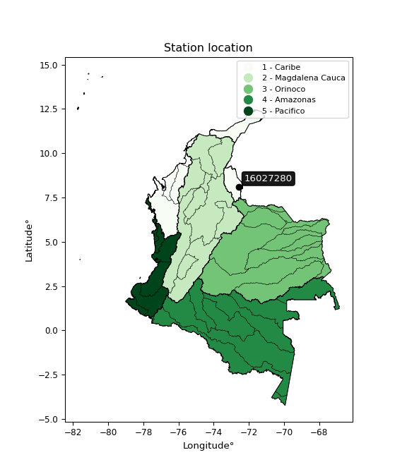

<div align="center">


</div>

# PMP Station (Rain, Pmax24h): 16027280

Probable Maximum Precipitation (PMP) is the greatest amount of rainfall for a specific duration that is meteorologically possible for a given location, acting as a "worst-case" scenario for extreme storms, crucial for designing safety-critical infrastructure like bridges, river deviations, dams, spillways, and nuclear plants to prevent catastrophic failure. PMP is calculated by hydrologists using meteorological data to determine the upper limit of extreme rainfall, often leading to the Probable Maximum Flood (PMF) for flood control design, and is increasingly being studied for climate change impacts. Probable Maximum Precipitation (PMP) is the theoretical upper limit of rainfall, a deterministic estimate for extreme events, while probability distributions (like GEV, Gumbel) describe the likelihood and frequency of various precipitation amounts, including rare ones, showing how often events occur, with PMP representing the extreme end of these distributions, used for critical infrastructure design to ensure safety against the worst conceivable weather, unlike standard statistical forecasts which cover typical probabilities.

The most common probability distributions in hydrology, used for analyzing floods, rainfall, and streamflow, include the Normal, Log-Normal, Gumbel, Gamma (including Log-Pearson Type III), and Generalized Extreme Value (GEV) distributions, often chosen based on the data´s skewness and whether modeling extremes or general conditions, with Gumbel and GEV popular for extreme events like floods, while the Normal distribution serves as a baseline, though often requiring transformations for skewed hydrological data. These distributions help in designing water infrastructure, managing water resources, and forecasting hydrologic events.

> Hydrological data often isn´t perfectly normal (it´s skewed), so different distributions are needed for different applications, such as: **Flood Frequency Analysis**: Using Gumbel, GEV, or Log-Pearson Type III for predicting extreme flood magnitudes and their return periods, **Rainfall Analysis**: Normal for annual totals, but Log-Normal, Weibull, or GEV for intensity or extreme daily rainfall, **Streamflow Modeling**: Gamma and Log-Normal for maximum flows, GEV for minimum flows, and Kappa for daily flows.

<div align="center">

</img>

</div>


## A. General information


### 1. General running parameters

• app_version: _v20260113_. • runtime: _2026-01-17 18:24:04.630693_. • Python version: _3.14.0_. • SciPy version: _1.16.3_. • Pandas version: _2.3.3_. • NumPy version: _2.3.5_. • Stations dataset (station_dataset_file): _dataset/pmax24h_in/automatic_colombia_2003_2025.csv_. • Stations catalog (station_catalog_file): _dataset/CNE.xls_. • Minimum year to eval til year_max (date_min): _1900_. • Maximum year to eval since year_min (date_max): _2025_. • Creates, save and include plots into reports (create_plot): _False_. • Plot only fit distributions with Δo > Δ (plot_only_fit): _True_. • Plot only simple graphs avoiding multiple CDFs and multiple Extreme values plots (plot_only_simple): _True_. • Eval low extreme values, if False, evaluates high extreme values (low_extreme): _False_. • Eval every SciPy distribution as logarithmic (pdist_logarithmic_on): _True_. • Standard deviation normalized (ddof): _1.0_. • Return periods to eval in years (Tr): _[2, 2.33, 5, 10, 15, 20, 25, 50, 75, 100, 200, 250, 500, 750, 1000]_. • Minimum data sample per station, 0 means any (minimum_sample): _5_. • Z-Score maximum threshold to adjust a value, 0 means disable (zscore_max): _3.5_. • Z-Score minimum threshold to adjust a value, 0 means disable (zscore_min): _-2.5_. • Avoid zeros, e.g. rain = 0 (avoid_zeros): _True_. • Avoid null values (avoid_nans): _True_. 

:file_folder:Table: [dataset.csv](../../dataset/pmax24h_in/automatic_colombia_2003_2025.csv)

> Delta Degrees of Freedom (DDOF): is a parameter used in the formulas for calculating variance and standard deviation. When ddof=0, the divisor is $N$ (the total number of observations) and this is used when your data set is the entire population. When ddof=1, the divisor is $N-1$ and this is used when your data set is a sample drawn from a larger population. Using $N-1$ provides an unbiased estimate of the population variance (known as Bessel´s correction).


### 2. Station info and location

|   id |   CODIGO | NOMBRE                      | CATEGORIA    | TECNOLOGIA                              | ESTADO           | FECHA_INSTALACION   |   FECHA_SUSPENSION |   ALTITUD |   LATITUD |   LONGITUD | DEPARTAMENTO       | MUNICIPIO   | AREA_OPERATIVA                         | ENTIDAD                                                     | AREA_HIDROGRAFICA   | ZONA_HIDROGRAFICA   | SUBZONA_HIDROGRAFICA   | CORRIENTE   | Catalogo   |   Version |
|-----:|---------:|:----------------------------|:-------------|:----------------------------------------|:-----------------|:--------------------|-------------------:|----------:|----------:|-----------:|:-------------------|:------------|:---------------------------------------|:------------------------------------------------------------|:--------------------|:--------------------|:-----------------------|:------------|:-----------|----------:|
|    0 | 16027280 | ASTILLEROS - AUT [16027280] | Limnigráfica | Automática con Telemetría, Convencional | En Mantenimiento | 15/09/1992          |                nan |       140 |   8.10528 |   -72.5814 | Norte De Santander | Cúcuta      | Area Operativa 08 - Santanderes-Arauca | INSTITUTO DE HIDROLOGIA METEOROLOGIA Y ESTUDIOS AMBIENTALES | Caribe              | Catatumbo           | Río Zulia              | Zulia       | CNE_IDEAM  |  20251226 |

<div align="center">

Dynamic map: [:earth_americas:Google](http://maps.google.com/maps?q=8.105277778,-72.58138889) [:earth_americas:OSM](https://www.openstreetmap.org/#map=18/8.105277778/-72.58138889&layers=P) [:earth_americas:Bing](https://www.bing.com/maps?cp=8.105277778~-72.58138889&lvl=18) [:earth_americas:Apple](https://maps.apple.com/frame?center=8.105277778%2C-72.58138889&span=0.003%2C0.006)

</div>


<div align="center">

```geojson
{
  "type": "Feature",
  "geometry": {
    "type": "Point", 
    "coordinates": [-72.58138889, 8.105277778]
  }, 
  "properties": {
    "Name": "16027280"
  }
}
```

</div>


### 3. Discrete values table and plot

<div align="center">

|               |           0 |           1 |           2 |           3 |          4 |
|:--------------|------------:|------------:|------------:|------------:|-----------:|
| Date          | 2019        | 2020        | 2022        | 2023        | 2025       |
| Value         |   62.6      |   55.8      |  131.9      |   32.4      |  185.5     |
| Value_initial |   62.6      |   55.8      |  131.9      |   32.4      |  185.5     |
| count         |    5        |    5        |    5        |    5        |    5       |
| mean          |   93.64     |   93.64     |   93.64     |   93.64     |   93.64    |
| std           |   63.3399   |   63.3399   |   63.3399   |   63.3399   |   63.3399  |
| zscore        |   -0.490054 |   -0.597412 |    0.604043 |   -0.966847 |    1.45027 |


</div>


> The initial value (value_initial) correspond to the initial obtained or null completed value, and value (value) is adjusted only when the initial value is outside the valid range (outlier) definite through the Z-Score value. If Z-Score is active, values out of range or outliers are replaced with the station mean value. A Z-Score (or standard score) measures how many standard deviations a data point is from the mean of a dataset, indicating its relative position; positive scores mean above the mean, negative mean below, and a score of zero is exactly at the mean, allowing for comparison of values from different distributions. It´s calculated using the formula $z=(x–μ)/σ$, where $x$ is the data point, $μ$ is the mean, and $σ$ is the standard deviation, helping identify outliers and understand probability.
>
> <sub>**Note**: In this study, "completing" (filling gaps in) and "extending" (forecasting or lengthening the historical record) rainfall data series are avoided for certain critical analyses because they introduce artificial bias and uncertainty, which can distort the statistics of rare events (extremes), alter day-to-day variability, and compromise the integrity and homogeneity of the original data. Some reasons against Completing/Extending rainfall data are: **Distortion of Extremes and Variability**: The primary issue is that most gap-filling or extension methods rely on averaging or regression with nearby stations, which inherently smooths the data. Rainfall is highly variable in space and time, with a large percentage of zero values and occasional large storms. Infilling methods often underestimate the highest values and overestimate the lowest (zero) values, which severely distorts analyses focused on flood frequency, drought severity, and intensity-duration-frequency (IDF) curves, **Loss of Data Homogeneity**: Infilled or extended data are synthetic estimates, not actual measurements. Combining these estimates with observed data can violate the assumption of data homogeneity, which requires that the data properties do not change over time. Inhomogeneity can lead to incorrect conclusions about long-term trends or changes in climate patterns, **Propagation of Errors**: Errors and biases from the original data (e.g., wind-induced undercatch, instrument errors, site changes) or the data used for imputation can propagate through the analysis, leading to unreliable hydrological models and inaccurate predictions, **Compromised Statistical Integrity**: For statistical analyses, especially those involving the frequency of events, using artificial data can introduce time bias or autocorrelation that doesn´t exist in reality, making it difficult to assess the true probability of events, **Difficulty in Validation**: It is difficult to accurately validate the quality of filled or extended data, especially for past periods where ground-truth measurements are unavailable. The reliability of imputation techniques heavily depends on the density of the surrounding station network and the complexity of the local topography.</sub>


### 4. Active continuous probability distributions from SciPy (80 of 104 available)

A Probability Density Function (PDF) describes the relative likelihood of a continuous random variable falling within a specific range, where the total area under its curve equals 1, and the area over any interval gives the actual probability for that range. Unlike discrete probabilities (like rolling a die), a PDF shows density, not direct probability for a single point (which is zero), with higher points indicating higher likelihood, often visualized as a bell curve for normal distributions.

A log of a probability density function (log-PDF) is simply the logarithm of the PDF´s value, denoted as $log(f(x))$, useful for converting multiplication of probabilities into addition, improving numerical stability with tiny numbers, and connecting to information theory concepts like entropy. Instead of dealing with very small probabilities (e.g., 0.000001), log-PDFs use negative numbers (e.g., $log(0.00001) ≈ -11.51$ that are easier for computers to handle, preventing underflow errors and simplifying complex calculations. In this study, each active probability distribution from SciPy is also evaluated in the $log$ form.

[scipy.stats](https://docs.scipy.org/doc/scipy/reference/stats.html) is a Python´s powerful submodule within the SciPy library for comprehensive statistical analysis, offering over 130 probability distributions (like Normal, Poisson), functions for descriptive stats (mean, variance), hypothesis testing (t-tests, chi-square), random variable generation, and statistical tests, making it essential for data science, modeling, and research. It provides tools to explore, model, and draw conclusions from data efficiently, working seamlessly with NumPy.

<div align="center">

|   id | p_dist           |   n_parameter | fit_method   | label                                                                       | active   | ref                                                                                                      |
|-----:|:-----------------|--------------:|:-------------|:----------------------------------------------------------------------------|:---------|:---------------------------------------------------------------------------------------------------------|
|    0 | alpha            |             3 | MLE          | Alpha                                                                       | True     | [:mortar_board:](https://docs.scipy.org/doc/scipy/reference/generated/scipy.stats.alpha.html)            |
|    1 | anglit           |             2 | MM           | Anglit                                                                      | True     | [:mortar_board:](https://docs.scipy.org/doc/scipy/reference/generated/scipy.stats.anglit.html)           |
|    2 | arcsine          |             2 | MM           | Arcsine                                                                     | True     | [:mortar_board:](https://docs.scipy.org/doc/scipy/reference/generated/scipy.stats.arcsine.html)          |
|    3 | argus            |             3 | MLE          | Argus                                                                       | True     | [:mortar_board:](https://docs.scipy.org/doc/scipy/reference/generated/scipy.stats.argus.html)            |
|    4 | beta             |             4 | MLE          | Beta                                                                        | True     | [:mortar_board:](https://docs.scipy.org/doc/scipy/reference/generated/scipy.stats.beta.html)             |
|    5 | betaprime        |             4 | MLE          | Beta prime                                                                  | True     | [:mortar_board:](https://docs.scipy.org/doc/scipy/reference/generated/scipy.stats.betaprime.html)        |
|    6 | bradford         |             3 | MLE          | Bradford                                                                    | True     | [:mortar_board:](https://docs.scipy.org/doc/scipy/reference/generated/scipy.stats.bradford.html)         |
|    7 | burr             |             4 | MLE          | Burr (Type III)                                                             | True     | [:mortar_board:](https://docs.scipy.org/doc/scipy/reference/generated/scipy.stats.burr.html)             |
|    8 | burr12           |             4 | MLE          | Burr (Type III) 12                                                          | True     | [:mortar_board:](https://docs.scipy.org/doc/scipy/reference/generated/scipy.stats.burr12.html)           |
|    9 | cosine           |             2 | MLE          | Cosine                                                                      | True     | [:mortar_board:](https://docs.scipy.org/doc/scipy/reference/generated/scipy.stats.cosine.html)           |
|   10 | crystalball      |             4 | MLE          | Crystalball                                                                 | True     | [:mortar_board:](https://docs.scipy.org/doc/scipy/reference/generated/scipy.stats.crystalball.html)      |
|   11 | dgamma           |             3 | MLE          | Double gamma                                                                | True     | [:mortar_board:](https://docs.scipy.org/doc/scipy/reference/generated/scipy.stats.dgamma.html)           |
|   12 | dweibull         |             3 | MLE          | Double Weibull                                                              | True     | [:mortar_board:](https://docs.scipy.org/doc/scipy/reference/generated/scipy.stats.dweibull.html)         |
|   13 | erlang           |             3 | MLE          | Erlang                                                                      | True     | [:mortar_board:](https://docs.scipy.org/doc/scipy/reference/generated/scipy.stats.erlang.html)           |
|   14 | exponnorm        |             3 | MLE          | Exponentially modified Normal                                               | True     | [:mortar_board:](https://docs.scipy.org/doc/scipy/reference/generated/scipy.stats.exponnorm.html)        |
|   15 | exponpow         |             3 | MLE          | Exponential power                                                           | True     | [:mortar_board:](https://docs.scipy.org/doc/scipy/reference/generated/scipy.stats.exponpow.html)         |
|   16 | exponweib        |             4 | MLE          | Exponentiated Weibull                                                       | True     | [:mortar_board:](https://docs.scipy.org/doc/scipy/reference/generated/scipy.stats.exponweib.html)        |
|   17 | f                |             4 | MLE          | F                                                                           | True     | [:mortar_board:](https://docs.scipy.org/doc/scipy/reference/generated/scipy.stats.f.html)                |
|   18 | fatiguelife      |             3 | MLE          | Fatigue-life (Birnbaum-Saunders)                                            | True     | [:mortar_board:](https://docs.scipy.org/doc/scipy/reference/generated/scipy.stats.fatiguelife.html)      |
|   19 | foldnorm         |             3 | MM           | Fold Normal                                                                 | True     | [:mortar_board:](https://docs.scipy.org/doc/scipy/reference/generated/scipy.stats.foldnorm.html)         |
|   20 | gamma            |             3 | MLE          | Gamma                                                                       | True     | [:mortar_board:](https://docs.scipy.org/doc/scipy/reference/generated/scipy.stats.gamma.html)            |
|   21 | gausshyper       |             6 | MLE          | Gauss hypergeometric                                                        | True     | [:mortar_board:](https://docs.scipy.org/doc/scipy/reference/generated/scipy.stats.gausshyper.html)       |
|   22 | genexpon         |             5 | MLE          | Generalized exponential                                                     | True     | [:mortar_board:](https://docs.scipy.org/doc/scipy/reference/generated/scipy.stats.genexpon.html)         |
|   23 | genextreme       |             3 | MLE          | Generalized exponential                                                     | True     | [:mortar_board:](https://docs.scipy.org/doc/scipy/reference/generated/scipy.stats.genextreme.html)       |
|   24 | gengamma         |             4 | MLE          | Generalized gamma                                                           | True     | [:mortar_board:](https://docs.scipy.org/doc/scipy/reference/generated/scipy.stats.gengamma.html)         |
|   25 | genhalflogistic  |             3 | MLE          | Generalized half-logistic                                                   | True     | [:mortar_board:](https://docs.scipy.org/doc/scipy/reference/generated/scipy.stats.genhalflogistic.html)  |
|   26 | genlogistic      |             3 | MLE          | Generalized logistic                                                        | True     | [:mortar_board:](https://docs.scipy.org/doc/scipy/reference/generated/scipy.stats.genlogistic.html)      |
|   27 | gennorm          |             3 | MLE          | Generalized Normal                                                          | True     | [:mortar_board:](https://docs.scipy.org/doc/scipy/reference/generated/scipy.stats.gennorm.html)          |
|   28 | genpareto        |             3 | MLE          | Generalized Pareto                                                          | True     | [:mortar_board:](https://docs.scipy.org/doc/scipy/reference/generated/scipy.stats.genpareto.html)        |
|   29 | gompertz         |             3 | MLE          | Gompertz (or truncated Gumbel)                                              | True     | [:mortar_board:](https://docs.scipy.org/doc/scipy/reference/generated/scipy.stats.gompertz.html)         |
|   30 | gumbel_l         |             2 | MM           | Gumbel Left Skew                                                            | True     | [:mortar_board:](https://docs.scipy.org/doc/scipy/reference/generated/scipy.stats.gumbel_l.html)         |
|   31 | gumbel_r         |             2 | MM           | Gumbel Right Skew                                                           | True     | [:mortar_board:](https://docs.scipy.org/doc/scipy/reference/generated/scipy.stats.gumbel_r.html)         |
|   32 | halfgennorm      |             3 | MLE          | Upper half of a generalized normal                                          | True     | [:mortar_board:](https://docs.scipy.org/doc/scipy/reference/generated/scipy.stats.halfgennorm.html)      |
|   33 | halflogistic     |             2 | MM           | Half-logistic                                                               | True     | [:mortar_board:](https://docs.scipy.org/doc/scipy/reference/generated/scipy.stats.halflogistic.html)     |
|   34 | halfnorm         |             2 | MM           | Half Normal                                                                 | True     | [:mortar_board:](https://docs.scipy.org/doc/scipy/reference/generated/scipy.stats.halfnorm.html)         |
|   35 | hypsecant        |             2 | MM           | hyperbolic secant                                                           | True     | [:mortar_board:](https://docs.scipy.org/doc/scipy/reference/generated/scipy.stats.hypsecant.html)        |
|   36 | invgamma         |             3 | MLE          | Inverted gamma                                                              | True     | [:mortar_board:](https://docs.scipy.org/doc/scipy/reference/generated/scipy.stats.invgamma.html)         |
|   37 | invgauss         |             3 | MLE          | Inverse Gaussian                                                            | True     | [:mortar_board:](https://docs.scipy.org/doc/scipy/reference/generated/scipy.stats.invgauss.html)         |
|   38 | invweibull       |             3 | MLE          | Inverted Weibull                                                            | True     | [:mortar_board:](https://docs.scipy.org/doc/scipy/reference/generated/scipy.stats.invweibull.html)       |
|   39 | johnsonsb        |             4 | MLE          | Johnson SB                                                                  | True     | [:mortar_board:](https://docs.scipy.org/doc/scipy/reference/generated/scipy.stats.johnsonsb.html)        |
|   40 | johnsonsu        |             4 | MLE          | Johnson Su                                                                  | True     | [:mortar_board:](https://docs.scipy.org/doc/scipy/reference/generated/scipy.stats.johnsonsu.html)        |
|   41 | kappa3           |             3 | MLE          | Kappa 3                                                                     | True     | [:mortar_board:](https://docs.scipy.org/doc/scipy/reference/generated/scipy.stats.kappa3.html)           |
|   42 | kappa4           |             4 | MLE          | Kappa 4                                                                     | True     | [:mortar_board:](https://docs.scipy.org/doc/scipy/reference/generated/scipy.stats.kappa4.html)           |
|   43 | ksone            |             3 | MLE          | Kolmogorov-Smirnov one-sided test statistic distribution                    | True     | [:mortar_board:](https://docs.scipy.org/doc/scipy/reference/generated/scipy.stats.ksone.html)            |
|   44 | kstwobign        |             2 | MLE          | Limiting distribution of scaled Kolmogorov-Smirnov two-sided test statistic | True     | [:mortar_board:](https://docs.scipy.org/doc/scipy/reference/generated/scipy.stats.kstwobign.html)        |
|   45 | laplace          |             2 | MM           | Laplace                                                                     | True     | [:mortar_board:](https://docs.scipy.org/doc/scipy/reference/generated/scipy.stats.laplace.html)          |
|   46 | levy_l           |             2 | MLE          | Left-skewed Levy                                                            | True     | [:mortar_board:](https://docs.scipy.org/doc/scipy/reference/generated/scipy.stats.levy_l.html)           |
|   47 | loggamma         |             3 | MLE          | Log gamma                                                                   | True     | [:mortar_board:](https://docs.scipy.org/doc/scipy/reference/generated/scipy.stats.loggamma.html)         |
|   48 | logistic         |             2 | MM           | Logistic (or Sech-squared)                                                  | True     | [:mortar_board:](https://docs.scipy.org/doc/scipy/reference/generated/scipy.stats.logistic.html)         |
|   49 | loglaplace       |             3 | MLE          | Log-Laplace                                                                 | True     | [:mortar_board:](https://docs.scipy.org/doc/scipy/reference/generated/scipy.stats.loglaplace.html)       |
|   50 | lomax            |             3 | MLE          | Lomax (Pareto of the second kind)                                           | True     | [:mortar_board:](https://docs.scipy.org/doc/scipy/reference/generated/scipy.stats.lomax.html)            |
|   51 | maxwell          |             2 | MM           | Maxwell                                                                     | True     | [:mortar_board:](https://docs.scipy.org/doc/scipy/reference/generated/scipy.stats.maxwell.html)          |
|   52 | mielke           |             4 | MLE          | Mielke Beta-Kappa / Dagum                                                   | True     | [:mortar_board:](https://docs.scipy.org/doc/scipy/reference/generated/scipy.stats.mielke.html)           |
|   53 | moyal            |             2 | MM           | Moyal                                                                       | True     | [:mortar_board:](https://docs.scipy.org/doc/scipy/reference/generated/scipy.stats.moyal.html)            |
|   54 | nakagami         |             3 | MLE          | Nakagami                                                                    | True     | [:mortar_board:](https://docs.scipy.org/doc/scipy/reference/generated/scipy.stats.nakagami.html)         |
|   55 | ncf              |             5 | MLE          | Non-central F distribution                                                  | True     | [:mortar_board:](https://docs.scipy.org/doc/scipy/reference/generated/scipy.stats.ncf.html)              |
|   56 | nct              |             4 | MLE          | Non-central Student’s t                                                     | True     | [:mortar_board:](https://docs.scipy.org/doc/scipy/reference/generated/scipy.stats.nct.html)              |
|   57 | norm             |             2 | MM           | Normal                                                                      | True     | [:mortar_board:](https://docs.scipy.org/doc/scipy/reference/generated/scipy.stats.norm.html)             |
|   58 | pearson3         |             3 | MM           | Pearson type III                                                            | True     | [:mortar_board:](https://docs.scipy.org/doc/scipy/reference/generated/scipy.stats.pearson3.html)         |
|   59 | powerlaw         |             3 | MLE          | Power-function                                                              | True     | [:mortar_board:](https://docs.scipy.org/doc/scipy/reference/generated/scipy.stats.powerlaw.html)         |
|   60 | rayleigh         |             2 | MM           | Rayleigh                                                                    | True     | [:mortar_board:](https://docs.scipy.org/doc/scipy/reference/generated/scipy.stats.rayleigh.html)         |
|   61 | rdist            |             3 | MLE          | R-distributed (symmetric beta)                                              | True     | [:mortar_board:](https://docs.scipy.org/doc/scipy/reference/generated/scipy.stats.rdist.html)            |
|   62 | rice             |             3 | MLE          | Rice                                                                        | True     | [:mortar_board:](https://docs.scipy.org/doc/scipy/reference/generated/scipy.stats.rice.html)             |
|   63 | semicircular     |             2 | MM           | Semicircular                                                                | True     | [:mortar_board:](https://docs.scipy.org/doc/scipy/reference/generated/scipy.stats.semicircular.html)     |
|   64 | skewnorm         |             3 | MLE          | Skew normal                                                                 | True     | [:mortar_board:](https://docs.scipy.org/doc/scipy/reference/generated/scipy.stats.skewnorm.html)         |
|   65 | t                |             3 | MLE          | Student’s t                                                                 | True     | [:mortar_board:](https://docs.scipy.org/doc/scipy/reference/generated/scipy.stats.t.html)                |
|   66 | trapezoid        |             4 | MLE          | Trapezoid                                                                   | True     | [:mortar_board:](https://docs.scipy.org/doc/scipy/reference/generated/scipy.stats.trapezoid.html)        |
|   67 | triang           |             3 | MLE          | Triangular                                                                  | True     | [:mortar_board:](https://docs.scipy.org/doc/scipy/reference/generated/scipy.stats.triang.html)           |
|   68 | truncexpon       |             3 | MLE          | Truncated exponential                                                       | True     | [:mortar_board:](https://docs.scipy.org/doc/scipy/reference/generated/scipy.stats.truncexpon.html)       |
|   69 | truncnorm        |             4 | MLE          | Truncated normal                                                            | True     | [:mortar_board:](https://docs.scipy.org/doc/scipy/reference/generated/scipy.stats.truncnorm.html)        |
|   70 | truncpareto      |             4 | MLE          | Upper truncated Pareto                                                      | True     | [:mortar_board:](https://docs.scipy.org/doc/scipy/reference/generated/scipy.stats.truncpareto.html)      |
|   71 | truncweibull_min |             5 | MLE          | Doubly truncated Weibull minimum                                            | True     | [:mortar_board:](https://docs.scipy.org/doc/scipy/reference/generated/scipy.stats.truncweibull_min.html) |
|   72 | tukeylambda      |             3 | MLE          | Tukey-Lamdba                                                                | True     | [:mortar_board:](https://docs.scipy.org/doc/scipy/reference/generated/scipy.stats.tukeylambda.html)      |
|   73 | uniform          |             2 | MLE          | Uniform                                                                     | True     | [:mortar_board:](https://docs.scipy.org/doc/scipy/reference/generated/scipy.stats.uniform.html)          |
|   74 | vonmises         |             3 | MLE          | Von Mises                                                                   | True     | [:mortar_board:](https://docs.scipy.org/doc/scipy/reference/generated/scipy.stats.vonmises.html)         |
|   75 | vonmises_line    |             3 | MLE          | Von Mises line                                                              | True     | [:mortar_board:](https://docs.scipy.org/doc/scipy/reference/generated/scipy.stats.vonmises_line.html)    |
|   76 | wald             |             2 | MM           | Wald                                                                        | True     | [:mortar_board:](https://docs.scipy.org/doc/scipy/reference/generated/scipy.stats.wald.html)             |
|   77 | weibull_max      |             3 | MLE          | Weibull maximum                                                             | True     | [:mortar_board:](https://docs.scipy.org/doc/scipy/reference/generated/scipy.stats.weibull_max.html)      |
|   78 | weibull_min      |             3 | MLE          | Weibull minimum                                                             | True     | [:mortar_board:](https://docs.scipy.org/doc/scipy/reference/generated/scipy.stats.weibull_min.html)      |
|   79 | wrapcauchy       |             3 | MLE          | Wrapped  Cauchy                                                             | True     | [:mortar_board:](https://docs.scipy.org/doc/scipy/reference/generated/scipy.stats.wrapcauchy.html)       |

</div>

> **n_parameter:** # arguments & localization & scale.
>
> **Fit methods:** (MLE) maximum likelihood, (MM) L-moments.
>
>**Inactive** (With the only purpose of prevent loops, zero divisions, infinite values, over high estimated values or horizontal trending for recurrence intervals estimations, the follow distributions were disabled.)**:** lognorm, norminvgauss, powernorm, powerlognorm, cauchy, halfcauchy, foldcauchy, skewcauchy, chi2, expon, fisk, genhyperbolic, geninvgauss, gibrat, kstwo, laplace_asymmetric, levy, levy_stable, ncx2, pareto, rel_breitwigner, recipinvgauss, studentized_range, loguniform, 


## B. Probability (PDF) vs. Empirical (EDF) distributions functions

A continuous probability distribution (CPD) describes probabilities for variables that can take any value within a range (like rain any time), unlike discrete variables with specific outcomes (like temperature). It uses a Probability Density Function (PDF), a curve where the total area under it equals 1, and the probability of the variable falling within an interval (a to b) is found by calculating the area under the curve between those points. A key feature is that the probability of hitting any single exact value is zero, so probabilities are always expressed for ranges, e.g., $P(a ≤ X ≤ b)$.

<div align="center">

Distributions parameters from station values
|     |   station | p_dist              |   n |              loc |          scale | shape                  | shape1                | shape2                 | shape3             |
|----:|----------:|:--------------------|----:|-----------------:|---------------:|:-----------------------|:----------------------|:-----------------------|:-------------------|
|   0 |  16027280 | alpha               |   5 |    -31.9554      |  247.738       | 2.3641459368512594     |                       |                        |                    |
|   1 |  16027280 | anglit              |   5 |     93.64        |  165.732       |                        |                       |                        |                    |
|   2 |  16027280 | arcsine             |   5 |     13.5206      |  160.239       |                        |                       |                        |                    |
|   3 |  16027280 | argus               |   5 |    -24.8472      |  222.235       | 5.834360952009903e-07  |                       |                        |                    |
|   4 |  16027280 | beta                |   5 |     17.7082      |  167.792       | 0.2851840582687973     | 0.4971612321099904    |                        |                    |
|   5 |  16027280 | betaprime           |   5 |     -0.410521    |    1.28727     | 149.24012205467835     | 2.945953849705841     |                        |                    |
|   6 |  16027280 | bradford            |   5 |     32.399       |  153.101       | 1.2076931921487644     |                       |                        |                    |
|   7 |  16027280 | burr                |   5 |     -0.597441    |    2.58553     | 1.8490460356924925     | 310.51851709850735    |                        |                    |
|   8 |  16027280 | burr12              |   5 |     -1.05931     |   33.115       | 410.571941186073       | 0.0028172828756364166 |                        |                    |
|   9 |  16027280 | cosine              |   5 |     98.3129      |   45.8005      |                        |                       |                        |                    |
|  10 |  16027280 | crystalball         |   5 |     93.64        |   56.6529      | 6483.410885949108      | 7844.76824081436      |                        |                    |
|  11 |  16027280 | dgamma              |   5 |     99.7628      |    7.23217     | 7.366059223384189      |                       |                        |                    |
|  12 |  16027280 | dweibull            |   5 |    104.015       |   60.8087      | 3.073443877717671      |                       |                        |                    |
|  13 |  16027280 | erlang              |   5 |     32.4         |   47.5023      | 0.6696130255188388     |                       |                        |                    |
|  14 |  16027280 | exponnorm           |   5 |     32.3433      |    0.0165216   | 3699.2233638197285     |                       |                        |                    |
|  15 |  16027280 | exponpow            |   5 |     32.4         |  114.201       | 0.704659350430517      |                       |                        |                    |
|  16 |  16027280 | exponweib           |   5 |     32.4         |    0.825857    | 1.3053030372943328     | 0.21361828522978676   |                        |                    |
|  17 |  16027280 | f                   |   5 |      7.18765     |   54.4573      | 1998.0414591531398     | 4.650180289969968     |                        |                    |
|  18 |  16027280 | fatiguelife         |   5 |     32.4         |    6.62297e-06 | 3383.6408428011637     |                       |                        |                    |
|  19 |  16027280 | foldnorm            |   5 |      5.52718     |   66.6155      | 1.213596007032673      |                       |                        |                    |
|  20 |  16027280 | gamma               |   5 |     32.4         |   48.0321      | 0.3689989466291521     |                       |                        |                    |
|  21 |  16027280 | gausshyper          |   5 |      7.68157     |  177.818       | 1.1918219759946078     | 0.8341450046326782    | 1.0392025274189571     | 0.9421147133530066 |
|  22 |  16027280 | genexpon            |   5 |     32.3969      |    1.47289     | 0.02207081203386723    | 2.826558700818152     | 1.803051594271914e-05  |                    |
|  23 |  16027280 | genextreme          |   5 |     33.2171      |    5.6024      | -6.856726972088651     |                       |                        |                    |
|  24 |  16027280 | gengamma            |   5 |     32.4         |    0.12532     | 1.5022526533208613     | 0.17176139141267466   |                        |                    |
|  25 |  16027280 | genhalflogistic     |   5 |     16.4673      |  181.137       | 1.0716081917281635     |                       |                        |                    |
|  26 |  16027280 | genlogistic         |   5 |   -240.167       |   42.1541      | 1471.89135935592       |                       |                        |                    |
|  27 |  16027280 | gennorm             |   5 |     62.6014      |    4.63262e-08 | 0.11319214830089475    |                       |                        |                    |
|  28 |  16027280 | genpareto           |   5 |     -1.26119     |  253.686       | -1.358342232013202     |                       |                        |                    |
|  29 |  16027280 | gompertz            |   5 |     32.4         |  416.597       | 5.904169197903137      |                       |                        |                    |
|  30 |  16027280 | gumbel_l            |   5 |    119.137       |   44.1721      |                        |                       |                        |                    |
|  31 |  16027280 | gumbel_r            |   5 |     68.1432      |   44.1721      |                        |                       |                        |                    |
|  32 |  16027280 | halfgennorm         |   5 |     32.4         |    0.18851     | 0.2600685510841362     |                       |                        |                    |
|  33 |  16027280 | halflogistic        |   5 |     26.4931      |   48.4362      |                        |                       |                        |                    |
|  34 |  16027280 | halfnorm            |   5 |     18.6537      |   93.9814      |                        |                       |                        |                    |
|  35 |  16027280 | hypsecant           |   5 |     93.64        |   36.0664      |                        |                       |                        |                    |
|  36 |  16027280 | invgamma            |   5 |      7.12481     |  126.698       | 2.32505305977163       |                       |                        |                    |
|  37 |  16027280 | invgauss            |   5 |     19.4453      |   66.3167      | 1.1187936924704691     |                       |                        |                    |
|  38 |  16027280 | invweibull          |   5 |     32.4         |    1.4878      | 0.04453013121452937    |                       |                        |                    |
|  39 |  16027280 | johnsonsb           |   5 |     -1.55866     |  187.059       | -0.5208475967813502    | 0.10759005072915981   |                        |                    |
|  40 |  16027280 | johnsonsu           |   5 |     32.4         |    1.18161e-08 | -1.414572821699756     | 0.11232309082843292   |                        |                    |
|  41 |  16027280 | kappa3              |   5 |     32.4         |  173.681       | 2911.502353724749      |                       |                        |                    |
|  42 |  16027280 | kappa4              |   5 |     -4.25035     |  186.02        | 1.243863192443051      | 0.9530614395348422    |                        |                    |
|  43 |  16027280 | ksone               |   5 |     -4.48575     |  196.252       | 1.0                    |                       |                        |                    |
|  44 |  16027280 | kstwobign           |   5 |    -78.8351      |  197.634       |                        |                       |                        |                    |
|  45 |  16027280 | laplace             |   5 |     93.64        |   40.0597      |                        |                       |                        |                    |
|  46 |  16027280 | levy_l              |   5 |    193.806       |   31.7234      |                        |                       |                        |                    |
|  47 |  16027280 | loggamma            |   5 | -20328.5         | 2664.13        | 2134.1422576465584     |                       |                        |                    |
|  48 |  16027280 | logistic            |   5 |     93.64        |   31.2344      |                        |                       |                        |                    |
|  49 |  16027280 | loglaplace          |   5 |     -0.147171    |   62.7472      | 1.9232198438761787     |                       |                        |                    |
|  50 |  16027280 | lomax               |   5 |     32.4         | 1589.72        | 26.684382709640516     |                       |                        |                    |
|  51 |  16027280 | maxwell             |   5 |    -40.6037      |   84.1247      |                        |                       |                        |                    |
|  52 |  16027280 | mielke              |   5 |      0.188766    |    3.46041     | 303.75880130420154     | 1.8281962671759497    |                        |                    |
|  53 |  16027280 | moyal               |   5 |     61.2422      |   25.5028      |                        |                       |                        |                    |
|  54 |  16027280 | nakagami            |   5 |     32.4         |  416.039       | 0.05028447816800653    |                       |                        |                    |
|  55 |  16027280 | ncf                 |   5 |     -0.576136    |   32.0498      | 20.842022392726463     | 6.6943135078136695    | 24.40142686745908      |                    |
|  56 |  16027280 | nct                 |   5 |     -0.261769    |    0.92783     | 1.787274522769355      | 60.34991354631347     |                        |                    |
|  57 |  16027280 | norm                |   5 |     93.64        |   56.6529      |                        |                       |                        |                    |
|  58 |  16027280 | pearson3            |   5 |     93.64        |   56.653       | 0.5690794033911346     |                       |                        |                    |
|  59 |  16027280 | powerlaw            |   5 |     32.4         |  153.1         | 0.12036142966062653    |                       |                        |                    |
|  60 |  16027280 | rayleigh            |   5 |    -14.7404      |   86.475       |                        |                       |                        |                    |
|  61 |  16027280 | rdist               |   5 |     19.8342      |   42.7658      | 1.352126924364219      |                       |                        |                    |
|  62 |  16027280 | rice                |   5 |      0.357727    |   77.1723      | 0.0010443268703353402  |                       |                        |                    |
|  63 |  16027280 | semicircular        |   5 |     93.64        |  113.306       |                        |                       |                        |                    |
|  64 |  16027280 | skewnorm            |   5 |     32.4         |   83.4167      | 22262589.263721995     |                       |                        |                    |
|  65 |  16027280 | t                   |   5 |     93.6396      |   56.6529      | 116717753.63242221     |                       |                        |                    |
|  66 |  16027280 | trapezoid           |   5 |     17.09        |  183.72        | 1.0                    | 1.0                   |                        |                    |
|  67 |  16027280 | triang              |   5 |     16.7721      |  168.728       | 0.9999999415598064     |                       |                        |                    |
|  68 |  16027280 | truncexpon          |   5 |     32.396       |  164.285       | 0.9319423401412805     |                       |                        |                    |
|  69 |  16027280 | truncnorm           |   5 |     93.64        |   56.6529      | -1462.9899344301868    | 5130.644378258197     |                        |                    |
|  70 |  16027280 | truncpareto         |   5 |     31.883       |    0.516983    | 0.2648559247957783     | 297.1412811327305     |                        |                    |
|  71 |  16027280 | truncweibull_min    |   5 |      9.34521     |  208.582       | 1.1833924727830043     | 0.0002512031352965448 | 0.8445367318638768     |                    |
|  72 |  16027280 | tukeylambda         |   5 |    108.959       |   82.9028      | 1.0828673922208933     |                       |                        |                    |
|  73 |  16027280 | uniform             |   5 |     32.4         |  153.1         |                        |                       |                        |                    |
|  74 |  16027280 | vonmises            |   5 |     -0.11847     |    1           | 1.0302519995903576     |                       |                        |                    |
|  75 |  16027280 | vonmises_line       |   5 |    114.132       |   26.016       | 5.620228199350559e-08  |                       |                        |                    |
|  76 |  16027280 | wald                |   5 |     36.987       |   56.6529      |                        |                       |                        |                    |
|  77 |  16027280 | weibull_max         |   5 |    185.5         |    1.46674     | 0.25219202384932593    |                       |                        |                    |
|  78 |  16027280 | weibull_min         |   5 |     32.4         |   50.5306      | 0.1362116923046593     |                       |                        |                    |
|  79 |  16027280 | wrapcauchy          |   5 |     32.4         |   24.3666      | 0.4998204951167009     |                       |                        |                    |
|  80 |  16027280 | logalpha            |   5 |     -5.42641     |  152.155       | 15.633739364882187     |                       |                        |                    |
|  81 |  16027280 | loganglit           |   5 |      4.34836     |    1.83093     |                        |                       |                        |                    |
|  82 |  16027280 | logarcsine          |   5 |      3.46324     |    1.77024     |                        |                       |                        |                    |
|  83 |  16027280 | logargus            |   5 |      3.00654     |    2.35603     | 2.9337215447504828e-05 |                       |                        |                    |
|  84 |  16027280 | logbeta             |   5 |      3.47816     |    1.86713     | 0.657667053340453      | 0.7332594260794192    |                        |                    |
|  85 |  16027280 | logbetaprime        |   5 |     -1.03796     |    5.55612     | 144.83846705388805     | 150.39913914770068    |                        |                    |
|  86 |  16027280 | logbradford         |   5 |      3.47814     |    1.74491     | 1.0872910874696053     |                       |                        |                    |
|  87 |  16027280 | logburr             |   5 |     -7.27205     |    8.17401     | 21.40749055141261      | 1001.8929275885491    |                        |                    |
|  88 |  16027280 | logburr12           |   5 |      3.08531     |   62.1925      | 2.192274267318425      | 4034.2378236329478    |                        |                    |
|  89 |  16027280 | logcosine           |   5 |      4.35407     |    0.503663    |                        |                       |                        |                    |
|  90 |  16027280 | logcrystalball      |   5 |      4.34836     |    0.625874    | 21.265226723263446     | 5034.827174584176     |                        |                    |
|  91 |  16027280 | logdgamma           |   5 |      4.49134     |    0.094607    | 6.256931767577764      |                       |                        |                    |
|  92 |  16027280 | logdweibull         |   5 |      4.13677     |    0.514054    | 0.9288193238283957     |                       |                        |                    |
|  93 |  16027280 | logerlang           |   5 |     -4.39774     |    0.0447706   | 195.31604541076308     |                       |                        |                    |
|  94 |  16027280 | logexponnorm        |   5 |      4.3045      |    0.624336    | 0.07025126791622402    |                       |                        |                    |
|  95 |  16027280 | logexponpow         |   5 |      3.47816     |    1.95654     | 0.227752082518831      |                       |                        |                    |
|  96 |  16027280 | logexponweib        |   5 |      3.47816     |    1.14857     | 0.8599198769578063     | 0.4546939474178236    |                        |                    |
|  97 |  16027280 | logf                |   5 |      3.47803     |    0.824561    | 1.4049892581597598     | 4165.964416008711     |                        |                    |
|  98 |  16027280 | logfatiguelife      |   5 |      1.54262     |    2.7341      | 0.2289035322030818     |                       |                        |                    |
|  99 |  16027280 | logfoldnorm         |   5 |      2.91001     |    0.637812    | 2.2466534184028877     |                       |                        |                    |
| 100 |  16027280 | loggamma            |   5 |     -4.22622     |    0.0455027   | 188.39299578561162     |                       |                        |                    |
| 101 |  16027280 | loggausshyper       |   5 |      3.47816     |    1.74544     | 0.9410315637216005     | 0.9897195423416447    | 1.0913508923736592     | 1.0060770634691678 |
| 102 |  16027280 | loggenexpon         |   5 |      3.47816     |    7.0638e+07  | 53234170.41570641      | 303355807.3000926     | 10412577.361187482     |                    |
| 103 |  16027280 | loggenextreme       |   5 |      4.53221     |    0.825834    | 1.1954054684982103     |                       |                        |                    |
| 104 |  16027280 | loggengamma         |   5 |      3.47816     |    1.14857     | 0.8599198769578063     | 0.4546939474178236    |                        |                    |
| 105 |  16027280 | loggenhalflogistic  |   5 |      3.28089     |    2.05738     | 1.0593237254265286     |                       |                        |                    |
| 106 |  16027280 | loggenlogistic      |   5 |      0.91218     |    0.547067    | 304.96903931801694     |                       |                        |                    |
| 107 |  16027280 | loggennorm          |   5 |      4.35064     |    0.872643    | 58408.13588967695      |                       |                        |                    |
| 108 |  16027280 | loggenpareto        |   5 |     -0.00958806  |   10.7063      | -2.0460683224606484    |                       |                        |                    |
| 109 |  16027280 | loggompertz         |   5 |      3.47816     |    1.11621     | 0.6474272570784448     |                       |                        |                    |
| 110 |  16027280 | loggumbel_l         |   5 |      4.63004     |    0.487992    |                        |                       |                        |                    |
| 111 |  16027280 | loggumbel_r         |   5 |      4.06668     |    0.487992    |                        |                       |                        |                    |
| 112 |  16027280 | loghalfgennorm      |   5 |      3.47816     |    1.01047     | 1.2244263581832806     |                       |                        |                    |
| 113 |  16027280 | loghalflogistic     |   5 |      3.60655     |    0.535106    |                        |                       |                        |                    |
| 114 |  16027280 | loghalfnorm         |   5 |      3.51998     |    1.03823     |                        |                       |                        |                    |
| 115 |  16027280 | loghypsecant        |   5 |      4.34836     |    0.398444    |                        |                       |                        |                    |
| 116 |  16027280 | loginvgamma         |   5 |     -1.92043     |  622.637       | 100.32248522486088     |                       |                        |                    |
| 117 |  16027280 | loginvgauss         |   5 |      1.41914     |   60.536       | 0.048382176382746944   |                       |                        |                    |
| 118 |  16027280 | loginvweibull       |   5 |     -2.28017e+07 |    2.28017e+07 | 41669521.18641822      |                       |                        |                    |
| 119 |  16027280 | logjohnsonsb        |   5 |      3.47751     |    1.74554     | -0.5792467240409936    | 0.14150712302302657   |                        |                    |
| 120 |  16027280 | logjohnsonsu        |   5 |     14.5119      |    0.00380778  | 139.3956846542962      | 16.246770288517517    |                        |                    |
| 121 |  16027280 | logkappa3           |   5 |      3.47816     |    1.74398     | 3070.9731567323915     |                       |                        |                    |
| 122 |  16027280 | logkappa4           |   5 |      3.43833     |    1.95917     | 1.0183454192400052     | 1.097744639123237     |                        |                    |
| 123 |  16027280 | logksone            |   5 |      3.26431     |    2.16809     | 1.0                    |                       |                        |                    |
| 124 |  16027280 | logkstwobign        |   5 |      2.14647     |    2.5151      |                        |                       |                        |                    |
| 125 |  16027280 | loglaplace          |   5 |      4.34836     |    0.44256     |                        |                       |                        |                    |
| 126 |  16027280 | loglevy_l           |   5 |      5.29032     |    0.256099    |                        |                       |                        |                    |
| 127 |  16027280 | logloggamma         |   5 |   -154.271       |   22.2433      | 1250.7625917057835     |                       |                        |                    |
| 128 |  16027280 | loglogistic         |   5 |      4.34836     |    0.345062    |                        |                       |                        |                    |
| 129 |  16027280 | logloglaplace       |   5 |     -0.00640946  |    4.14317     | 8.348576343851336      |                       |                        |                    |
| 130 |  16027280 | loglomax            |   5 |      3.47797     |  836.648       | 958.5714142084216      |                       |                        |                    |
| 131 |  16027280 | logmaxwell          |   5 |      2.8653      |    0.929369    |                        |                       |                        |                    |
| 132 |  16027280 | logmielke           |   5 |     -0.52177     |    2.58315     | 1070.242445542447      | 8.587239243446817     |                        |                    |
| 133 |  16027280 | logmoyal            |   5 |      3.99044     |    0.281742    |                        |                       |                        |                    |
| 134 |  16027280 | lognakagami         |   5 |      4.02177     |    0.899972    | 0.04935092189225809    |                       |                        |                    |
| 135 |  16027280 | logncf              |   5 |     -1.19298     |    5.51761     | 235.10708168775568     | 464.7763028833725     | 1.4012546539861066e-10 |                    |
| 136 |  16027280 | lognct              |   5 |     -3.7112      |    0.378375    | 132.12409393935513     | 21.179537018696614    |                        |                    |
| 137 |  16027280 | lognorm             |   5 |      4.34836     |    0.625874    |                        |                       |                        |                    |
| 138 |  16027280 | logpearson3         |   5 |      4.34836     |    0.625873    | 0.0962393031172633     |                       |                        |                    |
| 139 |  16027280 | logpowerlaw         |   5 |      3.47816     |    1.7449      | 0.13066708055745668    |                       |                        |                    |
| 140 |  16027280 | lograyleigh         |   5 |      3.15103     |    0.955334    |                        |                       |                        |                    |
| 141 |  16027280 | logrdist            |   5 |      4.37263     |    0.894475    | 1.013298097844364      |                       |                        |                    |
| 142 |  16027280 | logrice             |   5 |      3.15908     |    0.784316    | 0.9674935742414612     |                       |                        |                    |
| 143 |  16027280 | logsemicircular     |   5 |      4.34836     |    1.25175     |                        |                       |                        |                    |
| 144 |  16027280 | logskewnorm         |   5 |      4.1177      |    0.667026    | 0.4807483826356846     |                       |                        |                    |
| 145 |  16027280 | logt                |   5 |      4.34836     |    0.625874    | 34989326784.56379      |                       |                        |                    |
| 146 |  16027280 | logtrapezoid        |   5 |      2.57812     |    2.65536     | 1.0                    | 1.0                   |                        |                    |
| 147 |  16027280 | logtriang           |   5 |      2.59462     |    2.6285      | 0.9999997903062545     |                       |                        |                    |
| 148 |  16027280 | logtruncexpon       |   5 |      3.47804     |    1.95806     | 0.8911985133076753     |                       |                        |                    |
| 149 |  16027280 | logtruncnorm        |   5 |      0.816023    |    1.51187     | 2.120392462336675      | 97.35908208762618     |                        |                    |
| 150 |  16027280 | logtruncpareto      |   5 |      3.46988     |    0.00827466  | 0.26198275257570197    | 211.87219990656686    |                        |                    |
| 151 |  16027280 | logtruncweibull_min |   5 |      3.46725     |    2.2688      | 1.0337858574348546     | 0.0010717198578297574 | 0.7738903381421725     |                    |
| 152 |  16027280 | logtukeylambda      |   5 |      4.35884     |    0.964382    | 1.0950393900178506     |                       |                        |                    |
| 153 |  16027280 | loguniform          |   5 |      3.47816     |    1.7449      |                        |                       |                        |                    |
| 154 |  16027280 | logvonmises         |   5 |     -1.93955     |    1           | 3.0602923355749203     |                       |                        |                    |
| 155 |  16027280 | logvonmises_line    |   5 |      4.34133     |    0.280662    | 7.314974024453562e-05  |                       |                        |                    |
| 156 |  16027280 | logwald             |   5 |      3.7225      |    0.625863    |                        |                       |                        |                    |
| 157 |  16027280 | logweibull_max      |   5 |      5.22305     |    0.954671    | 0.5175316924858364     |                       |                        |                    |
| 158 |  16027280 | logweibull_min      |   5 |      3.47816     |    0.758114    | 0.4221807386811142     |                       |                        |                    |
| 159 |  16027280 | logwrapcauchy       |   5 |      3.47816     |    0.277709    | 0.31822751596414045    |                       |                        |                    |

</div>

> **loc** (Location parameter): This shifts the distribution along the x-axis. For many common distributions, like the normal (Gaussian) distribution, loc represents the mean $μ$. For others, like the uniform distribution, it might represent the minimum value, or for the beta distribution, the left end of the support interval.
>
> **scale** (Scale parameter): This determines the width or spread of the distribution. For the normal distribution, scale represents the standard deviation $σ$. For a uniform distribution, it defines the length of the interval (from $loc$ to $loc + scale$).
>
> **shape** (Shape parameters): Refers to parameters that define the specific form of a probability distribution, distinct from its location (loc) and scale (scale). These parameters are required arguments for most distribution functions. For example, a normal (Gaussian) distribution is fully defined by its location (mean) and scale (standard deviation), so it has no specific shape parameters beyond loc and scale. However, other distributions have intrinsic properties that need specification, as Gamma distribution that takes a shape parameter, often named $a$ or $alpha$.


### 0. Cumulative distribution values - CDF (160 evaluated)

Cumulative Distribution Function (CDF), denoted as $F$<sub>$X$</sub>$(x)$, is a function that gives the probability that a random variable $X$ will take a value less than or equal to a specific value, $x$ (i.e., $(P(X≥x)$. It essentially "accumulates" probabilities from a given point up to the far right (positive infinity), providing a complete picture of the distribution´s probabilities for both discrete (like rain) and continuous (like temperature) variables, helping to find probabilities over ranges or above certain values. Each station is evaluated separately ordering the $x$ values ascending, calculating the CDF and PDF values for the activated distributions and their logarithmic forms.

<div align="center">

CDF ordered by x ascending and calculating $log(f(x))$ separately
|   id |   Station |   date |     x |   count |   mean |     std |    zscore |   Value_initial |   station |   m |    alpha |   alpha_pdf |   anglit |   anglit_pdf |   arcsine |   arcsine_pdf |    argus |   argus_pdf |     beta |       beta_pdf |   betaprime |   betaprime_pdf |    bradford |   bradford_pdf |     burr |   burr_pdf |    burr12 |   burr12_pdf |   cosine |   cosine_pdf |   crystalball |   crystalball_pdf |   dgamma |   dgamma_pdf |   dweibull |   dweibull_pdf |      erlang |     erlang_pdf |   exponnorm |   exponnorm_pdf |    exponpow |   exponpow_pdf |   exponweib |   exponweib_pdf |         f |      f_pdf |   fatiguelife |   fatiguelife_pdf |   foldnorm |   foldnorm_pdf |       gamma |   gamma_pdf |   gausshyper |   gausshyper_pdf |    genexpon |   genexpon_pdf |   genextreme |   genextreme_pdf |    gengamma |   gengamma_pdf |   genhalflogistic |   genhalflogistic_pdf |   genlogistic |   genlogistic_pdf |   gennorm |   gennorm_pdf |   genpareto |   genpareto_pdf |    gompertz |   gompertz_pdf |   gumbel_l |   gumbel_l_pdf |   gumbel_r |   gumbel_r_pdf |   halfgennorm |   halfgennorm_pdf |   halflogistic |   halflogistic_pdf |   halfnorm |   halfnorm_pdf |   hypsecant |   hypsecant_pdf |   invgamma |   invgamma_pdf |   invgauss |   invgauss_pdf |   invweibull |   invweibull_pdf |   johnsonsb |   johnsonsb_pdf |   johnsonsu |   johnsonsu_pdf |      kappa3 |   kappa3_pdf |      kappa4 |   kappa4_pdf |    ksone |   ksone_pdf |   kstwobign |   kstwobign_pdf |   laplace |   laplace_pdf |   levy_l |   levy_l_pdf |   loggamma |   loggamma_pdf |   logistic |   logistic_pdf |   loglaplace |   loglaplace_pdf |       lomax |   lomax_pdf |   maxwell |   maxwell_pdf |      mielke |   mielke_pdf |     moyal |   moyal_pdf |   nakagami |   nakagami_pdf |       ncf |    ncf_pdf |       nct |     nct_pdf |     norm |   norm_pdf |   pearson3 |   pearson3_pdf |   powerlaw |   powerlaw_pdf |   rayleigh |   rayleigh_pdf |    rdist |    rdist_pdf |      rice |   rice_pdf |   semicircular |   semicircular_pdf |   skewnorm |   skewnorm_pdf |        t |      t_pdf |   trapezoid |   trapezoid_pdf |     triang |   triang_pdf |   truncexpon |   truncexpon_pdf |   truncnorm |   truncnorm_pdf |   truncpareto |   truncpareto_pdf |   truncweibull_min |   truncweibull_min_pdf |   tukeylambda |   tukeylambda_pdf |   uniform |   uniform_pdf |   vonmises |   vonmises_pdf |   vonmises_line |   vonmises_line_pdf |     wald |   wald_pdf |   weibull_max |   weibull_max_pdf |   weibull_min |   weibull_min_pdf |   wrapcauchy |   wrapcauchy_pdf |   logalpha |   logalpha_pdf |   loganglit |   loganglit_pdf |   logarcsine |   logarcsine_pdf |   logargus |   logargus_pdf |    logbeta |   logbeta_pdf |   logbetaprime |   logbetaprime_pdf |   logbradford |   logbradford_pdf |   logburr |   logburr_pdf |   logburr12 |   logburr12_pdf |   logcosine |   logcosine_pdf |   logcrystalball |   logcrystalball_pdf |   logdgamma |   logdgamma_pdf |   logdweibull |   logdweibull_pdf |   logerlang |   logerlang_pdf |   logexponnorm |   logexponnorm_pdf |   logexponpow |   logexponpow_pdf |   logexponweib |   logexponweib_pdf |      logf |   logf_pdf |   logfatiguelife |   logfatiguelife_pdf |   logfoldnorm |   logfoldnorm_pdf |   loggausshyper |   loggausshyper_pdf |   loggenexpon |   loggenexpon_pdf |   loggenextreme |   loggenextreme_pdf |   loggengamma |   loggengamma_pdf |   loggenhalflogistic |   loggenhalflogistic_pdf |   loggenlogistic |   loggenlogistic_pdf |   loggennorm |   loggennorm_pdf |   loggenpareto |   loggenpareto_pdf |   loggompertz |   loggompertz_pdf |   loggumbel_l |   loggumbel_l_pdf |   loggumbel_r |   loggumbel_r_pdf |   loghalfgennorm |   loghalfgennorm_pdf |   loghalflogistic |   loghalflogistic_pdf |   loghalfnorm |   loghalfnorm_pdf |   loghypsecant |   loghypsecant_pdf |   loginvgamma |   loginvgamma_pdf |   loginvgauss |   loginvgauss_pdf |   loginvweibull |   loginvweibull_pdf |   logjohnsonsb |   logjohnsonsb_pdf |   logjohnsonsu |   logjohnsonsu_pdf |   logkappa3 |   logkappa3_pdf |   logkappa4 |   logkappa4_pdf |   logksone |   logksone_pdf |   logkstwobign |   logkstwobign_pdf |   loglevy_l |   loglevy_l_pdf |   logloggamma |   logloggamma_pdf |   loglogistic |   loglogistic_pdf |   logloglaplace |   logloglaplace_pdf |    loglomax |   loglomax_pdf |   logmaxwell |   logmaxwell_pdf |   logmielke |   logmielke_pdf |   logmoyal |   logmoyal_pdf |   lognakagami |   lognakagami_pdf |    logncf |   logncf_pdf |    lognct |   lognct_pdf |   lognorm |   lognorm_pdf |   logpearson3 |   logpearson3_pdf |   logpowerlaw |   logpowerlaw_pdf |   lograyleigh |   lograyleigh_pdf |    logrdist |   logrdist_pdf |   logrice |   logrice_pdf |   logsemicircular |   logsemicircular_pdf |   logskewnorm |   logskewnorm_pdf |      logt |   logt_pdf |   logtrapezoid |   logtrapezoid_pdf |   logtriang |   logtriang_pdf |   logtruncexpon |   logtruncexpon_pdf |   logtruncnorm |   logtruncnorm_pdf |   logtruncpareto |   logtruncpareto_pdf |   logtruncweibull_min |   logtruncweibull_min_pdf |   logtukeylambda |   logtukeylambda_pdf |   loguniform |   loguniform_pdf |   logvonmises |   logvonmises_pdf |   logvonmises_line |   logvonmises_line_pdf |   logwald |   logwald_pdf |   logweibull_max |   logweibull_max_pdf |   logweibull_min |   logweibull_min_pdf |   logwrapcauchy |   logwrapcauchy_pdf |
|-----:|----------:|-------:|------:|--------:|-------:|--------:|----------:|----------------:|----------:|----:|---------:|------------:|---------:|-------------:|----------:|--------------:|---------:|------------:|---------:|---------------:|------------:|----------------:|------------:|---------------:|---------:|-----------:|----------:|-------------:|---------:|-------------:|--------------:|------------------:|---------:|-------------:|-----------:|---------------:|------------:|---------------:|------------:|----------------:|------------:|---------------:|------------:|----------------:|----------:|-----------:|--------------:|------------------:|-----------:|---------------:|------------:|------------:|-------------:|-----------------:|------------:|---------------:|-------------:|-----------------:|------------:|---------------:|------------------:|----------------------:|--------------:|------------------:|----------:|--------------:|------------:|----------------:|------------:|---------------:|-----------:|---------------:|-----------:|---------------:|--------------:|------------------:|---------------:|-------------------:|-----------:|---------------:|------------:|----------------:|-----------:|---------------:|-----------:|---------------:|-------------:|-----------------:|------------:|----------------:|------------:|----------------:|------------:|-------------:|------------:|-------------:|---------:|------------:|------------:|----------------:|----------:|--------------:|---------:|-------------:|-----------:|---------------:|-----------:|---------------:|-------------:|-----------------:|------------:|------------:|----------:|--------------:|------------:|-------------:|----------:|------------:|-----------:|---------------:|----------:|-----------:|----------:|------------:|---------:|-----------:|-----------:|---------------:|-----------:|---------------:|-----------:|---------------:|---------:|-------------:|----------:|-----------:|---------------:|-------------------:|-----------:|---------------:|---------:|-----------:|------------:|----------------:|-----------:|-------------:|-------------:|-----------------:|------------:|----------------:|--------------:|------------------:|-------------------:|-----------------------:|--------------:|------------------:|----------:|--------------:|-----------:|---------------:|----------------:|--------------------:|---------:|-----------:|--------------:|------------------:|--------------:|------------------:|-------------:|-----------------:|-----------:|---------------:|------------:|----------------:|-------------:|-----------------:|-----------:|---------------:|-----------:|--------------:|---------------:|-------------------:|--------------:|------------------:|----------:|--------------:|------------:|----------------:|------------:|----------------:|-----------------:|---------------------:|------------:|----------------:|--------------:|------------------:|------------:|----------------:|---------------:|-------------------:|--------------:|------------------:|---------------:|-------------------:|----------:|-----------:|-----------------:|---------------------:|--------------:|------------------:|----------------:|--------------------:|--------------:|------------------:|----------------:|--------------------:|--------------:|------------------:|---------------------:|-------------------------:|-----------------:|---------------------:|-------------:|-----------------:|---------------:|-------------------:|--------------:|------------------:|--------------:|------------------:|--------------:|------------------:|-----------------:|---------------------:|------------------:|----------------------:|--------------:|------------------:|---------------:|-------------------:|--------------:|------------------:|--------------:|------------------:|----------------:|--------------------:|---------------:|-------------------:|---------------:|-------------------:|------------:|----------------:|------------:|----------------:|-----------:|---------------:|---------------:|-------------------:|------------:|----------------:|--------------:|------------------:|--------------:|------------------:|----------------:|--------------------:|------------:|---------------:|-------------:|-----------------:|------------:|----------------:|-----------:|---------------:|--------------:|------------------:|----------:|-------------:|----------:|-------------:|----------:|--------------:|--------------:|------------------:|--------------:|------------------:|--------------:|------------------:|------------:|---------------:|----------:|--------------:|------------------:|----------------------:|--------------:|------------------:|----------:|-----------:|---------------:|-------------------:|------------:|----------------:|----------------:|--------------------:|---------------:|-------------------:|-----------------:|---------------------:|----------------------:|--------------------------:|-----------------:|---------------------:|-------------:|-----------------:|--------------:|------------------:|-------------------:|-----------------------:|----------:|--------------:|-----------------:|---------------------:|-----------------:|---------------------:|----------------:|--------------------:|
|    0 |  16027280 |   2023 |  32.4 |       5 |  93.64 | 63.3399 | -0.966847 |            32.4 |  16027280 |   1 | 0.069348 | 0.00799042  | 0.163217 |   0.00445976 |  0.223055 |    0.00616161 | 0.097865 |  0.00336002 | 0.372542 |     0.00749638 |   0.0685648 |      0.00851724 | 9.53874e-06 |     0.00996044 | 0.061573 | 0.0095748  | 0.0119344 |  0.0336761   | 0.113178 |   0.00393117 |      0.139856 |        0.00392602 | 0.108327 |   0.0063792  |  0.0957132 |     0.00679094 | 2.80215e-11 | 2640.74        | 0.000926676 |      0.016342   | 3.80395e-12 |   377.245      | 0.000119618 |     4.6918e+09  | 0.0608372 | 0.00942844 |      0.127815 |       2.65469e+11 |   0.155975 |     0.00593335 | 1.62059e-06 | 8.41604e+07 |     0.11226  |       0.00517051 | 4.61784e-05 |     0.0149841  |  0.000619093 |    735.895       | 0.000285976 |    1.0363e+10  |         0.0461597 |            0.00304111 |      0.101499 |        0.00550407 |  0.159412 |   0.00206336  |    0.13611  |      0.00415407 | 3.02103e-16 |     0.0141724  |   0.130947 |     0.0027613  |   0.105815 |     0.00538048 |   1.97725e-15 |       0.278254    |      0.0609004 |         0.0102846  |   0.116289 |     0.00839949 |    0.115259 |      0.00312637 |  0.0608368 |     0.00942851 |  0.0544285 |     0.0121834  |    0.0130073 |      3.5397e+11  |    0.247344 |     0.00122314  |   0.0834861 |     1.4001e+06  | 8.51759e-10 |   0.00574192 | 1.49058e-13 |   7.14395    | 0.187951 |   0.0050955 |   0.0906466 |      0.00553242 |  0.108407 |    0.00270613 | 0.342475 |  0.000993212 |   0.078503 |       0.252009 |   0.123396 |     0.00346314 |    0.0699876 |         0.158143 | 5.04828e-09 |  0.0167855  |  0.139347 |    0.0049015  |   0.0614414 |   0.00964692 | 0.0783606 |  0.00584865 |  0.0182025 |    2.57635e+11 | 0.0769051 | 0.00807096 | 0.0591429 | 0.00978278  | 0.139856 | 0.00392602 |   0.131451 |     0.00481546 |  0.0108166 |    1.83226e+11 |   0.138073 |     0.00543353 | 0.61573  |   0.00939252 | 0.0825867 | 0.00493589 |       0.173493 |         0.00472723 |   0        |     0.00956505 | 0.139857 | 0.00392605 |  0.00694444 |     0.000907178 | 0.00857879 |   0.00109788 |  4.02491e-05 |       0.0100408  |    0.139856 |      0.00392602 |   1.42578e-16 |       0.657922    |           0.127179 |             0.00629498 |   7.10543e-15 |        0.0113025  |  0        |    0.00653168 |    5.81922 |       0.19741  |     3.59228e-07 |          0.00611757 | 0        | 0          |     0.0395935 |       0.000210601 |    0.00690674 |       1.31945e+11 |  2.54266e-08 |       0.0195857  |  0.0730341 |       0.266179 |   0.0931308 |        0.317451 |    0.0585249 |         1.96701  |  0.0594981 |       0.249728 | 4.1871e-11 |  62008.2      |      0.0731161 |           0.263083 |   1.40276e-05 |          0.846775 | 0.0585056 |      0.330248 |   0.0589768 |        0.319216 |    0.06631  |        0.263069 |        0.0822072 |             0.242463 |    0.0272   |        0.163417 |      0.141997 |          0.252082 |   0.0788518 |        0.252033 |      0.0821895 |           0.242496 |   0.000273553 |       1.40292e+11 |    9.41097e-07 |        8.28593e+08 | 0.0018425 |   9.86229  |        0.0646946 |             0.289402 |     0.0867177 |          0.254026 |       3.089e-15 |            6.54591  |   2.86682e-12 |          0.753619 |        0.114089 |            0.118733 |   9.92025e-07 |       8.73433e+08 |            0.0505116 |                 0.269813 |        0.0615638 |             0.31228  |   8.8233e-05 |         0.572967 |       0.415353 |         0.163759   |   2.09344e-09 |          0.580021 |     0.0900616 |          0.175983 |     0.0354321 |          0.24252  |      6.55954e-09 |             1.05739  |          0        |              0        |      0        |          0        |      0.0713767 |           0.177641 |     0.0717733 |          0.266094 |     0.0653427 |          0.287291 |       0.0610793 |            0.312045 |       0.044834 |       20.6799      |      0.0838718 |           0.226843 | 1.44807e-11 |        0.571904 |  0.00265071 |        0.570256 |  0.0986327 |       0.461235 |      0.0580871 |           0.340282 |    0.29303  |       0.0771138 |     0.0840309 |          0.242091 |     0.0743395 |          0.199422 |        0.117839 |            0.282326 | 0.000219469 |       1.14548  |    0.0670479 |         0.300378 |   0.0559618 |        0.342402 |  0.0130579 |       0.161434 |     0         |       0           | 0.0743729 |     0.260673 | 0.0755269 |     0.257453 | 0.0822072 |      0.242463 |     0.0797844 |          0.248267 |    0.00916935 |       2.69795e+12 |     0.0569428 |          0.338027 | 3.71727e-09 |     1.8965e+07 | 0.0506924 |      0.310724 |         0.0962549 |              0.365585 |     0.0816738 |          0.243559 | 0.0822072 |   0.242463 |       0.114888 |           0.255296 |    0.112988 |        0.255763 |     0.000105502 |            0.865797 |    0           |           0        |      1.47208e-16 |           41.9802    |            0.00590107 |                  0.708507 |      7.10543e-15 |             0.992071 |     0        |           0.5731 |       1.08339 |          0.22577  |          0.0105212 |               0.567028 |  0        |      0        |         0.255046 |          0.103356    |      3.70878e-07 |          3.52581e+08 |     1.00427e-08 |            1.10811  |
|    1 |  16027280 |   2020 |  55.8 |       5 |  93.64 | 63.3399 | -0.597412 |            55.8 |  16027280 |   2 | 0.326098 | 0.0116565   | 0.279533 |   0.00541559 |  0.343426 |    0.00450733 | 0.190882 |  0.00456482 | 0.497552 |     0.00412395 |   0.327841  |      0.0113421  | 0.213901    |     0.0084084  | 0.354308 | 0.0120329  | 0.464902  |  0.0108856   | 0.224857 |   0.00555736 |      0.25209  |        0.00563395 | 0.32403  |   0.0107175  |  0.306292  |     0.00956826 | 0.571666    |    0.0120494   | 0.318732    |      0.011147   | 0.321006    |     0.00928165 | 0.834215    |     0.00302521  | 0.346847  | 0.0118757  |      0.710729 |       0.00405836  |   0.298626 |     0.00625331 | 0.76335     | 0.00835396  |     0.236861 |       0.00542035 | 0.300313    |     0.0108693  |  0.541682    |      0.00206979  | 0.821054    |    0.00274057  |         0.122959  |            0.00354305 |      0.268849 |        0.00837413 |  0.256952 |   0.00966844  |    0.235414 |      0.00433988 | 0.28903     |     0.0106583  |   0.212101 |     0.00425209 |   0.2665   |     0.00797822 |   0.497095    |       0.00837248  |      0.293627  |         0.00943285 |   0.307343 |     0.0078519  |    0.214462 |      0.00550654 |  0.346849  |     0.0118757  |  0.377454  |     0.0116909  |    0.412909  |      0.000695031 |    0.271385 |     0.000896774 |   0.857179  |     0.00108294  | 0.134361    |   0.00574192 | 0.222562    |   0.00761568 | 0.307186 |   0.0050955 |   0.257793  |      0.00826555 |  0.194419 |    0.00485324 | 0.36838  |  0.00123549  |   0.307922 |       0.577825 |   0.229438 |     0.00566031 |    0.239047  |         0.540147 | 0.322888    |  0.0112008  |  0.274005 |    0.0064594  | nan         | nan          | 0.265881  |  0.00937259 |  0.661789  |    0.00284382  | 0.316744  | 0.0106709  | 0.361453  | 0.0122878   | 0.25209  | 0.00563395 |   0.267942 |     0.00668476 |  0.797653  |    0.00410285  |   0.283021 |     0.00676337 | 0.865593 |   0.0135804  | 0.227455  | 0.00719187 |       0.291413 |         0.00529601 |   0.220921 |     0.00919602 | 0.252092 | 0.00563397 |  0.0443949  |     0.00229372  | 0.0535027  |   0.00274177 |  0.219029    |       0.0087078  |    0.25209  |      0.00563395 |   0.819073    |       0.00515108  |           0.278223 |             0.00650742 |   0.158068    |        0.00654108 |  0.152841 |    0.00653168 |    9.29486 |       0.285046 |     0.143151    |          0.00611757 | 0.20006  | 0.0187979  |     0.0451935 |       0.000272133 |    0.593613   |       0.00213009  |  0.318709    |       0.0072401  |  0.319029  |       0.608761 |   0.325388  |        0.511783 |    0.379709  |         0.386925 |  0.265162  |       0.495134 | 0.362778   |      0.464787 |      0.315967  |           0.60302  |   0.39645     |          0.632519 | 0.372222  |      0.696925 |   0.335153  |        0.635296 |    0.297446 |        0.565676 |        0.300902  |             0.556285 |    0.331682 |        0.897463 |      0.389846 |          0.783624 |   0.307868  |        0.576455 |      0.300927  |           0.556378 |   0.670663    |       0.217549    |    0.559673    |        0.276155    | 0.534163  |   0.520729 |        0.334401  |             0.642295 |     0.307253  |          0.551223 |       0.421468  |            0.629128 |   0.393935    |          0.657171 |        0.204228 |            0.225916 |   0.578623    |       0.277762    |            0.222947  |                 0.373383 |        0.355228  |             0.670916 |   0.5        |         0.572977 |       0.512857 |         0.198194   |   0.333844    |          0.628824 |     0.249879  |          0.441965 |     0.334073  |          0.750578 |      0.47019     |             0.662124 |          0.369624 |              0.806735 |      0.371133 |          0.68379  |      0.264195  |           0.589517 |     0.318474  |          0.610224 |     0.333046  |          0.639936 |       0.355154  |            0.671883 |       0.244695 |        0.118686    |      0.288203  |           0.528604 | 0.310896    |        0.571904 |  0.296509   |        0.540657 |  0.349367  |       0.461235 |      0.365454  |           0.670024 |    0.346796 |       0.127737  |     0.300853  |          0.55075  |     0.279599  |          0.58373  |        0.395291 |            0.819257 | 0.463588    |       0.614183 |    0.328864  |         0.612924 |   0.378081  |        0.692318 |  0.344191  |       0.856282 |     0.0292376 |       3.24913e+12 | 0.314029  |     0.59684  | 0.312045  |     0.591815 | 0.300902  |      0.556286 |     0.304968  |          0.56918  |    0.858658   |       0.206393    |     0.33991   |          0.629775 | 0.370565    |     0.389988   | 0.322101  |      0.625331 |         0.335808  |              0.49097  |     0.301757  |          0.559312 | 0.300902  |   0.556285 |       0.295583 |           0.409493 |    0.294797 |        0.413127 |     0.41108     |            0.655908 |    1.25677e-12 |           1.64053  |      0.884732    |            0.20944   |            0.387095   |                  0.643457 |      0.312951    |             0.557364 |     0.311546 |           0.5731 |       1.29749 |          0.566084 |          0.318779  |               0.567087 |  0.345485 |      1.45008  |         0.324238 |          0.157326    |      0.580629    |          0.283025    |     0.393451    |            0.384003 |
|    2 |  16027280 |   2019 |  62.6 |       5 |  93.64 | 63.3399 | -0.490054 |            62.6 |  16027280 |   3 | 0.402659 | 0.0107958   | 0.317059 |   0.00561545 |  0.373366 |    0.00430951 | 0.223015 |  0.0048833  | 0.524319 |     0.00376775 |   0.402068  |      0.0104441  | 0.269821    |     0.00804415 | 0.431321 | 0.0105976  | 0.530446  |  0.00853185  | 0.263997 |   0.00594597 |      0.291881 |        0.00606041 | 0.393419 |   0.00941587 |  0.367774  |     0.00838265 | 0.644822    |    0.00959827  | 0.390467    |      0.00997323 | 0.380896    |     0.00837125 | 0.851796    |     0.0022185   | 0.423273  | 0.0105777  |      0.73601  |       0.00341571  |   0.341394 |     0.00632169 | 0.812201    | 0.00617304  |     0.273815 |       0.00544683 | 0.370795    |     0.00987482 |  0.553948    |      0.00158016  | 0.837064    |    0.00203177  |         0.147625  |            0.00371375 |      0.326937 |        0.00866755 |  0.496519 |   1.74618     |    0.265134 |      0.00440197 | 0.358471    |     0.00977557 |   0.242748 |     0.00476683 |   0.321839 |     0.00826019 |   0.547512    |       0.00658371  |      0.356374  |         0.00901182 |   0.359934 |     0.00761058 |    0.254702 |      0.00633219 |  0.423275  |     0.0105777  |  0.451149  |     0.0100179  |    0.417055  |      0.000537797 |    0.277333 |     0.000855191 |   0.863545  |     0.000813481 | 0.173406    |   0.00574192 | 0.272964    |   0.00722745 | 0.341836 |   0.0050955 |   0.314933  |      0.00850114 |  0.230388 |    0.00575112 | 0.377079 |  0.00132485  |   0.376863 |       0.618118 |   0.270167 |     0.00631281 |    0.309976  |         0.700416 | 0.394783    |  0.0099695  |  0.318888 |    0.00672586 | nan         | nan          | 0.33019   |  0.00948141 |  0.678984  |    0.00226051  | 0.387241  | 0.0100162  | 0.439725  | 0.010719    | 0.291881 | 0.00606041 |   0.314559 |     0.00700643 |  0.822525  |    0.00327815  |   0.329644 |     0.00693315 | 1        | 685.189      | 0.277653  | 0.00754932 |       0.327805 |         0.00540365 |   0.282677 |     0.0089583  | 0.291884 | 0.00606043 |  0.0613622  |     0.00269665  | 0.073771   |   0.00321948 |  0.277033    |       0.00835473 |    0.291881 |      0.00606041 |   0.848901    |       0.00375356  |           0.322387 |             0.00647744 |   0.202379    |        0.00649407 |  0.197257 |    0.00653168 |   10.4607  |       0.345135 |     0.184751    |          0.00611757 | 0.321375 | 0.0166207  |     0.0471214 |       0.000295402 |    0.606348   |       0.00165527  |  0.360817    |       0.00529966 |  0.390977  |       0.63879  |   0.38546   |        0.531646 |    0.423162  |         0.370362 |  0.324494  |       0.535962 | 0.415067   |      0.445918 |      0.387356  |           0.634926 |   0.467305    |          0.600385 | 0.45128   |      0.673489 |   0.409144  |        0.64818  |    0.364777 |        0.603033 |        0.367652  |             0.60201  |    0.425698 |        0.691203 |      0.5      |          9.66653  |   0.376648  |        0.616706 |      0.367687  |           0.602083 |   0.693426    |       0.180547    |    0.588697    |        0.231183    | 0.58958   |   0.445937 |        0.409211  |             0.654589 |     0.373231  |          0.593748 |       0.491517  |            0.590117 |   0.467034    |          0.613416 |        0.232171 |            0.261086 |   0.607758    |       0.231602    |            0.267573  |                 0.403397 |        0.432119  |             0.661844 |   0.5        |         0.572977 |       0.536234 |         0.208657   |   0.405817    |          0.621748 |     0.305054  |          0.518258 |     0.420537  |          0.746485 |      0.54183     |             0.584921 |          0.458519 |              0.737947 |      0.447541 |          0.644185 |      0.338388  |           0.698109 |     0.39056   |          0.639706 |     0.407676  |          0.653841 |       0.432143  |            0.662582 |       0.257873 |        0.111404    |      0.352135  |           0.581301 | 0.37666     |        0.571904 |  0.358842   |        0.543616 |  0.402405  |       0.461235 |      0.441705  |           0.652508 |    0.362487 |       0.145831  |     0.366974  |          0.596725 |     0.351328  |          0.660451 |        0.5      |            1.00751  | 0.529758    |       0.538346 |    0.400538  |         0.630309 |   0.455954  |        0.658004 |  0.440526  |       0.811149 |     0.722473  |       0.619652    | 0.384811  |     0.630676 | 0.382364  |     0.627758 | 0.367652  |      0.60201  |     0.37302   |          0.611465 |    0.880459   |       0.174682    |     0.412767  |          0.634252 | 0.414292    |     0.372131   | 0.395024  |      0.639822 |         0.392901  |              0.501266 |     0.368823  |          0.604402 | 0.367652  |   0.60201  |       0.344547 |           0.442111 |    0.344217 |        0.446414 |     0.484332    |            0.618498 |    0.17406     |           1.39216  |      0.906075    |            0.164941  |            0.459501   |                  0.615907 |      0.376912    |             0.555261 |     0.377448 |           0.5731 |       1.36589 |          0.620574 |          0.38399   |               0.567101 |  0.49064  |      1.08576  |         0.343308 |          0.174866    |      0.61028     |          0.235411    |     0.43424     |            0.330555 |
|    3 |  16027280 |   2022 | 131.9 |       5 |  93.64 | 63.3399 |  0.604043 |           131.9 |  16027280 |   4 | 0.810274 | 0.00258354  | 0.722739 |   0.00540204 |  0.658471 |    0.00452185 | 0.64377  |  0.00674953 | 0.737736 |     0.00293402 |   0.81042   |      0.00278152 | 0.731555    |     0.00558048 | 0.807234 | 0.00241152 | 0.799687  |  0.00174265  | 0.723244 |   0.00605667 |      0.75027  |        0.00560596 | 0.563833 |   0.00748081 |  0.543519  |     0.00458156 | 0.936033    |    0.00150498  | 0.803865    |      0.00320917 | 0.771913    |     0.00363239 | 0.920042    |     0.000473061 | 0.810111  | 0.0025396  |      0.874002 |       0.00119156  |   0.751906 |     0.00478881 | 0.973173    | 0.000687326 |     0.656135 |       0.00563567 | 0.799567    |     0.00347167 |  0.608715    |      0.000442905 | 0.901654    |    0.000468242 |         0.489876  |            0.006616   |      0.805675 |        0.00412945 |  0.889021 |   0.000774015 |    0.601072 |      0.00547924 | 0.796645    |     0.00365953 |   0.736846 |     0.00795332 |   0.789678 |     0.00422137 |   0.773455    |       0.00168778  |      0.796183  |         0.00377911 |   0.771792 |     0.00410773 |    0.78784  |      0.00545651 |  0.810111  |     0.00253958 |  0.813418  |     0.00251885 |    0.436348  |      0.000161951 |    0.336257 |     0.00102648  |   0.89071   |     0.000211285 | 0.571321    |   0.00574192 | 0.703185    |   0.00552276 | 0.694954 |   0.0050955 |   0.794412  |      0.00442228 |  0.807608 |    0.00480263 | 0.525918 |  0.00357047  |   0.806456 |       0.42201  |   0.77293  |     0.0056191  |    0.850289  |         0.338283 | 0.802097    |  0.00312624 |  0.759822 |    0.00487188 | nan         | nan          | 0.802394  |  0.003794   |  0.765388  |    0.000771495 | 0.801348  | 0.00296482 | 0.811492  | 0.00233939  | 0.75027  | 0.00560596 |   0.767295 |     0.00479167 |  0.949454  |    0.00114852  |   0.762548 |     0.00465637 | 1        |   0          | 0.766063  | 0.00516702 |       0.710809 |         0.00528858 |   0.767055 |     0.00469605 | 0.750273 | 0.00560594 |  0.390523   |     0.00680294  | 0.465572   |   0.00808791 |  0.749402    |       0.00547942 |    0.75027  |      0.00560596 |   0.965789    |       0.000843253 |           0.739009 |             0.00540313 |   0.646707    |        0.00640958 |  0.649902 |    0.00653168 |   21.5248  |       0.34651  |     0.608698    |          0.00611757 | 0.842207 | 0.00283412 |     0.0838979 |       0.000978241 |    0.666024   |       0.000501405 |  0.553536    |       0.00266606 |  0.808811  |       0.390047 |   0.775251  |        0.455961 |    0.706009  |         0.450782 |  0.778292  |       0.613486 | 0.735055   |      0.444438 |      0.80747   |           0.396609 |   0.854097    |          0.451666 | 0.814345  |      0.294541 |   0.817854  |        0.378391 |    0.804755 |        0.473699 |        0.803088  |             0.443134 |    0.601049 |        0.785719 |      0.87817  |          0.214386 |   0.805799  |        0.422454 |      0.803098  |           0.443036 |   0.782899    |       0.082534    |    0.704702    |        0.108005    | 0.809354  |   0.188696 |        0.809261  |             0.35763  |     0.801007  |          0.43761  |       0.862423  |            0.424856 |   0.806201    |          0.301632 |        0.574646 |            0.780958 |   0.722934    |       0.106175    |            0.675674  |                 0.752219 |        0.806482  |             0.316949 |   0.5        |         0.572977 |       0.736746 |         0.3773     |   0.804038    |          0.399796 |     0.812882  |          0.64266  |     0.828543  |          0.319346 |      0.832414    |             0.236941 |          0.831142 |              0.288917 |      0.810452 |          0.32502  |      0.836874  |           0.391721 |     0.808191  |          0.389777 |     0.809397  |          0.360203 |       0.806612  |            0.316795 |       0.352367 |        0.191487    |      0.797165  |           0.476334 | 0.802887    |        0.571904 |  0.7781     |        0.594196 |  0.746154  |       0.461235 |      0.812447  |           0.323626 |    0.571644 |       0.565561  |     0.801723  |          0.446314 |     0.824427  |          0.419481 |        0.874333 |            0.214617 | 0.79958     |       0.229242 |    0.805608  |         0.38383  | nan         |      nan        |  0.837179  |       0.284908 |     0.879405  |       0.0966512   | 0.806871  |     0.402353 | 0.806586  |     0.40703  | 0.803088  |      0.443134 |     0.80436   |          0.429712 |    0.971986   |       0.0904679   |     0.806327  |          0.367334 | 0.694474    |     0.43577    | 0.805935  |      0.391301 |         0.762961  |              0.460044 |     0.803486  |          0.439944 | 0.803088  |   0.443134 |       0.752818 |           0.653509 |    0.757314 |        0.662155 |     0.867707    |            0.422704 |    0.789304    |           0.417532 |      0.980996    |            0.0639927 |            0.855972   |                  0.453881 |      0.791312    |             0.563661 |     0.804567 |           0.5731 |       1.81081 |          0.429638 |          0.806634  |               0.567055 |  0.867862 |      0.207729 |         0.556007 |          0.4953      |      0.726678    |          0.106615    |     0.701499    |            0.580478 |
|    4 |  16027280 |   2025 | 185.5 |       5 |  93.64 | 63.3399 |  1.45027  |           185.5 |  16027280 |   5 | 0.897804 | 0.000996111 | 0.947523 |   0.00269093 |  1        |    0          | 0.966402 |  0.00412292 | 1        | 93325.2        |   0.906593  |      0.00110991 | 1           |     0.00451173 | 0.892007 | 0.00101268 | 0.864618  |  0.000839388 | 0.953392 |   0.00233963 |      0.94754  |        0.0018914  | 0.967908 |   0.00233462 |  0.957217  |     0.00396719 | 0.981469    |    0.000422333 | 0.918403    |      0.0013351  | 0.911017    |     0.00172169 | 0.93872     |     0.000258964 | 0.898984  | 0.00105004 |      0.922333 |       0.000674596 |   0.931589 |     0.00198203 | 0.992902    | 0.000171566 |     1        |       1.85888    | 0.923416    |     0.00142278 |  0.627402    |      0.000278609 | 0.920503    |    0.000267034 |         1         |            0.128576   |      0.941208 |        0.00135284 |  0.917543 |   0.0003722   |    1        |     63.7765     | 0.927355    |     0.0014868  |   0.988806 |     0.00113847 |   0.932234 |     0.00148095 |   0.840236    |       0.000921215 |      0.927669  |         0.00143932 |   0.924154 |     0.00175593 |    0.950242 |      0.001374   |  0.898984  |     0.00105004 |  0.904686  |     0.00111792 |    0.44328   |      0.000104892 |    0.9997   |     5.72922e+09 |   0.899501  |     0.000129224 | 0.879088    |   0.00574192 | 0.976607    |   0.00453248 | 0.968073 |   0.0050955 |   0.944126  |      0.00151241 |  0.949522 |    0.00126006 | 0.949336 |  0.0139044   |   0.916651 |       0.230103 |   0.949836 |     0.00152549 |    0.93072   |         0.156545 | 0.914011    |  0.00131658 |  0.934905 |    0.0018499  | nan         | nan          | 0.930277  |  0.00136348 |  0.799138  |    0.000521548 | 0.9044    | 0.00118992 | 0.893591  | 0.000980493 | 0.94754  | 0.0018914  |   0.935118 |     0.00173848 |  1         |    0.000786162 |   0.931503 |     0.00183417 | 1        |   0          | 0.943741  | 0.00174895 |       0.952004 |         0.00328927 |   0.933548 |     0.00177506 | 0.94754  | 0.00189138 |  0.840278   |     0.00997895  | 0.999999   |   0.0118534  |  1           |       0.00395404 |    0.94754  |      0.0018914  |   1           |       0.000490041 |           1        |             0.0043393  |   0.999856    |        0.00814752 |  1        |    0.00653168 |   30.0118  |       0.045873 |     0.9366      |          0.00611757 | 0.935186 | 0.00100483 |     0.999585  |       1.83888e+09 |    0.687449   |       0.000323396 |  1           |       0.0195857  |  0.910875  |       0.216289 |   0.908291  |        0.315265 |    0.9511    |         2.35018  |  0.961039  |       0.406107 | 0.903194   |      0.588606 |      0.911356  |           0.219979 |   0.999999    |          0.405685 | 0.892634  |      0.173689 |   0.917287  |        0.211345 |    0.931854 |        0.267356 |        0.918877  |             0.240048 |    0.876023 |        0.578559 |      0.932574 |          0.115509 |   0.91622   |        0.230863 |      0.918861  |           0.240002 |   0.807799    |       0.0647502   |    0.737337    |        0.0849761   | 0.863453  |   0.132292 |        0.90376   |             0.204788 |     0.916189  |          0.241409 |       0.99978   |            0.400446 |   0.88932     |          0.191209 |        1        |          491.026    |   0.754914    |       0.0829967   |            1         |                 7.6067   |        0.891071  |             0.187817 |   0.999874   |         0.572977 |       1        |         1.3405e+07 |   0.913146    |          0.240511 |     0.965646  |          0.237315 |     0.910726  |          0.174521 |      0.89741     |             0.150131 |          0.90702  |              0.165682 |      0.899073 |          0.200144 |      0.929417  |           0.175698 |     0.910304  |          0.216781 |     0.90448   |          0.205637 |       0.891149  |            0.187679 |       0.999998 |        6.77532e+09 |      0.921803  |           0.255578 | 0.997912    |        0.570971 |  1          |       13.4445   |  0.90344   |       0.461235 |      0.899705  |           0.195044 |    0.948979 |       1.72453   |     0.918594  |          0.24264  |     0.926552  |          0.197221 |        0.92843  |            0.114257 | 0.864301    |       0.155151 |    0.907782  |         0.221207 | nan         |      nan        |  0.910665  |       0.157875 |     0.907097  |       0.0685342   | 0.912252  |     0.222655 | 0.913058  |     0.224248 | 0.918877  |      0.240048 |     0.916722  |          0.234451 |    1          |       0.0748853   |     0.904829  |          0.216069 | 0.901622    |     1.14074    | 0.910023  |      0.224496 |         0.905384  |              0.36381  |     0.918419  |          0.238537 | 0.918877  |   0.240048 |       0.992164 |           0.750237 |    0.999948 |        0.76087  |     1           |            0.355141 |    0.895289    |           0.221919 |      1           |            0.0487057 |            1          |                  0.392144 |      0.98928     |             0.628905 |     1        |           0.5731 |       1.91971 |          0.218512 |          1         |               0.567028 |  0.920882 |      0.114253 |         1        |          9.68802e+06 |      0.758725    |          0.0830013   |     1           |            1.10811  |


</div>

An Empirical Distribution Function (EDF) is a step-function estimate of a true cumulative distribution function (CDF) based on observed sample data, representing the proportion of data points less than or equal to a given value. It is calculated by ordering your data and jumping up by $1/n$ (where $n$ is sample size) at each unique data point, allowing analysis without assuming an underlying population distribution, and it gets closer to the true CDF as the sample size grows. For the empirical probability calculations, the parameter $m$ correspond to the order number which means the position of the $x$ values in an ascending order list.

The Kolmogorov-Smirnov (K-S) test is a non-parametric statistical test used to determine if a sample data set comes from a specific theoretical distribution (one-sample) or if two different samples come from the same underlying distribution (two-sample), by comparing their cumulative distribution functions (CDFs). It calculates the maximum vertical difference (D statistic) between these functions, with a small p-value indicating a significant difference and rejection of the null hypothesis (that the data/samples match).


### 1. EDF California (1923)

California´s estimates the true probability distribution of water-related data (like rainfall, streamflow) using observed samples, crucial for risk assessment.

<div align="center">


$P=m/n$


</div>


**1.1. Empirical values**

<div align="center">

|                | 0              | 1                  | 2              | 3                 | 4              |
|:---------------|:---------------|:-------------------|:---------------|:------------------|:---------------|
| date           | 2023           | 2020               | 2019           | 2022              | 2025           |
| x              | 32.4           | 55.8               | 62.6           | 131.9             | 185.5          |
| m              | 1              | 2                  | 3              | 4                 | 5              |
| empirical_dist | edf_california | edf_california     | edf_california | edf_california    | edf_california |
| empirical      | 0.2            | 0.4                | 0.6            | 0.8               | 1.0            |
| empirical_tr   | 1.25           | 1.6666666666666667 | 2.5            | 5.000000000000001 | inf            |

</div>


**1.2. Kolmogorov-Smirnov fit test (sorted by Δ)**


<div align="center">

|                | 0                   | 1                   | 2                   | 3                   | 4                   | 5                   | 6                   | 7                   | 8                   | 9                  | 10                  | 11                  | 12                  | 13                  | 14                  | 15                  | 16                  | 17                  | 18                 | 19                 | 20                  | 21                  | 22                  | 23                  | 24                  | 25                 | 26                  | 27                  | 28                  | 29                 | 30                  | 31                 | 32                  | 33                  | 34                  | 35                  | 36                  | 37                  | 38                 | 39                 | 40                  | 41                  | 42                 | 43                 | 44                 | 45                 | 46                  | 47                  | 48                  | 49                  | 50                 | 51                  | 52                  | 53                  | 54                  | 55                  | 56                 | 57                  | 58                  | 59                  | 60                 | 61                  | 62                  | 63                  | 64                  | 65                  | 66                  | 67                  | 68                 | 69                 | 70                  | 71                 | 72                 | 73                 | 74                  | 75                 | 76                  | 77                  | 78                  | 79                  | 80                 | 81                  | 82                  | 83                 | 84                  | 85                  | 86                  | 87                  | 88                  | 89                  | 90                 | 91                 | 92                 | 93                 | 94                  | 95                 | 96                 | 97                  | 98                 | 99                  | 100                 | 101                 | 102                | 103                | 104                | 105                | 106                | 107                | 108                | 109                 | 110                | 111                | 112                 | 113                 | 114                | 115                 | 116                 | 117                | 118                | 119                | 120                | 121                | 122                | 123                | 124                | 125                | 126                | 127                 | 128                 | 129                | 130                | 131                 | 132                 | 133                 | 134                 | 135                 | 136                 | 137                | 138                 | 139                | 140                | 141                | 142                | 143                | 144                | 145                | 146                | 147                | 148                 | 149                | 150                 | 151                | 152                | 153                | 154                | 155                | 156                | 157                | 158                | 159                |
|:---------------|:--------------------|:--------------------|:--------------------|:--------------------|:--------------------|:--------------------|:--------------------|:--------------------|:--------------------|:-------------------|:--------------------|:--------------------|:--------------------|:--------------------|:--------------------|:--------------------|:--------------------|:--------------------|:-------------------|:-------------------|:--------------------|:--------------------|:--------------------|:--------------------|:--------------------|:-------------------|:--------------------|:--------------------|:--------------------|:-------------------|:--------------------|:-------------------|:--------------------|:--------------------|:--------------------|:--------------------|:--------------------|:--------------------|:-------------------|:-------------------|:--------------------|:--------------------|:-------------------|:-------------------|:-------------------|:-------------------|:--------------------|:--------------------|:--------------------|:--------------------|:-------------------|:--------------------|:--------------------|:--------------------|:--------------------|:--------------------|:-------------------|:--------------------|:--------------------|:--------------------|:-------------------|:--------------------|:--------------------|:--------------------|:--------------------|:--------------------|:--------------------|:--------------------|:-------------------|:-------------------|:--------------------|:-------------------|:-------------------|:-------------------|:--------------------|:-------------------|:--------------------|:--------------------|:--------------------|:--------------------|:-------------------|:--------------------|:--------------------|:-------------------|:--------------------|:--------------------|:--------------------|:--------------------|:--------------------|:--------------------|:-------------------|:-------------------|:-------------------|:-------------------|:--------------------|:-------------------|:-------------------|:--------------------|:-------------------|:--------------------|:--------------------|:--------------------|:-------------------|:-------------------|:-------------------|:-------------------|:-------------------|:-------------------|:-------------------|:--------------------|:-------------------|:-------------------|:--------------------|:--------------------|:-------------------|:--------------------|:--------------------|:-------------------|:-------------------|:-------------------|:-------------------|:-------------------|:-------------------|:-------------------|:-------------------|:-------------------|:-------------------|:--------------------|:--------------------|:-------------------|:-------------------|:--------------------|:--------------------|:--------------------|:--------------------|:--------------------|:--------------------|:-------------------|:--------------------|:-------------------|:-------------------|:-------------------|:-------------------|:-------------------|:-------------------|:-------------------|:-------------------|:-------------------|:--------------------|:-------------------|:--------------------|:-------------------|:-------------------|:-------------------|:-------------------|:-------------------|:-------------------|:-------------------|:-------------------|:-------------------|
| station        | 16027280            | 16027280            | 16027280            | 16027280            | 16027280            | 16027280            | 16027280            | 16027280            | 16027280            | 16027280           | 16027280            | 16027280            | 16027280            | 16027280            | 16027280            | 16027280            | 16027280            | 16027280            | 16027280           | 16027280           | 16027280            | 16027280            | 16027280            | 16027280            | 16027280            | 16027280           | 16027280            | 16027280            | 16027280            | 16027280           | 16027280            | 16027280           | 16027280            | 16027280            | 16027280            | 16027280            | 16027280            | 16027280            | 16027280           | 16027280           | 16027280            | 16027280            | 16027280           | 16027280           | 16027280           | 16027280           | 16027280            | 16027280            | 16027280            | 16027280            | 16027280           | 16027280            | 16027280            | 16027280            | 16027280            | 16027280            | 16027280           | 16027280            | 16027280            | 16027280            | 16027280           | 16027280            | 16027280            | 16027280            | 16027280            | 16027280            | 16027280            | 16027280            | 16027280           | 16027280           | 16027280            | 16027280           | 16027280           | 16027280           | 16027280            | 16027280           | 16027280            | 16027280            | 16027280            | 16027280            | 16027280           | 16027280            | 16027280            | 16027280           | 16027280            | 16027280            | 16027280            | 16027280            | 16027280            | 16027280            | 16027280           | 16027280           | 16027280           | 16027280           | 16027280            | 16027280           | 16027280           | 16027280            | 16027280           | 16027280            | 16027280            | 16027280            | 16027280           | 16027280           | 16027280           | 16027280           | 16027280           | 16027280           | 16027280           | 16027280            | 16027280           | 16027280           | 16027280            | 16027280            | 16027280           | 16027280            | 16027280            | 16027280           | 16027280           | 16027280           | 16027280           | 16027280           | 16027280           | 16027280           | 16027280           | 16027280           | 16027280           | 16027280            | 16027280            | 16027280           | 16027280           | 16027280            | 16027280            | 16027280            | 16027280            | 16027280            | 16027280            | 16027280           | 16027280            | 16027280           | 16027280           | 16027280           | 16027280           | 16027280           | 16027280           | 16027280           | 16027280           | 16027280           | 16027280            | 16027280           | 16027280            | 16027280           | 16027280           | 16027280           | 16027280           | 16027280           | 16027280           | 16027280           | 16027280           | 16027280           |
| empirical_dist | edf_california      | edf_california      | edf_california      | edf_california      | edf_california      | edf_california      | edf_california      | edf_california      | edf_california      | edf_california     | edf_california      | edf_california      | edf_california      | edf_california      | edf_california      | edf_california      | edf_california      | edf_california      | edf_california     | edf_california     | edf_california      | edf_california      | edf_california      | edf_california      | edf_california      | edf_california     | edf_california      | edf_california      | edf_california      | edf_california     | edf_california      | edf_california     | edf_california      | edf_california      | edf_california      | edf_california      | edf_california      | edf_california      | edf_california     | edf_california     | edf_california      | edf_california      | edf_california     | edf_california     | edf_california     | edf_california     | edf_california      | edf_california      | edf_california      | edf_california      | edf_california     | edf_california      | edf_california      | edf_california      | edf_california      | edf_california      | edf_california     | edf_california      | edf_california      | edf_california      | edf_california     | edf_california      | edf_california      | edf_california      | edf_california      | edf_california      | edf_california      | edf_california      | edf_california     | edf_california     | edf_california      | edf_california     | edf_california     | edf_california     | edf_california      | edf_california     | edf_california      | edf_california      | edf_california      | edf_california      | edf_california     | edf_california      | edf_california      | edf_california     | edf_california      | edf_california      | edf_california      | edf_california      | edf_california      | edf_california      | edf_california     | edf_california     | edf_california     | edf_california     | edf_california      | edf_california     | edf_california     | edf_california      | edf_california     | edf_california      | edf_california      | edf_california      | edf_california     | edf_california     | edf_california     | edf_california     | edf_california     | edf_california     | edf_california     | edf_california      | edf_california     | edf_california     | edf_california      | edf_california      | edf_california     | edf_california      | edf_california      | edf_california     | edf_california     | edf_california     | edf_california     | edf_california     | edf_california     | edf_california     | edf_california     | edf_california     | edf_california     | edf_california      | edf_california      | edf_california     | edf_california     | edf_california      | edf_california      | edf_california      | edf_california      | edf_california      | edf_california      | edf_california     | edf_california      | edf_california     | edf_california     | edf_california     | edf_california     | edf_california     | edf_california     | edf_california     | edf_california     | edf_california     | edf_california      | edf_california     | edf_california      | edf_california     | edf_california     | edf_california     | edf_california     | edf_california     | edf_california     | edf_california     | edf_california     | edf_california     |
| p_dist         | logloglaplace       | logdweibull         | mielke              | gennorm             | logmielke           | logburr             | invgauss            | logkstwobign        | nct                 | loginvweibull      | loggenlogistic      | burr                | beta                | invgamma            | f                   | logarcsine          | loggumbel_r         | logmoyal            | lograyleigh        | burr12             | logfatiguelife      | logburr12           | loginvgauss         | logtruncweibull_min | alpha               | logksone           | betaprime           | logf                | logdgamma           | logmaxwell         | loglomax            | logtruncexpon      | logbradford         | logwrapcauchy       | loghalfgennorm      | logrdist            | loggompertz         | logbeta             | erlang             | loggenexpon        | loggausshyper       | halfgennorm         | loghalflogistic    | loghalfnorm        | logwald            | logrice            | lomax               | logsemicircular     | logalpha            | loginvgamma         | exponnorm          | logbetaprime        | ncf                 | loganglit           | logncf              | loggenpareto        | logvonmises_line   | lognct              | exponpow            | loguniform          | logtukeylambda     | loggamma            | loggamma            | logkappa3           | logerlang           | arcsine             | logfoldnorm         | logpearson3         | genexpon           | logskewnorm        | logexponnorm        | lognorm            | logcrystalball     | logt               | logloggamma         | logcosine          | dgamma              | loglevy_l           | halfnorm            | logkappa4           | logweibull_min     | gompertz            | halflogistic        | loggengamma        | wrapcauchy          | logjohnsonsu        | loglogistic         | logtrapezoid        | logtriang           | dweibull            | logweibull_max     | ksone              | foldnorm           | loghypsecant       | nakagami            | logexponweib       | moyal              | rayleigh            | logexponpow        | semicircular        | genlogistic         | levy_l              | logargus           | truncweibull_min   | gumbel_r           | wald               | maxwell            | anglit             | kstwobign          | pearson3            | loglaplace         | loglaplace         | loggumbel_l         | loggennorm          | t                  | crystalball         | norm                | truncnorm          | fatiguelife        | weibull_min        | skewnorm           | rice               | truncexpon         | gausshyper         | kappa4             | logistic           | bradford           | loggenhalflogistic  | genpareto           | cosine             | hypsecant          | gumbel_l            | gamma               | loggenextreme       | laplace             | lognakagami         | genextreme          | argus              | tukeylambda         | powerlaw           | uniform            | vonmises_line      | truncpareto        | gengamma           | logtruncnorm       | kappa3             | exponweib          | logjohnsonsb       | genhalflogistic     | johnsonsu          | logpowerlaw         | johnsonsb          | rdist              | logtruncpareto     | triang             | trapezoid          | invweibull         | weibull_max        | logvonmises        | vonmises           |
| delta          | 0.09999991447979584 | 0.09999999999998155 | 0.13855863791312997 | 0.14304752267124604 | 0.14404595045056062 | 0.14872046358894342 | 0.14885051592506748 | 0.15829529182809493 | 0.16027538425365828 | 0.1678570454577183 | 0.16788138487144044 | 0.16867932158752624 | 0.17254220329148218 | 0.17672535495632336 | 0.17672697420692407 | 0.17683828260628193 | 0.17946259814025856 | 0.18694205320400284 | 0.1872329751779408 | 0.1880655872118274 | 0.19078857606846705 | 0.19085642853631635 | 0.19232382901159195 | 0.19409892814488108 | 0.19734132288238182 | 0.1975946145873912 | 0.19793169534927524 | 0.19815749955964818 | 0.19895059484098832 | 0.1994617445271794 | 0.19978053117930503 | 0.1998944977035993 | 0.19998597244701852 | 0.19999998995726784 | 0.19999999344046263 | 0.19999999628273457 | 0.19999999790655842 | 0.19999999995812898 | 0.1999999999719785 | 0.1999999999971332 | 0.19999999999999693 | 0.19999999999999804 | 0.2                | 0.2                | 0.2                | 0.2049756358933651 | 0.20521683291875936 | 0.20709874933362094 | 0.20902311122756345 | 0.20943993273902461 | 0.2095332569603795 | 0.21264442100642023 | 0.21275857065560833 | 0.21454011127005423 | 0.21518897698976214 | 0.21535304971847047 | 0.2160097567520367 | 0.21763555799660556 | 0.21910401770288374 | 0.22255247191506466 | 0.2230877866545441 | 0.22313657897663114 | 0.22313657897663114 | 0.22334038343597912 | 0.22335159483370604 | 0.22663435008430027 | 0.22676928562248555 | 0.22698040067495368 | 0.2292046746646561 | 0.2311774905420575 | 0.23231336668764535 | 0.2323476681974308 | 0.2323476874967363 | 0.2323478051096825 | 0.23302565367992417 | 0.2352230242201398 | 0.23616659911906468 | 0.23751321254645086 | 0.24006615847017704 | 0.24115819746241157 | 0.2412747224919618 | 0.24152865327024187 | 0.24362623913672066 | 0.2450859890216156 | 0.24646355458973734 | 0.24786521349049012 | 0.24867156983353744 | 0.25545330852800013 | 0.25578268579826413 | 0.25648114458112736 | 0.2566920010717324 | 0.2581643930177003 | 0.258606449573769  | 0.2616115896897573 | 0.26178917177392214 | 0.2626632167990639 | 0.2698098392898024 | 0.27035641243081676 | 0.270663034018762  | 0.27219455234171264 | 0.27306269423551516 | 0.27408209161736186 | 0.2755056497730115 | 0.2776128275710562 | 0.2781610710715215 | 0.2786252101192329 | 0.2811118312455675 | 0.2829406900512039 | 0.2850667230247039 | 0.28544136030657696 | 0.2900242453367667 | 0.2900242453367667 | 0.29494575063893463 | 0.30000000000000004 | 0.3081164321554727 | 0.30811886508981634 | 0.30811886729467736 | 0.3081188707249799 | 0.3107293499409223 | 0.3125509698649752 | 0.3173234407535902 | 0.3223465497754743 | 0.3229671614491427 | 0.3261847681834891 | 0.3270355226462125 | 0.3298331450812759 | 0.3301790208541943 | 0.33242682597430656 | 0.33486646595400205 | 0.3360029419121946 | 0.3452980524172028 | 0.35725205608910254 | 0.36334995159642236 | 0.36782897481092935 | 0.36961219869818207 | 0.37076241550157774 | 0.37259775318841615 | 0.3769852448293277 | 0.39762133760299745 | 0.3976530687948875 | 0.4027433050293925 | 0.4152490945151194 | 0.4190728045315679 | 0.4210538702083749 | 0.4259400282381528 | 0.4265939906593681 | 0.4342152497924412 | 0.4476326530194518 | 0.45237512570290095 | 0.4571793433625386 | 0.45865759359635094 | 0.4637426888508308 | 0.4655934046306971 | 0.4847315330397233 | 0.5262290187814971 | 0.5386378175660772 | 0.5567200136358492 | 0.7161021098274211 | 1.0108105402112828 | 29.011848160522035 |
| deltao         | 0.5865427407550001  | 0.5865427407550001  | 0.5865427407550001  | 0.5865427407550001  | 0.5865427407550001  | 0.5865427407550001  | 0.5865427407550001  | 0.5865427407550001  | 0.5865427407550001  | 0.5865427407550001 | 0.5865427407550001  | 0.5865427407550001  | 0.5865427407550001  | 0.5865427407550001  | 0.5865427407550001  | 0.5865427407550001  | 0.5865427407550001  | 0.5865427407550001  | 0.5865427407550001 | 0.5865427407550001 | 0.5865427407550001  | 0.5865427407550001  | 0.5865427407550001  | 0.5865427407550001  | 0.5865427407550001  | 0.5865427407550001 | 0.5865427407550001  | 0.5865427407550001  | 0.5865427407550001  | 0.5865427407550001 | 0.5865427407550001  | 0.5865427407550001 | 0.5865427407550001  | 0.5865427407550001  | 0.5865427407550001  | 0.5865427407550001  | 0.5865427407550001  | 0.5865427407550001  | 0.5865427407550001 | 0.5865427407550001 | 0.5865427407550001  | 0.5865427407550001  | 0.5865427407550001 | 0.5865427407550001 | 0.5865427407550001 | 0.5865427407550001 | 0.5865427407550001  | 0.5865427407550001  | 0.5865427407550001  | 0.5865427407550001  | 0.5865427407550001 | 0.5865427407550001  | 0.5865427407550001  | 0.5865427407550001  | 0.5865427407550001  | 0.5865427407550001  | 0.5865427407550001 | 0.5865427407550001  | 0.5865427407550001  | 0.5865427407550001  | 0.5865427407550001 | 0.5865427407550001  | 0.5865427407550001  | 0.5865427407550001  | 0.5865427407550001  | 0.5865427407550001  | 0.5865427407550001  | 0.5865427407550001  | 0.5865427407550001 | 0.5865427407550001 | 0.5865427407550001  | 0.5865427407550001 | 0.5865427407550001 | 0.5865427407550001 | 0.5865427407550001  | 0.5865427407550001 | 0.5865427407550001  | 0.5865427407550001  | 0.5865427407550001  | 0.5865427407550001  | 0.5865427407550001 | 0.5865427407550001  | 0.5865427407550001  | 0.5865427407550001 | 0.5865427407550001  | 0.5865427407550001  | 0.5865427407550001  | 0.5865427407550001  | 0.5865427407550001  | 0.5865427407550001  | 0.5865427407550001 | 0.5865427407550001 | 0.5865427407550001 | 0.5865427407550001 | 0.5865427407550001  | 0.5865427407550001 | 0.5865427407550001 | 0.5865427407550001  | 0.5865427407550001 | 0.5865427407550001  | 0.5865427407550001  | 0.5865427407550001  | 0.5865427407550001 | 0.5865427407550001 | 0.5865427407550001 | 0.5865427407550001 | 0.5865427407550001 | 0.5865427407550001 | 0.5865427407550001 | 0.5865427407550001  | 0.5865427407550001 | 0.5865427407550001 | 0.5865427407550001  | 0.5865427407550001  | 0.5865427407550001 | 0.5865427407550001  | 0.5865427407550001  | 0.5865427407550001 | 0.5865427407550001 | 0.5865427407550001 | 0.5865427407550001 | 0.5865427407550001 | 0.5865427407550001 | 0.5865427407550001 | 0.5865427407550001 | 0.5865427407550001 | 0.5865427407550001 | 0.5865427407550001  | 0.5865427407550001  | 0.5865427407550001 | 0.5865427407550001 | 0.5865427407550001  | 0.5865427407550001  | 0.5865427407550001  | 0.5865427407550001  | 0.5865427407550001  | 0.5865427407550001  | 0.5865427407550001 | 0.5865427407550001  | 0.5865427407550001 | 0.5865427407550001 | 0.5865427407550001 | 0.5865427407550001 | 0.5865427407550001 | 0.5865427407550001 | 0.5865427407550001 | 0.5865427407550001 | 0.5865427407550001 | 0.5865427407550001  | 0.5865427407550001 | 0.5865427407550001  | 0.5865427407550001 | 0.5865427407550001 | 0.5865427407550001 | 0.5865427407550001 | 0.5865427407550001 | 0.5865427407550001 | 0.5865427407550001 | 0.5865427407550001 | 0.5865427407550001 |
| eval           | Δo > Δ              | Δo > Δ              | Δo > Δ              | Δo > Δ              | Δo > Δ              | Δo > Δ              | Δo > Δ              | Δo > Δ              | Δo > Δ              | Δo > Δ             | Δo > Δ              | Δo > Δ              | Δo > Δ              | Δo > Δ              | Δo > Δ              | Δo > Δ              | Δo > Δ              | Δo > Δ              | Δo > Δ             | Δo > Δ             | Δo > Δ              | Δo > Δ              | Δo > Δ              | Δo > Δ              | Δo > Δ              | Δo > Δ             | Δo > Δ              | Δo > Δ              | Δo > Δ              | Δo > Δ             | Δo > Δ              | Δo > Δ             | Δo > Δ              | Δo > Δ              | Δo > Δ              | Δo > Δ              | Δo > Δ              | Δo > Δ              | Δo > Δ             | Δo > Δ             | Δo > Δ              | Δo > Δ              | Δo > Δ             | Δo > Δ             | Δo > Δ             | Δo > Δ             | Δo > Δ              | Δo > Δ              | Δo > Δ              | Δo > Δ              | Δo > Δ             | Δo > Δ              | Δo > Δ              | Δo > Δ              | Δo > Δ              | Δo > Δ              | Δo > Δ             | Δo > Δ              | Δo > Δ              | Δo > Δ              | Δo > Δ             | Δo > Δ              | Δo > Δ              | Δo > Δ              | Δo > Δ              | Δo > Δ              | Δo > Δ              | Δo > Δ              | Δo > Δ             | Δo > Δ             | Δo > Δ              | Δo > Δ             | Δo > Δ             | Δo > Δ             | Δo > Δ              | Δo > Δ             | Δo > Δ              | Δo > Δ              | Δo > Δ              | Δo > Δ              | Δo > Δ             | Δo > Δ              | Δo > Δ              | Δo > Δ             | Δo > Δ              | Δo > Δ              | Δo > Δ              | Δo > Δ              | Δo > Δ              | Δo > Δ              | Δo > Δ             | Δo > Δ             | Δo > Δ             | Δo > Δ             | Δo > Δ              | Δo > Δ             | Δo > Δ             | Δo > Δ              | Δo > Δ             | Δo > Δ              | Δo > Δ              | Δo > Δ              | Δo > Δ             | Δo > Δ             | Δo > Δ             | Δo > Δ             | Δo > Δ             | Δo > Δ             | Δo > Δ             | Δo > Δ              | Δo > Δ             | Δo > Δ             | Δo > Δ              | Δo > Δ              | Δo > Δ             | Δo > Δ              | Δo > Δ              | Δo > Δ             | Δo > Δ             | Δo > Δ             | Δo > Δ             | Δo > Δ             | Δo > Δ             | Δo > Δ             | Δo > Δ             | Δo > Δ             | Δo > Δ             | Δo > Δ              | Δo > Δ              | Δo > Δ             | Δo > Δ             | Δo > Δ              | Δo > Δ              | Δo > Δ              | Δo > Δ              | Δo > Δ              | Δo > Δ              | Δo > Δ             | Δo > Δ              | Δo > Δ             | Δo > Δ             | Δo > Δ             | Δo > Δ             | Δo > Δ             | Δo > Δ             | Δo > Δ             | Δo > Δ             | Δo > Δ             | Δo > Δ              | Δo > Δ             | Δo > Δ              | Δo > Δ             | Δo > Δ             | Δo > Δ             | Δo > Δ             | Δo > Δ             | Δo > Δ             | Δo <= Δ            | Δo <= Δ            | Δo <= Δ            |
| fit            | 1                   | 1                   | 1                   | 1                   | 1                   | 1                   | 1                   | 1                   | 1                   | 1                  | 1                   | 1                   | 1                   | 1                   | 1                   | 1                   | 1                   | 1                   | 1                  | 1                  | 1                   | 1                   | 1                   | 1                   | 1                   | 1                  | 1                   | 1                   | 1                   | 1                  | 1                   | 1                  | 1                   | 1                   | 1                   | 1                   | 1                   | 1                   | 1                  | 1                  | 1                   | 1                   | 1                  | 1                  | 1                  | 1                  | 1                   | 1                   | 1                   | 1                   | 1                  | 1                   | 1                   | 1                   | 1                   | 1                   | 1                  | 1                   | 1                   | 1                   | 1                  | 1                   | 1                   | 1                   | 1                   | 1                   | 1                   | 1                   | 1                  | 1                  | 1                   | 1                  | 1                  | 1                  | 1                   | 1                  | 1                   | 1                   | 1                   | 1                   | 1                  | 1                   | 1                   | 1                  | 1                   | 1                   | 1                   | 1                   | 1                   | 1                   | 1                  | 1                  | 1                  | 1                  | 1                   | 1                  | 1                  | 1                   | 1                  | 1                   | 1                   | 1                   | 1                  | 1                  | 1                  | 1                  | 1                  | 1                  | 1                  | 1                   | 1                  | 1                  | 1                   | 1                   | 1                  | 1                   | 1                   | 1                  | 1                  | 1                  | 1                  | 1                  | 1                  | 1                  | 1                  | 1                  | 1                  | 1                   | 1                   | 1                  | 1                  | 1                   | 1                   | 1                   | 1                   | 1                   | 1                   | 1                  | 1                   | 1                  | 1                  | 1                  | 1                  | 1                  | 1                  | 1                  | 1                  | 1                  | 1                   | 1                  | 1                   | 1                  | 1                  | 1                  | 1                  | 1                  | 1                  | 0                  | 0                  | 0                  |
| n              | 5                   | 5                   | 5                   | 5                   | 5                   | 5                   | 5                   | 5                   | 5                   | 5                  | 5                   | 5                   | 5                   | 5                   | 5                   | 5                   | 5                   | 5                   | 5                  | 5                  | 5                   | 5                   | 5                   | 5                   | 5                   | 5                  | 5                   | 5                   | 5                   | 5                  | 5                   | 5                  | 5                   | 5                   | 5                   | 5                   | 5                   | 5                   | 5                  | 5                  | 5                   | 5                   | 5                  | 5                  | 5                  | 5                  | 5                   | 5                   | 5                   | 5                   | 5                  | 5                   | 5                   | 5                   | 5                   | 5                   | 5                  | 5                   | 5                   | 5                   | 5                  | 5                   | 5                   | 5                   | 5                   | 5                   | 5                   | 5                   | 5                  | 5                  | 5                   | 5                  | 5                  | 5                  | 5                   | 5                  | 5                   | 5                   | 5                   | 5                   | 5                  | 5                   | 5                   | 5                  | 5                   | 5                   | 5                   | 5                   | 5                   | 5                   | 5                  | 5                  | 5                  | 5                  | 5                   | 5                  | 5                  | 5                   | 5                  | 5                   | 5                   | 5                   | 5                  | 5                  | 5                  | 5                  | 5                  | 5                  | 5                  | 5                   | 5                  | 5                  | 5                   | 5                   | 5                  | 5                   | 5                   | 5                  | 5                  | 5                  | 5                  | 5                  | 5                  | 5                  | 5                  | 5                  | 5                  | 5                   | 5                   | 5                  | 5                  | 5                   | 5                   | 5                   | 5                   | 5                   | 5                   | 5                  | 5                   | 5                  | 5                  | 5                  | 5                  | 5                  | 5                  | 5                  | 5                  | 5                  | 5                   | 5                  | 5                   | 5                  | 5                  | 5                  | 5                  | 5                  | 5                  | 5                  | 5                  | 5                  |
| best_fit       | 1                   | 0                   | 0                   | 0                   | 0                   | 0                   | 0                   | 0                   | 0                   | 0                  | 0                   | 0                   | 0                   | 0                   | 0                   | 0                   | 0                   | 0                   | 0                  | 0                  | 0                   | 0                   | 0                   | 0                   | 0                   | 0                  | 0                   | 0                   | 0                   | 0                  | 0                   | 0                  | 0                   | 0                   | 0                   | 0                   | 0                   | 0                   | 0                  | 0                  | 0                   | 0                   | 0                  | 0                  | 0                  | 0                  | 0                   | 0                   | 0                   | 0                   | 0                  | 0                   | 0                   | 0                   | 0                   | 0                   | 0                  | 0                   | 0                   | 0                   | 0                  | 0                   | 0                   | 0                   | 0                   | 0                   | 0                   | 0                   | 0                  | 0                  | 0                   | 0                  | 0                  | 0                  | 0                   | 0                  | 0                   | 0                   | 0                   | 0                   | 0                  | 0                   | 0                   | 0                  | 0                   | 0                   | 0                   | 0                   | 0                   | 0                   | 0                  | 0                  | 0                  | 0                  | 0                   | 0                  | 0                  | 0                   | 0                  | 0                   | 0                   | 0                   | 0                  | 0                  | 0                  | 0                  | 0                  | 0                  | 0                  | 0                   | 0                  | 0                  | 0                   | 0                   | 0                  | 0                   | 0                   | 0                  | 0                  | 0                  | 0                  | 0                  | 0                  | 0                  | 0                  | 0                  | 0                  | 0                   | 0                   | 0                  | 0                  | 0                   | 0                   | 0                   | 0                   | 0                   | 0                   | 0                  | 0                   | 0                  | 0                  | 0                  | 0                  | 0                  | 0                  | 0                  | 0                  | 0                  | 0                   | 0                  | 0                   | 0                  | 0                  | 0                  | 0                  | 0                  | 0                  | 0                  | 0                  | 0                  |
| best_fit_sort  | 1                   | 2                   | 3                   | 4                   | 5                   | 6                   | 7                   | 8                   | 9                   | 10                 | 11                  | 12                  | 13                  | 14                  | 15                  | 16                  | 17                  | 18                  | 19                 | 20                 | 21                  | 22                  | 23                  | 24                  | 25                  | 26                 | 27                  | 28                  | 29                  | 30                 | 31                  | 32                 | 33                  | 34                  | 35                  | 36                  | 37                  | 38                  | 39                 | 40                 | 41                  | 42                  | 43                 | 44                 | 45                 | 46                 | 47                  | 48                  | 49                  | 50                  | 51                 | 52                  | 53                  | 54                  | 55                  | 56                  | 57                 | 58                  | 59                  | 60                  | 61                 | 62                  | 63                  | 64                  | 65                  | 66                  | 67                  | 68                  | 69                 | 70                 | 71                  | 72                 | 73                 | 74                 | 75                  | 76                 | 77                  | 78                  | 79                  | 80                  | 81                 | 82                  | 83                  | 84                 | 85                  | 86                  | 87                  | 88                  | 89                  | 90                  | 91                 | 92                 | 93                 | 94                 | 95                  | 96                 | 97                 | 98                  | 99                 | 100                 | 101                 | 102                 | 103                | 104                | 105                | 106                | 107                | 108                | 109                | 110                 | 111                | 112                | 113                 | 114                 | 115                | 116                 | 117                 | 118                | 119                | 120                | 121                | 122                | 123                | 124                | 125                | 126                | 127                | 128                 | 129                 | 130                | 131                | 132                 | 133                 | 134                 | 135                 | 136                 | 137                 | 138                | 139                 | 140                | 141                | 142                | 143                | 144                | 145                | 146                | 147                | 148                | 149                 | 150                | 151                 | 152                | 153                | 154                | 155                | 156                | 157                | 158                | 159                | 160                |

</div>


**1.3. Best fit**

<div align="center">

|   id |   station | empirical_dist   | p_dist        |     delta |   deltao | eval   |   fit |   n |   best_fit |   best_fit_sort |
|-----:|----------:|:-----------------|:--------------|----------:|---------:|:-------|------:|----:|-----------:|----------------:|
|    0 |  16027280 | edf_california   | logloglaplace | 0.0999999 | 0.586543 | Δo > Δ |     1 |   5 |          1 |               1 |

</div>


### 2. EDF Hazen (1930)

Hazen method for plotting positions is a formula used to estimate the empirical cumulative probability distribution of flood events or other hydrological data. This formula often results in biased estimations, particularly when extrapolating to extreme events (high return periods).

<div align="center">


$P=(m-0.5)/n$


</div>


**2.1. Empirical values**

<div align="center">

|                | 0                  | 1                  | 2         | 3                 | 4                  |
|:---------------|:-------------------|:-------------------|:----------|:------------------|:-------------------|
| date           | 2023               | 2020               | 2019      | 2022              | 2025               |
| x              | 32.4               | 55.8               | 62.6      | 131.9             | 185.5              |
| m              | 1                  | 2                  | 3         | 4                 | 5                  |
| empirical_dist | edf_hazen          | edf_hazen          | edf_hazen | edf_hazen         | edf_hazen          |
| empirical      | 0.1                | 0.3                | 0.5       | 0.7               | 0.9                |
| empirical_tr   | 1.1111111111111112 | 1.4285714285714286 | 2.0       | 3.333333333333333 | 10.000000000000002 |

</div>


**2.2. Kolmogorov-Smirnov fit test (sorted by Δ)**


<div align="center">

|                | 0                   | 1                   | 2                   | 3                   | 4                   | 5                   | 6                   | 7                   | 8                   | 9                   | 10                  | 11                  | 12                  | 13                  | 14                  | 15                  | 16                  | 17                  | 18                  | 19                  | 20                  | 21                  | 22                  | 23                  | 24                  | 25                  | 26                  | 27                 | 28                 | 29                  | 30                  | 31                  | 32                  | 33                  | 34                  | 35                  | 36                  | 37                  | 38                  | 39                  | 40                  | 41                  | 42                  | 43                  | 44                  | 45                  | 46                 | 47                  | 48                 | 49                 | 50                  | 51                  | 52                  | 53                  | 54                  | 55                 | 56                  | 57                 | 58                  | 59                 | 60                 | 61                  | 62                 | 63                 | 64                  | 65                  | 66                  | 67                  | 68                 | 69                  | 70                  | 71                  | 72                  | 73                  | 74                 | 75                  | 76                 | 77                 | 78                  | 79                 | 80                  | 81                  | 82                  | 83                 | 84                  | 85                  | 86                  | 87                  | 88                  | 89                  | 90                  | 91                  | 92                  | 93                 | 94                  | 95                  | 96                  | 97                  | 98                 | 99                 | 100                 | 101                 | 102                 | 103                | 104                | 105                 | 106                 | 107                 | 108                 | 109                | 110                 | 111                 | 112                 | 113                 | 114                 | 115                 | 116                 | 117                 | 118                 | 119                | 120                 | 121                 | 122                | 123                | 124                | 125                | 126                | 127                 | 128                 | 129                 | 130                | 131                 | 132                | 133                 | 134                | 135                | 136                 | 137                | 138                | 139                 | 140                 | 141                 | 142                | 143                 | 144                | 145                | 146                | 147                 | 148                | 149                | 150                | 151                | 152                | 153                | 154                | 155                | 156                | 157                | 158                | 159                |
|:---------------|:--------------------|:--------------------|:--------------------|:--------------------|:--------------------|:--------------------|:--------------------|:--------------------|:--------------------|:--------------------|:--------------------|:--------------------|:--------------------|:--------------------|:--------------------|:--------------------|:--------------------|:--------------------|:--------------------|:--------------------|:--------------------|:--------------------|:--------------------|:--------------------|:--------------------|:--------------------|:--------------------|:-------------------|:-------------------|:--------------------|:--------------------|:--------------------|:--------------------|:--------------------|:--------------------|:--------------------|:--------------------|:--------------------|:--------------------|:--------------------|:--------------------|:--------------------|:--------------------|:--------------------|:--------------------|:--------------------|:-------------------|:--------------------|:-------------------|:-------------------|:--------------------|:--------------------|:--------------------|:--------------------|:--------------------|:-------------------|:--------------------|:-------------------|:--------------------|:-------------------|:-------------------|:--------------------|:-------------------|:-------------------|:--------------------|:--------------------|:--------------------|:--------------------|:-------------------|:--------------------|:--------------------|:--------------------|:--------------------|:--------------------|:-------------------|:--------------------|:-------------------|:-------------------|:--------------------|:-------------------|:--------------------|:--------------------|:--------------------|:-------------------|:--------------------|:--------------------|:--------------------|:--------------------|:--------------------|:--------------------|:--------------------|:--------------------|:--------------------|:-------------------|:--------------------|:--------------------|:--------------------|:--------------------|:-------------------|:-------------------|:--------------------|:--------------------|:--------------------|:-------------------|:-------------------|:--------------------|:--------------------|:--------------------|:--------------------|:-------------------|:--------------------|:--------------------|:--------------------|:--------------------|:--------------------|:--------------------|:--------------------|:--------------------|:--------------------|:-------------------|:--------------------|:--------------------|:-------------------|:-------------------|:-------------------|:-------------------|:-------------------|:--------------------|:--------------------|:--------------------|:-------------------|:--------------------|:-------------------|:--------------------|:-------------------|:-------------------|:--------------------|:-------------------|:-------------------|:--------------------|:--------------------|:--------------------|:-------------------|:--------------------|:-------------------|:-------------------|:-------------------|:--------------------|:-------------------|:-------------------|:-------------------|:-------------------|:-------------------|:-------------------|:-------------------|:-------------------|:-------------------|:-------------------|:-------------------|:-------------------|
| station        | 16027280            | 16027280            | 16027280            | 16027280            | 16027280            | 16027280            | 16027280            | 16027280            | 16027280            | 16027280            | 16027280            | 16027280            | 16027280            | 16027280            | 16027280            | 16027280            | 16027280            | 16027280            | 16027280            | 16027280            | 16027280            | 16027280            | 16027280            | 16027280            | 16027280            | 16027280            | 16027280            | 16027280           | 16027280           | 16027280            | 16027280            | 16027280            | 16027280            | 16027280            | 16027280            | 16027280            | 16027280            | 16027280            | 16027280            | 16027280            | 16027280            | 16027280            | 16027280            | 16027280            | 16027280            | 16027280            | 16027280           | 16027280            | 16027280           | 16027280           | 16027280            | 16027280            | 16027280            | 16027280            | 16027280            | 16027280           | 16027280            | 16027280           | 16027280            | 16027280           | 16027280           | 16027280            | 16027280           | 16027280           | 16027280            | 16027280            | 16027280            | 16027280            | 16027280           | 16027280            | 16027280            | 16027280            | 16027280            | 16027280            | 16027280           | 16027280            | 16027280           | 16027280           | 16027280            | 16027280           | 16027280            | 16027280            | 16027280            | 16027280           | 16027280            | 16027280            | 16027280            | 16027280            | 16027280            | 16027280            | 16027280            | 16027280            | 16027280            | 16027280           | 16027280            | 16027280            | 16027280            | 16027280            | 16027280           | 16027280           | 16027280            | 16027280            | 16027280            | 16027280           | 16027280           | 16027280            | 16027280            | 16027280            | 16027280            | 16027280           | 16027280            | 16027280            | 16027280            | 16027280            | 16027280            | 16027280            | 16027280            | 16027280            | 16027280            | 16027280           | 16027280            | 16027280            | 16027280           | 16027280           | 16027280           | 16027280           | 16027280           | 16027280            | 16027280            | 16027280            | 16027280           | 16027280            | 16027280           | 16027280            | 16027280           | 16027280           | 16027280            | 16027280           | 16027280           | 16027280            | 16027280            | 16027280            | 16027280           | 16027280            | 16027280           | 16027280           | 16027280           | 16027280            | 16027280           | 16027280           | 16027280           | 16027280           | 16027280           | 16027280           | 16027280           | 16027280           | 16027280           | 16027280           | 16027280           | 16027280           |
| empirical_dist | edf_hazen           | edf_hazen           | edf_hazen           | edf_hazen           | edf_hazen           | edf_hazen           | edf_hazen           | edf_hazen           | edf_hazen           | edf_hazen           | edf_hazen           | edf_hazen           | edf_hazen           | edf_hazen           | edf_hazen           | edf_hazen           | edf_hazen           | edf_hazen           | edf_hazen           | edf_hazen           | edf_hazen           | edf_hazen           | edf_hazen           | edf_hazen           | edf_hazen           | edf_hazen           | edf_hazen           | edf_hazen          | edf_hazen          | edf_hazen           | edf_hazen           | edf_hazen           | edf_hazen           | edf_hazen           | edf_hazen           | edf_hazen           | edf_hazen           | edf_hazen           | edf_hazen           | edf_hazen           | edf_hazen           | edf_hazen           | edf_hazen           | edf_hazen           | edf_hazen           | edf_hazen           | edf_hazen          | edf_hazen           | edf_hazen          | edf_hazen          | edf_hazen           | edf_hazen           | edf_hazen           | edf_hazen           | edf_hazen           | edf_hazen          | edf_hazen           | edf_hazen          | edf_hazen           | edf_hazen          | edf_hazen          | edf_hazen           | edf_hazen          | edf_hazen          | edf_hazen           | edf_hazen           | edf_hazen           | edf_hazen           | edf_hazen          | edf_hazen           | edf_hazen           | edf_hazen           | edf_hazen           | edf_hazen           | edf_hazen          | edf_hazen           | edf_hazen          | edf_hazen          | edf_hazen           | edf_hazen          | edf_hazen           | edf_hazen           | edf_hazen           | edf_hazen          | edf_hazen           | edf_hazen           | edf_hazen           | edf_hazen           | edf_hazen           | edf_hazen           | edf_hazen           | edf_hazen           | edf_hazen           | edf_hazen          | edf_hazen           | edf_hazen           | edf_hazen           | edf_hazen           | edf_hazen          | edf_hazen          | edf_hazen           | edf_hazen           | edf_hazen           | edf_hazen          | edf_hazen          | edf_hazen           | edf_hazen           | edf_hazen           | edf_hazen           | edf_hazen          | edf_hazen           | edf_hazen           | edf_hazen           | edf_hazen           | edf_hazen           | edf_hazen           | edf_hazen           | edf_hazen           | edf_hazen           | edf_hazen          | edf_hazen           | edf_hazen           | edf_hazen          | edf_hazen          | edf_hazen          | edf_hazen          | edf_hazen          | edf_hazen           | edf_hazen           | edf_hazen           | edf_hazen          | edf_hazen           | edf_hazen          | edf_hazen           | edf_hazen          | edf_hazen          | edf_hazen           | edf_hazen          | edf_hazen          | edf_hazen           | edf_hazen           | edf_hazen           | edf_hazen          | edf_hazen           | edf_hazen          | edf_hazen          | edf_hazen          | edf_hazen           | edf_hazen          | edf_hazen          | edf_hazen          | edf_hazen          | edf_hazen          | edf_hazen          | edf_hazen          | edf_hazen          | edf_hazen          | edf_hazen          | edf_hazen          | edf_hazen          |
| p_dist         | mielke              | logmielke           | logarcsine          | logksone            | logdgamma           | logwrapcauchy       | logrdist            | logbeta             | loggompertz         | lomax               | logmaxwell          | logrice             | loggenexpon         | lograyleigh         | loggenlogistic      | loginvweibull       | logsemicircular     | burr                | logalpha            | logfatiguelife      | loginvgauss         | loginvgamma         | exponnorm           | f                   | invgamma            | alpha               | betaprime           | loghalfnorm        | nct                | logkstwobign        | logbetaprime        | ncf                 | invgauss            | logburr             | loganglit           | logncf              | logvonmises_line    | lognct              | logburr12           | exponpow            | loguniform          | logtukeylambda      | loggamma            | loggamma            | logkappa3           | logerlang           | arcsine            | logfoldnorm         | logpearson3        | loggumbel_r        | genexpon            | loghalflogistic     | logskewnorm         | logexponnorm        | lognorm             | logcrystalball     | logt                | logloggamma        | logcosine           | dgamma             | logmoyal           | halfnorm            | logkappa4          | gompertz           | halflogistic        | wrapcauchy          | logjohnsonsu        | loglogistic         | logbradford        | logtrapezoid        | logtriang           | logtruncweibull_min | dweibull            | logweibull_max      | ksone              | foldnorm            | loghypsecant       | loggausshyper      | loglomax            | burr12             | logtruncexpon       | logwald             | moyal               | loghalfgennorm     | rayleigh            | semicircular        | genlogistic         | logloglaplace       | logargus            | truncweibull_min    | gumbel_r            | logdweibull         | wald                | maxwell            | anglit              | kstwobign           | pearson3            | gennorm             | loglaplace         | loglaplace         | loglevy_l           | loggumbel_l         | halfgennorm         | loggennorm         | t                  | crystalball         | norm                | truncnorm           | skewnorm            | rice               | truncexpon          | gausshyper          | kappa4              | logistic            | bradford            | loggenhalflogistic  | logf                | genpareto           | cosine              | levy_l             | hypsecant           | gumbel_l            | logexponweib       | loggenextreme      | laplace            | lognakagami        | erlang             | beta                | genextreme          | argus               | loggengamma        | logweibull_min      | weibull_min        | tukeylambda         | uniform            | vonmises_line      | loggenpareto        | logtruncnorm       | kappa3             | logjohnsonsb        | genhalflogistic     | nakagami            | johnsonsb          | logexponpow         | fatiguelife        | triang             | trapezoid          | invweibull          | gamma              | powerlaw           | truncpareto        | gengamma           | exponweib          | johnsonsu          | logpowerlaw        | rdist              | logtruncpareto     | weibull_max        | logvonmises        | vonmises           |
| delta          | 0.03855863791312996 | 0.07808074113840141 | 0.07970939274584099 | 0.09759461458739122 | 0.09895059484098823 | 0.09999998995726782 | 0.09999999628273455 | 0.09999999995812899 | 0.10403795283147632 | 0.10521683291875938 | 0.10560795921716548 | 0.10593517616334858 | 0.10620055287098229 | 0.10632682733321208 | 0.10648161955371693 | 0.10661178048707964 | 0.10709874933362096 | 0.10723390849518666 | 0.10902311122756347 | 0.10926053062331298 | 0.10939680133305207 | 0.10943993273902464 | 0.10953325696037952 | 0.11011132060106887 | 0.11011133336933665 | 0.11027422241282603 | 0.11042027361796602 | 0.1104523593731489 | 0.1114916675298161 | 0.11244707722495806 | 0.11264442100642025 | 0.11275857065560835 | 0.11341822461281115 | 0.11434548329723271 | 0.11454011127005426 | 0.11518897698976216 | 0.11600975675203673 | 0.11763555799660558 | 0.11785396127741077 | 0.11910401770288376 | 0.12255247191506469 | 0.12308778665454412 | 0.12313657897663116 | 0.12313657897663116 | 0.12334038343597914 | 0.12335159483370606 | 0.1266343500843003 | 0.12676928562248557 | 0.1269804006749537 | 0.1285425136537971 | 0.12920467466465613 | 0.13114193132880148 | 0.13117749054205752 | 0.13231336668764537 | 0.13234766819743082 | 0.1323476874967363 | 0.13234780510968253 | 0.1330256536799242 | 0.13522302422013982 | 0.1361665991190646 | 0.1371794540310598 | 0.14006615847017706 | 0.1411581974624116 | 0.1415286532702419 | 0.14362623913672068 | 0.14646355458973725 | 0.14786521349049014 | 0.14867156983353746 | 0.1540968353081531 | 0.15545330852800016 | 0.15578268579826415 | 0.15597222056617832 | 0.15648114458112727 | 0.15669200107173242 | 0.1581643930177003 | 0.15860644957376901 | 0.1616115896897573 | 0.1624225655169348 | 0.16358789436603355 | 0.1649017204462369 | 0.16770748885560227 | 0.16786162580712038 | 0.16980983928980242 | 0.1701897432865474 | 0.17035641243081678 | 0.17219455234171266 | 0.17306269423551518 | 0.17433252266318366 | 0.17550564977301153 | 0.17761282757105623 | 0.17816107107152152 | 0.17816957761856445 | 0.17862521011923294 | 0.1811118312455675 | 0.18294069005120395 | 0.18506672302470395 | 0.18544136030657699 | 0.18902092948723548 | 0.1900242453367667 | 0.1900242453367667 | 0.19303032863713362 | 0.19494575063893466 | 0.19709510571476885 | 0.2                | 0.2081164321554727 | 0.20811886508981636 | 0.20811886729467738 | 0.20811887072497992 | 0.21732344075359022 | 0.2223465497754743 | 0.22296716144914275 | 0.22618476818348915 | 0.22703552264621252 | 0.22983314508127595 | 0.23017902085419434 | 0.23242682597430658 | 0.23416254158117505 | 0.23486646595400207 | 0.23600294191219462 | 0.2424753295243168 | 0.24529805241720282 | 0.25725205608910257 | 0.2596732479941181 | 0.2678289748109294 | 0.2696121986981821 | 0.2707624155015777 | 0.2716661300629299 | 0.27254220329148215 | 0.27259775318841617 | 0.27698524482932774 | 0.278623229041883  | 0.28062874851268155 | 0.2936128907316094 | 0.29762133760299747 | 0.3027433050293925 | 0.3152490945151194 | 0.31535304971847045 | 0.3259400282381528 | 0.3265939906593681 | 0.34763265301945173 | 0.35237512570290097 | 0.36178917177392217 | 0.3637426888508307 | 0.37066303401876205 | 0.4107293499409223 | 0.4262290187814971 | 0.4386378175660772 | 0.45672001363584924 | 0.4633499515964224 | 0.4976530687948875 | 0.519072804531568  | 0.5210538702083749 | 0.5342152497924413 | 0.5571793433625387 | 0.5586575935963509 | 0.5655934046306972 | 0.5847315330397234 | 0.616102109827421  | 1.110810540211283  | 29.111848160522037 |
| deltao         | 0.5865427407550001  | 0.5865427407550001  | 0.5865427407550001  | 0.5865427407550001  | 0.5865427407550001  | 0.5865427407550001  | 0.5865427407550001  | 0.5865427407550001  | 0.5865427407550001  | 0.5865427407550001  | 0.5865427407550001  | 0.5865427407550001  | 0.5865427407550001  | 0.5865427407550001  | 0.5865427407550001  | 0.5865427407550001  | 0.5865427407550001  | 0.5865427407550001  | 0.5865427407550001  | 0.5865427407550001  | 0.5865427407550001  | 0.5865427407550001  | 0.5865427407550001  | 0.5865427407550001  | 0.5865427407550001  | 0.5865427407550001  | 0.5865427407550001  | 0.5865427407550001 | 0.5865427407550001 | 0.5865427407550001  | 0.5865427407550001  | 0.5865427407550001  | 0.5865427407550001  | 0.5865427407550001  | 0.5865427407550001  | 0.5865427407550001  | 0.5865427407550001  | 0.5865427407550001  | 0.5865427407550001  | 0.5865427407550001  | 0.5865427407550001  | 0.5865427407550001  | 0.5865427407550001  | 0.5865427407550001  | 0.5865427407550001  | 0.5865427407550001  | 0.5865427407550001 | 0.5865427407550001  | 0.5865427407550001 | 0.5865427407550001 | 0.5865427407550001  | 0.5865427407550001  | 0.5865427407550001  | 0.5865427407550001  | 0.5865427407550001  | 0.5865427407550001 | 0.5865427407550001  | 0.5865427407550001 | 0.5865427407550001  | 0.5865427407550001 | 0.5865427407550001 | 0.5865427407550001  | 0.5865427407550001 | 0.5865427407550001 | 0.5865427407550001  | 0.5865427407550001  | 0.5865427407550001  | 0.5865427407550001  | 0.5865427407550001 | 0.5865427407550001  | 0.5865427407550001  | 0.5865427407550001  | 0.5865427407550001  | 0.5865427407550001  | 0.5865427407550001 | 0.5865427407550001  | 0.5865427407550001 | 0.5865427407550001 | 0.5865427407550001  | 0.5865427407550001 | 0.5865427407550001  | 0.5865427407550001  | 0.5865427407550001  | 0.5865427407550001 | 0.5865427407550001  | 0.5865427407550001  | 0.5865427407550001  | 0.5865427407550001  | 0.5865427407550001  | 0.5865427407550001  | 0.5865427407550001  | 0.5865427407550001  | 0.5865427407550001  | 0.5865427407550001 | 0.5865427407550001  | 0.5865427407550001  | 0.5865427407550001  | 0.5865427407550001  | 0.5865427407550001 | 0.5865427407550001 | 0.5865427407550001  | 0.5865427407550001  | 0.5865427407550001  | 0.5865427407550001 | 0.5865427407550001 | 0.5865427407550001  | 0.5865427407550001  | 0.5865427407550001  | 0.5865427407550001  | 0.5865427407550001 | 0.5865427407550001  | 0.5865427407550001  | 0.5865427407550001  | 0.5865427407550001  | 0.5865427407550001  | 0.5865427407550001  | 0.5865427407550001  | 0.5865427407550001  | 0.5865427407550001  | 0.5865427407550001 | 0.5865427407550001  | 0.5865427407550001  | 0.5865427407550001 | 0.5865427407550001 | 0.5865427407550001 | 0.5865427407550001 | 0.5865427407550001 | 0.5865427407550001  | 0.5865427407550001  | 0.5865427407550001  | 0.5865427407550001 | 0.5865427407550001  | 0.5865427407550001 | 0.5865427407550001  | 0.5865427407550001 | 0.5865427407550001 | 0.5865427407550001  | 0.5865427407550001 | 0.5865427407550001 | 0.5865427407550001  | 0.5865427407550001  | 0.5865427407550001  | 0.5865427407550001 | 0.5865427407550001  | 0.5865427407550001 | 0.5865427407550001 | 0.5865427407550001 | 0.5865427407550001  | 0.5865427407550001 | 0.5865427407550001 | 0.5865427407550001 | 0.5865427407550001 | 0.5865427407550001 | 0.5865427407550001 | 0.5865427407550001 | 0.5865427407550001 | 0.5865427407550001 | 0.5865427407550001 | 0.5865427407550001 | 0.5865427407550001 |
| eval           | Δo > Δ              | Δo > Δ              | Δo > Δ              | Δo > Δ              | Δo > Δ              | Δo > Δ              | Δo > Δ              | Δo > Δ              | Δo > Δ              | Δo > Δ              | Δo > Δ              | Δo > Δ              | Δo > Δ              | Δo > Δ              | Δo > Δ              | Δo > Δ              | Δo > Δ              | Δo > Δ              | Δo > Δ              | Δo > Δ              | Δo > Δ              | Δo > Δ              | Δo > Δ              | Δo > Δ              | Δo > Δ              | Δo > Δ              | Δo > Δ              | Δo > Δ             | Δo > Δ             | Δo > Δ              | Δo > Δ              | Δo > Δ              | Δo > Δ              | Δo > Δ              | Δo > Δ              | Δo > Δ              | Δo > Δ              | Δo > Δ              | Δo > Δ              | Δo > Δ              | Δo > Δ              | Δo > Δ              | Δo > Δ              | Δo > Δ              | Δo > Δ              | Δo > Δ              | Δo > Δ             | Δo > Δ              | Δo > Δ             | Δo > Δ             | Δo > Δ              | Δo > Δ              | Δo > Δ              | Δo > Δ              | Δo > Δ              | Δo > Δ             | Δo > Δ              | Δo > Δ             | Δo > Δ              | Δo > Δ             | Δo > Δ             | Δo > Δ              | Δo > Δ             | Δo > Δ             | Δo > Δ              | Δo > Δ              | Δo > Δ              | Δo > Δ              | Δo > Δ             | Δo > Δ              | Δo > Δ              | Δo > Δ              | Δo > Δ              | Δo > Δ              | Δo > Δ             | Δo > Δ              | Δo > Δ             | Δo > Δ             | Δo > Δ              | Δo > Δ             | Δo > Δ              | Δo > Δ              | Δo > Δ              | Δo > Δ             | Δo > Δ              | Δo > Δ              | Δo > Δ              | Δo > Δ              | Δo > Δ              | Δo > Δ              | Δo > Δ              | Δo > Δ              | Δo > Δ              | Δo > Δ             | Δo > Δ              | Δo > Δ              | Δo > Δ              | Δo > Δ              | Δo > Δ             | Δo > Δ             | Δo > Δ              | Δo > Δ              | Δo > Δ              | Δo > Δ             | Δo > Δ             | Δo > Δ              | Δo > Δ              | Δo > Δ              | Δo > Δ              | Δo > Δ             | Δo > Δ              | Δo > Δ              | Δo > Δ              | Δo > Δ              | Δo > Δ              | Δo > Δ              | Δo > Δ              | Δo > Δ              | Δo > Δ              | Δo > Δ             | Δo > Δ              | Δo > Δ              | Δo > Δ             | Δo > Δ             | Δo > Δ             | Δo > Δ             | Δo > Δ             | Δo > Δ              | Δo > Δ              | Δo > Δ              | Δo > Δ             | Δo > Δ              | Δo > Δ             | Δo > Δ              | Δo > Δ             | Δo > Δ             | Δo > Δ              | Δo > Δ             | Δo > Δ             | Δo > Δ              | Δo > Δ              | Δo > Δ              | Δo > Δ             | Δo > Δ              | Δo > Δ             | Δo > Δ             | Δo > Δ             | Δo > Δ              | Δo > Δ             | Δo > Δ             | Δo > Δ             | Δo > Δ             | Δo > Δ             | Δo > Δ             | Δo > Δ             | Δo > Δ             | Δo > Δ             | Δo <= Δ            | Δo <= Δ            | Δo <= Δ            |
| fit            | 1                   | 1                   | 1                   | 1                   | 1                   | 1                   | 1                   | 1                   | 1                   | 1                   | 1                   | 1                   | 1                   | 1                   | 1                   | 1                   | 1                   | 1                   | 1                   | 1                   | 1                   | 1                   | 1                   | 1                   | 1                   | 1                   | 1                   | 1                  | 1                  | 1                   | 1                   | 1                   | 1                   | 1                   | 1                   | 1                   | 1                   | 1                   | 1                   | 1                   | 1                   | 1                   | 1                   | 1                   | 1                   | 1                   | 1                  | 1                   | 1                  | 1                  | 1                   | 1                   | 1                   | 1                   | 1                   | 1                  | 1                   | 1                  | 1                   | 1                  | 1                  | 1                   | 1                  | 1                  | 1                   | 1                   | 1                   | 1                   | 1                  | 1                   | 1                   | 1                   | 1                   | 1                   | 1                  | 1                   | 1                  | 1                  | 1                   | 1                  | 1                   | 1                   | 1                   | 1                  | 1                   | 1                   | 1                   | 1                   | 1                   | 1                   | 1                   | 1                   | 1                   | 1                  | 1                   | 1                   | 1                   | 1                   | 1                  | 1                  | 1                   | 1                   | 1                   | 1                  | 1                  | 1                   | 1                   | 1                   | 1                   | 1                  | 1                   | 1                   | 1                   | 1                   | 1                   | 1                   | 1                   | 1                   | 1                   | 1                  | 1                   | 1                   | 1                  | 1                  | 1                  | 1                  | 1                  | 1                   | 1                   | 1                   | 1                  | 1                   | 1                  | 1                   | 1                  | 1                  | 1                   | 1                  | 1                  | 1                   | 1                   | 1                   | 1                  | 1                   | 1                  | 1                  | 1                  | 1                   | 1                  | 1                  | 1                  | 1                  | 1                  | 1                  | 1                  | 1                  | 1                  | 0                  | 0                  | 0                  |
| n              | 5                   | 5                   | 5                   | 5                   | 5                   | 5                   | 5                   | 5                   | 5                   | 5                   | 5                   | 5                   | 5                   | 5                   | 5                   | 5                   | 5                   | 5                   | 5                   | 5                   | 5                   | 5                   | 5                   | 5                   | 5                   | 5                   | 5                   | 5                  | 5                  | 5                   | 5                   | 5                   | 5                   | 5                   | 5                   | 5                   | 5                   | 5                   | 5                   | 5                   | 5                   | 5                   | 5                   | 5                   | 5                   | 5                   | 5                  | 5                   | 5                  | 5                  | 5                   | 5                   | 5                   | 5                   | 5                   | 5                  | 5                   | 5                  | 5                   | 5                  | 5                  | 5                   | 5                  | 5                  | 5                   | 5                   | 5                   | 5                   | 5                  | 5                   | 5                   | 5                   | 5                   | 5                   | 5                  | 5                   | 5                  | 5                  | 5                   | 5                  | 5                   | 5                   | 5                   | 5                  | 5                   | 5                   | 5                   | 5                   | 5                   | 5                   | 5                   | 5                   | 5                   | 5                  | 5                   | 5                   | 5                   | 5                   | 5                  | 5                  | 5                   | 5                   | 5                   | 5                  | 5                  | 5                   | 5                   | 5                   | 5                   | 5                  | 5                   | 5                   | 5                   | 5                   | 5                   | 5                   | 5                   | 5                   | 5                   | 5                  | 5                   | 5                   | 5                  | 5                  | 5                  | 5                  | 5                  | 5                   | 5                   | 5                   | 5                  | 5                   | 5                  | 5                   | 5                  | 5                  | 5                   | 5                  | 5                  | 5                   | 5                   | 5                   | 5                  | 5                   | 5                  | 5                  | 5                  | 5                   | 5                  | 5                  | 5                  | 5                  | 5                  | 5                  | 5                  | 5                  | 5                  | 5                  | 5                  | 5                  |
| best_fit       | 1                   | 0                   | 0                   | 0                   | 0                   | 0                   | 0                   | 0                   | 0                   | 0                   | 0                   | 0                   | 0                   | 0                   | 0                   | 0                   | 0                   | 0                   | 0                   | 0                   | 0                   | 0                   | 0                   | 0                   | 0                   | 0                   | 0                   | 0                  | 0                  | 0                   | 0                   | 0                   | 0                   | 0                   | 0                   | 0                   | 0                   | 0                   | 0                   | 0                   | 0                   | 0                   | 0                   | 0                   | 0                   | 0                   | 0                  | 0                   | 0                  | 0                  | 0                   | 0                   | 0                   | 0                   | 0                   | 0                  | 0                   | 0                  | 0                   | 0                  | 0                  | 0                   | 0                  | 0                  | 0                   | 0                   | 0                   | 0                   | 0                  | 0                   | 0                   | 0                   | 0                   | 0                   | 0                  | 0                   | 0                  | 0                  | 0                   | 0                  | 0                   | 0                   | 0                   | 0                  | 0                   | 0                   | 0                   | 0                   | 0                   | 0                   | 0                   | 0                   | 0                   | 0                  | 0                   | 0                   | 0                   | 0                   | 0                  | 0                  | 0                   | 0                   | 0                   | 0                  | 0                  | 0                   | 0                   | 0                   | 0                   | 0                  | 0                   | 0                   | 0                   | 0                   | 0                   | 0                   | 0                   | 0                   | 0                   | 0                  | 0                   | 0                   | 0                  | 0                  | 0                  | 0                  | 0                  | 0                   | 0                   | 0                   | 0                  | 0                   | 0                  | 0                   | 0                  | 0                  | 0                   | 0                  | 0                  | 0                   | 0                   | 0                   | 0                  | 0                   | 0                  | 0                  | 0                  | 0                   | 0                  | 0                  | 0                  | 0                  | 0                  | 0                  | 0                  | 0                  | 0                  | 0                  | 0                  | 0                  |
| best_fit_sort  | 1                   | 2                   | 3                   | 4                   | 5                   | 6                   | 7                   | 8                   | 9                   | 10                  | 11                  | 12                  | 13                  | 14                  | 15                  | 16                  | 17                  | 18                  | 19                  | 20                  | 21                  | 22                  | 23                  | 24                  | 25                  | 26                  | 27                  | 28                 | 29                 | 30                  | 31                  | 32                  | 33                  | 34                  | 35                  | 36                  | 37                  | 38                  | 39                  | 40                  | 41                  | 42                  | 43                  | 44                  | 45                  | 46                  | 47                 | 48                  | 49                 | 50                 | 51                  | 52                  | 53                  | 54                  | 55                  | 56                 | 57                  | 58                 | 59                  | 60                 | 61                 | 62                  | 63                 | 64                 | 65                  | 66                  | 67                  | 68                  | 69                 | 70                  | 71                  | 72                  | 73                  | 74                  | 75                 | 76                  | 77                 | 78                 | 79                  | 80                 | 81                  | 82                  | 83                  | 84                 | 85                  | 86                  | 87                  | 88                  | 89                  | 90                  | 91                  | 92                  | 93                  | 94                 | 95                  | 96                  | 97                  | 98                  | 99                 | 100                | 101                 | 102                 | 103                 | 104                | 105                | 106                 | 107                 | 108                 | 109                 | 110                | 111                 | 112                 | 113                 | 114                 | 115                 | 116                 | 117                 | 118                 | 119                 | 120                | 121                 | 122                 | 123                | 124                | 125                | 126                | 127                | 128                 | 129                 | 130                 | 131                | 132                 | 133                | 134                 | 135                | 136                | 137                 | 138                | 139                | 140                 | 141                 | 142                 | 143                | 144                 | 145                | 146                | 147                | 148                 | 149                | 150                | 151                | 152                | 153                | 154                | 155                | 156                | 157                | 158                | 159                | 160                |

</div>


**2.3. Best fit**

<div align="center">

|   id |   station | empirical_dist   | p_dist   |     delta |   deltao | eval   |   fit |   n |   best_fit |   best_fit_sort |
|-----:|----------:|:-----------------|:---------|----------:|---------:|:-------|------:|----:|-----------:|----------------:|
|    0 |  16027280 | edf_hazen        | mielke   | 0.0385586 | 0.586543 | Δo > Δ |     1 |   5 |          1 |               1 |

</div>


### 3. EDF Weibull (1939)

Weibull plotting position formula is an empirical method used to estimate the non-exceedance probability or plotting position for a set of observed data, is often recommended or widely used in practice, particularly in flood frequency analysis.

<div align="center">


$P=m/(n+1)$


</div>


**3.1. Empirical values**

<div align="center">

|                | 0                   | 1                  | 2           | 3                  | 4                  |
|:---------------|:--------------------|:-------------------|:------------|:-------------------|:-------------------|
| date           | 2023                | 2020               | 2019        | 2022               | 2025               |
| x              | 32.4                | 55.8               | 62.6        | 131.9              | 185.5              |
| m              | 1                   | 2                  | 3           | 4                  | 5                  |
| empirical_dist | edf_weibull         | edf_weibull        | edf_weibull | edf_weibull        | edf_weibull        |
| empirical      | 0.16666666666666666 | 0.3333333333333333 | 0.5         | 0.6666666666666666 | 0.8333333333333334 |
| empirical_tr   | 1.2                 | 1.4999999999999998 | 2.0         | 2.9999999999999996 | 6.000000000000002  |

</div>


**3.2. Kolmogorov-Smirnov fit test (sorted by Δ)**


<div align="center">

|                | 0                   | 1                   | 2                   | 3                   | 4                   | 5                   | 6                   | 7                   | 8                   | 9                   | 10                  | 11                  | 12                 | 13                  | 14                  | 15                  | 16                  | 17                  | 18                  | 19                 | 20                  | 21                 | 22                 | 23                 | 24                  | 25                  | 26                  | 27                  | 28                  | 29                  | 30                 | 31                  | 32                  | 33                 | 34                  | 35                 | 36                 | 37                 | 38                  | 39                  | 40                  | 41                  | 42                  | 43                  | 44                  | 45                  | 46                  | 47                 | 48                  | 49                  | 50                 | 51                  | 52                  | 53                  | 54                  | 55                  | 56                  | 57                  | 58                  | 59                  | 60                 | 61                  | 62                  | 63                  | 64                  | 65                  | 66                  | 67                  | 68                 | 69                  | 70                  | 71                  | 72                 | 73                  | 74                  | 75                  | 76                  | 77                  | 78                  | 79                  | 80                  | 81                  | 82                  | 83                  | 84                  | 85                  | 86                  | 87                  | 88                  | 89                  | 90                 | 91                  | 92                  | 93                  | 94                  | 95                  | 96                 | 97                 | 98                  | 99                  | 100                 | 101                | 102                | 103                 | 104                | 105                | 106                 | 107                 | 108                 | 109                 | 110                 | 111                 | 112                | 113                | 114                 | 115                 | 116                | 117                 | 118                 | 119                 | 120                 | 121                 | 122                 | 123                | 124                 | 125                 | 126                 | 127                 | 128                | 129                | 130                | 131                | 132                 | 133                 | 134                | 135                 | 136                | 137                | 138                | 139                 | 140                | 141                 | 142                | 143                 | 144                | 145                | 146                | 147                 | 148                | 149                | 150                 | 151                 | 152                | 153                | 154                | 155                | 156                | 157                | 158                | 159                |
|:---------------|:--------------------|:--------------------|:--------------------|:--------------------|:--------------------|:--------------------|:--------------------|:--------------------|:--------------------|:--------------------|:--------------------|:--------------------|:-------------------|:--------------------|:--------------------|:--------------------|:--------------------|:--------------------|:--------------------|:-------------------|:--------------------|:-------------------|:-------------------|:-------------------|:--------------------|:--------------------|:--------------------|:--------------------|:--------------------|:--------------------|:-------------------|:--------------------|:--------------------|:-------------------|:--------------------|:-------------------|:-------------------|:-------------------|:--------------------|:--------------------|:--------------------|:--------------------|:--------------------|:--------------------|:--------------------|:--------------------|:--------------------|:-------------------|:--------------------|:--------------------|:-------------------|:--------------------|:--------------------|:--------------------|:--------------------|:--------------------|:--------------------|:--------------------|:--------------------|:--------------------|:-------------------|:--------------------|:--------------------|:--------------------|:--------------------|:--------------------|:--------------------|:--------------------|:-------------------|:--------------------|:--------------------|:--------------------|:-------------------|:--------------------|:--------------------|:--------------------|:--------------------|:--------------------|:--------------------|:--------------------|:--------------------|:--------------------|:--------------------|:--------------------|:--------------------|:--------------------|:--------------------|:--------------------|:--------------------|:--------------------|:-------------------|:--------------------|:--------------------|:--------------------|:--------------------|:--------------------|:-------------------|:-------------------|:--------------------|:--------------------|:--------------------|:-------------------|:-------------------|:--------------------|:-------------------|:-------------------|:--------------------|:--------------------|:--------------------|:--------------------|:--------------------|:--------------------|:-------------------|:-------------------|:--------------------|:--------------------|:-------------------|:--------------------|:--------------------|:--------------------|:--------------------|:--------------------|:--------------------|:-------------------|:--------------------|:--------------------|:--------------------|:--------------------|:-------------------|:-------------------|:-------------------|:-------------------|:--------------------|:--------------------|:-------------------|:--------------------|:-------------------|:-------------------|:-------------------|:--------------------|:-------------------|:--------------------|:-------------------|:--------------------|:-------------------|:-------------------|:-------------------|:--------------------|:-------------------|:-------------------|:--------------------|:--------------------|:-------------------|:-------------------|:-------------------|:-------------------|:-------------------|:-------------------|:-------------------|:-------------------|
| station        | 16027280            | 16027280            | 16027280            | 16027280            | 16027280            | 16027280            | 16027280            | 16027280            | 16027280            | 16027280            | 16027280            | 16027280            | 16027280           | 16027280            | 16027280            | 16027280            | 16027280            | 16027280            | 16027280            | 16027280           | 16027280            | 16027280           | 16027280           | 16027280           | 16027280            | 16027280            | 16027280            | 16027280            | 16027280            | 16027280            | 16027280           | 16027280            | 16027280            | 16027280           | 16027280            | 16027280           | 16027280           | 16027280           | 16027280            | 16027280            | 16027280            | 16027280            | 16027280            | 16027280            | 16027280            | 16027280            | 16027280            | 16027280           | 16027280            | 16027280            | 16027280           | 16027280            | 16027280            | 16027280            | 16027280            | 16027280            | 16027280            | 16027280            | 16027280            | 16027280            | 16027280           | 16027280            | 16027280            | 16027280            | 16027280            | 16027280            | 16027280            | 16027280            | 16027280           | 16027280            | 16027280            | 16027280            | 16027280           | 16027280            | 16027280            | 16027280            | 16027280            | 16027280            | 16027280            | 16027280            | 16027280            | 16027280            | 16027280            | 16027280            | 16027280            | 16027280            | 16027280            | 16027280            | 16027280            | 16027280            | 16027280           | 16027280            | 16027280            | 16027280            | 16027280            | 16027280            | 16027280           | 16027280           | 16027280            | 16027280            | 16027280            | 16027280           | 16027280           | 16027280            | 16027280           | 16027280           | 16027280            | 16027280            | 16027280            | 16027280            | 16027280            | 16027280            | 16027280           | 16027280           | 16027280            | 16027280            | 16027280           | 16027280            | 16027280            | 16027280            | 16027280            | 16027280            | 16027280            | 16027280           | 16027280            | 16027280            | 16027280            | 16027280            | 16027280           | 16027280           | 16027280           | 16027280           | 16027280            | 16027280            | 16027280           | 16027280            | 16027280           | 16027280           | 16027280           | 16027280            | 16027280           | 16027280            | 16027280           | 16027280            | 16027280           | 16027280           | 16027280           | 16027280            | 16027280           | 16027280           | 16027280            | 16027280            | 16027280           | 16027280           | 16027280           | 16027280           | 16027280           | 16027280           | 16027280           | 16027280           |
| empirical_dist | edf_weibull         | edf_weibull         | edf_weibull         | edf_weibull         | edf_weibull         | edf_weibull         | edf_weibull         | edf_weibull         | edf_weibull         | edf_weibull         | edf_weibull         | edf_weibull         | edf_weibull        | edf_weibull         | edf_weibull         | edf_weibull         | edf_weibull         | edf_weibull         | edf_weibull         | edf_weibull        | edf_weibull         | edf_weibull        | edf_weibull        | edf_weibull        | edf_weibull         | edf_weibull         | edf_weibull         | edf_weibull         | edf_weibull         | edf_weibull         | edf_weibull        | edf_weibull         | edf_weibull         | edf_weibull        | edf_weibull         | edf_weibull        | edf_weibull        | edf_weibull        | edf_weibull         | edf_weibull         | edf_weibull         | edf_weibull         | edf_weibull         | edf_weibull         | edf_weibull         | edf_weibull         | edf_weibull         | edf_weibull        | edf_weibull         | edf_weibull         | edf_weibull        | edf_weibull         | edf_weibull         | edf_weibull         | edf_weibull         | edf_weibull         | edf_weibull         | edf_weibull         | edf_weibull         | edf_weibull         | edf_weibull        | edf_weibull         | edf_weibull         | edf_weibull         | edf_weibull         | edf_weibull         | edf_weibull         | edf_weibull         | edf_weibull        | edf_weibull         | edf_weibull         | edf_weibull         | edf_weibull        | edf_weibull         | edf_weibull         | edf_weibull         | edf_weibull         | edf_weibull         | edf_weibull         | edf_weibull         | edf_weibull         | edf_weibull         | edf_weibull         | edf_weibull         | edf_weibull         | edf_weibull         | edf_weibull         | edf_weibull         | edf_weibull         | edf_weibull         | edf_weibull        | edf_weibull         | edf_weibull         | edf_weibull         | edf_weibull         | edf_weibull         | edf_weibull        | edf_weibull        | edf_weibull         | edf_weibull         | edf_weibull         | edf_weibull        | edf_weibull        | edf_weibull         | edf_weibull        | edf_weibull        | edf_weibull         | edf_weibull         | edf_weibull         | edf_weibull         | edf_weibull         | edf_weibull         | edf_weibull        | edf_weibull        | edf_weibull         | edf_weibull         | edf_weibull        | edf_weibull         | edf_weibull         | edf_weibull         | edf_weibull         | edf_weibull         | edf_weibull         | edf_weibull        | edf_weibull         | edf_weibull         | edf_weibull         | edf_weibull         | edf_weibull        | edf_weibull        | edf_weibull        | edf_weibull        | edf_weibull         | edf_weibull         | edf_weibull        | edf_weibull         | edf_weibull        | edf_weibull        | edf_weibull        | edf_weibull         | edf_weibull        | edf_weibull         | edf_weibull        | edf_weibull         | edf_weibull        | edf_weibull        | edf_weibull        | edf_weibull         | edf_weibull        | edf_weibull        | edf_weibull         | edf_weibull         | edf_weibull        | edf_weibull        | edf_weibull        | edf_weibull        | edf_weibull        | edf_weibull        | edf_weibull        | edf_weibull        |
| p_dist         | logksone            | mielke              | logsemicircular     | logmielke           | loganglit           | logarcsine          | dweibull            | logfoldnorm         | dgamma              | ncf                 | logloggamma         | logt                | logcrystalball     | lognorm             | logexponnorm        | logskewnorm         | loglevy_l           | logpearson3         | logcosine           | logmaxwell         | logerlang           | logrice            | logdgamma          | lograyleigh        | loggamma            | loggamma            | loggenlogistic      | lognct              | loginvweibull       | halfnorm            | logncf             | burr                | logbetaprime        | loginvgamma        | logalpha            | logfatiguelife     | loginvgauss        | f                  | invgamma            | alpha               | halflogistic        | betaprime           | nct                 | logkstwobign        | invgauss            | logburr             | logjohnsonsu        | logburr12          | burr12              | loglogistic         | ksone              | foldnorm            | logtrapezoid        | loggumbel_r         | exponnorm           | loglomax            | logtriang           | genexpon            | logvonmises_line    | wrapcauchy          | logweibull_max     | logwrapcauchy       | loghalfgennorm      | lomax               | logrdist            | loggompertz         | logbeta             | logkappa3           | exponpow           | loggenexpon         | logtukeylambda      | logkappa4           | halfgennorm        | gompertz            | arcsine             | loguniform          | loghalflogistic     | loghalfnorm         | loggennorm          | moyal               | loghypsecant        | rayleigh            | logmoyal            | semicircular        | genlogistic         | logargus            | levy_l              | truncweibull_min    | gumbel_r            | wald                | maxwell            | anglit              | kstwobign           | pearson3            | logbradford         | logtruncweibull_min | loglaplace         | loglaplace         | loggumbel_l         | loggausshyper       | logf                | logtruncexpon      | logwald            | beta                | logloglaplace      | t                  | crystalball         | norm                | truncnorm           | genextreme          | logdweibull         | skewnorm            | rice               | gennorm            | truncexpon          | gausshyper          | logexponweib       | kappa4              | logistic            | bradford            | loggenhalflogistic  | genpareto           | cosine              | loggengamma        | hypsecant           | logweibull_min      | loggenpareto        | gumbel_l            | weibull_min        | loggenextreme      | erlang             | laplace            | argus               | tukeylambda         | uniform            | lognakagami         | logjohnsonsb       | vonmises_line      | kappa3             | nakagami            | johnsonsb          | logtruncnorm        | logexponpow        | genhalflogistic     | fatiguelife        | invweibull         | triang             | gamma               | trapezoid          | powerlaw           | truncpareto         | gengamma            | exponweib          | johnsonsu          | logpowerlaw        | rdist              | logtruncpareto     | weibull_max        | logvonmises        | vonmises           |
| delta          | 0.09759461458739122 | 0.10522530457979662 | 0.10709874933362096 | 0.11070490785748535 | 0.11454011127005426 | 0.11776683928843357 | 0.13222616231094764 | 0.13434067472476052 | 0.13457504801831932 | 0.13468132055001303 | 0.13505614652384268 | 0.13642125714393327 | 0.1364213504620898 | 0.13642136671668093 | 0.13643161227480738 | 0.13681943123299567 | 0.13751321254645088 | 0.13769357167675234 | 0.13808865563477168 | 0.1389412925504988 | 0.13913267643339045 | 0.1392685094966819 | 0.1394667086743672 | 0.1396601606665454 | 0.13978967737028447 | 0.13978967737028447 | 0.13981495288705026 | 0.13991907737081344 | 0.13994511382041297 | 0.14006615847017706 | 0.140204205252224  | 0.14056724182851998 | 0.14080327864663167 | 0.1415243034296677 | 0.14214407201610735 | 0.1425938639566463 | 0.1427301346663854 | 0.1434446539344022 | 0.14344466670266998 | 0.14360755574615935 | 0.14362623913672068 | 0.14375360695129935 | 0.14482500086314942 | 0.14578041055829138 | 0.14675155794614447 | 0.14767881663056603 | 0.14786521349049014 | 0.1511872946107441 | 0.15473225387849404 | 0.15776015624471595 | 0.1581643930177003 | 0.15860644957376901 | 0.15883082627878464 | 0.16187584698713042 | 0.16573999110213192 | 0.16644719784597167 | 0.16661417253000177 | 0.16662048829077433 | 0.16666660226356156 | 0.16666664124011638 | 0.1666666500402656 | 0.16666665662393448 | 0.16666666010712927 | 0.16666666161839164 | 0.16666666294940122 | 0.16666666457322507 | 0.16666666662479562 | 0.16666666665218596 | 0.1666666666628627 | 0.16666666666379984 | 0.16666666666665955 | 0.16666666666666374 | 0.1666666666666647 | 0.16666666666666635 | 0.16666666666666663 | 0.16666666666666666 | 0.16666666666666666 | 0.16666666666666666 | 0.16666666666666669 | 0.16980983928980242 | 0.17020747013163706 | 0.17035641243081678 | 0.17051278736439313 | 0.17219455234171266 | 0.17306269423551518 | 0.17550564977301153 | 0.17580866285765015 | 0.17761282757105623 | 0.17816107107152152 | 0.17862521011923294 | 0.1811118312455675 | 0.18294069005120395 | 0.18506672302470395 | 0.18544136030657699 | 0.18743016864148643 | 0.18930555389951165 | 0.1900242453367667 | 0.1900242453367667 | 0.19494575063893466 | 0.19575589885026812 | 0.20082920824784173 | 0.2010408221889356 | 0.2011949591404537 | 0.20587553662481553 | 0.207665855996517  | 0.2081164321554727 | 0.20811886508981636 | 0.20811886729467738 | 0.20811887072497992 | 0.20834898403179042 | 0.21150291095189777 | 0.21732344075359022 | 0.2223465497754743 | 0.2223542628205688 | 0.22296716144914275 | 0.22618476818348915 | 0.2263399146607848 | 0.22703552264621252 | 0.22983314508127595 | 0.23017902085419434 | 0.23242682597430658 | 0.23486646595400207 | 0.23600294191219462 | 0.2452898957085497 | 0.24529805241720282 | 0.24729541517934822 | 0.24868638305180382 | 0.25725205608910257 | 0.2602795573982761 | 0.2678289748109294 | 0.269366673197748  | 0.2696121986981821 | 0.27698524482932774 | 0.29762133760299747 | 0.3027433050293925 | 0.30409574883491103 | 0.3142993196861184 | 0.3152490945151194 | 0.3265939906593681 | 0.32845583844058884 | 0.3304093555174974 | 0.33333333333207654 | 0.3373297006854287 | 0.35237512570290097 | 0.377396016607589  | 0.3900533469691826 | 0.4262290187814971 | 0.43001661826308907 | 0.4386378175660772 | 0.4643197354615542 | 0.48573947119823463 | 0.48772053687504163 | 0.5008819164591078 | 0.5238460100292053 | 0.5253242602630177 | 0.5322600712973637 | 0.5513981997063899 | 0.5827687764940876 | 1.1441438735446163 | 29.178514827188703 |
| deltao         | 0.5865427407550001  | 0.5865427407550001  | 0.5865427407550001  | 0.5865427407550001  | 0.5865427407550001  | 0.5865427407550001  | 0.5865427407550001  | 0.5865427407550001  | 0.5865427407550001  | 0.5865427407550001  | 0.5865427407550001  | 0.5865427407550001  | 0.5865427407550001 | 0.5865427407550001  | 0.5865427407550001  | 0.5865427407550001  | 0.5865427407550001  | 0.5865427407550001  | 0.5865427407550001  | 0.5865427407550001 | 0.5865427407550001  | 0.5865427407550001 | 0.5865427407550001 | 0.5865427407550001 | 0.5865427407550001  | 0.5865427407550001  | 0.5865427407550001  | 0.5865427407550001  | 0.5865427407550001  | 0.5865427407550001  | 0.5865427407550001 | 0.5865427407550001  | 0.5865427407550001  | 0.5865427407550001 | 0.5865427407550001  | 0.5865427407550001 | 0.5865427407550001 | 0.5865427407550001 | 0.5865427407550001  | 0.5865427407550001  | 0.5865427407550001  | 0.5865427407550001  | 0.5865427407550001  | 0.5865427407550001  | 0.5865427407550001  | 0.5865427407550001  | 0.5865427407550001  | 0.5865427407550001 | 0.5865427407550001  | 0.5865427407550001  | 0.5865427407550001 | 0.5865427407550001  | 0.5865427407550001  | 0.5865427407550001  | 0.5865427407550001  | 0.5865427407550001  | 0.5865427407550001  | 0.5865427407550001  | 0.5865427407550001  | 0.5865427407550001  | 0.5865427407550001 | 0.5865427407550001  | 0.5865427407550001  | 0.5865427407550001  | 0.5865427407550001  | 0.5865427407550001  | 0.5865427407550001  | 0.5865427407550001  | 0.5865427407550001 | 0.5865427407550001  | 0.5865427407550001  | 0.5865427407550001  | 0.5865427407550001 | 0.5865427407550001  | 0.5865427407550001  | 0.5865427407550001  | 0.5865427407550001  | 0.5865427407550001  | 0.5865427407550001  | 0.5865427407550001  | 0.5865427407550001  | 0.5865427407550001  | 0.5865427407550001  | 0.5865427407550001  | 0.5865427407550001  | 0.5865427407550001  | 0.5865427407550001  | 0.5865427407550001  | 0.5865427407550001  | 0.5865427407550001  | 0.5865427407550001 | 0.5865427407550001  | 0.5865427407550001  | 0.5865427407550001  | 0.5865427407550001  | 0.5865427407550001  | 0.5865427407550001 | 0.5865427407550001 | 0.5865427407550001  | 0.5865427407550001  | 0.5865427407550001  | 0.5865427407550001 | 0.5865427407550001 | 0.5865427407550001  | 0.5865427407550001 | 0.5865427407550001 | 0.5865427407550001  | 0.5865427407550001  | 0.5865427407550001  | 0.5865427407550001  | 0.5865427407550001  | 0.5865427407550001  | 0.5865427407550001 | 0.5865427407550001 | 0.5865427407550001  | 0.5865427407550001  | 0.5865427407550001 | 0.5865427407550001  | 0.5865427407550001  | 0.5865427407550001  | 0.5865427407550001  | 0.5865427407550001  | 0.5865427407550001  | 0.5865427407550001 | 0.5865427407550001  | 0.5865427407550001  | 0.5865427407550001  | 0.5865427407550001  | 0.5865427407550001 | 0.5865427407550001 | 0.5865427407550001 | 0.5865427407550001 | 0.5865427407550001  | 0.5865427407550001  | 0.5865427407550001 | 0.5865427407550001  | 0.5865427407550001 | 0.5865427407550001 | 0.5865427407550001 | 0.5865427407550001  | 0.5865427407550001 | 0.5865427407550001  | 0.5865427407550001 | 0.5865427407550001  | 0.5865427407550001 | 0.5865427407550001 | 0.5865427407550001 | 0.5865427407550001  | 0.5865427407550001 | 0.5865427407550001 | 0.5865427407550001  | 0.5865427407550001  | 0.5865427407550001 | 0.5865427407550001 | 0.5865427407550001 | 0.5865427407550001 | 0.5865427407550001 | 0.5865427407550001 | 0.5865427407550001 | 0.5865427407550001 |
| eval           | Δo > Δ              | Δo > Δ              | Δo > Δ              | Δo > Δ              | Δo > Δ              | Δo > Δ              | Δo > Δ              | Δo > Δ              | Δo > Δ              | Δo > Δ              | Δo > Δ              | Δo > Δ              | Δo > Δ             | Δo > Δ              | Δo > Δ              | Δo > Δ              | Δo > Δ              | Δo > Δ              | Δo > Δ              | Δo > Δ             | Δo > Δ              | Δo > Δ             | Δo > Δ             | Δo > Δ             | Δo > Δ              | Δo > Δ              | Δo > Δ              | Δo > Δ              | Δo > Δ              | Δo > Δ              | Δo > Δ             | Δo > Δ              | Δo > Δ              | Δo > Δ             | Δo > Δ              | Δo > Δ             | Δo > Δ             | Δo > Δ             | Δo > Δ              | Δo > Δ              | Δo > Δ              | Δo > Δ              | Δo > Δ              | Δo > Δ              | Δo > Δ              | Δo > Δ              | Δo > Δ              | Δo > Δ             | Δo > Δ              | Δo > Δ              | Δo > Δ             | Δo > Δ              | Δo > Δ              | Δo > Δ              | Δo > Δ              | Δo > Δ              | Δo > Δ              | Δo > Δ              | Δo > Δ              | Δo > Δ              | Δo > Δ             | Δo > Δ              | Δo > Δ              | Δo > Δ              | Δo > Δ              | Δo > Δ              | Δo > Δ              | Δo > Δ              | Δo > Δ             | Δo > Δ              | Δo > Δ              | Δo > Δ              | Δo > Δ             | Δo > Δ              | Δo > Δ              | Δo > Δ              | Δo > Δ              | Δo > Δ              | Δo > Δ              | Δo > Δ              | Δo > Δ              | Δo > Δ              | Δo > Δ              | Δo > Δ              | Δo > Δ              | Δo > Δ              | Δo > Δ              | Δo > Δ              | Δo > Δ              | Δo > Δ              | Δo > Δ             | Δo > Δ              | Δo > Δ              | Δo > Δ              | Δo > Δ              | Δo > Δ              | Δo > Δ             | Δo > Δ             | Δo > Δ              | Δo > Δ              | Δo > Δ              | Δo > Δ             | Δo > Δ             | Δo > Δ              | Δo > Δ             | Δo > Δ             | Δo > Δ              | Δo > Δ              | Δo > Δ              | Δo > Δ              | Δo > Δ              | Δo > Δ              | Δo > Δ             | Δo > Δ             | Δo > Δ              | Δo > Δ              | Δo > Δ             | Δo > Δ              | Δo > Δ              | Δo > Δ              | Δo > Δ              | Δo > Δ              | Δo > Δ              | Δo > Δ             | Δo > Δ              | Δo > Δ              | Δo > Δ              | Δo > Δ              | Δo > Δ             | Δo > Δ             | Δo > Δ             | Δo > Δ             | Δo > Δ              | Δo > Δ              | Δo > Δ             | Δo > Δ              | Δo > Δ             | Δo > Δ             | Δo > Δ             | Δo > Δ              | Δo > Δ             | Δo > Δ              | Δo > Δ             | Δo > Δ              | Δo > Δ             | Δo > Δ             | Δo > Δ             | Δo > Δ              | Δo > Δ             | Δo > Δ             | Δo > Δ              | Δo > Δ              | Δo > Δ             | Δo > Δ             | Δo > Δ             | Δo > Δ             | Δo > Δ             | Δo > Δ             | Δo <= Δ            | Δo <= Δ            |
| fit            | 1                   | 1                   | 1                   | 1                   | 1                   | 1                   | 1                   | 1                   | 1                   | 1                   | 1                   | 1                   | 1                  | 1                   | 1                   | 1                   | 1                   | 1                   | 1                   | 1                  | 1                   | 1                  | 1                  | 1                  | 1                   | 1                   | 1                   | 1                   | 1                   | 1                   | 1                  | 1                   | 1                   | 1                  | 1                   | 1                  | 1                  | 1                  | 1                   | 1                   | 1                   | 1                   | 1                   | 1                   | 1                   | 1                   | 1                   | 1                  | 1                   | 1                   | 1                  | 1                   | 1                   | 1                   | 1                   | 1                   | 1                   | 1                   | 1                   | 1                   | 1                  | 1                   | 1                   | 1                   | 1                   | 1                   | 1                   | 1                   | 1                  | 1                   | 1                   | 1                   | 1                  | 1                   | 1                   | 1                   | 1                   | 1                   | 1                   | 1                   | 1                   | 1                   | 1                   | 1                   | 1                   | 1                   | 1                   | 1                   | 1                   | 1                   | 1                  | 1                   | 1                   | 1                   | 1                   | 1                   | 1                  | 1                  | 1                   | 1                   | 1                   | 1                  | 1                  | 1                   | 1                  | 1                  | 1                   | 1                   | 1                   | 1                   | 1                   | 1                   | 1                  | 1                  | 1                   | 1                   | 1                  | 1                   | 1                   | 1                   | 1                   | 1                   | 1                   | 1                  | 1                   | 1                   | 1                   | 1                   | 1                  | 1                  | 1                  | 1                  | 1                   | 1                   | 1                  | 1                   | 1                  | 1                  | 1                  | 1                   | 1                  | 1                   | 1                  | 1                   | 1                  | 1                  | 1                  | 1                   | 1                  | 1                  | 1                   | 1                   | 1                  | 1                  | 1                  | 1                  | 1                  | 1                  | 0                  | 0                  |
| n              | 5                   | 5                   | 5                   | 5                   | 5                   | 5                   | 5                   | 5                   | 5                   | 5                   | 5                   | 5                   | 5                  | 5                   | 5                   | 5                   | 5                   | 5                   | 5                   | 5                  | 5                   | 5                  | 5                  | 5                  | 5                   | 5                   | 5                   | 5                   | 5                   | 5                   | 5                  | 5                   | 5                   | 5                  | 5                   | 5                  | 5                  | 5                  | 5                   | 5                   | 5                   | 5                   | 5                   | 5                   | 5                   | 5                   | 5                   | 5                  | 5                   | 5                   | 5                  | 5                   | 5                   | 5                   | 5                   | 5                   | 5                   | 5                   | 5                   | 5                   | 5                  | 5                   | 5                   | 5                   | 5                   | 5                   | 5                   | 5                   | 5                  | 5                   | 5                   | 5                   | 5                  | 5                   | 5                   | 5                   | 5                   | 5                   | 5                   | 5                   | 5                   | 5                   | 5                   | 5                   | 5                   | 5                   | 5                   | 5                   | 5                   | 5                   | 5                  | 5                   | 5                   | 5                   | 5                   | 5                   | 5                  | 5                  | 5                   | 5                   | 5                   | 5                  | 5                  | 5                   | 5                  | 5                  | 5                   | 5                   | 5                   | 5                   | 5                   | 5                   | 5                  | 5                  | 5                   | 5                   | 5                  | 5                   | 5                   | 5                   | 5                   | 5                   | 5                   | 5                  | 5                   | 5                   | 5                   | 5                   | 5                  | 5                  | 5                  | 5                  | 5                   | 5                   | 5                  | 5                   | 5                  | 5                  | 5                  | 5                   | 5                  | 5                   | 5                  | 5                   | 5                  | 5                  | 5                  | 5                   | 5                  | 5                  | 5                   | 5                   | 5                  | 5                  | 5                  | 5                  | 5                  | 5                  | 5                  | 5                  |
| best_fit       | 1                   | 0                   | 0                   | 0                   | 0                   | 0                   | 0                   | 0                   | 0                   | 0                   | 0                   | 0                   | 0                  | 0                   | 0                   | 0                   | 0                   | 0                   | 0                   | 0                  | 0                   | 0                  | 0                  | 0                  | 0                   | 0                   | 0                   | 0                   | 0                   | 0                   | 0                  | 0                   | 0                   | 0                  | 0                   | 0                  | 0                  | 0                  | 0                   | 0                   | 0                   | 0                   | 0                   | 0                   | 0                   | 0                   | 0                   | 0                  | 0                   | 0                   | 0                  | 0                   | 0                   | 0                   | 0                   | 0                   | 0                   | 0                   | 0                   | 0                   | 0                  | 0                   | 0                   | 0                   | 0                   | 0                   | 0                   | 0                   | 0                  | 0                   | 0                   | 0                   | 0                  | 0                   | 0                   | 0                   | 0                   | 0                   | 0                   | 0                   | 0                   | 0                   | 0                   | 0                   | 0                   | 0                   | 0                   | 0                   | 0                   | 0                   | 0                  | 0                   | 0                   | 0                   | 0                   | 0                   | 0                  | 0                  | 0                   | 0                   | 0                   | 0                  | 0                  | 0                   | 0                  | 0                  | 0                   | 0                   | 0                   | 0                   | 0                   | 0                   | 0                  | 0                  | 0                   | 0                   | 0                  | 0                   | 0                   | 0                   | 0                   | 0                   | 0                   | 0                  | 0                   | 0                   | 0                   | 0                   | 0                  | 0                  | 0                  | 0                  | 0                   | 0                   | 0                  | 0                   | 0                  | 0                  | 0                  | 0                   | 0                  | 0                   | 0                  | 0                   | 0                  | 0                  | 0                  | 0                   | 0                  | 0                  | 0                   | 0                   | 0                  | 0                  | 0                  | 0                  | 0                  | 0                  | 0                  | 0                  |
| best_fit_sort  | 1                   | 2                   | 3                   | 4                   | 5                   | 6                   | 7                   | 8                   | 9                   | 10                  | 11                  | 12                  | 13                 | 14                  | 15                  | 16                  | 17                  | 18                  | 19                  | 20                 | 21                  | 22                 | 23                 | 24                 | 25                  | 26                  | 27                  | 28                  | 29                  | 30                  | 31                 | 32                  | 33                  | 34                 | 35                  | 36                 | 37                 | 38                 | 39                  | 40                  | 41                  | 42                  | 43                  | 44                  | 45                  | 46                  | 47                  | 48                 | 49                  | 50                  | 51                 | 52                  | 53                  | 54                  | 55                  | 56                  | 57                  | 58                  | 59                  | 60                  | 61                 | 62                  | 63                  | 64                  | 65                  | 66                  | 67                  | 68                  | 69                 | 70                  | 71                  | 72                  | 73                 | 74                  | 75                  | 76                  | 77                  | 78                  | 79                  | 80                  | 81                  | 82                  | 83                  | 84                  | 85                  | 86                  | 87                  | 88                  | 89                  | 90                  | 91                 | 92                  | 93                  | 94                  | 95                  | 96                  | 97                 | 98                 | 99                  | 100                 | 101                 | 102                | 103                | 104                 | 105                | 106                | 107                 | 108                 | 109                 | 110                 | 111                 | 112                 | 113                | 114                | 115                 | 116                 | 117                | 118                 | 119                 | 120                 | 121                 | 122                 | 123                 | 124                | 125                 | 126                 | 127                 | 128                 | 129                | 130                | 131                | 132                | 133                 | 134                 | 135                | 136                 | 137                | 138                | 139                | 140                 | 141                | 142                 | 143                | 144                 | 145                | 146                | 147                | 148                 | 149                | 150                | 151                 | 152                 | 153                | 154                | 155                | 156                | 157                | 158                | 159                | 160                |

</div>


**3.3. Best fit**

<div align="center">

|   id |   station | empirical_dist   | p_dist   |     delta |   deltao | eval   |   fit |   n |   best_fit |   best_fit_sort |
|-----:|----------:|:-----------------|:---------|----------:|---------:|:-------|------:|----:|-----------:|----------------:|
|    0 |  16027280 | edf_weibull      | logksone | 0.0975946 | 0.586543 | Δo > Δ |     1 |   5 |          1 |               1 |

</div>


### 4. EDF Beard (1943)

The Beard formula (or Beard´s plotting position formula) in hydrology is used to estimate the empirical non-exceedance probability _(P)_ of a flood event (or other extreme hydrological data point) within a given dataset.

<div align="center">


$P=(m-0.31)/(n+0.38)$


</div>


**4.1. Empirical values**

<div align="center">

|                | 0                   | 1                  | 2         | 3                  | 4                  |
|:---------------|:--------------------|:-------------------|:----------|:-------------------|:-------------------|
| date           | 2023                | 2020               | 2019      | 2022               | 2025               |
| x              | 32.4                | 55.8               | 62.6      | 131.9              | 185.5              |
| m              | 1                   | 2                  | 3         | 4                  | 5                  |
| empirical_dist | edf_beard           | edf_beard          | edf_beard | edf_beard          | edf_beard          |
| empirical      | 0.12825278810408922 | 0.3141263940520446 | 0.5       | 0.6858736059479554 | 0.8717472118959109 |
| empirical_tr   | 1.1471215351812367  | 1.4579945799457996 | 2.0       | 3.183431952662722  | 7.797101449275368  |

</div>


**4.2. Kolmogorov-Smirnov fit test (sorted by Δ)**


<div align="center">

|                | 0                   | 1                   | 2                   | 3                   | 4                   | 5                   | 6                   | 7                   | 8                  | 9                  | 10                 | 11                  | 12                  | 13                  | 14                  | 15                  | 16                  | 17                  | 18                 | 19                  | 20                  | 21                  | 22                  | 23                 | 24                 | 25                 | 26                  | 27                  | 28                  | 29                  | 30                  | 31                  | 32                 | 33                  | 34                  | 35                  | 36                  | 37                 | 38                  | 39                  | 40                  | 41                  | 42                  | 43                 | 44                 | 45                  | 46                  | 47                  | 48                  | 49                  | 50                  | 51                 | 52                  | 53                  | 54                 | 55                  | 56                 | 57                  | 58                 | 59                  | 60                 | 61                 | 62                  | 63                  | 64                  | 65                 | 66                  | 67                  | 68                  | 69                  | 70                  | 71                  | 72                  | 73                  | 74                  | 75                 | 76                  | 77                 | 78                  | 79                  | 80                  | 81                  | 82                  | 83                  | 84                  | 85                  | 86                 | 87                  | 88                  | 89                  | 90                 | 91                 | 92                 | 93                  | 94                  | 95                  | 96                  | 97                  | 98                 | 99                 | 100                | 101                 | 102                 | 103                | 104                | 105                 | 106                 | 107                 | 108                | 109                 | 110                 | 111                | 112                 | 113                 | 114                 | 115                 | 116                 | 117                 | 118                 | 119                 | 120                 | 121                 | 122                 | 123                 | 124                 | 125                 | 126                | 127                | 128                | 129                | 130                 | 131                 | 132                 | 133                | 134                 | 135                | 136                | 137                | 138                | 139                | 140                 | 141                | 142                 | 143                | 144                | 145                | 146                | 147                | 148                 | 149                | 150                | 151                | 152                | 153                | 154                | 155                | 156                | 157                | 158                | 159                |
|:---------------|:--------------------|:--------------------|:--------------------|:--------------------|:--------------------|:--------------------|:--------------------|:--------------------|:-------------------|:-------------------|:-------------------|:--------------------|:--------------------|:--------------------|:--------------------|:--------------------|:--------------------|:--------------------|:-------------------|:--------------------|:--------------------|:--------------------|:--------------------|:-------------------|:-------------------|:-------------------|:--------------------|:--------------------|:--------------------|:--------------------|:--------------------|:--------------------|:-------------------|:--------------------|:--------------------|:--------------------|:--------------------|:-------------------|:--------------------|:--------------------|:--------------------|:--------------------|:--------------------|:-------------------|:-------------------|:--------------------|:--------------------|:--------------------|:--------------------|:--------------------|:--------------------|:-------------------|:--------------------|:--------------------|:-------------------|:--------------------|:-------------------|:--------------------|:-------------------|:--------------------|:-------------------|:-------------------|:--------------------|:--------------------|:--------------------|:-------------------|:--------------------|:--------------------|:--------------------|:--------------------|:--------------------|:--------------------|:--------------------|:--------------------|:--------------------|:-------------------|:--------------------|:-------------------|:--------------------|:--------------------|:--------------------|:--------------------|:--------------------|:--------------------|:--------------------|:--------------------|:-------------------|:--------------------|:--------------------|:--------------------|:-------------------|:-------------------|:-------------------|:--------------------|:--------------------|:--------------------|:--------------------|:--------------------|:-------------------|:-------------------|:-------------------|:--------------------|:--------------------|:-------------------|:-------------------|:--------------------|:--------------------|:--------------------|:-------------------|:--------------------|:--------------------|:-------------------|:--------------------|:--------------------|:--------------------|:--------------------|:--------------------|:--------------------|:--------------------|:--------------------|:--------------------|:--------------------|:--------------------|:--------------------|:--------------------|:--------------------|:-------------------|:-------------------|:-------------------|:-------------------|:--------------------|:--------------------|:--------------------|:-------------------|:--------------------|:-------------------|:-------------------|:-------------------|:-------------------|:-------------------|:--------------------|:-------------------|:--------------------|:-------------------|:-------------------|:-------------------|:-------------------|:-------------------|:--------------------|:-------------------|:-------------------|:-------------------|:-------------------|:-------------------|:-------------------|:-------------------|:-------------------|:-------------------|:-------------------|:-------------------|
| station        | 16027280            | 16027280            | 16027280            | 16027280            | 16027280            | 16027280            | 16027280            | 16027280            | 16027280           | 16027280           | 16027280           | 16027280            | 16027280            | 16027280            | 16027280            | 16027280            | 16027280            | 16027280            | 16027280           | 16027280            | 16027280            | 16027280            | 16027280            | 16027280           | 16027280           | 16027280           | 16027280            | 16027280            | 16027280            | 16027280            | 16027280            | 16027280            | 16027280           | 16027280            | 16027280            | 16027280            | 16027280            | 16027280           | 16027280            | 16027280            | 16027280            | 16027280            | 16027280            | 16027280           | 16027280           | 16027280            | 16027280            | 16027280            | 16027280            | 16027280            | 16027280            | 16027280           | 16027280            | 16027280            | 16027280           | 16027280            | 16027280           | 16027280            | 16027280           | 16027280            | 16027280           | 16027280           | 16027280            | 16027280            | 16027280            | 16027280           | 16027280            | 16027280            | 16027280            | 16027280            | 16027280            | 16027280            | 16027280            | 16027280            | 16027280            | 16027280           | 16027280            | 16027280           | 16027280            | 16027280            | 16027280            | 16027280            | 16027280            | 16027280            | 16027280            | 16027280            | 16027280           | 16027280            | 16027280            | 16027280            | 16027280           | 16027280           | 16027280           | 16027280            | 16027280            | 16027280            | 16027280            | 16027280            | 16027280           | 16027280           | 16027280           | 16027280            | 16027280            | 16027280           | 16027280           | 16027280            | 16027280            | 16027280            | 16027280           | 16027280            | 16027280            | 16027280           | 16027280            | 16027280            | 16027280            | 16027280            | 16027280            | 16027280            | 16027280            | 16027280            | 16027280            | 16027280            | 16027280            | 16027280            | 16027280            | 16027280            | 16027280           | 16027280           | 16027280           | 16027280           | 16027280            | 16027280            | 16027280            | 16027280           | 16027280            | 16027280           | 16027280           | 16027280           | 16027280           | 16027280           | 16027280            | 16027280           | 16027280            | 16027280           | 16027280           | 16027280           | 16027280           | 16027280           | 16027280            | 16027280           | 16027280           | 16027280           | 16027280           | 16027280           | 16027280           | 16027280           | 16027280           | 16027280           | 16027280           | 16027280           |
| empirical_dist | edf_beard           | edf_beard           | edf_beard           | edf_beard           | edf_beard           | edf_beard           | edf_beard           | edf_beard           | edf_beard          | edf_beard          | edf_beard          | edf_beard           | edf_beard           | edf_beard           | edf_beard           | edf_beard           | edf_beard           | edf_beard           | edf_beard          | edf_beard           | edf_beard           | edf_beard           | edf_beard           | edf_beard          | edf_beard          | edf_beard          | edf_beard           | edf_beard           | edf_beard           | edf_beard           | edf_beard           | edf_beard           | edf_beard          | edf_beard           | edf_beard           | edf_beard           | edf_beard           | edf_beard          | edf_beard           | edf_beard           | edf_beard           | edf_beard           | edf_beard           | edf_beard          | edf_beard          | edf_beard           | edf_beard           | edf_beard           | edf_beard           | edf_beard           | edf_beard           | edf_beard          | edf_beard           | edf_beard           | edf_beard          | edf_beard           | edf_beard          | edf_beard           | edf_beard          | edf_beard           | edf_beard          | edf_beard          | edf_beard           | edf_beard           | edf_beard           | edf_beard          | edf_beard           | edf_beard           | edf_beard           | edf_beard           | edf_beard           | edf_beard           | edf_beard           | edf_beard           | edf_beard           | edf_beard          | edf_beard           | edf_beard          | edf_beard           | edf_beard           | edf_beard           | edf_beard           | edf_beard           | edf_beard           | edf_beard           | edf_beard           | edf_beard          | edf_beard           | edf_beard           | edf_beard           | edf_beard          | edf_beard          | edf_beard          | edf_beard           | edf_beard           | edf_beard           | edf_beard           | edf_beard           | edf_beard          | edf_beard          | edf_beard          | edf_beard           | edf_beard           | edf_beard          | edf_beard          | edf_beard           | edf_beard           | edf_beard           | edf_beard          | edf_beard           | edf_beard           | edf_beard          | edf_beard           | edf_beard           | edf_beard           | edf_beard           | edf_beard           | edf_beard           | edf_beard           | edf_beard           | edf_beard           | edf_beard           | edf_beard           | edf_beard           | edf_beard           | edf_beard           | edf_beard          | edf_beard          | edf_beard          | edf_beard          | edf_beard           | edf_beard           | edf_beard           | edf_beard          | edf_beard           | edf_beard          | edf_beard          | edf_beard          | edf_beard          | edf_beard          | edf_beard           | edf_beard          | edf_beard           | edf_beard          | edf_beard          | edf_beard          | edf_beard          | edf_beard          | edf_beard           | edf_beard          | edf_beard          | edf_beard          | edf_beard          | edf_beard          | edf_beard          | edf_beard          | edf_beard          | edf_beard          | edf_beard          | edf_beard          |
| p_dist         | mielke              | logmielke           | logarcsine          | logksone            | logdgamma           | logsemicircular     | loganglit           | ncf                 | logmaxwell         | logrice            | lograyleigh        | loggenlogistic      | lognct              | loginvweibull       | logncf              | burr                | logbetaprime        | dgamma              | loginvgamma        | logalpha            | loggamma            | loggamma            | logerlang           | logfatiguelife     | loginvgauss        | f                  | invgamma            | alpha               | betaprime           | nct                 | logkstwobign        | logfoldnorm         | logpearson3        | exponnorm           | invgauss            | logvonmises_line    | logwrapcauchy       | lomax              | logrdist            | loggompertz         | logbeta             | logkappa3           | exponpow            | loggenexpon        | logtukeylambda     | arcsine             | loghalfnorm         | loguniform          | logburr             | genexpon            | logskewnorm         | logburr12          | logexponnorm        | lognorm             | logcrystalball     | logt                | logloggamma        | logcosine           | wrapcauchy         | halfnorm            | logkappa4          | gompertz           | dweibull            | loggumbel_r         | halflogistic        | loghalflogistic    | logjohnsonsu        | loglogistic         | loglomax            | burr12              | logmoyal            | logtrapezoid        | logtriang           | loghalfgennorm      | logweibull_max      | ksone              | foldnorm            | loghypsecant       | loglevy_l           | logbradford         | moyal               | logtruncweibull_min | rayleigh            | semicircular        | genlogistic         | logargus            | loggausshyper      | truncweibull_min    | gumbel_r            | wald                | maxwell            | logtruncexpon      | logwald            | anglit              | halfgennorm         | kstwobign           | pearson3            | loggennorm          | logloglaplace      | loglaplace         | loglaplace         | logdweibull         | loggumbel_l         | gennorm            | t                  | crystalball         | norm                | truncnorm           | levy_l             | skewnorm            | logf                | rice               | truncexpon          | gausshyper          | kappa4              | logistic            | bradford            | loggenhalflogistic  | genpareto           | cosine              | beta                | genextreme          | hypsecant           | logexponweib        | gumbel_l            | erlang              | loggengamma        | logweibull_min     | loggenextreme      | laplace            | argus               | weibull_min         | lognakagami         | loggenpareto       | tukeylambda         | uniform            | vonmises_line      | logtruncnorm       | kappa3             | logjohnsonsb       | nakagami            | johnsonsb          | genhalflogistic     | logexponpow        | fatiguelife        | triang             | invweibull         | trapezoid          | gamma               | powerlaw           | truncpareto        | gengamma           | exponweib          | johnsonsu          | logpowerlaw        | rdist              | logtruncpareto     | weibull_max        | logvonmises        | vonmises           |
| delta          | 0.06681142601721918 | 0.07229102929490791 | 0.07935296072585607 | 0.09759461458739122 | 0.10105283011178975 | 0.10709874933362096 | 0.11454011127005426 | 0.11547438126872422 | 0.11973435326921   | 0.1200615702153931 | 0.1204532213852566 | 0.12060801360576145 | 0.12071213808952463 | 0.12073817453912417 | 0.12099726597093519 | 0.12136030254723118 | 0.12159633936534286 | 0.12204020506702007 | 0.1223173641483789 | 0.12293713273481854 | 0.12313657897663116 | 0.12313657897663116 | 0.12335159483370606 | 0.1233869246753575 | 0.1235231953850966 | 0.1242377146531134 | 0.12423772742138117 | 0.12440061646487055 | 0.12454666767001055 | 0.12561806158186062 | 0.12657347127700258 | 0.12676928562248557 | 0.1269804006749537 | 0.12732611253955448 | 0.12754461866485567 | 0.12825272370098406 | 0.12825277806135704 | 0.1282527830558142 | 0.12825278438682378 | 0.12825278601064763 | 0.12825278806221818 | 0.12825278808960852 | 0.12825278810028526 | 0.1282527881012224 | 0.1282527881040821 | 0.12825278810408913 | 0.12825278810408922 | 0.12825278810408922 | 0.12847187734927723 | 0.12920467466465613 | 0.13117749054205752 | 0.1319803553294553 | 0.13231336668764537 | 0.13234766819743082 | 0.1323476874967363 | 0.13234780510968253 | 0.1330256536799242 | 0.13522302422013982 | 0.1391829331451554 | 0.14006615847017706 | 0.1411581974624116 | 0.1415286532702419 | 0.14235475052908275 | 0.14266890770584162 | 0.14362623913672068 | 0.145268325380846  | 0.14786521349049014 | 0.14867156983353746 | 0.14946150031398892 | 0.15077532639419228 | 0.15130584808310432 | 0.15545330852800016 | 0.15578268579826415 | 0.15606334923450277 | 0.15669200107173242 | 0.1581643930177003 | 0.15860644957376901 | 0.1616115896897573 | 0.16477754053304441 | 0.16822322936019762 | 0.16980983928980242 | 0.17009861461822284 | 0.17035641243081678 | 0.17219455234171266 | 0.17306269423551518 | 0.17550564977301153 | 0.1765489595689793 | 0.17761282757105623 | 0.17816107107152152 | 0.17862521011923294 | 0.1811118312455675 | 0.1818338829076468 | 0.1819880198591649 | 0.18294069005120395 | 0.18296871166272421 | 0.18506672302470395 | 0.18544136030657699 | 0.18587360594795543 | 0.1884589167152282 | 0.1900242453367667 | 0.1900242453367667 | 0.19229597167060897 | 0.19494575063893466 | 0.20314732353928   | 0.2081164321554727 | 0.20811886508981636 | 0.20811886729467738 | 0.20811887072497992 | 0.2142225414202276 | 0.21732344075359022 | 0.22003614752913042 | 0.2223465497754743 | 0.22296716144914275 | 0.22618476818348915 | 0.22703552264621252 | 0.22983314508127595 | 0.23017902085419434 | 0.23242682597430658 | 0.23486646595400207 | 0.23600294191219462 | 0.24428941518739297 | 0.24434496508432701 | 0.24529805241720282 | 0.24554685394207348 | 0.25725205608910257 | 0.25753973601088526 | 0.2644968349898384 | 0.2665023544606369 | 0.2678289748109294 | 0.2696121986981821 | 0.27698524482932774 | 0.27948649667956477 | 0.28488880955362234 | 0.2871002616143813 | 0.29762133760299747 | 0.3027433050293925 | 0.3152490945151194 | 0.3259400282381528 | 0.3265939906593681 | 0.3335062589674072 | 0.34766277772187754 | 0.3496162947987862 | 0.35237512570290097 | 0.3565366399667174 | 0.3966029558888777 | 0.4262290187814971 | 0.4284672255317601 | 0.4386378175660772 | 0.44922355754437776 | 0.4835266747428429 | 0.5049464104795234 | 0.5069274761563303 | 0.5200888557403966 | 0.5430529493104941 | 0.5445311995443063 | 0.5514670105786526 | 0.5706051389876787 | 0.6019757157753765 | 1.1249369342633275 | 29.140100948626124 |
| deltao         | 0.5865427407550001  | 0.5865427407550001  | 0.5865427407550001  | 0.5865427407550001  | 0.5865427407550001  | 0.5865427407550001  | 0.5865427407550001  | 0.5865427407550001  | 0.5865427407550001 | 0.5865427407550001 | 0.5865427407550001 | 0.5865427407550001  | 0.5865427407550001  | 0.5865427407550001  | 0.5865427407550001  | 0.5865427407550001  | 0.5865427407550001  | 0.5865427407550001  | 0.5865427407550001 | 0.5865427407550001  | 0.5865427407550001  | 0.5865427407550001  | 0.5865427407550001  | 0.5865427407550001 | 0.5865427407550001 | 0.5865427407550001 | 0.5865427407550001  | 0.5865427407550001  | 0.5865427407550001  | 0.5865427407550001  | 0.5865427407550001  | 0.5865427407550001  | 0.5865427407550001 | 0.5865427407550001  | 0.5865427407550001  | 0.5865427407550001  | 0.5865427407550001  | 0.5865427407550001 | 0.5865427407550001  | 0.5865427407550001  | 0.5865427407550001  | 0.5865427407550001  | 0.5865427407550001  | 0.5865427407550001 | 0.5865427407550001 | 0.5865427407550001  | 0.5865427407550001  | 0.5865427407550001  | 0.5865427407550001  | 0.5865427407550001  | 0.5865427407550001  | 0.5865427407550001 | 0.5865427407550001  | 0.5865427407550001  | 0.5865427407550001 | 0.5865427407550001  | 0.5865427407550001 | 0.5865427407550001  | 0.5865427407550001 | 0.5865427407550001  | 0.5865427407550001 | 0.5865427407550001 | 0.5865427407550001  | 0.5865427407550001  | 0.5865427407550001  | 0.5865427407550001 | 0.5865427407550001  | 0.5865427407550001  | 0.5865427407550001  | 0.5865427407550001  | 0.5865427407550001  | 0.5865427407550001  | 0.5865427407550001  | 0.5865427407550001  | 0.5865427407550001  | 0.5865427407550001 | 0.5865427407550001  | 0.5865427407550001 | 0.5865427407550001  | 0.5865427407550001  | 0.5865427407550001  | 0.5865427407550001  | 0.5865427407550001  | 0.5865427407550001  | 0.5865427407550001  | 0.5865427407550001  | 0.5865427407550001 | 0.5865427407550001  | 0.5865427407550001  | 0.5865427407550001  | 0.5865427407550001 | 0.5865427407550001 | 0.5865427407550001 | 0.5865427407550001  | 0.5865427407550001  | 0.5865427407550001  | 0.5865427407550001  | 0.5865427407550001  | 0.5865427407550001 | 0.5865427407550001 | 0.5865427407550001 | 0.5865427407550001  | 0.5865427407550001  | 0.5865427407550001 | 0.5865427407550001 | 0.5865427407550001  | 0.5865427407550001  | 0.5865427407550001  | 0.5865427407550001 | 0.5865427407550001  | 0.5865427407550001  | 0.5865427407550001 | 0.5865427407550001  | 0.5865427407550001  | 0.5865427407550001  | 0.5865427407550001  | 0.5865427407550001  | 0.5865427407550001  | 0.5865427407550001  | 0.5865427407550001  | 0.5865427407550001  | 0.5865427407550001  | 0.5865427407550001  | 0.5865427407550001  | 0.5865427407550001  | 0.5865427407550001  | 0.5865427407550001 | 0.5865427407550001 | 0.5865427407550001 | 0.5865427407550001 | 0.5865427407550001  | 0.5865427407550001  | 0.5865427407550001  | 0.5865427407550001 | 0.5865427407550001  | 0.5865427407550001 | 0.5865427407550001 | 0.5865427407550001 | 0.5865427407550001 | 0.5865427407550001 | 0.5865427407550001  | 0.5865427407550001 | 0.5865427407550001  | 0.5865427407550001 | 0.5865427407550001 | 0.5865427407550001 | 0.5865427407550001 | 0.5865427407550001 | 0.5865427407550001  | 0.5865427407550001 | 0.5865427407550001 | 0.5865427407550001 | 0.5865427407550001 | 0.5865427407550001 | 0.5865427407550001 | 0.5865427407550001 | 0.5865427407550001 | 0.5865427407550001 | 0.5865427407550001 | 0.5865427407550001 |
| eval           | Δo > Δ              | Δo > Δ              | Δo > Δ              | Δo > Δ              | Δo > Δ              | Δo > Δ              | Δo > Δ              | Δo > Δ              | Δo > Δ             | Δo > Δ             | Δo > Δ             | Δo > Δ              | Δo > Δ              | Δo > Δ              | Δo > Δ              | Δo > Δ              | Δo > Δ              | Δo > Δ              | Δo > Δ             | Δo > Δ              | Δo > Δ              | Δo > Δ              | Δo > Δ              | Δo > Δ             | Δo > Δ             | Δo > Δ             | Δo > Δ              | Δo > Δ              | Δo > Δ              | Δo > Δ              | Δo > Δ              | Δo > Δ              | Δo > Δ             | Δo > Δ              | Δo > Δ              | Δo > Δ              | Δo > Δ              | Δo > Δ             | Δo > Δ              | Δo > Δ              | Δo > Δ              | Δo > Δ              | Δo > Δ              | Δo > Δ             | Δo > Δ             | Δo > Δ              | Δo > Δ              | Δo > Δ              | Δo > Δ              | Δo > Δ              | Δo > Δ              | Δo > Δ             | Δo > Δ              | Δo > Δ              | Δo > Δ             | Δo > Δ              | Δo > Δ             | Δo > Δ              | Δo > Δ             | Δo > Δ              | Δo > Δ             | Δo > Δ             | Δo > Δ              | Δo > Δ              | Δo > Δ              | Δo > Δ             | Δo > Δ              | Δo > Δ              | Δo > Δ              | Δo > Δ              | Δo > Δ              | Δo > Δ              | Δo > Δ              | Δo > Δ              | Δo > Δ              | Δo > Δ             | Δo > Δ              | Δo > Δ             | Δo > Δ              | Δo > Δ              | Δo > Δ              | Δo > Δ              | Δo > Δ              | Δo > Δ              | Δo > Δ              | Δo > Δ              | Δo > Δ             | Δo > Δ              | Δo > Δ              | Δo > Δ              | Δo > Δ             | Δo > Δ             | Δo > Δ             | Δo > Δ              | Δo > Δ              | Δo > Δ              | Δo > Δ              | Δo > Δ              | Δo > Δ             | Δo > Δ             | Δo > Δ             | Δo > Δ              | Δo > Δ              | Δo > Δ             | Δo > Δ             | Δo > Δ              | Δo > Δ              | Δo > Δ              | Δo > Δ             | Δo > Δ              | Δo > Δ              | Δo > Δ             | Δo > Δ              | Δo > Δ              | Δo > Δ              | Δo > Δ              | Δo > Δ              | Δo > Δ              | Δo > Δ              | Δo > Δ              | Δo > Δ              | Δo > Δ              | Δo > Δ              | Δo > Δ              | Δo > Δ              | Δo > Δ              | Δo > Δ             | Δo > Δ             | Δo > Δ             | Δo > Δ             | Δo > Δ              | Δo > Δ              | Δo > Δ              | Δo > Δ             | Δo > Δ              | Δo > Δ             | Δo > Δ             | Δo > Δ             | Δo > Δ             | Δo > Δ             | Δo > Δ              | Δo > Δ             | Δo > Δ              | Δo > Δ             | Δo > Δ             | Δo > Δ             | Δo > Δ             | Δo > Δ             | Δo > Δ              | Δo > Δ             | Δo > Δ             | Δo > Δ             | Δo > Δ             | Δo > Δ             | Δo > Δ             | Δo > Δ             | Δo > Δ             | Δo <= Δ            | Δo <= Δ            | Δo <= Δ            |
| fit            | 1                   | 1                   | 1                   | 1                   | 1                   | 1                   | 1                   | 1                   | 1                  | 1                  | 1                  | 1                   | 1                   | 1                   | 1                   | 1                   | 1                   | 1                   | 1                  | 1                   | 1                   | 1                   | 1                   | 1                  | 1                  | 1                  | 1                   | 1                   | 1                   | 1                   | 1                   | 1                   | 1                  | 1                   | 1                   | 1                   | 1                   | 1                  | 1                   | 1                   | 1                   | 1                   | 1                   | 1                  | 1                  | 1                   | 1                   | 1                   | 1                   | 1                   | 1                   | 1                  | 1                   | 1                   | 1                  | 1                   | 1                  | 1                   | 1                  | 1                   | 1                  | 1                  | 1                   | 1                   | 1                   | 1                  | 1                   | 1                   | 1                   | 1                   | 1                   | 1                   | 1                   | 1                   | 1                   | 1                  | 1                   | 1                  | 1                   | 1                   | 1                   | 1                   | 1                   | 1                   | 1                   | 1                   | 1                  | 1                   | 1                   | 1                   | 1                  | 1                  | 1                  | 1                   | 1                   | 1                   | 1                   | 1                   | 1                  | 1                  | 1                  | 1                   | 1                   | 1                  | 1                  | 1                   | 1                   | 1                   | 1                  | 1                   | 1                   | 1                  | 1                   | 1                   | 1                   | 1                   | 1                   | 1                   | 1                   | 1                   | 1                   | 1                   | 1                   | 1                   | 1                   | 1                   | 1                  | 1                  | 1                  | 1                  | 1                   | 1                   | 1                   | 1                  | 1                   | 1                  | 1                  | 1                  | 1                  | 1                  | 1                   | 1                  | 1                   | 1                  | 1                  | 1                  | 1                  | 1                  | 1                   | 1                  | 1                  | 1                  | 1                  | 1                  | 1                  | 1                  | 1                  | 0                  | 0                  | 0                  |
| n              | 5                   | 5                   | 5                   | 5                   | 5                   | 5                   | 5                   | 5                   | 5                  | 5                  | 5                  | 5                   | 5                   | 5                   | 5                   | 5                   | 5                   | 5                   | 5                  | 5                   | 5                   | 5                   | 5                   | 5                  | 5                  | 5                  | 5                   | 5                   | 5                   | 5                   | 5                   | 5                   | 5                  | 5                   | 5                   | 5                   | 5                   | 5                  | 5                   | 5                   | 5                   | 5                   | 5                   | 5                  | 5                  | 5                   | 5                   | 5                   | 5                   | 5                   | 5                   | 5                  | 5                   | 5                   | 5                  | 5                   | 5                  | 5                   | 5                  | 5                   | 5                  | 5                  | 5                   | 5                   | 5                   | 5                  | 5                   | 5                   | 5                   | 5                   | 5                   | 5                   | 5                   | 5                   | 5                   | 5                  | 5                   | 5                  | 5                   | 5                   | 5                   | 5                   | 5                   | 5                   | 5                   | 5                   | 5                  | 5                   | 5                   | 5                   | 5                  | 5                  | 5                  | 5                   | 5                   | 5                   | 5                   | 5                   | 5                  | 5                  | 5                  | 5                   | 5                   | 5                  | 5                  | 5                   | 5                   | 5                   | 5                  | 5                   | 5                   | 5                  | 5                   | 5                   | 5                   | 5                   | 5                   | 5                   | 5                   | 5                   | 5                   | 5                   | 5                   | 5                   | 5                   | 5                   | 5                  | 5                  | 5                  | 5                  | 5                   | 5                   | 5                   | 5                  | 5                   | 5                  | 5                  | 5                  | 5                  | 5                  | 5                   | 5                  | 5                   | 5                  | 5                  | 5                  | 5                  | 5                  | 5                   | 5                  | 5                  | 5                  | 5                  | 5                  | 5                  | 5                  | 5                  | 5                  | 5                  | 5                  |
| best_fit       | 1                   | 0                   | 0                   | 0                   | 0                   | 0                   | 0                   | 0                   | 0                  | 0                  | 0                  | 0                   | 0                   | 0                   | 0                   | 0                   | 0                   | 0                   | 0                  | 0                   | 0                   | 0                   | 0                   | 0                  | 0                  | 0                  | 0                   | 0                   | 0                   | 0                   | 0                   | 0                   | 0                  | 0                   | 0                   | 0                   | 0                   | 0                  | 0                   | 0                   | 0                   | 0                   | 0                   | 0                  | 0                  | 0                   | 0                   | 0                   | 0                   | 0                   | 0                   | 0                  | 0                   | 0                   | 0                  | 0                   | 0                  | 0                   | 0                  | 0                   | 0                  | 0                  | 0                   | 0                   | 0                   | 0                  | 0                   | 0                   | 0                   | 0                   | 0                   | 0                   | 0                   | 0                   | 0                   | 0                  | 0                   | 0                  | 0                   | 0                   | 0                   | 0                   | 0                   | 0                   | 0                   | 0                   | 0                  | 0                   | 0                   | 0                   | 0                  | 0                  | 0                  | 0                   | 0                   | 0                   | 0                   | 0                   | 0                  | 0                  | 0                  | 0                   | 0                   | 0                  | 0                  | 0                   | 0                   | 0                   | 0                  | 0                   | 0                   | 0                  | 0                   | 0                   | 0                   | 0                   | 0                   | 0                   | 0                   | 0                   | 0                   | 0                   | 0                   | 0                   | 0                   | 0                   | 0                  | 0                  | 0                  | 0                  | 0                   | 0                   | 0                   | 0                  | 0                   | 0                  | 0                  | 0                  | 0                  | 0                  | 0                   | 0                  | 0                   | 0                  | 0                  | 0                  | 0                  | 0                  | 0                   | 0                  | 0                  | 0                  | 0                  | 0                  | 0                  | 0                  | 0                  | 0                  | 0                  | 0                  |
| best_fit_sort  | 1                   | 2                   | 3                   | 4                   | 5                   | 6                   | 7                   | 8                   | 9                  | 10                 | 11                 | 12                  | 13                  | 14                  | 15                  | 16                  | 17                  | 18                  | 19                 | 20                  | 21                  | 22                  | 23                  | 24                 | 25                 | 26                 | 27                  | 28                  | 29                  | 30                  | 31                  | 32                  | 33                 | 34                  | 35                  | 36                  | 37                  | 38                 | 39                  | 40                  | 41                  | 42                  | 43                  | 44                 | 45                 | 46                  | 47                  | 48                  | 49                  | 50                  | 51                  | 52                 | 53                  | 54                  | 55                 | 56                  | 57                 | 58                  | 59                 | 60                  | 61                 | 62                 | 63                  | 64                  | 65                  | 66                 | 67                  | 68                  | 69                  | 70                  | 71                  | 72                  | 73                  | 74                  | 75                  | 76                 | 77                  | 78                 | 79                  | 80                  | 81                  | 82                  | 83                  | 84                  | 85                  | 86                  | 87                 | 88                  | 89                  | 90                  | 91                 | 92                 | 93                 | 94                  | 95                  | 96                  | 97                  | 98                  | 99                 | 100                | 101                | 102                 | 103                 | 104                | 105                | 106                 | 107                 | 108                 | 109                | 110                 | 111                 | 112                | 113                 | 114                 | 115                 | 116                 | 117                 | 118                 | 119                 | 120                 | 121                 | 122                 | 123                 | 124                 | 125                 | 126                 | 127                | 128                | 129                | 130                | 131                 | 132                 | 133                 | 134                | 135                 | 136                | 137                | 138                | 139                | 140                | 141                 | 142                | 143                 | 144                | 145                | 146                | 147                | 148                | 149                 | 150                | 151                | 152                | 153                | 154                | 155                | 156                | 157                | 158                | 159                | 160                |

</div>


**4.3. Best fit**

<div align="center">

|   id |   station | empirical_dist   | p_dist   |     delta |   deltao | eval   |   fit |   n |   best_fit |   best_fit_sort |
|-----:|----------:|:-----------------|:---------|----------:|---------:|:-------|------:|----:|-----------:|----------------:|
|    0 |  16027280 | edf_beard        | mielke   | 0.0668114 | 0.586543 | Δo > Δ |     1 |   5 |          1 |               1 |

</div>


### 5. EDF Chegodayev (1955)

The Chegodayev formula is an empirical plotting position formula used in hydrological frequency analysis to estimate the exceedance probability or return period of a specific event from a set of observed data. It is primarily used for plotting observed data points on probability paper to fit a theoretical distribution, particularly for analyzing extreme events like maximum flood flows or rainfall intensities. The constant _b_ value in the generalized plotting position formula is 0.3.

<div align="center">


$P=(m-b)/(n+1-2b)$


</div>


**5.1. Empirical values**

<div align="center">

|                | 0                   | 1                   | 2              | 3                  | 4                  |
|:---------------|:--------------------|:--------------------|:---------------|:-------------------|:-------------------|
| date           | 2023                | 2020                | 2019           | 2022               | 2025               |
| x              | 32.4                | 55.8                | 62.6           | 131.9              | 185.5              |
| m              | 1                   | 2                   | 3              | 4                  | 5                  |
| empirical_dist | edf_chegodayev      | edf_chegodayev      | edf_chegodayev | edf_chegodayev     | edf_chegodayev     |
| empirical      | 0.12962962962962962 | 0.31481481481481477 | 0.5            | 0.6851851851851851 | 0.8703703703703703 |
| empirical_tr   | 1.148936170212766   | 1.4594594594594594  | 2.0            | 3.1764705882352935 | 7.714285714285713  |

</div>


**5.2. Kolmogorov-Smirnov fit test (sorted by Δ)**


<div align="center">

|                | 0                   | 1                   | 2                   | 3                   | 4                   | 5                   | 6                   | 7                   | 8                   | 9                   | 10                  | 11                  | 12                  | 13                  | 14                  | 15                 | 16                 | 17                  | 18                  | 19                  | 20                  | 21                  | 22                  | 23                  | 24                  | 25                  | 26                  | 27                  | 28                  | 29                  | 30                  | 31                 | 32                 | 33                  | 34                  | 35                  | 36                 | 37                  | 38                  | 39                 | 40                  | 41                  | 42                 | 43                  | 44                  | 45                 | 46                  | 47                  | 48                  | 49                  | 50                  | 51                  | 52                  | 53                 | 54                  | 55                 | 56                 | 57                  | 58                 | 59                  | 60                 | 61                 | 62                  | 63                  | 64                  | 65                 | 66                  | 67                  | 68                  | 69                  | 70                  | 71                  | 72                  | 73                  | 74                  | 75                 | 76                  | 77                 | 78                 | 79                  | 80                  | 81                  | 82                  | 83                  | 84                  | 85                  | 86                  | 87                  | 88                  | 89                  | 90                 | 91                  | 92                 | 93                  | 94                  | 95                  | 96                  | 97                  | 98                 | 99                 | 100                | 101                 | 102                 | 103                 | 104                | 105                 | 106                 | 107                 | 108                 | 109                 | 110                 | 111                | 112                 | 113                 | 114                 | 115                 | 116                 | 117                 | 118                 | 119                 | 120                 | 121                | 122                 | 123                 | 124                | 125                 | 126                 | 127                 | 128                | 129                | 130                 | 131                | 132                | 133                | 134                 | 135                | 136                | 137                | 138                | 139                | 140                | 141                | 142                 | 143                 | 144                | 145                | 146                 | 147                | 148                | 149                 | 150                | 151                | 152                | 153                | 154                | 155                | 156                | 157                | 158                | 159                |
|:---------------|:--------------------|:--------------------|:--------------------|:--------------------|:--------------------|:--------------------|:--------------------|:--------------------|:--------------------|:--------------------|:--------------------|:--------------------|:--------------------|:--------------------|:--------------------|:-------------------|:-------------------|:--------------------|:--------------------|:--------------------|:--------------------|:--------------------|:--------------------|:--------------------|:--------------------|:--------------------|:--------------------|:--------------------|:--------------------|:--------------------|:--------------------|:-------------------|:-------------------|:--------------------|:--------------------|:--------------------|:-------------------|:--------------------|:--------------------|:-------------------|:--------------------|:--------------------|:-------------------|:--------------------|:--------------------|:-------------------|:--------------------|:--------------------|:--------------------|:--------------------|:--------------------|:--------------------|:--------------------|:-------------------|:--------------------|:-------------------|:-------------------|:--------------------|:-------------------|:--------------------|:-------------------|:-------------------|:--------------------|:--------------------|:--------------------|:-------------------|:--------------------|:--------------------|:--------------------|:--------------------|:--------------------|:--------------------|:--------------------|:--------------------|:--------------------|:-------------------|:--------------------|:-------------------|:-------------------|:--------------------|:--------------------|:--------------------|:--------------------|:--------------------|:--------------------|:--------------------|:--------------------|:--------------------|:--------------------|:--------------------|:-------------------|:--------------------|:-------------------|:--------------------|:--------------------|:--------------------|:--------------------|:--------------------|:-------------------|:-------------------|:-------------------|:--------------------|:--------------------|:--------------------|:-------------------|:--------------------|:--------------------|:--------------------|:--------------------|:--------------------|:--------------------|:-------------------|:--------------------|:--------------------|:--------------------|:--------------------|:--------------------|:--------------------|:--------------------|:--------------------|:--------------------|:-------------------|:--------------------|:--------------------|:-------------------|:--------------------|:--------------------|:--------------------|:-------------------|:-------------------|:--------------------|:-------------------|:-------------------|:-------------------|:--------------------|:-------------------|:-------------------|:-------------------|:-------------------|:-------------------|:-------------------|:-------------------|:--------------------|:--------------------|:-------------------|:-------------------|:--------------------|:-------------------|:-------------------|:--------------------|:-------------------|:-------------------|:-------------------|:-------------------|:-------------------|:-------------------|:-------------------|:-------------------|:-------------------|:-------------------|
| station        | 16027280            | 16027280            | 16027280            | 16027280            | 16027280            | 16027280            | 16027280            | 16027280            | 16027280            | 16027280            | 16027280            | 16027280            | 16027280            | 16027280            | 16027280            | 16027280           | 16027280           | 16027280            | 16027280            | 16027280            | 16027280            | 16027280            | 16027280            | 16027280            | 16027280            | 16027280            | 16027280            | 16027280            | 16027280            | 16027280            | 16027280            | 16027280           | 16027280           | 16027280            | 16027280            | 16027280            | 16027280           | 16027280            | 16027280            | 16027280           | 16027280            | 16027280            | 16027280           | 16027280            | 16027280            | 16027280           | 16027280            | 16027280            | 16027280            | 16027280            | 16027280            | 16027280            | 16027280            | 16027280           | 16027280            | 16027280           | 16027280           | 16027280            | 16027280           | 16027280            | 16027280           | 16027280           | 16027280            | 16027280            | 16027280            | 16027280           | 16027280            | 16027280            | 16027280            | 16027280            | 16027280            | 16027280            | 16027280            | 16027280            | 16027280            | 16027280           | 16027280            | 16027280           | 16027280           | 16027280            | 16027280            | 16027280            | 16027280            | 16027280            | 16027280            | 16027280            | 16027280            | 16027280            | 16027280            | 16027280            | 16027280           | 16027280            | 16027280           | 16027280            | 16027280            | 16027280            | 16027280            | 16027280            | 16027280           | 16027280           | 16027280           | 16027280            | 16027280            | 16027280            | 16027280           | 16027280            | 16027280            | 16027280            | 16027280            | 16027280            | 16027280            | 16027280           | 16027280            | 16027280            | 16027280            | 16027280            | 16027280            | 16027280            | 16027280            | 16027280            | 16027280            | 16027280           | 16027280            | 16027280            | 16027280           | 16027280            | 16027280            | 16027280            | 16027280           | 16027280           | 16027280            | 16027280           | 16027280           | 16027280           | 16027280            | 16027280           | 16027280           | 16027280           | 16027280           | 16027280           | 16027280           | 16027280           | 16027280            | 16027280            | 16027280           | 16027280           | 16027280            | 16027280           | 16027280           | 16027280            | 16027280           | 16027280           | 16027280           | 16027280           | 16027280           | 16027280           | 16027280           | 16027280           | 16027280           | 16027280           |
| empirical_dist | edf_chegodayev      | edf_chegodayev      | edf_chegodayev      | edf_chegodayev      | edf_chegodayev      | edf_chegodayev      | edf_chegodayev      | edf_chegodayev      | edf_chegodayev      | edf_chegodayev      | edf_chegodayev      | edf_chegodayev      | edf_chegodayev      | edf_chegodayev      | edf_chegodayev      | edf_chegodayev     | edf_chegodayev     | edf_chegodayev      | edf_chegodayev      | edf_chegodayev      | edf_chegodayev      | edf_chegodayev      | edf_chegodayev      | edf_chegodayev      | edf_chegodayev      | edf_chegodayev      | edf_chegodayev      | edf_chegodayev      | edf_chegodayev      | edf_chegodayev      | edf_chegodayev      | edf_chegodayev     | edf_chegodayev     | edf_chegodayev      | edf_chegodayev      | edf_chegodayev      | edf_chegodayev     | edf_chegodayev      | edf_chegodayev      | edf_chegodayev     | edf_chegodayev      | edf_chegodayev      | edf_chegodayev     | edf_chegodayev      | edf_chegodayev      | edf_chegodayev     | edf_chegodayev      | edf_chegodayev      | edf_chegodayev      | edf_chegodayev      | edf_chegodayev      | edf_chegodayev      | edf_chegodayev      | edf_chegodayev     | edf_chegodayev      | edf_chegodayev     | edf_chegodayev     | edf_chegodayev      | edf_chegodayev     | edf_chegodayev      | edf_chegodayev     | edf_chegodayev     | edf_chegodayev      | edf_chegodayev      | edf_chegodayev      | edf_chegodayev     | edf_chegodayev      | edf_chegodayev      | edf_chegodayev      | edf_chegodayev      | edf_chegodayev      | edf_chegodayev      | edf_chegodayev      | edf_chegodayev      | edf_chegodayev      | edf_chegodayev     | edf_chegodayev      | edf_chegodayev     | edf_chegodayev     | edf_chegodayev      | edf_chegodayev      | edf_chegodayev      | edf_chegodayev      | edf_chegodayev      | edf_chegodayev      | edf_chegodayev      | edf_chegodayev      | edf_chegodayev      | edf_chegodayev      | edf_chegodayev      | edf_chegodayev     | edf_chegodayev      | edf_chegodayev     | edf_chegodayev      | edf_chegodayev      | edf_chegodayev      | edf_chegodayev      | edf_chegodayev      | edf_chegodayev     | edf_chegodayev     | edf_chegodayev     | edf_chegodayev      | edf_chegodayev      | edf_chegodayev      | edf_chegodayev     | edf_chegodayev      | edf_chegodayev      | edf_chegodayev      | edf_chegodayev      | edf_chegodayev      | edf_chegodayev      | edf_chegodayev     | edf_chegodayev      | edf_chegodayev      | edf_chegodayev      | edf_chegodayev      | edf_chegodayev      | edf_chegodayev      | edf_chegodayev      | edf_chegodayev      | edf_chegodayev      | edf_chegodayev     | edf_chegodayev      | edf_chegodayev      | edf_chegodayev     | edf_chegodayev      | edf_chegodayev      | edf_chegodayev      | edf_chegodayev     | edf_chegodayev     | edf_chegodayev      | edf_chegodayev     | edf_chegodayev     | edf_chegodayev     | edf_chegodayev      | edf_chegodayev     | edf_chegodayev     | edf_chegodayev     | edf_chegodayev     | edf_chegodayev     | edf_chegodayev     | edf_chegodayev     | edf_chegodayev      | edf_chegodayev      | edf_chegodayev     | edf_chegodayev     | edf_chegodayev      | edf_chegodayev     | edf_chegodayev     | edf_chegodayev      | edf_chegodayev     | edf_chegodayev     | edf_chegodayev     | edf_chegodayev     | edf_chegodayev     | edf_chegodayev     | edf_chegodayev     | edf_chegodayev     | edf_chegodayev     | edf_chegodayev     |
| p_dist         | mielke              | logmielke           | logarcsine          | logksone            | logdgamma           | logsemicircular     | loganglit           | ncf                 | logmaxwell          | logrice             | lograyleigh         | loggenlogistic      | dgamma              | lognct              | loginvweibull       | logncf             | burr               | logbetaprime        | loginvgamma         | loggamma            | loggamma            | logerlang           | logalpha            | logfatiguelife      | loginvgauss         | f                   | invgamma            | alpha               | betaprime           | nct                 | logfoldnorm         | logpearson3        | logkstwobign       | invgauss            | exponnorm           | logburr             | genexpon           | logvonmises_line    | logwrapcauchy       | lomax              | logrdist            | loggompertz         | logbeta            | logkappa3           | exponpow            | loggenexpon        | logtukeylambda      | loghalfnorm         | arcsine             | loguniform          | logskewnorm         | logexponnorm        | lognorm             | logcrystalball     | logt                | logburr12          | logloggamma        | logcosine           | wrapcauchy         | halfnorm            | logkappa4          | gompertz           | dweibull            | loggumbel_r         | halflogistic        | loghalflogistic    | logjohnsonsu        | loglogistic         | loglomax            | burr12              | logmoyal            | loghalfgennorm      | logtrapezoid        | logtriang           | logweibull_max      | ksone              | foldnorm            | loghypsecant       | loglevy_l          | logbradford         | moyal               | rayleigh            | logtruncweibull_min | semicircular        | genlogistic         | logargus            | loggausshyper       | truncweibull_min    | gumbel_r            | wald                | maxwell            | halfgennorm         | logtruncexpon      | logwald             | anglit              | kstwobign           | loggennorm          | pearson3            | logloglaplace      | loglaplace         | loglaplace         | logdweibull         | loggumbel_l         | gennorm             | t                  | crystalball         | norm                | truncnorm           | levy_l              | skewnorm            | logf                | rice               | truncexpon          | gausshyper          | kappa4              | logistic            | bradford            | loggenhalflogistic  | genpareto           | cosine              | beta                | genextreme         | logexponweib        | hypsecant           | erlang             | gumbel_l            | loggengamma         | logweibull_min      | loggenextreme      | laplace            | argus               | weibull_min        | lognakagami        | loggenpareto       | tukeylambda         | uniform            | vonmises_line      | logtruncnorm       | kappa3             | logjohnsonsb       | nakagami           | johnsonsb          | genhalflogistic     | logexponpow         | fatiguelife        | triang             | invweibull          | trapezoid          | gamma              | powerlaw            | truncpareto        | gengamma           | exponweib          | johnsonsu          | logpowerlaw        | rdist              | logtruncpareto     | weibull_max        | logvonmises        | vonmises           |
| delta          | 0.06818826754275958 | 0.07366787082044832 | 0.08072980225139659 | 0.09759461458739122 | 0.10242967163733016 | 0.10709874933362096 | 0.11454011127005426 | 0.11616280203149454 | 0.12042277403198032 | 0.12074999097816341 | 0.12114164214802692 | 0.12129643436853177 | 0.12135178430424975 | 0.12140055885229495 | 0.12142659530189448 | 0.1216856867337055 | 0.1220487233100015 | 0.12228476012811318 | 0.12300578491114922 | 0.12313657897663116 | 0.12313657897663116 | 0.12335159483370606 | 0.12362555349758886 | 0.12407534543812782 | 0.12421161614786691 | 0.12492613541588371 | 0.12492614818415149 | 0.12508903722764086 | 0.12523508843278086 | 0.12630648234463093 | 0.12676928562248557 | 0.1269804006749537 | 0.1272618920397729 | 0.12823303942762598 | 0.12870295406509488 | 0.12916029811204754 | 0.1295834512537373 | 0.12962956522652458 | 0.12962961958689745 | 0.1296296245813546 | 0.12962962591236418 | 0.12962962753618804 | 0.1296296295877586 | 0.12962962961514893 | 0.12962962962582567 | 0.1296296296267628 | 0.12962962962962252 | 0.12962962962962962 | 0.12962962962962965 | 0.12962962962962965 | 0.13117749054205752 | 0.13231336668764537 | 0.13234766819743082 | 0.1323476874967363 | 0.13234780510968253 | 0.1326687760922256 | 0.1330256536799242 | 0.13522302422013982 | 0.1391829331451554 | 0.14006615847017706 | 0.1411581974624116 | 0.1415286532702419 | 0.14166632976631244 | 0.14335732846861193 | 0.14362623913672068 | 0.1459567461436163 | 0.14786521349049014 | 0.14867156983353746 | 0.14877307955121877 | 0.15008690563142213 | 0.15199426884587464 | 0.15537492847173262 | 0.15545330852800016 | 0.15578268579826415 | 0.15669200107173242 | 0.1581643930177003 | 0.15860644957376901 | 0.1616115896897573 | 0.163400699007504  | 0.16891165012296794 | 0.16980983928980242 | 0.17035641243081678 | 0.17078703538099316 | 0.17219455234171266 | 0.17306269423551518 | 0.17550564977301153 | 0.17723738033174963 | 0.17761282757105623 | 0.17816107107152152 | 0.17862521011923294 | 0.1811118312455675 | 0.18228029089995407 | 0.1825223036704171 | 0.18267644062193522 | 0.18294069005120395 | 0.18506672302470395 | 0.18518518518518523 | 0.18544136030657699 | 0.1891473374779985 | 0.1900242453367667 | 0.1900242453367667 | 0.19298439243337928 | 0.19494575063893466 | 0.20383574430205031 | 0.2081164321554727 | 0.20811886508981636 | 0.20811886729467738 | 0.20811887072497992 | 0.21284569989468718 | 0.21732344075359022 | 0.21934772676636027 | 0.2223465497754743 | 0.22296716144914275 | 0.22618476818348915 | 0.22703552264621252 | 0.22983314508127595 | 0.23017902085419434 | 0.23242682597430658 | 0.23486646595400207 | 0.23600294191219462 | 0.24291257366185257 | 0.2429681235587865 | 0.24485843317930334 | 0.24529805241720282 | 0.2568513152481151 | 0.25725205608910257 | 0.26380841422706824 | 0.26581393369786677 | 0.2678289748109294 | 0.2696121986981821 | 0.27698524482932774 | 0.2787980759167946 | 0.2855772303163925 | 0.2857234200888409 | 0.29762133760299747 | 0.3027433050293925 | 0.3152490945151194 | 0.3259400282381528 | 0.3265939906593681 | 0.3328178382046369 | 0.3469743569591074 | 0.3489278740360159 | 0.35237512570290097 | 0.35584821920394727 | 0.3959145351261075 | 0.4262290187814971 | 0.42709038400621957 | 0.4386378175660772 | 0.4485351367816076 | 0.48283825398007274 | 0.5042579897167532 | 0.5062390553935602 | 0.5194004349776264 | 0.5423645285477239 | 0.5438427787815362 | 0.5507785898158823 | 0.5699167182249085 | 0.6012872950126061 | 1.1256253550260977 | 29.141477790151665 |
| deltao         | 0.5865427407550001  | 0.5865427407550001  | 0.5865427407550001  | 0.5865427407550001  | 0.5865427407550001  | 0.5865427407550001  | 0.5865427407550001  | 0.5865427407550001  | 0.5865427407550001  | 0.5865427407550001  | 0.5865427407550001  | 0.5865427407550001  | 0.5865427407550001  | 0.5865427407550001  | 0.5865427407550001  | 0.5865427407550001 | 0.5865427407550001 | 0.5865427407550001  | 0.5865427407550001  | 0.5865427407550001  | 0.5865427407550001  | 0.5865427407550001  | 0.5865427407550001  | 0.5865427407550001  | 0.5865427407550001  | 0.5865427407550001  | 0.5865427407550001  | 0.5865427407550001  | 0.5865427407550001  | 0.5865427407550001  | 0.5865427407550001  | 0.5865427407550001 | 0.5865427407550001 | 0.5865427407550001  | 0.5865427407550001  | 0.5865427407550001  | 0.5865427407550001 | 0.5865427407550001  | 0.5865427407550001  | 0.5865427407550001 | 0.5865427407550001  | 0.5865427407550001  | 0.5865427407550001 | 0.5865427407550001  | 0.5865427407550001  | 0.5865427407550001 | 0.5865427407550001  | 0.5865427407550001  | 0.5865427407550001  | 0.5865427407550001  | 0.5865427407550001  | 0.5865427407550001  | 0.5865427407550001  | 0.5865427407550001 | 0.5865427407550001  | 0.5865427407550001 | 0.5865427407550001 | 0.5865427407550001  | 0.5865427407550001 | 0.5865427407550001  | 0.5865427407550001 | 0.5865427407550001 | 0.5865427407550001  | 0.5865427407550001  | 0.5865427407550001  | 0.5865427407550001 | 0.5865427407550001  | 0.5865427407550001  | 0.5865427407550001  | 0.5865427407550001  | 0.5865427407550001  | 0.5865427407550001  | 0.5865427407550001  | 0.5865427407550001  | 0.5865427407550001  | 0.5865427407550001 | 0.5865427407550001  | 0.5865427407550001 | 0.5865427407550001 | 0.5865427407550001  | 0.5865427407550001  | 0.5865427407550001  | 0.5865427407550001  | 0.5865427407550001  | 0.5865427407550001  | 0.5865427407550001  | 0.5865427407550001  | 0.5865427407550001  | 0.5865427407550001  | 0.5865427407550001  | 0.5865427407550001 | 0.5865427407550001  | 0.5865427407550001 | 0.5865427407550001  | 0.5865427407550001  | 0.5865427407550001  | 0.5865427407550001  | 0.5865427407550001  | 0.5865427407550001 | 0.5865427407550001 | 0.5865427407550001 | 0.5865427407550001  | 0.5865427407550001  | 0.5865427407550001  | 0.5865427407550001 | 0.5865427407550001  | 0.5865427407550001  | 0.5865427407550001  | 0.5865427407550001  | 0.5865427407550001  | 0.5865427407550001  | 0.5865427407550001 | 0.5865427407550001  | 0.5865427407550001  | 0.5865427407550001  | 0.5865427407550001  | 0.5865427407550001  | 0.5865427407550001  | 0.5865427407550001  | 0.5865427407550001  | 0.5865427407550001  | 0.5865427407550001 | 0.5865427407550001  | 0.5865427407550001  | 0.5865427407550001 | 0.5865427407550001  | 0.5865427407550001  | 0.5865427407550001  | 0.5865427407550001 | 0.5865427407550001 | 0.5865427407550001  | 0.5865427407550001 | 0.5865427407550001 | 0.5865427407550001 | 0.5865427407550001  | 0.5865427407550001 | 0.5865427407550001 | 0.5865427407550001 | 0.5865427407550001 | 0.5865427407550001 | 0.5865427407550001 | 0.5865427407550001 | 0.5865427407550001  | 0.5865427407550001  | 0.5865427407550001 | 0.5865427407550001 | 0.5865427407550001  | 0.5865427407550001 | 0.5865427407550001 | 0.5865427407550001  | 0.5865427407550001 | 0.5865427407550001 | 0.5865427407550001 | 0.5865427407550001 | 0.5865427407550001 | 0.5865427407550001 | 0.5865427407550001 | 0.5865427407550001 | 0.5865427407550001 | 0.5865427407550001 |
| eval           | Δo > Δ              | Δo > Δ              | Δo > Δ              | Δo > Δ              | Δo > Δ              | Δo > Δ              | Δo > Δ              | Δo > Δ              | Δo > Δ              | Δo > Δ              | Δo > Δ              | Δo > Δ              | Δo > Δ              | Δo > Δ              | Δo > Δ              | Δo > Δ             | Δo > Δ             | Δo > Δ              | Δo > Δ              | Δo > Δ              | Δo > Δ              | Δo > Δ              | Δo > Δ              | Δo > Δ              | Δo > Δ              | Δo > Δ              | Δo > Δ              | Δo > Δ              | Δo > Δ              | Δo > Δ              | Δo > Δ              | Δo > Δ             | Δo > Δ             | Δo > Δ              | Δo > Δ              | Δo > Δ              | Δo > Δ             | Δo > Δ              | Δo > Δ              | Δo > Δ             | Δo > Δ              | Δo > Δ              | Δo > Δ             | Δo > Δ              | Δo > Δ              | Δo > Δ             | Δo > Δ              | Δo > Δ              | Δo > Δ              | Δo > Δ              | Δo > Δ              | Δo > Δ              | Δo > Δ              | Δo > Δ             | Δo > Δ              | Δo > Δ             | Δo > Δ             | Δo > Δ              | Δo > Δ             | Δo > Δ              | Δo > Δ             | Δo > Δ             | Δo > Δ              | Δo > Δ              | Δo > Δ              | Δo > Δ             | Δo > Δ              | Δo > Δ              | Δo > Δ              | Δo > Δ              | Δo > Δ              | Δo > Δ              | Δo > Δ              | Δo > Δ              | Δo > Δ              | Δo > Δ             | Δo > Δ              | Δo > Δ             | Δo > Δ             | Δo > Δ              | Δo > Δ              | Δo > Δ              | Δo > Δ              | Δo > Δ              | Δo > Δ              | Δo > Δ              | Δo > Δ              | Δo > Δ              | Δo > Δ              | Δo > Δ              | Δo > Δ             | Δo > Δ              | Δo > Δ             | Δo > Δ              | Δo > Δ              | Δo > Δ              | Δo > Δ              | Δo > Δ              | Δo > Δ             | Δo > Δ             | Δo > Δ             | Δo > Δ              | Δo > Δ              | Δo > Δ              | Δo > Δ             | Δo > Δ              | Δo > Δ              | Δo > Δ              | Δo > Δ              | Δo > Δ              | Δo > Δ              | Δo > Δ             | Δo > Δ              | Δo > Δ              | Δo > Δ              | Δo > Δ              | Δo > Δ              | Δo > Δ              | Δo > Δ              | Δo > Δ              | Δo > Δ              | Δo > Δ             | Δo > Δ              | Δo > Δ              | Δo > Δ             | Δo > Δ              | Δo > Δ              | Δo > Δ              | Δo > Δ             | Δo > Δ             | Δo > Δ              | Δo > Δ             | Δo > Δ             | Δo > Δ             | Δo > Δ              | Δo > Δ             | Δo > Δ             | Δo > Δ             | Δo > Δ             | Δo > Δ             | Δo > Δ             | Δo > Δ             | Δo > Δ              | Δo > Δ              | Δo > Δ             | Δo > Δ             | Δo > Δ              | Δo > Δ             | Δo > Δ             | Δo > Δ              | Δo > Δ             | Δo > Δ             | Δo > Δ             | Δo > Δ             | Δo > Δ             | Δo > Δ             | Δo > Δ             | Δo <= Δ            | Δo <= Δ            | Δo <= Δ            |
| fit            | 1                   | 1                   | 1                   | 1                   | 1                   | 1                   | 1                   | 1                   | 1                   | 1                   | 1                   | 1                   | 1                   | 1                   | 1                   | 1                  | 1                  | 1                   | 1                   | 1                   | 1                   | 1                   | 1                   | 1                   | 1                   | 1                   | 1                   | 1                   | 1                   | 1                   | 1                   | 1                  | 1                  | 1                   | 1                   | 1                   | 1                  | 1                   | 1                   | 1                  | 1                   | 1                   | 1                  | 1                   | 1                   | 1                  | 1                   | 1                   | 1                   | 1                   | 1                   | 1                   | 1                   | 1                  | 1                   | 1                  | 1                  | 1                   | 1                  | 1                   | 1                  | 1                  | 1                   | 1                   | 1                   | 1                  | 1                   | 1                   | 1                   | 1                   | 1                   | 1                   | 1                   | 1                   | 1                   | 1                  | 1                   | 1                  | 1                  | 1                   | 1                   | 1                   | 1                   | 1                   | 1                   | 1                   | 1                   | 1                   | 1                   | 1                   | 1                  | 1                   | 1                  | 1                   | 1                   | 1                   | 1                   | 1                   | 1                  | 1                  | 1                  | 1                   | 1                   | 1                   | 1                  | 1                   | 1                   | 1                   | 1                   | 1                   | 1                   | 1                  | 1                   | 1                   | 1                   | 1                   | 1                   | 1                   | 1                   | 1                   | 1                   | 1                  | 1                   | 1                   | 1                  | 1                   | 1                   | 1                   | 1                  | 1                  | 1                   | 1                  | 1                  | 1                  | 1                   | 1                  | 1                  | 1                  | 1                  | 1                  | 1                  | 1                  | 1                   | 1                   | 1                  | 1                  | 1                   | 1                  | 1                  | 1                   | 1                  | 1                  | 1                  | 1                  | 1                  | 1                  | 1                  | 0                  | 0                  | 0                  |
| n              | 5                   | 5                   | 5                   | 5                   | 5                   | 5                   | 5                   | 5                   | 5                   | 5                   | 5                   | 5                   | 5                   | 5                   | 5                   | 5                  | 5                  | 5                   | 5                   | 5                   | 5                   | 5                   | 5                   | 5                   | 5                   | 5                   | 5                   | 5                   | 5                   | 5                   | 5                   | 5                  | 5                  | 5                   | 5                   | 5                   | 5                  | 5                   | 5                   | 5                  | 5                   | 5                   | 5                  | 5                   | 5                   | 5                  | 5                   | 5                   | 5                   | 5                   | 5                   | 5                   | 5                   | 5                  | 5                   | 5                  | 5                  | 5                   | 5                  | 5                   | 5                  | 5                  | 5                   | 5                   | 5                   | 5                  | 5                   | 5                   | 5                   | 5                   | 5                   | 5                   | 5                   | 5                   | 5                   | 5                  | 5                   | 5                  | 5                  | 5                   | 5                   | 5                   | 5                   | 5                   | 5                   | 5                   | 5                   | 5                   | 5                   | 5                   | 5                  | 5                   | 5                  | 5                   | 5                   | 5                   | 5                   | 5                   | 5                  | 5                  | 5                  | 5                   | 5                   | 5                   | 5                  | 5                   | 5                   | 5                   | 5                   | 5                   | 5                   | 5                  | 5                   | 5                   | 5                   | 5                   | 5                   | 5                   | 5                   | 5                   | 5                   | 5                  | 5                   | 5                   | 5                  | 5                   | 5                   | 5                   | 5                  | 5                  | 5                   | 5                  | 5                  | 5                  | 5                   | 5                  | 5                  | 5                  | 5                  | 5                  | 5                  | 5                  | 5                   | 5                   | 5                  | 5                  | 5                   | 5                  | 5                  | 5                   | 5                  | 5                  | 5                  | 5                  | 5                  | 5                  | 5                  | 5                  | 5                  | 5                  |
| best_fit       | 1                   | 0                   | 0                   | 0                   | 0                   | 0                   | 0                   | 0                   | 0                   | 0                   | 0                   | 0                   | 0                   | 0                   | 0                   | 0                  | 0                  | 0                   | 0                   | 0                   | 0                   | 0                   | 0                   | 0                   | 0                   | 0                   | 0                   | 0                   | 0                   | 0                   | 0                   | 0                  | 0                  | 0                   | 0                   | 0                   | 0                  | 0                   | 0                   | 0                  | 0                   | 0                   | 0                  | 0                   | 0                   | 0                  | 0                   | 0                   | 0                   | 0                   | 0                   | 0                   | 0                   | 0                  | 0                   | 0                  | 0                  | 0                   | 0                  | 0                   | 0                  | 0                  | 0                   | 0                   | 0                   | 0                  | 0                   | 0                   | 0                   | 0                   | 0                   | 0                   | 0                   | 0                   | 0                   | 0                  | 0                   | 0                  | 0                  | 0                   | 0                   | 0                   | 0                   | 0                   | 0                   | 0                   | 0                   | 0                   | 0                   | 0                   | 0                  | 0                   | 0                  | 0                   | 0                   | 0                   | 0                   | 0                   | 0                  | 0                  | 0                  | 0                   | 0                   | 0                   | 0                  | 0                   | 0                   | 0                   | 0                   | 0                   | 0                   | 0                  | 0                   | 0                   | 0                   | 0                   | 0                   | 0                   | 0                   | 0                   | 0                   | 0                  | 0                   | 0                   | 0                  | 0                   | 0                   | 0                   | 0                  | 0                  | 0                   | 0                  | 0                  | 0                  | 0                   | 0                  | 0                  | 0                  | 0                  | 0                  | 0                  | 0                  | 0                   | 0                   | 0                  | 0                  | 0                   | 0                  | 0                  | 0                   | 0                  | 0                  | 0                  | 0                  | 0                  | 0                  | 0                  | 0                  | 0                  | 0                  |
| best_fit_sort  | 1                   | 2                   | 3                   | 4                   | 5                   | 6                   | 7                   | 8                   | 9                   | 10                  | 11                  | 12                  | 13                  | 14                  | 15                  | 16                 | 17                 | 18                  | 19                  | 20                  | 21                  | 22                  | 23                  | 24                  | 25                  | 26                  | 27                  | 28                  | 29                  | 30                  | 31                  | 32                 | 33                 | 34                  | 35                  | 36                  | 37                 | 38                  | 39                  | 40                 | 41                  | 42                  | 43                 | 44                  | 45                  | 46                 | 47                  | 48                  | 49                  | 50                  | 51                  | 52                  | 53                  | 54                 | 55                  | 56                 | 57                 | 58                  | 59                 | 60                  | 61                 | 62                 | 63                  | 64                  | 65                  | 66                 | 67                  | 68                  | 69                  | 70                  | 71                  | 72                  | 73                  | 74                  | 75                  | 76                 | 77                  | 78                 | 79                 | 80                  | 81                  | 82                  | 83                  | 84                  | 85                  | 86                  | 87                  | 88                  | 89                  | 90                  | 91                 | 92                  | 93                 | 94                  | 95                  | 96                  | 97                  | 98                  | 99                 | 100                | 101                | 102                 | 103                 | 104                 | 105                | 106                 | 107                 | 108                 | 109                 | 110                 | 111                 | 112                | 113                 | 114                 | 115                 | 116                 | 117                 | 118                 | 119                 | 120                 | 121                 | 122                | 123                 | 124                 | 125                | 126                 | 127                 | 128                 | 129                | 130                | 131                 | 132                | 133                | 134                | 135                 | 136                | 137                | 138                | 139                | 140                | 141                | 142                | 143                 | 144                 | 145                | 146                | 147                 | 148                | 149                | 150                 | 151                | 152                | 153                | 154                | 155                | 156                | 157                | 158                | 159                | 160                |

</div>


**5.3. Best fit**

<div align="center">

|   id |   station | empirical_dist   | p_dist   |     delta |   deltao | eval   |   fit |   n |   best_fit |   best_fit_sort |
|-----:|----------:|:-----------------|:---------|----------:|---------:|:-------|------:|----:|-----------:|----------------:|
|    0 |  16027280 | edf_chegodayev   | mielke   | 0.0681883 | 0.586543 | Δo > Δ |     1 |   5 |          1 |               1 |

</div>


### 6. EDF Blom (1958)

The Blom formula is a specific "plotting position" formula used in hydrology and statistical analysis to estimate the empirical cumulative probability (or non-exceedance probability) of a data series. It is particularly recommended for data that are approximately normally distributed. The constant _a_ is set to 0.375 (or 3/8).

<div align="center">


$P=(m-a)/(n+1-2a)$


</div>


**6.1. Empirical values**

<div align="center">

|                | 0                   | 1                   | 2        | 3                  | 4                  |
|:---------------|:--------------------|:--------------------|:---------|:-------------------|:-------------------|
| date           | 2023                | 2020                | 2019     | 2022               | 2025               |
| x              | 32.4                | 55.8                | 62.6     | 131.9              | 185.5              |
| m              | 1                   | 2                   | 3        | 4                  | 5                  |
| empirical_dist | edf_blom            | edf_blom            | edf_blom | edf_blom           | edf_blom           |
| empirical      | 0.11904761904761904 | 0.30952380952380953 | 0.5      | 0.6904761904761905 | 0.8809523809523809 |
| empirical_tr   | 1.135135135135135   | 1.4482758620689655  | 2.0      | 3.230769230769231  | 8.399999999999999  |

</div>


**6.2. Kolmogorov-Smirnov fit test (sorted by Δ)**


<div align="center">

|                | 0                    | 1                   | 2                   | 3                   | 4                   | 5                   | 6                   | 7                   | 8                   | 9                   | 10                  | 11                  | 12                  | 13                  | 14                  | 15                  | 16                  | 17                  | 18                 | 19                  | 20                  | 21                  | 22                 | 23                  | 24                 | 25                  | 26                  | 27                  | 28                  | 29                  | 30                  | 31                  | 32                  | 33                  | 34                  | 35                  | 36                  | 37                  | 38                  | 39                  | 40                  | 41                  | 42                  | 43                  | 44                 | 45                 | 46                 | 47                  | 48                 | 49                  | 50                  | 51                  | 52                  | 53                  | 54                 | 55                  | 56                 | 57                  | 58                 | 59                 | 60                  | 61                  | 62                 | 63                 | 64                  | 65                 | 66                  | 67                  | 68                  | 69                 | 70                  | 71                  | 72                  | 73                  | 74                 | 75                  | 76                  | 77                 | 78                 | 79                  | 80                  | 81                  | 82                  | 83                  | 84                  | 85                 | 86                  | 87                  | 88                  | 89                  | 90                  | 91                  | 92                 | 93                  | 94                  | 95                  | 96                  | 97                 | 98                  | 99                 | 100                | 101                 | 102                 | 103                 | 104                | 105                 | 106                 | 107                 | 108                 | 109                | 110                 | 111                 | 112                | 113                 | 114                 | 115                 | 116                 | 117                 | 118                 | 119                 | 120                 | 121                 | 122                | 123                | 124                 | 125                 | 126                | 127                | 128                | 129                | 130                 | 131                 | 132                 | 133                 | 134                 | 135                | 136                | 137                | 138                | 139                 | 140                | 141                 | 142                 | 143                | 144                 | 145                | 146                 | 147                | 148                 | 149                | 150                | 151                | 152                | 153                | 154                | 155                | 156                | 157                | 158                | 159                |
|:---------------|:---------------------|:--------------------|:--------------------|:--------------------|:--------------------|:--------------------|:--------------------|:--------------------|:--------------------|:--------------------|:--------------------|:--------------------|:--------------------|:--------------------|:--------------------|:--------------------|:--------------------|:--------------------|:-------------------|:--------------------|:--------------------|:--------------------|:-------------------|:--------------------|:-------------------|:--------------------|:--------------------|:--------------------|:--------------------|:--------------------|:--------------------|:--------------------|:--------------------|:--------------------|:--------------------|:--------------------|:--------------------|:--------------------|:--------------------|:--------------------|:--------------------|:--------------------|:--------------------|:--------------------|:-------------------|:-------------------|:-------------------|:--------------------|:-------------------|:--------------------|:--------------------|:--------------------|:--------------------|:--------------------|:-------------------|:--------------------|:-------------------|:--------------------|:-------------------|:-------------------|:--------------------|:--------------------|:-------------------|:-------------------|:--------------------|:-------------------|:--------------------|:--------------------|:--------------------|:-------------------|:--------------------|:--------------------|:--------------------|:--------------------|:-------------------|:--------------------|:--------------------|:-------------------|:-------------------|:--------------------|:--------------------|:--------------------|:--------------------|:--------------------|:--------------------|:-------------------|:--------------------|:--------------------|:--------------------|:--------------------|:--------------------|:--------------------|:-------------------|:--------------------|:--------------------|:--------------------|:--------------------|:-------------------|:--------------------|:-------------------|:-------------------|:--------------------|:--------------------|:--------------------|:-------------------|:--------------------|:--------------------|:--------------------|:--------------------|:-------------------|:--------------------|:--------------------|:-------------------|:--------------------|:--------------------|:--------------------|:--------------------|:--------------------|:--------------------|:--------------------|:--------------------|:--------------------|:-------------------|:-------------------|:--------------------|:--------------------|:-------------------|:-------------------|:-------------------|:-------------------|:--------------------|:--------------------|:--------------------|:--------------------|:--------------------|:-------------------|:-------------------|:-------------------|:-------------------|:--------------------|:-------------------|:--------------------|:--------------------|:-------------------|:--------------------|:-------------------|:--------------------|:-------------------|:--------------------|:-------------------|:-------------------|:-------------------|:-------------------|:-------------------|:-------------------|:-------------------|:-------------------|:-------------------|:-------------------|:-------------------|
| station        | 16027280             | 16027280            | 16027280            | 16027280            | 16027280            | 16027280            | 16027280            | 16027280            | 16027280            | 16027280            | 16027280            | 16027280            | 16027280            | 16027280            | 16027280            | 16027280            | 16027280            | 16027280            | 16027280           | 16027280            | 16027280            | 16027280            | 16027280           | 16027280            | 16027280           | 16027280            | 16027280            | 16027280            | 16027280            | 16027280            | 16027280            | 16027280            | 16027280            | 16027280            | 16027280            | 16027280            | 16027280            | 16027280            | 16027280            | 16027280            | 16027280            | 16027280            | 16027280            | 16027280            | 16027280           | 16027280           | 16027280           | 16027280            | 16027280           | 16027280            | 16027280            | 16027280            | 16027280            | 16027280            | 16027280           | 16027280            | 16027280           | 16027280            | 16027280           | 16027280           | 16027280            | 16027280            | 16027280           | 16027280           | 16027280            | 16027280           | 16027280            | 16027280            | 16027280            | 16027280           | 16027280            | 16027280            | 16027280            | 16027280            | 16027280           | 16027280            | 16027280            | 16027280           | 16027280           | 16027280            | 16027280            | 16027280            | 16027280            | 16027280            | 16027280            | 16027280           | 16027280            | 16027280            | 16027280            | 16027280            | 16027280            | 16027280            | 16027280           | 16027280            | 16027280            | 16027280            | 16027280            | 16027280           | 16027280            | 16027280           | 16027280           | 16027280            | 16027280            | 16027280            | 16027280           | 16027280            | 16027280            | 16027280            | 16027280            | 16027280           | 16027280            | 16027280            | 16027280           | 16027280            | 16027280            | 16027280            | 16027280            | 16027280            | 16027280            | 16027280            | 16027280            | 16027280            | 16027280           | 16027280           | 16027280            | 16027280            | 16027280           | 16027280           | 16027280           | 16027280           | 16027280            | 16027280            | 16027280            | 16027280            | 16027280            | 16027280           | 16027280           | 16027280           | 16027280           | 16027280            | 16027280           | 16027280            | 16027280            | 16027280           | 16027280            | 16027280           | 16027280            | 16027280           | 16027280            | 16027280           | 16027280           | 16027280           | 16027280           | 16027280           | 16027280           | 16027280           | 16027280           | 16027280           | 16027280           | 16027280           |
| empirical_dist | edf_blom             | edf_blom            | edf_blom            | edf_blom            | edf_blom            | edf_blom            | edf_blom            | edf_blom            | edf_blom            | edf_blom            | edf_blom            | edf_blom            | edf_blom            | edf_blom            | edf_blom            | edf_blom            | edf_blom            | edf_blom            | edf_blom           | edf_blom            | edf_blom            | edf_blom            | edf_blom           | edf_blom            | edf_blom           | edf_blom            | edf_blom            | edf_blom            | edf_blom            | edf_blom            | edf_blom            | edf_blom            | edf_blom            | edf_blom            | edf_blom            | edf_blom            | edf_blom            | edf_blom            | edf_blom            | edf_blom            | edf_blom            | edf_blom            | edf_blom            | edf_blom            | edf_blom           | edf_blom           | edf_blom           | edf_blom            | edf_blom           | edf_blom            | edf_blom            | edf_blom            | edf_blom            | edf_blom            | edf_blom           | edf_blom            | edf_blom           | edf_blom            | edf_blom           | edf_blom           | edf_blom            | edf_blom            | edf_blom           | edf_blom           | edf_blom            | edf_blom           | edf_blom            | edf_blom            | edf_blom            | edf_blom           | edf_blom            | edf_blom            | edf_blom            | edf_blom            | edf_blom           | edf_blom            | edf_blom            | edf_blom           | edf_blom           | edf_blom            | edf_blom            | edf_blom            | edf_blom            | edf_blom            | edf_blom            | edf_blom           | edf_blom            | edf_blom            | edf_blom            | edf_blom            | edf_blom            | edf_blom            | edf_blom           | edf_blom            | edf_blom            | edf_blom            | edf_blom            | edf_blom           | edf_blom            | edf_blom           | edf_blom           | edf_blom            | edf_blom            | edf_blom            | edf_blom           | edf_blom            | edf_blom            | edf_blom            | edf_blom            | edf_blom           | edf_blom            | edf_blom            | edf_blom           | edf_blom            | edf_blom            | edf_blom            | edf_blom            | edf_blom            | edf_blom            | edf_blom            | edf_blom            | edf_blom            | edf_blom           | edf_blom           | edf_blom            | edf_blom            | edf_blom           | edf_blom           | edf_blom           | edf_blom           | edf_blom            | edf_blom            | edf_blom            | edf_blom            | edf_blom            | edf_blom           | edf_blom           | edf_blom           | edf_blom           | edf_blom            | edf_blom           | edf_blom            | edf_blom            | edf_blom           | edf_blom            | edf_blom           | edf_blom            | edf_blom           | edf_blom            | edf_blom           | edf_blom           | edf_blom           | edf_blom           | edf_blom           | edf_blom           | edf_blom           | edf_blom           | edf_blom           | edf_blom           | edf_blom           |
| p_dist         | mielke               | logmielke           | logarcsine          | logdgamma           | logksone            | logsemicircular     | ncf                 | loganglit           | logmaxwell          | logrice             | lograyleigh         | loggenlogistic      | loginvweibull       | logncf              | burr                | logbetaprime        | lognct              | loginvgamma         | exponnorm          | logalpha            | logfatiguelife      | loginvgauss         | logvonmises_line   | logwrapcauchy       | lomax              | logrdist            | loggompertz         | logbeta             | loggenexpon         | exponpow            | f                   | invgamma            | alpha               | betaprime           | loghalfnorm         | nct                 | logkstwobign        | loguniform          | invgauss            | logtukeylambda      | loggamma            | loggamma            | logkappa3           | logerlang           | logburr            | arcsine            | dgamma             | logfoldnorm         | logpearson3        | logburr12           | genexpon            | logskewnorm         | logexponnorm        | lognorm             | logcrystalball     | logt                | logloggamma        | logcosine           | loggumbel_r        | wrapcauchy         | halfnorm            | loghalflogistic     | logkappa4          | gompertz           | halflogistic        | logmoyal           | dweibull            | logjohnsonsu        | loglogistic         | loglomax           | burr12              | logtrapezoid        | logtriang           | logweibull_max      | ksone              | foldnorm            | loghalfgennorm      | loghypsecant       | logbradford        | logtruncweibull_min | moyal               | rayleigh            | loggausshyper       | semicircular        | genlogistic         | loglevy_l          | logargus            | logtruncexpon       | logwald             | truncweibull_min    | gumbel_r            | wald                | maxwell            | anglit              | logloglaplace       | kstwobign           | pearson3            | halfgennorm        | logdweibull         | loglaplace         | loglaplace         | loggennorm          | loggumbel_l         | gennorm             | t                  | crystalball         | norm                | truncnorm           | skewnorm            | rice               | truncexpon          | levy_l              | logf               | gausshyper          | kappa4              | logistic            | bradford            | loggenhalflogistic  | genpareto           | cosine              | hypsecant           | logexponweib        | beta               | genextreme         | gumbel_l            | erlang              | loggenextreme      | loggengamma        | laplace            | logweibull_min     | argus               | lognakagami         | weibull_min         | loggenpareto        | tukeylambda         | uniform            | vonmises_line      | logtruncnorm       | kappa3             | logjohnsonsb        | nakagami           | genhalflogistic     | johnsonsb           | logexponpow        | fatiguelife         | triang             | invweibull          | trapezoid          | gamma               | powerlaw           | truncpareto        | gengamma           | exponweib          | johnsonsu          | logpowerlaw        | rdist              | logtruncpareto     | weibull_max        | logvonmises        | vonmises           |
| delta          | 0.057606256960748996 | 0.06855693161459187 | 0.07683828260628195 | 0.09184766105531958 | 0.09759461458739122 | 0.10709874933362096 | 0.11275857065560835 | 0.11454011127005426 | 0.11513176874097497 | 0.11545898568715807 | 0.11585063685702157 | 0.11600542907752642 | 0.11613559001088913 | 0.11639468144270015 | 0.11675771801899615 | 0.11699375483710783 | 0.11763555799660558 | 0.11771477962014387 | 0.1181209434830843 | 0.11833454820658351 | 0.11878434014712247 | 0.11892061085686156 | 0.119047554644514  | 0.11904760900488685 | 0.119047613999344  | 0.11904761533035359 | 0.11904761695417744 | 0.11904761900574802 | 0.11904761904475222 | 0.11910401770288376 | 0.11963513012487836 | 0.11963514289314614 | 0.11979803193663552 | 0.11994408314177551 | 0.11997616889695839 | 0.12101547705362559 | 0.12197088674876755 | 0.12255247191506469 | 0.12294203413662064 | 0.12308778665454412 | 0.12313657897663116 | 0.12313657897663116 | 0.12334038343597914 | 0.12335159483370606 | 0.1238692928210422 | 0.1266343500843003 | 0.1266427895952551 | 0.12676928562248557 | 0.1269804006749537 | 0.12737777080122026 | 0.12920467466465613 | 0.13117749054205752 | 0.13231336668764537 | 0.13234766819743082 | 0.1323476874967363 | 0.13234780510968253 | 0.1330256536799242 | 0.13522302422013982 | 0.1380663231776066 | 0.1391829331451554 | 0.14006615847017706 | 0.14066574085261097 | 0.1411581974624116 | 0.1415286532702419 | 0.14362623913672068 | 0.1467032635548693 | 0.14695733505731778 | 0.14786521349049014 | 0.14867156983353746 | 0.154064084842224  | 0.15537791092242736 | 0.15545330852800016 | 0.15578268579826415 | 0.15669200107173242 | 0.1581643930177003 | 0.15860644957376901 | 0.16066593376273786 | 0.1616115896897573 | 0.1636206448319626 | 0.1654960300899878  | 0.16980983928980242 | 0.17035641243081678 | 0.17194637504074428 | 0.17219455234171266 | 0.17306269423551518 | 0.1739827095895146 | 0.17550564977301153 | 0.17723129837941176 | 0.17738543533092987 | 0.17761282757105623 | 0.17816107107152152 | 0.17862521011923294 | 0.1811118312455675 | 0.18294069005120395 | 0.18385633218699315 | 0.18506672302470395 | 0.18544136030657699 | 0.1875712961909593 | 0.18769338714237394 | 0.1900242453367667 | 0.1900242453367667 | 0.19047619047619047 | 0.19494575063893466 | 0.19854473901104497 | 0.2081164321554727 | 0.20811886508981636 | 0.20811886729467738 | 0.20811887072497992 | 0.21732344075359022 | 0.2223465497754743 | 0.22296716144914275 | 0.22342771047669777 | 0.2246387320573655 | 0.22618476818348915 | 0.22703552264621252 | 0.22983314508127595 | 0.23017902085419434 | 0.23242682597430658 | 0.23486646595400207 | 0.23600294191219462 | 0.24529805241720282 | 0.25014943847030857 | 0.2534945842438632 | 0.2535501341407971 | 0.25725205608910257 | 0.26214232053912034 | 0.2678289748109294 | 0.2690994195180735 | 0.2696121986981821 | 0.271104938988872  | 0.27698524482932774 | 0.28028622502538725 | 0.28408908120779985 | 0.29630543067085147 | 0.29762133760299747 | 0.3027433050293925 | 0.3152490945151194 | 0.3259400282381528 | 0.3265939906593681 | 0.33810884349564224 | 0.3522653622501126 | 0.35237512570290097 | 0.35421887932702123 | 0.3611392244949525 | 0.40120554041711276 | 0.4262290187814971 | 0.43767239458823015 | 0.4386378175660772 | 0.45382614207261285 | 0.488129259271078  | 0.5095489950077584 | 0.5115300606845654 | 0.5246914402686317 | 0.5476555338387291 | 0.5491337840725414 | 0.5560695951068876 | 0.5752077235159138 | 0.6065783003036115 | 1.1203343497350924 | 29.130895779569656 |
| deltao         | 0.5865427407550001   | 0.5865427407550001  | 0.5865427407550001  | 0.5865427407550001  | 0.5865427407550001  | 0.5865427407550001  | 0.5865427407550001  | 0.5865427407550001  | 0.5865427407550001  | 0.5865427407550001  | 0.5865427407550001  | 0.5865427407550001  | 0.5865427407550001  | 0.5865427407550001  | 0.5865427407550001  | 0.5865427407550001  | 0.5865427407550001  | 0.5865427407550001  | 0.5865427407550001 | 0.5865427407550001  | 0.5865427407550001  | 0.5865427407550001  | 0.5865427407550001 | 0.5865427407550001  | 0.5865427407550001 | 0.5865427407550001  | 0.5865427407550001  | 0.5865427407550001  | 0.5865427407550001  | 0.5865427407550001  | 0.5865427407550001  | 0.5865427407550001  | 0.5865427407550001  | 0.5865427407550001  | 0.5865427407550001  | 0.5865427407550001  | 0.5865427407550001  | 0.5865427407550001  | 0.5865427407550001  | 0.5865427407550001  | 0.5865427407550001  | 0.5865427407550001  | 0.5865427407550001  | 0.5865427407550001  | 0.5865427407550001 | 0.5865427407550001 | 0.5865427407550001 | 0.5865427407550001  | 0.5865427407550001 | 0.5865427407550001  | 0.5865427407550001  | 0.5865427407550001  | 0.5865427407550001  | 0.5865427407550001  | 0.5865427407550001 | 0.5865427407550001  | 0.5865427407550001 | 0.5865427407550001  | 0.5865427407550001 | 0.5865427407550001 | 0.5865427407550001  | 0.5865427407550001  | 0.5865427407550001 | 0.5865427407550001 | 0.5865427407550001  | 0.5865427407550001 | 0.5865427407550001  | 0.5865427407550001  | 0.5865427407550001  | 0.5865427407550001 | 0.5865427407550001  | 0.5865427407550001  | 0.5865427407550001  | 0.5865427407550001  | 0.5865427407550001 | 0.5865427407550001  | 0.5865427407550001  | 0.5865427407550001 | 0.5865427407550001 | 0.5865427407550001  | 0.5865427407550001  | 0.5865427407550001  | 0.5865427407550001  | 0.5865427407550001  | 0.5865427407550001  | 0.5865427407550001 | 0.5865427407550001  | 0.5865427407550001  | 0.5865427407550001  | 0.5865427407550001  | 0.5865427407550001  | 0.5865427407550001  | 0.5865427407550001 | 0.5865427407550001  | 0.5865427407550001  | 0.5865427407550001  | 0.5865427407550001  | 0.5865427407550001 | 0.5865427407550001  | 0.5865427407550001 | 0.5865427407550001 | 0.5865427407550001  | 0.5865427407550001  | 0.5865427407550001  | 0.5865427407550001 | 0.5865427407550001  | 0.5865427407550001  | 0.5865427407550001  | 0.5865427407550001  | 0.5865427407550001 | 0.5865427407550001  | 0.5865427407550001  | 0.5865427407550001 | 0.5865427407550001  | 0.5865427407550001  | 0.5865427407550001  | 0.5865427407550001  | 0.5865427407550001  | 0.5865427407550001  | 0.5865427407550001  | 0.5865427407550001  | 0.5865427407550001  | 0.5865427407550001 | 0.5865427407550001 | 0.5865427407550001  | 0.5865427407550001  | 0.5865427407550001 | 0.5865427407550001 | 0.5865427407550001 | 0.5865427407550001 | 0.5865427407550001  | 0.5865427407550001  | 0.5865427407550001  | 0.5865427407550001  | 0.5865427407550001  | 0.5865427407550001 | 0.5865427407550001 | 0.5865427407550001 | 0.5865427407550001 | 0.5865427407550001  | 0.5865427407550001 | 0.5865427407550001  | 0.5865427407550001  | 0.5865427407550001 | 0.5865427407550001  | 0.5865427407550001 | 0.5865427407550001  | 0.5865427407550001 | 0.5865427407550001  | 0.5865427407550001 | 0.5865427407550001 | 0.5865427407550001 | 0.5865427407550001 | 0.5865427407550001 | 0.5865427407550001 | 0.5865427407550001 | 0.5865427407550001 | 0.5865427407550001 | 0.5865427407550001 | 0.5865427407550001 |
| eval           | Δo > Δ               | Δo > Δ              | Δo > Δ              | Δo > Δ              | Δo > Δ              | Δo > Δ              | Δo > Δ              | Δo > Δ              | Δo > Δ              | Δo > Δ              | Δo > Δ              | Δo > Δ              | Δo > Δ              | Δo > Δ              | Δo > Δ              | Δo > Δ              | Δo > Δ              | Δo > Δ              | Δo > Δ             | Δo > Δ              | Δo > Δ              | Δo > Δ              | Δo > Δ             | Δo > Δ              | Δo > Δ             | Δo > Δ              | Δo > Δ              | Δo > Δ              | Δo > Δ              | Δo > Δ              | Δo > Δ              | Δo > Δ              | Δo > Δ              | Δo > Δ              | Δo > Δ              | Δo > Δ              | Δo > Δ              | Δo > Δ              | Δo > Δ              | Δo > Δ              | Δo > Δ              | Δo > Δ              | Δo > Δ              | Δo > Δ              | Δo > Δ             | Δo > Δ             | Δo > Δ             | Δo > Δ              | Δo > Δ             | Δo > Δ              | Δo > Δ              | Δo > Δ              | Δo > Δ              | Δo > Δ              | Δo > Δ             | Δo > Δ              | Δo > Δ             | Δo > Δ              | Δo > Δ             | Δo > Δ             | Δo > Δ              | Δo > Δ              | Δo > Δ             | Δo > Δ             | Δo > Δ              | Δo > Δ             | Δo > Δ              | Δo > Δ              | Δo > Δ              | Δo > Δ             | Δo > Δ              | Δo > Δ              | Δo > Δ              | Δo > Δ              | Δo > Δ             | Δo > Δ              | Δo > Δ              | Δo > Δ             | Δo > Δ             | Δo > Δ              | Δo > Δ              | Δo > Δ              | Δo > Δ              | Δo > Δ              | Δo > Δ              | Δo > Δ             | Δo > Δ              | Δo > Δ              | Δo > Δ              | Δo > Δ              | Δo > Δ              | Δo > Δ              | Δo > Δ             | Δo > Δ              | Δo > Δ              | Δo > Δ              | Δo > Δ              | Δo > Δ             | Δo > Δ              | Δo > Δ             | Δo > Δ             | Δo > Δ              | Δo > Δ              | Δo > Δ              | Δo > Δ             | Δo > Δ              | Δo > Δ              | Δo > Δ              | Δo > Δ              | Δo > Δ             | Δo > Δ              | Δo > Δ              | Δo > Δ             | Δo > Δ              | Δo > Δ              | Δo > Δ              | Δo > Δ              | Δo > Δ              | Δo > Δ              | Δo > Δ              | Δo > Δ              | Δo > Δ              | Δo > Δ             | Δo > Δ             | Δo > Δ              | Δo > Δ              | Δo > Δ             | Δo > Δ             | Δo > Δ             | Δo > Δ             | Δo > Δ              | Δo > Δ              | Δo > Δ              | Δo > Δ              | Δo > Δ              | Δo > Δ             | Δo > Δ             | Δo > Δ             | Δo > Δ             | Δo > Δ              | Δo > Δ             | Δo > Δ              | Δo > Δ              | Δo > Δ             | Δo > Δ              | Δo > Δ             | Δo > Δ              | Δo > Δ             | Δo > Δ              | Δo > Δ             | Δo > Δ             | Δo > Δ             | Δo > Δ             | Δo > Δ             | Δo > Δ             | Δo > Δ             | Δo > Δ             | Δo <= Δ            | Δo <= Δ            | Δo <= Δ            |
| fit            | 1                    | 1                   | 1                   | 1                   | 1                   | 1                   | 1                   | 1                   | 1                   | 1                   | 1                   | 1                   | 1                   | 1                   | 1                   | 1                   | 1                   | 1                   | 1                  | 1                   | 1                   | 1                   | 1                  | 1                   | 1                  | 1                   | 1                   | 1                   | 1                   | 1                   | 1                   | 1                   | 1                   | 1                   | 1                   | 1                   | 1                   | 1                   | 1                   | 1                   | 1                   | 1                   | 1                   | 1                   | 1                  | 1                  | 1                  | 1                   | 1                  | 1                   | 1                   | 1                   | 1                   | 1                   | 1                  | 1                   | 1                  | 1                   | 1                  | 1                  | 1                   | 1                   | 1                  | 1                  | 1                   | 1                  | 1                   | 1                   | 1                   | 1                  | 1                   | 1                   | 1                   | 1                   | 1                  | 1                   | 1                   | 1                  | 1                  | 1                   | 1                   | 1                   | 1                   | 1                   | 1                   | 1                  | 1                   | 1                   | 1                   | 1                   | 1                   | 1                   | 1                  | 1                   | 1                   | 1                   | 1                   | 1                  | 1                   | 1                  | 1                  | 1                   | 1                   | 1                   | 1                  | 1                   | 1                   | 1                   | 1                   | 1                  | 1                   | 1                   | 1                  | 1                   | 1                   | 1                   | 1                   | 1                   | 1                   | 1                   | 1                   | 1                   | 1                  | 1                  | 1                   | 1                   | 1                  | 1                  | 1                  | 1                  | 1                   | 1                   | 1                   | 1                   | 1                   | 1                  | 1                  | 1                  | 1                  | 1                   | 1                  | 1                   | 1                   | 1                  | 1                   | 1                  | 1                   | 1                  | 1                   | 1                  | 1                  | 1                  | 1                  | 1                  | 1                  | 1                  | 1                  | 0                  | 0                  | 0                  |
| n              | 5                    | 5                   | 5                   | 5                   | 5                   | 5                   | 5                   | 5                   | 5                   | 5                   | 5                   | 5                   | 5                   | 5                   | 5                   | 5                   | 5                   | 5                   | 5                  | 5                   | 5                   | 5                   | 5                  | 5                   | 5                  | 5                   | 5                   | 5                   | 5                   | 5                   | 5                   | 5                   | 5                   | 5                   | 5                   | 5                   | 5                   | 5                   | 5                   | 5                   | 5                   | 5                   | 5                   | 5                   | 5                  | 5                  | 5                  | 5                   | 5                  | 5                   | 5                   | 5                   | 5                   | 5                   | 5                  | 5                   | 5                  | 5                   | 5                  | 5                  | 5                   | 5                   | 5                  | 5                  | 5                   | 5                  | 5                   | 5                   | 5                   | 5                  | 5                   | 5                   | 5                   | 5                   | 5                  | 5                   | 5                   | 5                  | 5                  | 5                   | 5                   | 5                   | 5                   | 5                   | 5                   | 5                  | 5                   | 5                   | 5                   | 5                   | 5                   | 5                   | 5                  | 5                   | 5                   | 5                   | 5                   | 5                  | 5                   | 5                  | 5                  | 5                   | 5                   | 5                   | 5                  | 5                   | 5                   | 5                   | 5                   | 5                  | 5                   | 5                   | 5                  | 5                   | 5                   | 5                   | 5                   | 5                   | 5                   | 5                   | 5                   | 5                   | 5                  | 5                  | 5                   | 5                   | 5                  | 5                  | 5                  | 5                  | 5                   | 5                   | 5                   | 5                   | 5                   | 5                  | 5                  | 5                  | 5                  | 5                   | 5                  | 5                   | 5                   | 5                  | 5                   | 5                  | 5                   | 5                  | 5                   | 5                  | 5                  | 5                  | 5                  | 5                  | 5                  | 5                  | 5                  | 5                  | 5                  | 5                  |
| best_fit       | 1                    | 0                   | 0                   | 0                   | 0                   | 0                   | 0                   | 0                   | 0                   | 0                   | 0                   | 0                   | 0                   | 0                   | 0                   | 0                   | 0                   | 0                   | 0                  | 0                   | 0                   | 0                   | 0                  | 0                   | 0                  | 0                   | 0                   | 0                   | 0                   | 0                   | 0                   | 0                   | 0                   | 0                   | 0                   | 0                   | 0                   | 0                   | 0                   | 0                   | 0                   | 0                   | 0                   | 0                   | 0                  | 0                  | 0                  | 0                   | 0                  | 0                   | 0                   | 0                   | 0                   | 0                   | 0                  | 0                   | 0                  | 0                   | 0                  | 0                  | 0                   | 0                   | 0                  | 0                  | 0                   | 0                  | 0                   | 0                   | 0                   | 0                  | 0                   | 0                   | 0                   | 0                   | 0                  | 0                   | 0                   | 0                  | 0                  | 0                   | 0                   | 0                   | 0                   | 0                   | 0                   | 0                  | 0                   | 0                   | 0                   | 0                   | 0                   | 0                   | 0                  | 0                   | 0                   | 0                   | 0                   | 0                  | 0                   | 0                  | 0                  | 0                   | 0                   | 0                   | 0                  | 0                   | 0                   | 0                   | 0                   | 0                  | 0                   | 0                   | 0                  | 0                   | 0                   | 0                   | 0                   | 0                   | 0                   | 0                   | 0                   | 0                   | 0                  | 0                  | 0                   | 0                   | 0                  | 0                  | 0                  | 0                  | 0                   | 0                   | 0                   | 0                   | 0                   | 0                  | 0                  | 0                  | 0                  | 0                   | 0                  | 0                   | 0                   | 0                  | 0                   | 0                  | 0                   | 0                  | 0                   | 0                  | 0                  | 0                  | 0                  | 0                  | 0                  | 0                  | 0                  | 0                  | 0                  | 0                  |
| best_fit_sort  | 1                    | 2                   | 3                   | 4                   | 5                   | 6                   | 7                   | 8                   | 9                   | 10                  | 11                  | 12                  | 13                  | 14                  | 15                  | 16                  | 17                  | 18                  | 19                 | 20                  | 21                  | 22                  | 23                 | 24                  | 25                 | 26                  | 27                  | 28                  | 29                  | 30                  | 31                  | 32                  | 33                  | 34                  | 35                  | 36                  | 37                  | 38                  | 39                  | 40                  | 41                  | 42                  | 43                  | 44                  | 45                 | 46                 | 47                 | 48                  | 49                 | 50                  | 51                  | 52                  | 53                  | 54                  | 55                 | 56                  | 57                 | 58                  | 59                 | 60                 | 61                  | 62                  | 63                 | 64                 | 65                  | 66                 | 67                  | 68                  | 69                  | 70                 | 71                  | 72                  | 73                  | 74                  | 75                 | 76                  | 77                  | 78                 | 79                 | 80                  | 81                  | 82                  | 83                  | 84                  | 85                  | 86                 | 87                  | 88                  | 89                  | 90                  | 91                  | 92                  | 93                 | 94                  | 95                  | 96                  | 97                  | 98                 | 99                  | 100                | 101                | 102                 | 103                 | 104                 | 105                | 106                 | 107                 | 108                 | 109                 | 110                | 111                 | 112                 | 113                | 114                 | 115                 | 116                 | 117                 | 118                 | 119                 | 120                 | 121                 | 122                 | 123                | 124                | 125                 | 126                 | 127                | 128                | 129                | 130                | 131                 | 132                 | 133                 | 134                 | 135                 | 136                | 137                | 138                | 139                | 140                 | 141                | 142                 | 143                 | 144                | 145                 | 146                | 147                 | 148                | 149                 | 150                | 151                | 152                | 153                | 154                | 155                | 156                | 157                | 158                | 159                | 160                |

</div>


**6.3. Best fit**

<div align="center">

|   id |   station | empirical_dist   | p_dist   |     delta |   deltao | eval   |   fit |   n |   best_fit |   best_fit_sort |
|-----:|----------:|:-----------------|:---------|----------:|---------:|:-------|------:|----:|-----------:|----------------:|
|    0 |  16027280 | edf_blom         | mielke   | 0.0576063 | 0.586543 | Δo > Δ |     1 |   5 |          1 |               1 |

</div>


### 7. EDF Tukey (1962)

In hydrology, the Tukey formula is used as a plotting position formula to estimate the empirical probability or frequency of a flood event (or other hydrological data). The formula parameter is given as _c=0.333_ (or 1/3).

<div align="center">


$P=(m-c)/(n+1-2c)$


</div>


**7.1. Empirical values**

<div align="center">

|                | 0                  | 1                  | 2         | 3         | 4         |
|:---------------|:-------------------|:-------------------|:----------|:----------|:----------|
| date           | 2023               | 2020               | 2019      | 2022      | 2025      |
| x              | 32.4               | 55.8               | 62.6      | 131.9     | 185.5     |
| m              | 1                  | 2                  | 3         | 4         | 5         |
| empirical_dist | edf_tukey          | edf_tukey          | edf_tukey | edf_tukey | edf_tukey |
| empirical      | 0.125              | 0.3125             | 0.5       | 0.6875    | 0.875     |
| empirical_tr   | 1.1428571428571428 | 1.4545454545454546 | 2.0       | 3.2       | 8.0       |

</div>


**7.2. Kolmogorov-Smirnov fit test (sorted by Δ)**


<div align="center">

|                | 0                   | 1                  | 2                   | 3                   | 4                   | 5                   | 6                   | 7                   | 8                   | 9                   | 10                  | 11                  | 12                  | 13                 | 14                  | 15                  | 16                 | 17                  | 18                  | 19                  | 20                  | 21                  | 22                 | 23                  | 24                  | 25                  | 26                  | 27                  | 28                  | 29                  | 30                  | 31                  | 32                  | 33                  | 34                  | 35                  | 36                 | 37                  | 38                  | 39                  | 40                  | 41                 | 42                 | 43                 | 44                 | 45                 | 46                  | 47                  | 48                 | 49                  | 50                  | 51                  | 52                  | 53                  | 54                 | 55                  | 56                 | 57                  | 58                 | 59                  | 60                  | 61                 | 62                 | 63                  | 64                  | 65                  | 66                  | 67                  | 68                  | 69                  | 70                 | 71                  | 72                  | 73                  | 74                 | 75                 | 76                  | 77                 | 78                  | 79                  | 80                  | 81                  | 82                  | 83                  | 84                  | 85                  | 86                  | 87                  | 88                  | 89                  | 90                  | 91                  | 92                 | 93                  | 94                  | 95                  | 96                  | 97                  | 98                 | 99                 | 100                | 101                | 102                 | 103                 | 104                | 105                 | 106                 | 107                 | 108                 | 109                | 110                 | 111                | 112                 | 113                 | 114                 | 115                 | 116                 | 117                 | 118                 | 119                 | 120                 | 121                | 122                | 123                 | 124                 | 125                | 126                | 127                | 128                 | 129                | 130                 | 131                | 132                | 133                | 134                 | 135                | 136                | 137                | 138                | 139                | 140                 | 141                 | 142                 | 143                 | 144                | 145                | 146                | 147                | 148                | 149                | 150                | 151                | 152                | 153                | 154                | 155                | 156                | 157                | 158                | 159                |
|:---------------|:--------------------|:-------------------|:--------------------|:--------------------|:--------------------|:--------------------|:--------------------|:--------------------|:--------------------|:--------------------|:--------------------|:--------------------|:--------------------|:-------------------|:--------------------|:--------------------|:-------------------|:--------------------|:--------------------|:--------------------|:--------------------|:--------------------|:-------------------|:--------------------|:--------------------|:--------------------|:--------------------|:--------------------|:--------------------|:--------------------|:--------------------|:--------------------|:--------------------|:--------------------|:--------------------|:--------------------|:-------------------|:--------------------|:--------------------|:--------------------|:--------------------|:-------------------|:-------------------|:-------------------|:-------------------|:-------------------|:--------------------|:--------------------|:-------------------|:--------------------|:--------------------|:--------------------|:--------------------|:--------------------|:-------------------|:--------------------|:-------------------|:--------------------|:-------------------|:--------------------|:--------------------|:-------------------|:-------------------|:--------------------|:--------------------|:--------------------|:--------------------|:--------------------|:--------------------|:--------------------|:-------------------|:--------------------|:--------------------|:--------------------|:-------------------|:-------------------|:--------------------|:-------------------|:--------------------|:--------------------|:--------------------|:--------------------|:--------------------|:--------------------|:--------------------|:--------------------|:--------------------|:--------------------|:--------------------|:--------------------|:--------------------|:--------------------|:-------------------|:--------------------|:--------------------|:--------------------|:--------------------|:--------------------|:-------------------|:-------------------|:-------------------|:-------------------|:--------------------|:--------------------|:-------------------|:--------------------|:--------------------|:--------------------|:--------------------|:-------------------|:--------------------|:-------------------|:--------------------|:--------------------|:--------------------|:--------------------|:--------------------|:--------------------|:--------------------|:--------------------|:--------------------|:-------------------|:-------------------|:--------------------|:--------------------|:-------------------|:-------------------|:-------------------|:--------------------|:-------------------|:--------------------|:-------------------|:-------------------|:-------------------|:--------------------|:-------------------|:-------------------|:-------------------|:-------------------|:-------------------|:--------------------|:--------------------|:--------------------|:--------------------|:-------------------|:-------------------|:-------------------|:-------------------|:-------------------|:-------------------|:-------------------|:-------------------|:-------------------|:-------------------|:-------------------|:-------------------|:-------------------|:-------------------|:-------------------|:-------------------|
| station        | 16027280            | 16027280           | 16027280            | 16027280            | 16027280            | 16027280            | 16027280            | 16027280            | 16027280            | 16027280            | 16027280            | 16027280            | 16027280            | 16027280           | 16027280            | 16027280            | 16027280           | 16027280            | 16027280            | 16027280            | 16027280            | 16027280            | 16027280           | 16027280            | 16027280            | 16027280            | 16027280            | 16027280            | 16027280            | 16027280            | 16027280            | 16027280            | 16027280            | 16027280            | 16027280            | 16027280            | 16027280           | 16027280            | 16027280            | 16027280            | 16027280            | 16027280           | 16027280           | 16027280           | 16027280           | 16027280           | 16027280            | 16027280            | 16027280           | 16027280            | 16027280            | 16027280            | 16027280            | 16027280            | 16027280           | 16027280            | 16027280           | 16027280            | 16027280           | 16027280            | 16027280            | 16027280           | 16027280           | 16027280            | 16027280            | 16027280            | 16027280            | 16027280            | 16027280            | 16027280            | 16027280           | 16027280            | 16027280            | 16027280            | 16027280           | 16027280           | 16027280            | 16027280           | 16027280            | 16027280            | 16027280            | 16027280            | 16027280            | 16027280            | 16027280            | 16027280            | 16027280            | 16027280            | 16027280            | 16027280            | 16027280            | 16027280            | 16027280           | 16027280            | 16027280            | 16027280            | 16027280            | 16027280            | 16027280           | 16027280           | 16027280           | 16027280           | 16027280            | 16027280            | 16027280           | 16027280            | 16027280            | 16027280            | 16027280            | 16027280           | 16027280            | 16027280           | 16027280            | 16027280            | 16027280            | 16027280            | 16027280            | 16027280            | 16027280            | 16027280            | 16027280            | 16027280           | 16027280           | 16027280            | 16027280            | 16027280           | 16027280           | 16027280           | 16027280            | 16027280           | 16027280            | 16027280           | 16027280           | 16027280           | 16027280            | 16027280           | 16027280           | 16027280           | 16027280           | 16027280           | 16027280            | 16027280            | 16027280            | 16027280            | 16027280           | 16027280           | 16027280           | 16027280           | 16027280           | 16027280           | 16027280           | 16027280           | 16027280           | 16027280           | 16027280           | 16027280           | 16027280           | 16027280           | 16027280           | 16027280           |
| empirical_dist | edf_tukey           | edf_tukey          | edf_tukey           | edf_tukey           | edf_tukey           | edf_tukey           | edf_tukey           | edf_tukey           | edf_tukey           | edf_tukey           | edf_tukey           | edf_tukey           | edf_tukey           | edf_tukey          | edf_tukey           | edf_tukey           | edf_tukey          | edf_tukey           | edf_tukey           | edf_tukey           | edf_tukey           | edf_tukey           | edf_tukey          | edf_tukey           | edf_tukey           | edf_tukey           | edf_tukey           | edf_tukey           | edf_tukey           | edf_tukey           | edf_tukey           | edf_tukey           | edf_tukey           | edf_tukey           | edf_tukey           | edf_tukey           | edf_tukey          | edf_tukey           | edf_tukey           | edf_tukey           | edf_tukey           | edf_tukey          | edf_tukey          | edf_tukey          | edf_tukey          | edf_tukey          | edf_tukey           | edf_tukey           | edf_tukey          | edf_tukey           | edf_tukey           | edf_tukey           | edf_tukey           | edf_tukey           | edf_tukey          | edf_tukey           | edf_tukey          | edf_tukey           | edf_tukey          | edf_tukey           | edf_tukey           | edf_tukey          | edf_tukey          | edf_tukey           | edf_tukey           | edf_tukey           | edf_tukey           | edf_tukey           | edf_tukey           | edf_tukey           | edf_tukey          | edf_tukey           | edf_tukey           | edf_tukey           | edf_tukey          | edf_tukey          | edf_tukey           | edf_tukey          | edf_tukey           | edf_tukey           | edf_tukey           | edf_tukey           | edf_tukey           | edf_tukey           | edf_tukey           | edf_tukey           | edf_tukey           | edf_tukey           | edf_tukey           | edf_tukey           | edf_tukey           | edf_tukey           | edf_tukey          | edf_tukey           | edf_tukey           | edf_tukey           | edf_tukey           | edf_tukey           | edf_tukey          | edf_tukey          | edf_tukey          | edf_tukey          | edf_tukey           | edf_tukey           | edf_tukey          | edf_tukey           | edf_tukey           | edf_tukey           | edf_tukey           | edf_tukey          | edf_tukey           | edf_tukey          | edf_tukey           | edf_tukey           | edf_tukey           | edf_tukey           | edf_tukey           | edf_tukey           | edf_tukey           | edf_tukey           | edf_tukey           | edf_tukey          | edf_tukey          | edf_tukey           | edf_tukey           | edf_tukey          | edf_tukey          | edf_tukey          | edf_tukey           | edf_tukey          | edf_tukey           | edf_tukey          | edf_tukey          | edf_tukey          | edf_tukey           | edf_tukey          | edf_tukey          | edf_tukey          | edf_tukey          | edf_tukey          | edf_tukey           | edf_tukey           | edf_tukey           | edf_tukey           | edf_tukey          | edf_tukey          | edf_tukey          | edf_tukey          | edf_tukey          | edf_tukey          | edf_tukey          | edf_tukey          | edf_tukey          | edf_tukey          | edf_tukey          | edf_tukey          | edf_tukey          | edf_tukey          | edf_tukey          | edf_tukey          |
| p_dist         | mielke              | logmielke          | logarcsine          | logksone            | logdgamma           | logsemicircular     | ncf                 | loganglit           | logmaxwell          | logrice             | lograyleigh         | loggenlogistic      | lognct              | loginvweibull      | logncf              | burr                | logbetaprime       | loginvgamma         | logalpha            | logfatiguelife      | loginvgauss         | f                   | invgamma           | alpha               | betaprime           | loggamma            | loggamma            | logerlang           | dgamma              | nct                 | exponnorm           | logkstwobign        | logvonmises_line    | logwrapcauchy       | lomax               | logrdist            | loggompertz        | logbeta             | logkappa3           | exponpow            | loggenexpon         | logtukeylambda     | loguniform         | loghalfnorm        | invgauss           | arcsine            | logfoldnorm         | logburr             | logpearson3        | genexpon            | logburr12           | logskewnorm         | logexponnorm        | lognorm             | logcrystalball     | logt                | logloggamma        | logcosine           | wrapcauchy         | halfnorm            | loggumbel_r         | logkappa4          | gompertz           | halflogistic        | loghalflogistic     | dweibull            | logjohnsonsu        | loglogistic         | logmoyal            | loglomax            | burr12             | logtrapezoid        | logtriang           | logweibull_max      | loghalfgennorm     | ksone              | foldnorm            | loghypsecant       | logbradford         | loglevy_l           | logtruncweibull_min | moyal               | rayleigh            | semicircular        | genlogistic         | loggausshyper       | logargus            | truncweibull_min    | gumbel_r            | wald                | logtruncexpon       | logwald             | maxwell            | anglit              | halfgennorm         | kstwobign           | pearson3            | logloglaplace       | loggennorm         | loglaplace         | loglaplace         | logdweibull        | loggumbel_l         | gennorm             | t                  | crystalball         | norm                | truncnorm           | skewnorm            | levy_l             | logf                | rice               | truncexpon          | gausshyper          | kappa4              | logistic            | bradford            | loggenhalflogistic  | genpareto           | cosine              | hypsecant           | logexponweib       | beta               | genextreme          | gumbel_l            | erlang             | loggengamma        | loggenextreme      | logweibull_min      | laplace            | argus               | weibull_min        | lognakagami        | loggenpareto       | tukeylambda         | uniform            | vonmises_line      | logtruncnorm       | kappa3             | logjohnsonsb       | nakagami            | johnsonsb           | genhalflogistic     | logexponpow         | fatiguelife        | triang             | invweibull         | trapezoid          | gamma              | powerlaw           | truncpareto        | gengamma           | exponweib          | johnsonsu          | logpowerlaw        | rdist              | logtruncpareto     | weibull_max        | logvonmises        | vonmises           |
| delta          | 0.06355863791312996 | 0.0690382411908187 | 0.07683828260628195 | 0.09759461458739122 | 0.09780004200770054 | 0.10709874933362096 | 0.11384798721667966 | 0.11454011127005426 | 0.11810795921716544 | 0.11843517616334853 | 0.11882682733321204 | 0.11898161955371689 | 0.11908574403748007 | 0.1191117804870796 | 0.11937087191889062 | 0.11973390849518661 | 0.1199699453132983 | 0.12069097009633434 | 0.12131073868277398 | 0.12176053062331293 | 0.12189680133305203 | 0.12261132060106883 | 0.1226113333693366 | 0.12277422241282598 | 0.12292027361796598 | 0.12313657897663116 | 0.12313657897663116 | 0.12335159483370606 | 0.12366659911906464 | 0.12399166752981605 | 0.12407332443546526 | 0.12494707722495801 | 0.12499993559689493 | 0.12499998995726781 | 0.12499999495172497 | 0.12499999628273455 | 0.1249999979065584 | 0.12499999995812898 | 0.12499999998551929 | 0.12499999999619606 | 0.12499999999713318 | 0.1249999999999929 | 0.125              | 0.125              | 0.1259182246128111 | 0.1266343500843003 | 0.12676928562248557 | 0.12684548329723266 | 0.1269804006749537 | 0.12920467466465613 | 0.13035396127741072 | 0.13117749054205752 | 0.13231336668764537 | 0.13234766819743082 | 0.1323476874967363 | 0.13234780510968253 | 0.1330256536799242 | 0.13522302422013982 | 0.1391829331451554 | 0.14006615847017706 | 0.14104251365379705 | 0.1411581974624116 | 0.1415286532702419 | 0.14362623913672068 | 0.14364193132880143 | 0.14398114458112732 | 0.14786521349049014 | 0.14867156983353746 | 0.14967945403105976 | 0.15108789436603354 | 0.1524017204462369 | 0.15545330852800016 | 0.15578268579826415 | 0.15669200107173242 | 0.1576897432865474 | 0.1581643930177003 | 0.15860644957376901 | 0.1616115896897573 | 0.16659683530815306 | 0.16803032863713363 | 0.16847222056617828 | 0.16980983928980242 | 0.17035641243081678 | 0.17219455234171266 | 0.17306269423551518 | 0.17492256551693475 | 0.17550564977301153 | 0.17761282757105623 | 0.17816107107152152 | 0.17862521011923294 | 0.18020748885560223 | 0.18036162580712034 | 0.1811118312455675 | 0.18294069005120395 | 0.18459510571476884 | 0.18506672302470395 | 0.18544136030657699 | 0.18683252266318362 | 0.1875             | 0.1900242453367667 | 0.1900242453367667 | 0.1906695776185644 | 0.19494575063893466 | 0.20152092948723543 | 0.2081164321554727 | 0.20811886508981636 | 0.20811886729467738 | 0.20811887072497992 | 0.21732344075359022 | 0.2174753295243168 | 0.22166254158117504 | 0.2223465497754743 | 0.22296716144914275 | 0.22618476818348915 | 0.22703552264621252 | 0.22983314508127595 | 0.23017902085419434 | 0.23242682597430658 | 0.23486646595400207 | 0.23600294191219462 | 0.24529805241720282 | 0.2471732479941181 | 0.2475422032914822 | 0.24759775318841615 | 0.25725205608910257 | 0.2591661300629299 | 0.266123229041883  | 0.2678289748109294 | 0.26812874851268154 | 0.2696121986981821 | 0.27698524482932774 | 0.2811128907316094 | 0.2832624155015777 | 0.2903530497184705 | 0.29762133760299747 | 0.3027433050293925 | 0.3152490945151194 | 0.3259400282381528 | 0.3265939906593681 | 0.3351326530194518 | 0.34928917177392216 | 0.35124268885083076 | 0.35237512570290097 | 0.35816303401876204 | 0.3982293499409223 | 0.4262290187814971 | 0.4317200136358492 | 0.4386378175660772 | 0.4508499515964224 | 0.4851530687948875 | 0.5065728045315679 | 0.508553870208375  | 0.5217152497924412 | 0.5446793433625386 | 0.546157593596351  | 0.5530934046306971 | 0.5722315330397233 | 0.603602109827421  | 1.1233105402112828 | 29.136848160522035 |
| deltao         | 0.5865427407550001  | 0.5865427407550001 | 0.5865427407550001  | 0.5865427407550001  | 0.5865427407550001  | 0.5865427407550001  | 0.5865427407550001  | 0.5865427407550001  | 0.5865427407550001  | 0.5865427407550001  | 0.5865427407550001  | 0.5865427407550001  | 0.5865427407550001  | 0.5865427407550001 | 0.5865427407550001  | 0.5865427407550001  | 0.5865427407550001 | 0.5865427407550001  | 0.5865427407550001  | 0.5865427407550001  | 0.5865427407550001  | 0.5865427407550001  | 0.5865427407550001 | 0.5865427407550001  | 0.5865427407550001  | 0.5865427407550001  | 0.5865427407550001  | 0.5865427407550001  | 0.5865427407550001  | 0.5865427407550001  | 0.5865427407550001  | 0.5865427407550001  | 0.5865427407550001  | 0.5865427407550001  | 0.5865427407550001  | 0.5865427407550001  | 0.5865427407550001 | 0.5865427407550001  | 0.5865427407550001  | 0.5865427407550001  | 0.5865427407550001  | 0.5865427407550001 | 0.5865427407550001 | 0.5865427407550001 | 0.5865427407550001 | 0.5865427407550001 | 0.5865427407550001  | 0.5865427407550001  | 0.5865427407550001 | 0.5865427407550001  | 0.5865427407550001  | 0.5865427407550001  | 0.5865427407550001  | 0.5865427407550001  | 0.5865427407550001 | 0.5865427407550001  | 0.5865427407550001 | 0.5865427407550001  | 0.5865427407550001 | 0.5865427407550001  | 0.5865427407550001  | 0.5865427407550001 | 0.5865427407550001 | 0.5865427407550001  | 0.5865427407550001  | 0.5865427407550001  | 0.5865427407550001  | 0.5865427407550001  | 0.5865427407550001  | 0.5865427407550001  | 0.5865427407550001 | 0.5865427407550001  | 0.5865427407550001  | 0.5865427407550001  | 0.5865427407550001 | 0.5865427407550001 | 0.5865427407550001  | 0.5865427407550001 | 0.5865427407550001  | 0.5865427407550001  | 0.5865427407550001  | 0.5865427407550001  | 0.5865427407550001  | 0.5865427407550001  | 0.5865427407550001  | 0.5865427407550001  | 0.5865427407550001  | 0.5865427407550001  | 0.5865427407550001  | 0.5865427407550001  | 0.5865427407550001  | 0.5865427407550001  | 0.5865427407550001 | 0.5865427407550001  | 0.5865427407550001  | 0.5865427407550001  | 0.5865427407550001  | 0.5865427407550001  | 0.5865427407550001 | 0.5865427407550001 | 0.5865427407550001 | 0.5865427407550001 | 0.5865427407550001  | 0.5865427407550001  | 0.5865427407550001 | 0.5865427407550001  | 0.5865427407550001  | 0.5865427407550001  | 0.5865427407550001  | 0.5865427407550001 | 0.5865427407550001  | 0.5865427407550001 | 0.5865427407550001  | 0.5865427407550001  | 0.5865427407550001  | 0.5865427407550001  | 0.5865427407550001  | 0.5865427407550001  | 0.5865427407550001  | 0.5865427407550001  | 0.5865427407550001  | 0.5865427407550001 | 0.5865427407550001 | 0.5865427407550001  | 0.5865427407550001  | 0.5865427407550001 | 0.5865427407550001 | 0.5865427407550001 | 0.5865427407550001  | 0.5865427407550001 | 0.5865427407550001  | 0.5865427407550001 | 0.5865427407550001 | 0.5865427407550001 | 0.5865427407550001  | 0.5865427407550001 | 0.5865427407550001 | 0.5865427407550001 | 0.5865427407550001 | 0.5865427407550001 | 0.5865427407550001  | 0.5865427407550001  | 0.5865427407550001  | 0.5865427407550001  | 0.5865427407550001 | 0.5865427407550001 | 0.5865427407550001 | 0.5865427407550001 | 0.5865427407550001 | 0.5865427407550001 | 0.5865427407550001 | 0.5865427407550001 | 0.5865427407550001 | 0.5865427407550001 | 0.5865427407550001 | 0.5865427407550001 | 0.5865427407550001 | 0.5865427407550001 | 0.5865427407550001 | 0.5865427407550001 |
| eval           | Δo > Δ              | Δo > Δ             | Δo > Δ              | Δo > Δ              | Δo > Δ              | Δo > Δ              | Δo > Δ              | Δo > Δ              | Δo > Δ              | Δo > Δ              | Δo > Δ              | Δo > Δ              | Δo > Δ              | Δo > Δ             | Δo > Δ              | Δo > Δ              | Δo > Δ             | Δo > Δ              | Δo > Δ              | Δo > Δ              | Δo > Δ              | Δo > Δ              | Δo > Δ             | Δo > Δ              | Δo > Δ              | Δo > Δ              | Δo > Δ              | Δo > Δ              | Δo > Δ              | Δo > Δ              | Δo > Δ              | Δo > Δ              | Δo > Δ              | Δo > Δ              | Δo > Δ              | Δo > Δ              | Δo > Δ             | Δo > Δ              | Δo > Δ              | Δo > Δ              | Δo > Δ              | Δo > Δ             | Δo > Δ             | Δo > Δ             | Δo > Δ             | Δo > Δ             | Δo > Δ              | Δo > Δ              | Δo > Δ             | Δo > Δ              | Δo > Δ              | Δo > Δ              | Δo > Δ              | Δo > Δ              | Δo > Δ             | Δo > Δ              | Δo > Δ             | Δo > Δ              | Δo > Δ             | Δo > Δ              | Δo > Δ              | Δo > Δ             | Δo > Δ             | Δo > Δ              | Δo > Δ              | Δo > Δ              | Δo > Δ              | Δo > Δ              | Δo > Δ              | Δo > Δ              | Δo > Δ             | Δo > Δ              | Δo > Δ              | Δo > Δ              | Δo > Δ             | Δo > Δ             | Δo > Δ              | Δo > Δ             | Δo > Δ              | Δo > Δ              | Δo > Δ              | Δo > Δ              | Δo > Δ              | Δo > Δ              | Δo > Δ              | Δo > Δ              | Δo > Δ              | Δo > Δ              | Δo > Δ              | Δo > Δ              | Δo > Δ              | Δo > Δ              | Δo > Δ             | Δo > Δ              | Δo > Δ              | Δo > Δ              | Δo > Δ              | Δo > Δ              | Δo > Δ             | Δo > Δ             | Δo > Δ             | Δo > Δ             | Δo > Δ              | Δo > Δ              | Δo > Δ             | Δo > Δ              | Δo > Δ              | Δo > Δ              | Δo > Δ              | Δo > Δ             | Δo > Δ              | Δo > Δ             | Δo > Δ              | Δo > Δ              | Δo > Δ              | Δo > Δ              | Δo > Δ              | Δo > Δ              | Δo > Δ              | Δo > Δ              | Δo > Δ              | Δo > Δ             | Δo > Δ             | Δo > Δ              | Δo > Δ              | Δo > Δ             | Δo > Δ             | Δo > Δ             | Δo > Δ              | Δo > Δ             | Δo > Δ              | Δo > Δ             | Δo > Δ             | Δo > Δ             | Δo > Δ              | Δo > Δ             | Δo > Δ             | Δo > Δ             | Δo > Δ             | Δo > Δ             | Δo > Δ              | Δo > Δ              | Δo > Δ              | Δo > Δ              | Δo > Δ             | Δo > Δ             | Δo > Δ             | Δo > Δ             | Δo > Δ             | Δo > Δ             | Δo > Δ             | Δo > Δ             | Δo > Δ             | Δo > Δ             | Δo > Δ             | Δo > Δ             | Δo > Δ             | Δo <= Δ            | Δo <= Δ            | Δo <= Δ            |
| fit            | 1                   | 1                  | 1                   | 1                   | 1                   | 1                   | 1                   | 1                   | 1                   | 1                   | 1                   | 1                   | 1                   | 1                  | 1                   | 1                   | 1                  | 1                   | 1                   | 1                   | 1                   | 1                   | 1                  | 1                   | 1                   | 1                   | 1                   | 1                   | 1                   | 1                   | 1                   | 1                   | 1                   | 1                   | 1                   | 1                   | 1                  | 1                   | 1                   | 1                   | 1                   | 1                  | 1                  | 1                  | 1                  | 1                  | 1                   | 1                   | 1                  | 1                   | 1                   | 1                   | 1                   | 1                   | 1                  | 1                   | 1                  | 1                   | 1                  | 1                   | 1                   | 1                  | 1                  | 1                   | 1                   | 1                   | 1                   | 1                   | 1                   | 1                   | 1                  | 1                   | 1                   | 1                   | 1                  | 1                  | 1                   | 1                  | 1                   | 1                   | 1                   | 1                   | 1                   | 1                   | 1                   | 1                   | 1                   | 1                   | 1                   | 1                   | 1                   | 1                   | 1                  | 1                   | 1                   | 1                   | 1                   | 1                   | 1                  | 1                  | 1                  | 1                  | 1                   | 1                   | 1                  | 1                   | 1                   | 1                   | 1                   | 1                  | 1                   | 1                  | 1                   | 1                   | 1                   | 1                   | 1                   | 1                   | 1                   | 1                   | 1                   | 1                  | 1                  | 1                   | 1                   | 1                  | 1                  | 1                  | 1                   | 1                  | 1                   | 1                  | 1                  | 1                  | 1                   | 1                  | 1                  | 1                  | 1                  | 1                  | 1                   | 1                   | 1                   | 1                   | 1                  | 1                  | 1                  | 1                  | 1                  | 1                  | 1                  | 1                  | 1                  | 1                  | 1                  | 1                  | 1                  | 0                  | 0                  | 0                  |
| n              | 5                   | 5                  | 5                   | 5                   | 5                   | 5                   | 5                   | 5                   | 5                   | 5                   | 5                   | 5                   | 5                   | 5                  | 5                   | 5                   | 5                  | 5                   | 5                   | 5                   | 5                   | 5                   | 5                  | 5                   | 5                   | 5                   | 5                   | 5                   | 5                   | 5                   | 5                   | 5                   | 5                   | 5                   | 5                   | 5                   | 5                  | 5                   | 5                   | 5                   | 5                   | 5                  | 5                  | 5                  | 5                  | 5                  | 5                   | 5                   | 5                  | 5                   | 5                   | 5                   | 5                   | 5                   | 5                  | 5                   | 5                  | 5                   | 5                  | 5                   | 5                   | 5                  | 5                  | 5                   | 5                   | 5                   | 5                   | 5                   | 5                   | 5                   | 5                  | 5                   | 5                   | 5                   | 5                  | 5                  | 5                   | 5                  | 5                   | 5                   | 5                   | 5                   | 5                   | 5                   | 5                   | 5                   | 5                   | 5                   | 5                   | 5                   | 5                   | 5                   | 5                  | 5                   | 5                   | 5                   | 5                   | 5                   | 5                  | 5                  | 5                  | 5                  | 5                   | 5                   | 5                  | 5                   | 5                   | 5                   | 5                   | 5                  | 5                   | 5                  | 5                   | 5                   | 5                   | 5                   | 5                   | 5                   | 5                   | 5                   | 5                   | 5                  | 5                  | 5                   | 5                   | 5                  | 5                  | 5                  | 5                   | 5                  | 5                   | 5                  | 5                  | 5                  | 5                   | 5                  | 5                  | 5                  | 5                  | 5                  | 5                   | 5                   | 5                   | 5                   | 5                  | 5                  | 5                  | 5                  | 5                  | 5                  | 5                  | 5                  | 5                  | 5                  | 5                  | 5                  | 5                  | 5                  | 5                  | 5                  |
| best_fit       | 1                   | 0                  | 0                   | 0                   | 0                   | 0                   | 0                   | 0                   | 0                   | 0                   | 0                   | 0                   | 0                   | 0                  | 0                   | 0                   | 0                  | 0                   | 0                   | 0                   | 0                   | 0                   | 0                  | 0                   | 0                   | 0                   | 0                   | 0                   | 0                   | 0                   | 0                   | 0                   | 0                   | 0                   | 0                   | 0                   | 0                  | 0                   | 0                   | 0                   | 0                   | 0                  | 0                  | 0                  | 0                  | 0                  | 0                   | 0                   | 0                  | 0                   | 0                   | 0                   | 0                   | 0                   | 0                  | 0                   | 0                  | 0                   | 0                  | 0                   | 0                   | 0                  | 0                  | 0                   | 0                   | 0                   | 0                   | 0                   | 0                   | 0                   | 0                  | 0                   | 0                   | 0                   | 0                  | 0                  | 0                   | 0                  | 0                   | 0                   | 0                   | 0                   | 0                   | 0                   | 0                   | 0                   | 0                   | 0                   | 0                   | 0                   | 0                   | 0                   | 0                  | 0                   | 0                   | 0                   | 0                   | 0                   | 0                  | 0                  | 0                  | 0                  | 0                   | 0                   | 0                  | 0                   | 0                   | 0                   | 0                   | 0                  | 0                   | 0                  | 0                   | 0                   | 0                   | 0                   | 0                   | 0                   | 0                   | 0                   | 0                   | 0                  | 0                  | 0                   | 0                   | 0                  | 0                  | 0                  | 0                   | 0                  | 0                   | 0                  | 0                  | 0                  | 0                   | 0                  | 0                  | 0                  | 0                  | 0                  | 0                   | 0                   | 0                   | 0                   | 0                  | 0                  | 0                  | 0                  | 0                  | 0                  | 0                  | 0                  | 0                  | 0                  | 0                  | 0                  | 0                  | 0                  | 0                  | 0                  |
| best_fit_sort  | 1                   | 2                  | 3                   | 4                   | 5                   | 6                   | 7                   | 8                   | 9                   | 10                  | 11                  | 12                  | 13                  | 14                 | 15                  | 16                  | 17                 | 18                  | 19                  | 20                  | 21                  | 22                  | 23                 | 24                  | 25                  | 26                  | 27                  | 28                  | 29                  | 30                  | 31                  | 32                  | 33                  | 34                  | 35                  | 36                  | 37                 | 38                  | 39                  | 40                  | 41                  | 42                 | 43                 | 44                 | 45                 | 46                 | 47                  | 48                  | 49                 | 50                  | 51                  | 52                  | 53                  | 54                  | 55                 | 56                  | 57                 | 58                  | 59                 | 60                  | 61                  | 62                 | 63                 | 64                  | 65                  | 66                  | 67                  | 68                  | 69                  | 70                  | 71                 | 72                  | 73                  | 74                  | 75                 | 76                 | 77                  | 78                 | 79                  | 80                  | 81                  | 82                  | 83                  | 84                  | 85                  | 86                  | 87                  | 88                  | 89                  | 90                  | 91                  | 92                  | 93                 | 94                  | 95                  | 96                  | 97                  | 98                  | 99                 | 100                | 101                | 102                | 103                 | 104                 | 105                | 106                 | 107                 | 108                 | 109                 | 110                | 111                 | 112                | 113                 | 114                 | 115                 | 116                 | 117                 | 118                 | 119                 | 120                 | 121                 | 122                | 123                | 124                 | 125                 | 126                | 127                | 128                | 129                 | 130                | 131                 | 132                | 133                | 134                | 135                 | 136                | 137                | 138                | 139                | 140                | 141                 | 142                 | 143                 | 144                 | 145                | 146                | 147                | 148                | 149                | 150                | 151                | 152                | 153                | 154                | 155                | 156                | 157                | 158                | 159                | 160                |

</div>


**7.3. Best fit**

<div align="center">

|   id |   station | empirical_dist   | p_dist   |     delta |   deltao | eval   |   fit |   n |   best_fit |   best_fit_sort |
|-----:|----------:|:-----------------|:---------|----------:|---------:|:-------|------:|----:|-----------:|----------------:|
|    0 |  16027280 | edf_tukey        | mielke   | 0.0635586 | 0.586543 | Δo > Δ |     1 |   5 |          1 |               1 |

</div>


### 8. EDF Gringorten (1963)

Gringorten plotting position formula is essential for estimating the probability and return periods of extreme events like floods and heavy rainfall. The constant _a=0.44_.

<div align="center">


$P=(m-a)/(n+1-2a)$


</div>


**8.1. Empirical values**

<div align="center">

|                | 0                   | 1                  | 2              | 3                 | 4                  |
|:---------------|:--------------------|:-------------------|:---------------|:------------------|:-------------------|
| date           | 2023                | 2020               | 2019           | 2022              | 2025               |
| x              | 32.4                | 55.8               | 62.6           | 131.9             | 185.5              |
| m              | 1                   | 2                  | 3              | 4                 | 5                  |
| empirical_dist | edf_gringorten      | edf_gringorten     | edf_gringorten | edf_gringorten    | edf_gringorten     |
| empirical      | 0.10937500000000001 | 0.3046875          | 0.5            | 0.6953125         | 0.8906249999999999 |
| empirical_tr   | 1.1228070175438596  | 1.4382022471910112 | 2.0            | 3.282051282051282 | 9.142857142857133  |

</div>


**8.2. Kolmogorov-Smirnov fit test (sorted by Δ)**


<div align="center">

|                | 0                   | 1                  | 2                   | 3                   | 4                   | 5                   | 6                   | 7                   | 8                   | 9                   | 10                 | 11                  | 12                  | 13                  | 14                  | 15                  | 16                  | 17                 | 18                  | 19                  | 20                  | 21                  | 22                  | 23                  | 24                  | 25                  | 26                  | 27                 | 28                  | 29                  | 30                  | 31                  | 32                  | 33                  | 34                  | 35                  | 36                 | 37                  | 38                  | 39                  | 40                  | 41                  | 42                  | 43                  | 44                  | 45                  | 46                 | 47                  | 48                 | 49                  | 50                  | 51                  | 52                  | 53                  | 54                 | 55                  | 56                 | 57                  | 58                  | 59                  | 60                  | 61                 | 62                 | 63                 | 64                  | 65                  | 66                  | 67                  | 68                  | 69                  | 70                  | 71                  | 72                 | 73                  | 74                  | 75                  | 76                 | 77                  | 78                 | 79                 | 80                  | 81                  | 82                  | 83                  | 84                  | 85                  | 86                  | 87                  | 88                  | 89                  | 90                  | 91                  | 92                 | 93                 | 94                  | 95                  | 96                  | 97                  | 98                 | 99                 | 100                 | 101                 | 102                 | 103                | 104                | 105                 | 106                 | 107                 | 108                 | 109                | 110                 | 111                 | 112                 | 113                 | 114                 | 115                 | 116                 | 117                | 118                 | 119                 | 120                 | 121                | 122                 | 123                | 124                 | 125                | 126                | 127                | 128                | 129                | 130                 | 131                 | 132                | 133                 | 134                | 135                | 136                | 137                | 138                | 139                | 140                 | 141                 | 142                 | 143                 | 144                | 145                | 146                | 147                | 148                | 149                | 150                | 151                | 152                | 153                | 154                | 155                | 156                | 157                | 158                | 159                |
|:---------------|:--------------------|:-------------------|:--------------------|:--------------------|:--------------------|:--------------------|:--------------------|:--------------------|:--------------------|:--------------------|:-------------------|:--------------------|:--------------------|:--------------------|:--------------------|:--------------------|:--------------------|:-------------------|:--------------------|:--------------------|:--------------------|:--------------------|:--------------------|:--------------------|:--------------------|:--------------------|:--------------------|:-------------------|:--------------------|:--------------------|:--------------------|:--------------------|:--------------------|:--------------------|:--------------------|:--------------------|:-------------------|:--------------------|:--------------------|:--------------------|:--------------------|:--------------------|:--------------------|:--------------------|:--------------------|:--------------------|:-------------------|:--------------------|:-------------------|:--------------------|:--------------------|:--------------------|:--------------------|:--------------------|:-------------------|:--------------------|:-------------------|:--------------------|:--------------------|:--------------------|:--------------------|:-------------------|:-------------------|:-------------------|:--------------------|:--------------------|:--------------------|:--------------------|:--------------------|:--------------------|:--------------------|:--------------------|:-------------------|:--------------------|:--------------------|:--------------------|:-------------------|:--------------------|:-------------------|:-------------------|:--------------------|:--------------------|:--------------------|:--------------------|:--------------------|:--------------------|:--------------------|:--------------------|:--------------------|:--------------------|:--------------------|:--------------------|:-------------------|:-------------------|:--------------------|:--------------------|:--------------------|:--------------------|:-------------------|:-------------------|:--------------------|:--------------------|:--------------------|:-------------------|:-------------------|:--------------------|:--------------------|:--------------------|:--------------------|:-------------------|:--------------------|:--------------------|:--------------------|:--------------------|:--------------------|:--------------------|:--------------------|:-------------------|:--------------------|:--------------------|:--------------------|:-------------------|:--------------------|:-------------------|:--------------------|:-------------------|:-------------------|:-------------------|:-------------------|:-------------------|:--------------------|:--------------------|:-------------------|:--------------------|:-------------------|:-------------------|:-------------------|:-------------------|:-------------------|:-------------------|:--------------------|:--------------------|:--------------------|:--------------------|:-------------------|:-------------------|:-------------------|:-------------------|:-------------------|:-------------------|:-------------------|:-------------------|:-------------------|:-------------------|:-------------------|:-------------------|:-------------------|:-------------------|:-------------------|:-------------------|
| station        | 16027280            | 16027280           | 16027280            | 16027280            | 16027280            | 16027280            | 16027280            | 16027280            | 16027280            | 16027280            | 16027280           | 16027280            | 16027280            | 16027280            | 16027280            | 16027280            | 16027280            | 16027280           | 16027280            | 16027280            | 16027280            | 16027280            | 16027280            | 16027280            | 16027280            | 16027280            | 16027280            | 16027280           | 16027280            | 16027280            | 16027280            | 16027280            | 16027280            | 16027280            | 16027280            | 16027280            | 16027280           | 16027280            | 16027280            | 16027280            | 16027280            | 16027280            | 16027280            | 16027280            | 16027280            | 16027280            | 16027280           | 16027280            | 16027280           | 16027280            | 16027280            | 16027280            | 16027280            | 16027280            | 16027280           | 16027280            | 16027280           | 16027280            | 16027280            | 16027280            | 16027280            | 16027280           | 16027280           | 16027280           | 16027280            | 16027280            | 16027280            | 16027280            | 16027280            | 16027280            | 16027280            | 16027280            | 16027280           | 16027280            | 16027280            | 16027280            | 16027280           | 16027280            | 16027280           | 16027280           | 16027280            | 16027280            | 16027280            | 16027280            | 16027280            | 16027280            | 16027280            | 16027280            | 16027280            | 16027280            | 16027280            | 16027280            | 16027280           | 16027280           | 16027280            | 16027280            | 16027280            | 16027280            | 16027280           | 16027280           | 16027280            | 16027280            | 16027280            | 16027280           | 16027280           | 16027280            | 16027280            | 16027280            | 16027280            | 16027280           | 16027280            | 16027280            | 16027280            | 16027280            | 16027280            | 16027280            | 16027280            | 16027280           | 16027280            | 16027280            | 16027280            | 16027280           | 16027280            | 16027280           | 16027280            | 16027280           | 16027280           | 16027280           | 16027280           | 16027280           | 16027280            | 16027280            | 16027280           | 16027280            | 16027280           | 16027280           | 16027280           | 16027280           | 16027280           | 16027280           | 16027280            | 16027280            | 16027280            | 16027280            | 16027280           | 16027280           | 16027280           | 16027280           | 16027280           | 16027280           | 16027280           | 16027280           | 16027280           | 16027280           | 16027280           | 16027280           | 16027280           | 16027280           | 16027280           | 16027280           |
| empirical_dist | edf_gringorten      | edf_gringorten     | edf_gringorten      | edf_gringorten      | edf_gringorten      | edf_gringorten      | edf_gringorten      | edf_gringorten      | edf_gringorten      | edf_gringorten      | edf_gringorten     | edf_gringorten      | edf_gringorten      | edf_gringorten      | edf_gringorten      | edf_gringorten      | edf_gringorten      | edf_gringorten     | edf_gringorten      | edf_gringorten      | edf_gringorten      | edf_gringorten      | edf_gringorten      | edf_gringorten      | edf_gringorten      | edf_gringorten      | edf_gringorten      | edf_gringorten     | edf_gringorten      | edf_gringorten      | edf_gringorten      | edf_gringorten      | edf_gringorten      | edf_gringorten      | edf_gringorten      | edf_gringorten      | edf_gringorten     | edf_gringorten      | edf_gringorten      | edf_gringorten      | edf_gringorten      | edf_gringorten      | edf_gringorten      | edf_gringorten      | edf_gringorten      | edf_gringorten      | edf_gringorten     | edf_gringorten      | edf_gringorten     | edf_gringorten      | edf_gringorten      | edf_gringorten      | edf_gringorten      | edf_gringorten      | edf_gringorten     | edf_gringorten      | edf_gringorten     | edf_gringorten      | edf_gringorten      | edf_gringorten      | edf_gringorten      | edf_gringorten     | edf_gringorten     | edf_gringorten     | edf_gringorten      | edf_gringorten      | edf_gringorten      | edf_gringorten      | edf_gringorten      | edf_gringorten      | edf_gringorten      | edf_gringorten      | edf_gringorten     | edf_gringorten      | edf_gringorten      | edf_gringorten      | edf_gringorten     | edf_gringorten      | edf_gringorten     | edf_gringorten     | edf_gringorten      | edf_gringorten      | edf_gringorten      | edf_gringorten      | edf_gringorten      | edf_gringorten      | edf_gringorten      | edf_gringorten      | edf_gringorten      | edf_gringorten      | edf_gringorten      | edf_gringorten      | edf_gringorten     | edf_gringorten     | edf_gringorten      | edf_gringorten      | edf_gringorten      | edf_gringorten      | edf_gringorten     | edf_gringorten     | edf_gringorten      | edf_gringorten      | edf_gringorten      | edf_gringorten     | edf_gringorten     | edf_gringorten      | edf_gringorten      | edf_gringorten      | edf_gringorten      | edf_gringorten     | edf_gringorten      | edf_gringorten      | edf_gringorten      | edf_gringorten      | edf_gringorten      | edf_gringorten      | edf_gringorten      | edf_gringorten     | edf_gringorten      | edf_gringorten      | edf_gringorten      | edf_gringorten     | edf_gringorten      | edf_gringorten     | edf_gringorten      | edf_gringorten     | edf_gringorten     | edf_gringorten     | edf_gringorten     | edf_gringorten     | edf_gringorten      | edf_gringorten      | edf_gringorten     | edf_gringorten      | edf_gringorten     | edf_gringorten     | edf_gringorten     | edf_gringorten     | edf_gringorten     | edf_gringorten     | edf_gringorten      | edf_gringorten      | edf_gringorten      | edf_gringorten      | edf_gringorten     | edf_gringorten     | edf_gringorten     | edf_gringorten     | edf_gringorten     | edf_gringorten     | edf_gringorten     | edf_gringorten     | edf_gringorten     | edf_gringorten     | edf_gringorten     | edf_gringorten     | edf_gringorten     | edf_gringorten     | edf_gringorten     | edf_gringorten     |
| p_dist         | mielke              | logmielke          | logarcsine          | logdgamma           | logksone            | logsemicircular     | logwrapcauchy       | lomax               | logrdist            | loggompertz         | logbeta            | exponnorm           | logmaxwell          | logrice             | loggenexpon         | lograyleigh         | loggenlogistic      | loginvweibull      | burr                | logbetaprime        | ncf                 | loginvgamma         | logalpha            | logfatiguelife      | loginvgauss         | loganglit           | f                   | invgamma           | alpha               | betaprime           | loghalfnorm         | logncf              | logvonmises_line    | nct                 | logkstwobign        | lognct              | invgauss           | logburr             | exponpow            | logburr12           | loguniform          | logtukeylambda      | loggamma            | loggamma            | logkappa3           | logerlang           | arcsine            | logfoldnorm         | logpearson3        | genexpon            | logskewnorm         | dgamma              | logexponnorm        | lognorm             | logcrystalball     | logt                | logloggamma        | loggumbel_r         | logcosine           | loghalflogistic     | halfnorm            | logkappa4          | gompertz           | wrapcauchy         | logmoyal            | halflogistic        | logjohnsonsu        | loglogistic         | dweibull            | logtrapezoid        | logtriang           | logweibull_max      | ksone              | foldnorm            | logbradford         | loglomax            | burr12             | logtruncweibull_min | loghypsecant       | loghalfgennorm     | loggausshyper       | moyal               | rayleigh            | semicircular        | logtruncexpon       | logwald             | genlogistic         | logargus            | truncweibull_min    | gumbel_r            | wald                | logloglaplace       | maxwell            | logdweibull        | anglit              | loglevy_l           | kstwobign           | pearson3            | loglaplace         | loglaplace         | halfgennorm         | gennorm             | loggumbel_l         | loggennorm         | t                  | crystalball         | norm                | truncnorm           | skewnorm            | rice               | truncexpon          | gausshyper          | kappa4              | logf                | logistic            | bradford            | loggenhalflogistic  | levy_l             | genpareto           | cosine              | hypsecant           | logexponweib       | gumbel_l            | beta               | genextreme          | erlang             | loggenextreme      | laplace            | loggengamma        | lognakagami        | logweibull_min      | argus               | weibull_min        | tukeylambda         | uniform            | loggenpareto       | vonmises_line      | logtruncnorm       | kappa3             | logjohnsonsb       | genhalflogistic     | nakagami            | johnsonsb           | logexponpow         | fatiguelife        | triang             | trapezoid          | invweibull         | gamma              | powerlaw           | truncpareto        | gengamma           | exponweib          | johnsonsu          | logpowerlaw        | rdist              | logtruncpareto     | weibull_max        | logvonmises        | vonmises           |
| delta          | 0.04793363791312997 | 0.0733932411384014 | 0.07683828260628195 | 0.09426309484098827 | 0.09759461458739122 | 0.10709874933362096 | 0.10937498995726783 | 0.10937499495172498 | 0.10937499628273456 | 0.10937499790655841 | 0.109374999958129  | 0.10953325696037952 | 0.11029545921716544 | 0.11062267616334853 | 0.11088805287098225 | 0.11101432733321204 | 0.11116911955371689 | 0.1112992804870796 | 0.11192140849518661 | 0.11264442100642025 | 0.11275857065560835 | 0.11287847009633434 | 0.11349823868277398 | 0.11394803062331293 | 0.11408430133305203 | 0.11454011127005426 | 0.11479882060106883 | 0.1147988333693366 | 0.11496172241282598 | 0.11510777361796598 | 0.11513985937314886 | 0.11518897698976216 | 0.11600975675203673 | 0.11617916752981605 | 0.11713457722495801 | 0.11763555799660558 | 0.1181057246128111 | 0.11903298329723266 | 0.11910401770288376 | 0.12254146127741072 | 0.12255247191506469 | 0.12308778665454412 | 0.12313657897663116 | 0.12313657897663116 | 0.12334038343597914 | 0.12335159483370606 | 0.1266343500843003 | 0.12676928562248557 | 0.1269804006749537 | 0.12920467466465613 | 0.13117749054205752 | 0.13147909911906464 | 0.13231336668764537 | 0.13234766819743082 | 0.1323476874967363 | 0.13234780510968253 | 0.1330256536799242 | 0.13323001365379705 | 0.13522302422013982 | 0.13582943132880143 | 0.14006615847017706 | 0.1411581974624116 | 0.1415286532702419 | 0.1417760545897373 | 0.14186695403105976 | 0.14362623913672068 | 0.14786521349049014 | 0.14867156983353746 | 0.15179364458112732 | 0.15545330852800016 | 0.15578268579826415 | 0.15669200107173242 | 0.1581643930177003 | 0.15860644957376901 | 0.15878433530815306 | 0.15890039436603354 | 0.1602142204462369 | 0.16065972056617828 | 0.1616115896897573 | 0.1655022432865474 | 0.16711006551693475 | 0.16980983928980242 | 0.17035641243081678 | 0.17219455234171266 | 0.17239498885560223 | 0.17254912580712034 | 0.17306269423551518 | 0.17550564977301153 | 0.17761282757105623 | 0.17816107107152152 | 0.17862521011923294 | 0.17902002266318362 | 0.1811118312455675 | 0.1828570776185644 | 0.18294069005120395 | 0.18365532863713363 | 0.18506672302470395 | 0.18544136030657699 | 0.1900242453367667 | 0.1900242453367667 | 0.19240760571476884 | 0.19370842948723543 | 0.19494575063893466 | 0.1953125          | 0.2081164321554727 | 0.20811886508981636 | 0.20811886729467738 | 0.20811887072497992 | 0.21732344075359022 | 0.2223465497754743 | 0.22296716144914275 | 0.22618476818348915 | 0.22703552264621252 | 0.22947504158117504 | 0.22983314508127595 | 0.23017902085419434 | 0.23242682597430658 | 0.2331003295243168 | 0.23486646595400207 | 0.23600294191219462 | 0.24529805241720282 | 0.2549857479941181 | 0.25725205608910257 | 0.2631672032914822 | 0.26322275318841604 | 0.2669786300629299 | 0.2678289748109294 | 0.2696121986981821 | 0.273935729041883  | 0.2754499155015777 | 0.27594124851268154 | 0.27698524482932774 | 0.2889253907316094 | 0.29762133760299747 | 0.3027433050293925 | 0.3059780497184705 | 0.3152490945151194 | 0.3259400282381528 | 0.3265939906593681 | 0.3429451530194518 | 0.35237512570290097 | 0.35710167177392216 | 0.35905518885083076 | 0.36597553401876204 | 0.4060418499409223 | 0.4262290187814971 | 0.4386378175660772 | 0.4473450136358491 | 0.4586624515964224 | 0.4929655687948875 | 0.5143853045315679 | 0.516366370208375  | 0.5295277497924412 | 0.5524918433625386 | 0.553970093596351  | 0.5609059046306971 | 0.5800440330397233 | 0.611414609827421  | 1.1154980402112828 | 29.121223160522035 |
| deltao         | 0.5865427407550001  | 0.5865427407550001 | 0.5865427407550001  | 0.5865427407550001  | 0.5865427407550001  | 0.5865427407550001  | 0.5865427407550001  | 0.5865427407550001  | 0.5865427407550001  | 0.5865427407550001  | 0.5865427407550001 | 0.5865427407550001  | 0.5865427407550001  | 0.5865427407550001  | 0.5865427407550001  | 0.5865427407550001  | 0.5865427407550001  | 0.5865427407550001 | 0.5865427407550001  | 0.5865427407550001  | 0.5865427407550001  | 0.5865427407550001  | 0.5865427407550001  | 0.5865427407550001  | 0.5865427407550001  | 0.5865427407550001  | 0.5865427407550001  | 0.5865427407550001 | 0.5865427407550001  | 0.5865427407550001  | 0.5865427407550001  | 0.5865427407550001  | 0.5865427407550001  | 0.5865427407550001  | 0.5865427407550001  | 0.5865427407550001  | 0.5865427407550001 | 0.5865427407550001  | 0.5865427407550001  | 0.5865427407550001  | 0.5865427407550001  | 0.5865427407550001  | 0.5865427407550001  | 0.5865427407550001  | 0.5865427407550001  | 0.5865427407550001  | 0.5865427407550001 | 0.5865427407550001  | 0.5865427407550001 | 0.5865427407550001  | 0.5865427407550001  | 0.5865427407550001  | 0.5865427407550001  | 0.5865427407550001  | 0.5865427407550001 | 0.5865427407550001  | 0.5865427407550001 | 0.5865427407550001  | 0.5865427407550001  | 0.5865427407550001  | 0.5865427407550001  | 0.5865427407550001 | 0.5865427407550001 | 0.5865427407550001 | 0.5865427407550001  | 0.5865427407550001  | 0.5865427407550001  | 0.5865427407550001  | 0.5865427407550001  | 0.5865427407550001  | 0.5865427407550001  | 0.5865427407550001  | 0.5865427407550001 | 0.5865427407550001  | 0.5865427407550001  | 0.5865427407550001  | 0.5865427407550001 | 0.5865427407550001  | 0.5865427407550001 | 0.5865427407550001 | 0.5865427407550001  | 0.5865427407550001  | 0.5865427407550001  | 0.5865427407550001  | 0.5865427407550001  | 0.5865427407550001  | 0.5865427407550001  | 0.5865427407550001  | 0.5865427407550001  | 0.5865427407550001  | 0.5865427407550001  | 0.5865427407550001  | 0.5865427407550001 | 0.5865427407550001 | 0.5865427407550001  | 0.5865427407550001  | 0.5865427407550001  | 0.5865427407550001  | 0.5865427407550001 | 0.5865427407550001 | 0.5865427407550001  | 0.5865427407550001  | 0.5865427407550001  | 0.5865427407550001 | 0.5865427407550001 | 0.5865427407550001  | 0.5865427407550001  | 0.5865427407550001  | 0.5865427407550001  | 0.5865427407550001 | 0.5865427407550001  | 0.5865427407550001  | 0.5865427407550001  | 0.5865427407550001  | 0.5865427407550001  | 0.5865427407550001  | 0.5865427407550001  | 0.5865427407550001 | 0.5865427407550001  | 0.5865427407550001  | 0.5865427407550001  | 0.5865427407550001 | 0.5865427407550001  | 0.5865427407550001 | 0.5865427407550001  | 0.5865427407550001 | 0.5865427407550001 | 0.5865427407550001 | 0.5865427407550001 | 0.5865427407550001 | 0.5865427407550001  | 0.5865427407550001  | 0.5865427407550001 | 0.5865427407550001  | 0.5865427407550001 | 0.5865427407550001 | 0.5865427407550001 | 0.5865427407550001 | 0.5865427407550001 | 0.5865427407550001 | 0.5865427407550001  | 0.5865427407550001  | 0.5865427407550001  | 0.5865427407550001  | 0.5865427407550001 | 0.5865427407550001 | 0.5865427407550001 | 0.5865427407550001 | 0.5865427407550001 | 0.5865427407550001 | 0.5865427407550001 | 0.5865427407550001 | 0.5865427407550001 | 0.5865427407550001 | 0.5865427407550001 | 0.5865427407550001 | 0.5865427407550001 | 0.5865427407550001 | 0.5865427407550001 | 0.5865427407550001 |
| eval           | Δo > Δ              | Δo > Δ             | Δo > Δ              | Δo > Δ              | Δo > Δ              | Δo > Δ              | Δo > Δ              | Δo > Δ              | Δo > Δ              | Δo > Δ              | Δo > Δ             | Δo > Δ              | Δo > Δ              | Δo > Δ              | Δo > Δ              | Δo > Δ              | Δo > Δ              | Δo > Δ             | Δo > Δ              | Δo > Δ              | Δo > Δ              | Δo > Δ              | Δo > Δ              | Δo > Δ              | Δo > Δ              | Δo > Δ              | Δo > Δ              | Δo > Δ             | Δo > Δ              | Δo > Δ              | Δo > Δ              | Δo > Δ              | Δo > Δ              | Δo > Δ              | Δo > Δ              | Δo > Δ              | Δo > Δ             | Δo > Δ              | Δo > Δ              | Δo > Δ              | Δo > Δ              | Δo > Δ              | Δo > Δ              | Δo > Δ              | Δo > Δ              | Δo > Δ              | Δo > Δ             | Δo > Δ              | Δo > Δ             | Δo > Δ              | Δo > Δ              | Δo > Δ              | Δo > Δ              | Δo > Δ              | Δo > Δ             | Δo > Δ              | Δo > Δ             | Δo > Δ              | Δo > Δ              | Δo > Δ              | Δo > Δ              | Δo > Δ             | Δo > Δ             | Δo > Δ             | Δo > Δ              | Δo > Δ              | Δo > Δ              | Δo > Δ              | Δo > Δ              | Δo > Δ              | Δo > Δ              | Δo > Δ              | Δo > Δ             | Δo > Δ              | Δo > Δ              | Δo > Δ              | Δo > Δ             | Δo > Δ              | Δo > Δ             | Δo > Δ             | Δo > Δ              | Δo > Δ              | Δo > Δ              | Δo > Δ              | Δo > Δ              | Δo > Δ              | Δo > Δ              | Δo > Δ              | Δo > Δ              | Δo > Δ              | Δo > Δ              | Δo > Δ              | Δo > Δ             | Δo > Δ             | Δo > Δ              | Δo > Δ              | Δo > Δ              | Δo > Δ              | Δo > Δ             | Δo > Δ             | Δo > Δ              | Δo > Δ              | Δo > Δ              | Δo > Δ             | Δo > Δ             | Δo > Δ              | Δo > Δ              | Δo > Δ              | Δo > Δ              | Δo > Δ             | Δo > Δ              | Δo > Δ              | Δo > Δ              | Δo > Δ              | Δo > Δ              | Δo > Δ              | Δo > Δ              | Δo > Δ             | Δo > Δ              | Δo > Δ              | Δo > Δ              | Δo > Δ             | Δo > Δ              | Δo > Δ             | Δo > Δ              | Δo > Δ             | Δo > Δ             | Δo > Δ             | Δo > Δ             | Δo > Δ             | Δo > Δ              | Δo > Δ              | Δo > Δ             | Δo > Δ              | Δo > Δ             | Δo > Δ             | Δo > Δ             | Δo > Δ             | Δo > Δ             | Δo > Δ             | Δo > Δ              | Δo > Δ              | Δo > Δ              | Δo > Δ              | Δo > Δ             | Δo > Δ             | Δo > Δ             | Δo > Δ             | Δo > Δ             | Δo > Δ             | Δo > Δ             | Δo > Δ             | Δo > Δ             | Δo > Δ             | Δo > Δ             | Δo > Δ             | Δo > Δ             | Δo <= Δ            | Δo <= Δ            | Δo <= Δ            |
| fit            | 1                   | 1                  | 1                   | 1                   | 1                   | 1                   | 1                   | 1                   | 1                   | 1                   | 1                  | 1                   | 1                   | 1                   | 1                   | 1                   | 1                   | 1                  | 1                   | 1                   | 1                   | 1                   | 1                   | 1                   | 1                   | 1                   | 1                   | 1                  | 1                   | 1                   | 1                   | 1                   | 1                   | 1                   | 1                   | 1                   | 1                  | 1                   | 1                   | 1                   | 1                   | 1                   | 1                   | 1                   | 1                   | 1                   | 1                  | 1                   | 1                  | 1                   | 1                   | 1                   | 1                   | 1                   | 1                  | 1                   | 1                  | 1                   | 1                   | 1                   | 1                   | 1                  | 1                  | 1                  | 1                   | 1                   | 1                   | 1                   | 1                   | 1                   | 1                   | 1                   | 1                  | 1                   | 1                   | 1                   | 1                  | 1                   | 1                  | 1                  | 1                   | 1                   | 1                   | 1                   | 1                   | 1                   | 1                   | 1                   | 1                   | 1                   | 1                   | 1                   | 1                  | 1                  | 1                   | 1                   | 1                   | 1                   | 1                  | 1                  | 1                   | 1                   | 1                   | 1                  | 1                  | 1                   | 1                   | 1                   | 1                   | 1                  | 1                   | 1                   | 1                   | 1                   | 1                   | 1                   | 1                   | 1                  | 1                   | 1                   | 1                   | 1                  | 1                   | 1                  | 1                   | 1                  | 1                  | 1                  | 1                  | 1                  | 1                   | 1                   | 1                  | 1                   | 1                  | 1                  | 1                  | 1                  | 1                  | 1                  | 1                   | 1                   | 1                   | 1                   | 1                  | 1                  | 1                  | 1                  | 1                  | 1                  | 1                  | 1                  | 1                  | 1                  | 1                  | 1                  | 1                  | 0                  | 0                  | 0                  |
| n              | 5                   | 5                  | 5                   | 5                   | 5                   | 5                   | 5                   | 5                   | 5                   | 5                   | 5                  | 5                   | 5                   | 5                   | 5                   | 5                   | 5                   | 5                  | 5                   | 5                   | 5                   | 5                   | 5                   | 5                   | 5                   | 5                   | 5                   | 5                  | 5                   | 5                   | 5                   | 5                   | 5                   | 5                   | 5                   | 5                   | 5                  | 5                   | 5                   | 5                   | 5                   | 5                   | 5                   | 5                   | 5                   | 5                   | 5                  | 5                   | 5                  | 5                   | 5                   | 5                   | 5                   | 5                   | 5                  | 5                   | 5                  | 5                   | 5                   | 5                   | 5                   | 5                  | 5                  | 5                  | 5                   | 5                   | 5                   | 5                   | 5                   | 5                   | 5                   | 5                   | 5                  | 5                   | 5                   | 5                   | 5                  | 5                   | 5                  | 5                  | 5                   | 5                   | 5                   | 5                   | 5                   | 5                   | 5                   | 5                   | 5                   | 5                   | 5                   | 5                   | 5                  | 5                  | 5                   | 5                   | 5                   | 5                   | 5                  | 5                  | 5                   | 5                   | 5                   | 5                  | 5                  | 5                   | 5                   | 5                   | 5                   | 5                  | 5                   | 5                   | 5                   | 5                   | 5                   | 5                   | 5                   | 5                  | 5                   | 5                   | 5                   | 5                  | 5                   | 5                  | 5                   | 5                  | 5                  | 5                  | 5                  | 5                  | 5                   | 5                   | 5                  | 5                   | 5                  | 5                  | 5                  | 5                  | 5                  | 5                  | 5                   | 5                   | 5                   | 5                   | 5                  | 5                  | 5                  | 5                  | 5                  | 5                  | 5                  | 5                  | 5                  | 5                  | 5                  | 5                  | 5                  | 5                  | 5                  | 5                  |
| best_fit       | 1                   | 0                  | 0                   | 0                   | 0                   | 0                   | 0                   | 0                   | 0                   | 0                   | 0                  | 0                   | 0                   | 0                   | 0                   | 0                   | 0                   | 0                  | 0                   | 0                   | 0                   | 0                   | 0                   | 0                   | 0                   | 0                   | 0                   | 0                  | 0                   | 0                   | 0                   | 0                   | 0                   | 0                   | 0                   | 0                   | 0                  | 0                   | 0                   | 0                   | 0                   | 0                   | 0                   | 0                   | 0                   | 0                   | 0                  | 0                   | 0                  | 0                   | 0                   | 0                   | 0                   | 0                   | 0                  | 0                   | 0                  | 0                   | 0                   | 0                   | 0                   | 0                  | 0                  | 0                  | 0                   | 0                   | 0                   | 0                   | 0                   | 0                   | 0                   | 0                   | 0                  | 0                   | 0                   | 0                   | 0                  | 0                   | 0                  | 0                  | 0                   | 0                   | 0                   | 0                   | 0                   | 0                   | 0                   | 0                   | 0                   | 0                   | 0                   | 0                   | 0                  | 0                  | 0                   | 0                   | 0                   | 0                   | 0                  | 0                  | 0                   | 0                   | 0                   | 0                  | 0                  | 0                   | 0                   | 0                   | 0                   | 0                  | 0                   | 0                   | 0                   | 0                   | 0                   | 0                   | 0                   | 0                  | 0                   | 0                   | 0                   | 0                  | 0                   | 0                  | 0                   | 0                  | 0                  | 0                  | 0                  | 0                  | 0                   | 0                   | 0                  | 0                   | 0                  | 0                  | 0                  | 0                  | 0                  | 0                  | 0                   | 0                   | 0                   | 0                   | 0                  | 0                  | 0                  | 0                  | 0                  | 0                  | 0                  | 0                  | 0                  | 0                  | 0                  | 0                  | 0                  | 0                  | 0                  | 0                  |
| best_fit_sort  | 1                   | 2                  | 3                   | 4                   | 5                   | 6                   | 7                   | 8                   | 9                   | 10                  | 11                 | 12                  | 13                  | 14                  | 15                  | 16                  | 17                  | 18                 | 19                  | 20                  | 21                  | 22                  | 23                  | 24                  | 25                  | 26                  | 27                  | 28                 | 29                  | 30                  | 31                  | 32                  | 33                  | 34                  | 35                  | 36                  | 37                 | 38                  | 39                  | 40                  | 41                  | 42                  | 43                  | 44                  | 45                  | 46                  | 47                 | 48                  | 49                 | 50                  | 51                  | 52                  | 53                  | 54                  | 55                 | 56                  | 57                 | 58                  | 59                  | 60                  | 61                  | 62                 | 63                 | 64                 | 65                  | 66                  | 67                  | 68                  | 69                  | 70                  | 71                  | 72                  | 73                 | 74                  | 75                  | 76                  | 77                 | 78                  | 79                 | 80                 | 81                  | 82                  | 83                  | 84                  | 85                  | 86                  | 87                  | 88                  | 89                  | 90                  | 91                  | 92                  | 93                 | 94                 | 95                  | 96                  | 97                  | 98                  | 99                 | 100                | 101                 | 102                 | 103                 | 104                | 105                | 106                 | 107                 | 108                 | 109                 | 110                | 111                 | 112                 | 113                 | 114                 | 115                 | 116                 | 117                 | 118                | 119                 | 120                 | 121                 | 122                | 123                 | 124                | 125                 | 126                | 127                | 128                | 129                | 130                | 131                 | 132                 | 133                | 134                 | 135                | 136                | 137                | 138                | 139                | 140                | 141                 | 142                 | 143                 | 144                 | 145                | 146                | 147                | 148                | 149                | 150                | 151                | 152                | 153                | 154                | 155                | 156                | 157                | 158                | 159                | 160                |

</div>


**8.3. Best fit**

<div align="center">

|   id |   station | empirical_dist   | p_dist   |     delta |   deltao | eval   |   fit |   n |   best_fit |   best_fit_sort |
|-----:|----------:|:-----------------|:---------|----------:|---------:|:-------|------:|----:|-----------:|----------------:|
|    0 |  16027280 | edf_gringorten   | mielke   | 0.0479336 | 0.586543 | Δo > Δ |     1 |   5 |          1 |               1 |

</div>


### 9. EDF Filliben (1975)

The specific values of the constants (0.3175) (often denoted as $alpha$) and (0.365) are derived from a method proposed by James J. Filliben in a 1975 paper. This particular formula is the mean value of the $i$-th order statistic of the normal distribution and is considered a robust and effective plotting position formula for the normal probability plot correlation coefficient test for normality.

<div align="center">


$P=(m-0.3175)/(n+0.365)$


</div>


**9.1. Empirical values**

<div align="center">

|                | 0                   | 1                  | 2            | 3                  | 4                  |
|:---------------|:--------------------|:-------------------|:-------------|:-------------------|:-------------------|
| date           | 2023                | 2020               | 2019         | 2022               | 2025               |
| x              | 32.4                | 55.8               | 62.6         | 131.9              | 185.5              |
| m              | 1                   | 2                  | 3            | 4                  | 5                  |
| empirical_dist | edf_filliben        | edf_filliben       | edf_filliben | edf_filliben       | edf_filliben       |
| empirical      | 0.12721342031686858 | 0.3136067101584343 | 0.5          | 0.6863932898415657 | 0.8727865796831314 |
| empirical_tr   | 1.1457554725040042  | 1.456890699253225  | 2.0          | 3.188707280832095  | 7.860805860805863  |

</div>


**9.2. Kolmogorov-Smirnov fit test (sorted by Δ)**


<div align="center">

|                | 0                   | 1                   | 2                   | 3                   | 4                   | 5                   | 6                   | 7                   | 8                   | 9                   | 10                  | 11                  | 12                 | 13                  | 14                  | 15                  | 16                  | 17                  | 18                  | 19                 | 20                  | 21                  | 22                  | 23                  | 24                  | 25                  | 26                  | 27                  | 28                  | 29                  | 30                  | 31                  | 32                  | 33                 | 34                  | 35                  | 36                 | 37                  | 38                  | 39                 | 40                  | 41                 | 42                  | 43                  | 44                  | 45                  | 46                  | 47                  | 48                 | 49                  | 50                  | 51                  | 52                  | 53                  | 54                 | 55                  | 56                 | 57                  | 58                 | 59                  | 60                 | 61                 | 62                  | 63                 | 64                  | 65                  | 66                  | 67                  | 68                  | 69                 | 70                  | 71                  | 72                  | 73                 | 74                  | 75                 | 76                  | 77                 | 78                  | 79                 | 80                  | 81                  | 82                  | 83                  | 84                  | 85                  | 86                  | 87                  | 88                  | 89                  | 90                 | 91                  | 92                  | 93                  | 94                  | 95                  | 96                  | 97                  | 98                  | 99                 | 100                | 101                 | 102                 | 103                 | 104                | 105                 | 106                 | 107                 | 108                 | 109                 | 110                 | 111                | 112                 | 113                 | 114                 | 115                 | 116                 | 117                 | 118                 | 119                 | 120                 | 121                | 122                | 123                 | 124                 | 125                | 126                 | 127                 | 128                | 129                | 130                 | 131                | 132                | 133                 | 134                 | 135                | 136                | 137                | 138                | 139                 | 140                | 141                 | 142                 | 143                 | 144                | 145                | 146                 | 147                | 148                | 149                 | 150                | 151                | 152                | 153                | 154                | 155                | 156                | 157                | 158                | 159                |
|:---------------|:--------------------|:--------------------|:--------------------|:--------------------|:--------------------|:--------------------|:--------------------|:--------------------|:--------------------|:--------------------|:--------------------|:--------------------|:-------------------|:--------------------|:--------------------|:--------------------|:--------------------|:--------------------|:--------------------|:-------------------|:--------------------|:--------------------|:--------------------|:--------------------|:--------------------|:--------------------|:--------------------|:--------------------|:--------------------|:--------------------|:--------------------|:--------------------|:--------------------|:-------------------|:--------------------|:--------------------|:-------------------|:--------------------|:--------------------|:-------------------|:--------------------|:-------------------|:--------------------|:--------------------|:--------------------|:--------------------|:--------------------|:--------------------|:-------------------|:--------------------|:--------------------|:--------------------|:--------------------|:--------------------|:-------------------|:--------------------|:-------------------|:--------------------|:-------------------|:--------------------|:-------------------|:-------------------|:--------------------|:-------------------|:--------------------|:--------------------|:--------------------|:--------------------|:--------------------|:-------------------|:--------------------|:--------------------|:--------------------|:-------------------|:--------------------|:-------------------|:--------------------|:-------------------|:--------------------|:-------------------|:--------------------|:--------------------|:--------------------|:--------------------|:--------------------|:--------------------|:--------------------|:--------------------|:--------------------|:--------------------|:-------------------|:--------------------|:--------------------|:--------------------|:--------------------|:--------------------|:--------------------|:--------------------|:--------------------|:-------------------|:-------------------|:--------------------|:--------------------|:--------------------|:-------------------|:--------------------|:--------------------|:--------------------|:--------------------|:--------------------|:--------------------|:-------------------|:--------------------|:--------------------|:--------------------|:--------------------|:--------------------|:--------------------|:--------------------|:--------------------|:--------------------|:-------------------|:-------------------|:--------------------|:--------------------|:-------------------|:--------------------|:--------------------|:-------------------|:-------------------|:--------------------|:-------------------|:-------------------|:--------------------|:--------------------|:-------------------|:-------------------|:-------------------|:-------------------|:--------------------|:-------------------|:--------------------|:--------------------|:--------------------|:-------------------|:-------------------|:--------------------|:-------------------|:-------------------|:--------------------|:-------------------|:-------------------|:-------------------|:-------------------|:-------------------|:-------------------|:-------------------|:-------------------|:-------------------|:-------------------|
| station        | 16027280            | 16027280            | 16027280            | 16027280            | 16027280            | 16027280            | 16027280            | 16027280            | 16027280            | 16027280            | 16027280            | 16027280            | 16027280           | 16027280            | 16027280            | 16027280            | 16027280            | 16027280            | 16027280            | 16027280           | 16027280            | 16027280            | 16027280            | 16027280            | 16027280            | 16027280            | 16027280            | 16027280            | 16027280            | 16027280            | 16027280            | 16027280            | 16027280            | 16027280           | 16027280            | 16027280            | 16027280           | 16027280            | 16027280            | 16027280           | 16027280            | 16027280           | 16027280            | 16027280            | 16027280            | 16027280            | 16027280            | 16027280            | 16027280           | 16027280            | 16027280            | 16027280            | 16027280            | 16027280            | 16027280           | 16027280            | 16027280           | 16027280            | 16027280           | 16027280            | 16027280           | 16027280           | 16027280            | 16027280           | 16027280            | 16027280            | 16027280            | 16027280            | 16027280            | 16027280           | 16027280            | 16027280            | 16027280            | 16027280           | 16027280            | 16027280           | 16027280            | 16027280           | 16027280            | 16027280           | 16027280            | 16027280            | 16027280            | 16027280            | 16027280            | 16027280            | 16027280            | 16027280            | 16027280            | 16027280            | 16027280           | 16027280            | 16027280            | 16027280            | 16027280            | 16027280            | 16027280            | 16027280            | 16027280            | 16027280           | 16027280           | 16027280            | 16027280            | 16027280            | 16027280           | 16027280            | 16027280            | 16027280            | 16027280            | 16027280            | 16027280            | 16027280           | 16027280            | 16027280            | 16027280            | 16027280            | 16027280            | 16027280            | 16027280            | 16027280            | 16027280            | 16027280           | 16027280           | 16027280            | 16027280            | 16027280           | 16027280            | 16027280            | 16027280           | 16027280           | 16027280            | 16027280           | 16027280           | 16027280            | 16027280            | 16027280           | 16027280           | 16027280           | 16027280           | 16027280            | 16027280           | 16027280            | 16027280            | 16027280            | 16027280           | 16027280           | 16027280            | 16027280           | 16027280           | 16027280            | 16027280           | 16027280           | 16027280           | 16027280           | 16027280           | 16027280           | 16027280           | 16027280           | 16027280           | 16027280           |
| empirical_dist | edf_filliben        | edf_filliben        | edf_filliben        | edf_filliben        | edf_filliben        | edf_filliben        | edf_filliben        | edf_filliben        | edf_filliben        | edf_filliben        | edf_filliben        | edf_filliben        | edf_filliben       | edf_filliben        | edf_filliben        | edf_filliben        | edf_filliben        | edf_filliben        | edf_filliben        | edf_filliben       | edf_filliben        | edf_filliben        | edf_filliben        | edf_filliben        | edf_filliben        | edf_filliben        | edf_filliben        | edf_filliben        | edf_filliben        | edf_filliben        | edf_filliben        | edf_filliben        | edf_filliben        | edf_filliben       | edf_filliben        | edf_filliben        | edf_filliben       | edf_filliben        | edf_filliben        | edf_filliben       | edf_filliben        | edf_filliben       | edf_filliben        | edf_filliben        | edf_filliben        | edf_filliben        | edf_filliben        | edf_filliben        | edf_filliben       | edf_filliben        | edf_filliben        | edf_filliben        | edf_filliben        | edf_filliben        | edf_filliben       | edf_filliben        | edf_filliben       | edf_filliben        | edf_filliben       | edf_filliben        | edf_filliben       | edf_filliben       | edf_filliben        | edf_filliben       | edf_filliben        | edf_filliben        | edf_filliben        | edf_filliben        | edf_filliben        | edf_filliben       | edf_filliben        | edf_filliben        | edf_filliben        | edf_filliben       | edf_filliben        | edf_filliben       | edf_filliben        | edf_filliben       | edf_filliben        | edf_filliben       | edf_filliben        | edf_filliben        | edf_filliben        | edf_filliben        | edf_filliben        | edf_filliben        | edf_filliben        | edf_filliben        | edf_filliben        | edf_filliben        | edf_filliben       | edf_filliben        | edf_filliben        | edf_filliben        | edf_filliben        | edf_filliben        | edf_filliben        | edf_filliben        | edf_filliben        | edf_filliben       | edf_filliben       | edf_filliben        | edf_filliben        | edf_filliben        | edf_filliben       | edf_filliben        | edf_filliben        | edf_filliben        | edf_filliben        | edf_filliben        | edf_filliben        | edf_filliben       | edf_filliben        | edf_filliben        | edf_filliben        | edf_filliben        | edf_filliben        | edf_filliben        | edf_filliben        | edf_filliben        | edf_filliben        | edf_filliben       | edf_filliben       | edf_filliben        | edf_filliben        | edf_filliben       | edf_filliben        | edf_filliben        | edf_filliben       | edf_filliben       | edf_filliben        | edf_filliben       | edf_filliben       | edf_filliben        | edf_filliben        | edf_filliben       | edf_filliben       | edf_filliben       | edf_filliben       | edf_filliben        | edf_filliben       | edf_filliben        | edf_filliben        | edf_filliben        | edf_filliben       | edf_filliben       | edf_filliben        | edf_filliben       | edf_filliben       | edf_filliben        | edf_filliben       | edf_filliben       | edf_filliben       | edf_filliben       | edf_filliben       | edf_filliben       | edf_filliben       | edf_filliben       | edf_filliben       | edf_filliben       |
| p_dist         | mielke              | logmielke           | logarcsine          | logksone            | logdgamma           | logsemicircular     | loganglit           | ncf                 | logmaxwell          | logrice             | lograyleigh         | loggenlogistic      | lognct             | loginvweibull       | logncf              | burr                | logbetaprime        | loginvgamma         | logalpha            | dgamma             | logfatiguelife      | loginvgauss         | loggamma            | loggamma            | logerlang           | f                   | invgamma            | alpha               | betaprime           | nct                 | logkstwobign        | exponnorm           | logfoldnorm         | logpearson3        | invgauss            | logvonmises_line    | logwrapcauchy      | lomax               | logrdist            | loggompertz        | logbeta             | logkappa3          | exponpow            | loggenexpon         | logtukeylambda      | arcsine             | loghalfnorm         | loguniform          | logburr            | genexpon            | logskewnorm         | logburr12           | logexponnorm        | lognorm             | logcrystalball     | logt                | logloggamma        | logcosine           | wrapcauchy         | halfnorm            | logkappa4          | gompertz           | loggumbel_r         | dweibull           | halflogistic        | loghalflogistic     | logjohnsonsu        | loglogistic         | loglomax            | logmoyal           | burr12              | logtrapezoid        | logtriang           | loghalfgennorm     | logweibull_max      | ksone              | foldnorm            | loghypsecant       | loglevy_l           | logbradford        | logtruncweibull_min | moyal               | rayleigh            | semicircular        | genlogistic         | logargus            | loggausshyper       | truncweibull_min    | gumbel_r            | wald                | maxwell            | logtruncexpon       | logwald             | anglit              | halfgennorm         | kstwobign           | pearson3            | loggennorm          | logloglaplace       | loglaplace         | loglaplace         | logdweibull         | loggumbel_l         | gennorm             | t                  | crystalball         | norm                | truncnorm           | levy_l              | skewnorm            | logf                | rice               | truncexpon          | gausshyper          | kappa4              | logistic            | bradford            | loggenhalflogistic  | genpareto           | cosine              | hypsecant           | beta               | genextreme         | logexponweib        | gumbel_l            | erlang             | loggengamma         | logweibull_min      | loggenextreme      | laplace            | argus               | weibull_min        | lognakagami        | loggenpareto        | tukeylambda         | uniform            | vonmises_line      | logtruncnorm       | kappa3             | logjohnsonsb        | nakagami           | johnsonsb           | genhalflogistic     | logexponpow         | fatiguelife        | triang             | invweibull          | trapezoid          | gamma              | powerlaw            | truncpareto        | gengamma           | exponweib          | johnsonsu          | logpowerlaw        | rdist              | logtruncpareto     | weibull_max        | logvonmises        | vonmises           |
| delta          | 0.06577205822999854 | 0.07125166150768728 | 0.07831359293863549 | 0.09759461458739122 | 0.10001346232456912 | 0.10709874933362096 | 0.11454011127005426 | 0.11495469737511399 | 0.11921466937559977 | 0.11954188632178286 | 0.11993353749164637 | 0.12008832971215122 | 0.1201924541959144 | 0.12021849064551393 | 0.12047758207732495 | 0.12084061865362095 | 0.12107665547173263 | 0.12179768025476867 | 0.12241744884120831 | 0.1225598889606303 | 0.12286724078174727 | 0.12300351149148636 | 0.12313657897663116 | 0.12313657897663116 | 0.12335159483370606 | 0.12371803075950316 | 0.12371804352777094 | 0.12388093257126032 | 0.12402698377640031 | 0.12509837768825038 | 0.12605378738339235 | 0.12628674475233384 | 0.12676928562248557 | 0.1269804006749537 | 0.12702493477124543 | 0.12721335591376348 | 0.1272134102741364 | 0.12721341526859356 | 0.12721341659960314 | 0.127213418223427  | 0.12721342027499755 | 0.1272134203023879 | 0.12721342031306462 | 0.12721342031400176 | 0.12721342031686148 | 0.12721342031686855 | 0.12721342031686858 | 0.12721342031686858 | 0.127952193455667  | 0.12920467466465613 | 0.13117749054205752 | 0.13146067143584506 | 0.13231336668764537 | 0.13234766819743082 | 0.1323476874967363 | 0.13234780510968253 | 0.1330256536799242 | 0.13522302422013982 | 0.1391829331451554 | 0.14006615847017706 | 0.1411581974624116 | 0.1415286532702419 | 0.14214922381223138 | 0.142874434422693  | 0.14362623913672068 | 0.14474864148723576 | 0.14786521349049014 | 0.14867156983353746 | 0.14998118420759926 | 0.1507861641894941 | 0.15129501028780262 | 0.15545330852800016 | 0.15578268579826415 | 0.1565830331281131 | 0.15669200107173242 | 0.1581643930177003 | 0.15860644957376901 | 0.1616115896897573 | 0.16581690832026505 | 0.1677035454665874 | 0.1695789307246126  | 0.16980983928980242 | 0.17035641243081678 | 0.17219455234171266 | 0.17306269423551518 | 0.17550564977301153 | 0.17602927567536908 | 0.17761282757105623 | 0.17816107107152152 | 0.17862521011923294 | 0.1811118312455675 | 0.18131419901403656 | 0.18146833596555467 | 0.18294069005120395 | 0.18348839555633456 | 0.18506672302470395 | 0.18544136030657699 | 0.18639328984156572 | 0.18793923282161795 | 0.1900242453367667 | 0.1900242453367667 | 0.19177628777699873 | 0.19494575063893466 | 0.20262763964566977 | 0.2081164321554727 | 0.20811886508981636 | 0.20811886729467738 | 0.20811887072497992 | 0.21526190920744823 | 0.21732344075359022 | 0.22055583142274077 | 0.2223465497754743 | 0.22296716144914275 | 0.22618476818348915 | 0.22703552264621252 | 0.22983314508127595 | 0.23017902085419434 | 0.23242682597430658 | 0.23486646595400207 | 0.23600294191219462 | 0.24529805241720282 | 0.2453287829746136 | 0.2453843328715476 | 0.24606653783568383 | 0.25725205608910257 | 0.2580594199044956 | 0.26501651888344874 | 0.26702203835424726 | 0.2678289748109294 | 0.2696121986981821 | 0.27698524482932774 | 0.2800061805731751 | 0.284369125660012  | 0.28813962940160187 | 0.29762133760299747 | 0.3027433050293925 | 0.3152490945151194 | 0.3259400282381528 | 0.3265939906593681 | 0.33402594286101744 | 0.3481824616154879 | 0.35013597869239643 | 0.35237512570290097 | 0.35705632386032776 | 0.397122639782488  | 0.4262290187814971 | 0.42950659331898067 | 0.4386378175660772 | 0.4497432414379881 | 0.48404635863645323 | 0.5054660943731337 | 0.5074471600499406 | 0.520608539634007  | 0.5435726332041044 | 0.5450508834379166 | 0.5519866944722629 | 0.5711248228812891 | 0.6024953996689867 | 1.1244172503697172 | 29.139061580838902 |
| deltao         | 0.5865427407550001  | 0.5865427407550001  | 0.5865427407550001  | 0.5865427407550001  | 0.5865427407550001  | 0.5865427407550001  | 0.5865427407550001  | 0.5865427407550001  | 0.5865427407550001  | 0.5865427407550001  | 0.5865427407550001  | 0.5865427407550001  | 0.5865427407550001 | 0.5865427407550001  | 0.5865427407550001  | 0.5865427407550001  | 0.5865427407550001  | 0.5865427407550001  | 0.5865427407550001  | 0.5865427407550001 | 0.5865427407550001  | 0.5865427407550001  | 0.5865427407550001  | 0.5865427407550001  | 0.5865427407550001  | 0.5865427407550001  | 0.5865427407550001  | 0.5865427407550001  | 0.5865427407550001  | 0.5865427407550001  | 0.5865427407550001  | 0.5865427407550001  | 0.5865427407550001  | 0.5865427407550001 | 0.5865427407550001  | 0.5865427407550001  | 0.5865427407550001 | 0.5865427407550001  | 0.5865427407550001  | 0.5865427407550001 | 0.5865427407550001  | 0.5865427407550001 | 0.5865427407550001  | 0.5865427407550001  | 0.5865427407550001  | 0.5865427407550001  | 0.5865427407550001  | 0.5865427407550001  | 0.5865427407550001 | 0.5865427407550001  | 0.5865427407550001  | 0.5865427407550001  | 0.5865427407550001  | 0.5865427407550001  | 0.5865427407550001 | 0.5865427407550001  | 0.5865427407550001 | 0.5865427407550001  | 0.5865427407550001 | 0.5865427407550001  | 0.5865427407550001 | 0.5865427407550001 | 0.5865427407550001  | 0.5865427407550001 | 0.5865427407550001  | 0.5865427407550001  | 0.5865427407550001  | 0.5865427407550001  | 0.5865427407550001  | 0.5865427407550001 | 0.5865427407550001  | 0.5865427407550001  | 0.5865427407550001  | 0.5865427407550001 | 0.5865427407550001  | 0.5865427407550001 | 0.5865427407550001  | 0.5865427407550001 | 0.5865427407550001  | 0.5865427407550001 | 0.5865427407550001  | 0.5865427407550001  | 0.5865427407550001  | 0.5865427407550001  | 0.5865427407550001  | 0.5865427407550001  | 0.5865427407550001  | 0.5865427407550001  | 0.5865427407550001  | 0.5865427407550001  | 0.5865427407550001 | 0.5865427407550001  | 0.5865427407550001  | 0.5865427407550001  | 0.5865427407550001  | 0.5865427407550001  | 0.5865427407550001  | 0.5865427407550001  | 0.5865427407550001  | 0.5865427407550001 | 0.5865427407550001 | 0.5865427407550001  | 0.5865427407550001  | 0.5865427407550001  | 0.5865427407550001 | 0.5865427407550001  | 0.5865427407550001  | 0.5865427407550001  | 0.5865427407550001  | 0.5865427407550001  | 0.5865427407550001  | 0.5865427407550001 | 0.5865427407550001  | 0.5865427407550001  | 0.5865427407550001  | 0.5865427407550001  | 0.5865427407550001  | 0.5865427407550001  | 0.5865427407550001  | 0.5865427407550001  | 0.5865427407550001  | 0.5865427407550001 | 0.5865427407550001 | 0.5865427407550001  | 0.5865427407550001  | 0.5865427407550001 | 0.5865427407550001  | 0.5865427407550001  | 0.5865427407550001 | 0.5865427407550001 | 0.5865427407550001  | 0.5865427407550001 | 0.5865427407550001 | 0.5865427407550001  | 0.5865427407550001  | 0.5865427407550001 | 0.5865427407550001 | 0.5865427407550001 | 0.5865427407550001 | 0.5865427407550001  | 0.5865427407550001 | 0.5865427407550001  | 0.5865427407550001  | 0.5865427407550001  | 0.5865427407550001 | 0.5865427407550001 | 0.5865427407550001  | 0.5865427407550001 | 0.5865427407550001 | 0.5865427407550001  | 0.5865427407550001 | 0.5865427407550001 | 0.5865427407550001 | 0.5865427407550001 | 0.5865427407550001 | 0.5865427407550001 | 0.5865427407550001 | 0.5865427407550001 | 0.5865427407550001 | 0.5865427407550001 |
| eval           | Δo > Δ              | Δo > Δ              | Δo > Δ              | Δo > Δ              | Δo > Δ              | Δo > Δ              | Δo > Δ              | Δo > Δ              | Δo > Δ              | Δo > Δ              | Δo > Δ              | Δo > Δ              | Δo > Δ             | Δo > Δ              | Δo > Δ              | Δo > Δ              | Δo > Δ              | Δo > Δ              | Δo > Δ              | Δo > Δ             | Δo > Δ              | Δo > Δ              | Δo > Δ              | Δo > Δ              | Δo > Δ              | Δo > Δ              | Δo > Δ              | Δo > Δ              | Δo > Δ              | Δo > Δ              | Δo > Δ              | Δo > Δ              | Δo > Δ              | Δo > Δ             | Δo > Δ              | Δo > Δ              | Δo > Δ             | Δo > Δ              | Δo > Δ              | Δo > Δ             | Δo > Δ              | Δo > Δ             | Δo > Δ              | Δo > Δ              | Δo > Δ              | Δo > Δ              | Δo > Δ              | Δo > Δ              | Δo > Δ             | Δo > Δ              | Δo > Δ              | Δo > Δ              | Δo > Δ              | Δo > Δ              | Δo > Δ             | Δo > Δ              | Δo > Δ             | Δo > Δ              | Δo > Δ             | Δo > Δ              | Δo > Δ             | Δo > Δ             | Δo > Δ              | Δo > Δ             | Δo > Δ              | Δo > Δ              | Δo > Δ              | Δo > Δ              | Δo > Δ              | Δo > Δ             | Δo > Δ              | Δo > Δ              | Δo > Δ              | Δo > Δ             | Δo > Δ              | Δo > Δ             | Δo > Δ              | Δo > Δ             | Δo > Δ              | Δo > Δ             | Δo > Δ              | Δo > Δ              | Δo > Δ              | Δo > Δ              | Δo > Δ              | Δo > Δ              | Δo > Δ              | Δo > Δ              | Δo > Δ              | Δo > Δ              | Δo > Δ             | Δo > Δ              | Δo > Δ              | Δo > Δ              | Δo > Δ              | Δo > Δ              | Δo > Δ              | Δo > Δ              | Δo > Δ              | Δo > Δ             | Δo > Δ             | Δo > Δ              | Δo > Δ              | Δo > Δ              | Δo > Δ             | Δo > Δ              | Δo > Δ              | Δo > Δ              | Δo > Δ              | Δo > Δ              | Δo > Δ              | Δo > Δ             | Δo > Δ              | Δo > Δ              | Δo > Δ              | Δo > Δ              | Δo > Δ              | Δo > Δ              | Δo > Δ              | Δo > Δ              | Δo > Δ              | Δo > Δ             | Δo > Δ             | Δo > Δ              | Δo > Δ              | Δo > Δ             | Δo > Δ              | Δo > Δ              | Δo > Δ             | Δo > Δ             | Δo > Δ              | Δo > Δ             | Δo > Δ             | Δo > Δ              | Δo > Δ              | Δo > Δ             | Δo > Δ             | Δo > Δ             | Δo > Δ             | Δo > Δ              | Δo > Δ             | Δo > Δ              | Δo > Δ              | Δo > Δ              | Δo > Δ             | Δo > Δ             | Δo > Δ              | Δo > Δ             | Δo > Δ             | Δo > Δ              | Δo > Δ             | Δo > Δ             | Δo > Δ             | Δo > Δ             | Δo > Δ             | Δo > Δ             | Δo > Δ             | Δo <= Δ            | Δo <= Δ            | Δo <= Δ            |
| fit            | 1                   | 1                   | 1                   | 1                   | 1                   | 1                   | 1                   | 1                   | 1                   | 1                   | 1                   | 1                   | 1                  | 1                   | 1                   | 1                   | 1                   | 1                   | 1                   | 1                  | 1                   | 1                   | 1                   | 1                   | 1                   | 1                   | 1                   | 1                   | 1                   | 1                   | 1                   | 1                   | 1                   | 1                  | 1                   | 1                   | 1                  | 1                   | 1                   | 1                  | 1                   | 1                  | 1                   | 1                   | 1                   | 1                   | 1                   | 1                   | 1                  | 1                   | 1                   | 1                   | 1                   | 1                   | 1                  | 1                   | 1                  | 1                   | 1                  | 1                   | 1                  | 1                  | 1                   | 1                  | 1                   | 1                   | 1                   | 1                   | 1                   | 1                  | 1                   | 1                   | 1                   | 1                  | 1                   | 1                  | 1                   | 1                  | 1                   | 1                  | 1                   | 1                   | 1                   | 1                   | 1                   | 1                   | 1                   | 1                   | 1                   | 1                   | 1                  | 1                   | 1                   | 1                   | 1                   | 1                   | 1                   | 1                   | 1                   | 1                  | 1                  | 1                   | 1                   | 1                   | 1                  | 1                   | 1                   | 1                   | 1                   | 1                   | 1                   | 1                  | 1                   | 1                   | 1                   | 1                   | 1                   | 1                   | 1                   | 1                   | 1                   | 1                  | 1                  | 1                   | 1                   | 1                  | 1                   | 1                   | 1                  | 1                  | 1                   | 1                  | 1                  | 1                   | 1                   | 1                  | 1                  | 1                  | 1                  | 1                   | 1                  | 1                   | 1                   | 1                   | 1                  | 1                  | 1                   | 1                  | 1                  | 1                   | 1                  | 1                  | 1                  | 1                  | 1                  | 1                  | 1                  | 0                  | 0                  | 0                  |
| n              | 5                   | 5                   | 5                   | 5                   | 5                   | 5                   | 5                   | 5                   | 5                   | 5                   | 5                   | 5                   | 5                  | 5                   | 5                   | 5                   | 5                   | 5                   | 5                   | 5                  | 5                   | 5                   | 5                   | 5                   | 5                   | 5                   | 5                   | 5                   | 5                   | 5                   | 5                   | 5                   | 5                   | 5                  | 5                   | 5                   | 5                  | 5                   | 5                   | 5                  | 5                   | 5                  | 5                   | 5                   | 5                   | 5                   | 5                   | 5                   | 5                  | 5                   | 5                   | 5                   | 5                   | 5                   | 5                  | 5                   | 5                  | 5                   | 5                  | 5                   | 5                  | 5                  | 5                   | 5                  | 5                   | 5                   | 5                   | 5                   | 5                   | 5                  | 5                   | 5                   | 5                   | 5                  | 5                   | 5                  | 5                   | 5                  | 5                   | 5                  | 5                   | 5                   | 5                   | 5                   | 5                   | 5                   | 5                   | 5                   | 5                   | 5                   | 5                  | 5                   | 5                   | 5                   | 5                   | 5                   | 5                   | 5                   | 5                   | 5                  | 5                  | 5                   | 5                   | 5                   | 5                  | 5                   | 5                   | 5                   | 5                   | 5                   | 5                   | 5                  | 5                   | 5                   | 5                   | 5                   | 5                   | 5                   | 5                   | 5                   | 5                   | 5                  | 5                  | 5                   | 5                   | 5                  | 5                   | 5                   | 5                  | 5                  | 5                   | 5                  | 5                  | 5                   | 5                   | 5                  | 5                  | 5                  | 5                  | 5                   | 5                  | 5                   | 5                   | 5                   | 5                  | 5                  | 5                   | 5                  | 5                  | 5                   | 5                  | 5                  | 5                  | 5                  | 5                  | 5                  | 5                  | 5                  | 5                  | 5                  |
| best_fit       | 1                   | 0                   | 0                   | 0                   | 0                   | 0                   | 0                   | 0                   | 0                   | 0                   | 0                   | 0                   | 0                  | 0                   | 0                   | 0                   | 0                   | 0                   | 0                   | 0                  | 0                   | 0                   | 0                   | 0                   | 0                   | 0                   | 0                   | 0                   | 0                   | 0                   | 0                   | 0                   | 0                   | 0                  | 0                   | 0                   | 0                  | 0                   | 0                   | 0                  | 0                   | 0                  | 0                   | 0                   | 0                   | 0                   | 0                   | 0                   | 0                  | 0                   | 0                   | 0                   | 0                   | 0                   | 0                  | 0                   | 0                  | 0                   | 0                  | 0                   | 0                  | 0                  | 0                   | 0                  | 0                   | 0                   | 0                   | 0                   | 0                   | 0                  | 0                   | 0                   | 0                   | 0                  | 0                   | 0                  | 0                   | 0                  | 0                   | 0                  | 0                   | 0                   | 0                   | 0                   | 0                   | 0                   | 0                   | 0                   | 0                   | 0                   | 0                  | 0                   | 0                   | 0                   | 0                   | 0                   | 0                   | 0                   | 0                   | 0                  | 0                  | 0                   | 0                   | 0                   | 0                  | 0                   | 0                   | 0                   | 0                   | 0                   | 0                   | 0                  | 0                   | 0                   | 0                   | 0                   | 0                   | 0                   | 0                   | 0                   | 0                   | 0                  | 0                  | 0                   | 0                   | 0                  | 0                   | 0                   | 0                  | 0                  | 0                   | 0                  | 0                  | 0                   | 0                   | 0                  | 0                  | 0                  | 0                  | 0                   | 0                  | 0                   | 0                   | 0                   | 0                  | 0                  | 0                   | 0                  | 0                  | 0                   | 0                  | 0                  | 0                  | 0                  | 0                  | 0                  | 0                  | 0                  | 0                  | 0                  |
| best_fit_sort  | 1                   | 2                   | 3                   | 4                   | 5                   | 6                   | 7                   | 8                   | 9                   | 10                  | 11                  | 12                  | 13                 | 14                  | 15                  | 16                  | 17                  | 18                  | 19                  | 20                 | 21                  | 22                  | 23                  | 24                  | 25                  | 26                  | 27                  | 28                  | 29                  | 30                  | 31                  | 32                  | 33                  | 34                 | 35                  | 36                  | 37                 | 38                  | 39                  | 40                 | 41                  | 42                 | 43                  | 44                  | 45                  | 46                  | 47                  | 48                  | 49                 | 50                  | 51                  | 52                  | 53                  | 54                  | 55                 | 56                  | 57                 | 58                  | 59                 | 60                  | 61                 | 62                 | 63                  | 64                 | 65                  | 66                  | 67                  | 68                  | 69                  | 70                 | 71                  | 72                  | 73                  | 74                 | 75                  | 76                 | 77                  | 78                 | 79                  | 80                 | 81                  | 82                  | 83                  | 84                  | 85                  | 86                  | 87                  | 88                  | 89                  | 90                  | 91                 | 92                  | 93                  | 94                  | 95                  | 96                  | 97                  | 98                  | 99                  | 100                | 101                | 102                 | 103                 | 104                 | 105                | 106                 | 107                 | 108                 | 109                 | 110                 | 111                 | 112                | 113                 | 114                 | 115                 | 116                 | 117                 | 118                 | 119                 | 120                 | 121                 | 122                | 123                | 124                 | 125                 | 126                | 127                 | 128                 | 129                | 130                | 131                 | 132                | 133                | 134                 | 135                 | 136                | 137                | 138                | 139                | 140                 | 141                | 142                 | 143                 | 144                 | 145                | 146                | 147                 | 148                | 149                | 150                 | 151                | 152                | 153                | 154                | 155                | 156                | 157                | 158                | 159                | 160                |

</div>


**9.3. Best fit**

<div align="center">

|   id |   station | empirical_dist   | p_dist   |     delta |   deltao | eval   |   fit |   n |   best_fit |   best_fit_sort |
|-----:|----------:|:-----------------|:---------|----------:|---------:|:-------|------:|----:|-----------:|----------------:|
|    0 |  16027280 | edf_filliben     | mielke   | 0.0657721 | 0.586543 | Δo > Δ |     1 |   5 |          1 |               1 |

</div>


### 10. EDF Jenkinson (1977)

The Jenkinson formula in hydrology is an empirical plotting position formula used to estimate the non-exceedance probability _(P)_ or return period _(T)_ of a given ordered observation within a sample. It is a widely used method in the frequency analysis of extreme events such as floods and rainfall, as it provides a distribution-free way to plot data. _a≈0.31_ and _b≈0.38_ are constants derived to approximate the median of the probability distribution for the given rank.

<div align="center">


$P=(m-a)/(n+b)$


</div>


**10.1. Empirical values**

<div align="center">

|                | 0                   | 1                  | 2             | 3                  | 4                  |
|:---------------|:--------------------|:-------------------|:--------------|:-------------------|:-------------------|
| date           | 2023                | 2020               | 2019          | 2022               | 2025               |
| x              | 32.4                | 55.8               | 62.6          | 131.9              | 185.5              |
| m              | 1                   | 2                  | 3             | 4                  | 5                  |
| empirical_dist | edf_jenkinson       | edf_jenkinson      | edf_jenkinson | edf_jenkinson      | edf_jenkinson      |
| empirical      | 0.12825278810408922 | 0.3141263940520446 | 0.5           | 0.6858736059479554 | 0.8717472118959109 |
| empirical_tr   | 1.1471215351812367  | 1.4579945799457996 | 2.0           | 3.183431952662722  | 7.797101449275368  |

</div>


**10.2. Kolmogorov-Smirnov fit test (sorted by Δ)**


<div align="center">

|                | 0                   | 1                   | 2                   | 3                   | 4                   | 5                   | 6                   | 7                   | 8                  | 9                  | 10                 | 11                  | 12                  | 13                  | 14                  | 15                  | 16                  | 17                  | 18                 | 19                  | 20                  | 21                  | 22                  | 23                 | 24                 | 25                 | 26                  | 27                  | 28                  | 29                  | 30                  | 31                  | 32                 | 33                  | 34                  | 35                  | 36                  | 37                 | 38                  | 39                  | 40                  | 41                  | 42                  | 43                 | 44                 | 45                  | 46                  | 47                  | 48                  | 49                  | 50                  | 51                 | 52                  | 53                  | 54                 | 55                  | 56                 | 57                  | 58                 | 59                  | 60                 | 61                 | 62                  | 63                  | 64                  | 65                 | 66                  | 67                  | 68                  | 69                  | 70                  | 71                  | 72                  | 73                  | 74                  | 75                 | 76                  | 77                 | 78                  | 79                  | 80                  | 81                  | 82                  | 83                  | 84                  | 85                  | 86                 | 87                  | 88                  | 89                  | 90                 | 91                 | 92                 | 93                  | 94                  | 95                  | 96                  | 97                  | 98                 | 99                 | 100                | 101                 | 102                 | 103                | 104                | 105                 | 106                 | 107                 | 108                | 109                 | 110                 | 111                | 112                 | 113                 | 114                 | 115                 | 116                 | 117                 | 118                 | 119                 | 120                 | 121                 | 122                 | 123                 | 124                 | 125                 | 126                | 127                | 128                | 129                | 130                 | 131                 | 132                 | 133                | 134                 | 135                | 136                | 137                | 138                | 139                | 140                 | 141                | 142                 | 143                | 144                | 145                | 146                | 147                | 148                 | 149                | 150                | 151                | 152                | 153                | 154                | 155                | 156                | 157                | 158                | 159                |
|:---------------|:--------------------|:--------------------|:--------------------|:--------------------|:--------------------|:--------------------|:--------------------|:--------------------|:-------------------|:-------------------|:-------------------|:--------------------|:--------------------|:--------------------|:--------------------|:--------------------|:--------------------|:--------------------|:-------------------|:--------------------|:--------------------|:--------------------|:--------------------|:-------------------|:-------------------|:-------------------|:--------------------|:--------------------|:--------------------|:--------------------|:--------------------|:--------------------|:-------------------|:--------------------|:--------------------|:--------------------|:--------------------|:-------------------|:--------------------|:--------------------|:--------------------|:--------------------|:--------------------|:-------------------|:-------------------|:--------------------|:--------------------|:--------------------|:--------------------|:--------------------|:--------------------|:-------------------|:--------------------|:--------------------|:-------------------|:--------------------|:-------------------|:--------------------|:-------------------|:--------------------|:-------------------|:-------------------|:--------------------|:--------------------|:--------------------|:-------------------|:--------------------|:--------------------|:--------------------|:--------------------|:--------------------|:--------------------|:--------------------|:--------------------|:--------------------|:-------------------|:--------------------|:-------------------|:--------------------|:--------------------|:--------------------|:--------------------|:--------------------|:--------------------|:--------------------|:--------------------|:-------------------|:--------------------|:--------------------|:--------------------|:-------------------|:-------------------|:-------------------|:--------------------|:--------------------|:--------------------|:--------------------|:--------------------|:-------------------|:-------------------|:-------------------|:--------------------|:--------------------|:-------------------|:-------------------|:--------------------|:--------------------|:--------------------|:-------------------|:--------------------|:--------------------|:-------------------|:--------------------|:--------------------|:--------------------|:--------------------|:--------------------|:--------------------|:--------------------|:--------------------|:--------------------|:--------------------|:--------------------|:--------------------|:--------------------|:--------------------|:-------------------|:-------------------|:-------------------|:-------------------|:--------------------|:--------------------|:--------------------|:-------------------|:--------------------|:-------------------|:-------------------|:-------------------|:-------------------|:-------------------|:--------------------|:-------------------|:--------------------|:-------------------|:-------------------|:-------------------|:-------------------|:-------------------|:--------------------|:-------------------|:-------------------|:-------------------|:-------------------|:-------------------|:-------------------|:-------------------|:-------------------|:-------------------|:-------------------|:-------------------|
| station        | 16027280            | 16027280            | 16027280            | 16027280            | 16027280            | 16027280            | 16027280            | 16027280            | 16027280           | 16027280           | 16027280           | 16027280            | 16027280            | 16027280            | 16027280            | 16027280            | 16027280            | 16027280            | 16027280           | 16027280            | 16027280            | 16027280            | 16027280            | 16027280           | 16027280           | 16027280           | 16027280            | 16027280            | 16027280            | 16027280            | 16027280            | 16027280            | 16027280           | 16027280            | 16027280            | 16027280            | 16027280            | 16027280           | 16027280            | 16027280            | 16027280            | 16027280            | 16027280            | 16027280           | 16027280           | 16027280            | 16027280            | 16027280            | 16027280            | 16027280            | 16027280            | 16027280           | 16027280            | 16027280            | 16027280           | 16027280            | 16027280           | 16027280            | 16027280           | 16027280            | 16027280           | 16027280           | 16027280            | 16027280            | 16027280            | 16027280           | 16027280            | 16027280            | 16027280            | 16027280            | 16027280            | 16027280            | 16027280            | 16027280            | 16027280            | 16027280           | 16027280            | 16027280           | 16027280            | 16027280            | 16027280            | 16027280            | 16027280            | 16027280            | 16027280            | 16027280            | 16027280           | 16027280            | 16027280            | 16027280            | 16027280           | 16027280           | 16027280           | 16027280            | 16027280            | 16027280            | 16027280            | 16027280            | 16027280           | 16027280           | 16027280           | 16027280            | 16027280            | 16027280           | 16027280           | 16027280            | 16027280            | 16027280            | 16027280           | 16027280            | 16027280            | 16027280           | 16027280            | 16027280            | 16027280            | 16027280            | 16027280            | 16027280            | 16027280            | 16027280            | 16027280            | 16027280            | 16027280            | 16027280            | 16027280            | 16027280            | 16027280           | 16027280           | 16027280           | 16027280           | 16027280            | 16027280            | 16027280            | 16027280           | 16027280            | 16027280           | 16027280           | 16027280           | 16027280           | 16027280           | 16027280            | 16027280           | 16027280            | 16027280           | 16027280           | 16027280           | 16027280           | 16027280           | 16027280            | 16027280           | 16027280           | 16027280           | 16027280           | 16027280           | 16027280           | 16027280           | 16027280           | 16027280           | 16027280           | 16027280           |
| empirical_dist | edf_jenkinson       | edf_jenkinson       | edf_jenkinson       | edf_jenkinson       | edf_jenkinson       | edf_jenkinson       | edf_jenkinson       | edf_jenkinson       | edf_jenkinson      | edf_jenkinson      | edf_jenkinson      | edf_jenkinson       | edf_jenkinson       | edf_jenkinson       | edf_jenkinson       | edf_jenkinson       | edf_jenkinson       | edf_jenkinson       | edf_jenkinson      | edf_jenkinson       | edf_jenkinson       | edf_jenkinson       | edf_jenkinson       | edf_jenkinson      | edf_jenkinson      | edf_jenkinson      | edf_jenkinson       | edf_jenkinson       | edf_jenkinson       | edf_jenkinson       | edf_jenkinson       | edf_jenkinson       | edf_jenkinson      | edf_jenkinson       | edf_jenkinson       | edf_jenkinson       | edf_jenkinson       | edf_jenkinson      | edf_jenkinson       | edf_jenkinson       | edf_jenkinson       | edf_jenkinson       | edf_jenkinson       | edf_jenkinson      | edf_jenkinson      | edf_jenkinson       | edf_jenkinson       | edf_jenkinson       | edf_jenkinson       | edf_jenkinson       | edf_jenkinson       | edf_jenkinson      | edf_jenkinson       | edf_jenkinson       | edf_jenkinson      | edf_jenkinson       | edf_jenkinson      | edf_jenkinson       | edf_jenkinson      | edf_jenkinson       | edf_jenkinson      | edf_jenkinson      | edf_jenkinson       | edf_jenkinson       | edf_jenkinson       | edf_jenkinson      | edf_jenkinson       | edf_jenkinson       | edf_jenkinson       | edf_jenkinson       | edf_jenkinson       | edf_jenkinson       | edf_jenkinson       | edf_jenkinson       | edf_jenkinson       | edf_jenkinson      | edf_jenkinson       | edf_jenkinson      | edf_jenkinson       | edf_jenkinson       | edf_jenkinson       | edf_jenkinson       | edf_jenkinson       | edf_jenkinson       | edf_jenkinson       | edf_jenkinson       | edf_jenkinson      | edf_jenkinson       | edf_jenkinson       | edf_jenkinson       | edf_jenkinson      | edf_jenkinson      | edf_jenkinson      | edf_jenkinson       | edf_jenkinson       | edf_jenkinson       | edf_jenkinson       | edf_jenkinson       | edf_jenkinson      | edf_jenkinson      | edf_jenkinson      | edf_jenkinson       | edf_jenkinson       | edf_jenkinson      | edf_jenkinson      | edf_jenkinson       | edf_jenkinson       | edf_jenkinson       | edf_jenkinson      | edf_jenkinson       | edf_jenkinson       | edf_jenkinson      | edf_jenkinson       | edf_jenkinson       | edf_jenkinson       | edf_jenkinson       | edf_jenkinson       | edf_jenkinson       | edf_jenkinson       | edf_jenkinson       | edf_jenkinson       | edf_jenkinson       | edf_jenkinson       | edf_jenkinson       | edf_jenkinson       | edf_jenkinson       | edf_jenkinson      | edf_jenkinson      | edf_jenkinson      | edf_jenkinson      | edf_jenkinson       | edf_jenkinson       | edf_jenkinson       | edf_jenkinson      | edf_jenkinson       | edf_jenkinson      | edf_jenkinson      | edf_jenkinson      | edf_jenkinson      | edf_jenkinson      | edf_jenkinson       | edf_jenkinson      | edf_jenkinson       | edf_jenkinson      | edf_jenkinson      | edf_jenkinson      | edf_jenkinson      | edf_jenkinson      | edf_jenkinson       | edf_jenkinson      | edf_jenkinson      | edf_jenkinson      | edf_jenkinson      | edf_jenkinson      | edf_jenkinson      | edf_jenkinson      | edf_jenkinson      | edf_jenkinson      | edf_jenkinson      | edf_jenkinson      |
| p_dist         | mielke              | logmielke           | logarcsine          | logksone            | logdgamma           | logsemicircular     | loganglit           | ncf                 | logmaxwell         | logrice            | lograyleigh        | loggenlogistic      | lognct              | loginvweibull       | logncf              | burr                | logbetaprime        | dgamma              | loginvgamma        | logalpha            | loggamma            | loggamma            | logerlang           | logfatiguelife     | loginvgauss        | f                  | invgamma            | alpha               | betaprime           | nct                 | logkstwobign        | logfoldnorm         | logpearson3        | exponnorm           | invgauss            | logvonmises_line    | logwrapcauchy       | lomax              | logrdist            | loggompertz         | logbeta             | logkappa3           | exponpow            | loggenexpon        | logtukeylambda     | arcsine             | loghalfnorm         | loguniform          | logburr             | genexpon            | logskewnorm         | logburr12          | logexponnorm        | lognorm             | logcrystalball     | logt                | logloggamma        | logcosine           | wrapcauchy         | halfnorm            | logkappa4          | gompertz           | dweibull            | loggumbel_r         | halflogistic        | loghalflogistic    | logjohnsonsu        | loglogistic         | loglomax            | burr12              | logmoyal            | logtrapezoid        | logtriang           | loghalfgennorm      | logweibull_max      | ksone              | foldnorm            | loghypsecant       | loglevy_l           | logbradford         | moyal               | logtruncweibull_min | rayleigh            | semicircular        | genlogistic         | logargus            | loggausshyper      | truncweibull_min    | gumbel_r            | wald                | maxwell            | logtruncexpon      | logwald            | anglit              | halfgennorm         | kstwobign           | pearson3            | loggennorm          | logloglaplace      | loglaplace         | loglaplace         | logdweibull         | loggumbel_l         | gennorm            | t                  | crystalball         | norm                | truncnorm           | levy_l             | skewnorm            | logf                | rice               | truncexpon          | gausshyper          | kappa4              | logistic            | bradford            | loggenhalflogistic  | genpareto           | cosine              | beta                | genextreme          | hypsecant           | logexponweib        | gumbel_l            | erlang              | loggengamma        | logweibull_min     | loggenextreme      | laplace            | argus               | weibull_min         | lognakagami         | loggenpareto       | tukeylambda         | uniform            | vonmises_line      | logtruncnorm       | kappa3             | logjohnsonsb       | nakagami            | johnsonsb          | genhalflogistic     | logexponpow        | fatiguelife        | triang             | invweibull         | trapezoid          | gamma               | powerlaw           | truncpareto        | gengamma           | exponweib          | johnsonsu          | logpowerlaw        | rdist              | logtruncpareto     | weibull_max        | logvonmises        | vonmises           |
| delta          | 0.06681142601721918 | 0.07229102929490791 | 0.07935296072585607 | 0.09759461458739122 | 0.10105283011178975 | 0.10709874933362096 | 0.11454011127005426 | 0.11547438126872422 | 0.11973435326921   | 0.1200615702153931 | 0.1204532213852566 | 0.12060801360576145 | 0.12071213808952463 | 0.12073817453912417 | 0.12099726597093519 | 0.12136030254723118 | 0.12159633936534286 | 0.12204020506702007 | 0.1223173641483789 | 0.12293713273481854 | 0.12313657897663116 | 0.12313657897663116 | 0.12335159483370606 | 0.1233869246753575 | 0.1235231953850966 | 0.1242377146531134 | 0.12423772742138117 | 0.12440061646487055 | 0.12454666767001055 | 0.12561806158186062 | 0.12657347127700258 | 0.12676928562248557 | 0.1269804006749537 | 0.12732611253955448 | 0.12754461866485567 | 0.12825272370098406 | 0.12825277806135704 | 0.1282527830558142 | 0.12825278438682378 | 0.12825278601064763 | 0.12825278806221818 | 0.12825278808960852 | 0.12825278810028526 | 0.1282527881012224 | 0.1282527881040821 | 0.12825278810408913 | 0.12825278810408922 | 0.12825278810408922 | 0.12847187734927723 | 0.12920467466465613 | 0.13117749054205752 | 0.1319803553294553 | 0.13231336668764537 | 0.13234766819743082 | 0.1323476874967363 | 0.13234780510968253 | 0.1330256536799242 | 0.13522302422013982 | 0.1391829331451554 | 0.14006615847017706 | 0.1411581974624116 | 0.1415286532702419 | 0.14235475052908275 | 0.14266890770584162 | 0.14362623913672068 | 0.145268325380846  | 0.14786521349049014 | 0.14867156983353746 | 0.14946150031398892 | 0.15077532639419228 | 0.15130584808310432 | 0.15545330852800016 | 0.15578268579826415 | 0.15606334923450277 | 0.15669200107173242 | 0.1581643930177003 | 0.15860644957376901 | 0.1616115896897573 | 0.16477754053304441 | 0.16822322936019762 | 0.16980983928980242 | 0.17009861461822284 | 0.17035641243081678 | 0.17219455234171266 | 0.17306269423551518 | 0.17550564977301153 | 0.1765489595689793 | 0.17761282757105623 | 0.17816107107152152 | 0.17862521011923294 | 0.1811118312455675 | 0.1818338829076468 | 0.1819880198591649 | 0.18294069005120395 | 0.18296871166272421 | 0.18506672302470395 | 0.18544136030657699 | 0.18587360594795543 | 0.1884589167152282 | 0.1900242453367667 | 0.1900242453367667 | 0.19229597167060897 | 0.19494575063893466 | 0.20314732353928   | 0.2081164321554727 | 0.20811886508981636 | 0.20811886729467738 | 0.20811887072497992 | 0.2142225414202276 | 0.21732344075359022 | 0.22003614752913042 | 0.2223465497754743 | 0.22296716144914275 | 0.22618476818348915 | 0.22703552264621252 | 0.22983314508127595 | 0.23017902085419434 | 0.23242682597430658 | 0.23486646595400207 | 0.23600294191219462 | 0.24428941518739297 | 0.24434496508432701 | 0.24529805241720282 | 0.24554685394207348 | 0.25725205608910257 | 0.25753973601088526 | 0.2644968349898384 | 0.2665023544606369 | 0.2678289748109294 | 0.2696121986981821 | 0.27698524482932774 | 0.27948649667956477 | 0.28488880955362234 | 0.2871002616143813 | 0.29762133760299747 | 0.3027433050293925 | 0.3152490945151194 | 0.3259400282381528 | 0.3265939906593681 | 0.3335062589674072 | 0.34766277772187754 | 0.3496162947987862 | 0.35237512570290097 | 0.3565366399667174 | 0.3966029558888777 | 0.4262290187814971 | 0.4284672255317601 | 0.4386378175660772 | 0.44922355754437776 | 0.4835266747428429 | 0.5049464104795234 | 0.5069274761563303 | 0.5200888557403966 | 0.5430529493104941 | 0.5445311995443063 | 0.5514670105786526 | 0.5706051389876787 | 0.6019757157753765 | 1.1249369342633275 | 29.140100948626124 |
| deltao         | 0.5865427407550001  | 0.5865427407550001  | 0.5865427407550001  | 0.5865427407550001  | 0.5865427407550001  | 0.5865427407550001  | 0.5865427407550001  | 0.5865427407550001  | 0.5865427407550001 | 0.5865427407550001 | 0.5865427407550001 | 0.5865427407550001  | 0.5865427407550001  | 0.5865427407550001  | 0.5865427407550001  | 0.5865427407550001  | 0.5865427407550001  | 0.5865427407550001  | 0.5865427407550001 | 0.5865427407550001  | 0.5865427407550001  | 0.5865427407550001  | 0.5865427407550001  | 0.5865427407550001 | 0.5865427407550001 | 0.5865427407550001 | 0.5865427407550001  | 0.5865427407550001  | 0.5865427407550001  | 0.5865427407550001  | 0.5865427407550001  | 0.5865427407550001  | 0.5865427407550001 | 0.5865427407550001  | 0.5865427407550001  | 0.5865427407550001  | 0.5865427407550001  | 0.5865427407550001 | 0.5865427407550001  | 0.5865427407550001  | 0.5865427407550001  | 0.5865427407550001  | 0.5865427407550001  | 0.5865427407550001 | 0.5865427407550001 | 0.5865427407550001  | 0.5865427407550001  | 0.5865427407550001  | 0.5865427407550001  | 0.5865427407550001  | 0.5865427407550001  | 0.5865427407550001 | 0.5865427407550001  | 0.5865427407550001  | 0.5865427407550001 | 0.5865427407550001  | 0.5865427407550001 | 0.5865427407550001  | 0.5865427407550001 | 0.5865427407550001  | 0.5865427407550001 | 0.5865427407550001 | 0.5865427407550001  | 0.5865427407550001  | 0.5865427407550001  | 0.5865427407550001 | 0.5865427407550001  | 0.5865427407550001  | 0.5865427407550001  | 0.5865427407550001  | 0.5865427407550001  | 0.5865427407550001  | 0.5865427407550001  | 0.5865427407550001  | 0.5865427407550001  | 0.5865427407550001 | 0.5865427407550001  | 0.5865427407550001 | 0.5865427407550001  | 0.5865427407550001  | 0.5865427407550001  | 0.5865427407550001  | 0.5865427407550001  | 0.5865427407550001  | 0.5865427407550001  | 0.5865427407550001  | 0.5865427407550001 | 0.5865427407550001  | 0.5865427407550001  | 0.5865427407550001  | 0.5865427407550001 | 0.5865427407550001 | 0.5865427407550001 | 0.5865427407550001  | 0.5865427407550001  | 0.5865427407550001  | 0.5865427407550001  | 0.5865427407550001  | 0.5865427407550001 | 0.5865427407550001 | 0.5865427407550001 | 0.5865427407550001  | 0.5865427407550001  | 0.5865427407550001 | 0.5865427407550001 | 0.5865427407550001  | 0.5865427407550001  | 0.5865427407550001  | 0.5865427407550001 | 0.5865427407550001  | 0.5865427407550001  | 0.5865427407550001 | 0.5865427407550001  | 0.5865427407550001  | 0.5865427407550001  | 0.5865427407550001  | 0.5865427407550001  | 0.5865427407550001  | 0.5865427407550001  | 0.5865427407550001  | 0.5865427407550001  | 0.5865427407550001  | 0.5865427407550001  | 0.5865427407550001  | 0.5865427407550001  | 0.5865427407550001  | 0.5865427407550001 | 0.5865427407550001 | 0.5865427407550001 | 0.5865427407550001 | 0.5865427407550001  | 0.5865427407550001  | 0.5865427407550001  | 0.5865427407550001 | 0.5865427407550001  | 0.5865427407550001 | 0.5865427407550001 | 0.5865427407550001 | 0.5865427407550001 | 0.5865427407550001 | 0.5865427407550001  | 0.5865427407550001 | 0.5865427407550001  | 0.5865427407550001 | 0.5865427407550001 | 0.5865427407550001 | 0.5865427407550001 | 0.5865427407550001 | 0.5865427407550001  | 0.5865427407550001 | 0.5865427407550001 | 0.5865427407550001 | 0.5865427407550001 | 0.5865427407550001 | 0.5865427407550001 | 0.5865427407550001 | 0.5865427407550001 | 0.5865427407550001 | 0.5865427407550001 | 0.5865427407550001 |
| eval           | Δo > Δ              | Δo > Δ              | Δo > Δ              | Δo > Δ              | Δo > Δ              | Δo > Δ              | Δo > Δ              | Δo > Δ              | Δo > Δ             | Δo > Δ             | Δo > Δ             | Δo > Δ              | Δo > Δ              | Δo > Δ              | Δo > Δ              | Δo > Δ              | Δo > Δ              | Δo > Δ              | Δo > Δ             | Δo > Δ              | Δo > Δ              | Δo > Δ              | Δo > Δ              | Δo > Δ             | Δo > Δ             | Δo > Δ             | Δo > Δ              | Δo > Δ              | Δo > Δ              | Δo > Δ              | Δo > Δ              | Δo > Δ              | Δo > Δ             | Δo > Δ              | Δo > Δ              | Δo > Δ              | Δo > Δ              | Δo > Δ             | Δo > Δ              | Δo > Δ              | Δo > Δ              | Δo > Δ              | Δo > Δ              | Δo > Δ             | Δo > Δ             | Δo > Δ              | Δo > Δ              | Δo > Δ              | Δo > Δ              | Δo > Δ              | Δo > Δ              | Δo > Δ             | Δo > Δ              | Δo > Δ              | Δo > Δ             | Δo > Δ              | Δo > Δ             | Δo > Δ              | Δo > Δ             | Δo > Δ              | Δo > Δ             | Δo > Δ             | Δo > Δ              | Δo > Δ              | Δo > Δ              | Δo > Δ             | Δo > Δ              | Δo > Δ              | Δo > Δ              | Δo > Δ              | Δo > Δ              | Δo > Δ              | Δo > Δ              | Δo > Δ              | Δo > Δ              | Δo > Δ             | Δo > Δ              | Δo > Δ             | Δo > Δ              | Δo > Δ              | Δo > Δ              | Δo > Δ              | Δo > Δ              | Δo > Δ              | Δo > Δ              | Δo > Δ              | Δo > Δ             | Δo > Δ              | Δo > Δ              | Δo > Δ              | Δo > Δ             | Δo > Δ             | Δo > Δ             | Δo > Δ              | Δo > Δ              | Δo > Δ              | Δo > Δ              | Δo > Δ              | Δo > Δ             | Δo > Δ             | Δo > Δ             | Δo > Δ              | Δo > Δ              | Δo > Δ             | Δo > Δ             | Δo > Δ              | Δo > Δ              | Δo > Δ              | Δo > Δ             | Δo > Δ              | Δo > Δ              | Δo > Δ             | Δo > Δ              | Δo > Δ              | Δo > Δ              | Δo > Δ              | Δo > Δ              | Δo > Δ              | Δo > Δ              | Δo > Δ              | Δo > Δ              | Δo > Δ              | Δo > Δ              | Δo > Δ              | Δo > Δ              | Δo > Δ              | Δo > Δ             | Δo > Δ             | Δo > Δ             | Δo > Δ             | Δo > Δ              | Δo > Δ              | Δo > Δ              | Δo > Δ             | Δo > Δ              | Δo > Δ             | Δo > Δ             | Δo > Δ             | Δo > Δ             | Δo > Δ             | Δo > Δ              | Δo > Δ             | Δo > Δ              | Δo > Δ             | Δo > Δ             | Δo > Δ             | Δo > Δ             | Δo > Δ             | Δo > Δ              | Δo > Δ             | Δo > Δ             | Δo > Δ             | Δo > Δ             | Δo > Δ             | Δo > Δ             | Δo > Δ             | Δo > Δ             | Δo <= Δ            | Δo <= Δ            | Δo <= Δ            |
| fit            | 1                   | 1                   | 1                   | 1                   | 1                   | 1                   | 1                   | 1                   | 1                  | 1                  | 1                  | 1                   | 1                   | 1                   | 1                   | 1                   | 1                   | 1                   | 1                  | 1                   | 1                   | 1                   | 1                   | 1                  | 1                  | 1                  | 1                   | 1                   | 1                   | 1                   | 1                   | 1                   | 1                  | 1                   | 1                   | 1                   | 1                   | 1                  | 1                   | 1                   | 1                   | 1                   | 1                   | 1                  | 1                  | 1                   | 1                   | 1                   | 1                   | 1                   | 1                   | 1                  | 1                   | 1                   | 1                  | 1                   | 1                  | 1                   | 1                  | 1                   | 1                  | 1                  | 1                   | 1                   | 1                   | 1                  | 1                   | 1                   | 1                   | 1                   | 1                   | 1                   | 1                   | 1                   | 1                   | 1                  | 1                   | 1                  | 1                   | 1                   | 1                   | 1                   | 1                   | 1                   | 1                   | 1                   | 1                  | 1                   | 1                   | 1                   | 1                  | 1                  | 1                  | 1                   | 1                   | 1                   | 1                   | 1                   | 1                  | 1                  | 1                  | 1                   | 1                   | 1                  | 1                  | 1                   | 1                   | 1                   | 1                  | 1                   | 1                   | 1                  | 1                   | 1                   | 1                   | 1                   | 1                   | 1                   | 1                   | 1                   | 1                   | 1                   | 1                   | 1                   | 1                   | 1                   | 1                  | 1                  | 1                  | 1                  | 1                   | 1                   | 1                   | 1                  | 1                   | 1                  | 1                  | 1                  | 1                  | 1                  | 1                   | 1                  | 1                   | 1                  | 1                  | 1                  | 1                  | 1                  | 1                   | 1                  | 1                  | 1                  | 1                  | 1                  | 1                  | 1                  | 1                  | 0                  | 0                  | 0                  |
| n              | 5                   | 5                   | 5                   | 5                   | 5                   | 5                   | 5                   | 5                   | 5                  | 5                  | 5                  | 5                   | 5                   | 5                   | 5                   | 5                   | 5                   | 5                   | 5                  | 5                   | 5                   | 5                   | 5                   | 5                  | 5                  | 5                  | 5                   | 5                   | 5                   | 5                   | 5                   | 5                   | 5                  | 5                   | 5                   | 5                   | 5                   | 5                  | 5                   | 5                   | 5                   | 5                   | 5                   | 5                  | 5                  | 5                   | 5                   | 5                   | 5                   | 5                   | 5                   | 5                  | 5                   | 5                   | 5                  | 5                   | 5                  | 5                   | 5                  | 5                   | 5                  | 5                  | 5                   | 5                   | 5                   | 5                  | 5                   | 5                   | 5                   | 5                   | 5                   | 5                   | 5                   | 5                   | 5                   | 5                  | 5                   | 5                  | 5                   | 5                   | 5                   | 5                   | 5                   | 5                   | 5                   | 5                   | 5                  | 5                   | 5                   | 5                   | 5                  | 5                  | 5                  | 5                   | 5                   | 5                   | 5                   | 5                   | 5                  | 5                  | 5                  | 5                   | 5                   | 5                  | 5                  | 5                   | 5                   | 5                   | 5                  | 5                   | 5                   | 5                  | 5                   | 5                   | 5                   | 5                   | 5                   | 5                   | 5                   | 5                   | 5                   | 5                   | 5                   | 5                   | 5                   | 5                   | 5                  | 5                  | 5                  | 5                  | 5                   | 5                   | 5                   | 5                  | 5                   | 5                  | 5                  | 5                  | 5                  | 5                  | 5                   | 5                  | 5                   | 5                  | 5                  | 5                  | 5                  | 5                  | 5                   | 5                  | 5                  | 5                  | 5                  | 5                  | 5                  | 5                  | 5                  | 5                  | 5                  | 5                  |
| best_fit       | 1                   | 0                   | 0                   | 0                   | 0                   | 0                   | 0                   | 0                   | 0                  | 0                  | 0                  | 0                   | 0                   | 0                   | 0                   | 0                   | 0                   | 0                   | 0                  | 0                   | 0                   | 0                   | 0                   | 0                  | 0                  | 0                  | 0                   | 0                   | 0                   | 0                   | 0                   | 0                   | 0                  | 0                   | 0                   | 0                   | 0                   | 0                  | 0                   | 0                   | 0                   | 0                   | 0                   | 0                  | 0                  | 0                   | 0                   | 0                   | 0                   | 0                   | 0                   | 0                  | 0                   | 0                   | 0                  | 0                   | 0                  | 0                   | 0                  | 0                   | 0                  | 0                  | 0                   | 0                   | 0                   | 0                  | 0                   | 0                   | 0                   | 0                   | 0                   | 0                   | 0                   | 0                   | 0                   | 0                  | 0                   | 0                  | 0                   | 0                   | 0                   | 0                   | 0                   | 0                   | 0                   | 0                   | 0                  | 0                   | 0                   | 0                   | 0                  | 0                  | 0                  | 0                   | 0                   | 0                   | 0                   | 0                   | 0                  | 0                  | 0                  | 0                   | 0                   | 0                  | 0                  | 0                   | 0                   | 0                   | 0                  | 0                   | 0                   | 0                  | 0                   | 0                   | 0                   | 0                   | 0                   | 0                   | 0                   | 0                   | 0                   | 0                   | 0                   | 0                   | 0                   | 0                   | 0                  | 0                  | 0                  | 0                  | 0                   | 0                   | 0                   | 0                  | 0                   | 0                  | 0                  | 0                  | 0                  | 0                  | 0                   | 0                  | 0                   | 0                  | 0                  | 0                  | 0                  | 0                  | 0                   | 0                  | 0                  | 0                  | 0                  | 0                  | 0                  | 0                  | 0                  | 0                  | 0                  | 0                  |
| best_fit_sort  | 1                   | 2                   | 3                   | 4                   | 5                   | 6                   | 7                   | 8                   | 9                  | 10                 | 11                 | 12                  | 13                  | 14                  | 15                  | 16                  | 17                  | 18                  | 19                 | 20                  | 21                  | 22                  | 23                  | 24                 | 25                 | 26                 | 27                  | 28                  | 29                  | 30                  | 31                  | 32                  | 33                 | 34                  | 35                  | 36                  | 37                  | 38                 | 39                  | 40                  | 41                  | 42                  | 43                  | 44                 | 45                 | 46                  | 47                  | 48                  | 49                  | 50                  | 51                  | 52                 | 53                  | 54                  | 55                 | 56                  | 57                 | 58                  | 59                 | 60                  | 61                 | 62                 | 63                  | 64                  | 65                  | 66                 | 67                  | 68                  | 69                  | 70                  | 71                  | 72                  | 73                  | 74                  | 75                  | 76                 | 77                  | 78                 | 79                  | 80                  | 81                  | 82                  | 83                  | 84                  | 85                  | 86                  | 87                 | 88                  | 89                  | 90                  | 91                 | 92                 | 93                 | 94                  | 95                  | 96                  | 97                  | 98                  | 99                 | 100                | 101                | 102                 | 103                 | 104                | 105                | 106                 | 107                 | 108                 | 109                | 110                 | 111                 | 112                | 113                 | 114                 | 115                 | 116                 | 117                 | 118                 | 119                 | 120                 | 121                 | 122                 | 123                 | 124                 | 125                 | 126                 | 127                | 128                | 129                | 130                | 131                 | 132                 | 133                 | 134                | 135                 | 136                | 137                | 138                | 139                | 140                | 141                 | 142                | 143                 | 144                | 145                | 146                | 147                | 148                | 149                 | 150                | 151                | 152                | 153                | 154                | 155                | 156                | 157                | 158                | 159                | 160                |

</div>


**10.3. Best fit**

<div align="center">

|   id |   station | empirical_dist   | p_dist   |     delta |   deltao | eval   |   fit |   n |   best_fit |   best_fit_sort |
|-----:|----------:|:-----------------|:---------|----------:|---------:|:-------|------:|----:|-----------:|----------------:|
|    0 |  16027280 | edf_jenkinson    | mielke   | 0.0668114 | 0.586543 | Δo > Δ |     1 |   5 |          1 |               1 |

</div>


### 11. EDF Cunnane (1978)

Cunnane´s work in statistical hydrology has focused on the performance and evaluation of different probability distributions (such as GEV, Gumbel, Lognormal) for flood frequency estimation. _b_ is a constant, typically set to 0.4.

<div align="center">


$P=(m-b)/(n+1-2b)$


</div>


**11.1. Empirical values**

<div align="center">

|                | 0                   | 1                  | 2           | 3                  | 4                  |
|:---------------|:--------------------|:-------------------|:------------|:-------------------|:-------------------|
| date           | 2023                | 2020               | 2019        | 2022               | 2025               |
| x              | 32.4                | 55.8               | 62.6        | 131.9              | 185.5              |
| m              | 1                   | 2                  | 3           | 4                  | 5                  |
| empirical_dist | edf_cunnane         | edf_cunnane        | edf_cunnane | edf_cunnane        | edf_cunnane        |
| empirical      | 0.11538461538461538 | 0.3076923076923077 | 0.5         | 0.6923076923076923 | 0.8846153846153845 |
| empirical_tr   | 1.1304347826086958  | 1.4444444444444444 | 2.0         | 3.25               | 8.666666666666655  |

</div>


**11.2. Kolmogorov-Smirnov fit test (sorted by Δ)**


<div align="center">

|                | 0                   | 1                   | 2                   | 3                   | 4                   | 5                   | 6                   | 7                   | 8                   | 9                   | 10                 | 11                  | 12                  | 13                  | 14                  | 15                  | 16                  | 17                  | 18                  | 19                  | 20                  | 21                  | 22                  | 23                  | 24                  | 25                  | 26                  | 27                  | 28                  | 29                  | 30                  | 31                 | 32                  | 33                  | 34                  | 35                  | 36                  | 37                  | 38                  | 39                  | 40                  | 41                  | 42                  | 43                  | 44                  | 45                  | 46                 | 47                  | 48                 | 49                  | 50                  | 51                  | 52                  | 53                  | 54                 | 55                  | 56                 | 57                  | 58                  | 59                  | 60                 | 61                  | 62                 | 63                 | 64                  | 65                  | 66                  | 67                  | 68                 | 69                  | 70                  | 71                  | 72                  | 73                 | 74                 | 75                  | 76                 | 77                  | 78                  | 79                  | 80                  | 81                  | 82                  | 83                  | 84                  | 85                  | 86                  | 87                  | 88                  | 89                  | 90                  | 91                  | 92                 | 93                  | 94                  | 95                  | 96                  | 97                 | 98                  | 99                 | 100                | 101                | 102                 | 103                 | 104                | 105                 | 106                 | 107                 | 108                 | 109                | 110                 | 111                 | 112                 | 113                 | 114                 | 115                 | 116                 | 117                 | 118                 | 119                 | 120                 | 121                | 122                | 123                | 124                 | 125                 | 126                | 127                | 128                | 129                | 130                 | 131                | 132                | 133                 | 134                | 135                | 136                | 137                | 138                | 139                 | 140                 | 141                 | 142                 | 143                 | 144                | 145                | 146                | 147                | 148                | 149                | 150                | 151                | 152                | 153                | 154                | 155                | 156                | 157                | 158                | 159                |
|:---------------|:--------------------|:--------------------|:--------------------|:--------------------|:--------------------|:--------------------|:--------------------|:--------------------|:--------------------|:--------------------|:-------------------|:--------------------|:--------------------|:--------------------|:--------------------|:--------------------|:--------------------|:--------------------|:--------------------|:--------------------|:--------------------|:--------------------|:--------------------|:--------------------|:--------------------|:--------------------|:--------------------|:--------------------|:--------------------|:--------------------|:--------------------|:-------------------|:--------------------|:--------------------|:--------------------|:--------------------|:--------------------|:--------------------|:--------------------|:--------------------|:--------------------|:--------------------|:--------------------|:--------------------|:--------------------|:--------------------|:-------------------|:--------------------|:-------------------|:--------------------|:--------------------|:--------------------|:--------------------|:--------------------|:-------------------|:--------------------|:-------------------|:--------------------|:--------------------|:--------------------|:-------------------|:--------------------|:-------------------|:-------------------|:--------------------|:--------------------|:--------------------|:--------------------|:-------------------|:--------------------|:--------------------|:--------------------|:--------------------|:-------------------|:-------------------|:--------------------|:-------------------|:--------------------|:--------------------|:--------------------|:--------------------|:--------------------|:--------------------|:--------------------|:--------------------|:--------------------|:--------------------|:--------------------|:--------------------|:--------------------|:--------------------|:--------------------|:-------------------|:--------------------|:--------------------|:--------------------|:--------------------|:-------------------|:--------------------|:-------------------|:-------------------|:-------------------|:--------------------|:--------------------|:-------------------|:--------------------|:--------------------|:--------------------|:--------------------|:-------------------|:--------------------|:--------------------|:--------------------|:--------------------|:--------------------|:--------------------|:--------------------|:--------------------|:--------------------|:--------------------|:--------------------|:-------------------|:-------------------|:-------------------|:--------------------|:--------------------|:-------------------|:-------------------|:-------------------|:-------------------|:--------------------|:-------------------|:-------------------|:--------------------|:-------------------|:-------------------|:-------------------|:-------------------|:-------------------|:--------------------|:--------------------|:--------------------|:--------------------|:--------------------|:-------------------|:-------------------|:-------------------|:-------------------|:-------------------|:-------------------|:-------------------|:-------------------|:-------------------|:-------------------|:-------------------|:-------------------|:-------------------|:-------------------|:-------------------|:-------------------|
| station        | 16027280            | 16027280            | 16027280            | 16027280            | 16027280            | 16027280            | 16027280            | 16027280            | 16027280            | 16027280            | 16027280           | 16027280            | 16027280            | 16027280            | 16027280            | 16027280            | 16027280            | 16027280            | 16027280            | 16027280            | 16027280            | 16027280            | 16027280            | 16027280            | 16027280            | 16027280            | 16027280            | 16027280            | 16027280            | 16027280            | 16027280            | 16027280           | 16027280            | 16027280            | 16027280            | 16027280            | 16027280            | 16027280            | 16027280            | 16027280            | 16027280            | 16027280            | 16027280            | 16027280            | 16027280            | 16027280            | 16027280           | 16027280            | 16027280           | 16027280            | 16027280            | 16027280            | 16027280            | 16027280            | 16027280           | 16027280            | 16027280           | 16027280            | 16027280            | 16027280            | 16027280           | 16027280            | 16027280           | 16027280           | 16027280            | 16027280            | 16027280            | 16027280            | 16027280           | 16027280            | 16027280            | 16027280            | 16027280            | 16027280           | 16027280           | 16027280            | 16027280           | 16027280            | 16027280            | 16027280            | 16027280            | 16027280            | 16027280            | 16027280            | 16027280            | 16027280            | 16027280            | 16027280            | 16027280            | 16027280            | 16027280            | 16027280            | 16027280           | 16027280            | 16027280            | 16027280            | 16027280            | 16027280           | 16027280            | 16027280           | 16027280           | 16027280           | 16027280            | 16027280            | 16027280           | 16027280            | 16027280            | 16027280            | 16027280            | 16027280           | 16027280            | 16027280            | 16027280            | 16027280            | 16027280            | 16027280            | 16027280            | 16027280            | 16027280            | 16027280            | 16027280            | 16027280           | 16027280           | 16027280           | 16027280            | 16027280            | 16027280           | 16027280           | 16027280           | 16027280           | 16027280            | 16027280           | 16027280           | 16027280            | 16027280           | 16027280           | 16027280           | 16027280           | 16027280           | 16027280            | 16027280            | 16027280            | 16027280            | 16027280            | 16027280           | 16027280           | 16027280           | 16027280           | 16027280           | 16027280           | 16027280           | 16027280           | 16027280           | 16027280           | 16027280           | 16027280           | 16027280           | 16027280           | 16027280           | 16027280           |
| empirical_dist | edf_cunnane         | edf_cunnane         | edf_cunnane         | edf_cunnane         | edf_cunnane         | edf_cunnane         | edf_cunnane         | edf_cunnane         | edf_cunnane         | edf_cunnane         | edf_cunnane        | edf_cunnane         | edf_cunnane         | edf_cunnane         | edf_cunnane         | edf_cunnane         | edf_cunnane         | edf_cunnane         | edf_cunnane         | edf_cunnane         | edf_cunnane         | edf_cunnane         | edf_cunnane         | edf_cunnane         | edf_cunnane         | edf_cunnane         | edf_cunnane         | edf_cunnane         | edf_cunnane         | edf_cunnane         | edf_cunnane         | edf_cunnane        | edf_cunnane         | edf_cunnane         | edf_cunnane         | edf_cunnane         | edf_cunnane         | edf_cunnane         | edf_cunnane         | edf_cunnane         | edf_cunnane         | edf_cunnane         | edf_cunnane         | edf_cunnane         | edf_cunnane         | edf_cunnane         | edf_cunnane        | edf_cunnane         | edf_cunnane        | edf_cunnane         | edf_cunnane         | edf_cunnane         | edf_cunnane         | edf_cunnane         | edf_cunnane        | edf_cunnane         | edf_cunnane        | edf_cunnane         | edf_cunnane         | edf_cunnane         | edf_cunnane        | edf_cunnane         | edf_cunnane        | edf_cunnane        | edf_cunnane         | edf_cunnane         | edf_cunnane         | edf_cunnane         | edf_cunnane        | edf_cunnane         | edf_cunnane         | edf_cunnane         | edf_cunnane         | edf_cunnane        | edf_cunnane        | edf_cunnane         | edf_cunnane        | edf_cunnane         | edf_cunnane         | edf_cunnane         | edf_cunnane         | edf_cunnane         | edf_cunnane         | edf_cunnane         | edf_cunnane         | edf_cunnane         | edf_cunnane         | edf_cunnane         | edf_cunnane         | edf_cunnane         | edf_cunnane         | edf_cunnane         | edf_cunnane        | edf_cunnane         | edf_cunnane         | edf_cunnane         | edf_cunnane         | edf_cunnane        | edf_cunnane         | edf_cunnane        | edf_cunnane        | edf_cunnane        | edf_cunnane         | edf_cunnane         | edf_cunnane        | edf_cunnane         | edf_cunnane         | edf_cunnane         | edf_cunnane         | edf_cunnane        | edf_cunnane         | edf_cunnane         | edf_cunnane         | edf_cunnane         | edf_cunnane         | edf_cunnane         | edf_cunnane         | edf_cunnane         | edf_cunnane         | edf_cunnane         | edf_cunnane         | edf_cunnane        | edf_cunnane        | edf_cunnane        | edf_cunnane         | edf_cunnane         | edf_cunnane        | edf_cunnane        | edf_cunnane        | edf_cunnane        | edf_cunnane         | edf_cunnane        | edf_cunnane        | edf_cunnane         | edf_cunnane        | edf_cunnane        | edf_cunnane        | edf_cunnane        | edf_cunnane        | edf_cunnane         | edf_cunnane         | edf_cunnane         | edf_cunnane         | edf_cunnane         | edf_cunnane        | edf_cunnane        | edf_cunnane        | edf_cunnane        | edf_cunnane        | edf_cunnane        | edf_cunnane        | edf_cunnane        | edf_cunnane        | edf_cunnane        | edf_cunnane        | edf_cunnane        | edf_cunnane        | edf_cunnane        | edf_cunnane        | edf_cunnane        |
| p_dist         | mielke              | logmielke           | logarcsine          | logdgamma           | logksone            | logsemicircular     | ncf                 | logmaxwell          | logrice             | lograyleigh         | loggenlogistic     | loginvweibull       | exponnorm           | loganglit           | burr                | logbetaprime        | logncf              | logwrapcauchy       | lomax               | logrdist            | loggompertz         | logbeta             | loggenexpon         | loginvgamma         | logvonmises_line    | logalpha            | logfatiguelife      | loginvgauss         | lognct              | f                   | invgamma            | alpha              | betaprime           | loghalfnorm         | exponpow            | nct                 | logkstwobign        | invgauss            | logburr             | loguniform          | logtukeylambda      | loggamma            | loggamma            | logkappa3           | logerlang           | logburr12           | arcsine            | logfoldnorm         | logpearson3        | dgamma              | genexpon            | logskewnorm         | logexponnorm        | lognorm             | logcrystalball     | logt                | logloggamma        | logcosine           | loggumbel_r         | loghalflogistic     | wrapcauchy         | halfnorm            | logkappa4          | gompertz           | halflogistic        | logmoyal            | logjohnsonsu        | loglogistic         | dweibull           | logtrapezoid        | logtriang           | loglomax            | logweibull_max      | burr12             | ksone              | foldnorm            | loghypsecant       | logbradford         | loghalfgennorm      | logtruncweibull_min | moyal               | loggausshyper       | rayleigh            | semicircular        | genlogistic         | logtruncexpon       | logargus            | logwald             | truncweibull_min    | loglevy_l           | gumbel_r            | wald                | maxwell            | logloglaplace       | anglit              | kstwobign           | pearson3            | logdweibull        | halfgennorm         | loglaplace         | loglaplace         | loggennorm         | loggumbel_l         | gennorm             | t                  | crystalball         | norm                | truncnorm           | skewnorm            | rice               | truncexpon          | gausshyper          | logf                | kappa4              | levy_l              | logistic            | bradford            | loggenhalflogistic  | genpareto           | cosine              | hypsecant           | logexponweib       | beta               | genextreme         | gumbel_l            | erlang              | loggenextreme      | laplace            | loggengamma        | logweibull_min     | argus               | lognakagami        | weibull_min        | tukeylambda         | loggenpareto       | uniform            | vonmises_line      | logtruncnorm       | kappa3             | logjohnsonsb        | genhalflogistic     | nakagami            | johnsonsb           | logexponpow         | fatiguelife        | triang             | trapezoid          | invweibull         | gamma              | powerlaw           | truncpareto        | gengamma           | exponweib          | johnsonsu          | logpowerlaw        | rdist              | logtruncpareto     | weibull_max        | logvonmises        | vonmises           |
| delta          | 0.05394325329774533 | 0.07038843344609369 | 0.07683828260628195 | 0.09125828714868056 | 0.09759461458739122 | 0.10709874933362096 | 0.11275857065560835 | 0.11330026690947315 | 0.11362748385565624 | 0.11401913502551975 | 0.1141739272460246 | 0.11430408817938731 | 0.11445793982008064 | 0.11454011127005426 | 0.11492621618749432 | 0.11516225300560601 | 0.11518897698976216 | 0.11538460534188319 | 0.11538461033634034 | 0.11538461166734992 | 0.11538461329117378 | 0.11538461534274436 | 0.11538461538174856 | 0.11588327778864205 | 0.11600975675203673 | 0.11650304637508169 | 0.11695283831562064 | 0.11708910902535974 | 0.11763555799660558 | 0.11780362829337654 | 0.11780364106164432 | 0.1179665301051337 | 0.11811258131027369 | 0.11814466706545657 | 0.11910401770288376 | 0.11918397522212376 | 0.12013938491726572 | 0.12111053230511881 | 0.12203779098954037 | 0.12255247191506469 | 0.12308778665454412 | 0.12313657897663116 | 0.12313657897663116 | 0.12334038343597914 | 0.12335159483370606 | 0.12554626896971843 | 0.1266343500843003 | 0.12676928562248557 | 0.1269804006749537 | 0.12847429142675693 | 0.12920467466465613 | 0.13117749054205752 | 0.13231336668764537 | 0.13234766819743082 | 0.1323476874967363 | 0.13234780510968253 | 0.1330256536799242 | 0.13522302422013982 | 0.13623482134610476 | 0.13883423902110914 | 0.1391829331451554 | 0.14006615847017706 | 0.1411581974624116 | 0.1415286532702419 | 0.14362623913672068 | 0.14487176172336746 | 0.14786521349049014 | 0.14867156983353746 | 0.1487888368888196 | 0.15545330852800016 | 0.15578268579826415 | 0.15589558667372583 | 0.15669200107173242 | 0.1572094127539292 | 0.1581643930177003 | 0.15860644957376901 | 0.1616115896897573 | 0.16178914300046077 | 0.16249743559423968 | 0.163664528258486   | 0.16980983928980242 | 0.17011487320924246 | 0.17035641243081678 | 0.17219455234171266 | 0.17306269423551518 | 0.17539979654790994 | 0.17550564977301153 | 0.17555393349942805 | 0.17761282757105623 | 0.17764571325251827 | 0.17816107107152152 | 0.17862521011923294 | 0.1811118312455675 | 0.18202483035549133 | 0.18294069005120395 | 0.18506672302470395 | 0.18544136030657699 | 0.1858618853108721 | 0.18940279802246113 | 0.1900242453367667 | 0.1900242453367667 | 0.1923076923076923 | 0.19494575063893466 | 0.19671323717954314 | 0.2081164321554727 | 0.20811886508981636 | 0.20811886729467738 | 0.20811887072497992 | 0.21732344075359022 | 0.2223465497754743 | 0.22296716144914275 | 0.22618476818348915 | 0.22647023388886733 | 0.22703552264621252 | 0.22709071413970144 | 0.22983314508127595 | 0.23017902085419434 | 0.23242682597430658 | 0.23486646595400207 | 0.23600294191219462 | 0.24529805241720282 | 0.2519809403018104 | 0.2571575879068668 | 0.2572131378038006 | 0.25725205608910257 | 0.26397382237062217 | 0.2678289748109294 | 0.2696121986981821 | 0.2709309213495753 | 0.2729364408203738 | 0.27698524482932774 | 0.2784547231938854 | 0.2859205830393017 | 0.29762133760299747 | 0.2999684343338551 | 0.3027433050293925 | 0.3152490945151194 | 0.3259400282381528 | 0.3265939906593681 | 0.33994034532714407 | 0.35237512570290097 | 0.35409686408161445 | 0.35605038115852305 | 0.36297072632645433 | 0.4030370422486146 | 0.4262290187814971 | 0.4386378175660772 | 0.4413353982512337 | 0.4556576439041147 | 0.4899607611025798 | 0.5113804968392602 | 0.5133615625160672 | 0.5265229421001335 | 0.5494870356702309 | 0.5509652859040433 | 0.5579010969383894 | 0.5770392253474156 | 0.6084098021351133 | 1.1185028479035906 | 29.127232775906652 |
| deltao         | 0.5865427407550001  | 0.5865427407550001  | 0.5865427407550001  | 0.5865427407550001  | 0.5865427407550001  | 0.5865427407550001  | 0.5865427407550001  | 0.5865427407550001  | 0.5865427407550001  | 0.5865427407550001  | 0.5865427407550001 | 0.5865427407550001  | 0.5865427407550001  | 0.5865427407550001  | 0.5865427407550001  | 0.5865427407550001  | 0.5865427407550001  | 0.5865427407550001  | 0.5865427407550001  | 0.5865427407550001  | 0.5865427407550001  | 0.5865427407550001  | 0.5865427407550001  | 0.5865427407550001  | 0.5865427407550001  | 0.5865427407550001  | 0.5865427407550001  | 0.5865427407550001  | 0.5865427407550001  | 0.5865427407550001  | 0.5865427407550001  | 0.5865427407550001 | 0.5865427407550001  | 0.5865427407550001  | 0.5865427407550001  | 0.5865427407550001  | 0.5865427407550001  | 0.5865427407550001  | 0.5865427407550001  | 0.5865427407550001  | 0.5865427407550001  | 0.5865427407550001  | 0.5865427407550001  | 0.5865427407550001  | 0.5865427407550001  | 0.5865427407550001  | 0.5865427407550001 | 0.5865427407550001  | 0.5865427407550001 | 0.5865427407550001  | 0.5865427407550001  | 0.5865427407550001  | 0.5865427407550001  | 0.5865427407550001  | 0.5865427407550001 | 0.5865427407550001  | 0.5865427407550001 | 0.5865427407550001  | 0.5865427407550001  | 0.5865427407550001  | 0.5865427407550001 | 0.5865427407550001  | 0.5865427407550001 | 0.5865427407550001 | 0.5865427407550001  | 0.5865427407550001  | 0.5865427407550001  | 0.5865427407550001  | 0.5865427407550001 | 0.5865427407550001  | 0.5865427407550001  | 0.5865427407550001  | 0.5865427407550001  | 0.5865427407550001 | 0.5865427407550001 | 0.5865427407550001  | 0.5865427407550001 | 0.5865427407550001  | 0.5865427407550001  | 0.5865427407550001  | 0.5865427407550001  | 0.5865427407550001  | 0.5865427407550001  | 0.5865427407550001  | 0.5865427407550001  | 0.5865427407550001  | 0.5865427407550001  | 0.5865427407550001  | 0.5865427407550001  | 0.5865427407550001  | 0.5865427407550001  | 0.5865427407550001  | 0.5865427407550001 | 0.5865427407550001  | 0.5865427407550001  | 0.5865427407550001  | 0.5865427407550001  | 0.5865427407550001 | 0.5865427407550001  | 0.5865427407550001 | 0.5865427407550001 | 0.5865427407550001 | 0.5865427407550001  | 0.5865427407550001  | 0.5865427407550001 | 0.5865427407550001  | 0.5865427407550001  | 0.5865427407550001  | 0.5865427407550001  | 0.5865427407550001 | 0.5865427407550001  | 0.5865427407550001  | 0.5865427407550001  | 0.5865427407550001  | 0.5865427407550001  | 0.5865427407550001  | 0.5865427407550001  | 0.5865427407550001  | 0.5865427407550001  | 0.5865427407550001  | 0.5865427407550001  | 0.5865427407550001 | 0.5865427407550001 | 0.5865427407550001 | 0.5865427407550001  | 0.5865427407550001  | 0.5865427407550001 | 0.5865427407550001 | 0.5865427407550001 | 0.5865427407550001 | 0.5865427407550001  | 0.5865427407550001 | 0.5865427407550001 | 0.5865427407550001  | 0.5865427407550001 | 0.5865427407550001 | 0.5865427407550001 | 0.5865427407550001 | 0.5865427407550001 | 0.5865427407550001  | 0.5865427407550001  | 0.5865427407550001  | 0.5865427407550001  | 0.5865427407550001  | 0.5865427407550001 | 0.5865427407550001 | 0.5865427407550001 | 0.5865427407550001 | 0.5865427407550001 | 0.5865427407550001 | 0.5865427407550001 | 0.5865427407550001 | 0.5865427407550001 | 0.5865427407550001 | 0.5865427407550001 | 0.5865427407550001 | 0.5865427407550001 | 0.5865427407550001 | 0.5865427407550001 | 0.5865427407550001 |
| eval           | Δo > Δ              | Δo > Δ              | Δo > Δ              | Δo > Δ              | Δo > Δ              | Δo > Δ              | Δo > Δ              | Δo > Δ              | Δo > Δ              | Δo > Δ              | Δo > Δ             | Δo > Δ              | Δo > Δ              | Δo > Δ              | Δo > Δ              | Δo > Δ              | Δo > Δ              | Δo > Δ              | Δo > Δ              | Δo > Δ              | Δo > Δ              | Δo > Δ              | Δo > Δ              | Δo > Δ              | Δo > Δ              | Δo > Δ              | Δo > Δ              | Δo > Δ              | Δo > Δ              | Δo > Δ              | Δo > Δ              | Δo > Δ             | Δo > Δ              | Δo > Δ              | Δo > Δ              | Δo > Δ              | Δo > Δ              | Δo > Δ              | Δo > Δ              | Δo > Δ              | Δo > Δ              | Δo > Δ              | Δo > Δ              | Δo > Δ              | Δo > Δ              | Δo > Δ              | Δo > Δ             | Δo > Δ              | Δo > Δ             | Δo > Δ              | Δo > Δ              | Δo > Δ              | Δo > Δ              | Δo > Δ              | Δo > Δ             | Δo > Δ              | Δo > Δ             | Δo > Δ              | Δo > Δ              | Δo > Δ              | Δo > Δ             | Δo > Δ              | Δo > Δ             | Δo > Δ             | Δo > Δ              | Δo > Δ              | Δo > Δ              | Δo > Δ              | Δo > Δ             | Δo > Δ              | Δo > Δ              | Δo > Δ              | Δo > Δ              | Δo > Δ             | Δo > Δ             | Δo > Δ              | Δo > Δ             | Δo > Δ              | Δo > Δ              | Δo > Δ              | Δo > Δ              | Δo > Δ              | Δo > Δ              | Δo > Δ              | Δo > Δ              | Δo > Δ              | Δo > Δ              | Δo > Δ              | Δo > Δ              | Δo > Δ              | Δo > Δ              | Δo > Δ              | Δo > Δ             | Δo > Δ              | Δo > Δ              | Δo > Δ              | Δo > Δ              | Δo > Δ             | Δo > Δ              | Δo > Δ             | Δo > Δ             | Δo > Δ             | Δo > Δ              | Δo > Δ              | Δo > Δ             | Δo > Δ              | Δo > Δ              | Δo > Δ              | Δo > Δ              | Δo > Δ             | Δo > Δ              | Δo > Δ              | Δo > Δ              | Δo > Δ              | Δo > Δ              | Δo > Δ              | Δo > Δ              | Δo > Δ              | Δo > Δ              | Δo > Δ              | Δo > Δ              | Δo > Δ             | Δo > Δ             | Δo > Δ             | Δo > Δ              | Δo > Δ              | Δo > Δ             | Δo > Δ             | Δo > Δ             | Δo > Δ             | Δo > Δ              | Δo > Δ             | Δo > Δ             | Δo > Δ              | Δo > Δ             | Δo > Δ             | Δo > Δ             | Δo > Δ             | Δo > Δ             | Δo > Δ              | Δo > Δ              | Δo > Δ              | Δo > Δ              | Δo > Δ              | Δo > Δ             | Δo > Δ             | Δo > Δ             | Δo > Δ             | Δo > Δ             | Δo > Δ             | Δo > Δ             | Δo > Δ             | Δo > Δ             | Δo > Δ             | Δo > Δ             | Δo > Δ             | Δo > Δ             | Δo <= Δ            | Δo <= Δ            | Δo <= Δ            |
| fit            | 1                   | 1                   | 1                   | 1                   | 1                   | 1                   | 1                   | 1                   | 1                   | 1                   | 1                  | 1                   | 1                   | 1                   | 1                   | 1                   | 1                   | 1                   | 1                   | 1                   | 1                   | 1                   | 1                   | 1                   | 1                   | 1                   | 1                   | 1                   | 1                   | 1                   | 1                   | 1                  | 1                   | 1                   | 1                   | 1                   | 1                   | 1                   | 1                   | 1                   | 1                   | 1                   | 1                   | 1                   | 1                   | 1                   | 1                  | 1                   | 1                  | 1                   | 1                   | 1                   | 1                   | 1                   | 1                  | 1                   | 1                  | 1                   | 1                   | 1                   | 1                  | 1                   | 1                  | 1                  | 1                   | 1                   | 1                   | 1                   | 1                  | 1                   | 1                   | 1                   | 1                   | 1                  | 1                  | 1                   | 1                  | 1                   | 1                   | 1                   | 1                   | 1                   | 1                   | 1                   | 1                   | 1                   | 1                   | 1                   | 1                   | 1                   | 1                   | 1                   | 1                  | 1                   | 1                   | 1                   | 1                   | 1                  | 1                   | 1                  | 1                  | 1                  | 1                   | 1                   | 1                  | 1                   | 1                   | 1                   | 1                   | 1                  | 1                   | 1                   | 1                   | 1                   | 1                   | 1                   | 1                   | 1                   | 1                   | 1                   | 1                   | 1                  | 1                  | 1                  | 1                   | 1                   | 1                  | 1                  | 1                  | 1                  | 1                   | 1                  | 1                  | 1                   | 1                  | 1                  | 1                  | 1                  | 1                  | 1                   | 1                   | 1                   | 1                   | 1                   | 1                  | 1                  | 1                  | 1                  | 1                  | 1                  | 1                  | 1                  | 1                  | 1                  | 1                  | 1                  | 1                  | 0                  | 0                  | 0                  |
| n              | 5                   | 5                   | 5                   | 5                   | 5                   | 5                   | 5                   | 5                   | 5                   | 5                   | 5                  | 5                   | 5                   | 5                   | 5                   | 5                   | 5                   | 5                   | 5                   | 5                   | 5                   | 5                   | 5                   | 5                   | 5                   | 5                   | 5                   | 5                   | 5                   | 5                   | 5                   | 5                  | 5                   | 5                   | 5                   | 5                   | 5                   | 5                   | 5                   | 5                   | 5                   | 5                   | 5                   | 5                   | 5                   | 5                   | 5                  | 5                   | 5                  | 5                   | 5                   | 5                   | 5                   | 5                   | 5                  | 5                   | 5                  | 5                   | 5                   | 5                   | 5                  | 5                   | 5                  | 5                  | 5                   | 5                   | 5                   | 5                   | 5                  | 5                   | 5                   | 5                   | 5                   | 5                  | 5                  | 5                   | 5                  | 5                   | 5                   | 5                   | 5                   | 5                   | 5                   | 5                   | 5                   | 5                   | 5                   | 5                   | 5                   | 5                   | 5                   | 5                   | 5                  | 5                   | 5                   | 5                   | 5                   | 5                  | 5                   | 5                  | 5                  | 5                  | 5                   | 5                   | 5                  | 5                   | 5                   | 5                   | 5                   | 5                  | 5                   | 5                   | 5                   | 5                   | 5                   | 5                   | 5                   | 5                   | 5                   | 5                   | 5                   | 5                  | 5                  | 5                  | 5                   | 5                   | 5                  | 5                  | 5                  | 5                  | 5                   | 5                  | 5                  | 5                   | 5                  | 5                  | 5                  | 5                  | 5                  | 5                   | 5                   | 5                   | 5                   | 5                   | 5                  | 5                  | 5                  | 5                  | 5                  | 5                  | 5                  | 5                  | 5                  | 5                  | 5                  | 5                  | 5                  | 5                  | 5                  | 5                  |
| best_fit       | 1                   | 0                   | 0                   | 0                   | 0                   | 0                   | 0                   | 0                   | 0                   | 0                   | 0                  | 0                   | 0                   | 0                   | 0                   | 0                   | 0                   | 0                   | 0                   | 0                   | 0                   | 0                   | 0                   | 0                   | 0                   | 0                   | 0                   | 0                   | 0                   | 0                   | 0                   | 0                  | 0                   | 0                   | 0                   | 0                   | 0                   | 0                   | 0                   | 0                   | 0                   | 0                   | 0                   | 0                   | 0                   | 0                   | 0                  | 0                   | 0                  | 0                   | 0                   | 0                   | 0                   | 0                   | 0                  | 0                   | 0                  | 0                   | 0                   | 0                   | 0                  | 0                   | 0                  | 0                  | 0                   | 0                   | 0                   | 0                   | 0                  | 0                   | 0                   | 0                   | 0                   | 0                  | 0                  | 0                   | 0                  | 0                   | 0                   | 0                   | 0                   | 0                   | 0                   | 0                   | 0                   | 0                   | 0                   | 0                   | 0                   | 0                   | 0                   | 0                   | 0                  | 0                   | 0                   | 0                   | 0                   | 0                  | 0                   | 0                  | 0                  | 0                  | 0                   | 0                   | 0                  | 0                   | 0                   | 0                   | 0                   | 0                  | 0                   | 0                   | 0                   | 0                   | 0                   | 0                   | 0                   | 0                   | 0                   | 0                   | 0                   | 0                  | 0                  | 0                  | 0                   | 0                   | 0                  | 0                  | 0                  | 0                  | 0                   | 0                  | 0                  | 0                   | 0                  | 0                  | 0                  | 0                  | 0                  | 0                   | 0                   | 0                   | 0                   | 0                   | 0                  | 0                  | 0                  | 0                  | 0                  | 0                  | 0                  | 0                  | 0                  | 0                  | 0                  | 0                  | 0                  | 0                  | 0                  | 0                  |
| best_fit_sort  | 1                   | 2                   | 3                   | 4                   | 5                   | 6                   | 7                   | 8                   | 9                   | 10                  | 11                 | 12                  | 13                  | 14                  | 15                  | 16                  | 17                  | 18                  | 19                  | 20                  | 21                  | 22                  | 23                  | 24                  | 25                  | 26                  | 27                  | 28                  | 29                  | 30                  | 31                  | 32                 | 33                  | 34                  | 35                  | 36                  | 37                  | 38                  | 39                  | 40                  | 41                  | 42                  | 43                  | 44                  | 45                  | 46                  | 47                 | 48                  | 49                 | 50                  | 51                  | 52                  | 53                  | 54                  | 55                 | 56                  | 57                 | 58                  | 59                  | 60                  | 61                 | 62                  | 63                 | 64                 | 65                  | 66                  | 67                  | 68                  | 69                 | 70                  | 71                  | 72                  | 73                  | 74                 | 75                 | 76                  | 77                 | 78                  | 79                  | 80                  | 81                  | 82                  | 83                  | 84                  | 85                  | 86                  | 87                  | 88                  | 89                  | 90                  | 91                  | 92                  | 93                 | 94                  | 95                  | 96                  | 97                  | 98                 | 99                  | 100                | 101                | 102                | 103                 | 104                 | 105                | 106                 | 107                 | 108                 | 109                 | 110                | 111                 | 112                 | 113                 | 114                 | 115                 | 116                 | 117                 | 118                 | 119                 | 120                 | 121                 | 122                | 123                | 124                | 125                 | 126                 | 127                | 128                | 129                | 130                | 131                 | 132                | 133                | 134                 | 135                | 136                | 137                | 138                | 139                | 140                 | 141                 | 142                 | 143                 | 144                 | 145                | 146                | 147                | 148                | 149                | 150                | 151                | 152                | 153                | 154                | 155                | 156                | 157                | 158                | 159                | 160                |

</div>


**11.3. Best fit**

<div align="center">

|   id |   station | empirical_dist   | p_dist   |     delta |   deltao | eval   |   fit |   n |   best_fit |   best_fit_sort |
|-----:|----------:|:-----------------|:---------|----------:|---------:|:-------|------:|----:|-----------:|----------------:|
|    0 |  16027280 | edf_cunnane      | mielke   | 0.0539433 | 0.586543 | Δo > Δ |     1 |   5 |          1 |               1 |

</div>


### 12. EDF Adamowski (1981)

The Adamowski formula in hydrology refers to a specific plotting position formula used for estimating the non-parametric empirical distribution of hydrological events (like flood peaks) to calculate their return periods. This formula provides an alternative to traditional parametric methods (like the Gumbel or Log Pearson Type III distributions). 

<div align="center">


$P=(m-0.25)/(n+0.5)$


</div>


**12.1. Empirical values**

<div align="center">

|                | 0                   | 1                  | 2             | 3                  | 4                  |
|:---------------|:--------------------|:-------------------|:--------------|:-------------------|:-------------------|
| date           | 2023                | 2020               | 2019          | 2022               | 2025               |
| x              | 32.4                | 55.8               | 62.6          | 131.9              | 185.5              |
| m              | 1                   | 2                  | 3             | 4                  | 5                  |
| empirical_dist | edf_adamowski       | edf_adamowski      | edf_adamowski | edf_adamowski      | edf_adamowski      |
| empirical      | 0.13636363636363635 | 0.3181818181818182 | 0.5           | 0.6818181818181818 | 0.8636363636363636 |
| empirical_tr   | 1.1578947368421053  | 1.4666666666666666 | 2.0           | 3.1428571428571423 | 7.333333333333334  |

</div>


**12.2. Kolmogorov-Smirnov fit test (sorted by Δ)**


<div align="center">

|                | 0                   | 1                   | 2                   | 3                   | 4                   | 5                   | 6                   | 7                  | 8                   | 9                   | 10                  | 11                  | 12                  | 13                  | 14                  | 15                  | 16                 | 17                  | 18                  | 19                  | 20                  | 21                  | 22                  | 23                 | 24                 | 25                  | 26                  | 27                  | 28                  | 29                  | 30                 | 31                  | 32                  | 33                  | 34                  | 35                  | 36                  | 37                 | 38                  | 39                 | 40                 | 41                  | 42                 | 43                  | 44                  | 45                  | 46                  | 47                  | 48                 | 49                  | 50                  | 51                  | 52                 | 53                  | 54                  | 55                  | 56                  | 57                  | 58                  | 59                 | 60                  | 61                 | 62                 | 63                  | 64                  | 65                  | 66                  | 67                  | 68                  | 69                  | 70                 | 71                 | 72                  | 73                  | 74                  | 75                  | 76                 | 77                  | 78                 | 79                  | 80                  | 81                  | 82                 | 83                  | 84                  | 85                  | 86                  | 87                  | 88                  | 89                  | 90                  | 91                 | 92                  | 93                  | 94                  | 95                  | 96                  | 97                  | 98                 | 99                 | 100                 | 101                 | 102                 | 103                 | 104                 | 105                | 106                 | 107                 | 108                 | 109                 | 110                 | 111                | 112                 | 113                 | 114                 | 115                 | 116                 | 117                 | 118                 | 119                 | 120                 | 121                | 122                 | 123                 | 124                 | 125                 | 126                 | 127                 | 128                | 129                | 130                | 131                 | 132                | 133                | 134                 | 135                | 136                | 137                | 138                | 139                 | 140                | 141                 | 142                 | 143                 | 144                | 145                 | 146                | 147                | 148                | 149                 | 150                | 151                | 152                | 153                | 154                | 155                | 156                | 157                | 158                | 159                |
|:---------------|:--------------------|:--------------------|:--------------------|:--------------------|:--------------------|:--------------------|:--------------------|:-------------------|:--------------------|:--------------------|:--------------------|:--------------------|:--------------------|:--------------------|:--------------------|:--------------------|:-------------------|:--------------------|:--------------------|:--------------------|:--------------------|:--------------------|:--------------------|:-------------------|:-------------------|:--------------------|:--------------------|:--------------------|:--------------------|:--------------------|:-------------------|:--------------------|:--------------------|:--------------------|:--------------------|:--------------------|:--------------------|:-------------------|:--------------------|:-------------------|:-------------------|:--------------------|:-------------------|:--------------------|:--------------------|:--------------------|:--------------------|:--------------------|:-------------------|:--------------------|:--------------------|:--------------------|:-------------------|:--------------------|:--------------------|:--------------------|:--------------------|:--------------------|:--------------------|:-------------------|:--------------------|:-------------------|:-------------------|:--------------------|:--------------------|:--------------------|:--------------------|:--------------------|:--------------------|:--------------------|:-------------------|:-------------------|:--------------------|:--------------------|:--------------------|:--------------------|:-------------------|:--------------------|:-------------------|:--------------------|:--------------------|:--------------------|:-------------------|:--------------------|:--------------------|:--------------------|:--------------------|:--------------------|:--------------------|:--------------------|:--------------------|:-------------------|:--------------------|:--------------------|:--------------------|:--------------------|:--------------------|:--------------------|:-------------------|:-------------------|:--------------------|:--------------------|:--------------------|:--------------------|:--------------------|:-------------------|:--------------------|:--------------------|:--------------------|:--------------------|:--------------------|:-------------------|:--------------------|:--------------------|:--------------------|:--------------------|:--------------------|:--------------------|:--------------------|:--------------------|:--------------------|:-------------------|:--------------------|:--------------------|:--------------------|:--------------------|:--------------------|:--------------------|:-------------------|:-------------------|:-------------------|:--------------------|:-------------------|:-------------------|:--------------------|:-------------------|:-------------------|:-------------------|:-------------------|:--------------------|:-------------------|:--------------------|:--------------------|:--------------------|:-------------------|:--------------------|:-------------------|:-------------------|:-------------------|:--------------------|:-------------------|:-------------------|:-------------------|:-------------------|:-------------------|:-------------------|:-------------------|:-------------------|:-------------------|:-------------------|
| station        | 16027280            | 16027280            | 16027280            | 16027280            | 16027280            | 16027280            | 16027280            | 16027280           | 16027280            | 16027280            | 16027280            | 16027280            | 16027280            | 16027280            | 16027280            | 16027280            | 16027280           | 16027280            | 16027280            | 16027280            | 16027280            | 16027280            | 16027280            | 16027280           | 16027280           | 16027280            | 16027280            | 16027280            | 16027280            | 16027280            | 16027280           | 16027280            | 16027280            | 16027280            | 16027280            | 16027280            | 16027280            | 16027280           | 16027280            | 16027280           | 16027280           | 16027280            | 16027280           | 16027280            | 16027280            | 16027280            | 16027280            | 16027280            | 16027280           | 16027280            | 16027280            | 16027280            | 16027280           | 16027280            | 16027280            | 16027280            | 16027280            | 16027280            | 16027280            | 16027280           | 16027280            | 16027280           | 16027280           | 16027280            | 16027280            | 16027280            | 16027280            | 16027280            | 16027280            | 16027280            | 16027280           | 16027280           | 16027280            | 16027280            | 16027280            | 16027280            | 16027280           | 16027280            | 16027280           | 16027280            | 16027280            | 16027280            | 16027280           | 16027280            | 16027280            | 16027280            | 16027280            | 16027280            | 16027280            | 16027280            | 16027280            | 16027280           | 16027280            | 16027280            | 16027280            | 16027280            | 16027280            | 16027280            | 16027280           | 16027280           | 16027280            | 16027280            | 16027280            | 16027280            | 16027280            | 16027280           | 16027280            | 16027280            | 16027280            | 16027280            | 16027280            | 16027280           | 16027280            | 16027280            | 16027280            | 16027280            | 16027280            | 16027280            | 16027280            | 16027280            | 16027280            | 16027280           | 16027280            | 16027280            | 16027280            | 16027280            | 16027280            | 16027280            | 16027280           | 16027280           | 16027280           | 16027280            | 16027280           | 16027280           | 16027280            | 16027280           | 16027280           | 16027280           | 16027280           | 16027280            | 16027280           | 16027280            | 16027280            | 16027280            | 16027280           | 16027280            | 16027280           | 16027280           | 16027280           | 16027280            | 16027280           | 16027280           | 16027280           | 16027280           | 16027280           | 16027280           | 16027280           | 16027280           | 16027280           | 16027280           |
| empirical_dist | edf_adamowski       | edf_adamowski       | edf_adamowski       | edf_adamowski       | edf_adamowski       | edf_adamowski       | edf_adamowski       | edf_adamowski      | edf_adamowski       | edf_adamowski       | edf_adamowski       | edf_adamowski       | edf_adamowski       | edf_adamowski       | edf_adamowski       | edf_adamowski       | edf_adamowski      | edf_adamowski       | edf_adamowski       | edf_adamowski       | edf_adamowski       | edf_adamowski       | edf_adamowski       | edf_adamowski      | edf_adamowski      | edf_adamowski       | edf_adamowski       | edf_adamowski       | edf_adamowski       | edf_adamowski       | edf_adamowski      | edf_adamowski       | edf_adamowski       | edf_adamowski       | edf_adamowski       | edf_adamowski       | edf_adamowski       | edf_adamowski      | edf_adamowski       | edf_adamowski      | edf_adamowski      | edf_adamowski       | edf_adamowski      | edf_adamowski       | edf_adamowski       | edf_adamowski       | edf_adamowski       | edf_adamowski       | edf_adamowski      | edf_adamowski       | edf_adamowski       | edf_adamowski       | edf_adamowski      | edf_adamowski       | edf_adamowski       | edf_adamowski       | edf_adamowski       | edf_adamowski       | edf_adamowski       | edf_adamowski      | edf_adamowski       | edf_adamowski      | edf_adamowski      | edf_adamowski       | edf_adamowski       | edf_adamowski       | edf_adamowski       | edf_adamowski       | edf_adamowski       | edf_adamowski       | edf_adamowski      | edf_adamowski      | edf_adamowski       | edf_adamowski       | edf_adamowski       | edf_adamowski       | edf_adamowski      | edf_adamowski       | edf_adamowski      | edf_adamowski       | edf_adamowski       | edf_adamowski       | edf_adamowski      | edf_adamowski       | edf_adamowski       | edf_adamowski       | edf_adamowski       | edf_adamowski       | edf_adamowski       | edf_adamowski       | edf_adamowski       | edf_adamowski      | edf_adamowski       | edf_adamowski       | edf_adamowski       | edf_adamowski       | edf_adamowski       | edf_adamowski       | edf_adamowski      | edf_adamowski      | edf_adamowski       | edf_adamowski       | edf_adamowski       | edf_adamowski       | edf_adamowski       | edf_adamowski      | edf_adamowski       | edf_adamowski       | edf_adamowski       | edf_adamowski       | edf_adamowski       | edf_adamowski      | edf_adamowski       | edf_adamowski       | edf_adamowski       | edf_adamowski       | edf_adamowski       | edf_adamowski       | edf_adamowski       | edf_adamowski       | edf_adamowski       | edf_adamowski      | edf_adamowski       | edf_adamowski       | edf_adamowski       | edf_adamowski       | edf_adamowski       | edf_adamowski       | edf_adamowski      | edf_adamowski      | edf_adamowski      | edf_adamowski       | edf_adamowski      | edf_adamowski      | edf_adamowski       | edf_adamowski      | edf_adamowski      | edf_adamowski      | edf_adamowski      | edf_adamowski       | edf_adamowski      | edf_adamowski       | edf_adamowski       | edf_adamowski       | edf_adamowski      | edf_adamowski       | edf_adamowski      | edf_adamowski      | edf_adamowski      | edf_adamowski       | edf_adamowski      | edf_adamowski      | edf_adamowski      | edf_adamowski      | edf_adamowski      | edf_adamowski      | edf_adamowski      | edf_adamowski      | edf_adamowski      | edf_adamowski      |
| p_dist         | mielke              | logmielke           | logarcsine          | logksone            | logsemicircular     | logdgamma           | loganglit           | dgamma             | ncf                 | logmaxwell          | logerlang           | logrice             | lograyleigh         | loggamma            | loggamma            | loggenlogistic      | lognct             | loginvweibull       | logncf              | burr                | logbetaprime        | loginvgamma         | logfoldnorm         | logpearson3        | logalpha           | logfatiguelife      | loginvgauss         | f                   | invgamma            | alpha               | betaprime          | nct                 | logkstwobign        | logskewnorm         | invgauss            | logexponnorm        | lognorm             | logcrystalball     | logt                | logburr            | logloggamma        | logcosine           | exponnorm          | logburr12           | genexpon            | logvonmises_line    | logwrapcauchy       | lomax               | logrdist           | loggompertz         | logbeta             | logkappa3           | exponpow           | loggenexpon         | logtukeylambda      | loguniform          | loghalfnorm         | arcsine             | dweibull            | wrapcauchy         | halfnorm            | logkappa4          | gompertz           | halflogistic        | loglomax            | burr12              | loggumbel_r         | logjohnsonsu        | loglogistic         | loghalflogistic     | loghalfgennorm     | logmoyal           | logtrapezoid        | logtriang           | loglevy_l           | logweibull_max      | ksone              | foldnorm            | loghypsecant       | moyal               | rayleigh            | semicircular        | logbradford        | genlogistic         | logtruncweibull_min | logargus            | truncweibull_min    | gumbel_r            | wald                | halfgennorm         | loggausshyper       | maxwell            | loggennorm          | anglit              | kstwobign           | pearson3            | logtruncexpon       | logwald             | loglaplace         | loglaplace         | logloglaplace       | loggumbel_l         | logdweibull         | levy_l              | gennorm             | t                  | crystalball         | norm                | truncnorm           | logf                | skewnorm            | rice               | truncexpon          | gausshyper          | kappa4              | logistic            | bradford            | loggenhalflogistic  | genpareto           | cosine              | beta                | genextreme         | logexponweib        | hypsecant           | erlang              | gumbel_l            | loggengamma         | logweibull_min      | loggenextreme      | laplace            | weibull_min        | argus               | loggenpareto       | lognakagami        | tukeylambda         | uniform            | vonmises_line      | logtruncnorm       | kappa3             | logjohnsonsb        | nakagami           | johnsonsb           | genhalflogistic     | logexponpow         | fatiguelife        | invweibull          | triang             | trapezoid          | gamma              | powerlaw            | truncpareto        | gengamma           | exponweib          | johnsonsu          | logpowerlaw        | rdist              | logtruncpareto     | weibull_max        | logvonmises        | vonmises           |
| delta          | 0.07492227427676632 | 0.08040187755445505 | 0.08746380898540329 | 0.09759461458739122 | 0.10709874933362096 | 0.10916367837133689 | 0.11454011127005426 | 0.1179847809372464 | 0.11952980539849789 | 0.12378977739898367 | 0.12398116128187531 | 0.12411699434516676 | 0.12450864551503027 | 0.12463816221876933 | 0.12463816221876933 | 0.12466343773553512 | 0.1247675622192983 | 0.12479359866889783 | 0.12505269010070885 | 0.12541572667700485 | 0.12565176349511653 | 0.12637278827815257 | 0.12676928562248557 | 0.1269804006749537 | 0.1269925568645922 | 0.12744234880513117 | 0.12757861951487026 | 0.12829313878288706 | 0.12829315155115484 | 0.12845604059464422 | 0.1286020917997842 | 0.12967348571163428 | 0.13062889540677625 | 0.13117749054205752 | 0.13160004279462933 | 0.13231336668764537 | 0.13234766819743082 | 0.1323476874967363 | 0.13234780510968253 | 0.1325273014790509 | 0.1330256536799242 | 0.13522302422013982 | 0.1354369607991016 | 0.13603577945922896 | 0.13631745798774403 | 0.13636357196053128 | 0.13636362632090418 | 0.13636363131536133 | 0.1363636326463709 | 0.13636363427019477 | 0.13636363632176532 | 0.13636363634915566 | 0.1363636363598324 | 0.13636363636076954 | 0.13636363636362925 | 0.13636363636363635 | 0.13636363636363635 | 0.13636363636363635 | 0.13829932639930909 | 0.1391829331451554 | 0.14006615847017706 | 0.1411581974624116 | 0.1415286532702419 | 0.14362623913672068 | 0.14540607618421536 | 0.14671990226441872 | 0.14672433183561528 | 0.14786521349049014 | 0.14867156983353746 | 0.14932374951061966 | 0.1520079251047292 | 0.155361272212878  | 0.15545330852800016 | 0.15578268579826415 | 0.15666669227349728 | 0.15669200107173242 | 0.1581643930177003 | 0.15860644957376901 | 0.1616115896897573 | 0.16980983928980242 | 0.17035641243081678 | 0.17219455234171266 | 0.1722786534899713 | 0.17306269423551518 | 0.1741540387479965  | 0.17550564977301153 | 0.17761282757105623 | 0.17816107107152152 | 0.17862521011923294 | 0.17891328753295066 | 0.18060438369875298 | 0.1811118312455675 | 0.18181818181818182 | 0.18294069005120395 | 0.18506672302470395 | 0.18544136030657699 | 0.18588930703742046 | 0.18604344398893857 | 0.1900242453367667 | 0.1900242453367667 | 0.19251434084500185 | 0.19494575063893466 | 0.19635139580038263 | 0.20611169316068045 | 0.20720274766905367 | 0.2081164321554727 | 0.20811886508981636 | 0.20811886729467738 | 0.20811887072497992 | 0.21598072339935687 | 0.21732344075359022 | 0.2223465497754743 | 0.22296716144914275 | 0.22618476818348915 | 0.22703552264621252 | 0.22983314508127595 | 0.23017902085419434 | 0.23242682597430658 | 0.23486646595400207 | 0.23600294191219462 | 0.23617856692784583 | 0.2362341168247798 | 0.24149142981229993 | 0.24529805241720282 | 0.25421515804623285 | 0.25725205608910257 | 0.26044141086006484 | 0.26244693033086336 | 0.2678289748109294 | 0.2696121986981821 | 0.2754310725497912 | 0.27698524482932774 | 0.2789894133548341 | 0.2889442336833959 | 0.29762133760299747 | 0.3027433050293925 | 0.3152490945151194 | 0.3259400282381528 | 0.3265939906593681 | 0.32945083483763354 | 0.343607353592104  | 0.34556087066901253 | 0.35237512570290097 | 0.35248121583694386 | 0.3925475317591041 | 0.42035637727221287 | 0.4262290187814971 | 0.4386378175660772 | 0.4451681334146042 | 0.47947125061306933 | 0.5008909863497497 | 0.5028720520265568 | 0.516033431610623  | 0.5389975251807204 | 0.5404757754145328 | 0.5474115864488789 | 0.5665497148579051 | 0.5979202916456028 | 1.1289923583931012 | 29.148211796885672 |
| deltao         | 0.5865427407550001  | 0.5865427407550001  | 0.5865427407550001  | 0.5865427407550001  | 0.5865427407550001  | 0.5865427407550001  | 0.5865427407550001  | 0.5865427407550001 | 0.5865427407550001  | 0.5865427407550001  | 0.5865427407550001  | 0.5865427407550001  | 0.5865427407550001  | 0.5865427407550001  | 0.5865427407550001  | 0.5865427407550001  | 0.5865427407550001 | 0.5865427407550001  | 0.5865427407550001  | 0.5865427407550001  | 0.5865427407550001  | 0.5865427407550001  | 0.5865427407550001  | 0.5865427407550001 | 0.5865427407550001 | 0.5865427407550001  | 0.5865427407550001  | 0.5865427407550001  | 0.5865427407550001  | 0.5865427407550001  | 0.5865427407550001 | 0.5865427407550001  | 0.5865427407550001  | 0.5865427407550001  | 0.5865427407550001  | 0.5865427407550001  | 0.5865427407550001  | 0.5865427407550001 | 0.5865427407550001  | 0.5865427407550001 | 0.5865427407550001 | 0.5865427407550001  | 0.5865427407550001 | 0.5865427407550001  | 0.5865427407550001  | 0.5865427407550001  | 0.5865427407550001  | 0.5865427407550001  | 0.5865427407550001 | 0.5865427407550001  | 0.5865427407550001  | 0.5865427407550001  | 0.5865427407550001 | 0.5865427407550001  | 0.5865427407550001  | 0.5865427407550001  | 0.5865427407550001  | 0.5865427407550001  | 0.5865427407550001  | 0.5865427407550001 | 0.5865427407550001  | 0.5865427407550001 | 0.5865427407550001 | 0.5865427407550001  | 0.5865427407550001  | 0.5865427407550001  | 0.5865427407550001  | 0.5865427407550001  | 0.5865427407550001  | 0.5865427407550001  | 0.5865427407550001 | 0.5865427407550001 | 0.5865427407550001  | 0.5865427407550001  | 0.5865427407550001  | 0.5865427407550001  | 0.5865427407550001 | 0.5865427407550001  | 0.5865427407550001 | 0.5865427407550001  | 0.5865427407550001  | 0.5865427407550001  | 0.5865427407550001 | 0.5865427407550001  | 0.5865427407550001  | 0.5865427407550001  | 0.5865427407550001  | 0.5865427407550001  | 0.5865427407550001  | 0.5865427407550001  | 0.5865427407550001  | 0.5865427407550001 | 0.5865427407550001  | 0.5865427407550001  | 0.5865427407550001  | 0.5865427407550001  | 0.5865427407550001  | 0.5865427407550001  | 0.5865427407550001 | 0.5865427407550001 | 0.5865427407550001  | 0.5865427407550001  | 0.5865427407550001  | 0.5865427407550001  | 0.5865427407550001  | 0.5865427407550001 | 0.5865427407550001  | 0.5865427407550001  | 0.5865427407550001  | 0.5865427407550001  | 0.5865427407550001  | 0.5865427407550001 | 0.5865427407550001  | 0.5865427407550001  | 0.5865427407550001  | 0.5865427407550001  | 0.5865427407550001  | 0.5865427407550001  | 0.5865427407550001  | 0.5865427407550001  | 0.5865427407550001  | 0.5865427407550001 | 0.5865427407550001  | 0.5865427407550001  | 0.5865427407550001  | 0.5865427407550001  | 0.5865427407550001  | 0.5865427407550001  | 0.5865427407550001 | 0.5865427407550001 | 0.5865427407550001 | 0.5865427407550001  | 0.5865427407550001 | 0.5865427407550001 | 0.5865427407550001  | 0.5865427407550001 | 0.5865427407550001 | 0.5865427407550001 | 0.5865427407550001 | 0.5865427407550001  | 0.5865427407550001 | 0.5865427407550001  | 0.5865427407550001  | 0.5865427407550001  | 0.5865427407550001 | 0.5865427407550001  | 0.5865427407550001 | 0.5865427407550001 | 0.5865427407550001 | 0.5865427407550001  | 0.5865427407550001 | 0.5865427407550001 | 0.5865427407550001 | 0.5865427407550001 | 0.5865427407550001 | 0.5865427407550001 | 0.5865427407550001 | 0.5865427407550001 | 0.5865427407550001 | 0.5865427407550001 |
| eval           | Δo > Δ              | Δo > Δ              | Δo > Δ              | Δo > Δ              | Δo > Δ              | Δo > Δ              | Δo > Δ              | Δo > Δ             | Δo > Δ              | Δo > Δ              | Δo > Δ              | Δo > Δ              | Δo > Δ              | Δo > Δ              | Δo > Δ              | Δo > Δ              | Δo > Δ             | Δo > Δ              | Δo > Δ              | Δo > Δ              | Δo > Δ              | Δo > Δ              | Δo > Δ              | Δo > Δ             | Δo > Δ             | Δo > Δ              | Δo > Δ              | Δo > Δ              | Δo > Δ              | Δo > Δ              | Δo > Δ             | Δo > Δ              | Δo > Δ              | Δo > Δ              | Δo > Δ              | Δo > Δ              | Δo > Δ              | Δo > Δ             | Δo > Δ              | Δo > Δ             | Δo > Δ             | Δo > Δ              | Δo > Δ             | Δo > Δ              | Δo > Δ              | Δo > Δ              | Δo > Δ              | Δo > Δ              | Δo > Δ             | Δo > Δ              | Δo > Δ              | Δo > Δ              | Δo > Δ             | Δo > Δ              | Δo > Δ              | Δo > Δ              | Δo > Δ              | Δo > Δ              | Δo > Δ              | Δo > Δ             | Δo > Δ              | Δo > Δ             | Δo > Δ             | Δo > Δ              | Δo > Δ              | Δo > Δ              | Δo > Δ              | Δo > Δ              | Δo > Δ              | Δo > Δ              | Δo > Δ             | Δo > Δ             | Δo > Δ              | Δo > Δ              | Δo > Δ              | Δo > Δ              | Δo > Δ             | Δo > Δ              | Δo > Δ             | Δo > Δ              | Δo > Δ              | Δo > Δ              | Δo > Δ             | Δo > Δ              | Δo > Δ              | Δo > Δ              | Δo > Δ              | Δo > Δ              | Δo > Δ              | Δo > Δ              | Δo > Δ              | Δo > Δ             | Δo > Δ              | Δo > Δ              | Δo > Δ              | Δo > Δ              | Δo > Δ              | Δo > Δ              | Δo > Δ             | Δo > Δ             | Δo > Δ              | Δo > Δ              | Δo > Δ              | Δo > Δ              | Δo > Δ              | Δo > Δ             | Δo > Δ              | Δo > Δ              | Δo > Δ              | Δo > Δ              | Δo > Δ              | Δo > Δ             | Δo > Δ              | Δo > Δ              | Δo > Δ              | Δo > Δ              | Δo > Δ              | Δo > Δ              | Δo > Δ              | Δo > Δ              | Δo > Δ              | Δo > Δ             | Δo > Δ              | Δo > Δ              | Δo > Δ              | Δo > Δ              | Δo > Δ              | Δo > Δ              | Δo > Δ             | Δo > Δ             | Δo > Δ             | Δo > Δ              | Δo > Δ             | Δo > Δ             | Δo > Δ              | Δo > Δ             | Δo > Δ             | Δo > Δ             | Δo > Δ             | Δo > Δ              | Δo > Δ             | Δo > Δ              | Δo > Δ              | Δo > Δ              | Δo > Δ             | Δo > Δ              | Δo > Δ             | Δo > Δ             | Δo > Δ             | Δo > Δ              | Δo > Δ             | Δo > Δ             | Δo > Δ             | Δo > Δ             | Δo > Δ             | Δo > Δ             | Δo > Δ             | Δo <= Δ            | Δo <= Δ            | Δo <= Δ            |
| fit            | 1                   | 1                   | 1                   | 1                   | 1                   | 1                   | 1                   | 1                  | 1                   | 1                   | 1                   | 1                   | 1                   | 1                   | 1                   | 1                   | 1                  | 1                   | 1                   | 1                   | 1                   | 1                   | 1                   | 1                  | 1                  | 1                   | 1                   | 1                   | 1                   | 1                   | 1                  | 1                   | 1                   | 1                   | 1                   | 1                   | 1                   | 1                  | 1                   | 1                  | 1                  | 1                   | 1                  | 1                   | 1                   | 1                   | 1                   | 1                   | 1                  | 1                   | 1                   | 1                   | 1                  | 1                   | 1                   | 1                   | 1                   | 1                   | 1                   | 1                  | 1                   | 1                  | 1                  | 1                   | 1                   | 1                   | 1                   | 1                   | 1                   | 1                   | 1                  | 1                  | 1                   | 1                   | 1                   | 1                   | 1                  | 1                   | 1                  | 1                   | 1                   | 1                   | 1                  | 1                   | 1                   | 1                   | 1                   | 1                   | 1                   | 1                   | 1                   | 1                  | 1                   | 1                   | 1                   | 1                   | 1                   | 1                   | 1                  | 1                  | 1                   | 1                   | 1                   | 1                   | 1                   | 1                  | 1                   | 1                   | 1                   | 1                   | 1                   | 1                  | 1                   | 1                   | 1                   | 1                   | 1                   | 1                   | 1                   | 1                   | 1                   | 1                  | 1                   | 1                   | 1                   | 1                   | 1                   | 1                   | 1                  | 1                  | 1                  | 1                   | 1                  | 1                  | 1                   | 1                  | 1                  | 1                  | 1                  | 1                   | 1                  | 1                   | 1                   | 1                   | 1                  | 1                   | 1                  | 1                  | 1                  | 1                   | 1                  | 1                  | 1                  | 1                  | 1                  | 1                  | 1                  | 0                  | 0                  | 0                  |
| n              | 5                   | 5                   | 5                   | 5                   | 5                   | 5                   | 5                   | 5                  | 5                   | 5                   | 5                   | 5                   | 5                   | 5                   | 5                   | 5                   | 5                  | 5                   | 5                   | 5                   | 5                   | 5                   | 5                   | 5                  | 5                  | 5                   | 5                   | 5                   | 5                   | 5                   | 5                  | 5                   | 5                   | 5                   | 5                   | 5                   | 5                   | 5                  | 5                   | 5                  | 5                  | 5                   | 5                  | 5                   | 5                   | 5                   | 5                   | 5                   | 5                  | 5                   | 5                   | 5                   | 5                  | 5                   | 5                   | 5                   | 5                   | 5                   | 5                   | 5                  | 5                   | 5                  | 5                  | 5                   | 5                   | 5                   | 5                   | 5                   | 5                   | 5                   | 5                  | 5                  | 5                   | 5                   | 5                   | 5                   | 5                  | 5                   | 5                  | 5                   | 5                   | 5                   | 5                  | 5                   | 5                   | 5                   | 5                   | 5                   | 5                   | 5                   | 5                   | 5                  | 5                   | 5                   | 5                   | 5                   | 5                   | 5                   | 5                  | 5                  | 5                   | 5                   | 5                   | 5                   | 5                   | 5                  | 5                   | 5                   | 5                   | 5                   | 5                   | 5                  | 5                   | 5                   | 5                   | 5                   | 5                   | 5                   | 5                   | 5                   | 5                   | 5                  | 5                   | 5                   | 5                   | 5                   | 5                   | 5                   | 5                  | 5                  | 5                  | 5                   | 5                  | 5                  | 5                   | 5                  | 5                  | 5                  | 5                  | 5                   | 5                  | 5                   | 5                   | 5                   | 5                  | 5                   | 5                  | 5                  | 5                  | 5                   | 5                  | 5                  | 5                  | 5                  | 5                  | 5                  | 5                  | 5                  | 5                  | 5                  |
| best_fit       | 1                   | 0                   | 0                   | 0                   | 0                   | 0                   | 0                   | 0                  | 0                   | 0                   | 0                   | 0                   | 0                   | 0                   | 0                   | 0                   | 0                  | 0                   | 0                   | 0                   | 0                   | 0                   | 0                   | 0                  | 0                  | 0                   | 0                   | 0                   | 0                   | 0                   | 0                  | 0                   | 0                   | 0                   | 0                   | 0                   | 0                   | 0                  | 0                   | 0                  | 0                  | 0                   | 0                  | 0                   | 0                   | 0                   | 0                   | 0                   | 0                  | 0                   | 0                   | 0                   | 0                  | 0                   | 0                   | 0                   | 0                   | 0                   | 0                   | 0                  | 0                   | 0                  | 0                  | 0                   | 0                   | 0                   | 0                   | 0                   | 0                   | 0                   | 0                  | 0                  | 0                   | 0                   | 0                   | 0                   | 0                  | 0                   | 0                  | 0                   | 0                   | 0                   | 0                  | 0                   | 0                   | 0                   | 0                   | 0                   | 0                   | 0                   | 0                   | 0                  | 0                   | 0                   | 0                   | 0                   | 0                   | 0                   | 0                  | 0                  | 0                   | 0                   | 0                   | 0                   | 0                   | 0                  | 0                   | 0                   | 0                   | 0                   | 0                   | 0                  | 0                   | 0                   | 0                   | 0                   | 0                   | 0                   | 0                   | 0                   | 0                   | 0                  | 0                   | 0                   | 0                   | 0                   | 0                   | 0                   | 0                  | 0                  | 0                  | 0                   | 0                  | 0                  | 0                   | 0                  | 0                  | 0                  | 0                  | 0                   | 0                  | 0                   | 0                   | 0                   | 0                  | 0                   | 0                  | 0                  | 0                  | 0                   | 0                  | 0                  | 0                  | 0                  | 0                  | 0                  | 0                  | 0                  | 0                  | 0                  |
| best_fit_sort  | 1                   | 2                   | 3                   | 4                   | 5                   | 6                   | 7                   | 8                  | 9                   | 10                  | 11                  | 12                  | 13                  | 14                  | 15                  | 16                  | 17                 | 18                  | 19                  | 20                  | 21                  | 22                  | 23                  | 24                 | 25                 | 26                  | 27                  | 28                  | 29                  | 30                  | 31                 | 32                  | 33                  | 34                  | 35                  | 36                  | 37                  | 38                 | 39                  | 40                 | 41                 | 42                  | 43                 | 44                  | 45                  | 46                  | 47                  | 48                  | 49                 | 50                  | 51                  | 52                  | 53                 | 54                  | 55                  | 56                  | 57                  | 58                  | 59                  | 60                 | 61                  | 62                 | 63                 | 64                  | 65                  | 66                  | 67                  | 68                  | 69                  | 70                  | 71                 | 72                 | 73                  | 74                  | 75                  | 76                  | 77                 | 78                  | 79                 | 80                  | 81                  | 82                  | 83                 | 84                  | 85                  | 86                  | 87                  | 88                  | 89                  | 90                  | 91                  | 92                 | 93                  | 94                  | 95                  | 96                  | 97                  | 98                  | 99                 | 100                | 101                 | 102                 | 103                 | 104                 | 105                 | 106                | 107                 | 108                 | 109                 | 110                 | 111                 | 112                | 113                 | 114                 | 115                 | 116                 | 117                 | 118                 | 119                 | 120                 | 121                 | 122                | 123                 | 124                 | 125                 | 126                 | 127                 | 128                 | 129                | 130                | 131                | 132                 | 133                | 134                | 135                 | 136                | 137                | 138                | 139                | 140                 | 141                | 142                 | 143                 | 144                 | 145                | 146                 | 147                | 148                | 149                | 150                 | 151                | 152                | 153                | 154                | 155                | 156                | 157                | 158                | 159                | 160                |

</div>


**12.3. Best fit**

<div align="center">

|   id |   station | empirical_dist   | p_dist   |     delta |   deltao | eval   |   fit |   n |   best_fit |   best_fit_sort |
|-----:|----------:|:-----------------|:---------|----------:|---------:|:-------|------:|----:|-----------:|----------------:|
|    0 |  16027280 | edf_adamowski    | mielke   | 0.0749223 | 0.586543 | Δo > Δ |     1 |   5 |          1 |               1 |

</div>


## C. Best fit & Estimate extreme values for specific return periods - Tr

Best fit in probability distribution analysis means finding the theoretical distribution (like Normal, Poisson, Exponential) that most accurately mirrors your real-world data´s patterns (shape, center, spread) for better predictions, using methods like visual checks (Q-Q plots), goodness-of-fit tests (Kolmogorov-Smirnov, Chi-Squared), and information criteria (AIC) to score and select the simplest, most representative model.


### 1. Best fit (ordered by delta Δ)

:file_folder:Table: [bestfit_16027280.csv](table/bestfit_16027280.csv)

<div align="center">

|   id |   station | empirical_dist   | p_dist        |     delta |   deltao | eval   |   fit |   n |   best_fit |   best_fit_sort |
|-----:|----------:|:-----------------|:--------------|----------:|---------:|:-------|------:|----:|-----------:|----------------:|
|    0 |  16027280 | edf_hazen        | mielke        | 0.0385586 | 0.586543 | Δo > Δ |     1 |   5 |          1 |               1 |
|    1 |  16027280 | edf_gringorten   | mielke        | 0.0479336 | 0.586543 | Δo > Δ |     1 |   5 |          1 |               2 |
|    2 |  16027280 | edf_cunnane      | mielke        | 0.0539433 | 0.586543 | Δo > Δ |     1 |   5 |          1 |               3 |
|    3 |  16027280 | edf_blom         | mielke        | 0.0576063 | 0.586543 | Δo > Δ |     1 |   5 |          1 |               4 |
|    4 |  16027280 | edf_tukey        | mielke        | 0.0635586 | 0.586543 | Δo > Δ |     1 |   5 |          1 |               5 |
|    5 |  16027280 | edf_filliben     | mielke        | 0.0657721 | 0.586543 | Δo > Δ |     1 |   5 |          1 |               6 |
|    6 |  16027280 | edf_beard        | mielke        | 0.0668114 | 0.586543 | Δo > Δ |     1 |   5 |          1 |               7 |
|    7 |  16027280 | edf_jenkinson    | mielke        | 0.0668114 | 0.586543 | Δo > Δ |     1 |   5 |          1 |               8 |
|    8 |  16027280 | edf_chegodayev   | mielke        | 0.0681883 | 0.586543 | Δo > Δ |     1 |   5 |          1 |               9 |
|    9 |  16027280 | edf_adamowski    | mielke        | 0.0749223 | 0.586543 | Δo > Δ |     1 |   5 |          1 |              10 |
|   10 |  16027280 | edf_weibull      | logksone      | 0.0975946 | 0.586543 | Δo > Δ |     1 |   5 |          1 |              11 |
|   11 |  16027280 | edf_california   | logloglaplace | 0.0999999 | 0.586543 | Δo > Δ |     1 |   5 |          1 |              12 |

</div>


### 2. Extreme values and % difference analysis

In hydrology, a return period (or recurrence interval $Tr$) is the statistical average time between extreme events like floods or droughts of a specific magnitude, indicating how rare an event is, with a 100-year flood, for example, having a 1% chance of occurring in any given year, not that it happens exactly every century. It is a key tool for infrastructure design (like bridges or dams) and risk assessment, calculated from historical data to determine the probability of future events, although it is important to remember it is statistical average, and events can cluster or be missed.

The extreme value porcentage difference is evaluated as $pdiff = 1 - (ETrBf / ETr) * 100$, where _ETrBf_ correspond to the bestfit extreme value for a specific recurrence interval and _ETr_ correspond to the extreme value for one of the most used PDFsused in hydrology.

> risk_rate: assuming the return period as the project useful life.

:file_folder:Table: [extreme_16027280.csv](table/extreme_16027280.csv), all PDFs.  
:file_folder:Table: [extremepdiff_16027280.csv](table/extremepdiff_16027280.csv), % difference between bestfit and most used PDFs in Hydrology.

<div align="center">

Extreme values table for only best fit PDFs
|   id |      tr |   prob_l |     prob_g |     alpha |   anglit |   arcsine |   argus |     beta |   betaprime |   bradford |      burr |   burr12 |   cosine |   crystalball |   dgamma |   dweibull |   erlang |   exponnorm |   exponpow |   exponweib |         f |   fatiguelife |   foldnorm |    gamma |   gausshyper |   genexpon |      genextreme |   gengamma |   genhalflogistic |   genlogistic |    gennorm |   genpareto |   gompertz |   gumbel_l |   gumbel_r |   halfgennorm |   halflogistic |   halfnorm |   hypsecant |   invgamma |   invgauss |       invweibull |   johnsonsb |        johnsonsu |   kappa3 |   kappa4 |   ksone |   kstwobign |   laplace |   levy_l |   loggamma |   logistic |   loglaplace |    lomax |   maxwell |    mielke |    moyal |   nakagami |      ncf |       nct |    norm |   pearson3 |   powerlaw |   rayleigh |   rdist |     rice |   semicircular |   skewnorm |        t |   trapezoid |   triang |   truncexpon |   truncnorm |   truncpareto |   truncweibull_min |   tukeylambda |   uniform |   vonmises |   vonmises_line |     wald |   weibull_max |      weibull_min |   wrapcauchy |   logalpha |   loganglit |   logarcsine |   logargus |   logbeta |   logbetaprime |   logbradford |   logburr |   logburr12 |   logcosine |   logcrystalball |   logdgamma |   logdweibull |   logerlang |   logexponnorm |      logexponpow |     logexponweib |       logf |   logfatiguelife |   logfoldnorm |   loggausshyper |   loggenexpon |   loggenextreme |      loggengamma |   loggenhalflogistic |   loggenlogistic |   loggennorm |   loggenpareto |   loggompertz |   loggumbel_l |   loggumbel_r |   loghalfgennorm |   loghalflogistic |   loghalfnorm |   loghypsecant |   loginvgamma |   loginvgauss |   loginvweibull |   logjohnsonsb |   logjohnsonsu |   logkappa3 |   logkappa4 |   logksone |   logkstwobign |   loglevy_l |   logloggamma |   loglogistic |   logloglaplace |   loglomax |   logmaxwell |   logmielke |   logmoyal |   lognakagami |   logncf |   lognct |   lognorm |   logpearson3 |   logpowerlaw |   lograyleigh |   logrdist |   logrice |   logsemicircular |   logskewnorm |     logt |   logtrapezoid |   logtriang |   logtruncexpon |   logtruncnorm |   logtruncpareto |   logtruncweibull_min |   logtukeylambda |   loguniform |   logvonmises |   logvonmises_line |   logwald |   logweibull_max |   logweibull_min |   logwrapcauchy |   station |   n |   risk_rate |
|-----:|--------:|---------:|-----------:|----------:|---------:|----------:|--------:|---------:|------------:|-----------:|----------:|---------:|---------:|--------------:|---------:|-----------:|---------:|------------:|-----------:|------------:|----------:|--------------:|-----------:|---------:|-------------:|-----------:|----------------:|-----------:|------------------:|--------------:|-----------:|------------:|-----------:|-----------:|-----------:|--------------:|---------------:|-----------:|------------:|-----------:|-----------:|-----------------:|------------:|-----------------:|---------:|---------:|--------:|------------:|----------:|---------:|-----------:|-----------:|-------------:|---------:|----------:|----------:|---------:|-----------:|---------:|----------:|--------:|-----------:|-----------:|-----------:|--------:|---------:|---------------:|-----------:|---------:|------------:|---------:|-------------:|------------:|--------------:|-------------------:|--------------:|----------:|-----------:|----------------:|---------:|--------------:|-----------------:|-------------:|-----------:|------------:|-------------:|-----------:|----------:|---------------:|--------------:|----------:|------------:|------------:|-----------------:|------------:|--------------:|------------:|---------------:|-----------------:|-----------------:|-----------:|-----------------:|--------------:|----------------:|--------------:|----------------:|-----------------:|---------------------:|-----------------:|-------------:|---------------:|--------------:|--------------:|--------------:|-----------------:|------------------:|--------------:|---------------:|--------------:|--------------:|----------------:|---------------:|---------------:|------------:|------------:|-----------:|---------------:|------------:|--------------:|--------------:|----------------:|-----------:|-------------:|------------:|-----------:|--------------:|---------:|---------:|----------:|--------------:|--------------:|--------------:|-----------:|----------:|------------------:|--------------:|---------:|---------------:|------------:|----------------:|---------------:|-----------------:|----------------------:|-----------------:|-------------:|--------------:|-------------------:|----------:|-----------------:|-----------------:|----------------:|----------:|----:|------------:|
|    0 |    2    | 0.5      | 0.5        |   72.3346 |   93.64  |    93.64  | 110.34  |  56.3963 |     72.7448 |    93.9885 |   69.5709 |  59.2346 |  98.3129 |        93.64  |  99.7628 |    104.015 |  50.4164 |     74.7064 |    78.3624 |     32.8705 |   70.4249 |       32.4    |    87.5798 |  38.2285 |      103.838 |    77.0885 |    42.485       |    32.737  |           133.418 |       82.7575 |    62.6014 |     112.657 |    78.644  |    102.947 |    84.3328 |       56.1493 |        79.7058 |    82.0432 |      93.64  |    70.4247 |    67.7717 |   5618.14        |     184.034 |     32.4017      |   32.4   |   96.949 |  93.64  |     84.722  |    93.64  |  124.074 |    76.0213 |     93.64  |      77.3514 |  74.2353 |   88.7947 |   69.4176 |  81.3281 |    33.8407 |  74.7935 |   68.6099 |  93.64  |    88.2932 |    32.883  |    87.0762 | 19.8342 |  91.2212 |         93.64  |    88.6637 |  93.6396 |     147     |  136.081 |      91.7228 |      93.64  |       35.2113 |             90.633 |       108.959 |   108.95  | -0.11847   |         114.132 |  75.2754 |       185.157 |     35.8275      |      108.95  |    74.1484 |     77.3514 |      77.3514 |    84.7525 |   76.0775 |        74.6098 |       66.1472 |   67.3931 |     72.069  |     77.7943 |          77.3515 |     89.2414 |       62.6    |     76.0774 |        77.3462 |     36.425       |     46.5419      |    52.4075 |          72.0037 |       76.9346 |         63.5099 |       66.1216 |         118.783 |     44.5669      |              101.141 |          69.5054 |       77.528 |        52.2483 |       73.0096 |       85.7281 |       69.7933 |          58.4345 |           66.3152 |       68.0505 |        77.3514 |       74.1874 |       72.1738 |         69.4956 |        180.262 |        79.5466 |      32.4   |     80.9863 |    77.3514 |        68.5729 |     112.999 |       77.5479 |       77.3514 |         62.6    |    59.3332 |      73.3198 |     67.0356 |    67.5146 |       55.9542 |  74.9555 |  75.2642 |   77.3514 |       76.5789 |       32.6821 |       71.9409 |    79.252  |   73.8103 |           77.3514 |       77.1728 |  77.3515 |        86.1201 |     85.906  |         64.2167 |        83.5002 |          33.7941 |               66.9119 |          78.1665 |      77.5255 |      0.143769 |            76.8096 |   63.1482 |          115.914 |     44.5389      |         77.5255 |  16027280 |   5 |    0.75     |
|    1 |    2.33 | 0.570815 | 0.429185   |   80.7134 |  105.416 |   111.318 | 121.055 |  75.8009 |     81.4092 |   104.854  |   78.1076 |  67.7448 | 108.545  |       103.75  | 132.809  |    137.009 |  55.7295 |     84.0402 |    89.4163 |     33.4476 |   78.9878 |       34.8147 |    99.0124 |  41.1008 |      116.637 |    86.5476 |    75.5718      |    33.2356 |           143.414 |       91.6993 |    62.8415 |     126.304 |    88.1778 |    111.743 |    93.7006 |       66.3516 |        89.3374 |    92.9542 |     101.731 |    78.9876 |    76.5494 | 653786           |     185.219 |     32.4085      |   32.4   |  108.711 | 107.538 |     93.9554 |    99.758 |  143.051 |    85.0156 |    102.547 |      82.7602 |  83.5999 |   99.298  |   77.9496 |  90.196  |    37.7775 |  83.833  |   76.9494 | 103.75  |    98.4146 |    33.8517 |    97.7349 | 27.5698 | 100.733  |        106.27  |    98.3482 | 103.749  |     155.895 |  144.25  |     102.168  |     103.75  |       36.6408 |            102.324 |       120.042 |   119.792 |  0.0868326 |         125.708 |  81.9045 |       185.352 |     47.1859      |      137.997 |    82.9669 |     88.0985 |      94.0338 |    94.9478 |   89.9009 |        83.4856 |       74.8816 |   75.5578 |     80.7212 |     87.0591 |          86.4916 |    126.573  |       67.0034 |     85.0952 |        86.4857 |     40.7013      |     58.1788      |    60.0879 |          80.6972 |       86.2086 |         71.958  |       74.9563 |         131.252 |     54.2895      |              113.491 |          78.0651 |       77.528 |        73.4087 |       82.3531 |       94.4764 |       77.4033 |          65.8732 |           73.7607 |       76.7678 |        84.5838 |       83.0153 |       80.8726 |         78.047  |        183.983 |        88.8598 |      32.4   |     91.9698 |    90.1878 |        77.1231 |     131.707 |       86.7516 |       85.3503 |         67.5761 |    67.8007 |      82.3408 |     75.4687 |    74.4637 |       56.3925 |  83.8716 |  84.1984 |   86.4916 |       85.6508 |       33.1834 |       80.9311 |    96.3749 |   82.7988 |           88.9335 |       86.2925 |  86.4916 |        97.9351 |     97.5648 |         72.3733 |        90.8268 |          34.4962 |               75.5069 |          88.8262 |      87.722  |      0.160091 |            87.0254 |   67.9463 |          135.766 |     53.9535      |         97.4773 |  16027280 |   5 |    0.729209 |
|    2 |    5    | 0.8      | 0.2        |  128.075  |  146.965 |   158.458 | 155.424 | 152.08   |    128.28   |   144.504  |  128.981  | 132.08   | 145.417  |       141.32  | 155.641  |    163.119 |  84.7519 |    130.707  |   140.035  |     47.1332 |  128.059  |       86.11   |   142.564  |  60.7016 |      156.813 |   132.025  | 23956.6         |    49.389  |           169.453 |      130.543  |    78.6688 |     164.518 |   132.823  |    140.158 |   134.399  |      149.464  |       132.918  |   139.096  |     134.185 |   128.059  |   126.799  |      6.32694e+14 |     185.499 |     35.5258      |  171.726 |  149.865 | 152.515 |    133.177  |   130.346 |  174.49  |   129.918  |    136.94  |     116.033  | 131.233  |  140.638  |  128.976  | 131.273  |   187.161  | 131.447  |  127.202  | 141.32  |   139.092  |    56.3782 |   140.406  | 50.5163 | 138.814  |        149.371 |   139.303  | 141.32   |     181.414 |  167.687 |     141.404  |     141.32  |       52.4331 |            143.432 |       155.683 |   154.88  |  0.890742  |         163.171 | 119.014  |       185.496 |   1695.26        |      173.915 |   129      |    139.416  |     158.291  |   136.687  |  152.012  |       129.471  |      117.287  |  125.84   |    126.007  |    130.59   |         130.988  |    166.032  |       99.9473 |    130.118  |       130.985  |    165.204       |    484.023       |   125.68   |         128.588  |      131.597  |        114.317  |      129.249  |         165.35  |    358.831       |              153.489 |         129.268  |       77.528 |       152.735  |      130.582  |      129.317  |      121.345  |         116.291  |          119.378  |      127.806  |       121.059  |      129.197  |      128.564  |        129.215  |        185.486 |       132.69   |     131.236 |    136.828  |   148.233  |       127.045  |     169.76  |      131.393  |      124.801  |        101.229  |   132.142  |     130.005  |    130.761  |   117.226  |       77.139  | 129.693  | 129.807  |  130.988  |      130.578  |       44.4546 |      129.672  |   162.846  |  129.934  |          143.172  |      130.865  | 130.988  |       141.62   |    140.559  |        113.078  |       135.404  |          42.612  |              116.961  |         133.948  |     130.853  |      0.24031  |           130.366  |  102.379  |          175.991 |    336.458       |        151.93   |  16027280 |   5 |    0.67232  |
|    3 |   10    | 0.9      | 0.1        |  187.744  |  170.481 |   169.838 | 171.998 | 176.542  |    179.821  |   164.191  |  193.864  | inf      | 167.693  |       166.244 | 168.47   |    175.008 | 113.077  |    173.07   |   179.398  |     99.3123 |  186.474  |      156.936  |   171.782  |  83.1547 |      172.807 |   171.007  |     4.10669e+06 |   128.447  |           178.295 |      162.178  |   148.097  |     177.316 |   169.585  |    155.978 |   167.547  |      280.356  |       169.111  |   173.239  |     160.101 |   186.475  |   181.426  |      1.31819e+22 |     185.5   |    189.416       |  189.142 |  169.445 | 172.141 |    163.039  |   158.114 |  182.081 |   173.414  |    162.269 |     157.69   | 175.669  |  169.732  |  194.377  | 167.036  |   548.294  | 181.906  |  192.354  | 166.244 |   168.815  |    96.1981 |   170.832  | 58.1842 | 165.967  |        171.487 |   169.608  | 166.243  |     191.382 |  176.841 |     161.977  |     166.244 |       81.1006 |            163.543 |       170.936 |   170.19  |  1.50644   |         179.517 | 158.396  |       185.5   |  23087.4         |      180.24  |   176.816  |    180.777  |     179.497  |   162.943  |  184.491  |       176.604  |      146.264  |  193.829  |    171.945  |    166.84   |         172.509  |    194      |      147.648  |    173.73   |       172.516  |   2324.01        |  16752.8         |   256.497  |         182.18   |      174.223  |        144.301  |      196.627  |         177.003 |   8736.66        |              170.242 |         194.908  |       77.528 |       176.973  |      176.084  |      154.013  |      175.01   |         188.767  |          178.062  |      186.365  |       161.19   |      177.259  |      181.579  |        194.828  |        185.499 |       171.592  |     156.311 |    160.887  |   184.121  |       185.781  |     180.487 |      172.806  |      165.098  |        151.059  |   242.28   |     179.286  |    214.087  |   174.026  |      168.026  | 176.066  | 175.566  |  172.509  |      173.577  |       70.6152 |      181.479  |   185.234  |  177.718  |          182.796  |      172.714  | 172.509  |       163.566  |    162.104  |        142.589  |       189.565  |          60.4118 |              145.635  |         159.62   |     155.799  |      0.319151 |           155.508  |  158.182  |          183.224 |   7665.73        |        169.116  |  16027280 |   5 |    0.651322 |
|    4 |   15    | 0.933333 | 0.0666667  |  235.776  |  180.524 |   172.009 | 178.299 | 181.479  |    215.447  |   171.107  |  243.909  | inf      | 177.841  |       178.681 | 174.93   |    180.392 | 130.144  |    197.851  |   200.022  |    166.552  |  229.116  |      203.257  |   186.389  |  97.5173 |      177.657 |   192.93   |     7.48618e+07 |   245.701  |           180.92  |      180.026  |   240.004  |     180.782 |   189.675  |    163.142 |   186.248  |      386.272  |       189.592  |   191.008  |     174.89  |   229.117  |   216.937  |      1.77491e+26 |     185.5   |   1140.98        |  194.947 |  176.272 | 178.682 |    178.893  |   174.356 |  184.374 |   200.745  |    176.069 |     188.684  | 202.203  |  184.659  |  244.997  | 187.792  |   805.86   | 215.914  |  243.197  | 178.681 |   184.485  |   118.704  |   186.509  | 60.1648 | 179.957  |        180.111 |   185.379  | 178.68   |     194.58  |  179.779 |     169.45   |     178.681 |      101.214  |            170.633 |       175.928 |   175.293 |  1.84167   |         184.966 | 183.686  |       185.5   |  75874.4         |      182.051 |   208.47   |    201.988  |     183.853  |   174.199  |  194.688  |       207.464  |      158.015  |  248.998  |    201.454  |    186.536  |         197.917  |    209.944  |      186.73   |    201.131  |       197.935  |  19776.1         | 289846           |   393.626  |         219.494  |      200.409  |        156.64   |      246.005  |         180.33  | 116034           |              175.6   |         245.717  |       77.528 |       181.731  |      203.306  |      166.699  |      215.175  |         248.082  |          223.275  |      226.783  |       189.801  |      209.091  |      218.323  |        245.622  |        185.5   |       194.578  |     165.693 |    169.323  |   197.921  |       227.31   |     183.859 |      198.039  |      192.289  |        193.969  |   345.473  |     211.43   |    288.321  |   218.875  |      294.262  | 206.142  | 205.083  |  197.917  |      200.365  |       90.6734 |      215.795  |   189.916  |  208.375  |          201.069  |      198.442  | 197.917  |       171.304  |    169.694  |        155.058  |       228.586  |          76.0602 |              157.432  |         169.025  |     165.129  |      0.370613 |           164.924  |  209.165  |          184.492 |  99217.2         |        174.555  |  16027280 |   5 |    0.644736 |
|    5 |   20    | 0.95     | 0.05       |  278.737  |  186.431 |   172.773 | 181.757 | 183.234  |    243.675  |   174.634  |  286.43   | inf      | 184.081  |       186.826 | 179.226  |    183.782 | 142.414  |    215.433  |   213.745  |    239.911  |  264.058  |      237.552  |   195.959  | 108.106  |      179.932 |   208.127  |     5.71505e+08 |   384.374  |           182.166 |      192.523  |   341.505  |     182.308 |   203.364  |    167.602 |   199.343  |      476.256  |       203.942  |   202.854  |     185.324 |   264.059  |   243.557  |      1.38144e+29 |     185.5   |   4019.36        |  197.85  |  179.765 | 181.953 |    189.572  |   185.881 |  185.548 |   221.116  |    185.608 |     214.303  | 221.275  |  194.566  |  288.101  | 202.491  |   992.85   | 242.444  |  286.71   | 186.826 |   195.054  |   132.376  |   196.929  | 61.0057 | 189.256  |        184.895 |   195.894  | 186.825  |     196.158 |  181.228 |     173.318  |     186.826 |      115.198  |            174.261 |       178.394 |   177.845 |  2.06117   |         187.69  | 202.531  |       185.5   | 159183           |      182.928 |   232.861  |    215.61   |     185.412  |   180.704  |  199.387  |       231.068  |      164.358  |  297.61   |    223.684  |    199.787  |         216.552  |    221.307  |      221.084  |    221.553  |       216.579  | 115887           |      3.15131e+06 |   535.301  |         249.141  |      219.655  |        163.33   |      286.261  |         181.857 |      1.02052e+06 |              178.214 |         288.983  |       77.528 |       183.398  |      222.856  |      175.117  |      248.667  |         300.029  |          261.632  |      258.491  |       212.989  |      233.621  |      247.433  |        288.879  |        185.5   |       211.082  |     170.592 |    173.557  |   205.203  |       260.401  |     185.61  |      216.495  |      213.658  |        233.365  |   444.413  |     235.883  |    358.31   |   257.468  |      442.464  | 229.009  | 227.455  |  216.552  |      220.228  |      105.272  |      242.122  |   191.609  |  231.452  |          211.981  |      217.364  | 216.552  |       175.255  |    173.568  |        161.919  |       260.053  |          88.8267 |              163.847  |         173.868  |     170.002  |      0.410396 |           169.843  |  257.577  |          184.931 | 867677           |        177.267  |  16027280 |   5 |    0.641514 |
|    6 |   25    | 0.96     | 0.04       |  318.799  |  190.434 |   173.128 | 183.987 | 184.05   |    267.461  |   176.773  |  324.16   | inf      | 188.457  |       192.821 | 182.43   |    186.219 | 152.008  |    229.071  |   223.923  |    315.867  |  294.23   |      264.801  |   203.006  | 116.509  |      181.234 |   219.722  |     2.73512e+09 |   536.076  |           182.889 |      202.148  |   447.538  |     183.143 |   213.68   |    170.775 |   209.429  |      555.192  |       214.998  |   211.668  |     193.399 |   294.232  |   264.958  |      2.32961e+31 |     185.5   |  10261.6         |  199.591 |  181.893 | 183.916 |    197.571  |   194.82  |  186.285 |   237.52   |    192.905 |     236.547  | 236.21   |  201.92   |  326.408  | 213.885  |  1137.03   | 264.549  |  325.524  | 192.821 |   202.991  |   141.463  |   204.67   | 61.4527 | 196.165  |        187.998 |   203.717  | 192.821  |     197.098 |  182.091 |     175.683  |     192.821 |      125.323  |            176.465 |       179.861 |   179.376 |  2.21587   |         189.325 | 217.626  |       185.5   | 269727           |      183.448 |   252.992  |    225.359  |     186.14   |   185.028  |  202.012  |       250.44   |      168.325  |  342.012  |    241.705  |    209.636  |         231.382  |    230.199  |      252.312  |    237.997  |       231.417  | 522530           |      2.4816e+07  |   680.606  |         274.153  |      234.993  |        167.521  |      320.792  |         182.721 |      6.72778e+06 |              179.754 |         327.437  |       77.528 |       184.166  |      238.146  |      181.365  |      277.978  |         347.032  |          295.622  |      284.926  |       232.862  |      253.862  |      271.944  |        327.326  |        185.5   |       224.016  |     173.602 |    176.083  |   209.701  |       288.305  |     186.718 |      231.155  |      231.594  |        270.557  |   540.313  |     255.849  |    425.804  |   292.003  |      606.212  | 247.692  | 245.693  |  231.382  |      236.162  |      116.148  |      263.741  |   192.405  |  250.149  |          219.375  |      232.454  | 231.382  |       177.653  |    175.918  |        166.258  |       286.83   |          99.1764 |              167.877  |         176.811  |     172.994  |      0.443517 |           172.865  |  304.319  |          185.134 |      5.75119e+06 |        178.898  |  16027280 |   5 |    0.639603 |
|    7 |   50    | 0.98     | 0.02       |  499.382  |  200.289 |   173.601 | 189.044 | 185.139  |    353.544  |   181.102  |  474.496  | inf      | 199.917  |       209.991 | 191.831  |    192.967 | 182.154  |    271.434  |   253.267  |    697.502  |  408.425  |      352.228  |   223.188  | 143.459  |      183.637 |   254.745  |     3.40096e+11 |  1375.78   |           184.271 |      231.8    |   990.557  |     184.581 |   244.187  |    179.39  |   240.5    |      856.262  |       249.063  |   237.287  |     218.434 |   408.43   |   335.21   |      1.68835e+38 |     185.5   | 151956           |  203.075 |  186.252 | 187.841 |    221.061  |   222.587 |  187.944 |   292.106  |    215.199 |     321.47   | 283.409  |  223.251  |  479.504  | 249.255  |  1569.24   | 342.936  |  481.688  | 209.991 |   226.459  |   161.843  |   227.143  | 62.1878 | 216.22   |        195.087 |   226.456  | 209.99   |     198.964 |  183.804 |     180.518  |     209.991 |      150.715  |            180.938 |       182.753 |   182.438 |  2.58587   |         192.594 | 266.911  |       185.5   |      1.12899e+06 |      184.478 |   323.094  |    251.279  |     187.117  |   195.217  |  206.622  |       317.174  |      176.641  |  529.891  |    302.273  |    237.791  |         279.708  |    258.51   |      382.422  |    292.71   |       279.777  |      1.12339e+08 |      5.09753e+10 |  1446.14   |         364.745  |      285.104  |        176.312  |      449.121  |         184.296 |      7.4251e+09  |              182.75  |         481.123  |       77.528 |       185.176  |      286.274  |      199.474  |      391.818  |         540.239  |          430.705  |      378.135  |       307.053  |      324.309  |      360.385  |        480.997  |        185.5   |       265.044  |     179.78  |    181.038  |   218.994  |       388.754  |     189.236 |      278.758  |      296.273  |        439.602  |   991.666  |     323.835  |    746.474  |   431.609  |     1559.4    | 311.522  | 307.774  |  279.708  |      288.823  |      144.473  |      338.065  |   193.484  |  312.934  |          237.247  |      281.816  | 279.708  |       182.507  |    180.676  |        175.482  |       384.886  |         129.876  |              176.374  |         182.748  |     179.138  |      0.562751 |           179.071  |  524.551  |          185.406 |      6.94767e+09 |        182.179  |  16027280 |   5 |    0.63583  |
|    8 |   75    | 0.986667 | 0.0133333  |  666.348  |  204.626 |   173.689 | 191.049 | 185.34   |    413.904  |   182.56   |  592.067  | inf      | 205.389  |       219.203 | 197.03   |    196.468 | 199.984  |    296.215  |   269.047  |   1059.53   |  492.651  |      404.88   |   234.019  | 159.703  |      184.354 |   274.589  |     5.61148e+12 |  2248.57   |           184.707 |      249.035  |  1517.65   |     184.97  |   261.049  |    183.746 |   258.56   |     1075.47   |       268.865  |   251.233  |     233.064 |   492.657  |   378.661  |      1.64006e+42 |     185.5   | 646234           |  204.236 |  187.749 | 189.149 |    233.985  |   238.83  |  188.626 |   326.785  |    228.075 |     384.655  | 311.592  |  234.847  |  599.633  | 269.939  |  1807.89   | 396.641  |  605.125  | 219.203 |   239.508  |   169.344  |   239.369  | 62.3736 | 227.131  |        197.919 |   238.834  | 219.203  |     199.581 |  184.371 |     182.162  |     219.203 |      161.084  |            182.448 |       183.699 |   183.459 |  2.72639   |         193.684 | 297.239  |       185.5   |      2.32873e+06 |      184.819 |   370.086  |    263.612  |     187.298  |   199.412  |  207.888  |       361.323  |      179.532  |  688.035  |    341.116  |    252.54   |         309.675  |    275.697  |      489.363  |    327.465  |       309.768  |      4.04776e+09 |      1.06022e+13 |  2257.27   |         428.208  |      316.262  |        179.363  |      541.247  |         184.761 |      1.02645e+12 |              183.712 |         601.722  |       77.528 |       185.359  |      314.834  |      209.308  |      478.335  |         695.779  |          536.029  |      441.119  |       360.917  |      371.481  |      422.08   |        601.594  |        185.5   |       289.701  |     181.888 |    182.628  |   222.182  |       458.251  |     190.28  |      308.155  |      341.562  |        595.294  |  1414.88   |     368.098  |   1057.23   |   542.412  |     2628.26   | 353.341  | 348.284  |  309.675  |      322.017  |      156.445  |      386.954  |   193.688  |  353.164  |          244.787  |      312.559  | 309.675  |       184.144  |    182.28   |        178.728  |       454.106  |         144.644  |              179.343  |         184.728  |     181.234  |      0.647892 |           181.189  |  733.32   |          185.457 |      1.08161e+12 |        183.28   |  16027280 |   5 |    0.634587 |
|    9 |  100    | 0.99     | 0.01       |  827.906  |  207.205 |   173.72  | 192.169 | 185.41   |    461.982  |   183.292  |  692.469  | inf      | 208.819  |       225.434 | 200.613  |    198.795 | 212.706  |    313.797  |   279.706  |   1398.8    |  561.915  |      442.765  |   241.345  | 171.402  |      184.688 |   288.401  |     4.08094e+13 |  3112.1    |           184.919 |      261.233  |  2020      |     185.141 |   272.612  |    186.596 |   271.341  |     1252.17   |       282.881  |   260.734  |     243.442 |   561.924  |   410.422  |      1.08889e+45 |     185.5   |      1.7204e+06  |  204.816 |  188.511 | 189.803 |    242.839  |   250.354 |  189.025 |   352.712  |    237.166 |     436.882  | 331.85   |  242.746  |  702.437  | 284.614  |  1970.61   | 438.8    |  711.246  | 225.434 |   248.517  |   173.235  |   247.699  | 62.452  | 234.565  |        199.505 |   247.267  | 225.434  |     199.889 |  184.654 |     182.99   |     225.434 |      166.698  |            183.207 |       184.166 |   183.969 |  2.79912   |         194.229 | 319.351  |       185.5   |      3.73926e+06 |      184.989 |   406.451  |    271.231  |     187.362  |   201.793  |  208.448  |       395.19   |      181      |  830.246  |    370.293  |    262.247  |         331.743  |    288.225  |      583.682  |    353.447  |       331.857  |      6.16025e+10 |      6.98795e+14 |  3100.84   |         478.674  |      339.245  |        180.909  |      615.451  |         184.977 |      4.96923e+13 |              184.182 |         704.932  |       77.528 |       185.422  |      335.264  |      216.002  |      550.881  |         830.657  |          625.797  |      489.933  |       404.761  |      407.949  |      471.012  |        704.807  |        185.5   |       307.512  |     182.951 |    183.401  |   223.794  |       512.911  |     190.894 |      329.748  |      377.648  |        744.92   |  1820.86   |     401.664  |   1366.42   |   637.875  |     3751.96   | 385.221  | 379.092  |  331.743  |      346.711  |      163.021  |      424.251  |   193.76   |  383.369  |          249.114  |      335.261  | 331.743  |       184.965  |    183.085  |        180.386  |       509.267  |         153.247  |              180.855  |         185.712  |     182.291  |      0.717759 |           182.257  |  936.228  |          185.476 |      5.90641e+13 |        183.833  |  16027280 |   5 |    0.633968 |
|   10 |  200    | 0.995    | 0.005      | 1455.09   |  212.077 |   173.749 | 194.115 | 185.478  |    598.848  |   184.394  | 1009.05   | inf      | 215.793  |       239.568 | 208.949  |    203.961 | 243.56   |    356.16   |   303.777  |   2581.03   |  768.466  |      535.501  |   257.963  | 200.077  |      185.146 |   320.838  |     4.81207e+15 |  6356.84   |           185.224 |      290.558  |  3820.44   |     185.36  |   299.221  |    192.789 |   302.07   |     1756.7    |       316.576  |   282.463  |     268.443 |   768.48   |   489.771  |      6.63228e+51 |     185.5   |      1.58576e+07 |  205.687 |  189.68  | 190.784 |    263.234  |   278.122 |  189.78  |   420      |    258.973 |     593.729  | 381.566  |  260.818  | 1027.62   | 319.969  |  2341.34   | 556.323  | 1049.17   | 239.568 |   269.5    |   179.255  |   266.757  | 62.5469 | 251.573  |        202.27  |   266.553  | 239.568  |     200.35  |  185.078 |     184.24   |     239.568 |      175.711  |            184.351 |       184.856 |   184.734 |  2.9104    |         195.046 | 374.429  |       185.5   |      1.04671e+07 |      185.245 |   505.686  |    286.23   |     187.423  |   205.999  |  209.162  |       486.404  |      183.232  | 1318.09   |    446.418  |    283.152  |         387.806  |    319.698  |      896.05   |    420.866  |       387.979  |      7.56689e+13 |      6.81727e+19 |  6694.69   |         621.808  |      397.758  |        183.252  |      829.123  |         185.272 |      2.17153e+18 |              184.868 |        1031.41   |      183.929 |       185.481  |      385.012  |      231.298  |      773.555  |        1263.91   |          908.029  |      622.853  |       533.523  |      507.299  |      609.263  |       1031.32   |        185.5   |       351.552  |     184.558 |    184.516  |   226.233  |       664.908  |     192.061 |      384.403  |      480.525  |       1321.26   |  3344.87   |     490.421  |   2626.05   |   942.684  |     8442.81   | 470.305  | 461.054  |  387.806  |      410.354  |      173.71   |      523.676  |   193.83   |  462.136  |          256.84   |      393.16   | 387.806  |       186.202  |    184.296  |        182.916  |       665.641  |         168.02   |              183.156  |         187.174  |     183.889  |      0.932026 |           183.871  | 1720.42   |          185.494 |      3.98923e+18 |        184.665  |  16027280 |   5 |    0.633042 |
|   11 |  250    | 0.996    | 0.004      | 1764.22   |  213.317 |   173.753 | 194.57  | 185.486  |    650.163  |   184.615  | 1138.86   | inf      | 217.705  |       243.888 | 211.556  |    205.512 | 253.545  |    369.798  |   311.092  |   3096.4    |  849.137  |      565.724  |   263.041  | 209.434  |      185.229 |   331.042  |     2.23004e+16 |  7856.95   |           185.283 |      299.985  |  4625.45   |     185.397 |   307.437  |    194.611 |   311.949  |     1944.59   |       327.408  |   289.147  |     276.492 |   849.154  |   516.082  |      1.00655e+54 |     185.5   |      3.12621e+07 |  205.861 |  189.92  | 190.981 |    269.546  |   287.061 |  189.976 |   443.193  |    265.974 |     655.355  | 397.847  |  266.381  | 1161.32   | 331.351  |  2454.74   | 599.574  | 1188.9    | 243.888 |   276.066  |   180.486  |   272.624  | 62.5618 | 256.808  |        202.919 |   272.487  | 243.887  |     200.442 |  185.162 |     184.491  |     243.888 |      177.604  |            184.58  |       184.992 |   184.888 |  2.93287   |         195.21  | 392.65   |       185.5   |      1.41695e+07 |      185.296 |   541.503  |    290.178  |     187.431  |   206.995  |  209.282  |       518.925  |      183.683  | 1534.18   |    472.759  |    289.168  |         406.759  |    330.253  |     1029.76   |    444.101  |       406.955  |      8.70522e+14 |      4.21951e+21 |  8587.32   |         675.246  |      417.578  |        183.723  |      909.791  |         185.325 |      1.0204e+20  |              185.001 |        1165.64   |      184.25  |       185.488  |      401.176  |      236.002  |      862.758  |        1443.93   |         1023.47   |      670.59   |       583.133  |      543.093  |      660.705  |       1165.58   |        185.5   |       366.08   |     184.881 |    184.73   |   226.724  |       720.519  |     192.366 |      402.819  |      519.167  |       1605.49   |  4068.56   |     521.507  |   3277.23   |  1068.99   |    10819.8    | 500.388  | 489.955  |  406.759  |      432.152  |      175.976  |      558.741  |   193.839  |  489.381  |          258.687  |      412.804  | 406.759  |       186.45   |    184.539  |        183.428  |       723.856  |         171.28   |              183.622  |         187.463  |     184.21   |      1.01974  |           184.196  | 2104.05   |          185.496 |      2.26557e+20 |        184.832  |  16027280 |   5 |    0.632858 |
|   12 |  500    | 0.998    | 0.002      | 3298.24   |  216.392 |   173.758 | 195.617 | 185.496  |    836.638  |   185.057  | 1657.99   | inf      | 222.793  |       256.696 | 219.46   |    210.04  | 284.699  |    412.161  |   332.635  |   5236.46   | 1155.23   |      660.533  |   278.102  | 238.824  |      185.382 |   362.054  |     2.60242e+18 | 14475.5    |           185.397 |      329.247  |  8071.39   |     185.46  |   331.974  |    199.835 |   342.611  |     2614.79   |       361.03   |   309.078  |     301.491 |  1155.26   |   599.896  |      5.92592e+60 |     185.5   |      2.3399e+08  |  206.21  |  190.409 | 191.373 |    288.461  |   314.828 |  190.484 |   520.344  |    287.687 |     890.636  | 449.3    |  282.982  | 1697.57   | 366.705  |  2790.51   | 753.715  | 1752.78   | 256.696 |   295.962  |   182.975  |   290.128  | 62.5863 | 272.429  |        204.412 |   290.177  | 256.696  |     200.626 |  185.331 |     184.995  |     256.696 |      181.486  |            185.04  |       185.26  |   185.194 |  2.97795   |         195.537 | 450.588  |       185.5   |      3.37608e+07 |      185.398 |   666.539  |    300.203  |     187.44   |   209.306  |  209.487  |       630.95   |      184.589  | 2482.9    |    560.624  |    305.807  |         468.589  |    364.486  |     1591.1    |    521.38   |       468.866  |      2.62358e+18 |      6.0038e+27  | 18668      |         868.331  |      482.352  |        184.665  |     1203.85   |         185.424 |      5.87374e+25 |              185.261 |        1704.08   |      184.894 |       185.497  |      451.809  |      250.022  |     1210.6    |        2171.57   |         1483.85   |      835.754  |       768.622  |      667.766  |      845.924  |       1704.14   |        185.5   |       412.331  |     185.529 |    185.14   |   227.709  |       916.61   |     193.156 |      462.694  |      659.905  |       3043.39   |  7478.18   |     626.478  |   6769.64   |  1579.79   |    22553.1    | 603.117  | 588.387  |  468.589  |      504.201  |      180.643  |      677.944  |   193.85   |  580.244  |          262.991  |      477.116  | 468.589  |       186.946  |    185.026  |        184.46   |       932.941  |         178.144  |              184.557  |         188.033  |     184.854  |      1.37577  |           184.847  | 3990.53   |          185.499 |      2.80136e+26 |        185.165  |  16027280 |   5 |    0.632489 |
|   13 |  750    | 0.998667 | 0.00133333 | 4826.27   |  217.753 |   173.759 | 196.038 | 185.498  |    967.802  |   185.205  | 2065.02   | inf      | 225.258  |       263.812 | 223.964  |    212.513 | 303.006  |    436.942  |   344.493  |   6946.57   | 1381.39   |      716.55   |   286.469  | 256.213  |      185.427 |   379.744  |     4.20515e+19 | 20107.3    |           185.433 |      346.353  | 10923.9    |     185.477 |   345.684  |    202.627 |   360.536  |     3072.02   |       380.686  |   320.212  |     316.115 |  1381.43   |   650.242  |      5.37577e+64 |     185.5   |      7.15839e+08 |  206.327 |  190.576 | 191.504 |    299.087  |   331.071 |  190.725 |   569.264  |    300.372 |    1065.69   | 480.023  |  292.266  | 2119.42   | 387.386  |  2976.47   | 859.743  | 2199.4    | 263.812 |   307.29   |   183.812  |   299.916  | 62.5925 | 281.165  |        205.014 |   300.06   | 263.811  |     200.687 |  185.388 |     185.163  |     263.812 |      182.809  |            185.193 |       185.348 |   185.296 |  2.993     |         195.646 | 485.326  |       185.5   |      5.36945e+07 |      185.432 |   750.485  |    304.752  |     187.442  |   210.241  |  209.543  |       704.964  |      184.892  | 3314.1    |    616.467  |    314.212  |         506.91   |    385.601  |     2056.35   |    570.372  |       507.243  |      3.72904e+20 |      6.2561e+31  | 29458.8    |        1003.12   |      522.582  |        184.979  |     1410.73   |         185.453 |      3.4888e+29  |              185.344 |        2127.66   |      185.109 |       185.499  |      481.709  |      257.854  |     1475.72   |        2747.22   |         1843.72   |      945.144  |       903.391  |      751.221  |      974.701  |       2127.85   |        185.5   |       440.19   |     185.747 |    185.269  |   228.038  |      1049.33   |     193.532 |      499.658  |      759.179  |       4537.83   | 10678.8    |     694.148  |  10638.9    |  1985.3    |    33872.9    | 670.293  | 652.57   |  506.91   |      549.545  |      182.241  |      755.365  |   193.853  |  637.984  |          264.743  |      517.143  | 506.91   |       187.112  |    185.188  |        184.806  |      1077.5    |         180.539  |              184.871  |         188.22   |     185.069  |      1.65139  |           185.064  | 5857.31   |          185.5   |      2.9822e+30  |        185.277  |  16027280 |   5 |    0.632366 |
|   14 | 1000    | 0.999    | 0.001      | 6352.58   |  218.564 |   173.759 | 196.274 | 185.499  |   1072.41   |   185.278  | 2412.97   | inf      | 226.813  |       268.711 | 227.114  |    214.199 | 316.027  |    454.524  |   352.605  |   8406.85   | 1567.52   |      756.509  |   292.229  | 268.628  |      185.449 |   392.106  |     3.02656e+20 | 25103.6    |           185.451 |      358.487  | 13417.8    |     185.484 |   355.145  |    204.506 |   373.251  |     3427.74   |       394.628  |   327.902  |     326.491 |  1567.56   |   686.492  |      3.44969e+67 |     185.5   |      1.54583e+09 |  206.387 |  190.661 | 191.57  |    306.448  |   342.595 |  190.876 |   605.771  |    309.368 |    1210.39   | 502.106  |  298.683  | 2480.8    | 402.059  |  3104.21   | 943.118  | 2583.65   | 268.711 |   315.205  |   184.233  |   306.681  | 62.5951 | 287.201  |        205.351 |   306.885  | 268.71   |     200.718 |  185.416 |     185.247  |     268.711 |      183.476  |            185.27  |       185.391 |   185.347 |  3.00053   |         195.7   | 510.315  |       185.5   |      7.33767e+07 |      185.449 |   815.475  |    307.496  |     187.443  |   210.769  |  209.567  |       761.664  |      185.044  | 4081.06   |    658.179  |    319.632  |         535.101  |    401.103  |     2468.84   |    606.928  |       535.478  |      1.40203e+22 |      6.87333e+34 | 40748.7    |        1110.03   |      552.214  |        185.136  |     1575.39   |         185.467 |      2.53684e+32 |              185.385 |        2490.53   |      185.217 |       185.499  |      503.042  |      263.262  |     1698.27   |        3241.19   |         2150.74   |     1028.94   |      1013.11   |      815.695  |     1076.59   |       2490.85   |        185.5   |       460.322  |     185.858 |    185.332  |   228.203  |      1152.39   |     193.768 |      526.782  |      838.505  |       6097.51   | 13751.2    |     745.145  |  14855.7    |  2334.67   |    44789.6    | 721.415  | 701.33   |  535.101  |      583.224  |      183.047  |      813.973  |   193.853  |  681.11   |          265.733  |      546.665  | 535.101  |       187.195  |    185.269  |        184.979  |      1191.29   |         181.758  |              185.028  |         188.312  |     185.177  |      1.87125  |           185.173  | 7719.45   |          185.5   |      3.50748e+33 |        185.333  |  16027280 |   5 |    0.632305 |


</div>


<sub>**APP DISCLAIMER**: NO WARRANTY - This software is provided by [github.com/rcfdtools](https://github.com/rcfdtools) "as is", without any express or implied warranty, including warranties of merchantability, fitness for a particular purpose, or non-infringement. There is no guarantee that the software will be error-free or operate without interruption. LIMITATION OF LIABILITY - Neither the authors nor copyright holders will be liable for claims or damages arising from the software or its use. You are responsible for determining if the software is appropriate for your use and assume all associated risks, including errors, legal compliance, and data loss. NO PROFESSIONAL ADVICE - The software provides general information and does not offer professional advice. It should not replace consultation with professional advisors.</sub>