<div align="center">


</div>

# PMP Station (Rain, Pmax24h): 16027300

Probable Maximum Precipitation (PMP) is the greatest amount of rainfall for a specific duration that is meteorologically possible for a given location, acting as a "worst-case" scenario for extreme storms, crucial for designing safety-critical infrastructure like bridges, river deviations, dams, spillways, and nuclear plants to prevent catastrophic failure. PMP is calculated by hydrologists using meteorological data to determine the upper limit of extreme rainfall, often leading to the Probable Maximum Flood (PMF) for flood control design, and is increasingly being studied for climate change impacts. Probable Maximum Precipitation (PMP) is the theoretical upper limit of rainfall, a deterministic estimate for extreme events, while probability distributions (like GEV, Gumbel) describe the likelihood and frequency of various precipitation amounts, including rare ones, showing how often events occur, with PMP representing the extreme end of these distributions, used for critical infrastructure design to ensure safety against the worst conceivable weather, unlike standard statistical forecasts which cover typical probabilities.

The most common probability distributions in hydrology, used for analyzing floods, rainfall, and streamflow, include the Normal, Log-Normal, Gumbel, Gamma (including Log-Pearson Type III), and Generalized Extreme Value (GEV) distributions, often chosen based on the data´s skewness and whether modeling extremes or general conditions, with Gumbel and GEV popular for extreme events like floods, while the Normal distribution serves as a baseline, though often requiring transformations for skewed hydrological data. These distributions help in designing water infrastructure, managing water resources, and forecasting hydrologic events.

> Hydrological data often isn´t perfectly normal (it´s skewed), so different distributions are needed for different applications, such as: **Flood Frequency Analysis**: Using Gumbel, GEV, or Log-Pearson Type III for predicting extreme flood magnitudes and their return periods, **Rainfall Analysis**: Normal for annual totals, but Log-Normal, Weibull, or GEV for intensity or extreme daily rainfall, **Streamflow Modeling**: Gamma and Log-Normal for maximum flows, GEV for minimum flows, and Kappa for daily flows.

<div align="center">

</img>

</div>


## A. General information


### 1. General running parameters

• app_version: _v20260103_. • runtime: _2026-01-05 16:20:51.132608_. • Python version: _3.14.0_. • SciPy version: _1.16.3_. • Pandas version: _2.3.3_. • NumPy version: _2.3.5_. • Stations dataset (station_dataset_file): _dataset/pmax24h_in/automatic_colombia_2003_2024.csv_. • Stations catalog (station_catalog_file): _dataset/CNE.xls_. • Minimum year to eval til year_max (date_min): _1900_. • Maximum year to eval since year_min (date_max): _2024_. • Creates, save and include plots into reports (create_plot): _True_. • Plot only fit distributions with Δo > Δ (plot_only_fit): _True_. • Plot only simple graphs avoiding multiple CDFs and multiple Extreme values plots (plot_only_simple): _True_. • Eval low extreme values, if False, evaluates high extreme values (low_extreme): _False_. • Eval every SciPy distribution as logarithmic (pdist_logarithmic_on): _True_. • Standard deviation normalized (ddof): _1.0_. • Return periods to eval in years (Tr): _[2, 2.33, 5, 10, 15, 20, 25, 50, 75, 100, 200, 250, 500, 750, 1000]_. • Minimum data sample per station, 0 means any (minimum_sample): _5_. • Z-Score maximum threshold to adjust a value, 0 means disable (zscore_max): _3.5_. • Z-Score minimum threshold to adjust a value, 0 means disable (zscore_min): _-2.5_. • Avoid zeros, e.g. rain = 0 (avoid_zeros): _True_. • Avoid null values (avoid_nans): _True_. 

[:file_folder:Dataset file](../../dataset/pmax24h_in/automatic_colombia_2003_2024.csv)

> Delta Degrees of Freedom (DDOF): is a parameter used in the formulas for calculating variance and standard deviation. When ddof=0, the divisor is $N$ (the total number of observations) and this is used when your data set is the entire population. When ddof=1, the divisor is $N-1$ and this is used when your data set is a sample drawn from a larger population. Using $N-1$ provides an unbiased estimate of the population variance (known as Bessel´s correction).


### 2. Station info and location

|   id |   CODIGO | NOMBRE                         | CATEGORIA    | TECNOLOGIA                              | ESTADO           | FECHA_INSTALACION   |   FECHA_SUSPENSION |   ALTITUD |   LATITUD |   LONGITUD | DEPARTAMENTO       | MUNICIPIO   | AREA_OPERATIVA                         | ENTIDAD                                                     | AREA_HIDROGRAFICA   | ZONA_HIDROGRAFICA   | SUBZONA_HIDROGRAFICA   | CORRIENTE   | Catalogo   |   Version |
|-----:|---------:|:-------------------------------|:-------------|:----------------------------------------|:-----------------|:--------------------|-------------------:|----------:|----------:|-----------:|:-------------------|:------------|:---------------------------------------|:------------------------------------------------------------|:--------------------|:--------------------|:-----------------------|:------------|:-----------|----------:|
|    0 | 16027300 | PUENTE CAPIRA - AUT [16027300] | Limnigráfica | Automática con Telemetría, Convencional | En Mantenimiento | 15/11/2004          |                nan |      1320 |   7.53719 |   -72.7711 | Norte De Santander | Cucutilla   | Area Operativa 08 - Santanderes-Arauca | INSTITUTO DE HIDROLOGIA METEOROLOGIA Y ESTUDIOS AMBIENTALES | Caribe              | Catatumbo           | Río Zulia              | Zulia       | CNE_IDEAM  |  20251226 |

<div align="center">

Dynamic map: [:earth_americas:Google](http://maps.google.com/maps?q=7.537194444,-72.77113889) [:earth_americas:OSM](https://www.openstreetmap.org/#map=18/7.537194444/-72.77113889&layers=P) [:earth_americas:Bing](https://www.bing.com/maps?cp=7.537194444~-72.77113889&lvl=18) [:earth_americas:Apple](https://maps.apple.com/frame?center=7.537194444%2C-72.77113889&span=0.003%2C0.006)

</div>


<div align="center">

```geojson
{
  "type": "Feature",
  "geometry": {
    "type": "Point", 
    "coordinates": [-72.77113889, 7.537194444]
  }, 
  "properties": {
    "Name": "16027300"
  }
}
```

</div>


### 3. Discrete values table and plot

<div align="center">

|               |           0 |           1 |           2 |           3 |           4 |           5 |           6 |           7 |           8 |           9 |         10 |         11 |
|:--------------|------------:|------------:|------------:|------------:|------------:|------------:|------------:|------------:|------------:|------------:|-----------:|-----------:|
| Date          | 2010        | 2011        | 2012        | 2013        | 2014        | 2015        | 2016        | 2017        | 2018        | 2019        | 2020       | 2021       |
| Value         |   87.1      |   79.6      |   88        |   33.9      |   47.3      |   75.9      |   85.1      |   66.7      |   71.4      |   45.1      |    4.6     |    0.3     |
| Value_initial |   87.1      |   79.6      |   88        |   33.9      |   47.3      |   75.9      |   85.1      |   66.7      |   71.4      |   45.1      |    4.6     |    0.3     |
| count         |   12        |   12        |   12        |   12        |   12        |   12        |   12        |   12        |   12        |   12        |   12       |   12       |
| mean          |   57.0833   |   57.0833   |   57.0833   |   57.0833   |   57.0833   |   57.0833   |   57.0833   |   57.0833   |   57.0833   |   57.0833   |   57.0833  |   57.0833  |
| std           |   30.9779   |   30.9779   |   30.9779   |   30.9779   |   30.9779   |   30.9779   |   30.9779   |   30.9779   |   30.9779   |   30.9779   |   30.9779  |   30.9779  |
| zscore        |    0.968971 |    0.726863 |    0.998024 |   -0.748384 |   -0.315817 |    0.607423 |    0.904409 |    0.310437 |    0.462158 |   -0.386835 |   -1.69422 |   -1.83303 |


</div>


<div align="center">

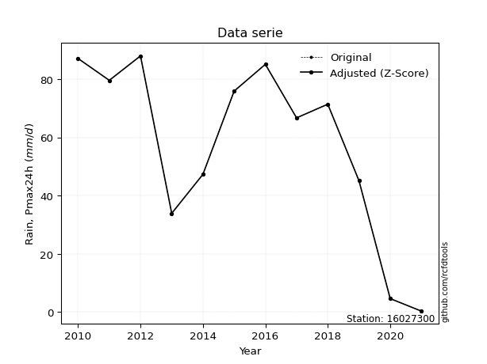</img>

</div>


> The initial value (value_initial) correspond to the initial obtained or null completed value, and value (value) is adjusted only when the initial value is outside the valid range (outlier) definite through the Z-Score value. If Z-Score is active, values out of range or outliers are replaced with the station mean value. A Z-Score (or standard score) measures how many standard deviations a data point is from the mean of a dataset, indicating its relative position; positive scores mean above the mean, negative mean below, and a score of zero is exactly at the mean, allowing for comparison of values from different distributions. It´s calculated using the formula $z=(x–μ)/σ$, where $x$ is the data point, $μ$ is the mean, and $σ$ is the standard deviation, helping identify outliers and understand probability.
>
> <sub>**Note**: In this study, "completing" (filling gaps in) and "extending" (forecasting or lengthening the historical record) rainfall data series are avoided for certain critical analyses because they introduce artificial bias and uncertainty, which can distort the statistics of rare events (extremes), alter day-to-day variability, and compromise the integrity and homogeneity of the original data. Some reasons against Completing/Extending rainfall data are: **Distortion of Extremes and Variability**: The primary issue is that most gap-filling or extension methods rely on averaging or regression with nearby stations, which inherently smooths the data. Rainfall is highly variable in space and time, with a large percentage of zero values and occasional large storms. Infilling methods often underestimate the highest values and overestimate the lowest (zero) values, which severely distorts analyses focused on flood frequency, drought severity, and intensity-duration-frequency (IDF) curves, **Loss of Data Homogeneity**: Infilled or extended data are synthetic estimates, not actual measurements. Combining these estimates with observed data can violate the assumption of data homogeneity, which requires that the data properties do not change over time. Inhomogeneity can lead to incorrect conclusions about long-term trends or changes in climate patterns, **Propagation of Errors**: Errors and biases from the original data (e.g., wind-induced undercatch, instrument errors, site changes) or the data used for imputation can propagate through the analysis, leading to unreliable hydrological models and inaccurate predictions, **Compromised Statistical Integrity**: For statistical analyses, especially those involving the frequency of events, using artificial data can introduce time bias or autocorrelation that doesn´t exist in reality, making it difficult to assess the true probability of events, **Difficulty in Validation**: It is difficult to accurately validate the quality of filled or extended data, especially for past periods where ground-truth measurements are unavailable. The reliability of imputation techniques heavily depends on the density of the surrounding station network and the complexity of the local topography.</sub>


### 4. Active continuous probability distributions from SciPy (44 of 104 available)

A Probability Density Function (PDF) describes the relative likelihood of a continuous random variable falling within a specific range, where the total area under its curve equals 1, and the area over any interval gives the actual probability for that range. Unlike discrete probabilities (like rolling a die), a PDF shows density, not direct probability for a single point (which is zero), with higher points indicating higher likelihood, often visualized as a bell curve for normal distributions.

A log of a probability density function (log-PDF) is simply the logarithm of the PDF´s value, denoted as $log(f(x))$, useful for converting multiplication of probabilities into addition, improving numerical stability with tiny numbers, and connecting to information theory concepts like entropy. Instead of dealing with very small probabilities (e.g., 0.000001), log-PDFs use negative numbers (e.g., $log(0.00001) ≈ -11.51$ that are easier for computers to handle, preventing underflow errors and simplifying complex calculations. In this study, each active probability distribution from SciPy is also evaluated in the $log$ form.

[scipy.stats](https://docs.scipy.org/doc/scipy/reference/stats.html) is a Python´s powerful submodule within the SciPy library for comprehensive statistical analysis, offering over 130 probability distributions (like Normal, Poisson), functions for descriptive stats (mean, variance), hypothesis testing (t-tests, chi-square), random variable generation, and statistical tests, making it essential for data science, modeling, and research. It provides tools to explore, model, and draw conclusions from data efficiently, working seamlessly with NumPy.

<div align="center">

|   id | p_dist             |   n_parameter | fit_method   | label                                                                       | active   | ref                                                                                                        |
|-----:|:-------------------|--------------:|:-------------|:----------------------------------------------------------------------------|:---------|:-----------------------------------------------------------------------------------------------------------|
|    0 | alpha              |             3 | MLE          | Alpha                                                                       | True     | [:mortar_board:](https://docs.scipy.org/doc/scipy/reference/generated/scipy.stats.alpha.html)              |
|    1 | betaprime          |             4 | MLE          | Beta prime                                                                  | True     | [:mortar_board:](https://docs.scipy.org/doc/scipy/reference/generated/scipy.stats.betaprime.html)          |
|    2 | chi2               |             3 | MLE          | Chi²                                                                        | True     | [:mortar_board:](https://docs.scipy.org/doc/scipy/reference/generated/scipy.stats.chi2.html)               |
|    3 | crystalball        |             4 | MLE          | Crystalball                                                                 | True     | [:mortar_board:](https://docs.scipy.org/doc/scipy/reference/generated/scipy.stats.crystalball.html)        |
|    4 | erlang             |             3 | MLE          | Erlang                                                                      | True     | [:mortar_board:](https://docs.scipy.org/doc/scipy/reference/generated/scipy.stats.erlang.html)             |
|    5 | expon              |             2 | MLE          | Exponential                                                                 | True     | [:mortar_board:](https://docs.scipy.org/doc/scipy/reference/generated/scipy.stats.expon.html)              |
|    6 | exponnorm          |             3 | MLE          | Exponentially modified Normal                                               | True     | [:mortar_board:](https://docs.scipy.org/doc/scipy/reference/generated/scipy.stats.exponnorm.html)          |
|    7 | f                  |             4 | MLE          | F                                                                           | True     | [:mortar_board:](https://docs.scipy.org/doc/scipy/reference/generated/scipy.stats.f.html)                  |
|    8 | fatiguelife        |             3 | MLE          | Fatigue-life (Birnbaum-Saunders)                                            | True     | [:mortar_board:](https://docs.scipy.org/doc/scipy/reference/generated/scipy.stats.fatiguelife.html)        |
|    9 | fisk               |             3 | MLE          | Fisk                                                                        | True     | [:mortar_board:](https://docs.scipy.org/doc/scipy/reference/generated/scipy.stats.fisk.html)               |
|   10 | gamma              |             3 | MLE          | Gamma                                                                       | True     | [:mortar_board:](https://docs.scipy.org/doc/scipy/reference/generated/scipy.stats.gamma.html)              |
|   11 | genexpon           |             5 | MLE          | Generalized exponential                                                     | True     | [:mortar_board:](https://docs.scipy.org/doc/scipy/reference/generated/scipy.stats.genexpon.html)           |
|   12 | genlogistic        |             3 | MLE          | Generalized logistic                                                        | True     | [:mortar_board:](https://docs.scipy.org/doc/scipy/reference/generated/scipy.stats.genlogistic.html)        |
|   13 | gibrat             |             2 | MM           | Gibrat                                                                      | True     | [:mortar_board:](https://docs.scipy.org/doc/scipy/reference/generated/scipy.stats.gibrat.html)             |
|   14 | gompertz           |             3 | MLE          | Gompertz (or truncated Gumbel)                                              | True     | [:mortar_board:](https://docs.scipy.org/doc/scipy/reference/generated/scipy.stats.gompertz.html)           |
|   15 | gumbel_l           |             2 | MM           | Gumbel Left Skew                                                            | True     | [:mortar_board:](https://docs.scipy.org/doc/scipy/reference/generated/scipy.stats.gumbel_l.html)           |
|   16 | gumbel_r           |             2 | MM           | Gumbel Right Skew                                                           | True     | [:mortar_board:](https://docs.scipy.org/doc/scipy/reference/generated/scipy.stats.gumbel_r.html)           |
|   17 | halflogistic       |             2 | MM           | Half-logistic                                                               | True     | [:mortar_board:](https://docs.scipy.org/doc/scipy/reference/generated/scipy.stats.halflogistic.html)       |
|   18 | halfnorm           |             2 | MM           | Half Normal                                                                 | True     | [:mortar_board:](https://docs.scipy.org/doc/scipy/reference/generated/scipy.stats.halfnorm.html)           |
|   19 | hypsecant          |             2 | MM           | hyperbolic secant                                                           | True     | [:mortar_board:](https://docs.scipy.org/doc/scipy/reference/generated/scipy.stats.hypsecant.html)          |
|   20 | invgamma           |             3 | MLE          | Inverted gamma                                                              | True     | [:mortar_board:](https://docs.scipy.org/doc/scipy/reference/generated/scipy.stats.invgamma.html)           |
|   21 | invgauss           |             3 | MLE          | Inverse Gaussian                                                            | True     | [:mortar_board:](https://docs.scipy.org/doc/scipy/reference/generated/scipy.stats.invgauss.html)           |
|   22 | invweibull         |             3 | MLE          | Inverted Weibull                                                            | True     | [:mortar_board:](https://docs.scipy.org/doc/scipy/reference/generated/scipy.stats.invweibull.html)         |
|   23 | johnsonsu          |             4 | MLE          | Johnson Su                                                                  | True     | [:mortar_board:](https://docs.scipy.org/doc/scipy/reference/generated/scipy.stats.johnsonsu.html)          |
|   24 | kstwobign          |             2 | MLE          | Limiting distribution of scaled Kolmogorov-Smirnov two-sided test statistic | True     | [:mortar_board:](https://docs.scipy.org/doc/scipy/reference/generated/scipy.stats.kstwobign.html)          |
|   25 | laplace            |             2 | MM           | Laplace                                                                     | True     | [:mortar_board:](https://docs.scipy.org/doc/scipy/reference/generated/scipy.stats.laplace.html)            |
|   26 | laplace_asymmetric |             3 | MLE          | Asymmetric Laplace                                                          | True     | [:mortar_board:](https://docs.scipy.org/doc/scipy/reference/generated/scipy.stats.laplace_asymmetric.html) |
|   27 | loggamma           |             3 | MLE          | Log gamma                                                                   | True     | [:mortar_board:](https://docs.scipy.org/doc/scipy/reference/generated/scipy.stats.loggamma.html)           |
|   28 | logistic           |             2 | MM           | Logistic (or Sech-squared)                                                  | True     | [:mortar_board:](https://docs.scipy.org/doc/scipy/reference/generated/scipy.stats.logistic.html)           |
|   29 | lognorm            |             3 | MLE          | Log Normal                                                                  | True     | [:mortar_board:](https://docs.scipy.org/doc/scipy/reference/generated/scipy.stats.lognorm.html)            |
|   30 | maxwell            |             2 | MM           | Maxwell                                                                     | True     | [:mortar_board:](https://docs.scipy.org/doc/scipy/reference/generated/scipy.stats.maxwell.html)            |
|   31 | mielke             |             4 | MLE          | Mielke Beta-Kappa / Dagum                                                   | True     | [:mortar_board:](https://docs.scipy.org/doc/scipy/reference/generated/scipy.stats.mielke.html)             |
|   32 | moyal              |             2 | MM           | Moyal                                                                       | True     | [:mortar_board:](https://docs.scipy.org/doc/scipy/reference/generated/scipy.stats.moyal.html)              |
|   33 | nakagami           |             3 | MLE          | Nakagami                                                                    | True     | [:mortar_board:](https://docs.scipy.org/doc/scipy/reference/generated/scipy.stats.nakagami.html)           |
|   34 | ncf                |             5 | MLE          | Non-central F distribution                                                  | True     | [:mortar_board:](https://docs.scipy.org/doc/scipy/reference/generated/scipy.stats.ncf.html)                |
|   35 | nct                |             4 | MLE          | Non-central Student’s t                                                     | True     | [:mortar_board:](https://docs.scipy.org/doc/scipy/reference/generated/scipy.stats.nct.html)                |
|   36 | norm               |             2 | MM           | Normal                                                                      | True     | [:mortar_board:](https://docs.scipy.org/doc/scipy/reference/generated/scipy.stats.norm.html)               |
|   37 | pearson3           |             3 | MM           | Pearson type III                                                            | True     | [:mortar_board:](https://docs.scipy.org/doc/scipy/reference/generated/scipy.stats.pearson3.html)           |
|   38 | rayleigh           |             2 | MM           | Rayleigh                                                                    | True     | [:mortar_board:](https://docs.scipy.org/doc/scipy/reference/generated/scipy.stats.rayleigh.html)           |
|   39 | rice               |             3 | MLE          | Rice                                                                        | True     | [:mortar_board:](https://docs.scipy.org/doc/scipy/reference/generated/scipy.stats.rice.html)               |
|   40 | t                  |             3 | MLE          | Student’s t                                                                 | True     | [:mortar_board:](https://docs.scipy.org/doc/scipy/reference/generated/scipy.stats.t.html)                  |
|   41 | truncnorm          |             4 | MLE          | Truncated normal                                                            | True     | [:mortar_board:](https://docs.scipy.org/doc/scipy/reference/generated/scipy.stats.truncnorm.html)          |
|   42 | wald               |             2 | MM           | Wald                                                                        | True     | [:mortar_board:](https://docs.scipy.org/doc/scipy/reference/generated/scipy.stats.wald.html)               |
|   43 | weibull_min        |             3 | MLE          | Weibull minimum                                                             | True     | [:mortar_board:](https://docs.scipy.org/doc/scipy/reference/generated/scipy.stats.weibull_min.html)        |

</div>

> **n_parameter:** # arguments & localization & scale.
>
> **Fit methods:** (MLE) maximum likelihood, (MM) L-moments.
>
>**Inactive** (With the only purpose of prevent loops, zero divisions, infinite values, over high estimated values or horizontal trending for recurrence intervals estimations, the follow distributions were disabled.)**:** foldnorm, gennorm, norminvgauss, powernorm, powerlognorm, skewnorm, genextreme, anglit, arcsine, argus, beta, bradford, burr, burr12, cauchy, cosine, halfcauchy, foldcauchy, skewcauchy, wrapcauchy, dgamma, gengamma, exponweib, exponpow, truncexpon, gausshyper, genhalflogistic, genhyperbolic, geninvgauss, halfgennorm, johnsonsb, kappa4, kappa3, ksone, kstwo, loglaplace, levy, levy_l, levy_stable, ncx2, pareto, genpareto, truncpareto, lomax, powerlaw, rdist, rel_breitwigner, recipinvgauss, semicircular, studentized_range, trapezoid, triang, truncweibull_min, tukeylambda, uniform, loguniform, vonmises, vonmises_line, weibull_max, dweibull, 


## B. Probability (PDF) vs. Empirical (EDF) distributions functions

A continuous probability distribution (CPD) describes probabilities for variables that can take any value within a range (like rain any time), unlike discrete variables with specific outcomes (like temperature). It uses a Probability Density Function (PDF), a curve where the total area under it equals 1, and the probability of the variable falling within an interval (a to b) is found by calculating the area under the curve between those points. A key feature is that the probability of hitting any single exact value is zero, so probabilities are always expressed for ranges, e.g., $P(a ≤ X ≤ b)$.

<div align="center">

Distributions parameters from station values
|    |   station | p_dist                |   n |              loc |           scale | shape                  | shape1                | shape2                | shape3   |
|---:|----------:|:----------------------|----:|-----------------:|----------------:|:-----------------------|:----------------------|:----------------------|:---------|
|  0 |  16027300 | alpha                 |  12 |      0.0038654   |     1.03262     | 1.4955974889336026e-08 |                       |                       |          |
|  1 |  16027300 | betaprime             |  12 |  -1199.55        | 67093.7         | 1778.4577556299555     | 94972.19930425129     |                       |          |
|  2 |  16027300 | chi2                  |  12 |   -300.138       |     1.32059     | 270.50675671279953     |                       |                       |          |
|  3 |  16027300 | crystalball           |  12 |     57.0833      |    29.6591      | 39847.86749508897      | 156.67215393273233    |                       |          |
|  4 |  16027300 | erlang                |  12 |   -376.521       |     2.1595      | 200.73679105129392     |                       |                       |          |
|  5 |  16027300 | expon                 |  12 |      0.3         |    56.7833      |                        |                       |                       |          |
|  6 |  16027300 | exponnorm             |  12 |     57.0657      |    29.659       | 0.0005861486302438657  |                       |                       |          |
|  7 |  16027300 | f                     |  12 | -14034.2         | 14091.2         | 558593.1974851612      | 2271563.459844413     |                       |          |
|  8 |  16027300 | fatiguelife           |  12 |  -3977.66        |  4034.71        | 0.007359567982269347   |                       |                       |          |
|  9 |  16027300 | fisk                  |  12 |     -5.10544e+09 |     5.10544e+09 | 294994158.0810947      |                       |                       |          |
| 10 |  16027300 | gamma                 |  12 |   -466.567       |     1.77772     | 294.4730482723769      |                       |                       |          |
| 11 |  16027300 | genexpon              |  12 |      0.299936    |     2.4879      | 0.04378422538030055    | 8.101391827436171e-07 | 2.230140143538749     |          |
| 12 |  16027300 | genlogistic           |  12 |     88.0003      |     1.06283e-05 | 3.430788349224454e-07  |                       |                       |          |
| 13 |  16027300 | gibrat                |  12 |     34.4572      |    13.7235      |                        |                       |                       |          |
| 14 |  16027300 | gompertz              |  12 |     33.9         |    12.7896      | 0.034992938700679765   |                       |                       |          |
| 15 |  16027300 | gumbel_l              |  12 |     70.4315      |    23.1251      |                        |                       |                       |          |
| 16 |  16027300 | gumbel_r              |  12 |     43.7352      |    23.1251      |                        |                       |                       |          |
| 17 |  16027300 | halflogistic          |  12 |     21.9305      |    25.3574      |                        |                       |                       |          |
| 18 |  16027300 | halfnorm              |  12 |     17.8264      |    49.2013      |                        |                       |                       |          |
| 19 |  16027300 | hypsecant             |  12 |     57.0833      |    18.8815      |                        |                       |                       |          |
| 20 |  16027300 | invgamma              |  12 |   -296.155       | 44667.1         | 127.54729711136446     |                       |                       |          |
| 21 |  16027300 | invgauss              |  12 |   -162.214       | 10129.1         | 0.02153950336227894    |                       |                       |          |
| 22 |  16027300 | invweibull            |  12 |     -7.47111e+09 |     7.47111e+09 | 233708192.04101157     |                       |                       |          |
| 23 |  16027300 | johnsonsu             |  12 |     88.761       |     0.0215172   | 4.915754911765724      | 0.677669248878807     |                       |          |
| 24 |  16027300 | kstwobign             |  12 |    -69.7106      |   144.657       |                        |                       |                       |          |
| 25 |  16027300 | laplace               |  12 |     57.0833      |    20.9721      |                        |                       |                       |          |
| 26 |  16027300 | laplace_asymmetric    |  12 |     88           |     0.421232    | 73.18582955847967      |                       |                       |          |
| 27 |  16027300 | loggamma              |  12 |     88.0005      |     3.64201e-05 | 1.1769346800472904e-06 |                       |                       |          |
| 28 |  16027300 | logistic              |  12 |     57.0833      |    16.3519      |                        |                       |                       |          |
| 29 |  16027300 | lognorm               |  12 |      0.3         |     1.61229     | 11.457530650819143     |                       |                       |          |
| 30 |  16027300 | maxwell               |  12 |    -13.1962      |    44.0412      |                        |                       |                       |          |
| 31 |  16027300 | mielke                |  12 |      0.3         |    87.7158      | 0.8834779301191269     | 9366.692054705694     |                       |          |
| 32 |  16027300 | moyal                 |  12 |     40.1224      |    13.3513      |                        |                       |                       |          |
| 33 |  16027300 | nakagami              |  12 |      0.3         |    75.6469      | 0.2749042433723685     |                       |                       |          |
| 34 |  16027300 | ncf                   |  12 |      0.3         |     2.63193     | 0.32984632338541353    | 109.53988154060664    | 7.282796837404961     |          |
| 35 |  16027300 | nct                   |  12 |  -1793.4         |    29.5995      | 469183.8384221033      | 62.517332470933965    |                       |          |
| 36 |  16027300 | norm                  |  12 |     57.0833      |    29.6591      |                        |                       |                       |          |
| 37 |  16027300 | pearson3              |  12 |     57.0833      |    29.6591      | -0.7738770814997377    |                       |                       |          |
| 38 |  16027300 | rayleigh              |  12 |      0.343764    |    45.2716      |                        |                       |                       |          |
| 39 |  16027300 | rice                  |  12 |    -17.9017      |    32.2424      | 2.0627415135924423     |                       |                       |          |
| 40 |  16027300 | t                     |  12 |     57.0831      |    29.659       | 59340664.9359418       |                       |                       |          |
| 41 |  16027300 | truncnorm             |  12 |    353.254       |   109.522       | -3.2226742974871603    | -2.4219214153595248   |                       |          |
| 42 |  16027300 | wald                  |  12 |     27.4243      |    29.6591      |                        |                       |                       |          |
| 43 |  16027300 | weibull_min           |  12 |     -2.36511e+09 |     2.36511e+09 | 110220130.97961532     |                       |                       |          |
| 44 |  16027300 | logalpha              |  12 |    -33.0103      |   724.198       | 19.929569735824934     |                       |                       |          |
| 45 |  16027300 | logbetaprime          |  12 |  -3585.75        |  3734.72        | 9510723.190116622      | 9896153.877725203     |                       |          |
| 46 |  16027300 | logchi2               |  12 |     -1.20397     |     2.92452     | 1.316576920916024      |                       |                       |          |
| 47 |  16027300 | logcrystalball        |  12 |      3.50617     |     1.62186     | 136.42009551668036     | 15.733613158080153    |                       |          |
| 48 |  16027300 | logerlang             |  12 |    -17.4996      |     0.153211    | 136.85450631547621     |                       |                       |          |
| 49 |  16027300 | logexpon              |  12 |     -1.20397     |     4.71014     |                        |                       |                       |          |
| 50 |  16027300 | logexponnorm          |  12 |      3.50539     |     1.62187     | 0.0004862010122648197  |                       |                       |          |
| 51 |  16027300 | logf                  |  12 |     -1.20397     |     1.16185     | 1.0739735854119203     | 1.0963208326879736    |                       |          |
| 52 |  16027300 | logfatiguelife        |  12 |   -950.335       |   953.832       | 0.001694623602958361   |                       |                       |          |
| 53 |  16027300 | logfisk               |  12 |     -1.20397     |     2.20454     | 0.8758992513360959     |                       |                       |          |
| 54 |  16027300 | loggamma              |  12 |    -24.3537      |     0.109909    | 253.25231863886466     |                       |                       |          |
| 55 |  16027300 | loggenexpon           |  12 |     -1.36079     |     0.0818056   | 0.002030659835290407   | 7.723613626618395     | 5.802209039932222e-05 |          |
| 56 |  16027300 | loggenlogistic        |  12 |      4.47736     |     8.32478e-07 | 8.567303672857147e-07  |                       |                       |          |
| 57 |  16027300 | loggibrat             |  12 |      2.2689      |     0.750449    |                        |                       |                       |          |
| 58 |  16027300 | loggompertz           |  12 |     -1.20397     |     2.40298     | 0.14239456321292165    |                       |                       |          |
| 59 |  16027300 | loggumbel_l           |  12 |      4.23609     |     1.26456     |                        |                       |                       |          |
| 60 |  16027300 | loggumbel_r           |  12 |      2.77625     |     1.26456     |                        |                       |                       |          |
| 61 |  16027300 | loghalflogistic       |  12 |      1.58391     |     1.38662     |                        |                       |                       |          |
| 62 |  16027300 | loghalfnorm           |  12 |      1.35943     |     2.69053     |                        |                       |                       |          |
| 63 |  16027300 | loghypsecant          |  12 |      3.50617     |     1.03251     |                        |                       |                       |          |
| 64 |  16027300 | loginvgamma           |  12 |    -40.0346      | 26514.2         | 610.6678237408973      |                       |                       |          |
| 65 |  16027300 | loginvgauss           |  12 |    -15.8631      |  1991.35        | 0.00970671829128468    |                       |                       |          |
| 66 |  16027300 | loginvweibull         |  12 |     -1.05894e+07 |     1.05894e+07 | 4825032.625751575      |                       |                       |          |
| 67 |  16027300 | logjohnsonsu          |  12 |      4.47734     |     1.05718e-10 | 2.4867098066662354     | 0.13935291549211581   |                       |          |
| 68 |  16027300 | logkstwobign          |  12 |     -5.66495     |    10.5465      |                        |                       |                       |          |
| 69 |  16027300 | loglaplace            |  12 |      3.50617     |     1.14683     |                        |                       |                       |          |
| 70 |  16027300 | loglaplace_asymmetric |  12 |      4.47739     |     0.0094534   | 102.53317438075433     |                       |                       |          |
| 71 |  16027300 | logloggamma           |  12 |      4.47735     |     1.59778e-06 | 1.63914496243866e-06   |                       |                       |          |
| 72 |  16027300 | loglogistic           |  12 |      3.50617     |     0.89418     |                        |                       |                       |          |
| 73 |  16027300 | loglognorm            |  12 |  -1021.39        |  1024.88        | 0.001586399199133268   |                       |                       |          |
| 74 |  16027300 | logmaxwell            |  12 |     -0.33693     |     2.40831     |                        |                       |                       |          |
| 75 |  16027300 | logmielke             |  12 |     -1.20397     |     3.79138     | 0.7009231337827161     | 1.3636311511765071    |                       |          |
| 76 |  16027300 | logmoyal              |  12 |      2.57869     |     0.730095    |                        |                       |                       |          |
| 77 |  16027300 | lognakagami           |  12 |  -2825.65        |  2829.15        | 760735.9231785019      |                       |                       |          |
| 78 |  16027300 | logncf                |  12 |     -1.20397     |     1.04198     | 1.0666518787926194     | 1.1550117211350939    | 1.066384676919253     |          |
| 79 |  16027300 | lognct                |  12 |   -102.651       |     1.5752      | 32224.14404903601      | 67.39115072585926     |                       |          |
| 80 |  16027300 | lognorm               |  12 |      3.50617     |     1.62186     |                        |                       |                       |          |
| 81 |  16027300 | logpearson3           |  12 |      3.50617     |     1.62186     | -2.10111676454091      |                       |                       |          |
| 82 |  16027300 | lograyleigh           |  12 |      0.403365    |     2.47567     |                        |                       |                       |          |
| 83 |  16027300 | logrice               |  12 |   -608.274       |     1.62158     | 377.2718179544348      |                       |                       |          |
| 84 |  16027300 | logt                  |  12 |      4.34328     |     0.15465     | 0.6811753095930444     |                       |                       |          |
| 85 |  16027300 | logtruncnorm          |  12 |     48.8749      |     6.70567     | -10.575233937959261    | -6.620888454207622    |                       |          |
| 86 |  16027300 | logwald               |  12 |      1.88425     |     1.6219      |                        |                       |                       |          |
| 87 |  16027300 | logweibull_min        |  12 |     -1.20397     |     4.37507     | 0.3195955874343958     |                       |                       |          |

</div>

> **loc** (Location parameter): This shifts the distribution along the x-axis. For many common distributions, like the normal (Gaussian) distribution, loc represents the mean $μ$. For others, like the uniform distribution, it might represent the minimum value, or for the beta distribution, the left end of the support interval.
>
> **scale** (Scale parameter): This determines the width or spread of the distribution. For the normal distribution, scale represents the standard deviation $σ$. For a uniform distribution, it defines the length of the interval (from $loc$ to $loc + scale$).
>
> **shape** (Shape parameters): Refers to parameters that define the specific form of a probability distribution, distinct from its location (loc) and scale (scale). These parameters are required arguments for most distribution functions. For example, a normal (Gaussian) distribution is fully defined by its location (mean) and scale (standard deviation), so it has no specific shape parameters beyond loc and scale. However, other distributions have intrinsic properties that need specification, as Gamma distribution that takes a shape parameter, often named $a$ or $alpha$.


### 0. Cumulative distribution values - CDF (88 evaluated)

Cumulative Distribution Function (CDF), denoted as $F$<sub>$X$</sub>$(x)$, is a function that gives the probability that a random variable $X$ will take a value less than or equal to a specific value, $x$ (i.e., $(P(X≥x)$. It essentially "accumulates" probabilities from a given point up to the far right (positive infinity), providing a complete picture of the distribution´s probabilities for both discrete (like rain) and continuous (like temperature) variables, helping to find probabilities over ranges or above certain values. Each station is evaluated separately ordering the $x$ values ascending, calculating the CDF and PDF values for the activated distributions and their logarithmic forms.

<div align="center">

CDF ordered by x ascending and calculating $log(f(x))$ separately
|   id |   Station |   date |    x |   count |    mean |     std |    zscore |   Value_initial |   station |   m |       alpha |   alpha_pdf |   betaprime |   betaprime_pdf |      chi2 |   chi2_pdf |   crystalball |   crystalball_pdf |    erlang |   erlang_pdf |     expon |   expon_pdf |   exponnorm |   exponnorm_pdf |         f |      f_pdf |   fatiguelife |   fatiguelife_pdf |      fisk |   fisk_pdf |     gamma |   gamma_pdf |    genexpon |   genexpon_pdf |   genlogistic |   genlogistic_pdf |   gibrat |   gibrat_pdf |    gompertz |   gompertz_pdf |   gumbel_l |   gumbel_l_pdf |   gumbel_r |   gumbel_r_pdf |   halflogistic |   halflogistic_pdf |   halfnorm |   halfnorm_pdf |   hypsecant |   hypsecant_pdf |   invgamma |   invgamma_pdf |   invgauss |   invgauss_pdf |   invweibull |   invweibull_pdf |   johnsonsu |   johnsonsu_pdf |   kstwobign |   kstwobign_pdf |   laplace |   laplace_pdf |   laplace_asymmetric |   laplace_asymmetric_pdf |   loggamma |   loggamma_pdf |   logistic |   logistic_pdf |    lognorm |   lognorm_pdf |    maxwell |   maxwell_pdf |      mielke |   mielke_pdf |       moyal |   moyal_pdf |    nakagami |    nakagami_pdf |        ncf |         ncf_pdf |       nct |    nct_pdf |      norm |   norm_pdf |   pearson3 |   pearson3_pdf |   rayleigh |   rayleigh_pdf |      rice |   rice_pdf |         t |      t_pdf |   truncnorm |   truncnorm_pdf |      wald |   wald_pdf |   weibull_min |   weibull_min_pdf |   logalpha |   logalpha_pdf |   logbetaprime |   logbetaprime_pdf |     logchi2 |   logchi2_pdf |   logcrystalball |   logcrystalball_pdf |   logerlang |   logerlang_pdf |   logexpon |   logexpon_pdf |   logexponnorm |   logexponnorm_pdf |        logf |    logf_pdf |   logfatiguelife |   logfatiguelife_pdf |     logfisk |   logfisk_pdf |   loggenexpon |   loggenexpon_pdf |   loggenlogistic |   loggenlogistic_pdf |   loggibrat |   loggibrat_pdf |   loggompertz |   loggompertz_pdf |   loggumbel_l |   loggumbel_l_pdf |   loggumbel_r |   loggumbel_r_pdf |   loghalflogistic |   loghalflogistic_pdf |   loghalfnorm |   loghalfnorm_pdf |   loghypsecant |   loghypsecant_pdf |   loginvgamma |   loginvgamma_pdf |   loginvgauss |   loginvgauss_pdf |   loginvweibull |   loginvweibull_pdf |   logjohnsonsu |   logjohnsonsu_pdf |   logkstwobign |   logkstwobign_pdf |   loglaplace |   loglaplace_pdf |   loglaplace_asymmetric |   loglaplace_asymmetric_pdf |   logloggamma |   logloggamma_pdf |   loglogistic |   loglogistic_pdf |   loglognorm |   loglognorm_pdf |   logmaxwell |   logmaxwell_pdf |   logmielke |   logmielke_pdf |   logmoyal |   logmoyal_pdf |   lognakagami |   lognakagami_pdf |      logncf |   logncf_pdf |     lognct |   lognct_pdf |   logpearson3 |   logpearson3_pdf |   lograyleigh |   lograyleigh_pdf |   logrice |   logrice_pdf |      logt |   logt_pdf |   logtruncnorm |   logtruncnorm_pdf |   logwald |   logwald_pdf |   logweibull_min |   logweibull_min_pdf |
|-----:|----------:|-------:|-----:|--------:|--------:|--------:|----------:|----------------:|----------:|----:|------------:|------------:|------------:|----------------:|----------:|-----------:|--------------:|------------------:|----------:|-------------:|----------:|------------:|------------:|----------------:|----------:|-----------:|--------------:|------------------:|----------:|-----------:|----------:|------------:|------------:|---------------:|--------------:|------------------:|---------:|-------------:|------------:|---------------:|-----------:|---------------:|-----------:|---------------:|---------------:|-------------------:|-----------:|---------------:|------------:|----------------:|-----------:|---------------:|-----------:|---------------:|-------------:|-----------------:|------------:|----------------:|------------:|----------------:|----------:|--------------:|---------------------:|-------------------------:|-----------:|---------------:|-----------:|---------------:|-----------:|--------------:|-----------:|--------------:|------------:|-------------:|------------:|------------:|------------:|----------------:|-----------:|----------------:|----------:|-----------:|----------:|-----------:|-----------:|---------------:|-----------:|---------------:|----------:|-----------:|----------:|-----------:|------------:|----------------:|----------:|-----------:|--------------:|------------------:|-----------:|---------------:|---------------:|-------------------:|------------:|--------------:|-----------------:|---------------------:|------------:|----------------:|-----------:|---------------:|---------------:|-------------------:|------------:|------------:|-----------------:|---------------------:|------------:|--------------:|--------------:|------------------:|-----------------:|---------------------:|------------:|----------------:|--------------:|------------------:|--------------:|------------------:|--------------:|------------------:|------------------:|----------------------:|--------------:|------------------:|---------------:|-------------------:|--------------:|------------------:|--------------:|------------------:|----------------:|--------------------:|---------------:|-------------------:|---------------:|-------------------:|-------------:|-----------------:|------------------------:|----------------------------:|--------------:|------------------:|--------------:|------------------:|-------------:|-----------------:|-------------:|-----------------:|------------:|----------------:|-----------:|---------------:|--------------:|------------------:|------------:|-------------:|-----------:|-------------:|--------------:|------------------:|--------------:|------------------:|----------:|--------------:|----------:|-----------:|---------------:|-------------------:|----------:|--------------:|-----------------:|---------------------:|
|    0 |  16027300 |   2021 |  0.3 |      12 | 57.0833 | 30.9779 | -1.83303  |             0.3 |  16027300 |   1 | 0.000488456 | 0.0215061   |   0.028556  |      0.00224099 | 0.0269273 | 0.00227384 |     0.0277759 |        0.00215184 | 0.0276883 |   0.00228507 | 0         |  0.0176108  |   0.0277761 |      0.00215186 | 0.0282292 | 0.00218053 |     0.0271289 |        0.00213763 | 0.0297227 | 0.00166634 | 0.0281917 |  0.00228675 | 1.12294e-06 |     0.0175989  |      0        |        0.00190313 | 0        |   0          | 0           |     0          |  0.0470427 |     0.00198566 | 0.00144133 |    0.000407758 |       0        |         0          |   0        |     0          |   0.0314379 |      0.0016623  |  0.0247383 |     0.00233426 |  0.0257868 |     0.00254939 |    0.026693  |       0.0030255  |    0.116401 |      0.0014998  |   0.0267208 |      0.0036388  | 0.0333496 |    0.00159019 |            0.0581351 |               0.00188578 | 0.00236937 |     0.00478346 |  0.0301024 |     0.0017855  | 0.00184122 |    0.00362618 | 0.00744172 |    0.00162328 | 8.35319e-17 |   1.32944    | 8.87067e-06 | 6.86269e-06 | 8.32443e-11 | 824491          | 0.00038284 | 831214          | 0.0277752 | 0.00215218 | 0.0277759 | 0.00215184 |   0.044459 |     0.0021965  | 0          |     0          | 0.0206108 | 0.00243481 | 0.027776  | 0.00215186 |  1.1721e-07 |      0.00285692 | 0         | 0          |     0.0372121 |        0.00170151 | 0.00226009 |      0.0050709 |     0.00190532 |         0.00372732 | 1.72014e-11 | 50996.4       |       0.00184123 |           0.00362619 |  0.00254693 |      0.00521752 |   0        |      0.212308  |      0.0018413 |          0.0036263 | 2.38414e-09 | 5.76573e+06 |       0.00177549 |           0.00353759 | 9.73525e-15 |    38.4026    |      0.004705 |         0.0351576 |          0       |           0.00297318 |    0        |        0        |   3.30404e-08 |         0.0592575 |      0.013451 |         0.010565  |   7.77107e-11 |        1.4305e-09 |          0        |              0        |     0         |          0        |     0.00664788 |         0.00643809 |    0.00236168 |        0.00487049 |    0.00279844 |        0.00601453 |      0.00386106 |          0.00977603 |       0.146186 |        0.00562125  |     0.00599921 |          0.0172016 |   0.00822773 |       0.00717433 |              0.00284704 |                  0.00293725 |    0.00294278 |        0.00301896 |    0.00512974 |        0.00570738 |   0.00189013 |       0.00372153 |     0        |         0        | 4.19146e-12 |   13231.1       | 1.4144e-40 |    1.73251e-38 |    0.00185695 |        0.00365641 | 1.70493e-09 |  4.09506e+06 | 0.00188485 |   0.00370699 |     0.0207516 |         0.0124337 |     0         |          0        | 0.0018383 |    0.00362158 | 0.0271585 | 0.00333383 |     0.00227825 |         0.00258128 |  0        |      0        |      6.19918e-06 |          8.92263e+09 |
|    1 |  16027300 |   2020 |  4.6 |      12 | 57.0833 | 30.9779 | -1.69422  |             4.6 |  16027300 |   2 | 0.822234    | 0.0380308   |   0.0396222 |      0.002927   | 0.0382353 | 0.00300803 |     0.0384007 |        0.00281057 | 0.0390231 |   0.0030088  | 0.0729302 |  0.0163264  |   0.038401  |      0.0028106  | 0.0389881 | 0.00284417 |     0.0377043 |        0.00280218 | 0.037789  | 0.00210095 | 0.039514  |  0.00300092 | 0.0728848   |     0.0163165  |      0        |        0.00218651 | 0        |   0          | 0           |     0          |  0.0563804 |     0.002368   | 0.00437388 |    0.00102743  |       0        |         0          |   0        |     0          |   0.0394597 |      0.00208451 |  0.036497  |     0.00316051 |  0.0386595 |     0.00346424 |    0.0421159 |       0.0041728  |    0.123146 |      0.00164031 |   0.0455017 |      0.00511292 | 0.0409388 |    0.00195206 |            0.0668367 |               0.00216804 | 0.130527   |     0.127324   |  0.0388054 |     0.00228105 | 0.111064   |    0.116741   | 0.0167128  |    0.00272622 | 0.0696609   |   0.0143125  | 0.000155462 | 8.84844e-05 | 0.160707    |      0.0205341  | 0.0426032  |      0.00659541 | 0.0384018 | 0.00281109 | 0.0384007 | 0.00281057 |   0.054859 |     0.00265256 | 0.00440971 |     0.00206754 | 0.0327164 | 0.00321243 | 0.0384008 | 0.00281059 |  0.0130924  |      0.00323977 | 0         | 0          |     0.0452792 |        0.00206162 | 0.149277   |      0.141109  |     0.111833   |         0.116809   | 0.563579    |     0.101575  |       0.111064   |           0.116741   |  0.13783    |      0.131101   |   0.439881 |      0.118918  |      0.111065  |          0.116741  | 0.641913    | 0.0559979   |       0.111116   |           0.117418   | 0.546679    |     0.0795106 |      0.295671 |         0.153504  |          0       |           0.0493626  |    0        |        0        |   0.260002    |         0.136576  |      0.110677 |         0.0824893 |   0.0680465   |        0.144619   |          0        |              0        |     0.0493813 |          0.295985 |     0.0928769  |         0.0886816  |    0.135238   |        0.131152   |    0.152352   |        0.137874   |      0.201545   |          0.147094   |       0.168109 |        0.0118631   |     0.258784   |          0.155008  |   0.0889443  |       0.0775567  |              0.0475991  |                  0.0491073  |    0.048427   |        0.0496806  |    0.0984606  |        0.099271   |   0.112881   |       0.118039   |     0.103202 |         0.146987 | 0.616212    |       0.0965279 | 0.0397582  |    0.135666    |    0.1117     |        0.117247   | 0.535029    |  0.0655991   | 0.112188   |   0.117296   |     0.107417  |         0.0651416 |     0.0977166 |          0.165279 | 0.111025  |    0.116732   | 0.043073  | 0.0104012  |     0.0462971  |         0.0496924  |  0        |      0        |      0.576874    |          0.0426034   |
|    2 |  16027300 |   2013 | 33.9 |      12 | 57.0833 | 30.9779 | -0.748384 |            33.9 |  16027300 |   3 | 0.975697    | 0.000716771 |   0.22352   |      0.0100615  | 0.228694  | 0.0103042  |     0.217207  |        0.00991008 | 0.228374  |   0.0102515  | 0.446627  |  0.00974534 |   0.217209  |      0.00991014 | 0.218887  | 0.00993283 |     0.217142  |        0.00995397 | 0.175918  | 0.00837646 | 0.227648  |  0.0101973  | 0.446412    |     0.00974272 |      0        |        0.00562994 | 0        |   0          | 3.31483e-11 |     0.00273605 |  0.186191  |     0.00725052 | 0.216524   |    0.0143261   |       0.231729 |         0.0186593  |   0.256098 |     0.0153741  |   0.181408  |      0.009096   |  0.24036   |     0.010857   |  0.256029  |     0.0112267  |    0.281787  |       0.0111648  |    0.192312 |      0.00337699 |   0.315959  |      0.0116174  | 0.165533  |    0.00789302 |            0.172894  |               0.00560832 | 0.518027   |     0.227598   |  0.19501   |     0.00960019 | 0.504242   |    0.245964   | 0.233427   |    0.0116955  | 0.428372    |   0.0112636  | 0.2068      | 0.0170029   | 0.492034    |      0.00771516 | 0.308601   |      0.0102907  | 0.217239  | 0.00991125 | 0.217207  | 0.00991008 |   0.200215 |     0.00790238 | 0.240203   |     0.01244    | 0.227272  | 0.0103151  | 0.217208  | 0.00991014 |  0.160692   |      0.00732551 | 0.0808895 | 0.0325385  |     0.166001  |        0.00705516 | 0.542556   |      0.215228  |     0.503589   |         0.244764   | 0.719778    |     0.0598412 |       0.504242   |           0.245964   |  0.523679   |      0.221755   |   0.633465 |      0.0778182 |      0.50424   |          0.245962  | 0.720165    | 0.0277674   |       0.506519   |           0.246772   | 0.661096    |     0.041512  |      0.601107 |         0.140143  |          0       |           0.385576   |    0.696317 |        0.278676 |   0.583521    |         0.176492  |      0.434004 |         0.25475   |   0.57473     |        0.251721   |          0.603963 |              0.229056 |     0.578774  |          0.214601 |     0.505316   |         0.308245   |    0.526244   |        0.22559    |    0.531513   |        0.208469   |      0.524831   |          0.154168   |       0.210618 |        0.0421744   |     0.56634    |          0.13873   |   0.507462   |       0.429478   |              0.373703   |                  0.385545   |    0.375825   |        0.385554   |    0.504821   |        0.27956    |   0.507299   |       0.245322   |     0.537116 |         0.235571 | 0.752199    |       0.0474375 | 0.600544   |    0.249465    |    0.505641   |        0.245956   | 0.630192    |  0.0349442   | 0.504803   |   0.244761   |     0.365353  |         0.227558  |     0.548039  |          0.230079 | 0.504245  |    0.246006   | 0.0993882 | 0.0813458  |     0.378182   |         0.389432   |  0.672315 |      0.242082 |      0.641226    |          0.0248629   |
|    3 |  16027300 |   2019 | 45.1 |      12 | 57.0833 | 30.9779 | -0.386835 |            45.1 |  16027300 |   4 | 0.981731    | 0.000405032 |   0.350353  |      0.012401   | 0.357154  | 0.0124236  |     0.343093  |        0.0123967  | 0.356438  |   0.0124115  | 0.545685  |  0.00800086 |   0.343096  |      0.0123967  | 0.34485   | 0.0123859  |     0.343457  |        0.0124239  | 0.289644  | 0.0118883  | 0.355278  |  0.0123936  | 0.545449    |     0.00799974 |      0        |        0.00808193 | 0.399663 |   0.0362927  | 0.0478289   |     0.00625397 |  0.284234  |     0.0103504  | 0.389579   |    0.0158811   |       0.427521 |         0.0161141  |   0.420645 |     0.0139072  |   0.31032   |      0.0139527  |  0.373369  |     0.012638   |  0.391322  |     0.0126607  |    0.409735  |       0.011436   |    0.237408 |      0.00479654 |   0.445533  |      0.0113197  | 0.282369  |    0.013464   |            0.248635  |               0.00806518 | 0.582259   |     0.221462   |  0.324572  |     0.0134067  | 0.57403    |    0.24173    | 0.37459    |    0.0132183  | 0.552333    |   0.0108923  | 0.406577    | 0.0175737   | 0.571266    |      0.00649799 | 0.422431   |      0.00991963 | 0.343134  | 0.012397   | 0.343093  | 0.0123967  |   0.304134 |     0.0106688  | 0.386565   |     0.0133958  | 0.355655  | 0.0124194  | 0.343095  | 0.0123967  |  0.256104   |      0.00981901 | 0.443342  | 0.0254942  |     0.263556  |        0.0104993  | 0.602786   |      0.206004  |     0.573049   |         0.24064    | 0.736285    |     0.0558602 |       0.574031   |           0.24173    |  0.586143   |      0.215007   |   0.65502  |      0.073242  |      0.574028  |          0.241729  | 0.727787    | 0.0256759   |       0.576488   |           0.242182   | 0.672506    |     0.038483  |      0.640152 |         0.133279  |          0       |           0.517248   |    0.763886 |        0.20007  |   0.633725    |         0.174796  |      0.509982 |         0.276409  |   0.642793    |        0.22464    |          0.66532  |              0.200974 |     0.637387  |          0.195941 |     0.592013   |         0.295497   |    0.58975    |        0.218423   |    0.59003    |        0.200823   |      0.567764   |          0.146437   |       0.225207 |        0.0625555   |     0.604908   |          0.131397  |   0.615996   |       0.334839   |              0.501686   |                  0.517583   |    0.5037     |        0.516739   |    0.583835   |        0.271726   |   0.576852   |       0.24073    |     0.602702 |         0.223111 | 0.765157    |       0.0434294 | 0.666733   |    0.214473    |    0.575404   |        0.241565   | 0.639812    |  0.0325083   | 0.574233   |   0.240445   |     0.43676   |         0.274347  |     0.61176   |          0.215724 | 0.574045  |    0.241771   | 0.132132  | 0.162674   |     0.506967   |         0.518893   |  0.733224 |      0.18751  |      0.648115    |          0.0234317   |
|    4 |  16027300 |   2014 | 47.3 |      12 | 57.0833 | 30.9779 | -0.315817 |            47.3 |  16027300 |   5 | 0.982581    | 0.000368237 |   0.377983  |      0.012707   | 0.384772  | 0.0126726  |     0.370753  |        0.0127387  | 0.384041  |   0.0126718  | 0.56295   |  0.0076968  |   0.370756  |      0.0127388  | 0.372478  | 0.0127207  |     0.371169  |        0.0127593  | 0.31648   | 0.0124991  | 0.382852  |  0.0126641  | 0.562712    |     0.00769592 |      0        |        0.00867674 | 0.473561 |   0.0309952  | 0.0627241   |     0.00731161 |  0.307729  |     0.0110098  | 0.424374   |    0.0157296   |       0.462305 |         0.0155038  |   0.450854 |     0.0135532  |   0.34199   |      0.0148235  |  0.401358  |     0.0127952  |  0.41928   |     0.0127447  |    0.434784  |       0.0113281  |    0.24837  |      0.00517594 |   0.470241  |      0.0111365  | 0.313599  |    0.0149531  |            0.267027  |               0.00866177 | 0.59277    |     0.219896   |  0.354733  |     0.0139982  | 0.58551    |    0.240306   | 0.403781   |    0.0133074  | 0.576229    |   0.0108316  | 0.44469     | 0.0170531   | 0.58534     |      0.00629785 | 0.444097   |      0.00977352 | 0.370795  | 0.0127388  | 0.370753  | 0.0127387  |   0.328197 |     0.0112041  | 0.416029   |     0.0133793  | 0.383275  | 0.0126796  | 0.370755  | 0.0127388  |  0.278326   |      0.0103878  | 0.496195  | 0.0226072  |     0.287483  |        0.0112549  | 0.612551   |      0.20405   |     0.584477   |         0.239243   | 0.73893     |     0.0552284 |       0.585511   |           0.240305   |  0.596345   |      0.21339    |   0.658491 |      0.0725051 |      0.585508  |          0.240304  | 0.729002    | 0.0253523   |       0.587988   |           0.240693   | 0.674327    |     0.0380114 |      0.646471 |         0.132062  |          0       |           0.543233   |    0.773167 |        0.189776 |   0.642037    |         0.174249  |      0.523216 |         0.279267  |   0.653379    |        0.2199     |          0.674783 |              0.196401 |     0.646644  |          0.192778 |     0.605991   |         0.291354   |    0.600113   |        0.216711   |    0.599556   |        0.199163   |      0.574706   |          0.145046   |       0.22831  |        0.0678766   |     0.611136   |          0.130128  |   0.631617   |       0.321218   |              0.526953   |                  0.54365    |    0.528922   |        0.542615   |    0.596716   |        0.269125   |   0.588283   |       0.239253   |     0.613268 |         0.220584 | 0.767211    |       0.0428061 | 0.676813   |    0.208809    |    0.586876   |        0.240115   | 0.641352    |  0.032129    | 0.585652   |   0.239018   |     0.450035  |         0.283163  |     0.621969  |          0.212989 | 0.585527  |    0.240345   | 0.140473  | 0.188562   |     0.53228    |         0.544249   |  0.741973 |      0.179946 |      0.649226    |          0.023208    |
|    5 |  16027300 |   2017 | 66.7 |      12 | 57.0833 | 30.9779 |  0.310437 |            66.7 |  16027300 |   6 | 0.987647    | 0.000185195 |   0.630931  |      0.0124794  | 0.632574  | 0.0120466  |     0.627122  |        0.0127621  | 0.632743  |   0.012128   | 0.689433  |  0.00546933 |   0.627125  |      0.0127621  | 0.627994  | 0.0127016  |     0.627254  |        0.0127154  | 0.586846  | 0.0140093  | 0.632266  |  0.0121995  | 0.689195    |     0.00546993 |      0        |        0.0162302  | 0.8035   |   0.00859088 | 0.342789    |     0.0233676  |  0.573006  |     0.0157131  | 0.690432   |    0.0110599   |       0.707804 |         0.00983959 |   0.679456 |     0.00990146 |   0.655534  |      0.0148855  |  0.643915  |     0.0114614  |  0.655907  |     0.0109878  |    0.635094  |       0.00901915 |    0.400499 |      0.0118715  |   0.663836  |      0.00863832 | 0.683899  |    0.0150725  |            0.501018  |               0.016252   | 0.665902   |     0.204541   |  0.642931  |     0.0140394  | 0.665647   |    0.224456   | 0.65111    |    0.011502   | 0.78195     |   0.0104041  | 0.711677    | 0.0103148   | 0.692704    |      0.00484991 | 0.616882   |      0.00791169 | 0.627147  | 0.0127604  | 0.627122  | 0.0127621  |   0.582425 |     0.0143424  | 0.658426   |     0.011059   | 0.632922  | 0.0122343  | 0.627125  | 0.0127621  |  0.537535   |      0.0167731  | 0.771314  | 0.00848326 |     0.567036  |        0.0168904  | 0.679898   |      0.187066  |     0.664293   |         0.22367    | 0.757159    |     0.0509204 |       0.665647   |           0.224456   |  0.667232   |      0.198108   |   0.682523 |      0.0674029 |      0.665644  |          0.224456  | 0.737338    | 0.023204    |       0.668178   |           0.224376   | 0.686838    |     0.0348616 |      0.69029  |         0.122795  |          0       |           0.773748   |    0.827742 |        0.132137 |   0.700962    |         0.167948  |      0.621681 |         0.290799  |   0.723025    |        0.185428   |          0.736783 |              0.164844 |     0.708959  |          0.169835 |     0.699461   |         0.249717   |    0.672      |        0.200563   |    0.665604   |        0.184426   |      0.622753   |          0.134389   |       0.263685 |        0.164285    |     0.654255   |          0.12072   |   0.727011   |       0.238038   |              0.751219   |                  0.775022   |    0.752524   |        0.772005   |    0.684854   |        0.241371   |   0.668005   |       0.223123   |     0.685571 |         0.199367 | 0.781192    |       0.0386505 | 0.741854   |    0.170487    |    0.666918   |        0.224104   | 0.651949    |  0.0295943   | 0.665356   |   0.223253   |     0.559565  |         0.357681  |     0.691508  |          0.191109 | 0.665676  |    0.224488   | 0.287881  | 0.954942   |     0.755444   |         0.76677    |  0.795679 |      0.135201 |      0.656938    |          0.0217052   |
|    6 |  16027300 |   2018 | 71.4 |      12 | 57.0833 | 30.9779 |  0.462158 |            71.4 |  16027300 |   7 | 0.98846     | 0.000161617 |   0.68779   |      0.0116767  | 0.687347  | 0.0112282  |     0.685349  |        0.0119717  | 0.68791   |   0.0113134  | 0.714104  |  0.00503485 |   0.685351  |      0.0119717  | 0.685934  | 0.0119111  |     0.68524   |        0.0119171  | 0.650789  | 0.0131313  | 0.687786  |  0.0113906  | 0.713869    |     0.00503568 |      0        |        0.0188891  | 0.838978 |   0.00661363 | 0.46297     |     0.0275743  |  0.647523  |     0.0158941  | 0.739111   |    0.00966217  |       0.751087 |         0.00859449 |   0.723787 |     0.00896412 |   0.721081  |      0.0129529  |  0.695761  |     0.0105773  |  0.705477  |     0.010088   |    0.675764  |       0.0082846  |    0.464264 |      0.0155098  |   0.702789  |      0.00793693 | 0.747362  |    0.0120464  |            0.583533  |               0.0189285  | 0.679702   |     0.200751   |  0.705896  |     0.0126962  | 0.68079    |    0.220266   | 0.703014   |    0.010565   | 0.830653    |   0.0103216  | 0.756597    | 0.00882717  | 0.714808    |      0.0045591  | 0.652834   |      0.00738565 | 0.685365  | 0.0119698  | 0.685348  | 0.0119717  |   0.649891 |     0.0142953  | 0.708218   |     0.010116   | 0.688645  | 0.0114421  | 0.685351  | 0.0119717  |  0.620938   |      0.0187489  | 0.807275  | 0.00688723 |     0.647281  |        0.0171294  | 0.692504   |      0.183196  |     0.679385   |         0.219546   | 0.760599    |     0.0501161 |       0.68079    |           0.220266   |  0.680597   |      0.194418   |   0.687079 |      0.0664355 |      0.680787  |          0.220265  | 0.738904    | 0.0228139   |       0.683312   |           0.220095   | 0.689192    |     0.0342862 |      0.698586 |         0.120874  |          0       |           0.829914   |    0.83644  |        0.12345  |   0.71234     |         0.166201  |      0.641488 |         0.29082   |   0.735422    |        0.17872    |          0.747806 |              0.158943 |     0.720369  |          0.165304 |     0.716132   |         0.23991    |    0.685525   |        0.196673   |    0.678047   |        0.181013   |      0.631829   |          0.132182   |       0.27668  |        0.223104    |     0.66241    |          0.11882   |   0.742748   |       0.224316   |              0.80589    |                  0.831426   |    0.806972   |        0.827862   |    0.701054   |        0.23438    |   0.683056   |       0.218897   |     0.698988 |         0.194664 | 0.783798    |       0.0378933 | 0.753224   |    0.163507    |    0.682036   |        0.219886   | 0.653948    |  0.029131    | 0.680418   |   0.219098   |     0.584511  |         0.375197  |     0.704363  |          0.18643  | 0.680821  |    0.220295   | 0.369684  | 1.47516    |     0.809461   |         0.820396   |  0.804639 |      0.128035 |      0.658407    |          0.021429    |
|    7 |  16027300 |   2015 | 75.9 |      12 | 57.0833 | 30.9779 |  0.607423 |            75.9 |  16027300 |   8 | 0.989145    | 0.000143022 |   0.738231  |      0.0107145  | 0.735805  | 0.0102875  |     0.737101  |        0.0109989  | 0.736745  |   0.0103688  | 0.735887  |  0.00465125 |   0.737103  |      0.0109989  | 0.737421  | 0.0109424  |     0.736741  |        0.0109427  | 0.707345  | 0.011961   | 0.736968  |  0.0104447  | 0.735656    |     0.00465226 |      0        |        0.0218422  | 0.865465 |   0.00522659 | 0.59287     |     0.0297197  |  0.718262  |     0.0154334  | 0.779697   |    0.00839034  |       0.787257 |         0.00749734 |   0.76213  |     0.00808054 |   0.774873  |      0.0109537  |  0.741245  |     0.00962436 |  0.748781  |     0.00914905 |    0.71145   |       0.00757681 |    0.545231 |      0.0208858  |   0.737     |      0.00726992 | 0.79615   |    0.00972005 |            0.675242  |               0.0219034  | 0.691863   |     0.197168   |  0.759645  |     0.011166   | 0.694131   |    0.216246   | 0.748364   |    0.00958037 | 0.876933    |   0.010248   | 0.793412    | 0.00756139  | 0.734728    |      0.00429643 | 0.684929   |      0.0068791  | 0.737108  | 0.010997   | 0.737101  | 0.0109989  |   0.713326 |     0.0138254  | 0.751597   |     0.00915746 | 0.738089  | 0.0105083  | 0.737103  | 0.0109989  |  0.709905   |      0.0208224  | 0.835472  | 0.0056915  |     0.723412  |        0.0165662  | 0.703592   |      0.179608  |     0.692683   |         0.215588   | 0.76364     |     0.0494073 |       0.694131   |           0.216246   |  0.692374   |      0.190948   |   0.691114 |      0.065579  |      0.694128  |          0.216245  | 0.740288    | 0.0224729   |       0.69664    |           0.215997   | 0.691272    |     0.0337822 |      0.70592  |         0.119132  |          0       |           0.883792   |    0.843763 |        0.116253 |   0.722446    |         0.164493  |      0.659244 |         0.290104  |   0.746163    |        0.172775   |          0.757361 |              0.153756 |     0.730348  |          0.161252 |     0.730521   |         0.230916   |    0.697435   |        0.193019   |    0.689014   |        0.177834   |      0.639846   |          0.130183   |       0.293036 |        0.324048    |     0.66962    |          0.11711   |   0.756099   |       0.212674   |              0.858342   |                  0.88554    |    0.85919    |        0.881432   |    0.715179   |        0.227804   |   0.696312   |       0.214852   |     0.710753 |         0.190336 | 0.786094    |       0.0372308 | 0.763031   |    0.157428    |    0.695353   |        0.215844   | 0.655716    |  0.0287252   | 0.693688   |   0.215116   |     0.607948  |         0.391886  |     0.715627  |          0.182163 | 0.694164  |    0.216273   | 0.473852  | 1.87407    |     0.861153   |         0.871639   |  0.812278 |      0.121997 |      0.659709    |          0.0211866   |
|    8 |  16027300 |   2011 | 79.6 |      12 | 57.0833 | 30.9779 |  0.726863 |            79.6 |  16027300 |   9 | 0.989649    | 0.000130035 |   0.776246  |      0.00982188 | 0.77231   | 0.0094363  |     0.776129  |        0.0100832  | 0.773538  |   0.00950949 | 0.752547  |  0.00435784 |   0.776131  |      0.0100831  | 0.77625   | 0.0100324  |     0.775565  |        0.0100298  | 0.749568  | 0.0108463  | 0.774032  |  0.00958001 | 0.75232     |     0.00435897 |      0        |        0.0246131  | 0.883119 |   0.00434955 | 0.702352    |     0.0290172  |  0.773854  |     0.0145376  | 0.80892    |    0.00741775  |       0.813446 |         0.00667073 |   0.790713 |     0.00737333 |   0.812437  |      0.00936872 |  0.775332  |     0.00879693 |  0.781158  |     0.00835031 |    0.738421  |       0.00700455 |    0.634395 |      0.0278202  |   0.762902  |      0.00673302 | 0.82912   |    0.00814795 |            0.761348  |               0.0246965  | 0.701179   |     0.194268   |  0.79851   |     0.00983934 | 0.704346   |    0.212957   | 0.782258   |    0.00873735 | 0.914744    |   0.0101911  | 0.819648    | 0.00663787  | 0.750242    |      0.0040908  | 0.709616   |      0.00646624 | 0.77613   | 0.0100814  | 0.776129  | 0.0100832  |   0.763249 |     0.0131109  | 0.783993   |     0.00835313 | 0.775399  | 0.00964851 | 0.776131  | 0.0100831  |  0.790323   |      0.0226693  | 0.85501   | 0.00489376 |     0.782833  |        0.015455   | 0.712073   |      0.176748  |     0.702868   |         0.212349   | 0.765979    |     0.0488636 |       0.704346   |           0.212957   |  0.701396   |      0.18815    |   0.694219 |      0.0649196 |      0.704343  |          0.212956  | 0.741352    | 0.0222132   |       0.706842   |           0.212647   | 0.692871    |     0.0333977 |      0.711558 |         0.117764  |          0       |           0.928162   |    0.84917  |        0.111008 |   0.730242    |         0.163071  |      0.673029 |         0.289045  |   0.754278    |        0.168202   |          0.764585 |              0.149792 |     0.737949  |          0.158108 |     0.741344   |         0.223839   |    0.706552   |        0.190074   |    0.697418   |        0.175289   |      0.646005   |          0.128616   |       0.311915 |        0.491358    |     0.675162   |          0.115775  |   0.766014   |       0.204028   |              0.901544   |                  0.93011    |    0.902185   |        0.92554    |    0.725897   |        0.222518   |   0.70646    |       0.211546   |     0.719731 |         0.186904 | 0.787854    |       0.0367258 | 0.770414   |    0.152817    |    0.705549   |        0.212538   | 0.657076    |  0.0284155   | 0.70385    |   0.211859   |     0.626924  |         0.405583  |     0.724217  |          0.178802 | 0.70438   |    0.212982   | 0.562647  | 1.78819    |     0.903634   |         0.9137     |  0.817977 |      0.117535 |      0.660713    |          0.0210013   |
|    9 |  16027300 |   2016 | 85.1 |      12 | 57.0833 | 30.9779 |  0.904409 |            85.1 |  16027300 |  10 | 0.990318    | 0.000113771 |   0.826392  |      0.00840124 | 0.820573  | 0.00810675 |     0.827575  |        0.00860972 | 0.822155  |   0.00816184 | 0.775391  |  0.00395554 |   0.827577  |      0.00860966 | 0.827447  | 0.0085704  |     0.826743  |        0.0085666  | 0.804412  | 0.00909077 | 0.823002  |  0.00821843 | 0.775171    |     0.00395682 |      0        |        0.0293948  | 0.904171 |   0.00335887 | 0.847682    |     0.0228279  |  0.848281  |     0.0123719  | 0.846056   |    0.0061161   |       0.84704  |         0.00557081 |   0.828473 |     0.00636791 |   0.858034  |      0.00727198 |  0.820279  |     0.00754838 |  0.823813  |     0.00716462 |    0.774676  |       0.00618695 |    0.832749 |      0.0463527  |   0.797802  |      0.00596492 | 0.868539  |    0.00626835 |            0.910049  |               0.02952    | 0.714018   |     0.190048   |  0.847271  |     0.00791361 | 0.718414   |    0.208121   | 0.82684    |    0.00747702 | 0.970574    |   0.0101118  | 0.852792    | 0.00544989  | 0.771935    |      0.00380073 | 0.743522   |      0.00586668 | 0.827567  | 0.00860827 | 0.827575  | 0.00860972 |   0.831264 |     0.0115218  | 0.826662   |     0.00716825 | 0.824745  | 0.00828471 | 0.827577  | 0.00860967 |  0.923107   |      0.0256675  | 0.879198  | 0.00394329 |     0.860994  |        0.0127827  | 0.723746   |      0.172643  |     0.716898   |         0.207585   | 0.769218    |     0.0481126 |       0.718414   |           0.208121   |  0.713832   |      0.184091   |   0.698526 |      0.0640053 |      0.718411  |          0.208121  | 0.742824    | 0.0218569   |       0.720886   |           0.20773    | 0.695085    |     0.0328694 |      0.719362 |         0.115828  |          0       |           0.994227   |    0.856354 |        0.104135 |   0.741067    |         0.160941  |      0.692271 |         0.286795  |   0.765304    |        0.161878   |          0.77441  |              0.14434  |     0.748366  |          0.153718 |     0.755966   |         0.213868   |    0.71911    |        0.185806   |    0.709007   |        0.171623   |      0.654525   |          0.126405   |       0.367824 |        1.56712     |     0.682835   |          0.113898  |   0.779257   |       0.192481   |              0.965879   |                  0.996484   |    0.966191   |        0.991204   |    0.74051    |        0.214895   |   0.720433   |       0.206694   |     0.732056 |         0.182009 | 0.790285    |       0.0360326 | 0.780413   |    0.146527    |    0.719588   |        0.207681   | 0.65896     |  0.0279899   | 0.717847   |   0.207073   |     0.654695  |         0.425966  |     0.736005  |          0.174037 | 0.71845   |    0.208145   | 0.665278  | 1.2613     |     0.966744   |         0.976105   |  0.82563  |      0.111604 |      0.662108    |          0.0207463   |
|   10 |  16027300 |   2010 | 87.1 |      12 | 57.0833 | 30.9779 |  0.968971 |            87.1 |  16027300 |  11 | 0.99054     | 0.000108606 |   0.842667  |      0.0078745  | 0.836298  | 0.00761901 |     0.844245  |        0.00806004 | 0.837983  |   0.00766629 | 0.783165  |  0.00381864 |   0.844247  |      0.00805998 | 0.844043  | 0.00802538 |     0.843331  |        0.00802202 | 0.821957  | 0.00845579 | 0.838937  |  0.00771658 | 0.782947    |     0.00381997 |      0        |        0.0313551  | 0.910594 |   0.00306961 | 0.889885    |     0.0192963  |  0.872045  |     0.0113766  | 0.857855   |    0.0056876   |       0.857816 |         0.00520856 |   0.840858 |     0.00601866 |   0.8719    |      0.00660275 |  0.834927  |     0.00710034 |  0.837719  |     0.00674335 |    0.786764  |       0.00590242 |    0.933276 |      0.0527872  |   0.809463  |      0.00569646 | 0.880497  |    0.00569819 |            0.971047  |               0.0314987  | 0.718416   |     0.188542   |  0.862436  |     0.00725545 | 0.723228   |    0.206384   | 0.841342   |    0.00702681 | 0.990771    |   0.0100844  | 0.863307    | 0.00506873  | 0.779435    |      0.00369956 | 0.755042   |      0.00565444 | 0.844234  | 0.00805874 | 0.844245  | 0.00806005 |   0.853602 |     0.0108053  | 0.840577   |     0.00674836 | 0.840809  | 0.00777923 | 0.844247  | 0.00805999 |  0.975604   |      0.0268367  | 0.886791  | 0.00365385 |     0.885365  |        0.0115714  | 0.727739   |      0.171193  |     0.7217     |         0.205873   | 0.770333    |     0.0478547 |       0.723228   |           0.206384   |  0.718092   |      0.182647   |   0.700009 |      0.0636904 |      0.723225  |          0.206384  | 0.74333     | 0.0217352   |       0.725691   |           0.205965   | 0.695846    |     0.0326888 |      0.722045 |         0.115151  |          0       |           1.01828    |    0.858747 |        0.10187  |   0.744797    |         0.160163  |      0.698922 |         0.285799  |   0.769039    |        0.159707   |          0.777742 |              0.142475 |     0.751919  |          0.152199 |     0.760894   |         0.210405   |    0.723409   |        0.184288   |    0.712979   |        0.170324   |      0.657452   |          0.125633   |       0.431343 |        5.32771     |     0.685473   |          0.113245  |   0.783683   |       0.188622   |              0.989307   |                  1.02065    |    0.989493   |        1.01511    |    0.745471   |        0.212199   |   0.725215   |       0.204952   |     0.736264 |         0.180288 | 0.791119    |       0.0357957 | 0.783792   |    0.14439     |    0.724392   |        0.205937   | 0.659609    |  0.0278444   | 0.722637   |   0.205354   |     0.664676  |         0.433402  |     0.740028  |          0.17237  | 0.723265  |    0.206406   | 0.692477  | 1.08408    |     0.98968    |         0.998763   |  0.828199 |      0.109628 |      0.662589    |          0.020659    |
|   11 |  16027300 |   2012 | 88   |      12 | 57.0833 | 30.9779 |  0.998024 |            88   |  16027300 |  12 | 0.990637    | 0.000106396 |   0.849648  |      0.00763786 | 0.843057  | 0.00740054 |     0.851387  |        0.00781268 | 0.844783  |   0.00744417 | 0.786574  |  0.00375859 |   0.851389  |      0.00781262 | 0.851156  | 0.00778016 |     0.850441  |        0.00777713 | 0.82944   | 0.00817414 | 0.845781  |  0.00749148 | 0.786358    |     0.00375994 |      0.999991 |        0.0322794  | 0.913302 |   0.00294958 | 0.906485    |     0.0175822  |  0.882071  |     0.0109013  | 0.862891   |    0.00550261  |       0.862433 |         0.00505195 |   0.846205 |     0.00586465 |   0.877714  |      0.00631836 |  0.841227  |     0.00690105 |  0.843704  |     0.00655654 |    0.79202   |       0.0057769  |    0.978796 |      0.0452882  |   0.814536  |      0.00557775 | 0.885517  |    0.00545883 |            0.999813  |               0.0324318  | 0.720351   |     0.187869   |  0.868836  |     0.00696921 | 0.725346   |    0.205606   | 0.847576   |    0.00682678 | 0.999825    |   0.00849735 | 0.867795    | 0.00490547  | 0.782744    |      0.00365474 | 0.760089   |      0.0055601  | 0.851376  | 0.00781145 | 0.851387  | 0.00781268 |   0.863173 |     0.0104624  | 0.846567   |     0.0065622  | 0.847708  | 0.00755205 | 0.851389  | 0.00781262 |  1          |      0.0273771  | 0.890024  | 0.00353194 |     0.895522  |        0.0109979  | 0.729496   |      0.170548  |     0.723813   |         0.205107   | 0.770825    |     0.0477411 |       0.725346   |           0.205606   |  0.719966   |      0.182002   |   0.700663 |      0.0635515 |      0.725343  |          0.205606  | 0.743553    | 0.0216817   |       0.727805   |           0.205176   | 0.696182    |     0.0326093 |      0.723227 |         0.114851  |          0.99998 |           1.02911    |    0.859789 |        0.100888 |   0.746442    |         0.159813  |      0.701857 |         0.285322  |   0.770676    |        0.158752   |          0.779202 |              0.141655 |     0.75348   |          0.151527 |     0.763049   |         0.208875   |    0.7253     |        0.183611   |    0.714727   |        0.169746   |      0.658742   |          0.125292   |       0.992996 |        2.51282e+07 |     0.686636   |          0.112956  |   0.785613   |       0.186938   |              0.999855   |                  1.03154    |    0.999984   |        1.02584    |    0.747646   |        0.210999   |   0.727318   |       0.204173   |     0.738114 |         0.179524 | 0.791486    |       0.0356916 | 0.785271   |    0.143453    |    0.726505   |        0.205156   | 0.659895    |  0.0277804   | 0.724744   |   0.204584   |     0.669149  |         0.436754  |     0.741796  |          0.171631 | 0.725382  |    0.205628   | 0.703252  | 1.01313    |     1          |         1.00895    |  0.829322 |      0.108767 |      0.662801    |          0.0206206   |


</div>

An Empirical Distribution Function (EDF) is a step-function estimate of a true cumulative distribution function (CDF) based on observed sample data, representing the proportion of data points less than or equal to a given value. It is calculated by ordering your data and jumping up by $1/n$ (where $n$ is sample size) at each unique data point, allowing analysis without assuming an underlying population distribution, and it gets closer to the true CDF as the sample size grows. For the empirical probability calculations, the parameter $m$ correspond to the order number which means the position of the $x$ values in an ascending order list.

The Kolmogorov-Smirnov (K-S) test is a non-parametric statistical test used to determine if a sample data set comes from a specific theoretical distribution (one-sample) or if two different samples come from the same underlying distribution (two-sample), by comparing their cumulative distribution functions (CDFs). It calculates the maximum vertical difference (D statistic) between these functions, with a small p-value indicating a significant difference and rejection of the null hypothesis (that the data/samples match).


### 1. EDF California (1923)

California´s estimates the true probability distribution of water-related data (like rainfall, streamflow) using observed samples, crucial for risk assessment.

<div align="center">


$P=m/n$


</div>


**1.1. Empirical values**

<div align="center">

|                | 0                   | 1                   | 2                  | 3                  | 4                  | 5              | 6                  | 7                  | 8              | 9                  | 10                 | 11             |
|:---------------|:--------------------|:--------------------|:-------------------|:-------------------|:-------------------|:---------------|:-------------------|:-------------------|:---------------|:-------------------|:-------------------|:---------------|
| date           | 2021                | 2020                | 2013               | 2019               | 2014               | 2017           | 2018               | 2015               | 2011           | 2016               | 2010               | 2012           |
| x              | 0.3                 | 4.6                 | 33.9               | 45.1               | 47.3               | 66.7           | 71.4               | 75.9               | 79.6           | 85.1               | 87.1               | 88.0           |
| m              | 1                   | 2                   | 3                  | 4                  | 5                  | 6              | 7                  | 8                  | 9              | 10                 | 11                 | 12             |
| empirical_dist | edf_california      | edf_california      | edf_california     | edf_california     | edf_california     | edf_california | edf_california     | edf_california     | edf_california | edf_california     | edf_california     | edf_california |
| empirical      | 0.08333333333333333 | 0.16666666666666666 | 0.25               | 0.3333333333333333 | 0.4166666666666667 | 0.5            | 0.5833333333333334 | 0.6666666666666666 | 0.75           | 0.8333333333333334 | 0.9166666666666666 | 1.0            |
| empirical_tr   | 1.090909090909091   | 1.2                 | 1.3333333333333333 | 1.4999999999999998 | 1.7142857142857144 | 2.0            | 2.4000000000000004 | 2.9999999999999996 | 4.0            | 6.000000000000002  | 11.999999999999995 | inf            |

</div>


**1.2. Kolmogorov-Smirnov fit test (sorted by Δ)**


<div align="center">

|                | 0                   | 1                   | 2                   | 3                   | 4                   | 5                   | 6                   | 7                   | 8                   | 9                   | 10                  | 11                  | 12                  | 13                  | 14                  | 15                  | 16                  | 17                  | 18                  | 19                  | 20                  | 21                  | 22                  | 23                  | 24                  | 25                  | 26                  | 27                  | 28                  | 29                  | 30                  | 31                  | 32                  | 33                  | 34                  | 35                  | 36                    | 37                  | 38                  | 39                  | 40                  | 41                  | 42                  | 43                  | 44                  | 45                  | 46                  | 47                  | 48                  | 49                  | 50                  | 51                  | 52                  | 53                  | 54                  | 55                  | 56                  | 57                  | 58                  | 59                  | 60                  | 61                  | 62                  | 63                  | 64                  | 65                  | 66                  | 67                  | 68                  | 69                  | 70                  | 71                  | 72                  | 73                  | 74                  | 75                  | 76                  | 77                  | 78                  | 79                  | 80                  | 81                  | 82                  | 83                  | 84                  | 85                  | 86                  | 87                  |
|:---------------|:--------------------|:--------------------|:--------------------|:--------------------|:--------------------|:--------------------|:--------------------|:--------------------|:--------------------|:--------------------|:--------------------|:--------------------|:--------------------|:--------------------|:--------------------|:--------------------|:--------------------|:--------------------|:--------------------|:--------------------|:--------------------|:--------------------|:--------------------|:--------------------|:--------------------|:--------------------|:--------------------|:--------------------|:--------------------|:--------------------|:--------------------|:--------------------|:--------------------|:--------------------|:--------------------|:--------------------|:----------------------|:--------------------|:--------------------|:--------------------|:--------------------|:--------------------|:--------------------|:--------------------|:--------------------|:--------------------|:--------------------|:--------------------|:--------------------|:--------------------|:--------------------|:--------------------|:--------------------|:--------------------|:--------------------|:--------------------|:--------------------|:--------------------|:--------------------|:--------------------|:--------------------|:--------------------|:--------------------|:--------------------|:--------------------|:--------------------|:--------------------|:--------------------|:--------------------|:--------------------|:--------------------|:--------------------|:--------------------|:--------------------|:--------------------|:--------------------|:--------------------|:--------------------|:--------------------|:--------------------|:--------------------|:--------------------|:--------------------|:--------------------|:--------------------|:--------------------|:--------------------|:--------------------|
| station        | 16027300            | 16027300            | 16027300            | 16027300            | 16027300            | 16027300            | 16027300            | 16027300            | 16027300            | 16027300            | 16027300            | 16027300            | 16027300            | 16027300            | 16027300            | 16027300            | 16027300            | 16027300            | 16027300            | 16027300            | 16027300            | 16027300            | 16027300            | 16027300            | 16027300            | 16027300            | 16027300            | 16027300            | 16027300            | 16027300            | 16027300            | 16027300            | 16027300            | 16027300            | 16027300            | 16027300            | 16027300              | 16027300            | 16027300            | 16027300            | 16027300            | 16027300            | 16027300            | 16027300            | 16027300            | 16027300            | 16027300            | 16027300            | 16027300            | 16027300            | 16027300            | 16027300            | 16027300            | 16027300            | 16027300            | 16027300            | 16027300            | 16027300            | 16027300            | 16027300            | 16027300            | 16027300            | 16027300            | 16027300            | 16027300            | 16027300            | 16027300            | 16027300            | 16027300            | 16027300            | 16027300            | 16027300            | 16027300            | 16027300            | 16027300            | 16027300            | 16027300            | 16027300            | 16027300            | 16027300            | 16027300            | 16027300            | 16027300            | 16027300            | 16027300            | 16027300            | 16027300            | 16027300            |
| empirical_dist | edf_california      | edf_california      | edf_california      | edf_california      | edf_california      | edf_california      | edf_california      | edf_california      | edf_california      | edf_california      | edf_california      | edf_california      | edf_california      | edf_california      | edf_california      | edf_california      | edf_california      | edf_california      | edf_california      | edf_california      | edf_california      | edf_california      | edf_california      | edf_california      | edf_california      | edf_california      | edf_california      | edf_california      | edf_california      | edf_california      | edf_california      | edf_california      | edf_california      | edf_california      | edf_california      | edf_california      | edf_california        | edf_california      | edf_california      | edf_california      | edf_california      | edf_california      | edf_california      | edf_california      | edf_california      | edf_california      | edf_california      | edf_california      | edf_california      | edf_california      | edf_california      | edf_california      | edf_california      | edf_california      | edf_california      | edf_california      | edf_california      | edf_california      | edf_california      | edf_california      | edf_california      | edf_california      | edf_california      | edf_california      | edf_california      | edf_california      | edf_california      | edf_california      | edf_california      | edf_california      | edf_california      | edf_california      | edf_california      | edf_california      | edf_california      | edf_california      | edf_california      | edf_california      | edf_california      | edf_california      | edf_california      | edf_california      | edf_california      | edf_california      | edf_california      | edf_california      | edf_california      | edf_california      |
| p_dist         | gumbel_l            | weibull_min         | pearson3            | logistic            | exponnorm           | t                   | crystalball         | norm                | nct                 | f                   | fatiguelife         | laplace_asymmetric  | betaprime           | rice                | maxwell             | truncnorm           | gamma               | erlang              | hypsecant           | invgauss            | chi2                | invgamma            | rayleigh            | johnsonsu           | fisk                | halfnorm            | laplace             | kstwobign           | gumbel_r            | halflogistic        | invweibull          | moyal               | expon               | genexpon            | ncf                 | nakagami            | loglaplace_asymmetric | logloggamma         | loglogistic         | logtruncnorm        | loghypsecant        | wald                | logfatiguelife      | loglognorm          | lognakagami         | logrice             | logcrystalball      | lognorm             | lognorm             | logexponnorm        | lognct              | logbetaprime        | loginvgamma         | loggamma            | loggamma            | logerlang           | mielke              | loglaplace          | loginvgauss         | logmaxwell          | logalpha            | logt                | lograyleigh         | loggumbel_l         | gibrat              | logkstwobign        | loggumbel_r         | loghalfnorm         | logpearson3         | loggompertz         | loginvweibull       | logmoyal            | loggenexpon         | gompertz            | loghalflogistic     | logncf              | logexpon            | logweibull_min      | logfisk             | logwald             | loggibrat           | logchi2             | logf                | logjohnsonsu        | logmielke           | alpha               | loggenlogistic      | genlogistic         |
| delta          | 0.11792914200624327 | 0.12918396110753189 | 0.13682681440175126 | 0.14293071875088503 | 0.14861050192706649 | 0.148610528091922   | 0.1486125885718148  | 0.1486126285996372  | 0.14862430181388941 | 0.14884424311013533 | 0.14955901112958836 | 0.1496401172006251  | 0.15035210902937202 | 0.15229186463662148 | 0.1524237831859121  | 0.15357422569820547 | 0.15421912446742836 | 0.1552170345448476  | 0.15553403789497078 | 0.15629591213814598 | 0.15694322611121492 | 0.15877292887106131 | 0.16225695783389377 | 0.16829629755193992 | 0.170559974795779   | 0.17945560761955914 | 0.18389866584815873 | 0.18546409909638206 | 0.19043211725870335 | 0.20780403156380944 | 0.20797995237309286 | 0.21167727001993408 | 0.21342553843456935 | 0.21364215944494724 | 0.23991119566188523 | 0.24203384120731497 | 0.25121873598036326   | 0.2525241407289044  | 0.25482118682467503 | 0.25544378919508925 | 0.25868004452120136 | 0.2713142112215843  | 0.27219539299007267 | 0.2726823392412585  | 0.2734948307958085  | 0.2746175803450914  | 0.27465397367992583 | 0.2746541623472387  | 0.2746541623472387  | 0.2746571229959378  | 0.2752559607000211  | 0.2761872098931968  | 0.27624400650373604 | 0.2796494766518476  | 0.2796494766518476  | 0.28003365110765666 | 0.28194998251679104 | 0.28266270280413736 | 0.2852728905919927  | 0.2871160445065857  | 0.2925559220374041  | 0.29674773740819926 | 0.2980393118521336  | 0.2981428516105644  | 0.3034999736540853  | 0.316340059416493   | 0.3247299834270335  | 0.3287737928538348  | 0.3308512421816474  | 0.3335208164362816  | 0.3412580253747398  | 0.3505436650008802  | 0.35110662788864944 | 0.3539425447242945  | 0.35396305636944303 | 0.38019161186901507 | 0.38346496001257835 | 0.41020692739124953 | 0.41109633871692564 | 0.4223149322243839  | 0.44631672106917475 | 0.46977818909483815 | 0.4752464871197499  | 0.48532381191551527 | 0.5021990536824221  | 0.7256967227653793  | 0.9166666666666666  | 0.9166666666666666  |
| deltao         | 0.36218414519599995 | 0.36218414519599995 | 0.36218414519599995 | 0.36218414519599995 | 0.36218414519599995 | 0.36218414519599995 | 0.36218414519599995 | 0.36218414519599995 | 0.36218414519599995 | 0.36218414519599995 | 0.36218414519599995 | 0.36218414519599995 | 0.36218414519599995 | 0.36218414519599995 | 0.36218414519599995 | 0.36218414519599995 | 0.36218414519599995 | 0.36218414519599995 | 0.36218414519599995 | 0.36218414519599995 | 0.36218414519599995 | 0.36218414519599995 | 0.36218414519599995 | 0.36218414519599995 | 0.36218414519599995 | 0.36218414519599995 | 0.36218414519599995 | 0.36218414519599995 | 0.36218414519599995 | 0.36218414519599995 | 0.36218414519599995 | 0.36218414519599995 | 0.36218414519599995 | 0.36218414519599995 | 0.36218414519599995 | 0.36218414519599995 | 0.36218414519599995   | 0.36218414519599995 | 0.36218414519599995 | 0.36218414519599995 | 0.36218414519599995 | 0.36218414519599995 | 0.36218414519599995 | 0.36218414519599995 | 0.36218414519599995 | 0.36218414519599995 | 0.36218414519599995 | 0.36218414519599995 | 0.36218414519599995 | 0.36218414519599995 | 0.36218414519599995 | 0.36218414519599995 | 0.36218414519599995 | 0.36218414519599995 | 0.36218414519599995 | 0.36218414519599995 | 0.36218414519599995 | 0.36218414519599995 | 0.36218414519599995 | 0.36218414519599995 | 0.36218414519599995 | 0.36218414519599995 | 0.36218414519599995 | 0.36218414519599995 | 0.36218414519599995 | 0.36218414519599995 | 0.36218414519599995 | 0.36218414519599995 | 0.36218414519599995 | 0.36218414519599995 | 0.36218414519599995 | 0.36218414519599995 | 0.36218414519599995 | 0.36218414519599995 | 0.36218414519599995 | 0.36218414519599995 | 0.36218414519599995 | 0.36218414519599995 | 0.36218414519599995 | 0.36218414519599995 | 0.36218414519599995 | 0.36218414519599995 | 0.36218414519599995 | 0.36218414519599995 | 0.36218414519599995 | 0.36218414519599995 | 0.36218414519599995 | 0.36218414519599995 |
| eval           | Δo > Δ              | Δo > Δ              | Δo > Δ              | Δo > Δ              | Δo > Δ              | Δo > Δ              | Δo > Δ              | Δo > Δ              | Δo > Δ              | Δo > Δ              | Δo > Δ              | Δo > Δ              | Δo > Δ              | Δo > Δ              | Δo > Δ              | Δo > Δ              | Δo > Δ              | Δo > Δ              | Δo > Δ              | Δo > Δ              | Δo > Δ              | Δo > Δ              | Δo > Δ              | Δo > Δ              | Δo > Δ              | Δo > Δ              | Δo > Δ              | Δo > Δ              | Δo > Δ              | Δo > Δ              | Δo > Δ              | Δo > Δ              | Δo > Δ              | Δo > Δ              | Δo > Δ              | Δo > Δ              | Δo > Δ                | Δo > Δ              | Δo > Δ              | Δo > Δ              | Δo > Δ              | Δo > Δ              | Δo > Δ              | Δo > Δ              | Δo > Δ              | Δo > Δ              | Δo > Δ              | Δo > Δ              | Δo > Δ              | Δo > Δ              | Δo > Δ              | Δo > Δ              | Δo > Δ              | Δo > Δ              | Δo > Δ              | Δo > Δ              | Δo > Δ              | Δo > Δ              | Δo > Δ              | Δo > Δ              | Δo > Δ              | Δo > Δ              | Δo > Δ              | Δo > Δ              | Δo > Δ              | Δo > Δ              | Δo > Δ              | Δo > Δ              | Δo > Δ              | Δo > Δ              | Δo > Δ              | Δo > Δ              | Δo > Δ              | Δo > Δ              | Δo > Δ              | Δo <= Δ             | Δo <= Δ             | Δo <= Δ             | Δo <= Δ             | Δo <= Δ             | Δo <= Δ             | Δo <= Δ             | Δo <= Δ             | Δo <= Δ             | Δo <= Δ             | Δo <= Δ             | Δo <= Δ             | Δo <= Δ             |
| fit            | 1                   | 1                   | 1                   | 1                   | 1                   | 1                   | 1                   | 1                   | 1                   | 1                   | 1                   | 1                   | 1                   | 1                   | 1                   | 1                   | 1                   | 1                   | 1                   | 1                   | 1                   | 1                   | 1                   | 1                   | 1                   | 1                   | 1                   | 1                   | 1                   | 1                   | 1                   | 1                   | 1                   | 1                   | 1                   | 1                   | 1                     | 1                   | 1                   | 1                   | 1                   | 1                   | 1                   | 1                   | 1                   | 1                   | 1                   | 1                   | 1                   | 1                   | 1                   | 1                   | 1                   | 1                   | 1                   | 1                   | 1                   | 1                   | 1                   | 1                   | 1                   | 1                   | 1                   | 1                   | 1                   | 1                   | 1                   | 1                   | 1                   | 1                   | 1                   | 1                   | 1                   | 1                   | 1                   | 0                   | 0                   | 0                   | 0                   | 0                   | 0                   | 0                   | 0                   | 0                   | 0                   | 0                   | 0                   | 0                   |
| n              | 12                  | 12                  | 12                  | 12                  | 12                  | 12                  | 12                  | 12                  | 12                  | 12                  | 12                  | 12                  | 12                  | 12                  | 12                  | 12                  | 12                  | 12                  | 12                  | 12                  | 12                  | 12                  | 12                  | 12                  | 12                  | 12                  | 12                  | 12                  | 12                  | 12                  | 12                  | 12                  | 12                  | 12                  | 12                  | 12                  | 12                    | 12                  | 12                  | 12                  | 12                  | 12                  | 12                  | 12                  | 12                  | 12                  | 12                  | 12                  | 12                  | 12                  | 12                  | 12                  | 12                  | 12                  | 12                  | 12                  | 12                  | 12                  | 12                  | 12                  | 12                  | 12                  | 12                  | 12                  | 12                  | 12                  | 12                  | 12                  | 12                  | 12                  | 12                  | 12                  | 12                  | 12                  | 12                  | 12                  | 12                  | 12                  | 12                  | 12                  | 12                  | 12                  | 12                  | 12                  | 12                  | 12                  | 12                  | 12                  |
| best_fit       | 1                   | 0                   | 0                   | 0                   | 0                   | 0                   | 0                   | 0                   | 0                   | 0                   | 0                   | 0                   | 0                   | 0                   | 0                   | 0                   | 0                   | 0                   | 0                   | 0                   | 0                   | 0                   | 0                   | 0                   | 0                   | 0                   | 0                   | 0                   | 0                   | 0                   | 0                   | 0                   | 0                   | 0                   | 0                   | 0                   | 0                     | 0                   | 0                   | 0                   | 0                   | 0                   | 0                   | 0                   | 0                   | 0                   | 0                   | 0                   | 0                   | 0                   | 0                   | 0                   | 0                   | 0                   | 0                   | 0                   | 0                   | 0                   | 0                   | 0                   | 0                   | 0                   | 0                   | 0                   | 0                   | 0                   | 0                   | 0                   | 0                   | 0                   | 0                   | 0                   | 0                   | 0                   | 0                   | 0                   | 0                   | 0                   | 0                   | 0                   | 0                   | 0                   | 0                   | 0                   | 0                   | 0                   | 0                   | 0                   |
| best_fit_sort  | 1                   | 2                   | 3                   | 4                   | 5                   | 6                   | 7                   | 8                   | 9                   | 10                  | 11                  | 12                  | 13                  | 14                  | 15                  | 16                  | 17                  | 18                  | 19                  | 20                  | 21                  | 22                  | 23                  | 24                  | 25                  | 26                  | 27                  | 28                  | 29                  | 30                  | 31                  | 32                  | 33                  | 34                  | 35                  | 36                  | 37                    | 38                  | 39                  | 40                  | 41                  | 42                  | 43                  | 44                  | 45                  | 46                  | 47                  | 48                  | 49                  | 50                  | 51                  | 52                  | 53                  | 54                  | 55                  | 56                  | 57                  | 58                  | 59                  | 60                  | 61                  | 62                  | 63                  | 64                  | 65                  | 66                  | 67                  | 68                  | 69                  | 70                  | 71                  | 72                  | 73                  | 74                  | 75                  | 76                  | 77                  | 78                  | 79                  | 80                  | 81                  | 82                  | 83                  | 84                  | 85                  | 86                  | 87                  | 88                  |

</div>


**1.3. Best fit**

<div align="center">

|   id |   station | empirical_dist   | p_dist   |    delta |   deltao | eval   |   fit |   n |   best_fit |   best_fit_sort |
|-----:|----------:|:-----------------|:---------|---------:|---------:|:-------|------:|----:|-----------:|----------------:|
|    0 |  16027300 | edf_california   | gumbel_l | 0.117929 | 0.362184 | Δo > Δ |     1 |  12 |          1 |               1 |

</div>


<div align="center">

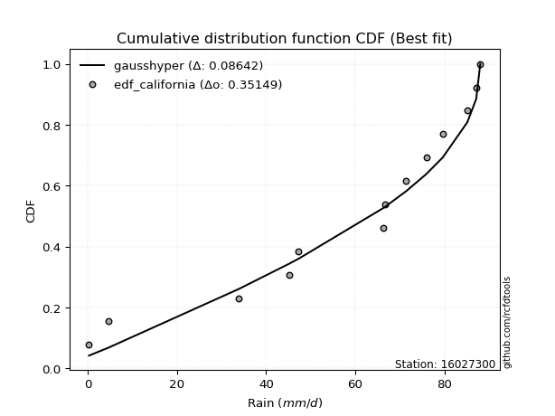</img>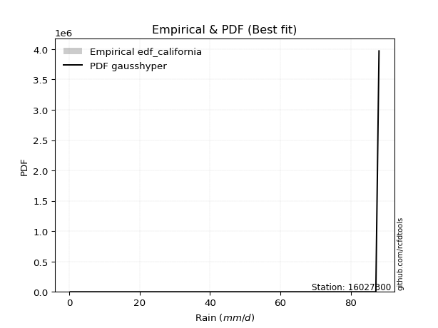</img>

</div>


### 2. EDF Hazen (1930)

Hazen method for plotting positions is a formula used to estimate the empirical cumulative probability distribution of flood events or other hydrological data. This formula often results in biased estimations, particularly when extrapolating to extreme events (high return periods).

<div align="center">


$P=(m-0.5)/n$


</div>


**2.1. Empirical values**

<div align="center">

|                | 0                    | 1                  | 2                   | 3                  | 4         | 5                  | 6                  | 7                  | 8                  | 9                  | 10        | 11                 |
|:---------------|:---------------------|:-------------------|:--------------------|:-------------------|:----------|:-------------------|:-------------------|:-------------------|:-------------------|:-------------------|:----------|:-------------------|
| date           | 2021                 | 2020               | 2013                | 2019               | 2014      | 2017               | 2018               | 2015               | 2011               | 2016               | 2010      | 2012               |
| x              | 0.3                  | 4.6                | 33.9                | 45.1               | 47.3      | 66.7               | 71.4               | 75.9               | 79.6               | 85.1               | 87.1      | 88.0               |
| m              | 1                    | 2                  | 3                   | 4                  | 5         | 6                  | 7                  | 8                  | 9                  | 10                 | 11        | 12                 |
| empirical_dist | edf_hazen            | edf_hazen          | edf_hazen           | edf_hazen          | edf_hazen | edf_hazen          | edf_hazen          | edf_hazen          | edf_hazen          | edf_hazen          | edf_hazen | edf_hazen          |
| empirical      | 0.041666666666666664 | 0.125              | 0.20833333333333334 | 0.2916666666666667 | 0.375     | 0.4583333333333333 | 0.5416666666666666 | 0.625              | 0.7083333333333334 | 0.7916666666666666 | 0.875     | 0.9583333333333334 |
| empirical_tr   | 1.0434782608695652   | 1.1428571428571428 | 1.2631578947368423  | 1.411764705882353  | 1.6       | 1.8461538461538458 | 2.1818181818181817 | 2.6666666666666665 | 3.428571428571429  | 4.799999999999999  | 8.0       | 24.00000000000002  |

</div>


**2.2. Kolmogorov-Smirnov fit test (sorted by Δ)**


<div align="center">

|                | 0                   | 1                   | 2                   | 3                   | 4                   | 5                   | 6                   | 7                   | 8                   | 9                   | 10                  | 11                  | 12                  | 13                  | 14                  | 15                  | 16                  | 17                  | 18                  | 19                  | 20                  | 21                  | 22                  | 23                  | 24                  | 25                  | 26                  | 27                  | 28                  | 29                  | 30                  | 31                  | 32                  | 33                  | 34                  | 35                  | 36                  | 37                  | 38                  | 39                    | 40                  | 41                  | 42                  | 43                  | 44                  | 45                  | 46                  | 47                  | 48                  | 49                  | 50                  | 51                  | 52                  | 53                  | 54                  | 55                  | 56                  | 57                  | 58                  | 59                  | 60                  | 61                  | 62                  | 63                  | 64                  | 65                  | 66                  | 67                  | 68                  | 69                  | 70                  | 71                  | 72                  | 73                  | 74                  | 75                  | 76                  | 77                  | 78                  | 79                  | 80                  | 81                  | 82                  | 83                  | 84                  | 85                  | 86                  | 87                  |
|:---------------|:--------------------|:--------------------|:--------------------|:--------------------|:--------------------|:--------------------|:--------------------|:--------------------|:--------------------|:--------------------|:--------------------|:--------------------|:--------------------|:--------------------|:--------------------|:--------------------|:--------------------|:--------------------|:--------------------|:--------------------|:--------------------|:--------------------|:--------------------|:--------------------|:--------------------|:--------------------|:--------------------|:--------------------|:--------------------|:--------------------|:--------------------|:--------------------|:--------------------|:--------------------|:--------------------|:--------------------|:--------------------|:--------------------|:--------------------|:----------------------|:--------------------|:--------------------|:--------------------|:--------------------|:--------------------|:--------------------|:--------------------|:--------------------|:--------------------|:--------------------|:--------------------|:--------------------|:--------------------|:--------------------|:--------------------|:--------------------|:--------------------|:--------------------|:--------------------|:--------------------|:--------------------|:--------------------|:--------------------|:--------------------|:--------------------|:--------------------|:--------------------|:--------------------|:--------------------|:--------------------|:--------------------|:--------------------|:--------------------|:--------------------|:--------------------|:--------------------|:--------------------|:--------------------|:--------------------|:--------------------|:--------------------|:--------------------|:--------------------|:--------------------|:--------------------|:--------------------|:--------------------|:--------------------|
| station        | 16027300            | 16027300            | 16027300            | 16027300            | 16027300            | 16027300            | 16027300            | 16027300            | 16027300            | 16027300            | 16027300            | 16027300            | 16027300            | 16027300            | 16027300            | 16027300            | 16027300            | 16027300            | 16027300            | 16027300            | 16027300            | 16027300            | 16027300            | 16027300            | 16027300            | 16027300            | 16027300            | 16027300            | 16027300            | 16027300            | 16027300            | 16027300            | 16027300            | 16027300            | 16027300            | 16027300            | 16027300            | 16027300            | 16027300            | 16027300              | 16027300            | 16027300            | 16027300            | 16027300            | 16027300            | 16027300            | 16027300            | 16027300            | 16027300            | 16027300            | 16027300            | 16027300            | 16027300            | 16027300            | 16027300            | 16027300            | 16027300            | 16027300            | 16027300            | 16027300            | 16027300            | 16027300            | 16027300            | 16027300            | 16027300            | 16027300            | 16027300            | 16027300            | 16027300            | 16027300            | 16027300            | 16027300            | 16027300            | 16027300            | 16027300            | 16027300            | 16027300            | 16027300            | 16027300            | 16027300            | 16027300            | 16027300            | 16027300            | 16027300            | 16027300            | 16027300            | 16027300            | 16027300            |
| empirical_dist | edf_hazen           | edf_hazen           | edf_hazen           | edf_hazen           | edf_hazen           | edf_hazen           | edf_hazen           | edf_hazen           | edf_hazen           | edf_hazen           | edf_hazen           | edf_hazen           | edf_hazen           | edf_hazen           | edf_hazen           | edf_hazen           | edf_hazen           | edf_hazen           | edf_hazen           | edf_hazen           | edf_hazen           | edf_hazen           | edf_hazen           | edf_hazen           | edf_hazen           | edf_hazen           | edf_hazen           | edf_hazen           | edf_hazen           | edf_hazen           | edf_hazen           | edf_hazen           | edf_hazen           | edf_hazen           | edf_hazen           | edf_hazen           | edf_hazen           | edf_hazen           | edf_hazen           | edf_hazen             | edf_hazen           | edf_hazen           | edf_hazen           | edf_hazen           | edf_hazen           | edf_hazen           | edf_hazen           | edf_hazen           | edf_hazen           | edf_hazen           | edf_hazen           | edf_hazen           | edf_hazen           | edf_hazen           | edf_hazen           | edf_hazen           | edf_hazen           | edf_hazen           | edf_hazen           | edf_hazen           | edf_hazen           | edf_hazen           | edf_hazen           | edf_hazen           | edf_hazen           | edf_hazen           | edf_hazen           | edf_hazen           | edf_hazen           | edf_hazen           | edf_hazen           | edf_hazen           | edf_hazen           | edf_hazen           | edf_hazen           | edf_hazen           | edf_hazen           | edf_hazen           | edf_hazen           | edf_hazen           | edf_hazen           | edf_hazen           | edf_hazen           | edf_hazen           | edf_hazen           | edf_hazen           | edf_hazen           | edf_hazen           |
| p_dist         | weibull_min         | gumbel_l            | laplace_asymmetric  | pearson3            | johnsonsu           | fisk                | truncnorm           | norm                | crystalball         | t                   | exponnorm           | nct                 | fatiguelife         | f                   | betaprime           | gamma               | chi2                | erlang              | rice                | invweibull          | logistic            | invgamma            | maxwell             | hypsecant           | invgauss            | ncf                 | rayleigh            | kstwobign           | halfnorm            | laplace             | gumbel_r            | halflogistic        | moyal               | genexpon            | expon               | logt                | loggumbel_l         | nakagami            | logpearson3         | loglaplace_asymmetric | logloggamma         | logbetaprime        | logexponnorm        | lognorm             | lognorm             | logcrystalball      | logrice             | lognct              | loglogistic         | logtruncnorm        | lognakagami         | logfatiguelife      | loglognorm          | loghypsecant        | loggamma            | loggamma            | gompertz            | wald                | logerlang           | loginvweibull       | loginvgamma         | loginvgauss         | mielke              | loglaplace          | logmaxwell          | logalpha            | lograyleigh         | gibrat              | logkstwobign        | loggumbel_r         | loghalfnorm         | loggompertz         | logmoyal            | loggenexpon         | loghalflogistic     | logncf              | logexpon            | logjohnsonsu        | logweibull_min      | logfisk             | logwald             | loggibrat           | logchi2             | logf                | logmielke           | alpha               | loggenlogistic      | genlogistic         |
| delta          | 0.10870312785348774 | 0.11467240803990447 | 0.11838267855464801 | 0.12409122465681272 | 0.12662963088527324 | 0.12889330812911237 | 0.1314404214485343  | 0.16878867105081347 | 0.16878871905127085 | 0.16879144217659475 | 0.16879168280795048 | 0.1688134872524249  | 0.16892072679058484 | 0.16966052156169992 | 0.17259767380437102 | 0.1739328858904658  | 0.17424072545844377 | 0.17440955359485538 | 0.17458866178862104 | 0.17676038596776616 | 0.18459738541755172 | 0.18558187737918658 | 0.19277658647468482 | 0.19720070456163746 | 0.1975735510402899  | 0.1982445289952186  | 0.2000925602801495  | 0.205502826119706   | 0.22112227428622583 | 0.2255653325148254  | 0.23209878392537003 | 0.24947069823047613 | 0.25334393668660077 | 0.2537827384558861  | 0.2540180647990719  | 0.25508107074153263 | 0.2564761849438978  | 0.2837005078739816  | 0.2891845755149808  | 0.29288540264702995   | 0.2941908073955711  | 0.29525604014996276 | 0.2959063618520592  | 0.2959083676520925  | 0.2959083676520925  | 0.2959086514292396  | 0.29591152352903083 | 0.2964692902889773  | 0.29648785349134166 | 0.29711045586175594 | 0.2973074741586811  | 0.29818536069523305 | 0.2989660600625469  | 0.300346711187868   | 0.309693721709423   | 0.309693721709423   | 0.3122758780576278  | 0.31298087788825096 | 0.31534521344014754 | 0.3164972521077041  | 0.31791067317040267 | 0.3231794924074919  | 0.3236166491834577  | 0.324329369470804   | 0.3287827111732523  | 0.33422258870407073 | 0.33970597851880024 | 0.345166640320752   | 0.35800672608315964 | 0.36639665009370015 | 0.3704404595205014  | 0.37518748310294825 | 0.3922103316675468  | 0.39277329455531607 | 0.39562972303610966 | 0.4218582785356817  | 0.425131626679245   | 0.44365714524884864 | 0.45187359405791616 | 0.45276300538359227 | 0.4639815988910505  | 0.4879833877358414  | 0.5114448557615048  | 0.5169131537864166  | 0.5438657203490888  | 0.767363389432046   | 0.875               | 0.875               |
| deltao         | 0.36218414519599995 | 0.36218414519599995 | 0.36218414519599995 | 0.36218414519599995 | 0.36218414519599995 | 0.36218414519599995 | 0.36218414519599995 | 0.36218414519599995 | 0.36218414519599995 | 0.36218414519599995 | 0.36218414519599995 | 0.36218414519599995 | 0.36218414519599995 | 0.36218414519599995 | 0.36218414519599995 | 0.36218414519599995 | 0.36218414519599995 | 0.36218414519599995 | 0.36218414519599995 | 0.36218414519599995 | 0.36218414519599995 | 0.36218414519599995 | 0.36218414519599995 | 0.36218414519599995 | 0.36218414519599995 | 0.36218414519599995 | 0.36218414519599995 | 0.36218414519599995 | 0.36218414519599995 | 0.36218414519599995 | 0.36218414519599995 | 0.36218414519599995 | 0.36218414519599995 | 0.36218414519599995 | 0.36218414519599995 | 0.36218414519599995 | 0.36218414519599995 | 0.36218414519599995 | 0.36218414519599995 | 0.36218414519599995   | 0.36218414519599995 | 0.36218414519599995 | 0.36218414519599995 | 0.36218414519599995 | 0.36218414519599995 | 0.36218414519599995 | 0.36218414519599995 | 0.36218414519599995 | 0.36218414519599995 | 0.36218414519599995 | 0.36218414519599995 | 0.36218414519599995 | 0.36218414519599995 | 0.36218414519599995 | 0.36218414519599995 | 0.36218414519599995 | 0.36218414519599995 | 0.36218414519599995 | 0.36218414519599995 | 0.36218414519599995 | 0.36218414519599995 | 0.36218414519599995 | 0.36218414519599995 | 0.36218414519599995 | 0.36218414519599995 | 0.36218414519599995 | 0.36218414519599995 | 0.36218414519599995 | 0.36218414519599995 | 0.36218414519599995 | 0.36218414519599995 | 0.36218414519599995 | 0.36218414519599995 | 0.36218414519599995 | 0.36218414519599995 | 0.36218414519599995 | 0.36218414519599995 | 0.36218414519599995 | 0.36218414519599995 | 0.36218414519599995 | 0.36218414519599995 | 0.36218414519599995 | 0.36218414519599995 | 0.36218414519599995 | 0.36218414519599995 | 0.36218414519599995 | 0.36218414519599995 | 0.36218414519599995 |
| eval           | Δo > Δ              | Δo > Δ              | Δo > Δ              | Δo > Δ              | Δo > Δ              | Δo > Δ              | Δo > Δ              | Δo > Δ              | Δo > Δ              | Δo > Δ              | Δo > Δ              | Δo > Δ              | Δo > Δ              | Δo > Δ              | Δo > Δ              | Δo > Δ              | Δo > Δ              | Δo > Δ              | Δo > Δ              | Δo > Δ              | Δo > Δ              | Δo > Δ              | Δo > Δ              | Δo > Δ              | Δo > Δ              | Δo > Δ              | Δo > Δ              | Δo > Δ              | Δo > Δ              | Δo > Δ              | Δo > Δ              | Δo > Δ              | Δo > Δ              | Δo > Δ              | Δo > Δ              | Δo > Δ              | Δo > Δ              | Δo > Δ              | Δo > Δ              | Δo > Δ                | Δo > Δ              | Δo > Δ              | Δo > Δ              | Δo > Δ              | Δo > Δ              | Δo > Δ              | Δo > Δ              | Δo > Δ              | Δo > Δ              | Δo > Δ              | Δo > Δ              | Δo > Δ              | Δo > Δ              | Δo > Δ              | Δo > Δ              | Δo > Δ              | Δo > Δ              | Δo > Δ              | Δo > Δ              | Δo > Δ              | Δo > Δ              | Δo > Δ              | Δo > Δ              | Δo > Δ              | Δo > Δ              | Δo > Δ              | Δo > Δ              | Δo > Δ              | Δo > Δ              | Δo <= Δ             | Δo <= Δ             | Δo <= Δ             | Δo <= Δ             | Δo <= Δ             | Δo <= Δ             | Δo <= Δ             | Δo <= Δ             | Δo <= Δ             | Δo <= Δ             | Δo <= Δ             | Δo <= Δ             | Δo <= Δ             | Δo <= Δ             | Δo <= Δ             | Δo <= Δ             | Δo <= Δ             | Δo <= Δ             | Δo <= Δ             |
| fit            | 1                   | 1                   | 1                   | 1                   | 1                   | 1                   | 1                   | 1                   | 1                   | 1                   | 1                   | 1                   | 1                   | 1                   | 1                   | 1                   | 1                   | 1                   | 1                   | 1                   | 1                   | 1                   | 1                   | 1                   | 1                   | 1                   | 1                   | 1                   | 1                   | 1                   | 1                   | 1                   | 1                   | 1                   | 1                   | 1                   | 1                   | 1                   | 1                   | 1                     | 1                   | 1                   | 1                   | 1                   | 1                   | 1                   | 1                   | 1                   | 1                   | 1                   | 1                   | 1                   | 1                   | 1                   | 1                   | 1                   | 1                   | 1                   | 1                   | 1                   | 1                   | 1                   | 1                   | 1                   | 1                   | 1                   | 1                   | 1                   | 1                   | 0                   | 0                   | 0                   | 0                   | 0                   | 0                   | 0                   | 0                   | 0                   | 0                   | 0                   | 0                   | 0                   | 0                   | 0                   | 0                   | 0                   | 0                   | 0                   |
| n              | 12                  | 12                  | 12                  | 12                  | 12                  | 12                  | 12                  | 12                  | 12                  | 12                  | 12                  | 12                  | 12                  | 12                  | 12                  | 12                  | 12                  | 12                  | 12                  | 12                  | 12                  | 12                  | 12                  | 12                  | 12                  | 12                  | 12                  | 12                  | 12                  | 12                  | 12                  | 12                  | 12                  | 12                  | 12                  | 12                  | 12                  | 12                  | 12                  | 12                    | 12                  | 12                  | 12                  | 12                  | 12                  | 12                  | 12                  | 12                  | 12                  | 12                  | 12                  | 12                  | 12                  | 12                  | 12                  | 12                  | 12                  | 12                  | 12                  | 12                  | 12                  | 12                  | 12                  | 12                  | 12                  | 12                  | 12                  | 12                  | 12                  | 12                  | 12                  | 12                  | 12                  | 12                  | 12                  | 12                  | 12                  | 12                  | 12                  | 12                  | 12                  | 12                  | 12                  | 12                  | 12                  | 12                  | 12                  | 12                  |
| best_fit       | 1                   | 0                   | 0                   | 0                   | 0                   | 0                   | 0                   | 0                   | 0                   | 0                   | 0                   | 0                   | 0                   | 0                   | 0                   | 0                   | 0                   | 0                   | 0                   | 0                   | 0                   | 0                   | 0                   | 0                   | 0                   | 0                   | 0                   | 0                   | 0                   | 0                   | 0                   | 0                   | 0                   | 0                   | 0                   | 0                   | 0                   | 0                   | 0                   | 0                     | 0                   | 0                   | 0                   | 0                   | 0                   | 0                   | 0                   | 0                   | 0                   | 0                   | 0                   | 0                   | 0                   | 0                   | 0                   | 0                   | 0                   | 0                   | 0                   | 0                   | 0                   | 0                   | 0                   | 0                   | 0                   | 0                   | 0                   | 0                   | 0                   | 0                   | 0                   | 0                   | 0                   | 0                   | 0                   | 0                   | 0                   | 0                   | 0                   | 0                   | 0                   | 0                   | 0                   | 0                   | 0                   | 0                   | 0                   | 0                   |
| best_fit_sort  | 1                   | 2                   | 3                   | 4                   | 5                   | 6                   | 7                   | 8                   | 9                   | 10                  | 11                  | 12                  | 13                  | 14                  | 15                  | 16                  | 17                  | 18                  | 19                  | 20                  | 21                  | 22                  | 23                  | 24                  | 25                  | 26                  | 27                  | 28                  | 29                  | 30                  | 31                  | 32                  | 33                  | 34                  | 35                  | 36                  | 37                  | 38                  | 39                  | 40                    | 41                  | 42                  | 43                  | 44                  | 45                  | 46                  | 47                  | 48                  | 49                  | 50                  | 51                  | 52                  | 53                  | 54                  | 55                  | 56                  | 57                  | 58                  | 59                  | 60                  | 61                  | 62                  | 63                  | 64                  | 65                  | 66                  | 67                  | 68                  | 69                  | 70                  | 71                  | 72                  | 73                  | 74                  | 75                  | 76                  | 77                  | 78                  | 79                  | 80                  | 81                  | 82                  | 83                  | 84                  | 85                  | 86                  | 87                  | 88                  |

</div>


**2.3. Best fit**

<div align="center">

|   id |   station | empirical_dist   | p_dist      |    delta |   deltao | eval   |   fit |   n |   best_fit |   best_fit_sort |
|-----:|----------:|:-----------------|:------------|---------:|---------:|:-------|------:|----:|-----------:|----------------:|
|    0 |  16027300 | edf_hazen        | weibull_min | 0.108703 | 0.362184 | Δo > Δ |     1 |  12 |          1 |               1 |

</div>


<div align="center">

</img></img>

</div>


### 3. EDF Weibull (1939)

Weibull plotting position formula is an empirical method used to estimate the non-exceedance probability or plotting position for a set of observed data, is often recommended or widely used in practice, particularly in flood frequency analysis.

<div align="center">


$P=m/(n+1)$


</div>


**3.1. Empirical values**

<div align="center">

|                | 0                   | 1                   | 2                   | 3                  | 4                   | 5                   | 6                  | 7                  | 8                  | 9                  | 10                 | 11                 |
|:---------------|:--------------------|:--------------------|:--------------------|:-------------------|:--------------------|:--------------------|:-------------------|:-------------------|:-------------------|:-------------------|:-------------------|:-------------------|
| date           | 2021                | 2020                | 2013                | 2019               | 2014                | 2017                | 2018               | 2015               | 2011               | 2016               | 2010               | 2012               |
| x              | 0.3                 | 4.6                 | 33.9                | 45.1               | 47.3                | 66.7                | 71.4               | 75.9               | 79.6               | 85.1               | 87.1               | 88.0               |
| m              | 1                   | 2                   | 3                   | 4                  | 5                   | 6                   | 7                  | 8                  | 9                  | 10                 | 11                 | 12                 |
| empirical_dist | edf_weibull         | edf_weibull         | edf_weibull         | edf_weibull        | edf_weibull         | edf_weibull         | edf_weibull        | edf_weibull        | edf_weibull        | edf_weibull        | edf_weibull        | edf_weibull        |
| empirical      | 0.07692307692307693 | 0.15384615384615385 | 0.23076923076923078 | 0.3076923076923077 | 0.38461538461538464 | 0.46153846153846156 | 0.5384615384615384 | 0.6153846153846154 | 0.6923076923076923 | 0.7692307692307693 | 0.8461538461538461 | 0.9230769230769231 |
| empirical_tr   | 1.0833333333333333  | 1.1818181818181819  | 1.3                 | 1.4444444444444444 | 1.625               | 1.8571428571428572  | 2.1666666666666665 | 2.6                | 3.25               | 4.333333333333334  | 6.5                | 13.000000000000009 |

</div>


**3.2. Kolmogorov-Smirnov fit test (sorted by Δ)**


<div align="center">

|                | 0                   | 1                   | 2                   | 3                   | 4                   | 5                   | 6                   | 7                   | 8                   | 9                   | 10                  | 11                  | 12                  | 13                  | 14                  | 15                  | 16                  | 17                  | 18                  | 19                  | 20                  | 21                  | 22                  | 23                  | 24                  | 25                  | 26                  | 27                  | 28                  | 29                  | 30                  | 31                  | 32                  | 33                  | 34                  | 35                  | 36                  | 37                  | 38                  | 39                  | 40                  | 41                  | 42                  | 43                  | 44                  | 45                  | 46                  | 47                  | 48                  | 49                  | 50                  | 51                  | 52                  | 53                    | 54                  | 55                  | 56                  | 57                  | 58                  | 59                  | 60                  | 61                  | 62                  | 63                  | 64                  | 65                  | 66                  | 67                  | 68                  | 69                  | 70                  | 71                  | 72                  | 73                  | 74                  | 75                  | 76                  | 77                  | 78                  | 79                  | 80                  | 81                  | 82                  | 83                  | 84                  | 85                  | 86                  | 87                  |
|:---------------|:--------------------|:--------------------|:--------------------|:--------------------|:--------------------|:--------------------|:--------------------|:--------------------|:--------------------|:--------------------|:--------------------|:--------------------|:--------------------|:--------------------|:--------------------|:--------------------|:--------------------|:--------------------|:--------------------|:--------------------|:--------------------|:--------------------|:--------------------|:--------------------|:--------------------|:--------------------|:--------------------|:--------------------|:--------------------|:--------------------|:--------------------|:--------------------|:--------------------|:--------------------|:--------------------|:--------------------|:--------------------|:--------------------|:--------------------|:--------------------|:--------------------|:--------------------|:--------------------|:--------------------|:--------------------|:--------------------|:--------------------|:--------------------|:--------------------|:--------------------|:--------------------|:--------------------|:--------------------|:----------------------|:--------------------|:--------------------|:--------------------|:--------------------|:--------------------|:--------------------|:--------------------|:--------------------|:--------------------|:--------------------|:--------------------|:--------------------|:--------------------|:--------------------|:--------------------|:--------------------|:--------------------|:--------------------|:--------------------|:--------------------|:--------------------|:--------------------|:--------------------|:--------------------|:--------------------|:--------------------|:--------------------|:--------------------|:--------------------|:--------------------|:--------------------|:--------------------|:--------------------|:--------------------|
| station        | 16027300            | 16027300            | 16027300            | 16027300            | 16027300            | 16027300            | 16027300            | 16027300            | 16027300            | 16027300            | 16027300            | 16027300            | 16027300            | 16027300            | 16027300            | 16027300            | 16027300            | 16027300            | 16027300            | 16027300            | 16027300            | 16027300            | 16027300            | 16027300            | 16027300            | 16027300            | 16027300            | 16027300            | 16027300            | 16027300            | 16027300            | 16027300            | 16027300            | 16027300            | 16027300            | 16027300            | 16027300            | 16027300            | 16027300            | 16027300            | 16027300            | 16027300            | 16027300            | 16027300            | 16027300            | 16027300            | 16027300            | 16027300            | 16027300            | 16027300            | 16027300            | 16027300            | 16027300            | 16027300              | 16027300            | 16027300            | 16027300            | 16027300            | 16027300            | 16027300            | 16027300            | 16027300            | 16027300            | 16027300            | 16027300            | 16027300            | 16027300            | 16027300            | 16027300            | 16027300            | 16027300            | 16027300            | 16027300            | 16027300            | 16027300            | 16027300            | 16027300            | 16027300            | 16027300            | 16027300            | 16027300            | 16027300            | 16027300            | 16027300            | 16027300            | 16027300            | 16027300            | 16027300            |
| empirical_dist | edf_weibull         | edf_weibull         | edf_weibull         | edf_weibull         | edf_weibull         | edf_weibull         | edf_weibull         | edf_weibull         | edf_weibull         | edf_weibull         | edf_weibull         | edf_weibull         | edf_weibull         | edf_weibull         | edf_weibull         | edf_weibull         | edf_weibull         | edf_weibull         | edf_weibull         | edf_weibull         | edf_weibull         | edf_weibull         | edf_weibull         | edf_weibull         | edf_weibull         | edf_weibull         | edf_weibull         | edf_weibull         | edf_weibull         | edf_weibull         | edf_weibull         | edf_weibull         | edf_weibull         | edf_weibull         | edf_weibull         | edf_weibull         | edf_weibull         | edf_weibull         | edf_weibull         | edf_weibull         | edf_weibull         | edf_weibull         | edf_weibull         | edf_weibull         | edf_weibull         | edf_weibull         | edf_weibull         | edf_weibull         | edf_weibull         | edf_weibull         | edf_weibull         | edf_weibull         | edf_weibull         | edf_weibull           | edf_weibull         | edf_weibull         | edf_weibull         | edf_weibull         | edf_weibull         | edf_weibull         | edf_weibull         | edf_weibull         | edf_weibull         | edf_weibull         | edf_weibull         | edf_weibull         | edf_weibull         | edf_weibull         | edf_weibull         | edf_weibull         | edf_weibull         | edf_weibull         | edf_weibull         | edf_weibull         | edf_weibull         | edf_weibull         | edf_weibull         | edf_weibull         | edf_weibull         | edf_weibull         | edf_weibull         | edf_weibull         | edf_weibull         | edf_weibull         | edf_weibull         | edf_weibull         | edf_weibull         | edf_weibull         |
| p_dist         | weibull_min         | gumbel_l            | pearson3            | fisk                | johnsonsu           | laplace_asymmetric  | truncnorm           | ncf                 | norm                | crystalball         | t                   | exponnorm           | nct                 | fatiguelife         | f                   | betaprime           | gamma               | chi2                | erlang              | rice                | invweibull          | logistic            | invgamma            | maxwell             | hypsecant           | invgauss            | rayleigh            | kstwobign           | halfnorm            | loggumbel_l         | laplace             | gumbel_r            | genexpon            | expon               | logt                | halflogistic        | moyal               | logpearson3         | nakagami            | logbetaprime        | logexponnorm        | lognorm             | lognorm             | logcrystalball      | logrice             | lognct              | lognakagami         | logfatiguelife      | loglogistic         | loglognorm          | loghypsecant        | loggamma            | loggamma            | loglaplace_asymmetric | logloggamma         | logerlang           | logtruncnorm        | loginvweibull       | loginvgamma         | loginvgauss         | logmaxwell          | loglaplace          | wald                | logalpha            | lograyleigh         | mielke              | gompertz            | logkstwobign        | gibrat              | loggumbel_r         | loghalfnorm         | loggompertz         | logmoyal            | loggenexpon         | loghalflogistic     | logncf              | logexpon            | logjohnsonsu        | logweibull_min      | logfisk             | logwald             | loggibrat           | logchi2             | logf                | logmielke           | alpha               | loggenlogistic      | genlogistic         |
| delta          | 0.10881957195233016 | 0.11146727983477622 | 0.12088609645168447 | 0.12530772368627852 | 0.13624501550065787 | 0.14081857599054537 | 0.15387631888443165 | 0.16298811873880836 | 0.16558354284568522 | 0.1655835908461426  | 0.1655863139714665  | 0.16558655460282223 | 0.16560835904729665 | 0.1657155985854566  | 0.16645539335657167 | 0.16939254559924277 | 0.17072775768533754 | 0.17103559725331552 | 0.17120442538972713 | 0.1713835335834928  | 0.17355525776263792 | 0.18139225721242347 | 0.18237674917405833 | 0.18957145826955657 | 0.19399557635650921 | 0.19436842283516165 | 0.19688743207502124 | 0.20229769791457775 | 0.21791714608109758 | 0.22121977468748755 | 0.22236020430969716 | 0.22889365572024178 | 0.2377570974302451  | 0.23799242377343088 | 0.24414284590100743 | 0.24626557002534788 | 0.2501388084814725  | 0.25392816525857054 | 0.2635736653090929  | 0.27282014271406535 | 0.2734704644161618  | 0.2734724702161951  | 0.2734724702161951  | 0.2734727539933422  | 0.2734756260931334  | 0.27403339285307987 | 0.2748715767227837  | 0.27574946325933564 | 0.276142481998095   | 0.2765301626266495  | 0.28432107016222696 | 0.2872578242735256  | 0.2872578242735256  | 0.2896802744419017    | 0.2909856791904428  | 0.29290931600425013 | 0.2939053276566277  | 0.29406135467180666 | 0.29547477573450526 | 0.3007435949715945  | 0.3063468137373549  | 0.30830372844516296 | 0.3097757496831227  | 0.3117866912681733  | 0.31727008108290283 | 0.3204115209783295  | 0.32189126267301243 | 0.33557082864726223 | 0.34196151211562376 | 0.34396075265780274 | 0.348004562084604   | 0.35275158566705084 | 0.3697744342316494  | 0.37033739711941865 | 0.37319382560021225 | 0.3994223810997843  | 0.40269572924334757 | 0.4148109914026948  | 0.4230274402117623  | 0.43032710794769485 | 0.4415457014551531  | 0.46554749029994397 | 0.48900895832560737 | 0.4893961931711512  | 0.5214298229131913  | 0.7449274919961486  | 0.8461538461538461  | 0.8461538461538461  |
| deltao         | 0.36218414519599995 | 0.36218414519599995 | 0.36218414519599995 | 0.36218414519599995 | 0.36218414519599995 | 0.36218414519599995 | 0.36218414519599995 | 0.36218414519599995 | 0.36218414519599995 | 0.36218414519599995 | 0.36218414519599995 | 0.36218414519599995 | 0.36218414519599995 | 0.36218414519599995 | 0.36218414519599995 | 0.36218414519599995 | 0.36218414519599995 | 0.36218414519599995 | 0.36218414519599995 | 0.36218414519599995 | 0.36218414519599995 | 0.36218414519599995 | 0.36218414519599995 | 0.36218414519599995 | 0.36218414519599995 | 0.36218414519599995 | 0.36218414519599995 | 0.36218414519599995 | 0.36218414519599995 | 0.36218414519599995 | 0.36218414519599995 | 0.36218414519599995 | 0.36218414519599995 | 0.36218414519599995 | 0.36218414519599995 | 0.36218414519599995 | 0.36218414519599995 | 0.36218414519599995 | 0.36218414519599995 | 0.36218414519599995 | 0.36218414519599995 | 0.36218414519599995 | 0.36218414519599995 | 0.36218414519599995 | 0.36218414519599995 | 0.36218414519599995 | 0.36218414519599995 | 0.36218414519599995 | 0.36218414519599995 | 0.36218414519599995 | 0.36218414519599995 | 0.36218414519599995 | 0.36218414519599995 | 0.36218414519599995   | 0.36218414519599995 | 0.36218414519599995 | 0.36218414519599995 | 0.36218414519599995 | 0.36218414519599995 | 0.36218414519599995 | 0.36218414519599995 | 0.36218414519599995 | 0.36218414519599995 | 0.36218414519599995 | 0.36218414519599995 | 0.36218414519599995 | 0.36218414519599995 | 0.36218414519599995 | 0.36218414519599995 | 0.36218414519599995 | 0.36218414519599995 | 0.36218414519599995 | 0.36218414519599995 | 0.36218414519599995 | 0.36218414519599995 | 0.36218414519599995 | 0.36218414519599995 | 0.36218414519599995 | 0.36218414519599995 | 0.36218414519599995 | 0.36218414519599995 | 0.36218414519599995 | 0.36218414519599995 | 0.36218414519599995 | 0.36218414519599995 | 0.36218414519599995 | 0.36218414519599995 | 0.36218414519599995 |
| eval           | Δo > Δ              | Δo > Δ              | Δo > Δ              | Δo > Δ              | Δo > Δ              | Δo > Δ              | Δo > Δ              | Δo > Δ              | Δo > Δ              | Δo > Δ              | Δo > Δ              | Δo > Δ              | Δo > Δ              | Δo > Δ              | Δo > Δ              | Δo > Δ              | Δo > Δ              | Δo > Δ              | Δo > Δ              | Δo > Δ              | Δo > Δ              | Δo > Δ              | Δo > Δ              | Δo > Δ              | Δo > Δ              | Δo > Δ              | Δo > Δ              | Δo > Δ              | Δo > Δ              | Δo > Δ              | Δo > Δ              | Δo > Δ              | Δo > Δ              | Δo > Δ              | Δo > Δ              | Δo > Δ              | Δo > Δ              | Δo > Δ              | Δo > Δ              | Δo > Δ              | Δo > Δ              | Δo > Δ              | Δo > Δ              | Δo > Δ              | Δo > Δ              | Δo > Δ              | Δo > Δ              | Δo > Δ              | Δo > Δ              | Δo > Δ              | Δo > Δ              | Δo > Δ              | Δo > Δ              | Δo > Δ                | Δo > Δ              | Δo > Δ              | Δo > Δ              | Δo > Δ              | Δo > Δ              | Δo > Δ              | Δo > Δ              | Δo > Δ              | Δo > Δ              | Δo > Δ              | Δo > Δ              | Δo > Δ              | Δo > Δ              | Δo > Δ              | Δo > Δ              | Δo > Δ              | Δo > Δ              | Δo > Δ              | Δo <= Δ             | Δo <= Δ             | Δo <= Δ             | Δo <= Δ             | Δo <= Δ             | Δo <= Δ             | Δo <= Δ             | Δo <= Δ             | Δo <= Δ             | Δo <= Δ             | Δo <= Δ             | Δo <= Δ             | Δo <= Δ             | Δo <= Δ             | Δo <= Δ             | Δo <= Δ             |
| fit            | 1                   | 1                   | 1                   | 1                   | 1                   | 1                   | 1                   | 1                   | 1                   | 1                   | 1                   | 1                   | 1                   | 1                   | 1                   | 1                   | 1                   | 1                   | 1                   | 1                   | 1                   | 1                   | 1                   | 1                   | 1                   | 1                   | 1                   | 1                   | 1                   | 1                   | 1                   | 1                   | 1                   | 1                   | 1                   | 1                   | 1                   | 1                   | 1                   | 1                   | 1                   | 1                   | 1                   | 1                   | 1                   | 1                   | 1                   | 1                   | 1                   | 1                   | 1                   | 1                   | 1                   | 1                     | 1                   | 1                   | 1                   | 1                   | 1                   | 1                   | 1                   | 1                   | 1                   | 1                   | 1                   | 1                   | 1                   | 1                   | 1                   | 1                   | 1                   | 1                   | 0                   | 0                   | 0                   | 0                   | 0                   | 0                   | 0                   | 0                   | 0                   | 0                   | 0                   | 0                   | 0                   | 0                   | 0                   | 0                   |
| n              | 12                  | 12                  | 12                  | 12                  | 12                  | 12                  | 12                  | 12                  | 12                  | 12                  | 12                  | 12                  | 12                  | 12                  | 12                  | 12                  | 12                  | 12                  | 12                  | 12                  | 12                  | 12                  | 12                  | 12                  | 12                  | 12                  | 12                  | 12                  | 12                  | 12                  | 12                  | 12                  | 12                  | 12                  | 12                  | 12                  | 12                  | 12                  | 12                  | 12                  | 12                  | 12                  | 12                  | 12                  | 12                  | 12                  | 12                  | 12                  | 12                  | 12                  | 12                  | 12                  | 12                  | 12                    | 12                  | 12                  | 12                  | 12                  | 12                  | 12                  | 12                  | 12                  | 12                  | 12                  | 12                  | 12                  | 12                  | 12                  | 12                  | 12                  | 12                  | 12                  | 12                  | 12                  | 12                  | 12                  | 12                  | 12                  | 12                  | 12                  | 12                  | 12                  | 12                  | 12                  | 12                  | 12                  | 12                  | 12                  |
| best_fit       | 1                   | 0                   | 0                   | 0                   | 0                   | 0                   | 0                   | 0                   | 0                   | 0                   | 0                   | 0                   | 0                   | 0                   | 0                   | 0                   | 0                   | 0                   | 0                   | 0                   | 0                   | 0                   | 0                   | 0                   | 0                   | 0                   | 0                   | 0                   | 0                   | 0                   | 0                   | 0                   | 0                   | 0                   | 0                   | 0                   | 0                   | 0                   | 0                   | 0                   | 0                   | 0                   | 0                   | 0                   | 0                   | 0                   | 0                   | 0                   | 0                   | 0                   | 0                   | 0                   | 0                   | 0                     | 0                   | 0                   | 0                   | 0                   | 0                   | 0                   | 0                   | 0                   | 0                   | 0                   | 0                   | 0                   | 0                   | 0                   | 0                   | 0                   | 0                   | 0                   | 0                   | 0                   | 0                   | 0                   | 0                   | 0                   | 0                   | 0                   | 0                   | 0                   | 0                   | 0                   | 0                   | 0                   | 0                   | 0                   |
| best_fit_sort  | 1                   | 2                   | 3                   | 4                   | 5                   | 6                   | 7                   | 8                   | 9                   | 10                  | 11                  | 12                  | 13                  | 14                  | 15                  | 16                  | 17                  | 18                  | 19                  | 20                  | 21                  | 22                  | 23                  | 24                  | 25                  | 26                  | 27                  | 28                  | 29                  | 30                  | 31                  | 32                  | 33                  | 34                  | 35                  | 36                  | 37                  | 38                  | 39                  | 40                  | 41                  | 42                  | 43                  | 44                  | 45                  | 46                  | 47                  | 48                  | 49                  | 50                  | 51                  | 52                  | 53                  | 54                    | 55                  | 56                  | 57                  | 58                  | 59                  | 60                  | 61                  | 62                  | 63                  | 64                  | 65                  | 66                  | 67                  | 68                  | 69                  | 70                  | 71                  | 72                  | 73                  | 74                  | 75                  | 76                  | 77                  | 78                  | 79                  | 80                  | 81                  | 82                  | 83                  | 84                  | 85                  | 86                  | 87                  | 88                  |

</div>


**3.3. Best fit**

<div align="center">

|   id |   station | empirical_dist   | p_dist      |   delta |   deltao | eval   |   fit |   n |   best_fit |   best_fit_sort |
|-----:|----------:|:-----------------|:------------|--------:|---------:|:-------|------:|----:|-----------:|----------------:|
|    0 |  16027300 | edf_weibull      | weibull_min | 0.10882 | 0.362184 | Δo > Δ |     1 |  12 |          1 |               1 |

</div>


<div align="center">

</img></img>

</div>


### 4. EDF Beard (1943)

The Beard formula (or Beard´s plotting position formula) in hydrology is used to estimate the empirical non-exceedance probability _(P)_ of a flood event (or other extreme hydrological data point) within a given dataset.

<div align="center">


$P=(m-0.31)/(n+0.38)$


</div>


**4.1. Empirical values**

<div align="center">

|                | 0                    | 1                   | 2                   | 3                  | 4                  | 5                  | 6                  | 7                  | 8                  | 9                  | 10                 | 11                 |
|:---------------|:---------------------|:--------------------|:--------------------|:-------------------|:-------------------|:-------------------|:-------------------|:-------------------|:-------------------|:-------------------|:-------------------|:-------------------|
| date           | 2021                 | 2020                | 2013                | 2019               | 2014               | 2017               | 2018               | 2015               | 2011               | 2016               | 2010               | 2012               |
| x              | 0.3                  | 4.6                 | 33.9                | 45.1               | 47.3               | 66.7               | 71.4               | 75.9               | 79.6               | 85.1               | 87.1               | 88.0               |
| m              | 1                    | 2                   | 3                   | 4                  | 5                  | 6                  | 7                  | 8                  | 9                  | 10                 | 11                 | 12                 |
| empirical_dist | edf_beard            | edf_beard           | edf_beard           | edf_beard          | edf_beard          | edf_beard          | edf_beard          | edf_beard          | edf_beard          | edf_beard          | edf_beard          | edf_beard          |
| empirical      | 0.055735056542810975 | 0.13651050080775443 | 0.21728594507269788 | 0.2980613893376413 | 0.3788368336025848 | 0.4596122778675283 | 0.5403877221324718 | 0.6211631663974152 | 0.7019386106623585 | 0.7827140549273021 | 0.8634894991922455 | 0.9442649434571889 |
| empirical_tr   | 1.0590248075278015   | 1.1580916744621141  | 1.2776057791537667  | 1.424626006904488  | 1.6098829648894668 | 1.850523168908819  | 2.1757469244288226 | 2.6396588486140726 | 3.3550135501355    | 4.6022304832713745 | 7.325443786982245  | 17.942028985507218 |

</div>


**4.2. Kolmogorov-Smirnov fit test (sorted by Δ)**


<div align="center">

|                | 0                   | 1                   | 2                   | 3                   | 4                   | 5                   | 6                   | 7                   | 8                   | 9                   | 10                  | 11                  | 12                  | 13                  | 14                  | 15                  | 16                  | 17                  | 18                  | 19                  | 20                  | 21                  | 22                  | 23                  | 24                  | 25                  | 26                  | 27                  | 28                  | 29                  | 30                  | 31                  | 32                  | 33                  | 34                  | 35                  | 36                  | 37                  | 38                  | 39                  | 40                  | 41                  | 42                  | 43                  | 44                  | 45                  | 46                  | 47                  | 48                  | 49                  | 50                    | 51                  | 52                  | 53                  | 54                  | 55                  | 56                  | 57                  | 58                  | 59                  | 60                  | 61                  | 62                  | 63                  | 64                  | 65                  | 66                  | 67                  | 68                  | 69                  | 70                  | 71                  | 72                  | 73                  | 74                  | 75                  | 76                  | 77                  | 78                  | 79                  | 80                  | 81                  | 82                  | 83                  | 84                  | 85                  | 86                  | 87                  |
|:---------------|:--------------------|:--------------------|:--------------------|:--------------------|:--------------------|:--------------------|:--------------------|:--------------------|:--------------------|:--------------------|:--------------------|:--------------------|:--------------------|:--------------------|:--------------------|:--------------------|:--------------------|:--------------------|:--------------------|:--------------------|:--------------------|:--------------------|:--------------------|:--------------------|:--------------------|:--------------------|:--------------------|:--------------------|:--------------------|:--------------------|:--------------------|:--------------------|:--------------------|:--------------------|:--------------------|:--------------------|:--------------------|:--------------------|:--------------------|:--------------------|:--------------------|:--------------------|:--------------------|:--------------------|:--------------------|:--------------------|:--------------------|:--------------------|:--------------------|:--------------------|:----------------------|:--------------------|:--------------------|:--------------------|:--------------------|:--------------------|:--------------------|:--------------------|:--------------------|:--------------------|:--------------------|:--------------------|:--------------------|:--------------------|:--------------------|:--------------------|:--------------------|:--------------------|:--------------------|:--------------------|:--------------------|:--------------------|:--------------------|:--------------------|:--------------------|:--------------------|:--------------------|:--------------------|:--------------------|:--------------------|:--------------------|:--------------------|:--------------------|:--------------------|:--------------------|:--------------------|:--------------------|:--------------------|
| station        | 16027300            | 16027300            | 16027300            | 16027300            | 16027300            | 16027300            | 16027300            | 16027300            | 16027300            | 16027300            | 16027300            | 16027300            | 16027300            | 16027300            | 16027300            | 16027300            | 16027300            | 16027300            | 16027300            | 16027300            | 16027300            | 16027300            | 16027300            | 16027300            | 16027300            | 16027300            | 16027300            | 16027300            | 16027300            | 16027300            | 16027300            | 16027300            | 16027300            | 16027300            | 16027300            | 16027300            | 16027300            | 16027300            | 16027300            | 16027300            | 16027300            | 16027300            | 16027300            | 16027300            | 16027300            | 16027300            | 16027300            | 16027300            | 16027300            | 16027300            | 16027300              | 16027300            | 16027300            | 16027300            | 16027300            | 16027300            | 16027300            | 16027300            | 16027300            | 16027300            | 16027300            | 16027300            | 16027300            | 16027300            | 16027300            | 16027300            | 16027300            | 16027300            | 16027300            | 16027300            | 16027300            | 16027300            | 16027300            | 16027300            | 16027300            | 16027300            | 16027300            | 16027300            | 16027300            | 16027300            | 16027300            | 16027300            | 16027300            | 16027300            | 16027300            | 16027300            | 16027300            | 16027300            |
| empirical_dist | edf_beard           | edf_beard           | edf_beard           | edf_beard           | edf_beard           | edf_beard           | edf_beard           | edf_beard           | edf_beard           | edf_beard           | edf_beard           | edf_beard           | edf_beard           | edf_beard           | edf_beard           | edf_beard           | edf_beard           | edf_beard           | edf_beard           | edf_beard           | edf_beard           | edf_beard           | edf_beard           | edf_beard           | edf_beard           | edf_beard           | edf_beard           | edf_beard           | edf_beard           | edf_beard           | edf_beard           | edf_beard           | edf_beard           | edf_beard           | edf_beard           | edf_beard           | edf_beard           | edf_beard           | edf_beard           | edf_beard           | edf_beard           | edf_beard           | edf_beard           | edf_beard           | edf_beard           | edf_beard           | edf_beard           | edf_beard           | edf_beard           | edf_beard           | edf_beard             | edf_beard           | edf_beard           | edf_beard           | edf_beard           | edf_beard           | edf_beard           | edf_beard           | edf_beard           | edf_beard           | edf_beard           | edf_beard           | edf_beard           | edf_beard           | edf_beard           | edf_beard           | edf_beard           | edf_beard           | edf_beard           | edf_beard           | edf_beard           | edf_beard           | edf_beard           | edf_beard           | edf_beard           | edf_beard           | edf_beard           | edf_beard           | edf_beard           | edf_beard           | edf_beard           | edf_beard           | edf_beard           | edf_beard           | edf_beard           | edf_beard           | edf_beard           | edf_beard           |
| p_dist         | weibull_min         | gumbel_l            | pearson3            | fisk                | laplace_asymmetric  | johnsonsu           | truncnorm           | norm                | crystalball         | t                   | exponnorm           | nct                 | fatiguelife         | f                   | betaprime           | gamma               | chi2                | erlang              | rice                | invweibull          | logistic            | ncf                 | invgamma            | maxwell             | hypsecant           | invgauss            | rayleigh            | kstwobign           | halfnorm            | laplace             | gumbel_r            | logt                | loggumbel_l         | genexpon            | expon               | halflogistic        | moyal               | nakagami            | logpearson3         | logbetaprime        | logexponnorm        | lognorm             | lognorm             | logcrystalball      | logrice             | lognct              | loglogistic         | lognakagami         | logfatiguelife      | loglognorm          | loglaplace_asymmetric | logloggamma         | loghypsecant        | logtruncnorm        | loggamma            | loggamma            | logerlang           | loginvweibull       | loginvgamma         | wald                | loginvgauss         | gompertz            | loglaplace          | logmaxwell          | mielke              | logalpha            | lograyleigh         | gibrat              | logkstwobign        | loggumbel_r         | loghalfnorm         | loggompertz         | logmoyal            | loggenexpon         | loghalflogistic     | logncf              | logexpon            | logjohnsonsu        | logweibull_min      | logfisk             | logwald             | loggibrat           | logchi2             | logf                | logmielke           | alpha               | loggenlogistic      | genlogistic         |
| delta          | 0.10742418331929277 | 0.1133934635057095  | 0.12281228012261775 | 0.1272339073572118  | 0.12733529029401258 | 0.13046646448785804 | 0.14039303318789886 | 0.1675097265166185  | 0.16750977451707588 | 0.16751249764239978 | 0.1675127382737555  | 0.16753454271822993 | 0.16764178225638987 | 0.16838157702750495 | 0.17131872927017605 | 0.17265394135627082 | 0.1729617809242488  | 0.1731306090606604  | 0.17330971725442607 | 0.1754814414335712  | 0.18331844088335675 | 0.18417613911907416 | 0.1843029328449916  | 0.19149764194048985 | 0.1959217600274425  | 0.19629460650609493 | 0.19881361574595452 | 0.20422388158551102 | 0.21984332975203086 | 0.22428638798063044 | 0.23081983939117506 | 0.24101268086538818 | 0.24240779506775334 | 0.24738801578491149 | 0.24762334212809728 | 0.24819175369628116 | 0.2520649921524058  | 0.2747478961346171  | 0.27511618563883633 | 0.28630342841059825 | 0.2869537501126947  | 0.286955755912728   | 0.286955755912728   | 0.2869560396898751  | 0.2869589117896663  | 0.28751667854961277 | 0.28753524175197714 | 0.28835486241931657 | 0.28923274895586853 | 0.2900134483231824  | 0.291606458112835     | 0.2929118628613761  | 0.29395198851689336 | 0.29583151132756097 | 0.3007411099700585  | 0.3007411099700585  | 0.30639260170078303 | 0.30754464036833956 | 0.30895806143103816 | 0.311701933354056   | 0.3142268806681274  | 0.3161127116602126  | 0.31793464679982936 | 0.3198300994338878  | 0.32233770464926276 | 0.3252699769647062  | 0.33075336677943573 | 0.34388769578655703 | 0.34905411434379513 | 0.35744403835433564 | 0.3614878477811369  | 0.36623487136358374 | 0.3832577199281823  | 0.38382068281595155 | 0.38667711129674515 | 0.4129056667963172  | 0.41617901493988047 | 0.43214664444109413 | 0.44036309325016176 | 0.44381039364422775 | 0.455028987151686   | 0.47903077599647687 | 0.5024922440221402  | 0.5054026529786622  | 0.5349131086097243  | 0.7584107776926814  | 0.8634894991922455  | 0.8634894991922455  |
| deltao         | 0.36218414519599995 | 0.36218414519599995 | 0.36218414519599995 | 0.36218414519599995 | 0.36218414519599995 | 0.36218414519599995 | 0.36218414519599995 | 0.36218414519599995 | 0.36218414519599995 | 0.36218414519599995 | 0.36218414519599995 | 0.36218414519599995 | 0.36218414519599995 | 0.36218414519599995 | 0.36218414519599995 | 0.36218414519599995 | 0.36218414519599995 | 0.36218414519599995 | 0.36218414519599995 | 0.36218414519599995 | 0.36218414519599995 | 0.36218414519599995 | 0.36218414519599995 | 0.36218414519599995 | 0.36218414519599995 | 0.36218414519599995 | 0.36218414519599995 | 0.36218414519599995 | 0.36218414519599995 | 0.36218414519599995 | 0.36218414519599995 | 0.36218414519599995 | 0.36218414519599995 | 0.36218414519599995 | 0.36218414519599995 | 0.36218414519599995 | 0.36218414519599995 | 0.36218414519599995 | 0.36218414519599995 | 0.36218414519599995 | 0.36218414519599995 | 0.36218414519599995 | 0.36218414519599995 | 0.36218414519599995 | 0.36218414519599995 | 0.36218414519599995 | 0.36218414519599995 | 0.36218414519599995 | 0.36218414519599995 | 0.36218414519599995 | 0.36218414519599995   | 0.36218414519599995 | 0.36218414519599995 | 0.36218414519599995 | 0.36218414519599995 | 0.36218414519599995 | 0.36218414519599995 | 0.36218414519599995 | 0.36218414519599995 | 0.36218414519599995 | 0.36218414519599995 | 0.36218414519599995 | 0.36218414519599995 | 0.36218414519599995 | 0.36218414519599995 | 0.36218414519599995 | 0.36218414519599995 | 0.36218414519599995 | 0.36218414519599995 | 0.36218414519599995 | 0.36218414519599995 | 0.36218414519599995 | 0.36218414519599995 | 0.36218414519599995 | 0.36218414519599995 | 0.36218414519599995 | 0.36218414519599995 | 0.36218414519599995 | 0.36218414519599995 | 0.36218414519599995 | 0.36218414519599995 | 0.36218414519599995 | 0.36218414519599995 | 0.36218414519599995 | 0.36218414519599995 | 0.36218414519599995 | 0.36218414519599995 | 0.36218414519599995 |
| eval           | Δo > Δ              | Δo > Δ              | Δo > Δ              | Δo > Δ              | Δo > Δ              | Δo > Δ              | Δo > Δ              | Δo > Δ              | Δo > Δ              | Δo > Δ              | Δo > Δ              | Δo > Δ              | Δo > Δ              | Δo > Δ              | Δo > Δ              | Δo > Δ              | Δo > Δ              | Δo > Δ              | Δo > Δ              | Δo > Δ              | Δo > Δ              | Δo > Δ              | Δo > Δ              | Δo > Δ              | Δo > Δ              | Δo > Δ              | Δo > Δ              | Δo > Δ              | Δo > Δ              | Δo > Δ              | Δo > Δ              | Δo > Δ              | Δo > Δ              | Δo > Δ              | Δo > Δ              | Δo > Δ              | Δo > Δ              | Δo > Δ              | Δo > Δ              | Δo > Δ              | Δo > Δ              | Δo > Δ              | Δo > Δ              | Δo > Δ              | Δo > Δ              | Δo > Δ              | Δo > Δ              | Δo > Δ              | Δo > Δ              | Δo > Δ              | Δo > Δ                | Δo > Δ              | Δo > Δ              | Δo > Δ              | Δo > Δ              | Δo > Δ              | Δo > Δ              | Δo > Δ              | Δo > Δ              | Δo > Δ              | Δo > Δ              | Δo > Δ              | Δo > Δ              | Δo > Δ              | Δo > Δ              | Δo > Δ              | Δo > Δ              | Δo > Δ              | Δo > Δ              | Δo > Δ              | Δo > Δ              | Δo <= Δ             | Δo <= Δ             | Δo <= Δ             | Δo <= Δ             | Δo <= Δ             | Δo <= Δ             | Δo <= Δ             | Δo <= Δ             | Δo <= Δ             | Δo <= Δ             | Δo <= Δ             | Δo <= Δ             | Δo <= Δ             | Δo <= Δ             | Δo <= Δ             | Δo <= Δ             | Δo <= Δ             |
| fit            | 1                   | 1                   | 1                   | 1                   | 1                   | 1                   | 1                   | 1                   | 1                   | 1                   | 1                   | 1                   | 1                   | 1                   | 1                   | 1                   | 1                   | 1                   | 1                   | 1                   | 1                   | 1                   | 1                   | 1                   | 1                   | 1                   | 1                   | 1                   | 1                   | 1                   | 1                   | 1                   | 1                   | 1                   | 1                   | 1                   | 1                   | 1                   | 1                   | 1                   | 1                   | 1                   | 1                   | 1                   | 1                   | 1                   | 1                   | 1                   | 1                   | 1                   | 1                     | 1                   | 1                   | 1                   | 1                   | 1                   | 1                   | 1                   | 1                   | 1                   | 1                   | 1                   | 1                   | 1                   | 1                   | 1                   | 1                   | 1                   | 1                   | 1                   | 1                   | 0                   | 0                   | 0                   | 0                   | 0                   | 0                   | 0                   | 0                   | 0                   | 0                   | 0                   | 0                   | 0                   | 0                   | 0                   | 0                   | 0                   |
| n              | 12                  | 12                  | 12                  | 12                  | 12                  | 12                  | 12                  | 12                  | 12                  | 12                  | 12                  | 12                  | 12                  | 12                  | 12                  | 12                  | 12                  | 12                  | 12                  | 12                  | 12                  | 12                  | 12                  | 12                  | 12                  | 12                  | 12                  | 12                  | 12                  | 12                  | 12                  | 12                  | 12                  | 12                  | 12                  | 12                  | 12                  | 12                  | 12                  | 12                  | 12                  | 12                  | 12                  | 12                  | 12                  | 12                  | 12                  | 12                  | 12                  | 12                  | 12                    | 12                  | 12                  | 12                  | 12                  | 12                  | 12                  | 12                  | 12                  | 12                  | 12                  | 12                  | 12                  | 12                  | 12                  | 12                  | 12                  | 12                  | 12                  | 12                  | 12                  | 12                  | 12                  | 12                  | 12                  | 12                  | 12                  | 12                  | 12                  | 12                  | 12                  | 12                  | 12                  | 12                  | 12                  | 12                  | 12                  | 12                  |
| best_fit       | 1                   | 0                   | 0                   | 0                   | 0                   | 0                   | 0                   | 0                   | 0                   | 0                   | 0                   | 0                   | 0                   | 0                   | 0                   | 0                   | 0                   | 0                   | 0                   | 0                   | 0                   | 0                   | 0                   | 0                   | 0                   | 0                   | 0                   | 0                   | 0                   | 0                   | 0                   | 0                   | 0                   | 0                   | 0                   | 0                   | 0                   | 0                   | 0                   | 0                   | 0                   | 0                   | 0                   | 0                   | 0                   | 0                   | 0                   | 0                   | 0                   | 0                   | 0                     | 0                   | 0                   | 0                   | 0                   | 0                   | 0                   | 0                   | 0                   | 0                   | 0                   | 0                   | 0                   | 0                   | 0                   | 0                   | 0                   | 0                   | 0                   | 0                   | 0                   | 0                   | 0                   | 0                   | 0                   | 0                   | 0                   | 0                   | 0                   | 0                   | 0                   | 0                   | 0                   | 0                   | 0                   | 0                   | 0                   | 0                   |
| best_fit_sort  | 1                   | 2                   | 3                   | 4                   | 5                   | 6                   | 7                   | 8                   | 9                   | 10                  | 11                  | 12                  | 13                  | 14                  | 15                  | 16                  | 17                  | 18                  | 19                  | 20                  | 21                  | 22                  | 23                  | 24                  | 25                  | 26                  | 27                  | 28                  | 29                  | 30                  | 31                  | 32                  | 33                  | 34                  | 35                  | 36                  | 37                  | 38                  | 39                  | 40                  | 41                  | 42                  | 43                  | 44                  | 45                  | 46                  | 47                  | 48                  | 49                  | 50                  | 51                    | 52                  | 53                  | 54                  | 55                  | 56                  | 57                  | 58                  | 59                  | 60                  | 61                  | 62                  | 63                  | 64                  | 65                  | 66                  | 67                  | 68                  | 69                  | 70                  | 71                  | 72                  | 73                  | 74                  | 75                  | 76                  | 77                  | 78                  | 79                  | 80                  | 81                  | 82                  | 83                  | 84                  | 85                  | 86                  | 87                  | 88                  |

</div>


**4.3. Best fit**

<div align="center">

|   id |   station | empirical_dist   | p_dist      |    delta |   deltao | eval   |   fit |   n |   best_fit |   best_fit_sort |
|-----:|----------:|:-----------------|:------------|---------:|---------:|:-------|------:|----:|-----------:|----------------:|
|    0 |  16027300 | edf_beard        | weibull_min | 0.107424 | 0.362184 | Δo > Δ |     1 |  12 |          1 |               1 |

</div>


<div align="center">

</img></img>

</div>


### 5. EDF Chegodayev (1955)

The Chegodayev formula is an empirical plotting position formula used in hydrological frequency analysis to estimate the exceedance probability or return period of a specific event from a set of observed data. It is primarily used for plotting observed data points on probability paper to fit a theoretical distribution, particularly for analyzing extreme events like maximum flood flows or rainfall intensities. The constant _b_ value in the generalized plotting position formula is 0.3.

<div align="center">


$P=(m-b)/(n+1-2b)$


</div>


**5.1. Empirical values**

<div align="center">

|                | 0                  | 1                   | 2                   | 3                   | 4                  | 5                  | 6                  | 7                  | 8                  | 9                 | 10                 | 11                 |
|:---------------|:-------------------|:--------------------|:--------------------|:--------------------|:-------------------|:-------------------|:-------------------|:-------------------|:-------------------|:------------------|:-------------------|:-------------------|
| date           | 2021               | 2020                | 2013                | 2019                | 2014               | 2017               | 2018               | 2015               | 2011               | 2016              | 2010               | 2012               |
| x              | 0.3                | 4.6                 | 33.9                | 45.1                | 47.3               | 66.7               | 71.4               | 75.9               | 79.6               | 85.1              | 87.1               | 88.0               |
| m              | 1                  | 2                   | 3                   | 4                   | 5                  | 6                  | 7                  | 8                  | 9                  | 10                | 11                 | 12                 |
| empirical_dist | edf_chegodayev     | edf_chegodayev      | edf_chegodayev      | edf_chegodayev      | edf_chegodayev     | edf_chegodayev     | edf_chegodayev     | edf_chegodayev     | edf_chegodayev     | edf_chegodayev    | edf_chegodayev     | edf_chegodayev     |
| empirical      | 0.0564516129032258 | 0.13709677419354838 | 0.21774193548387097 | 0.29838709677419356 | 0.3790322580645161 | 0.4596774193548387 | 0.5403225806451613 | 0.6209677419354839 | 0.7016129032258064 | 0.782258064516129 | 0.8629032258064515 | 0.9435483870967741 |
| empirical_tr   | 1.0598290598290598 | 1.158878504672897   | 1.2783505154639176  | 1.425287356321839   | 1.6103896103896105 | 1.8507462686567164 | 2.1754385964912277 | 2.6382978723404253 | 3.3513513513513504 | 4.592592592592592 | 7.294117647058818  | 17.714285714285694 |

</div>


**5.2. Kolmogorov-Smirnov fit test (sorted by Δ)**


<div align="center">

|                | 0                   | 1                   | 2                   | 3                   | 4                   | 5                   | 6                   | 7                   | 8                   | 9                   | 10                  | 11                  | 12                  | 13                  | 14                  | 15                  | 16                  | 17                  | 18                  | 19                  | 20                  | 21                  | 22                  | 23                  | 24                  | 25                  | 26                  | 27                  | 28                  | 29                  | 30                  | 31                  | 32                  | 33                  | 34                  | 35                  | 36                  | 37                  | 38                  | 39                  | 40                  | 41                  | 42                  | 43                  | 44                  | 45                  | 46                  | 47                  | 48                  | 49                  | 50                    | 51                  | 52                  | 53                  | 54                  | 55                  | 56                  | 57                  | 58                  | 59                  | 60                  | 61                  | 62                  | 63                  | 64                  | 65                  | 66                  | 67                  | 68                  | 69                  | 70                  | 71                  | 72                  | 73                  | 74                  | 75                  | 76                  | 77                  | 78                  | 79                  | 80                  | 81                  | 82                  | 83                  | 84                  | 85                  | 86                  | 87                  |
|:---------------|:--------------------|:--------------------|:--------------------|:--------------------|:--------------------|:--------------------|:--------------------|:--------------------|:--------------------|:--------------------|:--------------------|:--------------------|:--------------------|:--------------------|:--------------------|:--------------------|:--------------------|:--------------------|:--------------------|:--------------------|:--------------------|:--------------------|:--------------------|:--------------------|:--------------------|:--------------------|:--------------------|:--------------------|:--------------------|:--------------------|:--------------------|:--------------------|:--------------------|:--------------------|:--------------------|:--------------------|:--------------------|:--------------------|:--------------------|:--------------------|:--------------------|:--------------------|:--------------------|:--------------------|:--------------------|:--------------------|:--------------------|:--------------------|:--------------------|:--------------------|:----------------------|:--------------------|:--------------------|:--------------------|:--------------------|:--------------------|:--------------------|:--------------------|:--------------------|:--------------------|:--------------------|:--------------------|:--------------------|:--------------------|:--------------------|:--------------------|:--------------------|:--------------------|:--------------------|:--------------------|:--------------------|:--------------------|:--------------------|:--------------------|:--------------------|:--------------------|:--------------------|:--------------------|:--------------------|:--------------------|:--------------------|:--------------------|:--------------------|:--------------------|:--------------------|:--------------------|:--------------------|:--------------------|
| station        | 16027300            | 16027300            | 16027300            | 16027300            | 16027300            | 16027300            | 16027300            | 16027300            | 16027300            | 16027300            | 16027300            | 16027300            | 16027300            | 16027300            | 16027300            | 16027300            | 16027300            | 16027300            | 16027300            | 16027300            | 16027300            | 16027300            | 16027300            | 16027300            | 16027300            | 16027300            | 16027300            | 16027300            | 16027300            | 16027300            | 16027300            | 16027300            | 16027300            | 16027300            | 16027300            | 16027300            | 16027300            | 16027300            | 16027300            | 16027300            | 16027300            | 16027300            | 16027300            | 16027300            | 16027300            | 16027300            | 16027300            | 16027300            | 16027300            | 16027300            | 16027300              | 16027300            | 16027300            | 16027300            | 16027300            | 16027300            | 16027300            | 16027300            | 16027300            | 16027300            | 16027300            | 16027300            | 16027300            | 16027300            | 16027300            | 16027300            | 16027300            | 16027300            | 16027300            | 16027300            | 16027300            | 16027300            | 16027300            | 16027300            | 16027300            | 16027300            | 16027300            | 16027300            | 16027300            | 16027300            | 16027300            | 16027300            | 16027300            | 16027300            | 16027300            | 16027300            | 16027300            | 16027300            |
| empirical_dist | edf_chegodayev      | edf_chegodayev      | edf_chegodayev      | edf_chegodayev      | edf_chegodayev      | edf_chegodayev      | edf_chegodayev      | edf_chegodayev      | edf_chegodayev      | edf_chegodayev      | edf_chegodayev      | edf_chegodayev      | edf_chegodayev      | edf_chegodayev      | edf_chegodayev      | edf_chegodayev      | edf_chegodayev      | edf_chegodayev      | edf_chegodayev      | edf_chegodayev      | edf_chegodayev      | edf_chegodayev      | edf_chegodayev      | edf_chegodayev      | edf_chegodayev      | edf_chegodayev      | edf_chegodayev      | edf_chegodayev      | edf_chegodayev      | edf_chegodayev      | edf_chegodayev      | edf_chegodayev      | edf_chegodayev      | edf_chegodayev      | edf_chegodayev      | edf_chegodayev      | edf_chegodayev      | edf_chegodayev      | edf_chegodayev      | edf_chegodayev      | edf_chegodayev      | edf_chegodayev      | edf_chegodayev      | edf_chegodayev      | edf_chegodayev      | edf_chegodayev      | edf_chegodayev      | edf_chegodayev      | edf_chegodayev      | edf_chegodayev      | edf_chegodayev        | edf_chegodayev      | edf_chegodayev      | edf_chegodayev      | edf_chegodayev      | edf_chegodayev      | edf_chegodayev      | edf_chegodayev      | edf_chegodayev      | edf_chegodayev      | edf_chegodayev      | edf_chegodayev      | edf_chegodayev      | edf_chegodayev      | edf_chegodayev      | edf_chegodayev      | edf_chegodayev      | edf_chegodayev      | edf_chegodayev      | edf_chegodayev      | edf_chegodayev      | edf_chegodayev      | edf_chegodayev      | edf_chegodayev      | edf_chegodayev      | edf_chegodayev      | edf_chegodayev      | edf_chegodayev      | edf_chegodayev      | edf_chegodayev      | edf_chegodayev      | edf_chegodayev      | edf_chegodayev      | edf_chegodayev      | edf_chegodayev      | edf_chegodayev      | edf_chegodayev      | edf_chegodayev      |
| p_dist         | weibull_min         | gumbel_l            | pearson3            | fisk                | laplace_asymmetric  | johnsonsu           | truncnorm           | norm                | crystalball         | t                   | exponnorm           | nct                 | fatiguelife         | f                   | betaprime           | gamma               | chi2                | erlang              | rice                | invweibull          | logistic            | ncf                 | invgamma            | maxwell             | hypsecant           | invgauss            | rayleigh            | kstwobign           | halfnorm            | laplace             | gumbel_r            | logt                | loggumbel_l         | genexpon            | expon               | halflogistic        | moyal               | nakagami            | logpearson3         | logbetaprime        | logexponnorm        | lognorm             | lognorm             | logcrystalball      | logrice             | lognct              | loglogistic         | lognakagami         | logfatiguelife      | loglognorm          | loglaplace_asymmetric | logloggamma         | loghypsecant        | logtruncnorm        | loggamma            | loggamma            | logerlang           | loginvweibull       | loginvgamma         | wald                | loginvgauss         | gompertz            | loglaplace          | logmaxwell          | mielke              | logalpha            | lograyleigh         | gibrat              | logkstwobign        | loggumbel_r         | loghalfnorm         | loggompertz         | logmoyal            | loggenexpon         | loghalflogistic     | logncf              | logexpon            | logjohnsonsu        | logweibull_min      | logfisk             | logwald             | loggibrat           | logchi2             | logf                | logmielke           | alpha               | loggenlogistic      | genlogistic         |
| delta          | 0.10735904183198236 | 0.1133283220183991  | 0.12274713863530734 | 0.1271687658699014  | 0.12779128070518564 | 0.13066188894978936 | 0.14084902359907192 | 0.1674445850293081  | 0.16744463302976548 | 0.16744735615508938 | 0.1674475967864451  | 0.16746940123091952 | 0.16757664076907947 | 0.16831643554019454 | 0.17125358778286565 | 0.17258879986896042 | 0.1728966394369384  | 0.17306546757335    | 0.17324457576711566 | 0.1754162999462608  | 0.18325329939604634 | 0.18345958275865937 | 0.1842377913576812  | 0.19143250045317944 | 0.1958566185401321  | 0.19622946501878452 | 0.19874847425864411 | 0.20415874009820062 | 0.21977818826472045 | 0.22422124649332004 | 0.23075469790386466 | 0.2402961245049734  | 0.24169123870733855 | 0.24706230834835924 | 0.24729763469154503 | 0.24812661220897075 | 0.2519998506650954  | 0.274291905723444   | 0.27439962927842154 | 0.28584743799942514 | 0.2864977597015216  | 0.28649976550155487 | 0.28649976550155487 | 0.286500049278702   | 0.2865029213784932  | 0.28706068813843966 | 0.28707925134080403 | 0.28789887200814346 | 0.2887767585446954  | 0.28955745791200926 | 0.29154131662552457   | 0.2928467213740657  | 0.2936262810803411  | 0.29576636984025056 | 0.30028511955888537 | 0.30028511955888537 | 0.3059366112896099  | 0.30708864995716645 | 0.30850207101986504 | 0.3116367918667456  | 0.31377089025695426 | 0.3163081361221439  | 0.3176089393632771  | 0.3193741090227147  | 0.32227256316195235 | 0.3248139865535331  | 0.3302973763682626  | 0.34382255429924663 | 0.348598123932622   | 0.3569880479431625  | 0.3610318573699638  | 0.3657788809524106  | 0.3828017295170092  | 0.38336469240477844 | 0.38622112088557203 | 0.41244967638514407 | 0.41572302452870735 | 0.43156037105530015 | 0.4397768198643678  | 0.44335440323305464 | 0.4545729967405129  | 0.47857478558530375 | 0.5020362536109672  | 0.5048163795928682  | 0.5344571181985511  | 0.7579547872815083  | 0.8629032258064515  | 0.8629032258064515  |
| deltao         | 0.36218414519599995 | 0.36218414519599995 | 0.36218414519599995 | 0.36218414519599995 | 0.36218414519599995 | 0.36218414519599995 | 0.36218414519599995 | 0.36218414519599995 | 0.36218414519599995 | 0.36218414519599995 | 0.36218414519599995 | 0.36218414519599995 | 0.36218414519599995 | 0.36218414519599995 | 0.36218414519599995 | 0.36218414519599995 | 0.36218414519599995 | 0.36218414519599995 | 0.36218414519599995 | 0.36218414519599995 | 0.36218414519599995 | 0.36218414519599995 | 0.36218414519599995 | 0.36218414519599995 | 0.36218414519599995 | 0.36218414519599995 | 0.36218414519599995 | 0.36218414519599995 | 0.36218414519599995 | 0.36218414519599995 | 0.36218414519599995 | 0.36218414519599995 | 0.36218414519599995 | 0.36218414519599995 | 0.36218414519599995 | 0.36218414519599995 | 0.36218414519599995 | 0.36218414519599995 | 0.36218414519599995 | 0.36218414519599995 | 0.36218414519599995 | 0.36218414519599995 | 0.36218414519599995 | 0.36218414519599995 | 0.36218414519599995 | 0.36218414519599995 | 0.36218414519599995 | 0.36218414519599995 | 0.36218414519599995 | 0.36218414519599995 | 0.36218414519599995   | 0.36218414519599995 | 0.36218414519599995 | 0.36218414519599995 | 0.36218414519599995 | 0.36218414519599995 | 0.36218414519599995 | 0.36218414519599995 | 0.36218414519599995 | 0.36218414519599995 | 0.36218414519599995 | 0.36218414519599995 | 0.36218414519599995 | 0.36218414519599995 | 0.36218414519599995 | 0.36218414519599995 | 0.36218414519599995 | 0.36218414519599995 | 0.36218414519599995 | 0.36218414519599995 | 0.36218414519599995 | 0.36218414519599995 | 0.36218414519599995 | 0.36218414519599995 | 0.36218414519599995 | 0.36218414519599995 | 0.36218414519599995 | 0.36218414519599995 | 0.36218414519599995 | 0.36218414519599995 | 0.36218414519599995 | 0.36218414519599995 | 0.36218414519599995 | 0.36218414519599995 | 0.36218414519599995 | 0.36218414519599995 | 0.36218414519599995 | 0.36218414519599995 |
| eval           | Δo > Δ              | Δo > Δ              | Δo > Δ              | Δo > Δ              | Δo > Δ              | Δo > Δ              | Δo > Δ              | Δo > Δ              | Δo > Δ              | Δo > Δ              | Δo > Δ              | Δo > Δ              | Δo > Δ              | Δo > Δ              | Δo > Δ              | Δo > Δ              | Δo > Δ              | Δo > Δ              | Δo > Δ              | Δo > Δ              | Δo > Δ              | Δo > Δ              | Δo > Δ              | Δo > Δ              | Δo > Δ              | Δo > Δ              | Δo > Δ              | Δo > Δ              | Δo > Δ              | Δo > Δ              | Δo > Δ              | Δo > Δ              | Δo > Δ              | Δo > Δ              | Δo > Δ              | Δo > Δ              | Δo > Δ              | Δo > Δ              | Δo > Δ              | Δo > Δ              | Δo > Δ              | Δo > Δ              | Δo > Δ              | Δo > Δ              | Δo > Δ              | Δo > Δ              | Δo > Δ              | Δo > Δ              | Δo > Δ              | Δo > Δ              | Δo > Δ                | Δo > Δ              | Δo > Δ              | Δo > Δ              | Δo > Δ              | Δo > Δ              | Δo > Δ              | Δo > Δ              | Δo > Δ              | Δo > Δ              | Δo > Δ              | Δo > Δ              | Δo > Δ              | Δo > Δ              | Δo > Δ              | Δo > Δ              | Δo > Δ              | Δo > Δ              | Δo > Δ              | Δo > Δ              | Δo > Δ              | Δo <= Δ             | Δo <= Δ             | Δo <= Δ             | Δo <= Δ             | Δo <= Δ             | Δo <= Δ             | Δo <= Δ             | Δo <= Δ             | Δo <= Δ             | Δo <= Δ             | Δo <= Δ             | Δo <= Δ             | Δo <= Δ             | Δo <= Δ             | Δo <= Δ             | Δo <= Δ             | Δo <= Δ             |
| fit            | 1                   | 1                   | 1                   | 1                   | 1                   | 1                   | 1                   | 1                   | 1                   | 1                   | 1                   | 1                   | 1                   | 1                   | 1                   | 1                   | 1                   | 1                   | 1                   | 1                   | 1                   | 1                   | 1                   | 1                   | 1                   | 1                   | 1                   | 1                   | 1                   | 1                   | 1                   | 1                   | 1                   | 1                   | 1                   | 1                   | 1                   | 1                   | 1                   | 1                   | 1                   | 1                   | 1                   | 1                   | 1                   | 1                   | 1                   | 1                   | 1                   | 1                   | 1                     | 1                   | 1                   | 1                   | 1                   | 1                   | 1                   | 1                   | 1                   | 1                   | 1                   | 1                   | 1                   | 1                   | 1                   | 1                   | 1                   | 1                   | 1                   | 1                   | 1                   | 0                   | 0                   | 0                   | 0                   | 0                   | 0                   | 0                   | 0                   | 0                   | 0                   | 0                   | 0                   | 0                   | 0                   | 0                   | 0                   | 0                   |
| n              | 12                  | 12                  | 12                  | 12                  | 12                  | 12                  | 12                  | 12                  | 12                  | 12                  | 12                  | 12                  | 12                  | 12                  | 12                  | 12                  | 12                  | 12                  | 12                  | 12                  | 12                  | 12                  | 12                  | 12                  | 12                  | 12                  | 12                  | 12                  | 12                  | 12                  | 12                  | 12                  | 12                  | 12                  | 12                  | 12                  | 12                  | 12                  | 12                  | 12                  | 12                  | 12                  | 12                  | 12                  | 12                  | 12                  | 12                  | 12                  | 12                  | 12                  | 12                    | 12                  | 12                  | 12                  | 12                  | 12                  | 12                  | 12                  | 12                  | 12                  | 12                  | 12                  | 12                  | 12                  | 12                  | 12                  | 12                  | 12                  | 12                  | 12                  | 12                  | 12                  | 12                  | 12                  | 12                  | 12                  | 12                  | 12                  | 12                  | 12                  | 12                  | 12                  | 12                  | 12                  | 12                  | 12                  | 12                  | 12                  |
| best_fit       | 1                   | 0                   | 0                   | 0                   | 0                   | 0                   | 0                   | 0                   | 0                   | 0                   | 0                   | 0                   | 0                   | 0                   | 0                   | 0                   | 0                   | 0                   | 0                   | 0                   | 0                   | 0                   | 0                   | 0                   | 0                   | 0                   | 0                   | 0                   | 0                   | 0                   | 0                   | 0                   | 0                   | 0                   | 0                   | 0                   | 0                   | 0                   | 0                   | 0                   | 0                   | 0                   | 0                   | 0                   | 0                   | 0                   | 0                   | 0                   | 0                   | 0                   | 0                     | 0                   | 0                   | 0                   | 0                   | 0                   | 0                   | 0                   | 0                   | 0                   | 0                   | 0                   | 0                   | 0                   | 0                   | 0                   | 0                   | 0                   | 0                   | 0                   | 0                   | 0                   | 0                   | 0                   | 0                   | 0                   | 0                   | 0                   | 0                   | 0                   | 0                   | 0                   | 0                   | 0                   | 0                   | 0                   | 0                   | 0                   |
| best_fit_sort  | 1                   | 2                   | 3                   | 4                   | 5                   | 6                   | 7                   | 8                   | 9                   | 10                  | 11                  | 12                  | 13                  | 14                  | 15                  | 16                  | 17                  | 18                  | 19                  | 20                  | 21                  | 22                  | 23                  | 24                  | 25                  | 26                  | 27                  | 28                  | 29                  | 30                  | 31                  | 32                  | 33                  | 34                  | 35                  | 36                  | 37                  | 38                  | 39                  | 40                  | 41                  | 42                  | 43                  | 44                  | 45                  | 46                  | 47                  | 48                  | 49                  | 50                  | 51                    | 52                  | 53                  | 54                  | 55                  | 56                  | 57                  | 58                  | 59                  | 60                  | 61                  | 62                  | 63                  | 64                  | 65                  | 66                  | 67                  | 68                  | 69                  | 70                  | 71                  | 72                  | 73                  | 74                  | 75                  | 76                  | 77                  | 78                  | 79                  | 80                  | 81                  | 82                  | 83                  | 84                  | 85                  | 86                  | 87                  | 88                  |

</div>


**5.3. Best fit**

<div align="center">

|   id |   station | empirical_dist   | p_dist      |    delta |   deltao | eval   |   fit |   n |   best_fit |   best_fit_sort |
|-----:|----------:|:-----------------|:------------|---------:|---------:|:-------|------:|----:|-----------:|----------------:|
|    0 |  16027300 | edf_chegodayev   | weibull_min | 0.107359 | 0.362184 | Δo > Δ |     1 |  12 |          1 |               1 |

</div>


<div align="center">

</img>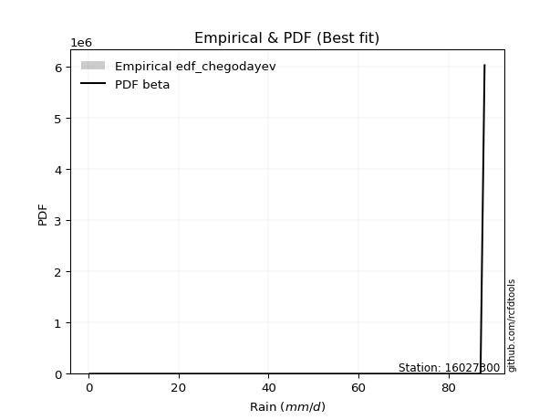</img>

</div>


### 6. EDF Blom (1958)

The Blom formula is a specific "plotting position" formula used in hydrology and statistical analysis to estimate the empirical cumulative probability (or non-exceedance probability) of a data series. It is particularly recommended for data that are approximately normally distributed. The constant _a_ is set to 0.375 (or 3/8).

<div align="center">


$P=(m-a)/(n+1-2a)$


</div>


**6.1. Empirical values**

<div align="center">

|                | 0                   | 1                  | 2                   | 3                   | 4                   | 5                   | 6                  | 7                  | 8                  | 9                  | 10                 | 11                 |
|:---------------|:--------------------|:-------------------|:--------------------|:--------------------|:--------------------|:--------------------|:-------------------|:-------------------|:-------------------|:-------------------|:-------------------|:-------------------|
| date           | 2021                | 2020               | 2013                | 2019                | 2014                | 2017                | 2018               | 2015               | 2011               | 2016               | 2010               | 2012               |
| x              | 0.3                 | 4.6                | 33.9                | 45.1                | 47.3                | 66.7                | 71.4               | 75.9               | 79.6               | 85.1               | 87.1               | 88.0               |
| m              | 1                   | 2                  | 3                   | 4                   | 5                   | 6                   | 7                  | 8                  | 9                  | 10                 | 11                 | 12                 |
| empirical_dist | edf_blom            | edf_blom           | edf_blom            | edf_blom            | edf_blom            | edf_blom            | edf_blom           | edf_blom           | edf_blom           | edf_blom           | edf_blom           | edf_blom           |
| empirical      | 0.05102040816326531 | 0.1326530612244898 | 0.21428571428571427 | 0.29591836734693877 | 0.37755102040816324 | 0.45918367346938777 | 0.5408163265306123 | 0.6224489795918368 | 0.7040816326530612 | 0.7857142857142857 | 0.8673469387755102 | 0.9489795918367347 |
| empirical_tr   | 1.053763440860215   | 1.1529411764705884 | 1.2727272727272727  | 1.4202898550724639  | 1.6065573770491803  | 1.8490566037735847  | 2.177777777777778  | 2.6486486486486487 | 3.3793103448275863 | 4.666666666666666  | 7.5384615384615365 | 19.60000000000002  |

</div>


**6.2. Kolmogorov-Smirnov fit test (sorted by Δ)**


<div align="center">

|                | 0                   | 1                   | 2                   | 3                   | 4                   | 5                   | 6                   | 7                   | 8                   | 9                   | 10                  | 11                  | 12                  | 13                  | 14                  | 15                  | 16                  | 17                  | 18                  | 19                  | 20                  | 21                  | 22                  | 23                  | 24                  | 25                  | 26                  | 27                  | 28                  | 29                  | 30                  | 31                  | 32                  | 33                  | 34                  | 35                  | 36                  | 37                  | 38                  | 39                  | 40                  | 41                  | 42                  | 43                  | 44                  | 45                  | 46                  | 47                  | 48                    | 49                  | 50                  | 51                  | 52                  | 53                  | 54                  | 55                  | 56                  | 57                  | 58                  | 59                  | 60                  | 61                  | 62                  | 63                  | 64                  | 65                  | 66                  | 67                  | 68                  | 69                  | 70                  | 71                  | 72                  | 73                  | 74                  | 75                  | 76                  | 77                  | 78                  | 79                  | 80                  | 81                  | 82                  | 83                  | 84                  | 85                  | 86                  | 87                  |
|:---------------|:--------------------|:--------------------|:--------------------|:--------------------|:--------------------|:--------------------|:--------------------|:--------------------|:--------------------|:--------------------|:--------------------|:--------------------|:--------------------|:--------------------|:--------------------|:--------------------|:--------------------|:--------------------|:--------------------|:--------------------|:--------------------|:--------------------|:--------------------|:--------------------|:--------------------|:--------------------|:--------------------|:--------------------|:--------------------|:--------------------|:--------------------|:--------------------|:--------------------|:--------------------|:--------------------|:--------------------|:--------------------|:--------------------|:--------------------|:--------------------|:--------------------|:--------------------|:--------------------|:--------------------|:--------------------|:--------------------|:--------------------|:--------------------|:----------------------|:--------------------|:--------------------|:--------------------|:--------------------|:--------------------|:--------------------|:--------------------|:--------------------|:--------------------|:--------------------|:--------------------|:--------------------|:--------------------|:--------------------|:--------------------|:--------------------|:--------------------|:--------------------|:--------------------|:--------------------|:--------------------|:--------------------|:--------------------|:--------------------|:--------------------|:--------------------|:--------------------|:--------------------|:--------------------|:--------------------|:--------------------|:--------------------|:--------------------|:--------------------|:--------------------|:--------------------|:--------------------|:--------------------|:--------------------|
| station        | 16027300            | 16027300            | 16027300            | 16027300            | 16027300            | 16027300            | 16027300            | 16027300            | 16027300            | 16027300            | 16027300            | 16027300            | 16027300            | 16027300            | 16027300            | 16027300            | 16027300            | 16027300            | 16027300            | 16027300            | 16027300            | 16027300            | 16027300            | 16027300            | 16027300            | 16027300            | 16027300            | 16027300            | 16027300            | 16027300            | 16027300            | 16027300            | 16027300            | 16027300            | 16027300            | 16027300            | 16027300            | 16027300            | 16027300            | 16027300            | 16027300            | 16027300            | 16027300            | 16027300            | 16027300            | 16027300            | 16027300            | 16027300            | 16027300              | 16027300            | 16027300            | 16027300            | 16027300            | 16027300            | 16027300            | 16027300            | 16027300            | 16027300            | 16027300            | 16027300            | 16027300            | 16027300            | 16027300            | 16027300            | 16027300            | 16027300            | 16027300            | 16027300            | 16027300            | 16027300            | 16027300            | 16027300            | 16027300            | 16027300            | 16027300            | 16027300            | 16027300            | 16027300            | 16027300            | 16027300            | 16027300            | 16027300            | 16027300            | 16027300            | 16027300            | 16027300            | 16027300            | 16027300            |
| empirical_dist | edf_blom            | edf_blom            | edf_blom            | edf_blom            | edf_blom            | edf_blom            | edf_blom            | edf_blom            | edf_blom            | edf_blom            | edf_blom            | edf_blom            | edf_blom            | edf_blom            | edf_blom            | edf_blom            | edf_blom            | edf_blom            | edf_blom            | edf_blom            | edf_blom            | edf_blom            | edf_blom            | edf_blom            | edf_blom            | edf_blom            | edf_blom            | edf_blom            | edf_blom            | edf_blom            | edf_blom            | edf_blom            | edf_blom            | edf_blom            | edf_blom            | edf_blom            | edf_blom            | edf_blom            | edf_blom            | edf_blom            | edf_blom            | edf_blom            | edf_blom            | edf_blom            | edf_blom            | edf_blom            | edf_blom            | edf_blom            | edf_blom              | edf_blom            | edf_blom            | edf_blom            | edf_blom            | edf_blom            | edf_blom            | edf_blom            | edf_blom            | edf_blom            | edf_blom            | edf_blom            | edf_blom            | edf_blom            | edf_blom            | edf_blom            | edf_blom            | edf_blom            | edf_blom            | edf_blom            | edf_blom            | edf_blom            | edf_blom            | edf_blom            | edf_blom            | edf_blom            | edf_blom            | edf_blom            | edf_blom            | edf_blom            | edf_blom            | edf_blom            | edf_blom            | edf_blom            | edf_blom            | edf_blom            | edf_blom            | edf_blom            | edf_blom            | edf_blom            |
| p_dist         | weibull_min         | gumbel_l            | pearson3            | laplace_asymmetric  | fisk                | johnsonsu           | truncnorm           | norm                | crystalball         | t                   | exponnorm           | nct                 | fatiguelife         | f                   | betaprime           | gamma               | chi2                | erlang              | rice                | invweibull          | logistic            | invgamma            | ncf                 | maxwell             | hypsecant           | invgauss            | rayleigh            | kstwobign           | halfnorm            | laplace             | gumbel_r            | logt                | loggumbel_l         | halflogistic        | genexpon            | expon               | moyal               | nakagami            | logpearson3         | logbetaprime        | logexponnorm        | lognorm             | lognorm             | logcrystalball      | logrice             | lognct              | loglogistic         | lognakagami         | loglaplace_asymmetric | logfatiguelife      | loglognorm          | logloggamma         | loghypsecant        | logtruncnorm        | loggamma            | loggamma            | logerlang           | loginvweibull       | loginvgamma         | wald                | gompertz            | loginvgauss         | loglaplace          | mielke              | logmaxwell          | logalpha            | lograyleigh         | gibrat              | logkstwobign        | loggumbel_r         | loghalfnorm         | loggompertz         | logmoyal            | loggenexpon         | loghalflogistic     | logncf              | logexpon            | logjohnsonsu        | logweibull_min      | logfisk             | logwald             | loggibrat           | logchi2             | logf                | logmielke           | alpha               | loggenlogistic      | genlogistic         |
| delta          | 0.10785278771743328 | 0.11382206790385002 | 0.12324088452075826 | 0.12433505950702894 | 0.12766251175535231 | 0.12918065129343648 | 0.13739280240091523 | 0.16793833091475902 | 0.1679383789152164  | 0.1679411020405403  | 0.16794134267189603 | 0.16796314711637045 | 0.1680703866545304  | 0.16881018142564547 | 0.17174733366831657 | 0.17308254575441134 | 0.17339038532238932 | 0.17355921345880093 | 0.17373832165256659 | 0.17591004583171171 | 0.18374704528149727 | 0.18473153724313213 | 0.18889078749861998 | 0.19192624633863037 | 0.196350364425583   | 0.19672321090423545 | 0.19924222014409504 | 0.20465248598365154 | 0.22027193415017138 | 0.22471499237877096 | 0.23124844378931558 | 0.245727329244934   | 0.24712244344729917 | 0.24862035809442168 | 0.24953103777561403 | 0.24976636411879982 | 0.2524935965505463  | 0.27774812692160067 | 0.27983083401838216 | 0.28930365919758183 | 0.2899539808996783  | 0.28995598669971157 | 0.28995598669971157 | 0.2899562704768587  | 0.2899591425766499  | 0.29051690933659635 | 0.2905354725389607  | 0.29135509320630015 | 0.2920350625109755    | 0.2922329797428521  | 0.29301367911016596 | 0.2933404672595166  | 0.2960950105075959  | 0.2962601157257015  | 0.30374134075704207 | 0.30374134075704207 | 0.3093928324877666  | 0.31054487115532314 | 0.31195829221802174 | 0.3121305377521965  | 0.31482689846579104 | 0.31722711145511095 | 0.3200776687905319  | 0.3227663090474033  | 0.3228303302208714  | 0.3282702077516898  | 0.3337535975664193  | 0.34431630018469755 | 0.3520543451307787  | 0.3604442691413192  | 0.3644880785681205  | 0.3692351021505673  | 0.3862579507151659  | 0.38682091360293513 | 0.38967734208372873 | 0.41590589758330077 | 0.41917924572686405 | 0.4360040840243588  | 0.44422053283342633 | 0.44681062443121133 | 0.4580292179386696  | 0.48203100678346045 | 0.5054924748091238  | 0.5092600925619267  | 0.5379133393967078  | 0.761411008479665   | 0.8673469387755102  | 0.8673469387755102  |
| deltao         | 0.36218414519599995 | 0.36218414519599995 | 0.36218414519599995 | 0.36218414519599995 | 0.36218414519599995 | 0.36218414519599995 | 0.36218414519599995 | 0.36218414519599995 | 0.36218414519599995 | 0.36218414519599995 | 0.36218414519599995 | 0.36218414519599995 | 0.36218414519599995 | 0.36218414519599995 | 0.36218414519599995 | 0.36218414519599995 | 0.36218414519599995 | 0.36218414519599995 | 0.36218414519599995 | 0.36218414519599995 | 0.36218414519599995 | 0.36218414519599995 | 0.36218414519599995 | 0.36218414519599995 | 0.36218414519599995 | 0.36218414519599995 | 0.36218414519599995 | 0.36218414519599995 | 0.36218414519599995 | 0.36218414519599995 | 0.36218414519599995 | 0.36218414519599995 | 0.36218414519599995 | 0.36218414519599995 | 0.36218414519599995 | 0.36218414519599995 | 0.36218414519599995 | 0.36218414519599995 | 0.36218414519599995 | 0.36218414519599995 | 0.36218414519599995 | 0.36218414519599995 | 0.36218414519599995 | 0.36218414519599995 | 0.36218414519599995 | 0.36218414519599995 | 0.36218414519599995 | 0.36218414519599995 | 0.36218414519599995   | 0.36218414519599995 | 0.36218414519599995 | 0.36218414519599995 | 0.36218414519599995 | 0.36218414519599995 | 0.36218414519599995 | 0.36218414519599995 | 0.36218414519599995 | 0.36218414519599995 | 0.36218414519599995 | 0.36218414519599995 | 0.36218414519599995 | 0.36218414519599995 | 0.36218414519599995 | 0.36218414519599995 | 0.36218414519599995 | 0.36218414519599995 | 0.36218414519599995 | 0.36218414519599995 | 0.36218414519599995 | 0.36218414519599995 | 0.36218414519599995 | 0.36218414519599995 | 0.36218414519599995 | 0.36218414519599995 | 0.36218414519599995 | 0.36218414519599995 | 0.36218414519599995 | 0.36218414519599995 | 0.36218414519599995 | 0.36218414519599995 | 0.36218414519599995 | 0.36218414519599995 | 0.36218414519599995 | 0.36218414519599995 | 0.36218414519599995 | 0.36218414519599995 | 0.36218414519599995 | 0.36218414519599995 |
| eval           | Δo > Δ              | Δo > Δ              | Δo > Δ              | Δo > Δ              | Δo > Δ              | Δo > Δ              | Δo > Δ              | Δo > Δ              | Δo > Δ              | Δo > Δ              | Δo > Δ              | Δo > Δ              | Δo > Δ              | Δo > Δ              | Δo > Δ              | Δo > Δ              | Δo > Δ              | Δo > Δ              | Δo > Δ              | Δo > Δ              | Δo > Δ              | Δo > Δ              | Δo > Δ              | Δo > Δ              | Δo > Δ              | Δo > Δ              | Δo > Δ              | Δo > Δ              | Δo > Δ              | Δo > Δ              | Δo > Δ              | Δo > Δ              | Δo > Δ              | Δo > Δ              | Δo > Δ              | Δo > Δ              | Δo > Δ              | Δo > Δ              | Δo > Δ              | Δo > Δ              | Δo > Δ              | Δo > Δ              | Δo > Δ              | Δo > Δ              | Δo > Δ              | Δo > Δ              | Δo > Δ              | Δo > Δ              | Δo > Δ                | Δo > Δ              | Δo > Δ              | Δo > Δ              | Δo > Δ              | Δo > Δ              | Δo > Δ              | Δo > Δ              | Δo > Δ              | Δo > Δ              | Δo > Δ              | Δo > Δ              | Δo > Δ              | Δo > Δ              | Δo > Δ              | Δo > Δ              | Δo > Δ              | Δo > Δ              | Δo > Δ              | Δo > Δ              | Δo > Δ              | Δo > Δ              | Δo <= Δ             | Δo <= Δ             | Δo <= Δ             | Δo <= Δ             | Δo <= Δ             | Δo <= Δ             | Δo <= Δ             | Δo <= Δ             | Δo <= Δ             | Δo <= Δ             | Δo <= Δ             | Δo <= Δ             | Δo <= Δ             | Δo <= Δ             | Δo <= Δ             | Δo <= Δ             | Δo <= Δ             | Δo <= Δ             |
| fit            | 1                   | 1                   | 1                   | 1                   | 1                   | 1                   | 1                   | 1                   | 1                   | 1                   | 1                   | 1                   | 1                   | 1                   | 1                   | 1                   | 1                   | 1                   | 1                   | 1                   | 1                   | 1                   | 1                   | 1                   | 1                   | 1                   | 1                   | 1                   | 1                   | 1                   | 1                   | 1                   | 1                   | 1                   | 1                   | 1                   | 1                   | 1                   | 1                   | 1                   | 1                   | 1                   | 1                   | 1                   | 1                   | 1                   | 1                   | 1                   | 1                     | 1                   | 1                   | 1                   | 1                   | 1                   | 1                   | 1                   | 1                   | 1                   | 1                   | 1                   | 1                   | 1                   | 1                   | 1                   | 1                   | 1                   | 1                   | 1                   | 1                   | 1                   | 0                   | 0                   | 0                   | 0                   | 0                   | 0                   | 0                   | 0                   | 0                   | 0                   | 0                   | 0                   | 0                   | 0                   | 0                   | 0                   | 0                   | 0                   |
| n              | 12                  | 12                  | 12                  | 12                  | 12                  | 12                  | 12                  | 12                  | 12                  | 12                  | 12                  | 12                  | 12                  | 12                  | 12                  | 12                  | 12                  | 12                  | 12                  | 12                  | 12                  | 12                  | 12                  | 12                  | 12                  | 12                  | 12                  | 12                  | 12                  | 12                  | 12                  | 12                  | 12                  | 12                  | 12                  | 12                  | 12                  | 12                  | 12                  | 12                  | 12                  | 12                  | 12                  | 12                  | 12                  | 12                  | 12                  | 12                  | 12                    | 12                  | 12                  | 12                  | 12                  | 12                  | 12                  | 12                  | 12                  | 12                  | 12                  | 12                  | 12                  | 12                  | 12                  | 12                  | 12                  | 12                  | 12                  | 12                  | 12                  | 12                  | 12                  | 12                  | 12                  | 12                  | 12                  | 12                  | 12                  | 12                  | 12                  | 12                  | 12                  | 12                  | 12                  | 12                  | 12                  | 12                  | 12                  | 12                  |
| best_fit       | 1                   | 0                   | 0                   | 0                   | 0                   | 0                   | 0                   | 0                   | 0                   | 0                   | 0                   | 0                   | 0                   | 0                   | 0                   | 0                   | 0                   | 0                   | 0                   | 0                   | 0                   | 0                   | 0                   | 0                   | 0                   | 0                   | 0                   | 0                   | 0                   | 0                   | 0                   | 0                   | 0                   | 0                   | 0                   | 0                   | 0                   | 0                   | 0                   | 0                   | 0                   | 0                   | 0                   | 0                   | 0                   | 0                   | 0                   | 0                   | 0                     | 0                   | 0                   | 0                   | 0                   | 0                   | 0                   | 0                   | 0                   | 0                   | 0                   | 0                   | 0                   | 0                   | 0                   | 0                   | 0                   | 0                   | 0                   | 0                   | 0                   | 0                   | 0                   | 0                   | 0                   | 0                   | 0                   | 0                   | 0                   | 0                   | 0                   | 0                   | 0                   | 0                   | 0                   | 0                   | 0                   | 0                   | 0                   | 0                   |
| best_fit_sort  | 1                   | 2                   | 3                   | 4                   | 5                   | 6                   | 7                   | 8                   | 9                   | 10                  | 11                  | 12                  | 13                  | 14                  | 15                  | 16                  | 17                  | 18                  | 19                  | 20                  | 21                  | 22                  | 23                  | 24                  | 25                  | 26                  | 27                  | 28                  | 29                  | 30                  | 31                  | 32                  | 33                  | 34                  | 35                  | 36                  | 37                  | 38                  | 39                  | 40                  | 41                  | 42                  | 43                  | 44                  | 45                  | 46                  | 47                  | 48                  | 49                    | 50                  | 51                  | 52                  | 53                  | 54                  | 55                  | 56                  | 57                  | 58                  | 59                  | 60                  | 61                  | 62                  | 63                  | 64                  | 65                  | 66                  | 67                  | 68                  | 69                  | 70                  | 71                  | 72                  | 73                  | 74                  | 75                  | 76                  | 77                  | 78                  | 79                  | 80                  | 81                  | 82                  | 83                  | 84                  | 85                  | 86                  | 87                  | 88                  |

</div>


**6.3. Best fit**

<div align="center">

|   id |   station | empirical_dist   | p_dist      |    delta |   deltao | eval   |   fit |   n |   best_fit |   best_fit_sort |
|-----:|----------:|:-----------------|:------------|---------:|---------:|:-------|------:|----:|-----------:|----------------:|
|    0 |  16027300 | edf_blom         | weibull_min | 0.107853 | 0.362184 | Δo > Δ |     1 |  12 |          1 |               1 |

</div>


<div align="center">

</img>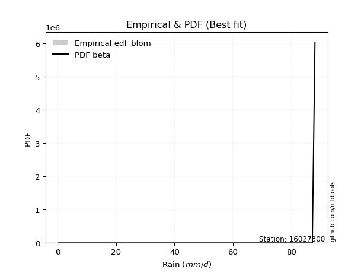</img>

</div>


### 7. EDF Tukey (1962)

In hydrology, the Tukey formula is used as a plotting position formula to estimate the empirical probability or frequency of a flood event (or other hydrological data). The formula parameter is given as _c=0.333_ (or 1/3).

<div align="center">


$P=(m-c)/(n+1-2c)$


</div>


**7.1. Empirical values**

<div align="center">

|                | 0                   | 1                   | 2                   | 3                  | 4                  | 5                  | 6                  | 7                  | 8                  | 9                  | 10                 | 11                 |
|:---------------|:--------------------|:--------------------|:--------------------|:-------------------|:-------------------|:-------------------|:-------------------|:-------------------|:-------------------|:-------------------|:-------------------|:-------------------|
| date           | 2021                | 2020                | 2013                | 2019               | 2014               | 2017               | 2018               | 2015               | 2011               | 2016               | 2010               | 2012               |
| x              | 0.3                 | 4.6                 | 33.9                | 45.1               | 47.3               | 66.7               | 71.4               | 75.9               | 79.6               | 85.1               | 87.1               | 88.0               |
| m              | 1                   | 2                   | 3                   | 4                  | 5                  | 6                  | 7                  | 8                  | 9                  | 10                 | 11                 | 12                 |
| empirical_dist | edf_tukey           | edf_tukey           | edf_tukey           | edf_tukey          | edf_tukey          | edf_tukey          | edf_tukey          | edf_tukey          | edf_tukey          | edf_tukey          | edf_tukey          | edf_tukey          |
| empirical      | 0.05405405405405406 | 0.13513513513513514 | 0.21621621621621623 | 0.2972972972972973 | 0.3783783783783784 | 0.4594594594594595 | 0.5405405405405406 | 0.6216216216216216 | 0.7027027027027027 | 0.7837837837837838 | 0.8648648648648649 | 0.9459459459459459 |
| empirical_tr   | 1.0571428571428572  | 1.15625             | 1.2758620689655173  | 1.4230769230769231 | 1.608695652173913  | 1.8499999999999999 | 2.1764705882352944 | 2.642857142857143  | 3.363636363636364  | 4.625              | 7.400000000000003  | 18.5               |

</div>


**7.2. Kolmogorov-Smirnov fit test (sorted by Δ)**


<div align="center">

|                | 0                   | 1                   | 2                   | 3                   | 4                   | 5                   | 6                   | 7                   | 8                   | 9                   | 10                  | 11                  | 12                  | 13                  | 14                  | 15                  | 16                  | 17                  | 18                  | 19                  | 20                  | 21                  | 22                  | 23                  | 24                  | 25                  | 26                  | 27                  | 28                  | 29                  | 30                  | 31                  | 32                  | 33                  | 34                  | 35                  | 36                  | 37                  | 38                  | 39                  | 40                  | 41                  | 42                  | 43                  | 44                  | 45                  | 46                  | 47                  | 48                  | 49                  | 50                    | 51                  | 52                  | 53                  | 54                  | 55                  | 56                  | 57                  | 58                  | 59                  | 60                  | 61                  | 62                  | 63                  | 64                  | 65                  | 66                  | 67                  | 68                  | 69                  | 70                  | 71                  | 72                  | 73                  | 74                  | 75                  | 76                  | 77                  | 78                  | 79                  | 80                  | 81                  | 82                  | 83                  | 84                  | 85                  | 86                  | 87                  |
|:---------------|:--------------------|:--------------------|:--------------------|:--------------------|:--------------------|:--------------------|:--------------------|:--------------------|:--------------------|:--------------------|:--------------------|:--------------------|:--------------------|:--------------------|:--------------------|:--------------------|:--------------------|:--------------------|:--------------------|:--------------------|:--------------------|:--------------------|:--------------------|:--------------------|:--------------------|:--------------------|:--------------------|:--------------------|:--------------------|:--------------------|:--------------------|:--------------------|:--------------------|:--------------------|:--------------------|:--------------------|:--------------------|:--------------------|:--------------------|:--------------------|:--------------------|:--------------------|:--------------------|:--------------------|:--------------------|:--------------------|:--------------------|:--------------------|:--------------------|:--------------------|:----------------------|:--------------------|:--------------------|:--------------------|:--------------------|:--------------------|:--------------------|:--------------------|:--------------------|:--------------------|:--------------------|:--------------------|:--------------------|:--------------------|:--------------------|:--------------------|:--------------------|:--------------------|:--------------------|:--------------------|:--------------------|:--------------------|:--------------------|:--------------------|:--------------------|:--------------------|:--------------------|:--------------------|:--------------------|:--------------------|:--------------------|:--------------------|:--------------------|:--------------------|:--------------------|:--------------------|:--------------------|:--------------------|
| station        | 16027300            | 16027300            | 16027300            | 16027300            | 16027300            | 16027300            | 16027300            | 16027300            | 16027300            | 16027300            | 16027300            | 16027300            | 16027300            | 16027300            | 16027300            | 16027300            | 16027300            | 16027300            | 16027300            | 16027300            | 16027300            | 16027300            | 16027300            | 16027300            | 16027300            | 16027300            | 16027300            | 16027300            | 16027300            | 16027300            | 16027300            | 16027300            | 16027300            | 16027300            | 16027300            | 16027300            | 16027300            | 16027300            | 16027300            | 16027300            | 16027300            | 16027300            | 16027300            | 16027300            | 16027300            | 16027300            | 16027300            | 16027300            | 16027300            | 16027300            | 16027300              | 16027300            | 16027300            | 16027300            | 16027300            | 16027300            | 16027300            | 16027300            | 16027300            | 16027300            | 16027300            | 16027300            | 16027300            | 16027300            | 16027300            | 16027300            | 16027300            | 16027300            | 16027300            | 16027300            | 16027300            | 16027300            | 16027300            | 16027300            | 16027300            | 16027300            | 16027300            | 16027300            | 16027300            | 16027300            | 16027300            | 16027300            | 16027300            | 16027300            | 16027300            | 16027300            | 16027300            | 16027300            |
| empirical_dist | edf_tukey           | edf_tukey           | edf_tukey           | edf_tukey           | edf_tukey           | edf_tukey           | edf_tukey           | edf_tukey           | edf_tukey           | edf_tukey           | edf_tukey           | edf_tukey           | edf_tukey           | edf_tukey           | edf_tukey           | edf_tukey           | edf_tukey           | edf_tukey           | edf_tukey           | edf_tukey           | edf_tukey           | edf_tukey           | edf_tukey           | edf_tukey           | edf_tukey           | edf_tukey           | edf_tukey           | edf_tukey           | edf_tukey           | edf_tukey           | edf_tukey           | edf_tukey           | edf_tukey           | edf_tukey           | edf_tukey           | edf_tukey           | edf_tukey           | edf_tukey           | edf_tukey           | edf_tukey           | edf_tukey           | edf_tukey           | edf_tukey           | edf_tukey           | edf_tukey           | edf_tukey           | edf_tukey           | edf_tukey           | edf_tukey           | edf_tukey           | edf_tukey             | edf_tukey           | edf_tukey           | edf_tukey           | edf_tukey           | edf_tukey           | edf_tukey           | edf_tukey           | edf_tukey           | edf_tukey           | edf_tukey           | edf_tukey           | edf_tukey           | edf_tukey           | edf_tukey           | edf_tukey           | edf_tukey           | edf_tukey           | edf_tukey           | edf_tukey           | edf_tukey           | edf_tukey           | edf_tukey           | edf_tukey           | edf_tukey           | edf_tukey           | edf_tukey           | edf_tukey           | edf_tukey           | edf_tukey           | edf_tukey           | edf_tukey           | edf_tukey           | edf_tukey           | edf_tukey           | edf_tukey           | edf_tukey           | edf_tukey           |
| p_dist         | weibull_min         | gumbel_l            | pearson3            | laplace_asymmetric  | fisk                | johnsonsu           | truncnorm           | norm                | crystalball         | t                   | exponnorm           | nct                 | fatiguelife         | f                   | betaprime           | gamma               | chi2                | erlang              | rice                | invweibull          | logistic            | invgamma            | ncf                 | maxwell             | hypsecant           | invgauss            | rayleigh            | kstwobign           | halfnorm            | laplace             | gumbel_r            | logt                | loggumbel_l         | genexpon            | halflogistic        | expon               | moyal               | nakagami            | logpearson3         | logbetaprime        | logexponnorm        | lognorm             | lognorm             | logcrystalball      | logrice             | lognct              | loglogistic         | lognakagami         | logfatiguelife      | loglognorm          | loglaplace_asymmetric | logloggamma         | loghypsecant        | logtruncnorm        | loggamma            | loggamma            | logerlang           | loginvweibull       | loginvgamma         | wald                | loginvgauss         | gompertz            | loglaplace          | logmaxwell          | mielke              | logalpha            | lograyleigh         | gibrat              | logkstwobign        | loggumbel_r         | loghalfnorm         | loggompertz         | logmoyal            | loggenexpon         | loghalflogistic     | logncf              | logexpon            | logjohnsonsu        | logweibull_min      | logfisk             | logwald             | loggibrat           | logchi2             | logf                | logmielke           | alpha               | loggenlogistic      | genlogistic         |
| delta          | 0.10757700172736157 | 0.1135462819137783  | 0.12296509853068655 | 0.12626556143753087 | 0.1273867257652806  | 0.13000800926365164 | 0.13932330433141715 | 0.1676625449246873  | 0.16766259292514468 | 0.16766531605046858 | 0.1676655566818243  | 0.16768736112629873 | 0.16779460066445867 | 0.16853439543557375 | 0.17147154767824485 | 0.17280675976433962 | 0.1731145993323176  | 0.1732834274687292  | 0.17346253566249487 | 0.17563425984164    | 0.18347125929142555 | 0.1844557512530604  | 0.18585714160783118 | 0.19165046034855865 | 0.1960745784355113  | 0.19644742491416373 | 0.19896643415402332 | 0.20437669999357982 | 0.21999614816009966 | 0.22443920638869924 | 0.23097265779924386 | 0.2426936833541452  | 0.24408879755651036 | 0.24815210782525549 | 0.24834457210434996 | 0.24838743416844128 | 0.2522178105604746  | 0.27581762499109874 | 0.27679718812759335 | 0.2873731572670799  | 0.28802347896917635 | 0.28802548476920964 | 0.28802548476920964 | 0.28802576854635675 | 0.28802864064614797 | 0.2885864074060944  | 0.2886049706084588  | 0.2894245912757982  | 0.2903024778123502  | 0.29108317717966403 | 0.2917592765209038    | 0.2930646812694449  | 0.29471608055723736 | 0.29598432973562977 | 0.30181083882654014 | 0.30181083882654014 | 0.3074623305572647  | 0.3086143692248212  | 0.3100277902875198  | 0.3118547517621248  | 0.31529660952460903 | 0.3156542564360062  | 0.31869873884017336 | 0.32089982829036945 | 0.32249052305733156 | 0.3263397058211879  | 0.3318230956359174  | 0.34404051419462583 | 0.3501238432002768  | 0.3585137672108173  | 0.36255757663761856 | 0.3673046002200654  | 0.38432744878466396 | 0.3848904116724332  | 0.3877468401532268  | 0.41397539565279884 | 0.4172487437963621  | 0.43352201011371355 | 0.441738458922781   | 0.4448801225007094  | 0.45609871600816765 | 0.4801005048529585  | 0.5035619728786219  | 0.5067780186512814  | 0.5359828374662059  | 0.7594805065491631  | 0.8648648648648649  | 0.8648648648648649  |
| deltao         | 0.36218414519599995 | 0.36218414519599995 | 0.36218414519599995 | 0.36218414519599995 | 0.36218414519599995 | 0.36218414519599995 | 0.36218414519599995 | 0.36218414519599995 | 0.36218414519599995 | 0.36218414519599995 | 0.36218414519599995 | 0.36218414519599995 | 0.36218414519599995 | 0.36218414519599995 | 0.36218414519599995 | 0.36218414519599995 | 0.36218414519599995 | 0.36218414519599995 | 0.36218414519599995 | 0.36218414519599995 | 0.36218414519599995 | 0.36218414519599995 | 0.36218414519599995 | 0.36218414519599995 | 0.36218414519599995 | 0.36218414519599995 | 0.36218414519599995 | 0.36218414519599995 | 0.36218414519599995 | 0.36218414519599995 | 0.36218414519599995 | 0.36218414519599995 | 0.36218414519599995 | 0.36218414519599995 | 0.36218414519599995 | 0.36218414519599995 | 0.36218414519599995 | 0.36218414519599995 | 0.36218414519599995 | 0.36218414519599995 | 0.36218414519599995 | 0.36218414519599995 | 0.36218414519599995 | 0.36218414519599995 | 0.36218414519599995 | 0.36218414519599995 | 0.36218414519599995 | 0.36218414519599995 | 0.36218414519599995 | 0.36218414519599995 | 0.36218414519599995   | 0.36218414519599995 | 0.36218414519599995 | 0.36218414519599995 | 0.36218414519599995 | 0.36218414519599995 | 0.36218414519599995 | 0.36218414519599995 | 0.36218414519599995 | 0.36218414519599995 | 0.36218414519599995 | 0.36218414519599995 | 0.36218414519599995 | 0.36218414519599995 | 0.36218414519599995 | 0.36218414519599995 | 0.36218414519599995 | 0.36218414519599995 | 0.36218414519599995 | 0.36218414519599995 | 0.36218414519599995 | 0.36218414519599995 | 0.36218414519599995 | 0.36218414519599995 | 0.36218414519599995 | 0.36218414519599995 | 0.36218414519599995 | 0.36218414519599995 | 0.36218414519599995 | 0.36218414519599995 | 0.36218414519599995 | 0.36218414519599995 | 0.36218414519599995 | 0.36218414519599995 | 0.36218414519599995 | 0.36218414519599995 | 0.36218414519599995 | 0.36218414519599995 |
| eval           | Δo > Δ              | Δo > Δ              | Δo > Δ              | Δo > Δ              | Δo > Δ              | Δo > Δ              | Δo > Δ              | Δo > Δ              | Δo > Δ              | Δo > Δ              | Δo > Δ              | Δo > Δ              | Δo > Δ              | Δo > Δ              | Δo > Δ              | Δo > Δ              | Δo > Δ              | Δo > Δ              | Δo > Δ              | Δo > Δ              | Δo > Δ              | Δo > Δ              | Δo > Δ              | Δo > Δ              | Δo > Δ              | Δo > Δ              | Δo > Δ              | Δo > Δ              | Δo > Δ              | Δo > Δ              | Δo > Δ              | Δo > Δ              | Δo > Δ              | Δo > Δ              | Δo > Δ              | Δo > Δ              | Δo > Δ              | Δo > Δ              | Δo > Δ              | Δo > Δ              | Δo > Δ              | Δo > Δ              | Δo > Δ              | Δo > Δ              | Δo > Δ              | Δo > Δ              | Δo > Δ              | Δo > Δ              | Δo > Δ              | Δo > Δ              | Δo > Δ                | Δo > Δ              | Δo > Δ              | Δo > Δ              | Δo > Δ              | Δo > Δ              | Δo > Δ              | Δo > Δ              | Δo > Δ              | Δo > Δ              | Δo > Δ              | Δo > Δ              | Δo > Δ              | Δo > Δ              | Δo > Δ              | Δo > Δ              | Δo > Δ              | Δo > Δ              | Δo > Δ              | Δo > Δ              | Δo <= Δ             | Δo <= Δ             | Δo <= Δ             | Δo <= Δ             | Δo <= Δ             | Δo <= Δ             | Δo <= Δ             | Δo <= Δ             | Δo <= Δ             | Δo <= Δ             | Δo <= Δ             | Δo <= Δ             | Δo <= Δ             | Δo <= Δ             | Δo <= Δ             | Δo <= Δ             | Δo <= Δ             | Δo <= Δ             |
| fit            | 1                   | 1                   | 1                   | 1                   | 1                   | 1                   | 1                   | 1                   | 1                   | 1                   | 1                   | 1                   | 1                   | 1                   | 1                   | 1                   | 1                   | 1                   | 1                   | 1                   | 1                   | 1                   | 1                   | 1                   | 1                   | 1                   | 1                   | 1                   | 1                   | 1                   | 1                   | 1                   | 1                   | 1                   | 1                   | 1                   | 1                   | 1                   | 1                   | 1                   | 1                   | 1                   | 1                   | 1                   | 1                   | 1                   | 1                   | 1                   | 1                   | 1                   | 1                     | 1                   | 1                   | 1                   | 1                   | 1                   | 1                   | 1                   | 1                   | 1                   | 1                   | 1                   | 1                   | 1                   | 1                   | 1                   | 1                   | 1                   | 1                   | 1                   | 0                   | 0                   | 0                   | 0                   | 0                   | 0                   | 0                   | 0                   | 0                   | 0                   | 0                   | 0                   | 0                   | 0                   | 0                   | 0                   | 0                   | 0                   |
| n              | 12                  | 12                  | 12                  | 12                  | 12                  | 12                  | 12                  | 12                  | 12                  | 12                  | 12                  | 12                  | 12                  | 12                  | 12                  | 12                  | 12                  | 12                  | 12                  | 12                  | 12                  | 12                  | 12                  | 12                  | 12                  | 12                  | 12                  | 12                  | 12                  | 12                  | 12                  | 12                  | 12                  | 12                  | 12                  | 12                  | 12                  | 12                  | 12                  | 12                  | 12                  | 12                  | 12                  | 12                  | 12                  | 12                  | 12                  | 12                  | 12                  | 12                  | 12                    | 12                  | 12                  | 12                  | 12                  | 12                  | 12                  | 12                  | 12                  | 12                  | 12                  | 12                  | 12                  | 12                  | 12                  | 12                  | 12                  | 12                  | 12                  | 12                  | 12                  | 12                  | 12                  | 12                  | 12                  | 12                  | 12                  | 12                  | 12                  | 12                  | 12                  | 12                  | 12                  | 12                  | 12                  | 12                  | 12                  | 12                  |
| best_fit       | 1                   | 0                   | 0                   | 0                   | 0                   | 0                   | 0                   | 0                   | 0                   | 0                   | 0                   | 0                   | 0                   | 0                   | 0                   | 0                   | 0                   | 0                   | 0                   | 0                   | 0                   | 0                   | 0                   | 0                   | 0                   | 0                   | 0                   | 0                   | 0                   | 0                   | 0                   | 0                   | 0                   | 0                   | 0                   | 0                   | 0                   | 0                   | 0                   | 0                   | 0                   | 0                   | 0                   | 0                   | 0                   | 0                   | 0                   | 0                   | 0                   | 0                   | 0                     | 0                   | 0                   | 0                   | 0                   | 0                   | 0                   | 0                   | 0                   | 0                   | 0                   | 0                   | 0                   | 0                   | 0                   | 0                   | 0                   | 0                   | 0                   | 0                   | 0                   | 0                   | 0                   | 0                   | 0                   | 0                   | 0                   | 0                   | 0                   | 0                   | 0                   | 0                   | 0                   | 0                   | 0                   | 0                   | 0                   | 0                   |
| best_fit_sort  | 1                   | 2                   | 3                   | 4                   | 5                   | 6                   | 7                   | 8                   | 9                   | 10                  | 11                  | 12                  | 13                  | 14                  | 15                  | 16                  | 17                  | 18                  | 19                  | 20                  | 21                  | 22                  | 23                  | 24                  | 25                  | 26                  | 27                  | 28                  | 29                  | 30                  | 31                  | 32                  | 33                  | 34                  | 35                  | 36                  | 37                  | 38                  | 39                  | 40                  | 41                  | 42                  | 43                  | 44                  | 45                  | 46                  | 47                  | 48                  | 49                  | 50                  | 51                    | 52                  | 53                  | 54                  | 55                  | 56                  | 57                  | 58                  | 59                  | 60                  | 61                  | 62                  | 63                  | 64                  | 65                  | 66                  | 67                  | 68                  | 69                  | 70                  | 71                  | 72                  | 73                  | 74                  | 75                  | 76                  | 77                  | 78                  | 79                  | 80                  | 81                  | 82                  | 83                  | 84                  | 85                  | 86                  | 87                  | 88                  |

</div>


**7.3. Best fit**

<div align="center">

|   id |   station | empirical_dist   | p_dist      |    delta |   deltao | eval   |   fit |   n |   best_fit |   best_fit_sort |
|-----:|----------:|:-----------------|:------------|---------:|---------:|:-------|------:|----:|-----------:|----------------:|
|    0 |  16027300 | edf_tukey        | weibull_min | 0.107577 | 0.362184 | Δo > Δ |     1 |  12 |          1 |               1 |

</div>


<div align="center">

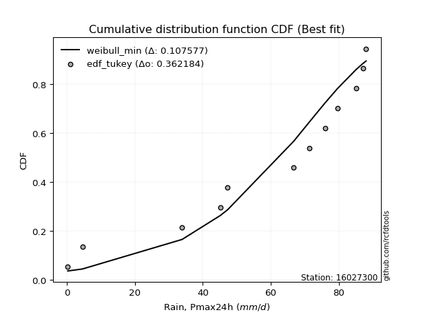</img>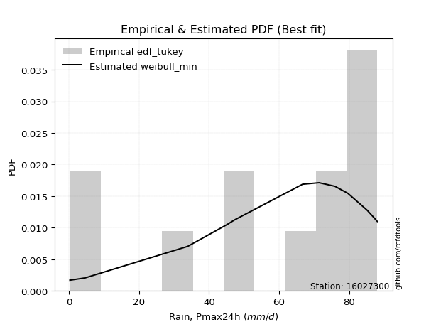</img>

</div>


### 8. EDF Gringorten (1963)

Gringorten plotting position formula is essential for estimating the probability and return periods of extreme events like floods and heavy rainfall. The constant _a=0.44_.

<div align="center">


$P=(m-a)/(n+1-2a)$


</div>


**8.1. Empirical values**

<div align="center">

|                | 0                   | 1                   | 2                   | 3                   | 4                   | 5                   | 6                  | 7                  | 8                  | 9                  | 10                 | 11                 |
|:---------------|:--------------------|:--------------------|:--------------------|:--------------------|:--------------------|:--------------------|:-------------------|:-------------------|:-------------------|:-------------------|:-------------------|:-------------------|
| date           | 2021                | 2020                | 2013                | 2019                | 2014                | 2017                | 2018               | 2015               | 2011               | 2016               | 2010               | 2012               |
| x              | 0.3                 | 4.6                 | 33.9                | 45.1                | 47.3                | 66.7                | 71.4               | 75.9               | 79.6               | 85.1               | 87.1               | 88.0               |
| m              | 1                   | 2                   | 3                   | 4                   | 5                   | 6                   | 7                  | 8                  | 9                  | 10                 | 11                 | 12                 |
| empirical_dist | edf_gringorten      | edf_gringorten      | edf_gringorten      | edf_gringorten      | edf_gringorten      | edf_gringorten      | edf_gringorten     | edf_gringorten     | edf_gringorten     | edf_gringorten     | edf_gringorten     | edf_gringorten     |
| empirical      | 0.04620462046204621 | 0.12871287128712872 | 0.21122112211221125 | 0.29372937293729373 | 0.37623762376237624 | 0.45874587458745875 | 0.5412541254125413 | 0.6237623762376238 | 0.7062706270627064 | 0.7887788778877889 | 0.8712871287128714 | 0.9537953795379539 |
| empirical_tr   | 1.0484429065743945  | 1.1477272727272727  | 1.2677824267782427  | 1.4158878504672898  | 1.6031746031746033  | 1.8475609756097562  | 2.179856115107914  | 2.6578947368421053 | 3.4044943820224733 | 4.734375000000003  | 7.769230769230775  | 21.642857142857192 |

</div>


**8.2. Kolmogorov-Smirnov fit test (sorted by Δ)**


<div align="center">

|                | 0                   | 1                   | 2                   | 3                   | 4                   | 5                   | 6                   | 7                   | 8                   | 9                   | 10                  | 11                  | 12                  | 13                  | 14                  | 15                  | 16                  | 17                  | 18                  | 19                  | 20                  | 21                  | 22                  | 23                  | 24                  | 25                  | 26                  | 27                  | 28                  | 29                  | 30                  | 31                  | 32                  | 33                  | 34                  | 35                  | 36                  | 37                  | 38                  | 39                  | 40                    | 41                  | 42                  | 43                  | 44                  | 45                  | 46                  | 47                  | 48                  | 49                  | 50                  | 51                  | 52                  | 53                  | 54                  | 55                  | 56                  | 57                  | 58                  | 59                  | 60                  | 61                  | 62                  | 63                  | 64                  | 65                  | 66                  | 67                  | 68                  | 69                  | 70                  | 71                  | 72                  | 73                  | 74                  | 75                  | 76                  | 77                  | 78                  | 79                  | 80                  | 81                  | 82                  | 83                  | 84                  | 85                  | 86                  | 87                  |
|:---------------|:--------------------|:--------------------|:--------------------|:--------------------|:--------------------|:--------------------|:--------------------|:--------------------|:--------------------|:--------------------|:--------------------|:--------------------|:--------------------|:--------------------|:--------------------|:--------------------|:--------------------|:--------------------|:--------------------|:--------------------|:--------------------|:--------------------|:--------------------|:--------------------|:--------------------|:--------------------|:--------------------|:--------------------|:--------------------|:--------------------|:--------------------|:--------------------|:--------------------|:--------------------|:--------------------|:--------------------|:--------------------|:--------------------|:--------------------|:--------------------|:----------------------|:--------------------|:--------------------|:--------------------|:--------------------|:--------------------|:--------------------|:--------------------|:--------------------|:--------------------|:--------------------|:--------------------|:--------------------|:--------------------|:--------------------|:--------------------|:--------------------|:--------------------|:--------------------|:--------------------|:--------------------|:--------------------|:--------------------|:--------------------|:--------------------|:--------------------|:--------------------|:--------------------|:--------------------|:--------------------|:--------------------|:--------------------|:--------------------|:--------------------|:--------------------|:--------------------|:--------------------|:--------------------|:--------------------|:--------------------|:--------------------|:--------------------|:--------------------|:--------------------|:--------------------|:--------------------|:--------------------|:--------------------|
| station        | 16027300            | 16027300            | 16027300            | 16027300            | 16027300            | 16027300            | 16027300            | 16027300            | 16027300            | 16027300            | 16027300            | 16027300            | 16027300            | 16027300            | 16027300            | 16027300            | 16027300            | 16027300            | 16027300            | 16027300            | 16027300            | 16027300            | 16027300            | 16027300            | 16027300            | 16027300            | 16027300            | 16027300            | 16027300            | 16027300            | 16027300            | 16027300            | 16027300            | 16027300            | 16027300            | 16027300            | 16027300            | 16027300            | 16027300            | 16027300            | 16027300              | 16027300            | 16027300            | 16027300            | 16027300            | 16027300            | 16027300            | 16027300            | 16027300            | 16027300            | 16027300            | 16027300            | 16027300            | 16027300            | 16027300            | 16027300            | 16027300            | 16027300            | 16027300            | 16027300            | 16027300            | 16027300            | 16027300            | 16027300            | 16027300            | 16027300            | 16027300            | 16027300            | 16027300            | 16027300            | 16027300            | 16027300            | 16027300            | 16027300            | 16027300            | 16027300            | 16027300            | 16027300            | 16027300            | 16027300            | 16027300            | 16027300            | 16027300            | 16027300            | 16027300            | 16027300            | 16027300            | 16027300            |
| empirical_dist | edf_gringorten      | edf_gringorten      | edf_gringorten      | edf_gringorten      | edf_gringorten      | edf_gringorten      | edf_gringorten      | edf_gringorten      | edf_gringorten      | edf_gringorten      | edf_gringorten      | edf_gringorten      | edf_gringorten      | edf_gringorten      | edf_gringorten      | edf_gringorten      | edf_gringorten      | edf_gringorten      | edf_gringorten      | edf_gringorten      | edf_gringorten      | edf_gringorten      | edf_gringorten      | edf_gringorten      | edf_gringorten      | edf_gringorten      | edf_gringorten      | edf_gringorten      | edf_gringorten      | edf_gringorten      | edf_gringorten      | edf_gringorten      | edf_gringorten      | edf_gringorten      | edf_gringorten      | edf_gringorten      | edf_gringorten      | edf_gringorten      | edf_gringorten      | edf_gringorten      | edf_gringorten        | edf_gringorten      | edf_gringorten      | edf_gringorten      | edf_gringorten      | edf_gringorten      | edf_gringorten      | edf_gringorten      | edf_gringorten      | edf_gringorten      | edf_gringorten      | edf_gringorten      | edf_gringorten      | edf_gringorten      | edf_gringorten      | edf_gringorten      | edf_gringorten      | edf_gringorten      | edf_gringorten      | edf_gringorten      | edf_gringorten      | edf_gringorten      | edf_gringorten      | edf_gringorten      | edf_gringorten      | edf_gringorten      | edf_gringorten      | edf_gringorten      | edf_gringorten      | edf_gringorten      | edf_gringorten      | edf_gringorten      | edf_gringorten      | edf_gringorten      | edf_gringorten      | edf_gringorten      | edf_gringorten      | edf_gringorten      | edf_gringorten      | edf_gringorten      | edf_gringorten      | edf_gringorten      | edf_gringorten      | edf_gringorten      | edf_gringorten      | edf_gringorten      | edf_gringorten      | edf_gringorten      |
| p_dist         | weibull_min         | gumbel_l            | laplace_asymmetric  | pearson3            | johnsonsu           | fisk                | truncnorm           | norm                | crystalball         | t                   | exponnorm           | nct                 | fatiguelife         | f                   | betaprime           | gamma               | chi2                | erlang              | rice                | invweibull          | logistic            | invgamma            | maxwell             | ncf                 | hypsecant           | invgauss            | rayleigh            | kstwobign           | halfnorm            | laplace             | gumbel_r            | halflogistic        | logt                | genexpon            | loggumbel_l         | expon               | moyal               | nakagami            | logpearson3         | logbetaprime        | loglaplace_asymmetric | logexponnorm        | lognorm             | lognorm             | logcrystalball      | logrice             | lognct              | loglogistic         | logloggamma         | lognakagami         | logfatiguelife      | loglognorm          | logtruncnorm        | loghypsecant        | loggamma            | loggamma            | logerlang           | wald                | gompertz            | loginvweibull       | loginvgamma         | loginvgauss         | loglaplace          | mielke              | logmaxwell          | logalpha            | lograyleigh         | gibrat              | logkstwobign        | loggumbel_r         | loghalfnorm         | loggompertz         | logmoyal            | loggenexpon         | loghalflogistic     | logncf              | logexpon            | logjohnsonsu        | logweibull_min      | logfisk             | logwald             | loggibrat           | logchi2             | logf                | logmielke           | alpha               | loggenlogistic      | genlogistic         |
| delta          | 0.1082905865993623  | 0.11425986678577904 | 0.12127046733352576 | 0.12367868340268728 | 0.12786725464764948 | 0.12810031063728133 | 0.13432821022741204 | 0.16837612979668803 | 0.16837617779714542 | 0.16837890092246932 | 0.16837914155382505 | 0.16840094599829947 | 0.1685081855364594  | 0.16924798030757449 | 0.1721851325502456  | 0.17352034463634036 | 0.17382818420431834 | 0.17399701234072995 | 0.1741761205344956  | 0.17634784471364073 | 0.1841848441634263  | 0.18516933612506115 | 0.1923640452205594  | 0.19370657519983914 | 0.19678816330751203 | 0.19716100978616447 | 0.19968001902602406 | 0.20509028486558056 | 0.2207097330321004  | 0.22515279126069998 | 0.2316862426712446  | 0.2490581569763507  | 0.25054311694615317 | 0.25172003218525907 | 0.2519382311485183  | 0.25195535852844486 | 0.25293139543247534 | 0.28081271909510375 | 0.2846466217196013  | 0.2923682513710849  | 0.2924728613929045    | 0.29301857307318135 | 0.29302057887321464 | 0.29302057887321464 | 0.29302086265036176 | 0.293023734750153   | 0.29358150151009943 | 0.2936000647124638  | 0.29377826614144564 | 0.29441968537980323 | 0.2952975719163552  | 0.29607827128366904 | 0.2966979146076305  | 0.29828400491724094 | 0.30680593293054514 | 0.30680593293054514 | 0.3124574246612697  | 0.31256833663412553 | 0.31351350182000404 | 0.3136094633288262  | 0.3150228843915248  | 0.32029170362861403 | 0.32226666320017694 | 0.3232041079293323  | 0.32589492239437445 | 0.3313347999251929  | 0.3368181897399224  | 0.3447540990666266  | 0.3551189373042818  | 0.3635088613148223  | 0.36755267074162357 | 0.3722996943240704  | 0.38932254288866897 | 0.3898855057764382  | 0.3927419342572318  | 0.41897048975680384 | 0.4222438379003671  | 0.43994427396172003 | 0.44816072277078745 | 0.4498752166047144  | 0.46109381011217265 | 0.4850955989569635  | 0.5085570669826269  | 0.5132002824992878  | 0.5409779315702109  | 0.7644756006531681  | 0.8712871287128714  | 0.8712871287128714  |
| deltao         | 0.36218414519599995 | 0.36218414519599995 | 0.36218414519599995 | 0.36218414519599995 | 0.36218414519599995 | 0.36218414519599995 | 0.36218414519599995 | 0.36218414519599995 | 0.36218414519599995 | 0.36218414519599995 | 0.36218414519599995 | 0.36218414519599995 | 0.36218414519599995 | 0.36218414519599995 | 0.36218414519599995 | 0.36218414519599995 | 0.36218414519599995 | 0.36218414519599995 | 0.36218414519599995 | 0.36218414519599995 | 0.36218414519599995 | 0.36218414519599995 | 0.36218414519599995 | 0.36218414519599995 | 0.36218414519599995 | 0.36218414519599995 | 0.36218414519599995 | 0.36218414519599995 | 0.36218414519599995 | 0.36218414519599995 | 0.36218414519599995 | 0.36218414519599995 | 0.36218414519599995 | 0.36218414519599995 | 0.36218414519599995 | 0.36218414519599995 | 0.36218414519599995 | 0.36218414519599995 | 0.36218414519599995 | 0.36218414519599995 | 0.36218414519599995   | 0.36218414519599995 | 0.36218414519599995 | 0.36218414519599995 | 0.36218414519599995 | 0.36218414519599995 | 0.36218414519599995 | 0.36218414519599995 | 0.36218414519599995 | 0.36218414519599995 | 0.36218414519599995 | 0.36218414519599995 | 0.36218414519599995 | 0.36218414519599995 | 0.36218414519599995 | 0.36218414519599995 | 0.36218414519599995 | 0.36218414519599995 | 0.36218414519599995 | 0.36218414519599995 | 0.36218414519599995 | 0.36218414519599995 | 0.36218414519599995 | 0.36218414519599995 | 0.36218414519599995 | 0.36218414519599995 | 0.36218414519599995 | 0.36218414519599995 | 0.36218414519599995 | 0.36218414519599995 | 0.36218414519599995 | 0.36218414519599995 | 0.36218414519599995 | 0.36218414519599995 | 0.36218414519599995 | 0.36218414519599995 | 0.36218414519599995 | 0.36218414519599995 | 0.36218414519599995 | 0.36218414519599995 | 0.36218414519599995 | 0.36218414519599995 | 0.36218414519599995 | 0.36218414519599995 | 0.36218414519599995 | 0.36218414519599995 | 0.36218414519599995 | 0.36218414519599995 |
| eval           | Δo > Δ              | Δo > Δ              | Δo > Δ              | Δo > Δ              | Δo > Δ              | Δo > Δ              | Δo > Δ              | Δo > Δ              | Δo > Δ              | Δo > Δ              | Δo > Δ              | Δo > Δ              | Δo > Δ              | Δo > Δ              | Δo > Δ              | Δo > Δ              | Δo > Δ              | Δo > Δ              | Δo > Δ              | Δo > Δ              | Δo > Δ              | Δo > Δ              | Δo > Δ              | Δo > Δ              | Δo > Δ              | Δo > Δ              | Δo > Δ              | Δo > Δ              | Δo > Δ              | Δo > Δ              | Δo > Δ              | Δo > Δ              | Δo > Δ              | Δo > Δ              | Δo > Δ              | Δo > Δ              | Δo > Δ              | Δo > Δ              | Δo > Δ              | Δo > Δ              | Δo > Δ                | Δo > Δ              | Δo > Δ              | Δo > Δ              | Δo > Δ              | Δo > Δ              | Δo > Δ              | Δo > Δ              | Δo > Δ              | Δo > Δ              | Δo > Δ              | Δo > Δ              | Δo > Δ              | Δo > Δ              | Δo > Δ              | Δo > Δ              | Δo > Δ              | Δo > Δ              | Δo > Δ              | Δo > Δ              | Δo > Δ              | Δo > Δ              | Δo > Δ              | Δo > Δ              | Δo > Δ              | Δo > Δ              | Δo > Δ              | Δo > Δ              | Δo > Δ              | Δo <= Δ             | Δo <= Δ             | Δo <= Δ             | Δo <= Δ             | Δo <= Δ             | Δo <= Δ             | Δo <= Δ             | Δo <= Δ             | Δo <= Δ             | Δo <= Δ             | Δo <= Δ             | Δo <= Δ             | Δo <= Δ             | Δo <= Δ             | Δo <= Δ             | Δo <= Δ             | Δo <= Δ             | Δo <= Δ             | Δo <= Δ             |
| fit            | 1                   | 1                   | 1                   | 1                   | 1                   | 1                   | 1                   | 1                   | 1                   | 1                   | 1                   | 1                   | 1                   | 1                   | 1                   | 1                   | 1                   | 1                   | 1                   | 1                   | 1                   | 1                   | 1                   | 1                   | 1                   | 1                   | 1                   | 1                   | 1                   | 1                   | 1                   | 1                   | 1                   | 1                   | 1                   | 1                   | 1                   | 1                   | 1                   | 1                   | 1                     | 1                   | 1                   | 1                   | 1                   | 1                   | 1                   | 1                   | 1                   | 1                   | 1                   | 1                   | 1                   | 1                   | 1                   | 1                   | 1                   | 1                   | 1                   | 1                   | 1                   | 1                   | 1                   | 1                   | 1                   | 1                   | 1                   | 1                   | 1                   | 0                   | 0                   | 0                   | 0                   | 0                   | 0                   | 0                   | 0                   | 0                   | 0                   | 0                   | 0                   | 0                   | 0                   | 0                   | 0                   | 0                   | 0                   | 0                   |
| n              | 12                  | 12                  | 12                  | 12                  | 12                  | 12                  | 12                  | 12                  | 12                  | 12                  | 12                  | 12                  | 12                  | 12                  | 12                  | 12                  | 12                  | 12                  | 12                  | 12                  | 12                  | 12                  | 12                  | 12                  | 12                  | 12                  | 12                  | 12                  | 12                  | 12                  | 12                  | 12                  | 12                  | 12                  | 12                  | 12                  | 12                  | 12                  | 12                  | 12                  | 12                    | 12                  | 12                  | 12                  | 12                  | 12                  | 12                  | 12                  | 12                  | 12                  | 12                  | 12                  | 12                  | 12                  | 12                  | 12                  | 12                  | 12                  | 12                  | 12                  | 12                  | 12                  | 12                  | 12                  | 12                  | 12                  | 12                  | 12                  | 12                  | 12                  | 12                  | 12                  | 12                  | 12                  | 12                  | 12                  | 12                  | 12                  | 12                  | 12                  | 12                  | 12                  | 12                  | 12                  | 12                  | 12                  | 12                  | 12                  |
| best_fit       | 1                   | 0                   | 0                   | 0                   | 0                   | 0                   | 0                   | 0                   | 0                   | 0                   | 0                   | 0                   | 0                   | 0                   | 0                   | 0                   | 0                   | 0                   | 0                   | 0                   | 0                   | 0                   | 0                   | 0                   | 0                   | 0                   | 0                   | 0                   | 0                   | 0                   | 0                   | 0                   | 0                   | 0                   | 0                   | 0                   | 0                   | 0                   | 0                   | 0                   | 0                     | 0                   | 0                   | 0                   | 0                   | 0                   | 0                   | 0                   | 0                   | 0                   | 0                   | 0                   | 0                   | 0                   | 0                   | 0                   | 0                   | 0                   | 0                   | 0                   | 0                   | 0                   | 0                   | 0                   | 0                   | 0                   | 0                   | 0                   | 0                   | 0                   | 0                   | 0                   | 0                   | 0                   | 0                   | 0                   | 0                   | 0                   | 0                   | 0                   | 0                   | 0                   | 0                   | 0                   | 0                   | 0                   | 0                   | 0                   |
| best_fit_sort  | 1                   | 2                   | 3                   | 4                   | 5                   | 6                   | 7                   | 8                   | 9                   | 10                  | 11                  | 12                  | 13                  | 14                  | 15                  | 16                  | 17                  | 18                  | 19                  | 20                  | 21                  | 22                  | 23                  | 24                  | 25                  | 26                  | 27                  | 28                  | 29                  | 30                  | 31                  | 32                  | 33                  | 34                  | 35                  | 36                  | 37                  | 38                  | 39                  | 40                  | 41                    | 42                  | 43                  | 44                  | 45                  | 46                  | 47                  | 48                  | 49                  | 50                  | 51                  | 52                  | 53                  | 54                  | 55                  | 56                  | 57                  | 58                  | 59                  | 60                  | 61                  | 62                  | 63                  | 64                  | 65                  | 66                  | 67                  | 68                  | 69                  | 70                  | 71                  | 72                  | 73                  | 74                  | 75                  | 76                  | 77                  | 78                  | 79                  | 80                  | 81                  | 82                  | 83                  | 84                  | 85                  | 86                  | 87                  | 88                  |

</div>


**8.3. Best fit**

<div align="center">

|   id |   station | empirical_dist   | p_dist      |    delta |   deltao | eval   |   fit |   n |   best_fit |   best_fit_sort |
|-----:|----------:|:-----------------|:------------|---------:|---------:|:-------|------:|----:|-----------:|----------------:|
|    0 |  16027300 | edf_gringorten   | weibull_min | 0.108291 | 0.362184 | Δo > Δ |     1 |  12 |          1 |               1 |

</div>


<div align="center">

</img>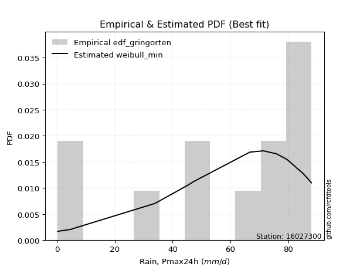</img>

</div>


### 9. EDF Filliben (1975)

The specific values of the constants (0.3175) (often denoted as $alpha$) and (0.365) are derived from a method proposed by James J. Filliben in a 1975 paper. This particular formula is the mean value of the $i$-th order statistic of the normal distribution and is considered a robust and effective plotting position formula for the normal probability plot correlation coefficient test for normality.

<div align="center">


$P=(m-0.3175)/(n+0.365)$


</div>


**9.1. Empirical values**

<div align="center">

|                | 0                   | 1                   | 2                   | 3                   | 4                  | 5                  | 6                  | 7                  | 8                  | 9                  | 10                 | 11                 |
|:---------------|:--------------------|:--------------------|:--------------------|:--------------------|:-------------------|:-------------------|:-------------------|:-------------------|:-------------------|:-------------------|:-------------------|:-------------------|
| date           | 2021                | 2020                | 2013                | 2019                | 2014               | 2017               | 2018               | 2015               | 2011               | 2016               | 2010               | 2012               |
| x              | 0.3                 | 4.6                 | 33.9                | 45.1                | 47.3               | 66.7               | 71.4               | 75.9               | 79.6               | 85.1               | 87.1               | 88.0               |
| m              | 1                   | 2                   | 3                   | 4                   | 5                  | 6                  | 7                  | 8                  | 9                  | 10                 | 11                 | 12                 |
| empirical_dist | edf_filliben        | edf_filliben        | edf_filliben        | edf_filliben        | edf_filliben       | edf_filliben       | edf_filliben       | edf_filliben       | edf_filliben       | edf_filliben       | edf_filliben       | edf_filliben       |
| empirical      | 0.05519611807521229 | 0.13606955115244643 | 0.21694298422968056 | 0.29781641730691466 | 0.3786898503841488 | 0.4595632834613829 | 0.540436716538617  | 0.6213101496158512 | 0.7021835826930852 | 0.7830570157703194 | 0.8639304488475535 | 0.9448038819247876 |
| empirical_tr   | 1.0584207147442757  | 1.1575005850690383  | 1.2770462174025305  | 1.4241289951050964  | 1.609502115196876  | 1.8503554059109617 | 2.1759788825340958 | 2.6406833956219966 | 3.357773251866937  | 4.6095060577819185 | 7.349182763744426  | 18.117216117216078 |

</div>


**9.2. Kolmogorov-Smirnov fit test (sorted by Δ)**


<div align="center">

|                | 0                   | 1                   | 2                   | 3                   | 4                   | 5                   | 6                   | 7                   | 8                   | 9                   | 10                  | 11                  | 12                  | 13                  | 14                  | 15                  | 16                  | 17                  | 18                  | 19                  | 20                  | 21                  | 22                  | 23                  | 24                  | 25                  | 26                  | 27                  | 28                  | 29                  | 30                  | 31                  | 32                  | 33                  | 34                  | 35                  | 36                  | 37                  | 38                  | 39                  | 40                  | 41                  | 42                  | 43                  | 44                  | 45                  | 46                  | 47                  | 48                  | 49                  | 50                    | 51                  | 52                  | 53                  | 54                  | 55                  | 56                  | 57                  | 58                  | 59                  | 60                  | 61                  | 62                  | 63                  | 64                  | 65                  | 66                  | 67                  | 68                  | 69                  | 70                  | 71                  | 72                  | 73                  | 74                  | 75                  | 76                  | 77                  | 78                  | 79                  | 80                  | 81                  | 82                  | 83                  | 84                  | 85                  | 86                  | 87                  |
|:---------------|:--------------------|:--------------------|:--------------------|:--------------------|:--------------------|:--------------------|:--------------------|:--------------------|:--------------------|:--------------------|:--------------------|:--------------------|:--------------------|:--------------------|:--------------------|:--------------------|:--------------------|:--------------------|:--------------------|:--------------------|:--------------------|:--------------------|:--------------------|:--------------------|:--------------------|:--------------------|:--------------------|:--------------------|:--------------------|:--------------------|:--------------------|:--------------------|:--------------------|:--------------------|:--------------------|:--------------------|:--------------------|:--------------------|:--------------------|:--------------------|:--------------------|:--------------------|:--------------------|:--------------------|:--------------------|:--------------------|:--------------------|:--------------------|:--------------------|:--------------------|:----------------------|:--------------------|:--------------------|:--------------------|:--------------------|:--------------------|:--------------------|:--------------------|:--------------------|:--------------------|:--------------------|:--------------------|:--------------------|:--------------------|:--------------------|:--------------------|:--------------------|:--------------------|:--------------------|:--------------------|:--------------------|:--------------------|:--------------------|:--------------------|:--------------------|:--------------------|:--------------------|:--------------------|:--------------------|:--------------------|:--------------------|:--------------------|:--------------------|:--------------------|:--------------------|:--------------------|:--------------------|:--------------------|
| station        | 16027300            | 16027300            | 16027300            | 16027300            | 16027300            | 16027300            | 16027300            | 16027300            | 16027300            | 16027300            | 16027300            | 16027300            | 16027300            | 16027300            | 16027300            | 16027300            | 16027300            | 16027300            | 16027300            | 16027300            | 16027300            | 16027300            | 16027300            | 16027300            | 16027300            | 16027300            | 16027300            | 16027300            | 16027300            | 16027300            | 16027300            | 16027300            | 16027300            | 16027300            | 16027300            | 16027300            | 16027300            | 16027300            | 16027300            | 16027300            | 16027300            | 16027300            | 16027300            | 16027300            | 16027300            | 16027300            | 16027300            | 16027300            | 16027300            | 16027300            | 16027300              | 16027300            | 16027300            | 16027300            | 16027300            | 16027300            | 16027300            | 16027300            | 16027300            | 16027300            | 16027300            | 16027300            | 16027300            | 16027300            | 16027300            | 16027300            | 16027300            | 16027300            | 16027300            | 16027300            | 16027300            | 16027300            | 16027300            | 16027300            | 16027300            | 16027300            | 16027300            | 16027300            | 16027300            | 16027300            | 16027300            | 16027300            | 16027300            | 16027300            | 16027300            | 16027300            | 16027300            | 16027300            |
| empirical_dist | edf_filliben        | edf_filliben        | edf_filliben        | edf_filliben        | edf_filliben        | edf_filliben        | edf_filliben        | edf_filliben        | edf_filliben        | edf_filliben        | edf_filliben        | edf_filliben        | edf_filliben        | edf_filliben        | edf_filliben        | edf_filliben        | edf_filliben        | edf_filliben        | edf_filliben        | edf_filliben        | edf_filliben        | edf_filliben        | edf_filliben        | edf_filliben        | edf_filliben        | edf_filliben        | edf_filliben        | edf_filliben        | edf_filliben        | edf_filliben        | edf_filliben        | edf_filliben        | edf_filliben        | edf_filliben        | edf_filliben        | edf_filliben        | edf_filliben        | edf_filliben        | edf_filliben        | edf_filliben        | edf_filliben        | edf_filliben        | edf_filliben        | edf_filliben        | edf_filliben        | edf_filliben        | edf_filliben        | edf_filliben        | edf_filliben        | edf_filliben        | edf_filliben          | edf_filliben        | edf_filliben        | edf_filliben        | edf_filliben        | edf_filliben        | edf_filliben        | edf_filliben        | edf_filliben        | edf_filliben        | edf_filliben        | edf_filliben        | edf_filliben        | edf_filliben        | edf_filliben        | edf_filliben        | edf_filliben        | edf_filliben        | edf_filliben        | edf_filliben        | edf_filliben        | edf_filliben        | edf_filliben        | edf_filliben        | edf_filliben        | edf_filliben        | edf_filliben        | edf_filliben        | edf_filliben        | edf_filliben        | edf_filliben        | edf_filliben        | edf_filliben        | edf_filliben        | edf_filliben        | edf_filliben        | edf_filliben        | edf_filliben        |
| p_dist         | weibull_min         | gumbel_l            | pearson3            | laplace_asymmetric  | fisk                | johnsonsu           | truncnorm           | norm                | crystalball         | t                   | exponnorm           | nct                 | fatiguelife         | f                   | betaprime           | gamma               | chi2                | erlang              | rice                | invweibull          | logistic            | invgamma            | ncf                 | maxwell             | hypsecant           | invgauss            | rayleigh            | kstwobign           | halfnorm            | laplace             | gumbel_r            | logt                | loggumbel_l         | genexpon            | expon               | halflogistic        | moyal               | nakagami            | logpearson3         | logbetaprime        | logexponnorm        | lognorm             | lognorm             | logcrystalball      | logrice             | lognct              | loglogistic         | lognakagami         | logfatiguelife      | loglognorm          | loglaplace_asymmetric | logloggamma         | loghypsecant        | logtruncnorm        | loggamma            | loggamma            | logerlang           | loginvweibull       | loginvgamma         | wald                | loginvgauss         | gompertz            | loglaplace          | logmaxwell          | mielke              | logalpha            | lograyleigh         | gibrat              | logkstwobign        | loggumbel_r         | loghalfnorm         | loggompertz         | logmoyal            | loggenexpon         | loghalflogistic     | logncf              | logexpon            | logjohnsonsu        | logweibull_min      | logfisk             | logwald             | loggibrat           | logchi2             | logf                | logmielke           | alpha               | loggenlogistic      | genlogistic         |
| delta          | 0.10747317772543813 | 0.11344245791185487 | 0.12286127452876311 | 0.12699232945099526 | 0.12728290176335716 | 0.13031948126942206 | 0.14005007234488154 | 0.16755872092276386 | 0.16755876892322125 | 0.16756149204854515 | 0.16756173267990088 | 0.1675835371243753  | 0.16769077666253523 | 0.1684305714336503  | 0.17136772367632142 | 0.1727029357624162  | 0.17301077533039416 | 0.17317960346680578 | 0.17335871166057143 | 0.17553043583971656 | 0.1833674352895021  | 0.18435192725113697 | 0.18471507758667283 | 0.1915466363466352  | 0.19597075443358786 | 0.1963436009122403  | 0.19886261015209988 | 0.2042728759916564  | 0.21989232415817622 | 0.2243353823867758  | 0.23086883379732043 | 0.24155161933298686 | 0.242946733535352   | 0.24763298781563814 | 0.24786831415882393 | 0.24824074810242652 | 0.25211398655855116 | 0.2750908569776344  | 0.275655124106435   | 0.2866463892536156  | 0.287296710955712   | 0.2872987167557453  | 0.2872987167557453  | 0.2872990005328924  | 0.28730187263268364 | 0.2878596393926301  | 0.28787820259499447 | 0.2886978232623339  | 0.28957570979888586 | 0.2903564091661997  | 0.29165545251898034   | 0.29296085726752147 | 0.29419696054762    | 0.29588050573370633 | 0.3010840708130758  | 0.3010840708130758  | 0.30673556254380036 | 0.3078876012113569  | 0.3093010222740555  | 0.31175092776020136 | 0.3145698415111447  | 0.3159657284417766  | 0.318179618830556   | 0.3201730602769051  | 0.3223866990554081  | 0.32561293780772355 | 0.33109632762245306 | 0.3439366901927024  | 0.34939707518681246 | 0.35778699919735296 | 0.36183080862415423 | 0.36657783220660106 | 0.38360068077119963 | 0.3841636436589689  | 0.38702007213976247 | 0.4132486276393345  | 0.4165219757828978  | 0.4325875940964022  | 0.4408040429054697  | 0.4441533544872451  | 0.4553719479947033  | 0.4793737368394942  | 0.5028352048651576  | 0.5058436026339701  | 0.5352560694527415  | 0.7587537385356988  | 0.8639304488475535  | 0.8639304488475535  |
| deltao         | 0.36218414519599995 | 0.36218414519599995 | 0.36218414519599995 | 0.36218414519599995 | 0.36218414519599995 | 0.36218414519599995 | 0.36218414519599995 | 0.36218414519599995 | 0.36218414519599995 | 0.36218414519599995 | 0.36218414519599995 | 0.36218414519599995 | 0.36218414519599995 | 0.36218414519599995 | 0.36218414519599995 | 0.36218414519599995 | 0.36218414519599995 | 0.36218414519599995 | 0.36218414519599995 | 0.36218414519599995 | 0.36218414519599995 | 0.36218414519599995 | 0.36218414519599995 | 0.36218414519599995 | 0.36218414519599995 | 0.36218414519599995 | 0.36218414519599995 | 0.36218414519599995 | 0.36218414519599995 | 0.36218414519599995 | 0.36218414519599995 | 0.36218414519599995 | 0.36218414519599995 | 0.36218414519599995 | 0.36218414519599995 | 0.36218414519599995 | 0.36218414519599995 | 0.36218414519599995 | 0.36218414519599995 | 0.36218414519599995 | 0.36218414519599995 | 0.36218414519599995 | 0.36218414519599995 | 0.36218414519599995 | 0.36218414519599995 | 0.36218414519599995 | 0.36218414519599995 | 0.36218414519599995 | 0.36218414519599995 | 0.36218414519599995 | 0.36218414519599995   | 0.36218414519599995 | 0.36218414519599995 | 0.36218414519599995 | 0.36218414519599995 | 0.36218414519599995 | 0.36218414519599995 | 0.36218414519599995 | 0.36218414519599995 | 0.36218414519599995 | 0.36218414519599995 | 0.36218414519599995 | 0.36218414519599995 | 0.36218414519599995 | 0.36218414519599995 | 0.36218414519599995 | 0.36218414519599995 | 0.36218414519599995 | 0.36218414519599995 | 0.36218414519599995 | 0.36218414519599995 | 0.36218414519599995 | 0.36218414519599995 | 0.36218414519599995 | 0.36218414519599995 | 0.36218414519599995 | 0.36218414519599995 | 0.36218414519599995 | 0.36218414519599995 | 0.36218414519599995 | 0.36218414519599995 | 0.36218414519599995 | 0.36218414519599995 | 0.36218414519599995 | 0.36218414519599995 | 0.36218414519599995 | 0.36218414519599995 | 0.36218414519599995 |
| eval           | Δo > Δ              | Δo > Δ              | Δo > Δ              | Δo > Δ              | Δo > Δ              | Δo > Δ              | Δo > Δ              | Δo > Δ              | Δo > Δ              | Δo > Δ              | Δo > Δ              | Δo > Δ              | Δo > Δ              | Δo > Δ              | Δo > Δ              | Δo > Δ              | Δo > Δ              | Δo > Δ              | Δo > Δ              | Δo > Δ              | Δo > Δ              | Δo > Δ              | Δo > Δ              | Δo > Δ              | Δo > Δ              | Δo > Δ              | Δo > Δ              | Δo > Δ              | Δo > Δ              | Δo > Δ              | Δo > Δ              | Δo > Δ              | Δo > Δ              | Δo > Δ              | Δo > Δ              | Δo > Δ              | Δo > Δ              | Δo > Δ              | Δo > Δ              | Δo > Δ              | Δo > Δ              | Δo > Δ              | Δo > Δ              | Δo > Δ              | Δo > Δ              | Δo > Δ              | Δo > Δ              | Δo > Δ              | Δo > Δ              | Δo > Δ              | Δo > Δ                | Δo > Δ              | Δo > Δ              | Δo > Δ              | Δo > Δ              | Δo > Δ              | Δo > Δ              | Δo > Δ              | Δo > Δ              | Δo > Δ              | Δo > Δ              | Δo > Δ              | Δo > Δ              | Δo > Δ              | Δo > Δ              | Δo > Δ              | Δo > Δ              | Δo > Δ              | Δo > Δ              | Δo > Δ              | Δo > Δ              | Δo <= Δ             | Δo <= Δ             | Δo <= Δ             | Δo <= Δ             | Δo <= Δ             | Δo <= Δ             | Δo <= Δ             | Δo <= Δ             | Δo <= Δ             | Δo <= Δ             | Δo <= Δ             | Δo <= Δ             | Δo <= Δ             | Δo <= Δ             | Δo <= Δ             | Δo <= Δ             | Δo <= Δ             |
| fit            | 1                   | 1                   | 1                   | 1                   | 1                   | 1                   | 1                   | 1                   | 1                   | 1                   | 1                   | 1                   | 1                   | 1                   | 1                   | 1                   | 1                   | 1                   | 1                   | 1                   | 1                   | 1                   | 1                   | 1                   | 1                   | 1                   | 1                   | 1                   | 1                   | 1                   | 1                   | 1                   | 1                   | 1                   | 1                   | 1                   | 1                   | 1                   | 1                   | 1                   | 1                   | 1                   | 1                   | 1                   | 1                   | 1                   | 1                   | 1                   | 1                   | 1                   | 1                     | 1                   | 1                   | 1                   | 1                   | 1                   | 1                   | 1                   | 1                   | 1                   | 1                   | 1                   | 1                   | 1                   | 1                   | 1                   | 1                   | 1                   | 1                   | 1                   | 1                   | 0                   | 0                   | 0                   | 0                   | 0                   | 0                   | 0                   | 0                   | 0                   | 0                   | 0                   | 0                   | 0                   | 0                   | 0                   | 0                   | 0                   |
| n              | 12                  | 12                  | 12                  | 12                  | 12                  | 12                  | 12                  | 12                  | 12                  | 12                  | 12                  | 12                  | 12                  | 12                  | 12                  | 12                  | 12                  | 12                  | 12                  | 12                  | 12                  | 12                  | 12                  | 12                  | 12                  | 12                  | 12                  | 12                  | 12                  | 12                  | 12                  | 12                  | 12                  | 12                  | 12                  | 12                  | 12                  | 12                  | 12                  | 12                  | 12                  | 12                  | 12                  | 12                  | 12                  | 12                  | 12                  | 12                  | 12                  | 12                  | 12                    | 12                  | 12                  | 12                  | 12                  | 12                  | 12                  | 12                  | 12                  | 12                  | 12                  | 12                  | 12                  | 12                  | 12                  | 12                  | 12                  | 12                  | 12                  | 12                  | 12                  | 12                  | 12                  | 12                  | 12                  | 12                  | 12                  | 12                  | 12                  | 12                  | 12                  | 12                  | 12                  | 12                  | 12                  | 12                  | 12                  | 12                  |
| best_fit       | 1                   | 0                   | 0                   | 0                   | 0                   | 0                   | 0                   | 0                   | 0                   | 0                   | 0                   | 0                   | 0                   | 0                   | 0                   | 0                   | 0                   | 0                   | 0                   | 0                   | 0                   | 0                   | 0                   | 0                   | 0                   | 0                   | 0                   | 0                   | 0                   | 0                   | 0                   | 0                   | 0                   | 0                   | 0                   | 0                   | 0                   | 0                   | 0                   | 0                   | 0                   | 0                   | 0                   | 0                   | 0                   | 0                   | 0                   | 0                   | 0                   | 0                   | 0                     | 0                   | 0                   | 0                   | 0                   | 0                   | 0                   | 0                   | 0                   | 0                   | 0                   | 0                   | 0                   | 0                   | 0                   | 0                   | 0                   | 0                   | 0                   | 0                   | 0                   | 0                   | 0                   | 0                   | 0                   | 0                   | 0                   | 0                   | 0                   | 0                   | 0                   | 0                   | 0                   | 0                   | 0                   | 0                   | 0                   | 0                   |
| best_fit_sort  | 1                   | 2                   | 3                   | 4                   | 5                   | 6                   | 7                   | 8                   | 9                   | 10                  | 11                  | 12                  | 13                  | 14                  | 15                  | 16                  | 17                  | 18                  | 19                  | 20                  | 21                  | 22                  | 23                  | 24                  | 25                  | 26                  | 27                  | 28                  | 29                  | 30                  | 31                  | 32                  | 33                  | 34                  | 35                  | 36                  | 37                  | 38                  | 39                  | 40                  | 41                  | 42                  | 43                  | 44                  | 45                  | 46                  | 47                  | 48                  | 49                  | 50                  | 51                    | 52                  | 53                  | 54                  | 55                  | 56                  | 57                  | 58                  | 59                  | 60                  | 61                  | 62                  | 63                  | 64                  | 65                  | 66                  | 67                  | 68                  | 69                  | 70                  | 71                  | 72                  | 73                  | 74                  | 75                  | 76                  | 77                  | 78                  | 79                  | 80                  | 81                  | 82                  | 83                  | 84                  | 85                  | 86                  | 87                  | 88                  |

</div>


**9.3. Best fit**

<div align="center">

|   id |   station | empirical_dist   | p_dist      |    delta |   deltao | eval   |   fit |   n |   best_fit |   best_fit_sort |
|-----:|----------:|:-----------------|:------------|---------:|---------:|:-------|------:|----:|-----------:|----------------:|
|    0 |  16027300 | edf_filliben     | weibull_min | 0.107473 | 0.362184 | Δo > Δ |     1 |  12 |          1 |               1 |

</div>


<div align="center">

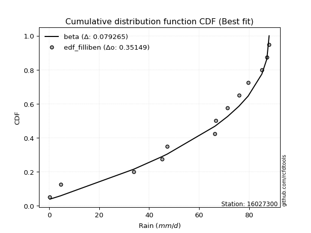</img>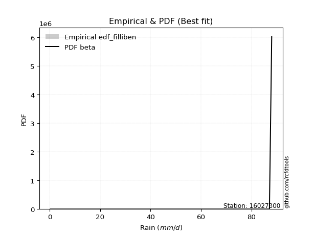</img>

</div>


### 10. EDF Jenkinson (1977)

The Jenkinson formula in hydrology is an empirical plotting position formula used to estimate the non-exceedance probability _(P)_ or return period _(T)_ of a given ordered observation within a sample. It is a widely used method in the frequency analysis of extreme events such as floods and rainfall, as it provides a distribution-free way to plot data. _a≈0.31_ and _b≈0.38_ are constants derived to approximate the median of the probability distribution for the given rank.

<div align="center">


$P=(m-a)/(n+b)$


</div>


**10.1. Empirical values**

<div align="center">

|                | 0                    | 1                   | 2                   | 3                  | 4                  | 5                  | 6                  | 7                  | 8                  | 9                  | 10                 | 11                 |
|:---------------|:---------------------|:--------------------|:--------------------|:-------------------|:-------------------|:-------------------|:-------------------|:-------------------|:-------------------|:-------------------|:-------------------|:-------------------|
| date           | 2021                 | 2020                | 2013                | 2019               | 2014               | 2017               | 2018               | 2015               | 2011               | 2016               | 2010               | 2012               |
| x              | 0.3                  | 4.6                 | 33.9                | 45.1               | 47.3               | 66.7               | 71.4               | 75.9               | 79.6               | 85.1               | 87.1               | 88.0               |
| m              | 1                    | 2                   | 3                   | 4                  | 5                  | 6                  | 7                  | 8                  | 9                  | 10                 | 11                 | 12                 |
| empirical_dist | edf_jenkinson        | edf_jenkinson       | edf_jenkinson       | edf_jenkinson      | edf_jenkinson      | edf_jenkinson      | edf_jenkinson      | edf_jenkinson      | edf_jenkinson      | edf_jenkinson      | edf_jenkinson      | edf_jenkinson      |
| empirical      | 0.055735056542810975 | 0.13651050080775443 | 0.21728594507269788 | 0.2980613893376413 | 0.3788368336025848 | 0.4596122778675283 | 0.5403877221324718 | 0.6211631663974152 | 0.7019386106623585 | 0.7827140549273021 | 0.8634894991922455 | 0.9442649434571889 |
| empirical_tr   | 1.0590248075278015   | 1.1580916744621141  | 1.2776057791537667  | 1.424626006904488  | 1.6098829648894668 | 1.850523168908819  | 2.1757469244288226 | 2.6396588486140726 | 3.3550135501355    | 4.6022304832713745 | 7.325443786982245  | 17.942028985507218 |

</div>


**10.2. Kolmogorov-Smirnov fit test (sorted by Δ)**


<div align="center">

|                | 0                   | 1                   | 2                   | 3                   | 4                   | 5                   | 6                   | 7                   | 8                   | 9                   | 10                  | 11                  | 12                  | 13                  | 14                  | 15                  | 16                  | 17                  | 18                  | 19                  | 20                  | 21                  | 22                  | 23                  | 24                  | 25                  | 26                  | 27                  | 28                  | 29                  | 30                  | 31                  | 32                  | 33                  | 34                  | 35                  | 36                  | 37                  | 38                  | 39                  | 40                  | 41                  | 42                  | 43                  | 44                  | 45                  | 46                  | 47                  | 48                  | 49                  | 50                    | 51                  | 52                  | 53                  | 54                  | 55                  | 56                  | 57                  | 58                  | 59                  | 60                  | 61                  | 62                  | 63                  | 64                  | 65                  | 66                  | 67                  | 68                  | 69                  | 70                  | 71                  | 72                  | 73                  | 74                  | 75                  | 76                  | 77                  | 78                  | 79                  | 80                  | 81                  | 82                  | 83                  | 84                  | 85                  | 86                  | 87                  |
|:---------------|:--------------------|:--------------------|:--------------------|:--------------------|:--------------------|:--------------------|:--------------------|:--------------------|:--------------------|:--------------------|:--------------------|:--------------------|:--------------------|:--------------------|:--------------------|:--------------------|:--------------------|:--------------------|:--------------------|:--------------------|:--------------------|:--------------------|:--------------------|:--------------------|:--------------------|:--------------------|:--------------------|:--------------------|:--------------------|:--------------------|:--------------------|:--------------------|:--------------------|:--------------------|:--------------------|:--------------------|:--------------------|:--------------------|:--------------------|:--------------------|:--------------------|:--------------------|:--------------------|:--------------------|:--------------------|:--------------------|:--------------------|:--------------------|:--------------------|:--------------------|:----------------------|:--------------------|:--------------------|:--------------------|:--------------------|:--------------------|:--------------------|:--------------------|:--------------------|:--------------------|:--------------------|:--------------------|:--------------------|:--------------------|:--------------------|:--------------------|:--------------------|:--------------------|:--------------------|:--------------------|:--------------------|:--------------------|:--------------------|:--------------------|:--------------------|:--------------------|:--------------------|:--------------------|:--------------------|:--------------------|:--------------------|:--------------------|:--------------------|:--------------------|:--------------------|:--------------------|:--------------------|:--------------------|
| station        | 16027300            | 16027300            | 16027300            | 16027300            | 16027300            | 16027300            | 16027300            | 16027300            | 16027300            | 16027300            | 16027300            | 16027300            | 16027300            | 16027300            | 16027300            | 16027300            | 16027300            | 16027300            | 16027300            | 16027300            | 16027300            | 16027300            | 16027300            | 16027300            | 16027300            | 16027300            | 16027300            | 16027300            | 16027300            | 16027300            | 16027300            | 16027300            | 16027300            | 16027300            | 16027300            | 16027300            | 16027300            | 16027300            | 16027300            | 16027300            | 16027300            | 16027300            | 16027300            | 16027300            | 16027300            | 16027300            | 16027300            | 16027300            | 16027300            | 16027300            | 16027300              | 16027300            | 16027300            | 16027300            | 16027300            | 16027300            | 16027300            | 16027300            | 16027300            | 16027300            | 16027300            | 16027300            | 16027300            | 16027300            | 16027300            | 16027300            | 16027300            | 16027300            | 16027300            | 16027300            | 16027300            | 16027300            | 16027300            | 16027300            | 16027300            | 16027300            | 16027300            | 16027300            | 16027300            | 16027300            | 16027300            | 16027300            | 16027300            | 16027300            | 16027300            | 16027300            | 16027300            | 16027300            |
| empirical_dist | edf_jenkinson       | edf_jenkinson       | edf_jenkinson       | edf_jenkinson       | edf_jenkinson       | edf_jenkinson       | edf_jenkinson       | edf_jenkinson       | edf_jenkinson       | edf_jenkinson       | edf_jenkinson       | edf_jenkinson       | edf_jenkinson       | edf_jenkinson       | edf_jenkinson       | edf_jenkinson       | edf_jenkinson       | edf_jenkinson       | edf_jenkinson       | edf_jenkinson       | edf_jenkinson       | edf_jenkinson       | edf_jenkinson       | edf_jenkinson       | edf_jenkinson       | edf_jenkinson       | edf_jenkinson       | edf_jenkinson       | edf_jenkinson       | edf_jenkinson       | edf_jenkinson       | edf_jenkinson       | edf_jenkinson       | edf_jenkinson       | edf_jenkinson       | edf_jenkinson       | edf_jenkinson       | edf_jenkinson       | edf_jenkinson       | edf_jenkinson       | edf_jenkinson       | edf_jenkinson       | edf_jenkinson       | edf_jenkinson       | edf_jenkinson       | edf_jenkinson       | edf_jenkinson       | edf_jenkinson       | edf_jenkinson       | edf_jenkinson       | edf_jenkinson         | edf_jenkinson       | edf_jenkinson       | edf_jenkinson       | edf_jenkinson       | edf_jenkinson       | edf_jenkinson       | edf_jenkinson       | edf_jenkinson       | edf_jenkinson       | edf_jenkinson       | edf_jenkinson       | edf_jenkinson       | edf_jenkinson       | edf_jenkinson       | edf_jenkinson       | edf_jenkinson       | edf_jenkinson       | edf_jenkinson       | edf_jenkinson       | edf_jenkinson       | edf_jenkinson       | edf_jenkinson       | edf_jenkinson       | edf_jenkinson       | edf_jenkinson       | edf_jenkinson       | edf_jenkinson       | edf_jenkinson       | edf_jenkinson       | edf_jenkinson       | edf_jenkinson       | edf_jenkinson       | edf_jenkinson       | edf_jenkinson       | edf_jenkinson       | edf_jenkinson       | edf_jenkinson       |
| p_dist         | weibull_min         | gumbel_l            | pearson3            | fisk                | laplace_asymmetric  | johnsonsu           | truncnorm           | norm                | crystalball         | t                   | exponnorm           | nct                 | fatiguelife         | f                   | betaprime           | gamma               | chi2                | erlang              | rice                | invweibull          | logistic            | ncf                 | invgamma            | maxwell             | hypsecant           | invgauss            | rayleigh            | kstwobign           | halfnorm            | laplace             | gumbel_r            | logt                | loggumbel_l         | genexpon            | expon               | halflogistic        | moyal               | nakagami            | logpearson3         | logbetaprime        | logexponnorm        | lognorm             | lognorm             | logcrystalball      | logrice             | lognct              | loglogistic         | lognakagami         | logfatiguelife      | loglognorm          | loglaplace_asymmetric | logloggamma         | loghypsecant        | logtruncnorm        | loggamma            | loggamma            | logerlang           | loginvweibull       | loginvgamma         | wald                | loginvgauss         | gompertz            | loglaplace          | logmaxwell          | mielke              | logalpha            | lograyleigh         | gibrat              | logkstwobign        | loggumbel_r         | loghalfnorm         | loggompertz         | logmoyal            | loggenexpon         | loghalflogistic     | logncf              | logexpon            | logjohnsonsu        | logweibull_min      | logfisk             | logwald             | loggibrat           | logchi2             | logf                | logmielke           | alpha               | loggenlogistic      | genlogistic         |
| delta          | 0.10742418331929277 | 0.1133934635057095  | 0.12281228012261775 | 0.1272339073572118  | 0.12733529029401258 | 0.13046646448785804 | 0.14039303318789886 | 0.1675097265166185  | 0.16750977451707588 | 0.16751249764239978 | 0.1675127382737555  | 0.16753454271822993 | 0.16764178225638987 | 0.16838157702750495 | 0.17131872927017605 | 0.17265394135627082 | 0.1729617809242488  | 0.1731306090606604  | 0.17330971725442607 | 0.1754814414335712  | 0.18331844088335675 | 0.18417613911907416 | 0.1843029328449916  | 0.19149764194048985 | 0.1959217600274425  | 0.19629460650609493 | 0.19881361574595452 | 0.20422388158551102 | 0.21984332975203086 | 0.22428638798063044 | 0.23081983939117506 | 0.24101268086538818 | 0.24240779506775334 | 0.24738801578491149 | 0.24762334212809728 | 0.24819175369628116 | 0.2520649921524058  | 0.2747478961346171  | 0.27511618563883633 | 0.28630342841059825 | 0.2869537501126947  | 0.286955755912728   | 0.286955755912728   | 0.2869560396898751  | 0.2869589117896663  | 0.28751667854961277 | 0.28753524175197714 | 0.28835486241931657 | 0.28923274895586853 | 0.2900134483231824  | 0.291606458112835     | 0.2929118628613761  | 0.29395198851689336 | 0.29583151132756097 | 0.3007411099700585  | 0.3007411099700585  | 0.30639260170078303 | 0.30754464036833956 | 0.30895806143103816 | 0.311701933354056   | 0.3142268806681274  | 0.3161127116602126  | 0.31793464679982936 | 0.3198300994338878  | 0.32233770464926276 | 0.3252699769647062  | 0.33075336677943573 | 0.34388769578655703 | 0.34905411434379513 | 0.35744403835433564 | 0.3614878477811369  | 0.36623487136358374 | 0.3832577199281823  | 0.38382068281595155 | 0.38667711129674515 | 0.4129056667963172  | 0.41617901493988047 | 0.43214664444109413 | 0.44036309325016176 | 0.44381039364422775 | 0.455028987151686   | 0.47903077599647687 | 0.5024922440221402  | 0.5054026529786622  | 0.5349131086097243  | 0.7584107776926814  | 0.8634894991922455  | 0.8634894991922455  |
| deltao         | 0.36218414519599995 | 0.36218414519599995 | 0.36218414519599995 | 0.36218414519599995 | 0.36218414519599995 | 0.36218414519599995 | 0.36218414519599995 | 0.36218414519599995 | 0.36218414519599995 | 0.36218414519599995 | 0.36218414519599995 | 0.36218414519599995 | 0.36218414519599995 | 0.36218414519599995 | 0.36218414519599995 | 0.36218414519599995 | 0.36218414519599995 | 0.36218414519599995 | 0.36218414519599995 | 0.36218414519599995 | 0.36218414519599995 | 0.36218414519599995 | 0.36218414519599995 | 0.36218414519599995 | 0.36218414519599995 | 0.36218414519599995 | 0.36218414519599995 | 0.36218414519599995 | 0.36218414519599995 | 0.36218414519599995 | 0.36218414519599995 | 0.36218414519599995 | 0.36218414519599995 | 0.36218414519599995 | 0.36218414519599995 | 0.36218414519599995 | 0.36218414519599995 | 0.36218414519599995 | 0.36218414519599995 | 0.36218414519599995 | 0.36218414519599995 | 0.36218414519599995 | 0.36218414519599995 | 0.36218414519599995 | 0.36218414519599995 | 0.36218414519599995 | 0.36218414519599995 | 0.36218414519599995 | 0.36218414519599995 | 0.36218414519599995 | 0.36218414519599995   | 0.36218414519599995 | 0.36218414519599995 | 0.36218414519599995 | 0.36218414519599995 | 0.36218414519599995 | 0.36218414519599995 | 0.36218414519599995 | 0.36218414519599995 | 0.36218414519599995 | 0.36218414519599995 | 0.36218414519599995 | 0.36218414519599995 | 0.36218414519599995 | 0.36218414519599995 | 0.36218414519599995 | 0.36218414519599995 | 0.36218414519599995 | 0.36218414519599995 | 0.36218414519599995 | 0.36218414519599995 | 0.36218414519599995 | 0.36218414519599995 | 0.36218414519599995 | 0.36218414519599995 | 0.36218414519599995 | 0.36218414519599995 | 0.36218414519599995 | 0.36218414519599995 | 0.36218414519599995 | 0.36218414519599995 | 0.36218414519599995 | 0.36218414519599995 | 0.36218414519599995 | 0.36218414519599995 | 0.36218414519599995 | 0.36218414519599995 | 0.36218414519599995 |
| eval           | Δo > Δ              | Δo > Δ              | Δo > Δ              | Δo > Δ              | Δo > Δ              | Δo > Δ              | Δo > Δ              | Δo > Δ              | Δo > Δ              | Δo > Δ              | Δo > Δ              | Δo > Δ              | Δo > Δ              | Δo > Δ              | Δo > Δ              | Δo > Δ              | Δo > Δ              | Δo > Δ              | Δo > Δ              | Δo > Δ              | Δo > Δ              | Δo > Δ              | Δo > Δ              | Δo > Δ              | Δo > Δ              | Δo > Δ              | Δo > Δ              | Δo > Δ              | Δo > Δ              | Δo > Δ              | Δo > Δ              | Δo > Δ              | Δo > Δ              | Δo > Δ              | Δo > Δ              | Δo > Δ              | Δo > Δ              | Δo > Δ              | Δo > Δ              | Δo > Δ              | Δo > Δ              | Δo > Δ              | Δo > Δ              | Δo > Δ              | Δo > Δ              | Δo > Δ              | Δo > Δ              | Δo > Δ              | Δo > Δ              | Δo > Δ              | Δo > Δ                | Δo > Δ              | Δo > Δ              | Δo > Δ              | Δo > Δ              | Δo > Δ              | Δo > Δ              | Δo > Δ              | Δo > Δ              | Δo > Δ              | Δo > Δ              | Δo > Δ              | Δo > Δ              | Δo > Δ              | Δo > Δ              | Δo > Δ              | Δo > Δ              | Δo > Δ              | Δo > Δ              | Δo > Δ              | Δo > Δ              | Δo <= Δ             | Δo <= Δ             | Δo <= Δ             | Δo <= Δ             | Δo <= Δ             | Δo <= Δ             | Δo <= Δ             | Δo <= Δ             | Δo <= Δ             | Δo <= Δ             | Δo <= Δ             | Δo <= Δ             | Δo <= Δ             | Δo <= Δ             | Δo <= Δ             | Δo <= Δ             | Δo <= Δ             |
| fit            | 1                   | 1                   | 1                   | 1                   | 1                   | 1                   | 1                   | 1                   | 1                   | 1                   | 1                   | 1                   | 1                   | 1                   | 1                   | 1                   | 1                   | 1                   | 1                   | 1                   | 1                   | 1                   | 1                   | 1                   | 1                   | 1                   | 1                   | 1                   | 1                   | 1                   | 1                   | 1                   | 1                   | 1                   | 1                   | 1                   | 1                   | 1                   | 1                   | 1                   | 1                   | 1                   | 1                   | 1                   | 1                   | 1                   | 1                   | 1                   | 1                   | 1                   | 1                     | 1                   | 1                   | 1                   | 1                   | 1                   | 1                   | 1                   | 1                   | 1                   | 1                   | 1                   | 1                   | 1                   | 1                   | 1                   | 1                   | 1                   | 1                   | 1                   | 1                   | 0                   | 0                   | 0                   | 0                   | 0                   | 0                   | 0                   | 0                   | 0                   | 0                   | 0                   | 0                   | 0                   | 0                   | 0                   | 0                   | 0                   |
| n              | 12                  | 12                  | 12                  | 12                  | 12                  | 12                  | 12                  | 12                  | 12                  | 12                  | 12                  | 12                  | 12                  | 12                  | 12                  | 12                  | 12                  | 12                  | 12                  | 12                  | 12                  | 12                  | 12                  | 12                  | 12                  | 12                  | 12                  | 12                  | 12                  | 12                  | 12                  | 12                  | 12                  | 12                  | 12                  | 12                  | 12                  | 12                  | 12                  | 12                  | 12                  | 12                  | 12                  | 12                  | 12                  | 12                  | 12                  | 12                  | 12                  | 12                  | 12                    | 12                  | 12                  | 12                  | 12                  | 12                  | 12                  | 12                  | 12                  | 12                  | 12                  | 12                  | 12                  | 12                  | 12                  | 12                  | 12                  | 12                  | 12                  | 12                  | 12                  | 12                  | 12                  | 12                  | 12                  | 12                  | 12                  | 12                  | 12                  | 12                  | 12                  | 12                  | 12                  | 12                  | 12                  | 12                  | 12                  | 12                  |
| best_fit       | 1                   | 0                   | 0                   | 0                   | 0                   | 0                   | 0                   | 0                   | 0                   | 0                   | 0                   | 0                   | 0                   | 0                   | 0                   | 0                   | 0                   | 0                   | 0                   | 0                   | 0                   | 0                   | 0                   | 0                   | 0                   | 0                   | 0                   | 0                   | 0                   | 0                   | 0                   | 0                   | 0                   | 0                   | 0                   | 0                   | 0                   | 0                   | 0                   | 0                   | 0                   | 0                   | 0                   | 0                   | 0                   | 0                   | 0                   | 0                   | 0                   | 0                   | 0                     | 0                   | 0                   | 0                   | 0                   | 0                   | 0                   | 0                   | 0                   | 0                   | 0                   | 0                   | 0                   | 0                   | 0                   | 0                   | 0                   | 0                   | 0                   | 0                   | 0                   | 0                   | 0                   | 0                   | 0                   | 0                   | 0                   | 0                   | 0                   | 0                   | 0                   | 0                   | 0                   | 0                   | 0                   | 0                   | 0                   | 0                   |
| best_fit_sort  | 1                   | 2                   | 3                   | 4                   | 5                   | 6                   | 7                   | 8                   | 9                   | 10                  | 11                  | 12                  | 13                  | 14                  | 15                  | 16                  | 17                  | 18                  | 19                  | 20                  | 21                  | 22                  | 23                  | 24                  | 25                  | 26                  | 27                  | 28                  | 29                  | 30                  | 31                  | 32                  | 33                  | 34                  | 35                  | 36                  | 37                  | 38                  | 39                  | 40                  | 41                  | 42                  | 43                  | 44                  | 45                  | 46                  | 47                  | 48                  | 49                  | 50                  | 51                    | 52                  | 53                  | 54                  | 55                  | 56                  | 57                  | 58                  | 59                  | 60                  | 61                  | 62                  | 63                  | 64                  | 65                  | 66                  | 67                  | 68                  | 69                  | 70                  | 71                  | 72                  | 73                  | 74                  | 75                  | 76                  | 77                  | 78                  | 79                  | 80                  | 81                  | 82                  | 83                  | 84                  | 85                  | 86                  | 87                  | 88                  |

</div>


**10.3. Best fit**

<div align="center">

|   id |   station | empirical_dist   | p_dist      |    delta |   deltao | eval   |   fit |   n |   best_fit |   best_fit_sort |
|-----:|----------:|:-----------------|:------------|---------:|---------:|:-------|------:|----:|-----------:|----------------:|
|    0 |  16027300 | edf_jenkinson    | weibull_min | 0.107424 | 0.362184 | Δo > Δ |     1 |  12 |          1 |               1 |

</div>


<div align="center">

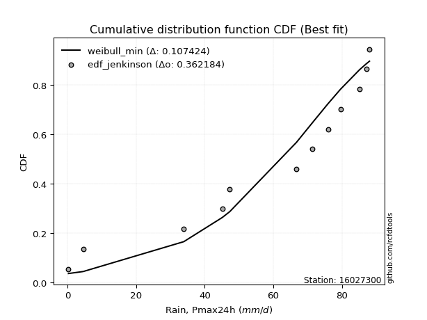</img></img>

</div>


### 11. EDF Cunnane (1978)

Cunnane´s work in statistical hydrology has focused on the performance and evaluation of different probability distributions (such as GEV, Gumbel, Lognormal) for flood frequency estimation. _b_ is a constant, typically set to 0.4.

<div align="center">


$P=(m-b)/(n+1-2b)$


</div>


**11.1. Empirical values**

<div align="center">

|                | 0                   | 1                   | 2                   | 3                  | 4                  | 5                   | 6                  | 7                  | 8                  | 9                  | 10                 | 11                 |
|:---------------|:--------------------|:--------------------|:--------------------|:-------------------|:-------------------|:--------------------|:-------------------|:-------------------|:-------------------|:-------------------|:-------------------|:-------------------|
| date           | 2021                | 2020                | 2013                | 2019               | 2014               | 2017                | 2018               | 2015               | 2011               | 2016               | 2010               | 2012               |
| x              | 0.3                 | 4.6                 | 33.9                | 45.1               | 47.3               | 66.7                | 71.4               | 75.9               | 79.6               | 85.1               | 87.1               | 88.0               |
| m              | 1                   | 2                   | 3                   | 4                  | 5                  | 6                   | 7                  | 8                  | 9                  | 10                 | 11                 | 12                 |
| empirical_dist | edf_cunnane         | edf_cunnane         | edf_cunnane         | edf_cunnane        | edf_cunnane        | edf_cunnane         | edf_cunnane        | edf_cunnane        | edf_cunnane        | edf_cunnane        | edf_cunnane        | edf_cunnane        |
| empirical      | 0.04918032786885246 | 0.13114754098360656 | 0.21311475409836067 | 0.2950819672131148 | 0.3770491803278688 | 0.45901639344262296 | 0.5409836065573771 | 0.6229508196721312 | 0.7049180327868853 | 0.7868852459016393 | 0.8688524590163935 | 0.9508196721311476 |
| empirical_tr   | 1.0517241379310345  | 1.150943396226415   | 1.2708333333333333  | 1.418604651162791  | 1.6052631578947367 | 1.8484848484848486  | 2.178571428571429  | 2.6521739130434785 | 3.388888888888889  | 4.692307692307692  | 7.625000000000004  | 20.333333333333357 |

</div>


**11.2. Kolmogorov-Smirnov fit test (sorted by Δ)**


<div align="center">

|                | 0                   | 1                   | 2                   | 3                   | 4                   | 5                   | 6                   | 7                   | 8                   | 9                   | 10                  | 11                  | 12                  | 13                  | 14                  | 15                  | 16                  | 17                  | 18                  | 19                  | 20                  | 21                  | 22                  | 23                  | 24                  | 25                  | 26                  | 27                  | 28                  | 29                  | 30                  | 31                  | 32                  | 33                  | 34                  | 35                  | 36                  | 37                  | 38                  | 39                  | 40                  | 41                  | 42                  | 43                  | 44                  | 45                  | 46                  | 47                    | 48                  | 49                  | 50                  | 51                  | 52                  | 53                  | 54                  | 55                  | 56                  | 57                  | 58                  | 59                  | 60                  | 61                  | 62                  | 63                  | 64                  | 65                  | 66                  | 67                  | 68                  | 69                  | 70                  | 71                  | 72                  | 73                  | 74                  | 75                  | 76                  | 77                  | 78                  | 79                  | 80                  | 81                  | 82                  | 83                  | 84                  | 85                  | 86                  | 87                  |
|:---------------|:--------------------|:--------------------|:--------------------|:--------------------|:--------------------|:--------------------|:--------------------|:--------------------|:--------------------|:--------------------|:--------------------|:--------------------|:--------------------|:--------------------|:--------------------|:--------------------|:--------------------|:--------------------|:--------------------|:--------------------|:--------------------|:--------------------|:--------------------|:--------------------|:--------------------|:--------------------|:--------------------|:--------------------|:--------------------|:--------------------|:--------------------|:--------------------|:--------------------|:--------------------|:--------------------|:--------------------|:--------------------|:--------------------|:--------------------|:--------------------|:--------------------|:--------------------|:--------------------|:--------------------|:--------------------|:--------------------|:--------------------|:----------------------|:--------------------|:--------------------|:--------------------|:--------------------|:--------------------|:--------------------|:--------------------|:--------------------|:--------------------|:--------------------|:--------------------|:--------------------|:--------------------|:--------------------|:--------------------|:--------------------|:--------------------|:--------------------|:--------------------|:--------------------|:--------------------|:--------------------|:--------------------|:--------------------|:--------------------|:--------------------|:--------------------|:--------------------|:--------------------|:--------------------|:--------------------|:--------------------|:--------------------|:--------------------|:--------------------|:--------------------|:--------------------|:--------------------|:--------------------|:--------------------|
| station        | 16027300            | 16027300            | 16027300            | 16027300            | 16027300            | 16027300            | 16027300            | 16027300            | 16027300            | 16027300            | 16027300            | 16027300            | 16027300            | 16027300            | 16027300            | 16027300            | 16027300            | 16027300            | 16027300            | 16027300            | 16027300            | 16027300            | 16027300            | 16027300            | 16027300            | 16027300            | 16027300            | 16027300            | 16027300            | 16027300            | 16027300            | 16027300            | 16027300            | 16027300            | 16027300            | 16027300            | 16027300            | 16027300            | 16027300            | 16027300            | 16027300            | 16027300            | 16027300            | 16027300            | 16027300            | 16027300            | 16027300            | 16027300              | 16027300            | 16027300            | 16027300            | 16027300            | 16027300            | 16027300            | 16027300            | 16027300            | 16027300            | 16027300            | 16027300            | 16027300            | 16027300            | 16027300            | 16027300            | 16027300            | 16027300            | 16027300            | 16027300            | 16027300            | 16027300            | 16027300            | 16027300            | 16027300            | 16027300            | 16027300            | 16027300            | 16027300            | 16027300            | 16027300            | 16027300            | 16027300            | 16027300            | 16027300            | 16027300            | 16027300            | 16027300            | 16027300            | 16027300            | 16027300            |
| empirical_dist | edf_cunnane         | edf_cunnane         | edf_cunnane         | edf_cunnane         | edf_cunnane         | edf_cunnane         | edf_cunnane         | edf_cunnane         | edf_cunnane         | edf_cunnane         | edf_cunnane         | edf_cunnane         | edf_cunnane         | edf_cunnane         | edf_cunnane         | edf_cunnane         | edf_cunnane         | edf_cunnane         | edf_cunnane         | edf_cunnane         | edf_cunnane         | edf_cunnane         | edf_cunnane         | edf_cunnane         | edf_cunnane         | edf_cunnane         | edf_cunnane         | edf_cunnane         | edf_cunnane         | edf_cunnane         | edf_cunnane         | edf_cunnane         | edf_cunnane         | edf_cunnane         | edf_cunnane         | edf_cunnane         | edf_cunnane         | edf_cunnane         | edf_cunnane         | edf_cunnane         | edf_cunnane         | edf_cunnane         | edf_cunnane         | edf_cunnane         | edf_cunnane         | edf_cunnane         | edf_cunnane         | edf_cunnane           | edf_cunnane         | edf_cunnane         | edf_cunnane         | edf_cunnane         | edf_cunnane         | edf_cunnane         | edf_cunnane         | edf_cunnane         | edf_cunnane         | edf_cunnane         | edf_cunnane         | edf_cunnane         | edf_cunnane         | edf_cunnane         | edf_cunnane         | edf_cunnane         | edf_cunnane         | edf_cunnane         | edf_cunnane         | edf_cunnane         | edf_cunnane         | edf_cunnane         | edf_cunnane         | edf_cunnane         | edf_cunnane         | edf_cunnane         | edf_cunnane         | edf_cunnane         | edf_cunnane         | edf_cunnane         | edf_cunnane         | edf_cunnane         | edf_cunnane         | edf_cunnane         | edf_cunnane         | edf_cunnane         | edf_cunnane         | edf_cunnane         | edf_cunnane         | edf_cunnane         |
| p_dist         | weibull_min         | gumbel_l            | laplace_asymmetric  | pearson3            | fisk                | johnsonsu           | truncnorm           | norm                | crystalball         | t                   | exponnorm           | nct                 | fatiguelife         | f                   | betaprime           | gamma               | chi2                | erlang              | rice                | invweibull          | logistic            | invgamma            | ncf                 | maxwell             | hypsecant           | invgauss            | rayleigh            | kstwobign           | halfnorm            | laplace             | gumbel_r            | logt                | halflogistic        | loggumbel_l         | genexpon            | expon               | moyal               | nakagami            | logpearson3         | logbetaprime        | logexponnorm        | lognorm             | lognorm             | logcrystalball      | logrice             | lognct              | loglogistic         | loglaplace_asymmetric | lognakagami         | logfatiguelife      | logloggamma         | loglognorm          | logtruncnorm        | loghypsecant        | loggamma            | loggamma            | logerlang           | loginvweibull       | wald                | loginvgamma         | gompertz            | loginvgauss         | loglaplace          | mielke              | logmaxwell          | logalpha            | lograyleigh         | gibrat              | logkstwobign        | loggumbel_r         | loghalfnorm         | loggompertz         | logmoyal            | loggenexpon         | loghalflogistic     | logncf              | logexpon            | logjohnsonsu        | logweibull_min      | logfisk             | logwald             | loggibrat           | logchi2             | logf                | logmielke           | alpha               | loggenlogistic      | genlogistic         |
| delta          | 0.10802006774419809 | 0.11398934793061483 | 0.12316409931967531 | 0.12340816454752307 | 0.12782979178211712 | 0.12867881121314206 | 0.1362218422135616  | 0.16810561094152382 | 0.1681056589419812  | 0.1681083820673051  | 0.16810862269866084 | 0.16813042714313525 | 0.1682376666812952  | 0.16897746145241027 | 0.17191461369508138 | 0.17324982578117615 | 0.17355766534915412 | 0.17372649348556574 | 0.1739056016793314  | 0.17607732585847652 | 0.18391432530826207 | 0.18489881726989693 | 0.19073086779303283 | 0.19209352636539517 | 0.19651764445234782 | 0.19689049093100025 | 0.19940950017085984 | 0.20481976601041635 | 0.22043921417693618 | 0.22488227240553577 | 0.2314157238160804  | 0.24756740953934686 | 0.24878763812118648 | 0.24896252374171202 | 0.250367437909438   | 0.2506027642526238  | 0.2526608765773111  | 0.2789190871089543  | 0.281670914312795   | 0.29047461938493546 | 0.2911249410870319  | 0.2911269468870652  | 0.2911269468870652  | 0.2911272306642123  | 0.29113010276400353 | 0.29168786952395    | 0.29170643272631436 | 0.2922023425377403    | 0.2925260533936538  | 0.29340393993020575 | 0.29350774728628143 | 0.2941846392975196  | 0.2964273957524663  | 0.29693141064141987 | 0.3049123009443957  | 0.3049123009443957  | 0.31056379267512024 | 0.3117158313426768  | 0.3122978177789613  | 0.31312925240537537 | 0.3143250583854966  | 0.3183980716424646  | 0.32091406892435587 | 0.3229335890741681  | 0.324001290408225   | 0.32944116793904343 | 0.33492455775377294 | 0.34448358021146236 | 0.35322530531813234 | 0.36161522932867285 | 0.3656590387554741  | 0.37040606233792095 | 0.3874289109025195  | 0.38799187379028877 | 0.39084830227108236 | 0.4170768577706544  | 0.4203502059142177  | 0.43750960426524216 | 0.44572605307430957 | 0.44798158461856497 | 0.4592001781260232  | 0.4832019669708141  | 0.5066634349964775  | 0.51076561280281    | 0.5390842995840615  | 0.7625819686670187  | 0.8688524590163935  | 0.8688524590163935  |
| deltao         | 0.36218414519599995 | 0.36218414519599995 | 0.36218414519599995 | 0.36218414519599995 | 0.36218414519599995 | 0.36218414519599995 | 0.36218414519599995 | 0.36218414519599995 | 0.36218414519599995 | 0.36218414519599995 | 0.36218414519599995 | 0.36218414519599995 | 0.36218414519599995 | 0.36218414519599995 | 0.36218414519599995 | 0.36218414519599995 | 0.36218414519599995 | 0.36218414519599995 | 0.36218414519599995 | 0.36218414519599995 | 0.36218414519599995 | 0.36218414519599995 | 0.36218414519599995 | 0.36218414519599995 | 0.36218414519599995 | 0.36218414519599995 | 0.36218414519599995 | 0.36218414519599995 | 0.36218414519599995 | 0.36218414519599995 | 0.36218414519599995 | 0.36218414519599995 | 0.36218414519599995 | 0.36218414519599995 | 0.36218414519599995 | 0.36218414519599995 | 0.36218414519599995 | 0.36218414519599995 | 0.36218414519599995 | 0.36218414519599995 | 0.36218414519599995 | 0.36218414519599995 | 0.36218414519599995 | 0.36218414519599995 | 0.36218414519599995 | 0.36218414519599995 | 0.36218414519599995 | 0.36218414519599995   | 0.36218414519599995 | 0.36218414519599995 | 0.36218414519599995 | 0.36218414519599995 | 0.36218414519599995 | 0.36218414519599995 | 0.36218414519599995 | 0.36218414519599995 | 0.36218414519599995 | 0.36218414519599995 | 0.36218414519599995 | 0.36218414519599995 | 0.36218414519599995 | 0.36218414519599995 | 0.36218414519599995 | 0.36218414519599995 | 0.36218414519599995 | 0.36218414519599995 | 0.36218414519599995 | 0.36218414519599995 | 0.36218414519599995 | 0.36218414519599995 | 0.36218414519599995 | 0.36218414519599995 | 0.36218414519599995 | 0.36218414519599995 | 0.36218414519599995 | 0.36218414519599995 | 0.36218414519599995 | 0.36218414519599995 | 0.36218414519599995 | 0.36218414519599995 | 0.36218414519599995 | 0.36218414519599995 | 0.36218414519599995 | 0.36218414519599995 | 0.36218414519599995 | 0.36218414519599995 | 0.36218414519599995 | 0.36218414519599995 |
| eval           | Δo > Δ              | Δo > Δ              | Δo > Δ              | Δo > Δ              | Δo > Δ              | Δo > Δ              | Δo > Δ              | Δo > Δ              | Δo > Δ              | Δo > Δ              | Δo > Δ              | Δo > Δ              | Δo > Δ              | Δo > Δ              | Δo > Δ              | Δo > Δ              | Δo > Δ              | Δo > Δ              | Δo > Δ              | Δo > Δ              | Δo > Δ              | Δo > Δ              | Δo > Δ              | Δo > Δ              | Δo > Δ              | Δo > Δ              | Δo > Δ              | Δo > Δ              | Δo > Δ              | Δo > Δ              | Δo > Δ              | Δo > Δ              | Δo > Δ              | Δo > Δ              | Δo > Δ              | Δo > Δ              | Δo > Δ              | Δo > Δ              | Δo > Δ              | Δo > Δ              | Δo > Δ              | Δo > Δ              | Δo > Δ              | Δo > Δ              | Δo > Δ              | Δo > Δ              | Δo > Δ              | Δo > Δ                | Δo > Δ              | Δo > Δ              | Δo > Δ              | Δo > Δ              | Δo > Δ              | Δo > Δ              | Δo > Δ              | Δo > Δ              | Δo > Δ              | Δo > Δ              | Δo > Δ              | Δo > Δ              | Δo > Δ              | Δo > Δ              | Δo > Δ              | Δo > Δ              | Δo > Δ              | Δo > Δ              | Δo > Δ              | Δo > Δ              | Δo > Δ              | Δo > Δ              | Δo <= Δ             | Δo <= Δ             | Δo <= Δ             | Δo <= Δ             | Δo <= Δ             | Δo <= Δ             | Δo <= Δ             | Δo <= Δ             | Δo <= Δ             | Δo <= Δ             | Δo <= Δ             | Δo <= Δ             | Δo <= Δ             | Δo <= Δ             | Δo <= Δ             | Δo <= Δ             | Δo <= Δ             | Δo <= Δ             |
| fit            | 1                   | 1                   | 1                   | 1                   | 1                   | 1                   | 1                   | 1                   | 1                   | 1                   | 1                   | 1                   | 1                   | 1                   | 1                   | 1                   | 1                   | 1                   | 1                   | 1                   | 1                   | 1                   | 1                   | 1                   | 1                   | 1                   | 1                   | 1                   | 1                   | 1                   | 1                   | 1                   | 1                   | 1                   | 1                   | 1                   | 1                   | 1                   | 1                   | 1                   | 1                   | 1                   | 1                   | 1                   | 1                   | 1                   | 1                   | 1                     | 1                   | 1                   | 1                   | 1                   | 1                   | 1                   | 1                   | 1                   | 1                   | 1                   | 1                   | 1                   | 1                   | 1                   | 1                   | 1                   | 1                   | 1                   | 1                   | 1                   | 1                   | 1                   | 0                   | 0                   | 0                   | 0                   | 0                   | 0                   | 0                   | 0                   | 0                   | 0                   | 0                   | 0                   | 0                   | 0                   | 0                   | 0                   | 0                   | 0                   |
| n              | 12                  | 12                  | 12                  | 12                  | 12                  | 12                  | 12                  | 12                  | 12                  | 12                  | 12                  | 12                  | 12                  | 12                  | 12                  | 12                  | 12                  | 12                  | 12                  | 12                  | 12                  | 12                  | 12                  | 12                  | 12                  | 12                  | 12                  | 12                  | 12                  | 12                  | 12                  | 12                  | 12                  | 12                  | 12                  | 12                  | 12                  | 12                  | 12                  | 12                  | 12                  | 12                  | 12                  | 12                  | 12                  | 12                  | 12                  | 12                    | 12                  | 12                  | 12                  | 12                  | 12                  | 12                  | 12                  | 12                  | 12                  | 12                  | 12                  | 12                  | 12                  | 12                  | 12                  | 12                  | 12                  | 12                  | 12                  | 12                  | 12                  | 12                  | 12                  | 12                  | 12                  | 12                  | 12                  | 12                  | 12                  | 12                  | 12                  | 12                  | 12                  | 12                  | 12                  | 12                  | 12                  | 12                  | 12                  | 12                  |
| best_fit       | 1                   | 0                   | 0                   | 0                   | 0                   | 0                   | 0                   | 0                   | 0                   | 0                   | 0                   | 0                   | 0                   | 0                   | 0                   | 0                   | 0                   | 0                   | 0                   | 0                   | 0                   | 0                   | 0                   | 0                   | 0                   | 0                   | 0                   | 0                   | 0                   | 0                   | 0                   | 0                   | 0                   | 0                   | 0                   | 0                   | 0                   | 0                   | 0                   | 0                   | 0                   | 0                   | 0                   | 0                   | 0                   | 0                   | 0                   | 0                     | 0                   | 0                   | 0                   | 0                   | 0                   | 0                   | 0                   | 0                   | 0                   | 0                   | 0                   | 0                   | 0                   | 0                   | 0                   | 0                   | 0                   | 0                   | 0                   | 0                   | 0                   | 0                   | 0                   | 0                   | 0                   | 0                   | 0                   | 0                   | 0                   | 0                   | 0                   | 0                   | 0                   | 0                   | 0                   | 0                   | 0                   | 0                   | 0                   | 0                   |
| best_fit_sort  | 1                   | 2                   | 3                   | 4                   | 5                   | 6                   | 7                   | 8                   | 9                   | 10                  | 11                  | 12                  | 13                  | 14                  | 15                  | 16                  | 17                  | 18                  | 19                  | 20                  | 21                  | 22                  | 23                  | 24                  | 25                  | 26                  | 27                  | 28                  | 29                  | 30                  | 31                  | 32                  | 33                  | 34                  | 35                  | 36                  | 37                  | 38                  | 39                  | 40                  | 41                  | 42                  | 43                  | 44                  | 45                  | 46                  | 47                  | 48                    | 49                  | 50                  | 51                  | 52                  | 53                  | 54                  | 55                  | 56                  | 57                  | 58                  | 59                  | 60                  | 61                  | 62                  | 63                  | 64                  | 65                  | 66                  | 67                  | 68                  | 69                  | 70                  | 71                  | 72                  | 73                  | 74                  | 75                  | 76                  | 77                  | 78                  | 79                  | 80                  | 81                  | 82                  | 83                  | 84                  | 85                  | 86                  | 87                  | 88                  |

</div>


**11.3. Best fit**

<div align="center">

|   id |   station | empirical_dist   | p_dist      |   delta |   deltao | eval   |   fit |   n |   best_fit |   best_fit_sort |
|-----:|----------:|:-----------------|:------------|--------:|---------:|:-------|------:|----:|-----------:|----------------:|
|    0 |  16027300 | edf_cunnane      | weibull_min | 0.10802 | 0.362184 | Δo > Δ |     1 |  12 |          1 |               1 |

</div>


<div align="center">

</img></img>

</div>


### 12. EDF Adamowski (1981)

The Adamowski formula in hydrology refers to a specific plotting position formula used for estimating the non-parametric empirical distribution of hydrological events (like flood peaks) to calculate their return periods. This formula provides an alternative to traditional parametric methods (like the Gumbel or Log Pearson Type III distributions). 

<div align="center">


$P=(m-0.25)/(n+0.5)$


</div>


**12.1. Empirical values**

<div align="center">

|                | 0                  | 1                  | 2                 | 3                  | 4                  | 5                  | 6                 | 7                  | 8                 | 9                 | 10                | 11                 |
|:---------------|:-------------------|:-------------------|:------------------|:-------------------|:-------------------|:-------------------|:------------------|:-------------------|:------------------|:------------------|:------------------|:-------------------|
| date           | 2021               | 2020               | 2013              | 2019               | 2014               | 2017               | 2018              | 2015               | 2011              | 2016              | 2010              | 2012               |
| x              | 0.3                | 4.6                | 33.9              | 45.1               | 47.3               | 66.7               | 71.4              | 75.9               | 79.6              | 85.1              | 87.1              | 88.0               |
| m              | 1                  | 2                  | 3                 | 4                  | 5                  | 6                  | 7                 | 8                  | 9                 | 10                | 11                | 12                 |
| empirical_dist | edf_adamowski      | edf_adamowski      | edf_adamowski     | edf_adamowski      | edf_adamowski      | edf_adamowski      | edf_adamowski     | edf_adamowski      | edf_adamowski     | edf_adamowski     | edf_adamowski     | edf_adamowski      |
| empirical      | 0.06               | 0.14               | 0.22              | 0.3                | 0.38               | 0.46               | 0.54              | 0.62               | 0.7               | 0.78              | 0.86              | 0.94               |
| empirical_tr   | 1.0638297872340425 | 1.1627906976744187 | 1.282051282051282 | 1.4285714285714286 | 1.6129032258064517 | 1.8518518518518516 | 2.173913043478261 | 2.6315789473684212 | 3.333333333333333 | 4.545454545454546 | 7.142857142857142 | 16.666666666666654 |

</div>


**12.2. Kolmogorov-Smirnov fit test (sorted by Δ)**


<div align="center">

|                | 0                   | 1                   | 2                   | 3                   | 4                   | 5                   | 6                   | 7                   | 8                   | 9                   | 10                  | 11                  | 12                  | 13                  | 14                  | 15                  | 16                  | 17                  | 18                  | 19                  | 20                  | 21                  | 22                  | 23                  | 24                  | 25                  | 26                  | 27                  | 28                  | 29                  | 30                  | 31                  | 32                  | 33                  | 34                  | 35                  | 36                  | 37                  | 38                  | 39                  | 40                  | 41                  | 42                  | 43                  | 44                  | 45                  | 46                  | 47                  | 48                  | 49                  | 50                    | 51                  | 52                  | 53                  | 54                  | 55                  | 56                  | 57                  | 58                  | 59                  | 60                  | 61                  | 62                  | 63                  | 64                  | 65                  | 66                  | 67                  | 68                  | 69                  | 70                  | 71                  | 72                  | 73                  | 74                  | 75                  | 76                  | 77                  | 78                  | 79                  | 80                  | 81                  | 82                  | 83                  | 84                  | 85                  | 86                  | 87                  |
|:---------------|:--------------------|:--------------------|:--------------------|:--------------------|:--------------------|:--------------------|:--------------------|:--------------------|:--------------------|:--------------------|:--------------------|:--------------------|:--------------------|:--------------------|:--------------------|:--------------------|:--------------------|:--------------------|:--------------------|:--------------------|:--------------------|:--------------------|:--------------------|:--------------------|:--------------------|:--------------------|:--------------------|:--------------------|:--------------------|:--------------------|:--------------------|:--------------------|:--------------------|:--------------------|:--------------------|:--------------------|:--------------------|:--------------------|:--------------------|:--------------------|:--------------------|:--------------------|:--------------------|:--------------------|:--------------------|:--------------------|:--------------------|:--------------------|:--------------------|:--------------------|:----------------------|:--------------------|:--------------------|:--------------------|:--------------------|:--------------------|:--------------------|:--------------------|:--------------------|:--------------------|:--------------------|:--------------------|:--------------------|:--------------------|:--------------------|:--------------------|:--------------------|:--------------------|:--------------------|:--------------------|:--------------------|:--------------------|:--------------------|:--------------------|:--------------------|:--------------------|:--------------------|:--------------------|:--------------------|:--------------------|:--------------------|:--------------------|:--------------------|:--------------------|:--------------------|:--------------------|:--------------------|:--------------------|
| station        | 16027300            | 16027300            | 16027300            | 16027300            | 16027300            | 16027300            | 16027300            | 16027300            | 16027300            | 16027300            | 16027300            | 16027300            | 16027300            | 16027300            | 16027300            | 16027300            | 16027300            | 16027300            | 16027300            | 16027300            | 16027300            | 16027300            | 16027300            | 16027300            | 16027300            | 16027300            | 16027300            | 16027300            | 16027300            | 16027300            | 16027300            | 16027300            | 16027300            | 16027300            | 16027300            | 16027300            | 16027300            | 16027300            | 16027300            | 16027300            | 16027300            | 16027300            | 16027300            | 16027300            | 16027300            | 16027300            | 16027300            | 16027300            | 16027300            | 16027300            | 16027300              | 16027300            | 16027300            | 16027300            | 16027300            | 16027300            | 16027300            | 16027300            | 16027300            | 16027300            | 16027300            | 16027300            | 16027300            | 16027300            | 16027300            | 16027300            | 16027300            | 16027300            | 16027300            | 16027300            | 16027300            | 16027300            | 16027300            | 16027300            | 16027300            | 16027300            | 16027300            | 16027300            | 16027300            | 16027300            | 16027300            | 16027300            | 16027300            | 16027300            | 16027300            | 16027300            | 16027300            | 16027300            |
| empirical_dist | edf_adamowski       | edf_adamowski       | edf_adamowski       | edf_adamowski       | edf_adamowski       | edf_adamowski       | edf_adamowski       | edf_adamowski       | edf_adamowski       | edf_adamowski       | edf_adamowski       | edf_adamowski       | edf_adamowski       | edf_adamowski       | edf_adamowski       | edf_adamowski       | edf_adamowski       | edf_adamowski       | edf_adamowski       | edf_adamowski       | edf_adamowski       | edf_adamowski       | edf_adamowski       | edf_adamowski       | edf_adamowski       | edf_adamowski       | edf_adamowski       | edf_adamowski       | edf_adamowski       | edf_adamowski       | edf_adamowski       | edf_adamowski       | edf_adamowski       | edf_adamowski       | edf_adamowski       | edf_adamowski       | edf_adamowski       | edf_adamowski       | edf_adamowski       | edf_adamowski       | edf_adamowski       | edf_adamowski       | edf_adamowski       | edf_adamowski       | edf_adamowski       | edf_adamowski       | edf_adamowski       | edf_adamowski       | edf_adamowski       | edf_adamowski       | edf_adamowski         | edf_adamowski       | edf_adamowski       | edf_adamowski       | edf_adamowski       | edf_adamowski       | edf_adamowski       | edf_adamowski       | edf_adamowski       | edf_adamowski       | edf_adamowski       | edf_adamowski       | edf_adamowski       | edf_adamowski       | edf_adamowski       | edf_adamowski       | edf_adamowski       | edf_adamowski       | edf_adamowski       | edf_adamowski       | edf_adamowski       | edf_adamowski       | edf_adamowski       | edf_adamowski       | edf_adamowski       | edf_adamowski       | edf_adamowski       | edf_adamowski       | edf_adamowski       | edf_adamowski       | edf_adamowski       | edf_adamowski       | edf_adamowski       | edf_adamowski       | edf_adamowski       | edf_adamowski       | edf_adamowski       | edf_adamowski       |
| p_dist         | weibull_min         | gumbel_l            | pearson3            | fisk                | laplace_asymmetric  | johnsonsu           | truncnorm           | norm                | crystalball         | t                   | exponnorm           | nct                 | fatiguelife         | f                   | betaprime           | gamma               | chi2                | erlang              | rice                | invweibull          | ncf                 | logistic            | invgamma            | maxwell             | hypsecant           | invgauss            | rayleigh            | kstwobign           | halfnorm            | laplace             | gumbel_r            | loggumbel_l         | logt                | genexpon            | expon               | halflogistic        | moyal               | logpearson3         | nakagami            | logbetaprime        | logexponnorm        | lognorm             | lognorm             | logcrystalball      | logrice             | lognct              | loglogistic         | lognakagami         | logfatiguelife      | loglognorm          | loglaplace_asymmetric | loghypsecant        | logloggamma         | logtruncnorm        | loggamma            | loggamma            | logerlang           | loginvweibull       | loginvgamma         | wald                | loginvgauss         | loglaplace          | logmaxwell          | gompertz            | mielke              | logalpha            | lograyleigh         | gibrat              | logkstwobign        | loggumbel_r         | loghalfnorm         | loggompertz         | logmoyal            | loggenexpon         | loghalflogistic     | logncf              | logexpon            | logjohnsonsu        | logweibull_min      | logfisk             | logwald             | loggibrat           | logchi2             | logf                | logmielke           | alpha               | loggenlogistic      | genlogistic         |
| delta          | 0.10728111041386856 | 0.11300574137323777 | 0.12242455799014601 | 0.12684618522474006 | 0.13004934522131462 | 0.13162963088527324 | 0.1431070881152009  | 0.16712200438414676 | 0.16712205238460415 | 0.16712477550992805 | 0.16712501614128378 | 0.1671468205857582  | 0.16725406012391814 | 0.1679938548950332  | 0.17093100713770432 | 0.1722662192237991  | 0.17257405879177706 | 0.17274288692818868 | 0.17292199512195433 | 0.17509371930109946 | 0.17991119566188518 | 0.182930718750885   | 0.18391521071251987 | 0.1911099198080181  | 0.19553403789497076 | 0.1959068843736232  | 0.19842589361348278 | 0.2038361594530393  | 0.21945560761955912 | 0.2238986658481587  | 0.23043211725870333 | 0.23814285161056437 | 0.2395274612856228  | 0.2454494051225528  | 0.2456847314657386  | 0.24780403156380942 | 0.25167727001993406 | 0.27085124218164736 | 0.272033841207315   | 0.28358937348329616 | 0.2842396951853926  | 0.2842417009854259  | 0.2842417009854259  | 0.284241984762573   | 0.2842448568623642  | 0.2848026236223107  | 0.28482118682467505 | 0.2856408074920145  | 0.28651869402856645 | 0.2872993933958803  | 0.29121873598036324   | 0.2920133778545347  | 0.29252414072890437 | 0.29544378919508923 | 0.2980270550427564  | 0.2980270550427564  | 0.30367854677348094 | 0.30483058544103747 | 0.30624400650373607 | 0.31131421122158426 | 0.3115128257408253  | 0.3159960361374707  | 0.3171160445065857  | 0.3172758780576278  | 0.321949982516791   | 0.32255592203740413 | 0.32803931185213364 | 0.3434999736540853  | 0.34634005941649304 | 0.35472998342703355 | 0.3587737928538348  | 0.36352081643628165 | 0.3805436650008802  | 0.38110662788864946 | 0.38396305636944306 | 0.4101916118690151  | 0.4134649600125784  | 0.4286571452488486  | 0.43687359405791615 | 0.44109633871692566 | 0.4523149322243839  | 0.4763167210691748  | 0.4997781890948382  | 0.5019131537864165  | 0.5321990536824222  | 0.7556967227653794  | 0.86                | 0.86                |
| deltao         | 0.36218414519599995 | 0.36218414519599995 | 0.36218414519599995 | 0.36218414519599995 | 0.36218414519599995 | 0.36218414519599995 | 0.36218414519599995 | 0.36218414519599995 | 0.36218414519599995 | 0.36218414519599995 | 0.36218414519599995 | 0.36218414519599995 | 0.36218414519599995 | 0.36218414519599995 | 0.36218414519599995 | 0.36218414519599995 | 0.36218414519599995 | 0.36218414519599995 | 0.36218414519599995 | 0.36218414519599995 | 0.36218414519599995 | 0.36218414519599995 | 0.36218414519599995 | 0.36218414519599995 | 0.36218414519599995 | 0.36218414519599995 | 0.36218414519599995 | 0.36218414519599995 | 0.36218414519599995 | 0.36218414519599995 | 0.36218414519599995 | 0.36218414519599995 | 0.36218414519599995 | 0.36218414519599995 | 0.36218414519599995 | 0.36218414519599995 | 0.36218414519599995 | 0.36218414519599995 | 0.36218414519599995 | 0.36218414519599995 | 0.36218414519599995 | 0.36218414519599995 | 0.36218414519599995 | 0.36218414519599995 | 0.36218414519599995 | 0.36218414519599995 | 0.36218414519599995 | 0.36218414519599995 | 0.36218414519599995 | 0.36218414519599995 | 0.36218414519599995   | 0.36218414519599995 | 0.36218414519599995 | 0.36218414519599995 | 0.36218414519599995 | 0.36218414519599995 | 0.36218414519599995 | 0.36218414519599995 | 0.36218414519599995 | 0.36218414519599995 | 0.36218414519599995 | 0.36218414519599995 | 0.36218414519599995 | 0.36218414519599995 | 0.36218414519599995 | 0.36218414519599995 | 0.36218414519599995 | 0.36218414519599995 | 0.36218414519599995 | 0.36218414519599995 | 0.36218414519599995 | 0.36218414519599995 | 0.36218414519599995 | 0.36218414519599995 | 0.36218414519599995 | 0.36218414519599995 | 0.36218414519599995 | 0.36218414519599995 | 0.36218414519599995 | 0.36218414519599995 | 0.36218414519599995 | 0.36218414519599995 | 0.36218414519599995 | 0.36218414519599995 | 0.36218414519599995 | 0.36218414519599995 | 0.36218414519599995 | 0.36218414519599995 |
| eval           | Δo > Δ              | Δo > Δ              | Δo > Δ              | Δo > Δ              | Δo > Δ              | Δo > Δ              | Δo > Δ              | Δo > Δ              | Δo > Δ              | Δo > Δ              | Δo > Δ              | Δo > Δ              | Δo > Δ              | Δo > Δ              | Δo > Δ              | Δo > Δ              | Δo > Δ              | Δo > Δ              | Δo > Δ              | Δo > Δ              | Δo > Δ              | Δo > Δ              | Δo > Δ              | Δo > Δ              | Δo > Δ              | Δo > Δ              | Δo > Δ              | Δo > Δ              | Δo > Δ              | Δo > Δ              | Δo > Δ              | Δo > Δ              | Δo > Δ              | Δo > Δ              | Δo > Δ              | Δo > Δ              | Δo > Δ              | Δo > Δ              | Δo > Δ              | Δo > Δ              | Δo > Δ              | Δo > Δ              | Δo > Δ              | Δo > Δ              | Δo > Δ              | Δo > Δ              | Δo > Δ              | Δo > Δ              | Δo > Δ              | Δo > Δ              | Δo > Δ                | Δo > Δ              | Δo > Δ              | Δo > Δ              | Δo > Δ              | Δo > Δ              | Δo > Δ              | Δo > Δ              | Δo > Δ              | Δo > Δ              | Δo > Δ              | Δo > Δ              | Δo > Δ              | Δo > Δ              | Δo > Δ              | Δo > Δ              | Δo > Δ              | Δo > Δ              | Δo > Δ              | Δo > Δ              | Δo > Δ              | Δo <= Δ             | Δo <= Δ             | Δo <= Δ             | Δo <= Δ             | Δo <= Δ             | Δo <= Δ             | Δo <= Δ             | Δo <= Δ             | Δo <= Δ             | Δo <= Δ             | Δo <= Δ             | Δo <= Δ             | Δo <= Δ             | Δo <= Δ             | Δo <= Δ             | Δo <= Δ             | Δo <= Δ             |
| fit            | 1                   | 1                   | 1                   | 1                   | 1                   | 1                   | 1                   | 1                   | 1                   | 1                   | 1                   | 1                   | 1                   | 1                   | 1                   | 1                   | 1                   | 1                   | 1                   | 1                   | 1                   | 1                   | 1                   | 1                   | 1                   | 1                   | 1                   | 1                   | 1                   | 1                   | 1                   | 1                   | 1                   | 1                   | 1                   | 1                   | 1                   | 1                   | 1                   | 1                   | 1                   | 1                   | 1                   | 1                   | 1                   | 1                   | 1                   | 1                   | 1                   | 1                   | 1                     | 1                   | 1                   | 1                   | 1                   | 1                   | 1                   | 1                   | 1                   | 1                   | 1                   | 1                   | 1                   | 1                   | 1                   | 1                   | 1                   | 1                   | 1                   | 1                   | 1                   | 0                   | 0                   | 0                   | 0                   | 0                   | 0                   | 0                   | 0                   | 0                   | 0                   | 0                   | 0                   | 0                   | 0                   | 0                   | 0                   | 0                   |
| n              | 12                  | 12                  | 12                  | 12                  | 12                  | 12                  | 12                  | 12                  | 12                  | 12                  | 12                  | 12                  | 12                  | 12                  | 12                  | 12                  | 12                  | 12                  | 12                  | 12                  | 12                  | 12                  | 12                  | 12                  | 12                  | 12                  | 12                  | 12                  | 12                  | 12                  | 12                  | 12                  | 12                  | 12                  | 12                  | 12                  | 12                  | 12                  | 12                  | 12                  | 12                  | 12                  | 12                  | 12                  | 12                  | 12                  | 12                  | 12                  | 12                  | 12                  | 12                    | 12                  | 12                  | 12                  | 12                  | 12                  | 12                  | 12                  | 12                  | 12                  | 12                  | 12                  | 12                  | 12                  | 12                  | 12                  | 12                  | 12                  | 12                  | 12                  | 12                  | 12                  | 12                  | 12                  | 12                  | 12                  | 12                  | 12                  | 12                  | 12                  | 12                  | 12                  | 12                  | 12                  | 12                  | 12                  | 12                  | 12                  |
| best_fit       | 1                   | 0                   | 0                   | 0                   | 0                   | 0                   | 0                   | 0                   | 0                   | 0                   | 0                   | 0                   | 0                   | 0                   | 0                   | 0                   | 0                   | 0                   | 0                   | 0                   | 0                   | 0                   | 0                   | 0                   | 0                   | 0                   | 0                   | 0                   | 0                   | 0                   | 0                   | 0                   | 0                   | 0                   | 0                   | 0                   | 0                   | 0                   | 0                   | 0                   | 0                   | 0                   | 0                   | 0                   | 0                   | 0                   | 0                   | 0                   | 0                   | 0                   | 0                     | 0                   | 0                   | 0                   | 0                   | 0                   | 0                   | 0                   | 0                   | 0                   | 0                   | 0                   | 0                   | 0                   | 0                   | 0                   | 0                   | 0                   | 0                   | 0                   | 0                   | 0                   | 0                   | 0                   | 0                   | 0                   | 0                   | 0                   | 0                   | 0                   | 0                   | 0                   | 0                   | 0                   | 0                   | 0                   | 0                   | 0                   |
| best_fit_sort  | 1                   | 2                   | 3                   | 4                   | 5                   | 6                   | 7                   | 8                   | 9                   | 10                  | 11                  | 12                  | 13                  | 14                  | 15                  | 16                  | 17                  | 18                  | 19                  | 20                  | 21                  | 22                  | 23                  | 24                  | 25                  | 26                  | 27                  | 28                  | 29                  | 30                  | 31                  | 32                  | 33                  | 34                  | 35                  | 36                  | 37                  | 38                  | 39                  | 40                  | 41                  | 42                  | 43                  | 44                  | 45                  | 46                  | 47                  | 48                  | 49                  | 50                  | 51                    | 52                  | 53                  | 54                  | 55                  | 56                  | 57                  | 58                  | 59                  | 60                  | 61                  | 62                  | 63                  | 64                  | 65                  | 66                  | 67                  | 68                  | 69                  | 70                  | 71                  | 72                  | 73                  | 74                  | 75                  | 76                  | 77                  | 78                  | 79                  | 80                  | 81                  | 82                  | 83                  | 84                  | 85                  | 86                  | 87                  | 88                  |

</div>


**12.3. Best fit**

<div align="center">

|   id |   station | empirical_dist   | p_dist      |    delta |   deltao | eval   |   fit |   n |   best_fit |   best_fit_sort |
|-----:|----------:|:-----------------|:------------|---------:|---------:|:-------|------:|----:|-----------:|----------------:|
|    0 |  16027300 | edf_adamowski    | weibull_min | 0.107281 | 0.362184 | Δo > Δ |     1 |  12 |          1 |               1 |

</div>


<div align="center">

</img></img>

</div>


## C. Best fit & Estimate extreme values for specific return periods - Tr

Best fit in probability distribution analysis means finding the theoretical distribution (like Normal, Poisson, Exponential) that most accurately mirrors your real-world data´s patterns (shape, center, spread) for better predictions, using methods like visual checks (Q-Q plots), goodness-of-fit tests (Kolmogorov-Smirnov, Chi-Squared), and information criteria (AIC) to score and select the simplest, most representative model.


### 1. Best fit (ordered by delta Δ)

<div align="center">

|   id |   station | empirical_dist   | p_dist      |    delta |   deltao | eval   |   fit |   n |   best_fit |   best_fit_sort |
|-----:|----------:|:-----------------|:------------|---------:|---------:|:-------|------:|----:|-----------:|----------------:|
|    0 |  16027300 | edf_adamowski    | weibull_min | 0.107281 | 0.362184 | Δo > Δ |     1 |  12 |          1 |               1 |
|    1 |  16027300 | edf_chegodayev   | weibull_min | 0.107359 | 0.362184 | Δo > Δ |     1 |  12 |          1 |               2 |
|    2 |  16027300 | edf_jenkinson    | weibull_min | 0.107424 | 0.362184 | Δo > Δ |     1 |  12 |          1 |               3 |
|    3 |  16027300 | edf_beard        | weibull_min | 0.107424 | 0.362184 | Δo > Δ |     1 |  12 |          1 |               4 |
|    4 |  16027300 | edf_filliben     | weibull_min | 0.107473 | 0.362184 | Δo > Δ |     1 |  12 |          1 |               5 |
|    5 |  16027300 | edf_tukey        | weibull_min | 0.107577 | 0.362184 | Δo > Δ |     1 |  12 |          1 |               6 |
|    6 |  16027300 | edf_blom         | weibull_min | 0.107853 | 0.362184 | Δo > Δ |     1 |  12 |          1 |               7 |
|    7 |  16027300 | edf_cunnane      | weibull_min | 0.10802  | 0.362184 | Δo > Δ |     1 |  12 |          1 |               8 |
|    8 |  16027300 | edf_gringorten   | weibull_min | 0.108291 | 0.362184 | Δo > Δ |     1 |  12 |          1 |               9 |
|    9 |  16027300 | edf_hazen        | weibull_min | 0.108703 | 0.362184 | Δo > Δ |     1 |  12 |          1 |              10 |
|   10 |  16027300 | edf_weibull      | weibull_min | 0.10882  | 0.362184 | Δo > Δ |     1 |  12 |          1 |              11 |
|   11 |  16027300 | edf_california   | gumbel_l    | 0.117929 | 0.362184 | Δo > Δ |     1 |  12 |          1 |              12 |

</div>

:file_folder:Tables: [bestfit_16027300.csv](table/bestfit_16027300.csv) | [extreme_16027300.csv](table/extreme_16027300.csv)


### 2. Extreme values

In hydrology, a return period (or recurrence interval $Tr$) is the statistical average time between extreme events like floods or droughts of a specific magnitude, indicating how rare an event is, with a 100-year flood, for example, having a 1% chance of occurring in any given year, not that it happens exactly every century. It is a key tool for infrastructure design (like bridges or dams) and risk assessment, calculated from historical data to determine the probability of future events, although it is important to remember it is statistical average, and events can cluster or be missed.

> risk_rate: assuming the return period as the project useful life.

|   id |      tr |   prob_l |     prob_g |     alpha |   betaprime |     chi2 |   crystalball |   erlang |    expon |   exponnorm |        f |   fatiguelife |     fisk |    gamma |   genexpon |   genlogistic |   gibrat |   gompertz |   gumbel_l |   gumbel_r |   halflogistic |   halfnorm |   hypsecant |   invgamma |   invgauss |   invweibull |   johnsonsu |   kstwobign |   laplace |   laplace_asymmetric |   loggamma |   logistic |   lognorm |   maxwell |   mielke |    moyal |   nakagami |      ncf |      nct |     norm |   pearson3 |   rayleigh |     rice |        t |   truncnorm |     wald |   weibull_min |   logalpha |   logbetaprime |          logchi2 |   logcrystalball |   logerlang |         logexpon |   logexponnorm |            logf |   logfatiguelife |          logfisk |   loggenexpon |   loggenlogistic |        loggibrat |   loggompertz |   loggumbel_l |   loggumbel_r |   loghalflogistic |   loghalfnorm |   loghypsecant |   loginvgamma |   loginvgauss |    loginvweibull |   logjohnsonsu |     logkstwobign |   loglaplace |   loglaplace_asymmetric |   logloggamma |   loglogistic |   loglognorm |   logmaxwell |        logmielke |    logmoyal |   lognakagami |         logncf |    lognct |   logpearson3 |   lograyleigh |   logrice |              logt |   logtruncnorm |          logwald |   logweibull_min |   station |   n |   risk_rate |
|-----:|--------:|---------:|-----------:|----------:|------------:|---------:|--------------:|---------:|---------:|------------:|---------:|--------------:|---------:|---------:|-----------:|--------------:|---------:|-----------:|-----------:|-----------:|---------------:|-----------:|------------:|-----------:|-----------:|-------------:|------------:|------------:|----------:|---------------------:|-----------:|-----------:|----------:|----------:|---------:|---------:|-----------:|---------:|---------:|---------:|-----------:|-----------:|---------:|---------:|------------:|---------:|--------------:|-----------:|---------------:|-----------------:|-----------------:|------------:|-----------------:|---------------:|----------------:|-----------------:|-----------------:|--------------:|-----------------:|-----------------:|--------------:|--------------:|--------------:|------------------:|--------------:|---------------:|--------------:|--------------:|-----------------:|---------------:|-----------------:|-------------:|------------------------:|--------------:|--------------:|-------------:|-------------:|-----------------:|------------:|--------------:|---------------:|----------:|--------------:|--------------:|----------:|------------------:|---------------:|-----------------:|-----------------:|----------:|----:|------------:|
|    0 |    2    | 0.5      | 0.5        |   1.53484 |     56.6207 |  56.2107 |       57.0833 |  56.2511 |  39.6592 |     57.0831 |  56.9788 |       57.0502 |  60.6263 |  56.3322 |    39.6851 |           inf |  48.1806 |    72.7209 |    61.9558 |    52.2108 |        49.7885 |    51.0122 |     57.0833 |    54.9623 |    53.6413 |      53.1718 |     73.5523 |     50.0037 |   57.0833 |              66.6373 |    31.3225 |    57.0833 |   33.3204 |   54.5467 |   0.3    |  50.6378 |    34.9414 |  53.1561 |  57.0805 |  57.0833 |    60.8729 |    53.647  |  56.2959 |  57.0831 |     64.4    |  47.4691 |       62.6508 |    27.8685 |        33.4065 |      2.59448     |          33.3204 |     30.4761 |      7.85264     |        33.3207 |    0.941604     |          33.0163 |     2.71982      |       17.0377 |              inf |     20.4779      |       21.0742 |       43.4937 |       25.5267 |           22.36   |       23.9069 |        33.3204 |       30.1883 |       29.1703 |     28.914       |        87.7389 |     21.3925      |      33.3204 |                 44.9531 |       44.7771 |       33.3204 |      32.9063 |      29.0049 |     1.74053      |     23.4227 |       33.1314 |   2.83747      |   33.2413 |       55.8849 |       27.6118 |   33.3201 |     76.9594       |        44.4944 |     19.6956      |     1.20415      |  16027300 |  12 |    0.75     |
|    1 |    2.33 | 0.570815 | 0.429185   |   1.82555 |     61.9939 |  61.7123 |       62.376  |  61.7287 |  48.3312 |     62.3758 |  62.2906 |       62.3526 |  65.5618 |  61.7913 |    48.3628 |           inf |  50.8617 |    75.1561 |    66.5605 |    57.1151 |        54.8308 |    56.7243 |     61.3191 |    60.5754 |    59.3537 |      59.9514 |     77.0733 |     56.762  |   60.2862 |              70.7207 |    42.8365 |    61.7465 |   44.5046 |   60.0454 |   0.3    |  55.2803 |    45.0307 |  61.0946 |  62.3736 |  62.376  |    65.8897 |    59.2271 |  61.75   |  62.3758 |     68.6387 |  50.9396 |       66.9235 |    38.6988 |        44.6836 |      4.94343     |          44.5046 |     42.0122 |     16.1221      |        44.5051 |    1.72168      |          44.0573 |     6.3532       |       27.4068 |              inf |     23.7114      |       31.5456 |       55.9477 |       33.3783 |           29.4591 |       32.6725 |        42.0053 |       41.378  |       41.0145 |     46.0516      |        87.9274 |     35.0147      |      39.6986 |                 51.1115 |       50.9483 |       42.9988 |      43.9848 |      39.1795 |     2.99303      |     30.1919 |       44.2522 |   8.46264      |   44.464  |       68.8078 |       37.4643 |   44.5019 |     79.9673       |        50.649  |     23.8117      |     4.00416      |  16027300 |  12 |    0.729209 |
|    2 |    5    | 0.8      | 0.2        |   4.07979 |     82.0991 |  82.6524 |       82.045  |  82.4889 |  91.6892 |     82.0448 |  82.0447 |       82.1186 |  84.6188 |  82.4113 |    91.7493 |           inf |  66.2973 |    83.14   |    81.4364 |    78.4214 |        77.6464 |    80.8804 |     78.3095 |    82.5138 |    81.9268 |      89.4049 |     84.3684 |     85.47   |   76.2999 |              81.1266 |   139.956  |    79.7519 |  130.473  |   81.688  |   0.3    |  76.7848 |    92.8801 |  95.7241 |  82.0454 |  82.045  |    82.4833 |    81.5666 |  82.2375 |  82.0448 |     80.0248 |  70.3673 |       80.727  |   138.338  |       131.725  |    169.977       |         130.473  |    142.544  |    587.99        |       130.475  | 3644.84         |         128.812  | 13739.2          |      184.264  |              inf |     55.1486      |      124.844  |      126.202  |      107.02   |          102.579  |      122.424  |       106.367  |      137.216  |      153.502  |    347.871       |        87.9994 |    283.944       |      95.2972 |                 70.8941 |       70.7986 |      115.096  |     129.405  |     127.95   |   112.645        |     97.858  |      129.745  |   3.79198e+06  |  131.184  |      115.166  |      127.106  |  130.441  |    101.674        |        70.5766 |     68.8949      |     7.9374e+07   |  16027300 |  12 |    0.67232  |
|    3 |   10    | 0.9      | 0.1        |   8.22138 |     95.5555 |  96.9777 |       95.0929 |  96.6146 | 131.048  |     95.0927 |  95.1612 |       95.2841 |  98.6535 |  96.3807 |   131.134  |           inf |  83.8921 |    87.6383 |    89.7185 |    95.7751 |        96.5939 |    98.7553 |     91.8769 |    98.0655 |    98.1231 |     113.394  |     86.466  |    107.327  |   90.8367 |              84.7577 |   312.534  |    93.0121 |  266.313  |   96.9189 |   0.3    |  95.5078 |   130.834  | 123.391  |  95.096  |  95.0929 |    91.7981 |    97.4951 |  95.9632 |  95.0927 |     84.1906 |  90.9847 |       88.4122 |   338.577  |       269.905  |   5434.94        |         266.313  |    328.739  |  15390.9         |       266.318  |    7.02449e+14  |         262.627  |     1.74123e+11  |      718.139  |              inf |    144.341       |      278.15   |      198.498  |      276.434  |          289.088  |      325.37   |       223.365  |      311.389  |      386.477  |   1805.83        |        88      |   1397.35        |     211.014  |                 79.4679 |       79.4121 |      237.67   |     264.92   |     294.275  | 22590.8          |    272.424  |      264.862  |   3.0086e+24   |  269.111  |      136.417  |      303.708  |  266.214  |    173.413        |        79.2834 |    212.734       |     2.02871e+25  |  16027300 |  12 |    0.651322 |
|    4 |   15    | 0.933333 | 0.0666667  |  12.3482  |    102.306  | 104.257  |      101.604  | 103.77   | 154.072  |    101.604  | 101.71   |      101.87   | 106.3    | 103.439  |   154.173  |           inf |  96.0283 |    89.6841 |    93.4694 |   105.566  |       107.316  |   108.057  |     99.6197 |   106.144  |   106.586  |     126.929  |     87.1011 |    118.931  |   99.3401 |              85.8788 |   469.196  |   100.237  |  380.211  |  104.734  |  81.4265 | 106.374  |   150.904  | 138.684  | 101.609  | 101.604  |    95.9709 |   105.702  | 102.842  | 101.604  |     85.4966 | 104.224  |       91.8926 |   537.745  |       386.101  |  43974.3         |         380.211  |    502.618  | 103915           |       380.22   |    1.18596e+32  |         374.812  |     9.08695e+18  |     1447.96   |              inf |    280.291       |      402.168  |      243.688  |      472.184  |          519.608  |      541.118  |       341.112  |      472.21   |      621.765  |   4573.2         |        88      |   3256.22        |     335.936  |                 82.3191 |       82.2777 |      352.821  |     378.854  |     451.174  |     2.03867e+06  |    493.514  |      378.174  |   3.56359e+50  |  385.263  |      143.372  |      475.739  |  380.047  |    338.466        |        82.1878 |    438.801       |     2.42428e+42  |  16027300 |  12 |    0.644736 |
|    5 |   20    | 0.95     | 0.05       |  16.4714  |    106.74   | 109.071  |      105.868  | 108.494  | 170.408  |    105.868  | 106      |      106.189  | 111.585  | 108.093  |   170.52   |           inf | 105.548  |    90.9596 |    95.8041 |   112.421  |       114.829  |   114.259  |    105.082  |   111.553  |   112.27   |     136.406  |     87.4184 |    126.748  |  105.373  |              86.4245 |   613.424  |   105.23   |  480.053  |  109.92   |  83.0682 | 114.069  |   164.343  | 149.258  | 105.874  | 105.868  |    98.5389 |   111.157  | 107.355  | 105.868  |     86.1357 | 114.09   |       94.059  |   732.433  |       488.13   | 197877           |         480.053  |    665.553  | 402864           |       480.066  |    6.59561e+54  |         473.157  |     1.21642e+27  |     2307.97   |              inf |    471.732       |      506.7    |      276.873  |      686.935  |          783.587  |      759.588  |       459.852  |      621.934  |      853.505  |   8765.38        |        88      |   5757.21        |     467.241  |                 83.7436 |       83.7096 |      463.603  |     478.896  |     599.12   |     1.19794e+08  |    751.722  |      477.514  |   8.40152e+83  |  487.351  |      146.772  |      641.093  |  479.827  |    739.359        |        83.6404 |    752.63        |     2.11022e+58  |  16027300 |  12 |    0.641514 |
|    6 |   25    | 0.96     | 0.04       |  20.5931  |    110.01   | 112.639  |      109.007  | 111.992  | 183.078  |    109.007  | 109.159  |      109.371  | 115.629  | 111.535  |   183.199  |           inf | 113.484  |    91.8682 |    97.4654 |   117.702  |       120.617  |   118.873  |    109.309  |   115.597  |   116.526  |     143.705  |     87.6126 |    132.603  |  110.053  |              86.7473 |   747.968  |   109.051  |  569.947  |  113.771  |  84.055  | 120.034  |   174.359  | 157.331  | 109.014  | 109.007  |   100.348  |   115.21   | 110.681  | 109.007  |     86.5148 | 121.993  |       95.6006 |   922.374  |       580.102  | 641666           |         569.946  |    819.512  |      1.15244e+06 |       569.962  |    6.38826e+82  |         561.711  |     3.34145e+35  |     3263.55   |              inf |    728.069       |      597.639  |      303.205  |      916.891  |         1075.34   |      977.607  |       579.443  |      762.781  |     1080.65   |  14468           |        88      |   8822.62        |     603.504  |                 84.5979 |       84.5684 |      571.304  |     569.079  |     739.528  |     5.29316e+09  |   1041.63   |      566.962  |   1.10556e+124 |  579.441  |      148.772  |      800.16   |  569.661  |   1779.82         |        84.5121 |   1159.47        |     1.43782e+73  |  16027300 |  12 |    0.639603 |
|    7 |   50    | 0.98     | 0.02       |  41.1953  |    119.406  | 122.97   |      117.996  | 122.099  | 222.438  |    117.995  | 118.208  |      118.496  | 127.982  | 121.467  |   222.584  |           inf | 141.46   |    94.3381 |   101.975  |   133.968  |       138.451  |   132.286  |    122.416  |   127.475  |   129.058  |     166.191  |     88.0268 |    149.796  |  124.59   |              87.3829 |  1325.96   |   120.722  |  931.754  |  124.937  |  86.0327 | 138.551  |   203.513  | 181.85   | 118.005  | 117.996  |   105.16   |   126.975  | 120.223  | 117.995  |     87.2635 | 147.795  |       99.7854 |  1812.29   |       951.052  |      2.59143e+07 |         931.754  |   1496.92   |      3.01657e+07 |       931.782  |    3.05663e+295 |         918.217  |     8.02981e+80  |     8923.95   |              inf |   3361.71        |      937.781  |      388.008  |     2231.63   |         2851.5    |     2035.6    |      1186.51   |     1377.7    |     2151.94   |  67740.6         |        88      |  30901.5         |    1336.32   |                 86.3057 |       86.2853 |     1081.56   |     932.856  |    1361.92   |     7.89474e+16  |   2867.31   |      927.035  | inf            |  951.372  |      152.63   |     1522.61   |  931.208  | 458938            |        86.2558 |   4753.76        |     1.28981e+135 |  16027300 |  12 |    0.63583  |
|    8 |   75    | 0.986667 | 0.0133333  |  61.7946  |    124.466  | 128.583  |      122.819  | 127.578  | 245.461  |    122.818  | 123.065  |      123.401  | 135.116  | 126.842  |   245.623  |           inf | 160.355  |    95.5888 |   104.256  |   143.422  |       148.818  |   139.587  |    130.075  |   134.036  |   135.997  |     179.261  |     88.1835 |    159.255  |  133.093  |              87.5919 |  1807.95   |   127.463  | 1212.94   |  131.009  |  86.6932 | 149.38   |   219.385  | 195.891  | 122.83   | 122.819  |   107.525  |   133.376  | 125.353  | 122.818  |     87.5103 | 163.672  |      101.902  |  2628.76   |      1239.99   |      2.31213e+08 |        1212.94   |   2076.52   |      2.03671e+08 |      1212.98   |  inf            |        1195.4    |     7.01316e+129 |    15427.5    |              inf |   9446.9         |     1179.16   |      439.543  |     3742.45   |         5026.54   |     3034.48   |      1803.72   |     1899.78   |     3139.54   | 166163           |        88      |  61588           |    2127.44   |                 86.8747 |       86.8574 |     1563.65   |    1216.26   |    1898.16   |     1.26576e+23  |   5183.68   |     1206.93   | inf            | 1241.51   |      153.85   |     2160.73   | 1212.18   |      5.41171e+08  |        86.8372 |  11326.9         |     1.37956e+184 |  16027300 |  12 |    0.634587 |
|    9 |  100    | 0.99     | 0.01       |  82.3932  |    127.896  | 132.406  |      126.081  | 131.307  | 261.797  |    126.08   | 126.351  |      126.722  | 140.154  | 130.496  |   261.969  |           inf | 174.992  |    96.4073 |   105.748  |   150.114  |       156.155  |   144.56   |    135.508  |   138.549  |   140.777  |     188.511  |     88.2701 |    165.736  |  139.127  |              87.6959 |  2232.32   |   132.222  | 1449.81   |  135.144  |  87.0236 | 157.062  |   230.193  | 205.749  | 126.093  | 126.081  |   109.041  |   137.737  | 128.825  | 126.08   |     87.6333 | 175.248  |      103.286  |  3393.83   |      1483.71   |      1.10241e+09 |        1449.81   |   2595.18   |      7.89601e+08 |      1449.86   |  inf            |        1428.95   |     1.70669e+181 |    22401.9    |              inf |  21033           |     1370.28   |      476.9    |     5396.01   |         7507.94   |     3982.96   |      2427.71   |     2364.85   |     4066.53   | 313573           |        88      |  98789.6         |    2958.97   |                 87.1592 |       87.1435 |     2028.46   |    1455.36   |    2379.81   |     5.72696e+28  |   7890.14   |     1442.72   | inf            | 1486.49   |      154.439  |     2742.59   | 1448.85   |      2.14632e+12  |        87.1279 |  21332.2         |     2.74794e+225 |  16027300 |  12 |    0.633968 |
|   10 |  200    | 0.995    | 0.005      | 164.786   |    135.699  | 141.162  |      133.48   | 139.831  | 301.156  |    133.48   | 133.807  |      134.265  | 152.237  | 138.838  |   301.354  |           inf | 214.814  |    98.1879 |   108.99   |   166.201  |       173.795  |   155.936  |    148.597  |   149.022  |   151.88   |     210.75   |     88.4214 |    180.664  |  153.664  |              87.8512 |  3613.62   |   143.639  | 2172.89   |  144.605  |  87.5195 | 175.572  |   254.888  | 229.23   | 133.496  | 133.48   |   112.242  |   147.714  | 136.711  | 133.48   |     87.817  | 204.083  |      106.294  |  6131.24   |      2229.12   |      4.87529e+10 |        2172.89   |   4324.09   |      2.06682e+10 |      2172.96   |  inf            |        2142.29   |   inf            |    52602.5    |              inf | 185620           |     1901.2    |      569.416  |    13005.5    |        19699.1    |     7419.33   |      4966.4    |     3905.59   |     7385.06   |      1.44345e+06 |        88      | 293340           |    6551.95   |                 87.5858 |       87.5724 |     3787.03   |    2186.84   |    3992.35   |     2.6408e+48   |  21709.9    |     2162.67   | inf            | 2236.84   |      155.283  |     4732.83   | 2171.3    |      6.07511e+30  |        87.5639 | 103238           |   inf            |  16027300 |  12 |    0.633042 |
|   11 |  250    | 0.996    | 0.004      | 205.982   |    138.089  | 143.861  |      135.741  | 142.455  | 313.827  |    135.741  | 136.086  |      136.572  | 156.116  | 141.403  |   314.033  |           inf | 229.102  |    98.7122 |   109.944  |   171.373  |       179.466  |   159.436  |    152.81   |   152.288  |   155.347  |     217.9    |     88.4576 |    185.284  |  158.343  |              87.8822 |  4190.62   |   147.304  | 2458.89   |  147.517  |  87.6188 | 181.53   |   262.476  | 236.724  | 135.758  | 135.741  |   113.155  |   150.785  | 139.124  | 135.741  |     87.8537 | 213.622  |      107.18   |  7370.95   |      2524.42   |      1.66229e+11 |        2458.89   |   5060.95   |      5.91238e+10 |      2458.97   |  inf            |        2424.58   |   inf            |    68413.6    |              inf | 405464           |     2093.99   |      599.909  |    17256.4    |        26861.2    |     8984.14   |      6253.25   |     4559.07   |     8886.59   |      2.35812e+06 |        88      | 410817           |    8462.72   |                 87.6711 |       87.6582 |     4627.47   |    2476.7    |    4681.59   |     1.53527e+57  |  30072.3    |     2447.47   | inf            | 2534.47   |      155.443  |     5598.38   | 2457.03   |      9.65131e+41  |        87.6511 | 173936           |   inf            |  16027300 |  12 |    0.632858 |
|   12 |  500    | 0.998    | 0.002      | 411.961   |    145.196  | 151.928  |      142.447  | 150.287  | 353.186  |    142.447  | 142.846  |      143.423  | 168.147  | 149.051  |   353.418  |           inf | 278.482  |   100.216  |   112.679  |   187.425  |       197.068  |   169.87   |    165.898  |   162.164  |   165.832  |     240.09   |     88.5439 |    199.129  |  172.88   |              87.944  |  6519.3    |   158.671  | 3548.05   |  156.208  |  87.8172 | 200.039  |   285.074  | 259.856  | 142.467  | 142.447  |   115.696  |   159.949  | 146.283  | 142.447  |     87.9269 | 243.954  |      109.717  | 12849.7    |      3650.87   |      7.63877e+12 |        3548.05   |   8100.02   |      1.54759e+12 |      3548.19   |  inf            |        3500.22   |   inf            |   149880      |              inf |      6.03476e+06 |     2763.51   |      696.679  |    41511.8    |        70330.4    |    15895.6    |     12791.6    |     7241.25   |    15503.3    |      1.08189e+07 |        88      |      1.12722e+06 |   18738.7    |                 87.8418 |       87.8298 |     8615.84   |    3582.79   |    7529.78   |     4.22093e+95  |  82742.7    |     3532.24   | inf            | 3671.37   |      155.751  |     9240.56   | 3545.15   |      6.56877e+112 |        87.8256 | 913593           |   inf            |  16027300 |  12 |    0.632489 |
|   13 |  750    | 0.998667 | 0.00133333 | 617.94    |    149.154  | 156.45   |      146.172  | 154.671  | 376.21   |    146.172  | 146.603  |      147.234  | 175.176  | 153.327  |   376.457  |           inf | 311.138  |   101.02   |   114.14   |   196.809  |       207.358  |   175.699  |    173.554  |   167.774  |   171.79   |     253.062  |     88.5809 |    206.906  |  181.384  |              87.9646 |  8347.36   |   165.312  | 4349.67   |  161.069  |  87.8834 | 210.866  |   297.68   | 273.309  | 146.194  | 146.172  |   117.002  |   165.074  | 150.264  | 146.172  |     87.9513 | 262.14   |      111.073  | 17610.2    |      4481.41   |      7.24522e+13 |        4349.67   |  10543.6    |      1.04489e+13 |      4349.84   |  inf            |        4292.43   |   inf            |   232402      |              inf |      3.59928e+07 |     3206.18   |      754.647  |    69347.8    |       123457      |    21863.2    |     19442.1    |     9387.22   |    21225      |      2.63613e+07 |        88      |      1.98733e+06 |   29832.3    |                 87.8986 |       87.887  |    12388.4    |    4398.67   |    9822.39   |     1.02958e+129 | 149574      |     4330.77   | inf            | 4510.94   |      155.848  |    12229.2    | 4345.96   |      1.14017e+203 |        87.8837 |      2.46982e+06 |   inf            |  16027300 |  12 |    0.632366 |
|   14 | 1000    | 0.999    | 0.001      | 823.918   |    151.884  | 159.581  |      148.737  | 157.704  | 392.545  |    148.736  | 149.189  |      149.86   | 180.161  | 156.282  |   392.803  |           inf | 336.129  |   101.561  |   115.124  |   203.466  |       214.657  |   179.725  |    178.986  |   171.689  |   175.949  |     262.264  |     88.6026 |    212.294  |  187.417  |              87.9749 |  9902.91   |   170.022  | 5004.55   |  164.428  |  87.9165 | 218.548  |   306.377  | 282.829  | 148.76   | 148.737  |   117.859  |   168.615  | 153.006  | 148.736  |     87.9635 | 275.222  |      111.986  | 21937.5    |      5160.69   |      3.58983e+14 |        5004.55   |  12654.7    |      4.0509e+13  |      5004.76   |  inf            |        4939.93   |   inf            |   314699      |              inf |      1.4116e+08  |     3543.77   |      796.353  |    99796.9    |       184017      |    27247      |     26166.4    |    11235.9    |    26404.6    |      4.95822e+07 |        88      |      2.94359e+06 |   41492.6    |                 87.9271 |       87.9156 |    16027.3    |    5066.14   |   11803.2    |     3.12362e+159 | 227662      |     4983.21   | inf            | 5198.27   |      155.894  |    14842.2    | 5000.16   |    inf            |        87.9128 |      5.0507e+06  |   inf            |  16027300 |  12 |    0.632305 |

<div align="center">

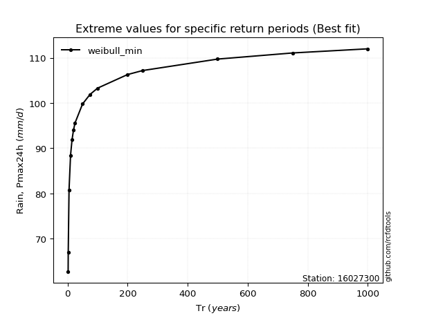</img>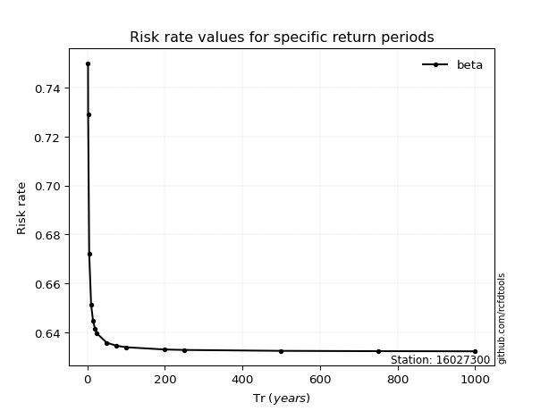</img>

</div>


<sub>**APP DISCLAIMER**: NO WARRANTY - This software is provided by [github.com/rcfdtools](https://github.com/rcfdtools) "as is", without any express or implied warranty, including warranties of merchantability, fitness for a particular purpose, or non-infringement. There is no guarantee that the software will be error-free or operate without interruption. LIMITATION OF LIABILITY - Neither the authors nor copyright holders will be liable for claims or damages arising from the software or its use. You are responsible for determining if the software is appropriate for your use and assume all associated risks, including errors, legal compliance, and data loss. NO PROFESSIONAL ADVICE - The software provides general information and does not offer professional advice. It should not replace consultation with professional advisors.</sub>