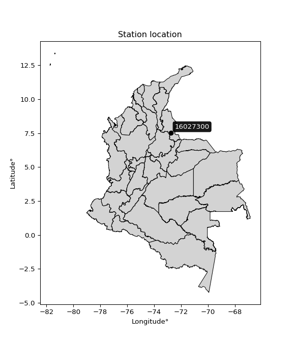

<div align="center">


</div>

# PMax24h Station (Rain): 16027300

Maximum Precipitation in 24 hours (PMax24h) is the greatest amount of rainfall for a specific duration that is meteorologically possible for a given location, acting as a "worst-case" scenario for extreme storms, crucial for designing safety-critical infrastructure like bridges, river deviations, dams, spillways, and nuclear plants to prevent catastrophic failure. The PMax24h is related with the Probable Maximum Precipitation (PMP) and it is calculated by hydrologists using meteorological data to determine the upper limit of extreme rainfall, often leading to the Probable Maximum Flood (PMF) for flood control design, and is increasingly being studied for climate change impacts. Probable Maximum Precipitation (PMP) is the theoretical upper limit of rainfall, a deterministic estimate for extreme events, while probability distributions (like GEV, Gumbel) describe the likelihood and frequency of various precipitation amounts, including rare ones, showing how often events occur, with PMP representing the extreme end of these distributions, used for critical infrastructure design to ensure safety against the worst conceivable weather, unlike standard statistical forecasts which cover typical probabilities.

The most common probability distributions in hydrology, used for analyzing floods, rainfall, and streamflow, include the Normal, Log-Normal, Gumbel, Gamma (including Log-Pearson Type III), and Generalized Extreme Value (GEV) distributions, often chosen based on the data´s skewness and whether modeling extremes or general conditions, with Gumbel and GEV popular for extreme events like floods, while the Normal distribution serves as a baseline, though often requiring transformations for skewed hydrological data. These distributions help in designing water infrastructure, managing water resources, and forecasting hydrologic events.

> Hydrological data often isn´t perfectly normal (it´s skewed), so different distributions are needed for different applications, such as: **Flood Frequency Analysis**: Using Gumbel, GEV, or Log-Pearson Type III for predicting extreme flood magnitudes and their return periods, **Rainfall Analysis**: Normal for annual totals, but Log-Normal, Weibull, or GEV for intensity or extreme daily rainfall, **Streamflow Modeling**: Gamma and Log-Normal for maximum flows, GEV for minimum flows, and Kappa for daily flows.

<div align="center">

</img>

</div>


## A. General information


### 1. General running parameters

• app_version: _v20260225_. • runtime: _2026-02-28 16:54:07.457399_. • Python version: _3.14.0_. • SciPy version: _1.16.3_. • Pandas version: _2.3.3_. • NumPy version: _2.3.5_. • Stations dataset (station_dataset_file): _dataset/pmax24h_in/automatic_colombia_2003_2025.csv_. • Stations catalog (station_catalog_file): _dataset/CNE.xls_. • Minimum year to eval til year_max (date_min): _1900_. • Maximum year to eval since year_min (date_max): _2025_. • Creates, save and include plots into reports (create_plot): _False_. • Plot only fit distributions with Δo > Δ (plot_only_fit): _True_. • Plot only simple graphs avoiding multiple CDFs and multiple Extreme values plots (plot_only_simple): _False_. • Eval low extreme values, if False, evaluates high extreme values (low_extreme): _False_. • Eval every SciPy distribution as logarithmic (pdist_logarithmic_on): _True_. • Standard deviation normalized (ddof): _1.0_. • Return periods to eval in years (Tr): _[2, 2.33, 5, 10, 15, 20, 25, 50, 75, 100, 200, 250, 500, 750, 1000]_. • Minimum data sample per station, 0 means any (minimum_sample): _5_. • Z-Score maximum threshold to adjust a value, 0 means disable (zscore_max): _3.5_. • Z-Score minimum threshold to adjust a value, 0 means disable (zscore_min): _-2.5_. • Avoid zeros, e.g. rain = 0 (avoid_zeros): _True_. • Avoid null values (avoid_nans): _True_. 

:file_folder:Table: [dataset.csv](../../dataset/pmax24h_in/automatic_colombia_2003_2025.csv)

> Delta Degrees of Freedom (DDOF): is a parameter used in the formulas for calculating variance and standard deviation. When ddof=0, the divisor is $N$ (the total number of observations) and this is used when your data set is the entire population. When ddof=1, the divisor is $N-1$ and this is used when your data set is a sample drawn from a larger population. Using $N-1$ provides an unbiased estimate of the population variance (known as Bessel´s correction).


### 2. Station info and location

|   id |   CODIGO | NOMBRE                         | CATEGORIA    | TECNOLOGIA                              | ESTADO           | FECHA_INSTALACION   |   FECHA_SUSPENSION |   ALTITUD |   LATITUD |   LONGITUD | DEPARTAMENTO       | MUNICIPIO   | AREA_OPERATIVA                         | ENTIDAD                                                     | AREA_HIDROGRAFICA   | ZONA_HIDROGRAFICA   | SUBZONA_HIDROGRAFICA   | CORRIENTE   | Catalogo   |   Version |
|-----:|---------:|:-------------------------------|:-------------|:----------------------------------------|:-----------------|:--------------------|-------------------:|----------:|----------:|-----------:|:-------------------|:------------|:---------------------------------------|:------------------------------------------------------------|:--------------------|:--------------------|:-----------------------|:------------|:-----------|----------:|
|    0 | 16027300 | PUENTE CAPIRA - AUT [16027300] | Limnigráfica | Automática con Telemetría, Convencional | En Mantenimiento | 15/11/2004          |                nan |      1320 |   7.53719 |   -72.7711 | Norte De Santander | Cucutilla   | Area Operativa 08 - Santanderes-Arauca | INSTITUTO DE HIDROLOGIA METEOROLOGIA Y ESTUDIOS AMBIENTALES | Caribe              | Catatumbo           | Río Zulia              | Zulia       | CNE_IDEAM  |  20251226 |

<div align="center">

Dynamic map: [:earth_americas:Google](http://maps.google.com/maps?q=7.537194444,-72.77113889) [:earth_americas:OSM](https://www.openstreetmap.org/#map=18/7.537194444/-72.77113889&layers=P) [:earth_americas:Bing](https://www.bing.com/maps?cp=7.537194444~-72.77113889&lvl=18) [:earth_americas:Apple](https://maps.apple.com/frame?center=7.537194444%2C-72.77113889&span=0.003%2C0.006)

</div>


<div align="center">

```geojson
{
  "type": "Feature",
  "geometry": {
    "type": "Point", 
    "coordinates": [-72.77113889, 7.537194444]
  }, 
  "properties": {
    "Name": "16027300"
  }
}
```

</div>


### 3. Discrete values table and plot

<div align="center">

|               |          0 |          1 |          2 |           3 |           4 |          5 |           6 |           7 |           8 |           9 |         10 |         11 |          12 |
|:--------------|-----------:|-----------:|-----------:|------------:|------------:|-----------:|------------:|------------:|------------:|------------:|-----------:|-----------:|------------:|
| Date          | 2010       | 2011       | 2012       | 2013        | 2014        | 2015       | 2016        | 2017        | 2018        | 2019        | 2020       | 2021       | 2025        |
| Value         |   87.1     |   79.6     |   88       |   33.9      |   47.3      |   75.9     |   85.1      |   66.7      |   71.4      |   45.1      |    4.6     |    0.3     |   66.2      |
| Value_initial |   87.1     |   79.6     |   88       |   33.9      |   47.3      |   75.9     |   85.1      |   66.7      |   71.4      |   45.1      |    4.6     |    0.3     |   66.2      |
| count         |   13       |   13       |   13       |   13        |   13        |   13       |   13        |   13        |   13        |   13        |   13       |   13       |   13        |
| mean          |   57.7846  |   57.7846  |   57.7846  |   57.7846   |   57.7846   |   57.7846  |   57.7846   |   57.7846   |   57.7846   |   57.7846   |   57.7846  |   57.7846  |   57.7846   |
| std           |   29.7666  |   29.7666  |   29.7666  |   29.7666   |   29.7666   |   29.7666  |   29.7666   |   29.7666   |   29.7666   |   29.7666   |   29.7666  |   29.7666  |   29.7666   |
| zscore        |    0.98484 |    0.73288 |    1.01508 |   -0.802395 |   -0.352227 |    0.60858 |    0.917651 |    0.299509 |    0.457404 |   -0.426135 |   -1.78672 |   -1.93118 |    0.282712 |


</div>


> The initial value (value_initial) correspond to the initial obtained or null completed value, and value (value) is adjusted only when the initial value is outside the valid range (outlier) definite through the Z-Score value. If Z-Score is active, values out of range or outliers are replaced with the station mean value. A Z-Score (or standard score) measures how many standard deviations a data point is from the mean of a dataset, indicating its relative position; positive scores mean above the mean, negative mean below, and a score of zero is exactly at the mean, allowing for comparison of values from different distributions. It´s calculated using the formula $z=(x–μ)/σ$, where $x$ is the data point, $μ$ is the mean, and $σ$ is the standard deviation, helping identify outliers and understand probability.
>
> <sub>**Note**: In this study, "completing" (filling gaps in) and "extending" (forecasting or lengthening the historical record) rainfall data series are avoided for certain critical analyses because they introduce artificial bias and uncertainty, which can distort the statistics of rare events (extremes), alter day-to-day variability, and compromise the integrity and homogeneity of the original data. Some reasons against Completing/Extending rainfall data are: **Distortion of Extremes and Variability**: The primary issue is that most gap-filling or extension methods rely on averaging or regression with nearby stations, which inherently smooths the data. Rainfall is highly variable in space and time, with a large percentage of zero values and occasional large storms. Infilling methods often underestimate the highest values and overestimate the lowest (zero) values, which severely distorts analyses focused on flood frequency, drought severity, and intensity-duration-frequency (IDF) curves, **Loss of Data Homogeneity**: Infilled or extended data are synthetic estimates, not actual measurements. Combining these estimates with observed data can violate the assumption of data homogeneity, which requires that the data properties do not change over time. Inhomogeneity can lead to incorrect conclusions about long-term trends or changes in climate patterns, **Propagation of Errors**: Errors and biases from the original data (e.g., wind-induced undercatch, instrument errors, site changes) or the data used for imputation can propagate through the analysis, leading to unreliable hydrological models and inaccurate predictions, **Compromised Statistical Integrity**: For statistical analyses, especially those involving the frequency of events, using artificial data can introduce time bias or autocorrelation that doesn´t exist in reality, making it difficult to assess the true probability of events, **Difficulty in Validation**: It is difficult to accurately validate the quality of filled or extended data, especially for past periods where ground-truth measurements are unavailable. The reliability of imputation techniques heavily depends on the density of the surrounding station network and the complexity of the local topography.</sub>


### 4. Active continuous probability distributions from SciPy (80 of 104 available)

A Probability Density Function (PDF) describes the relative likelihood of a continuous random variable falling within a specific range, where the total area under its curve equals 1, and the area over any interval gives the actual probability for that range. Unlike discrete probabilities (like rolling a die), a PDF shows density, not direct probability for a single point (which is zero), with higher points indicating higher likelihood, often visualized as a bell curve for normal distributions.

A log of a probability density function (log-PDF) is simply the logarithm of the PDF´s value, denoted as $log(f(x))$, useful for converting multiplication of probabilities into addition, improving numerical stability with tiny numbers, and connecting to information theory concepts like entropy. Instead of dealing with very small probabilities (e.g., 0.000001), log-PDFs use negative numbers (e.g., $log(0.00001) ≈ -11.51$ that are easier for computers to handle, preventing underflow errors and simplifying complex calculations. In this study, each active probability distribution from SciPy is also evaluated in the $log$ form.

[scipy.stats](https://docs.scipy.org/doc/scipy/reference/stats.html) is a Python´s powerful submodule within the SciPy library for comprehensive statistical analysis, offering over 130 probability distributions (like Normal, Poisson, etc.), functions for descriptive stats (mean, variance), hypothesis testing (t-tests, chi-square), random variable generation, and statistical tests, making it essential for data science, modeling, and research. It provides tools to explore, model, and draw conclusions from data efficiently, working seamlessly with [NumPy](https://numpy.org/).

<div align="center">

|   id | p_dist           |   n_parameter | fit_method   | label                                                                       | active   | ref                                                                                                      |
|-----:|:-----------------|--------------:|:-------------|:----------------------------------------------------------------------------|:---------|:---------------------------------------------------------------------------------------------------------|
|    0 | alpha            |             3 | MLE          | Alpha                                                                       | True     | [:mortar_board:](https://docs.scipy.org/doc/scipy/reference/generated/scipy.stats.alpha.html)            |
|    1 | anglit           |             2 | MM           | Anglit                                                                      | True     | [:mortar_board:](https://docs.scipy.org/doc/scipy/reference/generated/scipy.stats.anglit.html)           |
|    2 | arcsine          |             2 | MM           | Arcsine                                                                     | True     | [:mortar_board:](https://docs.scipy.org/doc/scipy/reference/generated/scipy.stats.arcsine.html)          |
|    3 | argus            |             3 | MLE          | Argus                                                                       | True     | [:mortar_board:](https://docs.scipy.org/doc/scipy/reference/generated/scipy.stats.argus.html)            |
|    4 | beta             |             4 | MLE          | Beta                                                                        | True     | [:mortar_board:](https://docs.scipy.org/doc/scipy/reference/generated/scipy.stats.beta.html)             |
|    5 | betaprime        |             4 | MLE          | Beta prime                                                                  | True     | [:mortar_board:](https://docs.scipy.org/doc/scipy/reference/generated/scipy.stats.betaprime.html)        |
|    6 | bradford         |             3 | MLE          | Bradford                                                                    | True     | [:mortar_board:](https://docs.scipy.org/doc/scipy/reference/generated/scipy.stats.bradford.html)         |
|    7 | burr             |             4 | MLE          | Burr (Type III)                                                             | True     | [:mortar_board:](https://docs.scipy.org/doc/scipy/reference/generated/scipy.stats.burr.html)             |
|    8 | burr12           |             4 | MLE          | Burr (Type III) 12                                                          | True     | [:mortar_board:](https://docs.scipy.org/doc/scipy/reference/generated/scipy.stats.burr12.html)           |
|    9 | cosine           |             2 | MLE          | Cosine                                                                      | True     | [:mortar_board:](https://docs.scipy.org/doc/scipy/reference/generated/scipy.stats.cosine.html)           |
|   10 | crystalball      |             4 | MLE          | Crystalball                                                                 | True     | [:mortar_board:](https://docs.scipy.org/doc/scipy/reference/generated/scipy.stats.crystalball.html)      |
|   11 | dgamma           |             3 | MLE          | Double gamma                                                                | True     | [:mortar_board:](https://docs.scipy.org/doc/scipy/reference/generated/scipy.stats.dgamma.html)           |
|   12 | dweibull         |             3 | MLE          | Double Weibull                                                              | True     | [:mortar_board:](https://docs.scipy.org/doc/scipy/reference/generated/scipy.stats.dweibull.html)         |
|   13 | erlang           |             3 | MLE          | Erlang                                                                      | True     | [:mortar_board:](https://docs.scipy.org/doc/scipy/reference/generated/scipy.stats.erlang.html)           |
|   14 | exponnorm        |             3 | MLE          | Exponentially modified Normal                                               | True     | [:mortar_board:](https://docs.scipy.org/doc/scipy/reference/generated/scipy.stats.exponnorm.html)        |
|   15 | exponpow         |             3 | MLE          | Exponential power                                                           | True     | [:mortar_board:](https://docs.scipy.org/doc/scipy/reference/generated/scipy.stats.exponpow.html)         |
|   16 | exponweib        |             4 | MLE          | Exponentiated Weibull                                                       | True     | [:mortar_board:](https://docs.scipy.org/doc/scipy/reference/generated/scipy.stats.exponweib.html)        |
|   17 | f                |             4 | MLE          | F                                                                           | True     | [:mortar_board:](https://docs.scipy.org/doc/scipy/reference/generated/scipy.stats.f.html)                |
|   18 | fatiguelife      |             3 | MLE          | Fatigue-life (Birnbaum-Saunders)                                            | True     | [:mortar_board:](https://docs.scipy.org/doc/scipy/reference/generated/scipy.stats.fatiguelife.html)      |
|   19 | foldnorm         |             3 | MM           | Fold Normal                                                                 | True     | [:mortar_board:](https://docs.scipy.org/doc/scipy/reference/generated/scipy.stats.foldnorm.html)         |
|   20 | gamma            |             3 | MLE          | Gamma                                                                       | True     | [:mortar_board:](https://docs.scipy.org/doc/scipy/reference/generated/scipy.stats.gamma.html)            |
|   21 | gausshyper       |             6 | MLE          | Gauss hypergeometric                                                        | True     | [:mortar_board:](https://docs.scipy.org/doc/scipy/reference/generated/scipy.stats.gausshyper.html)       |
|   22 | genexpon         |             5 | MLE          | Generalized exponential                                                     | True     | [:mortar_board:](https://docs.scipy.org/doc/scipy/reference/generated/scipy.stats.genexpon.html)         |
|   23 | genextreme       |             3 | MLE          | Generalized exponential                                                     | True     | [:mortar_board:](https://docs.scipy.org/doc/scipy/reference/generated/scipy.stats.genextreme.html)       |
|   24 | gengamma         |             4 | MLE          | Generalized gamma                                                           | True     | [:mortar_board:](https://docs.scipy.org/doc/scipy/reference/generated/scipy.stats.gengamma.html)         |
|   25 | genhalflogistic  |             3 | MLE          | Generalized half-logistic                                                   | True     | [:mortar_board:](https://docs.scipy.org/doc/scipy/reference/generated/scipy.stats.genhalflogistic.html)  |
|   26 | genlogistic      |             3 | MLE          | Generalized logistic                                                        | True     | [:mortar_board:](https://docs.scipy.org/doc/scipy/reference/generated/scipy.stats.genlogistic.html)      |
|   27 | gennorm          |             3 | MLE          | Generalized Normal                                                          | True     | [:mortar_board:](https://docs.scipy.org/doc/scipy/reference/generated/scipy.stats.gennorm.html)          |
|   28 | genpareto        |             3 | MLE          | Generalized Pareto                                                          | True     | [:mortar_board:](https://docs.scipy.org/doc/scipy/reference/generated/scipy.stats.genpareto.html)        |
|   29 | gompertz         |             3 | MLE          | Gompertz (or truncated Gumbel)                                              | True     | [:mortar_board:](https://docs.scipy.org/doc/scipy/reference/generated/scipy.stats.gompertz.html)         |
|   30 | gumbel_l         |             2 | MM           | Gumbel Left Skew                                                            | True     | [:mortar_board:](https://docs.scipy.org/doc/scipy/reference/generated/scipy.stats.gumbel_l.html)         |
|   31 | gumbel_r         |             2 | MM           | Gumbel Right Skew                                                           | True     | [:mortar_board:](https://docs.scipy.org/doc/scipy/reference/generated/scipy.stats.gumbel_r.html)         |
|   32 | halfgennorm      |             3 | MLE          | Upper half of a generalized normal                                          | True     | [:mortar_board:](https://docs.scipy.org/doc/scipy/reference/generated/scipy.stats.halfgennorm.html)      |
|   33 | halflogistic     |             2 | MM           | Half-logistic                                                               | True     | [:mortar_board:](https://docs.scipy.org/doc/scipy/reference/generated/scipy.stats.halflogistic.html)     |
|   34 | halfnorm         |             2 | MM           | Half Normal                                                                 | True     | [:mortar_board:](https://docs.scipy.org/doc/scipy/reference/generated/scipy.stats.halfnorm.html)         |
|   35 | hypsecant        |             2 | MM           | hyperbolic secant                                                           | True     | [:mortar_board:](https://docs.scipy.org/doc/scipy/reference/generated/scipy.stats.hypsecant.html)        |
|   36 | invgamma         |             3 | MLE          | Inverted gamma                                                              | True     | [:mortar_board:](https://docs.scipy.org/doc/scipy/reference/generated/scipy.stats.invgamma.html)         |
|   37 | invgauss         |             3 | MLE          | Inverse Gaussian                                                            | True     | [:mortar_board:](https://docs.scipy.org/doc/scipy/reference/generated/scipy.stats.invgauss.html)         |
|   38 | invweibull       |             3 | MLE          | Inverted Weibull                                                            | True     | [:mortar_board:](https://docs.scipy.org/doc/scipy/reference/generated/scipy.stats.invweibull.html)       |
|   39 | johnsonsb        |             4 | MLE          | Johnson SB                                                                  | True     | [:mortar_board:](https://docs.scipy.org/doc/scipy/reference/generated/scipy.stats.johnsonsb.html)        |
|   40 | johnsonsu        |             4 | MLE          | Johnson Su                                                                  | True     | [:mortar_board:](https://docs.scipy.org/doc/scipy/reference/generated/scipy.stats.johnsonsu.html)        |
|   41 | kappa3           |             3 | MLE          | Kappa 3                                                                     | True     | [:mortar_board:](https://docs.scipy.org/doc/scipy/reference/generated/scipy.stats.kappa3.html)           |
|   42 | kappa4           |             4 | MLE          | Kappa 4                                                                     | True     | [:mortar_board:](https://docs.scipy.org/doc/scipy/reference/generated/scipy.stats.kappa4.html)           |
|   43 | ksone            |             3 | MLE          | Kolmogorov-Smirnov one-sided test statistic distribution                    | True     | [:mortar_board:](https://docs.scipy.org/doc/scipy/reference/generated/scipy.stats.ksone.html)            |
|   44 | kstwobign        |             2 | MLE          | Limiting distribution of scaled Kolmogorov-Smirnov two-sided test statistic | True     | [:mortar_board:](https://docs.scipy.org/doc/scipy/reference/generated/scipy.stats.kstwobign.html)        |
|   45 | laplace          |             2 | MM           | Laplace                                                                     | True     | [:mortar_board:](https://docs.scipy.org/doc/scipy/reference/generated/scipy.stats.laplace.html)          |
|   46 | levy_l           |             2 | MLE          | Left-skewed Levy                                                            | True     | [:mortar_board:](https://docs.scipy.org/doc/scipy/reference/generated/scipy.stats.levy_l.html)           |
|   47 | loggamma         |             3 | MLE          | Log gamma                                                                   | True     | [:mortar_board:](https://docs.scipy.org/doc/scipy/reference/generated/scipy.stats.loggamma.html)         |
|   48 | logistic         |             2 | MM           | Logistic (or Sech-squared)                                                  | True     | [:mortar_board:](https://docs.scipy.org/doc/scipy/reference/generated/scipy.stats.logistic.html)         |
|   49 | loglaplace       |             3 | MLE          | Log-Laplace                                                                 | True     | [:mortar_board:](https://docs.scipy.org/doc/scipy/reference/generated/scipy.stats.loglaplace.html)       |
|   50 | lomax            |             3 | MLE          | Lomax (Pareto of the second kind)                                           | True     | [:mortar_board:](https://docs.scipy.org/doc/scipy/reference/generated/scipy.stats.lomax.html)            |
|   51 | maxwell          |             2 | MM           | Maxwell                                                                     | True     | [:mortar_board:](https://docs.scipy.org/doc/scipy/reference/generated/scipy.stats.maxwell.html)          |
|   52 | mielke           |             4 | MLE          | Mielke Beta-Kappa / Dagum                                                   | True     | [:mortar_board:](https://docs.scipy.org/doc/scipy/reference/generated/scipy.stats.mielke.html)           |
|   53 | moyal            |             2 | MM           | Moyal                                                                       | True     | [:mortar_board:](https://docs.scipy.org/doc/scipy/reference/generated/scipy.stats.moyal.html)            |
|   54 | nakagami         |             3 | MLE          | Nakagami                                                                    | True     | [:mortar_board:](https://docs.scipy.org/doc/scipy/reference/generated/scipy.stats.nakagami.html)         |
|   55 | ncf              |             5 | MLE          | Non-central F distribution                                                  | True     | [:mortar_board:](https://docs.scipy.org/doc/scipy/reference/generated/scipy.stats.ncf.html)              |
|   56 | nct              |             4 | MLE          | Non-central Student’s t                                                     | True     | [:mortar_board:](https://docs.scipy.org/doc/scipy/reference/generated/scipy.stats.nct.html)              |
|   57 | norm             |             2 | MM           | Normal                                                                      | True     | [:mortar_board:](https://docs.scipy.org/doc/scipy/reference/generated/scipy.stats.norm.html)             |
|   58 | pearson3         |             3 | MM           | Pearson type III                                                            | True     | [:mortar_board:](https://docs.scipy.org/doc/scipy/reference/generated/scipy.stats.pearson3.html)         |
|   59 | powerlaw         |             3 | MLE          | Power-function                                                              | True     | [:mortar_board:](https://docs.scipy.org/doc/scipy/reference/generated/scipy.stats.powerlaw.html)         |
|   60 | rayleigh         |             2 | MM           | Rayleigh                                                                    | True     | [:mortar_board:](https://docs.scipy.org/doc/scipy/reference/generated/scipy.stats.rayleigh.html)         |
|   61 | rdist            |             3 | MLE          | R-distributed (symmetric beta)                                              | True     | [:mortar_board:](https://docs.scipy.org/doc/scipy/reference/generated/scipy.stats.rdist.html)            |
|   62 | rice             |             3 | MLE          | Rice                                                                        | True     | [:mortar_board:](https://docs.scipy.org/doc/scipy/reference/generated/scipy.stats.rice.html)             |
|   63 | semicircular     |             2 | MM           | Semicircular                                                                | True     | [:mortar_board:](https://docs.scipy.org/doc/scipy/reference/generated/scipy.stats.semicircular.html)     |
|   64 | skewnorm         |             3 | MLE          | Skew normal                                                                 | True     | [:mortar_board:](https://docs.scipy.org/doc/scipy/reference/generated/scipy.stats.skewnorm.html)         |
|   65 | t                |             3 | MLE          | Student’s t                                                                 | True     | [:mortar_board:](https://docs.scipy.org/doc/scipy/reference/generated/scipy.stats.t.html)                |
|   66 | trapezoid        |             4 | MLE          | Trapezoid                                                                   | True     | [:mortar_board:](https://docs.scipy.org/doc/scipy/reference/generated/scipy.stats.trapezoid.html)        |
|   67 | triang           |             3 | MLE          | Triangular                                                                  | True     | [:mortar_board:](https://docs.scipy.org/doc/scipy/reference/generated/scipy.stats.triang.html)           |
|   68 | truncexpon       |             3 | MLE          | Truncated exponential                                                       | True     | [:mortar_board:](https://docs.scipy.org/doc/scipy/reference/generated/scipy.stats.truncexpon.html)       |
|   69 | truncnorm        |             4 | MLE          | Truncated normal                                                            | True     | [:mortar_board:](https://docs.scipy.org/doc/scipy/reference/generated/scipy.stats.truncnorm.html)        |
|   70 | truncpareto      |             4 | MLE          | Upper truncated Pareto                                                      | True     | [:mortar_board:](https://docs.scipy.org/doc/scipy/reference/generated/scipy.stats.truncpareto.html)      |
|   71 | truncweibull_min |             5 | MLE          | Doubly truncated Weibull minimum                                            | True     | [:mortar_board:](https://docs.scipy.org/doc/scipy/reference/generated/scipy.stats.truncweibull_min.html) |
|   72 | tukeylambda      |             3 | MLE          | Tukey-Lamdba                                                                | True     | [:mortar_board:](https://docs.scipy.org/doc/scipy/reference/generated/scipy.stats.tukeylambda.html)      |
|   73 | uniform          |             2 | MLE          | Uniform                                                                     | True     | [:mortar_board:](https://docs.scipy.org/doc/scipy/reference/generated/scipy.stats.uniform.html)          |
|   74 | vonmises         |             3 | MLE          | Von Mises                                                                   | True     | [:mortar_board:](https://docs.scipy.org/doc/scipy/reference/generated/scipy.stats.vonmises.html)         |
|   75 | vonmises_line    |             3 | MLE          | Von Mises line                                                              | True     | [:mortar_board:](https://docs.scipy.org/doc/scipy/reference/generated/scipy.stats.vonmises_line.html)    |
|   76 | wald             |             2 | MM           | Wald                                                                        | True     | [:mortar_board:](https://docs.scipy.org/doc/scipy/reference/generated/scipy.stats.wald.html)             |
|   77 | weibull_max      |             3 | MLE          | Weibull maximum                                                             | True     | [:mortar_board:](https://docs.scipy.org/doc/scipy/reference/generated/scipy.stats.weibull_max.html)      |
|   78 | weibull_min      |             3 | MLE          | Weibull minimum                                                             | True     | [:mortar_board:](https://docs.scipy.org/doc/scipy/reference/generated/scipy.stats.weibull_min.html)      |
|   79 | wrapcauchy       |             3 | MLE          | Wrapped  Cauchy                                                             | True     | [:mortar_board:](https://docs.scipy.org/doc/scipy/reference/generated/scipy.stats.wrapcauchy.html)       |

</div>

> **n_parameter:** # arguments & localization & scale.
>
> **Fit methods:** (MLE) maximum likelihood, (MM) L-moments.
>
>**Inactive** (With the only purpose of prevent loops, zero divisions, infinite values, over high estimated values or horizontal trending for recurrence intervals estimations, the follow distributions were disabled.)**:** lognorm, norminvgauss, powernorm, powerlognorm, cauchy, halfcauchy, foldcauchy, skewcauchy, chi2, expon, fisk, genhyperbolic, geninvgauss, gibrat, kstwo, laplace_asymmetric, levy, levy_stable, ncx2, pareto, rel_breitwigner, recipinvgauss, studentized_range, loguniform, 


## B. Probability (PDF) vs. Empirical (EDF) distributions functions

A continuous probability distribution (CPD) describes probabilities for variables that can take any value within a range (like rain any time), unlike discrete variables with specific outcomes (like temperature). It uses a Probability Density Function (PDF), a curve where the total area under it equals 1, and the probability of the variable falling within an interval (a to b) is found by calculating the area under the curve between those points. A key feature is that the probability of hitting any single exact value is zero, so probabilities are always expressed for ranges, e.g., $P(a ≤ X ≤ b)$.

<div align="center">

Distributions parameters from station values
|     |   station | p_dist              |   n |              loc |           scale | shape                  | shape1                 | shape2                | shape3             |
|----:|----------:|:--------------------|----:|-----------------:|----------------:|:-----------------------|:-----------------------|:----------------------|:-------------------|
|   0 |  16027300 | alpha               |  13 |      0.00402568  |     1.07474     | 7.838995420114634e-09  |                        |                       |                    |
|   1 |  16027300 | anglit              |  13 |     57.7846      |    83.6631      |                        |                        |                       |                    |
|   2 |  16027300 | arcsine             |  13 |     17.3397      |    80.8898      |                        |                        |                       |                    |
|   3 |  16027300 | argus               |  13 |    -29.7471      |   120.269       | 2.298188538553947      |                        |                       |                    |
|   4 |  16027300 | beta                |  13 |     -8.75645     |    96.7564      | 1.0179111388620836     | 0.42773417709896366    |                       |                    |
|   5 |  16027300 | betaprime           |  13 |  -1104.51        | 71569.6         | 1625.502535097915      | 100110.9137151958      |                       |                    |
|   6 |  16027300 | bradford            |  13 |    -11.5053      |    99.5054      | 3.7666508778916676e-06 |                        |                       |                    |
|   7 |  16027300 | burr                |  13 |      0.00683358  |    89.7055      | 124.01099203410925     | 0.00858221742187058    |                       |                    |
|   8 |  16027300 | burr12              |  13 |    -20.5733      |  4004.48        | 2.6804434766860608     | 27825.820015975056     |                       |                    |
|   9 |  16027300 | cosine              |  13 |     53.9754      |    24.2772      |                        |                        |                       |                    |
|  10 |  16027300 | crystalball         |  13 |     57.7846      |    28.5989      | 47325.78626694288      | 2442.9024860688605     |                       |                    |
|  11 |  16027300 | dgamma              |  13 |     68.3627      |    20.4074      | 1.0982547900604414     |                        |                       |                    |
|  12 |  16027300 | dweibull            |  13 |     66.7         |    25.0383      | 0.9153163323835437     |                        |                       |                    |
|  13 |  16027300 | erlang              |  13 |   -392.733       |     1.98394     | 226.79506100560138     |                        |                       |                    |
|  14 |  16027300 | exponnorm           |  13 |     57.7639      |    28.5989      | 0.000731071435136038   |                        |                       |                    |
|  15 |  16027300 | exponpow            |  13 |      0.3         |     3.70188     | 0.14059689383355534    |                        |                       |                    |
|  16 |  16027300 | exponweib           |  13 |      0.3         |     4.21175     | 2.077245255814501      | 0.14843846959469675    |                       |                    |
|  17 |  16027300 | f                   |  13 | -17708.4         | 17766.2         | 992380.9988984796      | 3374875.7425433053     |                       |                    |
|  18 |  16027300 | fatiguelife         |  13 |  -2442.86        |  2500.65        | 0.011509150053605005   |                        |                       |                    |
|  19 |  16027300 | foldnorm            |  13 |    -35.0417      |    25.6946      | 3.6420058583721153     |                        |                       |                    |
|  20 |  16027300 | gamma               |  13 |   -414.146       |     1.8897      | 249.43299247925353     |                        |                       |                    |
|  21 |  16027300 | gausshyper          |  13 |     -7.9769      |    95.9769      | 1.169916872115773      | 0.4360432381886231     | 1.0721388825770357    | 1.1909097427853146 |
|  22 |  16027300 | genexpon            |  13 |      0.299962    |     2.51927     | 0.04156927032134845    | 1.2442564805932947e-07 | 2.1991989805506975    |                    |
|  23 |  16027300 | genextreme          |  13 |     65.2189      |    28.7609      | 1.2624865954814113     |                        |                       |                    |
|  24 |  16027300 | gengamma            |  13 |   -378.135       |    20.1351      | 100.174747441318       | 1.4970301011402434     |                       |                    |
|  25 |  16027300 | genhalflogistic     |  13 |     -5.23874     |    97.9129      | 1.0501307969509757     |                        |                       |                    |
|  26 |  16027300 | genlogistic         |  13 |     88.0002      |     1.7581e-05  | 5.811431107910319e-07  |                        |                       |                    |
|  27 |  16027300 | gennorm             |  13 |     66.1999      |    29.5133      | 1.26562113218014       |                        |                       |                    |
|  28 |  16027300 | genpareto           |  13 |     -0.037998    |   134.483       | -1.527556909401107     |                        |                       |                    |
|  29 |  16027300 | gompertz            |  13 |     33.9         |    13.0407      | 0.04094729907802436    |                        |                       |                    |
|  30 |  16027300 | gumbel_l            |  13 |     70.6556      |    22.2984      |                        |                        |                       |                    |
|  31 |  16027300 | gumbel_r            |  13 |     44.9136      |    22.2984      |                        |                        |                       |                    |
|  32 |  16027300 | halfgennorm         |  13 |      0.3         |     3.70618     | 0.38566159384991494    |                        |                       |                    |
|  33 |  16027300 | halflogistic        |  13 |     23.8883      |    24.451       |                        |                        |                       |                    |
|  34 |  16027300 | halfnorm            |  13 |     19.931       |    47.4425      |                        |                        |                       |                    |
|  35 |  16027300 | hypsecant           |  13 |     57.7846      |    18.2066      |                        |                        |                       |                    |
|  36 |  16027300 | invgamma            |  13 |   -355.273       | 72709.4         | 177.32703176397223     |                        |                       |                    |
|  37 |  16027300 | invgauss            |  13 |   -172.367       | 11794.1         | 0.019497432635956824   |                        |                       |                    |
|  38 |  16027300 | invweibull          |  13 |     -4.78909e+09 |     4.78909e+09 | 153361353.15568393     |                        |                       |                    |
|  39 |  16027300 | johnsonsb           |  13 |      0.3         |    87.7         | -0.22540614108979679   | 0.18255728906557292    |                       |                    |
|  40 |  16027300 | johnsonsu           |  13 |     89.7707      |     0.0413175   | 5.581885478319325      | 0.8228025989610863     |                       |                    |
|  41 |  16027300 | kappa3              |  13 |      0.3         |    87.0694      | 395.2773158925818      |                        |                       |                    |
|  42 |  16027300 | kappa4              |  13 |     -7.84566     |   100.849       | 1.0880615363014698     | 1.0484908778895066     |                       |                    |
|  43 |  16027300 | ksone               |  13 |     -8.47        |   105.24        | 1.0                    |                        |                       |                    |
|  44 |  16027300 | kstwobign           |  13 |    -67.8599      |   143.454       |                        |                        |                       |                    |
|  45 |  16027300 | laplace             |  13 |     57.7846      |    20.2225      |                        |                        |                       |                    |
|  46 |  16027300 | levy_l              |  13 |     89.5798      |     7.8251      |                        |                        |                       |                    |
|  47 |  16027300 | loggamma            |  13 |     88.0001      |     2.20682e-06 | 7.31458885253183e-08   |                        |                       |                    |
|  48 |  16027300 | logistic            |  13 |     57.7846      |    15.7674      |                        |                        |                       |                    |
|  49 |  16027300 | loglaplace          |  13 |     -0.253494    |    66.9535      | 1.3019284188591003     |                        |                       |                    |
|  50 |  16027300 | lomax               |  13 |      0.299994    |     1.26891e+08 | 2201309.958836721      |                        |                       |                    |
|  51 |  16027300 | maxwell             |  13 |     -9.98269     |    42.4669      |                        |                        |                       |                    |
|  52 |  16027300 | mielke              |  13 |   -130.099       |   218.159       | 6.155078011603571      | 19960.68223038336      |                       |                    |
|  53 |  16027300 | moyal               |  13 |     41.4299      |    12.874       |                        |                        |                       |                    |
|  54 |  16027300 | nakagami            |  13 |      0.3         |    62.1451      | 0.4197498711116118     |                        |                       |                    |
|  55 |  16027300 | ncf                 |  13 |      0.3         |    10.3199      | 0.9574065294800592     | 25.216402523379738     | 3.846985054602821     |                    |
|  56 |  16027300 | nct                 |  13 |  -1532.16        |    28.5305      | 259612.25124001794     | 55.727694628375744     |                       |                    |
|  57 |  16027300 | norm                |  13 |     57.7846      |    28.5989      |                        |                        |                       |                    |
|  58 |  16027300 | pearson3            |  13 |     57.7846      |    28.5989      | -0.8678653264185576    |                        |                       |                    |
|  59 |  16027300 | powerlaw            |  13 |      0.3         |    87.7         | 0.2694803494081721     |                        |                       |                    |
|  60 |  16027300 | rayleigh            |  13 |      3.07332     |    43.6533      |                        |                        |                       |                    |
|  61 |  16027300 | rdist               |  13 |     -7.45473     |    54.7547      | 1.0003774262284484     |                        |                       |                    |
|  62 |  16027300 | rice                |  13 |  -3881.57        |    28.5944      | 137.76290713166048     |                        |                       |                    |
|  63 |  16027300 | semicircular        |  13 |     57.7846      |    57.1977      |                        |                        |                       |                    |
|  64 |  16027300 | skewnorm            |  13 |     88           |    41.6052      | -26099867.01810863     |                        |                       |                    |
|  65 |  16027300 | t                   |  13 |     57.7848      |    28.5991      | 226852926.8827879      |                        |                       |                    |
|  66 |  16027300 | trapezoid           |  13 |    -24.2605      |   121.335       | 1.0                    | 1.0                    |                       |                    |
|  67 |  16027300 | triang              |  13 |    -23.6897      |   111.69        | 0.9999997965352818     |                        |                       |                    |
|  68 |  16027300 | truncexpon          |  13 |     -5.49791     |    98.9214      | 0.9451736566017279     |                        |                       |                    |
|  69 |  16027300 | truncnorm           |  13 |    353.388       |   109.557       | -3.222872523641771     | -2.422374899130374     |                       |                    |
|  70 |  16027300 | truncpareto         |  13 |      0.299883    |     0.000116982 | 0.08333767139101476    | 749689.4616885905      |                       |                    |
|  71 |  16027300 | truncweibull_min    |  13 |   -142.166       |   288.962       | 7.3049215258602125     | 3.7687100245459237e-10 | 0.7965254051829944    |                    |
|  72 |  16027300 | tukeylambda         |  13 |     -1.72617     |   129.95        | 1.448293498898374      |                        |                       |                    |
|  73 |  16027300 | uniform             |  13 |      0.3         |    87.7         |                        |                        |                       |                    |
|  74 |  16027300 | vonmises            |  13 |     -2.68331     |     1           | 0.3121059347502337     |                        |                       |                    |
|  75 |  16027300 | vonmises_line       |  13 |     64.1097      |    20.3113      | 0.9244722112735628     |                        |                       |                    |
|  76 |  16027300 | wald                |  13 |     29.1857      |    28.5989      |                        |                        |                       |                    |
|  77 |  16027300 | weibull_max         |  13 |     88           |     1.54155     | 0.31270541589079626    |                        |                       |                    |
|  78 |  16027300 | weibull_min         |  13 |     -2.26611e+09 |     2.26611e+09 | 111695909.70213896     |                        |                       |                    |
|  79 |  16027300 | wrapcauchy          |  13 |      0.299997    |    13.9579      | 0.41476370491282577    |                        |                       |                    |
|  80 |  16027300 | logalpha            |  13 |    -75.8694      |  3803.65        | 47.90440400859538      |                        |                       |                    |
|  81 |  16027300 | loganglit           |  13 |      3.55898     |     4.58978     |                        |                        |                       |                    |
|  82 |  16027300 | logarcsine          |  13 |      1.34014     |     4.43767     |                        |                        |                       |                    |
|  83 |  16027300 | logargus            |  13 |     -2.53184     |     7.10643     | 3.69371235201046       |                        |                       |                    |
|  84 |  16027300 | logbeta             |  13 |     -1.89332     |     6.37066     | 0.5658099238470147     | 0.08024012145278137    |                       |                    |
|  85 |  16027300 | logbetaprime        |  13 |     -4.21507     |     8.49137e+12 | 10.46448070165053      | 11243921532589.484     |                       |                    |
|  86 |  16027300 | logbradford         |  13 |     -1.20397     |     5.68135     | 0.0014844623143299626  |                        |                       |                    |
|  87 |  16027300 | logburr             |  13 | -12798.8         | 12774.6         | 5913.267922859892      | 243399.8631199018      |                       |                    |
|  88 |  16027300 | logburr12           |  13 | -41567.3         | 41576.4         | 61333.554049193306     | 1575.4382270385904     |                       |                    |
|  89 |  16027300 | logcosine           |  13 |      3.02322     |     1.62449     |                        |                        |                       |                    |
|  90 |  16027300 | logcrystalball      |  13 |      3.55898     |     1.56894     | 8.214536343993366      | 7.0615718497418785     |                       |                    |
|  91 |  16027300 | logdgamma           |  13 |      4.46706     |     1.04141     | 0.7043725682798845     |                        |                       |                    |
|  92 |  16027300 | logdweibull         |  13 |      4.2683      |     0.954074    | 0.6983471230666083     |                        |                       |                    |
|  93 |  16027300 | logerlang           |  13 |     -1.20397     |    95.0565      | 0.29636875212294556    |                        |                       |                    |
|  94 |  16027300 | logexponnorm        |  13 |      3.55813     |     1.56894     | 0.0005426355703158629  |                        |                       |                    |
|  95 |  16027300 | logexponpow         |  13 |     -1.20397     |     1.75092     | 0.32232265107181124    |                        |                       |                    |
|  96 |  16027300 | logexponweib        |  13 |     -1.26486e+08 |     1.26486e+08 | 0.22600162650736666    | 571112191.136474       |                       |                    |
|  97 |  16027300 | logf                |  13 |     -1.20397     |     1.16185     | 1.0739735854119203     | 1.0963208326879736     |                       |                    |
|  98 |  16027300 | logfatiguelife      |  13 |  -1222.16        |  1225.71        | 0.0012774611890163058  |                        |                       |                    |
|  99 |  16027300 | logfoldnorm         |  13 |     -5.06583     |     1.17425     | 7.417321385486737      |                        |                       |                    |
| 100 |  16027300 | loggamma            |  13 |    -19.189       |     0.125055    | 181.91582091806345     |                        |                       |                    |
| 101 |  16027300 | loggausshyper       |  13 |     -1.60572     |     6.08306     | 1.3070028826736615     | 0.29059779159037585    | 1.0590478568020063    | 1.1800495541400549 |
| 102 |  16027300 | loggenexpon         |  13 |     -1.29884     |     0.0823009   | 0.0021646133589379776  | 9.46180672613696       | 4.762756059686869e-05 |                    |
| 103 |  16027300 | loggenextreme       |  13 |      3.63076     |     1.21116     | 1.4306515723243693     |                        |                       |                    |
| 104 |  16027300 | loggengamma         |  13 |     -1.53625e+08 |     1.53625e+08 | 0.22549712215366732    | 694380613.8184332      |                       |                    |
| 105 |  16027300 | loggenhalflogistic  |  13 |     -1.53441     |     7.93303     | 1.3195887460750169     |                        |                       |                    |
| 106 |  16027300 | loggenlogistic      |  13 |      4.47736     |     1.62282e-06 | 1.7624565596759689e-06 |                        |                       |                    |
| 107 |  16027300 | loggennorm          |  13 |      4.32942     |     0.00355455  | 0.28341979911086135    |                        |                       |                    |
| 108 |  16027300 | loggenpareto        |  13 |     -2.49082     |     8.88086     | -1.2744915705863906    |                        |                       |                    |
| 109 |  16027300 | loggompertz         |  13 |     -2.4263      |     0.713339    | 0.00010435513770844378 |                        |                       |                    |
| 110 |  16027300 | loggumbel_l         |  13 |      4.26508     |     1.22329     |                        |                        |                       |                    |
| 111 |  16027300 | loggumbel_r         |  13 |      2.85287     |     1.22329     |                        |                        |                       |                    |
| 112 |  16027300 | loghalfgennorm      |  13 |     -1.20397     |     1.61144     | 0.5937740849565873     |                        |                       |                    |
| 113 |  16027300 | loghalflogistic     |  13 |      1.69941     |     1.3414      |                        |                        |                       |                    |
| 114 |  16027300 | loghalfnorm         |  13 |      1.48228     |     2.60275     |                        |                        |                       |                    |
| 115 |  16027300 | loghypsecant        |  13 |      3.55898     |     0.998816    |                        |                        |                       |                    |
| 116 |  16027300 | loginvgamma         |  13 |    -43.1849      | 34654.4         | 742.3245580201733      |                        |                       |                    |
| 117 |  16027300 | loginvgauss         |  13 |    -15.1092      |  1886.61        | 0.009887435131707208   |                        |                       |                    |
| 118 |  16027300 | loginvweibull       |  13 |     -7.15273e+08 |     7.15273e+08 | 346501622.74938786     |                        |                       |                    |
| 119 |  16027300 | logjohnsonsb        |  13 |     -5.49614     |     9.97347     | -0.49956181725530363   | 0.15573233318593815    |                       |                    |
| 120 |  16027300 | logjohnsonsu        |  13 |      4.47814     |     1.85706e-05 | 4.40443393858669       | 0.44306775259024245    |                       |                    |
| 121 |  16027300 | logkappa3           |  13 |     -1.20398     |     5.68119     | 74903.982290454        |                        |                       |                    |
| 122 |  16027300 | logkappa4           |  13 |     -0.80864     |     7.48268     | 0.8358749797001752     | 1.4155718756600795     |                       |                    |
| 123 |  16027300 | logksone            |  13 |     -1.7721      |     6.81757     | 1.0                    |                        |                       |                    |
| 124 |  16027300 | logkstwobign        |  13 |     -5.56139     |    10.4996      |                        |                        |                       |                    |
| 125 |  16027300 | loglaplace          |  13 |      3.55898     |     1.10941     |                        |                        |                       |                    |
| 126 |  16027300 | loglevy_l           |  13 |      4.49858     |     0.10258     |                        |                        |                       |                    |
| 127 |  16027300 | logloggamma         |  13 |      4.47737     |     2.56545e-06 | 2.8034826832887996e-06 |                        |                       |                    |
| 128 |  16027300 | loglogistic         |  13 |      3.55898     |     0.865       |                        |                        |                       |                    |
| 129 |  16027300 | logloglaplace       |  13 |     -1.20397     |     2.16807     | 0.42629070253855694    |                        |                       |                    |
| 130 |  16027300 | loglomax            |  13 |     -1.20397     |     2.72852e+12 | 674455323875.3308      |                        |                       |                    |
| 131 |  16027300 | logmaxwell          |  13 |     -0.158778    |     2.32975     |                        |                        |                       |                    |
| 132 |  16027300 | logmielke           |  13 |     -1.20397     |     6.64282     | 0.6091674931809574     | 1.6804007942964105     |                       |                    |
| 133 |  16027300 | logmoyal            |  13 |      2.66176     |     0.70627     |                        |                        |                       |                    |
| 134 |  16027300 | lognakagami         |  13 |  -2948.8         |  2952.36        | 886485.4388467628      |                        |                       |                    |
| 135 |  16027300 | logncf              |  13 |     -1.20397     |     1.04198     | 1.0666518787926194     | 1.1550117211350939     | 1.066384676919253     |                    |
| 136 |  16027300 | lognct              |  13 |   -114.821       |     1.54762     | 88962.83401876836      | 76.49064586586505      |                       |                    |
| 137 |  16027300 | lognorm             |  13 |      3.55898     |     1.56894     |                        |                        |                       |                    |
| 138 |  16027300 | logpearson3         |  13 |      3.55898     |     1.56893     | -2.2370663507646107    |                        |                       |                    |
| 139 |  16027300 | logpowerlaw         |  13 |     -1.20397     |     5.68131     | 0.3322324162534347     |                        |                       |                    |
| 140 |  16027300 | lograyleigh         |  13 |      0.557442    |     2.39487     |                        |                        |                       |                    |
| 141 |  16027300 | logrdist            |  13 |     -0.785921    |     2.31198     | 1.1913118180897433     |                        |                       |                    |
| 142 |  16027300 | logrice             |  13 |   -849.822       |     1.56882     | 543.962317667552       |                        |                       |                    |
| 143 |  16027300 | logsemicircular     |  13 |      3.55898     |     3.1379      |                        |                        |                       |                    |
| 144 |  16027300 | logskewnorm         |  13 |      4.47734     |     1.81803     | -83156722.21151817     |                        |                       |                    |
| 145 |  16027300 | logt                |  13 |      4.30695     |     0.167374    | 0.7607194916739544     |                        |                       |                    |
| 146 |  16027300 | logtrapezoid        |  13 |     -1.86071     |     6.81757     | 1.0                    | 1.0                    |                       |                    |
| 147 |  16027300 | logtriang           |  13 |     -1.7         |     6.17734     | 0.999999937820745      |                        |                       |                    |
| 148 |  16027300 | logtruncexpon       |  13 |     -1.20397     |    11.2084      | 0.5068793246341459     |                        |                       |                    |
| 149 |  16027300 | logtruncnorm        |  13 |     53.4488      |     6.94815     | -11.41715195115654     | -7.048133207382209     |                       |                    |
| 150 |  16027300 | logtruncpareto      |  13 |     -1.20398     |     1.14814e-05 | 0.00012484447820195876 | 513006.0193806019      |                       |                    |
| 151 |  16027300 | logtruncweibull_min |  13 |    -84.1245      |   199.321       | 39.78441418576527      | 0.41557887115992437    | 0.4445403601891184    |                    |
| 152 |  16027300 | logtukeylambda      |  13 |     -4.79402     |     9.47579     | 1.022049979402357      |                        |                       |                    |
| 153 |  16027300 | loguniform          |  13 |     -1.20397     |     5.68131     |                        |                        |                       |                    |
| 154 |  16027300 | logvonmises         |  13 |     -2.07142     |     1           | 2.7469571355545415     |                        |                       |                    |
| 155 |  16027300 | logvonmises_line    |  13 |      1.6356      |     0.90457     | 4.138194745926477e-06  |                        |                       |                    |
| 156 |  16027300 | logwald             |  13 |      1.99007     |     1.56892     |                        |                        |                       |                    |
| 157 |  16027300 | logweibull_max      |  13 |      4.47734     |     2.36503     | 0.5361146857839978     |                        |                       |                    |
| 158 |  16027300 | logweibull_min      |  13 |     -1.20397     |     2.59016     | 0.6277449457356474     |                        |                       |                    |
| 159 |  16027300 | logwrapcauchy       |  13 |     -1.21419     |     0.905835    | 0.8174951977707148     |                        |                       |                    |

</div>

> **loc** (Location parameter): This shifts the distribution along the x-axis. For many common distributions, like the normal (Gaussian) distribution, loc represents the mean $μ$. For others, like the uniform distribution, it might represent the minimum value, or for the beta distribution, the left end of the support interval.
>
> **scale** (Scale parameter): This determines the width or spread of the distribution. For the normal distribution, scale represents the standard deviation $σ$. For a uniform distribution, it defines the length of the interval (from $loc$ to $loc + scale$).
>
> **shape** (Shape parameters): Refers to parameters that define the specific form of a probability distribution, distinct from its location (loc) and scale (scale). These parameters are required arguments for most distribution functions. For example, a normal (Gaussian) distribution is fully defined by its location (mean) and scale (standard deviation), so it has no specific shape parameters beyond loc and scale. However, other distributions have intrinsic properties that need specification, as Gamma distribution that takes a shape parameter, often named $a$ or $alpha$.


### 0. Cumulative distribution values - CDF (160 evaluated)

Cumulative Distribution Function (CDF), denoted as $F$<sub>$X$</sub>$(x)$, is a function that gives the probability that a random variable $X$ will take a value less than or equal to a specific value, $x$ (i.e., $(P(X≥x)$. It essentially "accumulates" probabilities from a given point up to the far right (positive infinity), providing a complete picture of the distribution´s probabilities for both discrete (like rain) and continuous (like temperature) variables, helping to find probabilities over ranges or above certain values. Each station is evaluated separately ordering the $x$ values ascending, calculating the CDF and PDF values for the activated distributions and their logarithmic forms.

<div align="center">

CDF ordered by x ascending and calculating $log(f(x))$ separately
|   id |   Station |   date |    x |   count |    mean |     std |    zscore |   Value_initial |   station |   m |       alpha |   alpha_pdf |     anglit |   anglit_pdf |   arcsine |   arcsine_pdf |     argus |   argus_pdf |      beta |    beta_pdf |   betaprime |   betaprime_pdf |   bradford |   bradford_pdf |       burr |     burr_pdf |    burr12 |   burr12_pdf |    cosine |   cosine_pdf |   crystalball |   crystalball_pdf |    dgamma |   dgamma_pdf |   dweibull |   dweibull_pdf |    erlang |   erlang_pdf |   exponnorm |   exponnorm_pdf |   exponpow |   exponpow_pdf |   exponweib |   exponweib_pdf |         f |      f_pdf |   fatiguelife |   fatiguelife_pdf |   foldnorm |   foldnorm_pdf |     gamma |   gamma_pdf |   gausshyper |   gausshyper_pdf |    genexpon |   genexpon_pdf |   genextreme |   genextreme_pdf |   gengamma |   gengamma_pdf |   genhalflogistic |   genhalflogistic_pdf |   genlogistic |   genlogistic_pdf |   gennorm |   gennorm_pdf |   genpareto |   genpareto_pdf |    gompertz |   gompertz_pdf |   gumbel_l |   gumbel_l_pdf |    gumbel_r |   gumbel_r_pdf |   halfgennorm |   halfgennorm_pdf |   halflogistic |   halflogistic_pdf |   halfnorm |   halfnorm_pdf |   hypsecant |   hypsecant_pdf |   invgamma |   invgamma_pdf |   invgauss |   invgauss_pdf |   invweibull |   invweibull_pdf |   johnsonsb |   johnsonsb_pdf |   johnsonsu |   johnsonsu_pdf |     kappa3 |   kappa3_pdf |      kappa4 |   kappa4_pdf |     ksone |   ksone_pdf |   kstwobign |   kstwobign_pdf |   laplace |   laplace_pdf |   levy_l |   levy_l_pdf |   loggamma |   loggamma_pdf |   logistic |   logistic_pdf |   loglaplace |   loglaplace_pdf |       lomax |   lomax_pdf |   maxwell |   maxwell_pdf |    mielke |   mielke_pdf |       moyal |   moyal_pdf |    nakagami |   nakagami_pdf |         ncf |        ncf_pdf |       nct |    nct_pdf |      norm |   norm_pdf |   pearson3 |   pearson3_pdf |    powerlaw |   powerlaw_pdf |    rayleigh |   rayleigh_pdf |    rdist |       rdist_pdf |      rice |   rice_pdf |   semicircular |   semicircular_pdf |   skewnorm |   skewnorm_pdf |         t |      t_pdf |   trapezoid |   trapezoid_pdf |    triang |   triang_pdf |   truncexpon |   truncexpon_pdf |   truncnorm |   truncnorm_pdf |   truncpareto |   truncpareto_pdf |   truncweibull_min |   truncweibull_min_pdf |   tukeylambda |   tukeylambda_pdf |   uniform |   uniform_pdf |   vonmises |   vonmises_pdf |   vonmises_line |   vonmises_line_pdf |      wald |   wald_pdf |   weibull_max |   weibull_max_pdf |   weibull_min |   weibull_min_pdf |   wrapcauchy |   wrapcauchy_pdf |   logalpha |   logalpha_pdf |   loganglit |   loganglit_pdf |   logarcsine |   logarcsine_pdf |    logargus |   logargus_pdf |   logbeta |   logbeta_pdf |   logbetaprime |   logbetaprime_pdf |   logbradford |   logbradford_pdf |    logburr |   logburr_pdf |   logburr12 |   logburr12_pdf |   logcosine |   logcosine_pdf |   logcrystalball |   logcrystalball_pdf |   logdgamma |   logdgamma_pdf |   logdweibull |   logdweibull_pdf |   logerlang |   logerlang_pdf |   logexponnorm |   logexponnorm_pdf |   logexponpow |   logexponpow_pdf |   logexponweib |   logexponweib_pdf |        logf |    logf_pdf |   logfatiguelife |   logfatiguelife_pdf |   logfoldnorm |   logfoldnorm_pdf |   loggausshyper |   loggausshyper_pdf |   loggenexpon |   loggenexpon_pdf |   loggenextreme |   loggenextreme_pdf |   loggengamma |   loggengamma_pdf |   loggenhalflogistic |   loggenhalflogistic_pdf |   loggenlogistic |   loggenlogistic_pdf |   loggennorm |   loggennorm_pdf |   loggenpareto |   loggenpareto_pdf |   loggompertz |   loggompertz_pdf |   loggumbel_l |   loggumbel_l_pdf |   loggumbel_r |   loggumbel_r_pdf |   loghalfgennorm |   loghalfgennorm_pdf |   loghalflogistic |   loghalflogistic_pdf |   loghalfnorm |   loghalfnorm_pdf |   loghypsecant |   loghypsecant_pdf |   loginvgamma |   loginvgamma_pdf |   loginvgauss |   loginvgauss_pdf |   loginvweibull |   loginvweibull_pdf |   logjohnsonsb |   logjohnsonsb_pdf |   logjohnsonsu |   logjohnsonsu_pdf |   logkappa3 |   logkappa3_pdf |   logkappa4 |   logkappa4_pdf |   logksone |   logksone_pdf |   logkstwobign |   logkstwobign_pdf |   loglevy_l |   loglevy_l_pdf |   logloggamma |   logloggamma_pdf |   loglogistic |   loglogistic_pdf |   logloglaplace |   logloglaplace_pdf |    loglomax |   loglomax_pdf |   logmaxwell |   logmaxwell_pdf |   logmielke |   logmielke_pdf |    logmoyal |   logmoyal_pdf |   lognakagami |   lognakagami_pdf |      logncf |   logncf_pdf |     lognct |   lognct_pdf |    lognorm |   lognorm_pdf |   logpearson3 |   logpearson3_pdf |   logpowerlaw |   logpowerlaw_pdf |   lograyleigh |   lograyleigh_pdf |   logrdist |   logrdist_pdf |    logrice |   logrice_pdf |   logsemicircular |   logsemicircular_pdf |   logskewnorm |   logskewnorm_pdf |      logt |   logt_pdf |   logtrapezoid |   logtrapezoid_pdf |   logtriang |   logtriang_pdf |   logtruncexpon |   logtruncexpon_pdf |   logtruncnorm |   logtruncnorm_pdf |   logtruncpareto |   logtruncpareto_pdf |   logtruncweibull_min |   logtruncweibull_min_pdf |   logtukeylambda |   logtukeylambda_pdf |   loguniform |   loguniform_pdf |   logvonmises |   logvonmises_pdf |   logvonmises_line |   logvonmises_line_pdf |   logwald |   logwald_pdf |   logweibull_max |   logweibull_max_pdf |   logweibull_min |   logweibull_min_pdf |   logwrapcauchy |   logwrapcauchy_pdf |
|-----:|----------:|-------:|-----:|--------:|--------:|--------:|----------:|----------------:|----------:|----:|------------:|------------:|-----------:|-------------:|----------:|--------------:|----------:|------------:|----------:|------------:|------------:|----------------:|-----------:|---------------:|-----------:|-------------:|----------:|-------------:|----------:|-------------:|--------------:|------------------:|----------:|-------------:|-----------:|---------------:|----------:|-------------:|------------:|----------------:|-----------:|---------------:|------------:|----------------:|----------:|-----------:|--------------:|------------------:|-----------:|---------------:|----------:|------------:|-------------:|-----------------:|------------:|---------------:|-------------:|-----------------:|-----------:|---------------:|------------------:|----------------------:|--------------:|------------------:|----------:|--------------:|------------:|----------------:|------------:|---------------:|-----------:|---------------:|------------:|---------------:|--------------:|------------------:|---------------:|-------------------:|-----------:|---------------:|------------:|----------------:|-----------:|---------------:|-----------:|---------------:|-------------:|-----------------:|------------:|----------------:|------------:|----------------:|-----------:|-------------:|------------:|-------------:|----------:|------------:|------------:|----------------:|----------:|--------------:|---------:|-------------:|-----------:|---------------:|-----------:|---------------:|-------------:|-----------------:|------------:|------------:|----------:|--------------:|----------:|-------------:|------------:|------------:|------------:|---------------:|------------:|---------------:|----------:|-----------:|----------:|-----------:|-----------:|---------------:|------------:|---------------:|------------:|---------------:|---------:|----------------:|----------:|-----------:|---------------:|-------------------:|-----------:|---------------:|----------:|-----------:|------------:|----------------:|----------:|-------------:|-------------:|-----------------:|------------:|----------------:|--------------:|------------------:|-------------------:|-----------------------:|--------------:|------------------:|----------:|--------------:|-----------:|---------------:|----------------:|--------------------:|----------:|-----------:|--------------:|------------------:|--------------:|------------------:|-------------:|-----------------:|-----------:|---------------:|------------:|----------------:|-------------:|-----------------:|------------:|---------------:|----------:|--------------:|---------------:|-------------------:|--------------:|------------------:|-----------:|--------------:|------------:|----------------:|------------:|----------------:|-----------------:|---------------------:|------------:|----------------:|--------------:|------------------:|------------:|----------------:|---------------:|-------------------:|--------------:|------------------:|---------------:|-------------------:|------------:|------------:|-----------------:|---------------------:|--------------:|------------------:|----------------:|--------------------:|--------------:|------------------:|----------------:|--------------------:|--------------:|------------------:|---------------------:|-------------------------:|-----------------:|---------------------:|-------------:|-----------------:|---------------:|-------------------:|--------------:|------------------:|--------------:|------------------:|--------------:|------------------:|-----------------:|---------------------:|------------------:|----------------------:|--------------:|------------------:|---------------:|-------------------:|--------------:|------------------:|--------------:|------------------:|----------------:|--------------------:|---------------:|-------------------:|---------------:|-------------------:|------------:|----------------:|------------:|----------------:|-----------:|---------------:|---------------:|-------------------:|------------:|----------------:|--------------:|------------------:|--------------:|------------------:|----------------:|--------------------:|------------:|---------------:|-------------:|-----------------:|------------:|----------------:|------------:|---------------:|--------------:|------------------:|------------:|-------------:|-----------:|-------------:|-----------:|--------------:|--------------:|------------------:|--------------:|------------------:|--------------:|------------------:|-----------:|---------------:|-----------:|--------------:|------------------:|----------------------:|--------------:|------------------:|----------:|-----------:|---------------:|-------------------:|------------:|----------------:|----------------:|--------------------:|---------------:|-------------------:|-----------------:|---------------------:|----------------------:|--------------------------:|-----------------:|---------------------:|-------------:|-----------------:|--------------:|------------------:|-------------------:|-----------------------:|----------:|--------------:|-----------------:|---------------------:|-----------------:|---------------------:|----------------:|--------------------:|
|    0 |  16027300 |   2021 |  0.3 |      13 | 57.7846 | 29.7666 | -1.93118  |             0.3 |  16027300 |   1 | 0.000282128 | 0.0134136   | 0.00963215 |   0.00233483 |  0        |    0          | 0.0271898 |  0.00193212 | 0.0391453 | 0.00452563  |   0.0229236 |      0.00193529 |   0.11864  |      0.0100497 | 0.00226199 | nan          | 0.0209187 |   0.00265798 | 0.0204744 |   0.00263995 |     0.0222139 |        0.00185028 | 0.0215568 |   0.00103148 |  0.0435058 |     0.00146435 | 0.0244557 |   0.00210235 |   0.0222137 |      0.00185026 | 0.00431112 |    1.0919e+13  | 6.21921e-06 |     3.44915e+10 | 0.0224777 | 0.00186773 |     0.0216436 |        0.00184112 |  0.0117085 |     0.00118999 | 0.0245285 |  0.00210062 |    0.0418909 |      0.00578238  | 6.31156e-07 |     0.0165005  |    0.0545435 |       0.00143293 |  0.0203795 |     0.0018148  |         0.0291507 |            0.00542448 |      0        |        0.00182072 | 0.0204485 |    0.00114988 |  0.00251498 |      0.00744577 | 0           |     0          |  0.0417348 |     0.00183203 | 0.000614564 |    0.000203801 |   3.17201e-12 |        0.0731691  |       0        |         0          |   0        |     0          |   0.0270644 |      0.00148473 |  0.0245081 |     0.00225824 |  0.0230455 |     0.00229298 |    0.0211649 |       0.00261306 | 8.55577e-07 |    622.951      |    0.095458 |      0.00155986 | 1.6465e-14 |    0.0113127 | 2.17112e-15 |    0.194707  | 0.0833333 |  0.00950209 |   0.0223326 |      0.00325344 | 0.0291366 |    0.0014408  | 0.23281  |   0.00126617 |   0.001243 |     0.00285386 |  0.0254368 |     0.00157222 |   0.00683025 |       0.00615668 | 1.10043e-07 |  0.0173481  | 0.0037099 |    0.00106972 | 0.0421069 |   0.00198752 | 7.80501e-07 | 7.68026e-07 | 5.52058e-16 |     8.34882    | 1.44627e-07 | 14152.8        | 0.0222624 | 0.00185336 | 0.0222139 | 0.00185028 |  0.0400246 |     0.00199576 | 1.24689e-05 |    6.05308e+10 | 0           |    0           | 0.545245 |      0.00587409 | 0.0221993 | 0.00184956 |      0         |         0          |  0.0350387 |     0.00207943 | 0.0222145 | 0.00185031 |   0.0409735 |      0.00333654 | 0.0461343 |   0.00384617 |    0.0931107 |       0.0155933  |  6.5907e-09 |      0.00285789 |      0        |    1053.68        |          0.032922  |             0.00168326 |      0.510637 |        0.00525011 | 0         |     0.0114025 |   0.981979 |       0.114145 |     8.76274e-11 |          0.00253706 | 0         | 0          |     0.0290589 |       0.000366628 |     0.0307447 |        0.00149186 |  9.50423e-08 |       0.0275647  | 0.00119001 |     0.00269444 |    0        |        0        |     0        |         0        | 0.000858834 |     0.00144127 | 0.0385957 |   0.0338951   |     0.00492914 |          0.0113888 |   3.85729e-07 |          0.176145 | 0.00278624 |    0.00757383 | 0.000386272 |      0.00056986 |  0.00410343 |       0.0139118 |       0.00119957 |           0.00253562 |  0.00096711 |     0.000972308 |     0.0169128 |        0.00730929 | 6.62631e-06 |     8.84431e+09 |     0.00119957 |         0.00253561 |   7.51783e-06 |        1.0913e+10 |     0.00295752 |          0.003018  | 2.38414e-09 | 5.76573e+06 |        0.0011637 |           0.00248069 |   1.82533e-05 |       6.75924e-05 |       0.0137699 |         0.044233    |    0.00279052 |         0.0325215 |       0.0227408 |           0.0105859 |    0.00296673 |        0.00302382 |            0.0214174 |                0.0666628 |         0        |           0.00227074 |    0.0126797 |       0.00378329 |       0.148024 |           0.117664 |    0.00047455 |       0.000811315 |     0.0113735 |        0.00924432 |   1.07472e-12 |       2.42117e-11 |      4.05607e-08 |            0.406803  |          0        |              0        |     0         |          0        |     0.00540622 |         0.00541237 |    0.00155252 |        0.00338657 |    0.00175401 |        0.00411921 |      0.00197132 |          0.00594858 |       0.293487 |        0.0219246   |      0.0669135 |          0.0101117 | 1.01175e-06 |        0.175993 |   0.0794784 |       0.0863477 |  0.0833333 |        0.14668 |     0.00467886 |          0.0143093 |    0.106693 |      0.00929889 |    0.00201233 |        0.00219904 |    0.00404467 |        0.00465701 |     7.63375e-08 |         1.46556e+08 | 3.35906e-14 |      0.247187  |    0         |         0        |   9.192e-11 |  252178         | 9.32044e-54 |    1.57881e-51 |    0.00118922 |        0.00251869 | 1.70493e-09 |  4.09506e+06 | 0.00121737 |   0.00256997 | 0.00119956 |    0.00253559 |     0.0189912 |         0.0113249 |   3.53776e-06 |       5.29334e+09 |     0         |          0        |   0.434855 |       0.157236 | 0.00119873 |    0.00253418 |          0        |              0        |     0.0017782 |        0.00332501 | 0.0217516 | 0.00300121 |     0.00927945 |          0.0282593 |  0.00644774 |       0.0259976 |     1.61491e-07 |            0.224377 |      0.0020224 |          0.0023254 |      1.52524e-08 |         6629.8       |              0        |                 0.0370106 |         0.692457 |            0.0536714 |     0        |         0.176016 |      0.903396 |        0.235961   |        0.000390912 |               0.175945 |  0        |      0        |         0.201947 |          0.0304859   |      8.20528e-11 |       231972         |       0.0178668 |           1.74427   |
|    1 |  16027300 |   2020 |  4.6 |      13 | 57.7846 | 29.7666 | -1.78672  |             4.6 |  16027300 |   2 | 0.815107    | 0.0395014   | 0.0222427  |   0.00352538 |  0        |    0          | 0.0362741 |  0.00229931 | 0.0589594 | 0.00469025  |   0.0326025 |      0.00258913 |   0.161853 |      0.0100497 | 0.0422975  |   0.00980081 | 0.0343247 |   0.00359142 | 0.0339111 |   0.00362761 |     0.0314657 |        0.00247503 | 0.0264779 |   0.00126527 |  0.0503015 |     0.00170271 | 0.0349637 |   0.00280824 |   0.0314654 |      0.00247501 | 0.830813   |    0.0156876   | 0.387104    |     0.0161257   | 0.0318112 | 0.00249556 |     0.0308719 |        0.00247373 |  0.0178994 |     0.00171467 | 0.0350238 |  0.00280394 |    0.0674265 |      0.00607146  | 0.0684945   |     0.0153704  |    0.0611025 |       0.00162211 |  0.0295254 |     0.00246256 |         0.0530459 |            0.00569294 |      0        |        0.0020988  | 0.0259989 |    0.00144181 |  0.034809   |      0.00757617 | 0           |     0          |  0.0503841 |     0.00220163 | 0.00224804  |    0.000614746 |   0.150365    |        0.025377   |       0        |         0          |   0        |     0          |   0.0342619 |      0.00187821 |  0.0358618 |     0.00304745 |  0.0346639 |     0.00313701 |    0.0347543 |       0.00373886 | 0.221632    |      0.0132749  |    0.102515 |      0.00172639 | 0.0486444  |    0.0113127 | 0.0597687   |    0.0127897 | 0.124192  |  0.00950209 |   0.0394181 |      0.00471695 | 0.03604   |    0.00178218 | 0.238453 |   0.00136046 |   0.111378 |     0.119741   |  0.0331475 |     0.0020326  |   0.0800111  |       0.0721207  | 0.0718824   |  0.016101   | 0.0103961 |    0.00208862 | 0.0514136 |   0.00234934 | 2.9104e-05  | 2.07808e-05 | 0.0831978   |     0.0162199  | 0.0901411   |     0.0132976  | 0.0315285 | 0.00247861 | 0.0314657 | 0.00247503 |  0.0494976 |     0.00242205 | 0.443718    |    0.0278077   | 0.000611366 |    0.000800662 | 0.570676 |      0.0059611  | 0.0314479 | 0.00247429 |      0.0110365 |         0.00409555 |  0.0450102 |     0.00257181 | 0.0314664 | 0.00247506 |   0.0565765 |      0.00392069 | 0.0641551 |   0.00453557 |    0.158725  |       0.01493    |  0.0130966  |      0.00324077 |      0.863144 |       0.0119366   |          0.0408812 |             0.00202756 |      0.533217 |        0.00525269 | 0.0490308 |     0.0114025 |   1.70222  |       0.183878 |     0.010985    |          0.00258997 | 0         | 0          |     0.0307078 |       0.000401053 |     0.0378639 |        0.00183052 |  0.114295    |       0.0247433  | 0.107256   |     0.117251   |    0.112775 |        0.137836 |     0.131233 |         0.358019 | 0.0234564   |     0.0268215  | 0.116917  |   0.0308865   |     0.190607   |          0.137764  |   0.48071     |          0.176019 | 0.188889   |    0.145426   | 0.0214635   |      0.0313262  |  0.22654    |       0.157199  |       0.0975342  |           0.109833   |  0.0156251  |     0.0162404   |     0.061825  |        0.0329108  | 0.386301    |     0.0410163   |     0.0975339  |         0.109833   |   0.885891    |        0.0492903  |     0.0479522  |          0.0489328 | 0.641913    | 0.0559979   |        0.0973938 |           0.110119   |   0.0356438   |       0.0667946   |       0.196121  |         0.086598    |    0.287954   |         0.152442  |       0.0912824 |           0.0517523 |    0.0479434  |        0.048866   |            0.263236  |                0.119491  |         0        |           0.0440377  |    0.0340902 |       0.0154593  |       0.490376 |           0.135488 |    0.026142   |       0.0363065   |     0.101078  |        0.0783034  |   0.0519053   |       0.125524    |      0.500871    |            0.10363   |          0        |              0        |     0.0134206 |          0.306511 |     0.0826978  |         0.0818676  |    0.115642   |        0.120473   |    0.134756   |        0.131477   |      0.190174   |          0.152913   |       0.357717 |        0.0279764   |      0.113321  |          0.0288285 | 0.480467    |        0.175993 |   0.38084   |       0.135344  |  0.483773  |        0.14668 |     0.247681   |          0.154293  |    0.147372 |      0.0245053  |    0.0397503  |        0.0434385  |    0.0870499  |        0.0918754  |     0.546788    |         0.0707684   | 0.490756    |      0.12588   |    0.0861879 |         0.137898 |   0.540596  |       0.0985175 | 0.0254504   |    0.10397     |    0.097408   |        0.10983    | 0.535029    |  0.0655991   | 0.0980857  |   0.110131   | 0.0975338  |    0.109833   |     0.0985299 |         0.0603429 |   0.783893    |       0.0953963   |     0.0785357 |          0.15562  |   1        |  250276        | 0.0975201  |    0.109829   |          0.118574 |              0.154546 |     0.104517  |        0.117519   | 0.0365796 | 0.00998888 |     0.24678    |          0.145732  |  0.272735   |       0.169083  |     0.543662    |            0.175873 |      0.0432637 |          0.0473369 |      0.941562    |            0.0278391 |              0.207317 |                 0.130002  |         0.839282 |            0.0539355 |     0.480528 |         0.176016 |      1.00129  |        0.00338921 |        0.480727    |               0.175946 |  0        |      0        |         0.324309 |          0.0663387   |      0.644264    |            0.0845439 |       0.498136  |           0.0177024 |
|    2 |  16027300 |   2013 | 33.9 |      13 | 57.7846 | 29.7666 | -0.802395 |            33.9 |  16027300 |   3 | 0.974706    | 0.00074598  | 0.229775   |   0.0100567  |  0.298912 |    0.0097524  | 0.154888  |  0.00637188 | 0.215504  | 0.00613475  |   0.208323  |      0.0100105  |   0.45631  |      0.0100497 | 0.35491    |   0.0111446  | 0.241602  |   0.0103202  | 0.251277  |   0.0109949  |     0.201814  |        0.00984244 | 0.106412  |   0.00500575 |  0.138966  |     0.00496529 | 0.220057  |   0.0102692  |   0.201813  |      0.0098424  | 0.945533   |    0.00121519  | 0.540443    |     0.00232744  | 0.202768  | 0.00984936 |     0.202114  |        0.00988362 |  0.168808  |     0.00980413 | 0.219754  |  0.0102552  |    0.260734  |      0.00709155  | 0.425595    |     0.00947802 |    0.137528  |       0.00399478 |  0.202238  |     0.00995222 |         0.253521  |            0.00823528 |      0        |        0.00552833 | 0.120978  |    0.00594568 |  0.272955   |      0.00879765 | 1.05957e-11 |     0.00313995 |  0.174996  |     0.00711725 | 0.194228    |    0.0142739   |   0.519054    |        0.00704781 |       0.201916 |         0.0196154  |   0.231579 |     0.0161045  |   0.167479  |      0.00878021 |  0.233856  |     0.0106698  |  0.238455  |     0.0107983  |    0.268592  |       0.0113067  | 0.377384    |      0.00334646 |    0.178671 |      0.00384638 | 0.380105   |    0.0113127 | 0.398762    |    0.0110389 | 0.402604  |  0.00950209 |   0.304394  |      0.0116766  | 0.153471  |    0.00758916 | 0.292253 |   0.00250375 |   0.501082 |     0.236744   |  0.180227  |     0.0093703  |   0.484226   |       0.436473   | 0.44172     |  0.00968507 | 0.215145  |    0.0117627  | 0.172661  |   0.00648014 | 0.180342    | 0.0169226   | 0.451293    |     0.0103354  | 0.422384    |     0.00991895 | 0.201975  | 0.00984307 | 0.201814  | 0.00984244 |  0.185997  |     0.00760074 | 0.772179    |    0.00619307  | 0.220684    |    0.0126068   | 0.772553 |      0.00887072 | 0.201792  | 0.00984348 |      0.242102  |         0.0101133  |  0.193492  |     0.00823443 | 0.201814  | 0.00984237 |   0.229766  |      0.0079011  | 0.265866  |   0.00923312 |    0.537339  |       0.0111026  |  0.160725   |      0.00732636 |      0.960125 |       0.00128709  |          0.153006  |             0.00626349 |      0.688162 |        0.00534823 | 0.383124  |     0.0114025 |   6.27684  |       0.178186 |     0.129395    |          0.00690705 | 0.0350543 | 0.0251275  |     0.0477242 |       0.000839231 |     0.150919  |        0.00684683 |  0.449777    |       0.00528089 | 0.498064   |     0.240737   |    0.492253 |        0.217849 |     0.494898 |         0.143476 | 0.288768    |     0.390706   | 0.203996  |   0.0714763   |     0.514255   |          0.165067  |   0.832192    |          0.175928 | 0.515599   |    0.157756   | 0.338498    |      0.403263   |  0.59724    |       0.191337  |       0.490958   |           0.25421    |  0.134557   |     0.154702    |     0.215583  |        0.170031   | 0.452416    |     0.0272927   |     0.490958   |         0.25421    |   0.948402    |        0.0192089  |     0.367621   |          0.372889  | 0.720165    | 0.0277674   |        0.492078  |           0.254741   |   0.459107    |       0.337955    |       0.432202  |         0.178617    |    0.593296   |         0.140997  |       0.337219  |           0.268599  |    0.36664    |        0.371321   |            0.602794  |                0.252879  |         0        |           0.385397   |    0.1181    |       0.110971   |       0.789916 |           0.1728   |    0.354178   |       0.395942    |     0.420374  |        0.25841    |   0.561007    |       0.265083    |      0.660189    |            0.0611734 |          0.591448 |              0.242355 |     0.567092  |          0.225403 |     0.488669   |         0.318485   |    0.50086    |        0.232659   |    0.515237   |        0.215433   |      0.532204   |          0.162613   |       0.440501 |        0.071215    |      0.239193  |          0.144004  | 0.831988    |        0.175993 |   0.709529  |       0.208827  |  0.776746  |        0.14668 |     0.557546   |          0.140898  |    0.254315 |      0.125887   |    0.352587   |        0.3853     |    0.489723   |        0.288895   |     0.641367    |         0.0323396   | 0.689183    |      0.0768285 |    0.524348  |         0.245351 |   0.691085  |       0.0569167 | 0.58689     |    0.264795    |    0.491079   |        0.25439    | 0.630192    |  0.0349442   | 0.491244   |   0.253585   | 0.490958   |    0.25421    |     0.344825  |         0.2243    |   0.94076     |       0.0661149   |     0.53555   |          0.240182 |   1        |       0        | 0.490964   |    0.254229   |          0.492785 |              0.202868 |     0.599792  |        0.382433   | 0.0951516 | 0.0903941  |     0.623693   |          0.231678  |  0.715      |       0.273767  |     0.865422    |            0.147166 |      0.369476  |          0.389232  |      0.98329     |            0.0160758 |              0.621951 |                 0.317861  |         0.947467 |            0.0545129 |     0.832095 |         0.176016 |      1.14733  |        0.333111   |        0.832154    |               0.175945 |  0.658901 |      0.263109 |         0.540853 |          0.186819    |      0.767509    |            0.0450396 |       0.55445   |           0.067834  |
|    3 |  16027300 |   2019 | 45.1 |      13 | 57.7846 | 29.7666 | -0.426135 |            45.1 |  16027300 |   4 | 0.980986    | 0.000421544 | 0.350697   |   0.0114074  |  0.398456 |    0.0082884  | 0.241048  |  0.0091755  | 0.288956  | 0.00703494  |   0.336263  |      0.0126486  |   0.568867 |      0.0100497 | 0.480937   |   0.0113511  | 0.366497  |   0.0118031  | 0.384918  |   0.0126782  |     0.328689  |        0.0126428  | 0.179648  |   0.00833774 |  0.208736  |     0.00772674 | 0.349386  |   0.0126155  |   0.328687  |      0.0126428  | 0.956568   |    0.000800564 | 0.562998    |     0.0017535   | 0.329577  | 0.0126232  |     0.32922   |        0.0126354  |  0.300488  |     0.0135417  | 0.348985  |  0.0126134  |    0.343109  |      0.00766122  | 0.522517    |     0.00787875 |    0.19187   |       0.00584862 |  0.329661  |     0.0126104  |         0.353656  |            0.00971049 |      0        |        0.0080053  | 0.206221  |    0.00948459 |  0.375384   |      0.00953143 | 0.0541831   |     0.00701008 |  0.272312  |     0.0103738  | 0.370955    |    0.0164974   |   0.587801    |        0.00535556 |       0.408458 |         0.0170374  |   0.404246 |     0.0146102  |   0.294262  |      0.0139567  |  0.36557   |     0.0126062  |  0.370196  |     0.0124717  |    0.399169  |       0.0117392  | 0.413911    |      0.00324565 |    0.230755 |      0.00560324 | 0.506807   |    0.0113127 | 0.521505    |    0.0108965 | 0.509027  |  0.00950209 |   0.435281  |      0.0114807  | 0.267028  |    0.0132045  | 0.325101 |   0.00344516 |   0.56805  |     0.231358   |  0.309067  |     0.0135434  |   0.600845   |       0.359792   | 0.540306    |  0.00797481 | 0.359147  |    0.0136298  | 0.259289  |   0.00910931 | 0.385857    | 0.0184505   | 0.559352    |     0.00897071 | 0.526027    |     0.00857534 | 0.328831  | 0.0126387  | 0.328689  | 0.0126428  |  0.287401  |     0.0105532  | 0.834424    |    0.00501922  | 0.370879    |    0.0138747   | 0.909516 |      0.0207121  | 0.328685  | 0.0126449  |      0.359984  |         0.010853   |  0.302484  |     0.0112699  | 0.328689  | 0.0126427  |   0.326779  |      0.00942262 | 0.379333  |   0.0110288  |    0.654907  |       0.00991409 |  0.256145   |      0.00981954 |      0.972418 |       0.000942451 |          0.238269  |             0.00910037 |      0.748496 |        0.00543139 | 0.510832  |     0.0114025 |   8.07667  |       0.121389 |     0.229032    |          0.0110647  | 0.41251   | 0.0281604  |     0.0590452 |       0.00121777  |     0.247339  |        0.0105412  |  0.504482    |       0.00472133 | 0.566234   |     0.235716   |    0.554341 |        0.216585 |     0.535928 |         0.144377 | 0.424537    |     0.569251   | 0.227619  |   0.0969451   |     0.560606   |          0.159365  |   0.882412    |          0.175915 | 0.559565   |    0.150056   | 0.467214    |      0.494837   |  0.65098    |       0.184708  |       0.563277   |           0.25107    |  0.188128   |     0.226359    |     0.274326  |        0.250319   | 0.460035    |     0.0261111   |     0.563276   |         0.25107    |   0.95357     |        0.0170537  |     0.490195   |          0.489396  | 0.727787    | 0.0256759   |        0.564519  |           0.251393   |   0.555837    |       0.336408    |       0.4894    |         0.227045    |    0.632613   |         0.134324  |       0.428362  |           0.379745  |    0.488619   |        0.486611   |            0.681692  |                0.303427  |         0        |           0.525476   |    0.159563  |       0.190836   |       0.841067 |           0.186554 |    0.479229   |       0.476391    |     0.497779  |        0.28275    |   0.632726    |       0.236746    |      0.677077    |            0.057202  |          0.656306 |              0.21219  |     0.628627  |          0.205586 |     0.578823   |         0.308966   |    0.566694   |        0.227545   |    0.575855   |        0.208491   |      0.577372   |          0.153629   |       0.464356 |        0.099222    |      0.290645  |          0.22685   | 0.882228    |        0.175993 |   0.772617  |       0.23507   |  0.818618  |        0.14668 |     0.596742   |          0.133618  |    0.30025  |      0.207089   |    0.481665   |        0.526355   |    0.571728   |        0.283069   |     0.65022     |         0.0297451   | 0.710359    |      0.071596  |    0.592752  |         0.232958 |   0.706754  |       0.0529152 | 0.657097    |    0.227225    |    0.563445   |        0.251221   | 0.639812    |  0.0325083   | 0.563376   |   0.2504     | 0.563277   |    0.25107    |     0.415909  |         0.275906  |   0.959265    |       0.0635764   |     0.60213   |          0.225555 |   1        |       0        | 0.563288   |    0.251088   |          0.550647 |              0.202236 |     0.713112  |        0.410187   | 0.13273   | 0.192368   |     0.691583   |          0.243962  |  0.795288   |       0.288729  |     0.906903    |            0.143465 |      0.498692  |          0.522459  |      0.987746    |            0.0151602 |              0.719512 |                 0.360585  |         0.963054 |            0.0547075 |     0.882341 |         0.176016 |      1.26648  |        0.499712   |        0.88238     |               0.175945 |  0.724736 |      0.2015   |         0.601743 |          0.24513     |      0.779884    |            0.0417216 |       0.580874  |           0.12707   |
|    4 |  16027300 |   2014 | 47.3 |      13 | 57.7846 | 29.7666 | -0.352227 |            47.3 |  16027300 |   5 | 0.981871    | 0.000383249 | 0.375989   |   0.0115792  |  0.41653  |    0.00814878 | 0.261966  |  0.0098483  | 0.304672  | 0.0072553   |   0.364497  |      0.013008   |   0.590976 |      0.0100497 | 0.505948   |   0.0113859  | 0.392646  |   0.0119601  | 0.413025  |   0.0128652  |     0.356955  |        0.013043   | 0.198922  |   0.00919661 |  0.226529  |     0.00846201 | 0.377472  |   0.0129066  |   0.356953  |      0.0130429  | 0.958267   |    0.000745315 | 0.566764    |     0.00167214  | 0.357794  | 0.013018   |     0.357454  |        0.0130217  |  0.330919  |     0.01411    | 0.37707   |  0.0129077  |    0.360123  |      0.00780885  | 0.53954     |     0.00759787 |    0.205253  |       0.00632543 |  0.357813  |     0.012971   |         0.375389  |            0.01005    |      0        |        0.00860915 | 0.228005  |    0.0103268  |  0.396543   |      0.00970631 | 0.0708341   |     0.00815221 |  0.295907  |     0.0110782  | 0.407177    |    0.016407    |   0.599299    |        0.00510053 |       0.445239 |         0.0163953  |   0.435985 |     0.0142399  |   0.32606   |      0.0149372  |  0.393529  |     0.0127997  |  0.397799  |     0.0126114  |    0.424902  |       0.0116459  | 0.42108     |      0.00327345 |    0.243588 |      0.00607137 | 0.531695   |    0.0113127 | 0.545458    |    0.0108798 | 0.529932  |  0.00950209 |   0.460355  |      0.0113081  | 0.297717  |    0.0147221  | 0.332956 |   0.00370055 |   0.579034 |     0.229843   |  0.339627  |     0.0142243  |   0.617619   |       0.344672   | 0.55752     |  0.00767618 | 0.389294  |    0.0137639  | 0.27999   |   0.00971457 | 0.425951    | 0.01797     | 0.578799    |     0.00870868 | 0.544597    |     0.00830676 | 0.357087  | 0.013038   | 0.356955  | 0.013043   |  0.311274  |     0.0111486  | 0.845274    |    0.00484648  | 0.401436    |    0.0138919   | 1        | 274100          | 0.356956  | 0.0130452  |      0.383961  |         0.0109416  |  0.327954  |     0.0118848  | 0.356954  | 0.0130428  |   0.347837  |      0.00972149 | 0.403984  |   0.0113815  |    0.676477  |       0.00969604 |  0.278368   |      0.0103883  |      0.974438 |       0.000894755 |          0.259008  |             0.00975917 |      0.760468 |        0.00545209 | 0.535918  |     0.0114025 |   8.44035  |       0.209649 |     0.254354    |          0.0119534  | 0.470804  | 0.0248872  |     0.0618369 |       0.00132234  |     0.27144   |        0.0113723  |  0.51491     |       0.0047669  | 0.577426   |     0.234222   |    0.564644 |        0.216047 |     0.542813 |         0.144766 | 0.452469    |     0.603869   | 0.232386  |   0.103391    |     0.56817    |          0.158245  |   0.890791    |          0.175912 | 0.566678   |    0.148656   | 0.491079    |      0.507066   |  0.659745   |       0.183335  |       0.575204   |           0.249744   |  0.199282   |     0.242272    |     0.286715  |        0.270406   | 0.461275    |     0.025925    |     0.575204   |         0.249744   |   0.954375    |        0.0167227  |     0.514005   |          0.510469  | 0.729002    | 0.0253523   |        0.576461  |           0.250029   |   0.571809    |       0.334222    |       0.500487  |         0.238773    |    0.638983   |         0.133136  |       0.447044  |           0.405224  |    0.512288   |        0.507347   |            0.696399  |                0.314334  |         0        |           0.553372   |    0.169166  |       0.213081   |       0.850023 |           0.189548 |    0.502172   |       0.486847    |     0.511325  |        0.286047   |   0.643882    |       0.23172     |      0.679786    |            0.0565736 |          0.666295 |              0.207265 |     0.638338  |          0.202216 |     0.593447   |         0.305052   |    0.577498   |        0.226103   |    0.585748   |        0.206898   |      0.584651   |          0.152018   |       0.469248 |        0.106399    |      0.301953  |          0.248543  | 0.89061     |        0.175993 |   0.783947  |       0.240802  |  0.825604  |        0.14668 |     0.603076   |          0.132353  |    0.310627 |      0.229286   |    0.507399   |        0.554476   |    0.585154   |        0.280634   |     0.651627    |         0.0293466   | 0.713749    |      0.070754  |    0.603787  |         0.230373 |   0.709259  |       0.0522815 | 0.667773    |    0.221107    |    0.575379   |        0.249888   | 0.641352    |  0.032129    | 0.575272   |   0.249073   | 0.575204   |    0.249744   |     0.429287  |         0.285908  |   0.962284    |       0.0631762   |     0.612806  |          0.222718 |   1        |       0        | 0.575216   |    0.249761   |          0.560273 |              0.201967 |     0.73274   |        0.414015   | 0.142663  | 0.226108   |     0.703251   |          0.246012  |  0.809099   |       0.291225  |     0.913721    |            0.142856 |      0.524195  |          0.548669  |      0.988464    |            0.0150175 |              0.743902 |                 0.368238  |         0.965661 |            0.0547484 |     0.890725 |         0.176016 |      1.29088  |        0.524499   |        0.89076     |               0.175945 |  0.73413  |      0.19303  |         0.613736 |          0.258737    |      0.781859    |            0.041202  |       0.587334  |           0.144792  |
|    5 |  16027300 |   2025 | 66.2 |      13 | 57.7846 | 29.7666 |  0.282712 |            66.2 |  16027300 |   6 | 0.987046    | 0.000195669 | 0.599909   |   0.0117116  |  0.566718 |    0.00804632 | 0.515309  |  0.0174941  | 0.466931  | 0.0104251   |   0.619553  |      0.013043   |   0.780916 |      0.0100497 | 0.723615   |   0.0116347  | 0.618363  |   0.0113558  | 0.656938  |   0.0122977  |     0.615719  |        0.0133585  | 0.461528  |   0.0185659  |  0.486284  |     0.0247621  | 0.625844  |   0.0125151  |   0.615717  |      0.0133586  | 0.969111   |    0.00044231  | 0.593342    |     0.00119297  | 0.615779  | 0.0133099  |     0.614743  |        0.0132397  |  0.61722   |     0.0148512  | 0.625698  |  0.0125378  |    0.525787  |      0.0101521   | 0.662905    |     0.00556227 |    0.380705  |       0.0133586  |  0.612249  |     0.0130216  |         0.599226  |            0.0139984  |      0        |        0.0160799  | 0.500002  |    0.0182402  |  0.598996   |      0.0120419  | 0.360123    |     0.0239168  |  0.559075  |     0.0161924  | 0.680477    |    0.0117478   |   0.67933     |        0.00352019 |       0.698945 |         0.0104592  |   0.670571 |     0.0104528  |   0.642153  |      0.0157686  |  0.632994  |     0.0117872  |  0.630633  |     0.011357   |    0.626709  |       0.00937776 | 0.490643    |      0.00444475 |    0.416704 |      0.0136215  | 0.745504   |    0.0113127 | 0.750676    |    0.0108843 | 0.709521  |  0.00950209 |   0.653133  |      0.00889413 | 0.670206  |    0.0163083  | 0.437092 |   0.00835056 |   0.653962 |     0.214695   |  0.630351  |     0.0147779  |   0.717579   |       0.25457    | 0.681215    |  0.00553031 | 0.640808  |    0.0120971  | 0.522109  |   0.016371   | 0.702371    | 0.0110075   | 0.722646    |     0.00654143 | 0.680486    |     0.00612404 | 0.615707  | 0.0133499  | 0.615719  | 0.0133585  |  0.563953  |     0.0150144  | 0.925878    |    0.00378613  | 0.648516    |    0.0116435   | 1        |      0          | 0.615762  | 0.0133604  |      0.593326  |         0.011009   |  0.600297  |     0.0167177  | 0.615716  | 0.0133585  |   0.555837  |      0.0122891  | 0.647729  |   0.0144116  |    0.843289  |       0.00800973 |  0.529239   |      0.0165731  |      0.988454 |       0.000620417 |          0.507122  |             0.0169757  |      0.86577  |        0.00572612 | 0.751425  |     0.0114025 |  11.451    |       0.210489 |     0.533637    |          0.0160396  | 0.763615  | 0.00916228 |     0.101303  |       0.00332712  |     0.552423  |        0.0177349  |  0.625861    |       0.0081066  | 0.653814   |     0.218911   |    0.636321 |        0.209621 |     0.592194 |         0.149693 | 0.698169    |     0.851249   | 0.280236  |   0.206654    |     0.619897   |          0.149186  |   0.949924    |          0.175897 | 0.614908   |    0.138106   | 0.67012     |      0.53957    |  0.719506   |       0.171635  |       0.656859   |           0.234358   |  0.306712   |     0.423826    |     0.421717  |        0.66316    | 0.469779    |     0.0246904   |     0.656858   |         0.234358   |   0.959628    |        0.01459    |     0.709148   |          0.638086  | 0.737163    | 0.0232477   |        0.658165  |           0.234366   |   0.679845    |       0.304604    |       0.603093  |         0.409119    |    0.682269   |         0.124257  |       0.627     |           0.718706  |    0.705726   |        0.630321   |            0.819645  |                0.436843  |         0        |           0.797217   |    0.295131  |       0.697453   |       0.918658 |           0.22421  |    0.672894   |       0.512471    |     0.610359  |        0.300212   |   0.715726    |       0.195685    |      0.698089    |            0.0523914 |          0.730294 |              0.17395  |     0.702293  |          0.178248 |     0.689626   |         0.26379    |    0.65128    |        0.211672   |    0.653042   |        0.192632   |      0.633765   |          0.140023   |       0.519849 |        0.224391    |      0.43094   |          0.609896  | 0.949774    |        0.175993 |   0.874398  |       0.30822   |  0.874913  |        0.14668 |     0.646033   |          0.123143  |    0.437468 |      0.638642   |    0.732642   |        0.800618   |    0.675376   |        0.25346    |     0.661049    |         0.0267743   | 0.736575    |      0.0651109 |    0.677755  |         0.208806 |   0.726113  |       0.0480632 | 0.735133    |    0.180466    |    0.657074   |        0.234448   | 0.651726    |  0.0296463   | 0.656706   |   0.233733   | 0.656859   |    0.234358   |     0.53906   |         0.372421  |   0.983067    |       0.0605203   |     0.684011  |          0.200281 |   1        |       0        | 0.656876   |    0.234371   |          0.627686 |              0.1987   |     0.875581  |        0.433526   | 0.322698  | 1.17859    |     0.788384   |          0.260477  |  0.909962   |       0.308845  |     0.961032    |            0.138635 |      0.744401  |          0.774065  |      0.993352    |            0.0140819 |              0.878049 |                 0.426939  |         0.984129 |            0.0551849 |     0.949896 |         0.176016 |      1.48812  |        0.622327   |        0.949908    |               0.175945 |  0.790328 |      0.144235 |         0.725139 |          0.438927    |      0.795123    |            0.0377812 |       0.679818  |           0.514047  |
|    6 |  16027300 |   2017 | 66.7 |      13 | 57.7846 | 29.7666 |  0.299509 |            66.7 |  16027300 |   7 | 0.987143    | 0.000192746 | 0.605758   |   0.0116823  |  0.570747 |    0.00806869 | 0.524116  |  0.0177324  | 0.472179  | 0.0105657   |   0.626057  |      0.0129696  |   0.78594  |      0.0100497 | 0.729434   |   0.0116403  | 0.624026  |   0.0112958  | 0.66307   |   0.0122314  |     0.622381  |        0.013288   | 0.47081   |   0.0185412  |  0.5       |     0.357291   | 0.632083  |   0.0124383  |   0.622379  |      0.013288   | 0.969331   |    0.000437014 | 0.593937    |     0.00118393  | 0.622416  | 0.0132395  |     0.621346  |        0.0131684  |  0.624623  |     0.0147624  | 0.631947  |  0.0124612  |    0.53089   |      0.010262    | 0.665675    |     0.00551657 |    0.387459  |       0.0136614  |  0.618742  |     0.0129495  |         0.60626   |            0.0141375  |      0        |        0.0163479  | 0.509099  |    0.0181359  |  0.605041   |      0.0121388  | 0.372198    |     0.0243827  |  0.567187  |     0.0162549  | 0.686311    |    0.0115858   |   0.681082    |        0.00348914 |       0.704137 |         0.0103102  |   0.675771 |     0.0103454  |   0.64999   |      0.0155779  |  0.638867  |     0.0117048  |  0.636291  |     0.0112755  |    0.631378  |       0.00929756 | 0.492883    |      0.00451536 |    0.4236   |      0.0139663  | 0.75116    |    0.0113127 | 0.756119    |    0.0108889 | 0.714272  |  0.00950209 |   0.657562  |      0.00881885 | 0.67826   |    0.01591    | 0.441328 |   0.00859429 |   0.655575 |     0.214275   |  0.637709  |     0.0146528  |   0.719488   |       0.252849   | 0.683968    |  0.00548254 | 0.646833  |    0.0119994  | 0.530349  |   0.0165871  | 0.70783     | 0.0108259   | 0.725903    |     0.00648669 | 0.683535    |     0.00607113 | 0.622365  | 0.0132794  | 0.622381  | 0.013288   |  0.57147   |     0.015054   | 0.927766    |    0.00376528  | 0.654312    |    0.0115422   | 1        |      0          | 0.622425  | 0.0132897  |      0.598826  |         0.0109941  |  0.608682  |     0.016822   | 0.622378  | 0.0132879  |   0.561998  |      0.012357   | 0.654955  |   0.0144918  |    0.847284  |       0.00796934 |  0.537575   |      0.0167724  |      0.988763 |       0.000615358 |          0.515668  |             0.0172062  |      0.868636 |        0.00573689 | 0.757127  |     0.0114025 |  11.5567   |       0.209897 |     0.541647    |          0.0159976  | 0.768142  | 0.00894752 |     0.102994  |       0.00343703  |     0.561311  |        0.0178165  |  0.629967    |       0.00831877 | 0.655459   |     0.218481   |    0.637897 |        0.209425 |     0.593321 |         0.149852 | 0.704591    |     0.855617   | 0.281809  |   0.211696    |     0.621019   |          0.148963  |   0.951248    |          0.175897 | 0.615946   |    0.13786    | 0.674178    |      0.538878   |  0.720796   |       0.171335  |       0.658621   |           0.233901   |  0.309925   |     0.430423    |     0.426816  |        0.692738   | 0.469964    |     0.0246643   |     0.65862    |         0.233901   |   0.959738    |        0.0145461  |     0.713955   |          0.639565  | 0.737338    | 0.023204    |        0.659927  |           0.233904   |   0.682134    |       0.303688    |       0.6062    |         0.416831    |    0.683203   |         0.12405   |       0.632454  |           0.730827  |    0.710474   |        0.63165    |            0.822948  |                0.441285  |         0        |           0.803759   |    0.300497  |       0.72939    |       0.92035  |           0.225507 |    0.676747   |       0.511804    |     0.612619  |        0.300313   |   0.717195    |       0.194884    |      0.698483    |            0.0523026 |          0.7316   |              0.173238 |     0.703632  |          0.177712 |     0.691606   |         0.262673   |    0.652871   |        0.211271   |    0.65449    |        0.192259   |      0.634817   |          0.139746   |       0.52156  |        0.230253    |      0.435596  |          0.627655  | 0.951098    |        0.175993 |   0.876727  |       0.310789  |  0.876017  |        0.14668 |     0.646959   |          0.122933  |    0.442354 |      0.660155   |    0.738691   |        0.807228   |    0.67728    |        0.252684   |     0.66125     |         0.0267212   | 0.737064    |      0.064994  |    0.679324  |         0.208267 |   0.726474  |       0.0479736 | 0.736488    |    0.179616    |    0.658836   |        0.233991   | 0.651949    |  0.0295943   | 0.658463   |   0.233278   | 0.65862    |    0.233902   |     0.541871  |         0.37476   |   0.983523    |       0.060464    |     0.685516  |          0.19974  |   1        |       0        | 0.658638   |    0.233914   |          0.629181 |              0.1986   |     0.878844  |        0.433803   | 0.331763  | 1.23119    |     0.790345   |          0.260801  |  0.912287   |       0.309239  |     0.962075    |            0.138542 |      0.750247  |          0.78003   |      0.993458    |            0.0140623 |              0.878049 |                 0.428352  |         0.984545 |            0.0552    |     0.95122  |         0.176016 |      1.4928   |        0.622524   |        0.951231    |               0.175945 |  0.79141  |      0.143329 |         0.72847  |          0.446457    |      0.795407    |            0.0377093 |       0.683759  |           0.53355   |
|    7 |  16027300 |   2018 | 71.4 |      13 | 57.7846 | 29.7666 |  0.457404 |            71.4 |  16027300 |   8 | 0.98799     | 0.000168207 | 0.659882   |   0.0113251  |  0.609291 |    0.00835805 | 0.61271   |  0.0199528  | 0.525426  | 0.0121991   |   0.685135  |      0.0121259  |   0.833174 |      0.0100497 | 0.784265   |   0.0116914  | 0.675643  |   0.010643   | 0.718903  |   0.0114941  |     0.682992  |        0.012455   | 0.554648  |   0.0183906  |  0.597245  |     0.0169641  | 0.688629  |   0.0115872  |   0.68299   |      0.012455   | 0.971275   |    0.000391582 | 0.599312    |     0.00110507  | 0.682807  | 0.0124103  |     0.681391  |        0.0123357  |  0.691661  |     0.0136981  | 0.688605  |  0.011611   |    0.581958  |      0.0115588   | 0.690623    |     0.00510491 |    0.459213  |       0.0170527  |  0.677761  |     0.0121219  |         0.675988  |            0.0155758  |      0        |        0.0190956  | 0.590361  |    0.0163223  |  0.664515   |      0.0132302  | 0.496061    |     0.0280647  |  0.644399  |     0.0164887  | 0.737207    |    0.0100798   |   0.696827    |        0.00321659 |       0.749393 |         0.00896508 |   0.722021 |     0.00933688 |   0.718527  |      0.0135225  |  0.691899  |     0.0108352  |  0.687354  |     0.0104321  |    0.673278  |       0.00852922 | 0.516016    |      0.00540731 |    0.497905 |      0.0178679  | 0.80433    |    0.0113127 | 0.807426    |    0.0109495 | 0.758932  |  0.00950209 |   0.697338  |      0.00810624 | 0.744984  |    0.0126106  | 0.488221 |   0.0116093  |   0.670033 |     0.210333   |  0.703395  |     0.0132318  |   0.736187   |       0.237796   | 0.708713    |  0.00505326 | 0.700933  |    0.0109996  | 0.613269  |   0.0187331  | 0.754856    | 0.00921547  | 0.755195    |     0.0059807  | 0.710925    |     0.00558888 | 0.682937  | 0.0124473  | 0.682992  | 0.012455   |  0.642687  |     0.0151704  | 0.945023    |    0.00358179  | 0.706226    |    0.0105334   | 1        |      0          | 0.683043  | 0.0124563  |      0.650098  |         0.0108102  |  0.689901  |     0.0177102  | 0.682988  | 0.012455   |   0.621577  |      0.0129955  | 0.724837  |   0.0152453  |    0.883864  |       0.00759955 |  0.620974   |      0.0187477  |      0.991549 |       0.000571414 |          0.601796  |             0.0194743  |      0.895862 |        0.00585352 | 0.810718  |     0.0114025 |  12.2424   |       0.168118 |     0.61523     |          0.015196   | 0.805915  | 0.00720365 |     0.122137  |       0.00483765  |     0.64611   |        0.0181194  |  0.674734    |       0.0109374  | 0.6702     |     0.214441   |    0.652095 |        0.20755  |     0.603576 |         0.151403 | 0.764026    |     0.887528   | 0.298125  |   0.273055    |     0.631093   |          0.146908  |   0.963225    |          0.175894 | 0.625257   |    0.13561    | 0.710578    |      0.529223   |  0.732369   |       0.16855   |       0.674403   |           0.229573   |  0.341519   |     0.501321    |     0.5       |    12520.7        | 0.471636    |     0.0244304   |     0.674402   |         0.229573   |   0.960715    |        0.0141552  |     0.757821   |          0.646905  | 0.738904    | 0.0228139   |        0.675707  |           0.22952    |   0.70252     |       0.294963    |       0.637426  |         0.507621    |    0.691586   |         0.12216   |       0.686471  |           0.863516  |    0.753755   |        0.637648   |            0.854535  |                0.488988  |         0        |           0.865452   |    0.364448  |       1.23835    |       0.936159 |           0.239627 |    0.711322   |       0.502841    |     0.633087  |        0.300727   |   0.73022     |       0.18768     |      0.702018    |            0.0515081 |          0.743178 |              0.166873 |     0.715568  |          0.172863 |     0.709143   |         0.252337   |    0.667131   |        0.207509   |    0.667464   |        0.18879    |      0.644247   |          0.137219   |       0.539459 |        0.302085    |      0.484991  |          0.841726  | 0.963082    |        0.175993 |   0.898793  |       0.338991  |  0.886005  |        0.14668 |     0.655265   |          0.121024  |    0.495499 |      0.92539    |    0.795755   |        0.869586   |    0.694241   |        0.245399   |     0.663053    |         0.0262482   | 0.741453    |      0.0639129 |    0.693337  |         0.203306 |   0.729714  |       0.0471725 | 0.74846     |    0.172056    |    0.674624   |        0.22965    | 0.653948    |  0.029131    | 0.674203   |   0.22897    | 0.674402   |    0.229573   |     0.568135  |         0.396982  |   0.987622    |       0.0599605   |     0.698949  |          0.194782 |   1        |       0        | 0.67442    |    0.229585   |          0.642672 |              0.197629 |     0.90846   |        0.435981   | 0.431991  | 1.69114    |     0.808204   |          0.263731  |  0.933465   |       0.312808  |     0.97148     |            0.137703 |      0.805249  |          0.8361    |      0.99441     |            0.0138873 |              0.902439 |                 0.441348  |         0.988309 |            0.0553597 |     0.963206 |         0.176016 |      1.53515  |        0.619912   |        0.963212    |               0.175945 |  0.800898 |      0.135441 |         0.761579 |          0.531974    |      0.797953    |            0.0370669 |       0.727254  |           0.760333  |
|    8 |  16027300 |   2015 | 75.9 |      13 | 57.7846 | 29.7666 |  0.60858  |            75.9 |  16027300 |   9 | 0.988702    | 0.000148854 | 0.709823   |   0.0108493  |  0.647829 |    0.00880256 | 0.706871  |  0.0218173  | 0.585347  | 0.0146331   |   0.737463  |      0.0111008  |   0.878398 |      0.0100497 | 0.83698    |   0.0117374  | 0.72188   |   0.00988851 | 0.768707  |   0.0106149  |     0.736774  |        0.0114139  | 0.632728  |   0.0161293  |  0.664823  |     0.0133371  | 0.738592  |   0.0105945  |   0.736772  |      0.0114139  | 0.972952   |    0.000354409 | 0.604132    |     0.00103861  | 0.736401  | 0.011376   |     0.734658  |        0.0113064  |  0.750384  |     0.0123574  | 0.738673  |  0.0106172  |    0.63804   |      0.0135365   | 0.712762    |     0.00473959 |    0.545628  |       0.0216385  |  0.730116  |     0.0111178  |         0.749687  |            0.017234   |      0        |        0.0221581  | 0.659245  |    0.0142829  |  0.727243   |      0.0147568  | 0.626404    |     0.0293797  |  0.717803  |     0.0160111  | 0.779448    |    0.00870979  |   0.71077     |        0.00298467 |       0.787034 |         0.00778246 |   0.761889 |     0.00838607 |   0.774547  |      0.0113733  |  0.738541  |     0.0098788  |  0.732289  |     0.00952661 |    0.709989  |       0.00778722 | 0.543432    |      0.00694093 |    0.589375 |      0.0230685  | 0.855237   |    0.0113127 | 0.856903    |    0.0110489 | 0.801691  |  0.00950209 |   0.732283  |      0.00742652 | 0.795861  |    0.0100947  | 0.550542 |   0.01657    |   0.682775 |     0.206588   |  0.759313  |     0.0115908  |   0.750328   |       0.22505    | 0.730588    |  0.00467377 | 0.74808   |    0.00994246 | 0.702573  |   0.0209923  | 0.793187    | 0.00784984  | 0.781047    |     0.00551206 | 0.735086    |     0.00515362 | 0.736687  | 0.0114075  | 0.736774  | 0.0114139  |  0.710294  |     0.0147914  | 0.960781    |    0.00342476  | 0.751325    |    0.00950361  | 1        |      0          | 0.73683   | 0.0114146  |      0.698204  |         0.0105572  |  0.771182  |     0.0183834  | 0.73677   | 0.0114139  |   0.681432  |      0.0136068  | 0.795065  |   0.0159668  |    0.917296  |       0.00726159 |  0.709934   |      0.0208208  |      0.994036 |       0.00053466  |          0.694632  |             0.0218127  |      0.922519 |        0.0060016  | 0.86203   |     0.0114025 |  13.0049   |       0.113734 |     0.680765    |          0.0138532  | 0.835303  | 0.00590977 |     0.148874  |       0.00732798  |     0.726573  |        0.0174761  |  0.732174    |       0.0148639  | 0.68319    |     0.210592   |    0.664725 |        0.205712 |     0.612877 |         0.152976 | 0.818724    |     0.89882    | 0.31755   |   0.373712    |     0.640014   |          0.145013  |   0.973975    |          0.175891 | 0.633483   |    0.133569   | 0.742521    |      0.515202   |  0.742592   |       0.165944  |       0.688307   |           0.225394   |  0.374761   |     0.592626    |     0.568246  |        0.723969   | 0.473123    |     0.0242246   |     0.688307   |         0.225394   |   0.96157     |        0.0138148  |     0.797266   |          0.641702  | 0.740288    | 0.0224729   |        0.689607  |           0.225293   |   0.720293    |       0.286524    |       0.672292  |         0.647038    |    0.699      |         0.120444  |       0.744228  |           1.03888   |    0.792603   |        0.631485   |            0.886164  |                0.550002  |         0        |           0.924848   |    0.5       |      11.6199     |       0.951331 |           0.258157 |    0.741691   |       0.490192    |     0.651458  |        0.300305   |   0.741495    |       0.18129     |      0.705144    |            0.0508085 |          0.753206 |              0.16128  |     0.726     |          0.168526 |     0.724275   |         0.242802   |    0.679705   |        0.203932   |    0.678904   |        0.185542   |      0.652564   |          0.134936   |       0.561156 |        0.421316    |      0.545737  |          1.18065   | 0.973838    |        0.175993 |   0.920579  |       0.376695  |  0.89497   |        0.14668 |     0.662609   |          0.119303  |    0.563853 |      1.35615    |    0.850718   |        0.929649   |    0.70903    |        0.238504   |     0.664645    |         0.0258357   | 0.745329    |      0.0629535 |    0.705624  |         0.198728 |   0.732575  |       0.0464674 | 0.758774    |    0.165474    |    0.688533   |        0.22546    | 0.655716    |  0.0287252   | 0.688072   |   0.224812   | 0.688307   |    0.225394   |     0.593053  |         0.418735  |   0.991274    |       0.0595174   |     0.710716  |          0.190252 |   1        |       0        | 0.688326   |    0.225405   |          0.654722 |              0.19667  |     0.935153  |        0.437422   | 0.540054  | 1.75847    |     0.824403   |          0.266361  |  0.952682   |       0.316011  |     0.979874    |            0.136954 |      0.857975  |          0.889779  |      0.995254    |            0.0137339 |              0.939024 |                 0.45334   |         0.991698 |            0.0555561 |     0.973964 |         0.176016 |      1.57279  |        0.610926   |        0.973966    |               0.175945 |  0.808971 |      0.12881  |         0.797505 |          0.65401     |      0.800201    |            0.0365032 |       0.782349  |           1.0585    |
|    9 |  16027300 |   2011 | 79.6 |      13 | 57.7846 | 29.7666 |  0.73288  |            79.6 |  16027300 |  10 | 0.989227    | 0.000135338 | 0.749093   |   0.0103638  |  0.681343 |    0.00934639 | 0.789577  |  0.022751   | 0.645202  | 0.0180458   |   0.776792  |      0.0101451  |   0.915581 |      0.0100497 | 0.880476   |   0.0117734  | 0.757203  |   0.00919614 | 0.806476  |   0.00978635 |     0.77721   |        0.0104282  | 0.688433  |   0.0139932  |  0.710071  |     0.0112111  | 0.776137  |   0.00968987 |   0.777209  |      0.0104282  | 0.974212   |    0.000327652 | 0.607882    |     0.000989532 | 0.776711  | 0.0103975  |     0.774727  |        0.0103378  |  0.793805  |     0.011096   | 0.776298  |  0.00971041 |    0.692835  |      0.0163578   | 0.729774    |     0.00445888 |    0.635258  |       0.0271791  |  0.769546  |     0.0101824  |         0.81643   |            0.0189003  |      0        |        0.0250409  | 0.709001  |    0.0126227  |  0.785211   |      0.0167392  | 0.733138    |     0.027871   |  0.775414  |     0.0150422  | 0.809715    |    0.00766461  |   0.72149     |        0.00281226 |       0.814162 |         0.00689421 |   0.791504 |     0.00762571 |   0.813441  |      0.00967013 |  0.773547  |     0.00903772 |  0.766092  |     0.00874141 |    0.737686  |       0.00718697 | 0.573164    |      0.00942692 |    0.684821 |      0.0287452  | 0.897093   |    0.0113127 | 0.898014    |    0.0111846 | 0.836849  |  0.00950209 |   0.758743  |      0.00687833 | 0.829993  |    0.00840683 | 0.624108 |   0.0239171  |   0.692536 |     0.203545   |  0.799565  |     0.0101641  |   0.760813   |       0.215599   | 0.747338    |  0.0043832  | 0.783195  |    0.00903565 | 0.783931  |   0.0230099  | 0.82036     | 0.00685773  | 0.800749    |     0.00513961 | 0.753524    |     0.00481556 | 0.777103  | 0.0104232  | 0.77721   | 0.0104282  |  0.763822  |     0.014081   | 0.973232    |    0.00330728  | 0.784889    |    0.00863855  | 1        |      0          | 0.777268  | 0.0104284  |      0.736786  |         0.0102888  |  0.839996  |     0.0187906  | 0.777207  | 0.0104282  |   0.732707  |      0.0141094  | 0.855239  |   0.01656    |    0.943668  |       0.006995   |  0.790346   |      0.0226672  |      0.995963 |       0.000507688 |          0.779079  |             0.0238514  |      0.945017 |        0.00616908 | 0.904219  |     0.0114025 |  13.6254   |       0.200925 |     0.729528    |          0.0124769  | 0.855534  | 0.00505333 |     0.182825  |       0.0115649   |     0.789052  |        0.0161801  |  0.795128    |       0.0193367  | 0.69314    |     0.207459   |    0.67448  |        0.204179 |     0.62019  |         0.15433  | 0.861356    |     0.889192   | 0.338646  |   0.53235     |     0.64688    |          0.143505  |   0.982347    |          0.175889 | 0.639803   |    0.131968   | 0.766711    |      0.500726   |  0.75044    |       0.163848  |       0.698954   |           0.221959   |  0.40539    |     0.703255    |     0.598504  |        0.565869   | 0.474272    |     0.024067    |     0.698954   |         0.221959   |   0.962221    |        0.0135562  |     0.827513   |          0.627593  | 0.741352    | 0.0222132   |        0.700249  |           0.221822   |   0.733767    |       0.279595    |       0.707396  |         0.850453    |    0.704701   |         0.119095  |       0.798362  |           1.25263   |    0.822354   |        0.61707    |            0.913932  |                0.622154  |         0        |           0.973914   |    0.617499  |       1.44337    |       0.964113 |           0.280674 |    0.764727   |       0.477286    |     0.665733  |        0.299433   |   0.750007    |       0.176373    |      0.70755     |            0.0502725 |          0.760781 |              0.157005 |     0.733942  |          0.165161 |     0.735653   |         0.235271   |    0.689343   |        0.201024   |    0.687674   |        0.182932   |      0.658944   |          0.133149   |       0.585164 |        0.611267    |      0.612482  |          1.67788   | 0.982215    |        0.175993 |   0.939532  |       0.423591  |  0.901951  |        0.14668 |     0.668256   |          0.117959  |    0.641696 |      1.97695    |    0.896138   |        0.979283   |    0.720251   |        0.232936   |     0.665867    |         0.025522    | 0.748308    |      0.0622131 |    0.714996  |         0.195092 |   0.734774  |       0.0459272 | 0.76653     |    0.160483    |    0.699183   |        0.222017   | 0.657076    |  0.0284155   | 0.698691   |   0.221395   | 0.698954   |    0.221959   |     0.613415  |         0.437061  |   0.994098    |       0.059178    |     0.719686  |          0.186678 |   1        |       0        | 0.698974   |    0.221969   |          0.664064 |              0.195865 |     0.955993  |        0.438205   | 0.618226  | 1.49564    |     0.83713    |          0.268409  |  0.967782   |       0.318506  |     0.986379    |            0.136374 |      0.901368  |          0.933908  |      0.995904    |            0.0136167 |              0.95122  |                 0.462898  |         0.994347 |            0.0557774 |     0.982342 |         0.176016 |      1.60162  |        0.599768   |        0.98234     |               0.175945 |  0.814985 |      0.123921 |         0.832148 |          0.8171      |      0.801928    |            0.0360724 |       0.839444  |           1.34518   |
|   10 |  16027300 |   2016 | 85.1 |      13 | 57.7846 | 29.7666 |  0.917651 |            85.1 |  16027300 |  11 | 0.989923    | 0.00011841  | 0.80378    |   0.00949372 |  0.736017 |    0.0106718  | 0.913178  |  0.0213382  | 0.774806  | 0.0332021   |   0.828437  |      0.0086224  |   0.970855 |      0.0100497 | 0.945359   |   0.011807   | 0.80477   |   0.00808937 | 0.85661   |   0.00842249 |     0.830242  |        0.00884031 | 0.757264  |   0.011114   |  0.76483   |     0.00882427 | 0.825554  |   0.00827186 |   0.83024   |      0.00884035 | 0.975917   |    0.000293101 | 0.613142    |     0.000924386 | 0.829607  | 0.00882192 |     0.827352  |        0.00878409 |  0.849373  |     0.00909947 | 0.825815  |  0.00828762 |    0.808226  |      0.0290881   | 0.753218    |     0.00407205 |    0.822499  |       0.0438987  |  0.821485  |     0.00869235 |         0.929185  |            0.0224299  |      0        |        0.0300335  | 0.771997  |    0.0103267  |  0.892936   |      0.0241685  | 0.869393    |     0.0207969  |  0.85211   |     0.0126762  | 0.847949    |    0.00627201  |   0.736311    |        0.00258212 |       0.848766 |         0.0057175  |   0.830447 |     0.00654695 |   0.860281  |      0.00743002 |  0.819731  |     0.00775524 |  0.810907  |     0.00755552 |    0.774834  |       0.00632983 | 0.652039    |      0.0240628  |    0.868966 |      0.0374695  | 0.959313   |    0.0113127 | 0.96054     |    0.0116407 | 0.889111  |  0.00950209 |   0.794395  |      0.00609291 | 0.870476  |    0.00640494 | 0.813714 |   0.0491433  |   0.705988 |     0.199102   |  0.849719  |     0.00809879 |   0.774793   |       0.202998   | 0.770331    |  0.00398431 | 0.829156  |    0.00768106 | 0.919358  |   0.0262953  | 0.85448     | 0.00558862  | 0.827546    |     0.0046095  | 0.7787      |     0.00434616 | 0.830113  | 0.00883756 | 0.830242  | 0.0088403  |  0.836868  |     0.0123502  | 0.990979    |    0.00314917  | 0.828884    |    0.00736567  | 1        |      0          | 0.830299  | 0.00883989 |      0.792037  |         0.00977895 |  0.94443   |     0.019131   | 0.830238  | 0.00884034 |   0.812364  |      0.0148566  | 0.948744  |   0.0174418  |    0.98109   |       0.00661669 |  0.923116   |      0.0256647  |      0.998656 |       0.000472115 |          0.918987  |             0.0270572  |      0.979987 |        0.00661018 | 0.966933  |     0.0114025 |  14.4616   |       0.21117  |     0.792089    |          0.0102645  | 0.880419  | 0.00404092 |     0.295679  |       0.0388487   |     0.870065  |        0.0130697  |  0.92141     |       0.0262     | 0.706849   |     0.202874   |    0.688046 |        0.201879 |     0.63057  |         0.156436 | 0.919163    |     0.829865   | 0.394557  |   1.45283     |     0.656397   |          0.141346  |   0.994099    |          0.175885 | 0.648545   |    0.129706   | 0.799348    |      0.475245   |  0.761287   |       0.16081   |       0.713616   |           0.216888   |  0.462601   |     1.11924     |     0.632022  |        0.448844   | 0.475873    |     0.0238496   |     0.713616   |         0.216888   |   0.963115    |        0.0132027  |     0.868299   |          0.589455  | 0.742824    | 0.0218569   |        0.7149    |           0.216701   |   0.75211     |       0.269402    |       0.787381  |         1.84594     |    0.712594   |         0.117185  |       0.900653  |           1.96576   |    0.862455   |        0.57979    |            0.961574  |                0.852297  |         0        |           1.04721    |    0.688192  |       0.801152   |       0.98482  |           0.355442 |    0.79589    |       0.454723    |     0.685676  |        0.297375   |   0.761563    |       0.169572    |      0.710884    |            0.0495326 |          0.771073 |              0.151128 |     0.744819  |          0.160459 |     0.751016   |         0.224625   |    0.702633   |        0.196775   |    0.699771   |        0.179158   |      0.667756   |          0.130633   |       0.6506   |        1.7261      |      0.777757  |          3.84506   | 0.993974    |        0.175993 |   0.972055  |       0.587732  |  0.911751  |        0.14668 |     0.676074   |          0.116069  |    0.828931 |      3.90849    |    0.964014   |        1.05346    |    0.735546   |        0.224876   |     0.667558    |         0.0250924   | 0.752431    |      0.0611966 |    0.727858  |         0.189895 |   0.737818  |       0.0451818 | 0.777024    |    0.153679    |    0.713848   |        0.216934   | 0.65896     |  0.0279899   | 0.713316   |   0.216351   | 0.713616   |    0.216888   |     0.64354   |         0.465216  |   0.998037    |       0.0587096   |     0.73199   |          0.181607 |   1        |       0        | 0.713636   |    0.216897   |          0.67711  |              0.194647 |     0.985294  |        0.438798   | 0.702241  | 1.03015    |     0.855159   |          0.271284  |  0.98918    |       0.322008  |     0.995463    |            0.135564 |      0.965931  |          0.999489  |      0.996809    |            0.0134556 |              0.987805 |                 0.476646  |         0.998091 |            0.0564039 |     0.994102 |         0.176016 |      1.64102  |        0.578437   |        0.994095    |               0.175945 |  0.823045 |      0.117436 |         0.902965 |          1.47456     |      0.804318    |            0.0354796 |       0.942011  |           1.69287   |
|   11 |  16027300 |   2010 | 87.1 |      13 | 57.7846 | 29.7666 |  0.98484  |            87.1 |  16027300 |  12 | 0.990155    | 0.000113035 | 0.822413   |   0.0091358  |  0.758078 |    0.0114237  | 0.953664  |  0.0188497  | 0.863463  | 0.0648828   |   0.845118  |      0.00805864 |   0.990954 |      0.0100497 | 0.968826   |   0.0115436  | 0.820534  |   0.00767418 | 0.872934  |   0.00789903 |     0.847331  |        0.00824892 | 0.778555  |   0.0101888  |  0.78176   |     0.00811776 | 0.841576  |   0.00775138 |   0.84733   |      0.00824896 | 0.976492   |    0.000281863 | 0.614969    |     0.000902717 | 0.846664  | 0.0082351  |     0.844343  |        0.00820664 |  0.866842  |     0.00837058 | 0.841868  |  0.00776509 |    0.885166  |      0.0557867   | 0.76123     |     0.00393986 |    0.92557   |       0.0630053  |  0.838318  |     0.00814032 |         0.976194  |            0.0248884  |      0        |        0.0320861  | 0.791876  |    0.00955913 |  0.950228   |      0.0362031  | 0.907426    |     0.0171841  |  0.876391  |     0.0115892  | 0.860032    |    0.00581566  |   0.741398    |        0.0025053  |       0.859811 |         0.00533158 |   0.843165 |     0.00617311 |   0.874421  |      0.00671989 |  0.834778  |     0.00729201 |  0.825591  |     0.00712905 |    0.787195  |       0.00603185 | 0.728636    |      0.0679348  |    0.943107 |      0.0351947  | 0.981936   |    0.0113042 | 0.984238    |    0.0121437 | 0.908115  |  0.00950209 |   0.806305  |      0.00581816 | 0.882673  |    0.00580181 | 0.92433  |   0.0589949  |   0.710595 |     0.197513   |  0.865209  |     0.00739645 |   0.779459   |       0.198792   | 0.778163    |  0.00384844 | 0.844034  |    0.00719823 | 0.973225  |   0.0275796  | 0.865247    | 0.00518348  | 0.836579    |     0.00442414 | 0.787231    |     0.00418517 | 0.847198  | 0.00824699 | 0.847331  | 0.00824892 |  0.860769  |     0.0115355  | 0.997224    |    0.00309599  | 0.843163    |    0.00691561  | 1        |      0          | 0.847387  | 0.0082483  |      0.811376  |         0.00955715 |  0.982741  |     0.019173   | 0.847328  | 0.00824896 |   0.842349  |      0.0151283  | 0.983949  |   0.0177624  |    0.994191  |       0.00648426 |  0.975607   |      0.0268336  |      0.999588 |       0.000460341 |          0.97431   |             0.0282689  |      0.993531 |        0.00698635 | 0.989738  |     0.0114025 |  14.8361   |       0.143895 |     0.811822    |          0.00947183 | 0.888189  | 0.00373453 |     0.429508  |       0.126119    |     0.894827  |        0.011675   |  0.975233    |       0.0274266  | 0.711542   |     0.201233   |    0.692726 |        0.20104  |     0.634213 |         0.157229 | 0.937999    |     0.789557   | 0.44939   |   4.30058     |     0.659671   |          0.140584  |   0.998185    |          0.175884 | 0.651548   |    0.128916   | 0.81027     |      0.465027   |  0.76501    |       0.159729  |       0.718633   |           0.215061   |  0.5        | 10597.6         |     0.642111  |        0.420475   | 0.476426    |     0.023775    |     0.718633   |         0.215061   |   0.96342     |        0.0130823  |     0.881778   |          0.570534  | 0.74333     | 0.0217352   |        0.719912  |           0.214857   |   0.758326    |       0.265744    |       0.84921   |         4.2641      |    0.715308   |         0.116516  |       0.955222  |           2.97547   |    0.875718   |        0.561691   |            0.984126  |                1.16093   |         0        |           1.07397    |    0.705498  |       0.693794   |       0.993993 |           0.458453 |    0.80635    |       0.445701    |     0.692573  |        0.296425   |   0.765475    |       0.167237    |      0.712032    |            0.0492787 |          0.774561 |              0.149119 |     0.748528  |          0.158831 |     0.756191   |         0.22092    |    0.707186   |        0.195255   |    0.703917   |        0.177818   |      0.670781   |          0.129756   |       0.71611  |        5.13886     |      0.897105  |          7.16027   | 0.998062    |        0.175993 |   0.987857  |       0.833652  |  0.915159  |        0.14668 |     0.678762   |          0.115411  |    0.928761 |      4.48614    |    0.988799   |        1.08054    |    0.740737   |        0.222018   |     0.668139    |         0.0249459   | 0.753848    |      0.0608493 |    0.732248  |         0.188066 |   0.738864  |       0.0449262 | 0.780567    |    0.151369    |    0.718866   |        0.215102   | 0.659609    |  0.0278444   | 0.718321   |   0.214534   | 0.718633   |    0.215061   |     0.654468  |         0.475778  |   0.999398    |       0.0585489   |     0.736188  |          0.179831 |   1        |       0        | 0.718653   |    0.21507    |          0.681627 |              0.1942   |     0.995488  |        0.438865   | 0.724572  | 0.895632   |     0.861472   |          0.272283  |  0.996674   |       0.323225  |     0.998609    |            0.135283 |      0.989425  |          1.02333   |      0.997121    |            0.0134005 |              1        |                 0.481519  |         0.999407 |            0.0570797 |     0.998191 |         0.176016 |      1.65435  |        0.5696     |        0.998183    |               0.175945 |  0.825748 |      0.115279 |         0.947269 |          2.67621     |      0.80514     |            0.0352767 |       0.982032  |           1.74421   |
|   12 |  16027300 |   2012 | 88   |      13 | 57.7846 | 29.7666 |  1.01508  |            88   |  16027300 |  13 | 0.990255    | 0.000110735 | 0.83056    |   0.00896787 |  0.768543 |    0.0118396  | 0.969835  |  0.0169801  | 1         | 6.02486e+06 |   0.852256  |      0.00780565 |   0.999999 |      0.0100497 | 0.97896    |   0.0108468  | 0.827356  |   0.00748643 | 0.879935  |   0.00766029 |     0.854636  |        0.00798311 | 0.787547  |   0.00979428 |  0.788932  |     0.00782234 | 0.848448  |   0.00751833 |   0.854634  |      0.00798316 | 0.976743   |    0.000277013 | 0.615777    |     0.000893284 | 0.853957  | 0.00797133 |     0.851612  |        0.00794721 |  0.874229  |     0.00804599 | 0.848751  |  0.0075311  |    1         |      3.97085e+06 | 0.764749    |     0.00388178 |    1         |      72.1697     |  0.845532  |     0.00789248 |         1         |            0.117985   |      0.999993 |        0.0330547  | 0.800329  |    0.00922653 |  1          |   2406.62       | 0.92213     |     0.0154875  |  0.886589  |     0.011071   | 0.865178    |    0.00561902  |   0.743638    |        0.00247183 |       0.864534 |         0.00516504 |   0.848647 |     0.00600844 |   0.880333  |      0.00641899 |  0.841248  |     0.00708554 |  0.831922  |     0.00693914 |    0.792564  |       0.00590046 | 1           |   9304.55       |    0.972538 |      0.0293684  | 0.992012   |    0.0108364 | 0.995425    |    0.0128813 | 0.916667  |  0.00950209 |   0.811487  |      0.00569663 | 0.88778   |    0.00554926 | 0.973957 |   0.0472255  |   0.712622 |     0.196803   |  0.871728  |     0.00709176 |   0.781494   |       0.196958   | 0.7816      |  0.00378882 | 0.850416  |    0.00698396 | 0.998312  |   0.0280561  | 0.869834    | 0.0050103   | 0.840524    |     0.00434207 | 0.790965    |     0.00411439 | 0.854501  | 0.00798156 | 0.854636  | 0.00798311 |  0.870974  |     0.0111406  | 1           |    0.00307275  | 0.849298    |    0.0067163   | 1        |      0          | 0.854691  | 0.00798241 |      0.81993   |         0.00945041 |  1         |     0.0191775  | 0.854632  | 0.00798317 |   0.856019  |      0.0152506  | 1         |   0.0179067  |    1         |       0.00642553 |  1          |      0.0273739  |      1        |       0.000455225 |          1         |             0.0288211  |      1        |        0.00769527 | 1         |     0.0114025 |  14.9515   |       0.11687  |     0.820189    |          0.00912363 | 0.891492  | 0.00360576 |     0.999959  |       8.9861e+08  |     0.90504   |        0.0110194  |  1           |       0.0275647  | 0.713607   |     0.200499   |    0.69479  |        0.200661 |     0.635831 |         0.15759  | 0.946002    |     0.767024   | 0.95162   |   5.48866e+12 |     0.661115   |          0.140246  |   0.999993    |          0.175884 | 0.652872   |    0.128566   | 0.815026    |      0.46029    |  0.766649   |       0.159246  |       0.72084    |           0.214242   |  0.521169   |     1.44209     |     0.646375  |        0.409193   | 0.47667     |     0.0237421   |     0.720839   |         0.214242   |   0.963555    |        0.0130294  |     0.887596   |          0.561172  | 0.743553    | 0.0216817   |        0.722117  |           0.214031   |   0.761049    |       0.264108    |       1         |         9.57849e+09 |    0.716505   |         0.11622   |       1         |       52409.9       |    0.881447   |        0.552801   |            1         |             1843.33      |         0.999977 |           1.08602    |    0.712425  |       0.654611   |       1        |         307.425    |    0.81091    |       0.441522    |     0.695618  |        0.295966   |   0.767189    |       0.166209    |      0.712538    |            0.0491669 |          0.776089 |              0.148235 |     0.750157  |          0.158112 |     0.758454   |         0.219282   |    0.70919    |        0.194575   |    0.705742   |        0.177221   |      0.672113   |          0.129368   |       1        |        5.88625e+07 |      0.992361  |         11.5418    | 0.999871    |        0.175981 |   1         |    6452.96      |  0.916667  |        0.14668 |     0.679947   |          0.11512   |    0.972017 |      3.68994    |    0.999969   |        1.09274    |    0.743012   |        0.220746   |     0.668395    |         0.0248816   | 0.754473    |      0.0606946 |    0.734177  |         0.187253 |   0.739325  |       0.0448136 | 0.782118    |    0.150356    |    0.721073   |        0.214282   | 0.659895    |  0.0277804   | 0.720522   |   0.21372    | 0.72084    |    0.214242   |     0.659384  |         0.480595  |   1           |       0.0584781   |     0.738032  |          0.179043 |   1        |       0        | 0.72086    |    0.214251   |          0.683622 |              0.193997 |     1         |        0.438872   | 0.733501  | 0.8422     |     0.864274   |          0.272726  |  1          |       0.323764  |     0.999999    |            0.135159 |      1         |          1.03406   |      0.997258    |            0.0133763 |              1        |                 0.483691  |         1        |            0.0709431 |     1        |         0.176016 |      1.66019  |        0.565473   |        0.999991    |               0.175945 |  0.826928 |      0.11434  |         1        |          3.24346e+06 |      0.805502    |            0.0351874 |       1         |           1.74973   |


</div>

An Empirical Distribution Function (EDF) is a step-function estimate of a true cumulative distribution function (CDF) based on observed sample data, representing the proportion of data points less than or equal to a given value. It is calculated by ordering your data and jumping up by $1/n$ (where $n$ is sample size) at each unique data point, allowing analysis without assuming an underlying population distribution, and it gets closer to the true CDF as the sample size grows. For the empirical probability calculations, the parameter $m$ correspond to the order number which means the position of the $x$ values in an ascending order list.

The Kolmogorov-Smirnov (K-S) test is a non-parametric statistical test used to determine if a sample data set comes from a specific theoretical distribution (one-sample) or if two different samples come from the same underlying distribution (two-sample), by comparing their cumulative distribution functions (CDFs). It calculates the maximum vertical difference (D statistic) between these functions, with a small p-value indicating a significant difference and rejection of the null hypothesis (that the data/samples match).


### 1. EDF California (1923)

California´s estimates the true probability distribution of water-related data (like rainfall, streamflow) using observed samples, crucial for risk assessment.

<div align="center">


$P=m/n$


</div>


**1.1. Empirical values**

<div align="center">

|                | 0                   | 1                   | 2                   | 3                  | 4                   | 5                   | 6                  | 7                  | 8                  | 9                  | 10                 | 11                 | 12             |
|:---------------|:--------------------|:--------------------|:--------------------|:-------------------|:--------------------|:--------------------|:-------------------|:-------------------|:-------------------|:-------------------|:-------------------|:-------------------|:---------------|
| date           | 2021                | 2020                | 2013                | 2019               | 2014                | 2025                | 2017               | 2018               | 2015               | 2011               | 2016               | 2010               | 2012           |
| x              | 0.3                 | 4.6                 | 33.9                | 45.1               | 47.3                | 66.2                | 66.7               | 71.4               | 75.9               | 79.6               | 85.1               | 87.1               | 88.0           |
| m              | 1                   | 2                   | 3                   | 4                  | 5                   | 6                   | 7                  | 8                  | 9                  | 10                 | 11                 | 12                 | 13             |
| empirical_dist | edf_california      | edf_california      | edf_california      | edf_california     | edf_california      | edf_california      | edf_california     | edf_california     | edf_california     | edf_california     | edf_california     | edf_california     | edf_california |
| empirical      | 0.07692307692307693 | 0.15384615384615385 | 0.23076923076923078 | 0.3076923076923077 | 0.38461538461538464 | 0.46153846153846156 | 0.5384615384615384 | 0.6153846153846154 | 0.6923076923076923 | 0.7692307692307693 | 0.8461538461538461 | 0.9230769230769231 | 1.0            |
| empirical_tr   | 1.0833333333333333  | 1.1818181818181819  | 1.3                 | 1.4444444444444444 | 1.625               | 1.8571428571428572  | 2.1666666666666665 | 2.6                | 3.25               | 4.333333333333334  | 6.5                | 13.000000000000009 | inf            |

</div>


**1.2. Kolmogorov-Smirnov fit test (sorted by Δ)**


<div align="center">

|                | 0                   | 1                   | 2                   | 3                   | 4                   | 5                   | 6                   | 7                   | 8                   | 9                   | 10                  | 11                  | 12                  | 13                  | 14                  | 15                  | 16                  | 17                  | 18                  | 19                  | 20                  | 21                  | 22                  | 23                  | 24                  | 25                  | 26                  | 27                  | 28                  | 29                  | 30                  | 31                  | 32                  | 33                  | 34                  | 35                  | 36                  | 37                  | 38                  | 39                  | 40                  | 41                  | 42                  | 43                  | 44                  | 45                  | 46                  | 47                  | 48                  | 49                  | 50                  | 51                  | 52                  | 53                  | 54                  | 55                  | 56                  | 57                  | 58                  | 59                  | 60                  | 61                  | 62                  | 63                  | 64                  | 65                  | 66                  | 67                  | 68                  | 69                  | 70                  | 71                  | 72                  | 73                  | 74                  | 75                  | 76                  | 77                  | 78                  | 79                  | 80                  | 81                  | 82                  | 83                  | 84                  | 85                  | 86                  | 87                  | 88                  | 89                  | 90                  | 91                  | 92                  | 93                  | 94                  | 95                  | 96                  | 97                  | 98                  | 99                  | 100                 | 101                 | 102                 | 103                 | 104                 | 105                 | 106                 | 107                 | 108                 | 109                 | 110                 | 111                 | 112                 | 113                 | 114                 | 115                 | 116                 | 117                 | 118                 | 119                 | 120                 | 121                 | 122                 | 123                 | 124                 | 125                 | 126                 | 127                 | 128                 | 129                 | 130                 | 131                 | 132                 | 133                 | 134                 | 135                 | 136                 | 137                 | 138                 | 139                 | 140                 | 141                 | 142                 | 143                 | 144                 | 145                 | 146                 | 147                 | 148                 | 149                 | 150                 | 151                 | 152                 | 153                 | 154                 | 155                 | 156                 | 157                 | 158                 | 159                 |
|:---------------|:--------------------|:--------------------|:--------------------|:--------------------|:--------------------|:--------------------|:--------------------|:--------------------|:--------------------|:--------------------|:--------------------|:--------------------|:--------------------|:--------------------|:--------------------|:--------------------|:--------------------|:--------------------|:--------------------|:--------------------|:--------------------|:--------------------|:--------------------|:--------------------|:--------------------|:--------------------|:--------------------|:--------------------|:--------------------|:--------------------|:--------------------|:--------------------|:--------------------|:--------------------|:--------------------|:--------------------|:--------------------|:--------------------|:--------------------|:--------------------|:--------------------|:--------------------|:--------------------|:--------------------|:--------------------|:--------------------|:--------------------|:--------------------|:--------------------|:--------------------|:--------------------|:--------------------|:--------------------|:--------------------|:--------------------|:--------------------|:--------------------|:--------------------|:--------------------|:--------------------|:--------------------|:--------------------|:--------------------|:--------------------|:--------------------|:--------------------|:--------------------|:--------------------|:--------------------|:--------------------|:--------------------|:--------------------|:--------------------|:--------------------|:--------------------|:--------------------|:--------------------|:--------------------|:--------------------|:--------------------|:--------------------|:--------------------|:--------------------|:--------------------|:--------------------|:--------------------|:--------------------|:--------------------|:--------------------|:--------------------|:--------------------|:--------------------|:--------------------|:--------------------|:--------------------|:--------------------|:--------------------|:--------------------|:--------------------|:--------------------|:--------------------|:--------------------|:--------------------|:--------------------|:--------------------|:--------------------|:--------------------|:--------------------|:--------------------|:--------------------|:--------------------|:--------------------|:--------------------|:--------------------|:--------------------|:--------------------|:--------------------|:--------------------|:--------------------|:--------------------|:--------------------|:--------------------|:--------------------|:--------------------|:--------------------|:--------------------|:--------------------|:--------------------|:--------------------|:--------------------|:--------------------|:--------------------|:--------------------|:--------------------|:--------------------|:--------------------|:--------------------|:--------------------|:--------------------|:--------------------|:--------------------|:--------------------|:--------------------|:--------------------|:--------------------|:--------------------|:--------------------|:--------------------|:--------------------|:--------------------|:--------------------|:--------------------|:--------------------|:--------------------|:--------------------|:--------------------|:--------------------|:--------------------|:--------------------|:--------------------|
| station        | 16027300            | 16027300            | 16027300            | 16027300            | 16027300            | 16027300            | 16027300            | 16027300            | 16027300            | 16027300            | 16027300            | 16027300            | 16027300            | 16027300            | 16027300            | 16027300            | 16027300            | 16027300            | 16027300            | 16027300            | 16027300            | 16027300            | 16027300            | 16027300            | 16027300            | 16027300            | 16027300            | 16027300            | 16027300            | 16027300            | 16027300            | 16027300            | 16027300            | 16027300            | 16027300            | 16027300            | 16027300            | 16027300            | 16027300            | 16027300            | 16027300            | 16027300            | 16027300            | 16027300            | 16027300            | 16027300            | 16027300            | 16027300            | 16027300            | 16027300            | 16027300            | 16027300            | 16027300            | 16027300            | 16027300            | 16027300            | 16027300            | 16027300            | 16027300            | 16027300            | 16027300            | 16027300            | 16027300            | 16027300            | 16027300            | 16027300            | 16027300            | 16027300            | 16027300            | 16027300            | 16027300            | 16027300            | 16027300            | 16027300            | 16027300            | 16027300            | 16027300            | 16027300            | 16027300            | 16027300            | 16027300            | 16027300            | 16027300            | 16027300            | 16027300            | 16027300            | 16027300            | 16027300            | 16027300            | 16027300            | 16027300            | 16027300            | 16027300            | 16027300            | 16027300            | 16027300            | 16027300            | 16027300            | 16027300            | 16027300            | 16027300            | 16027300            | 16027300            | 16027300            | 16027300            | 16027300            | 16027300            | 16027300            | 16027300            | 16027300            | 16027300            | 16027300            | 16027300            | 16027300            | 16027300            | 16027300            | 16027300            | 16027300            | 16027300            | 16027300            | 16027300            | 16027300            | 16027300            | 16027300            | 16027300            | 16027300            | 16027300            | 16027300            | 16027300            | 16027300            | 16027300            | 16027300            | 16027300            | 16027300            | 16027300            | 16027300            | 16027300            | 16027300            | 16027300            | 16027300            | 16027300            | 16027300            | 16027300            | 16027300            | 16027300            | 16027300            | 16027300            | 16027300            | 16027300            | 16027300            | 16027300            | 16027300            | 16027300            | 16027300            | 16027300            | 16027300            | 16027300            | 16027300            | 16027300            | 16027300            |
| empirical_dist | edf_california      | edf_california      | edf_california      | edf_california      | edf_california      | edf_california      | edf_california      | edf_california      | edf_california      | edf_california      | edf_california      | edf_california      | edf_california      | edf_california      | edf_california      | edf_california      | edf_california      | edf_california      | edf_california      | edf_california      | edf_california      | edf_california      | edf_california      | edf_california      | edf_california      | edf_california      | edf_california      | edf_california      | edf_california      | edf_california      | edf_california      | edf_california      | edf_california      | edf_california      | edf_california      | edf_california      | edf_california      | edf_california      | edf_california      | edf_california      | edf_california      | edf_california      | edf_california      | edf_california      | edf_california      | edf_california      | edf_california      | edf_california      | edf_california      | edf_california      | edf_california      | edf_california      | edf_california      | edf_california      | edf_california      | edf_california      | edf_california      | edf_california      | edf_california      | edf_california      | edf_california      | edf_california      | edf_california      | edf_california      | edf_california      | edf_california      | edf_california      | edf_california      | edf_california      | edf_california      | edf_california      | edf_california      | edf_california      | edf_california      | edf_california      | edf_california      | edf_california      | edf_california      | edf_california      | edf_california      | edf_california      | edf_california      | edf_california      | edf_california      | edf_california      | edf_california      | edf_california      | edf_california      | edf_california      | edf_california      | edf_california      | edf_california      | edf_california      | edf_california      | edf_california      | edf_california      | edf_california      | edf_california      | edf_california      | edf_california      | edf_california      | edf_california      | edf_california      | edf_california      | edf_california      | edf_california      | edf_california      | edf_california      | edf_california      | edf_california      | edf_california      | edf_california      | edf_california      | edf_california      | edf_california      | edf_california      | edf_california      | edf_california      | edf_california      | edf_california      | edf_california      | edf_california      | edf_california      | edf_california      | edf_california      | edf_california      | edf_california      | edf_california      | edf_california      | edf_california      | edf_california      | edf_california      | edf_california      | edf_california      | edf_california      | edf_california      | edf_california      | edf_california      | edf_california      | edf_california      | edf_california      | edf_california      | edf_california      | edf_california      | edf_california      | edf_california      | edf_california      | edf_california      | edf_california      | edf_california      | edf_california      | edf_california      | edf_california      | edf_california      | edf_california      | edf_california      | edf_california      | edf_california      | edf_california      | edf_california      |
| p_dist         | gausshyper          | mielke              | gumbel_l            | weibull_min         | argus               | beta                | truncweibull_min    | loglevy_l           | pearson3            | genpareto           | genhalflogistic     | skewnorm            | truncnorm           | johnsonsu           | trapezoid           | fatiguelife         | nct                 | t                   | exponnorm           | crystalball         | norm                | rice                | f                   | gengamma            | foldnorm            | levy_l              | logjohnsonsu        | betaprime           | gamma               | erlang              | loggenextreme       | logistic            | invgauss            | anglit              | invgamma            | burr12              | maxwell             | genextreme          | vonmises_line       | semicircular        | hypsecant           | triang              | rayleigh            | kstwobign           | cosine              | johnsonsb           | gennorm             | loggausshyper       | invweibull          | logburr12           | laplace             | halfnorm            | dweibull            | loggompertz         | dgamma              | logjohnsonsb        | gumbel_r            | ncf                 | wrapcauchy          | arcsine             | lomax               | genexpon            | logargus            | halflogistic        | moyal               | loggengamma         | logexponweib        | ksone               | logfoldnorm         | nakagami            | burr                | loglogistic         | logt                | logloggamma         | loghypsecant        | logfatiguelife      | lognakagami         | logrice             | logcrystalball      | lognorm             | logexponnorm        | lognct              | logtruncnorm        | kappa3              | logalpha            | loggamma            | loggamma            | loggennorm          | halfgennorm         | kappa4              | uniform             | loginvgamma         | loglaplace          | loglaplace          | logmaxwell          | loginvgauss         | wald                | loggumbel_l         | lograyleigh         | loganglit           | logweibull_max      | gompertz            | logsemicircular     | bradford            | logkstwobign        | loginvweibull       | loggumbel_r         | loghalfnorm         | logbetaprime        | logpearson3         | logwrapcauchy       | logburr             | logdweibull         | logmoyal            | loghalflogistic     | loggenexpon         | logarcsine          | logcosine           | loggenhalflogistic  | truncexpon          | exponweib           | logtrapezoid        | logncf              | logloglaplace       | logskewnorm         | logtruncweibull_min | logwald             | loghalfgennorm      | tukeylambda         | loglomax            | logmielke           | logbeta             | logkappa4           | logdgamma           | logtriang           | logf                | logerlang           | logweibull_min      | powerlaw            | logksone            | loggenpareto        | weibull_max         | logkappa3           | loguniform          | logvonmises_line    | logbradford         | rdist               | logtruncexpon       | logpowerlaw         | exponpow            | logtukeylambda      | truncpareto         | logexponpow         | alpha               | logtruncpareto      | logrdist            | genlogistic         | loggenlogistic      | logvonmises         | vonmises            |
| delta          | 0.08641967929477563 | 0.1046255768160827  | 0.11341052581971134 | 0.11598224043452332 | 0.1226494621242335  | 0.1240289578793865  | 0.12560752574537531 | 0.1284542463588889  | 0.12902601691489513 | 0.13745797749295818 | 0.13768788263791332 | 0.1387584598267949  | 0.14074959184235056 | 0.1410272091097669  | 0.143980919128321   | 0.1532049218048387  | 0.15416882595549308 | 0.15417734425257512 | 0.15417833001759707 | 0.15418034128099545 | 0.1541803476688558  | 0.15422401885374726 | 0.15424004575777606 | 0.1544677148685536  | 0.15568115992616627 | 0.15588668610729978 | 0.1567491066700164  | 0.15801499025801158 | 0.16415912587794168 | 0.16430585370584339 | 0.1654618927129834  | 0.16881212660571365 | 0.16909431576534883 | 0.16943986650064158 | 0.17145573535265723 | 0.17264360377490284 | 0.17926984697848336 | 0.17936226434826713 | 0.1798109440243203  | 0.18006995432479667 | 0.18061419240100296 | 0.18619083441269724 | 0.18697740881747926 | 0.19159486766908917 | 0.19539944218206307 | 0.19606642735254132 | 0.1996710838587772  | 0.2014330063610787  | 0.20743579058632866 | 0.20858173779008649 | 0.20866779526898893 | 0.2090326068963998  | 0.21106833971815875 | 0.21135514031858438 | 0.21245339726844947 | 0.21656343404749662 | 0.21893877789203475 | 0.21894792126702944 | 0.21900787367670604 | 0.23145737489898    | 0.2326133247945429  | 0.2352508242349277  | 0.23663054917903004 | 0.23740603873311417 | 0.24083303139994194 | 0.2441874521010048  | 0.24760952862469354 | 0.24798263310235935 | 0.2481445229004977  | 0.2611071993681604  | 0.26207660743337513 | 0.2640358687735227  | 0.2664991504444105  | 0.2711037066931946  | 0.27113053912004714 | 0.2778832387785082  | 0.2789265348339125  | 0.2791399419060512  | 0.27915995467208343 | 0.27916029700754985 | 0.27916068353959833 | 0.27947754220253074 | 0.2828621743593942  | 0.2839654055687779  | 0.2863927867370202  | 0.28737832233672334 | 0.28737832233672334 | 0.2875748853300548  | 0.28828433846700613 | 0.28913765268744884 | 0.28988685203052367 | 0.29080989642360955 | 0.29315287610553353 | 0.29315287610553353 | 0.2935786263844105  | 0.2942580742589501  | 0.3020764510670322  | 0.30438203055769997 | 0.30478078279649173 | 0.3052096197098002  | 0.3100841189163636  | 0.3137812349933389  | 0.31637814318545454 | 0.31937704784944865 | 0.32677665353088675 | 0.32788727153481856 | 0.3302377417100047  | 0.33632254210891893 | 0.338885383531385   | 0.3406158565996138  | 0.3442901643448208  | 0.34712812929574144 | 0.35362507222192685 | 0.3561205643703785  | 0.3606790039116193  | 0.36252719624198143 | 0.36416851130065664 | 0.36647041982620404 | 0.3739993670745122  | 0.38175094595498515 | 0.3842231001671098  | 0.3929235163762443  | 0.3994223810997843  | 0.41059774642877117 | 0.41404227771605795 | 0.4165103189493433  | 0.42813142549701905 | 0.4294198574605584  | 0.45739265603522755 | 0.4584136962901257  | 0.46031618506904654 | 0.47368703438421306 | 0.47876005686864437 | 0.4788311317846917  | 0.4875953104320615  | 0.4893961931711512  | 0.5233301038357729  | 0.5367395305042835  | 0.5414102066013191  | 0.5459763812908114  | 0.5591471121598652  | 0.5864059383038756  | 0.6012186353286251  | 0.60132550370282    | 0.6013845120572596  | 0.6014231384031248  | 0.6153846087221078  | 0.6346531960928621  | 0.7099906919287671  | 0.714763757939102   | 0.7166973446458824  | 0.7293557420211849  | 0.732044822588398   | 0.7439365641640732  | 0.787715541898814   | 0.8461538459381471  | 0.9230769230769231  | 0.9230769230769231  | 1.0265824977781932  | 13.951471251708522  |
| deltao         | 0.35149047353100005 | 0.35149047353100005 | 0.35149047353100005 | 0.35149047353100005 | 0.35149047353100005 | 0.35149047353100005 | 0.35149047353100005 | 0.35149047353100005 | 0.35149047353100005 | 0.35149047353100005 | 0.35149047353100005 | 0.35149047353100005 | 0.35149047353100005 | 0.35149047353100005 | 0.35149047353100005 | 0.35149047353100005 | 0.35149047353100005 | 0.35149047353100005 | 0.35149047353100005 | 0.35149047353100005 | 0.35149047353100005 | 0.35149047353100005 | 0.35149047353100005 | 0.35149047353100005 | 0.35149047353100005 | 0.35149047353100005 | 0.35149047353100005 | 0.35149047353100005 | 0.35149047353100005 | 0.35149047353100005 | 0.35149047353100005 | 0.35149047353100005 | 0.35149047353100005 | 0.35149047353100005 | 0.35149047353100005 | 0.35149047353100005 | 0.35149047353100005 | 0.35149047353100005 | 0.35149047353100005 | 0.35149047353100005 | 0.35149047353100005 | 0.35149047353100005 | 0.35149047353100005 | 0.35149047353100005 | 0.35149047353100005 | 0.35149047353100005 | 0.35149047353100005 | 0.35149047353100005 | 0.35149047353100005 | 0.35149047353100005 | 0.35149047353100005 | 0.35149047353100005 | 0.35149047353100005 | 0.35149047353100005 | 0.35149047353100005 | 0.35149047353100005 | 0.35149047353100005 | 0.35149047353100005 | 0.35149047353100005 | 0.35149047353100005 | 0.35149047353100005 | 0.35149047353100005 | 0.35149047353100005 | 0.35149047353100005 | 0.35149047353100005 | 0.35149047353100005 | 0.35149047353100005 | 0.35149047353100005 | 0.35149047353100005 | 0.35149047353100005 | 0.35149047353100005 | 0.35149047353100005 | 0.35149047353100005 | 0.35149047353100005 | 0.35149047353100005 | 0.35149047353100005 | 0.35149047353100005 | 0.35149047353100005 | 0.35149047353100005 | 0.35149047353100005 | 0.35149047353100005 | 0.35149047353100005 | 0.35149047353100005 | 0.35149047353100005 | 0.35149047353100005 | 0.35149047353100005 | 0.35149047353100005 | 0.35149047353100005 | 0.35149047353100005 | 0.35149047353100005 | 0.35149047353100005 | 0.35149047353100005 | 0.35149047353100005 | 0.35149047353100005 | 0.35149047353100005 | 0.35149047353100005 | 0.35149047353100005 | 0.35149047353100005 | 0.35149047353100005 | 0.35149047353100005 | 0.35149047353100005 | 0.35149047353100005 | 0.35149047353100005 | 0.35149047353100005 | 0.35149047353100005 | 0.35149047353100005 | 0.35149047353100005 | 0.35149047353100005 | 0.35149047353100005 | 0.35149047353100005 | 0.35149047353100005 | 0.35149047353100005 | 0.35149047353100005 | 0.35149047353100005 | 0.35149047353100005 | 0.35149047353100005 | 0.35149047353100005 | 0.35149047353100005 | 0.35149047353100005 | 0.35149047353100005 | 0.35149047353100005 | 0.35149047353100005 | 0.35149047353100005 | 0.35149047353100005 | 0.35149047353100005 | 0.35149047353100005 | 0.35149047353100005 | 0.35149047353100005 | 0.35149047353100005 | 0.35149047353100005 | 0.35149047353100005 | 0.35149047353100005 | 0.35149047353100005 | 0.35149047353100005 | 0.35149047353100005 | 0.35149047353100005 | 0.35149047353100005 | 0.35149047353100005 | 0.35149047353100005 | 0.35149047353100005 | 0.35149047353100005 | 0.35149047353100005 | 0.35149047353100005 | 0.35149047353100005 | 0.35149047353100005 | 0.35149047353100005 | 0.35149047353100005 | 0.35149047353100005 | 0.35149047353100005 | 0.35149047353100005 | 0.35149047353100005 | 0.35149047353100005 | 0.35149047353100005 | 0.35149047353100005 | 0.35149047353100005 | 0.35149047353100005 | 0.35149047353100005 | 0.35149047353100005 | 0.35149047353100005 | 0.35149047353100005 |
| eval           | Δo > Δ              | Δo > Δ              | Δo > Δ              | Δo > Δ              | Δo > Δ              | Δo > Δ              | Δo > Δ              | Δo > Δ              | Δo > Δ              | Δo > Δ              | Δo > Δ              | Δo > Δ              | Δo > Δ              | Δo > Δ              | Δo > Δ              | Δo > Δ              | Δo > Δ              | Δo > Δ              | Δo > Δ              | Δo > Δ              | Δo > Δ              | Δo > Δ              | Δo > Δ              | Δo > Δ              | Δo > Δ              | Δo > Δ              | Δo > Δ              | Δo > Δ              | Δo > Δ              | Δo > Δ              | Δo > Δ              | Δo > Δ              | Δo > Δ              | Δo > Δ              | Δo > Δ              | Δo > Δ              | Δo > Δ              | Δo > Δ              | Δo > Δ              | Δo > Δ              | Δo > Δ              | Δo > Δ              | Δo > Δ              | Δo > Δ              | Δo > Δ              | Δo > Δ              | Δo > Δ              | Δo > Δ              | Δo > Δ              | Δo > Δ              | Δo > Δ              | Δo > Δ              | Δo > Δ              | Δo > Δ              | Δo > Δ              | Δo > Δ              | Δo > Δ              | Δo > Δ              | Δo > Δ              | Δo > Δ              | Δo > Δ              | Δo > Δ              | Δo > Δ              | Δo > Δ              | Δo > Δ              | Δo > Δ              | Δo > Δ              | Δo > Δ              | Δo > Δ              | Δo > Δ              | Δo > Δ              | Δo > Δ              | Δo > Δ              | Δo > Δ              | Δo > Δ              | Δo > Δ              | Δo > Δ              | Δo > Δ              | Δo > Δ              | Δo > Δ              | Δo > Δ              | Δo > Δ              | Δo > Δ              | Δo > Δ              | Δo > Δ              | Δo > Δ              | Δo > Δ              | Δo > Δ              | Δo > Δ              | Δo > Δ              | Δo > Δ              | Δo > Δ              | Δo > Δ              | Δo > Δ              | Δo > Δ              | Δo > Δ              | Δo > Δ              | Δo > Δ              | Δo > Δ              | Δo > Δ              | Δo > Δ              | Δo > Δ              | Δo > Δ              | Δo > Δ              | Δo > Δ              | Δo > Δ              | Δo > Δ              | Δo > Δ              | Δo > Δ              | Δo > Δ              | Δo > Δ              | Δo > Δ              | Δo <= Δ             | Δo <= Δ             | Δo <= Δ             | Δo <= Δ             | Δo <= Δ             | Δo <= Δ             | Δo <= Δ             | Δo <= Δ             | Δo <= Δ             | Δo <= Δ             | Δo <= Δ             | Δo <= Δ             | Δo <= Δ             | Δo <= Δ             | Δo <= Δ             | Δo <= Δ             | Δo <= Δ             | Δo <= Δ             | Δo <= Δ             | Δo <= Δ             | Δo <= Δ             | Δo <= Δ             | Δo <= Δ             | Δo <= Δ             | Δo <= Δ             | Δo <= Δ             | Δo <= Δ             | Δo <= Δ             | Δo <= Δ             | Δo <= Δ             | Δo <= Δ             | Δo <= Δ             | Δo <= Δ             | Δo <= Δ             | Δo <= Δ             | Δo <= Δ             | Δo <= Δ             | Δo <= Δ             | Δo <= Δ             | Δo <= Δ             | Δo <= Δ             | Δo <= Δ             | Δo <= Δ             | Δo <= Δ             | Δo <= Δ             | Δo <= Δ             | Δo <= Δ             | Δo <= Δ             |
| fit            | 1                   | 1                   | 1                   | 1                   | 1                   | 1                   | 1                   | 1                   | 1                   | 1                   | 1                   | 1                   | 1                   | 1                   | 1                   | 1                   | 1                   | 1                   | 1                   | 1                   | 1                   | 1                   | 1                   | 1                   | 1                   | 1                   | 1                   | 1                   | 1                   | 1                   | 1                   | 1                   | 1                   | 1                   | 1                   | 1                   | 1                   | 1                   | 1                   | 1                   | 1                   | 1                   | 1                   | 1                   | 1                   | 1                   | 1                   | 1                   | 1                   | 1                   | 1                   | 1                   | 1                   | 1                   | 1                   | 1                   | 1                   | 1                   | 1                   | 1                   | 1                   | 1                   | 1                   | 1                   | 1                   | 1                   | 1                   | 1                   | 1                   | 1                   | 1                   | 1                   | 1                   | 1                   | 1                   | 1                   | 1                   | 1                   | 1                   | 1                   | 1                   | 1                   | 1                   | 1                   | 1                   | 1                   | 1                   | 1                   | 1                   | 1                   | 1                   | 1                   | 1                   | 1                   | 1                   | 1                   | 1                   | 1                   | 1                   | 1                   | 1                   | 1                   | 1                   | 1                   | 1                   | 1                   | 1                   | 1                   | 1                   | 1                   | 1                   | 1                   | 0                   | 0                   | 0                   | 0                   | 0                   | 0                   | 0                   | 0                   | 0                   | 0                   | 0                   | 0                   | 0                   | 0                   | 0                   | 0                   | 0                   | 0                   | 0                   | 0                   | 0                   | 0                   | 0                   | 0                   | 0                   | 0                   | 0                   | 0                   | 0                   | 0                   | 0                   | 0                   | 0                   | 0                   | 0                   | 0                   | 0                   | 0                   | 0                   | 0                   | 0                   | 0                   | 0                   | 0                   | 0                   | 0                   | 0                   | 0                   |
| n              | 13                  | 13                  | 13                  | 13                  | 13                  | 13                  | 13                  | 13                  | 13                  | 13                  | 13                  | 13                  | 13                  | 13                  | 13                  | 13                  | 13                  | 13                  | 13                  | 13                  | 13                  | 13                  | 13                  | 13                  | 13                  | 13                  | 13                  | 13                  | 13                  | 13                  | 13                  | 13                  | 13                  | 13                  | 13                  | 13                  | 13                  | 13                  | 13                  | 13                  | 13                  | 13                  | 13                  | 13                  | 13                  | 13                  | 13                  | 13                  | 13                  | 13                  | 13                  | 13                  | 13                  | 13                  | 13                  | 13                  | 13                  | 13                  | 13                  | 13                  | 13                  | 13                  | 13                  | 13                  | 13                  | 13                  | 13                  | 13                  | 13                  | 13                  | 13                  | 13                  | 13                  | 13                  | 13                  | 13                  | 13                  | 13                  | 13                  | 13                  | 13                  | 13                  | 13                  | 13                  | 13                  | 13                  | 13                  | 13                  | 13                  | 13                  | 13                  | 13                  | 13                  | 13                  | 13                  | 13                  | 13                  | 13                  | 13                  | 13                  | 13                  | 13                  | 13                  | 13                  | 13                  | 13                  | 13                  | 13                  | 13                  | 13                  | 13                  | 13                  | 13                  | 13                  | 13                  | 13                  | 13                  | 13                  | 13                  | 13                  | 13                  | 13                  | 13                  | 13                  | 13                  | 13                  | 13                  | 13                  | 13                  | 13                  | 13                  | 13                  | 13                  | 13                  | 13                  | 13                  | 13                  | 13                  | 13                  | 13                  | 13                  | 13                  | 13                  | 13                  | 13                  | 13                  | 13                  | 13                  | 13                  | 13                  | 13                  | 13                  | 13                  | 13                  | 13                  | 13                  | 13                  | 13                  | 13                  | 13                  |
| best_fit       | 1                   | 0                   | 0                   | 0                   | 0                   | 0                   | 0                   | 0                   | 0                   | 0                   | 0                   | 0                   | 0                   | 0                   | 0                   | 0                   | 0                   | 0                   | 0                   | 0                   | 0                   | 0                   | 0                   | 0                   | 0                   | 0                   | 0                   | 0                   | 0                   | 0                   | 0                   | 0                   | 0                   | 0                   | 0                   | 0                   | 0                   | 0                   | 0                   | 0                   | 0                   | 0                   | 0                   | 0                   | 0                   | 0                   | 0                   | 0                   | 0                   | 0                   | 0                   | 0                   | 0                   | 0                   | 0                   | 0                   | 0                   | 0                   | 0                   | 0                   | 0                   | 0                   | 0                   | 0                   | 0                   | 0                   | 0                   | 0                   | 0                   | 0                   | 0                   | 0                   | 0                   | 0                   | 0                   | 0                   | 0                   | 0                   | 0                   | 0                   | 0                   | 0                   | 0                   | 0                   | 0                   | 0                   | 0                   | 0                   | 0                   | 0                   | 0                   | 0                   | 0                   | 0                   | 0                   | 0                   | 0                   | 0                   | 0                   | 0                   | 0                   | 0                   | 0                   | 0                   | 0                   | 0                   | 0                   | 0                   | 0                   | 0                   | 0                   | 0                   | 0                   | 0                   | 0                   | 0                   | 0                   | 0                   | 0                   | 0                   | 0                   | 0                   | 0                   | 0                   | 0                   | 0                   | 0                   | 0                   | 0                   | 0                   | 0                   | 0                   | 0                   | 0                   | 0                   | 0                   | 0                   | 0                   | 0                   | 0                   | 0                   | 0                   | 0                   | 0                   | 0                   | 0                   | 0                   | 0                   | 0                   | 0                   | 0                   | 0                   | 0                   | 0                   | 0                   | 0                   | 0                   | 0                   | 0                   | 0                   |
| best_fit_sort  | 1                   | 2                   | 3                   | 4                   | 5                   | 6                   | 7                   | 8                   | 9                   | 10                  | 11                  | 12                  | 13                  | 14                  | 15                  | 16                  | 17                  | 18                  | 19                  | 20                  | 21                  | 22                  | 23                  | 24                  | 25                  | 26                  | 27                  | 28                  | 29                  | 30                  | 31                  | 32                  | 33                  | 34                  | 35                  | 36                  | 37                  | 38                  | 39                  | 40                  | 41                  | 42                  | 43                  | 44                  | 45                  | 46                  | 47                  | 48                  | 49                  | 50                  | 51                  | 52                  | 53                  | 54                  | 55                  | 56                  | 57                  | 58                  | 59                  | 60                  | 61                  | 62                  | 63                  | 64                  | 65                  | 66                  | 67                  | 68                  | 69                  | 70                  | 71                  | 72                  | 73                  | 74                  | 75                  | 76                  | 77                  | 78                  | 79                  | 80                  | 81                  | 82                  | 83                  | 84                  | 85                  | 86                  | 87                  | 88                  | 89                  | 90                  | 91                  | 92                  | 93                  | 94                  | 95                  | 96                  | 97                  | 98                  | 99                  | 100                 | 101                 | 102                 | 103                 | 104                 | 105                 | 106                 | 107                 | 108                 | 109                 | 110                 | 111                 | 112                 | 113                 | 114                 | 115                 | 116                 | 117                 | 118                 | 119                 | 120                 | 121                 | 122                 | 123                 | 124                 | 125                 | 126                 | 127                 | 128                 | 129                 | 130                 | 131                 | 132                 | 133                 | 134                 | 135                 | 136                 | 137                 | 138                 | 139                 | 140                 | 141                 | 142                 | 143                 | 144                 | 145                 | 146                 | 147                 | 148                 | 149                 | 150                 | 151                 | 152                 | 153                 | 154                 | 155                 | 156                 | 157                 | 158                 | 159                 | 160                 |

</div>


**1.3. Best fit**

<div align="center">

|   id |   station | empirical_dist   | p_dist     |     delta |   deltao | eval   |   fit |   n |   best_fit |   best_fit_sort |
|-----:|----------:|:-----------------|:-----------|----------:|---------:|:-------|------:|----:|-----------:|----------------:|
|    0 |  16027300 | edf_california   | gausshyper | 0.0864197 |  0.35149 | Δo > Δ |     1 |  13 |          1 |               1 |

</div>


### 2. EDF Hazen (1930)

Hazen method for plotting positions is a formula used to estimate the empirical cumulative probability distribution of flood events or other hydrological data. This formula often results in biased estimations, particularly when extrapolating to extreme events (high return periods).

<div align="center">


$P=(m-0.5)/n$


</div>


**2.1. Empirical values**

<div align="center">

|                | 0                    | 1                   | 2                   | 3                  | 4                   | 5                  | 6         | 7                  | 8                  | 9                  | 10                 | 11                 | 12                 |
|:---------------|:---------------------|:--------------------|:--------------------|:-------------------|:--------------------|:-------------------|:----------|:-------------------|:-------------------|:-------------------|:-------------------|:-------------------|:-------------------|
| date           | 2021                 | 2020                | 2013                | 2019               | 2014                | 2025               | 2017      | 2018               | 2015               | 2011               | 2016               | 2010               | 2012               |
| x              | 0.3                  | 4.6                 | 33.9                | 45.1               | 47.3                | 66.2               | 66.7      | 71.4               | 75.9               | 79.6               | 85.1               | 87.1               | 88.0               |
| m              | 1                    | 2                   | 3                   | 4                  | 5                   | 6                  | 7         | 8                  | 9                  | 10                 | 11                 | 12                 | 13                 |
| empirical_dist | edf_hazen            | edf_hazen           | edf_hazen           | edf_hazen          | edf_hazen           | edf_hazen          | edf_hazen | edf_hazen          | edf_hazen          | edf_hazen          | edf_hazen          | edf_hazen          | edf_hazen          |
| empirical      | 0.038461538461538464 | 0.11538461538461539 | 0.19230769230769232 | 0.2692307692307692 | 0.34615384615384615 | 0.4230769230769231 | 0.5       | 0.5769230769230769 | 0.6538461538461539 | 0.7307692307692307 | 0.8076923076923077 | 0.8846153846153846 | 0.9615384615384616 |
| empirical_tr   | 1.04                 | 1.1304347826086958  | 1.2380952380952381  | 1.3684210526315788 | 1.5294117647058822  | 1.7333333333333334 | 2.0       | 2.3636363636363633 | 2.888888888888889  | 3.7142857142857135 | 5.2                | 8.666666666666664  | 26.000000000000018 |

</div>


**2.2. Kolmogorov-Smirnov fit test (sorted by Δ)**


<div align="center">

|                | 0                   | 1                   | 2                   | 3                   | 4                   | 5                   | 6                   | 7                   | 8                   | 9                   | 10                  | 11                  | 12                  | 13                  | 14                  | 15                  | 16                  | 17                  | 18                  | 19                  | 20                  | 21                  | 22                  | 23                  | 24                  | 25                  | 26                  | 27                  | 28                  | 29                  | 30                  | 31                  | 32                  | 33                  | 34                  | 35                  | 36                  | 37                  | 38                  | 39                  | 40                  | 41                  | 42                  | 43                  | 44                  | 45                  | 46                  | 47                  | 48                  | 49                  | 50                  | 51                  | 52                  | 53                  | 54                  | 55                  | 56                  | 57                  | 58                  | 59                  | 60                  | 61                  | 62                  | 63                  | 64                  | 65                  | 66                  | 67                  | 68                  | 69                  | 70                  | 71                  | 72                  | 73                  | 74                  | 75                  | 76                  | 77                  | 78                  | 79                  | 80                  | 81                  | 82                  | 83                  | 84                  | 85                  | 86                  | 87                  | 88                  | 89                  | 90                  | 91                  | 92                  | 93                  | 94                  | 95                  | 96                  | 97                  | 98                  | 99                  | 100                 | 101                 | 102                 | 103                 | 104                 | 105                 | 106                 | 107                 | 108                 | 109                 | 110                 | 111                 | 112                 | 113                 | 114                 | 115                 | 116                 | 117                 | 118                 | 119                 | 120                 | 121                 | 122                 | 123                 | 124                 | 125                 | 126                 | 127                 | 128                 | 129                 | 130                 | 131                 | 132                 | 133                 | 134                 | 135                 | 136                 | 137                 | 138                 | 139                 | 140                 | 141                 | 142                 | 143                 | 144                 | 145                 | 146                 | 147                 | 148                 | 149                 | 150                 | 151                 | 152                 | 153                 | 154                 | 155                 | 156                 | 157                 | 158                 | 159                 |
|:---------------|:--------------------|:--------------------|:--------------------|:--------------------|:--------------------|:--------------------|:--------------------|:--------------------|:--------------------|:--------------------|:--------------------|:--------------------|:--------------------|:--------------------|:--------------------|:--------------------|:--------------------|:--------------------|:--------------------|:--------------------|:--------------------|:--------------------|:--------------------|:--------------------|:--------------------|:--------------------|:--------------------|:--------------------|:--------------------|:--------------------|:--------------------|:--------------------|:--------------------|:--------------------|:--------------------|:--------------------|:--------------------|:--------------------|:--------------------|:--------------------|:--------------------|:--------------------|:--------------------|:--------------------|:--------------------|:--------------------|:--------------------|:--------------------|:--------------------|:--------------------|:--------------------|:--------------------|:--------------------|:--------------------|:--------------------|:--------------------|:--------------------|:--------------------|:--------------------|:--------------------|:--------------------|:--------------------|:--------------------|:--------------------|:--------------------|:--------------------|:--------------------|:--------------------|:--------------------|:--------------------|:--------------------|:--------------------|:--------------------|:--------------------|:--------------------|:--------------------|:--------------------|:--------------------|:--------------------|:--------------------|:--------------------|:--------------------|:--------------------|:--------------------|:--------------------|:--------------------|:--------------------|:--------------------|:--------------------|:--------------------|:--------------------|:--------------------|:--------------------|:--------------------|:--------------------|:--------------------|:--------------------|:--------------------|:--------------------|:--------------------|:--------------------|:--------------------|:--------------------|:--------------------|:--------------------|:--------------------|:--------------------|:--------------------|:--------------------|:--------------------|:--------------------|:--------------------|:--------------------|:--------------------|:--------------------|:--------------------|:--------------------|:--------------------|:--------------------|:--------------------|:--------------------|:--------------------|:--------------------|:--------------------|:--------------------|:--------------------|:--------------------|:--------------------|:--------------------|:--------------------|:--------------------|:--------------------|:--------------------|:--------------------|:--------------------|:--------------------|:--------------------|:--------------------|:--------------------|:--------------------|:--------------------|:--------------------|:--------------------|:--------------------|:--------------------|:--------------------|:--------------------|:--------------------|:--------------------|:--------------------|:--------------------|:--------------------|:--------------------|:--------------------|:--------------------|:--------------------|:--------------------|:--------------------|:--------------------|:--------------------|
| station        | 16027300            | 16027300            | 16027300            | 16027300            | 16027300            | 16027300            | 16027300            | 16027300            | 16027300            | 16027300            | 16027300            | 16027300            | 16027300            | 16027300            | 16027300            | 16027300            | 16027300            | 16027300            | 16027300            | 16027300            | 16027300            | 16027300            | 16027300            | 16027300            | 16027300            | 16027300            | 16027300            | 16027300            | 16027300            | 16027300            | 16027300            | 16027300            | 16027300            | 16027300            | 16027300            | 16027300            | 16027300            | 16027300            | 16027300            | 16027300            | 16027300            | 16027300            | 16027300            | 16027300            | 16027300            | 16027300            | 16027300            | 16027300            | 16027300            | 16027300            | 16027300            | 16027300            | 16027300            | 16027300            | 16027300            | 16027300            | 16027300            | 16027300            | 16027300            | 16027300            | 16027300            | 16027300            | 16027300            | 16027300            | 16027300            | 16027300            | 16027300            | 16027300            | 16027300            | 16027300            | 16027300            | 16027300            | 16027300            | 16027300            | 16027300            | 16027300            | 16027300            | 16027300            | 16027300            | 16027300            | 16027300            | 16027300            | 16027300            | 16027300            | 16027300            | 16027300            | 16027300            | 16027300            | 16027300            | 16027300            | 16027300            | 16027300            | 16027300            | 16027300            | 16027300            | 16027300            | 16027300            | 16027300            | 16027300            | 16027300            | 16027300            | 16027300            | 16027300            | 16027300            | 16027300            | 16027300            | 16027300            | 16027300            | 16027300            | 16027300            | 16027300            | 16027300            | 16027300            | 16027300            | 16027300            | 16027300            | 16027300            | 16027300            | 16027300            | 16027300            | 16027300            | 16027300            | 16027300            | 16027300            | 16027300            | 16027300            | 16027300            | 16027300            | 16027300            | 16027300            | 16027300            | 16027300            | 16027300            | 16027300            | 16027300            | 16027300            | 16027300            | 16027300            | 16027300            | 16027300            | 16027300            | 16027300            | 16027300            | 16027300            | 16027300            | 16027300            | 16027300            | 16027300            | 16027300            | 16027300            | 16027300            | 16027300            | 16027300            | 16027300            | 16027300            | 16027300            | 16027300            | 16027300            | 16027300            | 16027300            |
| empirical_dist | edf_hazen           | edf_hazen           | edf_hazen           | edf_hazen           | edf_hazen           | edf_hazen           | edf_hazen           | edf_hazen           | edf_hazen           | edf_hazen           | edf_hazen           | edf_hazen           | edf_hazen           | edf_hazen           | edf_hazen           | edf_hazen           | edf_hazen           | edf_hazen           | edf_hazen           | edf_hazen           | edf_hazen           | edf_hazen           | edf_hazen           | edf_hazen           | edf_hazen           | edf_hazen           | edf_hazen           | edf_hazen           | edf_hazen           | edf_hazen           | edf_hazen           | edf_hazen           | edf_hazen           | edf_hazen           | edf_hazen           | edf_hazen           | edf_hazen           | edf_hazen           | edf_hazen           | edf_hazen           | edf_hazen           | edf_hazen           | edf_hazen           | edf_hazen           | edf_hazen           | edf_hazen           | edf_hazen           | edf_hazen           | edf_hazen           | edf_hazen           | edf_hazen           | edf_hazen           | edf_hazen           | edf_hazen           | edf_hazen           | edf_hazen           | edf_hazen           | edf_hazen           | edf_hazen           | edf_hazen           | edf_hazen           | edf_hazen           | edf_hazen           | edf_hazen           | edf_hazen           | edf_hazen           | edf_hazen           | edf_hazen           | edf_hazen           | edf_hazen           | edf_hazen           | edf_hazen           | edf_hazen           | edf_hazen           | edf_hazen           | edf_hazen           | edf_hazen           | edf_hazen           | edf_hazen           | edf_hazen           | edf_hazen           | edf_hazen           | edf_hazen           | edf_hazen           | edf_hazen           | edf_hazen           | edf_hazen           | edf_hazen           | edf_hazen           | edf_hazen           | edf_hazen           | edf_hazen           | edf_hazen           | edf_hazen           | edf_hazen           | edf_hazen           | edf_hazen           | edf_hazen           | edf_hazen           | edf_hazen           | edf_hazen           | edf_hazen           | edf_hazen           | edf_hazen           | edf_hazen           | edf_hazen           | edf_hazen           | edf_hazen           | edf_hazen           | edf_hazen           | edf_hazen           | edf_hazen           | edf_hazen           | edf_hazen           | edf_hazen           | edf_hazen           | edf_hazen           | edf_hazen           | edf_hazen           | edf_hazen           | edf_hazen           | edf_hazen           | edf_hazen           | edf_hazen           | edf_hazen           | edf_hazen           | edf_hazen           | edf_hazen           | edf_hazen           | edf_hazen           | edf_hazen           | edf_hazen           | edf_hazen           | edf_hazen           | edf_hazen           | edf_hazen           | edf_hazen           | edf_hazen           | edf_hazen           | edf_hazen           | edf_hazen           | edf_hazen           | edf_hazen           | edf_hazen           | edf_hazen           | edf_hazen           | edf_hazen           | edf_hazen           | edf_hazen           | edf_hazen           | edf_hazen           | edf_hazen           | edf_hazen           | edf_hazen           | edf_hazen           | edf_hazen           | edf_hazen           | edf_hazen           | edf_hazen           | edf_hazen           |
| p_dist         | beta                | loglevy_l           | johnsonsu           | gausshyper          | argus               | truncweibull_min    | mielke              | truncnorm           | logjohnsonsu        | weibull_min         | trapezoid           | gumbel_l            | pearson3            | genextreme          | vonmises_line       | gennorm             | semicircular        | dweibull            | dgamma              | genpareto           | genhalflogistic     | anglit              | skewnorm            | johnsonsb           | gengamma            | fatiguelife         | nct                 | t                   | exponnorm           | crystalball         | norm                | rice                | f                   | arcsine             | foldnorm            | levy_l              | burr12              | betaprime           | gamma               | erlang              | invweibull          | loggenextreme       | logistic            | invgauss            | invgamma            | maxwell             | hypsecant           | triang              | rayleigh            | logt                | kstwobign           | cosine              | loggausshyper       | logburr12           | laplace             | halfnorm            | loggennorm          | loggompertz         | genexpon            | logjohnsonsb        | gumbel_r            | ncf                 | wrapcauchy          | loggumbel_l         | lomax               | logargus            | gompertz            | halflogistic        | moyal               | loggengamma         | logexponweib        | ksone               | logfoldnorm         | logexponnorm        | lognorm             | logcrystalball      | logrice             | lognakagami         | lognct              | nakagami            | logfatiguelife      | loganglit           | logsemicircular     | burr                | logpearson3         | loglogistic         | logalpha            | loginvgamma         | loggamma            | loggamma            | logloggamma         | loghypsecant        | logdweibull         | logtruncnorm        | logbetaprime        | kappa3              | loginvgauss         | logburr             | logarcsine          | halfgennorm         | kappa4              | uniform             | loglaplace          | loglaplace          | logmaxwell          | loginvweibull       | wald                | lograyleigh         | exponweib           | logweibull_max      | bradford            | logkstwobign        | loggumbel_r         | loghalfnorm         | logwrapcauchy       | logmoyal            | loghalflogistic     | loggenexpon         | logcosine           | loggenhalflogistic  | truncexpon          | logtrapezoid        | logbeta             | logncf              | logdgamma           | logloglaplace       | logskewnorm         | logtruncweibull_min | logwald             | loghalfgennorm      | logerlang           | tukeylambda         | loglomax            | logmielke           | logkappa4           | logtriang           | logf                | weibull_max         | logweibull_min      | powerlaw            | logksone            | loggenpareto        | logkappa3           | loguniform          | logvonmises_line    | logbradford         | rdist               | logtruncexpon       | logpowerlaw         | exponpow            | logtukeylambda      | truncpareto         | logexponpow         | alpha               | logtruncpareto      | logrdist            | genlogistic         | loggenlogistic      | logvonmises         | vonmises            |
| delta          | 0.08556741941784796 | 0.08999270789735048 | 0.10256567064822841 | 0.10271003725184874 | 0.10548521545472522 | 0.11129509491917622 | 0.11166617622452857 | 0.11542384991195997 | 0.11828756820847786 | 0.12934634203422662 | 0.13275998555814744 | 0.13599782412416977 | 0.14087621258567057 | 0.14090072588672864 | 0.14134940556278186 | 0.16120954539723875 | 0.17024860465317776 | 0.1726068012566203  | 0.17399185880691104 | 0.17591951595449667 | 0.1761494210994518  | 0.17683255701427297 | 0.1772199982883334  | 0.18507590984248015 | 0.1891724719812366  | 0.19166646026637718 | 0.19263036441703157 | 0.1926388827141136  | 0.19263986847913556 | 0.19264187974253394 | 0.1926418861303943  | 0.19268555731528575 | 0.19270158421931455 | 0.19299583643744156 | 0.19414269838770476 | 0.19434822456883824 | 0.19528584983694047 | 0.19647652871955007 | 0.20262066433948017 | 0.20276739216738188 | 0.203631944708962   | 0.20392343117452189 | 0.20727366506725214 | 0.20755585422688733 | 0.20991727381419573 | 0.21773138544002185 | 0.21907573086254145 | 0.22465237287423573 | 0.22543894727901775 | 0.2280376119828721  | 0.23005640613062767 | 0.23386098064360156 | 0.23989454482261716 | 0.24704327625162498 | 0.24712933373052742 | 0.2474941453579383  | 0.24911334686851638 | 0.24981667878012287 | 0.2532865324394446  | 0.2550249725090351  | 0.25740031635357324 | 0.25740945972856794 | 0.2574694121382445  | 0.26592049209616153 | 0.2710748632560814  | 0.27509208764056853 | 0.2753196965318004  | 0.27586757719465266 | 0.27929456986148044 | 0.2826489905625433  | 0.28607106708623203 | 0.28644417156389784 | 0.2866060613620362  | 0.29864983858417404 | 0.29865005090011987 | 0.2986506454057094  | 0.298656203024122   | 0.29877103075282097 | 0.29893614339176944 | 0.2995687378296989  | 0.29977008580878794 | 0.2999449385333951  | 0.30047708033867304 | 0.3005381458949136  | 0.30215431813807536 | 0.3024974072350612  | 0.30575663853431956 | 0.30855244549942484 | 0.3087740010469111  | 0.3087740010469111  | 0.3095652451547331  | 0.30959207758158563 | 0.3151635337603884  | 0.3213237128209327  | 0.32194776051405083 | 0.3224269440303164  | 0.3229288796683143  | 0.3232916779016698  | 0.3257069728391182  | 0.3267458769285446  | 0.32759919114898733 | 0.32834839049206216 | 0.331614414567072   | 0.331614414567072   | 0.332040164845949   | 0.33989596026954894 | 0.3405379895285707  | 0.3432423212580302  | 0.3481353694844128  | 0.3485456573779021  | 0.35783858631098714 | 0.36523819199242524 | 0.3686992801715432  | 0.3747840805704574  | 0.3827517028063593  | 0.39458210283191697 | 0.39914054237315777 | 0.4009887347035199  | 0.40493195828774253 | 0.4124609055360507  | 0.42021248441652365 | 0.4313850548377828  | 0.4352254959226745  | 0.4378839195613228  | 0.4403695933231533  | 0.44905928489030966 | 0.45250381617759644 | 0.4549718574108818  | 0.46659296395855754 | 0.4678813959220969  | 0.48486856537423445 | 0.49585419449676604 | 0.4968752347516642  | 0.498777723530585   | 0.5172215953301829  | 0.5260568488935999  | 0.5278577316326897  | 0.547944399842337   | 0.5752010689658219  | 0.5798717450628577  | 0.5844379197523498  | 0.5976086506214037  | 0.6396801737901635  | 0.6397870421643584  | 0.6398460505187982  | 0.6398846768646632  | 0.6538461471836462  | 0.6731147345544006  | 0.7484522303903056  | 0.7532252964006404  | 0.755158883107421   | 0.7678172804827235  | 0.7705063610499364  | 0.7823981026256117  | 0.8261770803603524  | 0.8846153843996856  | 0.8846153846153846  | 0.8846153846153846  | 1.0650440362397318  | 13.98993279017006   |
| deltao         | 0.35149047353100005 | 0.35149047353100005 | 0.35149047353100005 | 0.35149047353100005 | 0.35149047353100005 | 0.35149047353100005 | 0.35149047353100005 | 0.35149047353100005 | 0.35149047353100005 | 0.35149047353100005 | 0.35149047353100005 | 0.35149047353100005 | 0.35149047353100005 | 0.35149047353100005 | 0.35149047353100005 | 0.35149047353100005 | 0.35149047353100005 | 0.35149047353100005 | 0.35149047353100005 | 0.35149047353100005 | 0.35149047353100005 | 0.35149047353100005 | 0.35149047353100005 | 0.35149047353100005 | 0.35149047353100005 | 0.35149047353100005 | 0.35149047353100005 | 0.35149047353100005 | 0.35149047353100005 | 0.35149047353100005 | 0.35149047353100005 | 0.35149047353100005 | 0.35149047353100005 | 0.35149047353100005 | 0.35149047353100005 | 0.35149047353100005 | 0.35149047353100005 | 0.35149047353100005 | 0.35149047353100005 | 0.35149047353100005 | 0.35149047353100005 | 0.35149047353100005 | 0.35149047353100005 | 0.35149047353100005 | 0.35149047353100005 | 0.35149047353100005 | 0.35149047353100005 | 0.35149047353100005 | 0.35149047353100005 | 0.35149047353100005 | 0.35149047353100005 | 0.35149047353100005 | 0.35149047353100005 | 0.35149047353100005 | 0.35149047353100005 | 0.35149047353100005 | 0.35149047353100005 | 0.35149047353100005 | 0.35149047353100005 | 0.35149047353100005 | 0.35149047353100005 | 0.35149047353100005 | 0.35149047353100005 | 0.35149047353100005 | 0.35149047353100005 | 0.35149047353100005 | 0.35149047353100005 | 0.35149047353100005 | 0.35149047353100005 | 0.35149047353100005 | 0.35149047353100005 | 0.35149047353100005 | 0.35149047353100005 | 0.35149047353100005 | 0.35149047353100005 | 0.35149047353100005 | 0.35149047353100005 | 0.35149047353100005 | 0.35149047353100005 | 0.35149047353100005 | 0.35149047353100005 | 0.35149047353100005 | 0.35149047353100005 | 0.35149047353100005 | 0.35149047353100005 | 0.35149047353100005 | 0.35149047353100005 | 0.35149047353100005 | 0.35149047353100005 | 0.35149047353100005 | 0.35149047353100005 | 0.35149047353100005 | 0.35149047353100005 | 0.35149047353100005 | 0.35149047353100005 | 0.35149047353100005 | 0.35149047353100005 | 0.35149047353100005 | 0.35149047353100005 | 0.35149047353100005 | 0.35149047353100005 | 0.35149047353100005 | 0.35149047353100005 | 0.35149047353100005 | 0.35149047353100005 | 0.35149047353100005 | 0.35149047353100005 | 0.35149047353100005 | 0.35149047353100005 | 0.35149047353100005 | 0.35149047353100005 | 0.35149047353100005 | 0.35149047353100005 | 0.35149047353100005 | 0.35149047353100005 | 0.35149047353100005 | 0.35149047353100005 | 0.35149047353100005 | 0.35149047353100005 | 0.35149047353100005 | 0.35149047353100005 | 0.35149047353100005 | 0.35149047353100005 | 0.35149047353100005 | 0.35149047353100005 | 0.35149047353100005 | 0.35149047353100005 | 0.35149047353100005 | 0.35149047353100005 | 0.35149047353100005 | 0.35149047353100005 | 0.35149047353100005 | 0.35149047353100005 | 0.35149047353100005 | 0.35149047353100005 | 0.35149047353100005 | 0.35149047353100005 | 0.35149047353100005 | 0.35149047353100005 | 0.35149047353100005 | 0.35149047353100005 | 0.35149047353100005 | 0.35149047353100005 | 0.35149047353100005 | 0.35149047353100005 | 0.35149047353100005 | 0.35149047353100005 | 0.35149047353100005 | 0.35149047353100005 | 0.35149047353100005 | 0.35149047353100005 | 0.35149047353100005 | 0.35149047353100005 | 0.35149047353100005 | 0.35149047353100005 | 0.35149047353100005 | 0.35149047353100005 | 0.35149047353100005 | 0.35149047353100005 | 0.35149047353100005 |
| eval           | Δo > Δ              | Δo > Δ              | Δo > Δ              | Δo > Δ              | Δo > Δ              | Δo > Δ              | Δo > Δ              | Δo > Δ              | Δo > Δ              | Δo > Δ              | Δo > Δ              | Δo > Δ              | Δo > Δ              | Δo > Δ              | Δo > Δ              | Δo > Δ              | Δo > Δ              | Δo > Δ              | Δo > Δ              | Δo > Δ              | Δo > Δ              | Δo > Δ              | Δo > Δ              | Δo > Δ              | Δo > Δ              | Δo > Δ              | Δo > Δ              | Δo > Δ              | Δo > Δ              | Δo > Δ              | Δo > Δ              | Δo > Δ              | Δo > Δ              | Δo > Δ              | Δo > Δ              | Δo > Δ              | Δo > Δ              | Δo > Δ              | Δo > Δ              | Δo > Δ              | Δo > Δ              | Δo > Δ              | Δo > Δ              | Δo > Δ              | Δo > Δ              | Δo > Δ              | Δo > Δ              | Δo > Δ              | Δo > Δ              | Δo > Δ              | Δo > Δ              | Δo > Δ              | Δo > Δ              | Δo > Δ              | Δo > Δ              | Δo > Δ              | Δo > Δ              | Δo > Δ              | Δo > Δ              | Δo > Δ              | Δo > Δ              | Δo > Δ              | Δo > Δ              | Δo > Δ              | Δo > Δ              | Δo > Δ              | Δo > Δ              | Δo > Δ              | Δo > Δ              | Δo > Δ              | Δo > Δ              | Δo > Δ              | Δo > Δ              | Δo > Δ              | Δo > Δ              | Δo > Δ              | Δo > Δ              | Δo > Δ              | Δo > Δ              | Δo > Δ              | Δo > Δ              | Δo > Δ              | Δo > Δ              | Δo > Δ              | Δo > Δ              | Δo > Δ              | Δo > Δ              | Δo > Δ              | Δo > Δ              | Δo > Δ              | Δo > Δ              | Δo > Δ              | Δo > Δ              | Δo > Δ              | Δo > Δ              | Δo > Δ              | Δo > Δ              | Δo > Δ              | Δo > Δ              | Δo > Δ              | Δo > Δ              | Δo > Δ              | Δo > Δ              | Δo > Δ              | Δo > Δ              | Δo > Δ              | Δo > Δ              | Δo > Δ              | Δo > Δ              | Δo > Δ              | Δo <= Δ             | Δo <= Δ             | Δo <= Δ             | Δo <= Δ             | Δo <= Δ             | Δo <= Δ             | Δo <= Δ             | Δo <= Δ             | Δo <= Δ             | Δo <= Δ             | Δo <= Δ             | Δo <= Δ             | Δo <= Δ             | Δo <= Δ             | Δo <= Δ             | Δo <= Δ             | Δo <= Δ             | Δo <= Δ             | Δo <= Δ             | Δo <= Δ             | Δo <= Δ             | Δo <= Δ             | Δo <= Δ             | Δo <= Δ             | Δo <= Δ             | Δo <= Δ             | Δo <= Δ             | Δo <= Δ             | Δo <= Δ             | Δo <= Δ             | Δo <= Δ             | Δo <= Δ             | Δo <= Δ             | Δo <= Δ             | Δo <= Δ             | Δo <= Δ             | Δo <= Δ             | Δo <= Δ             | Δo <= Δ             | Δo <= Δ             | Δo <= Δ             | Δo <= Δ             | Δo <= Δ             | Δo <= Δ             | Δo <= Δ             | Δo <= Δ             | Δo <= Δ             | Δo <= Δ             | Δo <= Δ             | Δo <= Δ             |
| fit            | 1                   | 1                   | 1                   | 1                   | 1                   | 1                   | 1                   | 1                   | 1                   | 1                   | 1                   | 1                   | 1                   | 1                   | 1                   | 1                   | 1                   | 1                   | 1                   | 1                   | 1                   | 1                   | 1                   | 1                   | 1                   | 1                   | 1                   | 1                   | 1                   | 1                   | 1                   | 1                   | 1                   | 1                   | 1                   | 1                   | 1                   | 1                   | 1                   | 1                   | 1                   | 1                   | 1                   | 1                   | 1                   | 1                   | 1                   | 1                   | 1                   | 1                   | 1                   | 1                   | 1                   | 1                   | 1                   | 1                   | 1                   | 1                   | 1                   | 1                   | 1                   | 1                   | 1                   | 1                   | 1                   | 1                   | 1                   | 1                   | 1                   | 1                   | 1                   | 1                   | 1                   | 1                   | 1                   | 1                   | 1                   | 1                   | 1                   | 1                   | 1                   | 1                   | 1                   | 1                   | 1                   | 1                   | 1                   | 1                   | 1                   | 1                   | 1                   | 1                   | 1                   | 1                   | 1                   | 1                   | 1                   | 1                   | 1                   | 1                   | 1                   | 1                   | 1                   | 1                   | 1                   | 1                   | 1                   | 1                   | 1                   | 1                   | 0                   | 0                   | 0                   | 0                   | 0                   | 0                   | 0                   | 0                   | 0                   | 0                   | 0                   | 0                   | 0                   | 0                   | 0                   | 0                   | 0                   | 0                   | 0                   | 0                   | 0                   | 0                   | 0                   | 0                   | 0                   | 0                   | 0                   | 0                   | 0                   | 0                   | 0                   | 0                   | 0                   | 0                   | 0                   | 0                   | 0                   | 0                   | 0                   | 0                   | 0                   | 0                   | 0                   | 0                   | 0                   | 0                   | 0                   | 0                   | 0                   | 0                   |
| n              | 13                  | 13                  | 13                  | 13                  | 13                  | 13                  | 13                  | 13                  | 13                  | 13                  | 13                  | 13                  | 13                  | 13                  | 13                  | 13                  | 13                  | 13                  | 13                  | 13                  | 13                  | 13                  | 13                  | 13                  | 13                  | 13                  | 13                  | 13                  | 13                  | 13                  | 13                  | 13                  | 13                  | 13                  | 13                  | 13                  | 13                  | 13                  | 13                  | 13                  | 13                  | 13                  | 13                  | 13                  | 13                  | 13                  | 13                  | 13                  | 13                  | 13                  | 13                  | 13                  | 13                  | 13                  | 13                  | 13                  | 13                  | 13                  | 13                  | 13                  | 13                  | 13                  | 13                  | 13                  | 13                  | 13                  | 13                  | 13                  | 13                  | 13                  | 13                  | 13                  | 13                  | 13                  | 13                  | 13                  | 13                  | 13                  | 13                  | 13                  | 13                  | 13                  | 13                  | 13                  | 13                  | 13                  | 13                  | 13                  | 13                  | 13                  | 13                  | 13                  | 13                  | 13                  | 13                  | 13                  | 13                  | 13                  | 13                  | 13                  | 13                  | 13                  | 13                  | 13                  | 13                  | 13                  | 13                  | 13                  | 13                  | 13                  | 13                  | 13                  | 13                  | 13                  | 13                  | 13                  | 13                  | 13                  | 13                  | 13                  | 13                  | 13                  | 13                  | 13                  | 13                  | 13                  | 13                  | 13                  | 13                  | 13                  | 13                  | 13                  | 13                  | 13                  | 13                  | 13                  | 13                  | 13                  | 13                  | 13                  | 13                  | 13                  | 13                  | 13                  | 13                  | 13                  | 13                  | 13                  | 13                  | 13                  | 13                  | 13                  | 13                  | 13                  | 13                  | 13                  | 13                  | 13                  | 13                  | 13                  |
| best_fit       | 1                   | 0                   | 0                   | 0                   | 0                   | 0                   | 0                   | 0                   | 0                   | 0                   | 0                   | 0                   | 0                   | 0                   | 0                   | 0                   | 0                   | 0                   | 0                   | 0                   | 0                   | 0                   | 0                   | 0                   | 0                   | 0                   | 0                   | 0                   | 0                   | 0                   | 0                   | 0                   | 0                   | 0                   | 0                   | 0                   | 0                   | 0                   | 0                   | 0                   | 0                   | 0                   | 0                   | 0                   | 0                   | 0                   | 0                   | 0                   | 0                   | 0                   | 0                   | 0                   | 0                   | 0                   | 0                   | 0                   | 0                   | 0                   | 0                   | 0                   | 0                   | 0                   | 0                   | 0                   | 0                   | 0                   | 0                   | 0                   | 0                   | 0                   | 0                   | 0                   | 0                   | 0                   | 0                   | 0                   | 0                   | 0                   | 0                   | 0                   | 0                   | 0                   | 0                   | 0                   | 0                   | 0                   | 0                   | 0                   | 0                   | 0                   | 0                   | 0                   | 0                   | 0                   | 0                   | 0                   | 0                   | 0                   | 0                   | 0                   | 0                   | 0                   | 0                   | 0                   | 0                   | 0                   | 0                   | 0                   | 0                   | 0                   | 0                   | 0                   | 0                   | 0                   | 0                   | 0                   | 0                   | 0                   | 0                   | 0                   | 0                   | 0                   | 0                   | 0                   | 0                   | 0                   | 0                   | 0                   | 0                   | 0                   | 0                   | 0                   | 0                   | 0                   | 0                   | 0                   | 0                   | 0                   | 0                   | 0                   | 0                   | 0                   | 0                   | 0                   | 0                   | 0                   | 0                   | 0                   | 0                   | 0                   | 0                   | 0                   | 0                   | 0                   | 0                   | 0                   | 0                   | 0                   | 0                   | 0                   |
| best_fit_sort  | 1                   | 2                   | 3                   | 4                   | 5                   | 6                   | 7                   | 8                   | 9                   | 10                  | 11                  | 12                  | 13                  | 14                  | 15                  | 16                  | 17                  | 18                  | 19                  | 20                  | 21                  | 22                  | 23                  | 24                  | 25                  | 26                  | 27                  | 28                  | 29                  | 30                  | 31                  | 32                  | 33                  | 34                  | 35                  | 36                  | 37                  | 38                  | 39                  | 40                  | 41                  | 42                  | 43                  | 44                  | 45                  | 46                  | 47                  | 48                  | 49                  | 50                  | 51                  | 52                  | 53                  | 54                  | 55                  | 56                  | 57                  | 58                  | 59                  | 60                  | 61                  | 62                  | 63                  | 64                  | 65                  | 66                  | 67                  | 68                  | 69                  | 70                  | 71                  | 72                  | 73                  | 74                  | 75                  | 76                  | 77                  | 78                  | 79                  | 80                  | 81                  | 82                  | 83                  | 84                  | 85                  | 86                  | 87                  | 88                  | 89                  | 90                  | 91                  | 92                  | 93                  | 94                  | 95                  | 96                  | 97                  | 98                  | 99                  | 100                 | 101                 | 102                 | 103                 | 104                 | 105                 | 106                 | 107                 | 108                 | 109                 | 110                 | 111                 | 112                 | 113                 | 114                 | 115                 | 116                 | 117                 | 118                 | 119                 | 120                 | 121                 | 122                 | 123                 | 124                 | 125                 | 126                 | 127                 | 128                 | 129                 | 130                 | 131                 | 132                 | 133                 | 134                 | 135                 | 136                 | 137                 | 138                 | 139                 | 140                 | 141                 | 142                 | 143                 | 144                 | 145                 | 146                 | 147                 | 148                 | 149                 | 150                 | 151                 | 152                 | 153                 | 154                 | 155                 | 156                 | 157                 | 158                 | 159                 | 160                 |

</div>


**2.3. Best fit**

<div align="center">

|   id |   station | empirical_dist   | p_dist   |     delta |   deltao | eval   |   fit |   n |   best_fit |   best_fit_sort |
|-----:|----------:|:-----------------|:---------|----------:|---------:|:-------|------:|----:|-----------:|----------------:|
|    0 |  16027300 | edf_hazen        | beta     | 0.0855674 |  0.35149 | Δo > Δ |     1 |  13 |          1 |               1 |

</div>


### 3. EDF Weibull (1939)

Weibull plotting position formula is an empirical method used to estimate the non-exceedance probability or plotting position for a set of observed data, is often recommended or widely used in practice, particularly in flood frequency analysis.

<div align="center">


$P=m/(n+1)$


</div>


**3.1. Empirical values**

<div align="center">

|                | 0                   | 1                   | 2                   | 3                  | 4                   | 5                   | 6           | 7                  | 8                  | 9                  | 10                 | 11                 | 12                 |
|:---------------|:--------------------|:--------------------|:--------------------|:-------------------|:--------------------|:--------------------|:------------|:-------------------|:-------------------|:-------------------|:-------------------|:-------------------|:-------------------|
| date           | 2021                | 2020                | 2013                | 2019               | 2014                | 2025                | 2017        | 2018               | 2015               | 2011               | 2016               | 2010               | 2012               |
| x              | 0.3                 | 4.6                 | 33.9                | 45.1               | 47.3                | 66.2                | 66.7        | 71.4               | 75.9               | 79.6               | 85.1               | 87.1               | 88.0               |
| m              | 1                   | 2                   | 3                   | 4                  | 5                   | 6                   | 7           | 8                  | 9                  | 10                 | 11                 | 12                 | 13                 |
| empirical_dist | edf_weibull         | edf_weibull         | edf_weibull         | edf_weibull        | edf_weibull         | edf_weibull         | edf_weibull | edf_weibull        | edf_weibull        | edf_weibull        | edf_weibull        | edf_weibull        | edf_weibull        |
| empirical      | 0.07142857142857142 | 0.14285714285714285 | 0.21428571428571427 | 0.2857142857142857 | 0.35714285714285715 | 0.42857142857142855 | 0.5         | 0.5714285714285714 | 0.6428571428571429 | 0.7142857142857143 | 0.7857142857142857 | 0.8571428571428571 | 0.9285714285714286 |
| empirical_tr   | 1.0769230769230769  | 1.1666666666666665  | 1.2727272727272727  | 1.4                | 1.5555555555555558  | 1.75                | 2.0         | 2.333333333333333  | 2.8000000000000003 | 3.5                | 4.666666666666666  | 6.999999999999997  | 14.000000000000007 |

</div>


**3.2. Kolmogorov-Smirnov fit test (sorted by Δ)**


<div align="center">

|                | 0                   | 1                   | 2                   | 3                   | 4                   | 5                   | 6                   | 7                   | 8                   | 9                   | 10                  | 11                  | 12                  | 13                  | 14                  | 15                  | 16                  | 17                  | 18                  | 19                  | 20                  | 21                  | 22                  | 23                  | 24                  | 25                  | 26                  | 27                  | 28                  | 29                  | 30                  | 31                  | 32                  | 33                  | 34                  | 35                  | 36                  | 37                  | 38                  | 39                  | 40                  | 41                  | 42                  | 43                  | 44                  | 45                  | 46                  | 47                  | 48                  | 49                  | 50                  | 51                  | 52                  | 53                  | 54                  | 55                  | 56                  | 57                  | 58                  | 59                  | 60                  | 61                  | 62                  | 63                  | 64                  | 65                  | 66                  | 67                  | 68                  | 69                  | 70                  | 71                  | 72                  | 73                  | 74                  | 75                  | 76                  | 77                  | 78                  | 79                  | 80                  | 81                  | 82                  | 83                  | 84                  | 85                  | 86                  | 87                  | 88                  | 89                  | 90                  | 91                  | 92                  | 93                  | 94                  | 95                  | 96                  | 97                  | 98                  | 99                  | 100                 | 101                 | 102                 | 103                 | 104                 | 105                 | 106                 | 107                 | 108                 | 109                 | 110                 | 111                 | 112                 | 113                 | 114                 | 115                 | 116                 | 117                 | 118                 | 119                 | 120                 | 121                 | 122                 | 123                 | 124                 | 125                 | 126                 | 127                 | 128                 | 129                 | 130                 | 131                 | 132                 | 133                 | 134                 | 135                 | 136                 | 137                 | 138                 | 139                 | 140                 | 141                 | 142                 | 143                 | 144                 | 145                 | 146                 | 147                 | 148                 | 149                 | 150                 | 151                 | 152                 | 153                 | 154                 | 155                 | 156                 | 157                 | 158                 | 159                 |
|:---------------|:--------------------|:--------------------|:--------------------|:--------------------|:--------------------|:--------------------|:--------------------|:--------------------|:--------------------|:--------------------|:--------------------|:--------------------|:--------------------|:--------------------|:--------------------|:--------------------|:--------------------|:--------------------|:--------------------|:--------------------|:--------------------|:--------------------|:--------------------|:--------------------|:--------------------|:--------------------|:--------------------|:--------------------|:--------------------|:--------------------|:--------------------|:--------------------|:--------------------|:--------------------|:--------------------|:--------------------|:--------------------|:--------------------|:--------------------|:--------------------|:--------------------|:--------------------|:--------------------|:--------------------|:--------------------|:--------------------|:--------------------|:--------------------|:--------------------|:--------------------|:--------------------|:--------------------|:--------------------|:--------------------|:--------------------|:--------------------|:--------------------|:--------------------|:--------------------|:--------------------|:--------------------|:--------------------|:--------------------|:--------------------|:--------------------|:--------------------|:--------------------|:--------------------|:--------------------|:--------------------|:--------------------|:--------------------|:--------------------|:--------------------|:--------------------|:--------------------|:--------------------|:--------------------|:--------------------|:--------------------|:--------------------|:--------------------|:--------------------|:--------------------|:--------------------|:--------------------|:--------------------|:--------------------|:--------------------|:--------------------|:--------------------|:--------------------|:--------------------|:--------------------|:--------------------|:--------------------|:--------------------|:--------------------|:--------------------|:--------------------|:--------------------|:--------------------|:--------------------|:--------------------|:--------------------|:--------------------|:--------------------|:--------------------|:--------------------|:--------------------|:--------------------|:--------------------|:--------------------|:--------------------|:--------------------|:--------------------|:--------------------|:--------------------|:--------------------|:--------------------|:--------------------|:--------------------|:--------------------|:--------------------|:--------------------|:--------------------|:--------------------|:--------------------|:--------------------|:--------------------|:--------------------|:--------------------|:--------------------|:--------------------|:--------------------|:--------------------|:--------------------|:--------------------|:--------------------|:--------------------|:--------------------|:--------------------|:--------------------|:--------------------|:--------------------|:--------------------|:--------------------|:--------------------|:--------------------|:--------------------|:--------------------|:--------------------|:--------------------|:--------------------|:--------------------|:--------------------|:--------------------|:--------------------|:--------------------|:--------------------|
| station        | 16027300            | 16027300            | 16027300            | 16027300            | 16027300            | 16027300            | 16027300            | 16027300            | 16027300            | 16027300            | 16027300            | 16027300            | 16027300            | 16027300            | 16027300            | 16027300            | 16027300            | 16027300            | 16027300            | 16027300            | 16027300            | 16027300            | 16027300            | 16027300            | 16027300            | 16027300            | 16027300            | 16027300            | 16027300            | 16027300            | 16027300            | 16027300            | 16027300            | 16027300            | 16027300            | 16027300            | 16027300            | 16027300            | 16027300            | 16027300            | 16027300            | 16027300            | 16027300            | 16027300            | 16027300            | 16027300            | 16027300            | 16027300            | 16027300            | 16027300            | 16027300            | 16027300            | 16027300            | 16027300            | 16027300            | 16027300            | 16027300            | 16027300            | 16027300            | 16027300            | 16027300            | 16027300            | 16027300            | 16027300            | 16027300            | 16027300            | 16027300            | 16027300            | 16027300            | 16027300            | 16027300            | 16027300            | 16027300            | 16027300            | 16027300            | 16027300            | 16027300            | 16027300            | 16027300            | 16027300            | 16027300            | 16027300            | 16027300            | 16027300            | 16027300            | 16027300            | 16027300            | 16027300            | 16027300            | 16027300            | 16027300            | 16027300            | 16027300            | 16027300            | 16027300            | 16027300            | 16027300            | 16027300            | 16027300            | 16027300            | 16027300            | 16027300            | 16027300            | 16027300            | 16027300            | 16027300            | 16027300            | 16027300            | 16027300            | 16027300            | 16027300            | 16027300            | 16027300            | 16027300            | 16027300            | 16027300            | 16027300            | 16027300            | 16027300            | 16027300            | 16027300            | 16027300            | 16027300            | 16027300            | 16027300            | 16027300            | 16027300            | 16027300            | 16027300            | 16027300            | 16027300            | 16027300            | 16027300            | 16027300            | 16027300            | 16027300            | 16027300            | 16027300            | 16027300            | 16027300            | 16027300            | 16027300            | 16027300            | 16027300            | 16027300            | 16027300            | 16027300            | 16027300            | 16027300            | 16027300            | 16027300            | 16027300            | 16027300            | 16027300            | 16027300            | 16027300            | 16027300            | 16027300            | 16027300            | 16027300            |
| empirical_dist | edf_weibull         | edf_weibull         | edf_weibull         | edf_weibull         | edf_weibull         | edf_weibull         | edf_weibull         | edf_weibull         | edf_weibull         | edf_weibull         | edf_weibull         | edf_weibull         | edf_weibull         | edf_weibull         | edf_weibull         | edf_weibull         | edf_weibull         | edf_weibull         | edf_weibull         | edf_weibull         | edf_weibull         | edf_weibull         | edf_weibull         | edf_weibull         | edf_weibull         | edf_weibull         | edf_weibull         | edf_weibull         | edf_weibull         | edf_weibull         | edf_weibull         | edf_weibull         | edf_weibull         | edf_weibull         | edf_weibull         | edf_weibull         | edf_weibull         | edf_weibull         | edf_weibull         | edf_weibull         | edf_weibull         | edf_weibull         | edf_weibull         | edf_weibull         | edf_weibull         | edf_weibull         | edf_weibull         | edf_weibull         | edf_weibull         | edf_weibull         | edf_weibull         | edf_weibull         | edf_weibull         | edf_weibull         | edf_weibull         | edf_weibull         | edf_weibull         | edf_weibull         | edf_weibull         | edf_weibull         | edf_weibull         | edf_weibull         | edf_weibull         | edf_weibull         | edf_weibull         | edf_weibull         | edf_weibull         | edf_weibull         | edf_weibull         | edf_weibull         | edf_weibull         | edf_weibull         | edf_weibull         | edf_weibull         | edf_weibull         | edf_weibull         | edf_weibull         | edf_weibull         | edf_weibull         | edf_weibull         | edf_weibull         | edf_weibull         | edf_weibull         | edf_weibull         | edf_weibull         | edf_weibull         | edf_weibull         | edf_weibull         | edf_weibull         | edf_weibull         | edf_weibull         | edf_weibull         | edf_weibull         | edf_weibull         | edf_weibull         | edf_weibull         | edf_weibull         | edf_weibull         | edf_weibull         | edf_weibull         | edf_weibull         | edf_weibull         | edf_weibull         | edf_weibull         | edf_weibull         | edf_weibull         | edf_weibull         | edf_weibull         | edf_weibull         | edf_weibull         | edf_weibull         | edf_weibull         | edf_weibull         | edf_weibull         | edf_weibull         | edf_weibull         | edf_weibull         | edf_weibull         | edf_weibull         | edf_weibull         | edf_weibull         | edf_weibull         | edf_weibull         | edf_weibull         | edf_weibull         | edf_weibull         | edf_weibull         | edf_weibull         | edf_weibull         | edf_weibull         | edf_weibull         | edf_weibull         | edf_weibull         | edf_weibull         | edf_weibull         | edf_weibull         | edf_weibull         | edf_weibull         | edf_weibull         | edf_weibull         | edf_weibull         | edf_weibull         | edf_weibull         | edf_weibull         | edf_weibull         | edf_weibull         | edf_weibull         | edf_weibull         | edf_weibull         | edf_weibull         | edf_weibull         | edf_weibull         | edf_weibull         | edf_weibull         | edf_weibull         | edf_weibull         | edf_weibull         | edf_weibull         | edf_weibull         | edf_weibull         |
| p_dist         | loglevy_l           | beta                | gausshyper          | logjohnsonsu        | johnsonsu           | weibull_min         | trapezoid           | argus               | gennorm             | gumbel_l            | vonmises_line       | truncweibull_min    | mielke              | pearson3            | truncnorm           | dweibull            | genextreme          | dgamma              | arcsine             | levy_l              | johnsonsb           | semicircular        | genpareto           | genhalflogistic     | anglit              | skewnorm            | gengamma            | fatiguelife         | nct                 | t                   | exponnorm           | crystalball         | norm                | rice                | f                   | foldnorm            | burr12              | betaprime           | gamma               | erlang              | invweibull          | loggenextreme       | logistic            | invgauss            | invgamma            | maxwell             | hypsecant           | logt                | loggennorm          | loggausshyper       | triang              | rayleigh            | kstwobign           | logjohnsonsb        | cosine              | loggumbel_l         | wrapcauchy          | genexpon            | logburr12           | laplace             | halfnorm            | loggompertz         | gumbel_r            | ncf                 | lomax               | logpearson3         | logargus            | logfoldnorm         | halflogistic        | moyal               | loggengamma         | logexponnorm        | lognorm             | logcrystalball      | logrice             | lognct              | lognakagami         | loganglit           | logsemicircular     | logfatiguelife      | logexponweib        | ksone               | logdweibull         | logalpha            | loglogistic         | gompertz            | loginvgamma         | loggamma            | loggamma            | logarcsine          | loghypsecant        | nakagami            | burr                | logbetaprime        | loginvgauss         | logburr             | logloggamma         | halfgennorm         | logmaxwell          | loglaplace          | loglaplace          | logtruncnorm        | kappa3              | loginvweibull       | lograyleigh         | kappa4              | uniform             | exponweib           | logweibull_max      | wald                | logkstwobign        | loggumbel_r         | bradford            | loghalfnorm         | logwrapcauchy       | logmoyal            | loghalflogistic     | loggenexpon         | logcosine           | loggenhalflogistic  | logdgamma           | logbeta             | logtrapezoid        | truncexpon          | logncf              | logloglaplace       | logwald             | loghalfgennorm      | logskewnorm         | logtruncweibull_min | logerlang           | tukeylambda         | loglomax            | logmielke           | logkappa4           | logf                | logtriang           | weibull_max         | logweibull_min      | powerlaw            | logksone            | loggenpareto        | logkappa3           | loguniform          | logvonmises_line    | logbradford         | rdist               | logtruncexpon       | logpowerlaw         | exponpow            | logtukeylambda      | logexponpow         | truncpareto         | alpha               | logtruncpareto      | logrdist            | genlogistic         | loggenlogistic      | logvonmises         | vonmises            |
| delta          | 0.07900369690833953 | 0.08389773045594466 | 0.09721553175734327 | 0.10180405172496143 | 0.11355468163723942 | 0.12385183653972115 | 0.12726548006364197 | 0.12746323743274723 | 0.1291377428748391  | 0.1305033186296643  | 0.1318721615760034  | 0.13327311689719823 | 0.13364419820255058 | 0.1353817070911651  | 0.13740187188998199 | 0.13963976828958735 | 0.15188973687573964 | 0.15822073498517503 | 0.1600288034704086  | 0.16138119160180528 | 0.1630978878644582  | 0.16475409915867228 | 0.1704250104599912  | 0.17065491560494633 | 0.1713380515197675  | 0.17172549279382793 | 0.18367796648673113 | 0.1861719547718717  | 0.1871358589225261  | 0.18714437721960814 | 0.18714536298463008 | 0.18714737424802846 | 0.18714738063588882 | 0.18719105182078027 | 0.18720707872480907 | 0.18864819289319928 | 0.189791344342435   | 0.1909820232250446  | 0.1971261588449747  | 0.1972728866728764  | 0.19813743921445653 | 0.1984289256800164  | 0.20177915957274667 | 0.20206134873238185 | 0.20442276831969025 | 0.21223687994551638 | 0.21358122536803598 | 0.21447966432526597 | 0.21614631390148342 | 0.2179165228445952  | 0.21915786737973025 | 0.21994444178451228 | 0.2245619006361222  | 0.2262155292121729  | 0.22836647514909608 | 0.23295345912912857 | 0.23549139016022255 | 0.23680301595592812 | 0.2415487707571195  | 0.24163482823602195 | 0.2419996398634328  | 0.2443221732856174  | 0.25190581085906777 | 0.25191495423406246 | 0.2545913467725649  | 0.2691872851710424  | 0.26959758214606305 | 0.2701225448785197  | 0.2703730717001472  | 0.27380006436697496 | 0.2771544850680378  | 0.2775620758566283  | 0.2775623583524802  | 0.27756288985919897 | 0.27757375479443236 | 0.27766196782331687 | 0.2777307834913165  | 0.2779669165553732  | 0.27849905836065103 | 0.27880511396896457 | 0.28057656159172656 | 0.28094966606939237 | 0.28219650079335545 | 0.28377861655629766 | 0.2860138907515447  | 0.2863087075208114  | 0.28657442352140283 | 0.2867959790688891  | 0.2867959790688891  | 0.29273993987208524 | 0.29310856109806915 | 0.2940742323351934  | 0.29504364040040815 | 0.2999697385360288  | 0.3009508576902923  | 0.3013136559236478  | 0.30407073966022763 | 0.3047678549505226  | 0.310062142867927   | 0.31513089808355554 | 0.31513089808355554 | 0.3158292073264272  | 0.31693243853581093 | 0.3179179382915269  | 0.3212642992800082  | 0.32210468565448186 | 0.3228538849975567  | 0.3261573475063908  | 0.3265676353998801  | 0.3350434840340652  | 0.34326017001440323 | 0.3470118098670888  | 0.35234408081648166 | 0.3528060585924354  | 0.3552791753338318  | 0.37260408085389496 | 0.37716252039513576 | 0.3790107127254979  | 0.3829539363097205  | 0.3959773890525342  | 0.4074025603561203  | 0.407752968450147   | 0.40940703285976077 | 0.41471797892201817 | 0.41590589758330077 | 0.42708126291228765 | 0.4446149419805355  | 0.44590337394407487 | 0.44700931068309097 | 0.44947735191637633 | 0.4519015324072015  | 0.47387617251874403 | 0.47489721277364216 | 0.476799701552563   | 0.49524357335216085 | 0.5058797096546677  | 0.5095733324100835  | 0.5314608833588206  | 0.5532230469877999  | 0.5578937230848356  | 0.5624598977743278  | 0.5756306286433817  | 0.6177021518121415  | 0.6178090201863364  | 0.6178680285407762  | 0.6179066548866412  | 0.6428571361946351  | 0.6511367125763786  | 0.7264742084122836  | 0.7312472744226184  | 0.733180861129399   | 0.7430338335774089  | 0.7458392585047015  | 0.7604200806475897  | 0.7987045528878249  | 0.8571428569271582  | 0.8571428571428571  | 0.8571428571428571  | 1.0595495307452263  | 14.022899823137093  |
| deltao         | 0.35149047353100005 | 0.35149047353100005 | 0.35149047353100005 | 0.35149047353100005 | 0.35149047353100005 | 0.35149047353100005 | 0.35149047353100005 | 0.35149047353100005 | 0.35149047353100005 | 0.35149047353100005 | 0.35149047353100005 | 0.35149047353100005 | 0.35149047353100005 | 0.35149047353100005 | 0.35149047353100005 | 0.35149047353100005 | 0.35149047353100005 | 0.35149047353100005 | 0.35149047353100005 | 0.35149047353100005 | 0.35149047353100005 | 0.35149047353100005 | 0.35149047353100005 | 0.35149047353100005 | 0.35149047353100005 | 0.35149047353100005 | 0.35149047353100005 | 0.35149047353100005 | 0.35149047353100005 | 0.35149047353100005 | 0.35149047353100005 | 0.35149047353100005 | 0.35149047353100005 | 0.35149047353100005 | 0.35149047353100005 | 0.35149047353100005 | 0.35149047353100005 | 0.35149047353100005 | 0.35149047353100005 | 0.35149047353100005 | 0.35149047353100005 | 0.35149047353100005 | 0.35149047353100005 | 0.35149047353100005 | 0.35149047353100005 | 0.35149047353100005 | 0.35149047353100005 | 0.35149047353100005 | 0.35149047353100005 | 0.35149047353100005 | 0.35149047353100005 | 0.35149047353100005 | 0.35149047353100005 | 0.35149047353100005 | 0.35149047353100005 | 0.35149047353100005 | 0.35149047353100005 | 0.35149047353100005 | 0.35149047353100005 | 0.35149047353100005 | 0.35149047353100005 | 0.35149047353100005 | 0.35149047353100005 | 0.35149047353100005 | 0.35149047353100005 | 0.35149047353100005 | 0.35149047353100005 | 0.35149047353100005 | 0.35149047353100005 | 0.35149047353100005 | 0.35149047353100005 | 0.35149047353100005 | 0.35149047353100005 | 0.35149047353100005 | 0.35149047353100005 | 0.35149047353100005 | 0.35149047353100005 | 0.35149047353100005 | 0.35149047353100005 | 0.35149047353100005 | 0.35149047353100005 | 0.35149047353100005 | 0.35149047353100005 | 0.35149047353100005 | 0.35149047353100005 | 0.35149047353100005 | 0.35149047353100005 | 0.35149047353100005 | 0.35149047353100005 | 0.35149047353100005 | 0.35149047353100005 | 0.35149047353100005 | 0.35149047353100005 | 0.35149047353100005 | 0.35149047353100005 | 0.35149047353100005 | 0.35149047353100005 | 0.35149047353100005 | 0.35149047353100005 | 0.35149047353100005 | 0.35149047353100005 | 0.35149047353100005 | 0.35149047353100005 | 0.35149047353100005 | 0.35149047353100005 | 0.35149047353100005 | 0.35149047353100005 | 0.35149047353100005 | 0.35149047353100005 | 0.35149047353100005 | 0.35149047353100005 | 0.35149047353100005 | 0.35149047353100005 | 0.35149047353100005 | 0.35149047353100005 | 0.35149047353100005 | 0.35149047353100005 | 0.35149047353100005 | 0.35149047353100005 | 0.35149047353100005 | 0.35149047353100005 | 0.35149047353100005 | 0.35149047353100005 | 0.35149047353100005 | 0.35149047353100005 | 0.35149047353100005 | 0.35149047353100005 | 0.35149047353100005 | 0.35149047353100005 | 0.35149047353100005 | 0.35149047353100005 | 0.35149047353100005 | 0.35149047353100005 | 0.35149047353100005 | 0.35149047353100005 | 0.35149047353100005 | 0.35149047353100005 | 0.35149047353100005 | 0.35149047353100005 | 0.35149047353100005 | 0.35149047353100005 | 0.35149047353100005 | 0.35149047353100005 | 0.35149047353100005 | 0.35149047353100005 | 0.35149047353100005 | 0.35149047353100005 | 0.35149047353100005 | 0.35149047353100005 | 0.35149047353100005 | 0.35149047353100005 | 0.35149047353100005 | 0.35149047353100005 | 0.35149047353100005 | 0.35149047353100005 | 0.35149047353100005 | 0.35149047353100005 | 0.35149047353100005 | 0.35149047353100005 | 0.35149047353100005 |
| eval           | Δo > Δ              | Δo > Δ              | Δo > Δ              | Δo > Δ              | Δo > Δ              | Δo > Δ              | Δo > Δ              | Δo > Δ              | Δo > Δ              | Δo > Δ              | Δo > Δ              | Δo > Δ              | Δo > Δ              | Δo > Δ              | Δo > Δ              | Δo > Δ              | Δo > Δ              | Δo > Δ              | Δo > Δ              | Δo > Δ              | Δo > Δ              | Δo > Δ              | Δo > Δ              | Δo > Δ              | Δo > Δ              | Δo > Δ              | Δo > Δ              | Δo > Δ              | Δo > Δ              | Δo > Δ              | Δo > Δ              | Δo > Δ              | Δo > Δ              | Δo > Δ              | Δo > Δ              | Δo > Δ              | Δo > Δ              | Δo > Δ              | Δo > Δ              | Δo > Δ              | Δo > Δ              | Δo > Δ              | Δo > Δ              | Δo > Δ              | Δo > Δ              | Δo > Δ              | Δo > Δ              | Δo > Δ              | Δo > Δ              | Δo > Δ              | Δo > Δ              | Δo > Δ              | Δo > Δ              | Δo > Δ              | Δo > Δ              | Δo > Δ              | Δo > Δ              | Δo > Δ              | Δo > Δ              | Δo > Δ              | Δo > Δ              | Δo > Δ              | Δo > Δ              | Δo > Δ              | Δo > Δ              | Δo > Δ              | Δo > Δ              | Δo > Δ              | Δo > Δ              | Δo > Δ              | Δo > Δ              | Δo > Δ              | Δo > Δ              | Δo > Δ              | Δo > Δ              | Δo > Δ              | Δo > Δ              | Δo > Δ              | Δo > Δ              | Δo > Δ              | Δo > Δ              | Δo > Δ              | Δo > Δ              | Δo > Δ              | Δo > Δ              | Δo > Δ              | Δo > Δ              | Δo > Δ              | Δo > Δ              | Δo > Δ              | Δo > Δ              | Δo > Δ              | Δo > Δ              | Δo > Δ              | Δo > Δ              | Δo > Δ              | Δo > Δ              | Δo > Δ              | Δo > Δ              | Δo > Δ              | Δo > Δ              | Δo > Δ              | Δo > Δ              | Δo > Δ              | Δo > Δ              | Δo > Δ              | Δo > Δ              | Δo > Δ              | Δo > Δ              | Δo > Δ              | Δo > Δ              | Δo > Δ              | Δo <= Δ             | Δo <= Δ             | Δo <= Δ             | Δo <= Δ             | Δo <= Δ             | Δo <= Δ             | Δo <= Δ             | Δo <= Δ             | Δo <= Δ             | Δo <= Δ             | Δo <= Δ             | Δo <= Δ             | Δo <= Δ             | Δo <= Δ             | Δo <= Δ             | Δo <= Δ             | Δo <= Δ             | Δo <= Δ             | Δo <= Δ             | Δo <= Δ             | Δo <= Δ             | Δo <= Δ             | Δo <= Δ             | Δo <= Δ             | Δo <= Δ             | Δo <= Δ             | Δo <= Δ             | Δo <= Δ             | Δo <= Δ             | Δo <= Δ             | Δo <= Δ             | Δo <= Δ             | Δo <= Δ             | Δo <= Δ             | Δo <= Δ             | Δo <= Δ             | Δo <= Δ             | Δo <= Δ             | Δo <= Δ             | Δo <= Δ             | Δo <= Δ             | Δo <= Δ             | Δo <= Δ             | Δo <= Δ             | Δo <= Δ             | Δo <= Δ             | Δo <= Δ             | Δo <= Δ             |
| fit            | 1                   | 1                   | 1                   | 1                   | 1                   | 1                   | 1                   | 1                   | 1                   | 1                   | 1                   | 1                   | 1                   | 1                   | 1                   | 1                   | 1                   | 1                   | 1                   | 1                   | 1                   | 1                   | 1                   | 1                   | 1                   | 1                   | 1                   | 1                   | 1                   | 1                   | 1                   | 1                   | 1                   | 1                   | 1                   | 1                   | 1                   | 1                   | 1                   | 1                   | 1                   | 1                   | 1                   | 1                   | 1                   | 1                   | 1                   | 1                   | 1                   | 1                   | 1                   | 1                   | 1                   | 1                   | 1                   | 1                   | 1                   | 1                   | 1                   | 1                   | 1                   | 1                   | 1                   | 1                   | 1                   | 1                   | 1                   | 1                   | 1                   | 1                   | 1                   | 1                   | 1                   | 1                   | 1                   | 1                   | 1                   | 1                   | 1                   | 1                   | 1                   | 1                   | 1                   | 1                   | 1                   | 1                   | 1                   | 1                   | 1                   | 1                   | 1                   | 1                   | 1                   | 1                   | 1                   | 1                   | 1                   | 1                   | 1                   | 1                   | 1                   | 1                   | 1                   | 1                   | 1                   | 1                   | 1                   | 1                   | 1                   | 1                   | 1                   | 1                   | 0                   | 0                   | 0                   | 0                   | 0                   | 0                   | 0                   | 0                   | 0                   | 0                   | 0                   | 0                   | 0                   | 0                   | 0                   | 0                   | 0                   | 0                   | 0                   | 0                   | 0                   | 0                   | 0                   | 0                   | 0                   | 0                   | 0                   | 0                   | 0                   | 0                   | 0                   | 0                   | 0                   | 0                   | 0                   | 0                   | 0                   | 0                   | 0                   | 0                   | 0                   | 0                   | 0                   | 0                   | 0                   | 0                   | 0                   | 0                   |
| n              | 13                  | 13                  | 13                  | 13                  | 13                  | 13                  | 13                  | 13                  | 13                  | 13                  | 13                  | 13                  | 13                  | 13                  | 13                  | 13                  | 13                  | 13                  | 13                  | 13                  | 13                  | 13                  | 13                  | 13                  | 13                  | 13                  | 13                  | 13                  | 13                  | 13                  | 13                  | 13                  | 13                  | 13                  | 13                  | 13                  | 13                  | 13                  | 13                  | 13                  | 13                  | 13                  | 13                  | 13                  | 13                  | 13                  | 13                  | 13                  | 13                  | 13                  | 13                  | 13                  | 13                  | 13                  | 13                  | 13                  | 13                  | 13                  | 13                  | 13                  | 13                  | 13                  | 13                  | 13                  | 13                  | 13                  | 13                  | 13                  | 13                  | 13                  | 13                  | 13                  | 13                  | 13                  | 13                  | 13                  | 13                  | 13                  | 13                  | 13                  | 13                  | 13                  | 13                  | 13                  | 13                  | 13                  | 13                  | 13                  | 13                  | 13                  | 13                  | 13                  | 13                  | 13                  | 13                  | 13                  | 13                  | 13                  | 13                  | 13                  | 13                  | 13                  | 13                  | 13                  | 13                  | 13                  | 13                  | 13                  | 13                  | 13                  | 13                  | 13                  | 13                  | 13                  | 13                  | 13                  | 13                  | 13                  | 13                  | 13                  | 13                  | 13                  | 13                  | 13                  | 13                  | 13                  | 13                  | 13                  | 13                  | 13                  | 13                  | 13                  | 13                  | 13                  | 13                  | 13                  | 13                  | 13                  | 13                  | 13                  | 13                  | 13                  | 13                  | 13                  | 13                  | 13                  | 13                  | 13                  | 13                  | 13                  | 13                  | 13                  | 13                  | 13                  | 13                  | 13                  | 13                  | 13                  | 13                  | 13                  |
| best_fit       | 1                   | 0                   | 0                   | 0                   | 0                   | 0                   | 0                   | 0                   | 0                   | 0                   | 0                   | 0                   | 0                   | 0                   | 0                   | 0                   | 0                   | 0                   | 0                   | 0                   | 0                   | 0                   | 0                   | 0                   | 0                   | 0                   | 0                   | 0                   | 0                   | 0                   | 0                   | 0                   | 0                   | 0                   | 0                   | 0                   | 0                   | 0                   | 0                   | 0                   | 0                   | 0                   | 0                   | 0                   | 0                   | 0                   | 0                   | 0                   | 0                   | 0                   | 0                   | 0                   | 0                   | 0                   | 0                   | 0                   | 0                   | 0                   | 0                   | 0                   | 0                   | 0                   | 0                   | 0                   | 0                   | 0                   | 0                   | 0                   | 0                   | 0                   | 0                   | 0                   | 0                   | 0                   | 0                   | 0                   | 0                   | 0                   | 0                   | 0                   | 0                   | 0                   | 0                   | 0                   | 0                   | 0                   | 0                   | 0                   | 0                   | 0                   | 0                   | 0                   | 0                   | 0                   | 0                   | 0                   | 0                   | 0                   | 0                   | 0                   | 0                   | 0                   | 0                   | 0                   | 0                   | 0                   | 0                   | 0                   | 0                   | 0                   | 0                   | 0                   | 0                   | 0                   | 0                   | 0                   | 0                   | 0                   | 0                   | 0                   | 0                   | 0                   | 0                   | 0                   | 0                   | 0                   | 0                   | 0                   | 0                   | 0                   | 0                   | 0                   | 0                   | 0                   | 0                   | 0                   | 0                   | 0                   | 0                   | 0                   | 0                   | 0                   | 0                   | 0                   | 0                   | 0                   | 0                   | 0                   | 0                   | 0                   | 0                   | 0                   | 0                   | 0                   | 0                   | 0                   | 0                   | 0                   | 0                   | 0                   |
| best_fit_sort  | 1                   | 2                   | 3                   | 4                   | 5                   | 6                   | 7                   | 8                   | 9                   | 10                  | 11                  | 12                  | 13                  | 14                  | 15                  | 16                  | 17                  | 18                  | 19                  | 20                  | 21                  | 22                  | 23                  | 24                  | 25                  | 26                  | 27                  | 28                  | 29                  | 30                  | 31                  | 32                  | 33                  | 34                  | 35                  | 36                  | 37                  | 38                  | 39                  | 40                  | 41                  | 42                  | 43                  | 44                  | 45                  | 46                  | 47                  | 48                  | 49                  | 50                  | 51                  | 52                  | 53                  | 54                  | 55                  | 56                  | 57                  | 58                  | 59                  | 60                  | 61                  | 62                  | 63                  | 64                  | 65                  | 66                  | 67                  | 68                  | 69                  | 70                  | 71                  | 72                  | 73                  | 74                  | 75                  | 76                  | 77                  | 78                  | 79                  | 80                  | 81                  | 82                  | 83                  | 84                  | 85                  | 86                  | 87                  | 88                  | 89                  | 90                  | 91                  | 92                  | 93                  | 94                  | 95                  | 96                  | 97                  | 98                  | 99                  | 100                 | 101                 | 102                 | 103                 | 104                 | 105                 | 106                 | 107                 | 108                 | 109                 | 110                 | 111                 | 112                 | 113                 | 114                 | 115                 | 116                 | 117                 | 118                 | 119                 | 120                 | 121                 | 122                 | 123                 | 124                 | 125                 | 126                 | 127                 | 128                 | 129                 | 130                 | 131                 | 132                 | 133                 | 134                 | 135                 | 136                 | 137                 | 138                 | 139                 | 140                 | 141                 | 142                 | 143                 | 144                 | 145                 | 146                 | 147                 | 148                 | 149                 | 150                 | 151                 | 152                 | 153                 | 154                 | 155                 | 156                 | 157                 | 158                 | 159                 | 160                 |

</div>


**3.3. Best fit**

<div align="center">

|   id |   station | empirical_dist   | p_dist    |     delta |   deltao | eval   |   fit |   n |   best_fit |   best_fit_sort |
|-----:|----------:|:-----------------|:----------|----------:|---------:|:-------|------:|----:|-----------:|----------------:|
|    0 |  16027300 | edf_weibull      | loglevy_l | 0.0790037 |  0.35149 | Δo > Δ |     1 |  13 |          1 |               1 |

</div>


### 4. EDF Beard (1943)

The Beard formula (or Beard´s plotting position formula) in hydrology is used to estimate the empirical non-exceedance probability _(P)_ of a flood event (or other extreme hydrological data point) within a given dataset.

<div align="center">


$P=(m-0.31)/(n+0.38)$


</div>


**4.1. Empirical values**

<div align="center">

|                | 0                    | 1                   | 2                   | 3                   | 4                  | 5                  | 6         | 7                  | 8                  | 9                  | 10                 | 11                 | 12                 |
|:---------------|:---------------------|:--------------------|:--------------------|:--------------------|:-------------------|:-------------------|:----------|:-------------------|:-------------------|:-------------------|:-------------------|:-------------------|:-------------------|
| date           | 2021                 | 2020                | 2013                | 2019                | 2014               | 2025               | 2017      | 2018               | 2015               | 2011               | 2016               | 2010               | 2012               |
| x              | 0.3                  | 4.6                 | 33.9                | 45.1                | 47.3               | 66.2               | 66.7      | 71.4               | 75.9               | 79.6               | 85.1               | 87.1               | 88.0               |
| m              | 1                    | 2                   | 3                   | 4                   | 5                  | 6                  | 7         | 8                  | 9                  | 10                 | 11                 | 12                 | 13                 |
| empirical_dist | edf_beard            | edf_beard           | edf_beard           | edf_beard           | edf_beard          | edf_beard          | edf_beard | edf_beard          | edf_beard          | edf_beard          | edf_beard          | edf_beard          | edf_beard          |
| empirical      | 0.051569506726457395 | 0.12630792227204782 | 0.20104633781763825 | 0.27578475336322866 | 0.3505231689088191 | 0.4252615844544096 | 0.5       | 0.5747384155455905 | 0.6494768310911808 | 0.7242152466367712 | 0.7989536621823616 | 0.8736920777279521 | 0.9484304932735426 |
| empirical_tr   | 1.0543735224586288   | 1.1445680068434558  | 1.2516370439663236  | 1.3808049535603715  | 1.5397008055235901 | 1.739921976592978  | 2.0       | 2.351493848857645  | 2.852878464818763  | 3.6260162601626    | 4.973977695167283  | 7.917159763313605  | 19.391304347826072 |

</div>


**4.2. Kolmogorov-Smirnov fit test (sorted by Δ)**


<div align="center">

|                | 0                   | 1                   | 2                   | 3                   | 4                   | 5                   | 6                   | 7                   | 8                   | 9                   | 10                  | 11                  | 12                  | 13                  | 14                  | 15                  | 16                  | 17                  | 18                  | 19                  | 20                  | 21                  | 22                  | 23                  | 24                  | 25                  | 26                  | 27                  | 28                  | 29                  | 30                  | 31                  | 32                  | 33                  | 34                  | 35                  | 36                  | 37                  | 38                  | 39                  | 40                  | 41                  | 42                  | 43                  | 44                  | 45                  | 46                  | 47                  | 48                  | 49                  | 50                  | 51                  | 52                  | 53                  | 54                  | 55                  | 56                  | 57                  | 58                  | 59                  | 60                  | 61                  | 62                  | 63                  | 64                  | 65                  | 66                  | 67                  | 68                  | 69                  | 70                  | 71                  | 72                  | 73                  | 74                  | 75                  | 76                  | 77                  | 78                  | 79                  | 80                  | 81                  | 82                  | 83                  | 84                  | 85                  | 86                  | 87                  | 88                  | 89                  | 90                  | 91                  | 92                  | 93                  | 94                  | 95                  | 96                  | 97                  | 98                  | 99                  | 100                 | 101                 | 102                 | 103                 | 104                 | 105                 | 106                 | 107                 | 108                 | 109                 | 110                 | 111                 | 112                 | 113                 | 114                 | 115                 | 116                 | 117                 | 118                 | 119                 | 120                 | 121                 | 122                 | 123                 | 124                 | 125                 | 126                 | 127                 | 128                 | 129                 | 130                 | 131                 | 132                 | 133                 | 134                 | 135                 | 136                 | 137                 | 138                 | 139                 | 140                 | 141                 | 142                 | 143                 | 144                 | 145                 | 146                 | 147                 | 148                 | 149                 | 150                 | 151                 | 152                 | 153                 | 154                 | 155                 | 156                 | 157                 | 158                 | 159                 |
|:---------------|:--------------------|:--------------------|:--------------------|:--------------------|:--------------------|:--------------------|:--------------------|:--------------------|:--------------------|:--------------------|:--------------------|:--------------------|:--------------------|:--------------------|:--------------------|:--------------------|:--------------------|:--------------------|:--------------------|:--------------------|:--------------------|:--------------------|:--------------------|:--------------------|:--------------------|:--------------------|:--------------------|:--------------------|:--------------------|:--------------------|:--------------------|:--------------------|:--------------------|:--------------------|:--------------------|:--------------------|:--------------------|:--------------------|:--------------------|:--------------------|:--------------------|:--------------------|:--------------------|:--------------------|:--------------------|:--------------------|:--------------------|:--------------------|:--------------------|:--------------------|:--------------------|:--------------------|:--------------------|:--------------------|:--------------------|:--------------------|:--------------------|:--------------------|:--------------------|:--------------------|:--------------------|:--------------------|:--------------------|:--------------------|:--------------------|:--------------------|:--------------------|:--------------------|:--------------------|:--------------------|:--------------------|:--------------------|:--------------------|:--------------------|:--------------------|:--------------------|:--------------------|:--------------------|:--------------------|:--------------------|:--------------------|:--------------------|:--------------------|:--------------------|:--------------------|:--------------------|:--------------------|:--------------------|:--------------------|:--------------------|:--------------------|:--------------------|:--------------------|:--------------------|:--------------------|:--------------------|:--------------------|:--------------------|:--------------------|:--------------------|:--------------------|:--------------------|:--------------------|:--------------------|:--------------------|:--------------------|:--------------------|:--------------------|:--------------------|:--------------------|:--------------------|:--------------------|:--------------------|:--------------------|:--------------------|:--------------------|:--------------------|:--------------------|:--------------------|:--------------------|:--------------------|:--------------------|:--------------------|:--------------------|:--------------------|:--------------------|:--------------------|:--------------------|:--------------------|:--------------------|:--------------------|:--------------------|:--------------------|:--------------------|:--------------------|:--------------------|:--------------------|:--------------------|:--------------------|:--------------------|:--------------------|:--------------------|:--------------------|:--------------------|:--------------------|:--------------------|:--------------------|:--------------------|:--------------------|:--------------------|:--------------------|:--------------------|:--------------------|:--------------------|:--------------------|:--------------------|:--------------------|:--------------------|:--------------------|:--------------------|
| station        | 16027300            | 16027300            | 16027300            | 16027300            | 16027300            | 16027300            | 16027300            | 16027300            | 16027300            | 16027300            | 16027300            | 16027300            | 16027300            | 16027300            | 16027300            | 16027300            | 16027300            | 16027300            | 16027300            | 16027300            | 16027300            | 16027300            | 16027300            | 16027300            | 16027300            | 16027300            | 16027300            | 16027300            | 16027300            | 16027300            | 16027300            | 16027300            | 16027300            | 16027300            | 16027300            | 16027300            | 16027300            | 16027300            | 16027300            | 16027300            | 16027300            | 16027300            | 16027300            | 16027300            | 16027300            | 16027300            | 16027300            | 16027300            | 16027300            | 16027300            | 16027300            | 16027300            | 16027300            | 16027300            | 16027300            | 16027300            | 16027300            | 16027300            | 16027300            | 16027300            | 16027300            | 16027300            | 16027300            | 16027300            | 16027300            | 16027300            | 16027300            | 16027300            | 16027300            | 16027300            | 16027300            | 16027300            | 16027300            | 16027300            | 16027300            | 16027300            | 16027300            | 16027300            | 16027300            | 16027300            | 16027300            | 16027300            | 16027300            | 16027300            | 16027300            | 16027300            | 16027300            | 16027300            | 16027300            | 16027300            | 16027300            | 16027300            | 16027300            | 16027300            | 16027300            | 16027300            | 16027300            | 16027300            | 16027300            | 16027300            | 16027300            | 16027300            | 16027300            | 16027300            | 16027300            | 16027300            | 16027300            | 16027300            | 16027300            | 16027300            | 16027300            | 16027300            | 16027300            | 16027300            | 16027300            | 16027300            | 16027300            | 16027300            | 16027300            | 16027300            | 16027300            | 16027300            | 16027300            | 16027300            | 16027300            | 16027300            | 16027300            | 16027300            | 16027300            | 16027300            | 16027300            | 16027300            | 16027300            | 16027300            | 16027300            | 16027300            | 16027300            | 16027300            | 16027300            | 16027300            | 16027300            | 16027300            | 16027300            | 16027300            | 16027300            | 16027300            | 16027300            | 16027300            | 16027300            | 16027300            | 16027300            | 16027300            | 16027300            | 16027300            | 16027300            | 16027300            | 16027300            | 16027300            | 16027300            | 16027300            |
| empirical_dist | edf_beard           | edf_beard           | edf_beard           | edf_beard           | edf_beard           | edf_beard           | edf_beard           | edf_beard           | edf_beard           | edf_beard           | edf_beard           | edf_beard           | edf_beard           | edf_beard           | edf_beard           | edf_beard           | edf_beard           | edf_beard           | edf_beard           | edf_beard           | edf_beard           | edf_beard           | edf_beard           | edf_beard           | edf_beard           | edf_beard           | edf_beard           | edf_beard           | edf_beard           | edf_beard           | edf_beard           | edf_beard           | edf_beard           | edf_beard           | edf_beard           | edf_beard           | edf_beard           | edf_beard           | edf_beard           | edf_beard           | edf_beard           | edf_beard           | edf_beard           | edf_beard           | edf_beard           | edf_beard           | edf_beard           | edf_beard           | edf_beard           | edf_beard           | edf_beard           | edf_beard           | edf_beard           | edf_beard           | edf_beard           | edf_beard           | edf_beard           | edf_beard           | edf_beard           | edf_beard           | edf_beard           | edf_beard           | edf_beard           | edf_beard           | edf_beard           | edf_beard           | edf_beard           | edf_beard           | edf_beard           | edf_beard           | edf_beard           | edf_beard           | edf_beard           | edf_beard           | edf_beard           | edf_beard           | edf_beard           | edf_beard           | edf_beard           | edf_beard           | edf_beard           | edf_beard           | edf_beard           | edf_beard           | edf_beard           | edf_beard           | edf_beard           | edf_beard           | edf_beard           | edf_beard           | edf_beard           | edf_beard           | edf_beard           | edf_beard           | edf_beard           | edf_beard           | edf_beard           | edf_beard           | edf_beard           | edf_beard           | edf_beard           | edf_beard           | edf_beard           | edf_beard           | edf_beard           | edf_beard           | edf_beard           | edf_beard           | edf_beard           | edf_beard           | edf_beard           | edf_beard           | edf_beard           | edf_beard           | edf_beard           | edf_beard           | edf_beard           | edf_beard           | edf_beard           | edf_beard           | edf_beard           | edf_beard           | edf_beard           | edf_beard           | edf_beard           | edf_beard           | edf_beard           | edf_beard           | edf_beard           | edf_beard           | edf_beard           | edf_beard           | edf_beard           | edf_beard           | edf_beard           | edf_beard           | edf_beard           | edf_beard           | edf_beard           | edf_beard           | edf_beard           | edf_beard           | edf_beard           | edf_beard           | edf_beard           | edf_beard           | edf_beard           | edf_beard           | edf_beard           | edf_beard           | edf_beard           | edf_beard           | edf_beard           | edf_beard           | edf_beard           | edf_beard           | edf_beard           | edf_beard           | edf_beard           | edf_beard           |
| p_dist         | beta                | loglevy_l           | gausshyper          | johnsonsu           | logjohnsonsu        | argus               | truncweibull_min    | mielke              | truncnorm           | weibull_min         | vonmises_line       | trapezoid           | gumbel_l            | pearson3            | genextreme          | gennorm             | dweibull            | dgamma              | semicircular        | genpareto           | genhalflogistic     | anglit              | skewnorm            | johnsonsb           | arcsine             | levy_l              | gengamma            | fatiguelife         | nct                 | t                   | exponnorm           | crystalball         | norm                | rice                | f                   | foldnorm            | burr12              | betaprime           | gamma               | erlang              | invweibull          | loggenextreme       | logistic            | invgauss            | invgamma            | logt                | maxwell             | hypsecant           | triang              | rayleigh            | kstwobign           | loggausshyper       | cosine              | loggennorm          | logjohnsonsb        | logburr12           | laplace             | halfnorm            | genexpon            | loggompertz         | wrapcauchy          | loggumbel_l         | gumbel_r            | ncf                 | lomax               | logargus            | halflogistic        | moyal               | gompertz            | logfoldnorm         | loggengamma         | logexponweib        | ksone               | logpearson3         | logexponnorm        | lognorm             | logcrystalball      | logrice             | lognakagami         | lognct              | logfatiguelife      | loganglit           | logsemicircular     | loglogistic         | logalpha            | nakagami            | burr                | loginvgamma         | loggamma            | loggamma            | logdweibull         | loghypsecant        | logloggamma         | logarcsine          | logbetaprime        | loginvgauss         | logburr             | halfgennorm         | logtruncnorm        | kappa3              | logmaxwell          | loglaplace          | loglaplace          | kappa4              | uniform             | loginvweibull       | lograyleigh         | wald                | exponweib           | logweibull_max      | bradford            | logkstwobign        | loggumbel_r         | loghalfnorm         | logwrapcauchy       | logmoyal            | loghalflogistic     | loggenexpon         | logcosine           | loggenhalflogistic  | truncexpon          | logtrapezoid        | logbeta             | logdgamma           | logncf              | logloglaplace       | logskewnorm         | logtruncweibull_min | logwald             | loghalfgennorm      | logerlang           | tukeylambda         | loglomax            | logmielke           | logkappa4           | logf                | logtriang           | weibull_max         | logweibull_min      | powerlaw            | logksone            | loggenpareto        | logkappa3           | loguniform          | logvonmises_line    | logbradford         | rdist               | logtruncexpon       | logpowerlaw         | exponpow            | logtukeylambda      | truncpareto         | logexponpow         | alpha               | logtruncpareto      | logrdist            | genlogistic         | loggenlogistic      | logvonmises         | vonmises            |
| delta          | 0.0790134352853884  | 0.08562338514237744 | 0.10052537587436222 | 0.1069349934032014  | 0.1117335840760183  | 0.1142238609646713  | 0.1200337404291223  | 0.12040482173447464 | 0.12416249542190605 | 0.1271616806567401  | 0.12824143729786286 | 0.13057532418066092 | 0.13381316274668326 | 0.13869155120818405 | 0.14527004864170162 | 0.14810157713231975 | 0.1594988329917013  | 0.16088389054199204 | 0.16806394327569124 | 0.17373485457701016 | 0.1739647597219653  | 0.17464789563678645 | 0.17503533691084688 | 0.17633726433253422 | 0.17988786817252256 | 0.18124025630391932 | 0.18698781060375008 | 0.18948179888889066 | 0.19044570303954506 | 0.1904542213366271  | 0.19045520710164904 | 0.19045721836504742 | 0.19045722475290777 | 0.19050089593779923 | 0.19051692284182803 | 0.19195803701021824 | 0.19310118845945395 | 0.19429186734206355 | 0.20043600296199365 | 0.20058273078989536 | 0.2014472833314755  | 0.20173876979703537 | 0.20508900368976563 | 0.2053711928494008  | 0.2077326124367092  | 0.2149296437179531  | 0.21554672406253533 | 0.21689106948505493 | 0.2224677114967492  | 0.22325428590153124 | 0.22787174475314115 | 0.23115589931267122 | 0.23167631926611504 | 0.23600537860359738 | 0.24191700424411616 | 0.24485861487413846 | 0.2449446723530409  | 0.24530948398045177 | 0.24673254830698516 | 0.24763201740263635 | 0.24873076662829857 | 0.25281252383124253 | 0.2552156549760867  | 0.2552247983510814  | 0.26452087912362193 | 0.272907426263082   | 0.27368291581716614 | 0.2771099084839939  | 0.27968901928677337 | 0.28005207722957676 | 0.28046432918505676 | 0.2838864057087455  | 0.2842595101864113  | 0.28904634987315636 | 0.28991119307422814 | 0.2899114053901739  | 0.28991199989576344 | 0.289917557514176   | 0.290032385242875   | 0.29019749788182353 | 0.29103144029884204 | 0.2912062930234492  | 0.2917384348287271  | 0.29594342310260174 | 0.29701799302437365 | 0.2973840764522124  | 0.2983534845174271  | 0.2998137999894789  | 0.30003535553696514 | 0.30003535553696514 | 0.3020555654954694  | 0.3030380934491262  | 0.3073805837772466  | 0.3125990045741992  | 0.31320911500410487 | 0.31419023415836833 | 0.31455303239172383 | 0.31800723141859866 | 0.3191390514434462  | 0.3202422826528299  | 0.32330151933600304 | 0.3250604304346126  | 0.3250604304346126  | 0.3254145297715008  | 0.32616372911457564 | 0.33115731475960297 | 0.33450367574808426 | 0.33835332815108415 | 0.33939672397446685 | 0.33980701186795614 | 0.3556539249335006  | 0.3564995464824793  | 0.3599606346615972  | 0.36604543506051146 | 0.3718283959189268  | 0.385843457321971   | 0.3904018968632118  | 0.39225008919357396 | 0.39619331277779657 | 0.40590692140359125 | 0.4180278230390371  | 0.4226464093278368  | 0.42430218903524203 | 0.4272616250582343  | 0.4291452740513768  | 0.4403206393803637  | 0.4503191548001099  | 0.4527871960333953  | 0.4578543184486116  | 0.4591427504121509  | 0.47176059710931545 | 0.4871155489868201  | 0.4881365892417182  | 0.49003907802063906 | 0.5084829498202369  | 0.5191190861227437  | 0.5195028647611406  | 0.5413904157098774  | 0.5664624234558759  | 0.5711330995529117  | 0.5756992742424039  | 0.5888700051114577  | 0.6309415282802175  | 0.6310483966544125  | 0.6311074050088522  | 0.6311460313547173  | 0.6494768244286733  | 0.6643760890444547  | 0.7397135848803597  | 0.7444866508906944  | 0.746420237597475   | 0.7590786349727775  | 0.759583054162504   | 0.7736594571156657  | 0.81525377347292    | 0.8736920775122532  | 0.8736920777279521  | 0.8736920777279521  | 1.0628593748622452  | 14.00304075843498   |
| deltao         | 0.35149047353100005 | 0.35149047353100005 | 0.35149047353100005 | 0.35149047353100005 | 0.35149047353100005 | 0.35149047353100005 | 0.35149047353100005 | 0.35149047353100005 | 0.35149047353100005 | 0.35149047353100005 | 0.35149047353100005 | 0.35149047353100005 | 0.35149047353100005 | 0.35149047353100005 | 0.35149047353100005 | 0.35149047353100005 | 0.35149047353100005 | 0.35149047353100005 | 0.35149047353100005 | 0.35149047353100005 | 0.35149047353100005 | 0.35149047353100005 | 0.35149047353100005 | 0.35149047353100005 | 0.35149047353100005 | 0.35149047353100005 | 0.35149047353100005 | 0.35149047353100005 | 0.35149047353100005 | 0.35149047353100005 | 0.35149047353100005 | 0.35149047353100005 | 0.35149047353100005 | 0.35149047353100005 | 0.35149047353100005 | 0.35149047353100005 | 0.35149047353100005 | 0.35149047353100005 | 0.35149047353100005 | 0.35149047353100005 | 0.35149047353100005 | 0.35149047353100005 | 0.35149047353100005 | 0.35149047353100005 | 0.35149047353100005 | 0.35149047353100005 | 0.35149047353100005 | 0.35149047353100005 | 0.35149047353100005 | 0.35149047353100005 | 0.35149047353100005 | 0.35149047353100005 | 0.35149047353100005 | 0.35149047353100005 | 0.35149047353100005 | 0.35149047353100005 | 0.35149047353100005 | 0.35149047353100005 | 0.35149047353100005 | 0.35149047353100005 | 0.35149047353100005 | 0.35149047353100005 | 0.35149047353100005 | 0.35149047353100005 | 0.35149047353100005 | 0.35149047353100005 | 0.35149047353100005 | 0.35149047353100005 | 0.35149047353100005 | 0.35149047353100005 | 0.35149047353100005 | 0.35149047353100005 | 0.35149047353100005 | 0.35149047353100005 | 0.35149047353100005 | 0.35149047353100005 | 0.35149047353100005 | 0.35149047353100005 | 0.35149047353100005 | 0.35149047353100005 | 0.35149047353100005 | 0.35149047353100005 | 0.35149047353100005 | 0.35149047353100005 | 0.35149047353100005 | 0.35149047353100005 | 0.35149047353100005 | 0.35149047353100005 | 0.35149047353100005 | 0.35149047353100005 | 0.35149047353100005 | 0.35149047353100005 | 0.35149047353100005 | 0.35149047353100005 | 0.35149047353100005 | 0.35149047353100005 | 0.35149047353100005 | 0.35149047353100005 | 0.35149047353100005 | 0.35149047353100005 | 0.35149047353100005 | 0.35149047353100005 | 0.35149047353100005 | 0.35149047353100005 | 0.35149047353100005 | 0.35149047353100005 | 0.35149047353100005 | 0.35149047353100005 | 0.35149047353100005 | 0.35149047353100005 | 0.35149047353100005 | 0.35149047353100005 | 0.35149047353100005 | 0.35149047353100005 | 0.35149047353100005 | 0.35149047353100005 | 0.35149047353100005 | 0.35149047353100005 | 0.35149047353100005 | 0.35149047353100005 | 0.35149047353100005 | 0.35149047353100005 | 0.35149047353100005 | 0.35149047353100005 | 0.35149047353100005 | 0.35149047353100005 | 0.35149047353100005 | 0.35149047353100005 | 0.35149047353100005 | 0.35149047353100005 | 0.35149047353100005 | 0.35149047353100005 | 0.35149047353100005 | 0.35149047353100005 | 0.35149047353100005 | 0.35149047353100005 | 0.35149047353100005 | 0.35149047353100005 | 0.35149047353100005 | 0.35149047353100005 | 0.35149047353100005 | 0.35149047353100005 | 0.35149047353100005 | 0.35149047353100005 | 0.35149047353100005 | 0.35149047353100005 | 0.35149047353100005 | 0.35149047353100005 | 0.35149047353100005 | 0.35149047353100005 | 0.35149047353100005 | 0.35149047353100005 | 0.35149047353100005 | 0.35149047353100005 | 0.35149047353100005 | 0.35149047353100005 | 0.35149047353100005 | 0.35149047353100005 | 0.35149047353100005 | 0.35149047353100005 |
| eval           | Δo > Δ              | Δo > Δ              | Δo > Δ              | Δo > Δ              | Δo > Δ              | Δo > Δ              | Δo > Δ              | Δo > Δ              | Δo > Δ              | Δo > Δ              | Δo > Δ              | Δo > Δ              | Δo > Δ              | Δo > Δ              | Δo > Δ              | Δo > Δ              | Δo > Δ              | Δo > Δ              | Δo > Δ              | Δo > Δ              | Δo > Δ              | Δo > Δ              | Δo > Δ              | Δo > Δ              | Δo > Δ              | Δo > Δ              | Δo > Δ              | Δo > Δ              | Δo > Δ              | Δo > Δ              | Δo > Δ              | Δo > Δ              | Δo > Δ              | Δo > Δ              | Δo > Δ              | Δo > Δ              | Δo > Δ              | Δo > Δ              | Δo > Δ              | Δo > Δ              | Δo > Δ              | Δo > Δ              | Δo > Δ              | Δo > Δ              | Δo > Δ              | Δo > Δ              | Δo > Δ              | Δo > Δ              | Δo > Δ              | Δo > Δ              | Δo > Δ              | Δo > Δ              | Δo > Δ              | Δo > Δ              | Δo > Δ              | Δo > Δ              | Δo > Δ              | Δo > Δ              | Δo > Δ              | Δo > Δ              | Δo > Δ              | Δo > Δ              | Δo > Δ              | Δo > Δ              | Δo > Δ              | Δo > Δ              | Δo > Δ              | Δo > Δ              | Δo > Δ              | Δo > Δ              | Δo > Δ              | Δo > Δ              | Δo > Δ              | Δo > Δ              | Δo > Δ              | Δo > Δ              | Δo > Δ              | Δo > Δ              | Δo > Δ              | Δo > Δ              | Δo > Δ              | Δo > Δ              | Δo > Δ              | Δo > Δ              | Δo > Δ              | Δo > Δ              | Δo > Δ              | Δo > Δ              | Δo > Δ              | Δo > Δ              | Δo > Δ              | Δo > Δ              | Δo > Δ              | Δo > Δ              | Δo > Δ              | Δo > Δ              | Δo > Δ              | Δo > Δ              | Δo > Δ              | Δo > Δ              | Δo > Δ              | Δo > Δ              | Δo > Δ              | Δo > Δ              | Δo > Δ              | Δo > Δ              | Δo > Δ              | Δo > Δ              | Δo > Δ              | Δo > Δ              | Δo <= Δ             | Δo <= Δ             | Δo <= Δ             | Δo <= Δ             | Δo <= Δ             | Δo <= Δ             | Δo <= Δ             | Δo <= Δ             | Δo <= Δ             | Δo <= Δ             | Δo <= Δ             | Δo <= Δ             | Δo <= Δ             | Δo <= Δ             | Δo <= Δ             | Δo <= Δ             | Δo <= Δ             | Δo <= Δ             | Δo <= Δ             | Δo <= Δ             | Δo <= Δ             | Δo <= Δ             | Δo <= Δ             | Δo <= Δ             | Δo <= Δ             | Δo <= Δ             | Δo <= Δ             | Δo <= Δ             | Δo <= Δ             | Δo <= Δ             | Δo <= Δ             | Δo <= Δ             | Δo <= Δ             | Δo <= Δ             | Δo <= Δ             | Δo <= Δ             | Δo <= Δ             | Δo <= Δ             | Δo <= Δ             | Δo <= Δ             | Δo <= Δ             | Δo <= Δ             | Δo <= Δ             | Δo <= Δ             | Δo <= Δ             | Δo <= Δ             | Δo <= Δ             | Δo <= Δ             | Δo <= Δ             | Δo <= Δ             |
| fit            | 1                   | 1                   | 1                   | 1                   | 1                   | 1                   | 1                   | 1                   | 1                   | 1                   | 1                   | 1                   | 1                   | 1                   | 1                   | 1                   | 1                   | 1                   | 1                   | 1                   | 1                   | 1                   | 1                   | 1                   | 1                   | 1                   | 1                   | 1                   | 1                   | 1                   | 1                   | 1                   | 1                   | 1                   | 1                   | 1                   | 1                   | 1                   | 1                   | 1                   | 1                   | 1                   | 1                   | 1                   | 1                   | 1                   | 1                   | 1                   | 1                   | 1                   | 1                   | 1                   | 1                   | 1                   | 1                   | 1                   | 1                   | 1                   | 1                   | 1                   | 1                   | 1                   | 1                   | 1                   | 1                   | 1                   | 1                   | 1                   | 1                   | 1                   | 1                   | 1                   | 1                   | 1                   | 1                   | 1                   | 1                   | 1                   | 1                   | 1                   | 1                   | 1                   | 1                   | 1                   | 1                   | 1                   | 1                   | 1                   | 1                   | 1                   | 1                   | 1                   | 1                   | 1                   | 1                   | 1                   | 1                   | 1                   | 1                   | 1                   | 1                   | 1                   | 1                   | 1                   | 1                   | 1                   | 1                   | 1                   | 1                   | 1                   | 0                   | 0                   | 0                   | 0                   | 0                   | 0                   | 0                   | 0                   | 0                   | 0                   | 0                   | 0                   | 0                   | 0                   | 0                   | 0                   | 0                   | 0                   | 0                   | 0                   | 0                   | 0                   | 0                   | 0                   | 0                   | 0                   | 0                   | 0                   | 0                   | 0                   | 0                   | 0                   | 0                   | 0                   | 0                   | 0                   | 0                   | 0                   | 0                   | 0                   | 0                   | 0                   | 0                   | 0                   | 0                   | 0                   | 0                   | 0                   | 0                   | 0                   |
| n              | 13                  | 13                  | 13                  | 13                  | 13                  | 13                  | 13                  | 13                  | 13                  | 13                  | 13                  | 13                  | 13                  | 13                  | 13                  | 13                  | 13                  | 13                  | 13                  | 13                  | 13                  | 13                  | 13                  | 13                  | 13                  | 13                  | 13                  | 13                  | 13                  | 13                  | 13                  | 13                  | 13                  | 13                  | 13                  | 13                  | 13                  | 13                  | 13                  | 13                  | 13                  | 13                  | 13                  | 13                  | 13                  | 13                  | 13                  | 13                  | 13                  | 13                  | 13                  | 13                  | 13                  | 13                  | 13                  | 13                  | 13                  | 13                  | 13                  | 13                  | 13                  | 13                  | 13                  | 13                  | 13                  | 13                  | 13                  | 13                  | 13                  | 13                  | 13                  | 13                  | 13                  | 13                  | 13                  | 13                  | 13                  | 13                  | 13                  | 13                  | 13                  | 13                  | 13                  | 13                  | 13                  | 13                  | 13                  | 13                  | 13                  | 13                  | 13                  | 13                  | 13                  | 13                  | 13                  | 13                  | 13                  | 13                  | 13                  | 13                  | 13                  | 13                  | 13                  | 13                  | 13                  | 13                  | 13                  | 13                  | 13                  | 13                  | 13                  | 13                  | 13                  | 13                  | 13                  | 13                  | 13                  | 13                  | 13                  | 13                  | 13                  | 13                  | 13                  | 13                  | 13                  | 13                  | 13                  | 13                  | 13                  | 13                  | 13                  | 13                  | 13                  | 13                  | 13                  | 13                  | 13                  | 13                  | 13                  | 13                  | 13                  | 13                  | 13                  | 13                  | 13                  | 13                  | 13                  | 13                  | 13                  | 13                  | 13                  | 13                  | 13                  | 13                  | 13                  | 13                  | 13                  | 13                  | 13                  | 13                  |
| best_fit       | 1                   | 0                   | 0                   | 0                   | 0                   | 0                   | 0                   | 0                   | 0                   | 0                   | 0                   | 0                   | 0                   | 0                   | 0                   | 0                   | 0                   | 0                   | 0                   | 0                   | 0                   | 0                   | 0                   | 0                   | 0                   | 0                   | 0                   | 0                   | 0                   | 0                   | 0                   | 0                   | 0                   | 0                   | 0                   | 0                   | 0                   | 0                   | 0                   | 0                   | 0                   | 0                   | 0                   | 0                   | 0                   | 0                   | 0                   | 0                   | 0                   | 0                   | 0                   | 0                   | 0                   | 0                   | 0                   | 0                   | 0                   | 0                   | 0                   | 0                   | 0                   | 0                   | 0                   | 0                   | 0                   | 0                   | 0                   | 0                   | 0                   | 0                   | 0                   | 0                   | 0                   | 0                   | 0                   | 0                   | 0                   | 0                   | 0                   | 0                   | 0                   | 0                   | 0                   | 0                   | 0                   | 0                   | 0                   | 0                   | 0                   | 0                   | 0                   | 0                   | 0                   | 0                   | 0                   | 0                   | 0                   | 0                   | 0                   | 0                   | 0                   | 0                   | 0                   | 0                   | 0                   | 0                   | 0                   | 0                   | 0                   | 0                   | 0                   | 0                   | 0                   | 0                   | 0                   | 0                   | 0                   | 0                   | 0                   | 0                   | 0                   | 0                   | 0                   | 0                   | 0                   | 0                   | 0                   | 0                   | 0                   | 0                   | 0                   | 0                   | 0                   | 0                   | 0                   | 0                   | 0                   | 0                   | 0                   | 0                   | 0                   | 0                   | 0                   | 0                   | 0                   | 0                   | 0                   | 0                   | 0                   | 0                   | 0                   | 0                   | 0                   | 0                   | 0                   | 0                   | 0                   | 0                   | 0                   | 0                   |
| best_fit_sort  | 1                   | 2                   | 3                   | 4                   | 5                   | 6                   | 7                   | 8                   | 9                   | 10                  | 11                  | 12                  | 13                  | 14                  | 15                  | 16                  | 17                  | 18                  | 19                  | 20                  | 21                  | 22                  | 23                  | 24                  | 25                  | 26                  | 27                  | 28                  | 29                  | 30                  | 31                  | 32                  | 33                  | 34                  | 35                  | 36                  | 37                  | 38                  | 39                  | 40                  | 41                  | 42                  | 43                  | 44                  | 45                  | 46                  | 47                  | 48                  | 49                  | 50                  | 51                  | 52                  | 53                  | 54                  | 55                  | 56                  | 57                  | 58                  | 59                  | 60                  | 61                  | 62                  | 63                  | 64                  | 65                  | 66                  | 67                  | 68                  | 69                  | 70                  | 71                  | 72                  | 73                  | 74                  | 75                  | 76                  | 77                  | 78                  | 79                  | 80                  | 81                  | 82                  | 83                  | 84                  | 85                  | 86                  | 87                  | 88                  | 89                  | 90                  | 91                  | 92                  | 93                  | 94                  | 95                  | 96                  | 97                  | 98                  | 99                  | 100                 | 101                 | 102                 | 103                 | 104                 | 105                 | 106                 | 107                 | 108                 | 109                 | 110                 | 111                 | 112                 | 113                 | 114                 | 115                 | 116                 | 117                 | 118                 | 119                 | 120                 | 121                 | 122                 | 123                 | 124                 | 125                 | 126                 | 127                 | 128                 | 129                 | 130                 | 131                 | 132                 | 133                 | 134                 | 135                 | 136                 | 137                 | 138                 | 139                 | 140                 | 141                 | 142                 | 143                 | 144                 | 145                 | 146                 | 147                 | 148                 | 149                 | 150                 | 151                 | 152                 | 153                 | 154                 | 155                 | 156                 | 157                 | 158                 | 159                 | 160                 |

</div>


**4.3. Best fit**

<div align="center">

|   id |   station | empirical_dist   | p_dist   |     delta |   deltao | eval   |   fit |   n |   best_fit |   best_fit_sort |
|-----:|----------:|:-----------------|:---------|----------:|---------:|:-------|------:|----:|-----------:|----------------:|
|    0 |  16027300 | edf_beard        | beta     | 0.0790134 |  0.35149 | Δo > Δ |     1 |  13 |          1 |               1 |

</div>


### 5. EDF Chegodayev (1955)

The Chegodayev formula is an empirical plotting position formula used in hydrological frequency analysis to estimate the exceedance probability or return period of a specific event from a set of observed data. It is primarily used for plotting observed data points on probability paper to fit a theoretical distribution, particularly for analyzing extreme events like maximum flood flows or rainfall intensities. The constant _b_ value in the generalized plotting position formula is 0.3.

<div align="center">


$P=(m-b)/(n+1-2b)$


</div>


**5.1. Empirical values**

<div align="center">

|                | 0                   | 1                   | 2                   | 3                   | 4                   | 5                  | 6              | 7                  | 8                  | 9                  | 10                 | 11                 | 12                 |
|:---------------|:--------------------|:--------------------|:--------------------|:--------------------|:--------------------|:-------------------|:---------------|:-------------------|:-------------------|:-------------------|:-------------------|:-------------------|:-------------------|
| date           | 2021                | 2020                | 2013                | 2019                | 2014                | 2025               | 2017           | 2018               | 2015               | 2011               | 2016               | 2010               | 2012               |
| x              | 0.3                 | 4.6                 | 33.9                | 45.1                | 47.3                | 66.2               | 66.7           | 71.4               | 75.9               | 79.6               | 85.1               | 87.1               | 88.0               |
| m              | 1                   | 2                   | 3                   | 4                   | 5                   | 6                  | 7              | 8                  | 9                  | 10                 | 11                 | 12                 | 13                 |
| empirical_dist | edf_chegodayev      | edf_chegodayev      | edf_chegodayev      | edf_chegodayev      | edf_chegodayev      | edf_chegodayev     | edf_chegodayev | edf_chegodayev     | edf_chegodayev     | edf_chegodayev     | edf_chegodayev     | edf_chegodayev     | edf_chegodayev     |
| empirical      | 0.05223880597014925 | 0.12686567164179105 | 0.20149253731343283 | 0.27611940298507465 | 0.35074626865671643 | 0.4253731343283582 | 0.5            | 0.5746268656716418 | 0.6492537313432835 | 0.7238805970149254 | 0.7985074626865671 | 0.8731343283582089 | 0.9477611940298507 |
| empirical_tr   | 1.0551181102362206  | 1.1452991452991454  | 1.252336448598131   | 1.3814432989690721  | 1.5402298850574714  | 1.7402597402597402 | 2.0            | 2.350877192982456  | 2.851063829787233  | 3.6216216216216215 | 4.962962962962962  | 7.882352941176468  | 19.142857142857128 |

</div>


**5.2. Kolmogorov-Smirnov fit test (sorted by Δ)**


<div align="center">

|                | 0                   | 1                   | 2                   | 3                   | 4                   | 5                   | 6                   | 7                   | 8                   | 9                   | 10                  | 11                  | 12                  | 13                  | 14                  | 15                  | 16                  | 17                  | 18                  | 19                  | 20                  | 21                  | 22                  | 23                  | 24                  | 25                  | 26                  | 27                  | 28                  | 29                  | 30                  | 31                  | 32                  | 33                  | 34                  | 35                  | 36                  | 37                  | 38                  | 39                  | 40                  | 41                  | 42                  | 43                  | 44                  | 45                  | 46                  | 47                  | 48                  | 49                  | 50                  | 51                  | 52                  | 53                  | 54                  | 55                  | 56                  | 57                  | 58                  | 59                  | 60                  | 61                  | 62                  | 63                  | 64                  | 65                  | 66                  | 67                  | 68                  | 69                  | 70                  | 71                  | 72                  | 73                  | 74                  | 75                  | 76                  | 77                  | 78                  | 79                  | 80                  | 81                  | 82                  | 83                  | 84                  | 85                  | 86                  | 87                  | 88                  | 89                  | 90                  | 91                  | 92                  | 93                  | 94                  | 95                  | 96                  | 97                  | 98                  | 99                  | 100                 | 101                 | 102                 | 103                 | 104                 | 105                 | 106                 | 107                 | 108                 | 109                 | 110                 | 111                 | 112                 | 113                 | 114                 | 115                 | 116                 | 117                 | 118                 | 119                 | 120                 | 121                 | 122                 | 123                 | 124                 | 125                 | 126                 | 127                 | 128                 | 129                 | 130                 | 131                 | 132                 | 133                 | 134                 | 135                 | 136                 | 137                 | 138                 | 139                 | 140                 | 141                 | 142                 | 143                 | 144                 | 145                 | 146                 | 147                 | 148                 | 149                 | 150                 | 151                 | 152                 | 153                 | 154                 | 155                 | 156                 | 157                 | 158                 | 159                 |
|:---------------|:--------------------|:--------------------|:--------------------|:--------------------|:--------------------|:--------------------|:--------------------|:--------------------|:--------------------|:--------------------|:--------------------|:--------------------|:--------------------|:--------------------|:--------------------|:--------------------|:--------------------|:--------------------|:--------------------|:--------------------|:--------------------|:--------------------|:--------------------|:--------------------|:--------------------|:--------------------|:--------------------|:--------------------|:--------------------|:--------------------|:--------------------|:--------------------|:--------------------|:--------------------|:--------------------|:--------------------|:--------------------|:--------------------|:--------------------|:--------------------|:--------------------|:--------------------|:--------------------|:--------------------|:--------------------|:--------------------|:--------------------|:--------------------|:--------------------|:--------------------|:--------------------|:--------------------|:--------------------|:--------------------|:--------------------|:--------------------|:--------------------|:--------------------|:--------------------|:--------------------|:--------------------|:--------------------|:--------------------|:--------------------|:--------------------|:--------------------|:--------------------|:--------------------|:--------------------|:--------------------|:--------------------|:--------------------|:--------------------|:--------------------|:--------------------|:--------------------|:--------------------|:--------------------|:--------------------|:--------------------|:--------------------|:--------------------|:--------------------|:--------------------|:--------------------|:--------------------|:--------------------|:--------------------|:--------------------|:--------------------|:--------------------|:--------------------|:--------------------|:--------------------|:--------------------|:--------------------|:--------------------|:--------------------|:--------------------|:--------------------|:--------------------|:--------------------|:--------------------|:--------------------|:--------------------|:--------------------|:--------------------|:--------------------|:--------------------|:--------------------|:--------------------|:--------------------|:--------------------|:--------------------|:--------------------|:--------------------|:--------------------|:--------------------|:--------------------|:--------------------|:--------------------|:--------------------|:--------------------|:--------------------|:--------------------|:--------------------|:--------------------|:--------------------|:--------------------|:--------------------|:--------------------|:--------------------|:--------------------|:--------------------|:--------------------|:--------------------|:--------------------|:--------------------|:--------------------|:--------------------|:--------------------|:--------------------|:--------------------|:--------------------|:--------------------|:--------------------|:--------------------|:--------------------|:--------------------|:--------------------|:--------------------|:--------------------|:--------------------|:--------------------|:--------------------|:--------------------|:--------------------|:--------------------|:--------------------|:--------------------|
| station        | 16027300            | 16027300            | 16027300            | 16027300            | 16027300            | 16027300            | 16027300            | 16027300            | 16027300            | 16027300            | 16027300            | 16027300            | 16027300            | 16027300            | 16027300            | 16027300            | 16027300            | 16027300            | 16027300            | 16027300            | 16027300            | 16027300            | 16027300            | 16027300            | 16027300            | 16027300            | 16027300            | 16027300            | 16027300            | 16027300            | 16027300            | 16027300            | 16027300            | 16027300            | 16027300            | 16027300            | 16027300            | 16027300            | 16027300            | 16027300            | 16027300            | 16027300            | 16027300            | 16027300            | 16027300            | 16027300            | 16027300            | 16027300            | 16027300            | 16027300            | 16027300            | 16027300            | 16027300            | 16027300            | 16027300            | 16027300            | 16027300            | 16027300            | 16027300            | 16027300            | 16027300            | 16027300            | 16027300            | 16027300            | 16027300            | 16027300            | 16027300            | 16027300            | 16027300            | 16027300            | 16027300            | 16027300            | 16027300            | 16027300            | 16027300            | 16027300            | 16027300            | 16027300            | 16027300            | 16027300            | 16027300            | 16027300            | 16027300            | 16027300            | 16027300            | 16027300            | 16027300            | 16027300            | 16027300            | 16027300            | 16027300            | 16027300            | 16027300            | 16027300            | 16027300            | 16027300            | 16027300            | 16027300            | 16027300            | 16027300            | 16027300            | 16027300            | 16027300            | 16027300            | 16027300            | 16027300            | 16027300            | 16027300            | 16027300            | 16027300            | 16027300            | 16027300            | 16027300            | 16027300            | 16027300            | 16027300            | 16027300            | 16027300            | 16027300            | 16027300            | 16027300            | 16027300            | 16027300            | 16027300            | 16027300            | 16027300            | 16027300            | 16027300            | 16027300            | 16027300            | 16027300            | 16027300            | 16027300            | 16027300            | 16027300            | 16027300            | 16027300            | 16027300            | 16027300            | 16027300            | 16027300            | 16027300            | 16027300            | 16027300            | 16027300            | 16027300            | 16027300            | 16027300            | 16027300            | 16027300            | 16027300            | 16027300            | 16027300            | 16027300            | 16027300            | 16027300            | 16027300            | 16027300            | 16027300            | 16027300            |
| empirical_dist | edf_chegodayev      | edf_chegodayev      | edf_chegodayev      | edf_chegodayev      | edf_chegodayev      | edf_chegodayev      | edf_chegodayev      | edf_chegodayev      | edf_chegodayev      | edf_chegodayev      | edf_chegodayev      | edf_chegodayev      | edf_chegodayev      | edf_chegodayev      | edf_chegodayev      | edf_chegodayev      | edf_chegodayev      | edf_chegodayev      | edf_chegodayev      | edf_chegodayev      | edf_chegodayev      | edf_chegodayev      | edf_chegodayev      | edf_chegodayev      | edf_chegodayev      | edf_chegodayev      | edf_chegodayev      | edf_chegodayev      | edf_chegodayev      | edf_chegodayev      | edf_chegodayev      | edf_chegodayev      | edf_chegodayev      | edf_chegodayev      | edf_chegodayev      | edf_chegodayev      | edf_chegodayev      | edf_chegodayev      | edf_chegodayev      | edf_chegodayev      | edf_chegodayev      | edf_chegodayev      | edf_chegodayev      | edf_chegodayev      | edf_chegodayev      | edf_chegodayev      | edf_chegodayev      | edf_chegodayev      | edf_chegodayev      | edf_chegodayev      | edf_chegodayev      | edf_chegodayev      | edf_chegodayev      | edf_chegodayev      | edf_chegodayev      | edf_chegodayev      | edf_chegodayev      | edf_chegodayev      | edf_chegodayev      | edf_chegodayev      | edf_chegodayev      | edf_chegodayev      | edf_chegodayev      | edf_chegodayev      | edf_chegodayev      | edf_chegodayev      | edf_chegodayev      | edf_chegodayev      | edf_chegodayev      | edf_chegodayev      | edf_chegodayev      | edf_chegodayev      | edf_chegodayev      | edf_chegodayev      | edf_chegodayev      | edf_chegodayev      | edf_chegodayev      | edf_chegodayev      | edf_chegodayev      | edf_chegodayev      | edf_chegodayev      | edf_chegodayev      | edf_chegodayev      | edf_chegodayev      | edf_chegodayev      | edf_chegodayev      | edf_chegodayev      | edf_chegodayev      | edf_chegodayev      | edf_chegodayev      | edf_chegodayev      | edf_chegodayev      | edf_chegodayev      | edf_chegodayev      | edf_chegodayev      | edf_chegodayev      | edf_chegodayev      | edf_chegodayev      | edf_chegodayev      | edf_chegodayev      | edf_chegodayev      | edf_chegodayev      | edf_chegodayev      | edf_chegodayev      | edf_chegodayev      | edf_chegodayev      | edf_chegodayev      | edf_chegodayev      | edf_chegodayev      | edf_chegodayev      | edf_chegodayev      | edf_chegodayev      | edf_chegodayev      | edf_chegodayev      | edf_chegodayev      | edf_chegodayev      | edf_chegodayev      | edf_chegodayev      | edf_chegodayev      | edf_chegodayev      | edf_chegodayev      | edf_chegodayev      | edf_chegodayev      | edf_chegodayev      | edf_chegodayev      | edf_chegodayev      | edf_chegodayev      | edf_chegodayev      | edf_chegodayev      | edf_chegodayev      | edf_chegodayev      | edf_chegodayev      | edf_chegodayev      | edf_chegodayev      | edf_chegodayev      | edf_chegodayev      | edf_chegodayev      | edf_chegodayev      | edf_chegodayev      | edf_chegodayev      | edf_chegodayev      | edf_chegodayev      | edf_chegodayev      | edf_chegodayev      | edf_chegodayev      | edf_chegodayev      | edf_chegodayev      | edf_chegodayev      | edf_chegodayev      | edf_chegodayev      | edf_chegodayev      | edf_chegodayev      | edf_chegodayev      | edf_chegodayev      | edf_chegodayev      | edf_chegodayev      | edf_chegodayev      | edf_chegodayev      | edf_chegodayev      | edf_chegodayev      |
| p_dist         | beta                | loglevy_l           | gausshyper          | johnsonsu           | logjohnsonsu        | argus               | truncweibull_min    | mielke              | truncnorm           | weibull_min         | vonmises_line       | trapezoid           | gumbel_l            | pearson3            | genextreme          | gennorm             | dweibull            | dgamma              | semicircular        | genpareto           | genhalflogistic     | anglit              | skewnorm            | johnsonsb           | arcsine             | levy_l              | gengamma            | fatiguelife         | nct                 | t                   | exponnorm           | crystalball         | norm                | rice                | f                   | foldnorm            | burr12              | betaprime           | gamma               | erlang              | invweibull          | loggenextreme       | logistic            | invgauss            | invgamma            | logt                | maxwell             | hypsecant           | triang              | rayleigh            | kstwobign           | loggausshyper       | cosine              | loggennorm          | logjohnsonsb        | logburr12           | laplace             | halfnorm            | genexpon            | loggompertz         | wrapcauchy          | loggumbel_l         | gumbel_r            | ncf                 | lomax               | logargus            | halflogistic        | moyal               | logfoldnorm         | gompertz            | loggengamma         | logexponweib        | ksone               | logpearson3         | logexponnorm        | lognorm             | logcrystalball      | logrice             | lognakagami         | lognct              | logfatiguelife      | loganglit           | logsemicircular     | loglogistic         | logalpha            | nakagami            | burr                | loginvgamma         | loggamma            | loggamma            | logdweibull         | loghypsecant        | logloggamma         | logarcsine          | logbetaprime        | loginvgauss         | logburr             | halfgennorm         | logtruncnorm        | kappa3              | logmaxwell          | loglaplace          | loglaplace          | kappa4              | uniform             | loginvweibull       | lograyleigh         | wald                | exponweib           | logweibull_max      | bradford            | logkstwobign        | loggumbel_r         | loghalfnorm         | logwrapcauchy       | logmoyal            | loghalflogistic     | loggenexpon         | logcosine           | loggenhalflogistic  | truncexpon          | logtrapezoid        | logbeta             | logdgamma           | logncf              | logloglaplace       | logskewnorm         | logtruncweibull_min | logwald             | loghalfgennorm      | logerlang           | tukeylambda         | loglomax            | logmielke           | logkappa4           | logf                | logtriang           | weibull_max         | logweibull_min      | powerlaw            | logksone            | loggenpareto        | logkappa3           | loguniform          | logvonmises_line    | logbradford         | rdist               | logtruncexpon       | logpowerlaw         | exponpow            | logtukeylambda      | truncpareto         | logexponpow         | alpha               | logtruncpareto      | logrdist            | genlogistic         | loggenlogistic      | logvonmises         | vonmises            |
| delta          | 0.07867878566354258 | 0.08540028539448008 | 0.1004138260004136  | 0.1071580931510987  | 0.11139893445417248 | 0.1146700604604658  | 0.12047993992491679 | 0.12085102123026914 | 0.12460869491770055 | 0.12705013078279148 | 0.127572138054171   | 0.1304637743067123  | 0.13370161287273463 | 0.13858000133423543 | 0.14549314838959893 | 0.1474322778886279  | 0.15882953374800945 | 0.16021459129830018 | 0.16795239340174262 | 0.17362330470306153 | 0.17385320984801667 | 0.17453634576283783 | 0.17492378703689826 | 0.17589106483673964 | 0.1792185689288307  | 0.18057095706022747 | 0.18687626072980146 | 0.18937024901494204 | 0.19033415316559643 | 0.19034267146267847 | 0.1903436572277004  | 0.1903456684910988  | 0.19034567487895915 | 0.1903893460638506  | 0.1904053729678794  | 0.19184648713626962 | 0.19298963858550533 | 0.19418031746811493 | 0.20032445308804503 | 0.20047118091594673 | 0.20133573345752687 | 0.20162721992308674 | 0.204977453815817   | 0.20525964297545218 | 0.20762106256276058 | 0.21426034447426123 | 0.2154351741885867  | 0.2167795196111063  | 0.22235616162280059 | 0.2231427360275826  | 0.22776019487919252 | 0.23070969981687664 | 0.23156476939216641 | 0.23533607935990553 | 0.2412477050004243  | 0.24474706500018983 | 0.24483312247909228 | 0.24519793410650315 | 0.24639789868513917 | 0.24752046752868773 | 0.248284567132504   | 0.2521432245875507  | 0.2551041051021381  | 0.2551132484771328  | 0.26418622950177595 | 0.2727958763891334  | 0.2735713659432175  | 0.2769983586100453  | 0.2797174276077308  | 0.27991211903467067 | 0.28035277931110814 | 0.2837748558347969  | 0.2841479603124627  | 0.2883770506294645  | 0.2894649935784336  | 0.2894652058943793  | 0.28946580039996883 | 0.2894713580183814  | 0.2895861857470804  | 0.289751298386029   | 0.2905852408030475  | 0.29076009352765464 | 0.29129223533293247 | 0.29560877348075576 | 0.2965717935285791  | 0.29727252657826375 | 0.2982419346434785  | 0.29936760049368427 | 0.29958915604117053 | 0.29958915604117053 | 0.30138626625177756 | 0.3027034438272802  | 0.30726903390329796 | 0.31192970533050735 | 0.31276291550831026 | 0.3137440346625737  | 0.3141068328959292  | 0.31756103192280405 | 0.31902750156949755 | 0.32013073277888127 | 0.32285531984020843 | 0.3247257808127666  | 0.3247257808127666  | 0.3253029798975522  | 0.326052179240627   | 0.33071111526380836 | 0.33405747625228965 | 0.33824177827713553 | 0.33895052447867224 | 0.33936081237216154 | 0.355542375059552   | 0.35605334698668467 | 0.3595144351658026  | 0.36559923556471685 | 0.3712706465491836  | 0.3853972578261764  | 0.3899556973674172  | 0.39180388969777935 | 0.39574711328200196 | 0.40557227178174526 | 0.4179162731650885  | 0.4222002098320422  | 0.42374443966549885 | 0.42659232581454243 | 0.4286990745555822  | 0.4398744398845691  | 0.4502076049261613  | 0.45267564615944667 | 0.45740811895281697 | 0.4586965509163563  | 0.4710912978656236  | 0.48666934949102547 | 0.4876903897459236  | 0.48959287852484445 | 0.5080367503244423  | 0.5186728866269491  | 0.5191682151392946  | 0.5410557660880316  | 0.5660162239600813  | 0.5706869000571171  | 0.5752530747466092  | 0.5884238056156631  | 0.6304953287844229  | 0.6306021971586179  | 0.6306612055130576  | 0.6306998318589226  | 0.6492537246807759  | 0.6639298895486601  | 0.739267385384565   | 0.7440404513948998  | 0.7459740381016804  | 0.7586324354769829  | 0.7590253047927608  | 0.7732132576198711  | 0.8146960241031768  | 0.8731343281425099  | 0.8731343283582089  | 0.8731343283582089  | 1.0627478249882967  | 14.00371005767867   |
| deltao         | 0.35149047353100005 | 0.35149047353100005 | 0.35149047353100005 | 0.35149047353100005 | 0.35149047353100005 | 0.35149047353100005 | 0.35149047353100005 | 0.35149047353100005 | 0.35149047353100005 | 0.35149047353100005 | 0.35149047353100005 | 0.35149047353100005 | 0.35149047353100005 | 0.35149047353100005 | 0.35149047353100005 | 0.35149047353100005 | 0.35149047353100005 | 0.35149047353100005 | 0.35149047353100005 | 0.35149047353100005 | 0.35149047353100005 | 0.35149047353100005 | 0.35149047353100005 | 0.35149047353100005 | 0.35149047353100005 | 0.35149047353100005 | 0.35149047353100005 | 0.35149047353100005 | 0.35149047353100005 | 0.35149047353100005 | 0.35149047353100005 | 0.35149047353100005 | 0.35149047353100005 | 0.35149047353100005 | 0.35149047353100005 | 0.35149047353100005 | 0.35149047353100005 | 0.35149047353100005 | 0.35149047353100005 | 0.35149047353100005 | 0.35149047353100005 | 0.35149047353100005 | 0.35149047353100005 | 0.35149047353100005 | 0.35149047353100005 | 0.35149047353100005 | 0.35149047353100005 | 0.35149047353100005 | 0.35149047353100005 | 0.35149047353100005 | 0.35149047353100005 | 0.35149047353100005 | 0.35149047353100005 | 0.35149047353100005 | 0.35149047353100005 | 0.35149047353100005 | 0.35149047353100005 | 0.35149047353100005 | 0.35149047353100005 | 0.35149047353100005 | 0.35149047353100005 | 0.35149047353100005 | 0.35149047353100005 | 0.35149047353100005 | 0.35149047353100005 | 0.35149047353100005 | 0.35149047353100005 | 0.35149047353100005 | 0.35149047353100005 | 0.35149047353100005 | 0.35149047353100005 | 0.35149047353100005 | 0.35149047353100005 | 0.35149047353100005 | 0.35149047353100005 | 0.35149047353100005 | 0.35149047353100005 | 0.35149047353100005 | 0.35149047353100005 | 0.35149047353100005 | 0.35149047353100005 | 0.35149047353100005 | 0.35149047353100005 | 0.35149047353100005 | 0.35149047353100005 | 0.35149047353100005 | 0.35149047353100005 | 0.35149047353100005 | 0.35149047353100005 | 0.35149047353100005 | 0.35149047353100005 | 0.35149047353100005 | 0.35149047353100005 | 0.35149047353100005 | 0.35149047353100005 | 0.35149047353100005 | 0.35149047353100005 | 0.35149047353100005 | 0.35149047353100005 | 0.35149047353100005 | 0.35149047353100005 | 0.35149047353100005 | 0.35149047353100005 | 0.35149047353100005 | 0.35149047353100005 | 0.35149047353100005 | 0.35149047353100005 | 0.35149047353100005 | 0.35149047353100005 | 0.35149047353100005 | 0.35149047353100005 | 0.35149047353100005 | 0.35149047353100005 | 0.35149047353100005 | 0.35149047353100005 | 0.35149047353100005 | 0.35149047353100005 | 0.35149047353100005 | 0.35149047353100005 | 0.35149047353100005 | 0.35149047353100005 | 0.35149047353100005 | 0.35149047353100005 | 0.35149047353100005 | 0.35149047353100005 | 0.35149047353100005 | 0.35149047353100005 | 0.35149047353100005 | 0.35149047353100005 | 0.35149047353100005 | 0.35149047353100005 | 0.35149047353100005 | 0.35149047353100005 | 0.35149047353100005 | 0.35149047353100005 | 0.35149047353100005 | 0.35149047353100005 | 0.35149047353100005 | 0.35149047353100005 | 0.35149047353100005 | 0.35149047353100005 | 0.35149047353100005 | 0.35149047353100005 | 0.35149047353100005 | 0.35149047353100005 | 0.35149047353100005 | 0.35149047353100005 | 0.35149047353100005 | 0.35149047353100005 | 0.35149047353100005 | 0.35149047353100005 | 0.35149047353100005 | 0.35149047353100005 | 0.35149047353100005 | 0.35149047353100005 | 0.35149047353100005 | 0.35149047353100005 | 0.35149047353100005 | 0.35149047353100005 | 0.35149047353100005 |
| eval           | Δo > Δ              | Δo > Δ              | Δo > Δ              | Δo > Δ              | Δo > Δ              | Δo > Δ              | Δo > Δ              | Δo > Δ              | Δo > Δ              | Δo > Δ              | Δo > Δ              | Δo > Δ              | Δo > Δ              | Δo > Δ              | Δo > Δ              | Δo > Δ              | Δo > Δ              | Δo > Δ              | Δo > Δ              | Δo > Δ              | Δo > Δ              | Δo > Δ              | Δo > Δ              | Δo > Δ              | Δo > Δ              | Δo > Δ              | Δo > Δ              | Δo > Δ              | Δo > Δ              | Δo > Δ              | Δo > Δ              | Δo > Δ              | Δo > Δ              | Δo > Δ              | Δo > Δ              | Δo > Δ              | Δo > Δ              | Δo > Δ              | Δo > Δ              | Δo > Δ              | Δo > Δ              | Δo > Δ              | Δo > Δ              | Δo > Δ              | Δo > Δ              | Δo > Δ              | Δo > Δ              | Δo > Δ              | Δo > Δ              | Δo > Δ              | Δo > Δ              | Δo > Δ              | Δo > Δ              | Δo > Δ              | Δo > Δ              | Δo > Δ              | Δo > Δ              | Δo > Δ              | Δo > Δ              | Δo > Δ              | Δo > Δ              | Δo > Δ              | Δo > Δ              | Δo > Δ              | Δo > Δ              | Δo > Δ              | Δo > Δ              | Δo > Δ              | Δo > Δ              | Δo > Δ              | Δo > Δ              | Δo > Δ              | Δo > Δ              | Δo > Δ              | Δo > Δ              | Δo > Δ              | Δo > Δ              | Δo > Δ              | Δo > Δ              | Δo > Δ              | Δo > Δ              | Δo > Δ              | Δo > Δ              | Δo > Δ              | Δo > Δ              | Δo > Δ              | Δo > Δ              | Δo > Δ              | Δo > Δ              | Δo > Δ              | Δo > Δ              | Δo > Δ              | Δo > Δ              | Δo > Δ              | Δo > Δ              | Δo > Δ              | Δo > Δ              | Δo > Δ              | Δo > Δ              | Δo > Δ              | Δo > Δ              | Δo > Δ              | Δo > Δ              | Δo > Δ              | Δo > Δ              | Δo > Δ              | Δo > Δ              | Δo > Δ              | Δo > Δ              | Δo > Δ              | Δo <= Δ             | Δo <= Δ             | Δo <= Δ             | Δo <= Δ             | Δo <= Δ             | Δo <= Δ             | Δo <= Δ             | Δo <= Δ             | Δo <= Δ             | Δo <= Δ             | Δo <= Δ             | Δo <= Δ             | Δo <= Δ             | Δo <= Δ             | Δo <= Δ             | Δo <= Δ             | Δo <= Δ             | Δo <= Δ             | Δo <= Δ             | Δo <= Δ             | Δo <= Δ             | Δo <= Δ             | Δo <= Δ             | Δo <= Δ             | Δo <= Δ             | Δo <= Δ             | Δo <= Δ             | Δo <= Δ             | Δo <= Δ             | Δo <= Δ             | Δo <= Δ             | Δo <= Δ             | Δo <= Δ             | Δo <= Δ             | Δo <= Δ             | Δo <= Δ             | Δo <= Δ             | Δo <= Δ             | Δo <= Δ             | Δo <= Δ             | Δo <= Δ             | Δo <= Δ             | Δo <= Δ             | Δo <= Δ             | Δo <= Δ             | Δo <= Δ             | Δo <= Δ             | Δo <= Δ             | Δo <= Δ             | Δo <= Δ             |
| fit            | 1                   | 1                   | 1                   | 1                   | 1                   | 1                   | 1                   | 1                   | 1                   | 1                   | 1                   | 1                   | 1                   | 1                   | 1                   | 1                   | 1                   | 1                   | 1                   | 1                   | 1                   | 1                   | 1                   | 1                   | 1                   | 1                   | 1                   | 1                   | 1                   | 1                   | 1                   | 1                   | 1                   | 1                   | 1                   | 1                   | 1                   | 1                   | 1                   | 1                   | 1                   | 1                   | 1                   | 1                   | 1                   | 1                   | 1                   | 1                   | 1                   | 1                   | 1                   | 1                   | 1                   | 1                   | 1                   | 1                   | 1                   | 1                   | 1                   | 1                   | 1                   | 1                   | 1                   | 1                   | 1                   | 1                   | 1                   | 1                   | 1                   | 1                   | 1                   | 1                   | 1                   | 1                   | 1                   | 1                   | 1                   | 1                   | 1                   | 1                   | 1                   | 1                   | 1                   | 1                   | 1                   | 1                   | 1                   | 1                   | 1                   | 1                   | 1                   | 1                   | 1                   | 1                   | 1                   | 1                   | 1                   | 1                   | 1                   | 1                   | 1                   | 1                   | 1                   | 1                   | 1                   | 1                   | 1                   | 1                   | 1                   | 1                   | 0                   | 0                   | 0                   | 0                   | 0                   | 0                   | 0                   | 0                   | 0                   | 0                   | 0                   | 0                   | 0                   | 0                   | 0                   | 0                   | 0                   | 0                   | 0                   | 0                   | 0                   | 0                   | 0                   | 0                   | 0                   | 0                   | 0                   | 0                   | 0                   | 0                   | 0                   | 0                   | 0                   | 0                   | 0                   | 0                   | 0                   | 0                   | 0                   | 0                   | 0                   | 0                   | 0                   | 0                   | 0                   | 0                   | 0                   | 0                   | 0                   | 0                   |
| n              | 13                  | 13                  | 13                  | 13                  | 13                  | 13                  | 13                  | 13                  | 13                  | 13                  | 13                  | 13                  | 13                  | 13                  | 13                  | 13                  | 13                  | 13                  | 13                  | 13                  | 13                  | 13                  | 13                  | 13                  | 13                  | 13                  | 13                  | 13                  | 13                  | 13                  | 13                  | 13                  | 13                  | 13                  | 13                  | 13                  | 13                  | 13                  | 13                  | 13                  | 13                  | 13                  | 13                  | 13                  | 13                  | 13                  | 13                  | 13                  | 13                  | 13                  | 13                  | 13                  | 13                  | 13                  | 13                  | 13                  | 13                  | 13                  | 13                  | 13                  | 13                  | 13                  | 13                  | 13                  | 13                  | 13                  | 13                  | 13                  | 13                  | 13                  | 13                  | 13                  | 13                  | 13                  | 13                  | 13                  | 13                  | 13                  | 13                  | 13                  | 13                  | 13                  | 13                  | 13                  | 13                  | 13                  | 13                  | 13                  | 13                  | 13                  | 13                  | 13                  | 13                  | 13                  | 13                  | 13                  | 13                  | 13                  | 13                  | 13                  | 13                  | 13                  | 13                  | 13                  | 13                  | 13                  | 13                  | 13                  | 13                  | 13                  | 13                  | 13                  | 13                  | 13                  | 13                  | 13                  | 13                  | 13                  | 13                  | 13                  | 13                  | 13                  | 13                  | 13                  | 13                  | 13                  | 13                  | 13                  | 13                  | 13                  | 13                  | 13                  | 13                  | 13                  | 13                  | 13                  | 13                  | 13                  | 13                  | 13                  | 13                  | 13                  | 13                  | 13                  | 13                  | 13                  | 13                  | 13                  | 13                  | 13                  | 13                  | 13                  | 13                  | 13                  | 13                  | 13                  | 13                  | 13                  | 13                  | 13                  |
| best_fit       | 1                   | 0                   | 0                   | 0                   | 0                   | 0                   | 0                   | 0                   | 0                   | 0                   | 0                   | 0                   | 0                   | 0                   | 0                   | 0                   | 0                   | 0                   | 0                   | 0                   | 0                   | 0                   | 0                   | 0                   | 0                   | 0                   | 0                   | 0                   | 0                   | 0                   | 0                   | 0                   | 0                   | 0                   | 0                   | 0                   | 0                   | 0                   | 0                   | 0                   | 0                   | 0                   | 0                   | 0                   | 0                   | 0                   | 0                   | 0                   | 0                   | 0                   | 0                   | 0                   | 0                   | 0                   | 0                   | 0                   | 0                   | 0                   | 0                   | 0                   | 0                   | 0                   | 0                   | 0                   | 0                   | 0                   | 0                   | 0                   | 0                   | 0                   | 0                   | 0                   | 0                   | 0                   | 0                   | 0                   | 0                   | 0                   | 0                   | 0                   | 0                   | 0                   | 0                   | 0                   | 0                   | 0                   | 0                   | 0                   | 0                   | 0                   | 0                   | 0                   | 0                   | 0                   | 0                   | 0                   | 0                   | 0                   | 0                   | 0                   | 0                   | 0                   | 0                   | 0                   | 0                   | 0                   | 0                   | 0                   | 0                   | 0                   | 0                   | 0                   | 0                   | 0                   | 0                   | 0                   | 0                   | 0                   | 0                   | 0                   | 0                   | 0                   | 0                   | 0                   | 0                   | 0                   | 0                   | 0                   | 0                   | 0                   | 0                   | 0                   | 0                   | 0                   | 0                   | 0                   | 0                   | 0                   | 0                   | 0                   | 0                   | 0                   | 0                   | 0                   | 0                   | 0                   | 0                   | 0                   | 0                   | 0                   | 0                   | 0                   | 0                   | 0                   | 0                   | 0                   | 0                   | 0                   | 0                   | 0                   |
| best_fit_sort  | 1                   | 2                   | 3                   | 4                   | 5                   | 6                   | 7                   | 8                   | 9                   | 10                  | 11                  | 12                  | 13                  | 14                  | 15                  | 16                  | 17                  | 18                  | 19                  | 20                  | 21                  | 22                  | 23                  | 24                  | 25                  | 26                  | 27                  | 28                  | 29                  | 30                  | 31                  | 32                  | 33                  | 34                  | 35                  | 36                  | 37                  | 38                  | 39                  | 40                  | 41                  | 42                  | 43                  | 44                  | 45                  | 46                  | 47                  | 48                  | 49                  | 50                  | 51                  | 52                  | 53                  | 54                  | 55                  | 56                  | 57                  | 58                  | 59                  | 60                  | 61                  | 62                  | 63                  | 64                  | 65                  | 66                  | 67                  | 68                  | 69                  | 70                  | 71                  | 72                  | 73                  | 74                  | 75                  | 76                  | 77                  | 78                  | 79                  | 80                  | 81                  | 82                  | 83                  | 84                  | 85                  | 86                  | 87                  | 88                  | 89                  | 90                  | 91                  | 92                  | 93                  | 94                  | 95                  | 96                  | 97                  | 98                  | 99                  | 100                 | 101                 | 102                 | 103                 | 104                 | 105                 | 106                 | 107                 | 108                 | 109                 | 110                 | 111                 | 112                 | 113                 | 114                 | 115                 | 116                 | 117                 | 118                 | 119                 | 120                 | 121                 | 122                 | 123                 | 124                 | 125                 | 126                 | 127                 | 128                 | 129                 | 130                 | 131                 | 132                 | 133                 | 134                 | 135                 | 136                 | 137                 | 138                 | 139                 | 140                 | 141                 | 142                 | 143                 | 144                 | 145                 | 146                 | 147                 | 148                 | 149                 | 150                 | 151                 | 152                 | 153                 | 154                 | 155                 | 156                 | 157                 | 158                 | 159                 | 160                 |

</div>


**5.3. Best fit**

<div align="center">

|   id |   station | empirical_dist   | p_dist   |     delta |   deltao | eval   |   fit |   n |   best_fit |   best_fit_sort |
|-----:|----------:|:-----------------|:---------|----------:|---------:|:-------|------:|----:|-----------:|----------------:|
|    0 |  16027300 | edf_chegodayev   | beta     | 0.0786788 |  0.35149 | Δo > Δ |     1 |  13 |          1 |               1 |

</div>


### 6. EDF Blom (1958)

The Blom formula is a specific "plotting position" formula used in hydrology and statistical analysis to estimate the empirical cumulative probability (or non-exceedance probability) of a data series. It is particularly recommended for data that are approximately normally distributed. The constant _a_ is set to 0.375 (or 3/8).

<div align="center">


$P=(m-a)/(n+1-2a)$


</div>


**6.1. Empirical values**

<div align="center">

|                | 0                   | 1                   | 2                   | 3                   | 4                  | 5                   | 6        | 7                  | 8                  | 9                  | 10                 | 11                 | 12                 |
|:---------------|:--------------------|:--------------------|:--------------------|:--------------------|:-------------------|:--------------------|:---------|:-------------------|:-------------------|:-------------------|:-------------------|:-------------------|:-------------------|
| date           | 2021                | 2020                | 2013                | 2019                | 2014               | 2025                | 2017     | 2018               | 2015               | 2011               | 2016               | 2010               | 2012               |
| x              | 0.3                 | 4.6                 | 33.9                | 45.1                | 47.3               | 66.2                | 66.7     | 71.4               | 75.9               | 79.6               | 85.1               | 87.1               | 88.0               |
| m              | 1                   | 2                   | 3                   | 4                   | 5                  | 6                   | 7        | 8                  | 9                  | 10                 | 11                 | 12                 | 13                 |
| empirical_dist | edf_blom            | edf_blom            | edf_blom            | edf_blom            | edf_blom           | edf_blom            | edf_blom | edf_blom           | edf_blom           | edf_blom           | edf_blom           | edf_blom           | edf_blom           |
| empirical      | 0.04716981132075472 | 0.12264150943396226 | 0.19811320754716982 | 0.27358490566037735 | 0.3490566037735849 | 0.42452830188679247 | 0.5      | 0.5754716981132075 | 0.6509433962264151 | 0.7264150943396226 | 0.8018867924528302 | 0.8773584905660378 | 0.9528301886792453 |
| empirical_tr   | 1.0495049504950495  | 1.139784946236559   | 1.2470588235294118  | 1.3766233766233766  | 1.5362318840579712 | 1.737704918032787   | 2.0      | 2.3555555555555556 | 2.8648648648648645 | 3.6551724137931028 | 5.047619047619048  | 8.153846153846155  | 21.200000000000006 |

</div>


**6.2. Kolmogorov-Smirnov fit test (sorted by Δ)**


<div align="center">

|                | 0                   | 1                   | 2                   | 3                   | 4                   | 5                   | 6                   | 7                   | 8                   | 9                   | 10                  | 11                  | 12                  | 13                  | 14                  | 15                  | 16                  | 17                  | 18                  | 19                  | 20                  | 21                  | 22                  | 23                  | 24                  | 25                  | 26                  | 27                  | 28                  | 29                  | 30                  | 31                  | 32                  | 33                  | 34                  | 35                  | 36                  | 37                  | 38                  | 39                  | 40                  | 41                  | 42                  | 43                  | 44                  | 45                  | 46                  | 47                  | 48                  | 49                  | 50                  | 51                  | 52                  | 53                  | 54                  | 55                  | 56                  | 57                  | 58                  | 59                  | 60                  | 61                  | 62                  | 63                  | 64                  | 65                  | 66                  | 67                  | 68                  | 69                  | 70                  | 71                  | 72                  | 73                  | 74                  | 75                  | 76                  | 77                  | 78                  | 79                  | 80                  | 81                  | 82                  | 83                  | 84                  | 85                  | 86                  | 87                  | 88                  | 89                  | 90                  | 91                  | 92                  | 93                  | 94                  | 95                  | 96                  | 97                  | 98                  | 99                  | 100                 | 101                 | 102                 | 103                 | 104                 | 105                 | 106                 | 107                 | 108                 | 109                 | 110                 | 111                 | 112                 | 113                 | 114                 | 115                 | 116                 | 117                 | 118                 | 119                 | 120                 | 121                 | 122                 | 123                 | 124                 | 125                 | 126                 | 127                 | 128                 | 129                 | 130                 | 131                 | 132                 | 133                 | 134                 | 135                 | 136                 | 137                 | 138                 | 139                 | 140                 | 141                 | 142                 | 143                 | 144                 | 145                 | 146                 | 147                 | 148                 | 149                 | 150                 | 151                 | 152                 | 153                 | 154                 | 155                 | 156                 | 157                 | 158                 | 159                 |
|:---------------|:--------------------|:--------------------|:--------------------|:--------------------|:--------------------|:--------------------|:--------------------|:--------------------|:--------------------|:--------------------|:--------------------|:--------------------|:--------------------|:--------------------|:--------------------|:--------------------|:--------------------|:--------------------|:--------------------|:--------------------|:--------------------|:--------------------|:--------------------|:--------------------|:--------------------|:--------------------|:--------------------|:--------------------|:--------------------|:--------------------|:--------------------|:--------------------|:--------------------|:--------------------|:--------------------|:--------------------|:--------------------|:--------------------|:--------------------|:--------------------|:--------------------|:--------------------|:--------------------|:--------------------|:--------------------|:--------------------|:--------------------|:--------------------|:--------------------|:--------------------|:--------------------|:--------------------|:--------------------|:--------------------|:--------------------|:--------------------|:--------------------|:--------------------|:--------------------|:--------------------|:--------------------|:--------------------|:--------------------|:--------------------|:--------------------|:--------------------|:--------------------|:--------------------|:--------------------|:--------------------|:--------------------|:--------------------|:--------------------|:--------------------|:--------------------|:--------------------|:--------------------|:--------------------|:--------------------|:--------------------|:--------------------|:--------------------|:--------------------|:--------------------|:--------------------|:--------------------|:--------------------|:--------------------|:--------------------|:--------------------|:--------------------|:--------------------|:--------------------|:--------------------|:--------------------|:--------------------|:--------------------|:--------------------|:--------------------|:--------------------|:--------------------|:--------------------|:--------------------|:--------------------|:--------------------|:--------------------|:--------------------|:--------------------|:--------------------|:--------------------|:--------------------|:--------------------|:--------------------|:--------------------|:--------------------|:--------------------|:--------------------|:--------------------|:--------------------|:--------------------|:--------------------|:--------------------|:--------------------|:--------------------|:--------------------|:--------------------|:--------------------|:--------------------|:--------------------|:--------------------|:--------------------|:--------------------|:--------------------|:--------------------|:--------------------|:--------------------|:--------------------|:--------------------|:--------------------|:--------------------|:--------------------|:--------------------|:--------------------|:--------------------|:--------------------|:--------------------|:--------------------|:--------------------|:--------------------|:--------------------|:--------------------|:--------------------|:--------------------|:--------------------|:--------------------|:--------------------|:--------------------|:--------------------|:--------------------|:--------------------|
| station        | 16027300            | 16027300            | 16027300            | 16027300            | 16027300            | 16027300            | 16027300            | 16027300            | 16027300            | 16027300            | 16027300            | 16027300            | 16027300            | 16027300            | 16027300            | 16027300            | 16027300            | 16027300            | 16027300            | 16027300            | 16027300            | 16027300            | 16027300            | 16027300            | 16027300            | 16027300            | 16027300            | 16027300            | 16027300            | 16027300            | 16027300            | 16027300            | 16027300            | 16027300            | 16027300            | 16027300            | 16027300            | 16027300            | 16027300            | 16027300            | 16027300            | 16027300            | 16027300            | 16027300            | 16027300            | 16027300            | 16027300            | 16027300            | 16027300            | 16027300            | 16027300            | 16027300            | 16027300            | 16027300            | 16027300            | 16027300            | 16027300            | 16027300            | 16027300            | 16027300            | 16027300            | 16027300            | 16027300            | 16027300            | 16027300            | 16027300            | 16027300            | 16027300            | 16027300            | 16027300            | 16027300            | 16027300            | 16027300            | 16027300            | 16027300            | 16027300            | 16027300            | 16027300            | 16027300            | 16027300            | 16027300            | 16027300            | 16027300            | 16027300            | 16027300            | 16027300            | 16027300            | 16027300            | 16027300            | 16027300            | 16027300            | 16027300            | 16027300            | 16027300            | 16027300            | 16027300            | 16027300            | 16027300            | 16027300            | 16027300            | 16027300            | 16027300            | 16027300            | 16027300            | 16027300            | 16027300            | 16027300            | 16027300            | 16027300            | 16027300            | 16027300            | 16027300            | 16027300            | 16027300            | 16027300            | 16027300            | 16027300            | 16027300            | 16027300            | 16027300            | 16027300            | 16027300            | 16027300            | 16027300            | 16027300            | 16027300            | 16027300            | 16027300            | 16027300            | 16027300            | 16027300            | 16027300            | 16027300            | 16027300            | 16027300            | 16027300            | 16027300            | 16027300            | 16027300            | 16027300            | 16027300            | 16027300            | 16027300            | 16027300            | 16027300            | 16027300            | 16027300            | 16027300            | 16027300            | 16027300            | 16027300            | 16027300            | 16027300            | 16027300            | 16027300            | 16027300            | 16027300            | 16027300            | 16027300            | 16027300            |
| empirical_dist | edf_blom            | edf_blom            | edf_blom            | edf_blom            | edf_blom            | edf_blom            | edf_blom            | edf_blom            | edf_blom            | edf_blom            | edf_blom            | edf_blom            | edf_blom            | edf_blom            | edf_blom            | edf_blom            | edf_blom            | edf_blom            | edf_blom            | edf_blom            | edf_blom            | edf_blom            | edf_blom            | edf_blom            | edf_blom            | edf_blom            | edf_blom            | edf_blom            | edf_blom            | edf_blom            | edf_blom            | edf_blom            | edf_blom            | edf_blom            | edf_blom            | edf_blom            | edf_blom            | edf_blom            | edf_blom            | edf_blom            | edf_blom            | edf_blom            | edf_blom            | edf_blom            | edf_blom            | edf_blom            | edf_blom            | edf_blom            | edf_blom            | edf_blom            | edf_blom            | edf_blom            | edf_blom            | edf_blom            | edf_blom            | edf_blom            | edf_blom            | edf_blom            | edf_blom            | edf_blom            | edf_blom            | edf_blom            | edf_blom            | edf_blom            | edf_blom            | edf_blom            | edf_blom            | edf_blom            | edf_blom            | edf_blom            | edf_blom            | edf_blom            | edf_blom            | edf_blom            | edf_blom            | edf_blom            | edf_blom            | edf_blom            | edf_blom            | edf_blom            | edf_blom            | edf_blom            | edf_blom            | edf_blom            | edf_blom            | edf_blom            | edf_blom            | edf_blom            | edf_blom            | edf_blom            | edf_blom            | edf_blom            | edf_blom            | edf_blom            | edf_blom            | edf_blom            | edf_blom            | edf_blom            | edf_blom            | edf_blom            | edf_blom            | edf_blom            | edf_blom            | edf_blom            | edf_blom            | edf_blom            | edf_blom            | edf_blom            | edf_blom            | edf_blom            | edf_blom            | edf_blom            | edf_blom            | edf_blom            | edf_blom            | edf_blom            | edf_blom            | edf_blom            | edf_blom            | edf_blom            | edf_blom            | edf_blom            | edf_blom            | edf_blom            | edf_blom            | edf_blom            | edf_blom            | edf_blom            | edf_blom            | edf_blom            | edf_blom            | edf_blom            | edf_blom            | edf_blom            | edf_blom            | edf_blom            | edf_blom            | edf_blom            | edf_blom            | edf_blom            | edf_blom            | edf_blom            | edf_blom            | edf_blom            | edf_blom            | edf_blom            | edf_blom            | edf_blom            | edf_blom            | edf_blom            | edf_blom            | edf_blom            | edf_blom            | edf_blom            | edf_blom            | edf_blom            | edf_blom            | edf_blom            | edf_blom            | edf_blom            |
| p_dist         | beta                | loglevy_l           | gausshyper          | johnsonsu           | argus               | logjohnsonsu        | truncweibull_min    | mielke              | truncnorm           | weibull_min         | trapezoid           | vonmises_line       | gumbel_l            | pearson3            | genextreme          | gennorm             | dweibull            | dgamma              | semicircular        | genpareto           | genhalflogistic     | anglit              | skewnorm            | johnsonsb           | arcsine             | levy_l              | gengamma            | fatiguelife         | nct                 | t                   | exponnorm           | crystalball         | norm                | rice                | f                   | foldnorm            | burr12              | betaprime           | gamma               | erlang              | invweibull          | loggenextreme       | logistic            | invgauss            | invgamma            | maxwell             | hypsecant           | logt                | triang              | rayleigh            | kstwobign           | cosine              | loggausshyper       | loggennorm          | logburr12           | laplace             | halfnorm            | logjohnsonsb        | loggompertz         | genexpon            | wrapcauchy          | gumbel_r            | ncf                 | loggumbel_l         | lomax               | logargus            | halflogistic        | moyal               | gompertz            | loggengamma         | logfoldnorm         | logexponweib        | ksone               | logexponnorm        | lognorm             | logcrystalball      | logrice             | lognakagami         | lognct              | logpearson3         | logfatiguelife      | loganglit           | logsemicircular     | nakagami            | loglogistic         | burr                | logalpha            | loginvgamma         | loggamma            | loggamma            | loghypsecant        | logdweibull         | logloggamma         | logbetaprime        | logarcsine          | loginvgauss         | logburr             | logtruncnorm        | halfgennorm         | kappa3              | kappa4              | logmaxwell          | uniform             | loglaplace          | loglaplace          | loginvweibull       | lograyleigh         | wald                | exponweib           | logweibull_max      | bradford            | logkstwobign        | loggumbel_r         | loghalfnorm         | logwrapcauchy       | logmoyal            | loghalflogistic     | loggenexpon         | logcosine           | loggenhalflogistic  | truncexpon          | logtrapezoid        | logbeta             | logdgamma           | logncf              | logloglaplace       | logskewnorm         | logtruncweibull_min | logwald             | loghalfgennorm      | logerlang           | tukeylambda         | loglomax            | logmielke           | logkappa4           | logtriang           | logf                | weibull_max         | logweibull_min      | powerlaw            | logksone            | loggenpareto        | logkappa3           | loguniform          | logvonmises_line    | logbradford         | rdist               | logtruncexpon       | logpowerlaw         | exponpow            | logtukeylambda      | truncpareto         | logexponpow         | alpha               | logtruncpareto      | logrdist            | genlogistic         | loggenlogistic      | logvonmises         | vonmises            |
| delta          | 0.08121328298823982 | 0.08708995027761168 | 0.10125865844197934 | 0.10546842826796715 | 0.1112907306942027  | 0.11393343177886972 | 0.1171006101586537  | 0.11747169146400605 | 0.12122936515143745 | 0.12789496322435723 | 0.13130860674827805 | 0.1326411327035656  | 0.13454644531430038 | 0.13942483377580117 | 0.14380348350646738 | 0.15250127253802248 | 0.16389852839740404 | 0.16528358594769477 | 0.16879722584330836 | 0.17446813714462728 | 0.1746980422895824  | 0.17538117820440358 | 0.175768619478464   | 0.17927039460300265 | 0.1842875635782253  | 0.185639951709622   | 0.1877210931713672  | 0.19021508145650778 | 0.19117898560716218 | 0.19118750390424422 | 0.19118848966926616 | 0.19119050093266454 | 0.1911905073205249  | 0.19123417850541635 | 0.19125020540944515 | 0.19269131957783536 | 0.19383447102707108 | 0.19502514990968067 | 0.20116928552961078 | 0.20131601335751248 | 0.2021805658990926  | 0.2024720523646525  | 0.20582228625738275 | 0.20610447541701793 | 0.20846589500432633 | 0.21628000663015245 | 0.21762435205267205 | 0.21932933912365582 | 0.22320099406436633 | 0.22398756846914836 | 0.22860502732075827 | 0.23240960183373216 | 0.23408902958313965 | 0.2404050740093001  | 0.24559189744175558 | 0.24567795492065803 | 0.2460427665480689  | 0.24631669964981884 | 0.24836529997025347 | 0.24893239600983647 | 0.251663896898767   | 0.25594893754370385 | 0.25595808091869854 | 0.25721221923694526 | 0.26672072682647324 | 0.27364070883069913 | 0.27441619838478326 | 0.27784319105161104 | 0.2782224541515391  | 0.2811976117526739  | 0.28225192493242807 | 0.28461968827636264 | 0.28499279275402845 | 0.29284432334469657 | 0.29284453566064234 | 0.29284513016623187 | 0.29285068778464446 | 0.29296551551334343 | 0.29313062815229196 | 0.2934460452788591  | 0.29396457056931047 | 0.2941394232939176  | 0.2946715650991955  | 0.2981173590198295  | 0.29814327080545305 | 0.2990867670850442  | 0.2999511232948421  | 0.3027469302599473  | 0.3029684858074336  | 0.3029684858074336  | 0.3052379411519775  | 0.30645526090117214 | 0.3081138663448637  | 0.3161422452745733  | 0.31699869997990193 | 0.31712336442883676 | 0.31748616266219226 | 0.3198723340110633  | 0.3209403616890671  | 0.320975565220447   | 0.32614781233911794 | 0.32623464960647147 | 0.32689701168219276 | 0.3272602781374639  | 0.3272602781374639  | 0.3340904450300714  | 0.3374368060185527  | 0.3390866107187013  | 0.3423298542449353  | 0.3427401421384246  | 0.35638720750111774 | 0.3594326767529477  | 0.36289376493206565 | 0.3689785653309799  | 0.37549480875701235 | 0.38877658759243944 | 0.39333502713368024 | 0.3951832194640424  | 0.399126443048265   | 0.40810676910644256 | 0.41876110560665425 | 0.42557953959830525 | 0.4279686018733277  | 0.431661320463937   | 0.43207840432184524 | 0.44325376965083213 | 0.45105243736772704 | 0.4535204786010124  | 0.46078744871908    | 0.46207588068261934 | 0.4761602925150182  | 0.4900486792572885  | 0.49106971951218664 | 0.4929722082911075  | 0.5114160800907053  | 0.5217027124639919  | 0.5220522163932122  | 0.5435902634127289  | 0.5693955537263444  | 0.5740662298233801  | 0.5786324045128723  | 0.5918031353819262  | 0.633874658550686   | 0.633981526924881   | 0.6340405352793206  | 0.6340791616251857  | 0.6509433895639074  | 0.667309219314923   | 0.742646715150828   | 0.7474197811611629  | 0.7493533678679434  | 0.7620117652432459  | 0.7632494670005896  | 0.7765925873861341  | 0.8189201863110056  | 0.8773584903503387  | 0.8773584905660378  | 0.8773584905660378  | 1.0635926574298624  | 13.998641063029277  |
| deltao         | 0.35149047353100005 | 0.35149047353100005 | 0.35149047353100005 | 0.35149047353100005 | 0.35149047353100005 | 0.35149047353100005 | 0.35149047353100005 | 0.35149047353100005 | 0.35149047353100005 | 0.35149047353100005 | 0.35149047353100005 | 0.35149047353100005 | 0.35149047353100005 | 0.35149047353100005 | 0.35149047353100005 | 0.35149047353100005 | 0.35149047353100005 | 0.35149047353100005 | 0.35149047353100005 | 0.35149047353100005 | 0.35149047353100005 | 0.35149047353100005 | 0.35149047353100005 | 0.35149047353100005 | 0.35149047353100005 | 0.35149047353100005 | 0.35149047353100005 | 0.35149047353100005 | 0.35149047353100005 | 0.35149047353100005 | 0.35149047353100005 | 0.35149047353100005 | 0.35149047353100005 | 0.35149047353100005 | 0.35149047353100005 | 0.35149047353100005 | 0.35149047353100005 | 0.35149047353100005 | 0.35149047353100005 | 0.35149047353100005 | 0.35149047353100005 | 0.35149047353100005 | 0.35149047353100005 | 0.35149047353100005 | 0.35149047353100005 | 0.35149047353100005 | 0.35149047353100005 | 0.35149047353100005 | 0.35149047353100005 | 0.35149047353100005 | 0.35149047353100005 | 0.35149047353100005 | 0.35149047353100005 | 0.35149047353100005 | 0.35149047353100005 | 0.35149047353100005 | 0.35149047353100005 | 0.35149047353100005 | 0.35149047353100005 | 0.35149047353100005 | 0.35149047353100005 | 0.35149047353100005 | 0.35149047353100005 | 0.35149047353100005 | 0.35149047353100005 | 0.35149047353100005 | 0.35149047353100005 | 0.35149047353100005 | 0.35149047353100005 | 0.35149047353100005 | 0.35149047353100005 | 0.35149047353100005 | 0.35149047353100005 | 0.35149047353100005 | 0.35149047353100005 | 0.35149047353100005 | 0.35149047353100005 | 0.35149047353100005 | 0.35149047353100005 | 0.35149047353100005 | 0.35149047353100005 | 0.35149047353100005 | 0.35149047353100005 | 0.35149047353100005 | 0.35149047353100005 | 0.35149047353100005 | 0.35149047353100005 | 0.35149047353100005 | 0.35149047353100005 | 0.35149047353100005 | 0.35149047353100005 | 0.35149047353100005 | 0.35149047353100005 | 0.35149047353100005 | 0.35149047353100005 | 0.35149047353100005 | 0.35149047353100005 | 0.35149047353100005 | 0.35149047353100005 | 0.35149047353100005 | 0.35149047353100005 | 0.35149047353100005 | 0.35149047353100005 | 0.35149047353100005 | 0.35149047353100005 | 0.35149047353100005 | 0.35149047353100005 | 0.35149047353100005 | 0.35149047353100005 | 0.35149047353100005 | 0.35149047353100005 | 0.35149047353100005 | 0.35149047353100005 | 0.35149047353100005 | 0.35149047353100005 | 0.35149047353100005 | 0.35149047353100005 | 0.35149047353100005 | 0.35149047353100005 | 0.35149047353100005 | 0.35149047353100005 | 0.35149047353100005 | 0.35149047353100005 | 0.35149047353100005 | 0.35149047353100005 | 0.35149047353100005 | 0.35149047353100005 | 0.35149047353100005 | 0.35149047353100005 | 0.35149047353100005 | 0.35149047353100005 | 0.35149047353100005 | 0.35149047353100005 | 0.35149047353100005 | 0.35149047353100005 | 0.35149047353100005 | 0.35149047353100005 | 0.35149047353100005 | 0.35149047353100005 | 0.35149047353100005 | 0.35149047353100005 | 0.35149047353100005 | 0.35149047353100005 | 0.35149047353100005 | 0.35149047353100005 | 0.35149047353100005 | 0.35149047353100005 | 0.35149047353100005 | 0.35149047353100005 | 0.35149047353100005 | 0.35149047353100005 | 0.35149047353100005 | 0.35149047353100005 | 0.35149047353100005 | 0.35149047353100005 | 0.35149047353100005 | 0.35149047353100005 | 0.35149047353100005 | 0.35149047353100005 | 0.35149047353100005 |
| eval           | Δo > Δ              | Δo > Δ              | Δo > Δ              | Δo > Δ              | Δo > Δ              | Δo > Δ              | Δo > Δ              | Δo > Δ              | Δo > Δ              | Δo > Δ              | Δo > Δ              | Δo > Δ              | Δo > Δ              | Δo > Δ              | Δo > Δ              | Δo > Δ              | Δo > Δ              | Δo > Δ              | Δo > Δ              | Δo > Δ              | Δo > Δ              | Δo > Δ              | Δo > Δ              | Δo > Δ              | Δo > Δ              | Δo > Δ              | Δo > Δ              | Δo > Δ              | Δo > Δ              | Δo > Δ              | Δo > Δ              | Δo > Δ              | Δo > Δ              | Δo > Δ              | Δo > Δ              | Δo > Δ              | Δo > Δ              | Δo > Δ              | Δo > Δ              | Δo > Δ              | Δo > Δ              | Δo > Δ              | Δo > Δ              | Δo > Δ              | Δo > Δ              | Δo > Δ              | Δo > Δ              | Δo > Δ              | Δo > Δ              | Δo > Δ              | Δo > Δ              | Δo > Δ              | Δo > Δ              | Δo > Δ              | Δo > Δ              | Δo > Δ              | Δo > Δ              | Δo > Δ              | Δo > Δ              | Δo > Δ              | Δo > Δ              | Δo > Δ              | Δo > Δ              | Δo > Δ              | Δo > Δ              | Δo > Δ              | Δo > Δ              | Δo > Δ              | Δo > Δ              | Δo > Δ              | Δo > Δ              | Δo > Δ              | Δo > Δ              | Δo > Δ              | Δo > Δ              | Δo > Δ              | Δo > Δ              | Δo > Δ              | Δo > Δ              | Δo > Δ              | Δo > Δ              | Δo > Δ              | Δo > Δ              | Δo > Δ              | Δo > Δ              | Δo > Δ              | Δo > Δ              | Δo > Δ              | Δo > Δ              | Δo > Δ              | Δo > Δ              | Δo > Δ              | Δo > Δ              | Δo > Δ              | Δo > Δ              | Δo > Δ              | Δo > Δ              | Δo > Δ              | Δo > Δ              | Δo > Δ              | Δo > Δ              | Δo > Δ              | Δo > Δ              | Δo > Δ              | Δo > Δ              | Δo > Δ              | Δo > Δ              | Δo > Δ              | Δo > Δ              | Δo > Δ              | Δo <= Δ             | Δo <= Δ             | Δo <= Δ             | Δo <= Δ             | Δo <= Δ             | Δo <= Δ             | Δo <= Δ             | Δo <= Δ             | Δo <= Δ             | Δo <= Δ             | Δo <= Δ             | Δo <= Δ             | Δo <= Δ             | Δo <= Δ             | Δo <= Δ             | Δo <= Δ             | Δo <= Δ             | Δo <= Δ             | Δo <= Δ             | Δo <= Δ             | Δo <= Δ             | Δo <= Δ             | Δo <= Δ             | Δo <= Δ             | Δo <= Δ             | Δo <= Δ             | Δo <= Δ             | Δo <= Δ             | Δo <= Δ             | Δo <= Δ             | Δo <= Δ             | Δo <= Δ             | Δo <= Δ             | Δo <= Δ             | Δo <= Δ             | Δo <= Δ             | Δo <= Δ             | Δo <= Δ             | Δo <= Δ             | Δo <= Δ             | Δo <= Δ             | Δo <= Δ             | Δo <= Δ             | Δo <= Δ             | Δo <= Δ             | Δo <= Δ             | Δo <= Δ             | Δo <= Δ             | Δo <= Δ             | Δo <= Δ             |
| fit            | 1                   | 1                   | 1                   | 1                   | 1                   | 1                   | 1                   | 1                   | 1                   | 1                   | 1                   | 1                   | 1                   | 1                   | 1                   | 1                   | 1                   | 1                   | 1                   | 1                   | 1                   | 1                   | 1                   | 1                   | 1                   | 1                   | 1                   | 1                   | 1                   | 1                   | 1                   | 1                   | 1                   | 1                   | 1                   | 1                   | 1                   | 1                   | 1                   | 1                   | 1                   | 1                   | 1                   | 1                   | 1                   | 1                   | 1                   | 1                   | 1                   | 1                   | 1                   | 1                   | 1                   | 1                   | 1                   | 1                   | 1                   | 1                   | 1                   | 1                   | 1                   | 1                   | 1                   | 1                   | 1                   | 1                   | 1                   | 1                   | 1                   | 1                   | 1                   | 1                   | 1                   | 1                   | 1                   | 1                   | 1                   | 1                   | 1                   | 1                   | 1                   | 1                   | 1                   | 1                   | 1                   | 1                   | 1                   | 1                   | 1                   | 1                   | 1                   | 1                   | 1                   | 1                   | 1                   | 1                   | 1                   | 1                   | 1                   | 1                   | 1                   | 1                   | 1                   | 1                   | 1                   | 1                   | 1                   | 1                   | 1                   | 1                   | 0                   | 0                   | 0                   | 0                   | 0                   | 0                   | 0                   | 0                   | 0                   | 0                   | 0                   | 0                   | 0                   | 0                   | 0                   | 0                   | 0                   | 0                   | 0                   | 0                   | 0                   | 0                   | 0                   | 0                   | 0                   | 0                   | 0                   | 0                   | 0                   | 0                   | 0                   | 0                   | 0                   | 0                   | 0                   | 0                   | 0                   | 0                   | 0                   | 0                   | 0                   | 0                   | 0                   | 0                   | 0                   | 0                   | 0                   | 0                   | 0                   | 0                   |
| n              | 13                  | 13                  | 13                  | 13                  | 13                  | 13                  | 13                  | 13                  | 13                  | 13                  | 13                  | 13                  | 13                  | 13                  | 13                  | 13                  | 13                  | 13                  | 13                  | 13                  | 13                  | 13                  | 13                  | 13                  | 13                  | 13                  | 13                  | 13                  | 13                  | 13                  | 13                  | 13                  | 13                  | 13                  | 13                  | 13                  | 13                  | 13                  | 13                  | 13                  | 13                  | 13                  | 13                  | 13                  | 13                  | 13                  | 13                  | 13                  | 13                  | 13                  | 13                  | 13                  | 13                  | 13                  | 13                  | 13                  | 13                  | 13                  | 13                  | 13                  | 13                  | 13                  | 13                  | 13                  | 13                  | 13                  | 13                  | 13                  | 13                  | 13                  | 13                  | 13                  | 13                  | 13                  | 13                  | 13                  | 13                  | 13                  | 13                  | 13                  | 13                  | 13                  | 13                  | 13                  | 13                  | 13                  | 13                  | 13                  | 13                  | 13                  | 13                  | 13                  | 13                  | 13                  | 13                  | 13                  | 13                  | 13                  | 13                  | 13                  | 13                  | 13                  | 13                  | 13                  | 13                  | 13                  | 13                  | 13                  | 13                  | 13                  | 13                  | 13                  | 13                  | 13                  | 13                  | 13                  | 13                  | 13                  | 13                  | 13                  | 13                  | 13                  | 13                  | 13                  | 13                  | 13                  | 13                  | 13                  | 13                  | 13                  | 13                  | 13                  | 13                  | 13                  | 13                  | 13                  | 13                  | 13                  | 13                  | 13                  | 13                  | 13                  | 13                  | 13                  | 13                  | 13                  | 13                  | 13                  | 13                  | 13                  | 13                  | 13                  | 13                  | 13                  | 13                  | 13                  | 13                  | 13                  | 13                  | 13                  |
| best_fit       | 1                   | 0                   | 0                   | 0                   | 0                   | 0                   | 0                   | 0                   | 0                   | 0                   | 0                   | 0                   | 0                   | 0                   | 0                   | 0                   | 0                   | 0                   | 0                   | 0                   | 0                   | 0                   | 0                   | 0                   | 0                   | 0                   | 0                   | 0                   | 0                   | 0                   | 0                   | 0                   | 0                   | 0                   | 0                   | 0                   | 0                   | 0                   | 0                   | 0                   | 0                   | 0                   | 0                   | 0                   | 0                   | 0                   | 0                   | 0                   | 0                   | 0                   | 0                   | 0                   | 0                   | 0                   | 0                   | 0                   | 0                   | 0                   | 0                   | 0                   | 0                   | 0                   | 0                   | 0                   | 0                   | 0                   | 0                   | 0                   | 0                   | 0                   | 0                   | 0                   | 0                   | 0                   | 0                   | 0                   | 0                   | 0                   | 0                   | 0                   | 0                   | 0                   | 0                   | 0                   | 0                   | 0                   | 0                   | 0                   | 0                   | 0                   | 0                   | 0                   | 0                   | 0                   | 0                   | 0                   | 0                   | 0                   | 0                   | 0                   | 0                   | 0                   | 0                   | 0                   | 0                   | 0                   | 0                   | 0                   | 0                   | 0                   | 0                   | 0                   | 0                   | 0                   | 0                   | 0                   | 0                   | 0                   | 0                   | 0                   | 0                   | 0                   | 0                   | 0                   | 0                   | 0                   | 0                   | 0                   | 0                   | 0                   | 0                   | 0                   | 0                   | 0                   | 0                   | 0                   | 0                   | 0                   | 0                   | 0                   | 0                   | 0                   | 0                   | 0                   | 0                   | 0                   | 0                   | 0                   | 0                   | 0                   | 0                   | 0                   | 0                   | 0                   | 0                   | 0                   | 0                   | 0                   | 0                   | 0                   |
| best_fit_sort  | 1                   | 2                   | 3                   | 4                   | 5                   | 6                   | 7                   | 8                   | 9                   | 10                  | 11                  | 12                  | 13                  | 14                  | 15                  | 16                  | 17                  | 18                  | 19                  | 20                  | 21                  | 22                  | 23                  | 24                  | 25                  | 26                  | 27                  | 28                  | 29                  | 30                  | 31                  | 32                  | 33                  | 34                  | 35                  | 36                  | 37                  | 38                  | 39                  | 40                  | 41                  | 42                  | 43                  | 44                  | 45                  | 46                  | 47                  | 48                  | 49                  | 50                  | 51                  | 52                  | 53                  | 54                  | 55                  | 56                  | 57                  | 58                  | 59                  | 60                  | 61                  | 62                  | 63                  | 64                  | 65                  | 66                  | 67                  | 68                  | 69                  | 70                  | 71                  | 72                  | 73                  | 74                  | 75                  | 76                  | 77                  | 78                  | 79                  | 80                  | 81                  | 82                  | 83                  | 84                  | 85                  | 86                  | 87                  | 88                  | 89                  | 90                  | 91                  | 92                  | 93                  | 94                  | 95                  | 96                  | 97                  | 98                  | 99                  | 100                 | 101                 | 102                 | 103                 | 104                 | 105                 | 106                 | 107                 | 108                 | 109                 | 110                 | 111                 | 112                 | 113                 | 114                 | 115                 | 116                 | 117                 | 118                 | 119                 | 120                 | 121                 | 122                 | 123                 | 124                 | 125                 | 126                 | 127                 | 128                 | 129                 | 130                 | 131                 | 132                 | 133                 | 134                 | 135                 | 136                 | 137                 | 138                 | 139                 | 140                 | 141                 | 142                 | 143                 | 144                 | 145                 | 146                 | 147                 | 148                 | 149                 | 150                 | 151                 | 152                 | 153                 | 154                 | 155                 | 156                 | 157                 | 158                 | 159                 | 160                 |

</div>


**6.3. Best fit**

<div align="center">

|   id |   station | empirical_dist   | p_dist   |     delta |   deltao | eval   |   fit |   n |   best_fit |   best_fit_sort |
|-----:|----------:|:-----------------|:---------|----------:|---------:|:-------|------:|----:|-----------:|----------------:|
|    0 |  16027300 | edf_blom         | beta     | 0.0812133 |  0.35149 | Δo > Δ |     1 |  13 |          1 |               1 |

</div>


### 7. EDF Tukey (1962)

In hydrology, the Tukey formula is used as a plotting position formula to estimate the empirical probability or frequency of a flood event (or other hydrological data). The formula parameter is given as _c=0.333_ (or 1/3).

<div align="center">


$P=(m-c)/(n+1-2c)$


</div>


**7.1. Empirical values**

<div align="center">

|                | 0                  | 1                  | 2         | 3                  | 4                  | 5                  | 6         | 7                 | 8                 | 9                  | 10                | 11        | 12                 |
|:---------------|:-------------------|:-------------------|:----------|:-------------------|:-------------------|:-------------------|:----------|:------------------|:------------------|:-------------------|:------------------|:----------|:-------------------|
| date           | 2021               | 2020               | 2013      | 2019               | 2014               | 2025               | 2017      | 2018              | 2015              | 2011               | 2016              | 2010      | 2012               |
| x              | 0.3                | 4.6                | 33.9      | 45.1               | 47.3               | 66.2               | 66.7      | 71.4              | 75.9              | 79.6               | 85.1              | 87.1      | 88.0               |
| m              | 1                  | 2                  | 3         | 4                  | 5                  | 6                  | 7         | 8                 | 9                 | 10                 | 11                | 12        | 13                 |
| empirical_dist | edf_tukey          | edf_tukey          | edf_tukey | edf_tukey          | edf_tukey          | edf_tukey          | edf_tukey | edf_tukey         | edf_tukey         | edf_tukey          | edf_tukey         | edf_tukey | edf_tukey          |
| empirical      | 0.05               | 0.125              | 0.2       | 0.275              | 0.35               | 0.425              | 0.5       | 0.575             | 0.65              | 0.725              | 0.8               | 0.875     | 0.95               |
| empirical_tr   | 1.0526315789473684 | 1.1428571428571428 | 1.25      | 1.3793103448275863 | 1.5384615384615383 | 1.7391304347826089 | 2.0       | 2.352941176470588 | 2.857142857142857 | 3.6363636363636362 | 5.000000000000001 | 8.0       | 19.999999999999982 |

</div>


**7.2. Kolmogorov-Smirnov fit test (sorted by Δ)**


<div align="center">

|                | 0                   | 1                   | 2                   | 3                   | 4                   | 5                   | 6                   | 7                   | 8                   | 9                   | 10                  | 11                  | 12                  | 13                  | 14                  | 15                  | 16                  | 17                  | 18                  | 19                  | 20                  | 21                  | 22                  | 23                  | 24                  | 25                  | 26                  | 27                  | 28                  | 29                  | 30                  | 31                  | 32                  | 33                  | 34                  | 35                  | 36                  | 37                  | 38                  | 39                  | 40                  | 41                  | 42                  | 43                  | 44                  | 45                  | 46                  | 47                  | 48                  | 49                  | 50                  | 51                  | 52                  | 53                  | 54                  | 55                  | 56                  | 57                  | 58                  | 59                  | 60                  | 61                  | 62                  | 63                  | 64                  | 65                  | 66                  | 67                  | 68                  | 69                  | 70                  | 71                  | 72                  | 73                  | 74                  | 75                  | 76                  | 77                  | 78                  | 79                  | 80                  | 81                  | 82                  | 83                  | 84                  | 85                  | 86                  | 87                  | 88                  | 89                  | 90                  | 91                  | 92                  | 93                  | 94                  | 95                  | 96                  | 97                  | 98                  | 99                  | 100                 | 101                 | 102                 | 103                 | 104                 | 105                 | 106                 | 107                 | 108                 | 109                 | 110                 | 111                 | 112                 | 113                 | 114                 | 115                 | 116                 | 117                 | 118                 | 119                 | 120                 | 121                 | 122                 | 123                 | 124                 | 125                 | 126                 | 127                 | 128                 | 129                 | 130                 | 131                 | 132                 | 133                 | 134                 | 135                 | 136                 | 137                 | 138                 | 139                 | 140                 | 141                 | 142                 | 143                 | 144                 | 145                 | 146                 | 147                 | 148                 | 149                 | 150                 | 151                 | 152                 | 153                 | 154                 | 155                 | 156                 | 157                 | 158                 | 159                 |
|:---------------|:--------------------|:--------------------|:--------------------|:--------------------|:--------------------|:--------------------|:--------------------|:--------------------|:--------------------|:--------------------|:--------------------|:--------------------|:--------------------|:--------------------|:--------------------|:--------------------|:--------------------|:--------------------|:--------------------|:--------------------|:--------------------|:--------------------|:--------------------|:--------------------|:--------------------|:--------------------|:--------------------|:--------------------|:--------------------|:--------------------|:--------------------|:--------------------|:--------------------|:--------------------|:--------------------|:--------------------|:--------------------|:--------------------|:--------------------|:--------------------|:--------------------|:--------------------|:--------------------|:--------------------|:--------------------|:--------------------|:--------------------|:--------------------|:--------------------|:--------------------|:--------------------|:--------------------|:--------------------|:--------------------|:--------------------|:--------------------|:--------------------|:--------------------|:--------------------|:--------------------|:--------------------|:--------------------|:--------------------|:--------------------|:--------------------|:--------------------|:--------------------|:--------------------|:--------------------|:--------------------|:--------------------|:--------------------|:--------------------|:--------------------|:--------------------|:--------------------|:--------------------|:--------------------|:--------------------|:--------------------|:--------------------|:--------------------|:--------------------|:--------------------|:--------------------|:--------------------|:--------------------|:--------------------|:--------------------|:--------------------|:--------------------|:--------------------|:--------------------|:--------------------|:--------------------|:--------------------|:--------------------|:--------------------|:--------------------|:--------------------|:--------------------|:--------------------|:--------------------|:--------------------|:--------------------|:--------------------|:--------------------|:--------------------|:--------------------|:--------------------|:--------------------|:--------------------|:--------------------|:--------------------|:--------------------|:--------------------|:--------------------|:--------------------|:--------------------|:--------------------|:--------------------|:--------------------|:--------------------|:--------------------|:--------------------|:--------------------|:--------------------|:--------------------|:--------------------|:--------------------|:--------------------|:--------------------|:--------------------|:--------------------|:--------------------|:--------------------|:--------------------|:--------------------|:--------------------|:--------------------|:--------------------|:--------------------|:--------------------|:--------------------|:--------------------|:--------------------|:--------------------|:--------------------|:--------------------|:--------------------|:--------------------|:--------------------|:--------------------|:--------------------|:--------------------|:--------------------|:--------------------|:--------------------|:--------------------|:--------------------|
| station        | 16027300            | 16027300            | 16027300            | 16027300            | 16027300            | 16027300            | 16027300            | 16027300            | 16027300            | 16027300            | 16027300            | 16027300            | 16027300            | 16027300            | 16027300            | 16027300            | 16027300            | 16027300            | 16027300            | 16027300            | 16027300            | 16027300            | 16027300            | 16027300            | 16027300            | 16027300            | 16027300            | 16027300            | 16027300            | 16027300            | 16027300            | 16027300            | 16027300            | 16027300            | 16027300            | 16027300            | 16027300            | 16027300            | 16027300            | 16027300            | 16027300            | 16027300            | 16027300            | 16027300            | 16027300            | 16027300            | 16027300            | 16027300            | 16027300            | 16027300            | 16027300            | 16027300            | 16027300            | 16027300            | 16027300            | 16027300            | 16027300            | 16027300            | 16027300            | 16027300            | 16027300            | 16027300            | 16027300            | 16027300            | 16027300            | 16027300            | 16027300            | 16027300            | 16027300            | 16027300            | 16027300            | 16027300            | 16027300            | 16027300            | 16027300            | 16027300            | 16027300            | 16027300            | 16027300            | 16027300            | 16027300            | 16027300            | 16027300            | 16027300            | 16027300            | 16027300            | 16027300            | 16027300            | 16027300            | 16027300            | 16027300            | 16027300            | 16027300            | 16027300            | 16027300            | 16027300            | 16027300            | 16027300            | 16027300            | 16027300            | 16027300            | 16027300            | 16027300            | 16027300            | 16027300            | 16027300            | 16027300            | 16027300            | 16027300            | 16027300            | 16027300            | 16027300            | 16027300            | 16027300            | 16027300            | 16027300            | 16027300            | 16027300            | 16027300            | 16027300            | 16027300            | 16027300            | 16027300            | 16027300            | 16027300            | 16027300            | 16027300            | 16027300            | 16027300            | 16027300            | 16027300            | 16027300            | 16027300            | 16027300            | 16027300            | 16027300            | 16027300            | 16027300            | 16027300            | 16027300            | 16027300            | 16027300            | 16027300            | 16027300            | 16027300            | 16027300            | 16027300            | 16027300            | 16027300            | 16027300            | 16027300            | 16027300            | 16027300            | 16027300            | 16027300            | 16027300            | 16027300            | 16027300            | 16027300            | 16027300            |
| empirical_dist | edf_tukey           | edf_tukey           | edf_tukey           | edf_tukey           | edf_tukey           | edf_tukey           | edf_tukey           | edf_tukey           | edf_tukey           | edf_tukey           | edf_tukey           | edf_tukey           | edf_tukey           | edf_tukey           | edf_tukey           | edf_tukey           | edf_tukey           | edf_tukey           | edf_tukey           | edf_tukey           | edf_tukey           | edf_tukey           | edf_tukey           | edf_tukey           | edf_tukey           | edf_tukey           | edf_tukey           | edf_tukey           | edf_tukey           | edf_tukey           | edf_tukey           | edf_tukey           | edf_tukey           | edf_tukey           | edf_tukey           | edf_tukey           | edf_tukey           | edf_tukey           | edf_tukey           | edf_tukey           | edf_tukey           | edf_tukey           | edf_tukey           | edf_tukey           | edf_tukey           | edf_tukey           | edf_tukey           | edf_tukey           | edf_tukey           | edf_tukey           | edf_tukey           | edf_tukey           | edf_tukey           | edf_tukey           | edf_tukey           | edf_tukey           | edf_tukey           | edf_tukey           | edf_tukey           | edf_tukey           | edf_tukey           | edf_tukey           | edf_tukey           | edf_tukey           | edf_tukey           | edf_tukey           | edf_tukey           | edf_tukey           | edf_tukey           | edf_tukey           | edf_tukey           | edf_tukey           | edf_tukey           | edf_tukey           | edf_tukey           | edf_tukey           | edf_tukey           | edf_tukey           | edf_tukey           | edf_tukey           | edf_tukey           | edf_tukey           | edf_tukey           | edf_tukey           | edf_tukey           | edf_tukey           | edf_tukey           | edf_tukey           | edf_tukey           | edf_tukey           | edf_tukey           | edf_tukey           | edf_tukey           | edf_tukey           | edf_tukey           | edf_tukey           | edf_tukey           | edf_tukey           | edf_tukey           | edf_tukey           | edf_tukey           | edf_tukey           | edf_tukey           | edf_tukey           | edf_tukey           | edf_tukey           | edf_tukey           | edf_tukey           | edf_tukey           | edf_tukey           | edf_tukey           | edf_tukey           | edf_tukey           | edf_tukey           | edf_tukey           | edf_tukey           | edf_tukey           | edf_tukey           | edf_tukey           | edf_tukey           | edf_tukey           | edf_tukey           | edf_tukey           | edf_tukey           | edf_tukey           | edf_tukey           | edf_tukey           | edf_tukey           | edf_tukey           | edf_tukey           | edf_tukey           | edf_tukey           | edf_tukey           | edf_tukey           | edf_tukey           | edf_tukey           | edf_tukey           | edf_tukey           | edf_tukey           | edf_tukey           | edf_tukey           | edf_tukey           | edf_tukey           | edf_tukey           | edf_tukey           | edf_tukey           | edf_tukey           | edf_tukey           | edf_tukey           | edf_tukey           | edf_tukey           | edf_tukey           | edf_tukey           | edf_tukey           | edf_tukey           | edf_tukey           | edf_tukey           | edf_tukey           | edf_tukey           | edf_tukey           |
| p_dist         | beta                | loglevy_l           | gausshyper          | johnsonsu           | logjohnsonsu        | argus               | truncweibull_min    | mielke              | truncnorm           | weibull_min         | vonmises_line       | trapezoid           | gumbel_l            | pearson3            | genextreme          | gennorm             | dweibull            | dgamma              | semicircular        | genpareto           | genhalflogistic     | anglit              | skewnorm            | johnsonsb           | arcsine             | levy_l              | gengamma            | fatiguelife         | nct                 | t                   | exponnorm           | crystalball         | norm                | rice                | f                   | foldnorm            | burr12              | betaprime           | gamma               | erlang              | invweibull          | loggenextreme       | logistic            | invgauss            | invgamma            | maxwell             | logt                | hypsecant           | triang              | rayleigh            | kstwobign           | cosine              | loggausshyper       | loggennorm          | logjohnsonsb        | logburr12           | laplace             | halfnorm            | genexpon            | loggompertz         | wrapcauchy          | loggumbel_l         | gumbel_r            | ncf                 | lomax               | logargus            | halflogistic        | moyal               | gompertz            | loggengamma         | logfoldnorm         | logexponweib        | ksone               | logpearson3         | logexponnorm        | lognorm             | logcrystalball      | logrice             | lognakagami         | lognct              | logfatiguelife      | loganglit           | logsemicircular     | loglogistic         | nakagami            | logalpha            | burr                | loginvgamma         | loggamma            | loggamma            | logdweibull         | loghypsecant        | logloggamma         | logarcsine          | logbetaprime        | loginvgauss         | logburr             | halfgennorm         | logtruncnorm        | kappa3              | logmaxwell          | kappa4              | loglaplace          | loglaplace          | uniform             | loginvweibull       | lograyleigh         | wald                | exponweib           | logweibull_max      | bradford            | logkstwobign        | loggumbel_r         | loghalfnorm         | logwrapcauchy       | logmoyal            | loghalflogistic     | loggenexpon         | logcosine           | loggenhalflogistic  | truncexpon          | logtrapezoid        | logbeta             | logdgamma           | logncf              | logloglaplace       | logskewnorm         | logtruncweibull_min | logwald             | loghalfgennorm      | logerlang           | tukeylambda         | loglomax            | logmielke           | logkappa4           | logf                | logtriang           | weibull_max         | logweibull_min      | powerlaw            | logksone            | loggenpareto        | logkappa3           | loguniform          | logvonmises_line    | logbradford         | rdist               | logtruncexpon       | logpowerlaw         | exponpow            | logtukeylambda      | truncpareto         | logexponpow         | alpha               | logtruncpareto      | logrdist            | genlogistic         | loggenlogistic      | logvonmises         | vonmises            |
| delta          | 0.07979818864861721 | 0.08614655405119664 | 0.10078696032877182 | 0.10641182449438225 | 0.11251833743924711 | 0.11317752314703289 | 0.11898740261148388 | 0.11935848391683623 | 0.12311615760426764 | 0.1274232651111497  | 0.12981094402432025 | 0.13083690863507053 | 0.13407474720109286 | 0.13895313566259365 | 0.14474687973288247 | 0.14967108385877714 | 0.1610683397181587  | 0.16245339726844943 | 0.16832552773010084 | 0.17399643903141976 | 0.1742263441763749  | 0.17490948009119606 | 0.1752969213652565  | 0.17738360215017246 | 0.18145737489897995 | 0.18280976303037672 | 0.18724939505815968 | 0.18974338334330026 | 0.19070728749395466 | 0.1907158057910367  | 0.19071679155605864 | 0.19071880281945702 | 0.19071880920731737 | 0.19076248039220883 | 0.19077850729623763 | 0.19221962146462784 | 0.19336277291386356 | 0.19455345179647315 | 0.20069758741640326 | 0.20084431524430496 | 0.2017088677858851  | 0.20200035425144497 | 0.20535058814417523 | 0.2056327773038104  | 0.2079941968911188  | 0.21580830851694494 | 0.21649915044441048 | 0.21715265393946453 | 0.2227292959511588  | 0.22351587035594084 | 0.22813332920755075 | 0.23193790372052464 | 0.23220223713030946 | 0.23757488533005477 | 0.24348651097057356 | 0.24512019932854806 | 0.2452062568074505  | 0.24557106843486137 | 0.2475173016702138  | 0.24789360185704595 | 0.24977710444593682 | 0.2543820305576999  | 0.25547723943049633 | 0.255486382805491   | 0.2653056324868506  | 0.2731690107174916  | 0.27394450027157574 | 0.2773714929384035  | 0.2791658503779542  | 0.28072591363946636 | 0.2808368305928054  | 0.2841479901631551  | 0.2845210946408209  | 0.29061585659961375 | 0.2909575308918664  | 0.29095774320781215 | 0.2909583377134017  | 0.29096389533181427 | 0.29107872306051324 | 0.2912438356994618  | 0.2920777781164803  | 0.29225263084108744 | 0.2927847726463653  | 0.2967281764658304  | 0.297645660906622   | 0.2980643308420119  | 0.2986150689718367  | 0.3008601378071171  | 0.3010816933546034  | 0.3010816933546034  | 0.3036250722219268  | 0.30382284681235483 | 0.3076421682316562  | 0.3141685113006566  | 0.3142554528217431  | 0.3152365719760066  | 0.3155993702093621  | 0.3190535692362369  | 0.3194006358978558  | 0.3205038671072395  | 0.3243478571536413  | 0.3256761142259104  | 0.3258451837978412  | 0.3258451837978412  | 0.32642531356898524 | 0.3322036525772412  | 0.3355500135657225  | 0.33861491260549376 | 0.3404430617921051  | 0.3408533496855944  | 0.3559155093879102  | 0.3575458843001175  | 0.36100697247923547 | 0.3670917728781497  | 0.37313631819097465 | 0.38688979513960925 | 0.39144823468085005 | 0.3932964270112122  | 0.3972396505954348  | 0.4066916747668199  | 0.41828940749344673 | 0.42369274714547506 | 0.42561011130728993 | 0.4288311317846917  | 0.43019161186901506 | 0.44136697719800194 | 0.4505807392545195  | 0.4530487804878049  | 0.4589006562662498  | 0.46018908822978916 | 0.47333010383577284 | 0.4881618868044583  | 0.48918292705935645 | 0.4910854158382773  | 0.5095292876378752  | 0.5201654239403819  | 0.5202876181243692  | 0.5421751690731063  | 0.5675087612735141  | 0.57217943737055    | 0.576745612060042   | 0.5899163429290959  | 0.6319878660978557  | 0.6320947344720507  | 0.6321537428264905  | 0.6321923691723554  | 0.6499999933374924  | 0.665422426862093   | 0.740759922697998   | 0.7455329887083326  | 0.7474665754151133  | 0.7601249727904158  | 0.7608909764345518  | 0.774705794933304   | 0.8165616957449678  | 0.874999999784301   | 0.875               | 0.875               | 1.0631209593166548  | 14.001471251708523  |
| deltao         | 0.35149047353100005 | 0.35149047353100005 | 0.35149047353100005 | 0.35149047353100005 | 0.35149047353100005 | 0.35149047353100005 | 0.35149047353100005 | 0.35149047353100005 | 0.35149047353100005 | 0.35149047353100005 | 0.35149047353100005 | 0.35149047353100005 | 0.35149047353100005 | 0.35149047353100005 | 0.35149047353100005 | 0.35149047353100005 | 0.35149047353100005 | 0.35149047353100005 | 0.35149047353100005 | 0.35149047353100005 | 0.35149047353100005 | 0.35149047353100005 | 0.35149047353100005 | 0.35149047353100005 | 0.35149047353100005 | 0.35149047353100005 | 0.35149047353100005 | 0.35149047353100005 | 0.35149047353100005 | 0.35149047353100005 | 0.35149047353100005 | 0.35149047353100005 | 0.35149047353100005 | 0.35149047353100005 | 0.35149047353100005 | 0.35149047353100005 | 0.35149047353100005 | 0.35149047353100005 | 0.35149047353100005 | 0.35149047353100005 | 0.35149047353100005 | 0.35149047353100005 | 0.35149047353100005 | 0.35149047353100005 | 0.35149047353100005 | 0.35149047353100005 | 0.35149047353100005 | 0.35149047353100005 | 0.35149047353100005 | 0.35149047353100005 | 0.35149047353100005 | 0.35149047353100005 | 0.35149047353100005 | 0.35149047353100005 | 0.35149047353100005 | 0.35149047353100005 | 0.35149047353100005 | 0.35149047353100005 | 0.35149047353100005 | 0.35149047353100005 | 0.35149047353100005 | 0.35149047353100005 | 0.35149047353100005 | 0.35149047353100005 | 0.35149047353100005 | 0.35149047353100005 | 0.35149047353100005 | 0.35149047353100005 | 0.35149047353100005 | 0.35149047353100005 | 0.35149047353100005 | 0.35149047353100005 | 0.35149047353100005 | 0.35149047353100005 | 0.35149047353100005 | 0.35149047353100005 | 0.35149047353100005 | 0.35149047353100005 | 0.35149047353100005 | 0.35149047353100005 | 0.35149047353100005 | 0.35149047353100005 | 0.35149047353100005 | 0.35149047353100005 | 0.35149047353100005 | 0.35149047353100005 | 0.35149047353100005 | 0.35149047353100005 | 0.35149047353100005 | 0.35149047353100005 | 0.35149047353100005 | 0.35149047353100005 | 0.35149047353100005 | 0.35149047353100005 | 0.35149047353100005 | 0.35149047353100005 | 0.35149047353100005 | 0.35149047353100005 | 0.35149047353100005 | 0.35149047353100005 | 0.35149047353100005 | 0.35149047353100005 | 0.35149047353100005 | 0.35149047353100005 | 0.35149047353100005 | 0.35149047353100005 | 0.35149047353100005 | 0.35149047353100005 | 0.35149047353100005 | 0.35149047353100005 | 0.35149047353100005 | 0.35149047353100005 | 0.35149047353100005 | 0.35149047353100005 | 0.35149047353100005 | 0.35149047353100005 | 0.35149047353100005 | 0.35149047353100005 | 0.35149047353100005 | 0.35149047353100005 | 0.35149047353100005 | 0.35149047353100005 | 0.35149047353100005 | 0.35149047353100005 | 0.35149047353100005 | 0.35149047353100005 | 0.35149047353100005 | 0.35149047353100005 | 0.35149047353100005 | 0.35149047353100005 | 0.35149047353100005 | 0.35149047353100005 | 0.35149047353100005 | 0.35149047353100005 | 0.35149047353100005 | 0.35149047353100005 | 0.35149047353100005 | 0.35149047353100005 | 0.35149047353100005 | 0.35149047353100005 | 0.35149047353100005 | 0.35149047353100005 | 0.35149047353100005 | 0.35149047353100005 | 0.35149047353100005 | 0.35149047353100005 | 0.35149047353100005 | 0.35149047353100005 | 0.35149047353100005 | 0.35149047353100005 | 0.35149047353100005 | 0.35149047353100005 | 0.35149047353100005 | 0.35149047353100005 | 0.35149047353100005 | 0.35149047353100005 | 0.35149047353100005 | 0.35149047353100005 | 0.35149047353100005 | 0.35149047353100005 |
| eval           | Δo > Δ              | Δo > Δ              | Δo > Δ              | Δo > Δ              | Δo > Δ              | Δo > Δ              | Δo > Δ              | Δo > Δ              | Δo > Δ              | Δo > Δ              | Δo > Δ              | Δo > Δ              | Δo > Δ              | Δo > Δ              | Δo > Δ              | Δo > Δ              | Δo > Δ              | Δo > Δ              | Δo > Δ              | Δo > Δ              | Δo > Δ              | Δo > Δ              | Δo > Δ              | Δo > Δ              | Δo > Δ              | Δo > Δ              | Δo > Δ              | Δo > Δ              | Δo > Δ              | Δo > Δ              | Δo > Δ              | Δo > Δ              | Δo > Δ              | Δo > Δ              | Δo > Δ              | Δo > Δ              | Δo > Δ              | Δo > Δ              | Δo > Δ              | Δo > Δ              | Δo > Δ              | Δo > Δ              | Δo > Δ              | Δo > Δ              | Δo > Δ              | Δo > Δ              | Δo > Δ              | Δo > Δ              | Δo > Δ              | Δo > Δ              | Δo > Δ              | Δo > Δ              | Δo > Δ              | Δo > Δ              | Δo > Δ              | Δo > Δ              | Δo > Δ              | Δo > Δ              | Δo > Δ              | Δo > Δ              | Δo > Δ              | Δo > Δ              | Δo > Δ              | Δo > Δ              | Δo > Δ              | Δo > Δ              | Δo > Δ              | Δo > Δ              | Δo > Δ              | Δo > Δ              | Δo > Δ              | Δo > Δ              | Δo > Δ              | Δo > Δ              | Δo > Δ              | Δo > Δ              | Δo > Δ              | Δo > Δ              | Δo > Δ              | Δo > Δ              | Δo > Δ              | Δo > Δ              | Δo > Δ              | Δo > Δ              | Δo > Δ              | Δo > Δ              | Δo > Δ              | Δo > Δ              | Δo > Δ              | Δo > Δ              | Δo > Δ              | Δo > Δ              | Δo > Δ              | Δo > Δ              | Δo > Δ              | Δo > Δ              | Δo > Δ              | Δo > Δ              | Δo > Δ              | Δo > Δ              | Δo > Δ              | Δo > Δ              | Δo > Δ              | Δo > Δ              | Δo > Δ              | Δo > Δ              | Δo > Δ              | Δo > Δ              | Δo > Δ              | Δo > Δ              | Δo <= Δ             | Δo <= Δ             | Δo <= Δ             | Δo <= Δ             | Δo <= Δ             | Δo <= Δ             | Δo <= Δ             | Δo <= Δ             | Δo <= Δ             | Δo <= Δ             | Δo <= Δ             | Δo <= Δ             | Δo <= Δ             | Δo <= Δ             | Δo <= Δ             | Δo <= Δ             | Δo <= Δ             | Δo <= Δ             | Δo <= Δ             | Δo <= Δ             | Δo <= Δ             | Δo <= Δ             | Δo <= Δ             | Δo <= Δ             | Δo <= Δ             | Δo <= Δ             | Δo <= Δ             | Δo <= Δ             | Δo <= Δ             | Δo <= Δ             | Δo <= Δ             | Δo <= Δ             | Δo <= Δ             | Δo <= Δ             | Δo <= Δ             | Δo <= Δ             | Δo <= Δ             | Δo <= Δ             | Δo <= Δ             | Δo <= Δ             | Δo <= Δ             | Δo <= Δ             | Δo <= Δ             | Δo <= Δ             | Δo <= Δ             | Δo <= Δ             | Δo <= Δ             | Δo <= Δ             | Δo <= Δ             | Δo <= Δ             |
| fit            | 1                   | 1                   | 1                   | 1                   | 1                   | 1                   | 1                   | 1                   | 1                   | 1                   | 1                   | 1                   | 1                   | 1                   | 1                   | 1                   | 1                   | 1                   | 1                   | 1                   | 1                   | 1                   | 1                   | 1                   | 1                   | 1                   | 1                   | 1                   | 1                   | 1                   | 1                   | 1                   | 1                   | 1                   | 1                   | 1                   | 1                   | 1                   | 1                   | 1                   | 1                   | 1                   | 1                   | 1                   | 1                   | 1                   | 1                   | 1                   | 1                   | 1                   | 1                   | 1                   | 1                   | 1                   | 1                   | 1                   | 1                   | 1                   | 1                   | 1                   | 1                   | 1                   | 1                   | 1                   | 1                   | 1                   | 1                   | 1                   | 1                   | 1                   | 1                   | 1                   | 1                   | 1                   | 1                   | 1                   | 1                   | 1                   | 1                   | 1                   | 1                   | 1                   | 1                   | 1                   | 1                   | 1                   | 1                   | 1                   | 1                   | 1                   | 1                   | 1                   | 1                   | 1                   | 1                   | 1                   | 1                   | 1                   | 1                   | 1                   | 1                   | 1                   | 1                   | 1                   | 1                   | 1                   | 1                   | 1                   | 1                   | 1                   | 0                   | 0                   | 0                   | 0                   | 0                   | 0                   | 0                   | 0                   | 0                   | 0                   | 0                   | 0                   | 0                   | 0                   | 0                   | 0                   | 0                   | 0                   | 0                   | 0                   | 0                   | 0                   | 0                   | 0                   | 0                   | 0                   | 0                   | 0                   | 0                   | 0                   | 0                   | 0                   | 0                   | 0                   | 0                   | 0                   | 0                   | 0                   | 0                   | 0                   | 0                   | 0                   | 0                   | 0                   | 0                   | 0                   | 0                   | 0                   | 0                   | 0                   |
| n              | 13                  | 13                  | 13                  | 13                  | 13                  | 13                  | 13                  | 13                  | 13                  | 13                  | 13                  | 13                  | 13                  | 13                  | 13                  | 13                  | 13                  | 13                  | 13                  | 13                  | 13                  | 13                  | 13                  | 13                  | 13                  | 13                  | 13                  | 13                  | 13                  | 13                  | 13                  | 13                  | 13                  | 13                  | 13                  | 13                  | 13                  | 13                  | 13                  | 13                  | 13                  | 13                  | 13                  | 13                  | 13                  | 13                  | 13                  | 13                  | 13                  | 13                  | 13                  | 13                  | 13                  | 13                  | 13                  | 13                  | 13                  | 13                  | 13                  | 13                  | 13                  | 13                  | 13                  | 13                  | 13                  | 13                  | 13                  | 13                  | 13                  | 13                  | 13                  | 13                  | 13                  | 13                  | 13                  | 13                  | 13                  | 13                  | 13                  | 13                  | 13                  | 13                  | 13                  | 13                  | 13                  | 13                  | 13                  | 13                  | 13                  | 13                  | 13                  | 13                  | 13                  | 13                  | 13                  | 13                  | 13                  | 13                  | 13                  | 13                  | 13                  | 13                  | 13                  | 13                  | 13                  | 13                  | 13                  | 13                  | 13                  | 13                  | 13                  | 13                  | 13                  | 13                  | 13                  | 13                  | 13                  | 13                  | 13                  | 13                  | 13                  | 13                  | 13                  | 13                  | 13                  | 13                  | 13                  | 13                  | 13                  | 13                  | 13                  | 13                  | 13                  | 13                  | 13                  | 13                  | 13                  | 13                  | 13                  | 13                  | 13                  | 13                  | 13                  | 13                  | 13                  | 13                  | 13                  | 13                  | 13                  | 13                  | 13                  | 13                  | 13                  | 13                  | 13                  | 13                  | 13                  | 13                  | 13                  | 13                  |
| best_fit       | 1                   | 0                   | 0                   | 0                   | 0                   | 0                   | 0                   | 0                   | 0                   | 0                   | 0                   | 0                   | 0                   | 0                   | 0                   | 0                   | 0                   | 0                   | 0                   | 0                   | 0                   | 0                   | 0                   | 0                   | 0                   | 0                   | 0                   | 0                   | 0                   | 0                   | 0                   | 0                   | 0                   | 0                   | 0                   | 0                   | 0                   | 0                   | 0                   | 0                   | 0                   | 0                   | 0                   | 0                   | 0                   | 0                   | 0                   | 0                   | 0                   | 0                   | 0                   | 0                   | 0                   | 0                   | 0                   | 0                   | 0                   | 0                   | 0                   | 0                   | 0                   | 0                   | 0                   | 0                   | 0                   | 0                   | 0                   | 0                   | 0                   | 0                   | 0                   | 0                   | 0                   | 0                   | 0                   | 0                   | 0                   | 0                   | 0                   | 0                   | 0                   | 0                   | 0                   | 0                   | 0                   | 0                   | 0                   | 0                   | 0                   | 0                   | 0                   | 0                   | 0                   | 0                   | 0                   | 0                   | 0                   | 0                   | 0                   | 0                   | 0                   | 0                   | 0                   | 0                   | 0                   | 0                   | 0                   | 0                   | 0                   | 0                   | 0                   | 0                   | 0                   | 0                   | 0                   | 0                   | 0                   | 0                   | 0                   | 0                   | 0                   | 0                   | 0                   | 0                   | 0                   | 0                   | 0                   | 0                   | 0                   | 0                   | 0                   | 0                   | 0                   | 0                   | 0                   | 0                   | 0                   | 0                   | 0                   | 0                   | 0                   | 0                   | 0                   | 0                   | 0                   | 0                   | 0                   | 0                   | 0                   | 0                   | 0                   | 0                   | 0                   | 0                   | 0                   | 0                   | 0                   | 0                   | 0                   | 0                   |
| best_fit_sort  | 1                   | 2                   | 3                   | 4                   | 5                   | 6                   | 7                   | 8                   | 9                   | 10                  | 11                  | 12                  | 13                  | 14                  | 15                  | 16                  | 17                  | 18                  | 19                  | 20                  | 21                  | 22                  | 23                  | 24                  | 25                  | 26                  | 27                  | 28                  | 29                  | 30                  | 31                  | 32                  | 33                  | 34                  | 35                  | 36                  | 37                  | 38                  | 39                  | 40                  | 41                  | 42                  | 43                  | 44                  | 45                  | 46                  | 47                  | 48                  | 49                  | 50                  | 51                  | 52                  | 53                  | 54                  | 55                  | 56                  | 57                  | 58                  | 59                  | 60                  | 61                  | 62                  | 63                  | 64                  | 65                  | 66                  | 67                  | 68                  | 69                  | 70                  | 71                  | 72                  | 73                  | 74                  | 75                  | 76                  | 77                  | 78                  | 79                  | 80                  | 81                  | 82                  | 83                  | 84                  | 85                  | 86                  | 87                  | 88                  | 89                  | 90                  | 91                  | 92                  | 93                  | 94                  | 95                  | 96                  | 97                  | 98                  | 99                  | 100                 | 101                 | 102                 | 103                 | 104                 | 105                 | 106                 | 107                 | 108                 | 109                 | 110                 | 111                 | 112                 | 113                 | 114                 | 115                 | 116                 | 117                 | 118                 | 119                 | 120                 | 121                 | 122                 | 123                 | 124                 | 125                 | 126                 | 127                 | 128                 | 129                 | 130                 | 131                 | 132                 | 133                 | 134                 | 135                 | 136                 | 137                 | 138                 | 139                 | 140                 | 141                 | 142                 | 143                 | 144                 | 145                 | 146                 | 147                 | 148                 | 149                 | 150                 | 151                 | 152                 | 153                 | 154                 | 155                 | 156                 | 157                 | 158                 | 159                 | 160                 |

</div>


**7.3. Best fit**

<div align="center">

|   id |   station | empirical_dist   | p_dist   |     delta |   deltao | eval   |   fit |   n |   best_fit |   best_fit_sort |
|-----:|----------:|:-----------------|:---------|----------:|---------:|:-------|------:|----:|-----------:|----------------:|
|    0 |  16027300 | edf_tukey        | beta     | 0.0797982 |  0.35149 | Δo > Δ |     1 |  13 |          1 |               1 |

</div>


### 8. EDF Gringorten (1963)

Gringorten plotting position formula is essential for estimating the probability and return periods of extreme events like floods and heavy rainfall. The constant _a=0.44_.

<div align="center">


$P=(m-a)/(n+1-2a)$


</div>


**8.1. Empirical values**

<div align="center">

|                | 0                    | 1                   | 2                  | 3                   | 4                  | 5                   | 6              | 7                  | 8                  | 9                  | 10                 | 11                 | 12                 |
|:---------------|:---------------------|:--------------------|:-------------------|:--------------------|:-------------------|:--------------------|:---------------|:-------------------|:-------------------|:-------------------|:-------------------|:-------------------|:-------------------|
| date           | 2021                 | 2020                | 2013               | 2019                | 2014               | 2025                | 2017           | 2018               | 2015               | 2011               | 2016               | 2010               | 2012               |
| x              | 0.3                  | 4.6                 | 33.9               | 45.1                | 47.3               | 66.2                | 66.7           | 71.4               | 75.9               | 79.6               | 85.1               | 87.1               | 88.0               |
| m              | 1                    | 2                   | 3                  | 4                   | 5                  | 6                   | 7              | 8                  | 9                  | 10                 | 11                 | 12                 | 13                 |
| empirical_dist | edf_gringorten       | edf_gringorten      | edf_gringorten     | edf_gringorten      | edf_gringorten     | edf_gringorten      | edf_gringorten | edf_gringorten     | edf_gringorten     | edf_gringorten     | edf_gringorten     | edf_gringorten     | edf_gringorten     |
| empirical      | 0.042682926829268296 | 0.11890243902439025 | 0.1951219512195122 | 0.27134146341463417 | 0.3475609756097561 | 0.42378048780487804 | 0.5            | 0.5762195121951219 | 0.6524390243902439 | 0.728658536585366  | 0.8048780487804879 | 0.8810975609756099 | 0.9573170731707318 |
| empirical_tr   | 1.0445859872611465   | 1.1349480968858132  | 1.2424242424242424 | 1.3723849372384938  | 1.5327102803738317 | 1.7354497354497356  | 2.0            | 2.359712230215827  | 2.8771929824561404 | 3.6853932584269677 | 5.125000000000001  | 8.410256410256418  | 23.42857142857147  |

</div>


**8.2. Kolmogorov-Smirnov fit test (sorted by Δ)**


<div align="center">

|                | 0                   | 1                   | 2                   | 3                   | 4                   | 5                   | 6                   | 7                   | 8                   | 9                   | 10                  | 11                  | 12                  | 13                  | 14                  | 15                  | 16                  | 17                  | 18                  | 19                  | 20                  | 21                  | 22                  | 23                  | 24                  | 25                  | 26                  | 27                  | 28                  | 29                  | 30                  | 31                  | 32                  | 33                  | 34                  | 35                  | 36                  | 37                  | 38                  | 39                  | 40                  | 41                  | 42                  | 43                  | 44                  | 45                  | 46                  | 47                  | 48                  | 49                  | 50                  | 51                  | 52                  | 53                  | 54                  | 55                  | 56                  | 57                  | 58                  | 59                  | 60                  | 61                  | 62                  | 63                  | 64                  | 65                  | 66                  | 67                  | 68                  | 69                  | 70                  | 71                  | 72                  | 73                  | 74                  | 75                  | 76                  | 77                  | 78                  | 79                  | 80                  | 81                  | 82                  | 83                  | 84                  | 85                  | 86                  | 87                  | 88                  | 89                  | 90                  | 91                  | 92                  | 93                  | 94                  | 95                  | 96                  | 97                  | 98                  | 99                  | 100                 | 101                 | 102                 | 103                 | 104                 | 105                 | 106                 | 107                 | 108                 | 109                 | 110                 | 111                 | 112                 | 113                 | 114                 | 115                 | 116                 | 117                 | 118                 | 119                 | 120                 | 121                 | 122                 | 123                 | 124                 | 125                 | 126                 | 127                 | 128                 | 129                 | 130                 | 131                 | 132                 | 133                 | 134                 | 135                 | 136                 | 137                 | 138                 | 139                 | 140                 | 141                 | 142                 | 143                 | 144                 | 145                 | 146                 | 147                 | 148                 | 149                 | 150                 | 151                 | 152                 | 153                 | 154                 | 155                 | 156                 | 157                 | 158                 | 159                 |
|:---------------|:--------------------|:--------------------|:--------------------|:--------------------|:--------------------|:--------------------|:--------------------|:--------------------|:--------------------|:--------------------|:--------------------|:--------------------|:--------------------|:--------------------|:--------------------|:--------------------|:--------------------|:--------------------|:--------------------|:--------------------|:--------------------|:--------------------|:--------------------|:--------------------|:--------------------|:--------------------|:--------------------|:--------------------|:--------------------|:--------------------|:--------------------|:--------------------|:--------------------|:--------------------|:--------------------|:--------------------|:--------------------|:--------------------|:--------------------|:--------------------|:--------------------|:--------------------|:--------------------|:--------------------|:--------------------|:--------------------|:--------------------|:--------------------|:--------------------|:--------------------|:--------------------|:--------------------|:--------------------|:--------------------|:--------------------|:--------------------|:--------------------|:--------------------|:--------------------|:--------------------|:--------------------|:--------------------|:--------------------|:--------------------|:--------------------|:--------------------|:--------------------|:--------------------|:--------------------|:--------------------|:--------------------|:--------------------|:--------------------|:--------------------|:--------------------|:--------------------|:--------------------|:--------------------|:--------------------|:--------------------|:--------------------|:--------------------|:--------------------|:--------------------|:--------------------|:--------------------|:--------------------|:--------------------|:--------------------|:--------------------|:--------------------|:--------------------|:--------------------|:--------------------|:--------------------|:--------------------|:--------------------|:--------------------|:--------------------|:--------------------|:--------------------|:--------------------|:--------------------|:--------------------|:--------------------|:--------------------|:--------------------|:--------------------|:--------------------|:--------------------|:--------------------|:--------------------|:--------------------|:--------------------|:--------------------|:--------------------|:--------------------|:--------------------|:--------------------|:--------------------|:--------------------|:--------------------|:--------------------|:--------------------|:--------------------|:--------------------|:--------------------|:--------------------|:--------------------|:--------------------|:--------------------|:--------------------|:--------------------|:--------------------|:--------------------|:--------------------|:--------------------|:--------------------|:--------------------|:--------------------|:--------------------|:--------------------|:--------------------|:--------------------|:--------------------|:--------------------|:--------------------|:--------------------|:--------------------|:--------------------|:--------------------|:--------------------|:--------------------|:--------------------|:--------------------|:--------------------|:--------------------|:--------------------|:--------------------|:--------------------|
| station        | 16027300            | 16027300            | 16027300            | 16027300            | 16027300            | 16027300            | 16027300            | 16027300            | 16027300            | 16027300            | 16027300            | 16027300            | 16027300            | 16027300            | 16027300            | 16027300            | 16027300            | 16027300            | 16027300            | 16027300            | 16027300            | 16027300            | 16027300            | 16027300            | 16027300            | 16027300            | 16027300            | 16027300            | 16027300            | 16027300            | 16027300            | 16027300            | 16027300            | 16027300            | 16027300            | 16027300            | 16027300            | 16027300            | 16027300            | 16027300            | 16027300            | 16027300            | 16027300            | 16027300            | 16027300            | 16027300            | 16027300            | 16027300            | 16027300            | 16027300            | 16027300            | 16027300            | 16027300            | 16027300            | 16027300            | 16027300            | 16027300            | 16027300            | 16027300            | 16027300            | 16027300            | 16027300            | 16027300            | 16027300            | 16027300            | 16027300            | 16027300            | 16027300            | 16027300            | 16027300            | 16027300            | 16027300            | 16027300            | 16027300            | 16027300            | 16027300            | 16027300            | 16027300            | 16027300            | 16027300            | 16027300            | 16027300            | 16027300            | 16027300            | 16027300            | 16027300            | 16027300            | 16027300            | 16027300            | 16027300            | 16027300            | 16027300            | 16027300            | 16027300            | 16027300            | 16027300            | 16027300            | 16027300            | 16027300            | 16027300            | 16027300            | 16027300            | 16027300            | 16027300            | 16027300            | 16027300            | 16027300            | 16027300            | 16027300            | 16027300            | 16027300            | 16027300            | 16027300            | 16027300            | 16027300            | 16027300            | 16027300            | 16027300            | 16027300            | 16027300            | 16027300            | 16027300            | 16027300            | 16027300            | 16027300            | 16027300            | 16027300            | 16027300            | 16027300            | 16027300            | 16027300            | 16027300            | 16027300            | 16027300            | 16027300            | 16027300            | 16027300            | 16027300            | 16027300            | 16027300            | 16027300            | 16027300            | 16027300            | 16027300            | 16027300            | 16027300            | 16027300            | 16027300            | 16027300            | 16027300            | 16027300            | 16027300            | 16027300            | 16027300            | 16027300            | 16027300            | 16027300            | 16027300            | 16027300            | 16027300            |
| empirical_dist | edf_gringorten      | edf_gringorten      | edf_gringorten      | edf_gringorten      | edf_gringorten      | edf_gringorten      | edf_gringorten      | edf_gringorten      | edf_gringorten      | edf_gringorten      | edf_gringorten      | edf_gringorten      | edf_gringorten      | edf_gringorten      | edf_gringorten      | edf_gringorten      | edf_gringorten      | edf_gringorten      | edf_gringorten      | edf_gringorten      | edf_gringorten      | edf_gringorten      | edf_gringorten      | edf_gringorten      | edf_gringorten      | edf_gringorten      | edf_gringorten      | edf_gringorten      | edf_gringorten      | edf_gringorten      | edf_gringorten      | edf_gringorten      | edf_gringorten      | edf_gringorten      | edf_gringorten      | edf_gringorten      | edf_gringorten      | edf_gringorten      | edf_gringorten      | edf_gringorten      | edf_gringorten      | edf_gringorten      | edf_gringorten      | edf_gringorten      | edf_gringorten      | edf_gringorten      | edf_gringorten      | edf_gringorten      | edf_gringorten      | edf_gringorten      | edf_gringorten      | edf_gringorten      | edf_gringorten      | edf_gringorten      | edf_gringorten      | edf_gringorten      | edf_gringorten      | edf_gringorten      | edf_gringorten      | edf_gringorten      | edf_gringorten      | edf_gringorten      | edf_gringorten      | edf_gringorten      | edf_gringorten      | edf_gringorten      | edf_gringorten      | edf_gringorten      | edf_gringorten      | edf_gringorten      | edf_gringorten      | edf_gringorten      | edf_gringorten      | edf_gringorten      | edf_gringorten      | edf_gringorten      | edf_gringorten      | edf_gringorten      | edf_gringorten      | edf_gringorten      | edf_gringorten      | edf_gringorten      | edf_gringorten      | edf_gringorten      | edf_gringorten      | edf_gringorten      | edf_gringorten      | edf_gringorten      | edf_gringorten      | edf_gringorten      | edf_gringorten      | edf_gringorten      | edf_gringorten      | edf_gringorten      | edf_gringorten      | edf_gringorten      | edf_gringorten      | edf_gringorten      | edf_gringorten      | edf_gringorten      | edf_gringorten      | edf_gringorten      | edf_gringorten      | edf_gringorten      | edf_gringorten      | edf_gringorten      | edf_gringorten      | edf_gringorten      | edf_gringorten      | edf_gringorten      | edf_gringorten      | edf_gringorten      | edf_gringorten      | edf_gringorten      | edf_gringorten      | edf_gringorten      | edf_gringorten      | edf_gringorten      | edf_gringorten      | edf_gringorten      | edf_gringorten      | edf_gringorten      | edf_gringorten      | edf_gringorten      | edf_gringorten      | edf_gringorten      | edf_gringorten      | edf_gringorten      | edf_gringorten      | edf_gringorten      | edf_gringorten      | edf_gringorten      | edf_gringorten      | edf_gringorten      | edf_gringorten      | edf_gringorten      | edf_gringorten      | edf_gringorten      | edf_gringorten      | edf_gringorten      | edf_gringorten      | edf_gringorten      | edf_gringorten      | edf_gringorten      | edf_gringorten      | edf_gringorten      | edf_gringorten      | edf_gringorten      | edf_gringorten      | edf_gringorten      | edf_gringorten      | edf_gringorten      | edf_gringorten      | edf_gringorten      | edf_gringorten      | edf_gringorten      | edf_gringorten      | edf_gringorten      | edf_gringorten      | edf_gringorten      |
| p_dist         | beta                | loglevy_l           | gausshyper          | johnsonsu           | argus               | truncweibull_min    | mielke              | logjohnsonsu        | truncnorm           | weibull_min         | trapezoid           | gumbel_l            | vonmises_line       | pearson3            | genextreme          | gennorm             | dweibull            | semicircular        | dgamma              | genpareto           | genhalflogistic     | anglit              | skewnorm            | johnsonsb           | gengamma            | arcsine             | levy_l              | fatiguelife         | nct                 | t                   | exponnorm           | crystalball         | norm                | rice                | f                   | foldnorm            | burr12              | betaprime           | gamma               | erlang              | invweibull          | loggenextreme       | logistic            | invgauss            | invgamma            | maxwell             | hypsecant           | logt                | triang              | rayleigh            | kstwobign           | cosine              | loggausshyper       | loggennorm          | logburr12           | laplace             | halfnorm            | loggompertz         | logjohnsonsb        | genexpon            | wrapcauchy          | gumbel_r            | ncf                 | loggumbel_l         | lomax               | logargus            | halflogistic        | gompertz            | moyal               | loggengamma         | logfoldnorm         | logexponweib        | ksone               | logexponnorm        | lognorm             | logcrystalball      | logrice             | lognakagami         | lognct              | logfatiguelife      | loganglit           | logsemicircular     | logpearson3         | nakagami            | burr                | loglogistic         | logalpha            | loginvgamma         | loggamma            | loggamma            | loghypsecant        | logloggamma         | logdweibull         | logbetaprime        | loginvgauss         | logburr             | logtruncnorm        | logarcsine          | kappa3              | halfgennorm         | kappa4              | uniform             | logmaxwell          | loglaplace          | loglaplace          | loginvweibull       | wald                | lograyleigh         | exponweib           | logweibull_max      | bradford            | logkstwobign        | loggumbel_r         | loghalfnorm         | logwrapcauchy       | logmoyal            | loghalflogistic     | loggenexpon         | logcosine           | loggenhalflogistic  | truncexpon          | logtrapezoid        | logbeta             | logncf              | logdgamma           | logloglaplace       | logskewnorm         | logtruncweibull_min | logwald             | loghalfgennorm      | logerlang           | tukeylambda         | loglomax            | logmielke           | logkappa4           | logtriang           | logf                | weibull_max         | logweibull_min      | powerlaw            | logksone            | loggenpareto        | logkappa3           | loguniform          | logvonmises_line    | logbradford         | rdist               | logtruncexpon       | logpowerlaw         | exponpow            | logtukeylambda      | truncpareto         | logexponpow         | alpha               | logtruncpareto      | logrdist            | genlogistic         | loggenlogistic      | logvonmises         | vonmises            |
| delta          | 0.08345672523398318 | 0.08858557844144055 | 0.10200647252389378 | 0.10397280010413834 | 0.10829947436654508 | 0.11410935383099607 | 0.11448043513634842 | 0.11617687402461307 | 0.11823810882377983 | 0.12864277730627166 | 0.13205642083019248 | 0.1352942593962148  | 0.13712801719505208 | 0.1401726478577156  | 0.14230785534263857 | 0.15698815702950897 | 0.16838541288889053 | 0.1695450399252228  | 0.16977047043918125 | 0.1752159512265417  | 0.17544585637149684 | 0.176128992286318   | 0.17651643356037844 | 0.18226165093066027 | 0.18846890725328164 | 0.18877444806971178 | 0.1901268362011084  | 0.19096289553842222 | 0.1919267996890766  | 0.19193531798615865 | 0.1919363037511806  | 0.19193831501457898 | 0.19193832140243933 | 0.19198199258733079 | 0.19199801949135958 | 0.1934391336597498  | 0.1945822851089855  | 0.1957729639915951  | 0.2019170996115252  | 0.2020638274394269  | 0.20292837998100705 | 0.20321986644656692 | 0.20657010033929718 | 0.20685228949893236 | 0.20921370908624076 | 0.2170278207120669  | 0.2183721661345865  | 0.2238162236151423  | 0.22394880814628076 | 0.2247353825510628  | 0.2293528414026727  | 0.2331574159156466  | 0.23708028591079727 | 0.2448919585007866  | 0.24633971152367    | 0.24642576900257246 | 0.24679058062998332 | 0.2491131140521679  | 0.25080358414130527 | 0.25117583825557965 | 0.2546551532264246  | 0.2566967516256183  | 0.25670589500061297 | 0.26169910372843175 | 0.26896416907221643 | 0.27438852291261356 | 0.2751640124666977  | 0.2767268259877103  | 0.27859100513352547 | 0.2819454258345883  | 0.28449536717817125 | 0.28536750235827707 | 0.2857406068359429  | 0.2958355796723542  | 0.29583579198829996 | 0.2958363864938895  | 0.2958419441123021  | 0.29595677184100105 | 0.2961218844799496  | 0.2969558268969681  | 0.29713067962157524 | 0.29766282142685313 | 0.2979329297703456  | 0.29886517310174393 | 0.29983458116695866 | 0.30038671305119624 | 0.3029423796224997  | 0.30573818658760493 | 0.3059597421350912  | 0.3059597421350912  | 0.3074813833977207  | 0.30886168042677814 | 0.31094214539265863 | 0.3191335016022309  | 0.3201146207564944  | 0.3204774189898499  | 0.32062014809297773 | 0.3214855844713884  | 0.32172337930236145 | 0.3239316180167247  | 0.32689562642103237 | 0.3276448257641072  | 0.3292259059341291  | 0.3295037203832071  | 0.3295037203832071  | 0.337081701357729   | 0.3398344248006157  | 0.3404280623462103  | 0.3453211105725929  | 0.3457313984660822  | 0.3571350215830322  | 0.36242393308060533 | 0.3658850212597233  | 0.3719698216586375  | 0.3792338791665844  | 0.39176784392009706 | 0.39632628346133786 | 0.3981744757917     | 0.4021176993759226  | 0.41035021135218575 | 0.4195089196885687  | 0.42857079592596287 | 0.4317076722828998  | 0.43506966064950287 | 0.4361482049554235  | 0.44624502597848975 | 0.4518002514496415  | 0.45426829268292684 | 0.4637787050467376  | 0.46506713701027697 | 0.48064717700650467 | 0.49303993558494613 | 0.49406097583984426 | 0.4959634646187651  | 0.514407336418363   | 0.523946154709735   | 0.5250434727208697  | 0.5458337056584722  | 0.5723868100540019  | 0.5770574861510378  | 0.5816236608405299  | 0.5947943917095837  | 0.6368659148783435  | 0.6369727832525385  | 0.6370317916069783  | 0.6370704179528432  | 0.6524390177277363  | 0.6703004756425808  | 0.7456379714784858  | 0.7504110374888204  | 0.7523446241956011  | 0.7650030215709036  | 0.7669885374101616  | 0.7795838437137919  | 0.8226592567205776  | 0.8810975607599107  | 0.8810975609756099  | 0.8810975609756099  | 1.0643404715117768  | 13.99415417853779   |
| deltao         | 0.35149047353100005 | 0.35149047353100005 | 0.35149047353100005 | 0.35149047353100005 | 0.35149047353100005 | 0.35149047353100005 | 0.35149047353100005 | 0.35149047353100005 | 0.35149047353100005 | 0.35149047353100005 | 0.35149047353100005 | 0.35149047353100005 | 0.35149047353100005 | 0.35149047353100005 | 0.35149047353100005 | 0.35149047353100005 | 0.35149047353100005 | 0.35149047353100005 | 0.35149047353100005 | 0.35149047353100005 | 0.35149047353100005 | 0.35149047353100005 | 0.35149047353100005 | 0.35149047353100005 | 0.35149047353100005 | 0.35149047353100005 | 0.35149047353100005 | 0.35149047353100005 | 0.35149047353100005 | 0.35149047353100005 | 0.35149047353100005 | 0.35149047353100005 | 0.35149047353100005 | 0.35149047353100005 | 0.35149047353100005 | 0.35149047353100005 | 0.35149047353100005 | 0.35149047353100005 | 0.35149047353100005 | 0.35149047353100005 | 0.35149047353100005 | 0.35149047353100005 | 0.35149047353100005 | 0.35149047353100005 | 0.35149047353100005 | 0.35149047353100005 | 0.35149047353100005 | 0.35149047353100005 | 0.35149047353100005 | 0.35149047353100005 | 0.35149047353100005 | 0.35149047353100005 | 0.35149047353100005 | 0.35149047353100005 | 0.35149047353100005 | 0.35149047353100005 | 0.35149047353100005 | 0.35149047353100005 | 0.35149047353100005 | 0.35149047353100005 | 0.35149047353100005 | 0.35149047353100005 | 0.35149047353100005 | 0.35149047353100005 | 0.35149047353100005 | 0.35149047353100005 | 0.35149047353100005 | 0.35149047353100005 | 0.35149047353100005 | 0.35149047353100005 | 0.35149047353100005 | 0.35149047353100005 | 0.35149047353100005 | 0.35149047353100005 | 0.35149047353100005 | 0.35149047353100005 | 0.35149047353100005 | 0.35149047353100005 | 0.35149047353100005 | 0.35149047353100005 | 0.35149047353100005 | 0.35149047353100005 | 0.35149047353100005 | 0.35149047353100005 | 0.35149047353100005 | 0.35149047353100005 | 0.35149047353100005 | 0.35149047353100005 | 0.35149047353100005 | 0.35149047353100005 | 0.35149047353100005 | 0.35149047353100005 | 0.35149047353100005 | 0.35149047353100005 | 0.35149047353100005 | 0.35149047353100005 | 0.35149047353100005 | 0.35149047353100005 | 0.35149047353100005 | 0.35149047353100005 | 0.35149047353100005 | 0.35149047353100005 | 0.35149047353100005 | 0.35149047353100005 | 0.35149047353100005 | 0.35149047353100005 | 0.35149047353100005 | 0.35149047353100005 | 0.35149047353100005 | 0.35149047353100005 | 0.35149047353100005 | 0.35149047353100005 | 0.35149047353100005 | 0.35149047353100005 | 0.35149047353100005 | 0.35149047353100005 | 0.35149047353100005 | 0.35149047353100005 | 0.35149047353100005 | 0.35149047353100005 | 0.35149047353100005 | 0.35149047353100005 | 0.35149047353100005 | 0.35149047353100005 | 0.35149047353100005 | 0.35149047353100005 | 0.35149047353100005 | 0.35149047353100005 | 0.35149047353100005 | 0.35149047353100005 | 0.35149047353100005 | 0.35149047353100005 | 0.35149047353100005 | 0.35149047353100005 | 0.35149047353100005 | 0.35149047353100005 | 0.35149047353100005 | 0.35149047353100005 | 0.35149047353100005 | 0.35149047353100005 | 0.35149047353100005 | 0.35149047353100005 | 0.35149047353100005 | 0.35149047353100005 | 0.35149047353100005 | 0.35149047353100005 | 0.35149047353100005 | 0.35149047353100005 | 0.35149047353100005 | 0.35149047353100005 | 0.35149047353100005 | 0.35149047353100005 | 0.35149047353100005 | 0.35149047353100005 | 0.35149047353100005 | 0.35149047353100005 | 0.35149047353100005 | 0.35149047353100005 | 0.35149047353100005 | 0.35149047353100005 |
| eval           | Δo > Δ              | Δo > Δ              | Δo > Δ              | Δo > Δ              | Δo > Δ              | Δo > Δ              | Δo > Δ              | Δo > Δ              | Δo > Δ              | Δo > Δ              | Δo > Δ              | Δo > Δ              | Δo > Δ              | Δo > Δ              | Δo > Δ              | Δo > Δ              | Δo > Δ              | Δo > Δ              | Δo > Δ              | Δo > Δ              | Δo > Δ              | Δo > Δ              | Δo > Δ              | Δo > Δ              | Δo > Δ              | Δo > Δ              | Δo > Δ              | Δo > Δ              | Δo > Δ              | Δo > Δ              | Δo > Δ              | Δo > Δ              | Δo > Δ              | Δo > Δ              | Δo > Δ              | Δo > Δ              | Δo > Δ              | Δo > Δ              | Δo > Δ              | Δo > Δ              | Δo > Δ              | Δo > Δ              | Δo > Δ              | Δo > Δ              | Δo > Δ              | Δo > Δ              | Δo > Δ              | Δo > Δ              | Δo > Δ              | Δo > Δ              | Δo > Δ              | Δo > Δ              | Δo > Δ              | Δo > Δ              | Δo > Δ              | Δo > Δ              | Δo > Δ              | Δo > Δ              | Δo > Δ              | Δo > Δ              | Δo > Δ              | Δo > Δ              | Δo > Δ              | Δo > Δ              | Δo > Δ              | Δo > Δ              | Δo > Δ              | Δo > Δ              | Δo > Δ              | Δo > Δ              | Δo > Δ              | Δo > Δ              | Δo > Δ              | Δo > Δ              | Δo > Δ              | Δo > Δ              | Δo > Δ              | Δo > Δ              | Δo > Δ              | Δo > Δ              | Δo > Δ              | Δo > Δ              | Δo > Δ              | Δo > Δ              | Δo > Δ              | Δo > Δ              | Δo > Δ              | Δo > Δ              | Δo > Δ              | Δo > Δ              | Δo > Δ              | Δo > Δ              | Δo > Δ              | Δo > Δ              | Δo > Δ              | Δo > Δ              | Δo > Δ              | Δo > Δ              | Δo > Δ              | Δo > Δ              | Δo > Δ              | Δo > Δ              | Δo > Δ              | Δo > Δ              | Δo > Δ              | Δo > Δ              | Δo > Δ              | Δo > Δ              | Δo > Δ              | Δo > Δ              | Δo <= Δ             | Δo <= Δ             | Δo <= Δ             | Δo <= Δ             | Δo <= Δ             | Δo <= Δ             | Δo <= Δ             | Δo <= Δ             | Δo <= Δ             | Δo <= Δ             | Δo <= Δ             | Δo <= Δ             | Δo <= Δ             | Δo <= Δ             | Δo <= Δ             | Δo <= Δ             | Δo <= Δ             | Δo <= Δ             | Δo <= Δ             | Δo <= Δ             | Δo <= Δ             | Δo <= Δ             | Δo <= Δ             | Δo <= Δ             | Δo <= Δ             | Δo <= Δ             | Δo <= Δ             | Δo <= Δ             | Δo <= Δ             | Δo <= Δ             | Δo <= Δ             | Δo <= Δ             | Δo <= Δ             | Δo <= Δ             | Δo <= Δ             | Δo <= Δ             | Δo <= Δ             | Δo <= Δ             | Δo <= Δ             | Δo <= Δ             | Δo <= Δ             | Δo <= Δ             | Δo <= Δ             | Δo <= Δ             | Δo <= Δ             | Δo <= Δ             | Δo <= Δ             | Δo <= Δ             | Δo <= Δ             | Δo <= Δ             |
| fit            | 1                   | 1                   | 1                   | 1                   | 1                   | 1                   | 1                   | 1                   | 1                   | 1                   | 1                   | 1                   | 1                   | 1                   | 1                   | 1                   | 1                   | 1                   | 1                   | 1                   | 1                   | 1                   | 1                   | 1                   | 1                   | 1                   | 1                   | 1                   | 1                   | 1                   | 1                   | 1                   | 1                   | 1                   | 1                   | 1                   | 1                   | 1                   | 1                   | 1                   | 1                   | 1                   | 1                   | 1                   | 1                   | 1                   | 1                   | 1                   | 1                   | 1                   | 1                   | 1                   | 1                   | 1                   | 1                   | 1                   | 1                   | 1                   | 1                   | 1                   | 1                   | 1                   | 1                   | 1                   | 1                   | 1                   | 1                   | 1                   | 1                   | 1                   | 1                   | 1                   | 1                   | 1                   | 1                   | 1                   | 1                   | 1                   | 1                   | 1                   | 1                   | 1                   | 1                   | 1                   | 1                   | 1                   | 1                   | 1                   | 1                   | 1                   | 1                   | 1                   | 1                   | 1                   | 1                   | 1                   | 1                   | 1                   | 1                   | 1                   | 1                   | 1                   | 1                   | 1                   | 1                   | 1                   | 1                   | 1                   | 1                   | 1                   | 0                   | 0                   | 0                   | 0                   | 0                   | 0                   | 0                   | 0                   | 0                   | 0                   | 0                   | 0                   | 0                   | 0                   | 0                   | 0                   | 0                   | 0                   | 0                   | 0                   | 0                   | 0                   | 0                   | 0                   | 0                   | 0                   | 0                   | 0                   | 0                   | 0                   | 0                   | 0                   | 0                   | 0                   | 0                   | 0                   | 0                   | 0                   | 0                   | 0                   | 0                   | 0                   | 0                   | 0                   | 0                   | 0                   | 0                   | 0                   | 0                   | 0                   |
| n              | 13                  | 13                  | 13                  | 13                  | 13                  | 13                  | 13                  | 13                  | 13                  | 13                  | 13                  | 13                  | 13                  | 13                  | 13                  | 13                  | 13                  | 13                  | 13                  | 13                  | 13                  | 13                  | 13                  | 13                  | 13                  | 13                  | 13                  | 13                  | 13                  | 13                  | 13                  | 13                  | 13                  | 13                  | 13                  | 13                  | 13                  | 13                  | 13                  | 13                  | 13                  | 13                  | 13                  | 13                  | 13                  | 13                  | 13                  | 13                  | 13                  | 13                  | 13                  | 13                  | 13                  | 13                  | 13                  | 13                  | 13                  | 13                  | 13                  | 13                  | 13                  | 13                  | 13                  | 13                  | 13                  | 13                  | 13                  | 13                  | 13                  | 13                  | 13                  | 13                  | 13                  | 13                  | 13                  | 13                  | 13                  | 13                  | 13                  | 13                  | 13                  | 13                  | 13                  | 13                  | 13                  | 13                  | 13                  | 13                  | 13                  | 13                  | 13                  | 13                  | 13                  | 13                  | 13                  | 13                  | 13                  | 13                  | 13                  | 13                  | 13                  | 13                  | 13                  | 13                  | 13                  | 13                  | 13                  | 13                  | 13                  | 13                  | 13                  | 13                  | 13                  | 13                  | 13                  | 13                  | 13                  | 13                  | 13                  | 13                  | 13                  | 13                  | 13                  | 13                  | 13                  | 13                  | 13                  | 13                  | 13                  | 13                  | 13                  | 13                  | 13                  | 13                  | 13                  | 13                  | 13                  | 13                  | 13                  | 13                  | 13                  | 13                  | 13                  | 13                  | 13                  | 13                  | 13                  | 13                  | 13                  | 13                  | 13                  | 13                  | 13                  | 13                  | 13                  | 13                  | 13                  | 13                  | 13                  | 13                  |
| best_fit       | 1                   | 0                   | 0                   | 0                   | 0                   | 0                   | 0                   | 0                   | 0                   | 0                   | 0                   | 0                   | 0                   | 0                   | 0                   | 0                   | 0                   | 0                   | 0                   | 0                   | 0                   | 0                   | 0                   | 0                   | 0                   | 0                   | 0                   | 0                   | 0                   | 0                   | 0                   | 0                   | 0                   | 0                   | 0                   | 0                   | 0                   | 0                   | 0                   | 0                   | 0                   | 0                   | 0                   | 0                   | 0                   | 0                   | 0                   | 0                   | 0                   | 0                   | 0                   | 0                   | 0                   | 0                   | 0                   | 0                   | 0                   | 0                   | 0                   | 0                   | 0                   | 0                   | 0                   | 0                   | 0                   | 0                   | 0                   | 0                   | 0                   | 0                   | 0                   | 0                   | 0                   | 0                   | 0                   | 0                   | 0                   | 0                   | 0                   | 0                   | 0                   | 0                   | 0                   | 0                   | 0                   | 0                   | 0                   | 0                   | 0                   | 0                   | 0                   | 0                   | 0                   | 0                   | 0                   | 0                   | 0                   | 0                   | 0                   | 0                   | 0                   | 0                   | 0                   | 0                   | 0                   | 0                   | 0                   | 0                   | 0                   | 0                   | 0                   | 0                   | 0                   | 0                   | 0                   | 0                   | 0                   | 0                   | 0                   | 0                   | 0                   | 0                   | 0                   | 0                   | 0                   | 0                   | 0                   | 0                   | 0                   | 0                   | 0                   | 0                   | 0                   | 0                   | 0                   | 0                   | 0                   | 0                   | 0                   | 0                   | 0                   | 0                   | 0                   | 0                   | 0                   | 0                   | 0                   | 0                   | 0                   | 0                   | 0                   | 0                   | 0                   | 0                   | 0                   | 0                   | 0                   | 0                   | 0                   | 0                   |
| best_fit_sort  | 1                   | 2                   | 3                   | 4                   | 5                   | 6                   | 7                   | 8                   | 9                   | 10                  | 11                  | 12                  | 13                  | 14                  | 15                  | 16                  | 17                  | 18                  | 19                  | 20                  | 21                  | 22                  | 23                  | 24                  | 25                  | 26                  | 27                  | 28                  | 29                  | 30                  | 31                  | 32                  | 33                  | 34                  | 35                  | 36                  | 37                  | 38                  | 39                  | 40                  | 41                  | 42                  | 43                  | 44                  | 45                  | 46                  | 47                  | 48                  | 49                  | 50                  | 51                  | 52                  | 53                  | 54                  | 55                  | 56                  | 57                  | 58                  | 59                  | 60                  | 61                  | 62                  | 63                  | 64                  | 65                  | 66                  | 67                  | 68                  | 69                  | 70                  | 71                  | 72                  | 73                  | 74                  | 75                  | 76                  | 77                  | 78                  | 79                  | 80                  | 81                  | 82                  | 83                  | 84                  | 85                  | 86                  | 87                  | 88                  | 89                  | 90                  | 91                  | 92                  | 93                  | 94                  | 95                  | 96                  | 97                  | 98                  | 99                  | 100                 | 101                 | 102                 | 103                 | 104                 | 105                 | 106                 | 107                 | 108                 | 109                 | 110                 | 111                 | 112                 | 113                 | 114                 | 115                 | 116                 | 117                 | 118                 | 119                 | 120                 | 121                 | 122                 | 123                 | 124                 | 125                 | 126                 | 127                 | 128                 | 129                 | 130                 | 131                 | 132                 | 133                 | 134                 | 135                 | 136                 | 137                 | 138                 | 139                 | 140                 | 141                 | 142                 | 143                 | 144                 | 145                 | 146                 | 147                 | 148                 | 149                 | 150                 | 151                 | 152                 | 153                 | 154                 | 155                 | 156                 | 157                 | 158                 | 159                 | 160                 |

</div>


**8.3. Best fit**

<div align="center">

|   id |   station | empirical_dist   | p_dist   |     delta |   deltao | eval   |   fit |   n |   best_fit |   best_fit_sort |
|-----:|----------:|:-----------------|:---------|----------:|---------:|:-------|------:|----:|-----------:|----------------:|
|    0 |  16027300 | edf_gringorten   | beta     | 0.0834567 |  0.35149 | Δo > Δ |     1 |  13 |          1 |               1 |

</div>


### 9. EDF Filliben (1975)

The specific values of the constants (0.3175) (often denoted as $alpha$) and (0.365) are derived from a method proposed by James J. Filliben in a 1975 paper. This particular formula is the mean value of the $i$-th order statistic of the normal distribution and is considered a robust and effective plotting position formula for the normal probability plot correlation coefficient test for normality.

<div align="center">


$P=(m-0.3175)/(n+0.365)$


</div>


**9.1. Empirical values**

<div align="center">

|                | 0                    | 1                   | 2                   | 3                  | 4                  | 5                   | 6            | 7                  | 8                  | 9                  | 10                | 11                 | 12                 |
|:---------------|:---------------------|:--------------------|:--------------------|:-------------------|:-------------------|:--------------------|:-------------|:-------------------|:-------------------|:-------------------|:------------------|:-------------------|:-------------------|
| date           | 2021                 | 2020                | 2013                | 2019               | 2014               | 2025                | 2017         | 2018               | 2015               | 2011               | 2016              | 2010               | 2012               |
| x              | 0.3                  | 4.6                 | 33.9                | 45.1               | 47.3               | 66.2                | 66.7         | 71.4               | 75.9               | 79.6               | 85.1              | 87.1               | 88.0               |
| m              | 1                    | 2                   | 3                   | 4                  | 5                  | 6                   | 7            | 8                  | 9                  | 10                 | 11                | 12                 | 13                 |
| empirical_dist | edf_filliben         | edf_filliben        | edf_filliben        | edf_filliben       | edf_filliben       | edf_filliben        | edf_filliben | edf_filliben       | edf_filliben       | edf_filliben       | edf_filliben      | edf_filliben       | edf_filliben       |
| empirical      | 0.051066217732884396 | 0.12588851477740368 | 0.20071081182192294 | 0.2755331088664422 | 0.3503554059109615 | 0.42517770295548074 | 0.5          | 0.5748222970445193 | 0.6496445940890385 | 0.7244668911335578 | 0.799289188178077 | 0.8741114852225963 | 0.9489337822671156 |
| empirical_tr   | 1.0538143110585454   | 1.1440188315857052  | 1.2511116311724784  | 1.3803253292021689 | 1.5393031960840773 | 1.7396680767979174  | 2.0          | 2.351957765068192  | 2.8542445274959958 | 3.6293279022403255 | 4.982292637465051 | 7.943536404160473  | 19.582417582417566 |

</div>


**9.2. Kolmogorov-Smirnov fit test (sorted by Δ)**


<div align="center">

|                | 0                   | 1                   | 2                   | 3                   | 4                   | 5                   | 6                   | 7                   | 8                   | 9                   | 10                  | 11                  | 12                  | 13                  | 14                  | 15                  | 16                  | 17                  | 18                  | 19                  | 20                  | 21                  | 22                  | 23                  | 24                  | 25                  | 26                  | 27                  | 28                  | 29                  | 30                  | 31                  | 32                  | 33                  | 34                  | 35                  | 36                  | 37                  | 38                  | 39                  | 40                  | 41                  | 42                  | 43                  | 44                  | 45                  | 46                  | 47                  | 48                  | 49                  | 50                  | 51                  | 52                  | 53                  | 54                  | 55                  | 56                  | 57                  | 58                  | 59                  | 60                  | 61                  | 62                  | 63                  | 64                  | 65                  | 66                  | 67                  | 68                  | 69                  | 70                  | 71                  | 72                  | 73                  | 74                  | 75                  | 76                  | 77                  | 78                  | 79                  | 80                  | 81                  | 82                  | 83                  | 84                  | 85                  | 86                  | 87                  | 88                  | 89                  | 90                  | 91                  | 92                  | 93                  | 94                  | 95                  | 96                  | 97                  | 98                  | 99                  | 100                 | 101                 | 102                 | 103                 | 104                 | 105                 | 106                 | 107                 | 108                 | 109                 | 110                 | 111                 | 112                 | 113                 | 114                 | 115                 | 116                 | 117                 | 118                 | 119                 | 120                 | 121                 | 122                 | 123                 | 124                 | 125                 | 126                 | 127                 | 128                 | 129                 | 130                 | 131                 | 132                 | 133                 | 134                 | 135                 | 136                 | 137                 | 138                 | 139                 | 140                 | 141                 | 142                 | 143                 | 144                 | 145                 | 146                 | 147                 | 148                 | 149                 | 150                 | 151                 | 152                 | 153                 | 154                 | 155                 | 156                 | 157                 | 158                 | 159                 |
|:---------------|:--------------------|:--------------------|:--------------------|:--------------------|:--------------------|:--------------------|:--------------------|:--------------------|:--------------------|:--------------------|:--------------------|:--------------------|:--------------------|:--------------------|:--------------------|:--------------------|:--------------------|:--------------------|:--------------------|:--------------------|:--------------------|:--------------------|:--------------------|:--------------------|:--------------------|:--------------------|:--------------------|:--------------------|:--------------------|:--------------------|:--------------------|:--------------------|:--------------------|:--------------------|:--------------------|:--------------------|:--------------------|:--------------------|:--------------------|:--------------------|:--------------------|:--------------------|:--------------------|:--------------------|:--------------------|:--------------------|:--------------------|:--------------------|:--------------------|:--------------------|:--------------------|:--------------------|:--------------------|:--------------------|:--------------------|:--------------------|:--------------------|:--------------------|:--------------------|:--------------------|:--------------------|:--------------------|:--------------------|:--------------------|:--------------------|:--------------------|:--------------------|:--------------------|:--------------------|:--------------------|:--------------------|:--------------------|:--------------------|:--------------------|:--------------------|:--------------------|:--------------------|:--------------------|:--------------------|:--------------------|:--------------------|:--------------------|:--------------------|:--------------------|:--------------------|:--------------------|:--------------------|:--------------------|:--------------------|:--------------------|:--------------------|:--------------------|:--------------------|:--------------------|:--------------------|:--------------------|:--------------------|:--------------------|:--------------------|:--------------------|:--------------------|:--------------------|:--------------------|:--------------------|:--------------------|:--------------------|:--------------------|:--------------------|:--------------------|:--------------------|:--------------------|:--------------------|:--------------------|:--------------------|:--------------------|:--------------------|:--------------------|:--------------------|:--------------------|:--------------------|:--------------------|:--------------------|:--------------------|:--------------------|:--------------------|:--------------------|:--------------------|:--------------------|:--------------------|:--------------------|:--------------------|:--------------------|:--------------------|:--------------------|:--------------------|:--------------------|:--------------------|:--------------------|:--------------------|:--------------------|:--------------------|:--------------------|:--------------------|:--------------------|:--------------------|:--------------------|:--------------------|:--------------------|:--------------------|:--------------------|:--------------------|:--------------------|:--------------------|:--------------------|:--------------------|:--------------------|:--------------------|:--------------------|:--------------------|:--------------------|
| station        | 16027300            | 16027300            | 16027300            | 16027300            | 16027300            | 16027300            | 16027300            | 16027300            | 16027300            | 16027300            | 16027300            | 16027300            | 16027300            | 16027300            | 16027300            | 16027300            | 16027300            | 16027300            | 16027300            | 16027300            | 16027300            | 16027300            | 16027300            | 16027300            | 16027300            | 16027300            | 16027300            | 16027300            | 16027300            | 16027300            | 16027300            | 16027300            | 16027300            | 16027300            | 16027300            | 16027300            | 16027300            | 16027300            | 16027300            | 16027300            | 16027300            | 16027300            | 16027300            | 16027300            | 16027300            | 16027300            | 16027300            | 16027300            | 16027300            | 16027300            | 16027300            | 16027300            | 16027300            | 16027300            | 16027300            | 16027300            | 16027300            | 16027300            | 16027300            | 16027300            | 16027300            | 16027300            | 16027300            | 16027300            | 16027300            | 16027300            | 16027300            | 16027300            | 16027300            | 16027300            | 16027300            | 16027300            | 16027300            | 16027300            | 16027300            | 16027300            | 16027300            | 16027300            | 16027300            | 16027300            | 16027300            | 16027300            | 16027300            | 16027300            | 16027300            | 16027300            | 16027300            | 16027300            | 16027300            | 16027300            | 16027300            | 16027300            | 16027300            | 16027300            | 16027300            | 16027300            | 16027300            | 16027300            | 16027300            | 16027300            | 16027300            | 16027300            | 16027300            | 16027300            | 16027300            | 16027300            | 16027300            | 16027300            | 16027300            | 16027300            | 16027300            | 16027300            | 16027300            | 16027300            | 16027300            | 16027300            | 16027300            | 16027300            | 16027300            | 16027300            | 16027300            | 16027300            | 16027300            | 16027300            | 16027300            | 16027300            | 16027300            | 16027300            | 16027300            | 16027300            | 16027300            | 16027300            | 16027300            | 16027300            | 16027300            | 16027300            | 16027300            | 16027300            | 16027300            | 16027300            | 16027300            | 16027300            | 16027300            | 16027300            | 16027300            | 16027300            | 16027300            | 16027300            | 16027300            | 16027300            | 16027300            | 16027300            | 16027300            | 16027300            | 16027300            | 16027300            | 16027300            | 16027300            | 16027300            | 16027300            |
| empirical_dist | edf_filliben        | edf_filliben        | edf_filliben        | edf_filliben        | edf_filliben        | edf_filliben        | edf_filliben        | edf_filliben        | edf_filliben        | edf_filliben        | edf_filliben        | edf_filliben        | edf_filliben        | edf_filliben        | edf_filliben        | edf_filliben        | edf_filliben        | edf_filliben        | edf_filliben        | edf_filliben        | edf_filliben        | edf_filliben        | edf_filliben        | edf_filliben        | edf_filliben        | edf_filliben        | edf_filliben        | edf_filliben        | edf_filliben        | edf_filliben        | edf_filliben        | edf_filliben        | edf_filliben        | edf_filliben        | edf_filliben        | edf_filliben        | edf_filliben        | edf_filliben        | edf_filliben        | edf_filliben        | edf_filliben        | edf_filliben        | edf_filliben        | edf_filliben        | edf_filliben        | edf_filliben        | edf_filliben        | edf_filliben        | edf_filliben        | edf_filliben        | edf_filliben        | edf_filliben        | edf_filliben        | edf_filliben        | edf_filliben        | edf_filliben        | edf_filliben        | edf_filliben        | edf_filliben        | edf_filliben        | edf_filliben        | edf_filliben        | edf_filliben        | edf_filliben        | edf_filliben        | edf_filliben        | edf_filliben        | edf_filliben        | edf_filliben        | edf_filliben        | edf_filliben        | edf_filliben        | edf_filliben        | edf_filliben        | edf_filliben        | edf_filliben        | edf_filliben        | edf_filliben        | edf_filliben        | edf_filliben        | edf_filliben        | edf_filliben        | edf_filliben        | edf_filliben        | edf_filliben        | edf_filliben        | edf_filliben        | edf_filliben        | edf_filliben        | edf_filliben        | edf_filliben        | edf_filliben        | edf_filliben        | edf_filliben        | edf_filliben        | edf_filliben        | edf_filliben        | edf_filliben        | edf_filliben        | edf_filliben        | edf_filliben        | edf_filliben        | edf_filliben        | edf_filliben        | edf_filliben        | edf_filliben        | edf_filliben        | edf_filliben        | edf_filliben        | edf_filliben        | edf_filliben        | edf_filliben        | edf_filliben        | edf_filliben        | edf_filliben        | edf_filliben        | edf_filliben        | edf_filliben        | edf_filliben        | edf_filliben        | edf_filliben        | edf_filliben        | edf_filliben        | edf_filliben        | edf_filliben        | edf_filliben        | edf_filliben        | edf_filliben        | edf_filliben        | edf_filliben        | edf_filliben        | edf_filliben        | edf_filliben        | edf_filliben        | edf_filliben        | edf_filliben        | edf_filliben        | edf_filliben        | edf_filliben        | edf_filliben        | edf_filliben        | edf_filliben        | edf_filliben        | edf_filliben        | edf_filliben        | edf_filliben        | edf_filliben        | edf_filliben        | edf_filliben        | edf_filliben        | edf_filliben        | edf_filliben        | edf_filliben        | edf_filliben        | edf_filliben        | edf_filliben        | edf_filliben        | edf_filliben        | edf_filliben        | edf_filliben        |
| p_dist         | beta                | loglevy_l           | gausshyper          | johnsonsu           | logjohnsonsu        | argus               | truncweibull_min    | mielke              | truncnorm           | weibull_min         | vonmises_line       | trapezoid           | gumbel_l            | pearson3            | genextreme          | gennorm             | dweibull            | dgamma              | semicircular        | genpareto           | genhalflogistic     | anglit              | skewnorm            | johnsonsb           | arcsine             | levy_l              | gengamma            | fatiguelife         | nct                 | t                   | exponnorm           | crystalball         | norm                | rice                | f                   | foldnorm            | burr12              | betaprime           | gamma               | erlang              | invweibull          | loggenextreme       | logistic            | invgauss            | invgamma            | logt                | maxwell             | hypsecant           | triang              | rayleigh            | kstwobign           | loggausshyper       | cosine              | loggennorm          | logjohnsonsb        | logburr12           | laplace             | halfnorm            | genexpon            | loggompertz         | wrapcauchy          | loggumbel_l         | gumbel_r            | ncf                 | lomax               | logargus            | halflogistic        | moyal               | gompertz            | logfoldnorm         | loggengamma         | logexponweib        | ksone               | logpearson3         | logexponnorm        | lognorm             | logcrystalball      | logrice             | lognakagami         | lognct              | logfatiguelife      | loganglit           | logsemicircular     | loglogistic         | logalpha            | nakagami            | burr                | loginvgamma         | loggamma            | loggamma            | logdweibull         | loghypsecant        | logloggamma         | logarcsine          | logbetaprime        | loginvgauss         | logburr             | halfgennorm         | logtruncnorm        | kappa3              | logmaxwell          | loglaplace          | loglaplace          | kappa4              | uniform             | loginvweibull       | lograyleigh         | wald                | exponweib           | logweibull_max      | bradford            | logkstwobign        | loggumbel_r         | loghalfnorm         | logwrapcauchy       | logmoyal            | loghalflogistic     | loggenexpon         | logcosine           | loggenhalflogistic  | truncexpon          | logtrapezoid        | logbeta             | logdgamma           | logncf              | logloglaplace       | logskewnorm         | logtruncweibull_min | logwald             | loghalfgennorm      | logerlang           | tukeylambda         | loglomax            | logmielke           | logkappa4           | logf                | logtriang           | weibull_max         | logweibull_min      | powerlaw            | logksone            | loggenpareto        | logkappa3           | loguniform          | logvonmises_line    | logbradford         | rdist               | logtruncexpon       | logpowerlaw         | exponpow            | logtukeylambda      | truncpareto         | logexponpow         | alpha               | logtruncpareto      | logrdist            | genlogistic         | loggenlogistic      | logvonmises         | vonmises            |
| delta          | 0.07926507978217501 | 0.08579114814023514 | 0.10060925737329107 | 0.10676723040534375 | 0.1119852285728049  | 0.1138883349689559  | 0.11969821443340689 | 0.12006929573875924 | 0.12382696942619065 | 0.12724556215566896 | 0.12874472629143585 | 0.13065920567958977 | 0.1338970442456121  | 0.1387754327071129  | 0.14510228564384398 | 0.14860486612589274 | 0.1600021219852743  | 0.16138717953556503 | 0.1681478247746201  | 0.173818736075939   | 0.17404864122089414 | 0.1747317771357153  | 0.17511921840977573 | 0.17667279032824953 | 0.18039115716609555 | 0.18174354529749231 | 0.18707169210267893 | 0.1895656803878195  | 0.1905295845384739  | 0.19053810283555594 | 0.1905390886005779  | 0.19054109986397627 | 0.19054110625183662 | 0.19058477743672808 | 0.19060080434075688 | 0.1920419185091471  | 0.1931850699583828  | 0.1943757488409924  | 0.2005198844609225  | 0.2006666122888242  | 0.20153116483040434 | 0.20182265129596422 | 0.20517288518869448 | 0.20545507434832966 | 0.20781649393563806 | 0.21543293271152608 | 0.21563060556146418 | 0.21697495098398378 | 0.22255159299567806 | 0.22333816740046009 | 0.22795562625207    | 0.23149142530838654 | 0.2317602007650439  | 0.23650866759717037 | 0.24242029323768916 | 0.2449424963730673  | 0.24502855385196975 | 0.24539336547938062 | 0.2469841928037716  | 0.2477158989015652  | 0.2490662926240139  | 0.2533158128248155  | 0.2552995364750156  | 0.25530867985001027 | 0.2647725236204084  | 0.27299130776201086 | 0.273766797316095   | 0.27719378998292277 | 0.2795212562889157  | 0.2803037217263632  | 0.2805482106839856  | 0.28397028720767437 | 0.2843433916853402  | 0.28954963886672935 | 0.2902467190699435  | 0.2902469313858892  | 0.29024752589147873 | 0.2902530835098913  | 0.2903679112385903  | 0.2905330238775389  | 0.2913669662945574  | 0.29154181901916454 | 0.29207396082444237 | 0.2961950675993882  | 0.297353519020089   | 0.2974679579511412  | 0.29843736601635595 | 0.30014932598519417 | 0.30037088153268043 | 0.30037088153268043 | 0.3025588544890424  | 0.30328973794591263 | 0.30746446527617544 | 0.3131022935677722  | 0.31354464099982016 | 0.3145257601540836  | 0.3148885583874391  | 0.31834275741431395 | 0.319222932942375   | 0.32032616415175874 | 0.32363704533171833 | 0.325312074931399   | 0.325312074931399   | 0.32549841127042967 | 0.3262476106135045  | 0.33149284075531826 | 0.33483920174379955 | 0.338437209650013   | 0.33973224997018214 | 0.34014253786367143 | 0.35573780643242947 | 0.35683507247819457 | 0.3602961606573125  | 0.36638096105622675 | 0.372247803413571   | 0.3861789833176863  | 0.3907374228589271  | 0.39258561518928925 | 0.39652883877351186 | 0.4061585659003777  | 0.418111704537966   | 0.4229819353235521  | 0.4247215965298862  | 0.4277649140518073  | 0.4294808000470921  | 0.440656165376079   | 0.4504030362990388  | 0.45287107753232414 | 0.45818984444432687 | 0.4594782764078662  | 0.47226388610288844 | 0.48745107498253537 | 0.4884721152374335  | 0.49037460401635435 | 0.5088184758159522  | 0.519454612118459   | 0.519754509257927   | 0.541642060206664   | 0.5667979494515912  | 0.571468625548627   | 0.5760348002381191  | 0.589205531107173   | 0.6312770542759328  | 0.6313839226501278  | 0.6314429310045675  | 0.6314815573504325  | 0.6496445874265309  | 0.66471161504017    | 0.740049110876075   | 0.7448221768864097  | 0.7467557635931903  | 0.7594141609684928  | 0.7600024616571481  | 0.773994983111381   | 0.8156731809675641  | 0.8741114850068973  | 0.8741114852225963  | 0.8741114852225963  | 1.0629432563611743  | 14.002537469441407  |
| deltao         | 0.35149047353100005 | 0.35149047353100005 | 0.35149047353100005 | 0.35149047353100005 | 0.35149047353100005 | 0.35149047353100005 | 0.35149047353100005 | 0.35149047353100005 | 0.35149047353100005 | 0.35149047353100005 | 0.35149047353100005 | 0.35149047353100005 | 0.35149047353100005 | 0.35149047353100005 | 0.35149047353100005 | 0.35149047353100005 | 0.35149047353100005 | 0.35149047353100005 | 0.35149047353100005 | 0.35149047353100005 | 0.35149047353100005 | 0.35149047353100005 | 0.35149047353100005 | 0.35149047353100005 | 0.35149047353100005 | 0.35149047353100005 | 0.35149047353100005 | 0.35149047353100005 | 0.35149047353100005 | 0.35149047353100005 | 0.35149047353100005 | 0.35149047353100005 | 0.35149047353100005 | 0.35149047353100005 | 0.35149047353100005 | 0.35149047353100005 | 0.35149047353100005 | 0.35149047353100005 | 0.35149047353100005 | 0.35149047353100005 | 0.35149047353100005 | 0.35149047353100005 | 0.35149047353100005 | 0.35149047353100005 | 0.35149047353100005 | 0.35149047353100005 | 0.35149047353100005 | 0.35149047353100005 | 0.35149047353100005 | 0.35149047353100005 | 0.35149047353100005 | 0.35149047353100005 | 0.35149047353100005 | 0.35149047353100005 | 0.35149047353100005 | 0.35149047353100005 | 0.35149047353100005 | 0.35149047353100005 | 0.35149047353100005 | 0.35149047353100005 | 0.35149047353100005 | 0.35149047353100005 | 0.35149047353100005 | 0.35149047353100005 | 0.35149047353100005 | 0.35149047353100005 | 0.35149047353100005 | 0.35149047353100005 | 0.35149047353100005 | 0.35149047353100005 | 0.35149047353100005 | 0.35149047353100005 | 0.35149047353100005 | 0.35149047353100005 | 0.35149047353100005 | 0.35149047353100005 | 0.35149047353100005 | 0.35149047353100005 | 0.35149047353100005 | 0.35149047353100005 | 0.35149047353100005 | 0.35149047353100005 | 0.35149047353100005 | 0.35149047353100005 | 0.35149047353100005 | 0.35149047353100005 | 0.35149047353100005 | 0.35149047353100005 | 0.35149047353100005 | 0.35149047353100005 | 0.35149047353100005 | 0.35149047353100005 | 0.35149047353100005 | 0.35149047353100005 | 0.35149047353100005 | 0.35149047353100005 | 0.35149047353100005 | 0.35149047353100005 | 0.35149047353100005 | 0.35149047353100005 | 0.35149047353100005 | 0.35149047353100005 | 0.35149047353100005 | 0.35149047353100005 | 0.35149047353100005 | 0.35149047353100005 | 0.35149047353100005 | 0.35149047353100005 | 0.35149047353100005 | 0.35149047353100005 | 0.35149047353100005 | 0.35149047353100005 | 0.35149047353100005 | 0.35149047353100005 | 0.35149047353100005 | 0.35149047353100005 | 0.35149047353100005 | 0.35149047353100005 | 0.35149047353100005 | 0.35149047353100005 | 0.35149047353100005 | 0.35149047353100005 | 0.35149047353100005 | 0.35149047353100005 | 0.35149047353100005 | 0.35149047353100005 | 0.35149047353100005 | 0.35149047353100005 | 0.35149047353100005 | 0.35149047353100005 | 0.35149047353100005 | 0.35149047353100005 | 0.35149047353100005 | 0.35149047353100005 | 0.35149047353100005 | 0.35149047353100005 | 0.35149047353100005 | 0.35149047353100005 | 0.35149047353100005 | 0.35149047353100005 | 0.35149047353100005 | 0.35149047353100005 | 0.35149047353100005 | 0.35149047353100005 | 0.35149047353100005 | 0.35149047353100005 | 0.35149047353100005 | 0.35149047353100005 | 0.35149047353100005 | 0.35149047353100005 | 0.35149047353100005 | 0.35149047353100005 | 0.35149047353100005 | 0.35149047353100005 | 0.35149047353100005 | 0.35149047353100005 | 0.35149047353100005 | 0.35149047353100005 | 0.35149047353100005 | 0.35149047353100005 |
| eval           | Δo > Δ              | Δo > Δ              | Δo > Δ              | Δo > Δ              | Δo > Δ              | Δo > Δ              | Δo > Δ              | Δo > Δ              | Δo > Δ              | Δo > Δ              | Δo > Δ              | Δo > Δ              | Δo > Δ              | Δo > Δ              | Δo > Δ              | Δo > Δ              | Δo > Δ              | Δo > Δ              | Δo > Δ              | Δo > Δ              | Δo > Δ              | Δo > Δ              | Δo > Δ              | Δo > Δ              | Δo > Δ              | Δo > Δ              | Δo > Δ              | Δo > Δ              | Δo > Δ              | Δo > Δ              | Δo > Δ              | Δo > Δ              | Δo > Δ              | Δo > Δ              | Δo > Δ              | Δo > Δ              | Δo > Δ              | Δo > Δ              | Δo > Δ              | Δo > Δ              | Δo > Δ              | Δo > Δ              | Δo > Δ              | Δo > Δ              | Δo > Δ              | Δo > Δ              | Δo > Δ              | Δo > Δ              | Δo > Δ              | Δo > Δ              | Δo > Δ              | Δo > Δ              | Δo > Δ              | Δo > Δ              | Δo > Δ              | Δo > Δ              | Δo > Δ              | Δo > Δ              | Δo > Δ              | Δo > Δ              | Δo > Δ              | Δo > Δ              | Δo > Δ              | Δo > Δ              | Δo > Δ              | Δo > Δ              | Δo > Δ              | Δo > Δ              | Δo > Δ              | Δo > Δ              | Δo > Δ              | Δo > Δ              | Δo > Δ              | Δo > Δ              | Δo > Δ              | Δo > Δ              | Δo > Δ              | Δo > Δ              | Δo > Δ              | Δo > Δ              | Δo > Δ              | Δo > Δ              | Δo > Δ              | Δo > Δ              | Δo > Δ              | Δo > Δ              | Δo > Δ              | Δo > Δ              | Δo > Δ              | Δo > Δ              | Δo > Δ              | Δo > Δ              | Δo > Δ              | Δo > Δ              | Δo > Δ              | Δo > Δ              | Δo > Δ              | Δo > Δ              | Δo > Δ              | Δo > Δ              | Δo > Δ              | Δo > Δ              | Δo > Δ              | Δo > Δ              | Δo > Δ              | Δo > Δ              | Δo > Δ              | Δo > Δ              | Δo > Δ              | Δo > Δ              | Δo <= Δ             | Δo <= Δ             | Δo <= Δ             | Δo <= Δ             | Δo <= Δ             | Δo <= Δ             | Δo <= Δ             | Δo <= Δ             | Δo <= Δ             | Δo <= Δ             | Δo <= Δ             | Δo <= Δ             | Δo <= Δ             | Δo <= Δ             | Δo <= Δ             | Δo <= Δ             | Δo <= Δ             | Δo <= Δ             | Δo <= Δ             | Δo <= Δ             | Δo <= Δ             | Δo <= Δ             | Δo <= Δ             | Δo <= Δ             | Δo <= Δ             | Δo <= Δ             | Δo <= Δ             | Δo <= Δ             | Δo <= Δ             | Δo <= Δ             | Δo <= Δ             | Δo <= Δ             | Δo <= Δ             | Δo <= Δ             | Δo <= Δ             | Δo <= Δ             | Δo <= Δ             | Δo <= Δ             | Δo <= Δ             | Δo <= Δ             | Δo <= Δ             | Δo <= Δ             | Δo <= Δ             | Δo <= Δ             | Δo <= Δ             | Δo <= Δ             | Δo <= Δ             | Δo <= Δ             | Δo <= Δ             | Δo <= Δ             |
| fit            | 1                   | 1                   | 1                   | 1                   | 1                   | 1                   | 1                   | 1                   | 1                   | 1                   | 1                   | 1                   | 1                   | 1                   | 1                   | 1                   | 1                   | 1                   | 1                   | 1                   | 1                   | 1                   | 1                   | 1                   | 1                   | 1                   | 1                   | 1                   | 1                   | 1                   | 1                   | 1                   | 1                   | 1                   | 1                   | 1                   | 1                   | 1                   | 1                   | 1                   | 1                   | 1                   | 1                   | 1                   | 1                   | 1                   | 1                   | 1                   | 1                   | 1                   | 1                   | 1                   | 1                   | 1                   | 1                   | 1                   | 1                   | 1                   | 1                   | 1                   | 1                   | 1                   | 1                   | 1                   | 1                   | 1                   | 1                   | 1                   | 1                   | 1                   | 1                   | 1                   | 1                   | 1                   | 1                   | 1                   | 1                   | 1                   | 1                   | 1                   | 1                   | 1                   | 1                   | 1                   | 1                   | 1                   | 1                   | 1                   | 1                   | 1                   | 1                   | 1                   | 1                   | 1                   | 1                   | 1                   | 1                   | 1                   | 1                   | 1                   | 1                   | 1                   | 1                   | 1                   | 1                   | 1                   | 1                   | 1                   | 1                   | 1                   | 0                   | 0                   | 0                   | 0                   | 0                   | 0                   | 0                   | 0                   | 0                   | 0                   | 0                   | 0                   | 0                   | 0                   | 0                   | 0                   | 0                   | 0                   | 0                   | 0                   | 0                   | 0                   | 0                   | 0                   | 0                   | 0                   | 0                   | 0                   | 0                   | 0                   | 0                   | 0                   | 0                   | 0                   | 0                   | 0                   | 0                   | 0                   | 0                   | 0                   | 0                   | 0                   | 0                   | 0                   | 0                   | 0                   | 0                   | 0                   | 0                   | 0                   |
| n              | 13                  | 13                  | 13                  | 13                  | 13                  | 13                  | 13                  | 13                  | 13                  | 13                  | 13                  | 13                  | 13                  | 13                  | 13                  | 13                  | 13                  | 13                  | 13                  | 13                  | 13                  | 13                  | 13                  | 13                  | 13                  | 13                  | 13                  | 13                  | 13                  | 13                  | 13                  | 13                  | 13                  | 13                  | 13                  | 13                  | 13                  | 13                  | 13                  | 13                  | 13                  | 13                  | 13                  | 13                  | 13                  | 13                  | 13                  | 13                  | 13                  | 13                  | 13                  | 13                  | 13                  | 13                  | 13                  | 13                  | 13                  | 13                  | 13                  | 13                  | 13                  | 13                  | 13                  | 13                  | 13                  | 13                  | 13                  | 13                  | 13                  | 13                  | 13                  | 13                  | 13                  | 13                  | 13                  | 13                  | 13                  | 13                  | 13                  | 13                  | 13                  | 13                  | 13                  | 13                  | 13                  | 13                  | 13                  | 13                  | 13                  | 13                  | 13                  | 13                  | 13                  | 13                  | 13                  | 13                  | 13                  | 13                  | 13                  | 13                  | 13                  | 13                  | 13                  | 13                  | 13                  | 13                  | 13                  | 13                  | 13                  | 13                  | 13                  | 13                  | 13                  | 13                  | 13                  | 13                  | 13                  | 13                  | 13                  | 13                  | 13                  | 13                  | 13                  | 13                  | 13                  | 13                  | 13                  | 13                  | 13                  | 13                  | 13                  | 13                  | 13                  | 13                  | 13                  | 13                  | 13                  | 13                  | 13                  | 13                  | 13                  | 13                  | 13                  | 13                  | 13                  | 13                  | 13                  | 13                  | 13                  | 13                  | 13                  | 13                  | 13                  | 13                  | 13                  | 13                  | 13                  | 13                  | 13                  | 13                  |
| best_fit       | 1                   | 0                   | 0                   | 0                   | 0                   | 0                   | 0                   | 0                   | 0                   | 0                   | 0                   | 0                   | 0                   | 0                   | 0                   | 0                   | 0                   | 0                   | 0                   | 0                   | 0                   | 0                   | 0                   | 0                   | 0                   | 0                   | 0                   | 0                   | 0                   | 0                   | 0                   | 0                   | 0                   | 0                   | 0                   | 0                   | 0                   | 0                   | 0                   | 0                   | 0                   | 0                   | 0                   | 0                   | 0                   | 0                   | 0                   | 0                   | 0                   | 0                   | 0                   | 0                   | 0                   | 0                   | 0                   | 0                   | 0                   | 0                   | 0                   | 0                   | 0                   | 0                   | 0                   | 0                   | 0                   | 0                   | 0                   | 0                   | 0                   | 0                   | 0                   | 0                   | 0                   | 0                   | 0                   | 0                   | 0                   | 0                   | 0                   | 0                   | 0                   | 0                   | 0                   | 0                   | 0                   | 0                   | 0                   | 0                   | 0                   | 0                   | 0                   | 0                   | 0                   | 0                   | 0                   | 0                   | 0                   | 0                   | 0                   | 0                   | 0                   | 0                   | 0                   | 0                   | 0                   | 0                   | 0                   | 0                   | 0                   | 0                   | 0                   | 0                   | 0                   | 0                   | 0                   | 0                   | 0                   | 0                   | 0                   | 0                   | 0                   | 0                   | 0                   | 0                   | 0                   | 0                   | 0                   | 0                   | 0                   | 0                   | 0                   | 0                   | 0                   | 0                   | 0                   | 0                   | 0                   | 0                   | 0                   | 0                   | 0                   | 0                   | 0                   | 0                   | 0                   | 0                   | 0                   | 0                   | 0                   | 0                   | 0                   | 0                   | 0                   | 0                   | 0                   | 0                   | 0                   | 0                   | 0                   | 0                   |
| best_fit_sort  | 1                   | 2                   | 3                   | 4                   | 5                   | 6                   | 7                   | 8                   | 9                   | 10                  | 11                  | 12                  | 13                  | 14                  | 15                  | 16                  | 17                  | 18                  | 19                  | 20                  | 21                  | 22                  | 23                  | 24                  | 25                  | 26                  | 27                  | 28                  | 29                  | 30                  | 31                  | 32                  | 33                  | 34                  | 35                  | 36                  | 37                  | 38                  | 39                  | 40                  | 41                  | 42                  | 43                  | 44                  | 45                  | 46                  | 47                  | 48                  | 49                  | 50                  | 51                  | 52                  | 53                  | 54                  | 55                  | 56                  | 57                  | 58                  | 59                  | 60                  | 61                  | 62                  | 63                  | 64                  | 65                  | 66                  | 67                  | 68                  | 69                  | 70                  | 71                  | 72                  | 73                  | 74                  | 75                  | 76                  | 77                  | 78                  | 79                  | 80                  | 81                  | 82                  | 83                  | 84                  | 85                  | 86                  | 87                  | 88                  | 89                  | 90                  | 91                  | 92                  | 93                  | 94                  | 95                  | 96                  | 97                  | 98                  | 99                  | 100                 | 101                 | 102                 | 103                 | 104                 | 105                 | 106                 | 107                 | 108                 | 109                 | 110                 | 111                 | 112                 | 113                 | 114                 | 115                 | 116                 | 117                 | 118                 | 119                 | 120                 | 121                 | 122                 | 123                 | 124                 | 125                 | 126                 | 127                 | 128                 | 129                 | 130                 | 131                 | 132                 | 133                 | 134                 | 135                 | 136                 | 137                 | 138                 | 139                 | 140                 | 141                 | 142                 | 143                 | 144                 | 145                 | 146                 | 147                 | 148                 | 149                 | 150                 | 151                 | 152                 | 153                 | 154                 | 155                 | 156                 | 157                 | 158                 | 159                 | 160                 |

</div>


**9.3. Best fit**

<div align="center">

|   id |   station | empirical_dist   | p_dist   |     delta |   deltao | eval   |   fit |   n |   best_fit |   best_fit_sort |
|-----:|----------:|:-----------------|:---------|----------:|---------:|:-------|------:|----:|-----------:|----------------:|
|    0 |  16027300 | edf_filliben     | beta     | 0.0792651 |  0.35149 | Δo > Δ |     1 |  13 |          1 |               1 |

</div>


### 10. EDF Jenkinson (1977)

The Jenkinson formula in hydrology is an empirical plotting position formula used to estimate the non-exceedance probability _(P)_ or return period _(T)_ of a given ordered observation within a sample. It is a widely used method in the frequency analysis of extreme events such as floods and rainfall, as it provides a distribution-free way to plot data. _a≈0.31_ and _b≈0.38_ are constants derived to approximate the median of the probability distribution for the given rank.

<div align="center">


$P=(m-a)/(n+b)$


</div>


**10.1. Empirical values**

<div align="center">

|                | 0                    | 1                   | 2                   | 3                   | 4                  | 5                  | 6             | 7                  | 8                  | 9                  | 10                 | 11                 | 12                 |
|:---------------|:---------------------|:--------------------|:--------------------|:--------------------|:-------------------|:-------------------|:--------------|:-------------------|:-------------------|:-------------------|:-------------------|:-------------------|:-------------------|
| date           | 2021                 | 2020                | 2013                | 2019                | 2014               | 2025               | 2017          | 2018               | 2015               | 2011               | 2016               | 2010               | 2012               |
| x              | 0.3                  | 4.6                 | 33.9                | 45.1                | 47.3               | 66.2               | 66.7          | 71.4               | 75.9               | 79.6               | 85.1               | 87.1               | 88.0               |
| m              | 1                    | 2                   | 3                   | 4                   | 5                  | 6                  | 7             | 8                  | 9                  | 10                 | 11                 | 12                 | 13                 |
| empirical_dist | edf_jenkinson        | edf_jenkinson       | edf_jenkinson       | edf_jenkinson       | edf_jenkinson      | edf_jenkinson      | edf_jenkinson | edf_jenkinson      | edf_jenkinson      | edf_jenkinson      | edf_jenkinson      | edf_jenkinson      | edf_jenkinson      |
| empirical      | 0.051569506726457395 | 0.12630792227204782 | 0.20104633781763825 | 0.27578475336322866 | 0.3505231689088191 | 0.4252615844544096 | 0.5           | 0.5747384155455905 | 0.6494768310911808 | 0.7242152466367712 | 0.7989536621823616 | 0.8736920777279521 | 0.9484304932735426 |
| empirical_tr   | 1.0543735224586288   | 1.1445680068434558  | 1.2516370439663236  | 1.3808049535603715  | 1.5397008055235901 | 1.739921976592978  | 2.0           | 2.351493848857645  | 2.852878464818763  | 3.6260162601626    | 4.973977695167283  | 7.917159763313605  | 19.391304347826072 |

</div>


**10.2. Kolmogorov-Smirnov fit test (sorted by Δ)**


<div align="center">

|                | 0                   | 1                   | 2                   | 3                   | 4                   | 5                   | 6                   | 7                   | 8                   | 9                   | 10                  | 11                  | 12                  | 13                  | 14                  | 15                  | 16                  | 17                  | 18                  | 19                  | 20                  | 21                  | 22                  | 23                  | 24                  | 25                  | 26                  | 27                  | 28                  | 29                  | 30                  | 31                  | 32                  | 33                  | 34                  | 35                  | 36                  | 37                  | 38                  | 39                  | 40                  | 41                  | 42                  | 43                  | 44                  | 45                  | 46                  | 47                  | 48                  | 49                  | 50                  | 51                  | 52                  | 53                  | 54                  | 55                  | 56                  | 57                  | 58                  | 59                  | 60                  | 61                  | 62                  | 63                  | 64                  | 65                  | 66                  | 67                  | 68                  | 69                  | 70                  | 71                  | 72                  | 73                  | 74                  | 75                  | 76                  | 77                  | 78                  | 79                  | 80                  | 81                  | 82                  | 83                  | 84                  | 85                  | 86                  | 87                  | 88                  | 89                  | 90                  | 91                  | 92                  | 93                  | 94                  | 95                  | 96                  | 97                  | 98                  | 99                  | 100                 | 101                 | 102                 | 103                 | 104                 | 105                 | 106                 | 107                 | 108                 | 109                 | 110                 | 111                 | 112                 | 113                 | 114                 | 115                 | 116                 | 117                 | 118                 | 119                 | 120                 | 121                 | 122                 | 123                 | 124                 | 125                 | 126                 | 127                 | 128                 | 129                 | 130                 | 131                 | 132                 | 133                 | 134                 | 135                 | 136                 | 137                 | 138                 | 139                 | 140                 | 141                 | 142                 | 143                 | 144                 | 145                 | 146                 | 147                 | 148                 | 149                 | 150                 | 151                 | 152                 | 153                 | 154                 | 155                 | 156                 | 157                 | 158                 | 159                 |
|:---------------|:--------------------|:--------------------|:--------------------|:--------------------|:--------------------|:--------------------|:--------------------|:--------------------|:--------------------|:--------------------|:--------------------|:--------------------|:--------------------|:--------------------|:--------------------|:--------------------|:--------------------|:--------------------|:--------------------|:--------------------|:--------------------|:--------------------|:--------------------|:--------------------|:--------------------|:--------------------|:--------------------|:--------------------|:--------------------|:--------------------|:--------------------|:--------------------|:--------------------|:--------------------|:--------------------|:--------------------|:--------------------|:--------------------|:--------------------|:--------------------|:--------------------|:--------------------|:--------------------|:--------------------|:--------------------|:--------------------|:--------------------|:--------------------|:--------------------|:--------------------|:--------------------|:--------------------|:--------------------|:--------------------|:--------------------|:--------------------|:--------------------|:--------------------|:--------------------|:--------------------|:--------------------|:--------------------|:--------------------|:--------------------|:--------------------|:--------------------|:--------------------|:--------------------|:--------------------|:--------------------|:--------------------|:--------------------|:--------------------|:--------------------|:--------------------|:--------------------|:--------------------|:--------------------|:--------------------|:--------------------|:--------------------|:--------------------|:--------------------|:--------------------|:--------------------|:--------------------|:--------------------|:--------------------|:--------------------|:--------------------|:--------------------|:--------------------|:--------------------|:--------------------|:--------------------|:--------------------|:--------------------|:--------------------|:--------------------|:--------------------|:--------------------|:--------------------|:--------------------|:--------------------|:--------------------|:--------------------|:--------------------|:--------------------|:--------------------|:--------------------|:--------------------|:--------------------|:--------------------|:--------------------|:--------------------|:--------------------|:--------------------|:--------------------|:--------------------|:--------------------|:--------------------|:--------------------|:--------------------|:--------------------|:--------------------|:--------------------|:--------------------|:--------------------|:--------------------|:--------------------|:--------------------|:--------------------|:--------------------|:--------------------|:--------------------|:--------------------|:--------------------|:--------------------|:--------------------|:--------------------|:--------------------|:--------------------|:--------------------|:--------------------|:--------------------|:--------------------|:--------------------|:--------------------|:--------------------|:--------------------|:--------------------|:--------------------|:--------------------|:--------------------|:--------------------|:--------------------|:--------------------|:--------------------|:--------------------|:--------------------|
| station        | 16027300            | 16027300            | 16027300            | 16027300            | 16027300            | 16027300            | 16027300            | 16027300            | 16027300            | 16027300            | 16027300            | 16027300            | 16027300            | 16027300            | 16027300            | 16027300            | 16027300            | 16027300            | 16027300            | 16027300            | 16027300            | 16027300            | 16027300            | 16027300            | 16027300            | 16027300            | 16027300            | 16027300            | 16027300            | 16027300            | 16027300            | 16027300            | 16027300            | 16027300            | 16027300            | 16027300            | 16027300            | 16027300            | 16027300            | 16027300            | 16027300            | 16027300            | 16027300            | 16027300            | 16027300            | 16027300            | 16027300            | 16027300            | 16027300            | 16027300            | 16027300            | 16027300            | 16027300            | 16027300            | 16027300            | 16027300            | 16027300            | 16027300            | 16027300            | 16027300            | 16027300            | 16027300            | 16027300            | 16027300            | 16027300            | 16027300            | 16027300            | 16027300            | 16027300            | 16027300            | 16027300            | 16027300            | 16027300            | 16027300            | 16027300            | 16027300            | 16027300            | 16027300            | 16027300            | 16027300            | 16027300            | 16027300            | 16027300            | 16027300            | 16027300            | 16027300            | 16027300            | 16027300            | 16027300            | 16027300            | 16027300            | 16027300            | 16027300            | 16027300            | 16027300            | 16027300            | 16027300            | 16027300            | 16027300            | 16027300            | 16027300            | 16027300            | 16027300            | 16027300            | 16027300            | 16027300            | 16027300            | 16027300            | 16027300            | 16027300            | 16027300            | 16027300            | 16027300            | 16027300            | 16027300            | 16027300            | 16027300            | 16027300            | 16027300            | 16027300            | 16027300            | 16027300            | 16027300            | 16027300            | 16027300            | 16027300            | 16027300            | 16027300            | 16027300            | 16027300            | 16027300            | 16027300            | 16027300            | 16027300            | 16027300            | 16027300            | 16027300            | 16027300            | 16027300            | 16027300            | 16027300            | 16027300            | 16027300            | 16027300            | 16027300            | 16027300            | 16027300            | 16027300            | 16027300            | 16027300            | 16027300            | 16027300            | 16027300            | 16027300            | 16027300            | 16027300            | 16027300            | 16027300            | 16027300            | 16027300            |
| empirical_dist | edf_jenkinson       | edf_jenkinson       | edf_jenkinson       | edf_jenkinson       | edf_jenkinson       | edf_jenkinson       | edf_jenkinson       | edf_jenkinson       | edf_jenkinson       | edf_jenkinson       | edf_jenkinson       | edf_jenkinson       | edf_jenkinson       | edf_jenkinson       | edf_jenkinson       | edf_jenkinson       | edf_jenkinson       | edf_jenkinson       | edf_jenkinson       | edf_jenkinson       | edf_jenkinson       | edf_jenkinson       | edf_jenkinson       | edf_jenkinson       | edf_jenkinson       | edf_jenkinson       | edf_jenkinson       | edf_jenkinson       | edf_jenkinson       | edf_jenkinson       | edf_jenkinson       | edf_jenkinson       | edf_jenkinson       | edf_jenkinson       | edf_jenkinson       | edf_jenkinson       | edf_jenkinson       | edf_jenkinson       | edf_jenkinson       | edf_jenkinson       | edf_jenkinson       | edf_jenkinson       | edf_jenkinson       | edf_jenkinson       | edf_jenkinson       | edf_jenkinson       | edf_jenkinson       | edf_jenkinson       | edf_jenkinson       | edf_jenkinson       | edf_jenkinson       | edf_jenkinson       | edf_jenkinson       | edf_jenkinson       | edf_jenkinson       | edf_jenkinson       | edf_jenkinson       | edf_jenkinson       | edf_jenkinson       | edf_jenkinson       | edf_jenkinson       | edf_jenkinson       | edf_jenkinson       | edf_jenkinson       | edf_jenkinson       | edf_jenkinson       | edf_jenkinson       | edf_jenkinson       | edf_jenkinson       | edf_jenkinson       | edf_jenkinson       | edf_jenkinson       | edf_jenkinson       | edf_jenkinson       | edf_jenkinson       | edf_jenkinson       | edf_jenkinson       | edf_jenkinson       | edf_jenkinson       | edf_jenkinson       | edf_jenkinson       | edf_jenkinson       | edf_jenkinson       | edf_jenkinson       | edf_jenkinson       | edf_jenkinson       | edf_jenkinson       | edf_jenkinson       | edf_jenkinson       | edf_jenkinson       | edf_jenkinson       | edf_jenkinson       | edf_jenkinson       | edf_jenkinson       | edf_jenkinson       | edf_jenkinson       | edf_jenkinson       | edf_jenkinson       | edf_jenkinson       | edf_jenkinson       | edf_jenkinson       | edf_jenkinson       | edf_jenkinson       | edf_jenkinson       | edf_jenkinson       | edf_jenkinson       | edf_jenkinson       | edf_jenkinson       | edf_jenkinson       | edf_jenkinson       | edf_jenkinson       | edf_jenkinson       | edf_jenkinson       | edf_jenkinson       | edf_jenkinson       | edf_jenkinson       | edf_jenkinson       | edf_jenkinson       | edf_jenkinson       | edf_jenkinson       | edf_jenkinson       | edf_jenkinson       | edf_jenkinson       | edf_jenkinson       | edf_jenkinson       | edf_jenkinson       | edf_jenkinson       | edf_jenkinson       | edf_jenkinson       | edf_jenkinson       | edf_jenkinson       | edf_jenkinson       | edf_jenkinson       | edf_jenkinson       | edf_jenkinson       | edf_jenkinson       | edf_jenkinson       | edf_jenkinson       | edf_jenkinson       | edf_jenkinson       | edf_jenkinson       | edf_jenkinson       | edf_jenkinson       | edf_jenkinson       | edf_jenkinson       | edf_jenkinson       | edf_jenkinson       | edf_jenkinson       | edf_jenkinson       | edf_jenkinson       | edf_jenkinson       | edf_jenkinson       | edf_jenkinson       | edf_jenkinson       | edf_jenkinson       | edf_jenkinson       | edf_jenkinson       | edf_jenkinson       | edf_jenkinson       | edf_jenkinson       |
| p_dist         | beta                | loglevy_l           | gausshyper          | johnsonsu           | logjohnsonsu        | argus               | truncweibull_min    | mielke              | truncnorm           | weibull_min         | vonmises_line       | trapezoid           | gumbel_l            | pearson3            | genextreme          | gennorm             | dweibull            | dgamma              | semicircular        | genpareto           | genhalflogistic     | anglit              | skewnorm            | johnsonsb           | arcsine             | levy_l              | gengamma            | fatiguelife         | nct                 | t                   | exponnorm           | crystalball         | norm                | rice                | f                   | foldnorm            | burr12              | betaprime           | gamma               | erlang              | invweibull          | loggenextreme       | logistic            | invgauss            | invgamma            | logt                | maxwell             | hypsecant           | triang              | rayleigh            | kstwobign           | loggausshyper       | cosine              | loggennorm          | logjohnsonsb        | logburr12           | laplace             | halfnorm            | genexpon            | loggompertz         | wrapcauchy          | loggumbel_l         | gumbel_r            | ncf                 | lomax               | logargus            | halflogistic        | moyal               | gompertz            | logfoldnorm         | loggengamma         | logexponweib        | ksone               | logpearson3         | logexponnorm        | lognorm             | logcrystalball      | logrice             | lognakagami         | lognct              | logfatiguelife      | loganglit           | logsemicircular     | loglogistic         | logalpha            | nakagami            | burr                | loginvgamma         | loggamma            | loggamma            | logdweibull         | loghypsecant        | logloggamma         | logarcsine          | logbetaprime        | loginvgauss         | logburr             | halfgennorm         | logtruncnorm        | kappa3              | logmaxwell          | loglaplace          | loglaplace          | kappa4              | uniform             | loginvweibull       | lograyleigh         | wald                | exponweib           | logweibull_max      | bradford            | logkstwobign        | loggumbel_r         | loghalfnorm         | logwrapcauchy       | logmoyal            | loghalflogistic     | loggenexpon         | logcosine           | loggenhalflogistic  | truncexpon          | logtrapezoid        | logbeta             | logdgamma           | logncf              | logloglaplace       | logskewnorm         | logtruncweibull_min | logwald             | loghalfgennorm      | logerlang           | tukeylambda         | loglomax            | logmielke           | logkappa4           | logf                | logtriang           | weibull_max         | logweibull_min      | powerlaw            | logksone            | loggenpareto        | logkappa3           | loguniform          | logvonmises_line    | logbradford         | rdist               | logtruncexpon       | logpowerlaw         | exponpow            | logtukeylambda      | truncpareto         | logexponpow         | alpha               | logtruncpareto      | logrdist            | genlogistic         | loggenlogistic      | logvonmises         | vonmises            |
| delta          | 0.0790134352853884  | 0.08562338514237744 | 0.10052537587436222 | 0.1069349934032014  | 0.1117335840760183  | 0.1142238609646713  | 0.1200337404291223  | 0.12040482173447464 | 0.12416249542190605 | 0.1271616806567401  | 0.12824143729786286 | 0.13057532418066092 | 0.13381316274668326 | 0.13869155120818405 | 0.14527004864170162 | 0.14810157713231975 | 0.1594988329917013  | 0.16088389054199204 | 0.16806394327569124 | 0.17373485457701016 | 0.1739647597219653  | 0.17464789563678645 | 0.17503533691084688 | 0.17633726433253422 | 0.17988786817252256 | 0.18124025630391932 | 0.18698781060375008 | 0.18948179888889066 | 0.19044570303954506 | 0.1904542213366271  | 0.19045520710164904 | 0.19045721836504742 | 0.19045722475290777 | 0.19050089593779923 | 0.19051692284182803 | 0.19195803701021824 | 0.19310118845945395 | 0.19429186734206355 | 0.20043600296199365 | 0.20058273078989536 | 0.2014472833314755  | 0.20173876979703537 | 0.20508900368976563 | 0.2053711928494008  | 0.2077326124367092  | 0.2149296437179531  | 0.21554672406253533 | 0.21689106948505493 | 0.2224677114967492  | 0.22325428590153124 | 0.22787174475314115 | 0.23115589931267122 | 0.23167631926611504 | 0.23600537860359738 | 0.24191700424411616 | 0.24485861487413846 | 0.2449446723530409  | 0.24530948398045177 | 0.24673254830698516 | 0.24763201740263635 | 0.24873076662829857 | 0.25281252383124253 | 0.2552156549760867  | 0.2552247983510814  | 0.26452087912362193 | 0.272907426263082   | 0.27368291581716614 | 0.2771099084839939  | 0.27968901928677337 | 0.28005207722957676 | 0.28046432918505676 | 0.2838864057087455  | 0.2842595101864113  | 0.28904634987315636 | 0.28991119307422814 | 0.2899114053901739  | 0.28991199989576344 | 0.289917557514176   | 0.290032385242875   | 0.29019749788182353 | 0.29103144029884204 | 0.2912062930234492  | 0.2917384348287271  | 0.29594342310260174 | 0.29701799302437365 | 0.2973840764522124  | 0.2983534845174271  | 0.2998137999894789  | 0.30003535553696514 | 0.30003535553696514 | 0.3020555654954694  | 0.3030380934491262  | 0.3073805837772466  | 0.3125990045741992  | 0.31320911500410487 | 0.31419023415836833 | 0.31455303239172383 | 0.31800723141859866 | 0.3191390514434462  | 0.3202422826528299  | 0.32330151933600304 | 0.3250604304346126  | 0.3250604304346126  | 0.3254145297715008  | 0.32616372911457564 | 0.33115731475960297 | 0.33450367574808426 | 0.33835332815108415 | 0.33939672397446685 | 0.33980701186795614 | 0.3556539249335006  | 0.3564995464824793  | 0.3599606346615972  | 0.36604543506051146 | 0.3718283959189268  | 0.385843457321971   | 0.3904018968632118  | 0.39225008919357396 | 0.39619331277779657 | 0.40590692140359125 | 0.4180278230390371  | 0.4226464093278368  | 0.42430218903524203 | 0.4272616250582343  | 0.4291452740513768  | 0.4403206393803637  | 0.4503191548001099  | 0.4527871960333953  | 0.4578543184486116  | 0.4591427504121509  | 0.47176059710931545 | 0.4871155489868201  | 0.4881365892417182  | 0.49003907802063906 | 0.5084829498202369  | 0.5191190861227437  | 0.5195028647611406  | 0.5413904157098774  | 0.5664624234558759  | 0.5711330995529117  | 0.5756992742424039  | 0.5888700051114577  | 0.6309415282802175  | 0.6310483966544125  | 0.6311074050088522  | 0.6311460313547173  | 0.6494768244286733  | 0.6643760890444547  | 0.7397135848803597  | 0.7444866508906944  | 0.746420237597475   | 0.7590786349727775  | 0.759583054162504   | 0.7736594571156657  | 0.81525377347292    | 0.8736920775122532  | 0.8736920777279521  | 0.8736920777279521  | 1.0628593748622452  | 14.00304075843498   |
| deltao         | 0.35149047353100005 | 0.35149047353100005 | 0.35149047353100005 | 0.35149047353100005 | 0.35149047353100005 | 0.35149047353100005 | 0.35149047353100005 | 0.35149047353100005 | 0.35149047353100005 | 0.35149047353100005 | 0.35149047353100005 | 0.35149047353100005 | 0.35149047353100005 | 0.35149047353100005 | 0.35149047353100005 | 0.35149047353100005 | 0.35149047353100005 | 0.35149047353100005 | 0.35149047353100005 | 0.35149047353100005 | 0.35149047353100005 | 0.35149047353100005 | 0.35149047353100005 | 0.35149047353100005 | 0.35149047353100005 | 0.35149047353100005 | 0.35149047353100005 | 0.35149047353100005 | 0.35149047353100005 | 0.35149047353100005 | 0.35149047353100005 | 0.35149047353100005 | 0.35149047353100005 | 0.35149047353100005 | 0.35149047353100005 | 0.35149047353100005 | 0.35149047353100005 | 0.35149047353100005 | 0.35149047353100005 | 0.35149047353100005 | 0.35149047353100005 | 0.35149047353100005 | 0.35149047353100005 | 0.35149047353100005 | 0.35149047353100005 | 0.35149047353100005 | 0.35149047353100005 | 0.35149047353100005 | 0.35149047353100005 | 0.35149047353100005 | 0.35149047353100005 | 0.35149047353100005 | 0.35149047353100005 | 0.35149047353100005 | 0.35149047353100005 | 0.35149047353100005 | 0.35149047353100005 | 0.35149047353100005 | 0.35149047353100005 | 0.35149047353100005 | 0.35149047353100005 | 0.35149047353100005 | 0.35149047353100005 | 0.35149047353100005 | 0.35149047353100005 | 0.35149047353100005 | 0.35149047353100005 | 0.35149047353100005 | 0.35149047353100005 | 0.35149047353100005 | 0.35149047353100005 | 0.35149047353100005 | 0.35149047353100005 | 0.35149047353100005 | 0.35149047353100005 | 0.35149047353100005 | 0.35149047353100005 | 0.35149047353100005 | 0.35149047353100005 | 0.35149047353100005 | 0.35149047353100005 | 0.35149047353100005 | 0.35149047353100005 | 0.35149047353100005 | 0.35149047353100005 | 0.35149047353100005 | 0.35149047353100005 | 0.35149047353100005 | 0.35149047353100005 | 0.35149047353100005 | 0.35149047353100005 | 0.35149047353100005 | 0.35149047353100005 | 0.35149047353100005 | 0.35149047353100005 | 0.35149047353100005 | 0.35149047353100005 | 0.35149047353100005 | 0.35149047353100005 | 0.35149047353100005 | 0.35149047353100005 | 0.35149047353100005 | 0.35149047353100005 | 0.35149047353100005 | 0.35149047353100005 | 0.35149047353100005 | 0.35149047353100005 | 0.35149047353100005 | 0.35149047353100005 | 0.35149047353100005 | 0.35149047353100005 | 0.35149047353100005 | 0.35149047353100005 | 0.35149047353100005 | 0.35149047353100005 | 0.35149047353100005 | 0.35149047353100005 | 0.35149047353100005 | 0.35149047353100005 | 0.35149047353100005 | 0.35149047353100005 | 0.35149047353100005 | 0.35149047353100005 | 0.35149047353100005 | 0.35149047353100005 | 0.35149047353100005 | 0.35149047353100005 | 0.35149047353100005 | 0.35149047353100005 | 0.35149047353100005 | 0.35149047353100005 | 0.35149047353100005 | 0.35149047353100005 | 0.35149047353100005 | 0.35149047353100005 | 0.35149047353100005 | 0.35149047353100005 | 0.35149047353100005 | 0.35149047353100005 | 0.35149047353100005 | 0.35149047353100005 | 0.35149047353100005 | 0.35149047353100005 | 0.35149047353100005 | 0.35149047353100005 | 0.35149047353100005 | 0.35149047353100005 | 0.35149047353100005 | 0.35149047353100005 | 0.35149047353100005 | 0.35149047353100005 | 0.35149047353100005 | 0.35149047353100005 | 0.35149047353100005 | 0.35149047353100005 | 0.35149047353100005 | 0.35149047353100005 | 0.35149047353100005 | 0.35149047353100005 | 0.35149047353100005 |
| eval           | Δo > Δ              | Δo > Δ              | Δo > Δ              | Δo > Δ              | Δo > Δ              | Δo > Δ              | Δo > Δ              | Δo > Δ              | Δo > Δ              | Δo > Δ              | Δo > Δ              | Δo > Δ              | Δo > Δ              | Δo > Δ              | Δo > Δ              | Δo > Δ              | Δo > Δ              | Δo > Δ              | Δo > Δ              | Δo > Δ              | Δo > Δ              | Δo > Δ              | Δo > Δ              | Δo > Δ              | Δo > Δ              | Δo > Δ              | Δo > Δ              | Δo > Δ              | Δo > Δ              | Δo > Δ              | Δo > Δ              | Δo > Δ              | Δo > Δ              | Δo > Δ              | Δo > Δ              | Δo > Δ              | Δo > Δ              | Δo > Δ              | Δo > Δ              | Δo > Δ              | Δo > Δ              | Δo > Δ              | Δo > Δ              | Δo > Δ              | Δo > Δ              | Δo > Δ              | Δo > Δ              | Δo > Δ              | Δo > Δ              | Δo > Δ              | Δo > Δ              | Δo > Δ              | Δo > Δ              | Δo > Δ              | Δo > Δ              | Δo > Δ              | Δo > Δ              | Δo > Δ              | Δo > Δ              | Δo > Δ              | Δo > Δ              | Δo > Δ              | Δo > Δ              | Δo > Δ              | Δo > Δ              | Δo > Δ              | Δo > Δ              | Δo > Δ              | Δo > Δ              | Δo > Δ              | Δo > Δ              | Δo > Δ              | Δo > Δ              | Δo > Δ              | Δo > Δ              | Δo > Δ              | Δo > Δ              | Δo > Δ              | Δo > Δ              | Δo > Δ              | Δo > Δ              | Δo > Δ              | Δo > Δ              | Δo > Δ              | Δo > Δ              | Δo > Δ              | Δo > Δ              | Δo > Δ              | Δo > Δ              | Δo > Δ              | Δo > Δ              | Δo > Δ              | Δo > Δ              | Δo > Δ              | Δo > Δ              | Δo > Δ              | Δo > Δ              | Δo > Δ              | Δo > Δ              | Δo > Δ              | Δo > Δ              | Δo > Δ              | Δo > Δ              | Δo > Δ              | Δo > Δ              | Δo > Δ              | Δo > Δ              | Δo > Δ              | Δo > Δ              | Δo > Δ              | Δo <= Δ             | Δo <= Δ             | Δo <= Δ             | Δo <= Δ             | Δo <= Δ             | Δo <= Δ             | Δo <= Δ             | Δo <= Δ             | Δo <= Δ             | Δo <= Δ             | Δo <= Δ             | Δo <= Δ             | Δo <= Δ             | Δo <= Δ             | Δo <= Δ             | Δo <= Δ             | Δo <= Δ             | Δo <= Δ             | Δo <= Δ             | Δo <= Δ             | Δo <= Δ             | Δo <= Δ             | Δo <= Δ             | Δo <= Δ             | Δo <= Δ             | Δo <= Δ             | Δo <= Δ             | Δo <= Δ             | Δo <= Δ             | Δo <= Δ             | Δo <= Δ             | Δo <= Δ             | Δo <= Δ             | Δo <= Δ             | Δo <= Δ             | Δo <= Δ             | Δo <= Δ             | Δo <= Δ             | Δo <= Δ             | Δo <= Δ             | Δo <= Δ             | Δo <= Δ             | Δo <= Δ             | Δo <= Δ             | Δo <= Δ             | Δo <= Δ             | Δo <= Δ             | Δo <= Δ             | Δo <= Δ             | Δo <= Δ             |
| fit            | 1                   | 1                   | 1                   | 1                   | 1                   | 1                   | 1                   | 1                   | 1                   | 1                   | 1                   | 1                   | 1                   | 1                   | 1                   | 1                   | 1                   | 1                   | 1                   | 1                   | 1                   | 1                   | 1                   | 1                   | 1                   | 1                   | 1                   | 1                   | 1                   | 1                   | 1                   | 1                   | 1                   | 1                   | 1                   | 1                   | 1                   | 1                   | 1                   | 1                   | 1                   | 1                   | 1                   | 1                   | 1                   | 1                   | 1                   | 1                   | 1                   | 1                   | 1                   | 1                   | 1                   | 1                   | 1                   | 1                   | 1                   | 1                   | 1                   | 1                   | 1                   | 1                   | 1                   | 1                   | 1                   | 1                   | 1                   | 1                   | 1                   | 1                   | 1                   | 1                   | 1                   | 1                   | 1                   | 1                   | 1                   | 1                   | 1                   | 1                   | 1                   | 1                   | 1                   | 1                   | 1                   | 1                   | 1                   | 1                   | 1                   | 1                   | 1                   | 1                   | 1                   | 1                   | 1                   | 1                   | 1                   | 1                   | 1                   | 1                   | 1                   | 1                   | 1                   | 1                   | 1                   | 1                   | 1                   | 1                   | 1                   | 1                   | 0                   | 0                   | 0                   | 0                   | 0                   | 0                   | 0                   | 0                   | 0                   | 0                   | 0                   | 0                   | 0                   | 0                   | 0                   | 0                   | 0                   | 0                   | 0                   | 0                   | 0                   | 0                   | 0                   | 0                   | 0                   | 0                   | 0                   | 0                   | 0                   | 0                   | 0                   | 0                   | 0                   | 0                   | 0                   | 0                   | 0                   | 0                   | 0                   | 0                   | 0                   | 0                   | 0                   | 0                   | 0                   | 0                   | 0                   | 0                   | 0                   | 0                   |
| n              | 13                  | 13                  | 13                  | 13                  | 13                  | 13                  | 13                  | 13                  | 13                  | 13                  | 13                  | 13                  | 13                  | 13                  | 13                  | 13                  | 13                  | 13                  | 13                  | 13                  | 13                  | 13                  | 13                  | 13                  | 13                  | 13                  | 13                  | 13                  | 13                  | 13                  | 13                  | 13                  | 13                  | 13                  | 13                  | 13                  | 13                  | 13                  | 13                  | 13                  | 13                  | 13                  | 13                  | 13                  | 13                  | 13                  | 13                  | 13                  | 13                  | 13                  | 13                  | 13                  | 13                  | 13                  | 13                  | 13                  | 13                  | 13                  | 13                  | 13                  | 13                  | 13                  | 13                  | 13                  | 13                  | 13                  | 13                  | 13                  | 13                  | 13                  | 13                  | 13                  | 13                  | 13                  | 13                  | 13                  | 13                  | 13                  | 13                  | 13                  | 13                  | 13                  | 13                  | 13                  | 13                  | 13                  | 13                  | 13                  | 13                  | 13                  | 13                  | 13                  | 13                  | 13                  | 13                  | 13                  | 13                  | 13                  | 13                  | 13                  | 13                  | 13                  | 13                  | 13                  | 13                  | 13                  | 13                  | 13                  | 13                  | 13                  | 13                  | 13                  | 13                  | 13                  | 13                  | 13                  | 13                  | 13                  | 13                  | 13                  | 13                  | 13                  | 13                  | 13                  | 13                  | 13                  | 13                  | 13                  | 13                  | 13                  | 13                  | 13                  | 13                  | 13                  | 13                  | 13                  | 13                  | 13                  | 13                  | 13                  | 13                  | 13                  | 13                  | 13                  | 13                  | 13                  | 13                  | 13                  | 13                  | 13                  | 13                  | 13                  | 13                  | 13                  | 13                  | 13                  | 13                  | 13                  | 13                  | 13                  |
| best_fit       | 1                   | 0                   | 0                   | 0                   | 0                   | 0                   | 0                   | 0                   | 0                   | 0                   | 0                   | 0                   | 0                   | 0                   | 0                   | 0                   | 0                   | 0                   | 0                   | 0                   | 0                   | 0                   | 0                   | 0                   | 0                   | 0                   | 0                   | 0                   | 0                   | 0                   | 0                   | 0                   | 0                   | 0                   | 0                   | 0                   | 0                   | 0                   | 0                   | 0                   | 0                   | 0                   | 0                   | 0                   | 0                   | 0                   | 0                   | 0                   | 0                   | 0                   | 0                   | 0                   | 0                   | 0                   | 0                   | 0                   | 0                   | 0                   | 0                   | 0                   | 0                   | 0                   | 0                   | 0                   | 0                   | 0                   | 0                   | 0                   | 0                   | 0                   | 0                   | 0                   | 0                   | 0                   | 0                   | 0                   | 0                   | 0                   | 0                   | 0                   | 0                   | 0                   | 0                   | 0                   | 0                   | 0                   | 0                   | 0                   | 0                   | 0                   | 0                   | 0                   | 0                   | 0                   | 0                   | 0                   | 0                   | 0                   | 0                   | 0                   | 0                   | 0                   | 0                   | 0                   | 0                   | 0                   | 0                   | 0                   | 0                   | 0                   | 0                   | 0                   | 0                   | 0                   | 0                   | 0                   | 0                   | 0                   | 0                   | 0                   | 0                   | 0                   | 0                   | 0                   | 0                   | 0                   | 0                   | 0                   | 0                   | 0                   | 0                   | 0                   | 0                   | 0                   | 0                   | 0                   | 0                   | 0                   | 0                   | 0                   | 0                   | 0                   | 0                   | 0                   | 0                   | 0                   | 0                   | 0                   | 0                   | 0                   | 0                   | 0                   | 0                   | 0                   | 0                   | 0                   | 0                   | 0                   | 0                   | 0                   |
| best_fit_sort  | 1                   | 2                   | 3                   | 4                   | 5                   | 6                   | 7                   | 8                   | 9                   | 10                  | 11                  | 12                  | 13                  | 14                  | 15                  | 16                  | 17                  | 18                  | 19                  | 20                  | 21                  | 22                  | 23                  | 24                  | 25                  | 26                  | 27                  | 28                  | 29                  | 30                  | 31                  | 32                  | 33                  | 34                  | 35                  | 36                  | 37                  | 38                  | 39                  | 40                  | 41                  | 42                  | 43                  | 44                  | 45                  | 46                  | 47                  | 48                  | 49                  | 50                  | 51                  | 52                  | 53                  | 54                  | 55                  | 56                  | 57                  | 58                  | 59                  | 60                  | 61                  | 62                  | 63                  | 64                  | 65                  | 66                  | 67                  | 68                  | 69                  | 70                  | 71                  | 72                  | 73                  | 74                  | 75                  | 76                  | 77                  | 78                  | 79                  | 80                  | 81                  | 82                  | 83                  | 84                  | 85                  | 86                  | 87                  | 88                  | 89                  | 90                  | 91                  | 92                  | 93                  | 94                  | 95                  | 96                  | 97                  | 98                  | 99                  | 100                 | 101                 | 102                 | 103                 | 104                 | 105                 | 106                 | 107                 | 108                 | 109                 | 110                 | 111                 | 112                 | 113                 | 114                 | 115                 | 116                 | 117                 | 118                 | 119                 | 120                 | 121                 | 122                 | 123                 | 124                 | 125                 | 126                 | 127                 | 128                 | 129                 | 130                 | 131                 | 132                 | 133                 | 134                 | 135                 | 136                 | 137                 | 138                 | 139                 | 140                 | 141                 | 142                 | 143                 | 144                 | 145                 | 146                 | 147                 | 148                 | 149                 | 150                 | 151                 | 152                 | 153                 | 154                 | 155                 | 156                 | 157                 | 158                 | 159                 | 160                 |

</div>


**10.3. Best fit**

<div align="center">

|   id |   station | empirical_dist   | p_dist   |     delta |   deltao | eval   |   fit |   n |   best_fit |   best_fit_sort |
|-----:|----------:|:-----------------|:---------|----------:|---------:|:-------|------:|----:|-----------:|----------------:|
|    0 |  16027300 | edf_jenkinson    | beta     | 0.0790134 |  0.35149 | Δo > Δ |     1 |  13 |          1 |               1 |

</div>


### 11. EDF Cunnane (1978)

Cunnane´s work in statistical hydrology has focused on the performance and evaluation of different probability distributions (such as GEV, Gumbel, Lognormal) for flood frequency estimation. _b_ is a constant, typically set to 0.4.

<div align="center">


$P=(m-b)/(n+1-2b)$


</div>


**11.1. Empirical values**

<div align="center">

|                | 0                    | 1                   | 2                  | 3                   | 4                   | 5                   | 6           | 7                  | 8                  | 9                  | 10                 | 11                 | 12                 |
|:---------------|:---------------------|:--------------------|:-------------------|:--------------------|:--------------------|:--------------------|:------------|:-------------------|:-------------------|:-------------------|:-------------------|:-------------------|:-------------------|
| date           | 2021                 | 2020                | 2013               | 2019                | 2014                | 2025                | 2017        | 2018               | 2015               | 2011               | 2016               | 2010               | 2012               |
| x              | 0.3                  | 4.6                 | 33.9               | 45.1                | 47.3                | 66.2                | 66.7        | 71.4               | 75.9               | 79.6               | 85.1               | 87.1               | 88.0               |
| m              | 1                    | 2                   | 3                  | 4                   | 5                   | 6                   | 7           | 8                  | 9                  | 10                 | 11                 | 12                 | 13                 |
| empirical_dist | edf_cunnane          | edf_cunnane         | edf_cunnane        | edf_cunnane         | edf_cunnane         | edf_cunnane         | edf_cunnane | edf_cunnane        | edf_cunnane        | edf_cunnane        | edf_cunnane        | edf_cunnane        | edf_cunnane        |
| empirical      | 0.045454545454545456 | 0.12121212121212123 | 0.196969696969697  | 0.27272727272727276 | 0.34848484848484845 | 0.42424242424242425 | 0.5         | 0.5757575757575758 | 0.6515151515151515 | 0.7272727272727273 | 0.8030303030303031 | 0.8787878787878788 | 0.9545454545454546 |
| empirical_tr   | 1.0476190476190477   | 1.1379310344827587  | 1.2452830188679247 | 1.375               | 1.5348837209302324  | 1.7368421052631582  | 2.0         | 2.357142857142857  | 2.869565217391304  | 3.666666666666667  | 5.076923076923078  | 8.25               | 22.00000000000002  |

</div>


**11.2. Kolmogorov-Smirnov fit test (sorted by Δ)**


<div align="center">

|                | 0                   | 1                   | 2                   | 3                   | 4                   | 5                   | 6                   | 7                   | 8                   | 9                   | 10                  | 11                  | 12                  | 13                  | 14                  | 15                  | 16                  | 17                  | 18                  | 19                  | 20                  | 21                  | 22                  | 23                  | 24                  | 25                  | 26                  | 27                  | 28                  | 29                  | 30                  | 31                  | 32                  | 33                  | 34                  | 35                  | 36                  | 37                  | 38                  | 39                  | 40                  | 41                  | 42                  | 43                  | 44                  | 45                  | 46                  | 47                  | 48                  | 49                  | 50                  | 51                  | 52                  | 53                  | 54                  | 55                  | 56                  | 57                  | 58                  | 59                  | 60                  | 61                  | 62                  | 63                  | 64                  | 65                  | 66                  | 67                  | 68                  | 69                  | 70                  | 71                  | 72                  | 73                  | 74                  | 75                  | 76                  | 77                  | 78                  | 79                  | 80                  | 81                  | 82                  | 83                  | 84                  | 85                  | 86                  | 87                  | 88                  | 89                  | 90                  | 91                  | 92                  | 93                  | 94                  | 95                  | 96                  | 97                  | 98                  | 99                  | 100                 | 101                 | 102                 | 103                 | 104                 | 105                 | 106                 | 107                 | 108                 | 109                 | 110                 | 111                 | 112                 | 113                 | 114                 | 115                 | 116                 | 117                 | 118                 | 119                 | 120                 | 121                 | 122                 | 123                 | 124                 | 125                 | 126                 | 127                 | 128                 | 129                 | 130                 | 131                 | 132                 | 133                 | 134                 | 135                 | 136                 | 137                 | 138                 | 139                 | 140                 | 141                 | 142                 | 143                 | 144                 | 145                 | 146                 | 147                 | 148                 | 149                 | 150                 | 151                 | 152                 | 153                 | 154                 | 155                 | 156                 | 157                 | 158                 | 159                 |
|:---------------|:--------------------|:--------------------|:--------------------|:--------------------|:--------------------|:--------------------|:--------------------|:--------------------|:--------------------|:--------------------|:--------------------|:--------------------|:--------------------|:--------------------|:--------------------|:--------------------|:--------------------|:--------------------|:--------------------|:--------------------|:--------------------|:--------------------|:--------------------|:--------------------|:--------------------|:--------------------|:--------------------|:--------------------|:--------------------|:--------------------|:--------------------|:--------------------|:--------------------|:--------------------|:--------------------|:--------------------|:--------------------|:--------------------|:--------------------|:--------------------|:--------------------|:--------------------|:--------------------|:--------------------|:--------------------|:--------------------|:--------------------|:--------------------|:--------------------|:--------------------|:--------------------|:--------------------|:--------------------|:--------------------|:--------------------|:--------------------|:--------------------|:--------------------|:--------------------|:--------------------|:--------------------|:--------------------|:--------------------|:--------------------|:--------------------|:--------------------|:--------------------|:--------------------|:--------------------|:--------------------|:--------------------|:--------------------|:--------------------|:--------------------|:--------------------|:--------------------|:--------------------|:--------------------|:--------------------|:--------------------|:--------------------|:--------------------|:--------------------|:--------------------|:--------------------|:--------------------|:--------------------|:--------------------|:--------------------|:--------------------|:--------------------|:--------------------|:--------------------|:--------------------|:--------------------|:--------------------|:--------------------|:--------------------|:--------------------|:--------------------|:--------------------|:--------------------|:--------------------|:--------------------|:--------------------|:--------------------|:--------------------|:--------------------|:--------------------|:--------------------|:--------------------|:--------------------|:--------------------|:--------------------|:--------------------|:--------------------|:--------------------|:--------------------|:--------------------|:--------------------|:--------------------|:--------------------|:--------------------|:--------------------|:--------------------|:--------------------|:--------------------|:--------------------|:--------------------|:--------------------|:--------------------|:--------------------|:--------------------|:--------------------|:--------------------|:--------------------|:--------------------|:--------------------|:--------------------|:--------------------|:--------------------|:--------------------|:--------------------|:--------------------|:--------------------|:--------------------|:--------------------|:--------------------|:--------------------|:--------------------|:--------------------|:--------------------|:--------------------|:--------------------|:--------------------|:--------------------|:--------------------|:--------------------|:--------------------|:--------------------|
| station        | 16027300            | 16027300            | 16027300            | 16027300            | 16027300            | 16027300            | 16027300            | 16027300            | 16027300            | 16027300            | 16027300            | 16027300            | 16027300            | 16027300            | 16027300            | 16027300            | 16027300            | 16027300            | 16027300            | 16027300            | 16027300            | 16027300            | 16027300            | 16027300            | 16027300            | 16027300            | 16027300            | 16027300            | 16027300            | 16027300            | 16027300            | 16027300            | 16027300            | 16027300            | 16027300            | 16027300            | 16027300            | 16027300            | 16027300            | 16027300            | 16027300            | 16027300            | 16027300            | 16027300            | 16027300            | 16027300            | 16027300            | 16027300            | 16027300            | 16027300            | 16027300            | 16027300            | 16027300            | 16027300            | 16027300            | 16027300            | 16027300            | 16027300            | 16027300            | 16027300            | 16027300            | 16027300            | 16027300            | 16027300            | 16027300            | 16027300            | 16027300            | 16027300            | 16027300            | 16027300            | 16027300            | 16027300            | 16027300            | 16027300            | 16027300            | 16027300            | 16027300            | 16027300            | 16027300            | 16027300            | 16027300            | 16027300            | 16027300            | 16027300            | 16027300            | 16027300            | 16027300            | 16027300            | 16027300            | 16027300            | 16027300            | 16027300            | 16027300            | 16027300            | 16027300            | 16027300            | 16027300            | 16027300            | 16027300            | 16027300            | 16027300            | 16027300            | 16027300            | 16027300            | 16027300            | 16027300            | 16027300            | 16027300            | 16027300            | 16027300            | 16027300            | 16027300            | 16027300            | 16027300            | 16027300            | 16027300            | 16027300            | 16027300            | 16027300            | 16027300            | 16027300            | 16027300            | 16027300            | 16027300            | 16027300            | 16027300            | 16027300            | 16027300            | 16027300            | 16027300            | 16027300            | 16027300            | 16027300            | 16027300            | 16027300            | 16027300            | 16027300            | 16027300            | 16027300            | 16027300            | 16027300            | 16027300            | 16027300            | 16027300            | 16027300            | 16027300            | 16027300            | 16027300            | 16027300            | 16027300            | 16027300            | 16027300            | 16027300            | 16027300            | 16027300            | 16027300            | 16027300            | 16027300            | 16027300            | 16027300            |
| empirical_dist | edf_cunnane         | edf_cunnane         | edf_cunnane         | edf_cunnane         | edf_cunnane         | edf_cunnane         | edf_cunnane         | edf_cunnane         | edf_cunnane         | edf_cunnane         | edf_cunnane         | edf_cunnane         | edf_cunnane         | edf_cunnane         | edf_cunnane         | edf_cunnane         | edf_cunnane         | edf_cunnane         | edf_cunnane         | edf_cunnane         | edf_cunnane         | edf_cunnane         | edf_cunnane         | edf_cunnane         | edf_cunnane         | edf_cunnane         | edf_cunnane         | edf_cunnane         | edf_cunnane         | edf_cunnane         | edf_cunnane         | edf_cunnane         | edf_cunnane         | edf_cunnane         | edf_cunnane         | edf_cunnane         | edf_cunnane         | edf_cunnane         | edf_cunnane         | edf_cunnane         | edf_cunnane         | edf_cunnane         | edf_cunnane         | edf_cunnane         | edf_cunnane         | edf_cunnane         | edf_cunnane         | edf_cunnane         | edf_cunnane         | edf_cunnane         | edf_cunnane         | edf_cunnane         | edf_cunnane         | edf_cunnane         | edf_cunnane         | edf_cunnane         | edf_cunnane         | edf_cunnane         | edf_cunnane         | edf_cunnane         | edf_cunnane         | edf_cunnane         | edf_cunnane         | edf_cunnane         | edf_cunnane         | edf_cunnane         | edf_cunnane         | edf_cunnane         | edf_cunnane         | edf_cunnane         | edf_cunnane         | edf_cunnane         | edf_cunnane         | edf_cunnane         | edf_cunnane         | edf_cunnane         | edf_cunnane         | edf_cunnane         | edf_cunnane         | edf_cunnane         | edf_cunnane         | edf_cunnane         | edf_cunnane         | edf_cunnane         | edf_cunnane         | edf_cunnane         | edf_cunnane         | edf_cunnane         | edf_cunnane         | edf_cunnane         | edf_cunnane         | edf_cunnane         | edf_cunnane         | edf_cunnane         | edf_cunnane         | edf_cunnane         | edf_cunnane         | edf_cunnane         | edf_cunnane         | edf_cunnane         | edf_cunnane         | edf_cunnane         | edf_cunnane         | edf_cunnane         | edf_cunnane         | edf_cunnane         | edf_cunnane         | edf_cunnane         | edf_cunnane         | edf_cunnane         | edf_cunnane         | edf_cunnane         | edf_cunnane         | edf_cunnane         | edf_cunnane         | edf_cunnane         | edf_cunnane         | edf_cunnane         | edf_cunnane         | edf_cunnane         | edf_cunnane         | edf_cunnane         | edf_cunnane         | edf_cunnane         | edf_cunnane         | edf_cunnane         | edf_cunnane         | edf_cunnane         | edf_cunnane         | edf_cunnane         | edf_cunnane         | edf_cunnane         | edf_cunnane         | edf_cunnane         | edf_cunnane         | edf_cunnane         | edf_cunnane         | edf_cunnane         | edf_cunnane         | edf_cunnane         | edf_cunnane         | edf_cunnane         | edf_cunnane         | edf_cunnane         | edf_cunnane         | edf_cunnane         | edf_cunnane         | edf_cunnane         | edf_cunnane         | edf_cunnane         | edf_cunnane         | edf_cunnane         | edf_cunnane         | edf_cunnane         | edf_cunnane         | edf_cunnane         | edf_cunnane         | edf_cunnane         | edf_cunnane         | edf_cunnane         |
| p_dist         | beta                | loglevy_l           | gausshyper          | johnsonsu           | argus               | logjohnsonsu        | truncweibull_min    | mielke              | truncnorm           | weibull_min         | trapezoid           | vonmises_line       | gumbel_l            | pearson3            | genextreme          | gennorm             | dweibull            | dgamma              | semicircular        | genpareto           | genhalflogistic     | anglit              | skewnorm            | johnsonsb           | arcsine             | levy_l              | gengamma            | fatiguelife         | nct                 | t                   | exponnorm           | crystalball         | norm                | rice                | f                   | foldnorm            | burr12              | betaprime           | gamma               | erlang              | invweibull          | loggenextreme       | logistic            | invgauss            | invgamma            | maxwell             | hypsecant           | logt                | triang              | rayleigh            | kstwobign           | cosine              | loggausshyper       | loggennorm          | logburr12           | laplace             | halfnorm            | logjohnsonsb        | loggompertz         | genexpon            | wrapcauchy          | gumbel_r            | ncf                 | loggumbel_l         | lomax               | logargus            | halflogistic        | gompertz            | moyal               | loggengamma         | logfoldnorm         | logexponweib        | ksone               | logexponnorm        | lognorm             | logcrystalball      | logrice             | lognakagami         | lognct              | logfatiguelife      | logpearson3         | loganglit           | logsemicircular     | nakagami            | loglogistic         | burr                | logalpha            | loginvgamma         | loggamma            | loggamma            | loghypsecant        | logdweibull         | logloggamma         | logbetaprime        | loginvgauss         | logburr             | logarcsine          | logtruncnorm        | kappa3              | halfgennorm         | kappa4              | uniform             | logmaxwell          | loglaplace          | loglaplace          | loginvweibull       | lograyleigh         | wald                | exponweib           | logweibull_max      | bradford            | logkstwobign        | loggumbel_r         | loghalfnorm         | logwrapcauchy       | logmoyal            | loghalflogistic     | loggenexpon         | logcosine           | loggenhalflogistic  | truncexpon          | logtrapezoid        | logbeta             | logncf              | logdgamma           | logloglaplace       | logskewnorm         | logtruncweibull_min | logwald             | loghalfgennorm      | logerlang           | tukeylambda         | loglomax            | logmielke           | logkappa4           | logtriang           | logf                | weibull_max         | logweibull_min      | powerlaw            | logksone            | loggenpareto        | logkappa3           | loguniform          | logvonmises_line    | logbradford         | rdist               | logtruncexpon       | logpowerlaw         | exponpow            | logtukeylambda      | truncpareto         | logexponpow         | alpha               | logtruncpareto      | logrdist            | genlogistic         | loggenlogistic      | logvonmises         | vonmises            |
| delta          | 0.08207091592134452 | 0.08766170556634811 | 0.10154453608634756 | 0.10489667297923072 | 0.11014722011672984 | 0.11479106471197442 | 0.11595709958118083 | 0.11632818088653318 | 0.12008585457396459 | 0.12818084086872544 | 0.13159448439264626 | 0.13435639856977488 | 0.1348323229586686  | 0.1397107114201694  | 0.14323172821773095 | 0.15421653840423177 | 0.16561379426361333 | 0.16699885181390406 | 0.16908310348767658 | 0.1747540147889955  | 0.17498391993395063 | 0.1756670558487718  | 0.17605449712283222 | 0.18041390518047548 | 0.18600282944443458 | 0.18735521757583123 | 0.18800697081573542 | 0.190500959100876   | 0.1914648632515304  | 0.19147338154861243 | 0.19147436731363437 | 0.19147637857703276 | 0.1914763849648931  | 0.19152005614978457 | 0.19153608305381337 | 0.19297719722220358 | 0.1941203486714393  | 0.1953110275540489  | 0.201455163173979   | 0.2016018910018807  | 0.20246644354346083 | 0.2027579300090207  | 0.20610816390175096 | 0.20639035306138614 | 0.20875177264869454 | 0.21656588427452067 | 0.21791022969704027 | 0.2210446049898651  | 0.22348687170873455 | 0.22427344611351657 | 0.22889090496512648 | 0.23269547947810038 | 0.23523254016061249 | 0.2421203398755094  | 0.2458777750861238  | 0.24596383256502624 | 0.2463286441924371  | 0.24803196551602807 | 0.2486511776146217  | 0.24979002894294106 | 0.25280740747623986 | 0.25623481518807206 | 0.25624395856306675 | 0.25892748510315455 | 0.26757835975957783 | 0.27392658647506735 | 0.2747020760291515  | 0.2776506988628027  | 0.27812906869597925 | 0.2814834893970421  | 0.28310955786553266 | 0.28490556592073085 | 0.28527867039839666 | 0.29398783392216943 | 0.29398804623811514 | 0.2939886407437047  | 0.29399419836211726 | 0.29410902609081624 | 0.2942741387297648  | 0.29510808114678333 | 0.2951613111450684  | 0.2952829338713905  | 0.2958150756766683  | 0.2984032366641977  | 0.29900090373855764 | 0.29937264472941244 | 0.30109463387231494 | 0.3038904408374201  | 0.3041119963849064  | 0.3041119963849064  | 0.3060955740850821  | 0.30817052676738144 | 0.3083997439892319  | 0.3172857558520461  | 0.31826687500630957 | 0.31862967323966507 | 0.3187139658461112  | 0.3201582116554315  | 0.3212614428648152  | 0.3220838722665399  | 0.32643368998348615 | 0.327182889326561   | 0.3273781601839443  | 0.3281179110705685  | 0.3281179110705685  | 0.3352339556075442  | 0.3385803165960255  | 0.3393724883630695  | 0.3434733648224081  | 0.3438836527158974  | 0.35667308514548596 | 0.3605761873304205  | 0.36403727550953846 | 0.3701220759084527  | 0.37692419697885343 | 0.38992009816991224 | 0.39447853771115304 | 0.3963267300415152  | 0.4002699536257378  | 0.40896440203954715 | 0.41904698325102246 | 0.42672305017577805 | 0.4293979900951687  | 0.43322191489931805 | 0.4333765863301463  | 0.44439728022830494 | 0.45133831501209526 | 0.4538063562453806  | 0.4619309592965528  | 0.46321939126009215 | 0.47787555838122747 | 0.4911921898347613  | 0.49221323008965945 | 0.4941157188685803  | 0.5125595906681781  | 0.5225603453970964  | 0.523195726970685   | 0.5444478963458336  | 0.5705390643038172  | 0.5752097404008529  | 0.5797759150903451  | 0.5929466459593989  | 0.6350181691281588  | 0.6351250375023537  | 0.6351840458567934  | 0.6352226722026585  | 0.651515144852644   | 0.6684527298923959  | 0.7437902257283009  | 0.7485632917386357  | 0.7504968784454162  | 0.7631552758207187  | 0.7646788552224306  | 0.777736097963607   | 0.8203495745328466  | 0.8787878785721798  | 0.8787878787878788  | 0.8787878787878788  | 1.0638785350742306  | 13.996925797163067  |
| deltao         | 0.35149047353100005 | 0.35149047353100005 | 0.35149047353100005 | 0.35149047353100005 | 0.35149047353100005 | 0.35149047353100005 | 0.35149047353100005 | 0.35149047353100005 | 0.35149047353100005 | 0.35149047353100005 | 0.35149047353100005 | 0.35149047353100005 | 0.35149047353100005 | 0.35149047353100005 | 0.35149047353100005 | 0.35149047353100005 | 0.35149047353100005 | 0.35149047353100005 | 0.35149047353100005 | 0.35149047353100005 | 0.35149047353100005 | 0.35149047353100005 | 0.35149047353100005 | 0.35149047353100005 | 0.35149047353100005 | 0.35149047353100005 | 0.35149047353100005 | 0.35149047353100005 | 0.35149047353100005 | 0.35149047353100005 | 0.35149047353100005 | 0.35149047353100005 | 0.35149047353100005 | 0.35149047353100005 | 0.35149047353100005 | 0.35149047353100005 | 0.35149047353100005 | 0.35149047353100005 | 0.35149047353100005 | 0.35149047353100005 | 0.35149047353100005 | 0.35149047353100005 | 0.35149047353100005 | 0.35149047353100005 | 0.35149047353100005 | 0.35149047353100005 | 0.35149047353100005 | 0.35149047353100005 | 0.35149047353100005 | 0.35149047353100005 | 0.35149047353100005 | 0.35149047353100005 | 0.35149047353100005 | 0.35149047353100005 | 0.35149047353100005 | 0.35149047353100005 | 0.35149047353100005 | 0.35149047353100005 | 0.35149047353100005 | 0.35149047353100005 | 0.35149047353100005 | 0.35149047353100005 | 0.35149047353100005 | 0.35149047353100005 | 0.35149047353100005 | 0.35149047353100005 | 0.35149047353100005 | 0.35149047353100005 | 0.35149047353100005 | 0.35149047353100005 | 0.35149047353100005 | 0.35149047353100005 | 0.35149047353100005 | 0.35149047353100005 | 0.35149047353100005 | 0.35149047353100005 | 0.35149047353100005 | 0.35149047353100005 | 0.35149047353100005 | 0.35149047353100005 | 0.35149047353100005 | 0.35149047353100005 | 0.35149047353100005 | 0.35149047353100005 | 0.35149047353100005 | 0.35149047353100005 | 0.35149047353100005 | 0.35149047353100005 | 0.35149047353100005 | 0.35149047353100005 | 0.35149047353100005 | 0.35149047353100005 | 0.35149047353100005 | 0.35149047353100005 | 0.35149047353100005 | 0.35149047353100005 | 0.35149047353100005 | 0.35149047353100005 | 0.35149047353100005 | 0.35149047353100005 | 0.35149047353100005 | 0.35149047353100005 | 0.35149047353100005 | 0.35149047353100005 | 0.35149047353100005 | 0.35149047353100005 | 0.35149047353100005 | 0.35149047353100005 | 0.35149047353100005 | 0.35149047353100005 | 0.35149047353100005 | 0.35149047353100005 | 0.35149047353100005 | 0.35149047353100005 | 0.35149047353100005 | 0.35149047353100005 | 0.35149047353100005 | 0.35149047353100005 | 0.35149047353100005 | 0.35149047353100005 | 0.35149047353100005 | 0.35149047353100005 | 0.35149047353100005 | 0.35149047353100005 | 0.35149047353100005 | 0.35149047353100005 | 0.35149047353100005 | 0.35149047353100005 | 0.35149047353100005 | 0.35149047353100005 | 0.35149047353100005 | 0.35149047353100005 | 0.35149047353100005 | 0.35149047353100005 | 0.35149047353100005 | 0.35149047353100005 | 0.35149047353100005 | 0.35149047353100005 | 0.35149047353100005 | 0.35149047353100005 | 0.35149047353100005 | 0.35149047353100005 | 0.35149047353100005 | 0.35149047353100005 | 0.35149047353100005 | 0.35149047353100005 | 0.35149047353100005 | 0.35149047353100005 | 0.35149047353100005 | 0.35149047353100005 | 0.35149047353100005 | 0.35149047353100005 | 0.35149047353100005 | 0.35149047353100005 | 0.35149047353100005 | 0.35149047353100005 | 0.35149047353100005 | 0.35149047353100005 | 0.35149047353100005 | 0.35149047353100005 |
| eval           | Δo > Δ              | Δo > Δ              | Δo > Δ              | Δo > Δ              | Δo > Δ              | Δo > Δ              | Δo > Δ              | Δo > Δ              | Δo > Δ              | Δo > Δ              | Δo > Δ              | Δo > Δ              | Δo > Δ              | Δo > Δ              | Δo > Δ              | Δo > Δ              | Δo > Δ              | Δo > Δ              | Δo > Δ              | Δo > Δ              | Δo > Δ              | Δo > Δ              | Δo > Δ              | Δo > Δ              | Δo > Δ              | Δo > Δ              | Δo > Δ              | Δo > Δ              | Δo > Δ              | Δo > Δ              | Δo > Δ              | Δo > Δ              | Δo > Δ              | Δo > Δ              | Δo > Δ              | Δo > Δ              | Δo > Δ              | Δo > Δ              | Δo > Δ              | Δo > Δ              | Δo > Δ              | Δo > Δ              | Δo > Δ              | Δo > Δ              | Δo > Δ              | Δo > Δ              | Δo > Δ              | Δo > Δ              | Δo > Δ              | Δo > Δ              | Δo > Δ              | Δo > Δ              | Δo > Δ              | Δo > Δ              | Δo > Δ              | Δo > Δ              | Δo > Δ              | Δo > Δ              | Δo > Δ              | Δo > Δ              | Δo > Δ              | Δo > Δ              | Δo > Δ              | Δo > Δ              | Δo > Δ              | Δo > Δ              | Δo > Δ              | Δo > Δ              | Δo > Δ              | Δo > Δ              | Δo > Δ              | Δo > Δ              | Δo > Δ              | Δo > Δ              | Δo > Δ              | Δo > Δ              | Δo > Δ              | Δo > Δ              | Δo > Δ              | Δo > Δ              | Δo > Δ              | Δo > Δ              | Δo > Δ              | Δo > Δ              | Δo > Δ              | Δo > Δ              | Δo > Δ              | Δo > Δ              | Δo > Δ              | Δo > Δ              | Δo > Δ              | Δo > Δ              | Δo > Δ              | Δo > Δ              | Δo > Δ              | Δo > Δ              | Δo > Δ              | Δo > Δ              | Δo > Δ              | Δo > Δ              | Δo > Δ              | Δo > Δ              | Δo > Δ              | Δo > Δ              | Δo > Δ              | Δo > Δ              | Δo > Δ              | Δo > Δ              | Δo > Δ              | Δo > Δ              | Δo <= Δ             | Δo <= Δ             | Δo <= Δ             | Δo <= Δ             | Δo <= Δ             | Δo <= Δ             | Δo <= Δ             | Δo <= Δ             | Δo <= Δ             | Δo <= Δ             | Δo <= Δ             | Δo <= Δ             | Δo <= Δ             | Δo <= Δ             | Δo <= Δ             | Δo <= Δ             | Δo <= Δ             | Δo <= Δ             | Δo <= Δ             | Δo <= Δ             | Δo <= Δ             | Δo <= Δ             | Δo <= Δ             | Δo <= Δ             | Δo <= Δ             | Δo <= Δ             | Δo <= Δ             | Δo <= Δ             | Δo <= Δ             | Δo <= Δ             | Δo <= Δ             | Δo <= Δ             | Δo <= Δ             | Δo <= Δ             | Δo <= Δ             | Δo <= Δ             | Δo <= Δ             | Δo <= Δ             | Δo <= Δ             | Δo <= Δ             | Δo <= Δ             | Δo <= Δ             | Δo <= Δ             | Δo <= Δ             | Δo <= Δ             | Δo <= Δ             | Δo <= Δ             | Δo <= Δ             | Δo <= Δ             | Δo <= Δ             |
| fit            | 1                   | 1                   | 1                   | 1                   | 1                   | 1                   | 1                   | 1                   | 1                   | 1                   | 1                   | 1                   | 1                   | 1                   | 1                   | 1                   | 1                   | 1                   | 1                   | 1                   | 1                   | 1                   | 1                   | 1                   | 1                   | 1                   | 1                   | 1                   | 1                   | 1                   | 1                   | 1                   | 1                   | 1                   | 1                   | 1                   | 1                   | 1                   | 1                   | 1                   | 1                   | 1                   | 1                   | 1                   | 1                   | 1                   | 1                   | 1                   | 1                   | 1                   | 1                   | 1                   | 1                   | 1                   | 1                   | 1                   | 1                   | 1                   | 1                   | 1                   | 1                   | 1                   | 1                   | 1                   | 1                   | 1                   | 1                   | 1                   | 1                   | 1                   | 1                   | 1                   | 1                   | 1                   | 1                   | 1                   | 1                   | 1                   | 1                   | 1                   | 1                   | 1                   | 1                   | 1                   | 1                   | 1                   | 1                   | 1                   | 1                   | 1                   | 1                   | 1                   | 1                   | 1                   | 1                   | 1                   | 1                   | 1                   | 1                   | 1                   | 1                   | 1                   | 1                   | 1                   | 1                   | 1                   | 1                   | 1                   | 1                   | 1                   | 0                   | 0                   | 0                   | 0                   | 0                   | 0                   | 0                   | 0                   | 0                   | 0                   | 0                   | 0                   | 0                   | 0                   | 0                   | 0                   | 0                   | 0                   | 0                   | 0                   | 0                   | 0                   | 0                   | 0                   | 0                   | 0                   | 0                   | 0                   | 0                   | 0                   | 0                   | 0                   | 0                   | 0                   | 0                   | 0                   | 0                   | 0                   | 0                   | 0                   | 0                   | 0                   | 0                   | 0                   | 0                   | 0                   | 0                   | 0                   | 0                   | 0                   |
| n              | 13                  | 13                  | 13                  | 13                  | 13                  | 13                  | 13                  | 13                  | 13                  | 13                  | 13                  | 13                  | 13                  | 13                  | 13                  | 13                  | 13                  | 13                  | 13                  | 13                  | 13                  | 13                  | 13                  | 13                  | 13                  | 13                  | 13                  | 13                  | 13                  | 13                  | 13                  | 13                  | 13                  | 13                  | 13                  | 13                  | 13                  | 13                  | 13                  | 13                  | 13                  | 13                  | 13                  | 13                  | 13                  | 13                  | 13                  | 13                  | 13                  | 13                  | 13                  | 13                  | 13                  | 13                  | 13                  | 13                  | 13                  | 13                  | 13                  | 13                  | 13                  | 13                  | 13                  | 13                  | 13                  | 13                  | 13                  | 13                  | 13                  | 13                  | 13                  | 13                  | 13                  | 13                  | 13                  | 13                  | 13                  | 13                  | 13                  | 13                  | 13                  | 13                  | 13                  | 13                  | 13                  | 13                  | 13                  | 13                  | 13                  | 13                  | 13                  | 13                  | 13                  | 13                  | 13                  | 13                  | 13                  | 13                  | 13                  | 13                  | 13                  | 13                  | 13                  | 13                  | 13                  | 13                  | 13                  | 13                  | 13                  | 13                  | 13                  | 13                  | 13                  | 13                  | 13                  | 13                  | 13                  | 13                  | 13                  | 13                  | 13                  | 13                  | 13                  | 13                  | 13                  | 13                  | 13                  | 13                  | 13                  | 13                  | 13                  | 13                  | 13                  | 13                  | 13                  | 13                  | 13                  | 13                  | 13                  | 13                  | 13                  | 13                  | 13                  | 13                  | 13                  | 13                  | 13                  | 13                  | 13                  | 13                  | 13                  | 13                  | 13                  | 13                  | 13                  | 13                  | 13                  | 13                  | 13                  | 13                  |
| best_fit       | 1                   | 0                   | 0                   | 0                   | 0                   | 0                   | 0                   | 0                   | 0                   | 0                   | 0                   | 0                   | 0                   | 0                   | 0                   | 0                   | 0                   | 0                   | 0                   | 0                   | 0                   | 0                   | 0                   | 0                   | 0                   | 0                   | 0                   | 0                   | 0                   | 0                   | 0                   | 0                   | 0                   | 0                   | 0                   | 0                   | 0                   | 0                   | 0                   | 0                   | 0                   | 0                   | 0                   | 0                   | 0                   | 0                   | 0                   | 0                   | 0                   | 0                   | 0                   | 0                   | 0                   | 0                   | 0                   | 0                   | 0                   | 0                   | 0                   | 0                   | 0                   | 0                   | 0                   | 0                   | 0                   | 0                   | 0                   | 0                   | 0                   | 0                   | 0                   | 0                   | 0                   | 0                   | 0                   | 0                   | 0                   | 0                   | 0                   | 0                   | 0                   | 0                   | 0                   | 0                   | 0                   | 0                   | 0                   | 0                   | 0                   | 0                   | 0                   | 0                   | 0                   | 0                   | 0                   | 0                   | 0                   | 0                   | 0                   | 0                   | 0                   | 0                   | 0                   | 0                   | 0                   | 0                   | 0                   | 0                   | 0                   | 0                   | 0                   | 0                   | 0                   | 0                   | 0                   | 0                   | 0                   | 0                   | 0                   | 0                   | 0                   | 0                   | 0                   | 0                   | 0                   | 0                   | 0                   | 0                   | 0                   | 0                   | 0                   | 0                   | 0                   | 0                   | 0                   | 0                   | 0                   | 0                   | 0                   | 0                   | 0                   | 0                   | 0                   | 0                   | 0                   | 0                   | 0                   | 0                   | 0                   | 0                   | 0                   | 0                   | 0                   | 0                   | 0                   | 0                   | 0                   | 0                   | 0                   | 0                   |
| best_fit_sort  | 1                   | 2                   | 3                   | 4                   | 5                   | 6                   | 7                   | 8                   | 9                   | 10                  | 11                  | 12                  | 13                  | 14                  | 15                  | 16                  | 17                  | 18                  | 19                  | 20                  | 21                  | 22                  | 23                  | 24                  | 25                  | 26                  | 27                  | 28                  | 29                  | 30                  | 31                  | 32                  | 33                  | 34                  | 35                  | 36                  | 37                  | 38                  | 39                  | 40                  | 41                  | 42                  | 43                  | 44                  | 45                  | 46                  | 47                  | 48                  | 49                  | 50                  | 51                  | 52                  | 53                  | 54                  | 55                  | 56                  | 57                  | 58                  | 59                  | 60                  | 61                  | 62                  | 63                  | 64                  | 65                  | 66                  | 67                  | 68                  | 69                  | 70                  | 71                  | 72                  | 73                  | 74                  | 75                  | 76                  | 77                  | 78                  | 79                  | 80                  | 81                  | 82                  | 83                  | 84                  | 85                  | 86                  | 87                  | 88                  | 89                  | 90                  | 91                  | 92                  | 93                  | 94                  | 95                  | 96                  | 97                  | 98                  | 99                  | 100                 | 101                 | 102                 | 103                 | 104                 | 105                 | 106                 | 107                 | 108                 | 109                 | 110                 | 111                 | 112                 | 113                 | 114                 | 115                 | 116                 | 117                 | 118                 | 119                 | 120                 | 121                 | 122                 | 123                 | 124                 | 125                 | 126                 | 127                 | 128                 | 129                 | 130                 | 131                 | 132                 | 133                 | 134                 | 135                 | 136                 | 137                 | 138                 | 139                 | 140                 | 141                 | 142                 | 143                 | 144                 | 145                 | 146                 | 147                 | 148                 | 149                 | 150                 | 151                 | 152                 | 153                 | 154                 | 155                 | 156                 | 157                 | 158                 | 159                 | 160                 |

</div>


**11.3. Best fit**

<div align="center">

|   id |   station | empirical_dist   | p_dist   |     delta |   deltao | eval   |   fit |   n |   best_fit |   best_fit_sort |
|-----:|----------:|:-----------------|:---------|----------:|---------:|:-------|------:|----:|-----------:|----------------:|
|    0 |  16027300 | edf_cunnane      | beta     | 0.0820709 |  0.35149 | Δo > Δ |     1 |  13 |          1 |               1 |

</div>


### 12. EDF Adamowski (1981)

The Adamowski formula in hydrology refers to a specific plotting position formula used for estimating the non-parametric empirical distribution of hydrological events (like flood peaks) to calculate their return periods. This formula provides an alternative to traditional parametric methods (like the Gumbel or Log Pearson Type III distributions). 

<div align="center">


$P=(m-0.25)/(n+0.5)$


</div>


**12.1. Empirical values**

<div align="center">

|                | 0                   | 1                   | 2                  | 3                  | 4                   | 5                   | 6             | 7                  | 8                  | 9                  | 10                 | 11                 | 12                 |
|:---------------|:--------------------|:--------------------|:-------------------|:-------------------|:--------------------|:--------------------|:--------------|:-------------------|:-------------------|:-------------------|:-------------------|:-------------------|:-------------------|
| date           | 2021                | 2020                | 2013               | 2019               | 2014                | 2025                | 2017          | 2018               | 2015               | 2011               | 2016               | 2010               | 2012               |
| x              | 0.3                 | 4.6                 | 33.9               | 45.1               | 47.3                | 66.2                | 66.7          | 71.4               | 75.9               | 79.6               | 85.1               | 87.1               | 88.0               |
| m              | 1                   | 2                   | 3                  | 4                  | 5                   | 6                   | 7             | 8                  | 9                  | 10                 | 11                 | 12                 | 13                 |
| empirical_dist | edf_adamowski       | edf_adamowski       | edf_adamowski      | edf_adamowski      | edf_adamowski       | edf_adamowski       | edf_adamowski | edf_adamowski      | edf_adamowski      | edf_adamowski      | edf_adamowski      | edf_adamowski      | edf_adamowski      |
| empirical      | 0.05555555555555555 | 0.12962962962962962 | 0.2037037037037037 | 0.2777777777777778 | 0.35185185185185186 | 0.42592592592592593 | 0.5           | 0.5740740740740741 | 0.6481481481481481 | 0.7222222222222222 | 0.7962962962962963 | 0.8703703703703703 | 0.9444444444444444 |
| empirical_tr   | 1.0588235294117647  | 1.148936170212766   | 1.255813953488372  | 1.3846153846153846 | 1.542857142857143   | 1.7419354838709677  | 2.0           | 2.3478260869565215 | 2.8421052631578947 | 3.5999999999999996 | 4.909090909090908  | 7.714285714285713  | 17.999999999999993 |

</div>


**12.2. Kolmogorov-Smirnov fit test (sorted by Δ)**


<div align="center">

|                | 0                   | 1                   | 2                   | 3                   | 4                   | 5                   | 6                   | 7                   | 8                   | 9                   | 10                  | 11                  | 12                  | 13                  | 14                  | 15                  | 16                  | 17                  | 18                  | 19                  | 20                  | 21                  | 22                  | 23                  | 24                  | 25                  | 26                  | 27                  | 28                  | 29                  | 30                  | 31                  | 32                  | 33                  | 34                  | 35                  | 36                  | 37                  | 38                  | 39                  | 40                  | 41                  | 42                  | 43                  | 44                  | 45                  | 46                  | 47                  | 48                  | 49                  | 50                  | 51                  | 52                  | 53                  | 54                  | 55                  | 56                  | 57                  | 58                  | 59                  | 60                  | 61                  | 62                  | 63                  | 64                  | 65                  | 66                  | 67                  | 68                  | 69                  | 70                  | 71                  | 72                  | 73                  | 74                  | 75                  | 76                  | 77                  | 78                  | 79                  | 80                  | 81                  | 82                  | 83                  | 84                  | 85                  | 86                  | 87                  | 88                  | 89                  | 90                  | 91                  | 92                  | 93                  | 94                  | 95                  | 96                  | 97                  | 98                  | 99                  | 100                 | 101                 | 102                 | 103                 | 104                 | 105                 | 106                 | 107                 | 108                 | 109                 | 110                 | 111                 | 112                 | 113                 | 114                 | 115                 | 116                 | 117                 | 118                 | 119                 | 120                 | 121                 | 122                 | 123                 | 124                 | 125                 | 126                 | 127                 | 128                 | 129                 | 130                 | 131                 | 132                 | 133                 | 134                 | 135                 | 136                 | 137                 | 138                 | 139                 | 140                 | 141                 | 142                 | 143                 | 144                 | 145                 | 146                 | 147                 | 148                 | 149                 | 150                 | 151                 | 152                 | 153                 | 154                 | 155                 | 156                 | 157                 | 158                 | 159                 |
|:---------------|:--------------------|:--------------------|:--------------------|:--------------------|:--------------------|:--------------------|:--------------------|:--------------------|:--------------------|:--------------------|:--------------------|:--------------------|:--------------------|:--------------------|:--------------------|:--------------------|:--------------------|:--------------------|:--------------------|:--------------------|:--------------------|:--------------------|:--------------------|:--------------------|:--------------------|:--------------------|:--------------------|:--------------------|:--------------------|:--------------------|:--------------------|:--------------------|:--------------------|:--------------------|:--------------------|:--------------------|:--------------------|:--------------------|:--------------------|:--------------------|:--------------------|:--------------------|:--------------------|:--------------------|:--------------------|:--------------------|:--------------------|:--------------------|:--------------------|:--------------------|:--------------------|:--------------------|:--------------------|:--------------------|:--------------------|:--------------------|:--------------------|:--------------------|:--------------------|:--------------------|:--------------------|:--------------------|:--------------------|:--------------------|:--------------------|:--------------------|:--------------------|:--------------------|:--------------------|:--------------------|:--------------------|:--------------------|:--------------------|:--------------------|:--------------------|:--------------------|:--------------------|:--------------------|:--------------------|:--------------------|:--------------------|:--------------------|:--------------------|:--------------------|:--------------------|:--------------------|:--------------------|:--------------------|:--------------------|:--------------------|:--------------------|:--------------------|:--------------------|:--------------------|:--------------------|:--------------------|:--------------------|:--------------------|:--------------------|:--------------------|:--------------------|:--------------------|:--------------------|:--------------------|:--------------------|:--------------------|:--------------------|:--------------------|:--------------------|:--------------------|:--------------------|:--------------------|:--------------------|:--------------------|:--------------------|:--------------------|:--------------------|:--------------------|:--------------------|:--------------------|:--------------------|:--------------------|:--------------------|:--------------------|:--------------------|:--------------------|:--------------------|:--------------------|:--------------------|:--------------------|:--------------------|:--------------------|:--------------------|:--------------------|:--------------------|:--------------------|:--------------------|:--------------------|:--------------------|:--------------------|:--------------------|:--------------------|:--------------------|:--------------------|:--------------------|:--------------------|:--------------------|:--------------------|:--------------------|:--------------------|:--------------------|:--------------------|:--------------------|:--------------------|:--------------------|:--------------------|:--------------------|:--------------------|:--------------------|:--------------------|
| station        | 16027300            | 16027300            | 16027300            | 16027300            | 16027300            | 16027300            | 16027300            | 16027300            | 16027300            | 16027300            | 16027300            | 16027300            | 16027300            | 16027300            | 16027300            | 16027300            | 16027300            | 16027300            | 16027300            | 16027300            | 16027300            | 16027300            | 16027300            | 16027300            | 16027300            | 16027300            | 16027300            | 16027300            | 16027300            | 16027300            | 16027300            | 16027300            | 16027300            | 16027300            | 16027300            | 16027300            | 16027300            | 16027300            | 16027300            | 16027300            | 16027300            | 16027300            | 16027300            | 16027300            | 16027300            | 16027300            | 16027300            | 16027300            | 16027300            | 16027300            | 16027300            | 16027300            | 16027300            | 16027300            | 16027300            | 16027300            | 16027300            | 16027300            | 16027300            | 16027300            | 16027300            | 16027300            | 16027300            | 16027300            | 16027300            | 16027300            | 16027300            | 16027300            | 16027300            | 16027300            | 16027300            | 16027300            | 16027300            | 16027300            | 16027300            | 16027300            | 16027300            | 16027300            | 16027300            | 16027300            | 16027300            | 16027300            | 16027300            | 16027300            | 16027300            | 16027300            | 16027300            | 16027300            | 16027300            | 16027300            | 16027300            | 16027300            | 16027300            | 16027300            | 16027300            | 16027300            | 16027300            | 16027300            | 16027300            | 16027300            | 16027300            | 16027300            | 16027300            | 16027300            | 16027300            | 16027300            | 16027300            | 16027300            | 16027300            | 16027300            | 16027300            | 16027300            | 16027300            | 16027300            | 16027300            | 16027300            | 16027300            | 16027300            | 16027300            | 16027300            | 16027300            | 16027300            | 16027300            | 16027300            | 16027300            | 16027300            | 16027300            | 16027300            | 16027300            | 16027300            | 16027300            | 16027300            | 16027300            | 16027300            | 16027300            | 16027300            | 16027300            | 16027300            | 16027300            | 16027300            | 16027300            | 16027300            | 16027300            | 16027300            | 16027300            | 16027300            | 16027300            | 16027300            | 16027300            | 16027300            | 16027300            | 16027300            | 16027300            | 16027300            | 16027300            | 16027300            | 16027300            | 16027300            | 16027300            | 16027300            |
| empirical_dist | edf_adamowski       | edf_adamowski       | edf_adamowski       | edf_adamowski       | edf_adamowski       | edf_adamowski       | edf_adamowski       | edf_adamowski       | edf_adamowski       | edf_adamowski       | edf_adamowski       | edf_adamowski       | edf_adamowski       | edf_adamowski       | edf_adamowski       | edf_adamowski       | edf_adamowski       | edf_adamowski       | edf_adamowski       | edf_adamowski       | edf_adamowski       | edf_adamowski       | edf_adamowski       | edf_adamowski       | edf_adamowski       | edf_adamowski       | edf_adamowski       | edf_adamowski       | edf_adamowski       | edf_adamowski       | edf_adamowski       | edf_adamowski       | edf_adamowski       | edf_adamowski       | edf_adamowski       | edf_adamowski       | edf_adamowski       | edf_adamowski       | edf_adamowski       | edf_adamowski       | edf_adamowski       | edf_adamowski       | edf_adamowski       | edf_adamowski       | edf_adamowski       | edf_adamowski       | edf_adamowski       | edf_adamowski       | edf_adamowski       | edf_adamowski       | edf_adamowski       | edf_adamowski       | edf_adamowski       | edf_adamowski       | edf_adamowski       | edf_adamowski       | edf_adamowski       | edf_adamowski       | edf_adamowski       | edf_adamowski       | edf_adamowski       | edf_adamowski       | edf_adamowski       | edf_adamowski       | edf_adamowski       | edf_adamowski       | edf_adamowski       | edf_adamowski       | edf_adamowski       | edf_adamowski       | edf_adamowski       | edf_adamowski       | edf_adamowski       | edf_adamowski       | edf_adamowski       | edf_adamowski       | edf_adamowski       | edf_adamowski       | edf_adamowski       | edf_adamowski       | edf_adamowski       | edf_adamowski       | edf_adamowski       | edf_adamowski       | edf_adamowski       | edf_adamowski       | edf_adamowski       | edf_adamowski       | edf_adamowski       | edf_adamowski       | edf_adamowski       | edf_adamowski       | edf_adamowski       | edf_adamowski       | edf_adamowski       | edf_adamowski       | edf_adamowski       | edf_adamowski       | edf_adamowski       | edf_adamowski       | edf_adamowski       | edf_adamowski       | edf_adamowski       | edf_adamowski       | edf_adamowski       | edf_adamowski       | edf_adamowski       | edf_adamowski       | edf_adamowski       | edf_adamowski       | edf_adamowski       | edf_adamowski       | edf_adamowski       | edf_adamowski       | edf_adamowski       | edf_adamowski       | edf_adamowski       | edf_adamowski       | edf_adamowski       | edf_adamowski       | edf_adamowski       | edf_adamowski       | edf_adamowski       | edf_adamowski       | edf_adamowski       | edf_adamowski       | edf_adamowski       | edf_adamowski       | edf_adamowski       | edf_adamowski       | edf_adamowski       | edf_adamowski       | edf_adamowski       | edf_adamowski       | edf_adamowski       | edf_adamowski       | edf_adamowski       | edf_adamowski       | edf_adamowski       | edf_adamowski       | edf_adamowski       | edf_adamowski       | edf_adamowski       | edf_adamowski       | edf_adamowski       | edf_adamowski       | edf_adamowski       | edf_adamowski       | edf_adamowski       | edf_adamowski       | edf_adamowski       | edf_adamowski       | edf_adamowski       | edf_adamowski       | edf_adamowski       | edf_adamowski       | edf_adamowski       | edf_adamowski       | edf_adamowski       | edf_adamowski       |
| p_dist         | beta                | loglevy_l           | gausshyper          | johnsonsu           | logjohnsonsu        | argus               | truncweibull_min    | mielke              | vonmises_line       | weibull_min         | truncnorm           | trapezoid           | gumbel_l            | pearson3            | gennorm             | genextreme          | dweibull            | dgamma              | semicircular        | genpareto           | genhalflogistic     | johnsonsb           | anglit              | skewnorm            | arcsine             | levy_l              | gengamma            | fatiguelife         | nct                 | t                   | exponnorm           | crystalball         | norm                | rice                | f                   | foldnorm            | burr12              | betaprime           | gamma               | erlang              | invweibull          | loggenextreme       | logistic            | invgauss            | invgamma            | logt                | maxwell             | hypsecant           | triang              | rayleigh            | kstwobign           | loggausshyper       | cosine              | loggennorm          | logjohnsonsb        | logburr12           | laplace             | halfnorm            | genexpon            | wrapcauchy          | loggompertz         | loggumbel_l         | gumbel_r            | ncf                 | lomax               | logargus            | halflogistic        | moyal               | logfoldnorm         | loggengamma         | gompertz            | logexponweib        | ksone               | logpearson3         | logexponnorm        | lognorm             | logcrystalball      | logrice             | lognakagami         | lognct              | logfatiguelife      | loganglit           | logsemicircular     | loglogistic         | logalpha            | nakagami            | loginvgamma         | loggamma            | loggamma            | burr                | logdweibull         | loghypsecant        | logloggamma         | logarcsine          | logbetaprime        | loginvgauss         | logburr             | halfgennorm         | logtruncnorm        | kappa3              | logmaxwell          | loglaplace          | loglaplace          | kappa4              | uniform             | loginvweibull       | lograyleigh         | exponweib           | logweibull_max      | wald                | logkstwobign        | bradford            | loggumbel_r         | loghalfnorm         | logwrapcauchy       | logmoyal            | loghalflogistic     | loggenexpon         | logcosine           | loggenhalflogistic  | truncexpon          | logtrapezoid        | logbeta             | logdgamma           | logncf              | logloglaplace       | logskewnorm         | logtruncweibull_min | logwald             | loghalfgennorm      | logerlang           | tukeylambda         | loglomax            | logmielke           | logkappa4           | logf                | logtriang           | weibull_max         | logweibull_min      | powerlaw            | logksone            | loggenpareto        | logkappa3           | loguniform          | logvonmises_line    | logbradford         | rdist               | logtruncexpon       | logpowerlaw         | exponpow            | logtukeylambda      | logexponpow         | truncpareto         | alpha               | logtruncpareto      | logrdist            | genlogistic         | loggenlogistic      | logvonmises         | vonmises            |
| delta          | 0.07702041087083944 | 0.08429470219934476 | 0.09986103440284588 | 0.10826367634623413 | 0.10974055966146934 | 0.11688122685073665 | 0.12269110631518765 | 0.12306218762054    | 0.12425538846876472 | 0.12649733918522377 | 0.1268198613079714  | 0.12991098270914458 | 0.13314882127516692 | 0.1380272097366677  | 0.1441155283032216  | 0.14659873158473435 | 0.15551278416260317 | 0.1568978417128939  | 0.1673996018041749  | 0.17307051310549382 | 0.17330041825044895 | 0.17367989844646878 | 0.17398355416527012 | 0.17437099543933055 | 0.17590181934342441 | 0.17725420747482115 | 0.18632346913223374 | 0.18881745741737432 | 0.18978136156802872 | 0.18978987986511076 | 0.1897908656301327  | 0.18979287689353108 | 0.18979288328139143 | 0.1898365544662829  | 0.1898525813703117  | 0.1912936955387019  | 0.19243684698793762 | 0.1936275258705472  | 0.19977166149047731 | 0.19991838931837902 | 0.20078294185995915 | 0.20107442832551903 | 0.2044246622182493  | 0.20470685137788447 | 0.20706827096519287 | 0.21094359488885495 | 0.214882382591019   | 0.2162267280135386  | 0.22180337002523287 | 0.2225899444300149  | 0.2272074032816248  | 0.22849853342660578 | 0.2310119777945987  | 0.23201932977449924 | 0.237930955415018   | 0.24419427340262212 | 0.24428033088152457 | 0.24464514250893543 | 0.24473952389243603 | 0.24607340074223313 | 0.24696767593112    | 0.2488264750021444  | 0.2545513135045704  | 0.2545604568795651  | 0.2625278547090728  | 0.27224308479156567 | 0.2730185743456498  | 0.2764455670124776  | 0.27805905281502763 | 0.2797999877135404  | 0.2810177022298061  | 0.2832220642372292  | 0.283595168714895   | 0.2850603010440582  | 0.2872538271881627  | 0.28725403950410844 | 0.287254634009698   | 0.28726019162811056 | 0.28737501935680954 | 0.2875401319957581  | 0.2883740744127766  | 0.2885489271373838  | 0.2890810689426616  | 0.2939503986880526  | 0.29436062713830824 | 0.29671973498069604 | 0.2971564341034134  | 0.2973779896508997  | 0.2973779896508997  | 0.29768914304591076 | 0.29806951666637127 | 0.30104506903457706 | 0.30671624230573025 | 0.30861295574510106 | 0.3105517491180394  | 0.31153286827230287 | 0.31189566650565836 | 0.3153498655325332  | 0.31847470997192984 | 0.31957794118131355 | 0.3206441534499376  | 0.32306740602006345 | 0.32306740602006345 | 0.3247501882999845  | 0.3254993876430593  | 0.3284999488735375  | 0.3318463098620188  | 0.3367393580884014  | 0.3371496459818907  | 0.3376889866795678  | 0.3538421805964138  | 0.3549895834619843  | 0.35730326877553176 | 0.363388069174446   | 0.36850668856134505 | 0.38318609143590554 | 0.38774453097714634 | 0.3895927233075085  | 0.3935359468917311  | 0.4039138969890421  | 0.4173634815675208  | 0.41998904344177135 | 0.4209804816776603  | 0.42327557622913614 | 0.42648790816531135 | 0.43766327349429823 | 0.4496548133285936  | 0.45212285456187895 | 0.4551969525625461  | 0.45648538452608545 | 0.4677745482802173  | 0.4844581831007546  | 0.48547922335565274 | 0.4873817121345736  | 0.5058255839341714  | 0.5164617202366782  | 0.5175098403465914  | 0.5393973912953285  | 0.5638050575698105  | 0.5684757336668462  | 0.5730419083563384  | 0.5862126392253922  | 0.6282841623941521  | 0.628391030768347   | 0.6284500391227867  | 0.6284886654686518  | 0.6481481414856405  | 0.6617187231583892  | 0.7370562189942942  | 0.741829285004629   | 0.7437628717114095  | 0.7562613468049222  | 0.756421269086712   | 0.7710020912296003  | 0.8119320661153382  | 0.8703703701546713  | 0.8703703703703703  | 0.8703703703703703  | 1.0621950333907288  | 14.007026807264078  |
| deltao         | 0.35149047353100005 | 0.35149047353100005 | 0.35149047353100005 | 0.35149047353100005 | 0.35149047353100005 | 0.35149047353100005 | 0.35149047353100005 | 0.35149047353100005 | 0.35149047353100005 | 0.35149047353100005 | 0.35149047353100005 | 0.35149047353100005 | 0.35149047353100005 | 0.35149047353100005 | 0.35149047353100005 | 0.35149047353100005 | 0.35149047353100005 | 0.35149047353100005 | 0.35149047353100005 | 0.35149047353100005 | 0.35149047353100005 | 0.35149047353100005 | 0.35149047353100005 | 0.35149047353100005 | 0.35149047353100005 | 0.35149047353100005 | 0.35149047353100005 | 0.35149047353100005 | 0.35149047353100005 | 0.35149047353100005 | 0.35149047353100005 | 0.35149047353100005 | 0.35149047353100005 | 0.35149047353100005 | 0.35149047353100005 | 0.35149047353100005 | 0.35149047353100005 | 0.35149047353100005 | 0.35149047353100005 | 0.35149047353100005 | 0.35149047353100005 | 0.35149047353100005 | 0.35149047353100005 | 0.35149047353100005 | 0.35149047353100005 | 0.35149047353100005 | 0.35149047353100005 | 0.35149047353100005 | 0.35149047353100005 | 0.35149047353100005 | 0.35149047353100005 | 0.35149047353100005 | 0.35149047353100005 | 0.35149047353100005 | 0.35149047353100005 | 0.35149047353100005 | 0.35149047353100005 | 0.35149047353100005 | 0.35149047353100005 | 0.35149047353100005 | 0.35149047353100005 | 0.35149047353100005 | 0.35149047353100005 | 0.35149047353100005 | 0.35149047353100005 | 0.35149047353100005 | 0.35149047353100005 | 0.35149047353100005 | 0.35149047353100005 | 0.35149047353100005 | 0.35149047353100005 | 0.35149047353100005 | 0.35149047353100005 | 0.35149047353100005 | 0.35149047353100005 | 0.35149047353100005 | 0.35149047353100005 | 0.35149047353100005 | 0.35149047353100005 | 0.35149047353100005 | 0.35149047353100005 | 0.35149047353100005 | 0.35149047353100005 | 0.35149047353100005 | 0.35149047353100005 | 0.35149047353100005 | 0.35149047353100005 | 0.35149047353100005 | 0.35149047353100005 | 0.35149047353100005 | 0.35149047353100005 | 0.35149047353100005 | 0.35149047353100005 | 0.35149047353100005 | 0.35149047353100005 | 0.35149047353100005 | 0.35149047353100005 | 0.35149047353100005 | 0.35149047353100005 | 0.35149047353100005 | 0.35149047353100005 | 0.35149047353100005 | 0.35149047353100005 | 0.35149047353100005 | 0.35149047353100005 | 0.35149047353100005 | 0.35149047353100005 | 0.35149047353100005 | 0.35149047353100005 | 0.35149047353100005 | 0.35149047353100005 | 0.35149047353100005 | 0.35149047353100005 | 0.35149047353100005 | 0.35149047353100005 | 0.35149047353100005 | 0.35149047353100005 | 0.35149047353100005 | 0.35149047353100005 | 0.35149047353100005 | 0.35149047353100005 | 0.35149047353100005 | 0.35149047353100005 | 0.35149047353100005 | 0.35149047353100005 | 0.35149047353100005 | 0.35149047353100005 | 0.35149047353100005 | 0.35149047353100005 | 0.35149047353100005 | 0.35149047353100005 | 0.35149047353100005 | 0.35149047353100005 | 0.35149047353100005 | 0.35149047353100005 | 0.35149047353100005 | 0.35149047353100005 | 0.35149047353100005 | 0.35149047353100005 | 0.35149047353100005 | 0.35149047353100005 | 0.35149047353100005 | 0.35149047353100005 | 0.35149047353100005 | 0.35149047353100005 | 0.35149047353100005 | 0.35149047353100005 | 0.35149047353100005 | 0.35149047353100005 | 0.35149047353100005 | 0.35149047353100005 | 0.35149047353100005 | 0.35149047353100005 | 0.35149047353100005 | 0.35149047353100005 | 0.35149047353100005 | 0.35149047353100005 | 0.35149047353100005 | 0.35149047353100005 | 0.35149047353100005 |
| eval           | Δo > Δ              | Δo > Δ              | Δo > Δ              | Δo > Δ              | Δo > Δ              | Δo > Δ              | Δo > Δ              | Δo > Δ              | Δo > Δ              | Δo > Δ              | Δo > Δ              | Δo > Δ              | Δo > Δ              | Δo > Δ              | Δo > Δ              | Δo > Δ              | Δo > Δ              | Δo > Δ              | Δo > Δ              | Δo > Δ              | Δo > Δ              | Δo > Δ              | Δo > Δ              | Δo > Δ              | Δo > Δ              | Δo > Δ              | Δo > Δ              | Δo > Δ              | Δo > Δ              | Δo > Δ              | Δo > Δ              | Δo > Δ              | Δo > Δ              | Δo > Δ              | Δo > Δ              | Δo > Δ              | Δo > Δ              | Δo > Δ              | Δo > Δ              | Δo > Δ              | Δo > Δ              | Δo > Δ              | Δo > Δ              | Δo > Δ              | Δo > Δ              | Δo > Δ              | Δo > Δ              | Δo > Δ              | Δo > Δ              | Δo > Δ              | Δo > Δ              | Δo > Δ              | Δo > Δ              | Δo > Δ              | Δo > Δ              | Δo > Δ              | Δo > Δ              | Δo > Δ              | Δo > Δ              | Δo > Δ              | Δo > Δ              | Δo > Δ              | Δo > Δ              | Δo > Δ              | Δo > Δ              | Δo > Δ              | Δo > Δ              | Δo > Δ              | Δo > Δ              | Δo > Δ              | Δo > Δ              | Δo > Δ              | Δo > Δ              | Δo > Δ              | Δo > Δ              | Δo > Δ              | Δo > Δ              | Δo > Δ              | Δo > Δ              | Δo > Δ              | Δo > Δ              | Δo > Δ              | Δo > Δ              | Δo > Δ              | Δo > Δ              | Δo > Δ              | Δo > Δ              | Δo > Δ              | Δo > Δ              | Δo > Δ              | Δo > Δ              | Δo > Δ              | Δo > Δ              | Δo > Δ              | Δo > Δ              | Δo > Δ              | Δo > Δ              | Δo > Δ              | Δo > Δ              | Δo > Δ              | Δo > Δ              | Δo > Δ              | Δo > Δ              | Δo > Δ              | Δo > Δ              | Δo > Δ              | Δo > Δ              | Δo > Δ              | Δo > Δ              | Δo > Δ              | Δo <= Δ             | Δo <= Δ             | Δo <= Δ             | Δo <= Δ             | Δo <= Δ             | Δo <= Δ             | Δo <= Δ             | Δo <= Δ             | Δo <= Δ             | Δo <= Δ             | Δo <= Δ             | Δo <= Δ             | Δo <= Δ             | Δo <= Δ             | Δo <= Δ             | Δo <= Δ             | Δo <= Δ             | Δo <= Δ             | Δo <= Δ             | Δo <= Δ             | Δo <= Δ             | Δo <= Δ             | Δo <= Δ             | Δo <= Δ             | Δo <= Δ             | Δo <= Δ             | Δo <= Δ             | Δo <= Δ             | Δo <= Δ             | Δo <= Δ             | Δo <= Δ             | Δo <= Δ             | Δo <= Δ             | Δo <= Δ             | Δo <= Δ             | Δo <= Δ             | Δo <= Δ             | Δo <= Δ             | Δo <= Δ             | Δo <= Δ             | Δo <= Δ             | Δo <= Δ             | Δo <= Δ             | Δo <= Δ             | Δo <= Δ             | Δo <= Δ             | Δo <= Δ             | Δo <= Δ             | Δo <= Δ             | Δo <= Δ             |
| fit            | 1                   | 1                   | 1                   | 1                   | 1                   | 1                   | 1                   | 1                   | 1                   | 1                   | 1                   | 1                   | 1                   | 1                   | 1                   | 1                   | 1                   | 1                   | 1                   | 1                   | 1                   | 1                   | 1                   | 1                   | 1                   | 1                   | 1                   | 1                   | 1                   | 1                   | 1                   | 1                   | 1                   | 1                   | 1                   | 1                   | 1                   | 1                   | 1                   | 1                   | 1                   | 1                   | 1                   | 1                   | 1                   | 1                   | 1                   | 1                   | 1                   | 1                   | 1                   | 1                   | 1                   | 1                   | 1                   | 1                   | 1                   | 1                   | 1                   | 1                   | 1                   | 1                   | 1                   | 1                   | 1                   | 1                   | 1                   | 1                   | 1                   | 1                   | 1                   | 1                   | 1                   | 1                   | 1                   | 1                   | 1                   | 1                   | 1                   | 1                   | 1                   | 1                   | 1                   | 1                   | 1                   | 1                   | 1                   | 1                   | 1                   | 1                   | 1                   | 1                   | 1                   | 1                   | 1                   | 1                   | 1                   | 1                   | 1                   | 1                   | 1                   | 1                   | 1                   | 1                   | 1                   | 1                   | 1                   | 1                   | 1                   | 1                   | 0                   | 0                   | 0                   | 0                   | 0                   | 0                   | 0                   | 0                   | 0                   | 0                   | 0                   | 0                   | 0                   | 0                   | 0                   | 0                   | 0                   | 0                   | 0                   | 0                   | 0                   | 0                   | 0                   | 0                   | 0                   | 0                   | 0                   | 0                   | 0                   | 0                   | 0                   | 0                   | 0                   | 0                   | 0                   | 0                   | 0                   | 0                   | 0                   | 0                   | 0                   | 0                   | 0                   | 0                   | 0                   | 0                   | 0                   | 0                   | 0                   | 0                   |
| n              | 13                  | 13                  | 13                  | 13                  | 13                  | 13                  | 13                  | 13                  | 13                  | 13                  | 13                  | 13                  | 13                  | 13                  | 13                  | 13                  | 13                  | 13                  | 13                  | 13                  | 13                  | 13                  | 13                  | 13                  | 13                  | 13                  | 13                  | 13                  | 13                  | 13                  | 13                  | 13                  | 13                  | 13                  | 13                  | 13                  | 13                  | 13                  | 13                  | 13                  | 13                  | 13                  | 13                  | 13                  | 13                  | 13                  | 13                  | 13                  | 13                  | 13                  | 13                  | 13                  | 13                  | 13                  | 13                  | 13                  | 13                  | 13                  | 13                  | 13                  | 13                  | 13                  | 13                  | 13                  | 13                  | 13                  | 13                  | 13                  | 13                  | 13                  | 13                  | 13                  | 13                  | 13                  | 13                  | 13                  | 13                  | 13                  | 13                  | 13                  | 13                  | 13                  | 13                  | 13                  | 13                  | 13                  | 13                  | 13                  | 13                  | 13                  | 13                  | 13                  | 13                  | 13                  | 13                  | 13                  | 13                  | 13                  | 13                  | 13                  | 13                  | 13                  | 13                  | 13                  | 13                  | 13                  | 13                  | 13                  | 13                  | 13                  | 13                  | 13                  | 13                  | 13                  | 13                  | 13                  | 13                  | 13                  | 13                  | 13                  | 13                  | 13                  | 13                  | 13                  | 13                  | 13                  | 13                  | 13                  | 13                  | 13                  | 13                  | 13                  | 13                  | 13                  | 13                  | 13                  | 13                  | 13                  | 13                  | 13                  | 13                  | 13                  | 13                  | 13                  | 13                  | 13                  | 13                  | 13                  | 13                  | 13                  | 13                  | 13                  | 13                  | 13                  | 13                  | 13                  | 13                  | 13                  | 13                  | 13                  |
| best_fit       | 1                   | 0                   | 0                   | 0                   | 0                   | 0                   | 0                   | 0                   | 0                   | 0                   | 0                   | 0                   | 0                   | 0                   | 0                   | 0                   | 0                   | 0                   | 0                   | 0                   | 0                   | 0                   | 0                   | 0                   | 0                   | 0                   | 0                   | 0                   | 0                   | 0                   | 0                   | 0                   | 0                   | 0                   | 0                   | 0                   | 0                   | 0                   | 0                   | 0                   | 0                   | 0                   | 0                   | 0                   | 0                   | 0                   | 0                   | 0                   | 0                   | 0                   | 0                   | 0                   | 0                   | 0                   | 0                   | 0                   | 0                   | 0                   | 0                   | 0                   | 0                   | 0                   | 0                   | 0                   | 0                   | 0                   | 0                   | 0                   | 0                   | 0                   | 0                   | 0                   | 0                   | 0                   | 0                   | 0                   | 0                   | 0                   | 0                   | 0                   | 0                   | 0                   | 0                   | 0                   | 0                   | 0                   | 0                   | 0                   | 0                   | 0                   | 0                   | 0                   | 0                   | 0                   | 0                   | 0                   | 0                   | 0                   | 0                   | 0                   | 0                   | 0                   | 0                   | 0                   | 0                   | 0                   | 0                   | 0                   | 0                   | 0                   | 0                   | 0                   | 0                   | 0                   | 0                   | 0                   | 0                   | 0                   | 0                   | 0                   | 0                   | 0                   | 0                   | 0                   | 0                   | 0                   | 0                   | 0                   | 0                   | 0                   | 0                   | 0                   | 0                   | 0                   | 0                   | 0                   | 0                   | 0                   | 0                   | 0                   | 0                   | 0                   | 0                   | 0                   | 0                   | 0                   | 0                   | 0                   | 0                   | 0                   | 0                   | 0                   | 0                   | 0                   | 0                   | 0                   | 0                   | 0                   | 0                   | 0                   |
| best_fit_sort  | 1                   | 2                   | 3                   | 4                   | 5                   | 6                   | 7                   | 8                   | 9                   | 10                  | 11                  | 12                  | 13                  | 14                  | 15                  | 16                  | 17                  | 18                  | 19                  | 20                  | 21                  | 22                  | 23                  | 24                  | 25                  | 26                  | 27                  | 28                  | 29                  | 30                  | 31                  | 32                  | 33                  | 34                  | 35                  | 36                  | 37                  | 38                  | 39                  | 40                  | 41                  | 42                  | 43                  | 44                  | 45                  | 46                  | 47                  | 48                  | 49                  | 50                  | 51                  | 52                  | 53                  | 54                  | 55                  | 56                  | 57                  | 58                  | 59                  | 60                  | 61                  | 62                  | 63                  | 64                  | 65                  | 66                  | 67                  | 68                  | 69                  | 70                  | 71                  | 72                  | 73                  | 74                  | 75                  | 76                  | 77                  | 78                  | 79                  | 80                  | 81                  | 82                  | 83                  | 84                  | 85                  | 86                  | 87                  | 88                  | 89                  | 90                  | 91                  | 92                  | 93                  | 94                  | 95                  | 96                  | 97                  | 98                  | 99                  | 100                 | 101                 | 102                 | 103                 | 104                 | 105                 | 106                 | 107                 | 108                 | 109                 | 110                 | 111                 | 112                 | 113                 | 114                 | 115                 | 116                 | 117                 | 118                 | 119                 | 120                 | 121                 | 122                 | 123                 | 124                 | 125                 | 126                 | 127                 | 128                 | 129                 | 130                 | 131                 | 132                 | 133                 | 134                 | 135                 | 136                 | 137                 | 138                 | 139                 | 140                 | 141                 | 142                 | 143                 | 144                 | 145                 | 146                 | 147                 | 148                 | 149                 | 150                 | 151                 | 152                 | 153                 | 154                 | 155                 | 156                 | 157                 | 158                 | 159                 | 160                 |

</div>


**12.3. Best fit**

<div align="center">

|   id |   station | empirical_dist   | p_dist   |     delta |   deltao | eval   |   fit |   n |   best_fit |   best_fit_sort |
|-----:|----------:|:-----------------|:---------|----------:|---------:|:-------|------:|----:|-----------:|----------------:|
|    0 |  16027300 | edf_adamowski    | beta     | 0.0770204 |  0.35149 | Δo > Δ |     1 |  13 |          1 |               1 |

</div>


## C. Best fit & Estimate extreme values for specific return periods - Tr

Best fit in probability distribution analysis means finding the theoretical distribution (like Normal, Poisson, Exponential, etc.) that most accurately mirrors your real-world data´s patterns (shape, center, spread) for better predictions, using methods like visual checks (Q-Q plots), goodness-of-fit tests (Kolmogorov-Smirnov, Chi-Squared), and information criteria (AIC) to score and select the simplest, most representative model.


### 1. Best fit (ordered by delta Δ)

:file_folder:Table: [bestfit_16027300.csv](table/bestfit_16027300.csv)

<div align="center">

|   id |   station | empirical_dist   | p_dist     |     delta |   deltao | eval   |   fit |   n |   best_fit |   best_fit_sort |
|-----:|----------:|:-----------------|:-----------|----------:|---------:|:-------|------:|----:|-----------:|----------------:|
|    0 |  16027300 | edf_adamowski    | beta       | 0.0770204 |  0.35149 | Δo > Δ |     1 |  13 |          1 |               1 |
|    1 |  16027300 | edf_chegodayev   | beta       | 0.0786788 |  0.35149 | Δo > Δ |     1 |  13 |          1 |               2 |
|    2 |  16027300 | edf_weibull      | loglevy_l  | 0.0790037 |  0.35149 | Δo > Δ |     1 |  13 |          1 |               3 |
|    3 |  16027300 | edf_jenkinson    | beta       | 0.0790134 |  0.35149 | Δo > Δ |     1 |  13 |          1 |               4 |
|    4 |  16027300 | edf_beard        | beta       | 0.0790134 |  0.35149 | Δo > Δ |     1 |  13 |          1 |               5 |
|    5 |  16027300 | edf_filliben     | beta       | 0.0792651 |  0.35149 | Δo > Δ |     1 |  13 |          1 |               6 |
|    6 |  16027300 | edf_tukey        | beta       | 0.0797982 |  0.35149 | Δo > Δ |     1 |  13 |          1 |               7 |
|    7 |  16027300 | edf_blom         | beta       | 0.0812133 |  0.35149 | Δo > Δ |     1 |  13 |          1 |               8 |
|    8 |  16027300 | edf_cunnane      | beta       | 0.0820709 |  0.35149 | Δo > Δ |     1 |  13 |          1 |               9 |
|    9 |  16027300 | edf_gringorten   | beta       | 0.0834567 |  0.35149 | Δo > Δ |     1 |  13 |          1 |              10 |
|   10 |  16027300 | edf_hazen        | beta       | 0.0855674 |  0.35149 | Δo > Δ |     1 |  13 |          1 |              11 |
|   11 |  16027300 | edf_california   | gausshyper | 0.0864197 |  0.35149 | Δo > Δ |     1 |  13 |          1 |              12 |

</div>


### 2. Extreme values and % difference analysis

In hydrology, a return period (or recurrence interval $Tr$) is the statistical average time between extreme events like floods or droughts of a specific magnitude, indicating how rare an event is, with a 100-year flood, for example, having a 1% chance of occurring in any given year, not that it happens exactly every century. It is a key tool for infrastructure design (like bridges or dams) and risk assessment, calculated from historical data to determine the probability of future events, although it is important to remember it is statistical average, and events can cluster or be missed.

The extreme value porcentage difference is evaluated as $pdiff = 1 - (ETrBf / ETr) * 100$, where _ETrBf_ correspond to the bestfit extreme value for a specific recurrence interval and _ETr_ correspond to the extreme value for one of the most used PDFsused in hydrology.

> risk_rate: assuming the return period as the project useful life.

:file_folder:Table: [extreme_16027300.csv](table/extreme_16027300.csv), all PDFs.  
:file_folder:Table: [extremepdiff_16027300.csv](table/extremepdiff_16027300.csv), % difference between bestfit and most used PDFs in Hydrology.

<div align="center">

Extreme values table for only best fit PDFs
|   id |      tr |   prob_l |     prob_g |     alpha |   anglit |   arcsine |   argus |    beta |   betaprime |   bradford |    burr |   burr12 |   cosine |   crystalball |   dgamma |   dweibull |   erlang |   exponnorm |   exponpow |        exponweib |        f |   fatiguelife |   foldnorm |    gamma |   gausshyper |   genexpon |   genextreme |   gengamma |   genhalflogistic |   genlogistic |   gennorm |   genpareto |   gompertz |   gumbel_l |   gumbel_r |   halfgennorm |   halflogistic |   halfnorm |   hypsecant |   invgamma |   invgauss |   invweibull |   johnsonsb |   johnsonsu |   kappa3 |   kappa4 |   ksone |   kstwobign |   laplace |   levy_l |   loggamma |   logistic |   loglaplace |    lomax |   maxwell |    mielke |    moyal |   nakagami |      ncf |      nct |     norm |   pearson3 |   powerlaw |   rayleigh |    rdist |     rice |   semicircular |   skewnorm |        t |   trapezoid |   triang |   truncexpon |   truncnorm |   truncpareto |   truncweibull_min |   tukeylambda |   uniform |   vonmises |   vonmises_line |     wald |   weibull_max |   weibull_min |   wrapcauchy |   logalpha |   loganglit |   logarcsine |   logargus |   logbeta |   logbetaprime |   logbradford |          logburr |   logburr12 |   logcosine |   logcrystalball |   logdgamma |      logdweibull |        logerlang |   logexponnorm |      logexponpow |   logexponweib |            logf |   logfatiguelife |   logfoldnorm |   loggausshyper |   loggenexpon |   loggenextreme |   loggengamma |   loggenhalflogistic |   loggenlogistic |       loggennorm |   loggenpareto |   loggompertz |   loggumbel_l |   loggumbel_r |   loghalfgennorm |   loghalflogistic |   loghalfnorm |   loghypsecant |   loginvgamma |   loginvgauss |    loginvweibull |   logjohnsonsb |   logjohnsonsu |   logkappa3 |   logkappa4 |   logksone |     logkstwobign |   loglevy_l |   logloggamma |   loglogistic |   logloglaplace |         loglomax |   logmaxwell |       logmielke |    logmoyal |   lognakagami |         logncf |    lognct |   lognorm |   logpearson3 |   logpowerlaw |   lograyleigh |   logrdist |   logrice |   logsemicircular |   logskewnorm |             logt |   logtrapezoid |   logtriang |   logtruncexpon |   logtruncnorm |   logtruncpareto |   logtruncweibull_min |   logtukeylambda |   loguniform |   logvonmises |   logvonmises_line |          logwald |   logweibull_max |   logweibull_min |   logwrapcauchy |   station |   n |   risk_rate |
|-----:|--------:|---------:|-----------:|----------:|---------:|----------:|--------:|--------:|------------:|-----------:|--------:|---------:|---------:|--------------:|---------:|-----------:|---------:|------------:|-----------:|-----------------:|---------:|--------------:|-----------:|---------:|-------------:|-----------:|-------------:|-----------:|------------------:|--------------:|----------:|------------:|-----------:|-----------:|-----------:|--------------:|---------------:|-----------:|------------:|-----------:|-----------:|-------------:|------------:|------------:|---------:|---------:|--------:|------------:|----------:|---------:|-----------:|-----------:|-------------:|---------:|----------:|----------:|---------:|-----------:|---------:|---------:|---------:|-----------:|-----------:|-----------:|---------:|---------:|---------------:|-----------:|---------:|------------:|---------:|-------------:|------------:|--------------:|-------------------:|--------------:|----------:|-----------:|----------------:|---------:|--------------:|--------------:|-------------:|-----------:|------------:|-------------:|-----------:|----------:|---------------:|--------------:|-----------------:|------------:|------------:|-----------------:|------------:|-----------------:|-----------------:|---------------:|-----------------:|---------------:|----------------:|-----------------:|--------------:|----------------:|--------------:|----------------:|--------------:|---------------------:|-----------------:|-----------------:|---------------:|--------------:|--------------:|--------------:|-----------------:|------------------:|--------------:|---------------:|--------------:|--------------:|-----------------:|---------------:|---------------:|------------:|------------:|-----------:|-----------------:|------------:|--------------:|--------------:|----------------:|-----------------:|-------------:|----------------:|------------:|--------------:|---------------:|----------:|----------:|--------------:|--------------:|--------------:|-----------:|----------:|------------------:|--------------:|-----------------:|---------------:|------------:|----------------:|---------------:|-----------------:|----------------------:|-----------------:|-------------:|--------------:|-------------------:|-----------------:|-----------------:|-----------------:|----------------:|----------:|----:|------------:|
|    0 |    2    | 0.5      | 0.5        |   1.59743 |  57.7846 |   57.7846 | 65.3142 | 69.2398 |     57.3362 |    38.2474 | 46.7774 |  56.1739 |  53.9754 |       57.7846 |  68.3627 |    66.7    |  56.5533 |     57.7848 |   0.338671 |     20.2567      |  57.7514 |       57.7906 |    58.5382 |  56.578  |      63.5923 |    42.3074 |      73.6577 |    57.8505 |           58.5858 |           inf |   66.1999 |     57.4628 |    71.5402 |    62.483  |    53.0863 |       31.2917 |        50.7505 |    51.9305 |     57.7846 |    55.5283 |    55.3702 |      53.8861 |     68.2362 |     71.5169 |  44.4983 |  43.128  | 44.15   |     50.8584 |   57.7846 |  72.3794 |    33.7455 |    57.7846 |      35.1273 |  40.2553 |   55.3387 | -130.099  |  51.5695 |    38.7538 |  42.1279 |  57.7802 |  57.7846 |    61.8719 |    6.99767 |    54.4712 | -7.45473 |  57.7828 |        57.7846 |    59.9377 |  57.7848 |     61.5361 |  55.2868 |      30.5928 |     64.3974 |      0.316408 |            65.778  |      -1.72617 |   44.15   | -2.68331   |         64.1097 |  48.514  |       87.5225 |       63.1924 |      44.15   |    34.1737 |     35.1272 |      35.1272 |    50.9943 |   87.7283 |        31.1063 |       5.13278 |     30.7308      |     48.1361 |     20.5574 |          35.1272 |     87.1    |     71.4         |   251.436        |        35.1273 |      0.381149    |        46.0045 |    0.941604     |          34.9707 |       38.2442 |         47.2036 |       17.9791 |         53.3147 |       46.1562 |              21.4722 |         inf      |     75.9         |        4.93772 |       47.0892 |       45.4553 |       27.1459 |      4.56154     |           23.881  |       25.4777 |        35.1273 |       33.7749 |       31.5906 |     27.8998      |        59.7186 |        72.6305 |    0.299998 |     10.4627 |    5.13809 |     22.8247      |     71.7435 |       46.6685 |       35.1273 |    2.62242      |      4.95384     |      30.716  |     3.11937     |     24.9785 |       35.1097 |   2.83747      |   35.0908 |   35.1273 |       59.3241 |      0.607328 |       29.2883 |   0.4557   |   35.1264 |           35.1273 |       25.8185 |    74.2137       |        19.2988 |     14.4117 |         3.59846 |        45.2129 |         0.302467 |               21.8301 |       0.00827915 |      5.13809 |      0.126006 |            5.13251 |     21.124       |          26.6699 |      1.2721      |          5.1119 |  16027300 |  13 |    0.75     |
|    1 |    2.33 | 0.570815 | 0.429185   |   1.9     |  63.7292 |   66.7085 | 69.2463 | 74.8834 |     62.5285 |    45.2939 | 52.9761 |  62.0923 |  59.399  |       62.8881 |  72.2867 |    69.9137 |  61.9015 |     62.8882 |   0.413887 |     49.7857      |  62.8719 |       62.9317 |    63.1234 |  61.9197 |      70.4224 |    51.5629 |      77.0266 |    63.0658 |           64.1292 |           inf |   70.2211 |     63.8168 |    74.0048 |    66.9231 |    57.8152 |       42.038  |        55.6126 |    57.4385 |     61.8689 |    61.0873 |    61.1021 |      60.5087 |     79.3476 |     75.0759 |  50.7581 |  49.6322 | 51.6026 |     57.5606 |   60.873  |  77.0602 |    45.6428 |    62.2811 |      41.6128 |  49.0586 |   60.6408 | -130.099  |  56.046  |    46.3889 |  50.5328 |  62.8868 |  62.8881 |    66.6565 |   11.2495  |    59.8518 |  4.62343 |  62.8854 |        64.1603 |    64.4161 |  62.8883 |     67.4107 |  60.6945 |      36.9621 |     68.6365 |      0.340564 |            69.7755 |      11.7518  |   50.3605 | -2.34772   |         68.5353 |  51.8605 |       87.7577 |       67.2323 |      58.12   |    45.9862 |     48.6718 |      57.314  |    56.4265 |   87.9594 |        48.0985 |       7.67522 |     48.6386      |     55.0933 |     29.5514 |          46.4769 |     92.3613 |     76.173       | 15816.7          |        46.477  |      0.44022     |        52.6091 |    1.72168      |          46.2453 |       47.1596 |         60.6975 |       28.958  |         60.7859 |       52.8087 |              29.7348 |         inf      |     77.5224      |        8.21833 |       54.2751 |       57.9925 |       35.1863 |      9.7417      |           31.1814 |       34.4661 |        43.9497 |       45.9253 |       44.0249 |     43.2241      |        77.5339 |        77.4235 |    0.299998 |     16.1688 |    8.32673 |     37.2773      |     76.2837 |       52.6823 |       44.9549 |    6.67368      |      9.18892     |      41.0859 |     6.34395     |     31.9317 |       46.4449 |   8.46264      |   46.4622 |   46.477  |       71.8823 |      0.857971 |       39.3453 |   0.717595 |   46.4747 |           49.8369 |       31.3992 |    77.2668       |        26.8462 |     19.4359 |         5.37373 |        51.3147 |         0.306305 |               27.2533 |       0.0310423  |      7.68297 |      0.141281 |            7.67585 |     25.3808      |          39.392  |      2.18131     |         41.2847 |  16027300 |  13 |    0.729209 |
|    2 |    5    | 0.8      | 0.2        |   4.24617 |  84.7033 |   90.5052 | 80.0576 | 85.8027 |     81.9623 |    68.099  | 72.7451 |  84.5147 |  78.9435 |       81.854  |  89.3085 |    89.4575 |  82.1479 |     81.8542 |   3.05132  |   1099.81        |  81.9118 |       82.1303 |    80.1633 |  82.1246 |      84.8096 |    97.8381 |      84.571  |    82.7181 |           78.7207 |           inf |   87.9644 |     80.4672 |    82.1048 |    81.2671 |    78.3599 |      115.497  |        77.6127 |    80.731  |     78.2521 |    82.6463 |    83.6849 |      89.2802 |     87.7469 |     83.2074 |  71.0173 |  70.7214 | 75.722  |     86.0297 |   76.3143 |  84.8153 |   143.533  |    79.6428 |      97.0782 |  93.0733 |   81.5098 |   80.2924 |  76.7819 |    79.4544 |  90.243  |  81.866  |  81.854  |    82.2348 |   38.6161  |    81.3927 | 36.8367  |  81.8481 |        85.918  |    77.4595 |  81.8544 |     84.2646 |  76.2086 |      60.9379 |     80.0238 |      1.63297  |            80.4682 |      54.4999  |   70.46   | -1.10614   |         85.8827 |  70.5937 |       87.9873 |       80.2832 |      79.8498 |   141.37   |    153.814  |     211.463  |    74.3345 |   88      |       280.542  |      28.2313  |    357.585       |     85.217  |    109.282  |         131.555  |    159.916  |    165.689       |     1.52521e+18  |       131.556  |      1.39704     |        76.2242 | 3644.84         |         130.717  |      102.747  |         85.6427 |      195.721  |         79.7038 |       76.7962 |              63.2038 |         inf      |    107.694       |       35.9231  |       85.8755 |      127.387  |      108.608  |    818.176       |          104.247  |      123.697  |       107.967  |      147.367  |      159.278  |    289.547       |        87.8405 |        85.567  |    0.299998 |     50.5013 |   39.7239  |    299.495       |     84.4467 |       71.7485 |      116.527  |    3.59768e+07  |    201.75        |     129.095  |   450.33        |     99.6007 |      131.382  |   3.79198e+06  |  131.916  |  131.556  |      113.449  |      5.46526  |      128.27   |   2.61906  |  131.539  |          164.415  |       55.52   |    97.7296       |        69.2077 |     45.841  |        21.9212  |        70.9517 |         0.458403 |               54.1775 |       2.21897    |     28.2495  |      0.217914 |           28.2379  |     70.9296      |          76.1879 |     75.4838      |         77.1227 |  16027300 |  13 |    0.67232  |
|    3 |   10    | 0.9      | 0.1        |   8.55666 |  96.5748 |   96.25   | 84.4892 | 87.5655 |     94.9741 |    78.0496 | 81.2572 |  99.5379 |  90.7516 |       94.4355 | 104.146  |   108.811  |  95.9037 |     94.4357 |  13.4203   |   7002.31        |  94.5515 |       94.9471 |    91.4672 |  95.8373 |      87.3442 |   139.846  |      86.6704 |    95.9887 |           83.7661 |           inf |  102.337  |     85.3872 |    86.6775 |    89.2533 |    95.0933 |      211.026  |        95.8828 |    97.967  |     91.3345 |    97.7733 |    99.8284 |     112.714  |     87.9772 |     85.9256 |  79.8569 |  79.7775 | 86.246  |    107.705  |   90.3314 |  86.6876 |   313.284  |    92.4291 |     209.453  | 133.029  |   96.1963 |   84.3572 |  94.8356 |   104.291  | 125.242  |  94.4579 |  94.4355 |    90.7649 |   59.6199  |    96.7518 | 44.6172  |  94.4275 |        97.0822 |    82.7718 |  94.436  |     90.8478 |  82.2685 |      73.5464 |     84.1901 |      9.31639  |            84.3927 |      72.1057  |   79.23   | -0.389623  |         99.0488 |  90.4741 |       87.9988 |       87.5493 |      84.2703 |   303.08   |    295.013  |     289.806  |    83.1911 |   88      |      1027.95   |      49.8423  |   1816.13        |    108.647  |    240.823  |         262.343  |    290.786  |    470.712       |     4.11372e+35  |       262.344  |      6.27569     |        90.0069 |    7.02449e+14  |         260.554  |      172.235  |         87.7801 |      765.692  |         85.0717 |       91.0971 |              77.7784 |         inf      |    205.106       |       60.7626  |      110.871  |      197.424  |      271.982  | 101645           |          284.028  |      318.434  |       221.302  |      326.255  |      391.793  |   1362.94        |        87.9905 |        87.1349 |    0.299998 |     71.6541 |   78.5481  |   1463.49        |     86.545  |       79.9139 |      234.998  |    3.5162e+40   |   3331.46        |     288.95   | 96723           |    268.164  |      261.905  |   3.0086e+24   |  263.68   |  262.343  |      130.184  |     18.7908   |      297.9    |   3.84267  |  262.297  |          303.345  |       70.027  |   154.44         |       100.184  |     64.0932 |        42.9858  |        79.4834 |         1.45661  |               70.5978 |      14.1484     |     49.8593  |      0.295775 |           49.8504  |    211.097       |          84.9264 |   5302.85        |         82.9509 |  16027300 |  13 |    0.651322 |
|    4 |   15    | 0.933333 | 0.0666667  |  12.8518  | 101.644  |   97.3457 | 86.0654 | 87.8316 |    101.503  |    81.3664 | 84.0818 | 107.031  |  96.1303 |      100.714  | 112.728  |   120.528  | 102.866  |    100.714  |  25.6345   |  16720.7         | 100.862  |      101.367  |    97.108  | 102.773  |      87.7409 |   164.418  |      87.2209 |   102.68   |           85.2843 |           inf |  110.281  |     86.5936 |    88.7585 |    92.87   |   104.534  |      280.017  |       106.222  |   106.937  |     98.8005 |   105.582  |   108.246  |     125.935  |     87.9931 |     86.8261 |  82.8035 |  82.7333 | 89.754  |    119.213  |   98.5309 |  87.2532 |   465.348  |    99.3956 |     328.43   | 156.401  |  103.732  |   85.6281 | 105.313  |   117.262  | 145.801  | 100.742  | 100.714  |    94.5203 |   68.1908  |   104.666  | 46.1018  | 100.705  |       101.436  |    84.5197 | 100.714  |     92.96   |  84.2128 |      78.1335 |     85.4963 |     18.6655   |            85.6271 |      77.6911  |   82.1533 | -0.118102  |        105.986  | 103.24   |       87.9997 |       90.84   |      85.5517 |   445.844  |    389.603  |     307.761  |    86.5906 |   88      |      2044.38   |      60.2413  |   4543.35        |    121.283  |    345.149  |         370.216  |    419.88   |    962.961       |     1.25116e+47  |       370.218  |     17.2457      |        96.2335 |    1.18596e+32  |         367.664  |      222.883  |         87.9455 |     1546.85   |         86.3898 |       97.6801 |              81.9957 |         inf      |    357.552       |       70.558   |      124.47   |      240.752  |      456.533  |      2.33792e+06 |          500.843  |      520.866  |       333.324  |      488.241  |      622.889  |   3266.19        |        87.9977 |        87.4995 |    0.299998 |     78.4188 |   98.5893  |   3397.56        |     87.189  |       82.6182 |      344.386  |    6.18552e+105 |  17179.7         |     436.878  |     6.12857e+06 |    476.468  |      369.542  |   3.56359e+50  |  372.577  |  370.216  |      135.163  |     30.3251   |      459.856  |   4.19769  |  370.142  |          385.182  |       75.5848 |   261.393        |       112.808  |     71.3699 |        54.3064  |        82.3238 |         3.47616  |               74.5799 |      26.1495     |     60.2548  |      0.34802  |           60.2486  |    425.246       |          86.5911 |  94791           |         84.6626 |  16027300 |  13 |    0.644736 |
|    5 |   20    | 0.95     | 0.05       |  17.1431  | 104.626  |   97.7316 | 86.9073 | 87.9141 |    105.792  |    83.0248 | 85.4933 | 111.929  |  99.4381 |      104.826  | 118.789  |   128.978  | 107.46   |    104.826  |  37.8833   |  29042.2         | 104.995  |      105.58   |   100.802  | 107.349  |      87.866  |   181.853  |      87.4641 |   107.087  |           86.0104 |           inf |  115.758  |     87.0937 |    90.0565 |    95.1212 |   111.144  |      334.993  |       113.466  |   112.917  |    104.067  |   110.793  |   113.892  |     135.193  |     87.9969 |     87.2982 |  84.2768 |  84.1896 | 91.508  |    126.964  |  104.349  |  87.5428 |   604.342  |   104.211  |     451.909  | 172.984  |  108.733  |   86.2493 | 112.734  |   125.919  | 160.522  | 104.857  | 104.826  |    96.8075 |   72.7996  |   109.926  | 46.6248  | 104.816  |       103.851  |    85.3911 | 104.826  |     94.002  |  85.172  |      80.5094 |     86.1354 |     26.9465   |            86.2319 |      80.4048  |   83.615  |  0.0228271 |        110.365  | 112.754  |       87.9999 |       92.8883 |      86.1736 |   575.199  |    458.851  |     314.346  |    88.4637 |   88      |      3253.74   |      66.2284  |   8634.2         |    129.881  |    430.658  |         463.891  |    547.677  |   1665.56        |     4.61475e+55  |       463.893  |     36.8962      |       100.087  |    6.59561e+54  |         460.694  |      263.873  |         87.9797 |     2468.8    |         86.943  |      101.801  |              83.8924 |         inf      |    580.112       |       75.5081  |      133.764  |      272.399  |      656.09   |      2.46854e+07 |          745.238  |      723.115  |       444.993  |      637.277  |      848.361  |   6022.87        |        87.9991 |        87.6575 |    0.299998 |     81.5143 |  110.453   |   5991.93        |     87.5207 |       83.9672 |      448.505  |    1.77993e+208 |  55011.8         |     574.794  |     2.1325e+08  |    715.86   |      463.002  |   8.40152e+83  |  467.255  |  463.891  |      137.464  |     39.0388   |      613.686  |   4.34698  |  463.79   |          439.745  |       78.5185 |   468.192        |       119.61   |     75.2582 |        61.1533  |        83.7434 |         6.33846  |               78.6851 |      35.5122     |     66.2391  |      0.389218 |           66.2348  |    716.637       |          87.1868 | 863714           |         85.5008 |  16027300 |  13 |    0.641514 |
|    6 |   25    | 0.96     | 0.04       |  21.4329  | 106.647  |   97.9106 | 87.4418 | 87.949  |    108.956  |    84.0199 | 86.3427 | 115.529  | 101.758  |      107.852  | 123.479  |   135.6    | 110.861  |    107.852  |  49.7147   |  43226.3         | 108.038  |      108.686  |   103.521  | 110.734  |      87.9197 |   195.376  |      87.5983 |   110.344  |           86.4344 |           inf |  119.926  |     87.3555 |    90.9812 |    96.7232 |   116.236  |      381.141  |       119.047  |   117.366  |    108.144  |   114.679  |   118.117  |     142.323  |     87.9983 |     87.5967 |  85.1607 |  85.0536 | 92.5604 |    132.77   |  108.861  |  87.7246 |   733.38   |   107.894  |     578.846  | 185.847  |  112.445  |   86.6177 | 118.485  |   132.363  | 172.043  | 107.887  | 107.852  |    98.4067 |   75.6721  |   113.834  | 46.8675  | 107.842  |       105.417  |    85.9134 | 107.853  |     94.6228 |  85.7434 |      81.9629 |     86.5146 |     33.8031   |            86.591  |      82.0012  |   84.492  |  0.108707  |        113.358  | 120.374  |       87.9999 |       94.3459 |      86.5425 |   694.547  |    512.65   |     317.448  |    89.6742 |   88      |      4614.83   |      70.1027  |  14158.5         |    136.369  |    502.971  |         547.682  |    674.568  |   2601.85        |     3.22187e+62  |       547.684  |     67.9168      |       102.817  |    6.38826e+82  |         543.922  |      298.79   |         87.9906 |     3494.3    |         87.2363 |      104.744  |              84.9418 |         inf      |    892.049       |       78.4245  |      140.798  |      297.423  |      867.508  |      1.6524e+08  |         1012.21   |      923.034  |       556.507  |      776.293  |     1067.89   |   9649.6         |        87.9995 |        87.7453 |    0.299998 |     83.2278 |  118.246   |   9164.92        |     87.7295 |       84.7757 |      548.944  |  inf            | 135677           |     704.645  |     5.0891e+09  |    981.436  |      546.597  |   1.10556e+124 |  552.016  |  547.682  |      138.764  |     45.6246   |      760.432  |   4.42434  |  547.555  |          479.21   |       80.331  |   879.155        |       123.856  |     77.6748 |        65.709   |        84.595  |         9.73412  |               78.6851 |      42.6501     |     70.1113  |      0.424077 |           70.1083  |   1088.55        |          87.468  |      5.24293e+06 |         86.0008 |  16027300 |  13 |    0.639603 |
|    7 |   50    | 0.98     | 0.02       |  42.8753  | 111.622  |   98.1497 | 88.63   | 87.9899 |    118.046  |    86.01   | 88.0964 | 125.801  | 107.832  |      116.52   | 137.992  |   156.501  | 120.682  |    116.52   | 101.258    | 129807           | 116.755  |      117.601  |   111.308  | 120.509  |      87.9836 |   237.384  |      87.8347 |   119.729  |           87.252  |           inf |  132.494  |     87.7764 |    93.4953 |   101.072  |   131.921  |      544.483  |       136.244  |   130.299  |    120.781  |   126.046  |   130.543  |     164.289  |     87.9997 |     88.2667 |  86.9287 |  86.749  | 94.6652 |    149.82   |  122.878  |  88.1339 |  1283.28   |   119.148  |    1248.9    | 225.802  |  123.213  |   87.3449 | 136.34   |   151.098  | 208.548  | 116.563  | 116.52   |   102.605  |   81.6656  |   125.178  | 47.1917  | 116.508  |       108.996  |    86.957  | 116.52   |     95.8548 |  86.8775 |      84.9354 |     87.2634 |     53.9851   |            87.3009 |      85.102   |   86.246  |  0.282668  |        120.21   | 145.253  |       88      |       98.3025 |      87.2736 |  1197.5    |    673.513  |     321.64   |    92.4261 |   88      |     13000.5    |      78.5447  |  64975.1         |    155.664  |    755.197  |         881.109  |   1301.39   |  11577.4         |     4.5695e+84   |       881.112  |    493.261       |       110.169  |    3.05663e+295 |         875.239  |      426.501  |         87.9991 |     9581.36   |         87.72   |      112.774  |              86.7781 |         inf      |   4739.29        |       83.9076  |      161.812  |      377.558  |     2051.03   |      8.96688e+10 |         2600.07   |     1876.52   |      1113.2    |     1373.88   |     2090.94   |  41220.4         |        87.9999 |        87.9065 |    0.299998 |     86.1841 |  135.52    |  31922.3         |     88.2015 |       86.3905 |     1017.81   |  inf            |      2.24041e+06 |    1272.09   |     1.96464e+15 |   2613.8    |      879.213  | inf            |  889.829  |  881.108  |      141.116  |     62.9384   |     1416.95   |   4.54432  |  880.874  |          583.167  |       84.0793 | 34932.1          |       132.733  |     82.7027 |        75.97    |        86.2977 |        27.7474   |               82.9142 |      61.4215     |     78.5481  |      0.553972 |           78.5483  |   4261.92        |          87.8564 |      2.2819e+09  |         86.9986 |  16027300 |  13 |    0.63583  |
|    8 |   75    | 0.986667 | 0.0133333  |  64.3147  | 113.811  |   98.194  | 89.0924 | 87.9961 |    122.943  |    86.6734 | 88.7559 | 131.287  | 110.733  |      121.17   | 146.452  |   168.929  | 126.003  |    121.17   | 142.976    | 228838           | 121.434  |      122.397  |   115.487  | 125.803  |      87.9935 |   261.956  |      87.9014 |   124.8    |           87.5131 |           inf |  139.618  |     87.8797 |    94.7687 |   103.271  |   141.037  |      654.408  |       146.24   |   137.339  |    128.167  |   132.296  |   137.413  |     177.056  |     87.9999 |     88.5365 |  87.5191 |  87.2992 | 95.3668 |    159.201  |  131.078  |  88.3021 |  1738.3    |   125.648  |    1958.32   | 249.175  |  129.067  |   87.5846 | 146.782  |   161.298  | 230.496  | 121.218  | 121.17   |   104.635  |   83.7386  |   131.35   | 47.2518  | 121.157  |       110.426  |    87.3047 | 121.171  |     96.2626 |  87.2529 |      85.9464 |     87.5103 |     63.3868   |            87.5351 |      86.0998  |   86.8307 |  0.341104  |        122.717  | 160.563  |       88      |      100.303  |      87.5161 |  1608.82   |    759.466  |     322.423  |    93.5203 |   88      |     23156.7    |      81.5789  | 157546           |    166.439  |    916.975  |        1137.19   |   1921.58   |  29704.5         |     1.31798e+98  |      1137.19   |   1647.34        |       113.856  |  inf            |        1129.82   |      516.236  |         87.9998 |    16588.7    |         87.8439 |      116.857  |              87.2855 |         inf      |  16251.4         |       85.5357  |      173.605  |      425.968  |     3382.04   |      4.64255e+12 |         4499.38   |     2761.14   |      1669.3    |     1872.98   |     3022.63   |  95861           |        88      |        87.9571 |    0.299998 |     86.9733 |  141.821   |  63427.8         |     88.3962 |       86.9281 |     1453.89   |  inf            |      1.15533e+07 |    1753.86   |     5.799e+19   |   4634.93   |     1134.65   | inf            | 1149.71   | 1137.19   |      141.797  |     70.272    |     1987.94   |   4.57172  | 1136.86   |          630.747  |       85.3666 |     2.66365e+06  |       135.81   |     84.438  |        79.7684  |        86.8652 |        42.0229   |               85.0755 |      69.3121     |     81.5802  |      0.651037 |           81.5817  |   9871           |          87.933  |      1.0945e+11  |         87.3316 |  16027300 |  13 |    0.634587 |
|    9 |  100    | 0.99     | 0.01       |  85.7533  | 115.113  |   98.2095 | 89.3484 | 87.998  |    126.262  |    87.0051 | 89.1355 | 134.986  | 112.551  |      124.316  | 152.445  |   177.826  | 129.623  |    124.316  | 178.228    | 332857           | 124.599  |      125.646  |   118.313  | 129.403  |      87.9967 |   279.391  |      87.9316 |   128.244  |           87.6407 |           inf |  144.583  |     87.9225 |    95.6023 |   104.709  |   147.49   |      739.004  |       153.315  |   142.135  |    133.406  |   136.584  |   142.141  |     186.092  |     87.9999 |     88.691  |  87.8168 |  87.5698 | 95.7176 |    165.628  |  136.895  |  88.4004 |  2137.14   |   130.238  |    2694.59   | 265.758  |  133.055  |   87.7039 | 154.19   |   168.245  | 246.371  | 124.367  | 124.316  |   105.924  |   84.7894  |   135.555  | 47.2729  | 124.302  |       111.226  |    87.4786 | 124.316  |     96.4661 |  87.4402 |      86.4558 |     87.6332 |     68.7443   |            87.6517 |      86.5896  |   87.123  |  0.370372  |        124      | 171.725  |       88      |      101.612  |      87.6371 |  1966.78   |    815.692  |     322.698  |    94.1318 |   88      |     34514.1    |      83.1397  | 294897           |    173.889  |   1035.6    |        1351.37   |   2538.36   |  59640.8         |     7.09172e+107 |      1351.37   |   3934.42        |       116.257  |  inf            |        1342.82   |      587.406  |         87.9999 |    24112.5    |         87.8968 |      119.538  |              87.5116 |         inf      |  44123.6         |       86.2847  |      181.78   |      460.943  |     4818.47   |      8.55788e+13 |         6633.18   |     3592.16   |      2225.12   |     2313.05   |     3890.63   | 174204           |        88      |        87.9821 |    0.299998 |     87.3157 |  145.081   | 101528           |     88.5102 |       87.1968 |     1870.12   |  inf            |      3.69955e+07 |    2182.73   |     4.39151e+23 |   6958.84   |     1348.28   | inf            | 1367.31   | 1351.37   |      142.108  |     74.2951   |     2503.72   |   4.58253  | 1350.96   |          659.067  |       86.0175 |     3.30542e+08  |       137.372  |     85.317  |        81.7447  |        87.1489 |        52.4476   |               85.0755 |      73.6135     |     83.1398  |      0.733274 |           83.142   |  18209.7         |          87.9609 |      1.95211e+12 |         87.4983 |  16027300 |  13 |    0.633968 |
|   10 |  200    | 0.995    | 0.005      | 171.506   | 117.573  |   98.2245 | 89.7898 | 87.9996 |    133.814  |    87.5026 | 89.88   | 143.34   | 116.247  |      131.45   | 166.856  |   199.504  | 137.895  |    131.451  | 283.715    | 759209           | 131.78   |      133.031  |   124.723  | 137.628  |      87.9993 |   321.398  |      87.9716 |   136.098  |           87.8269 |           inf |  156.283  |     87.9731 |    97.4157 |   107.836  |   163.002  |      965.902  |       170.324  |   153.104  |    146.027  |   146.498  |   153.114  |     207.816  |     88      |     88.9737 |  88.2876 |  87.9669 | 96.2438 |    180.432  |  150.912  |  88.5867 |  3427.79   |   141.246  |    5813.75   | 305.713  |  142.178  |   87.8822 | 172.037  |   184.132  | 285.755  | 131.51   | 131.45   |   108.607  |   86.3838  |   145.176  | 47.2932  | 131.436  |       112.622  |    87.7393 | 131.451  |     96.7705 |  87.7204 |      87.2249 |     87.817  |     77.7266   |            87.8262 |      87.3093  |   87.5615 |  0.414316  |        125.951  | 199.529  |       88      |      104.457  |      87.8186 |  3113.39   |    933.523  |     322.963  |    95.1957 |   88      |     87584.2    |      85.5371  |      1.33129e+06 |    191.254  |   1326.24   |        1998.78   |   4989.85   | 350226           |     6.38728e+131 |      1998.79   |  33265.8         |       121.455  |  inf            |        1987.02   |      787.348  |         88      |    56749.3    |         87.9618 |      125.391  |              87.8047 |         inf      | 775365           |       87.2868  |      200.901  |      547.188  |    11284.8    |      1.39623e+17 |        16864.9    |     6556.93   |      4446.87   |     3749.43   |     6964.79   | 732352           |        88      |        88.0204 |   85.5976   |     87.743  |  150.112   | 300017           |     88.7266 |       87.5997 |     3421      |  inf            |      6.10899e+08 |    3600.47   |     1.54016e+36 |  18525.3    |     1994.01   | inf            | 2026.01   | 1998.78   |      142.526  |     80.8232   |     4244.35   |   4.59453  | 1998.13   |          711.515  |       87.0031 |     2.55798e+18  |       139.742  |     86.6499 |        84.8099  |        87.5745 |        74.5138   |               87.2681 |      80.5369     |     85.5354  |      0.99666  |           85.5386  |  83701.8         |          87.9893 |      3.14216e+15 |         87.7489 |  16027300 |  13 |    0.633042 |
|   11 |  250    | 0.996    | 0.004      | 214.382   | 118.199  |   98.2263 | 89.8924 | 87.9998 |    136.128  |    87.6021 | 90.0884 | 145.883  | 117.261  |      133.631  | 171.488  |   206.55   | 140.44   |    133.631  | 324.129    | 970132           | 133.975  |      135.292  |   126.682  | 140.158  |      87.9996 |   334.922  |      87.9786 |   138.51   |           87.8632 |           inf |  159.977  |     87.9809 |    97.9496 |   108.756  |   167.989  |     1046.03   |       175.793  |   156.478  |    150.09   |   149.58   |   156.537  |     214.8    |     88      |     89.0443 |  88.3941 |  88.0445 | 96.349  |    185.013  |  155.425  |  88.6352 |  3964.48   |   144.78   |    7446.78   | 318.576  |  144.986  |   87.9178 | 177.783  |   189.017  | 298.8    | 133.693  | 133.631  |   109.362  |   86.7053  |   148.137  | 47.2957  | 133.616  |       112.949  |    87.7914 | 133.632  |     96.8313 |  87.7764 |      87.3794 |     87.8536 |     79.672    |            87.861  |      87.4505  |   87.6492 |  0.423109  |        126.344  | 208.727  |       88      |      105.294  |      87.8549 |  3586.18   |    966.138  |     322.995  |    95.4449 |   88      |    117264      |      86.0248  |      2.1614e+06  |    196.686  |   1419.29   |        2252.75   |   6210.9    | 635449           |     4.44448e+139 |      2252.76   |  66686.4         |       122.981  |  inf            |        2239.86   |      861.087  |         88      |    73858.7    |         87.9723 |      127.122  |              87.8545 |         inf      |      2.26131e+06 |       87.4628  |      206.901  |      575.51   |    14835.8    |      1.68666e+18 |        22765.2    |     7890.43   |      5557.15   |     4351.11   |     8343.79   |      1.16203e+06 |        88      |        88.0284 |   86.0854   |     87.8125 |  151.139   | 419540           |     88.783  |       87.6803 |     4152.96   |  inf            |      1.50668e+09 |    4200.17   |     2.80599e+41 |  25389.6    |     2247.32   | inf            | 2284.75   | 2252.75   |      142.6    |     82.2045   |     4993.12   |   4.59624  | 2252      |          724.412  |       87.2016 |     1.11008e+24  |       140.22   |     86.9185 |        85.4378  |        87.6596 |        80.1607   |               87.2681 |      81.9903     |     86.0227  |      1.10686  |           86.0262  | 138639           |          87.993  |      3.84926e+16 |         87.799  |  16027300 |  13 |    0.632858 |
|   12 |  500    | 0.998    | 0.002      | 428.761   | 119.751  |   98.2287 | 90.1275 | 88      |    143.007  |    87.8011 | 90.6844 | 153.392  | 119.958  |      140.097  | 185.858  |   228.624  | 148.035  |    140.097  | 470.612    |      1.97103e+06 | 140.486  |      142.008  |   132.491  | 147.704  |      87.9999 |   376.929  |      87.9911 |   145.694  |           87.934  |           inf |  171.253  |     87.9934 |    99.4811 |   111.393  |   183.467  |     1317.53   |       192.765  |   166.539  |    162.71   |   158.869  |   166.881  |     236.476  |     88      |     89.2192 |  88.6546 |  88.1965 | 96.5595 |    198.743  |  169.442  |  88.7604 |  6120.96   |   155.741  |   16066.9    | 358.531  |  153.366  |   87.9889 | 195.63   |   203.581  | 340.557  | 140.167  | 140.097  |   111.436  |   87.3509  |   156.973  | 47.2989  | 140.081  |       113.703  |    87.8957 | 140.098  |     96.9529 |  87.8883 |      87.6892 |     87.9269 |     83.7235   |            87.9306 |      87.7292  |   87.8246 |  0.440697  |        127.131  | 237.975  |       88      |      107.693  |      87.9274 |  5469.31   |   1052.01   |     323.037  |    96.0182 |   88      |    284273      |      87.0086  |      9.7278e+06  |    213.133  |   1699.97   |        3211.95   |  12299.9    |      4.35991e+06 |     2.2078e+164  |      3211.96   | 587842           |       127.349  |  inf            |        3195.3    |     1122.92   |         88      |   162146      |         87.9897 |      132.104  |              87.9418 |         inf      |      1.03401e+08 |       87.7775  |      225.112  |      665.091  |    34681      |      5.39922e+21 |        57763.9    |    13703      |     11105.3    |     6787.99   |    14364.4    |      4.86994e+06 |        88      |        88.0455 |   87.0692   |     87.9297 |  153.214   |      1.14601e+06 |     88.9289 |       87.8414 |     7577.08   |  inf            |      2.48795e+10 |    6651.57   |     1.04678e+63 |  67588.8    |     3203.96   | inf            | 3263.23   | 3211.95   |      142.733  |     85.0471   |     8107.85   |   4.59883  | 3210.78   |          755.003  |       87.5999 |     1.05876e+57  |       141.181  |     87.4579 |        86.709   |        87.8298 |        93.0418   |               87.2681 |      84.9631     |     87.0057  |      1.53614  |           87.0096  | 689787           |          87.9981 |      1.35509e+20 |         87.8995 |  16027300 |  13 |    0.632489 |
|   13 |  750    | 0.998667 | 0.00133333 | 643.14    | 120.438  |   98.2291 | 90.2217 | 88      |    146.84   |    87.8674 | 91.0111 | 157.543  | 121.265  |      143.689  | 194.253  |   241.659  | 152.284  |    143.689  | 571.376    |      2.88916e+06 | 144.103  |      145.747  |   135.719  | 151.926  |      88      |   401.502  |      87.9947 |   149.705  |           87.9569 |           inf |  177.722  |     87.9964 |   100.3    |   112.802  |   192.516  |     1492.53   |       202.688  |   172.16   |    170.092  |   164.127  |   172.754  |     249.148  |     88      |     89.2975 |  88.7782 |  88.2458 | 96.6297 |    206.456  |  177.642  |  88.8198 |  7806.33   |   162.145  |   25193.6    | 381.903  |  158.053  |   88.0127 | 206.07   |   211.713  | 365.902  | 143.763  | 143.689  |   112.484  |   87.5669  |   161.915  | 47.2995  | 143.672  |       114.007  |    87.9305 | 143.69   |     96.9933 |  87.9255 |      87.7927 |     87.9513 |     85.1234   |            87.9537 |      87.8206  |   87.8831 |  0.446561  |        127.394  | 255.511  |       88      |      108.975  |      87.9516 |  6927.16   |   1092.42   |     323.045  |    96.2486 |   88      |    471024      |      87.339   |      2.344e+07   |    222.482  |   1855.32   |        3911.54   |  18380.5    |      1.41448e+07 |     9.85027e+178 |      3911.56   |      2.11484e+06 |       129.683  |  inf            |        3892.62   |     1301.36   |         88      |   251712      |         87.9943 |      134.781  |              87.9659 |         inf      |      1.40366e+09 |       87.8673  |      235.494  |      718.554  |    56974.5    |      7.61276e+23 |        99554.2    |    18652.4    |     16650      |     8709.44   |    19519.8    |      1.12544e+07 |        88      |        88.0518 |   87.3997   |     87.9604 |  153.911   |      2.01537e+06 |     88.9981 |       87.8951 |    10766.4    |  inf            |      1.28298e+11 |    8601.88   |     2.63361e+80 | 119842      |     3901.68   | inf            | 3977.96   | 3911.54   |      142.771  |     86.0189   |    10632.5    |   4.59941  | 3910.07   |          767.676  |       87.7331 |     7.17274e+95  |       141.502  |     87.6383 |        87.1372  |        87.8865 |        97.8659   |               87.2681 |      85.9718     |     87.3359  |      1.82342  |           87.3399  |      1.80517e+06 |          87.9991 |      2.08869e+22 |         87.933  |  16027300 |  13 |    0.632366 |
|   14 | 1000    | 0.999    | 0.001      | 857.519   | 120.847  |   98.2293 | 90.2744 | 88      |    149.483  |    87.9006 | 91.2372 | 160.393  | 122.089  |      146.162  | 200.204  |   250.957  | 155.222  |    146.162  | 649.761    |      3.74218e+06 | 146.594  |      148.324  |   137.941  | 154.844  |      88      |   418.937  |      87.9963 |   152.476  |           87.9681 |           inf |  182.26   |     87.9977 |   100.851  |   113.751  |   198.935  |     1624.1    |       209.726  |   176.042  |    175.33   |   167.788  |   176.85   |     258.137  |     88      |     89.3449 |  88.8585 |  88.27   | 96.6648 |    211.799  |  183.459  |  88.8571 |  9236.78   |   166.686  |   34665.5    | 398.486  |  161.292  |   88.0248 | 213.477  |   217.329  | 384.319  | 146.24   | 146.162  |   113.165  |   87.675   |   165.329  | 47.2997  | 146.145  |       114.177  |    87.9479 | 146.163  |     97.0136 |  87.9442 |      87.8445 |     87.9635 |     85.8328   |            87.9653 |      87.866   |   87.9123 |  0.449492  |        127.525  | 268.126  |       88      |      109.838  |      87.9637 |  8157.29   |   1117.24   |     323.048  |    96.3781 |   88      |    670511      |      87.5047  |      4.37421e+07 |    229.004  |   1960.55   |        4479.91   |  24460.8    |      3.33104e+07 |     2.9242e+189  |      4479.93   |      5.25373e+06 |       131.255  |  inf            |        4459.38   |     1440.45   |         88      |   341118      |         87.9962 |      136.589  |              87.9767 |          87.9208 |      1.06667e+10 |       87.908   |      242.749  |      756.936  |    81022.6    |      2.81603e+25 |       146470      |    23079.2    |     22192.4    |    10349.5    |    24158.3    |      2.03882e+07 |        88      |        88.0553 |   87.5654   |     87.9736 |  154.262   |      2.97992e+06 |     89.0417 |       87.9219 |    13812.4    |  inf            |      4.1083e+11  |   10274.8    |     3.72123e+95 | 179925      |     4468.53   | inf            | 4559.16   | 4479.91   |      142.789  |     86.5094   |    12823      |   4.59963  | 4478.17   |          774.889  |       87.7997 |     1.12843e+139 |       141.663  |     87.7287 |        87.3522  |        87.9149 |       100.388    |               87.2681 |      86.4788     |     87.5015  |      2.02042  |           87.5056  |      3.60624e+06 |          87.9995 |      8.34513e+23 |         87.9497 |  16027300 |  13 |    0.632305 |


</div>


<sub>**APP DISCLAIMER**: NO WARRANTY - This software is provided by [github.com/rcfdtools](https://github.com/rcfdtools) "as is", without any express or implied warranty, including warranties of merchantability, fitness for a particular purpose, or non-infringement. There is no guarantee that the software will be error-free or operate without interruption. LIMITATION OF LIABILITY - Neither the authors nor copyright holders will be liable for claims or damages arising from the software or its use. You are responsible for determining if the software is appropriate for your use and assume all associated risks, including errors, legal compliance, and data loss. NO PROFESSIONAL ADVICE - The software provides general information and does not offer professional advice. It should not replace consultation with professional advisors.</sub>