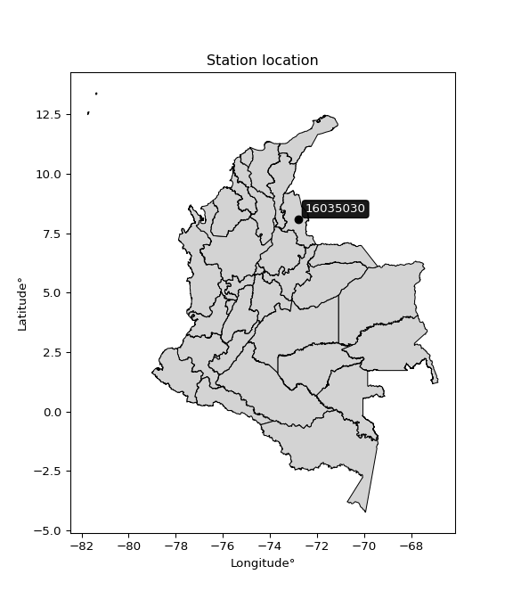

<div align="center">


</div>

# PMax24h Station (Rain): 16035030

Maximum Precipitation in 24 hours (PMax24h) is the greatest amount of rainfall for a specific duration that is meteorologically possible for a given location, acting as a "worst-case" scenario for extreme storms, crucial for designing safety-critical infrastructure like bridges, river deviations, dams, spillways, and nuclear plants to prevent catastrophic failure. The PMax24h is related with the Probable Maximum Precipitation (PMP) and it is calculated by hydrologists using meteorological data to determine the upper limit of extreme rainfall, often leading to the Probable Maximum Flood (PMF) for flood control design, and is increasingly being studied for climate change impacts. Probable Maximum Precipitation (PMP) is the theoretical upper limit of rainfall, a deterministic estimate for extreme events, while probability distributions (like GEV, Gumbel) describe the likelihood and frequency of various precipitation amounts, including rare ones, showing how often events occur, with PMP representing the extreme end of these distributions, used for critical infrastructure design to ensure safety against the worst conceivable weather, unlike standard statistical forecasts which cover typical probabilities.

The most common probability distributions in hydrology, used for analyzing floods, rainfall, and streamflow, include the Normal, Log-Normal, Gumbel, Gamma (including Log-Pearson Type III), and Generalized Extreme Value (GEV) distributions, often chosen based on the data´s skewness and whether modeling extremes or general conditions, with Gumbel and GEV popular for extreme events like floods, while the Normal distribution serves as a baseline, though often requiring transformations for skewed hydrological data. These distributions help in designing water infrastructure, managing water resources, and forecasting hydrologic events.

> Hydrological data often isn´t perfectly normal (it´s skewed), so different distributions are needed for different applications, such as: **Flood Frequency Analysis**: Using Gumbel, GEV, or Log-Pearson Type III for predicting extreme flood magnitudes and their return periods, **Rainfall Analysis**: Normal for annual totals, but Log-Normal, Weibull, or GEV for intensity or extreme daily rainfall, **Streamflow Modeling**: Gamma and Log-Normal for maximum flows, GEV for minimum flows, and Kappa for daily flows.

<div align="center">

</img>

</div>


## A. General information


### 1. General running parameters

• app_version: _v20260225_. • runtime: _2026-02-28 16:54:07.457399_. • Python version: _3.14.0_. • SciPy version: _1.16.3_. • Pandas version: _2.3.3_. • NumPy version: _2.3.5_. • Stations dataset (station_dataset_file): _dataset/pmax24h_in/automatic_colombia_2003_2025.csv_. • Stations catalog (station_catalog_file): _dataset/CNE.xls_. • Minimum year to eval til year_max (date_min): _1900_. • Maximum year to eval since year_min (date_max): _2025_. • Creates, save and include plots into reports (create_plot): _False_. • Plot only fit distributions with Δo > Δ (plot_only_fit): _True_. • Plot only simple graphs avoiding multiple CDFs and multiple Extreme values plots (plot_only_simple): _False_. • Eval low extreme values, if False, evaluates high extreme values (low_extreme): _False_. • Eval every SciPy distribution as logarithmic (pdist_logarithmic_on): _True_. • Standard deviation normalized (ddof): _1.0_. • Return periods to eval in years (Tr): _[2, 2.33, 5, 10, 15, 20, 25, 50, 75, 100, 200, 250, 500, 750, 1000]_. • Minimum data sample per station, 0 means any (minimum_sample): _5_. • Z-Score maximum threshold to adjust a value, 0 means disable (zscore_max): _3.5_. • Z-Score minimum threshold to adjust a value, 0 means disable (zscore_min): _-2.5_. • Avoid zeros, e.g. rain = 0 (avoid_zeros): _True_. • Avoid null values (avoid_nans): _True_. 

:file_folder:Table: [dataset.csv](../../dataset/pmax24h_in/automatic_colombia_2003_2025.csv)

> Delta Degrees of Freedom (DDOF): is a parameter used in the formulas for calculating variance and standard deviation. When ddof=0, the divisor is $N$ (the total number of observations) and this is used when your data set is the entire population. When ddof=1, the divisor is $N-1$ and this is used when your data set is a sample drawn from a larger population. Using $N-1$ provides an unbiased estimate of the population variance (known as Bessel´s correction).


### 2. Station info and location

|   id |   CODIGO | NOMBRE               | CATEGORIA     | TECNOLOGIA                              | ESTADO           | FECHA_INSTALACION   |   FECHA_SUSPENSION |   ALTITUD |   LATITUD |   LONGITUD | DEPARTAMENTO       | MUNICIPIO   | AREA_OPERATIVA                         | ENTIDAD                                                     | AREA_HIDROGRAFICA   | ZONA_HIDROGRAFICA   | SUBZONA_HIDROGRAFICA                                |   CORRIENTE | Catalogo   |   Version |
|-----:|---------:|:---------------------|:--------------|:----------------------------------------|:-----------------|:--------------------|-------------------:|----------:|----------:|-----------:|:-------------------|:------------|:---------------------------------------|:------------------------------------------------------------|:--------------------|:--------------------|:----------------------------------------------------|------------:|:-----------|----------:|
|    0 | 16035030 | SARDINATA [16035030] | Pluviométrica | Automática con Telemetría, Convencional | En Mantenimiento | 15/03/1973          |                nan |       320 |   8.07667 |   -72.8031 | Norte De Santander | Sardinata   | Area Operativa 08 - Santanderes-Arauca | INSTITUTO DE HIDROLOGIA METEOROLOGIA Y ESTUDIOS AMBIENTALES | Caribe              | Catatumbo           | Río Nuevo Presidente - Tres Bocas (Sardinata, Tibu) |         nan | CNE_IDEAM  |  20251226 |

<div align="center">

Dynamic map: [:earth_americas:Google](http://maps.google.com/maps?q=8.076666667,-72.80305556) [:earth_americas:OSM](https://www.openstreetmap.org/#map=18/8.076666667/-72.80305556&layers=P) [:earth_americas:Bing](https://www.bing.com/maps?cp=8.076666667~-72.80305556&lvl=18) [:earth_americas:Apple](https://maps.apple.com/frame?center=8.076666667%2C-72.80305556&span=0.003%2C0.006)

</div>


<div align="center">

```geojson
{
  "type": "Feature",
  "geometry": {
    "type": "Point", 
    "coordinates": [-72.80305556, 8.076666667]
  }, 
  "properties": {
    "Name": "16035030"
  }
}
```

</div>


### 3. Discrete values table and plot

<div align="center">

|               |          0 |           1 |           2 |           3 |           4 |           5 |          6 |          7 |           8 |
|:--------------|-----------:|------------:|------------:|------------:|------------:|------------:|-----------:|-----------:|------------:|
| Date          | 2017       | 2018        | 2019        | 2020        | 2021        | 2022        | 2023       | 2024       | 2025        |
| Value         |   32.4     |   78.2      |   81.6      |   73.2      |   79.8      |   25.2      |    3       |  133.6     |   18.6      |
| Value_initial |   32.4     |   78.2      |   81.6      |   73.2      |   79.8      |   25.2      |    3       |  133.6     |   18.6      |
| count         |    9       |    9        |    9        |    9        |    9        |    9        |    9       |    9       |    9        |
| mean          |   58.4     |   58.4      |   58.4      |   58.4      |   58.4      |   58.4      |   58.4     |   58.4     |   58.4      |
| std           |   41.3729  |   41.3729   |   41.3729   |   41.3729   |   41.3729   |   41.3729   |   41.3729  |   41.3729  |   41.3729   |
| zscore        |   -0.62843 |    0.478574 |    0.560753 |    0.357722 |    0.517246 |   -0.802457 |   -1.33904 |    1.81761 |   -0.961981 |


</div>


> The initial value (value_initial) correspond to the initial obtained or null completed value, and value (value) is adjusted only when the initial value is outside the valid range (outlier) definite through the Z-Score value. If Z-Score is active, values out of range or outliers are replaced with the station mean value. A Z-Score (or standard score) measures how many standard deviations a data point is from the mean of a dataset, indicating its relative position; positive scores mean above the mean, negative mean below, and a score of zero is exactly at the mean, allowing for comparison of values from different distributions. It´s calculated using the formula $z=(x–μ)/σ$, where $x$ is the data point, $μ$ is the mean, and $σ$ is the standard deviation, helping identify outliers and understand probability.
>
> <sub>**Note**: In this study, "completing" (filling gaps in) and "extending" (forecasting or lengthening the historical record) rainfall data series are avoided for certain critical analyses because they introduce artificial bias and uncertainty, which can distort the statistics of rare events (extremes), alter day-to-day variability, and compromise the integrity and homogeneity of the original data. Some reasons against Completing/Extending rainfall data are: **Distortion of Extremes and Variability**: The primary issue is that most gap-filling or extension methods rely on averaging or regression with nearby stations, which inherently smooths the data. Rainfall is highly variable in space and time, with a large percentage of zero values and occasional large storms. Infilling methods often underestimate the highest values and overestimate the lowest (zero) values, which severely distorts analyses focused on flood frequency, drought severity, and intensity-duration-frequency (IDF) curves, **Loss of Data Homogeneity**: Infilled or extended data are synthetic estimates, not actual measurements. Combining these estimates with observed data can violate the assumption of data homogeneity, which requires that the data properties do not change over time. Inhomogeneity can lead to incorrect conclusions about long-term trends or changes in climate patterns, **Propagation of Errors**: Errors and biases from the original data (e.g., wind-induced undercatch, instrument errors, site changes) or the data used for imputation can propagate through the analysis, leading to unreliable hydrological models and inaccurate predictions, **Compromised Statistical Integrity**: For statistical analyses, especially those involving the frequency of events, using artificial data can introduce time bias or autocorrelation that doesn´t exist in reality, making it difficult to assess the true probability of events, **Difficulty in Validation**: It is difficult to accurately validate the quality of filled or extended data, especially for past periods where ground-truth measurements are unavailable. The reliability of imputation techniques heavily depends on the density of the surrounding station network and the complexity of the local topography.</sub>


### 4. Active continuous probability distributions from SciPy (80 of 104 available)

A Probability Density Function (PDF) describes the relative likelihood of a continuous random variable falling within a specific range, where the total area under its curve equals 1, and the area over any interval gives the actual probability for that range. Unlike discrete probabilities (like rolling a die), a PDF shows density, not direct probability for a single point (which is zero), with higher points indicating higher likelihood, often visualized as a bell curve for normal distributions.

A log of a probability density function (log-PDF) is simply the logarithm of the PDF´s value, denoted as $log(f(x))$, useful for converting multiplication of probabilities into addition, improving numerical stability with tiny numbers, and connecting to information theory concepts like entropy. Instead of dealing with very small probabilities (e.g., 0.000001), log-PDFs use negative numbers (e.g., $log(0.00001) ≈ -11.51$ that are easier for computers to handle, preventing underflow errors and simplifying complex calculations. In this study, each active probability distribution from SciPy is also evaluated in the $log$ form.

[scipy.stats](https://docs.scipy.org/doc/scipy/reference/stats.html) is a Python´s powerful submodule within the SciPy library for comprehensive statistical analysis, offering over 130 probability distributions (like Normal, Poisson, etc.), functions for descriptive stats (mean, variance), hypothesis testing (t-tests, chi-square), random variable generation, and statistical tests, making it essential for data science, modeling, and research. It provides tools to explore, model, and draw conclusions from data efficiently, working seamlessly with [NumPy](https://numpy.org/).

<div align="center">

|   id | p_dist           |   n_parameter | fit_method   | label                                                                       | active   | ref                                                                                                      |
|-----:|:-----------------|--------------:|:-------------|:----------------------------------------------------------------------------|:---------|:---------------------------------------------------------------------------------------------------------|
|    0 | alpha            |             3 | MLE          | Alpha                                                                       | True     | [:mortar_board:](https://docs.scipy.org/doc/scipy/reference/generated/scipy.stats.alpha.html)            |
|    1 | anglit           |             2 | MM           | Anglit                                                                      | True     | [:mortar_board:](https://docs.scipy.org/doc/scipy/reference/generated/scipy.stats.anglit.html)           |
|    2 | arcsine          |             2 | MM           | Arcsine                                                                     | True     | [:mortar_board:](https://docs.scipy.org/doc/scipy/reference/generated/scipy.stats.arcsine.html)          |
|    3 | argus            |             3 | MLE          | Argus                                                                       | True     | [:mortar_board:](https://docs.scipy.org/doc/scipy/reference/generated/scipy.stats.argus.html)            |
|    4 | beta             |             4 | MLE          | Beta                                                                        | True     | [:mortar_board:](https://docs.scipy.org/doc/scipy/reference/generated/scipy.stats.beta.html)             |
|    5 | betaprime        |             4 | MLE          | Beta prime                                                                  | True     | [:mortar_board:](https://docs.scipy.org/doc/scipy/reference/generated/scipy.stats.betaprime.html)        |
|    6 | bradford         |             3 | MLE          | Bradford                                                                    | True     | [:mortar_board:](https://docs.scipy.org/doc/scipy/reference/generated/scipy.stats.bradford.html)         |
|    7 | burr             |             4 | MLE          | Burr (Type III)                                                             | True     | [:mortar_board:](https://docs.scipy.org/doc/scipy/reference/generated/scipy.stats.burr.html)             |
|    8 | burr12           |             4 | MLE          | Burr (Type III) 12                                                          | True     | [:mortar_board:](https://docs.scipy.org/doc/scipy/reference/generated/scipy.stats.burr12.html)           |
|    9 | cosine           |             2 | MLE          | Cosine                                                                      | True     | [:mortar_board:](https://docs.scipy.org/doc/scipy/reference/generated/scipy.stats.cosine.html)           |
|   10 | crystalball      |             4 | MLE          | Crystalball                                                                 | True     | [:mortar_board:](https://docs.scipy.org/doc/scipy/reference/generated/scipy.stats.crystalball.html)      |
|   11 | dgamma           |             3 | MLE          | Double gamma                                                                | True     | [:mortar_board:](https://docs.scipy.org/doc/scipy/reference/generated/scipy.stats.dgamma.html)           |
|   12 | dweibull         |             3 | MLE          | Double Weibull                                                              | True     | [:mortar_board:](https://docs.scipy.org/doc/scipy/reference/generated/scipy.stats.dweibull.html)         |
|   13 | erlang           |             3 | MLE          | Erlang                                                                      | True     | [:mortar_board:](https://docs.scipy.org/doc/scipy/reference/generated/scipy.stats.erlang.html)           |
|   14 | exponnorm        |             3 | MLE          | Exponentially modified Normal                                               | True     | [:mortar_board:](https://docs.scipy.org/doc/scipy/reference/generated/scipy.stats.exponnorm.html)        |
|   15 | exponpow         |             3 | MLE          | Exponential power                                                           | True     | [:mortar_board:](https://docs.scipy.org/doc/scipy/reference/generated/scipy.stats.exponpow.html)         |
|   16 | exponweib        |             4 | MLE          | Exponentiated Weibull                                                       | True     | [:mortar_board:](https://docs.scipy.org/doc/scipy/reference/generated/scipy.stats.exponweib.html)        |
|   17 | f                |             4 | MLE          | F                                                                           | True     | [:mortar_board:](https://docs.scipy.org/doc/scipy/reference/generated/scipy.stats.f.html)                |
|   18 | fatiguelife      |             3 | MLE          | Fatigue-life (Birnbaum-Saunders)                                            | True     | [:mortar_board:](https://docs.scipy.org/doc/scipy/reference/generated/scipy.stats.fatiguelife.html)      |
|   19 | foldnorm         |             3 | MM           | Fold Normal                                                                 | True     | [:mortar_board:](https://docs.scipy.org/doc/scipy/reference/generated/scipy.stats.foldnorm.html)         |
|   20 | gamma            |             3 | MLE          | Gamma                                                                       | True     | [:mortar_board:](https://docs.scipy.org/doc/scipy/reference/generated/scipy.stats.gamma.html)            |
|   21 | gausshyper       |             6 | MLE          | Gauss hypergeometric                                                        | True     | [:mortar_board:](https://docs.scipy.org/doc/scipy/reference/generated/scipy.stats.gausshyper.html)       |
|   22 | genexpon         |             5 | MLE          | Generalized exponential                                                     | True     | [:mortar_board:](https://docs.scipy.org/doc/scipy/reference/generated/scipy.stats.genexpon.html)         |
|   23 | genextreme       |             3 | MLE          | Generalized exponential                                                     | True     | [:mortar_board:](https://docs.scipy.org/doc/scipy/reference/generated/scipy.stats.genextreme.html)       |
|   24 | gengamma         |             4 | MLE          | Generalized gamma                                                           | True     | [:mortar_board:](https://docs.scipy.org/doc/scipy/reference/generated/scipy.stats.gengamma.html)         |
|   25 | genhalflogistic  |             3 | MLE          | Generalized half-logistic                                                   | True     | [:mortar_board:](https://docs.scipy.org/doc/scipy/reference/generated/scipy.stats.genhalflogistic.html)  |
|   26 | genlogistic      |             3 | MLE          | Generalized logistic                                                        | True     | [:mortar_board:](https://docs.scipy.org/doc/scipy/reference/generated/scipy.stats.genlogistic.html)      |
|   27 | gennorm          |             3 | MLE          | Generalized Normal                                                          | True     | [:mortar_board:](https://docs.scipy.org/doc/scipy/reference/generated/scipy.stats.gennorm.html)          |
|   28 | genpareto        |             3 | MLE          | Generalized Pareto                                                          | True     | [:mortar_board:](https://docs.scipy.org/doc/scipy/reference/generated/scipy.stats.genpareto.html)        |
|   29 | gompertz         |             3 | MLE          | Gompertz (or truncated Gumbel)                                              | True     | [:mortar_board:](https://docs.scipy.org/doc/scipy/reference/generated/scipy.stats.gompertz.html)         |
|   30 | gumbel_l         |             2 | MM           | Gumbel Left Skew                                                            | True     | [:mortar_board:](https://docs.scipy.org/doc/scipy/reference/generated/scipy.stats.gumbel_l.html)         |
|   31 | gumbel_r         |             2 | MM           | Gumbel Right Skew                                                           | True     | [:mortar_board:](https://docs.scipy.org/doc/scipy/reference/generated/scipy.stats.gumbel_r.html)         |
|   32 | halfgennorm      |             3 | MLE          | Upper half of a generalized normal                                          | True     | [:mortar_board:](https://docs.scipy.org/doc/scipy/reference/generated/scipy.stats.halfgennorm.html)      |
|   33 | halflogistic     |             2 | MM           | Half-logistic                                                               | True     | [:mortar_board:](https://docs.scipy.org/doc/scipy/reference/generated/scipy.stats.halflogistic.html)     |
|   34 | halfnorm         |             2 | MM           | Half Normal                                                                 | True     | [:mortar_board:](https://docs.scipy.org/doc/scipy/reference/generated/scipy.stats.halfnorm.html)         |
|   35 | hypsecant        |             2 | MM           | hyperbolic secant                                                           | True     | [:mortar_board:](https://docs.scipy.org/doc/scipy/reference/generated/scipy.stats.hypsecant.html)        |
|   36 | invgamma         |             3 | MLE          | Inverted gamma                                                              | True     | [:mortar_board:](https://docs.scipy.org/doc/scipy/reference/generated/scipy.stats.invgamma.html)         |
|   37 | invgauss         |             3 | MLE          | Inverse Gaussian                                                            | True     | [:mortar_board:](https://docs.scipy.org/doc/scipy/reference/generated/scipy.stats.invgauss.html)         |
|   38 | invweibull       |             3 | MLE          | Inverted Weibull                                                            | True     | [:mortar_board:](https://docs.scipy.org/doc/scipy/reference/generated/scipy.stats.invweibull.html)       |
|   39 | johnsonsb        |             4 | MLE          | Johnson SB                                                                  | True     | [:mortar_board:](https://docs.scipy.org/doc/scipy/reference/generated/scipy.stats.johnsonsb.html)        |
|   40 | johnsonsu        |             4 | MLE          | Johnson Su                                                                  | True     | [:mortar_board:](https://docs.scipy.org/doc/scipy/reference/generated/scipy.stats.johnsonsu.html)        |
|   41 | kappa3           |             3 | MLE          | Kappa 3                                                                     | True     | [:mortar_board:](https://docs.scipy.org/doc/scipy/reference/generated/scipy.stats.kappa3.html)           |
|   42 | kappa4           |             4 | MLE          | Kappa 4                                                                     | True     | [:mortar_board:](https://docs.scipy.org/doc/scipy/reference/generated/scipy.stats.kappa4.html)           |
|   43 | ksone            |             3 | MLE          | Kolmogorov-Smirnov one-sided test statistic distribution                    | True     | [:mortar_board:](https://docs.scipy.org/doc/scipy/reference/generated/scipy.stats.ksone.html)            |
|   44 | kstwobign        |             2 | MLE          | Limiting distribution of scaled Kolmogorov-Smirnov two-sided test statistic | True     | [:mortar_board:](https://docs.scipy.org/doc/scipy/reference/generated/scipy.stats.kstwobign.html)        |
|   45 | laplace          |             2 | MM           | Laplace                                                                     | True     | [:mortar_board:](https://docs.scipy.org/doc/scipy/reference/generated/scipy.stats.laplace.html)          |
|   46 | levy_l           |             2 | MLE          | Left-skewed Levy                                                            | True     | [:mortar_board:](https://docs.scipy.org/doc/scipy/reference/generated/scipy.stats.levy_l.html)           |
|   47 | loggamma         |             3 | MLE          | Log gamma                                                                   | True     | [:mortar_board:](https://docs.scipy.org/doc/scipy/reference/generated/scipy.stats.loggamma.html)         |
|   48 | logistic         |             2 | MM           | Logistic (or Sech-squared)                                                  | True     | [:mortar_board:](https://docs.scipy.org/doc/scipy/reference/generated/scipy.stats.logistic.html)         |
|   49 | loglaplace       |             3 | MLE          | Log-Laplace                                                                 | True     | [:mortar_board:](https://docs.scipy.org/doc/scipy/reference/generated/scipy.stats.loglaplace.html)       |
|   50 | lomax            |             3 | MLE          | Lomax (Pareto of the second kind)                                           | True     | [:mortar_board:](https://docs.scipy.org/doc/scipy/reference/generated/scipy.stats.lomax.html)            |
|   51 | maxwell          |             2 | MM           | Maxwell                                                                     | True     | [:mortar_board:](https://docs.scipy.org/doc/scipy/reference/generated/scipy.stats.maxwell.html)          |
|   52 | mielke           |             4 | MLE          | Mielke Beta-Kappa / Dagum                                                   | True     | [:mortar_board:](https://docs.scipy.org/doc/scipy/reference/generated/scipy.stats.mielke.html)           |
|   53 | moyal            |             2 | MM           | Moyal                                                                       | True     | [:mortar_board:](https://docs.scipy.org/doc/scipy/reference/generated/scipy.stats.moyal.html)            |
|   54 | nakagami         |             3 | MLE          | Nakagami                                                                    | True     | [:mortar_board:](https://docs.scipy.org/doc/scipy/reference/generated/scipy.stats.nakagami.html)         |
|   55 | ncf              |             5 | MLE          | Non-central F distribution                                                  | True     | [:mortar_board:](https://docs.scipy.org/doc/scipy/reference/generated/scipy.stats.ncf.html)              |
|   56 | nct              |             4 | MLE          | Non-central Student’s t                                                     | True     | [:mortar_board:](https://docs.scipy.org/doc/scipy/reference/generated/scipy.stats.nct.html)              |
|   57 | norm             |             2 | MM           | Normal                                                                      | True     | [:mortar_board:](https://docs.scipy.org/doc/scipy/reference/generated/scipy.stats.norm.html)             |
|   58 | pearson3         |             3 | MM           | Pearson type III                                                            | True     | [:mortar_board:](https://docs.scipy.org/doc/scipy/reference/generated/scipy.stats.pearson3.html)         |
|   59 | powerlaw         |             3 | MLE          | Power-function                                                              | True     | [:mortar_board:](https://docs.scipy.org/doc/scipy/reference/generated/scipy.stats.powerlaw.html)         |
|   60 | rayleigh         |             2 | MM           | Rayleigh                                                                    | True     | [:mortar_board:](https://docs.scipy.org/doc/scipy/reference/generated/scipy.stats.rayleigh.html)         |
|   61 | rdist            |             3 | MLE          | R-distributed (symmetric beta)                                              | True     | [:mortar_board:](https://docs.scipy.org/doc/scipy/reference/generated/scipy.stats.rdist.html)            |
|   62 | rice             |             3 | MLE          | Rice                                                                        | True     | [:mortar_board:](https://docs.scipy.org/doc/scipy/reference/generated/scipy.stats.rice.html)             |
|   63 | semicircular     |             2 | MM           | Semicircular                                                                | True     | [:mortar_board:](https://docs.scipy.org/doc/scipy/reference/generated/scipy.stats.semicircular.html)     |
|   64 | skewnorm         |             3 | MLE          | Skew normal                                                                 | True     | [:mortar_board:](https://docs.scipy.org/doc/scipy/reference/generated/scipy.stats.skewnorm.html)         |
|   65 | t                |             3 | MLE          | Student’s t                                                                 | True     | [:mortar_board:](https://docs.scipy.org/doc/scipy/reference/generated/scipy.stats.t.html)                |
|   66 | trapezoid        |             4 | MLE          | Trapezoid                                                                   | True     | [:mortar_board:](https://docs.scipy.org/doc/scipy/reference/generated/scipy.stats.trapezoid.html)        |
|   67 | triang           |             3 | MLE          | Triangular                                                                  | True     | [:mortar_board:](https://docs.scipy.org/doc/scipy/reference/generated/scipy.stats.triang.html)           |
|   68 | truncexpon       |             3 | MLE          | Truncated exponential                                                       | True     | [:mortar_board:](https://docs.scipy.org/doc/scipy/reference/generated/scipy.stats.truncexpon.html)       |
|   69 | truncnorm        |             4 | MLE          | Truncated normal                                                            | True     | [:mortar_board:](https://docs.scipy.org/doc/scipy/reference/generated/scipy.stats.truncnorm.html)        |
|   70 | truncpareto      |             4 | MLE          | Upper truncated Pareto                                                      | True     | [:mortar_board:](https://docs.scipy.org/doc/scipy/reference/generated/scipy.stats.truncpareto.html)      |
|   71 | truncweibull_min |             5 | MLE          | Doubly truncated Weibull minimum                                            | True     | [:mortar_board:](https://docs.scipy.org/doc/scipy/reference/generated/scipy.stats.truncweibull_min.html) |
|   72 | tukeylambda      |             3 | MLE          | Tukey-Lamdba                                                                | True     | [:mortar_board:](https://docs.scipy.org/doc/scipy/reference/generated/scipy.stats.tukeylambda.html)      |
|   73 | uniform          |             2 | MLE          | Uniform                                                                     | True     | [:mortar_board:](https://docs.scipy.org/doc/scipy/reference/generated/scipy.stats.uniform.html)          |
|   74 | vonmises         |             3 | MLE          | Von Mises                                                                   | True     | [:mortar_board:](https://docs.scipy.org/doc/scipy/reference/generated/scipy.stats.vonmises.html)         |
|   75 | vonmises_line    |             3 | MLE          | Von Mises line                                                              | True     | [:mortar_board:](https://docs.scipy.org/doc/scipy/reference/generated/scipy.stats.vonmises_line.html)    |
|   76 | wald             |             2 | MM           | Wald                                                                        | True     | [:mortar_board:](https://docs.scipy.org/doc/scipy/reference/generated/scipy.stats.wald.html)             |
|   77 | weibull_max      |             3 | MLE          | Weibull maximum                                                             | True     | [:mortar_board:](https://docs.scipy.org/doc/scipy/reference/generated/scipy.stats.weibull_max.html)      |
|   78 | weibull_min      |             3 | MLE          | Weibull minimum                                                             | True     | [:mortar_board:](https://docs.scipy.org/doc/scipy/reference/generated/scipy.stats.weibull_min.html)      |
|   79 | wrapcauchy       |             3 | MLE          | Wrapped  Cauchy                                                             | True     | [:mortar_board:](https://docs.scipy.org/doc/scipy/reference/generated/scipy.stats.wrapcauchy.html)       |

</div>

> **n_parameter:** # arguments & localization & scale.
>
> **Fit methods:** (MLE) maximum likelihood, (MM) L-moments.
>
>**Inactive** (With the only purpose of prevent loops, zero divisions, infinite values, over high estimated values or horizontal trending for recurrence intervals estimations, the follow distributions were disabled.)**:** lognorm, norminvgauss, powernorm, powerlognorm, cauchy, halfcauchy, foldcauchy, skewcauchy, chi2, expon, fisk, genhyperbolic, geninvgauss, gibrat, kstwo, laplace_asymmetric, levy, levy_stable, ncx2, pareto, rel_breitwigner, recipinvgauss, studentized_range, loguniform, 


## B. Probability (PDF) vs. Empirical (EDF) distributions functions

A continuous probability distribution (CPD) describes probabilities for variables that can take any value within a range (like rain any time), unlike discrete variables with specific outcomes (like temperature). It uses a Probability Density Function (PDF), a curve where the total area under it equals 1, and the probability of the variable falling within an interval (a to b) is found by calculating the area under the curve between those points. A key feature is that the probability of hitting any single exact value is zero, so probabilities are always expressed for ranges, e.g., $P(a ≤ X ≤ b)$.

<div align="center">

Distributions parameters from station values
|     |   station | p_dist              |   n |              loc |           scale | shape                  | shape1                | shape2                | shape3             |
|----:|----------:|:--------------------|----:|-----------------:|----------------:|:-----------------------|:----------------------|:----------------------|:-------------------|
|   0 |  16035030 | alpha               |   9 |    -16.279       |    43.5806      | 0.06784680931483954    |                       |                       |                    |
|   1 |  16035030 | anglit              |   9 |     58.4         |   114.11        |                        |                       |                       |                    |
|   2 |  16035030 | arcsine             |   9 |      3.23607     |   110.328       |                        |                       |                       |                    |
|   3 |  16035030 | argus               |   9 |    -32.7898      |   171.96        | 4.818785350437304e-06  |                       |                       |                    |
|   4 |  16035030 | beta                |   9 |      3           |   186.712       | 0.3559354075869007     | 1.1513435112364578    |                       |                    |
|   5 |  16035030 | betaprime           |   9 |     -7.20803     | 17892.2         | 2.294326072110869      | 631.3010315840813     |                       |                    |
|   6 |  16035030 | bradford            |   9 |      2.99998     |   130.6         | 1.7779833325103884     |                       |                       |                    |
|   7 |  16035030 | burr                |   9 |      2.99998     |   117.799       | 8.512725651130044      | 0.07667070456415026   |                       |                    |
|   8 |  16035030 | burr12              |   9 |      3           |  4138.72        | 0.9447113434684211     | 67.5180743212058      |                       |                    |
|   9 |  16035030 | cosine              |   9 |     61.0466      |    33.0395      |                        |                       |                       |                    |
|  10 |  16035030 | crystalball         |   9 |     58.4         |    39.0068      | 4561.830132115221      | 330.62270739104224    |                       |                    |
|  11 |  16035030 | dgamma              |   9 |     52.5935      |     6.8261      | 5.120979369404729      |                       |                       |                    |
|  12 |  16035030 | dweibull            |   9 |     53.9513      |    39.5745      | 2.065193318369153      |                       |                       |                    |
|  13 |  16035030 | erlang              |   9 |      3           |    64.028       | 0.4645155923221301     |                       |                       |                    |
|  14 |  16035030 | exponnorm           |   9 |     38.9387      |    34.0441      | 0.5716503372885995     |                       |                       |                    |
|  15 |  16035030 | exponpow            |   9 |      3           |    95.6544      | 0.6012593121612813     |                       |                       |                    |
|  16 |  16035030 | exponweib           |   9 |   -422.285       |   221.47        | 313.1808910826503      | 2.3685142236483143    |                       |                    |
|  17 |  16035030 | f                   |   9 |      3           |    55.4512      | 1.7636804345321497     | 73.14891183949601     |                       |                    |
|  18 |  16035030 | fatiguelife         |   9 |      3           |     8.67085e-05 | 873.0589415310774      |                       |                       |                    |
|  19 |  16035030 | foldnorm            |   9 |    -13.033       |    41.9271      | 1.6638166163713732     |                       |                       |                    |
|  20 |  16035030 | gamma               |   9 |      3           |    57.3645      | 0.8225029941319565     |                       |                       |                    |
|  21 |  16035030 | gausshyper          |   9 |     -1.88275     |   135.483       | 1.010524229421336      | 0.8426780208559457    | 0.9736766527679263    | 0.9843381026933582 |
|  22 |  16035030 | genexpon            |   9 |      2.99998     |     2.4209      | 0.044032078761822864   | 0.001230787374681734  | 2.0204613390408466    |                    |
|  23 |  16035030 | genextreme          |   9 |     42.2833      |    35.0658      | 0.14880228402180057    |                       |                       |                    |
|  24 |  16035030 | gengamma            |   9 |    -17.3302      |     6.31609     | 5.932714488570326      | 0.7306599049125482    |                       |                    |
|  25 |  16035030 | genhalflogistic     |   9 |    -10.3872      |   149.874       | 1.0408846991798786     |                       |                       |                    |
|  26 |  16035030 | genlogistic         |   9 |   -169.325       |    33.0282      | 558.8541571679947      |                       |                       |                    |
|  27 |  16035030 | gennorm             |   9 |     68.2998      |    65.3038      | 169005.7214015131      |                       |                       |                    |
|  28 |  16035030 | genpareto           |   9 |      0.00305731  |   134.557       | -1.0071854941497298    |                       |                       |                    |
|  29 |  16035030 | gompertz            |   9 |      3           |    77.6925      | 0.7548909427155122     |                       |                       |                    |
|  30 |  16035030 | gumbel_l            |   9 |     75.9551      |    30.4135      |                        |                       |                       |                    |
|  31 |  16035030 | gumbel_r            |   9 |     40.8449      |    30.4135      |                        |                       |                       |                    |
|  32 |  16035030 | halfgennorm         |   9 |      3           |     4.17366     | 0.4033649121688671     |                       |                       |                    |
|  33 |  16035030 | halflogistic        |   9 |     12.1679      |    33.3494      |                        |                       |                       |                    |
|  34 |  16035030 | halfnorm            |   9 |      6.77028     |    64.7082      |                        |                       |                       |                    |
|  35 |  16035030 | hypsecant           |   9 |     58.4         |    24.8325      |                        |                       |                       |                    |
|  36 |  16035030 | invgamma            |   9 |   -145.407       |  5440.9         | 27.686560912028476     |                       |                       |                    |
|  37 |  16035030 | invgauss            |   9 |    -57.2033      |   896.551       | 0.1288786760965391     |                       |                       |                    |
|  38 |  16035030 | invweibull          |   9 |      3           |     3.06948     | 0.06004348186906084    |                       |                       |                    |
|  39 |  16035030 | johnsonsb           |   9 |      3           |   130.6         | 0.42614909036384985    | 0.20108017673825357   |                       |                    |
|  40 |  16035030 | johnsonsu           |   9 |    -71.774       |    21.2275      | -8.154877203792928     | 3.30362749998657      |                       |                    |
|  41 |  16035030 | kappa3              |   9 |      3           |    79.7662      | 6.645024886731559      |                       |                       |                    |
|  42 |  16035030 | kappa4              |   9 |    -10.1182      |   142.401       | 1.1013937599646584     | 0.9858108807378836    |                       |                    |
|  43 |  16035030 | ksone               |   9 |    -10.06        |   156.72        | 1.0                    |                       |                       |                    |
|  44 |  16035030 | kstwobign           |   9 |    -75.118       |   152.687       |                        |                       |                       |                    |
|  45 |  16035030 | laplace             |   9 |     58.4         |    27.582       |                        |                       |                       |                    |
|  46 |  16035030 | levy_l              |   9 |    142.038       |    42.0004      |                        |                       |                       |                    |
|  47 |  16035030 | loggamma            |   9 |  -9189.03        |  1318.35        | 1113.0559448329777     |                       |                       |                    |
|  48 |  16035030 | logistic            |   9 |     58.4         |    21.5056      |                        |                       |                       |                    |
|  49 |  16035030 | loglaplace          |   9 |     -0.166922    |    73.3669      | 1.2428491480215484     |                       |                       |                    |
|  50 |  16035030 | lomax               |   9 |      3           |  1697.47        | 29.48942317541708      |                       |                       |                    |
|  51 |  16035030 | maxwell             |   9 |    -34.0297      |    57.9217      |                        |                       |                       |                    |
|  52 |  16035030 | mielke              |   9 |      3           |   133.961       | 0.5188337269828749     | 11.934689704474458    |                       |                    |
|  53 |  16035030 | moyal               |   9 |     36.0934      |    17.5592      |                        |                       |                       |                    |
|  54 |  16035030 | nakagami            |   9 |     18.6         |    62.0136      | 0.24917813307424502    |                       |                       |                    |
|  55 |  16035030 | ncf                 |   9 |      0.00627913  |     0.00029798  | 5.598368567408219e-05  | 6.150320661509053     | 8.870716377901704     |                    |
|  56 |  16035030 | nct                 |   9 |   -123.664       |    27.8873      | 25.452194443591146     | 6.362682646150925     |                       |                    |
|  57 |  16035030 | norm                |   9 |     58.4         |    39.0068      |                        |                       |                       |                    |
|  58 |  16035030 | pearson3            |   9 |     58.4         |    39.0067      | 0.32070847812444414    |                       |                       |                    |
|  59 |  16035030 | powerlaw            |   9 |      3           |   130.6         | 0.18819716784436286    |                       |                       |                    |
|  60 |  16035030 | rayleigh            |   9 |    -16.2222      |    59.5399      |                        |                       |                       |                    |
|  61 |  16035030 | rdist               |   9 |     -9.06097     |    82.261       | 1.0003355231744167     |                       |                       |                    |
|  62 |  16035030 | rice                |   9 |    -13.2119      |    51.5815      | 0.7066158952508541     |                       |                       |                    |
|  63 |  16035030 | semicircular        |   9 |     58.4         |    78.0136      |                        |                       |                       |                    |
|  64 |  16035030 | skewnorm            |   9 |      2.99998     |    67.7462      | 19769284.64195235      |                       |                       |                    |
|  65 |  16035030 | t                   |   9 |     58.4002      |    39.0063      | 65411320.437157616     |                       |                       |                    |
|  66 |  16035030 | trapezoid           |   9 |    -10.563       |   156.72        | 1.0                    | 1.0                   |                       |                    |
|  67 |  16035030 | triang              |   9 |    -10.8117      |   144.412       | 0.9999994036891628     |                       |                       |                    |
|  68 |  16035030 | truncexpon          |   9 |      0.554074    |   135.934       | 0.9787504390977773     |                       |                       |                    |
|  69 |  16035030 | truncnorm           |   9 |    -54.2841      |    50.2693      | -99.50163403610028     | 3.737552638448796     |                       |                    |
|  70 |  16035030 | truncpareto         |   9 |      2.99368     |     0.00631638  | 0.12518127796682366    | 20677.402477675714    |                       |                    |
|  71 |  16035030 | truncweibull_min    |   9 |      0.654971    |   145.638       | 0.9845712399017714     | 0.0009454710042039612 | 0.912847836485918     |                    |
|  72 |  16035030 | tukeylambda         |   9 |     50.3778      |    36.4617      | 1.1473930022902685     |                       |                       |                    |
|  73 |  16035030 | uniform             |   9 |      3           |   130.6         |                        |                       |                       |                    |
|  74 |  16035030 | vonmises            |   9 |      0.432134    |     1           | 0.14953550873475938    |                       |                       |                    |
|  75 |  16035030 | vonmises_line       |   9 |     68.3001      |    20.7857      | 0.6577325749505023     |                       |                       |                    |
|  76 |  16035030 | wald                |   9 |     19.3932      |    39.0068      |                        |                       |                       |                    |
|  77 |  16035030 | weibull_max         |   9 |    133.6         |     1.58317     | 0.18496630152951923    |                       |                       |                    |
|  78 |  16035030 | weibull_min         |   9 |     -1.1561      |    65.049       | 1.4233252364863735     |                       |                       |                    |
|  79 |  16035030 | wrapcauchy          |   9 |      2.95432     |    20.7929      | 0.00011794238598467562 |                       |                       |                    |
|  80 |  16035030 | logalpha            |   9 |    -24.449       |   665.501       | 23.726706951858972     |                       |                       |                    |
|  81 |  16035030 | loganglit           |   9 |      3.67283     |     3.20547     |                        |                       |                       |                    |
|  82 |  16035030 | logarcsine          |   9 |      2.12325     |     3.09915     |                        |                       |                       |                    |
|  83 |  16035030 | logargus            |   9 |     -0.14133     |     5.11157     | 2.4056704189910856     |                       |                       |                    |
|  84 |  16035030 | logbeta             |   9 |      0.688652    |     4.2062      | 1.6413075256486858     | 0.5138710037456196    |                       |                    |
|  85 |  16035030 | logbetaprime        |   9 |    -23.327       |   535.536       | 585.8790695406763      | 11625.665243549687    |                       |                    |
|  86 |  16035030 | logbradford         |   9 |      1.09743     |     3.79742     | 2.329274430176617e-05  |                       |                       |                    |
|  87 |  16035030 | logburr             |   9 |     -9.67151     |    14.5846      | 2330.3431065830982     | 0.004655344829362267  |                       |                    |
|  88 |  16035030 | logburr12           |   9 |  -3426.25        |  3440.52        | 4600.003822965195      | 780225.6297874548     |                       |                    |
|  89 |  16035030 | logcosine           |   9 |      3.45631     |     0.99657     |                        |                       |                       |                    |
|  90 |  16035030 | logcrystalball      |   9 |      3.67283     |     1.09573     | 134.83089689355234     | 5.6846418396491485    |                       |                    |
|  91 |  16035030 | logdgamma           |   9 |      3.8034      |     0.325545    | 2.661668190444371      |                       |                       |                    |
|  92 |  16035030 | logdweibull         |   9 |      3.77145     |     0.976519    | 1.4934550757591627     |                       |                       |                    |
|  93 |  16035030 | logerlang           |   9 |    -15.9886      |     0.0670986   | 292.8309439136333      |                       |                       |                    |
|  94 |  16035030 | logexponnorm        |   9 |      3.67203     |     1.09573     | 0.0007312337099447503  |                       |                       |                    |
|  95 |  16035030 | logexponpow         |   9 |     -5.13132e+07 |     5.13132e+07 | 54275055.8755284       |                       |                       |                    |
|  96 |  16035030 | logexponweib        |   9 |     -4.65204e+07 |     4.65204e+07 | 0.25009178393968357    | 173472863.14216942    |                       |                    |
|  97 |  16035030 | logf                |   9 |   -229.399       |   233.076       | 117418.45619758032     | 376125.13519577496    |                       |                    |
|  98 |  16035030 | logfatiguelife      |   9 |   -709.44        |   713.107       | 0.001532060991169424   |                       |                       |                    |
|  99 |  16035030 | logfoldnorm         |   9 |     -0.337684    |     1           | 4.027157720779307      |                       |                       |                    |
| 100 |  16035030 | loggamma            |   9 |    -16.1082      |     0.0654854   | 301.8719288765103      |                       |                       |                    |
| 101 |  16035030 | loggausshyper       |   9 |      0.804172    |     4.09068     | 1.2200157621656693     | 0.6035287529790883    | 1.1015328997452847    | 1.1151279252939275 |
| 102 |  16035030 | loggenexpon         |   9 |      0.800603    |     0.0215951   | 0.0003266961630414134  | 5.38790889933888      | 1.749386027220258e-05 |                    |
| 103 |  16035030 | loggenextreme       |   9 |      3.69628     |     1.27953     | 1.0675456654133688     |                       |                       |                    |
| 104 |  16035030 | loggengamma         |   9 |    -36.9637      |     3.3881      | 269.8526897772534      | 2.2530180817883867    |                       |                    |
| 105 |  16035030 | loggenhalflogistic  |   9 |      0.721585    |     4.38613     | 1.051005600002389      |                       |                       |                    |
| 106 |  16035030 | loggenlogistic      |   9 |      4.73408     |     0.139159    | 0.12795503067305797    |                       |                       |                    |
| 107 |  16035030 | loggennorm          |   9 |      4.2932      |     0.000389329 | 0.22302668182935118    |                       |                       |                    |
| 108 |  16035030 | loggenpareto        |   9 |     -0.207568    |     8.81774     | -1.7281490846516938    |                       |                       |                    |
| 109 |  16035030 | loggompertz         |   9 |      1.09854     |     0.781201    | 0.02107169150495252    |                       |                       |                    |
| 110 |  16035030 | loggumbel_l         |   9 |      4.16596     |     0.854338    |                        |                       |                       |                    |
| 111 |  16035030 | loggumbel_r         |   9 |      3.17969     |     0.854338    |                        |                       |                       |                    |
| 112 |  16035030 | loghalfgennorm      |   9 |      1.09861     |     1.19954     | 0.6794171587621156     |                       |                       |                    |
| 113 |  16035030 | loghalflogistic     |   9 |      2.37412     |     0.936818    |                        |                       |                       |                    |
| 114 |  16035030 | loghalfnorm         |   9 |      2.22247     |     1.81774     |                        |                       |                       |                    |
| 115 |  16035030 | loghypsecant        |   9 |      3.67283     |     0.697564    |                        |                       |                       |                    |
| 116 |  16035030 | loginvgamma         |   9 |    -21.4005      | 11977.3         | 479.2814812694261      |                       |                       |                    |
| 117 |  16035030 | loginvgauss         |   9 |     -8.78945     |  1378.69        | 0.00901758562066753    |                       |                       |                    |
| 118 |  16035030 | loginvweibull       |   9 | -14959.2         | 14962.2         | 11562.493016917011     |                       |                       |                    |
| 119 |  16035030 | logjohnsonsb        |   9 |      1.09861     |     3.79624     | 0.12868127048810252    | 0.21532970092424136   |                       |                    |
| 120 |  16035030 | logjohnsonsu        |   9 |      5.1892      |     0.0173429   | 6.7237758198696245     | 1.3692396272981926    |                       |                    |
| 121 |  16035030 | logkappa3           |   9 |      1.09861     |     3.79607     | 48247.9894775782       |                       |                       |                    |
| 122 |  16035030 | logkappa4           |   9 |      0.685511    |     4.58878     | 1.0268861416179762     | 1.0901431906818115    |                       |                    |
| 123 |  16035030 | logksone            |   9 |      0.718988    |     4.55549     | 1.0                    |                       |                       |                    |
| 124 |  16035030 | logkstwobign        |   9 |     -1.68138     |     6.13635     |                        |                       |                       |                    |
| 125 |  16035030 | loglaplace          |   9 |      3.67283     |     0.774799    |                        |                       |                       |                    |
| 126 |  16035030 | loglevy_l           |   9 |      4.99446     |     0.491326    |                        |                       |                       |                    |
| 127 |  16035030 | logloggamma         |   9 |      4.86231     |     0.182166    | 0.16153227984315954    |                       |                       |                    |
| 128 |  16035030 | loglogistic         |   9 |      3.67283     |     0.604108    |                        |                       |                       |                    |
| 129 |  16035030 | logloglaplace       |   9 |     -7.53777e+07 |     7.53777e+07 | 90307469.35040775      |                       |                       |                    |
| 130 |  16035030 | loglomax            |   9 |      1.09861     |     2.98432e+09 | 1129945776.723426      |                       |                       |                    |
| 131 |  16035030 | logmaxwell          |   9 |      1.0764      |     1.62707     |                        |                       |                       |                    |
| 132 |  16035030 | logmielke           |   9 |     -3.48395     |     8.37927     | 5.84694943179552       | 143966.05194095016    |                       |                    |
| 133 |  16035030 | logmoyal            |   9 |      3.04622     |     0.493252    |                        |                       |                       |                    |
| 134 |  16035030 | lognakagami         |   9 |      2.92316     |     1.11038     | 0.3371608073516482     |                       |                       |                    |
| 135 |  16035030 | logncf              |   9 |    -58.4874      |    61.7069      | 8380.812231927961      | 23747.276093746943    | 60.85280188323179     |                    |
| 136 |  16035030 | lognct              |   9 |    -55.4745      |     1.03877     | 13080.355638018445     | 56.93574482251728     |                       |                    |
| 137 |  16035030 | lognorm             |   9 |      3.67283     |     1.09573     |                        |                       |                       |                    |
| 138 |  16035030 | logpearson3         |   9 |      3.67283     |     1.09573     | -1.220323210646959     |                       |                       |                    |
| 139 |  16035030 | logpowerlaw         |   9 |      1.09861     |     3.79624     | 0.22632513207254057    |                       |                       |                    |
| 140 |  16035030 | lograyleigh         |   9 |      1.57663     |     1.67252     |                        |                       |                       |                    |
| 141 |  16035030 | logrdist            |   9 |      1.86418     |     1.61398     | 1.1849944272148611     |                       |                       |                    |
| 142 |  16035030 | logrice             |   9 |   -402.662       |     1.09573     | 370.83391642200377     |                       |                       |                    |
| 143 |  16035030 | logsemicircular     |   9 |      3.67283     |     2.19144     |                        |                       |                       |                    |
| 144 |  16035030 | logskewnorm         |   9 |      4.89485     |     1.64154     | -25547329.898211822    |                       |                       |                    |
| 145 |  16035030 | logt                |   9 |      3.92424     |     0.786845    | 3.538887990459739      |                       |                       |                    |
| 146 |  16035030 | logtrapezoid        |   9 |      0.573631    |     4.64879     | 1.0                    | 1.0                   |                       |                    |
| 147 |  16035030 | logtriang           |   9 |      0.601292    |     4.29359     | 0.999992184758164      |                       |                       |                    |
| 148 |  16035030 | logtruncexpon       |   9 |      1.09804     |     7.20686     | 0.5268328226978882     |                       |                       |                    |
| 149 |  16035030 | logtruncnorm        |   9 |     -0.384911    |     4.46634     | 0.33103247068861       | 1.182123561215274     |                       |                    |
| 150 |  16035030 | logtruncpareto      |   9 |      1.09826     |     0.000351264 | 0.12514467436682714    | 10808.373763611513    |                       |                    |
| 151 |  16035030 | logtruncweibull_min |   9 |      0.88446     |     7.52783     | 1.295527652081533      | 0.0003013586905566894 | 0.532741613630701     |                    |
| 152 |  16035030 | logtukeylambda      |   9 |      2.28975     |     1.34585     | 1.1298874549032298     |                       |                       |                    |
| 153 |  16035030 | loguniform          |   9 |      1.09861     |     3.79624     |                        |                       |                       |                    |
| 154 |  16035030 | logvonmises         |   9 |     -2.30756     |     1           | 1.5411880018919093     |                       |                       |                    |
| 155 |  16035030 | logvonmises_line    |   9 |      3.84119     |     0.872989    | 1.044157224035672      |                       |                       |                    |
| 156 |  16035030 | logwald             |   9 |      2.57712     |     1.09572     |                        |                       |                       |                    |
| 157 |  16035030 | logweibull_max      |   9 |      4.89485     |     1.07785     | 0.772865898965134      |                       |                       |                    |
| 158 |  16035030 | logweibull_min      |   9 |     -1.27471e+08 |     1.27471e+08 | 172601144.07368743     |                       |                       |                    |
| 159 |  16035030 | logwrapcauchy       |   9 |      1.09805     |     0.604279    | 0.2577062754296231     |                       |                       |                    |

</div>

> **loc** (Location parameter): This shifts the distribution along the x-axis. For many common distributions, like the normal (Gaussian) distribution, loc represents the mean $μ$. For others, like the uniform distribution, it might represent the minimum value, or for the beta distribution, the left end of the support interval.
>
> **scale** (Scale parameter): This determines the width or spread of the distribution. For the normal distribution, scale represents the standard deviation $σ$. For a uniform distribution, it defines the length of the interval (from $loc$ to $loc + scale$).
>
> **shape** (Shape parameters): Refers to parameters that define the specific form of a probability distribution, distinct from its location (loc) and scale (scale). These parameters are required arguments for most distribution functions. For example, a normal (Gaussian) distribution is fully defined by its location (mean) and scale (standard deviation), so it has no specific shape parameters beyond loc and scale. However, other distributions have intrinsic properties that need specification, as Gamma distribution that takes a shape parameter, often named $a$ or $alpha$.


### 0. Cumulative distribution values - CDF (160 evaluated)

Cumulative Distribution Function (CDF), denoted as $F$<sub>$X$</sub>$(x)$, is a function that gives the probability that a random variable $X$ will take a value less than or equal to a specific value, $x$ (i.e., $(P(X≥x)$. It essentially "accumulates" probabilities from a given point up to the far right (positive infinity), providing a complete picture of the distribution´s probabilities for both discrete (like rain) and continuous (like temperature) variables, helping to find probabilities over ranges or above certain values. Each station is evaluated separately ordering the $x$ values ascending, calculating the CDF and PDF values for the activated distributions and their logarithmic forms.

<div align="center">

CDF ordered by x ascending and calculating $log(f(x))$ separately
|   id |   Station |   date |     x |   count |   mean |     std |    zscore |   Value_initial |   station |   m |     alpha |   alpha_pdf |    anglit |   anglit_pdf |   arcsine |   arcsine_pdf |     argus |   argus_pdf |        beta |    beta_pdf |   betaprime |   betaprime_pdf |    bradford |   bradford_pdf |        burr |   burr_pdf |      burr12 |   burr12_pdf |    cosine |   cosine_pdf |   crystalball |   crystalball_pdf |    dgamma |   dgamma_pdf |   dweibull |   dweibull_pdf |      erlang |     erlang_pdf |   exponnorm |   exponnorm_pdf |    exponpow |   exponpow_pdf |   exponweib |   exponweib_pdf |           f |      f_pdf |   fatiguelife |   fatiguelife_pdf |   foldnorm |   foldnorm_pdf |       gamma |   gamma_pdf |   gausshyper |   gausshyper_pdf |    genexpon |   genexpon_pdf |   genextreme |   genextreme_pdf |   gengamma |   gengamma_pdf |   genhalflogistic |   genhalflogistic_pdf |   genlogistic |   genlogistic_pdf |     gennorm |   gennorm_pdf |   genpareto |   genpareto_pdf |    gompertz |   gompertz_pdf |   gumbel_l |   gumbel_l_pdf |   gumbel_r |   gumbel_r_pdf |   halfgennorm |   halfgennorm_pdf |   halflogistic |   halflogistic_pdf |   halfnorm |   halfnorm_pdf |   hypsecant |   hypsecant_pdf |   invgamma |   invgamma_pdf |   invgauss |   invgauss_pdf |   invweibull |   invweibull_pdf |   johnsonsb |   johnsonsb_pdf |   johnsonsu |   johnsonsu_pdf |      kappa3 |   kappa3_pdf |      kappa4 |   kappa4_pdf |     ksone |   ksone_pdf |   kstwobign |   kstwobign_pdf |   laplace |   laplace_pdf |   levy_l |   levy_l_pdf |   loggamma |   loggamma_pdf |   logistic |   logistic_pdf |   loglaplace |   loglaplace_pdf |       lomax |   lomax_pdf |   maxwell |   maxwell_pdf |      mielke |   mielke_pdf |     moyal |   moyal_pdf |    nakagami |    nakagami_pdf |      ncf |    ncf_pdf |       nct |    nct_pdf |      norm |   norm_pdf |   pearson3 |   pearson3_pdf |    powerlaw |   powerlaw_pdf |   rayleigh |   rayleigh_pdf |    rdist |       rdist_pdf |      rice |   rice_pdf |   semicircular |   semicircular_pdf |   skewnorm |   skewnorm_pdf |         t |      t_pdf |   trapezoid |   trapezoid_pdf |     triang |   triang_pdf |   truncexpon |   truncexpon_pdf |   truncnorm |   truncnorm_pdf |   truncpareto |   truncpareto_pdf |   truncweibull_min |   truncweibull_min_pdf |   tukeylambda |   tukeylambda_pdf |   uniform |   uniform_pdf |   vonmises |   vonmises_pdf |   vonmises_line |   vonmises_line_pdf |      wald |   wald_pdf |   weibull_max |   weibull_max_pdf |   weibull_min |   weibull_min_pdf |   wrapcauchy |   wrapcauchy_pdf |   logalpha |   logalpha_pdf |   loganglit |   loganglit_pdf |   logarcsine |   logarcsine_pdf |   logargus |   logargus_pdf |    logbeta |   logbeta_pdf |   logbetaprime |   logbetaprime_pdf |   logbradford |   logbradford_pdf |   logburr |   logburr_pdf |   logburr12 |   logburr12_pdf |   logcosine |   logcosine_pdf |   logcrystalball |   logcrystalball_pdf |   logdgamma |   logdgamma_pdf |   logdweibull |   logdweibull_pdf |   logerlang |   logerlang_pdf |   logexponnorm |   logexponnorm_pdf |   logexponpow |   logexponpow_pdf |   logexponweib |   logexponweib_pdf |       logf |   logf_pdf |   logfatiguelife |   logfatiguelife_pdf |   logfoldnorm |   logfoldnorm_pdf |   loggausshyper |   loggausshyper_pdf |   loggenexpon |   loggenexpon_pdf |   loggenextreme |   loggenextreme_pdf |   loggengamma |   loggengamma_pdf |   loggenhalflogistic |   loggenhalflogistic_pdf |   loggenlogistic |   loggenlogistic_pdf |   loggennorm |   loggennorm_pdf |   loggenpareto |   loggenpareto_pdf |   loggompertz |   loggompertz_pdf |   loggumbel_l |   loggumbel_l_pdf |   loggumbel_r |   loggumbel_r_pdf |   loghalfgennorm |   loghalfgennorm_pdf |   loghalflogistic |   loghalflogistic_pdf |   loghalfnorm |   loghalfnorm_pdf |   loghypsecant |   loghypsecant_pdf |   loginvgamma |   loginvgamma_pdf |   loginvgauss |   loginvgauss_pdf |   loginvweibull |   loginvweibull_pdf |   logjohnsonsb |   logjohnsonsb_pdf |   logjohnsonsu |   logjohnsonsu_pdf |   logkappa3 |   logkappa3_pdf |   logkappa4 |   logkappa4_pdf |   logksone |   logksone_pdf |   logkstwobign |   logkstwobign_pdf |   loglevy_l |   loglevy_l_pdf |   logloggamma |   logloggamma_pdf |   loglogistic |   loglogistic_pdf |   logloglaplace |   logloglaplace_pdf |    loglomax |   loglomax_pdf |   logmaxwell |   logmaxwell_pdf |   logmielke |   logmielke_pdf |    logmoyal |   logmoyal_pdf |   lognakagami |   lognakagami_pdf |     logncf |   logncf_pdf |     lognct |   lognct_pdf |    lognorm |   lognorm_pdf |   logpearson3 |   logpearson3_pdf |   logpowerlaw |   logpowerlaw_pdf |   lograyleigh |   lograyleigh_pdf |   logrdist |   logrdist_pdf |   logrice |   logrice_pdf |   logsemicircular |   logsemicircular_pdf |   logskewnorm |   logskewnorm_pdf |      logt |   logt_pdf |   logtrapezoid |   logtrapezoid_pdf |   logtriang |   logtriang_pdf |   logtruncexpon |   logtruncexpon_pdf |   logtruncnorm |   logtruncnorm_pdf |   logtruncpareto |   logtruncpareto_pdf |   logtruncweibull_min |   logtruncweibull_min_pdf |   logtukeylambda |   logtukeylambda_pdf |   loguniform |   loguniform_pdf |   logvonmises |   logvonmises_pdf |   logvonmises_line |   logvonmises_line_pdf |   logwald |   logwald_pdf |   logweibull_max |   logweibull_max_pdf |   logweibull_min |   logweibull_min_pdf |   logwrapcauchy |   logwrapcauchy_pdf |
|-----:|----------:|-------:|------:|--------:|-------:|--------:|----------:|----------------:|----------:|----:|----------:|------------:|----------:|-------------:|----------:|--------------:|----------:|------------:|------------:|------------:|------------:|----------------:|------------:|---------------:|------------:|-----------:|------------:|-------------:|----------:|-------------:|--------------:|------------------:|----------:|-------------:|-----------:|---------------:|------------:|---------------:|------------:|----------------:|------------:|---------------:|------------:|----------------:|------------:|-----------:|--------------:|------------------:|-----------:|---------------:|------------:|------------:|-------------:|-----------------:|------------:|---------------:|-------------:|-----------------:|-----------:|---------------:|------------------:|----------------------:|--------------:|------------------:|------------:|--------------:|------------:|----------------:|------------:|---------------:|-----------:|---------------:|-----------:|---------------:|--------------:|------------------:|---------------:|-------------------:|-----------:|---------------:|------------:|----------------:|-----------:|---------------:|-----------:|---------------:|-------------:|-----------------:|------------:|----------------:|------------:|----------------:|------------:|-------------:|------------:|-------------:|----------:|------------:|------------:|----------------:|----------:|--------------:|---------:|-------------:|-----------:|---------------:|-----------:|---------------:|-------------:|-----------------:|------------:|------------:|----------:|--------------:|------------:|-------------:|----------:|------------:|------------:|----------------:|---------:|-----------:|----------:|-----------:|----------:|-----------:|-----------:|---------------:|------------:|---------------:|-----------:|---------------:|---------:|----------------:|----------:|-----------:|---------------:|-------------------:|-----------:|---------------:|----------:|-----------:|------------:|----------------:|-----------:|-------------:|-------------:|-----------------:|------------:|----------------:|--------------:|------------------:|-------------------:|-----------------------:|--------------:|------------------:|----------:|--------------:|-----------:|---------------:|----------------:|--------------------:|----------:|-----------:|--------------:|------------------:|--------------:|------------------:|-------------:|-----------------:|-----------:|---------------:|------------:|----------------:|-------------:|-----------------:|-----------:|---------------:|-----------:|--------------:|---------------:|-------------------:|--------------:|------------------:|----------:|--------------:|------------:|----------------:|------------:|----------------:|-----------------:|---------------------:|------------:|----------------:|--------------:|------------------:|------------:|----------------:|---------------:|-------------------:|--------------:|------------------:|---------------:|-------------------:|-----------:|-----------:|-----------------:|---------------------:|--------------:|------------------:|----------------:|--------------------:|--------------:|------------------:|----------------:|--------------------:|--------------:|------------------:|---------------------:|-------------------------:|-----------------:|---------------------:|-------------:|-----------------:|---------------:|-------------------:|--------------:|------------------:|--------------:|------------------:|--------------:|------------------:|-----------------:|---------------------:|------------------:|----------------------:|--------------:|------------------:|---------------:|-------------------:|--------------:|------------------:|--------------:|------------------:|----------------:|--------------------:|---------------:|-------------------:|---------------:|-------------------:|------------:|----------------:|------------:|----------------:|-----------:|---------------:|---------------:|-------------------:|------------:|----------------:|--------------:|------------------:|--------------:|------------------:|----------------:|--------------------:|------------:|---------------:|-------------:|-----------------:|------------:|----------------:|------------:|---------------:|--------------:|------------------:|-----------:|-------------:|-----------:|-------------:|-----------:|--------------:|--------------:|------------------:|--------------:|------------------:|--------------:|------------------:|-----------:|---------------:|----------:|--------------:|------------------:|----------------------:|--------------:|------------------:|----------:|-----------:|---------------:|-------------------:|------------:|----------------:|----------------:|--------------------:|---------------:|-------------------:|-----------------:|---------------------:|----------------------:|--------------------------:|-----------------:|---------------------:|-------------:|-----------------:|--------------:|------------------:|-------------------:|-----------------------:|----------:|--------------:|-----------------:|---------------------:|-----------------:|---------------------:|----------------:|--------------------:|
|    0 |  16035030 |   2023 |   3   |       9 |   58.4 | 41.3729 | -1.33904  |             3   |  16035030 |   1 | 0.0268766 |  0.00802004 | 0.0872777 |   0.00494681 |  0        |    0          | 0.0642674 |  0.00355148 | 5.69391e-07 | 4.56364e+08 |   0.0281505 |      0.00565124 | 3.14626e-07 |     0.0133245  | 4.14484e-05 | 1.19044    | 8.10619e-17 |   0.172443   | 0.0639763 |   0.00392588 |     0.0777651 |        0.00373036 | 0.0812924 |  0.00629059  |  0.0927102 |    0.00633237  | 1.47952e-05 | 3483.35        |   0.0719063 |      0.0037848  | 5.74418e-11 | 38885.7        |   0.0555222 |      0.00421179 | 3.95252e-08 | 0.144697   |     0.0305522 |       1.9942e+09  |  0.0796567 |     0.00535931 | 3.41128e-10 |  1.71218    |    0.0422824 |       0.00862965 | 3.08808e-07 |     0.0181883  |    0.0597078 |       0.00411315 |  0.0351589 |     0.00508743 |         0.0468417 |            0.00367004 |     0.0487384 |        0.00444637 | 2.83864e-05 |    0.00765626 |   0.0222745 |      0.007433   | 4.18235e-12 |     0.00971639 |  0.0868261 |    0.00272717  |  0.0310964 |     0.00354859 |    6.6942e-08 |        0.0736164  |       0        |         0          |   0        |     0          |   0.0681286 |      0.00272263 |   0.053497 |     0.00424214 |  0.0442605 |     0.00463345 |   0.00013178 |      1.59187e+11 | 3.20197e-07 |   1200.17       |   0.0504506 |      0.00441493 | 1.02996e-12 |   0.00942768 | 3.26725e-15 |   0.206378   | 0.0833333 |  0.00638081 |   0.0439795 |      0.0047439  | 0.0670909 |    0.00243242 | 0.417417 |   0.00135594 | 0.00971547 |      0.0250669 |   0.070694 |     0.00305485 |    0.0180326 |        0.0232738 | 2.84861e-10 |  0.0173726  |  0.061563 |    0.0045895  | 0.000114867 |  17.451      | 0.0102887 |  0.00216727 | 0           |      0          | 0.02989  | 0.00707404 | 0.0581846 | 0.00386888 | 0.0777651 | 0.00373036 |  0.0680352 |     0.00400531 | 0.000515802 |    2.18588e+11 |  0.0507802 |     0.005147   | 0.54685  |      0.00391268 | 0.0377744 | 0.00457415 |      0.0894857 |         0.00574545 |   0        |     0.0117775  | 0.0777621 | 0.00373029 |  0.00748967 |      0.00110443 | 0.00914717 |   0.00132456 |    0.0285677 |       0.0115749  |    0.872843 |     0.00414637  |      0        |      27.8451      |          0.0266891 |             0.011842   |   0           |         0         |  0        |    0.00765697 |   0.921173 |       0.139589 |     2.60025e-07 |          0.00356984 | 0         | 0          |      0.104153 |       0.000333652 |     0.0197441 |        0.0066945  |  0.000349695 |       0.00765609 |  0.0100967 |      0.0274048 |    0        |        0        |     0        |         0        |  0.0221389 |      0.0382607 | 0.00954195 |   0.0389437   |      0.0104841 |          0.0260607 |   0.000310151 |          0.26334  | 0.0372858 |      0        |   0.0166913 |       0.0222141 |   0.0120174 |       0.0456953 |       0.00940409 |            0.0230522 |  0.00336949 |      0.00851626 |    0.00556243 |         0.0139817 |   0.0102786 |        0.026107 |     0.00940401 |           0.023052 |     0.0259559 |         0.0274479 |      0.0346818 |          0.0323436 | 0.00938421 |  0.0230917 |       0.00925471 |            0.0228808 |     0.0047867 |         0.0139089 |       0.0392915 |            0.15889  |     0.0133919 |         0.0743433 |        0.052629 |            0.038238 |    0.00936008 |         0.0232956 |            0.0450161 |                 0.125063 |        0.0353386 |            0.0324936 |    0.0458791 |        0.0144459 |       0.157271 |           0.128456 |   1.86965e-06 |         0.0269758 |     0.0272122 |         0.0314145 |   1.09078e-05 |       0.000145882 |      1.62727e-08 |            0.639525  |          0        |              0        |      0        |          0        |      0.0158897 |          0.0227694 |    0.00926572 |         0.0251318 |    0.00884675 |         0.0256972 |       0.0117109 |           0.0402523 |    1.74993e-06 |       1983.49      |      0.0440203 |           0.03117  | 4.74349e-07 |        0.263371 |   0.0708132 |        0.236009 |  0.0833333 |       0.219516 |      0.0135652 |          0.0537826 |    0.277506 |       0.0341433 |     0.0382318 |         0.0339013 |     0.0139094 |         0.0227045 |       0.0108839 |           0.0130397 | 2.48385e-11 |      0.378627  |  6.76252e-07 |      9.13489e-05 |   0.0293445 |        0.037441 | 5.96823e-13 |    3.19567e-11 |   0           |          0        | 0.00968628 |    0.0240457 | 0.00950148 |    0.0233573 | 0.00940406 |     0.0230522 |     0.0288734 |         0.0336365 |   0.000211877 |       2.15961e+11 |      0        |          0        |   0.324726 |       0.245674 | 0.0094032 |     0.0230504 |          0        |              0        |      0.020744 |         0.0335234 | 0.0140891 |  0.0144954 |      0.0127528 |           0.048584 |   0.0134163 |       0.0539545 |     0.000192973 |            0.338794 |     0.00168639 |           0.335787 |         0        |          518.399     |             0.0275843 |                  0.166508 |      7.10543e-15 |             0.73238  |     0        |         0.263419 |       1.00544 |         0.0213013 |        3.77927e-09 |              0.0496792 |  0        |     0         |        0.0709308 |            0.0382106 |        0.0160169 |            0.0215129 |     0.000249773 |            0.446258 |
|    1 |  16035030 |   2025 |  18.6 |       9 |   58.4 | 41.3729 | -0.961981 |            18.6 |  16035030 |   2 | 0.225171  |  0.0134907  | 0.178821  |   0.00671635 |  0.243459 |    0.00833335 | 0.130927  |  0.0049754  | 0.439664    | 0.00993361  |   0.163904  |      0.0108104  | 0.188489    |     0.0109904  | 0.267263    | 0.0111818  | 0.292204    |   0.0147756  | 0.142844  |   0.00617644 |     0.153785  |        0.00607717 | 0.232997  |  0.013039    |  0.226445  |    0.0104786   | 0.543811    |    0.013676    |   0.150752  |      0.00639014 | 0.329324    |     0.0121583  |   0.149444  |      0.00781812 | 0.272156    | 0.0134125  |     0.686457  |       0.00552067  |  0.173789  |     0.00680408 | 0.324314    |  0.0146816  |    0.172643  |       0.00807821 | 0.252529    |     0.0139753  |    0.149081  |       0.00735271 |  0.157919  |     0.0101099  |         0.107564  |            0.00412872 |     0.151701  |        0.00864722 | 0.5         |    0.00765655 |   0.138281  |      0.00743975 | 0.154532    |     0.0100416  |  0.140754  |    0.00428587  |  0.125178  |     0.00855286 |    0.367636   |        0.0134487  |       0.096137 |         0.0148542  |   0.145058 |     0.0121262  |   0.126489  |      0.00496067 |   0.148344 |     0.00788571 |  0.152235  |     0.00899126 |   0.403735   |      0.00140943  | 0.509757    |      0.00583808 |   0.150453  |      0.00831401 | 0.147072    |   0.00942765 | 0.14629     |   0.00850634 | 0.182874  |  0.00638081 |   0.15449   |      0.00914783 | 0.118112  |    0.00428223 | 0.440317 |   0.00159029 | 0.26219    |      0.293648  |   0.135793 |     0.00545687 |    0.190004  |        0.24523   | 0.236448    |  0.0131441  |  0.15667  |    0.00752657 | 0.327706    |   0.010899   | 0.0998389 |  0.00965337 | 6.27994e-09 | 880917          | 0.19476  | 0.0124093  | 0.14284   | 0.00703006 | 0.153785  | 0.00607717 |  0.152037  |     0.00679549 | 0.670391    |    0.00808754  |  0.157202  |     0.00827873 | 0.609186 |      0.00410964 | 0.138052  | 0.00807169 |      0.189915  |         0.00701853 |   0.182119 |     0.0114694  | 0.153781  | 0.00607714 |  0.0346271  |      0.00237473 | 0.0414796  |   0.00282062 |    0.199161  |       0.01032    |    0.926539 |     0.00277444  |      0.876608 |       0.00423835  |          0.198041  |             0.0102795  |   7.10543e-15 |         0.0272026 |  0.119449 |    0.00765697 |   3.37611  |       0.177756 |     0.0592194   |          0.00425983 | 0         | 0          |      0.109778 |       0.000390089 |     0.167556  |        0.0109985  |  0.119782    |       0.0076556  |  0.278818  |      0.298389  |    0.274564 |        0.278458 |     0.33926  |         0.234713 |  0.196495  |      0.186166  | 0.18446    |   0.158867    |      0.261236  |          0.290092  |   0.480784    |          0.263337 | 0.203647  |      0.175413 |   0.176917  |       0.214968  |   0.333714  |       0.297092  |       0.246935   |            0.288113  |  0.20427    |      0.358244   |    0.222344   |         0.317224  |   0.264248  |        0.292187 |     0.246933   |           0.288111 |     0.177828  |         0.185956  |      0.190108  |          0.177176  | 0.246848   |  0.287213  |       0.247827   |            0.289819  |     0.221742  |         0.297432  |       0.386566  |            0.209558 |     0.385616  |         0.272637  |        0.203105 |            0.153813 |    0.250835   |         0.29122   |            0.342313  |                 0.21301  |        0.189168  |            0.173937  |    0.0958914 |        0.052176  |       0.423164 |           0.16929  |   0.178588    |         0.229013  |     0.20822   |         0.216376  |   0.259184    |       0.409621    |      0.563013    |            0.169194  |          0.284924 |              0.490393 |      0.300113 |          0.407513 |      0.209445  |          0.279051  |    0.271056   |         0.300866  |    0.280463   |         0.303377  |       0.337669  |           0.283305  |    0.544581    |          0.0900846 |      0.184835  |           0.161197 | 0.480534    |        0.263371 |   0.497122  |        0.236428 |  0.48385   |       0.219516 |      0.373457  |          0.274314  |    0.373769 |       0.0833146 |     0.19278   |         0.170941  |     0.224271  |         0.287984  |       0.0968552 |           0.116039  | 0.498837    |      0.189754  |  0.268081    |      0.33174     |   0.208244  |        0.190038 | 0.257276    |    0.482322    |   3.21348e-11 |      48794.7      | 0.252381   |    0.288876  | 0.248635   |    0.288497  | 0.246934   |     0.288113  |     0.210165  |         0.207142  |   0.847196    |       0.10509     |      0.276811 |          0.348117 |   0.751576 |       0.278542 | 0.246926  |     0.288108  |          0.286545 |              0.272976 |      0.229703 |         0.236272  | 0.140221  |  0.201135  |      0.255436  |           0.217436 |   0.29244   |       0.251901  |     0.546298    |            0.263019 |     0.559575   |           0.269709 |         0.956307 |            0.0342034 |             0.470368  |                  0.272279 |      0.758902    |             0.413688 |     0.48062  |         0.263419 |       1.13651 |         0.202326  |        0.189396    |              0.236949  |  0.182683 |     0.977692  |        0.202949  |            0.12687   |        0.17386   |            0.213648  |     0.488598    |            0.155819 |
|    2 |  16035030 |   2022 |  25.2 |       9 |   58.4 | 41.3729 | -0.802457 |            25.2 |  16035030 |   3 | 0.308982  |  0.011829   | 0.225197  |   0.00732119 |  0.294433 |    0.00722533 | 0.165638  |  0.00553863 | 0.497754    | 0.00786743  |   0.237901  |      0.011495   | 0.258463    |     0.010232   | 0.336471    | 0.00989218 | 0.382345    |   0.0126192  | 0.186585  |   0.00706644 |     0.197347  |        0.00711971 | 0.323913  |  0.0140869   |  0.298172  |    0.0110715   | 0.621655    |    0.0102127   |   0.196716  |      0.00753048 | 0.402592    |     0.0101865  |   0.205518  |      0.00912865 | 0.354324    | 0.0115638  |     0.718895  |       0.00440243  |  0.221047  |     0.00751702 | 0.412929    |  0.0122916  |    0.225224  |       0.00785847 | 0.339302    |     0.0123529  |    0.201791  |       0.00858788 |  0.228359  |     0.0111211  |         0.135533  |            0.00434997 |     0.213369  |        0.0099655  | 0.5         |    0.00765655 |   0.187393  |      0.00744289 | 0.220949    |     0.0100732  |  0.171771  |    0.00513236  |  0.18775   |     0.0103257  |    0.44543    |        0.0103664  |       0.192938 |         0.0144347  |   0.224212 |     0.0118404  |   0.163511  |      0.00629877 |   0.204807 |     0.00917653 |  0.215867  |     0.010207   |   0.411484   |      0.000988261 | 0.54272     |      0.00432853 |   0.209718  |      0.00958351 | 0.209294    |   0.00942735 | 0.201455    |   0.00822784 | 0.224987  |  0.00638081 |   0.218938  |      0.0102922  | 0.150043  |    0.0054399  | 0.451202 |   0.00171041 | 0.357811   |      0.332977  |   0.175986 |     0.00674312 |    0.28118   |        0.362908  | 0.318303    |  0.0116899  |  0.209798 |    0.00853944 | 0.393536    |   0.00919729 | 0.172667  |  0.0122265  | 0.255332    |      0.0192362  | 0.276741 | 0.0122865  | 0.193535  | 0.00830708 | 0.197347  | 0.00711971 |  0.200693  |     0.00793052 | 0.716416    |    0.00607331  |  0.214946  |     0.00917311 | 0.636771 |      0.00425709 | 0.194955  | 0.00912416 |      0.237491  |         0.00738454 |   0.256857 |     0.0111619  | 0.197343  | 0.0071197  |  0.0520738  |      0.00291216 | 0.0621844  |   0.00345357 |    0.265645  |       0.00983087 |    0.943168 |     0.00227384  |      0.89943  |       0.00285001  |          0.264182  |             0.00977035 |   0.111576    |         0.0160714 |  0.169985 |    0.00765697 |   4.43316  |       0.181996 |     0.0896696   |          0.00501951 | 0.0244254 | 0.0156269  |      0.112447 |       0.000419292 |     0.241494  |        0.0113221  |  0.170308    |       0.00765515 |  0.374646  |      0.329367  |    0.362656 |        0.299967 |     0.407072 |         0.214493 |  0.260695  |      0.238751  | 0.236847   |   0.186998    |      0.355804  |          0.329747  |   0.560754    |          0.263336 | 0.263714  |      0.221804 |   0.253678  |       0.292906  |   0.427031  |       0.315191  |       0.341998   |            0.335145  |  0.32965    |      0.450776   |    0.329155   |         0.377374  |   0.359254  |        0.33044  |     0.341996   |           0.335144 |     0.243922  |         0.252308  |      0.25226   |          0.234775  | 0.341544   |  0.333633  |       0.34342    |            0.336864  |     0.32181   |         0.358452  |       0.451422  |            0.217989 |     0.468046  |         0.268648  |        0.255927 |            0.195877 |    0.346672   |         0.337011  |            0.410558  |                 0.237137 |        0.250101  |            0.229961  |    0.11462   |        0.0730034 |       0.476378 |           0.181652 |   0.259339    |         0.304611  |     0.283319  |         0.279449  |   0.388174    |       0.429958    |      0.610776    |            0.146119  |          0.426095 |              0.436821 |      0.41942  |          0.376802 |      0.309087  |          0.376673  |    0.368396   |         0.336784  |    0.3777     |         0.333485  |       0.423759  |           0.28116   |    0.571875    |          0.0903702 |      0.241939  |           0.217855 | 0.560516    |        0.263371 |   0.569271  |        0.238849 |  0.550513  |       0.219516 |      0.455629  |          0.265184  |    0.401958 |       0.103551  |     0.252351  |         0.223744  |     0.323387  |         0.3622    |       0.139358  |           0.166961  | 0.553272    |      0.169143  |  0.373421    |      0.357656    |   0.273002  |        0.23786  | 0.405021    |    0.476168    |   0.321923    |          0.701451 | 0.347196   |    0.332662  | 0.343681   |    0.334617  | 0.341997   |     0.335145  |     0.281423  |         0.263337  |   0.877236    |       0.093289    |      0.38538  |          0.36258  |   0.847061 |       0.368177 | 0.341988  |     0.335143  |          0.37134  |              0.284423 |      0.30957  |         0.290057  | 0.215775  |  0.300006  |      0.325734  |           0.24554  |   0.373941  |       0.284848  |     0.624513    |            0.252166 |     0.639392   |           0.255871 |         0.965824 |            0.0287642 |             0.553301  |                  0.273577 |      0.886265    |             0.427407 |     0.560616 |         0.263419 |       1.21123 |         0.291569  |        0.272909    |              0.312889  |  0.441068 |     0.693421  |        0.24625   |            0.1599    |        0.250339  |            0.292477  |     0.536098    |            0.15917  |
|    3 |  16035030 |   2017 |  32.4 |       9 |   58.4 | 41.3729 | -0.62843  |            32.4 |  16035030 |   4 | 0.387062  |  0.00988572 | 0.279955  |   0.00786917 |  0.343777 |    0.00654253 | 0.207632  |  0.00612005 | 0.549184    | 0.00652107  |   0.321242  |      0.0115552  | 0.329493    |     0.00951578 | 0.404176    | 0.00897258 | 0.466119    |   0.0107164  | 0.240664  |   0.00793419 |     0.25253   |        0.00819018 | 0.418733  |  0.0115115   |  0.375992  |    0.0102701   | 0.686089    |    0.00785197  |   0.255132  |      0.00866916 | 0.470349    |     0.00871575 |   0.275313  |      0.0101845  | 0.43161     | 0.00996149 |     0.7476    |       0.00362276  |  0.277888  |     0.00825955 | 0.494008    |  0.0103144  |    0.281001  |       0.00763872 | 0.422516    |     0.0107971  |    0.267676  |       0.00965586 |  0.310217  |     0.0115039  |         0.167786  |            0.00461302 |     0.288661  |        0.0108472  | 0.5         |    0.00765655 |   0.240995  |      0.00744654 | 0.293354    |     0.0100242  |  0.212433  |    0.00618398  |  0.267122  |     0.011594   |    0.511715   |        0.00819184 |       0.294362 |         0.0136937  |   0.307955 |     0.0114002  |   0.214892  |      0.00801113 |   0.274829 |     0.0101986  |  0.292379  |     0.0109441  |   0.417641   |      0.000744736 | 0.570479    |      0.00346614 |   0.282339  |      0.0105023  | 0.277166    |   0.00942553 | 0.259874    |   0.00801026 | 0.270929  |  0.00638081 |   0.295724  |      0.0109358  | 0.194798  |    0.00706251 | 0.464041 |   0.00185955 | 0.443884   |      0.349274  |   0.22988  |     0.00823206 |    0.388914  |        0.501954  | 0.397327    |  0.0102917  |  0.274509 |    0.00938675 | 0.455281    |   0.00803453 | 0.266611  |  0.0136175  | 0.368064    |      0.0131611  | 0.362409 | 0.011426   | 0.257695  | 0.00946355 | 0.25253   | 0.00819018 |  0.261761  |     0.00899452 | 0.755308    |    0.00483493  |  0.283548  |     0.00982664 | 0.668182 |      0.00448101 | 0.26379   | 0.00993735 |      0.291826  |         0.00769384 |   0.335692 |     0.0107191  | 0.252526  | 0.00819021 |  0.075152   |      0.00349845 | 0.0895359  |   0.00414406 |    0.334586  |       0.00932372 |    0.957771 |     0.00179454  |      0.916895 |       0.00207785  |          0.332659  |             0.00925771 |   0.225048    |         0.015532  |  0.225115 |    0.00765697 |   5.60069  |       0.179761 |     0.129894    |          0.00622037 | 0.201525  | 0.0272833  |      0.115594 |       0.000455861 |     0.322806  |        0.0111966  |  0.225423    |       0.00765456 |  0.458909  |      0.338605  |    0.439419 |        0.309669 |     0.459905 |         0.207058 |  0.327249  |      0.29255   | 0.287259   |   0.215085    |      0.441167  |          0.346931  |   0.626934    |          0.263336 | 0.325124  |      0.268229 |   0.336275  |       0.364881  |   0.506979  |       0.319367  |       0.429495   |            0.358387  |  0.438151   |      0.376769   |    0.423567   |         0.357815  |   0.444613  |        0.346199 |     0.429493   |           0.358386 |     0.315713  |         0.32111   |      0.318634  |          0.295613  | 0.428609   |  0.356488  |       0.43132    |            0.359828  |     0.416315  |         0.390131  |       0.507323  |            0.227322 |     0.534427  |         0.258723  |        0.310508 |            0.24012  |    0.434458   |         0.358767  |            0.473034  |                 0.260666 |        0.315113  |            0.289709  |    0.136342  |        0.102564  |       0.523592 |           0.194591 |   0.344352    |         0.371973  |     0.360491  |         0.33464   |   0.494039    |       0.407763    |      0.645431    |            0.130075  |          0.529354 |              0.384164 |      0.510305 |          0.345769 |      0.412301  |          0.439106  |    0.454962   |         0.349318  |    0.462835   |         0.341361  |       0.493102  |           0.269415  |    0.59497     |          0.093984  |      0.30417   |           0.279952 | 0.626705    |        0.263371 |   0.62961   |        0.241441 |  0.605681  |       0.219516 |      0.520621  |          0.251266  |    0.430803 |       0.127366  |     0.315329  |         0.279492  |     0.42013   |         0.403273  |       0.188319  |           0.225619  | 0.593821    |      0.153791  |  0.463893    |      0.359442    |   0.338472  |        0.284257 | 0.518653    |    0.423865    |   0.476417    |          0.543354 | 0.43372    |    0.353176  | 0.430945   |    0.357065  | 0.429495   |     0.358387  |     0.353907  |         0.313833  |   0.89968     |       0.085571    |      0.476017 |          0.356186 |   1        |  399438        | 0.429485  |     0.358387  |          0.443522 |              0.289354 |      0.388122 |         0.33493   | 0.302383  |  0.388184  |      0.390364  |           0.268797 |   0.448953  |       0.312113  |     0.686794    |            0.243524 |     0.702222   |           0.244102 |         0.972609 |            0.0253699 |             0.622044  |                  0.273307 |      0.998527    |             0.520125 |     0.626817 |         0.263419 |       1.29396 |         0.365298  |        0.358664    |              0.366835  |  0.58665  |     0.478973  |        0.290765  |            0.19594   |        0.332977  |            0.365724  |     0.577543    |            0.172365 |
|    4 |  16035030 |   2020 |  73.2 |       9 |   58.4 | 41.3729 |  0.357722 |            73.2 |  16035030 |   5 | 0.640426  |  0.00377358 | 0.628249  |   0.00847026 |  0.586459 |    0.00598986 | 0.511697  |  0.00846759 | 0.74102     | 0.00355742  |   0.708668  |      0.00684591 | 0.656486    |     0.00681315 | 0.712642    | 0.00654586 | 0.758222    |   0.00457118 | 0.615777  |   0.00931197 |     0.647812  |        0.0095172  | 0.586078  |  0.0117786   |  0.601029  |    0.00966201  | 0.873698    |    0.00260513  |   0.661204  |      0.00933546 | 0.7258      |     0.00447277 |   0.688912  |      0.00826923 | 0.714746    | 0.00469016 |     0.848638  |       0.00172184  |  0.652711  |     0.00881766 | 0.772449    |  0.00433975 |    0.573054  |       0.00678921 | 0.730692    |     0.00503517 |    0.677985  |       0.0086487  |  0.708364  |     0.00710064 |         0.394659  |            0.00671427 |     0.696605  |        0.00762278 | 0.5         |    0.00765655 |   0.545326  |      0.00747401 | 0.669935    |     0.00791619 |  0.598839  |    0.0120479   |  0.70813   |     0.00803575 |    0.721366   |        0.00325041 |       0.723543 |         0.00714385 |   0.695393 |     0.00727991 |   0.679384  |      0.0108361  |   0.686787 |     0.00822652 |  0.697539  |     0.00757849 |   0.436627   |      0.000309474 | 0.675943    |      0.00222648 |   0.69136   |      0.00793928 | 0.655637    |   0.00877456 | 0.571148    |   0.00734134 | 0.531266  |  0.00638081 |   0.698059  |      0.00760334 | 0.707628  |    0.0106001  | 0.565261 |   0.00333659 | 0.715597   |      0.291873  |   0.665565 |     0.0103503  |    0.775489  |        0.289767  | 0.697299    |  0.00504985 |  0.669681 |    0.00850796 | 0.71513     |   0.00528301 | 0.728117  |  0.00743502 | 0.705493    |      0.00550964 | 0.694326 | 0.00526167 | 0.670193  | 0.00879972 | 0.647812  | 0.0095172  |  0.664657  |     0.00897721 | 0.889735    |    0.00238527  |  0.676266  |     0.00816615 | 1        | 182577          | 0.67135   | 0.00859657 |      0.620045  |         0.00801218 |   0.699901 |     0.00688482 | 0.647812  | 0.00951731 |  0.285664   |      0.00682077 | 0.338434   |   0.00805684 |    0.663212  |       0.00690618 |    0.994486 |     0.000318481 |      0.967274 |       0.000780492 |          0.659672  |             0.00690576 |   0.85086     |         0.0158358 |  0.537519 |    0.00765697 |  12.0701   |       0.138917 |     0.56479     |          0.0130631  | 0.784697  | 0.00599187 |      0.140687 |       0.000844958 |     0.7017    |        0.00690721 |  0.537671    |       0.00765253 |  0.716528  |      0.272793  |    0.688738 |        0.288888 |     0.631109 |         0.224165 |  0.656045  |      0.522296  | 0.518796   |   0.384421    |      0.712632  |          0.293462  |   0.841562    |          0.263334 | 0.624281  |      0.484976 |   0.705593  |       0.482721  |   0.752143  |       0.266326  |       0.714361   |            0.31017   |  0.631187   |      0.448759   |    0.662199   |         0.379179  |   0.714016  |        0.289946 |     0.714359   |           0.310171 |     0.680762  |         0.550842  |      0.664349  |          0.554823  | 0.711989   |  0.308971  |       0.7166     |            0.309642  |     0.72698   |         0.332481  |       0.71441   |            0.29627  |     0.723178  |         0.19932   |        0.59194  |            0.483243 |    0.717736   |         0.306553  |            0.726554  |                 0.37331  |        0.663211  |            0.585192  |    0.5       |       25.1213    |       0.709757 |           0.279147 |   0.709749    |         0.467433  |     0.686697  |         0.42561   |   0.762145    |       0.242308    |      0.734515    |            0.091402  |          0.771592 |              0.215968 |      0.745369 |          0.22941  |      0.751787  |          0.320848  |    0.72234    |         0.283011  |    0.720692   |         0.27102   |       0.686165  |           0.199696  |    0.687289    |          0.150611  |      0.645516  |           0.568523 | 0.841362    |        0.263371 |   0.831718  |        0.257226 |  0.784594  |       0.219516 |      0.700661  |          0.188044  |    0.597426 |       0.335451  |     0.645707  |         0.551268  |     0.736318  |         0.321389  |       0.5       |           0.599033  | 0.70167     |      0.112956  |  0.72851     |      0.27152     |   0.646608  |        0.486128 | 0.777551    |    0.219556    |   0.794132    |          0.263595 | 0.712511   |    0.302687  | 0.714143   |    0.308013  | 0.71436    |     0.31017   |     0.669198  |         0.43696   |   0.961699    |       0.0681331   |      0.732615 |          0.259665 |   1        |       0        | 0.714353  |     0.310175  |          0.677781 |              0.278619 |      0.713977 |         0.454484  | 0.666728  |  0.41239   |      0.640182  |           0.344224 |   0.739371  |       0.400537  |     0.874463    |            0.217484 |     0.885291   |           0.205019 |         0.990067 |            0.0182142 |             0.842484  |                  0.266276 |      1           |             0        |     0.841513 |         0.263419 |       1.63631 |         0.407669  |        0.673234    |              0.349686  |  0.823447 |     0.167692  |        0.528751  |            0.432822  |        0.705024  |            0.487625  |     0.763108    |            0.312814 |
|    5 |  16035030 |   2018 |  78.2 |       9 |   58.4 | 41.3729 |  0.478574 |            78.2 |  16035030 |   6 | 0.65839   |  0.00342037 | 0.670054  |   0.00824102 |  0.616858 |    0.00618221 | 0.554386  |  0.00860073 | 0.758358    | 0.0033807   |   0.741284  |      0.00620584 | 0.689972    |     0.00658399 | 0.744828    | 0.00632591 | 0.779976    |   0.0041383  | 0.661597  |   0.00899945 |     0.694134  |        0.00899124 | 0.651079  |  0.0138604   |  0.652431  |    0.0107644   | 0.886       |    0.00232228  |   0.706329  |      0.00869762 | 0.747353    |     0.00415276 |   0.728434  |      0.00753692 | 0.737203    | 0.00429908 |     0.856942  |       0.00160186  |  0.695674  |     0.00835148 | 0.793103    |  0.00392923 |    0.606854  |       0.00673277 | 0.754727    |     0.00458579 |    0.719546  |       0.00796829 |  0.742149  |     0.00641837 |         0.429117  |            0.00707412 |     0.732889  |        0.0068938  | 0.5         |    0.00765655 |   0.582708  |      0.00747862 | 0.708387    |     0.00745887 |  0.659249  |    0.0120622   |  0.746166  |     0.00718374 |    0.73692    |        0.00297701 |       0.757364 |         0.00639291 |   0.730352 |     0.00670469 |   0.730525  |      0.00960114 |   0.726115 |     0.00750197 |  0.733667  |     0.00687529 |   0.438121   |      0.000288691 | 0.687081    |      0.0022329  |   0.729262  |      0.00722142 | 0.698702    |   0.00843344 | 0.607716    |   0.00728634 | 0.56317   |  0.00638081 |   0.734406  |      0.0069371  | 0.756103  |    0.00884264 | 0.582704 |   0.00364795 | 0.734543   |      0.281516  |   0.715183 |     0.00947179 |    0.793841  |        0.26608   | 0.721491    |  0.00463316 |  0.710757 |    0.00791386 | 0.741101    |   0.00510795 | 0.763034  |  0.00654564 | 0.731955    |      0.00508119 | 0.719318 | 0.00474465 | 0.712458  | 0.00809786 | 0.694134  | 0.00899124 |  0.708011  |     0.00835154 | 0.901331    |    0.00225569  |  0.715631  |     0.00757425 | 1        |      0          | 0.712792  | 0.00797273 |      0.659824  |         0.00789317 |   0.733012 |     0.00636057 | 0.694135  | 0.00899133 |  0.320786   |      0.00722792 | 0.379917   |   0.00853634 |    0.697116  |       0.00665677 |    0.995892 |     0.000246256 |      0.971027 |       0.000722354 |          0.6936    |             0.00666706 |   0.931423    |         0.0164892 |  0.575804 |    0.00765697 |  12.8933   |       0.142187 |     0.62853     |          0.0123639  | 0.81228   | 0.00507255 |      0.14513  |       0.000935247 |     0.734743  |        0.00631364 |  0.575934    |       0.00765268 |  0.734232  |      0.26304   |    0.70766  |        0.283789 |     0.64608  |         0.229125 |  0.691131  |      0.539429  | 0.545069   |   0.411554    |      0.73169   |          0.283318  |   0.858962    |          0.263334 | 0.657083  |      0.508054 |   0.737124  |       0.470943  |   0.769474  |       0.258214  |       0.734497   |            0.299215  |  0.661013   |      0.452052   |    0.687058   |         0.372565  |   0.732843  |        0.279819 |     0.734495   |           0.299216 |     0.717258  |         0.552839  |      0.70146   |          0.567631  | 0.732052   |  0.298202  |       0.736696   |            0.298536  |     0.7485    |         0.318783  |       0.734375  |            0.3084   |     0.736156  |         0.193489  |        0.624868 |            0.513893 |    0.73763    |         0.295503  |            0.751648  |                 0.386416 |        0.70257   |            0.605073  |    0.645896  |        1.08727   |       0.728652 |           0.29317  |   0.740253    |         0.455228  |     0.714612  |         0.418862  |   0.777708    |       0.228854    |      0.740472    |            0.088945  |          0.785478 |              0.204428 |      0.760214 |          0.219959 |      0.772274  |          0.299314  |    0.740696   |         0.272509  |    0.738272   |         0.261056  |       0.69915   |           0.193346  |    0.697645    |          0.163325  |      0.683714  |           0.58697  | 0.858764    |        0.263371 |   0.84879   |        0.259571 |  0.799098  |       0.219516 |      0.712905  |          0.182571  |    0.620865 |       0.375207  |     0.682879  |         0.573401  |     0.756998  |         0.304502  |       0.538055  |           0.553441  | 0.709041    |      0.110165  |  0.746096    |      0.260757    |   0.679397  |        0.506476 | 0.791619    |    0.206362    |   0.810988    |          0.246749 | 0.732165   |    0.292134  | 0.73414    |    0.297156  | 0.734497   |     0.299215  |     0.698102  |         0.437522  |   0.966166    |       0.0670624   |      0.749429 |          0.249255 |   1        |       0        | 0.73449   |     0.29922   |          0.696102 |              0.275883 |      0.744222 |         0.460865  | 0.693306  |  0.391798  |      0.663128  |           0.350339 |   0.766073  |       0.407705  |     0.888767    |            0.215499 |     0.898733   |           0.201844 |         0.991257 |            0.0177994 |             0.860049  |                  0.265385 |      1           |             0        |     0.858918 |         0.263419 |       1.6628  |         0.393659  |        0.695874    |              0.335413  |  0.834121 |     0.155578  |        0.558532  |            0.469441  |        0.736874  |            0.475683  |     0.784408    |            0.332043 |
|    6 |  16035030 |   2021 |  79.8 |       9 |   58.4 | 41.3729 |  0.517246 |            79.8 |  16035030 |   7 | 0.66378   |  0.00331732 | 0.683171  |   0.00815421 |  0.626811 |    0.00626054 | 0.568174  |  0.00863379 | 0.763725    | 0.00332789  |   0.751054  |      0.00600821 | 0.70045     |     0.00651388 | 0.75489     | 0.00625149 | 0.786494    |   0.00400926 | 0.675901  |   0.00887884 |     0.708368  |        0.00879856 | 0.673455  |  0.0140752   |  0.669811  |    0.0109464   | 0.889649    |    0.00223957  |   0.720067  |      0.0084738  | 0.75392     |     0.00405548 |   0.740304  |      0.00730062 | 0.743987    | 0.00418158 |     0.859476  |       0.00156602  |  0.708903  |     0.00818317 | 0.799291    |  0.0038069  |    0.617614  |       0.00671723 | 0.761956    |     0.00445064 |    0.732115  |       0.00774293 |  0.752249  |     0.00620714 |         0.440533  |            0.00719587 |     0.743736  |        0.00666518 | 0.5         |    0.00765655 |   0.594675  |      0.00748018 | 0.720199    |     0.00730566 |  0.6785    |    0.0119955   |  0.757448  |     0.00691863 |    0.741618   |        0.00289661 |       0.767408 |         0.0061633  |   0.740933 |     0.00652217 |   0.745558  |      0.00918949 |   0.737931 |     0.00726817 |  0.744491  |     0.00665424 |   0.438578   |      0.000282614 | 0.690659    |      0.0022402  |   0.740633  |      0.00699256 | 0.712091    |   0.00830091 | 0.619361    |   0.0072693  | 0.573379  |  0.00638081 |   0.745337  |      0.00672675 | 0.769848  |    0.00834428 | 0.588628 |   0.00375761 | 0.740211   |      0.278241  |   0.730092 |     0.00916309 |    0.799161  |        0.259215  | 0.728803    |  0.00450745 |  0.72326  |    0.00771389 | 0.749231    |   0.00505493 | 0.773292  |  0.00627891 | 0.73998     |      0.00495171 | 0.726786 | 0.00459085 | 0.725228  | 0.00786416 | 0.708368  | 0.00879856 |  0.721202  |     0.00813691 | 0.904909    |    0.00221747  |  0.727594  |     0.00737858 | 1        |      0          | 0.725383  | 0.00776468 |      0.672416  |         0.00784735 |   0.743055 |     0.00619426 | 0.708368  | 0.00879865 |  0.332455   |      0.0073582  | 0.393698   |   0.00868979 |    0.707704  |       0.00657888 |    0.99627  |     0.000226327 |      0.972169 |       0.000705445 |          0.704208  |             0.00659257 |   0.958125    |         0.016928  |  0.588055 |    0.00765697 |  13.1147   |       0.143046 |     0.648074    |          0.0120596  | 0.820188  | 0.00481556 |      0.146653 |       0.000967901 |     0.744697  |        0.0061283  |  0.588179    |       0.00765275 |  0.739529  |      0.259982  |    0.713391 |        0.282129 |     0.650738 |         0.230818 |  0.702106  |      0.544264  | 0.553497   |   0.420822    |      0.737396  |          0.280102  |   0.864295    |          0.263334 | 0.667446  |      0.515323 |   0.746617  |       0.466429  |   0.774678  |       0.255639  |       0.740522   |            0.295719  |  0.670158   |      0.450812   |    0.694576   |         0.369744  |   0.738478  |        0.276616 |     0.74052    |           0.29572  |     0.728449  |         0.552134  |      0.712986  |          0.570417  | 0.738057   |  0.294765  |       0.742707   |            0.294997  |     0.754913  |         0.314424  |       0.740663  |            0.312576 |     0.740056  |         0.191689  |        0.635377 |            0.523812 |    0.743579   |         0.291987  |            0.759517  |                 0.390625 |        0.714873  |            0.609617  |    0.665855  |        0.896347  |       0.734638 |           0.297971 |   0.749428    |         0.450683  |     0.723069  |         0.4162    |   0.782302    |       0.224813    |      0.742266    |            0.0882083 |          0.789584 |              0.200977 |      0.76464  |          0.217083 |      0.77827   |          0.292773  |    0.746182   |         0.269209  |    0.743528   |         0.25794   |       0.703047  |           0.191404  |    0.700998    |          0.167849  |      0.695651  |           0.591657 | 0.864098    |        0.263371 |   0.854055  |        0.260356 |  0.803544  |       0.219516 |      0.716586  |          0.180897  |    0.628602 |       0.38891   |     0.694555  |         0.579469  |     0.763112  |         0.299238  |       0.549129  |           0.540173  | 0.711264    |      0.109323  |  0.751343    |      0.257416    |   0.689719  |        0.512847 | 0.795759    |    0.202453    |   0.815935    |          0.241722 | 0.738048   |    0.288776  | 0.740124   |    0.293695  | 0.740522   |     0.29572   |     0.706961  |         0.437185  |   0.967521    |       0.0667419   |      0.754445 |          0.246044 |   1        |       0        | 0.740515  |     0.295725  |          0.701681 |              0.274983 |      0.753574 |         0.462689  | 0.701175  |  0.385145  |      0.670243  |           0.352213 |   0.774353  |       0.409902  |     0.893126    |            0.214894 |     0.902811   |           0.200872 |         0.991616 |            0.0176759 |             0.865421  |                  0.265105 |      1           |             0        |     0.864253 |         0.263419 |       1.67072 |         0.388973  |        0.702621    |              0.330823  |  0.837236 |     0.15208   |        0.568164  |            0.481736  |        0.746463  |            0.471092  |     0.791194    |            0.338068 |
|    7 |  16035030 |   2019 |  81.6 |       9 |   58.4 | 41.3729 |  0.560753 |            81.6 |  16035030 |   8 | 0.669651  |  0.00320662 | 0.697755  |   0.00804888 |  0.638168 |    0.00636007 | 0.583744  |  0.0086651  | 0.769663    | 0.00327042  |   0.761672  |      0.00579039 | 0.712105    |     0.00643677 | 0.766065    | 0.00616442 | 0.793584    |   0.00386923 | 0.691753  |   0.0087318  |     0.724001  |        0.00856948 | 0.69883   |  0.0140796   |  0.689627  |    0.0110544   | 0.8936      |    0.00215064  |   0.735087  |      0.00821284 | 0.761123    |     0.00394881 |   0.753206  |      0.00703523 | 0.751398    | 0.00405355 |     0.86226   |       0.00152705  |  0.723455  |     0.00798407 | 0.806024    |  0.00367416 |    0.629691  |       0.00670129 | 0.769834    |     0.00430335 |    0.745822  |       0.00748667 |  0.763211  |     0.00597417 |         0.453611  |            0.00733692 |     0.755505  |        0.00641171 | 0.5         |    0.00765655 |   0.60814   |      0.007482   | 0.733191    |     0.00712971 |  0.699992  |    0.0118761   |  0.769637  |     0.00662598 |    0.746754   |        0.0028099  |       0.778275 |         0.00591148 |   0.752489 |     0.00631814 |   0.761681  |      0.00872525 |   0.750777 |     0.00700555 |  0.756247  |     0.00640878 |   0.439081   |      0.000276074 | 0.694701    |      0.00225159 |   0.752989  |      0.00673685 | 0.726888    |   0.0081375  | 0.632429    |   0.00725043 | 0.584865  |  0.00638081 |   0.757234  |      0.00649249 | 0.784388  |    0.00781712 | 0.595507 |   0.00388746 | 0.746377   |      0.274584  |   0.746265 |     0.00880486 |    0.80486   |        0.251859  | 0.736792    |  0.00437023 |  0.736939 |    0.00748459 | 0.758277    |   0.00499673 | 0.784332  |  0.00598936 | 0.748765    |      0.00481005 | 0.734899 | 0.00442425 | 0.739144  | 0.00759795 | 0.724001  | 0.00856948 |  0.735626  |     0.00788899 | 0.908863    |    0.00217615  |  0.740675  |     0.00715592 | 1        |      0          | 0.739146  | 0.00752706 |      0.686492  |         0.00779118 |   0.754038 |     0.00600834 | 0.724002  | 0.00856956 |  0.345831   |      0.00750478 | 0.409495   |   0.00886241 |    0.719468  |       0.00649233 |    0.996658 |     0.000205579 |      0.973423 |       0.000687295 |          0.716     |             0.00650983 |   0.989452    |         0.0181668 |  0.601838 |    0.00765697 |  13.4062   |       0.180286 |     0.669445    |          0.0116799  | 0.82861   | 0.00454523 |      0.14843  |       0.00100718  |     0.755542  |        0.00592285 |  0.601954    |       0.00765283 |  0.74529   |      0.256582  |    0.719663 |        0.280248 |     0.655908 |         0.232787 |  0.714303  |      0.549307  | 0.563003   |   0.431637    |      0.743604  |          0.276507  |   0.870169    |          0.263334 | 0.679031  |      0.523437 |   0.756961  |       0.460968  |   0.780348  |       0.252758  |       0.747075   |            0.291802  |  0.680188   |      0.448385   |    0.702785   |         0.366259  |   0.744608  |        0.273039 |     0.747073   |           0.291803 |     0.740749  |         0.550569  |      0.725737  |          0.572748  | 0.744589   |  0.290914  |       0.749243   |            0.291032  |     0.761872  |         0.309544  |       0.747689  |            0.317467 |     0.74431   |         0.189702  |        0.647185 |            0.535043 |    0.750048   |         0.288051  |            0.768283  |                 0.395375 |        0.728517  |            0.613511  |    0.684146  |        0.752116  |       0.741347 |           0.303579 |   0.759421    |         0.445243  |     0.732317  |         0.412943  |   0.787268    |       0.220409    |      0.744225    |            0.0874057 |          0.794025 |              0.197223 |      0.769447 |          0.213929 |      0.784721  |          0.285621  |    0.752146   |         0.265535  |    0.749243   |         0.25448   |       0.707292  |           0.189269  |    0.704801    |          0.173242  |      0.7089    |           0.596179 | 0.869973    |        0.263371 |   0.859873  |        0.261263 |  0.808441  |       0.219516 |      0.7206    |          0.179057  |    0.637454 |       0.404937  |     0.70755   |         0.585632  |     0.769722  |         0.293408  |       0.561018  |           0.525929  | 0.713692    |      0.108404  |  0.757044    |      0.25372     |   0.701238  |        0.519936 | 0.800227    |    0.19822     |   0.821266    |          0.236261 | 0.744448   |    0.285018  | 0.746632   |    0.289818  | 0.747074   |     0.291802  |     0.716706  |         0.436518  |   0.969006    |       0.0663929   |      0.759894 |          0.242499 |   1        |       0        | 0.747067  |     0.291807  |          0.707803 |              0.273958 |      0.763917 |         0.464624  | 0.709683  |  0.377667  |      0.678123  |           0.354278 |   0.783523  |       0.412322  |     0.897912    |            0.21423  |     0.90728    |           0.199802 |         0.992009 |            0.0175416 |             0.871331  |                  0.264791 |      1           |             0        |     0.870129 |         0.263419 |       1.67934 |         0.383618  |        0.709943    |              0.325667  |  0.840587 |     0.148338  |        0.579066  |            0.49594   |        0.75691   |            0.465531  |     0.798809    |            0.344749 |
|    8 |  16035030 |   2024 | 133.6 |       9 |   58.4 | 41.3729 |  1.81761  |           133.6 |  16035030 |   9 | 0.78133   |  0.00143246 | 0.984111  |   0.00219166 |  1        |    0          | 0.983909  |  0.00426173 | 0.906949    | 0.00213534  |   0.938608  |      0.00168726 | 1           |     0.00479646 | 0.973708    | 0.00142849 | 0.920431    |   0.00142988 | 0.978551  |   0.001998   |     0.973064  |        0.00159479 | 0.99526   |  0.000476729 |  0.992794  |    0.000792181 | 0.961095    |    0.000727399 |   0.967028  |      0.00155482 | 0.903651    |     0.00178647 |   0.955806  |      0.00162802 | 0.891612    | 0.0016981  |     0.920095  |       0.000799364 |  0.966637  |     0.00177182 | 0.926507    |  0.00135624 |    1         |       1.36862    | 0.912942    |     0.00162769 |    0.963589  |       0.00166406 |  0.941933  |     0.00164358 |         1         |            0.0541053  |     0.94357   |        0.0016593  | 0.999974    |    0.00765585 |   1         |      0.00965868 | 0.963099    |     0.0019257  |  0.998712  |    0.000281734 |  0.953736  |     0.00148542 |    0.84797    |        0.00133694 |       0.948899 |         0.00149315 |   0.950007 |     0.00180621 |   0.969213  |      0.00123787 |   0.953261 |     0.00164374 |  0.945909  |     0.00167295 |   0.450068   |      0.000165195 | 1           |     17.3159     |   0.949654  |      0.00165932 | 0.966863    |   0.00148528 | 0.995299    |   0.00651123 | 0.916667  |  0.00638081 |   0.95236   |      0.00170598 | 0.967273  |    0.00118652 | 0.974318 |   0.00875668 | 0.860504   |      0.187422  |   0.970596 |     0.00132708 |    0.896725  |        0.133293  | 0.887613    |  0.00181296 |  0.961146 |    0.00175132 | 0.963461    |   0.00220177 | 0.950359  |  0.0014117  | 0.91585     |      0.00195245 | 0.878926 | 0.00164123 | 0.957736  | 0.00167249 | 0.973064  | 0.00159479 |  0.964931  |     0.00166014 | 1           |    0.00144102  |  0.957826  |     0.00178238 | 1        |      0          | 0.962784  | 0.00171991 |      0.995911  |         0.00217178 |   0.946118 |     0.0018368  | 0.973065  | 0.00159475 |  0.846172   |      0.0117391  | 0.999999   |   0.0138493  |    1         |       0.00442861 |    1        |     7.34942e-06 |      1        |       0.00038818  |          1         |             0.00453753 |   1           |         0         |  1        |    0.00765697 |  21.7169   |       0.166592 |     0.999999    |          0.00356984 | 0.950245  | 0.00108216 |      0.997137 |       1.86069e+10 |     0.940379  |        0.00177569 |  0.999999    |       0.00765609 |  0.85252   |      0.178176  |    0.845352 |        0.225595 |     0.789201 |         0.334073 |  0.979903  |      0.383576  | 1          |   6.71263e+06 |      0.858863  |          0.189817  |   0.999998    |          0.263333 | 0.986303  |      0.696596 |   0.935406  |       0.237249  |   0.887607  |       0.179978  |       0.86763    |            0.195487  |  0.861792   |      0.267678   |    0.854259   |         0.238848  |   0.858404  |        0.187566 |     0.867629   |           0.195488 |     0.959946  |         0.257165  |      0.9659    |          0.273968  | 0.865085   |  0.19611   |       0.86923    |            0.194089  |     0.885967  |         0.192938  |       1         |       211067        |     0.82693   |         0.145596  |        1        |            7.9878   |    0.868845   |         0.1924    |            1         |                 2.71163  |        0.965572  |            0.212654  |    0.837497  |        0.147045  |       1        |      598479        |   0.932562    |         0.234602  |     0.904349  |         0.262774  |   0.874317    |       0.137453    |      0.783305    |            0.0717567 |          0.872955 |              0.126999 |      0.858483 |          0.14896  |      0.890664  |          0.153676  |    0.862129   |         0.180302  |    0.855253   |         0.175582  |       0.789305  |           0.1443    |    0.999998    |        600.288     |      0.971046  |           0.306795 | 0.999821    |        0.263326 |   1         |        4.54545  |  0.916667  |       0.219516 |      0.799086  |          0.139926  |    0.973641 |       0.755229  |     0.969502  |         0.297113  |     0.883176  |         0.170791  |       0.756824  |           0.291341  | 0.762446    |      0.0899445 |  0.861815    |      0.172003    |   0.999672  |        0.69738  | 0.877988    |    0.122713    |   0.911287    |          0.135103 | 0.862758   |    0.193404  | 0.8665     |    0.19476   | 0.86763    |     0.195487  |     0.912105  |         0.32074   |   1           |       0.0596183   |      0.860271 |          0.165748 |   1        |       0        | 0.867626  |     0.195492  |          0.835631 |              0.241142 |      1        |         0.48606   | 0.853516  |  0.209994  |      0.864036  |           0.399904 |   0.999992  |       0.46581   |     1           |            0.200065 |     1          |           0.176431 |         1        |            0.0150003 |             1         |                  0.256874 |      1           |             0        |     1        |         0.263419 |       1.83405 |         0.240079  |        0.840527    |              0.204653  |  0.897356 |     0.0882023 |        1         |         1912.71      |        0.936532  |            0.236951  |     1           |            0.446258 |


</div>

An Empirical Distribution Function (EDF) is a step-function estimate of a true cumulative distribution function (CDF) based on observed sample data, representing the proportion of data points less than or equal to a given value. It is calculated by ordering your data and jumping up by $1/n$ (where $n$ is sample size) at each unique data point, allowing analysis without assuming an underlying population distribution, and it gets closer to the true CDF as the sample size grows. For the empirical probability calculations, the parameter $m$ correspond to the order number which means the position of the $x$ values in an ascending order list.

The Kolmogorov-Smirnov (K-S) test is a non-parametric statistical test used to determine if a sample data set comes from a specific theoretical distribution (one-sample) or if two different samples come from the same underlying distribution (two-sample), by comparing their cumulative distribution functions (CDFs). It calculates the maximum vertical difference (D statistic) between these functions, with a small p-value indicating a significant difference and rejection of the null hypothesis (that the data/samples match).


### 1. EDF California (1923)

California´s estimates the true probability distribution of water-related data (like rainfall, streamflow) using observed samples, crucial for risk assessment.

<div align="center">


$P=m/n$


</div>


**1.1. Empirical values**

<div align="center">

|                | 0                  | 1                  | 2                  | 3                  | 4                  | 5                  | 6                  | 7                  | 8              |
|:---------------|:-------------------|:-------------------|:-------------------|:-------------------|:-------------------|:-------------------|:-------------------|:-------------------|:---------------|
| date           | 2023               | 2025               | 2022               | 2017               | 2020               | 2018               | 2021               | 2019               | 2024           |
| x              | 3.0                | 18.6               | 25.2               | 32.4               | 73.2               | 78.2               | 79.8               | 81.6               | 133.6          |
| m              | 1                  | 2                  | 3                  | 4                  | 5                  | 6                  | 7                  | 8                  | 9              |
| empirical_dist | edf_california     | edf_california     | edf_california     | edf_california     | edf_california     | edf_california     | edf_california     | edf_california     | edf_california |
| empirical      | 0.1111111111111111 | 0.2222222222222222 | 0.3333333333333333 | 0.4444444444444444 | 0.5555555555555556 | 0.6666666666666666 | 0.7777777777777778 | 0.8888888888888888 | 1.0            |
| empirical_tr   | 1.125              | 1.2857142857142856 | 1.4999999999999998 | 1.7999999999999998 | 2.25               | 2.9999999999999996 | 4.5                | 8.999999999999996  | inf            |

</div>


**1.2. Kolmogorov-Smirnov fit test (sorted by Δ)**


<div align="center">

|                | 0                   | 1                   | 2                   | 3                   | 4                   | 5                   | 6                   | 7                   | 8                   | 9                   | 10                  | 11                  | 12                  | 13                  | 14                  | 15                  | 16                  | 17                  | 18                  | 19                  | 20                  | 21                  | 22                  | 23                  | 24                  | 25                  | 26                  | 27                  | 28                  | 29                  | 30                  | 31                  | 32                  | 33                  | 34                  | 35                  | 36                  | 37                  | 38                  | 39                  | 40                  | 41                  | 42                  | 43                  | 44                  | 45                  | 46                  | 47                  | 48                  | 49                  | 50                  | 51                  | 52                  | 53                  | 54                  | 55                  | 56                  | 57                  | 58                  | 59                  | 60                  | 61                  | 62                  | 63                  | 64                  | 65                  | 66                  | 67                  | 68                  | 69                  | 70                  | 71                  | 72                  | 73                  | 74                  | 75                  | 76                  | 77                  | 78                  | 79                  | 80                  | 81                  | 82                  | 83                  | 84                  | 85                  | 86                  | 87                  | 88                  | 89                  | 90                  | 91                  | 92                  | 93                  | 94                  | 95                  | 96                  | 97                  | 98                  | 99                  | 100                 | 101                 | 102                 | 103                 | 104                 | 105                 | 106                 | 107                 | 108                 | 109                 | 110                 | 111                 | 112                 | 113                 | 114                 | 115                 | 116                 | 117                 | 118                 | 119                 | 120                 | 121                 | 122                 | 123                 | 124                 | 125                 | 126                 | 127                 | 128                 | 129                 | 130                 | 131                 | 132                 | 133                 | 134                 | 135                 | 136                 | 137                 | 138                 | 139                 | 140                 | 141                 | 142                 | 143                 | 144                 | 145                 | 146                 | 147                 | 148                 | 149                 | 150                 | 151                 | 152                 | 153                 | 154                 | 155                 | 156                 | 157                 | 158                 | 159                 |
|:---------------|:--------------------|:--------------------|:--------------------|:--------------------|:--------------------|:--------------------|:--------------------|:--------------------|:--------------------|:--------------------|:--------------------|:--------------------|:--------------------|:--------------------|:--------------------|:--------------------|:--------------------|:--------------------|:--------------------|:--------------------|:--------------------|:--------------------|:--------------------|:--------------------|:--------------------|:--------------------|:--------------------|:--------------------|:--------------------|:--------------------|:--------------------|:--------------------|:--------------------|:--------------------|:--------------------|:--------------------|:--------------------|:--------------------|:--------------------|:--------------------|:--------------------|:--------------------|:--------------------|:--------------------|:--------------------|:--------------------|:--------------------|:--------------------|:--------------------|:--------------------|:--------------------|:--------------------|:--------------------|:--------------------|:--------------------|:--------------------|:--------------------|:--------------------|:--------------------|:--------------------|:--------------------|:--------------------|:--------------------|:--------------------|:--------------------|:--------------------|:--------------------|:--------------------|:--------------------|:--------------------|:--------------------|:--------------------|:--------------------|:--------------------|:--------------------|:--------------------|:--------------------|:--------------------|:--------------------|:--------------------|:--------------------|:--------------------|:--------------------|:--------------------|:--------------------|:--------------------|:--------------------|:--------------------|:--------------------|:--------------------|:--------------------|:--------------------|:--------------------|:--------------------|:--------------------|:--------------------|:--------------------|:--------------------|:--------------------|:--------------------|:--------------------|:--------------------|:--------------------|:--------------------|:--------------------|:--------------------|:--------------------|:--------------------|:--------------------|:--------------------|:--------------------|:--------------------|:--------------------|:--------------------|:--------------------|:--------------------|:--------------------|:--------------------|:--------------------|:--------------------|:--------------------|:--------------------|:--------------------|:--------------------|:--------------------|:--------------------|:--------------------|:--------------------|:--------------------|:--------------------|:--------------------|:--------------------|:--------------------|:--------------------|:--------------------|:--------------------|:--------------------|:--------------------|:--------------------|:--------------------|:--------------------|:--------------------|:--------------------|:--------------------|:--------------------|:--------------------|:--------------------|:--------------------|:--------------------|:--------------------|:--------------------|:--------------------|:--------------------|:--------------------|:--------------------|:--------------------|:--------------------|:--------------------|:--------------------|:--------------------|
| station        | 16035030            | 16035030            | 16035030            | 16035030            | 16035030            | 16035030            | 16035030            | 16035030            | 16035030            | 16035030            | 16035030            | 16035030            | 16035030            | 16035030            | 16035030            | 16035030            | 16035030            | 16035030            | 16035030            | 16035030            | 16035030            | 16035030            | 16035030            | 16035030            | 16035030            | 16035030            | 16035030            | 16035030            | 16035030            | 16035030            | 16035030            | 16035030            | 16035030            | 16035030            | 16035030            | 16035030            | 16035030            | 16035030            | 16035030            | 16035030            | 16035030            | 16035030            | 16035030            | 16035030            | 16035030            | 16035030            | 16035030            | 16035030            | 16035030            | 16035030            | 16035030            | 16035030            | 16035030            | 16035030            | 16035030            | 16035030            | 16035030            | 16035030            | 16035030            | 16035030            | 16035030            | 16035030            | 16035030            | 16035030            | 16035030            | 16035030            | 16035030            | 16035030            | 16035030            | 16035030            | 16035030            | 16035030            | 16035030            | 16035030            | 16035030            | 16035030            | 16035030            | 16035030            | 16035030            | 16035030            | 16035030            | 16035030            | 16035030            | 16035030            | 16035030            | 16035030            | 16035030            | 16035030            | 16035030            | 16035030            | 16035030            | 16035030            | 16035030            | 16035030            | 16035030            | 16035030            | 16035030            | 16035030            | 16035030            | 16035030            | 16035030            | 16035030            | 16035030            | 16035030            | 16035030            | 16035030            | 16035030            | 16035030            | 16035030            | 16035030            | 16035030            | 16035030            | 16035030            | 16035030            | 16035030            | 16035030            | 16035030            | 16035030            | 16035030            | 16035030            | 16035030            | 16035030            | 16035030            | 16035030            | 16035030            | 16035030            | 16035030            | 16035030            | 16035030            | 16035030            | 16035030            | 16035030            | 16035030            | 16035030            | 16035030            | 16035030            | 16035030            | 16035030            | 16035030            | 16035030            | 16035030            | 16035030            | 16035030            | 16035030            | 16035030            | 16035030            | 16035030            | 16035030            | 16035030            | 16035030            | 16035030            | 16035030            | 16035030            | 16035030            | 16035030            | 16035030            | 16035030            | 16035030            | 16035030            | 16035030            |
| empirical_dist | edf_california      | edf_california      | edf_california      | edf_california      | edf_california      | edf_california      | edf_california      | edf_california      | edf_california      | edf_california      | edf_california      | edf_california      | edf_california      | edf_california      | edf_california      | edf_california      | edf_california      | edf_california      | edf_california      | edf_california      | edf_california      | edf_california      | edf_california      | edf_california      | edf_california      | edf_california      | edf_california      | edf_california      | edf_california      | edf_california      | edf_california      | edf_california      | edf_california      | edf_california      | edf_california      | edf_california      | edf_california      | edf_california      | edf_california      | edf_california      | edf_california      | edf_california      | edf_california      | edf_california      | edf_california      | edf_california      | edf_california      | edf_california      | edf_california      | edf_california      | edf_california      | edf_california      | edf_california      | edf_california      | edf_california      | edf_california      | edf_california      | edf_california      | edf_california      | edf_california      | edf_california      | edf_california      | edf_california      | edf_california      | edf_california      | edf_california      | edf_california      | edf_california      | edf_california      | edf_california      | edf_california      | edf_california      | edf_california      | edf_california      | edf_california      | edf_california      | edf_california      | edf_california      | edf_california      | edf_california      | edf_california      | edf_california      | edf_california      | edf_california      | edf_california      | edf_california      | edf_california      | edf_california      | edf_california      | edf_california      | edf_california      | edf_california      | edf_california      | edf_california      | edf_california      | edf_california      | edf_california      | edf_california      | edf_california      | edf_california      | edf_california      | edf_california      | edf_california      | edf_california      | edf_california      | edf_california      | edf_california      | edf_california      | edf_california      | edf_california      | edf_california      | edf_california      | edf_california      | edf_california      | edf_california      | edf_california      | edf_california      | edf_california      | edf_california      | edf_california      | edf_california      | edf_california      | edf_california      | edf_california      | edf_california      | edf_california      | edf_california      | edf_california      | edf_california      | edf_california      | edf_california      | edf_california      | edf_california      | edf_california      | edf_california      | edf_california      | edf_california      | edf_california      | edf_california      | edf_california      | edf_california      | edf_california      | edf_california      | edf_california      | edf_california      | edf_california      | edf_california      | edf_california      | edf_california      | edf_california      | edf_california      | edf_california      | edf_california      | edf_california      | edf_california      | edf_california      | edf_california      | edf_california      | edf_california      | edf_california      |
| p_dist         | halfnorm            | skewnorm            | weibull_min         | logexponpow         | kstwobign           | logweibull_min      | logburr12           | invgauss            | lomax               | gengamma            | betaprime           | ncf                 | loggompertz         | gompertz            | genlogistic         | logf                | loggumbel_l         | logncf              | logbetaprime        | burr                | logskewnorm         | logerlang           | lognct              | logrice             | logexponnorm        | lognorm             | logcrystalball      | f                   | mielke              | loggamma            | loggamma            | loggenlogistic      | rayleigh            | logalpha            | logfatiguelife      | johnsonsu           | loggengamma         | logexponweib        | loggausshyper       | loginvgauss         | halfgennorm         | foldnorm            | loginvgamma         | kappa3              | halflogistic        | exponweib           | loganglit           | truncexpon          | invgamma            | maxwell             | exponpow            | loggenhalflogistic  | logfoldnorm         | logpearson3         | truncweibull_min    | logmaxwell          | loggenexpon         | logargus            | genexpon            | genextreme          | bradford            | lograyleigh         | gumbel_r            | moyal               | logvonmises_line    | logt                | logjohnsonsu        | rice                | loglogistic         | logsemicircular     | logloggamma         | pearson3            | logtriang           | logdweibull         | nct                 | logmielke           | exponnorm           | loghalfnorm         | dgamma              | anglit              | norm                | crystalball         | t                   | loghypsecant        | logcosine           | dweibull            | logkstwobign        | loggenpareto        | semicircular        | burr12              | cosine              | loggumbel_r         | logdgamma           | logburr             | loginvweibull       | logtrapezoid        | logistic            | loghalflogistic     | gamma               | beta                | alpha               | loglaplace          | loglaplace          | logmoyal            | nakagami            | hypsecant           | gumbel_l            | logarcsine          | lognakagami         | loggenextreme       | laplace             | arcsine             | loglevy_l           | kappa4              | gausshyper          | logksone            | logwrapcauchy       | logwald             | logkappa4           | loglomax            | genpareto           | logkappa3           | loguniform          | logbradford         | logtruncweibull_min | wrapcauchy          | uniform             | johnsonsb           | tukeylambda         | ksone               | argus               | levy_l              | loggennorm          | wald                | logweibull_max      | vonmises_line       | erlang              | logjohnsonsb        | logtruncexpon       | logbeta             | logloglaplace       | logtruncnorm        | loghalfgennorm      | gennorm             | genhalflogistic     | rdist               | powerlaw            | fatiguelife         | triang              | trapezoid           | invweibull          | logtukeylambda      | logrdist            | logpowerlaw         | truncpareto         | logtruncpareto      | weibull_max         | truncnorm           | logvonmises         | vonmises            |
| delta          | 0.13983723520466584 | 0.14434495554579851 | 0.14614411230741586 | 0.14813955297482884 | 0.14872044867345824 | 0.14946794800752528 | 0.1500372454300536  | 0.15206500028374226 | 0.1520964697424061  | 0.15280881552660586 | 0.15311210372185102 | 0.1539901842577014  | 0.15419319460728675 | 0.1556975503939355  | 0.1557833339671505  | 0.1564330241379044  | 0.15657187064796907 | 0.1569551125669273  | 0.15707663599168642 | 0.15708679187591712 | 0.15842191967739416 | 0.1584608046706787  | 0.1585878357288717  | 0.15879741190134855 | 0.15880295609543282 | 0.15880475361691437 | 0.1588051211698216  | 0.15919027971794875 | 0.15957435778172158 | 0.16004103023387106 | 0.16004103023387106 | 0.16037213117293825 | 0.16089625264046503 | 0.16097227106049605 | 0.1610441746304333  | 0.16210567224249728 | 0.16218027966194837 | 0.16315168538193703 | 0.16434345613006945 | 0.1651362849311624  | 0.1658106127928256  | 0.16655682594154853 | 0.16678484884891365 | 0.16727887608788972 | 0.16798705236775957 | 0.16913166871155588 | 0.16922574467344276 | 0.16942068868441618 | 0.16961520213638648 | 0.16993560163316584 | 0.170244316886755   | 0.17099834490608845 | 0.17142420524241664 | 0.17218325306116566 | 0.17288882395070038 | 0.17295396014410336 | 0.1730696385981345  | 0.174585696040241   | 0.17513692432008932 | 0.1767688602087954  | 0.17678356504451298 | 0.1770597106503864  | 0.17732225959646203 | 0.1778329826312276  | 0.1789457835534436  | 0.1792063872098537  | 0.17998921100966692 | 0.18065417349935187 | 0.1807619457395141  | 0.1810859226120658  | 0.18133853532505795 | 0.1826831566958958  | 0.18381557553405425 | 0.1861039640199793  | 0.18674923577024705 | 0.18765126164066515 | 0.1893123730649947  | 0.1898136077294461  | 0.19005886319679188 | 0.1911335692390932  | 0.19191488849387917 | 0.19191489181238164 | 0.19191877143803793 | 0.1962313649320434  | 0.19658707783889717 | 0.19926196718474598 | 0.20091361582193445 | 0.20094217810506287 | 0.20239697156344527 | 0.20266640833354876 | 0.2037803360295936  | 0.20658898246145585 | 0.20870045581064178 | 0.20985756075433493 | 0.21069540647644092 | 0.21076629913967693 | 0.21456453006172488 | 0.2160362582024229  | 0.21689340269531354 | 0.21744134436633394 | 0.21923815139117953 | 0.21993332865533732 | 0.21993332865533732 | 0.22199583148488133 | 0.22222221594228608 | 0.22955287567586755 | 0.2320114406598038  | 0.23298059058285858 | 0.23857631636222287 | 0.24170360781304245 | 0.2496464816964145  | 0.2507208100871837  | 0.25143526204375455 | 0.2564603137236191  | 0.25919815222224374 | 0.26162808460338105 | 0.2663760694415606  | 0.26789152265369    | 0.27616261068000314 | 0.27661481237386043 | 0.28074839184876577 | 0.28580641302603127 | 0.2859573199532859  | 0.2860065952984354  | 0.2869282862002561  | 0.28693514780986473 | 0.2870512166071124  | 0.28753454229753206 | 0.29530415028414736 | 0.30402416198740856 | 0.30514445620373243 | 0.30630607204648813 | 0.3081021041145837  | 0.30890791850337573 | 0.3098227671999979  | 0.31455075658224124 | 0.3215891940901411  | 0.3223584875576404  | 0.32407592317447576 | 0.3258854015018101  | 0.3278705293629429  | 0.3373523502574438  | 0.3407905506411488  | 0.38888888888888884 | 0.4352775044621022  | 0.44444443777691467 | 0.4481687497127159  | 0.46423442090329536 | 0.47939389062000676 | 0.5430575388089187  | 0.5499316441632415  | 0.5540824130868371  | 0.5555555553139532  | 0.6249736566513415  | 0.654386172232606   | 0.7340852723936937  | 0.740459105099145   | 0.7617320050046803  | 1.0807555003484188  | 20.716901455752375  |
| deltao         | 0.41761268023100007 | 0.41761268023100007 | 0.41761268023100007 | 0.41761268023100007 | 0.41761268023100007 | 0.41761268023100007 | 0.41761268023100007 | 0.41761268023100007 | 0.41761268023100007 | 0.41761268023100007 | 0.41761268023100007 | 0.41761268023100007 | 0.41761268023100007 | 0.41761268023100007 | 0.41761268023100007 | 0.41761268023100007 | 0.41761268023100007 | 0.41761268023100007 | 0.41761268023100007 | 0.41761268023100007 | 0.41761268023100007 | 0.41761268023100007 | 0.41761268023100007 | 0.41761268023100007 | 0.41761268023100007 | 0.41761268023100007 | 0.41761268023100007 | 0.41761268023100007 | 0.41761268023100007 | 0.41761268023100007 | 0.41761268023100007 | 0.41761268023100007 | 0.41761268023100007 | 0.41761268023100007 | 0.41761268023100007 | 0.41761268023100007 | 0.41761268023100007 | 0.41761268023100007 | 0.41761268023100007 | 0.41761268023100007 | 0.41761268023100007 | 0.41761268023100007 | 0.41761268023100007 | 0.41761268023100007 | 0.41761268023100007 | 0.41761268023100007 | 0.41761268023100007 | 0.41761268023100007 | 0.41761268023100007 | 0.41761268023100007 | 0.41761268023100007 | 0.41761268023100007 | 0.41761268023100007 | 0.41761268023100007 | 0.41761268023100007 | 0.41761268023100007 | 0.41761268023100007 | 0.41761268023100007 | 0.41761268023100007 | 0.41761268023100007 | 0.41761268023100007 | 0.41761268023100007 | 0.41761268023100007 | 0.41761268023100007 | 0.41761268023100007 | 0.41761268023100007 | 0.41761268023100007 | 0.41761268023100007 | 0.41761268023100007 | 0.41761268023100007 | 0.41761268023100007 | 0.41761268023100007 | 0.41761268023100007 | 0.41761268023100007 | 0.41761268023100007 | 0.41761268023100007 | 0.41761268023100007 | 0.41761268023100007 | 0.41761268023100007 | 0.41761268023100007 | 0.41761268023100007 | 0.41761268023100007 | 0.41761268023100007 | 0.41761268023100007 | 0.41761268023100007 | 0.41761268023100007 | 0.41761268023100007 | 0.41761268023100007 | 0.41761268023100007 | 0.41761268023100007 | 0.41761268023100007 | 0.41761268023100007 | 0.41761268023100007 | 0.41761268023100007 | 0.41761268023100007 | 0.41761268023100007 | 0.41761268023100007 | 0.41761268023100007 | 0.41761268023100007 | 0.41761268023100007 | 0.41761268023100007 | 0.41761268023100007 | 0.41761268023100007 | 0.41761268023100007 | 0.41761268023100007 | 0.41761268023100007 | 0.41761268023100007 | 0.41761268023100007 | 0.41761268023100007 | 0.41761268023100007 | 0.41761268023100007 | 0.41761268023100007 | 0.41761268023100007 | 0.41761268023100007 | 0.41761268023100007 | 0.41761268023100007 | 0.41761268023100007 | 0.41761268023100007 | 0.41761268023100007 | 0.41761268023100007 | 0.41761268023100007 | 0.41761268023100007 | 0.41761268023100007 | 0.41761268023100007 | 0.41761268023100007 | 0.41761268023100007 | 0.41761268023100007 | 0.41761268023100007 | 0.41761268023100007 | 0.41761268023100007 | 0.41761268023100007 | 0.41761268023100007 | 0.41761268023100007 | 0.41761268023100007 | 0.41761268023100007 | 0.41761268023100007 | 0.41761268023100007 | 0.41761268023100007 | 0.41761268023100007 | 0.41761268023100007 | 0.41761268023100007 | 0.41761268023100007 | 0.41761268023100007 | 0.41761268023100007 | 0.41761268023100007 | 0.41761268023100007 | 0.41761268023100007 | 0.41761268023100007 | 0.41761268023100007 | 0.41761268023100007 | 0.41761268023100007 | 0.41761268023100007 | 0.41761268023100007 | 0.41761268023100007 | 0.41761268023100007 | 0.41761268023100007 | 0.41761268023100007 | 0.41761268023100007 | 0.41761268023100007 | 0.41761268023100007 |
| eval           | Δo > Δ              | Δo > Δ              | Δo > Δ              | Δo > Δ              | Δo > Δ              | Δo > Δ              | Δo > Δ              | Δo > Δ              | Δo > Δ              | Δo > Δ              | Δo > Δ              | Δo > Δ              | Δo > Δ              | Δo > Δ              | Δo > Δ              | Δo > Δ              | Δo > Δ              | Δo > Δ              | Δo > Δ              | Δo > Δ              | Δo > Δ              | Δo > Δ              | Δo > Δ              | Δo > Δ              | Δo > Δ              | Δo > Δ              | Δo > Δ              | Δo > Δ              | Δo > Δ              | Δo > Δ              | Δo > Δ              | Δo > Δ              | Δo > Δ              | Δo > Δ              | Δo > Δ              | Δo > Δ              | Δo > Δ              | Δo > Δ              | Δo > Δ              | Δo > Δ              | Δo > Δ              | Δo > Δ              | Δo > Δ              | Δo > Δ              | Δo > Δ              | Δo > Δ              | Δo > Δ              | Δo > Δ              | Δo > Δ              | Δo > Δ              | Δo > Δ              | Δo > Δ              | Δo > Δ              | Δo > Δ              | Δo > Δ              | Δo > Δ              | Δo > Δ              | Δo > Δ              | Δo > Δ              | Δo > Δ              | Δo > Δ              | Δo > Δ              | Δo > Δ              | Δo > Δ              | Δo > Δ              | Δo > Δ              | Δo > Δ              | Δo > Δ              | Δo > Δ              | Δo > Δ              | Δo > Δ              | Δo > Δ              | Δo > Δ              | Δo > Δ              | Δo > Δ              | Δo > Δ              | Δo > Δ              | Δo > Δ              | Δo > Δ              | Δo > Δ              | Δo > Δ              | Δo > Δ              | Δo > Δ              | Δo > Δ              | Δo > Δ              | Δo > Δ              | Δo > Δ              | Δo > Δ              | Δo > Δ              | Δo > Δ              | Δo > Δ              | Δo > Δ              | Δo > Δ              | Δo > Δ              | Δo > Δ              | Δo > Δ              | Δo > Δ              | Δo > Δ              | Δo > Δ              | Δo > Δ              | Δo > Δ              | Δo > Δ              | Δo > Δ              | Δo > Δ              | Δo > Δ              | Δo > Δ              | Δo > Δ              | Δo > Δ              | Δo > Δ              | Δo > Δ              | Δo > Δ              | Δo > Δ              | Δo > Δ              | Δo > Δ              | Δo > Δ              | Δo > Δ              | Δo > Δ              | Δo > Δ              | Δo > Δ              | Δo > Δ              | Δo > Δ              | Δo > Δ              | Δo > Δ              | Δo > Δ              | Δo > Δ              | Δo > Δ              | Δo > Δ              | Δo > Δ              | Δo > Δ              | Δo > Δ              | Δo > Δ              | Δo > Δ              | Δo > Δ              | Δo > Δ              | Δo > Δ              | Δo > Δ              | Δo > Δ              | Δo > Δ              | Δo > Δ              | Δo > Δ              | Δo > Δ              | Δo > Δ              | Δo > Δ              | Δo > Δ              | Δo <= Δ             | Δo <= Δ             | Δo <= Δ             | Δo <= Δ             | Δo <= Δ             | Δo <= Δ             | Δo <= Δ             | Δo <= Δ             | Δo <= Δ             | Δo <= Δ             | Δo <= Δ             | Δo <= Δ             | Δo <= Δ             | Δo <= Δ             | Δo <= Δ             | Δo <= Δ             |
| fit            | 1                   | 1                   | 1                   | 1                   | 1                   | 1                   | 1                   | 1                   | 1                   | 1                   | 1                   | 1                   | 1                   | 1                   | 1                   | 1                   | 1                   | 1                   | 1                   | 1                   | 1                   | 1                   | 1                   | 1                   | 1                   | 1                   | 1                   | 1                   | 1                   | 1                   | 1                   | 1                   | 1                   | 1                   | 1                   | 1                   | 1                   | 1                   | 1                   | 1                   | 1                   | 1                   | 1                   | 1                   | 1                   | 1                   | 1                   | 1                   | 1                   | 1                   | 1                   | 1                   | 1                   | 1                   | 1                   | 1                   | 1                   | 1                   | 1                   | 1                   | 1                   | 1                   | 1                   | 1                   | 1                   | 1                   | 1                   | 1                   | 1                   | 1                   | 1                   | 1                   | 1                   | 1                   | 1                   | 1                   | 1                   | 1                   | 1                   | 1                   | 1                   | 1                   | 1                   | 1                   | 1                   | 1                   | 1                   | 1                   | 1                   | 1                   | 1                   | 1                   | 1                   | 1                   | 1                   | 1                   | 1                   | 1                   | 1                   | 1                   | 1                   | 1                   | 1                   | 1                   | 1                   | 1                   | 1                   | 1                   | 1                   | 1                   | 1                   | 1                   | 1                   | 1                   | 1                   | 1                   | 1                   | 1                   | 1                   | 1                   | 1                   | 1                   | 1                   | 1                   | 1                   | 1                   | 1                   | 1                   | 1                   | 1                   | 1                   | 1                   | 1                   | 1                   | 1                   | 1                   | 1                   | 1                   | 1                   | 1                   | 1                   | 1                   | 1                   | 1                   | 0                   | 0                   | 0                   | 0                   | 0                   | 0                   | 0                   | 0                   | 0                   | 0                   | 0                   | 0                   | 0                   | 0                   | 0                   | 0                   |
| n              | 9                   | 9                   | 9                   | 9                   | 9                   | 9                   | 9                   | 9                   | 9                   | 9                   | 9                   | 9                   | 9                   | 9                   | 9                   | 9                   | 9                   | 9                   | 9                   | 9                   | 9                   | 9                   | 9                   | 9                   | 9                   | 9                   | 9                   | 9                   | 9                   | 9                   | 9                   | 9                   | 9                   | 9                   | 9                   | 9                   | 9                   | 9                   | 9                   | 9                   | 9                   | 9                   | 9                   | 9                   | 9                   | 9                   | 9                   | 9                   | 9                   | 9                   | 9                   | 9                   | 9                   | 9                   | 9                   | 9                   | 9                   | 9                   | 9                   | 9                   | 9                   | 9                   | 9                   | 9                   | 9                   | 9                   | 9                   | 9                   | 9                   | 9                   | 9                   | 9                   | 9                   | 9                   | 9                   | 9                   | 9                   | 9                   | 9                   | 9                   | 9                   | 9                   | 9                   | 9                   | 9                   | 9                   | 9                   | 9                   | 9                   | 9                   | 9                   | 9                   | 9                   | 9                   | 9                   | 9                   | 9                   | 9                   | 9                   | 9                   | 9                   | 9                   | 9                   | 9                   | 9                   | 9                   | 9                   | 9                   | 9                   | 9                   | 9                   | 9                   | 9                   | 9                   | 9                   | 9                   | 9                   | 9                   | 9                   | 9                   | 9                   | 9                   | 9                   | 9                   | 9                   | 9                   | 9                   | 9                   | 9                   | 9                   | 9                   | 9                   | 9                   | 9                   | 9                   | 9                   | 9                   | 9                   | 9                   | 9                   | 9                   | 9                   | 9                   | 9                   | 9                   | 9                   | 9                   | 9                   | 9                   | 9                   | 9                   | 9                   | 9                   | 9                   | 9                   | 9                   | 9                   | 9                   | 9                   | 9                   |
| best_fit       | 1                   | 0                   | 0                   | 0                   | 0                   | 0                   | 0                   | 0                   | 0                   | 0                   | 0                   | 0                   | 0                   | 0                   | 0                   | 0                   | 0                   | 0                   | 0                   | 0                   | 0                   | 0                   | 0                   | 0                   | 0                   | 0                   | 0                   | 0                   | 0                   | 0                   | 0                   | 0                   | 0                   | 0                   | 0                   | 0                   | 0                   | 0                   | 0                   | 0                   | 0                   | 0                   | 0                   | 0                   | 0                   | 0                   | 0                   | 0                   | 0                   | 0                   | 0                   | 0                   | 0                   | 0                   | 0                   | 0                   | 0                   | 0                   | 0                   | 0                   | 0                   | 0                   | 0                   | 0                   | 0                   | 0                   | 0                   | 0                   | 0                   | 0                   | 0                   | 0                   | 0                   | 0                   | 0                   | 0                   | 0                   | 0                   | 0                   | 0                   | 0                   | 0                   | 0                   | 0                   | 0                   | 0                   | 0                   | 0                   | 0                   | 0                   | 0                   | 0                   | 0                   | 0                   | 0                   | 0                   | 0                   | 0                   | 0                   | 0                   | 0                   | 0                   | 0                   | 0                   | 0                   | 0                   | 0                   | 0                   | 0                   | 0                   | 0                   | 0                   | 0                   | 0                   | 0                   | 0                   | 0                   | 0                   | 0                   | 0                   | 0                   | 0                   | 0                   | 0                   | 0                   | 0                   | 0                   | 0                   | 0                   | 0                   | 0                   | 0                   | 0                   | 0                   | 0                   | 0                   | 0                   | 0                   | 0                   | 0                   | 0                   | 0                   | 0                   | 0                   | 0                   | 0                   | 0                   | 0                   | 0                   | 0                   | 0                   | 0                   | 0                   | 0                   | 0                   | 0                   | 0                   | 0                   | 0                   | 0                   |
| best_fit_sort  | 1                   | 2                   | 3                   | 4                   | 5                   | 6                   | 7                   | 8                   | 9                   | 10                  | 11                  | 12                  | 13                  | 14                  | 15                  | 16                  | 17                  | 18                  | 19                  | 20                  | 21                  | 22                  | 23                  | 24                  | 25                  | 26                  | 27                  | 28                  | 29                  | 30                  | 31                  | 32                  | 33                  | 34                  | 35                  | 36                  | 37                  | 38                  | 39                  | 40                  | 41                  | 42                  | 43                  | 44                  | 45                  | 46                  | 47                  | 48                  | 49                  | 50                  | 51                  | 52                  | 53                  | 54                  | 55                  | 56                  | 57                  | 58                  | 59                  | 60                  | 61                  | 62                  | 63                  | 64                  | 65                  | 66                  | 67                  | 68                  | 69                  | 70                  | 71                  | 72                  | 73                  | 74                  | 75                  | 76                  | 77                  | 78                  | 79                  | 80                  | 81                  | 82                  | 83                  | 84                  | 85                  | 86                  | 87                  | 88                  | 89                  | 90                  | 91                  | 92                  | 93                  | 94                  | 95                  | 96                  | 97                  | 98                  | 99                  | 100                 | 101                 | 102                 | 103                 | 104                 | 105                 | 106                 | 107                 | 108                 | 109                 | 110                 | 111                 | 112                 | 113                 | 114                 | 115                 | 116                 | 117                 | 118                 | 119                 | 120                 | 121                 | 122                 | 123                 | 124                 | 125                 | 126                 | 127                 | 128                 | 129                 | 130                 | 131                 | 132                 | 133                 | 134                 | 135                 | 136                 | 137                 | 138                 | 139                 | 140                 | 141                 | 142                 | 143                 | 144                 | 145                 | 146                 | 147                 | 148                 | 149                 | 150                 | 151                 | 152                 | 153                 | 154                 | 155                 | 156                 | 157                 | 158                 | 159                 | 160                 |

</div>


**1.3. Best fit**

<div align="center">

|   id |   station | empirical_dist   | p_dist   |    delta |   deltao | eval   |   fit |   n |   best_fit |   best_fit_sort |
|-----:|----------:|:-----------------|:---------|---------:|---------:|:-------|------:|----:|-----------:|----------------:|
|    0 |  16035030 | edf_california   | halfnorm | 0.139837 | 0.417613 | Δo > Δ |     1 |   9 |          1 |               1 |

</div>


### 2. EDF Hazen (1930)

Hazen method for plotting positions is a formula used to estimate the empirical cumulative probability distribution of flood events or other hydrological data. This formula often results in biased estimations, particularly when extrapolating to extreme events (high return periods).

<div align="center">


$P=(m-0.5)/n$


</div>


**2.1. Empirical values**

<div align="center">

|                | 0                   | 1                   | 2                  | 3                  | 4         | 5                  | 6                  | 7                  | 8                  |
|:---------------|:--------------------|:--------------------|:-------------------|:-------------------|:----------|:-------------------|:-------------------|:-------------------|:-------------------|
| date           | 2023                | 2025                | 2022               | 2017               | 2020      | 2018               | 2021               | 2019               | 2024               |
| x              | 3.0                 | 18.6                | 25.2               | 32.4               | 73.2      | 78.2               | 79.8               | 81.6               | 133.6              |
| m              | 1                   | 2                   | 3                  | 4                  | 5         | 6                  | 7                  | 8                  | 9                  |
| empirical_dist | edf_hazen           | edf_hazen           | edf_hazen          | edf_hazen          | edf_hazen | edf_hazen          | edf_hazen          | edf_hazen          | edf_hazen          |
| empirical      | 0.05555555555555555 | 0.16666666666666666 | 0.2777777777777778 | 0.3888888888888889 | 0.5       | 0.6111111111111112 | 0.7222222222222222 | 0.8333333333333334 | 0.9444444444444444 |
| empirical_tr   | 1.0588235294117647  | 1.2                 | 1.3846153846153846 | 1.6363636363636362 | 2.0       | 2.5714285714285716 | 3.5999999999999996 | 6.000000000000002  | 17.999999999999993 |

</div>


**2.2. Kolmogorov-Smirnov fit test (sorted by Δ)**


<div align="center">

|                | 0                   | 1                   | 2                   | 3                   | 4                   | 5                   | 6                   | 7                   | 8                   | 9                   | 10                  | 11                  | 12                  | 13                  | 14                  | 15                  | 16                  | 17                  | 18                  | 19                  | 20                  | 21                  | 22                  | 23                  | 24                  | 25                  | 26                  | 27                  | 28                  | 29                  | 30                  | 31                  | 32                  | 33                  | 34                  | 35                  | 36                  | 37                  | 38                  | 39                  | 40                  | 41                  | 42                  | 43                  | 44                  | 45                  | 46                  | 47                  | 48                  | 49                  | 50                  | 51                  | 52                  | 53                  | 54                  | 55                  | 56                  | 57                  | 58                  | 59                  | 60                  | 61                  | 62                  | 63                  | 64                  | 65                  | 66                  | 67                  | 68                  | 69                  | 70                  | 71                  | 72                  | 73                  | 74                  | 75                  | 76                  | 77                  | 78                  | 79                  | 80                  | 81                  | 82                  | 83                  | 84                  | 85                  | 86                  | 87                  | 88                  | 89                  | 90                  | 91                  | 92                  | 93                  | 94                  | 95                  | 96                  | 97                  | 98                  | 99                  | 100                 | 101                 | 102                 | 103                 | 104                 | 105                 | 106                 | 107                 | 108                 | 109                 | 110                 | 111                 | 112                 | 113                 | 114                 | 115                 | 116                 | 117                 | 118                 | 119                 | 120                 | 121                 | 122                 | 123                 | 124                 | 125                 | 126                 | 127                 | 128                 | 129                 | 130                 | 131                 | 132                 | 133                 | 134                 | 135                 | 136                 | 137                 | 138                 | 139                 | 140                 | 141                 | 142                 | 143                 | 144                 | 145                 | 146                 | 147                 | 148                 | 149                 | 150                 | 151                 | 152                 | 153                 | 154                 | 155                 | 156                 | 157                 | 158                 | 159                 |
|:---------------|:--------------------|:--------------------|:--------------------|:--------------------|:--------------------|:--------------------|:--------------------|:--------------------|:--------------------|:--------------------|:--------------------|:--------------------|:--------------------|:--------------------|:--------------------|:--------------------|:--------------------|:--------------------|:--------------------|:--------------------|:--------------------|:--------------------|:--------------------|:--------------------|:--------------------|:--------------------|:--------------------|:--------------------|:--------------------|:--------------------|:--------------------|:--------------------|:--------------------|:--------------------|:--------------------|:--------------------|:--------------------|:--------------------|:--------------------|:--------------------|:--------------------|:--------------------|:--------------------|:--------------------|:--------------------|:--------------------|:--------------------|:--------------------|:--------------------|:--------------------|:--------------------|:--------------------|:--------------------|:--------------------|:--------------------|:--------------------|:--------------------|:--------------------|:--------------------|:--------------------|:--------------------|:--------------------|:--------------------|:--------------------|:--------------------|:--------------------|:--------------------|:--------------------|:--------------------|:--------------------|:--------------------|:--------------------|:--------------------|:--------------------|:--------------------|:--------------------|:--------------------|:--------------------|:--------------------|:--------------------|:--------------------|:--------------------|:--------------------|:--------------------|:--------------------|:--------------------|:--------------------|:--------------------|:--------------------|:--------------------|:--------------------|:--------------------|:--------------------|:--------------------|:--------------------|:--------------------|:--------------------|:--------------------|:--------------------|:--------------------|:--------------------|:--------------------|:--------------------|:--------------------|:--------------------|:--------------------|:--------------------|:--------------------|:--------------------|:--------------------|:--------------------|:--------------------|:--------------------|:--------------------|:--------------------|:--------------------|:--------------------|:--------------------|:--------------------|:--------------------|:--------------------|:--------------------|:--------------------|:--------------------|:--------------------|:--------------------|:--------------------|:--------------------|:--------------------|:--------------------|:--------------------|:--------------------|:--------------------|:--------------------|:--------------------|:--------------------|:--------------------|:--------------------|:--------------------|:--------------------|:--------------------|:--------------------|:--------------------|:--------------------|:--------------------|:--------------------|:--------------------|:--------------------|:--------------------|:--------------------|:--------------------|:--------------------|:--------------------|:--------------------|:--------------------|:--------------------|:--------------------|:--------------------|:--------------------|:--------------------|
| station        | 16035030            | 16035030            | 16035030            | 16035030            | 16035030            | 16035030            | 16035030            | 16035030            | 16035030            | 16035030            | 16035030            | 16035030            | 16035030            | 16035030            | 16035030            | 16035030            | 16035030            | 16035030            | 16035030            | 16035030            | 16035030            | 16035030            | 16035030            | 16035030            | 16035030            | 16035030            | 16035030            | 16035030            | 16035030            | 16035030            | 16035030            | 16035030            | 16035030            | 16035030            | 16035030            | 16035030            | 16035030            | 16035030            | 16035030            | 16035030            | 16035030            | 16035030            | 16035030            | 16035030            | 16035030            | 16035030            | 16035030            | 16035030            | 16035030            | 16035030            | 16035030            | 16035030            | 16035030            | 16035030            | 16035030            | 16035030            | 16035030            | 16035030            | 16035030            | 16035030            | 16035030            | 16035030            | 16035030            | 16035030            | 16035030            | 16035030            | 16035030            | 16035030            | 16035030            | 16035030            | 16035030            | 16035030            | 16035030            | 16035030            | 16035030            | 16035030            | 16035030            | 16035030            | 16035030            | 16035030            | 16035030            | 16035030            | 16035030            | 16035030            | 16035030            | 16035030            | 16035030            | 16035030            | 16035030            | 16035030            | 16035030            | 16035030            | 16035030            | 16035030            | 16035030            | 16035030            | 16035030            | 16035030            | 16035030            | 16035030            | 16035030            | 16035030            | 16035030            | 16035030            | 16035030            | 16035030            | 16035030            | 16035030            | 16035030            | 16035030            | 16035030            | 16035030            | 16035030            | 16035030            | 16035030            | 16035030            | 16035030            | 16035030            | 16035030            | 16035030            | 16035030            | 16035030            | 16035030            | 16035030            | 16035030            | 16035030            | 16035030            | 16035030            | 16035030            | 16035030            | 16035030            | 16035030            | 16035030            | 16035030            | 16035030            | 16035030            | 16035030            | 16035030            | 16035030            | 16035030            | 16035030            | 16035030            | 16035030            | 16035030            | 16035030            | 16035030            | 16035030            | 16035030            | 16035030            | 16035030            | 16035030            | 16035030            | 16035030            | 16035030            | 16035030            | 16035030            | 16035030            | 16035030            | 16035030            | 16035030            |
| empirical_dist | edf_hazen           | edf_hazen           | edf_hazen           | edf_hazen           | edf_hazen           | edf_hazen           | edf_hazen           | edf_hazen           | edf_hazen           | edf_hazen           | edf_hazen           | edf_hazen           | edf_hazen           | edf_hazen           | edf_hazen           | edf_hazen           | edf_hazen           | edf_hazen           | edf_hazen           | edf_hazen           | edf_hazen           | edf_hazen           | edf_hazen           | edf_hazen           | edf_hazen           | edf_hazen           | edf_hazen           | edf_hazen           | edf_hazen           | edf_hazen           | edf_hazen           | edf_hazen           | edf_hazen           | edf_hazen           | edf_hazen           | edf_hazen           | edf_hazen           | edf_hazen           | edf_hazen           | edf_hazen           | edf_hazen           | edf_hazen           | edf_hazen           | edf_hazen           | edf_hazen           | edf_hazen           | edf_hazen           | edf_hazen           | edf_hazen           | edf_hazen           | edf_hazen           | edf_hazen           | edf_hazen           | edf_hazen           | edf_hazen           | edf_hazen           | edf_hazen           | edf_hazen           | edf_hazen           | edf_hazen           | edf_hazen           | edf_hazen           | edf_hazen           | edf_hazen           | edf_hazen           | edf_hazen           | edf_hazen           | edf_hazen           | edf_hazen           | edf_hazen           | edf_hazen           | edf_hazen           | edf_hazen           | edf_hazen           | edf_hazen           | edf_hazen           | edf_hazen           | edf_hazen           | edf_hazen           | edf_hazen           | edf_hazen           | edf_hazen           | edf_hazen           | edf_hazen           | edf_hazen           | edf_hazen           | edf_hazen           | edf_hazen           | edf_hazen           | edf_hazen           | edf_hazen           | edf_hazen           | edf_hazen           | edf_hazen           | edf_hazen           | edf_hazen           | edf_hazen           | edf_hazen           | edf_hazen           | edf_hazen           | edf_hazen           | edf_hazen           | edf_hazen           | edf_hazen           | edf_hazen           | edf_hazen           | edf_hazen           | edf_hazen           | edf_hazen           | edf_hazen           | edf_hazen           | edf_hazen           | edf_hazen           | edf_hazen           | edf_hazen           | edf_hazen           | edf_hazen           | edf_hazen           | edf_hazen           | edf_hazen           | edf_hazen           | edf_hazen           | edf_hazen           | edf_hazen           | edf_hazen           | edf_hazen           | edf_hazen           | edf_hazen           | edf_hazen           | edf_hazen           | edf_hazen           | edf_hazen           | edf_hazen           | edf_hazen           | edf_hazen           | edf_hazen           | edf_hazen           | edf_hazen           | edf_hazen           | edf_hazen           | edf_hazen           | edf_hazen           | edf_hazen           | edf_hazen           | edf_hazen           | edf_hazen           | edf_hazen           | edf_hazen           | edf_hazen           | edf_hazen           | edf_hazen           | edf_hazen           | edf_hazen           | edf_hazen           | edf_hazen           | edf_hazen           | edf_hazen           | edf_hazen           | edf_hazen           | edf_hazen           |
| p_dist         | dgamma              | anglit              | dweibull            | logjohnsonsu        | logloggamma         | logmielke           | semicircular        | t                   | crystalball         | norm                | cosine              | foldnorm            | logdgamma           | logburr             | logtrapezoid        | kappa3              | logargus            | bradford            | truncweibull_min    | exponnorm           | logdweibull         | loggenlogistic      | truncexpon          | alpha               | logexponweib        | pearson3            | logistic            | logt                | logpearson3         | maxwell             | gompertz            | nct                 | rice                | logvonmises_line    | rayleigh            | gumbel_l            | logarcsine          | logsemicircular     | genextreme          | hypsecant           | logexponpow         | loggenextreme       | loginvweibull       | loggumbel_l         | invgamma            | loganglit           | exponweib           | johnsonsu           | ncf                 | arcsine             | halfnorm            | genlogistic         | lomax               | invgauss            | kstwobign           | skewnorm            | kappa4              | weibull_min         | gausshyper          | logweibull_min      | nakagami            | logburr12           | logkstwobign        | laplace             | gumbel_r            | gengamma            | betaprime           | loggompertz         | logf                | logncf              | logbetaprime        | burr                | logskewnorm         | logerlang           | lognct              | logrice             | logexponnorm        | lognorm             | logcrystalball      | f                   | mielke              | loggamma            | loggamma            | logalpha            | logfatiguelife      | loggengamma         | loggausshyper       | loginvgauss         | halfgennorm         | loglevy_l           | loginvgamma         | loggenexpon         | halflogistic        | genpareto           | exponpow            | loggenhalflogistic  | logfoldnorm         | moyal               | logmaxwell          | genexpon            | wrapcauchy          | uniform             | lograyleigh         | loglogistic         | logtriang           | loghalfnorm         | ksone               | argus               | loghypsecant        | logcosine           | loggennorm          | logweibull_max      | loggenpareto        | burr12              | vonmises_line       | loggumbel_r         | logbeta             | loghalflogistic     | logloglaplace       | gamma               | beta                | loglaplace          | loglaplace          | logmoyal            | wald                | lognakagami         | logksone            | logwrapcauchy       | logwald             | logkappa4           | loglomax            | gennorm             | logkappa3           | loguniform          | logbradford         | logtruncweibull_min | johnsonsb           | tukeylambda         | levy_l              | erlang              | logjohnsonsb        | logtruncexpon       | genhalflogistic     | logtruncnorm        | loghalfgennorm      | triang              | trapezoid           | invweibull          | rdist               | powerlaw            | fatiguelife         | logtukeylambda      | logrdist            | logpowerlaw         | weibull_max         | truncpareto         | logtruncpareto      | truncnorm           | logvonmises         | vonmises            |
| delta          | 0.1345033076412364  | 0.13557801368353772 | 0.1437064116291905  | 0.14551568162189632 | 0.14570672206465451 | 0.14660766757622656 | 0.1468414160078898  | 0.1478123637208657  | 0.14781244792186543 | 0.14781245170223056 | 0.1482247804740381  | 0.1527112353382588  | 0.1531449002550863  | 0.15430200519877946 | 0.15521074358412146 | 0.15563719408994803 | 0.15604471895821392 | 0.15648562307483604 | 0.15967223916706041 | 0.1612036471666991  | 0.16219915122445694 | 0.1632109165557446  | 0.163212342170158   | 0.16368259583562406 | 0.16434891769450466 | 0.16465715986505602 | 0.16556504477807543 | 0.1667280716479813  | 0.16919826319145925 | 0.16968066170327922 | 0.16993507082568127 | 0.17019264635507836 | 0.1713503359062334  | 0.17323409860072436 | 0.17626563146074092 | 0.17645588510424828 | 0.1774250350273031  | 0.17778119366547296 | 0.1779852894191538  | 0.17938423927639935 | 0.1807615449996759  | 0.18614805225748698 | 0.18616547768933778 | 0.1866968622411881  | 0.18678690038915757 | 0.18873758972386523 | 0.18891193621797575 | 0.1913599624382205  | 0.19432619815885444 | 0.19516525453162825 | 0.19539279076022142 | 0.1966052478510122  | 0.19729909021194858 | 0.19753899543030884 | 0.1980591854415803  | 0.1999005111013541  | 0.20090475816806364 | 0.20169966786297144 | 0.20364259666668827 | 0.20502350356308086 | 0.20549324715304096 | 0.20559280098560917 | 0.20678992701649304 | 0.20762843805181452 | 0.2081302856944589  | 0.20836437108216144 | 0.2086676592774066  | 0.20974875016284233 | 0.21198857969345997 | 0.21251066812248287 | 0.212632191547242   | 0.2126423474314727  | 0.21397747523294974 | 0.21401636022623427 | 0.21414339128442728 | 0.21435296745690413 | 0.2143585116509884  | 0.21436030917246995 | 0.21436067672537717 | 0.21474583527350433 | 0.21512991333727716 | 0.21559658578942664 | 0.21559658578942664 | 0.21652782661605163 | 0.21659973018598888 | 0.21773583521750395 | 0.219899011685625   | 0.22069184048671797 | 0.2213661683483812  | 0.22194994863535736 | 0.22234040440446923 | 0.22317809398063004 | 0.22354260792331515 | 0.2251928362932103  | 0.2257998724423106  | 0.22655390046164403 | 0.22697976079797222 | 0.22811699049788037 | 0.22850951569965894 | 0.2306924798756449  | 0.23137959225430926 | 0.23149566105155694 | 0.23261526620594197 | 0.23631750129506968 | 0.23937113108960983 | 0.2453691632850017  | 0.2484686064318531  | 0.24958890064817696 | 0.251786920487599   | 0.25214263339445275 | 0.25254654855902825 | 0.25426721164444244 | 0.25649773366061845 | 0.25822196388910434 | 0.2589952010266857  | 0.26214453801701143 | 0.27032984594625464 | 0.2715918137579785  | 0.27231497380738745 | 0.2724489582508691  | 0.27299689992188947 | 0.2754888842108929  | 0.2754888842108929  | 0.2775513870404369  | 0.2846972837111148  | 0.29413187191777845 | 0.31718364015893663 | 0.32193162499711614 | 0.32344707820924556 | 0.3317181662355587  | 0.332170367929416   | 0.33333333333333337 | 0.34136196858158685 | 0.34151287550884146 | 0.341562150853991   | 0.3424838417558117  | 0.34309009785308764 | 0.35085970583970294 | 0.36186162760204366 | 0.37714474964569666 | 0.377914043113196   | 0.37963147873003134 | 0.37972194890654676 | 0.3929079058129994  | 0.3963461061967044  | 0.4238383350644513  | 0.48750198325336325 | 0.4943760886076859  | 0.49999999333247025 | 0.5037243052682715  | 0.5197899764588509  | 0.6096379686423927  | 0.6111111108695086  | 0.6805292122068971  | 0.6849035495435896  | 0.7099417277881616  | 0.7896408279492493  | 0.8172875605602358  | 1.1363110559039744  | 20.77245701130793   |
| deltao         | 0.41761268023100007 | 0.41761268023100007 | 0.41761268023100007 | 0.41761268023100007 | 0.41761268023100007 | 0.41761268023100007 | 0.41761268023100007 | 0.41761268023100007 | 0.41761268023100007 | 0.41761268023100007 | 0.41761268023100007 | 0.41761268023100007 | 0.41761268023100007 | 0.41761268023100007 | 0.41761268023100007 | 0.41761268023100007 | 0.41761268023100007 | 0.41761268023100007 | 0.41761268023100007 | 0.41761268023100007 | 0.41761268023100007 | 0.41761268023100007 | 0.41761268023100007 | 0.41761268023100007 | 0.41761268023100007 | 0.41761268023100007 | 0.41761268023100007 | 0.41761268023100007 | 0.41761268023100007 | 0.41761268023100007 | 0.41761268023100007 | 0.41761268023100007 | 0.41761268023100007 | 0.41761268023100007 | 0.41761268023100007 | 0.41761268023100007 | 0.41761268023100007 | 0.41761268023100007 | 0.41761268023100007 | 0.41761268023100007 | 0.41761268023100007 | 0.41761268023100007 | 0.41761268023100007 | 0.41761268023100007 | 0.41761268023100007 | 0.41761268023100007 | 0.41761268023100007 | 0.41761268023100007 | 0.41761268023100007 | 0.41761268023100007 | 0.41761268023100007 | 0.41761268023100007 | 0.41761268023100007 | 0.41761268023100007 | 0.41761268023100007 | 0.41761268023100007 | 0.41761268023100007 | 0.41761268023100007 | 0.41761268023100007 | 0.41761268023100007 | 0.41761268023100007 | 0.41761268023100007 | 0.41761268023100007 | 0.41761268023100007 | 0.41761268023100007 | 0.41761268023100007 | 0.41761268023100007 | 0.41761268023100007 | 0.41761268023100007 | 0.41761268023100007 | 0.41761268023100007 | 0.41761268023100007 | 0.41761268023100007 | 0.41761268023100007 | 0.41761268023100007 | 0.41761268023100007 | 0.41761268023100007 | 0.41761268023100007 | 0.41761268023100007 | 0.41761268023100007 | 0.41761268023100007 | 0.41761268023100007 | 0.41761268023100007 | 0.41761268023100007 | 0.41761268023100007 | 0.41761268023100007 | 0.41761268023100007 | 0.41761268023100007 | 0.41761268023100007 | 0.41761268023100007 | 0.41761268023100007 | 0.41761268023100007 | 0.41761268023100007 | 0.41761268023100007 | 0.41761268023100007 | 0.41761268023100007 | 0.41761268023100007 | 0.41761268023100007 | 0.41761268023100007 | 0.41761268023100007 | 0.41761268023100007 | 0.41761268023100007 | 0.41761268023100007 | 0.41761268023100007 | 0.41761268023100007 | 0.41761268023100007 | 0.41761268023100007 | 0.41761268023100007 | 0.41761268023100007 | 0.41761268023100007 | 0.41761268023100007 | 0.41761268023100007 | 0.41761268023100007 | 0.41761268023100007 | 0.41761268023100007 | 0.41761268023100007 | 0.41761268023100007 | 0.41761268023100007 | 0.41761268023100007 | 0.41761268023100007 | 0.41761268023100007 | 0.41761268023100007 | 0.41761268023100007 | 0.41761268023100007 | 0.41761268023100007 | 0.41761268023100007 | 0.41761268023100007 | 0.41761268023100007 | 0.41761268023100007 | 0.41761268023100007 | 0.41761268023100007 | 0.41761268023100007 | 0.41761268023100007 | 0.41761268023100007 | 0.41761268023100007 | 0.41761268023100007 | 0.41761268023100007 | 0.41761268023100007 | 0.41761268023100007 | 0.41761268023100007 | 0.41761268023100007 | 0.41761268023100007 | 0.41761268023100007 | 0.41761268023100007 | 0.41761268023100007 | 0.41761268023100007 | 0.41761268023100007 | 0.41761268023100007 | 0.41761268023100007 | 0.41761268023100007 | 0.41761268023100007 | 0.41761268023100007 | 0.41761268023100007 | 0.41761268023100007 | 0.41761268023100007 | 0.41761268023100007 | 0.41761268023100007 | 0.41761268023100007 | 0.41761268023100007 | 0.41761268023100007 |
| eval           | Δo > Δ              | Δo > Δ              | Δo > Δ              | Δo > Δ              | Δo > Δ              | Δo > Δ              | Δo > Δ              | Δo > Δ              | Δo > Δ              | Δo > Δ              | Δo > Δ              | Δo > Δ              | Δo > Δ              | Δo > Δ              | Δo > Δ              | Δo > Δ              | Δo > Δ              | Δo > Δ              | Δo > Δ              | Δo > Δ              | Δo > Δ              | Δo > Δ              | Δo > Δ              | Δo > Δ              | Δo > Δ              | Δo > Δ              | Δo > Δ              | Δo > Δ              | Δo > Δ              | Δo > Δ              | Δo > Δ              | Δo > Δ              | Δo > Δ              | Δo > Δ              | Δo > Δ              | Δo > Δ              | Δo > Δ              | Δo > Δ              | Δo > Δ              | Δo > Δ              | Δo > Δ              | Δo > Δ              | Δo > Δ              | Δo > Δ              | Δo > Δ              | Δo > Δ              | Δo > Δ              | Δo > Δ              | Δo > Δ              | Δo > Δ              | Δo > Δ              | Δo > Δ              | Δo > Δ              | Δo > Δ              | Δo > Δ              | Δo > Δ              | Δo > Δ              | Δo > Δ              | Δo > Δ              | Δo > Δ              | Δo > Δ              | Δo > Δ              | Δo > Δ              | Δo > Δ              | Δo > Δ              | Δo > Δ              | Δo > Δ              | Δo > Δ              | Δo > Δ              | Δo > Δ              | Δo > Δ              | Δo > Δ              | Δo > Δ              | Δo > Δ              | Δo > Δ              | Δo > Δ              | Δo > Δ              | Δo > Δ              | Δo > Δ              | Δo > Δ              | Δo > Δ              | Δo > Δ              | Δo > Δ              | Δo > Δ              | Δo > Δ              | Δo > Δ              | Δo > Δ              | Δo > Δ              | Δo > Δ              | Δo > Δ              | Δo > Δ              | Δo > Δ              | Δo > Δ              | Δo > Δ              | Δo > Δ              | Δo > Δ              | Δo > Δ              | Δo > Δ              | Δo > Δ              | Δo > Δ              | Δo > Δ              | Δo > Δ              | Δo > Δ              | Δo > Δ              | Δo > Δ              | Δo > Δ              | Δo > Δ              | Δo > Δ              | Δo > Δ              | Δo > Δ              | Δo > Δ              | Δo > Δ              | Δo > Δ              | Δo > Δ              | Δo > Δ              | Δo > Δ              | Δo > Δ              | Δo > Δ              | Δo > Δ              | Δo > Δ              | Δo > Δ              | Δo > Δ              | Δo > Δ              | Δo > Δ              | Δo > Δ              | Δo > Δ              | Δo > Δ              | Δo > Δ              | Δo > Δ              | Δo > Δ              | Δo > Δ              | Δo > Δ              | Δo > Δ              | Δo > Δ              | Δo > Δ              | Δo > Δ              | Δo > Δ              | Δo > Δ              | Δo > Δ              | Δo > Δ              | Δo > Δ              | Δo > Δ              | Δo > Δ              | Δo > Δ              | Δo > Δ              | Δo <= Δ             | Δo <= Δ             | Δo <= Δ             | Δo <= Δ             | Δo <= Δ             | Δo <= Δ             | Δo <= Δ             | Δo <= Δ             | Δo <= Δ             | Δo <= Δ             | Δo <= Δ             | Δo <= Δ             | Δo <= Δ             | Δo <= Δ             | Δo <= Δ             |
| fit            | 1                   | 1                   | 1                   | 1                   | 1                   | 1                   | 1                   | 1                   | 1                   | 1                   | 1                   | 1                   | 1                   | 1                   | 1                   | 1                   | 1                   | 1                   | 1                   | 1                   | 1                   | 1                   | 1                   | 1                   | 1                   | 1                   | 1                   | 1                   | 1                   | 1                   | 1                   | 1                   | 1                   | 1                   | 1                   | 1                   | 1                   | 1                   | 1                   | 1                   | 1                   | 1                   | 1                   | 1                   | 1                   | 1                   | 1                   | 1                   | 1                   | 1                   | 1                   | 1                   | 1                   | 1                   | 1                   | 1                   | 1                   | 1                   | 1                   | 1                   | 1                   | 1                   | 1                   | 1                   | 1                   | 1                   | 1                   | 1                   | 1                   | 1                   | 1                   | 1                   | 1                   | 1                   | 1                   | 1                   | 1                   | 1                   | 1                   | 1                   | 1                   | 1                   | 1                   | 1                   | 1                   | 1                   | 1                   | 1                   | 1                   | 1                   | 1                   | 1                   | 1                   | 1                   | 1                   | 1                   | 1                   | 1                   | 1                   | 1                   | 1                   | 1                   | 1                   | 1                   | 1                   | 1                   | 1                   | 1                   | 1                   | 1                   | 1                   | 1                   | 1                   | 1                   | 1                   | 1                   | 1                   | 1                   | 1                   | 1                   | 1                   | 1                   | 1                   | 1                   | 1                   | 1                   | 1                   | 1                   | 1                   | 1                   | 1                   | 1                   | 1                   | 1                   | 1                   | 1                   | 1                   | 1                   | 1                   | 1                   | 1                   | 1                   | 1                   | 1                   | 1                   | 0                   | 0                   | 0                   | 0                   | 0                   | 0                   | 0                   | 0                   | 0                   | 0                   | 0                   | 0                   | 0                   | 0                   | 0                   |
| n              | 9                   | 9                   | 9                   | 9                   | 9                   | 9                   | 9                   | 9                   | 9                   | 9                   | 9                   | 9                   | 9                   | 9                   | 9                   | 9                   | 9                   | 9                   | 9                   | 9                   | 9                   | 9                   | 9                   | 9                   | 9                   | 9                   | 9                   | 9                   | 9                   | 9                   | 9                   | 9                   | 9                   | 9                   | 9                   | 9                   | 9                   | 9                   | 9                   | 9                   | 9                   | 9                   | 9                   | 9                   | 9                   | 9                   | 9                   | 9                   | 9                   | 9                   | 9                   | 9                   | 9                   | 9                   | 9                   | 9                   | 9                   | 9                   | 9                   | 9                   | 9                   | 9                   | 9                   | 9                   | 9                   | 9                   | 9                   | 9                   | 9                   | 9                   | 9                   | 9                   | 9                   | 9                   | 9                   | 9                   | 9                   | 9                   | 9                   | 9                   | 9                   | 9                   | 9                   | 9                   | 9                   | 9                   | 9                   | 9                   | 9                   | 9                   | 9                   | 9                   | 9                   | 9                   | 9                   | 9                   | 9                   | 9                   | 9                   | 9                   | 9                   | 9                   | 9                   | 9                   | 9                   | 9                   | 9                   | 9                   | 9                   | 9                   | 9                   | 9                   | 9                   | 9                   | 9                   | 9                   | 9                   | 9                   | 9                   | 9                   | 9                   | 9                   | 9                   | 9                   | 9                   | 9                   | 9                   | 9                   | 9                   | 9                   | 9                   | 9                   | 9                   | 9                   | 9                   | 9                   | 9                   | 9                   | 9                   | 9                   | 9                   | 9                   | 9                   | 9                   | 9                   | 9                   | 9                   | 9                   | 9                   | 9                   | 9                   | 9                   | 9                   | 9                   | 9                   | 9                   | 9                   | 9                   | 9                   | 9                   |
| best_fit       | 1                   | 0                   | 0                   | 0                   | 0                   | 0                   | 0                   | 0                   | 0                   | 0                   | 0                   | 0                   | 0                   | 0                   | 0                   | 0                   | 0                   | 0                   | 0                   | 0                   | 0                   | 0                   | 0                   | 0                   | 0                   | 0                   | 0                   | 0                   | 0                   | 0                   | 0                   | 0                   | 0                   | 0                   | 0                   | 0                   | 0                   | 0                   | 0                   | 0                   | 0                   | 0                   | 0                   | 0                   | 0                   | 0                   | 0                   | 0                   | 0                   | 0                   | 0                   | 0                   | 0                   | 0                   | 0                   | 0                   | 0                   | 0                   | 0                   | 0                   | 0                   | 0                   | 0                   | 0                   | 0                   | 0                   | 0                   | 0                   | 0                   | 0                   | 0                   | 0                   | 0                   | 0                   | 0                   | 0                   | 0                   | 0                   | 0                   | 0                   | 0                   | 0                   | 0                   | 0                   | 0                   | 0                   | 0                   | 0                   | 0                   | 0                   | 0                   | 0                   | 0                   | 0                   | 0                   | 0                   | 0                   | 0                   | 0                   | 0                   | 0                   | 0                   | 0                   | 0                   | 0                   | 0                   | 0                   | 0                   | 0                   | 0                   | 0                   | 0                   | 0                   | 0                   | 0                   | 0                   | 0                   | 0                   | 0                   | 0                   | 0                   | 0                   | 0                   | 0                   | 0                   | 0                   | 0                   | 0                   | 0                   | 0                   | 0                   | 0                   | 0                   | 0                   | 0                   | 0                   | 0                   | 0                   | 0                   | 0                   | 0                   | 0                   | 0                   | 0                   | 0                   | 0                   | 0                   | 0                   | 0                   | 0                   | 0                   | 0                   | 0                   | 0                   | 0                   | 0                   | 0                   | 0                   | 0                   | 0                   |
| best_fit_sort  | 1                   | 2                   | 3                   | 4                   | 5                   | 6                   | 7                   | 8                   | 9                   | 10                  | 11                  | 12                  | 13                  | 14                  | 15                  | 16                  | 17                  | 18                  | 19                  | 20                  | 21                  | 22                  | 23                  | 24                  | 25                  | 26                  | 27                  | 28                  | 29                  | 30                  | 31                  | 32                  | 33                  | 34                  | 35                  | 36                  | 37                  | 38                  | 39                  | 40                  | 41                  | 42                  | 43                  | 44                  | 45                  | 46                  | 47                  | 48                  | 49                  | 50                  | 51                  | 52                  | 53                  | 54                  | 55                  | 56                  | 57                  | 58                  | 59                  | 60                  | 61                  | 62                  | 63                  | 64                  | 65                  | 66                  | 67                  | 68                  | 69                  | 70                  | 71                  | 72                  | 73                  | 74                  | 75                  | 76                  | 77                  | 78                  | 79                  | 80                  | 81                  | 82                  | 83                  | 84                  | 85                  | 86                  | 87                  | 88                  | 89                  | 90                  | 91                  | 92                  | 93                  | 94                  | 95                  | 96                  | 97                  | 98                  | 99                  | 100                 | 101                 | 102                 | 103                 | 104                 | 105                 | 106                 | 107                 | 108                 | 109                 | 110                 | 111                 | 112                 | 113                 | 114                 | 115                 | 116                 | 117                 | 118                 | 119                 | 120                 | 121                 | 122                 | 123                 | 124                 | 125                 | 126                 | 127                 | 128                 | 129                 | 130                 | 131                 | 132                 | 133                 | 134                 | 135                 | 136                 | 137                 | 138                 | 139                 | 140                 | 141                 | 142                 | 143                 | 144                 | 145                 | 146                 | 147                 | 148                 | 149                 | 150                 | 151                 | 152                 | 153                 | 154                 | 155                 | 156                 | 157                 | 158                 | 159                 | 160                 |

</div>


**2.3. Best fit**

<div align="center">

|   id |   station | empirical_dist   | p_dist   |    delta |   deltao | eval   |   fit |   n |   best_fit |   best_fit_sort |
|-----:|----------:|:-----------------|:---------|---------:|---------:|:-------|------:|----:|-----------:|----------------:|
|    0 |  16035030 | edf_hazen        | dgamma   | 0.134503 | 0.417613 | Δo > Δ |     1 |   9 |          1 |               1 |

</div>


### 3. EDF Weibull (1939)

Weibull plotting position formula is an empirical method used to estimate the non-exceedance probability or plotting position for a set of observed data, is often recommended or widely used in practice, particularly in flood frequency analysis.

<div align="center">


$P=m/(n+1)$


</div>


**3.1. Empirical values**

<div align="center">

|                | 0                  | 1           | 2                  | 3                  | 4           | 5           | 6                 | 7                 | 8                  |
|:---------------|:-------------------|:------------|:-------------------|:-------------------|:------------|:------------|:------------------|:------------------|:-------------------|
| date           | 2023               | 2025        | 2022               | 2017               | 2020        | 2018        | 2021              | 2019              | 2024               |
| x              | 3.0                | 18.6        | 25.2               | 32.4               | 73.2        | 78.2        | 79.8              | 81.6              | 133.6              |
| m              | 1                  | 2           | 3                  | 4                  | 5           | 6           | 7                 | 8                 | 9                  |
| empirical_dist | edf_weibull        | edf_weibull | edf_weibull        | edf_weibull        | edf_weibull | edf_weibull | edf_weibull       | edf_weibull       | edf_weibull        |
| empirical      | 0.1                | 0.2         | 0.3                | 0.4                | 0.5         | 0.6         | 0.7               | 0.8               | 0.9                |
| empirical_tr   | 1.1111111111111112 | 1.25        | 1.4285714285714286 | 1.6666666666666667 | 2.0         | 2.5         | 3.333333333333333 | 5.000000000000001 | 10.000000000000002 |

</div>


**3.2. Kolmogorov-Smirnov fit test (sorted by Δ)**


<div align="center">

|                | 0                   | 1                   | 2                   | 3                   | 4                   | 5                   | 6                   | 7                   | 8                   | 9                   | 10                  | 11                  | 12                  | 13                  | 14                  | 15                  | 16                  | 17                  | 18                  | 19                  | 20                  | 21                  | 22                  | 23                  | 24                  | 25                  | 26                  | 27                  | 28                  | 29                  | 30                  | 31                  | 32                  | 33                  | 34                  | 35                  | 36                  | 37                  | 38                  | 39                  | 40                  | 41                  | 42                  | 43                  | 44                  | 45                  | 46                  | 47                  | 48                  | 49                  | 50                  | 51                  | 52                  | 53                  | 54                  | 55                  | 56                  | 57                  | 58                  | 59                  | 60                  | 61                  | 62                  | 63                  | 64                  | 65                  | 66                  | 67                  | 68                  | 69                  | 70                  | 71                  | 72                  | 73                  | 74                  | 75                  | 76                  | 77                  | 78                  | 79                  | 80                  | 81                  | 82                  | 83                  | 84                  | 85                  | 86                  | 87                  | 88                  | 89                  | 90                  | 91                  | 92                  | 93                  | 94                  | 95                  | 96                  | 97                  | 98                  | 99                  | 100                 | 101                 | 102                 | 103                 | 104                 | 105                 | 106                 | 107                 | 108                 | 109                 | 110                 | 111                 | 112                 | 113                 | 114                 | 115                 | 116                 | 117                 | 118                 | 119                 | 120                 | 121                 | 122                 | 123                 | 124                 | 125                 | 126                 | 127                 | 128                 | 129                 | 130                 | 131                 | 132                 | 133                 | 134                 | 135                 | 136                 | 137                 | 138                 | 139                 | 140                 | 141                 | 142                 | 143                 | 144                 | 145                 | 146                 | 147                 | 148                 | 149                 | 150                 | 151                 | 152                 | 153                 | 154                 | 155                 | 156                 | 157                 | 158                 | 159                 |
|:---------------|:--------------------|:--------------------|:--------------------|:--------------------|:--------------------|:--------------------|:--------------------|:--------------------|:--------------------|:--------------------|:--------------------|:--------------------|:--------------------|:--------------------|:--------------------|:--------------------|:--------------------|:--------------------|:--------------------|:--------------------|:--------------------|:--------------------|:--------------------|:--------------------|:--------------------|:--------------------|:--------------------|:--------------------|:--------------------|:--------------------|:--------------------|:--------------------|:--------------------|:--------------------|:--------------------|:--------------------|:--------------------|:--------------------|:--------------------|:--------------------|:--------------------|:--------------------|:--------------------|:--------------------|:--------------------|:--------------------|:--------------------|:--------------------|:--------------------|:--------------------|:--------------------|:--------------------|:--------------------|:--------------------|:--------------------|:--------------------|:--------------------|:--------------------|:--------------------|:--------------------|:--------------------|:--------------------|:--------------------|:--------------------|:--------------------|:--------------------|:--------------------|:--------------------|:--------------------|:--------------------|:--------------------|:--------------------|:--------------------|:--------------------|:--------------------|:--------------------|:--------------------|:--------------------|:--------------------|:--------------------|:--------------------|:--------------------|:--------------------|:--------------------|:--------------------|:--------------------|:--------------------|:--------------------|:--------------------|:--------------------|:--------------------|:--------------------|:--------------------|:--------------------|:--------------------|:--------------------|:--------------------|:--------------------|:--------------------|:--------------------|:--------------------|:--------------------|:--------------------|:--------------------|:--------------------|:--------------------|:--------------------|:--------------------|:--------------------|:--------------------|:--------------------|:--------------------|:--------------------|:--------------------|:--------------------|:--------------------|:--------------------|:--------------------|:--------------------|:--------------------|:--------------------|:--------------------|:--------------------|:--------------------|:--------------------|:--------------------|:--------------------|:--------------------|:--------------------|:--------------------|:--------------------|:--------------------|:--------------------|:--------------------|:--------------------|:--------------------|:--------------------|:--------------------|:--------------------|:--------------------|:--------------------|:--------------------|:--------------------|:--------------------|:--------------------|:--------------------|:--------------------|:--------------------|:--------------------|:--------------------|:--------------------|:--------------------|:--------------------|:--------------------|:--------------------|:--------------------|:--------------------|:--------------------|:--------------------|:--------------------|
| station        | 16035030            | 16035030            | 16035030            | 16035030            | 16035030            | 16035030            | 16035030            | 16035030            | 16035030            | 16035030            | 16035030            | 16035030            | 16035030            | 16035030            | 16035030            | 16035030            | 16035030            | 16035030            | 16035030            | 16035030            | 16035030            | 16035030            | 16035030            | 16035030            | 16035030            | 16035030            | 16035030            | 16035030            | 16035030            | 16035030            | 16035030            | 16035030            | 16035030            | 16035030            | 16035030            | 16035030            | 16035030            | 16035030            | 16035030            | 16035030            | 16035030            | 16035030            | 16035030            | 16035030            | 16035030            | 16035030            | 16035030            | 16035030            | 16035030            | 16035030            | 16035030            | 16035030            | 16035030            | 16035030            | 16035030            | 16035030            | 16035030            | 16035030            | 16035030            | 16035030            | 16035030            | 16035030            | 16035030            | 16035030            | 16035030            | 16035030            | 16035030            | 16035030            | 16035030            | 16035030            | 16035030            | 16035030            | 16035030            | 16035030            | 16035030            | 16035030            | 16035030            | 16035030            | 16035030            | 16035030            | 16035030            | 16035030            | 16035030            | 16035030            | 16035030            | 16035030            | 16035030            | 16035030            | 16035030            | 16035030            | 16035030            | 16035030            | 16035030            | 16035030            | 16035030            | 16035030            | 16035030            | 16035030            | 16035030            | 16035030            | 16035030            | 16035030            | 16035030            | 16035030            | 16035030            | 16035030            | 16035030            | 16035030            | 16035030            | 16035030            | 16035030            | 16035030            | 16035030            | 16035030            | 16035030            | 16035030            | 16035030            | 16035030            | 16035030            | 16035030            | 16035030            | 16035030            | 16035030            | 16035030            | 16035030            | 16035030            | 16035030            | 16035030            | 16035030            | 16035030            | 16035030            | 16035030            | 16035030            | 16035030            | 16035030            | 16035030            | 16035030            | 16035030            | 16035030            | 16035030            | 16035030            | 16035030            | 16035030            | 16035030            | 16035030            | 16035030            | 16035030            | 16035030            | 16035030            | 16035030            | 16035030            | 16035030            | 16035030            | 16035030            | 16035030            | 16035030            | 16035030            | 16035030            | 16035030            | 16035030            |
| empirical_dist | edf_weibull         | edf_weibull         | edf_weibull         | edf_weibull         | edf_weibull         | edf_weibull         | edf_weibull         | edf_weibull         | edf_weibull         | edf_weibull         | edf_weibull         | edf_weibull         | edf_weibull         | edf_weibull         | edf_weibull         | edf_weibull         | edf_weibull         | edf_weibull         | edf_weibull         | edf_weibull         | edf_weibull         | edf_weibull         | edf_weibull         | edf_weibull         | edf_weibull         | edf_weibull         | edf_weibull         | edf_weibull         | edf_weibull         | edf_weibull         | edf_weibull         | edf_weibull         | edf_weibull         | edf_weibull         | edf_weibull         | edf_weibull         | edf_weibull         | edf_weibull         | edf_weibull         | edf_weibull         | edf_weibull         | edf_weibull         | edf_weibull         | edf_weibull         | edf_weibull         | edf_weibull         | edf_weibull         | edf_weibull         | edf_weibull         | edf_weibull         | edf_weibull         | edf_weibull         | edf_weibull         | edf_weibull         | edf_weibull         | edf_weibull         | edf_weibull         | edf_weibull         | edf_weibull         | edf_weibull         | edf_weibull         | edf_weibull         | edf_weibull         | edf_weibull         | edf_weibull         | edf_weibull         | edf_weibull         | edf_weibull         | edf_weibull         | edf_weibull         | edf_weibull         | edf_weibull         | edf_weibull         | edf_weibull         | edf_weibull         | edf_weibull         | edf_weibull         | edf_weibull         | edf_weibull         | edf_weibull         | edf_weibull         | edf_weibull         | edf_weibull         | edf_weibull         | edf_weibull         | edf_weibull         | edf_weibull         | edf_weibull         | edf_weibull         | edf_weibull         | edf_weibull         | edf_weibull         | edf_weibull         | edf_weibull         | edf_weibull         | edf_weibull         | edf_weibull         | edf_weibull         | edf_weibull         | edf_weibull         | edf_weibull         | edf_weibull         | edf_weibull         | edf_weibull         | edf_weibull         | edf_weibull         | edf_weibull         | edf_weibull         | edf_weibull         | edf_weibull         | edf_weibull         | edf_weibull         | edf_weibull         | edf_weibull         | edf_weibull         | edf_weibull         | edf_weibull         | edf_weibull         | edf_weibull         | edf_weibull         | edf_weibull         | edf_weibull         | edf_weibull         | edf_weibull         | edf_weibull         | edf_weibull         | edf_weibull         | edf_weibull         | edf_weibull         | edf_weibull         | edf_weibull         | edf_weibull         | edf_weibull         | edf_weibull         | edf_weibull         | edf_weibull         | edf_weibull         | edf_weibull         | edf_weibull         | edf_weibull         | edf_weibull         | edf_weibull         | edf_weibull         | edf_weibull         | edf_weibull         | edf_weibull         | edf_weibull         | edf_weibull         | edf_weibull         | edf_weibull         | edf_weibull         | edf_weibull         | edf_weibull         | edf_weibull         | edf_weibull         | edf_weibull         | edf_weibull         | edf_weibull         | edf_weibull         | edf_weibull         |
| p_dist         | dgamma              | dweibull            | semicircular        | logburr             | anglit              | logdgamma           | logtrapezoid        | alpha               | logarcsine          | logjohnsonsu        | logloggamma         | logmielke           | t                   | crystalball         | norm                | foldnorm            | loggenextreme       | kappa3              | logargus            | bradford            | cosine              | truncweibull_min    | exponnorm           | arcsine             | logdweibull         | loggenlogistic      | truncexpon          | logexponweib        | pearson3            | logt                | kappa4              | logpearson3         | maxwell             | gompertz            | logistic            | nct                 | gausshyper          | rice                | logvonmises_line    | rayleigh            | loglevy_l           | logsemicircular     | genextreme          | logexponpow         | hypsecant           | loginvweibull       | loggumbel_l         | invgamma            | gumbel_l            | loganglit           | exponweib           | johnsonsu           | genpareto           | ncf                 | halfnorm            | genlogistic         | lomax               | invgauss            | wrapcauchy          | kstwobign           | uniform             | skewnorm            | logkstwobign        | weibull_min         | logweibull_min      | nakagami            | logburr12           | laplace             | gumbel_r            | gengamma            | betaprime           | loggompertz         | logf                | logncf              | logbetaprime        | burr                | logskewnorm         | logerlang           | lognct              | logrice             | logexponnorm        | lognorm             | logcrystalball      | loggausshyper       | f                   | mielke              | ksone               | loggamma            | loggamma            | argus               | logalpha            | logfatiguelife      | loggengamma         | loginvgauss         | logweibull_max      | halfgennorm         | loginvgamma         | loggenpareto        | loggenexpon         | halflogistic        | exponpow            | loggenhalflogistic  | logfoldnorm         | moyal               | logmaxwell          | genexpon            | lograyleigh         | loglogistic         | logbeta             | logloglaplace       | logtriang           | beta                | loghalfnorm         | loghypsecant        | logcosine           | burr12              | loggumbel_r         | loggennorm          | vonmises_line       | loghalflogistic     | gamma               | loglaplace          | loglaplace          | logmoyal            | logksone            | wald                | logwrapcauchy       | lognakagami         | loglomax            | gennorm             | johnsonsb           | levy_l              | logwald             | logkappa4           | logkappa3           | loguniform          | logbradford         | logtruncweibull_min | logjohnsonsb        | genhalflogistic     | tukeylambda         | loghalfgennorm      | erlang              | logtruncexpon       | logtruncnorm        | triang              | invweibull          | trapezoid           | powerlaw            | fatiguelife         | rdist               | logtukeylambda      | logrdist            | logpowerlaw         | weibull_max         | truncpareto         | logtruncpareto      | truncnorm           | logvonmises         | vonmises            |
| delta          | 0.10116997430790309 | 0.11037307829585719 | 0.12004512052260807 | 0.12428131965220113 | 0.12824932772412012 | 0.13118682546707738 | 0.14018211400101088 | 0.14042618033048448 | 0.1440917016939698  | 0.14551568162189632 | 0.14570672206465451 | 0.14660766757622656 | 0.1478123637208657  | 0.14781244792186543 | 0.14781245170223056 | 0.1527112353382588  | 0.15281471892415366 | 0.15563719408994803 | 0.15604471895821392 | 0.15648562307483604 | 0.15933589158514921 | 0.15967223916706041 | 0.1612036471666991  | 0.16183192119829493 | 0.16219915122445694 | 0.1632109165557446  | 0.163212342170158   | 0.16434891769450466 | 0.16465715986505602 | 0.1667280716479813  | 0.1675714248347303  | 0.16919826319145925 | 0.16968066170327922 | 0.16993507082568127 | 0.17012008561728048 | 0.17019264635507836 | 0.17030926333335494 | 0.1713503359062334  | 0.17323409860072436 | 0.17626563146074092 | 0.1775055041909129  | 0.17778119366547296 | 0.1779852894191538  | 0.1807615449996759  | 0.18510843123142315 | 0.18616547768933778 | 0.1866968622411881  | 0.18678690038915757 | 0.1875669962153594  | 0.18873758972386523 | 0.18891193621797575 | 0.1913599624382205  | 0.19185950295987697 | 0.19432619815885444 | 0.19539279076022142 | 0.1966052478510122  | 0.19729909021194858 | 0.19753899543030884 | 0.19804625892097594 | 0.1980591854415803  | 0.19816232771822362 | 0.1999005111013541  | 0.2006608468114648  | 0.20169966786297144 | 0.20502350356308086 | 0.20549324715304096 | 0.20559280098560917 | 0.20762843805181452 | 0.2081302856944589  | 0.20836437108216144 | 0.2086676592774066  | 0.20974875016284233 | 0.21198857969345997 | 0.21251066812248287 | 0.212632191547242   | 0.2126423474314727  | 0.21397747523294974 | 0.21401636022623427 | 0.21414339128442728 | 0.21435296745690413 | 0.2143585116509884  | 0.21436030917246995 | 0.21436067672537717 | 0.2144101661983563  | 0.21474583527350433 | 0.21512991333727716 | 0.21513527309851976 | 0.21559658578942664 | 0.21559658578942664 | 0.21625556731484363 | 0.21652782661605163 | 0.21659973018598888 | 0.21773583521750395 | 0.22069184048671797 | 0.2209338783111091  | 0.2213661683483812  | 0.22234040440446923 | 0.22316440032728507 | 0.22317809398063004 | 0.22354260792331515 | 0.2257998724423106  | 0.22655390046164403 | 0.22697976079797222 | 0.22811699049788037 | 0.22850951569965894 | 0.2306924798756449  | 0.23261526620594197 | 0.23631750129506968 | 0.23699651261292132 | 0.23898164047405412 | 0.23937113108960983 | 0.2410204382625215  | 0.2453691632850017  | 0.251786920487599   | 0.25214263339445275 | 0.25822196388910434 | 0.26214453801701143 | 0.2636576596701393  | 0.27010631213779684 | 0.2715918137579785  | 0.2724489582508691  | 0.2754888842108929  | 0.2754888842108929  | 0.2775513870404369  | 0.28459406292403455 | 0.2846972837111148  | 0.2885982916637828  | 0.29413187191777845 | 0.29883703459608263 | 0.30000000000000004 | 0.30975676451975426 | 0.31741718315759926 | 0.32344707820924556 | 0.3317181662355587  | 0.34136196858158685 | 0.34151287550884146 | 0.341562150853991   | 0.3424838417558117  | 0.3445807097798626  | 0.34638861557321343 | 0.35085970583970294 | 0.363012772863371   | 0.37369796898108754 | 0.3744627083353296  | 0.385291237538426   | 0.39050500173111796 | 0.4499316441632415  | 0.4541686499200299  | 0.4703909719349381  | 0.48645664312551756 | 0.49999999333247025 | 0.5985268575312815  | 0.5999999997583976  | 0.6471958788735637  | 0.6515702162102562  | 0.6766083944548282  | 0.7563074946159158  | 0.7728431161157914  | 1.1363110559039744  | 20.816901455752376  |
| deltao         | 0.41761268023100007 | 0.41761268023100007 | 0.41761268023100007 | 0.41761268023100007 | 0.41761268023100007 | 0.41761268023100007 | 0.41761268023100007 | 0.41761268023100007 | 0.41761268023100007 | 0.41761268023100007 | 0.41761268023100007 | 0.41761268023100007 | 0.41761268023100007 | 0.41761268023100007 | 0.41761268023100007 | 0.41761268023100007 | 0.41761268023100007 | 0.41761268023100007 | 0.41761268023100007 | 0.41761268023100007 | 0.41761268023100007 | 0.41761268023100007 | 0.41761268023100007 | 0.41761268023100007 | 0.41761268023100007 | 0.41761268023100007 | 0.41761268023100007 | 0.41761268023100007 | 0.41761268023100007 | 0.41761268023100007 | 0.41761268023100007 | 0.41761268023100007 | 0.41761268023100007 | 0.41761268023100007 | 0.41761268023100007 | 0.41761268023100007 | 0.41761268023100007 | 0.41761268023100007 | 0.41761268023100007 | 0.41761268023100007 | 0.41761268023100007 | 0.41761268023100007 | 0.41761268023100007 | 0.41761268023100007 | 0.41761268023100007 | 0.41761268023100007 | 0.41761268023100007 | 0.41761268023100007 | 0.41761268023100007 | 0.41761268023100007 | 0.41761268023100007 | 0.41761268023100007 | 0.41761268023100007 | 0.41761268023100007 | 0.41761268023100007 | 0.41761268023100007 | 0.41761268023100007 | 0.41761268023100007 | 0.41761268023100007 | 0.41761268023100007 | 0.41761268023100007 | 0.41761268023100007 | 0.41761268023100007 | 0.41761268023100007 | 0.41761268023100007 | 0.41761268023100007 | 0.41761268023100007 | 0.41761268023100007 | 0.41761268023100007 | 0.41761268023100007 | 0.41761268023100007 | 0.41761268023100007 | 0.41761268023100007 | 0.41761268023100007 | 0.41761268023100007 | 0.41761268023100007 | 0.41761268023100007 | 0.41761268023100007 | 0.41761268023100007 | 0.41761268023100007 | 0.41761268023100007 | 0.41761268023100007 | 0.41761268023100007 | 0.41761268023100007 | 0.41761268023100007 | 0.41761268023100007 | 0.41761268023100007 | 0.41761268023100007 | 0.41761268023100007 | 0.41761268023100007 | 0.41761268023100007 | 0.41761268023100007 | 0.41761268023100007 | 0.41761268023100007 | 0.41761268023100007 | 0.41761268023100007 | 0.41761268023100007 | 0.41761268023100007 | 0.41761268023100007 | 0.41761268023100007 | 0.41761268023100007 | 0.41761268023100007 | 0.41761268023100007 | 0.41761268023100007 | 0.41761268023100007 | 0.41761268023100007 | 0.41761268023100007 | 0.41761268023100007 | 0.41761268023100007 | 0.41761268023100007 | 0.41761268023100007 | 0.41761268023100007 | 0.41761268023100007 | 0.41761268023100007 | 0.41761268023100007 | 0.41761268023100007 | 0.41761268023100007 | 0.41761268023100007 | 0.41761268023100007 | 0.41761268023100007 | 0.41761268023100007 | 0.41761268023100007 | 0.41761268023100007 | 0.41761268023100007 | 0.41761268023100007 | 0.41761268023100007 | 0.41761268023100007 | 0.41761268023100007 | 0.41761268023100007 | 0.41761268023100007 | 0.41761268023100007 | 0.41761268023100007 | 0.41761268023100007 | 0.41761268023100007 | 0.41761268023100007 | 0.41761268023100007 | 0.41761268023100007 | 0.41761268023100007 | 0.41761268023100007 | 0.41761268023100007 | 0.41761268023100007 | 0.41761268023100007 | 0.41761268023100007 | 0.41761268023100007 | 0.41761268023100007 | 0.41761268023100007 | 0.41761268023100007 | 0.41761268023100007 | 0.41761268023100007 | 0.41761268023100007 | 0.41761268023100007 | 0.41761268023100007 | 0.41761268023100007 | 0.41761268023100007 | 0.41761268023100007 | 0.41761268023100007 | 0.41761268023100007 | 0.41761268023100007 | 0.41761268023100007 | 0.41761268023100007 |
| eval           | Δo > Δ              | Δo > Δ              | Δo > Δ              | Δo > Δ              | Δo > Δ              | Δo > Δ              | Δo > Δ              | Δo > Δ              | Δo > Δ              | Δo > Δ              | Δo > Δ              | Δo > Δ              | Δo > Δ              | Δo > Δ              | Δo > Δ              | Δo > Δ              | Δo > Δ              | Δo > Δ              | Δo > Δ              | Δo > Δ              | Δo > Δ              | Δo > Δ              | Δo > Δ              | Δo > Δ              | Δo > Δ              | Δo > Δ              | Δo > Δ              | Δo > Δ              | Δo > Δ              | Δo > Δ              | Δo > Δ              | Δo > Δ              | Δo > Δ              | Δo > Δ              | Δo > Δ              | Δo > Δ              | Δo > Δ              | Δo > Δ              | Δo > Δ              | Δo > Δ              | Δo > Δ              | Δo > Δ              | Δo > Δ              | Δo > Δ              | Δo > Δ              | Δo > Δ              | Δo > Δ              | Δo > Δ              | Δo > Δ              | Δo > Δ              | Δo > Δ              | Δo > Δ              | Δo > Δ              | Δo > Δ              | Δo > Δ              | Δo > Δ              | Δo > Δ              | Δo > Δ              | Δo > Δ              | Δo > Δ              | Δo > Δ              | Δo > Δ              | Δo > Δ              | Δo > Δ              | Δo > Δ              | Δo > Δ              | Δo > Δ              | Δo > Δ              | Δo > Δ              | Δo > Δ              | Δo > Δ              | Δo > Δ              | Δo > Δ              | Δo > Δ              | Δo > Δ              | Δo > Δ              | Δo > Δ              | Δo > Δ              | Δo > Δ              | Δo > Δ              | Δo > Δ              | Δo > Δ              | Δo > Δ              | Δo > Δ              | Δo > Δ              | Δo > Δ              | Δo > Δ              | Δo > Δ              | Δo > Δ              | Δo > Δ              | Δo > Δ              | Δo > Δ              | Δo > Δ              | Δo > Δ              | Δo > Δ              | Δo > Δ              | Δo > Δ              | Δo > Δ              | Δo > Δ              | Δo > Δ              | Δo > Δ              | Δo > Δ              | Δo > Δ              | Δo > Δ              | Δo > Δ              | Δo > Δ              | Δo > Δ              | Δo > Δ              | Δo > Δ              | Δo > Δ              | Δo > Δ              | Δo > Δ              | Δo > Δ              | Δo > Δ              | Δo > Δ              | Δo > Δ              | Δo > Δ              | Δo > Δ              | Δo > Δ              | Δo > Δ              | Δo > Δ              | Δo > Δ              | Δo > Δ              | Δo > Δ              | Δo > Δ              | Δo > Δ              | Δo > Δ              | Δo > Δ              | Δo > Δ              | Δo > Δ              | Δo > Δ              | Δo > Δ              | Δo > Δ              | Δo > Δ              | Δo > Δ              | Δo > Δ              | Δo > Δ              | Δo > Δ              | Δo > Δ              | Δo > Δ              | Δo > Δ              | Δo > Δ              | Δo > Δ              | Δo > Δ              | Δo > Δ              | Δo > Δ              | Δo <= Δ             | Δo <= Δ             | Δo <= Δ             | Δo <= Δ             | Δo <= Δ             | Δo <= Δ             | Δo <= Δ             | Δo <= Δ             | Δo <= Δ             | Δo <= Δ             | Δo <= Δ             | Δo <= Δ             | Δo <= Δ             | Δo <= Δ             |
| fit            | 1                   | 1                   | 1                   | 1                   | 1                   | 1                   | 1                   | 1                   | 1                   | 1                   | 1                   | 1                   | 1                   | 1                   | 1                   | 1                   | 1                   | 1                   | 1                   | 1                   | 1                   | 1                   | 1                   | 1                   | 1                   | 1                   | 1                   | 1                   | 1                   | 1                   | 1                   | 1                   | 1                   | 1                   | 1                   | 1                   | 1                   | 1                   | 1                   | 1                   | 1                   | 1                   | 1                   | 1                   | 1                   | 1                   | 1                   | 1                   | 1                   | 1                   | 1                   | 1                   | 1                   | 1                   | 1                   | 1                   | 1                   | 1                   | 1                   | 1                   | 1                   | 1                   | 1                   | 1                   | 1                   | 1                   | 1                   | 1                   | 1                   | 1                   | 1                   | 1                   | 1                   | 1                   | 1                   | 1                   | 1                   | 1                   | 1                   | 1                   | 1                   | 1                   | 1                   | 1                   | 1                   | 1                   | 1                   | 1                   | 1                   | 1                   | 1                   | 1                   | 1                   | 1                   | 1                   | 1                   | 1                   | 1                   | 1                   | 1                   | 1                   | 1                   | 1                   | 1                   | 1                   | 1                   | 1                   | 1                   | 1                   | 1                   | 1                   | 1                   | 1                   | 1                   | 1                   | 1                   | 1                   | 1                   | 1                   | 1                   | 1                   | 1                   | 1                   | 1                   | 1                   | 1                   | 1                   | 1                   | 1                   | 1                   | 1                   | 1                   | 1                   | 1                   | 1                   | 1                   | 1                   | 1                   | 1                   | 1                   | 1                   | 1                   | 1                   | 1                   | 1                   | 1                   | 0                   | 0                   | 0                   | 0                   | 0                   | 0                   | 0                   | 0                   | 0                   | 0                   | 0                   | 0                   | 0                   | 0                   |
| n              | 9                   | 9                   | 9                   | 9                   | 9                   | 9                   | 9                   | 9                   | 9                   | 9                   | 9                   | 9                   | 9                   | 9                   | 9                   | 9                   | 9                   | 9                   | 9                   | 9                   | 9                   | 9                   | 9                   | 9                   | 9                   | 9                   | 9                   | 9                   | 9                   | 9                   | 9                   | 9                   | 9                   | 9                   | 9                   | 9                   | 9                   | 9                   | 9                   | 9                   | 9                   | 9                   | 9                   | 9                   | 9                   | 9                   | 9                   | 9                   | 9                   | 9                   | 9                   | 9                   | 9                   | 9                   | 9                   | 9                   | 9                   | 9                   | 9                   | 9                   | 9                   | 9                   | 9                   | 9                   | 9                   | 9                   | 9                   | 9                   | 9                   | 9                   | 9                   | 9                   | 9                   | 9                   | 9                   | 9                   | 9                   | 9                   | 9                   | 9                   | 9                   | 9                   | 9                   | 9                   | 9                   | 9                   | 9                   | 9                   | 9                   | 9                   | 9                   | 9                   | 9                   | 9                   | 9                   | 9                   | 9                   | 9                   | 9                   | 9                   | 9                   | 9                   | 9                   | 9                   | 9                   | 9                   | 9                   | 9                   | 9                   | 9                   | 9                   | 9                   | 9                   | 9                   | 9                   | 9                   | 9                   | 9                   | 9                   | 9                   | 9                   | 9                   | 9                   | 9                   | 9                   | 9                   | 9                   | 9                   | 9                   | 9                   | 9                   | 9                   | 9                   | 9                   | 9                   | 9                   | 9                   | 9                   | 9                   | 9                   | 9                   | 9                   | 9                   | 9                   | 9                   | 9                   | 9                   | 9                   | 9                   | 9                   | 9                   | 9                   | 9                   | 9                   | 9                   | 9                   | 9                   | 9                   | 9                   | 9                   |
| best_fit       | 1                   | 0                   | 0                   | 0                   | 0                   | 0                   | 0                   | 0                   | 0                   | 0                   | 0                   | 0                   | 0                   | 0                   | 0                   | 0                   | 0                   | 0                   | 0                   | 0                   | 0                   | 0                   | 0                   | 0                   | 0                   | 0                   | 0                   | 0                   | 0                   | 0                   | 0                   | 0                   | 0                   | 0                   | 0                   | 0                   | 0                   | 0                   | 0                   | 0                   | 0                   | 0                   | 0                   | 0                   | 0                   | 0                   | 0                   | 0                   | 0                   | 0                   | 0                   | 0                   | 0                   | 0                   | 0                   | 0                   | 0                   | 0                   | 0                   | 0                   | 0                   | 0                   | 0                   | 0                   | 0                   | 0                   | 0                   | 0                   | 0                   | 0                   | 0                   | 0                   | 0                   | 0                   | 0                   | 0                   | 0                   | 0                   | 0                   | 0                   | 0                   | 0                   | 0                   | 0                   | 0                   | 0                   | 0                   | 0                   | 0                   | 0                   | 0                   | 0                   | 0                   | 0                   | 0                   | 0                   | 0                   | 0                   | 0                   | 0                   | 0                   | 0                   | 0                   | 0                   | 0                   | 0                   | 0                   | 0                   | 0                   | 0                   | 0                   | 0                   | 0                   | 0                   | 0                   | 0                   | 0                   | 0                   | 0                   | 0                   | 0                   | 0                   | 0                   | 0                   | 0                   | 0                   | 0                   | 0                   | 0                   | 0                   | 0                   | 0                   | 0                   | 0                   | 0                   | 0                   | 0                   | 0                   | 0                   | 0                   | 0                   | 0                   | 0                   | 0                   | 0                   | 0                   | 0                   | 0                   | 0                   | 0                   | 0                   | 0                   | 0                   | 0                   | 0                   | 0                   | 0                   | 0                   | 0                   | 0                   |
| best_fit_sort  | 1                   | 2                   | 3                   | 4                   | 5                   | 6                   | 7                   | 8                   | 9                   | 10                  | 11                  | 12                  | 13                  | 14                  | 15                  | 16                  | 17                  | 18                  | 19                  | 20                  | 21                  | 22                  | 23                  | 24                  | 25                  | 26                  | 27                  | 28                  | 29                  | 30                  | 31                  | 32                  | 33                  | 34                  | 35                  | 36                  | 37                  | 38                  | 39                  | 40                  | 41                  | 42                  | 43                  | 44                  | 45                  | 46                  | 47                  | 48                  | 49                  | 50                  | 51                  | 52                  | 53                  | 54                  | 55                  | 56                  | 57                  | 58                  | 59                  | 60                  | 61                  | 62                  | 63                  | 64                  | 65                  | 66                  | 67                  | 68                  | 69                  | 70                  | 71                  | 72                  | 73                  | 74                  | 75                  | 76                  | 77                  | 78                  | 79                  | 80                  | 81                  | 82                  | 83                  | 84                  | 85                  | 86                  | 87                  | 88                  | 89                  | 90                  | 91                  | 92                  | 93                  | 94                  | 95                  | 96                  | 97                  | 98                  | 99                  | 100                 | 101                 | 102                 | 103                 | 104                 | 105                 | 106                 | 107                 | 108                 | 109                 | 110                 | 111                 | 112                 | 113                 | 114                 | 115                 | 116                 | 117                 | 118                 | 119                 | 120                 | 121                 | 122                 | 123                 | 124                 | 125                 | 126                 | 127                 | 128                 | 129                 | 130                 | 131                 | 132                 | 133                 | 134                 | 135                 | 136                 | 137                 | 138                 | 139                 | 140                 | 141                 | 142                 | 143                 | 144                 | 145                 | 146                 | 147                 | 148                 | 149                 | 150                 | 151                 | 152                 | 153                 | 154                 | 155                 | 156                 | 157                 | 158                 | 159                 | 160                 |

</div>


**3.3. Best fit**

<div align="center">

|   id |   station | empirical_dist   | p_dist   |   delta |   deltao | eval   |   fit |   n |   best_fit |   best_fit_sort |
|-----:|----------:|:-----------------|:---------|--------:|---------:|:-------|------:|----:|-----------:|----------------:|
|    0 |  16035030 | edf_weibull      | dgamma   | 0.10117 | 0.417613 | Δo > Δ |     1 |   9 |          1 |               1 |

</div>


### 4. EDF Beard (1943)

The Beard formula (or Beard´s plotting position formula) in hydrology is used to estimate the empirical non-exceedance probability _(P)_ of a flood event (or other extreme hydrological data point) within a given dataset.

<div align="center">


$P=(m-0.31)/(n+0.38)$


</div>


**4.1. Empirical values**

<div align="center">

|                | 0                   | 1                   | 2                  | 3                   | 4         | 5                  | 6                  | 7                  | 8                  |
|:---------------|:--------------------|:--------------------|:-------------------|:--------------------|:----------|:-------------------|:-------------------|:-------------------|:-------------------|
| date           | 2023                | 2025                | 2022               | 2017                | 2020      | 2018               | 2021               | 2019               | 2024               |
| x              | 3.0                 | 18.6                | 25.2               | 32.4                | 73.2      | 78.2               | 79.8               | 81.6               | 133.6              |
| m              | 1                   | 2                   | 3                  | 4                   | 5         | 6                  | 7                  | 8                  | 9                  |
| empirical_dist | edf_beard           | edf_beard           | edf_beard          | edf_beard           | edf_beard | edf_beard          | edf_beard          | edf_beard          | edf_beard          |
| empirical      | 0.07356076759061833 | 0.18017057569296374 | 0.2867803837953091 | 0.39339019189765456 | 0.5       | 0.6066098081023454 | 0.7132196162046908 | 0.8198294243070362 | 0.9264392324093815 |
| empirical_tr   | 1.0794016110471807  | 1.2197659297789336  | 1.4020926756352765 | 1.6485061511423549  | 2.0       | 2.542005420054201  | 3.486988847583642  | 5.550295857988164  | 13.5942028985507   |

</div>


**4.2. Kolmogorov-Smirnov fit test (sorted by Δ)**


<div align="center">

|                | 0                   | 1                   | 2                   | 3                   | 4                   | 5                   | 6                   | 7                   | 8                   | 9                   | 10                  | 11                  | 12                  | 13                  | 14                  | 15                  | 16                  | 17                  | 18                  | 19                  | 20                  | 21                  | 22                  | 23                  | 24                  | 25                  | 26                  | 27                  | 28                  | 29                  | 30                  | 31                  | 32                  | 33                  | 34                  | 35                  | 36                  | 37                  | 38                  | 39                  | 40                  | 41                  | 42                  | 43                  | 44                  | 45                  | 46                  | 47                  | 48                  | 49                  | 50                  | 51                  | 52                  | 53                  | 54                  | 55                  | 56                  | 57                  | 58                  | 59                  | 60                  | 61                  | 62                  | 63                  | 64                  | 65                  | 66                  | 67                  | 68                  | 69                  | 70                  | 71                  | 72                  | 73                  | 74                  | 75                  | 76                  | 77                  | 78                  | 79                  | 80                  | 81                  | 82                  | 83                  | 84                  | 85                  | 86                  | 87                  | 88                  | 89                  | 90                  | 91                  | 92                  | 93                  | 94                  | 95                  | 96                  | 97                  | 98                  | 99                  | 100                 | 101                 | 102                 | 103                 | 104                 | 105                 | 106                 | 107                 | 108                 | 109                 | 110                 | 111                 | 112                 | 113                 | 114                 | 115                 | 116                 | 117                 | 118                 | 119                 | 120                 | 121                 | 122                 | 123                 | 124                 | 125                 | 126                 | 127                 | 128                 | 129                 | 130                 | 131                 | 132                 | 133                 | 134                 | 135                 | 136                 | 137                 | 138                 | 139                 | 140                 | 141                 | 142                 | 143                 | 144                 | 145                 | 146                 | 147                 | 148                 | 149                 | 150                 | 151                 | 152                 | 153                 | 154                 | 155                 | 156                 | 157                 | 158                 | 159                 |
|:---------------|:--------------------|:--------------------|:--------------------|:--------------------|:--------------------|:--------------------|:--------------------|:--------------------|:--------------------|:--------------------|:--------------------|:--------------------|:--------------------|:--------------------|:--------------------|:--------------------|:--------------------|:--------------------|:--------------------|:--------------------|:--------------------|:--------------------|:--------------------|:--------------------|:--------------------|:--------------------|:--------------------|:--------------------|:--------------------|:--------------------|:--------------------|:--------------------|:--------------------|:--------------------|:--------------------|:--------------------|:--------------------|:--------------------|:--------------------|:--------------------|:--------------------|:--------------------|:--------------------|:--------------------|:--------------------|:--------------------|:--------------------|:--------------------|:--------------------|:--------------------|:--------------------|:--------------------|:--------------------|:--------------------|:--------------------|:--------------------|:--------------------|:--------------------|:--------------------|:--------------------|:--------------------|:--------------------|:--------------------|:--------------------|:--------------------|:--------------------|:--------------------|:--------------------|:--------------------|:--------------------|:--------------------|:--------------------|:--------------------|:--------------------|:--------------------|:--------------------|:--------------------|:--------------------|:--------------------|:--------------------|:--------------------|:--------------------|:--------------------|:--------------------|:--------------------|:--------------------|:--------------------|:--------------------|:--------------------|:--------------------|:--------------------|:--------------------|:--------------------|:--------------------|:--------------------|:--------------------|:--------------------|:--------------------|:--------------------|:--------------------|:--------------------|:--------------------|:--------------------|:--------------------|:--------------------|:--------------------|:--------------------|:--------------------|:--------------------|:--------------------|:--------------------|:--------------------|:--------------------|:--------------------|:--------------------|:--------------------|:--------------------|:--------------------|:--------------------|:--------------------|:--------------------|:--------------------|:--------------------|:--------------------|:--------------------|:--------------------|:--------------------|:--------------------|:--------------------|:--------------------|:--------------------|:--------------------|:--------------------|:--------------------|:--------------------|:--------------------|:--------------------|:--------------------|:--------------------|:--------------------|:--------------------|:--------------------|:--------------------|:--------------------|:--------------------|:--------------------|:--------------------|:--------------------|:--------------------|:--------------------|:--------------------|:--------------------|:--------------------|:--------------------|:--------------------|:--------------------|:--------------------|:--------------------|:--------------------|:--------------------|
| station        | 16035030            | 16035030            | 16035030            | 16035030            | 16035030            | 16035030            | 16035030            | 16035030            | 16035030            | 16035030            | 16035030            | 16035030            | 16035030            | 16035030            | 16035030            | 16035030            | 16035030            | 16035030            | 16035030            | 16035030            | 16035030            | 16035030            | 16035030            | 16035030            | 16035030            | 16035030            | 16035030            | 16035030            | 16035030            | 16035030            | 16035030            | 16035030            | 16035030            | 16035030            | 16035030            | 16035030            | 16035030            | 16035030            | 16035030            | 16035030            | 16035030            | 16035030            | 16035030            | 16035030            | 16035030            | 16035030            | 16035030            | 16035030            | 16035030            | 16035030            | 16035030            | 16035030            | 16035030            | 16035030            | 16035030            | 16035030            | 16035030            | 16035030            | 16035030            | 16035030            | 16035030            | 16035030            | 16035030            | 16035030            | 16035030            | 16035030            | 16035030            | 16035030            | 16035030            | 16035030            | 16035030            | 16035030            | 16035030            | 16035030            | 16035030            | 16035030            | 16035030            | 16035030            | 16035030            | 16035030            | 16035030            | 16035030            | 16035030            | 16035030            | 16035030            | 16035030            | 16035030            | 16035030            | 16035030            | 16035030            | 16035030            | 16035030            | 16035030            | 16035030            | 16035030            | 16035030            | 16035030            | 16035030            | 16035030            | 16035030            | 16035030            | 16035030            | 16035030            | 16035030            | 16035030            | 16035030            | 16035030            | 16035030            | 16035030            | 16035030            | 16035030            | 16035030            | 16035030            | 16035030            | 16035030            | 16035030            | 16035030            | 16035030            | 16035030            | 16035030            | 16035030            | 16035030            | 16035030            | 16035030            | 16035030            | 16035030            | 16035030            | 16035030            | 16035030            | 16035030            | 16035030            | 16035030            | 16035030            | 16035030            | 16035030            | 16035030            | 16035030            | 16035030            | 16035030            | 16035030            | 16035030            | 16035030            | 16035030            | 16035030            | 16035030            | 16035030            | 16035030            | 16035030            | 16035030            | 16035030            | 16035030            | 16035030            | 16035030            | 16035030            | 16035030            | 16035030            | 16035030            | 16035030            | 16035030            | 16035030            |
| empirical_dist | edf_beard           | edf_beard           | edf_beard           | edf_beard           | edf_beard           | edf_beard           | edf_beard           | edf_beard           | edf_beard           | edf_beard           | edf_beard           | edf_beard           | edf_beard           | edf_beard           | edf_beard           | edf_beard           | edf_beard           | edf_beard           | edf_beard           | edf_beard           | edf_beard           | edf_beard           | edf_beard           | edf_beard           | edf_beard           | edf_beard           | edf_beard           | edf_beard           | edf_beard           | edf_beard           | edf_beard           | edf_beard           | edf_beard           | edf_beard           | edf_beard           | edf_beard           | edf_beard           | edf_beard           | edf_beard           | edf_beard           | edf_beard           | edf_beard           | edf_beard           | edf_beard           | edf_beard           | edf_beard           | edf_beard           | edf_beard           | edf_beard           | edf_beard           | edf_beard           | edf_beard           | edf_beard           | edf_beard           | edf_beard           | edf_beard           | edf_beard           | edf_beard           | edf_beard           | edf_beard           | edf_beard           | edf_beard           | edf_beard           | edf_beard           | edf_beard           | edf_beard           | edf_beard           | edf_beard           | edf_beard           | edf_beard           | edf_beard           | edf_beard           | edf_beard           | edf_beard           | edf_beard           | edf_beard           | edf_beard           | edf_beard           | edf_beard           | edf_beard           | edf_beard           | edf_beard           | edf_beard           | edf_beard           | edf_beard           | edf_beard           | edf_beard           | edf_beard           | edf_beard           | edf_beard           | edf_beard           | edf_beard           | edf_beard           | edf_beard           | edf_beard           | edf_beard           | edf_beard           | edf_beard           | edf_beard           | edf_beard           | edf_beard           | edf_beard           | edf_beard           | edf_beard           | edf_beard           | edf_beard           | edf_beard           | edf_beard           | edf_beard           | edf_beard           | edf_beard           | edf_beard           | edf_beard           | edf_beard           | edf_beard           | edf_beard           | edf_beard           | edf_beard           | edf_beard           | edf_beard           | edf_beard           | edf_beard           | edf_beard           | edf_beard           | edf_beard           | edf_beard           | edf_beard           | edf_beard           | edf_beard           | edf_beard           | edf_beard           | edf_beard           | edf_beard           | edf_beard           | edf_beard           | edf_beard           | edf_beard           | edf_beard           | edf_beard           | edf_beard           | edf_beard           | edf_beard           | edf_beard           | edf_beard           | edf_beard           | edf_beard           | edf_beard           | edf_beard           | edf_beard           | edf_beard           | edf_beard           | edf_beard           | edf_beard           | edf_beard           | edf_beard           | edf_beard           | edf_beard           | edf_beard           | edf_beard           | edf_beard           |
| p_dist         | dgamma              | anglit              | dweibull            | semicircular        | logdgamma           | logburr             | logtrapezoid        | logjohnsonsu        | logloggamma         | logmielke           | t                   | crystalball         | norm                | alpha               | foldnorm            | cosine              | kappa3              | logargus            | bradford            | truncweibull_min    | exponnorm           | logdweibull         | loggenlogistic      | truncexpon          | logarcsine          | logexponweib        | pearson3            | logistic            | logt                | logpearson3         | maxwell             | gompertz            | nct                 | rice                | loggenextreme       | logvonmises_line    | rayleigh            | logsemicircular     | genextreme          | hypsecant           | logexponpow         | gumbel_l            | arcsine             | loginvweibull       | loggumbel_l         | invgamma            | kappa4              | loganglit           | exponweib           | gausshyper          | johnsonsu           | ncf                 | halfnorm            | genlogistic         | lomax               | invgauss            | kstwobign           | skewnorm            | logkstwobign        | weibull_min         | loglevy_l           | logweibull_min      | nakagami            | logburr12           | laplace             | gumbel_r            | gengamma            | betaprime           | loggompertz         | genpareto           | logf                | logncf              | logbetaprime        | burr                | logskewnorm         | logerlang           | lognct              | logrice             | logexponnorm        | lognorm             | logcrystalball      | loggausshyper       | f                   | mielke              | loggamma            | loggamma            | logalpha            | logfatiguelife      | loggengamma         | wrapcauchy          | uniform             | loginvgauss         | halfgennorm         | loginvgamma         | loggenexpon         | halflogistic        | exponpow            | loggenhalflogistic  | logfoldnorm         | moyal               | logmaxwell          | genexpon            | lograyleigh         | ksone               | argus               | loglogistic         | logtriang           | logweibull_max      | loggenpareto        | loghalfnorm         | loghypsecant        | logcosine           | logbeta             | loggennorm          | burr12              | logloglaplace       | beta                | loggumbel_r         | vonmises_line       | loghalflogistic     | gamma               | loglaplace          | loglaplace          | logmoyal            | wald                | lognakagami         | logksone            | logwrapcauchy       | loglomax            | gennorm             | logwald             | johnsonsb           | logkappa4           | logkappa3           | loguniform          | logbradford         | logtruncweibull_min | levy_l              | tukeylambda         | logjohnsonsb        | genhalflogistic     | erlang              | logtruncexpon       | loghalfgennorm      | logtruncnorm        | triang              | trapezoid           | invweibull          | powerlaw            | rdist               | fatiguelife         | logtukeylambda      | logrdist            | logpowerlaw         | weibull_max         | truncpareto         | logtruncpareto      | truncnorm           | logvonmises         | vonmises            |
| delta          | 0.12099939861493925 | 0.12824932772412012 | 0.13020250260289334 | 0.13333750698159264 | 0.13964099122878915 | 0.1407980961724823  | 0.1417068345578243  | 0.14551568162189632 | 0.14570672206465451 | 0.14660766757622656 | 0.1478123637208657  | 0.14781244792186543 | 0.14781245170223056 | 0.1501786868093269  | 0.1527112353382588  | 0.15272608348280375 | 0.15563719408994803 | 0.15604471895821392 | 0.15648562307483604 | 0.15967223916706041 | 0.1612036471666991  | 0.16219915122445694 | 0.1632109165557446  | 0.163212342170158   | 0.16392112600100595 | 0.16434891769450466 | 0.16465715986505602 | 0.16556504477807543 | 0.1667280716479813  | 0.16919826319145925 | 0.16968066170327922 | 0.16993507082568127 | 0.17019264635507836 | 0.1713503359062334  | 0.17264414323118982 | 0.17323409860072436 | 0.17626563146074092 | 0.17778119366547296 | 0.1779852894191538  | 0.17938423927639935 | 0.1807615449996759  | 0.18095718811301395 | 0.18166134550533108 | 0.18616547768933778 | 0.1866968622411881  | 0.18678690038915757 | 0.18740084914176647 | 0.18873758972386523 | 0.18891193621797575 | 0.1901386876403911  | 0.1913599624382205  | 0.19432619815885444 | 0.19539279076022142 | 0.1966052478510122  | 0.19729909021194858 | 0.19753899543030884 | 0.1980591854415803  | 0.1999005111013541  | 0.2006608468114648  | 0.20169966786297144 | 0.20394473660029458 | 0.20502350356308086 | 0.20549324715304096 | 0.20559280098560917 | 0.20762843805181452 | 0.2081302856944589  | 0.20836437108216144 | 0.2086676592774066  | 0.20974875016284233 | 0.21168892726691313 | 0.21198857969345997 | 0.21251066812248287 | 0.212632191547242   | 0.2126423474314727  | 0.21397747523294974 | 0.21401636022623427 | 0.21414339128442728 | 0.21435296745690413 | 0.2143585116509884  | 0.21436030917246995 | 0.21436067672537717 | 0.2144101661983563  | 0.21474583527350433 | 0.21512991333727716 | 0.21559658578942664 | 0.21559658578942664 | 0.21652782661605163 | 0.21659973018598888 | 0.21773583521750395 | 0.2178756832280121  | 0.21799175202525978 | 0.22069184048671797 | 0.2213661683483812  | 0.22234040440446923 | 0.22317809398063004 | 0.22354260792331515 | 0.2257998724423106  | 0.22655390046164403 | 0.22697976079797222 | 0.22811699049788037 | 0.22850951569965894 | 0.2306924798756449  | 0.23261526620594197 | 0.23496469740555592 | 0.2360849916218798  | 0.23631750129506968 | 0.23937113108960983 | 0.24076330261814527 | 0.24299382463432134 | 0.2453691632850017  | 0.251786920487599   | 0.25214263339445275 | 0.2568259369199575  | 0.25704785156779386 | 0.25822196388910434 | 0.2588110647810903  | 0.2594929908955924  | 0.26214453801701143 | 0.2634965040354514  | 0.2715918137579785  | 0.2724489582508691  | 0.2754888842108929  | 0.2754888842108929  | 0.2775513870404369  | 0.2846972837111148  | 0.29413187191777845 | 0.3036797311326395  | 0.3084277159708191  | 0.3186664589031189  | 0.31982942430703626 | 0.32344707820924556 | 0.3295861888267905  | 0.3317181662355587  | 0.34136196858158685 | 0.34151287550884146 | 0.341562150853991   | 0.3424838417558117  | 0.3438564155669809  | 0.35085970583970294 | 0.3644101340868989  | 0.3662180398802496  | 0.37369796898108754 | 0.3744627083353296  | 0.3828421971704073  | 0.385291237538426   | 0.4103344260381541  | 0.4739980742270661  | 0.476370876572623   | 0.4902203962419744  | 0.49999999333247025 | 0.5062860674325538  | 0.605136665633627   | 0.606609807860743   | 0.6670253031805999  | 0.6713996405172924  | 0.6964378187618645  | 0.7761369189229521  | 0.799282348525173   | 1.1363110559039744  | 20.790462223342992  |
| deltao         | 0.41761268023100007 | 0.41761268023100007 | 0.41761268023100007 | 0.41761268023100007 | 0.41761268023100007 | 0.41761268023100007 | 0.41761268023100007 | 0.41761268023100007 | 0.41761268023100007 | 0.41761268023100007 | 0.41761268023100007 | 0.41761268023100007 | 0.41761268023100007 | 0.41761268023100007 | 0.41761268023100007 | 0.41761268023100007 | 0.41761268023100007 | 0.41761268023100007 | 0.41761268023100007 | 0.41761268023100007 | 0.41761268023100007 | 0.41761268023100007 | 0.41761268023100007 | 0.41761268023100007 | 0.41761268023100007 | 0.41761268023100007 | 0.41761268023100007 | 0.41761268023100007 | 0.41761268023100007 | 0.41761268023100007 | 0.41761268023100007 | 0.41761268023100007 | 0.41761268023100007 | 0.41761268023100007 | 0.41761268023100007 | 0.41761268023100007 | 0.41761268023100007 | 0.41761268023100007 | 0.41761268023100007 | 0.41761268023100007 | 0.41761268023100007 | 0.41761268023100007 | 0.41761268023100007 | 0.41761268023100007 | 0.41761268023100007 | 0.41761268023100007 | 0.41761268023100007 | 0.41761268023100007 | 0.41761268023100007 | 0.41761268023100007 | 0.41761268023100007 | 0.41761268023100007 | 0.41761268023100007 | 0.41761268023100007 | 0.41761268023100007 | 0.41761268023100007 | 0.41761268023100007 | 0.41761268023100007 | 0.41761268023100007 | 0.41761268023100007 | 0.41761268023100007 | 0.41761268023100007 | 0.41761268023100007 | 0.41761268023100007 | 0.41761268023100007 | 0.41761268023100007 | 0.41761268023100007 | 0.41761268023100007 | 0.41761268023100007 | 0.41761268023100007 | 0.41761268023100007 | 0.41761268023100007 | 0.41761268023100007 | 0.41761268023100007 | 0.41761268023100007 | 0.41761268023100007 | 0.41761268023100007 | 0.41761268023100007 | 0.41761268023100007 | 0.41761268023100007 | 0.41761268023100007 | 0.41761268023100007 | 0.41761268023100007 | 0.41761268023100007 | 0.41761268023100007 | 0.41761268023100007 | 0.41761268023100007 | 0.41761268023100007 | 0.41761268023100007 | 0.41761268023100007 | 0.41761268023100007 | 0.41761268023100007 | 0.41761268023100007 | 0.41761268023100007 | 0.41761268023100007 | 0.41761268023100007 | 0.41761268023100007 | 0.41761268023100007 | 0.41761268023100007 | 0.41761268023100007 | 0.41761268023100007 | 0.41761268023100007 | 0.41761268023100007 | 0.41761268023100007 | 0.41761268023100007 | 0.41761268023100007 | 0.41761268023100007 | 0.41761268023100007 | 0.41761268023100007 | 0.41761268023100007 | 0.41761268023100007 | 0.41761268023100007 | 0.41761268023100007 | 0.41761268023100007 | 0.41761268023100007 | 0.41761268023100007 | 0.41761268023100007 | 0.41761268023100007 | 0.41761268023100007 | 0.41761268023100007 | 0.41761268023100007 | 0.41761268023100007 | 0.41761268023100007 | 0.41761268023100007 | 0.41761268023100007 | 0.41761268023100007 | 0.41761268023100007 | 0.41761268023100007 | 0.41761268023100007 | 0.41761268023100007 | 0.41761268023100007 | 0.41761268023100007 | 0.41761268023100007 | 0.41761268023100007 | 0.41761268023100007 | 0.41761268023100007 | 0.41761268023100007 | 0.41761268023100007 | 0.41761268023100007 | 0.41761268023100007 | 0.41761268023100007 | 0.41761268023100007 | 0.41761268023100007 | 0.41761268023100007 | 0.41761268023100007 | 0.41761268023100007 | 0.41761268023100007 | 0.41761268023100007 | 0.41761268023100007 | 0.41761268023100007 | 0.41761268023100007 | 0.41761268023100007 | 0.41761268023100007 | 0.41761268023100007 | 0.41761268023100007 | 0.41761268023100007 | 0.41761268023100007 | 0.41761268023100007 | 0.41761268023100007 | 0.41761268023100007 |
| eval           | Δo > Δ              | Δo > Δ              | Δo > Δ              | Δo > Δ              | Δo > Δ              | Δo > Δ              | Δo > Δ              | Δo > Δ              | Δo > Δ              | Δo > Δ              | Δo > Δ              | Δo > Δ              | Δo > Δ              | Δo > Δ              | Δo > Δ              | Δo > Δ              | Δo > Δ              | Δo > Δ              | Δo > Δ              | Δo > Δ              | Δo > Δ              | Δo > Δ              | Δo > Δ              | Δo > Δ              | Δo > Δ              | Δo > Δ              | Δo > Δ              | Δo > Δ              | Δo > Δ              | Δo > Δ              | Δo > Δ              | Δo > Δ              | Δo > Δ              | Δo > Δ              | Δo > Δ              | Δo > Δ              | Δo > Δ              | Δo > Δ              | Δo > Δ              | Δo > Δ              | Δo > Δ              | Δo > Δ              | Δo > Δ              | Δo > Δ              | Δo > Δ              | Δo > Δ              | Δo > Δ              | Δo > Δ              | Δo > Δ              | Δo > Δ              | Δo > Δ              | Δo > Δ              | Δo > Δ              | Δo > Δ              | Δo > Δ              | Δo > Δ              | Δo > Δ              | Δo > Δ              | Δo > Δ              | Δo > Δ              | Δo > Δ              | Δo > Δ              | Δo > Δ              | Δo > Δ              | Δo > Δ              | Δo > Δ              | Δo > Δ              | Δo > Δ              | Δo > Δ              | Δo > Δ              | Δo > Δ              | Δo > Δ              | Δo > Δ              | Δo > Δ              | Δo > Δ              | Δo > Δ              | Δo > Δ              | Δo > Δ              | Δo > Δ              | Δo > Δ              | Δo > Δ              | Δo > Δ              | Δo > Δ              | Δo > Δ              | Δo > Δ              | Δo > Δ              | Δo > Δ              | Δo > Δ              | Δo > Δ              | Δo > Δ              | Δo > Δ              | Δo > Δ              | Δo > Δ              | Δo > Δ              | Δo > Δ              | Δo > Δ              | Δo > Δ              | Δo > Δ              | Δo > Δ              | Δo > Δ              | Δo > Δ              | Δo > Δ              | Δo > Δ              | Δo > Δ              | Δo > Δ              | Δo > Δ              | Δo > Δ              | Δo > Δ              | Δo > Δ              | Δo > Δ              | Δo > Δ              | Δo > Δ              | Δo > Δ              | Δo > Δ              | Δo > Δ              | Δo > Δ              | Δo > Δ              | Δo > Δ              | Δo > Δ              | Δo > Δ              | Δo > Δ              | Δo > Δ              | Δo > Δ              | Δo > Δ              | Δo > Δ              | Δo > Δ              | Δo > Δ              | Δo > Δ              | Δo > Δ              | Δo > Δ              | Δo > Δ              | Δo > Δ              | Δo > Δ              | Δo > Δ              | Δo > Δ              | Δo > Δ              | Δo > Δ              | Δo > Δ              | Δo > Δ              | Δo > Δ              | Δo > Δ              | Δo > Δ              | Δo > Δ              | Δo > Δ              | Δo > Δ              | Δo > Δ              | Δo <= Δ             | Δo <= Δ             | Δo <= Δ             | Δo <= Δ             | Δo <= Δ             | Δo <= Δ             | Δo <= Δ             | Δo <= Δ             | Δo <= Δ             | Δo <= Δ             | Δo <= Δ             | Δo <= Δ             | Δo <= Δ             | Δo <= Δ             |
| fit            | 1                   | 1                   | 1                   | 1                   | 1                   | 1                   | 1                   | 1                   | 1                   | 1                   | 1                   | 1                   | 1                   | 1                   | 1                   | 1                   | 1                   | 1                   | 1                   | 1                   | 1                   | 1                   | 1                   | 1                   | 1                   | 1                   | 1                   | 1                   | 1                   | 1                   | 1                   | 1                   | 1                   | 1                   | 1                   | 1                   | 1                   | 1                   | 1                   | 1                   | 1                   | 1                   | 1                   | 1                   | 1                   | 1                   | 1                   | 1                   | 1                   | 1                   | 1                   | 1                   | 1                   | 1                   | 1                   | 1                   | 1                   | 1                   | 1                   | 1                   | 1                   | 1                   | 1                   | 1                   | 1                   | 1                   | 1                   | 1                   | 1                   | 1                   | 1                   | 1                   | 1                   | 1                   | 1                   | 1                   | 1                   | 1                   | 1                   | 1                   | 1                   | 1                   | 1                   | 1                   | 1                   | 1                   | 1                   | 1                   | 1                   | 1                   | 1                   | 1                   | 1                   | 1                   | 1                   | 1                   | 1                   | 1                   | 1                   | 1                   | 1                   | 1                   | 1                   | 1                   | 1                   | 1                   | 1                   | 1                   | 1                   | 1                   | 1                   | 1                   | 1                   | 1                   | 1                   | 1                   | 1                   | 1                   | 1                   | 1                   | 1                   | 1                   | 1                   | 1                   | 1                   | 1                   | 1                   | 1                   | 1                   | 1                   | 1                   | 1                   | 1                   | 1                   | 1                   | 1                   | 1                   | 1                   | 1                   | 1                   | 1                   | 1                   | 1                   | 1                   | 1                   | 1                   | 0                   | 0                   | 0                   | 0                   | 0                   | 0                   | 0                   | 0                   | 0                   | 0                   | 0                   | 0                   | 0                   | 0                   |
| n              | 9                   | 9                   | 9                   | 9                   | 9                   | 9                   | 9                   | 9                   | 9                   | 9                   | 9                   | 9                   | 9                   | 9                   | 9                   | 9                   | 9                   | 9                   | 9                   | 9                   | 9                   | 9                   | 9                   | 9                   | 9                   | 9                   | 9                   | 9                   | 9                   | 9                   | 9                   | 9                   | 9                   | 9                   | 9                   | 9                   | 9                   | 9                   | 9                   | 9                   | 9                   | 9                   | 9                   | 9                   | 9                   | 9                   | 9                   | 9                   | 9                   | 9                   | 9                   | 9                   | 9                   | 9                   | 9                   | 9                   | 9                   | 9                   | 9                   | 9                   | 9                   | 9                   | 9                   | 9                   | 9                   | 9                   | 9                   | 9                   | 9                   | 9                   | 9                   | 9                   | 9                   | 9                   | 9                   | 9                   | 9                   | 9                   | 9                   | 9                   | 9                   | 9                   | 9                   | 9                   | 9                   | 9                   | 9                   | 9                   | 9                   | 9                   | 9                   | 9                   | 9                   | 9                   | 9                   | 9                   | 9                   | 9                   | 9                   | 9                   | 9                   | 9                   | 9                   | 9                   | 9                   | 9                   | 9                   | 9                   | 9                   | 9                   | 9                   | 9                   | 9                   | 9                   | 9                   | 9                   | 9                   | 9                   | 9                   | 9                   | 9                   | 9                   | 9                   | 9                   | 9                   | 9                   | 9                   | 9                   | 9                   | 9                   | 9                   | 9                   | 9                   | 9                   | 9                   | 9                   | 9                   | 9                   | 9                   | 9                   | 9                   | 9                   | 9                   | 9                   | 9                   | 9                   | 9                   | 9                   | 9                   | 9                   | 9                   | 9                   | 9                   | 9                   | 9                   | 9                   | 9                   | 9                   | 9                   | 9                   |
| best_fit       | 1                   | 0                   | 0                   | 0                   | 0                   | 0                   | 0                   | 0                   | 0                   | 0                   | 0                   | 0                   | 0                   | 0                   | 0                   | 0                   | 0                   | 0                   | 0                   | 0                   | 0                   | 0                   | 0                   | 0                   | 0                   | 0                   | 0                   | 0                   | 0                   | 0                   | 0                   | 0                   | 0                   | 0                   | 0                   | 0                   | 0                   | 0                   | 0                   | 0                   | 0                   | 0                   | 0                   | 0                   | 0                   | 0                   | 0                   | 0                   | 0                   | 0                   | 0                   | 0                   | 0                   | 0                   | 0                   | 0                   | 0                   | 0                   | 0                   | 0                   | 0                   | 0                   | 0                   | 0                   | 0                   | 0                   | 0                   | 0                   | 0                   | 0                   | 0                   | 0                   | 0                   | 0                   | 0                   | 0                   | 0                   | 0                   | 0                   | 0                   | 0                   | 0                   | 0                   | 0                   | 0                   | 0                   | 0                   | 0                   | 0                   | 0                   | 0                   | 0                   | 0                   | 0                   | 0                   | 0                   | 0                   | 0                   | 0                   | 0                   | 0                   | 0                   | 0                   | 0                   | 0                   | 0                   | 0                   | 0                   | 0                   | 0                   | 0                   | 0                   | 0                   | 0                   | 0                   | 0                   | 0                   | 0                   | 0                   | 0                   | 0                   | 0                   | 0                   | 0                   | 0                   | 0                   | 0                   | 0                   | 0                   | 0                   | 0                   | 0                   | 0                   | 0                   | 0                   | 0                   | 0                   | 0                   | 0                   | 0                   | 0                   | 0                   | 0                   | 0                   | 0                   | 0                   | 0                   | 0                   | 0                   | 0                   | 0                   | 0                   | 0                   | 0                   | 0                   | 0                   | 0                   | 0                   | 0                   | 0                   |
| best_fit_sort  | 1                   | 2                   | 3                   | 4                   | 5                   | 6                   | 7                   | 8                   | 9                   | 10                  | 11                  | 12                  | 13                  | 14                  | 15                  | 16                  | 17                  | 18                  | 19                  | 20                  | 21                  | 22                  | 23                  | 24                  | 25                  | 26                  | 27                  | 28                  | 29                  | 30                  | 31                  | 32                  | 33                  | 34                  | 35                  | 36                  | 37                  | 38                  | 39                  | 40                  | 41                  | 42                  | 43                  | 44                  | 45                  | 46                  | 47                  | 48                  | 49                  | 50                  | 51                  | 52                  | 53                  | 54                  | 55                  | 56                  | 57                  | 58                  | 59                  | 60                  | 61                  | 62                  | 63                  | 64                  | 65                  | 66                  | 67                  | 68                  | 69                  | 70                  | 71                  | 72                  | 73                  | 74                  | 75                  | 76                  | 77                  | 78                  | 79                  | 80                  | 81                  | 82                  | 83                  | 84                  | 85                  | 86                  | 87                  | 88                  | 89                  | 90                  | 91                  | 92                  | 93                  | 94                  | 95                  | 96                  | 97                  | 98                  | 99                  | 100                 | 101                 | 102                 | 103                 | 104                 | 105                 | 106                 | 107                 | 108                 | 109                 | 110                 | 111                 | 112                 | 113                 | 114                 | 115                 | 116                 | 117                 | 118                 | 119                 | 120                 | 121                 | 122                 | 123                 | 124                 | 125                 | 126                 | 127                 | 128                 | 129                 | 130                 | 131                 | 132                 | 133                 | 134                 | 135                 | 136                 | 137                 | 138                 | 139                 | 140                 | 141                 | 142                 | 143                 | 144                 | 145                 | 146                 | 147                 | 148                 | 149                 | 150                 | 151                 | 152                 | 153                 | 154                 | 155                 | 156                 | 157                 | 158                 | 159                 | 160                 |

</div>


**4.3. Best fit**

<div align="center">

|   id |   station | empirical_dist   | p_dist   |    delta |   deltao | eval   |   fit |   n |   best_fit |   best_fit_sort |
|-----:|----------:|:-----------------|:---------|---------:|---------:|:-------|------:|----:|-----------:|----------------:|
|    0 |  16035030 | edf_beard        | dgamma   | 0.120999 | 0.417613 | Δo > Δ |     1 |   9 |          1 |               1 |

</div>


### 5. EDF Chegodayev (1955)

The Chegodayev formula is an empirical plotting position formula used in hydrological frequency analysis to estimate the exceedance probability or return period of a specific event from a set of observed data. It is primarily used for plotting observed data points on probability paper to fit a theoretical distribution, particularly for analyzing extreme events like maximum flood flows or rainfall intensities. The constant _b_ value in the generalized plotting position formula is 0.3.

<div align="center">


$P=(m-b)/(n+1-2b)$


</div>


**5.1. Empirical values**

<div align="center">

|                | 0                   | 1                   | 2                  | 3                   | 4              | 5                  | 6                  | 7                  | 8                  |
|:---------------|:--------------------|:--------------------|:-------------------|:--------------------|:---------------|:-------------------|:-------------------|:-------------------|:-------------------|
| date           | 2023                | 2025                | 2022               | 2017                | 2020           | 2018               | 2021               | 2019               | 2024               |
| x              | 3.0                 | 18.6                | 25.2               | 32.4                | 73.2           | 78.2               | 79.8               | 81.6               | 133.6              |
| m              | 1                   | 2                   | 3                  | 4                   | 5              | 6                  | 7                  | 8                  | 9                  |
| empirical_dist | edf_chegodayev      | edf_chegodayev      | edf_chegodayev     | edf_chegodayev      | edf_chegodayev | edf_chegodayev     | edf_chegodayev     | edf_chegodayev     | edf_chegodayev     |
| empirical      | 0.07446808510638298 | 0.18085106382978722 | 0.2872340425531915 | 0.39361702127659576 | 0.5            | 0.6063829787234043 | 0.7127659574468085 | 0.8191489361702128 | 0.9255319148936169 |
| empirical_tr   | 1.0804597701149425  | 1.2207792207792207  | 1.4029850746268657 | 1.6491228070175437  | 2.0            | 2.540540540540541  | 3.481481481481481  | 5.529411764705883  | 13.428571428571399 |

</div>


**5.2. Kolmogorov-Smirnov fit test (sorted by Δ)**


<div align="center">

|                | 0                   | 1                   | 2                   | 3                   | 4                   | 5                   | 6                   | 7                   | 8                   | 9                   | 10                  | 11                  | 12                  | 13                  | 14                  | 15                  | 16                  | 17                  | 18                  | 19                  | 20                  | 21                  | 22                  | 23                  | 24                  | 25                  | 26                  | 27                  | 28                  | 29                  | 30                  | 31                  | 32                  | 33                  | 34                  | 35                  | 36                  | 37                  | 38                  | 39                  | 40                  | 41                  | 42                  | 43                  | 44                  | 45                  | 46                  | 47                  | 48                  | 49                  | 50                  | 51                  | 52                  | 53                  | 54                  | 55                  | 56                  | 57                  | 58                  | 59                  | 60                  | 61                  | 62                  | 63                  | 64                  | 65                  | 66                  | 67                  | 68                  | 69                  | 70                  | 71                  | 72                  | 73                  | 74                  | 75                  | 76                  | 77                  | 78                  | 79                  | 80                  | 81                  | 82                  | 83                  | 84                  | 85                  | 86                  | 87                  | 88                  | 89                  | 90                  | 91                  | 92                  | 93                  | 94                  | 95                  | 96                  | 97                  | 98                  | 99                  | 100                 | 101                 | 102                 | 103                 | 104                 | 105                 | 106                 | 107                 | 108                 | 109                 | 110                 | 111                 | 112                 | 113                 | 114                 | 115                 | 116                 | 117                 | 118                 | 119                 | 120                 | 121                 | 122                 | 123                 | 124                 | 125                 | 126                 | 127                 | 128                 | 129                 | 130                 | 131                 | 132                 | 133                 | 134                 | 135                 | 136                 | 137                 | 138                 | 139                 | 140                 | 141                 | 142                 | 143                 | 144                 | 145                 | 146                 | 147                 | 148                 | 149                 | 150                 | 151                 | 152                 | 153                 | 154                 | 155                 | 156                 | 157                 | 158                 | 159                 |
|:---------------|:--------------------|:--------------------|:--------------------|:--------------------|:--------------------|:--------------------|:--------------------|:--------------------|:--------------------|:--------------------|:--------------------|:--------------------|:--------------------|:--------------------|:--------------------|:--------------------|:--------------------|:--------------------|:--------------------|:--------------------|:--------------------|:--------------------|:--------------------|:--------------------|:--------------------|:--------------------|:--------------------|:--------------------|:--------------------|:--------------------|:--------------------|:--------------------|:--------------------|:--------------------|:--------------------|:--------------------|:--------------------|:--------------------|:--------------------|:--------------------|:--------------------|:--------------------|:--------------------|:--------------------|:--------------------|:--------------------|:--------------------|:--------------------|:--------------------|:--------------------|:--------------------|:--------------------|:--------------------|:--------------------|:--------------------|:--------------------|:--------------------|:--------------------|:--------------------|:--------------------|:--------------------|:--------------------|:--------------------|:--------------------|:--------------------|:--------------------|:--------------------|:--------------------|:--------------------|:--------------------|:--------------------|:--------------------|:--------------------|:--------------------|:--------------------|:--------------------|:--------------------|:--------------------|:--------------------|:--------------------|:--------------------|:--------------------|:--------------------|:--------------------|:--------------------|:--------------------|:--------------------|:--------------------|:--------------------|:--------------------|:--------------------|:--------------------|:--------------------|:--------------------|:--------------------|:--------------------|:--------------------|:--------------------|:--------------------|:--------------------|:--------------------|:--------------------|:--------------------|:--------------------|:--------------------|:--------------------|:--------------------|:--------------------|:--------------------|:--------------------|:--------------------|:--------------------|:--------------------|:--------------------|:--------------------|:--------------------|:--------------------|:--------------------|:--------------------|:--------------------|:--------------------|:--------------------|:--------------------|:--------------------|:--------------------|:--------------------|:--------------------|:--------------------|:--------------------|:--------------------|:--------------------|:--------------------|:--------------------|:--------------------|:--------------------|:--------------------|:--------------------|:--------------------|:--------------------|:--------------------|:--------------------|:--------------------|:--------------------|:--------------------|:--------------------|:--------------------|:--------------------|:--------------------|:--------------------|:--------------------|:--------------------|:--------------------|:--------------------|:--------------------|:--------------------|:--------------------|:--------------------|:--------------------|:--------------------|:--------------------|
| station        | 16035030            | 16035030            | 16035030            | 16035030            | 16035030            | 16035030            | 16035030            | 16035030            | 16035030            | 16035030            | 16035030            | 16035030            | 16035030            | 16035030            | 16035030            | 16035030            | 16035030            | 16035030            | 16035030            | 16035030            | 16035030            | 16035030            | 16035030            | 16035030            | 16035030            | 16035030            | 16035030            | 16035030            | 16035030            | 16035030            | 16035030            | 16035030            | 16035030            | 16035030            | 16035030            | 16035030            | 16035030            | 16035030            | 16035030            | 16035030            | 16035030            | 16035030            | 16035030            | 16035030            | 16035030            | 16035030            | 16035030            | 16035030            | 16035030            | 16035030            | 16035030            | 16035030            | 16035030            | 16035030            | 16035030            | 16035030            | 16035030            | 16035030            | 16035030            | 16035030            | 16035030            | 16035030            | 16035030            | 16035030            | 16035030            | 16035030            | 16035030            | 16035030            | 16035030            | 16035030            | 16035030            | 16035030            | 16035030            | 16035030            | 16035030            | 16035030            | 16035030            | 16035030            | 16035030            | 16035030            | 16035030            | 16035030            | 16035030            | 16035030            | 16035030            | 16035030            | 16035030            | 16035030            | 16035030            | 16035030            | 16035030            | 16035030            | 16035030            | 16035030            | 16035030            | 16035030            | 16035030            | 16035030            | 16035030            | 16035030            | 16035030            | 16035030            | 16035030            | 16035030            | 16035030            | 16035030            | 16035030            | 16035030            | 16035030            | 16035030            | 16035030            | 16035030            | 16035030            | 16035030            | 16035030            | 16035030            | 16035030            | 16035030            | 16035030            | 16035030            | 16035030            | 16035030            | 16035030            | 16035030            | 16035030            | 16035030            | 16035030            | 16035030            | 16035030            | 16035030            | 16035030            | 16035030            | 16035030            | 16035030            | 16035030            | 16035030            | 16035030            | 16035030            | 16035030            | 16035030            | 16035030            | 16035030            | 16035030            | 16035030            | 16035030            | 16035030            | 16035030            | 16035030            | 16035030            | 16035030            | 16035030            | 16035030            | 16035030            | 16035030            | 16035030            | 16035030            | 16035030            | 16035030            | 16035030            | 16035030            |
| empirical_dist | edf_chegodayev      | edf_chegodayev      | edf_chegodayev      | edf_chegodayev      | edf_chegodayev      | edf_chegodayev      | edf_chegodayev      | edf_chegodayev      | edf_chegodayev      | edf_chegodayev      | edf_chegodayev      | edf_chegodayev      | edf_chegodayev      | edf_chegodayev      | edf_chegodayev      | edf_chegodayev      | edf_chegodayev      | edf_chegodayev      | edf_chegodayev      | edf_chegodayev      | edf_chegodayev      | edf_chegodayev      | edf_chegodayev      | edf_chegodayev      | edf_chegodayev      | edf_chegodayev      | edf_chegodayev      | edf_chegodayev      | edf_chegodayev      | edf_chegodayev      | edf_chegodayev      | edf_chegodayev      | edf_chegodayev      | edf_chegodayev      | edf_chegodayev      | edf_chegodayev      | edf_chegodayev      | edf_chegodayev      | edf_chegodayev      | edf_chegodayev      | edf_chegodayev      | edf_chegodayev      | edf_chegodayev      | edf_chegodayev      | edf_chegodayev      | edf_chegodayev      | edf_chegodayev      | edf_chegodayev      | edf_chegodayev      | edf_chegodayev      | edf_chegodayev      | edf_chegodayev      | edf_chegodayev      | edf_chegodayev      | edf_chegodayev      | edf_chegodayev      | edf_chegodayev      | edf_chegodayev      | edf_chegodayev      | edf_chegodayev      | edf_chegodayev      | edf_chegodayev      | edf_chegodayev      | edf_chegodayev      | edf_chegodayev      | edf_chegodayev      | edf_chegodayev      | edf_chegodayev      | edf_chegodayev      | edf_chegodayev      | edf_chegodayev      | edf_chegodayev      | edf_chegodayev      | edf_chegodayev      | edf_chegodayev      | edf_chegodayev      | edf_chegodayev      | edf_chegodayev      | edf_chegodayev      | edf_chegodayev      | edf_chegodayev      | edf_chegodayev      | edf_chegodayev      | edf_chegodayev      | edf_chegodayev      | edf_chegodayev      | edf_chegodayev      | edf_chegodayev      | edf_chegodayev      | edf_chegodayev      | edf_chegodayev      | edf_chegodayev      | edf_chegodayev      | edf_chegodayev      | edf_chegodayev      | edf_chegodayev      | edf_chegodayev      | edf_chegodayev      | edf_chegodayev      | edf_chegodayev      | edf_chegodayev      | edf_chegodayev      | edf_chegodayev      | edf_chegodayev      | edf_chegodayev      | edf_chegodayev      | edf_chegodayev      | edf_chegodayev      | edf_chegodayev      | edf_chegodayev      | edf_chegodayev      | edf_chegodayev      | edf_chegodayev      | edf_chegodayev      | edf_chegodayev      | edf_chegodayev      | edf_chegodayev      | edf_chegodayev      | edf_chegodayev      | edf_chegodayev      | edf_chegodayev      | edf_chegodayev      | edf_chegodayev      | edf_chegodayev      | edf_chegodayev      | edf_chegodayev      | edf_chegodayev      | edf_chegodayev      | edf_chegodayev      | edf_chegodayev      | edf_chegodayev      | edf_chegodayev      | edf_chegodayev      | edf_chegodayev      | edf_chegodayev      | edf_chegodayev      | edf_chegodayev      | edf_chegodayev      | edf_chegodayev      | edf_chegodayev      | edf_chegodayev      | edf_chegodayev      | edf_chegodayev      | edf_chegodayev      | edf_chegodayev      | edf_chegodayev      | edf_chegodayev      | edf_chegodayev      | edf_chegodayev      | edf_chegodayev      | edf_chegodayev      | edf_chegodayev      | edf_chegodayev      | edf_chegodayev      | edf_chegodayev      | edf_chegodayev      | edf_chegodayev      | edf_chegodayev      | edf_chegodayev      | edf_chegodayev      |
| p_dist         | dgamma              | anglit              | dweibull            | semicircular        | logdgamma           | logburr             | logtrapezoid        | logjohnsonsu        | logloggamma         | logmielke           | t                   | crystalball         | norm                | alpha               | foldnorm            | cosine              | kappa3              | logargus            | bradford            | truncweibull_min    | exponnorm           | logdweibull         | loggenlogistic      | truncexpon          | logarcsine          | logexponweib        | pearson3            | logistic            | logt                | logpearson3         | maxwell             | gompertz            | nct                 | rice                | loggenextreme       | logvonmises_line    | rayleigh            | logsemicircular     | genextreme          | hypsecant           | logexponpow         | arcsine             | gumbel_l            | loginvweibull       | loggumbel_l         | kappa4              | invgamma            | loganglit           | exponweib           | gausshyper          | johnsonsu           | ncf                 | halfnorm            | genlogistic         | lomax               | invgauss            | kstwobign           | skewnorm            | logkstwobign        | weibull_min         | loglevy_l           | logweibull_min      | nakagami            | logburr12           | laplace             | gumbel_r            | gengamma            | betaprime           | loggompertz         | genpareto           | logf                | logncf              | logbetaprime        | burr                | logskewnorm         | logerlang           | lognct              | logrice             | logexponnorm        | lognorm             | logcrystalball      | loggausshyper       | f                   | mielke              | loggamma            | loggamma            | logalpha            | logfatiguelife      | wrapcauchy          | uniform             | loggengamma         | loginvgauss         | halfgennorm         | loginvgamma         | loggenexpon         | halflogistic        | exponpow            | loggenhalflogistic  | logfoldnorm         | moyal               | logmaxwell          | genexpon            | lograyleigh         | ksone               | argus               | loglogistic         | logtriang           | logweibull_max      | loggenpareto        | loghalfnorm         | loghypsecant        | logcosine           | logbeta             | loggennorm          | logloglaplace       | burr12              | beta                | loggumbel_r         | vonmises_line       | loghalflogistic     | gamma               | loglaplace          | loglaplace          | logmoyal            | wald                | lognakagami         | logksone            | logwrapcauchy       | loglomax            | gennorm             | logwald             | johnsonsb           | logkappa4           | logkappa3           | loguniform          | logbradford         | logtruncweibull_min | levy_l              | tukeylambda         | logjohnsonsb        | genhalflogistic     | erlang              | logtruncexpon       | loghalfgennorm      | logtruncnorm        | triang              | trapezoid           | invweibull          | powerlaw            | rdist               | fatiguelife         | logtukeylambda      | logrdist            | logpowerlaw         | weibull_max         | truncpareto         | logtruncpareto      | truncnorm           | logvonmises         | vonmises            |
| delta          | 0.12031891047811583 | 0.12824932772412012 | 0.12952201446606992 | 0.13265701884476921 | 0.13896050309196573 | 0.14011760803565887 | 0.14102634642100087 | 0.14551568162189632 | 0.14570672206465451 | 0.14660766757622656 | 0.1478123637208657  | 0.14781244792186543 | 0.14781245170223056 | 0.14949819867250347 | 0.1527112353382588  | 0.15295291286174495 | 0.15563719408994803 | 0.15604471895821392 | 0.15648562307483604 | 0.15967223916706041 | 0.1612036471666991  | 0.16219915122445694 | 0.1632109165557446  | 0.163212342170158   | 0.16324063786418253 | 0.16434891769450466 | 0.16465715986505602 | 0.16556504477807543 | 0.1667280716479813  | 0.16919826319145925 | 0.16968066170327922 | 0.16993507082568127 | 0.17019264635507836 | 0.1713503359062334  | 0.1719636550943664  | 0.17323409860072436 | 0.17626563146074092 | 0.17778119366547296 | 0.1779852894191538  | 0.17938423927639935 | 0.1807615449996759  | 0.18098085736850766 | 0.18118401749195515 | 0.18616547768933778 | 0.1866968622411881  | 0.18672036100494305 | 0.18678690038915757 | 0.18873758972386523 | 0.18891193621797575 | 0.18945819950356768 | 0.1913599624382205  | 0.19432619815885444 | 0.19539279076022142 | 0.1966052478510122  | 0.19729909021194858 | 0.19753899543030884 | 0.1980591854415803  | 0.1999005111013541  | 0.2006608468114648  | 0.20169966786297144 | 0.20303741908452994 | 0.20502350356308086 | 0.20549324715304096 | 0.20559280098560917 | 0.20762843805181452 | 0.2081302856944589  | 0.20836437108216144 | 0.2086676592774066  | 0.20974875016284233 | 0.2110084391300897  | 0.21198857969345997 | 0.21251066812248287 | 0.212632191547242   | 0.2126423474314727  | 0.21397747523294974 | 0.21401636022623427 | 0.21414339128442728 | 0.21435296745690413 | 0.2143585116509884  | 0.21436030917246995 | 0.21436067672537717 | 0.2144101661983563  | 0.21474583527350433 | 0.21512991333727716 | 0.21559658578942664 | 0.21559658578942664 | 0.21652782661605163 | 0.21659973018598888 | 0.21719519509118868 | 0.21731126388843636 | 0.21773583521750395 | 0.22069184048671797 | 0.2213661683483812  | 0.22234040440446923 | 0.22317809398063004 | 0.22354260792331515 | 0.2257998724423106  | 0.22655390046164403 | 0.22697976079797222 | 0.22811699049788037 | 0.22850951569965894 | 0.2306924798756449  | 0.23261526620594197 | 0.2342842092687325  | 0.23540450348505637 | 0.23631750129506968 | 0.23937113108960983 | 0.24008281448132185 | 0.24231333649749787 | 0.2453691632850017  | 0.251786920487599   | 0.25214263339445275 | 0.25614544878313406 | 0.2572746809467351  | 0.25813057664426686 | 0.25822196388910434 | 0.25881250275876894 | 0.26214453801701143 | 0.2637233334143926  | 0.2715918137579785  | 0.2724489582508691  | 0.2754888842108929  | 0.2754888842108929  | 0.2775513870404369  | 0.2846972837111148  | 0.29413187191777845 | 0.30299924299581604 | 0.3077472278339956  | 0.3179859707662954  | 0.3191489361702128  | 0.32344707820924556 | 0.32890570068996705 | 0.3317181662355587  | 0.34136196858158685 | 0.34151287550884146 | 0.341562150853991   | 0.3424838417558117  | 0.34294909805121626 | 0.35085970583970294 | 0.3637296459500754  | 0.36553755174342617 | 0.37369796898108754 | 0.3744627083353296  | 0.3821617090335838  | 0.385291237538426   | 0.4096539379013307  | 0.47331758609024266 | 0.47546355905685833 | 0.4895399081051509  | 0.49999999333247025 | 0.5056055792957304  | 0.6049098362546859  | 0.6063829784818018  | 0.6663448150437765  | 0.670719152380469   | 0.695757330625041   | 0.7754564307861287  | 0.7983750310094084  | 1.1363110559039744  | 20.791369540858756  |
| deltao         | 0.41761268023100007 | 0.41761268023100007 | 0.41761268023100007 | 0.41761268023100007 | 0.41761268023100007 | 0.41761268023100007 | 0.41761268023100007 | 0.41761268023100007 | 0.41761268023100007 | 0.41761268023100007 | 0.41761268023100007 | 0.41761268023100007 | 0.41761268023100007 | 0.41761268023100007 | 0.41761268023100007 | 0.41761268023100007 | 0.41761268023100007 | 0.41761268023100007 | 0.41761268023100007 | 0.41761268023100007 | 0.41761268023100007 | 0.41761268023100007 | 0.41761268023100007 | 0.41761268023100007 | 0.41761268023100007 | 0.41761268023100007 | 0.41761268023100007 | 0.41761268023100007 | 0.41761268023100007 | 0.41761268023100007 | 0.41761268023100007 | 0.41761268023100007 | 0.41761268023100007 | 0.41761268023100007 | 0.41761268023100007 | 0.41761268023100007 | 0.41761268023100007 | 0.41761268023100007 | 0.41761268023100007 | 0.41761268023100007 | 0.41761268023100007 | 0.41761268023100007 | 0.41761268023100007 | 0.41761268023100007 | 0.41761268023100007 | 0.41761268023100007 | 0.41761268023100007 | 0.41761268023100007 | 0.41761268023100007 | 0.41761268023100007 | 0.41761268023100007 | 0.41761268023100007 | 0.41761268023100007 | 0.41761268023100007 | 0.41761268023100007 | 0.41761268023100007 | 0.41761268023100007 | 0.41761268023100007 | 0.41761268023100007 | 0.41761268023100007 | 0.41761268023100007 | 0.41761268023100007 | 0.41761268023100007 | 0.41761268023100007 | 0.41761268023100007 | 0.41761268023100007 | 0.41761268023100007 | 0.41761268023100007 | 0.41761268023100007 | 0.41761268023100007 | 0.41761268023100007 | 0.41761268023100007 | 0.41761268023100007 | 0.41761268023100007 | 0.41761268023100007 | 0.41761268023100007 | 0.41761268023100007 | 0.41761268023100007 | 0.41761268023100007 | 0.41761268023100007 | 0.41761268023100007 | 0.41761268023100007 | 0.41761268023100007 | 0.41761268023100007 | 0.41761268023100007 | 0.41761268023100007 | 0.41761268023100007 | 0.41761268023100007 | 0.41761268023100007 | 0.41761268023100007 | 0.41761268023100007 | 0.41761268023100007 | 0.41761268023100007 | 0.41761268023100007 | 0.41761268023100007 | 0.41761268023100007 | 0.41761268023100007 | 0.41761268023100007 | 0.41761268023100007 | 0.41761268023100007 | 0.41761268023100007 | 0.41761268023100007 | 0.41761268023100007 | 0.41761268023100007 | 0.41761268023100007 | 0.41761268023100007 | 0.41761268023100007 | 0.41761268023100007 | 0.41761268023100007 | 0.41761268023100007 | 0.41761268023100007 | 0.41761268023100007 | 0.41761268023100007 | 0.41761268023100007 | 0.41761268023100007 | 0.41761268023100007 | 0.41761268023100007 | 0.41761268023100007 | 0.41761268023100007 | 0.41761268023100007 | 0.41761268023100007 | 0.41761268023100007 | 0.41761268023100007 | 0.41761268023100007 | 0.41761268023100007 | 0.41761268023100007 | 0.41761268023100007 | 0.41761268023100007 | 0.41761268023100007 | 0.41761268023100007 | 0.41761268023100007 | 0.41761268023100007 | 0.41761268023100007 | 0.41761268023100007 | 0.41761268023100007 | 0.41761268023100007 | 0.41761268023100007 | 0.41761268023100007 | 0.41761268023100007 | 0.41761268023100007 | 0.41761268023100007 | 0.41761268023100007 | 0.41761268023100007 | 0.41761268023100007 | 0.41761268023100007 | 0.41761268023100007 | 0.41761268023100007 | 0.41761268023100007 | 0.41761268023100007 | 0.41761268023100007 | 0.41761268023100007 | 0.41761268023100007 | 0.41761268023100007 | 0.41761268023100007 | 0.41761268023100007 | 0.41761268023100007 | 0.41761268023100007 | 0.41761268023100007 | 0.41761268023100007 | 0.41761268023100007 |
| eval           | Δo > Δ              | Δo > Δ              | Δo > Δ              | Δo > Δ              | Δo > Δ              | Δo > Δ              | Δo > Δ              | Δo > Δ              | Δo > Δ              | Δo > Δ              | Δo > Δ              | Δo > Δ              | Δo > Δ              | Δo > Δ              | Δo > Δ              | Δo > Δ              | Δo > Δ              | Δo > Δ              | Δo > Δ              | Δo > Δ              | Δo > Δ              | Δo > Δ              | Δo > Δ              | Δo > Δ              | Δo > Δ              | Δo > Δ              | Δo > Δ              | Δo > Δ              | Δo > Δ              | Δo > Δ              | Δo > Δ              | Δo > Δ              | Δo > Δ              | Δo > Δ              | Δo > Δ              | Δo > Δ              | Δo > Δ              | Δo > Δ              | Δo > Δ              | Δo > Δ              | Δo > Δ              | Δo > Δ              | Δo > Δ              | Δo > Δ              | Δo > Δ              | Δo > Δ              | Δo > Δ              | Δo > Δ              | Δo > Δ              | Δo > Δ              | Δo > Δ              | Δo > Δ              | Δo > Δ              | Δo > Δ              | Δo > Δ              | Δo > Δ              | Δo > Δ              | Δo > Δ              | Δo > Δ              | Δo > Δ              | Δo > Δ              | Δo > Δ              | Δo > Δ              | Δo > Δ              | Δo > Δ              | Δo > Δ              | Δo > Δ              | Δo > Δ              | Δo > Δ              | Δo > Δ              | Δo > Δ              | Δo > Δ              | Δo > Δ              | Δo > Δ              | Δo > Δ              | Δo > Δ              | Δo > Δ              | Δo > Δ              | Δo > Δ              | Δo > Δ              | Δo > Δ              | Δo > Δ              | Δo > Δ              | Δo > Δ              | Δo > Δ              | Δo > Δ              | Δo > Δ              | Δo > Δ              | Δo > Δ              | Δo > Δ              | Δo > Δ              | Δo > Δ              | Δo > Δ              | Δo > Δ              | Δo > Δ              | Δo > Δ              | Δo > Δ              | Δo > Δ              | Δo > Δ              | Δo > Δ              | Δo > Δ              | Δo > Δ              | Δo > Δ              | Δo > Δ              | Δo > Δ              | Δo > Δ              | Δo > Δ              | Δo > Δ              | Δo > Δ              | Δo > Δ              | Δo > Δ              | Δo > Δ              | Δo > Δ              | Δo > Δ              | Δo > Δ              | Δo > Δ              | Δo > Δ              | Δo > Δ              | Δo > Δ              | Δo > Δ              | Δo > Δ              | Δo > Δ              | Δo > Δ              | Δo > Δ              | Δo > Δ              | Δo > Δ              | Δo > Δ              | Δo > Δ              | Δo > Δ              | Δo > Δ              | Δo > Δ              | Δo > Δ              | Δo > Δ              | Δo > Δ              | Δo > Δ              | Δo > Δ              | Δo > Δ              | Δo > Δ              | Δo > Δ              | Δo > Δ              | Δo > Δ              | Δo > Δ              | Δo > Δ              | Δo > Δ              | Δo > Δ              | Δo > Δ              | Δo <= Δ             | Δo <= Δ             | Δo <= Δ             | Δo <= Δ             | Δo <= Δ             | Δo <= Δ             | Δo <= Δ             | Δo <= Δ             | Δo <= Δ             | Δo <= Δ             | Δo <= Δ             | Δo <= Δ             | Δo <= Δ             | Δo <= Δ             |
| fit            | 1                   | 1                   | 1                   | 1                   | 1                   | 1                   | 1                   | 1                   | 1                   | 1                   | 1                   | 1                   | 1                   | 1                   | 1                   | 1                   | 1                   | 1                   | 1                   | 1                   | 1                   | 1                   | 1                   | 1                   | 1                   | 1                   | 1                   | 1                   | 1                   | 1                   | 1                   | 1                   | 1                   | 1                   | 1                   | 1                   | 1                   | 1                   | 1                   | 1                   | 1                   | 1                   | 1                   | 1                   | 1                   | 1                   | 1                   | 1                   | 1                   | 1                   | 1                   | 1                   | 1                   | 1                   | 1                   | 1                   | 1                   | 1                   | 1                   | 1                   | 1                   | 1                   | 1                   | 1                   | 1                   | 1                   | 1                   | 1                   | 1                   | 1                   | 1                   | 1                   | 1                   | 1                   | 1                   | 1                   | 1                   | 1                   | 1                   | 1                   | 1                   | 1                   | 1                   | 1                   | 1                   | 1                   | 1                   | 1                   | 1                   | 1                   | 1                   | 1                   | 1                   | 1                   | 1                   | 1                   | 1                   | 1                   | 1                   | 1                   | 1                   | 1                   | 1                   | 1                   | 1                   | 1                   | 1                   | 1                   | 1                   | 1                   | 1                   | 1                   | 1                   | 1                   | 1                   | 1                   | 1                   | 1                   | 1                   | 1                   | 1                   | 1                   | 1                   | 1                   | 1                   | 1                   | 1                   | 1                   | 1                   | 1                   | 1                   | 1                   | 1                   | 1                   | 1                   | 1                   | 1                   | 1                   | 1                   | 1                   | 1                   | 1                   | 1                   | 1                   | 1                   | 1                   | 0                   | 0                   | 0                   | 0                   | 0                   | 0                   | 0                   | 0                   | 0                   | 0                   | 0                   | 0                   | 0                   | 0                   |
| n              | 9                   | 9                   | 9                   | 9                   | 9                   | 9                   | 9                   | 9                   | 9                   | 9                   | 9                   | 9                   | 9                   | 9                   | 9                   | 9                   | 9                   | 9                   | 9                   | 9                   | 9                   | 9                   | 9                   | 9                   | 9                   | 9                   | 9                   | 9                   | 9                   | 9                   | 9                   | 9                   | 9                   | 9                   | 9                   | 9                   | 9                   | 9                   | 9                   | 9                   | 9                   | 9                   | 9                   | 9                   | 9                   | 9                   | 9                   | 9                   | 9                   | 9                   | 9                   | 9                   | 9                   | 9                   | 9                   | 9                   | 9                   | 9                   | 9                   | 9                   | 9                   | 9                   | 9                   | 9                   | 9                   | 9                   | 9                   | 9                   | 9                   | 9                   | 9                   | 9                   | 9                   | 9                   | 9                   | 9                   | 9                   | 9                   | 9                   | 9                   | 9                   | 9                   | 9                   | 9                   | 9                   | 9                   | 9                   | 9                   | 9                   | 9                   | 9                   | 9                   | 9                   | 9                   | 9                   | 9                   | 9                   | 9                   | 9                   | 9                   | 9                   | 9                   | 9                   | 9                   | 9                   | 9                   | 9                   | 9                   | 9                   | 9                   | 9                   | 9                   | 9                   | 9                   | 9                   | 9                   | 9                   | 9                   | 9                   | 9                   | 9                   | 9                   | 9                   | 9                   | 9                   | 9                   | 9                   | 9                   | 9                   | 9                   | 9                   | 9                   | 9                   | 9                   | 9                   | 9                   | 9                   | 9                   | 9                   | 9                   | 9                   | 9                   | 9                   | 9                   | 9                   | 9                   | 9                   | 9                   | 9                   | 9                   | 9                   | 9                   | 9                   | 9                   | 9                   | 9                   | 9                   | 9                   | 9                   | 9                   |
| best_fit       | 1                   | 0                   | 0                   | 0                   | 0                   | 0                   | 0                   | 0                   | 0                   | 0                   | 0                   | 0                   | 0                   | 0                   | 0                   | 0                   | 0                   | 0                   | 0                   | 0                   | 0                   | 0                   | 0                   | 0                   | 0                   | 0                   | 0                   | 0                   | 0                   | 0                   | 0                   | 0                   | 0                   | 0                   | 0                   | 0                   | 0                   | 0                   | 0                   | 0                   | 0                   | 0                   | 0                   | 0                   | 0                   | 0                   | 0                   | 0                   | 0                   | 0                   | 0                   | 0                   | 0                   | 0                   | 0                   | 0                   | 0                   | 0                   | 0                   | 0                   | 0                   | 0                   | 0                   | 0                   | 0                   | 0                   | 0                   | 0                   | 0                   | 0                   | 0                   | 0                   | 0                   | 0                   | 0                   | 0                   | 0                   | 0                   | 0                   | 0                   | 0                   | 0                   | 0                   | 0                   | 0                   | 0                   | 0                   | 0                   | 0                   | 0                   | 0                   | 0                   | 0                   | 0                   | 0                   | 0                   | 0                   | 0                   | 0                   | 0                   | 0                   | 0                   | 0                   | 0                   | 0                   | 0                   | 0                   | 0                   | 0                   | 0                   | 0                   | 0                   | 0                   | 0                   | 0                   | 0                   | 0                   | 0                   | 0                   | 0                   | 0                   | 0                   | 0                   | 0                   | 0                   | 0                   | 0                   | 0                   | 0                   | 0                   | 0                   | 0                   | 0                   | 0                   | 0                   | 0                   | 0                   | 0                   | 0                   | 0                   | 0                   | 0                   | 0                   | 0                   | 0                   | 0                   | 0                   | 0                   | 0                   | 0                   | 0                   | 0                   | 0                   | 0                   | 0                   | 0                   | 0                   | 0                   | 0                   | 0                   |
| best_fit_sort  | 1                   | 2                   | 3                   | 4                   | 5                   | 6                   | 7                   | 8                   | 9                   | 10                  | 11                  | 12                  | 13                  | 14                  | 15                  | 16                  | 17                  | 18                  | 19                  | 20                  | 21                  | 22                  | 23                  | 24                  | 25                  | 26                  | 27                  | 28                  | 29                  | 30                  | 31                  | 32                  | 33                  | 34                  | 35                  | 36                  | 37                  | 38                  | 39                  | 40                  | 41                  | 42                  | 43                  | 44                  | 45                  | 46                  | 47                  | 48                  | 49                  | 50                  | 51                  | 52                  | 53                  | 54                  | 55                  | 56                  | 57                  | 58                  | 59                  | 60                  | 61                  | 62                  | 63                  | 64                  | 65                  | 66                  | 67                  | 68                  | 69                  | 70                  | 71                  | 72                  | 73                  | 74                  | 75                  | 76                  | 77                  | 78                  | 79                  | 80                  | 81                  | 82                  | 83                  | 84                  | 85                  | 86                  | 87                  | 88                  | 89                  | 90                  | 91                  | 92                  | 93                  | 94                  | 95                  | 96                  | 97                  | 98                  | 99                  | 100                 | 101                 | 102                 | 103                 | 104                 | 105                 | 106                 | 107                 | 108                 | 109                 | 110                 | 111                 | 112                 | 113                 | 114                 | 115                 | 116                 | 117                 | 118                 | 119                 | 120                 | 121                 | 122                 | 123                 | 124                 | 125                 | 126                 | 127                 | 128                 | 129                 | 130                 | 131                 | 132                 | 133                 | 134                 | 135                 | 136                 | 137                 | 138                 | 139                 | 140                 | 141                 | 142                 | 143                 | 144                 | 145                 | 146                 | 147                 | 148                 | 149                 | 150                 | 151                 | 152                 | 153                 | 154                 | 155                 | 156                 | 157                 | 158                 | 159                 | 160                 |

</div>


**5.3. Best fit**

<div align="center">

|   id |   station | empirical_dist   | p_dist   |    delta |   deltao | eval   |   fit |   n |   best_fit |   best_fit_sort |
|-----:|----------:|:-----------------|:---------|---------:|---------:|:-------|------:|----:|-----------:|----------------:|
|    0 |  16035030 | edf_chegodayev   | dgamma   | 0.120319 | 0.417613 | Δo > Δ |     1 |   9 |          1 |               1 |

</div>


### 6. EDF Blom (1958)

The Blom formula is a specific "plotting position" formula used in hydrology and statistical analysis to estimate the empirical cumulative probability (or non-exceedance probability) of a data series. It is particularly recommended for data that are approximately normally distributed. The constant _a_ is set to 0.375 (or 3/8).

<div align="center">


$P=(m-a)/(n+1-2a)$


</div>


**6.1. Empirical values**

<div align="center">

|                | 0                   | 1                   | 2                   | 3                  | 4        | 5                  | 6                  | 7                  | 8                  |
|:---------------|:--------------------|:--------------------|:--------------------|:-------------------|:---------|:-------------------|:-------------------|:-------------------|:-------------------|
| date           | 2023                | 2025                | 2022                | 2017               | 2020     | 2018               | 2021               | 2019               | 2024               |
| x              | 3.0                 | 18.6                | 25.2                | 32.4               | 73.2     | 78.2               | 79.8               | 81.6               | 133.6              |
| m              | 1                   | 2                   | 3                   | 4                  | 5        | 6                  | 7                  | 8                  | 9                  |
| empirical_dist | edf_blom            | edf_blom            | edf_blom            | edf_blom           | edf_blom | edf_blom           | edf_blom           | edf_blom           | edf_blom           |
| empirical      | 0.06756756756756757 | 0.17567567567567569 | 0.28378378378378377 | 0.3918918918918919 | 0.5      | 0.6081081081081081 | 0.7162162162162162 | 0.8243243243243243 | 0.9324324324324325 |
| empirical_tr   | 1.072463768115942   | 1.2131147540983607  | 1.3962264150943395  | 1.6444444444444444 | 2.0      | 2.5517241379310347 | 3.523809523809524  | 5.6923076923076925 | 14.800000000000006 |

</div>


**6.2. Kolmogorov-Smirnov fit test (sorted by Δ)**


<div align="center">

|                | 0                   | 1                   | 2                   | 3                   | 4                   | 5                   | 6                   | 7                   | 8                   | 9                   | 10                  | 11                  | 12                  | 13                  | 14                  | 15                  | 16                  | 17                  | 18                  | 19                  | 20                  | 21                  | 22                  | 23                  | 24                  | 25                  | 26                  | 27                  | 28                  | 29                  | 30                  | 31                  | 32                  | 33                  | 34                  | 35                  | 36                  | 37                  | 38                  | 39                  | 40                  | 41                  | 42                  | 43                  | 44                  | 45                  | 46                  | 47                  | 48                  | 49                  | 50                  | 51                  | 52                  | 53                  | 54                  | 55                  | 56                  | 57                  | 58                  | 59                  | 60                  | 61                  | 62                  | 63                  | 64                  | 65                  | 66                  | 67                  | 68                  | 69                  | 70                  | 71                  | 72                  | 73                  | 74                  | 75                  | 76                  | 77                  | 78                  | 79                  | 80                  | 81                  | 82                  | 83                  | 84                  | 85                  | 86                  | 87                  | 88                  | 89                  | 90                  | 91                  | 92                  | 93                  | 94                  | 95                  | 96                  | 97                  | 98                  | 99                  | 100                 | 101                 | 102                 | 103                 | 104                 | 105                 | 106                 | 107                 | 108                 | 109                 | 110                 | 111                 | 112                 | 113                 | 114                 | 115                 | 116                 | 117                 | 118                 | 119                 | 120                 | 121                 | 122                 | 123                 | 124                 | 125                 | 126                 | 127                 | 128                 | 129                 | 130                 | 131                 | 132                 | 133                 | 134                 | 135                 | 136                 | 137                 | 138                 | 139                 | 140                 | 141                 | 142                 | 143                 | 144                 | 145                 | 146                 | 147                 | 148                 | 149                 | 150                 | 151                 | 152                 | 153                 | 154                 | 155                 | 156                 | 157                 | 158                 | 159                 |
|:---------------|:--------------------|:--------------------|:--------------------|:--------------------|:--------------------|:--------------------|:--------------------|:--------------------|:--------------------|:--------------------|:--------------------|:--------------------|:--------------------|:--------------------|:--------------------|:--------------------|:--------------------|:--------------------|:--------------------|:--------------------|:--------------------|:--------------------|:--------------------|:--------------------|:--------------------|:--------------------|:--------------------|:--------------------|:--------------------|:--------------------|:--------------------|:--------------------|:--------------------|:--------------------|:--------------------|:--------------------|:--------------------|:--------------------|:--------------------|:--------------------|:--------------------|:--------------------|:--------------------|:--------------------|:--------------------|:--------------------|:--------------------|:--------------------|:--------------------|:--------------------|:--------------------|:--------------------|:--------------------|:--------------------|:--------------------|:--------------------|:--------------------|:--------------------|:--------------------|:--------------------|:--------------------|:--------------------|:--------------------|:--------------------|:--------------------|:--------------------|:--------------------|:--------------------|:--------------------|:--------------------|:--------------------|:--------------------|:--------------------|:--------------------|:--------------------|:--------------------|:--------------------|:--------------------|:--------------------|:--------------------|:--------------------|:--------------------|:--------------------|:--------------------|:--------------------|:--------------------|:--------------------|:--------------------|:--------------------|:--------------------|:--------------------|:--------------------|:--------------------|:--------------------|:--------------------|:--------------------|:--------------------|:--------------------|:--------------------|:--------------------|:--------------------|:--------------------|:--------------------|:--------------------|:--------------------|:--------------------|:--------------------|:--------------------|:--------------------|:--------------------|:--------------------|:--------------------|:--------------------|:--------------------|:--------------------|:--------------------|:--------------------|:--------------------|:--------------------|:--------------------|:--------------------|:--------------------|:--------------------|:--------------------|:--------------------|:--------------------|:--------------------|:--------------------|:--------------------|:--------------------|:--------------------|:--------------------|:--------------------|:--------------------|:--------------------|:--------------------|:--------------------|:--------------------|:--------------------|:--------------------|:--------------------|:--------------------|:--------------------|:--------------------|:--------------------|:--------------------|:--------------------|:--------------------|:--------------------|:--------------------|:--------------------|:--------------------|:--------------------|:--------------------|:--------------------|:--------------------|:--------------------|:--------------------|:--------------------|:--------------------|
| station        | 16035030            | 16035030            | 16035030            | 16035030            | 16035030            | 16035030            | 16035030            | 16035030            | 16035030            | 16035030            | 16035030            | 16035030            | 16035030            | 16035030            | 16035030            | 16035030            | 16035030            | 16035030            | 16035030            | 16035030            | 16035030            | 16035030            | 16035030            | 16035030            | 16035030            | 16035030            | 16035030            | 16035030            | 16035030            | 16035030            | 16035030            | 16035030            | 16035030            | 16035030            | 16035030            | 16035030            | 16035030            | 16035030            | 16035030            | 16035030            | 16035030            | 16035030            | 16035030            | 16035030            | 16035030            | 16035030            | 16035030            | 16035030            | 16035030            | 16035030            | 16035030            | 16035030            | 16035030            | 16035030            | 16035030            | 16035030            | 16035030            | 16035030            | 16035030            | 16035030            | 16035030            | 16035030            | 16035030            | 16035030            | 16035030            | 16035030            | 16035030            | 16035030            | 16035030            | 16035030            | 16035030            | 16035030            | 16035030            | 16035030            | 16035030            | 16035030            | 16035030            | 16035030            | 16035030            | 16035030            | 16035030            | 16035030            | 16035030            | 16035030            | 16035030            | 16035030            | 16035030            | 16035030            | 16035030            | 16035030            | 16035030            | 16035030            | 16035030            | 16035030            | 16035030            | 16035030            | 16035030            | 16035030            | 16035030            | 16035030            | 16035030            | 16035030            | 16035030            | 16035030            | 16035030            | 16035030            | 16035030            | 16035030            | 16035030            | 16035030            | 16035030            | 16035030            | 16035030            | 16035030            | 16035030            | 16035030            | 16035030            | 16035030            | 16035030            | 16035030            | 16035030            | 16035030            | 16035030            | 16035030            | 16035030            | 16035030            | 16035030            | 16035030            | 16035030            | 16035030            | 16035030            | 16035030            | 16035030            | 16035030            | 16035030            | 16035030            | 16035030            | 16035030            | 16035030            | 16035030            | 16035030            | 16035030            | 16035030            | 16035030            | 16035030            | 16035030            | 16035030            | 16035030            | 16035030            | 16035030            | 16035030            | 16035030            | 16035030            | 16035030            | 16035030            | 16035030            | 16035030            | 16035030            | 16035030            | 16035030            |
| empirical_dist | edf_blom            | edf_blom            | edf_blom            | edf_blom            | edf_blom            | edf_blom            | edf_blom            | edf_blom            | edf_blom            | edf_blom            | edf_blom            | edf_blom            | edf_blom            | edf_blom            | edf_blom            | edf_blom            | edf_blom            | edf_blom            | edf_blom            | edf_blom            | edf_blom            | edf_blom            | edf_blom            | edf_blom            | edf_blom            | edf_blom            | edf_blom            | edf_blom            | edf_blom            | edf_blom            | edf_blom            | edf_blom            | edf_blom            | edf_blom            | edf_blom            | edf_blom            | edf_blom            | edf_blom            | edf_blom            | edf_blom            | edf_blom            | edf_blom            | edf_blom            | edf_blom            | edf_blom            | edf_blom            | edf_blom            | edf_blom            | edf_blom            | edf_blom            | edf_blom            | edf_blom            | edf_blom            | edf_blom            | edf_blom            | edf_blom            | edf_blom            | edf_blom            | edf_blom            | edf_blom            | edf_blom            | edf_blom            | edf_blom            | edf_blom            | edf_blom            | edf_blom            | edf_blom            | edf_blom            | edf_blom            | edf_blom            | edf_blom            | edf_blom            | edf_blom            | edf_blom            | edf_blom            | edf_blom            | edf_blom            | edf_blom            | edf_blom            | edf_blom            | edf_blom            | edf_blom            | edf_blom            | edf_blom            | edf_blom            | edf_blom            | edf_blom            | edf_blom            | edf_blom            | edf_blom            | edf_blom            | edf_blom            | edf_blom            | edf_blom            | edf_blom            | edf_blom            | edf_blom            | edf_blom            | edf_blom            | edf_blom            | edf_blom            | edf_blom            | edf_blom            | edf_blom            | edf_blom            | edf_blom            | edf_blom            | edf_blom            | edf_blom            | edf_blom            | edf_blom            | edf_blom            | edf_blom            | edf_blom            | edf_blom            | edf_blom            | edf_blom            | edf_blom            | edf_blom            | edf_blom            | edf_blom            | edf_blom            | edf_blom            | edf_blom            | edf_blom            | edf_blom            | edf_blom            | edf_blom            | edf_blom            | edf_blom            | edf_blom            | edf_blom            | edf_blom            | edf_blom            | edf_blom            | edf_blom            | edf_blom            | edf_blom            | edf_blom            | edf_blom            | edf_blom            | edf_blom            | edf_blom            | edf_blom            | edf_blom            | edf_blom            | edf_blom            | edf_blom            | edf_blom            | edf_blom            | edf_blom            | edf_blom            | edf_blom            | edf_blom            | edf_blom            | edf_blom            | edf_blom            | edf_blom            | edf_blom            | edf_blom            |
| p_dist         | dgamma              | anglit              | dweibull            | semicircular        | logdgamma           | logburr             | logjohnsonsu        | logloggamma         | logtrapezoid        | logmielke           | t                   | crystalball         | norm                | cosine              | foldnorm            | alpha               | kappa3              | logargus            | bradford            | truncweibull_min    | exponnorm           | logdweibull         | loggenlogistic      | truncexpon          | logexponweib        | pearson3            | logistic            | logt                | logarcsine          | logpearson3         | maxwell             | gompertz            | nct                 | rice                | logvonmises_line    | rayleigh            | loggenextreme       | logsemicircular     | genextreme          | hypsecant           | gumbel_l            | logexponpow         | arcsine             | loginvweibull       | loggumbel_l         | invgamma            | loganglit           | exponweib           | johnsonsu           | kappa4              | ncf                 | gausshyper          | halfnorm            | genlogistic         | lomax               | invgauss            | kstwobign           | skewnorm            | logkstwobign        | weibull_min         | logweibull_min      | nakagami            | logburr12           | laplace             | gumbel_r            | gengamma            | betaprime           | loggompertz         | loglevy_l           | logf                | logncf              | logbetaprime        | burr                | logskewnorm         | logerlang           | lognct              | logrice             | logexponnorm        | lognorm             | logcrystalball      | loggausshyper       | f                   | mielke              | loggamma            | loggamma            | genpareto           | logalpha            | logfatiguelife      | loggengamma         | loginvgauss         | halfgennorm         | loginvgamma         | wrapcauchy          | uniform             | loggenexpon         | halflogistic        | exponpow            | loggenhalflogistic  | logfoldnorm         | moyal               | logmaxwell          | genexpon            | lograyleigh         | loglogistic         | logtriang           | ksone               | argus               | logweibull_max      | loghalfnorm         | loggenpareto        | loghypsecant        | logcosine           | loggennorm          | burr12              | logbeta             | vonmises_line       | loggumbel_r         | logloglaplace       | beta                | loghalflogistic     | gamma               | loglaplace          | loglaplace          | logmoyal            | wald                | lognakagami         | logksone            | logwrapcauchy       | loglomax            | logwald             | gennorm             | logkappa4           | johnsonsb           | logkappa3           | loguniform          | logbradford         | logtruncweibull_min | levy_l              | tukeylambda         | logjohnsonsb        | genhalflogistic     | erlang              | logtruncexpon       | logtruncnorm        | loghalfgennorm      | triang              | trapezoid           | invweibull          | powerlaw            | rdist               | fatiguelife         | logtukeylambda      | logrdist            | logpowerlaw         | weibull_max         | truncpareto         | logtruncpareto      | truncnorm           | logvonmises         | vonmises            |
| delta          | 0.12549429863222739 | 0.12824932772412012 | 0.13469740262018148 | 0.13783240699888077 | 0.14413589124607729 | 0.14529299618977043 | 0.14551568162189632 | 0.14570672206465451 | 0.14620173457511243 | 0.14660766757622656 | 0.1478123637208657  | 0.14781244792186543 | 0.14781245170223056 | 0.15122778347704108 | 0.1527112353382588  | 0.15467358682661503 | 0.15563719408994803 | 0.15604471895821392 | 0.15648562307483604 | 0.15967223916706041 | 0.1612036471666991  | 0.16219915122445694 | 0.1632109165557446  | 0.163212342170158   | 0.16434891769450466 | 0.16465715986505602 | 0.16556504477807543 | 0.1667280716479813  | 0.16841602601829408 | 0.16919826319145925 | 0.16968066170327922 | 0.16993507082568127 | 0.17019264635507836 | 0.1713503359062334  | 0.17323409860072436 | 0.17626563146074092 | 0.17713904324847796 | 0.17778119366547296 | 0.1779852894191538  | 0.17938423927639935 | 0.17945888810725127 | 0.1807615449996759  | 0.18615624552261922 | 0.18616547768933778 | 0.1866968622411881  | 0.18678690038915757 | 0.18873758972386523 | 0.18891193621797575 | 0.1913599624382205  | 0.1918957491590546  | 0.19432619815885444 | 0.19463358765767924 | 0.19539279076022142 | 0.1966052478510122  | 0.19729909021194858 | 0.19753899543030884 | 0.1980591854415803  | 0.1999005111013541  | 0.2006608468114648  | 0.20169966786297144 | 0.20502350356308086 | 0.20549324715304096 | 0.20559280098560917 | 0.20762843805181452 | 0.2081302856944589  | 0.20836437108216144 | 0.2086676592774066  | 0.20974875016284233 | 0.20993793662334534 | 0.21198857969345997 | 0.21251066812248287 | 0.212632191547242   | 0.2126423474314727  | 0.21397747523294974 | 0.21401636022623427 | 0.21414339128442728 | 0.21435296745690413 | 0.2143585116509884  | 0.21436030917246995 | 0.21436067672537717 | 0.2144101661983563  | 0.21474583527350433 | 0.21512991333727716 | 0.21559658578942664 | 0.21559658578942664 | 0.21618382728420127 | 0.21652782661605163 | 0.21659973018598888 | 0.21773583521750395 | 0.22069184048671797 | 0.2213661683483812  | 0.22234040440446923 | 0.22237058324530024 | 0.22248665204254792 | 0.22317809398063004 | 0.22354260792331515 | 0.2257998724423106  | 0.22655390046164403 | 0.22697976079797222 | 0.22811699049788037 | 0.22850951569965894 | 0.2306924798756449  | 0.23261526620594197 | 0.23631750129506968 | 0.23937113108960983 | 0.23945959742284406 | 0.24057989163916793 | 0.2452582026354334  | 0.2453691632850017  | 0.2474887246516094  | 0.251786920487599   | 0.25214263339445275 | 0.2555495515620312  | 0.25822196388910434 | 0.2613208369372456  | 0.2619982040296887  | 0.26214453801701143 | 0.2633059647983784  | 0.26398789091288044 | 0.2715918137579785  | 0.2724489582508691  | 0.2754888842108929  | 0.2754888842108929  | 0.2775513870404369  | 0.2846972837111148  | 0.29413187191777845 | 0.3081746311499276  | 0.3129226159881071  | 0.323161358920407   | 0.32344707820924556 | 0.32432432432432434 | 0.3317181662355587  | 0.3340810888440786  | 0.34136196858158685 | 0.34151287550884146 | 0.341562150853991   | 0.3424838417558117  | 0.3498496155900317  | 0.35085970583970294 | 0.36890503410418696 | 0.37071293989753773 | 0.37369796898108754 | 0.3744627083353296  | 0.385291237538426   | 0.3873370971876954  | 0.41482932605544226 | 0.4784929742443542  | 0.48236407659567393 | 0.49471529625926247 | 0.49999999333247025 | 0.5107809674498419  | 0.6066349656393897  | 0.6081081078665057  | 0.6715202031978881  | 0.6758945405345805  | 0.7009327187791525  | 0.7806318189402403  | 0.8052755485482238  | 1.1363110559039744  | 20.784469023319943  |
| deltao         | 0.41761268023100007 | 0.41761268023100007 | 0.41761268023100007 | 0.41761268023100007 | 0.41761268023100007 | 0.41761268023100007 | 0.41761268023100007 | 0.41761268023100007 | 0.41761268023100007 | 0.41761268023100007 | 0.41761268023100007 | 0.41761268023100007 | 0.41761268023100007 | 0.41761268023100007 | 0.41761268023100007 | 0.41761268023100007 | 0.41761268023100007 | 0.41761268023100007 | 0.41761268023100007 | 0.41761268023100007 | 0.41761268023100007 | 0.41761268023100007 | 0.41761268023100007 | 0.41761268023100007 | 0.41761268023100007 | 0.41761268023100007 | 0.41761268023100007 | 0.41761268023100007 | 0.41761268023100007 | 0.41761268023100007 | 0.41761268023100007 | 0.41761268023100007 | 0.41761268023100007 | 0.41761268023100007 | 0.41761268023100007 | 0.41761268023100007 | 0.41761268023100007 | 0.41761268023100007 | 0.41761268023100007 | 0.41761268023100007 | 0.41761268023100007 | 0.41761268023100007 | 0.41761268023100007 | 0.41761268023100007 | 0.41761268023100007 | 0.41761268023100007 | 0.41761268023100007 | 0.41761268023100007 | 0.41761268023100007 | 0.41761268023100007 | 0.41761268023100007 | 0.41761268023100007 | 0.41761268023100007 | 0.41761268023100007 | 0.41761268023100007 | 0.41761268023100007 | 0.41761268023100007 | 0.41761268023100007 | 0.41761268023100007 | 0.41761268023100007 | 0.41761268023100007 | 0.41761268023100007 | 0.41761268023100007 | 0.41761268023100007 | 0.41761268023100007 | 0.41761268023100007 | 0.41761268023100007 | 0.41761268023100007 | 0.41761268023100007 | 0.41761268023100007 | 0.41761268023100007 | 0.41761268023100007 | 0.41761268023100007 | 0.41761268023100007 | 0.41761268023100007 | 0.41761268023100007 | 0.41761268023100007 | 0.41761268023100007 | 0.41761268023100007 | 0.41761268023100007 | 0.41761268023100007 | 0.41761268023100007 | 0.41761268023100007 | 0.41761268023100007 | 0.41761268023100007 | 0.41761268023100007 | 0.41761268023100007 | 0.41761268023100007 | 0.41761268023100007 | 0.41761268023100007 | 0.41761268023100007 | 0.41761268023100007 | 0.41761268023100007 | 0.41761268023100007 | 0.41761268023100007 | 0.41761268023100007 | 0.41761268023100007 | 0.41761268023100007 | 0.41761268023100007 | 0.41761268023100007 | 0.41761268023100007 | 0.41761268023100007 | 0.41761268023100007 | 0.41761268023100007 | 0.41761268023100007 | 0.41761268023100007 | 0.41761268023100007 | 0.41761268023100007 | 0.41761268023100007 | 0.41761268023100007 | 0.41761268023100007 | 0.41761268023100007 | 0.41761268023100007 | 0.41761268023100007 | 0.41761268023100007 | 0.41761268023100007 | 0.41761268023100007 | 0.41761268023100007 | 0.41761268023100007 | 0.41761268023100007 | 0.41761268023100007 | 0.41761268023100007 | 0.41761268023100007 | 0.41761268023100007 | 0.41761268023100007 | 0.41761268023100007 | 0.41761268023100007 | 0.41761268023100007 | 0.41761268023100007 | 0.41761268023100007 | 0.41761268023100007 | 0.41761268023100007 | 0.41761268023100007 | 0.41761268023100007 | 0.41761268023100007 | 0.41761268023100007 | 0.41761268023100007 | 0.41761268023100007 | 0.41761268023100007 | 0.41761268023100007 | 0.41761268023100007 | 0.41761268023100007 | 0.41761268023100007 | 0.41761268023100007 | 0.41761268023100007 | 0.41761268023100007 | 0.41761268023100007 | 0.41761268023100007 | 0.41761268023100007 | 0.41761268023100007 | 0.41761268023100007 | 0.41761268023100007 | 0.41761268023100007 | 0.41761268023100007 | 0.41761268023100007 | 0.41761268023100007 | 0.41761268023100007 | 0.41761268023100007 | 0.41761268023100007 | 0.41761268023100007 |
| eval           | Δo > Δ              | Δo > Δ              | Δo > Δ              | Δo > Δ              | Δo > Δ              | Δo > Δ              | Δo > Δ              | Δo > Δ              | Δo > Δ              | Δo > Δ              | Δo > Δ              | Δo > Δ              | Δo > Δ              | Δo > Δ              | Δo > Δ              | Δo > Δ              | Δo > Δ              | Δo > Δ              | Δo > Δ              | Δo > Δ              | Δo > Δ              | Δo > Δ              | Δo > Δ              | Δo > Δ              | Δo > Δ              | Δo > Δ              | Δo > Δ              | Δo > Δ              | Δo > Δ              | Δo > Δ              | Δo > Δ              | Δo > Δ              | Δo > Δ              | Δo > Δ              | Δo > Δ              | Δo > Δ              | Δo > Δ              | Δo > Δ              | Δo > Δ              | Δo > Δ              | Δo > Δ              | Δo > Δ              | Δo > Δ              | Δo > Δ              | Δo > Δ              | Δo > Δ              | Δo > Δ              | Δo > Δ              | Δo > Δ              | Δo > Δ              | Δo > Δ              | Δo > Δ              | Δo > Δ              | Δo > Δ              | Δo > Δ              | Δo > Δ              | Δo > Δ              | Δo > Δ              | Δo > Δ              | Δo > Δ              | Δo > Δ              | Δo > Δ              | Δo > Δ              | Δo > Δ              | Δo > Δ              | Δo > Δ              | Δo > Δ              | Δo > Δ              | Δo > Δ              | Δo > Δ              | Δo > Δ              | Δo > Δ              | Δo > Δ              | Δo > Δ              | Δo > Δ              | Δo > Δ              | Δo > Δ              | Δo > Δ              | Δo > Δ              | Δo > Δ              | Δo > Δ              | Δo > Δ              | Δo > Δ              | Δo > Δ              | Δo > Δ              | Δo > Δ              | Δo > Δ              | Δo > Δ              | Δo > Δ              | Δo > Δ              | Δo > Δ              | Δo > Δ              | Δo > Δ              | Δo > Δ              | Δo > Δ              | Δo > Δ              | Δo > Δ              | Δo > Δ              | Δo > Δ              | Δo > Δ              | Δo > Δ              | Δo > Δ              | Δo > Δ              | Δo > Δ              | Δo > Δ              | Δo > Δ              | Δo > Δ              | Δo > Δ              | Δo > Δ              | Δo > Δ              | Δo > Δ              | Δo > Δ              | Δo > Δ              | Δo > Δ              | Δo > Δ              | Δo > Δ              | Δo > Δ              | Δo > Δ              | Δo > Δ              | Δo > Δ              | Δo > Δ              | Δo > Δ              | Δo > Δ              | Δo > Δ              | Δo > Δ              | Δo > Δ              | Δo > Δ              | Δo > Δ              | Δo > Δ              | Δo > Δ              | Δo > Δ              | Δo > Δ              | Δo > Δ              | Δo > Δ              | Δo > Δ              | Δo > Δ              | Δo > Δ              | Δo > Δ              | Δo > Δ              | Δo > Δ              | Δo > Δ              | Δo > Δ              | Δo > Δ              | Δo > Δ              | Δo > Δ              | Δo > Δ              | Δo <= Δ             | Δo <= Δ             | Δo <= Δ             | Δo <= Δ             | Δo <= Δ             | Δo <= Δ             | Δo <= Δ             | Δo <= Δ             | Δo <= Δ             | Δo <= Δ             | Δo <= Δ             | Δo <= Δ             | Δo <= Δ             | Δo <= Δ             |
| fit            | 1                   | 1                   | 1                   | 1                   | 1                   | 1                   | 1                   | 1                   | 1                   | 1                   | 1                   | 1                   | 1                   | 1                   | 1                   | 1                   | 1                   | 1                   | 1                   | 1                   | 1                   | 1                   | 1                   | 1                   | 1                   | 1                   | 1                   | 1                   | 1                   | 1                   | 1                   | 1                   | 1                   | 1                   | 1                   | 1                   | 1                   | 1                   | 1                   | 1                   | 1                   | 1                   | 1                   | 1                   | 1                   | 1                   | 1                   | 1                   | 1                   | 1                   | 1                   | 1                   | 1                   | 1                   | 1                   | 1                   | 1                   | 1                   | 1                   | 1                   | 1                   | 1                   | 1                   | 1                   | 1                   | 1                   | 1                   | 1                   | 1                   | 1                   | 1                   | 1                   | 1                   | 1                   | 1                   | 1                   | 1                   | 1                   | 1                   | 1                   | 1                   | 1                   | 1                   | 1                   | 1                   | 1                   | 1                   | 1                   | 1                   | 1                   | 1                   | 1                   | 1                   | 1                   | 1                   | 1                   | 1                   | 1                   | 1                   | 1                   | 1                   | 1                   | 1                   | 1                   | 1                   | 1                   | 1                   | 1                   | 1                   | 1                   | 1                   | 1                   | 1                   | 1                   | 1                   | 1                   | 1                   | 1                   | 1                   | 1                   | 1                   | 1                   | 1                   | 1                   | 1                   | 1                   | 1                   | 1                   | 1                   | 1                   | 1                   | 1                   | 1                   | 1                   | 1                   | 1                   | 1                   | 1                   | 1                   | 1                   | 1                   | 1                   | 1                   | 1                   | 1                   | 1                   | 0                   | 0                   | 0                   | 0                   | 0                   | 0                   | 0                   | 0                   | 0                   | 0                   | 0                   | 0                   | 0                   | 0                   |
| n              | 9                   | 9                   | 9                   | 9                   | 9                   | 9                   | 9                   | 9                   | 9                   | 9                   | 9                   | 9                   | 9                   | 9                   | 9                   | 9                   | 9                   | 9                   | 9                   | 9                   | 9                   | 9                   | 9                   | 9                   | 9                   | 9                   | 9                   | 9                   | 9                   | 9                   | 9                   | 9                   | 9                   | 9                   | 9                   | 9                   | 9                   | 9                   | 9                   | 9                   | 9                   | 9                   | 9                   | 9                   | 9                   | 9                   | 9                   | 9                   | 9                   | 9                   | 9                   | 9                   | 9                   | 9                   | 9                   | 9                   | 9                   | 9                   | 9                   | 9                   | 9                   | 9                   | 9                   | 9                   | 9                   | 9                   | 9                   | 9                   | 9                   | 9                   | 9                   | 9                   | 9                   | 9                   | 9                   | 9                   | 9                   | 9                   | 9                   | 9                   | 9                   | 9                   | 9                   | 9                   | 9                   | 9                   | 9                   | 9                   | 9                   | 9                   | 9                   | 9                   | 9                   | 9                   | 9                   | 9                   | 9                   | 9                   | 9                   | 9                   | 9                   | 9                   | 9                   | 9                   | 9                   | 9                   | 9                   | 9                   | 9                   | 9                   | 9                   | 9                   | 9                   | 9                   | 9                   | 9                   | 9                   | 9                   | 9                   | 9                   | 9                   | 9                   | 9                   | 9                   | 9                   | 9                   | 9                   | 9                   | 9                   | 9                   | 9                   | 9                   | 9                   | 9                   | 9                   | 9                   | 9                   | 9                   | 9                   | 9                   | 9                   | 9                   | 9                   | 9                   | 9                   | 9                   | 9                   | 9                   | 9                   | 9                   | 9                   | 9                   | 9                   | 9                   | 9                   | 9                   | 9                   | 9                   | 9                   | 9                   |
| best_fit       | 1                   | 0                   | 0                   | 0                   | 0                   | 0                   | 0                   | 0                   | 0                   | 0                   | 0                   | 0                   | 0                   | 0                   | 0                   | 0                   | 0                   | 0                   | 0                   | 0                   | 0                   | 0                   | 0                   | 0                   | 0                   | 0                   | 0                   | 0                   | 0                   | 0                   | 0                   | 0                   | 0                   | 0                   | 0                   | 0                   | 0                   | 0                   | 0                   | 0                   | 0                   | 0                   | 0                   | 0                   | 0                   | 0                   | 0                   | 0                   | 0                   | 0                   | 0                   | 0                   | 0                   | 0                   | 0                   | 0                   | 0                   | 0                   | 0                   | 0                   | 0                   | 0                   | 0                   | 0                   | 0                   | 0                   | 0                   | 0                   | 0                   | 0                   | 0                   | 0                   | 0                   | 0                   | 0                   | 0                   | 0                   | 0                   | 0                   | 0                   | 0                   | 0                   | 0                   | 0                   | 0                   | 0                   | 0                   | 0                   | 0                   | 0                   | 0                   | 0                   | 0                   | 0                   | 0                   | 0                   | 0                   | 0                   | 0                   | 0                   | 0                   | 0                   | 0                   | 0                   | 0                   | 0                   | 0                   | 0                   | 0                   | 0                   | 0                   | 0                   | 0                   | 0                   | 0                   | 0                   | 0                   | 0                   | 0                   | 0                   | 0                   | 0                   | 0                   | 0                   | 0                   | 0                   | 0                   | 0                   | 0                   | 0                   | 0                   | 0                   | 0                   | 0                   | 0                   | 0                   | 0                   | 0                   | 0                   | 0                   | 0                   | 0                   | 0                   | 0                   | 0                   | 0                   | 0                   | 0                   | 0                   | 0                   | 0                   | 0                   | 0                   | 0                   | 0                   | 0                   | 0                   | 0                   | 0                   | 0                   |
| best_fit_sort  | 1                   | 2                   | 3                   | 4                   | 5                   | 6                   | 7                   | 8                   | 9                   | 10                  | 11                  | 12                  | 13                  | 14                  | 15                  | 16                  | 17                  | 18                  | 19                  | 20                  | 21                  | 22                  | 23                  | 24                  | 25                  | 26                  | 27                  | 28                  | 29                  | 30                  | 31                  | 32                  | 33                  | 34                  | 35                  | 36                  | 37                  | 38                  | 39                  | 40                  | 41                  | 42                  | 43                  | 44                  | 45                  | 46                  | 47                  | 48                  | 49                  | 50                  | 51                  | 52                  | 53                  | 54                  | 55                  | 56                  | 57                  | 58                  | 59                  | 60                  | 61                  | 62                  | 63                  | 64                  | 65                  | 66                  | 67                  | 68                  | 69                  | 70                  | 71                  | 72                  | 73                  | 74                  | 75                  | 76                  | 77                  | 78                  | 79                  | 80                  | 81                  | 82                  | 83                  | 84                  | 85                  | 86                  | 87                  | 88                  | 89                  | 90                  | 91                  | 92                  | 93                  | 94                  | 95                  | 96                  | 97                  | 98                  | 99                  | 100                 | 101                 | 102                 | 103                 | 104                 | 105                 | 106                 | 107                 | 108                 | 109                 | 110                 | 111                 | 112                 | 113                 | 114                 | 115                 | 116                 | 117                 | 118                 | 119                 | 120                 | 121                 | 122                 | 123                 | 124                 | 125                 | 126                 | 127                 | 128                 | 129                 | 130                 | 131                 | 132                 | 133                 | 134                 | 135                 | 136                 | 137                 | 138                 | 139                 | 140                 | 141                 | 142                 | 143                 | 144                 | 145                 | 146                 | 147                 | 148                 | 149                 | 150                 | 151                 | 152                 | 153                 | 154                 | 155                 | 156                 | 157                 | 158                 | 159                 | 160                 |

</div>


**6.3. Best fit**

<div align="center">

|   id |   station | empirical_dist   | p_dist   |    delta |   deltao | eval   |   fit |   n |   best_fit |   best_fit_sort |
|-----:|----------:|:-----------------|:---------|---------:|---------:|:-------|------:|----:|-----------:|----------------:|
|    0 |  16035030 | edf_blom         | dgamma   | 0.125494 | 0.417613 | Δo > Δ |     1 |   9 |          1 |               1 |

</div>


### 7. EDF Tukey (1962)

In hydrology, the Tukey formula is used as a plotting position formula to estimate the empirical probability or frequency of a flood event (or other hydrological data). The formula parameter is given as _c=0.333_ (or 1/3).

<div align="center">


$P=(m-c)/(n+1-2c)$


</div>


**7.1. Empirical values**

<div align="center">

|                | 0                   | 1                   | 2                  | 3                   | 4         | 5                  | 6                  | 7                  | 8                  |
|:---------------|:--------------------|:--------------------|:-------------------|:--------------------|:----------|:-------------------|:-------------------|:-------------------|:-------------------|
| date           | 2023                | 2025                | 2022               | 2017                | 2020      | 2018               | 2021               | 2019               | 2024               |
| x              | 3.0                 | 18.6                | 25.2               | 32.4                | 73.2      | 78.2               | 79.8               | 81.6               | 133.6              |
| m              | 1                   | 2                   | 3                  | 4                   | 5         | 6                  | 7                  | 8                  | 9                  |
| empirical_dist | edf_tukey           | edf_tukey           | edf_tukey          | edf_tukey           | edf_tukey | edf_tukey          | edf_tukey          | edf_tukey          | edf_tukey          |
| empirical      | 0.07142857142857142 | 0.17857142857142858 | 0.2857142857142857 | 0.39285714285714285 | 0.5       | 0.6071428571428571 | 0.7142857142857143 | 0.8214285714285714 | 0.9285714285714286 |
| empirical_tr   | 1.0769230769230769  | 1.2173913043478262  | 1.4                | 1.6470588235294117  | 2.0       | 2.545454545454545  | 3.5                | 5.599999999999999  | 14.000000000000007 |

</div>


**7.2. Kolmogorov-Smirnov fit test (sorted by Δ)**


<div align="center">

|                | 0                   | 1                   | 2                   | 3                   | 4                   | 5                   | 6                   | 7                   | 8                   | 9                   | 10                  | 11                  | 12                  | 13                  | 14                  | 15                  | 16                  | 17                  | 18                  | 19                  | 20                  | 21                  | 22                  | 23                  | 24                  | 25                  | 26                  | 27                  | 28                  | 29                  | 30                  | 31                  | 32                  | 33                  | 34                  | 35                  | 36                  | 37                  | 38                  | 39                  | 40                  | 41                  | 42                  | 43                  | 44                  | 45                  | 46                  | 47                  | 48                  | 49                  | 50                  | 51                  | 52                  | 53                  | 54                  | 55                  | 56                  | 57                  | 58                  | 59                  | 60                  | 61                  | 62                  | 63                  | 64                  | 65                  | 66                  | 67                  | 68                  | 69                  | 70                  | 71                  | 72                  | 73                  | 74                  | 75                  | 76                  | 77                  | 78                  | 79                  | 80                  | 81                  | 82                  | 83                  | 84                  | 85                  | 86                  | 87                  | 88                  | 89                  | 90                  | 91                  | 92                  | 93                  | 94                  | 95                  | 96                  | 97                  | 98                  | 99                  | 100                 | 101                 | 102                 | 103                 | 104                 | 105                 | 106                 | 107                 | 108                 | 109                 | 110                 | 111                 | 112                 | 113                 | 114                 | 115                 | 116                 | 117                 | 118                 | 119                 | 120                 | 121                 | 122                 | 123                 | 124                 | 125                 | 126                 | 127                 | 128                 | 129                 | 130                 | 131                 | 132                 | 133                 | 134                 | 135                 | 136                 | 137                 | 138                 | 139                 | 140                 | 141                 | 142                 | 143                 | 144                 | 145                 | 146                 | 147                 | 148                 | 149                 | 150                 | 151                 | 152                 | 153                 | 154                 | 155                 | 156                 | 157                 | 158                 | 159                 |
|:---------------|:--------------------|:--------------------|:--------------------|:--------------------|:--------------------|:--------------------|:--------------------|:--------------------|:--------------------|:--------------------|:--------------------|:--------------------|:--------------------|:--------------------|:--------------------|:--------------------|:--------------------|:--------------------|:--------------------|:--------------------|:--------------------|:--------------------|:--------------------|:--------------------|:--------------------|:--------------------|:--------------------|:--------------------|:--------------------|:--------------------|:--------------------|:--------------------|:--------------------|:--------------------|:--------------------|:--------------------|:--------------------|:--------------------|:--------------------|:--------------------|:--------------------|:--------------------|:--------------------|:--------------------|:--------------------|:--------------------|:--------------------|:--------------------|:--------------------|:--------------------|:--------------------|:--------------------|:--------------------|:--------------------|:--------------------|:--------------------|:--------------------|:--------------------|:--------------------|:--------------------|:--------------------|:--------------------|:--------------------|:--------------------|:--------------------|:--------------------|:--------------------|:--------------------|:--------------------|:--------------------|:--------------------|:--------------------|:--------------------|:--------------------|:--------------------|:--------------------|:--------------------|:--------------------|:--------------------|:--------------------|:--------------------|:--------------------|:--------------------|:--------------------|:--------------------|:--------------------|:--------------------|:--------------------|:--------------------|:--------------------|:--------------------|:--------------------|:--------------------|:--------------------|:--------------------|:--------------------|:--------------------|:--------------------|:--------------------|:--------------------|:--------------------|:--------------------|:--------------------|:--------------------|:--------------------|:--------------------|:--------------------|:--------------------|:--------------------|:--------------------|:--------------------|:--------------------|:--------------------|:--------------------|:--------------------|:--------------------|:--------------------|:--------------------|:--------------------|:--------------------|:--------------------|:--------------------|:--------------------|:--------------------|:--------------------|:--------------------|:--------------------|:--------------------|:--------------------|:--------------------|:--------------------|:--------------------|:--------------------|:--------------------|:--------------------|:--------------------|:--------------------|:--------------------|:--------------------|:--------------------|:--------------------|:--------------------|:--------------------|:--------------------|:--------------------|:--------------------|:--------------------|:--------------------|:--------------------|:--------------------|:--------------------|:--------------------|:--------------------|:--------------------|:--------------------|:--------------------|:--------------------|:--------------------|:--------------------|:--------------------|
| station        | 16035030            | 16035030            | 16035030            | 16035030            | 16035030            | 16035030            | 16035030            | 16035030            | 16035030            | 16035030            | 16035030            | 16035030            | 16035030            | 16035030            | 16035030            | 16035030            | 16035030            | 16035030            | 16035030            | 16035030            | 16035030            | 16035030            | 16035030            | 16035030            | 16035030            | 16035030            | 16035030            | 16035030            | 16035030            | 16035030            | 16035030            | 16035030            | 16035030            | 16035030            | 16035030            | 16035030            | 16035030            | 16035030            | 16035030            | 16035030            | 16035030            | 16035030            | 16035030            | 16035030            | 16035030            | 16035030            | 16035030            | 16035030            | 16035030            | 16035030            | 16035030            | 16035030            | 16035030            | 16035030            | 16035030            | 16035030            | 16035030            | 16035030            | 16035030            | 16035030            | 16035030            | 16035030            | 16035030            | 16035030            | 16035030            | 16035030            | 16035030            | 16035030            | 16035030            | 16035030            | 16035030            | 16035030            | 16035030            | 16035030            | 16035030            | 16035030            | 16035030            | 16035030            | 16035030            | 16035030            | 16035030            | 16035030            | 16035030            | 16035030            | 16035030            | 16035030            | 16035030            | 16035030            | 16035030            | 16035030            | 16035030            | 16035030            | 16035030            | 16035030            | 16035030            | 16035030            | 16035030            | 16035030            | 16035030            | 16035030            | 16035030            | 16035030            | 16035030            | 16035030            | 16035030            | 16035030            | 16035030            | 16035030            | 16035030            | 16035030            | 16035030            | 16035030            | 16035030            | 16035030            | 16035030            | 16035030            | 16035030            | 16035030            | 16035030            | 16035030            | 16035030            | 16035030            | 16035030            | 16035030            | 16035030            | 16035030            | 16035030            | 16035030            | 16035030            | 16035030            | 16035030            | 16035030            | 16035030            | 16035030            | 16035030            | 16035030            | 16035030            | 16035030            | 16035030            | 16035030            | 16035030            | 16035030            | 16035030            | 16035030            | 16035030            | 16035030            | 16035030            | 16035030            | 16035030            | 16035030            | 16035030            | 16035030            | 16035030            | 16035030            | 16035030            | 16035030            | 16035030            | 16035030            | 16035030            | 16035030            |
| empirical_dist | edf_tukey           | edf_tukey           | edf_tukey           | edf_tukey           | edf_tukey           | edf_tukey           | edf_tukey           | edf_tukey           | edf_tukey           | edf_tukey           | edf_tukey           | edf_tukey           | edf_tukey           | edf_tukey           | edf_tukey           | edf_tukey           | edf_tukey           | edf_tukey           | edf_tukey           | edf_tukey           | edf_tukey           | edf_tukey           | edf_tukey           | edf_tukey           | edf_tukey           | edf_tukey           | edf_tukey           | edf_tukey           | edf_tukey           | edf_tukey           | edf_tukey           | edf_tukey           | edf_tukey           | edf_tukey           | edf_tukey           | edf_tukey           | edf_tukey           | edf_tukey           | edf_tukey           | edf_tukey           | edf_tukey           | edf_tukey           | edf_tukey           | edf_tukey           | edf_tukey           | edf_tukey           | edf_tukey           | edf_tukey           | edf_tukey           | edf_tukey           | edf_tukey           | edf_tukey           | edf_tukey           | edf_tukey           | edf_tukey           | edf_tukey           | edf_tukey           | edf_tukey           | edf_tukey           | edf_tukey           | edf_tukey           | edf_tukey           | edf_tukey           | edf_tukey           | edf_tukey           | edf_tukey           | edf_tukey           | edf_tukey           | edf_tukey           | edf_tukey           | edf_tukey           | edf_tukey           | edf_tukey           | edf_tukey           | edf_tukey           | edf_tukey           | edf_tukey           | edf_tukey           | edf_tukey           | edf_tukey           | edf_tukey           | edf_tukey           | edf_tukey           | edf_tukey           | edf_tukey           | edf_tukey           | edf_tukey           | edf_tukey           | edf_tukey           | edf_tukey           | edf_tukey           | edf_tukey           | edf_tukey           | edf_tukey           | edf_tukey           | edf_tukey           | edf_tukey           | edf_tukey           | edf_tukey           | edf_tukey           | edf_tukey           | edf_tukey           | edf_tukey           | edf_tukey           | edf_tukey           | edf_tukey           | edf_tukey           | edf_tukey           | edf_tukey           | edf_tukey           | edf_tukey           | edf_tukey           | edf_tukey           | edf_tukey           | edf_tukey           | edf_tukey           | edf_tukey           | edf_tukey           | edf_tukey           | edf_tukey           | edf_tukey           | edf_tukey           | edf_tukey           | edf_tukey           | edf_tukey           | edf_tukey           | edf_tukey           | edf_tukey           | edf_tukey           | edf_tukey           | edf_tukey           | edf_tukey           | edf_tukey           | edf_tukey           | edf_tukey           | edf_tukey           | edf_tukey           | edf_tukey           | edf_tukey           | edf_tukey           | edf_tukey           | edf_tukey           | edf_tukey           | edf_tukey           | edf_tukey           | edf_tukey           | edf_tukey           | edf_tukey           | edf_tukey           | edf_tukey           | edf_tukey           | edf_tukey           | edf_tukey           | edf_tukey           | edf_tukey           | edf_tukey           | edf_tukey           | edf_tukey           | edf_tukey           | edf_tukey           |
| p_dist         | dgamma              | anglit              | dweibull            | semicircular        | logdgamma           | logburr             | logtrapezoid        | logjohnsonsu        | logloggamma         | logmielke           | t                   | crystalball         | norm                | alpha               | cosine              | foldnorm            | kappa3              | logargus            | bradford            | truncweibull_min    | exponnorm           | logdweibull         | loggenlogistic      | truncexpon          | logexponweib        | pearson3            | logarcsine          | logistic            | logt                | logpearson3         | maxwell             | gompertz            | nct                 | rice                | logvonmises_line    | loggenextreme       | rayleigh            | logsemicircular     | genextreme          | hypsecant           | gumbel_l            | logexponpow         | arcsine             | loginvweibull       | loggumbel_l         | invgamma            | loganglit           | exponweib           | kappa4              | johnsonsu           | gausshyper          | ncf                 | halfnorm            | genlogistic         | lomax               | invgauss            | kstwobign           | skewnorm            | logkstwobign        | weibull_min         | logweibull_min      | nakagami            | logburr12           | loglevy_l           | laplace             | gumbel_r            | gengamma            | betaprime           | loggompertz         | logf                | logncf              | logbetaprime        | burr                | genpareto           | logskewnorm         | logerlang           | lognct              | logrice             | logexponnorm        | lognorm             | logcrystalball      | loggausshyper       | f                   | mielke              | loggamma            | loggamma            | logalpha            | logfatiguelife      | loggengamma         | wrapcauchy          | uniform             | loginvgauss         | halfgennorm         | loginvgamma         | loggenexpon         | halflogistic        | exponpow            | loggenhalflogistic  | logfoldnorm         | moyal               | logmaxwell          | genexpon            | lograyleigh         | loglogistic         | ksone               | argus               | logtriang           | logweibull_max      | loggenpareto        | loghalfnorm         | loghypsecant        | logcosine           | loggennorm          | burr12              | logbeta             | logloglaplace       | beta                | loggumbel_r         | vonmises_line       | loghalflogistic     | gamma               | loglaplace          | loglaplace          | logmoyal            | wald                | lognakagami         | logksone            | logwrapcauchy       | loglomax            | gennorm             | logwald             | johnsonsb           | logkappa4           | logkappa3           | loguniform          | logbradford         | logtruncweibull_min | levy_l              | tukeylambda         | logjohnsonsb        | genhalflogistic     | erlang              | logtruncexpon       | loghalfgennorm      | logtruncnorm        | triang              | trapezoid           | invweibull          | powerlaw            | rdist               | fatiguelife         | logtukeylambda      | logrdist            | logpowerlaw         | weibull_max         | truncpareto         | logtruncpareto      | truncnorm           | logvonmises         | vonmises            |
| delta          | 0.12259854573647444 | 0.12824932772412012 | 0.13180164972442854 | 0.13493665410312783 | 0.14124013835032434 | 0.14239724329401748 | 0.14330598167935948 | 0.14551568162189632 | 0.14570672206465451 | 0.14660766757622656 | 0.1478123637208657  | 0.14781244792186543 | 0.14781245170223056 | 0.15177783393086208 | 0.15219303444229204 | 0.1527112353382588  | 0.15563719408994803 | 0.15604471895821392 | 0.15648562307483604 | 0.15967223916706041 | 0.1612036471666991  | 0.16219915122445694 | 0.1632109165557446  | 0.163212342170158   | 0.16434891769450466 | 0.16465715986505602 | 0.16552027312254114 | 0.16556504477807543 | 0.1667280716479813  | 0.16919826319145925 | 0.16968066170327922 | 0.16993507082568127 | 0.17019264635507836 | 0.1713503359062334  | 0.17323409860072436 | 0.174243290352725   | 0.17626563146074092 | 0.17778119366547296 | 0.1779852894191538  | 0.17938423927639935 | 0.18042413907250224 | 0.1807615449996759  | 0.18326049262686628 | 0.18616547768933778 | 0.1866968622411881  | 0.18678690038915757 | 0.18873758972386523 | 0.18891193621797575 | 0.18899999626330166 | 0.1913599624382205  | 0.1917378347619263  | 0.19432619815885444 | 0.19539279076022142 | 0.1966052478510122  | 0.19729909021194858 | 0.19753899543030884 | 0.1980591854415803  | 0.1999005111013541  | 0.2006608468114648  | 0.20169966786297144 | 0.20502350356308086 | 0.20549324715304096 | 0.20559280098560917 | 0.20607693276234149 | 0.20762843805181452 | 0.2081302856944589  | 0.20836437108216144 | 0.2086676592774066  | 0.20974875016284233 | 0.21198857969345997 | 0.21251066812248287 | 0.212632191547242   | 0.2126423474314727  | 0.21328807438844832 | 0.21397747523294974 | 0.21401636022623427 | 0.21414339128442728 | 0.21435296745690413 | 0.2143585116509884  | 0.21436030917246995 | 0.21436067672537717 | 0.2144101661983563  | 0.21474583527350433 | 0.21512991333727716 | 0.21559658578942664 | 0.21559658578942664 | 0.21652782661605163 | 0.21659973018598888 | 0.21773583521750395 | 0.2194748303495473  | 0.21959089914679497 | 0.22069184048671797 | 0.2213661683483812  | 0.22234040440446923 | 0.22317809398063004 | 0.22354260792331515 | 0.2257998724423106  | 0.22655390046164403 | 0.22697976079797222 | 0.22811699049788037 | 0.22850951569965894 | 0.2306924798756449  | 0.23261526620594197 | 0.23631750129506968 | 0.23656384452709112 | 0.23768413874341499 | 0.23937113108960983 | 0.24236244973968046 | 0.2445929717558565  | 0.2453691632850017  | 0.251786920487599   | 0.25214263339445275 | 0.2565148025272822  | 0.25822196388910434 | 0.25842508404149267 | 0.2604102119026255  | 0.2610921380171276  | 0.26214453801701143 | 0.26296345499493967 | 0.2715918137579785  | 0.2724489582508691  | 0.2754888842108929  | 0.2754888842108929  | 0.2775513870404369  | 0.2846972837111148  | 0.29413187191777845 | 0.30527887825417466 | 0.3100268630923543  | 0.32026560602465404 | 0.3214285714285714  | 0.32344707820924556 | 0.33118533594832567 | 0.3317181662355587  | 0.34136196858158685 | 0.34151287550884146 | 0.341562150853991   | 0.3424838417558117  | 0.34598861172902784 | 0.35085970583970294 | 0.366009281208434   | 0.3678171870017848  | 0.37369796898108754 | 0.3744627083353296  | 0.38444134429194243 | 0.385291237538426   | 0.4119335731596893  | 0.4755972213486013  | 0.4785030727346701  | 0.4918195433635095  | 0.49999999333247025 | 0.507885214554089   | 0.6056697146741388  | 0.6071428569012547  | 0.6686244503021351  | 0.6729987876388276  | 0.6980369658833996  | 0.7777360660444873  | 0.80141454468722    | 1.1363110559039744  | 20.788330027180947  |
| deltao         | 0.41761268023100007 | 0.41761268023100007 | 0.41761268023100007 | 0.41761268023100007 | 0.41761268023100007 | 0.41761268023100007 | 0.41761268023100007 | 0.41761268023100007 | 0.41761268023100007 | 0.41761268023100007 | 0.41761268023100007 | 0.41761268023100007 | 0.41761268023100007 | 0.41761268023100007 | 0.41761268023100007 | 0.41761268023100007 | 0.41761268023100007 | 0.41761268023100007 | 0.41761268023100007 | 0.41761268023100007 | 0.41761268023100007 | 0.41761268023100007 | 0.41761268023100007 | 0.41761268023100007 | 0.41761268023100007 | 0.41761268023100007 | 0.41761268023100007 | 0.41761268023100007 | 0.41761268023100007 | 0.41761268023100007 | 0.41761268023100007 | 0.41761268023100007 | 0.41761268023100007 | 0.41761268023100007 | 0.41761268023100007 | 0.41761268023100007 | 0.41761268023100007 | 0.41761268023100007 | 0.41761268023100007 | 0.41761268023100007 | 0.41761268023100007 | 0.41761268023100007 | 0.41761268023100007 | 0.41761268023100007 | 0.41761268023100007 | 0.41761268023100007 | 0.41761268023100007 | 0.41761268023100007 | 0.41761268023100007 | 0.41761268023100007 | 0.41761268023100007 | 0.41761268023100007 | 0.41761268023100007 | 0.41761268023100007 | 0.41761268023100007 | 0.41761268023100007 | 0.41761268023100007 | 0.41761268023100007 | 0.41761268023100007 | 0.41761268023100007 | 0.41761268023100007 | 0.41761268023100007 | 0.41761268023100007 | 0.41761268023100007 | 0.41761268023100007 | 0.41761268023100007 | 0.41761268023100007 | 0.41761268023100007 | 0.41761268023100007 | 0.41761268023100007 | 0.41761268023100007 | 0.41761268023100007 | 0.41761268023100007 | 0.41761268023100007 | 0.41761268023100007 | 0.41761268023100007 | 0.41761268023100007 | 0.41761268023100007 | 0.41761268023100007 | 0.41761268023100007 | 0.41761268023100007 | 0.41761268023100007 | 0.41761268023100007 | 0.41761268023100007 | 0.41761268023100007 | 0.41761268023100007 | 0.41761268023100007 | 0.41761268023100007 | 0.41761268023100007 | 0.41761268023100007 | 0.41761268023100007 | 0.41761268023100007 | 0.41761268023100007 | 0.41761268023100007 | 0.41761268023100007 | 0.41761268023100007 | 0.41761268023100007 | 0.41761268023100007 | 0.41761268023100007 | 0.41761268023100007 | 0.41761268023100007 | 0.41761268023100007 | 0.41761268023100007 | 0.41761268023100007 | 0.41761268023100007 | 0.41761268023100007 | 0.41761268023100007 | 0.41761268023100007 | 0.41761268023100007 | 0.41761268023100007 | 0.41761268023100007 | 0.41761268023100007 | 0.41761268023100007 | 0.41761268023100007 | 0.41761268023100007 | 0.41761268023100007 | 0.41761268023100007 | 0.41761268023100007 | 0.41761268023100007 | 0.41761268023100007 | 0.41761268023100007 | 0.41761268023100007 | 0.41761268023100007 | 0.41761268023100007 | 0.41761268023100007 | 0.41761268023100007 | 0.41761268023100007 | 0.41761268023100007 | 0.41761268023100007 | 0.41761268023100007 | 0.41761268023100007 | 0.41761268023100007 | 0.41761268023100007 | 0.41761268023100007 | 0.41761268023100007 | 0.41761268023100007 | 0.41761268023100007 | 0.41761268023100007 | 0.41761268023100007 | 0.41761268023100007 | 0.41761268023100007 | 0.41761268023100007 | 0.41761268023100007 | 0.41761268023100007 | 0.41761268023100007 | 0.41761268023100007 | 0.41761268023100007 | 0.41761268023100007 | 0.41761268023100007 | 0.41761268023100007 | 0.41761268023100007 | 0.41761268023100007 | 0.41761268023100007 | 0.41761268023100007 | 0.41761268023100007 | 0.41761268023100007 | 0.41761268023100007 | 0.41761268023100007 | 0.41761268023100007 | 0.41761268023100007 |
| eval           | Δo > Δ              | Δo > Δ              | Δo > Δ              | Δo > Δ              | Δo > Δ              | Δo > Δ              | Δo > Δ              | Δo > Δ              | Δo > Δ              | Δo > Δ              | Δo > Δ              | Δo > Δ              | Δo > Δ              | Δo > Δ              | Δo > Δ              | Δo > Δ              | Δo > Δ              | Δo > Δ              | Δo > Δ              | Δo > Δ              | Δo > Δ              | Δo > Δ              | Δo > Δ              | Δo > Δ              | Δo > Δ              | Δo > Δ              | Δo > Δ              | Δo > Δ              | Δo > Δ              | Δo > Δ              | Δo > Δ              | Δo > Δ              | Δo > Δ              | Δo > Δ              | Δo > Δ              | Δo > Δ              | Δo > Δ              | Δo > Δ              | Δo > Δ              | Δo > Δ              | Δo > Δ              | Δo > Δ              | Δo > Δ              | Δo > Δ              | Δo > Δ              | Δo > Δ              | Δo > Δ              | Δo > Δ              | Δo > Δ              | Δo > Δ              | Δo > Δ              | Δo > Δ              | Δo > Δ              | Δo > Δ              | Δo > Δ              | Δo > Δ              | Δo > Δ              | Δo > Δ              | Δo > Δ              | Δo > Δ              | Δo > Δ              | Δo > Δ              | Δo > Δ              | Δo > Δ              | Δo > Δ              | Δo > Δ              | Δo > Δ              | Δo > Δ              | Δo > Δ              | Δo > Δ              | Δo > Δ              | Δo > Δ              | Δo > Δ              | Δo > Δ              | Δo > Δ              | Δo > Δ              | Δo > Δ              | Δo > Δ              | Δo > Δ              | Δo > Δ              | Δo > Δ              | Δo > Δ              | Δo > Δ              | Δo > Δ              | Δo > Δ              | Δo > Δ              | Δo > Δ              | Δo > Δ              | Δo > Δ              | Δo > Δ              | Δo > Δ              | Δo > Δ              | Δo > Δ              | Δo > Δ              | Δo > Δ              | Δo > Δ              | Δo > Δ              | Δo > Δ              | Δo > Δ              | Δo > Δ              | Δo > Δ              | Δo > Δ              | Δo > Δ              | Δo > Δ              | Δo > Δ              | Δo > Δ              | Δo > Δ              | Δo > Δ              | Δo > Δ              | Δo > Δ              | Δo > Δ              | Δo > Δ              | Δo > Δ              | Δo > Δ              | Δo > Δ              | Δo > Δ              | Δo > Δ              | Δo > Δ              | Δo > Δ              | Δo > Δ              | Δo > Δ              | Δo > Δ              | Δo > Δ              | Δo > Δ              | Δo > Δ              | Δo > Δ              | Δo > Δ              | Δo > Δ              | Δo > Δ              | Δo > Δ              | Δo > Δ              | Δo > Δ              | Δo > Δ              | Δo > Δ              | Δo > Δ              | Δo > Δ              | Δo > Δ              | Δo > Δ              | Δo > Δ              | Δo > Δ              | Δo > Δ              | Δo > Δ              | Δo > Δ              | Δo > Δ              | Δo > Δ              | Δo > Δ              | Δo <= Δ             | Δo <= Δ             | Δo <= Δ             | Δo <= Δ             | Δo <= Δ             | Δo <= Δ             | Δo <= Δ             | Δo <= Δ             | Δo <= Δ             | Δo <= Δ             | Δo <= Δ             | Δo <= Δ             | Δo <= Δ             | Δo <= Δ             |
| fit            | 1                   | 1                   | 1                   | 1                   | 1                   | 1                   | 1                   | 1                   | 1                   | 1                   | 1                   | 1                   | 1                   | 1                   | 1                   | 1                   | 1                   | 1                   | 1                   | 1                   | 1                   | 1                   | 1                   | 1                   | 1                   | 1                   | 1                   | 1                   | 1                   | 1                   | 1                   | 1                   | 1                   | 1                   | 1                   | 1                   | 1                   | 1                   | 1                   | 1                   | 1                   | 1                   | 1                   | 1                   | 1                   | 1                   | 1                   | 1                   | 1                   | 1                   | 1                   | 1                   | 1                   | 1                   | 1                   | 1                   | 1                   | 1                   | 1                   | 1                   | 1                   | 1                   | 1                   | 1                   | 1                   | 1                   | 1                   | 1                   | 1                   | 1                   | 1                   | 1                   | 1                   | 1                   | 1                   | 1                   | 1                   | 1                   | 1                   | 1                   | 1                   | 1                   | 1                   | 1                   | 1                   | 1                   | 1                   | 1                   | 1                   | 1                   | 1                   | 1                   | 1                   | 1                   | 1                   | 1                   | 1                   | 1                   | 1                   | 1                   | 1                   | 1                   | 1                   | 1                   | 1                   | 1                   | 1                   | 1                   | 1                   | 1                   | 1                   | 1                   | 1                   | 1                   | 1                   | 1                   | 1                   | 1                   | 1                   | 1                   | 1                   | 1                   | 1                   | 1                   | 1                   | 1                   | 1                   | 1                   | 1                   | 1                   | 1                   | 1                   | 1                   | 1                   | 1                   | 1                   | 1                   | 1                   | 1                   | 1                   | 1                   | 1                   | 1                   | 1                   | 1                   | 1                   | 0                   | 0                   | 0                   | 0                   | 0                   | 0                   | 0                   | 0                   | 0                   | 0                   | 0                   | 0                   | 0                   | 0                   |
| n              | 9                   | 9                   | 9                   | 9                   | 9                   | 9                   | 9                   | 9                   | 9                   | 9                   | 9                   | 9                   | 9                   | 9                   | 9                   | 9                   | 9                   | 9                   | 9                   | 9                   | 9                   | 9                   | 9                   | 9                   | 9                   | 9                   | 9                   | 9                   | 9                   | 9                   | 9                   | 9                   | 9                   | 9                   | 9                   | 9                   | 9                   | 9                   | 9                   | 9                   | 9                   | 9                   | 9                   | 9                   | 9                   | 9                   | 9                   | 9                   | 9                   | 9                   | 9                   | 9                   | 9                   | 9                   | 9                   | 9                   | 9                   | 9                   | 9                   | 9                   | 9                   | 9                   | 9                   | 9                   | 9                   | 9                   | 9                   | 9                   | 9                   | 9                   | 9                   | 9                   | 9                   | 9                   | 9                   | 9                   | 9                   | 9                   | 9                   | 9                   | 9                   | 9                   | 9                   | 9                   | 9                   | 9                   | 9                   | 9                   | 9                   | 9                   | 9                   | 9                   | 9                   | 9                   | 9                   | 9                   | 9                   | 9                   | 9                   | 9                   | 9                   | 9                   | 9                   | 9                   | 9                   | 9                   | 9                   | 9                   | 9                   | 9                   | 9                   | 9                   | 9                   | 9                   | 9                   | 9                   | 9                   | 9                   | 9                   | 9                   | 9                   | 9                   | 9                   | 9                   | 9                   | 9                   | 9                   | 9                   | 9                   | 9                   | 9                   | 9                   | 9                   | 9                   | 9                   | 9                   | 9                   | 9                   | 9                   | 9                   | 9                   | 9                   | 9                   | 9                   | 9                   | 9                   | 9                   | 9                   | 9                   | 9                   | 9                   | 9                   | 9                   | 9                   | 9                   | 9                   | 9                   | 9                   | 9                   | 9                   |
| best_fit       | 1                   | 0                   | 0                   | 0                   | 0                   | 0                   | 0                   | 0                   | 0                   | 0                   | 0                   | 0                   | 0                   | 0                   | 0                   | 0                   | 0                   | 0                   | 0                   | 0                   | 0                   | 0                   | 0                   | 0                   | 0                   | 0                   | 0                   | 0                   | 0                   | 0                   | 0                   | 0                   | 0                   | 0                   | 0                   | 0                   | 0                   | 0                   | 0                   | 0                   | 0                   | 0                   | 0                   | 0                   | 0                   | 0                   | 0                   | 0                   | 0                   | 0                   | 0                   | 0                   | 0                   | 0                   | 0                   | 0                   | 0                   | 0                   | 0                   | 0                   | 0                   | 0                   | 0                   | 0                   | 0                   | 0                   | 0                   | 0                   | 0                   | 0                   | 0                   | 0                   | 0                   | 0                   | 0                   | 0                   | 0                   | 0                   | 0                   | 0                   | 0                   | 0                   | 0                   | 0                   | 0                   | 0                   | 0                   | 0                   | 0                   | 0                   | 0                   | 0                   | 0                   | 0                   | 0                   | 0                   | 0                   | 0                   | 0                   | 0                   | 0                   | 0                   | 0                   | 0                   | 0                   | 0                   | 0                   | 0                   | 0                   | 0                   | 0                   | 0                   | 0                   | 0                   | 0                   | 0                   | 0                   | 0                   | 0                   | 0                   | 0                   | 0                   | 0                   | 0                   | 0                   | 0                   | 0                   | 0                   | 0                   | 0                   | 0                   | 0                   | 0                   | 0                   | 0                   | 0                   | 0                   | 0                   | 0                   | 0                   | 0                   | 0                   | 0                   | 0                   | 0                   | 0                   | 0                   | 0                   | 0                   | 0                   | 0                   | 0                   | 0                   | 0                   | 0                   | 0                   | 0                   | 0                   | 0                   | 0                   |
| best_fit_sort  | 1                   | 2                   | 3                   | 4                   | 5                   | 6                   | 7                   | 8                   | 9                   | 10                  | 11                  | 12                  | 13                  | 14                  | 15                  | 16                  | 17                  | 18                  | 19                  | 20                  | 21                  | 22                  | 23                  | 24                  | 25                  | 26                  | 27                  | 28                  | 29                  | 30                  | 31                  | 32                  | 33                  | 34                  | 35                  | 36                  | 37                  | 38                  | 39                  | 40                  | 41                  | 42                  | 43                  | 44                  | 45                  | 46                  | 47                  | 48                  | 49                  | 50                  | 51                  | 52                  | 53                  | 54                  | 55                  | 56                  | 57                  | 58                  | 59                  | 60                  | 61                  | 62                  | 63                  | 64                  | 65                  | 66                  | 67                  | 68                  | 69                  | 70                  | 71                  | 72                  | 73                  | 74                  | 75                  | 76                  | 77                  | 78                  | 79                  | 80                  | 81                  | 82                  | 83                  | 84                  | 85                  | 86                  | 87                  | 88                  | 89                  | 90                  | 91                  | 92                  | 93                  | 94                  | 95                  | 96                  | 97                  | 98                  | 99                  | 100                 | 101                 | 102                 | 103                 | 104                 | 105                 | 106                 | 107                 | 108                 | 109                 | 110                 | 111                 | 112                 | 113                 | 114                 | 115                 | 116                 | 117                 | 118                 | 119                 | 120                 | 121                 | 122                 | 123                 | 124                 | 125                 | 126                 | 127                 | 128                 | 129                 | 130                 | 131                 | 132                 | 133                 | 134                 | 135                 | 136                 | 137                 | 138                 | 139                 | 140                 | 141                 | 142                 | 143                 | 144                 | 145                 | 146                 | 147                 | 148                 | 149                 | 150                 | 151                 | 152                 | 153                 | 154                 | 155                 | 156                 | 157                 | 158                 | 159                 | 160                 |

</div>


**7.3. Best fit**

<div align="center">

|   id |   station | empirical_dist   | p_dist   |    delta |   deltao | eval   |   fit |   n |   best_fit |   best_fit_sort |
|-----:|----------:|:-----------------|:---------|---------:|---------:|:-------|------:|----:|-----------:|----------------:|
|    0 |  16035030 | edf_tukey        | dgamma   | 0.122599 | 0.417613 | Δo > Δ |     1 |   9 |          1 |               1 |

</div>


### 8. EDF Gringorten (1963)

Gringorten plotting position formula is essential for estimating the probability and return periods of extreme events like floods and heavy rainfall. The constant _a=0.44_.

<div align="center">


$P=(m-a)/(n+1-2a)$


</div>


**8.1. Empirical values**

<div align="center">

|                | 0                    | 1                  | 2                   | 3                  | 4              | 5                  | 6                  | 7                  | 8                  |
|:---------------|:---------------------|:-------------------|:--------------------|:-------------------|:---------------|:-------------------|:-------------------|:-------------------|:-------------------|
| date           | 2023                 | 2025               | 2022                | 2017               | 2020           | 2018               | 2021               | 2019               | 2024               |
| x              | 3.0                  | 18.6               | 25.2                | 32.4               | 73.2           | 78.2               | 79.8               | 81.6               | 133.6              |
| m              | 1                    | 2                  | 3                   | 4                  | 5              | 6                  | 7                  | 8                  | 9                  |
| empirical_dist | edf_gringorten       | edf_gringorten     | edf_gringorten      | edf_gringorten     | edf_gringorten | edf_gringorten     | edf_gringorten     | edf_gringorten     | edf_gringorten     |
| empirical      | 0.061403508771929835 | 0.1710526315789474 | 0.28070175438596495 | 0.3903508771929825 | 0.5            | 0.6096491228070176 | 0.7192982456140351 | 0.8289473684210527 | 0.9385964912280703 |
| empirical_tr   | 1.0654205607476634   | 1.2063492063492063 | 1.3902439024390243  | 1.6402877697841727 | 2.0            | 2.561797752808989  | 3.5625             | 5.846153846153847  | 16.285714285714324 |

</div>


**8.2. Kolmogorov-Smirnov fit test (sorted by Δ)**


<div align="center">

|                | 0                   | 1                   | 2                   | 3                   | 4                   | 5                   | 6                   | 7                   | 8                   | 9                   | 10                  | 11                  | 12                  | 13                  | 14                  | 15                  | 16                  | 17                  | 18                  | 19                  | 20                  | 21                  | 22                  | 23                  | 24                  | 25                  | 26                  | 27                  | 28                  | 29                  | 30                  | 31                  | 32                  | 33                  | 34                  | 35                  | 36                  | 37                  | 38                  | 39                  | 40                  | 41                  | 42                  | 43                  | 44                  | 45                  | 46                  | 47                  | 48                  | 49                  | 50                  | 51                  | 52                  | 53                  | 54                  | 55                  | 56                  | 57                  | 58                  | 59                  | 60                  | 61                  | 62                  | 63                  | 64                  | 65                  | 66                  | 67                  | 68                  | 69                  | 70                  | 71                  | 72                  | 73                  | 74                  | 75                  | 76                  | 77                  | 78                  | 79                  | 80                  | 81                  | 82                  | 83                  | 84                  | 85                  | 86                  | 87                  | 88                  | 89                  | 90                  | 91                  | 92                  | 93                  | 94                  | 95                  | 96                  | 97                  | 98                  | 99                  | 100                 | 101                 | 102                 | 103                 | 104                 | 105                 | 106                 | 107                 | 108                 | 109                 | 110                 | 111                 | 112                 | 113                 | 114                 | 115                 | 116                 | 117                 | 118                 | 119                 | 120                 | 121                 | 122                 | 123                 | 124                 | 125                 | 126                 | 127                 | 128                 | 129                 | 130                 | 131                 | 132                 | 133                 | 134                 | 135                 | 136                 | 137                 | 138                 | 139                 | 140                 | 141                 | 142                 | 143                 | 144                 | 145                 | 146                 | 147                 | 148                 | 149                 | 150                 | 151                 | 152                 | 153                 | 154                 | 155                 | 156                 | 157                 | 158                 | 159                 |
|:---------------|:--------------------|:--------------------|:--------------------|:--------------------|:--------------------|:--------------------|:--------------------|:--------------------|:--------------------|:--------------------|:--------------------|:--------------------|:--------------------|:--------------------|:--------------------|:--------------------|:--------------------|:--------------------|:--------------------|:--------------------|:--------------------|:--------------------|:--------------------|:--------------------|:--------------------|:--------------------|:--------------------|:--------------------|:--------------------|:--------------------|:--------------------|:--------------------|:--------------------|:--------------------|:--------------------|:--------------------|:--------------------|:--------------------|:--------------------|:--------------------|:--------------------|:--------------------|:--------------------|:--------------------|:--------------------|:--------------------|:--------------------|:--------------------|:--------------------|:--------------------|:--------------------|:--------------------|:--------------------|:--------------------|:--------------------|:--------------------|:--------------------|:--------------------|:--------------------|:--------------------|:--------------------|:--------------------|:--------------------|:--------------------|:--------------------|:--------------------|:--------------------|:--------------------|:--------------------|:--------------------|:--------------------|:--------------------|:--------------------|:--------------------|:--------------------|:--------------------|:--------------------|:--------------------|:--------------------|:--------------------|:--------------------|:--------------------|:--------------------|:--------------------|:--------------------|:--------------------|:--------------------|:--------------------|:--------------------|:--------------------|:--------------------|:--------------------|:--------------------|:--------------------|:--------------------|:--------------------|:--------------------|:--------------------|:--------------------|:--------------------|:--------------------|:--------------------|:--------------------|:--------------------|:--------------------|:--------------------|:--------------------|:--------------------|:--------------------|:--------------------|:--------------------|:--------------------|:--------------------|:--------------------|:--------------------|:--------------------|:--------------------|:--------------------|:--------------------|:--------------------|:--------------------|:--------------------|:--------------------|:--------------------|:--------------------|:--------------------|:--------------------|:--------------------|:--------------------|:--------------------|:--------------------|:--------------------|:--------------------|:--------------------|:--------------------|:--------------------|:--------------------|:--------------------|:--------------------|:--------------------|:--------------------|:--------------------|:--------------------|:--------------------|:--------------------|:--------------------|:--------------------|:--------------------|:--------------------|:--------------------|:--------------------|:--------------------|:--------------------|:--------------------|:--------------------|:--------------------|:--------------------|:--------------------|:--------------------|:--------------------|
| station        | 16035030            | 16035030            | 16035030            | 16035030            | 16035030            | 16035030            | 16035030            | 16035030            | 16035030            | 16035030            | 16035030            | 16035030            | 16035030            | 16035030            | 16035030            | 16035030            | 16035030            | 16035030            | 16035030            | 16035030            | 16035030            | 16035030            | 16035030            | 16035030            | 16035030            | 16035030            | 16035030            | 16035030            | 16035030            | 16035030            | 16035030            | 16035030            | 16035030            | 16035030            | 16035030            | 16035030            | 16035030            | 16035030            | 16035030            | 16035030            | 16035030            | 16035030            | 16035030            | 16035030            | 16035030            | 16035030            | 16035030            | 16035030            | 16035030            | 16035030            | 16035030            | 16035030            | 16035030            | 16035030            | 16035030            | 16035030            | 16035030            | 16035030            | 16035030            | 16035030            | 16035030            | 16035030            | 16035030            | 16035030            | 16035030            | 16035030            | 16035030            | 16035030            | 16035030            | 16035030            | 16035030            | 16035030            | 16035030            | 16035030            | 16035030            | 16035030            | 16035030            | 16035030            | 16035030            | 16035030            | 16035030            | 16035030            | 16035030            | 16035030            | 16035030            | 16035030            | 16035030            | 16035030            | 16035030            | 16035030            | 16035030            | 16035030            | 16035030            | 16035030            | 16035030            | 16035030            | 16035030            | 16035030            | 16035030            | 16035030            | 16035030            | 16035030            | 16035030            | 16035030            | 16035030            | 16035030            | 16035030            | 16035030            | 16035030            | 16035030            | 16035030            | 16035030            | 16035030            | 16035030            | 16035030            | 16035030            | 16035030            | 16035030            | 16035030            | 16035030            | 16035030            | 16035030            | 16035030            | 16035030            | 16035030            | 16035030            | 16035030            | 16035030            | 16035030            | 16035030            | 16035030            | 16035030            | 16035030            | 16035030            | 16035030            | 16035030            | 16035030            | 16035030            | 16035030            | 16035030            | 16035030            | 16035030            | 16035030            | 16035030            | 16035030            | 16035030            | 16035030            | 16035030            | 16035030            | 16035030            | 16035030            | 16035030            | 16035030            | 16035030            | 16035030            | 16035030            | 16035030            | 16035030            | 16035030            | 16035030            |
| empirical_dist | edf_gringorten      | edf_gringorten      | edf_gringorten      | edf_gringorten      | edf_gringorten      | edf_gringorten      | edf_gringorten      | edf_gringorten      | edf_gringorten      | edf_gringorten      | edf_gringorten      | edf_gringorten      | edf_gringorten      | edf_gringorten      | edf_gringorten      | edf_gringorten      | edf_gringorten      | edf_gringorten      | edf_gringorten      | edf_gringorten      | edf_gringorten      | edf_gringorten      | edf_gringorten      | edf_gringorten      | edf_gringorten      | edf_gringorten      | edf_gringorten      | edf_gringorten      | edf_gringorten      | edf_gringorten      | edf_gringorten      | edf_gringorten      | edf_gringorten      | edf_gringorten      | edf_gringorten      | edf_gringorten      | edf_gringorten      | edf_gringorten      | edf_gringorten      | edf_gringorten      | edf_gringorten      | edf_gringorten      | edf_gringorten      | edf_gringorten      | edf_gringorten      | edf_gringorten      | edf_gringorten      | edf_gringorten      | edf_gringorten      | edf_gringorten      | edf_gringorten      | edf_gringorten      | edf_gringorten      | edf_gringorten      | edf_gringorten      | edf_gringorten      | edf_gringorten      | edf_gringorten      | edf_gringorten      | edf_gringorten      | edf_gringorten      | edf_gringorten      | edf_gringorten      | edf_gringorten      | edf_gringorten      | edf_gringorten      | edf_gringorten      | edf_gringorten      | edf_gringorten      | edf_gringorten      | edf_gringorten      | edf_gringorten      | edf_gringorten      | edf_gringorten      | edf_gringorten      | edf_gringorten      | edf_gringorten      | edf_gringorten      | edf_gringorten      | edf_gringorten      | edf_gringorten      | edf_gringorten      | edf_gringorten      | edf_gringorten      | edf_gringorten      | edf_gringorten      | edf_gringorten      | edf_gringorten      | edf_gringorten      | edf_gringorten      | edf_gringorten      | edf_gringorten      | edf_gringorten      | edf_gringorten      | edf_gringorten      | edf_gringorten      | edf_gringorten      | edf_gringorten      | edf_gringorten      | edf_gringorten      | edf_gringorten      | edf_gringorten      | edf_gringorten      | edf_gringorten      | edf_gringorten      | edf_gringorten      | edf_gringorten      | edf_gringorten      | edf_gringorten      | edf_gringorten      | edf_gringorten      | edf_gringorten      | edf_gringorten      | edf_gringorten      | edf_gringorten      | edf_gringorten      | edf_gringorten      | edf_gringorten      | edf_gringorten      | edf_gringorten      | edf_gringorten      | edf_gringorten      | edf_gringorten      | edf_gringorten      | edf_gringorten      | edf_gringorten      | edf_gringorten      | edf_gringorten      | edf_gringorten      | edf_gringorten      | edf_gringorten      | edf_gringorten      | edf_gringorten      | edf_gringorten      | edf_gringorten      | edf_gringorten      | edf_gringorten      | edf_gringorten      | edf_gringorten      | edf_gringorten      | edf_gringorten      | edf_gringorten      | edf_gringorten      | edf_gringorten      | edf_gringorten      | edf_gringorten      | edf_gringorten      | edf_gringorten      | edf_gringorten      | edf_gringorten      | edf_gringorten      | edf_gringorten      | edf_gringorten      | edf_gringorten      | edf_gringorten      | edf_gringorten      | edf_gringorten      | edf_gringorten      | edf_gringorten      | edf_gringorten      |
| p_dist         | dgamma              | anglit              | dweibull            | semicircular        | logjohnsonsu        | logloggamma         | logmielke           | t                   | crystalball         | norm                | logdgamma           | cosine              | logburr             | logtrapezoid        | foldnorm            | kappa3              | logargus            | bradford            | alpha               | truncweibull_min    | exponnorm           | logdweibull         | loggenlogistic      | truncexpon          | logexponweib        | pearson3            | logistic            | logt                | logpearson3         | maxwell             | gompertz            | nct                 | rice                | logarcsine          | logvonmises_line    | rayleigh            | logsemicircular     | gumbel_l            | genextreme          | hypsecant           | logexponpow         | loggenextreme       | loginvweibull       | loggumbel_l         | invgamma            | loganglit           | exponweib           | arcsine             | johnsonsu           | ncf                 | halfnorm            | kappa4              | genlogistic         | lomax               | invgauss            | kstwobign           | gausshyper          | skewnorm            | weibull_min         | logkstwobign        | logweibull_min      | nakagami            | logburr12           | laplace             | gumbel_r            | gengamma            | betaprime           | loggompertz         | logf                | logncf              | logbetaprime        | burr                | logskewnorm         | logerlang           | lognct              | logrice             | logexponnorm        | lognorm             | logcrystalball      | f                   | mielke              | loggausshyper       | loggamma            | loggamma            | loglevy_l           | logalpha            | logfatiguelife      | loggengamma         | loginvgauss         | genpareto           | halfgennorm         | loginvgamma         | loggenexpon         | halflogistic        | exponpow            | loggenhalflogistic  | logfoldnorm         | wrapcauchy          | uniform             | moyal               | logmaxwell          | genexpon            | lograyleigh         | loglogistic         | logtriang           | ksone               | argus               | loghalfnorm         | logweibull_max      | loghypsecant        | loggenpareto        | logcosine           | loggennorm          | burr12              | vonmises_line       | loggumbel_r         | logbeta             | logloglaplace       | beta                | loghalflogistic     | gamma               | loglaplace          | loglaplace          | logmoyal            | wald                | lognakagami         | logksone            | logwrapcauchy       | logwald             | loglomax            | gennorm             | logkappa4           | johnsonsb           | logkappa3           | loguniform          | logbradford         | logtruncweibull_min | tukeylambda         | levy_l              | logjohnsonsb        | erlang              | logtruncexpon       | genhalflogistic     | logtruncnorm        | loghalfgennorm      | triang              | trapezoid           | invweibull          | powerlaw            | rdist               | fatiguelife         | logtukeylambda      | logrdist            | logpowerlaw         | weibull_max         | truncpareto         | logtruncpareto      | truncnorm           | logvonmises         | vonmises            |
| delta          | 0.1301173427289557  | 0.131192048771257   | 0.1393204467169098  | 0.1424554510956091  | 0.14551568162189632 | 0.14570672206465451 | 0.14660766757622656 | 0.1478123637208657  | 0.14781244792186543 | 0.14781245170223056 | 0.1487589353428056  | 0.1496867687781317  | 0.14991604028649874 | 0.15082477867184074 | 0.1527112353382588  | 0.15563719408994803 | 0.15604471895821392 | 0.15648562307483604 | 0.15929663092334334 | 0.15967223916706041 | 0.1612036471666991  | 0.16219915122445694 | 0.1632109165557446  | 0.163212342170158   | 0.16434891769450466 | 0.16465715986505602 | 0.16556504477807543 | 0.1667280716479813  | 0.16919826319145925 | 0.16968066170327922 | 0.16993507082568127 | 0.17019264635507836 | 0.1713503359062334  | 0.1730390701150224  | 0.17323409860072436 | 0.17626563146074092 | 0.17778119366547296 | 0.1779178734083419  | 0.1779852894191538  | 0.17938423927639935 | 0.1807615449996759  | 0.18176208734520627 | 0.18616547768933778 | 0.1866968622411881  | 0.18678690038915757 | 0.18873758972386523 | 0.18891193621797575 | 0.19077928961934754 | 0.1913599624382205  | 0.19432619815885444 | 0.19539279076022142 | 0.19651879325578292 | 0.1966052478510122  | 0.19729909021194858 | 0.19753899543030884 | 0.1980591854415803  | 0.19925663175440755 | 0.1999005111013541  | 0.20169966786297144 | 0.2024039621042123  | 0.20502350356308086 | 0.20549324715304096 | 0.20559280098560917 | 0.20762843805181452 | 0.2081302856944589  | 0.20836437108216144 | 0.2086676592774066  | 0.20974875016284233 | 0.21198857969345997 | 0.21251066812248287 | 0.212632191547242   | 0.2126423474314727  | 0.21397747523294974 | 0.21401636022623427 | 0.21414339128442728 | 0.21435296745690413 | 0.2143585116509884  | 0.21436030917246995 | 0.21436067672537717 | 0.21474583527350433 | 0.21512991333727716 | 0.21551304677334426 | 0.21559658578942664 | 0.21559658578942664 | 0.21610199541898306 | 0.21652782661605163 | 0.21659973018598888 | 0.21773583521750395 | 0.22069184048671797 | 0.22080687138092958 | 0.2213661683483812  | 0.22234040440446923 | 0.22317809398063004 | 0.22354260792331515 | 0.2257998724423106  | 0.22655390046164403 | 0.22697976079797222 | 0.22699362734202855 | 0.22710969613927623 | 0.22811699049788037 | 0.22850951569965894 | 0.2306924798756449  | 0.23261526620594197 | 0.23631750129506968 | 0.23937113108960983 | 0.24408264151957237 | 0.24520293573589624 | 0.2453691632850017  | 0.24988124673216172 | 0.251786920487599   | 0.2521117687483377  | 0.25214263339445275 | 0.25400853686312186 | 0.25822196388910434 | 0.2604571893307793  | 0.26214453801701143 | 0.26594388103397393 | 0.26792900889510674 | 0.26861093500960875 | 0.2715918137579785  | 0.2724489582508691  | 0.2754888842108929  | 0.2754888842108929  | 0.2775513870404369  | 0.2846972837111148  | 0.29413187191777845 | 0.31279767524665586 | 0.3175456600848354  | 0.32344707820924556 | 0.32778440301713524 | 0.32894736842105265 | 0.3317181662355587  | 0.33870413294080687 | 0.34136196858158685 | 0.34151287550884146 | 0.341562150853991   | 0.3424838417558117  | 0.35085970583970294 | 0.3560136743856694  | 0.3735280782009152  | 0.37369796898108754 | 0.37524551381775056 | 0.37533598399426604 | 0.3885219409007186  | 0.39196014128442364 | 0.4194523701521706  | 0.48311601834108253 | 0.4885281353913118  | 0.49933834035599073 | 0.49999999333247025 | 0.5154040115465701  | 0.6081759803382991  | 0.609649122565415   | 0.6761432472946163  | 0.6805175846313088  | 0.7055557628758808  | 0.7852548630369685  | 0.8114396073438616  | 1.1363110559039744  | 20.778304964524303  |
| deltao         | 0.41761268023100007 | 0.41761268023100007 | 0.41761268023100007 | 0.41761268023100007 | 0.41761268023100007 | 0.41761268023100007 | 0.41761268023100007 | 0.41761268023100007 | 0.41761268023100007 | 0.41761268023100007 | 0.41761268023100007 | 0.41761268023100007 | 0.41761268023100007 | 0.41761268023100007 | 0.41761268023100007 | 0.41761268023100007 | 0.41761268023100007 | 0.41761268023100007 | 0.41761268023100007 | 0.41761268023100007 | 0.41761268023100007 | 0.41761268023100007 | 0.41761268023100007 | 0.41761268023100007 | 0.41761268023100007 | 0.41761268023100007 | 0.41761268023100007 | 0.41761268023100007 | 0.41761268023100007 | 0.41761268023100007 | 0.41761268023100007 | 0.41761268023100007 | 0.41761268023100007 | 0.41761268023100007 | 0.41761268023100007 | 0.41761268023100007 | 0.41761268023100007 | 0.41761268023100007 | 0.41761268023100007 | 0.41761268023100007 | 0.41761268023100007 | 0.41761268023100007 | 0.41761268023100007 | 0.41761268023100007 | 0.41761268023100007 | 0.41761268023100007 | 0.41761268023100007 | 0.41761268023100007 | 0.41761268023100007 | 0.41761268023100007 | 0.41761268023100007 | 0.41761268023100007 | 0.41761268023100007 | 0.41761268023100007 | 0.41761268023100007 | 0.41761268023100007 | 0.41761268023100007 | 0.41761268023100007 | 0.41761268023100007 | 0.41761268023100007 | 0.41761268023100007 | 0.41761268023100007 | 0.41761268023100007 | 0.41761268023100007 | 0.41761268023100007 | 0.41761268023100007 | 0.41761268023100007 | 0.41761268023100007 | 0.41761268023100007 | 0.41761268023100007 | 0.41761268023100007 | 0.41761268023100007 | 0.41761268023100007 | 0.41761268023100007 | 0.41761268023100007 | 0.41761268023100007 | 0.41761268023100007 | 0.41761268023100007 | 0.41761268023100007 | 0.41761268023100007 | 0.41761268023100007 | 0.41761268023100007 | 0.41761268023100007 | 0.41761268023100007 | 0.41761268023100007 | 0.41761268023100007 | 0.41761268023100007 | 0.41761268023100007 | 0.41761268023100007 | 0.41761268023100007 | 0.41761268023100007 | 0.41761268023100007 | 0.41761268023100007 | 0.41761268023100007 | 0.41761268023100007 | 0.41761268023100007 | 0.41761268023100007 | 0.41761268023100007 | 0.41761268023100007 | 0.41761268023100007 | 0.41761268023100007 | 0.41761268023100007 | 0.41761268023100007 | 0.41761268023100007 | 0.41761268023100007 | 0.41761268023100007 | 0.41761268023100007 | 0.41761268023100007 | 0.41761268023100007 | 0.41761268023100007 | 0.41761268023100007 | 0.41761268023100007 | 0.41761268023100007 | 0.41761268023100007 | 0.41761268023100007 | 0.41761268023100007 | 0.41761268023100007 | 0.41761268023100007 | 0.41761268023100007 | 0.41761268023100007 | 0.41761268023100007 | 0.41761268023100007 | 0.41761268023100007 | 0.41761268023100007 | 0.41761268023100007 | 0.41761268023100007 | 0.41761268023100007 | 0.41761268023100007 | 0.41761268023100007 | 0.41761268023100007 | 0.41761268023100007 | 0.41761268023100007 | 0.41761268023100007 | 0.41761268023100007 | 0.41761268023100007 | 0.41761268023100007 | 0.41761268023100007 | 0.41761268023100007 | 0.41761268023100007 | 0.41761268023100007 | 0.41761268023100007 | 0.41761268023100007 | 0.41761268023100007 | 0.41761268023100007 | 0.41761268023100007 | 0.41761268023100007 | 0.41761268023100007 | 0.41761268023100007 | 0.41761268023100007 | 0.41761268023100007 | 0.41761268023100007 | 0.41761268023100007 | 0.41761268023100007 | 0.41761268023100007 | 0.41761268023100007 | 0.41761268023100007 | 0.41761268023100007 | 0.41761268023100007 | 0.41761268023100007 | 0.41761268023100007 |
| eval           | Δo > Δ              | Δo > Δ              | Δo > Δ              | Δo > Δ              | Δo > Δ              | Δo > Δ              | Δo > Δ              | Δo > Δ              | Δo > Δ              | Δo > Δ              | Δo > Δ              | Δo > Δ              | Δo > Δ              | Δo > Δ              | Δo > Δ              | Δo > Δ              | Δo > Δ              | Δo > Δ              | Δo > Δ              | Δo > Δ              | Δo > Δ              | Δo > Δ              | Δo > Δ              | Δo > Δ              | Δo > Δ              | Δo > Δ              | Δo > Δ              | Δo > Δ              | Δo > Δ              | Δo > Δ              | Δo > Δ              | Δo > Δ              | Δo > Δ              | Δo > Δ              | Δo > Δ              | Δo > Δ              | Δo > Δ              | Δo > Δ              | Δo > Δ              | Δo > Δ              | Δo > Δ              | Δo > Δ              | Δo > Δ              | Δo > Δ              | Δo > Δ              | Δo > Δ              | Δo > Δ              | Δo > Δ              | Δo > Δ              | Δo > Δ              | Δo > Δ              | Δo > Δ              | Δo > Δ              | Δo > Δ              | Δo > Δ              | Δo > Δ              | Δo > Δ              | Δo > Δ              | Δo > Δ              | Δo > Δ              | Δo > Δ              | Δo > Δ              | Δo > Δ              | Δo > Δ              | Δo > Δ              | Δo > Δ              | Δo > Δ              | Δo > Δ              | Δo > Δ              | Δo > Δ              | Δo > Δ              | Δo > Δ              | Δo > Δ              | Δo > Δ              | Δo > Δ              | Δo > Δ              | Δo > Δ              | Δo > Δ              | Δo > Δ              | Δo > Δ              | Δo > Δ              | Δo > Δ              | Δo > Δ              | Δo > Δ              | Δo > Δ              | Δo > Δ              | Δo > Δ              | Δo > Δ              | Δo > Δ              | Δo > Δ              | Δo > Δ              | Δo > Δ              | Δo > Δ              | Δo > Δ              | Δo > Δ              | Δo > Δ              | Δo > Δ              | Δo > Δ              | Δo > Δ              | Δo > Δ              | Δo > Δ              | Δo > Δ              | Δo > Δ              | Δo > Δ              | Δo > Δ              | Δo > Δ              | Δo > Δ              | Δo > Δ              | Δo > Δ              | Δo > Δ              | Δo > Δ              | Δo > Δ              | Δo > Δ              | Δo > Δ              | Δo > Δ              | Δo > Δ              | Δo > Δ              | Δo > Δ              | Δo > Δ              | Δo > Δ              | Δo > Δ              | Δo > Δ              | Δo > Δ              | Δo > Δ              | Δo > Δ              | Δo > Δ              | Δo > Δ              | Δo > Δ              | Δo > Δ              | Δo > Δ              | Δo > Δ              | Δo > Δ              | Δo > Δ              | Δo > Δ              | Δo > Δ              | Δo > Δ              | Δo > Δ              | Δo > Δ              | Δo > Δ              | Δo > Δ              | Δo > Δ              | Δo > Δ              | Δo > Δ              | Δo > Δ              | Δo > Δ              | Δo <= Δ             | Δo <= Δ             | Δo <= Δ             | Δo <= Δ             | Δo <= Δ             | Δo <= Δ             | Δo <= Δ             | Δo <= Δ             | Δo <= Δ             | Δo <= Δ             | Δo <= Δ             | Δo <= Δ             | Δo <= Δ             | Δo <= Δ             | Δo <= Δ             |
| fit            | 1                   | 1                   | 1                   | 1                   | 1                   | 1                   | 1                   | 1                   | 1                   | 1                   | 1                   | 1                   | 1                   | 1                   | 1                   | 1                   | 1                   | 1                   | 1                   | 1                   | 1                   | 1                   | 1                   | 1                   | 1                   | 1                   | 1                   | 1                   | 1                   | 1                   | 1                   | 1                   | 1                   | 1                   | 1                   | 1                   | 1                   | 1                   | 1                   | 1                   | 1                   | 1                   | 1                   | 1                   | 1                   | 1                   | 1                   | 1                   | 1                   | 1                   | 1                   | 1                   | 1                   | 1                   | 1                   | 1                   | 1                   | 1                   | 1                   | 1                   | 1                   | 1                   | 1                   | 1                   | 1                   | 1                   | 1                   | 1                   | 1                   | 1                   | 1                   | 1                   | 1                   | 1                   | 1                   | 1                   | 1                   | 1                   | 1                   | 1                   | 1                   | 1                   | 1                   | 1                   | 1                   | 1                   | 1                   | 1                   | 1                   | 1                   | 1                   | 1                   | 1                   | 1                   | 1                   | 1                   | 1                   | 1                   | 1                   | 1                   | 1                   | 1                   | 1                   | 1                   | 1                   | 1                   | 1                   | 1                   | 1                   | 1                   | 1                   | 1                   | 1                   | 1                   | 1                   | 1                   | 1                   | 1                   | 1                   | 1                   | 1                   | 1                   | 1                   | 1                   | 1                   | 1                   | 1                   | 1                   | 1                   | 1                   | 1                   | 1                   | 1                   | 1                   | 1                   | 1                   | 1                   | 1                   | 1                   | 1                   | 1                   | 1                   | 1                   | 1                   | 1                   | 0                   | 0                   | 0                   | 0                   | 0                   | 0                   | 0                   | 0                   | 0                   | 0                   | 0                   | 0                   | 0                   | 0                   | 0                   |
| n              | 9                   | 9                   | 9                   | 9                   | 9                   | 9                   | 9                   | 9                   | 9                   | 9                   | 9                   | 9                   | 9                   | 9                   | 9                   | 9                   | 9                   | 9                   | 9                   | 9                   | 9                   | 9                   | 9                   | 9                   | 9                   | 9                   | 9                   | 9                   | 9                   | 9                   | 9                   | 9                   | 9                   | 9                   | 9                   | 9                   | 9                   | 9                   | 9                   | 9                   | 9                   | 9                   | 9                   | 9                   | 9                   | 9                   | 9                   | 9                   | 9                   | 9                   | 9                   | 9                   | 9                   | 9                   | 9                   | 9                   | 9                   | 9                   | 9                   | 9                   | 9                   | 9                   | 9                   | 9                   | 9                   | 9                   | 9                   | 9                   | 9                   | 9                   | 9                   | 9                   | 9                   | 9                   | 9                   | 9                   | 9                   | 9                   | 9                   | 9                   | 9                   | 9                   | 9                   | 9                   | 9                   | 9                   | 9                   | 9                   | 9                   | 9                   | 9                   | 9                   | 9                   | 9                   | 9                   | 9                   | 9                   | 9                   | 9                   | 9                   | 9                   | 9                   | 9                   | 9                   | 9                   | 9                   | 9                   | 9                   | 9                   | 9                   | 9                   | 9                   | 9                   | 9                   | 9                   | 9                   | 9                   | 9                   | 9                   | 9                   | 9                   | 9                   | 9                   | 9                   | 9                   | 9                   | 9                   | 9                   | 9                   | 9                   | 9                   | 9                   | 9                   | 9                   | 9                   | 9                   | 9                   | 9                   | 9                   | 9                   | 9                   | 9                   | 9                   | 9                   | 9                   | 9                   | 9                   | 9                   | 9                   | 9                   | 9                   | 9                   | 9                   | 9                   | 9                   | 9                   | 9                   | 9                   | 9                   | 9                   |
| best_fit       | 1                   | 0                   | 0                   | 0                   | 0                   | 0                   | 0                   | 0                   | 0                   | 0                   | 0                   | 0                   | 0                   | 0                   | 0                   | 0                   | 0                   | 0                   | 0                   | 0                   | 0                   | 0                   | 0                   | 0                   | 0                   | 0                   | 0                   | 0                   | 0                   | 0                   | 0                   | 0                   | 0                   | 0                   | 0                   | 0                   | 0                   | 0                   | 0                   | 0                   | 0                   | 0                   | 0                   | 0                   | 0                   | 0                   | 0                   | 0                   | 0                   | 0                   | 0                   | 0                   | 0                   | 0                   | 0                   | 0                   | 0                   | 0                   | 0                   | 0                   | 0                   | 0                   | 0                   | 0                   | 0                   | 0                   | 0                   | 0                   | 0                   | 0                   | 0                   | 0                   | 0                   | 0                   | 0                   | 0                   | 0                   | 0                   | 0                   | 0                   | 0                   | 0                   | 0                   | 0                   | 0                   | 0                   | 0                   | 0                   | 0                   | 0                   | 0                   | 0                   | 0                   | 0                   | 0                   | 0                   | 0                   | 0                   | 0                   | 0                   | 0                   | 0                   | 0                   | 0                   | 0                   | 0                   | 0                   | 0                   | 0                   | 0                   | 0                   | 0                   | 0                   | 0                   | 0                   | 0                   | 0                   | 0                   | 0                   | 0                   | 0                   | 0                   | 0                   | 0                   | 0                   | 0                   | 0                   | 0                   | 0                   | 0                   | 0                   | 0                   | 0                   | 0                   | 0                   | 0                   | 0                   | 0                   | 0                   | 0                   | 0                   | 0                   | 0                   | 0                   | 0                   | 0                   | 0                   | 0                   | 0                   | 0                   | 0                   | 0                   | 0                   | 0                   | 0                   | 0                   | 0                   | 0                   | 0                   | 0                   |
| best_fit_sort  | 1                   | 2                   | 3                   | 4                   | 5                   | 6                   | 7                   | 8                   | 9                   | 10                  | 11                  | 12                  | 13                  | 14                  | 15                  | 16                  | 17                  | 18                  | 19                  | 20                  | 21                  | 22                  | 23                  | 24                  | 25                  | 26                  | 27                  | 28                  | 29                  | 30                  | 31                  | 32                  | 33                  | 34                  | 35                  | 36                  | 37                  | 38                  | 39                  | 40                  | 41                  | 42                  | 43                  | 44                  | 45                  | 46                  | 47                  | 48                  | 49                  | 50                  | 51                  | 52                  | 53                  | 54                  | 55                  | 56                  | 57                  | 58                  | 59                  | 60                  | 61                  | 62                  | 63                  | 64                  | 65                  | 66                  | 67                  | 68                  | 69                  | 70                  | 71                  | 72                  | 73                  | 74                  | 75                  | 76                  | 77                  | 78                  | 79                  | 80                  | 81                  | 82                  | 83                  | 84                  | 85                  | 86                  | 87                  | 88                  | 89                  | 90                  | 91                  | 92                  | 93                  | 94                  | 95                  | 96                  | 97                  | 98                  | 99                  | 100                 | 101                 | 102                 | 103                 | 104                 | 105                 | 106                 | 107                 | 108                 | 109                 | 110                 | 111                 | 112                 | 113                 | 114                 | 115                 | 116                 | 117                 | 118                 | 119                 | 120                 | 121                 | 122                 | 123                 | 124                 | 125                 | 126                 | 127                 | 128                 | 129                 | 130                 | 131                 | 132                 | 133                 | 134                 | 135                 | 136                 | 137                 | 138                 | 139                 | 140                 | 141                 | 142                 | 143                 | 144                 | 145                 | 146                 | 147                 | 148                 | 149                 | 150                 | 151                 | 152                 | 153                 | 154                 | 155                 | 156                 | 157                 | 158                 | 159                 | 160                 |

</div>


**8.3. Best fit**

<div align="center">

|   id |   station | empirical_dist   | p_dist   |    delta |   deltao | eval   |   fit |   n |   best_fit |   best_fit_sort |
|-----:|----------:|:-----------------|:---------|---------:|---------:|:-------|------:|----:|-----------:|----------------:|
|    0 |  16035030 | edf_gringorten   | dgamma   | 0.130117 | 0.417613 | Δo > Δ |     1 |   9 |          1 |               1 |

</div>


### 9. EDF Filliben (1975)

The specific values of the constants (0.3175) (often denoted as $alpha$) and (0.365) are derived from a method proposed by James J. Filliben in a 1975 paper. This particular formula is the mean value of the $i$-th order statistic of the normal distribution and is considered a robust and effective plotting position formula for the normal probability plot correlation coefficient test for normality.

<div align="center">


$P=(m-0.3175)/(n+0.365)$


</div>


**9.1. Empirical values**

<div align="center">

|                | 0                   | 1                  | 2                   | 3                   | 4            | 5                  | 6                  | 7                  | 8                  |
|:---------------|:--------------------|:-------------------|:--------------------|:--------------------|:-------------|:-------------------|:-------------------|:-------------------|:-------------------|
| date           | 2023                | 2025               | 2022                | 2017                | 2020         | 2018               | 2021               | 2019               | 2024               |
| x              | 3.0                 | 18.6               | 25.2                | 32.4                | 73.2         | 78.2               | 79.8               | 81.6               | 133.6              |
| m              | 1                   | 2                  | 3                   | 4                   | 5            | 6                  | 7                  | 8                  | 9                  |
| empirical_dist | edf_filliben        | edf_filliben       | edf_filliben        | edf_filliben        | edf_filliben | edf_filliben       | edf_filliben       | edf_filliben       | edf_filliben       |
| empirical      | 0.07287773625200214 | 0.1796583021890016 | 0.28643886812600106 | 0.39321943406300053 | 0.5          | 0.6067805659369995 | 0.7135611318739989 | 0.8203416978109984 | 0.9271222637479978 |
| empirical_tr   | 1.0786063921681543  | 1.219004230393752  | 1.401421623643846   | 1.6480422349318082  | 2.0          | 2.5431093007467753 | 3.491146318732526  | 5.566121842496286  | 13.721611721611705 |

</div>


**9.2. Kolmogorov-Smirnov fit test (sorted by Δ)**


<div align="center">

|                | 0                   | 1                   | 2                   | 3                   | 4                   | 5                   | 6                   | 7                   | 8                   | 9                   | 10                  | 11                  | 12                  | 13                  | 14                  | 15                  | 16                  | 17                  | 18                  | 19                  | 20                  | 21                  | 22                  | 23                  | 24                  | 25                  | 26                  | 27                  | 28                  | 29                  | 30                  | 31                  | 32                  | 33                  | 34                  | 35                  | 36                  | 37                  | 38                  | 39                  | 40                  | 41                  | 42                  | 43                  | 44                  | 45                  | 46                  | 47                  | 48                  | 49                  | 50                  | 51                  | 52                  | 53                  | 54                  | 55                  | 56                  | 57                  | 58                  | 59                  | 60                  | 61                  | 62                  | 63                  | 64                  | 65                  | 66                  | 67                  | 68                  | 69                  | 70                  | 71                  | 72                  | 73                  | 74                  | 75                  | 76                  | 77                  | 78                  | 79                  | 80                  | 81                  | 82                  | 83                  | 84                  | 85                  | 86                  | 87                  | 88                  | 89                  | 90                  | 91                  | 92                  | 93                  | 94                  | 95                  | 96                  | 97                  | 98                  | 99                  | 100                 | 101                 | 102                 | 103                 | 104                 | 105                 | 106                 | 107                 | 108                 | 109                 | 110                 | 111                 | 112                 | 113                 | 114                 | 115                 | 116                 | 117                 | 118                 | 119                 | 120                 | 121                 | 122                 | 123                 | 124                 | 125                 | 126                 | 127                 | 128                 | 129                 | 130                 | 131                 | 132                 | 133                 | 134                 | 135                 | 136                 | 137                 | 138                 | 139                 | 140                 | 141                 | 142                 | 143                 | 144                 | 145                 | 146                 | 147                 | 148                 | 149                 | 150                 | 151                 | 152                 | 153                 | 154                 | 155                 | 156                 | 157                 | 158                 | 159                 |
|:---------------|:--------------------|:--------------------|:--------------------|:--------------------|:--------------------|:--------------------|:--------------------|:--------------------|:--------------------|:--------------------|:--------------------|:--------------------|:--------------------|:--------------------|:--------------------|:--------------------|:--------------------|:--------------------|:--------------------|:--------------------|:--------------------|:--------------------|:--------------------|:--------------------|:--------------------|:--------------------|:--------------------|:--------------------|:--------------------|:--------------------|:--------------------|:--------------------|:--------------------|:--------------------|:--------------------|:--------------------|:--------------------|:--------------------|:--------------------|:--------------------|:--------------------|:--------------------|:--------------------|:--------------------|:--------------------|:--------------------|:--------------------|:--------------------|:--------------------|:--------------------|:--------------------|:--------------------|:--------------------|:--------------------|:--------------------|:--------------------|:--------------------|:--------------------|:--------------------|:--------------------|:--------------------|:--------------------|:--------------------|:--------------------|:--------------------|:--------------------|:--------------------|:--------------------|:--------------------|:--------------------|:--------------------|:--------------------|:--------------------|:--------------------|:--------------------|:--------------------|:--------------------|:--------------------|:--------------------|:--------------------|:--------------------|:--------------------|:--------------------|:--------------------|:--------------------|:--------------------|:--------------------|:--------------------|:--------------------|:--------------------|:--------------------|:--------------------|:--------------------|:--------------------|:--------------------|:--------------------|:--------------------|:--------------------|:--------------------|:--------------------|:--------------------|:--------------------|:--------------------|:--------------------|:--------------------|:--------------------|:--------------------|:--------------------|:--------------------|:--------------------|:--------------------|:--------------------|:--------------------|:--------------------|:--------------------|:--------------------|:--------------------|:--------------------|:--------------------|:--------------------|:--------------------|:--------------------|:--------------------|:--------------------|:--------------------|:--------------------|:--------------------|:--------------------|:--------------------|:--------------------|:--------------------|:--------------------|:--------------------|:--------------------|:--------------------|:--------------------|:--------------------|:--------------------|:--------------------|:--------------------|:--------------------|:--------------------|:--------------------|:--------------------|:--------------------|:--------------------|:--------------------|:--------------------|:--------------------|:--------------------|:--------------------|:--------------------|:--------------------|:--------------------|:--------------------|:--------------------|:--------------------|:--------------------|:--------------------|:--------------------|
| station        | 16035030            | 16035030            | 16035030            | 16035030            | 16035030            | 16035030            | 16035030            | 16035030            | 16035030            | 16035030            | 16035030            | 16035030            | 16035030            | 16035030            | 16035030            | 16035030            | 16035030            | 16035030            | 16035030            | 16035030            | 16035030            | 16035030            | 16035030            | 16035030            | 16035030            | 16035030            | 16035030            | 16035030            | 16035030            | 16035030            | 16035030            | 16035030            | 16035030            | 16035030            | 16035030            | 16035030            | 16035030            | 16035030            | 16035030            | 16035030            | 16035030            | 16035030            | 16035030            | 16035030            | 16035030            | 16035030            | 16035030            | 16035030            | 16035030            | 16035030            | 16035030            | 16035030            | 16035030            | 16035030            | 16035030            | 16035030            | 16035030            | 16035030            | 16035030            | 16035030            | 16035030            | 16035030            | 16035030            | 16035030            | 16035030            | 16035030            | 16035030            | 16035030            | 16035030            | 16035030            | 16035030            | 16035030            | 16035030            | 16035030            | 16035030            | 16035030            | 16035030            | 16035030            | 16035030            | 16035030            | 16035030            | 16035030            | 16035030            | 16035030            | 16035030            | 16035030            | 16035030            | 16035030            | 16035030            | 16035030            | 16035030            | 16035030            | 16035030            | 16035030            | 16035030            | 16035030            | 16035030            | 16035030            | 16035030            | 16035030            | 16035030            | 16035030            | 16035030            | 16035030            | 16035030            | 16035030            | 16035030            | 16035030            | 16035030            | 16035030            | 16035030            | 16035030            | 16035030            | 16035030            | 16035030            | 16035030            | 16035030            | 16035030            | 16035030            | 16035030            | 16035030            | 16035030            | 16035030            | 16035030            | 16035030            | 16035030            | 16035030            | 16035030            | 16035030            | 16035030            | 16035030            | 16035030            | 16035030            | 16035030            | 16035030            | 16035030            | 16035030            | 16035030            | 16035030            | 16035030            | 16035030            | 16035030            | 16035030            | 16035030            | 16035030            | 16035030            | 16035030            | 16035030            | 16035030            | 16035030            | 16035030            | 16035030            | 16035030            | 16035030            | 16035030            | 16035030            | 16035030            | 16035030            | 16035030            | 16035030            |
| empirical_dist | edf_filliben        | edf_filliben        | edf_filliben        | edf_filliben        | edf_filliben        | edf_filliben        | edf_filliben        | edf_filliben        | edf_filliben        | edf_filliben        | edf_filliben        | edf_filliben        | edf_filliben        | edf_filliben        | edf_filliben        | edf_filliben        | edf_filliben        | edf_filliben        | edf_filliben        | edf_filliben        | edf_filliben        | edf_filliben        | edf_filliben        | edf_filliben        | edf_filliben        | edf_filliben        | edf_filliben        | edf_filliben        | edf_filliben        | edf_filliben        | edf_filliben        | edf_filliben        | edf_filliben        | edf_filliben        | edf_filliben        | edf_filliben        | edf_filliben        | edf_filliben        | edf_filliben        | edf_filliben        | edf_filliben        | edf_filliben        | edf_filliben        | edf_filliben        | edf_filliben        | edf_filliben        | edf_filliben        | edf_filliben        | edf_filliben        | edf_filliben        | edf_filliben        | edf_filliben        | edf_filliben        | edf_filliben        | edf_filliben        | edf_filliben        | edf_filliben        | edf_filliben        | edf_filliben        | edf_filliben        | edf_filliben        | edf_filliben        | edf_filliben        | edf_filliben        | edf_filliben        | edf_filliben        | edf_filliben        | edf_filliben        | edf_filliben        | edf_filliben        | edf_filliben        | edf_filliben        | edf_filliben        | edf_filliben        | edf_filliben        | edf_filliben        | edf_filliben        | edf_filliben        | edf_filliben        | edf_filliben        | edf_filliben        | edf_filliben        | edf_filliben        | edf_filliben        | edf_filliben        | edf_filliben        | edf_filliben        | edf_filliben        | edf_filliben        | edf_filliben        | edf_filliben        | edf_filliben        | edf_filliben        | edf_filliben        | edf_filliben        | edf_filliben        | edf_filliben        | edf_filliben        | edf_filliben        | edf_filliben        | edf_filliben        | edf_filliben        | edf_filliben        | edf_filliben        | edf_filliben        | edf_filliben        | edf_filliben        | edf_filliben        | edf_filliben        | edf_filliben        | edf_filliben        | edf_filliben        | edf_filliben        | edf_filliben        | edf_filliben        | edf_filliben        | edf_filliben        | edf_filliben        | edf_filliben        | edf_filliben        | edf_filliben        | edf_filliben        | edf_filliben        | edf_filliben        | edf_filliben        | edf_filliben        | edf_filliben        | edf_filliben        | edf_filliben        | edf_filliben        | edf_filliben        | edf_filliben        | edf_filliben        | edf_filliben        | edf_filliben        | edf_filliben        | edf_filliben        | edf_filliben        | edf_filliben        | edf_filliben        | edf_filliben        | edf_filliben        | edf_filliben        | edf_filliben        | edf_filliben        | edf_filliben        | edf_filliben        | edf_filliben        | edf_filliben        | edf_filliben        | edf_filliben        | edf_filliben        | edf_filliben        | edf_filliben        | edf_filliben        | edf_filliben        | edf_filliben        | edf_filliben        | edf_filliben        | edf_filliben        |
| p_dist         | dgamma              | anglit              | dweibull            | semicircular        | logdgamma           | logburr             | logtrapezoid        | logjohnsonsu        | logloggamma         | logmielke           | t                   | crystalball         | norm                | alpha               | cosine              | foldnorm            | kappa3              | logargus            | bradford            | truncweibull_min    | exponnorm           | logdweibull         | loggenlogistic      | truncexpon          | logexponweib        | logarcsine          | pearson3            | logistic            | logt                | logpearson3         | maxwell             | gompertz            | nct                 | rice                | loggenextreme       | logvonmises_line    | rayleigh            | logsemicircular     | genextreme          | hypsecant           | logexponpow         | gumbel_l            | arcsine             | loginvweibull       | loggumbel_l         | invgamma            | kappa4              | loganglit           | exponweib           | gausshyper          | johnsonsu           | ncf                 | halfnorm            | genlogistic         | lomax               | invgauss            | kstwobign           | skewnorm            | logkstwobign        | weibull_min         | loglevy_l           | logweibull_min      | nakagami            | logburr12           | laplace             | gumbel_r            | gengamma            | betaprime           | loggompertz         | logf                | genpareto           | logncf              | logbetaprime        | burr                | logskewnorm         | logerlang           | lognct              | logrice             | logexponnorm        | lognorm             | logcrystalball      | loggausshyper       | f                   | mielke              | loggamma            | loggamma            | logalpha            | logfatiguelife      | loggengamma         | wrapcauchy          | uniform             | loginvgauss         | halfgennorm         | loginvgamma         | loggenexpon         | halflogistic        | exponpow            | loggenhalflogistic  | logfoldnorm         | moyal               | logmaxwell          | genexpon            | lograyleigh         | ksone               | loglogistic         | argus               | logtriang           | logweibull_max      | loggenpareto        | loghalfnorm         | loghypsecant        | logcosine           | loggennorm          | logbeta             | burr12              | logloglaplace       | beta                | loggumbel_r         | vonmises_line       | loghalflogistic     | gamma               | loglaplace          | loglaplace          | logmoyal            | wald                | lognakagami         | logksone            | logwrapcauchy       | loglomax            | gennorm             | logwald             | johnsonsb           | logkappa4           | logkappa3           | loguniform          | logbradford         | logtruncweibull_min | levy_l              | tukeylambda         | logjohnsonsb        | genhalflogistic     | erlang              | logtruncexpon       | loghalfgennorm      | logtruncnorm        | triang              | trapezoid           | invweibull          | powerlaw            | rdist               | fatiguelife         | logtukeylambda      | logrdist            | logpowerlaw         | weibull_max         | truncpareto         | logtruncpareto      | truncnorm           | logvonmises         | vonmises            |
| delta          | 0.12151167211890146 | 0.12824932772412012 | 0.13071477610685556 | 0.13384978048555485 | 0.14015326473275136 | 0.1413103696764445  | 0.1422191080617865  | 0.14551568162189632 | 0.14570672206465451 | 0.14660766757622656 | 0.1478123637208657  | 0.14781244792186543 | 0.14781245170223056 | 0.1506909603132891  | 0.15255532564814972 | 0.1527112353382588  | 0.15563719408994803 | 0.15604471895821392 | 0.15648562307483604 | 0.15967223916706041 | 0.1612036471666991  | 0.16219915122445694 | 0.1632109165557446  | 0.163212342170158   | 0.16434891769450466 | 0.16443339950496816 | 0.16465715986505602 | 0.16556504477807543 | 0.1667280716479813  | 0.16919826319145925 | 0.16968066170327922 | 0.16993507082568127 | 0.17019264635507836 | 0.1713503359062334  | 0.17315641673515203 | 0.17323409860072436 | 0.17626563146074092 | 0.17778119366547296 | 0.1779852894191538  | 0.17938423927639935 | 0.1807615449996759  | 0.18078643027835992 | 0.1821736190092933  | 0.18616547768933778 | 0.1866968622411881  | 0.18678690038915757 | 0.18791312264572868 | 0.18873758972386523 | 0.18891193621797575 | 0.19065096114435331 | 0.1913599624382205  | 0.19432619815885444 | 0.19539279076022142 | 0.1966052478510122  | 0.19729909021194858 | 0.19753899543030884 | 0.1980591854415803  | 0.1999005111013541  | 0.2006608468114648  | 0.20169966786297144 | 0.20462776793891077 | 0.20502350356308086 | 0.20549324715304096 | 0.20559280098560917 | 0.20762843805181452 | 0.2081302856944589  | 0.20836437108216144 | 0.2086676592774066  | 0.20974875016284233 | 0.21198857969345997 | 0.21220120077087534 | 0.21251066812248287 | 0.212632191547242   | 0.2126423474314727  | 0.21397747523294974 | 0.21401636022623427 | 0.21414339128442728 | 0.21435296745690413 | 0.2143585116509884  | 0.21436030917246995 | 0.21436067672537717 | 0.2144101661983563  | 0.21474583527350433 | 0.21512991333727716 | 0.21559658578942664 | 0.21559658578942664 | 0.21652782661605163 | 0.21659973018598888 | 0.21773583521750395 | 0.2183879567319743  | 0.218504025529222   | 0.22069184048671797 | 0.2213661683483812  | 0.22234040440446923 | 0.22317809398063004 | 0.22354260792331515 | 0.2257998724423106  | 0.22655390046164403 | 0.22697976079797222 | 0.22811699049788037 | 0.22850951569965894 | 0.2306924798756449  | 0.23261526620594197 | 0.23547697090951814 | 0.23631750129506968 | 0.236597265125842   | 0.23937113108960983 | 0.24127557612210748 | 0.24350609813828347 | 0.2453691632850017  | 0.251786920487599   | 0.25214263339445275 | 0.2568770937331398  | 0.2573382104239197  | 0.25822196388910434 | 0.2593233382850525  | 0.2600052643995545  | 0.26214453801701143 | 0.26332574620079735 | 0.2715918137579785  | 0.2724489582508691  | 0.2754888842108929  | 0.2754888842108929  | 0.2775513870404369  | 0.2846972837111148  | 0.29413187191777845 | 0.3041920046366017  | 0.3089399894747812  | 0.31917873240708106 | 0.3203416978109984  | 0.32344707820924556 | 0.3300984623307527  | 0.3317181662355587  | 0.34136196858158685 | 0.34151287550884146 | 0.341562150853991   | 0.3424838417558117  | 0.3445394469055971  | 0.35085970583970294 | 0.36492240759086103 | 0.3667303133842118  | 0.37369796898108754 | 0.3744627083353296  | 0.38335447067436945 | 0.385291237538426   | 0.41084669954211633 | 0.4745103477310283  | 0.47705390791123925 | 0.49073266974593654 | 0.49999999333247025 | 0.506798340936516   | 0.605307423468281   | 0.6067805656953971  | 0.6675375766845622  | 0.6719119140212546  | 0.6969500922658266  | 0.7766491924269143  | 0.7999653798637892  | 1.1363110559039744  | 20.789779192004378  |
| deltao         | 0.41761268023100007 | 0.41761268023100007 | 0.41761268023100007 | 0.41761268023100007 | 0.41761268023100007 | 0.41761268023100007 | 0.41761268023100007 | 0.41761268023100007 | 0.41761268023100007 | 0.41761268023100007 | 0.41761268023100007 | 0.41761268023100007 | 0.41761268023100007 | 0.41761268023100007 | 0.41761268023100007 | 0.41761268023100007 | 0.41761268023100007 | 0.41761268023100007 | 0.41761268023100007 | 0.41761268023100007 | 0.41761268023100007 | 0.41761268023100007 | 0.41761268023100007 | 0.41761268023100007 | 0.41761268023100007 | 0.41761268023100007 | 0.41761268023100007 | 0.41761268023100007 | 0.41761268023100007 | 0.41761268023100007 | 0.41761268023100007 | 0.41761268023100007 | 0.41761268023100007 | 0.41761268023100007 | 0.41761268023100007 | 0.41761268023100007 | 0.41761268023100007 | 0.41761268023100007 | 0.41761268023100007 | 0.41761268023100007 | 0.41761268023100007 | 0.41761268023100007 | 0.41761268023100007 | 0.41761268023100007 | 0.41761268023100007 | 0.41761268023100007 | 0.41761268023100007 | 0.41761268023100007 | 0.41761268023100007 | 0.41761268023100007 | 0.41761268023100007 | 0.41761268023100007 | 0.41761268023100007 | 0.41761268023100007 | 0.41761268023100007 | 0.41761268023100007 | 0.41761268023100007 | 0.41761268023100007 | 0.41761268023100007 | 0.41761268023100007 | 0.41761268023100007 | 0.41761268023100007 | 0.41761268023100007 | 0.41761268023100007 | 0.41761268023100007 | 0.41761268023100007 | 0.41761268023100007 | 0.41761268023100007 | 0.41761268023100007 | 0.41761268023100007 | 0.41761268023100007 | 0.41761268023100007 | 0.41761268023100007 | 0.41761268023100007 | 0.41761268023100007 | 0.41761268023100007 | 0.41761268023100007 | 0.41761268023100007 | 0.41761268023100007 | 0.41761268023100007 | 0.41761268023100007 | 0.41761268023100007 | 0.41761268023100007 | 0.41761268023100007 | 0.41761268023100007 | 0.41761268023100007 | 0.41761268023100007 | 0.41761268023100007 | 0.41761268023100007 | 0.41761268023100007 | 0.41761268023100007 | 0.41761268023100007 | 0.41761268023100007 | 0.41761268023100007 | 0.41761268023100007 | 0.41761268023100007 | 0.41761268023100007 | 0.41761268023100007 | 0.41761268023100007 | 0.41761268023100007 | 0.41761268023100007 | 0.41761268023100007 | 0.41761268023100007 | 0.41761268023100007 | 0.41761268023100007 | 0.41761268023100007 | 0.41761268023100007 | 0.41761268023100007 | 0.41761268023100007 | 0.41761268023100007 | 0.41761268023100007 | 0.41761268023100007 | 0.41761268023100007 | 0.41761268023100007 | 0.41761268023100007 | 0.41761268023100007 | 0.41761268023100007 | 0.41761268023100007 | 0.41761268023100007 | 0.41761268023100007 | 0.41761268023100007 | 0.41761268023100007 | 0.41761268023100007 | 0.41761268023100007 | 0.41761268023100007 | 0.41761268023100007 | 0.41761268023100007 | 0.41761268023100007 | 0.41761268023100007 | 0.41761268023100007 | 0.41761268023100007 | 0.41761268023100007 | 0.41761268023100007 | 0.41761268023100007 | 0.41761268023100007 | 0.41761268023100007 | 0.41761268023100007 | 0.41761268023100007 | 0.41761268023100007 | 0.41761268023100007 | 0.41761268023100007 | 0.41761268023100007 | 0.41761268023100007 | 0.41761268023100007 | 0.41761268023100007 | 0.41761268023100007 | 0.41761268023100007 | 0.41761268023100007 | 0.41761268023100007 | 0.41761268023100007 | 0.41761268023100007 | 0.41761268023100007 | 0.41761268023100007 | 0.41761268023100007 | 0.41761268023100007 | 0.41761268023100007 | 0.41761268023100007 | 0.41761268023100007 | 0.41761268023100007 | 0.41761268023100007 |
| eval           | Δo > Δ              | Δo > Δ              | Δo > Δ              | Δo > Δ              | Δo > Δ              | Δo > Δ              | Δo > Δ              | Δo > Δ              | Δo > Δ              | Δo > Δ              | Δo > Δ              | Δo > Δ              | Δo > Δ              | Δo > Δ              | Δo > Δ              | Δo > Δ              | Δo > Δ              | Δo > Δ              | Δo > Δ              | Δo > Δ              | Δo > Δ              | Δo > Δ              | Δo > Δ              | Δo > Δ              | Δo > Δ              | Δo > Δ              | Δo > Δ              | Δo > Δ              | Δo > Δ              | Δo > Δ              | Δo > Δ              | Δo > Δ              | Δo > Δ              | Δo > Δ              | Δo > Δ              | Δo > Δ              | Δo > Δ              | Δo > Δ              | Δo > Δ              | Δo > Δ              | Δo > Δ              | Δo > Δ              | Δo > Δ              | Δo > Δ              | Δo > Δ              | Δo > Δ              | Δo > Δ              | Δo > Δ              | Δo > Δ              | Δo > Δ              | Δo > Δ              | Δo > Δ              | Δo > Δ              | Δo > Δ              | Δo > Δ              | Δo > Δ              | Δo > Δ              | Δo > Δ              | Δo > Δ              | Δo > Δ              | Δo > Δ              | Δo > Δ              | Δo > Δ              | Δo > Δ              | Δo > Δ              | Δo > Δ              | Δo > Δ              | Δo > Δ              | Δo > Δ              | Δo > Δ              | Δo > Δ              | Δo > Δ              | Δo > Δ              | Δo > Δ              | Δo > Δ              | Δo > Δ              | Δo > Δ              | Δo > Δ              | Δo > Δ              | Δo > Δ              | Δo > Δ              | Δo > Δ              | Δo > Δ              | Δo > Δ              | Δo > Δ              | Δo > Δ              | Δo > Δ              | Δo > Δ              | Δo > Δ              | Δo > Δ              | Δo > Δ              | Δo > Δ              | Δo > Δ              | Δo > Δ              | Δo > Δ              | Δo > Δ              | Δo > Δ              | Δo > Δ              | Δo > Δ              | Δo > Δ              | Δo > Δ              | Δo > Δ              | Δo > Δ              | Δo > Δ              | Δo > Δ              | Δo > Δ              | Δo > Δ              | Δo > Δ              | Δo > Δ              | Δo > Δ              | Δo > Δ              | Δo > Δ              | Δo > Δ              | Δo > Δ              | Δo > Δ              | Δo > Δ              | Δo > Δ              | Δo > Δ              | Δo > Δ              | Δo > Δ              | Δo > Δ              | Δo > Δ              | Δo > Δ              | Δo > Δ              | Δo > Δ              | Δo > Δ              | Δo > Δ              | Δo > Δ              | Δo > Δ              | Δo > Δ              | Δo > Δ              | Δo > Δ              | Δo > Δ              | Δo > Δ              | Δo > Δ              | Δo > Δ              | Δo > Δ              | Δo > Δ              | Δo > Δ              | Δo > Δ              | Δo > Δ              | Δo > Δ              | Δo > Δ              | Δo > Δ              | Δo > Δ              | Δo > Δ              | Δo <= Δ             | Δo <= Δ             | Δo <= Δ             | Δo <= Δ             | Δo <= Δ             | Δo <= Δ             | Δo <= Δ             | Δo <= Δ             | Δo <= Δ             | Δo <= Δ             | Δo <= Δ             | Δo <= Δ             | Δo <= Δ             | Δo <= Δ             |
| fit            | 1                   | 1                   | 1                   | 1                   | 1                   | 1                   | 1                   | 1                   | 1                   | 1                   | 1                   | 1                   | 1                   | 1                   | 1                   | 1                   | 1                   | 1                   | 1                   | 1                   | 1                   | 1                   | 1                   | 1                   | 1                   | 1                   | 1                   | 1                   | 1                   | 1                   | 1                   | 1                   | 1                   | 1                   | 1                   | 1                   | 1                   | 1                   | 1                   | 1                   | 1                   | 1                   | 1                   | 1                   | 1                   | 1                   | 1                   | 1                   | 1                   | 1                   | 1                   | 1                   | 1                   | 1                   | 1                   | 1                   | 1                   | 1                   | 1                   | 1                   | 1                   | 1                   | 1                   | 1                   | 1                   | 1                   | 1                   | 1                   | 1                   | 1                   | 1                   | 1                   | 1                   | 1                   | 1                   | 1                   | 1                   | 1                   | 1                   | 1                   | 1                   | 1                   | 1                   | 1                   | 1                   | 1                   | 1                   | 1                   | 1                   | 1                   | 1                   | 1                   | 1                   | 1                   | 1                   | 1                   | 1                   | 1                   | 1                   | 1                   | 1                   | 1                   | 1                   | 1                   | 1                   | 1                   | 1                   | 1                   | 1                   | 1                   | 1                   | 1                   | 1                   | 1                   | 1                   | 1                   | 1                   | 1                   | 1                   | 1                   | 1                   | 1                   | 1                   | 1                   | 1                   | 1                   | 1                   | 1                   | 1                   | 1                   | 1                   | 1                   | 1                   | 1                   | 1                   | 1                   | 1                   | 1                   | 1                   | 1                   | 1                   | 1                   | 1                   | 1                   | 1                   | 1                   | 0                   | 0                   | 0                   | 0                   | 0                   | 0                   | 0                   | 0                   | 0                   | 0                   | 0                   | 0                   | 0                   | 0                   |
| n              | 9                   | 9                   | 9                   | 9                   | 9                   | 9                   | 9                   | 9                   | 9                   | 9                   | 9                   | 9                   | 9                   | 9                   | 9                   | 9                   | 9                   | 9                   | 9                   | 9                   | 9                   | 9                   | 9                   | 9                   | 9                   | 9                   | 9                   | 9                   | 9                   | 9                   | 9                   | 9                   | 9                   | 9                   | 9                   | 9                   | 9                   | 9                   | 9                   | 9                   | 9                   | 9                   | 9                   | 9                   | 9                   | 9                   | 9                   | 9                   | 9                   | 9                   | 9                   | 9                   | 9                   | 9                   | 9                   | 9                   | 9                   | 9                   | 9                   | 9                   | 9                   | 9                   | 9                   | 9                   | 9                   | 9                   | 9                   | 9                   | 9                   | 9                   | 9                   | 9                   | 9                   | 9                   | 9                   | 9                   | 9                   | 9                   | 9                   | 9                   | 9                   | 9                   | 9                   | 9                   | 9                   | 9                   | 9                   | 9                   | 9                   | 9                   | 9                   | 9                   | 9                   | 9                   | 9                   | 9                   | 9                   | 9                   | 9                   | 9                   | 9                   | 9                   | 9                   | 9                   | 9                   | 9                   | 9                   | 9                   | 9                   | 9                   | 9                   | 9                   | 9                   | 9                   | 9                   | 9                   | 9                   | 9                   | 9                   | 9                   | 9                   | 9                   | 9                   | 9                   | 9                   | 9                   | 9                   | 9                   | 9                   | 9                   | 9                   | 9                   | 9                   | 9                   | 9                   | 9                   | 9                   | 9                   | 9                   | 9                   | 9                   | 9                   | 9                   | 9                   | 9                   | 9                   | 9                   | 9                   | 9                   | 9                   | 9                   | 9                   | 9                   | 9                   | 9                   | 9                   | 9                   | 9                   | 9                   | 9                   |
| best_fit       | 1                   | 0                   | 0                   | 0                   | 0                   | 0                   | 0                   | 0                   | 0                   | 0                   | 0                   | 0                   | 0                   | 0                   | 0                   | 0                   | 0                   | 0                   | 0                   | 0                   | 0                   | 0                   | 0                   | 0                   | 0                   | 0                   | 0                   | 0                   | 0                   | 0                   | 0                   | 0                   | 0                   | 0                   | 0                   | 0                   | 0                   | 0                   | 0                   | 0                   | 0                   | 0                   | 0                   | 0                   | 0                   | 0                   | 0                   | 0                   | 0                   | 0                   | 0                   | 0                   | 0                   | 0                   | 0                   | 0                   | 0                   | 0                   | 0                   | 0                   | 0                   | 0                   | 0                   | 0                   | 0                   | 0                   | 0                   | 0                   | 0                   | 0                   | 0                   | 0                   | 0                   | 0                   | 0                   | 0                   | 0                   | 0                   | 0                   | 0                   | 0                   | 0                   | 0                   | 0                   | 0                   | 0                   | 0                   | 0                   | 0                   | 0                   | 0                   | 0                   | 0                   | 0                   | 0                   | 0                   | 0                   | 0                   | 0                   | 0                   | 0                   | 0                   | 0                   | 0                   | 0                   | 0                   | 0                   | 0                   | 0                   | 0                   | 0                   | 0                   | 0                   | 0                   | 0                   | 0                   | 0                   | 0                   | 0                   | 0                   | 0                   | 0                   | 0                   | 0                   | 0                   | 0                   | 0                   | 0                   | 0                   | 0                   | 0                   | 0                   | 0                   | 0                   | 0                   | 0                   | 0                   | 0                   | 0                   | 0                   | 0                   | 0                   | 0                   | 0                   | 0                   | 0                   | 0                   | 0                   | 0                   | 0                   | 0                   | 0                   | 0                   | 0                   | 0                   | 0                   | 0                   | 0                   | 0                   | 0                   |
| best_fit_sort  | 1                   | 2                   | 3                   | 4                   | 5                   | 6                   | 7                   | 8                   | 9                   | 10                  | 11                  | 12                  | 13                  | 14                  | 15                  | 16                  | 17                  | 18                  | 19                  | 20                  | 21                  | 22                  | 23                  | 24                  | 25                  | 26                  | 27                  | 28                  | 29                  | 30                  | 31                  | 32                  | 33                  | 34                  | 35                  | 36                  | 37                  | 38                  | 39                  | 40                  | 41                  | 42                  | 43                  | 44                  | 45                  | 46                  | 47                  | 48                  | 49                  | 50                  | 51                  | 52                  | 53                  | 54                  | 55                  | 56                  | 57                  | 58                  | 59                  | 60                  | 61                  | 62                  | 63                  | 64                  | 65                  | 66                  | 67                  | 68                  | 69                  | 70                  | 71                  | 72                  | 73                  | 74                  | 75                  | 76                  | 77                  | 78                  | 79                  | 80                  | 81                  | 82                  | 83                  | 84                  | 85                  | 86                  | 87                  | 88                  | 89                  | 90                  | 91                  | 92                  | 93                  | 94                  | 95                  | 96                  | 97                  | 98                  | 99                  | 100                 | 101                 | 102                 | 103                 | 104                 | 105                 | 106                 | 107                 | 108                 | 109                 | 110                 | 111                 | 112                 | 113                 | 114                 | 115                 | 116                 | 117                 | 118                 | 119                 | 120                 | 121                 | 122                 | 123                 | 124                 | 125                 | 126                 | 127                 | 128                 | 129                 | 130                 | 131                 | 132                 | 133                 | 134                 | 135                 | 136                 | 137                 | 138                 | 139                 | 140                 | 141                 | 142                 | 143                 | 144                 | 145                 | 146                 | 147                 | 148                 | 149                 | 150                 | 151                 | 152                 | 153                 | 154                 | 155                 | 156                 | 157                 | 158                 | 159                 | 160                 |

</div>


**9.3. Best fit**

<div align="center">

|   id |   station | empirical_dist   | p_dist   |    delta |   deltao | eval   |   fit |   n |   best_fit |   best_fit_sort |
|-----:|----------:|:-----------------|:---------|---------:|---------:|:-------|------:|----:|-----------:|----------------:|
|    0 |  16035030 | edf_filliben     | dgamma   | 0.121512 | 0.417613 | Δo > Δ |     1 |   9 |          1 |               1 |

</div>


### 10. EDF Jenkinson (1977)

The Jenkinson formula in hydrology is an empirical plotting position formula used to estimate the non-exceedance probability _(P)_ or return period _(T)_ of a given ordered observation within a sample. It is a widely used method in the frequency analysis of extreme events such as floods and rainfall, as it provides a distribution-free way to plot data. _a≈0.31_ and _b≈0.38_ are constants derived to approximate the median of the probability distribution for the given rank.

<div align="center">


$P=(m-a)/(n+b)$


</div>


**10.1. Empirical values**

<div align="center">

|                | 0                   | 1                   | 2                  | 3                   | 4             | 5                  | 6                  | 7                  | 8                  |
|:---------------|:--------------------|:--------------------|:-------------------|:--------------------|:--------------|:-------------------|:-------------------|:-------------------|:-------------------|
| date           | 2023                | 2025                | 2022               | 2017                | 2020          | 2018               | 2021               | 2019               | 2024               |
| x              | 3.0                 | 18.6                | 25.2               | 32.4                | 73.2          | 78.2               | 79.8               | 81.6               | 133.6              |
| m              | 1                   | 2                   | 3                  | 4                   | 5             | 6                  | 7                  | 8                  | 9                  |
| empirical_dist | edf_jenkinson       | edf_jenkinson       | edf_jenkinson      | edf_jenkinson       | edf_jenkinson | edf_jenkinson      | edf_jenkinson      | edf_jenkinson      | edf_jenkinson      |
| empirical      | 0.07356076759061833 | 0.18017057569296374 | 0.2867803837953091 | 0.39339019189765456 | 0.5           | 0.6066098081023454 | 0.7132196162046908 | 0.8198294243070362 | 0.9264392324093815 |
| empirical_tr   | 1.0794016110471807  | 1.2197659297789336  | 1.4020926756352765 | 1.6485061511423549  | 2.0           | 2.542005420054201  | 3.486988847583642  | 5.550295857988164  | 13.5942028985507   |

</div>


**10.2. Kolmogorov-Smirnov fit test (sorted by Δ)**


<div align="center">

|                | 0                   | 1                   | 2                   | 3                   | 4                   | 5                   | 6                   | 7                   | 8                   | 9                   | 10                  | 11                  | 12                  | 13                  | 14                  | 15                  | 16                  | 17                  | 18                  | 19                  | 20                  | 21                  | 22                  | 23                  | 24                  | 25                  | 26                  | 27                  | 28                  | 29                  | 30                  | 31                  | 32                  | 33                  | 34                  | 35                  | 36                  | 37                  | 38                  | 39                  | 40                  | 41                  | 42                  | 43                  | 44                  | 45                  | 46                  | 47                  | 48                  | 49                  | 50                  | 51                  | 52                  | 53                  | 54                  | 55                  | 56                  | 57                  | 58                  | 59                  | 60                  | 61                  | 62                  | 63                  | 64                  | 65                  | 66                  | 67                  | 68                  | 69                  | 70                  | 71                  | 72                  | 73                  | 74                  | 75                  | 76                  | 77                  | 78                  | 79                  | 80                  | 81                  | 82                  | 83                  | 84                  | 85                  | 86                  | 87                  | 88                  | 89                  | 90                  | 91                  | 92                  | 93                  | 94                  | 95                  | 96                  | 97                  | 98                  | 99                  | 100                 | 101                 | 102                 | 103                 | 104                 | 105                 | 106                 | 107                 | 108                 | 109                 | 110                 | 111                 | 112                 | 113                 | 114                 | 115                 | 116                 | 117                 | 118                 | 119                 | 120                 | 121                 | 122                 | 123                 | 124                 | 125                 | 126                 | 127                 | 128                 | 129                 | 130                 | 131                 | 132                 | 133                 | 134                 | 135                 | 136                 | 137                 | 138                 | 139                 | 140                 | 141                 | 142                 | 143                 | 144                 | 145                 | 146                 | 147                 | 148                 | 149                 | 150                 | 151                 | 152                 | 153                 | 154                 | 155                 | 156                 | 157                 | 158                 | 159                 |
|:---------------|:--------------------|:--------------------|:--------------------|:--------------------|:--------------------|:--------------------|:--------------------|:--------------------|:--------------------|:--------------------|:--------------------|:--------------------|:--------------------|:--------------------|:--------------------|:--------------------|:--------------------|:--------------------|:--------------------|:--------------------|:--------------------|:--------------------|:--------------------|:--------------------|:--------------------|:--------------------|:--------------------|:--------------------|:--------------------|:--------------------|:--------------------|:--------------------|:--------------------|:--------------------|:--------------------|:--------------------|:--------------------|:--------------------|:--------------------|:--------------------|:--------------------|:--------------------|:--------------------|:--------------------|:--------------------|:--------------------|:--------------------|:--------------------|:--------------------|:--------------------|:--------------------|:--------------------|:--------------------|:--------------------|:--------------------|:--------------------|:--------------------|:--------------------|:--------------------|:--------------------|:--------------------|:--------------------|:--------------------|:--------------------|:--------------------|:--------------------|:--------------------|:--------------------|:--------------------|:--------------------|:--------------------|:--------------------|:--------------------|:--------------------|:--------------------|:--------------------|:--------------------|:--------------------|:--------------------|:--------------------|:--------------------|:--------------------|:--------------------|:--------------------|:--------------------|:--------------------|:--------------------|:--------------------|:--------------------|:--------------------|:--------------------|:--------------------|:--------------------|:--------------------|:--------------------|:--------------------|:--------------------|:--------------------|:--------------------|:--------------------|:--------------------|:--------------------|:--------------------|:--------------------|:--------------------|:--------------------|:--------------------|:--------------------|:--------------------|:--------------------|:--------------------|:--------------------|:--------------------|:--------------------|:--------------------|:--------------------|:--------------------|:--------------------|:--------------------|:--------------------|:--------------------|:--------------------|:--------------------|:--------------------|:--------------------|:--------------------|:--------------------|:--------------------|:--------------------|:--------------------|:--------------------|:--------------------|:--------------------|:--------------------|:--------------------|:--------------------|:--------------------|:--------------------|:--------------------|:--------------------|:--------------------|:--------------------|:--------------------|:--------------------|:--------------------|:--------------------|:--------------------|:--------------------|:--------------------|:--------------------|:--------------------|:--------------------|:--------------------|:--------------------|:--------------------|:--------------------|:--------------------|:--------------------|:--------------------|:--------------------|
| station        | 16035030            | 16035030            | 16035030            | 16035030            | 16035030            | 16035030            | 16035030            | 16035030            | 16035030            | 16035030            | 16035030            | 16035030            | 16035030            | 16035030            | 16035030            | 16035030            | 16035030            | 16035030            | 16035030            | 16035030            | 16035030            | 16035030            | 16035030            | 16035030            | 16035030            | 16035030            | 16035030            | 16035030            | 16035030            | 16035030            | 16035030            | 16035030            | 16035030            | 16035030            | 16035030            | 16035030            | 16035030            | 16035030            | 16035030            | 16035030            | 16035030            | 16035030            | 16035030            | 16035030            | 16035030            | 16035030            | 16035030            | 16035030            | 16035030            | 16035030            | 16035030            | 16035030            | 16035030            | 16035030            | 16035030            | 16035030            | 16035030            | 16035030            | 16035030            | 16035030            | 16035030            | 16035030            | 16035030            | 16035030            | 16035030            | 16035030            | 16035030            | 16035030            | 16035030            | 16035030            | 16035030            | 16035030            | 16035030            | 16035030            | 16035030            | 16035030            | 16035030            | 16035030            | 16035030            | 16035030            | 16035030            | 16035030            | 16035030            | 16035030            | 16035030            | 16035030            | 16035030            | 16035030            | 16035030            | 16035030            | 16035030            | 16035030            | 16035030            | 16035030            | 16035030            | 16035030            | 16035030            | 16035030            | 16035030            | 16035030            | 16035030            | 16035030            | 16035030            | 16035030            | 16035030            | 16035030            | 16035030            | 16035030            | 16035030            | 16035030            | 16035030            | 16035030            | 16035030            | 16035030            | 16035030            | 16035030            | 16035030            | 16035030            | 16035030            | 16035030            | 16035030            | 16035030            | 16035030            | 16035030            | 16035030            | 16035030            | 16035030            | 16035030            | 16035030            | 16035030            | 16035030            | 16035030            | 16035030            | 16035030            | 16035030            | 16035030            | 16035030            | 16035030            | 16035030            | 16035030            | 16035030            | 16035030            | 16035030            | 16035030            | 16035030            | 16035030            | 16035030            | 16035030            | 16035030            | 16035030            | 16035030            | 16035030            | 16035030            | 16035030            | 16035030            | 16035030            | 16035030            | 16035030            | 16035030            | 16035030            |
| empirical_dist | edf_jenkinson       | edf_jenkinson       | edf_jenkinson       | edf_jenkinson       | edf_jenkinson       | edf_jenkinson       | edf_jenkinson       | edf_jenkinson       | edf_jenkinson       | edf_jenkinson       | edf_jenkinson       | edf_jenkinson       | edf_jenkinson       | edf_jenkinson       | edf_jenkinson       | edf_jenkinson       | edf_jenkinson       | edf_jenkinson       | edf_jenkinson       | edf_jenkinson       | edf_jenkinson       | edf_jenkinson       | edf_jenkinson       | edf_jenkinson       | edf_jenkinson       | edf_jenkinson       | edf_jenkinson       | edf_jenkinson       | edf_jenkinson       | edf_jenkinson       | edf_jenkinson       | edf_jenkinson       | edf_jenkinson       | edf_jenkinson       | edf_jenkinson       | edf_jenkinson       | edf_jenkinson       | edf_jenkinson       | edf_jenkinson       | edf_jenkinson       | edf_jenkinson       | edf_jenkinson       | edf_jenkinson       | edf_jenkinson       | edf_jenkinson       | edf_jenkinson       | edf_jenkinson       | edf_jenkinson       | edf_jenkinson       | edf_jenkinson       | edf_jenkinson       | edf_jenkinson       | edf_jenkinson       | edf_jenkinson       | edf_jenkinson       | edf_jenkinson       | edf_jenkinson       | edf_jenkinson       | edf_jenkinson       | edf_jenkinson       | edf_jenkinson       | edf_jenkinson       | edf_jenkinson       | edf_jenkinson       | edf_jenkinson       | edf_jenkinson       | edf_jenkinson       | edf_jenkinson       | edf_jenkinson       | edf_jenkinson       | edf_jenkinson       | edf_jenkinson       | edf_jenkinson       | edf_jenkinson       | edf_jenkinson       | edf_jenkinson       | edf_jenkinson       | edf_jenkinson       | edf_jenkinson       | edf_jenkinson       | edf_jenkinson       | edf_jenkinson       | edf_jenkinson       | edf_jenkinson       | edf_jenkinson       | edf_jenkinson       | edf_jenkinson       | edf_jenkinson       | edf_jenkinson       | edf_jenkinson       | edf_jenkinson       | edf_jenkinson       | edf_jenkinson       | edf_jenkinson       | edf_jenkinson       | edf_jenkinson       | edf_jenkinson       | edf_jenkinson       | edf_jenkinson       | edf_jenkinson       | edf_jenkinson       | edf_jenkinson       | edf_jenkinson       | edf_jenkinson       | edf_jenkinson       | edf_jenkinson       | edf_jenkinson       | edf_jenkinson       | edf_jenkinson       | edf_jenkinson       | edf_jenkinson       | edf_jenkinson       | edf_jenkinson       | edf_jenkinson       | edf_jenkinson       | edf_jenkinson       | edf_jenkinson       | edf_jenkinson       | edf_jenkinson       | edf_jenkinson       | edf_jenkinson       | edf_jenkinson       | edf_jenkinson       | edf_jenkinson       | edf_jenkinson       | edf_jenkinson       | edf_jenkinson       | edf_jenkinson       | edf_jenkinson       | edf_jenkinson       | edf_jenkinson       | edf_jenkinson       | edf_jenkinson       | edf_jenkinson       | edf_jenkinson       | edf_jenkinson       | edf_jenkinson       | edf_jenkinson       | edf_jenkinson       | edf_jenkinson       | edf_jenkinson       | edf_jenkinson       | edf_jenkinson       | edf_jenkinson       | edf_jenkinson       | edf_jenkinson       | edf_jenkinson       | edf_jenkinson       | edf_jenkinson       | edf_jenkinson       | edf_jenkinson       | edf_jenkinson       | edf_jenkinson       | edf_jenkinson       | edf_jenkinson       | edf_jenkinson       | edf_jenkinson       | edf_jenkinson       | edf_jenkinson       | edf_jenkinson       |
| p_dist         | dgamma              | anglit              | dweibull            | semicircular        | logdgamma           | logburr             | logtrapezoid        | logjohnsonsu        | logloggamma         | logmielke           | t                   | crystalball         | norm                | alpha               | foldnorm            | cosine              | kappa3              | logargus            | bradford            | truncweibull_min    | exponnorm           | logdweibull         | loggenlogistic      | truncexpon          | logarcsine          | logexponweib        | pearson3            | logistic            | logt                | logpearson3         | maxwell             | gompertz            | nct                 | rice                | loggenextreme       | logvonmises_line    | rayleigh            | logsemicircular     | genextreme          | hypsecant           | logexponpow         | gumbel_l            | arcsine             | loginvweibull       | loggumbel_l         | invgamma            | kappa4              | loganglit           | exponweib           | gausshyper          | johnsonsu           | ncf                 | halfnorm            | genlogistic         | lomax               | invgauss            | kstwobign           | skewnorm            | logkstwobign        | weibull_min         | loglevy_l           | logweibull_min      | nakagami            | logburr12           | laplace             | gumbel_r            | gengamma            | betaprime           | loggompertz         | genpareto           | logf                | logncf              | logbetaprime        | burr                | logskewnorm         | logerlang           | lognct              | logrice             | logexponnorm        | lognorm             | logcrystalball      | loggausshyper       | f                   | mielke              | loggamma            | loggamma            | logalpha            | logfatiguelife      | loggengamma         | wrapcauchy          | uniform             | loginvgauss         | halfgennorm         | loginvgamma         | loggenexpon         | halflogistic        | exponpow            | loggenhalflogistic  | logfoldnorm         | moyal               | logmaxwell          | genexpon            | lograyleigh         | ksone               | argus               | loglogistic         | logtriang           | logweibull_max      | loggenpareto        | loghalfnorm         | loghypsecant        | logcosine           | logbeta             | loggennorm          | burr12              | logloglaplace       | beta                | loggumbel_r         | vonmises_line       | loghalflogistic     | gamma               | loglaplace          | loglaplace          | logmoyal            | wald                | lognakagami         | logksone            | logwrapcauchy       | loglomax            | gennorm             | logwald             | johnsonsb           | logkappa4           | logkappa3           | loguniform          | logbradford         | logtruncweibull_min | levy_l              | tukeylambda         | logjohnsonsb        | genhalflogistic     | erlang              | logtruncexpon       | loghalfgennorm      | logtruncnorm        | triang              | trapezoid           | invweibull          | powerlaw            | rdist               | fatiguelife         | logtukeylambda      | logrdist            | logpowerlaw         | weibull_max         | truncpareto         | logtruncpareto      | truncnorm           | logvonmises         | vonmises            |
| delta          | 0.12099939861493925 | 0.12824932772412012 | 0.13020250260289334 | 0.13333750698159264 | 0.13964099122878915 | 0.1407980961724823  | 0.1417068345578243  | 0.14551568162189632 | 0.14570672206465451 | 0.14660766757622656 | 0.1478123637208657  | 0.14781244792186543 | 0.14781245170223056 | 0.1501786868093269  | 0.1527112353382588  | 0.15272608348280375 | 0.15563719408994803 | 0.15604471895821392 | 0.15648562307483604 | 0.15967223916706041 | 0.1612036471666991  | 0.16219915122445694 | 0.1632109165557446  | 0.163212342170158   | 0.16392112600100595 | 0.16434891769450466 | 0.16465715986505602 | 0.16556504477807543 | 0.1667280716479813  | 0.16919826319145925 | 0.16968066170327922 | 0.16993507082568127 | 0.17019264635507836 | 0.1713503359062334  | 0.17264414323118982 | 0.17323409860072436 | 0.17626563146074092 | 0.17778119366547296 | 0.1779852894191538  | 0.17938423927639935 | 0.1807615449996759  | 0.18095718811301395 | 0.18166134550533108 | 0.18616547768933778 | 0.1866968622411881  | 0.18678690038915757 | 0.18740084914176647 | 0.18873758972386523 | 0.18891193621797575 | 0.1901386876403911  | 0.1913599624382205  | 0.19432619815885444 | 0.19539279076022142 | 0.1966052478510122  | 0.19729909021194858 | 0.19753899543030884 | 0.1980591854415803  | 0.1999005111013541  | 0.2006608468114648  | 0.20169966786297144 | 0.20394473660029458 | 0.20502350356308086 | 0.20549324715304096 | 0.20559280098560917 | 0.20762843805181452 | 0.2081302856944589  | 0.20836437108216144 | 0.2086676592774066  | 0.20974875016284233 | 0.21168892726691313 | 0.21198857969345997 | 0.21251066812248287 | 0.212632191547242   | 0.2126423474314727  | 0.21397747523294974 | 0.21401636022623427 | 0.21414339128442728 | 0.21435296745690413 | 0.2143585116509884  | 0.21436030917246995 | 0.21436067672537717 | 0.2144101661983563  | 0.21474583527350433 | 0.21512991333727716 | 0.21559658578942664 | 0.21559658578942664 | 0.21652782661605163 | 0.21659973018598888 | 0.21773583521750395 | 0.2178756832280121  | 0.21799175202525978 | 0.22069184048671797 | 0.2213661683483812  | 0.22234040440446923 | 0.22317809398063004 | 0.22354260792331515 | 0.2257998724423106  | 0.22655390046164403 | 0.22697976079797222 | 0.22811699049788037 | 0.22850951569965894 | 0.2306924798756449  | 0.23261526620594197 | 0.23496469740555592 | 0.2360849916218798  | 0.23631750129506968 | 0.23937113108960983 | 0.24076330261814527 | 0.24299382463432134 | 0.2453691632850017  | 0.251786920487599   | 0.25214263339445275 | 0.2568259369199575  | 0.25704785156779386 | 0.25822196388910434 | 0.2588110647810903  | 0.2594929908955924  | 0.26214453801701143 | 0.2634965040354514  | 0.2715918137579785  | 0.2724489582508691  | 0.2754888842108929  | 0.2754888842108929  | 0.2775513870404369  | 0.2846972837111148  | 0.29413187191777845 | 0.3036797311326395  | 0.3084277159708191  | 0.3186664589031189  | 0.31982942430703626 | 0.32344707820924556 | 0.3295861888267905  | 0.3317181662355587  | 0.34136196858158685 | 0.34151287550884146 | 0.341562150853991   | 0.3424838417558117  | 0.3438564155669809  | 0.35085970583970294 | 0.3644101340868989  | 0.3662180398802496  | 0.37369796898108754 | 0.3744627083353296  | 0.3828421971704073  | 0.385291237538426   | 0.4103344260381541  | 0.4739980742270661  | 0.476370876572623   | 0.4902203962419744  | 0.49999999333247025 | 0.5062860674325538  | 0.605136665633627   | 0.606609807860743   | 0.6670253031805999  | 0.6713996405172924  | 0.6964378187618645  | 0.7761369189229521  | 0.799282348525173   | 1.1363110559039744  | 20.790462223342992  |
| deltao         | 0.41761268023100007 | 0.41761268023100007 | 0.41761268023100007 | 0.41761268023100007 | 0.41761268023100007 | 0.41761268023100007 | 0.41761268023100007 | 0.41761268023100007 | 0.41761268023100007 | 0.41761268023100007 | 0.41761268023100007 | 0.41761268023100007 | 0.41761268023100007 | 0.41761268023100007 | 0.41761268023100007 | 0.41761268023100007 | 0.41761268023100007 | 0.41761268023100007 | 0.41761268023100007 | 0.41761268023100007 | 0.41761268023100007 | 0.41761268023100007 | 0.41761268023100007 | 0.41761268023100007 | 0.41761268023100007 | 0.41761268023100007 | 0.41761268023100007 | 0.41761268023100007 | 0.41761268023100007 | 0.41761268023100007 | 0.41761268023100007 | 0.41761268023100007 | 0.41761268023100007 | 0.41761268023100007 | 0.41761268023100007 | 0.41761268023100007 | 0.41761268023100007 | 0.41761268023100007 | 0.41761268023100007 | 0.41761268023100007 | 0.41761268023100007 | 0.41761268023100007 | 0.41761268023100007 | 0.41761268023100007 | 0.41761268023100007 | 0.41761268023100007 | 0.41761268023100007 | 0.41761268023100007 | 0.41761268023100007 | 0.41761268023100007 | 0.41761268023100007 | 0.41761268023100007 | 0.41761268023100007 | 0.41761268023100007 | 0.41761268023100007 | 0.41761268023100007 | 0.41761268023100007 | 0.41761268023100007 | 0.41761268023100007 | 0.41761268023100007 | 0.41761268023100007 | 0.41761268023100007 | 0.41761268023100007 | 0.41761268023100007 | 0.41761268023100007 | 0.41761268023100007 | 0.41761268023100007 | 0.41761268023100007 | 0.41761268023100007 | 0.41761268023100007 | 0.41761268023100007 | 0.41761268023100007 | 0.41761268023100007 | 0.41761268023100007 | 0.41761268023100007 | 0.41761268023100007 | 0.41761268023100007 | 0.41761268023100007 | 0.41761268023100007 | 0.41761268023100007 | 0.41761268023100007 | 0.41761268023100007 | 0.41761268023100007 | 0.41761268023100007 | 0.41761268023100007 | 0.41761268023100007 | 0.41761268023100007 | 0.41761268023100007 | 0.41761268023100007 | 0.41761268023100007 | 0.41761268023100007 | 0.41761268023100007 | 0.41761268023100007 | 0.41761268023100007 | 0.41761268023100007 | 0.41761268023100007 | 0.41761268023100007 | 0.41761268023100007 | 0.41761268023100007 | 0.41761268023100007 | 0.41761268023100007 | 0.41761268023100007 | 0.41761268023100007 | 0.41761268023100007 | 0.41761268023100007 | 0.41761268023100007 | 0.41761268023100007 | 0.41761268023100007 | 0.41761268023100007 | 0.41761268023100007 | 0.41761268023100007 | 0.41761268023100007 | 0.41761268023100007 | 0.41761268023100007 | 0.41761268023100007 | 0.41761268023100007 | 0.41761268023100007 | 0.41761268023100007 | 0.41761268023100007 | 0.41761268023100007 | 0.41761268023100007 | 0.41761268023100007 | 0.41761268023100007 | 0.41761268023100007 | 0.41761268023100007 | 0.41761268023100007 | 0.41761268023100007 | 0.41761268023100007 | 0.41761268023100007 | 0.41761268023100007 | 0.41761268023100007 | 0.41761268023100007 | 0.41761268023100007 | 0.41761268023100007 | 0.41761268023100007 | 0.41761268023100007 | 0.41761268023100007 | 0.41761268023100007 | 0.41761268023100007 | 0.41761268023100007 | 0.41761268023100007 | 0.41761268023100007 | 0.41761268023100007 | 0.41761268023100007 | 0.41761268023100007 | 0.41761268023100007 | 0.41761268023100007 | 0.41761268023100007 | 0.41761268023100007 | 0.41761268023100007 | 0.41761268023100007 | 0.41761268023100007 | 0.41761268023100007 | 0.41761268023100007 | 0.41761268023100007 | 0.41761268023100007 | 0.41761268023100007 | 0.41761268023100007 | 0.41761268023100007 | 0.41761268023100007 |
| eval           | Δo > Δ              | Δo > Δ              | Δo > Δ              | Δo > Δ              | Δo > Δ              | Δo > Δ              | Δo > Δ              | Δo > Δ              | Δo > Δ              | Δo > Δ              | Δo > Δ              | Δo > Δ              | Δo > Δ              | Δo > Δ              | Δo > Δ              | Δo > Δ              | Δo > Δ              | Δo > Δ              | Δo > Δ              | Δo > Δ              | Δo > Δ              | Δo > Δ              | Δo > Δ              | Δo > Δ              | Δo > Δ              | Δo > Δ              | Δo > Δ              | Δo > Δ              | Δo > Δ              | Δo > Δ              | Δo > Δ              | Δo > Δ              | Δo > Δ              | Δo > Δ              | Δo > Δ              | Δo > Δ              | Δo > Δ              | Δo > Δ              | Δo > Δ              | Δo > Δ              | Δo > Δ              | Δo > Δ              | Δo > Δ              | Δo > Δ              | Δo > Δ              | Δo > Δ              | Δo > Δ              | Δo > Δ              | Δo > Δ              | Δo > Δ              | Δo > Δ              | Δo > Δ              | Δo > Δ              | Δo > Δ              | Δo > Δ              | Δo > Δ              | Δo > Δ              | Δo > Δ              | Δo > Δ              | Δo > Δ              | Δo > Δ              | Δo > Δ              | Δo > Δ              | Δo > Δ              | Δo > Δ              | Δo > Δ              | Δo > Δ              | Δo > Δ              | Δo > Δ              | Δo > Δ              | Δo > Δ              | Δo > Δ              | Δo > Δ              | Δo > Δ              | Δo > Δ              | Δo > Δ              | Δo > Δ              | Δo > Δ              | Δo > Δ              | Δo > Δ              | Δo > Δ              | Δo > Δ              | Δo > Δ              | Δo > Δ              | Δo > Δ              | Δo > Δ              | Δo > Δ              | Δo > Δ              | Δo > Δ              | Δo > Δ              | Δo > Δ              | Δo > Δ              | Δo > Δ              | Δo > Δ              | Δo > Δ              | Δo > Δ              | Δo > Δ              | Δo > Δ              | Δo > Δ              | Δo > Δ              | Δo > Δ              | Δo > Δ              | Δo > Δ              | Δo > Δ              | Δo > Δ              | Δo > Δ              | Δo > Δ              | Δo > Δ              | Δo > Δ              | Δo > Δ              | Δo > Δ              | Δo > Δ              | Δo > Δ              | Δo > Δ              | Δo > Δ              | Δo > Δ              | Δo > Δ              | Δo > Δ              | Δo > Δ              | Δo > Δ              | Δo > Δ              | Δo > Δ              | Δo > Δ              | Δo > Δ              | Δo > Δ              | Δo > Δ              | Δo > Δ              | Δo > Δ              | Δo > Δ              | Δo > Δ              | Δo > Δ              | Δo > Δ              | Δo > Δ              | Δo > Δ              | Δo > Δ              | Δo > Δ              | Δo > Δ              | Δo > Δ              | Δo > Δ              | Δo > Δ              | Δo > Δ              | Δo > Δ              | Δo > Δ              | Δo > Δ              | Δo > Δ              | Δo > Δ              | Δo <= Δ             | Δo <= Δ             | Δo <= Δ             | Δo <= Δ             | Δo <= Δ             | Δo <= Δ             | Δo <= Δ             | Δo <= Δ             | Δo <= Δ             | Δo <= Δ             | Δo <= Δ             | Δo <= Δ             | Δo <= Δ             | Δo <= Δ             |
| fit            | 1                   | 1                   | 1                   | 1                   | 1                   | 1                   | 1                   | 1                   | 1                   | 1                   | 1                   | 1                   | 1                   | 1                   | 1                   | 1                   | 1                   | 1                   | 1                   | 1                   | 1                   | 1                   | 1                   | 1                   | 1                   | 1                   | 1                   | 1                   | 1                   | 1                   | 1                   | 1                   | 1                   | 1                   | 1                   | 1                   | 1                   | 1                   | 1                   | 1                   | 1                   | 1                   | 1                   | 1                   | 1                   | 1                   | 1                   | 1                   | 1                   | 1                   | 1                   | 1                   | 1                   | 1                   | 1                   | 1                   | 1                   | 1                   | 1                   | 1                   | 1                   | 1                   | 1                   | 1                   | 1                   | 1                   | 1                   | 1                   | 1                   | 1                   | 1                   | 1                   | 1                   | 1                   | 1                   | 1                   | 1                   | 1                   | 1                   | 1                   | 1                   | 1                   | 1                   | 1                   | 1                   | 1                   | 1                   | 1                   | 1                   | 1                   | 1                   | 1                   | 1                   | 1                   | 1                   | 1                   | 1                   | 1                   | 1                   | 1                   | 1                   | 1                   | 1                   | 1                   | 1                   | 1                   | 1                   | 1                   | 1                   | 1                   | 1                   | 1                   | 1                   | 1                   | 1                   | 1                   | 1                   | 1                   | 1                   | 1                   | 1                   | 1                   | 1                   | 1                   | 1                   | 1                   | 1                   | 1                   | 1                   | 1                   | 1                   | 1                   | 1                   | 1                   | 1                   | 1                   | 1                   | 1                   | 1                   | 1                   | 1                   | 1                   | 1                   | 1                   | 1                   | 1                   | 0                   | 0                   | 0                   | 0                   | 0                   | 0                   | 0                   | 0                   | 0                   | 0                   | 0                   | 0                   | 0                   | 0                   |
| n              | 9                   | 9                   | 9                   | 9                   | 9                   | 9                   | 9                   | 9                   | 9                   | 9                   | 9                   | 9                   | 9                   | 9                   | 9                   | 9                   | 9                   | 9                   | 9                   | 9                   | 9                   | 9                   | 9                   | 9                   | 9                   | 9                   | 9                   | 9                   | 9                   | 9                   | 9                   | 9                   | 9                   | 9                   | 9                   | 9                   | 9                   | 9                   | 9                   | 9                   | 9                   | 9                   | 9                   | 9                   | 9                   | 9                   | 9                   | 9                   | 9                   | 9                   | 9                   | 9                   | 9                   | 9                   | 9                   | 9                   | 9                   | 9                   | 9                   | 9                   | 9                   | 9                   | 9                   | 9                   | 9                   | 9                   | 9                   | 9                   | 9                   | 9                   | 9                   | 9                   | 9                   | 9                   | 9                   | 9                   | 9                   | 9                   | 9                   | 9                   | 9                   | 9                   | 9                   | 9                   | 9                   | 9                   | 9                   | 9                   | 9                   | 9                   | 9                   | 9                   | 9                   | 9                   | 9                   | 9                   | 9                   | 9                   | 9                   | 9                   | 9                   | 9                   | 9                   | 9                   | 9                   | 9                   | 9                   | 9                   | 9                   | 9                   | 9                   | 9                   | 9                   | 9                   | 9                   | 9                   | 9                   | 9                   | 9                   | 9                   | 9                   | 9                   | 9                   | 9                   | 9                   | 9                   | 9                   | 9                   | 9                   | 9                   | 9                   | 9                   | 9                   | 9                   | 9                   | 9                   | 9                   | 9                   | 9                   | 9                   | 9                   | 9                   | 9                   | 9                   | 9                   | 9                   | 9                   | 9                   | 9                   | 9                   | 9                   | 9                   | 9                   | 9                   | 9                   | 9                   | 9                   | 9                   | 9                   | 9                   |
| best_fit       | 1                   | 0                   | 0                   | 0                   | 0                   | 0                   | 0                   | 0                   | 0                   | 0                   | 0                   | 0                   | 0                   | 0                   | 0                   | 0                   | 0                   | 0                   | 0                   | 0                   | 0                   | 0                   | 0                   | 0                   | 0                   | 0                   | 0                   | 0                   | 0                   | 0                   | 0                   | 0                   | 0                   | 0                   | 0                   | 0                   | 0                   | 0                   | 0                   | 0                   | 0                   | 0                   | 0                   | 0                   | 0                   | 0                   | 0                   | 0                   | 0                   | 0                   | 0                   | 0                   | 0                   | 0                   | 0                   | 0                   | 0                   | 0                   | 0                   | 0                   | 0                   | 0                   | 0                   | 0                   | 0                   | 0                   | 0                   | 0                   | 0                   | 0                   | 0                   | 0                   | 0                   | 0                   | 0                   | 0                   | 0                   | 0                   | 0                   | 0                   | 0                   | 0                   | 0                   | 0                   | 0                   | 0                   | 0                   | 0                   | 0                   | 0                   | 0                   | 0                   | 0                   | 0                   | 0                   | 0                   | 0                   | 0                   | 0                   | 0                   | 0                   | 0                   | 0                   | 0                   | 0                   | 0                   | 0                   | 0                   | 0                   | 0                   | 0                   | 0                   | 0                   | 0                   | 0                   | 0                   | 0                   | 0                   | 0                   | 0                   | 0                   | 0                   | 0                   | 0                   | 0                   | 0                   | 0                   | 0                   | 0                   | 0                   | 0                   | 0                   | 0                   | 0                   | 0                   | 0                   | 0                   | 0                   | 0                   | 0                   | 0                   | 0                   | 0                   | 0                   | 0                   | 0                   | 0                   | 0                   | 0                   | 0                   | 0                   | 0                   | 0                   | 0                   | 0                   | 0                   | 0                   | 0                   | 0                   | 0                   |
| best_fit_sort  | 1                   | 2                   | 3                   | 4                   | 5                   | 6                   | 7                   | 8                   | 9                   | 10                  | 11                  | 12                  | 13                  | 14                  | 15                  | 16                  | 17                  | 18                  | 19                  | 20                  | 21                  | 22                  | 23                  | 24                  | 25                  | 26                  | 27                  | 28                  | 29                  | 30                  | 31                  | 32                  | 33                  | 34                  | 35                  | 36                  | 37                  | 38                  | 39                  | 40                  | 41                  | 42                  | 43                  | 44                  | 45                  | 46                  | 47                  | 48                  | 49                  | 50                  | 51                  | 52                  | 53                  | 54                  | 55                  | 56                  | 57                  | 58                  | 59                  | 60                  | 61                  | 62                  | 63                  | 64                  | 65                  | 66                  | 67                  | 68                  | 69                  | 70                  | 71                  | 72                  | 73                  | 74                  | 75                  | 76                  | 77                  | 78                  | 79                  | 80                  | 81                  | 82                  | 83                  | 84                  | 85                  | 86                  | 87                  | 88                  | 89                  | 90                  | 91                  | 92                  | 93                  | 94                  | 95                  | 96                  | 97                  | 98                  | 99                  | 100                 | 101                 | 102                 | 103                 | 104                 | 105                 | 106                 | 107                 | 108                 | 109                 | 110                 | 111                 | 112                 | 113                 | 114                 | 115                 | 116                 | 117                 | 118                 | 119                 | 120                 | 121                 | 122                 | 123                 | 124                 | 125                 | 126                 | 127                 | 128                 | 129                 | 130                 | 131                 | 132                 | 133                 | 134                 | 135                 | 136                 | 137                 | 138                 | 139                 | 140                 | 141                 | 142                 | 143                 | 144                 | 145                 | 146                 | 147                 | 148                 | 149                 | 150                 | 151                 | 152                 | 153                 | 154                 | 155                 | 156                 | 157                 | 158                 | 159                 | 160                 |

</div>


**10.3. Best fit**

<div align="center">

|   id |   station | empirical_dist   | p_dist   |    delta |   deltao | eval   |   fit |   n |   best_fit |   best_fit_sort |
|-----:|----------:|:-----------------|:---------|---------:|---------:|:-------|------:|----:|-----------:|----------------:|
|    0 |  16035030 | edf_jenkinson    | dgamma   | 0.120999 | 0.417613 | Δo > Δ |     1 |   9 |          1 |               1 |

</div>


### 11. EDF Cunnane (1978)

Cunnane´s work in statistical hydrology has focused on the performance and evaluation of different probability distributions (such as GEV, Gumbel, Lognormal) for flood frequency estimation. _b_ is a constant, typically set to 0.4.

<div align="center">


$P=(m-b)/(n+1-2b)$


</div>


**11.1. Empirical values**

<div align="center">

|                | 0                   | 1                  | 2                   | 3                  | 4           | 5                  | 6                 | 7                  | 8                  |
|:---------------|:--------------------|:-------------------|:--------------------|:-------------------|:------------|:-------------------|:------------------|:-------------------|:-------------------|
| date           | 2023                | 2025               | 2022                | 2017               | 2020        | 2018               | 2021              | 2019               | 2024               |
| x              | 3.0                 | 18.6               | 25.2                | 32.4               | 73.2        | 78.2               | 79.8              | 81.6               | 133.6              |
| m              | 1                   | 2                  | 3                   | 4                  | 5           | 6                  | 7                 | 8                  | 9                  |
| empirical_dist | edf_cunnane         | edf_cunnane        | edf_cunnane         | edf_cunnane        | edf_cunnane | edf_cunnane        | edf_cunnane       | edf_cunnane        | edf_cunnane        |
| empirical      | 0.06521739130434782 | 0.1739130434782609 | 0.28260869565217395 | 0.391304347826087  | 0.5         | 0.6086956521739131 | 0.717391304347826 | 0.8260869565217391 | 0.9347826086956522 |
| empirical_tr   | 1.069767441860465   | 1.2105263157894737 | 1.393939393939394   | 1.6428571428571428 | 2.0         | 2.555555555555556  | 3.538461538461538 | 5.75               | 15.333333333333343 |

</div>


**11.2. Kolmogorov-Smirnov fit test (sorted by Δ)**


<div align="center">

|                | 0                   | 1                   | 2                   | 3                   | 4                   | 5                   | 6                   | 7                   | 8                   | 9                   | 10                  | 11                  | 12                  | 13                  | 14                  | 15                  | 16                  | 17                  | 18                  | 19                  | 20                  | 21                  | 22                  | 23                  | 24                  | 25                  | 26                  | 27                  | 28                  | 29                  | 30                  | 31                  | 32                  | 33                  | 34                  | 35                  | 36                  | 37                  | 38                  | 39                  | 40                  | 41                  | 42                  | 43                  | 44                  | 45                  | 46                  | 47                  | 48                  | 49                  | 50                  | 51                  | 52                  | 53                  | 54                  | 55                  | 56                  | 57                  | 58                  | 59                  | 60                  | 61                  | 62                  | 63                  | 64                  | 65                  | 66                  | 67                  | 68                  | 69                  | 70                  | 71                  | 72                  | 73                  | 74                  | 75                  | 76                  | 77                  | 78                  | 79                  | 80                  | 81                  | 82                  | 83                  | 84                  | 85                  | 86                  | 87                  | 88                  | 89                  | 90                  | 91                  | 92                  | 93                  | 94                  | 95                  | 96                  | 97                  | 98                  | 99                  | 100                 | 101                 | 102                 | 103                 | 104                 | 105                 | 106                 | 107                 | 108                 | 109                 | 110                 | 111                 | 112                 | 113                 | 114                 | 115                 | 116                 | 117                 | 118                 | 119                 | 120                 | 121                 | 122                 | 123                 | 124                 | 125                 | 126                 | 127                 | 128                 | 129                 | 130                 | 131                 | 132                 | 133                 | 134                 | 135                 | 136                 | 137                 | 138                 | 139                 | 140                 | 141                 | 142                 | 143                 | 144                 | 145                 | 146                 | 147                 | 148                 | 149                 | 150                 | 151                 | 152                 | 153                 | 154                 | 155                 | 156                 | 157                 | 158                 | 159                 |
|:---------------|:--------------------|:--------------------|:--------------------|:--------------------|:--------------------|:--------------------|:--------------------|:--------------------|:--------------------|:--------------------|:--------------------|:--------------------|:--------------------|:--------------------|:--------------------|:--------------------|:--------------------|:--------------------|:--------------------|:--------------------|:--------------------|:--------------------|:--------------------|:--------------------|:--------------------|:--------------------|:--------------------|:--------------------|:--------------------|:--------------------|:--------------------|:--------------------|:--------------------|:--------------------|:--------------------|:--------------------|:--------------------|:--------------------|:--------------------|:--------------------|:--------------------|:--------------------|:--------------------|:--------------------|:--------------------|:--------------------|:--------------------|:--------------------|:--------------------|:--------------------|:--------------------|:--------------------|:--------------------|:--------------------|:--------------------|:--------------------|:--------------------|:--------------------|:--------------------|:--------------------|:--------------------|:--------------------|:--------------------|:--------------------|:--------------------|:--------------------|:--------------------|:--------------------|:--------------------|:--------------------|:--------------------|:--------------------|:--------------------|:--------------------|:--------------------|:--------------------|:--------------------|:--------------------|:--------------------|:--------------------|:--------------------|:--------------------|:--------------------|:--------------------|:--------------------|:--------------------|:--------------------|:--------------------|:--------------------|:--------------------|:--------------------|:--------------------|:--------------------|:--------------------|:--------------------|:--------------------|:--------------------|:--------------------|:--------------------|:--------------------|:--------------------|:--------------------|:--------------------|:--------------------|:--------------------|:--------------------|:--------------------|:--------------------|:--------------------|:--------------------|:--------------------|:--------------------|:--------------------|:--------------------|:--------------------|:--------------------|:--------------------|:--------------------|:--------------------|:--------------------|:--------------------|:--------------------|:--------------------|:--------------------|:--------------------|:--------------------|:--------------------|:--------------------|:--------------------|:--------------------|:--------------------|:--------------------|:--------------------|:--------------------|:--------------------|:--------------------|:--------------------|:--------------------|:--------------------|:--------------------|:--------------------|:--------------------|:--------------------|:--------------------|:--------------------|:--------------------|:--------------------|:--------------------|:--------------------|:--------------------|:--------------------|:--------------------|:--------------------|:--------------------|:--------------------|:--------------------|:--------------------|:--------------------|:--------------------|:--------------------|
| station        | 16035030            | 16035030            | 16035030            | 16035030            | 16035030            | 16035030            | 16035030            | 16035030            | 16035030            | 16035030            | 16035030            | 16035030            | 16035030            | 16035030            | 16035030            | 16035030            | 16035030            | 16035030            | 16035030            | 16035030            | 16035030            | 16035030            | 16035030            | 16035030            | 16035030            | 16035030            | 16035030            | 16035030            | 16035030            | 16035030            | 16035030            | 16035030            | 16035030            | 16035030            | 16035030            | 16035030            | 16035030            | 16035030            | 16035030            | 16035030            | 16035030            | 16035030            | 16035030            | 16035030            | 16035030            | 16035030            | 16035030            | 16035030            | 16035030            | 16035030            | 16035030            | 16035030            | 16035030            | 16035030            | 16035030            | 16035030            | 16035030            | 16035030            | 16035030            | 16035030            | 16035030            | 16035030            | 16035030            | 16035030            | 16035030            | 16035030            | 16035030            | 16035030            | 16035030            | 16035030            | 16035030            | 16035030            | 16035030            | 16035030            | 16035030            | 16035030            | 16035030            | 16035030            | 16035030            | 16035030            | 16035030            | 16035030            | 16035030            | 16035030            | 16035030            | 16035030            | 16035030            | 16035030            | 16035030            | 16035030            | 16035030            | 16035030            | 16035030            | 16035030            | 16035030            | 16035030            | 16035030            | 16035030            | 16035030            | 16035030            | 16035030            | 16035030            | 16035030            | 16035030            | 16035030            | 16035030            | 16035030            | 16035030            | 16035030            | 16035030            | 16035030            | 16035030            | 16035030            | 16035030            | 16035030            | 16035030            | 16035030            | 16035030            | 16035030            | 16035030            | 16035030            | 16035030            | 16035030            | 16035030            | 16035030            | 16035030            | 16035030            | 16035030            | 16035030            | 16035030            | 16035030            | 16035030            | 16035030            | 16035030            | 16035030            | 16035030            | 16035030            | 16035030            | 16035030            | 16035030            | 16035030            | 16035030            | 16035030            | 16035030            | 16035030            | 16035030            | 16035030            | 16035030            | 16035030            | 16035030            | 16035030            | 16035030            | 16035030            | 16035030            | 16035030            | 16035030            | 16035030            | 16035030            | 16035030            | 16035030            |
| empirical_dist | edf_cunnane         | edf_cunnane         | edf_cunnane         | edf_cunnane         | edf_cunnane         | edf_cunnane         | edf_cunnane         | edf_cunnane         | edf_cunnane         | edf_cunnane         | edf_cunnane         | edf_cunnane         | edf_cunnane         | edf_cunnane         | edf_cunnane         | edf_cunnane         | edf_cunnane         | edf_cunnane         | edf_cunnane         | edf_cunnane         | edf_cunnane         | edf_cunnane         | edf_cunnane         | edf_cunnane         | edf_cunnane         | edf_cunnane         | edf_cunnane         | edf_cunnane         | edf_cunnane         | edf_cunnane         | edf_cunnane         | edf_cunnane         | edf_cunnane         | edf_cunnane         | edf_cunnane         | edf_cunnane         | edf_cunnane         | edf_cunnane         | edf_cunnane         | edf_cunnane         | edf_cunnane         | edf_cunnane         | edf_cunnane         | edf_cunnane         | edf_cunnane         | edf_cunnane         | edf_cunnane         | edf_cunnane         | edf_cunnane         | edf_cunnane         | edf_cunnane         | edf_cunnane         | edf_cunnane         | edf_cunnane         | edf_cunnane         | edf_cunnane         | edf_cunnane         | edf_cunnane         | edf_cunnane         | edf_cunnane         | edf_cunnane         | edf_cunnane         | edf_cunnane         | edf_cunnane         | edf_cunnane         | edf_cunnane         | edf_cunnane         | edf_cunnane         | edf_cunnane         | edf_cunnane         | edf_cunnane         | edf_cunnane         | edf_cunnane         | edf_cunnane         | edf_cunnane         | edf_cunnane         | edf_cunnane         | edf_cunnane         | edf_cunnane         | edf_cunnane         | edf_cunnane         | edf_cunnane         | edf_cunnane         | edf_cunnane         | edf_cunnane         | edf_cunnane         | edf_cunnane         | edf_cunnane         | edf_cunnane         | edf_cunnane         | edf_cunnane         | edf_cunnane         | edf_cunnane         | edf_cunnane         | edf_cunnane         | edf_cunnane         | edf_cunnane         | edf_cunnane         | edf_cunnane         | edf_cunnane         | edf_cunnane         | edf_cunnane         | edf_cunnane         | edf_cunnane         | edf_cunnane         | edf_cunnane         | edf_cunnane         | edf_cunnane         | edf_cunnane         | edf_cunnane         | edf_cunnane         | edf_cunnane         | edf_cunnane         | edf_cunnane         | edf_cunnane         | edf_cunnane         | edf_cunnane         | edf_cunnane         | edf_cunnane         | edf_cunnane         | edf_cunnane         | edf_cunnane         | edf_cunnane         | edf_cunnane         | edf_cunnane         | edf_cunnane         | edf_cunnane         | edf_cunnane         | edf_cunnane         | edf_cunnane         | edf_cunnane         | edf_cunnane         | edf_cunnane         | edf_cunnane         | edf_cunnane         | edf_cunnane         | edf_cunnane         | edf_cunnane         | edf_cunnane         | edf_cunnane         | edf_cunnane         | edf_cunnane         | edf_cunnane         | edf_cunnane         | edf_cunnane         | edf_cunnane         | edf_cunnane         | edf_cunnane         | edf_cunnane         | edf_cunnane         | edf_cunnane         | edf_cunnane         | edf_cunnane         | edf_cunnane         | edf_cunnane         | edf_cunnane         | edf_cunnane         | edf_cunnane         | edf_cunnane         | edf_cunnane         |
| p_dist         | dgamma              | anglit              | dweibull            | semicircular        | logjohnsonsu        | logloggamma         | logdgamma           | logmielke           | logburr             | t                   | crystalball         | norm                | logtrapezoid        | cosine              | foldnorm            | kappa3              | logargus            | alpha               | bradford            | truncweibull_min    | exponnorm           | logdweibull         | loggenlogistic      | truncexpon          | logexponweib        | pearson3            | logistic            | logt                | logpearson3         | maxwell             | gompertz            | logarcsine          | nct                 | rice                | logvonmises_line    | rayleigh            | logsemicircular     | genextreme          | gumbel_l            | loggenextreme       | hypsecant           | logexponpow         | loginvweibull       | loggumbel_l         | invgamma            | arcsine             | loganglit           | exponweib           | johnsonsu           | kappa4              | ncf                 | halfnorm            | gausshyper          | genlogistic         | lomax               | invgauss            | kstwobign           | skewnorm            | logkstwobign        | weibull_min         | logweibull_min      | nakagami            | logburr12           | laplace             | gumbel_r            | gengamma            | betaprime           | loggompertz         | logf                | loglevy_l           | logncf              | logbetaprime        | burr                | logskewnorm         | logerlang           | lognct              | logrice             | logexponnorm        | lognorm             | logcrystalball      | loggausshyper       | f                   | mielke              | loggamma            | loggamma            | logalpha            | logfatiguelife      | loggengamma         | genpareto           | loginvgauss         | halfgennorm         | loginvgamma         | loggenexpon         | halflogistic        | wrapcauchy          | uniform             | exponpow            | loggenhalflogistic  | logfoldnorm         | moyal               | logmaxwell          | genexpon            | lograyleigh         | loglogistic         | logtriang           | ksone               | argus               | loghalfnorm         | logweibull_max      | loggenpareto        | loghypsecant        | logcosine           | loggennorm          | burr12              | vonmises_line       | loggumbel_r         | logbeta             | logloglaplace       | beta                | loghalflogistic     | gamma               | loglaplace          | loglaplace          | logmoyal            | wald                | lognakagami         | logksone            | logwrapcauchy       | logwald             | loglomax            | gennorm             | logkappa4           | johnsonsb           | logkappa3           | loguniform          | logbradford         | logtruncweibull_min | tukeylambda         | levy_l              | logjohnsonsb        | genhalflogistic     | erlang              | logtruncexpon       | logtruncnorm        | loghalfgennorm      | triang              | trapezoid           | invweibull          | powerlaw            | rdist               | fatiguelife         | logtukeylambda      | logrdist            | logpowerlaw         | weibull_max         | truncpareto         | logtruncpareto      | truncnorm           | logvonmises         | vonmises            |
| delta          | 0.12725693082964218 | 0.1283316368719435  | 0.13646003481759628 | 0.13959503919629557 | 0.14551568162189632 | 0.14570672206465451 | 0.14589852344349208 | 0.14660766757622656 | 0.14705562838718522 | 0.1478123637208657  | 0.14781244792186543 | 0.14781245170223056 | 0.14796436677252722 | 0.15064023941123617 | 0.1527112353382588  | 0.15563719408994803 | 0.15604471895821392 | 0.15643621902402982 | 0.15648562307483604 | 0.15967223916706041 | 0.1612036471666991  | 0.16219915122445694 | 0.1632109165557446  | 0.163212342170158   | 0.16434891769450466 | 0.16465715986505602 | 0.16556504477807543 | 0.1667280716479813  | 0.16919826319145925 | 0.16968066170327922 | 0.16993507082568127 | 0.17017865821570888 | 0.17019264635507836 | 0.1713503359062334  | 0.17323409860072436 | 0.17626563146074092 | 0.17778119366547296 | 0.1779852894191538  | 0.17887134404144636 | 0.17890167544589275 | 0.17938423927639935 | 0.1807615449996759  | 0.18616547768933778 | 0.1866968622411881  | 0.18678690038915757 | 0.18791887772003402 | 0.18873758972386523 | 0.18891193621797575 | 0.1913599624382205  | 0.1936583813564694  | 0.19432619815885444 | 0.19539279076022142 | 0.19639621985509403 | 0.1966052478510122  | 0.19729909021194858 | 0.19753899543030884 | 0.1980591854415803  | 0.1999005111013541  | 0.2006608468114648  | 0.20169966786297144 | 0.20502350356308086 | 0.20549324715304096 | 0.20559280098560917 | 0.20762843805181452 | 0.2081302856944589  | 0.20836437108216144 | 0.2086676592774066  | 0.20974875016284233 | 0.21198857969345997 | 0.21228811288656507 | 0.21251066812248287 | 0.212632191547242   | 0.2126423474314727  | 0.21397747523294974 | 0.21401636022623427 | 0.21414339128442728 | 0.21435296745690413 | 0.2143585116509884  | 0.21436030917246995 | 0.21436067672537717 | 0.2144101661983563  | 0.21474583527350433 | 0.21512991333727716 | 0.21559658578942664 | 0.21559658578942664 | 0.21652782661605163 | 0.21659973018598888 | 0.21773583521750395 | 0.21794645948161606 | 0.22069184048671797 | 0.2213661683483812  | 0.22234040440446923 | 0.22317809398063004 | 0.22354260792331515 | 0.22413321544271503 | 0.2242492842399627  | 0.2257998724423106  | 0.22655390046164403 | 0.22697976079797222 | 0.22811699049788037 | 0.22850951569965894 | 0.2306924798756449  | 0.23261526620594197 | 0.23631750129506968 | 0.23937113108960983 | 0.24122222962025885 | 0.24234252383658272 | 0.2453691632850017  | 0.2470208348328482  | 0.2492513568490242  | 0.251786920487599   | 0.25214263339445275 | 0.25496200749622633 | 0.25822196388910434 | 0.2614106599638838  | 0.26214453801701143 | 0.2630834691346604  | 0.2650685969957932  | 0.26575052311029523 | 0.2715918137579785  | 0.2724489582508691  | 0.2754888842108929  | 0.2754888842108929  | 0.2775513870404369  | 0.2846972837111148  | 0.29413187191777845 | 0.3099372633473424  | 0.3146852481855219  | 0.32344707820924556 | 0.3249239911178218  | 0.32608695652173914 | 0.3317181662355587  | 0.3358437210414934  | 0.34136196858158685 | 0.34151287550884146 | 0.341562150853991   | 0.3424838417558117  | 0.35085970583970294 | 0.3521997918532514  | 0.37066766630160175 | 0.3724755720949525  | 0.37369796898108754 | 0.3744627083353296  | 0.38566152900140516 | 0.38909972938511017 | 0.41659195825285705 | 0.480255606441769   | 0.4847142528588937  | 0.49647792845667726 | 0.49999999333247025 | 0.5125435996472567  | 0.6072225097051946  | 0.6086956519323106  | 0.6732828353953029  | 0.6776571727319953  | 0.7026953509765673  | 0.782394451137655   | 0.8076257248114436  | 1.1363110559039744  | 20.782118847056722  |
| deltao         | 0.41761268023100007 | 0.41761268023100007 | 0.41761268023100007 | 0.41761268023100007 | 0.41761268023100007 | 0.41761268023100007 | 0.41761268023100007 | 0.41761268023100007 | 0.41761268023100007 | 0.41761268023100007 | 0.41761268023100007 | 0.41761268023100007 | 0.41761268023100007 | 0.41761268023100007 | 0.41761268023100007 | 0.41761268023100007 | 0.41761268023100007 | 0.41761268023100007 | 0.41761268023100007 | 0.41761268023100007 | 0.41761268023100007 | 0.41761268023100007 | 0.41761268023100007 | 0.41761268023100007 | 0.41761268023100007 | 0.41761268023100007 | 0.41761268023100007 | 0.41761268023100007 | 0.41761268023100007 | 0.41761268023100007 | 0.41761268023100007 | 0.41761268023100007 | 0.41761268023100007 | 0.41761268023100007 | 0.41761268023100007 | 0.41761268023100007 | 0.41761268023100007 | 0.41761268023100007 | 0.41761268023100007 | 0.41761268023100007 | 0.41761268023100007 | 0.41761268023100007 | 0.41761268023100007 | 0.41761268023100007 | 0.41761268023100007 | 0.41761268023100007 | 0.41761268023100007 | 0.41761268023100007 | 0.41761268023100007 | 0.41761268023100007 | 0.41761268023100007 | 0.41761268023100007 | 0.41761268023100007 | 0.41761268023100007 | 0.41761268023100007 | 0.41761268023100007 | 0.41761268023100007 | 0.41761268023100007 | 0.41761268023100007 | 0.41761268023100007 | 0.41761268023100007 | 0.41761268023100007 | 0.41761268023100007 | 0.41761268023100007 | 0.41761268023100007 | 0.41761268023100007 | 0.41761268023100007 | 0.41761268023100007 | 0.41761268023100007 | 0.41761268023100007 | 0.41761268023100007 | 0.41761268023100007 | 0.41761268023100007 | 0.41761268023100007 | 0.41761268023100007 | 0.41761268023100007 | 0.41761268023100007 | 0.41761268023100007 | 0.41761268023100007 | 0.41761268023100007 | 0.41761268023100007 | 0.41761268023100007 | 0.41761268023100007 | 0.41761268023100007 | 0.41761268023100007 | 0.41761268023100007 | 0.41761268023100007 | 0.41761268023100007 | 0.41761268023100007 | 0.41761268023100007 | 0.41761268023100007 | 0.41761268023100007 | 0.41761268023100007 | 0.41761268023100007 | 0.41761268023100007 | 0.41761268023100007 | 0.41761268023100007 | 0.41761268023100007 | 0.41761268023100007 | 0.41761268023100007 | 0.41761268023100007 | 0.41761268023100007 | 0.41761268023100007 | 0.41761268023100007 | 0.41761268023100007 | 0.41761268023100007 | 0.41761268023100007 | 0.41761268023100007 | 0.41761268023100007 | 0.41761268023100007 | 0.41761268023100007 | 0.41761268023100007 | 0.41761268023100007 | 0.41761268023100007 | 0.41761268023100007 | 0.41761268023100007 | 0.41761268023100007 | 0.41761268023100007 | 0.41761268023100007 | 0.41761268023100007 | 0.41761268023100007 | 0.41761268023100007 | 0.41761268023100007 | 0.41761268023100007 | 0.41761268023100007 | 0.41761268023100007 | 0.41761268023100007 | 0.41761268023100007 | 0.41761268023100007 | 0.41761268023100007 | 0.41761268023100007 | 0.41761268023100007 | 0.41761268023100007 | 0.41761268023100007 | 0.41761268023100007 | 0.41761268023100007 | 0.41761268023100007 | 0.41761268023100007 | 0.41761268023100007 | 0.41761268023100007 | 0.41761268023100007 | 0.41761268023100007 | 0.41761268023100007 | 0.41761268023100007 | 0.41761268023100007 | 0.41761268023100007 | 0.41761268023100007 | 0.41761268023100007 | 0.41761268023100007 | 0.41761268023100007 | 0.41761268023100007 | 0.41761268023100007 | 0.41761268023100007 | 0.41761268023100007 | 0.41761268023100007 | 0.41761268023100007 | 0.41761268023100007 | 0.41761268023100007 | 0.41761268023100007 | 0.41761268023100007 |
| eval           | Δo > Δ              | Δo > Δ              | Δo > Δ              | Δo > Δ              | Δo > Δ              | Δo > Δ              | Δo > Δ              | Δo > Δ              | Δo > Δ              | Δo > Δ              | Δo > Δ              | Δo > Δ              | Δo > Δ              | Δo > Δ              | Δo > Δ              | Δo > Δ              | Δo > Δ              | Δo > Δ              | Δo > Δ              | Δo > Δ              | Δo > Δ              | Δo > Δ              | Δo > Δ              | Δo > Δ              | Δo > Δ              | Δo > Δ              | Δo > Δ              | Δo > Δ              | Δo > Δ              | Δo > Δ              | Δo > Δ              | Δo > Δ              | Δo > Δ              | Δo > Δ              | Δo > Δ              | Δo > Δ              | Δo > Δ              | Δo > Δ              | Δo > Δ              | Δo > Δ              | Δo > Δ              | Δo > Δ              | Δo > Δ              | Δo > Δ              | Δo > Δ              | Δo > Δ              | Δo > Δ              | Δo > Δ              | Δo > Δ              | Δo > Δ              | Δo > Δ              | Δo > Δ              | Δo > Δ              | Δo > Δ              | Δo > Δ              | Δo > Δ              | Δo > Δ              | Δo > Δ              | Δo > Δ              | Δo > Δ              | Δo > Δ              | Δo > Δ              | Δo > Δ              | Δo > Δ              | Δo > Δ              | Δo > Δ              | Δo > Δ              | Δo > Δ              | Δo > Δ              | Δo > Δ              | Δo > Δ              | Δo > Δ              | Δo > Δ              | Δo > Δ              | Δo > Δ              | Δo > Δ              | Δo > Δ              | Δo > Δ              | Δo > Δ              | Δo > Δ              | Δo > Δ              | Δo > Δ              | Δo > Δ              | Δo > Δ              | Δo > Δ              | Δo > Δ              | Δo > Δ              | Δo > Δ              | Δo > Δ              | Δo > Δ              | Δo > Δ              | Δo > Δ              | Δo > Δ              | Δo > Δ              | Δo > Δ              | Δo > Δ              | Δo > Δ              | Δo > Δ              | Δo > Δ              | Δo > Δ              | Δo > Δ              | Δo > Δ              | Δo > Δ              | Δo > Δ              | Δo > Δ              | Δo > Δ              | Δo > Δ              | Δo > Δ              | Δo > Δ              | Δo > Δ              | Δo > Δ              | Δo > Δ              | Δo > Δ              | Δo > Δ              | Δo > Δ              | Δo > Δ              | Δo > Δ              | Δo > Δ              | Δo > Δ              | Δo > Δ              | Δo > Δ              | Δo > Δ              | Δo > Δ              | Δo > Δ              | Δo > Δ              | Δo > Δ              | Δo > Δ              | Δo > Δ              | Δo > Δ              | Δo > Δ              | Δo > Δ              | Δo > Δ              | Δo > Δ              | Δo > Δ              | Δo > Δ              | Δo > Δ              | Δo > Δ              | Δo > Δ              | Δo > Δ              | Δo > Δ              | Δo > Δ              | Δo > Δ              | Δo > Δ              | Δo > Δ              | Δo > Δ              | Δo > Δ              | Δo <= Δ             | Δo <= Δ             | Δo <= Δ             | Δo <= Δ             | Δo <= Δ             | Δo <= Δ             | Δo <= Δ             | Δo <= Δ             | Δo <= Δ             | Δo <= Δ             | Δo <= Δ             | Δo <= Δ             | Δo <= Δ             | Δo <= Δ             |
| fit            | 1                   | 1                   | 1                   | 1                   | 1                   | 1                   | 1                   | 1                   | 1                   | 1                   | 1                   | 1                   | 1                   | 1                   | 1                   | 1                   | 1                   | 1                   | 1                   | 1                   | 1                   | 1                   | 1                   | 1                   | 1                   | 1                   | 1                   | 1                   | 1                   | 1                   | 1                   | 1                   | 1                   | 1                   | 1                   | 1                   | 1                   | 1                   | 1                   | 1                   | 1                   | 1                   | 1                   | 1                   | 1                   | 1                   | 1                   | 1                   | 1                   | 1                   | 1                   | 1                   | 1                   | 1                   | 1                   | 1                   | 1                   | 1                   | 1                   | 1                   | 1                   | 1                   | 1                   | 1                   | 1                   | 1                   | 1                   | 1                   | 1                   | 1                   | 1                   | 1                   | 1                   | 1                   | 1                   | 1                   | 1                   | 1                   | 1                   | 1                   | 1                   | 1                   | 1                   | 1                   | 1                   | 1                   | 1                   | 1                   | 1                   | 1                   | 1                   | 1                   | 1                   | 1                   | 1                   | 1                   | 1                   | 1                   | 1                   | 1                   | 1                   | 1                   | 1                   | 1                   | 1                   | 1                   | 1                   | 1                   | 1                   | 1                   | 1                   | 1                   | 1                   | 1                   | 1                   | 1                   | 1                   | 1                   | 1                   | 1                   | 1                   | 1                   | 1                   | 1                   | 1                   | 1                   | 1                   | 1                   | 1                   | 1                   | 1                   | 1                   | 1                   | 1                   | 1                   | 1                   | 1                   | 1                   | 1                   | 1                   | 1                   | 1                   | 1                   | 1                   | 1                   | 1                   | 0                   | 0                   | 0                   | 0                   | 0                   | 0                   | 0                   | 0                   | 0                   | 0                   | 0                   | 0                   | 0                   | 0                   |
| n              | 9                   | 9                   | 9                   | 9                   | 9                   | 9                   | 9                   | 9                   | 9                   | 9                   | 9                   | 9                   | 9                   | 9                   | 9                   | 9                   | 9                   | 9                   | 9                   | 9                   | 9                   | 9                   | 9                   | 9                   | 9                   | 9                   | 9                   | 9                   | 9                   | 9                   | 9                   | 9                   | 9                   | 9                   | 9                   | 9                   | 9                   | 9                   | 9                   | 9                   | 9                   | 9                   | 9                   | 9                   | 9                   | 9                   | 9                   | 9                   | 9                   | 9                   | 9                   | 9                   | 9                   | 9                   | 9                   | 9                   | 9                   | 9                   | 9                   | 9                   | 9                   | 9                   | 9                   | 9                   | 9                   | 9                   | 9                   | 9                   | 9                   | 9                   | 9                   | 9                   | 9                   | 9                   | 9                   | 9                   | 9                   | 9                   | 9                   | 9                   | 9                   | 9                   | 9                   | 9                   | 9                   | 9                   | 9                   | 9                   | 9                   | 9                   | 9                   | 9                   | 9                   | 9                   | 9                   | 9                   | 9                   | 9                   | 9                   | 9                   | 9                   | 9                   | 9                   | 9                   | 9                   | 9                   | 9                   | 9                   | 9                   | 9                   | 9                   | 9                   | 9                   | 9                   | 9                   | 9                   | 9                   | 9                   | 9                   | 9                   | 9                   | 9                   | 9                   | 9                   | 9                   | 9                   | 9                   | 9                   | 9                   | 9                   | 9                   | 9                   | 9                   | 9                   | 9                   | 9                   | 9                   | 9                   | 9                   | 9                   | 9                   | 9                   | 9                   | 9                   | 9                   | 9                   | 9                   | 9                   | 9                   | 9                   | 9                   | 9                   | 9                   | 9                   | 9                   | 9                   | 9                   | 9                   | 9                   | 9                   |
| best_fit       | 1                   | 0                   | 0                   | 0                   | 0                   | 0                   | 0                   | 0                   | 0                   | 0                   | 0                   | 0                   | 0                   | 0                   | 0                   | 0                   | 0                   | 0                   | 0                   | 0                   | 0                   | 0                   | 0                   | 0                   | 0                   | 0                   | 0                   | 0                   | 0                   | 0                   | 0                   | 0                   | 0                   | 0                   | 0                   | 0                   | 0                   | 0                   | 0                   | 0                   | 0                   | 0                   | 0                   | 0                   | 0                   | 0                   | 0                   | 0                   | 0                   | 0                   | 0                   | 0                   | 0                   | 0                   | 0                   | 0                   | 0                   | 0                   | 0                   | 0                   | 0                   | 0                   | 0                   | 0                   | 0                   | 0                   | 0                   | 0                   | 0                   | 0                   | 0                   | 0                   | 0                   | 0                   | 0                   | 0                   | 0                   | 0                   | 0                   | 0                   | 0                   | 0                   | 0                   | 0                   | 0                   | 0                   | 0                   | 0                   | 0                   | 0                   | 0                   | 0                   | 0                   | 0                   | 0                   | 0                   | 0                   | 0                   | 0                   | 0                   | 0                   | 0                   | 0                   | 0                   | 0                   | 0                   | 0                   | 0                   | 0                   | 0                   | 0                   | 0                   | 0                   | 0                   | 0                   | 0                   | 0                   | 0                   | 0                   | 0                   | 0                   | 0                   | 0                   | 0                   | 0                   | 0                   | 0                   | 0                   | 0                   | 0                   | 0                   | 0                   | 0                   | 0                   | 0                   | 0                   | 0                   | 0                   | 0                   | 0                   | 0                   | 0                   | 0                   | 0                   | 0                   | 0                   | 0                   | 0                   | 0                   | 0                   | 0                   | 0                   | 0                   | 0                   | 0                   | 0                   | 0                   | 0                   | 0                   | 0                   |
| best_fit_sort  | 1                   | 2                   | 3                   | 4                   | 5                   | 6                   | 7                   | 8                   | 9                   | 10                  | 11                  | 12                  | 13                  | 14                  | 15                  | 16                  | 17                  | 18                  | 19                  | 20                  | 21                  | 22                  | 23                  | 24                  | 25                  | 26                  | 27                  | 28                  | 29                  | 30                  | 31                  | 32                  | 33                  | 34                  | 35                  | 36                  | 37                  | 38                  | 39                  | 40                  | 41                  | 42                  | 43                  | 44                  | 45                  | 46                  | 47                  | 48                  | 49                  | 50                  | 51                  | 52                  | 53                  | 54                  | 55                  | 56                  | 57                  | 58                  | 59                  | 60                  | 61                  | 62                  | 63                  | 64                  | 65                  | 66                  | 67                  | 68                  | 69                  | 70                  | 71                  | 72                  | 73                  | 74                  | 75                  | 76                  | 77                  | 78                  | 79                  | 80                  | 81                  | 82                  | 83                  | 84                  | 85                  | 86                  | 87                  | 88                  | 89                  | 90                  | 91                  | 92                  | 93                  | 94                  | 95                  | 96                  | 97                  | 98                  | 99                  | 100                 | 101                 | 102                 | 103                 | 104                 | 105                 | 106                 | 107                 | 108                 | 109                 | 110                 | 111                 | 112                 | 113                 | 114                 | 115                 | 116                 | 117                 | 118                 | 119                 | 120                 | 121                 | 122                 | 123                 | 124                 | 125                 | 126                 | 127                 | 128                 | 129                 | 130                 | 131                 | 132                 | 133                 | 134                 | 135                 | 136                 | 137                 | 138                 | 139                 | 140                 | 141                 | 142                 | 143                 | 144                 | 145                 | 146                 | 147                 | 148                 | 149                 | 150                 | 151                 | 152                 | 153                 | 154                 | 155                 | 156                 | 157                 | 158                 | 159                 | 160                 |

</div>


**11.3. Best fit**

<div align="center">

|   id |   station | empirical_dist   | p_dist   |    delta |   deltao | eval   |   fit |   n |   best_fit |   best_fit_sort |
|-----:|----------:|:-----------------|:---------|---------:|---------:|:-------|------:|----:|-----------:|----------------:|
|    0 |  16035030 | edf_cunnane      | dgamma   | 0.127257 | 0.417613 | Δo > Δ |     1 |   9 |          1 |               1 |

</div>


### 12. EDF Adamowski (1981)

The Adamowski formula in hydrology refers to a specific plotting position formula used for estimating the non-parametric empirical distribution of hydrological events (like flood peaks) to calculate their return periods. This formula provides an alternative to traditional parametric methods (like the Gumbel or Log Pearson Type III distributions). 

<div align="center">


$P=(m-0.25)/(n+0.5)$


</div>


**12.1. Empirical values**

<div align="center">

|                | 0                   | 1                   | 2                  | 3                   | 4             | 5                  | 6                  | 7                  | 8                  |
|:---------------|:--------------------|:--------------------|:-------------------|:--------------------|:--------------|:-------------------|:-------------------|:-------------------|:-------------------|
| date           | 2023                | 2025                | 2022               | 2017                | 2020          | 2018               | 2021               | 2019               | 2024               |
| x              | 3.0                 | 18.6                | 25.2               | 32.4                | 73.2          | 78.2               | 79.8               | 81.6               | 133.6              |
| m              | 1                   | 2                   | 3                  | 4                   | 5             | 6                  | 7                  | 8                  | 9                  |
| empirical_dist | edf_adamowski       | edf_adamowski       | edf_adamowski      | edf_adamowski       | edf_adamowski | edf_adamowski      | edf_adamowski      | edf_adamowski      | edf_adamowski      |
| empirical      | 0.07894736842105263 | 0.18421052631578946 | 0.2894736842105263 | 0.39473684210526316 | 0.5           | 0.6052631578947368 | 0.7105263157894737 | 0.8157894736842105 | 0.9210526315789473 |
| empirical_tr   | 1.0857142857142856  | 1.2258064516129032  | 1.4074074074074074 | 1.6521739130434783  | 2.0           | 2.533333333333333  | 3.4545454545454546 | 5.428571428571428  | 12.666666666666663 |

</div>


**12.2. Kolmogorov-Smirnov fit test (sorted by Δ)**


<div align="center">

|                | 0                   | 1                   | 2                   | 3                   | 4                   | 5                   | 6                   | 7                   | 8                   | 9                   | 10                  | 11                  | 12                  | 13                  | 14                  | 15                  | 16                  | 17                  | 18                  | 19                  | 20                  | 21                  | 22                  | 23                  | 24                  | 25                  | 26                  | 27                  | 28                  | 29                  | 30                  | 31                  | 32                  | 33                  | 34                  | 35                  | 36                  | 37                  | 38                  | 39                  | 40                  | 41                  | 42                  | 43                  | 44                  | 45                  | 46                  | 47                  | 48                  | 49                  | 50                  | 51                  | 52                  | 53                  | 54                  | 55                  | 56                  | 57                  | 58                  | 59                  | 60                  | 61                  | 62                  | 63                  | 64                  | 65                  | 66                  | 67                  | 68                  | 69                  | 70                  | 71                  | 72                  | 73                  | 74                  | 75                  | 76                  | 77                  | 78                  | 79                  | 80                  | 81                  | 82                  | 83                  | 84                  | 85                  | 86                  | 87                  | 88                  | 89                  | 90                  | 91                  | 92                  | 93                  | 94                  | 95                  | 96                  | 97                  | 98                  | 99                  | 100                 | 101                 | 102                 | 103                 | 104                 | 105                 | 106                 | 107                 | 108                 | 109                 | 110                 | 111                 | 112                 | 113                 | 114                 | 115                 | 116                 | 117                 | 118                 | 119                 | 120                 | 121                 | 122                 | 123                 | 124                 | 125                 | 126                 | 127                 | 128                 | 129                 | 130                 | 131                 | 132                 | 133                 | 134                 | 135                 | 136                 | 137                 | 138                 | 139                 | 140                 | 141                 | 142                 | 143                 | 144                 | 145                 | 146                 | 147                 | 148                 | 149                 | 150                 | 151                 | 152                 | 153                 | 154                 | 155                 | 156                 | 157                 | 158                 | 159                 |
|:---------------|:--------------------|:--------------------|:--------------------|:--------------------|:--------------------|:--------------------|:--------------------|:--------------------|:--------------------|:--------------------|:--------------------|:--------------------|:--------------------|:--------------------|:--------------------|:--------------------|:--------------------|:--------------------|:--------------------|:--------------------|:--------------------|:--------------------|:--------------------|:--------------------|:--------------------|:--------------------|:--------------------|:--------------------|:--------------------|:--------------------|:--------------------|:--------------------|:--------------------|:--------------------|:--------------------|:--------------------|:--------------------|:--------------------|:--------------------|:--------------------|:--------------------|:--------------------|:--------------------|:--------------------|:--------------------|:--------------------|:--------------------|:--------------------|:--------------------|:--------------------|:--------------------|:--------------------|:--------------------|:--------------------|:--------------------|:--------------------|:--------------------|:--------------------|:--------------------|:--------------------|:--------------------|:--------------------|:--------------------|:--------------------|:--------------------|:--------------------|:--------------------|:--------------------|:--------------------|:--------------------|:--------------------|:--------------------|:--------------------|:--------------------|:--------------------|:--------------------|:--------------------|:--------------------|:--------------------|:--------------------|:--------------------|:--------------------|:--------------------|:--------------------|:--------------------|:--------------------|:--------------------|:--------------------|:--------------------|:--------------------|:--------------------|:--------------------|:--------------------|:--------------------|:--------------------|:--------------------|:--------------------|:--------------------|:--------------------|:--------------------|:--------------------|:--------------------|:--------------------|:--------------------|:--------------------|:--------------------|:--------------------|:--------------------|:--------------------|:--------------------|:--------------------|:--------------------|:--------------------|:--------------------|:--------------------|:--------------------|:--------------------|:--------------------|:--------------------|:--------------------|:--------------------|:--------------------|:--------------------|:--------------------|:--------------------|:--------------------|:--------------------|:--------------------|:--------------------|:--------------------|:--------------------|:--------------------|:--------------------|:--------------------|:--------------------|:--------------------|:--------------------|:--------------------|:--------------------|:--------------------|:--------------------|:--------------------|:--------------------|:--------------------|:--------------------|:--------------------|:--------------------|:--------------------|:--------------------|:--------------------|:--------------------|:--------------------|:--------------------|:--------------------|:--------------------|:--------------------|:--------------------|:--------------------|:--------------------|:--------------------|
| station        | 16035030            | 16035030            | 16035030            | 16035030            | 16035030            | 16035030            | 16035030            | 16035030            | 16035030            | 16035030            | 16035030            | 16035030            | 16035030            | 16035030            | 16035030            | 16035030            | 16035030            | 16035030            | 16035030            | 16035030            | 16035030            | 16035030            | 16035030            | 16035030            | 16035030            | 16035030            | 16035030            | 16035030            | 16035030            | 16035030            | 16035030            | 16035030            | 16035030            | 16035030            | 16035030            | 16035030            | 16035030            | 16035030            | 16035030            | 16035030            | 16035030            | 16035030            | 16035030            | 16035030            | 16035030            | 16035030            | 16035030            | 16035030            | 16035030            | 16035030            | 16035030            | 16035030            | 16035030            | 16035030            | 16035030            | 16035030            | 16035030            | 16035030            | 16035030            | 16035030            | 16035030            | 16035030            | 16035030            | 16035030            | 16035030            | 16035030            | 16035030            | 16035030            | 16035030            | 16035030            | 16035030            | 16035030            | 16035030            | 16035030            | 16035030            | 16035030            | 16035030            | 16035030            | 16035030            | 16035030            | 16035030            | 16035030            | 16035030            | 16035030            | 16035030            | 16035030            | 16035030            | 16035030            | 16035030            | 16035030            | 16035030            | 16035030            | 16035030            | 16035030            | 16035030            | 16035030            | 16035030            | 16035030            | 16035030            | 16035030            | 16035030            | 16035030            | 16035030            | 16035030            | 16035030            | 16035030            | 16035030            | 16035030            | 16035030            | 16035030            | 16035030            | 16035030            | 16035030            | 16035030            | 16035030            | 16035030            | 16035030            | 16035030            | 16035030            | 16035030            | 16035030            | 16035030            | 16035030            | 16035030            | 16035030            | 16035030            | 16035030            | 16035030            | 16035030            | 16035030            | 16035030            | 16035030            | 16035030            | 16035030            | 16035030            | 16035030            | 16035030            | 16035030            | 16035030            | 16035030            | 16035030            | 16035030            | 16035030            | 16035030            | 16035030            | 16035030            | 16035030            | 16035030            | 16035030            | 16035030            | 16035030            | 16035030            | 16035030            | 16035030            | 16035030            | 16035030            | 16035030            | 16035030            | 16035030            | 16035030            |
| empirical_dist | edf_adamowski       | edf_adamowski       | edf_adamowski       | edf_adamowski       | edf_adamowski       | edf_adamowski       | edf_adamowski       | edf_adamowski       | edf_adamowski       | edf_adamowski       | edf_adamowski       | edf_adamowski       | edf_adamowski       | edf_adamowski       | edf_adamowski       | edf_adamowski       | edf_adamowski       | edf_adamowski       | edf_adamowski       | edf_adamowski       | edf_adamowski       | edf_adamowski       | edf_adamowski       | edf_adamowski       | edf_adamowski       | edf_adamowski       | edf_adamowski       | edf_adamowski       | edf_adamowski       | edf_adamowski       | edf_adamowski       | edf_adamowski       | edf_adamowski       | edf_adamowski       | edf_adamowski       | edf_adamowski       | edf_adamowski       | edf_adamowski       | edf_adamowski       | edf_adamowski       | edf_adamowski       | edf_adamowski       | edf_adamowski       | edf_adamowski       | edf_adamowski       | edf_adamowski       | edf_adamowski       | edf_adamowski       | edf_adamowski       | edf_adamowski       | edf_adamowski       | edf_adamowski       | edf_adamowski       | edf_adamowski       | edf_adamowski       | edf_adamowski       | edf_adamowski       | edf_adamowski       | edf_adamowski       | edf_adamowski       | edf_adamowski       | edf_adamowski       | edf_adamowski       | edf_adamowski       | edf_adamowski       | edf_adamowski       | edf_adamowski       | edf_adamowski       | edf_adamowski       | edf_adamowski       | edf_adamowski       | edf_adamowski       | edf_adamowski       | edf_adamowski       | edf_adamowski       | edf_adamowski       | edf_adamowski       | edf_adamowski       | edf_adamowski       | edf_adamowski       | edf_adamowski       | edf_adamowski       | edf_adamowski       | edf_adamowski       | edf_adamowski       | edf_adamowski       | edf_adamowski       | edf_adamowski       | edf_adamowski       | edf_adamowski       | edf_adamowski       | edf_adamowski       | edf_adamowski       | edf_adamowski       | edf_adamowski       | edf_adamowski       | edf_adamowski       | edf_adamowski       | edf_adamowski       | edf_adamowski       | edf_adamowski       | edf_adamowski       | edf_adamowski       | edf_adamowski       | edf_adamowski       | edf_adamowski       | edf_adamowski       | edf_adamowski       | edf_adamowski       | edf_adamowski       | edf_adamowski       | edf_adamowski       | edf_adamowski       | edf_adamowski       | edf_adamowski       | edf_adamowski       | edf_adamowski       | edf_adamowski       | edf_adamowski       | edf_adamowski       | edf_adamowski       | edf_adamowski       | edf_adamowski       | edf_adamowski       | edf_adamowski       | edf_adamowski       | edf_adamowski       | edf_adamowski       | edf_adamowski       | edf_adamowski       | edf_adamowski       | edf_adamowski       | edf_adamowski       | edf_adamowski       | edf_adamowski       | edf_adamowski       | edf_adamowski       | edf_adamowski       | edf_adamowski       | edf_adamowski       | edf_adamowski       | edf_adamowski       | edf_adamowski       | edf_adamowski       | edf_adamowski       | edf_adamowski       | edf_adamowski       | edf_adamowski       | edf_adamowski       | edf_adamowski       | edf_adamowski       | edf_adamowski       | edf_adamowski       | edf_adamowski       | edf_adamowski       | edf_adamowski       | edf_adamowski       | edf_adamowski       | edf_adamowski       | edf_adamowski       |
| p_dist         | dgamma              | dweibull            | anglit              | semicircular        | logdgamma           | logburr             | logtrapezoid        | logjohnsonsu        | logloggamma         | alpha               | logmielke           | t                   | crystalball         | norm                | foldnorm            | cosine              | kappa3              | logargus            | bradford            | truncweibull_min    | logarcsine          | exponnorm           | logdweibull         | loggenlogistic      | truncexpon          | logexponweib        | pearson3            | logistic            | logt                | loggenextreme       | logpearson3         | maxwell             | gompertz            | nct                 | rice                | logvonmises_line    | rayleigh            | arcsine             | logsemicircular     | genextreme          | hypsecant           | logexponpow         | gumbel_l            | kappa4              | gausshyper          | loginvweibull       | loggumbel_l         | invgamma            | loganglit           | exponweib           | johnsonsu           | ncf                 | halfnorm            | genlogistic         | lomax               | invgauss            | kstwobign           | loglevy_l           | skewnorm            | logkstwobign        | weibull_min         | logweibull_min      | nakagami            | logburr12           | laplace             | genpareto           | gumbel_r            | gengamma            | betaprime           | loggompertz         | logf                | logncf              | logbetaprime        | burr                | wrapcauchy          | uniform             | logskewnorm         | logerlang           | lognct              | logrice             | logexponnorm        | lognorm             | logcrystalball      | loggausshyper       | f                   | mielke              | loggamma            | loggamma            | logalpha            | logfatiguelife      | loggengamma         | loginvgauss         | halfgennorm         | loginvgamma         | loggenexpon         | halflogistic        | exponpow            | loggenhalflogistic  | logfoldnorm         | moyal               | logmaxwell          | genexpon            | ksone               | argus               | lograyleigh         | loglogistic         | logweibull_max      | loggenpareto        | logtriang           | loghalfnorm         | loghypsecant        | logcosine           | logbeta             | logloglaplace       | beta                | burr12              | loggennorm          | loggumbel_r         | vonmises_line       | loghalflogistic     | gamma               | loglaplace          | loglaplace          | logmoyal            | wald                | lognakagami         | logksone            | logwrapcauchy       | loglomax            | gennorm             | logwald             | johnsonsb           | logkappa4           | levy_l              | logkappa3           | loguniform          | logbradford         | logtruncweibull_min | tukeylambda         | logjohnsonsb        | genhalflogistic     | erlang              | logtruncexpon       | loghalfgennorm      | logtruncnorm        | triang              | trapezoid           | invweibull          | powerlaw            | rdist               | fatiguelife         | logtukeylambda      | logrdist            | logpowerlaw         | weibull_max         | truncpareto         | logtruncpareto      | truncnorm           | logvonmises         | vonmises            |
| delta          | 0.11695944799211355 | 0.12616255198006765 | 0.12824932772412012 | 0.12929755635876694 | 0.13560104060596345 | 0.1367581455496566  | 0.14018211400101088 | 0.14551568162189632 | 0.14570672206465451 | 0.1461387361865012  | 0.14660766757622656 | 0.1478123637208657  | 0.14781244792186543 | 0.14781245170223056 | 0.1527112353382588  | 0.15407273369041236 | 0.15563719408994803 | 0.15604471895821392 | 0.15648562307483604 | 0.15967223916706041 | 0.15988117537818025 | 0.1612036471666991  | 0.16219915122445694 | 0.1632109165557446  | 0.163212342170158   | 0.16434891769450466 | 0.16465715986505602 | 0.16556504477807543 | 0.1667280716479813  | 0.16860419260836412 | 0.16919826319145925 | 0.16968066170327922 | 0.16993507082568127 | 0.17019264635507836 | 0.1713503359062334  | 0.17323409860072436 | 0.17626563146074092 | 0.1776213948825054  | 0.17778119366547296 | 0.1779852894191538  | 0.1798452733366863  | 0.1807615449996759  | 0.18230383832062255 | 0.18336089851894077 | 0.1860987370175654  | 0.18616547768933778 | 0.1866968622411881  | 0.18678690038915757 | 0.18873758972386523 | 0.18891193621797575 | 0.1913599624382205  | 0.19432619815885444 | 0.19539279076022142 | 0.1966052478510122  | 0.19729909021194858 | 0.19753899543030884 | 0.1980591854415803  | 0.19855813576986028 | 0.1999005111013541  | 0.2006608468114648  | 0.20169966786297144 | 0.20502350356308086 | 0.20549324715304096 | 0.20559280098560917 | 0.20762843805181452 | 0.20764897664408744 | 0.2081302856944589  | 0.20836437108216144 | 0.2086676592774066  | 0.20974875016284233 | 0.21198857969345997 | 0.21251066812248287 | 0.212632191547242   | 0.2126423474314727  | 0.2138357326051864  | 0.21395180140243408 | 0.21397747523294974 | 0.21401636022623427 | 0.21414339128442728 | 0.21435296745690413 | 0.2143585116509884  | 0.21436030917246995 | 0.21436067672537717 | 0.2144101661983563  | 0.21474583527350433 | 0.21512991333727716 | 0.21559658578942664 | 0.21559658578942664 | 0.21652782661605163 | 0.21659973018598888 | 0.21773583521750395 | 0.22069184048671797 | 0.2213661683483812  | 0.22234040440446923 | 0.22317809398063004 | 0.22354260792331515 | 0.2257998724423106  | 0.22655390046164403 | 0.22697976079797222 | 0.22811699049788037 | 0.22850951569965894 | 0.2306924798756449  | 0.23092474678273023 | 0.2320450409990541  | 0.23261526620594197 | 0.23631750129506968 | 0.23672335199531958 | 0.23895387401149562 | 0.23937113108960983 | 0.2453691632850017  | 0.251786920487599   | 0.25214263339445275 | 0.2527859862971318  | 0.2547711141582646  | 0.2554530402727667  | 0.25822196388910434 | 0.25839450177540246 | 0.26214453801701143 | 0.26484315424306    | 0.2715918137579785  | 0.2724489582508691  | 0.2754888842108929  | 0.2754888842108929  | 0.2775513870404369  | 0.2846972837111148  | 0.29413187191777845 | 0.29963978050981377 | 0.3043877653479934  | 0.31462650828029315 | 0.3157894736842105  | 0.32344707820924556 | 0.3255462382039648  | 0.3317181662355587  | 0.3384698147365466  | 0.34136196858158685 | 0.34151287550884146 | 0.341562150853991   | 0.3424838417558117  | 0.35085970583970294 | 0.3603701834640731  | 0.3621780892574239  | 0.37369796898108754 | 0.3744627083353296  | 0.37880224654758154 | 0.385291237538426   | 0.4062944754153284  | 0.4699581236042404  | 0.4709842757421888  | 0.48618044561914864 | 0.49999999333247025 | 0.5022461168097281  | 0.6037900154260184  | 0.6052631576531344  | 0.6629853525577742  | 0.6673596898944667  | 0.6923978681390387  | 0.7720969683001264  | 0.7938957476947387  | 1.1363110559039744  | 20.795848824173426  |
| deltao         | 0.41761268023100007 | 0.41761268023100007 | 0.41761268023100007 | 0.41761268023100007 | 0.41761268023100007 | 0.41761268023100007 | 0.41761268023100007 | 0.41761268023100007 | 0.41761268023100007 | 0.41761268023100007 | 0.41761268023100007 | 0.41761268023100007 | 0.41761268023100007 | 0.41761268023100007 | 0.41761268023100007 | 0.41761268023100007 | 0.41761268023100007 | 0.41761268023100007 | 0.41761268023100007 | 0.41761268023100007 | 0.41761268023100007 | 0.41761268023100007 | 0.41761268023100007 | 0.41761268023100007 | 0.41761268023100007 | 0.41761268023100007 | 0.41761268023100007 | 0.41761268023100007 | 0.41761268023100007 | 0.41761268023100007 | 0.41761268023100007 | 0.41761268023100007 | 0.41761268023100007 | 0.41761268023100007 | 0.41761268023100007 | 0.41761268023100007 | 0.41761268023100007 | 0.41761268023100007 | 0.41761268023100007 | 0.41761268023100007 | 0.41761268023100007 | 0.41761268023100007 | 0.41761268023100007 | 0.41761268023100007 | 0.41761268023100007 | 0.41761268023100007 | 0.41761268023100007 | 0.41761268023100007 | 0.41761268023100007 | 0.41761268023100007 | 0.41761268023100007 | 0.41761268023100007 | 0.41761268023100007 | 0.41761268023100007 | 0.41761268023100007 | 0.41761268023100007 | 0.41761268023100007 | 0.41761268023100007 | 0.41761268023100007 | 0.41761268023100007 | 0.41761268023100007 | 0.41761268023100007 | 0.41761268023100007 | 0.41761268023100007 | 0.41761268023100007 | 0.41761268023100007 | 0.41761268023100007 | 0.41761268023100007 | 0.41761268023100007 | 0.41761268023100007 | 0.41761268023100007 | 0.41761268023100007 | 0.41761268023100007 | 0.41761268023100007 | 0.41761268023100007 | 0.41761268023100007 | 0.41761268023100007 | 0.41761268023100007 | 0.41761268023100007 | 0.41761268023100007 | 0.41761268023100007 | 0.41761268023100007 | 0.41761268023100007 | 0.41761268023100007 | 0.41761268023100007 | 0.41761268023100007 | 0.41761268023100007 | 0.41761268023100007 | 0.41761268023100007 | 0.41761268023100007 | 0.41761268023100007 | 0.41761268023100007 | 0.41761268023100007 | 0.41761268023100007 | 0.41761268023100007 | 0.41761268023100007 | 0.41761268023100007 | 0.41761268023100007 | 0.41761268023100007 | 0.41761268023100007 | 0.41761268023100007 | 0.41761268023100007 | 0.41761268023100007 | 0.41761268023100007 | 0.41761268023100007 | 0.41761268023100007 | 0.41761268023100007 | 0.41761268023100007 | 0.41761268023100007 | 0.41761268023100007 | 0.41761268023100007 | 0.41761268023100007 | 0.41761268023100007 | 0.41761268023100007 | 0.41761268023100007 | 0.41761268023100007 | 0.41761268023100007 | 0.41761268023100007 | 0.41761268023100007 | 0.41761268023100007 | 0.41761268023100007 | 0.41761268023100007 | 0.41761268023100007 | 0.41761268023100007 | 0.41761268023100007 | 0.41761268023100007 | 0.41761268023100007 | 0.41761268023100007 | 0.41761268023100007 | 0.41761268023100007 | 0.41761268023100007 | 0.41761268023100007 | 0.41761268023100007 | 0.41761268023100007 | 0.41761268023100007 | 0.41761268023100007 | 0.41761268023100007 | 0.41761268023100007 | 0.41761268023100007 | 0.41761268023100007 | 0.41761268023100007 | 0.41761268023100007 | 0.41761268023100007 | 0.41761268023100007 | 0.41761268023100007 | 0.41761268023100007 | 0.41761268023100007 | 0.41761268023100007 | 0.41761268023100007 | 0.41761268023100007 | 0.41761268023100007 | 0.41761268023100007 | 0.41761268023100007 | 0.41761268023100007 | 0.41761268023100007 | 0.41761268023100007 | 0.41761268023100007 | 0.41761268023100007 | 0.41761268023100007 | 0.41761268023100007 |
| eval           | Δo > Δ              | Δo > Δ              | Δo > Δ              | Δo > Δ              | Δo > Δ              | Δo > Δ              | Δo > Δ              | Δo > Δ              | Δo > Δ              | Δo > Δ              | Δo > Δ              | Δo > Δ              | Δo > Δ              | Δo > Δ              | Δo > Δ              | Δo > Δ              | Δo > Δ              | Δo > Δ              | Δo > Δ              | Δo > Δ              | Δo > Δ              | Δo > Δ              | Δo > Δ              | Δo > Δ              | Δo > Δ              | Δo > Δ              | Δo > Δ              | Δo > Δ              | Δo > Δ              | Δo > Δ              | Δo > Δ              | Δo > Δ              | Δo > Δ              | Δo > Δ              | Δo > Δ              | Δo > Δ              | Δo > Δ              | Δo > Δ              | Δo > Δ              | Δo > Δ              | Δo > Δ              | Δo > Δ              | Δo > Δ              | Δo > Δ              | Δo > Δ              | Δo > Δ              | Δo > Δ              | Δo > Δ              | Δo > Δ              | Δo > Δ              | Δo > Δ              | Δo > Δ              | Δo > Δ              | Δo > Δ              | Δo > Δ              | Δo > Δ              | Δo > Δ              | Δo > Δ              | Δo > Δ              | Δo > Δ              | Δo > Δ              | Δo > Δ              | Δo > Δ              | Δo > Δ              | Δo > Δ              | Δo > Δ              | Δo > Δ              | Δo > Δ              | Δo > Δ              | Δo > Δ              | Δo > Δ              | Δo > Δ              | Δo > Δ              | Δo > Δ              | Δo > Δ              | Δo > Δ              | Δo > Δ              | Δo > Δ              | Δo > Δ              | Δo > Δ              | Δo > Δ              | Δo > Δ              | Δo > Δ              | Δo > Δ              | Δo > Δ              | Δo > Δ              | Δo > Δ              | Δo > Δ              | Δo > Δ              | Δo > Δ              | Δo > Δ              | Δo > Δ              | Δo > Δ              | Δo > Δ              | Δo > Δ              | Δo > Δ              | Δo > Δ              | Δo > Δ              | Δo > Δ              | Δo > Δ              | Δo > Δ              | Δo > Δ              | Δo > Δ              | Δo > Δ              | Δo > Δ              | Δo > Δ              | Δo > Δ              | Δo > Δ              | Δo > Δ              | Δo > Δ              | Δo > Δ              | Δo > Δ              | Δo > Δ              | Δo > Δ              | Δo > Δ              | Δo > Δ              | Δo > Δ              | Δo > Δ              | Δo > Δ              | Δo > Δ              | Δo > Δ              | Δo > Δ              | Δo > Δ              | Δo > Δ              | Δo > Δ              | Δo > Δ              | Δo > Δ              | Δo > Δ              | Δo > Δ              | Δo > Δ              | Δo > Δ              | Δo > Δ              | Δo > Δ              | Δo > Δ              | Δo > Δ              | Δo > Δ              | Δo > Δ              | Δo > Δ              | Δo > Δ              | Δo > Δ              | Δo > Δ              | Δo > Δ              | Δo > Δ              | Δo > Δ              | Δo > Δ              | Δo > Δ              | Δo <= Δ             | Δo <= Δ             | Δo <= Δ             | Δo <= Δ             | Δo <= Δ             | Δo <= Δ             | Δo <= Δ             | Δo <= Δ             | Δo <= Δ             | Δo <= Δ             | Δo <= Δ             | Δo <= Δ             | Δo <= Δ             | Δo <= Δ             |
| fit            | 1                   | 1                   | 1                   | 1                   | 1                   | 1                   | 1                   | 1                   | 1                   | 1                   | 1                   | 1                   | 1                   | 1                   | 1                   | 1                   | 1                   | 1                   | 1                   | 1                   | 1                   | 1                   | 1                   | 1                   | 1                   | 1                   | 1                   | 1                   | 1                   | 1                   | 1                   | 1                   | 1                   | 1                   | 1                   | 1                   | 1                   | 1                   | 1                   | 1                   | 1                   | 1                   | 1                   | 1                   | 1                   | 1                   | 1                   | 1                   | 1                   | 1                   | 1                   | 1                   | 1                   | 1                   | 1                   | 1                   | 1                   | 1                   | 1                   | 1                   | 1                   | 1                   | 1                   | 1                   | 1                   | 1                   | 1                   | 1                   | 1                   | 1                   | 1                   | 1                   | 1                   | 1                   | 1                   | 1                   | 1                   | 1                   | 1                   | 1                   | 1                   | 1                   | 1                   | 1                   | 1                   | 1                   | 1                   | 1                   | 1                   | 1                   | 1                   | 1                   | 1                   | 1                   | 1                   | 1                   | 1                   | 1                   | 1                   | 1                   | 1                   | 1                   | 1                   | 1                   | 1                   | 1                   | 1                   | 1                   | 1                   | 1                   | 1                   | 1                   | 1                   | 1                   | 1                   | 1                   | 1                   | 1                   | 1                   | 1                   | 1                   | 1                   | 1                   | 1                   | 1                   | 1                   | 1                   | 1                   | 1                   | 1                   | 1                   | 1                   | 1                   | 1                   | 1                   | 1                   | 1                   | 1                   | 1                   | 1                   | 1                   | 1                   | 1                   | 1                   | 1                   | 1                   | 0                   | 0                   | 0                   | 0                   | 0                   | 0                   | 0                   | 0                   | 0                   | 0                   | 0                   | 0                   | 0                   | 0                   |
| n              | 9                   | 9                   | 9                   | 9                   | 9                   | 9                   | 9                   | 9                   | 9                   | 9                   | 9                   | 9                   | 9                   | 9                   | 9                   | 9                   | 9                   | 9                   | 9                   | 9                   | 9                   | 9                   | 9                   | 9                   | 9                   | 9                   | 9                   | 9                   | 9                   | 9                   | 9                   | 9                   | 9                   | 9                   | 9                   | 9                   | 9                   | 9                   | 9                   | 9                   | 9                   | 9                   | 9                   | 9                   | 9                   | 9                   | 9                   | 9                   | 9                   | 9                   | 9                   | 9                   | 9                   | 9                   | 9                   | 9                   | 9                   | 9                   | 9                   | 9                   | 9                   | 9                   | 9                   | 9                   | 9                   | 9                   | 9                   | 9                   | 9                   | 9                   | 9                   | 9                   | 9                   | 9                   | 9                   | 9                   | 9                   | 9                   | 9                   | 9                   | 9                   | 9                   | 9                   | 9                   | 9                   | 9                   | 9                   | 9                   | 9                   | 9                   | 9                   | 9                   | 9                   | 9                   | 9                   | 9                   | 9                   | 9                   | 9                   | 9                   | 9                   | 9                   | 9                   | 9                   | 9                   | 9                   | 9                   | 9                   | 9                   | 9                   | 9                   | 9                   | 9                   | 9                   | 9                   | 9                   | 9                   | 9                   | 9                   | 9                   | 9                   | 9                   | 9                   | 9                   | 9                   | 9                   | 9                   | 9                   | 9                   | 9                   | 9                   | 9                   | 9                   | 9                   | 9                   | 9                   | 9                   | 9                   | 9                   | 9                   | 9                   | 9                   | 9                   | 9                   | 9                   | 9                   | 9                   | 9                   | 9                   | 9                   | 9                   | 9                   | 9                   | 9                   | 9                   | 9                   | 9                   | 9                   | 9                   | 9                   |
| best_fit       | 1                   | 0                   | 0                   | 0                   | 0                   | 0                   | 0                   | 0                   | 0                   | 0                   | 0                   | 0                   | 0                   | 0                   | 0                   | 0                   | 0                   | 0                   | 0                   | 0                   | 0                   | 0                   | 0                   | 0                   | 0                   | 0                   | 0                   | 0                   | 0                   | 0                   | 0                   | 0                   | 0                   | 0                   | 0                   | 0                   | 0                   | 0                   | 0                   | 0                   | 0                   | 0                   | 0                   | 0                   | 0                   | 0                   | 0                   | 0                   | 0                   | 0                   | 0                   | 0                   | 0                   | 0                   | 0                   | 0                   | 0                   | 0                   | 0                   | 0                   | 0                   | 0                   | 0                   | 0                   | 0                   | 0                   | 0                   | 0                   | 0                   | 0                   | 0                   | 0                   | 0                   | 0                   | 0                   | 0                   | 0                   | 0                   | 0                   | 0                   | 0                   | 0                   | 0                   | 0                   | 0                   | 0                   | 0                   | 0                   | 0                   | 0                   | 0                   | 0                   | 0                   | 0                   | 0                   | 0                   | 0                   | 0                   | 0                   | 0                   | 0                   | 0                   | 0                   | 0                   | 0                   | 0                   | 0                   | 0                   | 0                   | 0                   | 0                   | 0                   | 0                   | 0                   | 0                   | 0                   | 0                   | 0                   | 0                   | 0                   | 0                   | 0                   | 0                   | 0                   | 0                   | 0                   | 0                   | 0                   | 0                   | 0                   | 0                   | 0                   | 0                   | 0                   | 0                   | 0                   | 0                   | 0                   | 0                   | 0                   | 0                   | 0                   | 0                   | 0                   | 0                   | 0                   | 0                   | 0                   | 0                   | 0                   | 0                   | 0                   | 0                   | 0                   | 0                   | 0                   | 0                   | 0                   | 0                   | 0                   |
| best_fit_sort  | 1                   | 2                   | 3                   | 4                   | 5                   | 6                   | 7                   | 8                   | 9                   | 10                  | 11                  | 12                  | 13                  | 14                  | 15                  | 16                  | 17                  | 18                  | 19                  | 20                  | 21                  | 22                  | 23                  | 24                  | 25                  | 26                  | 27                  | 28                  | 29                  | 30                  | 31                  | 32                  | 33                  | 34                  | 35                  | 36                  | 37                  | 38                  | 39                  | 40                  | 41                  | 42                  | 43                  | 44                  | 45                  | 46                  | 47                  | 48                  | 49                  | 50                  | 51                  | 52                  | 53                  | 54                  | 55                  | 56                  | 57                  | 58                  | 59                  | 60                  | 61                  | 62                  | 63                  | 64                  | 65                  | 66                  | 67                  | 68                  | 69                  | 70                  | 71                  | 72                  | 73                  | 74                  | 75                  | 76                  | 77                  | 78                  | 79                  | 80                  | 81                  | 82                  | 83                  | 84                  | 85                  | 86                  | 87                  | 88                  | 89                  | 90                  | 91                  | 92                  | 93                  | 94                  | 95                  | 96                  | 97                  | 98                  | 99                  | 100                 | 101                 | 102                 | 103                 | 104                 | 105                 | 106                 | 107                 | 108                 | 109                 | 110                 | 111                 | 112                 | 113                 | 114                 | 115                 | 116                 | 117                 | 118                 | 119                 | 120                 | 121                 | 122                 | 123                 | 124                 | 125                 | 126                 | 127                 | 128                 | 129                 | 130                 | 131                 | 132                 | 133                 | 134                 | 135                 | 136                 | 137                 | 138                 | 139                 | 140                 | 141                 | 142                 | 143                 | 144                 | 145                 | 146                 | 147                 | 148                 | 149                 | 150                 | 151                 | 152                 | 153                 | 154                 | 155                 | 156                 | 157                 | 158                 | 159                 | 160                 |

</div>


**12.3. Best fit**

<div align="center">

|   id |   station | empirical_dist   | p_dist   |    delta |   deltao | eval   |   fit |   n |   best_fit |   best_fit_sort |
|-----:|----------:|:-----------------|:---------|---------:|---------:|:-------|------:|----:|-----------:|----------------:|
|    0 |  16035030 | edf_adamowski    | dgamma   | 0.116959 | 0.417613 | Δo > Δ |     1 |   9 |          1 |               1 |

</div>


## C. Best fit & Estimate extreme values for specific return periods - Tr

Best fit in probability distribution analysis means finding the theoretical distribution (like Normal, Poisson, Exponential, etc.) that most accurately mirrors your real-world data´s patterns (shape, center, spread) for better predictions, using methods like visual checks (Q-Q plots), goodness-of-fit tests (Kolmogorov-Smirnov, Chi-Squared), and information criteria (AIC) to score and select the simplest, most representative model.


### 1. Best fit (ordered by delta Δ)

:file_folder:Table: [bestfit_16035030.csv](table/bestfit_16035030.csv)

<div align="center">

|   id |   station | empirical_dist   | p_dist   |    delta |   deltao | eval   |   fit |   n |   best_fit |   best_fit_sort |
|-----:|----------:|:-----------------|:---------|---------:|---------:|:-------|------:|----:|-----------:|----------------:|
|    0 |  16035030 | edf_weibull      | dgamma   | 0.10117  | 0.417613 | Δo > Δ |     1 |   9 |          1 |               1 |
|    1 |  16035030 | edf_adamowski    | dgamma   | 0.116959 | 0.417613 | Δo > Δ |     1 |   9 |          1 |               2 |
|    2 |  16035030 | edf_chegodayev   | dgamma   | 0.120319 | 0.417613 | Δo > Δ |     1 |   9 |          1 |               3 |
|    3 |  16035030 | edf_jenkinson    | dgamma   | 0.120999 | 0.417613 | Δo > Δ |     1 |   9 |          1 |               4 |
|    4 |  16035030 | edf_beard        | dgamma   | 0.120999 | 0.417613 | Δo > Δ |     1 |   9 |          1 |               5 |
|    5 |  16035030 | edf_filliben     | dgamma   | 0.121512 | 0.417613 | Δo > Δ |     1 |   9 |          1 |               6 |
|    6 |  16035030 | edf_tukey        | dgamma   | 0.122599 | 0.417613 | Δo > Δ |     1 |   9 |          1 |               7 |
|    7 |  16035030 | edf_blom         | dgamma   | 0.125494 | 0.417613 | Δo > Δ |     1 |   9 |          1 |               8 |
|    8 |  16035030 | edf_cunnane      | dgamma   | 0.127257 | 0.417613 | Δo > Δ |     1 |   9 |          1 |               9 |
|    9 |  16035030 | edf_gringorten   | dgamma   | 0.130117 | 0.417613 | Δo > Δ |     1 |   9 |          1 |              10 |
|   10 |  16035030 | edf_hazen        | dgamma   | 0.134503 | 0.417613 | Δo > Δ |     1 |   9 |          1 |              11 |
|   11 |  16035030 | edf_california   | halfnorm | 0.139837 | 0.417613 | Δo > Δ |     1 |   9 |          1 |              12 |

</div>


### 2. Extreme values and % difference analysis

In hydrology, a return period (or recurrence interval $Tr$) is the statistical average time between extreme events like floods or droughts of a specific magnitude, indicating how rare an event is, with a 100-year flood, for example, having a 1% chance of occurring in any given year, not that it happens exactly every century. It is a key tool for infrastructure design (like bridges or dams) and risk assessment, calculated from historical data to determine the probability of future events, although it is important to remember it is statistical average, and events can cluster or be missed.

The extreme value porcentage difference is evaluated as $pdiff = 1 - (ETrBf / ETr) * 100$, where _ETrBf_ correspond to the bestfit extreme value for a specific recurrence interval and _ETr_ correspond to the extreme value for one of the most used PDFsused in hydrology.

> risk_rate: assuming the return period as the project useful life.

:file_folder:Table: [extreme_16035030.csv](table/extreme_16035030.csv), all PDFs.  
:file_folder:Table: [extremepdiff_16035030.csv](table/extremepdiff_16035030.csv), % difference between bestfit and most used PDFs in Hydrology.

<div align="center">

Extreme values table for only best fit PDFs
|   id |      tr |   prob_l |     prob_g |      alpha |   anglit |   arcsine |    argus |     beta |   betaprime |   bradford |     burr |   burr12 |   cosine |   crystalball |   dgamma |   dweibull |   erlang |   exponnorm |   exponpow |   exponweib |        f |   fatiguelife |   foldnorm |    gamma |   gausshyper |   genexpon |   genextreme |   gengamma |   genhalflogistic |   genlogistic |   gennorm |   genpareto |   gompertz |   gumbel_l |   gumbel_r |   halfgennorm |   halflogistic |   halfnorm |   hypsecant |   invgamma |   invgauss |      invweibull |   johnsonsb |   johnsonsu |   kappa3 |   kappa4 |    ksone |   kstwobign |   laplace |   levy_l |   loggamma |   logistic |   loglaplace |    lomax |   maxwell |   mielke |    moyal |   nakagami |      ncf |      nct |     norm |   pearson3 |   powerlaw |   rayleigh |    rdist |     rice |   semicircular |   skewnorm |        t |   trapezoid |   triang |   truncexpon |   truncnorm |   truncpareto |   truncweibull_min |   tukeylambda |   uniform |   vonmises |   vonmises_line |     wald |   weibull_max |   weibull_min |   wrapcauchy |   logalpha |   loganglit |   logarcsine |   logargus |   logbeta |   logbetaprime |   logbradford |   logburr |   logburr12 |   logcosine |   logcrystalball |   logdgamma |   logdweibull |   logerlang |   logexponnorm |   logexponpow |   logexponweib |      logf |   logfatiguelife |   logfoldnorm |   loggausshyper |   loggenexpon |   loggenextreme |   loggengamma |   loggenhalflogistic |   loggenlogistic |       loggennorm |   loggenpareto |   loggompertz |   loggumbel_l |   loggumbel_r |   loghalfgennorm |   loghalflogistic |   loghalfnorm |   loghypsecant |   loginvgamma |   loginvgauss |   loginvweibull |   logjohnsonsb |   logjohnsonsu |   logkappa3 |   logkappa4 |   logksone |   logkstwobign |   loglevy_l |   logloggamma |   loglogistic |   logloglaplace |         loglomax |   logmaxwell |   logmielke |   logmoyal |   lognakagami |    logncf |    lognct |   lognorm |   logpearson3 |   logpowerlaw |   lograyleigh |   logrdist |   logrice |   logsemicircular |   logskewnorm |       logt |   logtrapezoid |   logtriang |   logtruncexpon |   logtruncnorm |   logtruncpareto |   logtruncweibull_min |   logtukeylambda |   loguniform |   logvonmises |   logvonmises_line |     logwald |   logweibull_max |   logweibull_min |   logwrapcauchy |   station |   n |   risk_rate |
|-----:|--------:|---------:|-----------:|-----------:|---------:|----------:|---------:|---------:|------------:|-----------:|---------:|---------:|---------:|--------------:|---------:|-----------:|---------:|------------:|-----------:|------------:|---------:|--------------:|-----------:|---------:|-------------:|-----------:|-------------:|-----------:|------------------:|--------------:|----------:|------------:|-----------:|-----------:|-----------:|--------------:|---------------:|-----------:|------------:|-----------:|-----------:|----------------:|------------:|------------:|---------:|---------:|---------:|------------:|----------:|---------:|-----------:|-----------:|-------------:|---------:|----------:|---------:|---------:|-----------:|---------:|---------:|---------:|-----------:|-----------:|-----------:|---------:|---------:|---------------:|-----------:|---------:|------------:|---------:|-------------:|------------:|--------------:|-------------------:|--------------:|----------:|-----------:|----------------:|---------:|--------------:|--------------:|-------------:|-----------:|------------:|-------------:|-----------:|----------:|---------------:|--------------:|----------:|------------:|------------:|-----------------:|------------:|--------------:|------------:|---------------:|--------------:|---------------:|----------:|-----------------:|--------------:|----------------:|--------------:|----------------:|--------------:|---------------------:|-----------------:|-----------------:|---------------:|--------------:|--------------:|--------------:|-----------------:|------------------:|--------------:|---------------:|--------------:|--------------:|----------------:|---------------:|---------------:|------------:|------------:|-----------:|---------------:|------------:|--------------:|--------------:|----------------:|-----------------:|-------------:|------------:|-----------:|--------------:|----------:|----------:|----------:|--------------:|--------------:|--------------:|-----------:|----------:|------------------:|--------------:|-----------:|---------------:|------------:|----------------:|---------------:|-----------------:|----------------------:|-----------------:|-------------:|--------------:|-------------------:|------------:|-----------------:|-----------------:|----------------:|----------:|----:|------------:|
|    0 |    2    | 0.5      | 0.5        |    45.9464 |  58.4    |   58.4    |  71.815  |  25.4867 |     48.683  |    51.9739 |  43.7309 |  35.6777 |  61.0466 |       58.4    |  52.5935 |    53.9513 |  15.6385 |     57.1316 |    35.9203 |     53.3984 |  39.7789 |       3.00009 |    56.7718 |  32.985  |      62.5563 |    40.1057 |      54.7912 |    49.4653 |           87.7124 |       51.6928 |   68.2998 |     67.1334 |    53.6083 |    64.8082 |    51.9918 |       31.0002 |        48.806  |    50.4153 |     58.4    |    53.5007 |    51.4096 |  1377.21        |     17.0049 |     52.6143 |  56.1155 |  63.5825 |  68.3    |     51.2415 |   58.4    |  49.7169 |    38.0231 |    58.4    |      39.363  |  43.3716 |   55.0639 |  38.2188 |  49.923  |    44.4326 |  45.7226 |  55.7956 |  58.4    |    56.3183 |    6.28396 |    53.8807 | -9.06097 |  55.1965 |        58.4    |    48.6941 |  58.4002 |     100.255 |  91.3029 |      51.4107 |    -54.29   |       3.20575 |            51.7874 |       50.3778 |   68.3    |   0.432134 |         68.3001 |  45.7556 |       133.382 |       49.1253 |      68.2772 |    36.5839 |     39.3631 |      39.3632 |    52.6661 |   69.624  |        38.3546 |       20.008  |   55.1657 |     47.9369 |     31.6997 |          39.363  |     44.8533 |       43.4428 |     37.9984 |        39.3632 |       51.6383 |        52.9062 |   39.5015 |          39.1405 |       40.0244 |         31.3698 |       28.4072 |          59.405 |       38.8339 |              35.8581 |          53.5631 |     73.2         |        28.6382 |       47.0361 |       47.1266 |       32.8784 |     13.2229      |           30.0639 |       31.4538 |        39.363  |       36.8547 |       36.1327 |         33.2428 |        11.5406 |        55.278  |     2.99999 |     18.8278 |    20.02   |        29.8716 |     50.1228 |       54.5614 |       39.363  |         73.2    |     18.7145      |      35.8417 |   0.0306861 |    31.0222 |       33.8661 |   39.0298 |   39.2393 |   39.363  |       48.9155 |       3.5828  |       34.67   |    6.45065 |   39.3641 |           39.3631 |       44.1526 |    50.6146 |        47.5045 |     37.9894 |         15.6309 |        14.9714 |          3.02956 |               20.7354 |           9.8725 |      20.02   |     0.0995041 |            46.5807 |     27.5955 |          68.3082 |          48.1893 |         20.0144 |  16035030 |   9 |    0.75     |
|    1 |    2.33 | 0.570815 | 0.429185   |    57.6096 |  66.508  |   70.5715 |  80.1058 |  35.8448 |     55.9966 |    61.1604 |  52.8988 |  43.3935 |  68.4276 |       65.3608 |  71.853  |    69.8824 |  20.6757 |     63.9763 |    45.3794 |     60.2889 |  48.7134 |       5.10485 |    64.2322 |  40.5674 |      72.8703 |    48.2741 |      61.7231 |    56.5942 |           96.2917 |       58.7012 |   68.2998 |     76.6097 |    61.3984 |    70.8642 |    58.4417 |       40.4835 |        55.4375 |    57.9278 |     63.9707 |    60.4374 |    58.4804 | 46991.8         |     32.4973 |     59.6153 |  63.7694 |  73.1547 |  79.3982 |     58.375  |   62.6123 |  74.8409 |    46.609  |    64.5329 |      44.3076 |  52.3949 |   62.2957 |  48.4621 |  56.0287 |    52.7258 |  54.0696 |  62.6796 |  65.3608 |    63.3107 |    9.63842 |    61.2194 |  9.08521 |  62.2713 |        67.096  |    56.5593 |  65.3609 |     107.843 |  98.2948 |      60.4393 |    -45.3203 |       3.40027 |            60.8847 |       55.0384 |   77.5485 |   0.818851 |         73.6621 |  50.3198 |       133.531 |       56.6754 |      77.5311 |    45.2482 |     49.4316 |      55.4085 |    61.68   |   83.0746 |        47.053  |       26.1814 |   65.2624 |     55.6104 |     39.6044 |          47.8638 |     63.555  |       57.3357 |     46.6662 |        47.8641 |       59.6109 |        61.3662 |   48.0884 |          47.5673 |       47.8437 |         42.5061 |       37.3714 |          70.006 |       47.2466 |              45.9535 |          61.9326 |     74.5152      |        40.9355 |       54.7237 |       55.866  |       39.4092 |     19.4882      |           36.22   |       38.8441 |        46.0309 |       45.2407 |       44.6332 |         43.7408 |        24.9062 |        63.828  |     2.99999 |     25.3635 |    27.6418 |        39.7892 |     67.2475 |       63.4638 |       46.7636 |         83.1518 |     28.0125      |      43.9152 |   0.0306861 |    36.8264 |       39.1138 |   47.65   |   47.764  |   47.8639 |       58.2217 |       4.12622 |       42.6073 |    8.86644 |   47.8651 |           50.2547 |       52.6857 |    58.8612 |        59.4957 |     46.7675 |         20.4296 |        19.3944 |          3.05585 |               26.8659 |          11.7504 |      26.1949 |     0.116992  |            55.6493 |     31.3704 |          80.2389 |          55.8235 |         31.1498 |  16035030 |   9 |    0.729209 |
|    2 |    5    | 0.8      | 0.2        |   147.833  |  95.1151 |  103.029  | 106.7    |  91.3021 |     88.7276 |    95.887  |  87.2398 |  83.286  |  95.0262 |       91.2289 |  89.2126 |    91.8855 |  51.6527 |     90.1917 |    92.2417 |     88.7852 |  95.0223 |      49.8148  |    92.015  |  79.9865 |     107.155  |    89.1138 |      89.4236 |    88.2131 |          118.976  |       89.1418 |   68.2998 |    107.188  |    91.6997 |    90.4284 |    86.4632 |      104.158  |        85.444  |    89.6972 |     86.3161 |    89.2231 |    88.9895 |     2.16836e+11 |    118.917  |     89.1684 |  91.209  | 105.09   | 115.316  |     88.6765 |   83.6731 | 116.465  |   100.552  |    88.213  |      80.0594 |  98.2172 |   90.7594 |  90.1787 |  84.3109 |    93.2907 |  99.07   |  90.3648 |  91.2289 |    90.475  |   42.9029  |    90.5997 | 57.4815  |  90.3734 |        96.7719 |    89.8203 |  91.2287 |     129.612 | 118.354  |      94.6071 |    -11.9898 |       8.2853  |            95.1237 |       69.9642 |  107.48   |   2.17103  |         94.5531 |  75.8707 |       133.6   |       89.7191 |     107.476  |   102.629  |    110.409  |     137.891  |    95.023  |  120.471  |       101.53   |       62.5124 |  101.101  |     89.8463 |     88.3435 |          98.9898 |    109.468  |      109.119  |    101.41   |        98.9905 |       91.0267 |        92.8955 |  100.007  |          98.223  |       92.8619 |         95.2433 |      112.084  |         104.917 |       98.113  |              88.2624 |          91.6649 |    108.948       |        97.3907 |       89.6367 |       96.7888 |       86.5867 |    170.498       |           84.1435 |       94.8221 |        86.2295 |       98.8704 |      101.041  |        144.12   |       116.889  |        94.9005 |     2.99999 |     64.6483 |    78.5219 |       134.477  |    109.433  |       95.2164 |       90.949  |        157.276  |    210.468       |      97.6928 |   0.0306861 |    81.5066 |       74.8665 |  100.506  |   99.2973 |   98.9899 |       99.1062 |      12.3659  |       97.2552 |   21.9242  |   98.9921 |          115.667  |       88.144  |   107.335  |       113.481  |     84.9092 |         52.389  |        49.1919 |          3.68728 |               62.4426 |          20.5355 |      62.5273 |     0.218832  |           111.66   |     64.3025 |         114.443  |          89.772  |         81.882  |  16035030 |   9 |    0.67232  |
|    3 |   10    | 0.9      | 0.1        |   313.36   | 111.307  |  110.864  | 119.524  | 130.385  |    115.578  |   113.781  | 106.733  | 120.938  | 111.096  |      108.389  |  99.4569 |   103.781  |  84.6795 |    108.553  |   131.589  |    110.489  | 138.75   |     111.548   |   110.458  | 116.961  |     121.639  |   126.187  |     109.341  |   114.138  |          126.881  |      113.931  |   68.2998 |    120.46   |   111.674  |   101.321  |   109.286  |      185.329  |       110.363  |   113.206  |    104.16   |   111.318  |   113.316  |     5.80726e+16 |    131.771  |    112.279  | 108.849  | 119.485  | 130.988  |    111.747  |  102.791  | 126.515  |   169.26   |   105.653  |     136.978  | 140.853  |  110.791  | 113.195  | 108.935  |   126.051  | 148.108  | 110.864  | 108.389  |   109.536  |   77.6118  |   111.548  | 69.1699  | 110.192  |       111.999  |   114.433  | 108.389  |     138.115 | 126.189  |     112.71   |     10.1146 |      25.4009  |           113.084  |       76.2739 |  120.54   |   2.84931  |        109.4    | 102.986  |       133.6   |      115.72   |     120.538  |   181.472  |    173.997  |     171.84   |   113.357  |  130.088  |       170.519  |       91.3877 |  118.166  |    117.357  |    143.445  |         160.302  |    157.143  |      166.404  |    171.574  |       160.304  |      112.033  |       112.25   |  162.717  |         158.961  |      144.178  |        119.839  |      245.343  |         119.866 |      159.59   |             110.59   |         109.938  |    267.064       |       121.442  |      118.215  |      131.435  |      164.394  |   1610.37        |          169.445  |      183.533  |       142.344  |      169.073  |      178.767  |        380.652  |       131.234  |       113.044  |     2.99999 |     94.9484 |   123.832  |       339.878  |    123.084  |      113.276  |      148.441  |        280.496  |   1312.93        |     171.49   |   0.0306861 |   162.779  |      123.387  |  165.581  |  161.532  |  160.303  |      128.774  |      32.5216  |      175.178  |   28.622   |  160.306  |          177.409  |      108.698  |   174.46   |       146.038  |    107.183  |         82.3999 |        78.6929 |          6.51807 |               90.9602 |          26.0205 |      91.3983 |     0.35084   |           190.407  |    137.728  |         125.994  |         116.953  |        106.258  |  16035030 |   9 |    0.651322 |
|    4 |   15    | 0.933333 | 0.0666667  |   478.24   | 118.221  |  112.358  | 124.4    | 146.585  |    130.594  |   120.164  | 115.684  | 143.478  | 118.416  |      116.953  | 104.707  |   109.508  | 105.263  |    118.135  |   152.978  |    122.219  | 164.924  |     151.922   |   119.662  | 138.887  |     126.142  |   147.873  |     119.635  |   128.706  |          129.274  |      127.915  |   68.2998 |    124.865  |   121.349  |   106.254  |   122.163  |      243.264  |       124.465  |   125.44   |    114.343  |   123.376  |   126.798  |     6.70368e+19 |    132.98   |    125.007  | 118.083  | 124.359  | 136.212  |    123.995  |  113.975  | 129.55   |   220.196  |   115.154  |     187.536  | 166.263  |  121.068  | 122.551  | 123.226  |   143.445  | 181.747  | 121.839  | 116.953  |   119.364  |   93.5172  |   122.342  | 71.4001  | 120.335  |       117.937  |   127.241  | 116.952  |     140.843 | 128.703  |     119.323  |     21.1407 |      41.6564  |           119.605  |       78.3158 |  124.893  |   3.08741  |        116.285  | 120.398  |       133.6   |      129.827  |     124.892  |   243.221  |    211.297  |     179.208  |   120.688  |  131.995  |       221.423  |      103.72   |  124.038  |    132.45   |    178.885  |         203.897  |    190.57   |      206.946  |    223.793  |       203.898  |      122.273  |       121.23   |  207.521  |         202.151  |      179.573  |        126.364  |      367.375  |         124.689 |      203.545  |             118.351  |         119.204  |    626.27        |       127.422  |      134.042  |      150.97   |      236.035  |   6648.64        |          251.808  |      258.8    |       189.483  |      222.201  |      239.744  |        658.441  |       132.739  |       121.048  |     2.99999 |    107.257  |   144.139  |       556.025  |    127.533  |      121.302  |      193.854  |        393.465  |   3831.07        |     228.888  |   0.0306861 |   243.186  |      160.411  |  212.689  |  205.996  |  203.897  |      143.27   |      49.272   |      237.225  |   30.4263  |  203.901  |          209.613  |      116.458  |   233.245  |       158.348  |    115.501  |         96.4572 |        93.161  |         10.715   |              103.29   |          28.0982 |     103.728  |     0.458684  |           254.877  |    224.618  |         129.148  |         131.836  |        114.896  |  16035030 |   9 |    0.644736 |
|    5 |   20    | 0.95     | 0.05       |   642.96   | 122.289  |  112.885  | 127.076  | 155.538  |    141.027  |   123.438  | 121.477  | 159.677  | 122.918  |      122.56   | 108.227  |   113.217  | 120.277  |    124.599  |   167.467  |    130.231  | 183.739  |     181.815   |   125.69   | 154.54   |     128.277  |   163.26   |     126.466  |   138.868  |          130.422  |      137.707  |   68.2998 |    127.062  |   127.549  |   109.324  |   131.179  |      289.125  |       134.346  |   133.596  |    121.526  |   131.678  |   136.137  |     9.343e+21   |    133.296  |    133.809  | 124.475  | 126.816  | 138.824  |    132.246  |  121.91   | 131.105  |   261.902  |   121.722  |     234.362  | 184.504  |  127.89   | 128.143  | 133.346  |   155.103  | 208.267  | 129.321  | 122.56   |   125.915  |  102.443   |   129.516  | 72.1858  | 127.052  |       121.231  |   135.78   | 122.56   |     142.189 | 129.943  |     122.754  |     28.3585 |      54.5286  |           122.979  |       79.3177 |  127.07   |   3.20807  |        120.214  | 133.374  |       133.6   |      139.456  |     127.069  |   295.574  |    236.872  |     181.877  |   124.795  |  132.681  |       262.973  |      110.496  |  127.008  |    142.809  |    204.901  |         238.685  |    217.388  |      239.458  |    266.644  |       238.687  |      128.854  |       126.861  |  243.38   |         236.622  |      207.338  |        129.055  |      480.466  |         127.046 |      238.742  |             122.252  |         125.52   |   1369.53        |       129.807  |      144.958  |      164.57   |      304.065  |  18977.4         |          332.359  |      325.441  |       231.852  |      266.283  |      291.485  |        966.398  |       133.157  |       125.889  |     2.99999 |    113.785  |   155.508  |       774.638  |    129.874  |      126.233  |      233.128  |        500.253  |   8190.27        |     277.229  |   0.0306861 |   323.155  |      191.164  |  250.696  |  241.582  |  238.685  |      152.424  |      61.8688  |      290.191  |   31.1685  |  238.689  |          229.932  |      120.532  |   289.017  |       164.797  |    119.839  |        104.498  |       101.637  |         15.624   |              110.108  |          29.1794 |     110.503  |     0.555253  |           308.761  |    323.4    |         130.55   |         142.042  |        119.367  |  16035030 |   9 |    0.641514 |
|    6 |   25    | 0.96     | 0.04       |   807.617  | 125.045  |  113.129  | 128.801  | 161.26   |    149.016  |   125.429  | 125.776  | 172.355  | 126.075  |      126.689  | 110.865  |   115.932  | 132.117  |    129.468  |   178.337  |    136.295  | 198.467  |     205.566   |   130.127  | 166.726  |     129.506  |   175.195  |     131.526  |   146.674  |          131.094  |      145.249  |   68.2998 |    128.378  |   132.039  |   111.509  |   138.123  |      327.449  |       141.958  |   139.665  |    127.086  |   138.006  |   143.277  |     4.18854e+23 |    133.42   |    140.536  | 129.415  | 128.297  | 140.391  |    138.426  |  128.065  | 132.081  |   297.747  |   126.746  |     278.595  | 198.776  |  132.953  | 132.079  | 141.191  |   163.797  | 230.531  | 134.988  | 126.689  |   130.796  |  108.133   |   134.847  | 72.5503  | 132.03   |       123.368  |   142.134  | 126.688  |     142.991 | 130.682  |     124.855  |     33.6696 |      64.5397  |           125.042  |       79.9106 |  128.376  |   3.28085  |        122.726  | 143.767  |       133.6   |      146.735  |     128.376  |   341.742  |    255.942  |     183.129  |   127.473  |  133.004  |       298.601  |      114.773  |  128.801  |    150.671  |    225.371  |         268.032  |    240.203  |      267.051  |    303.532  |       268.035  |      133.628  |       130.884  |  273.695  |         265.705  |      230.484  |        130.441  |      586.497  |         128.436 |      268.509  |             124.588  |         130.357  |   2816.29        |       131.009  |      153.268  |      174.987  |      369.562  |  43818.5         |          411.6    |      385.931  |       271.042  |      304.546  |      337.136  |       1298.72   |       133.329  |       129.25   |     2.99999 |    117.796  |   162.756  |       993.032  |    131.365  |      129.712  |      268.464  |        602.668  |  14765.5         |     319.607  |   0.0306861 |   402.823  |      217.841  |  283.015  |  271.667  |  268.033  |      158.933  |      71.4021  |      337.064  |   31.549   |  268.037  |          244.155  |      123.041  |   343.505  |       168.764  |    122.501  |        109.688  |       107.188  |         20.7969  |              114.428  |          29.8396 |     114.778  |     0.644296  |           353.64   |    433.044  |         131.323  |         149.782  |        122.108  |  16035030 |   9 |    0.639603 |
|    7 |   50    | 0.98     | 0.02       |  1630.61   | 131.83   |  113.455  | 132.714  | 173.78   |    173.358  |   129.473  | 138.617  | 212.331  | 134.341  |      138.51   | 118.667  |   123.655  | 169.768  |    144.012  |   210.219  |    154.434  | 244.937  |     281.768   |   142.834  | 204.787  |     131.794  |   212.268  |     146.076  |   170.607  |          132.395  |      168.481  |   68.2998 |    131.002  |   144.531  |   117.441  |   159.516  |      462.07   |       165.412  |   157.304  |    144.323  |   157.208  |   165.008  |     5.12609e+28 |    133.56   |    161.032  | 145.036  | 131.282  | 143.526  |    156.573  |  147.183  | 134.278  |   431.101  |   142.096  |     476.663  | 243.803  |  147.64   | 142.985  | 165.544  |   189.107  | 310.561  | 152.009  | 138.51   |   145.048  |  120.307   |   150.32   | 73.0373  | 146.424  |       128.249  |   160.601  | 138.509  |     144.582 | 132.149  |     129.157  |     48.862  |      91.8599  |           129.258  |       81.0704 |  130.988  |   3.42706  |        128.041  | 177.701  |       133.6   |      168.453  |     130.988  |   521.922  |    309.683  |     184.814  |   133.634  |  133.445  |       430.565  |      123.83   |  132.422  |    174.265  |    289.192  |         373.599  |    324.255  |      367.824  |    441.146  |       373.602  |      146.941  |       141.86   |  383.157  |         370.353  |      312.076  |        132.589  |     1046.38   |         131.137 |      376.074  |             129.218  |         145.448  |  54975.2         |       132.813  |      178.331  |      206.712  |      674.023  | 666369           |          795.456  |      633.445  |       439.869  |      449.545  |      515.398  |       3228.07   |       133.534  |       137.946  |     2.99999 |    125.927  |   178.282  |      2059.24   |    134.785  |      139.032  |      413.19   |       1074.83   |  92109.8         |     482.819  | 129.855     |   798.392  |      318.548  |  400.938  |  380.3    |  373.599  |      176.232  |      96.6085  |      520.569  |   32.133   |  373.606  |          280.036  |      128.214  |   615.349  |       176.921  |    127.96   |        120.973  |       119.48   |         44.2836  |              123.618  |          31.1769 |     123.832  |     1.00751   |           490.238  |   1123.33   |         132.679  |         172.986  |        127.74   |  16035030 |   9 |    0.63583  |
|    8 |   75    | 0.986667 | 0.0133333  |  2453.48   | 134.816  |  113.516  | 134.266  | 178.42   |    187.331  |   130.839  | 146.057  | 236.112  | 138.289  |      144.853  | 123.017  |   127.776  | 192.287  |    152.242  |   227.675  |    164.628  | 272.614  |     327.661   |   149.652  | 227.169  |     132.482  |   233.955  |     153.859  |   184.449  |          132.812  |      181.985  |   68.2998 |    131.873  |   151.004  |   120.44   |   171.951  |      551.939  |       179.047  |   166.906  |    154.396  |   168.217  |   177.478  |     4.64478e+31 |    133.582  |    172.825  | 154.572  | 132.286  | 144.57   |    166.557  |  158.366  | 135.18   |   526.697  |   150.961  |     652.599  | 270.638  |  155.624  | 148.875  | 179.786  |   202.888  | 366.237  | 161.664  | 144.853  |   152.865  |  124.609   |   158.738  | 73.1277  | 154.222  |       130.199  |   170.654  | 144.852  |     145.109 | 132.634  |     130.622  |     56.9966 |     103.823   |           130.691  |       81.4457 |  131.859  |   3.47592  |        129.878  | 198.582  |       133.6   |      180.622  |     131.859  |   658.296  |    336.781  |     185.128  |   136.111  |  133.53   |       524.684  |      127.005  |  133.67   |    187.568  |    325.761  |         446.466  |    384.371  |      438.879  |    540.088  |       446.47   |      153.854  |       147.439  |  459.035  |         442.614  |      367.183  |        133.083  |     1433.8    |         132.003 |      450.704  |             130.732  |         154.544  | 565086           |       133.209  |      192.537  |      224.883  |      955.808  |      3.55156e+06 |         1166.67   |      829.573  |       583.732  |      555.712  |      650.35   |       5480.15   |       133.569  |       142.069  |   127.091   |    128.616  |   183.779  |      3075.93   |    136.216  |      143.681  |      530.038  |       1507.72   | 268772           |     604.219  | 131.119     |  1191.12   |      391.762  |  483.647  |  455.607  |  446.467  |      184.568  |     107.366   |      659.439  |   32.265   |  446.474  |          295.803  |      129.985  |   901.26   |       179.707  |    129.82   |        125.025  |       123.968  |         61.0986  |              126.854  |          31.6235 |     127.006  |     1.26253   |           555.363  |   2019.53   |         133.057  |         186.055  |        129.666  |  16035030 |   9 |    0.634587 |
|    9 |  100    | 0.99     | 0.01       |  3276.31   | 136.592  |  113.537  | 135.132  | 180.881  |    197.147  |   131.526  | 151.397  | 253.155  | 140.763  |      149.143  | 126.027  |   130.558  | 208.443  |    158.002  |   239.58   |    171.699  | 292.467  |     360.683   |   154.263  | 243.091  |     132.805  |   249.341  |     159.088  |   194.223  |          133.017  |      191.542  |   68.2998 |    132.308  |   155.29   |   122.402  |   180.751  |      620.774  |       188.696  |   173.448  |    161.542  |   175.961  |   186.241  |     5.75364e+33 |    133.59   |    181.136  | 161.589  | 132.791  | 145.093  |    173.398  |  166.301  | 135.708  |   603.51   |   157.221  |     815.547  | 289.902  |  161.063  | 152.963  | 189.889  |   212.27   | 410.364  | 168.415  | 149.143  |   158.219  |  126.808   |   164.473  | 73.1593  | 159.521  |       131.291  |   177.503  | 149.142  |     145.371 | 132.876  |     131.361  |     62.4869 |     110.477   |           131.413  |       81.6301 |  132.294  |   3.50036  |        130.804  | 213.807  |       133.6   |      189.05   |     132.294  |   771.75   |    354.006  |     185.238  |   137.501  |  133.56   |       600.064  |      128.623  |  134.331  |    196.815  |    351.003  |         503.648  |    432.836  |      495.51   |    619.734  |       503.653  |      158.437  |       151.1    |  518.737  |         499.336  |      409.872  |        133.279  |     1777.04   |         132.426 |      509.46   |             131.478  |         161.194  |      3.99989e+06 |       133.362  |      202.44   |      237.625  |     1223.87   |      1.20496e+07 |         1529.95   |      996.916  |       713.486  |      642.186  |      762.609  |       7970.33   |       133.581  |       144.653  |   128.71    |    129.939  |   186.591  |      4049.29   |    137.059  |      146.7    |      631.929  |       1916.92   | 574596           |     703.954  | 131.753     |  1582.04   |      451.04   |  549.201  |  514.862  |  503.649  |      189.797  |     113.291   |      774.71   |   32.3169  |  503.657  |          305.017  |      130.879  |  1207.74   |       181.113  |    130.758  |        127.108  |       126.291  |         72.9306  |              128.506  |          31.8454 |     128.623  |     1.4421    |           592.465  |   3097.28   |         133.226  |         195.134  |        130.639  |  16035030 |   9 |    0.633968 |
|   10 |  200    | 0.995    | 0.005      |  6567.57   | 139.947  |  113.557  | 136.638  | 184.843  |    220.523  |   132.56   | 164.666  | 294.778  | 145.794  |      158.875  | 133.068  |   136.854  | 247.877  |    171.707  |   266.788  |    188.243  | 341.034  |     441.513   |   164.723  | 281.576  |     133.25   |   286.415  |     170.776  |   217.658  |          133.318  |      214.519  |   68.2998 |    132.957  |   164.738  |   126.666  |   201.909  |      804.232  |       211.896  |   188.409  |    178.756  |   194.475  |   207.127  |     6.18974e+38 |    133.597  |    201.042  | 179.54   | 133.554  | 145.876  |    189.155  |  185.42   | 136.708  |   823.519  |   172.236  |    1395.36   | 337.097  |  173.506  | 162.76   | 214.232  |   233.704  | 535.074  | 184.436  | 158.875  |   170.567  |  130.167   |   177.595  | 73.1898  | 171.609  |       133.194  |   193.166  | 158.874  |     145.765 | 133.239  |     132.476  |     74.8822 |     121.406   |           132.502  |       81.9006 |  132.947  |   3.53704  |        132.2    | 251.729  |       133.6   |      208.74   |     132.947  |  1113.73   |    388.987  |     185.345  |   139.932  |  133.59   |       814.931  |      131.088  |  135.493  |    218.516  |    408.522  |         661.985  |    573.141  |      656.238  |    848.43   |       661.991  |      168.55   |       159.095  |  684.673  |         656.464  |      526.014  |        133.498  |     2903.92   |         133.04  |      672.908  |             132.574  |         178.071  |      1.44911e+09 |       133.528  |      225.768  |      267.864  |     2217.43   |      2.55808e+08 |         2935.67   |     1517.68   |      1157.16   |      894.864  |     1100.79   |      19615.5    |       133.594  |       149.943  |   131.177   |    131.867  |   190.89   |      7627.66   |    138.672  |      153.213  |      963.485  |       3418.76   |      3.58442e+06 |     998.491  | 132.706     |  3134.68   |      622.42   |  733.312  |  679.568  |  661.986  |      200.395  |     122.94    |     1120.02   |   32.3742  |  661.995  |          321.772  |      132.233  |  2671.63   |       183.238  |    132.174  |        130.308  |       129.881  |         97.2614  |              131.026  |          32.1745 |     131.088  |     1.80425   |           654.157  |   8987.02   |         133.448  |         216.423  |        132.111  |  16035030 |   9 |    0.633042 |
|   11 |  250    | 0.996    | 0.004      |  8213.18   | 140.8    |  113.56   | 136.99   | 185.696  |    227.977  |   132.768  | 169.098  | 308.343  | 147.173  |      161.849  | 135.28   |   138.776  | 260.703  |    176.086  |   275.14   |    193.433  | 356.888  |     467.856   |   167.92   | 293.997  |     133.332  |   298.35   |     174.283  |   225.18   |          133.376  |      221.906  |   68.2998 |    133.086  |   167.551  |   127.921  |   208.711  |      868.67   |       219.355  |   193.011  |    184.297  |   200.409  |   213.795  |     2.56625e+40 |    133.598  |    207.43   | 185.675  | 133.708  | 146.033  |    194.031  |  191.574  | 136.968  |   906.086  |   177.056  |    1658.72   | 352.528  |  177.336  | 165.943  | 222.069  |   240.289  | 581.532  | 189.539  | 161.849  |   174.398  |  130.848   |   181.634  | 73.1935  | 175.32   |       133.641  |   197.985  | 161.848  |     145.843 | 133.311  |     132.7    |     78.6449 |     123.738   |           132.721  |       81.9535 |  133.078  |   3.54438  |        132.48   | 264.275  |       133.6   |      214.913  |     133.078  |  1248      |    398.429  |     185.357  |   140.504  |  133.593  |       895.223  |      131.587  |  135.788  |    225.345  |    425.874  |         719.662  |    626.499  |      716.174  |    934.441  |       719.669  |      171.564  |       161.459  |  745.318  |         713.724  |      567.686  |        133.529  |     3377.9    |         133.159 |      732.691  |             132.789  |         183.801  |      1.43048e+10 |       133.551  |      233.133  |      277.473  |     2684.29   |      7.06584e+08 |         3619.92   |     1727.15   |      1352.06   |      991.394  |     1233.46   |      26202.7    |       133.596  |       151.41   |   131.676   |    132.24   |   191.761  |      9278.99   |    139.094  |      155.117  |     1103.2    |       4118.67   |      6.46204e+06 |    1111.92   | 132.897     |  3906.58   |      687.201  |  801.223  |  739.768  |  719.663  |      203.283  |     124.988   |     1254.59   |   32.3823  |  719.673  |          325.834  |      132.505  |  3556.68   |       183.666  |    132.459  |        130.959  |       130.614  |        103.381   |              131.537  |          32.2393 |     131.587  |     1.89243   |           667.383  |  12784      |         133.486  |         223.118  |        132.408  |  16035030 |   9 |    0.632858 |
|   12 |  500    | 0.998    | 0.002      | 16441.2    | 142.917  |  113.563  | 137.8    | 187.506  |    250.945  |   133.184  | 183.489  | 350.974  | 150.844  |      170.668  | 142.012  |   144.468  | 300.883  |    189.634  |   299.955  |    209.174  | 406.814  |     550.494   |   177.399  | 332.663  |     133.482  |   335.423  |     184.455  |   248.506  |          133.491  |      244.832  |  133.342  |    133.344  |   175.689  |   131.518  |   229.822  |     1085.88   |       242.504  |   206.734  |    201.51   |   218.817  |   234.369  |     2.69206e+45 |    133.599  |    227.263  | 205.994  | 134.017  | 146.347  |    208.644  |  210.693  | 137.64   |  1204.75   |   192.006  |    2837.98   | 401.213  |  188.766  | 176.039  | 246.411  |   259.893  | 749.216  | 205.282  | 170.668  |   185.912  |  132.218   |   193.686  | 73.1984  | 186.367  |       134.669  |   212.352  | 170.667  |     146     | 133.456  |     133.149  |     89.6789 |     128.56    |           133.16   |       82.0573 |  133.339  |   3.55905  |        133.04   | 304.167  |       133.6   |      233.633  |     133.339  |  1757.67   |    422.841  |     185.374  |   141.821  |  133.598  |      1184.34   |      132.59   |  136.583  |    246.13   |    475.729  |         921.975  |    823.159  |      931.968  |   1246.25   |       921.984  |      180.289  |       168.272  |  958.761  |         914.662  |      711.704  |        133.578  |     5303.67   |         133.389 |      943.279  |             133.208  |         202.663  |      7.04235e+13 |       133.585  |      255.613  |      306.972  |     4857.17   |      1.8261e+10  |         6936.12   |     2539.49   |      2192.73   |     1347.24   |     1736.43   |      64365      |       133.599  |       155.383  |   132.68    |    132.959  |   193.517  |     16693.9    |    140.192  |      160.551  |     1678.93   |       7345.48   |      4.03112e+07 |    1532.89   | 133.28      |  7740.43   |      922.987  | 1042.51   |  951.662  |  921.976  |      210.898  |     129.207   |     1760.09   |   32.3945  |  921.988  |          335.383  |      133.051  |  9683.22   |       184.523  |    133.03   |        132.272  |       132.096  |        117.227   |              132.564  |          32.367  |     132.589  |     2.08594   |           694.726  |  39203.7    |         133.554  |         243.481  |        133.003  |  16035030 |   9 |    0.632489 |
|   13 |  750    | 0.998667 | 0.00133333 | 24669.3    | 143.854  |  113.563  | 138.126  | 188.159  |    264.267  |   133.322  | 192.398  | 376.254  | 152.622  |      175.567  | 145.866  |   147.628  | 324.593  |    197.539  |   313.745  |    218.132  | 436.496  |     599.319   |   182.665  | 355.331  |     133.527  |   357.109  |     189.933  |   262.139  |          133.529  |      258.235  |  133.429  |    133.43   |   180.083  |   133.44   |   242.164  |     1225.08   |       256.037  |   214.4    |    211.579  |   229.595  |   246.324  |     2.31861e+48 |    133.6    |    238.879  | 218.848  | 134.121  | 146.451  |    216.854  |  221.876  | 137.959  |  1412.75   |   200.74   |    3885.49   | 430.226  |  195.159  | 182.14   | 260.651  |   270.825  | 866.25   | 214.444  | 175.567  |   192.41   |  132.677   |   200.426  | 73.1993  | 192.528  |       135.083  |   220.378  | 175.566  |     146.052 | 133.504  |     133.299  |     95.6807 |     130.215   |           133.306  |       82.0911 |  133.426  |   3.56394  |        133.227  | 328.085  |       133.6   |      244.293  |     133.426  |  2132.84   |    434.121  |     185.378  |   142.352  |  133.599  |      1384.64   |      132.926  |  136.996  |    258.013  |    501.947  |        1058      |    963.633  |     1081.69   |   1463.92   |      1058.01   |      185.001  |       171.939  | 1102.83   |        1049.84   |      806.948  |        133.589  |     6825.74   |         133.463 |     1085.56   |             133.344  |         214.515  |      2.98908e+16 |       133.593  |      268.507  |      324.004  |     6869.87   |      1.30601e+11 |        10144.2    |     3149.74   |      2909.52   |     1600.54   |     2105.97   |     108851      |       133.599  |       157.362  |   133.016   |    133.188  |   194.105  |     23218.9    |    140.716  |      163.443  |     2145.79   |      10303.9    |      1.17626e+08 |    1834.42   | 133.407     | 11547.3    |     1088.18   | 1207.14   | 1094.7    | 1058      |      214.54   |     130.652   |     2126.93   |   32.3972  | 1058.02   |          339.305  |      133.234  | 19047.7    |       184.809  |    133.22   |        132.713  |       132.595  |        122.379   |              132.908  |          32.4087 |     132.925  |     2.1556    |           704.105  |  76756.6    |         133.573  |         255.115  |        133.201  |  16035030 |   9 |    0.632366 |
|   14 | 1000    | 0.999    | 0.001      | 32897.3    | 144.413  |  113.564  | 138.308  | 188.502  |    273.675  |   133.392  | 198.962  | 394.341  | 153.744  |      178.94   | 148.566  |   149.803  | 341.495  |    203.143  |   323.233  |    224.384  | 457.769  |     634.148   |   186.291  | 371.434  |     133.548  |   372.496  |     193.623  |   271.813  |          133.547  |      267.742  |  133.473  |    133.473  |   183.056  |   134.734  |   250.918  |     1329.37   |       265.637  |   219.695  |    218.723  |   237.257  |   254.777  |     2.80052e+50 |    133.6    |    247.137  | 228.442  | 134.173  | 146.503  |    222.541  |  229.811  | 138.159  |  1577.13   |   206.934  |    4855.65   | 451.055  |  199.577  | 186.572  | 270.754  |   278.366  | 959.133  | 220.935  | 178.94   |   196.926  |  132.908   |   205.083  | 73.1996  | 196.779  |       135.316  |   225.921  | 178.939  |     146.079 | 133.528  |     133.374  |     99.7297 |     131.052   |           133.38   |       82.1077 |  133.469  |   3.56639  |        133.32   | 345.29   |       133.6   |      251.74   |     133.47   |  2440.06   |    440.986  |     185.379  |   142.651  |  133.6    |      1542.41   |      133.094  |  137.275  |    266.333  |    519.224  |        1163.15   |   1076.72   |     1199.84   |   1636.21   |      1163.16   |      188.191  |       174.419  | 1214.46   |        1154.37   |      879.834  |        133.593  |     8125.96   |         133.5   |     1195.88   |             133.411  |         223.323  |      3.72769e+18 |       133.596  |      277.551  |      335.995  |     8785.18   |      5.42474e+11 |        13284.1    |     3654.82   |      3556.1    |     1803.56   |     2408.14   |     158014      |       133.599  |       158.637  |   133.184   |    133.299  |   194.4    |     29181.4    |    141.046  |      165.385  |     2553.59   |      13100.4    |      2.51468e+08 |    2076.83   | 133.471     | 15336.7    |     1219.14   | 1335.58   | 1205.55   | 1163.15   |      216.816  |     131.382   |     2424.21   |   32.3983  | 1163.17   |          341.529  |      133.325  | 32252.3    |       184.953  |    133.316  |        132.934  |       132.845  |        125.066   |              133.081  |          32.4293 |     133.094  |     2.19139   |           708.843  | 124454      |         133.581  |         263.257  |        133.301  |  16035030 |   9 |    0.632305 |


</div>


<sub>**APP DISCLAIMER**: NO WARRANTY - This software is provided by [github.com/rcfdtools](https://github.com/rcfdtools) "as is", without any express or implied warranty, including warranties of merchantability, fitness for a particular purpose, or non-infringement. There is no guarantee that the software will be error-free or operate without interruption. LIMITATION OF LIABILITY - Neither the authors nor copyright holders will be liable for claims or damages arising from the software or its use. You are responsible for determining if the software is appropriate for your use and assume all associated risks, including errors, legal compliance, and data loss. NO PROFESSIONAL ADVICE - The software provides general information and does not offer professional advice. It should not replace consultation with professional advisors.</sub>