<div align="center">


</div>

# Station (rain, Pmax24h): 16035030

Probable Maximum Precipitation (PMP) is the greatest amount of rainfall for a specific duration that is meteorologically possible for a given location, acting as a "worst-case" scenario for extreme storms, crucial for designing safety-critical infrastructure like bridges, river deviations, dams, spillways, and nuclear plants to prevent catastrophic failure. PMP is calculated by hydrologists using meteorological data to determine the upper limit of extreme rainfall, often leading to the Probable Maximum Flood (PMF) for flood control design, and is increasingly being studied for climate change impacts.

<div align="center">

</img>

</div>


## A. General information


### 1. General running parameters

• app_version: _v20251225_. • runtime: _2025-12-26 14:29:50.888910_. • Python version: _3.14.0_. • SciPy version: _1.16.3_. • Pandas version: _2.3.3_. • NumPy version: _2.3.5_. • Stations dataset (station_dataset_file): _dataset/pmax24h_in/automatic_colombia.csv_. • Stations catalog (station_catalog_file): _dataset/CNE_IDEAM.xls_. • Plot only fit distributions with Δo > Δ (plot_only_fit): _True_. • Eval low extreme values, if False, evaluates high extreme values (low_extreme): _False_. • Eval every SciPy distribution as logarithmic (pdist_logarithmic_on): _True_. • Standard deviation normalized (ddof): _1.0_. • Return periods to eval in years (Tr): _[2, 2.33, 5, 10, 15, 20, 25, 50, 75, 100, 200, 250, 500, 750, 1000]_. • Minimum data sample per station, 0 means any (minimum_sample): _5_. • Z-Score threshold to adjust a value, 0 means disable (zscore): _3.5_. • Avoid zeros, e.g. rain = 0 (avoid_zeros): _True_. • Avoid null values (avoid_nans): _True_. [:file_folder:Dataset file.](../../dataset/pmax24h_in/automatic_colombia.csv)


### 2. Station info and location

|   id |   CODIGO | NOMBRE               | CATEGORIA     | TECNOLOGIA                              | ESTADO           | FECHA_INSTALACION   |   FECHA_SUSPENSION |   ALTITUD |   LATITUD |   LONGITUD | DEPARTAMENTO       | MUNICIPIO   | AREA_OPERATIVA                         | ENTIDAD                                                     | AREA_HIDROGRAFICA   | ZONA_HIDROGRAFICA   | SUBZONA_HIDROGRAFICA                                |   CORRIENTE | OBSERVACION                                                                                       | SUBRED                                                                             | Catalogo   |
|-----:|---------:|:---------------------|:--------------|:----------------------------------------|:-----------------|:--------------------|-------------------:|----------:|----------:|-----------:|:-------------------|:------------|:---------------------------------------|:------------------------------------------------------------|:--------------------|:--------------------|:----------------------------------------------------|------------:|:--------------------------------------------------------------------------------------------------|:-----------------------------------------------------------------------------------|:-----------|
|    0 | 16035030 | SARDINATA [16035030] | Pluviométrica | Automática con Telemetría, Convencional | En Mantenimiento | 15/03/1973          |                nan |       320 |   8.07667 |   -72.8031 | Norte De Santander | Sardinata   | Area Operativa 08 - Santanderes-Arauca | INSTITUTO DE HIDROLOGIA METEOROLOGIA Y ESTUDIOS AMBIENTALES | Caribe              | Catatumbo           | Río Nuevo Presidente - Tres Bocas (Sardinata, Tibu) |         nan | ACTUALIZADA TECNOLOGIA. TIPO DE TRANSMISION Y ESTADO POR SOLICITUD DEL COORDINADOR AO. (22022023) | Norte de Santander, Oriente de Arauca y Nororiente,RED ALERTAS - AREA OPERATIVA 08 | CNE_IDEAM  |

<div align="center">

Map location in: [:earth_americas:Google](http://maps.google.com/maps?q=8.076666667,-72.80305556) [:earth_americas:OSM](https://www.openstreetmap.org/#map=18/8.076666667/-72.80305556&layers=P) [:earth_americas:Bing](https://www.bing.com/maps?cp=8.076666667~-72.80305556&lvl=18) [:earth_americas:Apple](https://maps.apple.com/frame?center=8.076666667%2C-72.80305556&span=0.003%2C0.006)

</div>


<div align="center">

```geojson
{
  "type": "Feature",
  "geometry": {
    "type": "Point", 
    "coordinates": [-72.80305556, 8.076666667]
  }, 
  "properties": {
    "Name": "16035030"
  }
}
```

</div>


### 3. Discrete values table and plot

|               |           0 |           1 |           2 |           3 |           4 |           5 |          6 |          7 |          8 |
|:--------------|------------:|------------:|------------:|------------:|------------:|------------:|-----------:|-----------:|-----------:|
| Date          | 2017        | 2018        | 2019        | 2020        | 2021        | 2022        | 2023       | 2024       | 2025       |
| Value         |   32.4      |   78.2      |   81.6      |   73.2      |   79.8      |   25.2      |    3       |  133.6     |    3.2     |
| Value_initial |   32.4      |   78.2      |   81.6      |   73.2      |   79.8      |   25.2      |    3       |  133.6     |    3.2     |
| count         |    9        |    9        |    9        |    9        |    9        |    9        |    9       |    9       |    9       |
| mean          |   56.6889   |   56.6889   |   56.6889   |   56.6889   |   56.6889   |   56.6889   |   56.6889  |   56.6889  |   56.6889  |
| std           |   43.4891   |   43.4891   |   43.4891   |   43.4891   |   43.4891   |   43.4891   |   43.4891  |   43.4891  |   43.4891  |
| zscore        |   -0.558505 |    0.494632 |    0.572813 |    0.379661 |    0.531423 |   -0.724064 |   -1.23454 |    1.76851 |   -1.22994 |

<div align="center">

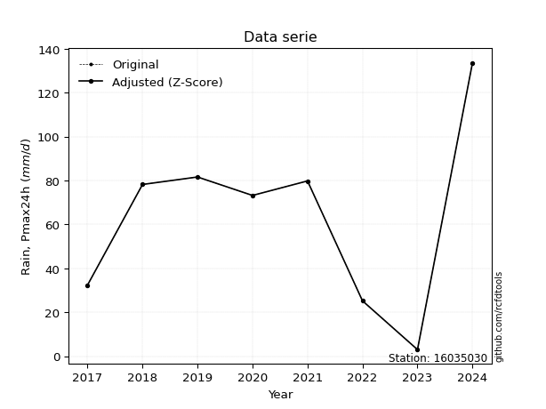</img>

</div>

> If Z-Score is active, values out of range or outliers are replaced with the station mean value.


### 4. Active continuous probability distributions from SciPy (45 of 104 available)

[scipy.stats](https://docs.scipy.org/doc/scipy/reference/stats.html) is a Python´s powerful submodule within the SciPy library for comprehensive statistical analysis, offering over 130 probability distributions (like Normal, Poisson), functions for descriptive stats (mean, variance), hypothesis testing (t-tests, chi-square), random variable generation, and statistical tests, making it essential for data science, modeling, and research. It provides tools to explore, model, and draw conclusions from data efficiently, working seamlessly with NumPy.

<div align="center">

|   id | p_dist             |   n_parameter | fit_method   | label                                                                       | active   | ref                                                                                                        |
|-----:|:-------------------|--------------:|:-------------|:----------------------------------------------------------------------------|:---------|:-----------------------------------------------------------------------------------------------------------|
|    0 | alpha              |             3 | MLE          | Alpha                                                                       | True     | [:mortar_board:](https://docs.scipy.org/doc/scipy/reference/generated/scipy.stats.alpha.html)              |
|    1 | betaprime          |             4 | MLE          | Beta prime                                                                  | True     | [:mortar_board:](https://docs.scipy.org/doc/scipy/reference/generated/scipy.stats.betaprime.html)          |
|    2 | chi2               |             3 | MLE          | Chi²                                                                        | True     | [:mortar_board:](https://docs.scipy.org/doc/scipy/reference/generated/scipy.stats.chi2.html)               |
|    3 | crystalball        |             4 | MLE          | Crystalball                                                                 | True     | [:mortar_board:](https://docs.scipy.org/doc/scipy/reference/generated/scipy.stats.crystalball.html)        |
|    4 | erlang             |             3 | MLE          | Erlang                                                                      | True     | [:mortar_board:](https://docs.scipy.org/doc/scipy/reference/generated/scipy.stats.erlang.html)             |
|    5 | expon              |             2 | MLE          | Exponential                                                                 | True     | [:mortar_board:](https://docs.scipy.org/doc/scipy/reference/generated/scipy.stats.expon.html)              |
|    6 | exponnorm          |             3 | MLE          | Exponentially modified Normal                                               | True     | [:mortar_board:](https://docs.scipy.org/doc/scipy/reference/generated/scipy.stats.exponnorm.html)          |
|    7 | f                  |             4 | MLE          | F                                                                           | True     | [:mortar_board:](https://docs.scipy.org/doc/scipy/reference/generated/scipy.stats.f.html)                  |
|    8 | fatiguelife        |             3 | MLE          | Fatigue-life (Birnbaum-Saunders)                                            | True     | [:mortar_board:](https://docs.scipy.org/doc/scipy/reference/generated/scipy.stats.fatiguelife.html)        |
|    9 | fisk               |             3 | MLE          | Fisk                                                                        | True     | [:mortar_board:](https://docs.scipy.org/doc/scipy/reference/generated/scipy.stats.fisk.html)               |
|   10 | gamma              |             3 | MLE          | Gamma                                                                       | True     | [:mortar_board:](https://docs.scipy.org/doc/scipy/reference/generated/scipy.stats.gamma.html)              |
|   11 | genexpon           |             5 | MLE          | Generalized exponential                                                     | True     | [:mortar_board:](https://docs.scipy.org/doc/scipy/reference/generated/scipy.stats.genexpon.html)           |
|   12 | genlogistic        |             3 | MLE          | Generalized logistic                                                        | True     | [:mortar_board:](https://docs.scipy.org/doc/scipy/reference/generated/scipy.stats.genlogistic.html)        |
|   13 | gibrat             |             2 | MM           | Gibrat                                                                      | True     | [:mortar_board:](https://docs.scipy.org/doc/scipy/reference/generated/scipy.stats.gibrat.html)             |
|   14 | gompertz           |             3 | MLE          | Gompertz (or truncated Gumbel)                                              | True     | [:mortar_board:](https://docs.scipy.org/doc/scipy/reference/generated/scipy.stats.gompertz.html)           |
|   15 | gumbel_l           |             2 | MM           | Gumbel Left Skew                                                            | True     | [:mortar_board:](https://docs.scipy.org/doc/scipy/reference/generated/scipy.stats.gumbel_l.html)           |
|   16 | gumbel_r           |             2 | MM           | Gumbel Right Skew                                                           | True     | [:mortar_board:](https://docs.scipy.org/doc/scipy/reference/generated/scipy.stats.gumbel_r.html)           |
|   17 | halflogistic       |             2 | MM           | Half-logistic                                                               | True     | [:mortar_board:](https://docs.scipy.org/doc/scipy/reference/generated/scipy.stats.halflogistic.html)       |
|   18 | halfnorm           |             2 | MM           | Half Normal                                                                 | True     | [:mortar_board:](https://docs.scipy.org/doc/scipy/reference/generated/scipy.stats.halfnorm.html)           |
|   19 | hypsecant          |             2 | MM           | hyperbolic secant                                                           | True     | [:mortar_board:](https://docs.scipy.org/doc/scipy/reference/generated/scipy.stats.hypsecant.html)          |
|   20 | invgamma           |             3 | MLE          | Inverted gamma                                                              | True     | [:mortar_board:](https://docs.scipy.org/doc/scipy/reference/generated/scipy.stats.invgamma.html)           |
|   21 | invgauss           |             3 | MLE          | Inverse Gaussian                                                            | True     | [:mortar_board:](https://docs.scipy.org/doc/scipy/reference/generated/scipy.stats.invgauss.html)           |
|   22 | invweibull         |             3 | MLE          | Inverted Weibull                                                            | True     | [:mortar_board:](https://docs.scipy.org/doc/scipy/reference/generated/scipy.stats.invweibull.html)         |
|   23 | johnsonsu          |             4 | MLE          | Johnson Su                                                                  | True     | [:mortar_board:](https://docs.scipy.org/doc/scipy/reference/generated/scipy.stats.johnsonsu.html)          |
|   24 | kstwobign          |             2 | MLE          | Limiting distribution of scaled Kolmogorov-Smirnov two-sided test statistic | True     | [:mortar_board:](https://docs.scipy.org/doc/scipy/reference/generated/scipy.stats.kstwobign.html)          |
|   25 | laplace            |             2 | MM           | Laplace                                                                     | True     | [:mortar_board:](https://docs.scipy.org/doc/scipy/reference/generated/scipy.stats.laplace.html)            |
|   26 | laplace_asymmetric |             3 | MLE          | Asymmetric Laplace                                                          | True     | [:mortar_board:](https://docs.scipy.org/doc/scipy/reference/generated/scipy.stats.laplace_asymmetric.html) |
|   27 | loggamma           |             3 | MLE          | Log gamma                                                                   | True     | [:mortar_board:](https://docs.scipy.org/doc/scipy/reference/generated/scipy.stats.loggamma.html)           |
|   28 | logistic           |             2 | MM           | Logistic (or Sech-squared)                                                  | True     | [:mortar_board:](https://docs.scipy.org/doc/scipy/reference/generated/scipy.stats.logistic.html)           |
|   29 | lognorm            |             3 | MLE          | Log Normal                                                                  | True     | [:mortar_board:](https://docs.scipy.org/doc/scipy/reference/generated/scipy.stats.lognorm.html)            |
|   30 | maxwell            |             2 | MM           | Maxwell                                                                     | True     | [:mortar_board:](https://docs.scipy.org/doc/scipy/reference/generated/scipy.stats.maxwell.html)            |
|   31 | mielke             |             4 | MLE          | Mielke Beta-Kappa / Dagum                                                   | True     | [:mortar_board:](https://docs.scipy.org/doc/scipy/reference/generated/scipy.stats.mielke.html)             |
|   32 | moyal              |             2 | MM           | Moyal                                                                       | True     | [:mortar_board:](https://docs.scipy.org/doc/scipy/reference/generated/scipy.stats.moyal.html)              |
|   33 | nakagami           |             3 | MLE          | Nakagami                                                                    | True     | [:mortar_board:](https://docs.scipy.org/doc/scipy/reference/generated/scipy.stats.nakagami.html)           |
|   34 | ncf                |             5 | MLE          | Non-central F distribution                                                  | True     | [:mortar_board:](https://docs.scipy.org/doc/scipy/reference/generated/scipy.stats.ncf.html)                |
|   35 | nct                |             4 | MLE          | Non-central Student’s t                                                     | True     | [:mortar_board:](https://docs.scipy.org/doc/scipy/reference/generated/scipy.stats.nct.html)                |
|   36 | norm               |             2 | MM           | Normal                                                                      | True     | [:mortar_board:](https://docs.scipy.org/doc/scipy/reference/generated/scipy.stats.norm.html)               |
|   37 | pareto             |             3 | MLE          | Pareto                                                                      | True     | [:mortar_board:](https://docs.scipy.org/doc/scipy/reference/generated/scipy.stats.pareto.html)             |
|   38 | pearson3           |             3 | MM           | Pearson type III                                                            | True     | [:mortar_board:](https://docs.scipy.org/doc/scipy/reference/generated/scipy.stats.pearson3.html)           |
|   39 | rayleigh           |             2 | MM           | Rayleigh                                                                    | True     | [:mortar_board:](https://docs.scipy.org/doc/scipy/reference/generated/scipy.stats.rayleigh.html)           |
|   40 | rice               |             3 | MLE          | Rice                                                                        | True     | [:mortar_board:](https://docs.scipy.org/doc/scipy/reference/generated/scipy.stats.rice.html)               |
|   41 | t                  |             3 | MLE          | Student’s t                                                                 | True     | [:mortar_board:](https://docs.scipy.org/doc/scipy/reference/generated/scipy.stats.t.html)                  |
|   42 | truncnorm          |             4 | MLE          | Truncated normal                                                            | True     | [:mortar_board:](https://docs.scipy.org/doc/scipy/reference/generated/scipy.stats.truncnorm.html)          |
|   43 | wald               |             2 | MM           | Wald                                                                        | True     | [:mortar_board:](https://docs.scipy.org/doc/scipy/reference/generated/scipy.stats.wald.html)               |
|   44 | weibull_min        |             3 | MLE          | Weibull minimum                                                             | True     | [:mortar_board:](https://docs.scipy.org/doc/scipy/reference/generated/scipy.stats.weibull_min.html)        |

</div>

> **n_parameter:** # arguments & localization & scale.
>
> **Fit methods:** (MLE) maximum likelihood, (MM) L-moments.
>
>**Inactive:** foldnorm, gennorm, norminvgauss, powernorm, powerlognorm, skewnorm, genextreme, anglit, arcsine, argus, beta, bradford, burr, burr12, cauchy, cosine, halfcauchy, foldcauchy, skewcauchy, wrapcauchy, dgamma, gengamma, exponweib, exponpow, truncexpon, gausshyper, genhalflogistic, genhyperbolic, geninvgauss, halfgennorm, johnsonsb, kappa4, kappa3, ksone, kstwo, loglaplace, levy, levy_l, levy_stable, ncx2, genpareto, truncpareto, lomax, powerlaw, rdist, rel_breitwigner, recipinvgauss, semicircular, studentized_range, trapezoid, triang, truncweibull_min, tukeylambda, uniform, loguniform, vonmises, vonmises_line, weibull_max, dweibull, 


## B. Probability distributions vs. Empirical distributions

A continuous probability distribution (CPD) describes probabilities for variables that can take any value within a range (like rain any time), unlike discrete variables with specific outcomes (like temperature). It uses a Probability Density Function (PDF), a curve where the total area under it equals 1, and the probability of the variable falling within an interval (a to b) is found by calculating the area under the curve between those points. A key feature is that the probability of hitting any single exact value is zero, so probabilities are always expressed for ranges, e.g., $P(a ≤ X ≤ b)$.

<div align="center">

Distributions parameters
|    |   station | p_dist                |   n |              loc |           scale | shape                  | shape1                | shape2                 | shape3   |
|---:|----------:|:----------------------|----:|-----------------:|----------------:|:-----------------------|:----------------------|:-----------------------|:---------|
|  0 |  16035030 | alpha                 |   9 |     -0.0138231   |     6.55383     | 8.810758856674555e-10  |                       |                        |          |
|  1 |  16035030 | betaprime             |   9 |      2.99992     |   620.195       | 0.6469846182752288     | 11.186663148234484    |                        |          |
|  2 |  16035030 | chi2                  |   9 |      3           |     4.95104     | 0.4381668894402798     |                       |                        |          |
|  3 |  16035030 | crystalball           |   9 |     56.6889      |    41.0019      | 4392.893947025946      | 497.94441722058207    |                        |          |
|  4 |  16035030 | erlang                |   9 |      2.76996     |    41.4705      | 1.0715291045157522     |                       |                        |          |
|  5 |  16035030 | expon                 |   9 |      3           |    53.6889      |                        |                       |                        |          |
|  6 |  16035030 | exponnorm             |   9 |     44.3022      |    39.1044      | 0.31675913675418643    |                       |                        |          |
|  7 |  16035030 | f                     |   9 |      3           |    60.3584      | 0.8560497087225635     | 105.92083347727583    |                        |          |
|  8 |  16035030 | fatiguelife           |   9 |      3           |     3.64694e-05 | 1229.240035513969      |                       |                        |          |
|  9 |  16035030 | fisk                  |   9 |   -179.69        |   233.62        | 9.470056121753608      |                       |                        |          |
| 10 |  16035030 | gamma                 |   9 |      2.97962     |    40.2333      | 0.9260268124967714     |                       |                        |          |
| 11 |  16035030 | genexpon              |   9 |      2.99978     |     2.59698     | 0.04835450224513717    | 2.925139996774919e-08 | 2.4531370276023168     |          |
| 12 |  16035030 | genlogistic           |   9 |   -171.593       |    35.2835      | 366.49695517587566     |                       |                        |          |
| 13 |  16035030 | gibrat                |   9 |     25.4095      |    18.9719      |                        |                       |                        |          |
| 14 |  16035030 | gompertz              |   9 |      3           |    93.7808      | 1.0481555623311496     |                       |                        |          |
| 15 |  16035030 | gumbel_l              |   9 |     75.1419      |    31.9691      |                        |                       |                        |          |
| 16 |  16035030 | gumbel_r              |   9 |     38.2358      |    31.9691      |                        |                       |                        |          |
| 17 |  16035030 | halflogistic          |   9 |      8.09211     |    35.0552      |                        |                       |                        |          |
| 18 |  16035030 | halfnorm              |   9 |      2.41843     |    68.0179      |                        |                       |                        |          |
| 19 |  16035030 | hypsecant             |   9 |     56.6889      |    26.1026      |                        |                       |                        |          |
| 20 |  16035030 | invgamma              |   9 |   -205.402       | 10517.8         | 41.142899827638416     |                       |                        |          |
| 21 |  16035030 | invgauss              |   9 |    -76.2516      |  1242.97        | 0.10695293340948525    |                       |                        |          |
| 22 |  16035030 | invweibull            |   9 |      3           |     2.45026     | 0.05191856179288154    |                       |                        |          |
| 23 |  16035030 | johnsonsu             |   9 |   -116.753       |    25.8829      | -10.843832131491268    | 4.214157619523254     |                        |          |
| 24 |  16035030 | kstwobign             |   9 |    -84.9498      |   161.79        |                        |                       |                        |          |
| 25 |  16035030 | laplace               |   9 |     56.6889      |    28.9927      |                        |                       |                        |          |
| 26 |  16035030 | laplace_asymmetric    |   9 |     79.8         |    28.9655      | 1.4755935482701998     |                       |                        |          |
| 27 |  16035030 | loggamma              |   9 | -13617.8         |  1810.26        | 1908.6542973964793     |                       |                        |          |
| 28 |  16035030 | logistic              |   9 |     56.6889      |    22.6055      |                        |                       |                        |          |
| 29 |  16035030 | lognorm               |   9 |      3           |     0.396327    | 12.310565784026018     |                       |                        |          |
| 30 |  16035030 | maxwell               |   9 |    -40.4684      |    60.8843      |                        |                       |                        |          |
| 31 |  16035030 | mielke                |   9 |      3           |   117.185       | 0.8761475981983613     | 8.245843082005692     |                        |          |
| 32 |  16035030 | moyal                 |   9 |     33.2414      |    18.4573      |                        |                       |                        |          |
| 33 |  16035030 | nakagami              |   9 |      3           |    87.6747      | 0.18860241520185017    |                       |                        |          |
| 34 |  16035030 | ncf                   |   9 |     -0.00710859  |     1.91656e-05 | 4.033194309489247e-06  | 1.9901428185255288    | 6.651909233676193      |          |
| 35 |  16035030 | nct                   |   9 |     -0.43389     |     0.135524    | 0.47469049489359827    | 54.73616044280189     |                        |          |
| 36 |  16035030 | norm                  |   9 |     56.6889      |    41.0019      |                        |                       |                        |          |
| 37 |  16035030 | pareto                |   9 |      2.99545     |     0.00454775  | 0.12822528816064094    |                       |                        |          |
| 38 |  16035030 | pearson3              |   9 |     56.6889      |    41.0019      | 0.23191274712757098    |                       |                        |          |
| 39 |  16035030 | rayleigh              |   9 |    -21.7502      |    62.5853      |                        |                       |                        |          |
| 40 |  16035030 | rice                  |   9 |    -18.9615      |    52.5852      | 0.8231733637182967     |                       |                        |          |
| 41 |  16035030 | t                     |   9 |     56.6884      |    41.002       | 340172676.8742107      |                       |                        |          |
| 42 |  16035030 | truncnorm             |   9 |    -54.2841      |    50.2693      | -99.50163403610028     | 3.737552638448796     |                        |          |
| 43 |  16035030 | wald                  |   9 |     15.687       |    41.0019      |                        |                       |                        |          |
| 44 |  16035030 | weibull_min           |   9 |      3           |    52.8894      | 0.47015815731955757    |                       |                        |          |
| 45 |  16035030 | logalpha              |   9 |    -29.8938      |   799.294       | 23.99071586423227      |                       |                        |          |
| 46 |  16035030 | logbetaprime          |   9 |    -28.3631      |   401.098       | 576.7885113758648      | 7267.323529347066     |                        |          |
| 47 |  16035030 | logchi2               |   9 |      1.09861     |     3.39197     | 0.38466253188100474    |                       |                        |          |
| 48 |  16035030 | logcrystalball        |   9 |      3.47727     |     1.34156     | 111.54580845729885     | 10.474513409785443    |                        |          |
| 49 |  16035030 | logerlang             |   9 |    -17.3416      |     0.0952002   | 218.58274216104712     |                       |                        |          |
| 50 |  16035030 | logexpon              |   9 |      1.09861     |     2.37866     |                        |                       |                        |          |
| 51 |  16035030 | logexponnorm          |   9 |      3.4763      |     1.34155     | 0.0007167958934178806  |                       |                        |          |
| 52 |  16035030 | logf                  |   9 |  -1447.89        |  1451.36        | 6941659.6215099245     | 3506512.999068752     |                        |          |
| 53 |  16035030 | logfatiguelife        |   9 |   -534.211       |   537.684       | 0.0024823735065489516  |                       |                        |          |
| 54 |  16035030 | logfisk               |   9 |     -5.39727e+08 |     5.39727e+08 | 886391860.4216698      |                       |                        |          |
| 55 |  16035030 | loggamma              |   9 |    -15.5497      |     0.102548    | 185.5514049472224      |                       |                        |          |
| 56 |  16035030 | loggenexpon           |   9 |      1.07133     |     0.0165767   | 0.003019373470929766   | 3.406587374553683     | 1.1944073755431185e-05 |          |
| 57 |  16035030 | loggenlogistic        |   9 |      4.8949      |     2.072e-06   | 1.4571262213643522e-06 |                       |                        |          |
| 58 |  16035030 | loggibrat             |   9 |      2.45386     |     0.620732    |                        |                       |                        |          |
| 59 |  16035030 | loggompertz           |   9 |      1.09861     |     1.07934     | 0.0719890759885115     |                       |                        |          |
| 60 |  16035030 | loggumbel_l           |   9 |      4.08104     |     1.04601     |                        |                       |                        |          |
| 61 |  16035030 | loggumbel_r           |   9 |      2.8735      |     1.04601     |                        |                       |                        |          |
| 62 |  16035030 | loghalflogistic       |   9 |      1.8872      |     1.14699     |                        |                       |                        |          |
| 63 |  16035030 | loghalfnorm           |   9 |      1.70161     |     2.22547     |                        |                       |                        |          |
| 64 |  16035030 | loghypsecant          |   9 |      3.47727     |     0.854061    |                        |                       |                        |          |
| 65 |  16035030 | loginvgamma           |   9 |    -16.4215      |  3802.41        | 192.2528686237502      |                       |                        |          |
| 66 |  16035030 | loginvgauss           |   9 |     -7.90329     |   672.06        | 0.016878035546466788   |                       |                        |          |
| 67 |  16035030 | loginvweibull         |   9 |     -1.15064e+08 |     1.15064e+08 | 79314087.97281712      |                       |                        |          |
| 68 |  16035030 | logjohnsonsu          |   9 |      5.09303     |     0.00931928  | 6.077757864213115      | 1.109313811257942     |                        |          |
| 69 |  16035030 | logkstwobign          |   9 |     -2.27643     |     6.55117     |                        |                       |                        |          |
| 70 |  16035030 | loglaplace            |   9 |      3.47727     |     0.948623    |                        |                       |                        |          |
| 71 |  16035030 | loglaplace_asymmetric |   9 |      4.40183     |     0.588923    | 2.0562585730611547     |                       |                        |          |
| 72 |  16035030 | logloggamma           |   9 |      4.8949      |     3.64124e-06 | 2.5781048681980323e-06 |                       |                        |          |
| 73 |  16035030 | loglogistic           |   9 |      3.47727     |     0.739638    |                        |                       |                        |          |
| 74 |  16035030 | loglognorm            |   9 |      1.09861     |     0.0315644   | 11.584778428013477     |                       |                        |          |
| 75 |  16035030 | logmaxwell            |   9 |      0.298348    |     1.99209     |                        |                       |                        |          |
| 76 |  16035030 | logmielke             |   9 |      1.09861     |     3.90323     | 0.20777029237047656    | 362.29458922335664    |                        |          |
| 77 |  16035030 | logmoyal              |   9 |      2.71008     |     0.603912    |                        |                       |                        |          |
| 78 |  16035030 | lognakagami           |   9 |   -726.033       |   729.51        | 73452.64337531714      |                       |                        |          |
| 79 |  16035030 | logncf                |   9 |     -0.187373    |     6.57299e-07 | 4.1974560442586824e-06 | 33.63343563986346     | 22.544484600580127     |          |
| 80 |  16035030 | lognct                |   9 |    -74.0547      |     1.31872     | 45707.82199626858      | 58.791421637446234    |                        |          |
| 81 |  16035030 | lognorm               |   9 |      3.47727     |     1.34156     |                        |                       |                        |          |
| 82 |  16035030 | logpareto             |   9 |      1.09837     |     0.00023907  | 0.12559934698543404    |                       |                        |          |
| 83 |  16035030 | logpearson3           |   9 |      3.47727     |     1.34155     | -0.9325110270758324    |                       |                        |          |
| 84 |  16035030 | lograyleigh           |   9 |      0.910797    |     2.04775     |                        |                       |                        |          |
| 85 |  16035030 | logrice               |   9 |      0.175307    |     1.46976     | 1.9698589948054281     |                       |                        |          |
| 86 |  16035030 | logt                  |   9 |      3.47727     |     1.34156     | 38751087696.17934      |                       |                        |          |
| 87 |  16035030 | logtruncnorm          |   9 |     -0.13483     |     4.27243     | 0.2886948769919325     | 1.177241571565661     |                        |          |
| 88 |  16035030 | logwald               |   9 |      2.13574     |     1.34154     |                        |                       |                        |          |
| 89 |  16035030 | logweibull_min        |   9 |     -1.26997e+08 |     1.26997e+08 | 140229233.89928475     |                       |                        |          |

</div>

> **loc** (Location parameter): This shifts the distribution along the x-axis. For many common distributions, like the normal (Gaussian) distribution, loc represents the mean $μ$. For others, like the uniform distribution, it might represent the minimum value, or for the beta distribution, the left end of the support interval.
>
> **scale** (Scale parameter): This determines the width or spread of the distribution. For the normal distribution, scale represents the standard deviation $σ$. For a uniform distribution, it defines the length of the interval (from $loc$ to $loc + scale$).
>
> **shape** (Shape parameters): Refers to parameters that define the specific form of a probability distribution, distinct from its location (loc) and scale (scale). These parameters are required arguments for most distribution functions. For example, a normal (Gaussian) distribution is fully defined by its location (mean) and scale (standard deviation), so it has no specific shape parameters beyond loc and scale. However, other distributions have intrinsic properties that need specification, as Gamma distribution that takes a shape parameter, often named $a$ or $alpha$.


### 0. Cumulative distribution values - CDF (90 evaluated)

> Ordered by x ascending and calculating $log(f(x))$ separately. 

|   id |   Station |   date |     x |   count |    mean |     std |    zscore |   Value_initial |   station |   m |     alpha |   alpha_pdf |   betaprime |   betaprime_pdf |        chi2 |    chi2_pdf |   crystalball |   crystalball_pdf |     erlang |   erlang_pdf |      expon |   expon_pdf |   exponnorm |   exponnorm_pdf |           f |        f_pdf |   fatiguelife |   fatiguelife_pdf |      fisk |   fisk_pdf |      gamma |   gamma_pdf |    genexpon |   genexpon_pdf |   genlogistic |   genlogistic_pdf |   gibrat |   gibrat_pdf |    gompertz |   gompertz_pdf |   gumbel_l |   gumbel_l_pdf |   gumbel_r |   gumbel_r_pdf |   halflogistic |   halflogistic_pdf |   halfnorm |   halfnorm_pdf |   hypsecant |   hypsecant_pdf |   invgamma |   invgamma_pdf |   invgauss |   invgauss_pdf |   invweibull |   invweibull_pdf |   johnsonsu |   johnsonsu_pdf |   kstwobign |   kstwobign_pdf |   laplace |   laplace_pdf |   laplace_asymmetric |   laplace_asymmetric_pdf |   loggamma |   loggamma_pdf |   logistic |   logistic_pdf |   lognorm |   lognorm_pdf |   maxwell |   maxwell_pdf |      mielke |   mielke_pdf |     moyal |   moyal_pdf |    nakagami |   nakagami_pdf |       ncf |    ncf_pdf |       nct |     nct_pdf |      norm |   norm_pdf |   pareto |   pareto_pdf |   pearson3 |   pearson3_pdf |   rayleigh |   rayleigh_pdf |      rice |   rice_pdf |         t |      t_pdf |   truncnorm |   truncnorm_pdf |      wald |   wald_pdf |   weibull_min |   weibull_min_pdf |   logalpha |   logalpha_pdf |   logbetaprime |   logbetaprime_pdf |     logchi2 |   logchi2_pdf |   logcrystalball |   logcrystalball_pdf |   logerlang |   logerlang_pdf |   logexpon |   logexpon_pdf |   logexponnorm |   logexponnorm_pdf |      logf |   logf_pdf |   logfatiguelife |   logfatiguelife_pdf |   logfisk |   logfisk_pdf |   loggenexpon |   loggenexpon_pdf |   loggenlogistic |   loggenlogistic_pdf |   loggibrat |   loggibrat_pdf |   loggompertz |   loggompertz_pdf |   loggumbel_l |   loggumbel_l_pdf |   loggumbel_r |   loggumbel_r_pdf |   loghalflogistic |   loghalflogistic_pdf |   loghalfnorm |   loghalfnorm_pdf |   loghypsecant |   loghypsecant_pdf |   loginvgamma |   loginvgamma_pdf |   loginvgauss |   loginvgauss_pdf |   loginvweibull |   loginvweibull_pdf |   logjohnsonsu |   logjohnsonsu_pdf |   logkstwobign |   logkstwobign_pdf |   loglaplace |   loglaplace_pdf |   loglaplace_asymmetric |   loglaplace_asymmetric_pdf |   logloggamma |   logloggamma_pdf |   loglogistic |   loglogistic_pdf |   loglognorm |   loglognorm_pdf |   logmaxwell |   logmaxwell_pdf |   logmielke |   logmielke_pdf |    logmoyal |   logmoyal_pdf |   lognakagami |   lognakagami_pdf |    logncf |   logncf_pdf |    lognct |   lognct_pdf |   logpareto |   logpareto_pdf |   logpearson3 |   logpearson3_pdf |   lograyleigh |   lograyleigh_pdf |   logrice |   logrice_pdf |      logt |   logt_pdf |   logtruncnorm |   logtruncnorm_pdf |   logwald |   logwald_pdf |   logweibull_min |   logweibull_min_pdf |
|-----:|----------:|-------:|------:|--------:|--------:|--------:|----------:|----------------:|----------:|----:|----------:|------------:|------------:|----------------:|------------:|------------:|--------------:|------------------:|-----------:|-------------:|-----------:|------------:|------------:|----------------:|------------:|-------------:|--------------:|------------------:|----------:|-----------:|-----------:|------------:|------------:|---------------:|--------------:|------------------:|---------:|-------------:|------------:|---------------:|-----------:|---------------:|-----------:|---------------:|---------------:|-------------------:|-----------:|---------------:|------------:|----------------:|-----------:|---------------:|-----------:|---------------:|-------------:|-----------------:|------------:|----------------:|------------:|----------------:|----------:|--------------:|---------------------:|-------------------------:|-----------:|---------------:|-----------:|---------------:|----------:|--------------:|----------:|--------------:|------------:|-------------:|----------:|------------:|------------:|---------------:|----------:|-----------:|----------:|------------:|----------:|-----------:|---------:|-------------:|-----------:|---------------:|-----------:|---------------:|----------:|-----------:|----------:|-----------:|------------:|----------------:|----------:|-----------:|--------------:|------------------:|-----------:|---------------:|---------------:|-------------------:|------------:|--------------:|-----------------:|---------------------:|------------:|----------------:|-----------:|---------------:|---------------:|-------------------:|----------:|-----------:|-----------------:|---------------------:|----------:|--------------:|--------------:|------------------:|-----------------:|---------------------:|------------:|----------------:|--------------:|------------------:|--------------:|------------------:|--------------:|------------------:|------------------:|----------------------:|--------------:|------------------:|---------------:|-------------------:|--------------:|------------------:|--------------:|------------------:|----------------:|--------------------:|---------------:|-------------------:|---------------:|-------------------:|-------------:|-----------------:|------------------------:|----------------------------:|--------------:|------------------:|--------------:|------------------:|-------------:|-----------------:|-------------:|-----------------:|------------:|----------------:|------------:|---------------:|--------------:|------------------:|----------:|-------------:|----------:|-------------:|------------:|----------------:|--------------:|------------------:|--------------:|------------------:|----------:|--------------:|----------:|-----------:|---------------:|-------------------:|----------:|--------------:|-----------------:|---------------------:|
|    0 |  16035030 |   2023 |   3   |       9 | 56.6889 | 43.4891 | -1.23454  |             3   |  16035030 |   1 | 0.0296609 | 0.0541184   | 0.000189853 |     1.45155     | 0.000333958 | 8.23761e+10 |     0.0951954 |        0.00412845 | 0.00369507 |   0.0171653  | 0          |  0.0186258  |   0.0938741 |      0.0041628  | 0.000167261 | 445.951      |     0.0305172 |       9.39785e+09 | 0.0887702 | 0.00419308 | 0.00091447 | 0.0415323   | 4.01039e-06 |     0.0186195  |     0.0749231 |        0.00548309 | 0        |  0           | 1.64587e-13 |     0.0111767  |   0.099409 |    0.00294959  |  0.0492552 |     0.00463869 |       0        |         0          | 0.00682202 |     0.0117301  |   0.0809574 |      0.00306817 |  0.0796078 |     0.00488233 |  0.0720249 |     0.00554846 |   0.00140768 |      1.08055e+12 |   0.0779516 |      0.00501408 |   0.0709072 |      0.0059255  | 0.0784768 |    0.00270677 |             0.113632 |               0.0026586  |  0.0395904 |      0.0668981 |  0.0850965 |     0.00344407 | 0.0381094 |     0.0617514 | 0.0832505 |    0.00517709 | 7.59476e-12 |   0.27897    | 0.0232843 |  0.00373966 | 3.08047e-07 |    1.30826e+08 | 0.0799448 | 0.0161463  | 0.0545576 | 0.0514684   | 0.0951954 | 0.00412845 | 0        | 28.1953      |  0.0896212 |     0.00440802 |  0.0752163 |     0.0058435  | 0.0603856 | 0.00534143 | 0.0951975 | 0.00412851 |    0.872843 |     0.00414637  | 0         | 0          |   9.36757e-09 |       9.91747e+06 |  0.0359877 |      0.0657835 |      0.0393433 |          0.0652547 | 0.000733685 |   6.35505e+11 |        0.0381094 |            0.0617514 |   0.0419233 |       0.0689584 |  0         |      0.420405  |      0.0381093 |          0.0617514 | 0.0383828 |  0.0620775 |        0.0373428 |            0.0613169 | 0.0126424 |     0.0205001 |    0.00501092 |          0.185251 |         0        |            0.0487149 |    0        |       0         |   2.77901e-09 |         0.0666971 |     0.0561347 |         0.0521305 |    0.00426813 |         0.0222651 |          0        |              0        |      0        |          0        |      0.0392436 |          0.0458331 |     0.0409831 |         0.0724437 |     0.0424918 |         0.078075  |       0.0437966 |            0.094438 |      0.078647  |          0.0407572 |      0.0466036 |           0.114561 |    0.0407364 |        0.0429427 |               0.0528647 |                   0.0436546 |     0.0680246 |         0.0481635 |     0.038569  |         0.0501345 |   0.00245412 |      2.96694e+12 |    0.0164309 |        0.0596259 | 0.000421478 |     3.94383e+11 | 0.000146499 |     0.00185706 |     0.0386615 |         0.0623481 | 0.0473291 |     0.107756 | 0.0382707 |    0.0620126 |    0        |    525.366      |     0.0566216 |         0.0570048 |    0.00419727 |         0.0446017 | 0.0308001 |     0.0716415 | 0.0381094 |  0.0617513 |    4.25667e-06 |           0.335626 |  0        |     0         |        0.0369567 |            0.0400439 |
|    1 |  16035030 |   2025 |   3.2 |       9 | 56.6889 | 43.4891 | -1.22994  |             3.2 |  16035030 |   2 | 0.0414239 | 0.0632943   | 0.028875    |     0.0931527   | 0.464006    | 0.499921    |     0.0960237 |        0.00415486 | 0.0072057  |   0.0178645  | 0.00371824 |  0.0185566  |   0.0947094 |      0.00418992 | 0.0679538   |   0.145284   |     0.524015  |       0.0599867   | 0.0896119 | 0.00422431 | 0.00827064 | 0.0346535   | 0.00372098  |     0.0185502  |     0.0760246 |        0.00553248 | 0        |  0           | 0.00223521  |     0.0111755  |   0.100001 |    0.00296615  |  0.0501888 |     0.00469714 |       0        |         0          | 0.00916801 |     0.0117297  |   0.0815733 |      0.00309101 |  0.0805882 |     0.00492137 |  0.0731396 |     0.00559821 |   0.320162   |      0.0946583   |   0.0789585 |      0.00505504 |   0.0720978 |      0.00598037 | 0.07902   |    0.00272551 |             0.114165 |               0.00267107 |  0.044097  |      0.0728109 |  0.0857879 |     0.00346943 | 0.042268  |     0.067172  | 0.0842895 |    0.00521257 | 0.00375804  |   0.016463   | 0.0240407 |  0.00382406 | 0.0798842   |    0.150663    | 0.0831872 | 0.0162763  | 0.0650469 | 0.0533014   | 0.0960237 | 0.00415486 | 0.386176 |  0.384789    |  0.0905058 |     0.00443831 |  0.076389  |     0.00588325 | 0.0614582 | 0.00538435 | 0.0960258 | 0.00415492 |    0.873671 |     0.00412758  | 0         | 0          |   0.0700554   |       0.158777    |  0.0404333 |      0.0720386 |      0.0437381 |          0.0709898 | 0.443205    |   1.31029     |        0.042268  |            0.067172  |   0.046563  |       0.0748707 |  0.0267675 |      0.409152  |      0.0422679 |          0.067172  | 0.0425628 |  0.0675094 |        0.0414745 |            0.0667742 | 0.0140361 |     0.022728  |    0.0171983  |          0.192374 |         0        |            0.0509769 |    0        |       0         |   0.00442601  |         0.0704935 |     0.0595988 |         0.0552448 |    0.00591606 |         0.029015  |          0        |              0        |      0        |          0        |      0.0423153 |          0.0494002 |     0.0458667 |         0.078947  |     0.0477565 |         0.0851251 |       0.0501827 |            0.1035   |      0.0813329 |          0.0424919 |      0.0543548 |           0.125646 |    0.0436043 |        0.0459659 |               0.0557585 |                   0.0460442 |     0.0712052 |         0.0504154 |     0.0419381 |         0.0543229 |   0.524615   |      0.532569    |    0.0205693 |        0.0686945 | 0.426418    |     1.37278     | 0.000318987 |     0.00365525 |     0.0428592 |         0.0677856 | 0.0545947 |     0.117407 | 0.0424467 |    0.0674501 |    0.5052   |      0.959383   |     0.0604109 |         0.0604511 |    0.00756466 |         0.0597254 | 0.0356288 |     0.0780336 | 0.042268  |  0.0671719 |    0.0216171   |           0.334128 |  0        |     0         |        0.0396316 |            0.0428823 |
|    2 |  16035030 |   2022 |  25.2 |       9 | 56.6889 | 43.4891 | -0.724064 |            25.2 |  16035030 |   3 | 0.794918  | 0.00795218  | 0.520253    |     0.0116988   | 0.989312    | 0.00137018  |     0.221248  |        0.00724489 | 0.383551   |   0.0139456  | 0.338664   |  0.0123179  |   0.221551  |      0.00735057 | 0.487163    |   0.00839739 |     0.737191  |       0.00466256  | 0.223968  | 0.00803337 | 0.461676   | 0.014258    | 0.338574    |     0.0123154  |     0.250699  |        0.00981162 | 0        |  0           | 0.244179    |     0.0107038  |   0.189152 |    0.0053181   |  0.222361  |     0.0104573  |       0.239283 |         0.0134466  | 0.262326   |     0.0110906  |   0.185131  |      0.00669929 |  0.23445   |     0.00883169 |  0.248257  |     0.00976104 |   0.409884   |      0.000854944 |   0.23697   |      0.00901629 |   0.257121  |      0.0100916  | 0.168766  |    0.00582097 |             0.191018 |               0.00446917 |  0.43792   |      0.284602  |  0.198934  |     0.00704956 | 0.42596   |     0.292237  | 0.238188  |    0.00852164 | 0.232791    |   0.00918735 | 0.213726  |  0.0124061  | 0.471124    |    0.00792391  | 0.401976  | 0.0105347  | 0.56765   | 0.00787852  | 0.221248  | 0.00724489 | 0.663471 |  0.00194336  |  0.225699  |     0.00779654 |  0.245262  |     0.00904667 | 0.22391   | 0.00898342 | 0.221251  | 0.00724495 |    0.943168 |     0.00227384  | 0.0943454 | 0.0244244  |   0.485664    |       0.00724237  |  0.443506  |      0.287763  |      0.434272  |          0.287313  | 0.828994    |   0.0574186   |        0.42596   |            0.292237  |   0.440736  |       0.282456  |  0.591278  |      0.171829  |      0.425961  |          0.292238  | 0.426395  |  0.291658  |        0.42701   |            0.294011  | 0.296758  |     0.342735  |    0.521178   |          0.239923 |         0        |            0.217599  |    0.586812 |       0.503841  |   0.359267    |         0.306986  |     0.357199  |         0.271572  |    0.490007   |         0.334166  |          0.525554 |              0.315518 |      0.50688  |          0.28348  |      0.407975  |          0.357234  |     0.454038  |         0.280232  |     0.467548  |         0.275577  |       0.486065  |            0.241707 |      0.284323  |          0.201578  |      0.519432  |           0.235639 |    0.383991  |        0.404788  |               0.30649   |                   0.253093  |     0.306961  |         0.217338  |     0.416155  |         0.328498  |   0.641883   |      0.0151465   |    0.460344  |        0.293784  | 0.881601    |     0.086067    | 0.514457    |     0.348209   |     0.426945  |         0.291473  | 0.497123  |     0.233152 | 0.426605  |    0.291986  |    0.68089  |      0.0188304  |     0.368214  |         0.26427   |    0.472499   |         0.291351  | 0.439307  |     0.287265  | 0.42596   |  0.292237  |    0.639728    |           0.256755 |  0.581892 |     0.396833  |        0.326218  |            0.293763  |
|    3 |  16035030 |   2017 |  32.4 |       9 | 56.6889 | 43.4891 | -0.558505 |            32.4 |  16035030 |   4 | 0.839766  | 0.00487638  | 0.595278    |     0.00928526  | 0.995658    | 0.000531773 |     0.276797  |        0.00816403 | 0.476667   |   0.0119587  | 0.421663   |  0.010772   |   0.277895  |      0.00827724 | 0.541441    |   0.00679344 |     0.767433  |       0.00379538  | 0.285851  | 0.0091151  | 0.554686   | 0.0116768   | 0.421559    |     0.0107703  |     0.323513  |        0.0103314  | 0.15904  |  0.0346694   | 0.320183    |     0.0103957  |   0.23098  |    0.0063178   |  0.301113  |     0.0113052  |       0.333454 |         0.0126773  | 0.340634   |     0.0106445  |   0.239131  |      0.00832346 |  0.301078  |     0.00961773 |  0.320612  |     0.0102605  |   0.415211   |      0.000644492 |   0.304744  |      0.0097474  |   0.33123   |      0.0104154  | 0.21634   |    0.00746186 |             0.226065 |               0.00528915 |  0.509749  |      0.285468  |  0.254555  |     0.00839425 | 0.500264  |     0.297373  | 0.302045  |    0.00917188 | 0.29775     |   0.00887312 | 0.306282  |  0.0131028  | 0.523032    |    0.00659178  | 0.469971  | 0.00844873 | 0.615014  | 0.00551158  | 0.276797  | 0.00816403 | 0.675375 |  0.0014156   |  0.285143  |     0.0086825  |  0.312232  |     0.00950817 | 0.290979  | 0.00959731 | 0.2768    | 0.00816408 |    0.957771 |     0.00179454  | 0.278238  | 0.0243101  |   0.531749    |       0.00568165  |  0.515814  |      0.286096  |      0.506966  |          0.289584  | 0.842532    |   0.0505606   |        0.500264  |            0.297373  |   0.512003  |       0.283181  |  0.632258  |      0.154601  |      0.500265  |          0.297374  | 0.500557  |  0.296665  |        0.501731  |            0.298887  | 0.389348  |     0.390466  |    0.579798   |          0.226161 |         0        |            0.259664  |    0.691765 |       0.343567  |   0.440507    |         0.338343  |     0.429896  |         0.306272  |    0.570648   |         0.306044  |          0.600249 |              0.27886  |      0.575293 |          0.2607   |      0.500331  |          0.372702  |     0.524219  |         0.276855  |     0.536173  |         0.269259  |       0.545165  |            0.227976 |      0.341051  |          0.251994  |      0.576774  |           0.220288 |    0.500468  |        0.526587  |               0.377178  |                   0.311466  |     0.366743  |         0.259665  |     0.5003    |         0.338003  |   0.645474   |      0.0134988   |    0.533304  |        0.285458  | 0.902285    |     0.0787831   | 0.596493    |     0.304012   |     0.501032  |         0.296422  | 0.554041  |     0.219299 | 0.500824  |    0.296956  |    0.685332 |      0.0166074  |     0.438219  |         0.292133  |    0.54431    |         0.278999  | 0.511817  |     0.288259  | 0.500264  |  0.297373  |    0.702748    |           0.244719 |  0.668364 |     0.297084  |        0.406152  |            0.341719  |
|    4 |  16035030 |   2020 |  73.2 |       9 | 56.6889 | 43.4891 |  0.379661 |            73.2 |  16035030 |   5 | 0.928672  | 0.000971648 | 0.825931    |     0.00332123  | 0.999961    | 4.37625e-06 |     0.656412  |        0.00897208 | 0.796829   |   0.00475673 | 0.729514   |  0.00503803 |   0.659565  |      0.0089192  | 0.726463    |   0.00309071 |     0.870482  |       0.00169624  | 0.679305  | 0.0081579  | 0.844837   | 0.00397157  | 0.729395    |     0.00503854 |     0.700862  |        0.00705702 | 0.822223 |  0.00544787  | 0.688882    |     0.00735071 |   0.609788 |    0.0114866   |  0.715353  |     0.00749563 |       0.729963 |         0.00666312 | 0.701953   |     0.00682598 |   0.689123  |      0.0101047  |  0.688483  |     0.00790591 |  0.69947   |     0.00721983 |   0.431653   |      0.000268206 |   0.690141  |      0.00775363 |   0.7051    |      0.0070575  | 0.717093  |    0.00975785 |             0.587222 |               0.013739   |  0.725645  |      0.231991  |  0.674893  |     0.00970613 | 0.72847   |     0.24716   | 0.677356  |    0.00799522 | 0.637319    |   0.00783957 | 0.734789  |  0.00691377 | 0.715189    |    0.0034697   | 0.6816    | 0.00314889 | 0.737123  | 0.00169137  | 0.656412  | 0.00897208 | 0.709651 |  0.000530308 |  0.668257  |     0.00858314 |  0.683631  |     0.00766912 | 0.677366  | 0.00814039 | 0.656416  | 0.00897204 |    0.994486 |     0.000318481 | 0.790053  | 0.00552789 |   0.680945    |       0.00244111  |  0.729287  |      0.226423  |      0.727022  |          0.237035  | 0.876969    |   0.0353442   |        0.72847   |            0.24716   |   0.726249  |       0.23046   |  0.738944  |      0.109749  |      0.728472  |          0.24716   | 0.728154  |  0.246561  |        0.73056   |            0.24709   | 0.708576  |     0.339128  |    0.741995   |          0.169938 |         0        |            0.460614  |    0.861317 |       0.120234  |   0.732036    |         0.344814  |     0.7062    |         0.344035  |    0.773085   |         0.190215  |          0.781351 |              0.169788 |      0.755784 |          0.18199  |      0.766215  |          0.249779  |     0.72987   |         0.217968  |     0.733815  |         0.207744  |       0.707578  |            0.168712 |      0.64423   |          0.516706  |      0.733007  |           0.162301 |    0.788443  |        0.223014  |               0.739339  |                   0.610531  |     0.6531    |         0.462415  |     0.750848  |         0.252928  |   0.65489    |      0.00995669  |    0.740841  |        0.215659  | 0.959228    |     0.0623866   | 0.787447    |     0.171757   |     0.728427  |         0.246299  | 0.710363  |     0.162916 | 0.728577  |    0.246577  |    0.69676  |      0.0119214  |     0.697605  |         0.324023  |    0.744405   |         0.206169  | 0.730167  |     0.234893  | 0.72847   |  0.24716   |    0.885879    |           0.204505 |  0.830971 |     0.129973  |        0.722443  |            0.392821  |
|    5 |  16035030 |   2018 |  78.2 |       9 | 56.6889 | 43.4891 |  0.494632 |            78.2 |  16035030 |   6 | 0.93322   | 0.000851811 | 0.841655    |     0.00297622  | 0.999977    | 2.50307e-06 |     0.700082  |        0.00847886 | 0.819289   |   0.00423719 | 0.753566   |  0.00459003 |   0.702909  |      0.00840254 | 0.74135     |   0.0028681  |     0.878632  |       0.00156619  | 0.718289  | 0.00743056 | 0.863464   | 0.00348964  | 0.753451    |     0.00459063 |     0.734548  |        0.00641979 | 0.846934 |  0.00447649  | 0.724433    |     0.00686732 |   0.667256 |    0.0114531   |  0.750903  |     0.00672895 |       0.761579 |         0.00599051 | 0.734781   |     0.00630623 |   0.736847  |      0.00897169 |  0.72643   |     0.00726864 |  0.734003  |     0.00659464 |   0.432948   |      0.000250229 |   0.727332  |      0.00711996 |   0.738903  |      0.00646564 | 0.761907  |    0.00821215 |             0.660096 |               0.015444   |  0.740743  |      0.224951  |  0.721434  |     0.00889017 | 0.744553  |     0.239576  | 0.715988  |    0.00745024 | 0.676132    |   0.00767951 | 0.767345  |  0.00612075 | 0.732019    |    0.00326539  | 0.696611  | 0.00286212 | 0.74518   | 0.00153565  | 0.700082  | 0.00847886 | 0.712202 |  0.000490702 |  0.709811  |     0.00802642 |  0.720636  |     0.00712867 | 0.716671  | 0.00757464 | 0.700086  | 0.00847881 |    0.995892 |     0.000246256 | 0.815614  | 0.00472231 |   0.692706    |       0.00226696  |  0.74401   |      0.2192    |      0.742446  |          0.229804  | 0.879274    |   0.0344276   |        0.744552  |            0.239576  |   0.741248  |       0.223525  |  0.746095  |      0.106743  |      0.744554  |          0.239576  | 0.744199  |  0.239018  |        0.746633  |            0.239376  | 0.730467  |     0.323344  |    0.753062   |          0.165058 |         0        |            0.482522  |    0.868973 |       0.111629  |   0.754531    |         0.335809  |     0.728752  |         0.338337  |    0.785361   |         0.181407  |          0.79232  |              0.162263 |      0.767602 |          0.175728 |      0.782247  |          0.235536  |     0.744047  |         0.211147  |     0.747324  |         0.201158  |       0.71856   |            0.163702 |      0.679188  |          0.541175  |      0.743575  |           0.157576 |    0.802677  |        0.20801   |               0.780801  |                   0.644769  |     0.68438   |         0.484562  |     0.767183  |         0.241487  |   0.655541   |      0.00974804  |    0.754851  |        0.208397  | 0.963317    |     0.0613829   | 0.798512    |     0.163227   |     0.744454  |         0.238763  | 0.720972  |     0.158212 | 0.744622  |    0.239009  |    0.697538 |      0.0116499  |     0.718897  |         0.320271  |    0.757797   |         0.199183  | 0.745453  |     0.227745  | 0.744553  |  0.239576  |    0.899283    |           0.201229 |  0.839303 |     0.122326  |        0.748104  |            0.383486  |
|    6 |  16035030 |   2021 |  79.8 |       9 | 56.6889 | 43.4891 |  0.531423 |            79.8 |  16035030 |   7 | 0.934556  | 0.000818116 | 0.846336    |     0.00287492  | 0.999981    | 2.09488e-06 |     0.713507  |        0.00830072 | 0.825944   |   0.00408295 | 0.760802   |  0.00445526 |   0.716207  |      0.00821796 | 0.745885    |   0.00280186 |     0.881106  |       0.00152745  | 0.729988  | 0.00719335 | 0.868934   | 0.00334837  | 0.760687    |     0.00445589 |     0.744659  |        0.00621986 | 0.853882 |  0.00421218  | 0.735295    |     0.00671014 |   0.685527 |    0.0113798   |  0.761478  |     0.0064906  |       0.770999 |         0.00578461 | 0.744739   |     0.0061414  |   0.750904  |      0.00859834 |  0.737893  |     0.00706065 |  0.744396  |     0.00639675 |   0.433344   |      0.000244972 |   0.73856   |      0.0069146  |   0.749099  |      0.00627893 | 0.774691  |    0.00777123 |             0.685275 |               0.0160331  |  0.745277  |      0.222746  |  0.735433  |     0.00860724 | 0.749381  |     0.237183  | 0.727762  |    0.00726789 | 0.688372    |   0.00761933 | 0.776947  |  0.00588246 | 0.737195    |    0.00320368  | 0.701123  | 0.00277848 | 0.747601  | 0.00149083  | 0.713507  | 0.00830072 | 0.712977 |  0.000479185 |  0.722501  |     0.00783428 |  0.7319    |     0.00695076 | 0.72864   | 0.00738605 | 0.71351   | 0.00830066 |    0.99627  |     0.000226327 | 0.822986  | 0.00449544 |   0.696291    |       0.00221565  |  0.748427  |      0.216949  |      0.747078  |          0.227533  | 0.879969    |   0.0341538   |        0.749381  |            0.237183  |   0.745754  |       0.221352  |  0.748248  |      0.105838  |      0.749382  |          0.237182  | 0.749016  |  0.236638  |        0.751457  |            0.236944  | 0.736966  |     0.318355  |    0.75639    |          0.163563 |         0        |            0.489444  |    0.871209 |       0.109147  |   0.761301    |         0.332732  |     0.735584  |         0.336264  |    0.789008   |         0.178754  |          0.795583 |              0.160004 |      0.771141 |          0.173821 |      0.786974  |          0.231221  |     0.748302  |         0.209025  |     0.751378  |         0.19912   |       0.72186   |            0.162174 |      0.690221  |          0.548286  |      0.746752  |           0.156136 |    0.806846  |        0.203615  |               0.793969  |                   0.655644  |     0.694265  |         0.49156   |     0.772038  |         0.237948  |   0.655738   |      0.00968579  |    0.759049  |        0.206153  | 0.964557    |     0.0610825   | 0.801792    |     0.160685   |     0.749266  |         0.236385  | 0.724161  |     0.156777 | 0.749438  |    0.236621  |    0.697773 |      0.0115689  |     0.72537   |         0.318881  |    0.76181    |         0.197034  | 0.750043  |     0.225502  | 0.749381  |  0.237183  |    0.903348    |           0.200226 |  0.841758 |     0.120092  |        0.755837  |            0.38012   |
|    7 |  16035030 |   2019 |  81.6 |       9 | 56.6889 | 43.4891 |  0.572813 |            81.6 |  16035030 |   8 | 0.935996  | 0.000782542 | 0.851412    |     0.00276579  | 0.999984    | 1.71536e-06 |     0.72826   |        0.00809004 | 0.833142   |   0.00391599 | 0.768689   |  0.00430837 |   0.730805  |      0.00800074 | 0.750864    |   0.00272999 |     0.883818  |       0.0014854   | 0.742696  | 0.00692609 | 0.874823   | 0.00319638  | 0.768575    |     0.00430903 |     0.755655  |        0.00599802 | 0.861214 |  0.00393771  | 0.747213    |     0.0065322  |   0.705907 |    0.0112586   |  0.772923  |     0.00622747 |       0.781207 |         0.00555861 | 0.755628   |     0.00595717 |   0.766003  |      0.00817864 |  0.750391  |     0.00682564 |  0.755711  |     0.00617619 |   0.43378    |      0.000239315 |   0.750798  |      0.00668329 |   0.760213  |      0.00607101 | 0.788254  |    0.00730343 |             0.712851 |               0.0146283  |  0.750218  |      0.220293  |  0.750633  |     0.00828041 | 0.754642  |     0.234513  | 0.740657  |    0.00705926 | 0.702021    |   0.00754519 | 0.787301  |  0.00562344 | 0.7429      |    0.00313619  | 0.706042  | 0.00268862 | 0.750241  | 0.00144297  | 0.72826   | 0.00809004 | 0.713829 |  0.000466823 |  0.736403  |     0.00761157 |  0.74423   |     0.00674864 | 0.741741  | 0.00717058 | 0.728264  | 0.00808998 |    0.996658 |     0.000205579 | 0.83086   | 0.00425593 |   0.700229    |       0.00216024  |  0.753238  |      0.214453  |      0.752125  |          0.225005  | 0.880727    |   0.0338559   |        0.754641  |            0.234513  |   0.750664  |       0.218935  |  0.750598  |      0.10485   |      0.754643  |          0.234513  | 0.754264  |  0.233983  |        0.756712  |            0.234233  | 0.744005  |     0.312795  |    0.76002    |          0.161916 |         0        |            0.497182  |    0.873614 |       0.106493  |   0.768684    |         0.329174  |     0.743058  |         0.333803  |    0.792963   |         0.17586   |          0.799125 |              0.157542 |      0.774995 |          0.171729 |      0.792079  |          0.226503  |     0.752939  |         0.206675  |     0.755794  |         0.196866  |       0.725459  |            0.160496 |      0.702536  |          0.555818  |      0.750217  |           0.154555 |    0.811335  |        0.198884  |               0.80873   |                   0.667832  |     0.705317  |         0.499385  |     0.777302  |         0.234038  |   0.655953   |      0.00961813  |    0.76362   |        0.203673  | 0.965916    |     0.0607555   | 0.805345    |     0.157925   |     0.754509  |         0.233733  | 0.727641  |     0.155202 | 0.754687  |    0.233958  |    0.698031 |      0.0114811  |     0.732465  |         0.317218  |    0.766178   |         0.194664  | 0.755045  |     0.223005  | 0.754642  |  0.234513  |    0.907802    |           0.199122 |  0.844409 |     0.11769   |        0.764272  |            0.376139  |
|    8 |  16035030 |   2024 | 133.6 |       9 | 56.6889 | 43.4891 |  1.76851  |           133.6 |  16035030 |   9 | 0.960879  | 0.000292557 | 0.940127    |     0.000988779 | 1           | 6.04619e-09 |     0.969658  |        0.00167514 | 0.951065   |   0.00115882 | 0.912186   |  0.00163561 |   0.968156  |      0.00166675 | 0.853631    |   0.0014152  |     0.938155  |       0.000718915 | 0.941521  | 0.00166432 | 0.966597   | 0.000845357 | 0.912114    |     0.0016364  |     0.937822  |        0.00170612 | 0.959153 |  0.000810175 | 0.958039    |     0.0018878  |   0.998021 |    0.000385394 |  0.950621  |     0.00150581 |       0.945776 |         0.00150488 | 0.946223   |     0.00182646 |   0.966593  |      0.00127748 |  0.95312   |     0.00168966 |  0.943474  |     0.00171695 |   0.44331    |      0.000143363 |   0.950687  |      0.00170791 |   0.947991  |      0.00173686 | 0.964772  |    0.00121506 |             0.979693 |               0.0010345  |  0.844791  |      0.162755  |  0.967777  |     0.00137953 | 0.854669  |     0.170155  | 0.957449  |    0.00179856 | 0.964214    |   0.00187809 | 0.947407  |  0.00142264 | 0.866176    |    0.00175043  | 0.800955  | 0.00123764 | 0.802117  | 0.000700403 | 0.969658  | 0.00167514 | 0.731867 |  0.000263249 |  0.963499  |     0.00171189 |  0.954073  |     0.00182154 | 0.960085  | 0.00176669 | 0.969659  | 0.00167511 |    1        |     7.34942e-06 | 0.947991  | 0.00108214 |   0.783373    |       0.00119285  |  0.844948  |      0.157409  |      0.848495  |          0.165174  | 0.895946    |   0.0281368   |        0.854668  |            0.170156  |   0.844757  |       0.162142  |  0.797286  |      0.0852221 |      0.85467   |          0.170155  | 0.85412   |  0.169997  |        0.856412  |            0.169193  | 0.867217  |     0.189113  |    0.83099    |          0.126339 |         0.999965 |            0.703221  |    0.914541 |       0.0640063 |   0.904941    |         0.213594  |     0.886635  |         0.235956  |    0.865201   |         0.119766  |          0.864555 |              0.11009  |      0.848674 |          0.12807  |      0.88036   |          0.136809  |     0.841696  |         0.153292  |     0.84043   |         0.146639  |       0.795743  |            0.125323 |      0.97238   |          0.35519   |      0.818073  |           0.12132  |    0.887803  |        0.118273  |               0.965798  |                   0.119417  |     0.999965  |         0.708005  |     0.871757  |         0.15115   |   0.660362   |      0.00832817  |    0.850445  |        0.148861  | 0.994242    |     0.0544131   | 0.869855    |     0.106791   |     0.85426   |         0.169823  | 0.795846  |     0.122111 | 0.854491  |    0.169829  |    0.703261 |      0.00981707 |     0.87376   |         0.244749  |    0.849326   |         0.143156  | 0.850615  |     0.163923  | 0.854669  |  0.170156  |    0.999999    |           0.174989 |  0.891507 |     0.0768545 |        0.917146  |            0.227864  |

An Empirical Distribution Function (EDF) is a step-function estimate of a true cumulative distribution function (CDF) based on observed sample data, representing the proportion of data points less than or equal to a given value. It is calculated by ordering your data and jumping up by $1/n$ (where $n$ is sample size) at each unique data point, allowing analysis without assuming an underlying population distribution, and it gets closer to the true CDF as the sample size grows.


### 1. Empirical - EDF California (1923)

California´s estimates the true probability distribution of water-related data (like rainfall, streamflow) using observed samples, crucial for risk assessment.

<div align="center">


$P=m/n$


</div>


**1.1. Empirical values**

<div align="center">

|                | 0                  | 1                  | 2                  | 3                  | 4                  | 5                  | 6                  | 7                  | 8              |
|:---------------|:-------------------|:-------------------|:-------------------|:-------------------|:-------------------|:-------------------|:-------------------|:-------------------|:---------------|
| date           | 2023               | 2025               | 2022               | 2017               | 2020               | 2018               | 2021               | 2019               | 2024           |
| x              | 3.0                | 3.2                | 25.2               | 32.4               | 73.2               | 78.2               | 79.8               | 81.6               | 133.6          |
| m              | 1                  | 2                  | 3                  | 4                  | 5                  | 6                  | 7                  | 8                  | 9              |
| empirical_dist | edf_california     | edf_california     | edf_california     | edf_california     | edf_california     | edf_california     | edf_california     | edf_california     | edf_california |
| empirical      | 0.1111111111111111 | 0.2222222222222222 | 0.3333333333333333 | 0.4444444444444444 | 0.5555555555555556 | 0.6666666666666666 | 0.7777777777777778 | 0.8888888888888888 | 1.0            |
| empirical_tr   | 1.125              | 1.2857142857142856 | 1.4999999999999998 | 1.7999999999999998 | 2.25               | 2.9999999999999996 | 4.5                | 8.999999999999996  | inf            |

</div>


**1.2. Kolmogorov-Smirnov fit test (sorted by Δ)**


<div align="center">

|                | 0                   | 1                   | 2                   | 3                   | 4                   | 5                   | 6                   | 7                   | 8                   | 9                   | 10                  | 11                  | 12                  | 13                  | 14                  | 15                  | 16                  | 17                  | 18                  | 19                  | 20                  | 21                  | 22                  | 23                  | 24                  | 25                  | 26                  | 27                  | 28                  | 29                  | 30                  | 31                  | 32                  | 33                  | 34                  | 35                  | 36                  | 37                    | 38                  | 39                  | 40                  | 41                  | 42                  | 43                  | 44                  | 45                  | 46                  | 47                  | 48                  | 49                  | 50                  | 51                  | 52                  | 53                  | 54                  | 55                  | 56                  | 57                  | 58                  | 59                  | 60                  | 61                  | 62                  | 63                  | 64                  | 65                  | 66                  | 67                  | 68                  | 69                  | 70                  | 71                  | 72                  | 73                  | 74                  | 75                  | 76                  | 77                  | 78                  | 79                  | 80                  | 81                  | 82                  | 83                  | 84                  | 85                  | 86                  | 87                  | 88                  | 89                  |
|:---------------|:--------------------|:--------------------|:--------------------|:--------------------|:--------------------|:--------------------|:--------------------|:--------------------|:--------------------|:--------------------|:--------------------|:--------------------|:--------------------|:--------------------|:--------------------|:--------------------|:--------------------|:--------------------|:--------------------|:--------------------|:--------------------|:--------------------|:--------------------|:--------------------|:--------------------|:--------------------|:--------------------|:--------------------|:--------------------|:--------------------|:--------------------|:--------------------|:--------------------|:--------------------|:--------------------|:--------------------|:--------------------|:----------------------|:--------------------|:--------------------|:--------------------|:--------------------|:--------------------|:--------------------|:--------------------|:--------------------|:--------------------|:--------------------|:--------------------|:--------------------|:--------------------|:--------------------|:--------------------|:--------------------|:--------------------|:--------------------|:--------------------|:--------------------|:--------------------|:--------------------|:--------------------|:--------------------|:--------------------|:--------------------|:--------------------|:--------------------|:--------------------|:--------------------|:--------------------|:--------------------|:--------------------|:--------------------|:--------------------|:--------------------|:--------------------|:--------------------|:--------------------|:--------------------|:--------------------|:--------------------|:--------------------|:--------------------|:--------------------|:--------------------|:--------------------|:--------------------|:--------------------|:--------------------|:--------------------|:--------------------|
| station        | 16035030            | 16035030            | 16035030            | 16035030            | 16035030            | 16035030            | 16035030            | 16035030            | 16035030            | 16035030            | 16035030            | 16035030            | 16035030            | 16035030            | 16035030            | 16035030            | 16035030            | 16035030            | 16035030            | 16035030            | 16035030            | 16035030            | 16035030            | 16035030            | 16035030            | 16035030            | 16035030            | 16035030            | 16035030            | 16035030            | 16035030            | 16035030            | 16035030            | 16035030            | 16035030            | 16035030            | 16035030            | 16035030              | 16035030            | 16035030            | 16035030            | 16035030            | 16035030            | 16035030            | 16035030            | 16035030            | 16035030            | 16035030            | 16035030            | 16035030            | 16035030            | 16035030            | 16035030            | 16035030            | 16035030            | 16035030            | 16035030            | 16035030            | 16035030            | 16035030            | 16035030            | 16035030            | 16035030            | 16035030            | 16035030            | 16035030            | 16035030            | 16035030            | 16035030            | 16035030            | 16035030            | 16035030            | 16035030            | 16035030            | 16035030            | 16035030            | 16035030            | 16035030            | 16035030            | 16035030            | 16035030            | 16035030            | 16035030            | 16035030            | 16035030            | 16035030            | 16035030            | 16035030            | 16035030            | 16035030            |
| empirical_dist | edf_california      | edf_california      | edf_california      | edf_california      | edf_california      | edf_california      | edf_california      | edf_california      | edf_california      | edf_california      | edf_california      | edf_california      | edf_california      | edf_california      | edf_california      | edf_california      | edf_california      | edf_california      | edf_california      | edf_california      | edf_california      | edf_california      | edf_california      | edf_california      | edf_california      | edf_california      | edf_california      | edf_california      | edf_california      | edf_california      | edf_california      | edf_california      | edf_california      | edf_california      | edf_california      | edf_california      | edf_california      | edf_california        | edf_california      | edf_california      | edf_california      | edf_california      | edf_california      | edf_california      | edf_california      | edf_california      | edf_california      | edf_california      | edf_california      | edf_california      | edf_california      | edf_california      | edf_california      | edf_california      | edf_california      | edf_california      | edf_california      | edf_california      | edf_california      | edf_california      | edf_california      | edf_california      | edf_california      | edf_california      | edf_california      | edf_california      | edf_california      | edf_california      | edf_california      | edf_california      | edf_california      | edf_california      | edf_california      | edf_california      | edf_california      | edf_california      | edf_california      | edf_california      | edf_california      | edf_california      | edf_california      | edf_california      | edf_california      | edf_california      | edf_california      | edf_california      | edf_california      | edf_california      | edf_california      | edf_california      |
| p_dist         | johnsonsu           | invgamma            | rayleigh            | genlogistic         | maxwell             | invgauss            | kstwobign           | fisk                | pearson3            | nakagami            | rice                | logpearson3         | loggumbel_l         | exponnorm           | t                   | crystalball         | norm                | f                   | gumbel_r            | logerlang           | loginvgamma         | loggamma            | loggamma            | loginvgauss         | logbetaprime        | lognakagami         | logf                | lognct              | logcrystalball      | lognorm             | lognorm             | logt                | logexponnorm        | logfatiguelife      | logalpha            | logweibull_min      | logloggamma         | loglaplace_asymmetric | logkstwobign        | logjohnsonsu        | logrice             | logistic            | loglogistic         | moyal               | ncf                 | logmaxwell          | logncf              | loginvweibull       | loggenexpon         | hypsecant           | logfisk             | loghypsecant        | halfnorm            | gumbel_l            | lograyleigh         | weibull_min         | loggumbel_r         | loggompertz         | laplace_asymmetric  | mielke              | genexpon            | expon               | gompertz            | loghalfnorm         | halflogistic        | loghalflogistic     | laplace             | logmoyal            | loglaplace          | nct                 | wald                | erlang              | logexpon            | betaprime           | logwald             | gamma               | loggibrat           | pareto              | logtruncnorm        | gibrat              | loglognorm          | logpareto           | fatiguelife         | alpha               | logchi2             | logmielke           | invweibull          | chi2                | truncnorm           | loggenlogistic      |
| delta          | 0.1432636771555264  | 0.14336645102143702 | 0.14583325260911895 | 0.1461975884385367  | 0.14823146923146302 | 0.14908265432737722 | 0.15012442462103234 | 0.1585933148475957  | 0.15930108005826388 | 0.15963378488434266 | 0.16076400519922038 | 0.16181134353153764 | 0.16262346279560622 | 0.16654908472326763 | 0.1676439491965358  | 0.16764781582171462 | 0.16764781987218513 | 0.17090732366401684 | 0.17203344535824813 | 0.17565921480512114 | 0.17635553757241917 | 0.1781252140773512  | 0.1781252140773512  | 0.17825938608727077 | 0.1784841079105461  | 0.17936304223078997 | 0.17965942875600868 | 0.17977550313329344 | 0.1799542163851978  | 0.17995422840534492 | 0.17995422840534492 | 0.17995426078540933 | 0.1799543540495252  | 0.18074773239659536 | 0.1817889205763848  | 0.18259059151945106 | 0.1835722405634792  | 0.18378375502106536   | 0.18609912636961096 | 0.18635294892037735 | 0.18659341324874404 | 0.1898898068414584  | 0.19529255649387933 | 0.19818151293491018 | 0.19904511986874762 | 0.20165291348307043 | 0.20415449839890987 | 0.20425734535705864 | 0.20502389564282275 | 0.2053130864327759  | 0.20818607431611746 | 0.21065942579933017 | 0.21305421633729363 | 0.21346457189944848 | 0.21465756647980516 | 0.21662677173705047 | 0.2175292272056103  | 0.21779621238877322 | 0.21837914827278215 | 0.21846417889692923 | 0.21850124626665302 | 0.2185039864809623  | 0.21998700849239938 | 0.2222222222222222  | 0.2222222222222222  | 0.22579534981595073 | 0.22810468591488192 | 0.2318913829250313  | 0.2328877888443054  | 0.2343170619296892  | 0.23898791394285857 | 0.24127314903949393 | 0.2579444218183458  | 0.270374979228146   | 0.2754149808698768  | 0.2892819430497937  | 0.30576182884333647 | 0.33013773229888405 | 0.33032314453135037 | 0.3333333333333333  | 0.33963817018179265 | 0.347556957683339   | 0.4038575088977083  | 0.4615844593243528  | 0.49566016899445714 | 0.5482679984173986  | 0.556690424698487   | 0.6559788946326244  | 0.7617320050046803  | 0.8888888888888888  |
| deltao         | 0.41761268023100007 | 0.41761268023100007 | 0.41761268023100007 | 0.41761268023100007 | 0.41761268023100007 | 0.41761268023100007 | 0.41761268023100007 | 0.41761268023100007 | 0.41761268023100007 | 0.41761268023100007 | 0.41761268023100007 | 0.41761268023100007 | 0.41761268023100007 | 0.41761268023100007 | 0.41761268023100007 | 0.41761268023100007 | 0.41761268023100007 | 0.41761268023100007 | 0.41761268023100007 | 0.41761268023100007 | 0.41761268023100007 | 0.41761268023100007 | 0.41761268023100007 | 0.41761268023100007 | 0.41761268023100007 | 0.41761268023100007 | 0.41761268023100007 | 0.41761268023100007 | 0.41761268023100007 | 0.41761268023100007 | 0.41761268023100007 | 0.41761268023100007 | 0.41761268023100007 | 0.41761268023100007 | 0.41761268023100007 | 0.41761268023100007 | 0.41761268023100007 | 0.41761268023100007   | 0.41761268023100007 | 0.41761268023100007 | 0.41761268023100007 | 0.41761268023100007 | 0.41761268023100007 | 0.41761268023100007 | 0.41761268023100007 | 0.41761268023100007 | 0.41761268023100007 | 0.41761268023100007 | 0.41761268023100007 | 0.41761268023100007 | 0.41761268023100007 | 0.41761268023100007 | 0.41761268023100007 | 0.41761268023100007 | 0.41761268023100007 | 0.41761268023100007 | 0.41761268023100007 | 0.41761268023100007 | 0.41761268023100007 | 0.41761268023100007 | 0.41761268023100007 | 0.41761268023100007 | 0.41761268023100007 | 0.41761268023100007 | 0.41761268023100007 | 0.41761268023100007 | 0.41761268023100007 | 0.41761268023100007 | 0.41761268023100007 | 0.41761268023100007 | 0.41761268023100007 | 0.41761268023100007 | 0.41761268023100007 | 0.41761268023100007 | 0.41761268023100007 | 0.41761268023100007 | 0.41761268023100007 | 0.41761268023100007 | 0.41761268023100007 | 0.41761268023100007 | 0.41761268023100007 | 0.41761268023100007 | 0.41761268023100007 | 0.41761268023100007 | 0.41761268023100007 | 0.41761268023100007 | 0.41761268023100007 | 0.41761268023100007 | 0.41761268023100007 | 0.41761268023100007 |
| eval           | Δo > Δ              | Δo > Δ              | Δo > Δ              | Δo > Δ              | Δo > Δ              | Δo > Δ              | Δo > Δ              | Δo > Δ              | Δo > Δ              | Δo > Δ              | Δo > Δ              | Δo > Δ              | Δo > Δ              | Δo > Δ              | Δo > Δ              | Δo > Δ              | Δo > Δ              | Δo > Δ              | Δo > Δ              | Δo > Δ              | Δo > Δ              | Δo > Δ              | Δo > Δ              | Δo > Δ              | Δo > Δ              | Δo > Δ              | Δo > Δ              | Δo > Δ              | Δo > Δ              | Δo > Δ              | Δo > Δ              | Δo > Δ              | Δo > Δ              | Δo > Δ              | Δo > Δ              | Δo > Δ              | Δo > Δ              | Δo > Δ                | Δo > Δ              | Δo > Δ              | Δo > Δ              | Δo > Δ              | Δo > Δ              | Δo > Δ              | Δo > Δ              | Δo > Δ              | Δo > Δ              | Δo > Δ              | Δo > Δ              | Δo > Δ              | Δo > Δ              | Δo > Δ              | Δo > Δ              | Δo > Δ              | Δo > Δ              | Δo > Δ              | Δo > Δ              | Δo > Δ              | Δo > Δ              | Δo > Δ              | Δo > Δ              | Δo > Δ              | Δo > Δ              | Δo > Δ              | Δo > Δ              | Δo > Δ              | Δo > Δ              | Δo > Δ              | Δo > Δ              | Δo > Δ              | Δo > Δ              | Δo > Δ              | Δo > Δ              | Δo > Δ              | Δo > Δ              | Δo > Δ              | Δo > Δ              | Δo > Δ              | Δo > Δ              | Δo > Δ              | Δo > Δ              | Δo > Δ              | Δo > Δ              | Δo <= Δ             | Δo <= Δ             | Δo <= Δ             | Δo <= Δ             | Δo <= Δ             | Δo <= Δ             | Δo <= Δ             |
| fit            | 1                   | 1                   | 1                   | 1                   | 1                   | 1                   | 1                   | 1                   | 1                   | 1                   | 1                   | 1                   | 1                   | 1                   | 1                   | 1                   | 1                   | 1                   | 1                   | 1                   | 1                   | 1                   | 1                   | 1                   | 1                   | 1                   | 1                   | 1                   | 1                   | 1                   | 1                   | 1                   | 1                   | 1                   | 1                   | 1                   | 1                   | 1                     | 1                   | 1                   | 1                   | 1                   | 1                   | 1                   | 1                   | 1                   | 1                   | 1                   | 1                   | 1                   | 1                   | 1                   | 1                   | 1                   | 1                   | 1                   | 1                   | 1                   | 1                   | 1                   | 1                   | 1                   | 1                   | 1                   | 1                   | 1                   | 1                   | 1                   | 1                   | 1                   | 1                   | 1                   | 1                   | 1                   | 1                   | 1                   | 1                   | 1                   | 1                   | 1                   | 1                   | 1                   | 1                   | 0                   | 0                   | 0                   | 0                   | 0                   | 0                   | 0                   |
| n              | 9                   | 9                   | 9                   | 9                   | 9                   | 9                   | 9                   | 9                   | 9                   | 9                   | 9                   | 9                   | 9                   | 9                   | 9                   | 9                   | 9                   | 9                   | 9                   | 9                   | 9                   | 9                   | 9                   | 9                   | 9                   | 9                   | 9                   | 9                   | 9                   | 9                   | 9                   | 9                   | 9                   | 9                   | 9                   | 9                   | 9                   | 9                     | 9                   | 9                   | 9                   | 9                   | 9                   | 9                   | 9                   | 9                   | 9                   | 9                   | 9                   | 9                   | 9                   | 9                   | 9                   | 9                   | 9                   | 9                   | 9                   | 9                   | 9                   | 9                   | 9                   | 9                   | 9                   | 9                   | 9                   | 9                   | 9                   | 9                   | 9                   | 9                   | 9                   | 9                   | 9                   | 9                   | 9                   | 9                   | 9                   | 9                   | 9                   | 9                   | 9                   | 9                   | 9                   | 9                   | 9                   | 9                   | 9                   | 9                   | 9                   | 9                   |
| best_fit       | 1                   | 0                   | 0                   | 0                   | 0                   | 0                   | 0                   | 0                   | 0                   | 0                   | 0                   | 0                   | 0                   | 0                   | 0                   | 0                   | 0                   | 0                   | 0                   | 0                   | 0                   | 0                   | 0                   | 0                   | 0                   | 0                   | 0                   | 0                   | 0                   | 0                   | 0                   | 0                   | 0                   | 0                   | 0                   | 0                   | 0                   | 0                     | 0                   | 0                   | 0                   | 0                   | 0                   | 0                   | 0                   | 0                   | 0                   | 0                   | 0                   | 0                   | 0                   | 0                   | 0                   | 0                   | 0                   | 0                   | 0                   | 0                   | 0                   | 0                   | 0                   | 0                   | 0                   | 0                   | 0                   | 0                   | 0                   | 0                   | 0                   | 0                   | 0                   | 0                   | 0                   | 0                   | 0                   | 0                   | 0                   | 0                   | 0                   | 0                   | 0                   | 0                   | 0                   | 0                   | 0                   | 0                   | 0                   | 0                   | 0                   | 0                   |
| best_fit_sort  | 1                   | 2                   | 3                   | 4                   | 5                   | 6                   | 7                   | 8                   | 9                   | 10                  | 11                  | 12                  | 13                  | 14                  | 15                  | 16                  | 17                  | 18                  | 19                  | 20                  | 21                  | 22                  | 23                  | 24                  | 25                  | 26                  | 27                  | 28                  | 29                  | 30                  | 31                  | 32                  | 33                  | 34                  | 35                  | 36                  | 37                  | 38                    | 39                  | 40                  | 41                  | 42                  | 43                  | 44                  | 45                  | 46                  | 47                  | 48                  | 49                  | 50                  | 51                  | 52                  | 53                  | 54                  | 55                  | 56                  | 57                  | 58                  | 59                  | 60                  | 61                  | 62                  | 63                  | 64                  | 65                  | 66                  | 67                  | 68                  | 69                  | 70                  | 71                  | 72                  | 73                  | 74                  | 75                  | 76                  | 77                  | 78                  | 79                  | 80                  | 81                  | 82                  | 83                  | 84                  | 85                  | 86                  | 87                  | 88                  | 89                  | 90                  |

</div>


<div align="center">

</img>

</div>


**1.3. Best fit**

<div align="center">

|   id |   station | empirical_dist   | p_dist    |    delta |   deltao | eval   |   fit |   n |   best_fit |   best_fit_sort |
|-----:|----------:|:-----------------|:----------|---------:|---------:|:-------|------:|----:|-----------:|----------------:|
|    0 |  16035030 | edf_california   | johnsonsu | 0.143264 | 0.417613 | Δo > Δ |     1 |   9 |          1 |               1 |

</div>


<div align="center">

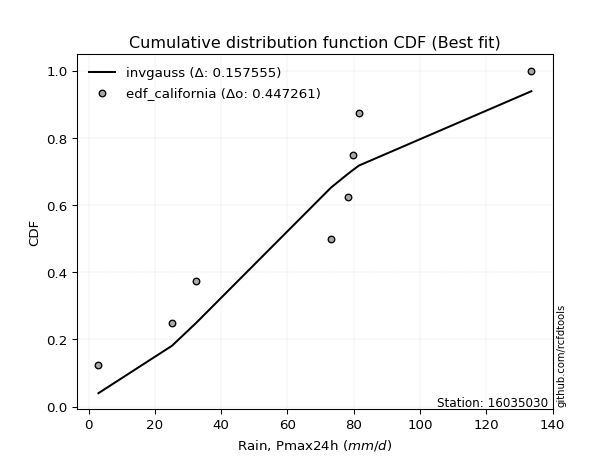</img>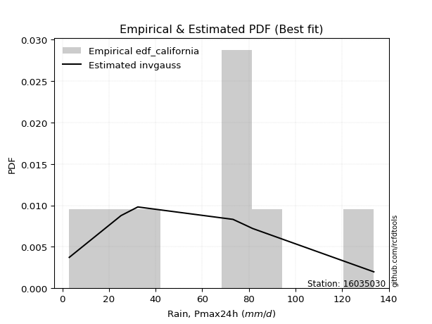</img>

</div>


### 2. Empirical - EDF Hazen (1930)

Hazen method for plotting positions is a formula used to estimate the empirical cumulative probability distribution of flood events or other hydrological data. This formula often results in biased estimations, particularly when extrapolating to extreme events (high return periods).

<div align="center">


$P=(m-0.5)/n$


</div>


**2.1. Empirical values**

<div align="center">

|                | 0                   | 1                   | 2                  | 3                  | 4         | 5                  | 6                  | 7                  | 8                  |
|:---------------|:--------------------|:--------------------|:-------------------|:-------------------|:----------|:-------------------|:-------------------|:-------------------|:-------------------|
| date           | 2023                | 2025                | 2022               | 2017               | 2020      | 2018               | 2021               | 2019               | 2024               |
| x              | 3.0                 | 3.2                 | 25.2               | 32.4               | 73.2      | 78.2               | 79.8               | 81.6               | 133.6              |
| m              | 1                   | 2                   | 3                  | 4                  | 5         | 6                  | 7                  | 8                  | 9                  |
| empirical_dist | edf_hazen           | edf_hazen           | edf_hazen          | edf_hazen          | edf_hazen | edf_hazen          | edf_hazen          | edf_hazen          | edf_hazen          |
| empirical      | 0.05555555555555555 | 0.16666666666666666 | 0.2777777777777778 | 0.3888888888888889 | 0.5       | 0.6111111111111112 | 0.7222222222222222 | 0.8333333333333334 | 0.9444444444444444 |
| empirical_tr   | 1.0588235294117647  | 1.2                 | 1.3846153846153846 | 1.6363636363636362 | 2.0       | 2.5714285714285716 | 3.5999999999999996 | 6.000000000000002  | 17.999999999999993 |

</div>


**2.2. Kolmogorov-Smirnov fit test (sorted by Δ)**


<div align="center">

|                | 0                   | 1                   | 2                   | 3                   | 4                   | 5                   | 6                   | 7                   | 8                   | 9                   | 10                  | 11                  | 12                  | 13                  | 14                  | 15                  | 16                  | 17                  | 18                  | 19                  | 20                  | 21                  | 22                  | 23                  | 24                  | 25                  | 26                  | 27                  | 28                  | 29                  | 30                  | 31                  | 32                  | 33                  | 34                  | 35                  | 36                  | 37                  | 38                  | 39                  | 40                  | 41                  | 42                  | 43                  | 44                  | 45                  | 46                  | 47                  | 48                  | 49                  | 50                  | 51                  | 52                  | 53                  | 54                  | 55                  | 56                  | 57                    | 58                  | 59                  | 60                  | 61                  | 62                  | 63                  | 64                  | 65                  | 66                  | 67                  | 68                  | 69                  | 70                  | 71                  | 72                  | 73                  | 74                  | 75                  | 76                  | 77                  | 78                  | 79                  | 80                  | 81                  | 82                  | 83                  | 84                  | 85                  | 86                  | 87                  | 88                  | 89                  |
|:---------------|:--------------------|:--------------------|:--------------------|:--------------------|:--------------------|:--------------------|:--------------------|:--------------------|:--------------------|:--------------------|:--------------------|:--------------------|:--------------------|:--------------------|:--------------------|:--------------------|:--------------------|:--------------------|:--------------------|:--------------------|:--------------------|:--------------------|:--------------------|:--------------------|:--------------------|:--------------------|:--------------------|:--------------------|:--------------------|:--------------------|:--------------------|:--------------------|:--------------------|:--------------------|:--------------------|:--------------------|:--------------------|:--------------------|:--------------------|:--------------------|:--------------------|:--------------------|:--------------------|:--------------------|:--------------------|:--------------------|:--------------------|:--------------------|:--------------------|:--------------------|:--------------------|:--------------------|:--------------------|:--------------------|:--------------------|:--------------------|:--------------------|:----------------------|:--------------------|:--------------------|:--------------------|:--------------------|:--------------------|:--------------------|:--------------------|:--------------------|:--------------------|:--------------------|:--------------------|:--------------------|:--------------------|:--------------------|:--------------------|:--------------------|:--------------------|:--------------------|:--------------------|:--------------------|:--------------------|:--------------------|:--------------------|:--------------------|:--------------------|:--------------------|:--------------------|:--------------------|:--------------------|:--------------------|:--------------------|:--------------------|
| station        | 16035030            | 16035030            | 16035030            | 16035030            | 16035030            | 16035030            | 16035030            | 16035030            | 16035030            | 16035030            | 16035030            | 16035030            | 16035030            | 16035030            | 16035030            | 16035030            | 16035030            | 16035030            | 16035030            | 16035030            | 16035030            | 16035030            | 16035030            | 16035030            | 16035030            | 16035030            | 16035030            | 16035030            | 16035030            | 16035030            | 16035030            | 16035030            | 16035030            | 16035030            | 16035030            | 16035030            | 16035030            | 16035030            | 16035030            | 16035030            | 16035030            | 16035030            | 16035030            | 16035030            | 16035030            | 16035030            | 16035030            | 16035030            | 16035030            | 16035030            | 16035030            | 16035030            | 16035030            | 16035030            | 16035030            | 16035030            | 16035030            | 16035030              | 16035030            | 16035030            | 16035030            | 16035030            | 16035030            | 16035030            | 16035030            | 16035030            | 16035030            | 16035030            | 16035030            | 16035030            | 16035030            | 16035030            | 16035030            | 16035030            | 16035030            | 16035030            | 16035030            | 16035030            | 16035030            | 16035030            | 16035030            | 16035030            | 16035030            | 16035030            | 16035030            | 16035030            | 16035030            | 16035030            | 16035030            | 16035030            |
| empirical_dist | edf_hazen           | edf_hazen           | edf_hazen           | edf_hazen           | edf_hazen           | edf_hazen           | edf_hazen           | edf_hazen           | edf_hazen           | edf_hazen           | edf_hazen           | edf_hazen           | edf_hazen           | edf_hazen           | edf_hazen           | edf_hazen           | edf_hazen           | edf_hazen           | edf_hazen           | edf_hazen           | edf_hazen           | edf_hazen           | edf_hazen           | edf_hazen           | edf_hazen           | edf_hazen           | edf_hazen           | edf_hazen           | edf_hazen           | edf_hazen           | edf_hazen           | edf_hazen           | edf_hazen           | edf_hazen           | edf_hazen           | edf_hazen           | edf_hazen           | edf_hazen           | edf_hazen           | edf_hazen           | edf_hazen           | edf_hazen           | edf_hazen           | edf_hazen           | edf_hazen           | edf_hazen           | edf_hazen           | edf_hazen           | edf_hazen           | edf_hazen           | edf_hazen           | edf_hazen           | edf_hazen           | edf_hazen           | edf_hazen           | edf_hazen           | edf_hazen           | edf_hazen             | edf_hazen           | edf_hazen           | edf_hazen           | edf_hazen           | edf_hazen           | edf_hazen           | edf_hazen           | edf_hazen           | edf_hazen           | edf_hazen           | edf_hazen           | edf_hazen           | edf_hazen           | edf_hazen           | edf_hazen           | edf_hazen           | edf_hazen           | edf_hazen           | edf_hazen           | edf_hazen           | edf_hazen           | edf_hazen           | edf_hazen           | edf_hazen           | edf_hazen           | edf_hazen           | edf_hazen           | edf_hazen           | edf_hazen           | edf_hazen           | edf_hazen           | edf_hazen           |
| p_dist         | logjohnsonsu        | logloggamma         | crystalball         | norm                | t                   | gumbel_l            | exponnorm           | laplace_asymmetric  | mielke              | pearson3            | logistic            | maxwell             | rice                | fisk                | ncf                 | rayleigh            | invgamma            | gompertz            | hypsecant           | johnsonsu           | logpearson3         | invgauss            | genlogistic         | halfnorm            | kstwobign           | loggumbel_l         | weibull_min         | loginvweibull       | logfisk             | nakagami            | gumbel_r            | laplace             | logncf              | logweibull_min      | loggamma            | loggamma            | logerlang           | f                   | logbetaprime        | logf                | lognakagami         | logcrystalball      | logt                | lognorm             | lognorm             | logexponnorm        | lognct              | logalpha            | genexpon            | expon               | loginvgamma         | halflogistic        | logrice             | logfatiguelife      | loggompertz         | loginvgauss         | moyal               | loglaplace_asymmetric | logmaxwell          | logkstwobign        | loggenexpon         | lograyleigh         | loglogistic         | loghalfnorm         | loghypsecant        | loggumbel_r         | loghalflogistic     | logmoyal            | loglaplace          | nct                 | wald                | erlang              | logexpon            | gibrat              | betaprime           | logwald             | gamma               | loggibrat           | loglognorm          | pareto              | logtruncnorm        | logpareto           | fatiguelife         | invweibull          | alpha               | logchi2             | logmielke           | chi2                | truncnorm           | loggenlogistic      |
| delta          | 0.1442299287501353  | 0.15310037177019153 | 0.15641232262257043 | 0.15641232416929352 | 0.15641612209761302 | 0.15790901634389296 | 0.1595645663447951  | 0.16282359271722663 | 0.16290862334137368 | 0.16825710909806657 | 0.17489330316631535 | 0.1773562948381857  | 0.17736649631814427 | 0.17930514464358338 | 0.18159998560379365 | 0.18363052158311022 | 0.1884828942501826  | 0.1888820798109363  | 0.18912312862287672 | 0.19014123811789296 | 0.19760531142247684 | 0.19946963216957203 | 0.20086193049156875 | 0.20195316213361114 | 0.20509985366224515 | 0.20619974559040555 | 0.2078866879211515  | 0.20828730446323807 | 0.20857631317160308 | 0.21518934043989824 | 0.21535307468135845 | 0.21709344953612686 | 0.2193454183136036  | 0.22244290708280845 | 0.22564530358313084 | 0.22564530358313084 | 0.22624872407052976 | 0.22646287921957242 | 0.2270215174412309  | 0.2281544667781792  | 0.22842745595417469 | 0.2284700913511717  | 0.22847023332216376 | 0.22847037218405408 | 0.22847037218405408 | 0.22847195149658317 | 0.22857733813912373 | 0.22928676163714545 | 0.22939513608477702 | 0.2295135062382836  | 0.22986983857805598 | 0.22996332273231956 | 0.2301670820019831  | 0.23055981575880313 | 0.2320362701536023  | 0.23381494164282635 | 0.23478941044781698 | 0.23933931057662094   | 0.24084075596131727 | 0.24165468192516648 | 0.24339988707143523 | 0.2444051446589386  | 0.2508481120494349  | 0.25578394511635383 | 0.26621498135488575 | 0.2730847827611659  | 0.2813509053715063  | 0.2874469384805869  | 0.28844334439986097 | 0.28987261748524473 | 0.2900531884086406  | 0.2968287045950495  | 0.31349997737390134 | 0.3222225418556305  | 0.3259305347837016  | 0.3309705364254324  | 0.3448374986053493  | 0.36131738439889205 | 0.3641049096545298  | 0.38569328785443957 | 0.38587870008690595 | 0.4031125132388945  | 0.4594130644532638  | 0.5011348691429314  | 0.5171400148799083  | 0.5512157245500127  | 0.6038235539729541  | 0.7115344501881798  | 0.8172875605602358  | 0.8333333333333334  |
| deltao         | 0.41761268023100007 | 0.41761268023100007 | 0.41761268023100007 | 0.41761268023100007 | 0.41761268023100007 | 0.41761268023100007 | 0.41761268023100007 | 0.41761268023100007 | 0.41761268023100007 | 0.41761268023100007 | 0.41761268023100007 | 0.41761268023100007 | 0.41761268023100007 | 0.41761268023100007 | 0.41761268023100007 | 0.41761268023100007 | 0.41761268023100007 | 0.41761268023100007 | 0.41761268023100007 | 0.41761268023100007 | 0.41761268023100007 | 0.41761268023100007 | 0.41761268023100007 | 0.41761268023100007 | 0.41761268023100007 | 0.41761268023100007 | 0.41761268023100007 | 0.41761268023100007 | 0.41761268023100007 | 0.41761268023100007 | 0.41761268023100007 | 0.41761268023100007 | 0.41761268023100007 | 0.41761268023100007 | 0.41761268023100007 | 0.41761268023100007 | 0.41761268023100007 | 0.41761268023100007 | 0.41761268023100007 | 0.41761268023100007 | 0.41761268023100007 | 0.41761268023100007 | 0.41761268023100007 | 0.41761268023100007 | 0.41761268023100007 | 0.41761268023100007 | 0.41761268023100007 | 0.41761268023100007 | 0.41761268023100007 | 0.41761268023100007 | 0.41761268023100007 | 0.41761268023100007 | 0.41761268023100007 | 0.41761268023100007 | 0.41761268023100007 | 0.41761268023100007 | 0.41761268023100007 | 0.41761268023100007   | 0.41761268023100007 | 0.41761268023100007 | 0.41761268023100007 | 0.41761268023100007 | 0.41761268023100007 | 0.41761268023100007 | 0.41761268023100007 | 0.41761268023100007 | 0.41761268023100007 | 0.41761268023100007 | 0.41761268023100007 | 0.41761268023100007 | 0.41761268023100007 | 0.41761268023100007 | 0.41761268023100007 | 0.41761268023100007 | 0.41761268023100007 | 0.41761268023100007 | 0.41761268023100007 | 0.41761268023100007 | 0.41761268023100007 | 0.41761268023100007 | 0.41761268023100007 | 0.41761268023100007 | 0.41761268023100007 | 0.41761268023100007 | 0.41761268023100007 | 0.41761268023100007 | 0.41761268023100007 | 0.41761268023100007 | 0.41761268023100007 | 0.41761268023100007 |
| eval           | Δo > Δ              | Δo > Δ              | Δo > Δ              | Δo > Δ              | Δo > Δ              | Δo > Δ              | Δo > Δ              | Δo > Δ              | Δo > Δ              | Δo > Δ              | Δo > Δ              | Δo > Δ              | Δo > Δ              | Δo > Δ              | Δo > Δ              | Δo > Δ              | Δo > Δ              | Δo > Δ              | Δo > Δ              | Δo > Δ              | Δo > Δ              | Δo > Δ              | Δo > Δ              | Δo > Δ              | Δo > Δ              | Δo > Δ              | Δo > Δ              | Δo > Δ              | Δo > Δ              | Δo > Δ              | Δo > Δ              | Δo > Δ              | Δo > Δ              | Δo > Δ              | Δo > Δ              | Δo > Δ              | Δo > Δ              | Δo > Δ              | Δo > Δ              | Δo > Δ              | Δo > Δ              | Δo > Δ              | Δo > Δ              | Δo > Δ              | Δo > Δ              | Δo > Δ              | Δo > Δ              | Δo > Δ              | Δo > Δ              | Δo > Δ              | Δo > Δ              | Δo > Δ              | Δo > Δ              | Δo > Δ              | Δo > Δ              | Δo > Δ              | Δo > Δ              | Δo > Δ                | Δo > Δ              | Δo > Δ              | Δo > Δ              | Δo > Δ              | Δo > Δ              | Δo > Δ              | Δo > Δ              | Δo > Δ              | Δo > Δ              | Δo > Δ              | Δo > Δ              | Δo > Δ              | Δo > Δ              | Δo > Δ              | Δo > Δ              | Δo > Δ              | Δo > Δ              | Δo > Δ              | Δo > Δ              | Δo > Δ              | Δo > Δ              | Δo > Δ              | Δo > Δ              | Δo > Δ              | Δo <= Δ             | Δo <= Δ             | Δo <= Δ             | Δo <= Δ             | Δo <= Δ             | Δo <= Δ             | Δo <= Δ             | Δo <= Δ             |
| fit            | 1                   | 1                   | 1                   | 1                   | 1                   | 1                   | 1                   | 1                   | 1                   | 1                   | 1                   | 1                   | 1                   | 1                   | 1                   | 1                   | 1                   | 1                   | 1                   | 1                   | 1                   | 1                   | 1                   | 1                   | 1                   | 1                   | 1                   | 1                   | 1                   | 1                   | 1                   | 1                   | 1                   | 1                   | 1                   | 1                   | 1                   | 1                   | 1                   | 1                   | 1                   | 1                   | 1                   | 1                   | 1                   | 1                   | 1                   | 1                   | 1                   | 1                   | 1                   | 1                   | 1                   | 1                   | 1                   | 1                   | 1                   | 1                     | 1                   | 1                   | 1                   | 1                   | 1                   | 1                   | 1                   | 1                   | 1                   | 1                   | 1                   | 1                   | 1                   | 1                   | 1                   | 1                   | 1                   | 1                   | 1                   | 1                   | 1                   | 1                   | 1                   | 1                   | 0                   | 0                   | 0                   | 0                   | 0                   | 0                   | 0                   | 0                   |
| n              | 9                   | 9                   | 9                   | 9                   | 9                   | 9                   | 9                   | 9                   | 9                   | 9                   | 9                   | 9                   | 9                   | 9                   | 9                   | 9                   | 9                   | 9                   | 9                   | 9                   | 9                   | 9                   | 9                   | 9                   | 9                   | 9                   | 9                   | 9                   | 9                   | 9                   | 9                   | 9                   | 9                   | 9                   | 9                   | 9                   | 9                   | 9                   | 9                   | 9                   | 9                   | 9                   | 9                   | 9                   | 9                   | 9                   | 9                   | 9                   | 9                   | 9                   | 9                   | 9                   | 9                   | 9                   | 9                   | 9                   | 9                   | 9                     | 9                   | 9                   | 9                   | 9                   | 9                   | 9                   | 9                   | 9                   | 9                   | 9                   | 9                   | 9                   | 9                   | 9                   | 9                   | 9                   | 9                   | 9                   | 9                   | 9                   | 9                   | 9                   | 9                   | 9                   | 9                   | 9                   | 9                   | 9                   | 9                   | 9                   | 9                   | 9                   |
| best_fit       | 1                   | 0                   | 0                   | 0                   | 0                   | 0                   | 0                   | 0                   | 0                   | 0                   | 0                   | 0                   | 0                   | 0                   | 0                   | 0                   | 0                   | 0                   | 0                   | 0                   | 0                   | 0                   | 0                   | 0                   | 0                   | 0                   | 0                   | 0                   | 0                   | 0                   | 0                   | 0                   | 0                   | 0                   | 0                   | 0                   | 0                   | 0                   | 0                   | 0                   | 0                   | 0                   | 0                   | 0                   | 0                   | 0                   | 0                   | 0                   | 0                   | 0                   | 0                   | 0                   | 0                   | 0                   | 0                   | 0                   | 0                   | 0                     | 0                   | 0                   | 0                   | 0                   | 0                   | 0                   | 0                   | 0                   | 0                   | 0                   | 0                   | 0                   | 0                   | 0                   | 0                   | 0                   | 0                   | 0                   | 0                   | 0                   | 0                   | 0                   | 0                   | 0                   | 0                   | 0                   | 0                   | 0                   | 0                   | 0                   | 0                   | 0                   |
| best_fit_sort  | 1                   | 2                   | 3                   | 4                   | 5                   | 6                   | 7                   | 8                   | 9                   | 10                  | 11                  | 12                  | 13                  | 14                  | 15                  | 16                  | 17                  | 18                  | 19                  | 20                  | 21                  | 22                  | 23                  | 24                  | 25                  | 26                  | 27                  | 28                  | 29                  | 30                  | 31                  | 32                  | 33                  | 34                  | 35                  | 36                  | 37                  | 38                  | 39                  | 40                  | 41                  | 42                  | 43                  | 44                  | 45                  | 46                  | 47                  | 48                  | 49                  | 50                  | 51                  | 52                  | 53                  | 54                  | 55                  | 56                  | 57                  | 58                    | 59                  | 60                  | 61                  | 62                  | 63                  | 64                  | 65                  | 66                  | 67                  | 68                  | 69                  | 70                  | 71                  | 72                  | 73                  | 74                  | 75                  | 76                  | 77                  | 78                  | 79                  | 80                  | 81                  | 82                  | 83                  | 84                  | 85                  | 86                  | 87                  | 88                  | 89                  | 90                  |

</div>


<div align="center">

</img>

</div>


**2.3. Best fit**

<div align="center">

|   id |   station | empirical_dist   | p_dist       |   delta |   deltao | eval   |   fit |   n |   best_fit |   best_fit_sort |
|-----:|----------:|:-----------------|:-------------|--------:|---------:|:-------|------:|----:|-----------:|----------------:|
|    0 |  16035030 | edf_hazen        | logjohnsonsu | 0.14423 | 0.417613 | Δo > Δ |     1 |   9 |          1 |               1 |

</div>


<div align="center">

</img>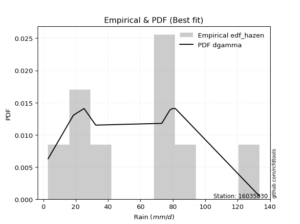</img>

</div>


### 3. Empirical - EDF Weibull (1939)

Weibull plotting position formula is an empirical method used to estimate the non-exceedance probability or plotting position for a set of observed data, is often recommended or widely used in practice, particularly in flood frequency analysis.

<div align="center">


$P=m/(n+1)$


</div>


**3.1. Empirical values**

<div align="center">

|                | 0                  | 1           | 2                  | 3                  | 4           | 5           | 6                 | 7                 | 8                  |
|:---------------|:-------------------|:------------|:-------------------|:-------------------|:------------|:------------|:------------------|:------------------|:-------------------|
| date           | 2023               | 2025        | 2022               | 2017               | 2020        | 2018        | 2021              | 2019              | 2024               |
| x              | 3.0                | 3.2         | 25.2               | 32.4               | 73.2        | 78.2        | 79.8              | 81.6              | 133.6              |
| m              | 1                  | 2           | 3                  | 4                  | 5           | 6           | 7                 | 8                 | 9                  |
| empirical_dist | edf_weibull        | edf_weibull | edf_weibull        | edf_weibull        | edf_weibull | edf_weibull | edf_weibull       | edf_weibull       | edf_weibull        |
| empirical      | 0.1                | 0.2         | 0.3                | 0.4                | 0.5         | 0.6         | 0.7               | 0.8               | 0.9                |
| empirical_tr   | 1.1111111111111112 | 1.25        | 1.4285714285714286 | 1.6666666666666667 | 2.0         | 2.5         | 3.333333333333333 | 5.000000000000001 | 10.000000000000002 |

</div>


**3.2. Kolmogorov-Smirnov fit test (sorted by Δ)**


<div align="center">

|                | 0                   | 1                   | 2                   | 3                   | 4                   | 5                   | 6                   | 7                   | 8                   | 9                   | 10                  | 11                  | 12                  | 13                  | 14                  | 15                  | 16                  | 17                  | 18                  | 19                  | 20                  | 21                  | 22                  | 23                  | 24                  | 25                  | 26                  | 27                  | 28                  | 29                  | 30                  | 31                  | 32                  | 33                  | 34                  | 35                  | 36                  | 37                  | 38                  | 39                  | 40                  | 41                  | 42                  | 43                  | 44                  | 45                  | 46                  | 47                  | 48                  | 49                  | 50                  | 51                  | 52                  | 53                  | 54                  | 55                  | 56                  | 57                  | 58                    | 59                  | 60                  | 61                  | 62                  | 63                  | 64                  | 65                  | 66                  | 67                  | 68                  | 69                  | 70                  | 71                  | 72                  | 73                  | 74                  | 75                  | 76                  | 77                  | 78                  | 79                  | 80                  | 81                  | 82                  | 83                  | 84                  | 85                  | 86                  | 87                  | 88                  | 89                  |
|:---------------|:--------------------|:--------------------|:--------------------|:--------------------|:--------------------|:--------------------|:--------------------|:--------------------|:--------------------|:--------------------|:--------------------|:--------------------|:--------------------|:--------------------|:--------------------|:--------------------|:--------------------|:--------------------|:--------------------|:--------------------|:--------------------|:--------------------|:--------------------|:--------------------|:--------------------|:--------------------|:--------------------|:--------------------|:--------------------|:--------------------|:--------------------|:--------------------|:--------------------|:--------------------|:--------------------|:--------------------|:--------------------|:--------------------|:--------------------|:--------------------|:--------------------|:--------------------|:--------------------|:--------------------|:--------------------|:--------------------|:--------------------|:--------------------|:--------------------|:--------------------|:--------------------|:--------------------|:--------------------|:--------------------|:--------------------|:--------------------|:--------------------|:--------------------|:----------------------|:--------------------|:--------------------|:--------------------|:--------------------|:--------------------|:--------------------|:--------------------|:--------------------|:--------------------|:--------------------|:--------------------|:--------------------|:--------------------|:--------------------|:--------------------|:--------------------|:--------------------|:--------------------|:--------------------|:--------------------|:--------------------|:--------------------|:--------------------|:--------------------|:--------------------|:--------------------|:--------------------|:--------------------|:--------------------|:--------------------|:--------------------|
| station        | 16035030            | 16035030            | 16035030            | 16035030            | 16035030            | 16035030            | 16035030            | 16035030            | 16035030            | 16035030            | 16035030            | 16035030            | 16035030            | 16035030            | 16035030            | 16035030            | 16035030            | 16035030            | 16035030            | 16035030            | 16035030            | 16035030            | 16035030            | 16035030            | 16035030            | 16035030            | 16035030            | 16035030            | 16035030            | 16035030            | 16035030            | 16035030            | 16035030            | 16035030            | 16035030            | 16035030            | 16035030            | 16035030            | 16035030            | 16035030            | 16035030            | 16035030            | 16035030            | 16035030            | 16035030            | 16035030            | 16035030            | 16035030            | 16035030            | 16035030            | 16035030            | 16035030            | 16035030            | 16035030            | 16035030            | 16035030            | 16035030            | 16035030            | 16035030              | 16035030            | 16035030            | 16035030            | 16035030            | 16035030            | 16035030            | 16035030            | 16035030            | 16035030            | 16035030            | 16035030            | 16035030            | 16035030            | 16035030            | 16035030            | 16035030            | 16035030            | 16035030            | 16035030            | 16035030            | 16035030            | 16035030            | 16035030            | 16035030            | 16035030            | 16035030            | 16035030            | 16035030            | 16035030            | 16035030            | 16035030            |
| empirical_dist | edf_weibull         | edf_weibull         | edf_weibull         | edf_weibull         | edf_weibull         | edf_weibull         | edf_weibull         | edf_weibull         | edf_weibull         | edf_weibull         | edf_weibull         | edf_weibull         | edf_weibull         | edf_weibull         | edf_weibull         | edf_weibull         | edf_weibull         | edf_weibull         | edf_weibull         | edf_weibull         | edf_weibull         | edf_weibull         | edf_weibull         | edf_weibull         | edf_weibull         | edf_weibull         | edf_weibull         | edf_weibull         | edf_weibull         | edf_weibull         | edf_weibull         | edf_weibull         | edf_weibull         | edf_weibull         | edf_weibull         | edf_weibull         | edf_weibull         | edf_weibull         | edf_weibull         | edf_weibull         | edf_weibull         | edf_weibull         | edf_weibull         | edf_weibull         | edf_weibull         | edf_weibull         | edf_weibull         | edf_weibull         | edf_weibull         | edf_weibull         | edf_weibull         | edf_weibull         | edf_weibull         | edf_weibull         | edf_weibull         | edf_weibull         | edf_weibull         | edf_weibull         | edf_weibull           | edf_weibull         | edf_weibull         | edf_weibull         | edf_weibull         | edf_weibull         | edf_weibull         | edf_weibull         | edf_weibull         | edf_weibull         | edf_weibull         | edf_weibull         | edf_weibull         | edf_weibull         | edf_weibull         | edf_weibull         | edf_weibull         | edf_weibull         | edf_weibull         | edf_weibull         | edf_weibull         | edf_weibull         | edf_weibull         | edf_weibull         | edf_weibull         | edf_weibull         | edf_weibull         | edf_weibull         | edf_weibull         | edf_weibull         | edf_weibull         | edf_weibull         |
| p_dist         | logjohnsonsu        | logloggamma         | crystalball         | norm                | t                   | exponnorm           | pearson3            | gumbel_l            | laplace_asymmetric  | logistic            | maxwell             | rice                | fisk                | ncf                 | rayleigh            | weibull_min         | invgamma            | hypsecant           | johnsonsu           | mielke              | logpearson3         | gompertz            | invgauss            | genlogistic         | halfnorm            | kstwobign           | loggumbel_l         | loginvweibull       | logfisk             | logncf              | nakagami            | gumbel_r            | laplace             | logweibull_min      | loggamma            | loggamma            | logerlang           | f                   | logbetaprime        | logf                | lognakagami         | logcrystalball      | logt                | lognorm             | lognorm             | logexponnorm        | lognct              | logalpha            | genexpon            | expon               | loginvgamma         | halflogistic        | logrice             | logfatiguelife      | loggompertz         | logkstwobign        | loginvgauss         | moyal               | loglaplace_asymmetric | logmaxwell          | loggenexpon         | lograyleigh         | loglogistic         | loghalfnorm         | loghypsecant        | nct                 | loggumbel_r         | loghalflogistic     | logmoyal            | loglaplace          | wald                | logexpon            | erlang              | gibrat              | betaprime           | logwald             | loglognorm          | gamma               | loggibrat           | pareto              | logpareto           | logtruncnorm        | fatiguelife         | invweibull          | alpha               | logchi2             | logmielke           | chi2                | truncnorm           | loggenlogistic      |
| delta          | 0.1442299287501353  | 0.15310037177019153 | 0.15641232262257043 | 0.15641232416929352 | 0.15641612209761302 | 0.1595645663447951  | 0.16825710909806657 | 0.16902012745500408 | 0.17393470382833776 | 0.17489330316631535 | 0.1773562948381857  | 0.17736649631814427 | 0.17930514464358338 | 0.18159998560379365 | 0.18363052158311022 | 0.1856644656989293  | 0.1884828942501826  | 0.18912312862287672 | 0.19014123811789296 | 0.19624195667470704 | 0.19760531142247684 | 0.19776478627017718 | 0.19946963216957203 | 0.20086193049156875 | 0.20195316213361114 | 0.20509985366224515 | 0.20619974559040555 | 0.20757828227234287 | 0.20857631317160308 | 0.21036257771117184 | 0.21518934043989824 | 0.21535307468135845 | 0.21709344953612686 | 0.22244290708280845 | 0.22564530358313084 | 0.22564530358313084 | 0.22624872407052976 | 0.22646287921957242 | 0.2270215174412309  | 0.2281544667781792  | 0.22842745595417469 | 0.2284700913511717  | 0.22847023332216376 | 0.22847037218405408 | 0.22847037218405408 | 0.22847195149658317 | 0.22857733813912373 | 0.22928676163714545 | 0.22939513608477702 | 0.2295135062382836  | 0.22986983857805598 | 0.22996332273231956 | 0.2301670820019831  | 0.23055981575880313 | 0.2320362701536023  | 0.23300730891695387 | 0.23381494164282635 | 0.23478941044781698 | 0.23933931057662094   | 0.24084075596131727 | 0.241994797816249   | 0.2444051446589386  | 0.2508481120494349  | 0.25578394511635383 | 0.26621498135488575 | 0.26765039526302253 | 0.2730847827611659  | 0.2813509053715063  | 0.2874469384805869  | 0.28844334439986097 | 0.2900531884086406  | 0.29127775515167914 | 0.2968287045950495  | 0.3222225418556305  | 0.3259305347837016  | 0.3309705364254324  | 0.3418826874323076  | 0.3448374986053493  | 0.36131738439889205 | 0.36347106563221737 | 0.3808902910166723  | 0.38587870008690595 | 0.4371908422310416  | 0.4566904246984869  | 0.49491779265768615 | 0.5289935023277905  | 0.5816013317507318  | 0.6893122279659576  | 0.7728431161157914  | 0.8                 |
| deltao         | 0.41761268023100007 | 0.41761268023100007 | 0.41761268023100007 | 0.41761268023100007 | 0.41761268023100007 | 0.41761268023100007 | 0.41761268023100007 | 0.41761268023100007 | 0.41761268023100007 | 0.41761268023100007 | 0.41761268023100007 | 0.41761268023100007 | 0.41761268023100007 | 0.41761268023100007 | 0.41761268023100007 | 0.41761268023100007 | 0.41761268023100007 | 0.41761268023100007 | 0.41761268023100007 | 0.41761268023100007 | 0.41761268023100007 | 0.41761268023100007 | 0.41761268023100007 | 0.41761268023100007 | 0.41761268023100007 | 0.41761268023100007 | 0.41761268023100007 | 0.41761268023100007 | 0.41761268023100007 | 0.41761268023100007 | 0.41761268023100007 | 0.41761268023100007 | 0.41761268023100007 | 0.41761268023100007 | 0.41761268023100007 | 0.41761268023100007 | 0.41761268023100007 | 0.41761268023100007 | 0.41761268023100007 | 0.41761268023100007 | 0.41761268023100007 | 0.41761268023100007 | 0.41761268023100007 | 0.41761268023100007 | 0.41761268023100007 | 0.41761268023100007 | 0.41761268023100007 | 0.41761268023100007 | 0.41761268023100007 | 0.41761268023100007 | 0.41761268023100007 | 0.41761268023100007 | 0.41761268023100007 | 0.41761268023100007 | 0.41761268023100007 | 0.41761268023100007 | 0.41761268023100007 | 0.41761268023100007 | 0.41761268023100007   | 0.41761268023100007 | 0.41761268023100007 | 0.41761268023100007 | 0.41761268023100007 | 0.41761268023100007 | 0.41761268023100007 | 0.41761268023100007 | 0.41761268023100007 | 0.41761268023100007 | 0.41761268023100007 | 0.41761268023100007 | 0.41761268023100007 | 0.41761268023100007 | 0.41761268023100007 | 0.41761268023100007 | 0.41761268023100007 | 0.41761268023100007 | 0.41761268023100007 | 0.41761268023100007 | 0.41761268023100007 | 0.41761268023100007 | 0.41761268023100007 | 0.41761268023100007 | 0.41761268023100007 | 0.41761268023100007 | 0.41761268023100007 | 0.41761268023100007 | 0.41761268023100007 | 0.41761268023100007 | 0.41761268023100007 | 0.41761268023100007 |
| eval           | Δo > Δ              | Δo > Δ              | Δo > Δ              | Δo > Δ              | Δo > Δ              | Δo > Δ              | Δo > Δ              | Δo > Δ              | Δo > Δ              | Δo > Δ              | Δo > Δ              | Δo > Δ              | Δo > Δ              | Δo > Δ              | Δo > Δ              | Δo > Δ              | Δo > Δ              | Δo > Δ              | Δo > Δ              | Δo > Δ              | Δo > Δ              | Δo > Δ              | Δo > Δ              | Δo > Δ              | Δo > Δ              | Δo > Δ              | Δo > Δ              | Δo > Δ              | Δo > Δ              | Δo > Δ              | Δo > Δ              | Δo > Δ              | Δo > Δ              | Δo > Δ              | Δo > Δ              | Δo > Δ              | Δo > Δ              | Δo > Δ              | Δo > Δ              | Δo > Δ              | Δo > Δ              | Δo > Δ              | Δo > Δ              | Δo > Δ              | Δo > Δ              | Δo > Δ              | Δo > Δ              | Δo > Δ              | Δo > Δ              | Δo > Δ              | Δo > Δ              | Δo > Δ              | Δo > Δ              | Δo > Δ              | Δo > Δ              | Δo > Δ              | Δo > Δ              | Δo > Δ              | Δo > Δ                | Δo > Δ              | Δo > Δ              | Δo > Δ              | Δo > Δ              | Δo > Δ              | Δo > Δ              | Δo > Δ              | Δo > Δ              | Δo > Δ              | Δo > Δ              | Δo > Δ              | Δo > Δ              | Δo > Δ              | Δo > Δ              | Δo > Δ              | Δo > Δ              | Δo > Δ              | Δo > Δ              | Δo > Δ              | Δo > Δ              | Δo > Δ              | Δo > Δ              | Δo > Δ              | Δo <= Δ             | Δo <= Δ             | Δo <= Δ             | Δo <= Δ             | Δo <= Δ             | Δo <= Δ             | Δo <= Δ             | Δo <= Δ             |
| fit            | 1                   | 1                   | 1                   | 1                   | 1                   | 1                   | 1                   | 1                   | 1                   | 1                   | 1                   | 1                   | 1                   | 1                   | 1                   | 1                   | 1                   | 1                   | 1                   | 1                   | 1                   | 1                   | 1                   | 1                   | 1                   | 1                   | 1                   | 1                   | 1                   | 1                   | 1                   | 1                   | 1                   | 1                   | 1                   | 1                   | 1                   | 1                   | 1                   | 1                   | 1                   | 1                   | 1                   | 1                   | 1                   | 1                   | 1                   | 1                   | 1                   | 1                   | 1                   | 1                   | 1                   | 1                   | 1                   | 1                   | 1                   | 1                   | 1                     | 1                   | 1                   | 1                   | 1                   | 1                   | 1                   | 1                   | 1                   | 1                   | 1                   | 1                   | 1                   | 1                   | 1                   | 1                   | 1                   | 1                   | 1                   | 1                   | 1                   | 1                   | 1                   | 1                   | 0                   | 0                   | 0                   | 0                   | 0                   | 0                   | 0                   | 0                   |
| n              | 9                   | 9                   | 9                   | 9                   | 9                   | 9                   | 9                   | 9                   | 9                   | 9                   | 9                   | 9                   | 9                   | 9                   | 9                   | 9                   | 9                   | 9                   | 9                   | 9                   | 9                   | 9                   | 9                   | 9                   | 9                   | 9                   | 9                   | 9                   | 9                   | 9                   | 9                   | 9                   | 9                   | 9                   | 9                   | 9                   | 9                   | 9                   | 9                   | 9                   | 9                   | 9                   | 9                   | 9                   | 9                   | 9                   | 9                   | 9                   | 9                   | 9                   | 9                   | 9                   | 9                   | 9                   | 9                   | 9                   | 9                   | 9                   | 9                     | 9                   | 9                   | 9                   | 9                   | 9                   | 9                   | 9                   | 9                   | 9                   | 9                   | 9                   | 9                   | 9                   | 9                   | 9                   | 9                   | 9                   | 9                   | 9                   | 9                   | 9                   | 9                   | 9                   | 9                   | 9                   | 9                   | 9                   | 9                   | 9                   | 9                   | 9                   |
| best_fit       | 1                   | 0                   | 0                   | 0                   | 0                   | 0                   | 0                   | 0                   | 0                   | 0                   | 0                   | 0                   | 0                   | 0                   | 0                   | 0                   | 0                   | 0                   | 0                   | 0                   | 0                   | 0                   | 0                   | 0                   | 0                   | 0                   | 0                   | 0                   | 0                   | 0                   | 0                   | 0                   | 0                   | 0                   | 0                   | 0                   | 0                   | 0                   | 0                   | 0                   | 0                   | 0                   | 0                   | 0                   | 0                   | 0                   | 0                   | 0                   | 0                   | 0                   | 0                   | 0                   | 0                   | 0                   | 0                   | 0                   | 0                   | 0                   | 0                     | 0                   | 0                   | 0                   | 0                   | 0                   | 0                   | 0                   | 0                   | 0                   | 0                   | 0                   | 0                   | 0                   | 0                   | 0                   | 0                   | 0                   | 0                   | 0                   | 0                   | 0                   | 0                   | 0                   | 0                   | 0                   | 0                   | 0                   | 0                   | 0                   | 0                   | 0                   |
| best_fit_sort  | 1                   | 2                   | 3                   | 4                   | 5                   | 6                   | 7                   | 8                   | 9                   | 10                  | 11                  | 12                  | 13                  | 14                  | 15                  | 16                  | 17                  | 18                  | 19                  | 20                  | 21                  | 22                  | 23                  | 24                  | 25                  | 26                  | 27                  | 28                  | 29                  | 30                  | 31                  | 32                  | 33                  | 34                  | 35                  | 36                  | 37                  | 38                  | 39                  | 40                  | 41                  | 42                  | 43                  | 44                  | 45                  | 46                  | 47                  | 48                  | 49                  | 50                  | 51                  | 52                  | 53                  | 54                  | 55                  | 56                  | 57                  | 58                  | 59                    | 60                  | 61                  | 62                  | 63                  | 64                  | 65                  | 66                  | 67                  | 68                  | 69                  | 70                  | 71                  | 72                  | 73                  | 74                  | 75                  | 76                  | 77                  | 78                  | 79                  | 80                  | 81                  | 82                  | 83                  | 84                  | 85                  | 86                  | 87                  | 88                  | 89                  | 90                  |

</div>


<div align="center">

</img>

</div>


**3.3. Best fit**

<div align="center">

|   id |   station | empirical_dist   | p_dist       |   delta |   deltao | eval   |   fit |   n |   best_fit |   best_fit_sort |
|-----:|----------:|:-----------------|:-------------|--------:|---------:|:-------|------:|----:|-----------:|----------------:|
|    0 |  16035030 | edf_weibull      | logjohnsonsu | 0.14423 | 0.417613 | Δo > Δ |     1 |   9 |          1 |               1 |

</div>


<div align="center">

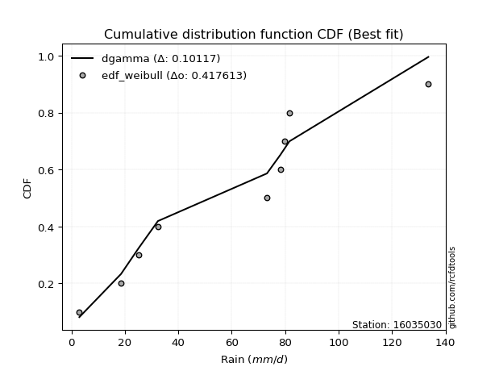</img>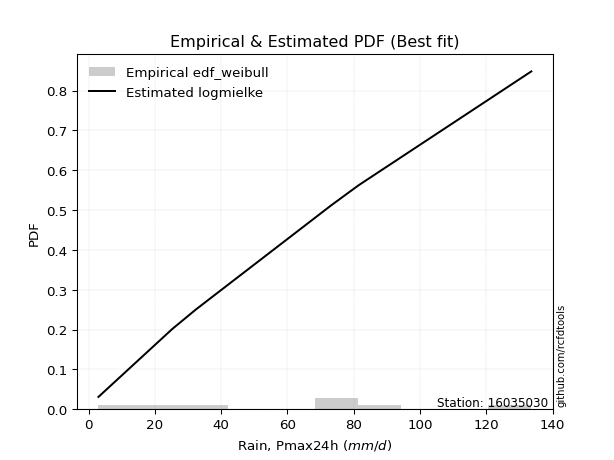</img>

</div>


### 4. Empirical - EDF Beard (1943)

The Beard formula (or Beard´s plotting position formula) in hydrology is used to estimate the empirical non-exceedance probability _(P)_ of a flood event (or other extreme hydrological data point) within a given dataset.

<div align="center">


$P=(m-0.31)/(n+0.38)$


</div>


**4.1. Empirical values**

<div align="center">

|                | 0                   | 1                   | 2                  | 3                   | 4         | 5                  | 6                  | 7                  | 8                  |
|:---------------|:--------------------|:--------------------|:-------------------|:--------------------|:----------|:-------------------|:-------------------|:-------------------|:-------------------|
| date           | 2023                | 2025                | 2022               | 2017                | 2020      | 2018               | 2021               | 2019               | 2024               |
| x              | 3.0                 | 3.2                 | 25.2               | 32.4                | 73.2      | 78.2               | 79.8               | 81.6               | 133.6              |
| m              | 1                   | 2                   | 3                  | 4                   | 5         | 6                  | 7                  | 8                  | 9                  |
| empirical_dist | edf_beard           | edf_beard           | edf_beard          | edf_beard           | edf_beard | edf_beard          | edf_beard          | edf_beard          | edf_beard          |
| empirical      | 0.07356076759061833 | 0.18017057569296374 | 0.2867803837953091 | 0.39339019189765456 | 0.5       | 0.6066098081023454 | 0.7132196162046908 | 0.8198294243070362 | 0.9264392324093815 |
| empirical_tr   | 1.0794016110471807  | 1.2197659297789336  | 1.4020926756352765 | 1.6485061511423549  | 2.0       | 2.542005420054201  | 3.486988847583642  | 5.550295857988164  | 13.5942028985507   |

</div>


**4.2. Kolmogorov-Smirnov fit test (sorted by Δ)**


<div align="center">

|                | 0                   | 1                   | 2                   | 3                   | 4                   | 5                   | 6                   | 7                   | 8                   | 9                   | 10                  | 11                  | 12                  | 13                  | 14                  | 15                  | 16                  | 17                  | 18                  | 19                  | 20                  | 21                  | 22                  | 23                  | 24                  | 25                  | 26                  | 27                  | 28                  | 29                  | 30                  | 31                  | 32                  | 33                  | 34                  | 35                  | 36                  | 37                  | 38                  | 39                  | 40                  | 41                  | 42                  | 43                  | 44                  | 45                  | 46                  | 47                  | 48                  | 49                  | 50                  | 51                  | 52                  | 53                  | 54                  | 55                  | 56                  | 57                  | 58                    | 59                  | 60                  | 61                  | 62                  | 63                  | 64                  | 65                  | 66                  | 67                  | 68                  | 69                  | 70                  | 71                  | 72                  | 73                  | 74                  | 75                  | 76                  | 77                  | 78                  | 79                  | 80                  | 81                  | 82                  | 83                  | 84                  | 85                  | 86                  | 87                  | 88                  | 89                  |
|:---------------|:--------------------|:--------------------|:--------------------|:--------------------|:--------------------|:--------------------|:--------------------|:--------------------|:--------------------|:--------------------|:--------------------|:--------------------|:--------------------|:--------------------|:--------------------|:--------------------|:--------------------|:--------------------|:--------------------|:--------------------|:--------------------|:--------------------|:--------------------|:--------------------|:--------------------|:--------------------|:--------------------|:--------------------|:--------------------|:--------------------|:--------------------|:--------------------|:--------------------|:--------------------|:--------------------|:--------------------|:--------------------|:--------------------|:--------------------|:--------------------|:--------------------|:--------------------|:--------------------|:--------------------|:--------------------|:--------------------|:--------------------|:--------------------|:--------------------|:--------------------|:--------------------|:--------------------|:--------------------|:--------------------|:--------------------|:--------------------|:--------------------|:--------------------|:----------------------|:--------------------|:--------------------|:--------------------|:--------------------|:--------------------|:--------------------|:--------------------|:--------------------|:--------------------|:--------------------|:--------------------|:--------------------|:--------------------|:--------------------|:--------------------|:--------------------|:--------------------|:--------------------|:--------------------|:--------------------|:--------------------|:--------------------|:--------------------|:--------------------|:--------------------|:--------------------|:--------------------|:--------------------|:--------------------|:--------------------|:--------------------|
| station        | 16035030            | 16035030            | 16035030            | 16035030            | 16035030            | 16035030            | 16035030            | 16035030            | 16035030            | 16035030            | 16035030            | 16035030            | 16035030            | 16035030            | 16035030            | 16035030            | 16035030            | 16035030            | 16035030            | 16035030            | 16035030            | 16035030            | 16035030            | 16035030            | 16035030            | 16035030            | 16035030            | 16035030            | 16035030            | 16035030            | 16035030            | 16035030            | 16035030            | 16035030            | 16035030            | 16035030            | 16035030            | 16035030            | 16035030            | 16035030            | 16035030            | 16035030            | 16035030            | 16035030            | 16035030            | 16035030            | 16035030            | 16035030            | 16035030            | 16035030            | 16035030            | 16035030            | 16035030            | 16035030            | 16035030            | 16035030            | 16035030            | 16035030            | 16035030              | 16035030            | 16035030            | 16035030            | 16035030            | 16035030            | 16035030            | 16035030            | 16035030            | 16035030            | 16035030            | 16035030            | 16035030            | 16035030            | 16035030            | 16035030            | 16035030            | 16035030            | 16035030            | 16035030            | 16035030            | 16035030            | 16035030            | 16035030            | 16035030            | 16035030            | 16035030            | 16035030            | 16035030            | 16035030            | 16035030            | 16035030            |
| empirical_dist | edf_beard           | edf_beard           | edf_beard           | edf_beard           | edf_beard           | edf_beard           | edf_beard           | edf_beard           | edf_beard           | edf_beard           | edf_beard           | edf_beard           | edf_beard           | edf_beard           | edf_beard           | edf_beard           | edf_beard           | edf_beard           | edf_beard           | edf_beard           | edf_beard           | edf_beard           | edf_beard           | edf_beard           | edf_beard           | edf_beard           | edf_beard           | edf_beard           | edf_beard           | edf_beard           | edf_beard           | edf_beard           | edf_beard           | edf_beard           | edf_beard           | edf_beard           | edf_beard           | edf_beard           | edf_beard           | edf_beard           | edf_beard           | edf_beard           | edf_beard           | edf_beard           | edf_beard           | edf_beard           | edf_beard           | edf_beard           | edf_beard           | edf_beard           | edf_beard           | edf_beard           | edf_beard           | edf_beard           | edf_beard           | edf_beard           | edf_beard           | edf_beard           | edf_beard             | edf_beard           | edf_beard           | edf_beard           | edf_beard           | edf_beard           | edf_beard           | edf_beard           | edf_beard           | edf_beard           | edf_beard           | edf_beard           | edf_beard           | edf_beard           | edf_beard           | edf_beard           | edf_beard           | edf_beard           | edf_beard           | edf_beard           | edf_beard           | edf_beard           | edf_beard           | edf_beard           | edf_beard           | edf_beard           | edf_beard           | edf_beard           | edf_beard           | edf_beard           | edf_beard           | edf_beard           |
| p_dist         | logjohnsonsu        | logloggamma         | crystalball         | norm                | t                   | exponnorm           | gumbel_l            | laplace_asymmetric  | pearson3            | logistic            | mielke              | maxwell             | rice                | fisk                | ncf                 | rayleigh            | invgamma            | gompertz            | hypsecant           | johnsonsu           | logpearson3         | weibull_min         | invgauss            | genlogistic         | halfnorm            | kstwobign           | loggumbel_l         | loginvweibull       | logfisk             | logncf              | nakagami            | gumbel_r            | laplace             | logweibull_min      | loggamma            | loggamma            | logerlang           | f                   | logbetaprime        | logf                | lognakagami         | logcrystalball      | logt                | lognorm             | lognorm             | logexponnorm        | lognct              | logalpha            | genexpon            | expon               | loginvgamma         | halflogistic        | logrice             | logfatiguelife      | loggompertz         | logkstwobign        | loginvgauss         | moyal               | loglaplace_asymmetric | logmaxwell          | loggenexpon         | lograyleigh         | loglogistic         | loghalfnorm         | loghypsecant        | loggumbel_r         | nct                 | loghalflogistic     | logmoyal            | loglaplace          | wald                | erlang              | logexpon            | gibrat              | betaprime           | logwald             | gamma               | loglognorm          | loggibrat           | pareto              | logtruncnorm        | logpareto           | fatiguelife         | invweibull          | alpha               | logchi2             | logmielke           | chi2                | truncnorm           | loggenlogistic      |
| delta          | 0.1442299287501353  | 0.15310037177019153 | 0.15641232262257043 | 0.15641232416929352 | 0.15641612209761302 | 0.1595645663447951  | 0.16241031935265862 | 0.1673248957259923  | 0.16825710909806657 | 0.17489330316631535 | 0.17641253236767077 | 0.1773562948381857  | 0.17736649631814427 | 0.17930514464358338 | 0.18159998560379365 | 0.18363052158311022 | 0.1884828942501826  | 0.1888820798109363  | 0.18912312862287672 | 0.19014123811789296 | 0.19760531142247684 | 0.19888408190362017 | 0.19946963216957203 | 0.20086193049156875 | 0.20195316213361114 | 0.20509985366224515 | 0.20619974559040555 | 0.20757828227234287 | 0.20857631317160308 | 0.21036257771117184 | 0.21518934043989824 | 0.21535307468135845 | 0.21709344953612686 | 0.22244290708280845 | 0.22564530358313084 | 0.22564530358313084 | 0.22624872407052976 | 0.22646287921957242 | 0.2270215174412309  | 0.2281544667781792  | 0.22842745595417469 | 0.2284700913511717  | 0.22847023332216376 | 0.22847037218405408 | 0.22847037218405408 | 0.22847195149658317 | 0.22857733813912373 | 0.22928676163714545 | 0.22939513608477702 | 0.2295135062382836  | 0.22986983857805598 | 0.22996332273231956 | 0.2301670820019831  | 0.23055981575880313 | 0.2320362701536023  | 0.23300730891695387 | 0.23381494164282635 | 0.23478941044781698 | 0.23933931057662094   | 0.24084075596131727 | 0.241994797816249   | 0.2444051446589386  | 0.2508481120494349  | 0.25578394511635383 | 0.26621498135488575 | 0.2730847827611659  | 0.2808700114677134  | 0.2813509053715063  | 0.2874469384805869  | 0.28844334439986097 | 0.2900531884086406  | 0.2968287045950495  | 0.30449737135637    | 0.3222225418556305  | 0.3259305347837016  | 0.3309705364254324  | 0.3448374986053493  | 0.35510230363699846 | 0.36131738439889205 | 0.37669068183690824 | 0.38587870008690595 | 0.3941099072213632  | 0.45041045843573246 | 0.4831296571078684  | 0.508137408862377   | 0.5422131185324813  | 0.5948209479554227  | 0.7025318441706485  | 0.799282348525173   | 0.8198294243070362  |
| deltao         | 0.41761268023100007 | 0.41761268023100007 | 0.41761268023100007 | 0.41761268023100007 | 0.41761268023100007 | 0.41761268023100007 | 0.41761268023100007 | 0.41761268023100007 | 0.41761268023100007 | 0.41761268023100007 | 0.41761268023100007 | 0.41761268023100007 | 0.41761268023100007 | 0.41761268023100007 | 0.41761268023100007 | 0.41761268023100007 | 0.41761268023100007 | 0.41761268023100007 | 0.41761268023100007 | 0.41761268023100007 | 0.41761268023100007 | 0.41761268023100007 | 0.41761268023100007 | 0.41761268023100007 | 0.41761268023100007 | 0.41761268023100007 | 0.41761268023100007 | 0.41761268023100007 | 0.41761268023100007 | 0.41761268023100007 | 0.41761268023100007 | 0.41761268023100007 | 0.41761268023100007 | 0.41761268023100007 | 0.41761268023100007 | 0.41761268023100007 | 0.41761268023100007 | 0.41761268023100007 | 0.41761268023100007 | 0.41761268023100007 | 0.41761268023100007 | 0.41761268023100007 | 0.41761268023100007 | 0.41761268023100007 | 0.41761268023100007 | 0.41761268023100007 | 0.41761268023100007 | 0.41761268023100007 | 0.41761268023100007 | 0.41761268023100007 | 0.41761268023100007 | 0.41761268023100007 | 0.41761268023100007 | 0.41761268023100007 | 0.41761268023100007 | 0.41761268023100007 | 0.41761268023100007 | 0.41761268023100007 | 0.41761268023100007   | 0.41761268023100007 | 0.41761268023100007 | 0.41761268023100007 | 0.41761268023100007 | 0.41761268023100007 | 0.41761268023100007 | 0.41761268023100007 | 0.41761268023100007 | 0.41761268023100007 | 0.41761268023100007 | 0.41761268023100007 | 0.41761268023100007 | 0.41761268023100007 | 0.41761268023100007 | 0.41761268023100007 | 0.41761268023100007 | 0.41761268023100007 | 0.41761268023100007 | 0.41761268023100007 | 0.41761268023100007 | 0.41761268023100007 | 0.41761268023100007 | 0.41761268023100007 | 0.41761268023100007 | 0.41761268023100007 | 0.41761268023100007 | 0.41761268023100007 | 0.41761268023100007 | 0.41761268023100007 | 0.41761268023100007 | 0.41761268023100007 |
| eval           | Δo > Δ              | Δo > Δ              | Δo > Δ              | Δo > Δ              | Δo > Δ              | Δo > Δ              | Δo > Δ              | Δo > Δ              | Δo > Δ              | Δo > Δ              | Δo > Δ              | Δo > Δ              | Δo > Δ              | Δo > Δ              | Δo > Δ              | Δo > Δ              | Δo > Δ              | Δo > Δ              | Δo > Δ              | Δo > Δ              | Δo > Δ              | Δo > Δ              | Δo > Δ              | Δo > Δ              | Δo > Δ              | Δo > Δ              | Δo > Δ              | Δo > Δ              | Δo > Δ              | Δo > Δ              | Δo > Δ              | Δo > Δ              | Δo > Δ              | Δo > Δ              | Δo > Δ              | Δo > Δ              | Δo > Δ              | Δo > Δ              | Δo > Δ              | Δo > Δ              | Δo > Δ              | Δo > Δ              | Δo > Δ              | Δo > Δ              | Δo > Δ              | Δo > Δ              | Δo > Δ              | Δo > Δ              | Δo > Δ              | Δo > Δ              | Δo > Δ              | Δo > Δ              | Δo > Δ              | Δo > Δ              | Δo > Δ              | Δo > Δ              | Δo > Δ              | Δo > Δ              | Δo > Δ                | Δo > Δ              | Δo > Δ              | Δo > Δ              | Δo > Δ              | Δo > Δ              | Δo > Δ              | Δo > Δ              | Δo > Δ              | Δo > Δ              | Δo > Δ              | Δo > Δ              | Δo > Δ              | Δo > Δ              | Δo > Δ              | Δo > Δ              | Δo > Δ              | Δo > Δ              | Δo > Δ              | Δo > Δ              | Δo > Δ              | Δo > Δ              | Δo > Δ              | Δo > Δ              | Δo <= Δ             | Δo <= Δ             | Δo <= Δ             | Δo <= Δ             | Δo <= Δ             | Δo <= Δ             | Δo <= Δ             | Δo <= Δ             |
| fit            | 1                   | 1                   | 1                   | 1                   | 1                   | 1                   | 1                   | 1                   | 1                   | 1                   | 1                   | 1                   | 1                   | 1                   | 1                   | 1                   | 1                   | 1                   | 1                   | 1                   | 1                   | 1                   | 1                   | 1                   | 1                   | 1                   | 1                   | 1                   | 1                   | 1                   | 1                   | 1                   | 1                   | 1                   | 1                   | 1                   | 1                   | 1                   | 1                   | 1                   | 1                   | 1                   | 1                   | 1                   | 1                   | 1                   | 1                   | 1                   | 1                   | 1                   | 1                   | 1                   | 1                   | 1                   | 1                   | 1                   | 1                   | 1                   | 1                     | 1                   | 1                   | 1                   | 1                   | 1                   | 1                   | 1                   | 1                   | 1                   | 1                   | 1                   | 1                   | 1                   | 1                   | 1                   | 1                   | 1                   | 1                   | 1                   | 1                   | 1                   | 1                   | 1                   | 0                   | 0                   | 0                   | 0                   | 0                   | 0                   | 0                   | 0                   |
| n              | 9                   | 9                   | 9                   | 9                   | 9                   | 9                   | 9                   | 9                   | 9                   | 9                   | 9                   | 9                   | 9                   | 9                   | 9                   | 9                   | 9                   | 9                   | 9                   | 9                   | 9                   | 9                   | 9                   | 9                   | 9                   | 9                   | 9                   | 9                   | 9                   | 9                   | 9                   | 9                   | 9                   | 9                   | 9                   | 9                   | 9                   | 9                   | 9                   | 9                   | 9                   | 9                   | 9                   | 9                   | 9                   | 9                   | 9                   | 9                   | 9                   | 9                   | 9                   | 9                   | 9                   | 9                   | 9                   | 9                   | 9                   | 9                   | 9                     | 9                   | 9                   | 9                   | 9                   | 9                   | 9                   | 9                   | 9                   | 9                   | 9                   | 9                   | 9                   | 9                   | 9                   | 9                   | 9                   | 9                   | 9                   | 9                   | 9                   | 9                   | 9                   | 9                   | 9                   | 9                   | 9                   | 9                   | 9                   | 9                   | 9                   | 9                   |
| best_fit       | 1                   | 0                   | 0                   | 0                   | 0                   | 0                   | 0                   | 0                   | 0                   | 0                   | 0                   | 0                   | 0                   | 0                   | 0                   | 0                   | 0                   | 0                   | 0                   | 0                   | 0                   | 0                   | 0                   | 0                   | 0                   | 0                   | 0                   | 0                   | 0                   | 0                   | 0                   | 0                   | 0                   | 0                   | 0                   | 0                   | 0                   | 0                   | 0                   | 0                   | 0                   | 0                   | 0                   | 0                   | 0                   | 0                   | 0                   | 0                   | 0                   | 0                   | 0                   | 0                   | 0                   | 0                   | 0                   | 0                   | 0                   | 0                   | 0                     | 0                   | 0                   | 0                   | 0                   | 0                   | 0                   | 0                   | 0                   | 0                   | 0                   | 0                   | 0                   | 0                   | 0                   | 0                   | 0                   | 0                   | 0                   | 0                   | 0                   | 0                   | 0                   | 0                   | 0                   | 0                   | 0                   | 0                   | 0                   | 0                   | 0                   | 0                   |
| best_fit_sort  | 1                   | 2                   | 3                   | 4                   | 5                   | 6                   | 7                   | 8                   | 9                   | 10                  | 11                  | 12                  | 13                  | 14                  | 15                  | 16                  | 17                  | 18                  | 19                  | 20                  | 21                  | 22                  | 23                  | 24                  | 25                  | 26                  | 27                  | 28                  | 29                  | 30                  | 31                  | 32                  | 33                  | 34                  | 35                  | 36                  | 37                  | 38                  | 39                  | 40                  | 41                  | 42                  | 43                  | 44                  | 45                  | 46                  | 47                  | 48                  | 49                  | 50                  | 51                  | 52                  | 53                  | 54                  | 55                  | 56                  | 57                  | 58                  | 59                    | 60                  | 61                  | 62                  | 63                  | 64                  | 65                  | 66                  | 67                  | 68                  | 69                  | 70                  | 71                  | 72                  | 73                  | 74                  | 75                  | 76                  | 77                  | 78                  | 79                  | 80                  | 81                  | 82                  | 83                  | 84                  | 85                  | 86                  | 87                  | 88                  | 89                  | 90                  |

</div>


<div align="center">

</img>

</div>


**4.3. Best fit**

<div align="center">

|   id |   station | empirical_dist   | p_dist       |   delta |   deltao | eval   |   fit |   n |   best_fit |   best_fit_sort |
|-----:|----------:|:-----------------|:-------------|--------:|---------:|:-------|------:|----:|-----------:|----------------:|
|    0 |  16035030 | edf_beard        | logjohnsonsu | 0.14423 | 0.417613 | Δo > Δ |     1 |   9 |          1 |               1 |

</div>


<div align="center">

</img></img>

</div>


### 5. Empirical - EDF Chegodayev (1955)

The Chegodayev formula is an empirical plotting position formula used in hydrological frequency analysis to estimate the exceedance probability or return period of a specific event from a set of observed data. It is primarily used for plotting observed data points on probability paper to fit a theoretical distribution, particularly for analyzing extreme events like maximum flood flows or rainfall intensities. The constant _b_ value in the generalized plotting position formula is 0.3.

<div align="center">


$P=(m-b)/(n+1-2b)$


</div>


**5.1. Empirical values**

<div align="center">

|                | 0                   | 1                   | 2                  | 3                   | 4              | 5                  | 6                  | 7                  | 8                  |
|:---------------|:--------------------|:--------------------|:-------------------|:--------------------|:---------------|:-------------------|:-------------------|:-------------------|:-------------------|
| date           | 2023                | 2025                | 2022               | 2017                | 2020           | 2018               | 2021               | 2019               | 2024               |
| x              | 3.0                 | 3.2                 | 25.2               | 32.4                | 73.2           | 78.2               | 79.8               | 81.6               | 133.6              |
| m              | 1                   | 2                   | 3                  | 4                   | 5              | 6                  | 7                  | 8                  | 9                  |
| empirical_dist | edf_chegodayev      | edf_chegodayev      | edf_chegodayev     | edf_chegodayev      | edf_chegodayev | edf_chegodayev     | edf_chegodayev     | edf_chegodayev     | edf_chegodayev     |
| empirical      | 0.07446808510638298 | 0.18085106382978722 | 0.2872340425531915 | 0.39361702127659576 | 0.5            | 0.6063829787234043 | 0.7127659574468085 | 0.8191489361702128 | 0.9255319148936169 |
| empirical_tr   | 1.0804597701149425  | 1.2207792207792207  | 1.4029850746268657 | 1.6491228070175437  | 2.0            | 2.540540540540541  | 3.481481481481481  | 5.529411764705883  | 13.428571428571399 |

</div>


**5.2. Kolmogorov-Smirnov fit test (sorted by Δ)**


<div align="center">

|                | 0                   | 1                   | 2                   | 3                   | 4                   | 5                   | 6                   | 7                   | 8                   | 9                   | 10                  | 11                  | 12                  | 13                  | 14                  | 15                  | 16                  | 17                  | 18                  | 19                  | 20                  | 21                  | 22                  | 23                  | 24                  | 25                  | 26                  | 27                  | 28                  | 29                  | 30                  | 31                  | 32                  | 33                  | 34                  | 35                  | 36                  | 37                  | 38                  | 39                  | 40                  | 41                  | 42                  | 43                  | 44                  | 45                  | 46                  | 47                  | 48                  | 49                  | 50                  | 51                  | 52                  | 53                  | 54                  | 55                  | 56                  | 57                  | 58                    | 59                  | 60                  | 61                  | 62                  | 63                  | 64                  | 65                  | 66                  | 67                  | 68                  | 69                  | 70                  | 71                  | 72                  | 73                  | 74                  | 75                  | 76                  | 77                  | 78                  | 79                  | 80                  | 81                  | 82                  | 83                  | 84                  | 85                  | 86                  | 87                  | 88                  | 89                  |
|:---------------|:--------------------|:--------------------|:--------------------|:--------------------|:--------------------|:--------------------|:--------------------|:--------------------|:--------------------|:--------------------|:--------------------|:--------------------|:--------------------|:--------------------|:--------------------|:--------------------|:--------------------|:--------------------|:--------------------|:--------------------|:--------------------|:--------------------|:--------------------|:--------------------|:--------------------|:--------------------|:--------------------|:--------------------|:--------------------|:--------------------|:--------------------|:--------------------|:--------------------|:--------------------|:--------------------|:--------------------|:--------------------|:--------------------|:--------------------|:--------------------|:--------------------|:--------------------|:--------------------|:--------------------|:--------------------|:--------------------|:--------------------|:--------------------|:--------------------|:--------------------|:--------------------|:--------------------|:--------------------|:--------------------|:--------------------|:--------------------|:--------------------|:--------------------|:----------------------|:--------------------|:--------------------|:--------------------|:--------------------|:--------------------|:--------------------|:--------------------|:--------------------|:--------------------|:--------------------|:--------------------|:--------------------|:--------------------|:--------------------|:--------------------|:--------------------|:--------------------|:--------------------|:--------------------|:--------------------|:--------------------|:--------------------|:--------------------|:--------------------|:--------------------|:--------------------|:--------------------|:--------------------|:--------------------|:--------------------|:--------------------|
| station        | 16035030            | 16035030            | 16035030            | 16035030            | 16035030            | 16035030            | 16035030            | 16035030            | 16035030            | 16035030            | 16035030            | 16035030            | 16035030            | 16035030            | 16035030            | 16035030            | 16035030            | 16035030            | 16035030            | 16035030            | 16035030            | 16035030            | 16035030            | 16035030            | 16035030            | 16035030            | 16035030            | 16035030            | 16035030            | 16035030            | 16035030            | 16035030            | 16035030            | 16035030            | 16035030            | 16035030            | 16035030            | 16035030            | 16035030            | 16035030            | 16035030            | 16035030            | 16035030            | 16035030            | 16035030            | 16035030            | 16035030            | 16035030            | 16035030            | 16035030            | 16035030            | 16035030            | 16035030            | 16035030            | 16035030            | 16035030            | 16035030            | 16035030            | 16035030              | 16035030            | 16035030            | 16035030            | 16035030            | 16035030            | 16035030            | 16035030            | 16035030            | 16035030            | 16035030            | 16035030            | 16035030            | 16035030            | 16035030            | 16035030            | 16035030            | 16035030            | 16035030            | 16035030            | 16035030            | 16035030            | 16035030            | 16035030            | 16035030            | 16035030            | 16035030            | 16035030            | 16035030            | 16035030            | 16035030            | 16035030            |
| empirical_dist | edf_chegodayev      | edf_chegodayev      | edf_chegodayev      | edf_chegodayev      | edf_chegodayev      | edf_chegodayev      | edf_chegodayev      | edf_chegodayev      | edf_chegodayev      | edf_chegodayev      | edf_chegodayev      | edf_chegodayev      | edf_chegodayev      | edf_chegodayev      | edf_chegodayev      | edf_chegodayev      | edf_chegodayev      | edf_chegodayev      | edf_chegodayev      | edf_chegodayev      | edf_chegodayev      | edf_chegodayev      | edf_chegodayev      | edf_chegodayev      | edf_chegodayev      | edf_chegodayev      | edf_chegodayev      | edf_chegodayev      | edf_chegodayev      | edf_chegodayev      | edf_chegodayev      | edf_chegodayev      | edf_chegodayev      | edf_chegodayev      | edf_chegodayev      | edf_chegodayev      | edf_chegodayev      | edf_chegodayev      | edf_chegodayev      | edf_chegodayev      | edf_chegodayev      | edf_chegodayev      | edf_chegodayev      | edf_chegodayev      | edf_chegodayev      | edf_chegodayev      | edf_chegodayev      | edf_chegodayev      | edf_chegodayev      | edf_chegodayev      | edf_chegodayev      | edf_chegodayev      | edf_chegodayev      | edf_chegodayev      | edf_chegodayev      | edf_chegodayev      | edf_chegodayev      | edf_chegodayev      | edf_chegodayev        | edf_chegodayev      | edf_chegodayev      | edf_chegodayev      | edf_chegodayev      | edf_chegodayev      | edf_chegodayev      | edf_chegodayev      | edf_chegodayev      | edf_chegodayev      | edf_chegodayev      | edf_chegodayev      | edf_chegodayev      | edf_chegodayev      | edf_chegodayev      | edf_chegodayev      | edf_chegodayev      | edf_chegodayev      | edf_chegodayev      | edf_chegodayev      | edf_chegodayev      | edf_chegodayev      | edf_chegodayev      | edf_chegodayev      | edf_chegodayev      | edf_chegodayev      | edf_chegodayev      | edf_chegodayev      | edf_chegodayev      | edf_chegodayev      | edf_chegodayev      | edf_chegodayev      |
| p_dist         | logjohnsonsu        | logloggamma         | crystalball         | norm                | t                   | exponnorm           | gumbel_l            | laplace_asymmetric  | pearson3            | logistic            | mielke              | maxwell             | rice                | fisk                | ncf                 | rayleigh            | invgamma            | gompertz            | hypsecant           | johnsonsu           | logpearson3         | weibull_min         | invgauss            | genlogistic         | halfnorm            | kstwobign           | loggumbel_l         | loginvweibull       | logfisk             | logncf              | nakagami            | gumbel_r            | laplace             | logweibull_min      | loggamma            | loggamma            | logerlang           | f                   | logbetaprime        | logf                | lognakagami         | logcrystalball      | logt                | lognorm             | lognorm             | logexponnorm        | lognct              | logalpha            | genexpon            | expon               | loginvgamma         | halflogistic        | logrice             | logfatiguelife      | loggompertz         | logkstwobign        | loginvgauss         | moyal               | loglaplace_asymmetric | logmaxwell          | loggenexpon         | lograyleigh         | loglogistic         | loghalfnorm         | loghypsecant        | loggumbel_r         | nct                 | loghalflogistic     | logmoyal            | loglaplace          | wald                | erlang              | logexpon            | gibrat              | betaprime           | logwald             | gamma               | loglognorm          | loggibrat           | pareto              | logtruncnorm        | logpareto           | fatiguelife         | invweibull          | alpha               | logchi2             | logmielke           | chi2                | truncnorm           | loggenlogistic      |
| delta          | 0.1442299287501353  | 0.15310037177019153 | 0.15641232262257043 | 0.15641232416929352 | 0.15641612209761302 | 0.1595645663447951  | 0.16263714873159982 | 0.1675517251049335  | 0.16825710909806657 | 0.17489330316631535 | 0.17709302050449424 | 0.1773562948381857  | 0.17736649631814427 | 0.17930514464358338 | 0.18159998560379365 | 0.18363052158311022 | 0.1884828942501826  | 0.1888820798109363  | 0.18912312862287672 | 0.19014123811789296 | 0.19760531142247684 | 0.19843042314573778 | 0.19946963216957203 | 0.20086193049156875 | 0.20195316213361114 | 0.20509985366224515 | 0.20619974559040555 | 0.20757828227234287 | 0.20857631317160308 | 0.21036257771117184 | 0.21518934043989824 | 0.21535307468135845 | 0.21709344953612686 | 0.22244290708280845 | 0.22564530358313084 | 0.22564530358313084 | 0.22624872407052976 | 0.22646287921957242 | 0.2270215174412309  | 0.2281544667781792  | 0.22842745595417469 | 0.2284700913511717  | 0.22847023332216376 | 0.22847037218405408 | 0.22847037218405408 | 0.22847195149658317 | 0.22857733813912373 | 0.22928676163714545 | 0.22939513608477702 | 0.2295135062382836  | 0.22986983857805598 | 0.22996332273231956 | 0.2301670820019831  | 0.23055981575880313 | 0.2320362701536023  | 0.23300730891695387 | 0.23381494164282635 | 0.23478941044781698 | 0.23933931057662094   | 0.24084075596131727 | 0.241994797816249   | 0.2444051446589386  | 0.2508481120494349  | 0.25578394511635383 | 0.26621498135488575 | 0.2730847827611659  | 0.280416352709831   | 0.2813509053715063  | 0.2874469384805869  | 0.28844334439986097 | 0.2900531884086406  | 0.2968287045950495  | 0.3040437125984876  | 0.3222225418556305  | 0.3259305347837016  | 0.3309705364254324  | 0.3448374986053493  | 0.35464864487911607 | 0.36131738439889205 | 0.37623702307902585 | 0.38587870008690595 | 0.3936562484634808  | 0.4499567996778501  | 0.48222233959210375 | 0.5076837501044946  | 0.5417594597745989  | 0.5943672891975403  | 0.7020781854127661  | 0.7983750310094084  | 0.8191489361702128  |
| deltao         | 0.41761268023100007 | 0.41761268023100007 | 0.41761268023100007 | 0.41761268023100007 | 0.41761268023100007 | 0.41761268023100007 | 0.41761268023100007 | 0.41761268023100007 | 0.41761268023100007 | 0.41761268023100007 | 0.41761268023100007 | 0.41761268023100007 | 0.41761268023100007 | 0.41761268023100007 | 0.41761268023100007 | 0.41761268023100007 | 0.41761268023100007 | 0.41761268023100007 | 0.41761268023100007 | 0.41761268023100007 | 0.41761268023100007 | 0.41761268023100007 | 0.41761268023100007 | 0.41761268023100007 | 0.41761268023100007 | 0.41761268023100007 | 0.41761268023100007 | 0.41761268023100007 | 0.41761268023100007 | 0.41761268023100007 | 0.41761268023100007 | 0.41761268023100007 | 0.41761268023100007 | 0.41761268023100007 | 0.41761268023100007 | 0.41761268023100007 | 0.41761268023100007 | 0.41761268023100007 | 0.41761268023100007 | 0.41761268023100007 | 0.41761268023100007 | 0.41761268023100007 | 0.41761268023100007 | 0.41761268023100007 | 0.41761268023100007 | 0.41761268023100007 | 0.41761268023100007 | 0.41761268023100007 | 0.41761268023100007 | 0.41761268023100007 | 0.41761268023100007 | 0.41761268023100007 | 0.41761268023100007 | 0.41761268023100007 | 0.41761268023100007 | 0.41761268023100007 | 0.41761268023100007 | 0.41761268023100007 | 0.41761268023100007   | 0.41761268023100007 | 0.41761268023100007 | 0.41761268023100007 | 0.41761268023100007 | 0.41761268023100007 | 0.41761268023100007 | 0.41761268023100007 | 0.41761268023100007 | 0.41761268023100007 | 0.41761268023100007 | 0.41761268023100007 | 0.41761268023100007 | 0.41761268023100007 | 0.41761268023100007 | 0.41761268023100007 | 0.41761268023100007 | 0.41761268023100007 | 0.41761268023100007 | 0.41761268023100007 | 0.41761268023100007 | 0.41761268023100007 | 0.41761268023100007 | 0.41761268023100007 | 0.41761268023100007 | 0.41761268023100007 | 0.41761268023100007 | 0.41761268023100007 | 0.41761268023100007 | 0.41761268023100007 | 0.41761268023100007 | 0.41761268023100007 |
| eval           | Δo > Δ              | Δo > Δ              | Δo > Δ              | Δo > Δ              | Δo > Δ              | Δo > Δ              | Δo > Δ              | Δo > Δ              | Δo > Δ              | Δo > Δ              | Δo > Δ              | Δo > Δ              | Δo > Δ              | Δo > Δ              | Δo > Δ              | Δo > Δ              | Δo > Δ              | Δo > Δ              | Δo > Δ              | Δo > Δ              | Δo > Δ              | Δo > Δ              | Δo > Δ              | Δo > Δ              | Δo > Δ              | Δo > Δ              | Δo > Δ              | Δo > Δ              | Δo > Δ              | Δo > Δ              | Δo > Δ              | Δo > Δ              | Δo > Δ              | Δo > Δ              | Δo > Δ              | Δo > Δ              | Δo > Δ              | Δo > Δ              | Δo > Δ              | Δo > Δ              | Δo > Δ              | Δo > Δ              | Δo > Δ              | Δo > Δ              | Δo > Δ              | Δo > Δ              | Δo > Δ              | Δo > Δ              | Δo > Δ              | Δo > Δ              | Δo > Δ              | Δo > Δ              | Δo > Δ              | Δo > Δ              | Δo > Δ              | Δo > Δ              | Δo > Δ              | Δo > Δ              | Δo > Δ                | Δo > Δ              | Δo > Δ              | Δo > Δ              | Δo > Δ              | Δo > Δ              | Δo > Δ              | Δo > Δ              | Δo > Δ              | Δo > Δ              | Δo > Δ              | Δo > Δ              | Δo > Δ              | Δo > Δ              | Δo > Δ              | Δo > Δ              | Δo > Δ              | Δo > Δ              | Δo > Δ              | Δo > Δ              | Δo > Δ              | Δo > Δ              | Δo > Δ              | Δo > Δ              | Δo <= Δ             | Δo <= Δ             | Δo <= Δ             | Δo <= Δ             | Δo <= Δ             | Δo <= Δ             | Δo <= Δ             | Δo <= Δ             |
| fit            | 1                   | 1                   | 1                   | 1                   | 1                   | 1                   | 1                   | 1                   | 1                   | 1                   | 1                   | 1                   | 1                   | 1                   | 1                   | 1                   | 1                   | 1                   | 1                   | 1                   | 1                   | 1                   | 1                   | 1                   | 1                   | 1                   | 1                   | 1                   | 1                   | 1                   | 1                   | 1                   | 1                   | 1                   | 1                   | 1                   | 1                   | 1                   | 1                   | 1                   | 1                   | 1                   | 1                   | 1                   | 1                   | 1                   | 1                   | 1                   | 1                   | 1                   | 1                   | 1                   | 1                   | 1                   | 1                   | 1                   | 1                   | 1                   | 1                     | 1                   | 1                   | 1                   | 1                   | 1                   | 1                   | 1                   | 1                   | 1                   | 1                   | 1                   | 1                   | 1                   | 1                   | 1                   | 1                   | 1                   | 1                   | 1                   | 1                   | 1                   | 1                   | 1                   | 0                   | 0                   | 0                   | 0                   | 0                   | 0                   | 0                   | 0                   |
| n              | 9                   | 9                   | 9                   | 9                   | 9                   | 9                   | 9                   | 9                   | 9                   | 9                   | 9                   | 9                   | 9                   | 9                   | 9                   | 9                   | 9                   | 9                   | 9                   | 9                   | 9                   | 9                   | 9                   | 9                   | 9                   | 9                   | 9                   | 9                   | 9                   | 9                   | 9                   | 9                   | 9                   | 9                   | 9                   | 9                   | 9                   | 9                   | 9                   | 9                   | 9                   | 9                   | 9                   | 9                   | 9                   | 9                   | 9                   | 9                   | 9                   | 9                   | 9                   | 9                   | 9                   | 9                   | 9                   | 9                   | 9                   | 9                   | 9                     | 9                   | 9                   | 9                   | 9                   | 9                   | 9                   | 9                   | 9                   | 9                   | 9                   | 9                   | 9                   | 9                   | 9                   | 9                   | 9                   | 9                   | 9                   | 9                   | 9                   | 9                   | 9                   | 9                   | 9                   | 9                   | 9                   | 9                   | 9                   | 9                   | 9                   | 9                   |
| best_fit       | 1                   | 0                   | 0                   | 0                   | 0                   | 0                   | 0                   | 0                   | 0                   | 0                   | 0                   | 0                   | 0                   | 0                   | 0                   | 0                   | 0                   | 0                   | 0                   | 0                   | 0                   | 0                   | 0                   | 0                   | 0                   | 0                   | 0                   | 0                   | 0                   | 0                   | 0                   | 0                   | 0                   | 0                   | 0                   | 0                   | 0                   | 0                   | 0                   | 0                   | 0                   | 0                   | 0                   | 0                   | 0                   | 0                   | 0                   | 0                   | 0                   | 0                   | 0                   | 0                   | 0                   | 0                   | 0                   | 0                   | 0                   | 0                   | 0                     | 0                   | 0                   | 0                   | 0                   | 0                   | 0                   | 0                   | 0                   | 0                   | 0                   | 0                   | 0                   | 0                   | 0                   | 0                   | 0                   | 0                   | 0                   | 0                   | 0                   | 0                   | 0                   | 0                   | 0                   | 0                   | 0                   | 0                   | 0                   | 0                   | 0                   | 0                   |
| best_fit_sort  | 1                   | 2                   | 3                   | 4                   | 5                   | 6                   | 7                   | 8                   | 9                   | 10                  | 11                  | 12                  | 13                  | 14                  | 15                  | 16                  | 17                  | 18                  | 19                  | 20                  | 21                  | 22                  | 23                  | 24                  | 25                  | 26                  | 27                  | 28                  | 29                  | 30                  | 31                  | 32                  | 33                  | 34                  | 35                  | 36                  | 37                  | 38                  | 39                  | 40                  | 41                  | 42                  | 43                  | 44                  | 45                  | 46                  | 47                  | 48                  | 49                  | 50                  | 51                  | 52                  | 53                  | 54                  | 55                  | 56                  | 57                  | 58                  | 59                    | 60                  | 61                  | 62                  | 63                  | 64                  | 65                  | 66                  | 67                  | 68                  | 69                  | 70                  | 71                  | 72                  | 73                  | 74                  | 75                  | 76                  | 77                  | 78                  | 79                  | 80                  | 81                  | 82                  | 83                  | 84                  | 85                  | 86                  | 87                  | 88                  | 89                  | 90                  |

</div>


<div align="center">

</img>

</div>


**5.3. Best fit**

<div align="center">

|   id |   station | empirical_dist   | p_dist       |   delta |   deltao | eval   |   fit |   n |   best_fit |   best_fit_sort |
|-----:|----------:|:-----------------|:-------------|--------:|---------:|:-------|------:|----:|-----------:|----------------:|
|    0 |  16035030 | edf_chegodayev   | logjohnsonsu | 0.14423 | 0.417613 | Δo > Δ |     1 |   9 |          1 |               1 |

</div>


<div align="center">

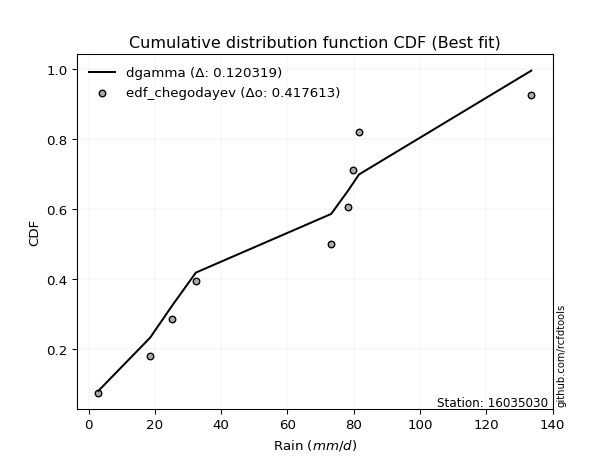</img>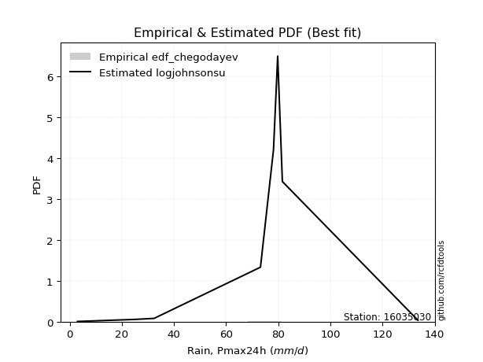</img>

</div>


### 6. Empirical - EDF Blom (1958)

The Blom formula is a specific "plotting position" formula used in hydrology and statistical analysis to estimate the empirical cumulative probability (or non-exceedance probability) of a data series. It is particularly recommended for data that are approximately normally distributed. The constant _a_ is set to 0.375 (or 3/8).

<div align="center">


$P=(m-a)/(n+1-2a)$


</div>


**6.1. Empirical values**

<div align="center">

|                | 0                   | 1                   | 2                   | 3                  | 4        | 5                  | 6                  | 7                  | 8                  |
|:---------------|:--------------------|:--------------------|:--------------------|:-------------------|:---------|:-------------------|:-------------------|:-------------------|:-------------------|
| date           | 2023                | 2025                | 2022                | 2017               | 2020     | 2018               | 2021               | 2019               | 2024               |
| x              | 3.0                 | 3.2                 | 25.2                | 32.4               | 73.2     | 78.2               | 79.8               | 81.6               | 133.6              |
| m              | 1                   | 2                   | 3                   | 4                  | 5        | 6                  | 7                  | 8                  | 9                  |
| empirical_dist | edf_blom            | edf_blom            | edf_blom            | edf_blom           | edf_blom | edf_blom           | edf_blom           | edf_blom           | edf_blom           |
| empirical      | 0.06756756756756757 | 0.17567567567567569 | 0.28378378378378377 | 0.3918918918918919 | 0.5      | 0.6081081081081081 | 0.7162162162162162 | 0.8243243243243243 | 0.9324324324324325 |
| empirical_tr   | 1.072463768115942   | 1.2131147540983607  | 1.3962264150943395  | 1.6444444444444444 | 2.0      | 2.5517241379310347 | 3.523809523809524  | 5.6923076923076925 | 14.800000000000006 |

</div>


**6.2. Kolmogorov-Smirnov fit test (sorted by Δ)**


<div align="center">

|                | 0                   | 1                   | 2                   | 3                   | 4                   | 5                   | 6                   | 7                   | 8                   | 9                   | 10                  | 11                  | 12                  | 13                  | 14                  | 15                  | 16                  | 17                  | 18                  | 19                  | 20                  | 21                  | 22                  | 23                  | 24                  | 25                  | 26                  | 27                  | 28                  | 29                  | 30                  | 31                  | 32                  | 33                  | 34                  | 35                  | 36                  | 37                  | 38                  | 39                  | 40                  | 41                  | 42                  | 43                  | 44                  | 45                  | 46                  | 47                  | 48                  | 49                  | 50                  | 51                  | 52                  | 53                  | 54                  | 55                  | 56                  | 57                  | 58                    | 59                  | 60                  | 61                  | 62                  | 63                  | 64                  | 65                  | 66                  | 67                  | 68                  | 69                  | 70                  | 71                  | 72                  | 73                  | 74                  | 75                  | 76                  | 77                  | 78                  | 79                  | 80                  | 81                  | 82                  | 83                  | 84                  | 85                  | 86                  | 87                  | 88                  | 89                  |
|:---------------|:--------------------|:--------------------|:--------------------|:--------------------|:--------------------|:--------------------|:--------------------|:--------------------|:--------------------|:--------------------|:--------------------|:--------------------|:--------------------|:--------------------|:--------------------|:--------------------|:--------------------|:--------------------|:--------------------|:--------------------|:--------------------|:--------------------|:--------------------|:--------------------|:--------------------|:--------------------|:--------------------|:--------------------|:--------------------|:--------------------|:--------------------|:--------------------|:--------------------|:--------------------|:--------------------|:--------------------|:--------------------|:--------------------|:--------------------|:--------------------|:--------------------|:--------------------|:--------------------|:--------------------|:--------------------|:--------------------|:--------------------|:--------------------|:--------------------|:--------------------|:--------------------|:--------------------|:--------------------|:--------------------|:--------------------|:--------------------|:--------------------|:--------------------|:----------------------|:--------------------|:--------------------|:--------------------|:--------------------|:--------------------|:--------------------|:--------------------|:--------------------|:--------------------|:--------------------|:--------------------|:--------------------|:--------------------|:--------------------|:--------------------|:--------------------|:--------------------|:--------------------|:--------------------|:--------------------|:--------------------|:--------------------|:--------------------|:--------------------|:--------------------|:--------------------|:--------------------|:--------------------|:--------------------|:--------------------|:--------------------|
| station        | 16035030            | 16035030            | 16035030            | 16035030            | 16035030            | 16035030            | 16035030            | 16035030            | 16035030            | 16035030            | 16035030            | 16035030            | 16035030            | 16035030            | 16035030            | 16035030            | 16035030            | 16035030            | 16035030            | 16035030            | 16035030            | 16035030            | 16035030            | 16035030            | 16035030            | 16035030            | 16035030            | 16035030            | 16035030            | 16035030            | 16035030            | 16035030            | 16035030            | 16035030            | 16035030            | 16035030            | 16035030            | 16035030            | 16035030            | 16035030            | 16035030            | 16035030            | 16035030            | 16035030            | 16035030            | 16035030            | 16035030            | 16035030            | 16035030            | 16035030            | 16035030            | 16035030            | 16035030            | 16035030            | 16035030            | 16035030            | 16035030            | 16035030            | 16035030              | 16035030            | 16035030            | 16035030            | 16035030            | 16035030            | 16035030            | 16035030            | 16035030            | 16035030            | 16035030            | 16035030            | 16035030            | 16035030            | 16035030            | 16035030            | 16035030            | 16035030            | 16035030            | 16035030            | 16035030            | 16035030            | 16035030            | 16035030            | 16035030            | 16035030            | 16035030            | 16035030            | 16035030            | 16035030            | 16035030            | 16035030            |
| empirical_dist | edf_blom            | edf_blom            | edf_blom            | edf_blom            | edf_blom            | edf_blom            | edf_blom            | edf_blom            | edf_blom            | edf_blom            | edf_blom            | edf_blom            | edf_blom            | edf_blom            | edf_blom            | edf_blom            | edf_blom            | edf_blom            | edf_blom            | edf_blom            | edf_blom            | edf_blom            | edf_blom            | edf_blom            | edf_blom            | edf_blom            | edf_blom            | edf_blom            | edf_blom            | edf_blom            | edf_blom            | edf_blom            | edf_blom            | edf_blom            | edf_blom            | edf_blom            | edf_blom            | edf_blom            | edf_blom            | edf_blom            | edf_blom            | edf_blom            | edf_blom            | edf_blom            | edf_blom            | edf_blom            | edf_blom            | edf_blom            | edf_blom            | edf_blom            | edf_blom            | edf_blom            | edf_blom            | edf_blom            | edf_blom            | edf_blom            | edf_blom            | edf_blom            | edf_blom              | edf_blom            | edf_blom            | edf_blom            | edf_blom            | edf_blom            | edf_blom            | edf_blom            | edf_blom            | edf_blom            | edf_blom            | edf_blom            | edf_blom            | edf_blom            | edf_blom            | edf_blom            | edf_blom            | edf_blom            | edf_blom            | edf_blom            | edf_blom            | edf_blom            | edf_blom            | edf_blom            | edf_blom            | edf_blom            | edf_blom            | edf_blom            | edf_blom            | edf_blom            | edf_blom            | edf_blom            |
| p_dist         | logjohnsonsu        | logloggamma         | crystalball         | norm                | t                   | exponnorm           | gumbel_l            | laplace_asymmetric  | pearson3            | mielke              | logistic            | maxwell             | rice                | fisk                | ncf                 | rayleigh            | invgamma            | gompertz            | hypsecant           | johnsonsu           | logpearson3         | invgauss            | genlogistic         | weibull_min         | halfnorm            | kstwobign           | loggumbel_l         | loginvweibull       | logfisk             | logncf              | nakagami            | gumbel_r            | laplace             | logweibull_min      | loggamma            | loggamma            | logerlang           | f                   | logbetaprime        | logf                | lognakagami         | logcrystalball      | logt                | lognorm             | lognorm             | logexponnorm        | lognct              | logalpha            | genexpon            | expon               | loginvgamma         | halflogistic        | logrice             | logfatiguelife      | loggompertz         | loginvgauss         | moyal               | logkstwobign        | loglaplace_asymmetric | logmaxwell          | loggenexpon         | lograyleigh         | loglogistic         | loghalfnorm         | loghypsecant        | loggumbel_r         | loghalflogistic     | nct                 | logmoyal            | loglaplace          | wald                | erlang              | logexpon            | gibrat              | betaprime           | logwald             | gamma               | loglognorm          | loggibrat           | pareto              | logtruncnorm        | logpareto           | fatiguelife         | invweibull          | alpha               | logchi2             | logmielke           | chi2                | truncnorm           | loggenlogistic      |
| delta          | 0.1442299287501353  | 0.15310037177019153 | 0.15641232262257043 | 0.15641232416929352 | 0.15641612209761302 | 0.1595645663447951  | 0.16091201934689595 | 0.16582659572022962 | 0.16825710909806657 | 0.1719176323503827  | 0.17489330316631535 | 0.1773562948381857  | 0.17736649631814427 | 0.17930514464358338 | 0.18159998560379365 | 0.18363052158311022 | 0.1884828942501826  | 0.1888820798109363  | 0.18912312862287672 | 0.19014123811789296 | 0.19760531142247684 | 0.19946963216957203 | 0.20086193049156875 | 0.20188068191514552 | 0.20195316213361114 | 0.20509985366224515 | 0.20619974559040555 | 0.20757828227234287 | 0.20857631317160308 | 0.21333941230759762 | 0.21518934043989824 | 0.21535307468135845 | 0.21709344953612686 | 0.22244290708280845 | 0.22564530358313084 | 0.22564530358313084 | 0.22624872407052976 | 0.22646287921957242 | 0.2270215174412309  | 0.2281544667781792  | 0.22842745595417469 | 0.2284700913511717  | 0.22847023332216376 | 0.22847037218405408 | 0.22847037218405408 | 0.22847195149658317 | 0.22857733813912373 | 0.22928676163714545 | 0.22939513608477702 | 0.2295135062382836  | 0.22986983857805598 | 0.22996332273231956 | 0.2301670820019831  | 0.23055981575880313 | 0.2320362701536023  | 0.23381494164282635 | 0.23478941044781698 | 0.2356486759191605  | 0.23933931057662094   | 0.24084075596131727 | 0.241994797816249   | 0.2444051446589386  | 0.2508481120494349  | 0.25578394511635383 | 0.26621498135488575 | 0.2730847827611659  | 0.2813509053715063  | 0.28386661147923875 | 0.2874469384805869  | 0.28844334439986097 | 0.2900531884086406  | 0.2968287045950495  | 0.30749397136789536 | 0.3222225418556305  | 0.3259305347837016  | 0.3309705364254324  | 0.3448374986053493  | 0.3580989036485238  | 0.36131738439889205 | 0.3796872818484336  | 0.38587870008690595 | 0.39710650723288854 | 0.4534070584472578  | 0.48912285713091935 | 0.5111340088739024  | 0.5452097185440067  | 0.5978175479669481  | 0.7055284441821739  | 0.8052755485482238  | 0.8243243243243243  |
| deltao         | 0.41761268023100007 | 0.41761268023100007 | 0.41761268023100007 | 0.41761268023100007 | 0.41761268023100007 | 0.41761268023100007 | 0.41761268023100007 | 0.41761268023100007 | 0.41761268023100007 | 0.41761268023100007 | 0.41761268023100007 | 0.41761268023100007 | 0.41761268023100007 | 0.41761268023100007 | 0.41761268023100007 | 0.41761268023100007 | 0.41761268023100007 | 0.41761268023100007 | 0.41761268023100007 | 0.41761268023100007 | 0.41761268023100007 | 0.41761268023100007 | 0.41761268023100007 | 0.41761268023100007 | 0.41761268023100007 | 0.41761268023100007 | 0.41761268023100007 | 0.41761268023100007 | 0.41761268023100007 | 0.41761268023100007 | 0.41761268023100007 | 0.41761268023100007 | 0.41761268023100007 | 0.41761268023100007 | 0.41761268023100007 | 0.41761268023100007 | 0.41761268023100007 | 0.41761268023100007 | 0.41761268023100007 | 0.41761268023100007 | 0.41761268023100007 | 0.41761268023100007 | 0.41761268023100007 | 0.41761268023100007 | 0.41761268023100007 | 0.41761268023100007 | 0.41761268023100007 | 0.41761268023100007 | 0.41761268023100007 | 0.41761268023100007 | 0.41761268023100007 | 0.41761268023100007 | 0.41761268023100007 | 0.41761268023100007 | 0.41761268023100007 | 0.41761268023100007 | 0.41761268023100007 | 0.41761268023100007 | 0.41761268023100007   | 0.41761268023100007 | 0.41761268023100007 | 0.41761268023100007 | 0.41761268023100007 | 0.41761268023100007 | 0.41761268023100007 | 0.41761268023100007 | 0.41761268023100007 | 0.41761268023100007 | 0.41761268023100007 | 0.41761268023100007 | 0.41761268023100007 | 0.41761268023100007 | 0.41761268023100007 | 0.41761268023100007 | 0.41761268023100007 | 0.41761268023100007 | 0.41761268023100007 | 0.41761268023100007 | 0.41761268023100007 | 0.41761268023100007 | 0.41761268023100007 | 0.41761268023100007 | 0.41761268023100007 | 0.41761268023100007 | 0.41761268023100007 | 0.41761268023100007 | 0.41761268023100007 | 0.41761268023100007 | 0.41761268023100007 | 0.41761268023100007 |
| eval           | Δo > Δ              | Δo > Δ              | Δo > Δ              | Δo > Δ              | Δo > Δ              | Δo > Δ              | Δo > Δ              | Δo > Δ              | Δo > Δ              | Δo > Δ              | Δo > Δ              | Δo > Δ              | Δo > Δ              | Δo > Δ              | Δo > Δ              | Δo > Δ              | Δo > Δ              | Δo > Δ              | Δo > Δ              | Δo > Δ              | Δo > Δ              | Δo > Δ              | Δo > Δ              | Δo > Δ              | Δo > Δ              | Δo > Δ              | Δo > Δ              | Δo > Δ              | Δo > Δ              | Δo > Δ              | Δo > Δ              | Δo > Δ              | Δo > Δ              | Δo > Δ              | Δo > Δ              | Δo > Δ              | Δo > Δ              | Δo > Δ              | Δo > Δ              | Δo > Δ              | Δo > Δ              | Δo > Δ              | Δo > Δ              | Δo > Δ              | Δo > Δ              | Δo > Δ              | Δo > Δ              | Δo > Δ              | Δo > Δ              | Δo > Δ              | Δo > Δ              | Δo > Δ              | Δo > Δ              | Δo > Δ              | Δo > Δ              | Δo > Δ              | Δo > Δ              | Δo > Δ              | Δo > Δ                | Δo > Δ              | Δo > Δ              | Δo > Δ              | Δo > Δ              | Δo > Δ              | Δo > Δ              | Δo > Δ              | Δo > Δ              | Δo > Δ              | Δo > Δ              | Δo > Δ              | Δo > Δ              | Δo > Δ              | Δo > Δ              | Δo > Δ              | Δo > Δ              | Δo > Δ              | Δo > Δ              | Δo > Δ              | Δo > Δ              | Δo > Δ              | Δo > Δ              | Δo > Δ              | Δo <= Δ             | Δo <= Δ             | Δo <= Δ             | Δo <= Δ             | Δo <= Δ             | Δo <= Δ             | Δo <= Δ             | Δo <= Δ             |
| fit            | 1                   | 1                   | 1                   | 1                   | 1                   | 1                   | 1                   | 1                   | 1                   | 1                   | 1                   | 1                   | 1                   | 1                   | 1                   | 1                   | 1                   | 1                   | 1                   | 1                   | 1                   | 1                   | 1                   | 1                   | 1                   | 1                   | 1                   | 1                   | 1                   | 1                   | 1                   | 1                   | 1                   | 1                   | 1                   | 1                   | 1                   | 1                   | 1                   | 1                   | 1                   | 1                   | 1                   | 1                   | 1                   | 1                   | 1                   | 1                   | 1                   | 1                   | 1                   | 1                   | 1                   | 1                   | 1                   | 1                   | 1                   | 1                   | 1                     | 1                   | 1                   | 1                   | 1                   | 1                   | 1                   | 1                   | 1                   | 1                   | 1                   | 1                   | 1                   | 1                   | 1                   | 1                   | 1                   | 1                   | 1                   | 1                   | 1                   | 1                   | 1                   | 1                   | 0                   | 0                   | 0                   | 0                   | 0                   | 0                   | 0                   | 0                   |
| n              | 9                   | 9                   | 9                   | 9                   | 9                   | 9                   | 9                   | 9                   | 9                   | 9                   | 9                   | 9                   | 9                   | 9                   | 9                   | 9                   | 9                   | 9                   | 9                   | 9                   | 9                   | 9                   | 9                   | 9                   | 9                   | 9                   | 9                   | 9                   | 9                   | 9                   | 9                   | 9                   | 9                   | 9                   | 9                   | 9                   | 9                   | 9                   | 9                   | 9                   | 9                   | 9                   | 9                   | 9                   | 9                   | 9                   | 9                   | 9                   | 9                   | 9                   | 9                   | 9                   | 9                   | 9                   | 9                   | 9                   | 9                   | 9                   | 9                     | 9                   | 9                   | 9                   | 9                   | 9                   | 9                   | 9                   | 9                   | 9                   | 9                   | 9                   | 9                   | 9                   | 9                   | 9                   | 9                   | 9                   | 9                   | 9                   | 9                   | 9                   | 9                   | 9                   | 9                   | 9                   | 9                   | 9                   | 9                   | 9                   | 9                   | 9                   |
| best_fit       | 1                   | 0                   | 0                   | 0                   | 0                   | 0                   | 0                   | 0                   | 0                   | 0                   | 0                   | 0                   | 0                   | 0                   | 0                   | 0                   | 0                   | 0                   | 0                   | 0                   | 0                   | 0                   | 0                   | 0                   | 0                   | 0                   | 0                   | 0                   | 0                   | 0                   | 0                   | 0                   | 0                   | 0                   | 0                   | 0                   | 0                   | 0                   | 0                   | 0                   | 0                   | 0                   | 0                   | 0                   | 0                   | 0                   | 0                   | 0                   | 0                   | 0                   | 0                   | 0                   | 0                   | 0                   | 0                   | 0                   | 0                   | 0                   | 0                     | 0                   | 0                   | 0                   | 0                   | 0                   | 0                   | 0                   | 0                   | 0                   | 0                   | 0                   | 0                   | 0                   | 0                   | 0                   | 0                   | 0                   | 0                   | 0                   | 0                   | 0                   | 0                   | 0                   | 0                   | 0                   | 0                   | 0                   | 0                   | 0                   | 0                   | 0                   |
| best_fit_sort  | 1                   | 2                   | 3                   | 4                   | 5                   | 6                   | 7                   | 8                   | 9                   | 10                  | 11                  | 12                  | 13                  | 14                  | 15                  | 16                  | 17                  | 18                  | 19                  | 20                  | 21                  | 22                  | 23                  | 24                  | 25                  | 26                  | 27                  | 28                  | 29                  | 30                  | 31                  | 32                  | 33                  | 34                  | 35                  | 36                  | 37                  | 38                  | 39                  | 40                  | 41                  | 42                  | 43                  | 44                  | 45                  | 46                  | 47                  | 48                  | 49                  | 50                  | 51                  | 52                  | 53                  | 54                  | 55                  | 56                  | 57                  | 58                  | 59                    | 60                  | 61                  | 62                  | 63                  | 64                  | 65                  | 66                  | 67                  | 68                  | 69                  | 70                  | 71                  | 72                  | 73                  | 74                  | 75                  | 76                  | 77                  | 78                  | 79                  | 80                  | 81                  | 82                  | 83                  | 84                  | 85                  | 86                  | 87                  | 88                  | 89                  | 90                  |

</div>


<div align="center">

</img>

</div>


**6.3. Best fit**

<div align="center">

|   id |   station | empirical_dist   | p_dist       |   delta |   deltao | eval   |   fit |   n |   best_fit |   best_fit_sort |
|-----:|----------:|:-----------------|:-------------|--------:|---------:|:-------|------:|----:|-----------:|----------------:|
|    0 |  16035030 | edf_blom         | logjohnsonsu | 0.14423 | 0.417613 | Δo > Δ |     1 |   9 |          1 |               1 |

</div>


<div align="center">

</img>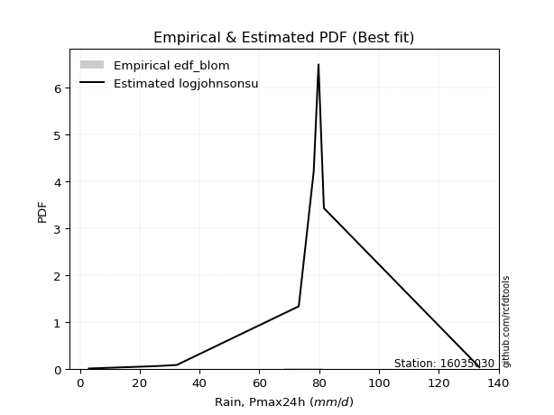</img>

</div>


### 7. Empirical - EDF Tukey (1962)

In hydrology, the Tukey formula is used as a plotting position formula to estimate the empirical probability or frequency of a flood event (or other hydrological data). The formula parameter is given as _c=0.333_ (or 1/3).

<div align="center">


$P=(m-c)/(n+1-2c)$


</div>


**7.1. Empirical values**

<div align="center">

|                | 0                   | 1                   | 2                  | 3                   | 4         | 5                  | 6                  | 7                  | 8                  |
|:---------------|:--------------------|:--------------------|:-------------------|:--------------------|:----------|:-------------------|:-------------------|:-------------------|:-------------------|
| date           | 2023                | 2025                | 2022               | 2017                | 2020      | 2018               | 2021               | 2019               | 2024               |
| x              | 3.0                 | 3.2                 | 25.2               | 32.4                | 73.2      | 78.2               | 79.8               | 81.6               | 133.6              |
| m              | 1                   | 2                   | 3                  | 4                   | 5         | 6                  | 7                  | 8                  | 9                  |
| empirical_dist | edf_tukey           | edf_tukey           | edf_tukey          | edf_tukey           | edf_tukey | edf_tukey          | edf_tukey          | edf_tukey          | edf_tukey          |
| empirical      | 0.07142857142857142 | 0.17857142857142858 | 0.2857142857142857 | 0.39285714285714285 | 0.5       | 0.6071428571428571 | 0.7142857142857143 | 0.8214285714285714 | 0.9285714285714286 |
| empirical_tr   | 1.0769230769230769  | 1.2173913043478262  | 1.4                | 1.6470588235294117  | 2.0       | 2.545454545454545  | 3.5                | 5.599999999999999  | 14.000000000000007 |

</div>


**7.2. Kolmogorov-Smirnov fit test (sorted by Δ)**


<div align="center">

|                | 0                   | 1                   | 2                   | 3                   | 4                   | 5                   | 6                   | 7                   | 8                   | 9                   | 10                  | 11                  | 12                  | 13                  | 14                  | 15                  | 16                  | 17                  | 18                  | 19                  | 20                  | 21                  | 22                  | 23                  | 24                  | 25                  | 26                  | 27                  | 28                  | 29                  | 30                  | 31                  | 32                  | 33                  | 34                  | 35                  | 36                  | 37                  | 38                  | 39                  | 40                  | 41                  | 42                  | 43                  | 44                  | 45                  | 46                  | 47                  | 48                  | 49                  | 50                  | 51                  | 52                  | 53                  | 54                  | 55                  | 56                  | 57                  | 58                    | 59                  | 60                  | 61                  | 62                  | 63                  | 64                  | 65                  | 66                  | 67                  | 68                  | 69                  | 70                  | 71                  | 72                  | 73                  | 74                  | 75                  | 76                  | 77                  | 78                  | 79                  | 80                  | 81                  | 82                  | 83                  | 84                  | 85                  | 86                  | 87                  | 88                  | 89                  |
|:---------------|:--------------------|:--------------------|:--------------------|:--------------------|:--------------------|:--------------------|:--------------------|:--------------------|:--------------------|:--------------------|:--------------------|:--------------------|:--------------------|:--------------------|:--------------------|:--------------------|:--------------------|:--------------------|:--------------------|:--------------------|:--------------------|:--------------------|:--------------------|:--------------------|:--------------------|:--------------------|:--------------------|:--------------------|:--------------------|:--------------------|:--------------------|:--------------------|:--------------------|:--------------------|:--------------------|:--------------------|:--------------------|:--------------------|:--------------------|:--------------------|:--------------------|:--------------------|:--------------------|:--------------------|:--------------------|:--------------------|:--------------------|:--------------------|:--------------------|:--------------------|:--------------------|:--------------------|:--------------------|:--------------------|:--------------------|:--------------------|:--------------------|:--------------------|:----------------------|:--------------------|:--------------------|:--------------------|:--------------------|:--------------------|:--------------------|:--------------------|:--------------------|:--------------------|:--------------------|:--------------------|:--------------------|:--------------------|:--------------------|:--------------------|:--------------------|:--------------------|:--------------------|:--------------------|:--------------------|:--------------------|:--------------------|:--------------------|:--------------------|:--------------------|:--------------------|:--------------------|:--------------------|:--------------------|:--------------------|:--------------------|
| station        | 16035030            | 16035030            | 16035030            | 16035030            | 16035030            | 16035030            | 16035030            | 16035030            | 16035030            | 16035030            | 16035030            | 16035030            | 16035030            | 16035030            | 16035030            | 16035030            | 16035030            | 16035030            | 16035030            | 16035030            | 16035030            | 16035030            | 16035030            | 16035030            | 16035030            | 16035030            | 16035030            | 16035030            | 16035030            | 16035030            | 16035030            | 16035030            | 16035030            | 16035030            | 16035030            | 16035030            | 16035030            | 16035030            | 16035030            | 16035030            | 16035030            | 16035030            | 16035030            | 16035030            | 16035030            | 16035030            | 16035030            | 16035030            | 16035030            | 16035030            | 16035030            | 16035030            | 16035030            | 16035030            | 16035030            | 16035030            | 16035030            | 16035030            | 16035030              | 16035030            | 16035030            | 16035030            | 16035030            | 16035030            | 16035030            | 16035030            | 16035030            | 16035030            | 16035030            | 16035030            | 16035030            | 16035030            | 16035030            | 16035030            | 16035030            | 16035030            | 16035030            | 16035030            | 16035030            | 16035030            | 16035030            | 16035030            | 16035030            | 16035030            | 16035030            | 16035030            | 16035030            | 16035030            | 16035030            | 16035030            |
| empirical_dist | edf_tukey           | edf_tukey           | edf_tukey           | edf_tukey           | edf_tukey           | edf_tukey           | edf_tukey           | edf_tukey           | edf_tukey           | edf_tukey           | edf_tukey           | edf_tukey           | edf_tukey           | edf_tukey           | edf_tukey           | edf_tukey           | edf_tukey           | edf_tukey           | edf_tukey           | edf_tukey           | edf_tukey           | edf_tukey           | edf_tukey           | edf_tukey           | edf_tukey           | edf_tukey           | edf_tukey           | edf_tukey           | edf_tukey           | edf_tukey           | edf_tukey           | edf_tukey           | edf_tukey           | edf_tukey           | edf_tukey           | edf_tukey           | edf_tukey           | edf_tukey           | edf_tukey           | edf_tukey           | edf_tukey           | edf_tukey           | edf_tukey           | edf_tukey           | edf_tukey           | edf_tukey           | edf_tukey           | edf_tukey           | edf_tukey           | edf_tukey           | edf_tukey           | edf_tukey           | edf_tukey           | edf_tukey           | edf_tukey           | edf_tukey           | edf_tukey           | edf_tukey           | edf_tukey             | edf_tukey           | edf_tukey           | edf_tukey           | edf_tukey           | edf_tukey           | edf_tukey           | edf_tukey           | edf_tukey           | edf_tukey           | edf_tukey           | edf_tukey           | edf_tukey           | edf_tukey           | edf_tukey           | edf_tukey           | edf_tukey           | edf_tukey           | edf_tukey           | edf_tukey           | edf_tukey           | edf_tukey           | edf_tukey           | edf_tukey           | edf_tukey           | edf_tukey           | edf_tukey           | edf_tukey           | edf_tukey           | edf_tukey           | edf_tukey           | edf_tukey           |
| p_dist         | logjohnsonsu        | logloggamma         | crystalball         | norm                | t                   | exponnorm           | gumbel_l            | laplace_asymmetric  | pearson3            | mielke              | logistic            | maxwell             | rice                | fisk                | ncf                 | rayleigh            | invgamma            | gompertz            | hypsecant           | johnsonsu           | logpearson3         | invgauss            | weibull_min         | genlogistic         | halfnorm            | kstwobign           | loggumbel_l         | loginvweibull       | logfisk             | logncf              | nakagami            | gumbel_r            | laplace             | logweibull_min      | loggamma            | loggamma            | logerlang           | f                   | logbetaprime        | logf                | lognakagami         | logcrystalball      | logt                | lognorm             | lognorm             | logexponnorm        | lognct              | logalpha            | genexpon            | expon               | loginvgamma         | halflogistic        | logrice             | logfatiguelife      | loggompertz         | logkstwobign        | loginvgauss         | moyal               | loglaplace_asymmetric | logmaxwell          | loggenexpon         | lograyleigh         | loglogistic         | loghalfnorm         | loghypsecant        | loggumbel_r         | loghalflogistic     | nct                 | logmoyal            | loglaplace          | wald                | erlang              | logexpon            | gibrat              | betaprime           | logwald             | gamma               | loglognorm          | loggibrat           | pareto              | logtruncnorm        | logpareto           | fatiguelife         | invweibull          | alpha               | logchi2             | logmielke           | chi2                | truncnorm           | loggenlogistic      |
| delta          | 0.1442299287501353  | 0.15310037177019153 | 0.15641232262257043 | 0.15641232416929352 | 0.15641612209761302 | 0.1595645663447951  | 0.1618772703121469  | 0.16679184668548058 | 0.16825710909806657 | 0.1748133852461356  | 0.17489330316631535 | 0.1773562948381857  | 0.17736649631814427 | 0.17930514464358338 | 0.18159998560379365 | 0.18363052158311022 | 0.1884828942501826  | 0.1888820798109363  | 0.18912312862287672 | 0.19014123811789296 | 0.19760531142247684 | 0.19946963216957203 | 0.1999501799846436  | 0.20086193049156875 | 0.20195316213361114 | 0.20509985366224515 | 0.20619974559040555 | 0.20757828227234287 | 0.20857631317160308 | 0.2114089103770957  | 0.21518934043989824 | 0.21535307468135845 | 0.21709344953612686 | 0.22244290708280845 | 0.22564530358313084 | 0.22564530358313084 | 0.22624872407052976 | 0.22646287921957242 | 0.2270215174412309  | 0.2281544667781792  | 0.22842745595417469 | 0.2284700913511717  | 0.22847023332216376 | 0.22847037218405408 | 0.22847037218405408 | 0.22847195149658317 | 0.22857733813912373 | 0.22928676163714545 | 0.22939513608477702 | 0.2295135062382836  | 0.22986983857805598 | 0.22996332273231956 | 0.2301670820019831  | 0.23055981575880313 | 0.2320362701536023  | 0.23371817398865857 | 0.23381494164282635 | 0.23478941044781698 | 0.23933931057662094   | 0.24084075596131727 | 0.241994797816249   | 0.2444051446589386  | 0.2508481120494349  | 0.25578394511635383 | 0.26621498135488575 | 0.2730847827611659  | 0.2813509053715063  | 0.2819361095487368  | 0.2874469384805869  | 0.28844334439986097 | 0.2900531884086406  | 0.2968287045950495  | 0.30556346943739343 | 0.3222225418556305  | 0.3259305347837016  | 0.3309705364254324  | 0.3448374986053493  | 0.3561684017180219  | 0.36131738439889205 | 0.37775677991793166 | 0.38587870008690595 | 0.3951760053023866  | 0.4514765565167559  | 0.4852618532699155  | 0.5092035069434004  | 0.5432792166135048  | 0.5958870460364462  | 0.7035979422516719  | 0.80141454468722    | 0.8214285714285714  |
| deltao         | 0.41761268023100007 | 0.41761268023100007 | 0.41761268023100007 | 0.41761268023100007 | 0.41761268023100007 | 0.41761268023100007 | 0.41761268023100007 | 0.41761268023100007 | 0.41761268023100007 | 0.41761268023100007 | 0.41761268023100007 | 0.41761268023100007 | 0.41761268023100007 | 0.41761268023100007 | 0.41761268023100007 | 0.41761268023100007 | 0.41761268023100007 | 0.41761268023100007 | 0.41761268023100007 | 0.41761268023100007 | 0.41761268023100007 | 0.41761268023100007 | 0.41761268023100007 | 0.41761268023100007 | 0.41761268023100007 | 0.41761268023100007 | 0.41761268023100007 | 0.41761268023100007 | 0.41761268023100007 | 0.41761268023100007 | 0.41761268023100007 | 0.41761268023100007 | 0.41761268023100007 | 0.41761268023100007 | 0.41761268023100007 | 0.41761268023100007 | 0.41761268023100007 | 0.41761268023100007 | 0.41761268023100007 | 0.41761268023100007 | 0.41761268023100007 | 0.41761268023100007 | 0.41761268023100007 | 0.41761268023100007 | 0.41761268023100007 | 0.41761268023100007 | 0.41761268023100007 | 0.41761268023100007 | 0.41761268023100007 | 0.41761268023100007 | 0.41761268023100007 | 0.41761268023100007 | 0.41761268023100007 | 0.41761268023100007 | 0.41761268023100007 | 0.41761268023100007 | 0.41761268023100007 | 0.41761268023100007 | 0.41761268023100007   | 0.41761268023100007 | 0.41761268023100007 | 0.41761268023100007 | 0.41761268023100007 | 0.41761268023100007 | 0.41761268023100007 | 0.41761268023100007 | 0.41761268023100007 | 0.41761268023100007 | 0.41761268023100007 | 0.41761268023100007 | 0.41761268023100007 | 0.41761268023100007 | 0.41761268023100007 | 0.41761268023100007 | 0.41761268023100007 | 0.41761268023100007 | 0.41761268023100007 | 0.41761268023100007 | 0.41761268023100007 | 0.41761268023100007 | 0.41761268023100007 | 0.41761268023100007 | 0.41761268023100007 | 0.41761268023100007 | 0.41761268023100007 | 0.41761268023100007 | 0.41761268023100007 | 0.41761268023100007 | 0.41761268023100007 | 0.41761268023100007 |
| eval           | Δo > Δ              | Δo > Δ              | Δo > Δ              | Δo > Δ              | Δo > Δ              | Δo > Δ              | Δo > Δ              | Δo > Δ              | Δo > Δ              | Δo > Δ              | Δo > Δ              | Δo > Δ              | Δo > Δ              | Δo > Δ              | Δo > Δ              | Δo > Δ              | Δo > Δ              | Δo > Δ              | Δo > Δ              | Δo > Δ              | Δo > Δ              | Δo > Δ              | Δo > Δ              | Δo > Δ              | Δo > Δ              | Δo > Δ              | Δo > Δ              | Δo > Δ              | Δo > Δ              | Δo > Δ              | Δo > Δ              | Δo > Δ              | Δo > Δ              | Δo > Δ              | Δo > Δ              | Δo > Δ              | Δo > Δ              | Δo > Δ              | Δo > Δ              | Δo > Δ              | Δo > Δ              | Δo > Δ              | Δo > Δ              | Δo > Δ              | Δo > Δ              | Δo > Δ              | Δo > Δ              | Δo > Δ              | Δo > Δ              | Δo > Δ              | Δo > Δ              | Δo > Δ              | Δo > Δ              | Δo > Δ              | Δo > Δ              | Δo > Δ              | Δo > Δ              | Δo > Δ              | Δo > Δ                | Δo > Δ              | Δo > Δ              | Δo > Δ              | Δo > Δ              | Δo > Δ              | Δo > Δ              | Δo > Δ              | Δo > Δ              | Δo > Δ              | Δo > Δ              | Δo > Δ              | Δo > Δ              | Δo > Δ              | Δo > Δ              | Δo > Δ              | Δo > Δ              | Δo > Δ              | Δo > Δ              | Δo > Δ              | Δo > Δ              | Δo > Δ              | Δo > Δ              | Δo > Δ              | Δo <= Δ             | Δo <= Δ             | Δo <= Δ             | Δo <= Δ             | Δo <= Δ             | Δo <= Δ             | Δo <= Δ             | Δo <= Δ             |
| fit            | 1                   | 1                   | 1                   | 1                   | 1                   | 1                   | 1                   | 1                   | 1                   | 1                   | 1                   | 1                   | 1                   | 1                   | 1                   | 1                   | 1                   | 1                   | 1                   | 1                   | 1                   | 1                   | 1                   | 1                   | 1                   | 1                   | 1                   | 1                   | 1                   | 1                   | 1                   | 1                   | 1                   | 1                   | 1                   | 1                   | 1                   | 1                   | 1                   | 1                   | 1                   | 1                   | 1                   | 1                   | 1                   | 1                   | 1                   | 1                   | 1                   | 1                   | 1                   | 1                   | 1                   | 1                   | 1                   | 1                   | 1                   | 1                   | 1                     | 1                   | 1                   | 1                   | 1                   | 1                   | 1                   | 1                   | 1                   | 1                   | 1                   | 1                   | 1                   | 1                   | 1                   | 1                   | 1                   | 1                   | 1                   | 1                   | 1                   | 1                   | 1                   | 1                   | 0                   | 0                   | 0                   | 0                   | 0                   | 0                   | 0                   | 0                   |
| n              | 9                   | 9                   | 9                   | 9                   | 9                   | 9                   | 9                   | 9                   | 9                   | 9                   | 9                   | 9                   | 9                   | 9                   | 9                   | 9                   | 9                   | 9                   | 9                   | 9                   | 9                   | 9                   | 9                   | 9                   | 9                   | 9                   | 9                   | 9                   | 9                   | 9                   | 9                   | 9                   | 9                   | 9                   | 9                   | 9                   | 9                   | 9                   | 9                   | 9                   | 9                   | 9                   | 9                   | 9                   | 9                   | 9                   | 9                   | 9                   | 9                   | 9                   | 9                   | 9                   | 9                   | 9                   | 9                   | 9                   | 9                   | 9                   | 9                     | 9                   | 9                   | 9                   | 9                   | 9                   | 9                   | 9                   | 9                   | 9                   | 9                   | 9                   | 9                   | 9                   | 9                   | 9                   | 9                   | 9                   | 9                   | 9                   | 9                   | 9                   | 9                   | 9                   | 9                   | 9                   | 9                   | 9                   | 9                   | 9                   | 9                   | 9                   |
| best_fit       | 1                   | 0                   | 0                   | 0                   | 0                   | 0                   | 0                   | 0                   | 0                   | 0                   | 0                   | 0                   | 0                   | 0                   | 0                   | 0                   | 0                   | 0                   | 0                   | 0                   | 0                   | 0                   | 0                   | 0                   | 0                   | 0                   | 0                   | 0                   | 0                   | 0                   | 0                   | 0                   | 0                   | 0                   | 0                   | 0                   | 0                   | 0                   | 0                   | 0                   | 0                   | 0                   | 0                   | 0                   | 0                   | 0                   | 0                   | 0                   | 0                   | 0                   | 0                   | 0                   | 0                   | 0                   | 0                   | 0                   | 0                   | 0                   | 0                     | 0                   | 0                   | 0                   | 0                   | 0                   | 0                   | 0                   | 0                   | 0                   | 0                   | 0                   | 0                   | 0                   | 0                   | 0                   | 0                   | 0                   | 0                   | 0                   | 0                   | 0                   | 0                   | 0                   | 0                   | 0                   | 0                   | 0                   | 0                   | 0                   | 0                   | 0                   |
| best_fit_sort  | 1                   | 2                   | 3                   | 4                   | 5                   | 6                   | 7                   | 8                   | 9                   | 10                  | 11                  | 12                  | 13                  | 14                  | 15                  | 16                  | 17                  | 18                  | 19                  | 20                  | 21                  | 22                  | 23                  | 24                  | 25                  | 26                  | 27                  | 28                  | 29                  | 30                  | 31                  | 32                  | 33                  | 34                  | 35                  | 36                  | 37                  | 38                  | 39                  | 40                  | 41                  | 42                  | 43                  | 44                  | 45                  | 46                  | 47                  | 48                  | 49                  | 50                  | 51                  | 52                  | 53                  | 54                  | 55                  | 56                  | 57                  | 58                  | 59                    | 60                  | 61                  | 62                  | 63                  | 64                  | 65                  | 66                  | 67                  | 68                  | 69                  | 70                  | 71                  | 72                  | 73                  | 74                  | 75                  | 76                  | 77                  | 78                  | 79                  | 80                  | 81                  | 82                  | 83                  | 84                  | 85                  | 86                  | 87                  | 88                  | 89                  | 90                  |

</div>


<div align="center">

</img>

</div>


**7.3. Best fit**

<div align="center">

|   id |   station | empirical_dist   | p_dist       |   delta |   deltao | eval   |   fit |   n |   best_fit |   best_fit_sort |
|-----:|----------:|:-----------------|:-------------|--------:|---------:|:-------|------:|----:|-----------:|----------------:|
|    0 |  16035030 | edf_tukey        | logjohnsonsu | 0.14423 | 0.417613 | Δo > Δ |     1 |   9 |          1 |               1 |

</div>


<div align="center">

</img></img>

</div>


### 8. Empirical - EDF Gringorten (1963)

Gringorten plotting position formula is essential for estimating the probability and return periods of extreme events like floods and heavy rainfall. The constant _a=0.44_.

<div align="center">


$P=(m-a)/(n+1-2a)$


</div>


**8.1. Empirical values**

<div align="center">

|                | 0                    | 1                  | 2                   | 3                  | 4              | 5                  | 6                  | 7                  | 8                  |
|:---------------|:---------------------|:-------------------|:--------------------|:-------------------|:---------------|:-------------------|:-------------------|:-------------------|:-------------------|
| date           | 2023                 | 2025               | 2022                | 2017               | 2020           | 2018               | 2021               | 2019               | 2024               |
| x              | 3.0                  | 3.2                | 25.2                | 32.4               | 73.2           | 78.2               | 79.8               | 81.6               | 133.6              |
| m              | 1                    | 2                  | 3                   | 4                  | 5              | 6                  | 7                  | 8                  | 9                  |
| empirical_dist | edf_gringorten       | edf_gringorten     | edf_gringorten      | edf_gringorten     | edf_gringorten | edf_gringorten     | edf_gringorten     | edf_gringorten     | edf_gringorten     |
| empirical      | 0.061403508771929835 | 0.1710526315789474 | 0.28070175438596495 | 0.3903508771929825 | 0.5            | 0.6096491228070176 | 0.7192982456140351 | 0.8289473684210527 | 0.9385964912280703 |
| empirical_tr   | 1.0654205607476634   | 1.2063492063492063 | 1.3902439024390243  | 1.6402877697841727 | 2.0            | 2.561797752808989  | 3.5625             | 5.846153846153847  | 16.285714285714324 |

</div>


**8.2. Kolmogorov-Smirnov fit test (sorted by Δ)**


<div align="center">

|                | 0                   | 1                   | 2                   | 3                   | 4                   | 5                   | 6                   | 7                   | 8                   | 9                   | 10                  | 11                  | 12                  | 13                  | 14                  | 15                  | 16                  | 17                  | 18                  | 19                  | 20                  | 21                  | 22                  | 23                  | 24                  | 25                  | 26                  | 27                  | 28                  | 29                  | 30                  | 31                  | 32                  | 33                  | 34                  | 35                  | 36                  | 37                  | 38                  | 39                  | 40                  | 41                  | 42                  | 43                  | 44                  | 45                  | 46                  | 47                  | 48                  | 49                  | 50                  | 51                  | 52                  | 53                  | 54                  | 55                  | 56                  | 57                  | 58                    | 59                  | 60                  | 61                  | 62                  | 63                  | 64                  | 65                  | 66                  | 67                  | 68                  | 69                  | 70                  | 71                  | 72                  | 73                  | 74                  | 75                  | 76                  | 77                  | 78                  | 79                  | 80                  | 81                  | 82                  | 83                  | 84                  | 85                  | 86                  | 87                  | 88                  | 89                  |
|:---------------|:--------------------|:--------------------|:--------------------|:--------------------|:--------------------|:--------------------|:--------------------|:--------------------|:--------------------|:--------------------|:--------------------|:--------------------|:--------------------|:--------------------|:--------------------|:--------------------|:--------------------|:--------------------|:--------------------|:--------------------|:--------------------|:--------------------|:--------------------|:--------------------|:--------------------|:--------------------|:--------------------|:--------------------|:--------------------|:--------------------|:--------------------|:--------------------|:--------------------|:--------------------|:--------------------|:--------------------|:--------------------|:--------------------|:--------------------|:--------------------|:--------------------|:--------------------|:--------------------|:--------------------|:--------------------|:--------------------|:--------------------|:--------------------|:--------------------|:--------------------|:--------------------|:--------------------|:--------------------|:--------------------|:--------------------|:--------------------|:--------------------|:--------------------|:----------------------|:--------------------|:--------------------|:--------------------|:--------------------|:--------------------|:--------------------|:--------------------|:--------------------|:--------------------|:--------------------|:--------------------|:--------------------|:--------------------|:--------------------|:--------------------|:--------------------|:--------------------|:--------------------|:--------------------|:--------------------|:--------------------|:--------------------|:--------------------|:--------------------|:--------------------|:--------------------|:--------------------|:--------------------|:--------------------|:--------------------|:--------------------|
| station        | 16035030            | 16035030            | 16035030            | 16035030            | 16035030            | 16035030            | 16035030            | 16035030            | 16035030            | 16035030            | 16035030            | 16035030            | 16035030            | 16035030            | 16035030            | 16035030            | 16035030            | 16035030            | 16035030            | 16035030            | 16035030            | 16035030            | 16035030            | 16035030            | 16035030            | 16035030            | 16035030            | 16035030            | 16035030            | 16035030            | 16035030            | 16035030            | 16035030            | 16035030            | 16035030            | 16035030            | 16035030            | 16035030            | 16035030            | 16035030            | 16035030            | 16035030            | 16035030            | 16035030            | 16035030            | 16035030            | 16035030            | 16035030            | 16035030            | 16035030            | 16035030            | 16035030            | 16035030            | 16035030            | 16035030            | 16035030            | 16035030            | 16035030            | 16035030              | 16035030            | 16035030            | 16035030            | 16035030            | 16035030            | 16035030            | 16035030            | 16035030            | 16035030            | 16035030            | 16035030            | 16035030            | 16035030            | 16035030            | 16035030            | 16035030            | 16035030            | 16035030            | 16035030            | 16035030            | 16035030            | 16035030            | 16035030            | 16035030            | 16035030            | 16035030            | 16035030            | 16035030            | 16035030            | 16035030            | 16035030            |
| empirical_dist | edf_gringorten      | edf_gringorten      | edf_gringorten      | edf_gringorten      | edf_gringorten      | edf_gringorten      | edf_gringorten      | edf_gringorten      | edf_gringorten      | edf_gringorten      | edf_gringorten      | edf_gringorten      | edf_gringorten      | edf_gringorten      | edf_gringorten      | edf_gringorten      | edf_gringorten      | edf_gringorten      | edf_gringorten      | edf_gringorten      | edf_gringorten      | edf_gringorten      | edf_gringorten      | edf_gringorten      | edf_gringorten      | edf_gringorten      | edf_gringorten      | edf_gringorten      | edf_gringorten      | edf_gringorten      | edf_gringorten      | edf_gringorten      | edf_gringorten      | edf_gringorten      | edf_gringorten      | edf_gringorten      | edf_gringorten      | edf_gringorten      | edf_gringorten      | edf_gringorten      | edf_gringorten      | edf_gringorten      | edf_gringorten      | edf_gringorten      | edf_gringorten      | edf_gringorten      | edf_gringorten      | edf_gringorten      | edf_gringorten      | edf_gringorten      | edf_gringorten      | edf_gringorten      | edf_gringorten      | edf_gringorten      | edf_gringorten      | edf_gringorten      | edf_gringorten      | edf_gringorten      | edf_gringorten        | edf_gringorten      | edf_gringorten      | edf_gringorten      | edf_gringorten      | edf_gringorten      | edf_gringorten      | edf_gringorten      | edf_gringorten      | edf_gringorten      | edf_gringorten      | edf_gringorten      | edf_gringorten      | edf_gringorten      | edf_gringorten      | edf_gringorten      | edf_gringorten      | edf_gringorten      | edf_gringorten      | edf_gringorten      | edf_gringorten      | edf_gringorten      | edf_gringorten      | edf_gringorten      | edf_gringorten      | edf_gringorten      | edf_gringorten      | edf_gringorten      | edf_gringorten      | edf_gringorten      | edf_gringorten      | edf_gringorten      |
| p_dist         | logjohnsonsu        | logloggamma         | crystalball         | norm                | t                   | gumbel_l            | exponnorm           | laplace_asymmetric  | mielke              | pearson3            | logistic            | maxwell             | rice                | fisk                | ncf                 | rayleigh            | invgamma            | gompertz            | hypsecant           | johnsonsu           | logpearson3         | invgauss            | genlogistic         | halfnorm            | weibull_min         | kstwobign           | loggumbel_l         | loginvweibull       | logfisk             | nakagami            | gumbel_r            | logncf              | laplace             | logweibull_min      | loggamma            | loggamma            | logerlang           | f                   | logbetaprime        | logf                | lognakagami         | logcrystalball      | logt                | lognorm             | lognorm             | logexponnorm        | lognct              | logalpha            | genexpon            | expon               | loginvgamma         | halflogistic        | logrice             | logfatiguelife      | loggompertz         | loginvgauss         | moyal               | logkstwobign        | loglaplace_asymmetric | logmaxwell          | loggenexpon         | lograyleigh         | loglogistic         | loghalfnorm         | loghypsecant        | loggumbel_r         | loghalflogistic     | nct                 | logmoyal            | loglaplace          | wald                | erlang              | logexpon            | gibrat              | betaprime           | logwald             | gamma               | loglognorm          | loggibrat           | pareto              | logtruncnorm        | logpareto           | fatiguelife         | invweibull          | alpha               | logchi2             | logmielke           | chi2                | truncnorm           | loggenlogistic      |
| delta          | 0.1442299287501353  | 0.15310037177019153 | 0.15641232262257043 | 0.15641232416929352 | 0.15641612209761302 | 0.15937100464798656 | 0.1595645663447951  | 0.16428558102132024 | 0.16729458825365442 | 0.16825710909806657 | 0.17489330316631535 | 0.1773562948381857  | 0.17736649631814427 | 0.17930514464358338 | 0.18159998560379365 | 0.18363052158311022 | 0.1884828942501826  | 0.1888820798109363  | 0.18912312862287672 | 0.19014123811789296 | 0.19760531142247684 | 0.19946963216957203 | 0.20086193049156875 | 0.20195316213361114 | 0.20496271131296434 | 0.20509985366224515 | 0.20619974559040555 | 0.20757828227234287 | 0.20857631317160308 | 0.21518934043989824 | 0.21535307468135845 | 0.21642144170541644 | 0.21709344953612686 | 0.22244290708280845 | 0.22564530358313084 | 0.22564530358313084 | 0.22624872407052976 | 0.22646287921957242 | 0.2270215174412309  | 0.2281544667781792  | 0.22842745595417469 | 0.2284700913511717  | 0.22847023332216376 | 0.22847037218405408 | 0.22847037218405408 | 0.22847195149658317 | 0.22857733813912373 | 0.22928676163714545 | 0.22939513608477702 | 0.2295135062382836  | 0.22986983857805598 | 0.22996332273231956 | 0.2301670820019831  | 0.23055981575880313 | 0.2320362701536023  | 0.23381494164282635 | 0.23478941044781698 | 0.23873070531697932 | 0.23933931057662094   | 0.24084075596131727 | 0.241994797816249   | 0.2444051446589386  | 0.2508481120494349  | 0.25578394511635383 | 0.26621498135488575 | 0.2730847827611659  | 0.2813509053715063  | 0.28694864087705757 | 0.2874469384805869  | 0.28844334439986097 | 0.2900531884086406  | 0.2968287045950495  | 0.3105760007657142  | 0.3222225418556305  | 0.3259305347837016  | 0.3309705364254324  | 0.3448374986053493  | 0.36118093304634263 | 0.36131738439889205 | 0.3827693112462524  | 0.38587870008690595 | 0.40018853663070736 | 0.45648908784507664 | 0.4952869159265572  | 0.5142160382717211  | 0.5482917479418254  | 0.600899577364767   | 0.7086104735799927  | 0.8114396073438616  | 0.8289473684210527  |
| deltao         | 0.41761268023100007 | 0.41761268023100007 | 0.41761268023100007 | 0.41761268023100007 | 0.41761268023100007 | 0.41761268023100007 | 0.41761268023100007 | 0.41761268023100007 | 0.41761268023100007 | 0.41761268023100007 | 0.41761268023100007 | 0.41761268023100007 | 0.41761268023100007 | 0.41761268023100007 | 0.41761268023100007 | 0.41761268023100007 | 0.41761268023100007 | 0.41761268023100007 | 0.41761268023100007 | 0.41761268023100007 | 0.41761268023100007 | 0.41761268023100007 | 0.41761268023100007 | 0.41761268023100007 | 0.41761268023100007 | 0.41761268023100007 | 0.41761268023100007 | 0.41761268023100007 | 0.41761268023100007 | 0.41761268023100007 | 0.41761268023100007 | 0.41761268023100007 | 0.41761268023100007 | 0.41761268023100007 | 0.41761268023100007 | 0.41761268023100007 | 0.41761268023100007 | 0.41761268023100007 | 0.41761268023100007 | 0.41761268023100007 | 0.41761268023100007 | 0.41761268023100007 | 0.41761268023100007 | 0.41761268023100007 | 0.41761268023100007 | 0.41761268023100007 | 0.41761268023100007 | 0.41761268023100007 | 0.41761268023100007 | 0.41761268023100007 | 0.41761268023100007 | 0.41761268023100007 | 0.41761268023100007 | 0.41761268023100007 | 0.41761268023100007 | 0.41761268023100007 | 0.41761268023100007 | 0.41761268023100007 | 0.41761268023100007   | 0.41761268023100007 | 0.41761268023100007 | 0.41761268023100007 | 0.41761268023100007 | 0.41761268023100007 | 0.41761268023100007 | 0.41761268023100007 | 0.41761268023100007 | 0.41761268023100007 | 0.41761268023100007 | 0.41761268023100007 | 0.41761268023100007 | 0.41761268023100007 | 0.41761268023100007 | 0.41761268023100007 | 0.41761268023100007 | 0.41761268023100007 | 0.41761268023100007 | 0.41761268023100007 | 0.41761268023100007 | 0.41761268023100007 | 0.41761268023100007 | 0.41761268023100007 | 0.41761268023100007 | 0.41761268023100007 | 0.41761268023100007 | 0.41761268023100007 | 0.41761268023100007 | 0.41761268023100007 | 0.41761268023100007 | 0.41761268023100007 |
| eval           | Δo > Δ              | Δo > Δ              | Δo > Δ              | Δo > Δ              | Δo > Δ              | Δo > Δ              | Δo > Δ              | Δo > Δ              | Δo > Δ              | Δo > Δ              | Δo > Δ              | Δo > Δ              | Δo > Δ              | Δo > Δ              | Δo > Δ              | Δo > Δ              | Δo > Δ              | Δo > Δ              | Δo > Δ              | Δo > Δ              | Δo > Δ              | Δo > Δ              | Δo > Δ              | Δo > Δ              | Δo > Δ              | Δo > Δ              | Δo > Δ              | Δo > Δ              | Δo > Δ              | Δo > Δ              | Δo > Δ              | Δo > Δ              | Δo > Δ              | Δo > Δ              | Δo > Δ              | Δo > Δ              | Δo > Δ              | Δo > Δ              | Δo > Δ              | Δo > Δ              | Δo > Δ              | Δo > Δ              | Δo > Δ              | Δo > Δ              | Δo > Δ              | Δo > Δ              | Δo > Δ              | Δo > Δ              | Δo > Δ              | Δo > Δ              | Δo > Δ              | Δo > Δ              | Δo > Δ              | Δo > Δ              | Δo > Δ              | Δo > Δ              | Δo > Δ              | Δo > Δ              | Δo > Δ                | Δo > Δ              | Δo > Δ              | Δo > Δ              | Δo > Δ              | Δo > Δ              | Δo > Δ              | Δo > Δ              | Δo > Δ              | Δo > Δ              | Δo > Δ              | Δo > Δ              | Δo > Δ              | Δo > Δ              | Δo > Δ              | Δo > Δ              | Δo > Δ              | Δo > Δ              | Δo > Δ              | Δo > Δ              | Δo > Δ              | Δo > Δ              | Δo > Δ              | Δo > Δ              | Δo <= Δ             | Δo <= Δ             | Δo <= Δ             | Δo <= Δ             | Δo <= Δ             | Δo <= Δ             | Δo <= Δ             | Δo <= Δ             |
| fit            | 1                   | 1                   | 1                   | 1                   | 1                   | 1                   | 1                   | 1                   | 1                   | 1                   | 1                   | 1                   | 1                   | 1                   | 1                   | 1                   | 1                   | 1                   | 1                   | 1                   | 1                   | 1                   | 1                   | 1                   | 1                   | 1                   | 1                   | 1                   | 1                   | 1                   | 1                   | 1                   | 1                   | 1                   | 1                   | 1                   | 1                   | 1                   | 1                   | 1                   | 1                   | 1                   | 1                   | 1                   | 1                   | 1                   | 1                   | 1                   | 1                   | 1                   | 1                   | 1                   | 1                   | 1                   | 1                   | 1                   | 1                   | 1                   | 1                     | 1                   | 1                   | 1                   | 1                   | 1                   | 1                   | 1                   | 1                   | 1                   | 1                   | 1                   | 1                   | 1                   | 1                   | 1                   | 1                   | 1                   | 1                   | 1                   | 1                   | 1                   | 1                   | 1                   | 0                   | 0                   | 0                   | 0                   | 0                   | 0                   | 0                   | 0                   |
| n              | 9                   | 9                   | 9                   | 9                   | 9                   | 9                   | 9                   | 9                   | 9                   | 9                   | 9                   | 9                   | 9                   | 9                   | 9                   | 9                   | 9                   | 9                   | 9                   | 9                   | 9                   | 9                   | 9                   | 9                   | 9                   | 9                   | 9                   | 9                   | 9                   | 9                   | 9                   | 9                   | 9                   | 9                   | 9                   | 9                   | 9                   | 9                   | 9                   | 9                   | 9                   | 9                   | 9                   | 9                   | 9                   | 9                   | 9                   | 9                   | 9                   | 9                   | 9                   | 9                   | 9                   | 9                   | 9                   | 9                   | 9                   | 9                   | 9                     | 9                   | 9                   | 9                   | 9                   | 9                   | 9                   | 9                   | 9                   | 9                   | 9                   | 9                   | 9                   | 9                   | 9                   | 9                   | 9                   | 9                   | 9                   | 9                   | 9                   | 9                   | 9                   | 9                   | 9                   | 9                   | 9                   | 9                   | 9                   | 9                   | 9                   | 9                   |
| best_fit       | 1                   | 0                   | 0                   | 0                   | 0                   | 0                   | 0                   | 0                   | 0                   | 0                   | 0                   | 0                   | 0                   | 0                   | 0                   | 0                   | 0                   | 0                   | 0                   | 0                   | 0                   | 0                   | 0                   | 0                   | 0                   | 0                   | 0                   | 0                   | 0                   | 0                   | 0                   | 0                   | 0                   | 0                   | 0                   | 0                   | 0                   | 0                   | 0                   | 0                   | 0                   | 0                   | 0                   | 0                   | 0                   | 0                   | 0                   | 0                   | 0                   | 0                   | 0                   | 0                   | 0                   | 0                   | 0                   | 0                   | 0                   | 0                   | 0                     | 0                   | 0                   | 0                   | 0                   | 0                   | 0                   | 0                   | 0                   | 0                   | 0                   | 0                   | 0                   | 0                   | 0                   | 0                   | 0                   | 0                   | 0                   | 0                   | 0                   | 0                   | 0                   | 0                   | 0                   | 0                   | 0                   | 0                   | 0                   | 0                   | 0                   | 0                   |
| best_fit_sort  | 1                   | 2                   | 3                   | 4                   | 5                   | 6                   | 7                   | 8                   | 9                   | 10                  | 11                  | 12                  | 13                  | 14                  | 15                  | 16                  | 17                  | 18                  | 19                  | 20                  | 21                  | 22                  | 23                  | 24                  | 25                  | 26                  | 27                  | 28                  | 29                  | 30                  | 31                  | 32                  | 33                  | 34                  | 35                  | 36                  | 37                  | 38                  | 39                  | 40                  | 41                  | 42                  | 43                  | 44                  | 45                  | 46                  | 47                  | 48                  | 49                  | 50                  | 51                  | 52                  | 53                  | 54                  | 55                  | 56                  | 57                  | 58                  | 59                    | 60                  | 61                  | 62                  | 63                  | 64                  | 65                  | 66                  | 67                  | 68                  | 69                  | 70                  | 71                  | 72                  | 73                  | 74                  | 75                  | 76                  | 77                  | 78                  | 79                  | 80                  | 81                  | 82                  | 83                  | 84                  | 85                  | 86                  | 87                  | 88                  | 89                  | 90                  |

</div>


<div align="center">

</img>

</div>


**8.3. Best fit**

<div align="center">

|   id |   station | empirical_dist   | p_dist       |   delta |   deltao | eval   |   fit |   n |   best_fit |   best_fit_sort |
|-----:|----------:|:-----------------|:-------------|--------:|---------:|:-------|------:|----:|-----------:|----------------:|
|    0 |  16035030 | edf_gringorten   | logjohnsonsu | 0.14423 | 0.417613 | Δo > Δ |     1 |   9 |          1 |               1 |

</div>


<div align="center">

</img>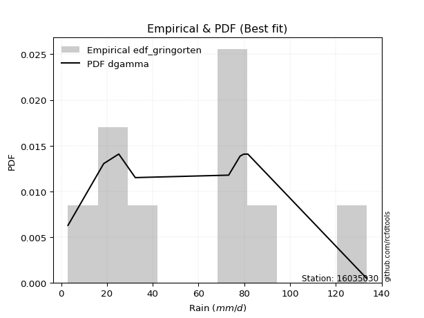</img>

</div>


### 9. Empirical - EDF Filliben (1975)

The specific values of the constants (0.3175) (often denoted as $alpha$) and (0.365) are derived from a method proposed by James J. Filliben in a 1975 paper. This particular formula is the mean value of the $i$-th order statistic of the normal distribution and is considered a robust and effective plotting position formula for the normal probability plot correlation coefficient test for normality.

<div align="center">


$P=(m-0.3175)/(n+0.365)$


</div>


**9.1. Empirical values**

<div align="center">

|                | 0                   | 1                  | 2                   | 3                   | 4            | 5                  | 6                  | 7                  | 8                  |
|:---------------|:--------------------|:-------------------|:--------------------|:--------------------|:-------------|:-------------------|:-------------------|:-------------------|:-------------------|
| date           | 2023                | 2025               | 2022                | 2017                | 2020         | 2018               | 2021               | 2019               | 2024               |
| x              | 3.0                 | 3.2                | 25.2                | 32.4                | 73.2         | 78.2               | 79.8               | 81.6               | 133.6              |
| m              | 1                   | 2                  | 3                   | 4                   | 5            | 6                  | 7                  | 8                  | 9                  |
| empirical_dist | edf_filliben        | edf_filliben       | edf_filliben        | edf_filliben        | edf_filliben | edf_filliben       | edf_filliben       | edf_filliben       | edf_filliben       |
| empirical      | 0.07287773625200214 | 0.1796583021890016 | 0.28643886812600106 | 0.39321943406300053 | 0.5          | 0.6067805659369995 | 0.7135611318739989 | 0.8203416978109984 | 0.9271222637479978 |
| empirical_tr   | 1.0786063921681543  | 1.219004230393752  | 1.401421623643846   | 1.6480422349318082  | 2.0          | 2.5431093007467753 | 3.491146318732526  | 5.566121842496286  | 13.721611721611705 |

</div>


**9.2. Kolmogorov-Smirnov fit test (sorted by Δ)**


<div align="center">

|                | 0                   | 1                   | 2                   | 3                   | 4                   | 5                   | 6                   | 7                   | 8                   | 9                   | 10                  | 11                  | 12                  | 13                  | 14                  | 15                  | 16                  | 17                  | 18                  | 19                  | 20                  | 21                  | 22                  | 23                  | 24                  | 25                  | 26                  | 27                  | 28                  | 29                  | 30                  | 31                  | 32                  | 33                  | 34                  | 35                  | 36                  | 37                  | 38                  | 39                  | 40                  | 41                  | 42                  | 43                  | 44                  | 45                  | 46                  | 47                  | 48                  | 49                  | 50                  | 51                  | 52                  | 53                  | 54                  | 55                  | 56                  | 57                  | 58                    | 59                  | 60                  | 61                  | 62                  | 63                  | 64                  | 65                  | 66                  | 67                  | 68                  | 69                  | 70                  | 71                  | 72                  | 73                  | 74                  | 75                  | 76                  | 77                  | 78                  | 79                  | 80                  | 81                  | 82                  | 83                  | 84                  | 85                  | 86                  | 87                  | 88                  | 89                  |
|:---------------|:--------------------|:--------------------|:--------------------|:--------------------|:--------------------|:--------------------|:--------------------|:--------------------|:--------------------|:--------------------|:--------------------|:--------------------|:--------------------|:--------------------|:--------------------|:--------------------|:--------------------|:--------------------|:--------------------|:--------------------|:--------------------|:--------------------|:--------------------|:--------------------|:--------------------|:--------------------|:--------------------|:--------------------|:--------------------|:--------------------|:--------------------|:--------------------|:--------------------|:--------------------|:--------------------|:--------------------|:--------------------|:--------------------|:--------------------|:--------------------|:--------------------|:--------------------|:--------------------|:--------------------|:--------------------|:--------------------|:--------------------|:--------------------|:--------------------|:--------------------|:--------------------|:--------------------|:--------------------|:--------------------|:--------------------|:--------------------|:--------------------|:--------------------|:----------------------|:--------------------|:--------------------|:--------------------|:--------------------|:--------------------|:--------------------|:--------------------|:--------------------|:--------------------|:--------------------|:--------------------|:--------------------|:--------------------|:--------------------|:--------------------|:--------------------|:--------------------|:--------------------|:--------------------|:--------------------|:--------------------|:--------------------|:--------------------|:--------------------|:--------------------|:--------------------|:--------------------|:--------------------|:--------------------|:--------------------|:--------------------|
| station        | 16035030            | 16035030            | 16035030            | 16035030            | 16035030            | 16035030            | 16035030            | 16035030            | 16035030            | 16035030            | 16035030            | 16035030            | 16035030            | 16035030            | 16035030            | 16035030            | 16035030            | 16035030            | 16035030            | 16035030            | 16035030            | 16035030            | 16035030            | 16035030            | 16035030            | 16035030            | 16035030            | 16035030            | 16035030            | 16035030            | 16035030            | 16035030            | 16035030            | 16035030            | 16035030            | 16035030            | 16035030            | 16035030            | 16035030            | 16035030            | 16035030            | 16035030            | 16035030            | 16035030            | 16035030            | 16035030            | 16035030            | 16035030            | 16035030            | 16035030            | 16035030            | 16035030            | 16035030            | 16035030            | 16035030            | 16035030            | 16035030            | 16035030            | 16035030              | 16035030            | 16035030            | 16035030            | 16035030            | 16035030            | 16035030            | 16035030            | 16035030            | 16035030            | 16035030            | 16035030            | 16035030            | 16035030            | 16035030            | 16035030            | 16035030            | 16035030            | 16035030            | 16035030            | 16035030            | 16035030            | 16035030            | 16035030            | 16035030            | 16035030            | 16035030            | 16035030            | 16035030            | 16035030            | 16035030            | 16035030            |
| empirical_dist | edf_filliben        | edf_filliben        | edf_filliben        | edf_filliben        | edf_filliben        | edf_filliben        | edf_filliben        | edf_filliben        | edf_filliben        | edf_filliben        | edf_filliben        | edf_filliben        | edf_filliben        | edf_filliben        | edf_filliben        | edf_filliben        | edf_filliben        | edf_filliben        | edf_filliben        | edf_filliben        | edf_filliben        | edf_filliben        | edf_filliben        | edf_filliben        | edf_filliben        | edf_filliben        | edf_filliben        | edf_filliben        | edf_filliben        | edf_filliben        | edf_filliben        | edf_filliben        | edf_filliben        | edf_filliben        | edf_filliben        | edf_filliben        | edf_filliben        | edf_filliben        | edf_filliben        | edf_filliben        | edf_filliben        | edf_filliben        | edf_filliben        | edf_filliben        | edf_filliben        | edf_filliben        | edf_filliben        | edf_filliben        | edf_filliben        | edf_filliben        | edf_filliben        | edf_filliben        | edf_filliben        | edf_filliben        | edf_filliben        | edf_filliben        | edf_filliben        | edf_filliben        | edf_filliben          | edf_filliben        | edf_filliben        | edf_filliben        | edf_filliben        | edf_filliben        | edf_filliben        | edf_filliben        | edf_filliben        | edf_filliben        | edf_filliben        | edf_filliben        | edf_filliben        | edf_filliben        | edf_filliben        | edf_filliben        | edf_filliben        | edf_filliben        | edf_filliben        | edf_filliben        | edf_filliben        | edf_filliben        | edf_filliben        | edf_filliben        | edf_filliben        | edf_filliben        | edf_filliben        | edf_filliben        | edf_filliben        | edf_filliben        | edf_filliben        | edf_filliben        |
| p_dist         | logjohnsonsu        | logloggamma         | crystalball         | norm                | t                   | exponnorm           | gumbel_l            | laplace_asymmetric  | pearson3            | logistic            | mielke              | maxwell             | rice                | fisk                | ncf                 | rayleigh            | invgamma            | gompertz            | hypsecant           | johnsonsu           | logpearson3         | weibull_min         | invgauss            | genlogistic         | halfnorm            | kstwobign           | loggumbel_l         | loginvweibull       | logfisk             | logncf              | nakagami            | gumbel_r            | laplace             | logweibull_min      | loggamma            | loggamma            | logerlang           | f                   | logbetaprime        | logf                | lognakagami         | logcrystalball      | logt                | lognorm             | lognorm             | logexponnorm        | lognct              | logalpha            | genexpon            | expon               | loginvgamma         | halflogistic        | logrice             | logfatiguelife      | loggompertz         | logkstwobign        | loginvgauss         | moyal               | loglaplace_asymmetric | logmaxwell          | loggenexpon         | lograyleigh         | loglogistic         | loghalfnorm         | loghypsecant        | loggumbel_r         | nct                 | loghalflogistic     | logmoyal            | loglaplace          | wald                | erlang              | logexpon            | gibrat              | betaprime           | logwald             | gamma               | loglognorm          | loggibrat           | pareto              | logtruncnorm        | logpareto           | fatiguelife         | invweibull          | alpha               | logchi2             | logmielke           | chi2                | truncnorm           | loggenlogistic      |
| delta          | 0.1442299287501353  | 0.15310037177019153 | 0.15641232262257043 | 0.15641232416929352 | 0.15641612209761302 | 0.1595645663447951  | 0.1622395615180046  | 0.16715413789133826 | 0.16825710909806657 | 0.17489330316631535 | 0.17590025886370864 | 0.1773562948381857  | 0.17736649631814427 | 0.17930514464358338 | 0.18159998560379365 | 0.18363052158311022 | 0.1884828942501826  | 0.1888820798109363  | 0.18912312862287672 | 0.19014123811789296 | 0.19760531142247684 | 0.19922559757292824 | 0.19946963216957203 | 0.20086193049156875 | 0.20195316213361114 | 0.20509985366224515 | 0.20619974559040555 | 0.20757828227234287 | 0.20857631317160308 | 0.21068432796538034 | 0.21518934043989824 | 0.21535307468135845 | 0.21709344953612686 | 0.22244290708280845 | 0.22564530358313084 | 0.22564530358313084 | 0.22624872407052976 | 0.22646287921957242 | 0.2270215174412309  | 0.2281544667781792  | 0.22842745595417469 | 0.2284700913511717  | 0.22847023332216376 | 0.22847037218405408 | 0.22847037218405408 | 0.22847195149658317 | 0.22857733813912373 | 0.22928676163714545 | 0.22939513608477702 | 0.2295135062382836  | 0.22986983857805598 | 0.22996332273231956 | 0.2301670820019831  | 0.23055981575880313 | 0.2320362701536023  | 0.23300730891695387 | 0.23381494164282635 | 0.23478941044781698 | 0.23933931057662094   | 0.24084075596131727 | 0.241994797816249   | 0.2444051446589386  | 0.2508481120494349  | 0.25578394511635383 | 0.26621498135488575 | 0.2730847827611659  | 0.28121152713702147 | 0.2813509053715063  | 0.2874469384805869  | 0.28844334439986097 | 0.2900531884086406  | 0.2968287045950495  | 0.3048388870256781  | 0.3222225418556305  | 0.3259305347837016  | 0.3309705364254324  | 0.3448374986053493  | 0.35544381930630653 | 0.36131738439889205 | 0.3770321975062163  | 0.38587870008690595 | 0.39445142289067125 | 0.45075197410504053 | 0.4838126884464847  | 0.5084789245316851  | 0.5425546342017894  | 0.5951624636247308  | 0.7028733598399566  | 0.7999653798637892  | 0.8203416978109984  |
| deltao         | 0.41761268023100007 | 0.41761268023100007 | 0.41761268023100007 | 0.41761268023100007 | 0.41761268023100007 | 0.41761268023100007 | 0.41761268023100007 | 0.41761268023100007 | 0.41761268023100007 | 0.41761268023100007 | 0.41761268023100007 | 0.41761268023100007 | 0.41761268023100007 | 0.41761268023100007 | 0.41761268023100007 | 0.41761268023100007 | 0.41761268023100007 | 0.41761268023100007 | 0.41761268023100007 | 0.41761268023100007 | 0.41761268023100007 | 0.41761268023100007 | 0.41761268023100007 | 0.41761268023100007 | 0.41761268023100007 | 0.41761268023100007 | 0.41761268023100007 | 0.41761268023100007 | 0.41761268023100007 | 0.41761268023100007 | 0.41761268023100007 | 0.41761268023100007 | 0.41761268023100007 | 0.41761268023100007 | 0.41761268023100007 | 0.41761268023100007 | 0.41761268023100007 | 0.41761268023100007 | 0.41761268023100007 | 0.41761268023100007 | 0.41761268023100007 | 0.41761268023100007 | 0.41761268023100007 | 0.41761268023100007 | 0.41761268023100007 | 0.41761268023100007 | 0.41761268023100007 | 0.41761268023100007 | 0.41761268023100007 | 0.41761268023100007 | 0.41761268023100007 | 0.41761268023100007 | 0.41761268023100007 | 0.41761268023100007 | 0.41761268023100007 | 0.41761268023100007 | 0.41761268023100007 | 0.41761268023100007 | 0.41761268023100007   | 0.41761268023100007 | 0.41761268023100007 | 0.41761268023100007 | 0.41761268023100007 | 0.41761268023100007 | 0.41761268023100007 | 0.41761268023100007 | 0.41761268023100007 | 0.41761268023100007 | 0.41761268023100007 | 0.41761268023100007 | 0.41761268023100007 | 0.41761268023100007 | 0.41761268023100007 | 0.41761268023100007 | 0.41761268023100007 | 0.41761268023100007 | 0.41761268023100007 | 0.41761268023100007 | 0.41761268023100007 | 0.41761268023100007 | 0.41761268023100007 | 0.41761268023100007 | 0.41761268023100007 | 0.41761268023100007 | 0.41761268023100007 | 0.41761268023100007 | 0.41761268023100007 | 0.41761268023100007 | 0.41761268023100007 | 0.41761268023100007 |
| eval           | Δo > Δ              | Δo > Δ              | Δo > Δ              | Δo > Δ              | Δo > Δ              | Δo > Δ              | Δo > Δ              | Δo > Δ              | Δo > Δ              | Δo > Δ              | Δo > Δ              | Δo > Δ              | Δo > Δ              | Δo > Δ              | Δo > Δ              | Δo > Δ              | Δo > Δ              | Δo > Δ              | Δo > Δ              | Δo > Δ              | Δo > Δ              | Δo > Δ              | Δo > Δ              | Δo > Δ              | Δo > Δ              | Δo > Δ              | Δo > Δ              | Δo > Δ              | Δo > Δ              | Δo > Δ              | Δo > Δ              | Δo > Δ              | Δo > Δ              | Δo > Δ              | Δo > Δ              | Δo > Δ              | Δo > Δ              | Δo > Δ              | Δo > Δ              | Δo > Δ              | Δo > Δ              | Δo > Δ              | Δo > Δ              | Δo > Δ              | Δo > Δ              | Δo > Δ              | Δo > Δ              | Δo > Δ              | Δo > Δ              | Δo > Δ              | Δo > Δ              | Δo > Δ              | Δo > Δ              | Δo > Δ              | Δo > Δ              | Δo > Δ              | Δo > Δ              | Δo > Δ              | Δo > Δ                | Δo > Δ              | Δo > Δ              | Δo > Δ              | Δo > Δ              | Δo > Δ              | Δo > Δ              | Δo > Δ              | Δo > Δ              | Δo > Δ              | Δo > Δ              | Δo > Δ              | Δo > Δ              | Δo > Δ              | Δo > Δ              | Δo > Δ              | Δo > Δ              | Δo > Δ              | Δo > Δ              | Δo > Δ              | Δo > Δ              | Δo > Δ              | Δo > Δ              | Δo > Δ              | Δo <= Δ             | Δo <= Δ             | Δo <= Δ             | Δo <= Δ             | Δo <= Δ             | Δo <= Δ             | Δo <= Δ             | Δo <= Δ             |
| fit            | 1                   | 1                   | 1                   | 1                   | 1                   | 1                   | 1                   | 1                   | 1                   | 1                   | 1                   | 1                   | 1                   | 1                   | 1                   | 1                   | 1                   | 1                   | 1                   | 1                   | 1                   | 1                   | 1                   | 1                   | 1                   | 1                   | 1                   | 1                   | 1                   | 1                   | 1                   | 1                   | 1                   | 1                   | 1                   | 1                   | 1                   | 1                   | 1                   | 1                   | 1                   | 1                   | 1                   | 1                   | 1                   | 1                   | 1                   | 1                   | 1                   | 1                   | 1                   | 1                   | 1                   | 1                   | 1                   | 1                   | 1                   | 1                   | 1                     | 1                   | 1                   | 1                   | 1                   | 1                   | 1                   | 1                   | 1                   | 1                   | 1                   | 1                   | 1                   | 1                   | 1                   | 1                   | 1                   | 1                   | 1                   | 1                   | 1                   | 1                   | 1                   | 1                   | 0                   | 0                   | 0                   | 0                   | 0                   | 0                   | 0                   | 0                   |
| n              | 9                   | 9                   | 9                   | 9                   | 9                   | 9                   | 9                   | 9                   | 9                   | 9                   | 9                   | 9                   | 9                   | 9                   | 9                   | 9                   | 9                   | 9                   | 9                   | 9                   | 9                   | 9                   | 9                   | 9                   | 9                   | 9                   | 9                   | 9                   | 9                   | 9                   | 9                   | 9                   | 9                   | 9                   | 9                   | 9                   | 9                   | 9                   | 9                   | 9                   | 9                   | 9                   | 9                   | 9                   | 9                   | 9                   | 9                   | 9                   | 9                   | 9                   | 9                   | 9                   | 9                   | 9                   | 9                   | 9                   | 9                   | 9                   | 9                     | 9                   | 9                   | 9                   | 9                   | 9                   | 9                   | 9                   | 9                   | 9                   | 9                   | 9                   | 9                   | 9                   | 9                   | 9                   | 9                   | 9                   | 9                   | 9                   | 9                   | 9                   | 9                   | 9                   | 9                   | 9                   | 9                   | 9                   | 9                   | 9                   | 9                   | 9                   |
| best_fit       | 1                   | 0                   | 0                   | 0                   | 0                   | 0                   | 0                   | 0                   | 0                   | 0                   | 0                   | 0                   | 0                   | 0                   | 0                   | 0                   | 0                   | 0                   | 0                   | 0                   | 0                   | 0                   | 0                   | 0                   | 0                   | 0                   | 0                   | 0                   | 0                   | 0                   | 0                   | 0                   | 0                   | 0                   | 0                   | 0                   | 0                   | 0                   | 0                   | 0                   | 0                   | 0                   | 0                   | 0                   | 0                   | 0                   | 0                   | 0                   | 0                   | 0                   | 0                   | 0                   | 0                   | 0                   | 0                   | 0                   | 0                   | 0                   | 0                     | 0                   | 0                   | 0                   | 0                   | 0                   | 0                   | 0                   | 0                   | 0                   | 0                   | 0                   | 0                   | 0                   | 0                   | 0                   | 0                   | 0                   | 0                   | 0                   | 0                   | 0                   | 0                   | 0                   | 0                   | 0                   | 0                   | 0                   | 0                   | 0                   | 0                   | 0                   |
| best_fit_sort  | 1                   | 2                   | 3                   | 4                   | 5                   | 6                   | 7                   | 8                   | 9                   | 10                  | 11                  | 12                  | 13                  | 14                  | 15                  | 16                  | 17                  | 18                  | 19                  | 20                  | 21                  | 22                  | 23                  | 24                  | 25                  | 26                  | 27                  | 28                  | 29                  | 30                  | 31                  | 32                  | 33                  | 34                  | 35                  | 36                  | 37                  | 38                  | 39                  | 40                  | 41                  | 42                  | 43                  | 44                  | 45                  | 46                  | 47                  | 48                  | 49                  | 50                  | 51                  | 52                  | 53                  | 54                  | 55                  | 56                  | 57                  | 58                  | 59                    | 60                  | 61                  | 62                  | 63                  | 64                  | 65                  | 66                  | 67                  | 68                  | 69                  | 70                  | 71                  | 72                  | 73                  | 74                  | 75                  | 76                  | 77                  | 78                  | 79                  | 80                  | 81                  | 82                  | 83                  | 84                  | 85                  | 86                  | 87                  | 88                  | 89                  | 90                  |

</div>


<div align="center">

</img>

</div>


**9.3. Best fit**

<div align="center">

|   id |   station | empirical_dist   | p_dist       |   delta |   deltao | eval   |   fit |   n |   best_fit |   best_fit_sort |
|-----:|----------:|:-----------------|:-------------|--------:|---------:|:-------|------:|----:|-----------:|----------------:|
|    0 |  16035030 | edf_filliben     | logjohnsonsu | 0.14423 | 0.417613 | Δo > Δ |     1 |   9 |          1 |               1 |

</div>


<div align="center">

</img></img>

</div>


### 10. Empirical - EDF Jenkinson (1977)

The Jenkinson formula in hydrology is an empirical plotting position formula used to estimate the non-exceedance probability _(P)_ or return period _(T)_ of a given ordered observation within a sample. It is a widely used method in the frequency analysis of extreme events such as floods and rainfall, as it provides a distribution-free way to plot data. _a≈0.31_ and _b≈0.38_ are constants derived to approximate the median of the probability distribution for the given rank.

<div align="center">


$P=(m-a)/(n+b)$


</div>


**10.1. Empirical values**

<div align="center">

|                | 0                   | 1                   | 2                  | 3                   | 4             | 5                  | 6                  | 7                  | 8                  |
|:---------------|:--------------------|:--------------------|:-------------------|:--------------------|:--------------|:-------------------|:-------------------|:-------------------|:-------------------|
| date           | 2023                | 2025                | 2022               | 2017                | 2020          | 2018               | 2021               | 2019               | 2024               |
| x              | 3.0                 | 3.2                 | 25.2               | 32.4                | 73.2          | 78.2               | 79.8               | 81.6               | 133.6              |
| m              | 1                   | 2                   | 3                  | 4                   | 5             | 6                  | 7                  | 8                  | 9                  |
| empirical_dist | edf_jenkinson       | edf_jenkinson       | edf_jenkinson      | edf_jenkinson       | edf_jenkinson | edf_jenkinson      | edf_jenkinson      | edf_jenkinson      | edf_jenkinson      |
| empirical      | 0.07356076759061833 | 0.18017057569296374 | 0.2867803837953091 | 0.39339019189765456 | 0.5           | 0.6066098081023454 | 0.7132196162046908 | 0.8198294243070362 | 0.9264392324093815 |
| empirical_tr   | 1.0794016110471807  | 1.2197659297789336  | 1.4020926756352765 | 1.6485061511423549  | 2.0           | 2.542005420054201  | 3.486988847583642  | 5.550295857988164  | 13.5942028985507   |

</div>


**10.2. Kolmogorov-Smirnov fit test (sorted by Δ)**


<div align="center">

|                | 0                   | 1                   | 2                   | 3                   | 4                   | 5                   | 6                   | 7                   | 8                   | 9                   | 10                  | 11                  | 12                  | 13                  | 14                  | 15                  | 16                  | 17                  | 18                  | 19                  | 20                  | 21                  | 22                  | 23                  | 24                  | 25                  | 26                  | 27                  | 28                  | 29                  | 30                  | 31                  | 32                  | 33                  | 34                  | 35                  | 36                  | 37                  | 38                  | 39                  | 40                  | 41                  | 42                  | 43                  | 44                  | 45                  | 46                  | 47                  | 48                  | 49                  | 50                  | 51                  | 52                  | 53                  | 54                  | 55                  | 56                  | 57                  | 58                    | 59                  | 60                  | 61                  | 62                  | 63                  | 64                  | 65                  | 66                  | 67                  | 68                  | 69                  | 70                  | 71                  | 72                  | 73                  | 74                  | 75                  | 76                  | 77                  | 78                  | 79                  | 80                  | 81                  | 82                  | 83                  | 84                  | 85                  | 86                  | 87                  | 88                  | 89                  |
|:---------------|:--------------------|:--------------------|:--------------------|:--------------------|:--------------------|:--------------------|:--------------------|:--------------------|:--------------------|:--------------------|:--------------------|:--------------------|:--------------------|:--------------------|:--------------------|:--------------------|:--------------------|:--------------------|:--------------------|:--------------------|:--------------------|:--------------------|:--------------------|:--------------------|:--------------------|:--------------------|:--------------------|:--------------------|:--------------------|:--------------------|:--------------------|:--------------------|:--------------------|:--------------------|:--------------------|:--------------------|:--------------------|:--------------------|:--------------------|:--------------------|:--------------------|:--------------------|:--------------------|:--------------------|:--------------------|:--------------------|:--------------------|:--------------------|:--------------------|:--------------------|:--------------------|:--------------------|:--------------------|:--------------------|:--------------------|:--------------------|:--------------------|:--------------------|:----------------------|:--------------------|:--------------------|:--------------------|:--------------------|:--------------------|:--------------------|:--------------------|:--------------------|:--------------------|:--------------------|:--------------------|:--------------------|:--------------------|:--------------------|:--------------------|:--------------------|:--------------------|:--------------------|:--------------------|:--------------------|:--------------------|:--------------------|:--------------------|:--------------------|:--------------------|:--------------------|:--------------------|:--------------------|:--------------------|:--------------------|:--------------------|
| station        | 16035030            | 16035030            | 16035030            | 16035030            | 16035030            | 16035030            | 16035030            | 16035030            | 16035030            | 16035030            | 16035030            | 16035030            | 16035030            | 16035030            | 16035030            | 16035030            | 16035030            | 16035030            | 16035030            | 16035030            | 16035030            | 16035030            | 16035030            | 16035030            | 16035030            | 16035030            | 16035030            | 16035030            | 16035030            | 16035030            | 16035030            | 16035030            | 16035030            | 16035030            | 16035030            | 16035030            | 16035030            | 16035030            | 16035030            | 16035030            | 16035030            | 16035030            | 16035030            | 16035030            | 16035030            | 16035030            | 16035030            | 16035030            | 16035030            | 16035030            | 16035030            | 16035030            | 16035030            | 16035030            | 16035030            | 16035030            | 16035030            | 16035030            | 16035030              | 16035030            | 16035030            | 16035030            | 16035030            | 16035030            | 16035030            | 16035030            | 16035030            | 16035030            | 16035030            | 16035030            | 16035030            | 16035030            | 16035030            | 16035030            | 16035030            | 16035030            | 16035030            | 16035030            | 16035030            | 16035030            | 16035030            | 16035030            | 16035030            | 16035030            | 16035030            | 16035030            | 16035030            | 16035030            | 16035030            | 16035030            |
| empirical_dist | edf_jenkinson       | edf_jenkinson       | edf_jenkinson       | edf_jenkinson       | edf_jenkinson       | edf_jenkinson       | edf_jenkinson       | edf_jenkinson       | edf_jenkinson       | edf_jenkinson       | edf_jenkinson       | edf_jenkinson       | edf_jenkinson       | edf_jenkinson       | edf_jenkinson       | edf_jenkinson       | edf_jenkinson       | edf_jenkinson       | edf_jenkinson       | edf_jenkinson       | edf_jenkinson       | edf_jenkinson       | edf_jenkinson       | edf_jenkinson       | edf_jenkinson       | edf_jenkinson       | edf_jenkinson       | edf_jenkinson       | edf_jenkinson       | edf_jenkinson       | edf_jenkinson       | edf_jenkinson       | edf_jenkinson       | edf_jenkinson       | edf_jenkinson       | edf_jenkinson       | edf_jenkinson       | edf_jenkinson       | edf_jenkinson       | edf_jenkinson       | edf_jenkinson       | edf_jenkinson       | edf_jenkinson       | edf_jenkinson       | edf_jenkinson       | edf_jenkinson       | edf_jenkinson       | edf_jenkinson       | edf_jenkinson       | edf_jenkinson       | edf_jenkinson       | edf_jenkinson       | edf_jenkinson       | edf_jenkinson       | edf_jenkinson       | edf_jenkinson       | edf_jenkinson       | edf_jenkinson       | edf_jenkinson         | edf_jenkinson       | edf_jenkinson       | edf_jenkinson       | edf_jenkinson       | edf_jenkinson       | edf_jenkinson       | edf_jenkinson       | edf_jenkinson       | edf_jenkinson       | edf_jenkinson       | edf_jenkinson       | edf_jenkinson       | edf_jenkinson       | edf_jenkinson       | edf_jenkinson       | edf_jenkinson       | edf_jenkinson       | edf_jenkinson       | edf_jenkinson       | edf_jenkinson       | edf_jenkinson       | edf_jenkinson       | edf_jenkinson       | edf_jenkinson       | edf_jenkinson       | edf_jenkinson       | edf_jenkinson       | edf_jenkinson       | edf_jenkinson       | edf_jenkinson       | edf_jenkinson       |
| p_dist         | logjohnsonsu        | logloggamma         | crystalball         | norm                | t                   | exponnorm           | gumbel_l            | laplace_asymmetric  | pearson3            | logistic            | mielke              | maxwell             | rice                | fisk                | ncf                 | rayleigh            | invgamma            | gompertz            | hypsecant           | johnsonsu           | logpearson3         | weibull_min         | invgauss            | genlogistic         | halfnorm            | kstwobign           | loggumbel_l         | loginvweibull       | logfisk             | logncf              | nakagami            | gumbel_r            | laplace             | logweibull_min      | loggamma            | loggamma            | logerlang           | f                   | logbetaprime        | logf                | lognakagami         | logcrystalball      | logt                | lognorm             | lognorm             | logexponnorm        | lognct              | logalpha            | genexpon            | expon               | loginvgamma         | halflogistic        | logrice             | logfatiguelife      | loggompertz         | logkstwobign        | loginvgauss         | moyal               | loglaplace_asymmetric | logmaxwell          | loggenexpon         | lograyleigh         | loglogistic         | loghalfnorm         | loghypsecant        | loggumbel_r         | nct                 | loghalflogistic     | logmoyal            | loglaplace          | wald                | erlang              | logexpon            | gibrat              | betaprime           | logwald             | gamma               | loglognorm          | loggibrat           | pareto              | logtruncnorm        | logpareto           | fatiguelife         | invweibull          | alpha               | logchi2             | logmielke           | chi2                | truncnorm           | loggenlogistic      |
| delta          | 0.1442299287501353  | 0.15310037177019153 | 0.15641232262257043 | 0.15641232416929352 | 0.15641612209761302 | 0.1595645663447951  | 0.16241031935265862 | 0.1673248957259923  | 0.16825710909806657 | 0.17489330316631535 | 0.17641253236767077 | 0.1773562948381857  | 0.17736649631814427 | 0.17930514464358338 | 0.18159998560379365 | 0.18363052158311022 | 0.1884828942501826  | 0.1888820798109363  | 0.18912312862287672 | 0.19014123811789296 | 0.19760531142247684 | 0.19888408190362017 | 0.19946963216957203 | 0.20086193049156875 | 0.20195316213361114 | 0.20509985366224515 | 0.20619974559040555 | 0.20757828227234287 | 0.20857631317160308 | 0.21036257771117184 | 0.21518934043989824 | 0.21535307468135845 | 0.21709344953612686 | 0.22244290708280845 | 0.22564530358313084 | 0.22564530358313084 | 0.22624872407052976 | 0.22646287921957242 | 0.2270215174412309  | 0.2281544667781792  | 0.22842745595417469 | 0.2284700913511717  | 0.22847023332216376 | 0.22847037218405408 | 0.22847037218405408 | 0.22847195149658317 | 0.22857733813912373 | 0.22928676163714545 | 0.22939513608477702 | 0.2295135062382836  | 0.22986983857805598 | 0.22996332273231956 | 0.2301670820019831  | 0.23055981575880313 | 0.2320362701536023  | 0.23300730891695387 | 0.23381494164282635 | 0.23478941044781698 | 0.23933931057662094   | 0.24084075596131727 | 0.241994797816249   | 0.2444051446589386  | 0.2508481120494349  | 0.25578394511635383 | 0.26621498135488575 | 0.2730847827611659  | 0.2808700114677134  | 0.2813509053715063  | 0.2874469384805869  | 0.28844334439986097 | 0.2900531884086406  | 0.2968287045950495  | 0.30449737135637    | 0.3222225418556305  | 0.3259305347837016  | 0.3309705364254324  | 0.3448374986053493  | 0.35510230363699846 | 0.36131738439889205 | 0.37669068183690824 | 0.38587870008690595 | 0.3941099072213632  | 0.45041045843573246 | 0.4831296571078684  | 0.508137408862377   | 0.5422131185324813  | 0.5948209479554227  | 0.7025318441706485  | 0.799282348525173   | 0.8198294243070362  |
| deltao         | 0.41761268023100007 | 0.41761268023100007 | 0.41761268023100007 | 0.41761268023100007 | 0.41761268023100007 | 0.41761268023100007 | 0.41761268023100007 | 0.41761268023100007 | 0.41761268023100007 | 0.41761268023100007 | 0.41761268023100007 | 0.41761268023100007 | 0.41761268023100007 | 0.41761268023100007 | 0.41761268023100007 | 0.41761268023100007 | 0.41761268023100007 | 0.41761268023100007 | 0.41761268023100007 | 0.41761268023100007 | 0.41761268023100007 | 0.41761268023100007 | 0.41761268023100007 | 0.41761268023100007 | 0.41761268023100007 | 0.41761268023100007 | 0.41761268023100007 | 0.41761268023100007 | 0.41761268023100007 | 0.41761268023100007 | 0.41761268023100007 | 0.41761268023100007 | 0.41761268023100007 | 0.41761268023100007 | 0.41761268023100007 | 0.41761268023100007 | 0.41761268023100007 | 0.41761268023100007 | 0.41761268023100007 | 0.41761268023100007 | 0.41761268023100007 | 0.41761268023100007 | 0.41761268023100007 | 0.41761268023100007 | 0.41761268023100007 | 0.41761268023100007 | 0.41761268023100007 | 0.41761268023100007 | 0.41761268023100007 | 0.41761268023100007 | 0.41761268023100007 | 0.41761268023100007 | 0.41761268023100007 | 0.41761268023100007 | 0.41761268023100007 | 0.41761268023100007 | 0.41761268023100007 | 0.41761268023100007 | 0.41761268023100007   | 0.41761268023100007 | 0.41761268023100007 | 0.41761268023100007 | 0.41761268023100007 | 0.41761268023100007 | 0.41761268023100007 | 0.41761268023100007 | 0.41761268023100007 | 0.41761268023100007 | 0.41761268023100007 | 0.41761268023100007 | 0.41761268023100007 | 0.41761268023100007 | 0.41761268023100007 | 0.41761268023100007 | 0.41761268023100007 | 0.41761268023100007 | 0.41761268023100007 | 0.41761268023100007 | 0.41761268023100007 | 0.41761268023100007 | 0.41761268023100007 | 0.41761268023100007 | 0.41761268023100007 | 0.41761268023100007 | 0.41761268023100007 | 0.41761268023100007 | 0.41761268023100007 | 0.41761268023100007 | 0.41761268023100007 | 0.41761268023100007 |
| eval           | Δo > Δ              | Δo > Δ              | Δo > Δ              | Δo > Δ              | Δo > Δ              | Δo > Δ              | Δo > Δ              | Δo > Δ              | Δo > Δ              | Δo > Δ              | Δo > Δ              | Δo > Δ              | Δo > Δ              | Δo > Δ              | Δo > Δ              | Δo > Δ              | Δo > Δ              | Δo > Δ              | Δo > Δ              | Δo > Δ              | Δo > Δ              | Δo > Δ              | Δo > Δ              | Δo > Δ              | Δo > Δ              | Δo > Δ              | Δo > Δ              | Δo > Δ              | Δo > Δ              | Δo > Δ              | Δo > Δ              | Δo > Δ              | Δo > Δ              | Δo > Δ              | Δo > Δ              | Δo > Δ              | Δo > Δ              | Δo > Δ              | Δo > Δ              | Δo > Δ              | Δo > Δ              | Δo > Δ              | Δo > Δ              | Δo > Δ              | Δo > Δ              | Δo > Δ              | Δo > Δ              | Δo > Δ              | Δo > Δ              | Δo > Δ              | Δo > Δ              | Δo > Δ              | Δo > Δ              | Δo > Δ              | Δo > Δ              | Δo > Δ              | Δo > Δ              | Δo > Δ              | Δo > Δ                | Δo > Δ              | Δo > Δ              | Δo > Δ              | Δo > Δ              | Δo > Δ              | Δo > Δ              | Δo > Δ              | Δo > Δ              | Δo > Δ              | Δo > Δ              | Δo > Δ              | Δo > Δ              | Δo > Δ              | Δo > Δ              | Δo > Δ              | Δo > Δ              | Δo > Δ              | Δo > Δ              | Δo > Δ              | Δo > Δ              | Δo > Δ              | Δo > Δ              | Δo > Δ              | Δo <= Δ             | Δo <= Δ             | Δo <= Δ             | Δo <= Δ             | Δo <= Δ             | Δo <= Δ             | Δo <= Δ             | Δo <= Δ             |
| fit            | 1                   | 1                   | 1                   | 1                   | 1                   | 1                   | 1                   | 1                   | 1                   | 1                   | 1                   | 1                   | 1                   | 1                   | 1                   | 1                   | 1                   | 1                   | 1                   | 1                   | 1                   | 1                   | 1                   | 1                   | 1                   | 1                   | 1                   | 1                   | 1                   | 1                   | 1                   | 1                   | 1                   | 1                   | 1                   | 1                   | 1                   | 1                   | 1                   | 1                   | 1                   | 1                   | 1                   | 1                   | 1                   | 1                   | 1                   | 1                   | 1                   | 1                   | 1                   | 1                   | 1                   | 1                   | 1                   | 1                   | 1                   | 1                   | 1                     | 1                   | 1                   | 1                   | 1                   | 1                   | 1                   | 1                   | 1                   | 1                   | 1                   | 1                   | 1                   | 1                   | 1                   | 1                   | 1                   | 1                   | 1                   | 1                   | 1                   | 1                   | 1                   | 1                   | 0                   | 0                   | 0                   | 0                   | 0                   | 0                   | 0                   | 0                   |
| n              | 9                   | 9                   | 9                   | 9                   | 9                   | 9                   | 9                   | 9                   | 9                   | 9                   | 9                   | 9                   | 9                   | 9                   | 9                   | 9                   | 9                   | 9                   | 9                   | 9                   | 9                   | 9                   | 9                   | 9                   | 9                   | 9                   | 9                   | 9                   | 9                   | 9                   | 9                   | 9                   | 9                   | 9                   | 9                   | 9                   | 9                   | 9                   | 9                   | 9                   | 9                   | 9                   | 9                   | 9                   | 9                   | 9                   | 9                   | 9                   | 9                   | 9                   | 9                   | 9                   | 9                   | 9                   | 9                   | 9                   | 9                   | 9                   | 9                     | 9                   | 9                   | 9                   | 9                   | 9                   | 9                   | 9                   | 9                   | 9                   | 9                   | 9                   | 9                   | 9                   | 9                   | 9                   | 9                   | 9                   | 9                   | 9                   | 9                   | 9                   | 9                   | 9                   | 9                   | 9                   | 9                   | 9                   | 9                   | 9                   | 9                   | 9                   |
| best_fit       | 1                   | 0                   | 0                   | 0                   | 0                   | 0                   | 0                   | 0                   | 0                   | 0                   | 0                   | 0                   | 0                   | 0                   | 0                   | 0                   | 0                   | 0                   | 0                   | 0                   | 0                   | 0                   | 0                   | 0                   | 0                   | 0                   | 0                   | 0                   | 0                   | 0                   | 0                   | 0                   | 0                   | 0                   | 0                   | 0                   | 0                   | 0                   | 0                   | 0                   | 0                   | 0                   | 0                   | 0                   | 0                   | 0                   | 0                   | 0                   | 0                   | 0                   | 0                   | 0                   | 0                   | 0                   | 0                   | 0                   | 0                   | 0                   | 0                     | 0                   | 0                   | 0                   | 0                   | 0                   | 0                   | 0                   | 0                   | 0                   | 0                   | 0                   | 0                   | 0                   | 0                   | 0                   | 0                   | 0                   | 0                   | 0                   | 0                   | 0                   | 0                   | 0                   | 0                   | 0                   | 0                   | 0                   | 0                   | 0                   | 0                   | 0                   |
| best_fit_sort  | 1                   | 2                   | 3                   | 4                   | 5                   | 6                   | 7                   | 8                   | 9                   | 10                  | 11                  | 12                  | 13                  | 14                  | 15                  | 16                  | 17                  | 18                  | 19                  | 20                  | 21                  | 22                  | 23                  | 24                  | 25                  | 26                  | 27                  | 28                  | 29                  | 30                  | 31                  | 32                  | 33                  | 34                  | 35                  | 36                  | 37                  | 38                  | 39                  | 40                  | 41                  | 42                  | 43                  | 44                  | 45                  | 46                  | 47                  | 48                  | 49                  | 50                  | 51                  | 52                  | 53                  | 54                  | 55                  | 56                  | 57                  | 58                  | 59                    | 60                  | 61                  | 62                  | 63                  | 64                  | 65                  | 66                  | 67                  | 68                  | 69                  | 70                  | 71                  | 72                  | 73                  | 74                  | 75                  | 76                  | 77                  | 78                  | 79                  | 80                  | 81                  | 82                  | 83                  | 84                  | 85                  | 86                  | 87                  | 88                  | 89                  | 90                  |

</div>


<div align="center">

</img>

</div>


**10.3. Best fit**

<div align="center">

|   id |   station | empirical_dist   | p_dist       |   delta |   deltao | eval   |   fit |   n |   best_fit |   best_fit_sort |
|-----:|----------:|:-----------------|:-------------|--------:|---------:|:-------|------:|----:|-----------:|----------------:|
|    0 |  16035030 | edf_jenkinson    | logjohnsonsu | 0.14423 | 0.417613 | Δo > Δ |     1 |   9 |          1 |               1 |

</div>


<div align="center">

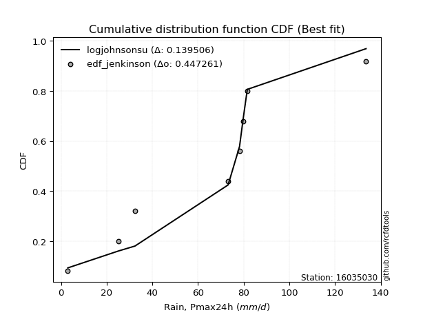</img></img>

</div>


### 11. Empirical - EDF Cunnane (1978)

Cunnane´s work in statistical hydrology has focused on the performance and evaluation of different probability distributions (such as GEV, Gumbel, Lognormal) for flood frequency estimation. _b_ is a constant, typically set to 0.4.

<div align="center">


$P=(m-b)/(n+1-2b)$


</div>


**11.1. Empirical values**

<div align="center">

|                | 0                   | 1                  | 2                   | 3                  | 4           | 5                  | 6                 | 7                  | 8                  |
|:---------------|:--------------------|:-------------------|:--------------------|:-------------------|:------------|:-------------------|:------------------|:-------------------|:-------------------|
| date           | 2023                | 2025               | 2022                | 2017               | 2020        | 2018               | 2021              | 2019               | 2024               |
| x              | 3.0                 | 3.2                | 25.2                | 32.4               | 73.2        | 78.2               | 79.8              | 81.6               | 133.6              |
| m              | 1                   | 2                  | 3                   | 4                  | 5           | 6                  | 7                 | 8                  | 9                  |
| empirical_dist | edf_cunnane         | edf_cunnane        | edf_cunnane         | edf_cunnane        | edf_cunnane | edf_cunnane        | edf_cunnane       | edf_cunnane        | edf_cunnane        |
| empirical      | 0.06521739130434782 | 0.1739130434782609 | 0.28260869565217395 | 0.391304347826087  | 0.5         | 0.6086956521739131 | 0.717391304347826 | 0.8260869565217391 | 0.9347826086956522 |
| empirical_tr   | 1.069767441860465   | 1.2105263157894737 | 1.393939393939394   | 1.6428571428571428 | 2.0         | 2.555555555555556  | 3.538461538461538 | 5.75               | 15.333333333333343 |

</div>


**11.2. Kolmogorov-Smirnov fit test (sorted by Δ)**


<div align="center">

|                | 0                   | 1                   | 2                   | 3                   | 4                   | 5                   | 6                   | 7                   | 8                   | 9                   | 10                  | 11                  | 12                  | 13                  | 14                  | 15                  | 16                  | 17                  | 18                  | 19                  | 20                  | 21                  | 22                  | 23                  | 24                  | 25                  | 26                  | 27                  | 28                  | 29                  | 30                  | 31                  | 32                  | 33                  | 34                  | 35                  | 36                  | 37                  | 38                  | 39                  | 40                  | 41                  | 42                  | 43                  | 44                  | 45                  | 46                  | 47                  | 48                  | 49                  | 50                  | 51                  | 52                  | 53                  | 54                  | 55                  | 56                  | 57                  | 58                    | 59                  | 60                  | 61                  | 62                  | 63                  | 64                  | 65                  | 66                  | 67                  | 68                  | 69                  | 70                  | 71                  | 72                  | 73                  | 74                  | 75                  | 76                  | 77                  | 78                  | 79                  | 80                  | 81                  | 82                  | 83                  | 84                  | 85                  | 86                  | 87                  | 88                  | 89                  |
|:---------------|:--------------------|:--------------------|:--------------------|:--------------------|:--------------------|:--------------------|:--------------------|:--------------------|:--------------------|:--------------------|:--------------------|:--------------------|:--------------------|:--------------------|:--------------------|:--------------------|:--------------------|:--------------------|:--------------------|:--------------------|:--------------------|:--------------------|:--------------------|:--------------------|:--------------------|:--------------------|:--------------------|:--------------------|:--------------------|:--------------------|:--------------------|:--------------------|:--------------------|:--------------------|:--------------------|:--------------------|:--------------------|:--------------------|:--------------------|:--------------------|:--------------------|:--------------------|:--------------------|:--------------------|:--------------------|:--------------------|:--------------------|:--------------------|:--------------------|:--------------------|:--------------------|:--------------------|:--------------------|:--------------------|:--------------------|:--------------------|:--------------------|:--------------------|:----------------------|:--------------------|:--------------------|:--------------------|:--------------------|:--------------------|:--------------------|:--------------------|:--------------------|:--------------------|:--------------------|:--------------------|:--------------------|:--------------------|:--------------------|:--------------------|:--------------------|:--------------------|:--------------------|:--------------------|:--------------------|:--------------------|:--------------------|:--------------------|:--------------------|:--------------------|:--------------------|:--------------------|:--------------------|:--------------------|:--------------------|:--------------------|
| station        | 16035030            | 16035030            | 16035030            | 16035030            | 16035030            | 16035030            | 16035030            | 16035030            | 16035030            | 16035030            | 16035030            | 16035030            | 16035030            | 16035030            | 16035030            | 16035030            | 16035030            | 16035030            | 16035030            | 16035030            | 16035030            | 16035030            | 16035030            | 16035030            | 16035030            | 16035030            | 16035030            | 16035030            | 16035030            | 16035030            | 16035030            | 16035030            | 16035030            | 16035030            | 16035030            | 16035030            | 16035030            | 16035030            | 16035030            | 16035030            | 16035030            | 16035030            | 16035030            | 16035030            | 16035030            | 16035030            | 16035030            | 16035030            | 16035030            | 16035030            | 16035030            | 16035030            | 16035030            | 16035030            | 16035030            | 16035030            | 16035030            | 16035030            | 16035030              | 16035030            | 16035030            | 16035030            | 16035030            | 16035030            | 16035030            | 16035030            | 16035030            | 16035030            | 16035030            | 16035030            | 16035030            | 16035030            | 16035030            | 16035030            | 16035030            | 16035030            | 16035030            | 16035030            | 16035030            | 16035030            | 16035030            | 16035030            | 16035030            | 16035030            | 16035030            | 16035030            | 16035030            | 16035030            | 16035030            | 16035030            |
| empirical_dist | edf_cunnane         | edf_cunnane         | edf_cunnane         | edf_cunnane         | edf_cunnane         | edf_cunnane         | edf_cunnane         | edf_cunnane         | edf_cunnane         | edf_cunnane         | edf_cunnane         | edf_cunnane         | edf_cunnane         | edf_cunnane         | edf_cunnane         | edf_cunnane         | edf_cunnane         | edf_cunnane         | edf_cunnane         | edf_cunnane         | edf_cunnane         | edf_cunnane         | edf_cunnane         | edf_cunnane         | edf_cunnane         | edf_cunnane         | edf_cunnane         | edf_cunnane         | edf_cunnane         | edf_cunnane         | edf_cunnane         | edf_cunnane         | edf_cunnane         | edf_cunnane         | edf_cunnane         | edf_cunnane         | edf_cunnane         | edf_cunnane         | edf_cunnane         | edf_cunnane         | edf_cunnane         | edf_cunnane         | edf_cunnane         | edf_cunnane         | edf_cunnane         | edf_cunnane         | edf_cunnane         | edf_cunnane         | edf_cunnane         | edf_cunnane         | edf_cunnane         | edf_cunnane         | edf_cunnane         | edf_cunnane         | edf_cunnane         | edf_cunnane         | edf_cunnane         | edf_cunnane         | edf_cunnane           | edf_cunnane         | edf_cunnane         | edf_cunnane         | edf_cunnane         | edf_cunnane         | edf_cunnane         | edf_cunnane         | edf_cunnane         | edf_cunnane         | edf_cunnane         | edf_cunnane         | edf_cunnane         | edf_cunnane         | edf_cunnane         | edf_cunnane         | edf_cunnane         | edf_cunnane         | edf_cunnane         | edf_cunnane         | edf_cunnane         | edf_cunnane         | edf_cunnane         | edf_cunnane         | edf_cunnane         | edf_cunnane         | edf_cunnane         | edf_cunnane         | edf_cunnane         | edf_cunnane         | edf_cunnane         | edf_cunnane         |
| p_dist         | logjohnsonsu        | logloggamma         | crystalball         | norm                | t                   | exponnorm           | gumbel_l            | laplace_asymmetric  | pearson3            | mielke              | logistic            | maxwell             | rice                | fisk                | ncf                 | rayleigh            | invgamma            | gompertz            | hypsecant           | johnsonsu           | logpearson3         | invgauss            | genlogistic         | halfnorm            | weibull_min         | kstwobign           | loggumbel_l         | loginvweibull       | logfisk             | logncf              | nakagami            | gumbel_r            | laplace             | logweibull_min      | loggamma            | loggamma            | logerlang           | f                   | logbetaprime        | logf                | lognakagami         | logcrystalball      | logt                | lognorm             | lognorm             | logexponnorm        | lognct              | logalpha            | genexpon            | expon               | loginvgamma         | halflogistic        | logrice             | logfatiguelife      | loggompertz         | loginvgauss         | moyal               | logkstwobign        | loglaplace_asymmetric | logmaxwell          | loggenexpon         | lograyleigh         | loglogistic         | loghalfnorm         | loghypsecant        | loggumbel_r         | loghalflogistic     | nct                 | logmoyal            | loglaplace          | wald                | erlang              | logexpon            | gibrat              | betaprime           | logwald             | gamma               | loglognorm          | loggibrat           | pareto              | logtruncnorm        | logpareto           | fatiguelife         | invweibull          | alpha               | logchi2             | logmielke           | chi2                | truncnorm           | loggenlogistic      |
| delta          | 0.1442299287501353  | 0.15310037177019153 | 0.15641232262257043 | 0.15641232416929352 | 0.15641612209761302 | 0.1595645663447951  | 0.16032447528109103 | 0.1652390516544247  | 0.16825710909806657 | 0.17015500015296792 | 0.17489330316631535 | 0.1773562948381857  | 0.17736649631814427 | 0.17930514464358338 | 0.18159998560379365 | 0.18363052158311022 | 0.1884828942501826  | 0.1888820798109363  | 0.18912312862287672 | 0.19014123811789296 | 0.19760531142247684 | 0.19946963216957203 | 0.20086193049156875 | 0.20195316213361114 | 0.20305577004675535 | 0.20509985366224515 | 0.20619974559040555 | 0.20757828227234287 | 0.20857631317160308 | 0.21451450043920745 | 0.21518934043989824 | 0.21535307468135845 | 0.21709344953612686 | 0.22244290708280845 | 0.22564530358313084 | 0.22564530358313084 | 0.22624872407052976 | 0.22646287921957242 | 0.2270215174412309  | 0.2281544667781792  | 0.22842745595417469 | 0.2284700913511717  | 0.22847023332216376 | 0.22847037218405408 | 0.22847037218405408 | 0.22847195149658317 | 0.22857733813912373 | 0.22928676163714545 | 0.22939513608477702 | 0.2295135062382836  | 0.22986983857805598 | 0.22996332273231956 | 0.2301670820019831  | 0.23055981575880313 | 0.2320362701536023  | 0.23381494164282635 | 0.23478941044781698 | 0.23682376405077032 | 0.23933931057662094   | 0.24084075596131727 | 0.241994797816249   | 0.2444051446589386  | 0.2508481120494349  | 0.25578394511635383 | 0.26621498135488575 | 0.2730847827611659  | 0.2813509053715063  | 0.2850416996108486  | 0.2874469384805869  | 0.28844334439986097 | 0.2900531884086406  | 0.2968287045950495  | 0.3086690594995052  | 0.3222225418556305  | 0.3259305347837016  | 0.3309705364254324  | 0.3448374986053493  | 0.35927399178013364 | 0.36131738439889205 | 0.3808623699800434  | 0.38587870008690595 | 0.39828159536449836 | 0.45458214657886764 | 0.4914730333941391  | 0.5123090970055122  | 0.5463848066756165  | 0.5989926360985579  | 0.7067035323137837  | 0.8076257248114436  | 0.8260869565217391  |
| deltao         | 0.41761268023100007 | 0.41761268023100007 | 0.41761268023100007 | 0.41761268023100007 | 0.41761268023100007 | 0.41761268023100007 | 0.41761268023100007 | 0.41761268023100007 | 0.41761268023100007 | 0.41761268023100007 | 0.41761268023100007 | 0.41761268023100007 | 0.41761268023100007 | 0.41761268023100007 | 0.41761268023100007 | 0.41761268023100007 | 0.41761268023100007 | 0.41761268023100007 | 0.41761268023100007 | 0.41761268023100007 | 0.41761268023100007 | 0.41761268023100007 | 0.41761268023100007 | 0.41761268023100007 | 0.41761268023100007 | 0.41761268023100007 | 0.41761268023100007 | 0.41761268023100007 | 0.41761268023100007 | 0.41761268023100007 | 0.41761268023100007 | 0.41761268023100007 | 0.41761268023100007 | 0.41761268023100007 | 0.41761268023100007 | 0.41761268023100007 | 0.41761268023100007 | 0.41761268023100007 | 0.41761268023100007 | 0.41761268023100007 | 0.41761268023100007 | 0.41761268023100007 | 0.41761268023100007 | 0.41761268023100007 | 0.41761268023100007 | 0.41761268023100007 | 0.41761268023100007 | 0.41761268023100007 | 0.41761268023100007 | 0.41761268023100007 | 0.41761268023100007 | 0.41761268023100007 | 0.41761268023100007 | 0.41761268023100007 | 0.41761268023100007 | 0.41761268023100007 | 0.41761268023100007 | 0.41761268023100007 | 0.41761268023100007   | 0.41761268023100007 | 0.41761268023100007 | 0.41761268023100007 | 0.41761268023100007 | 0.41761268023100007 | 0.41761268023100007 | 0.41761268023100007 | 0.41761268023100007 | 0.41761268023100007 | 0.41761268023100007 | 0.41761268023100007 | 0.41761268023100007 | 0.41761268023100007 | 0.41761268023100007 | 0.41761268023100007 | 0.41761268023100007 | 0.41761268023100007 | 0.41761268023100007 | 0.41761268023100007 | 0.41761268023100007 | 0.41761268023100007 | 0.41761268023100007 | 0.41761268023100007 | 0.41761268023100007 | 0.41761268023100007 | 0.41761268023100007 | 0.41761268023100007 | 0.41761268023100007 | 0.41761268023100007 | 0.41761268023100007 | 0.41761268023100007 |
| eval           | Δo > Δ              | Δo > Δ              | Δo > Δ              | Δo > Δ              | Δo > Δ              | Δo > Δ              | Δo > Δ              | Δo > Δ              | Δo > Δ              | Δo > Δ              | Δo > Δ              | Δo > Δ              | Δo > Δ              | Δo > Δ              | Δo > Δ              | Δo > Δ              | Δo > Δ              | Δo > Δ              | Δo > Δ              | Δo > Δ              | Δo > Δ              | Δo > Δ              | Δo > Δ              | Δo > Δ              | Δo > Δ              | Δo > Δ              | Δo > Δ              | Δo > Δ              | Δo > Δ              | Δo > Δ              | Δo > Δ              | Δo > Δ              | Δo > Δ              | Δo > Δ              | Δo > Δ              | Δo > Δ              | Δo > Δ              | Δo > Δ              | Δo > Δ              | Δo > Δ              | Δo > Δ              | Δo > Δ              | Δo > Δ              | Δo > Δ              | Δo > Δ              | Δo > Δ              | Δo > Δ              | Δo > Δ              | Δo > Δ              | Δo > Δ              | Δo > Δ              | Δo > Δ              | Δo > Δ              | Δo > Δ              | Δo > Δ              | Δo > Δ              | Δo > Δ              | Δo > Δ              | Δo > Δ                | Δo > Δ              | Δo > Δ              | Δo > Δ              | Δo > Δ              | Δo > Δ              | Δo > Δ              | Δo > Δ              | Δo > Δ              | Δo > Δ              | Δo > Δ              | Δo > Δ              | Δo > Δ              | Δo > Δ              | Δo > Δ              | Δo > Δ              | Δo > Δ              | Δo > Δ              | Δo > Δ              | Δo > Δ              | Δo > Δ              | Δo > Δ              | Δo > Δ              | Δo > Δ              | Δo <= Δ             | Δo <= Δ             | Δo <= Δ             | Δo <= Δ             | Δo <= Δ             | Δo <= Δ             | Δo <= Δ             | Δo <= Δ             |
| fit            | 1                   | 1                   | 1                   | 1                   | 1                   | 1                   | 1                   | 1                   | 1                   | 1                   | 1                   | 1                   | 1                   | 1                   | 1                   | 1                   | 1                   | 1                   | 1                   | 1                   | 1                   | 1                   | 1                   | 1                   | 1                   | 1                   | 1                   | 1                   | 1                   | 1                   | 1                   | 1                   | 1                   | 1                   | 1                   | 1                   | 1                   | 1                   | 1                   | 1                   | 1                   | 1                   | 1                   | 1                   | 1                   | 1                   | 1                   | 1                   | 1                   | 1                   | 1                   | 1                   | 1                   | 1                   | 1                   | 1                   | 1                   | 1                   | 1                     | 1                   | 1                   | 1                   | 1                   | 1                   | 1                   | 1                   | 1                   | 1                   | 1                   | 1                   | 1                   | 1                   | 1                   | 1                   | 1                   | 1                   | 1                   | 1                   | 1                   | 1                   | 1                   | 1                   | 0                   | 0                   | 0                   | 0                   | 0                   | 0                   | 0                   | 0                   |
| n              | 9                   | 9                   | 9                   | 9                   | 9                   | 9                   | 9                   | 9                   | 9                   | 9                   | 9                   | 9                   | 9                   | 9                   | 9                   | 9                   | 9                   | 9                   | 9                   | 9                   | 9                   | 9                   | 9                   | 9                   | 9                   | 9                   | 9                   | 9                   | 9                   | 9                   | 9                   | 9                   | 9                   | 9                   | 9                   | 9                   | 9                   | 9                   | 9                   | 9                   | 9                   | 9                   | 9                   | 9                   | 9                   | 9                   | 9                   | 9                   | 9                   | 9                   | 9                   | 9                   | 9                   | 9                   | 9                   | 9                   | 9                   | 9                   | 9                     | 9                   | 9                   | 9                   | 9                   | 9                   | 9                   | 9                   | 9                   | 9                   | 9                   | 9                   | 9                   | 9                   | 9                   | 9                   | 9                   | 9                   | 9                   | 9                   | 9                   | 9                   | 9                   | 9                   | 9                   | 9                   | 9                   | 9                   | 9                   | 9                   | 9                   | 9                   |
| best_fit       | 1                   | 0                   | 0                   | 0                   | 0                   | 0                   | 0                   | 0                   | 0                   | 0                   | 0                   | 0                   | 0                   | 0                   | 0                   | 0                   | 0                   | 0                   | 0                   | 0                   | 0                   | 0                   | 0                   | 0                   | 0                   | 0                   | 0                   | 0                   | 0                   | 0                   | 0                   | 0                   | 0                   | 0                   | 0                   | 0                   | 0                   | 0                   | 0                   | 0                   | 0                   | 0                   | 0                   | 0                   | 0                   | 0                   | 0                   | 0                   | 0                   | 0                   | 0                   | 0                   | 0                   | 0                   | 0                   | 0                   | 0                   | 0                   | 0                     | 0                   | 0                   | 0                   | 0                   | 0                   | 0                   | 0                   | 0                   | 0                   | 0                   | 0                   | 0                   | 0                   | 0                   | 0                   | 0                   | 0                   | 0                   | 0                   | 0                   | 0                   | 0                   | 0                   | 0                   | 0                   | 0                   | 0                   | 0                   | 0                   | 0                   | 0                   |
| best_fit_sort  | 1                   | 2                   | 3                   | 4                   | 5                   | 6                   | 7                   | 8                   | 9                   | 10                  | 11                  | 12                  | 13                  | 14                  | 15                  | 16                  | 17                  | 18                  | 19                  | 20                  | 21                  | 22                  | 23                  | 24                  | 25                  | 26                  | 27                  | 28                  | 29                  | 30                  | 31                  | 32                  | 33                  | 34                  | 35                  | 36                  | 37                  | 38                  | 39                  | 40                  | 41                  | 42                  | 43                  | 44                  | 45                  | 46                  | 47                  | 48                  | 49                  | 50                  | 51                  | 52                  | 53                  | 54                  | 55                  | 56                  | 57                  | 58                  | 59                    | 60                  | 61                  | 62                  | 63                  | 64                  | 65                  | 66                  | 67                  | 68                  | 69                  | 70                  | 71                  | 72                  | 73                  | 74                  | 75                  | 76                  | 77                  | 78                  | 79                  | 80                  | 81                  | 82                  | 83                  | 84                  | 85                  | 86                  | 87                  | 88                  | 89                  | 90                  |

</div>


<div align="center">

</img>

</div>


**11.3. Best fit**

<div align="center">

|   id |   station | empirical_dist   | p_dist       |   delta |   deltao | eval   |   fit |   n |   best_fit |   best_fit_sort |
|-----:|----------:|:-----------------|:-------------|--------:|---------:|:-------|------:|----:|-----------:|----------------:|
|    0 |  16035030 | edf_cunnane      | logjohnsonsu | 0.14423 | 0.417613 | Δo > Δ |     1 |   9 |          1 |               1 |

</div>


<div align="center">

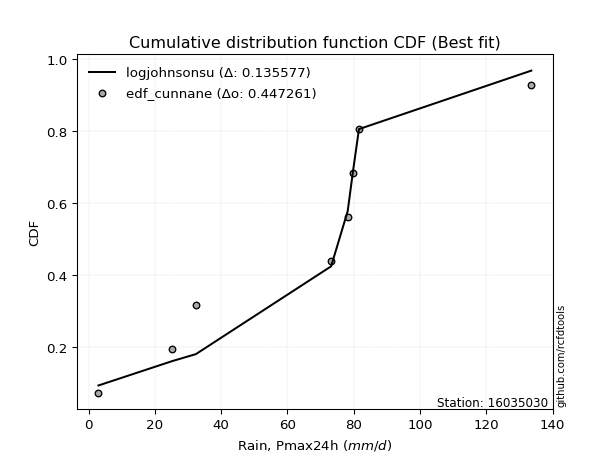</img></img>

</div>


### 12. Empirical - EDF Adamowski (1981)

The Adamowski formula in hydrology refers to a specific plotting position formula used for estimating the non-parametric empirical distribution of hydrological events (like flood peaks) to calculate their return periods. This formula provides an alternative to traditional parametric methods (like the Gumbel or Log Pearson Type III distributions). 

<div align="center">


$P=(m-0.25)/(n+0.5)$


</div>


**12.1. Empirical values**

<div align="center">

|                | 0                   | 1                   | 2                  | 3                   | 4             | 5                  | 6                  | 7                  | 8                  |
|:---------------|:--------------------|:--------------------|:-------------------|:--------------------|:--------------|:-------------------|:-------------------|:-------------------|:-------------------|
| date           | 2023                | 2025                | 2022               | 2017                | 2020          | 2018               | 2021               | 2019               | 2024               |
| x              | 3.0                 | 3.2                 | 25.2               | 32.4                | 73.2          | 78.2               | 79.8               | 81.6               | 133.6              |
| m              | 1                   | 2                   | 3                  | 4                   | 5             | 6                  | 7                  | 8                  | 9                  |
| empirical_dist | edf_adamowski       | edf_adamowski       | edf_adamowski      | edf_adamowski       | edf_adamowski | edf_adamowski      | edf_adamowski      | edf_adamowski      | edf_adamowski      |
| empirical      | 0.07894736842105263 | 0.18421052631578946 | 0.2894736842105263 | 0.39473684210526316 | 0.5           | 0.6052631578947368 | 0.7105263157894737 | 0.8157894736842105 | 0.9210526315789473 |
| empirical_tr   | 1.0857142857142856  | 1.2258064516129032  | 1.4074074074074074 | 1.6521739130434783  | 2.0           | 2.533333333333333  | 3.4545454545454546 | 5.428571428571428  | 12.666666666666663 |

</div>


**12.2. Kolmogorov-Smirnov fit test (sorted by Δ)**


<div align="center">

|                | 0                   | 1                   | 2                   | 3                   | 4                   | 5                   | 6                   | 7                   | 8                   | 9                   | 10                  | 11                  | 12                  | 13                  | 14                  | 15                  | 16                  | 17                  | 18                  | 19                  | 20                  | 21                  | 22                  | 23                  | 24                  | 25                  | 26                  | 27                  | 28                  | 29                  | 30                  | 31                  | 32                  | 33                  | 34                  | 35                  | 36                  | 37                  | 38                  | 39                  | 40                  | 41                  | 42                  | 43                  | 44                  | 45                  | 46                  | 47                  | 48                  | 49                  | 50                  | 51                  | 52                  | 53                  | 54                  | 55                  | 56                  | 57                  | 58                    | 59                  | 60                  | 61                  | 62                  | 63                  | 64                  | 65                  | 66                  | 67                  | 68                  | 69                  | 70                  | 71                  | 72                  | 73                  | 74                  | 75                  | 76                  | 77                  | 78                  | 79                  | 80                  | 81                  | 82                  | 83                  | 84                  | 85                  | 86                  | 87                  | 88                  | 89                  |
|:---------------|:--------------------|:--------------------|:--------------------|:--------------------|:--------------------|:--------------------|:--------------------|:--------------------|:--------------------|:--------------------|:--------------------|:--------------------|:--------------------|:--------------------|:--------------------|:--------------------|:--------------------|:--------------------|:--------------------|:--------------------|:--------------------|:--------------------|:--------------------|:--------------------|:--------------------|:--------------------|:--------------------|:--------------------|:--------------------|:--------------------|:--------------------|:--------------------|:--------------------|:--------------------|:--------------------|:--------------------|:--------------------|:--------------------|:--------------------|:--------------------|:--------------------|:--------------------|:--------------------|:--------------------|:--------------------|:--------------------|:--------------------|:--------------------|:--------------------|:--------------------|:--------------------|:--------------------|:--------------------|:--------------------|:--------------------|:--------------------|:--------------------|:--------------------|:----------------------|:--------------------|:--------------------|:--------------------|:--------------------|:--------------------|:--------------------|:--------------------|:--------------------|:--------------------|:--------------------|:--------------------|:--------------------|:--------------------|:--------------------|:--------------------|:--------------------|:--------------------|:--------------------|:--------------------|:--------------------|:--------------------|:--------------------|:--------------------|:--------------------|:--------------------|:--------------------|:--------------------|:--------------------|:--------------------|:--------------------|:--------------------|
| station        | 16035030            | 16035030            | 16035030            | 16035030            | 16035030            | 16035030            | 16035030            | 16035030            | 16035030            | 16035030            | 16035030            | 16035030            | 16035030            | 16035030            | 16035030            | 16035030            | 16035030            | 16035030            | 16035030            | 16035030            | 16035030            | 16035030            | 16035030            | 16035030            | 16035030            | 16035030            | 16035030            | 16035030            | 16035030            | 16035030            | 16035030            | 16035030            | 16035030            | 16035030            | 16035030            | 16035030            | 16035030            | 16035030            | 16035030            | 16035030            | 16035030            | 16035030            | 16035030            | 16035030            | 16035030            | 16035030            | 16035030            | 16035030            | 16035030            | 16035030            | 16035030            | 16035030            | 16035030            | 16035030            | 16035030            | 16035030            | 16035030            | 16035030            | 16035030              | 16035030            | 16035030            | 16035030            | 16035030            | 16035030            | 16035030            | 16035030            | 16035030            | 16035030            | 16035030            | 16035030            | 16035030            | 16035030            | 16035030            | 16035030            | 16035030            | 16035030            | 16035030            | 16035030            | 16035030            | 16035030            | 16035030            | 16035030            | 16035030            | 16035030            | 16035030            | 16035030            | 16035030            | 16035030            | 16035030            | 16035030            |
| empirical_dist | edf_adamowski       | edf_adamowski       | edf_adamowski       | edf_adamowski       | edf_adamowski       | edf_adamowski       | edf_adamowski       | edf_adamowski       | edf_adamowski       | edf_adamowski       | edf_adamowski       | edf_adamowski       | edf_adamowski       | edf_adamowski       | edf_adamowski       | edf_adamowski       | edf_adamowski       | edf_adamowski       | edf_adamowski       | edf_adamowski       | edf_adamowski       | edf_adamowski       | edf_adamowski       | edf_adamowski       | edf_adamowski       | edf_adamowski       | edf_adamowski       | edf_adamowski       | edf_adamowski       | edf_adamowski       | edf_adamowski       | edf_adamowski       | edf_adamowski       | edf_adamowski       | edf_adamowski       | edf_adamowski       | edf_adamowski       | edf_adamowski       | edf_adamowski       | edf_adamowski       | edf_adamowski       | edf_adamowski       | edf_adamowski       | edf_adamowski       | edf_adamowski       | edf_adamowski       | edf_adamowski       | edf_adamowski       | edf_adamowski       | edf_adamowski       | edf_adamowski       | edf_adamowski       | edf_adamowski       | edf_adamowski       | edf_adamowski       | edf_adamowski       | edf_adamowski       | edf_adamowski       | edf_adamowski         | edf_adamowski       | edf_adamowski       | edf_adamowski       | edf_adamowski       | edf_adamowski       | edf_adamowski       | edf_adamowski       | edf_adamowski       | edf_adamowski       | edf_adamowski       | edf_adamowski       | edf_adamowski       | edf_adamowski       | edf_adamowski       | edf_adamowski       | edf_adamowski       | edf_adamowski       | edf_adamowski       | edf_adamowski       | edf_adamowski       | edf_adamowski       | edf_adamowski       | edf_adamowski       | edf_adamowski       | edf_adamowski       | edf_adamowski       | edf_adamowski       | edf_adamowski       | edf_adamowski       | edf_adamowski       | edf_adamowski       |
| p_dist         | logjohnsonsu        | logloggamma         | crystalball         | norm                | t                   | exponnorm           | gumbel_l            | pearson3            | laplace_asymmetric  | logistic            | maxwell             | rice                | fisk                | mielke              | ncf                 | rayleigh            | invgamma            | gompertz            | hypsecant           | johnsonsu           | weibull_min         | logpearson3         | invgauss            | genlogistic         | halfnorm            | kstwobign           | loggumbel_l         | loginvweibull       | logfisk             | logncf              | nakagami            | gumbel_r            | laplace             | logweibull_min      | loggamma            | loggamma            | logerlang           | f                   | logbetaprime        | logf                | lognakagami         | logcrystalball      | logt                | lognorm             | lognorm             | logexponnorm        | lognct              | logalpha            | genexpon            | expon               | loginvgamma         | halflogistic        | logrice             | logfatiguelife      | loggompertz         | logkstwobign        | loginvgauss         | moyal               | loglaplace_asymmetric | logmaxwell          | loggenexpon         | lograyleigh         | loglogistic         | loghalfnorm         | loghypsecant        | loggumbel_r         | nct                 | loghalflogistic     | logmoyal            | loglaplace          | wald                | erlang              | logexpon            | gibrat              | betaprime           | logwald             | gamma               | loglognorm          | loggibrat           | pareto              | logtruncnorm        | logpareto           | fatiguelife         | invweibull          | alpha               | logchi2             | logmielke           | chi2                | truncnorm           | loggenlogistic      |
| delta          | 0.1442299287501353  | 0.15310037177019153 | 0.15641232262257043 | 0.15641232416929352 | 0.15641612209761302 | 0.1595645663447951  | 0.16375696956026722 | 0.16825710909806657 | 0.1686715459336009  | 0.17489330316631535 | 0.1773562948381857  | 0.17736649631814427 | 0.17930514464358338 | 0.1804524829904965  | 0.18159998560379365 | 0.18363052158311022 | 0.1884828942501826  | 0.1888820798109363  | 0.18912312862287672 | 0.19014123811789296 | 0.19619078148840297 | 0.19760531142247684 | 0.19946963216957203 | 0.20086193049156875 | 0.20195316213361114 | 0.20509985366224515 | 0.20619974559040555 | 0.20757828227234287 | 0.20857631317160308 | 0.21036257771117184 | 0.21518934043989824 | 0.21535307468135845 | 0.21709344953612686 | 0.22244290708280845 | 0.22564530358313084 | 0.22564530358313084 | 0.22624872407052976 | 0.22646287921957242 | 0.2270215174412309  | 0.2281544667781792  | 0.22842745595417469 | 0.2284700913511717  | 0.22847023332216376 | 0.22847037218405408 | 0.22847037218405408 | 0.22847195149658317 | 0.22857733813912373 | 0.22928676163714545 | 0.22939513608477702 | 0.2295135062382836  | 0.22986983857805598 | 0.22996332273231956 | 0.2301670820019831  | 0.23055981575880313 | 0.2320362701536023  | 0.23300730891695387 | 0.23381494164282635 | 0.23478941044781698 | 0.23933931057662094   | 0.24084075596131727 | 0.241994797816249   | 0.2444051446589386  | 0.2508481120494349  | 0.25578394511635383 | 0.26621498135488575 | 0.2730847827611659  | 0.2781767110524962  | 0.2813509053715063  | 0.2874469384805869  | 0.28844334439986097 | 0.2900531884086406  | 0.2968287045950495  | 0.3018040709411528  | 0.3222225418556305  | 0.3259305347837016  | 0.3309705364254324  | 0.3448374986053493  | 0.35240900322178126 | 0.36131738439889205 | 0.37399738142169103 | 0.38587870008690595 | 0.391416606806146   | 0.44771715802051526 | 0.47774305627743424 | 0.5054441084471598  | 0.5395198181172641  | 0.5921276475402055  | 0.6998385437554313  | 0.7938957476947387  | 0.8157894736842105  |
| deltao         | 0.41761268023100007 | 0.41761268023100007 | 0.41761268023100007 | 0.41761268023100007 | 0.41761268023100007 | 0.41761268023100007 | 0.41761268023100007 | 0.41761268023100007 | 0.41761268023100007 | 0.41761268023100007 | 0.41761268023100007 | 0.41761268023100007 | 0.41761268023100007 | 0.41761268023100007 | 0.41761268023100007 | 0.41761268023100007 | 0.41761268023100007 | 0.41761268023100007 | 0.41761268023100007 | 0.41761268023100007 | 0.41761268023100007 | 0.41761268023100007 | 0.41761268023100007 | 0.41761268023100007 | 0.41761268023100007 | 0.41761268023100007 | 0.41761268023100007 | 0.41761268023100007 | 0.41761268023100007 | 0.41761268023100007 | 0.41761268023100007 | 0.41761268023100007 | 0.41761268023100007 | 0.41761268023100007 | 0.41761268023100007 | 0.41761268023100007 | 0.41761268023100007 | 0.41761268023100007 | 0.41761268023100007 | 0.41761268023100007 | 0.41761268023100007 | 0.41761268023100007 | 0.41761268023100007 | 0.41761268023100007 | 0.41761268023100007 | 0.41761268023100007 | 0.41761268023100007 | 0.41761268023100007 | 0.41761268023100007 | 0.41761268023100007 | 0.41761268023100007 | 0.41761268023100007 | 0.41761268023100007 | 0.41761268023100007 | 0.41761268023100007 | 0.41761268023100007 | 0.41761268023100007 | 0.41761268023100007 | 0.41761268023100007   | 0.41761268023100007 | 0.41761268023100007 | 0.41761268023100007 | 0.41761268023100007 | 0.41761268023100007 | 0.41761268023100007 | 0.41761268023100007 | 0.41761268023100007 | 0.41761268023100007 | 0.41761268023100007 | 0.41761268023100007 | 0.41761268023100007 | 0.41761268023100007 | 0.41761268023100007 | 0.41761268023100007 | 0.41761268023100007 | 0.41761268023100007 | 0.41761268023100007 | 0.41761268023100007 | 0.41761268023100007 | 0.41761268023100007 | 0.41761268023100007 | 0.41761268023100007 | 0.41761268023100007 | 0.41761268023100007 | 0.41761268023100007 | 0.41761268023100007 | 0.41761268023100007 | 0.41761268023100007 | 0.41761268023100007 | 0.41761268023100007 |
| eval           | Δo > Δ              | Δo > Δ              | Δo > Δ              | Δo > Δ              | Δo > Δ              | Δo > Δ              | Δo > Δ              | Δo > Δ              | Δo > Δ              | Δo > Δ              | Δo > Δ              | Δo > Δ              | Δo > Δ              | Δo > Δ              | Δo > Δ              | Δo > Δ              | Δo > Δ              | Δo > Δ              | Δo > Δ              | Δo > Δ              | Δo > Δ              | Δo > Δ              | Δo > Δ              | Δo > Δ              | Δo > Δ              | Δo > Δ              | Δo > Δ              | Δo > Δ              | Δo > Δ              | Δo > Δ              | Δo > Δ              | Δo > Δ              | Δo > Δ              | Δo > Δ              | Δo > Δ              | Δo > Δ              | Δo > Δ              | Δo > Δ              | Δo > Δ              | Δo > Δ              | Δo > Δ              | Δo > Δ              | Δo > Δ              | Δo > Δ              | Δo > Δ              | Δo > Δ              | Δo > Δ              | Δo > Δ              | Δo > Δ              | Δo > Δ              | Δo > Δ              | Δo > Δ              | Δo > Δ              | Δo > Δ              | Δo > Δ              | Δo > Δ              | Δo > Δ              | Δo > Δ              | Δo > Δ                | Δo > Δ              | Δo > Δ              | Δo > Δ              | Δo > Δ              | Δo > Δ              | Δo > Δ              | Δo > Δ              | Δo > Δ              | Δo > Δ              | Δo > Δ              | Δo > Δ              | Δo > Δ              | Δo > Δ              | Δo > Δ              | Δo > Δ              | Δo > Δ              | Δo > Δ              | Δo > Δ              | Δo > Δ              | Δo > Δ              | Δo > Δ              | Δo > Δ              | Δo > Δ              | Δo <= Δ             | Δo <= Δ             | Δo <= Δ             | Δo <= Δ             | Δo <= Δ             | Δo <= Δ             | Δo <= Δ             | Δo <= Δ             |
| fit            | 1                   | 1                   | 1                   | 1                   | 1                   | 1                   | 1                   | 1                   | 1                   | 1                   | 1                   | 1                   | 1                   | 1                   | 1                   | 1                   | 1                   | 1                   | 1                   | 1                   | 1                   | 1                   | 1                   | 1                   | 1                   | 1                   | 1                   | 1                   | 1                   | 1                   | 1                   | 1                   | 1                   | 1                   | 1                   | 1                   | 1                   | 1                   | 1                   | 1                   | 1                   | 1                   | 1                   | 1                   | 1                   | 1                   | 1                   | 1                   | 1                   | 1                   | 1                   | 1                   | 1                   | 1                   | 1                   | 1                   | 1                   | 1                   | 1                     | 1                   | 1                   | 1                   | 1                   | 1                   | 1                   | 1                   | 1                   | 1                   | 1                   | 1                   | 1                   | 1                   | 1                   | 1                   | 1                   | 1                   | 1                   | 1                   | 1                   | 1                   | 1                   | 1                   | 0                   | 0                   | 0                   | 0                   | 0                   | 0                   | 0                   | 0                   |
| n              | 9                   | 9                   | 9                   | 9                   | 9                   | 9                   | 9                   | 9                   | 9                   | 9                   | 9                   | 9                   | 9                   | 9                   | 9                   | 9                   | 9                   | 9                   | 9                   | 9                   | 9                   | 9                   | 9                   | 9                   | 9                   | 9                   | 9                   | 9                   | 9                   | 9                   | 9                   | 9                   | 9                   | 9                   | 9                   | 9                   | 9                   | 9                   | 9                   | 9                   | 9                   | 9                   | 9                   | 9                   | 9                   | 9                   | 9                   | 9                   | 9                   | 9                   | 9                   | 9                   | 9                   | 9                   | 9                   | 9                   | 9                   | 9                   | 9                     | 9                   | 9                   | 9                   | 9                   | 9                   | 9                   | 9                   | 9                   | 9                   | 9                   | 9                   | 9                   | 9                   | 9                   | 9                   | 9                   | 9                   | 9                   | 9                   | 9                   | 9                   | 9                   | 9                   | 9                   | 9                   | 9                   | 9                   | 9                   | 9                   | 9                   | 9                   |
| best_fit       | 1                   | 0                   | 0                   | 0                   | 0                   | 0                   | 0                   | 0                   | 0                   | 0                   | 0                   | 0                   | 0                   | 0                   | 0                   | 0                   | 0                   | 0                   | 0                   | 0                   | 0                   | 0                   | 0                   | 0                   | 0                   | 0                   | 0                   | 0                   | 0                   | 0                   | 0                   | 0                   | 0                   | 0                   | 0                   | 0                   | 0                   | 0                   | 0                   | 0                   | 0                   | 0                   | 0                   | 0                   | 0                   | 0                   | 0                   | 0                   | 0                   | 0                   | 0                   | 0                   | 0                   | 0                   | 0                   | 0                   | 0                   | 0                   | 0                     | 0                   | 0                   | 0                   | 0                   | 0                   | 0                   | 0                   | 0                   | 0                   | 0                   | 0                   | 0                   | 0                   | 0                   | 0                   | 0                   | 0                   | 0                   | 0                   | 0                   | 0                   | 0                   | 0                   | 0                   | 0                   | 0                   | 0                   | 0                   | 0                   | 0                   | 0                   |
| best_fit_sort  | 1                   | 2                   | 3                   | 4                   | 5                   | 6                   | 7                   | 8                   | 9                   | 10                  | 11                  | 12                  | 13                  | 14                  | 15                  | 16                  | 17                  | 18                  | 19                  | 20                  | 21                  | 22                  | 23                  | 24                  | 25                  | 26                  | 27                  | 28                  | 29                  | 30                  | 31                  | 32                  | 33                  | 34                  | 35                  | 36                  | 37                  | 38                  | 39                  | 40                  | 41                  | 42                  | 43                  | 44                  | 45                  | 46                  | 47                  | 48                  | 49                  | 50                  | 51                  | 52                  | 53                  | 54                  | 55                  | 56                  | 57                  | 58                  | 59                    | 60                  | 61                  | 62                  | 63                  | 64                  | 65                  | 66                  | 67                  | 68                  | 69                  | 70                  | 71                  | 72                  | 73                  | 74                  | 75                  | 76                  | 77                  | 78                  | 79                  | 80                  | 81                  | 82                  | 83                  | 84                  | 85                  | 86                  | 87                  | 88                  | 89                  | 90                  |

</div>


<div align="center">

</img>

</div>


**12.3. Best fit**

<div align="center">

|   id |   station | empirical_dist   | p_dist       |   delta |   deltao | eval   |   fit |   n |   best_fit |   best_fit_sort |
|-----:|----------:|:-----------------|:-------------|--------:|---------:|:-------|------:|----:|-----------:|----------------:|
|    0 |  16035030 | edf_adamowski    | logjohnsonsu | 0.14423 | 0.417613 | Δo > Δ |     1 |   9 |          1 |               1 |

</div>


<div align="center">

</img>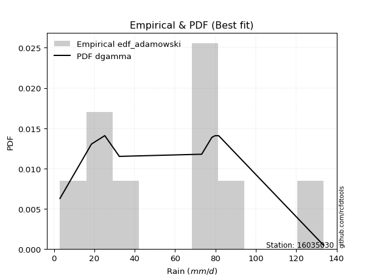</img>

</div>


## C. Best fit & Estimate extreme values for specific return periods - Tr


### 1. Best fit (ordered by delta Δ)

<div align="center">

|   id |   station | empirical_dist   | p_dist       |    delta |   deltao | eval   |   fit |   n |   best_fit |   best_fit_sort |
|-----:|----------:|:-----------------|:-------------|---------:|---------:|:-------|------:|----:|-----------:|----------------:|
|    0 |  16035030 | edf_california   | johnsonsu    | 0.143264 | 0.417613 | Δo > Δ |     1 |   9 |          1 |               1 |
|    1 |  16035030 | edf_adamowski    | logjohnsonsu | 0.14423  | 0.417613 | Δo > Δ |     1 |   9 |          1 |               2 |
|    2 |  16035030 | edf_jenkinson    | logjohnsonsu | 0.14423  | 0.417613 | Δo > Δ |     1 |   9 |          1 |               3 |
|    3 |  16035030 | edf_cunnane      | logjohnsonsu | 0.14423  | 0.417613 | Δo > Δ |     1 |   9 |          1 |               4 |
|    4 |  16035030 | edf_gringorten   | logjohnsonsu | 0.14423  | 0.417613 | Δo > Δ |     1 |   9 |          1 |               5 |
|    5 |  16035030 | edf_tukey        | logjohnsonsu | 0.14423  | 0.417613 | Δo > Δ |     1 |   9 |          1 |               6 |
|    6 |  16035030 | edf_blom         | logjohnsonsu | 0.14423  | 0.417613 | Δo > Δ |     1 |   9 |          1 |               7 |
|    7 |  16035030 | edf_filliben     | logjohnsonsu | 0.14423  | 0.417613 | Δo > Δ |     1 |   9 |          1 |               8 |
|    8 |  16035030 | edf_chegodayev   | logjohnsonsu | 0.14423  | 0.417613 | Δo > Δ |     1 |   9 |          1 |               9 |
|    9 |  16035030 | edf_beard        | logjohnsonsu | 0.14423  | 0.417613 | Δo > Δ |     1 |   9 |          1 |              10 |
|   10 |  16035030 | edf_weibull      | logjohnsonsu | 0.14423  | 0.417613 | Δo > Δ |     1 |   9 |          1 |              11 |
|   11 |  16035030 | edf_hazen        | logjohnsonsu | 0.14423  | 0.417613 | Δo > Δ |     1 |   9 |          1 |              12 |

</div>

:file_folder:Tables: [bestfit_16035030.csv](table/bestfit_16035030.csv) | [extreme_16035030.csv](table/extreme_16035030.csv)


### 2. Extreme values

In hydrology, a return period (or recurrence interval $Tr$) is the statistical average time between extreme events like floods or droughts of a specific magnitude, indicating how rare an event is, with a 100-year flood, for example, having a 1% chance of occurring in any given year, not that it happens exactly every century. It is a key tool for infrastructure design (like bridges or dams) and risk assessment, calculated from historical data to determine the probability of future events, although it is important to remember it is statistical average, and events can cluster or be missed.

> risk_rate: assuming the return period as the project useful life.

|   id |      tr |   prob_l |     prob_g |     alpha |   betaprime |     chi2 |   crystalball |   erlang |    expon |   exponnorm |        f |   fatiguelife |     fisk |    gamma |   genexpon |   genlogistic |   gibrat |   gompertz |   gumbel_l |   gumbel_r |   halflogistic |   halfnorm |   hypsecant |   invgamma |   invgauss |       invweibull |   johnsonsu |   kstwobign |   laplace |   laplace_asymmetric |   loggamma |   logistic |   lognorm |   maxwell |   mielke |    moyal |   nakagami |        ncf |              nct |     norm |           pareto |   pearson3 |   rayleigh |     rice |        t |   truncnorm |     wald |   weibull_min |   logalpha |   logbetaprime |          logchi2 |   logcrystalball |   logerlang |         logexpon |   logexponnorm |      logf |   logfatiguelife |   logfisk |   loggenexpon |   loggenlogistic |        loggibrat |   loggompertz |   loggumbel_l |   loggumbel_r |   loghalflogistic |   loghalfnorm |   loghypsecant |   loginvgamma |   loginvgauss |   loginvweibull |   logjohnsonsu |   logkstwobign |   loglaplace |   loglaplace_asymmetric |   logloggamma |   loglogistic |     loglognorm |   logmaxwell |   logmielke |   logmoyal |   lognakagami |      logncf |    lognct |     logpareto |   logpearson3 |   lograyleigh |   logrice |      logt |   logtruncnorm |     logwald |   logweibull_min |   station |   n |   risk_rate |
|-----:|--------:|---------:|-----------:|----------:|------------:|---------:|--------------:|---------:|---------:|------------:|---------:|--------------:|---------:|---------:|-----------:|--------------:|---------:|-----------:|-----------:|-----------:|---------------:|-----------:|------------:|-----------:|-----------:|-----------------:|------------:|------------:|----------:|---------------------:|-----------:|-----------:|----------:|----------:|---------:|---------:|-----------:|-----------:|-----------------:|---------:|-----------------:|-----------:|-----------:|---------:|---------:|------------:|---------:|--------------:|-----------:|---------------:|-----------------:|-----------------:|------------:|-----------------:|---------------:|----------:|-----------------:|----------:|--------------:|-----------------:|-----------------:|--------------:|--------------:|--------------:|------------------:|--------------:|---------------:|--------------:|--------------:|----------------:|---------------:|---------------:|-------------:|------------------------:|--------------:|--------------:|---------------:|-------------:|------------:|-----------:|--------------:|------------:|----------:|--------------:|--------------:|--------------:|----------:|----------:|---------------:|------------:|-----------------:|----------:|----:|------------:|
|    0 |    2    | 0.5      | 0.5        |    9.7029 |     23.5188 |  3.2832  |       56.6889 |  34.3938 |  40.2143 |     56.3554 |  26.7677 |       3.00004 |  53.9301 |  27.9947 |    40.2267 |       49.6188 |  44.3814 |    50.6033 |    63.4249 |    49.9529 |        46.6042 |    48.2958 |     56.6889 |    52.3232 |    49.9902 |   2854.43        |     51.8912 |     48.943  |   56.6889 |              66.3274 |    31.3131 |    56.6889 |   32.3712 |   53.1821 |  56.1332 |  47.7783 |    29.0417 |    36.1539 |     18.3076      |  56.6889 |      4.00811     |    55.1054 |    51.9384 |  53.5865 |  56.6884 |    -54.29   |  43.3978 |       27.2557 |    30.6614 |        31.6302 |      3.3881      |          32.3713 |     31.0567 |     15.6016      |        32.3711 |   32.3391 |          32.2129 |   42.6146 |       23.0887 |          inf     |     21.6412      |       38.4624 |       40.353  |       25.9682 |           23.2731 |       24.598  |        32.3712 |       29.6969 |       28.3597 |         26.7044 |        53.3427 |        23.2231 |      32.3712 |                 45.5825 |       50.1952 |       32.3712 |   3.0962       |      28.8622 |      3      |    24.1848 |       32.2874 |     25.5133 |   32.3102 |   3.18349     |       39.7603 |       27.7112 |   31.0997 |   32.3713 |        14.9837 |     20.9556 |          41.9501 |  16035030 |   9 |    0.75     |
|    1 |    2.33 | 0.570815 | 0.429185   |   11.548  |     29.8663 |  3.52891 |       64.0057 |  41.0413 |  48.4137 |     63.6503 |  36.9829 |       4.75492 |  61.0723 |  33.808  |    48.4289 |       57.1079 |  48.0878 |    58.4874 |    69.7906 |    56.7328 |        53.5749 |    56.1926 |     62.5445 |    59.6534 |    57.476  | 169458           |     59.2695 |     56.5018 |   61.1167 |              71.9888 |    40.2109 |    63.1355 |   41.1273 |   60.7838 |  64.8323 |  54.1963 |    40.2674 |    46.9716 |     25.6063      |  64.0057 |      6.32759     |    62.4536 |    59.6525 |  61.017  |  64.0053 |    -45.3203 |  48.1955 |       40.0464 |    39.3573 |        40.466  |      3.83649     |          41.1273 |     39.9556 |     22.4355      |        41.1271 |   41.1139 |          40.8785 |   50.6958 |       31.1447 |          inf     |     24.4313      |       46.8106 |       49.6972 |       32.4178 |           29.2353 |       31.85   |        39.2073 |       38.4139 |       36.9007 |         36.3246 |        62.9674 |        31.5388 |      37.4177 |                 53.5131 |       60.5215 |       39.9728 |   3.85004      |      37.0124 |      3      |    29.836  |       41.0528 |     35.005  |   41.0645 |   3.66726     |       49.6741 |       35.6675 |   39.8291 |   41.1273 |        19.389  |     24.5174 |          50.24   |  16035030 |   9 |    0.729209 |
|    2 |    5    | 0.8      | 0.2        |   25.8551 |     66.0051 |  5.9882  |       91.197  |  73.8719 |  89.4089 |     90.9641 | 102.289  |      42.0334  |  90.759  |  63.2993 |    89.4379 |       89.6327 |  69.4267 |    90.2526 |    90.3555 |    86.1875 |        85.1162 |    89.5869 |     86.0329 |    89.457  |    89.3514 |      8.63149e+12 |     89.5673 |     88.6099 |   83.2547 |              88.6998 |   103.833  |    88.0268 |  100.118  |   90.7034 |  95.2873 |  83.925  |   102.031  |   132.832  |    130.626       |  91.197  |   1288           |    90.6543 |    90.5355 |  90.3827 |  91.1966 |    -11.9898 |  75.0532 |      148.53   |   102.954  |       102.303  |     16.1497      |         100.118  |    103.743  |    137.953       |       100.118  |  100.345  |          99.1744 |   99.1185 |      106.1    |          inf     |     49.109       |       89.9718 |       97.3994 |       84.9826 |           82.0555 |       94.9794 |        84.5536 |      104.052  |      103.674  |        138.26   |        96.5751 |       115.739  |      77.2066 |                 80.5346 |       97.4889 |       90.2539 |   4.26933e+235 |      98.5144 |     11.383  |    78.9188 |      100.25   |    138.265  |  100.147  |   4.14466e+38 |      101.725  |       97.9748 |  101.011  |  100.118  |        49.0445 |     59.0355 |          89.9619 |  16035030 |   9 |    0.67232  |
|    3 |   10    | 0.9      | 0.1        |   52.1409 |    103.493  |  9.55457 |      109.235  | 103.36   | 126.623  |    109.313  | 174.242  |      93.5055  | 114.938  |  90.4038 |   126.665  |      116.116  |  93.7505 |   111.987  |   101.805  |   110.178  |       111.31   |   114.298  |    104.789  |   111.719  |   114.379  |      1.63436e+19 |    112.439  |    113.056  |  103.351  |             102.306  |   198.125  |   106.358  |  180.647  |  111.759  | 112.917  | 109.809  |   155.397  |   292.855  |    564.189       | 109.235  | 286138           |   110.148  |   112.556  | 110.966  | 109.235  |     10.1146 | 103.555  |      314.732  |   200.974  |       191.27   |    154.901       |         180.647  |    198.436  |    717.43        |       180.645  |  181.428  |         178.684  |  162.405  |      258.264  |          inf     |    108.84        |      130.59   |      141.662  |      186.307  |          193.339  |      213.189  |       156.19   |      209.032  |      216.153  |        410.676  |       114.604  |       311.441  |     149.011  |                 98.2552 |      115.133  |      164.42   | inf            |     196.2    |     31.478  |   184.069  |      181.297  |    421.773  |  180.993  | inf           |      149.577  |      201.381  |  188.562  |  180.647  |        78.4793 |    150.011  |         124.429  |  16035030 |   9 |    0.651322 |
|    4 |   15    | 0.933333 | 0.0666667  |   78.3328 |    127.134  | 12.0265  |      118.236  | 120.532  | 148.392  |    118.561  | 219.831  |     127.169   | 129.01   | 106.342  |   148.441  |      131.056  | 110.528  |   122.7    |   106.99   |   123.713  |       126.133  |   127.158  |    115.493  |   123.662  |   128.135  |      5.68757e+22 |    124.771  |    126.034  |  115.106  |             110.265  |   274.893  |   116.346  |  242.514  |  122.563  | 121.466  | 124.83   |   184.157  |   453.081  |   1326.12        | 118.236  |      6.75875e+06 |   120.112  |   123.902  | 121.467  | 118.236  |     21.1407 | 121.858  |      443.155  |   283.371  |       262.199  |    774.499       |         242.515  |    275.557  |   1882.09        |       242.512  |  243.837  |         239.763  |  212.539  |      409.661  |          inf     |    188.447       |      154.812  |      167.856  |      290.11   |          314.021  |      324.708  |       221.695  |      299.495  |      316.709  |        759.017  |       122.074  |       526.743  |     218.908  |                110.354  |      121.202  |      227.971  | inf            |     279.393  |     49.3507 |   300.909  |      243.678  |    791.281  |  243.207  | inf           |      176.869  |      291.904  |  257.846  |  242.514  |        92.9587 |    273.024  |         144.117  |  16035030 |   9 |    0.644736 |
|    5 |   20    | 0.95     | 0.05       |  104.502  |    144.628  | 13.9074  |      124.131  | 132.691  | 163.838  |    124.655  | 253.377  |     152.093   | 139.127  | 117.676  |   163.892  |      141.517  | 123.689  |   129.62   |   110.218  |   133.19   |       136.519  |   135.731  |    123.044  |   131.807  |   137.622  |      1.71652e+25 |    133.2    |    134.776  |  123.447  |             115.912  |   341.27   |   123.25   |  294.104  |  129.733  | 127.167  | 135.469  |   203.509  |   613.527  |   2431.35        | 124.131  |      6.37141e+07 |   126.724  |   131.443  | 128.411  | 124.131  |     28.3585 | 135.498  |      548.587  |   356.172  |       322.727  |   2668.77        |         294.104  |    342.237  |   3731.01        |       294.101  |  295.936  |         290.7    |  255.974  |      557.14   |          inf     |    289.865       |      172.173  |      186.552  |      395.576  |          441.101  |      429.854  |       283.828  |      380.651  |      409.038  |       1166.88   |       126.431  |       750.477  |     287.596  |                119.832  |      124.27   |      285.742  | inf            |     353.264  |     63.305  |   426.193  |      295.753  |   1230.27   |  295.138  | inf           |      195.722  |      373.594  |  316.63   |  294.104  |       101.456  |    426.59   |         157.916  |  16035030 |   9 |    0.641514 |
|    6 |   25    | 0.96     | 0.04       |  130.661  |    158.602  | 15.4268  |      128.47   | 142.11   | 175.818  |    129.164  | 279.991  |     171.896   | 147.09   | 126.481  |   175.876  |      149.574  | 134.66   |   134.658  |   112.515  |   140.49   |       144.521  |   142.11   |    128.888  |   137.973  |   144.855  |      1.39536e+27 |    139.591  |    141.325  |  129.917  |             120.293  |   400.545  |   128.531  |  338.97   |  135.056  | 131.474  | 143.715  |   217.961  |   774.156  |   3890.73        | 128.47   |      3.6309e+08  |   131.635  |   137.046  | 133.552  | 128.47   |     33.6696 | 146.422  |      638.663  |   422.263  |       376.262  |   7290.14        |         338.971  |    401.775  |   6343.7         |       338.967  |  341.283  |         335.005  |  295.103  |      700.396  |          inf     |    415.044       |      185.728  |      201.111  |      502.294  |          573.114  |      529.62   |       343.636  |      455.14   |      495.235  |       1625.13   |       129.382  |       978.349  |     355.397  |                127.74   |      126.121  |      339.638  | inf            |     420.472  |     74.1126 |   558.188  |      341.077  |   1729.72   |  340.336  | inf           |      210.003  |      448.763  |  368.381  |  338.971  |       107.027  |    609.885  |         168.532  |  16035030 |   9 |    0.639603 |
|    7 |   50    | 0.98     | 0.02       |  261.419  |    204.247  | 20.4166  |      140.897  | 171.314  | 213.032  |    142.192  | 365.487  |     235.433   | 172.671  | 153.888  |   213.103  |      174.394  | 173.335  |   148.774  |   118.749  |   162.977  |       169.175  |   160.652  |    147.007  |   156.471  |   166.769  |      1.06809e+33 |    158.798  |    160.554  |  150.013  |             133.899  |   636.385  |   144.666  |  509.02   |  150.493  | 144.65   | 169.314  |   260.088  |  1579.18   |  16758.3         | 140.897  |      8.08499e+10 |   145.904  |   153.31   | 148.396  | 140.896  |     48.862  | 182.092  |      965.439  |   693.767  |       585.528  | 202496           |         509.021  |    638.57   |  32990.6         |       509.015  |  513.4    |         502.989  |  455.748  |     1362.97   |          inf     |   1471.1         |      228.284  |      246.621  |     1048.33   |         1284.03   |      971.48   |       621.674  |      767.379  |      868.221  |       4508.86   |       136.71   |      2131.32   |     685.926  |                155.792  |      129.848  |      575.828  | inf            |     696.788  |    103.563  |  1289.84   |      513.096  |   4974.1    |  511.871  | inf           |      252.208  |      764.07   |  568.759  |  509.021  |       119.38   |   1959.29   |         201.088  |  16035030 |   9 |    0.63583  |
|    8 |   75    | 0.986667 | 0.0133333  |  392.158  |    232.523  | 23.4871  |      147.564  | 188.366  | 234.801  |    149.266  | 417.21   |     273.697   | 188.349  | 169.953  |   234.879  |      188.819  | 199.456  |   156.143  |   121.902  |   176.048  |       183.506  |   170.745  |    157.595  |   166.939  |   179.284  |      2.80908e+36 |    169.686  |    171.134  |  161.768  |             141.858  |   818.033  |   153.985  |  633.11   |  158.886  | 152.442  | 184.283  |   283.031  |  2386.26   |  39372.8         | 147.564  |      1.90974e+12 |   153.686  |   162.159  | 156.426  | 147.564  |     56.9966 | 204.041  |     1190.05   |   910.729  |       743.579  |      1.58559e+06 |         633.111  |    820.838  |  86546.8         |       633.102  |  639.196  |         625.634  |  585.787  |     1959.47   |          inf     |   3457.85        |      253.458  |      273.42   |     1607.78   |         2052.23   |     1351.62   |       879.069  |     1022.39   |     1183.53   |       8159.41   |       140.02   |      3271.14   |    1007.68   |                174.976  |      131.097  |      781.114  | inf            |     916.991  |    116.471  |  2105.01   |      638.808  |   9249.81   |  637.233  | inf           |      275.264  |     1020.63   |  718.359  |  633.11   |       123.897  |   4017.84   |         219.875  |  16035030 |   9 |    0.634587 |
|    9 |  100    | 0.99     | 0.01       |  522.892  |    253.3    | 25.7199  |      152.074  | 200.454  | 250.246  |    154.089  | 454.578  |     301.23    | 199.836  | 181.363  |   250.33   |      199.029  | 219.691  |   161.041  |   123.964  |   185.298  |       193.65   |   177.621  |    165.106  |   174.245  |   188.057  |      7.39742e+38 |    177.291  |    178.383  |  170.109  |             147.505  |   970.488  |   160.564  |  733.769  |  164.603  | 158.083  | 194.904  |   298.648  |  3194.69   |  72177           | 152.074  |      1.8003e+13  |   159.001  |   168.187  | 161.878  | 152.073  |     62.4869 | 220.044  |     1364.62   |  1097.3    |       874.597  |      7.11143e+06 |         733.771  |    973.737  | 171568           |       733.76   |  741.34   |         725.163  |  699.37   |     2509.94   |          inf     |   6703.99        |      271.433  |      292.505  |     2176.09   |         2860      |     1692.62   |      1123.96   |     1244.68   |     1464.48   |      12415.7    |       142.037  |      4387.05   |    1323.86   |                190.003  |      131.723  |      968.74   | inf            |    1105.61   |    123.659  |  2979.68   |      740.877  |  14401      |  739.021  | inf           |      290.86   |     1243.17   |  841.403  |  733.77   |       126.236  |   6782.53   |         233.102  |  16035030 |   9 |    0.633968 |
|   10 |  200    | 0.995    | 0.005      | 1045.82   |    305.851  | 31.2518  |      162.303  | 229.547  | 287.461  |    165.157  | 546.669  |     368.626   | 228.874  | 208.888  |   287.557  |      223.575  | 274.742  |   171.887  |   128.447  |   207.538  |       218.036  |   193.347  |    183.201  |   191.527  |   208.897  |      4.87801e+44 |    195.291  |    195.079  |  190.205  |             161.112  |  1434.6    |   176.347  | 1025.45   |  177.682  | 172.226  | 220.492  |   334.299  |  6436.78   | 310857           | 162.303  |      4.00875e+15 |   171.206  |   181.98   | 174.306  | 162.302  |     74.8822 | 259.906  |     1837.72   |  1686.52   |      1266.33   |      2.96198e+08 |        1025.45   |   1438.79   | 892247           |      1025.44   | 1037.74   |        1013.76   | 1069.89   |     4425.99   |          inf     |  40605.6         |      315.095  |      338.709  |     4505.04   |         6351.76   |     2831.53   |      2031.76   |     1960.8    |     2399.08   |      34062.2    |       146.02   |      8625.34   |    2555.08   |                231.727  |      132.664  |     1623.6    | inf            |    1696.12   |    135.477  |  6882.89   |     1037.02   |  42366.7    | 1034.37   | inf           |      325.825  |     1952.23   | 1204.89   | 1025.45   |       129.852  |  24993.1    |         264.662  |  16035030 |   9 |    0.633042 |
|   11 |  250    | 0.996    | 0.004      | 1307.28   |    323.535  | 33.0716  |      165.429  | 238.904  | 299.441  |    168.58   | 576.887  |     390.59    | 238.659  | 217.758  |   299.541  |      231.466  | 294.495  |   175.128  |   129.766  |   214.688  |       225.876  |   198.185  |    189.026  |   197.013  |   215.531  |      3.62258e+46 |    201.007  |    200.246  |  196.675  |             165.492  |  1618.03   |   181.414  | 1135.89   |  181.709  | 176.979  | 228.729  |   345.243  |  8061.22   | 497411           | 165.429  |      2.28448e+16 |   174.979  |   186.226  | 178.118  | 165.429  |     78.6449 | 273.094  |     2005.98   |  1927.11   |      1418.76   |      1.01291e+09 |        1135.89   |   1622.45   |      1.51705e+06 |      1135.87   | 1150.09   |        1123.09   | 1226.34   |     5271.35   |          inf     |  77492.7         |      329.25   |      353.645  |     5692.4    |         8209.16   |     3317.16   |      2458.34   |     2258.15   |     2797.84   |      47117.2    |       147.087  |     10632.6    |    3157.45   |                247.02   |      132.852  |     1916.37   | inf            |    1934.94   |    138.003  |  9012.03   |     1149.26   |  60237.3    | 1146.33   | inf           |      336.302  |     2243.18   | 1344.79   | 1135.89   |       130.591  |  38477.8    |         274.737  |  16035030 |   9 |    0.632858 |
|   12 |  500    | 0.998    | 0.002      | 2614.58   |    380.931  | 38.8238  |      174.699  | 267.949  | 336.655  |    178.859  | 672.376  |     459.492   | 270.524  | 245.334  |   336.768  |      255.958  | 362.759  |   184.534  |   133.546  |   236.879  |       250.21   |   212.61   |    207.119  |   213.877  |   235.952  |      2.32019e+52 |    218.577  |    215.73   |  216.771  |             179.098  |  2317.49   |   197.128  | 1538.38   |  193.723  | 192.477  | 254.317  |   377.802  | 16203.3    |      2.14228e+06 | 174.699  |      5.0869e+18  |   186.281  |   198.895  | 189.46   | 174.699  |     89.6789 | 315.026  |     2578.82   |  2878.15   |      1990.48   |      4.96885e+10 |        1538.38   |   2322.04   |      7.88948e+06 |      1538.36   | 1560.09   |        1521.86   | 1872.58   |     8884.07   |          inf     | 723208           |      373.497  |      400.212  |    11766      |        18200.2    |     5317.83   |      4443.69   |     3454.84   |     4450.42   |     128981      |       149.893  |     19903.9    |    6093.97   |                301.265  |      133.229  |     3204.63   | inf            |    2866.73   |    143.272  | 20816.9    |     1558.81   | 182811      | 1554.88   | inf           |      366.502  |     3395.33   | 1863.16   | 1538.38   |       132.085  | 151723      |         305.795  |  16035030 |   9 |    0.632489 |
|   13 |  750    | 0.998667 | 0.00133333 | 3921.88   |    416.289  | 42.2484  |      179.849  | 284.926  | 358.424  |    184.662  | 729.308  |     500.202   | 290.251  | 261.479  |   358.544  |      270.276  | 407.905  |   189.629  |   135.567  |   249.852  |       264.435  |   220.668  |    217.703  |   223.644  |   247.786  |      5.75437e+55 |    228.751  |    224.429  |  228.527  |             187.057  |  2833.89   |   206.309  | 1820.7    |  200.442  | 202.111  | 269.284  |   395.94   | 24366.5    |      5.03311e+06 | 179.849  |      1.20157e+20 |   192.634  |   205.979  | 195.781  | 179.848  |     95.6807 | 340.167  |     2949.44   |  3610.03   |      2404.78   |      5.06415e+11 |        1820.71   |   2837.91   |      2.06971e+07 |      1820.68   | 1848.09   |        1801.82   | 2397.95   |    11898.5    |          inf     |      3.16784e+06 |      399.563  |      427.564  |    17987.6    |        28988      |     6922.15   |      6282.57   |     4394.16   |     5790.21   |     232380      |       151.241  |     28307.9    |    8952.5    |                338.362  |      133.355  |     4327.49   | inf            |    3571.67   |    145.177  | 33970.6    |     1846.45   | 354657      | 1841.86   | inf           |      382.584  |     4281.02   | 2233.49   | 1820.71   |       132.588  | 345384      |         323.809  |  16035030 |   9 |    0.632366 |
|   14 | 1000    | 0.999    | 0.001      | 5229.18   |    442.202  | 44.7013  |      183.394  | 296.966  | 373.87   |    188.7    | 770.158  |     529.241   | 304.763  | 272.94   |   373.995  |      280.433  | 442.453  |   193.083  |   136.927  |   259.054  |       274.526  |   226.233  |    225.212  |   230.543  |   256.141  |      1.47174e+58 |    235.934  |    230.455  |  236.867  |             192.704  |  3257.02   |   212.82   | 2044.66   |  205.087  | 209.224  | 279.904  |   408.446  | 32543.4    |      9.2265e+06  | 183.394  |      1.13271e+21 |   197.04   |   210.875  | 200.141  | 183.394  |     99.7297 | 358.252  |     3228.46   |  4226.14   |      2740.26   |      2.67471e+12 |        2044.67   |   3260.26   |      4.10294e+07 |      2044.63   | 2076.75   |        2024.04   | 2857.61   |    14561.8    |          133.417 |      9.81006e+06 |      418.133  |      447.019  |    24307.3    |        40327.8    |     8304.63   |      8032.35   |     5194.88   |     6955.95   |     352823      |       152.091  |     36131.3    |   11761.5    |                367.422  |      133.418  |     5354.92   | inf            |    4157.83   |    146.226  | 48084.7    |     2074.8    | 571286      | 2069.71   | inf           |      393.318  |     5024.71   | 2530.59   | 2044.66   |       132.84   | 624142      |         336.527  |  16035030 |   9 |    0.632305 |

<div align="center">

</img>

</div>


<div align="center">

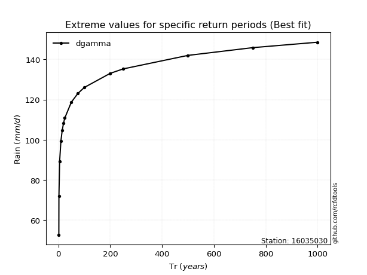</img>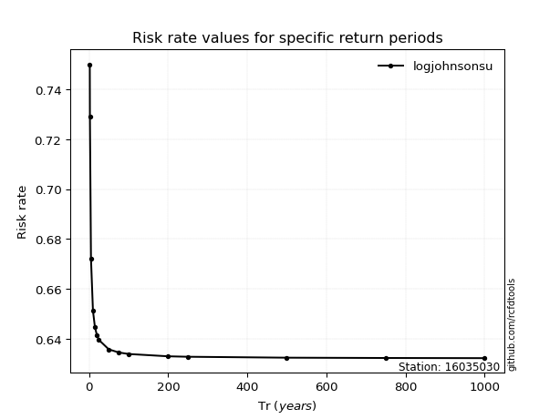</img>

</div>


<sub>**APP DISCLAIMER**: NO WARRANTY - This software is provided by [github.com/rcfdtools](https://github.com/rcfdtools) "as is", without any express or implied warranty, including warranties of merchantability, fitness for a particular purpose, or non-infringement. There is no guarantee that the software will be error-free or operate without interruption. LIMITATION OF LIABILITY - Neither the authors nor copyright holders will be liable for claims or damages arising from the software or its use. You are responsible for determining if the software is appropriate for your use and assume all associated risks, including errors, legal compliance, and data loss. NO PROFESSIONAL ADVICE - The software provides general information and does not offer professional advice. It should not replace consultation with professional advisors.</sub>